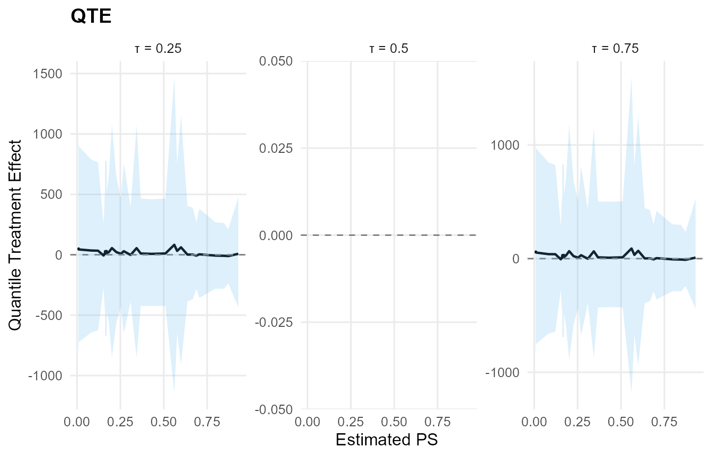

# Umbrella: Custom Models (All-in-One)

## Overview

This vignette collects two end-to-end examples with customized priors
and links:

1.  **Conditional CRP + Amoroso + GPD** with covariates, custom links,
    and tail settings.  
2.  **Causal model (two arms)** with SB backends: Normal (treated) and
    Laplace (control), with covariate-linked locations and custom
    priors.

Both examples use `mtcars` and show the main **user-level functions**
plus **S3 methods** (`print`, `summary`, `plot`, `predict`, `fitted`,
`residuals`, `params`, `ate`, `qte`).

> Note on link priors: both SB and CRP backends currently require
> **normal** priors for link-mode regression coefficients. The requested
> **lognormal** prior for the scale link is therefore shown below as a
> **non-executed** spec block.

## Data

``` r
library(DPmixGPD)

data("mtcars", package = "datasets")
df <- mtcars
y <- df$mpg
X <- df[, c("wt", "hp")]
X <- as.data.frame(X)
```

## Model 1: CRP + Amoroso + GPD (Conditional)

### Specification

- **Backend**: CRP  
- **Kernel**: Amoroso  
- **Covariates**: `wt`, `hp`  
- **Bulk**:
  - `loc`: identity link, normal prior on coefficients
  - `scale`: identity link, normal prior on coefficients (CRP
    restriction)
  - `shape1`: fixed at 1
  - `shape2`: default prior
- **Tail**:
  - `threshold`: exp link, normal prior on coefficients
  - `tail_scale`: exp link (default prior)

``` r
param_specs_amoroso <- list(
  bulk = list(
    loc = list(
      mode = "link",
      link = "identity",
      beta_prior = list(dist = "normal", args = list(mean = 0, sd = 2))
    ),
    scale = list(
      mode = "link",
      link = "identity",
      beta_prior = list(dist = "normal", args = list(mean = 0, sd = 2))
    ),
    shape1 = list(mode = "fixed", value = 1)
  ),
  gpd = list(
    threshold = list(
      mode = "link",
      link = "exp",
      beta_prior = list(dist = "normal", args = list(mean = 0, sd = 0.2))
    ),
    tail_scale = list(
      mode = "link",
      link = "exp"
    )
  )
)
```

``` r
# Requested variant (not runnable): link-mode beta priors must be normal
param_specs_amoroso_requested <- list(
  bulk = list(
    loc = list(
      mode = "link",
      link = "identity",
      beta_prior = list(dist = "normal", args = list(mean = 0, sd = 2))
    ),
    scale = list(
      mode = "link",
      link = "identity",
      beta_prior = list(dist = "lognormal", args = list(meanlog = 0, sdlog = 1))
    ),
    shape1 = list(mode = "fixed", value = 1)
  ),
  gpd = list(
    threshold = list(
      mode = "link",
      link = "exp",
      beta_prior = list(dist = "normal", args = list(mean = 0, sd = 0.2))
    ),
    tail_scale = list(
      mode = "link",
      link = "exp"
    )
  )
)
```

### Build + Run (CRP note)

NIMBLE’s CRP sampler cannot cluster **deterministic** nodes created by
link-mode parameters. As a result, CRP + covariate links are not
runnable with the current backend. We still record the **requested CRP
specification** below (for reference), and then run an **SB-equivalent**
model that supports the same customization and lets this vignette
compile end-to-end.

``` r
# Requested CRP specification (not runnable due to CRP link-mode restriction)
bundle_amoroso_crp <- build_nimble_bundle(
  y = y,
  X = X,
  backend = "crp",
  kernel = "amoroso",
  GPD = TRUE,
  components = 5,
  param_specs = param_specs_amoroso,
  mcmc = mcmc
)
```

``` r
# Runnable SB equivalent (supports link-mode parameters)
bundle_amoroso <- build_nimble_bundle(
  y = y,
  X = X,
  backend = "sb",
  kernel = "amoroso",
  GPD = TRUE,
  components = 5,
  param_specs = param_specs_amoroso,
  mcmc = mcmc
)

fit_amoroso <- run_mcmc_bundle_manual(bundle_amoroso, show_progress = FALSE)
```

### User-Level Functions

``` r
print(bundle_amoroso)
DPmixGPD bundle
<table class="table" style="width: auto !important; margin-left: auto; margin-right: auto;">
 <thead>
  <tr>
   <th style="text-align:center;"> Field </th>
   <th style="text-align:center;"> Value </th>
  </tr>
 </thead>
<tbody>
  <tr>
   <td style="text-align:center;"> Backend </td>
   <td style="text-align:center;"> Stick-Breaking Process </td>
  </tr>
  <tr>
   <td style="text-align:center;"> Kernel </td>
   <td style="text-align:center;"> Amoroso Distribution </td>
  </tr>
  <tr>
   <td style="text-align:center;"> Components </td>
   <td style="text-align:center;"> 5 </td>
  </tr>
  <tr>
   <td style="text-align:center;"> N </td>
   <td style="text-align:center;"> 32 </td>
  </tr>
  <tr>
   <td style="text-align:center;"> X </td>
   <td style="text-align:center;"> YES (P=2) </td>
  </tr>
  <tr>
   <td style="text-align:center;"> GPD </td>
   <td style="text-align:center;"> TRUE </td>
  </tr>
  <tr>
   <td style="text-align:center;"> Epsilon </td>
   <td style="text-align:center;"> 0.025 </td>
  </tr>
</tbody>
</table>
  contains  : code, constants, data, dimensions, inits, monitors
summary(bundle_amoroso)
DPmixGPD bundle summary
<table class="table" style="width: auto !important; margin-left: auto; margin-right: auto;">
 <thead>
  <tr>
   <th style="text-align:center;"> Field </th>
   <th style="text-align:center;"> Value </th>
  </tr>
 </thead>
<tbody>
  <tr>
   <td style="text-align:center;"> Backend </td>
   <td style="text-align:center;"> Stick-Breaking Process </td>
  </tr>
  <tr>
   <td style="text-align:center;"> Kernel </td>
   <td style="text-align:center;"> Amoroso Distribution </td>
  </tr>
  <tr>
   <td style="text-align:center;"> Components </td>
   <td style="text-align:center;"> 5 </td>
  </tr>
  <tr>
   <td style="text-align:center;"> N </td>
   <td style="text-align:center;"> 32 </td>
  </tr>
  <tr>
   <td style="text-align:center;"> X </td>
   <td style="text-align:center;"> YES (P=2) </td>
  </tr>
  <tr>
   <td style="text-align:center;"> GPD </td>
   <td style="text-align:center;"> TRUE </td>
  </tr>
  <tr>
   <td style="text-align:center;"> Epsilon </td>
   <td style="text-align:center;"> 0.025 </td>
  </tr>
</tbody>
</table>
Parameter specification
<table class="table" style="width: auto !important; margin-left: auto; margin-right: auto;">
 <thead>
  <tr>
   <th style="text-align:center;"> block </th>
   <th style="text-align:center;"> parameter </th>
   <th style="text-align:center;"> mode </th>
   <th style="text-align:center;"> level </th>
   <th style="text-align:center;"> prior </th>
   <th style="text-align:center;"> link </th>
   <th style="text-align:center;"> notes </th>
  </tr>
 </thead>
<tbody>
  <tr>
   <td style="text-align:center;"> meta </td>
   <td style="text-align:center;"> backend </td>
   <td style="text-align:center;"> info </td>
   <td style="text-align:center;"> model </td>
   <td style="text-align:center;"> sb </td>
   <td style="text-align:center;">  </td>
   <td style="text-align:center;">  </td>
  </tr>
  <tr>
   <td style="text-align:center;"> meta </td>
   <td style="text-align:center;"> kernel </td>
   <td style="text-align:center;"> info </td>
   <td style="text-align:center;"> model </td>
   <td style="text-align:center;"> amoroso </td>
   <td style="text-align:center;">  </td>
   <td style="text-align:center;">  </td>
  </tr>
  <tr>
   <td style="text-align:center;"> meta </td>
   <td style="text-align:center;"> components </td>
   <td style="text-align:center;"> info </td>
   <td style="text-align:center;"> model </td>
   <td style="text-align:center;"> 5 </td>
   <td style="text-align:center;">  </td>
   <td style="text-align:center;">  </td>
  </tr>
  <tr>
   <td style="text-align:center;"> meta </td>
   <td style="text-align:center;"> N </td>
   <td style="text-align:center;"> info </td>
   <td style="text-align:center;"> model </td>
   <td style="text-align:center;"> 32 </td>
   <td style="text-align:center;">  </td>
   <td style="text-align:center;">  </td>
  </tr>
  <tr>
   <td style="text-align:center;"> meta </td>
   <td style="text-align:center;"> P </td>
   <td style="text-align:center;"> info </td>
   <td style="text-align:center;"> model </td>
   <td style="text-align:center;"> 2 </td>
   <td style="text-align:center;">  </td>
   <td style="text-align:center;">  </td>
  </tr>
  <tr>
   <td style="text-align:center;"> concentration </td>
   <td style="text-align:center;"> alpha </td>
   <td style="text-align:center;"> dist </td>
   <td style="text-align:center;"> scalar </td>
   <td style="text-align:center;"> gamma(shape=1, rate=1) </td>
   <td style="text-align:center;">  </td>
   <td style="text-align:center;"> stochastic concentration </td>
  </tr>
  <tr>
   <td style="text-align:center;"> bulk </td>
   <td style="text-align:center;"> loc </td>
   <td style="text-align:center;"> link </td>
   <td style="text-align:center;"> regression </td>
   <td style="text-align:center;"> beta_loc ~ normal(mean=0, sd=2) </td>
   <td style="text-align:center;"> identity </td>
   <td style="text-align:center;"> beta_loc is 5 x 2 (components x P) </td>
  </tr>
  <tr>
   <td style="text-align:center;"> bulk </td>
   <td style="text-align:center;"> scale </td>
   <td style="text-align:center;"> link </td>
   <td style="text-align:center;"> regression </td>
   <td style="text-align:center;"> beta_scale ~ normal(mean=0, sd=2) </td>
   <td style="text-align:center;"> identity </td>
   <td style="text-align:center;"> beta_scale is 5 x 2 (components x P) </td>
  </tr>
  <tr>
   <td style="text-align:center;"> bulk </td>
   <td style="text-align:center;"> shape1 </td>
   <td style="text-align:center;"> fixed </td>
   <td style="text-align:center;"> component (1:5) </td>
   <td style="text-align:center;"> 1 </td>
   <td style="text-align:center;">  </td>
   <td style="text-align:center;">  </td>
  </tr>
  <tr>
   <td style="text-align:center;"> bulk </td>
   <td style="text-align:center;"> shape2 </td>
   <td style="text-align:center;"> dist </td>
   <td style="text-align:center;"> component (1:5) </td>
   <td style="text-align:center;"> gamma(shape=2, rate=1) </td>
   <td style="text-align:center;">  </td>
   <td style="text-align:center;"> iid across components </td>
  </tr>
  <tr>
   <td style="text-align:center;"> gpd </td>
   <td style="text-align:center;"> threshold </td>
   <td style="text-align:center;"> link </td>
   <td style="text-align:center;"> observation (1:N) </td>
   <td style="text-align:center;"> beta_threshold ~ normal(mean=0, sd=0.2) </td>
   <td style="text-align:center;"> exp </td>
   <td style="text-align:center;"> beta_threshold is length P=2 </td>
  </tr>
  <tr>
   <td style="text-align:center;"> gpd </td>
   <td style="text-align:center;"> tail_scale </td>
   <td style="text-align:center;"> link </td>
   <td style="text-align:center;"> observation (1:N) </td>
   <td style="text-align:center;"> beta_tail_scale ~ normal(mean=0, sd=0.5) </td>
   <td style="text-align:center;"> exp </td>
   <td style="text-align:center;"> beta_tail_scale is length P=2; tail_scale[i] deterministic </td>
  </tr>
  <tr>
   <td style="text-align:center;"> gpd </td>
   <td style="text-align:center;"> tail_shape </td>
   <td style="text-align:center;"> dist </td>
   <td style="text-align:center;"> scalar </td>
   <td style="text-align:center;"> normal(mean=0, sd=0.2) </td>
   <td style="text-align:center;">  </td>
   <td style="text-align:center;">  </td>
  </tr>
</tbody>
</table>
Monitors
  n = 11 
  alpha, w[1:5], z[1:32], beta_loc[1:5,1:2], beta_scale[1:5,1:2], shape1[1:5], shape2[1:5], threshold[1:32], beta_threshold[1:2], beta_tail_scale[1:2], tail_shape
```

``` r
print(fit_amoroso)
MixGPD fit | backend: Stick-Breaking Process | kernel: Amoroso Distribution | GPD tail: TRUE
n = 32 | components = 5 | epsilon = 0.025
MCMC: niter=600, nburnin=150, thin=2, nchains=1 
Fit
Use summary() for posterior summaries; plot() for diagnostics; predict() for predictions.
summary(fit_amoroso)
MixGPD summary | backend: Stick-Breaking Process | kernel: Amoroso Distribution | GPD tail: TRUE | epsilon: 0.025
n = 32 | components = 5
Summary
Initial components: 5 | Components after truncation: 1

WAIC: 289.883
lppd: -143.126 | pWAIC: 1.816

Summary table
<table class="table" style="width: auto !important; margin-left: auto; margin-right: auto;">
 <thead>
  <tr>
   <th style="text-align:center;"> parameter </th>
   <th style="text-align:center;"> mean </th>
   <th style="text-align:center;"> sd </th>
   <th style="text-align:center;"> q0.025 </th>
   <th style="text-align:center;"> q0.500 </th>
   <th style="text-align:center;"> q0.975 </th>
   <th style="text-align:center;"> ess </th>
  </tr>
 </thead>
<tbody>
  <tr>
   <td style="text-align:center;"> weights[1] </td>
   <td style="text-align:center;"> 0.887 </td>
   <td style="text-align:center;"> 0.162 </td>
   <td style="text-align:center;"> 0.5 </td>
   <td style="text-align:center;"> 1 </td>
   <td style="text-align:center;"> 1 </td>
   <td style="text-align:center;"> 8.127 </td>
  </tr>
  <tr>
   <td style="text-align:center;"> alpha </td>
   <td style="text-align:center;"> 0.571 </td>
   <td style="text-align:center;"> 0.398 </td>
   <td style="text-align:center;"> 0.083 </td>
   <td style="text-align:center;"> 0.479 </td>
   <td style="text-align:center;"> 1.405 </td>
   <td style="text-align:center;"> 5.822 </td>
  </tr>
  <tr>
   <td style="text-align:center;"> beta_loc[1, 1] </td>
   <td style="text-align:center;"> 0.233 </td>
   <td style="text-align:center;"> 2.174 </td>
   <td style="text-align:center;"> -3.944 </td>
   <td style="text-align:center;"> 0.256 </td>
   <td style="text-align:center;"> 4.638 </td>
   <td style="text-align:center;"> 93.618 </td>
  </tr>
  <tr>
   <td style="text-align:center;"> beta_loc[2, 1] </td>
   <td style="text-align:center;"> -0.014 </td>
   <td style="text-align:center;"> 1.928 </td>
   <td style="text-align:center;"> -3.591 </td>
   <td style="text-align:center;"> -0.05 </td>
   <td style="text-align:center;"> 3.526 </td>
   <td style="text-align:center;"> 87.763 </td>
  </tr>
  <tr>
   <td style="text-align:center;"> beta_loc[3, 1] </td>
   <td style="text-align:center;"> -0.348 </td>
   <td style="text-align:center;"> 2.164 </td>
   <td style="text-align:center;"> -4.435 </td>
   <td style="text-align:center;"> -0.446 </td>
   <td style="text-align:center;"> 3.641 </td>
   <td style="text-align:center;"> 80.98 </td>
  </tr>
  <tr>
   <td style="text-align:center;"> beta_loc[4, 1] </td>
   <td style="text-align:center;"> 0.405 </td>
   <td style="text-align:center;"> 2.072 </td>
   <td style="text-align:center;"> -3.342 </td>
   <td style="text-align:center;"> 0.292 </td>
   <td style="text-align:center;"> 3.974 </td>
   <td style="text-align:center;"> 111.196 </td>
  </tr>
  <tr>
   <td style="text-align:center;"> beta_loc[5, 1] </td>
   <td style="text-align:center;"> -0.134 </td>
   <td style="text-align:center;"> 1.923 </td>
   <td style="text-align:center;"> -3.755 </td>
   <td style="text-align:center;"> -0.215 </td>
   <td style="text-align:center;"> 3.335 </td>
   <td style="text-align:center;"> 185.091 </td>
  </tr>
  <tr>
   <td style="text-align:center;"> beta_loc[1, 2] </td>
   <td style="text-align:center;"> 1.05 </td>
   <td style="text-align:center;"> 1.191 </td>
   <td style="text-align:center;"> -1.062 </td>
   <td style="text-align:center;"> 0.903 </td>
   <td style="text-align:center;"> 3.649 </td>
   <td style="text-align:center;"> 34.465 </td>
  </tr>
  <tr>
   <td style="text-align:center;"> beta_loc[2, 2] </td>
   <td style="text-align:center;"> 0.622 </td>
   <td style="text-align:center;"> 1.659 </td>
   <td style="text-align:center;"> -2.142 </td>
   <td style="text-align:center;"> 0.507 </td>
   <td style="text-align:center;"> 4.138 </td>
   <td style="text-align:center;"> 76.334 </td>
  </tr>
  <tr>
   <td style="text-align:center;"> beta_loc[3, 2] </td>
   <td style="text-align:center;"> 0.451 </td>
   <td style="text-align:center;"> 1.844 </td>
   <td style="text-align:center;"> -3.082 </td>
   <td style="text-align:center;"> 0.677 </td>
   <td style="text-align:center;"> 3.426 </td>
   <td style="text-align:center;"> 63.533 </td>
  </tr>
  <tr>
   <td style="text-align:center;"> beta_loc[4, 2] </td>
   <td style="text-align:center;"> -0.063 </td>
   <td style="text-align:center;"> 1.904 </td>
   <td style="text-align:center;"> -3.762 </td>
   <td style="text-align:center;"> 0.133 </td>
   <td style="text-align:center;"> 3.416 </td>
   <td style="text-align:center;"> 93.672 </td>
  </tr>
  <tr>
   <td style="text-align:center;"> beta_loc[5, 2] </td>
   <td style="text-align:center;"> 0.601 </td>
   <td style="text-align:center;"> 1.904 </td>
   <td style="text-align:center;"> -3.487 </td>
   <td style="text-align:center;"> 0.612 </td>
   <td style="text-align:center;"> 4.384 </td>
   <td style="text-align:center;"> 136.447 </td>
  </tr>
  <tr>
   <td style="text-align:center;"> beta_scale[1, 1] </td>
   <td style="text-align:center;"> 0.216 </td>
   <td style="text-align:center;"> 1.842 </td>
   <td style="text-align:center;"> -3.195 </td>
   <td style="text-align:center;"> -0.029 </td>
   <td style="text-align:center;"> 4.315 </td>
   <td style="text-align:center;"> 118.789 </td>
  </tr>
  <tr>
   <td style="text-align:center;"> beta_scale[2, 1] </td>
   <td style="text-align:center;"> -0.236 </td>
   <td style="text-align:center;"> 2.016 </td>
   <td style="text-align:center;"> -4.741 </td>
   <td style="text-align:center;"> -0.147 </td>
   <td style="text-align:center;"> 3.515 </td>
   <td style="text-align:center;"> 99.498 </td>
  </tr>
  <tr>
   <td style="text-align:center;"> beta_scale[3, 1] </td>
   <td style="text-align:center;"> -0.263 </td>
   <td style="text-align:center;"> 2.004 </td>
   <td style="text-align:center;"> -4.147 </td>
   <td style="text-align:center;"> -0.399 </td>
   <td style="text-align:center;"> 4.233 </td>
   <td style="text-align:center;"> 72.565 </td>
  </tr>
  <tr>
   <td style="text-align:center;"> beta_scale[4, 1] </td>
   <td style="text-align:center;"> -0.384 </td>
   <td style="text-align:center;"> 2.089 </td>
   <td style="text-align:center;"> -4.604 </td>
   <td style="text-align:center;"> -0.269 </td>
   <td style="text-align:center;"> 3.131 </td>
   <td style="text-align:center;"> 90.501 </td>
  </tr>
  <tr>
   <td style="text-align:center;"> beta_scale[5, 1] </td>
   <td style="text-align:center;"> 0.137 </td>
   <td style="text-align:center;"> 1.913 </td>
   <td style="text-align:center;"> -3.345 </td>
   <td style="text-align:center;"> 0.196 </td>
   <td style="text-align:center;"> 4.024 </td>
   <td style="text-align:center;"> 71.448 </td>
  </tr>
  <tr>
   <td style="text-align:center;"> beta_scale[1, 2] </td>
   <td style="text-align:center;"> 1.287 </td>
   <td style="text-align:center;"> 1.703 </td>
   <td style="text-align:center;"> -2.587 </td>
   <td style="text-align:center;"> 1.228 </td>
   <td style="text-align:center;"> 5.205 </td>
   <td style="text-align:center;"> 62.151 </td>
  </tr>
  <tr>
   <td style="text-align:center;"> beta_scale[2, 2] </td>
   <td style="text-align:center;"> 0.766 </td>
   <td style="text-align:center;"> 1.756 </td>
   <td style="text-align:center;"> -2.976 </td>
   <td style="text-align:center;"> 0.833 </td>
   <td style="text-align:center;"> 3.866 </td>
   <td style="text-align:center;"> 48.742 </td>
  </tr>
  <tr>
   <td style="text-align:center;"> beta_scale[3, 2] </td>
   <td style="text-align:center;"> 0.328 </td>
   <td style="text-align:center;"> 2.243 </td>
   <td style="text-align:center;"> -4.384 </td>
   <td style="text-align:center;"> 0.703 </td>
   <td style="text-align:center;"> 4.556 </td>
   <td style="text-align:center;"> 58.72 </td>
  </tr>
  <tr>
   <td style="text-align:center;"> beta_scale[4, 2] </td>
   <td style="text-align:center;"> 0.033 </td>
   <td style="text-align:center;"> 1.864 </td>
   <td style="text-align:center;"> -3.245 </td>
   <td style="text-align:center;"> 0.111 </td>
   <td style="text-align:center;"> 3.689 </td>
   <td style="text-align:center;"> 98.23 </td>
  </tr>
  <tr>
   <td style="text-align:center;"> beta_scale[5, 2] </td>
   <td style="text-align:center;"> -0.185 </td>
   <td style="text-align:center;"> 1.938 </td>
   <td style="text-align:center;"> -3.569 </td>
   <td style="text-align:center;"> -0.354 </td>
   <td style="text-align:center;"> 3.827 </td>
   <td style="text-align:center;"> 108.64 </td>
  </tr>
  <tr>
   <td style="text-align:center;"> beta_tail_scale[1] </td>
   <td style="text-align:center;"> 0.874 </td>
   <td style="text-align:center;"> 0.093 </td>
   <td style="text-align:center;"> 0.683 </td>
   <td style="text-align:center;"> 0.87 </td>
   <td style="text-align:center;"> 1.037 </td>
   <td style="text-align:center;"> 15.682 </td>
  </tr>
  <tr>
   <td style="text-align:center;"> beta_tail_scale[2] </td>
   <td style="text-align:center;"> -0 </td>
   <td style="text-align:center;"> 0.001 </td>
   <td style="text-align:center;"> -0.002 </td>
   <td style="text-align:center;"> 0 </td>
   <td style="text-align:center;"> 0.002 </td>
   <td style="text-align:center;"> 2.349 </td>
  </tr>
  <tr>
   <td style="text-align:center;"> beta_threshold[1] </td>
   <td style="text-align:center;"> 0.098 </td>
   <td style="text-align:center;"> 0.222 </td>
   <td style="text-align:center;"> -0.269 </td>
   <td style="text-align:center;"> 0.068 </td>
   <td style="text-align:center;"> 0.431 </td>
   <td style="text-align:center;"> 10.477 </td>
  </tr>
  <tr>
   <td style="text-align:center;"> beta_threshold[2] </td>
   <td style="text-align:center;"> -0.076 </td>
   <td style="text-align:center;"> 0.125 </td>
   <td style="text-align:center;"> -0.388 </td>
   <td style="text-align:center;"> 0 </td>
   <td style="text-align:center;"> 0.008 </td>
   <td style="text-align:center;"> 11.704 </td>
  </tr>
  <tr>
   <td style="text-align:center;"> tail_shape </td>
   <td style="text-align:center;"> 0.313 </td>
   <td style="text-align:center;"> 0.131 </td>
   <td style="text-align:center;"> 0.071 </td>
   <td style="text-align:center;"> 0.318 </td>
   <td style="text-align:center;"> 0.566 </td>
   <td style="text-align:center;"> 67.33 </td>
  </tr>
  <tr>
   <td style="text-align:center;"> shape1[1] </td>
   <td style="text-align:center;"> 1 </td>
   <td style="text-align:center;"> 0 </td>
   <td style="text-align:center;"> 1 </td>
   <td style="text-align:center;"> 1 </td>
   <td style="text-align:center;"> 1 </td>
   <td style="text-align:center;"> 0 </td>
  </tr>
  <tr>
   <td style="text-align:center;"> shape2[1] </td>
   <td style="text-align:center;"> 2.73 </td>
   <td style="text-align:center;"> 1.891 </td>
   <td style="text-align:center;"> 0.162 </td>
   <td style="text-align:center;"> 2.226 </td>
   <td style="text-align:center;"> 7.515 </td>
   <td style="text-align:center;"> 24.347 </td>
  </tr>
</tbody>
</table>
```

### S3 Methods (Fit)

``` r
tryCatch(
  plot(fit_amoroso, family = "trace"),
  error = function(e) {
    message("Plotting 'fit_amoroso' with family = 'trace' failed: ", conditionMessage(e))
  }
)
```

``` r
pred_mean <- predict(fit_amoroso, x = X, type = "mean", cred.level = 0.90, interval = "credible")
pred_q90 <- predict(fit_amoroso, x = X, type = "quantile", index = 0.90, cred.level = 0.90, interval = "credible")
head(pred_mean$fit)
  estimate   lower upper
1    10.44  2.1136  31.5
2    13.19  4.3880  35.3
3     7.13  0.9482  25.9
4    19.71  9.6634  47.5
5    21.76 -0.0165  57.1
6    25.74  6.8658  52.5
head(pred_q90$fit)
  estimate index id lower upper
1     33.6   0.9  1  24.8  48.1
2     42.1   0.9  2  29.5  61.0
3     25.9   0.9  3  19.7  36.8
4     57.0   0.9  4  37.8  83.4
5     68.9   0.9  5  43.9 104.6
6     70.9   0.9  6  44.6 107.0
```

``` r
fvals <- fitted(fit_amoroso, type = "mean", level = 0.90)
head(fvals)
    fit lower upper residuals
1  9.77 2.624  31.5     11.23
2 13.56 0.917  38.5      7.44
3  7.16 0.364  26.1     15.64
4 19.59 7.485  46.2      1.81
5 21.78 1.763  60.3     -3.08
6 25.20 9.714  57.3     -7.10
summary(fvals$residuals)
    Min.  1st Qu.   Median     Mean  3rd Qu.     Max. 
-153.006  -10.219   -0.635  -10.438   11.268   29.688 
```

``` r
raw_resid <- residuals(fit_amoroso, type = "raw")
head(raw_resid)
[1] 11.23  7.44 15.64  1.81 -3.08 -7.10
```

``` r
p <- params(fit_amoroso)
names(p)
[1] "alpha"           "w"               "beta_loc"        "beta_scale"     
[5] "shape1"          "shape2"          "beta_threshold"  "beta_tail_scale"
[9] "tail_shape"     
```

## Model 2: Causal (SB Normal vs SB Laplace)

### Specification

- **Backend**: SB (both arms)  
- **Treated arm (T=1)**: Normal kernel
  - Location: identity link, Gaussian prior  
  - SD: Inverse-Gamma prior  
- **Control arm (T=0)**: Laplace kernel
  - Location: identity link, Gaussian prior  
  - Scale: Gamma prior

``` r
X_causal <- df[, c("wt", "hp", "qsec", "cyl")]
X_causal <- as.data.frame(X_causal)
T_ind <- df$am

param_specs_causal <- list(
  trt = list(
    bulk = list(
      mean = list(
        mode = "link",
        link = "identity",
        beta_prior = list(dist = "normal", args = list(mean = 0, sd = 2))
      ),
      sd = list(
        mode = "dist",
        dist = "invgamma",
        args = list(shape = 2, scale = 1)
      )
    )
  ),
  con = list(
    bulk = list(
      location = list(
        mode = "link",
        link = "identity",
        beta_prior = list(dist = "normal", args = list(mean = 0, sd = 2))
      ),
      scale = list(
        mode = "dist",
        dist = "gamma",
        args = list(shape = 2, rate = 1)
      )
    )
  )
)
```

### Build + Run

``` r
causal_bundle <- build_causal_bundle(
  y = y,
  X = X_causal,
  T = T_ind,
  backend = "sb",
  kernel = c("normal", "laplace"),
  GPD = FALSE,
  components = 5,
  param_specs = param_specs_causal,
  PS = "logit",
  mcmc_outcome = mcmc,
  mcmc_ps = mcmc
)

causal_fit <- run_mcmc_causal(causal_bundle, show_progress = FALSE)
```

### User-Level Functions

``` r
print(causal_bundle)
DPmixGPD causal bundle
PS model: Bayesian logit (T | X) 
<table class="table" style="width: auto !important; margin-left: auto; margin-right: auto;">
 <thead>
  <tr>
   <th style="text-align:center;"> Field </th>
   <th style="text-align:center;"> Treated </th>
   <th style="text-align:center;"> Control </th>
  </tr>
 </thead>
<tbody>
  <tr>
   <td style="text-align:center;"> Backend </td>
   <td style="text-align:center;"> Stick-Breaking Process </td>
   <td style="text-align:center;"> Stick-Breaking Process </td>
  </tr>
  <tr>
   <td style="text-align:center;"> Kernel </td>
   <td style="text-align:center;"> normal </td>
   <td style="text-align:center;"> laplace </td>
  </tr>
  <tr>
   <td style="text-align:center;"> Components </td>
   <td style="text-align:center;"> 5 </td>
   <td style="text-align:center;"> 5 </td>
  </tr>
  <tr>
   <td style="text-align:center;"> GPD tail </td>
   <td style="text-align:center;"> FALSE </td>
   <td style="text-align:center;"> FALSE </td>
  </tr>
  <tr>
   <td style="text-align:center;"> Epsilon </td>
   <td style="text-align:center;"> 0.025 </td>
   <td style="text-align:center;"> 0.025 </td>
  </tr>
</tbody>
</table>
Outcome PS included: TRUE 
n (control) = 19 | n (treated) = 13 
summary(causal_bundle)
DPmixGPD causal bundle summary
DPmixGPD causal bundle
PS model: Bayesian logit (T | X) 
<table class="table" style="width: auto !important; margin-left: auto; margin-right: auto;">
 <thead>
  <tr>
   <th style="text-align:center;"> Field </th>
   <th style="text-align:center;"> Treated </th>
   <th style="text-align:center;"> Control </th>
  </tr>
 </thead>
<tbody>
  <tr>
   <td style="text-align:center;"> Backend </td>
   <td style="text-align:center;"> Stick-Breaking Process </td>
   <td style="text-align:center;"> Stick-Breaking Process </td>
  </tr>
  <tr>
   <td style="text-align:center;"> Kernel </td>
   <td style="text-align:center;"> normal </td>
   <td style="text-align:center;"> laplace </td>
  </tr>
  <tr>
   <td style="text-align:center;"> Components </td>
   <td style="text-align:center;"> 5 </td>
   <td style="text-align:center;"> 5 </td>
  </tr>
  <tr>
   <td style="text-align:center;"> GPD tail </td>
   <td style="text-align:center;"> FALSE </td>
   <td style="text-align:center;"> FALSE </td>
  </tr>
  <tr>
   <td style="text-align:center;"> Epsilon </td>
   <td style="text-align:center;"> 0.025 </td>
   <td style="text-align:center;"> 0.025 </td>
  </tr>
</tbody>
</table>
Outcome PS included: TRUE 
n (control) = 19 | n (treated) = 13 
```

``` r
print(causal_fit)
DPmixGPD causal fit
PS model: Bayesian logit (T | X) 
Outcome (treated): backend = sb | kernel = normal 
Outcome (control): backend = sb | kernel = laplace 
GPD tail (treated/control): FALSE / FALSE 
summary(causal_fit)
-- PS fit --
DPmixGPD PS fit
model: logit 

-- Outcome fits --
[control]
MixGPD fit | backend: Stick-Breaking Process | kernel: Laplace Distribution | GPD tail: FALSE
n = 19 | components = 5 | epsilon = 0.025
MCMC: niter=600, nburnin=150, thin=2, nchains=1 
Fit
Use summary() for posterior summaries; plot() for diagnostics; predict() for predictions.

[treated]
MixGPD fit | backend: Stick-Breaking Process | kernel: Normal Distribution | GPD tail: FALSE
n = 13 | components = 5 | epsilon = 0.025
MCMC: niter=600, nburnin=150, thin=2, nchains=1 
Fit
Use summary() for posterior summaries; plot() for diagnostics; predict() for predictions.
```

### S3 Methods (Causal)

``` r
try(plot(causal_fit, family = "trace"), silent = TRUE)
```

``` r
pred_causal_mean <- predict(causal_fit, x = X_causal, type = "mean", interval = "credible")
head(pred_causal_mean)
                     ps estimate lower upper
Mazda RX4         0.510    10.28  -421   454
Mazda RX4 Wag     0.367    10.10  -422   455
Datsun 710        0.667     1.32  -366   376
Hornet 4 Drive    0.253     7.38  -427   452
Hornet Sportabout 0.270    29.57  -645   736
Valiant           0.162     5.47  -411   430
```

``` r
ate_result <- ate(causal_fit, interval = "credible", nsim_mean = 50)
print(ate_result)
ATE (Average Treatment Effect)
  Prediction points: 32
  Conditional (covariates): YES
  Propensity score used: YES
  PS scale: logit
  Posterior mean draws: 50
  Credible interval: credible (95%)

ATE estimates (treated - control):
<table class="table" style="width: auto !important; margin-left: auto; margin-right: auto;">
 <thead>
  <tr>
   <th style="text-align:center;"> id </th>
   <th style="text-align:center;"> estimate </th>
   <th style="text-align:center;"> lower </th>
   <th style="text-align:center;"> upper </th>
  </tr>
 </thead>
<tbody>
  <tr>
   <td style="text-align:center;"> 1 </td>
   <td style="text-align:center;"> 10.281 </td>
   <td style="text-align:center;"> -422.106 </td>
   <td style="text-align:center;"> 455.518 </td>
  </tr>
  <tr>
   <td style="text-align:center;"> 2 </td>
   <td style="text-align:center;"> 10.103 </td>
   <td style="text-align:center;"> -423.415 </td>
   <td style="text-align:center;"> 455.855 </td>
  </tr>
  <tr>
   <td style="text-align:center;"> 3 </td>
   <td style="text-align:center;"> 1.352 </td>
   <td style="text-align:center;"> -368.406 </td>
   <td style="text-align:center;"> 378.089 </td>
  </tr>
  <tr>
   <td style="text-align:center;"> 4 </td>
   <td style="text-align:center;"> 7.376 </td>
   <td style="text-align:center;"> -429.805 </td>
   <td style="text-align:center;"> 453.906 </td>
  </tr>
  <tr>
   <td style="text-align:center;"> 5 </td>
   <td style="text-align:center;"> 29.573 </td>
   <td style="text-align:center;"> -645.528 </td>
   <td style="text-align:center;"> 737.107 </td>
  </tr>
  <tr>
   <td style="text-align:center;"> 6 </td>
   <td style="text-align:center;"> 5.461 </td>
   <td style="text-align:center;"> -414.346 </td>
   <td style="text-align:center;"> 432.494 </td>
  </tr>
</tbody>
</table>... (26 more rows)
summary(ate_result)
ATE Summary
================================================== 
Prediction points: 32
Conditional: YES | PS used: YES
Posterior mean draws: 50
Interval: credible (95%)

Model specification:
  Backend (trt/con): sb / sb
  Kernel (trt/con): normal / laplace
  GPD tail (trt/con): NO / NO

ATE statistics:
  Mean: 19.688 | Median: 12.723
  Range: [-11.387, 77.007]
  SD: 22.425

Credible interval width:
  Mean: 1164.747 | Median: 983.302
  Range: [441.91, 2619.232]
```

``` r
qte_result <- qte(causal_fit, probs = c(0.25, 0.5, 0.75), interval = "credible")
# Plotting may fail on some graphics devices (e.g., non-interactive or CI environments),
# so errors are intentionally suppressed to ensure the vignette renders successfully.
try({
  plot(ate_result, type = "effect")
  plot(qte_result, type = "effect")
}, silent = TRUE)
```


