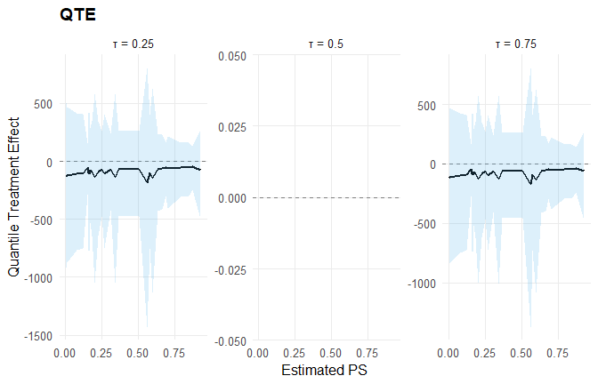

# Customization: Build NIMBLE Models from Scratch

## Overview

This vignette shows how to **build NIMBLE models from scratch** using
the exported `d* / p* / q* / r*` nimbleFunctions in **DPmixGPD**, then
walks through the full pipeline **(data -\> constants -\> inits -\> code
-\> compile -\> run -\> extract)**.

We cover three workflows:

1.  **SB case**: manual stick-breaking Normal mixture using `dNormMix`.
2.  **CRP + GPD case**: build a CRP model with a GPD tail using DPmixGPD
    codegen, then run the manual NIMBLE steps explicitly.
3.  **Causal model**: build a causal model and use S3 methods for
    inference.

> We use fast MCMC settings to keep this vignette lightweight. Increase
> the iterations if you want more stable posterior summaries.

## Data

``` r
data("mtcars", package = "datasets")

df <- mtcars
y <- df$mpg
X <- df[, c("wt", "hp")]
X <- as.data.frame(X)
```

## SB Case: Manual Stick-Breaking Model with `dNormMix`

This section shows a **from-scratch** SB model that uses the exported
`dNormMix` nimbleFunction directly as a likelihood. We register it as a
custom NIMBLE distribution and then build the model step by step.

### Note on custom likelihoods

To keep the model fully NIMBLE-compatible without registering a custom
distribution, we use a **zeros-trick** likelihood based on the exported
`dNormMix` nimbleFunction.

### Constants, data, and inits

``` r
N <- length(y)
K <- 3

constants_sb <- list(N = N, K = K, C = 1000)
data_sb <- list(y = y, zeros = rep(0, N))

inits_sb <- function() {
  list(
    alpha = 1,
    v = c(rep(0.5, K - 1), 1),
    mu = rnorm(K, mean(y), 1),
    sigma = rep(sd(y), K)
  )
}
```

### NIMBLE code

``` r
code_sb <- nimble::nimbleCode({
  alpha ~ dgamma(1, 1)

  for (k in 1:(K - 1)) {
    v[k] ~ dbeta(1, alpha)
  }
  v[K] <- 1

  w[1] <- v[1]
  for (k in 2:K) {
    w[k] <- v[k] * prod(1 - v[1:(k - 1)])
  }

  for (k in 1:K) {
    mu[k] ~ dnorm(0, sd = 5)
    sigma[k] ~ dunif(0.1, 5)
  }

  for (i in 1:N) {
    loglik[i] <- dNormMix(y[i], w[1:K], mu[1:K], sigma[1:K], log = 1)
    zeros[i] ~ dpois(-loglik[i] + C)
  }
})
```

### Compile and run (manual)

``` r
Rmodel_sb <- nimble::nimbleModel(
  code = code_sb,
  constants = constants_sb,
  data = data_sb,
  inits = inits_sb()
)

conf_sb <- nimble::configureMCMC(
  Rmodel_sb,
  monitors = c("alpha", "v", "w", "mu", "sigma")
)

Rmcmc_sb <- nimble::buildMCMC(conf_sb)
Cmodel_sb <- nimble::compileNimble(Rmodel_sb, showCompilerOutput = FALSE)
Cmcmc_sb <- nimble::compileNimble(Rmcmc_sb, project = Rmodel_sb, showCompilerOutput = FALSE)

samples_sb <- nimble::runMCMC(
  Cmcmc_sb,
  niter = mcmc$niter,
  nburnin = mcmc$nburnin,
  thin = mcmc$thin,
  nchains = mcmc$nchains,
  setSeed = mcmc$seed
)
```

### Sample extraction

``` r
head(samples_sb[, 1:min(6, ncol(samples_sb))])
#>      alpha mu[1] mu[2] mu[3] sigma[1] sigma[2]
#> [1,] 0.334  19.8  7.67 -12.3     4.97     4.74
#> [2,] 0.334  21.2  6.94 -12.5     4.97     3.09
#> [3,] 0.208  20.7  7.85 -12.8     4.97     3.90
#> [4,] 0.208  18.7  8.22 -15.7     4.97     1.89
#> [5,] 0.200  20.4  6.55 -14.0     4.90     4.43
#> [6,] 0.200  19.7  6.78 -12.9     4.90     3.60
summary(samples_sb[, c("alpha", "mu[1]", "mu[2]", "mu[3]")])
#>      alpha            mu[1]          mu[2]            mu[3]        
#>  Min.   :0.0152   Min.   :17.8   Min.   :-10.52   Min.   :-15.720  
#>  1st Qu.:0.2478   1st Qu.:18.9   1st Qu.: -1.71   1st Qu.: -5.422  
#>  Median :0.3672   Median :19.5   Median :  1.53   Median : -0.872  
#>  Mean   :0.5371   Mean   :19.5   Mean   :  2.33   Mean   : -1.188  
#>  3rd Qu.:0.6679   3rd Qu.:20.1   3rd Qu.:  6.27   3rd Qu.:  3.185  
#>  Max.   :2.1702   Max.   :21.8   Max.   : 15.12   Max.   : 12.389
```

### Optional: S3 methods via the DPmixGPD bundle

For comparison, we build a **bundle** for the same SB Normal mixture and
use DPmixGPD’s S3 methods for posterior inference.

``` r
bundle_sb <- build_nimble_bundle(
  y = y,
  X = NULL,
  backend = "sb",
  kernel = "normal",
  GPD = FALSE,
  components = K,
  mcmc = mcmc
)

fit_sb <- run_mcmc_bundle_manual(bundle_sb, show_progress = FALSE)
```

``` r
print(bundle_sb)
#> DPmixGPD bundle
#>       Field                  Value
#>     Backend Stick-Breaking Process
#>      Kernel    Normal Distribution
#>  Components                      3
#>           N                     32
#>           X                     NO
#>         GPD                  FALSE
#>     Epsilon                  0.025
#> 
#>   contains  : code, constants, data, dimensions, inits, monitors
summary(bundle_sb)
#> DPmixGPD bundle summary
#>       Field                  Value
#>     Backend Stick-Breaking Process
#>      Kernel    Normal Distribution
#>  Components                      3
#>           N                     32
#>           X                     NO
#>         GPD                  FALSE
#>     Epsilon                  0.025
#> 
#> Parameter specification
#>          block  parameter mode           level                  prior link
#>           meta    backend info           model                     sb     
#>           meta     kernel info           model                 normal     
#>           meta components info           model                      3     
#>           meta          N info           model                     32     
#>           meta          P info           model                      0     
#>  concentration      alpha dist          scalar gamma(shape=1, rate=1)     
#>           bulk       mean dist component (1:3)   normal(mean=0, sd=5)     
#>           bulk         sd dist component (1:3) gamma(shape=2, rate=1)     
#>                     notes
#>                          
#>                          
#>                          
#>                          
#>                          
#>  stochastic concentration
#>     iid across components
#>     iid across components
#> 
#> Monitors
#>   n = 5 
#>   alpha, w[1:3], z[1:32], mean[1:3], sd[1:3]
```

``` r
print(fit_sb)
#> MixGPD fit | backend: Stick-Breaking Process | kernel: Normal Distribution | GPD tail: FALSE
#> n = 32 | components = 3 | epsilon = 0.025
#> MCMC: niter=600, nburnin=150, thin=2, nchains=1 
#> Fit
#> Use summary() for posterior summaries; plot() for diagnostics; predict() for predictions.
summary(fit_sb)
#> MixGPD summary | backend: Stick-Breaking Process | kernel: Normal Distribution | GPD tail: FALSE | epsilon: 0.025
#> n = 32 | components = 3
#> Summary
#> Initial components: 3 | Components after truncation: 1
#> 
#> WAIC: 206.205
#> lppd: -96.539 | pWAIC: 6.564
#> 
#> Summary table
#>   parameter   mean    sd q0.025 q0.500 q0.975     ess
#>  weights[1]  0.964 0.065    0.8      1      1    3.52
#>       alpha   0.71 0.507  0.086  0.597  1.979  39.228
#>     mean[1] 19.309 1.085 17.274 19.421 21.381 128.073
#>       sd[1]  0.031 0.008  0.017  0.031  0.047 180.677
```

``` r
try(plot(fit_sb, family = "trace"), silent = TRUE)
```

``` r
pred_sb <- predict(fit_sb, type = "mean", interval = "credible")
head(pred_sb$fit)
#>   estimate lower upper
#> 1     19.3  17.3  21.4
```

## CRP + GPD Case: Manual Pipeline with Codegen

This example uses **CRP + Amoroso + GPD**, but we still walk through the
manual NIMBLE steps (constants, inits, code, compile, run). The
generated NIMBLE code calls DPmixGPD’s GPD kernels under the hood.

### Specification

``` r
param_specs_crp <- list(
  bulk = list(
    loc = list(
      mode = "link",
      link = "identity",
      beta_prior = list(dist = "normal", args = list(mean = 0, sd = 2))
    ),
    scale = list(
      mode = "link",
      link = "identity",
      beta_prior = list(dist = "normal", args = list(mean = 0, sd = 2))
    ),
    shape1 = list(mode = "fixed", value = 1)
  ),
  gpd = list(
    threshold = list(
      mode = "link",
      link = "exp",
      beta_prior = list(dist = "normal", args = list(mean = 0, sd = 0.2))
    ),
    tail_scale = list(
      mode = "link",
      link = "exp"
    )
  )
)
```

### Build bundle and extract pieces

``` r
bundle_crp <- build_nimble_bundle(
  y = y,
  X = X,
  backend = "crp",
  kernel = "amoroso",
  GPD = TRUE,
  components = 5,
  param_specs = param_specs_crp,
  mcmc = mcmc
)

code_crp <- bundle_crp$code$nimble
constants_crp <- bundle_crp$constants
data_crp <- bundle_crp$data
inits_crp <- if (is.function(bundle_crp$inits_fun)) bundle_crp$inits_fun else bundle_crp$inits
```

### Compile and run (manual)

``` r
samples_crp <- NULL
crp_err <- NULL

tryCatch({
  Rmodel_crp <- nimble::nimbleModel(
    code = code_crp,
    constants = constants_crp,
    data = data_crp,
    inits = if (is.function(inits_crp)) inits_crp() else inits_crp
  )

  conf_crp <- nimble::configureMCMC(
    Rmodel_crp,
    monitors = bundle_crp$monitors
  )

  if (!is.null(conf_crp$samplerConfs) && length(conf_crp$samplerConfs) > 0) {
    for (i in seq_along(conf_crp$samplerConfs)) {
      ctl <- conf_crp$samplerConfs[[i]]$control
      if (is.null(ctl)) ctl <- list()
      if (is.null(ctl$checkConjugacy)) ctl$checkConjugacy <- FALSE
      conf_crp$samplerConfs[[i]]$control <- ctl
    }
  }

  Rmcmc_crp <- nimble::buildMCMC(conf_crp)
  Cmodel_crp <- nimble::compileNimble(Rmodel_crp, showCompilerOutput = FALSE)
  Cmcmc_crp <- nimble::compileNimble(Rmcmc_crp, project = Rmodel_crp, showCompilerOutput = FALSE)

  samples_crp <- nimble::runMCMC(
    Cmcmc_crp,
    niter = mcmc$niter,
    nburnin = mcmc$nburnin,
    thin = mcmc$thin,
    nchains = mcmc$nchains,
    setSeed = mcmc$seed
  )
}, error = function(e) {
  crp_err <<- conditionMessage(e)
})
```

### Sample extraction

``` r
if (is.null(samples_crp)) {
  message("Manual CRP MCMC build failed in this session: ", crp_err)
} else {
  head(samples_crp[, 1:min(6, ncol(samples_crp))])
}
```

### S3 methods for posterior inference

``` r
fit_crp <- NULL
crp_fit_err <- NULL

tryCatch({
  fit_crp <- run_mcmc_bundle_manual(bundle_crp, show_progress = FALSE)
}, error = function(e) {
  crp_fit_err <<- conditionMessage(e)
})
```

``` r
if (is.null(fit_crp)) {
  message("CRP bundle MCMC failed in this session: ", crp_fit_err)
} else {
  print(fit_crp)
  summary(fit_crp)
}
```

``` r
if (!is.null(fit_crp)) {
  try(plot(fit_crp, family = "trace"), silent = TRUE)
}
```

``` r
if (!is.null(fit_crp)) {
  pred_crp_mean <- predict(fit_crp, x = X, type = "mean", interval = "credible")
  pred_crp_q90 <- predict(fit_crp, x = X, type = "quantile", index = 0.90, interval = "credible")
  head(pred_crp_mean$fit)
  head(pred_crp_q90$fit)
}
```

## Causal Model: From Bundle to S3 Inference

We build a causal model using SB backends for treated and control arms.
This uses the same fast MCMC settings and then demonstrates
[`ate()`](https://arnabaich96.github.io/DPmixGPD/reference/ate.md) and
[`qte()`](https://arnabaich96.github.io/DPmixGPD/reference/qte.md).

``` r
X_causal <- df[, c("wt", "hp", "qsec", "cyl")]
X_causal <- as.data.frame(X_causal)
T_ind <- df$am

param_specs_causal <- list(
  trt = list(
    bulk = list(
      mean = list(
        mode = "link",
        link = "identity",
        beta_prior = list(dist = "normal", args = list(mean = 0, sd = 2))
      ),
      sd = list(
        mode = "dist",
        dist = "invgamma",
        args = list(shape = 2, scale = 1)
      )
    )
  ),
  con = list(
    bulk = list(
      location = list(
        mode = "link",
        link = "identity",
        beta_prior = list(dist = "normal", args = list(mean = 0, sd = 2))
      ),
      scale = list(
        mode = "dist",
        dist = "gamma",
        args = list(shape = 2, rate = 1)
      )
    )
  )
)
```

``` r
causal_bundle <- build_causal_bundle(
  y = y,
  X = X_causal,
  T = T_ind,
  backend = "sb",
  kernel = c("normal", "laplace"),
  GPD = FALSE,
  components = 5,
  param_specs = param_specs_causal,
  PS = "logit",
  design = "observational",
  mcmc_outcome = mcmc,
  mcmc_ps = mcmc
)

causal_fit <- run_mcmc_causal(causal_bundle, show_progress = FALSE)
```

``` r
print(causal_bundle)
#> DPmixGPD causal bundle
#> PS model: Bayesian logit (T | X) 
#> Outcome (treated): backend = sb | kernel = normal 
#> Outcome (control): backend = sb | kernel = laplace 
#> GPD tail (treated/control): FALSE / FALSE 
#> components (treated/control): 5 / 5 
#> Outcome PS included: TRUE 
#> epsilon (treated/control): 0.025 / 0.025 
#> n (control) = 19 | n (treated) = 13
summary(causal_bundle)
#> DPmixGPD causal bundle summary
#> DPmixGPD causal bundle
#> PS model: Bayesian logit (T | X) 
#> Outcome (treated): backend = sb | kernel = normal 
#> Outcome (control): backend = sb | kernel = laplace 
#> GPD tail (treated/control): FALSE / FALSE 
#> components (treated/control): 5 / 5 
#> Outcome PS included: TRUE 
#> epsilon (treated/control): 0.025 / 0.025 
#> n (control) = 19 | n (treated) = 13
```

``` r
print(causal_fit)
#> DPmixGPD causal fit
#> PS model: Bayesian logit (T | X) 
#> Outcome (treated): backend = sb | kernel = normal 
#> Outcome (control): backend = sb | kernel = laplace 
#> GPD tail (treated/control): FALSE / FALSE
summary(causal_fit)
#> -- PS fit --
#> DPmixGPD PS fit
#> model: logit 
#> 
#> -- Outcome fits --
#> [control]
#> MixGPD fit | backend: Stick-Breaking Process | kernel: Laplace Distribution | GPD tail: FALSE
#> n = 19 | components = 5 | epsilon = 0.025
#> MCMC: niter=600, nburnin=150, thin=2, nchains=1 
#> Fit
#> Use summary() for posterior summaries; plot() for diagnostics; predict() for predictions.
#> 
#> [treated]
#> MixGPD fit | backend: Stick-Breaking Process | kernel: Normal Distribution | GPD tail: FALSE
#> n = 13 | components = 5 | epsilon = 0.025
#> MCMC: niter=600, nburnin=150, thin=2, nchains=1 
#> Fit
#> Use summary() for posterior summaries; plot() for diagnostics; predict() for predictions.
```

``` r
try(plot(causal_fit, family = "trace"), silent = TRUE)
```

``` r
pred_causal_mean <- predict(causal_fit, x = X_causal, type = "mean", interval = "credible")
head(pred_causal_mean)
#>                      ps estimate lower upper
#> Mazda RX4         0.510    -69.7  -472   258
#> Mazda RX4 Wag     0.367    -69.8  -471   259
#> Datsun 710        0.667    -64.1  -407   226
#> Hornet 4 Drive    0.253    -71.9  -472   263
#> Hornet Sportabout 0.270   -100.5  -744   410
#> Valiant           0.162    -70.0  -450   255
```

``` r
ate_result <- ate(causal_fit, interval = "credible", nsim_mean = 50)
qte_result <- qte(causal_fit, probs = c(0.25, 0.5, 0.75), interval = "credible")

print(ate_result)
#> ATE (Average Treatment Effect)
#>   Prediction points: 32
#>   Conditional (covariates): YES
#>   Propensity score used: YES
#>   PS scale: logit
#>   Posterior mean draws: 50
#>   Credible interval: credible (95%)
#> 
#> ATE estimates (treated - control):
#>  id estimate    lower   upper
#>   1  -69.666 -472.808 259.427
#>   2   -69.77 -471.225 259.738
#>   3   -64.09 -407.736 227.162
#>   4  -71.852  -472.88 262.884
#>   5 -100.504 -745.447 412.265
#>   6  -69.906 -451.745   255.4
#> ... (26 more rows)
summary(ate_result)
#> ATE Summary
#> ================================================== 
#> Prediction points: 32
#> Conditional: YES | PS used: YES
#> Posterior mean draws: 50
#> Interval: credible (95%)
#> 
#> Model specification:
#>   Backend (trt/con): sb / sb
#>   Kernel (trt/con): normal / laplace
#>   GPD tail (trt/con): NO / NO
#> 
#> ATE statistics:
#>   Mean: -87.807 | Median: -76.782
#>   Range: [-174.449, -45.503]
#>   SD: 30.693
#> 
#> Credible interval width:
#>   Mean: 978.617 | Median: 812.036
#>   Range: [371.937, 2227.255]

try({
  plot(ate_result, type = "effect")
  plot(qte_result, type = "effect")
}, silent = TRUE)
```


