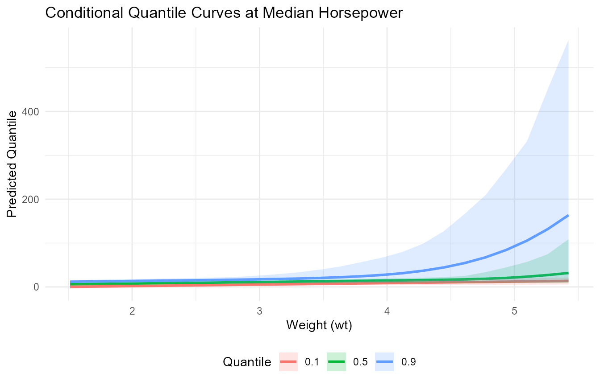

# Conditional Models

## Overview

This vignette demonstrates fitting a conditional model with covariates
and generating predictions on a grid of new covariate values.

## Theory (brief)

Conditional models allow the bulk mixture parameters to vary with
covariates. We write the conditional density as \$\$ f(y_i \\mid x_i) =
\\int K(y_i; \\theta(x_i))\\, dG(\\theta), \$\$ where the link between
\$\\theta\$ and $`x_i`$ is encoded through the kernel-specific
regression structure. The DP prior provides flexible, data-driven
clustering of local distributions across covariate space.

## Data Setup

``` r

library(DPmixGPD)

data("mtcars", package = "datasets")
df <- mtcars
y <- df$mpg
X <- df[, c("wt", "hp")]
X <- as.data.frame(X)
```

## Model Fitting

``` r

bundle <- build_nimble_bundle(
  y = y,
  X = X,
  backend = "sb",
  kernel = "normal",
  GPD = TRUE,
  components = 6,
  mcmc = mcmc
)

fit <- run_mcmc_bundle_manual(bundle, show_progress = FALSE)
```

## Fitted Values

``` r
f <- fitted(fit, type = "mean", level = 0.90)
head(f)
    fit lower upper residuals
1 10.10  6.73  13.7     10.90
2 11.06  6.99  15.8      9.94
3  8.75  5.76  11.8     14.05
4 12.77  7.05  19.8      8.63
5 14.31  9.89  21.5      4.39
6 14.09  7.15  24.0      4.01
summary(f$residuals)
   Min. 1st Qu.  Median    Mean 3rd Qu.    Max. 
-57.624   0.345   4.742   3.038  12.092  27.073 
```

## Predictions on New Data

``` r
new_X <- data.frame(
  wt = seq(min(X$wt), max(X$wt), length.out = 25),
  hp = stats::median(X$hp)
)

pred_mean <- predict(fit, x = new_X, type = "mean", cred.level = 0.90, interval = "credible")
pred_med  <- predict(fit, x = new_X, type = "median", cred.level = 0.90, interval = "credible")

head(pred_mean$fit)
  id estimate lower upper
1  1     6.10  4.43  7.55
2  2     6.72  5.21  8.30
3  3     7.26  5.44  9.01
4  4     7.84  6.13  9.76
5  5     8.44  6.49 10.76
6  6     9.02  6.84 11.68
head(pred_med$fit)
  estimate index id lower upper
1     6.05   0.5  1  4.42  7.45
2     6.61   0.5  2  4.98  7.81
3     7.16   0.5  3  5.64  8.53
4     7.72   0.5  4  6.14  9.28
5     8.27   0.5  5  6.61 10.06
6     8.83   0.5  6  6.82 10.82
```

## Quantile Curves

``` r
q_levels <- c(0.1, 0.5, 0.9)
q_fits <- lapply(q_levels, function(tau) {
  predict(fit, x = new_X, type = "quantile", index = tau, cred.level = 0.90, interval = "credible")$fit
})

q_df <- do.call(rbind, Map(function(tau, df) {
  data.frame(wt = new_X$wt, tau = tau, estimate = df$estimate, lower = df$lower, upper = df$upper)
}, q_levels, q_fits))

head(q_df)
    wt tau estimate  lower upper
1 1.51 0.1    0.263 -3.666  5.58
2 1.68 0.1    0.818 -3.025  5.70
3 1.84 0.1    1.373 -2.296  5.90
4 2.00 0.1    1.929 -1.513  6.12
5 2.16 0.1    2.484 -0.964  6.37
6 2.33 0.1    3.039 -0.402  6.67
```

``` r

ggplot(q_df, aes(x = wt, y = estimate, color = factor(tau))) +
  geom_line(linewidth = 1) +
  geom_ribbon(aes(ymin = lower, ymax = upper, fill = factor(tau)), alpha = 0.2, color = NA) +
  labs(x = "Weight (wt)", y = "Predicted Quantile", color = "Quantile", fill = "Quantile",
       title = "Conditional Quantile Curves at Median Horsepower") +
  theme_minimal() +
  theme(legend.position = "bottom")
```


