# 2. Available Distributions and Related Functions

> **Cookbook vignette (for the website / historical notes).** These
> files may not match the current exported API one-to-one. Last
> verified: **2026-01-18**.
>
> For the up-to-date workflow, see the main package vignettes
> (Introduction, Model Spec, MCMC Workflow,
> Unconditional/Conditional/Causal, Backends, S3 Reference).

## Mathematical definitions and conventions

This vignette documents the probability distributions exported by
**DPmixGPD** and the corresponding `d/p/q/r` functions used throughout
the package. For a continuous random variable $`Y`$ with parameter
scalars $`\boldsymbol{\theta}`$, we use the standard quartet:

- **Density (PDF)**: $`f(y\mid\boldsymbol{\theta})`$, implemented by
  `d*()`.
- **Distribution (CDF)**: $`F(y\mid\boldsymbol{\theta})=\Pr(Y\le y)`$,
  implemented by `p*()`.
- **Quantile**:
  $`Q(p\mid\boldsymbol{\theta}) = \inf\{y: F(y\mid\boldsymbol{\theta})\ge p\}`$,
  implemented by `q*()`.
- **Random generation**: $`Y = Q(U\mid\boldsymbol{\theta})`$ with
  $`U\sim \text{Unif}(0,1)`$, implemented by `r*()`.

All `d*()` functions optionally return log-densities via `log = TRUE`,
i.e., $`\log f(y\mid\boldsymbol{\theta})`$. This is numerically
convenient because likelihoods multiply densities but add log-densities:
``` math
\log\Big\{\prod_{i=1}^n f(y_i\mid\boldsymbol{\theta})\Big\}=\sum_{i=1}^n \log f(y_i\mid\boldsymbol{\theta}).
```

All `p*()` functions support `lower.tail` and `log.p`:
``` math
\Pr(Y>y)=1-F(y),\qquad \log F(y)\ \text{or}\ \log\{1-F(y)\}.
```

The lowercase `d*()`, `p*()`, and `q*()` functions (e.g., `dgammamix`,
`pgammamix`) accept vector inputs for their first argument and evaluate
elementwise; `r*()` supports `n > 1` (including `n = 0`). The CamelCase
versions (e.g., `dGammaMix`) are NIMBLE-compatible scalar functions for
use in model code.

``` r

w <- c(0.60, 0.40)
shape <- c(2.0, 5.0)
scale <- c(1.0, 2.0)

# Use lowercase vectorized wrappers for R-side usage
dgammamix(seq(0.5, 2.0, length.out = 5), w = w, shape = shape, scale = scale)
```

    [1] 0.182 0.219 0.216 0.194 0.165

``` r

qgammamix(c(0.1, 0.5, 0.9), w = w, shape = shape, scale = scale)
```

    [1]  0.731  3.126 12.550

``` r

rgammamix(5, w = w, shape = shape, scale = scale)
```

    [1]  1.127  3.463 10.452  0.578  8.976

### Finite mixtures

Several kernels are available as **finite mixtures**. Let
$`f_j(\cdot\mid\boldsymbol{\theta}_j)`$ denote the $`j`$th component
density and let $`\boldsymbol{w}=(w_1,\ldots,w_J)`$ be mixture weights
with $`w_j\ge 0`$ and $`\sum_{j=1}^J w_j=1`$. The mixture density and
CDF are

``` math
f(y)=\sum_{j=1}^J w_j f_j(y\mid\boldsymbol{\theta}_j),
\qquad
F(y)=\sum_{j=1}^J w_j F_j(y\mid\boldsymbol{\theta}_j).
```

Random generation proceeds by sampling a latent component index
$`Z\sim\text{Categorical}(\boldsymbol{w})`$, then sampling
$`Y\mid Z=j\sim f_j(\cdot\mid\boldsymbol{\theta}_j)`$. Mixture quantiles
typically require numerical inversion of the mixture CDF.

### GPD tails and splicing

The **Generalized Pareto Distribution (GPD)** is used for tail modeling
relative to a threshold $`u`$. In the spliced kernels (the `*Gpd`
functions), a bulk kernel is used below $`u`$ and a GPD tail is attached
above $`u`$, with parameters $`(u,\sigma,\xi)`$. In code, these are
represented by `threshold = u`, `tail_scale = \sigma`, and
`tail_shape = \xi` (the standalone GPD functions use `scale` and `shape`
for $`\sigma`$ and $`\xi`$).

## Introduction with GPD kernel

### Generalized Pareto distribution (standalone tail)

The standalone GPD functions `dGpd`, `pGpd`, `qGpd`, and `rGpd`
implement the distribution of $`X`$**above a threshold** $`u`$. For
$`x\ge u`$, the density is

``` math
f(x;u,\sigma,\xi)=\frac{1}{\sigma}\left(1+\xi\frac{x-u}{\sigma}\right)^{-1/\xi-1},
\quad \sigma>0,
\quad 1+\xi\frac{x-u}{\sigma}>0.
```

The CDF is
``` math
F(x)=1-\left(1+\xi\frac{x-u}{\sigma}\right)^{-1/\xi},
\quad x\ge u,
```
and the quantile is
``` math
Q(p)=u+\frac{\sigma}{\xi}\Big[(1-p)^{-\xi}-1\Big],\quad p\in(0,1),\ \xi\ne 0,
```
with the exponential-limit case obtained as $`\xi\to 0`$.

**Parameter mapping (math $`\rightarrow`$ code):** $`u\to`$`threshold`,
$`\sigma\to`$`scale`, $`\xi\to`$`shape`. Log-densities are returned when
`log = TRUE`.

We show the DPmixGPD kernels in pairs: bulk-only and GPD-augmented. A
GPD tail above threshold $`u`$ uses

``` math
f_{GPD}(x; u, \sigma, \xi) = \frac{1}{\sigma} \left(1 + \xi \frac{x-u}{\sigma}\right)^{-1/\xi - 1} \ \text{for } x \ge u.
```

The standalone GPD tail distribution is available via `dGpd`, `pGpd`,
`qGpd`, and `rGpd` functions.

``` r

dGpd(1.8, threshold = 1.5, scale = 0.5, shape = 0.2)
```

    [1] 1.01

``` r

dGpd(1.8, threshold = 1.5, scale = 0.5, shape = 0.2, log = TRUE)
```

    [1] 0.0132

``` r

pGpd(1.8, threshold = 1.5, scale = 0.5, shape = 0.2)
```

    [1] 0.433

``` r

pGpd(1.8, threshold = 1.5, scale = 0.5, shape = 0.2, lower.tail = FALSE)
```

    [1] 0.567

``` r

pGpd(1.8, threshold = 1.5, scale = 0.5, shape = 0.2, log.p = TRUE)
```

    [1] -0.838

``` r

qgpd(c(0.25, 0.5, 0.75), threshold = 1.5, scale = 0.5, shape = 0.2)
```

    [1] 1.65 1.87 2.30

``` r

qgpd(c(0.25, 0.5, 0.75), threshold = 1.5, scale = 0.5, shape = 0.2,
     lower.tail = FALSE)
```

    [1] 2.30 1.87 1.65

``` r

qgpd(c(log(0.25), log(0.5), log(0.75)), threshold = 1.5, scale = 0.5,
     shape = 0.2, log.p = TRUE)
```

    [1] 1.65 1.87 2.30

``` r

x_vals <- c(1.6, 2.0, 2.4)
probs <- c(0.25, 0.5, 0.75)

vec_d <- dgpd(x_vals, threshold = 1.5, scale = 0.5, shape = 0.2, log = FALSE)
scalar_d <- vapply(
  x_vals,
  function(xx) as.numeric(dGpd(xx, threshold = 1.5, scale = 0.5, shape = 0.2, log = 0L)),
  numeric(1)
)
all.equal(vec_d, scalar_d)
```

    [1] TRUE

``` r

vec_p <- pgpd(x_vals, threshold = 1.5, scale = 0.5, shape = 0.2,
              lower.tail = TRUE, log.p = FALSE)
scalar_p <- vapply(
  x_vals,
  function(xx) as.numeric(pGpd(xx, threshold = 1.5, scale = 0.5, shape = 0.2,
                               lower.tail = 1L, log.p = 0L)),
  numeric(1)
)
all.equal(vec_p, scalar_p)
```

    [1] TRUE

``` r

vec_q <- qgpd(probs, threshold = 1.5, scale = 0.5, shape = 0.2,
              lower.tail = TRUE, log.p = FALSE)
scalar_q <- vapply(
  probs,
  function(pp) qGpd(pp, threshold = 1.5, scale = 0.5, shape = 0.2,
                    lower.tail = TRUE, log.p = FALSE),
  numeric(1)
)
all.equal(vec_q, scalar_q)
```

    [1] TRUE

``` r

set.seed(123)
vec_r <- rgpd(5, threshold = 1.5, scale = 0.5, shape = 0.2)
set.seed(123)
scalar_r <- vapply(
  seq_len(5),
  function(i) rGpd(1, threshold = 1.5, scale = 0.5, shape = 0.2),
  numeric(1)
)
all.equal(vec_r, scalar_r)
```

    [1] TRUE

``` r

rgpd(5, threshold = 1.5, scale = 0.5, shape = 0.2)
```

    [1] 1.52 1.91 2.90 1.93 1.82

``` r

grid <- seq(-4, 15, length.out = 500)
gpd_sets <- list(
  list(label = "GPD A", threshold = 1.5, tail_scale = 0.5, tail_shape = 0.2),
  list(label = "GPD B", threshold = 2.0, tail_scale = 0.6, tail_shape = 0.15),
  list(label = "GPD C", threshold = 1.0, tail_scale = 0.4, tail_shape = 0.25)
)

df_gpd <- do.call(rbind, lapply(gpd_sets, function(ps) {
  data.frame(
    x = grid,
    density = dgpd(grid, threshold = ps$threshold, scale = ps$tail_scale, shape = ps$tail_shape),
    label = ps$label
  )
}))

ggplot(df_gpd, aes(x = x, y = density, color = label)) +
  geom_line(linewidth = 1) +
  labs(title = "Standalone GPD tails", x = "x", y = "density") +
  theme_minimal() + theme(legend.position = "top")
```

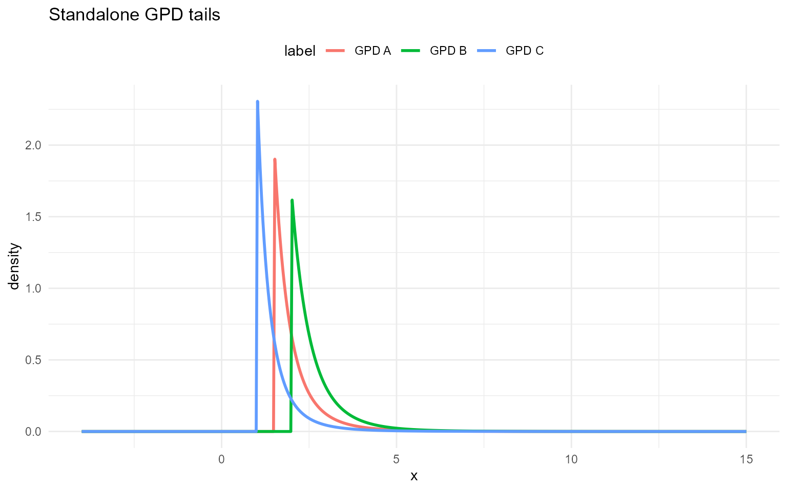

Each subsection below defines the available $`d/p/q/r`$ functions,
prints example outputs for fixed parameters, and overlays density curves
for **three parameter sets** with clear legends. The same parameter sets
are reused within the bulk and GPD variants of a section.

## Normal

### Normal mixture kernel

A normal component is parameterized by $`\mu\in\mathbb{R}`$ and
$`\sigma>0`$:
``` math
f(y\mid\mu,\sigma)=\frac{1}{\sqrt{2\pi}\sigma}\exp\!\left(-\frac{(y-\mu)^2}{2\sigma^2}\right).
```

A finite normal mixture with $`J`$ components has density
``` math
f(y)=\sum_{j=1}^J w_j\,\mathcal{N}(y\mid\mu_j,\sigma_j^2),
\qquad \sum_{j=1}^J w_j=1.
```

**Parameter mapping (math $`\rightarrow`$ code):**
$`\mu_j\to`$`mean[j]`, $`\sigma_j\to`$`sd[j]`, $`w_j\to`$`w[j]`.

### Normal mixture with GPD tail

In the spliced version, the bulk distribution is the normal mixture
below $`u`$, and a GPD tail is attached above $`u`$. The tail parameters
are $`\sigma>0`$ and $`\xi`$, applied to exceedances $`x-u`$.

**Tail mapping (math $`\rightarrow`$ code):** $`u\to`$`threshold`,
$`\sigma\to`$`tail_scale`, $`\xi\to`$`tail_shape`.

### Without GPD (mixture kernel)

``` r

grid <- seq(-4, 5, length.out = 400)
normal_sets <- list(
  list(label = "Mix A", w = c(0.6, 0.3, 0.1), mean = c(-1, 0.5, 2), sd = c(2, 0.6, 1.1)),
  list(label = "Mix B", w = c(0.5, 0.3, 0.2), mean = c(-1.2, 0.3, 1.5), sd = c(0.9, 0.7, 1.0)),
  list(label = "Mix C", w = c(0.4, 0.35, 0.25), mean = c(-0.5, 2, 2.5), sd = c(0.7, 0.6, 1.2))
)

example <- normal_sets[[1]]
```

``` r

dNormMix(0, w = example$w, mean = example$mean, sd = example$sd)
```

    [1] 0.254

``` r

dNormMix(0, w = example$w, mean = example$mean, sd = example$sd, log = TRUE)
```

    [1] -1.37

``` r

pNormMix(0, w = example$w, mean = example$mean, sd = example$sd)
```

    [1] 0.479

``` r

pNormMix(0, w = example$w, mean = example$mean, sd = example$sd, lower.tail = FALSE)
```

    [1] 0.521

``` r

pNormMix(0, w = example$w, mean = example$mean, sd = example$sd, log.p = TRUE)
```

    [1] -0.736

``` r

qnormmix(c(0.25, 0.5, 0.75), w = example$w, mean = example$mean,
         sd = example$sd)
```

    [1] -1.4234  0.0805  0.9495

``` r

qnormmix(c(0.25, 0.5, 0.75), w = example$w, mean = example$mean,
         sd = example$sd, lower.tail = FALSE)
```

    [1]  0.9495  0.0805 -1.4234

``` r

qnormmix(c(log(0.25), log(0.5), log(0.75)), w = example$w,
         mean = example$mean, sd = example$sd, log.p = TRUE)
```

    [1] -1.4234  0.0805  0.9495

``` r

x_vals <- c(-1.0, 0.0, 1.0)
probs <- c(0.25, 0.5, 0.75)

vec_d <- dnormmix(x_vals, w = example$w, mean = example$mean, sd = example$sd, log = FALSE)
scalar_d <- vapply(
  x_vals,
  function(xx) as.numeric(dNormMix(xx, w = example$w, mean = example$mean, sd = example$sd, log = 0L)),
  numeric(1)
)
all.equal(vec_d, scalar_d)
```

    [1] TRUE

``` r

vec_p <- pnormmix(x_vals, w = example$w, mean = example$mean, sd = example$sd,
                  lower.tail = TRUE, log.p = FALSE)
scalar_p <- vapply(
  x_vals,
  function(xx) as.numeric(pNormMix(xx, w = example$w, mean = example$mean, sd = example$sd,
                                   lower.tail = 1L, log.p = 0L)),
  numeric(1)
)
all.equal(vec_p, scalar_p)
```

    [1] TRUE

``` r

vec_q <- qnormmix(probs, w = example$w, mean = example$mean, sd = example$sd,
                  lower.tail = TRUE, log.p = FALSE)
scalar_q <- vapply(
  probs,
  function(pp) qNormMix(pp, w = example$w, mean = example$mean, sd = example$sd,
                        lower.tail = TRUE, log.p = FALSE),
  numeric(1)
)
all.equal(vec_q, scalar_q)
```

    [1] TRUE

``` r

set.seed(123)
vec_r <- rnormmix(5, w = example$w, mean = example$mean, sd = example$sd)
set.seed(123)
scalar_r <- vapply(
  seq_len(5),
  function(i) rNormMix(1, w = example$w, mean = example$mean, sd = example$sd),
  numeric(1)
)
all.equal(vec_r, scalar_r)
```

    [1] TRUE

``` r

rnormmix(5, w = example$w, mean = example$mean, sd = example$sd)
```

    [1]  0.0879  2.3804  0.7159  0.8295 -2.1117

``` r

df_norm <- do.call(rbind, lapply(normal_sets, function(ps) {
  data.frame(
    x = grid,
    density = dnormmix(grid, w = ps$w, mean = ps$mean, sd = ps$sd),
    label = ps$label
  )
}))

ggplot(df_norm, aes(x = x, y = density, color = label)) +
  geom_line(linewidth = 1) +
  labs(title = "Normal mixtures (bulk)", x = "x", y = "density") +
  theme_minimal() + theme(legend.position = "top")
```


### With GPD tail

Spliced density uses the same mixture for $`x<u`$ and attaches
$`f_{GPD}`$ above $`u`$ with continuity. CDF combines mixture CDF up to
$`u`$ and GPD exceedance beyond $`u`$; quantiles invert this spliced
CDF; RNG draws bulk vs tail by the CDF mass at $`u`$.

``` r

normal_gpd_sets <- list(
  list(label = "Mix A", w = c(0.6, 0.4), mean = c(-1, 2), sd = c(0.5, 0.8), threshold = 1.8, tail_scale = 0.4, tail_shape = 0.25),
  list(label = "Mix B", w = c(0.5, 0.5), mean = c(0, 1), sd = c(0.6, 0.6), threshold = 1.5, tail_scale = 0.3, tail_shape = 0.2),
  list(label = "Mix C", w = c(0.7, 0.3), mean = c(0.5, 2.5), sd = c(0.4, 1.0), threshold = 2.0, tail_scale = 0.5, tail_shape = 0.15)
)

example <- normal_gpd_sets[[1]]
```

``` r

dNormMixGpd(2, w = example$w, mean = example$mean, sd = example$sd, threshold = example$threshold, tail_scale = example$tail_scale, tail_shape = example$tail_shape)
```

    [1] 0.332

``` r

pNormMixGpd(2, w = example$w, mean = example$mean, sd = example$sd, threshold = example$threshold, tail_scale = example$tail_scale, tail_shape = example$tail_shape)
```

    [1] 0.85

``` r

qnormmixgpd(c(0.5, 0.9), w = example$w, mean = example$mean, sd = example$sd,
            threshold = example$threshold, tail_scale = example$tail_scale,
            tail_shape = example$tail_shape)
```

    [1] -0.517  2.190

``` r

x_vals <- c(1.0, 2.0, 3.0)
probs <- c(0.5, 0.9)

vec_d <- dnormmixgpd(
  x_vals,
  w = example$w,
  mean = example$mean,
  sd = example$sd,
  threshold = example$threshold,
  tail_scale = example$tail_scale,
  tail_shape = example$tail_shape,
  log = FALSE
)
scalar_d <- vapply(
  x_vals,
  function(xx) as.numeric(dNormMixGpd(
    xx,
    w = example$w,
    mean = example$mean,
    sd = example$sd,
    threshold = example$threshold,
    tail_scale = example$tail_scale,
    tail_shape = example$tail_shape,
    log = 0L
  )),
  numeric(1)
)
all.equal(vec_d, scalar_d)
```

    [1] TRUE

``` r

vec_p <- pnormmixgpd(
  x_vals,
  w = example$w,
  mean = example$mean,
  sd = example$sd,
  threshold = example$threshold,
  tail_scale = example$tail_scale,
  tail_shape = example$tail_shape,
  lower.tail = TRUE,
  log.p = FALSE
)
scalar_p <- vapply(
  x_vals,
  function(xx) as.numeric(pNormMixGpd(
    xx,
    w = example$w,
    mean = example$mean,
    sd = example$sd,
    threshold = example$threshold,
    tail_scale = example$tail_scale,
    tail_shape = example$tail_shape,
    lower.tail = 1L,
    log.p = 0L
  )),
  numeric(1)
)
all.equal(vec_p, scalar_p)
```

    [1] TRUE

``` r

vec_q <- qnormmixgpd(
  probs,
  w = example$w,
  mean = example$mean,
  sd = example$sd,
  threshold = example$threshold,
  tail_scale = example$tail_scale,
  tail_shape = example$tail_shape,
  lower.tail = TRUE,
  log.p = FALSE
)
scalar_q <- vapply(
  probs,
  function(pp) qNormMixGpd(
    pp,
    w = example$w,
    mean = example$mean,
    sd = example$sd,
    threshold = example$threshold,
    tail_scale = example$tail_scale,
    tail_shape = example$tail_shape,
    lower.tail = TRUE,
    log.p = FALSE
  ),
  numeric(1)
)
all.equal(vec_q, scalar_q)
```

    [1] TRUE

``` r

set.seed(123)
vec_r <- rnormmixgpd(
  5,
  w = example$w,
  mean = example$mean,
  sd = example$sd,
  threshold = example$threshold,
  tail_scale = example$tail_scale,
  tail_shape = example$tail_shape
)
set.seed(123)
scalar_r <- vapply(
  seq_len(5),
  function(i) rNormMixGpd(
    1,
    w = example$w,
    mean = example$mean,
    sd = example$sd,
    threshold = example$threshold,
    tail_scale = example$tail_scale,
    tail_shape = example$tail_shape
  ),
  numeric(1)
)
all.equal(vec_r, scalar_r)
```

    [1] TRUE

``` r

rnormmixgpd(5, w = example$w, mean = example$mean, sd = example$sd,
            threshold = example$threshold, tail_scale = example$tail_scale,
            tail_shape = example$tail_shape)
```

    [1] -1.22  2.35  2.32 -1.28  3.06

``` r

df_norm_gpd <- do.call(rbind, lapply(normal_gpd_sets, function(ps) {
  data.frame(
    x = grid,
    density = dnormmixgpd(
      grid,
      w = ps$w,
      mean = ps$mean,
      sd = ps$sd,
      threshold = ps$threshold,
      tail_scale = ps$tail_scale,
      tail_shape = ps$tail_shape
    ),
    label = ps$label
  )
}))

ggplot(df_norm_gpd, aes(x = x, y = density, color = label)) +
  geom_line(linewidth = 1) +
  labs(title = "Normal mixtures with GPD tail (different thresholds)", x = "x", y = "density") +
  theme_minimal() + theme(legend.position = "top")
```


## Gamma

### Gamma mixture kernel

A gamma component with shape $`\alpha>0`$ and scale $`\beta>0`$ has
density
``` math
f(y\mid \alpha,\beta)
=
\frac{1}{\Gamma(\alpha)\,\beta^\alpha}\,y^{\alpha-1}\exp\!\left(-\frac{y}{\beta}\right),
\qquad y>0.
```

A finite gamma mixture with $`J`$ components is
``` math
f(y)=\sum_{j=1}^J w_j\,f_j(y\mid \alpha_j,\beta_j),
\qquad w_j\ge 0,\ \sum_{j=1}^J w_j=1.
```

**Parameter mapping (math $`\rightarrow`$ code):** $`\alpha\to`$`shape`,
$`\beta\to`$`scale`, and weights $`w_j\to`$`w[j]`.

The `*MixGpd` variant uses the same splicing idea: gamma mixture below
$`u`$ and a GPD tail above $`u`$.

**Tail mapping (math $`\rightarrow`$ code):** $`u\to`$`threshold`,
$`\sigma\to`$`tail_scale`, $`\xi\to`$`tail_shape`.

### Without GPD (mixture kernel)

``` r

grid <- seq(0, 10, length.out = 400)
gamma_sets <- list(
  list(label = "Mix A", w = c(0.6, 0.3, 0.1), shape = c(2.0, 5.0, 9.0), scale = c(1.0, 0.6, 0.3)),
  list(label = "Mix B", w = c(0.5, 0.3, 0.2), shape = c(1.5, 4.0, 7.0), scale = c(1.2, 0.7, 0.35)),
  list(label = "Mix C", w = c(0.4, 0.3, 0.3), shape = c(1.2, 3.5, 6.0), scale = c(1.4, 0.75, 0.4))
)
example <- gamma_sets[[1]]

dens <- do.call(rbind, lapply(gamma_sets, function(s) {
  data.frame(
    x = grid,
    density = dgammamix(grid, w = s$w, shape = s$shape, scale = s$scale),
    label = s$label
  )
}))
```

``` r

dGammaMix(2, w = example$w, shape = example$shape, scale = example$scale)
```

    [1] 0.295

``` r

dGammaMix(2, w = example$w, shape = example$shape, scale = example$scale, log = TRUE)
```

    [1] -1.22

``` r

pGammaMix(2, w = example$w, shape = example$shape, scale = example$scale)
```

    [1] 0.452

``` r

pGammaMix(2, w = example$w, shape = example$shape, scale = example$scale, lower.tail = FALSE)
```

    [1] 0.548

``` r

pGammaMix(2, w = example$w, shape = example$shape, scale = example$scale, log.p = TRUE)
```

    [1] -0.793

``` r

qGammaMix(0.95, w = example$w, shape = example$shape, scale = example$scale)
```

    [1] 5.01

``` r

qGammaMix(0.95, w = example$w, shape = example$shape, scale = example$scale, lower.tail = FALSE)
```

    [1] 0.475

``` r

x_vals <- c(0.5, 2.0, 5.0)
probs <- c(0.1, 0.5, 0.9)

vec_d <- dgammamix(x_vals, w = example$w, shape = example$shape, scale = example$scale, log = FALSE)
scalar_d <- vapply(
  x_vals,
  function(xx) as.numeric(dGammaMix(xx, w = example$w, shape = example$shape, scale = example$scale, log = 0L)),
  numeric(1)
)
all.equal(vec_d, scalar_d)
```

    [1] TRUE

``` r

vec_p <- pgammamix(x_vals, w = example$w, shape = example$shape, scale = example$scale,
                   lower.tail = TRUE, log.p = FALSE)
scalar_p <- vapply(
  x_vals,
  function(xx) as.numeric(pGammaMix(xx, w = example$w, shape = example$shape, scale = example$scale,
                                    lower.tail = 1L, log.p = 0L)),
  numeric(1)
)
all.equal(vec_p, scalar_p)
```

    [1] TRUE

``` r

vec_q <- qgammamix(probs, w = example$w, shape = example$shape, scale = example$scale,
                   lower.tail = TRUE, log.p = FALSE)
scalar_q <- vapply(
  probs,
  function(pp) qGammaMix(pp, w = example$w, shape = example$shape, scale = example$scale,
                         lower.tail = TRUE, log.p = FALSE),
  numeric(1)
)
all.equal(vec_q, scalar_q)
```

    [1] TRUE

``` r

set.seed(123)
vec_r <- rgammamix(5, w = example$w, shape = example$shape, scale = example$scale)
set.seed(123)
scalar_r <- vapply(
  seq_len(5),
  function(i) rGammaMix(1, w = example$w, shape = example$shape, scale = example$scale),
  numeric(1)
)
all.equal(vec_r, scalar_r)
```

    [1] TRUE

``` r

df_gamma <- do.call(rbind, lapply(gamma_sets, function(ps) {
  data.frame(
    x = grid,
    density = dgammamix(grid, w = ps$w, shape = ps$shape, scale = ps$scale),
    label = ps$label
  )
}))

ggplot(df_norm, aes(x = x, y = density, color = label)) +
  geom_line(linewidth = 1) +
  labs(title = "Gamma mixtures (bulk)", x = "x", y = "density") +
  theme_minimal() + theme(legend.position = "top")
```

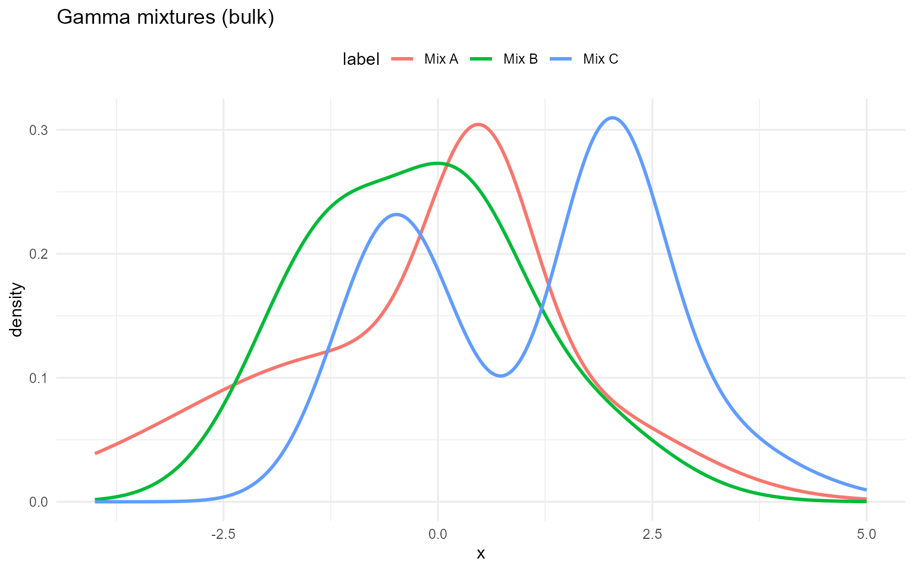

### Gamma mixture with GPD tail

``` r

u <- 6
tail_scale <- 1.0
tail_shape <- 0.2
```

``` r

dGammaMixGpd(6.5, w = example$w, shape = example$shape, scale = example$scale,
             threshold = u, tail_scale = tail_scale, tail_shape = tail_shape)
```

    [1] 0.0109

``` r

dGammaMixGpd(6.5, w = example$w, shape = example$shape, scale = example$scale,
             threshold = u, tail_scale = tail_scale, tail_shape = tail_shape, log = TRUE)
```

    [1] -4.51

``` r

pGammaMixGpd(6.5, w = example$w, shape = example$shape, scale = example$scale,
             threshold = u, tail_scale = tail_scale, tail_shape = tail_shape)
```

    [1] 0.988

``` r

pGammaMixGpd(6.5, w = example$w, shape = example$shape, scale = example$scale,
             threshold = u, tail_scale = tail_scale, tail_shape = tail_shape, lower.tail = FALSE)
```

    [1] 0.012

``` r

qGammaMixGpd(0.95, w = example$w, shape = example$shape, scale = example$scale,
             threshold = u, tail_scale = tail_scale, tail_shape = tail_shape)
```

    [1] 5.01

``` r

x_vals <- c(5.5, 6.5, 7.5)
probs <- c(0.5, 0.9)

vec_d <- dgammamixgpd(
  x_vals,
  w = example$w,
  shape = example$shape,
  scale = example$scale,
  threshold = u,
  tail_scale = tail_scale,
  tail_shape = tail_shape,
  log = FALSE
)
scalar_d <- vapply(
  x_vals,
  function(xx) as.numeric(dGammaMixGpd(
    xx,
    w = example$w,
    shape = example$shape,
    scale = example$scale,
    threshold = u,
    tail_scale = tail_scale,
    tail_shape = tail_shape,
    log = 0L
  )),
  numeric(1)
)
all.equal(vec_d, scalar_d)
```

    [1] TRUE

``` r

vec_p <- pgammamixgpd(
  x_vals,
  w = example$w,
  shape = example$shape,
  scale = example$scale,
  threshold = u,
  tail_scale = tail_scale,
  tail_shape = tail_shape,
  lower.tail = TRUE,
  log.p = FALSE
)
scalar_p <- vapply(
  x_vals,
  function(xx) as.numeric(pGammaMixGpd(
    xx,
    w = example$w,
    shape = example$shape,
    scale = example$scale,
    threshold = u,
    tail_scale = tail_scale,
    tail_shape = tail_shape,
    lower.tail = 1L,
    log.p = 0L
  )),
  numeric(1)
)
all.equal(vec_p, scalar_p)
```

    [1] TRUE

``` r

vec_q <- qgammamixgpd(
  probs,
  w = example$w,
  shape = example$shape,
  scale = example$scale,
  threshold = u,
  tail_scale = tail_scale,
  tail_shape = tail_shape,
  lower.tail = TRUE,
  log.p = FALSE
)
scalar_q <- vapply(
  probs,
  function(pp) qGammaMixGpd(
    pp,
    w = example$w,
    shape = example$shape,
    scale = example$scale,
    threshold = u,
    tail_scale = tail_scale,
    tail_shape = tail_shape,
    lower.tail = TRUE,
    log.p = FALSE
  ),
  numeric(1)
)
all.equal(vec_q, scalar_q)
```

    [1] TRUE

``` r

set.seed(123)
vec_r <- rgammamixgpd(
  5,
  w = example$w,
  shape = example$shape,
  scale = example$scale,
  threshold = u,
  tail_scale = tail_scale,
  tail_shape = tail_shape
)
set.seed(123)
scalar_r <- vapply(
  seq_len(5),
  function(i) rGammaMixGpd(
    1,
    w = example$w,
    shape = example$shape,
    scale = example$scale,
    threshold = u,
    tail_scale = tail_scale,
    tail_shape = tail_shape
  ),
  numeric(1)
)
all.equal(vec_r, scalar_r)
```

    [1] TRUE

``` r

gamma_gpd_sets <- list(
  list(label = "Mix A", w = c(0.6, 0.4), shape = c(2.0, 5.0), scale = c(1.0, 0.6), threshold = 6.0, tail_scale = 1.0, tail_shape = 0.2),
  list(label = "Mix B", w = c(0.5, 0.5), shape = c(1.5, 4.0), scale = c(1.2, 0.7), threshold = 5.5, tail_scale = 0.8, tail_shape = 0.15),
  list(label = "Mix C", w = c(0.7, 0.3), shape = c(1.2, 3.5), scale = c(1.4, 0.75), threshold = 6.5, tail_scale = 1.2, tail_shape = 0.25)
)


df_gamma_gpd <- do.call(rbind, lapply(gamma_gpd_sets, function(ps) {
  data.frame(
    x = grid,
    density = dgammamixgpd(
      grid,
      w = ps$w,
      shape = ps$shape,
      scale = ps$scale,
      threshold = ps$threshold,
      tail_scale = ps$tail_scale,
      tail_shape = ps$tail_shape
    ),
    label = ps$label
  )
}))

ggplot(df_norm_gpd, aes(x = x, y = density, color = label)) +
  geom_line(linewidth = 1) +
  labs(title = "Gamma mixtures with GPD tail (different thresholds)", x = "x", y = "density") +
  theme_minimal() + theme(legend.position = "top")
```

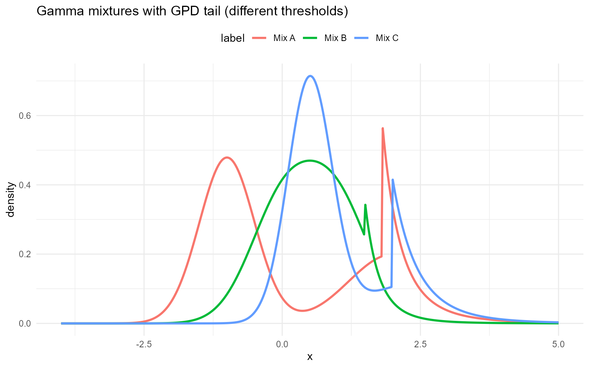 \##
Lognormal

### Lognormal mixture kernel

A lognormal component is defined by
$`\log Y \sim \mathcal{N}(\mu,\sigma^2)`$, i.e.,
``` math
f(y\mid\mu,\sigma)=\frac{1}{y\,\sigma\sqrt{2\pi}}\exp\!\left(-\frac{(\log y-\mu)^2}{2\sigma^2}\right),\quad y>0.
```

A finite lognormal mixture has density
``` math
f(y)=\sum_{j=1}^J w_j\,\text{Lognormal}(y\mid\mu_j,\sigma_j^2),\quad y>0.
```

**Parameter mapping (math $`\rightarrow`$ code):**
$`\mu_j\to`$`meanlog[j]`, $`\sigma_j\to`$`sdlog[j]`, $`w_j\to`$`w[j]`.

### Lognormal mixture with GPD tail

The `*MixGpd` variant uses the same splicing idea: lognormal mixture
below $`u`$, GPD tail above $`u`$.

**Tail mapping (math $`\rightarrow`$ code):** $`u\to`$`threshold`,
$`\sigma\to`$`tail_scale`, $`\xi\to`$`tail_shape`.

### Without GPD (mixture kernel)

``` r

grid <- seq(0, 8, length.out = 400)
logn_sets <- list(
  list(label = "Mix A", w = c(0.6, 0.3, 0.1), meanlog = c(0.0, 0.3, 0.6), sdlog = c(0.4, 0.5, 0.6)),
  list(label = "Mix B", w = c(0.5, 0.3, 0.2), meanlog = c(0.1, 0.4, 0.7), sdlog = c(0.35, 0.45, 0.55)),
  list(label = "Mix C", w = c(0.4, 0.35, 0.25), meanlog = c(0.2, 0.5, 2), sdlog = c(0.3, 0.4, 0.5))
)

example <- logn_sets[[1]]
```

``` r

dLognormalMix(1, w = example$w, meanlog = example$meanlog, sdlog = example$sdlog)
```

    [1] 0.839

``` r

dLognormalMix(1, w = example$w, meanlog = example$meanlog, sdlog = example$sdlog, log = TRUE)
```

    [1] -0.176

``` r

pLognormalMix(1, w = example$w, meanlog = example$meanlog, sdlog = example$sdlog)
```

    [1] 0.398

``` r

pLognormalMix(1, w = example$w, meanlog = example$meanlog, sdlog = example$sdlog, lower.tail = FALSE)
```

    [1] 0.602

``` r

pLognormalMix(1, w = example$w, meanlog = example$meanlog, sdlog = example$sdlog, log.p = TRUE)
```

    [1] -0.921

``` r

qlognormalmix(c(0.25, 0.5, 0.75), w = example$w,
              meanlog = example$meanlog, sdlog = example$sdlog)
```

    [1] 0.828 1.128 1.575

``` r

qlognormalmix(c(0.25, 0.5, 0.75), w = example$w,
              meanlog = example$meanlog, sdlog = example$sdlog, lower.tail = FALSE)
```

    [1] 1.575 1.128 0.828

``` r

qlognormalmix(c(log(0.25), log(0.5), log(0.75)), w = example$w,
              meanlog = example$meanlog, sdlog = example$sdlog, log.p = TRUE)
```

    [1] 0.828 1.128 1.575

``` r

x_vals <- c(0.5, 1.0, 2.0)
probs <- c(0.25, 0.5, 0.75)

vec_d <- dlognormalmix(x_vals, w = example$w, meanlog = example$meanlog, sdlog = example$sdlog, log = FALSE)
scalar_d <- vapply(
  x_vals,
  function(xx) as.numeric(dLognormalMix(xx, w = example$w, meanlog = example$meanlog, sdlog = example$sdlog, log = 0L)),
  numeric(1)
)
all.equal(vec_d, scalar_d)
```

    [1] TRUE

``` r

vec_p <- plognormalmix(x_vals, w = example$w, meanlog = example$meanlog, sdlog = example$sdlog,
                       lower.tail = TRUE, log.p = FALSE)
scalar_p <- vapply(
  x_vals,
  function(xx) as.numeric(pLognormalMix(xx, w = example$w, meanlog = example$meanlog, sdlog = example$sdlog,
                                        lower.tail = 1L, log.p = 0L)),
  numeric(1)
)
all.equal(vec_p, scalar_p)
```

    [1] TRUE

``` r

vec_q <- qlognormalmix(probs, w = example$w, meanlog = example$meanlog, sdlog = example$sdlog,
                       lower.tail = TRUE, log.p = FALSE)
scalar_q <- vapply(
  probs,
  function(pp) qLognormalMix(pp, w = example$w, meanlog = example$meanlog, sdlog = example$sdlog,
                             lower.tail = TRUE, log.p = FALSE),
  numeric(1)
)
all.equal(vec_q, scalar_q)
```

    [1] TRUE

``` r

set.seed(123)
vec_r <- rlognormalmix(5, w = example$w, meanlog = example$meanlog, sdlog = example$sdlog)
set.seed(123)
scalar_r <- vapply(
  seq_len(5),
  function(i) rLognormalMix(1, w = example$w, meanlog = example$meanlog, sdlog = example$sdlog),
  numeric(1)
)
all.equal(vec_r, scalar_r)
```

    [1] TRUE

``` r

rlognormalmix(5, w = example$w, meanlog = example$meanlog, sdlog = example$sdlog)
```

    [1] 0.958 1.966 1.616 1.776 0.801

``` r

df_logn <- do.call(rbind, lapply(logn_sets, function(ps) {
  data.frame(
    x = grid,
    density = dlognormalmix(grid, w = ps$w, meanlog = ps$meanlog, sdlog = ps$sdlog),
    label = ps$label
  )
}))

ggplot(df_logn, aes(x = x, y = density, color = label)) +
  geom_line(linewidth = 1) +
  labs(title = "Lognormal mixtures (bulk)", x = "x", y = "density") +
  theme_minimal() + theme(legend.position = "top")
```

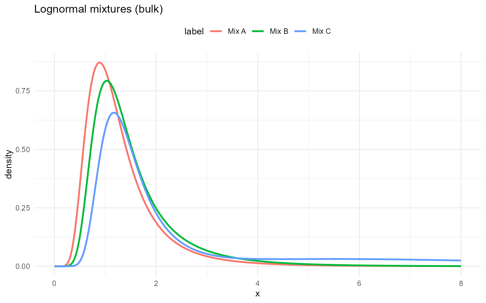

### With GPD tail

``` r

logn_gpd_sets <- list(
  list(label = "Mix A", w = c(0.6, 0.4), meanlog = c(0, 1), sdlog = c(0.3, 0.5), threshold = 2.5, tail_scale = 0.5, tail_shape = 0.2),
  list(label = "Mix B", w = c(0.5, 0.5), meanlog = c(0.5, 1.2), sdlog = c(0.4, 0.4), threshold = 2.0, tail_scale = 0.4, tail_shape = 0.15),
  list(label = "Mix C", w = c(0.7, 0.3), meanlog = c(0.8, 1.5), sdlog = c(0.25, 0.6), threshold = 3.0, tail_scale = 0.6, tail_shape = 0.18)
)

example <- logn_gpd_sets[[1]]
```

``` r

dLognormalMixGpd(2.5, w = example$w, meanlog = example$meanlog, sdlog = example$sdlog, threshold = example$threshold, tail_scale = example$tail_scale, tail_shape = example$tail_shape)
```

    [1] 0.455

``` r

pLognormalMixGpd(2.5, w = example$w, meanlog = example$meanlog, sdlog = example$sdlog, threshold = example$threshold, tail_scale = example$tail_scale, tail_shape = example$tail_shape)
```

    [1] 0.773

``` r

qlognormalmixgpd(c(0.5, 0.9), w = example$w, meanlog = example$meanlog,
                 sdlog = example$sdlog, threshold = example$threshold,
                 tail_scale = example$tail_scale, tail_shape = example$tail_shape)
```

    [1] 1.27 2.95

``` r

x_vals <- c(2.0, 3.0, 4.0)
probs <- c(0.5, 0.9)

vec_d <- dlognormalmixgpd(
  x_vals,
  w = example$w,
  meanlog = example$meanlog,
  sdlog = example$sdlog,
  threshold = example$threshold,
  tail_scale = example$tail_scale,
  tail_shape = example$tail_shape,
  log = FALSE
)
scalar_d <- vapply(
  x_vals,
  function(xx) as.numeric(dLognormalMixGpd(
    xx,
    w = example$w,
    meanlog = example$meanlog,
    sdlog = example$sdlog,
    threshold = example$threshold,
    tail_scale = example$tail_scale,
    tail_shape = example$tail_shape,
    log = 0L
  )),
  numeric(1)
)
all.equal(vec_d, scalar_d)
```

    [1] TRUE

``` r

vec_p <- plognormalmixgpd(
  x_vals,
  w = example$w,
  meanlog = example$meanlog,
  sdlog = example$sdlog,
  threshold = example$threshold,
  tail_scale = example$tail_scale,
  tail_shape = example$tail_shape,
  lower.tail = TRUE,
  log.p = FALSE
)
scalar_p <- vapply(
  x_vals,
  function(xx) as.numeric(pLognormalMixGpd(
    xx,
    w = example$w,
    meanlog = example$meanlog,
    sdlog = example$sdlog,
    threshold = example$threshold,
    tail_scale = example$tail_scale,
    tail_shape = example$tail_shape,
    lower.tail = 1L,
    log.p = 0L
  )),
  numeric(1)
)
all.equal(vec_p, scalar_p)
```

    [1] TRUE

``` r

vec_q <- qlognormalmixgpd(
  probs,
  w = example$w,
  meanlog = example$meanlog,
  sdlog = example$sdlog,
  threshold = example$threshold,
  tail_scale = example$tail_scale,
  tail_shape = example$tail_shape,
  lower.tail = TRUE,
  log.p = FALSE
)
scalar_q <- vapply(
  probs,
  function(pp) qLognormalMixGpd(
    pp,
    w = example$w,
    meanlog = example$meanlog,
    sdlog = example$sdlog,
    threshold = example$threshold,
    tail_scale = example$tail_scale,
    tail_shape = example$tail_shape,
    lower.tail = TRUE,
    log.p = FALSE
  ),
  numeric(1)
)
all.equal(vec_q, scalar_q)
```

    [1] TRUE

``` r

set.seed(123)
vec_r <- rlognormalmixgpd(
  5,
  w = example$w,
  meanlog = example$meanlog,
  sdlog = example$sdlog,
  threshold = example$threshold,
  tail_scale = example$tail_scale,
  tail_shape = example$tail_shape
)
set.seed(123)
scalar_r <- vapply(
  seq_len(5),
  function(i) rLognormalMixGpd(
    1,
    w = example$w,
    meanlog = example$meanlog,
    sdlog = example$sdlog,
    threshold = example$threshold,
    tail_scale = example$tail_scale,
    tail_shape = example$tail_shape
  ),
  numeric(1)
)
all.equal(vec_r, scalar_r)
```

    [1] TRUE

``` r

rlognormalmixgpd(5, w = example$w, meanlog = example$meanlog, sdlog = example$sdlog,
                 threshold = example$threshold, tail_scale = example$tail_scale,
                 tail_shape = example$tail_shape)
```

    [1] 0.875 3.166 3.321 0.846 3.981

``` r

df_logn_gpd <- do.call(rbind, lapply(logn_gpd_sets, function(ps) {
  data.frame(
    x = grid,
    density = dlognormalmixgpd(
      grid,
      w = ps$w,
      meanlog = ps$meanlog,
      sdlog = ps$sdlog,
      threshold = ps$threshold,
      tail_scale = ps$tail_scale,
      tail_shape = ps$tail_shape
    ),
    label = ps$label
  )
}))

ggplot(df_logn_gpd, aes(x = x, y = density, color = label)) +
  geom_line(linewidth = 1) +
  labs(title = "Lognormal mixtures with GPD tail (different thresholds)", x = "x", y = "density") +
  theme_minimal() + theme(legend.position = "top")
```

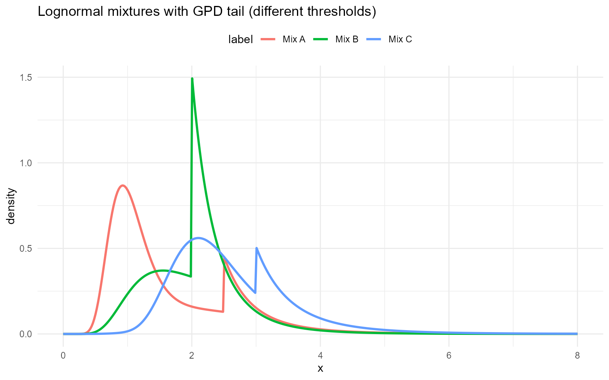

## Laplace

### Laplace mixture kernel

A Laplace (double-exponential) component with location
$`\ell\in\mathbb{R}`$ and scale $`b>0`$ has density
``` math
f(y\mid \ell,b)=\frac{1}{2b}\exp\!\left(-\frac{|y-\ell|}{b}\right),\quad y\in\mathbb{R}.
```

A finite Laplace mixture is
``` math
f(y)=\sum_{j=1}^J w_j\,\text{Laplace}(y\mid \ell_j,b_j).
```

**Parameter mapping (math $`\rightarrow`$ code):**
$`\ell_j\to`$`location[j]`, $`b_j\to`$`scale[j]`, $`w_j\to`$`w[j]`.

### Laplace mixture with GPD tail

The spliced kernel uses the Laplace mixture below $`u`$ and a GPD tail
above $`u`$.

**Tail mapping (math $`\rightarrow`$ code):** $`u\to`$`threshold`,
$`\sigma\to`$`tail_scale`, $`\xi\to`$`tail_shape`.

### Without GPD (mixture kernel)

Laplace mixture density
$`f(x)=\sum_j w_j\,\text{Laplace}(x\mid \ell_j, b_j)`$.

``` r

grid <- seq(-4, 4, length.out = 400)
lap_sets <- list(
  list(label = "Mix A", w = c(0.6, 0.3, 0.1), location = c(0.0, 1.0, -2), scale = c(1.0, 0.9, 1.1)),
  list(label = "Mix B", w = c(0.5, 0.3, 0.2), location = c(0.2, 1.2, -0.5), scale = c(0.9, 2, 1.0)),
  list(label = "Mix C", w = c(0.4, 0.35, 0.25), location = c(-0.2, 2, -1.0), scale = c(1.1, 0.95, 1.05))
)

example <- lap_sets[[1]]
```

``` r

dLaplaceMix(0, w = example$w, location = example$location, scale = example$scale)
```

    [1] 0.362

``` r

dLaplaceMix(0, w = example$w, location = example$location, scale = example$scale, log = TRUE)
```

    [1] -1.02

``` r

pLaplaceMix(0, w = example$w, location = example$location, scale = example$scale)
```

    [1] 0.441

``` r

pLaplaceMix(0, w = example$w, location = example$location, scale = example$scale, lower.tail = FALSE)
```

    [1] 0.559

``` r

pLaplaceMix(0, w = example$w, location = example$location, scale = example$scale, log.p = TRUE)
```

    [1] -0.818

``` r

qlaplacemix(c(0.25, 0.5, 0.75), w = example$w,
            location = example$location, scale = example$scale)
```

    [1] -0.734  0.171  1.050

``` r

qlaplacemix(c(0.25, 0.5, 0.75), w = example$w,
            location = example$location, scale = example$scale, lower.tail = FALSE)
```

    [1]  1.050  0.171 -0.734

``` r

qlaplacemix(c(log(0.25), log(0.5), log(0.75)), w = example$w,
            location = example$location, scale = example$scale, log.p = TRUE)
```

    [1] -0.734  0.171  1.050

``` r

x_vals <- c(-1.0, 0.0, 1.0)
probs <- c(0.25, 0.5, 0.75)

vec_d <- dlaplacemix(x_vals, w = example$w, location = example$location, scale = example$scale, log = FALSE)
scalar_d <- vapply(
  x_vals,
  function(xx) as.numeric(dLaplaceMix(xx, w = example$w, location = example$location, scale = example$scale, log = 0L)),
  numeric(1)
)
all.equal(vec_d, scalar_d)
```

    [1] TRUE

``` r

vec_p <- plaplacemix(x_vals, w = example$w, location = example$location, scale = example$scale,
                     lower.tail = TRUE, log.p = FALSE)
scalar_p <- vapply(
  x_vals,
  function(xx) as.numeric(pLaplaceMix(xx, w = example$w, location = example$location, scale = example$scale,
                                      lower.tail = 1L, log.p = 0L)),
  numeric(1)
)
all.equal(vec_p, scalar_p)
```

    [1] TRUE

``` r

vec_q <- qlaplacemix(probs, w = example$w, location = example$location, scale = example$scale,
                     lower.tail = TRUE, log.p = FALSE)
scalar_q <- vapply(
  probs,
  function(pp) qLaplaceMix(pp, w = example$w, location = example$location, scale = example$scale,
                           lower.tail = TRUE, log.p = FALSE),
  numeric(1)
)
all.equal(vec_q, scalar_q)
```

    [1] TRUE

``` r

set.seed(123)
vec_r <- rlaplacemix(5, w = example$w, location = example$location, scale = example$scale)
set.seed(123)
scalar_r <- vapply(
  seq_len(5),
  function(i) rLaplaceMix(1, w = example$w, location = example$location, scale = example$scale),
  numeric(1)
)
all.equal(vec_r, scalar_r)
```

    [1] TRUE

``` r

rlaplacemix(5, w = example$w, location = example$location, scale = example$scale)
```

    [1]  1.253 -1.541  0.850  0.479 -0.517

``` r

df_lap <- do.call(rbind, lapply(lap_sets, function(ps) {
  data.frame(
    x = grid,
    density = dlaplacemix(grid, w = ps$w, location = ps$location, scale = ps$scale),
    label = ps$label
  )
}))

ggplot(df_lap, aes(x = x, y = density, color = label)) +
  geom_line(linewidth = 1) +
  labs(title = "Laplace mixtures (bulk)", x = "x", y = "density") +
  theme_minimal() + theme(legend.position = "top")
```


### With GPD tail

``` r

lap_gpd_sets <- list(
  list(label = "Mix A", w = c(0.6, 0.4), location = c(-0.5, 1), scale = c(0.4, 0.6), threshold = 1.5, tail_scale = 0.35, tail_shape = 0.3),
  list(label = "Mix B", w = c(0.5, 0.5), location = c(0, 0.8), scale = c(0.5, 0.5), threshold = 1.2, tail_scale = 0.3, tail_shape = 0.25),
  list(label = "Mix C", w = c(0.7, 0.3), location = c(0.2, 1.5), scale = c(0.35, 0.7), threshold = 1.8, tail_scale = 0.4, tail_shape = 0.22)
)

example <- lap_gpd_sets[[1]]
```

``` r

dLaplaceMixGpd(1, w = example$w, location = example$location, scale = example$scale, threshold = example$threshold, tail_scale = example$tail_scale, tail_shape = example$tail_shape)
```

    [1] 0.351

``` r

pLaplaceMixGpd(1, w = example$w, location = example$location, scale = example$scale, threshold = example$threshold, tail_scale = example$tail_scale, tail_shape = example$tail_shape)
```

    [1] 0.793

``` r

qlaplacemixgpd(c(0.5, 0.9), w = example$w, location = example$location,
               scale = example$scale, threshold = example$threshold,
               tail_scale = example$tail_scale, tail_shape = example$tail_shape)
```

    [1] -0.162  1.430

``` r

x_vals <- c(1.0, 2.0, 3.0)
probs <- c(0.5, 0.9)

vec_d <- dlaplacemixgpd(
  x_vals,
  w = example$w,
  location = example$location,
  scale = example$scale,
  threshold = example$threshold,
  tail_scale = example$tail_scale,
  tail_shape = example$tail_shape,
  log = FALSE
)
scalar_d <- vapply(
  x_vals,
  function(xx) as.numeric(dLaplaceMixGpd(
    xx,
    w = example$w,
    location = example$location,
    scale = example$scale,
    threshold = example$threshold,
    tail_scale = example$tail_scale,
    tail_shape = example$tail_shape,
    log = 0L
  )),
  numeric(1)
)
all.equal(vec_d, scalar_d)
```

    [1] TRUE

``` r

vec_p <- plaplacemixgpd(
  x_vals,
  w = example$w,
  location = example$location,
  scale = example$scale,
  threshold = example$threshold,
  tail_scale = example$tail_scale,
  tail_shape = example$tail_shape,
  lower.tail = TRUE,
  log.p = FALSE
)
scalar_p <- vapply(
  x_vals,
  function(xx) as.numeric(pLaplaceMixGpd(
    xx,
    w = example$w,
    location = example$location,
    scale = example$scale,
    threshold = example$threshold,
    tail_scale = example$tail_scale,
    tail_shape = example$tail_shape,
    lower.tail = 1L,
    log.p = 0L
  )),
  numeric(1)
)
all.equal(vec_p, scalar_p)
```

    [1] TRUE

``` r

vec_q <- qlaplacemixgpd(
  probs,
  w = example$w,
  location = example$location,
  scale = example$scale,
  threshold = example$threshold,
  tail_scale = example$tail_scale,
  tail_shape = example$tail_shape,
  lower.tail = TRUE,
  log.p = FALSE
)
scalar_q <- vapply(
  probs,
  function(pp) qLaplaceMixGpd(
    pp,
    w = example$w,
    location = example$location,
    scale = example$scale,
    threshold = example$threshold,
    tail_scale = example$tail_scale,
    tail_shape = example$tail_shape,
    lower.tail = TRUE,
    log.p = FALSE
  ),
  numeric(1)
)
all.equal(vec_q, scalar_q)
```

    [1] TRUE

``` r

set.seed(123)
vec_r <- rlaplacemixgpd(
  5,
  w = example$w,
  location = example$location,
  scale = example$scale,
  threshold = example$threshold,
  tail_scale = example$tail_scale,
  tail_shape = example$tail_shape
)
set.seed(123)
scalar_r <- vapply(
  seq_len(5),
  function(i) rLaplaceMixGpd(
    1,
    w = example$w,
    location = example$location,
    scale = example$scale,
    threshold = example$threshold,
    tail_scale = example$tail_scale,
    tail_shape = example$tail_shape
  ),
  numeric(1)
)
all.equal(vec_r, scalar_r)
```

    [1] TRUE

``` r

rlaplacemixgpd(5, w = example$w, location = example$location, scale = example$scale,
               threshold = example$threshold, tail_scale = example$tail_scale,
               tail_shape = example$tail_shape)
```

    [1] -1.125  2.677  0.494 -1.041 -1.099

``` r

df_lap_gpd <- do.call(rbind, lapply(lap_gpd_sets, function(ps) {
  data.frame(
    x = grid,
    density = dlaplacemixgpd(
      grid,
      w = ps$w,
      location = ps$location,
      scale = ps$scale,
      threshold = ps$threshold,
      tail_scale = ps$tail_scale,
      tail_shape = ps$tail_shape
    ),
    label = ps$label
  )
}))

ggplot(df_lap_gpd, aes(x = x, y = density, color = label)) +
  geom_line(linewidth = 1) +
  labs(title = "Laplace mixtures with GPD tail (different thresholds)", x = "x", y = "density") +
  theme_minimal() + theme(legend.position = "top")
```

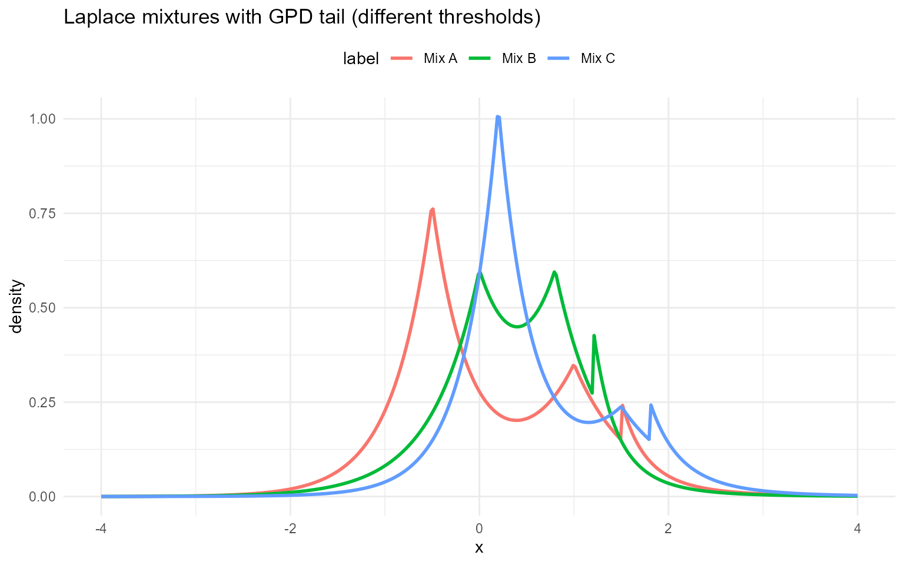

## Inverse Gaussian (mixture kernel)

### Inverse Gaussian mixture kernel

An inverse Gaussian component with mean $`\mu>0`$ and shape
$`\lambda>0`$ has density
``` math
f(y\mid \mu,\lambda)
=
\left(\frac{\lambda}{2\pi y^3}\right)^{1/2}
\exp\!\left(-\frac{\lambda (y-\mu)^2}{2\mu^2 y}\right),
\quad y>0.
```

A finite inverse Gaussian mixture is
``` math
f(y)=\sum_{j=1}^J w_j\,\text{IG}(y\mid \mu_j,\lambda_j),\quad y>0.
```

**Parameter mapping (math $`\rightarrow`$ code):**
$`\mu_j\to`$`mean[j]`, $`\lambda_j\to`$`shape[j]`, $`w_j\to`$`w[j]`.

### Inverse Gaussian mixture with GPD tail

The spliced variant attaches a GPD tail above $`u`$.

**Tail mapping (math $`\rightarrow`$ code):** $`u\to`$`threshold`,
$`\sigma\to`$`tail_scale`, $`\xi\to`$`tail_shape`.

### Without GPD

``` r

grid <- seq(0.1, 6, length.out = 400)
ig_sets <- list(
  list(label = "Mix A", w = c(0.6, 0.3, 0.1), mean = c(1.0, 1.5, 2.0), shape = c(2.0, 3.0, 4.0)),
  list(label = "Mix B", w = c(0.5, 0.3, 0.2), mean = c(1.1, 1.6, 2.2), shape = c(2.2, 3.2, 4.2)),
  list(label = "Mix C", w = c(0.4, 0.35, 0.25), mean = c(0.9, 1.4, 2.1), shape = c(1.8, 2.8, 3.8))
)

example <- ig_sets[[1]]
```

``` r

dInvGaussMix(1, w = example$w, mean = example$mean, shape = example$shape)
```

    [1] 0.562

``` r

dInvGaussMix(1.5, w = example$w, mean = example$mean, shape = example$shape, log = TRUE)
```

    [1] -1.18

``` r

pInvGaussMix(1.5, w = example$w, mean = example$mean, shape = example$shape)
```

    [1] 0.729

``` r

pInvGaussMix(1.5, w = example$w, mean = example$mean, shape = example$shape, lower.tail = FALSE)
```

    [1] 0.271

``` r

pInvGaussMix(1.5, w = example$w, mean = example$mean, shape = example$shape, log.p = TRUE)
```

    [1] -0.316

``` r

qinvgaussmix(c(0.25, 0.5, 0.75), w = example$w, mean = example$mean,
             shape = example$shape)
```

    [1] 0.608 0.971 1.572

``` r

qinvgaussmix(c(0.25, 0.5, 0.75), w = example$w, mean = example$mean,
             shape = example$shape, lower.tail = FALSE)
```

    [1] 1.572 0.971 0.608

``` r

qinvgaussmix(c(log(0.25), log(0.5), log(0.75)), w = example$w,
             mean = example$mean, shape = example$shape, log.p = TRUE)
```

    [1] 0.608 0.971 1.572

``` r

x_vals <- c(0.5, 1.5, 3.0)
probs <- c(0.25, 0.5, 0.75)

vec_d <- dinvgaussmix(x_vals, w = example$w, mean = example$mean, shape = example$shape, log = FALSE)
scalar_d <- vapply(
  x_vals,
  function(xx) as.numeric(dInvGaussMix(xx, w = example$w, mean = example$mean, shape = example$shape, log = 0L)),
  numeric(1)
)
all.equal(vec_d, scalar_d)
```

    [1] TRUE

``` r

vec_p <- pinvgaussmix(x_vals, w = example$w, mean = example$mean, shape = example$shape,
                      lower.tail = TRUE, log.p = FALSE)
scalar_p <- vapply(
  x_vals,
  function(xx) as.numeric(pInvGaussMix(xx, w = example$w, mean = example$mean, shape = example$shape,
                                       lower.tail = 1L, log.p = 0L)),
  numeric(1)
)
all.equal(vec_p, scalar_p)
```

    [1] TRUE

``` r

vec_q <- qinvgaussmix(probs, w = example$w, mean = example$mean, shape = example$shape,
                      lower.tail = TRUE, log.p = FALSE)
scalar_q <- vapply(
  probs,
  function(pp) qInvGaussMix(pp, w = example$w, mean = example$mean, shape = example$shape,
                            lower.tail = TRUE, log.p = FALSE),
  numeric(1)
)
all.equal(vec_q, scalar_q)
```

    [1] TRUE

``` r

set.seed(123)
vec_r <- rinvgaussmix(5, w = example$w, mean = example$mean, shape = example$shape)
set.seed(123)
scalar_r <- vapply(
  seq_len(5),
  function(i) rInvGaussMix(1, w = example$w, mean = example$mean, shape = example$shape),
  numeric(1)
)
all.equal(vec_r, scalar_r)
```

    [1] TRUE

``` r

rinvgaussmix(5, w = example$w, mean = example$mean, shape = example$shape)
```

    [1] 2.138 1.020 2.066 0.843 0.867

``` r

df_ig <- do.call(rbind, lapply(ig_sets, function(ps) {
  data.frame(
    x = grid,
    density = dinvgaussmix(grid, w = ps$w, mean = ps$mean, shape = ps$shape),
    label = ps$label
  )
}))

ggplot(df_ig, aes(x = x, y = density, color = label)) +
  geom_line(linewidth = 1) +
  labs(title = "Inverse Gaussian mixtures (bulk)", x = "x", y = "density") +
  theme_minimal() + theme(legend.position = "top")
```

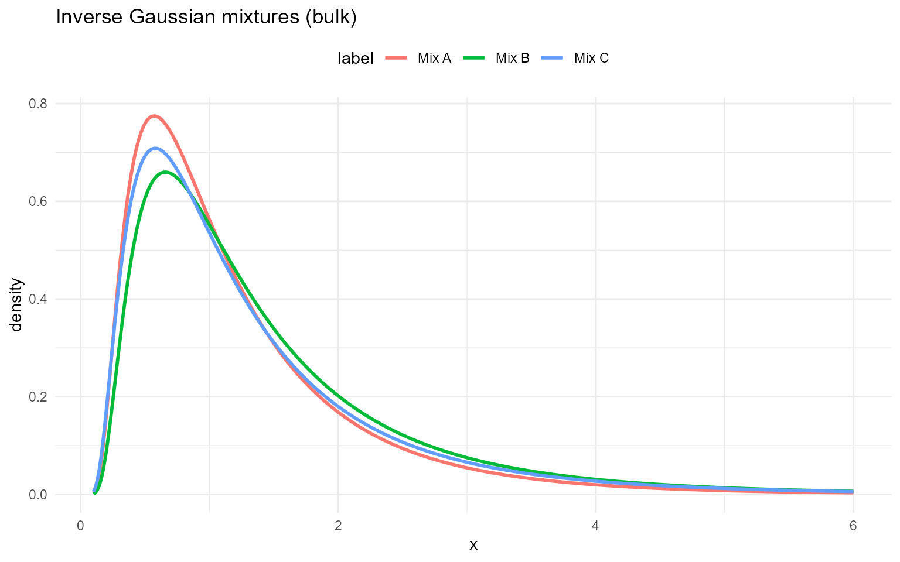

### With GPD tail

``` r

ig_gpd_sets <- list(
  list(label = "Mix A", w = c(0.6, 0.4), mean = c(1, 2.5), shape = c(2, 3), threshold = 2.5, tail_scale = 0.5, tail_shape = 0.25),
  list(label = "Mix B", w = c(0.5, 0.5), mean = c(1.5, 2), shape = c(2.5, 2.5), threshold = 2.0, tail_scale = 0.4, tail_shape = 0.2),
  list(label = "Mix C", w = c(0.7, 0.3), mean = c(1.2, 3), shape = c(3, 2), threshold = 3.0, tail_scale = 0.6, tail_shape = 0.18)
)

example <- ig_gpd_sets[[1]]
```

``` r

dInvGaussMixGpd(2.5, w = example$w, mean = example$mean, shape = example$shape, threshold = example$threshold, tail_scale = example$tail_scale, tail_shape = example$tail_shape)
```

    [1] 0.325

``` r

pInvGaussMixGpd(2.5, w = example$w, mean = example$mean, shape = example$shape, threshold = example$threshold, tail_scale = example$tail_scale, tail_shape = example$tail_shape)
```

    [1] 0.837

``` r

qinvgaussmixgpd(c(0.5, 0.9), w = example$w, mean = example$mean,
                shape = example$shape, threshold = example$threshold,
                tail_scale = example$tail_scale, tail_shape = example$tail_shape)
```

    [1] 1.06 2.76

``` r

x_vals <- c(2.0, 2.5, 3.0)
probs <- c(0.5, 0.9)

vec_d <- dinvgaussmixgpd(
  x_vals,
  w = example$w,
  mean = example$mean,
  shape = example$shape,
  threshold = example$threshold,
  tail_scale = example$tail_scale,
  tail_shape = example$tail_shape,
  log = FALSE
)
scalar_d <- vapply(
  x_vals,
  function(xx) as.numeric(dInvGaussMixGpd(
    xx,
    w = example$w,
    mean = example$mean,
    shape = example$shape,
    threshold = example$threshold,
    tail_scale = example$tail_scale,
    tail_shape = example$tail_shape,
    log = 0L
  )),
  numeric(1)
)
all.equal(vec_d, scalar_d)
```

    [1] TRUE

``` r

vec_p <- pinvgaussmixgpd(
  x_vals,
  w = example$w,
  mean = example$mean,
  shape = example$shape,
  threshold = example$threshold,
  tail_scale = example$tail_scale,
  tail_shape = example$tail_shape,
  lower.tail = TRUE,
  log.p = FALSE
)
scalar_p <- vapply(
  x_vals,
  function(xx) as.numeric(pInvGaussMixGpd(
    xx,
    w = example$w,
    mean = example$mean,
    shape = example$shape,
    threshold = example$threshold,
    tail_scale = example$tail_scale,
    tail_shape = example$tail_shape,
    lower.tail = 1L,
    log.p = 0L
  )),
  numeric(1)
)
all.equal(vec_p, scalar_p)
```

    [1] TRUE

``` r

vec_q <- qinvgaussmixgpd(
  probs,
  w = example$w,
  mean = example$mean,
  shape = example$shape,
  threshold = example$threshold,
  tail_scale = example$tail_scale,
  tail_shape = example$tail_shape,
  lower.tail = TRUE,
  log.p = FALSE
)
scalar_q <- vapply(
  probs,
  function(pp) qInvGaussMixGpd(
    pp,
    w = example$w,
    mean = example$mean,
    shape = example$shape,
    threshold = example$threshold,
    tail_scale = example$tail_scale,
    tail_shape = example$tail_shape,
    lower.tail = TRUE,
    log.p = FALSE
  ),
  numeric(1)
)
all.equal(vec_q, scalar_q)
```

    [1] TRUE

``` r

set.seed(123)
vec_r <- rinvgaussmixgpd(
  5,
  w = example$w,
  mean = example$mean,
  shape = example$shape,
  threshold = example$threshold,
  tail_scale = example$tail_scale,
  tail_shape = example$tail_shape
)
set.seed(123)
scalar_r <- vapply(
  seq_len(5),
  function(i) rInvGaussMixGpd(
    1,
    w = example$w,
    mean = example$mean,
    shape = example$shape,
    threshold = example$threshold,
    tail_scale = example$tail_scale,
    tail_shape = example$tail_shape
  ),
  numeric(1)
)
all.equal(vec_r, scalar_r)
```

    [1] TRUE

``` r

rinvgaussmixgpd(5, w = example$w, mean = example$mean, shape = example$shape,
                threshold = example$threshold, tail_scale = example$tail_scale,
                tail_shape = example$tail_shape)
```

    [1] 1.738 2.066 0.498 0.599 0.491

``` r

df_ig_gpd <- do.call(rbind, lapply(ig_gpd_sets, function(ps) {
  data.frame(
    x = grid,
    density = dinvgaussmixgpd(
      grid,
      w = ps$w,
      mean = ps$mean,
      shape = ps$shape,
      threshold = ps$threshold,
      tail_scale = ps$tail_scale,
      tail_shape = ps$tail_shape
    ),
    label = ps$label
  )
}))

ggplot(df_ig_gpd, aes(x = x, y = density, color = label)) +
  geom_line(linewidth = 1) +
  labs(title = "Inverse Gaussian mixtures with GPD tail", x = "x", y = "density") +
  theme_minimal() + theme(legend.position = "top")
```

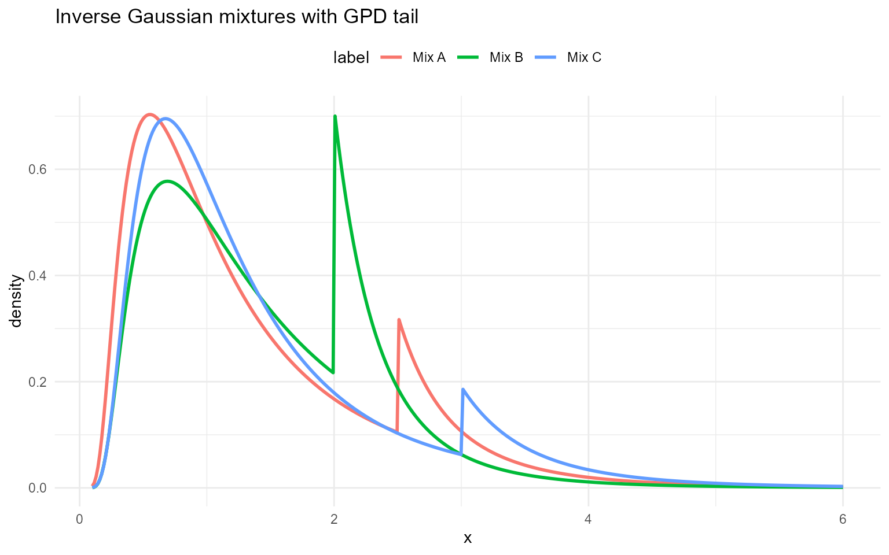

## Amoroso (bulk kernel and mixture)

### Amoroso mixture kernel

An Amoroso component with location $`a\in\mathbb{R}`$, scale
$`\theta\neq 0`$, and shapes $`\alpha>0`$, $`\beta>0`$ has density (for
$`y>a`$)
``` math
f(y\mid a,\theta,\alpha,\beta)
=
\frac{1}{\Gamma(\alpha)}
\left|\frac{\beta}{\theta}\right|
\left(\frac{y-a}{\theta}\right)^{\alpha\beta-1}
\exp\!\left[-\left(\frac{y-a}{\theta}\right)^{\beta}\right].
```

A finite Amoroso mixture is
``` math
f(y)=\sum_{j=1}^J w_j\,f_j(y\mid a_j,\theta_j,\alpha_j,\beta_j).
```

**Parameter mapping (math $`\rightarrow`$ code):** $`a_j\to`$`loc[j]`,
$`\theta_j\to`$`scale[j]`, $`\alpha_j\to`$`shape1[j]`,
$`\beta_j\to`$`shape2[j]`, $`w_j\to`$`w[j]`.

### Amoroso mixture with GPD tail

The spliced kernel attaches a GPD tail above $`u`$.

**Tail mapping (math $`\rightarrow`$ code):** $`u\to`$`threshold`,
$`\sigma\to`$`tail_scale`, $`\xi\to`$`tail_shape`.

### Without GPD

``` r

grid <- seq(0.01, 6, length.out = 400)
amor_sets <- list(
  list(label = "Mix A", w = c(0.6, 0.3, 0.1), loc = c(0.5, 0.5, 0.5), scale = c(1.0, 1.3, 1.6), shape1 = c(2.5, 3.0, 4.0), shape2 = c(1.2, 1.2, 1.2)),
  list(label = "Mix B", w = c(0.5, 0.3, 0.2), loc = c(0.4, 0.6, 0.6), scale = c(1.1, 1.2, 1.5), shape1 = c(2.2, 2.8, 3.8), shape2 = c(1.1, 1.2, 1.3)),
  list(label = "Mix C", w = c(0.4, 0.35, 0.25), loc = c(0.6, 0.6, 0.6), scale = c(0.9, 1.1, 1.4), shape1 = c(2.0, 2.6, 3.5), shape2 = c(1.0, 1.1, 1.2))
)

example <- amor_sets[[1]]
```

``` r

dAmorosoMix(2, w = example$w, loc = example$loc, scale = example$scale,
            shape1 = example$shape1, shape2 = example$shape2)
```

    [1] 0.305

``` r

dAmorosoMix(2, w = example$w, loc = example$loc, scale = example$scale,
            shape1 = example$shape1, shape2 = example$shape2, log = TRUE)
```

    [1] -1.19

``` r

pAmorosoMix(2, w = example$w, loc = example$loc, scale = example$scale,
            shape1 = example$shape1, shape2 = example$shape2)
```

    [1] 0.24

``` r

pAmorosoMix(2, w = example$w, loc = example$loc, scale = example$scale,
            shape1 = example$shape1, shape2 = example$shape2, lower.tail = FALSE)
```

    [1] 0.76

``` r

pAmorosoMix(2, w = example$w, loc = example$loc, scale = example$scale,
            shape1 = example$shape1, shape2 = example$shape2, log.p = TRUE)
```

    [1] -1.43

``` r

qamorosomix(c(0.25, 0.5, 0.75), w = example$w, loc = example$loc,
            scale = example$scale, shape1 = example$shape1, shape2 = example$shape2)
```

    [1] 2.03 2.86 3.99

``` r

qamorosomix(c(0.25, 0.5, 0.75), w = example$w, loc = example$loc,
            scale = example$scale, shape1 = example$shape1, shape2 = example$shape2,
            lower.tail = FALSE)
```

    [1] 3.99 2.86 2.03

``` r

qamorosomix(c(log(0.25), log(0.5), log(0.75)), w = example$w,
            loc = example$loc, scale = example$scale, shape1 = example$shape1,
            shape2 = example$shape2, log.p = TRUE)
```

    [1] 2.03 2.86 3.99

``` r

x_vals <- c(0.8, 1.4, 2.2)
probs <- c(0.25, 0.5, 0.75)

vec_d <- damorosomix(
  x_vals,
  w = example$w,
  loc = example$loc,
  scale = example$scale,
  shape1 = example$shape1,
  shape2 = example$shape2,
  log = FALSE
)
scalar_d <- vapply(
  x_vals,
  function(xx) as.numeric(dAmorosoMix(
    xx,
    w = example$w,
    loc = example$loc,
    scale = example$scale,
    shape1 = example$shape1,
    shape2 = example$shape2,
    log = 0L
  )),
  numeric(1)
)
all.equal(vec_d, scalar_d)
```

    [1] TRUE

``` r

vec_p <- pamorosomix(
  x_vals,
  w = example$w,
  loc = example$loc,
  scale = example$scale,
  shape1 = example$shape1,
  shape2 = example$shape2,
  lower.tail = TRUE,
  log.p = FALSE
)
scalar_p <- vapply(
  x_vals,
  function(xx) as.numeric(pAmorosoMix(
    xx,
    w = example$w,
    loc = example$loc,
    scale = example$scale,
    shape1 = example$shape1,
    shape2 = example$shape2,
    lower.tail = 1L,
    log.p = 0L
  )),
  numeric(1)
)
all.equal(vec_p, scalar_p)
```

    [1] TRUE

``` r

vec_q <- qamorosomix(
  probs,
  w = example$w,
  loc = example$loc,
  scale = example$scale,
  shape1 = example$shape1,
  shape2 = example$shape2,
  lower.tail = TRUE,
  log.p = FALSE
)
scalar_q <- vapply(
  probs,
  function(pp) qAmorosoMix(
    pp,
    w = example$w,
    loc = example$loc,
    scale = example$scale,
    shape1 = example$shape1,
    shape2 = example$shape2,
    lower.tail = TRUE,
    log.p = FALSE
  ),
  numeric(1)
)
all.equal(vec_q, scalar_q)
```

    [1] TRUE

``` r

set.seed(123)
vec_r <- ramorosomix(
  5,
  w = example$w,
  loc = example$loc,
  scale = example$scale,
  shape1 = example$shape1,
  shape2 = example$shape2
)
set.seed(123)
scalar_r <- vapply(
  seq_len(5),
  function(i) rAmorosoMix(
    1,
    w = example$w,
    loc = example$loc,
    scale = example$scale,
    shape1 = example$shape1,
    shape2 = example$shape2
  ),
  numeric(1)
)
all.equal(vec_r, scalar_r)
```

    [1] TRUE

``` r

ramorosomix(
  5,
  w = example$w,
  loc = example$loc,
  scale = example$scale,
  shape1 = example$shape1,
  shape2 = example$shape2
)
```

    [1] 4.99 3.73 4.08 1.09 4.74

``` r

df_amor <- do.call(rbind, lapply(amor_sets, function(ps) {
  data.frame(
    x = grid,
    density = damorosomix(
      grid,
      w = ps$w,
      loc = ps$loc,
      scale = ps$scale,
      shape1 = ps$shape1,
      shape2 = ps$shape2
    ),
    label = ps$label
  )
}))

ggplot(df_amor, aes(x = x, y = density, color = label)) +
  geom_line(linewidth = 1) +
  labs(title = "Amoroso mixtures (bulk)", x = "x", y = "density") +
  theme_minimal() + theme(legend.position = "top")
```

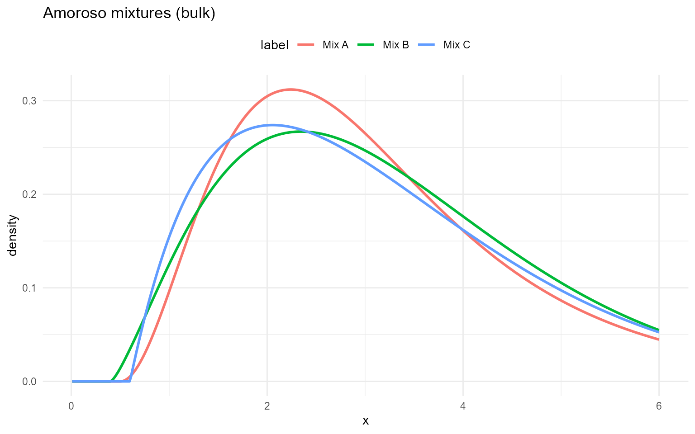

### With GPD tail

``` r

amor_gpd_sets <- list(
  list(label = "Mix A", w = c(0.6, 0.3, 0.1), loc = c(0.5, 0.5, 0.5), scale = c(1.0, 1.3, 1.6), shape1 = c(2.5, 3.0, 4.0), shape2 = c(1.2, 1.2, 1.2), threshold = 2.8, tail_scale = 0.4, tail_shape = 0.2),
  list(label = "Mix B", w = c(0.5, 0.3, 0.2), loc = c(0.4, 0.6, 0.6), scale = c(1.1, 1.2, 1.5), shape1 = c(2.2, 2.8, 3.8), shape2 = c(1.1, 1.2, 1.3), threshold = 3.0, tail_scale = 0.35, tail_shape = 0.18),
  list(label = "Mix C", w = c(0.4, 0.35, 0.25), loc = c(0.6, 0.6, 0.6), scale = c(0.9, 1.1, 1.4), shape1 = c(2.0, 2.6, 3.5), shape2 = c(1.0, 1.1, 1.2), threshold = 2.5, tail_scale = 0.45, tail_shape = 0.22)
)
example <- amor_gpd_sets[[1]]
```

``` r

dAmorosoMixGpd(3, w = example$w, loc = example$loc, scale = example$scale,
               shape1 = example$shape1, shape2 = example$shape2,
               threshold = example$threshold, tail_scale = example$tail_scale,
               tail_shape = example$tail_shape)
```

    [1] 0.729

``` r

dAmorosoMixGpd(3, w = example$w, loc = example$loc, scale = example$scale,
               shape1 = example$shape1, shape2 = example$shape2,
               threshold = example$threshold, tail_scale = example$tail_scale,
               tail_shape = example$tail_shape, log = TRUE)
```

    [1] -0.316

``` r

pAmorosoMixGpd(3, w = example$w, loc = example$loc, scale = example$scale,
               shape1 = example$shape1, shape2 = example$shape2,
               threshold = example$threshold, tail_scale = example$tail_scale,
               tail_shape = example$tail_shape)
```

    [1] 0.679

``` r

pAmorosoMixGpd(3, w = example$w, loc = example$loc, scale = example$scale,
               shape1 = example$shape1, shape2 = example$shape2,
               threshold = example$threshold, tail_scale = example$tail_scale,
               tail_shape = example$tail_shape, lower.tail = FALSE)
```

    [1] 0.321

``` r

pAmorosoMixGpd(3, w = example$w, loc = example$loc, scale = example$scale,
               shape1 = example$shape1, shape2 = example$shape2,
               threshold = example$threshold, tail_scale = example$tail_scale,
               tail_shape = example$tail_shape, log.p = TRUE)
```

    [1] -0.387

``` r

qamorosomixgpd(c(0.25, 0.5, 0.75), w = example$w, loc = example$loc,
               scale = example$scale, shape1 = example$shape1, shape2 = example$shape2,
               threshold = example$threshold, tail_scale = example$tail_scale,
               tail_shape = example$tail_shape)
```

    [1] 2.03 2.81 3.11

``` r

qamorosomixgpd(c(0.25, 0.5, 0.75), w = example$w, loc = example$loc,
               scale = example$scale, shape1 = example$shape1, shape2 = example$shape2,
               threshold = example$threshold, tail_scale = example$tail_scale,
               tail_shape = example$tail_shape, lower.tail = FALSE)
```

    [1] 3.11 2.81 2.03

``` r

qamorosomixgpd(c(log(0.25), log(0.5), log(0.75)), w = example$w,
               loc = example$loc, scale = example$scale, shape1 = example$shape1,
               shape2 = example$shape2, threshold = example$threshold,
               tail_scale = example$tail_scale, tail_shape = example$tail_shape,
               log.p = TRUE)
```

    [1] 2.03 2.81 3.11

``` r

x_vals <- c(2.0, 3.0, 4.0)
probs <- c(0.25, 0.5, 0.75)

vec_d <- damorosomixgpd(
  x_vals,
  w = example$w,
  loc = example$loc,
  scale = example$scale,
  shape1 = example$shape1,
  shape2 = example$shape2,
  threshold = example$threshold,
  tail_scale = example$tail_scale,
  tail_shape = example$tail_shape,
  log = FALSE
)
scalar_d <- vapply(
  x_vals,
  function(xx) as.numeric(dAmorosoMixGpd(
    xx,
    w = example$w,
    loc = example$loc,
    scale = example$scale,
    shape1 = example$shape1,
    shape2 = example$shape2,
    threshold = example$threshold,
    tail_scale = example$tail_scale,
    tail_shape = example$tail_shape,
    log = 0L
  )),
  numeric(1)
)
all.equal(vec_d, scalar_d)
```

    [1] TRUE

``` r

vec_p <- pamorosomixgpd(
  x_vals,
  w = example$w,
  loc = example$loc,
  scale = example$scale,
  shape1 = example$shape1,
  shape2 = example$shape2,
  threshold = example$threshold,
  tail_scale = example$tail_scale,
  tail_shape = example$tail_shape,
  lower.tail = TRUE,
  log.p = FALSE
)
scalar_p <- vapply(
  x_vals,
  function(xx) as.numeric(pAmorosoMixGpd(
    xx,
    w = example$w,
    loc = example$loc,
    scale = example$scale,
    shape1 = example$shape1,
    shape2 = example$shape2,
    threshold = example$threshold,
    tail_scale = example$tail_scale,
    tail_shape = example$tail_shape,
    lower.tail = 1L,
    log.p = 0L
  )),
  numeric(1)
)
all.equal(vec_p, scalar_p)
```

    [1] TRUE

``` r

vec_q <- qamorosomixgpd(
  probs,
  w = example$w,
  loc = example$loc,
  scale = example$scale,
  shape1 = example$shape1,
  shape2 = example$shape2,
  threshold = example$threshold,
  tail_scale = example$tail_scale,
  tail_shape = example$tail_shape,
  lower.tail = TRUE,
  log.p = FALSE
)
scalar_q <- vapply(
  probs,
  function(pp) qAmorosoMixGpd(
    pp,
    w = example$w,
    loc = example$loc,
    scale = example$scale,
    shape1 = example$shape1,
    shape2 = example$shape2,
    threshold = example$threshold,
    tail_scale = example$tail_scale,
    tail_shape = example$tail_shape,
    lower.tail = TRUE,
    log.p = FALSE
  ),
  numeric(1)
)
all.equal(vec_q, scalar_q)
```

    [1] TRUE

``` r

set.seed(123)
vec_r <- ramorosomixgpd(
  5,
  w = example$w,
  loc = example$loc,
  scale = example$scale,
  shape1 = example$shape1,
  shape2 = example$shape2,
  threshold = example$threshold,
  tail_scale = example$tail_scale,
  tail_shape = example$tail_shape
)
set.seed(123)
scalar_r <- vapply(
  seq_len(5),
  function(i) rAmorosoMixGpd(
    1,
    w = example$w,
    loc = example$loc,
    scale = example$scale,
    shape1 = example$shape1,
    shape2 = example$shape2,
    threshold = example$threshold,
    tail_scale = example$tail_scale,
    tail_shape = example$tail_shape
  ),
  numeric(1)
)
all.equal(vec_r, scalar_r)
```

    [1] TRUE

``` r

ramorosomixgpd(
  5,
  w = example$w,
  loc = example$loc,
  scale = example$scale,
  shape1 = example$shape1,
  shape2 = example$shape2,
  threshold = example$threshold,
  tail_scale = example$tail_scale,
  tail_shape = example$tail_shape
)
```

    [1] 3.17 2.54 4.74 3.33 6.42

``` r

df_amor_gpd <- do.call(rbind, lapply(amor_gpd_sets, function(ps) {
  data.frame(
    x = grid,
    density = damorosomixgpd(
      grid,
      w = ps$w,
      loc = ps$loc,
      scale = ps$scale,
      shape1 = ps$shape1,
      shape2 = ps$shape2,
      threshold = ps$threshold,
      tail_scale = ps$tail_scale,
      tail_shape = ps$tail_shape
    ),
    label = ps$label
  )
}))

ggplot(df_amor_gpd, aes(x = x, y = density, color = label)) +
  geom_line(linewidth = 1) +
  labs(title = "Amoroso mixtures with GPD tail", x = "x", y = "density") +
  theme_minimal() + theme(legend.position = "top")
```

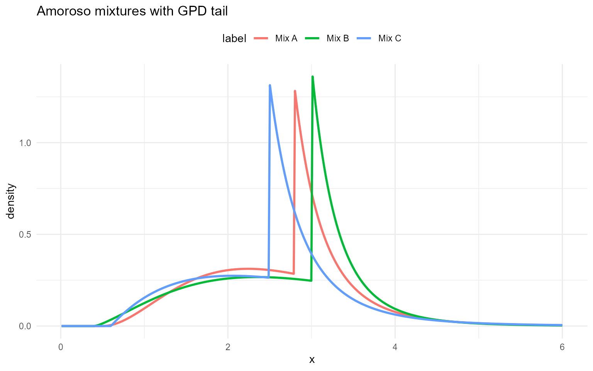

## Inverse Gaussian (base kernel)

### Inverse Gaussian base kernel

This section documents the same inverse Gaussian density as above, but
for a **single** component rather than a mixture:
``` math
f(y\mid \mu,\lambda)
=
\left(\frac{\lambda}{2\pi y^3}\right)^{1/2}
\exp\!\left(-\frac{\lambda (y-\mu)^2}{2\mu^2 y}\right),
\quad y>0.
```

**Parameter mapping (math $`\rightarrow`$ code):** $`\mu\to`$`mean`,
$`\lambda\to`$`shape`.

### Inverse Gaussian base with GPD tail

The `dInvGaussGpd`, `pInvGaussGpd`, `qInvGaussGpd`, and `rInvGaussGpd`
functions splice the base inverse Gaussian below $`u`$ with a GPD tail
above $`u`$.

**Tail mapping (math $`\rightarrow`$ code):** $`u\to`$`threshold`,
$`\sigma\to`$`tail_scale`, $`\xi\to`$`tail_shape`.

### Without GPD

``` r

grid <- seq(0.1, 6, length.out = 400)
ig_base_sets <- list(
  list(label = "Base A", mean = 1.2, shape = 3.0),
  list(label = "Base B", mean = 1.5, shape = 4.0),
  list(label = "Base C", mean = 1.0, shape = 2.5)
)

example <- ig_base_sets[[1]]
```

``` r

dInvGauss(1, mean = example$mean, shape = example$shape)
```

    [1] 0.663

``` r

dInvGauss(1, mean = example$mean, shape = example$shape, log = TRUE)
```

    [1] -0.411

``` r

pInvGauss(1, mean = example$mean, shape = example$shape)
```

    [1] 0.497

``` r

pInvGauss(1, mean = example$mean, shape = example$shape, lower.tail = FALSE)
```

    [1] 0.503

``` r

pInvGauss(1, mean = example$mean, shape = example$shape, log.p = TRUE)
```

    [1] -0.698

``` r

qinvgauss(c(0.25, 0.5, 0.75), mean = example$mean,
          shape = example$shape)
```

    [1] 0.673 1.004 1.509

``` r

qinvgauss(c(0.25, 0.5, 0.75), mean = example$mean,
          shape = example$shape, lower.tail = FALSE)
```

    [1] 1.509 1.004 0.673

``` r

qinvgauss(c(log(0.25), log(0.5), log(0.75)), mean = example$mean,
          shape = example$shape, log.p = TRUE)
```

    [1] 0.673 1.004 1.509

``` r

x_vals <- c(0.5, 1.5, 3.0)
probs <- c(0.25, 0.5, 0.75)

vec_d <- dinvgauss(x_vals, mean = example$mean, shape = example$shape, log = FALSE)
scalar_d <- vapply(
  x_vals,
  function(xx) as.numeric(dInvGauss(xx, mean = example$mean, shape = example$shape, log = 0L)),
  numeric(1)
)
all.equal(vec_d, scalar_d)
```

    [1] TRUE

``` r

vec_p <- pinvgauss(x_vals, mean = example$mean, shape = example$shape,
                   lower.tail = TRUE, log.p = FALSE)
scalar_p <- vapply(
  x_vals,
  function(xx) as.numeric(pInvGauss(xx, mean = example$mean, shape = example$shape,
                                    lower.tail = 1L, log.p = 0L)),
  numeric(1)
)
all.equal(vec_p, scalar_p)
```

    [1] TRUE

``` r

vec_q <- qinvgauss(probs, mean = example$mean, shape = example$shape,
                   lower.tail = TRUE, log.p = FALSE)
scalar_q <- vapply(
  probs,
  function(pp) qInvGauss(pp, mean = example$mean, shape = example$shape,
                         lower.tail = TRUE, log.p = FALSE),
  numeric(1)
)
all.equal(vec_q, scalar_q)
```

    [1] TRUE

``` r

set.seed(123)
vec_r <- rinvgauss(5, mean = example$mean, shape = example$shape)
set.seed(123)
scalar_r <- vapply(
  seq_len(5),
  function(i) rInvGauss(1, mean = example$mean, shape = example$shape),
  numeric(1)
)
all.equal(vec_r, scalar_r)
```

    [1] TRUE

``` r

rinvgauss(5, mean = example$mean, shape = example$shape)
```

    [1] 0.545 1.589 1.648 0.932 1.032

``` r

df_ig_base <- do.call(rbind, lapply(ig_base_sets, function(ps) {
  data.frame(
    x = grid,
    density = dinvgauss(grid, mean = ps$mean, shape = ps$shape),
    label = ps$label
  )
}))

ggplot(df_ig_base, aes(x = x, y = density, color = label)) +
  geom_line(linewidth = 1) +
  labs(title = "Inverse Gaussian base kernels", x = "x", y = "density") +
  theme_minimal() + theme(legend.position = "top")
```


### With GPD tail

``` r

ig_base_gpd_sets <- list(
  list(label = "Base A", mean = 1.5, shape = 2, threshold = 2.0, tail_scale = 0.4, tail_shape = 0.2),
  list(label = "Base B", mean = 1.2, shape = 2.5, threshold = 1.8, tail_scale = 0.35, tail_shape = 0.18),
  list(label = "Base C", mean = 1.8, shape = 3, threshold = 2.5, tail_scale = 0.5, tail_shape = 0.22)
)
example <- ig_base_gpd_sets[[1]]
```

``` r

dInvGaussGpd(2, mean = example$mean, shape = example$shape,
             threshold = example$threshold, tail_scale = example$tail_scale,
             tail_shape = example$tail_shape)
```

    [1] 0.57

``` r

dInvGaussGpd(2, mean = example$mean, shape = example$shape,
             threshold = example$threshold, tail_scale = example$tail_scale,
             tail_shape = example$tail_shape, log = TRUE)
```

    [1] -0.561

``` r

pInvGaussGpd(2, mean = example$mean, shape = example$shape,
             threshold = example$threshold, tail_scale = example$tail_scale,
             tail_shape = example$tail_shape)
```

    [1] 0.772

``` r

pInvGaussGpd(2, mean = example$mean, shape = example$shape,
             threshold = example$threshold, tail_scale = example$tail_scale,
             tail_shape = example$tail_shape, lower.tail = FALSE)
```

    [1] 0.228

``` r

pInvGaussGpd(2, mean = example$mean, shape = example$shape,
             threshold = example$threshold, tail_scale = example$tail_scale,
             tail_shape = example$tail_shape, log.p = TRUE)
```

    [1] -0.259

``` r

qinvgaussgpd(c(0.25, 0.5, 0.75), mean = example$mean,
             shape = example$shape, threshold = example$threshold,
             tail_scale = example$tail_scale, tail_shape = example$tail_shape)
```

    [1] 0.656 1.101 1.890

``` r

qinvgaussgpd(c(0.25, 0.5, 0.75), mean = example$mean,
             shape = example$shape, threshold = example$threshold,
             tail_scale = example$tail_scale, tail_shape = example$tail_shape,
             lower.tail = FALSE)
```

    [1] 1.890 1.101 0.656

``` r

qinvgaussgpd(c(log(0.25), log(0.5), log(0.75)), mean = example$mean,
             shape = example$shape, threshold = example$threshold,
             tail_scale = example$tail_scale, tail_shape = example$tail_shape,
             log.p = TRUE)
```

    [1] 0.656 1.101 1.890

``` r

x_vals <- c(1.5, 2.0, 2.5)
probs <- c(0.25, 0.5, 0.75)

vec_d <- dinvgaussgpd(
  x_vals,
  mean = example$mean,
  shape = example$shape,
  threshold = example$threshold,
  tail_scale = example$tail_scale,
  tail_shape = example$tail_shape,
  log = FALSE
)
scalar_d <- vapply(
  x_vals,
  function(xx) as.numeric(dInvGaussGpd(
    xx,
    mean = example$mean,
    shape = example$shape,
    threshold = example$threshold,
    tail_scale = example$tail_scale,
    tail_shape = example$tail_shape,
    log = 0L
  )),
  numeric(1)
)
all.equal(vec_d, scalar_d)
```

    [1] TRUE

``` r

vec_p <- pinvgaussgpd(
  x_vals,
  mean = example$mean,
  shape = example$shape,
  threshold = example$threshold,
  tail_scale = example$tail_scale,
  tail_shape = example$tail_shape,
  lower.tail = TRUE,
  log.p = FALSE
)
scalar_p <- vapply(
  x_vals,
  function(xx) as.numeric(pInvGaussGpd(
    xx,
    mean = example$mean,
    shape = example$shape,
    threshold = example$threshold,
    tail_scale = example$tail_scale,
    tail_shape = example$tail_shape,
    lower.tail = 1L,
    log.p = 0L
  )),
  numeric(1)
)
all.equal(vec_p, scalar_p)
```

    [1] TRUE

``` r

vec_q <- qinvgaussgpd(
  probs,
  mean = example$mean,
  shape = example$shape,
  threshold = example$threshold,
  tail_scale = example$tail_scale,
  tail_shape = example$tail_shape,
  lower.tail = TRUE,
  log.p = FALSE
)
scalar_q <- vapply(
  probs,
  function(pp) qInvGaussGpd(
    pp,
    mean = example$mean,
    shape = example$shape,
    threshold = example$threshold,
    tail_scale = example$tail_scale,
    tail_shape = example$tail_shape,
    lower.tail = TRUE,
    log.p = FALSE
  ),
  numeric(1)
)
all.equal(vec_q, scalar_q)
```

    [1] TRUE

``` r

set.seed(123)
vec_r <- rinvgaussgpd(
  5,
  mean = example$mean,
  shape = example$shape,
  threshold = example$threshold,
  tail_scale = example$tail_scale,
  tail_shape = example$tail_shape
)
set.seed(123)
scalar_r <- vapply(
  seq_len(5),
  function(i) rInvGaussGpd(
    1,
    mean = example$mean,
    shape = example$shape,
    threshold = example$threshold,
    tail_scale = example$tail_scale,
    tail_shape = example$tail_shape
  ),
  numeric(1)
)
all.equal(vec_r, scalar_r)
```

    [1] TRUE

``` r

rinvgaussgpd(
  5,
  mean = example$mean,
  shape = example$shape,
  threshold = example$threshold,
  tail_scale = example$tail_scale,
  tail_shape = example$tail_shape
)
```

    [1] 5.980 2.532 0.226 1.221 3.185

``` r

df_ig_base_gpd <- do.call(rbind, lapply(ig_base_gpd_sets, function(ps) {
  data.frame(
    x = grid,
    density = dinvgaussgpd(
      grid,
      mean = ps$mean,
      shape = ps$shape,
      threshold = ps$threshold,
      tail_scale = ps$tail_scale,
      tail_shape = ps$tail_shape
    ),
    label = ps$label
  )
}))

ggplot(df_ig_base_gpd, aes(x = x, y = density, color = label)) +
  geom_line(linewidth = 1) +
  labs(title = "Inverse Gaussian base with GPD tail", x = "x", y = "density") +
  theme_minimal() + theme(legend.position = "top")
```


## Cauchy

### Cauchy base and mixtures

A Cauchy distribution with location $`x_0\in\mathbb{R}`$ and scale
$`\gamma>0`$ has density
``` math
f(y\mid x_0,\gamma)=\frac{1}{\pi\gamma\left[1+\left(\frac{y-x_0}{\gamma}\right)^2\right]},
\quad y\in\mathbb{R}.
```

A finite Cauchy mixture is
``` math
f(y)=\sum_{j=1}^J w_j\,\text{Cauchy}(y\mid x_{0j},\gamma_j).
```

**Parameter mapping (math $`\rightarrow`$ code):** $`x_0\to`$`location`,
$`\gamma\to`$`scale`; in mixtures $`x_{0j}\to`$`location[j]`,
$`\gamma_j\to`$`scale[j]`, $`w_j\to`$`w[j]`.

### Without GPD (base and mixture)

``` r

grid <- seq(-8, 8, length.out = 400)
cauchy_sets <- list(
  list(label = "Base", location = 0, scale = 1),
  list(label = "Mix A", w = c(0.6, 0.3, 0.1), location = c(-1, 0, 1), scale = c(1.0, 1.2, 2)),
  list(label = "Mix B", w = c(0.5, 0.3, 0.2), location = c(-1.5, 0.5, 1.5), scale = c(1.1, 1.0, 0.9))
)

base_par <- cauchy_sets[[1]]
mix_par1 <- cauchy_sets[[2]]
```

``` r

dCauchy(0, location = base_par$location, scale = base_par$scale)
```

    [1] 0.318

``` r

dCauchy(0, location = base_par$location, scale = base_par$scale, log = TRUE)
```

    [1] -1.14

``` r

pCauchy(0, location = base_par$location, scale = base_par$scale)
```

    [1] 0.5

``` r

pCauchy(0, location = base_par$location, scale = base_par$scale, lower.tail = FALSE)
```

    [1] 0.5

``` r

pCauchy(0, location = base_par$location, scale = base_par$scale, log.p = TRUE)
```

    [1] -0.693

``` r

qcauchy_vec(c(0.25, 0.5, 0.75), location = base_par$location,
            scale = base_par$scale)
```

    [1] -1  0  1

``` r

qcauchy_vec(c(0.25, 0.5, 0.75), location = base_par$location,
            scale = base_par$scale, lower.tail = FALSE)
```

    [1]  1  0 -1

``` r

qcauchy_vec(c(log(0.25), log(0.5), log(0.75)), location = base_par$location,
            scale = base_par$scale, log.p = TRUE)
```

    [1] -1  0  1

``` r

x_vals <- c(-1.0, 0.0, 1.0)
probs <- c(0.25, 0.5, 0.75)

vec_d <- dcauchy_vec(x_vals, location = base_par$location, scale = base_par$scale, log = FALSE)
scalar_d <- vapply(
  x_vals,
  function(xx) as.numeric(dCauchy(xx, location = base_par$location, scale = base_par$scale, log = 0L)),
  numeric(1)
)
all.equal(vec_d, scalar_d)
```

    [1] TRUE

``` r

vec_p <- pcauchy_vec(x_vals, location = base_par$location, scale = base_par$scale,
                     lower.tail = TRUE, log.p = FALSE)
scalar_p <- vapply(
  x_vals,
  function(xx) as.numeric(pCauchy(xx, location = base_par$location, scale = base_par$scale,
                                  lower.tail = 1L, log.p = 0L)),
  numeric(1)
)
all.equal(vec_p, scalar_p)
```

    [1] TRUE

``` r

vec_q <- qcauchy_vec(probs, location = base_par$location, scale = base_par$scale,
                     lower.tail = TRUE, log.p = FALSE)
scalar_q <- vapply(
  probs,
  function(pp) qCauchy(pp, location = base_par$location, scale = base_par$scale,
                       lower.tail = TRUE, log.p = FALSE),
  numeric(1)
)
all.equal(vec_q, scalar_q)
```

    [1] TRUE

``` r

set.seed(123)
vec_r <- rcauchy_vec(5, location = base_par$location, scale = base_par$scale)
set.seed(123)
scalar_r <- vapply(
  seq_len(5),
  function(i) rCauchy(1, location = base_par$location, scale = base_par$scale),
  numeric(1)
)
all.equal(vec_r, scalar_r)
```

    [1] TRUE

``` r

rcauchy_vec(5, location = base_par$location, scale = base_par$scale)
```

    [1] -6.9394  0.0885  2.8453  0.1630 -0.1371

``` r

dCauchyMix(0, w = mix_par1$w, location = mix_par1$location, scale = mix_par1$scale)
```

    [1] 0.188

``` r

dCauchyMix(0, w = mix_par1$w, location = mix_par1$location, scale = mix_par1$scale, log = TRUE)
```

    [1] -1.67

``` r

x_vals <- c(-1.0, 0.0, 1.0)

vec_d <- dcauchymix(x_vals, w = mix_par1$w, location = mix_par1$location, scale = mix_par1$scale, log = FALSE)
scalar_d <- vapply(
  x_vals,
  function(xx) as.numeric(dCauchyMix(xx, w = mix_par1$w, location = mix_par1$location, scale = mix_par1$scale, log = 0L)),
  numeric(1)
)
all.equal(vec_d, scalar_d)
```

    [1] TRUE

``` r

vec_p <- pcauchymix(x_vals, w = mix_par1$w, location = mix_par1$location, scale = mix_par1$scale,
                    lower.tail = TRUE, log.p = FALSE)
scalar_p <- vapply(
  x_vals,
  function(xx) as.numeric(pCauchyMix(xx, w = mix_par1$w, location = mix_par1$location, scale = mix_par1$scale,
                                     lower.tail = 1L, log.p = 0L)),
  numeric(1)
)
all.equal(vec_p, scalar_p)
```

    [1] TRUE

``` r

probs <- c(0.25, 0.5, 0.75)
vec_q <- qcauchymix(probs, w = mix_par1$w, location = mix_par1$location, scale = mix_par1$scale,
                    lower.tail = TRUE, log.p = FALSE)
scalar_q <- vapply(
  probs,
  function(pp) qCauchyMix(pp, w = mix_par1$w, location = mix_par1$location, scale = mix_par1$scale,
                          lower.tail = TRUE, log.p = FALSE),
  numeric(1)
)
all.equal(vec_q, scalar_q)
```

    [1] TRUE

``` r

set.seed(123)
vec_r <- rcauchymix(5, w = mix_par1$w, location = mix_par1$location, scale = mix_par1$scale)
set.seed(123)
scalar_r <- vapply(
  seq_len(5),
  function(i) rCauchyMix(1, w = mix_par1$w, location = mix_par1$location, scale = mix_par1$scale),
  numeric(1)
)
all.equal(vec_r, scalar_r)
```

    [1] TRUE

``` r

rcauchymix(5, w = mix_par1$w, location = mix_par1$location, scale = mix_par1$scale)
```

    [1]  0.705  0.279  2.072 -8.524  5.949

``` r

df_cauchy <- rbind(
  data.frame(
    x = grid,
    density = dcauchy_vec(grid, location = base_par$location, scale = base_par$scale),
    label = "Base"
  ),
  data.frame(
    x = grid,
    density = dcauchymix(grid, w = mix_par1$w, location = mix_par1$location, scale = mix_par1$scale),
    label = "Mix A"
  ),
  data.frame(
    x = grid,
    density = dcauchymix(
      grid,
      w = cauchy_sets[[3]]$w,
      location = cauchy_sets[[3]]$location,
      scale = cauchy_sets[[3]]$scale
    ),
    label = "Mix B"
  )
)

ggplot(df_cauchy, aes(x = x, y = density, color = label)) +
  geom_line(linewidth = 1) +
  labs(title = "Cauchy base and mixtures", x = "x", y = "density") +
  theme_minimal() + theme(legend.position = "top")
```

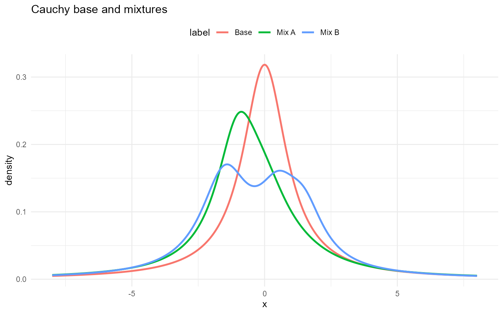

## Summary: Distribution & Backend Reference

This section provides a compact reference for the distributions
supported by **DPmixGPD** and the corresponding user-facing function
families.  
The **CRP backend** uses base (single-kernel) functions, while the **SB
backend** uses mixture (multi-component) functions. The “Type” column
indicates whether each backend expects **scalar** parameters (single
value per parameter) or **vectors** indexed by mixture component.

[TABLE]

### Notes

- **CRP Backend** uses base (single-kernel) functions; parameters are
  scalar.

- **SB Backend** uses mixture/spliced mixture functions;
  component-specific parameters are typically vectors indexed by
  component $`j`$; mixture weights `w` are required as vector.

- For **GPD-only**, SB entries are **NA** because there is no
  mixture-only GPD wrapper in the SB family.
