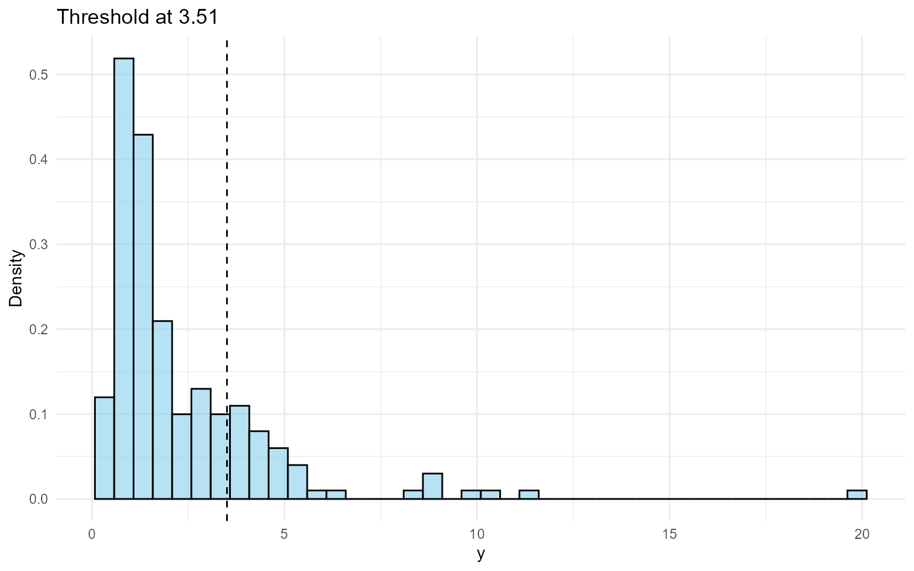
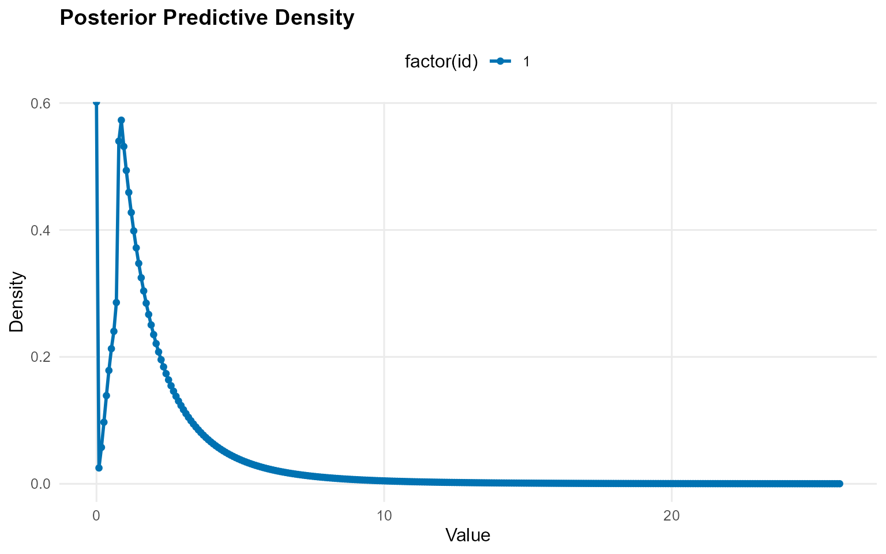
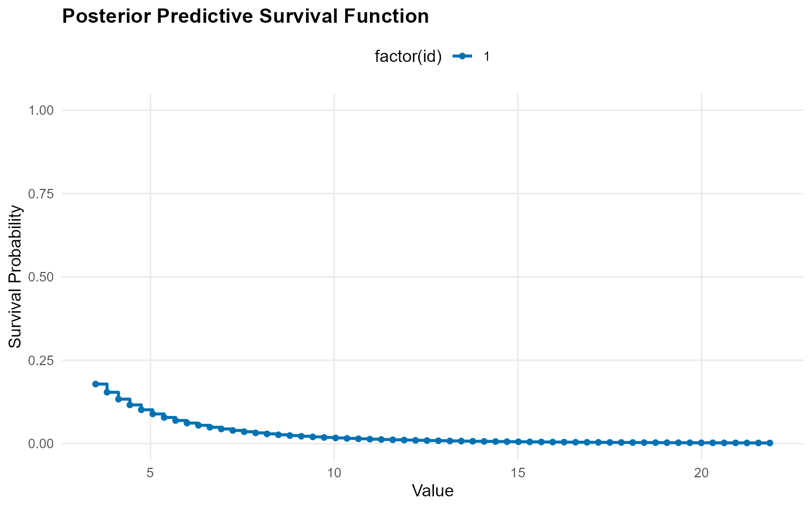
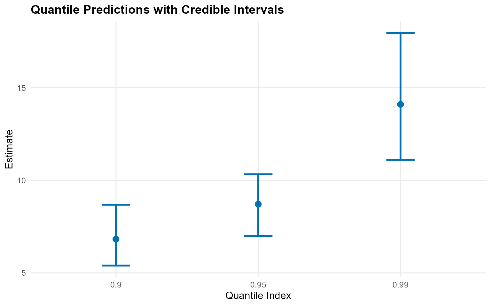
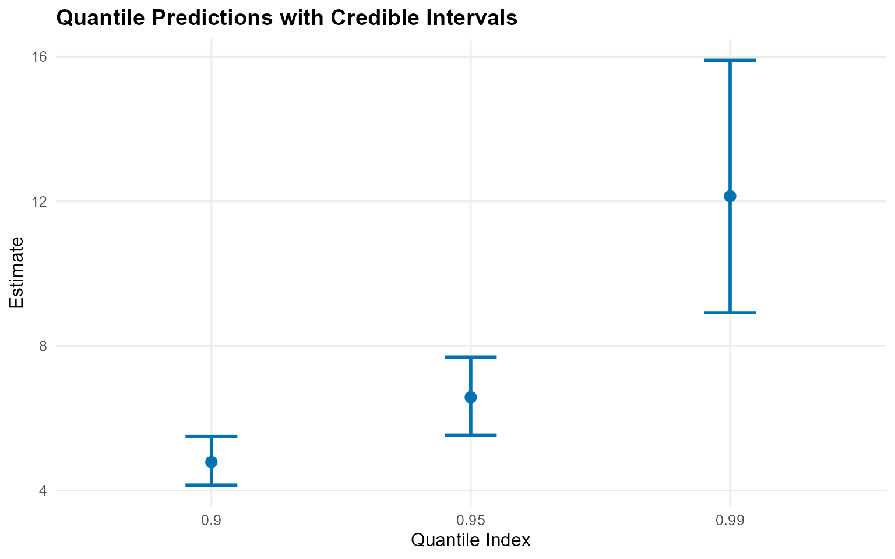
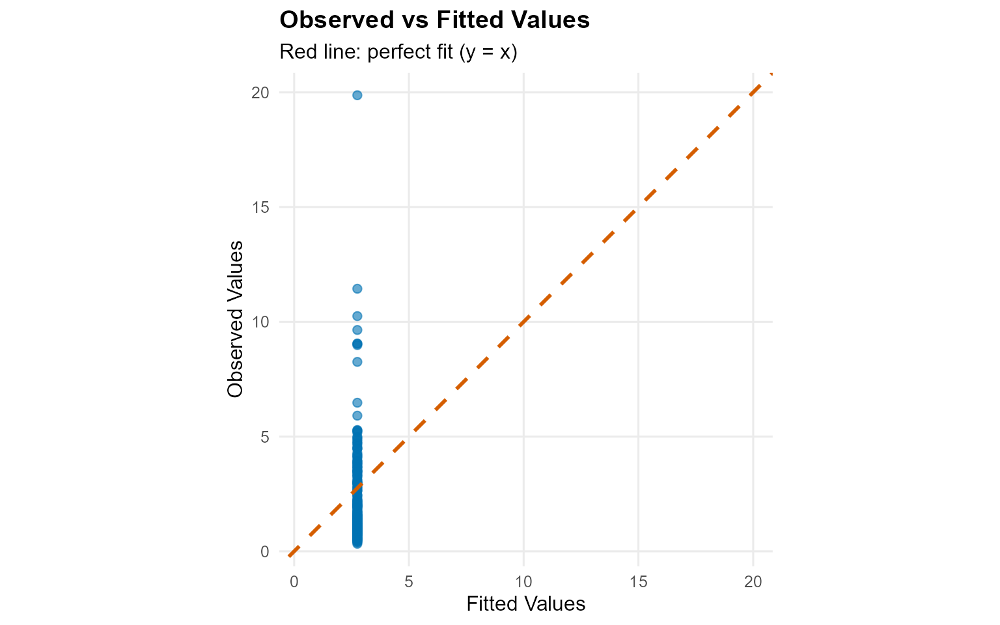
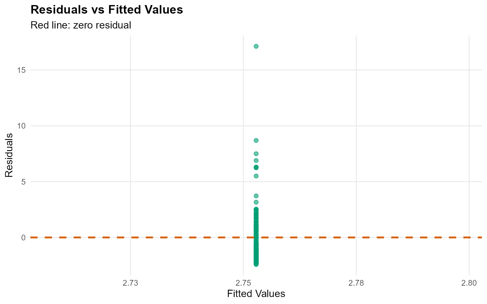
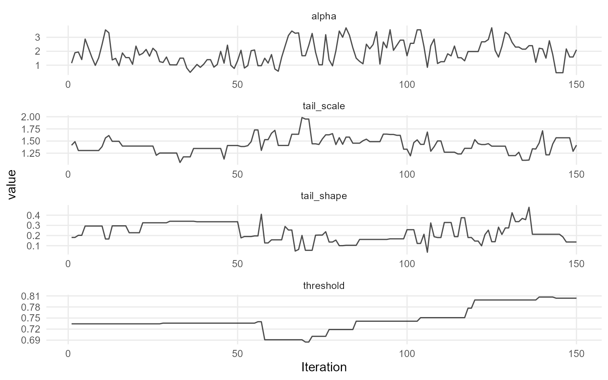
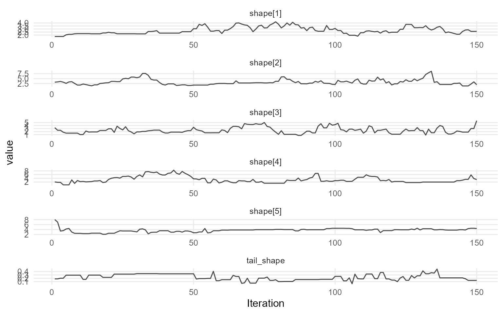
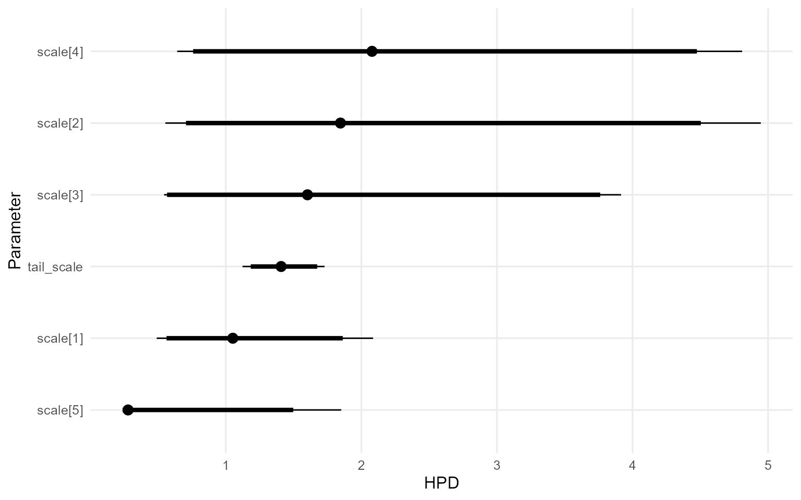

# 9. Unconditional DPmixGPD with Stick-Breaking Backend

> **Cookbook vignette (for the website / historical notes).** These
> files may not match the current exported API one-to-one. Last
> verified: **2026-01-18**.
>
> For the up-to-date workflow, see the main package vignettes
> (Introduction, Model Spec, MCMC Workflow,
> Unconditional/Conditional/Causal, Backends, S3 Reference).

### Theory (brief)

The stick-breaking backend truncates the DP mixture to a fixed number of
components, while the GPD tail handles extreme values beyond a
threshold. This combination yields flexible bulk fit and stable tail
inference.

## Unconditional DPmixGPD: Stick-Breaking (SB) Backend with Tail Augmentation

**Purpose**: Demonstrate the stick-breaking backend (`components = J`)
while augmenting the extreme tail with a GPD. This mirrors the CRP+GPD
pipeline (v06) but highlights the fixed-truncation behavior for bulk
components.

------------------------------------------------------------------------

### Data Setup

``` r

# Tail-heavy data
data("nc_pos_tail200_k4")
y_tail <- nc_pos_tail200_k4$y

summary_tbl <- tibble(
  statistic = c("N", "Mean", "SD", "Min", "Max"),
  value = c(length(y_tail), mean(y_tail), sd(y_tail), min(y_tail), max(y_tail))
)

df_data <- data.frame(y = y_tail)

p_raw <- ggplot(df_data, aes(x = y)) +
  geom_histogram(aes(y = after_stat(density)), bins = 40, fill = "darkorange", alpha = 0.6, color = "black") +
  geom_density(color = "darkred", linewidth = 1) +
  labs(title = "Tail-Designed Data", x = "y", y = "Density") +
  theme_minimal()

print(p_raw)
```


| statistic |  value  |
|:---------:|:-------:|
|     N     | 200.000 |
|   Mean    |  2.334  |
|    SD     |  2.300  |
|    Min    |  0.328  |
|    Max    | 19.870  |

Tail Dataset Summaries {.table .table .table-striped .table-hover
style="width: auto !important; margin-left: auto; margin-right: auto;"}

------------------------------------------------------------------------

### Threshold Selection

``` r

thresholds <- quantile(y_tail, c(0.70, 0.75, 0.80, 0.85))
u_threshold <- thresholds["80%"]

ggplot(df_data, aes(x = y)) +
  geom_histogram(aes(y = after_stat(density)), bins = 40, fill = "skyblue", alpha = 0.6, color = "black") +
  geom_vline(xintercept = u_threshold, linetype = "dashed", color = "black") +
  labs(title = paste("Threshold at", round(u_threshold, 2)), x = "y", y = "Density") +
  theme_minimal()
```



------------------------------------------------------------------------

### Model Specification & Bundle

This follows the same structure as the SB bulk-only vignette (`v05`):
build a bundle with
[`build_nimble_bundle()`](https://arnabaich96.github.io/DPmixGPD/reference/build_nimble_bundle.md),
run MCMC, then use the S3
[`predict()`](https://rdrr.io/r/stats/predict.html) +
[`plot()`](https://rdrr.io/r/graphics/plot.default.html) helpers.
Compared with `v06` (CRP+GPD), here we keep the **stick-breaking**
backend and use a **Gamma** bulk kernel with a lognormal threshold
prior, then contrast it with a bulk-only **Laplace** fit.

``` r

bundle_sb_gpd <- build_nimble_bundle(
  y = y_tail,
  kernel = "gamma",
  backend = "sb",
  GPD = TRUE,
  components = 5,
  param_specs = list(
    gpd = list(
      threshold = list(
        mode = "dist",
        dist = "lognormal",
        args = list(meanlog = log(max(u_threshold, .Machine$double.eps)), sdlog = 0.25)
      )
    )
  ),
  mcmc = mcmc
)
```

------------------------------------------------------------------------

### Running MCMC

``` r

fit_sb_gpd <- load_or_fit("v09-unconditional-DPmixGPD-SB-fit_sb_gpd", run_mcmc_bundle_manual(bundle_sb_gpd))
summary(fit_sb_gpd)
```

    MixGPD summary | backend: Stick-Breaking Process | kernel: Gamma Distribution | GPD tail: TRUE | epsilon: 0.025
    n = 200 | components = 5
    Summary
    Initial components: 5 | Components after truncation: 4

    WAIC: 663.354
    lppd: -312.156 | pWAIC: 19.521

    Summary table
      parameter  mean    sd q0.025 q0.500 q0.975    ess
     weights[1] 0.391 0.078   0.28  0.375  0.538  2.359
     weights[2] 0.269 0.039  0.205  0.265  0.353  9.042
     weights[3]  0.18 0.052  0.087   0.19   0.26  2.671
     weights[4] 0.129 0.052  0.054   0.12  0.226  6.368
          alpha 1.904 0.812  0.547  1.864  3.536 50.116
     tail_scale 1.423 0.163  1.123  1.408  1.728 28.375
     tail_shape  0.23  0.09  0.055  0.212  0.375  9.136
      threshold 0.746 0.033  0.691  0.736  0.807  1.926
       shape[1] 2.889 1.072  1.737  2.566  4.782 24.412
       shape[2] 3.237 1.196  1.542  3.177  5.834 13.145
       shape[3] 3.205 1.131  1.605  2.958  6.149  55.82
       shape[4] 2.952 0.958   1.34  2.964  4.629 27.463
       scale[1] 1.401 0.901  0.279  1.148  3.439 11.876
       scale[2] 1.648 1.258  0.253  1.474  4.441 39.134
       scale[3] 1.367 1.236  0.253  0.975   4.79 54.823
       scale[4]  1.42 1.054  0.239  1.166  3.851 34.189

``` r

params_sb_gpd <- params(fit_sb_gpd)
params_sb_gpd
```

    Posterior mean parameters

    $alpha
    [1] "1.904"

    $w
    [1] "0.391" "0.269" "0.18"  "0.129"

    $shape
    [1] "2.889" "3.237" "3.205" "2.952"

    $scale
    [1] "1.401" "1.648" "1.367" "1.42" 

    $tail_scale
    [1] "1.423"

    $tail_shape
    [1] "0.23"

------------------------------------------------------------------------

### Posterior Predictions

``` r

y_grid <- seq(0, max(y_tail) * 1.3, length.out = 300)
pred_density <- predict(fit_sb_gpd, y = y_grid, type = "density")
plot(pred_density)
```



``` r

y_surv <- seq(u_threshold, max(y_tail) * 1.1, length.out = 60)
pred_surv <- predict(fit_sb_gpd, y = y_surv, type = "survival")
plot(pred_surv)
```



``` r

quant_probs <- c(0.90, 0.95, 0.99)
pred_quant <- predict(fit_sb_gpd, type = "quantile", index = quant_probs, interval = "credible")
plot(pred_quant)
```


------------------------------------------------------------------------

### Tail vs Bulk Comparison

``` r

bundle_sb_bulk <- build_nimble_bundle(
  y = y_tail,
  kernel = "laplace",
  backend = "sb",
  GPD = FALSE,
  components = 5,
  mcmc = mcmc
)
fit_sb_bulk <- load_or_fit("v09-unconditional-DPmixGPD-SB-fit_sb_bulk", run_mcmc_bundle_manual(bundle_sb_bulk))

bulk_quant <- predict(fit_sb_bulk, type = "quantile", index = quant_probs)
t_quant <- predict(fit_sb_gpd, type = "quantile", index = quant_probs)

bind_rows(
  bulk_quant$fit %>% mutate(model = "Bulk-only"),
  t_quant$fit %>% mutate(model = "Bulk + GPD")
) %>%
  select(any_of(c("model", "index", "estimate", "lwr", "upr", "lower", "upper"))) %>%
  mutate(across(where(is.numeric), ~ round(.x, 3))) %>%
  kable(caption = "Quantiles: Bulk-only vs GPD-augmented", align = "c") %>%
  kable_styling(bootstrap_options = c("striped", "hover"), full_width = FALSE, position = "center")
```

|   model    | index | estimate | lower | upper |
|:----------:|:-----:|:--------:|:-----:|:-----:|
| Bulk-only  | 0.90  |   6.82   | 5.39  | 8.68  |
| Bulk-only  | 0.95  |   8.71   | 7.00  | 10.33 |
| Bulk-only  | 0.99  |  14.11   | 11.11 | 17.97 |
| Bulk + GPD | 0.90  |   4.79   | 4.15  | 5.49  |
| Bulk + GPD | 0.95  |   6.58   | 5.53  | 7.69  |
| Bulk + GPD | 0.99  |  12.14   | 8.92  | 15.90 |

Quantiles: Bulk-only vs GPD-augmented {.table .table .table-striped
.table-hover
style="width: auto !important; margin-left: auto; margin-right: auto;"}

``` r

plot(bulk_quant)
```



``` r

plot(t_quant)
```



------------------------------------------------------------------------

### Residuals & Diagnostics

``` r

fit_vals <- fitted(fit_sb_gpd)
plot(fit_vals)
```



``` r

plot(fit_sb_gpd, family = "traceplot")
```


    === traceplot ===



``` r

plot(fit_sb_gpd, params = "shape", family = "traceplot")
```


    === traceplot ===



``` r

plot(fit_sb_gpd, params = "scale", family = "caterpillar")
```


    === caterpillar ===



------------------------------------------------------------------------

### Key Takeaways

- Stick-breaking truncation fixes the number of bulk components but
  still flexibly models the tail via GPD.
- Posterior [`predict()`](https://rdrr.io/r/stats/predict.html) +
  [`plot()`](https://rdrr.io/r/graphics/plot.default.html) workflows
  visualize densities, survival probabilities, and posterior-mean
  extreme quantiles.
- Comparing bulk-only vs GPD-augmented quantiles reveals how tail
  augmentation shifts the 95–99% levels.
- Next: conditional DPmix (v08–v11) to explore covariate effects before
  moving to causal regimes.
