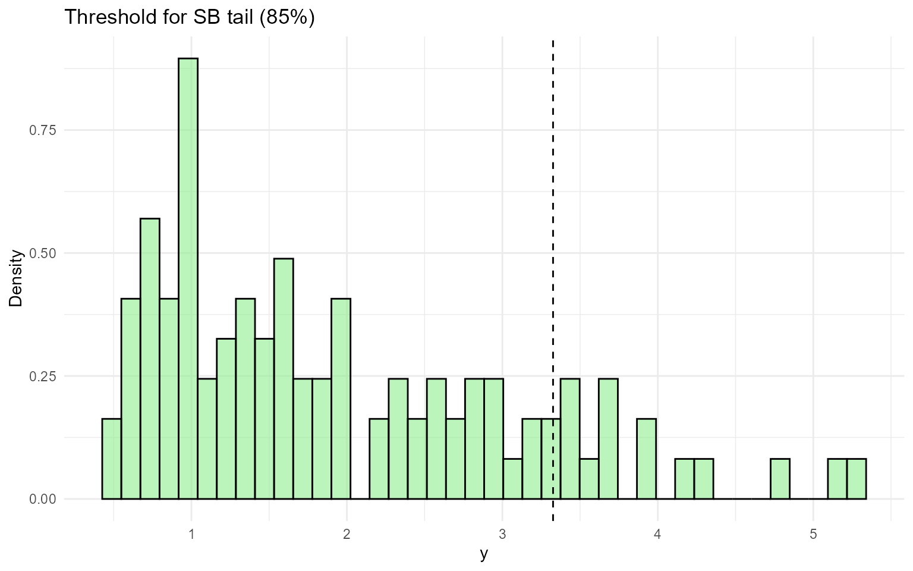
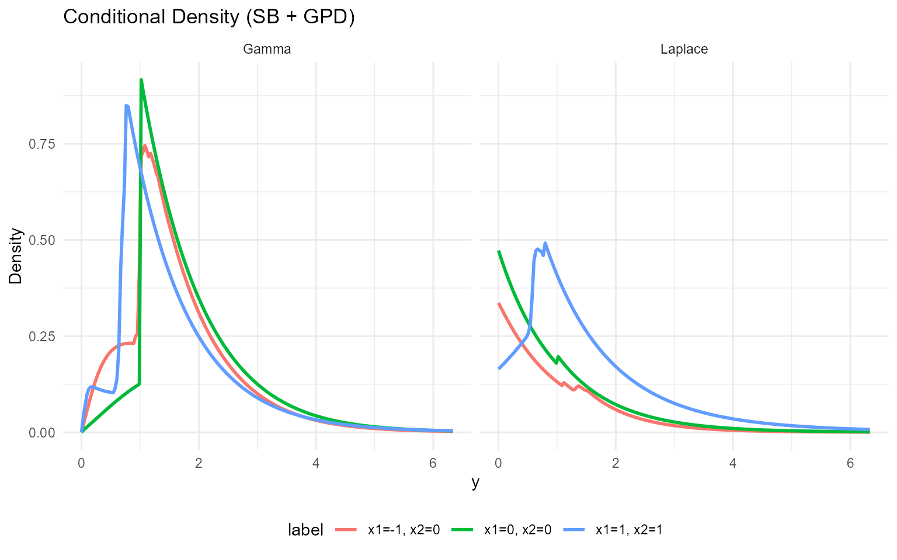
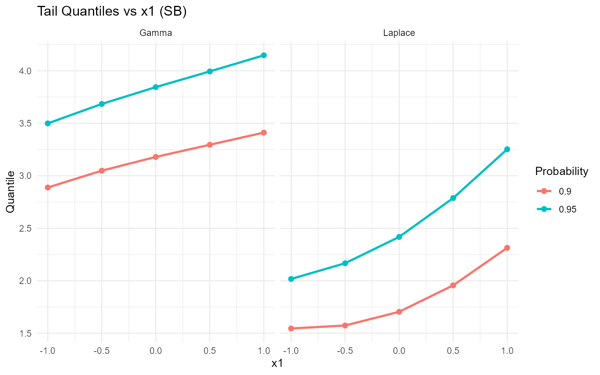
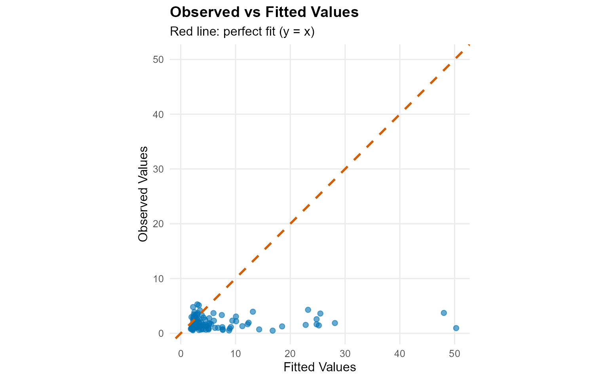
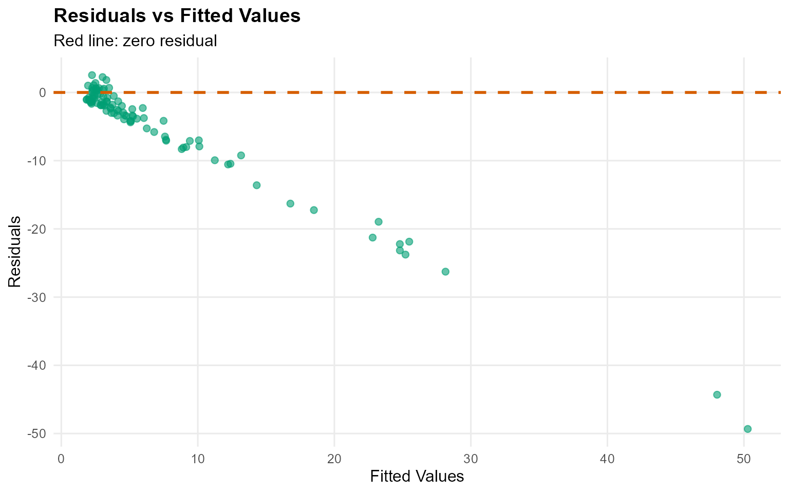
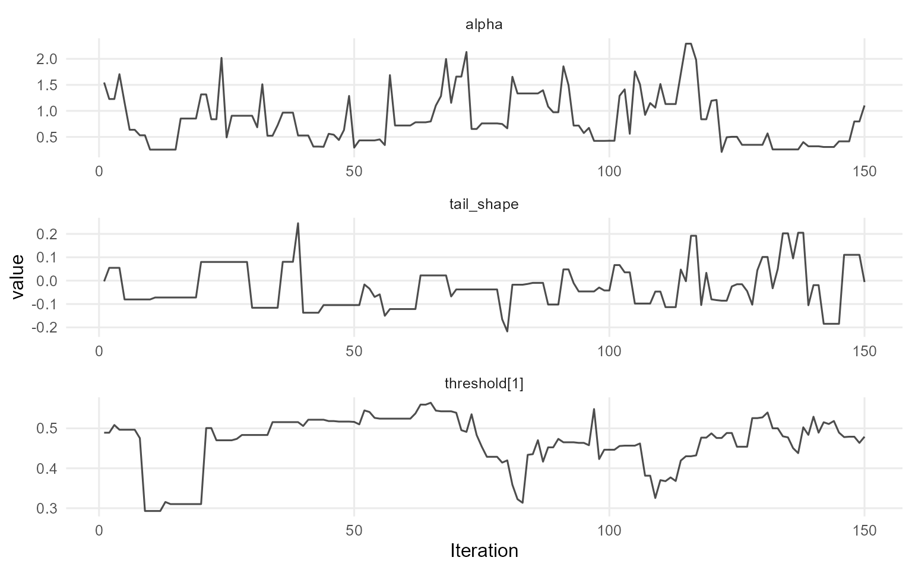
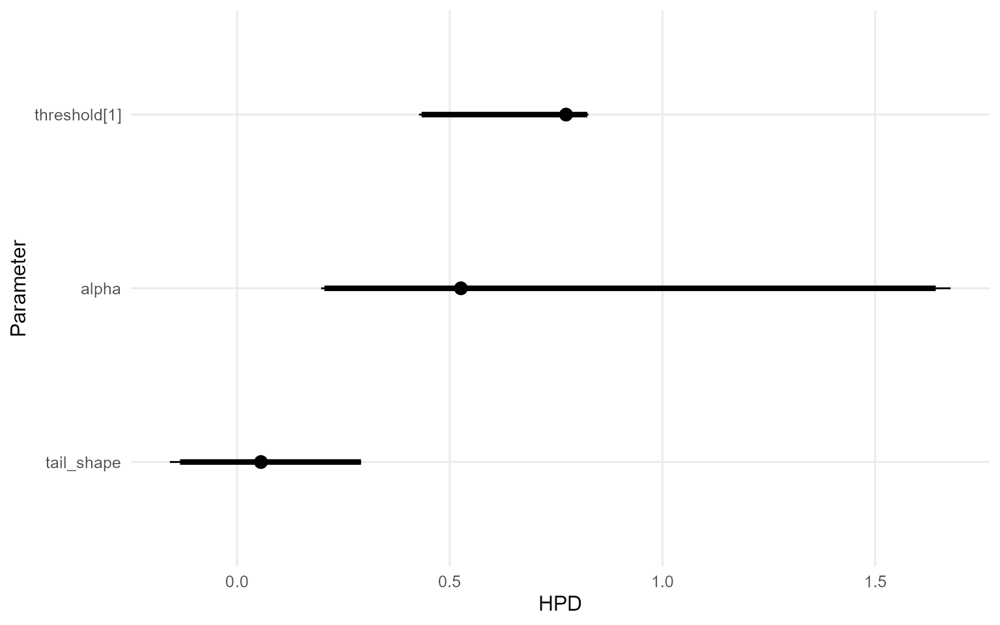

# 13. Conditional DPmixGPD with Stick-Breaking Backend

> **Cookbook vignette (for the website / historical notes).** These
> files may not match the current exported API one-to-one. Last
> verified: **2026-01-18**.
>
> For the up-to-date workflow, see the main package vignettes
> (Introduction, Model Spec, MCMC Workflow,
> Unconditional/Conditional/Causal, Backends, S3 Reference).

### Theory (brief)

Conditional DP mixtures allow covariate-dependent kernels. Adding a GPD
tail replaces the bulk kernel beyond a threshold, improving stability
for extremes. The stick-breaking backend truncates the mixture to a
fixed number of components.

## Conditional DPmixGPD: Stick-Breaking Backend

**Purpose**: Apply fixed-component stick-breaking truncation to
covariate-dependent mixtures while keeping the GPD tail. This vignette
mirrors `v10` but with the SB backend.

------------------------------------------------------------------------

### Data Setup

``` r

data("nc_posX100_p5_k4")
y <- nc_posX100_p5_k4$y
X <- as.matrix(nc_posX100_p5_k4$X)
if (is.null(colnames(X))) {
  colnames(X) <- paste0("x", seq_len(ncol(X)))
}

summary_tbl <- tibble(
  statistic = c("N", "Mean", "SD", "Min", "Max"),
  value = c(length(y), mean(y), sd(y), min(y), max(y))
)

ggplot(data.frame(y = y, x1 = X[, 1]), aes(x = x1, y = y)) +
  geom_point(alpha = 0.6, color = "purple") +
  geom_smooth(method = "loess", color = "orange", fill = NA) +
  labs(title = "Tail Outcome vs x1 (SB)", x = "x1", y = "y") +
  theme_minimal()
```


| statistic |  value  |
|:---------:|:-------:|
|     N     | 100.000 |
|   Mean    |  1.942  |
|    SD     |  1.146  |
|    Min    |  0.488  |
|    Max    |  5.278  |

Conditional Tail Summary (SB) {.table .table .table-striped .table-hover
style="width: auto !important; margin-left: auto; margin-right: auto;"}

------------------------------------------------------------------------

### Threshold

``` r

u_threshold <- quantile(y, 0.85)

ggplot(data.frame(y = y), aes(x = y)) +
  geom_histogram(aes(y = after_stat(density)), bins = 40, fill = "lightgreen", alpha = 0.6, color = "black") +
  geom_vline(xintercept = u_threshold, linetype = "dashed", color = "black") +
  labs(title = "Threshold for SB tail (85%)", x = "y", y = "Density") +
  theme_minimal()
```



------------------------------------------------------------------------

### Model Specification

``` r

bundle_sb_cond_gpd_gamma <- build_nimble_bundle(
  y = y,
  X = X,
  kernel = "gamma",
  backend = "sb",
  GPD = TRUE,
  components = 5,
  param_specs = list(
    gpd = list(
      threshold = list(mode = "link", link = "exp")
    )
  ),
  mcmc = mcmc
)

bundle_sb_cond_gpd_laplace <- build_nimble_bundle(
  y = y,
  X = X,
  kernel = "laplace",
  backend = "sb",
  GPD = TRUE,
  components = 5,
  param_specs = list(
    gpd = list(
      threshold = list(mode = "link", link = "exp")
    )
  ),
  mcmc = mcmc
)
```

------------------------------------------------------------------------

### MCMC Execution

``` r

fit_sb_cond_gpd_gamma <- load_or_fit("v13-conditional-DPmixGPD-SB-fit_sb_cond_gpd_gamma", run_mcmc_bundle_manual(bundle_sb_cond_gpd_gamma))
fit_sb_cond_gpd_laplace <- load_or_fit("v13-conditional-DPmixGPD-SB-fit_sb_cond_gpd_laplace", run_mcmc_bundle_manual(bundle_sb_cond_gpd_laplace))
summary(fit_sb_cond_gpd_gamma)
```

    MixGPD summary | backend: Stick-Breaking Process | kernel: Gamma Distribution | GPD tail: TRUE | epsilon: 0.025
    n = 100 | components = 5
    Summary
    Initial components: 5 | Components after truncation: 2

    WAIC: 278.291
    lppd: -120.663 | pWAIC: 18.483

    Summary table
              parameter   mean    sd q0.025 q0.500 q0.975     ess
             weights[1]  0.588 0.143    0.4  0.515  0.853   2.203
             weights[2]  0.325 0.103  0.127  0.345   0.46   3.756
                  alpha  0.835 0.491  0.256  0.737  2.003  17.866
       beta_scale[1, 1]  0.422 0.493 -0.328  0.332  1.534  16.309
       beta_scale[2, 1]  0.092 0.485 -0.839   0.09  1.209  18.929
       beta_scale[3, 1] -0.005 1.637 -3.301 -0.176  3.168  19.678
       beta_scale[4, 1] -0.243 1.591 -2.998 -0.467  3.362  44.115
       beta_scale[5, 1]    0.4 1.682 -2.729  0.452  3.936  42.088
       beta_scale[1, 2]   -0.1 1.021 -2.226   0.01  1.772  10.268
       beta_scale[2, 2]  0.586 1.057 -2.287  0.745  2.891    10.8
       beta_scale[3, 2] -0.464 1.769 -3.977 -0.373   2.49  42.544
       beta_scale[4, 2]  0.746 1.772 -2.615  0.885  4.056  90.097
       beta_scale[5, 2] -0.005 1.807 -3.136  0.056  3.527  38.811
       beta_scale[1, 3] -0.247 0.428 -1.121 -0.149  0.363   5.856
       beta_scale[2, 3] -0.511 0.802  -2.15 -0.255  0.467  10.117
       beta_scale[3, 3]  0.113 1.817 -3.979  0.239  3.722  13.807
       beta_scale[4, 3] -0.426 1.795 -3.602 -0.493  3.668  31.224
       beta_scale[5, 3] -0.161 1.801 -3.253 -0.085  3.129  49.361
       beta_scale[1, 4]  0.515 1.946 -2.436  0.811  3.371   2.141
       beta_scale[2, 4]  1.414 1.964 -1.197  1.736  4.495   2.173
       beta_scale[3, 4]  0.795 2.012 -3.007  0.819  4.266  15.331
       beta_scale[4, 4]  0.034 1.845 -3.219 -0.336  4.295  22.417
       beta_scale[5, 4] -0.279 1.509 -2.591 -0.386  2.324 119.267
       beta_scale[1, 5]    0.9 0.384  0.357  0.831   1.58   7.446
       beta_scale[2, 5] -0.135  0.41 -0.895 -0.171   0.71  12.302
       beta_scale[3, 5]  0.411 1.626 -2.614  0.312  3.433  15.443
       beta_scale[4, 5]  0.593 2.039 -3.535  0.752    4.3  31.322
       beta_scale[5, 5]  0.522 1.728 -2.207  0.368  4.264  45.486
     beta_tail_scale[1]  0.096 0.101  -0.05  0.078  0.279  40.776
     beta_tail_scale[2] -0.084 0.178 -0.411 -0.067  0.323  55.972
     beta_tail_scale[3] -0.075 0.092 -0.239 -0.078  0.119  50.729
     beta_tail_scale[4]   0.48  0.24  0.062  0.494  0.957  20.701
     beta_tail_scale[5]  -0.01 0.089 -0.153 -0.005  0.147  13.988
      beta_threshold[1] -0.031 0.077 -0.238      0  0.043  13.557
      beta_threshold[2]  -0.35 0.095 -0.576 -0.351 -0.204    6.89
      beta_threshold[3]  0.172 0.039  0.095  0.175  0.233  17.012
      beta_threshold[4] -0.138 0.146  -0.44  -0.13  0.019   2.406
      beta_threshold[5] -0.183 0.063  -0.37 -0.156 -0.131  11.294
             tail_shape -0.028 0.092 -0.185  -0.04  0.202  66.591
               shape[1]  4.211 1.564  2.139  3.586  7.907   8.688
               shape[2]  3.417 1.114  1.644  3.324  5.746  21.125

``` r

summary(fit_sb_cond_gpd_laplace)
```

    MixGPD summary | backend: Stick-Breaking Process | kernel: Laplace Distribution | GPD tail: TRUE | epsilon: 0.025
    n = 100 | components = 5
    Summary
    Initial components: 5 | Components after truncation: 1

    WAIC: 337.031
    lppd: -143.1 | pWAIC: 25.415

    Summary table
               parameter   mean    sd q0.025 q0.500 q0.975    ess
              weights[1]  0.944 0.044   0.86   0.94      1 10.611
                   alpha  0.674 0.427  0.198  0.526  1.677   9.21
     beta_location[1, 1]  0.355 0.232 -0.049   0.37  0.815 53.842
     beta_location[2, 1]  0.241 1.711 -3.337  0.288  3.201 22.384
     beta_location[3, 1]  0.773 1.844 -3.243  0.628  4.167 64.133
     beta_location[4, 1]  -0.29 1.769 -3.549 -0.267  2.875 37.977
     beta_location[5, 1] -0.054 2.064 -4.343  0.006  4.063 25.167
     beta_location[1, 2]  0.847 0.423  0.043  0.833  1.674 41.316
     beta_location[2, 2]   -0.4 1.825 -3.203 -0.449  3.192 48.405
     beta_location[3, 2] -0.112 1.848 -3.482  0.318  3.607 57.324
     beta_location[4, 2] -0.266 1.787 -3.911 -0.241  3.185 77.397
     beta_location[5, 2]  0.247 2.139 -3.709  0.442  4.431 32.747
     beta_location[1, 3] -0.266 0.294 -0.785  -0.28  0.302 43.171
     beta_location[2, 3]  0.066  1.43  -3.19   0.14  2.299  25.36
     beta_location[3, 3] -1.069 1.883 -4.371 -1.308  2.534 21.457
     beta_location[4, 3]   0.47 1.876 -3.423  0.811  3.332 57.547
     beta_location[5, 3] -0.341  1.88 -4.237 -0.148   2.98 43.698
     beta_location[1, 4]  5.707 0.901  4.126  5.545  7.617 33.601
     beta_location[2, 4]   1.43 1.825  -1.98  1.406  5.041 13.813
     beta_location[3, 4]  0.695 1.789 -2.738  0.682  3.519 31.353
     beta_location[4, 4]  0.866 1.887 -3.281  1.035  3.603 16.349
     beta_location[5, 4]  0.219     2 -3.441  0.085  3.984 38.281
     beta_location[1, 5]  0.433 0.335 -0.137  0.439  1.128 13.592
     beta_location[2, 5]  0.345 1.976 -3.133  0.186  4.245 15.141
     beta_location[3, 5] -0.214 2.181 -4.208 -0.361  3.915 30.082
     beta_location[4, 5]  0.694 1.699 -2.204  0.695  4.568 44.576
     beta_location[5, 5] -0.105 2.151 -4.723  0.466  2.502 30.141
      beta_tail_scale[1]  0.198 0.105 -0.056  0.204  0.405 99.046
      beta_tail_scale[2] -0.005 0.206 -0.355 -0.016   0.36 27.302
      beta_tail_scale[3] -0.079  0.12 -0.277   -0.1  0.128 32.465
      beta_tail_scale[4]  0.295 0.281 -0.378  0.302   0.87 30.415
      beta_tail_scale[5] -0.078 0.121 -0.353 -0.102   0.13 19.256
       beta_threshold[1] -0.257 0.096 -0.409 -0.274 -0.103  2.182
       beta_threshold[2] -0.203  0.07 -0.327 -0.192 -0.045  8.254
       beta_threshold[3]  0.322 0.096  0.205  0.259  0.473  2.922
       beta_threshold[4] -0.229 0.075 -0.355 -0.259 -0.093  7.888
       beta_threshold[5]      0 0.118 -0.239  0.047  0.116  3.196
              tail_shape   0.05 0.134 -0.158  0.056  0.291 17.905
                scale[1]  1.133  0.29  0.629  1.129  1.841 14.876

``` r

params_sb_cond <- params(fit_sb_cond_gpd_gamma)
params_sb_cond
```

    Posterior mean parameters

    $alpha
    [1] "0.835"

    $w
    [1] "0.588" "0.325"

    $shape
    [1] "4.211" "3.417"

    $beta_scale
          x1       x2       x3       x4       x5      
    comp1 "0.422"  "-0.1"   "-0.247" "0.515"  "0.9"   
    comp2 "0.092"  "0.586"  "-0.511" "1.414"  "-0.135"
    comp3 "-0.005" "-0.464" "0.113"  "0.795"  "0.411" 
    comp4 "-0.243" "0.746"  "-0.426" "0.034"  "0.593" 
    comp5 "0.4"    "-0.005" "-0.161" "-0.279" "0.522" 

    $beta_threshold
    [1] "-0.031" "-0.35"  "0.172"  "-0.138" "-0.183"

    $beta_tail_scale
    [1] "0.096"  "-0.084" "-0.075" "0.48"   "-0.01" 

    $tail_shape
    [1] "-0.028"

------------------------------------------------------------------------

### Conditional Predictions

``` r

X_new <- rbind(
  c(-1, 0, 0, 0, 0),
  c(0, 0, 0, 0, 0),
  c(1, 1, 0, 0, 0)
)
colnames(X_new) <- colnames(X)
y_grid <- seq(0, max(y) * 1.2, length.out = 200)

df_pred_gamma <- lapply(seq_len(nrow(X_new)), function(i) {
  pred <- predict(fit_sb_cond_gpd_gamma, x = as.matrix(X_new[i, , drop = FALSE]), y = y_grid, type = "density")
  data.frame(
    y = pred$fit$y,
    density = pred$fit$density,
    label = paste("x1=", X_new[i, 1], ", x2=", X_new[i, 2], sep = ""),
    model = "Gamma"
  )
})

df_pred_laplace <- lapply(seq_len(nrow(X_new)), function(i) {
  pred <- predict(fit_sb_cond_gpd_laplace, x = as.matrix(X_new[i, , drop = FALSE]), y = y_grid, type = "density")
  data.frame(
    y = pred$fit$y,
    density = pred$fit$density,
    label = paste("x1=", X_new[i, 1], ", x2=", X_new[i, 2], sep = ""),
    model = "Laplace"
  )
})

bind_rows(df_pred_gamma, df_pred_laplace) %>%
  ggplot(aes(x = y, y = density, color = label)) +
  geom_line(linewidth = 1) +
  facet_wrap(~ model) +
  labs(title = "Conditional Density (SB + GPD)", x = "y", y = "Density") +
  theme_minimal() +
  theme(legend.position = "bottom")
```



------------------------------------------------------------------------

### Tail Quantiles

``` r

X_grid <- cbind(x1 = seq(-1, 1, length.out = 5), x2 = 0, x3 = 0, x4 = 0, x5 = 0)
colnames(X_grid) <- colnames(X)
quant_probs <- c(0.90, 0.95)

pred_q_gamma <- predict(fit_sb_cond_gpd_gamma, x = as.matrix(X_grid), type = "quantile", index = quant_probs)
pred_q_laplace <- predict(fit_sb_cond_gpd_laplace, x = as.matrix(X_grid), type = "quantile", index = quant_probs)

quant_df_gamma <- pred_q_gamma$fit
quant_df_gamma$x1 <- X_grid[quant_df_gamma$id, "x1"]
quant_df_gamma$model <- "Gamma"

quant_df_laplace <- pred_q_laplace$fit
quant_df_laplace$x1 <- X_grid[quant_df_laplace$id, "x1"]
quant_df_laplace$model <- "Laplace"

bind_rows(quant_df_gamma, quant_df_laplace) %>%
  ggplot(aes(x = x1, y = estimate, color = factor(index), group = index)) +
  geom_line(linewidth = 1) +
  geom_point(size = 2) +
  facet_wrap(~ model) +
  labs(title = "Tail Quantiles vs x1 (SB)", x = "x1", y = "Quantile", color = "Probability") +
  theme_minimal()
```



------------------------------------------------------------------------

### Residuals & Diagnostics

``` r

plot(fitted(fit_sb_cond_gpd_gamma))
```



``` r

plot(fit_sb_cond_gpd_gamma, family = "traceplot")
```


    === traceplot ===



``` r

plot(fit_sb_cond_gpd_laplace, family = "caterpillar")
```


    === caterpillar ===



------------------------------------------------------------------------

### Takeaways

- Conditional stick-breaking mixtures capture covariate-dependent bulk
  structure while the GPD handles extremes.
- [`predict()`](https://rdrr.io/r/stats/predict.html) and
  [`plot()`](https://rdrr.io/r/graphics/plot.default.html) remain
  consistent for densities, posterior-mean quantiles, and residuals.
- Expect threshold-selected posterior-mean tail quantiles to shift with
  `x1` even when `components` is fixed.
- Next: move into causal models starting with same-backend CRP (v12).
