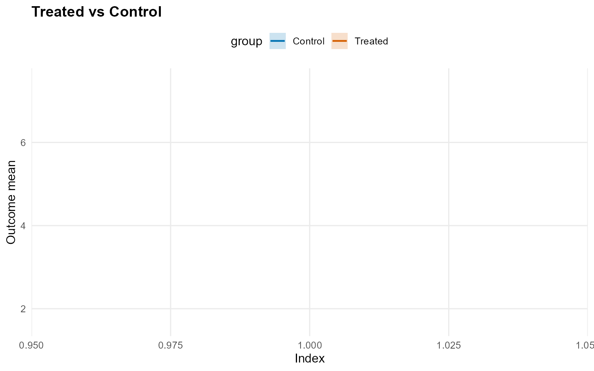
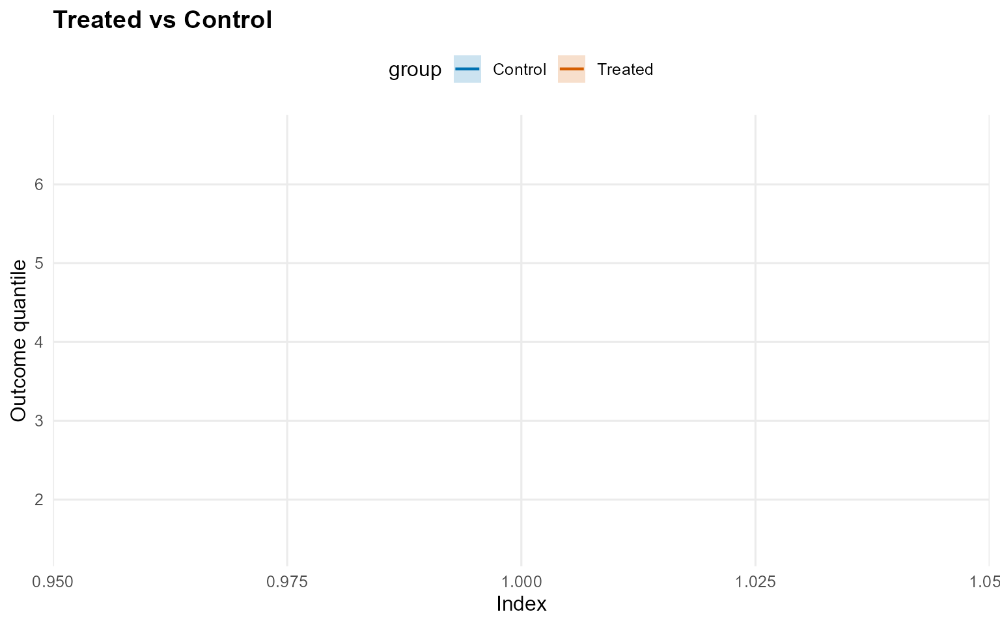
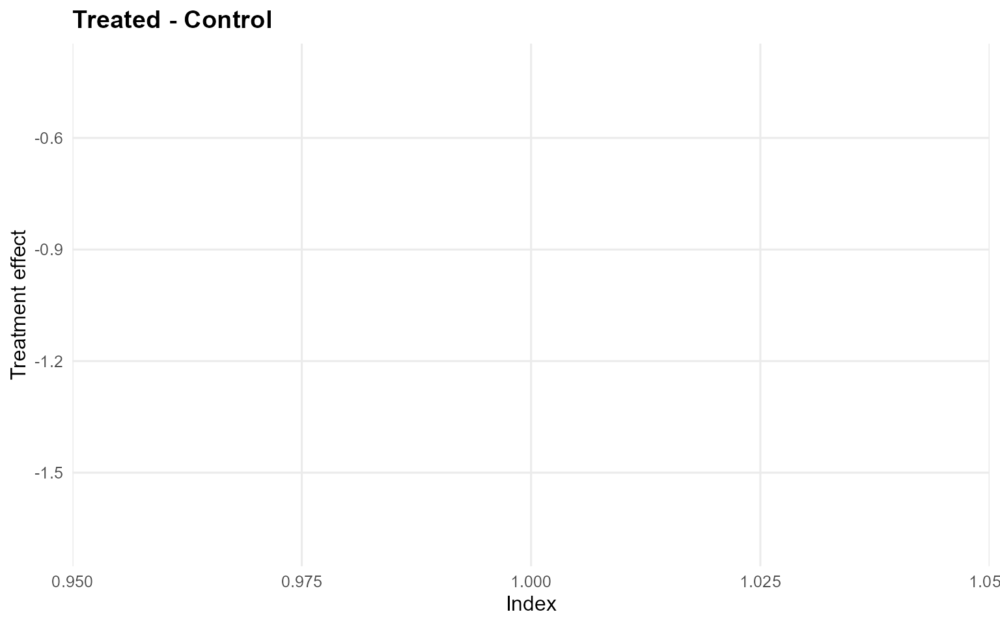
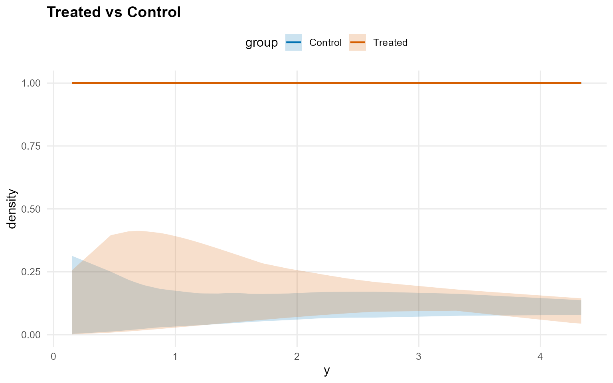
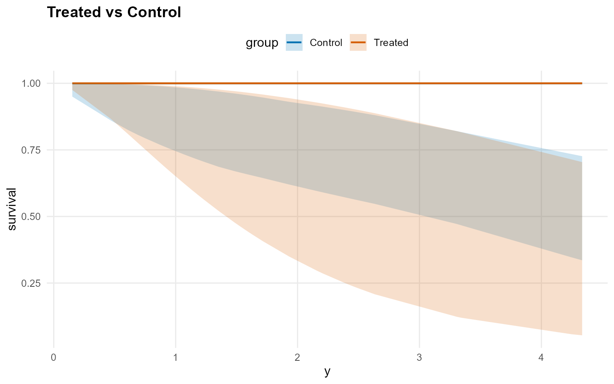
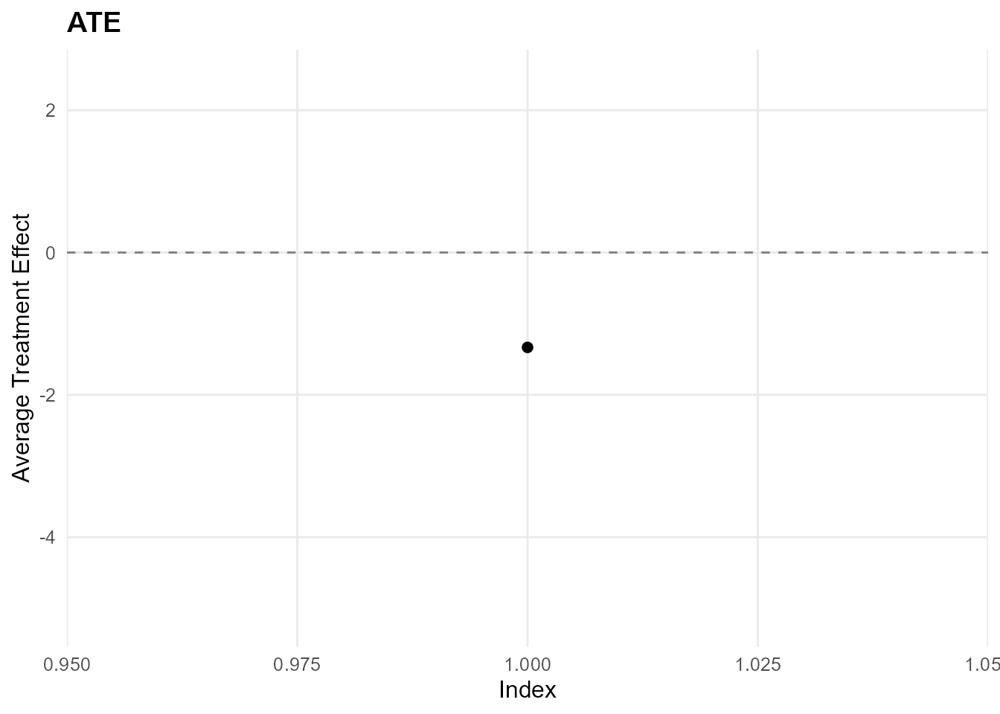
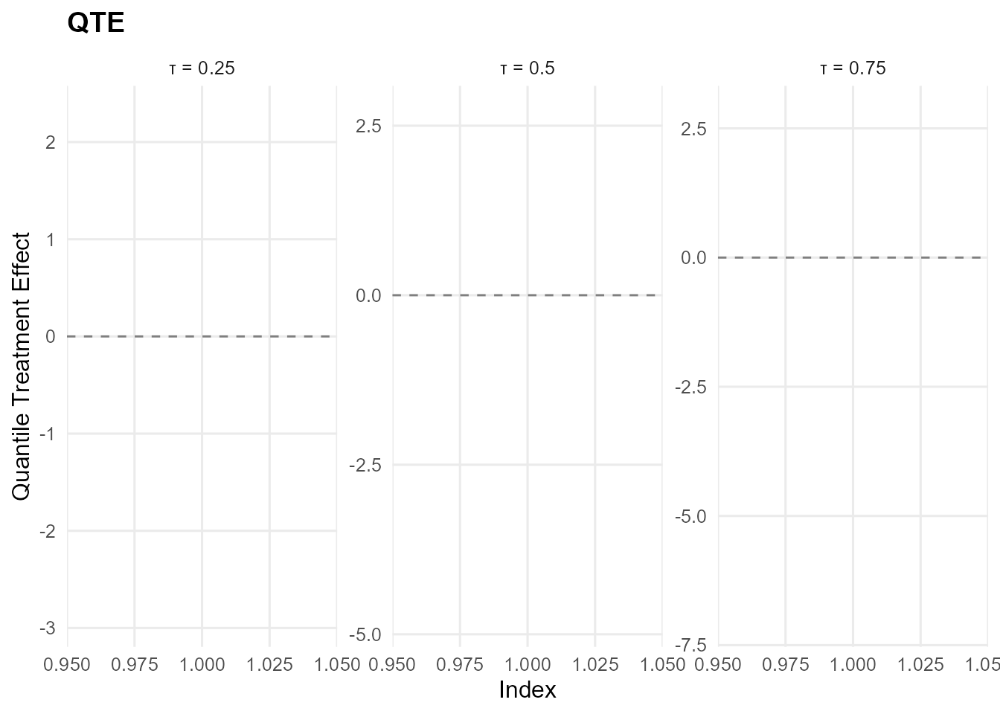

# 14. Causal Inference: No X (CRP) - Gamma Kernel

> **Cookbook vignette (for the website / historical notes).** These
> files may not match the current exported API one-to-one. Last
> verified: **2026-01-18**.
>
> For the up-to-date workflow, see the main package vignettes
> (Introduction, Model Spec, MCMC Workflow,
> Unconditional/Conditional/Causal, Backends, S3 Reference).

### Theory (brief)

The causal model fits separate outcome distributions for treated and
control arms. Without covariates, the estimands reduce to contrasts
between two unconditional DP mixtures (optionally with GPD tails).

## Causal Inference: No Covariates (CRP)

This vignette fits **two no-X causal models** where the treatment arms
are modeled independently using **unconditional** outcome models.

- Model A: CRP bulk-only (GPD = FALSE)
- Model B: CRP with GPD tail (GPD = TRUE)

------------------------------------------------------------------------

### Data Setup (No X)

``` r

data("causal_alt_real500_p4_k2")
y <- abs(causal_alt_real500_p4_k2$y) + 0.01
T <- causal_alt_real500_p4_k2$T

summary_tbl <- tibble(
  statistic = c("N", "Mean", "SD", "Min", "Max"),
  value = c(length(y), mean(y), sd(y), min(y), max(y))
)

summary_tbl %>%
  mutate(value = signif(value, 4)) %>%
  print()
```

    
[38;5;246m# A tibble: 5 × 2
[39m
      statistic    value
      
[3m
[38;5;246m<chr>
[39m
[23m        
[3m
[38;5;246m<dbl>
[39m
[23m
    
[38;5;250m1
[39m N         500     
    
[38;5;250m2
[39m Mean        1.43  
    
[38;5;250m3
[39m SD          1.08  
    
[38;5;250m4
[39m Min         0.012
[4m6
[24m
    
[38;5;250m5
[39m Max         8.10  

``` r

u_threshold <- as.numeric(stats::quantile(y, 0.8, names = FALSE))
y_eval <- y[1:40]
```

------------------------------------------------------------------------

### Model A: CRP Bulk-only (Gamma)

``` r

bundle_crp_bulk <- build_causal_bundle(
  y = y,
  T = T,
  X = NULL,
  kernel = "gamma",
  backend = "crp",
  PS = FALSE,
  GPD = FALSE,
  components = 6,
  mcmc_outcome = list(niter = 300, nburnin = 80, nchains = 1, thin = 1, seed = 1)
)

bundle_crp_bulk
```

    DPmixGPD causal bundle
    PS model: disabled 
    Outcome (treated): backend = crp | kernel = gamma 
    Outcome (control): backend = crp | kernel = gamma 
    GPD tail (treated/control): FALSE / FALSE 
    components (treated/control): 6 / 6 
    Outcome PS included: FALSE 
    epsilon (treated/control): 0.025 / 0.025 
    n (control) = 232 | n (treated) = 268 

``` r

fit_crp_bulk <- quiet_mcmc(run_mcmc_causal(bundle_crp_bulk))
summary(fit_crp_bulk)
```


    -- Outcome fits --
    [control]
    MixGPD fit | backend: Chinese Restaurant Process | kernel: Gamma Distribution | GPD tail: FALSE
    n = 232 | components = 6 | epsilon = 0.025
    MCMC: niter=300, nburnin=80, thin=1, nchains=1 
    Fit
    Use summary() for posterior summaries; plot() for diagnostics; predict() for predictions.

    [treated]
    MixGPD fit | backend: Chinese Restaurant Process | kernel: Gamma Distribution | GPD tail: FALSE
    n = 268 | components = 6 | epsilon = 0.025
    MCMC: niter=300, nburnin=80, thin=1, nchains=1 
    Fit
    Use summary() for posterior summaries; plot() for diagnostics; predict() for predictions.

``` r

pred_mean_bulk <- predict(fit_crp_bulk, type = "mean", interval = "credible", nsim_mean = 150)
head(pred_mean_bulk)
```

         ps estimate lower  upper
    [1,] NA    -1.31 -1.97 -0.282

``` r

plot(pred_mean_bulk)
```



``` r

pred_q_bulk <- predict(fit_crp_bulk, type = "quantile", p = 0.5, interval = "credible")
head(pred_q_bulk)
```

         ps estimate lower upper
    [1,] NA    -1.14 -1.69 -0.41

``` r

plot(pred_q_bulk)
```



``` r

pred_d_bulk <- predict(fit_crp_bulk, y = y_eval, type = "density", interval = "credible")
head(pred_d_bulk)
```

          y ps trt_estimate trt_lower trt_upper con_estimate con_lower con_upper
    1 0.900 NA            1    0.0241     0.402            1    0.0303     0.181
    2 1.352 NA            1    0.0435     0.342            1    0.0423     0.164
    3 1.148 NA            1    0.0346     0.373            1    0.0364     0.167
    4 1.932 NA            1    0.0678     0.262            1    0.0582     0.164
    5 3.344 NA            1    0.0932     0.179            1    0.0756     0.162
    6 0.949 NA            1    0.0261     0.397            1    0.0314     0.178

``` r

plot(pred_d_bulk)
```



``` r

pred_surv_bulk <- predict(fit_crp_bulk, y = y_eval, type = "survival", interval = "credible")
head(pred_surv_bulk)
```

          y ps trt_estimate trt_lower trt_upper con_estimate con_lower con_upper
    1 0.900 NA            1     0.690     0.992            1     0.764     0.988
    2 1.352 NA            1     0.521     0.977            1     0.687     0.969
    3 1.148 NA            1     0.594     0.984            1     0.719     0.979
    4 1.932 NA            1     0.349     0.944            1     0.620     0.930
    5 3.344 NA            1     0.120     0.816            1     0.467     0.817
    6 0.949 NA            1     0.671     0.991            1     0.755     0.987

``` r

plot(pred_surv_bulk)
```



``` r

ate_bulk <- ate(fit_crp_bulk, interval = "credible", nsim_mean = 150)
print(ate_bulk)
```

    ATE (Average Treatment Effect)
      Prediction points: 1
      Conditional (covariates): NO
      Propensity score used: NO
      Posterior mean draws: 150
      Credible interval: credible (95%)

    ATE estimates (treated - control):
     id estimate lower upper
      1   -1.333 -5.16 2.468

``` r

summary(ate_bulk)
```

    ATE Summary
    ================================================== 
    Prediction points: 1
    Conditional: NO | PS used: NO
    Posterior mean draws: 150
    Interval: credible (95%)

    Model specification:
      Backend (trt/con): crp / crp
      Kernel (trt/con): gamma / gamma
      GPD tail (trt/con): NO / NO

    ATE statistics:
      Mean: -1.333 | Median: -1.333
      Range: [-1.333, -1.333]

    Credible interval width:
      Mean: 7.628 | Median: 7.628
      Range: [7.628, 7.628]

``` r

ate_plots_bulk <- plot(ate_bulk)
ate_plots_bulk$treatment_effect
```



``` r

qte_bulk <- qte(fit_crp_bulk, probs = c(0.25, 0.5, 0.75), interval = "credible")
print(qte_bulk)
```

    QTE (Quantile Treatment Effect)
      Prediction points: 1
      Quantile grid: 0.25, 0.5, 0.75
      Conditional (covariates): NO
      Propensity score used: NO
      Credible interval: credible (95%)

    QTE estimates (treated - control):
     index id estimate  lower upper
      0.25  1    -0.47 -2.932 2.316
       0.5  1    -1.14  -4.81 2.712
      0.75  1   -1.904  -7.04  2.83

``` r

summary(qte_bulk)
```

    QTE Summary
    ================================================== 
    Prediction points: 1 | Quantiles: 3
    Quantile grid: 0.25, 0.5, 0.75
    Conditional: NO | PS used: NO
    Interval: credible (95%)

    Model specification:
      Backend (trt/con): crp / crp
      Kernel (trt/con): gamma / gamma
      GPD tail (trt/con): NO / NO

    QTE by quantile:
     quantile mean_qte median_qte min_qte max_qte sd_qte
         0.25    -0.47      -0.47   -0.47   -0.47     NA
          0.5    -1.14      -1.14   -1.14   -1.14     NA
         0.75   -1.904     -1.904  -1.904  -1.904     NA

    Credible interval width:
      Mean: 7.546 | Median: 7.521
      Range: [5.248, 9.87]

``` r

qte_plots_bulk <- plot(qte_bulk)
qte_plots_bulk$treatment_effect
```



------------------------------------------------------------------------

### Model B: CRP with GPD Tail (Gamma)

``` r

param_specs_gpd <- list(
  gpd = list(
    threshold = list(
      mode = "dist",
      dist = "lognormal",
      args = list(meanlog = log(max(u_threshold, .Machine$double.eps)), sdlog = 0.25)
    )
  )
)

bundle_crp_gpd <- tryCatch({
  build_causal_bundle(
    y = y,
    T = T,
    X = NULL,
    kernel = "gamma",
    backend = "crp",
    PS = FALSE,
    GPD = TRUE,
    components = 6,
    param_specs = param_specs_gpd,
    mcmc_outcome = list(niter = 300, nburnin = 80, nchains = 1, thin = 1, seed = 2)
  )
}, error = function(e) {
  message("Skipping CRP + GPD example: ", conditionMessage(e))
  NULL
})

supports_crp_gpd <- !is.null(bundle_crp_gpd)
if (supports_crp_gpd) bundle_crp_gpd
```

``` r

if (isTRUE(supports_crp_gpd)) {
  fit_crp_gpd <- quiet_mcmc(run_mcmc_causal(bundle_crp_gpd))
  summary(fit_crp_gpd)
}
```

``` r

if (isTRUE(supports_crp_gpd)) {
  pred_mean_gpd <- predict(fit_crp_gpd, type = "mean", interval = "credible", nsim_mean = 150)
  head(pred_mean_gpd)
  plot(pred_mean_gpd)
}
```

``` r

if (isTRUE(supports_crp_gpd)) {
  pred_q_gpd <- predict(fit_crp_gpd, type = "quantile", p = 0.5, interval = "credible")
  head(pred_q_gpd)
  plot(pred_q_gpd)
}
```

``` r

if (isTRUE(supports_crp_gpd)) {
  pred_d_gpd <- predict(fit_crp_gpd, y = y_eval, type = "density", interval = "credible")
  head(pred_d_gpd)
  plot(pred_d_gpd)
}
```

``` r

if (isTRUE(supports_crp_gpd)) {
  pred_surv_gpd <- predict(fit_crp_gpd, y = y_eval, type = "survival", interval = "credible")
  head(pred_surv_gpd)
  plot(pred_surv_gpd)
}
```

``` r

if (isTRUE(supports_crp_gpd)) {
  ate_gpd <- ate(fit_crp_gpd, interval = "credible", nsim_mean = 150)
  print(ate_gpd)
  summary(ate_gpd)
}
```

``` r

if (isTRUE(supports_crp_gpd)) {
  ate_plots_gpd <- plot(ate_gpd)
  ate_plots_gpd$treatment_effect
}
```

``` r

if (isTRUE(supports_crp_gpd)) {
  qte_gpd <- qte(fit_crp_gpd, probs = c(0.25, 0.5, 0.75), interval = "credible")
  print(qte_gpd)
  summary(qte_gpd)
}
```

``` r

if (isTRUE(supports_crp_gpd)) {
  qte_plots_gpd <- plot(qte_gpd)
  qte_plots_gpd$treatment_effect
}
```
