# 16. Causal Inference: Mixed Backends (CRP+SB) - Cauchy/Laplace

> **Cookbook vignette (for the website / historical notes).** These
> files may not match the current exported API one-to-one. Last
> verified: **2026-01-18**.
>
> For the up-to-date workflow, see the main package vignettes
> (Introduction, Model Spec, MCMC Workflow,
> Unconditional/Conditional/Causal, Backends, S3 Reference).

### Theory (brief)

The causal workflow fits treated and control arms with covariate
adjustment, optionally including propensity scores. Backend choices
control how mixtures are represented but target the same posterior
quantities.

## Causal Inference: Mixed Backends (CRP+SB)

This vignette fits two causal models using different backends and
kernels:

- Model A: CRP bulk-only (Cauchy)
- Model B: SB with GPD tail (Laplace)

Each model demonstrates the full causal S3 workflow: bundle, fit,
predict, plot, ATE, and QTE.

------------------------------------------------------------------------

### Data Setup

``` r

data("causal_alt_real500_p4_k2")
y <- causal_alt_real500_p4_k2$y
T <- causal_alt_real500_p4_k2$T
X <- as.matrix(causal_alt_real500_p4_k2$X)

summary_tbl <- tibble(
  statistic = c("N", "Mean", "SD", "Min", "Max"),
  value = c(length(y), mean(y), sd(y), min(y), max(y))
)

summary_tbl %>%
  mutate(value = signif(value, 4)) %>%
  kable(caption = "Causal Dataset Summary", align = "c") %>%
  kable_styling(bootstrap_options = c("striped", "hover"), full_width = FALSE, position = "center")
```

| statistic |  value  |
|:---------:|:-------:|
|     N     | 500.000 |
|   Mean    |  0.274  |
|    SD     |  1.764  |
|    Min    | -8.089  |
|    Max    |  5.275  |

Causal Dataset Summary {.table .table .table-striped .table-hover
style="width: auto !important; margin-left: auto; margin-right: auto;"}

``` r

x_eval <- X[1:40, , drop = FALSE]
y_eval <- y[1:40]
u_threshold <- as.numeric(stats::quantile(y, 0.8, names = FALSE))
```

``` r

df_causal <- data.frame(y = y, T = as.factor(T), x1 = X[, 1], x2 = X[, 2])

p_scatter <- ggplot(df_causal, aes(x = x1, y = y, color = T)) +
  geom_point(alpha = 0.5) +
  labs(title = "Outcome vs X1 by Treatment", x = "X1", y = "y", color = "Treatment") +
  theme_minimal()

p_scatter
```

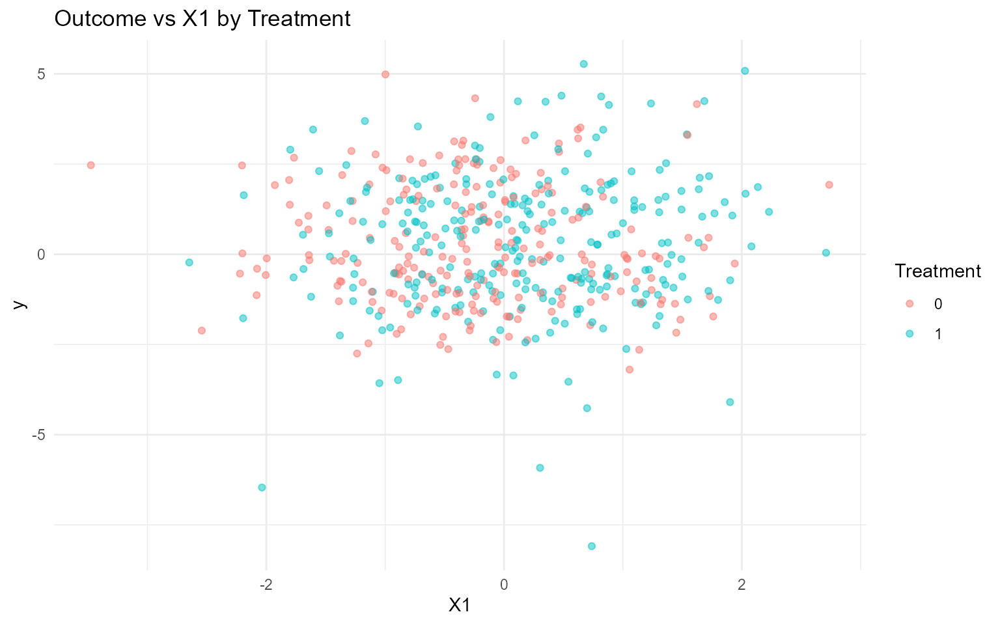

------------------------------------------------------------------------

### Model A: CRP Bulk-only (Cauchy)

``` r

bundle_crp_bulk <- build_causal_bundle(
  y = y,
  T = T,
  X = X,
  kernel = "cauchy",
  backend = "crp",
  PS = "logit",
  GPD = FALSE,
  components = 5,
  mcmc_outcome = list(niter = 2500, nburnin = 500, nchains = 1, thin = 1, seed = 1),
  mcmc_ps = list(niter = 2500, nburnin = 500, nchains = 1, thin = 1, seed = 1)
)

bundle_crp_bulk
```

    DPmixGPD causal bundle
    PS model: disabled 
    Outcome (treated): backend = crp | kernel = cauchy 
    Outcome (control): backend = crp | kernel = cauchy 
    GPD tail (treated/control): FALSE / FALSE 
    components (treated/control): 5 / 5 
    Outcome PS included: FALSE 
    epsilon (treated/control): 0.025 / 0.025 
    n (control) = 232 | n (treated) = 268 

``` r

summary(bundle_crp_bulk)
```

    DPmixGPD causal bundle summary
    DPmixGPD causal bundle
    PS model: disabled 
    Outcome (treated): backend = crp | kernel = cauchy 
    Outcome (control): backend = crp | kernel = cauchy 
    GPD tail (treated/control): FALSE / FALSE 
    components (treated/control): 5 / 5 
    Outcome PS included: FALSE 
    epsilon (treated/control): 0.025 / 0.025 
    n (control) = 232 | n (treated) = 268 

``` r

fit_crp_bulk <- quiet_mcmc(run_mcmc_causal(bundle_crp_bulk))
summary(fit_crp_bulk)
```


    -- Outcome fits --
    [control]
    MixGPD fit | backend: Chinese Restaurant Process | kernel: Cauchy Distribution | GPD tail: FALSE
    n = 232 | components = 5 | epsilon = 0.025
    MCMC: niter=2500, nburnin=500, thin=1, nchains=1 
    Fit
    Use summary() for posterior summaries; plot() for diagnostics; predict() for predictions.

    [treated]
    MixGPD fit | backend: Chinese Restaurant Process | kernel: Cauchy Distribution | GPD tail: FALSE
    n = 268 | components = 5 | epsilon = 0.025
    MCMC: niter=2500, nburnin=500, thin=1, nchains=1 
    Fit
    Use summary() for posterior summaries; plot() for diagnostics; predict() for predictions.

``` r

params(fit_crp_bulk)
```

    Posterior mean parameters (causal)

    [treated]
    Posterior mean parameters

    $alpha
    [1] "0.415"

    $w
    [1] "0.535" "0.448"

    $location
    [1] "0.765"  "-0.272"

    $scale
    [1] "0.644" "0.53" 

    [control]
    Posterior mean parameters

    $alpha
    [1] "0.632"

    $w
    [1] "0.417" "0.302" "0.219"

    $location
    [1] "-0.046" "0.662"  "-0.17" 

    $scale
    [1] "0.524" "0.523" "0.418"

``` r

plot(fit_crp_bulk, params = "location", family = "traceplot")
```


    === treated ===

    === traceplot ===


    === control ===

    === traceplot ===

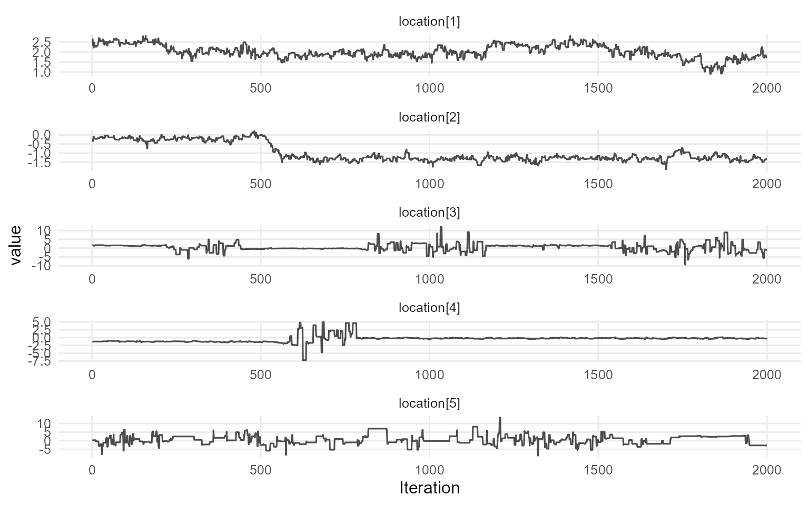

``` r

plot(fit_crp_bulk, params = "scale", family = "caterpillar")
```


    === treated ===

    === caterpillar ===


    === control ===

    === caterpillar ===


``` r

pred_mean_bulk <- predict(fit_crp_bulk, x = x_eval, type = "mean",
                          interval = "hpd", nsim_mean = 100)
head(pred_mean_bulk)
```

         ps estimate   lower  upper
    [1,] NA  -0.0194 -2.9257  1.325
    [2,] NA   0.1036  0.2943 -0.673
    [3,] NA  -0.9065 -0.0552  2.588
    [4,] NA -12.7823 -0.3879  2.614
    [5,] NA   2.5011 -1.4858  1.941
    [6,] NA   0.9312 -0.5459  3.226

``` r

plot(pred_mean_bulk)
```

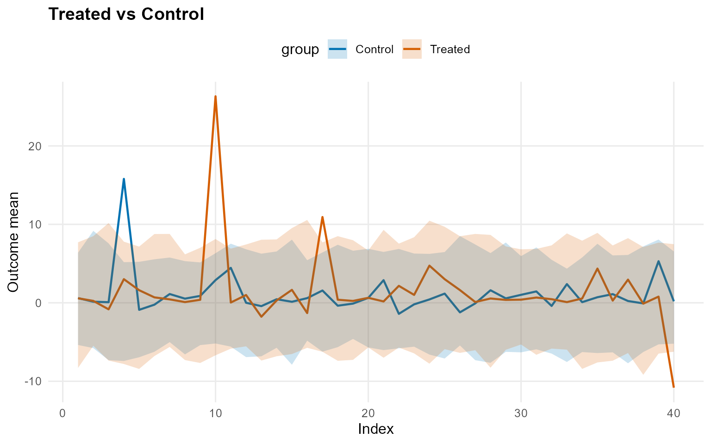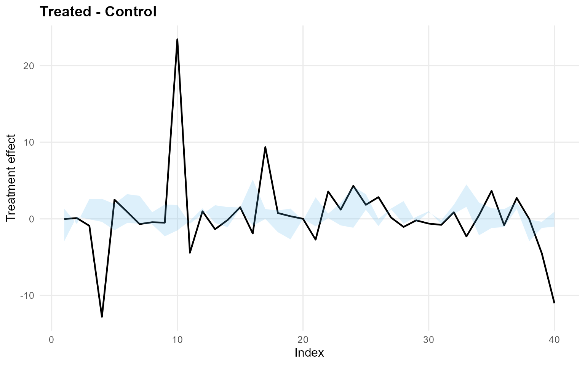

``` r

pred_q_bulk <- predict(fit_crp_bulk, x = x_eval, type = "quantile",
                       p = 0.5, interval = "hpd")
head(pred_q_bulk)
```

         ps estimate lower upper
    [1,] NA    0.444 0.341  0.56
    [2,] NA    0.444 0.341  0.56
    [3,] NA    0.444 0.341  0.56
    [4,] NA    0.444 0.341  0.56
    [5,] NA    0.444 0.341  0.56
    [6,] NA    0.444 0.341  0.56

``` r

plot(pred_q_bulk)
```

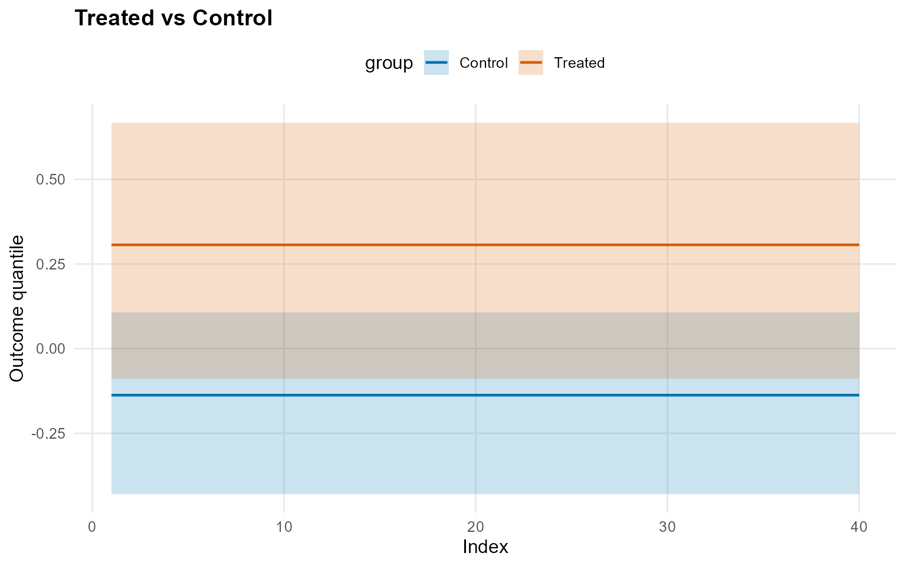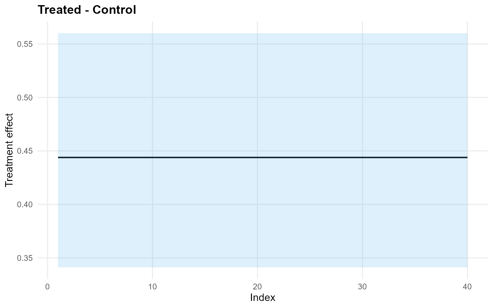

``` r

pred_d_bulk <- predict(fit_crp_bulk, x = x_eval, y = y_eval,
                       type = "density", interval = "hpd")
head(pred_d_bulk)
```

           y ps trt_estimate trt_lower trt_upper con_estimate con_lower con_upper
    1  0.890 NA            1    0.1372    0.2606            1    0.0555    0.1498
    2 -1.342 NA            1    0.1174    0.2241            1    0.1337    0.3834
    3  1.138 NA            1    0.1893    0.3204            1    0.0502    0.1771
    4 -1.922 NA            1    0.0452    0.0867            1    0.0537    0.1249
    5 -3.334 NA            1    0.0128    0.0224            1    0.0124    0.0223
    6  0.939 NA            1    0.1488    0.2767            1    0.0572    0.1584

``` r

plot(pred_d_bulk)
```

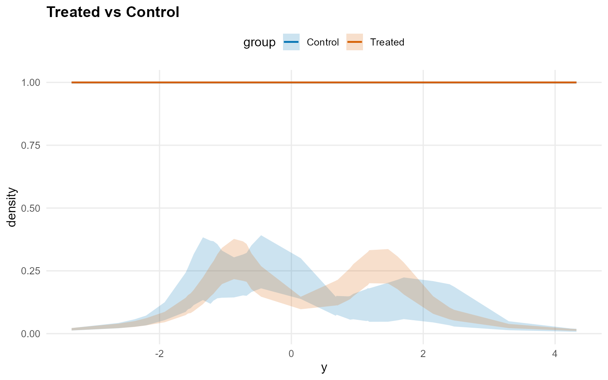

``` r

pred_surv_bulk <- predict(fit_crp_bulk, x = x_eval, y = y_eval,
                          type = "survival", interval = "hpd")
head(pred_surv_bulk)
```

           y ps trt_estimate trt_lower trt_upper con_estimate con_lower con_upper
    1  0.890 NA            1     0.360     0.462            1     0.226     0.398
    2 -1.342 NA            1     0.794     0.874            1     0.752     0.855
    3  1.138 NA            1     0.306     0.416            1     0.184     0.364
    4 -1.922 NA            1     0.872     0.922            1     0.870     0.924
    5 -3.334 NA            1     0.933     0.956            1     0.937     0.962
    6  0.939 NA            1     0.350     0.454            1     0.219     0.394

``` r

plot(pred_surv_bulk)
```

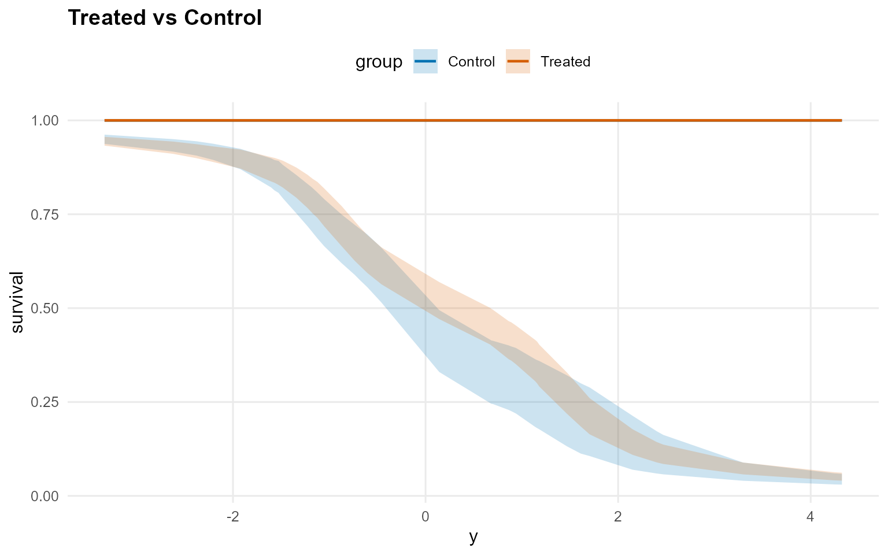

``` r

ate_bulk <- ate(fit_crp_bulk, newdata = x_eval,
                interval = "hpd", nsim_mean = 100)
print(ate_bulk)
```

    ATE (Average Treatment Effect)
      Prediction points: 40
      Conditional (covariates): YES
      Propensity score used: NO
      Posterior mean draws: 100
      Credible interval: hpd

    ATE estimates (treated - control):
     id estimate   lower  upper
      1   -0.451 -14.326 13.809
      2   -2.438 -12.744 11.198
      3    1.408 -15.421 14.129
      4   -0.517 -13.878 11.673
      5    0.395 -12.374 19.236
      6   -3.339 -13.126 15.035
    ... (34 more rows)

``` r

summary(ate_bulk)
```

    ATE Summary
    ================================================== 
    Prediction points: 40
    Conditional: YES | PS used: NO
    Posterior mean draws: 100
    Interval: hpd

    Model specification:
      Backend (trt/con): crp / crp
      Kernel (trt/con): cauchy / cauchy
      GPD tail (trt/con): NO / NO

    ATE statistics:
      Mean: 0.531 | Median: -0.017
      Range: [-5.599, 12.005]
      SD: 3.197

    Credible interval width:
      Mean: 27.207 | Median: 27.405
      Range: [21.872, 33.46]

``` r

ate_plots_bulk <- plot(ate_bulk)
ate_plots_bulk$treatment_effect
```

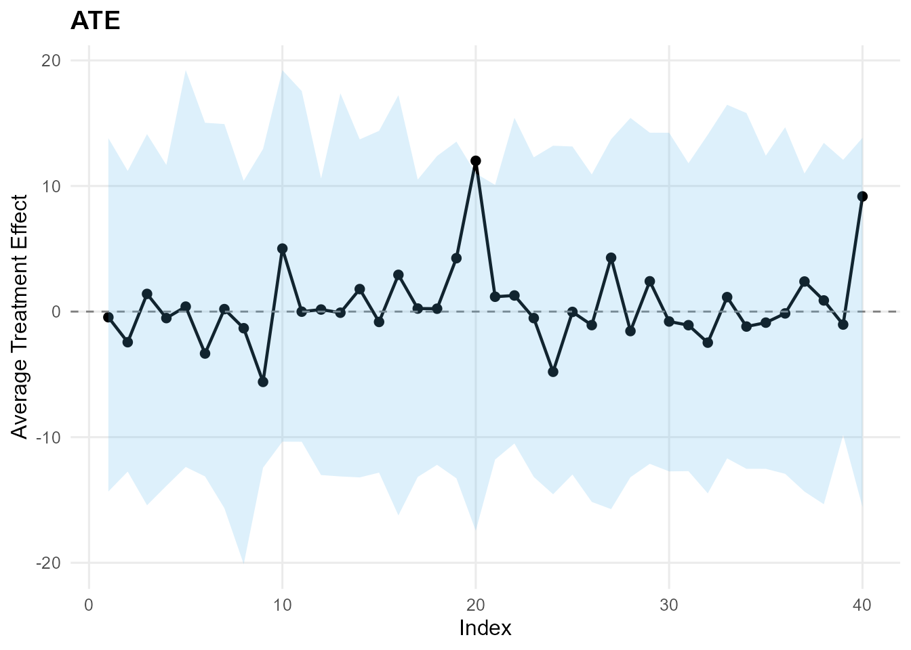

``` r

qte_bulk <- qte(fit_crp_bulk, probs = c(0.25, 0.5, 0.75),
                newdata = x_eval, interval = "hpd")
print(qte_bulk)
```

    QTE (Quantile Treatment Effect)
      Prediction points: 40
      Quantile grid: 0.25, 0.5, 0.75
      Conditional (covariates): YES
      Propensity score used: NO
      Credible interval: hpd

    QTE estimates (treated - control):
     index id estimate  lower upper
      0.25  1    0.127 -0.203 0.421
      0.25  2    0.127 -0.203 0.421
      0.25  3    0.127 -0.203 0.421
      0.25  4    0.127 -0.203 0.421
      0.25  5    0.127 -0.203 0.421
      0.25  6    0.127 -0.203 0.421
    ... (114 more rows)

``` r

summary(qte_bulk)
```

    QTE Summary
    ================================================== 
    Prediction points: 40 | Quantiles: 3
    Quantile grid: 0.25, 0.5, 0.75
    Conditional: YES | PS used: NO
    Interval: hpd

    Model specification:
      Backend (trt/con): crp / crp
      Kernel (trt/con): cauchy / cauchy
      GPD tail (trt/con): NO / NO

    QTE by quantile:
     quantile mean_qte median_qte min_qte max_qte sd_qte
         0.25    0.127      0.127   0.127   0.127      0
          0.5    0.444      0.444   0.444   0.444      0
         0.75    0.015      0.015   0.015   0.015      0

    Credible interval width:
      Mean: 0.993 | Median: 0.984
      Range: [0.624, 1.373]

``` r

qte_plots_bulk <- plot(qte_bulk)
qte_plots_bulk$treatment_effect
```


------------------------------------------------------------------------

### Model B: SB with GPD Tail (Laplace)

``` r

param_specs_gpd <- list(
  gpd = list(
    threshold = list(
      mode = "dist",
      dist = "lognormal",
      args = list(meanlog = log(max(u_threshold, .Machine$double.eps)), sdlog = 0.25)
    )
  )
)

bundle_sb_gpd <- build_causal_bundle(
  y = y,
  T = T,
  X = X,
  kernel = "laplace",
  backend = "sb",
  PS = "logit",
  GPD = TRUE,
  components = 5,
  param_specs = param_specs_gpd,
  mcmc_outcome = list(niter = 2500, nburnin = 500, nchains = 1, thin = 1, seed = 2),
  mcmc_ps = list(niter = 2500, nburnin = 500, nchains = 1, thin = 1, seed = 2)
)

bundle_sb_gpd
```

    DPmixGPD causal bundle
    PS model: disabled 
    Outcome (treated): backend = sb | kernel = laplace 
    Outcome (control): backend = sb | kernel = laplace 
    GPD tail (treated/control): TRUE / TRUE 
    components (treated/control): 5 / 5 
    Outcome PS included: FALSE 
    epsilon (treated/control): 0.025 / 0.025 
    n (control) = 232 | n (treated) = 268 

``` r

summary(bundle_sb_gpd)
```

    DPmixGPD causal bundle summary
    DPmixGPD causal bundle
    PS model: disabled 
    Outcome (treated): backend = sb | kernel = laplace 
    Outcome (control): backend = sb | kernel = laplace 
    GPD tail (treated/control): TRUE / TRUE 
    components (treated/control): 5 / 5 
    Outcome PS included: FALSE 
    epsilon (treated/control): 0.025 / 0.025 
    n (control) = 232 | n (treated) = 268 

``` r

fit_sb_gpd <- quiet_mcmc(run_mcmc_causal(bundle_sb_gpd))
summary(fit_sb_gpd)
```


    -- Outcome fits --
    [control]
    MixGPD fit | backend: Stick-Breaking Process | kernel: Laplace Distribution | GPD tail: TRUE
    n = 232 | components = 5 | epsilon = 0.025
    MCMC: niter=2500, nburnin=500, thin=1, nchains=1 
    Fit
    Use summary() for posterior summaries; plot() for diagnostics; predict() for predictions.

    [treated]
    MixGPD fit | backend: Stick-Breaking Process | kernel: Laplace Distribution | GPD tail: TRUE
    n = 268 | components = 5 | epsilon = 0.025
    MCMC: niter=2500, nburnin=500, thin=1, nchains=1 
    Fit
    Use summary() for posterior summaries; plot() for diagnostics; predict() for predictions.

``` r

params(fit_sb_gpd)
```

    Posterior mean parameters (causal)

    [treated]
    Posterior mean parameters

    $alpha
    [1] "0.968"

    $w
    [1] "0.549" "0.381"

    $beta_location
          x1       x2       x3       x4     
    comp1 "0.504"  "0.275"  "0.391"  "1.531"
    comp2 "-0.189" "0.098"  "-0.124" "0.128"
    comp3 "0.363"  "-0.072" "-0.196" "0.221"
    comp4 "0.343"  "-0.173" "0.156"  "0.098"
    comp5 "0.198"  "0.136"  "-0.163" "-0.15"

    $scale
    [1] "1.393" "1.219"

    $beta_tail_scale
    [1] "0.115"  "-0.134" "0.099"  "-0.1"  

    $tail_shape
    [1] "-0.007"

    [control]
    Posterior mean parameters

    $alpha
    [1] "1.219"

    $w
    [1] "0.436" "0.293"

    $beta_location
          x1       x2       x3       x4      
    comp1 "-0.218" "-0.019" "0.113"  "0.128" 
    comp2 "0.054"  "-0.054" "-0.166" "-0.665"
    comp3 "0.023"  "0.76"   "-0.447" "2.135" 
    comp4 "-0.366" "-0.617" "-0.267" "0.987" 
    comp5 "-0.499" "-0.281" "-0.112" "0.994" 

    $scale
    [1] "1.066" "1.019"

    $beta_tail_scale
    [1] "0.275"  "0.197"  "0.156"  "-0.056"

    $tail_shape
    [1] "-0.043"

``` r

plot(fit_sb_gpd, family = "traceplot")
```


    === treated ===

    === traceplot ===

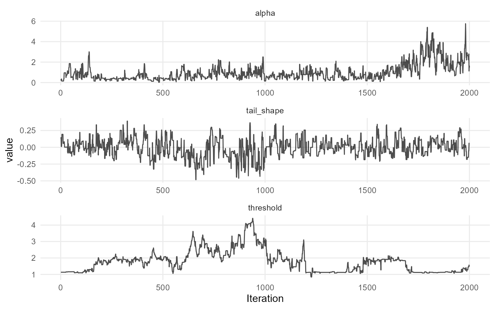


    === control ===

    === traceplot ===

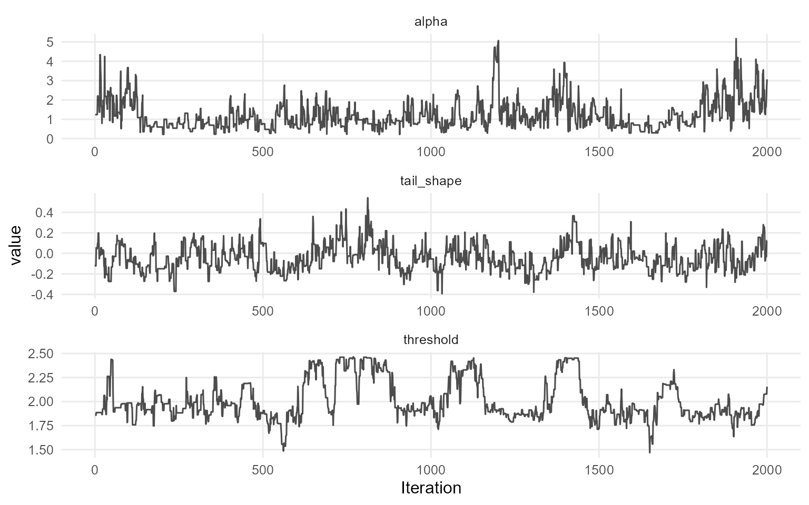

``` r

pred_mean_gpd <- predict(fit_sb_gpd, x = x_eval, type = "mean",
                         interval = "credible", nsim_mean = 100)
head(pred_mean_gpd)
```

         ps estimate lower  upper
    [1,] NA   -0.171  1.82 -0.649
    [2,] NA    1.498  2.39 -0.029
    [3,] NA    0.604  1.37 -0.413
    [4,] NA    0.957  1.58 -0.472
    [5,] NA    1.038  2.06 -1.001
    [6,] NA    0.607  2.95 -0.416

``` r

plot(pred_mean_gpd)
```

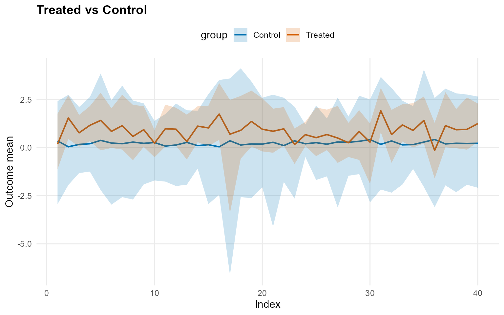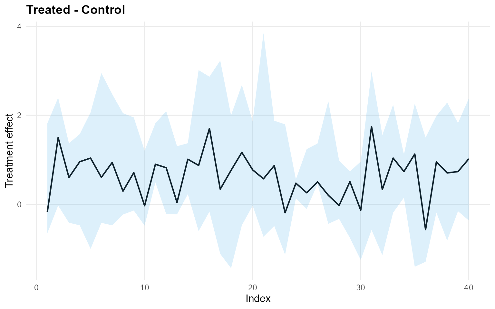

``` r

pred_q_gpd <- predict(fit_sb_gpd, x = x_eval, type = "quantile",
                      p = 0.5, interval = "credible")
head(pred_q_gpd)
```

         ps estimate lower  upper
    [1,] NA   -0.253  2.97 -0.772
    [2,] NA    1.140  2.36 -0.162
    [3,] NA    0.450  1.29 -0.344
    [4,] NA    0.745  1.47 -0.538
    [5,] NA    0.921  1.52 -0.435
    [6,] NA    0.425  3.21 -0.684

``` r

plot(pred_q_gpd)
```

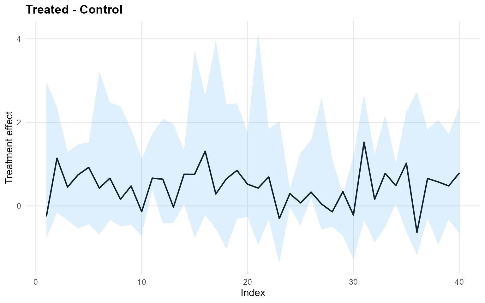

``` r

pred_d_gpd <- predict(fit_sb_gpd, x = x_eval, y = y_eval,
                      type = "density", interval = "credible")
head(pred_d_gpd)
```

           y ps trt_estimate trt_lower trt_upper con_estimate con_lower con_upper
    1  0.890 NA            1   0.06945     0.311            1   0.03324     0.365
    2 -1.342 NA            1   0.00660     0.240            1   0.05140     0.399
    3  1.138 NA            1   0.15226     0.501            1   0.06380     0.336
    4 -1.922 NA            1   0.02773     0.135            1   0.02881     0.326
    5 -3.334 NA            1   0.00657     0.111            1   0.00375     0.269
    6  0.939 NA            1   0.10860     0.359            1   0.03993     0.368

``` r

plot(pred_d_gpd)
```

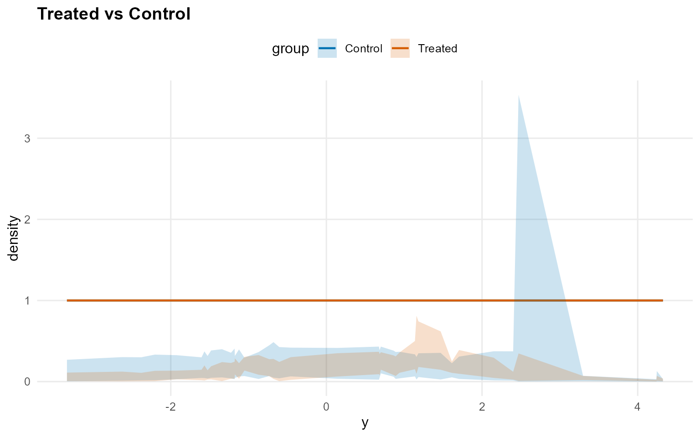

``` r

pred_surv_gpd <- predict(fit_sb_gpd, x = x_eval, y = y_eval,
                         type = "survival", interval = "credible")
head(pred_surv_gpd)
```

           y ps trt_estimate trt_lower trt_upper con_estimate con_lower con_upper
    1  0.890 NA            1     0.129     0.619            1    0.0509     0.720
    2 -1.342 NA            1     0.704     0.992            1    0.3323     0.945
    3  1.138 NA            1     0.187     0.513            1    0.0621     0.567
    4 -1.922 NA            1     0.828     0.966            1    0.5561     0.974
    5 -3.334 NA            1     0.761     0.992            1    0.5322     0.997
    6  0.939 NA            1     0.225     0.744            1    0.0377     0.709

``` r

plot(pred_surv_gpd)
```


``` r

ate_gpd <- ate(fit_sb_gpd, newdata = x_eval,
               interval = "credible", nsim_mean = 100)
print(ate_gpd)
```

    ATE (Average Treatment Effect)
      Prediction points: 40
      Conditional (covariates): YES
      Propensity score used: NO
      Posterior mean draws: 100
      Credible interval: credible (95%)

    ATE estimates (treated - control):
     id estimate  lower upper
      1    -0.19 -2.331 2.968
      2    1.499 -1.339 3.757
      3    0.605 -1.308 2.153
      4    0.962 -1.603  2.72
      5    1.025 -2.862 4.004
      6    0.588 -1.727 3.517
    ... (34 more rows)

``` r

summary(ate_gpd)
```

    ATE Summary
    ================================================== 
    Prediction points: 40
    Conditional: YES | PS used: NO
    Posterior mean draws: 100
    Interval: credible (95%)

    Model specification:
      Backend (trt/con): sb / sb
      Kernel (trt/con): laplace / laplace
      GPD tail (trt/con): YES / YES

    ATE statistics:
      Mean: 0.642 | Median: 0.726
      Range: [-0.547, 1.745]
      SD: 0.507

    Credible interval width:
      Mean: 5.209 | Median: 5.067
      Range: [1.933, 13.29]

``` r

ate_plots_gpd <- plot(ate_gpd)
ate_plots_gpd$treatment_effect
```

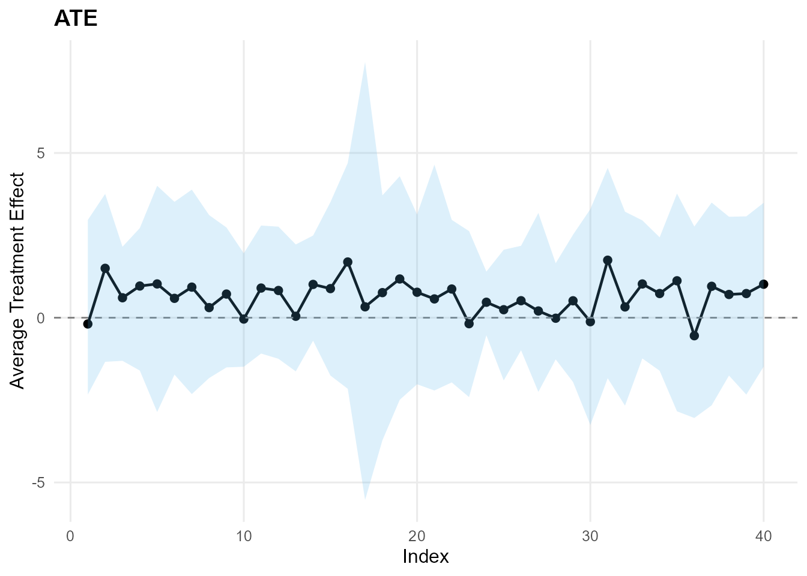

``` r

qte_gpd <- qte(fit_sb_gpd, probs = c(0.25, 0.5, 0.75),
               newdata = x_eval, interval = "credible")
print(qte_gpd)
```

    QTE (Quantile Treatment Effect)
      Prediction points: 40
      Quantile grid: 0.25, 0.5, 0.75
      Conditional (covariates): YES
      Propensity score used: NO
      Credible interval: credible (95%)

    QTE estimates (treated - control):
     index id estimate  lower upper
      0.25  1   -0.116 -2.163  5.13
      0.25  2    0.708 -1.487 2.767
      0.25  3    0.346 -0.721 2.293
      0.25  4    0.555 -0.656 2.162
      0.25  5    0.916 -1.929 4.064
      0.25  6    0.577 -1.297 4.693
    ... (114 more rows)

``` r

summary(qte_gpd)
```

    QTE Summary
    ================================================== 
    Prediction points: 40 | Quantiles: 3
    Quantile grid: 0.25, 0.5, 0.75
    Conditional: YES | PS used: NO
    Interval: credible (95%)

    Model specification:
      Backend (trt/con): sb / sb
      Kernel (trt/con): laplace / laplace
      GPD tail (trt/con): YES / YES

    QTE by quantile:
     quantile mean_qte median_qte min_qte max_qte sd_qte
         0.25    0.425      0.499  -0.615   1.077  0.383
          0.5    0.459      0.481  -0.633   1.525  0.454
         0.75    0.512      0.551  -0.455   1.508  0.457

    Credible interval width:
      Mean: 4.605 | Median: 4.252
      Range: [1.415, 13.635]

``` r

qte_plots_gpd <- plot(qte_gpd)
qte_plots_gpd$treatment_effect
```

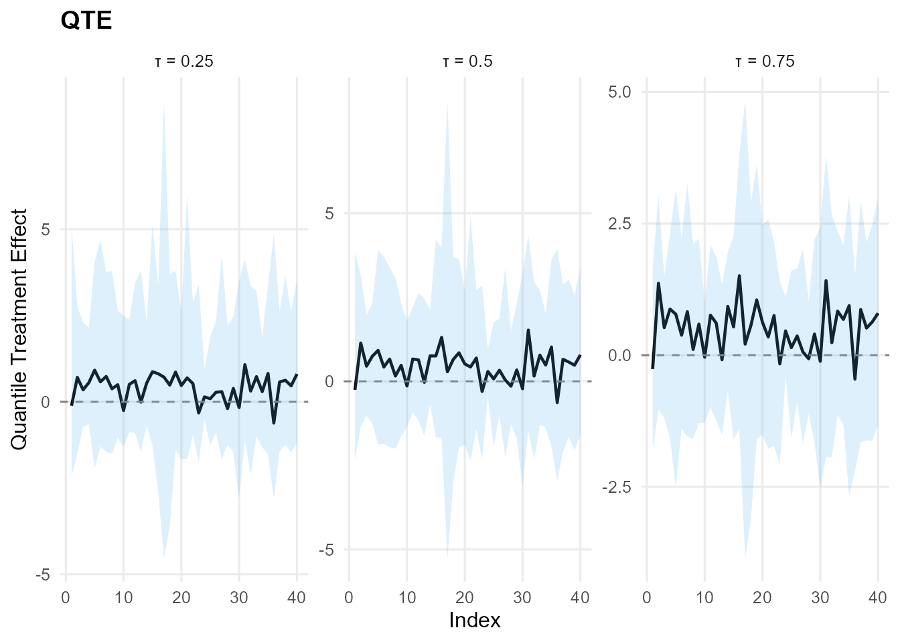
