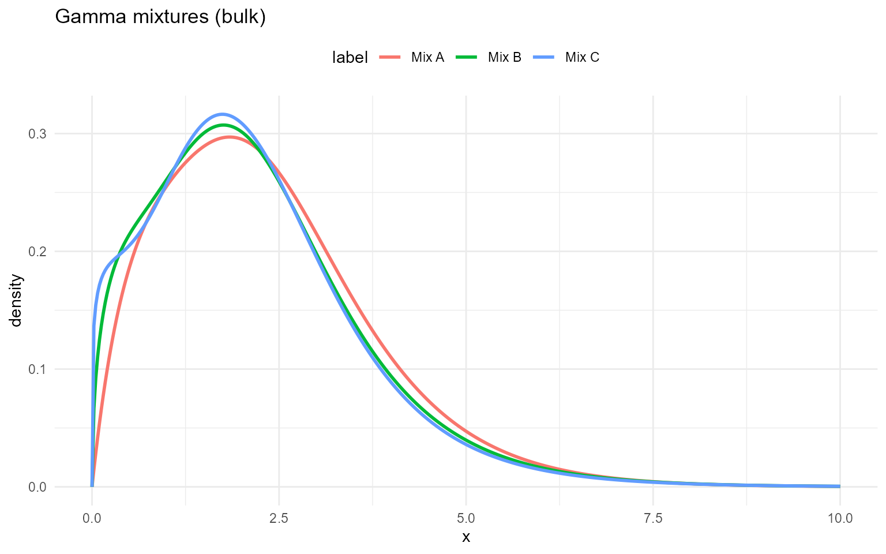
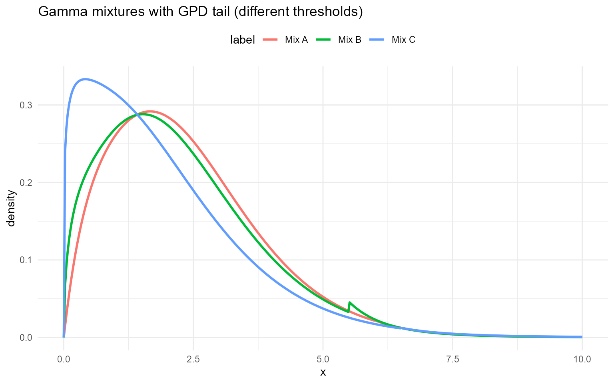

# Gamma

## Gamma

### Gamma mixture kernel

A gamma component with shape $`\alpha>0`$ and scale $`\beta>0`$ has
density
``` math
f(y\mid \alpha,\beta)
=
\frac{1}{\Gamma(\alpha)\,\beta^\alpha}\,y^{\alpha-1}\exp\!\left(-\frac{y}{\beta}\right),
\qquad y>0.
```

A finite gamma mixture with $`J`$ components is
``` math
f(y)=\sum_{j=1}^J w_j\,f_j(y\mid \alpha_j,\beta_j),
\qquad w_j\ge 0,\ \sum_{j=1}^J w_j=1.
```

**Parameter mapping (math $`\rightarrow`$ code):** $`\alpha\to`$`shape`,
$`\beta\to`$`scale`, and weights $`w_j\to`$`w[j]`.

The `*MixGpd` variant uses the same splicing idea: gamma mixture below
$`u`$ and a GPD tail above $`u`$.

**Tail mapping (math $`\rightarrow`$ code):** $`u\to`$`threshold`,
$`\sigma\to`$`tail_scale`, $`\xi\to`$`tail_shape`.

### Without GPD (mixture kernel)

``` r

grid <- seq(0, 10, length.out = 400)
gamma_sets <- list(
  list(label = "Mix A", w = c(0.6, 0.3, 0.1), shape = c(2.0, 5.0, 9.0), scale = c(1.0, 0.6, 0.3)),
  list(label = "Mix B", w = c(0.5, 0.3, 0.2), shape = c(1.5, 4.0, 7.0), scale = c(1.2, 0.7, 0.35)),
  list(label = "Mix C", w = c(0.4, 0.3, 0.3), shape = c(1.2, 3.5, 6.0), scale = c(1.4, 0.75, 0.4))
)
example <- gamma_sets[[1]]

dens <- do.call(rbind, lapply(gamma_sets, function(s) {
  data.frame(
    x = grid,
    density = dGammaMix(grid, w = s$w, shape = s$shape, scale = s$scale),
    label = s$label
  )
}))
```

``` r

dGammaMix(2, w = example$w, shape = example$shape, scale = example$scale)
```

    [1] 0.295

``` r

dGammaMix(2, w = example$w, shape = example$shape, scale = example$scale, log = TRUE)
```

    [1] -1.22

``` r

pGammaMix(2, w = example$w, shape = example$shape, scale = example$scale)
```

    [1] 0.452

``` r

pGammaMix(2, w = example$w, shape = example$shape, scale = example$scale, lower.tail = FALSE)
```

    [1] 0.548

``` r

pGammaMix(2, w = example$w, shape = example$shape, scale = example$scale, log.p = TRUE)
```

    [1] -0.793

``` r

qGammaMix(0.95, w = example$w, shape = example$shape, scale = example$scale)
```

    [1] 5.01

``` r

qGammaMix(0.95, w = example$w, shape = example$shape, scale = example$scale, lower.tail = FALSE)
```

    [1] 0.475

``` r

df_gamma <- do.call(rbind, lapply(gamma_sets, function(ps) {
  data.frame(x = grid, density = density_curve(grid, dGammaMix, list(w = ps$w, shape = ps$shape, scale = ps$scale)), label = ps$label)
}))

ggplot(df_gamma, aes(x = x, y = density, color = label)) +
  geom_line(linewidth = 1) +
  labs(title = "Gamma mixtures (bulk)", x = "x", y = "density") +
  theme_minimal() + theme(legend.position = "top")
```



### Gamma mixture with GPD tail

``` r

u <- 6
tail_scale <- 1.0
tail_shape <- 0.2
```

``` r

dGammaMixGpd(6.5, w = example$w, shape = example$shape, scale = example$scale,
             threshold = u, tail_scale = tail_scale, tail_shape = tail_shape)
```

    [1] 0.0109

``` r

dGammaMixGpd(6.5, w = example$w, shape = example$shape, scale = example$scale,
             threshold = u, tail_scale = tail_scale, tail_shape = tail_shape, log = TRUE)
```

    [1] -4.51

``` r

pGammaMixGpd(6.5, w = example$w, shape = example$shape, scale = example$scale,
             threshold = u, tail_scale = tail_scale, tail_shape = tail_shape)
```

    [1] 0.988

``` r

pGammaMixGpd(6.5, w = example$w, shape = example$shape, scale = example$scale,
             threshold = u, tail_scale = tail_scale, tail_shape = tail_shape, lower.tail = FALSE)
```

    [1] 0.012

``` r

qGammaMixGpd(0.95, w = example$w, shape = example$shape, scale = example$scale,
             threshold = u, tail_scale = tail_scale, tail_shape = tail_shape)
```

    [1] 5.01

``` r

gamma_gpd_sets <- list(
  list(label = "Mix A", w = c(0.6, 0.4), shape = c(2.0, 5.0), scale = c(1.0, 0.6), threshold = 6.0, tail_scale = 1.0, tail_shape = 0.2),
  list(label = "Mix B", w = c(0.5, 0.5), shape = c(1.5, 4.0), scale = c(1.2, 0.7), threshold = 5.5, tail_scale = 0.8, tail_shape = 0.15),
  list(label = "Mix C", w = c(0.7, 0.3), shape = c(1.2, 3.5), scale = c(1.4, 0.75), threshold = 6.5, tail_scale = 1.2, tail_shape = 0.25)
)


df_gamma_gpd <- do.call(rbind, lapply(gamma_gpd_sets, function(ps) {
  data.frame(x = grid, density = density_curve(grid, dGammaMixGpd, list(w = ps$w, shape = ps$shape, scale = ps$scale, threshold = ps$threshold, tail_scale = ps$tail_scale, tail_shape = ps$tail_shape)), label = ps$label)
}))

ggplot(df_gamma_gpd, aes(x = x, y = density, color = label)) +
  geom_line(linewidth = 1) +
  labs(title = "Gamma mixtures with GPD tail (different thresholds)", x = "x", y = "density") +
  theme_minimal() + theme(legend.position = "top")
```


