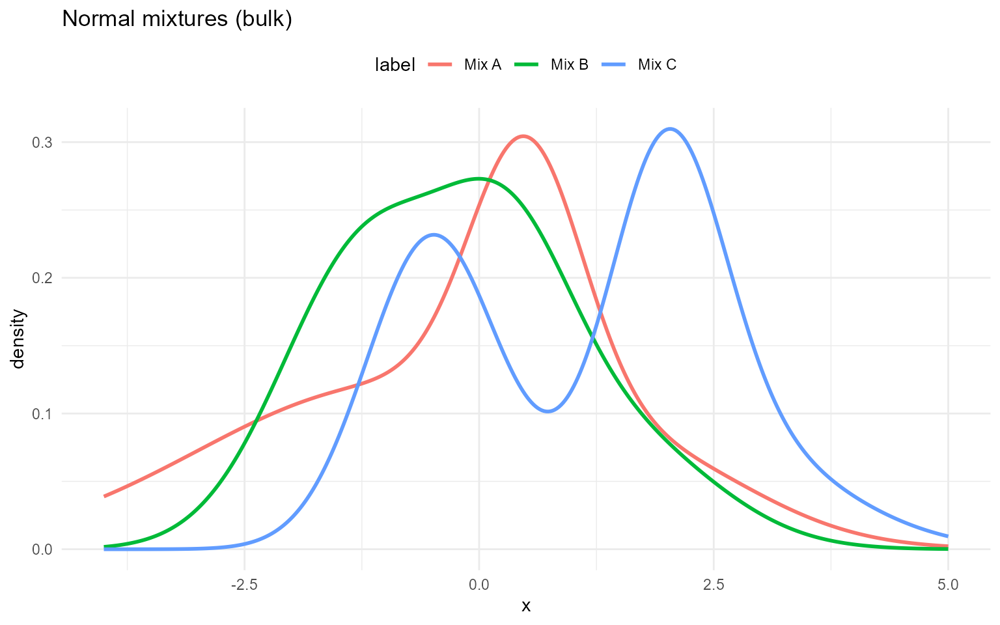
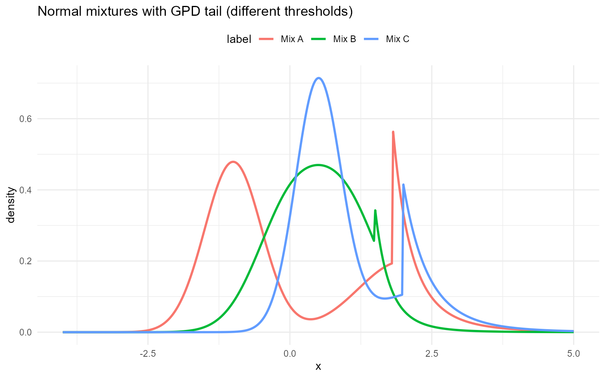

# Normal

## Normal

### Normal mixture kernel

A normal component is parameterized by $`\mu\in\mathbb{R}`$ and
$`\sigma>0`$:
``` math
f(y\mid\mu,\sigma)=\frac{1}{\sqrt{2\pi}\sigma}\exp\!\left(-\frac{(y-\mu)^2}{2\sigma^2}\right).
```

A finite normal mixture with $`J`$ components has density
``` math
f(y)=\sum_{j=1}^J w_j\,\mathcal{N}(y\mid\mu_j,\sigma_j^2),
\qquad \sum_{j=1}^J w_j=1.
```

**Parameter mapping (math $`\rightarrow`$ code):**
$`\mu_j\to`$`mean[j]`, $`\sigma_j\to`$`sd[j]`, $`w_j\to`$`w[j]`.

### Normal mixture with GPD tail

In the spliced version, the bulk distribution is the normal mixture
below $`u`$, and a GPD tail is attached above $`u`$. The tail parameters
are $`\sigma>0`$ and $`\xi`$, applied to exceedances $`x-u`$.

**Tail mapping (math $`\rightarrow`$ code):** $`u\to`$`threshold`,
$`\sigma\to`$`tail_scale`, $`\xi\to`$`tail_shape`.

### Without GPD (mixture kernel)

``` r

grid <- seq(-4, 5, length.out = 400)
normal_sets <- list(
  list(label = "Mix A", w = c(0.6, 0.3, 0.1), mean = c(-1, 0.5, 2), sd = c(2, 0.6, 1.1)),
  list(label = "Mix B", w = c(0.5, 0.3, 0.2), mean = c(-1.2, 0.3, 1.5), sd = c(0.9, 0.7, 1.0)),
  list(label = "Mix C", w = c(0.4, 0.35, 0.25), mean = c(-0.5, 2, 2.5), sd = c(0.7, 0.6, 1.2))
)

example <- normal_sets[[1]]
```

``` r

dNormMix(0, w = example$w, mean = example$mean, sd = example$sd)
```

    [1] 0.254

``` r

dNormMix(0, w = example$w, mean = example$mean, sd = example$sd, log = TRUE)
```

    [1] -1.37

``` r

pNormMix(0, w = example$w, mean = example$mean, sd = example$sd)
```

    [1] 0.479

``` r

pNormMix(0, w = example$w, mean = example$mean, sd = example$sd, lower.tail = FALSE)
```

    [1] 0.521

``` r

pNormMix(0, w = example$w, mean = example$mean, sd = example$sd, log.p = TRUE)
```

    [1] -0.736

``` r

q_vec(qNormMix, c(0.25, 0.5, 0.75), w = example$w, mean = example$mean,
      sd = example$sd)
```

    [1] -1.4234  0.0805  0.9495

``` r

q_vec(qNormMix, c(0.25, 0.5, 0.75), w = example$w, mean = example$mean,
      sd = example$sd, lower.tail = FALSE)
```

    [1]  0.9495  0.0805 -1.4234

``` r

q_vec(qNormMix, c(log(0.25), log(0.5), log(0.75)), w = example$w,
      mean = example$mean, sd = example$sd, log.p = TRUE)
```

    [1] -1.4234  0.0805  0.9495

``` r

draw_many(rNormMix, list(w = example$w, mean = example$mean, sd = example$sd))
```

    [1] -1.652  1.081  2.456 -2.641  0.323

``` r

df_norm <- do.call(rbind, lapply(normal_sets, function(ps) {
  data.frame(x = grid, density = density_curve(grid, dNormMix, list(w = ps$w, mean = ps$mean, sd = ps$sd)), label = ps$label)
}))

ggplot(df_norm, aes(x = x, y = density, color = label)) +
  geom_line(linewidth = 1) +
  labs(title = "Normal mixtures (bulk)", x = "x", y = "density") +
  theme_minimal() + theme(legend.position = "top")
```



### With GPD tail

Spliced density uses the same mixture for $`x<u`$ and attaches
$`f_{GPD}`$ above $`u`$ with continuity. CDF combines mixture CDF up to
$`u`$ and GPD exceedance beyond $`u`$; quantiles invert this spliced
CDF; RNG draws bulk vs tail by the CDF mass at $`u`$.

``` r

normal_gpd_sets <- list(
  list(label = "Mix A", w = c(0.6, 0.4), mean = c(-1, 2), sd = c(0.5, 0.8), threshold = 1.8, tail_scale = 0.4, tail_shape = 0.25),
  list(label = "Mix B", w = c(0.5, 0.5), mean = c(0, 1), sd = c(0.6, 0.6), threshold = 1.5, tail_scale = 0.3, tail_shape = 0.2),
  list(label = "Mix C", w = c(0.7, 0.3), mean = c(0.5, 2.5), sd = c(0.4, 1.0), threshold = 2.0, tail_scale = 0.5, tail_shape = 0.15)
)

example <- normal_gpd_sets[[1]]
```

``` r

dNormMixGpd(2, w = example$w, mean = example$mean, sd = example$sd, threshold = example$threshold, tail_scale = example$tail_scale, tail_shape = example$tail_shape)
```

    [1] 0.332

``` r

pNormMixGpd(2, w = example$w, mean = example$mean, sd = example$sd, threshold = example$threshold, tail_scale = example$tail_scale, tail_shape = example$tail_shape)
```

    [1] 0.85

``` r

q_vec(qNormMixGpd, c(0.5, 0.9), w = example$w, mean = example$mean, sd = example$sd, threshold = example$threshold, tail_scale = example$tail_scale, tail_shape = example$tail_shape)
```

    [1] -0.517  2.190

``` r

draw_many(rNormMixGpd, example)
```

    [1]  3.924  3.365  1.082 -1.150 -0.874

``` r

df_norm_gpd <- do.call(rbind, lapply(normal_gpd_sets, function(ps) {
  data.frame(x = grid, density = density_curve(grid, dNormMixGpd, list(w = ps$w, mean = ps$mean, sd = ps$sd, threshold = ps$threshold, tail_scale = ps$tail_scale, tail_shape = ps$tail_shape)), label = ps$label)
}))

ggplot(df_norm_gpd, aes(x = x, y = density, color = label)) +
  geom_line(linewidth = 1) +
  labs(title = "Normal mixtures with GPD tail (different thresholds)", x = "x", y = "density") +
  theme_minimal() + theme(legend.position = "top")
```


