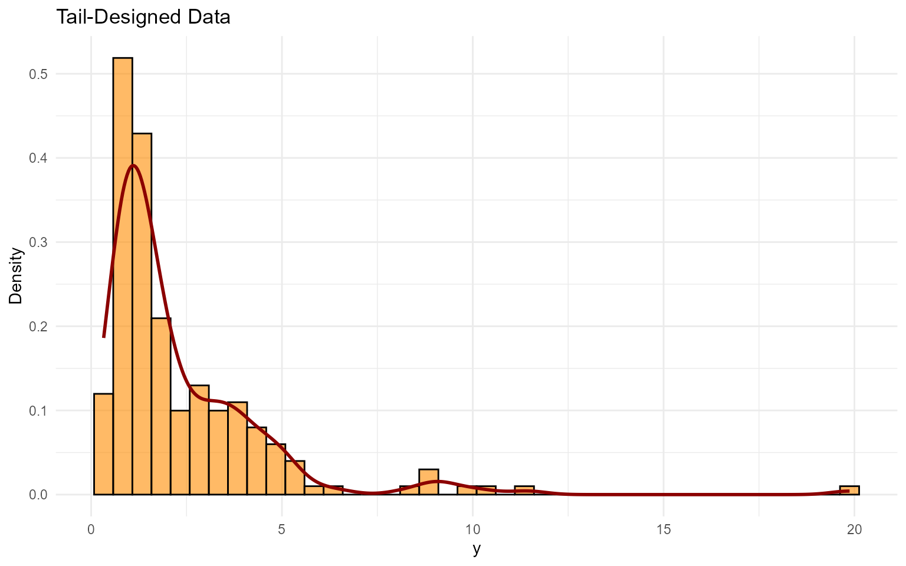

# 9. Unconditional DPmixGPD with Stick-Breaking Backend

> **Legacy vignette (for the website / historical notes).** These files
> may not match the current exported API one-to-one. Last verified:
> **2026-01-18**.
>
> For the up-to-date workflow, see the main package vignettes
> (Introduction, Model Spec, MCMC Workflow,
> Unconditional/Conditional/Causal, Backends, S3 Reference).

## Unconditional DPmixGPD: Stick-Breaking (SB) Backend with Tail Augmentation

**Purpose**: Demonstrate the stick-breaking backend (`components = J`)
while augmenting the extreme tail with a GPD. This mirrors the CRP+GPD
pipeline (v06) but highlights the fixed-truncation behavior for bulk
components.

------------------------------------------------------------------------

### Data Setup

``` r

# Tail-heavy data
data("nc_pos_tail200_k4")
y_tail <- nc_pos_tail200_k4$y

summary_tbl <- tibble(
  statistic = c("N", "Mean", "SD", "Min", "Max"),
  value = c(length(y_tail), mean(y_tail), sd(y_tail), min(y_tail), max(y_tail))
)

df_data <- data.frame(y = y_tail)

p_raw <- ggplot(df_data, aes(x = y)) +
  geom_histogram(aes(y = after_stat(density)), bins = 40, fill = "darkorange", alpha = 0.6, color = "black") +
  geom_density(color = "darkred", linewidth = 1) +
  labs(title = "Tail-Designed Data", x = "y", y = "Density") +
  theme_minimal()

grid.arrange(p_raw, ncol = 1)
```



| statistic |  value  |
|:---------:|:-------:|
|     N     | 200.000 |
|   Mean    |  2.334  |
|    SD     |  2.300  |
|    Min    |  0.328  |
|    Max    | 19.870  |

Tail Dataset Summaries {.table .table .table-striped .table-hover
style="width: auto !important; margin-left: auto; margin-right: auto;"}

------------------------------------------------------------------------

### Threshold Selection

``` r

thresholds <- quantile(y_tail, c(0.70, 0.75, 0.80, 0.85))
u_threshold <- thresholds["80%"]

ggplot(df_data, aes(x = y)) +
  geom_histogram(aes(y = after_stat(density)), bins = 40, fill = "skyblue", alpha = 0.6, color = "black") +
  geom_vline(xintercept = u_threshold, linetype = "dashed", color = "black") +
  labs(title = paste("Threshold at", round(u_threshold, 2)), x = "y", y = "Density") +
  theme_minimal()
```


------------------------------------------------------------------------

### Model Specification & Bundle

This follows the same structure as the SB bulk-only vignette (`v05`):
build a bundle with
[`build_nimble_bundle()`](https://arnabaich96.github.io/DPmixGPD/reference/build_nimble_bundle.md),
run MCMC, then use the S3
[`predict()`](https://rdrr.io/r/stats/predict.html) +
`if (interactive()) plot()` helpers. Compared with `v06` (CRP+GPD), here
we keep the **stick-breaking** backend and use a **Gamma** bulk kernel
with a lognormal threshold prior, then contrast it with a bulk-only
**Laplace** fit.

``` r

bundle_sb_gpd <- build_nimble_bundle(
  y = y_tail,
  kernel = "gamma",
  backend = "sb",
  GPD = TRUE,
  components = 5,
  param_specs = list(
    gpd = list(
      threshold = list(
        mode = "dist",
        dist = "lognormal",
        args = list(meanlog = log(max(u_threshold, .Machine$double.eps)), sdlog = 0.25)
      )
    )
  ),
  mcmc = mcmc
)
```

------------------------------------------------------------------------

### Running MCMC

``` r

fit_sb_gpd <- load_or_fit("v09-unconditional-DPmixGPD-SB-fit_sb_gpd", run_mcmc_bundle_manual(bundle_sb_gpd))
summary(fit_sb_gpd)
```

    MixGPD summary | backend: Stick-Breaking Process | kernel: Gamma Distribution | GPD tail: TRUE | epsilon: 0.025
    n = 200 | components = 5
    Summary
    Initial components: 5 | Components after truncation: 2

    WAIC: 608.177
    lppd: -237.339 | pWAIC: 66.75

    Summary table
    <table class="table" style="width: auto !important; margin-left: auto; margin-right: auto;">
     <thead>
      <tr>
       <th style="text-align:center;"> parameter </th>
       <th style="text-align:center;"> mean </th>
       <th style="text-align:center;"> sd </th>
       <th style="text-align:center;"> q0.025 </th>
       <th style="text-align:center;"> q0.500 </th>
       <th style="text-align:center;"> q0.975 </th>
       <th style="text-align:center;"> ess </th>
      </tr>
     </thead>
    <tbody>
      <tr>
       <td style="text-align:center;"> weights[1] </td>
       <td style="text-align:center;"> 0.549 </td>
       <td style="text-align:center;"> 0.088 </td>
       <td style="text-align:center;"> 0.365 </td>
       <td style="text-align:center;"> 0.56 </td>
       <td style="text-align:center;"> 0.7 </td>
       <td style="text-align:center;"> 41.76 </td>
      </tr>
      <tr>
       <td style="text-align:center;"> weights[2] </td>
       <td style="text-align:center;"> 0.27 </td>
       <td style="text-align:center;"> 0.084 </td>
       <td style="text-align:center;"> 0.135 </td>
       <td style="text-align:center;"> 0.255 </td>
       <td style="text-align:center;"> 0.445 </td>
       <td style="text-align:center;"> 45.304 </td>
      </tr>
      <tr>
       <td style="text-align:center;"> alpha </td>
       <td style="text-align:center;"> 1.4 </td>
       <td style="text-align:center;"> 0.934 </td>
       <td style="text-align:center;"> 0.323 </td>
       <td style="text-align:center;"> 1.159 </td>
       <td style="text-align:center;"> 3.82 </td>
       <td style="text-align:center;"> 62.321 </td>
      </tr>
      <tr>
       <td style="text-align:center;"> tail_scale </td>
       <td style="text-align:center;"> 1.93 </td>
       <td style="text-align:center;"> 0.688 </td>
       <td style="text-align:center;"> 1.131 </td>
       <td style="text-align:center;"> 1.798 </td>
       <td style="text-align:center;"> 4.013 </td>
       <td style="text-align:center;"> 41.331 </td>
      </tr>
      <tr>
       <td style="text-align:center;"> tail_shape </td>
       <td style="text-align:center;"> 0.182 </td>
       <td style="text-align:center;"> 0.128 </td>
       <td style="text-align:center;"> -0.036 </td>
       <td style="text-align:center;"> 0.176 </td>
       <td style="text-align:center;"> 0.438 </td>
       <td style="text-align:center;"> 369.412 </td>
      </tr>
      <tr>
       <td style="text-align:center;"> threshold </td>
       <td style="text-align:center;"> 3.143 </td>
       <td style="text-align:center;"> 0.818 </td>
       <td style="text-align:center;"> 1.746 </td>
       <td style="text-align:center;"> 2.935 </td>
       <td style="text-align:center;"> 5.399 </td>
       <td style="text-align:center;"> 32.771 </td>
      </tr>
      <tr>
       <td style="text-align:center;"> shape[1] </td>
       <td style="text-align:center;"> 5.046 </td>
       <td style="text-align:center;"> 1.244 </td>
       <td style="text-align:center;"> 2.019 </td>
       <td style="text-align:center;"> 5.129 </td>
       <td style="text-align:center;"> 7.316 </td>
       <td style="text-align:center;"> 48.78 </td>
      </tr>
      <tr>
       <td style="text-align:center;"> shape[2] </td>
       <td style="text-align:center;"> 3.293 </td>
       <td style="text-align:center;"> 1.574 </td>
       <td style="text-align:center;"> 1.418 </td>
       <td style="text-align:center;"> 2.843 </td>
       <td style="text-align:center;"> 7.374 </td>
       <td style="text-align:center;"> 103.352 </td>
      </tr>
      <tr>
       <td style="text-align:center;"> scale[1] </td>
       <td style="text-align:center;"> 0.34 </td>
       <td style="text-align:center;"> 0.361 </td>
       <td style="text-align:center;"> 0.153 </td>
       <td style="text-align:center;"> 0.233 </td>
       <td style="text-align:center;"> 1.441 </td>
       <td style="text-align:center;"> 76.555 </td>
      </tr>
      <tr>
       <td style="text-align:center;"> scale[2] </td>
       <td style="text-align:center;"> 1.912 </td>
       <td style="text-align:center;"> 1.349 </td>
       <td style="text-align:center;"> 0.152 </td>
       <td style="text-align:center;"> 1.69 </td>
       <td style="text-align:center;"> 5.169 </td>
       <td style="text-align:center;"> 104.372 </td>
      </tr>
    </tbody>
    </table>

``` r

params_sb_gpd <- params(fit_sb_gpd)
params_sb_gpd
```

    Posterior mean parameters

    $alpha
    [1] "1.4"

    $w
    [1] "0.549" "0.27" 

    $shape
    [1] "5.046" "3.293"

    $scale
    [1] "0.34"  "1.912"

    $tail_scale
    [1] "1.93"

    $tail_shape
    [1] "0.182"

------------------------------------------------------------------------

### Posterior Predictions

``` r

y_grid <- seq(0, max(y_tail) * 1.3, length.out = 300)
pred_density <- predict(fit_sb_gpd, y = y_grid, type = "density")
if (interactive()) plot(pred_density)
```

``` r

y_surv <- seq(u_threshold, max(y_tail) * 1.1, length.out = 60)
pred_surv <- predict(fit_sb_gpd, y = y_surv, type = "survival")
if (interactive()) plot(pred_surv)
```

``` r

quant_probs <- c(0.90, 0.95, 0.99)
pred_quant <- predict(fit_sb_gpd, type = "quantile", index = quant_probs, interval = "credible")
if (interactive()) plot(pred_quant)
```

------------------------------------------------------------------------

### Tail vs Bulk Comparison

``` r

bundle_sb_bulk <- build_nimble_bundle(
  y = y_tail,
  kernel = "laplace",
  backend = "sb",
  GPD = FALSE,
  components = 5,
  mcmc = mcmc
)
fit_sb_bulk <- load_or_fit("v09-unconditional-DPmixGPD-SB-fit_sb_bulk", run_mcmc_bundle_manual(bundle_sb_bulk))

bulk_quant <- predict(fit_sb_bulk, type = "quantile", index = quant_probs)
t_quant <- predict(fit_sb_gpd, type = "quantile", index = quant_probs)

bind_rows(
  bulk_quant$fit %>% mutate(model = "Bulk-only"),
  t_quant$fit %>% mutate(model = "Bulk + GPD")
) %>%
  select(any_of(c("model", "index", "estimate", "lwr", "upr", "lower", "upper"))) %>%
  mutate(across(where(is.numeric), ~ round(.x, 3))) %>%
  kable(caption = "Quantiles: Bulk-only vs GPD-augmented", align = "c") %>%
  kable_styling(bootstrap_options = c("striped", "hover"), full_width = FALSE, position = "center")
```

|   model    | index | estimate | lower | upper |
|:----------:|:-----:|:--------:|:-----:|:-----:|
| Bulk-only  | 0.90  |   5.96   | 5.14  | 6.91  |
| Bulk-only  | 0.95  |   7.88   | 6.52  | 9.49  |
| Bulk-only  | 0.99  |  13.41   | 10.31 | 17.10 |
| Bulk + GPD | 0.90  |   4.29   | 2.58  | 5.60  |
| Bulk + GPD | 0.95  |   5.78   | 3.54  | 7.61  |
| Bulk + GPD | 0.99  |  10.27   | 6.49  | 14.94 |

Quantiles: Bulk-only vs GPD-augmented {.table .table .table-striped
.table-hover
style="width: auto !important; margin-left: auto; margin-right: auto;"}

``` r

if (interactive()) plot(bulk_quant)
if (interactive()) plot(t_quant)
```

------------------------------------------------------------------------

### Diagnostics

``` r

if (interactive()) plot(fit_sb_gpd, family = c("histogram", "autocorrelation", "running"))
```

------------------------------------------------------------------------

### Key Takeaways

- Stick-breaking truncation fixes the number of bulk components but
  still flexibly models the tail via GPD.
- Posterior [`predict()`](https://rdrr.io/r/stats/predict.html) +
  `if (interactive()) plot()` workflows visualize densities, survival
  probabilities, and posterior-mean extreme quantiles.
- Comparing bulk-only vs GPD-augmented quantiles reveals how tail
  augmentation shifts the 95–99% levels.
- Next: conditional DPmix (v08–v11) to explore covariate effects
  before moving to causal regimes.
