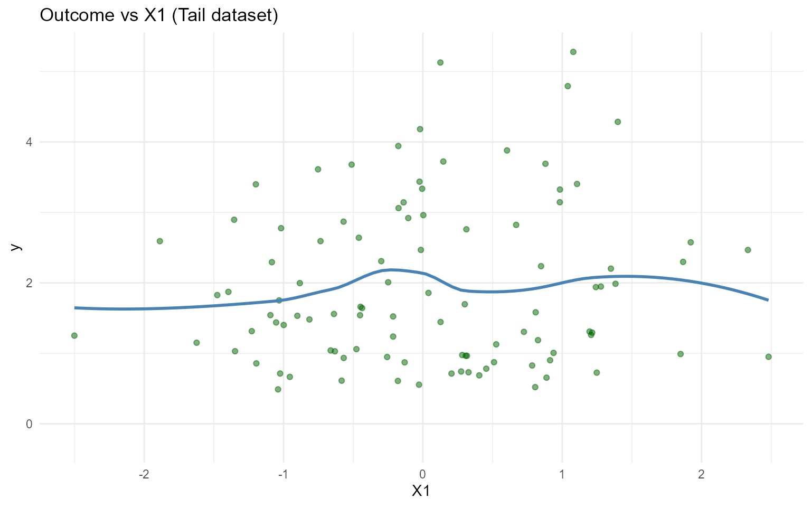
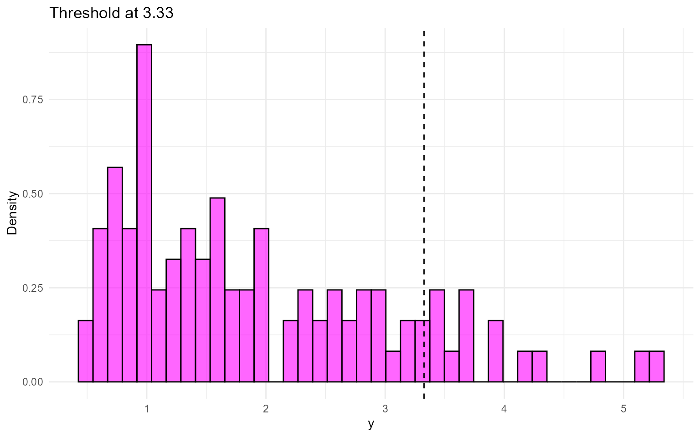
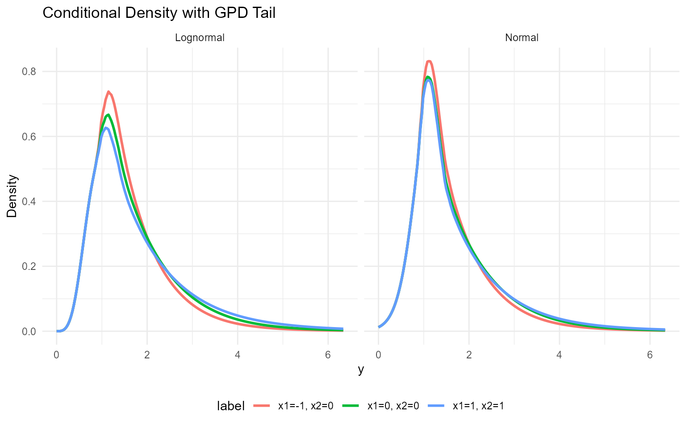
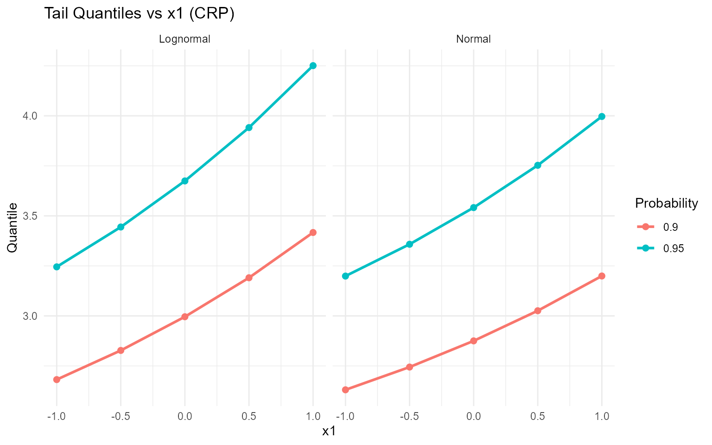

# 12. Conditional DPmixGPD with CRP Backend

> **Legacy vignette (for the website / historical notes).** These files
> may not match the current exported API one-to-one. Last verified:
> **2026-01-18**.
>
> For the up-to-date workflow, see the main package vignettes
> (Introduction, Model Spec, MCMC Workflow,
> Unconditional/Conditional/Causal, Backends, S3 Reference).

## Conditional DPmixGPD: CRP Backend with Tail Augmentation

**Purpose**: Combine conditional modeling with GPD tail augmentation so
each covariate slice inherits both mixture bulk and tail behavior. This
extends the unconditional GPD (v06) and conditional DP (v08).

------------------------------------------------------------------------

### Data Setup

``` r

data("nc_posX100_p5_k4")
y <- nc_posX100_p5_k4$y
X <- as.matrix(nc_posX100_p5_k4$X)
if (is.null(colnames(X))) {
  colnames(X) <- paste0("x", seq_len(ncol(X)))
}

summary_tbl <- tibble(
  statistic = c("N", "Mean", "SD", "Min", "Max"),
  value = c(length(y), mean(y), sd(y), min(y), max(y))
)

ggplot(data.frame(y = y, x1 = X[, 1]), aes(x = x1, y = y)) +
  geom_point(alpha = 0.5, color = "darkgreen") +
  geom_smooth(method = "loess", color = "steelblue", fill = NA) +
  labs(title = "Outcome vs X1 (Tail dataset)", x = "X1", y = "y") +
  theme_minimal()
```



| statistic |  value  |
|:---------:|:-------:|
|     N     | 100.000 |
|   Mean    |  1.942  |
|    SD     |  1.146  |
|    Min    |  0.488  |
|    Max    |  5.278  |

Conditional Tail Dataset Summary {.table .table .table-striped
.table-hover
style="width: auto !important; margin-left: auto; margin-right: auto;"}

------------------------------------------------------------------------

### Threshold Selection

``` r

u_threshold <- quantile(y, 0.85)

ggplot(data.frame(y = y), aes(x = y)) +
  geom_histogram(aes(y = after_stat(density)), bins = 40, fill = "magenta", alpha = 0.6, color = "black") +
  geom_vline(xintercept = u_threshold, linetype = "dashed", color = "black") +
  labs(title = paste("Threshold at", signif(u_threshold, 3)), x = "y", y = "Density") +
  theme_minimal()
```



------------------------------------------------------------------------

### Model Specification & Bundle

``` r

bundle_cond_gpd_lognormal <- build_nimble_bundle(
  y = y,
  X = X,
  kernel = "lognormal",
  backend = "crp",
  GPD = TRUE,
  components = 5,
  param_specs = list(
    gpd = list(
      threshold = list(mode = "link", link = "exp")
    )
  ),
  mcmc = mcmc
)

bundle_cond_gpd_normal <- build_nimble_bundle(
  y = y,
  X = X,
  kernel = "normal",
  backend = "crp",
  GPD = TRUE,
  components = 5,
  param_specs = list(
    gpd = list(
      threshold = list(mode = "link", link = "exp")
    )
  ),
  mcmc = mcmc
)
```

------------------------------------------------------------------------

### Running MCMC

``` r

fit_cond_gpd_lognormal <- load_or_fit("v12-conditional-DPmixGPD-CRP-fit_cond_gpd_lognormal", run_mcmc_bundle_manual(bundle_cond_gpd_lognormal))
fit_cond_gpd_normal <- load_or_fit("v12-conditional-DPmixGPD-CRP-fit_cond_gpd_normal", run_mcmc_bundle_manual(bundle_cond_gpd_normal))
summary(fit_cond_gpd_lognormal)
```

    MixGPD summary | backend: Chinese Restaurant Process | kernel: Lognormal Distribution | GPD tail: TRUE | epsilon: 0.025
    n = 100 | components = 5
    Summary
    Initial components: 5 | Components after truncation: 1

    WAIC: 281.937
    lppd: -128.521 | pWAIC: 12.447

    Summary table
    <table class="table" style="width: auto !important; margin-left: auto; margin-right: auto;">
     <thead>
      <tr>
       <th style="text-align:center;"> parameter </th>
       <th style="text-align:center;"> mean </th>
       <th style="text-align:center;"> sd </th>
       <th style="text-align:center;"> q0.025 </th>
       <th style="text-align:center;"> q0.500 </th>
       <th style="text-align:center;"> q0.975 </th>
       <th style="text-align:center;"> ess </th>
      </tr>
     </thead>
    <tbody>
      <tr>
       <td style="text-align:center;"> weights[1] </td>
       <td style="text-align:center;"> 0.922 </td>
       <td style="text-align:center;"> 0.131 </td>
       <td style="text-align:center;"> 0.57 </td>
       <td style="text-align:center;"> 1 </td>
       <td style="text-align:center;"> 1 </td>
       <td style="text-align:center;"> 66.64 </td>
      </tr>
      <tr>
       <td style="text-align:center;"> alpha </td>
       <td style="text-align:center;"> 0.319 </td>
       <td style="text-align:center;"> 0.324 </td>
       <td style="text-align:center;"> 0.008 </td>
       <td style="text-align:center;"> 0.219 </td>
       <td style="text-align:center;"> 1.188 </td>
       <td style="text-align:center;"> 239.038 </td>
      </tr>
      <tr>
       <td style="text-align:center;"> beta_tail_scale[1] </td>
       <td style="text-align:center;"> 0.201 </td>
       <td style="text-align:center;"> 0.137 </td>
       <td style="text-align:center;"> -0.059 </td>
       <td style="text-align:center;"> 0.204 </td>
       <td style="text-align:center;"> 0.466 </td>
       <td style="text-align:center;"> 757.616 </td>
      </tr>
      <tr>
       <td style="text-align:center;"> beta_tail_scale[2] </td>
       <td style="text-align:center;"> -0.043 </td>
       <td style="text-align:center;"> 0.217 </td>
       <td style="text-align:center;"> -0.444 </td>
       <td style="text-align:center;"> -0.039 </td>
       <td style="text-align:center;"> 0.392 </td>
       <td style="text-align:center;"> 616.507 </td>
      </tr>
      <tr>
       <td style="text-align:center;"> beta_tail_scale[3] </td>
       <td style="text-align:center;"> -0.085 </td>
       <td style="text-align:center;"> 0.13 </td>
       <td style="text-align:center;"> -0.347 </td>
       <td style="text-align:center;"> -0.08 </td>
       <td style="text-align:center;"> 0.16 </td>
       <td style="text-align:center;"> 381.235 </td>
      </tr>
      <tr>
       <td style="text-align:center;"> beta_tail_scale[4] </td>
       <td style="text-align:center;"> 0.429 </td>
       <td style="text-align:center;"> 0.257 </td>
       <td style="text-align:center;"> -0.089 </td>
       <td style="text-align:center;"> 0.425 </td>
       <td style="text-align:center;"> 0.928 </td>
       <td style="text-align:center;"> 369.712 </td>
      </tr>
      <tr>
       <td style="text-align:center;"> beta_tail_scale[5] </td>
       <td style="text-align:center;"> -0.04 </td>
       <td style="text-align:center;"> 0.126 </td>
       <td style="text-align:center;"> -0.287 </td>
       <td style="text-align:center;"> -0.038 </td>
       <td style="text-align:center;"> 0.209 </td>
       <td style="text-align:center;"> 415.81 </td>
      </tr>
      <tr>
       <td style="text-align:center;"> beta_threshold[1] </td>
       <td style="text-align:center;"> -0.102 </td>
       <td style="text-align:center;"> 0.144 </td>
       <td style="text-align:center;"> -0.377 </td>
       <td style="text-align:center;"> -0.108 </td>
       <td style="text-align:center;"> 0.177 </td>
       <td style="text-align:center;"> 239.793 </td>
      </tr>
      <tr>
       <td style="text-align:center;"> beta_threshold[2] </td>
       <td style="text-align:center;"> -0.181 </td>
       <td style="text-align:center;"> 0.208 </td>
       <td style="text-align:center;"> -0.515 </td>
       <td style="text-align:center;"> -0.213 </td>
       <td style="text-align:center;"> 0.291 </td>
       <td style="text-align:center;"> 115.65 </td>
      </tr>
      <tr>
       <td style="text-align:center;"> beta_threshold[3] </td>
       <td style="text-align:center;"> 0.176 </td>
       <td style="text-align:center;"> 0.197 </td>
       <td style="text-align:center;"> -0.206 </td>
       <td style="text-align:center;"> 0.2 </td>
       <td style="text-align:center;"> 0.488 </td>
       <td style="text-align:center;"> 124.486 </td>
      </tr>
      <tr>
       <td style="text-align:center;"> beta_threshold[4] </td>
       <td style="text-align:center;"> 0.007 </td>
       <td style="text-align:center;"> 0.191 </td>
       <td style="text-align:center;"> -0.36 </td>
       <td style="text-align:center;"> 0.003 </td>
       <td style="text-align:center;"> 0.391 </td>
       <td style="text-align:center;"> 256.131 </td>
      </tr>
      <tr>
       <td style="text-align:center;"> beta_threshold[5] </td>
       <td style="text-align:center;"> 0.117 </td>
       <td style="text-align:center;"> 0.158 </td>
       <td style="text-align:center;"> -0.188 </td>
       <td style="text-align:center;"> 0.099 </td>
       <td style="text-align:center;"> 0.403 </td>
       <td style="text-align:center;"> 34.387 </td>
      </tr>
      <tr>
       <td style="text-align:center;"> tail_shape </td>
       <td style="text-align:center;"> -0.025 </td>
       <td style="text-align:center;"> 0.109 </td>
       <td style="text-align:center;"> -0.213 </td>
       <td style="text-align:center;"> -0.034 </td>
       <td style="text-align:center;"> 0.213 </td>
       <td style="text-align:center;"> 553.129 </td>
      </tr>
      <tr>
       <td style="text-align:center;"> meanlog[1] </td>
       <td style="text-align:center;"> 0.501 </td>
       <td style="text-align:center;"> 0.523 </td>
       <td style="text-align:center;"> 0.08 </td>
       <td style="text-align:center;"> 0.437 </td>
       <td style="text-align:center;"> 1.012 </td>
       <td style="text-align:center;"> 109.42 </td>
      </tr>
      <tr>
       <td style="text-align:center;"> sdlog[1] </td>
       <td style="text-align:center;"> 0.569 </td>
       <td style="text-align:center;"> 0.15 </td>
       <td style="text-align:center;"> 0.356 </td>
       <td style="text-align:center;"> 0.552 </td>
       <td style="text-align:center;"> 0.872 </td>
       <td style="text-align:center;"> 87.315 </td>
      </tr>
    </tbody>
    </table>

``` r

summary(fit_cond_gpd_normal)
```

    MixGPD summary | backend: Chinese Restaurant Process | kernel: Normal Distribution | GPD tail: TRUE | epsilon: 0.025
    n = 100 | components = 5
    Summary
    Initial components: 5 | Components after truncation: 1

    WAIC: 267.676
    lppd: -106.969 | pWAIC: 26.869

    Summary table
    <table class="table" style="width: auto !important; margin-left: auto; margin-right: auto;">
     <thead>
      <tr>
       <th style="text-align:center;"> parameter </th>
       <th style="text-align:center;"> mean </th>
       <th style="text-align:center;"> sd </th>
       <th style="text-align:center;"> q0.025 </th>
       <th style="text-align:center;"> q0.500 </th>
       <th style="text-align:center;"> q0.975 </th>
       <th style="text-align:center;"> ess </th>
      </tr>
     </thead>
    <tbody>
      <tr>
       <td style="text-align:center;"> weights[1] </td>
       <td style="text-align:center;"> 0.847 </td>
       <td style="text-align:center;"> 0.181 </td>
       <td style="text-align:center;"> 0.51 </td>
       <td style="text-align:center;"> 1 </td>
       <td style="text-align:center;"> 1 </td>
       <td style="text-align:center;"> 12.69 </td>
      </tr>
      <tr>
       <td style="text-align:center;"> alpha </td>
       <td style="text-align:center;"> 0.331 </td>
       <td style="text-align:center;"> 0.337 </td>
       <td style="text-align:center;"> 0.01 </td>
       <td style="text-align:center;"> 0.229 </td>
       <td style="text-align:center;"> 1.248 </td>
       <td style="text-align:center;"> 181.031 </td>
      </tr>
      <tr>
       <td style="text-align:center;"> beta_tail_scale[1] </td>
       <td style="text-align:center;"> 0.177 </td>
       <td style="text-align:center;"> 0.142 </td>
       <td style="text-align:center;"> -0.101 </td>
       <td style="text-align:center;"> 0.175 </td>
       <td style="text-align:center;"> 0.466 </td>
       <td style="text-align:center;"> 190.135 </td>
      </tr>
      <tr>
       <td style="text-align:center;"> beta_tail_scale[2] </td>
       <td style="text-align:center;"> -0.093 </td>
       <td style="text-align:center;"> 0.221 </td>
       <td style="text-align:center;"> -0.529 </td>
       <td style="text-align:center;"> -0.094 </td>
       <td style="text-align:center;"> 0.357 </td>
       <td style="text-align:center;"> 447.253 </td>
      </tr>
      <tr>
       <td style="text-align:center;"> beta_tail_scale[3] </td>
       <td style="text-align:center;"> -0.089 </td>
       <td style="text-align:center;"> 0.135 </td>
       <td style="text-align:center;"> -0.382 </td>
       <td style="text-align:center;"> -0.079 </td>
       <td style="text-align:center;"> 0.149 </td>
       <td style="text-align:center;"> 51.559 </td>
      </tr>
      <tr>
       <td style="text-align:center;"> beta_tail_scale[4] </td>
       <td style="text-align:center;"> 0.484 </td>
       <td style="text-align:center;"> 0.26 </td>
       <td style="text-align:center;"> -0.017 </td>
       <td style="text-align:center;"> 0.483 </td>
       <td style="text-align:center;"> 0.99 </td>
       <td style="text-align:center;"> 411.504 </td>
      </tr>
      <tr>
       <td style="text-align:center;"> beta_tail_scale[5] </td>
       <td style="text-align:center;"> -0.031 </td>
       <td style="text-align:center;"> 0.122 </td>
       <td style="text-align:center;"> -0.272 </td>
       <td style="text-align:center;"> -0.029 </td>
       <td style="text-align:center;"> 0.214 </td>
       <td style="text-align:center;"> 329.37 </td>
      </tr>
      <tr>
       <td style="text-align:center;"> beta_threshold[1] </td>
       <td style="text-align:center;"> -0.1 </td>
       <td style="text-align:center;"> 0.127 </td>
       <td style="text-align:center;"> -0.338 </td>
       <td style="text-align:center;"> -0.105 </td>
       <td style="text-align:center;"> 0.159 </td>
       <td style="text-align:center;"> 119.045 </td>
      </tr>
      <tr>
       <td style="text-align:center;"> beta_threshold[2] </td>
       <td style="text-align:center;"> -0.182 </td>
       <td style="text-align:center;"> 0.213 </td>
       <td style="text-align:center;"> -0.519 </td>
       <td style="text-align:center;"> -0.214 </td>
       <td style="text-align:center;"> 0.331 </td>
       <td style="text-align:center;"> 39.109 </td>
      </tr>
      <tr>
       <td style="text-align:center;"> beta_threshold[3] </td>
       <td style="text-align:center;"> 0.142 </td>
       <td style="text-align:center;"> 0.221 </td>
       <td style="text-align:center;"> -0.183 </td>
       <td style="text-align:center;"> 0.102 </td>
       <td style="text-align:center;"> 0.544 </td>
       <td style="text-align:center;"> 17.403 </td>
      </tr>
      <tr>
       <td style="text-align:center;"> beta_threshold[4] </td>
       <td style="text-align:center;"> -0.064 </td>
       <td style="text-align:center;"> 0.227 </td>
       <td style="text-align:center;"> -0.474 </td>
       <td style="text-align:center;"> -0.083 </td>
       <td style="text-align:center;"> 0.388 </td>
       <td style="text-align:center;"> 69.21 </td>
      </tr>
      <tr>
       <td style="text-align:center;"> beta_threshold[5] </td>
       <td style="text-align:center;"> 0.147 </td>
       <td style="text-align:center;"> 0.129 </td>
       <td style="text-align:center;"> -0.147 </td>
       <td style="text-align:center;"> 0.16 </td>
       <td style="text-align:center;"> 0.37 </td>
       <td style="text-align:center;"> 31.322 </td>
      </tr>
      <tr>
       <td style="text-align:center;"> tail_shape </td>
       <td style="text-align:center;"> -0.034 </td>
       <td style="text-align:center;"> 0.112 </td>
       <td style="text-align:center;"> -0.227 </td>
       <td style="text-align:center;"> -0.042 </td>
       <td style="text-align:center;"> 0.212 </td>
       <td style="text-align:center;"> 500.22 </td>
      </tr>
      <tr>
       <td style="text-align:center;"> mean[1] </td>
       <td style="text-align:center;"> 1.679 </td>
       <td style="text-align:center;"> 1.459 </td>
       <td style="text-align:center;"> 1.047 </td>
       <td style="text-align:center;"> 1.356 </td>
       <td style="text-align:center;"> 6.814 </td>
       <td style="text-align:center;"> 25.343 </td>
      </tr>
      <tr>
       <td style="text-align:center;"> sd[1] </td>
       <td style="text-align:center;"> 0.515 </td>
       <td style="text-align:center;"> 0.319 </td>
       <td style="text-align:center;"> 0.295 </td>
       <td style="text-align:center;"> 0.447 </td>
       <td style="text-align:center;"> 1.324 </td>
       <td style="text-align:center;"> 54.247 </td>
      </tr>
    </tbody>
    </table>

``` r

params_cond_gpd <- params(fit_cond_gpd_lognormal)
params_cond_gpd
```

    Posterior mean parameters

    $alpha
    [1] "0.319"

    $w
    [1] "0.922"

    $meanlog
    [1] "0.501"

    $sdlog
    [1] "0.569"

    $beta_threshold
    [1] "-0.102" "-0.181" "0.176"  "0.007"  "0.117" 

    $beta_tail_scale
    [1] "0.201"  "-0.043" "-0.085" "0.429"  "-0.04" 

    $tail_shape
    [1] "-0.025"

------------------------------------------------------------------------

### Conditional Tail-aware Predictions

``` r

X_new <- rbind(
  c(-1, 0, 0, 0, 0),
  c(0, 0, 0, 0, 0),
  c(1, 1, 0, 0, 0)
)
colnames(X_new) <- colnames(X)
y_grid <- seq(0, max(y) * 1.2, length.out = 200)

df_pred_lognormal <- lapply(seq_len(nrow(X_new)), function(i) {
  pred <- predict(fit_cond_gpd_lognormal, x = as.matrix(X_new[i, , drop = FALSE]), y = y_grid, type = "density")
  data.frame(
    y = pred$fit$y,
    density = pred$fit$density,
    label = paste("x1=", X_new[i, 1], ", x2=", X_new[i, 2], sep = ""),
    model = "Lognormal"
  )
})

df_pred_normal <- lapply(seq_len(nrow(X_new)), function(i) {
  pred <- predict(fit_cond_gpd_normal, x = as.matrix(X_new[i, , drop = FALSE]), y = y_grid, type = "density")
  data.frame(
    y = pred$fit$y,
    density = pred$fit$density,
    label = paste("x1=", X_new[i, 1], ", x2=", X_new[i, 2], sep = ""),
    model = "Normal"
  )
})

bind_rows(df_pred_lognormal, df_pred_normal) %>%
  ggplot(aes(x = y, y = density, color = label)) +
  geom_line(linewidth = 1) +
  facet_wrap(~ model) +
  labs(title = "Conditional Density with GPD Tail", x = "y", y = "Density") +
  theme_minimal() +
  theme(legend.position = "bottom")
```



------------------------------------------------------------------------

### Tail Quantiles vs Covariates

``` r

X_grid <- cbind(x1 = seq(-1, 1, length.out = 5), x2 = 0, x3 = 0, x4 = 0, x5 = 0)
colnames(X_grid) <- colnames(X)
quant_probs <- c(0.90, 0.95)

pred_q_lognormal <- predict(fit_cond_gpd_lognormal, x = as.matrix(X_grid), type = "quantile", index = quant_probs)
pred_q_normal <- predict(fit_cond_gpd_normal, x = as.matrix(X_grid), type = "quantile", index = quant_probs)

quant_df_lognormal <- pred_q_lognormal$fit
quant_df_lognormal$x1 <- X_grid[quant_df_lognormal$id, "x1"]
quant_df_lognormal$model <- "Lognormal"

quant_df_normal <- pred_q_normal$fit
quant_df_normal$x1 <- X_grid[quant_df_normal$id, "x1"]
quant_df_normal$model <- "Normal"

bind_rows(quant_df_lognormal, quant_df_normal) %>%
  ggplot(aes(x = x1, y = estimate, color = factor(index), group = index)) +
  geom_line(linewidth = 1) +
  geom_point(size = 2) +
  facet_wrap(~ model) +
  labs(title = "Tail Quantiles vs x1 (CRP)", x = "x1", y = "Quantile", color = "Probability") +
  theme_minimal()
```



------------------------------------------------------------------------

### Residuals & Diagnostics

``` r

if (interactive()) plot(fitted(fit_cond_gpd_lognormal))
```

``` r

if (interactive()) plot(fit_cond_gpd_lognormal, family = c("traceplot", "density", "autocorrelation"))
if (interactive()) plot(fit_cond_gpd_normal, family = c("running", "geweke", "caterpillar"))
```

------------------------------------------------------------------------

### Takeaways

- Conditional DPmix with a GPD tail lets posterior-mean extreme
  quantiles vary with covariates.
- The CRP backend samples the bulk and tail jointly while thresholding
  at the 85th percentile.
- [`predict()`](https://rdrr.io/r/stats/predict.html) +
  `if (interactive()) plot()` remain the main tools for densities,
  survival curves, and quantiles; residual diagnostics check fit
  quality.
- Next: Mirror this workflow with the SB backend in `v11`.
