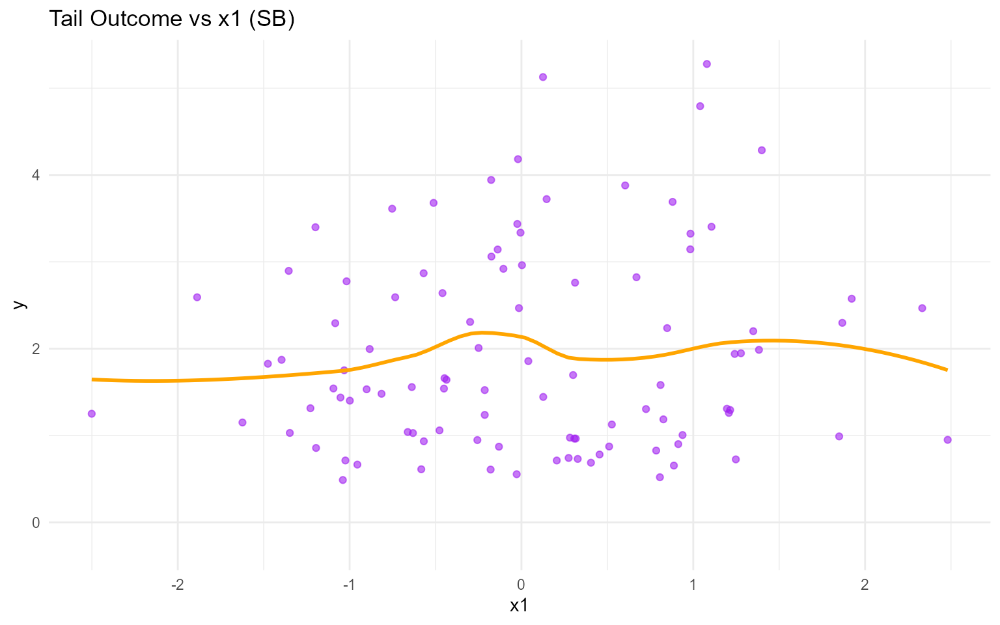
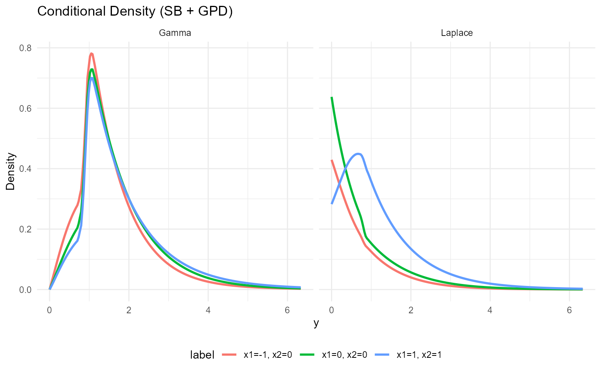
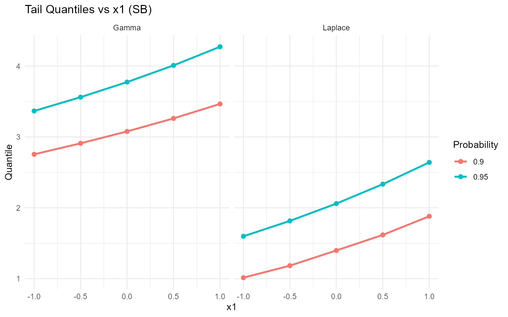

# 13. Conditional DPmixGPD with Stick-Breaking Backend

> **Legacy vignette (for the website / historical notes).** These files
> may not match the current exported API one-to-one. Last verified:
> **2026-01-18**.
>
> For the up-to-date workflow, see the main package vignettes
> (Introduction, Model Spec, MCMC Workflow,
> Unconditional/Conditional/Causal, Backends, S3 Reference).

## Conditional DPmixGPD: Stick-Breaking Backend

**Purpose**: Apply fixed-component stick-breaking truncation to
covariate-dependent mixtures while keeping the GPD tail. This vignette
mirrors `v10` but with the SB backend.

------------------------------------------------------------------------

### Data Setup

``` r

data("nc_posX100_p5_k4")
y <- nc_posX100_p5_k4$y
X <- as.matrix(nc_posX100_p5_k4$X)
if (is.null(colnames(X))) {
  colnames(X) <- paste0("x", seq_len(ncol(X)))
}

summary_tbl <- tibble(
  statistic = c("N", "Mean", "SD", "Min", "Max"),
  value = c(length(y), mean(y), sd(y), min(y), max(y))
)

ggplot(data.frame(y = y, x1 = X[, 1]), aes(x = x1, y = y)) +
  geom_point(alpha = 0.6, color = "purple") +
  geom_smooth(method = "loess", color = "orange", fill = NA) +
  labs(title = "Tail Outcome vs x1 (SB)", x = "x1", y = "y") +
  theme_minimal()
```



| statistic |  value  |
|:---------:|:-------:|
|     N     | 100.000 |
|   Mean    |  1.942  |
|    SD     |  1.146  |
|    Min    |  0.488  |
|    Max    |  5.278  |

Conditional Tail Summary (SB) {.table .table .table-striped .table-hover
style="width: auto !important; margin-left: auto; margin-right: auto;"}

------------------------------------------------------------------------

### Threshold

``` r

u_threshold <- quantile(y, 0.85)

ggplot(data.frame(y = y), aes(x = y)) +
  geom_histogram(aes(y = after_stat(density)), bins = 40, fill = "lightgreen", alpha = 0.6, color = "black") +
  geom_vline(xintercept = u_threshold, linetype = "dashed", color = "black") +
  labs(title = "Threshold for SB tail (85%)", x = "y", y = "Density") +
  theme_minimal()
```


------------------------------------------------------------------------

### Model Specification

``` r

bundle_sb_cond_gpd_gamma <- build_nimble_bundle(
  y = y,
  X = X,
  kernel = "gamma",
  backend = "sb",
  GPD = TRUE,
  components = 5,
  param_specs = list(
    gpd = list(
      threshold = list(mode = "link", link = "exp")
    )
  ),
  mcmc = mcmc
)

bundle_sb_cond_gpd_laplace <- build_nimble_bundle(
  y = y,
  X = X,
  kernel = "laplace",
  backend = "sb",
  GPD = TRUE,
  components = 5,
  param_specs = list(
    gpd = list(
      threshold = list(mode = "link", link = "exp")
    )
  ),
  mcmc = mcmc
)
```

------------------------------------------------------------------------

### MCMC Execution

``` r

fit_sb_cond_gpd_gamma <- load_or_fit("v13-conditional-DPmixGPD-SB-fit_sb_cond_gpd_gamma", run_mcmc_bundle_manual(bundle_sb_cond_gpd_gamma))
fit_sb_cond_gpd_laplace <- load_or_fit("v13-conditional-DPmixGPD-SB-fit_sb_cond_gpd_laplace", run_mcmc_bundle_manual(bundle_sb_cond_gpd_laplace))
summary(fit_sb_cond_gpd_gamma)
```

    MixGPD summary | backend: Stick-Breaking Process | kernel: Gamma Distribution | GPD tail: TRUE | epsilon: 0.025
    n = 100 | components = 5
    Summary
    Initial components: 5 | Components after truncation: 1

    WAIC: 300.892
    lppd: -132.126 | pWAIC: 18.32

    Summary table
    <table class="table" style="width: auto !important; margin-left: auto; margin-right: auto;">
     <thead>
      <tr>
       <th style="text-align:center;"> parameter </th>
       <th style="text-align:center;"> mean </th>
       <th style="text-align:center;"> sd </th>
       <th style="text-align:center;"> q0.025 </th>
       <th style="text-align:center;"> q0.500 </th>
       <th style="text-align:center;"> q0.975 </th>
       <th style="text-align:center;"> ess </th>
      </tr>
     </thead>
    <tbody>
      <tr>
       <td style="text-align:center;"> weights[1] </td>
       <td style="text-align:center;"> 0.997 </td>
       <td style="text-align:center;"> 0.013 </td>
       <td style="text-align:center;"> 0.95 </td>
       <td style="text-align:center;"> 1 </td>
       <td style="text-align:center;"> 1 </td>
       <td style="text-align:center;"> 116.315 </td>
      </tr>
      <tr>
       <td style="text-align:center;"> alpha </td>
       <td style="text-align:center;"> 0.353 </td>
       <td style="text-align:center;"> 0.24 </td>
       <td style="text-align:center;"> 0.086 </td>
       <td style="text-align:center;"> 0.29 </td>
       <td style="text-align:center;"> 1.018 </td>
       <td style="text-align:center;"> 114.006 </td>
      </tr>
      <tr>
       <td style="text-align:center;"> beta_scale[1, 1] </td>
       <td style="text-align:center;"> 0.172 </td>
       <td style="text-align:center;"> 0.182 </td>
       <td style="text-align:center;"> -0.178 </td>
       <td style="text-align:center;"> 0.178 </td>
       <td style="text-align:center;"> 0.526 </td>
       <td style="text-align:center;"> 265.846 </td>
      </tr>
      <tr>
       <td style="text-align:center;"> beta_scale[2, 1] </td>
       <td style="text-align:center;"> 0.044 </td>
       <td style="text-align:center;"> 1.983 </td>
       <td style="text-align:center;"> -4.232 </td>
       <td style="text-align:center;"> 0.055 </td>
       <td style="text-align:center;"> 3.775 </td>
       <td style="text-align:center;"> 934.969 </td>
      </tr>
      <tr>
       <td style="text-align:center;"> beta_scale[3, 1] </td>
       <td style="text-align:center;"> -0.067 </td>
       <td style="text-align:center;"> 1.963 </td>
       <td style="text-align:center;"> -3.688 </td>
       <td style="text-align:center;"> -0.101 </td>
       <td style="text-align:center;"> 3.78 </td>
       <td style="text-align:center;"> 946.203 </td>
      </tr>
      <tr>
       <td style="text-align:center;"> beta_scale[4, 1] </td>
       <td style="text-align:center;"> -0.038 </td>
       <td style="text-align:center;"> 1.973 </td>
       <td style="text-align:center;"> -3.9 </td>
       <td style="text-align:center;"> -0.028 </td>
       <td style="text-align:center;"> 3.91 </td>
       <td style="text-align:center;"> 818.573 </td>
      </tr>
      <tr>
       <td style="text-align:center;"> beta_scale[5, 1] </td>
       <td style="text-align:center;"> -0.014 </td>
       <td style="text-align:center;"> 2.044 </td>
       <td style="text-align:center;"> -4.027 </td>
       <td style="text-align:center;"> -0.022 </td>
       <td style="text-align:center;"> 3.956 </td>
       <td style="text-align:center;"> 943.665 </td>
      </tr>
      <tr>
       <td style="text-align:center;"> beta_scale[1, 2] </td>
       <td style="text-align:center;"> 0.09 </td>
       <td style="text-align:center;"> 0.356 </td>
       <td style="text-align:center;"> -0.64 </td>
       <td style="text-align:center;"> 0.097 </td>
       <td style="text-align:center;"> 0.822 </td>
       <td style="text-align:center;"> 266.178 </td>
      </tr>
      <tr>
       <td style="text-align:center;"> beta_scale[2, 2] </td>
       <td style="text-align:center;"> 0.051 </td>
       <td style="text-align:center;"> 2.037 </td>
       <td style="text-align:center;"> -3.833 </td>
       <td style="text-align:center;"> 0.068 </td>
       <td style="text-align:center;"> 4.03 </td>
       <td style="text-align:center;"> 892.269 </td>
      </tr>
      <tr>
       <td style="text-align:center;"> beta_scale[3, 2] </td>
       <td style="text-align:center;"> 0.019 </td>
       <td style="text-align:center;"> 1.949 </td>
       <td style="text-align:center;"> -3.634 </td>
       <td style="text-align:center;"> -0.09 </td>
       <td style="text-align:center;"> 3.86 </td>
       <td style="text-align:center;"> 912.541 </td>
      </tr>
      <tr>
       <td style="text-align:center;"> beta_scale[4, 2] </td>
       <td style="text-align:center;"> 0.049 </td>
       <td style="text-align:center;"> 2.036 </td>
       <td style="text-align:center;"> -3.889 </td>
       <td style="text-align:center;"> 0.081 </td>
       <td style="text-align:center;"> 4.069 </td>
       <td style="text-align:center;"> 925.355 </td>
      </tr>
      <tr>
       <td style="text-align:center;"> beta_scale[5, 2] </td>
       <td style="text-align:center;"> -0.037 </td>
       <td style="text-align:center;"> 2.017 </td>
       <td style="text-align:center;"> -3.953 </td>
       <td style="text-align:center;"> -0.059 </td>
       <td style="text-align:center;"> 3.711 </td>
       <td style="text-align:center;"> 990.263 </td>
      </tr>
      <tr>
       <td style="text-align:center;"> beta_scale[1, 3] </td>
       <td style="text-align:center;"> 0.019 </td>
       <td style="text-align:center;"> 0.187 </td>
       <td style="text-align:center;"> -0.344 </td>
       <td style="text-align:center;"> 0.025 </td>
       <td style="text-align:center;"> 0.36 </td>
       <td style="text-align:center;"> 170.066 </td>
      </tr>
      <tr>
       <td style="text-align:center;"> beta_scale[2, 3] </td>
       <td style="text-align:center;"> -0.025 </td>
       <td style="text-align:center;"> 2.023 </td>
       <td style="text-align:center;"> -3.827 </td>
       <td style="text-align:center;"> -0.11 </td>
       <td style="text-align:center;"> 4.123 </td>
       <td style="text-align:center;"> 911.262 </td>
      </tr>
      <tr>
       <td style="text-align:center;"> beta_scale[3, 3] </td>
       <td style="text-align:center;"> 0.014 </td>
       <td style="text-align:center;"> 2.054 </td>
       <td style="text-align:center;"> -3.887 </td>
       <td style="text-align:center;"> -0.031 </td>
       <td style="text-align:center;"> 4.056 </td>
       <td style="text-align:center;"> 793.593 </td>
      </tr>
      <tr>
       <td style="text-align:center;"> beta_scale[4, 3] </td>
       <td style="text-align:center;"> 0.012 </td>
       <td style="text-align:center;"> 1.972 </td>
       <td style="text-align:center;"> -3.715 </td>
       <td style="text-align:center;"> -0.044 </td>
       <td style="text-align:center;"> 3.901 </td>
       <td style="text-align:center;"> 948.531 </td>
      </tr>
      <tr>
       <td style="text-align:center;"> beta_scale[5, 3] </td>
       <td style="text-align:center;"> 0.031 </td>
       <td style="text-align:center;"> 2.051 </td>
       <td style="text-align:center;"> -3.832 </td>
       <td style="text-align:center;"> 0.001 </td>
       <td style="text-align:center;"> 4.105 </td>
       <td style="text-align:center;"> 981.79 </td>
      </tr>
      <tr>
       <td style="text-align:center;"> beta_scale[1, 4] </td>
       <td style="text-align:center;"> 0.109 </td>
       <td style="text-align:center;"> 0.663 </td>
       <td style="text-align:center;"> -0.949 </td>
       <td style="text-align:center;"> 0.018 </td>
       <td style="text-align:center;"> 1.58 </td>
       <td style="text-align:center;"> 112.6 </td>
      </tr>
      <tr>
       <td style="text-align:center;"> beta_scale[2, 4] </td>
       <td style="text-align:center;"> 0.165 </td>
       <td style="text-align:center;"> 2.062 </td>
       <td style="text-align:center;"> -3.887 </td>
       <td style="text-align:center;"> 0.151 </td>
       <td style="text-align:center;"> 4.171 </td>
       <td style="text-align:center;"> 1068.01 </td>
      </tr>
      <tr>
       <td style="text-align:center;"> beta_scale[3, 4] </td>
       <td style="text-align:center;"> 0.108 </td>
       <td style="text-align:center;"> 1.947 </td>
       <td style="text-align:center;"> -3.654 </td>
       <td style="text-align:center;"> 0.107 </td>
       <td style="text-align:center;"> 4.061 </td>
       <td style="text-align:center;"> 985.101 </td>
      </tr>
      <tr>
       <td style="text-align:center;"> beta_scale[4, 4] </td>
       <td style="text-align:center;"> 0.015 </td>
       <td style="text-align:center;"> 2.036 </td>
       <td style="text-align:center;"> -4.071 </td>
       <td style="text-align:center;"> 0.029 </td>
       <td style="text-align:center;"> 3.906 </td>
       <td style="text-align:center;"> 947.817 </td>
      </tr>
      <tr>
       <td style="text-align:center;"> beta_scale[5, 4] </td>
       <td style="text-align:center;"> -0.101 </td>
       <td style="text-align:center;"> 1.956 </td>
       <td style="text-align:center;"> -3.958 </td>
       <td style="text-align:center;"> -0.104 </td>
       <td style="text-align:center;"> 3.654 </td>
       <td style="text-align:center;"> 978.516 </td>
      </tr>
      <tr>
       <td style="text-align:center;"> beta_scale[1, 5] </td>
       <td style="text-align:center;"> 0.192 </td>
       <td style="text-align:center;"> 0.203 </td>
       <td style="text-align:center;"> -0.171 </td>
       <td style="text-align:center;"> 0.181 </td>
       <td style="text-align:center;"> 0.59 </td>
       <td style="text-align:center;"> 63.547 </td>
      </tr>
      <tr>
       <td style="text-align:center;"> beta_scale[2, 5] </td>
       <td style="text-align:center;"> 0.094 </td>
       <td style="text-align:center;"> 1.95 </td>
       <td style="text-align:center;"> -3.633 </td>
       <td style="text-align:center;"> 0.164 </td>
       <td style="text-align:center;"> 4.055 </td>
       <td style="text-align:center;"> 932.262 </td>
      </tr>
      <tr>
       <td style="text-align:center;"> beta_scale[3, 5] </td>
       <td style="text-align:center;"> -0.021 </td>
       <td style="text-align:center;"> 2.027 </td>
       <td style="text-align:center;"> -3.885 </td>
       <td style="text-align:center;"> -0.065 </td>
       <td style="text-align:center;"> 4.07 </td>
       <td style="text-align:center;"> 1039.998 </td>
      </tr>
      <tr>
       <td style="text-align:center;"> beta_scale[4, 5] </td>
       <td style="text-align:center;"> -0.024 </td>
       <td style="text-align:center;"> 1.959 </td>
       <td style="text-align:center;"> -3.688 </td>
       <td style="text-align:center;"> -0.071 </td>
       <td style="text-align:center;"> 3.779 </td>
       <td style="text-align:center;"> 1105.345 </td>
      </tr>
      <tr>
       <td style="text-align:center;"> beta_scale[5, 5] </td>
       <td style="text-align:center;"> -0.026 </td>
       <td style="text-align:center;"> 2.003 </td>
       <td style="text-align:center;"> -3.939 </td>
       <td style="text-align:center;"> -0.017 </td>
       <td style="text-align:center;"> 3.963 </td>
       <td style="text-align:center;"> 1044.986 </td>
      </tr>
      <tr>
       <td style="text-align:center;"> beta_tail_scale[1] </td>
       <td style="text-align:center;"> 0.146 </td>
       <td style="text-align:center;"> 0.132 </td>
       <td style="text-align:center;"> -0.117 </td>
       <td style="text-align:center;"> 0.151 </td>
       <td style="text-align:center;"> 0.391 </td>
       <td style="text-align:center;"> 349.427 </td>
      </tr>
      <tr>
       <td style="text-align:center;"> beta_tail_scale[2] </td>
       <td style="text-align:center;"> -0.046 </td>
       <td style="text-align:center;"> 0.196 </td>
       <td style="text-align:center;"> -0.438 </td>
       <td style="text-align:center;"> -0.049 </td>
       <td style="text-align:center;"> 0.357 </td>
       <td style="text-align:center;"> 724.563 </td>
      </tr>
      <tr>
       <td style="text-align:center;"> beta_tail_scale[3] </td>
       <td style="text-align:center;"> -0.064 </td>
       <td style="text-align:center;"> 0.111 </td>
       <td style="text-align:center;"> -0.287 </td>
       <td style="text-align:center;"> -0.066 </td>
       <td style="text-align:center;"> 0.161 </td>
       <td style="text-align:center;"> 656.602 </td>
      </tr>
      <tr>
       <td style="text-align:center;"> beta_tail_scale[4] </td>
       <td style="text-align:center;"> 0.434 </td>
       <td style="text-align:center;"> 0.247 </td>
       <td style="text-align:center;"> -0.066 </td>
       <td style="text-align:center;"> 0.438 </td>
       <td style="text-align:center;"> 0.9 </td>
       <td style="text-align:center;"> 449.452 </td>
      </tr>
      <tr>
       <td style="text-align:center;"> beta_tail_scale[5] </td>
       <td style="text-align:center;"> -0.031 </td>
       <td style="text-align:center;"> 0.11 </td>
       <td style="text-align:center;"> -0.248 </td>
       <td style="text-align:center;"> -0.025 </td>
       <td style="text-align:center;"> 0.169 </td>
       <td style="text-align:center;"> 407.214 </td>
      </tr>
      <tr>
       <td style="text-align:center;"> beta_threshold[1] </td>
       <td style="text-align:center;"> -0.151 </td>
       <td style="text-align:center;"> 0.139 </td>
       <td style="text-align:center;"> -0.42 </td>
       <td style="text-align:center;"> -0.16 </td>
       <td style="text-align:center;"> 0.116 </td>
       <td style="text-align:center;"> 76.387 </td>
      </tr>
      <tr>
       <td style="text-align:center;"> beta_threshold[2] </td>
       <td style="text-align:center;"> -0.266 </td>
       <td style="text-align:center;"> 0.129 </td>
       <td style="text-align:center;"> -0.468 </td>
       <td style="text-align:center;"> -0.282 </td>
       <td style="text-align:center;"> 0.065 </td>
       <td style="text-align:center;"> 141.907 </td>
      </tr>
      <tr>
       <td style="text-align:center;"> beta_threshold[3] </td>
       <td style="text-align:center;"> 0.187 </td>
       <td style="text-align:center;"> 0.127 </td>
       <td style="text-align:center;"> -0.072 </td>
       <td style="text-align:center;"> 0.184 </td>
       <td style="text-align:center;"> 0.451 </td>
       <td style="text-align:center;"> 62.158 </td>
      </tr>
      <tr>
       <td style="text-align:center;"> beta_threshold[4] </td>
       <td style="text-align:center;"> -0.144 </td>
       <td style="text-align:center;"> 0.168 </td>
       <td style="text-align:center;"> -0.462 </td>
       <td style="text-align:center;"> -0.149 </td>
       <td style="text-align:center;"> 0.188 </td>
       <td style="text-align:center;"> 94.438 </td>
      </tr>
      <tr>
       <td style="text-align:center;"> beta_threshold[5] </td>
       <td style="text-align:center;"> -0.087 </td>
       <td style="text-align:center;"> 0.127 </td>
       <td style="text-align:center;"> -0.295 </td>
       <td style="text-align:center;"> -0.1 </td>
       <td style="text-align:center;"> 0.119 </td>
       <td style="text-align:center;"> 40.241 </td>
      </tr>
      <tr>
       <td style="text-align:center;"> tail_shape </td>
       <td style="text-align:center;"> -0.012 </td>
       <td style="text-align:center;"> 0.103 </td>
       <td style="text-align:center;"> -0.191 </td>
       <td style="text-align:center;"> -0.02 </td>
       <td style="text-align:center;"> 0.197 </td>
       <td style="text-align:center;"> 542.412 </td>
      </tr>
      <tr>
       <td style="text-align:center;"> shape[1] </td>
       <td style="text-align:center;"> 2.634 </td>
       <td style="text-align:center;"> 0.471 </td>
       <td style="text-align:center;"> 1.838 </td>
       <td style="text-align:center;"> 2.612 </td>
       <td style="text-align:center;"> 3.688 </td>
       <td style="text-align:center;"> 184.521 </td>
      </tr>
    </tbody>
    </table>

``` r

summary(fit_sb_cond_gpd_laplace)
```

    MixGPD summary | backend: Stick-Breaking Process | kernel: Laplace Distribution | GPD tail: TRUE | epsilon: 0.025
    n = 100 | components = 5
    Summary
    Initial components: 5 | Components after truncation: 1

    WAIC: 320.799
    lppd: -145.246 | pWAIC: 15.154

    Summary table
    <table class="table" style="width: auto !important; margin-left: auto; margin-right: auto;">
     <thead>
      <tr>
       <th style="text-align:center;"> parameter </th>
       <th style="text-align:center;"> mean </th>
       <th style="text-align:center;"> sd </th>
       <th style="text-align:center;"> q0.025 </th>
       <th style="text-align:center;"> q0.500 </th>
       <th style="text-align:center;"> q0.975 </th>
       <th style="text-align:center;"> ess </th>
      </tr>
     </thead>
    <tbody>
      <tr>
       <td style="text-align:center;"> weights[1] </td>
       <td style="text-align:center;"> 0.997 </td>
       <td style="text-align:center;"> 0.015 </td>
       <td style="text-align:center;"> 0.95 </td>
       <td style="text-align:center;"> 1 </td>
       <td style="text-align:center;"> 1 </td>
       <td style="text-align:center;"> 116.053 </td>
      </tr>
      <tr>
       <td style="text-align:center;"> alpha </td>
       <td style="text-align:center;"> 0.379 </td>
       <td style="text-align:center;"> 0.243 </td>
       <td style="text-align:center;"> 0.098 </td>
       <td style="text-align:center;"> 0.321 </td>
       <td style="text-align:center;"> 1.038 </td>
       <td style="text-align:center;"> 173.812 </td>
      </tr>
      <tr>
       <td style="text-align:center;"> beta_location[1, 1] </td>
       <td style="text-align:center;"> 0.303 </td>
       <td style="text-align:center;"> 0.293 </td>
       <td style="text-align:center;"> -0.26 </td>
       <td style="text-align:center;"> 0.3 </td>
       <td style="text-align:center;"> 0.9 </td>
       <td style="text-align:center;"> 594.859 </td>
      </tr>
      <tr>
       <td style="text-align:center;"> beta_location[2, 1] </td>
       <td style="text-align:center;"> -0.059 </td>
       <td style="text-align:center;"> 1.977 </td>
       <td style="text-align:center;"> -3.795 </td>
       <td style="text-align:center;"> -0.08 </td>
       <td style="text-align:center;"> 3.821 </td>
       <td style="text-align:center;"> 916.047 </td>
      </tr>
      <tr>
       <td style="text-align:center;"> beta_location[3, 1] </td>
       <td style="text-align:center;"> 0.02 </td>
       <td style="text-align:center;"> 1.958 </td>
       <td style="text-align:center;"> -3.792 </td>
       <td style="text-align:center;"> -0.014 </td>
       <td style="text-align:center;"> 3.954 </td>
       <td style="text-align:center;"> 948.227 </td>
      </tr>
      <tr>
       <td style="text-align:center;"> beta_location[4, 1] </td>
       <td style="text-align:center;"> -0.077 </td>
       <td style="text-align:center;"> 1.979 </td>
       <td style="text-align:center;"> -3.886 </td>
       <td style="text-align:center;"> -0.1 </td>
       <td style="text-align:center;"> 3.895 </td>
       <td style="text-align:center;"> 986.825 </td>
      </tr>
      <tr>
       <td style="text-align:center;"> beta_location[5, 1] </td>
       <td style="text-align:center;"> -0.041 </td>
       <td style="text-align:center;"> 1.881 </td>
       <td style="text-align:center;"> -3.81 </td>
       <td style="text-align:center;"> 0.011 </td>
       <td style="text-align:center;"> 3.503 </td>
       <td style="text-align:center;"> 873.162 </td>
      </tr>
      <tr>
       <td style="text-align:center;"> beta_location[1, 2] </td>
       <td style="text-align:center;"> 0.394 </td>
       <td style="text-align:center;"> 0.347 </td>
       <td style="text-align:center;"> -0.305 </td>
       <td style="text-align:center;"> 0.399 </td>
       <td style="text-align:center;"> 1.056 </td>
       <td style="text-align:center;"> 661.631 </td>
      </tr>
      <tr>
       <td style="text-align:center;"> beta_location[2, 2] </td>
       <td style="text-align:center;"> 0.023 </td>
       <td style="text-align:center;"> 2.024 </td>
       <td style="text-align:center;"> -3.885 </td>
       <td style="text-align:center;"> -0.014 </td>
       <td style="text-align:center;"> 4.023 </td>
       <td style="text-align:center;"> 914.095 </td>
      </tr>
      <tr>
       <td style="text-align:center;"> beta_location[3, 2] </td>
       <td style="text-align:center;"> 0.027 </td>
       <td style="text-align:center;"> 2.022 </td>
       <td style="text-align:center;"> -4.011 </td>
       <td style="text-align:center;"> -0.041 </td>
       <td style="text-align:center;"> 4.051 </td>
       <td style="text-align:center;"> 1040.637 </td>
      </tr>
      <tr>
       <td style="text-align:center;"> beta_location[4, 2] </td>
       <td style="text-align:center;"> 0.041 </td>
       <td style="text-align:center;"> 1.991 </td>
       <td style="text-align:center;"> -3.912 </td>
       <td style="text-align:center;"> 0.129 </td>
       <td style="text-align:center;"> 3.838 </td>
       <td style="text-align:center;"> 1200 </td>
      </tr>
      <tr>
       <td style="text-align:center;"> beta_location[5, 2] </td>
       <td style="text-align:center;"> -0.039 </td>
       <td style="text-align:center;"> 1.999 </td>
       <td style="text-align:center;"> -4.11 </td>
       <td style="text-align:center;"> -0.007 </td>
       <td style="text-align:center;"> 3.843 </td>
       <td style="text-align:center;"> 1056.24 </td>
      </tr>
      <tr>
       <td style="text-align:center;"> beta_location[1, 3] </td>
       <td style="text-align:center;"> -0.326 </td>
       <td style="text-align:center;"> 0.259 </td>
       <td style="text-align:center;"> -0.85 </td>
       <td style="text-align:center;"> -0.313 </td>
       <td style="text-align:center;"> 0.163 </td>
       <td style="text-align:center;"> 582.694 </td>
      </tr>
      <tr>
       <td style="text-align:center;"> beta_location[2, 3] </td>
       <td style="text-align:center;"> -0.103 </td>
       <td style="text-align:center;"> 2.009 </td>
       <td style="text-align:center;"> -4.09 </td>
       <td style="text-align:center;"> -0.104 </td>
       <td style="text-align:center;"> 3.888 </td>
       <td style="text-align:center;"> 904.706 </td>
      </tr>
      <tr>
       <td style="text-align:center;"> beta_location[3, 3] </td>
       <td style="text-align:center;"> 0.091 </td>
       <td style="text-align:center;"> 2.038 </td>
       <td style="text-align:center;"> -3.985 </td>
       <td style="text-align:center;"> 0.101 </td>
       <td style="text-align:center;"> 3.982 </td>
       <td style="text-align:center;"> 1050.014 </td>
      </tr>
      <tr>
       <td style="text-align:center;"> beta_location[4, 3] </td>
       <td style="text-align:center;"> -0.084 </td>
       <td style="text-align:center;"> 1.981 </td>
       <td style="text-align:center;"> -4.042 </td>
       <td style="text-align:center;"> -0.089 </td>
       <td style="text-align:center;"> 3.67 </td>
       <td style="text-align:center;"> 1018.733 </td>
      </tr>
      <tr>
       <td style="text-align:center;"> beta_location[5, 3] </td>
       <td style="text-align:center;"> 0.039 </td>
       <td style="text-align:center;"> 1.953 </td>
       <td style="text-align:center;"> -3.895 </td>
       <td style="text-align:center;"> 0.11 </td>
       <td style="text-align:center;"> 3.795 </td>
       <td style="text-align:center;"> 932.747 </td>
      </tr>
      <tr>
       <td style="text-align:center;"> beta_location[1, 4] </td>
       <td style="text-align:center;"> 6.1 </td>
       <td style="text-align:center;"> 0.858 </td>
       <td style="text-align:center;"> 4.615 </td>
       <td style="text-align:center;"> 6.064 </td>
       <td style="text-align:center;"> 7.976 </td>
       <td style="text-align:center;"> 503.309 </td>
      </tr>
      <tr>
       <td style="text-align:center;"> beta_location[2, 4] </td>
       <td style="text-align:center;"> 0.165 </td>
       <td style="text-align:center;"> 2.008 </td>
       <td style="text-align:center;"> -3.67 </td>
       <td style="text-align:center;"> 0.237 </td>
       <td style="text-align:center;"> 4.167 </td>
       <td style="text-align:center;"> 924.525 </td>
      </tr>
      <tr>
       <td style="text-align:center;"> beta_location[3, 4] </td>
       <td style="text-align:center;"> 0.088 </td>
       <td style="text-align:center;"> 1.953 </td>
       <td style="text-align:center;"> -3.627 </td>
       <td style="text-align:center;"> 0.061 </td>
       <td style="text-align:center;"> 3.869 </td>
       <td style="text-align:center;"> 1010.622 </td>
      </tr>
      <tr>
       <td style="text-align:center;"> beta_location[4, 4] </td>
       <td style="text-align:center;"> 0.043 </td>
       <td style="text-align:center;"> 1.968 </td>
       <td style="text-align:center;"> -3.803 </td>
       <td style="text-align:center;"> 0.018 </td>
       <td style="text-align:center;"> 3.838 </td>
       <td style="text-align:center;"> 1055.876 </td>
      </tr>
      <tr>
       <td style="text-align:center;"> beta_location[5, 4] </td>
       <td style="text-align:center;"> 0.04 </td>
       <td style="text-align:center;"> 1.939 </td>
       <td style="text-align:center;"> -3.618 </td>
       <td style="text-align:center;"> 0.036 </td>
       <td style="text-align:center;"> 3.923 </td>
       <td style="text-align:center;"> 938.704 </td>
      </tr>
      <tr>
       <td style="text-align:center;"> beta_location[1, 5] </td>
       <td style="text-align:center;"> 0.866 </td>
       <td style="text-align:center;"> 0.338 </td>
       <td style="text-align:center;"> 0.296 </td>
       <td style="text-align:center;"> 0.831 </td>
       <td style="text-align:center;"> 1.602 </td>
       <td style="text-align:center;"> 432.781 </td>
      </tr>
      <tr>
       <td style="text-align:center;"> beta_location[2, 5] </td>
       <td style="text-align:center;"> -0.004 </td>
       <td style="text-align:center;"> 1.991 </td>
       <td style="text-align:center;"> -3.86 </td>
       <td style="text-align:center;"> -0.02 </td>
       <td style="text-align:center;"> 3.915 </td>
       <td style="text-align:center;"> 856.689 </td>
      </tr>
      <tr>
       <td style="text-align:center;"> beta_location[3, 5] </td>
       <td style="text-align:center;"> 0.036 </td>
       <td style="text-align:center;"> 2.048 </td>
       <td style="text-align:center;"> -3.875 </td>
       <td style="text-align:center;"> 0.023 </td>
       <td style="text-align:center;"> 3.987 </td>
       <td style="text-align:center;"> 994.09 </td>
      </tr>
      <tr>
       <td style="text-align:center;"> beta_location[4, 5] </td>
       <td style="text-align:center;"> -0.008 </td>
       <td style="text-align:center;"> 1.958 </td>
       <td style="text-align:center;"> -3.955 </td>
       <td style="text-align:center;"> 0.036 </td>
       <td style="text-align:center;"> 3.863 </td>
       <td style="text-align:center;"> 966.492 </td>
      </tr>
      <tr>
       <td style="text-align:center;"> beta_location[5, 5] </td>
       <td style="text-align:center;"> 0.031 </td>
       <td style="text-align:center;"> 2.009 </td>
       <td style="text-align:center;"> -3.747 </td>
       <td style="text-align:center;"> 0.072 </td>
       <td style="text-align:center;"> 4.063 </td>
       <td style="text-align:center;"> 1102.65 </td>
      </tr>
      <tr>
       <td style="text-align:center;"> beta_tail_scale[1] </td>
       <td style="text-align:center;"> 0.125 </td>
       <td style="text-align:center;"> 0.119 </td>
       <td style="text-align:center;"> -0.103 </td>
       <td style="text-align:center;"> 0.122 </td>
       <td style="text-align:center;"> 0.36 </td>
       <td style="text-align:center;"> 416.447 </td>
      </tr>
      <tr>
       <td style="text-align:center;"> beta_tail_scale[2] </td>
       <td style="text-align:center;"> -0.075 </td>
       <td style="text-align:center;"> 0.19 </td>
       <td style="text-align:center;"> -0.431 </td>
       <td style="text-align:center;"> -0.082 </td>
       <td style="text-align:center;"> 0.289 </td>
       <td style="text-align:center;"> 769.97 </td>
      </tr>
      <tr>
       <td style="text-align:center;"> beta_tail_scale[3] </td>
       <td style="text-align:center;"> -0.113 </td>
       <td style="text-align:center;"> 0.105 </td>
       <td style="text-align:center;"> -0.316 </td>
       <td style="text-align:center;"> -0.11 </td>
       <td style="text-align:center;"> 0.094 </td>
       <td style="text-align:center;"> 505.042 </td>
      </tr>
      <tr>
       <td style="text-align:center;"> beta_tail_scale[4] </td>
       <td style="text-align:center;"> 0.46 </td>
       <td style="text-align:center;"> 0.226 </td>
       <td style="text-align:center;"> 0.03 </td>
       <td style="text-align:center;"> 0.463 </td>
       <td style="text-align:center;"> 0.879 </td>
       <td style="text-align:center;"> 486.491 </td>
      </tr>
      <tr>
       <td style="text-align:center;"> beta_tail_scale[5] </td>
       <td style="text-align:center;"> 0.01 </td>
       <td style="text-align:center;"> 0.093 </td>
       <td style="text-align:center;"> -0.168 </td>
       <td style="text-align:center;"> 0.011 </td>
       <td style="text-align:center;"> 0.204 </td>
       <td style="text-align:center;"> 672.029 </td>
      </tr>
      <tr>
       <td style="text-align:center;"> beta_threshold[1] </td>
       <td style="text-align:center;"> -0.058 </td>
       <td style="text-align:center;"> 0.086 </td>
       <td style="text-align:center;"> -0.267 </td>
       <td style="text-align:center;"> -0.049 </td>
       <td style="text-align:center;"> 0.098 </td>
       <td style="text-align:center;"> 47.582 </td>
      </tr>
      <tr>
       <td style="text-align:center;"> beta_threshold[2] </td>
       <td style="text-align:center;"> 0.183 </td>
       <td style="text-align:center;"> 0.128 </td>
       <td style="text-align:center;"> -0.105 </td>
       <td style="text-align:center;"> 0.198 </td>
       <td style="text-align:center;"> 0.39 </td>
       <td style="text-align:center;"> 64.843 </td>
      </tr>
      <tr>
       <td style="text-align:center;"> beta_threshold[3] </td>
       <td style="text-align:center;"> 0.381 </td>
       <td style="text-align:center;"> 0.097 </td>
       <td style="text-align:center;"> 0.172 </td>
       <td style="text-align:center;"> 0.388 </td>
       <td style="text-align:center;"> 0.566 </td>
       <td style="text-align:center;"> 88.325 </td>
      </tr>
      <tr>
       <td style="text-align:center;"> beta_threshold[4] </td>
       <td style="text-align:center;"> -0.434 </td>
       <td style="text-align:center;"> 0.089 </td>
       <td style="text-align:center;"> -0.603 </td>
       <td style="text-align:center;"> -0.435 </td>
       <td style="text-align:center;"> -0.246 </td>
       <td style="text-align:center;"> 45.931 </td>
      </tr>
      <tr>
       <td style="text-align:center;"> beta_threshold[5] </td>
       <td style="text-align:center;"> -0.185 </td>
       <td style="text-align:center;"> 0.039 </td>
       <td style="text-align:center;"> -0.263 </td>
       <td style="text-align:center;"> -0.183 </td>
       <td style="text-align:center;"> -0.119 </td>
       <td style="text-align:center;"> 168.854 </td>
      </tr>
      <tr>
       <td style="text-align:center;"> tail_shape </td>
       <td style="text-align:center;"> -0.034 </td>
       <td style="text-align:center;"> 0.098 </td>
       <td style="text-align:center;"> -0.208 </td>
       <td style="text-align:center;"> -0.039 </td>
       <td style="text-align:center;"> 0.179 </td>
       <td style="text-align:center;"> 589.716 </td>
      </tr>
      <tr>
       <td style="text-align:center;"> scale[1] </td>
       <td style="text-align:center;"> 0.833 </td>
       <td style="text-align:center;"> 0.217 </td>
       <td style="text-align:center;"> 0.51 </td>
       <td style="text-align:center;"> 0.798 </td>
       <td style="text-align:center;"> 1.322 </td>
       <td style="text-align:center;"> 132.346 </td>
      </tr>
    </tbody>
    </table>

``` r

params_sb_cond <- params(fit_sb_cond_gpd_gamma)
params_sb_cond
```

    Posterior mean parameters

    $alpha
    [1] "0.353"

    $w
    [1] "0.997"

    $shape
    [1] "2.634"

    $beta_scale
    <table class="table" style="width: auto !important; margin-left: auto; margin-right: auto;">
     <thead>
      <tr>
       <th style="text-align:left;">   </th>
       <th style="text-align:center;"> x1 </th>
       <th style="text-align:center;"> x2 </th>
       <th style="text-align:center;"> x3 </th>
       <th style="text-align:center;"> x4 </th>
       <th style="text-align:center;"> x5 </th>
      </tr>
     </thead>
    <tbody>
      <tr>
       <td style="text-align:left;"> comp1 </td>
       <td style="text-align:center;"> 0.172 </td>
       <td style="text-align:center;"> 0.09 </td>
       <td style="text-align:center;"> 0.019 </td>
       <td style="text-align:center;"> 0.109 </td>
       <td style="text-align:center;"> 0.192 </td>
      </tr>
      <tr>
       <td style="text-align:left;"> comp2 </td>
       <td style="text-align:center;"> 0.044 </td>
       <td style="text-align:center;"> 0.051 </td>
       <td style="text-align:center;"> -0.025 </td>
       <td style="text-align:center;"> 0.165 </td>
       <td style="text-align:center;"> 0.094 </td>
      </tr>
      <tr>
       <td style="text-align:left;"> comp3 </td>
       <td style="text-align:center;"> -0.067 </td>
       <td style="text-align:center;"> 0.019 </td>
       <td style="text-align:center;"> 0.014 </td>
       <td style="text-align:center;"> 0.108 </td>
       <td style="text-align:center;"> -0.021 </td>
      </tr>
      <tr>
       <td style="text-align:left;"> comp4 </td>
       <td style="text-align:center;"> -0.038 </td>
       <td style="text-align:center;"> 0.049 </td>
       <td style="text-align:center;"> 0.012 </td>
       <td style="text-align:center;"> 0.015 </td>
       <td style="text-align:center;"> -0.024 </td>
      </tr>
      <tr>
       <td style="text-align:left;"> comp5 </td>
       <td style="text-align:center;"> -0.014 </td>
       <td style="text-align:center;"> -0.037 </td>
       <td style="text-align:center;"> 0.031 </td>
       <td style="text-align:center;"> -0.101 </td>
       <td style="text-align:center;"> -0.026 </td>
      </tr>
    </tbody>
    </table>
    $beta_threshold
    [1] "-0.151" "-0.266" "0.187"  "-0.144" "-0.087"

    $beta_tail_scale
    [1] "0.146"  "-0.046" "-0.064" "0.434"  "-0.031"

    $tail_shape
    [1] "-0.012"

------------------------------------------------------------------------

### Conditional Predictions

``` r

X_new <- rbind(
  c(-1, 0, 0, 0, 0),
  c(0, 0, 0, 0, 0),
  c(1, 1, 0, 0, 0)
)
colnames(X_new) <- colnames(X)
y_grid <- seq(0, max(y) * 1.2, length.out = 200)

df_pred_gamma <- lapply(seq_len(nrow(X_new)), function(i) {
  pred <- predict(fit_sb_cond_gpd_gamma, x = as.matrix(X_new[i, , drop = FALSE]), y = y_grid, type = "density")
  data.frame(
    y = pred$fit$y,
    density = pred$fit$density,
    label = paste("x1=", X_new[i, 1], ", x2=", X_new[i, 2], sep = ""),
    model = "Gamma"
  )
})

df_pred_laplace <- lapply(seq_len(nrow(X_new)), function(i) {
  pred <- predict(fit_sb_cond_gpd_laplace, x = as.matrix(X_new[i, , drop = FALSE]), y = y_grid, type = "density")
  data.frame(
    y = pred$fit$y,
    density = pred$fit$density,
    label = paste("x1=", X_new[i, 1], ", x2=", X_new[i, 2], sep = ""),
    model = "Laplace"
  )
})

bind_rows(df_pred_gamma, df_pred_laplace) %>%
  ggplot(aes(x = y, y = density, color = label)) +
  geom_line(linewidth = 1) +
  facet_wrap(~ model) +
  labs(title = "Conditional Density (SB + GPD)", x = "y", y = "Density") +
  theme_minimal() +
  theme(legend.position = "bottom")
```



------------------------------------------------------------------------

### Tail Quantiles

``` r

X_grid <- cbind(x1 = seq(-1, 1, length.out = 5), x2 = 0, x3 = 0, x4 = 0, x5 = 0)
colnames(X_grid) <- colnames(X)
quant_probs <- c(0.90, 0.95)

pred_q_gamma <- predict(fit_sb_cond_gpd_gamma, x = as.matrix(X_grid), type = "quantile", index = quant_probs)
pred_q_laplace <- predict(fit_sb_cond_gpd_laplace, x = as.matrix(X_grid), type = "quantile", index = quant_probs)

quant_df_gamma <- pred_q_gamma$fit
quant_df_gamma$x1 <- X_grid[quant_df_gamma$id, "x1"]
quant_df_gamma$model <- "Gamma"

quant_df_laplace <- pred_q_laplace$fit
quant_df_laplace$x1 <- X_grid[quant_df_laplace$id, "x1"]
quant_df_laplace$model <- "Laplace"

bind_rows(quant_df_gamma, quant_df_laplace) %>%
  ggplot(aes(x = x1, y = estimate, color = factor(index), group = index)) +
  geom_line(linewidth = 1) +
  geom_point(size = 2) +
  facet_wrap(~ model) +
  labs(title = "Tail Quantiles vs x1 (SB)", x = "x1", y = "Quantile", color = "Probability") +
  theme_minimal()
```



------------------------------------------------------------------------

### Residuals & Diagnostics

``` r

if (interactive()) plot(fitted(fit_sb_cond_gpd_gamma))
```

``` r

if (interactive()) plot(fit_sb_cond_gpd_gamma, family = c("traceplot", "autocorrelation", "geweke"))
if (interactive()) plot(fit_sb_cond_gpd_laplace, family = c("density", "running", "caterpillar"))
```

------------------------------------------------------------------------

### Takeaways

- Conditional stick-breaking mixtures capture covariate-dependent bulk
  structure while the GPD handles extremes.
- [`predict()`](https://rdrr.io/r/stats/predict.html) and
  `if (interactive()) plot()` remain consistent for densities,
  posterior-mean quantiles, and residuals.
- Expect threshold-selected posterior-mean tail quantiles to shift with
  `x1` even when `components` is fixed.
- Next: move into causal models starting with same-backend CRP (v12).
