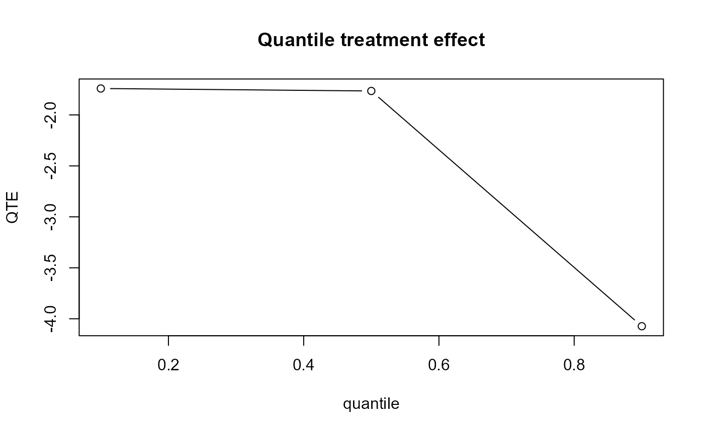

# Causal Modeling

## Overview

This vignette shows:

- arm-specific outcome fits
- how the propensity model enters
- QTE/ATE-ready prediction interfaces
- high-level assumptions

## Build a causal bundle

``` r
library(DPmixGPD)
library(nimble)
use_cached_fit <- TRUE
.fit_path <- function(name) {
  path <- system.file("extdata", name, package = "DPmixGPD")
  if (path == "") path <- file.path("inst", "extdata", name)
  path
}
fit_causal_con <- readRDS(.fit_path("fit_causal_con.rds"))
fit_causal_trt <- readRDS(.fit_path("fit_causal_trt.rds"))
fit_causal_meta <- readRDS(.fit_path("fit_causal_meta.rds"))
fit_causal_small <- list(
  ps_fit = NULL,
  outcome_fit = list(con = fit_causal_con, trt = fit_causal_trt),
  bundle = fit_causal_meta,
  call = NULL
)
class(fit_causal_small) <- "dpmixgpd_causal_fit"
set.seed(1)
dat <- sim_causal_cqte(n = 120)
X <- dat$X
T <- dat$t
y <- dat$y

cb <- build_causal_bundle(
  y = y,
  X = X,
  T = T,
  backend = c("sb", "sb"),
  kernel = c("normal", "normal"),
  GPD = c(FALSE, FALSE),
  J = c(8, 8),
  mcmc_outcome = list(niter = 200, nburnin = 50, thin = 1, nchains = 1, seed = 1),
  mcmc_ps = list(niter = 200, nburnin = 50, thin = 1, nchains = 1, seed = 1)
)
```

## Run MCMC

``` r
if (use_cached_fit) {
  cf <- fit_causal_small
} else {
  cf <- run_mcmc_causal(cb, show_progress = FALSE)
}
summary(cf$outcome_fit$trt)
#> MixGPD summary | backend: Stick-Breaking Process | kernel: Normal Distribution | GPD tail: FALSE | epsilon: 0.025
#> n = 64 | components = 4
#> Summary
#> Initial components: 4 | Components after truncation: 4
#> 
#> Summary table
#>        parameter   mean    sd q0.025 q0.500 q0.975    ess
#>       weights[1]  0.908 0.156  0.504  0.984  1.000  2.877
#>       weights[2]  0.158 0.158  0.031  0.062  0.425  1.488
#>       weights[3]  0.044 0.012  0.031  0.047  0.062 10.000
#>       weights[4]  0.038 0.009  0.031  0.031  0.047  5.000
#>            alpha  0.825 0.711  0.196  0.490  2.698  7.769
#>  beta_mean[1, 1]  2.259 0.685  1.010  2.237  3.620 19.662
#>  beta_mean[2, 1]  0.141 2.026 -2.592 -0.101  4.693  6.047
#>  beta_mean[3, 1] -0.537 1.546 -3.474 -0.353  2.075 12.519
#>  beta_mean[4, 1]  0.426 2.224 -3.552  0.618  4.758  2.862
#>  beta_mean[1, 2]  1.516 0.849  0.061  1.462  3.589 14.244
#>  beta_mean[2, 2] -0.192 1.535 -2.666 -0.188  3.065  8.873
#>  beta_mean[3, 2] -0.194 2.500 -4.215 -0.040  4.058  3.244
#>  beta_mean[4, 2] -1.316 1.797 -3.658 -1.749  2.432  8.851
#>  beta_mean[1, 3]  1.826 1.000 -0.333  1.777  3.633  9.688
#>  beta_mean[2, 3] -0.953 1.234 -3.041 -0.904  1.439  7.933
#>  beta_mean[3, 3] -0.424 1.497 -2.574 -0.764  2.667  9.761
#>  beta_mean[4, 3] -1.307 1.520 -3.185 -1.678  1.943  6.690
#>            sd[1]  0.030 0.007  0.022  0.029  0.041 73.257
#>            sd[2]  0.832 1.005  0.033  0.425  3.162  5.904
#>            sd[3]  2.131 1.367  0.881  1.714  4.999 10.000
#>            sd[4]  1.714 2.131  0.418  0.668  5.052  5.000
```

## Arm-specific prediction

``` r
pr_trt <- predict(cf$outcome_fit$trt, type = "quantile", p = c(0.5, 0.9), newdata = X)
pr_con <- predict(cf$outcome_fit$con, type = "quantile", p = c(0.5, 0.9), newdata = X)

pr_trt$fit
#>               [,1]        [,2]
#>   [1,] -4.06599042 -2.27266437
#>   [2,]  2.33003873  2.48576046
#>   [3,] -0.23253541 -0.12480056
#>   [4,] -0.15954266  0.30351460
#>   [5,]  1.35872707  1.47467051
#>   [6,] -2.92809850 -1.78339950
#>   [7,]  3.36753819  3.59597778
#>   [8,] -0.82786621 -0.32146222
#>   [9,]  0.39011722  0.45523085
#>  [10,] -0.96417390 -0.53726187
#>  [11,]  3.77159927  3.92211143
#>  [12,]  2.84437180  2.96441151
#>  [13,] -2.69923187 -1.53796884
#>  [14,] -3.07392120 -2.14742648
#>  [15,]  0.29204783  0.50326718
#>  [16,] -3.08148812 -1.67668034
#>  [17,]  1.71055708  1.86719414
#>  [18,]  0.27278039  0.44791211
#>  [19,]  2.11187249  2.25806251
#>  [20,]  1.94522782  2.00186006
#>  [21,]  2.77534651  2.93244545
#>  [22,]  4.05863010  4.33275007
#>  [23,]  2.24362019  2.42907306
#>  [24,] -4.02985569 -2.53094292
#>  [25,] -2.00790289 -0.84528145
#>  [26,]  3.20168552  3.45528196
#>  [27,] -0.45317418 -0.27354897
#>  [28,] -1.49844297 -1.07841866
#>  [29,] -0.70242976 -0.43563943
#>  [30,]  0.81719169  0.91947339
#>  [31,]  1.37083704  1.50932429
#>  [32,] -0.64465092 -0.39361049
#>  [33,] -0.21028872 -0.01461448
#>  [34,] -3.47336049 -1.86395941
#>  [35,] -1.89979662 -1.34932546
#>  [36,]  0.82785155  0.94703870
#>  [37,] -2.12062738 -1.25688844
#>  [38,] -3.24806959 -1.75004192
#>  [39,]  3.42959957  3.62504302
#>  [40,]  2.39781733  2.49974382
#>  [41,] -4.76570114 -2.57099916
#>  [42,] -0.46601041 -0.27913287
#>  [43,]  1.57032496  1.61524121
#>  [44,]  0.24574201  0.32803136
#>  [45,] -4.85165292 -2.74836657
#>  [46,]  0.53090324  0.65688944
#>  [47,] -0.31773076 -0.10043711
#>  [48,] -2.13758911 -0.97182564
#>  [49,] -1.00332981 -0.60004695
#>  [50,]  1.53943053  1.66261800
#>  [51,] -1.65893154 -0.81818532
#>  [52,] -7.41765995 -3.98175849
#>  [53,]  1.05614383  1.10116863
#>  [54,] -1.99406801 -1.35886045
#>  [55,]  3.03395865  3.18514158
#>  [56,]  4.68448113  4.88045674
#>  [57,] -1.01547035 -0.65336723
#>  [58,] -5.46241500 -3.13501786
#>  [59,]  1.80704281  1.96352000
#>  [60,]  0.98152259  1.02643732
#>  [61,]  6.96553137  7.27948267
#>  [62,]  0.51896096  0.62111981
#>  [63,]  1.86205870  1.98001631
#>  [64,] -1.56910437 -0.79638044
#>  [65,]  0.03998807  0.12968973
#>  [66,] -1.60831260 -0.76658466
#>  [67,] -5.83910206 -3.51436200
#>  [68,]  3.69075098  3.83031333
#>  [69,] -1.25532881 -0.69167778
#>  [70,]  6.18317184  6.50535257
#>  [71,]  0.21802425  0.30971798
#>  [72,] -1.76671643 -1.14991335
#>  [73,]  2.23638201  2.32428518
#>  [74,] -1.79774291 -1.12338850
#>  [75,] -2.22925704 -1.51895932
#>  [76,]  2.59276363  2.77286756
#>  [77,] -6.35918692 -3.43139665
#>  [78,]  0.56240519  0.64292691
#>  [79,]  2.22149944  2.31253615
#>  [80,] -1.63868585 -0.95823757
#>  [81,]  0.90207020  0.98926712
#>  [82,] -1.52980609 -0.87886959
#>  [83,]  1.78755432  1.89250863
#>  [84,] -0.36623954 -0.22621229
#>  [85,]  5.32322026  5.59541570
#>  [86,]  2.55580362  2.65768235
#>  [87,]  2.52517094  2.61403091
#>  [88,] -1.87969707 -1.01077751
#>  [89,] -0.46675863 -0.19208886
#>  [90,] -0.28121882 -0.03866393
#>  [91,] -0.20426616 -0.08673605
#>  [92,]  2.68361811  2.85884624
#>  [93,]  0.75527048  0.85534130
#>  [94,]  7.02633442  7.40285227
#>  [95,]  2.45652165  2.62439284
#>  [96,]  2.75059986  2.94848742
#>  [97,] -6.89237135 -3.80740187
#>  [98,] -0.97821497 -0.65853319
#>  [99,] -4.68240789 -2.66500304
#> [100,]  1.97400340  2.07405549
#> [101,]  0.80508750  0.85019030
#> [102,] -1.58638105 -0.88841842
#> [103,]  0.44077338  0.54399729
#> [104,] -1.21427000 -0.61119221
#> [105,] -1.89553617 -1.10006981
#> [106,]  1.42509061  1.54761788
#> [107,]  0.30278522  0.41402995
#> [108,]  2.63124615  2.82294641
#> [109,]  1.19228050  1.29968140
#> [110,]  6.06903107  6.35522283
#> [111,] -2.09570076 -1.24001009
#> [112,] -1.67046455 -1.04799724
#> [113,]  4.39245240  4.58032277
#> [114,] -4.11738255 -2.26267515
#> [115,]  4.06168294  4.27519173
#> [116,] -1.27720847 -0.80473775
#> [117,]  1.67306614  1.76788412
#> [118,] -0.16721360 -0.04143732
#> [119,]  2.15202037  2.23298051
#> [120,] -0.99748125 -0.56499753
pr_con$fit
#>                [,1]         [,2]
#>   [1,] -2.300945810  1.800522788
#>   [2,]  1.245571631  1.524732257
#>   [3,]  3.113631301  3.406513813
#>   [4,] -3.503358266 -1.579785767
#>   [5,] -0.260627655  0.074493798
#>   [6,] -2.296182310  1.479079388
#>   [7,]  0.487292518  1.045186446
#>   [8,] -3.166806769 -0.694429460
#>   [9,] -0.544161642 -0.193669644
#>  [10,]  2.626932509  3.237368443
#>  [11,]  1.922742608  2.068196636
#>  [12,]  3.493213951  3.595163529
#>  [13,] -0.746018936  1.631489832
#>  [14,]  1.171329588  4.383016792
#>  [15,] -0.842953254 -0.346331102
#>  [16,] -3.594449988  0.547560539
#>  [17,] -0.897983904  0.491499170
#>  [18,] -0.627265688 -0.193784541
#>  [19,] -0.610747476 -0.313267804
#>  [20,]  2.992943503  3.139700186
#>  [21,]  0.511243066  0.662106926
#>  [22,] -0.164022626  0.581683606
#>  [23,] -0.572864447  0.530710032
#>  [24,]  1.766044638  4.545073749
#>  [25,]  0.009045539  1.438476562
#>  [26,] -0.804667868  1.009263940
#>  [27,] -2.776228792  0.490077643
#>  [28,]  2.144606630  3.252142453
#>  [29,]  0.848271731  1.278539136
#>  [30,] -2.065188700 -0.298503124
#>  [31,] -3.246667529 -1.594597398
#>  [32,] -2.606137692  0.373867970
#>  [33,] -1.105885170 -0.180618464
#>  [34,] -3.365490027  0.779971452
#>  [35,] -0.918728578  2.408211387
#>  [36,] -1.283268699  1.018610347
#>  [37,] -2.021535787  0.826364110
#>  [38,] -3.198336523  0.725864993
#>  [39,]  0.337434224  0.552978028
#>  [40,]  2.018111130  2.110701746
#>  [41,] -4.669035493  1.107250080
#>  [42,]  0.190680966  0.721270033
#>  [43,]  2.431571465  2.610078318
#>  [44,] -1.122991694 -0.401129199
#>  [45,] -4.170443466  1.691906936
#>  [46,] -1.511846111  1.499938921
#>  [47,] -1.504028303 -0.218668561
#>  [48,] -3.567467366 -0.384937559
#>  [49,] -2.584161238  0.363088544
#>  [50,] -1.819831911 -0.893852744
#>  [51,] -2.647132057 -0.097725377
#>  [52,] -4.719352447  2.800993073
#>  [53,]  3.147926026  3.378397694
#>  [54,] -0.969551310  1.946424599
#>  [55,]  0.105904785  0.305222301
#>  [56,]  1.415625255  1.598842379
#>  [57,] -2.605181970  0.745423244
#>  [58,] -3.693477609  2.409814061
#>  [59,] -2.541757068 -0.350309530
#>  [60,]  3.149744765  3.290978972
#>  [61,]  1.938510554  2.107572421
#>  [62,] -2.300512711  0.410528448
#>  [63,]  0.135993525  0.277664480
#>  [64,] -0.863346152  0.667215092
#>  [65,] -0.193379232  1.473121309
#>  [66,]  2.299791543  3.316509873
#>  [67,] -2.893157357  3.537838249
#>  [68,]  2.247392305  2.398440969
#>  [69,] -3.281651644  0.007988833
#>  [70,]  0.107709572  0.422723282
#>  [71,] -2.519567513 -0.430062811
#>  [72,] -2.035602791  1.219504623
#>  [73,]  2.512207342  2.613573705
#>  [74,]  1.396075220  2.428550731
#>  [75,] -1.338282716  2.139428195
#>  [76,]  0.747146784  1.143549871
#>  [77,] -4.735084654  2.097627709
#>  [78,] -0.694003030  0.255283327
#>  [79,]  3.719560171  3.825190004
#>  [80,]  0.599594051  1.681565595
#>  [81,]  1.804548026  2.150890020
#>  [82,] -1.646289755  0.479761617
#>  [83,] -0.810954205 -0.544519990
#>  [84,]  4.127432406  4.752389678
#>  [85,]  3.826057707  4.133542314
#>  [86,]  3.552445383  3.645327974
#>  [87,]  2.094225141  2.239040551
#>  [88,]  1.264847420  2.306837577
#>  [89,] -1.899558882 -0.249091251
#>  [90,]  1.323307029  1.682877544
#>  [91,]  3.375756257  3.738759457
#>  [92,] -1.180013042 -0.796691602
#>  [93,] -1.236378131 -0.748985786
#>  [94,]  4.145720534  4.756914185
#>  [95,] -2.906952956 -1.812406941
#>  [96,] -0.213678867  0.319785941
#>  [97,] -2.060358232  3.999529523
#>  [98,] -2.074616654  1.033848292
#>  [99,] -0.363487929  3.389258914
#> [100,]  4.053300337  4.267624234
#> [101,]  3.832330761  4.027161456
#> [102,] -2.652710404  0.197571476
#> [103,]  1.130143915  2.045129384
#> [104,] -1.304389828  0.257209635
#> [105,]  0.869454445  2.035921464
#> [106,] -2.255458159 -1.553768216
#> [107,] -0.625753247 -0.224576619
#> [108,] -1.726794532 -0.737106740
#> [109,] -0.651458511 -0.188833775
#> [110,]  2.467044769  2.635119190
#> [111,] -0.401470026  1.434542466
#> [112,] -2.997688124  0.886066883
#> [113,]  2.369518608  2.467496870
#> [114,] -1.606421292  2.136130211
#> [115,]  4.735284664  5.116781011
#> [116,] -1.531137382  0.735659922
#> [117,]  3.054328111  3.241571458
#> [118,] -2.463087212  0.698956311
#> [119,]  2.850069685  2.955214423
#> [120,] -0.415655186  0.626045877
```

## QTE scaffolding

``` r
qt <- cqte(cf, probs = c(0.5, 0.9), newdata = X)

qt$fit
#>               [,1]        [,2]
#>   [1,] -1.76504461 -4.07318716
#>   [2,]  1.08446710  0.96102821
#>   [3,] -3.34616671 -3.53131437
#>   [4,]  3.34381561  1.88330037
#>   [5,]  1.61935473  1.40017671
#>   [6,] -0.63191619 -3.26247889
#>   [7,]  2.88024568  2.55079133
#>   [8,]  2.33894056  0.37296724
#>   [9,]  0.93427886  0.64890049
#>  [10,] -3.59110640 -3.77463031
#>  [11,]  1.84885666  1.85391479
#>  [12,] -0.64884215 -0.63075202
#>  [13,] -1.95321294 -3.16945867
#>  [14,] -4.24525079 -6.53044327
#>  [15,]  1.13500109  0.84959828
#>  [16,]  0.51296187 -2.22424088
#>  [17,]  2.60854099  1.37569497
#>  [18,]  0.90004607  0.64169665
#>  [19,]  2.72261997  2.57133032
#>  [20,] -1.04771568 -1.13784012
#>  [21,]  2.26410344  2.27033852
#>  [22,]  4.22265273  3.75106646
#>  [23,]  2.81648464  1.89836302
#>  [24,] -5.79590033 -7.07601667
#>  [25,] -2.01694843 -2.28375801
#>  [26,]  4.00635339  2.44601802
#>  [27,]  2.32305461 -0.76362661
#>  [28,] -3.64304960 -4.33056112
#>  [29,] -1.55070150 -1.71417857
#>  [30,]  2.88238039  1.21797652
#>  [31,]  4.61750457  3.10392168
#>  [32,]  1.96148677 -0.76747846
#>  [33,]  0.89559645  0.16600398
#>  [34,] -0.10787046 -2.64393086
#>  [35,] -0.98106804 -3.75753685
#>  [36,]  2.11112025 -0.07157164
#>  [37,] -0.09909159 -2.08325255
#>  [38,] -0.04973307 -2.47590691
#>  [39,]  3.09216534  3.07206499
#>  [40,]  0.37970620  0.38904207
#>  [41,] -0.09666565 -3.67824924
#>  [42,] -0.65669138 -1.00040290
#>  [43,] -0.86124651 -0.99483711
#>  [44,]  1.36873371  0.72916056
#>  [45,] -0.68120945 -4.44027350
#>  [46,]  2.04274935 -0.84304948
#>  [47,]  1.18629755  0.11823145
#>  [48,]  1.42987826 -0.58688808
#>  [49,]  1.58083143 -0.96313550
#>  [50,]  3.35926244  2.55647074
#>  [51,]  0.98820052 -0.72045995
#>  [52,] -2.69830751 -6.78275157
#>  [53,] -2.09178220 -2.27722906
#>  [54,] -1.02451670 -3.30528505
#>  [55,]  2.92805387  2.87991928
#>  [56,]  3.26885588  3.28161437
#>  [57,]  1.58971162 -1.39879047
#>  [58,] -1.76893739 -5.54483192
#>  [59,]  4.34879988  2.31382953
#>  [60,] -2.16822217 -2.26454165
#>  [61,]  5.02702081  5.17191025
#>  [62,]  2.81947367  0.21059137
#>  [63,]  1.72606518  1.70235183
#>  [64,] -0.70575822 -1.46359553
#>  [65,]  0.23336730 -1.34343158
#>  [66,] -3.90810414 -4.08309454
#>  [67,] -2.94594471 -7.05220025
#>  [68,]  1.44335867  1.43187236
#>  [69,]  2.02632283 -0.69966661
#>  [70,]  6.07546227  6.08262929
#>  [71,]  2.73759177  0.73978079
#>  [72,]  0.26888636 -2.36941798
#>  [73,] -0.27582533 -0.28928853
#>  [74,] -3.19381813 -3.55193923
#>  [75,] -0.89097433 -3.65838752
#>  [76,]  1.84561685  1.62931769
#>  [77,] -1.62410227 -5.52902436
#>  [78,]  1.25640822  0.38764358
#>  [79,] -1.49806073 -1.51265385
#>  [80,] -2.23827990 -2.63980317
#>  [81,] -0.90247783 -1.16162290
#>  [82,]  0.11648367 -1.35863121
#>  [83,]  2.59850853  2.43702862
#>  [84,] -4.49367195 -4.97860197
#>  [85,]  1.49716256  1.46187339
#>  [86,] -0.99664176 -0.98764562
#>  [87,]  0.43094580  0.37499036
#>  [88,] -3.14454449 -3.31761509
#>  [89,]  1.43280025  0.05700239
#>  [90,] -1.60452585 -1.72154147
#>  [91,] -3.58002242 -3.82549550
#>  [92,]  3.86363116  3.65553784
#>  [93,]  1.99164861  1.60432709
#>  [94,]  2.88061389  2.64593808
#>  [95,]  5.36347460  4.43679978
#>  [96,]  2.96427873  2.62870148
#>  [97,] -4.83201312 -7.80693139
#>  [98,]  1.09640168 -1.69238148
#>  [99,] -4.31891996 -6.05426196
#> [100,] -2.07929693 -2.19356875
#> [101,] -3.02724326 -3.17697116
#> [102,]  1.06632936 -1.08598990
#> [103,] -0.68937054 -1.50113210
#> [104,]  0.09011983 -0.86840184
#> [105,] -2.76499062 -3.13599127
#> [106,]  3.68054877  3.10138609
#> [107,]  0.92853847  0.63860657
#> [108,]  4.35804069  3.56005315
#> [109,]  1.84373901  1.48851517
#> [110,]  3.60198630  3.72010364
#> [111,] -1.69423073 -2.67455255
#> [112,]  1.32722357 -1.93406412
#> [113,]  2.02293379  2.11282590
#> [114,] -2.51096126 -4.39880536
#> [115,] -0.67360173 -0.84158929
#> [116,]  0.25392891 -1.54039767
#> [117,] -1.38126198 -1.47368734
#> [118,]  2.29587361 -0.74039363
#> [119,] -0.69804932 -0.72223391
#> [120,] -0.58182607 -1.19104340
```

Plot QTE across quantiles:

``` r
qs <- c(0.1, 0.5, 0.9)
qt2 <- cqte(cf, probs = qs, newdata = X)
plot(qs, as.numeric(qt2$fit[1, ]), type = "b",
     xlab = "quantile", ylab = "QTE",
     main = "Quantile treatment effect")
```



## Assumptions (high level)

- Ignorability: treatment is independent of potential outcomes given
  covariates.
- Positivity: treatment assignment has support across covariate space.
- Correct specification of the propensity model form.

These assumptions are not verified automatically; the causal API
provides scaffolding that can be extended with diagnostics and
sensitivity analysis.
