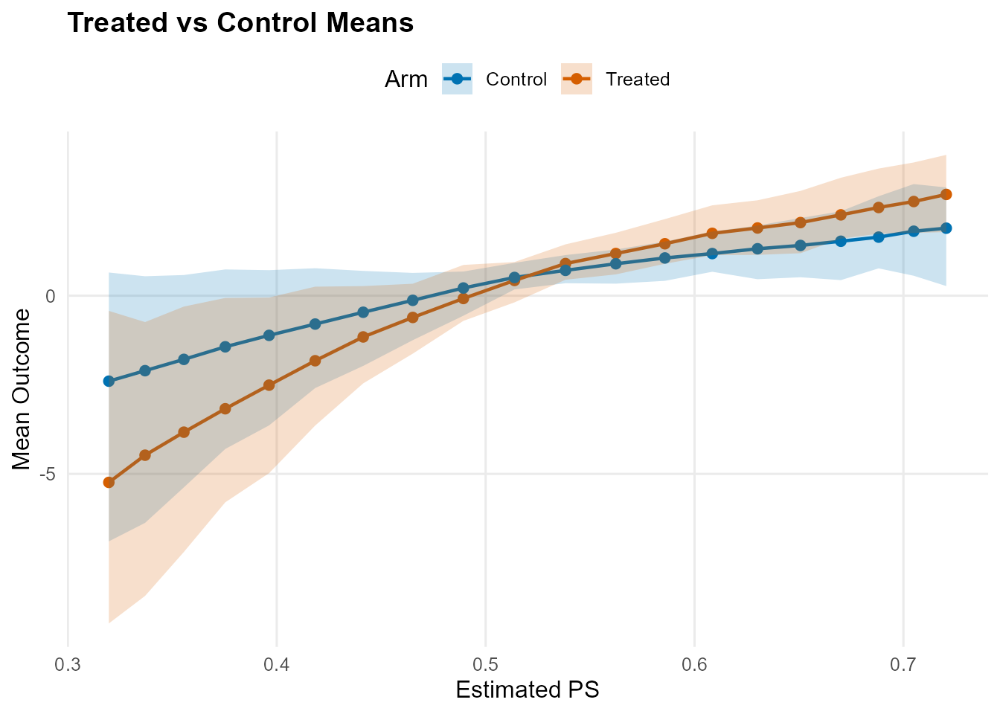
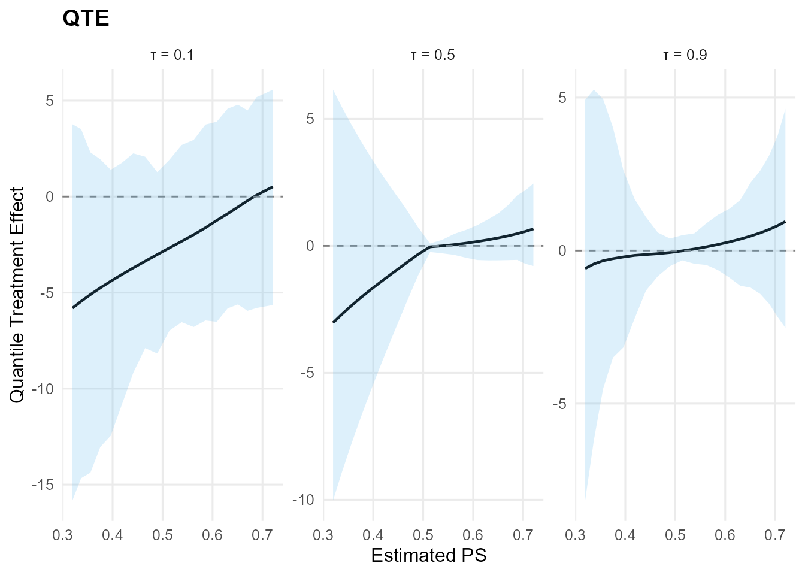
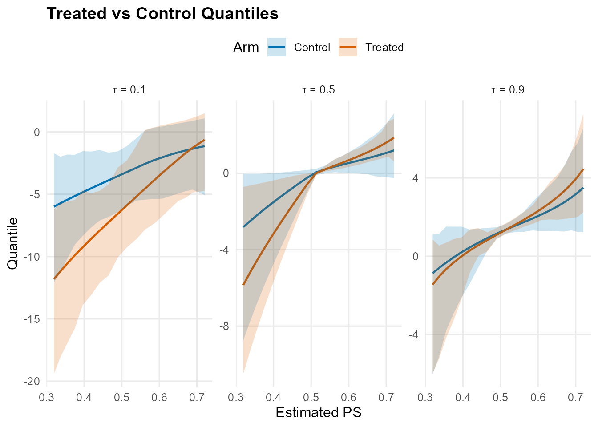

# Causal workflow (two-arm outcome modeling)

## Goal

This vignette demonstrates the causal inference workflow using
[`build_causal_bundle()`](https://arnabaich96.github.io/DPmixGPD/reference/build_causal_bundle.md)
and
[`run_mcmc_causal()`](https://arnabaich96.github.io/DPmixGPD/reference/run_mcmc_causal.md).
We compute distributional treatment effects, including:

- **Average Treatment Effect (ATE)**: $`E[Y(1) - Y(0) \mid X]`$
- **Quantile Treatment Effect (QTE)**:
  $`Q_{Y(1)}(\tau) - Q_{Y(0)}(\tau)`$

## Simulated data

``` r
library(DPmixGPD)

n <- 80
X <- data.frame(x = rnorm(n))

# Treatment assignment (with propensity score)
T_ind <- rbinom(n, 1, plogis(0.2 + 0.5 * X$x))

# Outcome with heterogeneous treatment effect
y0 <- 0.5 + 0.7 * X$x + abs(rnorm(n)) + 0.1
te <- 0.4 + 0.6 * (X$x > 0)  # Treatment effect varies with x
y1 <- y0 + te
y <- ifelse(T_ind == 1, y1, y0)
```

## Build causal bundle

The
[`build_causal_bundle()`](https://arnabaich96.github.io/DPmixGPD/reference/build_causal_bundle.md)
function creates a unified structure for: - Propensity score (PS) model
(optional) - Control arm outcome model - Treated arm outcome model

``` r
bundle <- build_causal_bundle(
  y = y,
  X = X,
  T = T_ind,
  backend = "sb",
  kernel = "normal",
  GPD = TRUE,
  components = 6,
  PS = "logit",  # Logistic regression for PS
  design = "observational",
  mcmc_outcome = mcmc,
  mcmc_ps = mcmc
)

bundle
#> DPmixGPD causal bundle
#> PS model: Bayesian logit (T | X) 
#> Outcome (treated): backend = sb | kernel = normal 
#> Outcome (control): backend = sb | kernel = normal 
#> GPD tail (treated/control): TRUE / TRUE 
#> components (treated/control): 6 / 6 
#> Outcome PS included: TRUE 
#> epsilon (treated/control): 0.025 / 0.025 
#> n (control) = 38 | n (treated) = 42
```

## Run MCMC

``` r
fit <- run_mcmc_causal(bundle, show_progress = FALSE)
#> ===== Monitors =====
#> thin = 1: beta
#> ===== Samplers =====
#> RW sampler (2)
#>   - beta[]  (2 elements)
#> [MCMC] Creating NIMBLE model...
#> [MCMC] NIMBLE model created successfully.
#> [MCMC] Configuring MCMC...
#> ===== Monitors =====
#> thin = 1: alpha, beta_mean, beta_ps_mean, beta_tail_scale, beta_threshold, sd, sdlog_u, tail_shape, threshold, w, z
#> ===== Samplers =====
#> RW sampler (65)
#>   - alpha
#>   - sd[]  (6 elements)
#>   - beta_mean[]  (6 elements)
#>   - beta_ps_mean[]  (6 elements)
#>   - sdlog_u
#>   - beta_tail_scale[]  (1 element)
#>   - tail_shape
#>   - v[]  (5 elements)
#>   - threshold[]  (38 elements)
#> conjugate sampler (1)
#>   - beta_threshold[]  (1 element)
#> categorical sampler (38)
#>   - z[]  (38 elements)
#> [MCMC] MCMC configured.
#> [MCMC] Building MCMC object...
#> [MCMC] MCMC object built.
#> [MCMC] Attempting NIMBLE compilation (this may take a minute)...
#> [MCMC] Compiling model...
#> [MCMC] Compiling MCMC sampler...
#> [MCMC] Compilation successful.
#> [MCMC] MCMC execution complete. Processing results...
#> [MCMC] Creating NIMBLE model...
#> [MCMC] NIMBLE model created successfully.
#> [MCMC] Configuring MCMC...
#> ===== Monitors =====
#> thin = 1: alpha, beta_mean, beta_ps_mean, beta_tail_scale, beta_threshold, sd, sdlog_u, tail_shape, threshold, w, z
#> ===== Samplers =====
#> RW sampler (69)
#>   - alpha
#>   - sd[]  (6 elements)
#>   - beta_mean[]  (6 elements)
#>   - beta_ps_mean[]  (6 elements)
#>   - sdlog_u
#>   - beta_tail_scale[]  (1 element)
#>   - tail_shape
#>   - v[]  (5 elements)
#>   - threshold[]  (42 elements)
#> conjugate sampler (1)
#>   - beta_threshold[]  (1 element)
#> categorical sampler (42)
#>   - z[]  (42 elements)
#> [MCMC] MCMC configured.
#> [MCMC] Building MCMC object...
#> [MCMC] MCMC object built.
#> [MCMC] Attempting NIMBLE compilation (this may take a minute)...
#> [MCMC] Compiling model...
#> [MCMC] Compiling MCMC sampler...
#> [MCMC] Compilation successful.
#> [MCMC] MCMC execution complete. Processing results...
fit
#> DPmixGPD causal fit
#> PS model: Bayesian logit (T | X) 
#> Outcome (treated): backend = sb | kernel = normal 
#> Outcome (control): backend = sb | kernel = normal 
#> GPD tail (treated/control): TRUE / TRUE
```

## Average Treatment Effect (ATE)

``` r
# ATE at observed covariate values using HPD intervals
ate_result <- ate(fit, interval = "hpd", nsim_mean = 100)
print(ate_result)
#> ATE (Average Treatment Effect)
#>   Prediction points: 80
#>   Conditional (covariates): YES
#>   Propensity score used: YES
#>   PS scale: logit
#>   Posterior mean draws: 100
#>   Credible interval: hpd
#> 
#> ATE estimates (treated - control):
#>  id estimate  lower upper
#>   1   -0.616 -3.028 1.903
#>   2    0.124 -0.850 0.848
#>   3   -0.859 -3.253 2.892
#>   4    0.712 -0.690 1.884
#>   5    0.196 -0.702 1.176
#>   6   -0.869 -3.536 2.671
#> ... (74 more rows)

# ATE on a new covariate grid with HPD intervals
X_new <- data.frame(x = seq(min(X$x), max(X$x), length.out = 20))
ate_grid <- ate(fit, newdata = X_new, interval = "hpd", nsim_mean = 100,
                level = 0.90)  # 90% HPD interval

# Print and summarize the ATE result
print(ate_grid)
#> ATE (Average Treatment Effect)
#>   Prediction points: 20
#>   Conditional (covariates): YES
#>   Propensity score used: YES
#>   PS scale: logit
#>   Posterior mean draws: 100
#>   Credible interval: hpd
#> 
#> ATE estimates (treated - control):
#>  id estimate  lower upper
#>   1   -2.840 -9.079 5.400
#>   2   -2.372 -7.811 5.000
#>   3   -2.043 -7.980 3.055
#>   4   -1.738 -6.583 3.628
#>   5   -1.397 -4.939 3.397
#>   6   -1.029 -4.374 2.133
#> ... (14 more rows)
summary(ate_grid)
#> ATE Summary
#> ================================================== 
#> Prediction points: 20
#> Conditional: YES | PS used: YES
#> Posterior mean draws: 100
#> Interval: hpd
#> 
#> Model specification:
#>   Backend (trt/con): sb / sb
#>   Kernel (trt/con): normal / normal
#>   GPD tail (trt/con): YES / YES
#> 
#> ATE statistics:
#>   Mean: -0.347 | Median: 0.053
#>   Range: [-2.84, 0.947]
#>   SD: 1.18
#> 
#> Credible interval width:
#>   Mean: 4.856 | Median: 2.907
#>   Range: [1.233, 14.48]
```

### ATE Plots

The [`plot()`](https://rdrr.io/r/graphics/plot.default.html) method for
ATE objects supports multiple visualization types:

- `type = "both"` (default): Returns a list with both `trt_control` and
  `treatment_effect` plots
- `type = "effect"`: Shows the treatment effect curve with credible
  intervals
- `type = "arms"`: Shows treated vs control mean outcomes

``` r
# Default: returns list with both plots
ate_plots <- plot(ate_grid)
ate_plots$treatment_effect
```


``` r
ate_plots$trt_control
```



## Quantile Treatment Effect (QTE)

``` r
# QTE at multiple quantiles using HPD intervals
probs <- c(0.1, 0.5, 0.9)
qte_result <- qte(fit, probs = probs, interval = "hpd")
print(qte_result)
#> QTE (Quantile Treatment Effect)
#>   Prediction points: 80
#>   Quantile grid: 0.1, 0.5, 0.9
#>   Conditional (covariates): YES
#>   Propensity score used: YES
#>   PS scale: logit
#>   Credible interval: hpd
#> 
#> QTE estimates (treated - control):
#>  index id estimate   lower upper
#>    0.1  1   -3.523  -8.570 2.117
#>    0.1  2   -2.370  -6.542 2.635
#>    0.1  3   -3.822 -10.235 1.651
#>    0.1  4   -0.314  -6.040 4.471
#>    0.1  5   -2.167  -6.590 3.054
#>    0.1  6   -3.800 -10.179 1.666
#> ... (234 more rows)

# QTE on a covariate grid with HPD intervals
qte_grid <- qte(fit, probs = probs, newdata = X_new, interval = "hpd")

# Print and summarize the QTE result
print(qte_grid)
#> QTE (Quantile Treatment Effect)
#>   Prediction points: 20
#>   Quantile grid: 0.1, 0.5, 0.9
#>   Conditional (covariates): YES
#>   Propensity score used: YES
#>   PS scale: logit
#>   Credible interval: hpd
#> 
#> QTE estimates (treated - control):
#>  index id estimate   lower upper
#>    0.1  1   -5.807 -15.822 3.767
#>    0.1  2   -5.455 -14.665 3.515
#>    0.1  3   -5.103 -14.381 2.303
#>    0.1  4   -4.753 -13.040 1.945
#>    0.1  5   -4.404 -12.452 1.399
#>    0.1  6   -4.056 -10.841 1.757
#> ... (54 more rows)
summary(qte_grid)
#> QTE Summary
#> ================================================== 
#> Prediction points: 20 | Quantiles: 3
#> Quantile grid: 0.1, 0.5, 0.9
#> Conditional: YES | PS used: YES
#> Interval: hpd
#> 
#> Model specification:
#>   Backend (trt/con): sb / sb
#>   Kernel (trt/con): normal / normal
#>   GPD tail (trt/con): YES / YES
#> 
#> QTE by quantile:
#>  quantile mean_qte median_qte min_qte max_qte sd_qte
#>       0.1   -2.514     -2.499  -5.807   0.507  2.024
#>       0.5   -0.617     -0.021  -3.030   0.666  1.180
#>       0.9    0.113      0.021  -0.585   0.950  0.425
#> 
#> Credible interval width:
#>   Mean: 7.19 | Median: 7.234
#>   Range: [0.336, 19.589]
```

### QTE Plots

The [`plot()`](https://rdrr.io/r/graphics/plot.default.html) method for
QTE objects supports multiple visualization types:

- `type = "both"` (default): Returns a list with both `trt_control` and
  `treatment_effect` plots
- `type = "effect"`: Shows the quantile treatment effect curves faceted
  by quantile level
- `type = "arms"`: Shows treated vs control quantile curves

``` r
# Default: returns list with both plots
qte_plots <- plot(qte_grid)
qte_plots$treatment_effect
```



``` r
qte_plots$trt_control
```



## Summary and diagnostics

``` r
summary(fit)
#> -- PS fit --
#> DPmixGPD PS fit
#> model: logit 
#> 
#> -- Outcome fits --
#> [control]
#> MixGPD fit | backend: Stick-Breaking Process | kernel: Normal Distribution | GPD tail: TRUE
#> n = 38 | components = 6 | epsilon = 0.025
#> MCMC: niter=400, nburnin=100, thin=2, nchains=1 
#> Fit
#> Use summary() for posterior summaries; plot() for diagnostics; predict() for predictions.
#> 
#> [treated]
#> MixGPD fit | backend: Stick-Breaking Process | kernel: Normal Distribution | GPD tail: TRUE
#> n = 42 | components = 6 | epsilon = 0.025
#> MCMC: niter=400, nburnin=100, thin=2, nchains=1 
#> Fit
#> Use summary() for posterior summaries; plot() for diagnostics; predict() for predictions.
```

## Notes and troubleshooting

- **Propensity score**: Set `PS = FALSE` for RCT designs, or use
  `PS = "logit"`/`"probit"` for observational studies.
- **Backend selection**: Use `backend = "sb"` for stable computation,
  `backend = "crp"` for adaptive clustering.
- **Treatment effect interpretation**: ATE and QTE are differences;
  ensure both arms have converged MCMC chains.
