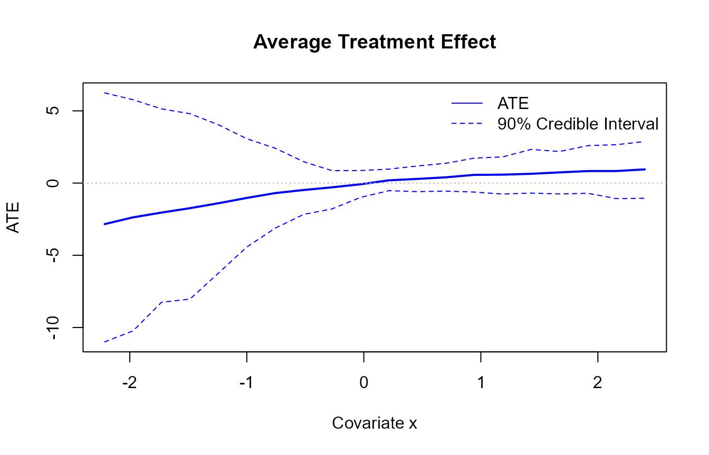

# Causal workflow (two-arm outcome modeling)

## Goal

This vignette demonstrates the causal inference workflow using
[`build_causal_bundle()`](https://arnabaich96.github.io/DPmixGPD/reference/build_causal_bundle.md)
and
[`run_mcmc_causal()`](https://arnabaich96.github.io/DPmixGPD/reference/run_mcmc_causal.md).
We compute distributional treatment effects, including:

- **Average Treatment Effect (ATE)**: $`E[Y(1) - Y(0) \mid X]`$
- **Quantile Treatment Effect (QTE)**:
  $`Q_{Y(1)}(\tau) - Q_{Y(0)}(\tau)`$

## Simulated data

``` r
library(DPmixGPD)

n <- 80
X <- data.frame(x = rnorm(n))

# Treatment assignment (with propensity score)
T_ind <- rbinom(n, 1, plogis(0.2 + 0.5 * X$x))

# Outcome with heterogeneous treatment effect
y0 <- 0.5 + 0.7 * X$x + abs(rnorm(n)) + 0.1
te <- 0.4 + 0.6 * (X$x > 0)  # Treatment effect varies with x
y1 <- y0 + te
y <- ifelse(T_ind == 1, y1, y0)
```

## Build causal bundle

The
[`build_causal_bundle()`](https://arnabaich96.github.io/DPmixGPD/reference/build_causal_bundle.md)
function creates a unified structure for: - Propensity score (PS) model
(optional) - Control arm outcome model - Treated arm outcome model

``` r
bundle <- build_causal_bundle(
  y = y,
  X = X,
  T = T_ind,
  backend = "sb",
  kernel = "normal",
  GPD = TRUE,
  components = 6,
  PS = "logit",  # Logistic regression for PS
  design = "observational",
  mcmc_outcome = mcmc,
  mcmc_ps = mcmc
)

bundle
#> DPmixGPD causal bundle
#> PS model: Bayesian logit (T | X) 
#> Outcome (treated): backend = sb | kernel = normal 
#> Outcome (control): backend = sb | kernel = normal 
#> GPD tail (treated/control): TRUE / TRUE 
#> components (treated/control): 6 / 6 
#> Outcome PS included: TRUE 
#> epsilon (treated/control): 0.025 / 0.025 
#> n (control) = 38 | n (treated) = 42
```

## Run MCMC

``` r
fit <- run_mcmc_causal(bundle, show_progress = FALSE)
#> ===== Monitors =====
#> thin = 1: beta
#> ===== Samplers =====
#> RW sampler (2)
#>   - beta[]  (2 elements)
#> [MCMC] Creating NIMBLE model...
#> [MCMC] NIMBLE model created successfully.
#> [MCMC] Configuring MCMC...
#> ===== Monitors =====
#> thin = 1: alpha, beta_mean, beta_ps_mean, beta_tail_scale, beta_threshold, sd, sdlog_u, tail_shape, threshold, w, z
#> ===== Samplers =====
#> RW sampler (65)
#>   - alpha
#>   - sd[]  (6 elements)
#>   - beta_mean[]  (6 elements)
#>   - beta_ps_mean[]  (6 elements)
#>   - sdlog_u
#>   - beta_tail_scale[]  (1 element)
#>   - tail_shape
#>   - v[]  (5 elements)
#>   - threshold[]  (38 elements)
#> conjugate sampler (1)
#>   - beta_threshold[]  (1 element)
#> categorical sampler (38)
#>   - z[]  (38 elements)
#> [MCMC] MCMC configured.
#> [MCMC] Building MCMC object...
#> [MCMC] MCMC object built.
#> [MCMC] Attempting NIMBLE compilation (this may take a minute)...
#> [MCMC] Compiling model...
#> [MCMC] Compiling MCMC sampler...
#> [MCMC] Compilation successful.
#> [MCMC] MCMC execution complete. Processing results...
#> [MCMC] Creating NIMBLE model...
#> [MCMC] NIMBLE model created successfully.
#> [MCMC] Configuring MCMC...
#> ===== Monitors =====
#> thin = 1: alpha, beta_mean, beta_ps_mean, beta_tail_scale, beta_threshold, sd, sdlog_u, tail_shape, threshold, w, z
#> ===== Samplers =====
#> RW sampler (69)
#>   - alpha
#>   - sd[]  (6 elements)
#>   - beta_mean[]  (6 elements)
#>   - beta_ps_mean[]  (6 elements)
#>   - sdlog_u
#>   - beta_tail_scale[]  (1 element)
#>   - tail_shape
#>   - v[]  (5 elements)
#>   - threshold[]  (42 elements)
#> conjugate sampler (1)
#>   - beta_threshold[]  (1 element)
#> categorical sampler (42)
#>   - z[]  (42 elements)
#> [MCMC] MCMC configured.
#> [MCMC] Building MCMC object...
#> [MCMC] MCMC object built.
#> [MCMC] Attempting NIMBLE compilation (this may take a minute)...
#> [MCMC] Compiling model...
#> [MCMC] Compiling MCMC sampler...
#> [MCMC] Compilation successful.
#> [MCMC] MCMC execution complete. Processing results...
fit
#> DPmixGPD causal fit
#> PS model: Bayesian logit (T | X) 
#> Outcome (treated): backend = sb | kernel = normal 
#> Outcome (control): backend = sb | kernel = normal 
#> GPD tail (treated/control): TRUE / TRUE
```

## Average Treatment Effect (ATE)

``` r
# ATE at observed covariate values
ate_result <- ate(fit, interval = "credible", nsim_mean = 100)
head(ate_result$fit)
#> [1] -0.6158624  0.1237440 -0.8590129  0.7119736  0.1962235 -0.8688013

# ATE on a new covariate grid
X_new <- data.frame(x = seq(min(X$x), max(X$x), length.out = 20))
ate_grid <- ate(fit, newdata = X_new, interval = "credible", nsim_mean = 100)

# Plot ATE with credible intervals
plot(X_new$x, ate_grid$fit, type = "l", lwd = 2, col = "blue",
     xlab = "Covariate x", ylab = "ATE", 
     main = "Average Treatment Effect",
     ylim = range(c(ate_grid$fit, ate_grid$lower, ate_grid$upper), na.rm = TRUE))
lines(X_new$x, ate_grid$lower, lty = 2, col = "blue")
lines(X_new$x, ate_grid$upper, lty = 2, col = "blue")
abline(h = 0, lty = 3, col = "gray")
legend("topright", legend = c("ATE", "90% Credible Interval"), 
       lty = c(1, 2), col = c("blue", "blue"), bty = "n")
```



## Quantile Treatment Effect (QTE)

``` r
# QTE at multiple quantiles
probs <- c(0.1, 0.5, 0.9)
qte_result <- qte(fit, probs = probs, interval = "credible")
# qte_result$fit is a matrix: rows = observations, cols = quantiles
head(qte_result$fit)
#>            [,1]         [,2]        [,3]
#> [1,] -3.5232472 -0.847587303 -0.11390989
#> [2,] -2.3704133 -0.007149581  0.04375487
#> [3,] -3.8216608 -1.140482887 -0.13755142
#> [4,] -0.3144076  0.366987162  0.54327430
#> [5,] -2.1667334  0.020958881  0.08457944
#> [6,] -3.8000151 -1.119331515 -0.13598435

# QTE on a covariate grid
qte_grid <- qte(fit, probs = probs, newdata = X_new, interval = "credible")

# Plot QTE curves
# qte_grid$fit is a matrix with nrow(X_new) rows and length(probs) columns
tau_colors <- c("red", "blue", "green")
names(tau_colors) <- as.character(probs)

plot(X_new$x, qte_grid$fit[, 2],  # median (0.5) is column 2
     type = "l", lwd = 2, col = tau_colors["0.5"],
     xlab = "Covariate x", ylab = "QTE", 
     main = "Quantile Treatment Effects",
     ylim = range(qte_grid$fit, na.rm = TRUE))
lines(X_new$x, qte_grid$fit[, 1], lwd = 2, col = tau_colors["0.1"])  # 0.1 is column 1
lines(X_new$x, qte_grid$fit[, 3], lwd = 2, col = tau_colors["0.9"])  # 0.9 is column 3
abline(h = 0, lty = 3, col = "gray")
legend("topright", legend = paste0("τ = ", probs), 
       lty = 1, lwd = 2, col = tau_colors, bty = "n")
```


## Summary and diagnostics

``` r
summary(fit)
#> -- PS fit --
#> DPmixGPD PS fit
#> model: logit 
#> 
#> -- Outcome fits --
#> [control]
#> MixGPD fit | backend: Stick-Breaking Process | kernel: Normal Distribution | GPD tail: TRUE
#> n = 38 | components = 6 | epsilon = 0.025
#> MCMC: niter=400, nburnin=100, thin=2, nchains=1 
#> Fit
#> Use summary() for posterior summaries; plot() for diagnostics; predict() for predictions.
#> 
#> [treated]
#> MixGPD fit | backend: Stick-Breaking Process | kernel: Normal Distribution | GPD tail: TRUE
#> n = 42 | components = 6 | epsilon = 0.025
#> MCMC: niter=400, nburnin=100, thin=2, nchains=1 
#> Fit
#> Use summary() for posterior summaries; plot() for diagnostics; predict() for predictions.
```

## Notes and troubleshooting

- **Propensity score**: Set `PS = FALSE` for RCT designs, or use
  `PS = "logit"`/`"probit"` for observational studies.
- **Backend selection**: Use `backend = "sb"` for stable computation,
  `backend = "crp"` for adaptive clustering.
- **Treatment effect interpretation**: ATE and QTE are differences;
  ensure both arms have converged MCMC chains.
