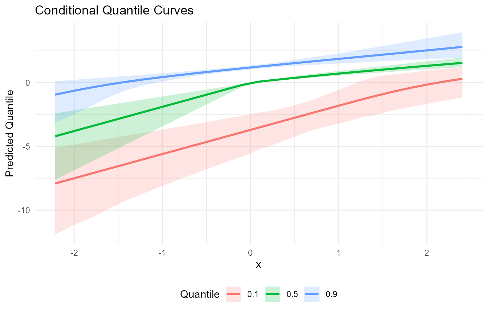

# Conditional Models

## Overview

This vignette demonstrates fitting a conditional model with covariates
and generating predictions on a grid of new covariate values.

## Data Generation

``` r
library(DPmixGPD)

n <- 120
x <- rnorm(n)
X <- data.frame(x = x)
y <- 0.5 + 0.8 * x + abs(rnorm(n)) + 0.1
```

## Model Fitting

``` r
bundle <- build_nimble_bundle(
  y = y,
  X = X,
  backend = "sb",
  kernel = "normal",
  GPD = TRUE,
  components = 6,
  mcmc = mcmc
)

fit <- run_mcmc_bundle_manual(bundle, show_progress = FALSE)
#> [MCMC] Creating NIMBLE model...
#> [MCMC] NIMBLE model created successfully.
#> [MCMC] Configuring MCMC...
#> ===== Monitors =====
#> thin = 1: alpha, beta_mean, beta_tail_scale, beta_threshold, sd, sdlog_u, tail_shape, threshold, w, z
#> ===== Samplers =====
#> RW sampler (141)
#>   - alpha
#>   - sd[]  (6 elements)
#>   - beta_mean[]  (6 elements)
#>   - sdlog_u
#>   - beta_tail_scale[]  (1 element)
#>   - tail_shape
#>   - v[]  (5 elements)
#>   - threshold[]  (120 elements)
#> conjugate sampler (1)
#>   - beta_threshold[]  (1 element)
#> categorical sampler (120)
#>   - z[]  (120 elements)
#> [MCMC] MCMC configured.
#> [MCMC] Building MCMC object...
#> [MCMC] MCMC object built.
#> [MCMC] Attempting NIMBLE compilation (this may take a minute)...
#> [MCMC] Compiling model...
#> [MCMC] Compiling MCMC sampler...
#> [MCMC] Compilation successful.
#> [MCMC] MCMC execution complete. Processing results...
fit
#> MixGPD fit | backend: Stick-Breaking Process | kernel: Normal Distribution | GPD tail: TRUE
#> n = 120 | components = 6 | epsilon = 0.025
#> MCMC: niter=600, nburnin=150, thin=2, nchains=1 
#> Fit
#> Use summary() for posterior summaries; plot() for diagnostics; predict() for predictions.
```

## Fitted Values

``` r
f <- fitted(fit, type = "mean", level = 0.90)
head(f)
#>          fit      lower       upper residuals
#> 1 -0.5901029 -1.4627355 -0.06634379 1.1948973
#> 2  0.5767265  0.3237072  0.85556141 1.5132270
#> 3 -0.9781067 -2.2084905 -0.28797693 1.1241832
#> 4  1.6929842  1.3798675  2.07077008 0.3627969
#> 5  0.7569056  0.4790120  1.09498294 0.2068914
#> 6 -0.9146150 -2.1484723 -0.20834390 1.5709066
summary(f$residuals)
#>    Min. 1st Qu.  Median    Mean 3rd Qu.    Max. 
#> 0.07205 0.57101 1.17353 1.22845 1.67585 4.06900
```

## Predictions on New Data

``` r
new_X <- data.frame(x = seq(min(x), max(x), length.out = 25))

pred_mean <- predict(fit, x = new_X, type = "mean", cred.level = 0.90, interval = "credible")
pred_med  <- predict(fit, x = new_X, type = "median", cred.level = 0.90, interval = "credible")

head(pred_mean$fit)
#>    estimate     lower      upper
#> 1 -3.735223 -7.061410 -1.7113696
#> 2 -3.324069 -6.664825 -1.4552753
#> 3 -2.934963 -5.983609 -1.2725523
#> 4 -2.550885 -5.229443 -1.1156674
#> 5 -2.148124 -4.449988 -0.9371768
#> 6 -1.771301 -3.642262 -0.7155524
head(pred_med$fit)
#>    estimate index id     lower     upper
#> 1 -4.203870   0.5  1 -7.607502 -2.407350
#> 2 -3.838764   0.5  2 -6.946791 -2.198272
#> 3 -3.473658   0.5  3 -6.286080 -1.989194
#> 4 -3.108552   0.5  4 -5.625369 -1.780116
#> 5 -2.743446   0.5  5 -4.964657 -1.571037
#> 6 -2.378341   0.5  6 -4.303946 -1.361959
```

## Quantile Curves

``` r
q_levels <- c(0.1, 0.5, 0.9)
q_fits <- lapply(q_levels, function(tau) {
  predict(fit, x = new_X, type = "quantile", index = tau, cred.level = 0.90, interval = "credible")$fit
})

q_df <- do.call(rbind, Map(function(tau, df) {
  data.frame(x = new_X$x, tau = tau, estimate = df$estimate, lower = df$lower, upper = df$upper)
}, q_levels, q_fits))

head(q_df)
#>           x tau  estimate      lower     upper
#> 1 -2.214700 0.1 -7.908704 -11.916578 -5.107839
#> 2 -2.022353 0.1 -7.543598 -11.215605 -4.882099
#> 3 -1.830007 0.1 -7.178493 -10.675358 -4.656360
#> 4 -1.637660 0.1 -6.813387 -10.011870 -4.430620
#> 5 -1.445314 0.1 -6.448281  -9.362249 -4.204881
#> 6 -1.252967 0.1 -6.083175  -8.805185 -3.979141
```

``` r
ggplot(q_df, aes(x = x, y = estimate, color = factor(tau))) +
  geom_line(linewidth = 1) +
  geom_ribbon(aes(ymin = lower, ymax = upper, fill = factor(tau)), alpha = 0.2, color = NA) +
  labs(x = "x", y = "Predicted Quantile", color = "Quantile", fill = "Quantile",
       title = "Conditional Quantile Curves") +
  theme_minimal() +
  theme(legend.position = "bottom")
```


