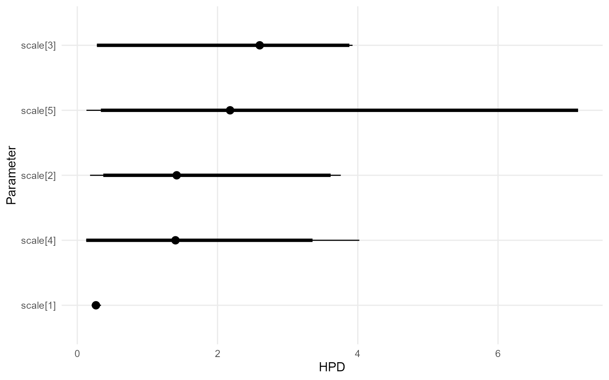

# 3. Basic Workflow: Model Specification, Bundle, & MCMC

> **Cookbook vignette (for the website / historical notes).** These files
> may not match the current exported API one-to-one. Last verified:
> **2026-01-18**.
>
> For the up-to-date workflow, see the main package vignettes
> (Introduction, Model Spec, MCMC Workflow,
> Unconditional/Conditional/Causal, Backends, S3 Reference).

### Theory (brief)

The workflow builds a DP mixture model, compiles the NIMBLE code, and
then explores the posterior with MCMC. Posterior draws are used to
summarize density, quantiles, and uncertainty in model parameters.

## Workflow Overview

DPmixGPD uses a direct two-step workflow:

1.  **Bundle** (`build_nimble_bundle`): Generate NIMBLE code and compile
    the sampler.
2.  **MCMC** (`run_mcmc_bundle_manual`): Execute posterior sampling.

------------------------------------------------------------------------

### Phase 1: Bundle (NIMBLE Code Generation & Compilation)

**Purpose**: Generate NIMBLE model code, compile sampler, prepare for
MCMC execution.

#### Building Directly

``` r
# Load packaged data
data("nc_pos200_k3")
y <- nc_pos200_k3$y

# Direct call
bundle_direct <- build_nimble_bundle(
  y = y,
  kernel = "gamma",
  backend = "crp",
  GPD = FALSE,
  components = 5,
  mcmc = mcmc
)

print("Direct bundle creation successful.\n")
```

    [1] "Direct bundle creation successful.\n"

#### Inspecting Bundle Contents

``` r
# Bundle is an S3 object with structure
cat("Bundle class:", class(bundle_direct), "\n")
```

    Bundle class: dpmixgpd_bundle 

``` r
cat("Bundle contains:\n")
```

    Bundle contains:

``` r
print(names(bundle_direct))
```

    [1] "spec"       "code"       "constants"  "dimensions" "data"      
    [6] "inits"      "monitors"   "mcmc"       "epsilon"   

``` r
# Access key components
cat("\nMCMC settings:\n")
```

    MCMC settings:

``` r
print(bundle_direct$mcmc_settings)
```

    NULL

------------------------------------------------------------------------

### Phase 3: MCMC Execution

**Purpose**: Run posterior sampling from the compiled bundle.

#### Basic MCMC Run

``` r
# Run MCMC
fit <- load_or_fit("v03-basic-model-compile-run-fit", run_mcmc_bundle_manual(bundle_direct, show_progress = FALSE))

cat("Fit object class:", class(fit), "\n")
```

    Fit object class: mixgpd_fit list 

``` r
cat("MCMC execution complete. Posterior samples collected.\n")
```

    MCMC execution complete. Posterior samples collected.

#### Accessing Posterior Samples

``` r
# Posterior summary
print("\n--- POSTERIOR SUMMARY ---\n")
```

    [1] "\n--- POSTERIOR SUMMARY ---\n"

``` r
summary(fit)
```

    MixGPD summary | backend: Chinese Restaurant Process | kernel: Gamma Distribution | GPD tail: FALSE | epsilon: 0.025
    n = 200 | components = 5
    Summary
    Initial components: 5 | Components after truncation: 1

    WAIC: 963.248
    lppd: -456.908 | pWAIC: 24.716

    Summary table
      parameter  mean    sd q0.025 q0.500 q0.975    ess
     weights[1] 0.883 0.138  0.474  0.917      1  8.469
          alpha 0.457 0.398  0.022  0.354  1.503  42.38
       shape[1] 1.161 0.151  0.915  1.159  1.483 14.106
       scale[1] 0.265 0.037  0.204  0.266  0.338 25.996

``` r
# Posterior mean parameters in original form
params_fit <- params(fit)
params_fit
```

    Posterior mean parameters

    $alpha
    [1] "0.457"

    $w
    [1] "0.883"

    $shape
    [1] "1.161"

    $scale
    [1] "0.265"

#### Diagnostic Plots

``` r
plot(fit, params = "shape", family = "traceplot")
```

    === traceplot ===


``` r
plot(fit, params = "scale", family = "caterpillar")
```

    === caterpillar ===



------------------------------------------------------------------------

### Complete Workflow: End-to-End Example

``` r
# Load packaged data
data("nc_pos200_k3")
y_data <- nc_pos200_k3$y

# PHASE 1: Bundle
bundle_final <- build_nimble_bundle(
  y = y_data,
  kernel = "gamma",
  backend = "crp",
  GPD = FALSE,
  components = 5,
  mcmc = mcmc
)

# PHASE 2: MCMC
fit_final <- load_or_fit("v03-basic-model-compile-run-fit_final", run_mcmc_bundle_manual(bundle_final, show_progress = FALSE))

print("\n=== THREE-PHASE WORKFLOW COMPLETE ===\n")
```

    [1] "\n=== THREE-PHASE WORKFLOW COMPLETE ===\n"

``` r
summary(fit_final)
```

    MixGPD summary | backend: Chinese Restaurant Process | kernel: Gamma Distribution | GPD tail: FALSE | epsilon: 0.025
    n = 200 | components = 5
    Summary
    Initial components: 5 | Components after truncation: 2

    WAIC: 906.001
    lppd: -382.021 | pWAIC: 70.979

    Summary table
      parameter  mean    sd q0.025 q0.500 q0.975     ess
     weights[1] 0.544 0.074  0.408   0.54  0.681  20.835
     weights[2] 0.358 0.077  0.187   0.37   0.48  22.198
          alpha 0.607 0.389  0.134  0.519   1.59 104.174
       shape[1] 2.091 0.573  1.344  2.135  3.367  14.987
       shape[2] 2.805 0.895  1.179  2.992  4.062  11.818
       scale[1] 0.583 0.298   0.28   0.43   1.17  19.365
       scale[2] 1.032 0.644  0.304  0.844  2.226    4.07

------------------------------------------------------------------------

### Backend Comparison: CRP vs Stick-Breaking

#### CRP Backend

``` r
# Chinese Restaurant Process
bundle_crp <- build_nimble_bundle(
  y = y_data,
  kernel = "gamma",
  backend = "crp",
  components = 5,
  mcmc = mcmc
)

fit_crp <- load_or_fit("v03-basic-model-compile-run-fit_crp", run_mcmc_bundle_manual(bundle_crp, show_progress = FALSE))
print("CRP execution complete.\n")
```

    [1] "CRP execution complete.\n"

#### Stick-Breaking Backend

``` r
# Stick-Breaking Process
bundle_sb <- build_nimble_bundle(
  y = y_data,
  kernel = "gamma",
  backend = "sb",
  components = 5,
  mcmc = mcmc
)

fit_sb <- load_or_fit("v03-basic-model-compile-run-fit_sb", run_mcmc_bundle_manual(bundle_sb, show_progress = FALSE))
print("SB execution complete.\n")
```

    [1] "SB execution complete.\n"

------------------------------------------------------------------------

### Kernel Selection Guide

``` r
kernels_available <- c("gamma", "lognormal", "normal", "laplace", "invgauss", "amoroso", "cauchy")

cat("Available kernels:\n")
```

    Available kernels:

``` r
for (k in kernels_available) {
  cat("  -", k, "\n")
}
```

      - gamma 
      - lognormal 
      - normal 
      - laplace 
      - invgauss 
      - amoroso 
      - cauchy 

``` r
print("\nChoose kernel based on:\n")
```

    [1] "\nChoose kernel based on:\n"

``` r
print("  gamma:     Right-skewed, positive support\n")
```

    [1] "  gamma:     Right-skewed, positive support\n"

``` r
print("  lognormal: Log-transformed normality\n")
```

    [1] "  lognormal: Log-transformed normality\n"

``` r
print("  normal:    Symmetric, unbounded\n")
```

    [1] "  normal:    Symmetric, unbounded\n"

``` r
print("  laplace:   Sharp peak, exponential tails\n")
```

    [1] "  laplace:   Sharp peak, exponential tails\n"

``` r
print("  invgauss:  Positive, near-normal shape\n")
```

    [1] "  invgauss:  Positive, near-normal shape\n"

``` r
print("  amoroso:   Generalized, maximum flexibility\n")
```

    [1] "  amoroso:   Generalized, maximum flexibility\n"

``` r
print("  cauchy:    Heavy-tailed, rare cases\n")
```

    [1] "  cauchy:    Heavy-tailed, rare cases\n"

------------------------------------------------------------------------

### GPD Tail Augmentation

#### Unconditional with GPD

``` r
# Data with tail behavior
data("nc_pos_tail200_k4")
y_tail <- nc_pos_tail200_k4$y

# Build with GPD
bundle_gpd <- build_nimble_bundle(
  y = y_tail,
  kernel = "gamma",
  backend = "sb",
  GPD = TRUE,
  components = 6,
  mcmc = mcmc
)

fit_gpd <- load_or_fit("v03-basic-model-compile-run-fit_gpd", run_mcmc_bundle_manual(bundle_gpd, show_progress = FALSE))
print("\nGPD augmentation applied to tail region.\n")
summary(fit_gpd)
```

------------------------------------------------------------------------

### Summary of Key Functions

| Phase | Function | Input | Output |
|----|----|----|----|
| **1. Bundle** | [`build_nimble_bundle()`](https://arnabaich96.github.io/DPmixGPD/reference/build_nimble_bundle.md) | y, X (optional), kernel, backend, GPD, components | `dpmixgpd_bundle` |
| **2. MCMC** | [`run_mcmc_bundle_manual()`](https://arnabaich96.github.io/DPmixGPD/reference/run_mcmc_bundle_manual.md) | bundle | `mixgpd_fit` |

------------------------------------------------------------------------

### Common Parameter Settings

``` r
print("=== Recommended MCMC Parameters ===\n")
```

    [1] "=== Recommended MCMC Parameters ===\n"

``` r
print("Quick test:     niter=500,  nburnin=100, nchains=1\n")
```

    [1] "Quick test:     niter=500,  nburnin=100, nchains=1\n"

``` r
print("Standard:       niter=1000, nburnin=250, nchains=2\n")
```

    [1] "Standard:       niter=1000, nburnin=250, nchains=2\n"

``` r
print("Production:     niter=1000, nburnin=250, nchains=3\n")
```

    [1] "Production:     niter=1000, nburnin=250, nchains=3\n"

``` r
print("\n=== Backend Parameters ===\n")
```

    [1] "\n=== Backend Parameters ===\n"

``` r
print("Use components=3-5 for both backends in this implementation.\n")
```

    [1] "Use components=3-5 for both backends in this implementation.\n"

``` r
print("\n=== Kernel Selection ===\n")
```

    [1] "\n=== Kernel Selection ===\n"

``` r
print("Positive data:     gamma, lognormal, invgauss\n")
```

    [1] "Positive data:     gamma, lognormal, invgauss\n"

``` r
print("Any real data:     normal\n")
```

    [1] "Any real data:     normal\n"

``` r
print("Symmetric tails:   laplace\n")
```

    [1] "Symmetric tails:   laplace\n"

``` r
print("Extreme outliers:  cauchy\n")
```

    [1] "Extreme outliers:  cauchy\n"

------------------------------------------------------------------------

### Next Steps

- Move to **vignette 6-7** for unconditional models (CRP vs SB backends)
- Move to **vignette 8-9** for tail modeling with GPD
- Move to **vignette 10-13** for conditional models with covariates
- Move to **vignette 14-19** for causal inference workflows
