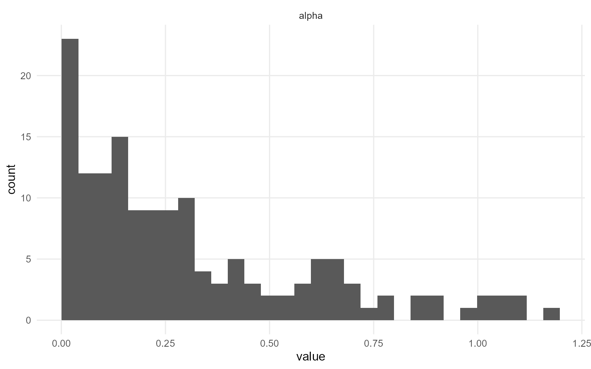
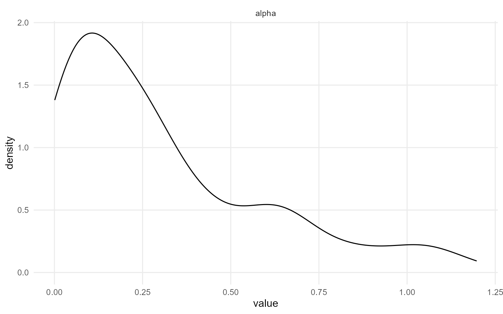
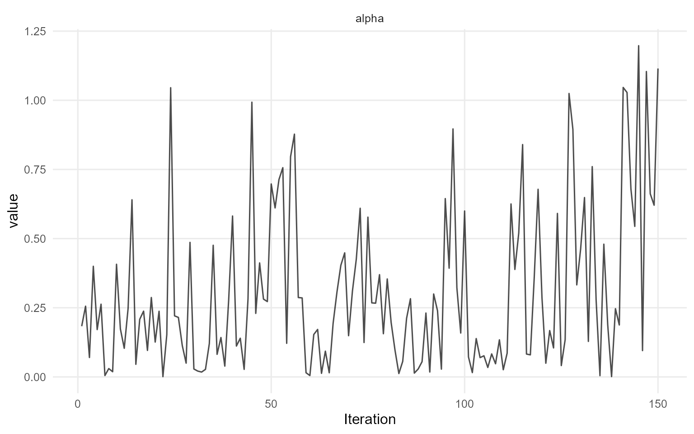
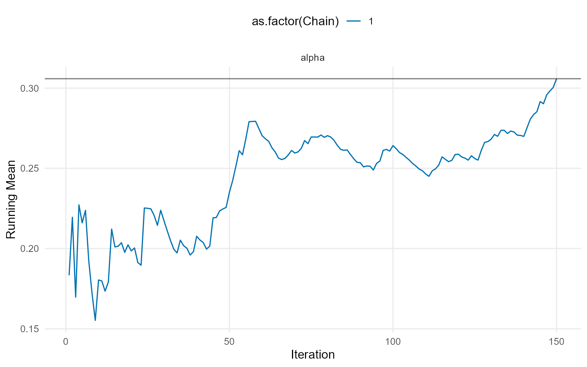
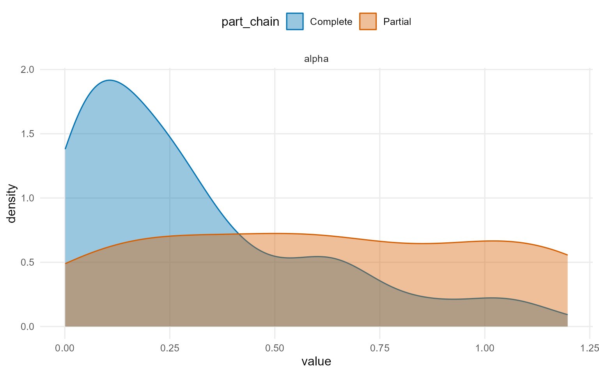
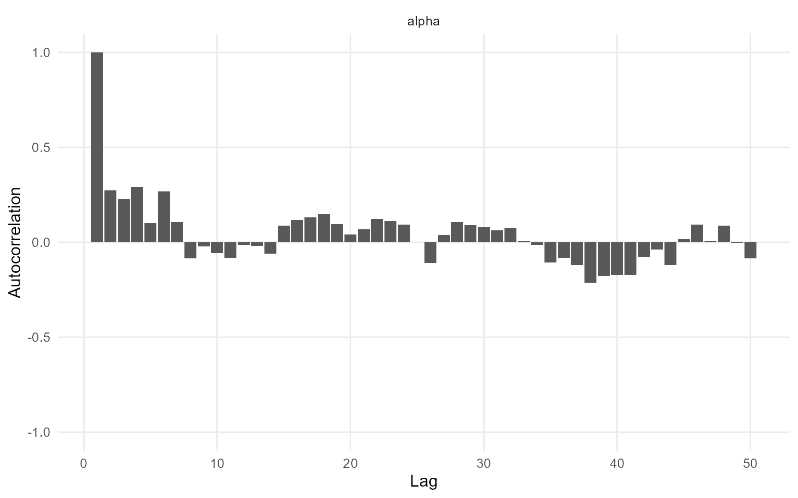
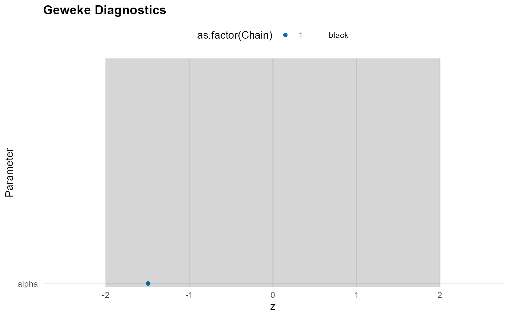
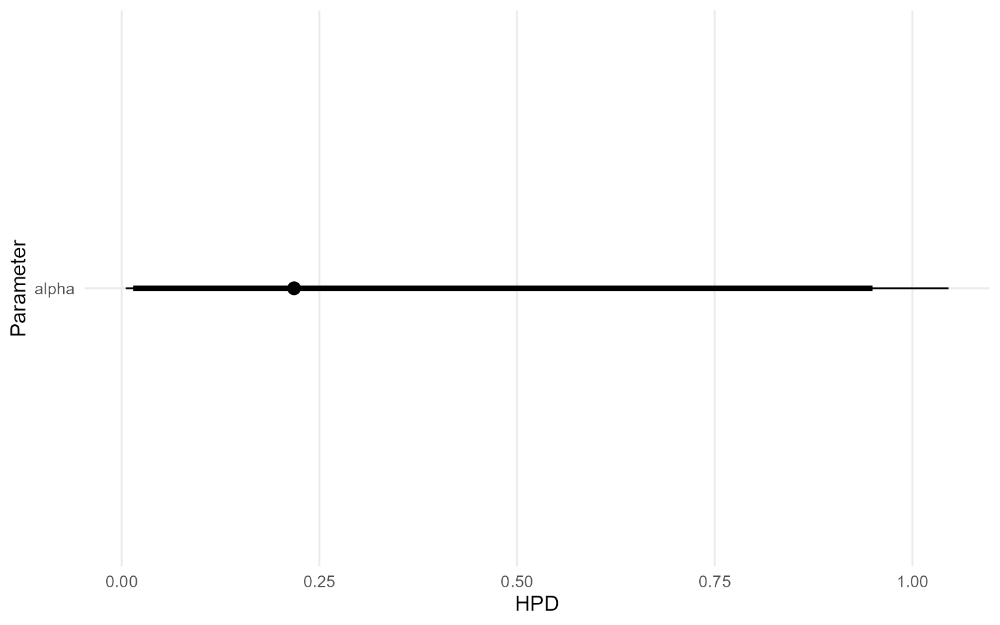
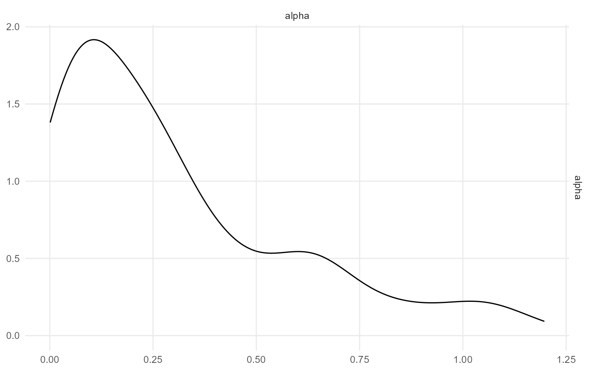

# 4. Backends, Kernels, and Workflow Map

> **Cookbook vignette (for the website / historical notes).** These
> files may not match the current exported API one-to-one. Last
> verified: **2026-01-18**.
>
> For the up-to-date workflow, see the main package vignettes
> (Introduction, Model Spec, MCMC Workflow,
> Unconditional/Conditional/Causal, Backends, S3 Reference).

### Theory (brief)

The CRP and stick-breaking backends are two equivalent representations
of the DP mixture. They differ in computation (allocation vs truncation)
but target the same underlying prior over distributions.

## Big picture

DPmixGPD has two orthogonal dials you turn when building models:

- **Backend** (how the mixture weights / clustering are represented)
  - **CRP**: Chinese Restaurant Process representation.
  - **SB**: stick-breaking truncation with a fixed number of components.
- **Kernel / family** (what distribution models the bulk of the data)
  - Examples: normal, lognormal, gamma, inverse-Gaussian, Laplace,
    Cauchy, Amoroso, etc.

Optionally, you can also turn on:

- **GPD = TRUE/FALSE** to splice a Generalized Pareto tail beyond a
  threshold.

## What changes between CRP and SB?

Both backends target the same posterior over densities. The difference
is representation:

- **CRP** learns a random number of occupied clusters within a finite
  `components` cap.
- **SB** uses the same finite `components` cap and learns stick-breaking
  weights.

Practical rule of thumb:

- **CRP** is convenient when you want adaptive complexity while still
  using a finite `components` cap.
- **SB** is convenient when you want predictable memory/time and easy
  vectorization.

## What does the workflow look like?

DPmixGPD uses a consistent build -\> run -\> summarize loop:

1.  **Build a bundle** using
    [`build_nimble_bundle()`](https://arnabaich96.github.io/DPmixGPD/reference/build_nimble_bundle.md)
    (or causal builders if you are doing TE work).
2.  **Run MCMC** using
    [`run_mcmc_bundle_manual()`](https://arnabaich96.github.io/DPmixGPD/reference/run_mcmc_bundle_manual.md).
3.  **Inspect and summarize** using
    [`print()`](https://rdrr.io/r/base/print.html),
    [`summary()`](https://rdrr.io/r/base/summary.html),
    [`plot()`](https://rdrr.io/r/graphics/plot.default.html).
4.  **Predict** using
    [`predict()`](https://rdrr.io/r/stats/predict.html) (and optionally
    [`fitted()`](https://rdrr.io/r/stats/fitted.values.html)).

``` r
# Build
bundle <- build_nimble_bundle(
  y = rnorm(50),
  backend = "crp",
  kernel = "normal",
  GPD = FALSE,
  components = 5,
  mcmc = mcmc
)

# Run
fit <- load_or_fit("v04-backends-and-workflow-fit", run_mcmc_bundle_manual(bundle))

# Summarize
print(fit)
```

    MixGPD fit | backend: Chinese Restaurant Process | kernel: Normal Distribution | GPD tail: FALSE
    n = 50 | components = 5 | epsilon = 0.025
    MCMC: niter=400, nburnin=100, thin=2, nchains=1 
    Fit
    Use summary() for posterior summaries; plot() for diagnostics; predict() for predictions.

``` r
summary(fit)
```

    MixGPD summary | backend: Chinese Restaurant Process | kernel: Normal Distribution | GPD tail: FALSE | epsilon: 0.025
    n = 50 | components = 5
    Summary
    Initial components: 5 | Components after truncation: 1

    WAIC: 126.441
    lppd: -57.216 | pWAIC: 6.004

    Summary table
      parameter  mean    sd q0.025 q0.500 q0.975    ess
     weights[1] 0.962  0.08  0.735      1      1 23.073
          alpha 0.306 0.291  0.005  0.218  1.046 46.898
        mean[1] 0.128 0.133 -0.104  0.112  0.404    150
          sd[1] 1.539 0.422  0.967  1.483  2.602 80.825

``` r
plot(fit)
```

    === histogram ===



    === density ===



    === traceplot ===



    === running ===



    === compare_partial ===



    === autocorrelation ===



    === geweke ===



    === caterpillar ===



    === pairs ===



## Kernel support quick check

Use
[`kernel_support_table()`](https://arnabaich96.github.io/DPmixGPD/reference/kernel_support_table.md)
and the kernel registry helpers to confirm what is available.

``` r
kernel_support_table()
```

                 kernel gpd covariates sb crp
    normal       normal   ✔          ✔  ✔   ✔
    lognormal lognormal   ✔          ✔  ✔   ✔
    invgauss   invgauss   ✔          ✔  ✔   ✔
    gamma         gamma   ✔          ✔  ✔   ✔
    laplace     laplace   ✔          ✔  ✔   ✔
    amoroso     amoroso   ✔          ✔  ✔   ✔
    cauchy       cauchy  ❌          ✔  ✔   ✔

## Where to go next

- **Available distributions**: see **v02** for the `d/p/q/r` functions
  and examples.
- **Basic build/compile/run**: see **v03**.
- **Unconditional / Conditional / Causal**: continue through v06+.
