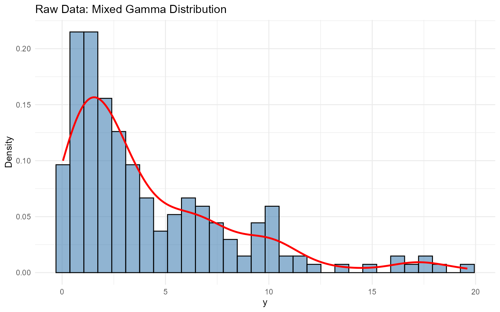
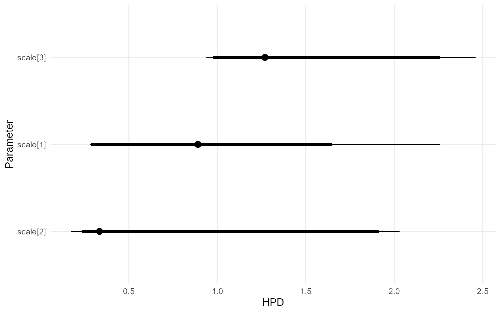

# 5. Unconditional DPmix (CRP Backend)

> **Cookbook vignette (for the website / historical notes).** These files
> may not match the current exported API one-to-one. Last verified:
> **2026-01-18**.
>
> For the up-to-date workflow, see the main package vignettes
> (Introduction, Model Spec, MCMC Workflow,
> Unconditional/Conditional/Causal, Backends, S3 Reference).

## Theory (brief)

An unconditional DP mixture models exchangeable outcomes via
\$f(y)=\\int K(y;\\theta)\\,dG(\\theta)\$ with \$G \\sim
\\mathrm{DP}(\\alpha, G_0)\$. The CRP backend implements this using
cluster allocations.

## Overview

This vignette demonstrates an **unconditional DPmix model** using the
**CRP backend** on a positive dataset. We use a Laplace kernel for the
bulk distribution and no GPD tail augmentation.

## Data Setup

``` r
data(nc_pos200_k3)
y_mixed <- nc_pos200_k3$y

paste("Sample size:", length(y_mixed))
```

    [1] "Sample size: 200"

``` r
paste("Mean:", mean(y_mixed))
```

    [1] "Mean: 4.21476750434594"

``` r
paste("SD:", sd(y_mixed))
```

    [1] "SD: 4.10835046697183"

``` r
paste("Range:", paste(range(y_mixed), collapse = " to "))
```

    [1] "Range: 0.0403111680208858 to 19.6013451514889"

``` r
df_data <- data.frame(y = y_mixed)
p_raw <- ggplot(df_data, aes(x = y)) +
  geom_histogram(aes(y = after_stat(density)), bins = 30, alpha = 0.6,
                 fill = "steelblue", color = "black") +
  geom_density(color = "red", linewidth = 1) +
  labs(title = "Raw Data: Mixed Gamma Distribution", x = "y", y = "Density") +
  theme_minimal()

print(p_raw)
```



## Build Bundle (CRP)

``` r
bundle_crp <- build_nimble_bundle(
  y = y_mixed,
  kernel = "laplace",
  backend = "crp",
  GPD = FALSE,
  components = 3,
  alpha_random = TRUE,
  mcmc = mcmc
)
```

## Run MCMC (Longer Run)

``` r
bundle_crp <- build_nimble_bundle(
  y_mixed,
  kernel = "laplace",
  backend = "crp",
  GPD = FALSE,
  components = 3,
  alpha_random = TRUE,
  mcmc = mcmc
)
```

``` r
summary(bundle_crp)
```

    DPmixGPD bundle summary
          Field                      Value
        Backend Chinese Restaurant Process
         Kernel       Laplace Distribution
     Components                          3
              N                        200
              X                         NO
            GPD                      FALSE
        Epsilon                      0.025

    Parameter specification
             block  parameter mode           level                  prior link
              meta    backend info           model                    crp     
              meta     kernel info           model                laplace     
              meta components info           model                      3     
              meta          N info           model                    200     
              meta          P info           model                      0     
     concentration      alpha dist          scalar gamma(shape=1, rate=1)     
              bulk   location dist component (1:3)   normal(mean=0, sd=5)     
              bulk      scale dist component (1:3) gamma(shape=2, rate=1)     
                        notes
                             
                             
                             
                             
                             
     stochastic concentration
        iid across components
        iid across components

    Monitors
      n = 4 
      alpha, z[1:200], location[1:3], scale[1:3]

``` r
fit_crp <- load_or_fit("v05-unconditional-DPmix-CRP-fit_crp", run_mcmc_bundle_manual(bundle_crp))
```

``` r
summary(fit_crp)
```

    MixGPD summary | backend: Chinese Restaurant Process | kernel: Laplace Distribution | GPD tail: FALSE | epsilon: 0.025
    n = 200 | components = 3
    Summary
    Initial components: 3 | Components after truncation: 2

    WAIC: 930.316
    lppd: -376.708 | pWAIC: 88.45

    Summary table
       parameter  mean    sd q0.025 q0.500 q0.975    ess
      weights[1] 0.493 0.082  0.364   0.51   0.62  2.803
      weights[2] 0.382  0.07  0.238   0.38   0.49 13.673
           alpha 0.463 0.284   0.09   0.41   1.13 291.26
     location[1] 3.237 2.572  1.094  1.535  7.395 20.702
     location[2]  5.12 2.644  0.868  6.463  7.943 27.292
        scale[1] 0.888 0.421  0.277  1.044  1.531 34.308
        scale[2] 0.732 0.624  0.261   0.35  2.124 15.309

## Posterior Parameters

``` r
params_crp <- params(fit_crp)
params_crp
```

    Posterior mean parameters

    $alpha
    [1] "0.463"

    $w
    [1] "0.493" "0.382"

    $location
    [1] "3.237" "5.12" 

    $scale
    [1] "0.888" "0.732"

## Diagnostics

``` r
plot(fit_crp, params = "location", family = "traceplot")
```

    === traceplot ===


``` r
plot(fit_crp, params = "scale", family = "caterpillar")
```

    === caterpillar ===



## Posterior Predictive Density

``` r
y_grid <- seq(0, max(y_mixed) * 1.2, length.out = 200)
pred_density <- predict(fit_crp, y = y_grid, type = "density")
plot(pred_density)
```


