# 15. Causal Inference: X Without PS (CRP+SB) - InvGauss/Amoroso

> **Cookbook vignette (for the website / historical notes).** These files
> may not match the current exported API one-to-one. Last verified:
> **2026-01-18**.
>
> For the up-to-date workflow, see the main package vignettes
> (Introduction, Model Spec, MCMC Workflow,
> Unconditional/Conditional/Causal, Backends, S3 Reference).

### Theory (brief)

With covariates but no propensity score adjustment, the model conditions
outcome distributions on $`X`$ within each treatment arm. Causal effects
are derived from differences in the arm-specific conditional
distributions.

## Causal Inference: X Without PS (CRP+SB)

This vignette uses **covariates X** but disables PS estimation. Outcome
models are conditional on X only.

- Model A: CRP with GPD tail (InvGauss)
- Model B: SB bulk-only (Amoroso)

------------------------------------------------------------------------

### Data Setup

``` r
data("causal_alt_real500_p4_k2")
y <- abs(causal_alt_real500_p4_k2$y) + 0.01
T <- causal_alt_real500_p4_k2$T
X <- as.matrix(causal_alt_real500_p4_k2$X)

summary_tbl <- tibble(
  statistic = c("N", "Mean", "SD", "Min", "Max"),
  value = c(length(y), mean(y), sd(y), min(y), max(y))
)

summary_tbl %>%
  mutate(value = signif(value, 4)) %>%
  print()
```

    
[38;5;246m# A tibble: 5 × 2
[39m
      statistic    value
      
[3m
[38;5;246m<chr>
[39m
[23m        
[3m
[38;5;246m<dbl>
[39m
[23m
    
[38;5;250m1
[39m N         500     
    
[38;5;250m2
[39m Mean        1.43  
    
[38;5;250m3
[39m SD          1.08  
    
[38;5;250m4
[39m Min         0.012
[4m6
[24m
    
[38;5;250m5
[39m Max         8.10  

``` r
x_eval <- X[1:40, , drop = FALSE]
y_eval <- y[1:40]
u_threshold <- as.numeric(stats::quantile(y, 0.8, names = FALSE))
```

------------------------------------------------------------------------

### Model A: CRP with GPD Tail (InvGauss)

``` r
param_specs_gpd <- list(
  gpd = list(
    threshold = list(
      mode = "dist",
      dist = "lognormal",
      args = list(meanlog = log(max(u_threshold, .Machine$double.eps)), sdlog = 0.25)
    )
  )
)

bundle_crp_gpd <- build_causal_bundle(
  y = y,
  T = T,
  X = X,
  kernel = "invgauss",
  backend = "crp",
  PS = FALSE,
  GPD = TRUE,
  components = 6,
  param_specs = param_specs_gpd,
  mcmc_outcome = list(niter = 300, nburnin = 80, nchains = 1, thin = 1, seed = 3)
)

bundle_crp_gpd
```

    DPmixGPD causal bundle
    PS model: disabled 
    Outcome (treated): backend = crp | kernel = invgauss 
    Outcome (control): backend = crp | kernel = invgauss 
    GPD tail (treated/control): TRUE / TRUE 
    components (treated/control): 6 / 6 
    Outcome PS included: FALSE 
    epsilon (treated/control): 0.025 / 0.025 
    n (control) = 232 | n (treated) = 268 

``` r
fit_crp_gpd <- quiet_mcmc(run_mcmc_causal(bundle_crp_gpd))
summary(fit_crp_gpd)
```

    -- Outcome fits --
    [control]
    MixGPD fit | backend: Chinese Restaurant Process | kernel: Inverse Gaussian Distribution | GPD tail: TRUE
    n = 232 | components = 6 | epsilon = 0.025
    MCMC: niter=300, nburnin=80, thin=1, nchains=1 
    Fit
    Use summary() for posterior summaries; plot() for diagnostics; predict() for predictions.

    [treated]
    MixGPD fit | backend: Chinese Restaurant Process | kernel: Inverse Gaussian Distribution | GPD tail: TRUE
    n = 268 | components = 6 | epsilon = 0.025
    MCMC: niter=300, nburnin=80, thin=1, nchains=1 
    Fit
    Use summary() for posterior summaries; plot() for diagnostics; predict() for predictions.

``` r
pred_mean_gpd <- predict(fit_crp_gpd, x = x_eval, type = "mean", interval = "credible", nsim_mean = 150)
head(pred_mean_gpd)
```

         ps estimate   lower     upper
    [1,] NA  0.00278 -0.0680 -0.042462
    [2,] NA  0.04858 -0.0830 -0.193873
    [3,] NA -0.10277 -0.1425 -0.687845
    [4,] NA  0.13092 -0.1102  0.012832
    [5,] NA  0.30306  0.0318  0.595110
    [6,] NA -0.05270 -0.1159 -0.000931

``` r
plot(pred_mean_gpd)
```

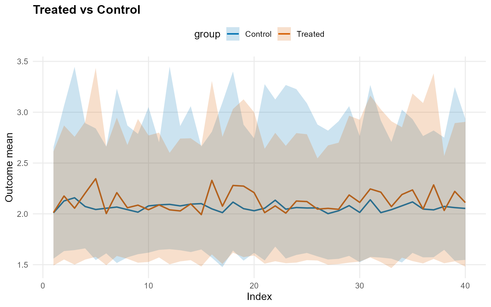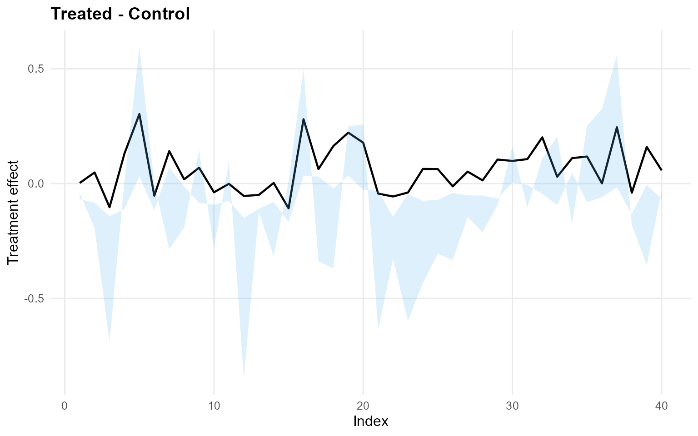

``` r
pred_q_gpd <- predict(fit_crp_gpd, x = x_eval, type = "quantile", p = 0.5, interval = "credible")
head(pred_q_gpd)
```

         ps estimate lower upper
    [1,] NA    0.142 0.143 0.241
    [2,] NA    0.192 0.164 0.244
    [3,] NA    0.160 0.164 0.240
    [4,] NA    0.196 0.164 0.265
    [5,] NA    0.241 0.164 0.586
    [6,] NA    0.146 0.144 0.233

``` r
plot(pred_q_gpd)
```

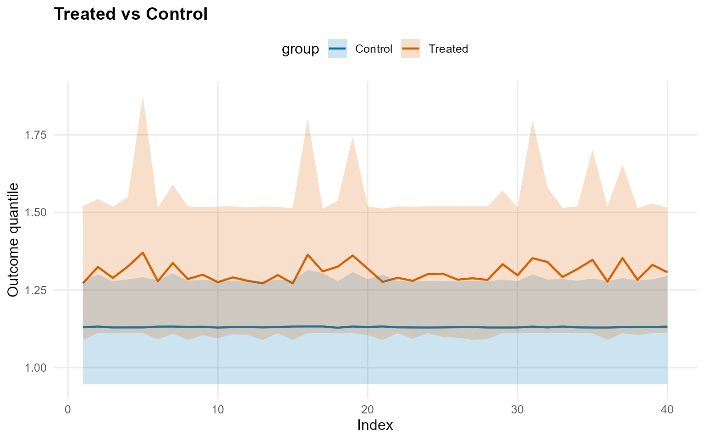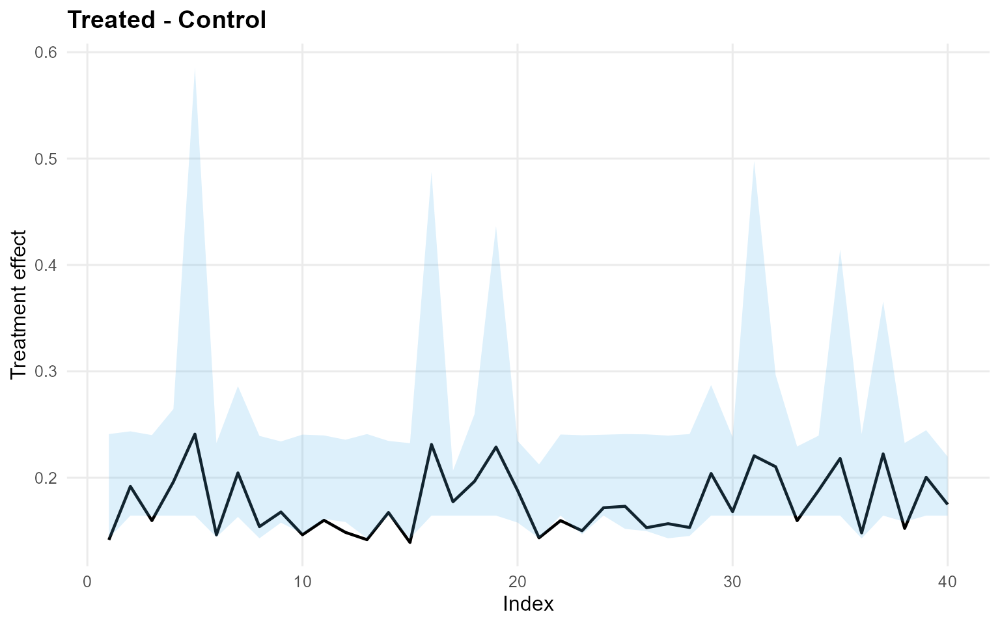

``` r
pred_d_gpd <- predict(fit_crp_gpd, x = x_eval, y = y_eval, type = "density", interval = "credible")
head(pred_d_gpd)
```

          y ps trt_estimate trt_lower trt_upper con_estimate con_lower con_upper
    1 0.900 NA            1    0.4541     1.222            1    0.3452    0.5001
    2 1.352 NA            1    0.3268     0.541            1    0.2501    0.4663
    3 1.148 NA            1    0.4122     0.648            1    0.2950    0.4957
    4 1.932 NA            1    0.2151     0.313            1    0.1630    0.3056
    5 3.344 NA            1    0.0293     0.109            1    0.0179    0.0891
    6 0.949 NA            1    0.4522     1.033            1    0.3415    0.4899

``` r
plot(pred_d_gpd)
```


``` r
pred_surv_gpd <- predict(fit_crp_gpd, x = x_eval, y = y_eval, type = "survival", interval = "credible")
head(pred_surv_gpd)
```

          y ps trt_estimate trt_lower trt_upper con_estimate con_lower con_upper
    1 0.900 NA            1     0.600     0.811            1   0.52052     0.660
    2 1.352 NA            1     0.399     0.582            1   0.35666     0.482
    3 1.148 NA            1     0.485     0.684            1   0.42468     0.552
    4 1.932 NA            1     0.219     0.395            1   0.20246     0.297
    5 3.344 NA            1     0.040     0.278            1   0.00463     0.107
    6 0.949 NA            1     0.573     0.786            1   0.49872     0.637

``` r
plot(pred_surv_gpd)
```

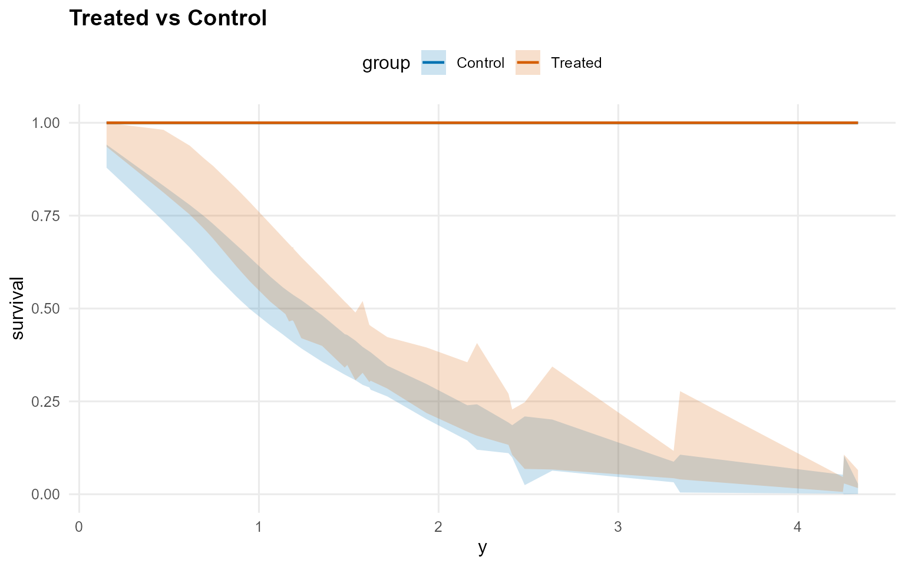

``` r
ate_gpd <- ate(fit_crp_gpd, newdata = x_eval, interval = "credible", nsim_mean = 150)
print(ate_gpd)
```

    ATE (Average Treatment Effect)
      Prediction points: 40
      Conditional (covariates): YES
      Propensity score used: NO
      Posterior mean draws: 150
      Credible interval: credible (95%)

    ATE estimates (treated - control):
     id estimate  lower upper
      1   -0.038 -1.079 0.759
      2    0.066 -1.028 0.992
      3    -0.02 -1.014  0.82
      4    0.119 -1.108 1.131
      5    0.238  -1.36 1.691
      6    -0.11 -1.132 0.893
    ... (34 more rows)

``` r
summary(ate_gpd)
```

    ATE Summary
    ================================================== 
    Prediction points: 40
    Conditional: YES | PS used: NO
    Posterior mean draws: 150
    Interval: credible (95%)

    Model specification:
      Backend (trt/con): crp / crp
      Kernel (trt/con): invgauss / invgauss
      GPD tail (trt/con): YES / YES

    ATE statistics:
      Mean: 0.053 | Median: 0.03
      Range: [-0.142, 0.282]
      SD: 0.106

    Credible interval width:
      Mean: 2.041 | Median: 1.972
      Range: [1.565, 3.05]

``` r
ate_plots_gpd <- plot(ate_gpd)
ate_plots_gpd$treatment_effect
```


``` r
qte_gpd <- qte(fit_crp_gpd, probs = c(0.25, 0.5, 0.75), newdata = x_eval, interval = "credible")
print(qte_gpd)
```

    QTE (Quantile Treatment Effect)
      Prediction points: 40
      Quantile grid: 0.25, 0.5, 0.75
      Conditional (covariates): YES
      Propensity score used: NO
      Credible interval: credible (95%)

    QTE estimates (treated - control):
     index id estimate  lower upper
      0.25  1    0.266 -0.004 0.488
      0.25  2    0.267 -0.004 0.488
      0.25  3    0.267 -0.004 0.488
      0.25  4    0.267 -0.004 0.488
      0.25  5    0.269 -0.004 0.488
      0.25  6    0.266 -0.004 0.488
    ... (114 more rows)

``` r
summary(qte_gpd)
```

    QTE Summary
    ================================================== 
    Prediction points: 40 | Quantiles: 3
    Quantile grid: 0.25, 0.5, 0.75
    Conditional: YES | PS used: NO
    Interval: credible (95%)

    Model specification:
      Backend (trt/con): crp / crp
      Kernel (trt/con): invgauss / invgauss
      GPD tail (trt/con): YES / YES

    QTE by quantile:
     quantile mean_qte median_qte min_qte max_qte sd_qte
         0.25    0.267      0.267   0.266   0.269  0.001
          0.5    0.176      0.168   0.139   0.241  0.029
         0.75    0.101      0.064  -0.055   0.305  0.094

    Credible interval width:
      Mean: 0.638 | Median: 0.496
      Range: [0.452, 1.815]

``` r
qte_plots_gpd <- plot(qte_gpd)
qte_plots_gpd$treatment_effect
```


------------------------------------------------------------------------

### Model B: SB Bulk-only (Amoroso)

``` r
bundle_sb_bulk <- build_causal_bundle(
  y = y,
  T = T,
  X = X,
  kernel = "amoroso",
  backend = "sb",
  PS = FALSE,
  GPD = FALSE,
  components = 6,
  mcmc_outcome = list(niter = 300, nburnin = 80, nchains = 1, thin = 1, seed = 4)
)

bundle_sb_bulk
```

    DPmixGPD causal bundle
    PS model: disabled 
    Outcome (treated): backend = sb | kernel = amoroso 
    Outcome (control): backend = sb | kernel = amoroso 
    GPD tail (treated/control): FALSE / FALSE 
    components (treated/control): 6 / 6 
    Outcome PS included: FALSE 
    epsilon (treated/control): 0.025 / 0.025 
    n (control) = 232 | n (treated) = 268 

``` r
fit_sb_bulk <- quiet_mcmc(run_mcmc_causal(bundle_sb_bulk))
summary(fit_sb_bulk)
```

    -- Outcome fits --
    [control]
    MixGPD fit | backend: Stick-Breaking Process | kernel: Amoroso Distribution | GPD tail: FALSE
    n = 232 | components = 6 | epsilon = 0.025
    MCMC: niter=300, nburnin=80, thin=1, nchains=1 
    Fit
    Use summary() for posterior summaries; plot() for diagnostics; predict() for predictions.

    [treated]
    MixGPD fit | backend: Stick-Breaking Process | kernel: Amoroso Distribution | GPD tail: FALSE
    n = 268 | components = 6 | epsilon = 0.025
    MCMC: niter=300, nburnin=80, thin=1, nchains=1 
    Fit
    Use summary() for posterior summaries; plot() for diagnostics; predict() for predictions.

``` r
pred_mean_bulk <- predict(fit_sb_bulk, x = x_eval, type = "mean", interval = "credible", nsim_mean = 150)
head(pred_mean_bulk)
```

         ps estimate lower  upper
    [1,] NA   0.0937 0.324 -0.947
    [2,] NA  -0.6444 0.339 -2.051
    [3,] NA  -0.0533 0.431 -0.570
    [4,] NA   0.2084 0.525  0.151
    [5,] NA   1.0476 0.735  2.301
    [6,] NA  -0.0992 0.498 -0.647

``` r
plot(pred_mean_bulk)
```

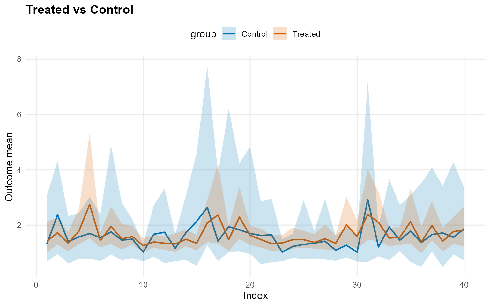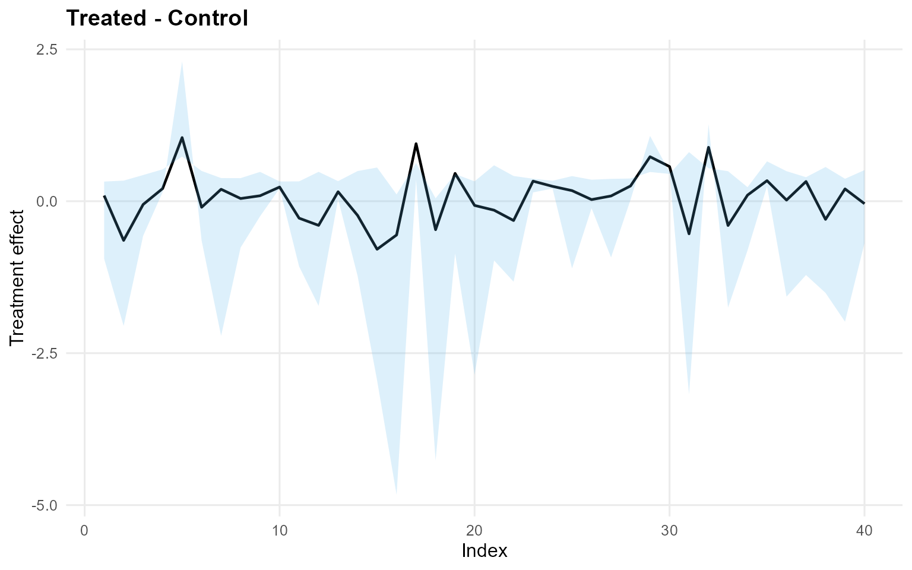

``` r
pred_q_bulk <- predict(fit_sb_bulk, x = x_eval, type = "quantile", p = 0.5, interval = "credible")
head(pred_q_bulk)
```

         ps estimate   lower  upper
    [1,] NA   0.2311  0.4941 -0.330
    [2,] NA  -0.5963  0.1874 -2.134
    [3,] NA  -0.0189  0.3534 -0.493
    [4,] NA  -0.1363  0.1911 -0.677
    [5,] NA  -0.2440 -0.0423 -0.189
    [6,] NA  -0.0371  0.3594 -0.477

``` r
plot(pred_q_bulk)
```

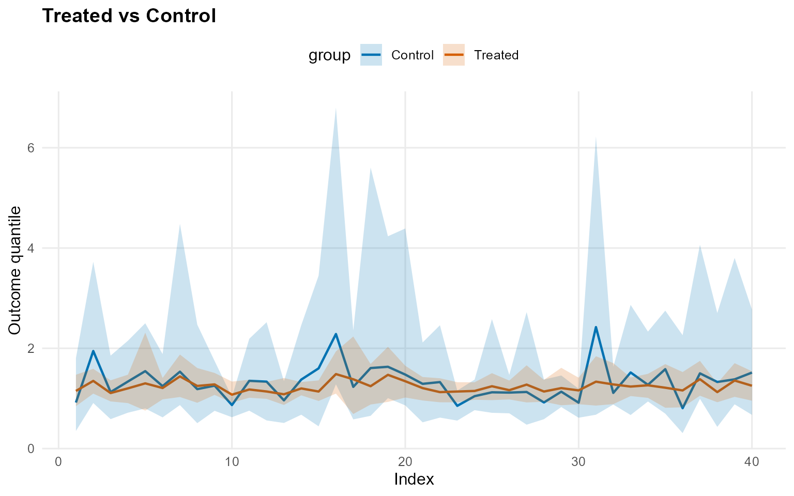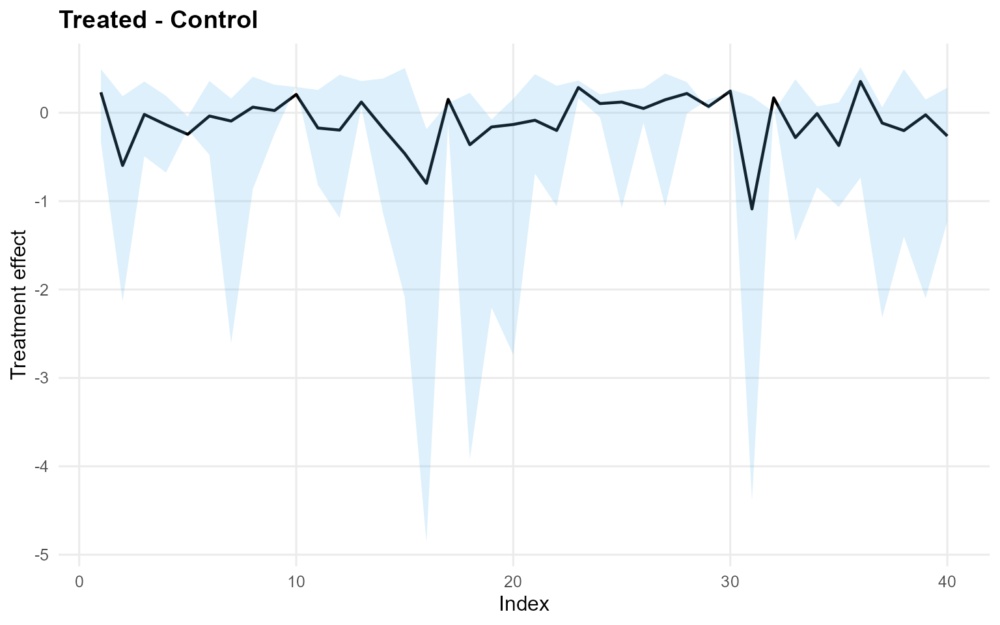

``` r
pred_d_bulk <- predict(fit_sb_bulk, x = x_eval, y = y_eval, type = "density", interval = "credible")
head(pred_d_bulk)
```

          y ps trt_estimate trt_lower trt_upper con_estimate con_lower con_upper
    1 0.900 NA            1    0.3556     0.748            1  2.43e-01     0.698
    2 1.352 NA            1    0.3010     0.478            1  6.09e-02     0.446
    3 1.148 NA            1    0.3871     0.581            1  1.96e-01     0.506
    4 1.932 NA            1    0.1144     0.282            1  3.13e-02     0.325
    5 3.344 NA            1    0.0509     0.124            1  8.78e-06     0.164
    6 0.949 NA            1    0.4297     0.641            1  2.28e-01     0.706

``` r
plot(pred_d_bulk)
```

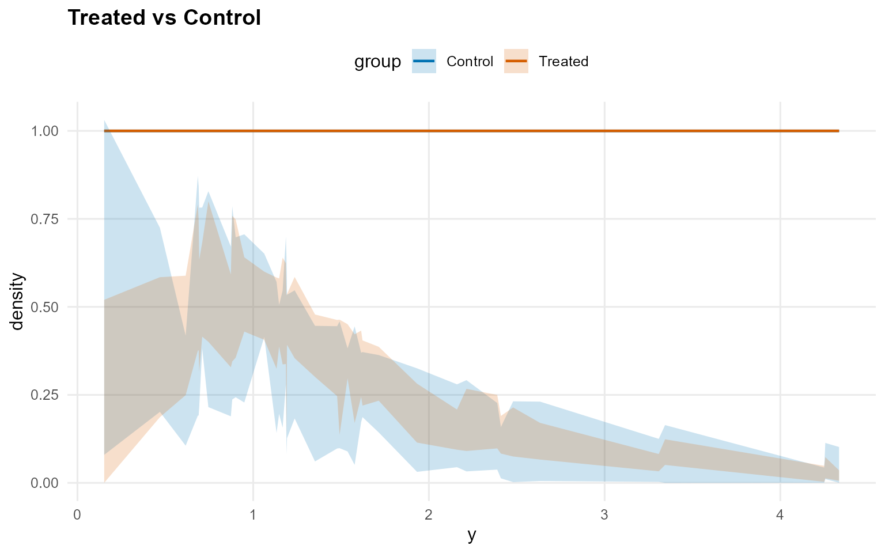

``` r
pred_surv_bulk <- predict(fit_sb_bulk, x = x_eval, y = y_eval, type = "survival", interval = "credible")
head(pred_surv_bulk)
```

          y ps trt_estimate trt_lower trt_upper con_estimate con_lower con_upper
    1 0.900 NA            1     0.463     0.735            1  1.70e-01     0.734
    2 1.352 NA            1     0.392     0.577            1  2.61e-01     0.676
    3 1.148 NA            1     0.388     0.587            1  9.67e-02     0.626
    4 1.932 NA            1     0.193     0.401            1  6.19e-03     0.530
    5 3.344 NA            1     0.119     0.437            1  1.17e-06     0.410
    6 0.949 NA            1     0.518     0.711            1  2.56e-01     0.712

``` r
plot(pred_surv_bulk)
```

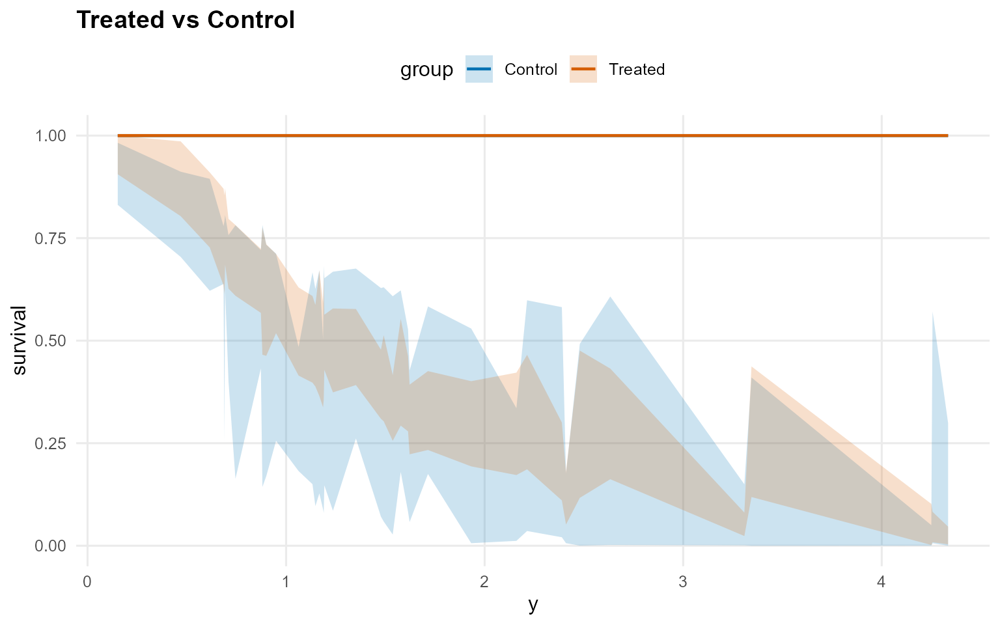

``` r
ate_bulk <- ate(fit_sb_bulk, newdata = x_eval, interval = "credible", nsim_mean = 150)
print(ate_bulk)
```

    ATE (Average Treatment Effect)
      Prediction points: 40
      Conditional (covariates): YES
      Propensity score used: NO
      Posterior mean draws: 150
      Credible interval: credible (95%)

    ATE estimates (treated - control):
     id estimate  lower upper
      1    0.128 -1.351  1.01
      2   -0.658 -2.478 0.767
      3   -0.057 -1.018 0.719
      4    0.251 -0.642 1.066
      5    1.051  -0.84 3.155
      6   -0.107 -1.077 0.741
    ... (34 more rows)

``` r
summary(ate_bulk)
```

    ATE Summary
    ================================================== 
    Prediction points: 40
    Conditional: YES | PS used: NO
    Posterior mean draws: 150
    Interval: credible (95%)

    Model specification:
      Backend (trt/con): sb / sb
      Kernel (trt/con): amoroso / amoroso
      GPD tail (trt/con): NO / NO

    ATE statistics:
      Mean: 0.064 | Median: 0.085
      Range: [-0.784, 1.051]
      SD: 0.424

    Credible interval width:
      Mean: 2.698 | Median: 2.405
      Range: [0.857, 6.454]

``` r
ate_plots_bulk <- plot(ate_bulk)
ate_plots_bulk$treatment_effect
```

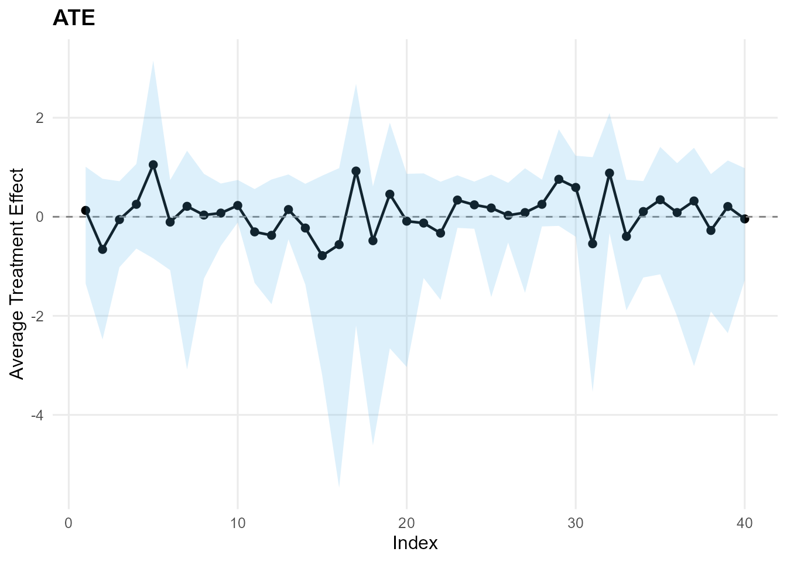

``` r
qte_bulk <- qte(fit_sb_bulk, probs = c(0.25, 0.5, 0.75), newdata = x_eval, interval = "credible")
print(qte_bulk)
```

    QTE (Quantile Treatment Effect)
      Prediction points: 40
      Quantile grid: 0.25, 0.5, 0.75
      Conditional (covariates): YES
      Propensity score used: NO
      Credible interval: credible (95%)

    QTE estimates (treated - control):
     index id estimate  lower upper
      0.25  1      0.2 -0.196 0.666
      0.25  2    0.156 -0.162 0.619
      0.25  3    0.101 -0.129 0.357
      0.25  4    0.168 -0.148 0.528
      0.25  5    0.177 -0.338  0.68
      0.25  6    0.168 -0.092 0.421
    ... (114 more rows)

``` r
summary(qte_bulk)
```

    QTE Summary
    ================================================== 
    Prediction points: 40 | Quantiles: 3
    Quantile grid: 0.25, 0.5, 0.75
    Conditional: YES | PS used: NO
    Interval: credible (95%)

    Model specification:
      Backend (trt/con): sb / sb
      Kernel (trt/con): amoroso / amoroso
      GPD tail (trt/con): NO / NO

    QTE by quantile:
     quantile mean_qte median_qte min_qte max_qte sd_qte
         0.25    0.154      0.161  -0.006   0.292  0.053
          0.5   -0.092     -0.061  -1.088   0.354  0.293
         0.75   -0.166     -0.081  -1.562    1.25  0.699

    Credible interval width:
      Mean: 2.369 | Median: 1.599
      Range: [0.407, 11.741]

``` r
qte_plots_bulk <- plot(qte_bulk)
qte_plots_bulk$treatment_effect
```

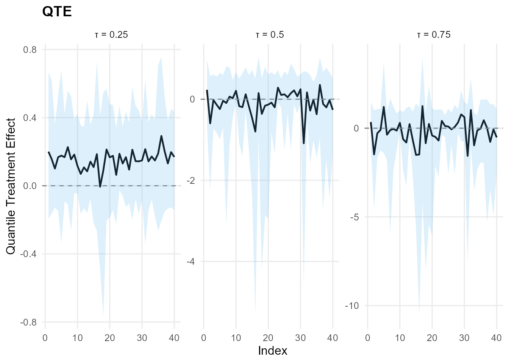
