# 17. Causal Inference: Same Backend (SB) - Laplace Kernel

> **Cookbook vignette (for the website / historical notes).** These files
> may not match the current exported API one-to-one. Last verified:
> **2026-01-18**.
>
> For the up-to-date workflow, see the main package vignettes
> (Introduction, Model Spec, MCMC Workflow,
> Unconditional/Conditional/Causal, Backends, S3 Reference).

### Theory (brief)

The causal workflow fits treated and control arms with covariate
adjustment, optionally including propensity scores. Using the same
backend and kernel emphasizes treatment-induced distributional
differences.

## Causal Inference: Same Backend (SB) - Laplace Kernel

This vignette fits two SB-based causal models using the same kernel
(Laplace):

- Model A: bulk-only outcome models (GPD = FALSE)
- Model B: GPD-augmented outcome models (GPD = TRUE)

------------------------------------------------------------------------

### Data Setup

``` r
data("causal_alt_real500_p4_k2")
y <- causal_alt_real500_p4_k2$y
T <- causal_alt_real500_p4_k2$T
X <- as.matrix(causal_alt_real500_p4_k2$X)

summary_tbl <- tibble(
  statistic = c("N", "Mean", "SD", "Min", "Max"),
  value = c(length(y), mean(y), sd(y), min(y), max(y))
)

summary_tbl %>%
  mutate(value = signif(value, 4)) %>%
  kable(caption = "Causal Dataset Summary", align = "c") %>%
  kable_styling(bootstrap_options = c("striped", "hover"), full_width = FALSE, position = "center")
```

| statistic |  value  |
|:---------:|:-------:|
|     N     | 500.000 |
|   Mean    |  0.274  |
|    SD     |  1.764  |
|    Min    | -8.089  |
|    Max    |  5.275  |

Causal Dataset Summary

``` r
x_eval <- X[1:40, , drop = FALSE]
y_eval <- y[1:40]
u_threshold <- as.numeric(stats::quantile(y, 0.8, names = FALSE))
```

``` r
df_causal <- data.frame(y = y, T = as.factor(T), x1 = X[, 1], x2 = X[, 2])

p_scatter <- ggplot(df_causal, aes(x = x1, y = y, color = T)) +
  geom_point(alpha = 0.5) +
  labs(title = "Outcome vs X1 by Treatment", x = "X1", y = "y", color = "Treatment") +
  theme_minimal()

p_scatter
```


------------------------------------------------------------------------

### Model A: SB Bulk-only (Laplace)

``` r
bundle_sb_bulk <- build_causal_bundle(
  y = y,
  T = T,
  X = X,
  kernel = "laplace",
  backend = "sb",
  PS = "logit",
  GPD = FALSE,
  components = 5,
  mcmc_outcome = list(niter = 2500, nburnin = 500, nchains = 1, thin = 1, seed = 1),
  mcmc_ps = list(niter = 2500, nburnin = 500, nchains = 1, thin = 1, seed = 1)
)

bundle_sb_bulk
```

    DPmixGPD causal bundle
    PS model: disabled 
    Outcome (treated): backend = sb | kernel = laplace 
    Outcome (control): backend = sb | kernel = laplace 
    GPD tail (treated/control): FALSE / FALSE 
    components (treated/control): 5 / 5 
    Outcome PS included: FALSE 
    epsilon (treated/control): 0.025 / 0.025 
    n (control) = 232 | n (treated) = 268 

``` r
summary(bundle_sb_bulk)
```

    DPmixGPD causal bundle summary
    DPmixGPD causal bundle
    PS model: disabled 
    Outcome (treated): backend = sb | kernel = laplace 
    Outcome (control): backend = sb | kernel = laplace 
    GPD tail (treated/control): FALSE / FALSE 
    components (treated/control): 5 / 5 
    Outcome PS included: FALSE 
    epsilon (treated/control): 0.025 / 0.025 
    n (control) = 232 | n (treated) = 268 

``` r
fit_sb_bulk <- run_mcmc_causal(bundle_sb_bulk)
```

    ===== Monitors =====
    thin = 1: alpha, beta_location, scale, w, z
    ===== Samplers =====
    RW sampler (25)
      - alpha
      - beta_location[]  (20 elements)
      - v[]  (4 elements)
    conjugate sampler (5)
      - scale[]  (5 elements)
    categorical sampler (232)
      - z[]  (232 elements)

    ===== Monitors =====
    thin = 1: alpha, beta_location, scale, w, z
    ===== Samplers =====
    RW sampler (25)
      - alpha
      - beta_location[]  (20 elements)
      - v[]  (4 elements)
    conjugate sampler (5)
      - scale[]  (5 elements)
    categorical sampler (268)
      - z[]  (268 elements)

``` r
summary(fit_sb_bulk)
```

    -- Outcome fits --
    [control]
    MixGPD fit | backend: Stick-Breaking Process | kernel: Laplace Distribution | GPD tail: FALSE
    n = 232 | components = 5 | epsilon = 0.025
    MCMC: niter=2500, nburnin=500, thin=1, nchains=1 
    Fit
    Use summary() for posterior summaries; plot() for diagnostics; predict() for predictions.

    [treated]
    MixGPD fit | backend: Stick-Breaking Process | kernel: Laplace Distribution | GPD tail: FALSE
    n = 268 | components = 5 | epsilon = 0.025
    MCMC: niter=2500, nburnin=500, thin=1, nchains=1 
    Fit
    Use summary() for posterior summaries; plot() for diagnostics; predict() for predictions.

``` r
params(fit_sb_bulk)
```

    Posterior mean parameters (causal)

    [treated]
    Posterior mean parameters

    $alpha
    [1] "0.996"

    $w
    [1] "0.511" "0.336"

    $beta_location
          x1       x2       x3       x4      
    comp1 "-0.424" "-0.07"  "-0.322" "-0.127"
    comp2 "0.354"  "0.698"  "0.472"  "0.977" 
    comp3 "1.067"  "-0.758" "-0.01"  "0.293" 
    comp4 "-0.744" "0.619"  "-0.174" "-0.059"
    comp5 "0.432"  "-0.589" "0.165"  "-0.022"

    $scale
    [1] "0.834" "1.012"

    [control]
    Posterior mean parameters

    $alpha
    [1] "1.581"

    $w
    [1] "0.412" "0.265" "0.179"

    $beta_location
          x1       x2       x3       x4     
    comp1 "-0.489" "-0.156" "-0.421" "1.246"
    comp2 "0.103"  "0.316"  "-0.256" "0.406"
    comp3 "-0.058" "-0.129" "-0.185" "0.155"
    comp4 "0.497"  "0.665"  "-0.098" "0.063"
    comp5 "-0.825" "-0.33"  "0.011"  "0.347"

    $scale
    [1] "1.044" "1.192" "1.563"

``` r
plot(fit_sb_bulk, params = "location", family = "traceplot")
```

    === treated ===

    === traceplot ===


    === control ===

    === traceplot ===


``` r
plot(fit_sb_bulk, params = "scale", family = "caterpillar")
```

    === treated ===

    === caterpillar ===

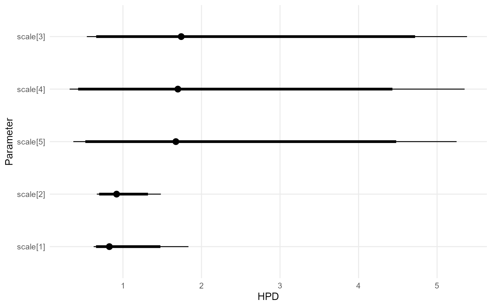

    === control ===

    === caterpillar ===

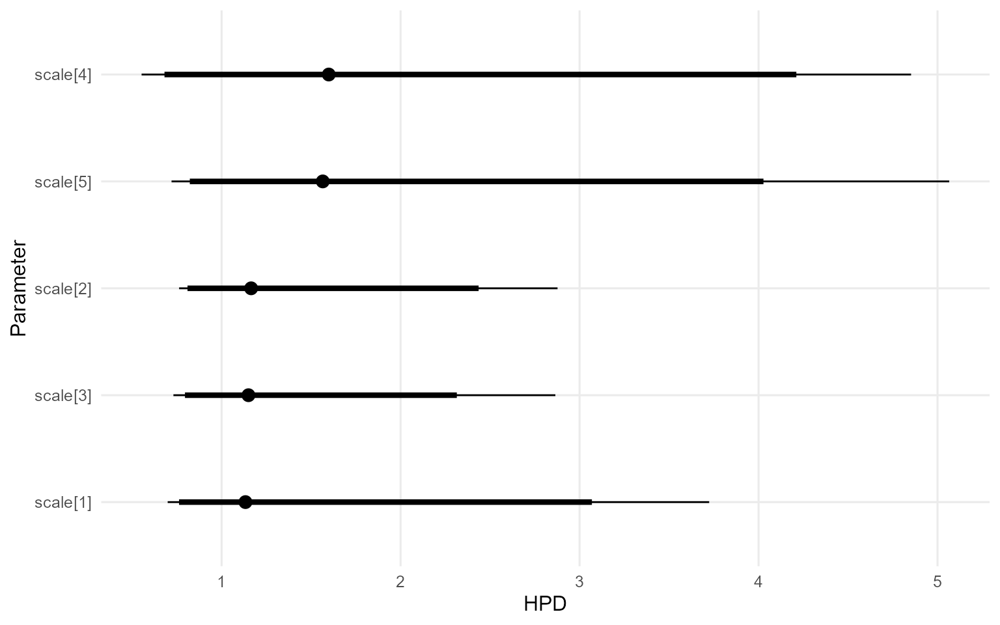

``` r
pred_mean_bulk <- predict(fit_sb_bulk, x = x_eval, type = "mean",
                          interval = "hpd", nsim_mean = 100)
plot(pred_mean_bulk)
```

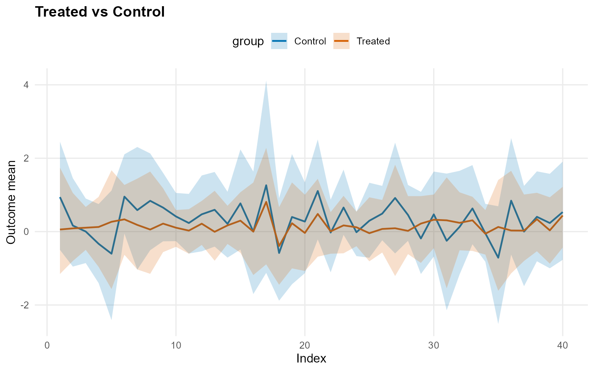

``` r
pred_q_bulk <- predict(fit_sb_bulk, x = x_eval, type = "quantile",
                       p = 0.5, interval = "hpd")
plot(pred_q_bulk)
```

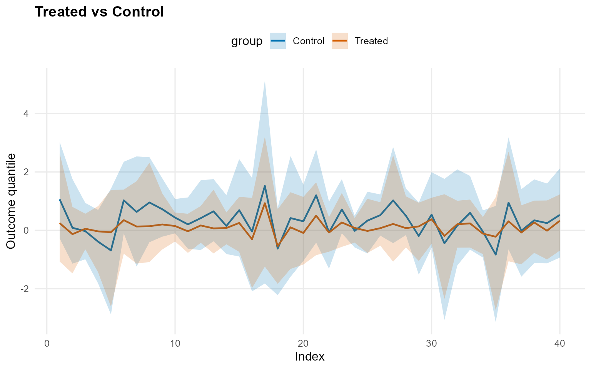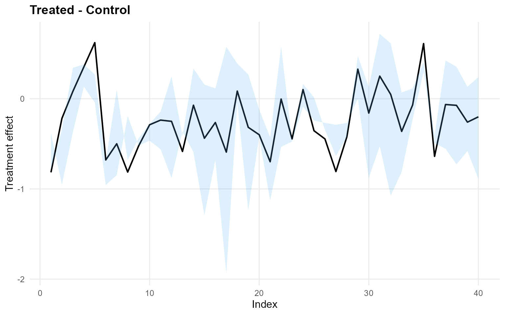

``` r
pred_d_bulk <- predict(fit_sb_bulk, x = x_eval, y = y_eval,
                       type = "density", interval = "hpd")
plot(pred_d_bulk)
```

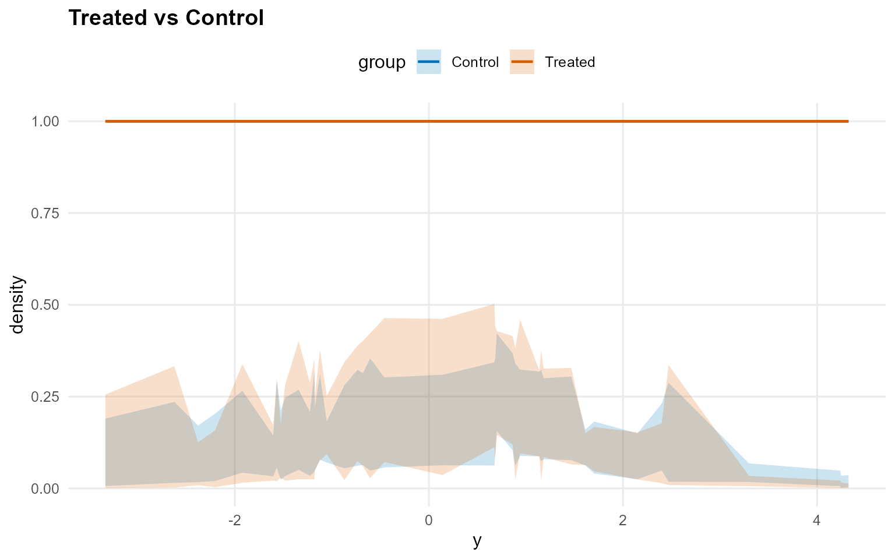

``` r
pred_surv_bulk <- predict(fit_sb_bulk, x = x_eval, y = y_eval,
                          type = "survival", interval = "hpd")
plot(pred_surv_bulk)
```


``` r
ate_bulk <- ate(fit_sb_bulk, newdata = x_eval,
                interval = "hpd", nsim_mean = 100)
print(ate_bulk)
```

    ATE (Average Treatment Effect)
      Prediction points: 40
      Conditional (covariates): YES
      Propensity score used: NO
      Posterior mean draws: 100
      Credible interval: hpd

    ATE estimates (treated - control):
     id estimate  lower upper
      1   -0.896 -2.848 0.986
      2   -0.077 -1.539 1.296
      3    0.111 -0.951 1.088
      4    0.466 -0.747 1.698
      5    0.854 -1.471 2.905
      6   -0.621 -2.019  0.79
    ... (34 more rows)

``` r
summary(ate_bulk)
```

    ATE Summary
    ================================================== 
    Prediction points: 40
    Conditional: YES | PS used: NO
    Posterior mean draws: 100
    Interval: hpd

    Model specification:
      Backend (trt/con): sb / sb
      Kernel (trt/con): laplace / laplace
      GPD tail (trt/con): NO / NO

    ATE statistics:
      Mean: -0.176 | Median: -0.206
      Range: [-0.896, 0.854]
      SD: 0.419

    Credible interval width:
      Mean: 3 | Median: 2.816
      Range: [1.413, 5.789]

``` r
ate_plots_bulk <- plot(ate_bulk)
ate_plots_bulk$treatment_effect
```

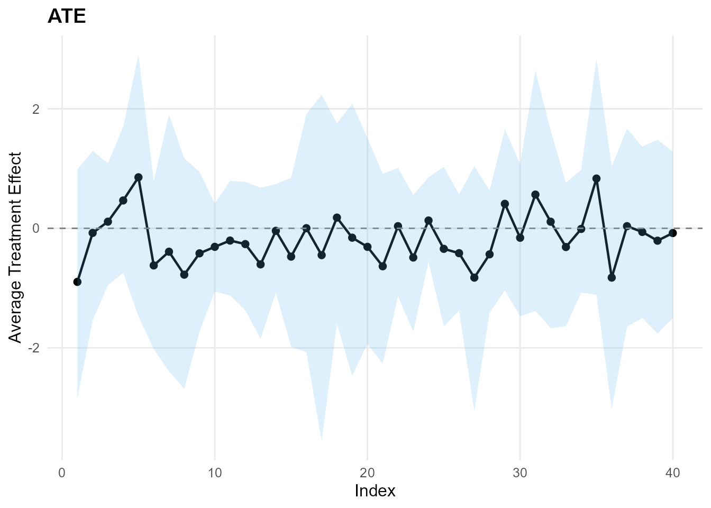

``` r
qte_bulk <- qte(fit_sb_bulk, probs = c(0.25, 0.5, 0.75),
                newdata = x_eval, interval = "hpd")
print(qte_bulk)
```

    QTE (Quantile Treatment Effect)
      Prediction points: 40
      Quantile grid: 0.25, 0.5, 0.75
      Conditional (covariates): YES
      Propensity score used: NO
      Credible interval: hpd

    QTE estimates (treated - control):
     index id estimate  lower upper
      0.25  1   -0.716 -2.436 0.907
      0.25  2    0.035 -1.657   1.8
      0.25  3    0.375 -0.703   1.5
      0.25  4    0.531 -0.992 2.135
      0.25  5    0.931 -2.407  4.03
      0.25  6   -0.172  -1.66 1.071
    ... (114 more rows)

``` r
summary(qte_bulk)
```

    QTE Summary
    ================================================== 
    Prediction points: 40 | Quantiles: 3
    Quantile grid: 0.25, 0.5, 0.75
    Conditional: YES | PS used: NO
    Interval: hpd

    Model specification:
      Backend (trt/con): sb / sb
      Kernel (trt/con): laplace / laplace
      GPD tail (trt/con): NO / NO

    QTE by quantile:
     quantile mean_qte median_qte min_qte max_qte sd_qte
         0.25    0.099      0.108  -0.716   0.931  0.369
          0.5   -0.238     -0.261  -0.816   0.622  0.363
         0.75   -0.452     -0.547  -1.205   0.887  0.534

    Credible interval width:
      Mean: 3.38 | Median: 3.199
      Range: [1.188, 7.465]

``` r
qte_plots_bulk <- plot(qte_bulk)
qte_plots_bulk$treatment_effect
```


------------------------------------------------------------------------

### Model B: SB with GPD Tail (Laplace)

``` r
param_specs_gpd <- list(
  gpd = list(
    threshold = list(
      mode = "dist",
      dist = "lognormal",
      args = list(meanlog = log(max(u_threshold, .Machine$double.eps)), sdlog = 0.25)
    )
  )
)

bundle_sb_gpd <- build_causal_bundle(
  y = y,
  T = T,
  X = X,
  kernel = "laplace",
  backend = "sb",
  PS = "logit",
  GPD = TRUE,
  components = 5,
  param_specs = param_specs_gpd,
  mcmc_outcome = list(niter = 2500, nburnin = 500, nchains = 1, thin = 1, seed = 2),
  mcmc_ps = list(niter = 2500, nburnin = 500, nchains = 1, thin = 1, seed = 2)
)

bundle_sb_gpd
```

    DPmixGPD causal bundle
    PS model: disabled 
    Outcome (treated): backend = sb | kernel = laplace 
    Outcome (control): backend = sb | kernel = laplace 
    GPD tail (treated/control): TRUE / TRUE 
    components (treated/control): 5 / 5 
    Outcome PS included: FALSE 
    epsilon (treated/control): 0.025 / 0.025 
    n (control) = 232 | n (treated) = 268 

``` r
summary(bundle_sb_gpd)
```

    DPmixGPD causal bundle summary
    DPmixGPD causal bundle
    PS model: disabled 
    Outcome (treated): backend = sb | kernel = laplace 
    Outcome (control): backend = sb | kernel = laplace 
    GPD tail (treated/control): TRUE / TRUE 
    components (treated/control): 5 / 5 
    Outcome PS included: FALSE 
    epsilon (treated/control): 0.025 / 0.025 
    n (control) = 232 | n (treated) = 268 

``` r
fit_sb_gpd <- run_mcmc_causal(bundle_sb_gpd)
```

    ===== Monitors =====
    thin = 1: alpha, beta_location, beta_tail_scale, scale, tail_shape, threshold, w, z
    ===== Samplers =====
    RW sampler (36)
      - alpha
      - scale[]  (5 elements)
      - beta_location[]  (20 elements)
      - threshold
      - beta_tail_scale[]  (4 elements)
      - tail_shape
      - v[]  (4 elements)
    categorical sampler (232)
      - z[]  (232 elements)

    ===== Monitors =====
    thin = 1: alpha, beta_location, beta_tail_scale, scale, tail_shape, threshold, w, z
    ===== Samplers =====
    RW sampler (36)
      - alpha
      - scale[]  (5 elements)
      - beta_location[]  (20 elements)
      - threshold
      - beta_tail_scale[]  (4 elements)
      - tail_shape
      - v[]  (4 elements)
    categorical sampler (268)
      - z[]  (268 elements)

``` r
summary(fit_sb_gpd)
```

    -- Outcome fits --
    [control]
    MixGPD fit | backend: Stick-Breaking Process | kernel: Laplace Distribution | GPD tail: TRUE
    n = 232 | components = 5 | epsilon = 0.025
    MCMC: niter=2500, nburnin=500, thin=1, nchains=1 
    Fit
    Use summary() for posterior summaries; plot() for diagnostics; predict() for predictions.

    [treated]
    MixGPD fit | backend: Stick-Breaking Process | kernel: Laplace Distribution | GPD tail: TRUE
    n = 268 | components = 5 | epsilon = 0.025
    MCMC: niter=2500, nburnin=500, thin=1, nchains=1 
    Fit
    Use summary() for posterior summaries; plot() for diagnostics; predict() for predictions.

``` r
params(fit_sb_gpd)
```

    Posterior mean parameters (causal)

    [treated]
    Posterior mean parameters

    $alpha
    [1] "0.969"

    $w
    [1] "0.471" "0.329"

    $beta_location
          x1       x2       x3       x4      
    comp1 "0.435"  "0.001"  "0.208"  "2.109" 
    comp2 "-0.072" "0.223"  "-0.011" "-0.633"
    comp3 "0.475"  "-0.245" "-0.123" "1.642" 
    comp4 "0.251"  "0.074"  "-0.094" "0.509" 
    comp5 "-0.021" "0.348"  "0.046"  "-0.143"

    $scale
    [1] "1.36"  "1.295"

    $beta_tail_scale
    [1] "0.041"  "-0.144" "0.149"  "-0.056"

    $tail_shape
    [1] "0.026"

    [control]
    Posterior mean parameters

    $alpha
    [1] "2.28"

    $w
    [1] "0.473" "0.276"

    $beta_location
          x1       x2       x3       x4     
    comp1 "-0.071" "-0.024" "-0.448" "0.783"
    comp2 "-0.262" "-0.309" "-0.175" "1.381"
    comp3 "-0.496" "-0.569" "-0.302" "0.872"
    comp4 "-0.168" "0.318"  "-0.437" "0.799"
    comp5 "-0.12"  "0.055"  "-0.009" "-0.18"

    $scale
    [1] "1.048" "1.087"

    $beta_tail_scale
    [1] "0.412"  "0.172"  "0.037"  "-0.202"

    $tail_shape
    [1] "0.004"

``` r
plot(fit_sb_gpd, family = "traceplot")
```

    === treated ===

    === traceplot ===

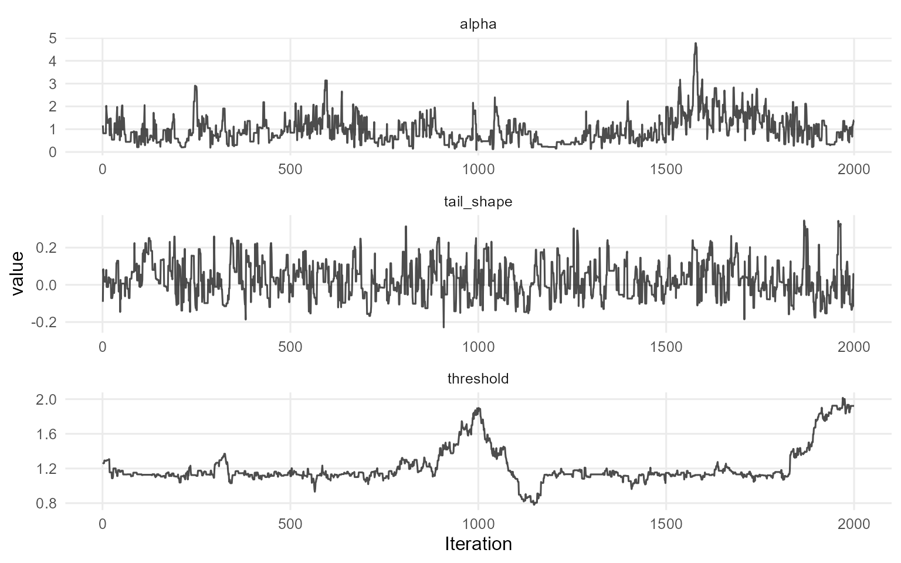

    === control ===

    === traceplot ===

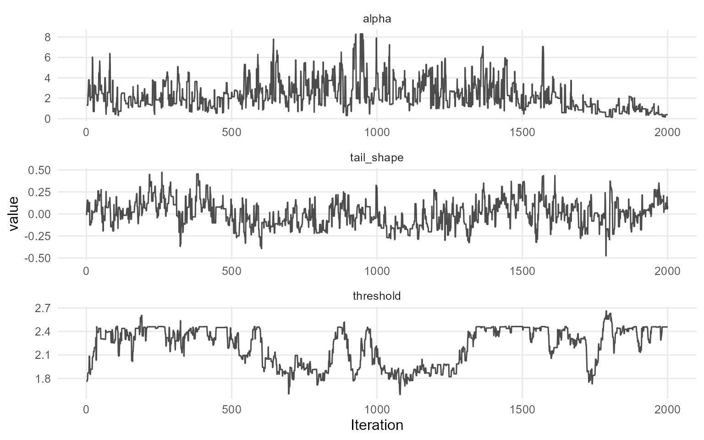

``` r
pred_mean_gpd <- predict(fit_sb_gpd, x = x_eval, type = "mean",
                         interval = "credible", nsim_mean = 100)
plot(pred_mean_gpd)
```


``` r
pred_q_gpd <- predict(fit_sb_gpd, x = x_eval, type = "quantile",
                      p = 0.5, interval = "credible")
plot(pred_q_gpd)
```

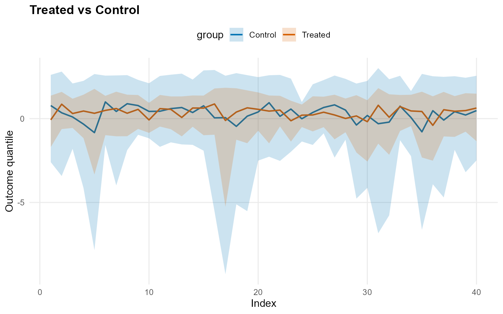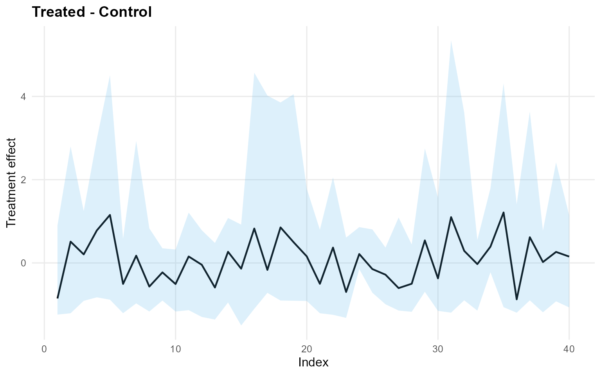

``` r
pred_d_gpd <- predict(fit_sb_gpd, x = x_eval, y = y_eval,
                      type = "density", interval = "credible")
plot(pred_d_gpd)
```

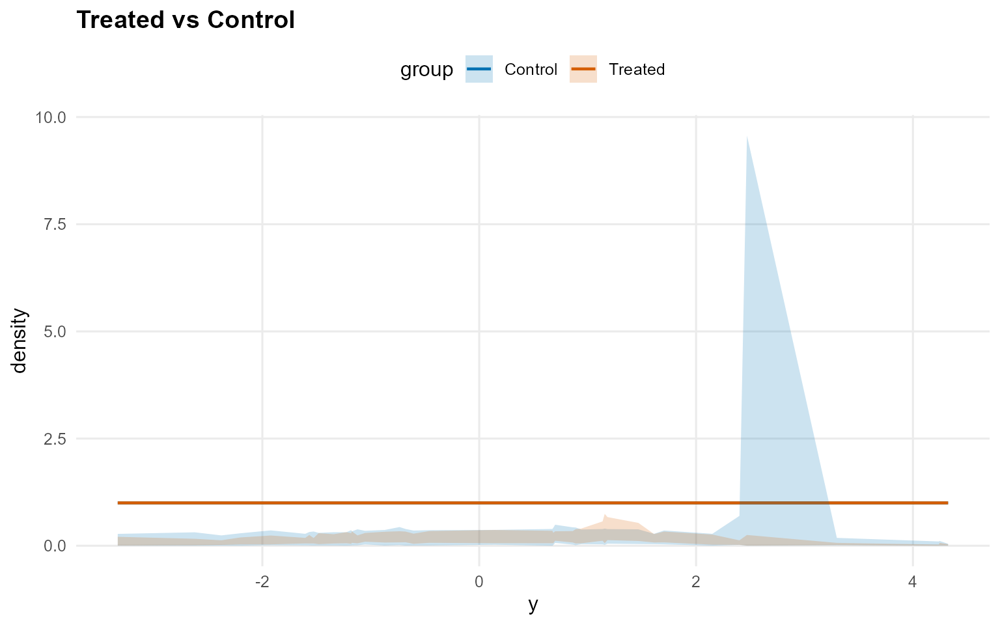

``` r
pred_surv_gpd <- predict(fit_sb_gpd, x = x_eval, y = y_eval,
                         type = "survival", interval = "credible")
plot(pred_surv_gpd)
```

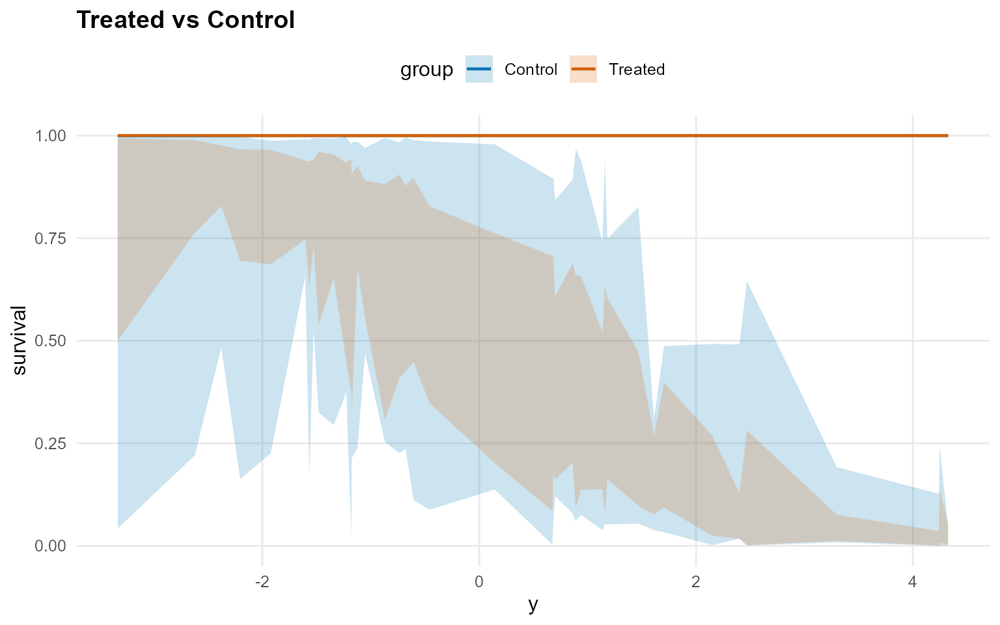

``` r
ate_gpd <- ate(fit_sb_gpd, newdata = x_eval,
               interval = "credible", nsim_mean = 100)
print(ate_gpd)
```

    ATE (Average Treatment Effect)
      Prediction points: 40
      Conditional (covariates): YES
      Propensity score used: NO
      Posterior mean draws: 100
      Credible interval: credible (95%)

    ATE estimates (treated - control):
     id estimate  lower upper
      1   -0.853 -3.932 3.271
      2    0.561 -2.375 4.373
      3     0.33  -2.28 2.628
      4    0.968 -2.336 4.525
      5    1.342 -3.902 8.184
      6   -0.475 -3.194 2.956
    ... (34 more rows)

``` r
summary(ate_gpd)
```

    ATE Summary
    ================================================== 
    Prediction points: 40
    Conditional: YES | PS used: NO
    Posterior mean draws: 100
    Interval: credible (95%)

    Model specification:
      Backend (trt/con): sb / sb
      Kernel (trt/con): laplace / laplace
      GPD tail (trt/con): YES / YES

    ATE statistics:
      Mean: 0.146 | Median: 0.182
      Range: [-0.924, 1.363]
      SD: 0.593

    Credible interval width:
      Mean: 6.703 | Median: 6.304
      Range: [2.864, 12.086]

``` r
ate_plots_gpd <- plot(ate_gpd)
ate_plots_gpd$treatment_effect
```


``` r
qte_gpd <- qte(fit_sb_gpd, probs = c(0.25, 0.5, 0.75),
               newdata = x_eval, interval = "credible")
print(qte_gpd)
```

    QTE (Quantile Treatment Effect)
      Prediction points: 40
      Quantile grid: 0.25, 0.5, 0.75
      Conditional (covariates): YES
      Propensity score used: NO
      Credible interval: credible (95%)

    QTE estimates (treated - control):
     index id estimate  lower upper
      0.25  1   -1.013  -4.26  3.34
      0.25  2    0.076 -2.767 3.773
      0.25  3    0.297 -1.827 2.246
      0.25  4    0.838 -1.879 4.438
      0.25  5    1.519 -3.473 8.968
      0.25  6   -0.748 -3.294 2.185
    ... (114 more rows)

``` r
summary(qte_gpd)
```

    QTE Summary
    ================================================== 
    Prediction points: 40 | Quantiles: 3
    Quantile grid: 0.25, 0.5, 0.75
    Conditional: YES | PS used: NO
    Interval: credible (95%)

    Model specification:
      Backend (trt/con): sb / sb
      Kernel (trt/con): laplace / laplace
      GPD tail (trt/con): YES / YES

    QTE by quantile:
     quantile mean_qte median_qte min_qte max_qte sd_qte
         0.25   -0.044     -0.058  -1.013   1.521  0.641
          0.5    0.079      0.154  -0.874   1.213  0.556
         0.75   -0.119     -0.146  -0.902   0.804  0.436

    Credible interval width:
      Mean: 6.235 | Median: 5.524
      Range: [2.491, 15.654]

``` r
qte_plots_gpd <- plot(qte_gpd)
qte_plots_gpd$treatment_effect
```


