# 19. Causal Inference: Mixed Backends with GPD - Amoroso Kernel

> **Cookbook vignette (for the website / historical notes).** These
> files may not match the current exported API one-to-one. Last
> verified: **2026-01-18**.
>
> For the up-to-date workflow, see the main package vignettes
> (Introduction, Model Spec, MCMC Workflow,
> Unconditional/Conditional/Causal, Backends, S3 Reference).

### Theory (brief)

Mixed-backend causal models allow each treatment arm to use a different
DP mixture representation. This can improve fit when treated and control
groups exhibit distinct distributional complexity.

## Causal Inference: Mixed Backends with GPD - Amoroso Kernel

This vignette fits two mixed-backend causal models with GPD tails and an
Amoroso kernel:

- Model A: Treated = SB, Control = CRP
- Model B: Treated = CRP, Control = SB

We shift y to keep outcomes in a stable positive range.

------------------------------------------------------------------------

### Data Setup

``` r
data("causal_alt_real500_p4_k2")
y_raw <- causal_alt_real500_p4_k2$y
T <- causal_alt_real500_p4_k2$T
X <- as.matrix(causal_alt_real500_p4_k2$X)

shift <- abs(min(y_raw)) + 0.1
y <- y_raw + shift

summary_tbl <- tibble(
  statistic = c("N", "Mean", "SD", "Min", "Max"),
  value = c(length(y), mean(y), sd(y), min(y), max(y))
)

summary_tbl %>%
  mutate(value = signif(value, 4)) %>%
  kable(caption = "Shifted Outcome Summary (Amoroso)", align = "c") %>%
  kable_styling(bootstrap_options = c("striped", "hover"), full_width = FALSE, position = "center")
```

| statistic | value  |
|:---------:|:------:|
|     N     | 500.00 |
|   Mean    |  8.46  |
|    SD     |  1.76  |
|    Min    |  0.10  |
|    Max    | 13.46  |

Shifted Outcome Summary (Amoroso)

``` r
x_eval <- X[1:40, , drop = FALSE]
y_eval <- y[1:40]
u_threshold <- as.numeric(stats::quantile(y, 0.8, names = FALSE))
```

``` r
df_causal <- data.frame(y = y, T = as.factor(T), x1 = X[, 1])

p_scatter <- ggplot(df_causal, aes(x = x1, y = y, color = T)) +
  geom_point(alpha = 0.5) +
  labs(title = "Shifted Outcome vs X1", x = "X1", y = "y (shifted)", color = "Treatment") +
  theme_minimal()

p_scatter
```


------------------------------------------------------------------------

### Model A: Treated SB, Control CRP (Amoroso + GPD)

``` r
param_specs_gpd <- list(
  gpd = list(
    threshold = list(
      mode = "dist",
      dist = "lognormal",
      args = list(meanlog = log(max(u_threshold, .Machine$double.eps)), sdlog = 0.25)
    )
  )
)

bundle_sb_crp <- build_causal_bundle(
  y = y,
  T = T,
  X = X,
  kernel = c("amoroso", "amoroso"),
  backend = c("sb", "crp"),
  PS = "logit",
  GPD = c(TRUE, TRUE),
  components = c(5, 5),
  param_specs = param_specs_gpd,
  mcmc_outcome = list(niter = 2500, nburnin = 500, nchains = 1, thin = 1, seed = 1),
  mcmc_ps = list(niter = 2500, nburnin = 500, nchains = 1, thin = 1, seed = 1)
)

bundle_sb_crp
```

    DPmixGPD causal bundle
    PS model: disabled 
    Outcome (treated): backend = sb | kernel = amoroso 
    Outcome (control): backend = crp | kernel = amoroso 
    GPD tail (treated/control): TRUE / TRUE 
    components (treated/control): 5 / 5 
    Outcome PS included: FALSE 
    epsilon (treated/control): 0.025 / 0.025 
    n (control) = 232 | n (treated) = 268 

``` r
summary(bundle_sb_crp)
```

    DPmixGPD causal bundle summary
    DPmixGPD causal bundle
    PS model: disabled 
    Outcome (treated): backend = sb | kernel = amoroso 
    Outcome (control): backend = crp | kernel = amoroso 
    GPD tail (treated/control): TRUE / TRUE 
    components (treated/control): 5 / 5 
    Outcome PS included: FALSE 
    epsilon (treated/control): 0.025 / 0.025 
    n (control) = 232 | n (treated) = 268 

``` r
fit_sb_crp <- run_mcmc_causal(bundle_sb_crp)
```

    ===== Monitors =====
    thin = 1: alpha, beta_tail_scale, loc, scale, shape1, shape2, tail_shape, threshold, z
    ===== Samplers =====
    RW sampler (6)
      - threshold
      - beta_tail_scale[]  (4 elements)
      - tail_shape
    CRP_concentration sampler (1)
      - alpha
    CRP_cluster_wrapper sampler (20)
      - loc[]  (5 elements)
      - scale[]  (5 elements)
      - shape1[]  (5 elements)
      - shape2[]  (5 elements)
    CRP sampler (1)
      - z[1:232] 

      [Warning] CRP_sampler: This MCMC is not for a proper model. The MCMC attempted to use more components than the number of cluster parameters. Please increase the number of cluster parameters.

    ===== Monitors =====
    thin = 1: alpha, beta_loc, beta_scale, beta_tail_scale, shape1, shape2, tail_shape, threshold, w, z
    ===== Samplers =====
    RW sampler (61)
      - alpha
      - shape1[]  (5 elements)
      - shape2[]  (5 elements)
      - beta_loc[]  (20 elements)
      - beta_scale[]  (20 elements)
      - threshold
      - beta_tail_scale[]  (4 elements)
      - tail_shape
      - v[]  (4 elements)
    categorical sampler (268)
      - z[]  (268 elements)

``` r
summary(fit_sb_crp)
```

    -- Outcome fits --
    [control]
    MixGPD fit | backend: Chinese Restaurant Process | kernel: Amoroso Distribution | GPD tail: TRUE
    n = 232 | components = 5 | epsilon = 0.025
    MCMC: niter=2500, nburnin=500, thin=1, nchains=1 
    Fit
    Use summary() for posterior summaries; plot() for diagnostics; predict() for predictions.

    [treated]
    MixGPD fit | backend: Stick-Breaking Process | kernel: Amoroso Distribution | GPD tail: TRUE
    n = 268 | components = 5 | epsilon = 0.025
    MCMC: niter=2500, nburnin=500, thin=1, nchains=1 
    Fit
    Use summary() for posterior summaries; plot() for diagnostics; predict() for predictions.

``` r
params(fit_sb_crp)
```

    Posterior mean parameters (causal)

    [treated]
    Posterior mean parameters

    $alpha
    [1] "0.652"

    $w
    [1] "0.805"

    $beta_loc
          x1      x2       x3       x4      
    comp1 "0.181" "0.593"  "0.093"  "0.606" 
    comp2 "0.753" "-0.65"  "-0.399" "2.706" 
    comp3 "0.065" "0.642"  "-0.137" "0.591" 
    comp4 "0.418" "-0.081" "0.386"  "-0.045"
    comp5 "0.109" "0.013"  "-0.279" "0.403" 

    $beta_scale
          x1       x2       x3       x4      
    comp1 "-0.533" "-0.102" "-0.791" "0.666" 
    comp2 "-0.107" "0.059"  "0.098"  "-0.848"
    comp3 "-0.293" "-0.012" "-0.129" "-0.047"
    comp4 "-0.308" "0.244"  "-0.364" "0.265" 
    comp5 "-0.406" "0.175"  "0.311"  "-0.022"

    $shape1
    [1] "8.524"

    $shape2
    [1] "0.824"

    $beta_tail_scale
    [1] "0.047" "0.029" "0.058" "1.109"

    $tail_shape
    [1] "0.042"

    [control]
    Posterior mean parameters

    $alpha
    [1] "0.213"

    $w
    [1] "0.958"

    $loc
    [1] "4.355"

    $scale
    [1] "1.714"

    $shape1
    [1] "3.467"

    $shape2
    [1] "1.418"

    $beta_tail_scale
    [1] "0.282"  "0.147"  "0.01"   "-0.217"

    $tail_shape
    [1] "0.026"

``` r
plot(fit_sb_crp, params = "loc", family = "traceplot")
```

    === treated ===

    === traceplot ===

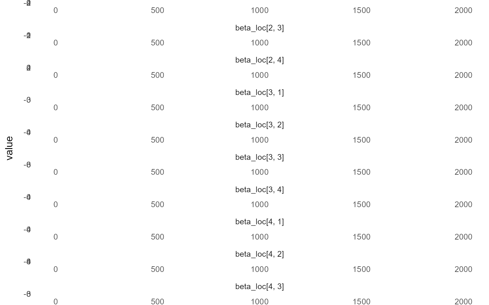

    === control ===

    === traceplot ===

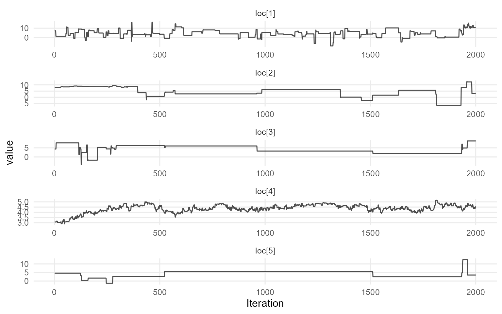

``` r
plot(fit_sb_crp, params = "scale", family = "caterpillar")
```

    === treated ===

    === caterpillar ===


    === control ===

    === caterpillar ===


``` r
pred_mean_sb_crp <- predict(fit_sb_crp, x = x_eval, type = "mean",
                            interval = "credible", nsim_mean = 100)
plot(pred_mean_sb_crp)
```

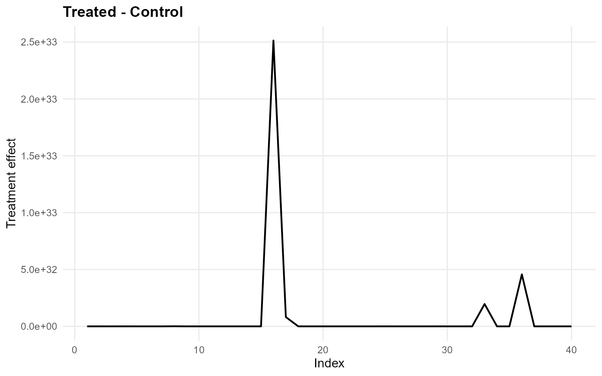

``` r
pred_q_sb_crp <- predict(fit_sb_crp, x = x_eval, type = "quantile",
                         p = 0.5, interval = "credible")
plot(pred_q_sb_crp)
```

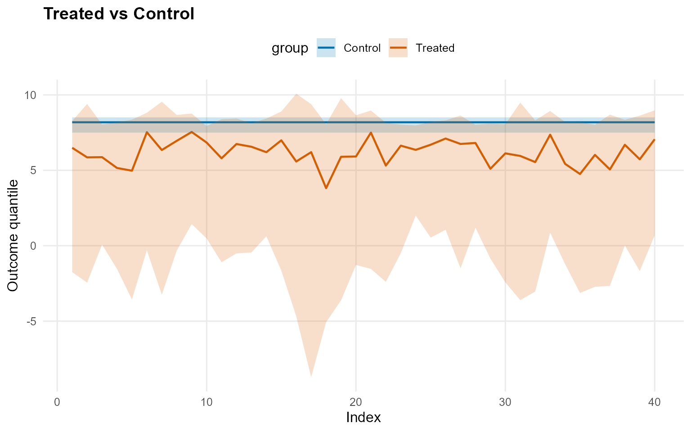

``` r
pred_d_sb_crp <- predict(fit_sb_crp, x = x_eval, y = y_eval,
                         type = "density", interval = "credible")
plot(pred_d_sb_crp)
```


``` r
pred_surv_sb_crp <- predict(fit_sb_crp, x = x_eval, y = y_eval,
                            type = "survival", interval = "credible")
plot(pred_surv_sb_crp)
```


``` r
ate_sb_crp <- ate(fit_sb_crp, newdata = x_eval,
                  interval = "credible", nsim_mean = 100)
print(ate_sb_crp)
```

    ATE (Average Treatment Effect)
      Prediction points: 40
      Conditional (covariates): YES
      Propensity score used: NO
      Posterior mean draws: 100
      Credible interval: credible (95%)

    ATE estimates (treated - control):
     id                     estimate   lower upper
      1                 25810139.203 -10.058 1.968
      2          4689608124927236096 -11.367 3.807
      3 6748635966270292425266626862  -8.916 1.752
      4            5608703142521.394 -10.455 2.148
      5          7337398484634635264 -12.359 2.499
      6               1863384220.798   -8.68 2.809
    ... (34 more rows)

``` r
summary(ate_sb_crp)
```

    ATE Summary
    ================================================== 
    Prediction points: 40
    Conditional: YES | PS used: NO
    Posterior mean draws: 100
    Interval: credible (95%)

    Model specification:
      Backend (trt/con): sb / crp
      Kernel (trt/con): amoroso / amoroso
      GPD tail (trt/con): YES / YES

    ATE statistics:
      Mean: 74663408315734949098080840642424 | Median: 11193764968533738914622
      Range: [25810139.203, 2970908673036240160000820240826260]
      SD: 469683170335435607168086868842684

    Credible interval width:
      Mean: 13.236 | Median: 12.569
      Range: [9.751, 20.666]

``` r
ate_plots_sb_crp <- plot(ate_sb_crp)
ate_plots_sb_crp$treatment_effect
```


``` r
qte_sb_crp <- qte(fit_sb_crp, probs = c(0.25, 0.5, 0.75),
                  newdata = x_eval, interval = "credible")
print(qte_sb_crp)
```

    QTE (Quantile Treatment Effect)
      Prediction points: 40
      Quantile grid: 0.25, 0.5, 0.75
      Conditional (covariates): YES
      Propensity score used: NO
      Credible interval: credible (95%)

    QTE estimates (treated - control):
     index id estimate   lower upper
      0.25  1   -1.237  -9.456 0.507
      0.25  2   -2.178  -9.763 0.913
      0.25  3   -1.848   -7.41 0.407
      0.25  4   -2.499  -8.852 0.469
      0.25  5   -2.607 -10.749 0.536
      0.25  6   -0.522  -7.722 0.707
    ... (114 more rows)

``` r
summary(qte_sb_crp)
```

    QTE Summary
    ================================================== 
    Prediction points: 40 | Quantiles: 3
    Quantile grid: 0.25, 0.5, 0.75
    Conditional: YES | PS used: NO
    Interval: credible (95%)

    Model specification:
      Backend (trt/con): sb / crp
      Kernel (trt/con): amoroso / amoroso
      GPD tail (trt/con): YES / YES

    QTE by quantile:
     quantile mean_qte median_qte min_qte max_qte sd_qte
         0.25   -1.673     -1.634  -3.787  -0.522  0.757
          0.5   -2.004     -1.983  -4.369  -0.644  0.841
         0.75   -2.155     -2.074  -4.982   -0.36  1.051

    Credible interval width:
      Mean: 10.506 | Median: 10.119
      Range: [5.913, 21.099]

``` r
qte_plots_sb_crp <- plot(qte_sb_crp)
qte_plots_sb_crp$treatment_effect
```


------------------------------------------------------------------------

### Model B: Treated CRP, Control SB (Amoroso + GPD)

``` r
bundle_crp_sb <- build_causal_bundle(
  y = y,
  T = T,
  X = X,
  kernel = c("amoroso", "amoroso"),
  backend = c("crp", "sb"),
  PS = "logit",
  GPD = c(TRUE, TRUE),
  components = c(5, 5),
  param_specs = param_specs_gpd,
  mcmc_outcome = list(niter = 2500, nburnin = 500, nchains = 1, thin = 1, seed = 2),
  mcmc_ps = list(niter = 2500, nburnin = 500, nchains = 1, thin = 1, seed = 2)
)

bundle_crp_sb
```

    DPmixGPD causal bundle
    PS model: disabled 
    Outcome (treated): backend = crp | kernel = amoroso 
    Outcome (control): backend = sb | kernel = amoroso 
    GPD tail (treated/control): TRUE / TRUE 
    components (treated/control): 5 / 5 
    Outcome PS included: FALSE 
    epsilon (treated/control): 0.025 / 0.025 
    n (control) = 232 | n (treated) = 268 

``` r
summary(bundle_crp_sb)
```

    DPmixGPD causal bundle summary
    DPmixGPD causal bundle
    PS model: disabled 
    Outcome (treated): backend = crp | kernel = amoroso 
    Outcome (control): backend = sb | kernel = amoroso 
    GPD tail (treated/control): TRUE / TRUE 
    components (treated/control): 5 / 5 
    Outcome PS included: FALSE 
    epsilon (treated/control): 0.025 / 0.025 
    n (control) = 232 | n (treated) = 268 

``` r
fit_crp_sb <- run_mcmc_causal(bundle_crp_sb)
```

    ===== Monitors =====
    thin = 1: alpha, beta_loc, beta_scale, beta_tail_scale, shape1, shape2, tail_shape, threshold, w, z
    ===== Samplers =====
    RW sampler (61)
      - alpha
      - shape1[]  (5 elements)
      - shape2[]  (5 elements)
      - beta_loc[]  (20 elements)
      - beta_scale[]  (20 elements)
      - threshold
      - beta_tail_scale[]  (4 elements)
      - tail_shape
      - v[]  (4 elements)
    categorical sampler (232)
      - z[]  (232 elements)

    ===== Monitors =====
    thin = 1: alpha, beta_tail_scale, loc, scale, shape1, shape2, tail_shape, threshold, z
    ===== Samplers =====
    RW sampler (6)
      - threshold
      - beta_tail_scale[]  (4 elements)
      - tail_shape
    CRP_concentration sampler (1)
      - alpha
    CRP_cluster_wrapper sampler (20)
      - loc[]  (5 elements)
      - scale[]  (5 elements)
      - shape1[]  (5 elements)
      - shape2[]  (5 elements)
    CRP sampler (1)
      - z[1:268] 

      [Warning] CRP_sampler: This MCMC is not for a proper model. The MCMC attempted to use more components than the number of cluster parameters. Please increase the number of cluster parameters.

``` r
summary(fit_crp_sb)
```

    -- Outcome fits --
    [control]
    MixGPD fit | backend: Stick-Breaking Process | kernel: Amoroso Distribution | GPD tail: TRUE
    n = 232 | components = 5 | epsilon = 0.025
    MCMC: niter=2500, nburnin=500, thin=1, nchains=1 
    Fit
    Use summary() for posterior summaries; plot() for diagnostics; predict() for predictions.

    [treated]
    MixGPD fit | backend: Chinese Restaurant Process | kernel: Amoroso Distribution | GPD tail: TRUE
    n = 268 | components = 5 | epsilon = 0.025
    MCMC: niter=2500, nburnin=500, thin=1, nchains=1 
    Fit
    Use summary() for posterior summaries; plot() for diagnostics; predict() for predictions.

``` r
params(fit_crp_sb)
```

    Posterior mean parameters (causal)

    [treated]
    Posterior mean parameters

    $alpha
    [1] "0.638"

    $w
    [1] "0.662"

    $loc
    [1] "5.617"

    $scale
    [1] "2.078"

    $shape1
    [1] "2.084"

    $shape2
    [1] "1.789"

    $beta_tail_scale
    [1] "0.064"  "-0.09"  "0.12"   "-0.099"

    $tail_shape
    [1] "-0.008"

    [control]
    Posterior mean parameters

    $alpha
    [1] "0.348"

    $w
    [1] "0.961"

    $beta_loc
          x1       x2       x3       x4      
    comp1 "-0.12"  "-0.043" "1.842"  "1.338" 
    comp2 "-0.25"  "0.032"  "0.284"  "0.158" 
    comp3 "-0.034" "-0.076" "0.214"  "-0.002"
    comp4 "-0.093" "-0.26"  "-0.041" "0.054" 
    comp5 "-0.093" "-0.097" "0.019"  "0.017" 

    $beta_scale
          x1       x2       x3       x4      
    comp1 "0.005"  "-0.065" "-0.675" "-0.247"
    comp2 "-0.06"  "0.029"  "0.009"  "0.107" 
    comp3 "-0.073" "-0.042" "-0.079" "0.211" 
    comp4 "0.062"  "-0.108" "-0.133" "0.136" 
    comp5 "0.041"  "0.098"  "-0.119" "-0.036"

    $shape1
    [1] "8.296"

    $shape2
    [1] "0.78"

    $beta_tail_scale
    [1] "-0.107" "-0.025" "-0.021" "1.223" 

    $tail_shape
    [1] "0.005"

``` r
plot(fit_crp_sb, family = "traceplot")
```

    === treated ===

    === traceplot ===

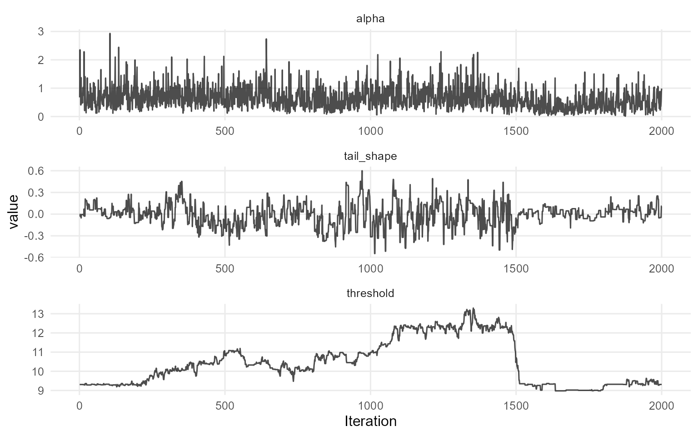

    === control ===

    === traceplot ===

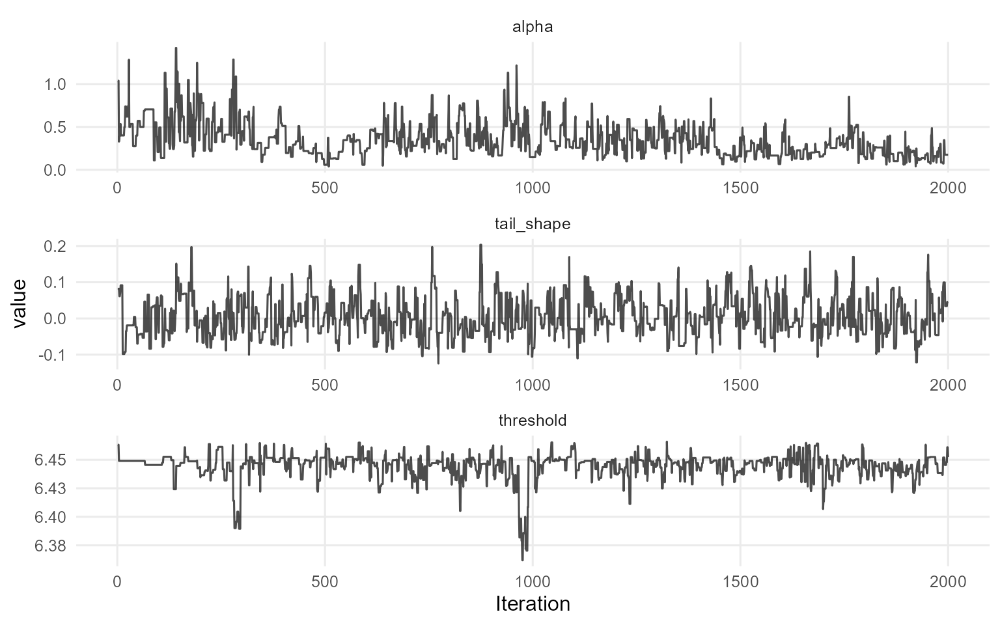

``` r
pred_mean_crp_sb <- predict(fit_crp_sb, x = x_eval, type = "mean",
                            interval = "credible", nsim_mean = 100)
plot(pred_mean_crp_sb)
```

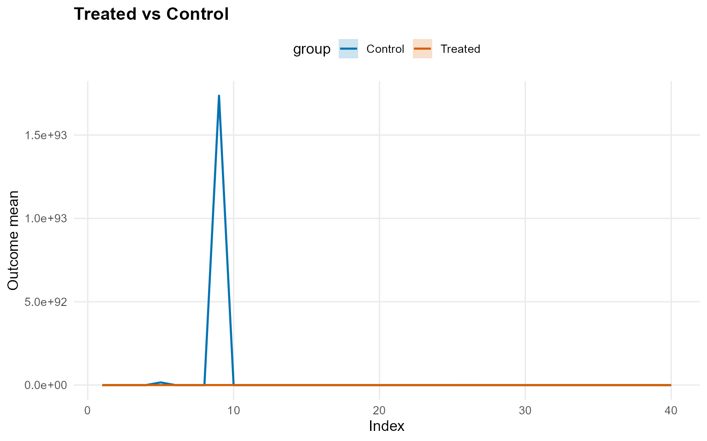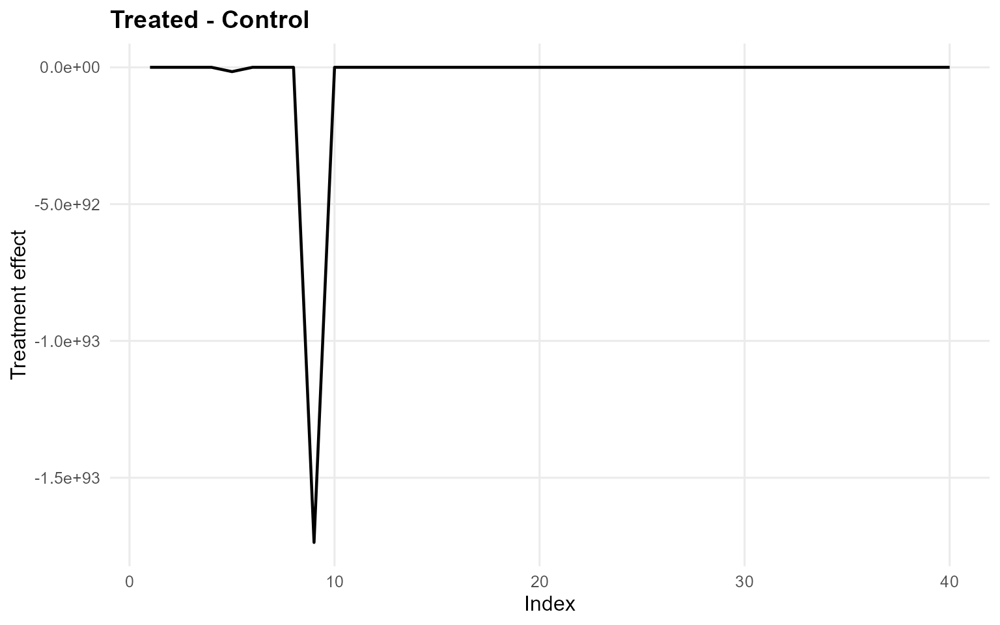

``` r
pred_q_crp_sb <- predict(fit_crp_sb, x = x_eval, type = "quantile",
                         p = 0.5, interval = "credible")
plot(pred_q_crp_sb)
```

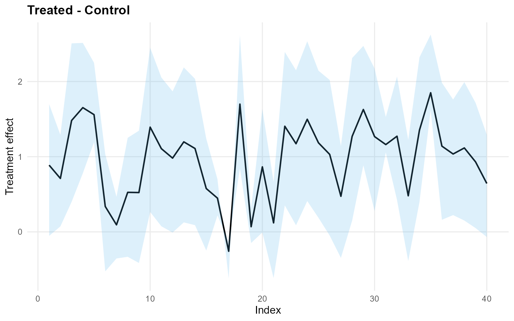

``` r
pred_d_crp_sb <- predict(fit_crp_sb, x = x_eval, y = y_eval,
                         type = "density", interval = "credible")
plot(pred_d_crp_sb)
```

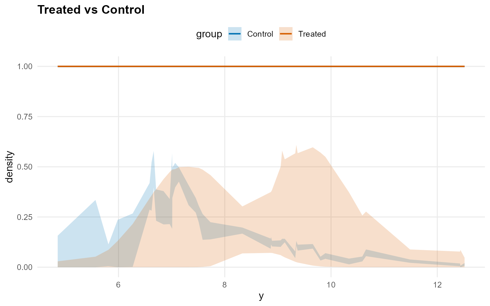

``` r
pred_surv_crp_sb <- predict(fit_crp_sb, x = x_eval, y = y_eval,
                            type = "survival", interval = "credible")
plot(pred_surv_crp_sb)
```


``` r
ate_crp_sb <- ate(fit_crp_sb, newdata = x_eval,
                  interval = "credible", nsim_mean = 100)
print(ate_crp_sb)
```

    ATE (Average Treatment Effect)
      Prediction points: 40
      Conditional (covariates): YES
      Propensity score used: NO
      Posterior mean draws: 100
      Credible interval: credible (95%)

    ATE estimates (treated - control):
     id
      1
      2
      3
      4
      5
      6
                                                                                          estimate
                    -33990774157664791912460464684044064246404644086408466480066062424484026024488
                                                                                         -6082.183
                          -20533477987966883722224688642420482424822468464646482824024406040666866
                              -4897980214640208097280068604844804806684282266824202820440466002046
                                        -152486246608400842666406662620086826688222484480000660882
     -91695146433545785666648882466086882442448046208642624406402062800642644408482066266286042468
      lower upper
     -1.235 2.177
     -2.059 1.672
     -0.801 2.558
     -0.806 2.869
     -0.803  3.41
     -2.334 1.327
    ... (34 more rows)

``` r
summary(ate_crp_sb)
```

    ATE Summary
    ================================================== 
    Prediction points: 40
    Conditional: YES | PS used: NO
    Posterior mean draws: 100
    Interval: credible (95%)

    Model specification:
      Backend (trt/con): crp / sb
      Kernel (trt/con): amoroso / amoroso
      GPD tail (trt/con): YES / YES

    ATE statistics:
      Mean: -6040650806807507854426822208400842282022066660060622480062848842240080800046620482024682080886622 | Median: -7363264.563
      Range: [-241625940577151533488284802002862880660820684822004286660420240882006060002284006828424040008282424, 0.702]
      SD: 38204415328467011210020288600208004446606448260606268046404824002064846288848462228822008840880220

    Credible interval width:
      Mean: 3.718 | Median: 3.653
      Range: [3.281, 5.508]

``` r
ate_plots_crp_sb <- plot(ate_crp_sb)
ate_plots_crp_sb$treatment_effect
```

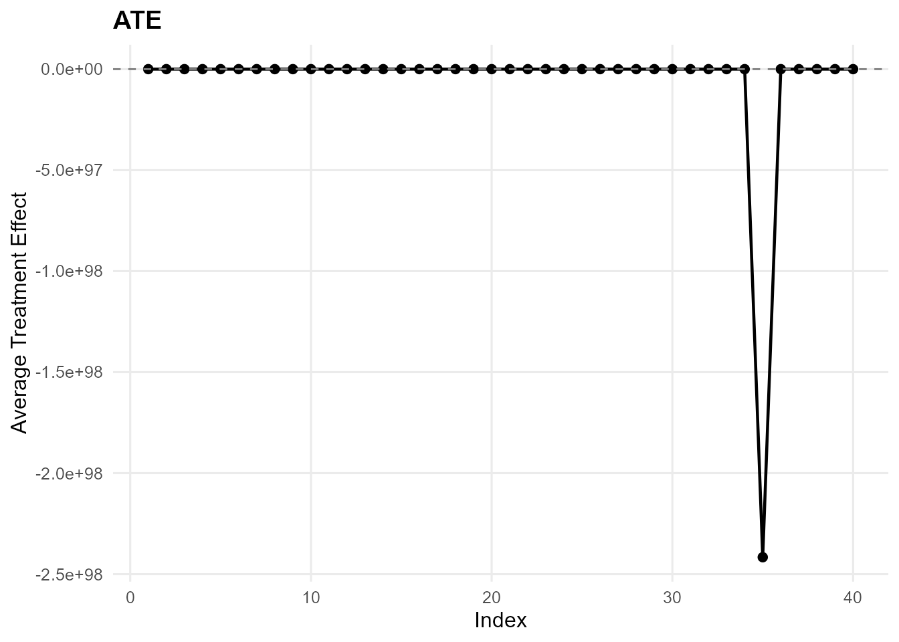

``` r
qte_crp_sb <- qte(fit_crp_sb, probs = c(0.25, 0.5, 0.75),
                  newdata = x_eval, interval = "credible")
print(qte_crp_sb)
```

    QTE (Quantile Treatment Effect)
      Prediction points: 40
      Quantile grid: 0.25, 0.5, 0.75
      Conditional (covariates): YES
      Propensity score used: NO
      Credible interval: credible (95%)

    QTE estimates (treated - control):
     index id estimate  lower upper
      0.25  1    0.784 -0.143 2.313
      0.25  2    0.904 -0.181 2.601
      0.25  3    1.066  0.131 2.572
      0.25  4    1.352  0.263 3.099
      0.25  5    1.242  0.112 2.937
      0.25  6    0.577 -0.378 2.134
    ... (114 more rows)

``` r
summary(qte_crp_sb)
```

    QTE Summary
    ================================================== 
    Prediction points: 40 | Quantiles: 3
    Quantile grid: 0.25, 0.5, 0.75
    Conditional: YES | PS used: NO
    Interval: credible (95%)

    Model specification:
      Backend (trt/con): crp / sb
      Kernel (trt/con): amoroso / amoroso
      GPD tail (trt/con): YES / YES

    QTE by quantile:
     quantile mean_qte median_qte min_qte max_qte sd_qte
         0.25     0.92      0.912    0.49   1.527  0.235
          0.5    0.975      1.108  -0.258   1.851  0.503
         0.75    0.538      0.791  -2.206   2.117  1.032

    Credible interval width:
      Mean: 2.797 | Median: 2.641
      Range: [2.419, 5.927]

``` r
qte_plots_crp_sb <- plot(qte_crp_sb)
qte_plots_crp_sb$treatment_effect
```

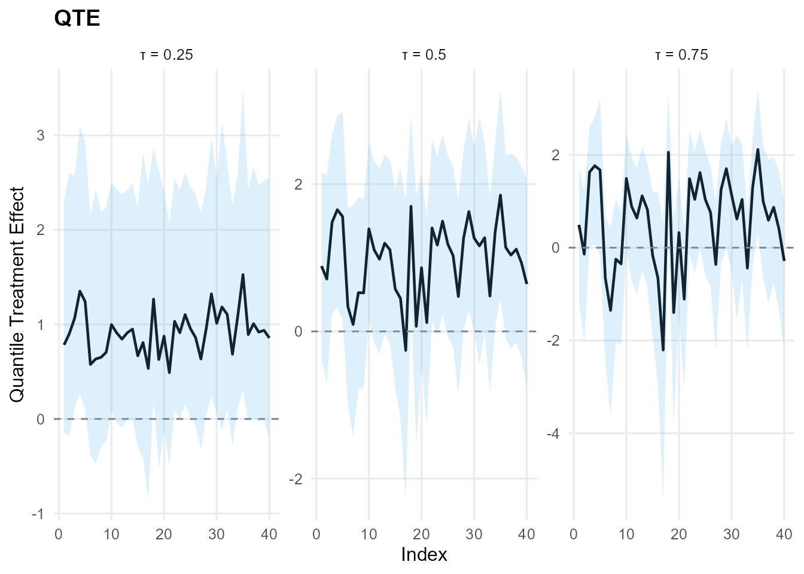
