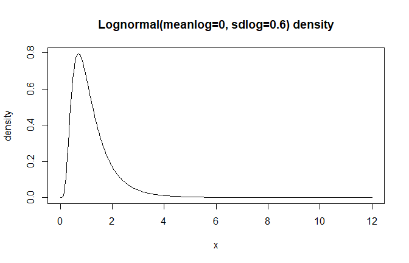

# Available Distributions

## Overview

DPmixGPD supports multiple bulk kernels for the mixture components and
can optionally splice a Generalized Pareto Distribution (GPD) tail
beyond a threshold.

## Kernel Summary

``` r
kernel_df <- data.frame(
  Kernel = c("normal", "gamma", "lognormal", "cauchy", "laplace", "invgauss", "amoroso"),
  Parameters = c(
    "mean, sd",
    "shape, rate",
    "meanlog, sdlog",
    "location, scale",
    "location, scale",
    "mean, shape",
    "location, scale, shape"
  )
)

kable(kernel_df, align = "c", caption = "Available Bulk Kernels") %>%
  kable_styling(bootstrap_options = c("striped", "hover"),
                full_width = FALSE, position = "center")
```

|  Kernel   |       Parameters       |
|:---------:|:----------------------:|
|  normal   |        mean, sd        |
|   gamma   |      shape, rate       |
| lognormal |     meanlog, sdlog     |
|  cauchy   |    location, scale     |
|  laplace  |    location, scale     |
| invgauss  |      mean, shape       |
|  amoroso  | location, scale, shape |

Available Bulk Kernels

## Kernel Selection

The kernel is specified in
[`build_nimble_bundle()`](https://arnabaich96.github.io/DPmixGPD/reference/build_nimble_bundle.html)
via the `kernel` argument.

``` r
bundle <- build_nimble_bundle(
  y = y,
  backend = "sb",
  kernel  = "lognormal",
  GPD     = TRUE,
  components = 6,
  mcmc = list(niter = 500, nburnin = 100, thin = 2, nchains = 1, seed = 1)
)
```

## Distribution Visualizations

### Normal Distribution

``` r
x <- seq(-4, 4, length.out = 400)
ggplot(data.frame(x = x, y = dnorm(x, mean = 0, sd = 1)), aes(x, y)) +
  geom_line(linewidth = 1, color = "steelblue") +
  labs(x = "x", y = "Density", title = "Normal(0, 1)") +
  theme_minimal()
```


### Gamma Distribution

``` r
x <- seq(0, 12, length.out = 400)
ggplot(data.frame(x = x, y = dgamma(x, shape = 2, rate = 1)), aes(x, y)) +
  geom_line(linewidth = 1, color = "steelblue") +
  labs(x = "x", y = "Density", title = "Gamma(shape = 2, rate = 1)") +
  theme_minimal()
```


### Lognormal Distribution

``` r
x <- seq(0, 12, length.out = 400)
ggplot(data.frame(x = x, y = dlnorm(x, meanlog = 0, sdlog = 0.6)), aes(x, y)) +
  geom_line(linewidth = 1, color = "steelblue") +
  labs(x = "x", y = "Density", title = "Lognormal(meanlog = 0, sdlog = 0.6)") +
  theme_minimal()
```


