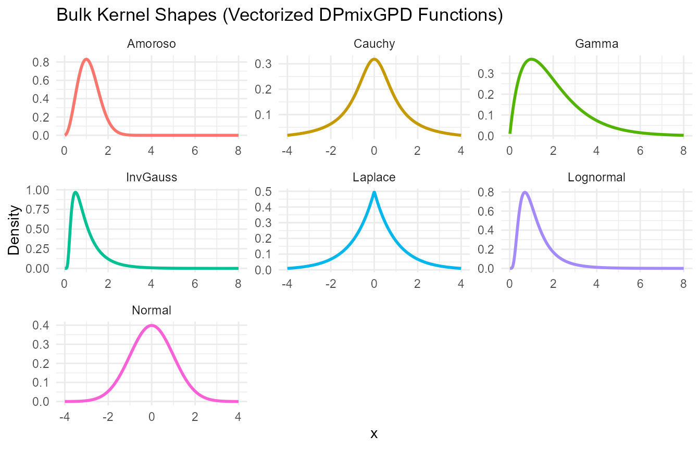

# Available Distributions

## Overview

DPmixGPD supports multiple bulk kernels for the mixture components and
can optionally splice a Generalized Pareto Distribution (GPD) tail
beyond a threshold.

## Theory (brief)

Each kernel defines the component density \$K(y; \\theta)\$. The mixture
density is a convex combination of kernel components, and the GPD tail
replaces the bulk kernel for $`y > u`$ when tail augmentation is
enabled. This vignette focuses on the bulk kernel shapes.

## Kernel Summary

``` r
kernel_df <- data.frame(
  Kernel = c("normal", "gamma", "lognormal", "cauchy", "laplace", "invgauss", "amoroso"),
  Parameters = c(
    "mean, sd",
    "shape, rate",
    "meanlog, sdlog",
    "location, scale",
    "location, scale",
    "mean, shape",
    "location, scale, shape"
  )
)

kable(kernel_df, align = "c", caption = "Available Bulk Kernels") %>%
  kable_styling(bootstrap_options = c("striped", "hover"),
                full_width = FALSE, position = "center")
```

|  Kernel   |       Parameters       |
|:---------:|:----------------------:|
|  normal   |        mean, sd        |
|   gamma   |      shape, rate       |
| lognormal |     meanlog, sdlog     |
|  cauchy   |    location, scale     |
|  laplace  |    location, scale     |
| invgauss  |      mean, shape       |
|  amoroso  | location, scale, shape |

Available Bulk Kernels

## Kernel Selection

The kernel is specified in
[`build_nimble_bundle()`](https://arnabaich96.github.io/DPmixGPD/reference/build_nimble_bundle.md)
via the `kernel` argument.

``` r
bundle <- build_nimble_bundle(
  y = y,
  backend = "sb",
  kernel  = "lognormal",
  GPD     = TRUE,
  components = 6,
  mcmc = list(niter = 500, nburnin = 100, thin = 2, nchains = 1, seed = 1)
)
```

## Distribution Visualizations

``` r
x_all <- seq(-4, 4, length.out = 300)
x_pos <- seq(0.01, 8, length.out = 300)

dens_list <- list(
  Normal = data.frame(x = x_all, density = dnormmix(x_all, w = 1, mean = 0, sd = 1)),
  Cauchy = data.frame(x = x_all, density = dcauchymix(x_all, w = 1, location = 0, scale = 1)),
  Laplace = data.frame(x = x_all, density = dlaplacemix(x_all, w = 1, location = 0, scale = 1)),
  Gamma = data.frame(x = x_pos, density = dgammamix(x_pos, w = 1, shape = 2, scale = 1)),
  Lognormal = data.frame(x = x_pos, density = dlognormalmix(x_pos, w = 1, meanlog = 0, sdlog = 0.6)),
  InvGauss = data.frame(x = x_pos, density = dinvgaussmix(x_pos, w = 1, mean = 1, shape = 2)),
  Amoroso = data.frame(x = x_pos, density = damorosomix(x_pos, w = 1, loc = 0, scale = 1, shape1 = 1.5, shape2 = 2))
)

plot_df <- do.call(rbind, lapply(names(dens_list), function(name) {
  df <- dens_list[[name]]
  df$Kernel <- name
  df
}))

ggplot(plot_df, aes(x = x, y = density, color = Kernel)) +
  geom_line(linewidth = 1) +
  facet_wrap(~ Kernel, scales = "free") +
  labs(x = "x", y = "Density", title = "Bulk Kernel Shapes (Vectorized DPmixGPD Functions)") +
  theme_minimal() +
  theme(legend.position = "none")
```


