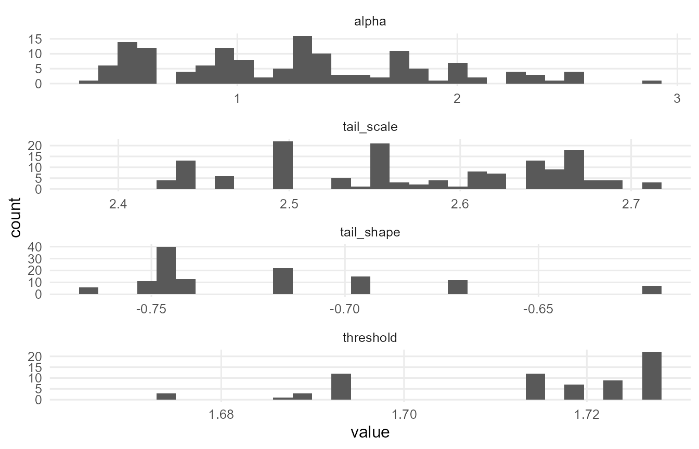
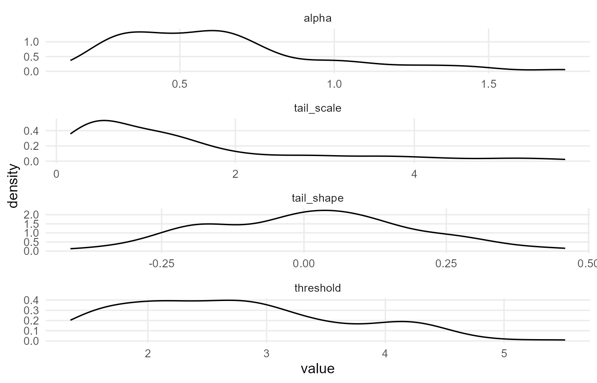
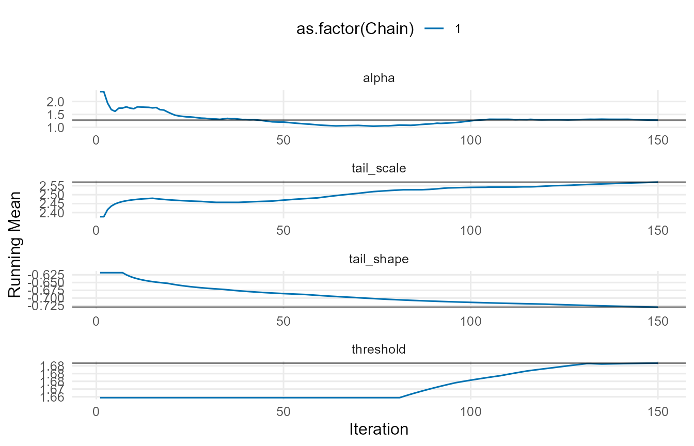
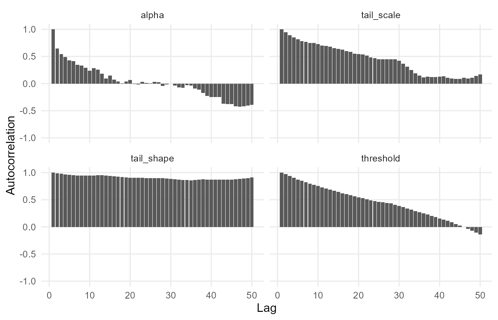
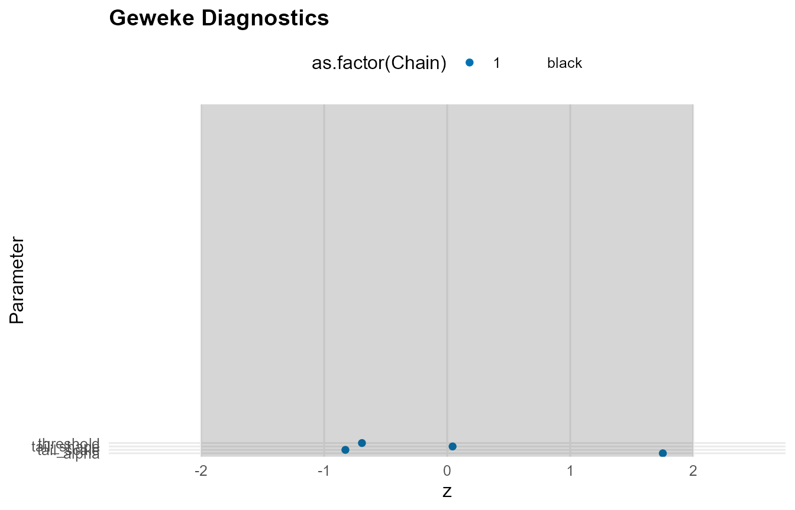
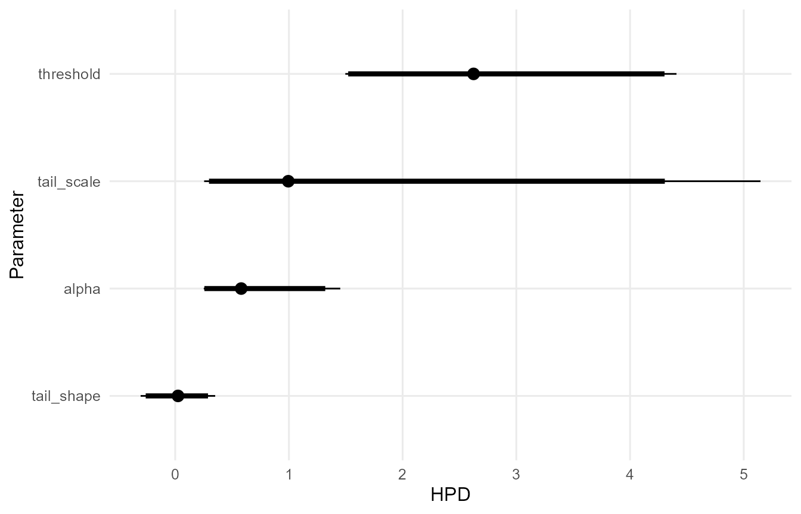
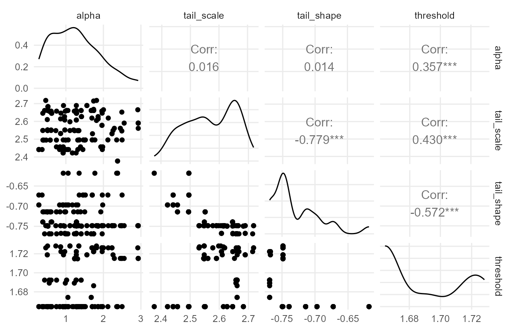

# DPmixGPD: Quick Start

## Overview

This vignette provides an end-to-end introduction to the DPmixGPD
workflow:

- Build a model specification
- Run MCMC sampling
- Extract fitted values and predictions

## Theory (brief)

DPmixGPD models the bulk of a distribution with a Dirichlet process (DP)
mixture, then optionally splices a Generalized Pareto Distribution (GPD)
tail beyond a threshold $`u`$. For outcomes $`y_i`$ and kernel $`K`$,
the bulk model is \$\$ f(y_i) = \\int K(y_i; \\theta)\\, dG(\\theta),
\\quad G \\sim \\mathrm{DP}(\\alpha, G_0). \$\$ When a tail is included,
the density is replaced for $`y > u`$ by a GPD tail with scale and shape
parameters, preserving continuity at $`u`$.

## Model Description

DPmixGPD fits flexible mixture models for the bulk of the distribution
and can splice a Generalized Pareto Distribution (GPD) tail beyond a
threshold. This approach is appropriate when:

- The center of the data is not well described by a single parametric
  family
- The extreme right tail requires principled extrapolation

## Minimal Example

``` r
library(DPmixGPD)

data("faithful", package = "datasets")
y <- faithful$eruptions

bundle <- build_nimble_bundle(
  y = y,
  backend = "sb",
  kernel = "normal",
  GPD = TRUE,
  components = 6,
  mcmc = mcmc
)

fit <- run_mcmc_bundle_manual(bundle, show_progress = FALSE)
```

## Fitted Values and Residuals

``` r
f <- fitted(fit, type = "mean", level = 0.90)
head(f)
#>   fit lower upper residuals
#> 1 3.2  3.06  3.36     0.400
#> 2 3.2  3.06  3.36    -1.400
#> 3 3.2  3.06  3.36     0.133
#> 4 3.2  3.06  3.36    -0.917
#> 5 3.2  3.06  3.36     1.333
#> 6 3.2  3.06  3.36    -0.317
summary(f$residuals)
#>    Min. 1st Qu.  Median    Mean 3rd Qu.    Max. 
#>  -1.600  -1.038   0.800   0.287   1.254   1.900
```

## Predictions

``` r
pred_mean <- predict(fit, type = "mean", cred.level = 0.90, interval = "credible")
pred_q90  <- predict(fit, type = "quantile", index = 0.90, cred.level = 0.90, interval = "credible")

pred_mean$fit
#>   estimate lower upper
#> 1     3.19  3.05  3.32
pred_q90$fit
#>   estimate index lower upper
#> 1     4.55   0.9  4.45  4.67
```

## Diagnostic Plots

``` r
if (requireNamespace("ggmcmc", quietly = TRUE) && requireNamespace("coda", quietly = TRUE)) {
  plot(fit)
} else {
  message("Plotting requires 'ggmcmc' and 'coda' packages.")
}
#> 
#> === histogram ===
```



    #> 
    #> === density ===



    #> 
    #> === traceplot ===


    #> 
    #> === running ===



    #> 
    #> === compare_partial ===


    #> 
    #> === autocorrelation ===



    #> 
    #> === geweke ===



    #> 
    #> === caterpillar ===



    #> 
    #> === pairs ===



## Troubleshooting

- **NIMBLE keyword error**: Rename covariate columns that use reserved
  keywords (e.g., `if` to `x_if`).
- **Disk space error**: Set `TMPDIR`/`TEMP`/`TMP` to a drive with
  sufficient free space.

## Next Steps

- **Model Specification**: Complete documentation of all options
- **Unconditional Models**: Density estimation and tail diagnostics
- **Backends**: Comparison of SB and CRP backends
