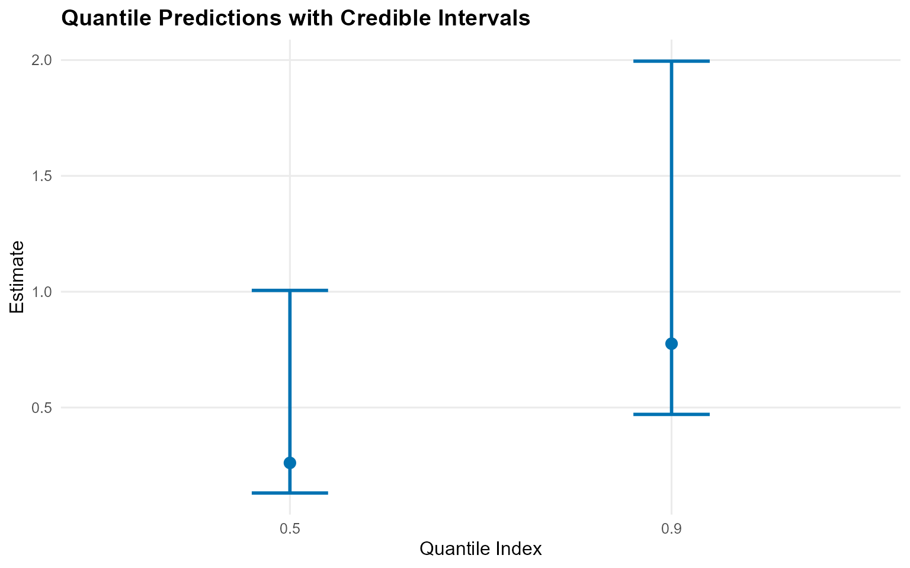
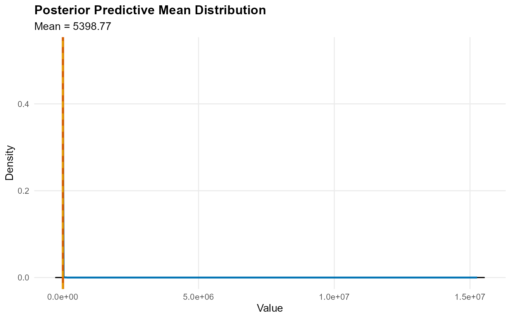

# 0. Start Here

> **Legacy vignette (for the website / historical notes).** These files
> may not match the current exported API one-to-one. Last verified:
> **2026-01-18**.
>
> For the up-to-date workflow, see the main package vignettes
> (Introduction, Model Spec, MCMC Workflow,
> Unconditional/Conditional/Causal, Backends, S3 Reference).

## Getting Started

This vignette gives a minimal, fully working workflow for an
**unconditional** model and a **conditional** model. Everything uses
short MCMC runs so the vignette renders quickly.

------------------------------------------------------------------------

### Unconditional Model (CRP, bulk-only)

``` r
data("nc_pos200_k3")
y <- nc_pos200_k3$y
```

``` r
bundle_uncond <- build_nimble_bundle(
  y = y,
  backend = "crp",
  kernel = "gamma",
  GPD = FALSE,
  components = 5,
  mcmc = mcmc
)
```

``` r
fit_uncond <- load_or_fit("v00-start-here-fit_uncond", quiet_mcmc(run_mcmc_bundle_manual(bundle_uncond, show_progress = FALSE)))
summary(fit_uncond)
```

    MixGPD summary | backend: Chinese Restaurant Process | kernel: Gamma Distribution | GPD tail: FALSE | epsilon: 0.025
    n = 200 | components = 5
    Summary
    Initial components: 5 | Components after truncation: 1

    WAIC: 963.248
    lppd: -456.908 | pWAIC: 24.716

    Summary table
      parameter  mean    sd q0.025 q0.500 q0.975    ess
     weights[1] 0.883 0.138  0.474  0.917  1.000  8.469
          alpha 0.457 0.398  0.022  0.354  1.503 42.380
       shape[1] 1.161 0.151  0.915  1.159  1.483 14.106
       scale[1] 0.265 0.037  0.204  0.266  0.338 25.996

``` r
pred_q <- predict(fit_uncond, type = "quantile", index = c(0.5, 0.9), interval = "credible")
head(pred_q$fit)
```

       estimate index     lower     upper
    1 0.2280813   0.5 0.1346529 0.3416814
    2 0.6867466   0.9 0.4673580 0.9148642

``` r
plot(pred_q)
```



------------------------------------------------------------------------

### Conditional Model (SB, bulk-only)

``` r
data("nc_posX100_p3_k2")
yc <- nc_posX100_p3_k2$y
X <- as.matrix(nc_posX100_p3_k2$X)
```

``` r
bundle_cond <- build_nimble_bundle(
  y = yc,
  X = X,
  backend = "sb",
  kernel = "lognormal",
  GPD = FALSE,
  components = 5,
  mcmc = mcmc
)
```

``` r
fit_cond <- load_or_fit("v00-start-here-fit_cond", quiet_mcmc(run_mcmc_bundle_manual(bundle_cond, show_progress = FALSE)))
summary(fit_cond)
```

    MixGPD summary | backend: Stick-Breaking Process | kernel: Lognormal Distribution | GPD tail: FALSE | epsilon: 0.025
    n = 100 | components = 5
    Summary
    Initial components: 5 | Components after truncation: 3

    WAIC: 509.609
    lppd: -220.586 | pWAIC: 34.218

    Summary table
              parameter   mean    sd q0.025 q0.500 q0.975     ess
             weights[1]  0.432 0.073  0.297  0.430  0.563  20.008
             weights[2]  0.298 0.064  0.177  0.310  0.400  12.128
             weights[3]  0.159 0.054  0.060  0.160  0.263  19.977
                  alpha  1.609 0.883  0.552  1.409  3.673  23.402
     beta_meanlog[1, 1] -0.089 0.261 -0.641 -0.130  0.493  24.612
     beta_meanlog[2, 1]  0.150 0.271 -0.404  0.153  0.554  14.485
     beta_meanlog[3, 1] -0.302 1.288 -3.537 -0.193  1.910   7.210
     beta_meanlog[4, 1]  0.149 1.197 -2.431  0.514  1.794  14.772
     beta_meanlog[5, 1]  0.500 0.617 -0.809  0.611  1.458  10.102
     beta_meanlog[1, 2]  0.698 0.775 -0.752  0.533  2.260   9.533
     beta_meanlog[2, 2] -1.014 0.373 -1.782 -1.023 -0.337  12.472
     beta_meanlog[3, 2]  0.531 1.862 -2.809  0.718  4.688  17.038
     beta_meanlog[4, 2] -0.536 1.666 -3.483 -0.785  2.860   6.288
     beta_meanlog[5, 2]  0.878 1.020 -1.310  1.159  2.590   4.981
     beta_meanlog[1, 3]  0.120 0.377 -0.730  0.209  0.737  21.374
     beta_meanlog[2, 3] -0.139 0.324 -0.683 -0.184  0.444  11.118
     beta_meanlog[3, 3]  0.171 0.980 -1.645  0.257  2.249  24.319
     beta_meanlog[4, 3] -0.108 1.353 -3.217 -0.042  2.262  13.235
     beta_meanlog[5, 3]  0.322 0.458 -0.736  0.316  1.343  12.508
               sdlog[1]  1.076 0.440  0.511  1.002  2.048  50.890
               sdlog[2]  1.246 0.567  0.459  1.147  2.495  26.925
               sdlog[3]  1.757 1.185  0.464  1.432  4.916 106.303

``` r
x_new <- X[1:20, , drop = FALSE]
pred_mean <- predict(fit_cond, x = x_new, type = "mean", interval = "credible", nsim_mean = 200)
head(pred_mean$fit)
```

       estimate     lower     upper
    1  23.62939 1.0384949   79.5652
    2 860.62971 1.2116048  292.5505
    3 417.98643 1.0122467  905.8613
    4  51.01261 0.9716226  313.9089
    5  22.55919 0.9997776  160.8679
    6 173.71838 1.1046723 1067.1688

``` r
plot(pred_mean)
```



------------------------------------------------------------------------

### Useful S3 Methods

``` r
params(fit_uncond)
```

    Posterior mean parameters

    $alpha
    [1] 0.4573

    $w
    [1] 0.8829

    $shape
    [1] 1.161

    $scale
    [1] 0.2653

``` r
plot(fit_uncond, params = "shape", family = "traceplot")
```

    === traceplot ===


------------------------------------------------------------------------

### Next Steps

- `vignette 1`: package overview and terminology
- `vignette 5`: full three-phase workflow (spec ? bundle ? MCMC)
- `vignette 6-13`: unconditional/conditional models with and without GPD
- `vignette 14-19`: causal workflows
