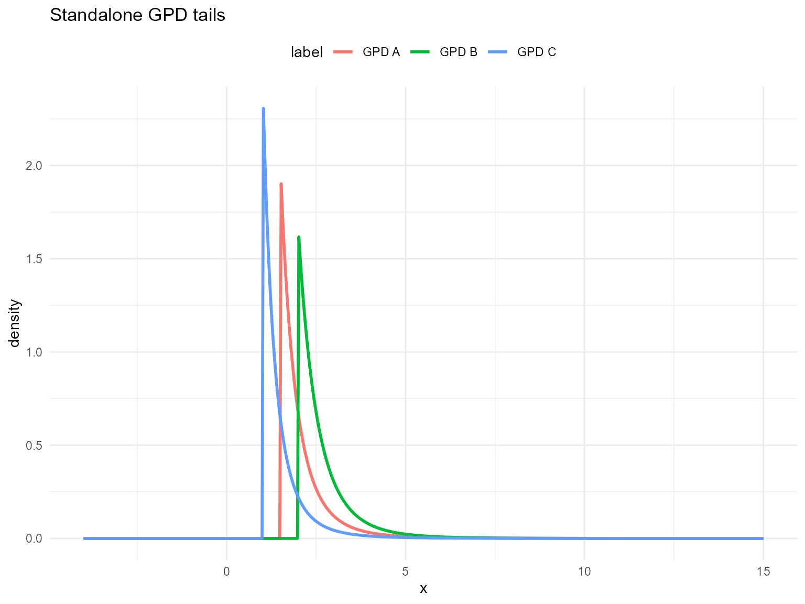
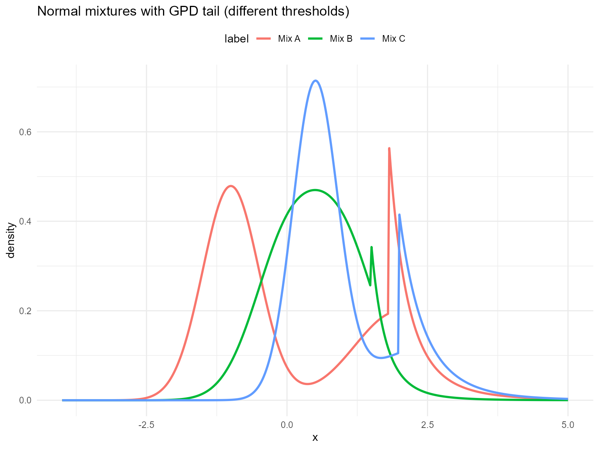
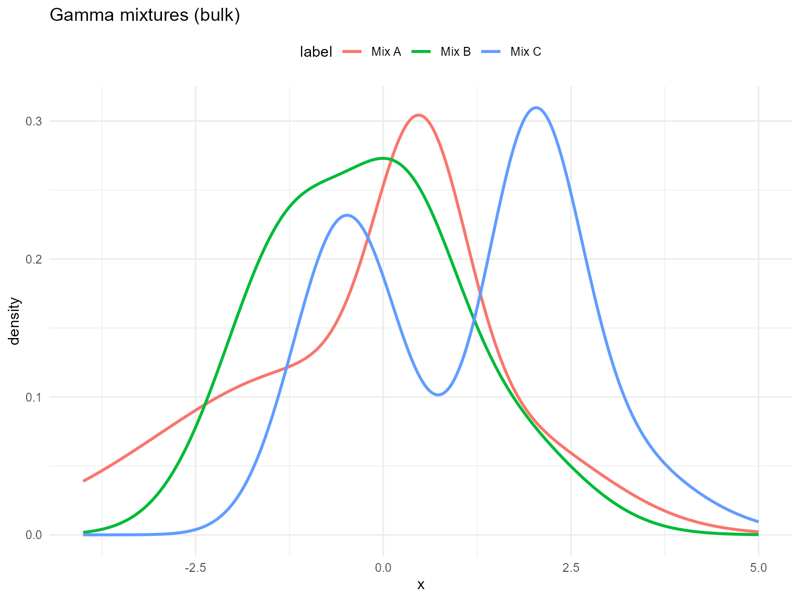
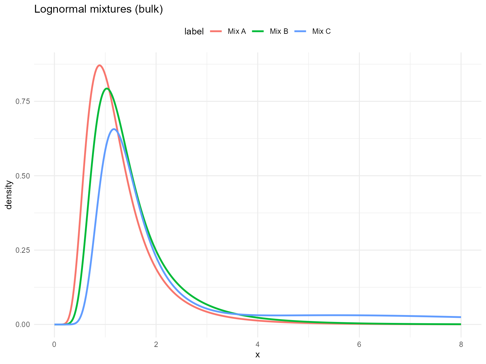
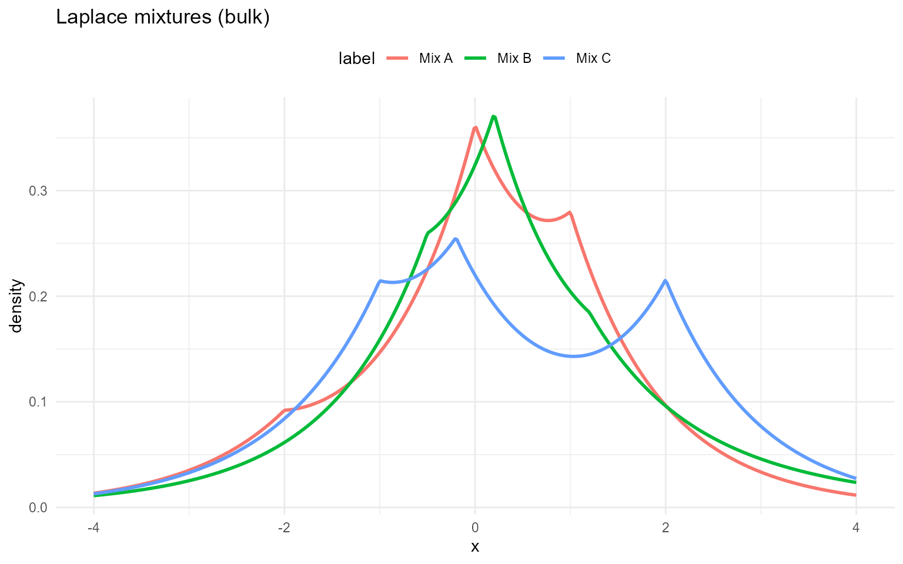
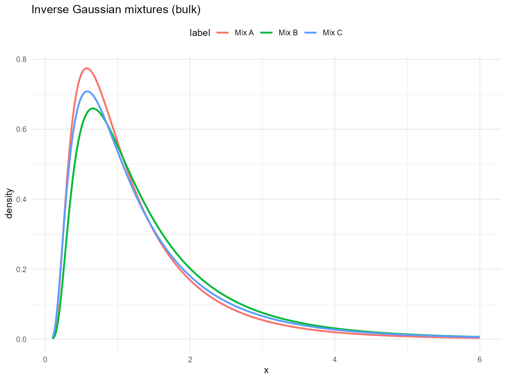
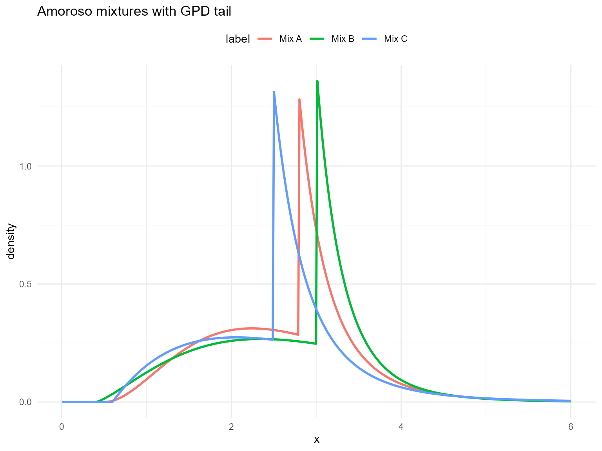
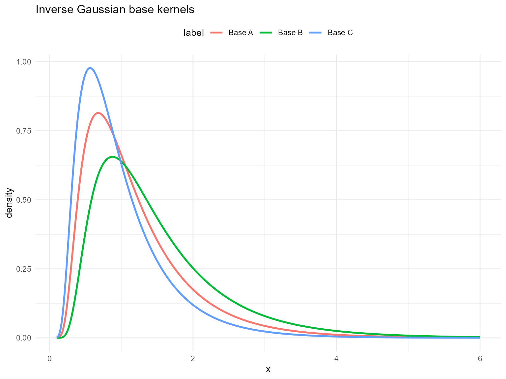
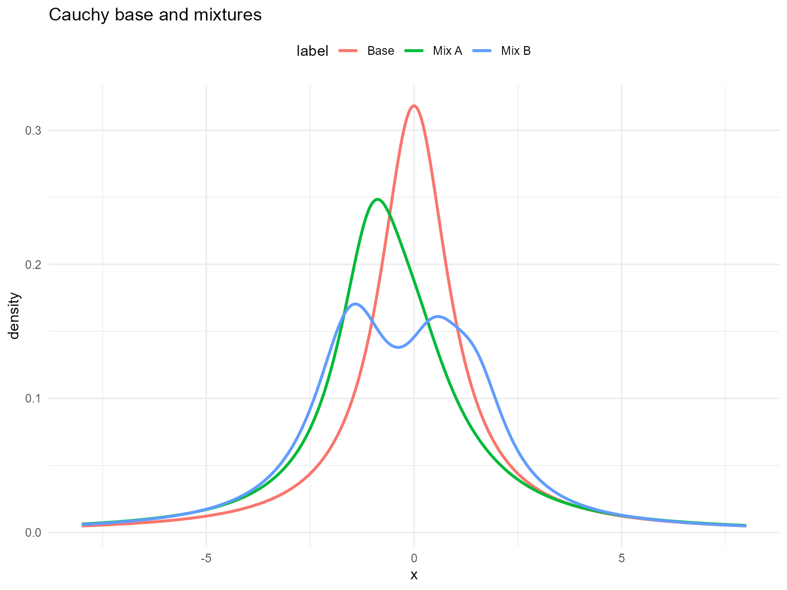

# 2. Available Distributions and Related Functions

> **Legacy vignette (for the website / historical notes).** These files
> may not match the current exported API one-to-one. Last verified:
> **2026-01-18**.
>
> For the up-to-date workflow, see the main package vignettes
> (Introduction, Model Spec, MCMC Workflow,
> Unconditional/Conditional/Causal, Backends, S3 Reference).

``` r
# Helpers
q_vec <- function(fn, probs, ...) vapply(probs, function(p) fn(p, ...), numeric(1))
density_curve <- function(grid, fn, args) {
  vapply(grid, function(x) do.call(fn, c(list(x = x), args)), numeric(1))
}

draw_many <- function(fn, args, n_draws = 5) {
  if (!is.null(args$label)) args$label <- NULL
  vapply(seq_len(n_draws), function(i) do.call(fn, c(list(n = 1), args)), numeric(1))

}
```

## Mathematical definitions and conventions

This vignette documents the probability distributions exported by
**DPmixGPD** and the corresponding `d/p/q/r` functions used throughout
the package. For a continuous random variable $`Y`$ with parameter
scalars $`\boldsymbol{\theta}`$, we use the standard quartet:

- **Density (PDF)**: $`f(y\mid\boldsymbol{\theta})`$, implemented by
  `d*()`.
- **Distribution (CDF)**: $`F(y\mid\boldsymbol{\theta})=\Pr(Y\le y)`$,
  implemented by `p*()`.
- **Quantile**:
  $`Q(p\mid\boldsymbol{\theta}) = \inf\{y: F(y\mid\boldsymbol{\theta})\ge p\}`$,
  implemented by `q*()`.
- **Random generation**: $`Y = Q(U\mid\boldsymbol{\theta})`$ with
  $`U\sim \text{Unif}(0,1)`$, implemented by `r*()`.

All `d*()` functions optionally return log-densities via `log = TRUE`,
i.e., $`\log f(y\mid\boldsymbol{\theta})`$. This is numerically
convenient because likelihoods multiply densities but add log-densities:
``` math

\log\Big\{\prod_{i=1}^n f(y_i\mid\boldsymbol{\theta})\Big\}=\sum_{i=1}^n \log f(y_i\mid\boldsymbol{\theta}).
```

All `p*()` functions support `lower.tail` and `log.p`:
``` math

\Pr(Y>y)=1-F(y),\qquad \log F(y)\ \text{or}\ \log\{1-F(y)\}.
```

The lowercase `d*()`, `p*()`, and `q*()` functions (e.g., `dgammamix`,
`pgammamix`) accept vector inputs for their first argument and evaluate
elementwise; `r*()` supports `n > 1` (including `n = 0`). The CamelCase
versions (e.g., `dGammaMix`) are NIMBLE-compatible scalar functions for
use in model code.

``` r
w <- c(0.60, 0.40)
shape <- c(2.0, 5.0)
scale <- c(1.0, 2.0)

# Use lowercase vectorized wrappers for R-side usage
dgammamix(seq(0.5, 2.0, length.out = 5), w = w, shape = shape, scale = scale)
```

    [1] 0.1819845 0.2190497 0.2155592 0.1936004 0.1654680

``` r
qgammamix(c(0.1, 0.5, 0.9), w = w, shape = shape, scale = scale)
```

    [1]  0.7309733  3.1258068 12.5500460

``` r
rgammamix(5, w = w, shape = shape, scale = scale)
```

    [1]  1.1270544  3.4631704 10.4522708  0.5783015  8.9755486

### Finite mixtures

Several kernels are available as **finite mixtures**. Let
$`f_j(\cdot\mid\boldsymbol{\theta}_j)`$ denote the $`j`$th component
density and let $`\boldsymbol{w}=(w_1,\ldots,w_J)`$ be mixture weights
with $`w_j\ge 0`$ and $`\sum_{j=1}^J w_j=1`$. The mixture density and
CDF are

``` math

f(y)=\sum_{j=1}^J w_j f_j(y\mid\boldsymbol{\theta}_j),
\qquad
F(y)=\sum_{j=1}^J w_j F_j(y\mid\boldsymbol{\theta}_j).
```

Random generation proceeds by sampling a latent component index
$`Z\sim\text{Categorical}(\boldsymbol{w})`$, then sampling
$`Y\mid Z=j\sim f_j(\cdot\mid\boldsymbol{\theta}_j)`$. Mixture quantiles
typically require numerical inversion of the mixture CDF.

### GPD tails and splicing

The **Generalized Pareto Distribution (GPD)** is used for tail modeling
relative to a threshold $`u`$. In the spliced kernels (the `*Gpd`
functions), a bulk kernel is used below $`u`$ and a GPD tail is attached
above $`u`$, with parameters $`(u,\sigma,\xi)`$. In code, these are
represented by `threshold = u`, `tail_scale = \sigma`, and
`tail_shape = \xi` (the standalone GPD functions use `scale` and `shape`
for $`\sigma`$ and $`\xi`$).

## Introduction with GPD kernel

### Generalized Pareto distribution (standalone tail)

The standalone GPD functions `dGpd`, `pGpd`, `qGpd`, and `rGpd`
implement the distribution of $`X`$**above a threshold** $`u`$. For
$`x\ge u`$, the density is

``` math

f(x;u,\sigma,\xi)=\frac{1}{\sigma}\left(1+\xi\frac{x-u}{\sigma}\right)^{-1/\xi-1},
\quad \sigma>0,
\quad 1+\xi\frac{x-u}{\sigma}>0.
```

The CDF is
``` math

F(x)=1-\left(1+\xi\frac{x-u}{\sigma}\right)^{-1/\xi},
\quad x\ge u,
```
and the quantile is
``` math

Q(p)=u+\frac{\sigma}{\xi}\Big[(1-p)^{-\xi}-1\Big],\quad p\in(0,1),\ \xi\ne 0,
```
with the exponential-limit case obtained as $`\xi\to 0`$.

**Parameter mapping (math $`\rightarrow`$ code):** $`u\to`$`threshold`,
$`\sigma\to`$`scale`, $`\xi\to`$`shape`. Log-densities are returned when
`log = TRUE`.

We show the DPmixGPD kernels in pairs: bulk-only and GPD-augmented. A
GPD tail above threshold $`u`$ uses

``` math
f_{GPD}(x; u, \sigma, \xi) = \frac{1}{\sigma} \left(1 + \xi \frac{x-u}{\sigma}\right)^{-1/\xi - 1} \ \text{for } x \ge u.
```

The standalone GPD tail distribution is available via `dGpd`, `pGpd`,
`qGpd`, and `rGpd` functions.

``` r
dGpd(1.8, threshold = 1.5, scale = 0.5, shape = 0.2)
```

    [1] 1.013262

``` r
dGpd(1.8, threshold = 1.5, scale = 0.5, shape = 0.2, log = TRUE)
```

    [1] 0.01317507

``` r
pGpd(1.8, threshold = 1.5, scale = 0.5, shape = 0.2)
```

    [1] 0.4325731

``` r
pGpd(1.8, threshold = 1.5, scale = 0.5, shape = 0.2, lower.tail = FALSE)
```

    [1] 0.5674269

``` r
pGpd(1.8, threshold = 1.5, scale = 0.5, shape = 0.2, log.p = TRUE)
```

    [1] -0.8380038

``` r
q_vec(qGpd, c(0.25, 0.5, 0.75), threshold = 1.5, scale = 0.5, shape = 0.2)
```

    [1] 1.648060 1.871746 2.298770

``` r
q_vec(qGpd, c(0.25, 0.5, 0.75), threshold = 1.5, scale = 0.5, shape = 0.2,
      lower.tail = FALSE)
```

    [1] 2.298770 1.871746 1.648060

``` r
q_vec(qGpd, c(log(0.25), log(0.5), log(0.75)), threshold = 1.5, scale = 0.5,
      shape = 0.2, log.p = TRUE)
```

    [1] 1.648060 1.871746 2.298770

``` r
draw_many(rGpd, list(threshold = 1.5, scale = 0.5, shape = 0.2))
```

    [1] 1.750848 2.376390 3.314836 1.622107 2.087044

``` r
grid <- seq(-4, 15, length.out = 500)
gpd_sets <- list(
  list(label = "GPD A", threshold = 1.5, tail_scale = 0.5, tail_shape = 0.2),
  list(label = "GPD B", threshold = 2.0, tail_scale = 0.6, tail_shape = 0.15),
  list(label = "GPD C", threshold = 1.0, tail_scale = 0.4, tail_shape = 0.25)
)

df_gpd <- do.call(rbind, lapply(gpd_sets, function(ps) {
  data.frame(x = grid, density = density_curve(grid, dGpd, list(threshold = ps$threshold, scale = ps$tail_scale, shape = ps$tail_shape)), label = ps$label)
}))

ggplot(df_gpd, aes(x = x, y = density, color = label)) +
  geom_line(linewidth = 1) +
  labs(title = "Standalone GPD tails", x = "x", y = "density") +
  theme_minimal() + theme(legend.position = "top")
```



Each subsection below defines the available $`d/p/q/r`$ functions,
prints example outputs for fixed parameters, and overlays density curves
for **three parameter sets** with clear legends. The same parameter sets
are reused within the bulk and GPD variants of a section.

## Normal

### Normal mixture kernel

A normal component is parameterized by $`\mu\in\mathbb{R}`$ and
$`\sigma>0`$:
``` math

f(y\mid\mu,\sigma)=\frac{1}{\sqrt{2\pi}\sigma}\exp\!\left(-\frac{(y-\mu)^2}{2\sigma^2}\right).
```

A finite normal mixture with $`J`$ components has density
``` math

f(y)=\sum_{j=1}^J w_j\,\mathcal{N}(y\mid\mu_j,\sigma_j^2),
\qquad \sum_{j=1}^J w_j=1.
```

**Parameter mapping (math $`\rightarrow`$ code):**
$`\mu_j\to`$`mean[j]`, $`\sigma_j\to`$`sd[j]`, $`w_j\to`$`w[j]`.

### Normal mixture with GPD tail

In the spliced version, the bulk distribution is the normal mixture
below $`u`$, and a GPD tail is attached above $`u`$. The tail parameters
are $`\sigma>0`$ and $`\xi`$, applied to exceedances $`x-u`$.

**Tail mapping (math $`\rightarrow`$ code):** $`u\to`$`threshold`,
$`\sigma\to`$`tail_scale`, $`\xi\to`$`tail_shape`.

### Without GPD (mixture kernel)

``` r
grid <- seq(-4, 5, length.out = 400)
normal_sets <- list(
  list(label = "Mix A", w = c(0.6, 0.3, 0.1), mean = c(-1, 0.5, 2), sd = c(2, 0.6, 1.1)),
  list(label = "Mix B", w = c(0.5, 0.3, 0.2), mean = c(-1.2, 0.3, 1.5), sd = c(0.9, 0.7, 1.0)),
  list(label = "Mix C", w = c(0.4, 0.35, 0.25), mean = c(-0.5, 2, 2.5), sd = c(0.7, 0.6, 1.2))
)

example <- normal_sets[[1]]
```

``` r
dNormMix(0, w = example$w, mean = example$mean, sd = example$sd)
```

    [1] 0.2535206

``` r
dNormMix(0, w = example$w, mean = example$mean, sd = example$sd, log = TRUE)
```

    [1] -1.37231

``` r
pNormMix(0, w = example$w, mean = example$mean, sd = example$sd)
```

    [1] 0.4790278

``` r
pNormMix(0, w = example$w, mean = example$mean, sd = example$sd, lower.tail = FALSE)
```

    [1] 0.5209722

``` r
pNormMix(0, w = example$w, mean = example$mean, sd = example$sd, log.p = TRUE)
```

    [1] -0.7359966

``` r
q_vec(qNormMix, c(0.25, 0.5, 0.75), w = example$w, mean = example$mean,
      sd = example$sd)
```

    [1] -1.42337727  0.08046623  0.94945934

``` r
q_vec(qNormMix, c(0.25, 0.5, 0.75), w = example$w, mean = example$mean,
      sd = example$sd, lower.tail = FALSE)
```

    [1]  0.94945934  0.08046623 -1.42337727

``` r
q_vec(qNormMix, c(log(0.25), log(0.5), log(0.75)), w = example$w,
      mean = example$mean, sd = example$sd, log.p = TRUE)
```

    [1] -1.42337727  0.08046623  0.94945934

``` r
draw_many(rNormMix, list(w = example$w, mean = example$mean, sd = example$sd))
```

    [1] -2.2424812 -1.5984302 -1.0898672 -2.7838423  0.9927327

``` r
df_norm <- do.call(rbind, lapply(normal_sets, function(ps) {
  data.frame(x = grid, density = density_curve(grid, dNormMix, list(w = ps$w, mean = ps$mean, sd = ps$sd)), label = ps$label)
}))

ggplot(df_norm, aes(x = x, y = density, color = label)) +
  geom_line(linewidth = 1) +
  labs(title = "Normal mixtures (bulk)", x = "x", y = "density") +
  theme_minimal() + theme(legend.position = "top")
```


### With GPD tail

Spliced density uses the same mixture for $`x<u`$ and attaches
$`f_{GPD}`$ above $`u`$ with continuity. CDF combines mixture CDF up to
$`u`$ and GPD exceedance beyond $`u`$; quantiles invert this spliced
CDF; RNG draws bulk vs tail by the CDF mass at $`u`$.

``` r
normal_gpd_sets <- list(
  list(label = "Mix A", w = c(0.6, 0.4), mean = c(-1, 2), sd = c(0.5, 0.8), threshold = 1.8, tail_scale = 0.4, tail_shape = 0.25),
  list(label = "Mix B", w = c(0.5, 0.5), mean = c(0, 1), sd = c(0.6, 0.6), threshold = 1.5, tail_scale = 0.3, tail_shape = 0.2),
  list(label = "Mix C", w = c(0.7, 0.3), mean = c(0.5, 2.5), sd = c(0.4, 1.0), threshold = 2.0, tail_scale = 0.5, tail_shape = 0.15)
)

example <- normal_gpd_sets[[1]]
```

``` r
dNormMixGpd(2, w = example$w, mean = example$mean, sd = example$sd, threshold = example$threshold, tail_scale = example$tail_scale, tail_shape = example$tail_shape)
```

    [1] 0.3322395

``` r
pNormMixGpd(2, w = example$w, mean = example$mean, sd = example$sd, threshold = example$threshold, tail_scale = example$tail_scale, tail_shape = example$tail_shape)
```

    [1] 0.8504922

``` r
q_vec(qNormMixGpd, c(0.5, 0.9), w = example$w, mean = example$mean, sd = example$sd, threshold = example$threshold, tail_scale = example$tail_scale, tail_shape = example$tail_shape)
```

    [1] -0.5173894  2.1903912

``` r
draw_many(rNormMixGpd, example)
```

    [1] -0.5405113  2.1568247  0.4085186  1.9550970 -1.7353762

``` r
df_norm_gpd <- do.call(rbind, lapply(normal_gpd_sets, function(ps) {
  data.frame(x = grid, density = density_curve(grid, dNormMixGpd, list(w = ps$w, mean = ps$mean, sd = ps$sd, threshold = ps$threshold, tail_scale = ps$tail_scale, tail_shape = ps$tail_shape)), label = ps$label)
}))

ggplot(df_norm_gpd, aes(x = x, y = density, color = label)) +
  geom_line(linewidth = 1) +
  labs(title = "Normal mixtures with GPD tail (different thresholds)", x = "x", y = "density") +
  theme_minimal() + theme(legend.position = "top")
```



## Gamma

### Gamma mixture kernel

A gamma component with shape $`\alpha>0`$ and scale $`\beta>0`$ has
density
``` math

f(y\mid \alpha,\beta)
=
\frac{1}{\Gamma(\alpha)\,\beta^\alpha}\,y^{\alpha-1}\exp\!\left(-\frac{y}{\beta}\right),
\qquad y>0.
```

A finite gamma mixture with $`J`$ components is
``` math

f(y)=\sum_{j=1}^J w_j\,f_j(y\mid \alpha_j,\beta_j),
\qquad w_j\ge 0,\ \sum_{j=1}^J w_j=1.
```

**Parameter mapping (math $`\rightarrow`$ code):** $`\alpha\to`$`shape`,
$`\beta\to`$`scale`, and weights $`w_j\to`$`w[j]`.

The `*MixGpd` variant uses the same splicing idea: gamma mixture below
$`u`$ and a GPD tail above $`u`$.

**Tail mapping (math $`\rightarrow`$ code):** $`u\to`$`threshold`,
$`\sigma\to`$`tail_scale`, $`\xi\to`$`tail_shape`.

### Without GPD (mixture kernel)

``` r
grid <- seq(0, 10, length.out = 400)
gamma_sets <- list(
  list(label = "Mix A", w = c(0.6, 0.3, 0.1), shape = c(2.0, 5.0, 9.0), scale = c(1.0, 0.6, 0.3)),
  list(label = "Mix B", w = c(0.5, 0.3, 0.2), shape = c(1.5, 4.0, 7.0), scale = c(1.2, 0.7, 0.35)),
  list(label = "Mix C", w = c(0.4, 0.3, 0.3), shape = c(1.2, 3.5, 6.0), scale = c(1.4, 0.75, 0.4))
)
example <- gamma_sets[[1]]

dens <- do.call(rbind, lapply(gamma_sets, function(s) {
  data.frame(
    x = grid,
    density = dGammaMix(grid, w = s$w, shape = s$shape, scale = s$scale),
    label = s$label
  )
}))
```

``` r
dGammaMix(2, w = example$w, shape = example$shape, scale = example$scale)
```

    [1] 0.2952082

``` r
dGammaMix(2, w = example$w, shape = example$shape, scale = example$scale, log = TRUE)
```

    [1] -1.220074

``` r
pGammaMix(2, w = example$w, shape = example$shape, scale = example$scale)
```

    [1] 0.452308

``` r
pGammaMix(2, w = example$w, shape = example$shape, scale = example$scale, lower.tail = FALSE)
```

    [1] 0.547692

``` r
pGammaMix(2, w = example$w, shape = example$shape, scale = example$scale, log.p = TRUE)
```

    [1] -0.7933919

``` r
qGammaMix(0.95, w = example$w, shape = example$shape, scale = example$scale)
```

    [1] 5.008484

``` r
qGammaMix(0.95, w = example$w, shape = example$shape, scale = example$scale, lower.tail = FALSE)
```

    [1] 0.4747765

``` r
df_gamma <- do.call(rbind, lapply(gamma_sets, function(ps) {
  data.frame(x = grid, density = density_curve(grid, dGammaMix, list(w = ps$w, shape = ps$shape, scale = ps$scale)), label = ps$label)
}))

ggplot(df_norm, aes(x = x, y = density, color = label)) +
  geom_line(linewidth = 1) +
  labs(title = "Gamma mixtures (bulk)", x = "x", y = "density") +
  theme_minimal() + theme(legend.position = "top")
```



### Gamma mixture with GPD tail

``` r
u <- 6
tail_scale <- 1.0
tail_shape <- 0.2
```

``` r
dGammaMixGpd(6.5, w = example$w, shape = example$shape, scale = example$scale,
             threshold = u, tail_scale = tail_scale, tail_shape = tail_shape)
```

    [1] 0.01094814

``` r
dGammaMixGpd(6.5, w = example$w, shape = example$shape, scale = example$scale,
             threshold = u, tail_scale = tail_scale, tail_shape = tail_shape, log = TRUE)
```

    [1] -4.514586

``` r
pGammaMixGpd(6.5, w = example$w, shape = example$shape, scale = example$scale,
             threshold = u, tail_scale = tail_scale, tail_shape = tail_shape)
```

    [1] 0.987957

``` r
pGammaMixGpd(6.5, w = example$w, shape = example$shape, scale = example$scale,
             threshold = u, tail_scale = tail_scale, tail_shape = tail_shape, lower.tail = FALSE)
```

    [1] 0.01204295

``` r
qGammaMixGpd(0.95, w = example$w, shape = example$shape, scale = example$scale,
             threshold = u, tail_scale = tail_scale, tail_shape = tail_shape)
```

    [1] 5.008484

``` r
gamma_gpd_sets <- list(
  list(label = "Mix A", w = c(0.6, 0.4), shape = c(2.0, 5.0), scale = c(1.0, 0.6), threshold = 6.0, tail_scale = 1.0, tail_shape = 0.2),
  list(label = "Mix B", w = c(0.5, 0.5), shape = c(1.5, 4.0), scale = c(1.2, 0.7), threshold = 5.5, tail_scale = 0.8, tail_shape = 0.15),
  list(label = "Mix C", w = c(0.7, 0.3), shape = c(1.2, 3.5), scale = c(1.4, 0.75), threshold = 6.5, tail_scale = 1.2, tail_shape = 0.25)
)


df_gamma_gpd <- do.call(rbind, lapply(gamma_gpd_sets, function(ps) {
  data.frame(x = grid, density = density_curve(grid, dGammaMixGpd, list(w = ps$w, shape = ps$shape, scale = ps$scale, threshold = ps$threshold, tail_scale = ps$tail_scale, tail_shape = ps$tail_shape)), label = ps$label)
}))

ggplot(df_norm_gpd, aes(x = x, y = density, color = label)) +
  geom_line(linewidth = 1) +
  labs(title = "Gamma mixtures with GPD tail (different thresholds)", x = "x", y = "density") +
  theme_minimal() + theme(legend.position = "top")
```

 \##
Lognormal

### Lognormal mixture kernel

A lognormal component is defined by
$`\log Y \sim \mathcal{N}(\mu,\sigma^2)`$, i.e.,
``` math

f(y\mid\mu,\sigma)=\frac{1}{y\,\sigma\sqrt{2\pi}}\exp\!\left(-\frac{(\log y-\mu)^2}{2\sigma^2}\right),\quad y>0.
```

A finite lognormal mixture has density
``` math

f(y)=\sum_{j=1}^J w_j\,\text{Lognormal}(y\mid\mu_j,\sigma_j^2),\quad y>0.
```

**Parameter mapping (math $`\rightarrow`$ code):**
$`\mu_j\to`$`meanlog[j]`, $`\sigma_j\to`$`sdlog[j]`, $`w_j\to`$`w[j]`.

### Lognormal mixture with GPD tail

The `*MixGpd` variant uses the same splicing idea: lognormal mixture
below $`u`$, GPD tail above $`u`$.

**Tail mapping (math $`\rightarrow`$ code):** $`u\to`$`threshold`,
$`\sigma\to`$`tail_scale`, $`\xi\to`$`tail_shape`.

### Without GPD (mixture kernel)

``` r
grid <- seq(0, 8, length.out = 400)
logn_sets <- list(
  list(label = "Mix A", w = c(0.6, 0.3, 0.1), meanlog = c(0.0, 0.3, 0.6), sdlog = c(0.4, 0.5, 0.6)),
  list(label = "Mix B", w = c(0.5, 0.3, 0.2), meanlog = c(0.1, 0.4, 0.7), sdlog = c(0.35, 0.45, 0.55)),
  list(label = "Mix C", w = c(0.4, 0.35, 0.25), meanlog = c(0.2, 0.5, 2), sdlog = c(0.3, 0.4, 0.5))
)

example <- logn_sets[[1]]
```

``` r
dLognormalMix(1, w = example$w, meanlog = example$meanlog, sdlog = example$sdlog)
```

    [1] 0.8386766

``` r
dLognormalMix(1, w = example$w, meanlog = example$meanlog, sdlog = example$sdlog, log = TRUE)
```

    [1] -0.1759301

``` r
pLognormalMix(1, w = example$w, meanlog = example$meanlog, sdlog = example$sdlog)
```

    [1] 0.3981415

``` r
pLognormalMix(1, w = example$w, meanlog = example$meanlog, sdlog = example$sdlog, lower.tail = FALSE)
```

    [1] 0.6018585

``` r
pLognormalMix(1, w = example$w, meanlog = example$meanlog, sdlog = example$sdlog, log.p = TRUE)
```

    [1] -0.9209479

``` r
q_vec(qLognormalMix, c(0.25, 0.5, 0.75), w = example$w,
      meanlog = example$meanlog, sdlog = example$sdlog)
```

    [1] 0.8282429 1.1278180 1.5752146

``` r
q_vec(qLognormalMix, c(0.25, 0.5, 0.75), w = example$w,
      meanlog = example$meanlog, sdlog = example$sdlog, lower.tail = FALSE)
```

    [1] 1.5752146 1.1278180 0.8282429

``` r
q_vec(qLognormalMix, c(log(0.25), log(0.5), log(0.75)), w = example$w,
      meanlog = example$meanlog, sdlog = example$sdlog, log.p = TRUE)
```

    [1] 0.8282429 1.1278180 1.5752146

``` r
draw_many(rLognormalMix, list(w = example$w, meanlog = example$meanlog, sdlog = example$sdlog))
```

    [1] 1.0188662 1.7219749 0.8408650 0.9787079 1.5852858

``` r
df_logn <- do.call(rbind, lapply(logn_sets, function(ps) {
  data.frame(x = grid, density = density_curve(grid, dLognormalMix, list(w = ps$w, meanlog = ps$meanlog, sdlog = ps$sdlog)), label = ps$label)
}))

ggplot(df_logn, aes(x = x, y = density, color = label)) +
  geom_line(linewidth = 1) +
  labs(title = "Lognormal mixtures (bulk)", x = "x", y = "density") +
  theme_minimal() + theme(legend.position = "top")
```



### With GPD tail

``` r
logn_gpd_sets <- list(
  list(label = "Mix A", w = c(0.6, 0.4), meanlog = c(0, 1), sdlog = c(0.3, 0.5), threshold = 2.5, tail_scale = 0.5, tail_shape = 0.2),
  list(label = "Mix B", w = c(0.5, 0.5), meanlog = c(0.5, 1.2), sdlog = c(0.4, 0.4), threshold = 2.0, tail_scale = 0.4, tail_shape = 0.15),
  list(label = "Mix C", w = c(0.7, 0.3), meanlog = c(0.8, 1.5), sdlog = c(0.25, 0.6), threshold = 3.0, tail_scale = 0.6, tail_shape = 0.18)
)

example <- logn_gpd_sets[[1]]
```

``` r
dLognormalMixGpd(2.5, w = example$w, meanlog = example$meanlog, sdlog = example$sdlog, threshold = example$threshold, tail_scale = example$tail_scale, tail_shape = example$tail_shape)
```

    [1] 0.4545372

``` r
pLognormalMixGpd(2.5, w = example$w, meanlog = example$meanlog, sdlog = example$sdlog, threshold = example$threshold, tail_scale = example$tail_scale, tail_shape = example$tail_shape)
```

    [1] 0.7727314

``` r
q_vec(qLognormalMixGpd, c(0.5, 0.9), w = example$w, meanlog = example$meanlog, sdlog = example$sdlog, threshold = example$threshold, tail_scale = example$tail_scale, tail_shape = example$tail_shape)
```

    [1] 1.273895 2.946103

``` r
draw_many(rLognormalMixGpd, example)
```

    [1] 2.7221702 1.4498951 6.5466374 0.8729865 1.5169697

``` r
df_logn_gpd <- do.call(rbind, lapply(logn_gpd_sets, function(ps) {
  data.frame(x = grid, density = density_curve(grid, dLognormalMixGpd, list(w = ps$w, meanlog = ps$meanlog, sdlog = ps$sdlog, threshold = ps$threshold, tail_scale = ps$tail_scale, tail_shape = ps$tail_shape)), label = ps$label)
}))

ggplot(df_logn_gpd, aes(x = x, y = density, color = label)) +
  geom_line(linewidth = 1) +
  labs(title = "Lognormal mixtures with GPD tail (different thresholds)", x = "x", y = "density") +
  theme_minimal() + theme(legend.position = "top")
```


## Laplace

### Laplace mixture kernel

A Laplace (double-exponential) component with location
$`\ell\in\mathbb{R}`$ and scale $`b>0`$ has density
``` math

f(y\mid \ell,b)=\frac{1}{2b}\exp\!\left(-\frac{|y-\ell|}{b}\right),\quad y\in\mathbb{R}.
```

A finite Laplace mixture is
``` math

f(y)=\sum_{j=1}^J w_j\,\text{Laplace}(y\mid \ell_j,b_j).
```

**Parameter mapping (math $`\rightarrow`$ code):**
$`\ell_j\to`$`location[j]`, $`b_j\to`$`scale[j]`, $`w_j\to`$`w[j]`.

### Laplace mixture with GPD tail

The spliced kernel uses the Laplace mixture below $`u`$ and a GPD tail
above $`u`$.

**Tail mapping (math $`\rightarrow`$ code):** $`u\to`$`threshold`,
$`\sigma\to`$`tail_scale`, $`\xi\to`$`tail_shape`.

### Without GPD (mixture kernel)

Laplace mixture density
$`f(x)=\sum_j w_j\,\text{Laplace}(x\mid \ell_j, b_j)`$.

``` r
grid <- seq(-4, 4, length.out = 400)
lap_sets <- list(
  list(label = "Mix A", w = c(0.6, 0.3, 0.1), location = c(0.0, 1.0, -2), scale = c(1.0, 0.9, 1.1)),
  list(label = "Mix B", w = c(0.5, 0.3, 0.2), location = c(0.2, 1.2, -0.5), scale = c(0.9, 2, 1.0)),
  list(label = "Mix C", w = c(0.4, 0.35, 0.25), location = c(-0.2, 2, -1.0), scale = c(1.1, 0.95, 1.05))
)

example <- lap_sets[[1]]
```

``` r
dLaplaceMix(0, w = example$w, location = example$location, scale = example$scale)
```

    [1] 0.3622437

``` r
dLaplaceMix(0, w = example$w, location = example$location, scale = example$scale, log = TRUE)
```

    [1] -1.015438

``` r
pLaplaceMix(0, w = example$w, location = example$location, scale = example$scale)
```

    [1] 0.4412629

``` r
pLaplaceMix(0, w = example$w, location = example$location, scale = example$scale, lower.tail = FALSE)
```

    [1] 0.5587371

``` r
pLaplaceMix(0, w = example$w, location = example$location, scale = example$scale, log.p = TRUE)
```

    [1] -0.8181144

``` r
q_vec(qLaplaceMix, c(0.25, 0.5, 0.75), w = example$w,
      location = example$location, scale = example$scale)
```

    [1] -0.7341261  0.1712536  1.0499993

``` r
q_vec(qLaplaceMix, c(0.25, 0.5, 0.75), w = example$w,
      location = example$location, scale = example$scale, lower.tail = FALSE)
```

    [1]  1.0499993  0.1712536 -0.7341261

``` r
q_vec(qLaplaceMix, c(log(0.25), log(0.5), log(0.75)), w = example$w,
      location = example$location, scale = example$scale, log.p = TRUE)
```

    [1] -0.7341261  0.1712536  1.0499993

``` r
draw_many(rLaplaceMix, list(w = example$w, location = example$location, scale = example$scale))
```

    [1] -3.2177890  1.8796562  1.9953426  0.2669865 -1.1081767

``` r
df_lap <- do.call(rbind, lapply(lap_sets, function(ps) {
  data.frame(x = grid, density = density_curve(grid, dLaplaceMix, list(w = ps$w, location = ps$location, scale = ps$scale)), label = ps$label)
}))

ggplot(df_lap, aes(x = x, y = density, color = label)) +
  geom_line(linewidth = 1) +
  labs(title = "Laplace mixtures (bulk)", x = "x", y = "density") +
  theme_minimal() + theme(legend.position = "top")
```



### With GPD tail

``` r
lap_gpd_sets <- list(
  list(label = "Mix A", w = c(0.6, 0.4), location = c(-0.5, 1), scale = c(0.4, 0.6), threshold = 1.5, tail_scale = 0.35, tail_shape = 0.3),
  list(label = "Mix B", w = c(0.5, 0.5), location = c(0, 0.8), scale = c(0.5, 0.5), threshold = 1.2, tail_scale = 0.3, tail_shape = 0.25),
  list(label = "Mix C", w = c(0.7, 0.3), location = c(0.2, 1.5), scale = c(0.35, 0.7), threshold = 1.8, tail_scale = 0.4, tail_shape = 0.22)
)

example <- lap_gpd_sets[[1]]
```

``` r
dLaplaceMixGpd(1, w = example$w, location = example$location, scale = example$scale, threshold = example$threshold, tail_scale = example$tail_scale, tail_shape = example$tail_shape)
```

    [1] 0.3509716

``` r
pLaplaceMixGpd(1, w = example$w, location = example$location, scale = example$scale, threshold = example$threshold, tail_scale = example$tail_scale, tail_shape = example$tail_shape)
```

    [1] 0.7929447

``` r
q_vec(qLaplaceMixGpd, c(0.5, 0.9), w = example$w, location = example$location, scale = example$scale, threshold = example$threshold, tail_scale = example$tail_scale, tail_shape = example$tail_shape)
```

    [1] -0.1619177  1.4304946

``` r
draw_many(rLaplaceMixGpd, example)
```

    [1]  2.0647657 -2.4331251 -0.6120808  1.7658926 -0.1651974

``` r
df_lap_gpd <- do.call(rbind, lapply(lap_gpd_sets, function(ps) {
  data.frame(x = grid, density = density_curve(grid, dLaplaceMixGpd, list(w = ps$w, location = ps$location, scale = ps$scale, threshold = ps$threshold, tail_scale = ps$tail_scale, tail_shape = ps$tail_shape)), label = ps$label)
}))

ggplot(df_lap_gpd, aes(x = x, y = density, color = label)) +
  geom_line(linewidth = 1) +
  labs(title = "Laplace mixtures with GPD tail (different thresholds)", x = "x", y = "density") +
  theme_minimal() + theme(legend.position = "top")
```


## Inverse Gaussian (mixture kernel)

### Inverse Gaussian mixture kernel

An inverse Gaussian component with mean $`\mu>0`$ and shape
$`\lambda>0`$ has density
``` math

f(y\mid \mu,\lambda)
=
\left(\frac{\lambda}{2\pi y^3}\right)^{1/2}
\exp\!\left(-\frac{\lambda (y-\mu)^2}{2\mu^2 y}\right),
\quad y>0.
```

A finite inverse Gaussian mixture is
``` math

f(y)=\sum_{j=1}^J w_j\,\text{IG}(y\mid \mu_j,\lambda_j),\quad y>0.
```

**Parameter mapping (math $`\rightarrow`$ code):**
$`\mu_j\to`$`mean[j]`, $`\lambda_j\to`$`shape[j]`, $`w_j\to`$`w[j]`.

### Inverse Gaussian mixture with GPD tail

The spliced variant attaches a GPD tail above $`u`$.

**Tail mapping (math $`\rightarrow`$ code):** $`u\to`$`threshold`,
$`\sigma\to`$`tail_scale`, $`\xi\to`$`tail_shape`.

### Without GPD

``` r
grid <- seq(0.1, 6, length.out = 400)
ig_sets <- list(
  list(label = "Mix A", w = c(0.6, 0.3, 0.1), mean = c(1.0, 1.5, 2.0), shape = c(2.0, 3.0, 4.0)),
  list(label = "Mix B", w = c(0.5, 0.3, 0.2), mean = c(1.1, 1.6, 2.2), shape = c(2.2, 3.2, 4.2)),
  list(label = "Mix C", w = c(0.4, 0.35, 0.25), mean = c(0.9, 1.4, 2.1), shape = c(1.8, 2.8, 3.8))
)

example <- ig_sets[[1]]
```

``` r
dInvGaussMix(1, w = example$w, mean = example$mean, shape = example$shape)
```

    [1] 0.5623806

``` r
dInvGaussMix(1.5, w = example$w, mean = example$mean, shape = example$shape, log = TRUE)
```

    [1] -1.175151

``` r
pInvGaussMix(1.5, w = example$w, mean = example$mean, shape = example$shape)
```

    [1] 0.7287565

``` r
pInvGaussMix(1.5, w = example$w, mean = example$mean, shape = example$shape, lower.tail = FALSE)
```

    [1] 0.2712435

``` r
pInvGaussMix(1.5, w = example$w, mean = example$mean, shape = example$shape, log.p = TRUE)
```

    [1] -0.3164157

``` r
q_vec(qInvGaussMix, c(0.25, 0.5, 0.75), w = example$w, mean = example$mean,
      shape = example$shape)
```

    [1] 0.6082680 0.9714913 1.5718861

``` r
q_vec(qInvGaussMix, c(0.25, 0.5, 0.75), w = example$w, mean = example$mean,
      shape = example$shape, lower.tail = FALSE)
```

    [1] 1.5718861 0.9714913 0.6082680

``` r
q_vec(qInvGaussMix, c(log(0.25), log(0.5), log(0.75)), w = example$w,
      mean = example$mean, shape = example$shape, log.p = TRUE)
```

    [1] 0.6082680 0.9714913 1.5718861

``` r
draw_many(rInvGaussMix, list(w = example$w, mean = example$mean, shape = example$shape))
```

    [1] 0.8427395 1.2943944 0.9548876 1.2507577 1.6318351

``` r
df_ig <- do.call(rbind, lapply(ig_sets, function(ps) {
  data.frame(x = grid, density = density_curve(grid, dInvGaussMix, list(w = ps$w, mean = ps$mean, shape = ps$shape)), label = ps$label)
}))

ggplot(df_ig, aes(x = x, y = density, color = label)) +
  geom_line(linewidth = 1) +
  labs(title = "Inverse Gaussian mixtures (bulk)", x = "x", y = "density") +
  theme_minimal() + theme(legend.position = "top")
```



### With GPD tail

``` r
ig_gpd_sets <- list(
  list(label = "Mix A", w = c(0.6, 0.4), mean = c(1, 2.5), shape = c(2, 3), threshold = 2.5, tail_scale = 0.5, tail_shape = 0.25),
  list(label = "Mix B", w = c(0.5, 0.5), mean = c(1.5, 2), shape = c(2.5, 2.5), threshold = 2.0, tail_scale = 0.4, tail_shape = 0.2),
  list(label = "Mix C", w = c(0.7, 0.3), mean = c(1.2, 3), shape = c(3, 2), threshold = 3.0, tail_scale = 0.6, tail_shape = 0.18)
)

example <- ig_gpd_sets[[1]]
```

``` r
dInvGaussMixGpd(2.5, w = example$w, mean = example$mean, shape = example$shape, threshold = example$threshold, tail_scale = example$tail_scale, tail_shape = example$tail_shape)
```

    [1] 0.3251727

``` r
pInvGaussMixGpd(2.5, w = example$w, mean = example$mean, shape = example$shape, threshold = example$threshold, tail_scale = example$tail_scale, tail_shape = example$tail_shape)
```

    [1] 0.8374137

``` r
q_vec(qInvGaussMixGpd, c(0.5, 0.9), w = example$w, mean = example$mean, shape = example$shape, threshold = example$threshold, tail_scale = example$tail_scale, tail_shape = example$tail_shape)
```

    [1] 1.061874 2.758401

``` r
draw_many(rInvGaussMixGpd, example)
```

    [1] 1.9174888 0.5303355 0.6706898 2.0467130 1.2647710

``` r
df_ig_gpd <- do.call(rbind, lapply(ig_gpd_sets, function(ps) {
  data.frame(x = grid, density = density_curve(grid, dInvGaussMixGpd, list(w = ps$w, mean = ps$mean, shape = ps$shape, threshold = ps$threshold, tail_scale = ps$tail_scale, tail_shape = ps$tail_shape)), label = ps$label)
}))

ggplot(df_ig_gpd, aes(x = x, y = density, color = label)) +
  geom_line(linewidth = 1) +
  labs(title = "Inverse Gaussian mixtures with GPD tail", x = "x", y = "density") +
  theme_minimal() + theme(legend.position = "top")
```


## Amoroso (bulk kernel and mixture)

### Amoroso mixture kernel

An Amoroso component with location $`a\in\mathbb{R}`$, scale
$`\theta\neq 0`$, and shapes $`\alpha>0`$, $`\beta>0`$ has density (for
$`y>a`$)
``` math

f(y\mid a,\theta,\alpha,\beta)
=
\frac{1}{\Gamma(\alpha)}
\left|\frac{\beta}{\theta}\right|
\left(\frac{y-a}{\theta}\right)^{\alpha\beta-1}
\exp\!\left[-\left(\frac{y-a}{\theta}\right)^{\beta}\right].
```

A finite Amoroso mixture is
``` math

f(y)=\sum_{j=1}^J w_j\,f_j(y\mid a_j,\theta_j,\alpha_j,\beta_j).
```

**Parameter mapping (math $`\rightarrow`$ code):** $`a_j\to`$`loc[j]`,
$`\theta_j\to`$`scale[j]`, $`\alpha_j\to`$`shape1[j]`,
$`\beta_j\to`$`shape2[j]`, $`w_j\to`$`w[j]`.

### Amoroso mixture with GPD tail

The spliced kernel attaches a GPD tail above $`u`$.

**Tail mapping (math $`\rightarrow`$ code):** $`u\to`$`threshold`,
$`\sigma\to`$`tail_scale`, $`\xi\to`$`tail_shape`.

### Without GPD

``` r
grid <- seq(0.01, 6, length.out = 400)
amor_sets <- list(
  list(label = "Mix A", w = c(0.6, 0.3, 0.1), loc = c(0.5, 0.5, 0.5), scale = c(1.0, 1.3, 1.6), shape1 = c(2.5, 3.0, 4.0), shape2 = c(1.2, 1.2, 1.2)),
  list(label = "Mix B", w = c(0.5, 0.3, 0.2), loc = c(0.4, 0.6, 0.6), scale = c(1.1, 1.2, 1.5), shape1 = c(2.2, 2.8, 3.8), shape2 = c(1.1, 1.2, 1.3)),
  list(label = "Mix C", w = c(0.4, 0.35, 0.25), loc = c(0.6, 0.6, 0.6), scale = c(0.9, 1.1, 1.4), shape1 = c(2.0, 2.6, 3.5), shape2 = c(1.0, 1.1, 1.2))
)

example <- amor_sets[[1]]
```

``` r
dAmorosoMix(2, w = example$w, loc = example$loc, scale = example$scale,
            shape1 = example$shape1, shape2 = example$shape2)
```

    [1] 0.3047048

``` r
dAmorosoMix(2, w = example$w, loc = example$loc, scale = example$scale,
            shape1 = example$shape1, shape2 = example$shape2, log = TRUE)
```

    [1] -1.188412

``` r
pAmorosoMix(2, w = example$w, loc = example$loc, scale = example$scale,
            shape1 = example$shape1, shape2 = example$shape2)
```

    [1] 0.2402211

``` r
pAmorosoMix(2, w = example$w, loc = example$loc, scale = example$scale,
            shape1 = example$shape1, shape2 = example$shape2, lower.tail = FALSE)
```

    [1] 0.7597789

``` r
pAmorosoMix(2, w = example$w, loc = example$loc, scale = example$scale,
            shape1 = example$shape1, shape2 = example$shape2, log.p = TRUE)
```

    [1] -1.426196

``` r
q_vec(qAmorosoMix, c(0.25, 0.5, 0.75), w = example$w, loc = example$loc,
      scale = example$scale, shape1 = example$shape1, shape2 = example$shape2)
```

    [1] 2.031993 2.858225 3.993931

``` r
q_vec(qAmorosoMix, c(0.25, 0.5, 0.75), w = example$w, loc = example$loc,
      scale = example$scale, shape1 = example$shape1, shape2 = example$shape2,
      lower.tail = FALSE)
```

    [1] 3.993931 2.858225 2.031993

``` r
q_vec(qAmorosoMix, c(log(0.25), log(0.5), log(0.75)), w = example$w,
      loc = example$loc, scale = example$scale, shape1 = example$shape1,
      shape2 = example$shape2, log.p = TRUE)
```

    [1] 2.031993 2.858225 3.993931

``` r
draw_many(rAmorosoMix, list(w = example$w, loc = example$loc,
                            scale = example$scale, shape1 = example$shape1,
                            shape2 = example$shape2))
```

    [1] 2.103899 4.032512 3.864348 4.200887 3.966389

``` r
df_amor <- do.call(rbind, lapply(amor_sets, function(ps) {
  data.frame(x = grid, density = density_curve(grid, dAmorosoMix, list(w = ps$w, loc = ps$loc, scale = ps$scale, shape1 = ps$shape1, shape2 = ps$shape2)), label = ps$label)
}))

ggplot(df_amor, aes(x = x, y = density, color = label)) +
  geom_line(linewidth = 1) +
  labs(title = "Amoroso mixtures (bulk)", x = "x", y = "density") +
  theme_minimal() + theme(legend.position = "top")
```


### With GPD tail

``` r
amor_gpd_sets <- list(
  list(label = "Mix A", w = c(0.6, 0.3, 0.1), loc = c(0.5, 0.5, 0.5), scale = c(1.0, 1.3, 1.6), shape1 = c(2.5, 3.0, 4.0), shape2 = c(1.2, 1.2, 1.2), threshold = 2.8, tail_scale = 0.4, tail_shape = 0.2),
  list(label = "Mix B", w = c(0.5, 0.3, 0.2), loc = c(0.4, 0.6, 0.6), scale = c(1.1, 1.2, 1.5), shape1 = c(2.2, 2.8, 3.8), shape2 = c(1.1, 1.2, 1.3), threshold = 3.0, tail_scale = 0.35, tail_shape = 0.18),
  list(label = "Mix C", w = c(0.4, 0.35, 0.25), loc = c(0.6, 0.6, 0.6), scale = c(0.9, 1.1, 1.4), shape1 = c(2.0, 2.6, 3.5), shape2 = c(1.0, 1.1, 1.2), threshold = 2.5, tail_scale = 0.45, tail_shape = 0.22)
)
example <- amor_gpd_sets[[1]]
```

``` r
dAmorosoMixGpd(3, w = example$w, loc = example$loc, scale = example$scale,
               shape1 = example$shape1, shape2 = example$shape2,
               threshold = example$threshold, tail_scale = example$tail_scale,
               tail_shape = example$tail_shape)
```

    [1] 0.7287094

``` r
dAmorosoMixGpd(3, w = example$w, loc = example$loc, scale = example$scale,
               shape1 = example$shape1, shape2 = example$shape2,
               threshold = example$threshold, tail_scale = example$tail_scale,
               tail_shape = example$tail_shape, log = TRUE)
```

    [1] -0.3164802

``` r
pAmorosoMixGpd(3, w = example$w, loc = example$loc, scale = example$scale,
               shape1 = example$shape1, shape2 = example$shape2,
               threshold = example$threshold, tail_scale = example$tail_scale,
               tail_shape = example$tail_shape)
```

    [1] 0.6793679

``` r
pAmorosoMixGpd(3, w = example$w, loc = example$loc, scale = example$scale,
               shape1 = example$shape1, shape2 = example$shape2,
               threshold = example$threshold, tail_scale = example$tail_scale,
               tail_shape = example$tail_shape, lower.tail = FALSE)
```

    [1] 0.3206321

``` r
pAmorosoMixGpd(3, w = example$w, loc = example$loc, scale = example$scale,
               shape1 = example$shape1, shape2 = example$shape2,
               threshold = example$threshold, tail_scale = example$tail_scale,
               tail_shape = example$tail_shape, log.p = TRUE)
```

    [1] -0.3865925

``` r
q_vec(qAmorosoMixGpd, c(0.25, 0.5, 0.75), w = example$w, loc = example$loc,
      scale = example$scale, shape1 = example$shape1, shape2 = example$shape2,
      threshold = example$threshold, tail_scale = example$tail_scale,
      tail_shape = example$tail_shape)
```

    [1] 2.031993 2.812937 3.112257

``` r
q_vec(qAmorosoMixGpd, c(0.25, 0.5, 0.75), w = example$w, loc = example$loc,
      scale = example$scale, shape1 = example$shape1, shape2 = example$shape2,
      threshold = example$threshold, tail_scale = example$tail_scale,
      tail_shape = example$tail_shape, lower.tail = FALSE)
```

    [1] 3.112257 2.812937 2.031993

``` r
q_vec(qAmorosoMixGpd, c(log(0.25), log(0.5), log(0.75)), w = example$w,
      loc = example$loc, scale = example$scale, shape1 = example$shape1,
      shape2 = example$shape2, threshold = example$threshold,
      tail_scale = example$tail_scale, tail_shape = example$tail_shape,
      log.p = TRUE)
```

    [1] 2.031993 2.812937 3.112257

``` r
draw_many(rAmorosoMixGpd, example)
```

    [1] 3.841513 4.419389 3.143875 3.007030 4.147190

``` r
df_amor_gpd <- do.call(rbind, lapply(amor_gpd_sets, function(ps) {
  data.frame(x = grid, density = density_curve(grid, dAmorosoMixGpd, list(w = ps$w, loc = ps$loc, scale = ps$scale, shape1 = ps$shape1, shape2 = ps$shape2, threshold = ps$threshold, tail_scale = ps$tail_scale, tail_shape = ps$tail_shape)), label = ps$label)
}))

ggplot(df_amor_gpd, aes(x = x, y = density, color = label)) +
  geom_line(linewidth = 1) +
  labs(title = "Amoroso mixtures with GPD tail", x = "x", y = "density") +
  theme_minimal() + theme(legend.position = "top")
```



## Inverse Gaussian (base kernel)

### Inverse Gaussian base kernel

This section documents the same inverse Gaussian density as above, but
for a **single** component rather than a mixture:
``` math

f(y\mid \mu,\lambda)
=
\left(\frac{\lambda}{2\pi y^3}\right)^{1/2}
\exp\!\left(-\frac{\lambda (y-\mu)^2}{2\mu^2 y}\right),
\quad y>0.
```

**Parameter mapping (math $`\rightarrow`$ code):** $`\mu\to`$`mean`,
$`\lambda\to`$`shape`.

### Inverse Gaussian base with GPD tail

The `dInvGaussGpd`, `pInvGaussGpd`, `qInvGaussGpd`, and `rInvGaussGpd`
functions splice the base inverse Gaussian below $`u`$ with a GPD tail
above $`u`$.

**Tail mapping (math $`\rightarrow`$ code):** $`u\to`$`threshold`,
$`\sigma\to`$`tail_scale`, $`\xi\to`$`tail_shape`.

### Without GPD

``` r
grid <- seq(0.1, 6, length.out = 400)
ig_base_sets <- list(
  list(label = "Base A", mean = 1.2, shape = 3.0),
  list(label = "Base B", mean = 1.5, shape = 4.0),
  list(label = "Base C", mean = 1.0, shape = 2.5)
)

example <- ig_base_sets[[1]]
```

``` r
dInvGauss(1, mean = example$mean, shape = example$shape)
```

    [1] 0.6627887

``` r
dInvGauss(1, mean = example$mean, shape = example$shape, log = TRUE)
```

    [1] -0.4112991

``` r
pInvGauss(1, mean = example$mean, shape = example$shape)
```

    [1] 0.4974402

``` r
pInvGauss(1, mean = example$mean, shape = example$shape, lower.tail = FALSE)
```

    [1] 0.5025598

``` r
pInvGauss(1, mean = example$mean, shape = example$shape, log.p = TRUE)
```

    [1] -0.6982799

``` r
q_vec(qInvGauss, c(0.25, 0.5, 0.75), mean = example$mean,
      shape = example$shape)
```

    [1] 0.6732028 1.0038699 1.5093817

``` r
q_vec(qInvGauss, c(0.25, 0.5, 0.75), mean = example$mean,
      shape = example$shape, lower.tail = FALSE)
```

    [1] 1.5093817 1.0038699 0.6732028

``` r
q_vec(qInvGauss, c(log(0.25), log(0.5), log(0.75)), mean = example$mean,
      shape = example$shape, log.p = TRUE)
```

    [1] 0.6732028 1.0038699 1.5093817

``` r
draw_many(rInvGauss, list(mean = example$mean, shape = example$shape))
```

    [1] 1.3868569 0.8904965 0.7377545 0.6796944 2.4177307

``` r
df_ig_base <- do.call(rbind, lapply(ig_base_sets, function(ps) {
  data.frame(x = grid, density = density_curve(grid, dInvGauss, list(mean = ps$mean, shape = ps$shape)), label = ps$label)
}))

ggplot(df_ig_base, aes(x = x, y = density, color = label)) +
  geom_line(linewidth = 1) +
  labs(title = "Inverse Gaussian base kernels", x = "x", y = "density") +
  theme_minimal() + theme(legend.position = "top")
```



### With GPD tail

``` r
ig_base_gpd_sets <- list(
  list(label = "Base A", mean = 1.5, shape = 2, threshold = 2.0, tail_scale = 0.4, tail_shape = 0.2),
  list(label = "Base B", mean = 1.2, shape = 2.5, threshold = 1.8, tail_scale = 0.35, tail_shape = 0.18),
  list(label = "Base C", mean = 1.8, shape = 3, threshold = 2.5, tail_scale = 0.5, tail_shape = 0.22)
)
example <- ig_base_gpd_sets[[1]]
```

``` r
dInvGaussGpd(2, mean = example$mean, shape = example$shape,
             threshold = example$threshold, tail_scale = example$tail_scale,
             tail_shape = example$tail_shape)
```

    [1] 0.5704499

``` r
dInvGaussGpd(2, mean = example$mean, shape = example$shape,
             threshold = example$threshold, tail_scale = example$tail_scale,
             tail_shape = example$tail_shape, log = TRUE)
```

    [1] -0.56133

``` r
pInvGaussGpd(2, mean = example$mean, shape = example$shape,
             threshold = example$threshold, tail_scale = example$tail_scale,
             tail_shape = example$tail_shape)
```

    [1] 0.77182

``` r
pInvGaussGpd(2, mean = example$mean, shape = example$shape,
             threshold = example$threshold, tail_scale = example$tail_scale,
             tail_shape = example$tail_shape, lower.tail = FALSE)
```

    [1] 0.22818

``` r
pInvGaussGpd(2, mean = example$mean, shape = example$shape,
             threshold = example$threshold, tail_scale = example$tail_scale,
             tail_shape = example$tail_shape, log.p = TRUE)
```

    [1] -0.2590039

``` r
q_vec(qInvGaussGpd, c(0.25, 0.5, 0.75), mean = example$mean,
      shape = example$shape, threshold = example$threshold,
      tail_scale = example$tail_scale, tail_shape = example$tail_shape)
```

    [1] 0.6561675 1.1013488 1.8902777

``` r
q_vec(qInvGaussGpd, c(0.25, 0.5, 0.75), mean = example$mean,
      shape = example$shape, threshold = example$threshold,
      tail_scale = example$tail_scale, tail_shape = example$tail_shape,
      lower.tail = FALSE)
```

    [1] 1.8902777 1.1013488 0.6561675

``` r
q_vec(qInvGaussGpd, c(log(0.25), log(0.5), log(0.75)), mean = example$mean,
      shape = example$shape, threshold = example$threshold,
      tail_scale = example$tail_scale, tail_shape = example$tail_shape,
      log.p = TRUE)
```

    [1] 0.6561675 1.1013488 1.8902777

``` r
draw_many(rInvGaussGpd, example)
```

    [1] 2.0426553 0.4040757 0.3893099 0.6613434 2.3076028

``` r
df_ig_base_gpd <- do.call(rbind, lapply(ig_base_gpd_sets, function(ps) {
  data.frame(x = grid, density = density_curve(grid, dInvGaussGpd, list(mean = ps$mean, shape = ps$shape, threshold = ps$threshold, tail_scale = ps$tail_scale, tail_shape = ps$tail_shape)), label = ps$label)
}))

ggplot(df_ig_base_gpd, aes(x = x, y = density, color = label)) +
  geom_line(linewidth = 1) +
  labs(title = "Inverse Gaussian base with GPD tail", x = "x", y = "density") +
  theme_minimal() + theme(legend.position = "top")
```


## Cauchy

### Cauchy base and mixtures

A Cauchy distribution with location $`x_0\in\mathbb{R}`$ and scale
$`\gamma>0`$ has density
``` math

f(y\mid x_0,\gamma)=\frac{1}{\pi\gamma\left[1+\left(\frac{y-x_0}{\gamma}\right)^2\right]},
\quad y\in\mathbb{R}.
```

A finite Cauchy mixture is
``` math

f(y)=\sum_{j=1}^J w_j\,\text{Cauchy}(y\mid x_{0j},\gamma_j).
```

**Parameter mapping (math $`\rightarrow`$ code):** $`x_0\to`$`location`,
$`\gamma\to`$`scale`; in mixtures $`x_{0j}\to`$`location[j]`,
$`\gamma_j\to`$`scale[j]`, $`w_j\to`$`w[j]`.

### Without GPD (base and mixture)

``` r
grid <- seq(-8, 8, length.out = 400)
cauchy_sets <- list(
  list(label = "Base", location = 0, scale = 1),
  list(label = "Mix A", w = c(0.6, 0.3, 0.1), location = c(-1, 0, 1), scale = c(1.0, 1.2, 2)),
  list(label = "Mix B", w = c(0.5, 0.3, 0.2), location = c(-1.5, 0.5, 1.5), scale = c(1.1, 1.0, 0.9))
)

base_par <- cauchy_sets[[1]]
mix_par1 <- cauchy_sets[[2]]
```

``` r
dCauchy(0, location = base_par$location, scale = base_par$scale)
```

    [1] 0.3183099

``` r
dCauchy(0, location = base_par$location, scale = base_par$scale, log = TRUE)
```

    [1] -1.14473

``` r
pCauchy(0, location = base_par$location, scale = base_par$scale)
```

    [1] 0.5

``` r
pCauchy(0, location = base_par$location, scale = base_par$scale, lower.tail = FALSE)
```

    [1] 0.5

``` r
pCauchy(0, location = base_par$location, scale = base_par$scale, log.p = TRUE)
```

    [1] -0.6931472

``` r
q_vec(qCauchy, c(0.25, 0.5, 0.75), location = base_par$location,
      scale = base_par$scale)
```

    [1] -1  0  1

``` r
q_vec(qCauchy, c(0.25, 0.5, 0.75), location = base_par$location,
      scale = base_par$scale, lower.tail = FALSE)
```

    [1]  1  0 -1

``` r
q_vec(qCauchy, c(log(0.25), log(0.5), log(0.75)), location = base_par$location,
      scale = base_par$scale, log.p = TRUE)
```

    [1] -1  0  1

``` r
draw_many(rCauchy, list(location = base_par$location, scale = base_par$scale))
```

    [1] -0.9532252 -6.8024137 -0.2639476  2.0251497 -0.5205333

``` r
dCauchyMix(0, w = mix_par1$w, location = mix_par1$location, scale = mix_par1$scale)
```

    [1] 0.1878028

``` r
dCauchyMix(0, w = mix_par1$w, location = mix_par1$location, scale = mix_par1$scale, log = TRUE)
```

    [1] -1.672363

``` r
draw_many(rCauchyMix, list(w = mix_par1$w, location = mix_par1$location, scale = mix_par1$scale))
```

    [1] -1.4161035 -0.4316905  0.8122905 -1.2247657 -1.6960595

``` r
df_cauchy <- rbind(
  data.frame(x = grid, density = density_curve(grid, dCauchy, list(location = base_par$location, scale = base_par$scale)), label = "Base"),
  data.frame(x = grid, density = density_curve(grid, dCauchyMix, list(w = mix_par1$w, location = mix_par1$location, scale = mix_par1$scale)), label = "Mix A"),
  data.frame(x = grid, density = density_curve(grid, dCauchyMix, list(w = cauchy_sets[[3]]$w, location = cauchy_sets[[3]]$location, scale = cauchy_sets[[3]]$scale)), label = "Mix B")
)

ggplot(df_cauchy, aes(x = x, y = density, color = label)) +
  geom_line(linewidth = 1) +
  labs(title = "Cauchy base and mixtures", x = "x", y = "density") +
  theme_minimal() + theme(legend.position = "top")
```



## Summary: Distribution & Backend Reference

This section provides a compact reference for the distributions
supported by **DPmixGPD** and the corresponding user-facing function
families.  
The **CRP backend** uses base (single-kernel) functions, while the **SB
backend** uses mixture (multi-component) functions. The “Type” column
indicates whether each backend expects **scalar** parameters (single
value per parameter) or **vectors** indexed by mixture component.

[TABLE]

### Notes

- **CRP Backend** uses base (single-kernel) functions; parameters are
  scalar.

- **SB Backend** uses mixture/spliced mixture functions;
  component-specific parameters are typically vectors indexed by
  component $`j`$; mixture weights `w` are required as vector.

- For **GPD-only**, SB entries are **NA** because there is no
  mixture-only GPD wrapper in the SB family.
