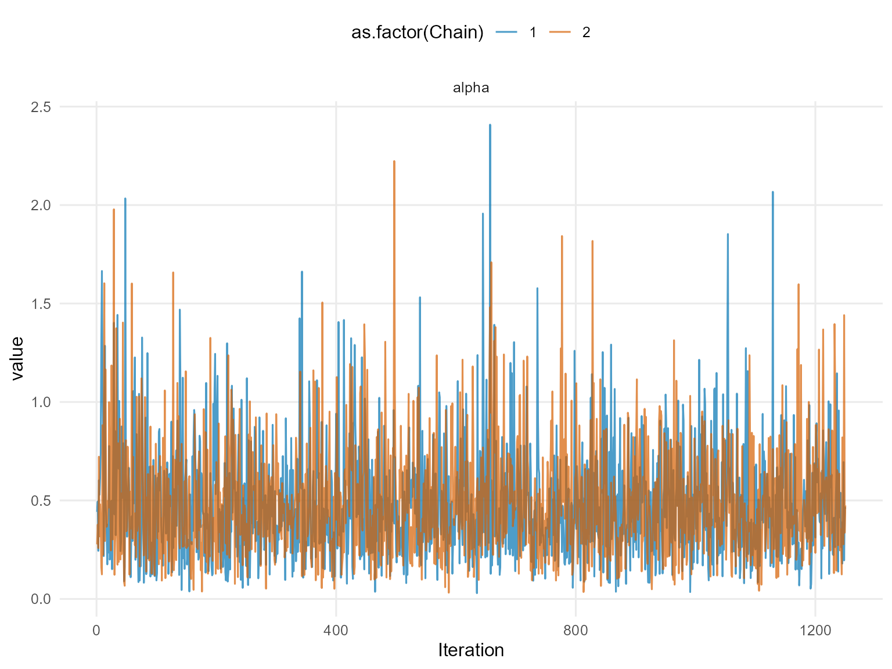
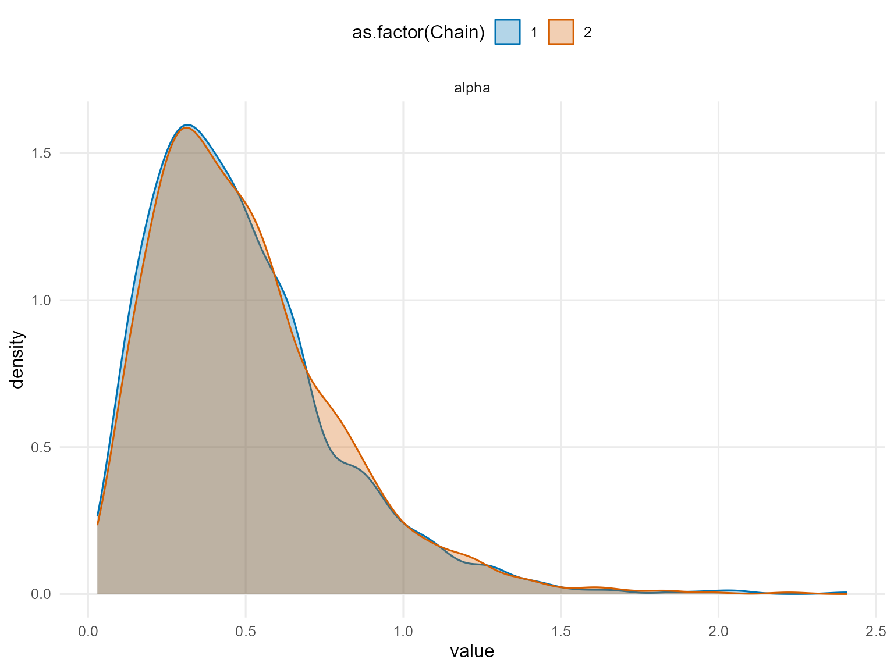
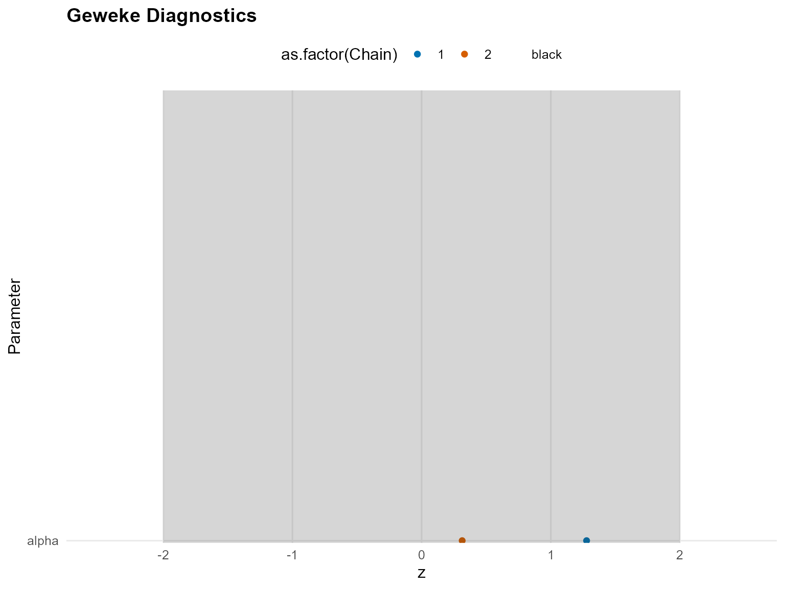
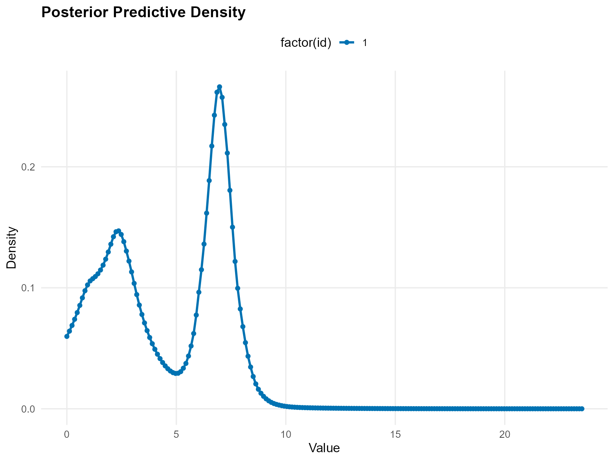

# Legacy: 5. Unconditional DPmix (CRP Backend)

> **Legacy note:** This page is preserved for historical context and
> extended detail. It predates the streamlined official vignettes and
> may include longer runs or exploratory material.

## Overview

This vignette demonstrates an **unconditional DPmix model** using the
**CRP backend** on a positive dataset. We use a Laplace kernel for the
bulk distribution and no GPD tail augmentation.

## Data Setup

``` r
# Load pre-generated dataset: 200 observations from mixture of 3 gamma components
data(nc_pos200_k3)
y_mixed <- nc_pos200_k3$y

paste("Sample size:", length(y_mixed))
[1] "Sample size: 200"
paste("Mean:", mean(y_mixed))
[1] "Mean: 4.21476750434594"
paste("SD:", sd(y_mixed))
[1] "SD: 4.10835046697183"
paste("Range:", paste(range(y_mixed), collapse = " to "))
[1] "Range: 0.0403111680208858 to 19.6013451514889"

# Visualization
df_data <- data.frame(y = y_mixed)
p_raw <- ggplot(df_data, aes(x = y)) +
  geom_histogram(aes(y = after_stat(density)), bins = 30, alpha = 0.6,
                 fill = "steelblue", color = "black") +
  geom_density(color = "red", linewidth = 1) +
  labs(title = "Raw Data: Mixed Gamma Distribution", x = "y", y = "Density") +
  theme_minimal()

print(p_raw)
```


## Build Bundle (CRP)

``` r
bundle_crp <- build_nimble_bundle(
  y = y_mixed,
  kernel = "laplace",         # Use laplace kernel
  backend = "crp",            # CRP backend
  GPD = FALSE,                # No tail augmentation
  components = 3,             # Minimal for testing
  alpha_random = TRUE,        # Random DP concentration
  mcmc = list(
    niter = 50,             # Minimal for testing
    nburnin = 10,           # Minimal burnin
    nchains = 2,            # Two chains for diagnostics
    thin = 1                # No thinning
  )
)
```

## Run MCMC (Longer Run)

``` r
bundle_crp <- build_nimble_bundle(
  y_mixed,
  kernel = "laplace",
  backend = "crp",
  GPD = FALSE,
  components = 3,
  alpha_random = TRUE,
  mcmc = list(niter = 1500, nburnin = 250, nchains = 2, thin = 1)
)
```

``` r
summary(bundle_crp)
DPmixGPD bundle summary
      Field                      Value
    Backend Chinese Restaurant Process
     Kernel       Laplace Distribution
 Components                          3
          N                        200
          X                         NO
        GPD                      FALSE
    Epsilon                      0.025

Parameter specification
         block  parameter mode           level                  prior link
          meta    backend info           model                    crp     
          meta     kernel info           model                laplace     
          meta components info           model                      3     
          meta          N info           model                    200     
          meta          P info           model                      0     
 concentration      alpha dist          scalar gamma(shape=1, rate=1)     
          bulk   location dist component (1:3)   normal(mean=0, sd=5)     
          bulk      scale dist component (1:3) gamma(shape=2, rate=1)     
                    notes
                         
                         
                         
                         
                         
 stochastic concentration
    iid across components
    iid across components

Monitors
  n = 4 
  alpha, z[1:200], location[1:3], scale[1:3]
```

``` r
fit_crp <- run_mcmc_bundle_manual(bundle_crp)
```

``` r
summary(fit_crp)
MixGPD summary | backend: Chinese Restaurant Process | kernel: Laplace Distribution | GPD tail: FALSE | epsilon: 0.025
n = 200 | components = 3
Summary
Initial components: 3 | Components after truncation: 3

WAIC: 908.100
lppd: -346.171 | pWAIC: 107.879

Summary table
   parameter  mean    sd q0.025 q0.500 q0.975      ess
  weights[1] 0.419 0.035  0.360  0.415  0.495  293.833
  weights[2] 0.339 0.034  0.275  0.335  0.405  272.399
  weights[3] 0.243 0.043  0.145  0.250  0.310  219.058
       alpha 0.490 0.296  0.097  0.433  1.229 1953.413
 location[1] 5.803 2.089  1.094  6.763  7.763  382.046
 location[2] 2.841 2.401  0.784  2.194  8.060  411.296
 location[3] 1.718 1.357  0.566  1.002  3.258  160.577
    scale[1] 0.510 0.387  0.260  0.336  1.653  376.378
    scale[2] 1.322 0.656  0.286  1.305  2.501  350.937
    scale[3] 1.947 0.761  0.649  1.928  3.472  131.380
```

## Posterior Parameters

``` r
params_crp <- params(fit_crp)
params_crp
Posterior mean parameters

$alpha
[1] 0.4896

$w
[1] 0.4185 0.3388 0.2427

$location
[1] 5.803 2.841 1.718

$scale
[1] 0.5104 1.3220 1.9470
```

## Diagnostics

``` r
# Trace plots for key parameters
plot(fit_crp, params = "alpha", family = c("traceplot", "density", "geweke"))

=== traceplot ===
```



    === density ===



    === geweke ===



## Posterior Predictive Density

``` r
# Generate prediction grid
y_grid <- seq(0, max(y_mixed) * 1.2, length.out = 200)

# Posterior predictive density
pred_density <- predict(fit_crp, y = y_grid, type = "density")

# Use S3 plot method
plot(pred_density)
```


