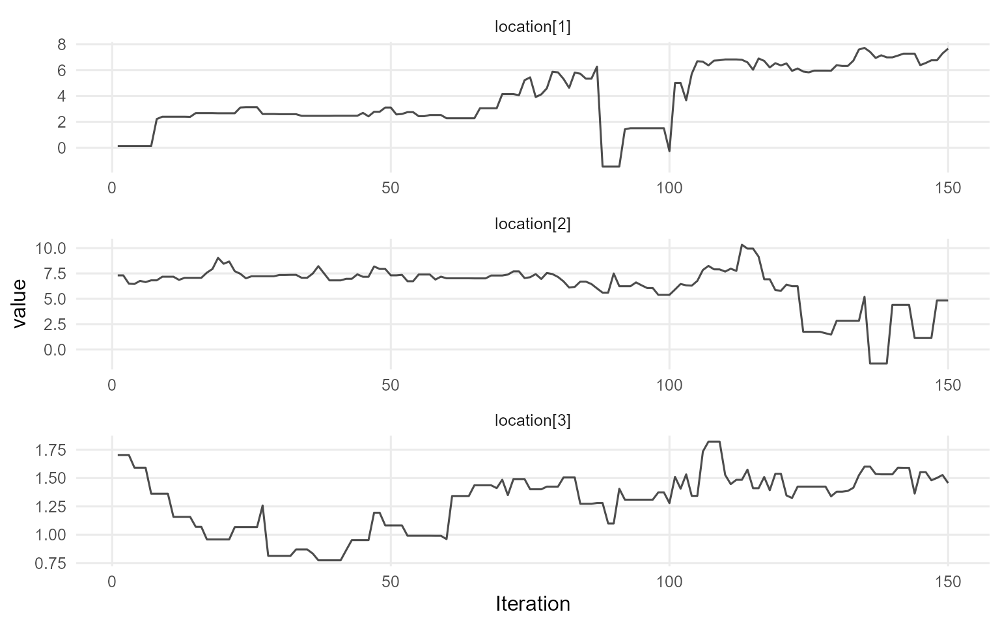
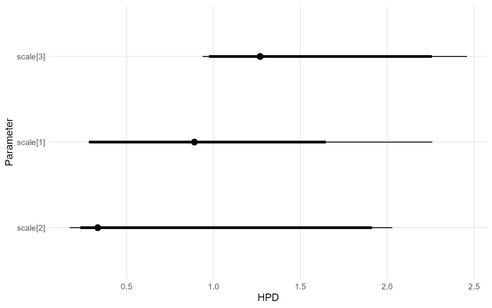
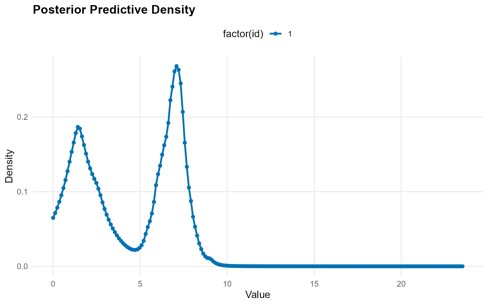
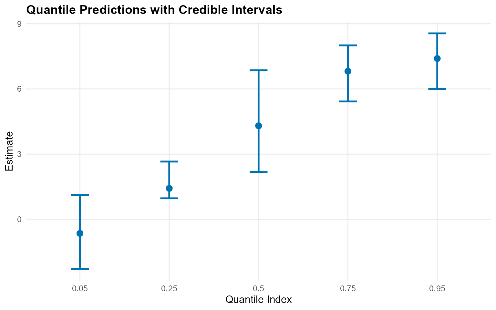
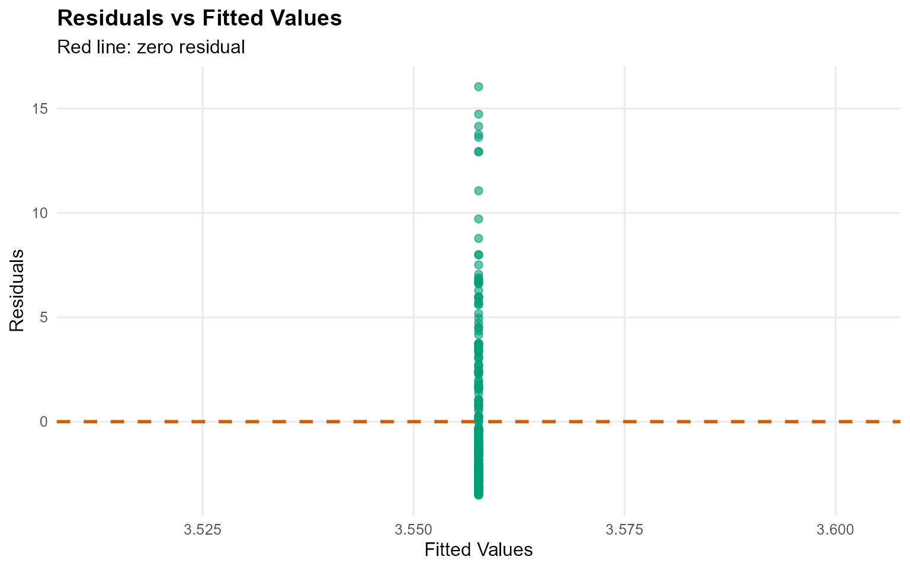
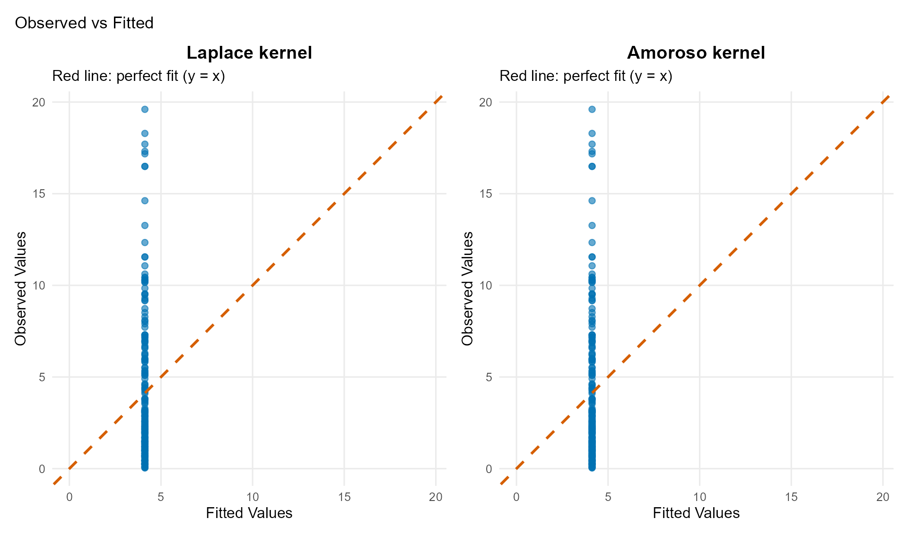

# 6. Unconditional DPmix with CRP Backend

> **Legacy vignette (for the website / historical notes).** These files
> may not match the current exported API one-to-one. Last verified:
> **2026-01-18**.
>
> For the up-to-date workflow, see the main package vignettes
> (Introduction, Model Spec, MCMC Workflow,
> Unconditional/Conditional/Causal, Backends, S3 Reference).

## Theory (brief)

An unconditional DP mixture models exchangeable outcomes via
\$f(y)=\\int K(y;\\theta)\\,dG(\\theta)\$ with \$G \\sim
\\mathrm{DP}(\\alpha, G_0)\$. The CRP backend implements this using
cluster allocations.

## Unconditional DPmix: Chinese Restaurant Process (CRP)

**Goal**: Estimate density of univariate outcome $`y`$ using
**nonparametric Dirichlet Process mixture** with **Chinese Restaurant
Process** backend.

**Model**: $`y_i | G \sim \int K(y_i; \theta) dG(\theta)`$ where
$`G \sim \text{DP}(\alpha, G_0)`$

**Backend**: CRP with **truncation at max components**

------------------------------------------------------------------------

### Data Setup

``` r
data(nc_pos200_k3)
y_mixed <- nc_pos200_k3$y

paste("Sample size:", length(y_mixed))
```

    [1] "Sample size: 200"

``` r
paste("Mean:", mean(y_mixed))
```

    [1] "Mean: 4.21476750434594"

``` r
paste("SD:", sd(y_mixed))
```

    [1] "SD: 4.10835046697183"

``` r
paste("Range:", paste(range(y_mixed), collapse = " to "))
```

    [1] "Range: 0.0403111680208858 to 19.6013451514889"

``` r
df_data <- data.frame(y = y_mixed)
p_raw <- ggplot(df_data, aes(x = y)) +
  geom_histogram(aes(y = after_stat(density)), bins = 30, alpha = 0.6, fill = "steelblue",color = "black") +
  geom_density(color = "red", linewidth = 1) +
  labs(title = "Raw Data: Mixed Gamma Distribution", x = "y", y = "Density") +
  theme_minimal()

print(p_raw)
```


------------------------------------------------------------------------

### Model Specification & Bundle

We’ll use the `build_nimble_bundle` function directly which handles both
specification and bundle creation.

``` r
bundle_crp <- build_nimble_bundle(
  y = y_mixed,
  kernel = "laplace",
  backend = "crp",
  GPD = FALSE,
  components = 3,
  alpha_random = TRUE,
  mcmc = mcmc
)
```

------------------------------------------------------------------------

#### Building MCMC bundle

``` r
bundle_crp <- build_nimble_bundle(
  y_mixed,
  kernel = "laplace",
  backend = "crp",
  GPD = FALSE,
  components = 3,
  alpha_random = TRUE,
  mcmc = mcmc
)
```

#### Summary of MCMC Bundle

``` r
summary(bundle_crp)
```

    DPmixGPD bundle summary
          Field                      Value
        Backend Chinese Restaurant Process
         Kernel       Laplace Distribution
     Components                          3
              N                        200
              X                         NO
            GPD                      FALSE
        Epsilon                      0.025

    Parameter specification
             block  parameter mode           level                  prior link
              meta    backend info           model                    crp     
              meta     kernel info           model                laplace     
              meta components info           model                      3     
              meta          N info           model                    200     
              meta          P info           model                      0     
     concentration      alpha dist          scalar gamma(shape=1, rate=1)     
              bulk   location dist component (1:3)   normal(mean=0, sd=5)     
              bulk      scale dist component (1:3) gamma(shape=2, rate=1)     
                        notes
                             
                             
                             
                             
                             
     stochastic concentration
        iid across components
        iid across components

    Monitors
      n = 4 
      alpha, z[1:200], location[1:3], scale[1:3]

#### Running MCMC

``` r
fit_crp <- load_or_fit("v06-unconditional-DPmix-CRP-fit_crp", run_mcmc_bundle_manual(bundle_crp))
```

#### Summary of Fitted MCMC model

``` r
summary(fit_crp)
```

    MixGPD summary | backend: Chinese Restaurant Process | kernel: Laplace Distribution | GPD tail: FALSE | epsilon: 0.025
    n = 200 | components = 3
    Summary
    Initial components: 3 | Components after truncation: 2

    WAIC: 930.316
    lppd: -376.708 | pWAIC: 88.450

    Summary table
       parameter  mean    sd q0.025 q0.500 q0.975     ess
      weights[1] 0.493 0.082  0.364  0.510  0.620   2.803
      weights[2] 0.382 0.070  0.238  0.380  0.490  13.673
           alpha 0.463 0.284  0.090  0.410  1.130 291.260
     location[1] 3.237 2.572  1.094  1.535  7.395  20.702
     location[2] 5.120 2.644  0.868  6.463  7.943  27.292
        scale[1] 0.888 0.421  0.277  1.044  1.531  34.308
        scale[2] 0.732 0.624  0.261  0.350  2.124  15.309

``` r
params_crp <- params(fit_crp)
params_crp
```

    Posterior mean parameters

    $alpha
    [1] 0.4634

    $w
    [1] 0.4933 0.3822

    $location
    [1] 3.237 5.120

    $scale
    [1] 0.8879 0.7325

------------------------------------------------------------------------

### MCMC Diagnostics Plots

``` r
plot(fit_crp, params = "location", family = "traceplot")
```

    === traceplot ===



``` r
plot(fit_crp, params = "scale", family = "caterpillar")
```

    === caterpillar ===



------------------------------------------------------------------------

### Posterior Predictions

#### Predictive Density

``` r
y_grid <- seq(0, max(y_mixed) * 1.2, length.out = 200)
pred_density <- predict(fit_crp, y = y_grid, type = "density")
plot(pred_density)
```



#### Quantile Predictions

``` r
quantiles_pred <- predict(fit_crp, type = "quantile", 
                          index = c(0.05, 0.25, 0.5, 0.75, 0.95),
                          interval = "credible")

quantiles_pred$fit %>%
  kbl(caption = "Posterior Predictive Quantiles with Credible Intervals",
      align = "c", digits = 3) %>%
  kable_styling(bootstrap_options = "striped", full_width = FALSE, position = "center")
```

| estimate | index | lower  | upper |
|:--------:|:-----:|:------:|:-----:|
|  -0.650  | 0.05  | -2.293 | 1.123 |
|  1.422   | 0.25  | 0.964  | 2.657 |
|  4.304   | 0.50  | 2.175  | 6.859 |
|  6.815   | 0.75  | 5.424  | 8.006 |
|  7.400   | 0.95  | 5.995  | 8.558 |

Posterior Predictive Quantiles with Credible Intervals

``` r
plot(quantiles_pred)
```



------------------------------------------------------------------------

### Varying Truncation Level (components)

``` r
# Demonstrate with one value
bundle_components <- build_nimble_bundle(
  y = y_mixed,
  kernel = "laplace",
  backend = "crp",
  components = 5,
  mcmc = mcmc
)
fit_components <- load_or_fit("v06-unconditional-DPmix-CRP-fit_components", run_mcmc_bundle_manual(bundle_components))
```

``` r
summary(fit_components)
```

    MixGPD summary | backend: Chinese Restaurant Process | kernel: Laplace Distribution | GPD tail: FALSE | epsilon: 0.025
    n = 200 | components = 5
    Summary
    Initial components: 5 | Components after truncation: 3

    WAIC: 887.981
    lppd: -320.298 | pWAIC: 123.693

    Summary table
       parameter  mean    sd q0.025 q0.500 q0.975     ess
      weights[1] 0.394 0.051  0.307  0.395  0.515  22.736
      weights[2] 0.295 0.056  0.199  0.295  0.390  10.172
      weights[3] 0.217 0.038  0.154  0.215  0.290  46.436
           alpha 0.703 0.370  0.171  0.613  1.613 150.000
     location[1] 3.657 2.465  0.808  2.289  7.659  10.694
     location[2] 4.068 2.928  0.655  2.450  9.090  18.434
     location[3] 3.007 3.433  0.592  0.810 10.372   8.343
        scale[1] 0.965 0.523  0.280  1.015  2.006  14.348
        scale[2] 1.177 0.851  0.294  1.076  2.994  16.202
        scale[3] 1.833 1.073  0.284  1.999  3.578  17.734

------------------------------------------------------------------------

### Residual Analysis

``` r
Fit <- fitted(fit_components)

kableExtra::kbl(head(Fit), caption = "Fitted Values, Residuals and Credible Interval", 
                digits = 3, align = "c") %>%
  kable_styling(bootstrap_options = "striped", full_width = FALSE, position = "center")
```

| fit | lower | upper | residuals | mean | mean_lower | mean_upper | median | median_lower | median_upper |
|:--:|:--:|:--:|:--:|:--:|:--:|:--:|:--:|:--:|:--:|
| 3.558 | 2.38 | 4.553 | -2.912 | 3.558 | 2.38 | 4.553 | 3.128 | 2.346 | 4.471 |
| 3.558 | 2.38 | 4.553 | -0.685 | 3.558 | 2.38 | 4.553 | 3.128 | 2.346 | 4.471 |
| 3.558 | 2.38 | 4.553 | 6.285 | 3.558 | 2.38 | 4.553 | 3.128 | 2.346 | 4.471 |
| 3.558 | 2.38 | 4.553 | -0.374 | 3.558 | 2.38 | 4.553 | 3.128 | 2.346 | 4.471 |
| 3.558 | 2.38 | 4.553 | 3.738 | 3.558 | 2.38 | 4.553 | 3.128 | 2.346 | 4.471 |
| 3.558 | 2.38 | 4.553 | 3.530 | 3.558 | 2.38 | 4.553 | 3.128 | 2.346 | 4.471 |

Fitted Values, Residuals and Credible Interval

``` r
fit.plots <- plot(Fit)
fit.plots$residual_plot
```



------------------------------------------------------------------------

### Model Comparison: Different Kernels

#### Laplace Kernel (Current)

``` r
bundle_laplace <- build_nimble_bundle(
  y = y_mixed,
  kernel = "laplace",
  backend = "crp",
  components = 5,
  mcmc = mcmc
)
fit_laplace <- load_or_fit("v06-unconditional-DPmix-CRP-fit_laplace", run_mcmc_bundle_manual(bundle_laplace))
```

``` r
summary(fit_laplace)
```

    MixGPD summary | backend: Chinese Restaurant Process | kernel: Laplace Distribution | GPD tail: FALSE | epsilon: 0.025
    n = 200 | components = 5
    Summary
    Initial components: 5 | Components after truncation: 3

    WAIC: 896.756
    lppd: -312.429 | pWAIC: 135.948

    Summary table
       parameter  mean    sd q0.025 q0.500 q0.975     ess
      weights[1] 0.415 0.038  0.350  0.410  0.490  29.262
      weights[2] 0.286 0.063  0.194  0.275  0.410  19.433
      weights[3] 0.180 0.040  0.104  0.180  0.251  30.176
           alpha 0.755 0.376  0.189  0.712  1.606 150.000
     location[1] 6.514 1.346  2.232  6.936  7.589  61.160
     location[2] 2.223 1.631  0.577  1.714  7.555  45.299
     location[3] 1.370 0.907  0.493  0.891  2.973  53.128
        scale[1] 0.390 0.224  0.263  0.330  1.123  33.621
        scale[2] 1.573 0.669  0.320  1.457  2.991  34.794
        scale[3] 2.425 0.943  0.991  2.371  4.590  64.012

#### Amoroso Kernel (Alternative)

``` r
bundle_amoroso <- build_nimble_bundle(
  y = y_mixed,
  kernel = "amoroso",
  backend = "crp",
  components = 5,
  mcmc = mcmc
)
fit_amoroso <- load_or_fit("v06-unconditional-DPmix-CRP-fit_amoroso", run_mcmc_bundle_manual(bundle_amoroso))
```

``` r
summary(fit_amoroso)
```

    MixGPD summary | backend: Chinese Restaurant Process | kernel: Amoroso Distribution | GPD tail: FALSE | epsilon: 0.025
    n = 200 | components = 5
    Summary
    Initial components: 5 | Components after truncation: 1

    WAIC: 955.640
    lppd: -445.666 | pWAIC: 32.154

    Summary table
      parameter  mean    sd q0.025 q0.500 q0.975    ess
     weights[1] 0.869 0.164  0.527  0.968  1.000  4.063
          alpha 0.346 0.344  0.014  0.212  1.273 56.418
         loc[1] 0.038 0.186 -0.086  0.008  0.681 11.853
       scale[1] 1.577 0.675  0.907  1.287  3.683  6.430
      shape1[1] 1.847 0.325  1.102  1.941  2.289  2.790
      shape2[1] 0.717 0.090  0.610  0.709  0.924  7.017

#### Model Comparison via Predictions

``` r
# Compare fitted values using S3 plot method
fitted_laplace <- fitted(fit_laplace)
fitted_amoroso <- fitted(fit_amoroso)
# Plot diagnostics for both models
g.plot <- plot(fitted_laplace)
l.plot <- plot(fitted_amoroso)
```

``` r
p_gamma <- g.plot$observed_fitted_plot +
  ggtitle("Laplace kernel") +
  theme(plot.title = element_text(hjust = 0.5))

p_lognormal <- l.plot$observed_fitted_plot +
  ggtitle("Amoroso kernel") +
  theme(plot.title = element_text(hjust = 0.5))

p_gamma + p_lognormal +
  plot_layout(ncol = 2) +
  plot_annotation(
    title = "Observed vs Fitted"
  ) +
  theme(plot.title = element_text(hjust = 0.5))
```



### Key Takeaways

- **CRP Backend**: Flexible component allocation, ideal for unknown
  mixture complexity
- **components Parameter**: Higher components allows more components but
  increases computation
- **Kernel Choice**: Gamma suitable for positive, skewed data
- **Diagnostics**: Check convergence (Rhat, ESS) and posterior
  predictive fit
- **Next**: Compare with **Stick-Breaking (SB)** backend in vignette 5
