# 7. Unconditional DPmix with Stick-Breaking Backend

> **Legacy vignette (for the website / historical notes).** These files
> may not match the current exported API one-to-one. Last verified:
> **2026-01-18**.
>
> For the up-to-date workflow, see the main package vignettes
> (Introduction, Model Spec, MCMC Workflow,
> Unconditional/Conditional/Causal, Backends, S3 Reference).

### Theory (brief)

The stick-breaking backend represents the DP mixture by truncating a
stick-breaking prior on mixture weights. This yields an explicit finite
mixture approximation controlled by `components`.

## Unconditional DPmix: Stick-Breaking (SB) Backend

**Purpose**: Showcase the stick-breaking backend that uses a fixed
number of mixture components (`components = J`) and contrast it with the
CRP backend from `v04`. In this vignette we fit **two** bulk kernels
(**Gamma** and **Cauchy**) on the same dataset to highlight how heavier
tails in the bulk can change the fit even without a GPD tail.

------------------------------------------------------------------------

### Data Setup

``` r
# Load benchmark dataset
data("nc_pos200_k3")
y_mixed <- nc_pos200_k3$y

df_data <- data.frame(y = y_mixed)

summary_tbl <- tibble(
  statistic = c("N", "Mean", "SD", "Min", "Max"),
  value = c(length(y_mixed), mean(y_mixed), sd(y_mixed), min(y_mixed), max(y_mixed))
)

p_raw <- ggplot(df_data, aes(x = y)) +
  geom_histogram(aes(y = after_stat(density)), bins = 30, fill = "darkorange", alpha = 0.7, color = "black") +
  geom_density(color = "darkred", linewidth = 1.2) +
  labs(title = "Raw Data: Mixed Gamma Distribution", x = "y", y = "Density") +
  theme_minimal()

print(p_raw)
```


| statistic | value  |
|:---------:|:------:|
|     N     | 200.00 |
|   Mean    |  4.21  |
|    SD     |  4.11  |
|    Min    |  0.04  |
|    Max    | 19.60  |

Summary of the SB Dataset

------------------------------------------------------------------------

### Model Specification & Bundle

We build the stick-breaking mixture explicitly with `components = 5` so
that there is room for weight decay while keeping the MCMC runtime
manageable for a vignette. We then refit the same SB model with a
**Cauchy** kernel for comparison.

``` r
# --- Gamma kernel ---
bundle_sb_gamma <- build_nimble_bundle(
  y = y_mixed,
  kernel = "gamma",
  backend = "sb",
  components = 5,            # fixed truncation level for SB
  GPD = FALSE,               # bulk-only scenario
  mcmc = mcmc
)

# --- Cauchy kernel ---
bundle_sb_cauchy <- build_nimble_bundle(
  y = y_mixed,
  kernel = "cauchy",
  backend = "sb",
  components = 5,
  GPD = FALSE,
  mcmc = mcmc
)
```

------------------------------------------------------------------------

### Running MCMC & Summary

``` r
fit_sb_gamma <- load_or_fit("v07-unconditional-DPmix-SB-fit_sb_gamma", run_mcmc_bundle_manual(bundle_sb_gamma))
fit_sb_cauchy <- load_or_fit("v07-unconditional-DPmix-SB-fit_sb_cauchy", run_mcmc_bundle_manual(bundle_sb_cauchy))
```

``` r
summary(fit_sb_gamma)
```

    MixGPD summary | backend: Stick-Breaking Process | kernel: Gamma Distribution | GPD tail: FALSE | epsilon: 0.025
    n = 200 | components = 5
    Summary
    Initial components: 5 | Components after truncation: 2

    WAIC: 943.973
    lppd: -411.197 | pWAIC: 60.789

    Summary table
      parameter  mean    sd q0.025 q0.500 q0.975    ess
     weights[1] 0.602 0.176  0.374  0.558  0.894  1.321
     weights[2] 0.218 0.105  0.059   0.21  0.385   2.44
          alpha 1.149 0.761  0.183   0.97  2.912 27.606
       shape[1] 1.713 0.519  0.846  1.691  2.862  9.736
       shape[2] 1.679 0.726  0.846  1.434  3.164 25.181
       scale[1]  0.38 0.266  0.186  0.296  1.439 26.281
       scale[2] 1.114 0.705  0.212  1.054  3.166 27.342

``` r
summary(fit_sb_cauchy)
```

    MixGPD summary | backend: Stick-Breaking Process | kernel: Cauchy Distribution | GPD tail: FALSE | epsilon: 0.025
    n = 200 | components = 5
    Summary
    Initial components: 5 | Components after truncation: 4

    WAIC: 1003.512
    lppd: -314.628 | pWAIC: 187.128

    Summary table
       parameter  mean    sd q0.025 q0.500 q0.975    ess
      weights[1]  0.34 0.053  0.249  0.345  0.441 11.289
      weights[2] 0.251  0.03  0.195   0.25   0.32 16.185
      weights[3] 0.202 0.029  0.145  0.202   0.26 38.246
      weights[4] 0.136 0.027   0.07   0.14   0.18 15.133
           alpha 1.778 0.883  0.551  1.584  4.048 60.162
     location[1] 3.441 1.944  1.952  2.648   8.28 16.425
     location[2] 5.582 3.088  0.612  6.824  9.052 29.235
     location[3]  2.46 2.891   0.52  1.158  9.606 49.872
     location[4] 1.714 2.306  0.311  1.141  10.17 52.066
        scale[1]  0.97 0.614  0.431  0.691  2.534 21.389
        scale[2] 1.384 0.783  0.269  1.627  2.655 43.395
        scale[3] 0.657 0.716  0.236  0.346  2.782  64.85
        scale[4]  0.41 0.403  0.132  0.293  1.688 33.944

``` r
params_gamma <- params(fit_sb_gamma)
params_gamma
```

    Posterior mean parameters

    $alpha
    [1] "1.149"

    $w
    [1] "0.602" "0.218"

    $shape
    [1] "1.713" "1.679"

    $scale
    [1] "0.38"  "1.114"

------------------------------------------------------------------------

### MCMC Diagnostics (S3 Plot Methods)

``` r
plot(fit_sb_gamma, params = "shape", family = "traceplot")
```

    === traceplot ===

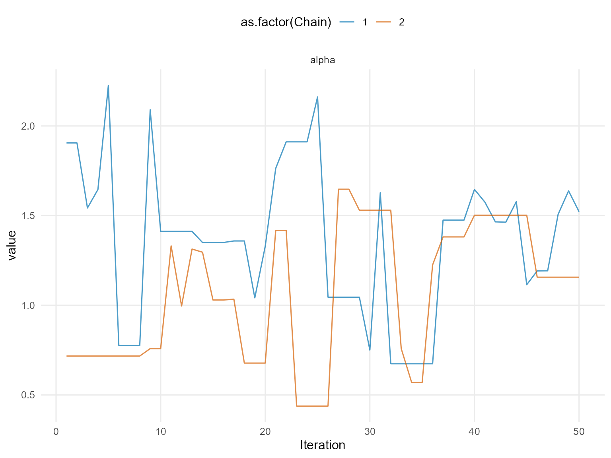

``` r
plot(fit_sb_gamma, params = "scale", family = "caterpillar")
```

    === caterpillar ===

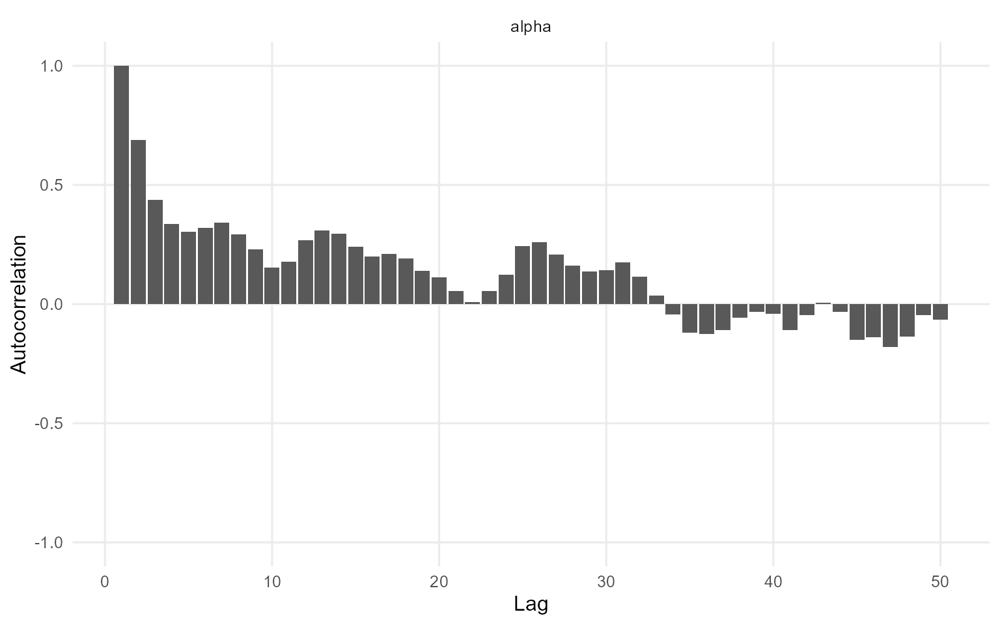

``` r
plot(fit_sb_cauchy, params = "location", family = "traceplot")
```

    === traceplot ===

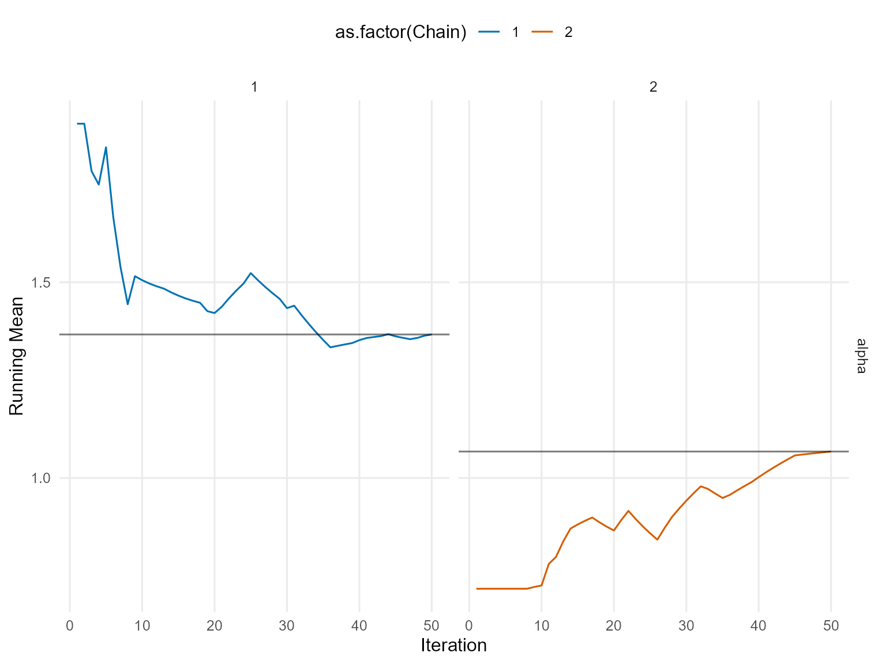

``` r
plot(fit_sb_cauchy, params = "scale", family = "caterpillar")
```

    === caterpillar ===

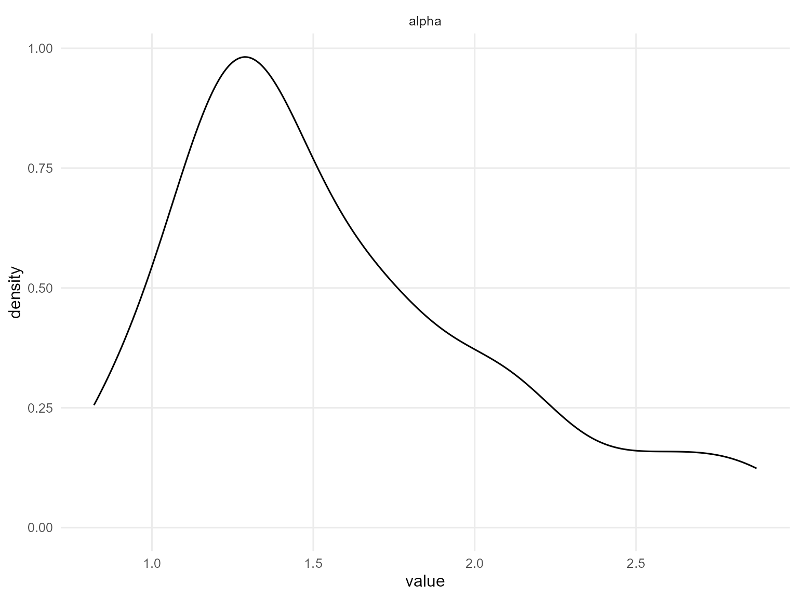

Use `summary(fit_sb_gamma)` and `summary(fit_sb_cauchy)` to inspect
effective sample size, R-hat, and other convergence diagnostics; the
[`plot()`](https://rdrr.io/r/graphics/plot.default.html) calls above
show the trace/density pairs for both global and stick-breaking weight
parameters.

------------------------------------------------------------------------

### Stick-Breaking Weights & Component Activity

The stick-breaking weights are exposed via the
[`plot()`](https://rdrr.io/r/graphics/plot.default.html) diagnostics
above, and you can refer to the raw `fit_sb_gamma` / `fit_sb_cauchy`
objects (or their [`summary()`](https://rdrr.io/r/base/summary.html)
output) for posterior summaries of each component weight.

------------------------------------------------------------------------

### Posterior Predictions

``` r
y_grid <- seq(min(y_mixed), max(y_mixed) * 1.3, length.out = 250)

pred_density_gamma <- predict(fit_sb_gamma, y = y_grid, type = "density")
pred_density_cauchy <- predict(fit_sb_cauchy, y = y_grid, type = "density")

plot(pred_density_gamma)
```

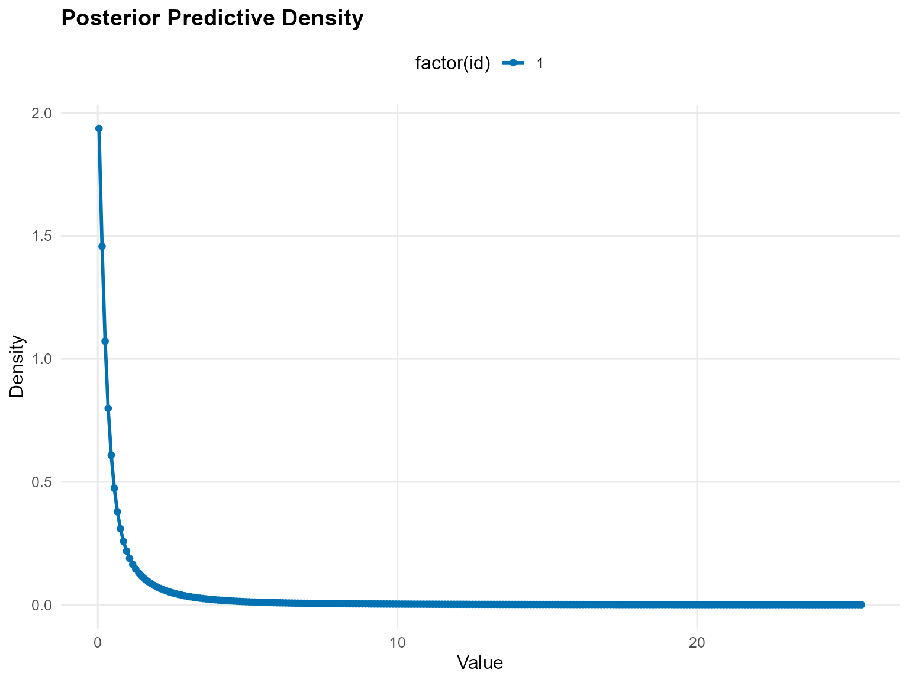

``` r
plot(pred_density_cauchy)
```

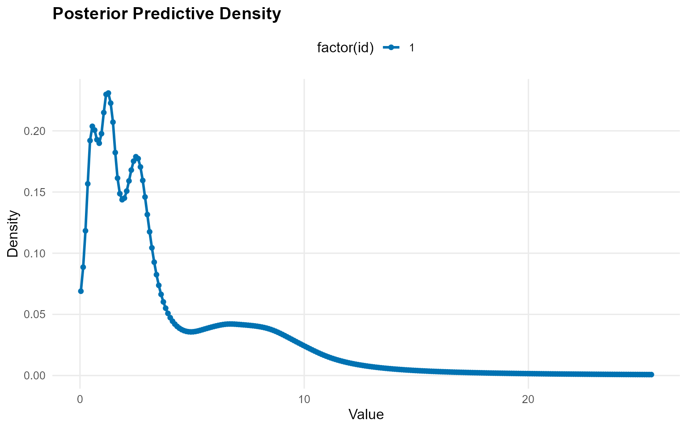

``` r
quant_probs <- c(0.05, 0.25, 0.5, 0.75, 0.95)

pred_q_gamma <- predict(fit_sb_gamma, type = "quantile", index = quant_probs, interval = "credible")
pred_q_cauchy <- predict(fit_sb_cauchy, type = "quantile", index = quant_probs, interval = "credible")

plot(pred_q_gamma)
```


``` r
plot(pred_q_cauchy)
```

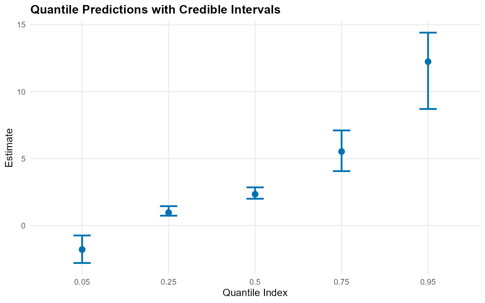

``` r
pred_mean_gamma <- predict(fit_sb_gamma, type = "mean")
pred_mean_cauchy <- predict(fit_sb_cauchy, type = "mean")

plot(pred_mean_gamma)
```

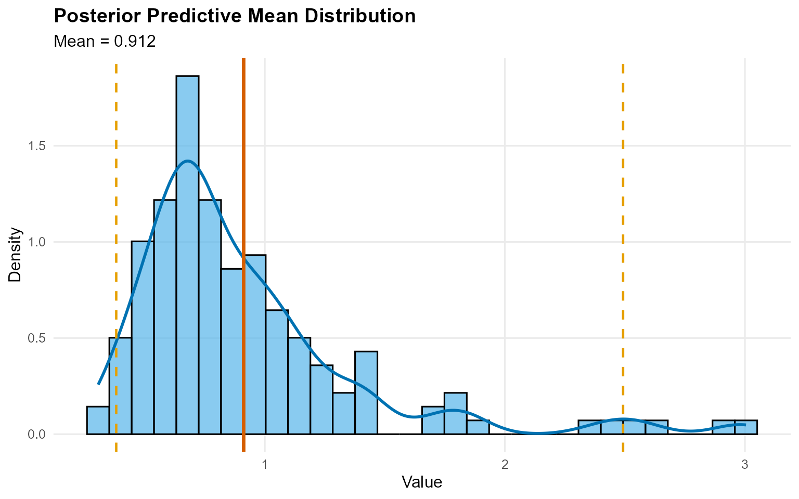

``` r
plot(pred_mean_cauchy)
```

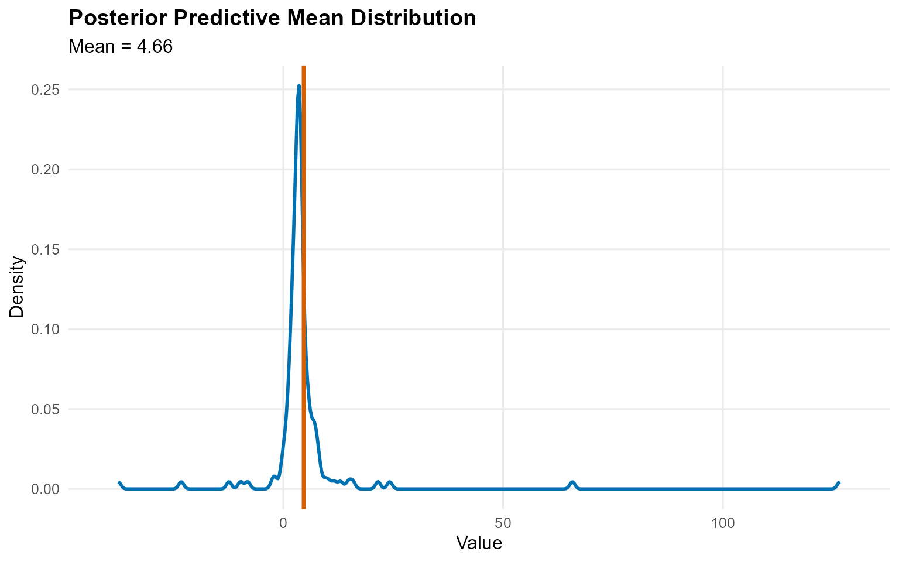

------------------------------------------------------------------------

### Bulk-only vs CRP Backends

``` r
bundle_crp_small <- build_nimble_bundle(
  y = y_mixed,
  kernel = "gamma",
  backend = "crp",
  components = 5,
  GPD = FALSE,
  mcmc = mcmc
)
fit_crp_small <- load_or_fit("v07-unconditional-DPmix-SB-fit_crp_small", run_mcmc_bundle_manual(bundle_crp_small))

crp_quant <- predict(fit_crp_small, type = "quantile", index = quant_probs, interval = "credible")
sb_quant <- predict(fit_sb_gamma, type = "quantile", index = quant_probs, interval = "credible")

bind_rows(
  crp_quant$fit %>% mutate(model = "CRP"),
  sb_quant$fit %>% mutate(model = "SB")
) %>%
  select(any_of(c("model", "index", "estimate", "lower", "upper"))) %>%
  mutate(across(where(is.numeric), ~ round(.x, 3))) %>%
  kable(caption = "Quantile Comparison: CRP vs SB", align = "c") %>%
  kable_styling(bootstrap_options = c("striped", "hover"), full_width = FALSE, position = "center")
```

| model | index | estimate | lower | upper |
|:-----:|:-----:|:--------:|:-----:|:-----:|
|  CRP  | 0.05  |  0.017   | 0.008 | 0.030 |
|  CRP  | 0.25  |  0.086   | 0.054 | 0.130 |
|  CRP  | 0.50  |  0.197   | 0.136 | 0.281 |
|  CRP  | 0.75  |  0.381   | 0.274 | 0.522 |
|  CRP  | 0.95  |  0.800   | 0.607 | 1.057 |
|  SB   | 0.05  |  0.067   | 0.011 | 0.199 |
|  SB   | 0.25  |  0.233   | 0.083 | 0.535 |
|  SB   | 0.50  |  0.521   | 0.208 | 1.132 |
|  SB   | 0.75  |  1.112   | 0.426 | 4.154 |
|  SB   | 0.95  |  3.268   | 1.224 | 8.578 |

Quantile Comparison: CRP vs SB

``` r
plot(crp_quant)
```

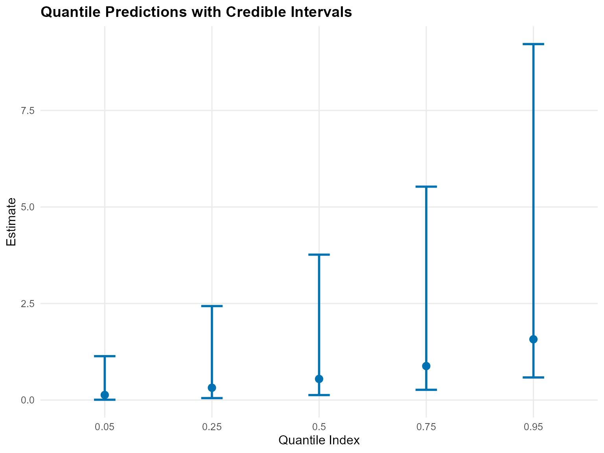

``` r
plot(sb_quant)
```

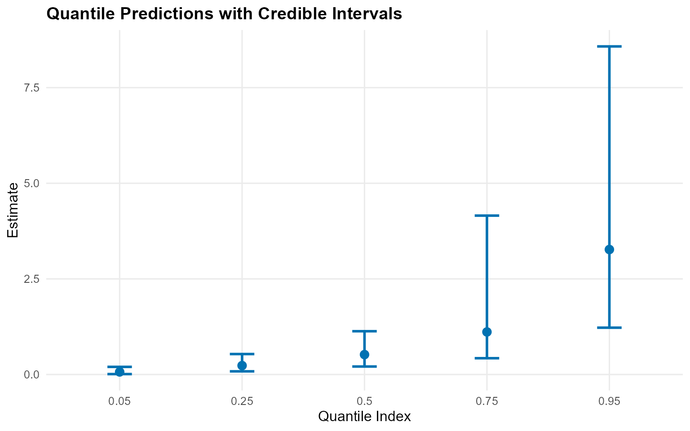

------------------------------------------------------------------------

### Residuals & Fitted Values

``` r
fit_vals <- fitted(fit_sb_gamma)
plot(fit_vals)
```

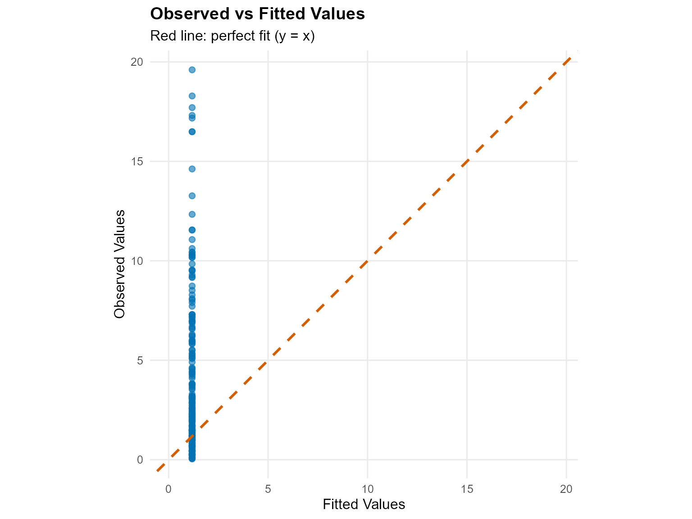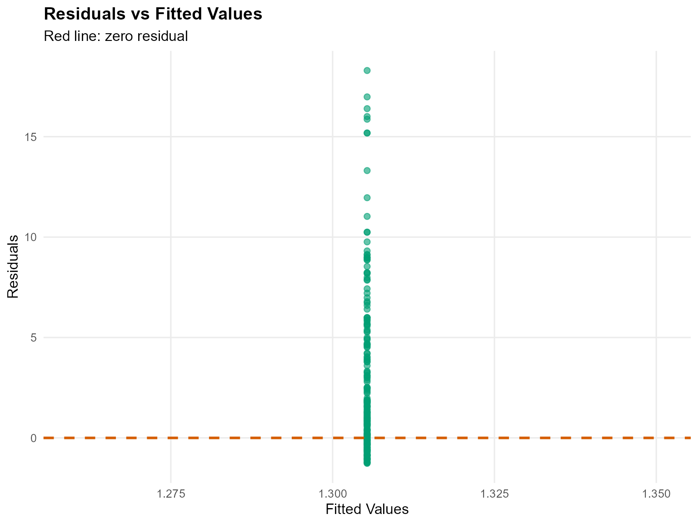

------------------------------------------------------------------------

### Takeaways

- **SB Backend**: Fixed `components` keeps label-switching manageable,
  and the diagnostic plots via the S3
  [`plot()`](https://rdrr.io/r/graphics/plot.default.html) method show
  weight dynamics.
- **Kernels matter**: Gamma vs Cauchy can behave very differently in the
  shoulders/tails, even without a GPD tail.
- **Predictions**: Posterior density, posterior-mean quantiles, and mean
  (via predictive sampling) are accessible via
  [`predict()`](https://rdrr.io/r/stats/predict.html) with credible
  bands.
- **Backend comparison**: The CRP fit (`v04`) and the SB-gamma fit
  deliver similar central quantiles while SB offers more control over
  truncation.
- **Next**: Explore tail augmentation (`GPD = TRUE`) with the CRP
  backend in `v06` or SB backend in `v07`.
