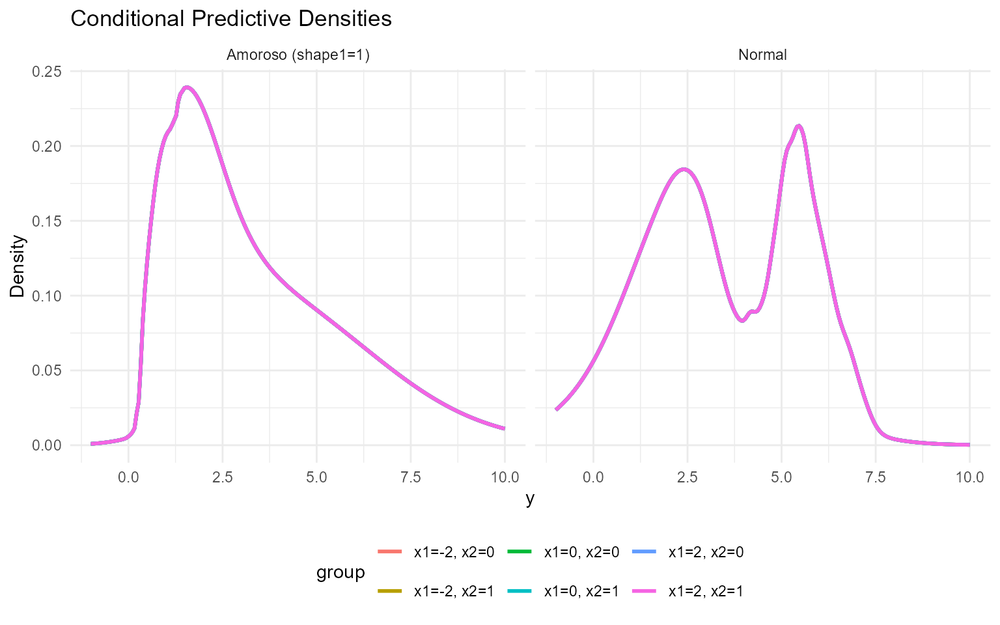
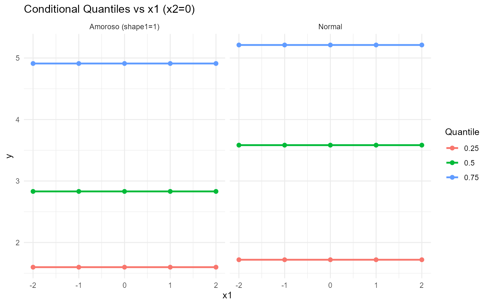
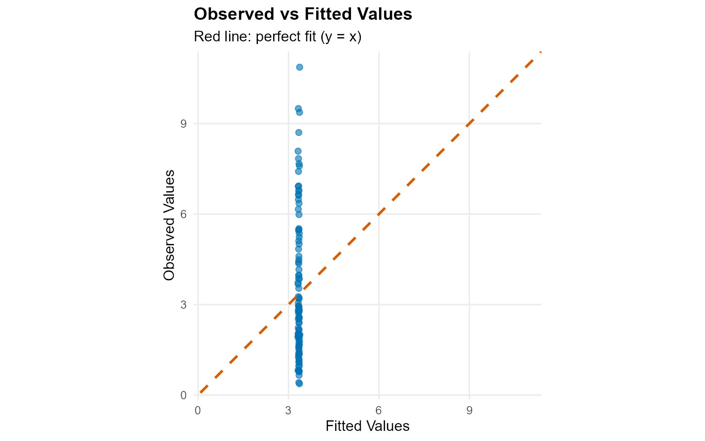
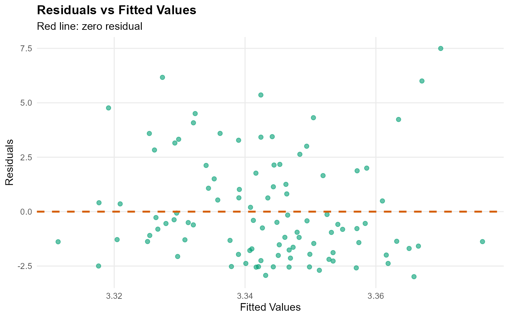
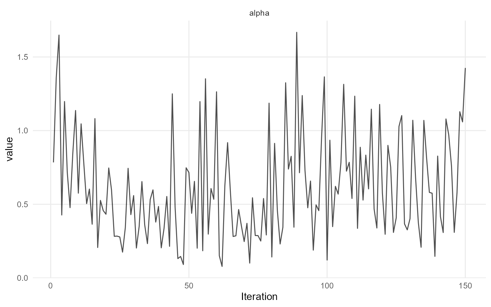
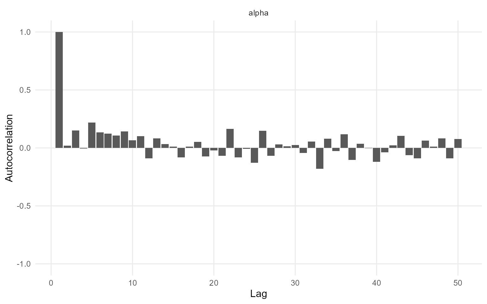
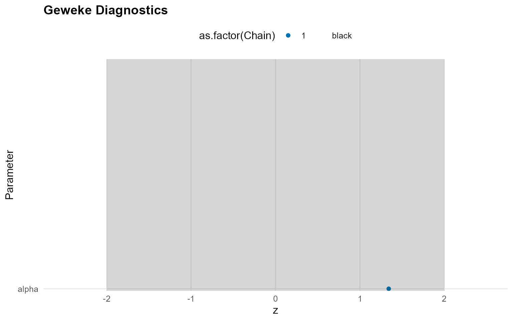
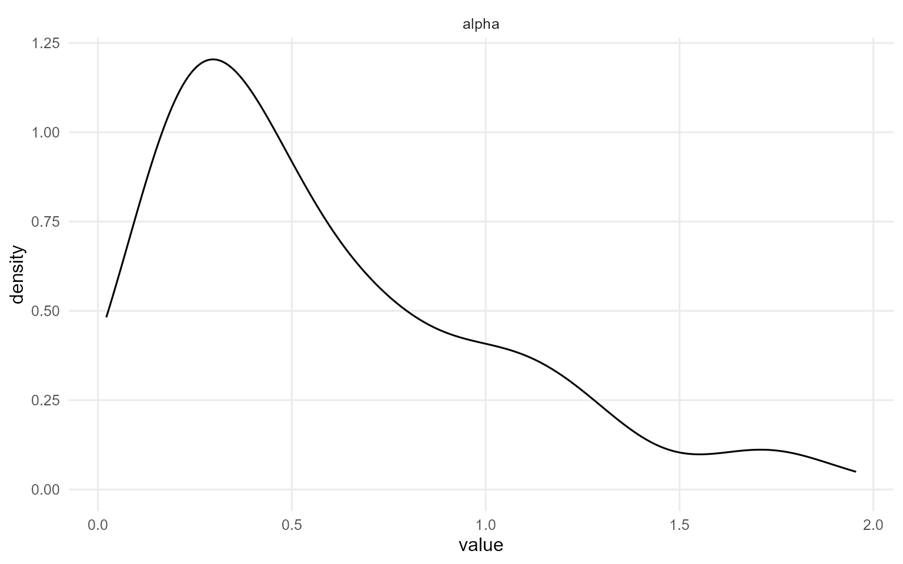
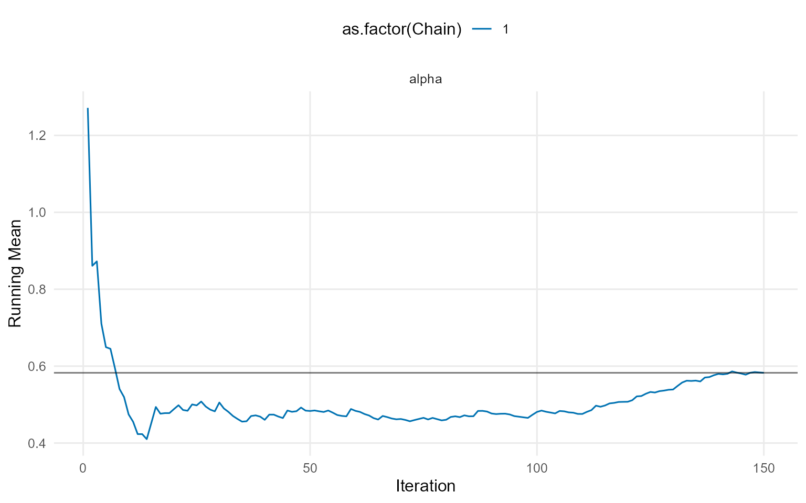
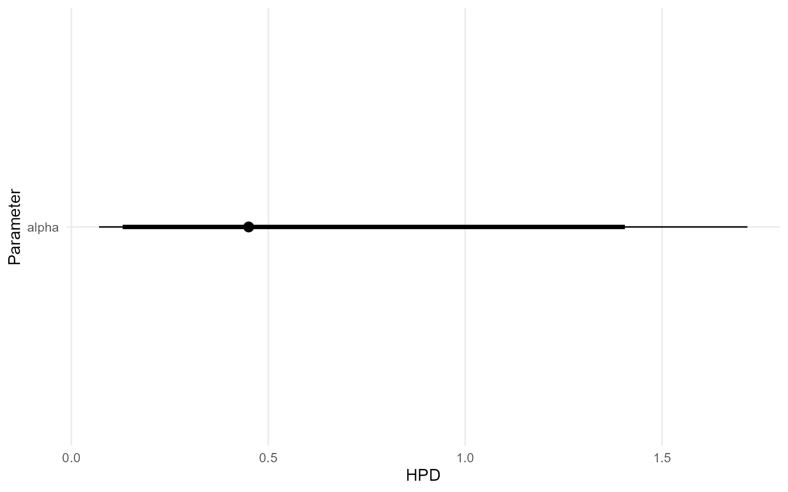

# 10. Conditional DPmix with CRP Backend

> **Legacy vignette (for the website / historical notes).** These files
> may not match the current exported API one-to-one. Last verified:
> **2026-01-18**.
>
> For the up-to-date workflow, see the main package vignettes
> (Introduction, Model Spec, MCMC Workflow,
> Unconditional/Conditional/Causal, Backends, S3 Reference).

## Conditional DPmix: CRP Backend with Covariates

**Purpose**: Show how the CRP backend can model $`y | X`$ via a
covariate-dependent Dirichlet Process mixture. This vignette parallels
`v04` but includes $`X`$ so we can explore conditional predictions.

------------------------------------------------------------------------

### Data Setup

``` r
data("nc_posX100_p3_k2")
y <- nc_posX100_p3_k2$y
X <- as.matrix(nc_posX100_p3_k2$X)
if (is.null(colnames(X))) {
  colnames(X) <- paste0("x", seq_len(ncol(X)))
}

summary_tbl <- tibble(
  statistic = c("N", "Mean", "SD", "Min", "Max"),
  value = c(length(y), mean(y), sd(y), min(y), max(y))
)

df_cov <- data.frame(y = y, x1 = X[, 1], x2 = X[, 2])

p_cov <- ggplot(df_cov, aes(x = x1, y = y)) +
  geom_point(alpha = 0.6, color = "steelblue") +
  geom_smooth(method = "loess", color = "firebrick", fill = NA) +
  labs(title = "y vs X1 (loess smoother)", x = "X1", y = "y") +
  theme_minimal()

grid.arrange(p_cov, ncol = 1)
```


| statistic |  value   |
|:---------:|:--------:|
|     N     | 100.0000 |
|   Mean    |  3.4540  |
|    SD     |  2.4060  |
|    Min    |  0.3772  |
|    Max    | 10.8700  |

Summary of Conditional Dataset

------------------------------------------------------------------------

### Model Specification & Bundle

``` r
bundle_cond_normal <- build_nimble_bundle(
  y = y,
  X = X,
  kernel = "normal",
  backend = "crp",
  GPD = FALSE,
  components = 5,
  mcmc = mcmc
)

bundle_cond_amoroso <- build_nimble_bundle(
  y = y,
  X = X,
  kernel = "amoroso",
  backend = "crp",
  GPD = FALSE,
  components = 5,
  mcmc = mcmc
)
```

------------------------------------------------------------------------

### Running MCMC

``` r
fit_cond_normal <- load_or_fit("v10-conditional-DPmix-CRP-fit_cond_normal", run_mcmc_bundle_manual(bundle_cond_normal))
```

    [MCMC] Creating NIMBLE model...

    [MCMC] NIMBLE model created successfully.
    [MCMC] Configuring MCMC...
    ===== Monitors =====
    thin = 1: alpha, mean, sd, z
    ===== Samplers =====
    CRP_concentration sampler (1)
      - alpha
    CRP_cluster_wrapper sampler (10)
      - sd[]  (5 elements)
      - mean[]  (5 elements)
    CRP sampler (1)
      - z[1:100] 
    [MCMC] MCMC configured.
    [MCMC] Building MCMC object...

    [MCMC] MCMC object built.
    [MCMC] Attempting NIMBLE compilation (this may take a minute)...
    [MCMC] Compiling model...

    [MCMC] Compiling MCMC sampler...

    [MCMC] Compilation successful.

    |-------------|-------------|-------------|-------------|
    |  [Warning] CRP_sampler: This MCMC is not for a proper model. The MCMC attempted to use more components than the number of cluster parameters. Please increase the number of cluster parameters.
    -------------------------------------------------------|
    [MCMC] MCMC execution complete. Processing results...

``` r
fit_cond_amoroso <- load_or_fit("v10-conditional-DPmix-CRP-fit_cond_amoroso", run_mcmc_bundle_manual(bundle_cond_amoroso))
```

    [MCMC] Creating NIMBLE model...

    [MCMC] NIMBLE model created successfully.
    [MCMC] Configuring MCMC...
    ===== Monitors =====
    thin = 1: alpha, loc, scale, shape1, shape2, z
    ===== Samplers =====
    CRP_concentration sampler (1)
      - alpha
    CRP_cluster_wrapper sampler (20)
      - loc[]  (5 elements)
      - scale[]  (5 elements)
      - shape1[]  (5 elements)
      - shape2[]  (5 elements)
    CRP sampler (1)
      - z[1:100] 
    [MCMC] MCMC configured.
    [MCMC] Building MCMC object...

    [MCMC] MCMC object built.
    [MCMC] Attempting NIMBLE compilation (this may take a minute)...
    [MCMC] Compiling model...

    [MCMC] Compiling MCMC sampler...

    [MCMC] Compilation successful.

    |-------------|-------------|-------------|-------------|
    |  [Warning] CRP_sampler: This MCMC is not for a proper model. The MCMC attempted to use more components than the number of cluster parameters. Please increase the number of cluster parameters.
    -------------------------------------------------------|
    [MCMC] MCMC execution complete. Processing results...

``` r
summary(fit_cond_normal)
```

    MixGPD summary | backend: Chinese Restaurant Process | kernel: Normal Distribution | GPD tail: FALSE | epsilon: 0.025
    n = 100 | components = 5
    Summary
    Initial components: 5 | Components after truncation: 2

    WAIC: 365.588
    lppd: -144.375 | pWAIC: 38.418

    Summary table
      parameter  mean    sd q0.025 q0.500 q0.975    ess
     weights[1] 0.529 0.093  0.357  0.530  0.723 13.352
     weights[2] 0.342 0.097  0.167  0.340  0.490 12.520
          alpha 0.615 0.360  0.129  0.542  1.359 56.464
        mean[1] 2.613 1.359  1.427  1.989  5.785 51.113
        mean[2] 4.747 1.916  1.424  5.448  7.147 44.946
          sd[1] 1.156 0.700  0.145  1.176  2.451 32.227
          sd[2] 0.804 0.804  0.166  0.392  2.919 73.942

``` r
summary(fit_cond_amoroso)
```

    MixGPD summary | backend: Chinese Restaurant Process | kernel: Amoroso Distribution | GPD tail: FALSE | epsilon: 0.025
    n = 100 | components = 5
    Summary
    Initial components: 5 | Components after truncation: 2

    WAIC: 389.837
    lppd: -158.014 | pWAIC: 36.905

    Summary table
      parameter   mean    sd q0.025 q0.500 q0.975     ess
     weights[1]  0.564 0.087  0.400  0.550  0.770  16.431
     weights[2]  0.384 0.082  0.192  0.390  0.500  17.039
          alpha  0.583 0.430  0.070  0.450  1.717 105.653
         loc[1] -0.189 1.298 -2.944  0.258  1.353   4.515
         loc[2]  0.245 0.804 -1.962  0.296  1.442  23.745
       scale[1]  3.376 1.983  0.748  3.330  6.743  20.236
       scale[2]  2.139 1.794  0.548  1.367  6.508  61.186
      shape1[1]  1.524 0.451  0.912  1.561  2.467  16.173
      shape1[2]  1.687 0.505  0.912  1.633  2.897  18.834
      shape2[1]  1.629 0.602  0.855  1.508  2.911   4.290
      shape2[2]  1.522 0.533  0.845  1.347  2.930  14.002

``` r
params_cond <- params(fit_cond_normal)
params_cond
```

    Posterior mean parameters

    $alpha
    [1] 0.6151

    $w
    [1] 0.5287 0.3424

    $mean
    [1] 2.613 4.747

    $sd
    [1] 1.1560 0.8038

------------------------------------------------------------------------

### Conditional Predictions

``` r
X_new <- expand.grid(
  x1 = seq(-2, 2, length.out = 3),
  x2 = c(0, 1),
  x3 = 0
)
colnames(X_new) <- colnames(X)

y_grid <- seq(-1, 10, length.out = 200)
densities_normal <- lapply(seq_len(nrow(X_new)), function(i) {
  pred <- predict(fit_cond_normal, x = as.matrix(X_new[i, , drop = FALSE]), y = y_grid, type = "density")
  data.frame(
    y = pred$fit$y,
    density = pred$fit$density,
    group = paste0("x1=", round(X_new[i, "x1"], 1), ", x2=", X_new[i, "x2"]),
    model = "Normal"
  )
})

densities_amoroso <- lapply(seq_len(nrow(X_new)), function(i) {
  pred <- predict(fit_cond_amoroso, x = as.matrix(X_new[i, , drop = FALSE]), y = y_grid, type = "density")
  data.frame(
    y = pred$fit$y,
    density = pred$fit$density,
    group = paste0("x1=", round(X_new[i, "x1"], 1), ", x2=", X_new[i, "x2"]),
    model = "Amoroso (shape1=1)"
  )
})

df_dens <- bind_rows(densities_normal, densities_amoroso)

ggplot(df_dens, aes(x = y, y = density, color = group)) +
  geom_line(linewidth = 1) +
  facet_wrap(~ model) +
  labs(title = "Conditional Predictive Densities", x = "y", y = "Density") +
  theme_minimal() +
  theme(legend.position = "bottom")
```



------------------------------------------------------------------------

### Covariate Effect on Conditional Quantiles

``` r
X_grid <- cbind(
  x1 = seq(-2, 2, length.out = 5),
  x2 = 0,
  x3 = 0
)
colnames(X_grid) <- colnames(X)

quant_probs <- c(0.25, 0.5, 0.75)
pred_q_normal <- predict(fit_cond_normal, x = as.matrix(X_grid), type = "quantile", index = quant_probs)
pred_q_amoroso <- predict(fit_cond_amoroso, x = as.matrix(X_grid), type = "quantile", index = quant_probs)

quant_df_normal <- pred_q_normal$fit
quant_df_normal$x1 <- X_grid[quant_df_normal$id, "x1"]
quant_df_normal$model <- "Normal"

quant_df_amoroso <- pred_q_amoroso$fit
quant_df_amoroso$x1 <- X_grid[quant_df_amoroso$id, "x1"]
quant_df_amoroso$model <- "Amoroso (shape1=1)"

bind_rows(quant_df_normal, quant_df_amoroso) %>%
  ggplot(aes(x = x1, y = estimate, color = factor(index), group = index)) +
  geom_line(linewidth = 1) +
  geom_point(size = 2) +
  facet_wrap(~ model) +
  labs(title = "Conditional Quantiles vs x1 (x2=0)", x = "x1", y = "y", color = "Quantile") +
  theme_minimal()
```



------------------------------------------------------------------------

### Residuals & Diagnostics

``` r
fit_vals <- fitted(fit_cond_normal)
plot(fit_vals)
```



``` r
plot(fit_cond_normal, family = c("traceplot", "autocorrelation", "geweke"))
```

    === traceplot ===



    === autocorrelation ===



    === geweke ===



``` r
plot(fit_cond_amoroso, family = c("density", "running", "caterpillar"))
```

    === density ===



    === running ===



    === caterpillar ===



------------------------------------------------------------------------

### Takeaways

- Covariate-informed DP mixtures predict outcome distributions that
  shift with `x1` (and other covariates).
- Use `predict(..., type = "density")` to visualize conditional
  densities and `type = "quantile"` for posterior-mean location shifts.
- Diagnostics (`plot(fit_cond_normal)`, `fitted(fit_cond_normal)`)
  ensure the chains mix before relying on predictions.
- Next vignette extends the same idea to the SB backend before adding
  tails.
