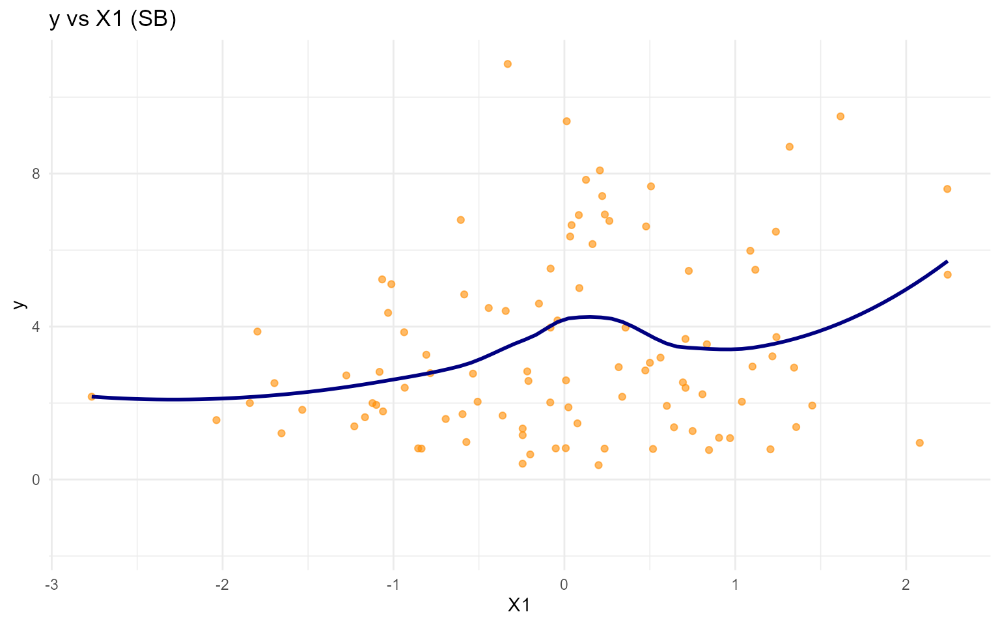
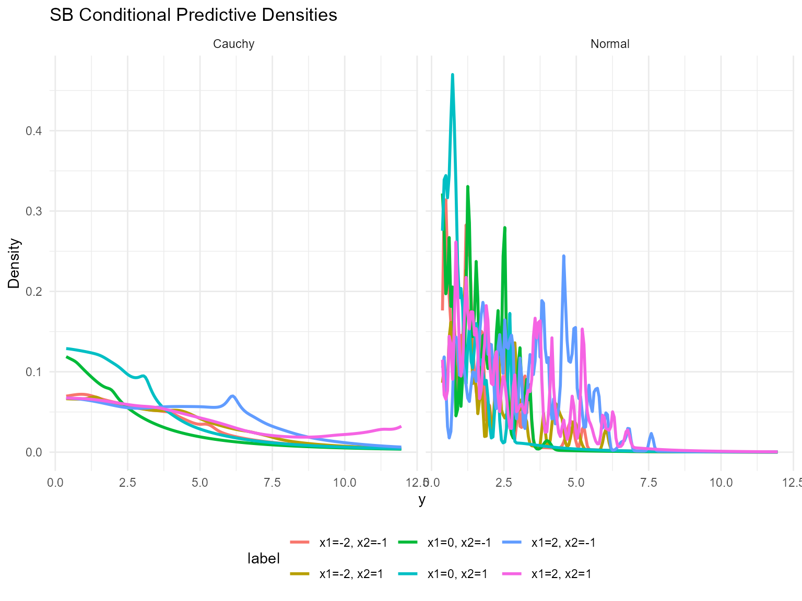
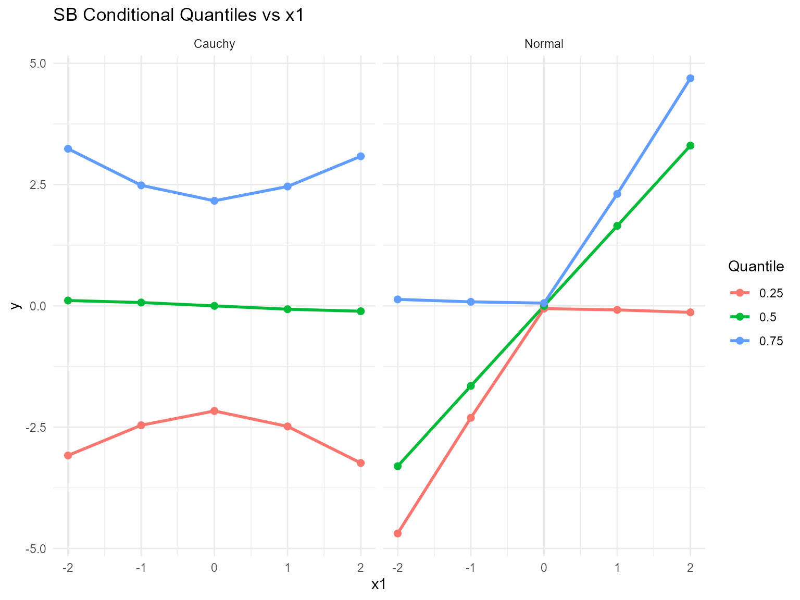
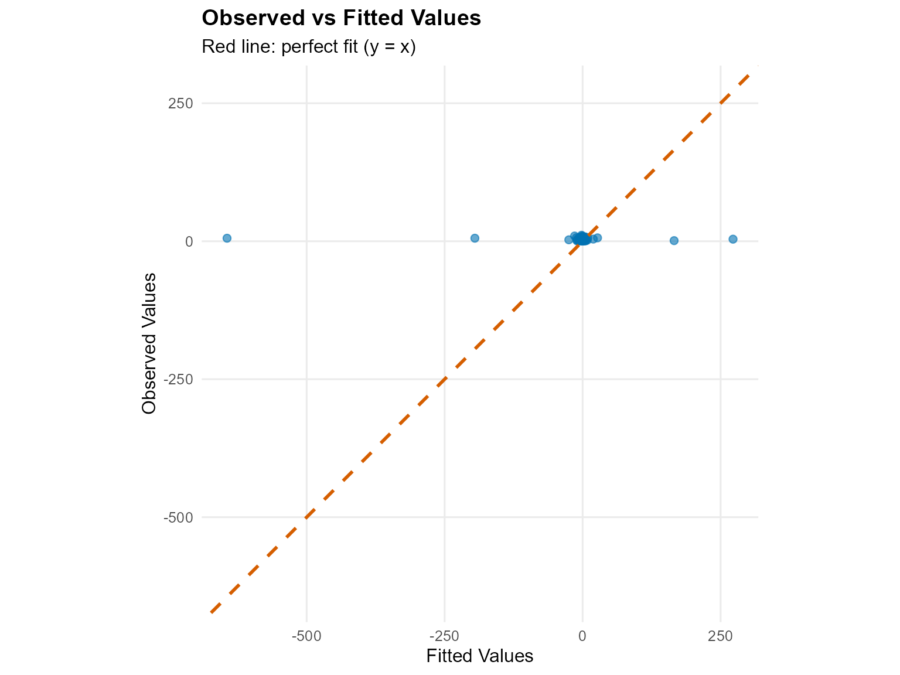
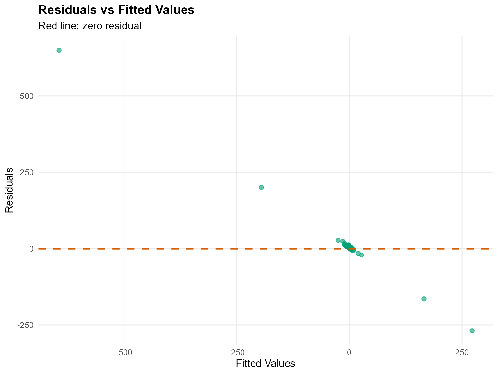
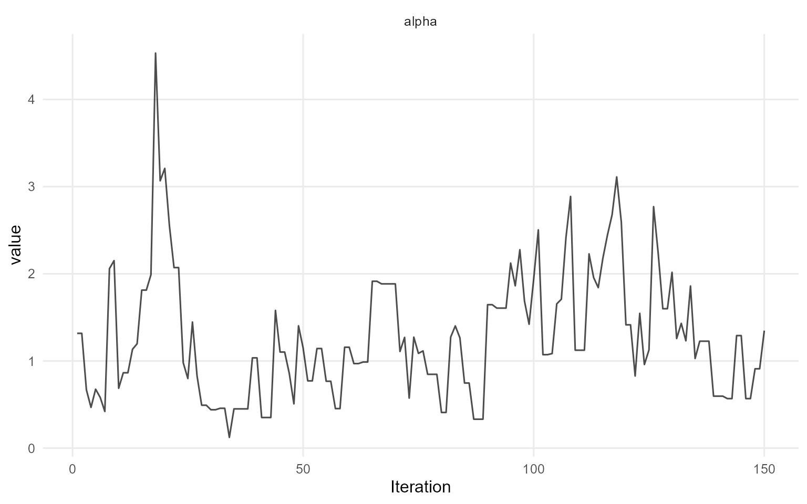
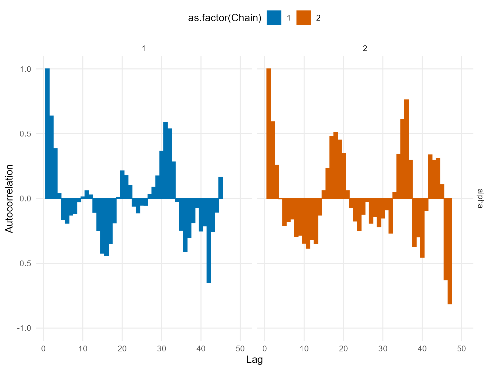
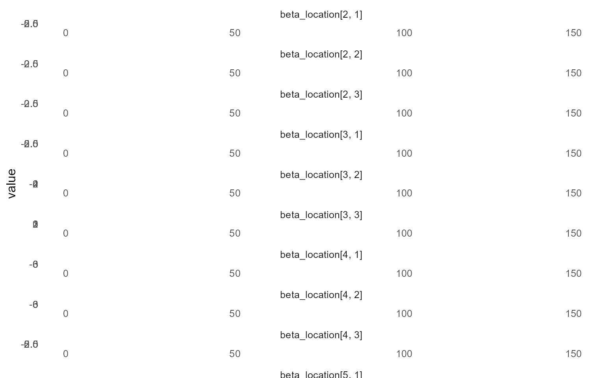
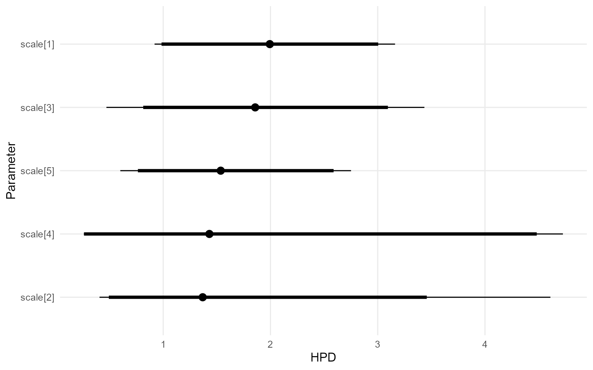

# 11. Conditional DPmix with Stick-Breaking Backend

> **Legacy vignette (for the website / historical notes).** These files
> may not match the current exported API one-to-one. Last verified:
> **2026-01-18**.
>
> For the up-to-date workflow, see the main package vignettes
> (Introduction, Model Spec, MCMC Workflow,
> Unconditional/Conditional/Causal, Backends, S3 Reference).

## Conditional DPmix: Stick-Breaking Backend

**Purpose**: Replace the CRP backend with stick-breaking truncation
while keeping the covariate-dependent bulk structure. This demonstrates
how fixed `components` interplay with covariates.

------------------------------------------------------------------------

### Data Setup

``` r
data("nc_posX100_p3_k2")
y <- nc_posX100_p3_k2$y
X <- as.matrix(nc_posX100_p3_k2$X)
if (is.null(colnames(X))) {
  colnames(X) <- paste0("x", seq_len(ncol(X)))
}

summary_tbl <- tibble(
  statistic = c("N", "Mean", "SD", "Min", "Max"),
  value = c(length(y), mean(y), sd(y), min(y), max(y))
)

ggplot(data.frame(y = y, x1 = X[, 1]), aes(x = x1, y = y)) +
  geom_point(alpha = 0.6, color = "darkorange") +
  geom_smooth(method = "loess", color = "navy", fill = NA) +
  labs(title = "y vs X1 (SB)", x = "X1", y = "y") +
  theme_minimal()
```



| statistic |  value   |
|:---------:|:--------:|
|     N     | 100.0000 |
|   Mean    |  3.4540  |
|    SD     |  2.4060  |
|    Min    |  0.3772  |
|    Max    | 10.8700  |

Conditional Dataset Summary (SB)

------------------------------------------------------------------------

### Model Specification

``` r
bundle_sb_normal <- build_nimble_bundle(
  y = y,
  X = X,
  kernel = "normal",
  backend = "sb",
  GPD = FALSE,
  components = 5,
  mcmc = mcmc
)

bundle_sb_cauchy <- build_nimble_bundle(
  y = y,
  X = X,
  kernel = "cauchy",
  backend = "sb",
  GPD = FALSE,
  components = 5,
  mcmc = mcmc
)
```

------------------------------------------------------------------------

### Running MCMC

``` r
fit_sb_normal <- load_or_fit("v11-conditional-DPmix-SB-fit_sb_normal", run_mcmc_bundle_manual(bundle_sb_normal))
fit_sb_cauchy <- load_or_fit("v11-conditional-DPmix-SB-fit_sb_cauchy", run_mcmc_bundle_manual(bundle_sb_cauchy))
summary(fit_sb_normal)
```

    MixGPD summary | backend: Stick-Breaking Process | kernel: Normal Distribution | GPD tail: FALSE | epsilon: 0.025
    n = 100 | components = 5
    Summary
    Initial components: 5 | Components after truncation: 1

    WAIC: 557.275
    lppd: -243.030 | pWAIC: 35.608

    Summary table
           parameter   mean    sd q0.025 q0.500 q0.975     ess
          weights[1]  0.810 0.129  0.480  0.825  1.000   4.525
               alpha  1.275 0.724  0.346  1.138  2.937  26.667
     beta_mean[1, 1]  0.839 0.674 -0.143  0.787  2.468  38.443
     beta_mean[2, 1] -0.290 1.523 -3.093 -0.433  3.243   8.076
     beta_mean[3, 1]  0.119 1.685 -3.157  0.600  2.795  12.208
     beta_mean[4, 1] -0.085 1.640 -2.479 -0.435  3.255  16.761
     beta_mean[5, 1] -0.103 1.192 -1.878 -0.377  2.716  16.102
     beta_mean[1, 2]  0.108 0.773 -1.064  0.032  1.788  39.354
     beta_mean[2, 2] -0.286 1.977 -4.361  0.064  3.231   5.473
     beta_mean[3, 2]  0.319 1.740 -2.770  0.482  3.901   8.968
     beta_mean[4, 2] -0.756 1.740 -3.657 -0.838  2.397  29.061
     beta_mean[5, 2] -0.983 1.884 -3.459 -1.439  2.772   8.028
     beta_mean[1, 3]  0.328 0.633 -0.868  0.210  1.943  26.597
     beta_mean[2, 3] -0.749 1.493 -3.730 -0.591  1.768   6.438
     beta_mean[3, 3] -0.711 1.664 -3.429 -0.741  2.547  15.724
     beta_mean[4, 3]  0.662 1.233 -2.649  0.957  2.519  32.085
     beta_mean[5, 3]  1.415 1.454 -1.670  1.579  3.639  17.512
               sd[1]  0.054 0.010  0.036  0.053  0.073 112.333

``` r
summary(fit_sb_cauchy)
```

    MixGPD summary | backend: Stick-Breaking Process | kernel: Cauchy Distribution | GPD tail: FALSE | epsilon: 0.025
    n = 100 | components = 5
    Summary
    Initial components: 5 | Components after truncation: 3

    WAIC: 608.289
    lppd: -250.281 | pWAIC: 53.864

    Summary table
               parameter   mean    sd q0.025 q0.500 q0.975    ess
              weights[1]  0.439 0.091  0.300  0.420  0.640  9.896
              weights[2]  0.283 0.057  0.167  0.290  0.370 11.716
              weights[3]  0.183 0.056  0.090  0.170  0.293  8.184
                   alpha  1.911 1.122  0.522  1.663  4.689 26.383
     beta_location[1, 1] -0.046 0.971 -1.707 -0.049  1.814  8.544
     beta_location[2, 1]  0.409 1.988 -3.490  0.464  3.522 21.689
     beta_location[3, 1]  1.567 1.814 -1.400  1.827  4.686  6.793
     beta_location[4, 1]  0.705 2.333 -4.090  0.795  4.337 10.000
     beta_location[5, 1] -0.684 1.004 -2.437 -0.670  1.589 11.242
     beta_location[1, 2] -0.785 1.853 -3.938 -1.114  3.103 14.580
     beta_location[2, 2]  0.389 2.294 -3.943  0.597  3.849 16.460
     beta_location[3, 2]  0.377 1.407 -2.735  0.642  2.855 19.471
     beta_location[4, 2] -0.287 2.070 -4.024 -0.135  3.440 23.622
     beta_location[5, 2] -0.861 1.905 -3.746 -1.155  4.068 10.795
     beta_location[1, 3] -0.804 1.118 -2.986 -0.860  1.004 12.234
     beta_location[2, 3]  0.274 1.967 -3.563  0.495  3.655 15.622
     beta_location[3, 3]  1.959 0.785  0.314  2.053  3.303 29.800
     beta_location[4, 3]  0.078 1.877 -3.056  0.066  3.709 21.214
     beta_location[5, 3] -0.554 1.324 -2.745 -0.520  1.550  5.984
                scale[1]  1.999 0.518  1.101  1.961  3.019 48.500
                scale[2]  1.930 0.703  0.779  1.861  3.332 53.699
                scale[3]  1.523 0.757  0.470  1.360  3.577 53.635

``` r
params_sb <- params(fit_sb_normal)
params_sb
```

    Posterior mean parameters

    $alpha
    [1] 1.275

    $w
    [1] 0.8103

    $beta_mean
               x1      x2      x3
    comp1  0.8391  0.1077  0.3282
    comp2 -0.2902 -0.2859 -0.7494
    comp3  0.1185  0.3192 -0.7111
    comp4 -0.0846 -0.7557  0.6625
    comp5 -0.1035 -0.9825  1.4152

    $sd
    [1] 0.05429

------------------------------------------------------------------------

### Conditional Predictive Density

``` r
X_new <- expand.grid(x1 = seq(-2, 2, length.out = 3), x2 = c(-1, 1), x3 = 0)
colnames(X_new) <- colnames(X)
y_min <- max(min(y), .Machine$double.eps)
y_grid <- seq(y_min, max(y) * 1.1, length.out = 200)

densities_normal <- lapply(seq_len(nrow(X_new)), function(i) {
  pred <- predict(fit_sb_normal, x = as.matrix(X_new[i, , drop = FALSE]), y = y_grid, type = "density")
  data.frame(
    y = pred$fit$y,
    density = pred$fit$density,
    label = paste0("x1=", round(X_new[i, "x1"], 1), ", x2=", X_new[i, "x2"]),
    model = "Normal"
  )
})

densities_cauchy <- lapply(seq_len(nrow(X_new)), function(i) {
  pred <- predict(fit_sb_cauchy, x = as.matrix(X_new[i, , drop = FALSE]), y = y_grid, type = "density")
  data.frame(
    y = pred$fit$y,
    density = pred$fit$density,
    label = paste0("x1=", round(X_new[i, "x1"], 1), ", x2=", X_new[i, "x2"]),
    model = "Cauchy"
  )
})

df_cond <- bind_rows(densities_normal, densities_cauchy)

ggplot(df_cond, aes(x = y, y = density, color = label)) +
  geom_line(linewidth = 1) +
  facet_wrap(~ model) +
  labs(title = "SB Conditional Predictive Densities", x = "y", y = "Density") +
  theme_minimal() +
  theme(legend.position = "bottom")
```



------------------------------------------------------------------------

### Quantile Drift with Covariates

``` r
X_eval <- cbind(x1 = seq(-2, 2, length.out = 5), x2 = 0, x3 = 0)
colnames(X_eval) <- colnames(X)
quant_probs <- c(0.25, 0.5, 0.75)

pred_q_normal <- predict(fit_sb_normal, x = as.matrix(X_eval), type = "quantile", index = quant_probs)
pred_q_cauchy <- predict(fit_sb_cauchy, x = as.matrix(X_eval), type = "quantile", index = quant_probs)

quant_df_normal <- pred_q_normal$fit
quant_df_normal$x1 <- X_eval[quant_df_normal$id, "x1"]
quant_df_normal$model <- "Normal"

quant_df_cauchy <- pred_q_cauchy$fit
quant_df_cauchy$x1 <- X_eval[quant_df_cauchy$id, "x1"]
quant_df_cauchy$model <- "Cauchy"

bind_rows(quant_df_normal, quant_df_cauchy) %>%
  ggplot(aes(x = x1, y = estimate, color = factor(index), group = index)) +
  geom_line(linewidth = 1) +
  geom_point(size = 2) +
  facet_wrap(~ model) +
  labs(title = "SB Conditional Quantiles vs x1", x = "x1", y = "y", color = "Quantile") +
  theme_minimal()
```



------------------------------------------------------------------------

### Residuals & Diagnostics

``` r
plot(fitted(fit_sb_cauchy))
```



``` r
plot(fit_sb_normal, params = "mean", family = "traceplot")
```

    === traceplot ===



``` r
plot(fit_sb_normal, params = "sd", family = "caterpillar")
```

    === caterpillar ===



``` r
plot(fit_sb_cauchy, params = "location", family = "traceplot")
```

    === traceplot ===



``` r
plot(fit_sb_cauchy, params = "scale", family = "caterpillar")
```

    === caterpillar ===



------------------------------------------------------------------------

### Takeaways

- Stick-breaking component count is fixed but still supports
  covariate-dependent mixtures.
- `predict(..., type = "density")` returns group-specific densities for
  each `X`.
- `predict(..., type = "quantile")` reports posterior-mean quantiles;
  the median is the 0.5 quantile and shifts with `x1`.
- Diagnoses rely on the same S3
  [`plot()`](https://rdrr.io/r/graphics/plot.default.html)/[`fitted()`](https://rdrr.io/r/stats/fitted.values.html)
  pipeline available in other vignettes.
