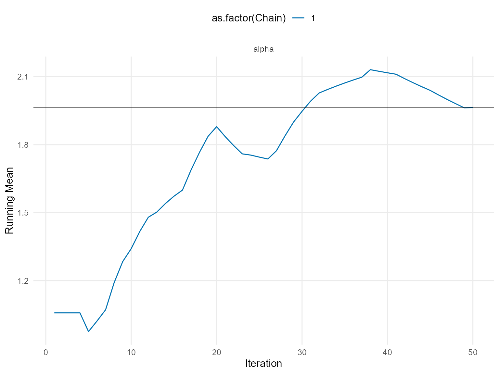
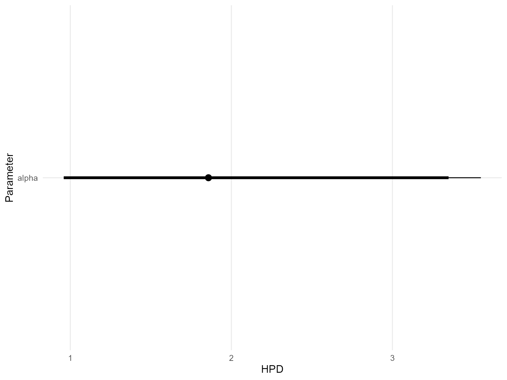

# Legacy: 11. Conditional DPmix with Stick-Breaking Backend

> **Legacy note:** This page is preserved for historical context and
> extended detail. It predates the streamlined official vignettes and
> may include longer runs or exploratory material.

## Conditional DPmix: Stick-Breaking Backend

**Purpose**: Replace the CRP backend with stick-breaking truncation
while keeping the covariate-dependent bulk structure. This demonstrates
how fixed `components` interplay with covariates.

------------------------------------------------------------------------

### Data Setup

``` r
data("nc_posX100_p3_k2")
y <- nc_posX100_p3_k2$y
X <- as.matrix(nc_posX100_p3_k2$X)
if (is.null(colnames(X))) {
  colnames(X) <- paste0("x", seq_len(ncol(X)))
}

summary_tbl <- tibble(
  statistic = c("N", "Mean", "SD", "Min", "Max"),
  value = c(length(y), mean(y), sd(y), min(y), max(y))
)

ggplot(data.frame(y = y, x1 = X[, 1]), aes(x = x1, y = y)) +
  geom_point(alpha = 0.6, color = "darkorange") +
  geom_smooth(method = "loess", color = "navy", fill = NA) +
  labs(title = "y vs X1 (SB)", x = "X1", y = "y") +
  theme_minimal()
```


| statistic |  value   |
|:---------:|:--------:|
|     N     | 100.0000 |
|   Mean    |  3.4540  |
|    SD     |  2.4060  |
|    Min    |  0.3772  |
|    Max    | 10.8700  |

Conditional Dataset Summary (SB)

------------------------------------------------------------------------

### Model Specification

``` r
bundle_sb_normal <- build_nimble_bundle(
  y = y,
  X = X,
  kernel = "normal",
  backend = "sb",
  GPD = FALSE,
  components = 5,
  mcmc = list(
    niter = 60,
    nburnin = 10,
    nchains = 2,
    thin = 1
  )
)

bundle_sb_cauchy <- build_nimble_bundle(
  y = y,
  X = X,
  kernel = "cauchy",
  backend = "sb",
  GPD = FALSE,
  components = 5,
  mcmc = list(
    niter = 60,
    nburnin = 10,
    nchains = 1,
    thin = 1
  )
)
```

------------------------------------------------------------------------

### Running MCMC

``` r
fit_sb_normal <- run_mcmc_bundle_manual(bundle_sb_normal)
[MCMC] Creating NIMBLE model...
[MCMC] NIMBLE model created successfully.
[MCMC] Configuring MCMC...
===== Monitors =====
thin = 1: alpha, beta_mean, sd, w, z
===== Samplers =====
RW sampler (20)
  - alpha
  - beta_mean[]  (15 elements)
  - v[]  (4 elements)
conjugate sampler (5)
  - sd[]  (5 elements)
categorical sampler (100)
  - z[]  (100 elements)
[MCMC] MCMC configured.
[MCMC] Building MCMC object...
[MCMC] MCMC object built.
[MCMC] Attempting NIMBLE compilation (this may take a minute)...
[MCMC] Compiling model...
[MCMC] Compiling MCMC sampler...
[MCMC] Compilation successful.
|-------------|-------------|-------------|-------------|
|-------------------------------------------------------|
|-------------|-------------|-------------|-------------|
|-------------------------------------------------------|
[MCMC] MCMC execution complete. Processing results...
fit_sb_cauchy <- run_mcmc_bundle_manual(bundle_sb_cauchy)
[MCMC] Creating NIMBLE model...
[MCMC] NIMBLE model created successfully.
[MCMC] Configuring MCMC...
===== Monitors =====
thin = 1: alpha, beta_location, scale, w, z
===== Samplers =====
RW sampler (25)
  - alpha
  - scale[]  (5 elements)
  - beta_location[]  (15 elements)
  - v[]  (4 elements)
categorical sampler (100)
  - z[]  (100 elements)
[MCMC] MCMC configured.
[MCMC] Building MCMC object...
[MCMC] MCMC object built.
[MCMC] Attempting NIMBLE compilation (this may take a minute)...
[MCMC] Compiling model...
[MCMC] Compiling MCMC sampler...
[MCMC] Compilation successful.
|-------------|-------------|-------------|-------------|
|-------------------------------------------------------|
[MCMC] MCMC execution complete. Processing results...
summary(fit_sb_normal)
MixGPD summary | backend: Stick-Breaking Process | kernel: Normal Distribution | GPD tail: FALSE | epsilon: 0.025
n = 100 | components = 5
Summary
Initial components: 5 | Components after truncation: 3

WAIC: 549.708
lppd: -229.028 | pWAIC: 45.826

Summary table
       parameter   mean    sd q0.025 q0.500 q0.975    ess
      weights[1]  0.476 0.050  0.390  0.470  0.575  6.034
      weights[2]  0.361 0.041  0.280  0.370  0.420 53.070
      weights[3]  0.093 0.026  0.050  0.090  0.145 13.431
           alpha  1.012 0.486  0.406  0.905  2.235 24.753
 beta_mean[1, 1]  0.205 1.228 -2.279  0.088  2.558  8.646
 beta_mean[2, 1]  0.919 0.690 -0.241  0.791  2.204 10.907
 beta_mean[3, 1]  0.277 1.338 -2.143  0.606  2.474  3.295
 beta_mean[4, 1] -0.047 1.650 -3.340  0.524  2.484  2.836
 beta_mean[5, 1]  1.431 1.550 -0.804  1.411  4.758  4.756
 beta_mean[1, 2]  0.666 0.835 -0.736  0.641  2.690 13.341
 beta_mean[2, 2] -1.685 0.949 -3.379 -1.570 -0.108 13.996
 beta_mean[3, 2]  0.848 1.688 -2.089  0.550  3.519  4.634
 beta_mean[4, 2]  1.844 1.098 -0.313  2.000  3.649  2.732
 beta_mean[5, 2] -0.310 1.873 -3.172 -0.280  3.051  3.067
 beta_mean[1, 3]  1.379 0.778  0.047  1.258  3.172 12.503
 beta_mean[2, 3] -1.078 0.601 -2.291 -1.143  0.261 22.774
 beta_mean[3, 3] -0.453 1.730 -3.300  0.180  1.655  2.778
 beta_mean[4, 3]  0.999 0.967 -0.572  0.834  3.556 13.834
 beta_mean[5, 3] -0.223 1.347 -2.518 -0.178  2.362  6.226
           sd[1]  0.070 0.020  0.039  0.068  0.108 60.523
           sd[2]  0.065 0.025  0.032  0.060  0.132 45.082
           sd[3]  2.245 1.549  0.404  1.847  5.752 33.330
summary(fit_sb_cauchy)
MixGPD summary | backend: Stick-Breaking Process | kernel: Cauchy Distribution | GPD tail: FALSE | epsilon: 0.025
n = 100 | components = 5
Summary
Initial components: 5 | Components after truncation: 5

WAIC: 613.394
lppd: -243.915 | pWAIC: 62.782

Summary table
           parameter   mean    sd q0.025 q0.500 q0.975    ess
          weights[1]  0.292 0.034  0.232  0.290  0.360  6.026
          weights[2]  0.244 0.032  0.192  0.240  0.305  5.038
          weights[3]  0.208 0.024  0.160  0.210  0.258 13.254
          weights[4]  0.148 0.038  0.080  0.160  0.208  3.956
          weights[5]  0.109 0.033  0.050  0.110  0.160 12.835
               alpha  1.964 0.827  0.959  1.858  3.549  5.613
 beta_location[1, 1]  1.578 0.693  0.566  1.353  2.673  2.483
 beta_location[2, 1] -0.904 0.972 -2.135 -1.059  0.820  3.933
 beta_location[3, 1] -0.545 0.853 -2.335 -0.752  0.895  9.340
 beta_location[4, 1]  4.482 0.477  3.667  4.550  5.287 24.286
 beta_location[5, 1] -1.161 0.896 -2.595 -1.356  0.928  7.206
 beta_location[1, 2]  0.145 0.959 -1.699  0.244  1.437  6.229
 beta_location[2, 2]  1.331 0.699  0.026  1.431  2.382  7.669
 beta_location[3, 2] -0.506 1.031 -2.950 -0.388  0.996  4.031
 beta_location[4, 2]  2.373 0.859  0.180  2.684  3.122  8.753
 beta_location[5, 2] -0.108 2.596 -3.539 -0.946  5.577  2.430
 beta_location[1, 3] -0.969 0.849 -2.831 -0.590 -0.036  4.210
 beta_location[2, 3]  0.884 1.129 -1.630  1.089  2.690  6.325
 beta_location[3, 3] -1.091 1.037 -2.875 -1.065  0.686  4.788
 beta_location[4, 3]  1.253 0.489  0.498  1.262  2.224  7.531
 beta_location[5, 3]  1.321 0.645  0.070  1.544  2.380  7.169
            scale[1]  1.860 0.779  0.859  1.473  3.695  6.567
            scale[2]  1.915 0.774  0.632  1.895  3.533 31.350
            scale[3]  1.700 0.726  0.849  1.519  3.166 15.029
            scale[4]  1.293 0.708  0.237  1.331  2.773 50.000
            scale[5]  1.761 1.225  0.237  1.324  4.110  7.918
```

``` r
params_sb <- params(fit_sb_normal)
params_sb
Posterior mean parameters

$alpha
[1] 1.012

$w
[1] 0.4762 0.3607 0.0929

$beta_mean
           x1      x2      x3
comp1  0.2050  0.6655  1.3785
comp2  0.9191 -1.6848 -1.0785
comp3  0.2768  0.8479 -0.4529
comp4 -0.0471  1.8443  0.9991
comp5  1.4310 -0.3103 -0.2231

$sd
[1] 0.06955 0.06514 2.24500
```

------------------------------------------------------------------------

### Conditional Predictive Density

``` r
X_new <- expand.grid(x1 = seq(-2, 2, length.out = 3), x2 = c(-1, 1), x3 = 0)
colnames(X_new) <- colnames(X)
y_min <- max(min(y), .Machine$double.eps)
y_grid <- seq(y_min, max(y) * 1.1, length.out = 200)

densities_normal <- lapply(seq_len(nrow(X_new)), function(i) {
  pred <- predict(fit_sb_normal, x = as.matrix(X_new[i, , drop = FALSE]), y = y_grid, type = "density")
  data.frame(
    y = pred$fit$y,
    density = pred$fit$density,
    label = paste0("x1=", round(X_new[i, "x1"], 1), ", x2=", X_new[i, "x2"]),
    model = "Normal"
  )
})

densities_cauchy <- lapply(seq_len(nrow(X_new)), function(i) {
  pred <- predict(fit_sb_cauchy, x = as.matrix(X_new[i, , drop = FALSE]), y = y_grid, type = "density")
  data.frame(
    y = pred$fit$y,
    density = pred$fit$density,
    label = paste0("x1=", round(X_new[i, "x1"], 1), ", x2=", X_new[i, "x2"]),
    model = "Cauchy"
  )
})

df_cond <- bind_rows(densities_normal, densities_cauchy)

ggplot(df_cond, aes(x = y, y = density, color = label)) +
  geom_line(linewidth = 1) +
  facet_wrap(~ model) +
  labs(title = "SB Conditional Predictive Densities", x = "y", y = "Density") +
  theme_minimal() +
  theme(legend.position = "bottom")
```


------------------------------------------------------------------------

### Quantile Drift with Covariates

``` r
X_eval <- cbind(x1 = seq(-2, 2, length.out = 5), x2 = 0, x3 = 0)
colnames(X_eval) <- colnames(X)
quant_probs <- c(0.25, 0.5, 0.75)

pred_q_normal <- predict(fit_sb_normal, x = as.matrix(X_eval), type = "quantile", index = quant_probs)
pred_q_cauchy <- predict(fit_sb_cauchy, x = as.matrix(X_eval), type = "quantile", index = quant_probs)

quant_df_normal <- pred_q_normal$fit
quant_df_normal$x1 <- X_eval[quant_df_normal$id, "x1"]
quant_df_normal$model <- "Normal"

quant_df_cauchy <- pred_q_cauchy$fit
quant_df_cauchy$x1 <- X_eval[quant_df_cauchy$id, "x1"]
quant_df_cauchy$model <- "Cauchy"

bind_rows(quant_df_normal, quant_df_cauchy) %>%
  ggplot(aes(x = x1, y = estimate, color = factor(index), group = index)) +
  geom_line(linewidth = 1) +
  geom_point(size = 2) +
  facet_wrap(~ model) +
  labs(title = "SB Conditional Quantiles vs x1", x = "x1", y = "y", color = "Quantile") +
  theme_minimal()
```


------------------------------------------------------------------------

### Residuals & Diagnostics

``` r
plot(fitted(fit_sb_cauchy))
```


``` r
plot(fit_sb_normal, family = c("traceplot", "autocorrelation", "geweke"))

=== traceplot ===
```


    === autocorrelation ===


    === geweke ===


``` r
plot(fit_sb_cauchy, family = c("density", "running", "caterpillar"))

=== density ===
```


    === running ===



    === caterpillar ===



------------------------------------------------------------------------

### Takeaways

- Stick-breaking component count is fixed but still supports
  covariate-dependent mixtures.
- `predict(..., type = "density")` returns group-specific densities for
  each `X`.
- `predict(..., type = "quantile")` reports posterior-mean quantiles;
  the median is the 0.5 quantile and shifts with `x1`.
- Diagnoses rely on the same S3
  [`plot()`](https://rdrr.io/r/graphics/plot.default.html)/[`fitted()`](https://rdrr.io/r/stats/fitted.values.html)
  pipeline available in other vignettes.
