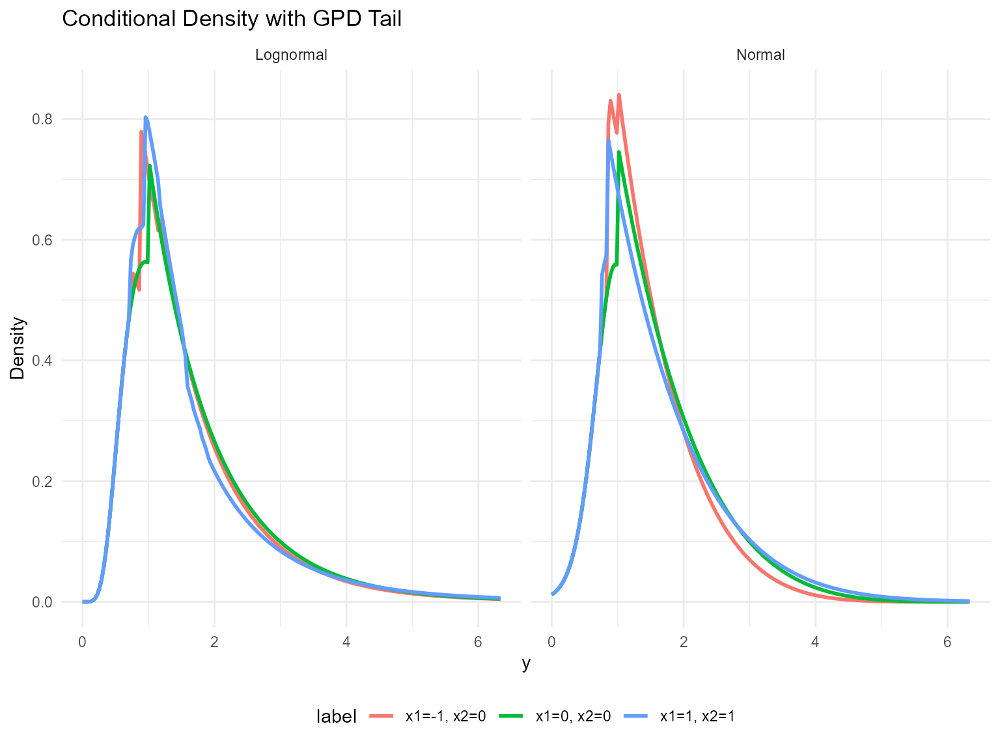
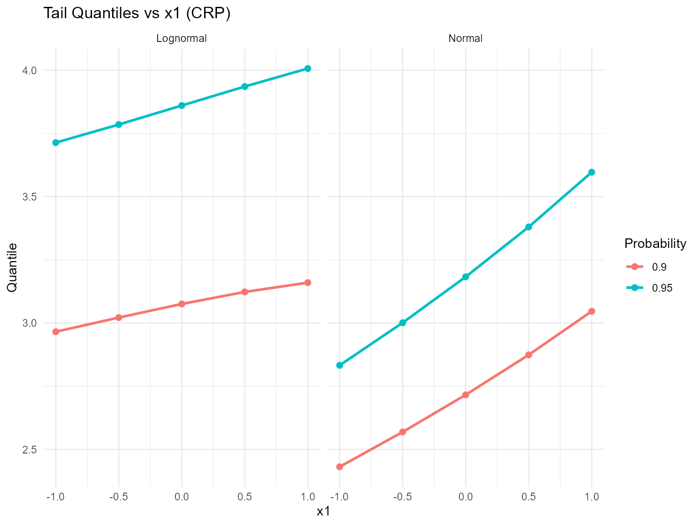
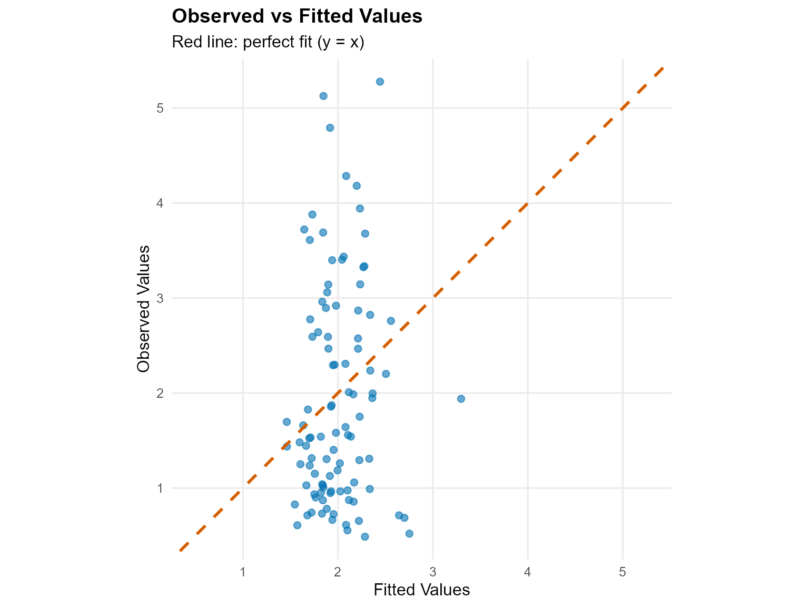
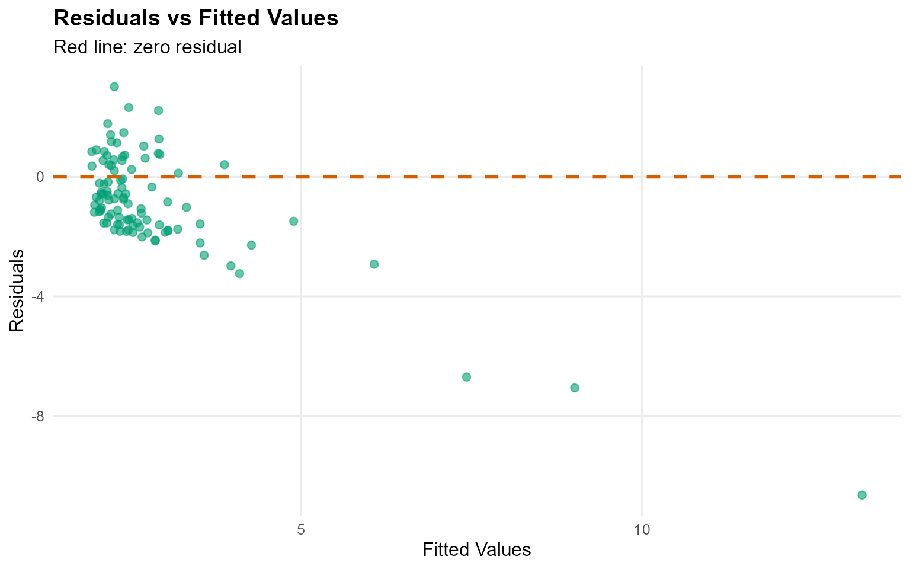
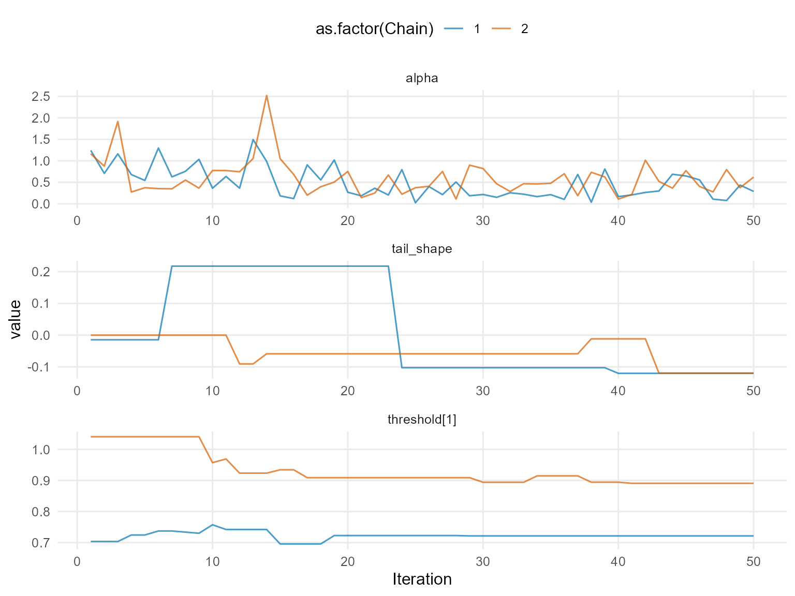
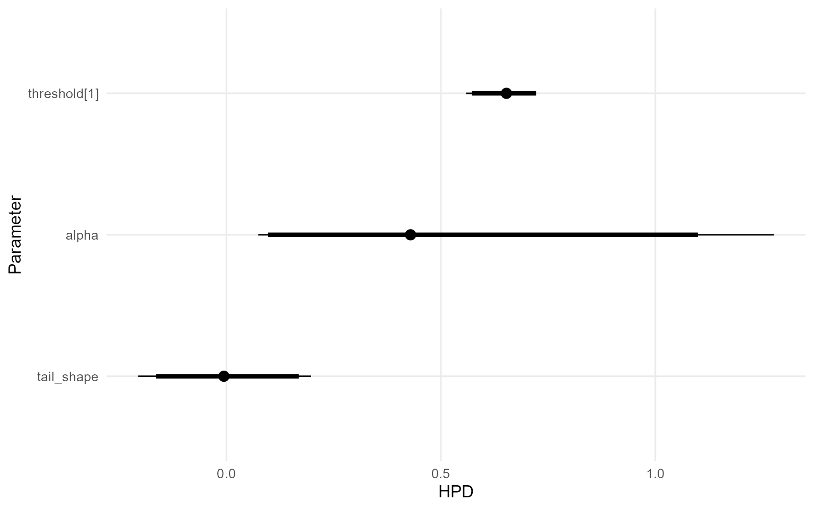
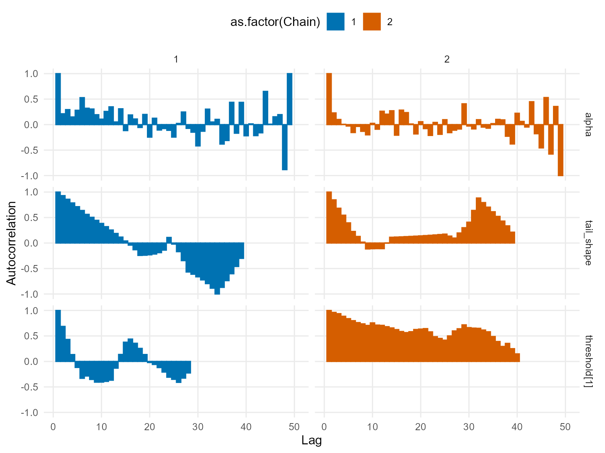
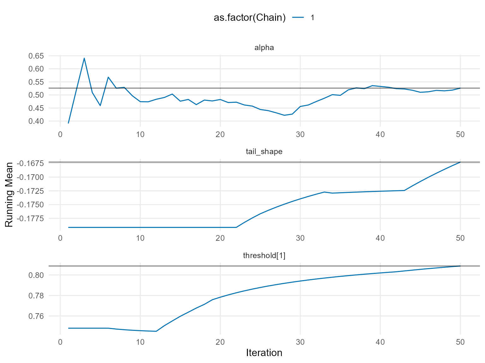
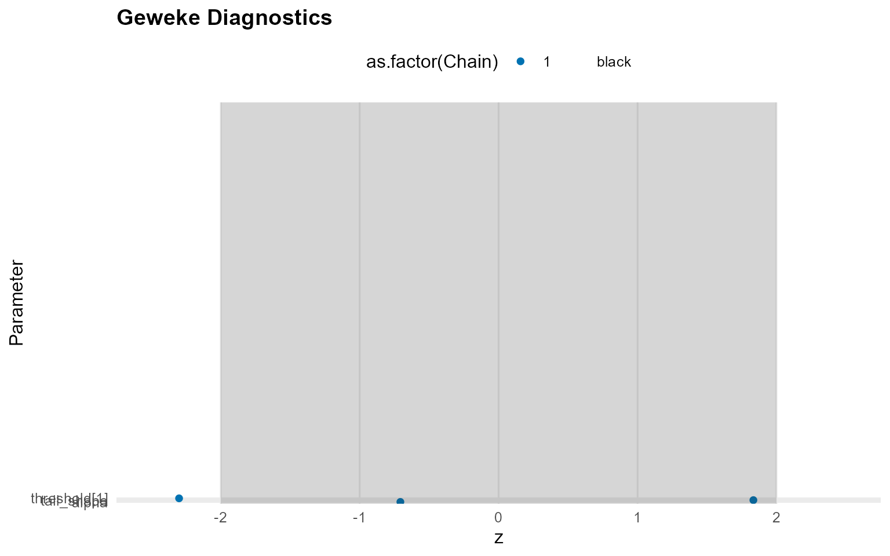
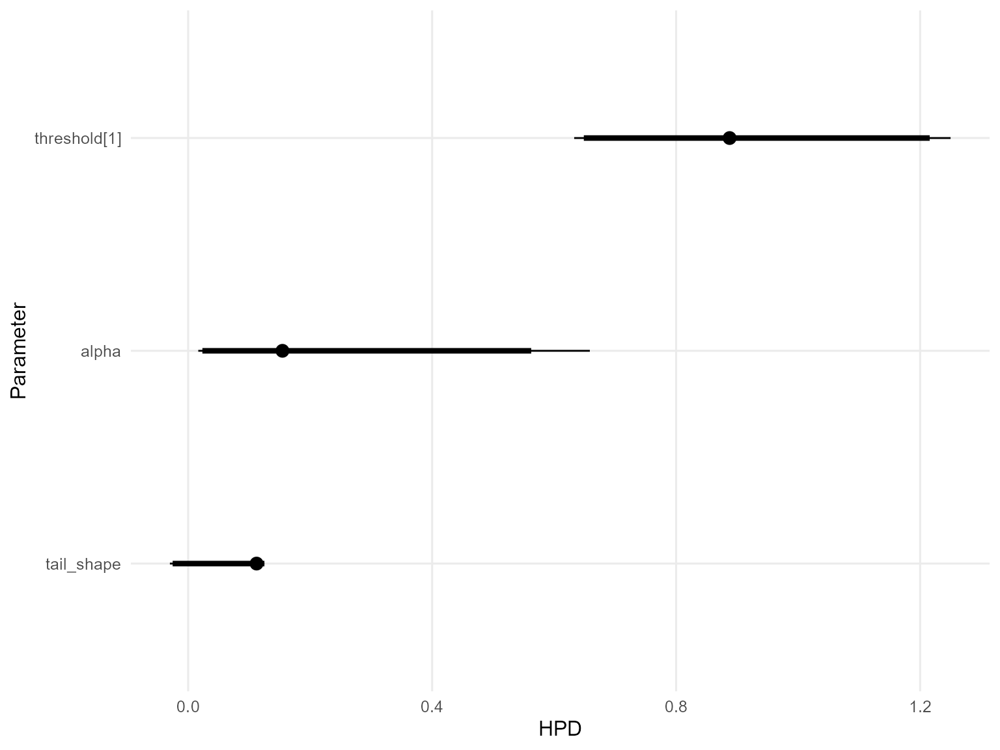

# 12. Conditional DPmixGPD with CRP Backend

> **Legacy vignette (for the website / historical notes).** These files
> may not match the current exported API one-to-one. Last verified:
> **2026-01-18**.
>
> For the up-to-date workflow, see the main package vignettes
> (Introduction, Model Spec, MCMC Workflow,
> Unconditional/Conditional/Causal, Backends, S3 Reference).

## Conditional DPmixGPD: CRP Backend with Tail Augmentation

**Purpose**: Combine conditional modeling with GPD tail augmentation so
each covariate slice inherits both mixture bulk and tail behavior. This
extends the unconditional GPD (v06) and conditional DP (v08).

------------------------------------------------------------------------

### Data Setup

``` r
data("nc_posX100_p5_k4")
y <- nc_posX100_p5_k4$y
X <- as.matrix(nc_posX100_p5_k4$X)
if (is.null(colnames(X))) {
  colnames(X) <- paste0("x", seq_len(ncol(X)))
}

summary_tbl <- tibble(
  statistic = c("N", "Mean", "SD", "Min", "Max"),
  value = c(length(y), mean(y), sd(y), min(y), max(y))
)

ggplot(data.frame(y = y, x1 = X[, 1]), aes(x = x1, y = y)) +
  geom_point(alpha = 0.5, color = "darkgreen") +
  geom_smooth(method = "loess", color = "steelblue", fill = NA) +
  labs(title = "Outcome vs X1 (Tail dataset)", x = "X1", y = "y") +
  theme_minimal()
```


| statistic |  value   |
|:---------:|:--------:|
|     N     | 100.0000 |
|   Mean    |  1.9420  |
|    SD     |  1.1460  |
|    Min    |  0.4877  |
|    Max    |  5.2780  |

Conditional Tail Dataset Summary

------------------------------------------------------------------------

### Threshold Selection

``` r
u_threshold <- quantile(y, 0.85)

ggplot(data.frame(y = y), aes(x = y)) +
  geom_histogram(aes(y = after_stat(density)), bins = 40, fill = "magenta", alpha = 0.6, color = "black") +
  geom_vline(xintercept = u_threshold, linetype = "dashed", color = "black") +
  labs(title = paste("Threshold at", signif(u_threshold, 3)), x = "y", y = "Density") +
  theme_minimal()
```


------------------------------------------------------------------------

### Model Specification & Bundle

``` r
bundle_cond_gpd_lognormal <- build_nimble_bundle(
  y = y,
  X = X,
  kernel = "lognormal",
  backend = "crp",
  GPD = TRUE,
  components = 5,
  param_specs = list(
    gpd = list(
      threshold = list(mode = "link", link = "exp")
    )
  ),
  mcmc = mcmc
)

bundle_cond_gpd_normal <- build_nimble_bundle(
  y = y,
  X = X,
  kernel = "normal",
  backend = "crp",
  GPD = TRUE,
  components = 5,
  param_specs = list(
    gpd = list(
      threshold = list(mode = "link", link = "exp")
    )
  ),
  mcmc = mcmc
)
```

------------------------------------------------------------------------

### Running MCMC

``` r
fit_cond_gpd_lognormal <- load_or_fit("v12-conditional-DPmixGPD-CRP-fit_cond_gpd_lognormal", run_mcmc_bundle_manual(bundle_cond_gpd_lognormal))
fit_cond_gpd_normal <- load_or_fit("v12-conditional-DPmixGPD-CRP-fit_cond_gpd_normal", run_mcmc_bundle_manual(bundle_cond_gpd_normal))
summary(fit_cond_gpd_lognormal)
```

    MixGPD summary | backend: Chinese Restaurant Process | kernel: Lognormal Distribution | GPD tail: TRUE | epsilon: 0.025
    n = 100 | components = 5
    Summary
    Initial components: 5 | Components after truncation: 1

    WAIC: 286.942
    lppd: -132.369 | pWAIC: 11.102

    Summary table
              parameter   mean    sd q0.025 q0.500 q0.975     ess
             weights[1]  0.969 0.087  0.662  1.000  1.000  14.709
                  alpha  0.230 0.272  0.006  0.145  0.861 100.960
     beta_tail_scale[1]  0.208 0.154 -0.059  0.216  0.480  39.630
     beta_tail_scale[2] -0.063 0.207 -0.432 -0.083  0.400  34.776
     beta_tail_scale[3] -0.077 0.116 -0.287 -0.066  0.137  31.801
     beta_tail_scale[4]  0.389 0.282 -0.152  0.403  0.879  22.586
     beta_tail_scale[5]  0.011 0.151 -0.273 -0.003  0.320  20.093
      beta_threshold[1] -0.111 0.182 -0.331 -0.171  0.336   9.439
      beta_threshold[2] -0.160 0.172 -0.426 -0.181  0.197  30.644
      beta_threshold[3]  0.168 0.233 -0.213  0.175  0.491   6.338
      beta_threshold[4] -0.036 0.145 -0.285 -0.046  0.241  32.543
      beta_threshold[5]  0.092 0.145 -0.185  0.083  0.374  13.577
             tail_shape -0.012 0.108 -0.237 -0.006  0.247  22.550
             meanlog[1]  0.515 0.346  0.208  0.470  0.893 110.876
               sdlog[1]  0.594 0.205  0.418  0.554  0.931  68.361

``` r
summary(fit_cond_gpd_normal)
```

    MixGPD summary | backend: Chinese Restaurant Process | kernel: Normal Distribution | GPD tail: TRUE | epsilon: 0.025
    n = 100 | components = 5
    Summary
    Initial components: 5 | Components after truncation: 2

    WAIC: 235.282
    lppd: -98.371 | pWAIC: 19.271

    Summary table
              parameter   mean    sd q0.025 q0.500 q0.975     ess
             weights[1]  0.615 0.081  0.387  0.620  0.740  28.409
             weights[2]  0.354 0.056  0.240  0.360  0.473  46.279
                  alpha  0.510 0.327  0.074  0.429  1.276 150.000
     beta_tail_scale[1]  0.154 0.139 -0.108  0.135  0.441  24.614
     beta_tail_scale[2] -0.104 0.217 -0.471 -0.098  0.373  52.162
     beta_tail_scale[3]  0.169 0.127 -0.075  0.161  0.426  45.978
     beta_tail_scale[4]  0.475 0.244  0.141  0.449  0.936  42.386
     beta_tail_scale[5] -0.010 0.099 -0.189 -0.013  0.161  12.137
      beta_threshold[1]  0.017 0.031 -0.049  0.018  0.060  19.974
      beta_threshold[2] -0.064 0.025 -0.082 -0.079 -0.011   1.679
      beta_threshold[3] -0.315 0.067 -0.361 -0.331 -0.168  22.339
      beta_threshold[4]  0.117 0.068 -0.023  0.100  0.223   8.740
      beta_threshold[5] -0.146 0.032 -0.198 -0.142 -0.090   3.157
             tail_shape -0.009 0.107 -0.205 -0.006  0.197  18.486
                mean[1]  6.315 3.994  0.885  5.189 14.914   4.522
                mean[2]  1.686 2.336  0.769  0.876  8.492  32.560
                  sd[1]  0.993 0.821  0.138  0.791  3.447  28.110
                  sd[2]  0.434 0.631  0.169  0.225  1.795  24.062

``` r
params_cond_gpd <- params(fit_cond_gpd_lognormal)
params_cond_gpd
```

    Posterior mean parameters

    $alpha
    [1] 0.2299

    $w
    [1] 0.9686

    $meanlog
    [1] 0.5151

    $sdlog
    [1] 0.5935

    $beta_threshold
    [1] -0.11080 -0.15990  0.16810 -0.03577  0.09224

    $beta_tail_scale
    [1]  0.20800 -0.06260 -0.07702  0.38890  0.01095

    $tail_shape
    [1] -0.01223

------------------------------------------------------------------------

### Conditional Tail-aware Predictions

``` r
X_new <- rbind(
  c(-1, 0, 0, 0, 0),
  c(0, 0, 0, 0, 0),
  c(1, 1, 0, 0, 0)
)
colnames(X_new) <- colnames(X)
y_grid <- seq(0, max(y) * 1.2, length.out = 200)

df_pred_lognormal <- lapply(seq_len(nrow(X_new)), function(i) {
  pred <- predict(fit_cond_gpd_lognormal, x = as.matrix(X_new[i, , drop = FALSE]), y = y_grid, type = "density")
  data.frame(
    y = pred$fit$y,
    density = pred$fit$density,
    label = paste("x1=", X_new[i, 1], ", x2=", X_new[i, 2], sep = ""),
    model = "Lognormal"
  )
})

df_pred_normal <- lapply(seq_len(nrow(X_new)), function(i) {
  pred <- predict(fit_cond_gpd_normal, x = as.matrix(X_new[i, , drop = FALSE]), y = y_grid, type = "density")
  data.frame(
    y = pred$fit$y,
    density = pred$fit$density,
    label = paste("x1=", X_new[i, 1], ", x2=", X_new[i, 2], sep = ""),
    model = "Normal"
  )
})

bind_rows(df_pred_lognormal, df_pred_normal) %>%
  ggplot(aes(x = y, y = density, color = label)) +
  geom_line(linewidth = 1) +
  facet_wrap(~ model) +
  labs(title = "Conditional Density with GPD Tail", x = "y", y = "Density") +
  theme_minimal() +
  theme(legend.position = "bottom")
```



------------------------------------------------------------------------

### Tail Quantiles vs Covariates

``` r
X_grid <- cbind(x1 = seq(-1, 1, length.out = 5), x2 = 0, x3 = 0, x4 = 0, x5 = 0)
colnames(X_grid) <- colnames(X)
quant_probs <- c(0.90, 0.95)

pred_q_lognormal <- predict(fit_cond_gpd_lognormal, x = as.matrix(X_grid), type = "quantile", index = quant_probs)
pred_q_normal <- predict(fit_cond_gpd_normal, x = as.matrix(X_grid), type = "quantile", index = quant_probs)

quant_df_lognormal <- pred_q_lognormal$fit
quant_df_lognormal$x1 <- X_grid[quant_df_lognormal$id, "x1"]
quant_df_lognormal$model <- "Lognormal"

quant_df_normal <- pred_q_normal$fit
quant_df_normal$x1 <- X_grid[quant_df_normal$id, "x1"]
quant_df_normal$model <- "Normal"

bind_rows(quant_df_lognormal, quant_df_normal) %>%
  ggplot(aes(x = x1, y = estimate, color = factor(index), group = index)) +
  geom_line(linewidth = 1) +
  geom_point(size = 2) +
  facet_wrap(~ model) +
  labs(title = "Tail Quantiles vs x1 (CRP)", x = "x1", y = "Quantile", color = "Probability") +
  theme_minimal()
```



------------------------------------------------------------------------

### Residuals & Diagnostics

``` r
plot(fitted(fit_cond_gpd_lognormal))
```



``` r
plot(fit_cond_gpd_lognormal, family = c("traceplot", "density", "autocorrelation"))
```

    === traceplot ===



    === density ===



    === autocorrelation ===



``` r
plot(fit_cond_gpd_normal, family = c("running", "geweke", "caterpillar"))
```

    === running ===



    === geweke ===



    === caterpillar ===



------------------------------------------------------------------------

### Takeaways

- Conditional DPmix with a GPD tail lets posterior-mean extreme
  quantiles vary with covariates.
- The CRP backend samples the bulk and tail jointly while thresholding
  at the 85th percentile.
- [`predict()`](https://rdrr.io/r/stats/predict.html) +
  [`plot()`](https://rdrr.io/r/graphics/plot.default.html) remain the
  main tools for densities, survival curves, and quantiles; residual
  diagnostics check fit quality.
- Next: Mirror this workflow with the SB backend in `v11`.
