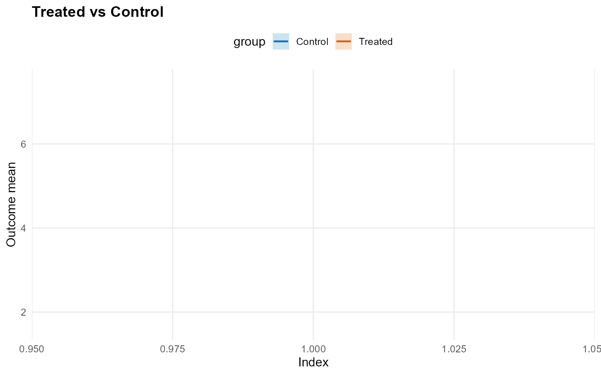
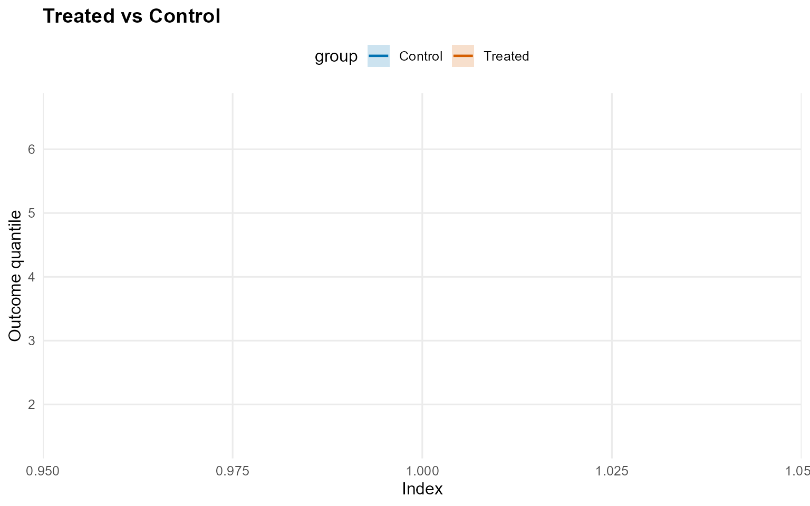
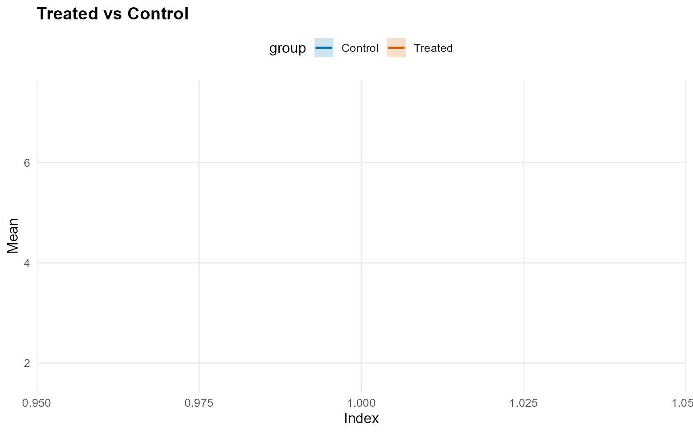
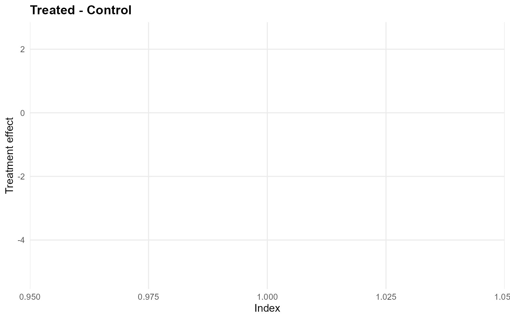
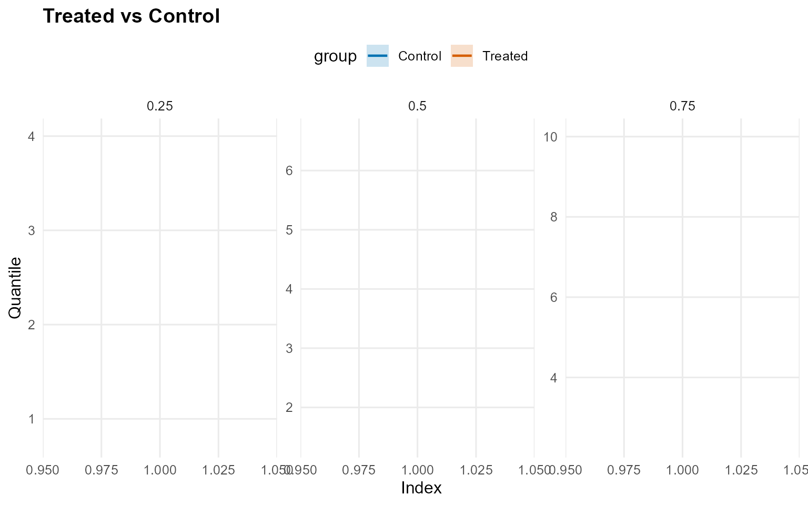
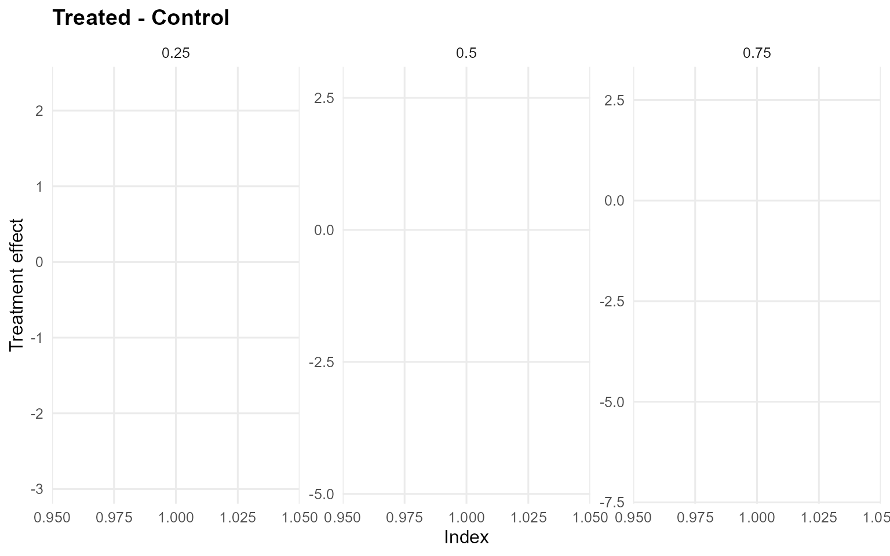

# 14. Causal Inference: No X (CRP) - Gamma Kernel

> **Legacy vignette (for the website / historical notes).** These files
> may not match the current exported API one-to-one. Last verified:
> **2026-01-18**.
>
> For the up-to-date workflow, see the main package vignettes
> (Introduction, Model Spec, MCMC Workflow,
> Unconditional/Conditional/Causal, Backends, S3 Reference).

## Causal Inference: No Covariates (CRP)

This vignette fits **two no-X causal models** where the treatment arms
are modeled independently using **unconditional** outcome models.

- Model A: CRP bulk-only (GPD = FALSE)
- Model B: CRP with GPD tail (GPD = TRUE)

------------------------------------------------------------------------

### Data Setup (No X)

``` r
data("causal_alt_real500_p4_k2")
y <- abs(causal_alt_real500_p4_k2$y) + 0.01
T <- causal_alt_real500_p4_k2$T

summary_tbl <- tibble(
  statistic = c("N", "Mean", "SD", "Min", "Max"),
  value = c(length(y), mean(y), sd(y), min(y), max(y))
)

summary_tbl %>%
  mutate(value = signif(value, 4)) %>%
  print()
```

    
[38;5;246m# A tibble: 5 × 2
[39m
      statistic    value
      
[3m
[38;5;246m<chr>
[39m
[23m        
[3m
[38;5;246m<dbl>
[39m
[23m
    
[38;5;250m1
[39m N         500     
    
[38;5;250m2
[39m Mean        1.43  
    
[38;5;250m3
[39m SD          1.08  
    
[38;5;250m4
[39m Min         0.012
[4m6
[24m
    
[38;5;250m5
[39m Max         8.10  

``` r
u_threshold <- as.numeric(stats::quantile(y, 0.8, names = FALSE))
y_eval <- y[1:40]
```

------------------------------------------------------------------------

### Model A: CRP Bulk-only (Gamma)

``` r
bundle_crp_bulk <- build_causal_bundle(
  y = y,
  T = T,
  X = NULL,
  kernel = "gamma",
  backend = "crp",
  PS = FALSE,
  GPD = FALSE,
  components = 6,
  mcmc_outcome = list(niter = 300, nburnin = 80, nchains = 1, thin = 1, seed = 1)
)

bundle_crp_bulk
```

    DPmixGPD causal bundle
    PS model: disabled 
    Outcome (treated): backend = crp | kernel = gamma 
    Outcome (control): backend = crp | kernel = gamma 
    GPD tail (treated/control): FALSE / FALSE 
    components (treated/control): 6 / 6 
    Outcome PS included: FALSE 
    epsilon (treated/control): 0.025 / 0.025 
    n (control) = 232 | n (treated) = 268 

``` r
fit_crp_bulk <- quiet_mcmc(run_mcmc_causal(bundle_crp_bulk))
summary(fit_crp_bulk)
```

    -- Outcome fits --
    [control]
    MixGPD fit | backend: Chinese Restaurant Process | kernel: Gamma Distribution | GPD tail: FALSE
    n = 232 | components = 6 | epsilon = 0.025
    MCMC: niter=300, nburnin=80, thin=1, nchains=1 
    Fit
    Use summary() for posterior summaries; plot() for diagnostics; predict() for predictions.

    [treated]
    MixGPD fit | backend: Chinese Restaurant Process | kernel: Gamma Distribution | GPD tail: FALSE
    n = 268 | components = 6 | epsilon = 0.025
    MCMC: niter=300, nburnin=80, thin=1, nchains=1 
    Fit
    Use summary() for posterior summaries; plot() for diagnostics; predict() for predictions.

``` r
pred_mean_bulk <- predict(fit_crp_bulk, type = "mean", interval = "credible", nsim_mean = 150)
head(pred_mean_bulk)
```

         ps  estimate     lower      upper
    [1,] NA -1.313784 -1.973323 -0.2823862

``` r
plot(pred_mean_bulk)
```



``` r
pred_q_bulk <- predict(fit_crp_bulk, type = "quantile", p = 0.5, interval = "credible")
head(pred_q_bulk)
```

         ps  estimate     lower      upper
    [1,] NA -1.139858 -1.687581 -0.4101725

``` r
plot(pred_q_bulk)
```



``` r
pred_d_bulk <- predict(fit_crp_bulk, y = y_eval, type = "density", interval = "credible")
head(pred_d_bulk)
```

              y ps trt_estimate  trt_lower trt_upper con_estimate  con_lower
    1 0.9001906 NA            1 0.02409229 0.4021935            1 0.03031288
    2 1.3517565 NA            1 0.04349703 0.3423511            1 0.04227198
    3 1.1475287 NA            1 0.03459086 0.3730424            1 0.03643608
    4 1.9323578 NA            1 0.06783753 0.2623051            1 0.05824336
    5 3.3439817 NA            1 0.09321880 0.1785609            1 0.07555778
    6 0.9493979 NA            1 0.02613220 0.3974834            1 0.03142415
      con_upper
    1 0.1806315
    2 0.1636283
    3 0.1668065
    4 0.1638685
    5 0.1621003
    6 0.1777212

``` r
plot(pred_d_bulk)
```


``` r
pred_surv_bulk <- predict(fit_crp_bulk, y = y_eval, type = "survival", interval = "credible")
head(pred_surv_bulk)
```

              y ps trt_estimate trt_lower trt_upper con_estimate con_lower
    1 0.9001906 NA            1 0.6902667 0.9917456            1 0.7637875
    2 1.3517565 NA            1 0.5210217 0.9765268            1 0.6866502
    3 1.1475287 NA            1 0.5941341 0.9844997            1 0.7193641
    4 1.9323578 NA            1 0.3492719 0.9440786            1 0.6198187
    5 3.3439817 NA            1 0.1197759 0.8162919            1 0.4667351
    6 0.9493979 NA            1 0.6705890 0.9905101            1 0.7545498
      con_upper
    1 0.9881603
    2 0.9690829
    3 0.9789502
    4 0.9303311
    5 0.8168910
    6 0.9865656

``` r
plot(pred_surv_bulk)
```


``` r
ate_bulk <- ate(fit_crp_bulk, interval = "credible", nsim_mean = 150)
head(ate_bulk)
```

    $fit
    [1] -1.333333

    $lower
         2.5% 
    -5.160007 

    $upper
       97.5% 
    2.467864 

    $grid
    NULL

    $trt
    $fit
      estimate    lower    upper
    1 3.864497 1.700727 6.907361

    $type
    [1] "mean"

    $draws
               [,1]
      [1,] 4.346720
      [2,] 4.694287
      [3,] 4.689158
      [4,] 5.145605
      [5,] 4.613325
      [6,] 4.320567
      [7,] 3.547023
      [8,] 4.040076
      [9,] 3.682611
     [10,] 3.950272
     [11,] 3.971934
     [12,] 4.393179
     [13,] 3.737668
     [14,] 4.386968
     [15,] 3.467073
     [16,] 3.421186
     [17,] 3.584174
     [18,] 4.515386
     [19,] 3.690169
     [20,] 4.062304
     [21,] 4.154424
     [22,] 4.733426
     [23,] 4.371550
     [24,] 4.209096
     [25,] 4.001281
     [26,] 4.734167
     [27,] 3.755519
     [28,] 4.535530
     [29,] 4.483966
     [30,] 4.632831
     [31,] 4.453943
     [32,] 4.211169
     [33,] 4.089586
     [34,] 3.779762
     [35,] 4.170820
     [36,] 3.977515
     [37,] 4.145526
     [38,] 3.245323
     [39,] 2.953138
     [40,] 2.933197
     [41,] 3.159314
     [42,] 3.387579
     [43,] 4.078409
     [44,] 3.421815
     [45,] 3.607216
     [46,] 4.015898
     [47,] 4.558988
     [48,] 4.646065
     [49,] 4.649527
     [50,] 4.675234
     [51,] 4.512179
     [52,] 4.731869
     [53,] 4.990781
     [54,] 5.051543
     [55,] 4.862266
     [56,] 5.472304
     [57,] 5.667394
     [58,] 7.095371
     [59,] 6.016265
     [60,] 6.037301
     [61,] 5.544688
     [62,] 5.605753
     [63,] 6.043707
     [64,] 6.026705
     [65,] 6.891373
     [66,] 6.852879
     [67,] 6.865963
     [68,] 6.653617
     [69,] 6.340754
     [70,] 6.022124
     [71,] 6.471678
     [72,] 7.387432
     [73,] 6.594913
     [74,] 6.518493
     [75,] 5.662418
     [76,] 5.853097
     [77,] 7.494407
     [78,] 6.921826
     [79,] 6.760834
     [80,] 7.093084
     [81,] 7.197606
     [82,] 6.808820
     [83,] 5.689622
     [84,] 5.974359
     [85,] 5.339632
     [86,] 5.914741
     [87,] 5.350424
     [88,] 6.210482
     [89,] 5.044775
     [90,] 4.218779
     [91,] 4.632365
     [92,] 4.775552
     [93,] 5.168797
     [94,] 3.942739
     [95,] 4.483961
     [96,] 4.305190
     [97,] 5.138536
     [98,] 4.964305
     [99,] 4.722860
    [100,] 4.697744
    [101,] 4.491173
    [102,] 4.198626
    [103,] 4.543157
    [104,] 3.928222
    [105,] 3.569063
    [106,] 4.168375
    [107,] 3.756995
    [108,] 3.917380
    [109,] 4.298966
    [110,] 4.574395
    [111,] 4.078401
    [112,] 3.945397
    [113,] 3.878626
    [114,] 3.995109
    [115,] 3.624652
    [116,] 4.165804
    [117,] 4.434201
    [118,] 3.815628
    [119,] 4.031920
    [120,] 3.539823
    [121,] 3.656871
    [122,] 3.597452
    [123,] 4.048544
    [124,] 3.700271
    [125,] 3.899702
    [126,] 3.402313
    [127,] 4.137356
    [128,] 4.399544
    [129,] 5.140253
    [130,] 4.467224
    [131,] 4.105544
    [132,] 4.038772
    [133,] 4.041885
    [134,] 3.646312
    [135,] 3.639797
    [136,] 4.024638
    [137,] 3.935927
    [138,] 3.562010
    [139,] 3.511085
    [140,] 3.409954
    [141,] 3.715283
    [142,] 3.539497
    [143,] 3.599723
    [144,] 3.622946
    [145,] 4.033337
    [146,] 4.315707
    [147,] 3.709168
    [148,] 3.429048
    [149,] 4.024434
    [150,] 2.896474
    [151,] 3.077690
    [152,] 2.936101
    [153,] 2.503822
    [154,] 2.364142
    [155,] 2.068126
    [156,] 2.603919
    [157,] 2.382526
    [158,] 2.459938
    [159,] 2.605503
    [160,] 2.724968
    [161,] 2.484747
    [162,] 2.582231
    [163,] 2.405181
    [164,] 2.427066
    [165,] 2.451485
    [166,] 2.341279
    [167,] 2.374639
    [168,] 2.452872
    [169,] 2.385846
    [170,] 2.718857
    [171,] 2.501410
    [172,] 2.525440
    [173,] 2.508481
    [174,] 2.786844
    [175,] 2.853882
    [176,] 2.784305
    [177,] 3.040394
    [178,] 3.275089
    [179,] 2.895391
    [180,] 3.111825
    [181,] 2.753917
    [182,] 3.141320
    [183,] 2.672335
    [184,] 2.188658
    [185,] 1.987674
    [186,] 1.799348
    [187,] 1.841709
    [188,] 2.218595
    [189,] 2.046138
    [190,] 1.802561
    [191,] 1.650375
    [192,] 2.075734
    [193,] 1.622635
    [194,] 1.801506
    [195,] 1.617827
    [196,] 1.714066
    [197,] 1.546892
    [198,] 1.611148
    [199,] 1.840913
    [200,] 1.831965
    [201,] 1.772550
    [202,] 1.997222
    [203,] 1.688659
    [204,] 1.992515
    [205,] 2.033164
    [206,] 1.779086
    [207,] 2.158071
    [208,] 2.155490
    [209,] 1.928708
    [210,] 1.738261
    [211,] 1.729059
    [212,] 1.839252
    [213,] 1.948453
    [214,] 2.280355
    [215,] 2.241951
    [216,] 2.621195
    [217,] 2.929926
    [218,] 2.689779
    [219,] 2.517522
    [220,] 2.886027

    attr(,"class")
    [1] "mixgpd_predict"

    $con
    $fit
      estimate    lower    upper
    1  5.19783 3.695034 7.370311

    $type
    [1] "mean"

    $draws
               [,1]
      [1,] 4.822226
      [2,] 4.531323
      [3,] 4.284866
      [4,] 4.640381
      [5,] 4.168333
      [6,] 4.852077
      [7,] 4.665387
      [8,] 4.122261
      [9,] 3.786807
     [10,] 4.254018
     [11,] 4.681270
     [12,] 4.205789
     [13,] 3.894063
     [14,] 3.801497
     [15,] 3.944022
     [16,] 3.819240
     [17,] 4.018856
     [18,] 3.805999
     [19,] 4.511193
     [20,] 4.576915
     [21,] 4.286010
     [22,] 4.343872
     [23,] 4.305107
     [24,] 4.885202
     [25,] 4.579719
     [26,] 5.219741
     [27,] 5.365957
     [28,] 5.554348
     [29,] 4.884121
     [30,] 4.724711
     [31,] 4.614496
     [32,] 5.245869
     [33,] 4.336391
     [34,] 4.992082
     [35,] 4.495708
     [36,] 4.940893
     [37,] 4.940206
     [38,] 5.162741
     [39,] 5.598167
     [40,] 5.144580
     [41,] 5.201986
     [42,] 5.004489
     [43,] 5.857731
     [44,] 5.502959
     [45,] 6.320851
     [46,] 5.550317
     [47,] 5.926447
     [48,] 6.818637
     [49,] 6.543507
     [50,] 5.570785
     [51,] 5.981368
     [52,] 4.643454
     [53,] 4.823176
     [54,] 4.849232
     [55,] 5.027415
     [56,] 4.212590
     [57,] 4.697939
     [58,] 4.670723
     [59,] 4.037317
     [60,] 3.621563
     [61,] 3.131773
     [62,] 3.342146
     [63,] 3.321022
     [64,] 3.842960
     [65,] 3.907584
     [66,] 3.546024
     [67,] 3.760883
     [68,] 3.949784
     [69,] 4.450058
     [70,] 4.538284
     [71,] 5.074829
     [72,] 4.880467
     [73,] 5.633876
     [74,] 5.577550
     [75,] 5.823283
     [76,] 5.413288
     [77,] 5.552822
     [78,] 4.556666
     [79,] 5.166158
     [80,] 5.326250
     [81,] 6.326107
     [82,] 5.826992
     [83,] 5.625729
     [84,] 6.092809
     [85,] 6.049288
     [86,] 5.932046
     [87,] 4.953858
     [88,] 4.820321
     [89,] 4.279819
     [90,] 4.689495
     [91,] 4.999149
     [92,] 4.616210
     [93,] 5.443796
     [94,] 6.330834
     [95,] 5.064475
     [96,] 5.964086
     [97,] 4.726929
     [98,] 5.539111
     [99,] 5.200102
    [100,] 5.502889
    [101,] 4.936696
    [102,] 5.025531
    [103,] 4.893919
    [104,] 5.348081
    [105,] 5.970338
    [106,] 5.146740
    [107,] 5.596844
    [108,] 6.117554
    [109,] 5.367156
    [110,] 5.512032
    [111,] 5.376821
    [112,] 4.837796
    [113,] 4.893305
    [114,] 4.908026
    [115,] 4.586721
    [116,] 4.707008
    [117,] 4.403238
    [118,] 5.156518
    [119,] 4.900799
    [120,] 5.194174
    [121,] 4.781302
    [122,] 4.695224
    [123,] 4.936631
    [124,] 4.986037
    [125,] 4.853892
    [126,] 4.993327
    [127,] 5.436327
    [128,] 6.015212
    [129,] 4.964716
    [130,] 5.697918
    [131,] 5.837082
    [132,] 5.461621
    [133,] 5.485262
    [134,] 5.870451
    [135,] 5.504057
    [136,] 4.852348
    [137,] 5.095848
    [138,] 5.296235
    [139,] 5.617457
    [140,] 6.112731
    [141,] 4.947530
    [142,] 5.458289
    [143,] 5.611057
    [144,] 5.627308
    [145,] 5.025338
    [146,] 5.703065
    [147,] 5.063581
    [148,] 5.133019
    [149,] 5.614162
    [150,] 5.457611
    [151,] 5.156339
    [152,] 4.886102
    [153,] 4.877449
    [154,] 5.205635
    [155,] 5.354402
    [156,] 6.396823
    [157,] 7.070746
    [158,] 5.545059
    [159,] 4.901903
    [160,] 5.571538
    [161,] 6.163448
    [162,] 6.305207
    [163,] 5.198150
    [164,] 5.188828
    [165,] 7.534245
    [166,] 5.103258
    [167,] 8.363823
    [168,] 8.313025
    [169,] 6.993603
    [170,] 7.117159
    [171,] 7.854940
    [172,] 4.818696
    [173,] 4.628434
    [174,] 4.433258
    [175,] 4.712457
    [176,] 4.026072
    [177,] 4.543567
    [178,] 4.139944
    [179,] 4.258200
    [180,] 4.565408
    [181,] 4.219095
    [182,] 3.660134
    [183,] 3.733607
    [184,] 5.026742
    [185,] 4.940465
    [186,] 4.681662
    [187,] 4.833772
    [188,] 3.935237
    [189,] 5.117027
    [190,] 3.969385
    [191,] 4.114467
    [192,] 4.521668
    [193,] 5.117801
    [194,] 5.114064
    [195,] 4.802793
    [196,] 5.472218
    [197,] 5.176075
    [198,] 6.215627
    [199,] 6.163107
    [200,] 6.006184
    [201,] 6.102216
    [202,] 4.900910
    [203,] 5.600167
    [204,] 5.569487
    [205,] 5.214147
    [206,] 5.250308
    [207,] 5.058072
    [208,] 6.227450
    [209,] 6.392922
    [210,] 7.655827
    [211,] 6.219666
    [212,] 7.069149
    [213,] 7.189121
    [214,] 6.490727
    [215,] 7.122264
    [216,] 7.086463
    [217,] 6.995650
    [218,] 6.855982
    [219,] 7.118721
    [220,] 7.691807

    attr(,"class")
    [1] "mixgpd_predict"

``` r
plot(ate_bulk)
```



``` r
qte_bulk <- qte(fit_crp_bulk, probs = c(0.25, 0.5, 0.75), interval = "credible")
head(qte_bulk)
```

    $fit
               [,1]      [,2]      [,3]
    [1,] -0.4700668 -1.139858 -1.903619

    $lower
              [,1]     [,2]      [,3]
    [1,] -2.931962 -4.80953 -7.039872

    $upper
             [,1]     [,2]     [,3]
    [1,] 2.316273 2.711781 2.829763

    $grid
    [1] 0.25 0.50 0.75

    $trt
    $fit
      estimate index     lower    upper
    1 2.036622  0.25 0.7536071 3.937199
    2 3.359738  0.50 1.4140723 6.208945
    3 5.174801  0.75 2.3890090 9.205492

    $lower
    NULL

    $upper
    NULL

    $type
    [1] "quantile"

    $grid
    [1] 0.25 0.50 0.75

    $draws
    , , 1

                [,1]
      [1,] 2.1740538
      [2,] 2.3545960
      [3,] 2.3447982
      [4,] 2.4596231
      [5,] 2.2099703
      [6,] 2.1628003
      [7,] 1.9925563
      [8,] 2.0169402
      [9,] 2.0286804
     [10,] 2.0412425
     [11,] 2.0198695
     [12,] 2.3349191
     [13,] 1.9922488
     [14,] 2.1689814
     [15,] 2.0300867
     [16,] 1.8622845
     [17,] 2.0140711
     [18,] 2.0897001
     [19,] 2.0180614
     [20,] 2.1977313
     [21,] 2.2229018
     [22,] 2.2375850
     [23,] 2.3423728
     [24,] 2.1794904
     [25,] 2.1422499
     [26,] 2.3152072
     [27,] 2.0246420
     [28,] 2.3143478
     [29,] 2.4235508
     [30,] 2.2748095
     [31,] 2.2588468
     [32,] 2.1811735
     [33,] 2.1108055
     [34,] 2.0961973
     [35,] 2.0969431
     [36,] 2.0674047
     [37,] 2.1955208
     [38,] 1.5561470
     [39,] 1.4474161
     [40,] 1.4590322
     [41,] 1.4394080
     [42,] 1.7097691
     [43,] 1.8222907
     [44,] 1.7661084
     [45,] 1.8868306
     [46,] 2.4184470
     [47,] 2.3978076
     [48,] 2.7094343
     [49,] 2.6521597
     [50,] 2.5156874
     [51,] 2.5045792
     [52,] 2.7198385
     [53,] 2.8508171
     [54,] 2.7879214
     [55,] 2.8725449
     [56,] 3.0961168
     [57,] 3.2887033
     [58,] 3.8479188
     [59,] 3.6670250
     [60,] 3.3824298
     [61,] 3.1348603
     [62,] 2.9433122
     [63,] 3.2974730
     [64,] 3.3191264
     [65,] 3.8765740
     [66,] 3.8032645
     [67,] 3.9395817
     [68,] 3.6607793
     [69,] 3.7045931
     [70,] 3.4677190
     [71,] 3.4353636
     [72,] 3.8632459
     [73,] 3.6800225
     [74,] 3.5587721
     [75,] 3.1543619
     [76,] 3.4639152
     [77,] 4.2375461
     [78,] 4.4938772
     [79,] 3.9345647
     [80,] 4.2822830
     [81,] 4.2532413
     [82,] 4.1433730
     [83,] 3.3490679
     [84,] 3.3891621
     [85,] 3.1409592
     [86,] 3.1897740
     [87,] 3.1254529
     [88,] 3.0035917
     [89,] 2.8911874
     [90,] 2.3469152
     [91,] 2.5387445
     [92,] 2.6573538
     [93,] 2.6165331
     [94,] 2.3049391
     [95,] 2.4926995
     [96,] 2.5045347
     [97,] 2.6843316
     [98,] 2.7287345
     [99,] 2.6387133
    [100,] 2.5820789
    [101,] 2.3557660
    [102,] 2.2463190
    [103,] 2.3785569
    [104,] 2.2028681
    [105,] 1.9784452
    [106,] 2.1719166
    [107,] 2.1641006
    [108,] 2.1750833
    [109,] 2.4179671
    [110,] 2.4852450
    [111,] 2.1950203
    [112,] 2.2699327
    [113,] 2.0737695
    [114,] 2.1427098
    [115,] 2.0243778
    [116,] 2.0657966
    [117,] 2.2375682
    [118,] 2.0671077
    [119,] 2.1778877
    [120,] 1.9619790
    [121,] 2.0956379
    [122,] 1.8505718
    [123,] 2.0923769
    [124,] 1.8941242
    [125,] 1.9517012
    [126,] 1.8980817
    [127,] 2.3608317
    [128,] 2.4106309
    [129,] 2.6613159
    [130,] 2.2604065
    [131,] 2.1783017
    [132,] 2.2938664
    [133,] 2.2756378
    [134,] 1.8830339
    [135,] 1.8816692
    [136,] 1.9882308
    [137,] 2.0576513
    [138,] 1.8940858
    [139,] 1.7923036
    [140,] 2.0633766
    [141,] 2.0859277
    [142,] 1.9008953
    [143,] 1.9145476
    [144,] 1.9131034
    [145,] 2.0036776
    [146,] 2.2366448
    [147,] 1.9097888
    [148,] 1.8620825
    [149,] 1.8869051
    [150,] 1.4695843
    [151,] 1.4914950
    [152,] 1.4047179
    [153,] 1.0736833
    [154,] 1.0579286
    [155,] 1.0805424
    [156,] 1.1475271
    [157,] 1.1472759
    [158,] 1.1346075
    [159,] 1.1970325
    [160,] 1.2921593
    [161,] 1.1943877
    [162,] 1.1707969
    [163,] 1.2162845
    [164,] 1.1114944
    [165,] 1.1885529
    [166,] 1.1428636
    [167,] 1.1795893
    [168,] 1.1085799
    [169,] 1.1794520
    [170,] 1.1477523
    [171,] 1.2079967
    [172,] 1.1990040
    [173,] 1.2440335
    [174,] 1.2574127
    [175,] 1.3673302
    [176,] 1.3299230
    [177,] 1.4191032
    [178,] 1.5069104
    [179,] 1.4652975
    [180,] 1.5455421
    [181,] 1.3799457
    [182,] 1.5472661
    [183,] 1.2934605
    [184,] 1.0206608
    [185,] 0.8616801
    [186,] 0.8428009
    [187,] 0.8322344
    [188,] 0.8449749
    [189,] 0.7826516
    [190,] 0.7416735
    [191,] 0.7513171
    [192,] 0.7828941
    [193,] 0.7730769
    [194,] 0.7185577
    [195,] 0.7658199
    [196,] 0.7581569
    [197,] 0.7561381
    [198,] 0.6947342
    [199,] 0.7685483
    [200,] 0.8316910
    [201,] 0.7954843
    [202,] 0.7802738
    [203,] 0.7323866
    [204,] 0.8460600
    [205,] 0.8373789
    [206,] 0.8290377
    [207,] 0.9733800
    [208,] 1.0206087
    [209,] 0.8318618
    [210,] 0.7955663
    [211,] 0.7611889
    [212,] 0.7419912
    [213,] 0.8560068
    [214,] 1.0588604
    [215,] 1.2360263
    [216,] 1.2157945
    [217,] 1.4219240
    [218,] 1.3612690
    [219,] 1.2709775
    [220,] 1.3455102

    , , 2

               [,1]
      [1,] 3.641658
      [2,] 3.944076
      [3,] 3.927664
      [4,] 4.120002
      [5,] 3.701820
      [6,] 3.622808
      [7,] 3.337640
      [8,] 3.378484
      [9,] 3.398149
     [10,] 3.419192
     [11,] 3.383391
     [12,] 3.911116
     [13,] 3.337125
     [14,] 3.633161
     [15,] 3.400505
     [16,] 3.119427
     [17,] 3.350936
     [18,] 3.476764
     [19,] 3.357575
     [20,] 3.656503
     [21,] 3.698380
     [22,] 3.722810
     [23,] 3.897152
     [24,] 3.626154
     [25,] 3.564195
     [26,] 3.851954
     [27,] 3.415887
     [28,] 3.874524
     [29,] 4.057345
     [30,] 3.808332
     [31,] 3.781608
     [32,] 3.651573
     [33,] 3.533768
     [34,] 3.509311
     [35,] 3.532378
     [36,] 3.482619
     [37,] 3.698888
     [38,] 2.738820
     [39,] 2.547454
     [40,] 2.567898
     [41,] 2.533359
     [42,] 2.909435
     [43,] 3.100908
     [44,] 3.005305
     [45,] 3.162163
     [46,] 3.876864
     [47,] 3.843778
     [48,] 4.343328
     [49,] 4.251514
     [50,] 4.032744
     [51,] 4.014937
     [52,] 4.360006
     [53,] 4.527401
     [54,] 4.427516
     [55,] 4.561907
     [56,] 4.916963
     [57,] 5.222811
     [58,] 6.110905
     [59,] 5.823626
     [60,] 5.371659
     [61,] 4.978492
     [62,] 4.674293
     [63,] 5.236738
     [64,] 5.271126
     [65,] 6.156412
     [66,] 6.039989
     [67,] 6.256475
     [68,] 5.813707
     [69,] 5.883288
     [70,] 5.507107
     [71,] 5.455723
     [72,] 6.135246
     [73,] 5.844267
     [74,] 5.651709
     [75,] 5.009463
     [76,] 5.501066
     [77,] 6.482278
     [78,] 6.874394
     [79,] 6.018800
     [80,] 6.550713
     [81,] 6.506287
     [82,] 6.338219
     [83,] 5.241687
     [84,] 5.304439
     [85,] 4.967558
     [86,] 5.092100
     [87,] 4.989419
     [88,] 4.794882
     [89,] 4.615442
     [90,] 3.746575
     [91,] 4.052808
     [92,] 4.242154
     [93,] 4.176988
     [94,] 3.679565
     [95,] 3.979302
     [96,] 3.998196
     [97,] 4.285220
     [98,] 4.356104
     [99,] 4.212396
    [100,] 4.121986
    [101,] 3.835218
    [102,] 3.657036
    [103,] 3.872321
    [104,] 3.586298
    [105,] 3.220934
    [106,] 3.535908
    [107,] 3.523184
    [108,] 3.541064
    [109,] 3.936482
    [110,] 4.046011
    [111,] 3.573522
    [112,] 3.695480
    [113,] 3.376124
    [114,] 3.488359
    [115,] 3.295713
    [116,] 3.363144
    [117,] 3.642790
    [118,] 3.360832
    [119,] 3.540944
    [120,] 3.189907
    [121,] 3.407218
    [122,] 3.008774
    [123,] 3.401916
    [124,] 3.079584
    [125,] 3.200199
    [126,] 3.112280
    [127,] 3.790239
    [128,] 3.845053
    [129,] 4.244905
    [130,] 3.652496
    [131,] 3.519826
    [132,] 3.706562
    [133,] 3.677107
    [134,] 3.133790
    [135,] 3.100549
    [136,] 3.276137
    [137,] 3.390526
    [138,] 3.153099
    [139,] 2.983661
    [140,] 3.434919
    [141,] 3.465283
    [142,] 3.157895
    [143,] 3.180575
    [144,] 3.178176
    [145,] 3.328643
    [146,] 3.715664
    [147,] 3.172669
    [148,] 3.093416
    [149,] 3.134653
    [150,] 2.548735
    [151,] 2.586736
    [152,] 2.436236
    [153,] 1.953041
    [154,] 1.924383
    [155,] 1.929913
    [156,] 2.090721
    [157,] 2.018037
    [158,] 1.995754
    [159,] 2.105558
    [160,] 2.272885
    [161,] 2.100906
    [162,] 2.070574
    [163,] 2.151020
    [164,] 1.965697
    [165,] 2.101976
    [166,] 2.021174
    [167,] 2.086124
    [168,] 1.960542
    [169,] 2.085881
    [170,] 2.029819
    [171,] 2.128628
    [172,] 2.112782
    [173,] 2.192129
    [174,] 2.215705
    [175,] 2.353951
    [176,] 2.289552
    [177,] 2.443082
    [178,] 2.594248
    [179,] 2.522609
    [180,] 2.660755
    [181,] 2.375670
    [182,] 2.663723
    [183,] 2.265486
    [184,] 1.870452
    [185,] 1.616518
    [186,] 1.581101
    [187,] 1.561278
    [188,] 1.585179
    [189,] 1.468260
    [190,] 1.391385
    [191,] 1.409477
    [192,] 1.468715
    [193,] 1.450298
    [194,] 1.348020
    [195,] 1.436684
    [196,] 1.422308
    [197,] 1.419152
    [198,] 1.303906
    [199,] 1.442444
    [200,] 1.560953
    [201,] 1.492998
    [202,] 1.464451
    [203,] 1.374574
    [204,] 1.587921
    [205,] 1.571628
    [206,] 1.555973
    [207,] 1.768067
    [208,] 1.850938
    [209,] 1.559092
    [210,] 1.491066
    [211,] 1.426636
    [212,] 1.386128
    [213,] 1.599123
    [214,] 1.899685
    [215,] 2.163167
    [216,] 2.127759
    [217,] 2.445643
    [218,] 2.341319
    [219,] 2.186022
    [220,] 2.314215

    , , 3

               [,1]
      [1,] 5.667005
      [2,] 6.137616
      [3,] 6.112077
      [4,] 6.411386
      [5,] 5.760627
      [6,] 5.637671
      [7,] 5.193904
      [8,] 5.257465
      [9,] 5.288067
     [10,] 5.320812
     [11,] 5.265100
     [12,] 6.086326
     [13,] 5.193103
     [14,] 5.653783
     [15,] 5.291733
     [16,] 4.854331
     [17,] 5.188431
     [18,] 5.383259
     [19,] 5.198711
     [20,] 5.661557
     [21,] 5.726398
     [22,] 5.764224
     [23,] 6.034167
     [24,] 5.614567
     [25,] 5.518632
     [26,] 5.964185
     [27,] 5.344110
     [28,] 6.026919
     [29,] 6.311300
     [30,] 5.923955
     [31,] 5.882385
     [32,] 5.680112
     [33,] 5.496863
     [34,] 5.458821
     [35,] 5.520006
     [36,] 5.442248
     [37,] 5.780733
     [38,] 4.419679
     [39,] 4.110867
     [40,] 4.143859
     [41,] 4.088123
     [42,] 4.580628
     [43,] 4.882084
     [44,] 4.731566
     [45,] 4.922707
     [46,] 5.837371
     [47,] 5.787554
     [48,] 6.539723
     [49,] 6.401480
     [50,] 6.072078
     [51,] 6.045267
     [52,] 6.564835
     [53,] 6.768576
     [54,] 6.619246
     [55,] 6.820164
     [56,] 7.350981
     [57,] 7.808231
     [58,] 9.135953
     [59,] 8.706465
     [60,] 8.030762
     [61,] 7.442968
     [62,] 6.988184
     [63,] 7.829053
     [64,] 7.880463
     [65,] 9.203988
     [66,] 9.029932
     [67,] 9.353585
     [68,] 8.691636
     [69,] 8.795661
     [70,] 8.233261
     [71,] 8.156441
     [72,] 9.172344
     [73,] 8.737324
     [74,] 8.449444
     [75,] 7.489270
     [76,] 8.224229
     [77,] 9.416111
     [78,] 9.985696
     [79,] 8.742866
     [80,] 9.515520
     [81,] 9.450987
     [82,] 9.206852
     [83,] 7.749598
     [84,] 7.842374
     [85,] 7.403205
     [86,] 7.642973
     [87,] 7.488854
     [88,] 7.196864
     [89,] 6.927534
     [90,] 5.623411
     [91,] 6.083051
     [92,] 6.367249
     [93,] 6.269439
     [94,] 5.522833
     [95,] 5.972723
     [96,] 6.001081
     [97,] 6.431890
     [98,] 6.538283
     [99,] 6.322584
    [100,] 6.186883
    [101,] 5.842487
    [102,] 5.571050
    [103,] 5.899010
    [104,] 5.463288
    [105,] 4.906702
    [106,] 5.386526
    [107,] 5.367142
    [108,] 5.394380
    [109,] 5.996751
    [110,] 6.163605
    [111,] 5.443825
    [112,] 5.629614
    [113,] 5.143113
    [114,] 5.314091
    [115,] 5.020618
    [116,] 5.123340
    [117,] 5.549347
    [118,] 5.114725
    [119,] 5.388832
    [120,] 4.854601
    [121,] 5.185318
    [122,] 4.578942
    [123,] 5.177249
    [124,] 4.686705
    [125,] 4.901376
    [126,] 4.766719
    [127,] 5.713493
    [128,] 5.767533
    [129,] 6.367307
    [130,] 5.532787
    [131,] 5.331819
    [132,] 5.614686
    [133,] 5.570068
    [134,] 4.853217
    [135,] 4.766244
    [136,] 5.036163
    [137,] 5.212004
    [138,] 4.884176
    [139,] 4.621716
    [140,] 5.320717
    [141,] 5.359484
    [142,] 4.884071
    [143,] 4.919148
    [144,] 4.915438
    [145,] 5.148155
    [146,] 5.746730
    [147,] 4.906921
    [148,] 4.784347
    [149,] 4.848125
    [150,] 4.069140
    [151,] 4.129809
    [152,] 3.889531
    [153,] 3.227476
    [154,] 3.180117
    [155,] 3.147635
    [156,] 3.458973
    [157,] 3.255170
    [158,] 3.219226
    [159,] 3.396344
    [160,] 3.666248
    [161,] 3.388840
    [162,] 3.353037
    [163,] 3.483309
    [164,] 3.183201
    [165,] 3.403889
    [166,] 3.273039
    [167,] 3.378218
    [168,] 3.174854
    [169,] 3.377825
    [170,] 3.287040
    [171,] 3.437994
    [172,] 3.412401
    [173,] 3.540556
    [174,] 3.578634
    [175,] 3.737907
    [176,] 3.635646
    [177,] 3.879440
    [178,] 4.119481
    [179,] 4.005723
    [180,] 4.225089
    [181,] 3.772394
    [182,] 4.229802
    [183,] 3.642996
    [184,] 3.107467
    [185,] 2.730623
    [186,] 2.670796
    [187,] 2.637311
    [188,] 2.677685
    [189,] 2.480185
    [190,] 2.350328
    [191,] 2.380888
    [192,] 2.480954
    [193,] 2.449844
    [194,] 2.277075
    [195,] 2.426847
    [196,] 2.402563
    [197,] 2.397985
    [198,] 2.203251
    [199,] 2.437342
    [200,] 2.637590
    [201,] 2.522766
    [202,] 2.474528
    [203,] 2.322660
    [204,] 2.683160
    [205,] 2.655629
    [206,] 2.629176
    [207,] 2.918821
    [208,] 3.052184
    [209,] 2.631845
    [210,] 2.517013
    [211,] 2.408250
    [212,] 2.334480
    [213,] 2.693200
    [214,] 3.108361
    [215,] 3.476447
    [216,] 3.419544
    [217,] 3.880835
    [218,] 3.715290
    [219,] 3.468859
    [220,] 3.672280


    attr(,"class")
    [1] "mixgpd_predict"

    $con
    $fit
      estimate index     lower     upper
    1 2.506689  0.25 0.9727983  4.023438
    2 4.499596  0.50 3.1016533  6.619118
    3 7.078420  0.75 5.2944325 10.067657

    $lower
    NULL

    $upper
    NULL

    $type
    [1] "quantile"

    $grid
    [1] 0.25 0.50 0.75

    $draws
    , , 1

                [,1]
      [1,] 2.4387233
      [2,] 2.3720770
      [3,] 2.0897258
      [4,] 2.2742160
      [5,] 2.3746629
      [6,] 2.3872868
      [7,] 2.2032659
      [8,] 2.0872563
      [9,] 1.9001855
     [10,] 2.1554517
     [11,] 2.2826806
     [12,] 2.1811216
     [13,] 2.0369610
     [14,] 1.7913769
     [15,] 1.6464626
     [16,] 1.7849479
     [17,] 1.7401336
     [18,] 1.8595786
     [19,] 2.1488232
     [20,] 2.1400117
     [21,] 2.2522106
     [22,] 2.2555642
     [23,] 2.4439164
     [24,] 2.4537524
     [25,] 2.3504169
     [26,] 2.6039398
     [27,] 2.5480670
     [28,] 2.5963915
     [29,] 2.3564237
     [30,] 2.4446039
     [31,] 2.4327721
     [32,] 2.6210590
     [33,] 2.4351393
     [34,] 2.4797049
     [35,] 2.3552941
     [36,] 2.5421077
     [37,] 2.5543243
     [38,] 2.7553778
     [39,] 3.0062180
     [40,] 2.8278393
     [41,] 2.7062840
     [42,] 2.5713269
     [43,] 3.1052259
     [44,] 3.0749015
     [45,] 3.0948851
     [46,] 3.1518892
     [47,] 3.3076215
     [48,] 3.3411322
     [49,] 3.3723936
     [50,] 2.6883017
     [51,] 2.8546332
     [52,] 2.3577701
     [53,] 2.0600097
     [54,] 2.2324747
     [55,] 2.0218920
     [56,] 1.5649565
     [57,] 1.3050108
     [58,] 1.6174253
     [59,] 1.3113732
     [60,] 0.8092419
     [61,] 0.7885692
     [62,] 0.8770162
     [63,] 0.9538229
     [64,] 0.9809003
     [65,] 1.3235975
     [66,] 1.5112550
     [67,] 1.7813406
     [68,] 1.7579029
     [69,] 1.7812681
     [70,] 1.7475030
     [71,] 2.4212612
     [72,] 2.4377135
     [73,] 2.9645504
     [74,] 2.9162926
     [75,] 2.9288697
     [76,] 2.6736522
     [77,] 2.7334001
     [78,] 2.5725957
     [79,] 2.6983019
     [80,] 2.9468116
     [81,] 3.1636604
     [82,] 3.1583218
     [83,] 3.1487885
     [84,] 3.1425938
     [85,] 3.0253842
     [86,] 3.1089897
     [87,] 2.6833641
     [88,] 2.6359121
     [89,] 2.3970192
     [90,] 2.5179907
     [91,] 2.5893810
     [92,] 2.6138372
     [93,] 2.9058528
     [94,] 3.1654108
     [95,] 3.0851952
     [96,] 3.0601222
     [97,] 2.6382169
     [98,] 2.9507753
     [99,] 2.7777790
    [100,] 2.6691541
    [101,] 2.7763904
    [102,] 2.7342449
    [103,] 2.8823239
    [104,] 2.7503218
    [105,] 2.9045209
    [106,] 2.8613150
    [107,] 2.9042032
    [108,] 2.9202576
    [109,] 2.8460996
    [110,] 2.8895875
    [111,] 2.8682440
    [112,] 2.4414928
    [113,] 2.5096592
    [114,] 2.5241255
    [115,] 2.4951322
    [116,] 2.3291511
    [117,] 2.1951991
    [118,] 2.6421628
    [119,] 2.6871442
    [120,] 2.6645249
    [121,] 2.3502051
    [122,] 2.3049223
    [123,] 2.6068956
    [124,] 2.6160577
    [125,] 2.6317866
    [126,] 2.6860888
    [127,] 2.8219056
    [128,] 2.7909537
    [129,] 2.8523444
    [130,] 3.0575806
    [131,] 2.8956420
    [132,] 2.7492291
    [133,] 2.9284357
    [134,] 2.9986867
    [135,] 2.7952789
    [136,] 2.7359363
    [137,] 2.5040698
    [138,] 3.0082492
    [139,] 2.9178440
    [140,] 3.3529401
    [141,] 2.8516540
    [142,] 2.8924016
    [143,] 2.8102157
    [144,] 3.0516646
    [145,] 2.7338678
    [146,] 2.7553643
    [147,] 2.4382060
    [148,] 2.4478713
    [149,] 2.4235790
    [150,] 2.9284913
    [151,] 2.9008265
    [152,] 2.4341432
    [153,] 2.3211099
    [154,] 2.8611209
    [155,] 2.7872960
    [156,] 3.4390283
    [157,] 3.7260766
    [158,] 2.8153104
    [159,] 2.6102880
    [160,] 3.0227961
    [161,] 2.9551507
    [162,] 3.1371859
    [163,] 2.4553096
    [164,] 2.5984739
    [165,] 4.2336850
    [166,] 2.1457776
    [167,] 4.9622217
    [168,] 5.2028735
    [169,] 4.2082756
    [170,] 4.3161501
    [171,] 4.6609047
    [172,] 1.3783795
    [173,] 1.4363524
    [174,] 1.3439924
    [175,] 1.8620850
    [176,] 1.5214606
    [177,] 1.4591213
    [178,] 1.5113173
    [179,] 1.5882652
    [180,] 1.9308213
    [181,] 1.3570296
    [182,] 1.1215629
    [183,] 1.2140692
    [184,] 1.5715835
    [185,] 1.2358548
    [186,] 1.3710932
    [187,] 0.9654679
    [188,] 0.8641975
    [189,] 1.0071459
    [190,] 1.0522222
    [191,] 1.6244331
    [192,] 1.8159188
    [193,] 2.1212063
    [194,] 1.8031969
    [195,] 1.7664876
    [196,] 1.4918787
    [197,] 1.5548976
    [198,] 2.3164787
    [199,] 2.1959191
    [200,] 2.5914634
    [201,] 2.0636682
    [202,] 1.8417840
    [203,] 2.2103143
    [204,] 2.5890689
    [205,] 2.7712833
    [206,] 2.4705914
    [207,] 2.5945161
    [208,] 3.2442885
    [209,] 3.3651505
    [210,] 3.4572063
    [211,] 3.2386120
    [212,] 3.5044428
    [213,] 3.6809116
    [214,] 3.1709503
    [215,] 3.0926008
    [216,] 3.4021293
    [217,] 3.5675291
    [218,] 3.5039193
    [219,] 3.2578950
    [220,] 3.8191434

    , , 2

               [,1]
      [1,] 4.182171
      [2,] 3.963114
      [3,] 3.494628
      [4,] 3.860773
      [5,] 3.975925
      [6,] 3.980828
      [7,] 3.716073
      [8,] 3.611607
      [9,] 3.317758
     [10,] 3.678083
     [11,] 3.888718
     [12,] 3.685495
     [13,] 3.540881
     [14,] 3.353210
     [15,] 3.091410
     [16,] 3.285386
     [17,] 3.371945
     [18,] 3.355635
     [19,] 3.791269
     [20,] 3.687848
     [21,] 3.876900
     [22,] 3.892154
     [23,] 4.073108
     [24,] 4.068393
     [25,] 3.870715
     [26,] 4.302974
     [27,] 4.198433
     [28,] 4.283080
     [29,] 3.851740
     [30,] 4.042822
     [31,] 4.013698
     [32,] 4.343292
     [33,] 3.985047
     [34,] 4.090559
     [35,] 3.860264
     [36,] 4.169129
     [37,] 4.119442
     [38,] 4.446572
     [39,] 4.859739
     [40,] 4.551489
     [41,] 4.419436
     [42,] 4.229839
     [43,] 5.010186
     [44,] 5.239131
     [45,] 5.188769
     [46,] 5.155920
     [47,] 5.419524
     [48,] 5.464810
     [49,] 5.585573
     [50,] 4.689651
     [51,] 5.033474
     [52,] 4.175152
     [53,] 3.998039
     [54,] 4.279808
     [55,] 4.250154
     [56,] 3.639006
     [57,] 3.384530
     [58,] 3.671610
     [59,] 3.208392
     [60,] 2.286589
     [61,] 2.026687
     [62,] 2.383243
     [63,] 2.528560
     [64,] 2.556086
     [65,] 3.266810
     [66,] 3.225813
     [67,] 3.462236
     [68,] 3.478243
     [69,] 3.688751
     [70,] 3.728850
     [71,] 4.443905
     [72,] 4.526868
     [73,] 5.024158
     [74,] 4.779658
     [75,] 4.790021
     [76,] 4.435363
     [77,] 4.584503
     [78,] 4.341259
     [79,] 4.479266
     [80,] 4.752405
     [81,] 5.102683
     [82,] 5.062526
     [83,] 5.057077
     [84,] 5.048829
     [85,] 4.844686
     [86,] 4.981782
     [87,] 4.393705
     [88,] 4.410094
     [89,] 4.075838
     [90,] 4.194713
     [91,] 4.354958
     [92,] 4.342225
     [93,] 4.758607
     [94,] 5.102210
     [95,] 4.982808
     [96,] 5.021144
     [97,] 4.328760
     [98,] 4.827973
     [99,] 4.634818
    [100,] 4.448874
    [101,] 4.668179
    [102,] 4.501884
    [103,] 4.710071
    [104,] 4.538140
    [105,] 4.810663
    [106,] 4.642168
    [107,] 4.715777
    [108,] 4.727373
    [109,] 4.568206
    [110,] 4.714989
    [111,] 4.718797
    [112,] 4.229642
    [113,] 4.258637
    [114,] 4.313458
    [115,] 4.323371
    [116,] 4.053853
    [117,] 3.834540
    [118,] 4.422246
    [119,] 4.486118
    [120,] 4.470988
    [121,] 3.977427
    [122,] 3.928907
    [123,] 4.360863
    [124,] 4.324871
    [125,] 4.408467
    [126,] 4.462737
    [127,] 4.735315
    [128,] 4.532214
    [129,] 4.610451
    [130,] 4.953025
    [131,] 4.671897
    [132,] 4.444038
    [133,] 4.731532
    [134,] 4.874689
    [135,] 4.539153
    [136,] 4.445734
    [137,] 4.263029
    [138,] 5.083747
    [139,] 4.968032
    [140,] 5.434140
    [141,] 4.790978
    [142,] 4.812925
    [143,] 4.658918
    [144,] 5.125860
    [145,] 4.858178
    [146,] 4.816014
    [147,] 4.609921
    [148,] 4.742103
    [149,] 4.682155
    [150,] 4.920690
    [151,] 4.892503
    [152,] 4.208714
    [153,] 4.190921
    [154,] 4.751346
    [155,] 4.748100
    [156,] 5.689351
    [157,] 6.135866
    [158,] 4.981861
    [159,] 4.555261
    [160,] 5.077747
    [161,] 5.071175
    [162,] 5.016670
    [163,] 4.552467
    [164,] 4.750098
    [165,] 6.505892
    [166,] 4.768447
    [167,] 7.371148
    [168,] 7.640826
    [169,] 6.368957
    [170,] 6.495002
    [171,] 7.044553
    [172,] 3.779013
    [173,] 4.023649
    [174,] 3.679946
    [175,] 4.312486
    [176,] 3.714280
    [177,] 3.707590
    [178,] 3.558728
    [179,] 3.528674
    [180,] 4.021651
    [181,] 3.499198
    [182,] 3.122479
    [183,] 3.266740
    [184,] 3.836194
    [185,] 3.932910
    [186,] 4.043816
    [187,] 3.631813
    [188,] 3.112974
    [189,] 3.762140
    [190,] 3.126989
    [191,] 3.737328
    [192,] 3.936194
    [193,] 4.248524
    [194,] 4.124668
    [195,] 4.230589
    [196,] 4.264563
    [197,] 4.425760
    [198,] 5.371743
    [199,] 5.271927
    [200,] 5.469835
    [201,] 5.048837
    [202,] 4.547488
    [203,] 4.812550
    [204,] 4.720055
    [205,] 4.858220
    [206,] 4.757911
    [207,] 4.799593
    [208,] 5.756112
    [209,] 6.233121
    [210,] 6.243388
    [211,] 5.961620
    [212,] 6.250204
    [213,] 6.460413
    [214,] 5.980756
    [215,] 6.264619
    [216,] 6.357725
    [217,] 6.539201
    [218,] 6.691423
    [219,] 6.723357
    [220,] 7.329259

    , , 3

                [,1]
      [1,]  6.499614
      [2,]  6.104361
      [3,]  5.397682
      [4,]  6.012635
      [5,]  6.183049
      [6,]  6.146082
      [7,]  5.768317
      [8,]  5.642210
      [9,]  5.202102
     [10,]  5.704545
     [11,]  6.023239
     [12,]  5.703367
     [13,]  5.529781
     [14,]  5.405003
     [15,]  4.988900
     [16,]  5.259845
     [17,]  5.508041
     [18,]  5.324697
     [19,]  5.956062
     [20,]  5.739767
     [21,]  6.037161
     [22,]  6.064788
     [23,]  6.276346
     [24,]  6.251183
     [25,]  6.034429
     [26,]  6.636859
     [27,]  6.534982
     [28,]  6.693743
     [29,]  5.972900
     [30,]  6.272647
     [31,]  6.291057
     [32,]  6.819818
     [33,]  6.157945
     [34,]  6.357609
     [35,]  5.969120
     [36,]  6.451945
     [37,]  6.243120
     [38,]  6.812814
     [39,]  7.470882
     [40,]  6.893388
     [41,]  6.762403
     [42,]  6.475028
     [43,]  7.474255
     [44,]  7.986438
     [45,]  7.864993
     [46,]  7.761831
     [47,]  8.162876
     [48,]  8.195517
     [49,]  8.405481
     [50,]  7.227267
     [51,]  7.797406
     [52,]  6.487159
     [53,]  6.485302
     [54,]  6.877001
     [55,]  7.040847
     [56,]  6.432986
     [57,]  6.313831
     [58,]  6.395840
     [59,]  5.925540
     [60,]  5.394686
     [61,]  4.569017
     [62,]  5.287661
     [63,]  5.301917
     [64,]  5.236285
     [65,]  5.988319
     [66,]  5.516118
     [67,]  5.692833
     [68,]  5.759139
     [69,]  6.153352
     [70,]  6.340340
     [71,]  7.011786
     [72,]  7.162263
     [73,]  7.644007
     [74,]  7.231366
     [75,]  7.265875
     [76,]  6.771263
     [77,]  7.038336
     [78,]  6.668681
     [79,]  6.853353
     [80,]  7.226547
     [81,]  7.833534
     [82,]  7.768529
     [83,]  7.760374
     [84,]  7.708420
     [85,]  7.330207
     [86,]  7.545670
     [87,]  6.670460
     [88,]  6.735074
     [89,]  6.263535
     [90,]  6.421348
     [91,]  6.689943
     [92,]  6.640872
     [93,]  7.242541
     [94,]  7.710880
     [95,]  7.529293
     [96,]  7.595561
     [97,]  6.585871
     [98,]  7.342943
     [99,]  7.045836
    [100,]  6.799020
    [101,]  7.127581
    [102,]  6.824236
    [103,]  7.158103
    [104,]  6.896310
    [105,]  7.334046
    [106,]  7.035724
    [107,]  7.136622
    [108,]  7.242438
    [109,]  6.932455
    [110,]  7.165339
    [111,]  7.172094
    [112,]  6.554054
    [113,]  6.536088
    [114,]  6.640675
    [115,]  6.683085
    [116,]  6.274472
    [117,]  5.983836
    [118,]  6.778787
    [119,]  6.851298
    [120,]  6.860438
    [121,]  6.118329
    [122,]  6.058761
    [123,]  6.671640
    [124,]  6.597708
    [125,]  6.754743
    [126,]  6.824414
    [127,]  7.261864
    [128,]  7.011293
    [129,]  7.062156
    [130,]  7.572865
    [131,]  7.226779
    [132,]  6.833068
    [133,]  7.240454
    [134,]  7.440821
    [135,]  7.008149
    [136,]  6.801963
    [137,]  6.546883
    [138,]  7.707061
    [139,]  7.549134
    [140,]  8.130053
    [141,]  7.292304
    [142,]  7.307462
    [143,]  7.055649
    [144,]  7.790505
    [145,]  7.546580
    [146,]  7.425318
    [147,]  7.241230
    [148,]  7.541455
    [149,]  7.435821
    [150,]  7.457942
    [151,]  7.432597
    [152,]  6.495299
    [153,]  6.578544
    [154,]  7.185730
    [155,]  7.245763
    [156,]  8.492619
    [157,]  9.143284
    [158,]  7.663066
    [159,]  6.971311
    [160,]  7.679403
    [161,]  7.702059
    [162,]  7.511024
    [163,]  7.169947
    [164,]  7.404607
    [165,]  9.510853
    [166,]  7.921336
    [167,] 10.451927
    [168,] 10.739983
    [169,]  9.178172
    [170,]  9.300875
    [171,] 10.135724
    [172,]  6.960375
    [173,]  7.105665
    [174,]  6.419846
    [175,]  7.225544
    [176,]  6.310703
    [177,]  6.383753
    [178,]  6.083757
    [179,]  5.912543
    [180,]  6.560721
    [181,]  6.043554
    [182,]  5.576012
    [183,]  6.058362
    [184,]  6.726217
    [185,]  7.217826
    [186,]  7.135207
    [187,]  7.012875
    [188,]  6.270353
    [189,]  6.970618
    [190,]  5.864120
    [191,]  6.328904
    [192,]  6.559230
    [193,]  6.855909
    [194,]  6.848351
    [195,]  7.073070
    [196,]  7.394504
    [197,]  7.768631
    [198,]  8.790963
    [199,]  8.636079
    [200,]  8.716286
    [201,]  8.398626
    [202,]  7.744168
    [203,]  7.847602
    [204,]  7.376510
    [205,]  7.478219
    [206,]  7.501193
    [207,]  7.482161
    [208,]  8.795968
    [209,]  9.526640
    [210,]  9.529921
    [211,]  9.150631
    [212,]  9.501483
    [213,]  9.757468
    [214,]  9.259190
    [215,]  9.879356
    [216,]  9.788595
    [217,]  9.992425
    [218,] 10.262742
    [219,] 10.576714
    [220,] 11.231436


    attr(,"class")
    [1] "mixgpd_predict"

``` r
plot(qte_bulk)
```



------------------------------------------------------------------------

### Model B: CRP with GPD Tail (Gamma)

``` r
param_specs_gpd <- list(
  gpd = list(
    threshold = list(
      mode = "dist",
      dist = "lognormal",
      args = list(meanlog = log(max(u_threshold, .Machine$double.eps)), sdlog = 0.25)
    )
  )
)

bundle_crp_gpd <- tryCatch({
  build_causal_bundle(
    y = y,
    T = T,
    X = NULL,
    kernel = "gamma",
    backend = "crp",
    PS = FALSE,
    GPD = TRUE,
    components = 6,
    param_specs = param_specs_gpd,
    mcmc_outcome = list(niter = 300, nburnin = 80, nchains = 1, thin = 1, seed = 2)
  )
}, error = function(e) {
  message("Skipping CRP + GPD example: ", conditionMessage(e))
  NULL
})

supports_crp_gpd <- !is.null(bundle_crp_gpd)
if (supports_crp_gpd) bundle_crp_gpd
```

``` r
if (isTRUE(supports_crp_gpd)) {
  fit_crp_gpd <- quiet_mcmc(run_mcmc_causal(bundle_crp_gpd))
  summary(fit_crp_gpd)
}
```

``` r
if (isTRUE(supports_crp_gpd)) {
  pred_mean_gpd <- predict(fit_crp_gpd, type = "mean", interval = "credible", nsim_mean = 150)
  head(pred_mean_gpd)
  plot(pred_mean_gpd)
}
```

``` r
if (isTRUE(supports_crp_gpd)) {
  pred_q_gpd <- predict(fit_crp_gpd, type = "quantile", p = 0.5, interval = "credible")
  head(pred_q_gpd)
  plot(pred_q_gpd)
}
```

``` r
if (isTRUE(supports_crp_gpd)) {
  pred_d_gpd <- predict(fit_crp_gpd, y = y_eval, type = "density", interval = "credible")
  head(pred_d_gpd)
  plot(pred_d_gpd)
}
```

``` r
if (isTRUE(supports_crp_gpd)) {
  pred_surv_gpd <- predict(fit_crp_gpd, y = y_eval, type = "survival", interval = "credible")
  head(pred_surv_gpd)
  plot(pred_surv_gpd)
}
```

``` r
if (isTRUE(supports_crp_gpd)) {
  ate_gpd <- ate(fit_crp_gpd, interval = "credible", nsim_mean = 150)
  head(ate_gpd)
  plot(ate_gpd)
}
```

``` r
if (isTRUE(supports_crp_gpd)) {
  qte_gpd <- qte(fit_crp_gpd, probs = c(0.25, 0.5, 0.75), interval = "credible")
  head(qte_gpd)
  plot(qte_gpd)
}
```
