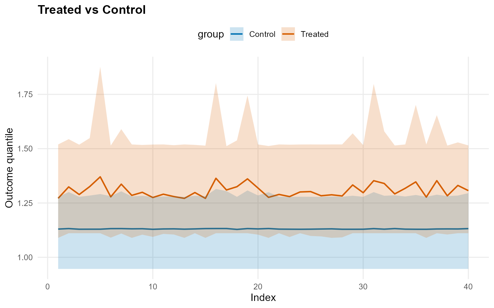
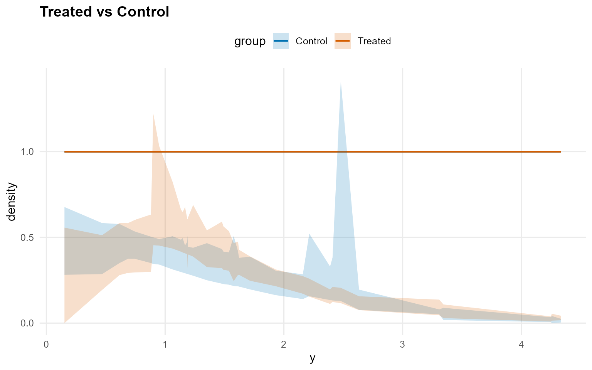
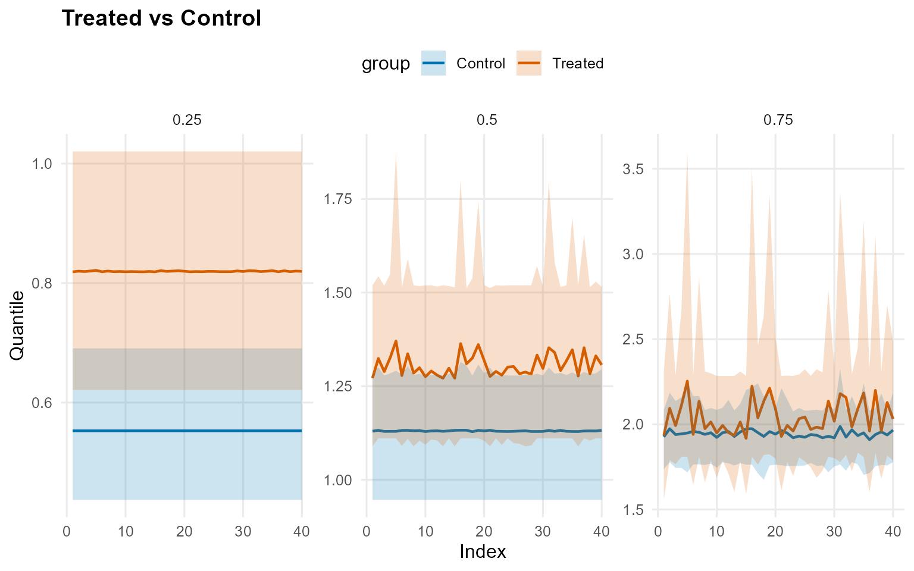
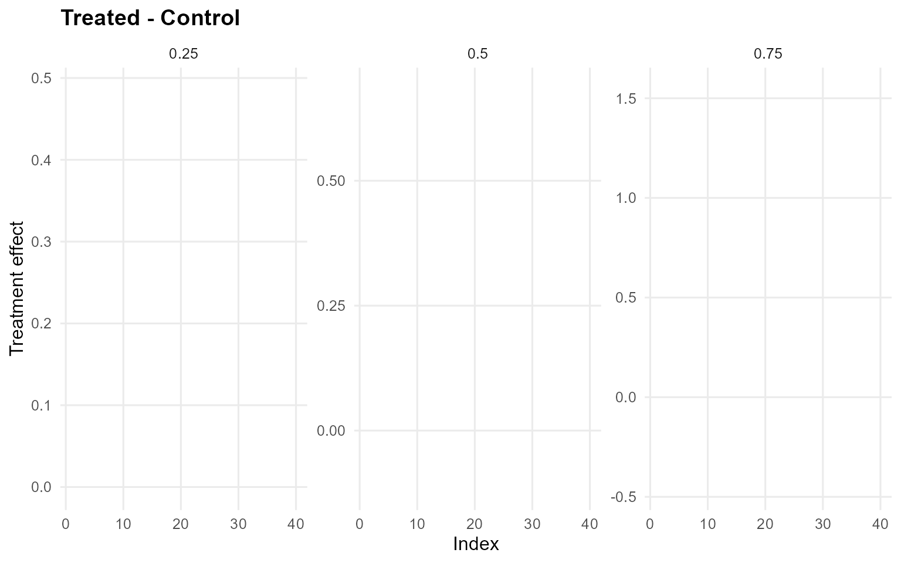
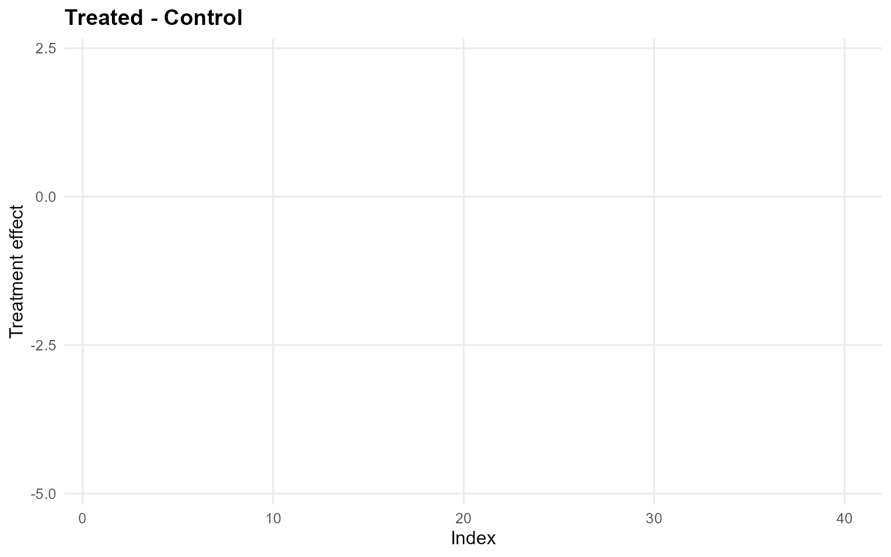
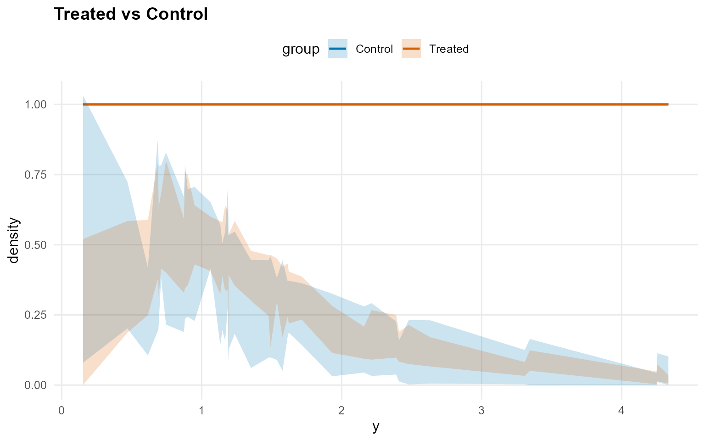
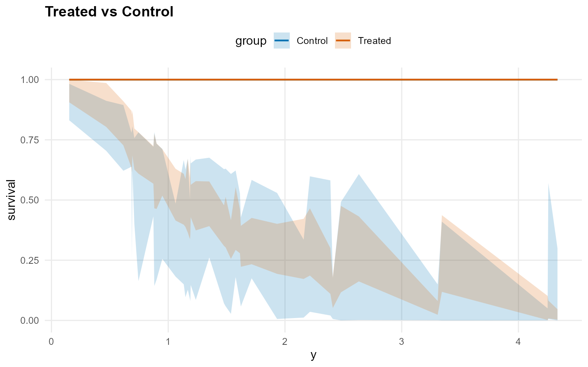
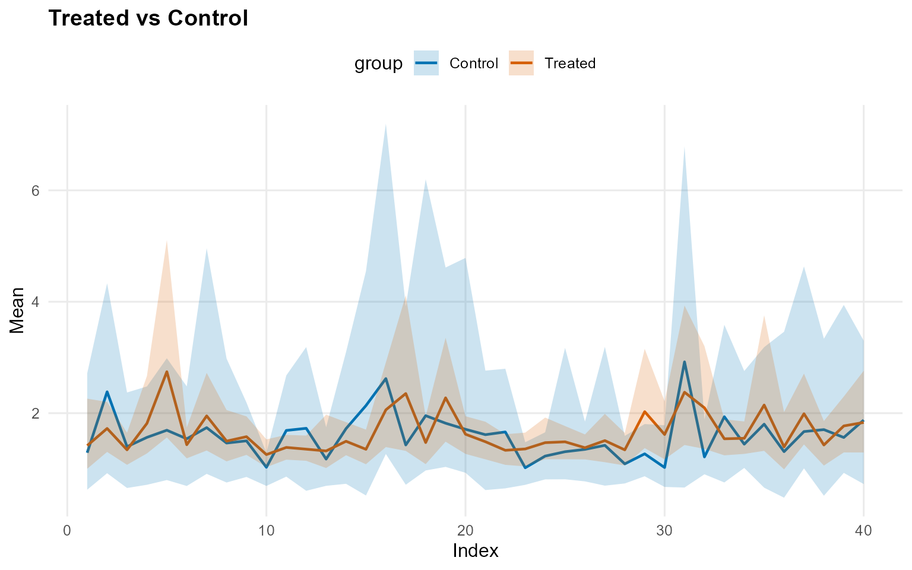
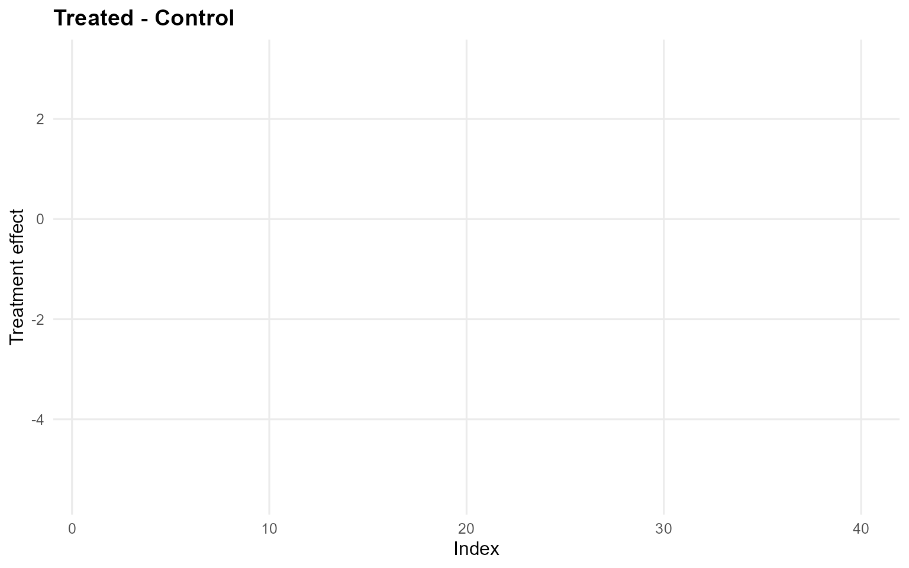
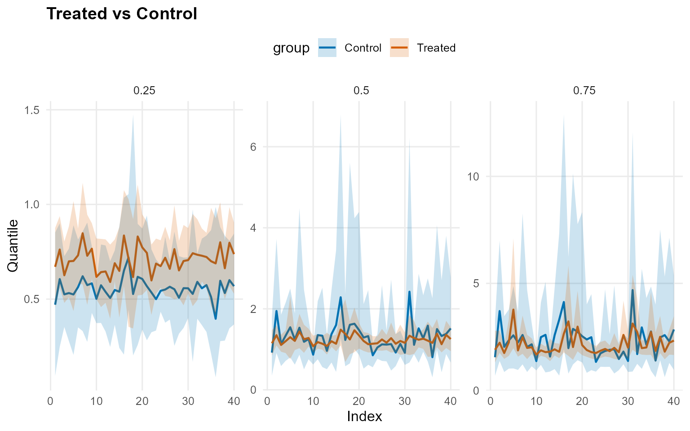

# 15. Causal Inference: X Without PS (CRP+SB) - InvGauss/Amoroso

> **Legacy vignette (for the website / historical notes).** These files
> may not match the current exported API one-to-one. Last verified:
> **2026-01-18**.
>
> For the up-to-date workflow, see the main package vignettes
> (Introduction, Model Spec, MCMC Workflow,
> Unconditional/Conditional/Causal, Backends, S3 Reference).

## Causal Inference: X Without PS (CRP+SB)

This vignette uses **covariates X** but disables PS estimation. Outcome
models are conditional on X only.

- Model A: CRP with GPD tail (InvGauss)
- Model B: SB bulk-only (Amoroso)

------------------------------------------------------------------------

### Data Setup

``` r
data("causal_alt_real500_p4_k2")
y <- abs(causal_alt_real500_p4_k2$y) + 0.01
T <- causal_alt_real500_p4_k2$T
X <- as.matrix(causal_alt_real500_p4_k2$X)

summary_tbl <- tibble(
  statistic = c("N", "Mean", "SD", "Min", "Max"),
  value = c(length(y), mean(y), sd(y), min(y), max(y))
)

summary_tbl %>%
  mutate(value = signif(value, 4)) %>%
  print()
```

    
[38;5;246m# A tibble: 5 × 2
[39m
      statistic    value
      
[3m
[38;5;246m<chr>
[39m
[23m        
[3m
[38;5;246m<dbl>
[39m
[23m
    
[38;5;250m1
[39m N         500     
    
[38;5;250m2
[39m Mean        1.43  
    
[38;5;250m3
[39m SD          1.08  
    
[38;5;250m4
[39m Min         0.012
[4m6
[24m
    
[38;5;250m5
[39m Max         8.10  

``` r
x_eval <- X[1:40, , drop = FALSE]
y_eval <- y[1:40]
u_threshold <- as.numeric(stats::quantile(y, 0.8, names = FALSE))
```

------------------------------------------------------------------------

### Model A: CRP with GPD Tail (InvGauss)

``` r
param_specs_gpd <- list(
  gpd = list(
    threshold = list(
      mode = "dist",
      dist = "lognormal",
      args = list(meanlog = log(max(u_threshold, .Machine$double.eps)), sdlog = 0.25)
    )
  )
)

bundle_crp_gpd <- build_causal_bundle(
  y = y,
  T = T,
  X = X,
  kernel = "invgauss",
  backend = "crp",
  PS = FALSE,
  GPD = TRUE,
  components = 6,
  param_specs = param_specs_gpd,
  mcmc_outcome = list(niter = 300, nburnin = 80, nchains = 1, thin = 1, seed = 3)
)

bundle_crp_gpd
```

    DPmixGPD causal bundle
    PS model: disabled 
    Outcome (treated): backend = crp | kernel = invgauss 
    Outcome (control): backend = crp | kernel = invgauss 
    GPD tail (treated/control): TRUE / TRUE 
    components (treated/control): 6 / 6 
    Outcome PS included: FALSE 
    epsilon (treated/control): 0.025 / 0.025 
    n (control) = 232 | n (treated) = 268 

``` r
fit_crp_gpd <- quiet_mcmc(run_mcmc_causal(bundle_crp_gpd))
summary(fit_crp_gpd)
```

    -- Outcome fits --
    [control]
    MixGPD fit | backend: Chinese Restaurant Process | kernel: Inverse Gaussian Distribution | GPD tail: TRUE
    n = 232 | components = 6 | epsilon = 0.025
    MCMC: niter=300, nburnin=80, thin=1, nchains=1 
    Fit
    Use summary() for posterior summaries; plot() for diagnostics; predict() for predictions.

    [treated]
    MixGPD fit | backend: Chinese Restaurant Process | kernel: Inverse Gaussian Distribution | GPD tail: TRUE
    n = 268 | components = 6 | epsilon = 0.025
    MCMC: niter=300, nburnin=80, thin=1, nchains=1 
    Fit
    Use summary() for posterior summaries; plot() for diagnostics; predict() for predictions.

``` r
pred_mean_gpd <- predict(fit_crp_gpd, x = x_eval, type = "mean", interval = "credible", nsim_mean = 150)
head(pred_mean_gpd)
```

         ps     estimate       lower       upper
    [1,] NA  0.002777083 -0.06799971 -0.04246160
    [2,] NA  0.048581383 -0.08301273 -0.19387301
    [3,] NA -0.102766452 -0.14249420 -0.68784500
    [4,] NA  0.130920200 -0.11018958  0.01283190
    [5,] NA  0.303058271  0.03184660  0.59510974
    [6,] NA -0.052700892 -0.11592904 -0.00093102

``` r
plot(pred_mean_gpd)
```


``` r
pred_q_gpd <- predict(fit_crp_gpd, x = x_eval, type = "quantile", p = 0.5, interval = "credible")
head(pred_q_gpd)
```

         ps  estimate     lower     upper
    [1,] NA 0.1415883 0.1429785 0.2410518
    [2,] NA 0.1918722 0.1644138 0.2436224
    [3,] NA 0.1597184 0.1644138 0.2400800
    [4,] NA 0.1961816 0.1644138 0.2646248
    [5,] NA 0.2410058 0.1644138 0.5857743
    [6,] NA 0.1463351 0.1441141 0.2326869

``` r
plot(pred_q_gpd)
```



``` r
pred_d_gpd <- predict(fit_crp_gpd, x = x_eval, y = y_eval, type = "density", interval = "credible")
head(pred_d_gpd)
```

              y ps trt_estimate  trt_lower trt_upper con_estimate  con_lower
    1 0.9001906 NA            1 0.45414289 1.2224081            1 0.34516726
    2 1.3517565 NA            1 0.32677112 0.5409423            1 0.25005667
    3 1.1475287 NA            1 0.41215984 0.6482381            1 0.29495110
    4 1.9323578 NA            1 0.21512339 0.3127500            1 0.16298825
    5 3.3439817 NA            1 0.02926121 0.1088152            1 0.01794506
    6 0.9493979 NA            1 0.45218719 1.0333833            1 0.34153837
       con_upper
    1 0.50012007
    2 0.46630084
    3 0.49571937
    4 0.30559105
    5 0.08905627
    6 0.48991626

``` r
plot(pred_d_gpd)
```



``` r
pred_surv_gpd <- predict(fit_crp_gpd, x = x_eval, y = y_eval, type = "survival", interval = "credible")
head(pred_surv_gpd)
```

              y ps trt_estimate trt_lower trt_upper con_estimate   con_lower
    1 0.9001906 NA            1 0.5996091 0.8108406            1 0.520519089
    2 1.3517565 NA            1 0.3994258 0.5818680            1 0.356663915
    3 1.1475287 NA            1 0.4849992 0.6840934            1 0.424682693
    4 1.9323578 NA            1 0.2188104 0.3951802            1 0.202464525
    5 3.3439817 NA            1 0.0400109 0.2775648            1 0.004625428
    6 0.9493979 NA            1 0.5732221 0.7863113            1 0.498721214
      con_upper
    1 0.6597658
    2 0.4817641
    3 0.5518869
    4 0.2967769
    5 0.1065252
    6 0.6374484

``` r
plot(pred_surv_gpd)
```


``` r
ate_gpd <- ate(fit_crp_gpd, newdata = x_eval, interval = "credible", nsim_mean = 150)
head(ate_gpd)
```

    $fit
     [1] -0.037665851  0.066242848 -0.020362886  0.119206428  0.238117146
     [6] -0.110485245  0.181752103  0.015431717 -0.003549152 -0.061243449
    [11]  0.027319701 -0.055622253 -0.035141117 -0.042482358 -0.142172858
    [16]  0.281938123  0.102582691  0.124583330  0.263450443  0.098733470
    [21] -0.036038556 -0.058852110 -0.005916109  0.056430527  0.043606240
    [26] -0.031906804  0.021298444  0.033011248  0.176708993  0.009027758
    [31]  0.092037498  0.225684987 -0.001757236  0.095036111  0.162125593
    [36]  0.040421647  0.225096820 -0.082333415  0.136344049  0.022998441

    $lower
     [1] -1.0793740 -1.0284526 -1.0138685 -1.1079765 -1.3598596 -1.1315940
     [7] -0.9851670 -0.8851374 -0.9562948 -1.1044159 -1.0388493 -0.9789217
    [13] -1.0063828 -1.1534158 -1.4065700 -1.0147898 -0.8326769 -0.8797661
    [19] -0.8326363 -1.0636463 -0.9136713 -1.2632452 -1.0370286 -0.9565565
    [25] -1.1555522 -1.0801264 -0.9852746 -0.7586794 -0.8490901 -1.2947719
    [31] -1.2725027 -0.7787804 -0.8987882 -1.1690737 -1.0507427 -0.9450852
    [37] -1.2026125 -0.9725031 -1.2233603 -1.1629138

    $upper
     [1] 0.7585725 0.9920860 0.8198142 1.1307643 1.6905993 0.8925756 1.2134082
     [8] 0.8278480 0.7383010 0.7864142 0.8244905 0.8034606 0.7140070 0.8160656
    [15] 0.7688259 1.5006455 1.1414780 0.9446454 1.4618062 0.9538957 0.7330566
    [22] 0.8675949 0.9146325 0.9039644 0.8727029 0.8108559 0.9718076 0.8065447
    [29] 1.2746849 0.8461019 1.5529319 1.1297706 0.8569509 0.9615490 1.1959804
    [36] 0.9682659 1.3927271 0.7488669 1.1971741 1.0291004

    $grid
    NULL

    $trt
    $fit
       estimate    lower    upper
    1  2.013635 1.424475 2.653539
    2  2.164658 1.536450 2.767835
    3  2.067947 1.498803 2.734543
    4  2.190246 1.488340 2.880729
    5  2.312878 1.555179 3.451917
    6  2.008913 1.449147 2.726589
    7  2.229922 1.591565 3.044440
    8  2.051950 1.547907 2.643387
    9  2.073718 1.498190 2.826738
    10 2.014063 1.490692 2.758909
    11 2.088964 1.512722 2.884288
    12 2.034110 1.543333 2.747747
    13 2.014343 1.523863 2.588943
    14 2.059540 1.470748 2.609662
    15 2.002208 1.513677 2.650050
    16 2.349147 1.565088 3.243493
    17 2.093444 1.532263 2.836360
    18 2.235372 1.491826 3.051767
    19 2.303490 1.582174 3.277990
    20 2.169602 1.615685 2.812090
    21 2.001161 1.557052 2.648133
    22 2.100871 1.560640 2.695944
    23 2.046281 1.542289 2.760693
    24 2.118213 1.548782 2.801276
    25 2.101276 1.568138 2.766670
    26 2.053201 1.535447 2.723062
    27 2.070155 1.521686 2.813757
    28 2.050258 1.509496 2.662337
    29 2.196358 1.522329 3.020562
    30 2.059733 1.558018 2.674236
    31 2.246826 1.554360 3.200875
    32 2.218698 1.534101 2.920321
    33 2.063282 1.498608 2.740006
    34 2.172997 1.510100 2.935512
    35 2.256379 1.528798 3.028936
    36 2.033255 1.548900 2.712748
    37 2.276109 1.584390 3.167761
    38 2.030558 1.532489 2.671232
    39 2.199471 1.538707 2.911157
    40 2.116909 1.539582 2.824504

    $type
    [1] "mean"

    $draws
               [,1]     [,2]     [,3]     [,4]     [,5]     [,6]     [,7]     [,8]
      [1,] 2.066621 2.434894 2.015385 2.247083 2.440885 2.367520 2.743637 2.483368
      [2,] 2.116600 2.216032 2.166150 2.349618 2.409524 2.115146 2.824517 2.165799
      [3,] 2.498730 2.441828 2.075389 2.260431 2.014711 2.053643 2.382927 2.080414
      [4,] 1.791327 2.150976 2.195709 2.401967 2.268806 2.241303 2.975742 2.140267
      [5,] 2.039698 2.342029 2.265491 2.343061 2.597700 2.144589 2.765062 2.209715
      [6,] 1.896913 2.166992 1.874773 2.103013 2.360003 1.810208 2.630256 2.040560
      [7,] 1.977407 2.250190 1.895830 2.090214 2.388113 1.767327 2.551820 1.946499
      [8,] 2.112327 2.124730 1.874424 2.737397 2.221179 1.829528 2.351480 1.882989
      [9,] 1.705786 2.062643 2.215983 2.217316 2.589368 1.937521 2.217049 1.988413
     [10,] 2.218510 2.438018 1.824469 2.199206 2.545923 1.972693 2.568489 1.937161
     [11,] 2.173511 2.024040 1.828219 2.017487 2.428824 1.891167 2.153468 2.300213
     [12,] 2.025438 2.522081 1.847159 2.072498 2.161927 1.825352 2.121198 2.002633
     [13,] 2.144542 2.228863 1.796444 2.517479 1.966012 1.786219 2.954777 2.117280
     [14,] 2.008205 2.790591 1.952181 2.185946 2.098216 2.260536 2.128054 1.830146
     [15,] 1.810629 2.147251 2.081757 2.104224 2.322573 1.682911 2.356879 2.041841
     [16,] 1.683525 1.997870 1.835419 2.233626 2.434100 1.854784 2.164624 1.767413
     [17,] 1.555568 2.239864 2.099703 2.313777 2.313757 1.750873 1.834622 1.693866
     [18,] 1.634299 1.964819 1.957415 2.125090 2.241217 1.669677 1.787567 1.561128
     [19,] 1.610466 1.776565 1.895329 2.455121 2.336317 1.581169 1.754478 1.699816
     [20,] 1.734028 2.331381 2.222882 2.416450 2.333340 1.853618 1.834769 1.691034
     [21,] 2.049164 2.080764 1.778389 2.220787 2.284053 1.913446 2.152035 2.164555
     [22,] 1.590037 2.143527 1.863030 2.075706 2.752496 1.640373 2.329584 1.988387
     [23,] 1.586003 2.440561 1.999264 2.229951 2.854695 1.717565 2.160827 1.929539
     [24,] 1.685580 2.950492 1.930001 2.335463 2.879820 2.016674 2.834626 2.131038
     [25,] 2.829421 3.586866 2.225633 3.092470 3.157743 2.691482 3.536780 2.516759
     [26,] 2.192319 2.382309 2.514267 2.652178 3.190733 2.221341 2.504569 2.052843
     [27,] 1.945121 2.274820 2.277006 2.763855 3.205496 1.932821 2.733481 2.329207
     [28,] 1.572331 2.233052 2.179919 2.412285 3.599874 1.912920 2.568644 2.161820
     [29,] 1.588959 2.406892 2.105718 2.642743 3.678796 1.905438 2.436267 2.030791
     [30,] 1.728850 2.318099 2.489748 2.402910 3.440779 1.784714 2.156350 1.807300
     [31,] 1.969640 2.450264 2.125281 2.678935 3.251398 1.624286 2.254189 1.723526
     [32,] 1.621766 2.383164 1.870542 2.397803 3.392085 1.771820 2.343286 1.777090
     [33,] 1.553383 2.601211 1.870080 2.740684 3.183301 1.775111 2.670122 1.817650
     [34,] 1.738577 2.486125 1.797689 2.511989 3.487649 1.964084 2.379809 1.838424
     [35,] 1.660209 2.588014 2.022099 2.345215 3.376975 2.061763 2.583796 2.030771
     [36,] 1.724804 2.585076 1.749543 2.132332 2.841730 1.939933 2.707875 1.998271
     [37,] 1.801396 2.500021 2.031468 2.337099 2.844354 1.723600 2.455646 1.947800
     [38,] 1.836579 2.567427 1.975599 2.409720 2.850517 2.070086 2.646975 1.843941
     [39,] 1.725377 2.709030 2.038572 2.289646 2.857825 1.973923 2.282524 1.944313
     [40,] 1.830905 2.731559 1.940864 2.262221 2.679858 1.865354 2.571240 2.227953
     [41,] 1.841333 2.330893 2.054437 2.378680 2.764600 1.799310 2.348596 1.853928
     [42,] 1.645402 2.374155 2.095220 2.473451 3.276839 1.940528 2.274388 2.339216
     [43,] 1.604928 2.606278 2.161539 2.130411 2.720724 1.984241 2.259829 1.848331
     [44,] 1.777528 2.263920 1.848283 2.779325 2.528112 1.941233 2.535981 2.047289
     [45,] 2.457860 2.742683 1.934923 2.323559 2.708076 2.033043 3.025014 1.956060
     [46,] 1.746966 2.282955 1.874183 2.476109 2.947107 2.144803 2.647898 1.792776
     [47,] 2.170205 2.384178 1.958620 2.780267 2.990400 2.138526 2.473776 2.598579
     [48,] 2.219183 2.286213 1.820041 2.193953 2.069001 2.178752 2.395098 2.445461
     [49,] 1.841698 2.107818 2.008628 2.183426 2.436329 1.918369 2.065434 1.885912
     [50,] 2.040811 2.065197 2.003283 2.204803 2.575316 1.845103 2.265209 1.836191
     [51,] 1.685758 1.910004 2.118863 2.078654 2.807101 2.342282 2.438630 2.074925
     [52,] 1.788336 2.491847 2.874877 2.462894 3.993299 1.848650 2.540890 2.195753
     [53,] 2.001268 2.072300 2.254716 2.282613 3.357969 2.243284 2.503196 2.108941
     [54,] 1.778774 2.704759 2.216053 2.836779 3.805654 1.952196 2.186908 1.815431
     [55,] 2.149088 2.447809 2.050662 2.350214 2.032530 2.136830 3.043578 2.643492
     [56,] 2.457617 2.004764 2.201647 1.937391 2.028341 2.135144 2.843465 2.495743
     [57,] 2.399645 2.073020 2.545204 2.433661 2.870461 2.142120 2.035467 2.496029
     [58,] 2.155858 2.180492 2.314175 2.584752 2.131975 1.910289 2.554521 2.106115
     [59,] 2.149161 2.338089 2.317259 2.390805 2.833604 2.008748 2.423985 2.165883
     [60,] 2.206013 2.200317 2.051118 2.006401 2.844078 1.902426 2.166347 1.964405
     [61,] 2.049846 2.142807 1.864124 2.618952 3.461995 1.964534 2.263796 2.207907
     [62,] 2.003176 2.627073 2.225893 1.971796 1.909186 1.731377 2.030354 2.093562
     [63,] 2.477043 2.616353 2.081278 2.155883 2.110149 2.158420 2.059046 1.986942
     [64,] 1.955181 1.866812 2.591274 1.937061 2.618430 1.974233 2.094297 1.949714
     [65,] 2.659573 2.512333 2.575426 2.683800 2.436517 2.728515 2.399970 2.678813
     [66,] 2.529448 2.147049 2.376497 2.499203 2.460776 2.291339 2.340011 2.569728
     [67,] 2.331930 2.329603 2.855964 2.351006 2.865705 2.471993 2.235671 2.202277
     [68,] 2.214655 2.027370 2.436302 2.153719 2.800500 2.542047 2.767790 2.222541
     [69,] 2.007948 2.138183 2.583970 2.549600 2.617642 2.651430 2.461875 2.148812
     [70,] 2.079409 2.222328 2.305433 2.714101 2.380017 2.111501 2.277589 2.441330
     [71,] 2.406972 2.183097 2.429900 2.336639 2.612758 1.961865 2.069009 2.120788
     [72,] 2.110154 2.105748 2.470141 2.258010 3.155168 2.245479 1.946843 1.969454
     [73,] 1.944483 2.001486 1.916450 1.590443 1.792927 1.670325 2.295442 1.988182
     [74,] 2.117736 2.098906 1.911093 2.239318 2.921626 2.316383 1.972949 2.109532
     [75,] 2.532428 1.814478 1.954074 1.834502 2.223030 2.021028 2.101215 1.711413
     [76,] 2.228760 2.041496 1.943597 2.166768 2.148517 2.163605 2.317903 2.333124
     [77,] 2.620602 2.482303 2.015978 2.892365 2.245860 1.997020 1.954616 2.363828
     [78,] 2.646870 2.035245 2.093302 2.370377 2.679906 1.901605 2.551959 2.008163
     [79,] 2.551272 2.121334 2.548374 3.236330 2.118049 1.636843 3.114705 2.127603
     [80,] 2.569475 1.994884 2.109760 2.367481 2.147502 2.102053 2.513615 2.140309
     [81,] 2.435126 1.734480 2.072716 2.453443 2.021839 1.944526 1.894673 2.553324
     [82,] 2.088802 2.068606 2.033754 2.125420 1.991352 2.109314 2.144204 1.848855
     [83,] 1.925963 1.924788 1.822618 2.080905 2.006826 1.979950 1.946233 2.003123
     [84,] 1.895282 2.029778 2.022582 2.000924 2.122572 1.763891 1.832041 1.895304
     [85,] 1.739451 1.704541 1.928597 1.731353 1.724726 1.734772 2.043033 1.886609
     [86,] 2.171926 1.739205 2.265157 2.030190 1.945402 2.268760 1.947877 1.710576
     [87,] 2.040956 2.116044 2.127584 2.266132 2.217826 2.379910 2.484084 2.238597
     [88,] 1.988500 2.571318 2.633520 2.198629 2.100426 2.156258 2.322535 2.216639
     [89,] 2.596621 2.179821 2.089062 2.138522 2.739039 1.933974 2.389362 2.678559
     [90,] 2.088894 2.400118 2.313597 2.154362 1.981419 1.954379 2.365334 2.252292
     [91,] 2.023649 2.481019 2.218062 2.435987 2.300981 2.299607 2.416045 2.355621
     [92,] 2.073375 2.203627 2.339368 2.021316 1.990922 2.159153 2.503974 2.277554
     [93,] 1.921267 1.997040 2.157571 2.118561 1.889790 2.140603 2.169290 2.130132
     [94,] 2.099180 2.416288 2.320346 2.174137 1.821534 2.895711 2.418915 2.171547
     [95,] 1.875775 2.001131 2.097795 2.059410 1.930224 2.259154 1.720158 1.869754
     [96,] 2.047801 2.502675 2.173241 1.928101 1.658796 1.878869 2.148827 2.453423
     [97,] 2.005116 1.948923 2.028918 2.069836 1.677569 2.327728 2.047840 2.981101
     [98,] 1.649137 2.247770 1.822769 2.126650 1.930123 1.836771 3.602330 1.797169
     [99,] 2.195600 3.550346 3.255609 2.867868 2.193890 2.960533 1.959667 1.754662
    [100,] 2.056879 1.918170 1.850168 1.952505 1.671992 1.862051 3.446232 1.716751
    [101,] 2.007650 2.390610 1.887191 2.776330 2.083111 2.121550 2.131231 1.790969
    [102,] 2.085025 2.105993 1.747836 3.858037 2.339643 2.141975 2.807535 2.316864
    [103,] 2.018937 2.078100 1.995988 1.788805 2.057687 2.024121 2.280681 2.187372
    [104,] 2.768371 1.843453 2.676099 1.652438 1.902282 1.705901 1.866331 1.911279
    [105,] 1.906389 1.907828 2.266587 2.142143 1.952147 2.009628 2.025571 1.963313
    [106,] 1.880758 1.985699 2.054653 1.952316 1.810079 1.844501 1.988314 2.148626
    [107,] 2.109561 2.068100 2.051075 1.966199 2.000335 1.995792 2.206198 2.151761
    [108,] 2.079052 1.989123 1.990722 2.273141 2.040101 1.961167 2.083463 1.989674
    [109,] 2.117800 2.141986 2.146571 2.172664 2.295534 1.861287 2.257077 2.015239
    [110,] 2.119128 1.881516 2.222929 2.125799 2.058414 1.830338 2.031981 2.074153
    [111,] 1.963362 2.194325 1.891495 2.400131 2.308555 1.854531 1.943269 1.985279
    [112,] 2.198833 2.327875 2.091900 2.313581 2.272143 2.347996 2.122514 2.188166
    [113,] 2.263001 2.250451 2.207348 2.144107 2.075070 2.135804 2.199500 2.067560
    [114,] 2.170113 2.131760 2.236906 2.038922 2.078225 2.133827 2.119075 2.022790
    [115,] 1.985343 2.011074 2.288361 2.119526 1.977844 1.972472 1.814999 1.935419
    [116,] 2.128946 2.143208 2.002343 2.036230 2.164036 1.975946 1.851191 1.991585
    [117,] 2.338857 2.433714 2.308158 2.416373 2.688484 2.464776 2.315766 2.280430
    [118,] 2.588403 2.701367 2.352150 2.279273 2.689302 2.146714 2.213958 2.643272
    [119,] 2.480008 2.132664 2.447709 2.141461 2.314497 2.505094 2.333827 2.372383
    [120,] 2.433928 2.621089 2.144254 2.616869 2.394475 2.394633 2.270894 2.320840
    [121,] 2.045394 2.048942 1.805224 2.072601 2.061326 1.732051 2.050252 1.895521
    [122,] 2.217592 2.622781 2.148979 2.469739 2.626327 2.598464 2.248568 2.365645
    [123,] 2.027534 2.146402 2.278640 1.898651 2.161841 2.253086 2.225187 2.049631
    [124,] 2.028220 2.325592 2.658206 2.712963 2.261425 2.626541 2.148188 2.109399
    [125,] 2.273907 2.296007 2.417608 2.556623 2.045155 2.239582 1.983461 2.353963
    [126,] 1.963187 2.546398 2.095407 2.282995 2.627548 2.000979 1.898399 1.966456
    [127,] 1.910022 2.626715 2.504635 2.686781 2.627110 3.015294 3.252266 2.605610
    [128,] 2.698316 2.613411 2.410307 2.526969 2.994251 2.320099 2.680812 2.394851
    [129,] 2.792374 2.169906 2.940700 2.577294 3.297296 2.380793 3.045220 3.217080
    [130,] 2.227752 2.155727 2.568785 2.335150 2.686776 2.259363 2.830412 2.359536
    [131,] 2.839481 2.136532 2.436365 2.138468 3.093398 2.011887 3.031826 2.185979
    [132,] 2.433972 2.830498 2.369821 2.582176 2.954205 2.043440 2.379030 2.118751
    [133,] 2.105718 2.361831 2.459246 2.320310 2.255591 2.265407 2.904354 2.155886
    [134,] 2.136460 2.341000 2.302749 2.507740 2.435627 1.969461 2.292067 2.281137
    [135,] 2.192631 2.330182 2.377409 1.991180 2.058257 1.816525 1.982055 2.345525
    [136,] 2.188190 2.127936 1.957737 1.827806 2.155857 1.974295 2.157106 2.131743
    [137,] 1.977585 2.114872 2.031088 1.936528 2.229863 2.132416 2.200518 2.000834
    [138,] 1.968919 2.019173 1.950191 2.465182 2.156198 1.973405 2.377900 1.737657
    [139,] 1.828697 1.647840 1.861582 1.785856 1.937726 1.832556 1.766970 1.821793
    [140,] 1.937178 1.744564 2.069339 2.080221 2.332097 1.915560 2.544836 2.048972
    [141,] 2.010596 2.159400 2.373575 2.332570 2.187711 1.936801 1.832693 1.873215
    [142,] 1.700872 2.072683 2.275862 2.374842 2.349541 2.115253 2.106280 2.513703
    [143,] 2.208093 2.145648 2.032191 2.331167 2.241220 2.371708 2.311332 2.563238
    [144,] 1.973148 1.765997 1.752443 2.459599 2.197763 1.891165 2.297897 1.851874
    [145,] 1.896564 1.804886 1.835275 1.959203 2.126558 1.987780 1.961620 2.079303
    [146,] 1.920231 2.457093 1.825419 2.097568 2.580812 2.141018 1.946611 1.673157
    [147,] 2.363731 2.180763 1.981730 2.315318 2.205886 2.301772 2.291799 2.286485
    [148,] 1.974697 1.969019 1.694860 1.988116 2.000663 1.930968 2.178977 2.163529
    [149,] 1.680564 1.866124 1.906053 1.958342 2.160476 1.982728 2.046543 1.802596
    [150,] 2.223703 2.167743 1.792643 1.826066 1.931585 1.972452 2.512163 2.106137
    [151,] 2.054490 1.994534 1.843349 1.970474 1.995431 1.790311 2.086605 2.009324
    [152,] 1.930899 1.920724 2.082454 1.735770 1.855517 1.721868 1.839674 1.866524
    [153,] 1.994668 2.003717 1.837913 1.917503 2.269910 1.891225 1.918445 1.967974
    [154,] 1.884394 1.976800 1.504927 1.718691 1.654879 1.704062 1.783501 1.773119
    [155,] 2.088359 1.710852 1.801822 1.773553 1.703637 1.745398 1.957808 1.867829
    [156,] 1.784282 1.957041 1.937425 1.752918 1.992429 1.763742 1.857772 1.798443
    [157,] 1.847206 2.103194 1.682077 1.724937 1.828289 1.852325 1.874810 2.043521
    [158,] 1.812054 1.596662 1.822186 2.162029 1.773837 1.984285 1.891077 1.600969
    [159,] 1.886043 2.130305 1.893838 1.966309 2.052979 1.754529 2.097026 1.842020
    [160,] 1.515787 1.592304 1.500381 1.892313 1.676310 1.735273 1.955447 1.623105
    [161,] 2.630435 1.594708 2.283493 3.103925 1.879069 1.853622 2.217853 2.714027
    [162,] 1.438920 1.553604 1.706154 1.440560 1.555293 1.543298 1.958465 2.037665
    [163,] 1.882756 1.701559 1.804980 1.470752 1.589221 1.547958 1.767022 1.589107
    [164,] 2.379877 2.559932 2.765979 2.441601 2.835424 2.248820 2.502544 2.469715
    [165,] 2.423312 2.214054 2.377467 2.282665 2.079346 2.393303 2.893148 2.357831
    [166,] 2.372645 2.202442 2.539331 2.366969 2.227706 2.724462 2.601911 2.442466
    [167,] 2.534596 2.094923 2.291000 2.090596 2.125444 2.573042 2.799092 2.302666
    [168,] 2.311326 2.398887 2.059080 2.327338 2.104075 2.258261 2.599853 2.139537
    [169,] 1.834866 2.059668 1.781711 1.858765 1.793132 2.070794 2.257262 2.241422
    [170,] 2.202278 2.032703 1.883506 1.747842 1.908709 1.857775 2.348450 2.125792
    [171,] 2.364437 2.224412 1.909508 1.789791 1.955143 2.092842 2.464450 1.792361
    [172,] 2.050348 2.317381 1.853162 1.926927 1.899355 2.040251 2.204562 2.122755
    [173,] 1.955723 1.841309 1.845989 1.934541 1.796442 2.082562 2.231653 1.988456
    [174,] 1.778667 1.973678 2.064436 2.079352 2.149619 2.083196 2.459328 2.266249
    [175,] 2.129010 1.813160 1.876407 1.958884 1.946199 1.988697 1.955073 1.995288
    [176,] 2.131352 2.140747 1.830673 2.014225 1.865239 1.888208 2.193786 1.834320
    [177,] 2.109088 2.369756 1.955541 2.160742 2.210745 2.089013 2.363637 2.210519
    [178,] 2.338148 2.282479 1.942753 2.366051 2.068997 2.018222 2.277722 2.073673
    [179,] 1.991995 1.873506 2.138436 2.003921 1.814157 1.859806 1.828577 1.878672
    [180,] 2.042647 2.075935 2.273506 2.079658 2.048226 2.255148 2.048735 1.934604
    [181,] 2.143356 2.067809 1.889965 2.142951 2.226991 2.304892 1.999052 2.078394
    [182,] 2.069073 2.088574 2.010769 2.163982 2.026912 2.004547 2.180106 2.184975
    [183,] 2.194699 2.471783 2.161617 2.358291 2.652203 2.188664 2.001235 2.056877
    [184,] 2.258225 2.535531 2.413716 2.385944 2.454335 2.281393 2.367456 2.008414
    [185,] 2.294021 2.464215 2.843565 2.856879 3.418361 2.329810 2.838355 2.507506
    [186,] 2.454695 3.098682 2.376540 3.180427 2.939372 2.543113 2.543713 2.462605
    [187,] 2.232374 2.251231 2.449147 2.080328 2.430783 2.306247 2.165132 2.173755
    [188,] 2.642568 2.518798 2.699797 2.478590 2.644198 2.130277 2.651812 2.111027
    [189,] 2.333214 2.232401 2.671869 2.799208 3.285914 2.388000 2.379310 2.503644
    [190,] 2.202449 2.719620 2.517740 2.786398 2.812045 2.349800 2.654627 2.515982
    [191,] 2.447211 2.724339 2.168747 2.379237 2.517687 2.787079 2.293725 2.151782
    [192,] 1.539717 1.526532 1.572695 1.417865 1.484190 1.512579 1.616333 1.532679
    [193,] 1.999786 2.485538 2.361049 2.252263 2.611148 2.148229 2.300815 2.060344
    [194,] 1.687795 1.810903 1.474332 1.630296 1.540978 1.626589 1.715119 1.678871
    [195,] 1.672250 1.507761 1.459807 1.572619 1.877089 1.456742 1.610507 1.789819
    [196,] 1.629477 1.715366 1.560510 1.684525 1.517334 1.432064 1.669324 1.783586
    [197,] 1.561567 1.544958 1.603151 1.544172 1.549255 1.650796 1.658027 1.574016
    [198,] 1.309780 1.649877 1.688198 1.567170 1.604569 1.521259 1.651433 1.673179
    [199,] 1.370367 1.495217 1.470449 1.447904 1.545527 1.680568 1.674286 1.566978
    [200,] 1.645370 1.610436 1.433186 1.359738 1.761319 1.442276 1.471179 1.608516
    [201,] 1.374951 1.498624 1.594439 1.659525 1.613937 1.254187 1.758720 1.677854
    [202,] 1.732260 1.829386 1.504632 1.541041 1.823473 1.697504 1.606376 1.655220
    [203,] 1.536559 1.672206 1.497376 1.579848 1.555075 1.711134 1.637405 1.726666
    [204,] 1.442632 1.556521 1.562743 1.696492 1.589385 1.736556 1.621494 1.515160
    [205,] 1.429043 1.584688 1.417267 1.470278 1.609047 1.439653 1.458589 1.561777
    [206,] 1.367135 1.531613 1.552660 1.531885 1.595587 1.518646 1.544535 1.535945
    [207,] 1.619400 1.541797 1.522293 1.589931 1.702572 1.546183 1.450574 1.443637
    [208,] 1.420342 1.716507 1.536925 1.507779 1.811323 1.435388 1.498796 1.415419
    [209,] 1.405122 1.542777 1.672303 1.643102 1.842958 1.478433 1.712419 1.629322
    [210,] 1.447733 1.868478 1.644997 1.619806 2.217310 1.633423 1.584670 1.644131
    [211,] 1.649003 1.927437 1.868267 1.947824 1.623642 1.769994 1.796327 1.876600
    [212,] 1.786861 2.084692 1.664762 1.610488 1.753032 1.623369 1.747356 1.827226
    [213,] 1.558918 2.123935 1.901878 2.039859 1.902257 1.774579 1.708021 1.695132
    [214,] 1.624195 1.502795 1.683029 1.856574 1.782729 1.551277 1.663329 1.425372
    [215,] 1.811843 1.726114 1.734591 1.923642 1.824770 1.687252 1.792010 1.863459
    [216,] 1.759372 1.744771 1.592766 2.060957 1.743693 1.522935 1.636678 1.624857
    [217,] 1.760922 2.337229 1.769795 2.221137 2.246324 1.850529 1.941053 1.875333
    [218,] 2.045430 2.384456 2.660150 1.971192 1.872197 1.948870 2.056667 2.210933
    [219,] 1.679006 2.254113 2.483787 2.191498 2.895293 3.524472 1.599186 2.340491
    [220,] 1.663365 1.647306 1.772573 1.955832 2.163912 1.402524 1.733568 1.856742
               [,9]    [,10]    [,11]    [,12]    [,13]    [,14]    [,15]    [,16]
      [1,] 2.163335 2.209690 2.158202 1.990593 2.117490 1.984485 2.191785 2.782926
      [2,] 2.116927 2.028418 2.287720 1.992633 2.016170 2.391299 1.982884 2.728868
      [3,] 2.349493 2.231799 2.116006 1.927580 1.971812 2.093268 2.321785 2.803228
      [4,] 2.260522 2.058095 2.076999 2.219899 2.090130 2.202044 2.239084 2.838027
      [5,] 2.216421 1.954545 2.426982 2.314620 2.126410 2.367828 2.050196 2.651085
      [6,] 2.048755 1.896313 1.899494 1.843612 2.051948 1.962359 1.848307 2.348891
      [7,] 2.434052 1.982134 2.086599 1.921713 2.010383 2.046315 1.735532 2.368687
      [8,] 2.325005 2.091215 2.044587 1.988527 1.886650 1.951220 1.970974 2.627733
      [9,] 2.373121 1.566308 1.757660 2.048712 1.851576 2.536422 2.018718 2.095356
     [10,] 2.162729 2.027933 2.113205 2.033628 2.343743 2.195343 1.879060 2.530862
     [11,] 2.347345 2.013390 1.997463 1.842352 2.272569 1.953177 1.739205 2.227867
     [12,] 2.104417 1.734341 1.955919 1.758690 2.118255 2.028161 1.904186 2.182089
     [13,] 3.048132 2.644995 2.195739 3.026324 2.588180 2.004363 1.824788 2.245279
     [14,] 2.126994 1.816422 2.025505 1.996563 1.981907 2.042550 1.824354 2.353992
     [15,] 1.958112 1.735128 2.036333 1.847746 1.877394 1.866269 1.904047 2.701754
     [16,] 1.784668 1.912426 1.975784 2.018597 1.544966 1.748704 1.801537 1.941849
     [17,] 1.741414 1.858623 1.738537 1.778927 1.791920 1.958184 1.751071 1.998566
     [18,] 1.649454 1.646295 1.709515 1.738755 1.648354 1.974674 1.808584 1.852808
     [19,] 1.717350 1.659590 1.873285 1.892798 1.626938 2.102092 1.763002 2.047694
     [20,] 1.684892 1.871242 1.713453 1.963940 1.731799 1.905074 2.060234 2.171057
     [21,] 2.106401 2.055700 2.200494 1.963395 1.731077 1.845905 1.590280 2.338603
     [22,] 2.135168 1.675042 1.878935 1.861076 1.875864 2.041047 1.987642 2.568229
     [23,] 1.786408 1.652571 1.804293 1.906146 1.892438 1.980438 1.586804 2.800473
     [24,] 2.088009 1.798885 2.277505 2.033512 1.915126 2.223838 1.657230 3.060900
     [25,] 2.881519 1.933378 2.523930 2.218457 2.013719 2.295538 2.016190 4.469933
     [26,] 2.029515 1.875048 1.705474 1.849003 2.045652 2.289797 1.674356 2.826553
     [27,] 2.461453 1.813156 2.211995 2.280751 1.969616 2.816228 2.309664 3.005081
     [28,] 1.939961 2.140440 2.508255 2.183901 1.889002 2.024315 1.746676 3.143466
     [29,] 2.250403 1.919300 2.163483 1.899561 1.723088 2.273502 1.792101 3.105389
     [30,] 2.007285 1.811178 2.107427 1.976213 1.555800 2.012022 1.786426 2.595777
     [31,] 2.077321 1.862125 2.062862 1.922423 1.801043 2.260453 1.896028 2.811375
     [32,] 1.839624 1.898206 1.889493 1.919673 1.583023 2.286760 1.815902 2.636419
     [33,] 1.996972 1.897015 1.927785 1.747994 1.745299 1.980739 1.773216 2.841531
     [34,] 2.199676 1.923723 2.057614 1.850195 1.584493 2.042387 1.756614 3.379707
     [35,] 2.126580 1.794521 1.786950 2.073522 1.801955 2.368721 1.993163 3.243806
     [36,] 2.116391 1.705946 1.977604 1.943037 1.544579 2.150336 1.706019 3.397323
     [37,] 1.896984 1.984992 2.087364 2.132900 1.819853 2.156294 1.855414 3.012836
     [38,] 2.503021 1.794834 1.996058 1.941878 1.805135 2.200816 2.046393 3.115257
     [39,] 2.276441 1.772846 2.117156 1.974255 1.928984 2.159518 1.980590 3.210442
     [40,] 2.083248 1.741582 2.162377 2.042295 1.753861 1.912476 1.633392 2.670176
     [41,] 2.126818 1.870167 2.018679 2.111318 1.926217 2.160557 1.836622 2.843633
     [42,] 2.102635 1.879012 2.281277 1.980718 1.846233 2.075099 1.876014 2.793249
     [43,] 2.116977 1.657793 1.991695 2.000147 1.799337 2.290039 1.860688 2.509563
     [44,] 2.321343 1.730460 2.066120 1.822072 1.583460 2.226220 1.752862 3.102538
     [45,] 2.159809 1.899499 2.027912 2.371409 2.116093 2.391252 2.068715 3.243146
     [46,] 2.160746 1.762919 2.248806 1.855664 1.950874 2.352971 1.995434 2.803129
     [47,] 2.023854 1.800726 2.162026 1.948965 1.877154 2.204393 1.904286 3.089650
     [48,] 2.159203 2.043035 2.315836 2.189421 2.313188 2.324138 2.244210 2.446360
     [49,] 2.113518 1.915712 1.948827 1.900085 2.170988 1.946927 1.599146 2.295975
     [50,] 1.830109 1.821111 1.960895 2.060146 1.926746 2.069204 1.516244 2.459438
     [51,] 2.191643 2.205464 1.953458 2.180854 1.937747 1.842023 1.735151 2.260779
     [52,] 2.148917 1.861114 2.401300 2.558312 2.383457 2.175809 1.998432 2.520475
     [53,] 2.624283 2.327066 2.763028 2.557838 1.750998 2.018787 1.930113 2.585311
     [54,] 1.870615 2.307614 1.921755 2.007804 2.079120 2.357244 2.174599 2.219951
     [55,] 2.460387 1.768448 2.159804 1.854500 1.765763 2.082230 1.830178 3.225322
     [56,] 2.223998 1.898440 2.135330 2.010258 1.860445 1.825800 2.473629 2.887524
     [57,] 1.917142 2.112557 2.577373 1.908219 2.238240 2.317027 2.116522 1.831077
     [58,] 1.806896 2.683774 2.031039 1.860320 2.116542 1.905369 1.829863 2.251267
     [59,] 2.396311 3.245022 2.291550 1.949883 2.060881 2.028559 2.011331 1.780189
     [60,] 2.097856 1.969425 1.781795 1.950375 2.124632 1.787220 1.936021 1.857104
     [61,] 2.138673 1.956740 1.859997 2.056163 2.090517 1.905957 2.025192 1.922127
     [62,] 1.923333 2.304706 1.718985 1.658194 1.912837 1.883110 1.797333 1.923476
     [63,] 2.102763 2.669026 1.954127 1.924407 2.101947 2.025643 2.405893 2.308580
     [64,] 1.915460 2.487859 1.997618 1.862547 1.919737 1.772001 2.198796 2.638868
     [65,] 2.184396 2.495268 2.501325 2.697962 2.254070 2.364910 2.047161 2.039947
     [66,] 2.210668 2.586805 2.271099 2.381309 2.334310 2.273475 2.375011 2.409442
     [67,] 2.170184 2.446176 2.209546 2.746081 2.686728 2.684026 2.220388 2.586357
     [68,] 2.229879 2.676761 2.438087 2.087057 2.425677 2.583122 2.090470 2.222917
     [69,] 2.056513 2.245679 2.249359 2.016452 2.244167 2.063652 2.135115 2.142634
     [70,] 2.197392 1.991005 2.368993 2.330306 2.335525 2.463808 2.626572 2.374263
     [71,] 2.184910 2.316344 2.537923 2.369687 2.301215 2.293737 2.026659 2.342749
     [72,] 2.600820 2.060789 2.431202 2.463184 2.159403 2.521547 2.225459 2.381065
     [73,] 1.679506 1.913083 2.132004 2.074500 1.830316 2.047091 1.990121 2.814481
     [74,] 1.793625 2.058884 1.773159 1.913247 2.093970 1.983860 2.018006 1.963726
     [75,] 1.639942 1.622762 1.808924 1.888833 1.700932 2.342552 2.016238 2.586242
     [76,] 2.067243 2.157534 2.123220 2.076020 2.423235 2.254924 2.010207 2.199175
     [77,] 2.141510 1.864669 2.466958 2.797793 1.895021 1.778587 2.119110 2.891134
     [78,] 2.366157 1.849464 2.076164 2.328986 2.581947 2.054056 2.471650 5.131363
     [79,] 2.116072 3.349136 1.912186 1.956595 2.318407 2.825200 2.671291 2.305974
     [80,] 2.317288 2.252175 2.346616 2.149295 2.144284 2.113869 2.239185 2.464750
     [81,] 2.525420 2.492745 2.128452 2.230017 1.846965 1.980746 1.886892 2.911966
     [82,] 1.995232 1.903156 1.998458 1.871630 2.410874 1.955779 1.909608 2.150808
     [83,] 2.047141 2.231507 1.981958 2.085444 1.985453 2.030058 1.911846 1.760805
     [84,] 2.090625 2.290830 2.162823 1.795621 2.100996 1.917751 2.084582 2.189179
     [85,] 1.889061 1.783249 2.069965 1.730628 1.726176 1.830239 1.724864 1.869959
     [86,] 1.769055 1.973398 2.031705 1.958337 1.933301 2.273444 1.942510 2.102210
     [87,] 2.126700 2.388595 2.121430 2.049469 2.589633 2.093669 2.207742 2.131121
     [88,] 2.499477 2.295187 2.296356 2.267283 2.169542 2.529486 2.263524 2.149686
     [89,] 2.227370 2.168055 2.779685 2.037740 2.769306 2.451377 2.306166 2.451997
     [90,] 2.053009 2.114071 3.406494 2.085232 2.041348 2.347209 2.424675 2.282623
     [91,] 2.411367 2.826888 2.415708 2.465985 2.168567 1.942583 2.358631 2.437675
     [92,] 2.090146 2.157822 2.124930 2.219024 2.292742 2.244130 2.031431 2.164255
     [93,] 1.964419 1.960302 2.375653 1.829158 1.981914 2.138384 1.871755 2.214707
     [94,] 2.061370 2.394097 2.359437 2.467902 3.562311 2.314920 2.285786 2.966602
     [95,] 2.100578 1.750567 1.646159 1.970298 1.779120 1.853709 2.009789 1.965182
     [96,] 1.698307 2.162679 1.954184 2.492079 1.711836 2.227720 2.104410 2.077512
     [97,] 2.251943 2.030062 2.035456 1.700736 2.054661 1.729754 2.114078 1.966226
     [98,] 1.662565 1.862631 1.927604 2.322358 1.838392 1.826369 1.890820 1.980715
     [99,] 2.888300 1.864648 1.826406 2.101058 1.970191 1.904798 1.621107 2.185476
    [100,] 2.108581 1.999693 2.030625 2.335118 1.907158 1.788555 1.755151 1.768747
    [101,] 1.746064 3.082114 1.832558 2.148447 1.893418 1.957039 2.856055 1.963557
    [102,] 3.120752 2.890963 3.807485 1.699313 5.583910 2.085015 1.821343 3.073909
    [103,] 1.906490 2.051285 1.970280 1.929836 2.254424 2.154985 1.778537 2.323952
    [104,] 2.623443 2.053733 1.875002 1.614379 1.721094 2.445738 2.559716 2.298684
    [105,] 1.868537 2.036242 1.909698 1.870128 1.913427 1.900221 1.824973 2.029728
    [106,] 1.851700 1.965144 1.894849 1.914825 1.866694 1.878234 2.031544 2.196942
    [107,] 2.035961 1.995564 1.998080 1.980552 2.084907 2.066609 1.931346 2.305250
    [108,] 2.124525 1.999103 1.951640 2.181998 1.995227 2.011530 2.046527 2.434874
    [109,] 1.993494 2.091410 1.841471 2.022871 2.219138 2.054979 2.087210 2.237180
    [110,] 2.126661 2.041795 2.020387 2.101499 2.026003 1.925487 1.914398 1.975831
    [111,] 2.145370 2.191174 2.138324 2.295262 2.136848 1.994175 2.072257 2.182488
    [112,] 1.917401 2.028564 1.926184 2.172221 2.325878 2.173447 2.095347 2.009779
    [113,] 2.147100 2.380124 2.210347 2.053787 2.263251 2.211708 2.177208 2.147838
    [114,] 2.174723 2.031840 1.959750 2.276929 2.320702 2.188966 2.289919 2.171162
    [115,] 1.958793 2.127678 1.766400 2.093762 2.081690 2.026993 2.134955 2.000000
    [116,] 1.957588 2.043053 2.045729 1.808302 1.812803 1.983278 2.086607 2.030235
    [117,] 2.283578 2.453565 2.990928 2.459347 2.230787 2.523135 2.457522 2.733923
    [118,] 2.355116 2.559149 2.316649 2.517828 2.236674 2.078318 2.176356 2.873859
    [119,] 2.333005 2.412744 2.417342 2.154714 2.384742 2.562015 2.175780 2.837063
    [120,] 2.428788 2.631584 2.351431 2.701593 2.178145 2.349013 2.056828 2.553288
    [121,] 2.084862 1.873733 1.994911 2.040788 1.970125 2.058907 1.985808 1.805767
    [122,] 2.159776 2.057790 2.945575 2.688713 2.370440 2.321547 2.290016 2.188292
    [123,] 1.857151 2.369413 2.483461 2.261674 2.242506 2.485232 2.536390 2.027679
    [124,] 2.188231 2.608939 2.776402 2.351795 2.526024 2.078639 2.295575 2.391105
    [125,] 2.266442 2.124566 2.222768 2.328058 2.497190 1.941259 2.777109 2.590036
    [126,] 1.931489 1.896542 2.263861 2.299204 2.105878 2.206885 2.161567 2.028094
    [127,] 2.391320 2.621598 2.874537 3.239166 2.543038 2.621260 2.739365 2.997772
    [128,] 2.850959 2.564054 2.624316 2.424041 2.951214 2.377646 2.555518 2.817148
    [129,] 2.482808 2.830814 3.450270 2.517658 2.551690 2.632820 2.976722 2.836600
    [130,] 2.791079 2.130597 2.621641 2.107276 2.374388 2.332799 2.421222 2.705688
    [131,] 2.508648 2.287408 2.209818 2.380509 1.895822 2.478083 2.018456 2.625812
    [132,] 2.512100 2.277147 2.492885 2.454004 2.106660 2.302871 2.115215 2.703231
    [133,] 2.275484 1.956862 2.684240 2.054152 1.994247 2.134745 2.166068 2.735328
    [134,] 2.317082 2.039792 2.326186 2.145927 2.271889 1.996163 2.162159 2.756083
    [135,] 1.881701 2.141566 2.283413 1.898909 2.097572 2.108770 2.040829 3.307822
    [136,] 2.329365 1.933118 2.061310 1.889341 2.494451 1.953163 2.472417 2.615709
    [137,] 1.954132 1.919721 1.741100 1.998596 1.785952 1.937721 2.079439 2.140868
    [138,] 2.087133 1.838532 1.967715 2.086141 1.910495 2.111059 2.483262 2.068172
    [139,] 1.758489 1.958409 1.722722 1.597099 1.731348 1.923053 1.886200 1.742931
    [140,] 1.913529 2.260479 2.014562 1.873973 2.095208 2.041846 1.958318 2.247474
    [141,] 1.905531 1.856044 2.014865 1.981650 2.181347 1.785588 1.968035 1.937746
    [142,] 1.880660 2.097021 1.833489 2.100942 2.049205 1.905862 2.047761 2.425817
    [143,] 1.959064 2.110930 1.878042 1.872346 1.848219 2.048536 2.087026 2.192812
    [144,] 2.025587 1.891117 1.888674 2.076738 1.931628 1.904430 1.916347 2.257679
    [145,] 1.956852 1.726252 2.223483 1.920481 2.152819 1.941812 1.802164 2.377155
    [146,] 2.081897 1.725313 2.157872 1.947887 1.832636 2.072865 2.087371 2.742483
    [147,] 2.042162 1.979265 2.317789 1.865975 2.358308 2.295584 1.768469 2.379059
    [148,] 2.008136 1.753105 2.050064 1.872091 1.893882 1.962800 1.786195 2.160690
    [149,] 2.078678 1.987908 1.809602 2.062637 1.784975 1.836477 1.781729 1.797863
    [150,] 1.900788 1.983771 2.039612 2.145612 2.188966 1.915607 1.947562 2.054724
    [151,] 2.088925 1.866426 2.134874 2.027530 1.829635 2.107992 1.966738 2.095508
    [152,] 1.826691 1.858776 2.000885 1.945395 2.127141 1.755868 1.940863 1.911226
    [153,] 1.972719 1.962228 2.042781 1.876456 2.188336 1.967025 1.833372 1.995859
    [154,] 1.673054 1.751173 2.040636 1.778406 1.805944 1.764559 1.643257 1.847976
    [155,] 1.794487 1.853828 1.833340 1.634132 1.838109 1.878140 1.862478 2.020887
    [156,] 1.682007 1.798144 1.848924 1.767104 1.802449 1.799408 1.591319 2.078376
    [157,] 1.752966 1.769354 1.760434 1.705225 1.840544 1.772174 1.779342 2.379860
    [158,] 1.797187 1.595343 1.659011 1.968482 1.541255 2.028151 2.479465 1.726202
    [159,] 2.022934 1.920717 1.823167 1.771405 1.758749 1.933096 1.829509 2.160990
    [160,] 1.769024 1.601468 1.757479 2.259726 1.662544 1.915682 2.420784 2.267742
    [161,] 2.842976 2.080900 2.398729 1.782817 1.928295 1.475133 2.963415 2.542567
    [162,] 1.642337 1.643649 1.990760 1.607569 1.683885 1.641249 1.576386 2.076045
    [163,] 1.442135 2.004628 1.487508 1.584890 1.643033 1.612447 1.712771 1.524336
    [164,] 2.599632 2.306012 2.715913 2.445805 2.184948 2.404885 2.448360 2.295341
    [165,] 2.296991 2.194503 2.257363 2.460798 2.307297 2.312511 2.256556 2.592719
    [166,] 2.348066 2.245387 2.190552 2.099425 2.325167 2.273596 2.086451 2.290780
    [167,] 2.236124 2.058464 2.435630 2.293202 2.536688 2.207579 2.177113 2.745653
    [168,] 2.475677 2.074890 2.104696 2.264294 2.040373 2.112556 2.204349 2.381287
    [169,] 2.299237 1.974046 2.192658 2.109122 2.103243 2.059841 1.922040 1.910762
    [170,] 1.899573 1.965657 1.961613 1.970967 1.900703 2.162801 2.008123 2.215285
    [171,] 2.085928 2.080848 1.820877 1.704790 1.928301 2.016402 1.948082 2.386221
    [172,] 2.146003 2.032241 1.876961 2.220087 1.988574 2.286304 2.047879 2.343258
    [173,] 2.179586 1.952263 1.734150 2.285723 1.822956 1.935770 2.150490 2.578764
    [174,] 2.010951 1.677832 1.893232 1.921180 1.927037 1.867058 1.821133 1.737220
    [175,] 1.777168 1.926776 1.949468 1.907238 2.001395 1.699980 1.853034 2.261438
    [176,] 2.252097 1.906936 2.106203 2.029364 1.921415 2.122778 2.133407 2.262332
    [177,] 2.160736 1.990502 2.164142 2.238036 2.087615 2.200184 2.220573 2.600319
    [178,] 2.182889 1.872760 2.144630 1.969858 2.099528 1.979023 1.844935 2.206144
    [179,] 1.935255 2.108224 2.170956 2.034044 2.050125 1.948677 2.552290 2.177079
    [180,] 1.931593 1.842064 1.974442 2.284807 1.904524 1.889482 2.332690 2.351131
    [181,] 2.024743 2.132923 2.298081 2.134024 2.087213 2.273090 2.022256 1.946559
    [182,] 2.200965 2.383205 2.350524 2.257992 1.914902 2.429313 2.365023 2.423675
    [183,] 2.609871 1.870988 2.195156 1.917067 1.885766 2.241165 2.421113 2.200854
    [184,] 2.353865 2.283786 2.455116 2.769999 2.057629 2.308615 2.209737 2.340098
    [185,] 2.768802 2.618378 2.893110 2.363944 2.448179 2.340007 2.262235 3.226015
    [186,] 2.808791 2.500689 2.192199 2.749254 2.022812 2.307766 2.262780 2.424103
    [187,] 2.141863 2.133791 2.114233 2.244808 2.021682 1.854742 1.963663 2.219208
    [188,] 2.318078 2.241200 2.546400 2.229701 2.164161 2.316541 2.279661 2.640799
    [189,] 2.712454 2.381211 2.601187 2.128095 2.319574 2.306838 2.471940 2.548472
    [190,] 2.583809 2.454264 2.356018 2.897578 2.474668 2.391904 2.510255 2.536858
    [191,] 2.295850 2.235798 2.346209 2.193113 2.544473 2.612592 2.163087 2.405674
    [192,] 1.567554 1.476051 1.508630 1.617188 1.530139 1.621169 1.566057 1.688472
    [193,] 2.242451 2.184830 2.570776 2.453674 2.068802 2.373194 2.189235 2.456017
    [194,] 1.804356 1.604522 1.509167 1.733401 1.637203 1.663289 1.673495 1.945806
    [195,] 1.647453 1.479063 1.516651 1.577001 1.596343 1.501095 1.601595 1.693287
    [196,] 1.736643 1.459516 1.607527 1.574336 1.512125 1.512697 1.641910 1.642834
    [197,] 1.725942 1.503570 1.673384 1.460240 1.569995 1.466781 1.599659 1.622518
    [198,] 1.654298 1.717575 1.628322 1.590076 1.626250 1.554588 1.638656 1.435996
    [199,] 1.559345 1.654904 1.527263 1.428016 1.540898 1.395741 1.343953 1.446789
    [200,] 1.642052 1.699516 1.572045 1.693789 1.518995 1.630095 1.718940 1.529388
    [201,] 1.506256 1.435078 1.662233 1.549999 1.474720 1.508587 1.361329 1.694675
    [202,] 1.447663 1.529755 1.736565 1.442645 1.754898 1.482184 1.592377 1.740707
    [203,] 1.669035 1.570048 1.497109 1.632565 1.450648 1.593224 1.511355 1.822202
    [204,] 1.620695 1.371222 1.718053 1.708844 1.548852 1.443845 1.545057 1.604547
    [205,] 1.437726 1.586947 1.463408 1.468226 1.480529 1.453039 1.508635 1.392278
    [206,] 1.490893 1.446307 1.631911 1.529985 1.657801 1.452957 1.663552 1.676734
    [207,] 1.479059 1.634061 1.425915 1.649412 1.389350 1.407608 1.439669 1.626989
    [208,] 1.365917 1.503545 1.561667 1.600093 1.529243 1.596883 1.592570 1.837737
    [209,] 1.601555 1.517147 1.552040 1.537302 1.595069 1.641127 1.492638 1.666870
    [210,] 1.750246 1.594219 1.579846 1.622403 1.538667 1.769813 1.847181 1.526299
    [211,] 1.623347 1.625033 1.825130 1.552606 1.597488 1.826293 1.686777 2.636193
    [212,] 1.682581 1.586538 1.964529 1.655724 1.815259 1.868020 1.565811 2.685446
    [213,] 1.642657 1.728748 1.821599 1.583163 1.749378 1.642401 1.811914 2.745212
    [214,] 1.598067 1.681980 1.787053 1.667318 1.739175 1.843951 1.827445 2.183602
    [215,] 1.745475 1.803323 1.830804 1.596537 1.697691 1.880471 1.597550 1.778871
    [216,] 1.550731 1.564813 1.775953 1.647480 1.571824 1.572040 1.574624 1.812842
    [217,] 1.804718 1.871583 1.739846 2.122057 1.949503 1.948967 1.652350 1.894469
    [218,] 1.731451 1.894383 2.319315 2.072659 1.765382 2.606423 1.966625 1.720849
    [219,] 1.708983 1.986199 2.076301 2.026728 2.376554 2.583159 1.765484 2.203213
    [220,] 1.990979 1.658677 1.943479 1.657886 1.832854 1.829729 1.752960 2.074303
              [,17]    [,18]    [,19]    [,20]    [,21]    [,22]    [,23]    [,24]
      [1,] 2.593730 2.073677 3.284857 2.412174 1.997746 2.129179 2.181706 1.971793
      [2,] 2.766751 2.260476 2.900208 2.488290 2.109920 2.160204 2.040439 1.982303
      [3,] 2.529858 2.186673 3.011708 2.271553 2.004815 2.217000 2.072674 2.131086
      [4,] 2.230815 2.429636 3.025997 2.267549 2.150665 2.305952 2.363134 2.387715
      [5,] 2.273041 2.371634 2.886899 2.445053 2.223028 2.200949 2.388365 2.309580
      [6,] 2.007385 2.276592 2.682369 2.176052 2.013807 1.915997 2.044983 2.285903
      [7,] 1.986174 1.933951 2.610809 2.335422 1.679194 2.066736 2.262331 2.153567
      [8,] 1.949460 2.329944 2.254236 2.085192 1.808643 2.165113 1.655163 1.973798
      [9,] 2.535406 2.147212 2.135231 2.310727 2.135363 1.943309 2.086059 1.846713
     [10,] 1.978283 2.201140 2.138263 2.239592 1.989270 2.213844 2.264772 2.193672
     [11,] 1.987091 2.155726 2.328454 1.733740 1.801903 2.097275 1.942915 2.315359
     [12,] 1.806087 2.285523 2.458325 2.091129 1.742547 2.051314 1.795681 2.017689
     [13,] 1.988409 2.520864 2.234127 2.553928 2.175195 2.023812 1.886836 1.829869
     [14,] 2.550764 2.247878 2.341404 2.141104 2.123019 2.055952 2.244841 2.167326
     [15,] 1.867871 2.224406 2.502124 2.319135 1.651565 1.941212 1.790259 2.035759
     [16,] 2.085407 1.939822 1.947680 1.920559 1.848165 2.103701 1.780505 2.120975
     [17,] 2.004435 2.040023 1.921909 2.058508 1.720622 2.150906 1.757109 1.909011
     [18,] 2.027163 1.903096 2.133464 1.957023 1.668634 1.879589 1.868131 1.736362
     [19,] 1.871205 1.699448 2.169849 1.812487 1.736864 2.005260 1.960800 1.948579
     [20,] 1.850831 1.785654 1.956357 1.816972 2.081134 1.872682 2.338269 1.993665
     [21,] 1.921839 2.235212 2.307680 2.224568 1.721986 2.059171 1.757415 1.896125
     [22,] 1.964453 2.685011 2.583945 2.262624 1.642130 2.025157 1.836442 1.908991
     [23,] 1.818334 2.620934 2.864585 2.413730 1.705508 1.878288 1.736418 2.234033
     [24,] 2.480338 2.761701 3.185774 2.571291 2.063444 2.255338 1.865944 1.903351
     [25,] 2.899341 2.920484 3.300249 2.863729 1.747527 2.434671 2.454676 2.526690
     [26,] 2.298656 3.160805 2.454005 2.783914 1.563595 2.115866 1.929939 2.091925
     [27,] 2.439222 2.725207 3.088753 2.699743 1.965721 2.439222 2.090402 2.243217
     [28,] 2.015188 2.653106 2.672443 2.756869 2.015453 2.460282 1.906176 2.629796
     [29,] 2.187349 2.515075 2.590094 2.684597 1.899489 2.132966 2.135565 2.141332
     [30,] 1.813790 2.337658 2.506447 2.061257 1.918766 1.951864 1.937084 1.991111
     [31,] 2.227726 2.824710 2.766228 2.125105 1.929361 1.892583 1.831935 2.379222
     [32,] 2.028044 2.164890 2.220529 2.368556 1.881583 1.844943 1.669063 2.165093
     [33,] 2.007473 2.291326 3.320783 2.189439 1.838372 2.124532 1.876377 1.899931
     [34,] 2.474492 2.228854 3.165401 2.263503 1.803096 2.090578 1.778676 2.214676
     [35,] 2.381995 2.474886 2.999749 2.420133 1.935143 2.003375 1.742452 2.036477
     [36,] 2.499481 2.238529 2.727016 2.341542 1.811065 1.980530 1.737190 1.820121
     [37,] 2.358887 2.142613 3.116575 2.144289 1.870192 2.119381 1.808827 2.286132
     [38,] 2.291876 2.404899 2.933968 2.063697 1.948398 1.891096 1.778935 2.276961
     [39,] 2.133674 2.635359 3.001847 2.452964 1.942530 2.167827 1.767494 2.226255
     [40,] 2.186617 2.078013 2.591156 2.369028 1.870738 1.895534 1.989866 2.040378
     [41,] 2.219444 2.255257 2.878603 2.021397 1.808648 2.079453 1.865734 2.101043
     [42,] 2.204783 2.382591 2.619171 2.376270 1.944163 2.213976 1.694139 2.327175
     [43,] 2.007407 2.125794 2.625992 2.021718 1.990260 1.943380 1.861006 2.094781
     [44,] 2.225050 2.417694 2.756535 2.184969 1.982744 2.091507 1.846177 2.018585
     [45,] 2.414389 2.186374 2.938020 3.664922 2.284350 2.263478 1.912160 2.237142
     [46,] 2.199229 2.402850 3.069447 2.326346 2.045834 1.975149 2.297948 2.189296
     [47,] 2.212995 2.395815 2.826421 2.882445 2.196227 2.115139 1.936874 2.276131
     [48,] 2.144259 1.922798 2.212817 2.144684 2.079578 2.187436 1.857651 2.057550
     [49,] 1.838207 2.530431 2.303851 1.897002 1.749098 1.883196 1.565007 2.048122
     [50,] 2.012058 2.430125 3.325000 2.321519 1.815723 1.892798 1.901830 2.428356
     [51,] 2.082965 2.451561 2.788207 2.090392 1.921573 2.072173 2.430226 2.578165
     [52,] 2.714054 2.933231 3.139965 2.650974 2.056490 2.202035 2.685138 2.192460
     [53,] 2.924165 2.777965 2.292304 2.303149 2.196450 1.849173 2.340462 2.272287
     [54,] 2.965069 2.141214 2.035909 2.025900 1.926478 2.502434 2.416379 2.529122
     [55,] 2.410048 3.361265 3.270401 2.865075 1.973226 1.895224 1.968260 2.419436
     [56,] 2.107964 2.388756 2.471090 2.767927 1.880037 2.299904 2.164666 1.907416
     [57,] 2.744783 2.012937 1.801958 2.003593 2.099751 2.308375 2.126333 2.501255
     [58,] 2.964753 2.397769 2.309020 2.206131 2.441570 2.640374 2.413287 2.868465
     [59,] 2.408928 2.284962 3.615408 1.965224 2.182560 1.982105 2.136121 2.337427
     [60,] 2.246427 2.413629 2.093584 2.174783 1.951790 2.098286 2.229839 2.042555
     [61,] 2.502858 2.068255 2.525627 2.113986 1.928868 2.310816 2.230842 1.982515
     [62,] 2.546354 2.045257 1.973571 2.067231 2.138556 2.037173 1.893684 2.265989
     [63,] 2.186021 1.960415 2.222368 2.057584 2.105815 1.973694 1.929212 1.970961
     [64,] 1.937758 1.919230 2.042180 2.265146 1.806165 1.946842 1.966316 2.139341
     [65,] 2.625404 2.502668 2.408248 2.540743 2.196990 2.570919 2.577777 2.719842
     [66,] 2.541965 2.311282 2.649676 2.163711 2.582631 2.409700 2.107456 3.001264
     [67,] 3.125481 2.634525 2.393818 2.130237 3.342792 2.231116 2.857012 2.627271
     [68,] 2.699239 2.416710 2.233884 2.415181 2.885544 2.265998 2.201754 2.541633
     [69,] 2.246686 2.286994 2.294685 2.475595 2.244303 2.568230 2.363186 2.463623
     [70,] 2.703027 2.114406 2.510855 2.322429 2.093913 2.260618 2.436729 2.386183
     [71,] 2.249479 2.173299 2.569238 2.303462 2.489379 2.218296 2.307857 2.546787
     [72,] 2.242537 2.046278 2.593287 2.348638 2.397255 2.132172 2.608276 2.314242
     [73,] 2.076869 2.257755 2.141626 1.883685 1.905744 2.416705 2.246287 2.268633
     [74,] 2.363233 2.098431 2.529374 2.187294 1.935339 2.317518 2.751907 1.989988
     [75,] 2.043981 2.165814 2.295415 2.118729 1.579323 1.762847 2.433448 1.873220
     [76,] 2.175616 2.786579 2.389770 2.285841 2.080867 1.912321 2.009988 2.055017
     [77,] 1.937139 2.166096 2.580171 2.034277 2.013123 1.893962 2.184351 1.942041
     [78,] 2.416168 2.114136 2.359408 1.732672 1.829334 3.431203 2.087233 2.556103
     [79,] 3.363940 2.489990 1.949214 2.610853 2.208690 2.783217 1.955384 2.120228
     [80,] 2.300443 2.313829 2.405019 2.204488 2.010840 2.312244 2.151855 2.320779
     [81,] 2.235155 2.465866 1.875646 2.536400 1.875078 2.176428 2.311669 2.378007
     [82,] 1.715828 2.186358 1.982256 2.443612 1.980402 2.259905 2.085213 2.449278
     [83,] 2.014882 2.021635 2.192713 2.219006 2.311277 1.982398 2.054980 2.048678
     [84,] 1.757014 2.128458 1.999419 2.241212 2.041901 1.753539 2.016779 2.033897
     [85,] 1.720309 2.064801 1.673351 2.070238 1.721200 1.927487 1.720473 1.719573
     [86,] 2.322713 1.655251 2.007310 2.079377 1.700506 1.904908 2.213295 1.893360
     [87,] 2.012829 2.565477 2.191352 2.253926 2.158595 2.317031 2.465372 2.118538
     [88,] 2.306081 2.133426 2.162264 2.122965 2.515950 2.149765 2.279296 2.267340
     [89,] 2.412751 2.268659 2.213274 2.281877 2.027656 2.705449 2.759809 2.373117
     [90,] 2.005258 2.137418 2.188546 2.099498 2.195324 2.368917 2.125162 2.133514
     [91,] 2.031326 2.445824 2.198592 2.321883 2.198939 2.454118 1.951067 2.069488
     [92,] 1.989469 2.396873 2.037192 2.254731 2.167667 2.280968 2.140941 2.096217
     [93,] 1.726691 2.536043 1.952013 1.785324 2.015072 2.055364 1.737854 2.160973
     [94,] 1.688937 2.391679 2.392483 2.115476 3.157603 2.521697 2.109244 2.299312
     [95,] 1.953216 2.556428 1.715800 2.757421 1.786959 2.252878 2.764666 1.760176
     [96,] 2.175818 2.146258 2.048509 2.605252 1.700218 2.085878 1.894683 1.882183
     [97,] 1.653751 2.126295 1.621727 1.888948 2.066063 3.549757 2.521457 2.494064
     [98,] 2.568005 2.556316 3.094557 2.103289 2.081704 1.800542 3.116165 1.965439
     [99,] 1.975562 2.438564 2.261698 1.824368 2.489181 1.880871 2.058691 2.195157
    [100,] 2.453520 1.969737 2.026341 1.968593 2.214995 1.799949 1.960863 1.974119
    [101,] 1.635525 3.416388 2.937648 2.179090 2.131529 2.425526 1.892442 2.322548
    [102,] 1.927167 2.488890 2.347159 2.357735 1.762844 2.573412 2.622860 2.670759
    [103,] 1.947847 2.240055 2.138102 2.088722 1.771562 1.845117 2.196170 1.855409
    [104,] 2.627239 2.325019 3.387425 1.873112 1.960171 2.055614 2.270465 1.998727
    [105,] 1.872066 2.028588 2.021025 2.169830 1.791313 1.966126 1.999295 1.838925
    [106,] 1.742948 2.136546 2.235854 2.128899 1.701242 2.016099 2.013382 2.088749
    [107,] 1.860983 2.312416 2.145799 2.018144 1.982446 2.073532 1.971692 2.096327
    [108,] 2.150644 1.961375 2.365344 2.010651 2.126585 1.997063 2.104635 2.212755
    [109,] 1.960149 2.205972 2.039779 2.310658 1.857057 2.001316 1.914287 2.157699
    [110,] 1.919124 2.214160 2.111061 2.199390 2.011457 2.076818 2.208436 2.221423
    [111,] 1.964012 2.528111 2.127630 2.247914 1.880213 2.007185 2.301595 2.201248
    [112,] 2.138784 2.474203 2.146902 2.133423 2.053691 1.999673 2.279600 2.200689
    [113,] 2.000769 2.614990 2.249187 2.168219 2.026418 2.462455 2.145527 2.191524
    [114,] 2.022474 2.330028 2.199713 2.659253 2.171992 2.121450 2.083403 2.202100
    [115,] 1.995830 2.003038 2.042807 2.160811 1.939067 2.049881 1.989870 1.932742
    [116,] 2.042492 2.045573 2.247940 2.184229 1.997411 2.191603 2.011825 2.008339
    [117,] 2.304525 2.721696 2.394420 2.388316 2.347646 2.474057 2.484119 2.274347
    [118,] 2.151907 2.886828 2.568681 2.717614 2.142597 2.455837 2.456270 2.683310
    [119,] 2.359345 2.458820 2.349845 2.377392 2.216702 2.344962 2.086880 2.702758
    [120,] 2.275361 2.287862 2.324672 2.622944 2.146511 2.273499 2.256408 2.405296
    [121,] 1.748067 2.130313 1.946828 1.973246 1.926051 2.013887 1.820407 2.110515
    [122,] 2.018533 2.668787 2.424004 2.406292 2.779964 2.480773 2.161855 2.377180
    [123,] 2.094465 2.373886 2.134958 2.395238 1.939917 2.480937 2.032641 2.169087
    [124,] 2.425998 2.331172 2.403993 2.415332 2.344979 2.435460 2.199023 2.698520
    [125,] 2.170885 2.231651 2.103932 2.344488 2.144256 2.443113 2.529394 2.116917
    [126,] 2.174621 2.279770 1.920482 2.100473 2.206523 2.007347 2.582439 2.235013
    [127,] 2.317516 2.533887 2.374334 2.998405 3.264788 2.300369 2.894906 3.292634
    [128,] 2.603923 2.373818 3.033398 2.452068 2.544630 2.527553 2.807295 2.749961
    [129,] 2.739391 2.372061 2.455283 2.491242 2.665325 2.785188 2.761494 3.052941
    [130,] 2.386277 2.828631 2.412146 2.268015 2.129010 2.418339 2.319806 2.450351
    [131,] 2.146015 2.969527 2.540761 2.088277 1.954652 2.388297 1.933974 2.530415
    [132,] 2.127598 3.080717 2.326646 2.604683 2.066895 2.582609 2.187307 2.093873
    [133,] 2.035444 3.613959 2.839695 2.458975 1.965786 2.258837 2.348724 2.439817
    [134,] 2.055349 2.526024 2.718728 2.278807 2.117012 2.685439 2.101148 1.902261
    [135,] 2.114515 2.687239 2.116359 2.215405 2.036596 2.581141 2.034322 2.262300
    [136,] 2.503145 2.469467 2.153068 2.383101 2.455828 2.339840 1.979489 2.316357
    [137,] 1.913103 2.977277 2.079342 2.221165 1.683011 1.766806 2.124692 2.279874
    [138,] 1.946365 2.371351 2.015584 2.212019 2.151695 1.846651 2.383645 2.264323
    [139,] 1.816353 1.849519 2.050886 1.901731 1.782205 1.652772 1.720991 1.749834
    [140,] 2.254467 2.249233 1.944848 1.926508 2.047432 1.924158 2.156994 2.158278
    [141,] 1.818500 2.079957 2.012783 2.080428 1.842639 1.811881 1.890825 1.830929
    [142,] 1.950117 2.075381 2.044170 1.954216 1.920883 1.985851 1.975369 2.177279
    [143,] 2.121601 2.279963 2.384402 2.135367 2.232296 2.463914 2.468780 2.847704
    [144,] 2.015515 2.081500 2.162354 2.184418 1.999272 2.069049 2.063433 1.980247
    [145,] 2.206261 2.430878 2.163690 1.846599 1.822459 1.998992 2.074520 1.989334
    [146,] 1.848563 1.892986 1.925282 2.663765 1.635789 1.969714 1.779626 1.918231
    [147,] 2.561078 2.161615 2.365076 2.244538 2.428376 2.186057 2.098233 1.988439
    [148,] 2.102168 1.916353 2.088988 2.186001 2.109651 1.906641 1.687184 1.976983
    [149,] 1.681962 2.178552 2.461966 1.878911 2.042363 1.906457 1.976139 2.073427
    [150,] 2.070599 1.884867 2.386128 2.042538 1.941792 1.723494 1.911578 2.069880
    [151,] 2.227132 1.960275 2.142526 1.969698 2.111980 1.765133 2.042357 1.908292
    [152,] 2.026447 1.981791 2.093162 2.088059 1.900952 1.880043 1.713321 1.910708
    [153,] 1.899227 1.905600 2.297668 2.114793 1.889894 2.004531 1.968374 2.056923
    [154,] 1.928094 1.809799 2.144132 2.086571 1.978384 2.037407 1.860459 1.921919
    [155,] 1.715732 1.929982 1.969836 1.981692 1.545384 1.819419 1.856258 1.735773
    [156,] 1.717739 2.373861 2.171129 1.980729 1.734085 1.861916 1.747861 1.831716
    [157,] 1.881679 1.814449 1.941766 1.824656 1.783918 1.682110 1.671715 1.860634
    [158,] 1.703522 1.587112 1.734103 1.974336 1.756003 1.666007 2.187956 1.891871
    [159,] 2.140091 1.947231 2.096471 1.860445 1.882675 1.877274 1.941966 1.948688
    [160,] 2.092108 2.139915 2.133491 1.749698 1.899993 1.849726 1.537577 1.795353
    [161,] 1.563659 2.007069 2.296947 1.824570 1.717541 3.411980 1.995899 2.050140
    [162,] 1.483490 1.508635 1.751057 1.883368 1.564417 1.708443 1.503076 1.579824
    [163,] 1.560669 1.828720 1.758516 1.431627 1.709561 1.904515 1.545190 1.587987
    [164,] 2.204200 2.509417 2.565608 2.339180 2.114762 2.621925 2.341370 2.617041
    [165,] 2.750748 2.319400 3.007649 2.637086 2.594485 2.130411 2.230941 2.244583
    [166,] 2.220449 2.210516 2.730940 2.547208 2.399590 2.556972 2.416104 2.553988
    [167,] 2.222062 2.346406 2.753587 2.362908 2.359223 2.282878 2.347853 2.355742
    [168,] 2.120332 1.901608 2.504477 2.600484 2.027776 2.276404 2.088944 2.097433
    [169,] 1.996231 1.928989 2.310139 2.091509 2.162862 1.919676 2.142412 1.756280
    [170,] 1.992115 2.085452 2.280171 2.130334 1.776199 2.012621 2.020428 1.987673
    [171,] 2.446002 1.974220 2.555495 1.971400 1.975174 2.116040 2.083846 2.039342
    [172,] 2.328004 2.152654 2.596725 2.182814 2.064811 1.866200 2.257370 2.187375
    [173,] 2.064261 1.876767 2.349697 1.996843 2.141223 1.864218 1.908930 1.961783
    [174,] 2.057738 1.859036 2.446564 2.349531 2.015316 1.739054 1.757681 1.963238
    [175,] 1.922460 1.715282 2.058519 1.873833 1.792483 1.926597 2.040800 1.828191
    [176,] 1.893302 1.879681 2.494629 2.004143 1.900948 2.066620 1.856757 2.073143
    [177,] 1.971830 2.278298 1.933706 2.014994 2.259194 2.019208 1.807383 2.082713
    [178,] 1.820311 2.477331 2.618270 2.286283 2.112215 1.844324 2.033390 1.762757
    [179,] 1.818007 1.988642 2.065481 1.919401 2.084816 2.161196 1.828554 2.314598
    [180,] 2.166194 2.042098 2.357879 2.077005 1.944309 1.950646 1.968876 2.002128
    [181,] 1.832082 2.418297 1.984199 2.154105 2.069801 1.857857 1.878955 2.130318
    [182,] 2.272190 2.551745 2.448645 2.017327 2.331600 2.192916 2.142420 2.005070
    [183,] 2.271543 2.500468 2.315938 2.375217 2.104279 2.222720 2.228202 2.354802
    [184,] 1.884306 2.338847 2.208800 2.258555 2.314316 2.595119 2.485560 2.234105
    [185,] 2.177580 3.231279 2.886724 2.236682 2.348807 2.638261 2.474868 2.861358
    [186,] 2.388388 3.019769 2.526615 2.837582 2.098741 2.576342 2.041935 2.489075
    [187,] 2.118520 2.326950 2.173377 1.928482 2.577670 2.067885 2.063841 2.182320
    [188,] 2.279283 2.502058 2.242490 2.520057 2.215005 2.621156 2.359028 2.647886
    [189,] 2.600922 2.782254 2.478994 2.347092 2.629131 2.557075 2.514214 2.484226
    [190,] 2.186969 2.364747 2.735985 2.368791 2.269732 2.428348 2.407548 2.357311
    [191,] 2.337687 2.561573 2.216775 2.284129 2.411025 2.495496 2.700077 2.005929
    [192,] 1.410103 1.681611 1.615526 1.622948 1.698690 1.619135 1.582859 1.518502
    [193,] 2.280110 2.521110 2.288726 2.553981 2.463434 2.639757 2.077386 2.328884
    [194,] 1.625924 2.013467 1.886639 1.657471 1.625670 1.648772 1.612272 1.751907
    [195,] 1.550977 1.783015 1.771798 1.780161 1.554463 1.662701 1.542529 1.378184
    [196,] 1.450287 1.400695 1.561892 1.733156 1.656953 1.555948 1.638255 1.710062
    [197,] 1.676807 1.586046 1.564986 1.648023 1.595391 1.346588 1.647356 1.702185
    [198,] 1.628433 1.653455 1.667418 1.648667 1.593323 1.448465 1.805296 1.451941
    [199,] 1.592423 1.814609 1.564345 1.678820 1.558314 1.565826 1.469480 1.679992
    [200,] 1.575555 1.437993 1.660358 1.636030 1.603873 1.481576 1.575418 1.573082
    [201,] 1.438169 1.476618 1.629640 1.639434 1.643320 1.459689 1.573753 1.478247
    [202,] 1.608111 1.571862 1.800024 1.699298 1.543190 1.632667 1.631579 1.547696
    [203,] 1.667593 1.592011 1.653113 1.720410 1.611865 1.583326 1.701465 1.601453
    [204,] 1.599365 1.422634 1.623676 1.492372 1.631685 1.644278 1.464847 1.643625
    [205,] 1.547408 1.472710 1.393501 1.657441 1.622038 1.607281 1.641583 1.549981
    [206,] 1.518561 1.560750 1.640390 1.646114 1.568212 1.654340 1.635111 1.693776
    [207,] 1.557571 1.594647 1.521478 1.538301 1.641982 1.620389 1.533245 1.625119
    [208,] 1.631422 1.411921 1.502901 1.635779 1.509271 1.552662 1.596751 1.604473
    [209,] 1.656052 1.544593 1.703138 1.598853 1.682298 1.667126 1.547692 1.501013
    [210,] 1.619301 1.639789 1.742272 1.609114 1.555910 1.594793 1.803012 1.713214
    [211,] 1.653224 1.987096 1.789452 1.785133 1.699030 1.908623 1.682405 1.689144
    [212,] 1.675210 2.595306 1.687461 1.854916 1.644225 1.797827 1.591790 1.953168
    [213,] 1.799035 1.798750 1.623750 1.761448 1.449771 1.665458 1.625946 1.592699
    [214,] 1.601851 2.380909 1.911934 1.546039 1.601130 1.911701 1.542073 1.908423
    [215,] 1.442115 1.996793 1.661313 1.955702 1.631717 1.781892 1.644488 1.923748
    [216,] 1.628271 1.859188 1.601171 1.756027 1.602391 1.604421 1.605245 1.746951
    [217,] 1.732352 1.655008 2.168913 1.963068 1.852764 2.162771 1.777632 1.898272
    [218,] 2.252278 2.156755 2.523244 2.206606 2.176433 1.990169 2.038377 2.489719
    [219,] 1.761070 2.264461 1.766998 1.933452 2.102763 2.171800 1.993218 1.654258
    [220,] 1.858068 1.999906 1.894179 1.895516 1.920105 2.039962 1.711766 2.020814
              [,25]    [,26]    [,27]    [,28]    [,29]    [,30]    [,31]    [,32]
      [1,] 2.348307 2.443184 2.319139 2.230484 2.198896 2.176554 2.467113 2.674279
      [2,] 2.165017 2.004411 2.419974 2.108682 2.433368 2.192903 2.276014 2.311333
      [3,] 2.514634 2.386432 2.530697 2.375387 2.373155 2.161817 2.291467 2.674470
      [4,] 2.285577 2.322088 2.464412 2.347955 2.413002 2.202436 2.455412 2.531945
      [5,] 2.316828 2.289368 2.660215 2.243930 2.190819 2.290370 2.397507 2.510743
      [6,] 2.014489 1.964915 2.086824 1.916233 2.184747 2.303545 2.372070 2.602504
      [7,] 2.153756 1.858267 2.022676 1.815882 2.476804 1.911773 2.122405 2.422084
      [8,] 1.958255 1.890395 2.182643 2.154197 2.501188 2.360944 2.263775 2.315214
      [9,] 1.970283 1.848571 2.104660 1.856715 2.363381 2.100537 2.350437 2.220763
     [10,] 1.971938 2.053038 2.022217 2.061742 2.340972 1.924136 2.596283 2.143056
     [11,] 2.247007 2.111815 1.893993 2.360604 2.341272 1.973251 2.170316 1.927543
     [12,] 2.041484 1.716871 1.941632 1.773867 2.218086 1.868860 2.057484 2.179278
     [13,] 1.693918 1.921484 2.304741 2.223447 1.951643 1.918362 2.514621 2.167860
     [14,] 2.123893 1.885041 2.074799 1.933001 2.341017 2.075471 2.630138 2.489236
     [15,] 1.830435 1.793626 1.928964 1.763899 2.093908 1.863338 2.147744 2.201793
     [16,] 1.845257 1.757559 1.789958 1.732858 2.105882 2.137267 1.973192 2.285246
     [17,] 1.739080 1.897352 2.078571 1.657993 2.035671 1.702636 2.483343 2.130988
     [18,] 1.732233 1.712046 1.589241 1.892227 2.093978 2.003671 2.302085 2.087137
     [19,] 1.694415 1.830709 1.730487 1.683415 2.143830 1.844015 2.307296 2.145701
     [20,] 1.857225 1.725603 1.660198 2.125455 2.351637 1.876762 2.170544 2.057443
     [21,] 1.917440 1.783378 2.014643 2.334785 1.886995 1.815296 1.945697 2.256512
     [22,] 2.177754 1.682977 2.061681 1.888791 2.162574 1.883460 2.388954 2.463251
     [23,] 2.097980 1.931768 1.893461 1.811501 2.372328 1.923512 2.461617 2.524872
     [24,] 2.667747 1.961449 2.139702 1.766894 2.155125 2.149612 2.892964 2.551755
     [25,] 2.511987 2.850025 2.459601 2.323886 3.326250 2.255622 3.648668 3.217846
     [26,] 2.594189 2.125871 2.489604 2.349008 2.681833 2.176138 2.754626 2.577536
     [27,] 2.297140 2.134296 2.010938 2.149845 3.191953 2.354534 2.928564 2.888075
     [28,] 2.184796 2.049332 1.908161 2.023378 2.746491 2.552975 2.687032 2.838263
     [29,] 2.001055 2.005767 1.931825 1.933809 3.053339 1.925726 3.270690 2.617455
     [30,] 1.946512 2.095856 1.953933 2.034710 2.591438 2.124622 2.864510 2.687892
     [31,] 2.246843 1.773998 1.744923 1.809369 2.831341 2.005721 2.930370 2.584810
     [32,] 2.099443 1.707293 1.863279 1.734842 2.585589 1.940987 2.665016 2.473719
     [33,] 2.162261 1.925076 1.756681 1.673821 2.456511 2.187928 2.617701 2.729317
     [34,] 2.215423 1.857118 1.958127 1.948266 2.554475 1.957465 3.247581 2.541758
     [35,] 1.936859 1.667235 1.909295 1.676301 2.357398 1.902247 2.771908 2.302205
     [36,] 1.872321 1.765768 1.813810 1.986537 2.602540 2.017911 2.922098 2.728336
     [37,] 1.982158 1.886056 1.933645 1.970524 2.567394 1.853921 2.828526 2.555810
     [38,] 2.166379 1.969929 1.963280 1.834004 2.425751 2.199963 2.746434 2.645982
     [39,] 1.931928 1.765349 1.832405 1.687254 2.282560 1.945246 2.900925 2.241436
     [40,] 2.070557 1.744303 1.917505 1.710921 2.317898 2.132085 3.013722 2.312916
     [41,] 2.065108 1.830340 1.978053 1.826778 2.496517 1.839085 2.540403 2.451875
     [42,] 2.217137 2.022475 1.938850 1.750398 2.450440 2.110639 2.902362 2.485647
     [43,] 2.004148 2.049156 1.941511 1.744688 2.456904 1.854154 2.855095 2.455282
     [44,] 2.210141 2.094825 1.856568 1.863564 2.478962 2.304621 2.760925 2.249150
     [45,] 1.939616 1.865935 2.106532 1.909015 2.584700 2.017386 2.563797 3.645443
     [46,] 2.069120 2.169142 2.206112 2.069518 2.354035 2.032372 3.022598 2.449506
     [47,] 2.484837 1.728762 2.040835 1.987972 2.917196 1.890767 2.847811 2.240802
     [48,] 2.005572 2.081725 2.022183 2.001090 2.033819 2.058084 2.163597 2.078385
     [49,] 2.009816 1.913575 1.961804 2.016098 2.309024 2.066578 2.303434 2.197934
     [50,] 2.012660 1.965069 1.915011 2.152038 2.453529 1.872092 2.414957 2.464461
     [51,] 2.014345 1.915965 1.906439 1.962295 2.536948 2.371104 2.257737 2.499501
     [52,] 2.101897 2.361721 2.004975 3.084663 3.607652 2.512365 2.549012 2.745125
     [53,] 2.161297 2.286705 1.916974 2.206745 2.670848 2.633284 2.304361 2.754174
     [54,] 2.085629 2.160814 1.795522 1.924962 3.233305 2.755517 3.110785 3.258082
     [55,] 2.763445 2.238408 2.616714 2.305845 2.313045 2.422834 2.241506 2.840509
     [56,] 2.504102 2.377524 2.732090 2.734034 2.479532 2.062962 1.858774 2.591681
     [57,] 1.873443 2.384496 1.875536 2.046015 2.369909 2.251824 2.462760 2.270281
     [58,] 2.193326 1.908040 2.153114 2.224568 2.471407 2.541769 1.916086 2.613362
     [59,] 2.324548 2.230734 3.205616 1.984453 2.392958 2.077606 1.870189 2.303196
     [60,] 2.237101 1.949376 2.264538 2.188331 2.210079 2.495026 1.792594 2.265145
     [61,] 1.967391 2.032727 2.045294 2.522383 2.285350 2.119813 1.937108 2.315729
     [62,] 2.000022 1.953204 2.474739 2.082895 2.046138 1.952532 1.809066 1.997852
     [63,] 2.142155 2.625697 1.842395 1.999734 1.974544 2.587632 2.178618 2.004195
     [64,] 1.987124 2.015936 1.843501 2.041071 2.160948 2.105312 2.130611 2.047278
     [65,] 2.212976 2.159628 2.434947 2.261079 2.923501 2.337699 2.356751 2.734124
     [66,] 2.271384 2.481272 2.641809 2.633464 2.476510 2.711287 2.391000 2.299698
     [67,] 2.129448 2.520939 2.473450 2.412740 2.935014 2.600127 2.753761 2.546448
     [68,] 2.400412 2.674664 2.226559 2.480107 2.416288 2.508729 2.343970 2.451518
     [69,] 2.109385 2.153469 2.068187 2.245134 2.710750 2.097693 2.618383 2.572096
     [70,] 2.240170 2.393926 2.121860 2.544263 2.508323 2.502754 2.742376 2.392474
     [71,] 2.209104 1.974569 1.983458 2.123400 2.574288 2.024490 2.529967 2.149609
     [72,] 2.120826 2.087289 2.299677 2.132424 2.269070 2.516743 2.642223 2.591690
     [73,] 2.262792 3.216461 2.043405 2.488021 1.874352 2.040301 1.817239 1.886560
     [74,] 2.341506 1.835993 2.564663 1.922174 2.249171 1.919783 1.778952 2.059426
     [75,] 2.112923 1.863900 1.800597 1.986578 2.557571 1.969900 2.712771 2.128648
     [76,] 2.061163 2.039690 2.557578 2.345737 2.319442 2.445558 3.119581 2.068187
     [77,] 2.286591 2.059043 2.063080 2.311743 2.640877 2.144368 3.149251 2.163441
     [78,] 1.941014 2.002129 2.621168 2.915180 2.213677 2.895794 2.094183 2.171394
     [79,] 2.140821 2.993831 2.176423 1.933900 2.245218 2.483425 2.207828 2.404187
     [80,] 2.473495 2.263322 2.292553 2.381252 2.473156 2.294769 2.133868 2.008892
     [81,] 2.177217 2.218757 2.008400 2.307966 2.258252 1.988714 1.990971 2.104066
     [82,] 1.999629 1.927287 2.027516 2.013767 1.897810 1.765864 2.001952 1.982500
     [83,] 1.917622 1.874332 1.866942 2.083744 2.500035 2.123035 1.852840 2.290884
     [84,] 1.821405 2.520926 2.145970 1.827737 1.847751 2.089774 2.070574 2.059059
     [85,] 1.780941 1.659285 1.645952 1.808484 1.655146 1.869287 2.161819 1.831534
     [86,] 1.770887 1.950044 1.837659 2.474200 2.232044 1.774543 1.675923 2.652083
     [87,] 2.232357 2.212226 2.231870 2.342500 2.128575 2.463428 2.129145 2.162862
     [88,] 2.766613 1.955462 2.320299 2.158400 2.142916 2.921350 2.105315 2.249844
     [89,] 1.950327 2.375536 2.977669 2.624281 2.414831 2.289826 2.838079 4.312124
     [90,] 2.004805 2.724205 2.196462 2.318057 2.795099 1.977842 2.251241 2.440191
     [91,] 2.149037 2.107183 2.069069 2.037162 1.962912 2.053657 3.257898 2.092293
     [92,] 2.043324 2.721799 2.124579 2.028059 2.093044 2.052084 2.051541 1.979687
     [93,] 2.146324 2.100906 1.851911 1.845791 2.069848 2.099477 2.101257 2.018553
     [94,] 2.074484 2.321356 2.138626 2.071737 2.537368 1.878910 2.133315 2.887784
     [95,] 2.164934 1.793382 2.034163 1.842637 2.139734 1.889568 1.738150 2.136456
     [96,] 2.060299 2.089233 2.059543 1.679038 1.743430 1.850322 1.545246 1.801473
     [97,] 2.137009 1.999280 1.957598 2.432838 1.631548 1.819104 1.928023 1.934093
     [98,] 1.863922 1.921659 1.803932 1.855248 2.904509 2.409533 2.165480 1.790990
     [99,] 2.281270 1.617812 1.828288 2.029117 1.853525 1.693172 1.959593 2.254836
    [100,] 4.025675 2.208189 2.249971 2.497903 1.959141 2.214938 2.376259 2.343740
    [101,] 2.163572 1.752319 1.896257 1.956084 1.697024 1.777844 1.627178 2.164842
    [102,] 1.870267 3.047543 1.767034 2.332062 1.707403 1.825854 4.317458 2.696485
    [103,] 2.022393 1.977853 2.108889 2.080233 2.064184 2.067158 1.970997 2.014032
    [104,] 1.990710 2.317311 2.100981 2.057808 2.909803 1.998310 1.879720 2.086235
    [105,] 2.114381 1.955506 2.003460 2.029753 1.784663 1.903345 1.983452 1.967113
    [106,] 2.259518 1.958718 2.131101 2.026552 1.992534 1.907960 1.944885 1.945336
    [107,] 2.222689 1.992592 2.073673 1.854394 2.274776 2.065749 1.924509 2.165323
    [108,] 2.179700 2.134018 2.438222 2.169666 2.023166 1.924743 1.975651 2.292705
    [109,] 2.120176 2.251639 2.014536 2.142250 2.116488 1.967509 2.110403 2.029855
    [110,] 2.035223 2.100802 2.060949 2.170687 2.035326 2.094380 2.043476 2.189765
    [111,] 2.119142 2.269974 2.210689 2.320643 2.317787 2.032955 2.220072 2.273032
    [112,] 2.235588 2.183253 2.047643 1.982995 2.115289 2.121268 2.140133 2.058912
    [113,] 2.493962 1.997052 2.221978 2.450635 2.252069 1.805513 2.278837 2.206653
    [114,] 2.303537 2.243708 2.251612 2.232062 2.104685 2.104465 2.198588 2.145176
    [115,] 2.232648 2.011796 2.114106 1.835818 2.102230 2.130352 2.042950 1.800155
    [116,] 2.199750 2.173429 2.393066 2.139146 2.109376 1.835694 2.008353 1.892244
    [117,] 2.712469 2.571229 2.271183 2.296614 2.390963 2.411694 2.186481 2.068763
    [118,] 2.336004 2.691543 2.409529 2.515261 2.649449 2.508825 2.420626 2.503424
    [119,] 2.553401 2.531552 2.226705 2.480453 2.640770 2.364324 2.284631 2.492280
    [120,] 2.449071 2.210125 2.457354 2.297333 2.257735 2.390933 1.953730 2.343788
    [121,] 2.042022 1.776370 1.790457 1.827177 1.913579 1.886827 1.936873 1.911027
    [122,] 2.134731 2.279875 2.312238 2.665821 2.202632 2.467098 2.505203 2.142166
    [123,] 2.161833 2.408511 2.071555 1.976660 2.254806 2.121437 2.243171 2.417304
    [124,] 2.409609 2.515731 2.550633 2.214306 2.240436 1.971484 2.197807 2.493974
    [125,] 2.299784 2.495226 2.034134 2.321146 2.109140 2.430738 2.010415 1.987381
    [126,] 2.385133 2.181745 2.211559 2.082046 2.215560 2.076630 1.979460 1.902508
    [127,] 2.389630 2.604601 2.878160 3.081398 2.569596 2.620161 2.881859 2.636440
    [128,] 2.830143 2.548858 2.985504 2.460844 3.235070 2.489992 2.825900 3.346137
    [129,] 2.986582 2.795876 2.409642 2.796735 2.984335 2.745582 2.467348 2.477481
    [130,] 2.622071 2.477477 2.272565 2.223773 2.519965 2.584921 2.644580 2.530683
    [131,] 2.533572 2.197015 2.541024 2.123269 2.563462 2.207915 2.511235 2.197719
    [132,] 2.408528 2.215565 2.410010 1.965155 2.404182 2.351683 3.358057 2.242223
    [133,] 2.350417 2.449387 2.741850 2.406590 2.389199 2.316608 2.154913 2.785248
    [134,] 2.229048 2.222571 2.183223 2.146793 2.526713 2.082201 2.994929 2.350532
    [135,] 1.839002 2.099417 2.148421 1.857332 2.241589 2.168442 2.333253 2.267240
    [136,] 2.452708 2.124183 1.941169 2.314654 1.974703 2.070051 2.255554 2.470838
    [137,] 2.035417 2.153477 2.096789 1.794158 1.970934 1.923449 2.226680 1.790307
    [138,] 2.152210 1.966706 2.070585 2.043712 2.065699 2.165972 2.099161 1.829950
    [139,] 1.791728 1.771054 1.936120 1.808345 1.915014 1.816976 1.995222 1.795548
    [140,] 1.888289 2.245676 2.122834 1.938710 2.119395 2.014680 1.847698 1.812991
    [141,] 1.955538 1.877140 2.056232 2.084569 1.992023 1.807646 1.913254 1.852008
    [142,] 2.392871 1.829402 1.750315 1.950313 2.147922 2.115517 1.972502 2.170292
    [143,] 2.170595 1.983555 2.183322 2.046664 2.238301 1.924173 2.471947 2.188075
    [144,] 2.175268 1.925364 2.148693 2.043125 2.011731 1.909784 2.094260 2.213086
    [145,] 1.950456 2.007440 1.948517 1.822745 2.163759 2.219353 1.901748 1.853842
    [146,] 2.200494 1.921894 1.983995 2.344481 2.258338 2.137956 2.124724 2.147025
    [147,] 2.157573 1.947091 2.242939 2.018476 2.338850 2.326573 2.288599 2.949496
    [148,] 1.782686 2.106918 1.797876 1.798153 2.119631 2.138944 2.185798 2.253258
    [149,] 1.953226 1.597366 2.108821 1.923516 2.101791 1.975458 2.329810 2.336047
    [150,] 1.983664 2.240904 1.961453 1.845607 1.740109 2.082365 1.874405 1.950856
    [151,] 1.992609 2.011962 1.943170 2.023770 1.806302 1.792624 1.875842 1.943608
    [152,] 1.774570 2.160830 1.885303 1.748250 1.691462 1.836605 2.080601 2.256759
    [153,] 2.033080 1.888682 2.075083 1.781038 1.877026 2.048268 2.264968 2.008475
    [154,] 1.894740 2.030168 1.606606 1.792427 1.768074 1.710580 1.648726 1.843145
    [155,] 1.702755 1.854439 1.983389 1.796179 1.885915 1.673949 1.839491 1.727902
    [156,] 2.017578 1.819155 1.954265 1.850352 1.865888 1.775214 1.850895 1.874277
    [157,] 1.685443 1.865493 1.603093 1.840069 1.552488 1.649853 1.729723 1.776771
    [158,] 1.937131 2.417285 2.017976 1.804410 1.510154 1.619827 1.638504 1.768383
    [159,] 2.032688 1.984306 1.978759 1.878514 2.213785 1.989690 1.937193 1.853811
    [160,] 1.812410 1.985765 1.563896 1.990652 1.553118 1.819601 2.283673 2.023749
    [161,] 2.034681 2.146451 3.356993 2.558221 1.883673 1.984672 2.712344 1.904268
    [162,] 2.016367 1.415344 1.889942 1.633600 1.544878 1.704552 1.851995 1.628833
    [163,] 1.573582 1.718606 1.523221 1.651565 1.735959 1.808955 1.862869 1.794174
    [164,] 2.676838 2.430330 2.439851 2.658486 2.335469 2.160820 2.286068 2.785712
    [165,] 2.499325 2.252536 2.327547 2.432891 2.488312 2.561876 2.422393 2.704296
    [166,] 2.494347 2.347668 2.468464 2.339365 2.377129 2.150669 2.162417 2.490048
    [167,] 2.331559 2.197400 2.193700 2.416345 2.111923 2.417953 2.273948 2.762887
    [168,] 2.299051 2.059894 2.389941 2.270499 1.867007 2.424034 2.245630 2.164040
    [169,] 2.070651 1.846596 2.180006 1.935367 2.004387 1.851063 1.942743 1.998689
    [170,] 2.161288 1.905926 2.553206 1.736628 2.086123 1.654265 1.882796 2.169730
    [171,] 2.089863 2.228932 2.056977 2.092922 1.888939 2.073624 2.164112 2.168499
    [172,] 2.025168 2.134639 2.170872 1.923066 1.952918 2.097522 2.099890 2.518340
    [173,] 2.285188 2.003245 2.066904 2.038359 2.030772 1.950698 1.784660 2.171065
    [174,] 1.947702 1.894516 1.875698 1.940376 1.903485 1.804135 1.906093 2.022920
    [175,] 2.026457 1.794949 1.841369 1.738074 2.201244 1.766279 1.943135 1.701768
    [176,] 2.153418 1.974910 1.992315 2.166260 1.948470 2.039974 1.967156 2.102902
    [177,] 2.203766 2.008095 2.165356 2.082078 2.040662 2.065596 2.098876 2.117694
    [178,] 2.228369 1.969993 2.125045 2.057587 2.175835 1.872571 2.175603 2.076943
    [179,] 1.793072 2.231406 1.935290 1.866118 2.058012 2.071250 1.878415 2.125342
    [180,] 1.890180 1.808966 1.730598 2.069575 2.262252 2.033033 1.898461 2.134702
    [181,] 1.939884 2.106997 2.009014 1.960355 1.863425 1.978877 2.179676 2.074247
    [182,] 2.153205 2.077607 2.161445 2.330011 2.100148 2.375557 2.315973 2.222125
    [183,] 2.221760 2.087393 2.110493 2.271630 2.338146 1.880751 2.226885 2.226092
    [184,] 2.347721 2.260837 2.396536 2.173093 2.424096 2.736422 2.646880 2.522788
    [185,] 2.766722 2.668301 2.261666 2.274756 2.497718 2.568915 2.840663 2.520622
    [186,] 2.513215 2.499293 2.012261 2.383918 2.667101 2.467236 2.633961 2.804636
    [187,] 2.201088 2.076579 2.057445 2.429280 2.421648 2.030828 2.423966 2.192374
    [188,] 2.500714 2.433613 2.263794 2.485309 2.068603 2.406105 3.063344 2.383024
    [189,] 2.362490 2.373939 2.087302 2.517153 2.723118 2.563176 2.739316 2.664616
    [190,] 2.769591 2.536572 2.742849 2.309427 2.456343 2.415638 2.678469 2.402371
    [191,] 2.166320 2.481178 2.369763 2.173411 2.433718 2.486346 2.586049 2.282470
    [192,] 1.584049 1.535023 1.436265 1.434988 1.619923 1.427090 1.710426 1.515812
    [193,] 2.796238 2.397447 2.169813 2.429250 2.126339 2.287871 3.111331 2.456888
    [194,] 1.508688 1.579741 1.598461 1.612243 1.478762 1.665449 1.645092 1.538489
    [195,] 1.686640 1.605393 1.636959 1.662216 1.594282 1.717667 1.657764 1.733231
    [196,] 1.684689 1.739531 1.531950 1.729295 1.456782 1.646999 1.573152 1.457975
    [197,] 1.389909 1.585384 1.708198 1.622453 1.608943 1.567963 1.658134 1.651043
    [198,] 1.776490 1.562405 1.519738 1.707481 1.797698 1.581712 1.757017 1.693018
    [199,] 1.570837 1.596891 1.436536 1.772039 1.511030 1.616423 1.630534 1.706835
    [200,] 1.690064 1.527796 1.708972 1.686631 1.487498 1.695671 1.548809 1.705902
    [201,] 1.715900 1.606129 1.445090 1.645984 1.572480 1.613346 1.420192 1.695581
    [202,] 1.486193 1.526730 1.858275 1.469662 1.626389 1.626574 1.713551 1.811614
    [203,] 1.586725 1.535917 1.575902 1.544698 1.607468 1.634180 1.677776 1.700209
    [204,] 1.571974 1.613255 1.680633 1.442047 1.567923 1.530953 1.513708 1.662489
    [205,] 1.575354 1.586644 1.720590 1.458234 1.534818 1.622618 1.649232 1.530131
    [206,] 1.565696 1.519993 1.520296 1.636428 1.600083 1.487354 1.560495 1.496317
    [207,] 1.725586 1.444946 1.601882 1.427932 1.588082 1.362759 1.319317 1.564252
    [208,] 1.827999 1.808661 1.756739 1.548707 1.575823 1.464257 1.419585 1.479131
    [209,] 1.591188 1.586922 1.400495 1.477647 1.444701 1.727742 1.658271 1.643849
    [210,] 1.459644 1.601450 1.589458 1.788467 1.794400 1.682923 1.808158 1.634611
    [211,] 1.685070 1.559600 1.858338 1.767818 1.813430 1.724677 1.639174 1.953908
    [212,] 1.744712 1.903235 1.793403 1.727800 1.772217 1.640146 1.892013 1.775680
    [213,] 1.671742 1.816928 1.816093 1.805573 1.761771 1.898645 1.877596 1.642248
    [214,] 1.803186 1.596338 1.674540 1.582318 1.818434 1.713239 1.863057 1.724638
    [215,] 1.796024 1.818383 1.621006 1.657858 1.710724 1.549020 1.822999 1.554511
    [216,] 1.467463 1.607146 1.571702 1.694303 1.822257 1.711823 1.664890 1.504913
    [217,] 1.854955 2.015005 1.846864 2.003646 2.052239 1.803937 2.077351 1.902337
    [218,] 2.408319 2.478076 2.653230 2.256846 2.215290 2.134714 2.659588 2.059362
    [219,] 1.802028 1.740306 2.877911 2.094888 2.242267 1.802104 2.305388 2.035863
    [220,] 1.706780 1.602865 1.614497 1.719665 1.961279 1.647444 1.926434 1.733312
              [,33]    [,34]    [,35]    [,36]    [,37]    [,38]    [,39]    [,40]
      [1,] 1.975721 2.246945 2.741743 2.115598 2.338655 2.144140 2.198713 2.627262
      [2,] 2.321871 2.341818 2.189582 1.965429 2.707866 2.006657 2.245612 2.472145
      [3,] 2.504825 2.432963 2.260940 2.304559 2.460966 1.959646 2.485627 2.219107
      [4,] 2.258020 2.341364 2.276365 2.193724 2.638009 2.295486 2.898540 2.440935
      [5,] 2.279391 2.343057 2.407924 2.312610 2.604787 1.741326 2.600957 2.620706
      [6,] 2.101250 2.175736 2.161392 1.865965 2.347444 1.968441 2.485468 2.196844
      [7,] 1.892813 2.222167 2.440457 2.282514 2.307054 1.960162 2.139029 2.032683
      [8,] 2.145097 2.312816 2.313973 2.169693 2.340129 2.073473 2.392097 2.043942
      [9,] 2.206371 1.928134 2.518393 2.028655 2.629367 1.861337 2.406404 2.401547
     [10,] 2.118005 2.684978 2.333879 2.337587 2.715548 1.977211 2.393007 2.260065
     [11,] 1.972794 2.303562 2.293484 1.929655 2.134005 1.805156 2.287247 1.865101
     [12,] 1.958255 2.264084 2.111466 1.819643 2.300592 1.725454 2.005735 2.033440
     [13,] 1.975439 2.486462 2.131789 2.218141 2.514074 2.114235 2.832720 1.928262
     [14,] 1.877004 2.075339 2.217444 2.445307 2.501621 1.750709 2.173260 2.040208
     [15,] 2.216928 2.309302 2.200511 1.786130 2.215792 1.714079 1.934475 1.922171
     [16,] 1.847162 1.984604 2.224252 1.685632 2.063521 2.088130 2.108404 2.169787
     [17,] 1.825161 1.915556 2.228351 1.650245 2.037134 2.222159 1.828535 1.987954
     [18,] 1.497568 1.987873 2.593937 1.741392 1.757262 2.166561 2.031571 1.955552
     [19,] 1.721308 1.984771 2.669182 1.680282 1.936798 1.721098 2.043538 1.620886
     [20,] 2.386651 1.740991 2.349135 1.910696 1.992118 2.117583 1.927679 2.039736
     [21,] 1.929941 2.141769 2.285430 2.121945 2.621355 1.940155 2.425739 2.086725
     [22,] 1.785012 2.439003 2.643551 1.597373 2.615413 1.714304 2.361841 1.895296
     [23,] 1.870702 1.927830 2.270616 1.923051 2.374898 1.712544 2.497459 1.933874
     [24,] 2.015070 2.622788 2.698596 1.926316 3.174047 2.013219 2.720672 2.237925
     [25,] 2.153436 2.968134 2.798253 2.160104 3.954075 2.389792 3.118156 2.678609
     [26,] 2.277568 2.570770 2.473305 2.040632 2.421369 2.222316 2.288560 2.301983
     [27,] 2.548089 2.443581 3.321887 2.416146 2.780962 2.637293 2.506808 2.568775
     [28,] 1.885607 2.467995 2.678700 1.724520 2.852698 2.044300 2.502199 2.450688
     [29,] 1.845390 2.590388 3.129446 1.873090 2.774968 1.950284 2.144251 2.137267
     [30,] 1.855676 2.460745 2.752867 1.844780 2.533817 2.060242 2.520251 2.089351
     [31,] 2.211238 2.373428 2.882506 1.771026 2.684979 1.907279 2.396507 2.229685
     [32,] 1.800323 2.030504 2.791890 1.637487 2.501731 1.861870 2.269580 2.165053
     [33,] 1.985916 2.148759 2.775840 1.887245 2.999641 2.059631 2.360891 2.326007
     [34,] 1.954768 2.270418 2.638683 1.582148 3.160815 1.990997 2.355004 2.566829
     [35,] 2.263842 2.300871 2.827635 1.727853 2.813309 2.161983 2.386605 2.233255
     [36,] 2.129325 2.221996 2.692695 1.638450 2.744958 2.041132 2.323599 2.228636
     [37,] 2.380990 2.251791 2.865903 1.743856 2.885158 1.902872 2.161511 2.401355
     [38,] 2.244518 2.204903 2.564847 1.720654 2.500849 1.999818 2.325581 2.230880
     [39,] 1.931258 2.105346 2.661188 1.751552 2.851210 2.223139 2.368185 2.297719
     [40,] 2.364809 2.366991 2.405691 1.839224 2.734838 2.004697 2.297931 2.360396
     [41,] 2.186627 2.277135 2.104549 1.658672 2.441478 1.895456 2.130441 2.015803
     [42,] 2.233940 2.304960 2.688505 1.670937 2.450817 2.279137 2.269778 2.319376
     [43,] 1.924089 2.168613 2.618851 1.756952 2.499253 1.774706 2.187089 2.218852
     [44,] 2.235688 2.314815 2.406846 1.765656 2.718965 2.015130 2.333985 2.230641
     [45,] 2.231460 2.610130 2.550806 1.906046 2.703062 2.325443 3.215136 2.330973
     [46,] 2.170041 2.384157 2.651875 1.888006 2.809974 1.975743 2.395844 2.204438
     [47,] 2.966836 2.227301 2.608785 1.814980 3.233232 1.988203 2.785911 2.317883
     [48,] 2.533057 2.170912 2.274983 2.080703 2.211640 1.958857 2.060982 1.979832
     [49,] 1.850459 2.043316 2.512388 1.672470 2.399459 2.013923 2.165307 1.906614
     [50,] 1.902365 2.180625 2.693425 2.115025 2.240984 2.278839 2.126412 2.390872
     [51,] 2.028783 2.136282 2.222265 1.859370 2.544069 2.229175 2.289819 2.116016
     [52,] 2.095452 2.456510 2.466180 2.398657 2.933661 2.665549 2.898315 2.517217
     [53,] 1.857139 2.163364 2.388383 1.961735 2.688784 1.857560 2.356224 2.196915
     [54,] 2.543132 2.461716 2.958915 2.125947 2.244221 2.200211 2.193766 2.785347
     [55,] 2.300713 2.361936 1.996852 2.366751 3.390945 1.755098 2.723107 2.055541
     [56,] 1.818759 2.425214 1.956153 2.653544 2.653797 1.724747 2.658475 2.226163
     [57,] 1.900475 2.058373 2.688788 2.327612 1.945960 2.279012 2.031325 2.457222
     [58,] 2.320514 2.207653 2.010010 3.029357 2.230650 1.972305 2.300897 2.203033
     [59,] 2.223815 2.312456 2.716426 2.304118 2.399432 2.004144 2.415588 2.078337
     [60,] 2.088897 2.545174 2.647728 2.181616 2.294761 2.057207 2.101606 3.175059
     [61,] 1.683220 2.264815 2.197290 2.581110 2.261727 2.055993 2.035888 1.999159
     [62,] 1.721747 1.907575 1.825109 2.184466 1.849147 1.927266 1.967966 1.801393
     [63,] 2.319555 1.905262 2.209050 1.932270 2.000276 2.249961 2.434200 2.429425
     [64,] 1.951180 2.604185 2.127546 2.265830 2.024886 1.941804 1.780777 2.535019
     [65,] 2.747493 2.559889 2.610043 2.841530 2.618374 2.591693 2.518327 2.347779
     [66,] 2.583711 2.487552 2.976440 2.452567 2.248289 2.484638 2.362227 2.829941
     [67,] 2.450926 2.135269 3.076433 2.728610 2.537566 2.695929 2.252391 2.568097
     [68,] 2.218347 2.579898 2.803180 2.133020 2.663177 2.200463 2.038039 2.552471
     [69,] 2.233421 2.510026 2.626127 2.286479 2.675696 2.291021 2.303908 2.353200
     [70,] 2.643192 2.642480 2.503330 2.760533 2.651201 2.277517 2.260743 2.557599
     [71,] 2.731731 2.502166 2.709789 2.393553 2.267341 2.382129 2.103442 2.354220
     [72,] 2.275514 2.274554 2.839687 2.156338 2.510902 2.525002 2.017452 2.176902
     [73,] 1.984559 2.460289 1.920429 2.695216 2.404671 1.890025 2.120146 2.245592
     [74,] 1.856649 2.463000 1.960967 1.906694 1.892201 2.006876 2.943939 1.627355
     [75,] 1.643987 1.756526 2.021930 2.133170 1.975603 2.195937 2.018689 1.735239
     [76,] 2.029645 3.087110 2.251277 2.192073 2.481240 1.861457 2.264937 2.624960
     [77,] 1.963506 2.089714 2.053073 2.337857 4.253832 1.922905 2.289620 2.255758
     [78,] 2.078775 2.067902 2.236587 2.357273 2.289225 2.068597 2.391864 1.960190
     [79,] 2.166849 3.384338 8.855117 1.843083 2.142820 1.989763 2.035749 2.177510
     [80,] 2.322993 2.154617 2.031180 2.363620 2.355653 2.092358 2.228130 2.206980
     [81,] 2.006780 2.390733 2.257791 2.166302 1.796506 3.012127 2.074295 2.450714
     [82,] 1.967189 1.922940 2.169902 2.020367 1.877479 2.080832 1.860769 1.934961
     [83,] 2.202600 1.883322 1.894179 1.998612 1.928960 1.779888 1.937612 1.940590
     [84,] 1.908988 1.802792 2.276890 1.837427 2.199778 1.882491 2.185417 2.050124
     [85,] 1.728580 1.762133 1.748056 1.793121 1.709525 1.668521 1.981320 1.760402
     [86,] 1.647516 2.088887 1.767013 2.064184 2.264122 1.676138 2.527604 1.838103
     [87,] 2.198410 2.228964 1.963993 2.644517 2.463437 2.558083 2.704768 2.068330
     [88,] 2.555271 2.284824 2.378071 2.407161 2.403064 2.140259 2.302651 3.676077
     [89,] 2.266799 2.450000 2.213749 2.339021 2.232533 2.086769 2.387801 2.829735
     [90,] 2.298414 2.171409 2.302010 2.174039 2.196186 2.451594 2.000592 2.209193
     [91,] 2.634063 2.181426 2.308329 2.309219 2.525381 2.094626 2.102282 2.333274
     [92,] 1.922570 2.032648 2.231068 1.987293 2.035931 2.367948 2.147011 1.913271
     [93,] 2.043310 2.005806 2.272423 1.976849 2.130338 2.365886 2.092348 1.855381
     [94,] 1.983532 1.966585 2.566764 2.152430 2.018932 2.365506 2.159629 2.418849
     [95,] 1.876925 1.779921 2.264219 1.881880 1.793177 2.076595 2.364387 1.724326
     [96,] 2.368184 1.861958 1.730885 1.914745 1.977768 1.880605 2.043456 1.747424
     [97,] 1.866455 2.561176 1.848415 1.616141 2.177908 1.835602 2.513025 1.552641
     [98,] 1.909559 1.996597 2.254055 2.499522 1.804785 1.636063 4.298897 1.687740
     [99,] 2.050201 2.235483 1.963537 1.996331 2.622065 1.693738 2.764345 2.268009
    [100,] 1.842561 1.899148 2.972435 1.925511 2.238230 1.702251 1.663713 2.106793
    [101,] 2.017774 2.413930 2.191147 2.255240 1.820908 1.864978 2.003087 3.258376
    [102,] 2.727907 2.417359 2.144242 2.061933 2.333088 1.846827 2.529344 1.880776
    [103,] 2.113623 1.982851 1.909710 2.333252 2.106171 1.909910 2.172961 1.884665
    [104,] 2.793733 2.191645 1.871207 2.298364 1.929758 1.767668 2.922573 2.675401
    [105,] 1.891568 2.085896 1.946801 2.067896 1.982155 1.889321 1.979655 1.819210
    [106,] 1.767190 2.199344 2.126797 1.830010 1.998479 1.845786 1.964855 1.967651
    [107,] 2.063295 2.382488 1.975838 2.106030 2.143747 1.925635 1.926989 1.915494
    [108,] 2.202682 2.186448 2.067664 2.187956 2.198195 1.987440 2.114290 2.079607
    [109,] 2.130859 2.067061 1.983258 2.046850 2.305550 1.904591 1.922163 2.041695
    [110,] 2.052851 2.052362 2.122907 2.253954 2.157952 1.820520 2.141659 2.147635
    [111,] 2.056812 2.185513 2.172157 2.402137 2.422320 1.975245 2.037948 2.013423
    [112,] 2.127349 2.279535 2.096798 2.467070 2.184675 2.072590 2.006254 2.050683
    [113,] 2.234293 2.119022 2.256477 2.267967 2.150599 2.085388 2.210676 2.147729
    [114,] 2.246416 2.314478 2.252737 1.998824 2.102248 2.048646 2.297151 2.418713
    [115,] 2.097565 2.388406 2.197416 2.230473 2.168365 1.915127 2.190987 2.043399
    [116,] 2.181227 2.076851 2.018797 1.924313 2.421564 2.087269 2.240749 2.035740
    [117,] 2.442286 2.414318 2.374366 2.382873 2.812173 2.409510 2.663317 2.502328
    [118,] 2.383129 2.535022 2.360988 2.514119 2.701055 2.482607 2.376031 2.373818
    [119,] 2.524582 2.427199 2.161880 2.535868 2.298071 2.354634 2.709917 2.296354
    [120,] 2.145587 2.168138 2.215477 2.614588 2.660851 2.144732 2.399152 2.003444
    [121,] 1.873732 2.042302 1.970291 1.936487 1.775936 1.910304 1.903760 1.835450
    [122,] 2.395514 2.677261 2.388974 2.051490 2.273403 2.719478 2.425938 2.166787
    [123,] 2.003278 2.037875 2.531692 2.025715 2.507384 2.400498 1.987254 2.090522
    [124,] 2.336101 2.170133 2.452667 2.154697 2.494704 2.723194 2.472332 2.464715
    [125,] 2.175435 2.077169 2.248237 1.989745 1.968419 2.233037 2.181832 2.064090
    [126,] 2.176174 2.310115 1.993892 2.067152 2.104778 2.354587 2.031983 2.380159
    [127,] 2.748308 2.908716 2.838759 2.100363 2.444904 2.514114 2.945655 2.848427
    [128,] 2.621333 2.631937 3.628577 2.826776 2.535205 2.434551 2.782964 2.355272
    [129,] 3.263771 3.009171 2.504980 2.656805 3.072384 2.462936 2.574826 2.078814
    [130,] 2.410327 2.558289 2.630496 2.377962 2.676139 3.082694 2.134593 2.776617
    [131,] 2.406795 2.684493 2.575115 2.045877 2.225015 2.443489 2.214885 2.258436
    [132,] 2.563329 2.855868 3.168685 2.033528 2.766390 2.280862 2.310354 2.297275
    [133,] 1.985364 2.544166 2.506340 2.755382 3.661529 2.006374 2.314953 1.896097
    [134,] 2.040105 2.316754 2.175767 1.973857 2.252412 2.482013 2.261123 2.702922
    [135,] 2.106676 2.911770 2.205966 2.029412 2.451980 2.137866 2.221976 2.211933
    [136,] 2.378811 2.541339 2.292316 1.957240 2.618604 2.059167 2.593433 2.554333
    [137,] 1.874337 1.978351 1.804266 2.202033 2.108076 1.800783 1.914192 2.181927
    [138,] 1.798215 2.325321 2.038513 2.107248 2.022489 2.304768 2.888135 2.538101
    [139,] 1.791872 2.083126 1.787042 1.902958 2.090307 1.849086 1.843906 1.873780
    [140,] 1.920093 2.241245 1.772223 1.970360 2.051265 2.085518 1.969265 1.973143
    [141,] 1.923625 1.804776 1.991052 1.792388 1.767328 2.095003 2.214481 2.112685
    [142,] 2.216595 2.300935 1.983094 1.980778 1.968385 2.030755 1.777170 1.903109
    [143,] 2.264583 2.132174 2.224219 2.172375 2.373415 1.926798 1.970452 2.055627
    [144,] 2.137934 1.832083 2.150221 1.828816 2.172242 1.626873 2.184239 1.909688
    [145,] 2.203659 1.992536 2.222465 2.265982 2.141842 1.936335 2.078889 2.012592
    [146,] 1.745833 1.916054 2.036231 2.208006 2.094908 1.707515 2.112410 2.020936
    [147,] 2.022085 1.969391 2.403998 2.269100 2.310244 1.945391 2.328304 2.568125
    [148,] 1.881850 2.116484 2.052441 1.655318 2.170653 2.261848 2.353566 2.071635
    [149,] 2.031035 1.849478 2.195362 1.785480 1.964603 2.048122 2.006700 2.076342
    [150,] 2.097066 1.883471 1.932410 2.198079 2.083145 2.011496 2.169752 1.785617
    [151,] 2.007056 2.064407 1.685941 2.100160 2.166711 2.023637 2.084637 1.980893
    [152,] 2.059272 1.995121 2.105886 1.854638 2.034428 1.725697 1.979018 1.983183
    [153,] 1.812869 2.185430 1.949798 2.019392 2.138652 2.177928 2.143245 1.797709
    [154,] 1.893718 1.714274 1.914297 1.859629 1.901671 1.836969 1.695145 1.659294
    [155,] 1.708029 1.667378 1.909351 1.655138 1.985564 1.672465 1.933246 2.073382
    [156,] 1.759680 1.807359 1.724331 1.793455 1.778551 1.677436 2.295037 1.782068
    [157,] 1.623628 1.664189 1.757227 1.614580 1.756970 1.701528 1.761626 1.702122
    [158,] 2.273452 1.695400 1.894478 2.222014 1.728616 1.787686 1.599665 1.832072
    [159,] 1.785308 1.724544 1.792585 2.119450 1.986478 1.864112 2.144348 1.967275
    [160,] 1.947158 2.197326 1.656162 2.037569 1.979207 1.462049 1.858155 1.747964
    [161,] 2.336861 3.777157 1.950649 1.752467 1.959802 2.676373 2.570720 2.153996
    [162,] 1.821195 1.576655 1.806787 1.661321 1.814086 1.671835 1.933825 2.191443
    [163,] 1.499757 1.657938 1.478644 1.550361 1.692740 1.610084 1.585751 1.825055
    [164,] 2.346672 2.632829 2.695835 2.463145 2.562818 2.336289 2.615343 2.365842
    [165,] 2.242802 2.314201 2.126954 2.088242 2.825976 2.341313 2.448112 2.818723
    [166,] 2.655478 2.301228 2.171620 2.325669 2.273802 2.430751 2.363079 2.810252
    [167,] 2.309971 2.436131 2.268093 2.392007 2.483504 2.245717 2.159939 2.589423
    [168,] 2.259314 2.277699 2.268932 2.280959 2.233727 2.037180 2.332418 2.263586
    [169,] 1.799500 2.020115 2.036974 2.085818 2.028803 1.811142 2.026563 2.160183
    [170,] 2.039384 2.037752 1.822307 1.958296 2.050890 2.043998 2.309824 2.022158
    [171,] 2.161638 2.094530 1.992220 2.023316 2.409208 1.875631 2.122399 2.185486
    [172,] 2.180012 2.158242 2.022941 2.169187 2.514765 1.799991 2.128879 2.176957
    [173,] 2.045607 2.145655 1.965175 2.025800 2.904008 1.934729 2.135820 2.065224
    [174,] 2.100179 1.744326 1.737865 1.911609 2.334084 2.108591 2.333651 1.863402
    [175,] 1.950858 1.974557 2.009259 2.064782 1.756220 1.903593 2.014229 1.835125
    [176,] 2.032692 2.012849 1.911510 1.972348 2.130516 2.014414 1.994940 2.016429
    [177,] 2.241189 2.230217 2.219846 2.013032 2.412204 2.127741 2.284240 2.231229
    [178,] 1.981736 2.220019 2.106212 1.978505 2.610339 1.918671 2.244681 2.063685
    [179,] 1.914438 2.177897 1.963607 2.211802 1.989649 2.084853 1.960850 2.168866
    [180,] 2.060932 2.070377 2.226233 1.845232 2.084648 2.035938 1.921147 1.805503
    [181,] 1.602087 1.879252 2.162420 1.882397 2.143003 1.820221 2.001409 2.111631
    [182,] 2.217108 2.243695 2.544826 2.188462 2.181000 2.603570 2.140425 2.187599
    [183,] 2.150296 2.213887 2.236853 1.967875 2.227471 2.182884 2.280296 1.878545
    [184,] 2.142584 2.489783 2.575029 2.174903 2.384353 1.987664 2.188084 2.028252
    [185,] 2.876856 2.551203 2.484958 2.461754 3.077803 2.261018 2.391916 2.743798
    [186,] 2.117652 2.674184 2.637486 2.012641 2.783088 2.392497 2.612491 2.015081
    [187,] 2.135709 2.180295 2.676874 2.211058 2.437659 2.352019 2.466037 2.168467
    [188,] 2.146688 2.230714 2.329623 2.346065 2.431649 2.087286 2.374365 2.120632
    [189,] 2.548089 2.387729 2.947453 2.226769 2.692989 2.382021 2.416724 2.336721
    [190,] 2.253682 2.956992 2.880532 2.334186 2.844830 2.345598 2.732544 2.468790
    [191,] 2.262007 2.364287 2.621545 2.214027 2.737801 2.235207 2.450453 2.330036
    [192,] 1.689000 1.714733 1.682901 1.542895 1.536133 1.555323 1.820465 1.549869
    [193,] 2.034826 2.425000 2.297024 2.241200 2.201810 2.574619 2.514698 2.180087
    [194,] 1.507399 1.681978 1.611844 1.631554 1.655423 1.802086 1.930065 1.555271
    [195,] 1.647669 1.476469 1.655082 1.681413 1.667157 1.529397 1.693028 1.665359
    [196,] 1.589613 1.603102 1.653910 1.619525 1.599515 1.533639 1.546734 1.589398
    [197,] 1.757494 1.546435 1.650251 1.644496 1.749695 1.645597 1.517205 1.658267
    [198,] 1.688405 1.596406 1.584530 1.739010 1.842089 1.509841 1.903808 1.518700
    [199,] 1.467785 1.424039 1.709545 1.483290 1.587655 1.656748 1.579973 1.429154
    [200,] 1.680441 1.448678 1.561119 1.517326 1.777384 1.582831 1.683694 1.501105
    [201,] 1.477971 1.574280 1.491294 1.575430 1.545159 1.639386 1.379533 1.533944
    [202,] 1.693603 1.470195 1.747364 1.589974 1.626865 1.675819 1.524328 1.503074
    [203,] 1.612731 1.581880 1.716259 1.588210 1.942184 1.552113 1.470103 1.637900
    [204,] 1.583560 1.532688 1.478042 1.592991 1.726362 1.675265 1.531444 1.604674
    [205,] 1.486418 1.641590 1.568223 1.577636 1.581436 1.757078 1.708702 1.623044
    [206,] 1.782039 1.489664 1.527802 1.812559 1.691865 1.565654 1.649248 1.546505
    [207,] 1.439237 1.569005 1.476981 1.577860 1.425916 1.646820 1.671066 1.545815
    [208,] 1.524578 1.776381 1.513667 1.471713 2.112151 1.521996 1.380808 1.611534
    [209,] 1.536031 1.478855 1.596594 1.572567 1.710190 1.495155 1.656300 1.398578
    [210,] 1.444314 1.693539 1.787184 1.567239 1.519897 1.668873 1.726414 1.753498
    [211,] 1.901337 1.929596 1.916744 1.523155 1.784045 1.878676 1.935437 1.719083
    [212,] 1.545319 1.986787 1.529899 1.547577 1.532938 1.723152 2.161657 1.826975
    [213,] 1.736255 1.845744 1.800742 1.849701 1.618190 1.667631 1.651960 1.556553
    [214,] 1.787440 1.907851 1.887884 1.714157 1.802872 1.531449 1.698604 1.626113
    [215,] 1.594329 1.630100 1.890091 1.551172 1.679559 1.757437 1.746022 1.697196
    [216,] 1.524633 1.769053 1.612986 1.606327 1.680992 1.572266 1.615257 1.672054
    [217,] 1.722124 1.838625 2.269084 1.715076 2.075040 2.415133 1.839991 1.730331
    [218,] 2.180517 2.074532 2.239738 2.049945 1.871405 2.243878 2.733308 2.287070
    [219,] 1.894661 2.285484 2.280647 1.669229 1.794456 2.321863 1.859876 1.672608
    [220,] 1.682435 1.583092 2.038821 1.732555 1.830501 1.712516 1.869252 1.647249

    attr(,"class")
    [1] "mixgpd_predict"

    $con
    $fit
       estimate    lower    upper
    1  2.051301 1.563218 3.052559
    2  2.098415 1.591576 2.995931
    3  2.088310 1.660563 2.740919
    4  2.071040 1.599882 2.823207
    5  2.074761 1.577069 3.325408
    6  2.119399 1.597941 2.970666
    7  2.048170 1.564747 3.016200
    8  2.036518 1.574603 2.842436
    9  2.077267 1.617152 2.712521
    10 2.075306 1.596657 2.908145
    11 2.061644 1.660735 2.871563
    12 2.089732 1.629218 2.901421
    13 2.049484 1.659262 2.926602
    14 2.102023 1.635834 2.977288
    15 2.144381 1.668726 3.294976
    16 2.067208 1.607925 2.914724
    17 1.990862 1.520175 2.887490
    18 2.110789 1.652598 3.038269
    19 2.040040 1.542663 2.801865
    20 2.070869 1.570548 3.066570
    21 2.037200 1.546556 2.804590
    22 2.159723 1.575937 3.298862
    23 2.052197 1.609867 3.359493
    24 2.061782 1.583642 2.893309
    25 2.057669 1.575979 2.992951
    26 2.085108 1.632510 3.076362
    27 2.048857 1.545331 2.982367
    28 2.017246 1.609630 2.836287
    29 2.019649 1.558492 2.808928
    30 2.050705 1.533738 3.111283
    31 2.154788 1.580424 3.444636
    32 1.993013 1.556559 2.679221
    33 2.065040 1.591368 2.797411
    34 2.077961 1.665906 3.024824
    35 2.094253 1.637484 2.918328
    36 1.992833 1.576925 2.807546
    37 2.051013 1.516097 3.215630
    38 2.112891 1.664605 3.005122
    39 2.063127 1.553095 3.243343
    40 2.093910 1.601228 3.168668

    $type
    [1] "mean"

    $draws
               [,1]     [,2]     [,3]     [,4]     [,5]     [,6]     [,7]     [,8]
      [1,] 1.865353 1.883005 2.165016 2.066655 2.088748 1.858205 1.664071 1.962619
      [2,] 1.930260 1.674748 2.098243 1.841158 1.798614 1.761637 1.684611 1.820293
      [3,] 1.728722 2.140261 1.963866 1.757261 1.729807 1.500640 1.729020 1.698637
      [4,] 1.501956 2.098288 1.948727 2.016885 1.774376 1.832685 1.604757 1.809640
      [5,] 2.100454 2.558949 2.078901 2.622334 1.792164 1.850792 1.749734 2.228321
      [6,] 1.950030 2.971261 2.000582 2.629180 2.722987 1.934562 1.925139 1.570183
      [7,] 2.099450 2.381510 1.973508 2.072093 1.623292 2.459953 2.068042 2.389404
      [8,] 1.916636 1.857938 2.049942 1.695547 1.833183 2.447135 1.570577 2.236698
      [9,] 2.601132 2.215503 2.115345 1.804467 1.980338 2.133576 1.591269 1.950473
     [10,] 2.763514 2.144127 2.149032 2.255427 1.782742 2.411999 1.723428 2.656850
     [11,] 1.596731 1.738992 2.213027 2.037755 2.314562 1.741707 1.477854 2.258057
     [12,] 2.945440 1.644331 2.265070 1.890784 1.576953 2.031821 1.525550 1.642830
     [13,] 1.437898 1.856556 1.932016 1.612424 2.386148 1.675403 2.096678 1.833074
     [14,] 1.835594 1.697065 1.771459 1.693948 2.064810 1.726013 1.557473 1.612359
     [15,] 1.977579 2.134972 1.964368 2.841287 1.886980 2.515099 1.648646 1.674450
     [16,] 1.695982 1.714674 2.743480 1.842899 1.769041 2.100063 1.779361 1.926227
     [17,] 1.543832 1.801948 2.672248 1.684706 2.253558 2.040464 2.178347 1.716342
     [18,] 1.854732 1.731261 2.005491 1.862081 1.650181 1.773584 1.564715 1.627519
     [19,] 3.055140 2.067017 2.026823 1.965039 2.060417 2.149221 1.867609 2.082915
     [20,] 1.845061 1.799480 1.855947 2.135427 2.933542 2.385938 4.021381 1.948065
     [21,] 1.935555 1.759337 2.437699 2.210411 1.843756 1.734672 1.789867 1.773292
     [22,] 1.933691 1.947176 2.738089 2.016654 1.721434 1.989713 1.809215 1.771871
     [23,] 1.932766 2.146767 2.372120 1.992512 2.755160 2.829312 2.764944 1.933644
     [24,] 1.951699 3.018251 2.574059 1.854238 1.847266 1.713119 1.659575 2.339428
     [25,] 1.671944 1.888502 1.634850 1.658156 1.778629 1.740893 1.730574 2.006108
     [26,] 1.714207 1.996868 1.995034 1.811053 1.970150 1.930715 1.683277 1.746118
     [27,] 1.743636 1.790695 1.755474 1.753882 1.920671 1.939368 1.730652 1.845970
     [28,] 1.978465 2.211500 1.905957 1.949821 1.863275 2.127572 1.804782 1.822626
     [29,] 1.776014 1.946141 1.872751 1.884661 1.872324 1.855724 1.789223 1.673492
     [30,] 1.771769 1.923114 2.025736 1.937101 1.839141 2.038708 1.733343 1.839556
     [31,] 1.915142 1.881368 1.914345 1.644772 1.641911 1.958762 1.720898 1.792181
     [32,] 1.904549 1.991145 1.850829 1.779122 1.673813 1.767141 1.572977 1.629339
     [33,] 1.635004 1.916438 1.656602 1.882468 1.587460 1.916284 1.638318 1.828015
     [34,] 1.895540 1.795203 1.997906 1.819109 1.827635 1.744663 1.524942 2.026369
     [35,] 1.878721 1.975106 2.336557 1.956501 1.778912 2.240031 1.833161 1.877820
     [36,] 2.248300 1.764569 1.854853 2.059018 1.863563 1.793069 1.645312 2.032843
     [37,] 1.775763 1.791430 1.976872 1.947559 1.803329 1.971992 1.701174 1.941299
     [38,] 1.867652 1.742114 1.699080 1.784447 1.912512 1.867324 1.951910 2.075287
     [39,] 2.102498 1.719044 1.928468 1.870948 1.778822 1.708343 1.690417 1.845178
     [40,] 1.792106 1.673329 1.810766 2.182515 1.687703 2.166359 1.856637 1.801035
     [41,] 1.644144 1.900073 1.833596 2.343787 2.614033 1.704857 1.744621 1.978764
     [42,] 1.774073 1.875089 2.125341 2.021229 3.474259 1.785921 2.034374 1.750279
     [43,] 1.976760 1.946344 1.908780 1.885585 1.976945 1.863951 1.702577 2.055218
     [44,] 2.115202 1.750089 1.529537 1.924039 1.648891 1.791795 1.871175 1.638277
     [45,] 1.912367 1.660260 1.687429 1.516936 1.717737 1.555108 1.564784 1.677060
     [46,] 1.617368 1.582942 1.664708 1.760606 1.472971 1.658286 1.708011 1.570513
     [47,] 1.782662 1.625993 1.743357 1.745940 1.703008 1.691330 1.680279 1.751718
     [48,] 1.805498 1.752727 2.164184 2.128749 1.792842 1.607905 1.730135 1.862394
     [49,] 1.905332 1.727299 2.031083 1.919761 1.914138 2.300954 1.926443 1.741880
     [50,] 2.390455 1.868841 1.994897 1.778167 1.932379 2.383019 1.869058 1.928279
     [51,] 1.825475 2.217926 2.125905 2.311373 1.865038 1.627024 2.129984 1.778715
     [52,] 1.949407 2.416018 2.070103 2.154172 1.780865 1.677840 1.835783 1.858926
     [53,] 1.901207 2.351097 2.135932 2.588407 1.842125 1.949551 1.872148 1.623357
     [54,] 2.138122 1.902451 2.363827 2.350602 1.782536 2.384648 2.598549 1.932577
     [55,] 4.264181 2.418993 2.272222 2.312233 1.860212 1.802961 1.837449 2.155326
     [56,] 2.074631 2.077213 4.679517 1.854953 2.119965 2.013140 1.747998 1.729752
     [57,] 1.901723 2.174370 2.207256 1.940190 1.785085 2.357683 2.288374 1.754166
     [58,] 1.560812 1.840277 2.346478 1.752505 2.337882 1.587866 2.262747 1.592315
     [59,] 1.424691 2.869482 2.160951 1.783371 1.898646 1.753558 2.016060 1.821334
     [60,] 3.070277 1.921518 2.337521 1.911578 1.787965 1.935404 2.081397 2.186632
     [61,] 1.903434 1.774169 1.974328 1.623575 1.730044 1.885247 2.134262 2.031270
     [62,] 1.795275 2.408968 1.836942 1.954124 1.865298 1.644263 1.666798 1.595665
     [63,] 1.805481 1.691533 1.922556 1.833684 1.626455 1.960250 1.626779 1.821006
     [64,] 1.785654 1.903633 1.757851 1.937886 1.842605 2.040546 1.720234 1.907941
     [65,] 1.710023 1.790992 1.795455 1.743845 1.708502 1.769272 1.674542 1.591640
     [66,] 1.920549 2.079183 2.041400 1.896364 1.696828 1.778684 1.894766 2.455696
     [67,] 2.603710 1.838212 1.749718 1.838981 1.864867 2.010141 1.734130 1.717287
     [68,] 1.801764 1.727286 2.007557 1.609833 1.718438 1.989631 1.700615 1.921590
     [69,] 1.596970 1.667302 1.961319 1.643565 2.010361 1.762985 1.690357 1.781583
     [70,] 1.905277 1.557206 1.799089 1.485711 1.569885 1.615821 1.750958 1.634497
     [71,] 1.844293 1.944344 1.823463 1.590879 2.016206 1.713233 1.762366 2.178474
     [72,] 1.803064 1.945290 1.579801 1.732191 1.566338 2.366333 1.674190 1.844534
     [73,] 1.872611 1.907793 1.677328 1.566910 2.106513 1.843241 1.696412 1.724742
     [74,] 1.757071 1.601154 1.898975 1.703866 2.899531 1.828652 1.875790 1.984681
     [75,] 1.461525 1.506549 1.656813 1.518113 1.432181 2.944381 1.566671 1.759810
     [76,] 1.749215 1.494525 1.958701 1.729840 1.460410 1.448665 2.061722 1.542449
     [77,] 1.874668 1.888207 1.879956 1.649703 1.684896 1.962069 1.825268 2.576130
     [78,] 2.161202 2.251252 1.803090 1.688015 1.611278 2.039875 2.111900 2.463417
     [79,] 1.987867 2.633772 2.119321 2.025120 3.147884 2.243989 2.995018 1.785488
     [80,] 1.766347 2.466228 1.801825 1.811741 1.740249 1.847331 1.822643 1.771563
     [81,] 1.984355 2.077465 4.284042 2.792238 2.596071 2.696357 1.711599 1.959147
     [82,] 2.243652 3.304348 2.176900 4.009191 2.186410 2.227960 2.473650 3.191125
     [83,] 2.044017 2.068314 1.834341 2.587373 2.375875 2.958776 1.623500 3.533937
     [84,] 2.446093 2.880083 2.182878 2.103132 2.927032 4.469719 2.323972 2.412433
     [85,] 1.976878 1.597300 2.131041 2.050266 2.006726 2.558894 1.663574 2.604725
     [86,] 1.565879 2.030659 1.797179 2.159184 2.254157 2.276068 1.628712 2.222884
     [87,] 2.454211 1.478184 2.510677 1.576021 1.577197 2.375735 2.531194 1.541680
     [88,] 1.933106 2.031200 2.514012 2.803223 2.044774 3.098330 1.874947 2.209808
     [89,] 2.296781 1.965747 2.119406 2.074573 2.082466 2.062399 2.086941 2.203891
     [90,] 2.009327 2.081825 2.048115 1.775159 2.184700 2.076562 1.691032 1.949209
     [91,] 2.389936 1.829882 1.704959 1.871458 1.813855 1.965823 1.827637 1.553856
     [92,] 1.899302 2.092259 1.998545 2.093319 2.199404 2.327475 2.601513 1.774251
     [93,] 1.856619 2.064692 1.979453 1.998795 1.818826 1.889753 2.277353 1.922290
     [94,] 3.132336 1.950760 2.019899 2.244547 1.880362 1.919192 1.706394 1.871182
     [95,] 1.749268 1.586397 1.982474 1.620980 2.421899 1.588926 2.217135 1.660195
     [96,] 2.077891 1.625646 1.682147 1.891269 2.100394 1.840577 3.129427 1.506657
     [97,] 1.997314 2.256863 1.827742 1.810007 2.594509 2.017660 1.903913 1.856739
     [98,] 1.845198 1.657590 2.191661 1.903693 1.762900 1.869889 2.014303 1.887576
     [99,] 2.797863 2.083602 2.583911 2.358255 2.005679 2.067617 2.042313 2.549566
    [100,] 2.738852 2.496641 2.080385 2.226871 2.488786 2.408647 2.226238 2.814077
    [101,] 1.987267 2.411541 1.959416 2.264537 2.239489 2.135971 2.104262 2.634342
    [102,] 2.254248 1.848095 1.776064 2.070891 2.053961 2.084588 2.092941 1.579124
    [103,] 2.130688 1.857975 2.037519 2.214542 2.230871 1.771680 1.824403 1.981985
    [104,] 1.972943 2.495144 2.472152 2.546427 2.452059 2.725887 1.927480 2.085787
    [105,] 1.881653 2.080093 2.048508 2.401541 2.282049 2.253634 1.954965 2.267973
    [106,] 1.953297 2.082187 2.090471 1.985358 2.029808 1.742588 1.745913 1.909211
    [107,] 1.637607 2.106366 1.955551 1.979998 1.911714 1.948133 1.840194 1.667960
    [108,] 1.614386 1.932787 1.809063 1.932453 1.675374 1.538378 2.058012 1.811813
    [109,] 1.607351 1.850042 1.904843 1.938474 2.020445 1.928571 1.720393 1.755235
    [110,] 1.728090 2.023899 1.831334 1.912818 1.926196 2.262709 1.685862 1.831758
    [111,] 1.884455 2.231159 1.949598 2.151119 1.888677 1.784515 2.771788 1.587743
    [112,] 1.683992 2.345469 1.873765 2.110991 4.273812 2.150088 1.922698 2.127988
    [113,] 1.806451 2.219143 2.207020 2.756420 2.084342 2.062514 3.102271 1.930632
    [114,] 2.115304 2.248263 2.139029 2.326763 2.150312 2.415627 2.516531 2.461032
    [115,] 2.095093 2.131419 2.018682 2.155481 2.078884 3.650741 3.035364 1.761777
    [116,] 2.407007 1.991674 2.251313 2.145483 2.046051 2.013577 2.378776 1.981306
    [117,] 1.900813 2.284176 2.316735 2.055719 2.101377 2.528408 2.531599 2.524638
    [118,] 1.995824 2.463681 2.106778 2.331058 2.518239 3.279668 2.320351 2.795005
    [119,] 2.068782 1.934486 1.943669 2.211076 2.427075 2.027929 2.223789 2.014043
    [120,] 2.169121 2.066390 2.117982 2.124275 2.206817 1.955869 2.232987 1.983603
    [121,] 2.075771 1.985422 1.987015 1.847667 2.190061 1.912953 1.930896 2.196943
    [122,] 2.407604 2.306091 1.778588 2.182291 2.359436 2.245728 2.113731 1.904133
    [123,] 2.158553 1.748288 1.917170 1.864247 2.102211 1.795353 1.882747 1.949677
    [124,] 1.953673 2.094702 1.994848 1.827512 1.789433 2.106065 1.966606 2.156922
    [125,] 1.821588 1.958293 1.485855 1.734412 2.291459 1.669896 1.990290 2.002718
    [126,] 3.701465 1.755299 1.889605 1.795792 2.286024 2.473320 1.751666 2.889380
    [127,] 1.938713 1.744581 2.418564 1.883693 1.877799 1.755466 1.878370 1.665884
    [128,] 2.023332 3.274934 2.042225 1.927359 2.147313 2.261919 1.535737 2.173756
    [129,] 2.869238 2.910245 1.948795 1.972097 2.118959 2.074637 2.385138 2.079106
    [130,] 1.865426 2.448728 2.296151 2.008417 2.053472 2.255907 2.320252 2.062262
    [131,] 2.430819 2.063359 2.318075 2.101159 1.915911 3.667372 2.059445 2.004602
    [132,] 2.329257 2.064911 2.199329 2.601708 2.040341 2.082437 2.222851 2.405032
    [133,] 2.530834 1.828611 2.036821 2.025524 1.864592 2.373446 2.442142 2.252265
    [134,] 1.944993 2.259870 2.004768 2.347173 2.251368 2.139371 1.812314 1.967405
    [135,] 1.760381 4.551128 1.740095 1.859371 1.954369 1.956712 2.107106 1.630946
    [136,] 2.088189 1.983766 1.854852 1.865571 2.278986 2.266688 2.089674 1.880200
    [137,] 1.949375 2.126751 1.889811 2.088546 2.027296 2.300036 2.110302 1.816455
    [138,] 2.140810 2.391866 2.217483 2.104878 2.337865 2.440008 2.377810 1.960867
    [139,] 2.108816 2.235737 2.333328 2.754771 2.320217 2.177147 2.598043 2.276173
    [140,] 1.954542 2.740547 1.936999 2.210991 2.154077 2.310220 2.254828 1.698838
    [141,] 2.240289 1.764735 1.867588 1.859434 1.594711 1.941665 1.963860 2.159038
    [142,] 1.914633 1.797810 2.176518 1.906911 2.032598 1.840750 2.051487 2.130255
    [143,] 2.383494 2.144359 2.224395 2.202658 2.221565 2.476265 2.327631 2.213682
    [144,] 2.170131 2.363025 2.333335 1.855861 2.209802 2.094442 1.922531 2.585861
    [145,] 2.075952 2.220676 2.258805 2.126241 2.207358 2.427844 2.320609 2.122872
    [146,] 1.964935 2.145908 2.994597 2.050530 1.841252 2.545303 2.018959 1.824471
    [147,] 2.077258 2.249595 2.067234 3.222683 1.822874 2.354859 2.532083 1.644142
    [148,] 2.099744 2.644413 2.264754 2.184524 3.523247 2.615560 2.431070 2.345814
    [149,] 1.897658 2.184941 2.526164 1.895704 2.233028 2.343168 3.355172 1.954355
    [150,] 1.779332 2.283290 2.200981 2.283183 1.842838 2.151736 1.951114 1.850385
    [151,] 1.954650 1.992313 2.300488 2.336342 1.919412 2.044825 1.880387 2.271386
    [152,] 1.936309 2.189025 1.799323 1.889036 1.994346 2.075341 1.813543 2.063495
    [153,] 1.847047 2.204830 2.342981 1.797202 1.843893 2.272735 1.905172 2.093717
    [154,] 2.460574 2.531150 1.949893 2.060322 2.542214 1.941224 2.313447 2.160207
    [155,] 3.313348 2.235152 2.823697 2.126267 2.866869 2.927668 2.210894 2.239149
    [156,] 3.049706 2.828755 2.368353 2.122570 3.381401 2.560221 2.847071 2.564220
    [157,] 2.112997 3.408824 2.503813 2.263265 2.157019 2.506361 2.719764 2.671496
    [158,] 2.058458 2.654492 2.131742 2.312786 2.282668 2.054882 2.027203 2.365229
    [159,] 2.273075 2.200134 2.062075 2.227468 2.345268 1.966702 2.035460 1.861446
    [160,] 2.012140 2.282842 2.658538 2.219154 2.540428 2.001849 2.326182 2.101557
    [161,] 2.129417 2.239128 2.226914 2.439339 2.176282 2.114222 2.010190 2.558247
    [162,] 2.033955 3.026170 2.400244 2.674354 3.263521 2.981423 2.362274 2.868094
    [163,] 2.774111 2.204614 2.602890 2.704569 3.730689 2.398093 2.563437 2.117926
    [164,] 2.488330 2.436172 2.161319 2.242959 2.642482 2.323558 2.063675 2.437971
    [165,] 2.155769 2.476135 2.851197 2.378094 4.452634 2.389261 2.293781 3.818264
    [166,] 2.293289 2.090976 2.356654 4.690193 2.342672 2.494881 2.225673 2.591954
    [167,] 2.360925 2.135096 2.167834 3.614157 2.106474 2.682090 2.299836 2.645004
    [168,] 1.814977 2.040236 2.025568 2.585886 2.011198 2.303500 2.292423 2.021040
    [169,] 1.951408 2.211002 2.042564 2.033194 2.173351 2.004193 2.331203 2.329312
    [170,] 1.760680 2.188101 2.343570 2.180659 1.814165 2.417983 3.425022 2.042738
    [171,] 2.261852 2.341227 2.153153 2.175497 2.490953 2.246964 2.862988 2.050440
    [172,] 2.124422 1.886421 2.218624 2.535691 3.227038 2.436567 2.114721 3.079377
    [173,] 1.964839 2.121262 2.231108 2.100243 2.235147 2.098421 1.891220 2.070375
    [174,] 2.022160 2.473558 1.869720 2.218743 2.044807 2.044742 2.247715 1.949816
    [175,] 1.869438 1.856457 1.801509 1.744095 1.711366 1.661447 1.931058 2.016987
    [176,] 1.889419 2.026334 1.893243 1.790991 1.863011 2.079904 2.395077 1.945666
    [177,] 1.978133 1.859316 1.687291 1.675440 1.628183 1.844182 2.083389 2.012928
    [178,] 2.005205 2.000665 1.882414 1.908456 1.699647 2.063878 2.408093 1.988488
    [179,] 1.826211 2.176821 1.955301 1.792786 1.704420 2.205532 2.436586 2.247475
    [180,] 1.996276 2.330014 1.826427 1.729219 1.865192 2.076302 1.894744 2.298441
    [181,] 2.158970 2.144479 1.889365 2.159311 2.118039 1.965725 2.114787 2.131084
    [182,] 2.022452 1.959991 1.973147 2.109150 1.898591 2.433382 2.213727 2.261537
    [183,] 2.126828 2.259584 2.173477 1.950712 1.908734 1.987857 2.071460 2.136852
    [184,] 2.113591 2.031860 1.821401 2.028441 1.863202 2.190998 1.994423 2.137736
    [185,] 1.920554 2.193186 1.749916 2.110745 2.082309 2.235041 1.914447 1.912069
    [186,] 2.099135 2.104696 2.069808 1.887786 2.282405 2.318598 2.162183 2.117795
    [187,] 2.308964 1.916703 2.202408 1.901446 2.193078 1.963367 2.393808 2.245008
    [188,] 2.083915 2.200438 2.342431 2.119618 2.255660 2.626444 2.067232 2.104074
    [189,] 1.856214 2.122181 1.996095 2.052194 2.132585 2.426673 2.087444 2.126982
    [190,] 2.281916 2.011328 2.060713 2.025285 1.826600 2.110095 2.144376 2.168917
    [191,] 2.093024 2.151715 1.950746 1.760209 1.796231 1.894879 2.473158 1.948304
    [192,] 1.637300 1.966872 1.803653 2.076620 2.381990 1.886217 1.975232 2.046331
    [193,] 2.009359 2.074187 2.130952 2.040017 1.946143 2.221018 2.212038 1.945715
    [194,] 2.207724 1.940510 1.803852 2.313819 2.133676 2.067034 2.916775 2.095153
    [195,] 2.110648 2.007956 2.123212 2.028394 2.043094 2.586833 2.359749 2.492652
    [196,] 2.256975 2.148401 1.967431 2.146994 1.989674 2.447640 2.400517 2.579024
    [197,] 2.011761 1.985112 2.373851 4.460180 1.839344 2.069250 2.079457 1.857927
    [198,] 2.171658 2.299998 2.387539 1.940470 2.047407 1.929182 2.391345 2.072448
    [199,] 1.929865 2.229161 2.035281 2.248933 2.469668 2.043498 2.255893 2.018560
    [200,] 1.809816 2.775244 2.288389 1.888570 2.159583 2.073505 1.954262 1.884227
    [201,] 2.459312 1.778270 2.599457 2.199540 2.094631 2.043947 1.993655 1.825023
    [202,] 2.011349 2.274413 2.551977 2.232284 1.906042 2.225839 1.928265 2.163261
    [203,] 2.086437 2.165695 2.088814 1.941822 2.027170 2.094948 1.987851 2.101620
    [204,] 2.041892 2.249484 1.987811 2.037545 1.864477 2.271105 2.185784 2.137761
    [205,] 2.004845 2.232398 1.975162 2.068511 1.789276 2.023805 1.893196 2.088092
    [206,] 1.854733 1.936888 1.887818 2.137491 1.966930 2.025516 1.764295 1.812660
    [207,] 2.358472 1.919016 2.024906 1.746693 2.161897 1.882833 2.181343 1.935559
    [208,] 1.807508 2.303165 1.938423 2.076073 1.908087 2.053181 2.115400 1.860511
    [209,] 2.478983 2.000003 2.432391 2.304580 2.094696 2.365702 2.154545 2.048503
    [210,] 2.198266 2.398477 1.770948 1.924205 1.800267 2.618746 2.147385 2.148405
    [211,] 2.024161 1.893712 2.299822 2.064854 2.223221 2.311669 1.887251 1.887138
    [212,] 2.087562 2.623715 1.956827 1.944168 2.248732 2.160857 2.114707 2.069993
    [213,] 2.331403 1.941776 2.177023 2.277727 1.893555 1.893616 1.858697 2.131118
    [214,] 2.565145 2.068921 2.322372 2.366131 2.104089 2.481765 2.157658 2.070745
    [215,] 1.787348 2.022210 2.508108 2.153635 1.800664 2.000081 1.843509 1.999203
    [216,] 1.939054 1.902058 2.168864 1.822658 1.643675 2.073865 1.881783 1.991214
    [217,] 2.153491 1.757343 1.739584 1.825917 1.709328 1.822996 2.127126 1.785156
    [218,] 2.423588 2.048498 1.991088 1.872756 1.699704 2.006228 1.752609 1.801837
    [219,] 1.881705 2.098811 1.843834 1.989198 1.844519 1.735620 1.888715 1.987849
    [220,] 2.060204 1.883767 1.957555 1.778793 1.835496 1.973802 1.941885 1.977504
               [,9]    [,10]    [,11]    [,12]    [,13]    [,14]    [,15]    [,16]
      [1,] 1.926965 1.805469 2.048656 2.015536 2.284837 2.084110 1.713836 1.700345
      [2,] 1.696788 1.872579 1.809429 1.964465 1.938971 1.983926 1.784533 1.903967
      [3,] 1.711774 1.761485 1.737831 1.893837 1.658064 1.812423 1.906103 1.947463
      [4,] 1.817695 1.561459 1.913439 1.882853 2.104510 2.187620 1.778984 1.663816
      [5,] 2.264859 2.649479 1.845005 2.338483 1.756567 1.779447 1.919157 2.614099
      [6,] 1.829771 2.551952 2.202526 1.657193 1.865228 1.863070 1.867025 1.593901
      [7,] 2.340659 2.165419 2.352524 1.925685 2.004299 2.459486 2.198020 2.070144
      [8,] 2.148058 2.095169 1.829682 2.151756 2.373061 1.976639 1.953302 1.980612
      [9,] 2.474751 2.487319 1.917976 2.005640 1.976009 1.994123 2.976083 1.649823
     [10,] 1.899147 2.679436 2.164588 1.474080 1.997679 1.767108 1.831279 2.449382
     [11,] 1.703472 2.708024 1.929703 2.051756 1.740576 1.817689 1.912599 1.817233
     [12,] 1.519714 2.191974 1.679493 2.353286 3.121976 1.729108 2.085429 1.861154
     [13,] 1.865158 1.905184 1.756429 2.452663 1.798627 2.680435 2.254349 2.075704
     [14,] 1.638204 1.743668 2.304377 1.823175 1.732819 1.671761 2.193369 1.863012
     [15,] 2.171619 2.070359 1.981713 2.032470 1.660586 1.777287 2.559094 2.402642
     [16,] 1.726790 1.692086 2.213373 2.051548 1.869700 2.022632 1.883509 1.657751
     [17,] 1.988794 1.612400 1.982434 2.584319 1.730979 1.999682 2.064739 1.650536
     [18,] 1.855460 2.039912 2.069176 1.629207 1.745425 2.752881 1.979001 1.605130
     [19,] 1.855087 1.920720 2.330469 2.255936 1.701004 2.025109 2.590341 1.729794
     [20,] 2.622379 2.729385 1.706211 2.544429 1.662166 1.857325 1.854134 1.875123
     [21,] 1.643788 2.221128 1.631743 2.128917 2.096832 2.468550 3.022929 1.718967
     [22,] 1.605083 3.593462 2.120846 2.340500 2.468171 1.727625 2.060049 1.857529
     [23,] 2.157024 1.854832 2.858666 2.215271 1.826450 1.838027 1.921664 1.798149
     [24,] 1.855751 2.396300 1.938059 1.867868 1.786795 1.841478 1.886362 1.731305
     [25,] 1.686793 1.749884 1.747796 1.893759 1.972412 1.792455 1.861723 1.839553
     [26,] 1.694179 1.999932 1.970978 1.902516 2.134967 2.199794 1.955565 1.965588
     [27,] 1.849466 1.677245 2.115709 1.678528 1.846354 1.965204 1.858965 2.259455
     [28,] 1.911135 2.030557 2.220888 1.890851 2.073228 1.876666 2.005326 2.099924
     [29,] 1.836557 1.582414 1.935838 2.106141 1.605458 1.864254 1.911881 1.903988
     [30,] 2.001905 2.007794 1.987676 1.861190 1.949782 2.002677 2.029983 1.953227
     [31,] 1.671797 1.962745 2.026016 2.022168 1.961968 1.852428 2.039180 1.989958
     [32,] 1.696772 1.705200 1.905080 2.122637 1.983218 1.942407 1.850209 1.851886
     [33,] 1.815559 2.146189 1.915009 2.024718 1.929827 1.804428 2.093717 1.634133
     [34,] 1.683630 1.552599 1.932781 2.033990 2.050074 1.849615 1.742115 1.823857
     [35,] 2.167880 1.836451 2.207916 1.996215 2.042313 1.926996 1.788457 1.714352
     [36,] 1.998553 2.044272 2.308578 2.064690 1.867290 1.790514 1.884123 1.891516
     [37,] 2.447392 1.756802 2.236275 1.733859 2.026269 1.847645 1.785603 1.902261
     [38,] 1.854187 2.928264 1.918546 1.706336 2.509608 1.891388 1.768799 1.840649
     [39,] 1.840209 1.901073 1.685825 1.906508 1.851233 1.820134 1.904101 2.165395
     [40,] 1.729156 2.422264 2.503391 1.906995 1.884384 2.166292 2.177338 1.622904
     [41,] 2.163374 1.854722 1.778502 1.946657 1.715362 1.943058 1.879979 1.755119
     [42,] 1.802160 2.391299 2.080221 1.872640 2.063634 1.823669 1.996520 3.122015
     [43,] 3.405178 1.956135 1.822824 2.132610 2.148556 1.976921 2.017258 2.177302
     [44,] 1.567281 1.642979 1.717012 1.637286 1.879268 1.625129 1.479225 1.775571
     [45,] 1.764181 1.633615 1.603854 1.487259 1.702038 2.882642 1.757482 1.611014
     [46,] 1.940562 1.659843 1.544997 1.629230 1.584349 1.552912 1.730008 1.683774
     [47,] 1.749487 1.772064 1.596308 1.715593 1.618630 1.562995 1.663395 1.594710
     [48,] 1.559863 1.977314 2.101266 1.912004 1.838031 2.184109 1.949485 1.898997
     [49,] 1.913874 1.848391 2.220905 1.983074 1.863085 1.624736 1.746512 2.002272
     [50,] 1.884371 1.961517 2.378650 1.989186 2.194651 1.724132 2.023909 1.985773
     [51,] 2.185976 1.645063 3.130027 1.908187 2.094183 2.779081 2.880258 1.912591
     [52,] 1.816660 2.647668 2.148601 2.112671 1.887083 2.264251 2.032566 1.727959
     [53,] 2.002903 1.653621 2.894134 1.778676 1.841700 1.855230 2.122415 4.177656
     [54,] 2.012130 1.766070 1.902702 2.404525 1.809595 1.947108 1.895595 2.224042
     [55,] 2.052148 2.166888 2.058456 2.955101 2.347679 2.113280 2.204885 1.970575
     [56,] 1.645836 2.052387 2.152868 1.809396 1.902056 2.215948 1.810637 1.964563
     [57,] 1.800506 1.486864 1.836906 2.659978 2.758285 1.830538 2.297683 1.815509
     [58,] 3.508774 2.219199 1.770758 2.817341 2.813974 3.181403 2.154599 1.996414
     [59,] 1.676782 1.958941 2.006970 1.986440 1.776271 1.874907 1.999658 1.736586
     [60,] 1.904731 1.969051 2.519303 1.880961 1.940898 2.315145 2.512581 2.021499
     [61,] 2.443069 1.827264 1.860425 2.160052 2.361508 3.575972 1.760340 1.642809
     [62,] 2.027433 1.927739 2.151929 2.253224 1.714955 1.951272 2.016029 2.015531
     [63,] 1.600539 1.829838 1.791853 1.773229 2.099663 1.770672 1.755848 1.711091
     [64,] 1.743853 1.833484 1.714890 1.974689 1.882073 1.707066 1.747861 1.733475
     [65,] 1.701527 1.703753 1.807374 2.032777 1.867433 1.701964 1.777397 2.131019
     [66,] 1.630490 1.901416 1.831874 1.967945 1.859148 2.104306 1.940783 1.799481
     [67,] 1.795726 1.845072 1.682647 1.943114 1.822273 2.011232 1.965496 1.664424
     [68,] 2.420934 1.874272 1.820836 1.800618 1.904907 1.922966 1.820987 1.753374
     [69,] 1.664038 2.128689 2.069189 1.969153 1.778852 1.724092 1.868848 1.807099
     [70,] 1.715909 1.732310 1.752025 1.610343 1.673351 1.717891 1.697295 1.583333
     [71,] 1.649951 1.773284 1.814090 1.735680 1.777328 1.762719 1.854363 1.812131
     [72,] 1.971690 2.002264 1.835961 1.659277 2.008108 1.647666 1.660441 1.693499
     [73,] 2.405871 1.819064 1.578186 2.204929 1.776097 1.908692 1.970224 1.520251
     [74,] 2.056486 1.838684 2.147045 1.783479 1.991085 1.879628 1.830675 1.930870
     [75,] 1.490451 1.800738 1.667758 1.877315 1.712556 1.396589 2.007166 1.687346
     [76,] 1.646412 1.812493 1.775384 1.481931 1.926465 1.908631 1.486974 1.700198
     [77,] 2.035192 2.113677 1.654381 1.978849 2.635015 2.842961 1.789362 2.386558
     [78,] 1.825527 1.639215 2.113033 1.870819 2.006725 1.719089 1.901741 2.199351
     [79,] 2.639961 1.707619 1.867993 1.956123 1.753384 1.878416 1.869734 1.635291
     [80,] 1.984017 1.953468 1.824222 3.101256 3.134656 2.657126 3.498797 1.742191
     [81,] 2.424474 2.066745 2.371109 2.203812 2.568074 1.790602 5.429973 2.337739
     [82,] 2.894308 2.296820 2.344545 2.515829 1.936442 2.378286 2.837497 2.504784
     [83,] 2.725899 2.249112 1.990401 2.215999 3.101029 2.484542 2.214242 2.184087
     [84,] 2.398645 2.927570 2.653780 2.411695 2.016629 2.816748 3.067793 1.584552
     [85,] 1.839971 2.886675 2.251684 2.150842 2.213180 2.415632 2.332193 2.436548
     [86,] 1.943831 2.043328 1.946647 2.029164 1.768695 1.975776 1.851789 2.014794
     [87,] 2.183881 1.934800 2.120228 1.700470 1.671301 1.499267 1.493284 1.920903
     [88,] 1.876278 2.148518 2.493927 2.027646 1.893958 2.194769 2.220135 2.063078
     [89,] 1.996328 2.266829 2.189684 2.419167 2.052645 1.904534 2.386803 1.999559
     [90,] 2.563368 2.055052 2.254944 2.224200 2.130784 2.047376 2.222996 1.776779
     [91,] 1.693284 2.047273 1.742577 2.037128 2.137440 1.775912 1.894246 1.720319
     [92,] 1.700648 1.895363 1.918137 2.272975 2.059713 2.135009 1.766369 2.300682
     [93,] 2.102533 2.077212 1.877685 1.512087 2.046018 1.747474 2.043408 2.450740
     [94,] 1.948934 1.955017 1.870219 2.230787 1.836058 2.172453 1.907580 2.197353
     [95,] 1.940734 1.810292 3.494522 3.021738 2.152933 1.708083 2.353759 1.915460
     [96,] 5.537396 2.286045 2.088957 1.715013 1.910348 2.356256 2.008814 1.757541
     [97,] 2.359493 1.563483 1.705070 1.917957 2.121475 1.794760 1.901875 1.698267
     [98,] 2.141530 1.776417 1.680662 1.763329 1.810958 1.949514 1.674618 2.100933
     [99,] 2.117848 2.443243 2.472406 2.487287 2.509569 1.850384 1.891487 2.003310
    [100,] 2.135682 2.531883 1.939124 2.146360 2.866147 1.995252 1.964953 2.075940
    [101,] 2.427991 2.658042 2.116933 2.089534 1.913541 2.059238 1.951455 2.392222
    [102,] 2.587149 1.933588 2.064352 2.303250 2.913769 3.036391 2.004215 2.028955
    [103,] 1.713973 1.842124 1.808389 1.731575 1.914554 1.862018 1.774525 2.197433
    [104,] 2.360426 2.321958 1.919477 2.572547 2.215466 1.997533 1.984640 2.470050
    [105,] 2.164117 2.191546 2.432414 1.866251 2.067268 2.349482 1.896540 2.331068
    [106,] 1.995252 1.695356 1.845397 1.786278 1.842680 1.938687 1.963837 1.939978
    [107,] 1.964877 1.845953 1.877078 1.991049 1.783527 1.986615 1.784333 2.069177
    [108,] 1.907927 1.675213 1.800276 1.750104 1.873790 1.766599 1.690464 2.014587
    [109,] 1.810702 1.690237 1.923942 1.860541 1.769342 1.729273 1.931632 2.019379
    [110,] 2.339123 1.817842 1.757602 2.062803 2.000873 2.022708 1.897524 1.996043
    [111,] 1.868111 1.748075 1.756980 1.692280 1.770777 2.051329 1.830791 2.060251
    [112,] 2.207225 2.032211 2.047365 2.483565 2.003256 2.143710 2.921648 2.248381
    [113,] 1.872655 2.103445 2.050570 2.084360 1.935954 2.251032 2.520769 2.535303
    [114,] 2.117610 2.531330 2.226393 1.868153 2.072915 2.470292 1.828690 2.505214
    [115,] 1.826429 2.009598 2.129493 2.255751 2.502596 2.909716 2.350173 2.805187
    [116,] 2.288285 1.891006 2.027475 1.847985 1.841432 2.332389 2.517506 2.172015
    [117,] 2.277734 2.598908 2.211646 2.105263 1.801664 2.349631 1.957148 2.283656
    [118,] 2.121616 2.038940 2.681596 2.400203 2.046412 2.214882 2.197063 2.332012
    [119,] 1.937486 2.182708 2.286614 1.805145 2.061209 2.471161 2.077777 2.015474
    [120,] 1.985562 1.850808 1.906845 1.974529 1.798181 1.954393 1.855110 2.087127
    [121,] 2.108037 1.949002 2.226268 1.841050 1.912676 2.218892 2.248789 1.989428
    [122,] 2.271662 2.371900 2.110306 1.791712 1.963915 2.234218 2.400633 2.072657
    [123,] 1.926195 2.088104 1.907108 2.214773 1.847413 2.017488 1.657668 1.948614
    [124,] 2.219171 2.077083 2.103525 1.712537 2.161222 1.948427 1.927572 2.163845
    [125,] 2.110108 2.027921 1.962213 1.882759 1.875047 1.836921 1.817441 2.183219
    [126,] 2.342233 1.715959 1.724450 2.842090 1.901841 2.058789 2.183216 1.717385
    [127,] 2.138425 2.752011 1.741918 1.969895 2.200395 1.721443 2.094190 1.666705
    [128,] 2.105271 1.897734 2.220330 2.038199 2.289121 2.026755 2.111190 1.970308
    [129,] 2.090168 2.338063 2.533100 2.102655 1.840616 2.107341 2.018077 2.533214
    [130,] 2.433568 2.633070 2.072714 1.964714 2.240623 2.341087 1.837539 2.117888
    [131,] 2.446421 2.615877 2.083348 1.965278 2.904613 1.942991 2.199401 2.045871
    [132,] 2.222273 1.943402 1.853889 2.207481 1.994997 1.920949 2.219396 2.121836
    [133,] 2.249893 1.940426 1.999941 1.875942 1.699637 1.980000 2.732511 2.108236
    [134,] 2.152559 2.483291 2.428084 2.320379 2.168354 2.075457 2.032767 2.177464
    [135,] 2.151338 1.876583 1.827228 2.014860 2.069086 1.872296 1.978908 2.125823
    [136,] 2.132697 1.734280 1.955346 2.582226 2.068030 1.728175 2.025353 2.129253
    [137,] 2.161765 1.976558 2.166609 1.929072 1.849287 1.927612 1.959540 2.627730
    [138,] 2.004812 2.014297 2.315985 2.589110 2.727194 2.262153 3.075998 2.464727
    [139,] 2.304802 2.340215 2.399804 1.934398 2.340681 2.946843 2.634127 2.854110
    [140,] 2.198952 2.123202 2.067573 1.969990 1.884869 2.302025 2.389581 2.281741
    [141,] 1.971042 2.021705 1.965533 2.079007 2.206800 1.686930 2.243931 1.823062
    [142,] 2.038923 1.908650 2.022073 2.088154 2.304607 1.956708 2.195398 1.843127
    [143,] 2.065001 2.361017 2.078074 1.937457 1.913259 2.184397 2.151371 2.233240
    [144,] 2.021541 1.945649 2.013991 1.996015 1.895093 2.020729 2.349833 2.296261
    [145,] 2.333365 2.555675 2.379668 2.009245 2.321468 2.408192 2.297647 1.691735
    [146,] 1.874711 2.107270 2.147108 2.134756 1.804829 2.345278 2.218177 1.938733
    [147,] 1.935338 1.807065 1.816979 3.411366 3.790505 2.065863 2.216683 2.029658
    [148,] 1.978625 1.925442 3.071756 2.576666 2.153647 2.224092 3.671891 2.272419
    [149,] 2.219425 2.177312 2.086864 2.152836 2.101702 2.281607 3.493099 2.162757
    [150,] 1.780920 2.265692 2.092419 1.696475 1.961945 1.930896 2.193216 1.886222
    [151,] 1.785899 1.793306 2.087022 1.948525 1.650859 2.670197 2.283001 2.311752
    [152,] 2.038688 1.879209 2.003659 1.961273 2.240061 1.941237 1.942618 2.180099
    [153,] 2.001225 1.878200 1.884440 2.196709 1.858432 2.225795 2.093163 2.381258
    [154,] 2.093724 2.106615 1.931239 2.197979 1.780564 2.056062 2.308182 2.517465
    [155,] 2.558131 2.222108 1.845268 2.059077 2.496369 2.841307 2.224556 1.937769
    [156,] 2.154682 2.523636 2.404374 2.381420 2.958518 2.209699 2.664724 2.439987
    [157,] 2.652274 2.395381 2.221967 2.542551 2.257429 2.392454 2.695214 2.216595
    [158,] 2.056713 2.453399 2.151248 2.443879 2.235300 2.373985 2.349018 2.224172
    [159,] 2.209854 2.194413 2.219962 2.326959 2.277373 2.304648 2.194553 2.104784
    [160,] 2.108716 2.396992 2.189074 2.517891 2.192046 2.602127 2.173227 2.332072
    [161,] 2.291148 2.071540 1.988078 2.002643 2.176025 2.514935 2.230766 2.267364
    [162,] 2.394377 2.748961 2.452053 2.402567 2.291200 2.351208 2.400456 2.185114
    [163,] 2.137054 2.061010 2.862747 2.532820 2.256040 2.374492 2.512896 2.192650
    [164,] 2.352830 1.994942 2.524215 2.697109 2.336941 2.210926 2.306366 2.518883
    [165,] 2.355270 2.308253 2.585980 2.458929 2.412825 4.012676 6.368826 2.969565
    [166,] 2.315701 2.299559 2.177553 1.996881 1.913363 2.452675 2.497440 3.433767
    [167,] 2.307728 2.245387 2.288836 2.101738 2.050146 2.561128 2.622020 2.198156
    [168,] 2.035090 1.917604 2.295571 1.684569 2.256858 2.063606 2.004718 2.162903
    [169,] 1.987058 3.496633 2.042324 2.440058 1.919250 2.481507 2.023455 2.702724
    [170,] 1.906964 3.118674 3.099870 2.145171 2.636697 1.764422 2.621756 2.258830
    [171,] 1.842572 2.038226 1.838326 2.168217 1.992248 2.388478 2.104743 2.091812
    [172,] 1.982346 2.320198 2.200725 2.020952 2.125346 1.962354 2.266061 2.333785
    [173,] 2.185887 1.999032 1.972206 2.959931 1.740057 2.137967 2.192121 2.072076
    [174,] 1.942082 2.043052 1.711846 2.080482 1.718484 2.203594 2.041439 2.103455
    [175,] 1.913401 1.831494 1.788773 1.946778 1.993971 1.880133 1.848947 1.983686
    [176,] 2.236148 1.948755 1.790752 2.133795 1.706348 2.004385 2.029200 2.109727
    [177,] 2.053389 1.550379 1.877616 1.914743 1.839338 1.781284 1.835563 1.804033
    [178,] 2.001978 2.039509 1.813959 1.781507 1.862780 1.896113 2.140251 1.989040
    [179,] 2.024113 1.928884 2.029989 2.109156 2.181320 1.956785 1.962434 2.072652
    [180,] 2.405051 1.961470 2.229572 1.883430 1.852568 1.979356 2.069262 2.123939
    [181,] 2.129374 1.928696 1.977274 2.079567 1.959516 2.322441 2.111683 1.996859
    [182,] 2.182074 1.798573 1.880234 2.198096 2.185261 2.016267 2.238470 1.941553
    [183,] 1.894450 1.929906 1.952283 1.944323 2.150574 2.001676 2.516413 1.946469
    [184,] 2.228622 1.990246 1.724502 2.027201 2.178662 1.879020 2.066194 2.094247
    [185,] 2.005974 2.020636 1.782239 1.899709 1.978057 1.956922 1.960973 2.183312
    [186,] 2.491755 2.145028 1.936035 2.041292 2.152567 2.257194 2.074467 2.189186
    [187,] 2.018035 1.842836 2.294168 2.346839 1.937985 2.162982 2.248438 2.024027
    [188,] 2.156818 1.919690 2.289317 2.436148 2.016603 2.013131 2.104218 2.547033
    [189,] 1.982317 2.222806 1.983119 2.228931 1.994683 2.143647 2.387568 2.164961
    [190,] 2.094145 1.892859 2.282745 1.972103 2.202188 2.055235 1.950384 2.175757
    [191,] 2.022528 1.751674 2.046282 1.747815 1.890168 1.934664 1.843218 1.930661
    [192,] 1.926483 1.762568 1.808664 1.874324 1.793933 2.083000 2.112584 2.282526
    [193,] 2.121514 2.450066 1.860165 1.866190 2.009754 3.274353 1.860781 2.028802
    [194,] 2.397052 2.404115 2.106273 2.040538 2.938212 1.986705 2.057154 1.930739
    [195,] 2.697733 1.815602 2.061291 1.821066 1.882210 2.052812 3.828076 1.901980
    [196,] 2.173923 2.456482 2.381634 2.279964 2.783192 2.101684 1.969815 3.128025
    [197,] 2.040919 2.134601 1.985316 1.761097 1.982714 2.007686 1.960114 1.893966
    [198,] 1.940549 2.178635 1.782615 2.209146 2.013868 2.797068 2.041352 2.344250
    [199,] 3.111546 2.734405 2.309995 2.645521 2.145637 2.124602 2.721699 2.742436
    [200,] 2.356051 3.211559 2.136421 2.219110 1.838770 3.004833 2.728836 2.306910
    [201,] 2.340541 2.276471 2.879539 1.969821 1.950751 2.050109 1.961104 3.727638
    [202,] 2.075040 2.301532 2.053765 1.971326 2.514996 1.927402 2.029276 1.941855
    [203,] 1.989689 2.189008 2.151456 3.626000 2.169522 2.056453 2.251473 2.043687
    [204,] 2.071259 2.053386 2.049999 2.360438 2.150248 2.014707 2.167506 2.018275
    [205,] 1.889351 2.199306 2.155576 2.122872 1.800542 2.109939 2.069719 1.922213
    [206,] 1.978097 1.796794 1.955790 1.903506 1.735415 2.030468 1.969097 1.848521
    [207,] 1.933465 1.907498 2.114877 2.291431 1.840472 2.242422 2.043061 1.824061
    [208,] 2.339229 2.565578 2.013733 2.037672 2.096654 2.830861 2.157454 2.370147
    [209,] 2.057865 1.912482 1.984827 2.150636 1.935916 2.387621 2.302121 2.237691
    [210,] 2.161845 2.118275 2.369825 2.137495 2.252308 2.754282 2.042464 2.283308
    [211,] 2.128236 1.885702 2.159003 2.217216 2.038189 1.974764 1.959037 1.714396
    [212,] 2.283776 2.431040 2.255593 2.583900 2.414824 2.265012 2.474130 2.011911
    [213,] 2.357484 2.328686 2.293929 2.216083 1.887508 2.192805 1.848370 2.106382
    [214,] 1.903944 2.236907 2.305405 2.665018 2.246056 2.169480 2.319640 2.048999
    [215,] 1.803337 1.918002 2.030376 2.037973 1.860569 2.065054 2.167488 1.779611
    [216,] 1.855714 1.953472 1.794787 2.196593 1.802223 2.050708 1.992280 1.903397
    [217,] 2.195258 1.907262 1.830657 2.032378 1.629790 1.834181 2.043054 1.687582
    [218,] 2.025351 1.925532 1.831753 2.091749 1.990667 1.885283 1.996503 1.889154
    [219,] 2.006492 1.781659 1.751242 1.807043 1.995919 1.752612 2.029865 1.692445
    [220,] 2.002482 1.685134 1.869373 2.033904 1.949905 1.838503 1.948009 1.757133
              [,17]    [,18]    [,19]    [,20]    [,21]    [,22]    [,23]    [,24]
      [1,] 1.728190 1.805408 1.705121 1.592030 1.863898 2.089241 1.658348 1.999922
      [2,] 1.916496 2.287105 1.756881 1.741548 2.167200 1.851154 1.773554 1.861577
      [3,] 1.716934 2.365853 1.733985 1.859315 1.531713 1.788638 1.749334 1.806740
      [4,] 1.529430 2.571425 1.579085 1.789671 1.413577 2.269987 1.682757 1.750388
      [5,] 2.534962 2.850194 1.746629 1.980203 1.809499 1.887938 1.956628 1.883078
      [6,] 1.570112 2.330728 1.746540 2.172440 1.703120 2.881540 1.981571 1.790964
      [7,] 1.978770 2.704375 2.231732 2.149228 2.338392 2.850711 2.354569 2.070566
      [8,] 2.619641 2.038157 1.871019 1.685980 1.898518 2.616279 1.717267 1.726670
      [9,] 2.299990 2.067245 1.765005 2.141883 2.065574 2.625854 2.258684 1.978468
     [10,] 1.553657 1.795481 1.599735 1.401031 1.949752 1.602925 1.749850 2.116404
     [11,] 2.032955 1.956447 1.535426 1.587638 1.862801 1.908180 1.678955 2.167001
     [12,] 1.643051 2.484342 1.929147 1.656864 1.550575 1.822771 1.630451 1.873138
     [13,] 1.698110 1.843398 2.003959 1.467057 1.819089 2.086063 1.811258 2.666966
     [14,] 1.703148 1.686547 1.983123 1.562041 1.880845 2.148220 1.647438 2.014897
     [15,] 2.675426 1.748971 1.559769 1.866051 1.843596 2.244010 1.861724 3.368619
     [16,] 1.733085 2.247891 1.697476 1.916235 1.947671 1.928859 1.736129 1.954792
     [17,] 1.702543 2.159335 1.891642 1.579949 1.821143 1.990199 1.741686 2.624564
     [18,] 1.730874 2.228196 1.998747 2.340295 1.901415 1.839182 1.832125 1.947502
     [19,] 1.591877 1.834423 1.702017 2.593489 1.654883 1.877126 1.695166 2.442844
     [20,] 2.088124 1.932342 1.627941 1.910572 2.134979 2.047902 1.694868 1.872834
     [21,] 1.716964 1.689557 1.888045 1.651589 1.876410 2.234014 1.612753 2.340915
     [22,] 2.173327 1.871783 1.881453 1.669695 2.650331 1.947608 1.999596 1.801152
     [23,] 1.575115 2.052088 1.702546 2.421313 1.928151 2.438956 1.488103 2.359104
     [24,] 2.147139 1.832458 1.524861 2.176660 1.785700 2.386107 1.744909 2.185495
     [25,] 1.472008 2.140296 1.804079 1.666205 1.713865 2.280115 1.811560 1.766540
     [26,] 1.544736 2.257064 1.640166 1.806212 1.707321 1.901342 1.938780 1.888414
     [27,] 1.695349 2.938953 1.743686 1.845501 1.859643 2.067165 1.730952 1.663353
     [28,] 1.874325 2.547581 1.711798 2.014793 1.828514 2.178563 1.863343 1.797692
     [29,] 1.553063 2.199656 1.624132 1.757013 1.700661 1.976689 1.607256 2.037432
     [30,] 1.730774 1.993444 1.665745 1.835529 1.659938 2.659411 1.723063 1.947194
     [31,] 1.889800 1.898039 1.809224 1.910643 1.660106 2.069597 1.708531 1.774254
     [32,] 1.640254 2.470470 1.753658 1.837617 1.765425 2.019562 1.780837 2.062808
     [33,] 1.670321 2.074368 1.650107 1.863208 1.719315 2.113347 1.581475 1.580516
     [34,] 1.561036 2.264115 1.606838 1.879087 1.880867 2.167774 1.822719 1.755552
     [35,] 1.709039 2.464291 1.985594 1.837222 1.862648 1.946759 1.828215 1.940265
     [36,] 1.726527 2.038558 2.020828 1.843651 1.796185 2.008308 1.698647 1.699264
     [37,] 1.571486 2.170048 2.199182 2.050827 1.920937 2.357522 1.995626 1.851589
     [38,] 1.610535 1.927655 1.643128 1.929038 1.788627 2.512451 1.743167 2.000412
     [39,] 1.695782 1.828446 1.733294 1.916606 1.649794 1.641976 1.743448 1.936839
     [40,] 1.711640 1.890284 2.076187 1.681605 1.789428 2.111527 1.667942 1.973582
     [41,] 1.628627 1.657497 1.992576 1.763620 1.562803 4.791763 1.634499 1.766846
     [42,] 1.678350 3.157866 1.891817 1.831640 1.622052 3.466358 2.088084 1.809769
     [43,] 1.909247 3.015179 1.956867 2.549337 1.803529 2.004193 1.908595 2.101294
     [44,] 1.511801 1.823681 1.656251 1.764216 1.542919 1.734367 1.405528 1.624189
     [45,] 1.894087 1.795063 2.081119 1.819650 1.884058 1.781427 1.459734 1.626497
     [46,] 1.395820 1.783878 1.624358 1.406875 1.275121 1.647350 1.649411 1.487166
     [47,] 1.439971 1.868532 1.598152 1.614101 1.501967 1.361377 1.542194 1.526856
     [48,] 1.604858 1.923278 2.009048 1.772459 1.813255 2.248683 2.019371 2.025609
     [49,] 1.691009 1.789983 1.657860 1.851286 1.640496 2.083965 1.798546 1.793171
     [50,] 1.748377 2.188520 1.849719 2.131656 2.787362 1.899886 1.847956 2.096606
     [51,] 1.585399 2.033082 1.724790 1.827645 2.396029 1.985850 1.652339 1.740661
     [52,] 1.553404 2.988117 1.991665 2.272049 1.651760 2.407666 1.768516 1.997939
     [53,] 1.801715 2.373329 1.955576 2.050564 2.065191 2.005031 2.178710 2.409942
     [54,] 1.638906 3.082615 2.661596 3.421423 1.917032 2.061160 3.712295 2.726696
     [55,] 1.990598 2.311954 2.600289 1.766096 1.849289 2.965498 2.499131 2.036999
     [56,] 1.989896 2.357749 2.709821 2.026554 1.674713 2.819382 1.728867 2.332672
     [57,] 2.894463 2.174541 2.077461 2.094374 1.686451 1.895212 2.886943 1.914715
     [58,] 1.806059 2.662284 1.665844 2.260340 1.590983 1.737110 3.419237 1.656748
     [59,] 2.838394 2.414996 2.499574 2.218337 1.790886 2.172132 1.679815 2.257634
     [60,] 1.736812 3.059161 2.257596 2.100993 1.887000 2.473904 1.878388 2.085367
     [61,] 1.752225 1.648166 1.539340 1.640195 1.886561 2.007666 1.814608 1.986802
     [62,] 1.884656 1.952530 2.348541 3.951952 1.980056 1.808398 1.657379 1.845246
     [63,] 1.689571 1.683649 1.797197 1.674653 1.910060 2.181463 1.872175 1.936388
     [64,] 1.819177 1.858343 1.762533 1.815960 2.308545 1.850094 1.824542 1.757809
     [65,] 1.829935 2.023668 1.741632 1.915032 1.667239 1.853882 1.848543 1.771956
     [66,] 1.510971 1.744470 1.690508 2.024298 2.239241 1.845228 1.874029 1.886684
     [67,] 1.660522 1.801675 1.636424 1.857953 1.971057 1.744228 1.749329 1.830732
     [68,] 2.325741 1.900924 1.538732 1.808451 1.837211 2.007850 1.701750 2.224723
     [69,] 1.614848 1.956944 1.670238 1.665956 1.768675 1.659917 1.915426 1.952425
     [70,] 1.872768 1.633072 1.618831 1.684949 1.647881 1.583871 1.819567 1.603634
     [71,] 1.672438 1.614575 1.598619 1.816850 1.866014 1.566573 1.907940 1.879814
     [72,] 1.624376 1.814282 1.752522 2.194762 2.597110 2.117584 1.723035 1.716571
     [73,] 1.678144 2.187428 2.716591 1.655597 1.912069 1.922856 1.854968 1.708480
     [74,] 1.754808 1.766400 1.748051 1.904171 1.676631 2.264416 1.917693 1.672670
     [75,] 1.798527 1.774605 1.652423 1.450965 1.390507 1.419705 1.897188 1.704605
     [76,] 1.719568 1.711282 1.559591 1.513481 1.746022 1.564433 1.614300 1.637065
     [77,] 1.586355 1.783831 1.854781 1.784620 2.126787 1.829019 1.718677 1.669712
     [78,] 1.630455 1.760820 1.450122 1.710700 2.370523 2.076297 1.823597 1.826977
     [79,] 1.709589 2.363411 1.457391 2.992000 2.389121 1.568759 1.931405 1.869334
     [80,] 1.917612 2.182986 1.640358 1.871520 1.727527 2.346223 2.086806 2.113781
     [81,] 2.668630 2.385431 2.016418 2.599637 2.234155 2.431978 2.054709 2.970656
     [82,] 2.127305 1.869490 2.077411 2.110052 2.499934 1.925266 2.817684 2.286278
     [83,] 1.577089 1.854496 3.601376 2.009749 2.961216 2.110645 2.156027 2.424521
     [84,] 1.983381 4.024299 2.085205 2.088661 1.922222 2.623868 3.012000 5.278740
     [85,] 2.221915 1.824693 2.035419 1.743160 2.462338 2.003551 2.011299 1.962495
     [86,] 1.714817 1.646006 1.656105 1.879136 3.006687 2.060363 2.170777 2.017343
     [87,] 1.458821 1.606896 1.590681 1.996933 2.034560 2.497303 1.903666 1.554725
     [88,] 1.884538 2.205568 2.179018 1.903184 2.402255 2.010135 1.743968 1.928948
     [89,] 2.607338 1.926213 1.937192 2.145999 2.136023 2.167507 3.038358 2.089939
     [90,] 2.137751 2.182010 2.177627 2.020263 2.141660 2.176236 1.971668 1.967624
     [91,] 2.454258 1.930744 1.785288 1.735228 1.783851 1.858487 2.166515 2.196471
     [92,] 1.917459 1.831394 1.689950 1.730923 1.836032 1.915641 2.104116 2.459386
     [93,] 2.495785 1.861756 2.378265 1.913832 1.566378 3.351685 1.798377 2.093806
     [94,] 2.001119 1.809605 1.932025 1.596045 1.817509 1.693526 1.800496 2.190838
     [95,] 1.740102 2.164776 2.128877 2.076797 1.808378 2.759701 1.664183 1.554859
     [96,] 2.679733 2.320981 1.734974 2.193406 1.931238 1.933282 1.795447 2.631759
     [97,] 1.791362 1.827039 1.844917 1.942942 1.680598 1.563340 2.140086 1.829690
     [98,] 1.889995 1.889784 2.315172 1.984821 1.963720 2.260377 1.907834 1.922751
     [99,] 1.975538 2.023033 2.641359 2.354934 2.301552 2.060797 2.062632 2.196113
    [100,] 2.606553 2.073902 2.101506 1.967479 2.243369 2.547594 2.071775 1.956426
    [101,] 2.012704 2.100486 2.262015 2.483743 1.894652 1.837999 1.961249 2.018284
    [102,] 1.757664 2.264185 1.929255 1.859882 1.973228 2.172697 2.423360 1.812966
    [103,] 1.593383 2.220630 1.815914 1.741493 1.945477 2.012644 2.291692 1.948648
    [104,] 2.148313 2.651259 2.109301 2.828041 2.701704 2.643387 2.032349 2.320132
    [105,] 2.242859 2.311195 2.162876 2.335001 2.093618 2.067398 1.762504 2.460190
    [106,] 1.920811 1.876558 1.947241 1.814135 1.862597 1.990034 1.680948 1.926895
    [107,] 1.986920 1.884555 1.699269 1.872303 2.096067 1.749033 1.801487 1.842618
    [108,] 1.551366 1.837337 1.797419 1.990846 1.707027 1.754962 1.986001 1.783045
    [109,] 1.948681 2.033823 1.833526 1.765269 1.590648 1.915041 1.906843 1.802337
    [110,] 1.619323 2.076319 2.021698 1.914230 1.827629 2.069487 1.893065 1.843982
    [111,] 1.734814 1.954308 2.000601 2.042975 1.776885 2.043175 1.616823 1.939835
    [112,] 1.922759 2.296263 2.160543 2.273971 1.725478 2.172809 1.807162 2.073618
    [113,] 1.753604 3.235355 1.982687 2.001988 2.168166 2.277385 1.898060 2.339791
    [114,] 1.759322 2.046013 2.143977 1.960438 2.059494 6.130726 2.046147 2.135105
    [115,] 2.048499 2.150462 1.958652 1.933024 1.946017 2.393185 1.873583 1.740398
    [116,] 1.845933 1.760840 2.075950 3.005599 1.905961 1.823076 2.436321 1.876411
    [117,] 2.294510 2.278461 2.450807 1.956962 1.716735 2.803352 1.889687 2.067165
    [118,] 2.227046 2.021638 2.575529 3.821410 2.593610 2.221742 2.501587 2.053971
    [119,] 2.576857 2.010086 1.929423 1.846663 2.021006 2.205905 2.118414 2.029713
    [120,] 1.880908 1.940314 2.009826 1.869004 2.426162 1.858974 1.932153 2.108354
    [121,] 2.150033 1.760635 1.861469 2.065480 1.869879 1.965160 1.792279 2.019993
    [122,] 1.793648 2.025236 1.852234 1.903068 2.218476 2.404943 1.864630 2.101557
    [123,] 1.862947 1.866629 1.788583 2.181920 2.017336 2.501725 1.923862 1.870932
    [124,] 1.824392 1.937141 1.549510 1.896047 1.927094 1.907368 1.945851 2.026803
    [125,] 1.657983 2.099257 2.023037 1.752479 1.767140 1.956300 1.616960 1.879929
    [126,] 1.669853 2.269072 1.654927 1.840395 1.893804 2.031459 1.634677 2.353929
    [127,] 2.864265 2.476519 2.227393 2.326029 2.536187 1.934096 2.073934 2.346896
    [128,] 1.618850 1.873595 1.818645 2.197474 1.987354 2.602418 1.862986 1.587098
    [129,] 2.879783 2.322033 2.039173 2.321045 2.285446 1.968927 2.087444 2.432158
    [130,] 2.040623 2.200914 1.756470 2.894264 1.900703 2.222201 2.339042 2.179547
    [131,] 2.232098 2.308119 1.912292 2.286684 2.869098 2.415643 2.507322 1.870722
    [132,] 2.295179 2.358111 2.906450 2.161675 2.332806 2.378403 2.665760 2.163770
    [133,] 1.644719 2.035936 2.375651 2.295719 2.517806 2.074940 1.975290 2.049790
    [134,] 2.104186 1.964601 2.826325 2.133785 2.247126 2.117557 2.075752 2.219455
    [135,] 2.016721 1.955452 2.083625 1.821995 1.912640 1.895171 1.861815 2.260174
    [136,] 2.254269 1.975849 2.142023 2.133535 2.016296 2.582791 1.927030 1.962110
    [137,] 2.037718 2.053237 2.864254 1.922787 2.160794 2.070518 2.060764 1.920518
    [138,] 2.463279 2.197608 2.276505 2.183914 2.102969 2.322918 1.862826 1.930186
    [139,] 2.498871 2.547530 2.714092 2.411808 2.322506 2.126402 2.297898 2.325686
    [140,] 1.820190 1.831223 2.385498 2.076372 2.412405 2.192323 1.887264 2.161986
    [141,] 1.932062 1.564253 1.898207 1.889216 2.439535 1.987262 1.643753 1.868370
    [142,] 2.275118 1.808823 1.686813 1.998743 2.235729 2.435600 2.085074 2.005975
    [143,] 2.323913 1.900488 2.535969 2.491870 2.153974 2.029547 2.082494 2.330797
    [144,] 2.089468 1.877223 2.465033 2.210160 2.171559 1.908345 1.945807 1.907624
    [145,] 2.315930 1.766135 2.245137 2.184482 2.503988 2.152934 1.992957 2.239106
    [146,] 1.716854 2.641373 2.057467 1.747611 2.241898 2.074466 2.025381 3.342685
    [147,] 1.840635 1.880675 2.215485 2.405640 2.845295 2.528905 2.255215 2.458949
    [148,] 2.128604 2.137906 2.611693 2.645774 2.261847 2.139640 2.179818 2.141345
    [149,] 3.129971 2.022906 1.902369 2.453104 2.191372 2.534677 3.385802 3.061188
    [150,] 1.895141 1.962116 2.014169 2.235142 1.966468 1.771098 2.038941 1.728745
    [151,] 1.998863 1.845138 1.966094 2.305348 1.986254 2.200875 2.405604 2.050571
    [152,] 1.896707 1.751764 1.854831 1.928570 2.072013 2.065813 1.885512 2.063005
    [153,] 2.104056 1.873364 2.185549 2.151871 1.906316 1.920826 1.955751 1.964394
    [154,] 1.833476 2.164993 2.336001 2.113744 1.845173 2.118832 2.202142 2.060366
    [155,] 2.372482 2.043864 2.091521 2.265464 2.445383 2.876432 1.998001 2.211469
    [156,] 2.493934 2.610002 2.212480 2.137141 2.237303 2.557488 2.709451 2.641245
    [157,] 2.211574 2.196355 2.274068 2.473359 2.400920 2.216977 2.266934 2.314569
    [158,] 2.062562 2.110283 1.907382 2.254621 2.475414 2.083211 2.658669 2.360462
    [159,] 2.123717 1.763474 1.852497 2.306215 2.118936 2.359514 2.494331 2.168442
    [160,] 2.039538 2.213453 2.105851 2.077023 2.573266 2.287000 2.155489 2.142379
    [161,] 2.383365 1.942270 2.047570 2.023670 2.346251 2.336796 2.273385 1.969033
    [162,] 2.281329 2.269049 2.678180 2.209469 2.416159 2.238064 2.400212 2.807821
    [163,] 2.437842 2.273366 2.594223 2.141578 2.301602 2.246513 2.603157 2.177708
    [164,] 2.440536 2.551292 2.412921 2.108069 2.158928 2.349424 2.010617 2.206767
    [165,] 2.369241 4.929239 2.150964 2.122337 2.184991 2.442790 2.933768 2.221745
    [166,] 1.887317 2.229212 2.367187 5.907698 2.657536 3.830046 3.330415 4.122732
    [167,] 2.262435 2.781490 2.162330 2.252362 2.113820 3.831632 1.815299 2.148410
    [168,] 2.906965 2.831383 2.387142 2.080180 3.113860 2.062048 2.336569 2.151112
    [169,] 2.073372 2.362178 2.202784 3.430540 1.986292 2.085146 2.638693 2.313700
    [170,] 1.987307 2.303779 2.352551 2.643992 2.125205 3.077189 6.332832 2.077118
    [171,] 2.036386 2.029867 1.979876 2.237531 2.154657 2.242717 5.268220 2.076464
    [172,] 2.008253 1.965397 2.435525 2.254352 1.848972 2.082009 2.422332 2.723718
    [173,] 1.899643 2.482803 2.003124 2.266405 2.149530 2.095306 2.039686 1.990229
    [174,] 1.690672 2.053773 2.147996 2.039055 1.840148 2.247880 1.894338 2.161301
    [175,] 1.989030 1.686879 1.767915 1.941269 1.936511 2.107763 1.853008 1.573217
    [176,] 2.322295 1.836128 1.926857 1.894581 1.871526 1.886206 2.029275 2.010835
    [177,] 2.008849 1.856856 1.968611 1.972783 2.119305 1.760008 2.018155 1.672854
    [178,] 1.962939 1.742103 1.999874 1.761415 1.923447 1.769552 1.730461 1.918338
    [179,] 2.007307 2.131195 2.112100 2.076819 2.190786 2.339418 2.003141 1.704016
    [180,] 2.319184 2.200956 2.337861 2.121971 2.236456 1.749962 2.152642 1.962611
    [181,] 1.990570 1.829026 2.399573 1.899746 2.211702 2.181106 2.095354 2.075423
    [182,] 2.064533 1.937114 2.408391 2.067326 2.049248 1.951756 2.020502 1.838450
    [183,] 2.160686 2.015316 2.052794 2.096036 2.202874 1.929587 2.061521 2.097759
    [184,] 2.354807 1.795490 2.296799 2.124750 2.008642 1.832868 2.029273 1.664731
    [185,] 1.955129 1.963546 2.088894 1.945988 2.143624 1.984553 1.950968 1.821924
    [186,] 2.212467 2.349247 2.253124 2.408241 2.332018 2.096218 2.169146 2.180465
    [187,] 1.975830 2.277957 2.123891 1.885396 2.352879 2.099653 1.986875 1.860710
    [188,] 2.214776 2.255476 2.135243 2.293730 2.045527 2.285270 1.972743 2.324989
    [189,] 2.444967 2.378146 2.774830 2.270154 2.097996 2.156026 2.202024 2.074900
    [190,] 2.348865 2.185478 2.095745 1.895409 2.124416 2.148509 2.086667 1.807177
    [191,] 1.832478 1.675906 2.113895 1.816692 1.906646 2.055159 1.935858 1.794875
    [192,] 2.254515 1.950772 2.148308 2.068563 2.368083 1.987269 1.941470 2.150485
    [193,] 1.947907 1.706297 2.078150 2.020167 2.122305 2.265501 2.092618 2.075121
    [194,] 2.990913 2.092908 2.285096 1.963927 2.538485 1.699897 2.045261 2.428880
    [195,] 2.162382 2.591288 2.008451 2.049737 2.258648 2.080588 1.956398 1.985127
    [196,] 2.215103 2.197782 2.391135 2.121462 2.131494 2.018602 1.947495 1.855508
    [197,] 1.859538 2.046064 1.964866 1.831913 1.895944 2.046257 2.084909 1.752819
    [198,] 3.135283 2.522589 1.976070 2.441009 1.704517 2.246516 2.240341 2.102988
    [199,] 2.135077 1.999349 2.004248 2.233092 2.190126 2.523169 2.379770 1.667176
    [200,] 2.184469 1.975956 1.756040 2.348773 1.981807 2.146824 1.991458 1.935280
    [201,] 3.170901 2.005407 5.234502 1.890368 1.821989 1.859992 3.445426 2.400315
    [202,] 2.122465 2.577357 3.796339 3.121734 2.305754 1.817039 2.023008 2.446427
    [203,] 1.942756 1.917115 2.026846 2.107236 1.978547 2.182259 2.715351 2.224791
    [204,] 2.163373 2.144361 2.263308 2.273097 2.107550 2.297830 1.943528 2.091092
    [205,] 1.899093 1.878680 2.014566 1.942469 1.924266 1.977946 1.889699 2.000949
    [206,] 2.112920 1.900391 2.201387 1.862074 2.036827 1.875785 2.041453 1.875952
    [207,] 2.095164 2.310045 2.181793 1.880424 2.273092 1.738109 1.928224 1.817023
    [208,] 2.088103 2.015297 2.504223 2.085564 1.925189 2.415444 2.054996 2.243965
    [209,] 1.943155 2.247135 2.275405 2.287579 2.232598 1.848284 2.160481 2.184666
    [210,] 2.292734 2.246055 2.115723 2.628385 2.820177 2.051911 2.059428 2.339141
    [211,] 1.674376 1.844629 2.403889 2.165321 1.960399 1.868332 2.109712 1.905627
    [212,] 1.966836 1.984348 1.978072 2.411417 2.223738 1.951154 2.394424 2.218944
    [213,] 2.278571 2.070010 1.901786 2.358496 2.152423 1.974461 2.163977 1.866831
    [214,] 2.277421 2.444673 2.136350 1.865886 2.160260 3.240479 2.030903 2.254835
    [215,] 1.777737 1.751276 2.139098 1.715681 2.067635 1.935419 2.054064 2.598208
    [216,] 1.854079 1.959990 2.164962 1.674158 2.095196 1.864459 1.852911 1.938653
    [217,] 1.937722 1.789132 1.891638 1.862282 2.095713 1.815860 1.877155 1.736692
    [218,] 1.957778 1.975998 2.015724 1.905521 1.952229 1.990253 1.939827 2.018001
    [219,] 1.832025 1.898220 1.546335 1.806198 1.798513 1.851954 1.884581 1.730540
    [220,] 1.907145 1.695561 1.807727 2.022466 2.108763 1.914983 2.141415 1.960028
              [,25]    [,26]    [,27]    [,28]    [,29]    [,30]    [,31]    [,32]
      [1,] 1.697303 1.632047 1.808242 1.759104 2.060694 1.811195 2.087401 1.787092
      [2,] 1.789920 1.687463 1.693717 1.738003 1.773232 1.580001 2.275159 1.646418
      [3,] 1.724527 1.733532 1.701661 1.884554 1.850305 1.833673 2.032969 1.591566
      [4,] 1.733075 1.696546 1.924152 1.808447 1.813864 1.582559 2.111057 1.857392
      [5,] 1.959448 2.106400 1.847135 1.959447 1.748158 1.798150 2.282206 1.607956
      [6,] 2.320855 1.735435 2.854327 1.798287 1.811133 1.582616 1.734528 1.828736
      [7,] 2.181466 3.665759 1.938151 2.419299 1.919627 2.940282 2.060685 1.665397
      [8,] 1.840018 1.801687 1.740588 2.744496 1.938534 1.730866 1.829963 1.613465
      [9,] 1.776903 1.900257 1.841588 2.182716 1.746358 3.795269 3.454746 2.115489
     [10,] 2.168384 1.707684 1.514348 1.732866 1.713868 1.739112 2.399518 2.066736
     [11,] 1.758225 1.992447 1.654924 2.462253 1.545301 1.724395 2.371515 1.615855
     [12,] 1.574626 2.424815 1.633117 2.339009 1.623965 2.361833 1.860177 1.727588
     [13,] 1.923218 2.205874 1.903615 1.842229 1.543550 1.895544 2.584871 1.805113
     [14,] 1.861473 1.773383 1.581208 1.786820 1.783536 1.469183 1.900119 1.858537
     [15,] 1.808488 1.546910 1.660347 2.031132 1.596092 1.842199 1.992716 1.672534
     [16,] 1.438549 2.233084 3.212192 1.616085 2.012114 1.667903 3.485484 1.559211
     [17,] 1.703217 3.122483 1.817302 1.846517 1.819456 1.312589 2.299859 1.696413
     [18,] 1.865957 1.766513 1.478032 1.653075 1.622865 1.559823 2.098913 1.585356
     [19,] 1.676031 1.768675 1.683658 1.966305 2.475145 1.638125 2.126852 2.539817
     [20,] 1.862552 2.140333 1.886577 1.674139 2.229134 2.898029 3.670551 1.774572
     [21,] 1.684668 1.644697 1.712380 1.584575 1.909246 2.021616 2.867585 1.835184
     [22,] 2.053317 1.877077 1.628002 1.758153 1.829186 1.900563 2.098650 2.178983
     [23,] 1.906206 1.645849 1.915569 1.960804 1.766769 3.265998 2.744288 1.924380
     [24,] 1.914995 2.159780 2.089690 1.766788 1.828309 1.667185 2.158752 1.812824
     [25,] 1.585750 1.777757 1.619496 1.603789 1.705147 1.551572 2.000481 1.554159
     [26,] 1.773938 1.902303 1.806436 1.856989 1.717352 1.871836 2.194954 1.552464
     [27,] 2.058121 1.920080 1.977427 1.915978 1.783556 1.655966 1.992999 1.808328
     [28,] 1.967219 2.069110 1.688295 2.003109 1.909424 1.788242 2.006456 1.978740
     [29,] 1.738048 1.818764 1.803226 1.774358 2.110918 1.536273 1.740736 1.736594
     [30,] 1.524282 1.754165 1.893961 1.649678 1.877769 1.712082 1.970236 1.931651
     [31,] 1.699430 2.053607 1.741876 1.928766 1.579866 1.710967 1.882440 1.534165
     [32,] 1.786424 1.931959 1.823044 1.826557 1.730441 1.702715 2.011561 1.649497
     [33,] 1.892846 1.810397 1.762500 1.896526 1.489855 1.726199 1.887141 1.738569
     [34,] 1.860106 1.877984 1.755320 1.936916 1.552218 1.759319 1.841398 1.723295
     [35,] 2.000645 2.168122 2.010599 1.798251 1.994476 1.682279 1.740913 1.921513
     [36,] 1.921540 2.020898 1.653598 1.887555 1.756470 1.785464 1.821844 1.793485
     [37,] 1.875656 2.176380 2.210878 2.001358 1.922169 1.808864 1.811662 1.729202
     [38,] 1.776432 2.503696 2.044744 1.914374 1.840866 1.861176 1.908828 1.783193
     [39,] 1.918651 1.678666 1.679072 2.101232 1.713916 2.011246 1.557840 1.630444
     [40,] 1.731690 2.200290 1.624787 1.651560 1.642477 1.792098 1.912513 1.651513
     [41,] 1.931306 2.016503 1.925676 1.688650 2.023884 1.518985 2.099056 1.530351
     [42,] 1.577474 1.727901 1.762597 2.006074 2.243689 2.323531 2.251626 1.884798
     [43,] 2.015176 2.135773 2.253584 1.979166 1.824641 1.489893 1.839420 1.777795
     [44,] 1.723621 1.678200 1.765380 1.659759 1.625942 1.941993 1.480462 1.593341
     [45,] 2.077345 1.679692 1.785882 1.789687 1.770788 1.662984 1.816175 1.678309
     [46,] 1.519551 1.562964 1.452985 1.497982 1.302529 1.649184 1.401939 1.638177
     [47,] 1.736204 1.817086 1.605535 1.726084 1.621511 1.601558 1.607520 1.738993
     [48,] 1.738846 1.981821 1.847193 1.853559 1.741623 1.787086 1.809081 1.737211
     [49,] 1.943129 2.004231 1.857577 1.913800 1.710939 2.060222 1.702390 1.764616
     [50,] 2.218007 2.362167 1.929281 1.933939 1.889937 2.917256 1.927019 1.744280
     [51,] 1.724270 2.168174 1.706051 1.872680 2.000015 1.731295 2.433776 1.784626
     [52,] 1.854962 1.950133 1.851802 1.862893 1.735382 2.292818 2.004345 1.784743
     [53,] 2.043146 2.425505 1.391911 2.015626 1.647350 1.870677 2.911427 1.893678
     [54,] 1.726877 2.556515 1.635279 2.005784 2.000263 2.204037 1.998684 2.226650
     [55,] 1.686490 2.168031 3.065441 1.812522 2.187216 2.328189 2.241456 1.725954
     [56,] 2.011545 1.919394 1.612357 2.850579 2.246913 4.651719 2.026993 1.965318
     [57,] 1.881625 2.272041 1.642558 1.689171 2.053785 1.871293 1.744052 1.636006
     [58,] 1.511876 1.674690 1.772289 1.643498 1.700198 2.141612 1.921246 1.817731
     [59,] 1.764981 1.763982 1.790438 2.139523 1.889807 2.123608 1.756062 1.847887
     [60,] 1.734648 2.126288 1.559622 1.798804 2.261828 1.683217 2.059358 1.885145
     [61,] 2.087931 3.025386 2.304655 1.914081 2.604633 1.890722 1.715273 2.071278
     [62,] 2.032450 2.221758 2.243927 1.772512 2.059072 1.996889 2.250417 1.958750
     [63,] 1.965292 2.576032 2.084875 2.028839 1.705809 1.608987 1.761488 1.799092
     [64,] 1.904200 1.915115 1.510789 1.935976 1.777279 1.720111 1.768098 1.815693
     [65,] 1.739759 1.961783 1.771016 1.849356 1.885875 2.020428 1.711539 1.582905
     [66,] 2.050226 2.000708 2.204092 1.991029 1.709796 1.577792 1.720959 1.831703
     [67,] 1.772097 2.131607 1.938872 1.943948 1.465263 1.924456 1.616459 1.700466
     [68,] 1.859947 2.078115 1.854515 1.970019 1.633796 1.756090 1.810175 1.803165
     [69,] 1.816031 1.863745 1.745654 1.967154 1.811602 1.848443 1.829846 1.994116
     [70,] 1.827364 1.708678 1.818002 1.706895 1.611453 1.990621 1.520066 1.613424
     [71,] 1.981850 1.864253 1.695522 1.886927 1.712436 1.774077 1.721462 1.741883
     [72,] 2.261061 1.938557 1.841706 2.313170 1.835457 1.606622 1.692436 1.622358
     [73,] 2.475987 1.815335 2.008044 2.105014 2.019409 2.355701 1.749474 1.744078
     [74,] 1.914128 1.724355 1.725740 1.982460 1.619949 2.688879 2.291402 1.724520
     [75,] 1.649563 1.776612 1.601363 1.797638 1.565427 1.580449 1.700621 1.553604
     [76,] 1.685607 1.682305 1.664519 1.493441 1.922383 1.844556 1.466960 1.574765
     [77,] 2.596193 1.799066 1.802255 1.966337 1.614832 1.608310 1.575530 1.685190
     [78,] 1.766912 1.855658 2.122092 1.647506 1.875747 2.433526 2.063510 1.623847
     [79,] 2.118493 2.083464 2.454431 1.755096 1.715643 2.330035 2.173604 1.593578
     [80,] 2.299749 1.895375 3.229832 2.083766 2.010756 1.961938 2.204542 2.527515
     [81,] 2.126178 3.183082 1.898069 3.221056 3.501931 2.398489 3.526232 2.197717
     [82,] 3.571291 2.049302 2.372616 3.727649 2.489874 2.123633 2.488164 2.684086
     [83,] 3.008571 2.281031 2.627917 2.728681 1.991203 2.136512 2.267205 2.846846
     [84,] 3.389118 2.641685 2.032753 5.521486 2.926853 2.064572 2.286286 2.220368
     [85,] 2.207555 2.639489 2.361250 1.923000 2.160567 1.867330 1.994599 2.248805
     [86,] 2.683040 1.633023 2.715593 1.771090 2.026696 1.783728 2.242545 2.661824
     [87,] 1.473261 1.535517 1.751936 1.646623 1.889371 1.531444 2.176264 1.495150
     [88,] 2.533217 1.911959 2.855298 1.983563 1.718154 2.242715 2.280639 1.857373
     [89,] 2.055079 1.891597 1.760348 2.428937 1.998810 2.018095 3.008468 2.601276
     [90,] 2.398655 2.000864 2.055483 2.412784 2.047912 2.101552 2.321812 1.574411
     [91,] 1.873402 1.559274 2.335536 2.617594 1.845367 2.049261 1.644746 2.011697
     [92,] 2.060055 1.646994 2.318219 1.708166 1.780931 1.700337 2.068353 1.844833
     [93,] 3.647292 2.031243 2.859758 2.176470 1.980328 2.390062 2.414568 2.077287
     [94,] 1.894076 1.773895 2.194383 1.724286 2.481556 3.730229 2.212538 1.744247
     [95,] 2.346394 1.880096 2.135340 1.686181 2.062885 6.083613 2.355888 1.874579
     [96,] 1.751670 1.673515 1.707933 1.618638 2.282479 1.762348 2.057418 1.862647
     [97,] 1.787408 1.893491 1.532401 1.649894 2.063093 1.703106 1.951630 1.694347
     [98,] 1.698730 2.169388 1.938111 1.733716 1.808000 1.898267 1.585834 1.993115
     [99,] 3.495273 2.144528 2.216589 2.040027 2.189717 2.646740 1.883948 1.999752
    [100,] 2.754192 1.685622 2.310741 2.820491 1.847590 2.796917 2.052480 2.086525
    [101,] 2.219226 2.098949 2.130463 2.110783 2.424391 2.106133 2.593754 2.089194
    [102,] 1.853774 2.153141 2.038893 1.986075 2.299453 1.879019 2.501491 2.016544
    [103,] 1.745353 1.835100 1.574066 1.957576 2.093300 1.727594 1.747573 2.134777
    [104,] 2.164432 1.988139 1.845270 2.083302 2.223340 2.384302 2.311567 1.887045
    [105,] 2.631312 2.350850 2.208201 2.033269 2.103573 2.196031 2.524885 2.074129
    [106,] 1.701333 2.185790 1.868879 2.385604 1.921655 1.727713 1.847377 1.949757
    [107,] 2.022488 2.087147 1.953897 1.658832 1.961085 1.880149 2.083000 1.751241
    [108,] 2.003667 1.552803 1.791321 1.818489 1.742227 1.812696 2.006064 1.669196
    [109,] 1.911768 1.848309 1.897601 1.860282 1.685842 2.010805 1.834182 1.723999
    [110,] 1.751063 1.851912 1.786777 1.807467 2.200672 1.727429 2.104322 1.839044
    [111,] 2.130999 1.859405 1.887913 1.642113 1.973968 1.919243 2.035302 1.791834
    [112,] 2.035708 2.019170 1.788867 1.937852 2.145365 1.805318 2.143218 2.579545
    [113,] 2.025487 2.038216 1.941843 1.957955 2.157303 1.898388 2.246603 2.198435
    [114,] 2.681847 3.742281 1.877491 2.941540 2.315531 2.012797 2.345977 2.046936
    [115,] 1.965802 2.263004 3.020016 3.079493 1.914550 1.748693 2.057018 2.555958
    [116,] 2.258710 1.847404 1.607880 2.134239 2.157509 1.941700 2.574732 1.818247
    [117,] 1.823221 2.188234 1.958134 1.815706 1.920585 2.009216 2.624888 2.038750
    [118,] 2.408881 2.177105 2.140369 2.052282 2.000016 2.018900 2.492396 2.545060
    [119,] 2.126370 2.192049 1.845874 2.002241 1.829099 2.212923 2.918943 2.050290
    [120,] 1.827964 1.954541 2.092071 2.143175 2.055783 1.972618 2.078687 2.178957
    [121,] 1.620401 2.247862 1.766357 1.540785 1.737613 2.005466 2.250744 1.790904
    [122,] 1.947604 2.109614 2.021630 1.837923 1.988690 1.759544 2.025072 2.046560
    [123,] 1.975982 1.824615 1.894376 1.716544 1.941945 1.823659 1.974479 2.189924
    [124,] 1.897441 1.808408 2.112424 2.170832 1.975274 2.010987 1.617642 1.931314
    [125,] 1.835185 1.864466 2.060663 1.571929 2.271450 1.961564 1.662566 1.695169
    [126,] 2.053809 1.725787 2.027135 2.028426 1.763069 1.515410 1.871533 4.132417
    [127,] 1.903427 2.000649 2.244016 1.848093 2.023390 2.168537 2.067134 2.265016
    [128,] 1.878022 2.218749 1.980046 2.371288 1.801583 1.773202 2.249540 2.181300
    [129,] 2.034793 1.985331 1.922681 2.094945 2.897653 1.853160 2.027974 2.053269
    [130,] 2.005003 2.644064 2.088978 1.714458 2.038933 1.707791 2.293604 1.881358
    [131,] 2.004175 2.241816 1.771909 2.283263 2.075965 2.198084 2.135496 2.126779
    [132,] 1.891234 2.376009 2.391600 2.043671 1.874818 1.998545 2.147759 2.022114
    [133,] 1.977604 1.929980 2.215032 2.026001 1.757616 2.032845 2.203490 2.153267
    [134,] 2.198917 1.900167 1.981138 2.010699 2.529711 2.123751 2.231851 2.013549
    [135,] 1.926457 2.170415 2.351653 1.817945 2.086864 2.567953 2.492010 2.153684
    [136,] 1.863041 2.044386 1.972664 2.205688 2.033310 2.152209 2.133556 2.146862
    [137,] 2.240843 1.992921 2.045330 2.251475 2.316126 1.905482 2.203982 2.029269
    [138,] 2.199468 2.358891 2.240895 2.171637 2.330607 1.891743 2.470535 2.094292
    [139,] 2.412949 2.295265 2.173227 2.002329 1.986407 2.438706 2.373170 2.350643
    [140,] 2.020349 2.001929 2.222100 1.830934 2.502856 2.256404 2.491957 1.962367
    [141,] 1.704075 2.042983 2.130641 1.930696 1.824291 2.026973 1.893707 1.610431
    [142,] 1.785749 1.974594 2.194670 2.083793 2.132565 1.918665 1.989385 2.115995
    [143,] 2.362892 2.241317 2.243849 1.924875 1.926498 2.082672 2.419981 2.127830
    [144,] 1.986797 2.011605 2.404518 1.866569 1.775377 2.044944 1.883928 2.055263
    [145,] 2.213368 2.118831 2.027268 2.145141 1.987999 2.061662 2.536025 2.327571
    [146,] 2.353866 2.800173 2.127421 1.823696 1.890585 2.123985 4.047860 1.700791
    [147,] 2.186139 1.984936 1.938232 2.019194 1.928485 2.382104 2.883431 2.134596
    [148,] 2.518885 2.786149 2.240700 2.497255 2.054241 2.133100 2.393441 2.301175
    [149,] 2.246343 5.812466 5.145332 1.885558 2.130033 1.952230 2.897631 1.988694
    [150,] 2.272741 2.006888 1.720358 1.718941 2.126025 1.827915 2.008934 2.015465
    [151,] 2.023257 1.891158 2.226865 2.046742 2.003997 1.999432 2.104635 2.247042
    [152,] 1.923982 2.152558 1.926135 1.812449 2.203343 1.784906 1.941750 2.010689
    [153,] 2.160909 1.950246 1.901245 2.139958 2.048969 2.000161 2.030267 2.077026
    [154,] 2.377473 1.974301 2.047180 1.956589 1.857836 1.824525 2.273158 2.018842
    [155,] 2.390723 2.060679 2.253323 2.251059 1.929813 1.702036 2.699185 3.616496
    [156,] 2.232196 2.321368 2.940755 1.952894 2.017856 2.001756 2.451828 2.673845
    [157,] 2.573919 2.811404 2.587024 2.231853 2.322858 2.338653 2.461296 2.336451
    [158,] 1.996000 2.030208 1.905405 2.130518 2.277237 1.935673 2.188152 2.234486
    [159,] 2.046392 2.163741 2.105714 2.024987 2.020825 2.079210 2.208392 1.895720
    [160,] 2.297210 2.473839 1.930497 2.138820 1.948673 2.258142 2.517060 1.995322
    [161,] 1.970693 1.875915 2.316986 2.276313 2.300249 1.938785 2.160561 1.938999
    [162,] 2.768939 2.424808 2.101412 2.398880 2.271776 2.678322 2.497359 2.647718
    [163,] 2.136831 2.312748 2.234351 2.391359 2.164357 2.676837 2.104007 2.488300
    [164,] 2.336209 2.210425 2.528400 2.252640 2.154919 2.394786 2.926300 2.037966
    [165,] 2.207421 2.245065 2.661827 2.233921 2.288705 2.081391 2.149054 3.161861
    [166,] 2.975688 2.497357 5.037116 2.262269 6.160148 2.162828 3.433462 2.448521
    [167,] 2.175566 2.664445 2.484934 1.830424 2.710864 3.878513 2.652824 2.012301
    [168,] 2.210979 3.203954 1.881956 2.192053 2.173190 1.986511 4.109768 2.523781
    [169,] 1.896362 2.212545 2.440920 2.198004 2.436270 2.075077 2.392054 2.101758
    [170,] 3.999436 2.599154 1.818671 2.115697 1.991010 2.051533 1.776145 4.057209
    [171,] 2.161069 2.025121 1.922718 2.489679 4.908862 2.360118 2.206593 2.332491
    [172,] 2.399886 2.343304 2.033225 2.165033 2.193902 2.213739 2.473632 2.195844
    [173,] 1.901385 1.980848 1.750068 1.905512 2.276318 1.991755 2.690732 1.835612
    [174,] 1.837913 2.163299 2.016929 1.942756 2.045853 1.802990 2.275663 1.992291
    [175,] 1.806940 1.684680 1.939306 1.980484 1.682602 1.711667 1.916915 1.963477
    [176,] 2.026213 1.803692 1.777014 1.815760 1.870649 2.111771 1.828450 1.950622
    [177,] 2.166703 1.829066 2.110178 1.747853 1.894392 1.999371 2.169692 1.854203
    [178,] 1.966597 1.895266 1.704832 1.760519 1.658183 2.210255 2.118858 2.037815
    [179,] 2.036173 1.961002 2.217625 1.868274 1.706246 1.762975 1.922752 1.713371
    [180,] 1.948172 1.905662 2.015900 2.241989 1.715333 2.019985 2.096157 1.910703
    [181,] 2.149191 2.161567 2.228710 1.919445 2.169671 1.910343 2.003417 2.079244
    [182,] 2.090684 2.155956 2.205966 2.038810 2.166425 1.916988 2.034488 1.978915
    [183,] 2.063817 1.992660 2.105883 2.107923 1.965598 1.991892 2.325767 1.918945
    [184,] 2.060379 1.999529 2.174422 1.777942 1.940387 1.972417 2.104263 2.013080
    [185,] 1.919931 2.008895 1.953410 1.998719 2.033042 2.193679 2.005094 2.163945
    [186,] 1.981852 1.976890 2.273384 2.117780 2.005219 2.028975 2.433142 2.204653
    [187,] 2.105414 1.986845 1.981344 1.853035 2.097270 1.742569 2.393767 2.213885
    [188,] 2.057319 2.100145 2.418910 2.291819 2.132925 2.122842 2.112606 1.945959
    [189,] 2.334421 2.313279 2.326783 2.315595 2.257178 2.016419 2.066042 2.421915
    [190,] 1.915175 2.150213 2.246774 2.035134 1.981173 2.122440 2.260684 2.141701
    [191,] 1.821829 1.849783 2.190061 1.929612 1.790923 2.108660 2.148457 1.603142
    [192,] 1.863653 2.143134 1.967079 1.723775 1.850655 1.826337 1.746194 1.970250
    [193,] 1.976442 2.041245 2.020209 1.814191 1.807757 2.190397 2.367322 1.890804
    [194,] 2.232810 2.354492 2.540607 2.186815 1.958982 2.040372 2.240840 2.242515
    [195,] 2.681956 2.229236 2.109278 2.161132 3.647760 2.198680 1.786677 1.999366
    [196,] 2.148392 2.928169 2.388377 2.480679 2.140207 2.366657 2.150180 2.537880
    [197,] 1.960299 2.162351 2.252196 1.791999 1.883587 1.939565 2.031140 1.812063
    [198,] 2.046959 2.100785 2.190019 2.415219 2.236135 1.980508 2.193421 2.221104
    [199,] 2.139121 2.520723 2.464430 2.231497 2.084451 2.858459 1.922419 2.295843
    [200,] 1.955396 1.958062 1.904765 1.976201 2.331240 2.409858 2.186145 1.889702
    [201,] 2.695706 2.143585 1.841750 1.896239 2.246625 2.646975 2.694014 2.060158
    [202,] 2.121708 2.082589 1.892548 1.818028 2.480318 2.588484 1.788100 2.206417
    [203,] 2.381461 2.206617 2.260146 2.023307 1.928123 1.936723 1.812406 2.054481
    [204,] 2.130379 2.060106 2.130805 2.112140 2.020500 2.191187 2.079367 2.206547
    [205,] 1.881948 1.817269 1.828123 2.289349 2.025375 1.824433 2.133496 1.971471
    [206,] 1.681751 1.955912 2.209209 1.698500 1.896014 2.264425 2.115261 1.839742
    [207,] 1.843279 1.828625 1.934783 1.941326 2.058577 2.114376 2.090578 2.067625
    [208,] 1.944152 1.955443 2.311117 2.061002 2.152787 2.186743 1.804485 2.134422
    [209,] 2.917696 2.102821 2.290876 2.016562 2.166631 2.399533 2.199574 2.317033
    [210,] 2.281075 1.844487 2.209777 2.181783 2.191200 1.891540 2.084798 2.149420
    [211,] 2.154299 2.312775 2.233857 2.356229 2.326155 2.621156 1.874341 1.721001
    [212,] 2.350382 2.106823 2.424774 1.937218 2.416597 2.305180 2.659588 1.976951
    [213,] 2.579506 2.233422 2.174512 2.237330 1.831660 1.828865 1.998056 2.001540
    [214,] 2.611640 2.443085 2.181469 2.312927 2.011057 2.058341 2.253495 1.762374
    [215,] 2.011144 1.922802 1.910431 1.832377 1.922578 2.108831 1.901678 2.001702
    [216,] 1.968426 2.130578 2.120998 1.915109 1.718902 2.223640 2.127056 1.831131
    [217,] 1.966385 1.729919 1.925342 1.930268 1.693299 1.754826 1.626361 1.802889
    [218,] 1.998737 1.890792 1.688370 1.811273 1.998302 1.787454 2.016145 2.108885
    [219,] 1.687337 1.906600 1.899817 1.867174 1.814023 1.989960 1.647168 1.728578
    [220,] 1.902439 1.725360 1.974571 1.737199 1.857508 1.795982 1.902185 2.250051
              [,33]    [,34]    [,35]    [,36]    [,37]    [,38]    [,39]    [,40]
      [1,] 1.774422 2.063877 2.183416 1.893028 1.769207 2.028727 1.741757 2.172106
      [2,] 1.641841 1.600149 2.024380 1.612622 1.771603 1.649331 1.726451 1.714461
      [3,] 1.856529 1.794402 2.165923 1.518082 1.699767 2.006725 1.884874 1.761898
      [4,] 1.768465 1.913851 2.034635 1.523080 1.614190 1.846666 1.696138 1.707599
      [5,] 1.915411 1.644427 2.019632 1.685870 1.517072 2.225008 2.386676 1.973785
      [6,] 2.039398 1.827842 2.253669 2.470685 3.381433 1.714519 1.545849 2.494942
      [7,] 2.381205 2.006809 1.919037 1.713071 1.823932 2.351447 2.166619 1.753540
      [8,] 1.642985 1.900280 1.573032 1.688676 2.052073 2.329755 2.185688 1.837392
      [9,] 2.674575 3.190097 2.111222 4.932328 2.121546 1.848522 1.992155 5.169434
     [10,] 1.611929 1.888965 3.007666 1.738208 2.326731 2.317489 1.473047 1.876077
     [11,] 1.602441 1.898520 2.060099 2.530352 1.722990 2.429782 1.785169 1.614050
     [12,] 1.798167 1.745415 1.834670 1.714909 1.465352 2.162211 1.722177 2.511532
     [13,] 1.771882 1.814596 1.989866 2.088826 1.630812 2.056448 1.394843 1.659502
     [14,] 1.761882 1.863010 1.911924 1.797629 1.660634 1.899903 1.561104 1.672404
     [15,] 3.168758 1.825206 1.769532 3.004683 2.391869 1.914457 1.569047 2.455320
     [16,] 1.753933 1.808343 1.957999 1.597767 1.496635 2.097495 2.426778 1.608458
     [17,] 1.826343 1.830123 2.086567 1.962277 1.829370 2.306297 2.238440 2.557448
     [18,] 1.791863 2.105567 1.698000 1.788850 1.555978 1.924368 1.604540 1.680772
     [19,] 1.851740 1.786103 1.731669 1.619642 1.652505 2.011311 1.703804 2.175974
     [20,] 1.995422 2.270867 2.206472 1.810921 2.075230 4.209043 3.650185 2.048301
     [21,] 2.145891 1.925882 2.131098 1.850784 2.001177 1.789465 1.783269 1.621823
     [22,] 1.772815 2.306023 1.946125 1.821949 1.581476 1.981650 1.657097 1.712024
     [23,] 1.688489 1.821324 2.961340 2.720193 1.970782 2.959778 3.298705 1.815178
     [24,] 1.565791 2.715013 2.131605 2.083205 1.515214 1.836491 1.529276 2.033530
     [25,] 1.716707 1.666713 2.125629 1.637819 1.498156 1.853879 1.875862 1.591597
     [26,] 2.076516 2.023814 1.893697 1.762036 1.679658 1.995518 1.699632 1.851137
     [27,] 1.851436 1.857524 1.641773 1.791763 1.841090 1.837204 2.158849 1.794890
     [28,] 1.907432 1.955626 1.889395 1.726099 1.800415 1.642775 1.765751 1.751347
     [29,] 1.989937 1.892106 1.912287 1.674464 1.709004 2.020912 1.931684 1.840372
     [30,] 1.887936 2.044233 2.306589 1.618486 1.872099 1.987510 1.857893 1.884276
     [31,] 1.917956 1.942312 1.702226 1.759792 1.958398 1.762640 1.768646 1.518760
     [32,] 1.832947 1.883417 2.052121 1.995908 1.726311 1.811185 1.783748 1.714570
     [33,] 1.629475 1.879013 1.998110 1.725611 1.625495 1.871919 1.727777 1.696902
     [34,] 2.165703 1.844608 1.868632 1.644856 1.848108 1.999719 1.706021 1.682689
     [35,] 1.786763 2.067352 2.027742 1.977276 1.967454 1.937720 1.864713 1.864109
     [36,] 1.927340 1.712674 1.849777 1.980616 1.895053 1.856565 1.945256 1.842910
     [37,] 1.794852 1.877538 1.925088 1.814570 1.778914 2.124268 2.011063 1.740374
     [38,] 1.791686 1.734333 1.933263 1.662166 1.738425 1.892660 1.890705 1.838581
     [39,] 1.937460 1.869059 1.836488 1.707950 1.622960 1.717728 1.912096 1.821231
     [40,] 1.987607 1.869212 1.740839 1.926582 1.725434 1.905795 1.684375 1.594687
     [41,] 2.129410 1.895160 2.288934 1.730933 2.042784 1.868828 1.582774 2.855789
     [42,] 1.672613 2.530153 2.300455 1.708090 2.290148 2.910050 1.724580 2.098291
     [43,] 1.892077 2.181664 1.902502 1.876711 1.958868 2.235597 1.934741 2.595894
     [44,] 1.586552 1.559096 1.511024 1.674616 1.757131 1.802830 1.685299 1.470246
     [45,] 2.232925 1.843595 1.774932 1.847589 1.744011 1.587280 1.575497 1.753083
     [46,] 1.722633 1.734279 1.598709 1.596104 1.843599 1.740886 1.516821 1.667302
     [47,] 1.755596 1.745359 1.643879 1.673423 1.422707 1.616234 1.526700 1.660274
     [48,] 2.301322 1.907808 2.108980 1.958147 1.809794 1.864603 2.108611 1.824363
     [49,] 1.947951 1.681224 1.983262 1.841312 1.674995 1.912748 1.735294 1.803922
     [50,] 2.228873 3.081077 1.822692 1.751350 3.080193 2.054286 1.879241 2.190760
     [51,] 2.148685 2.076824 2.160352 1.755188 3.906202 1.822358 1.959003 1.719794
     [52,] 1.892187 1.818243 2.254594 1.729279 2.943814 1.879470 2.208954 1.847803
     [53,] 2.052649 2.289017 2.101798 1.892216 2.042406 1.856675 2.049270 1.940940
     [54,] 1.815089 2.042364 4.029497 2.086058 2.445633 1.844991 5.075461 2.043215
     [55,] 2.224773 2.003595 2.163844 2.020094 1.759959 2.073001 2.249850 1.832007
     [56,] 1.714488 1.873989 2.220782 1.587838 1.891751 1.795719 1.819102 1.753937
     [57,] 1.932196 1.733377 2.106546 1.731951 1.617137 1.839826 1.868761 2.388652
     [58,] 1.741622 2.207646 2.194438 1.744527 3.039490 1.973924 2.102736 1.792365
     [59,] 1.937043 5.741487 2.918581 1.731600 1.838994 2.363931 1.641789 2.418572
     [60,] 2.036372 1.986148 2.140396 1.584031 1.827691 1.781874 2.188069 1.888010
     [61,] 1.938553 4.405556 1.720019 1.856761 1.666233 1.905562 2.244002 2.818983
     [62,] 2.957017 2.018777 1.754995 1.818875 2.075530 1.968767 1.989139 1.927719
     [63,] 1.694178 1.826965 2.080442 1.816152 1.649443 2.062359 1.897010 1.642238
     [64,] 1.632293 1.779061 2.011771 1.844976 1.828064 1.768452 1.726959 1.923345
     [65,] 1.819886 1.894294 1.924779 1.869781 2.105111 1.840153 1.841915 1.919736
     [66,] 1.744218 1.997459 1.766254 1.737210 1.688489 1.966715 2.085758 1.640763
     [67,] 1.860532 1.841823 1.844034 1.814429 1.821801 1.792950 1.913260 1.913541
     [68,] 1.798940 1.912895 1.642775 1.867622 1.785058 1.892802 1.848296 1.869471
     [69,] 1.596341 1.788938 1.938215 1.820378 1.609038 1.861112 1.719932 1.885603
     [70,] 1.560866 1.857812 1.537993 1.654797 1.631481 1.770425 1.854429 2.149178
     [71,] 1.744122 1.682906 1.811203 1.573063 1.558430 1.906785 1.814758 1.762562
     [72,] 1.740101 1.791211 1.978491 2.027822 2.037419 2.093801 1.684507 1.621333
     [73,] 1.797608 1.958978 1.784155 1.885627 1.801597 2.051000 1.621836 1.813042
     [74,] 1.937180 1.951280 1.784800 2.034672 1.825019 1.992953 1.835426 1.763890
     [75,] 1.944620 1.611600 1.475295 1.581194 1.771762 1.779581 1.687452 1.417676
     [76,] 1.990004 1.683049 1.742938 1.859105 1.802643 1.610526 1.785515 1.626920
     [77,] 1.895005 1.750235 2.088934 1.682863 1.835640 2.266336 1.888302 1.916449
     [78,] 1.698581 1.734701 1.939032 1.515718 1.617464 1.891045 1.812652 3.161866
     [79,] 2.096888 1.813340 2.143296 1.644754 2.368129 1.861732 1.649807 2.325625
     [80,] 1.916242 2.081572 2.341009 1.777816 1.731973 2.333014 1.948542 3.991482
     [81,] 5.059700 2.515825 2.896099 2.065348 2.114679 2.754825 2.854321 2.412918
     [82,] 2.417675 2.962650 3.543768 1.977504 1.888880 2.766913 2.066948 2.309349
     [83,] 2.108853 2.817673 2.307112 1.632231 3.067538 2.390011 2.421403 3.194749
     [84,] 2.240552 2.155491 2.282480 2.923833 1.665692 2.207616 2.056285 2.211594
     [85,] 2.040265 2.603133 2.171693 1.688887 2.060620 1.880129 1.697316 1.890520
     [86,] 1.717374 1.678355 1.889921 2.324141 1.846483 1.950606 1.802680 2.052645
     [87,] 1.776226 1.686133 1.637666 1.515123 1.435916 1.812171 1.904861 2.036152
     [88,] 2.169801 1.685581 1.952082 1.976993 2.276227 2.149682 1.820299 1.735996
     [89,] 2.082683 2.099642 2.407539 2.144491 2.087027 1.966953 1.768116 1.835100
     [90,] 2.663407 1.842621 2.564006 1.805664 2.412948 1.827776 1.864070 1.874721
     [91,] 2.020309 1.907599 1.784905 1.875076 1.624843 2.254545 1.799687 1.904666
     [92,] 2.448862 2.239546 1.912332 1.930447 3.067745 1.898590 2.050231 1.785112
     [93,] 2.034750 3.527732 2.177231 2.329180 2.267509 1.708591 2.562309 2.220987
     [94,] 1.831995 2.603821 1.990057 1.848054 1.679805 3.100920 1.751822 1.814012
     [95,] 1.628404 1.665175 1.928558 2.228569 1.766276 1.782007 1.897603 2.441368
     [96,] 1.556533 1.880288 2.012268 1.616797 2.840954 1.479735 2.134809 2.008888
     [97,] 1.562168 1.560287 2.021114 1.857805 2.004713 1.868764 2.141414 2.063587
     [98,] 2.117176 1.920584 2.092240 1.678193 1.919317 1.745406 1.835180 1.775843
     [99,] 1.991333 1.832054 2.485679 2.005015 2.435120 1.735513 1.999524 2.275210
    [100,] 1.986754 2.228612 2.846584 2.156346 2.122970 2.260250 2.210019 1.893349
    [101,] 1.832724 2.665558 2.002785 2.737907 2.279086 2.393782 2.201766 2.058534
    [102,] 2.846075 2.476975 1.851899 2.017373 1.913520 2.339881 2.175711 2.571591
    [103,] 1.618312 2.234637 1.984699 1.451539 1.679041 1.730779 2.914459 1.999389
    [104,] 2.179900 2.322586 2.443300 2.150884 1.983918 2.109973 2.495643 2.144980
    [105,] 2.274690 2.026063 2.390552 2.471071 2.119612 2.172407 2.320194 1.978289
    [106,] 1.765458 1.785454 1.967438 2.053623 1.893346 1.794905 1.874212 1.828816
    [107,] 2.154880 2.075879 2.089332 2.032611 1.855447 2.001737 1.928944 2.180357
    [108,] 1.780040 1.962989 2.143330 1.773227 1.910791 1.836321 2.026320 1.712155
    [109,] 2.285323 1.896226 1.806051 1.747975 1.873868 1.681487 1.839706 1.890431
    [110,] 2.058630 1.990130 1.987732 1.683060 1.947508 1.736824 1.991307 1.518680
    [111,] 1.979286 2.459944 1.992430 1.670526 2.249144 2.011280 1.931379 1.854926
    [112,] 1.992372 2.229427 2.167488 2.754479 2.152561 1.844516 1.868126 2.860849
    [113,] 2.047868 2.409949 2.419945 2.328897 3.301433 2.054282 2.196508 2.517453
    [114,] 2.041262 2.430601 2.310438 1.811505 2.191144 2.107662 2.142912 2.323852
    [115,] 1.945001 1.845061 2.325818 1.809490 4.072602 1.894374 1.856462 1.987463
    [116,] 2.220632 2.309760 1.961997 2.292172 1.906083 2.228065 1.869325 1.981890
    [117,] 1.875946 2.102028 2.169711 2.158007 2.008111 2.397358 2.304577 2.055489
    [118,] 2.441630 1.898310 2.475065 2.251560 2.242699 2.674591 1.998999 2.827310
    [119,] 2.131459 2.128060 2.323954 1.838167 2.286994 2.175851 1.916096 2.392859
    [120,] 2.309530 2.080160 2.097058 1.854637 2.006506 2.168602 1.756740 2.347918
    [121,] 1.969367 1.958605 2.115898 1.730342 1.840522 2.211154 2.033215 1.896382
    [122,] 2.430330 2.051472 2.131947 2.258510 2.003369 2.674334 1.743937 1.850595
    [123,] 1.899092 1.878552 1.907158 1.827370 1.888537 1.985152 2.082315 1.872636
    [124,] 2.348995 1.970950 2.069110 2.110963 1.923910 1.953668 1.931031 2.307170
    [125,] 1.911949 1.895380 1.657305 1.788374 1.598425 1.988506 2.016826 2.278029
    [126,] 1.991323 1.758761 2.597691 2.200482 1.806587 1.897648 2.044361 2.010904
    [127,] 1.875562 2.422625 1.859025 1.698186 1.733311 4.929656 2.037623 1.791225
    [128,] 2.382964 2.127712 1.789217 1.862360 1.705597 2.044539 2.067992 2.064799
    [129,] 2.181654 2.091103 2.320012 2.160590 2.322538 2.180054 2.319003 2.354560
    [130,] 1.992400 2.449354 2.165711 2.087638 1.986127 2.038647 2.358975 2.341033
    [131,] 2.521382 2.062641 2.129291 2.157955 1.626570 2.914013 1.809324 1.837949
    [132,] 1.964169 2.030946 2.105320 1.996028 2.175933 2.200337 2.400440 2.250461
    [133,] 1.998560 2.229823 1.959945 1.686167 2.251990 2.210792 2.104834 2.037258
    [134,] 1.946668 1.915037 2.410334 1.990618 1.879376 2.227474 2.027756 1.963676
    [135,] 1.586869 2.000946 2.290488 2.368463 2.079518 2.288126 1.967423 1.810386
    [136,] 2.543009 2.038685 1.870464 1.862850 2.103078 2.178251 2.037229 2.201810
    [137,] 2.139548 2.029330 2.425787 2.032241 2.501346 2.151443 2.089138 2.184891
    [138,] 2.269842 1.945846 2.276350 2.304809 2.601613 2.157099 2.236357 2.496926
    [139,] 2.335362 1.999797 2.856456 2.099928 2.192281 2.365189 2.089606 2.347423
    [140,] 2.110901 1.733584 2.087506 1.720779 2.026076 2.333501 2.140192 2.278083
    [141,] 2.152140 2.088188 1.802996 1.833776 1.858532 2.256187 1.693997 2.044714
    [142,] 2.013424 1.714950 1.872117 2.065767 1.736300 1.939521 1.661642 2.223402
    [143,] 2.403170 2.181078 1.986404 1.909784 2.254411 2.029746 2.124022 2.218277
    [144,] 2.091958 1.831553 1.882109 2.285468 2.281767 2.119228 2.093246 2.001183
    [145,] 2.225837 2.229944 2.022076 1.898732 2.077919 2.141017 1.929177 2.232330
    [146,] 2.191677 2.513024 2.135235 2.411248 1.982525 2.265917 1.893240 3.772372
    [147,] 2.632414 2.021167 1.848806 2.042640 2.636638 2.249175 1.938332 2.184466
    [148,] 2.230987 2.048942 2.854472 2.085228 2.432573 2.031083 2.494754 2.959651
    [149,] 2.266870 2.153140 2.187723 2.007572 2.065175 2.354871 4.569378 2.130890
    [150,] 1.859985 1.746402 1.936481 1.950140 2.149985 2.250608 1.891213 1.921932
    [151,] 2.206508 2.075193 1.710267 2.193803 2.172055 2.272617 1.901359 2.223391
    [152,] 2.404143 2.059881 2.092111 1.701455 1.756712 2.037291 1.849237 2.094177
    [153,] 2.219160 2.192737 1.985578 1.775680 2.039812 2.219444 1.830674 2.097874
    [154,] 2.223413 2.008660 2.291352 1.930040 2.374361 2.138666 2.326636 2.153226
    [155,] 3.043847 1.924233 1.918119 1.715655 2.135635 1.940788 2.093704 2.111407
    [156,] 2.193364 2.036231 2.764484 2.718808 3.120796 2.503537 2.820698 2.649837
    [157,] 2.416904 2.153784 2.426737 2.158137 2.360793 2.098804 2.706606 2.474270
    [158,] 2.373630 1.868875 2.093650 2.330511 2.361985 2.582913 2.245207 2.494204
    [159,] 1.820204 2.005785 2.366386 1.897707 2.119252 1.990015 1.885004 2.296413
    [160,] 2.362979 2.538994 2.716486 2.302919 2.128941 2.147437 2.072298 2.365091
    [161,] 2.483974 2.162379 2.213172 2.341376 1.997902 2.383908 2.346727 2.135399
    [162,] 2.661358 2.039175 2.389830 2.268441 2.101901 2.515711 2.085940 3.355266
    [163,] 2.672351 2.699662 2.569993 2.058341 2.083697 2.459394 2.312021 2.512561
    [164,] 2.570612 2.443524 2.433398 2.016052 2.153876 2.711976 2.268154 2.531647
    [165,] 2.233192 2.275541 2.918049 2.855559 2.134640 2.128760 6.196452 2.138738
    [166,] 2.802017 2.172070 2.660120 2.044421 3.523262 6.103795 4.139961 2.475599
    [167,] 2.206815 2.135337 2.525398 2.190471 2.106673 2.125268 2.248722 2.283531
    [168,] 2.523494 2.373974 2.705538 4.029428 1.919868 2.006925 2.794033 2.132186
    [169,] 2.483556 3.107759 2.309989 2.326873 2.349389 1.938980 3.182154 3.174823
    [170,] 2.113832 1.975482 2.101133 2.095245 1.946880 3.046148 2.146173 2.154541
    [171,] 1.903108 2.138648 2.369212 1.989749 2.245633 2.027105 2.235264 2.122546
    [172,] 1.995478 2.006516 1.861430 2.046917 2.095708 2.115874 1.982387 2.370593
    [173,] 1.986710 2.435155 2.009003 2.227528 2.317875 2.116005 2.155152 2.215043
    [174,] 2.075287 1.847174 2.051779 1.961246 2.201877 2.130973 1.929242 2.027421
    [175,] 2.156335 1.758164 1.775550 2.016455 1.777849 1.860174 1.748083 1.950911
    [176,] 2.166135 1.761483 1.775053 1.866150 2.063820 2.009336 1.912881 1.855338
    [177,] 1.990907 1.885983 1.831094 1.789150 1.998357 2.086806 1.988573 2.127135
    [178,] 1.953021 2.073766 1.944394 1.999724 1.901853 1.805672 1.902369 2.169697
    [179,] 2.081267 2.164511 1.953015 2.099126 2.152195 2.260210 2.221320 2.200954
    [180,] 1.851153 1.962875 1.844773 2.233893 1.975577 1.910400 2.003797 1.999802
    [181,] 2.279438 2.079966 1.921191 1.909881 2.290741 2.185476 2.163503 2.377121
    [182,] 1.933629 2.080674 2.088245 2.101931 1.977595 1.958670 2.013599 1.938791
    [183,] 2.218017 1.979568 2.217938 1.960196 2.037170 2.171707 2.247838 2.148661
    [184,] 2.182490 2.065449 2.042589 1.881034 1.744594 1.989549 2.053068 2.265731
    [185,] 2.325547 1.924429 1.637320 1.874426 1.959156 1.851637 1.963805 2.121239
    [186,] 2.257349 2.158798 2.180990 2.233819 2.658053 2.171843 2.178266 2.134345
    [187,] 2.026554 2.147381 1.809850 1.980364 2.285689 1.926513 2.001102 1.943769
    [188,] 2.161527 2.081921 2.070968 1.996716 2.287420 1.894158 2.035598 2.323037
    [189,] 2.189676 2.493011 1.939316 2.099571 2.021100 2.241057 2.107456 1.888359
    [190,] 1.971146 1.875610 2.397416 1.951967 2.176490 2.068482 2.064576 1.869980
    [191,] 1.773739 1.915393 1.772130 1.670143 2.234098 1.878512 2.206428 2.062892
    [192,] 1.846888 1.777933 1.869880 1.819038 2.048589 2.005651 2.226295 1.866596
    [193,] 1.949824 1.796551 1.893837 1.682740 1.998694 1.969558 1.794567 1.935075
    [194,] 2.153451 1.775409 2.014262 2.367643 2.946230 2.134582 2.363589 1.776087
    [195,] 1.971624 2.260295 2.247739 3.175847 2.254462 3.099532 2.187731 1.979050
    [196,] 1.994162 2.187907 2.346417 2.582463 2.176841 2.473375 2.094246 2.128000
    [197,] 2.550754 2.125662 1.804074 2.244462 1.952571 1.893641 2.380990 1.891009
    [198,] 2.232087 2.151179 1.938670 2.265300 2.070513 2.194474 2.058427 1.745838
    [199,] 2.063979 2.728322 2.028226 2.081677 2.168974 2.082346 2.329911 2.303036
    [200,] 2.325428 2.133179 2.214065 1.829039 2.097252 2.501320 1.795519 2.340808
    [201,] 1.880584 2.817027 2.111084 2.024354 1.960853 2.037111 1.893632 2.695853
    [202,] 1.770552 1.744571 2.223316 2.230854 3.841751 1.884798 2.125937 2.533504
    [203,] 2.180493 2.189955 2.242132 2.336013 2.010646 1.989366 2.754778 2.042519
    [204,] 2.109578 2.363580 1.955722 2.395574 2.344960 2.203493 2.211174 1.704176
    [205,] 1.876088 1.802477 1.990027 1.952674 1.966986 1.910737 1.845019 2.123292
    [206,] 2.032249 1.826325 1.899929 1.765411 1.768352 2.025203 1.831509 2.000092
    [207,] 2.095336 2.463833 1.888539 1.993060 2.189144 2.349572 2.025755 1.916891
    [208,] 2.093624 2.109479 1.886825 1.998303 2.059274 2.428858 2.097047 2.129764
    [209,] 2.109026 2.443009 3.012136 2.419295 2.464443 2.094539 2.320908 2.020504
    [210,] 2.220928 2.050727 2.022666 2.384907 1.787227 1.920625 1.881252 2.486047
    [211,] 1.747855 2.310563 1.976038 2.032926 2.131042 2.232312 1.801876 2.112188
    [212,] 2.792321 2.151686 2.357852 2.327923 1.751615 2.346192 2.155339 2.447639
    [213,] 2.415996 2.504757 1.927135 2.126263 1.920881 2.226539 1.878628 2.067111
    [214,] 2.373831 2.004440 2.310919 1.967082 2.342080 2.233716 2.245690 2.020713
    [215,] 2.159590 2.064138 1.962615 2.222707 1.934307 1.960230 2.061254 2.061629
    [216,] 1.838254 2.004253 2.156686 1.869395 1.888156 1.910938 1.865638 1.914612
    [217,] 1.975616 2.026667 1.812937 1.795636 1.952968 1.825036 1.830067 1.947983
    [218,] 1.944897 1.916790 1.936523 1.975812 1.960628 1.912898 1.957300 1.972754
    [219,] 2.053925 1.676777 1.875975 1.885413 1.950872 2.084424 1.628500 1.693082
    [220,] 2.019517 1.815245 1.826770 2.148801 1.747814 1.873731 2.014643 1.908798

    attr(,"class")
    [1] "mixgpd_predict"

``` r
plot(ate_gpd)
```


``` r
qte_gpd <- qte(fit_crp_gpd, probs = c(0.25, 0.5, 0.75), newdata = x_eval, interval = "credible")
head(qte_gpd)
```

    $fit
               [,1]      [,2]         [,3]
     [1,] 0.2660541 0.1415883  0.007838832
     [2,] 0.2672108 0.1918722  0.120179349
     [3,] 0.2665509 0.1597184  0.052651968
     [4,] 0.2674113 0.1961816  0.167465830
     [5,] 0.2685100 0.2410058  0.305011382
     [6,] 0.2662102 0.1463351 -0.017671599
     [7,] 0.2673755 0.2045406  0.182469644
     [8,] 0.2663238 0.1540376  0.033613300
     [9,] 0.2666548 0.1677699  0.063305998
    [10,] 0.2662067 0.1463969  0.025948484
    [11,] 0.2665311 0.1600308  0.042469947
    [12,] 0.2662897 0.1486523 -0.006541438
    [13,] 0.2660914 0.1417911  0.006655197
    [14,] 0.2667060 0.1673254  0.058589580
    [15,] 0.2660875 0.1391548 -0.055488190
    [16,] 0.2680074 0.2312816  0.249800262
    [17,] 0.2668257 0.1774234  0.087241993
    [18,] 0.2673566 0.1966282  0.206312598
    [19,] 0.2679123 0.2288235  0.254794182
    [20,] 0.2670705 0.1881284  0.147107083
    [21,] 0.2661546 0.1435017 -0.035065817
    [22,] 0.2665530 0.1597210  0.045790574
    [23,] 0.2662644 0.1501699  0.039515354
    [24,] 0.2668115 0.1717937  0.101946741
    [25,] 0.2667558 0.1731569  0.118809958
    [26,] 0.2663529 0.1530567  0.029690557
    [27,] 0.2663668 0.1568044  0.047644135
    [28,] 0.2663351 0.1532545  0.053668157
    [29,] 0.2675631 0.2039791  0.206610624
    [30,] 0.2666742 0.1681300  0.097401594
    [31,] 0.2679536 0.2206187  0.192388324
    [32,] 0.2676228 0.2103570  0.233021179
    [33,] 0.2665179 0.1596776  0.016259319
    [34,] 0.2671383 0.1881851  0.157079266
    [35,] 0.2679922 0.2181119  0.234542798
    [36,] 0.2661683 0.1481590  0.050738224
    [37,] 0.2678489 0.2223877  0.259578122
    [38,] 0.2663779 0.1523736  0.005384512
    [39,] 0.2673416 0.2004299  0.190615136
    [40,] 0.2668554 0.1748922  0.065046260

    $lower
                  [,1]        [,2]       [,3]
     [1,] -0.003587893 -0.11601266 -0.4655074
     [2,] -0.003587893 -0.04229889 -0.2525029
     [3,] -0.003587893 -0.07804166 -0.2947338
     [4,] -0.003587893 -0.03725167 -0.2446268
     [5,] -0.003587893 -0.02295732 -0.2624400
     [6,] -0.003587893 -0.10916241 -0.3872597
     [7,] -0.003587893 -0.06564428 -0.2234231
     [8,] -0.003587893 -0.08983773 -0.3416542
     [9,] -0.003587893 -0.07419219 -0.1952873
    [10,] -0.003587893 -0.10202442 -0.3517703
    [11,] -0.003587893 -0.07604784 -0.2427677
    [12,] -0.003587893 -0.10047584 -0.3461590
    [13,] -0.003587893 -0.11008054 -0.4240518
    [14,] -0.003587893 -0.07813382 -0.2521978
    [15,] -0.003587893 -0.11886463 -0.4639005
    [16,] -0.003587893 -0.03486824 -0.2728846
    [17,] -0.003587893 -0.06537062 -0.3178470
    [18,] -0.003587893 -0.05168430 -0.1816119
    [19,] -0.003587893 -0.03723108 -0.2460759
    [20,] -0.003587893 -0.07408250 -0.2069444
    [21,] -0.003587893 -0.11253953 -0.4303270
    [22,] -0.003587893 -0.08270706 -0.2833372
    [23,] -0.003587893 -0.09316252 -0.3263489
    [24,] -0.003587893 -0.06899593 -0.2276245
    [25,] -0.003587893 -0.07995852 -0.1955087
    [26,] -0.003587893 -0.09173709 -0.2726819
    [27,] -0.003587893 -0.09045467 -0.3290903
    [28,] -0.003587893 -0.08901570 -0.2811746
    [29,] -0.003587893 -0.03087725 -0.2042745
    [30,] -0.003587893 -0.06411143 -0.2036290
    [31,] -0.003587893 -0.02810587 -0.3198263
    [32,] -0.003587893 -0.03486824 -0.1417637
    [33,] -0.003587893 -0.08559177 -0.2820929
    [34,] -0.003587893 -0.05003096 -0.1659809
    [35,] -0.003587893 -0.02465819 -0.2734448
    [36,] -0.003587893 -0.10076325 -0.4203900
    [37,] -0.003587893 -0.03606478 -0.1699644
    [38,] -0.003587893 -0.09635295 -0.3794896
    [39,] -0.003587893 -0.05951409 -0.1857030
    [40,] -0.003587893 -0.06452975 -0.3021617

    $upper
               [,1]      [,2]      [,3]
     [1,] 0.4880538 0.4012671 0.4268008
     [2,] 0.4880538 0.4655652 0.8651084
     [3,] 0.4880538 0.4012671 0.4227549
     [4,] 0.4880538 0.4545509 0.7343538
     [5,] 0.4880538 0.6860607 1.5525316
     [6,] 0.4880538 0.4012671 0.3353877
     [7,] 0.4880538 0.4842701 0.9376123
     [8,] 0.4880538 0.4012671 0.3926918
     [9,] 0.4880538 0.4012671 0.4054716
    [10,] 0.4880538 0.4012671 0.3944482
    [11,] 0.4880538 0.4012671 0.3470529
    [12,] 0.4880538 0.4012671 0.3327906
    [13,] 0.4880538 0.4012671 0.3768930
    [14,] 0.4880538 0.4012671 0.4047325
    [15,] 0.4880538 0.4012671 0.3317911
    [16,] 0.4880538 0.6830799 1.5284106
    [17,] 0.4880538 0.4012671 0.5260527
    [18,] 0.4880538 0.4036243 0.6576013
    [19,] 0.4880538 0.6270011 1.3755870
    [20,] 0.4880538 0.4078512 0.6442288
    [21,] 0.4880538 0.4012671 0.3388957
    [22,] 0.4880538 0.4012671 0.3889507
    [23,] 0.4880538 0.4012671 0.3869794
    [24,] 0.4880538 0.4012671 0.4112772
    [25,] 0.4880538 0.4012671 0.4136012
    [26,] 0.4880538 0.4012671 0.3451116
    [27,] 0.4880538 0.4012671 0.4047184
    [28,] 0.4880538 0.4012671 0.3857630
    [29,] 0.4880538 0.4668658 0.7747258
    [30,] 0.4880538 0.4012671 0.4002690
    [31,] 0.4880538 0.6611874 1.4594796
    [32,] 0.4880538 0.4744109 0.8210709
    [33,] 0.4880538 0.4012671 0.3676590
    [34,] 0.4880538 0.4017604 0.5528571
    [35,] 0.4880538 0.5483132 1.1358252
    [36,] 0.4880538 0.4012671 0.4488431
    [37,] 0.4880538 0.5368216 1.1366098
    [38,] 0.4880538 0.4012671 0.3738128
    [39,] 0.4880538 0.4414266 0.7710061
    [40,] 0.4880538 0.4130422 0.5271844

    $grid
    [1] 0.25 0.50 0.75

    $trt
    $fit
         estimate index id    lower    upper
    1   0.8187842  0.25  1 0.621057 1.020436
    2   0.8199408  0.25  2 0.621057 1.020436
    3   0.8192809  0.25  3 0.621057 1.020436
    4   0.8201413  0.25  4 0.621057 1.020436
    5   0.8212400  0.25  5 0.621057 1.020436
    6   0.8189402  0.25  6 0.621057 1.020436
    7   0.8201055  0.25  7 0.621057 1.020436
    8   0.8190538  0.25  8 0.621057 1.020436
    9   0.8193848  0.25  9 0.621057 1.020436
    10  0.8189367  0.25 10 0.621057 1.020436
    11  0.8192611  0.25 11 0.621057 1.020436
    12  0.8190198  0.25 12 0.621057 1.020436
    13  0.8188215  0.25 13 0.621057 1.020436
    14  0.8194360  0.25 14 0.621057 1.020436
    15  0.8188175  0.25 15 0.621057 1.020436
    16  0.8207374  0.25 16 0.621057 1.020436
    17  0.8195557  0.25 17 0.621057 1.020436
    18  0.8200866  0.25 18 0.621057 1.020436
    19  0.8206423  0.25 19 0.621057 1.020436
    20  0.8198005  0.25 20 0.621057 1.020436
    21  0.8188846  0.25 21 0.621057 1.020436
    22  0.8192830  0.25 22 0.621057 1.020436
    23  0.8189945  0.25 23 0.621057 1.020436
    24  0.8195416  0.25 24 0.621057 1.020436
    25  0.8194858  0.25 25 0.621057 1.020436
    26  0.8190830  0.25 26 0.621057 1.020436
    27  0.8190969  0.25 27 0.621057 1.020436
    28  0.8190651  0.25 28 0.621057 1.020436
    29  0.8202931  0.25 29 0.621057 1.020436
    30  0.8194042  0.25 30 0.621057 1.020436
    31  0.8206837  0.25 31 0.621057 1.020436
    32  0.8203528  0.25 32 0.621057 1.020436
    33  0.8192480  0.25 33 0.621057 1.020436
    34  0.8198684  0.25 34 0.621057 1.020436
    35  0.8207223  0.25 35 0.621057 1.020436
    36  0.8188984  0.25 36 0.621057 1.020436
    37  0.8205789  0.25 37 0.621057 1.020436
    38  0.8191079  0.25 38 0.621057 1.020436
    39  0.8200716  0.25 39 0.621057 1.020436
    40  0.8195855  0.25 40 0.621057 1.020436
    41  1.2715742  0.50  1 1.089426 1.519513
    42  1.3240609  0.50  2 1.110861 1.543766
    43  1.2889589  0.50  3 1.110861 1.518541
    44  1.3255585  0.50  4 1.110861 1.548778
    45  1.3704258  0.50  5 1.110861 1.876872
    46  1.2782935  0.50  6 1.090561 1.514451
    47  1.3366689  0.50  7 1.109595 1.589681
    48  1.2850831  0.50  8 1.089536 1.519513
    49  1.2992442  0.50  9 1.104220 1.517109
    50  1.2752765  0.50 10 1.093995 1.519006
    51  1.2905096  0.50 11 1.107708 1.519513
    52  1.2795822  0.50 12 1.104849 1.516073
    53  1.2713011  0.50 13 1.089536 1.519513
    54  1.2980144  0.50 14 1.110861 1.517438
    55  1.2713093  0.50 15 1.089426 1.514064
    56  1.3637177  0.50 16 1.110861 1.802064
    57  1.3098744  0.50 17 1.110861 1.511595
    58  1.3250438  0.50 18 1.110861 1.538194
    59  1.3610520  0.50 19 1.110861 1.744457
    60  1.3188204  0.50 20 1.104341 1.519513
    61  1.2759285  0.50 21 1.089536 1.512310
    62  1.2894212  0.50 22 1.110861 1.519513
    63  1.2794704  0.50 23 1.093255 1.518404
    64  1.3008158  0.50 24 1.110861 1.519257
    65  1.3025908  0.50 25 1.098379 1.519513
    66  1.2832959  0.50 26 1.096274 1.519233
    67  1.2877374  0.50 27 1.089536 1.519513
    68  1.2823496  0.50 28 1.091752 1.519513
    69  1.3330122  0.50 29 1.110861 1.570566
    70  1.2973432  0.50 30 1.110861 1.516572
    71  1.3526197  0.50 31 1.110861 1.797791
    72  1.3398616  0.50 32 1.110861 1.579978
    73  1.2918385  0.50 33 1.110861 1.514754
    74  1.3177324  0.50 34 1.110861 1.519513
    75  1.3471574  0.50 35 1.110861 1.701578
    76  1.2770988  0.50 36 1.089426 1.519513
    77  1.3527672  0.50 37 1.110861 1.653958
    78  1.2830047  0.50 38 1.105015 1.514342
    79  1.3309023  0.50 39 1.110861 1.528940
    80  1.3069085  0.50 40 1.110861 1.515073
    81  1.9341959  0.75  1 1.556416 2.310061
    82  2.0940386  0.75  2 1.790545 2.769452
    83  1.9924574  0.75  3 1.766564 2.286676
    84  2.1113256  0.75  4 1.809763 2.677908
    85  2.2537642  0.75  5 1.809763 3.602036
    86  1.9406950  0.75  6 1.644626 2.284344
    87  2.1357124  0.75  7 1.809763 2.861828
    88  1.9744578  0.75  8 1.658480 2.310061
    89  2.0139293  0.75  9 1.789031 2.299588
    90  1.9492192  0.75 10 1.685154 2.284344
    91  1.9934682  0.75 11 1.788231 2.284344
    92  1.9510161  0.75 12 1.710684 2.284344
    93  1.9354672  0.75 13 1.601537 2.284344
    94  2.0134818  0.75 14 1.786334 2.310061
    95  1.9174989  0.75 15 1.591033 2.284344
    96  2.2243852  0.75 16 1.809763 3.500139
    97  2.0385329  0.75 17 1.763091 2.463514
    98  2.1352295  0.75 18 1.820529 2.633598
    99  2.2121109  0.75 19 1.823699 3.347306
    100 2.0894188  0.75 20 1.799678 2.511597
    101 1.9288590  0.75 21 1.609155 2.284344
    102 1.9939653  0.75 22 1.780968 2.285907
    103 1.9605155  0.75 23 1.696924 2.284344
    104 2.0329040  0.75 24 1.805133 2.292703
    105 2.0428019  0.75 25 1.783372 2.322988
    106 1.9699136  0.75 26 1.746958 2.284344
    107 1.9836768  0.75 27 1.686237 2.322988
    108 1.9745847  0.75 28 1.728312 2.304970
    109 2.1367420  0.75 29 1.809763 2.787190
    110 2.0180023  0.75 30 1.801497 2.330892
    111 2.1801711  0.75 31 1.778055 3.360581
    112 2.1577905  0.75 32 1.820529 2.795852
    113 1.9842114  0.75 33 1.724899 2.293029
    114 2.0908860  0.75 34 1.832884 2.450687
    115 2.1843610  0.75 35 1.808549 3.198410
    116 1.9602300  0.75 36 1.599548 2.322988
    117 2.1995207  0.75 37 1.832884 3.108967
    118 1.9614271  0.75 38 1.678512 2.310061
    119 2.1281494  0.75 39 1.816769 2.700095
    120 2.0312081  0.75 40 1.787039 2.488456

    $lower
    NULL

    $upper
    NULL

    $type
    [1] "quantile"

    $grid
    [1] 0.25 0.50 0.75

    $draws
    , , 1

                [,1]      [,2]      [,3]      [,4]      [,5]      [,6]      [,7]
      [1,] 0.8623955 0.8623955 0.8623955 0.8623955 0.8623955 0.8623955 0.8623955
      [2,] 0.8970378 0.8972572 0.8969856 0.8971285 0.8972551 0.8970579 0.8974494
      [3,] 0.8813615 0.8813615 0.8813615 0.8813615 0.8813615 0.8813615 0.8813615
      [4,] 0.8968786 0.8970374 0.8968408 0.8969443 0.8970359 0.8968932 0.8971766
      [5,] 0.8919068 0.8919068 0.8919068 0.8919068 0.8919068 0.8919068 0.8919068
      [6,] 0.9366531 0.9485238 0.9378502 0.9483542 0.9594350 0.9372238 0.9583165
      [7,] 0.9538385 0.9677747 0.9555624 0.9701666 0.9854432 0.9525051 0.9815552
      [8,] 0.7740983 0.7740983 0.7740983 0.7740983 0.7740983 0.7740983 0.7740983
      [9,] 0.6604228 0.6604228 0.6604228 0.6604228 0.6604228 0.6604228 0.6604228
     [10,] 0.9535316 0.9768863 0.9611079 0.9762770 0.9891322 0.9534213 0.9804524
     [11,] 0.6468686 0.6468686 0.6468686 0.6468686 0.6468686 0.6468686 0.6468686
     [12,] 0.6584295 0.6584295 0.6584295 0.6584295 0.6584295 0.6584295 0.6584295
     [13,] 0.6108915 0.6108915 0.6108915 0.6108915 0.6108915 0.6108915 0.6108915
     [14,] 0.6357127 0.6357127 0.6357127 0.6357127 0.6357127 0.6357127 0.6357127
     [15,] 0.6309786 0.6309786 0.6309786 0.6309786 0.6309786 0.6309786 0.6309786
     [16,] 0.7120828 0.7120828 0.7120828 0.7120828 0.7120828 0.7120828 0.7120828
     [17,] 0.7064644 0.7064644 0.7064644 0.7064644 0.7064644 0.7064644 0.7064644
     [18,] 0.6065340 0.6065340 0.6065340 0.6065340 0.6065340 0.6065340 0.6065340
     [19,] 0.6485192 0.6485192 0.6485192 0.6485192 0.6485192 0.6485192 0.6485192
     [20,] 0.6913887 0.6913887 0.6913887 0.6913887 0.6913887 0.6913887 0.6913887
     [21,] 0.6823599 0.6823599 0.6823599 0.6823599 0.6823599 0.6823599 0.6823599
     [22,] 0.6963936 0.6963936 0.6963936 0.6963936 0.6963936 0.6963936 0.6963936
     [23,] 0.7143723 0.7143723 0.7143723 0.7143723 0.7143723 0.7143723 0.7143723
     [24,] 0.6506714 0.6506714 0.6506714 0.6506714 0.6506714 0.6506714 0.6506714
     [25,] 0.6359809 0.6359809 0.6359809 0.6359809 0.6359809 0.6359809 0.6359809
     [26,] 0.7705275 0.7705275 0.7705275 0.7705275 0.7705275 0.7705275 0.7705275
     [27,] 0.9151328 0.9363054 0.9267419 0.9445995 0.9689051 0.9173148 0.9381284
     [28,] 0.8992981 0.9025151 0.9010620 0.9037753 0.9074683 0.8996296 0.9027921
     [29,] 0.9204933 0.9477444 0.9354353 0.9584196 0.9897031 0.9233017 0.9500907
     [30,] 0.9246465 0.9580040 0.9457267 0.9747030 1.0165587 0.9293489 0.9587266
     [31,] 0.9179673 0.9434199 0.9340520 0.9561617 0.9880986 0.9215553 0.9439712
     [32,] 0.8106337 0.8106337 0.8106337 0.8106337 0.8106337 0.8106337 0.8106337
     [33,] 0.8615544 0.8615544 0.8615544 0.8615544 0.8615544 0.8615544 0.8615544
     [34,] 0.8621675 0.8621675 0.8621675 0.8621675 0.8621675 0.8621675 0.8621675
     [35,] 0.9154822 0.9464139 0.9266043 0.9457402 0.9722014 0.9219501 0.9480365
     [36,] 0.8214639 0.8214639 0.8214639 0.8214639 0.8214639 0.8214639 0.8214639
     [37,] 0.9043603 0.9143532 0.9077429 0.9131238 0.9197532 0.9068370 0.9145489
     [38,] 0.9210848 0.9522353 0.9316293 0.9484029 0.9690682 0.9288052 0.9528452
     [39,] 0.9034739 0.9123455 0.9064770 0.9112541 0.9171395 0.9056726 0.9125192
     [40,] 0.9039265 0.9133706 0.9071233 0.9122087 0.9184740 0.9062671 0.9135555
     [41,] 0.7948776 0.7948776 0.7948776 0.7948776 0.7948776 0.7948776 0.7948776
     [42,] 0.8328424 0.8328424 0.8328424 0.8328424 0.8328424 0.8328424 0.8328424
     [43,] 0.7759206 0.7759206 0.7759206 0.7759206 0.7759206 0.7759206 0.7759206
     [44,] 0.8160466 0.8160466 0.8160466 0.8160466 0.8160466 0.8160466 0.8160466
     [45,] 0.8387495 0.8387495 0.8387495 0.8387495 0.8387495 0.8387495 0.8387495
     [46,] 0.8167587 0.8167587 0.8167587 0.8167587 0.8167587 0.8167587 0.8167587
     [47,] 0.7924667 0.7924667 0.7924667 0.7924667 0.7924667 0.7924667 0.7924667
     [48,] 0.7750001 0.7750001 0.7750001 0.7750001 0.7750001 0.7750001 0.7750001
     [49,] 0.8054070 0.8054070 0.8054070 0.8054070 0.8054070 0.8054070 0.8054070
     [50,] 0.9024522 0.9065302 0.9045971 0.9075719 0.9108756 0.9027986 0.9067851
     [51,] 0.8273030 0.8273030 0.8273030 0.8273030 0.8273030 0.8273030 0.8273030
     [52,] 0.7197646 0.7197646 0.7197646 0.7197646 0.7197646 0.7197646 0.7197646
     [53,] 0.7402793 0.7402793 0.7402793 0.7402793 0.7402793 0.7402793 0.7402793
     [54,] 0.7816561 0.7816561 0.7816561 0.7816561 0.7816561 0.7816561 0.7816561
     [55,] 0.7911563 0.7911563 0.7911563 0.7911563 0.7911563 0.7911563 0.7911563
     [56,] 0.8510975 0.8510975 0.8510975 0.8510975 0.8510975 0.8510975 0.8510975
     [57,] 0.8577629 0.8577629 0.8577629 0.8577629 0.8577629 0.8577629 0.8577629
     [58,] 0.7584700 0.7584700 0.7584700 0.7584700 0.7584700 0.7584700 0.7584700
     [59,] 0.8149400 0.8149400 0.8149400 0.8149400 0.8149400 0.8149400 0.8149400
     [60,] 0.7923403 0.7923403 0.7923403 0.7923403 0.7923403 0.7923403 0.7923403
     [61,] 0.8319761 0.8319761 0.8319761 0.8319761 0.8319761 0.8319761 0.8319761
     [62,] 0.7674265 0.7674265 0.7674265 0.7674265 0.7674265 0.7674265 0.7674265
     [63,] 0.7459363 0.7459363 0.7459363 0.7459363 0.7459363 0.7459363 0.7459363
     [64,] 0.7611124 0.7611124 0.7611124 0.7611124 0.7611124 0.7611124 0.7611124
     [65,] 0.9043673 0.9043673 0.9043673 0.9043673 0.9043673 0.9043673 0.9043673
     [66,] 0.8963521 0.8963521 0.8963521 0.8963521 0.8963521 0.8963521 0.8963521
     [67,] 0.9188367 0.9188367 0.9188367 0.9188367 0.9188367 0.9188367 0.9188367
     [68,] 0.8780439 0.8780439 0.8780439 0.8780439 0.8780439 0.8780439 0.8780439
     [69,] 0.8502557 0.8502557 0.8502557 0.8502557 0.8502557 0.8502557 0.8502557
     [70,] 0.8770650 0.8770650 0.8770650 0.8770650 0.8770650 0.8770650 0.8770650
     [71,] 0.8608074 0.8608074 0.8608074 0.8608074 0.8608074 0.8608074 0.8608074
     [72,] 0.8041374 0.8041374 0.8041374 0.8041374 0.8041374 0.8041374 0.8041374
     [73,] 0.6888976 0.6888976 0.6888976 0.6888976 0.6888976 0.6888976 0.6888976
     [74,] 0.6881403 0.6881403 0.6881403 0.6881403 0.6881403 0.6881403 0.6881403
     [75,] 0.6740932 0.6740932 0.6740932 0.6740932 0.6740932 0.6740932 0.6740932
     [76,] 0.7118242 0.7118242 0.7118242 0.7118242 0.7118242 0.7118242 0.7118242
     [77,] 0.7686907 0.7686907 0.7686907 0.7686907 0.7686907 0.7686907 0.7686907
     [78,] 0.7584570 0.7584570 0.7584570 0.7584570 0.7584570 0.7584570 0.7584570
     [79,] 0.7651516 0.7651516 0.7651516 0.7651516 0.7651516 0.7651516 0.7651516
     [80,] 1.0072868 1.0072868 1.0072868 1.0072868 1.0072868 1.0072868 1.0072868
     [81,] 0.7434773 0.7434773 0.7434773 0.7434773 0.7434773 0.7434773 0.7434773
     [82,] 0.6333199 0.6333199 0.6333199 0.6333199 0.6333199 0.6333199 0.6333199
     [83,] 0.6587001 0.6587001 0.6587001 0.6587001 0.6587001 0.6587001 0.6587001
     [84,] 0.6493690 0.6493690 0.6493690 0.6493690 0.6493690 0.6493690 0.6493690
     [85,] 0.6266426 0.6266426 0.6266426 0.6266426 0.6266426 0.6266426 0.6266426
     [86,] 0.6453955 0.6453955 0.6453955 0.6453955 0.6453955 0.6453955 0.6453955
     [87,] 0.7591500 0.7591500 0.7591500 0.7591500 0.7591500 0.7591500 0.7591500
     [88,] 0.7862199 0.7862199 0.7862199 0.7862199 0.7862199 0.7862199 0.7862199
     [89,] 0.7608773 0.7608773 0.7608773 0.7608773 0.7608773 0.7608773 0.7608773
     [90,] 0.7454485 0.7454485 0.7454485 0.7454485 0.7454485 0.7454485 0.7454485
     [91,] 0.7174475 0.7174475 0.7174475 0.7174475 0.7174475 0.7174475 0.7174475
     [92,] 0.6776394 0.6776394 0.6776394 0.6776394 0.6776394 0.6776394 0.6776394
     [93,] 0.6807676 0.6807676 0.6807676 0.6807676 0.6807676 0.6807676 0.6807676
     [94,] 0.7626692 0.7626692 0.7626692 0.7626692 0.7626692 0.7626692 0.7626692
     [95,] 0.7252325 0.7252325 0.7252325 0.7252325 0.7252325 0.7252325 0.7252325
     [96,] 0.7156009 0.7156009 0.7156009 0.7156009 0.7156009 0.7156009 0.7156009
     [97,] 0.6844454 0.6844454 0.6844454 0.6844454 0.6844454 0.6844454 0.6844454
     [98,] 0.6550114 0.6550114 0.6550114 0.6550114 0.6550114 0.6550114 0.6550114
     [99,] 0.6373543 0.6373543 0.6373543 0.6373543 0.6373543 0.6373543 0.6373543
    [100,] 0.6148126 0.6148126 0.6148126 0.6148126 0.6148126 0.6148126 0.6148126
    [101,] 0.6160033 0.6160033 0.6160033 0.6160033 0.6160033 0.6160033 0.6160033
    [102,] 0.6026476 0.6026476 0.6026476 0.6026476 0.6026476 0.6026476 0.6026476
    [103,] 0.8530492 0.8530492 0.8530492 0.8530492 0.8530492 0.8530492 0.8530492
    [104,] 0.5629503 0.5629503 0.5629503 0.5629503 0.5629503 0.5629503 0.5629503
    [105,] 0.8210223 0.8210223 0.8210223 0.8210223 0.8210223 0.8210223 0.8210223
    [106,] 0.8659766 0.8659766 0.8659766 0.8659766 0.8659766 0.8659766 0.8659766
    [107,] 0.8699507 0.8699507 0.8699507 0.8699507 0.8699507 0.8699507 0.8699507
    [108,] 0.9483959 0.9483959 0.9483959 0.9483959 0.9483959 0.9483959 0.9483959
    [109,] 0.9456332 0.9456332 0.9456332 0.9456332 0.9456332 0.9456332 0.9456332
    [110,] 0.9655098 0.9655098 0.9655098 0.9655098 0.9655098 0.9655098 0.9655098
    [111,] 0.9826165 0.9826165 0.9826165 0.9826165 0.9826165 0.9826165 0.9826165
    [112,] 0.9646066 0.9646066 0.9646066 0.9646066 0.9646066 0.9646066 0.9646066
    [113,] 1.0211998 1.0211998 1.0211998 1.0211998 1.0211998 1.0211998 1.0211998
    [114,] 0.9352839 0.9352839 0.9352839 0.9352839 0.9352839 0.9352839 0.9352839
    [115,] 0.8533682 0.8533682 0.8533682 0.8533682 0.8533682 0.8533682 0.8533682
    [116,] 0.8767742 0.8767742 0.8767742 0.8767742 0.8767742 0.8767742 0.8767742
    [117,] 1.0125131 1.0125131 1.0125131 1.0125131 1.0125131 1.0125131 1.0125131
    [118,] 1.0105077 1.0105077 1.0105077 1.0105077 1.0105077 1.0105077 1.0105077
    [119,] 0.9921666 0.9921666 0.9921666 0.9921666 0.9921666 0.9921666 0.9921666
    [120,] 1.0030014 1.0030014 1.0030014 1.0030014 1.0030014 1.0030014 1.0030014
    [121,] 0.8625988 0.8625988 0.8625988 0.8625988 0.8625988 0.8625988 0.8625988
    [122,] 0.8579288 0.8579288 0.8579288 0.8579288 0.8579288 0.8579288 0.8579288
    [123,] 0.8560454 0.8560454 0.8560454 0.8560454 0.8560454 0.8560454 0.8560454
    [124,] 0.7716928 0.7716928 0.7716928 0.7716928 0.7716928 0.7716928 0.7716928
    [125,] 0.7099383 0.7099383 0.7099383 0.7099383 0.7099383 0.7099383 0.7099383
    [126,] 0.8062445 0.8062445 0.8062445 0.8062445 0.8062445 0.8062445 0.8062445
    [127,] 0.8584356 0.8584356 0.8584356 0.8584356 0.8584356 0.8584356 0.8584356
    [128,] 0.8763017 0.8763017 0.8763017 0.8763017 0.8763017 0.8763017 0.8763017
    [129,] 0.8981024 0.8981024 0.8981024 0.8981024 0.8981024 0.8981024 0.8981024
    [130,] 0.8739343 0.8739343 0.8739343 0.8739343 0.8739343 0.8739343 0.8739343
    [131,] 0.8980496 0.8980496 0.8980496 0.8980496 0.8980496 0.8980496 0.8980496
    [132,] 0.9096137 0.9096137 0.9096137 0.9096137 0.9096137 0.9096137 0.9096137
    [133,] 0.9515236 0.9515236 0.9515236 0.9515236 0.9515236 0.9515236 0.9515236
    [134,] 0.9116069 0.9116069 0.9116069 0.9116069 0.9116069 0.9116069 0.9116069
    [135,] 0.9154561 0.9154561 0.9154561 0.9154561 0.9154561 0.9154561 0.9154561
    [136,] 0.8979369 0.8979369 0.8979369 0.8979369 0.8979369 0.8979369 0.8979369
    [137,] 0.9075028 0.9075028 0.9075028 0.9075028 0.9075028 0.9075028 0.9075028
    [138,] 0.8758779 0.8758779 0.8758779 0.8758779 0.8758779 0.8758779 0.8758779
    [139,] 0.9094817 0.9094817 0.9094817 0.9094817 0.9094817 0.9094817 0.9094817
    [140,] 0.9262950 0.9262950 0.9262950 0.9262950 0.9262950 0.9262950 0.9262950
    [141,] 0.9491021 0.9491021 0.9491021 0.9491021 0.9491021 0.9491021 0.9491021
    [142,] 0.9473689 0.9473689 0.9473689 0.9473689 0.9473689 0.9473689 0.9473689
    [143,] 0.9347515 0.9347515 0.9347515 0.9347515 0.9347515 0.9347515 0.9347515
    [144,] 0.9461268 0.9461268 0.9461268 0.9461268 0.9461268 0.9461268 0.9461268
    [145,] 0.9054252 0.9054252 0.9054252 0.9054252 0.9054252 0.9054252 0.9054252
    [146,] 0.8797090 0.8797090 0.8797090 0.8797090 0.8797090 0.8797090 0.8797090
    [147,] 0.8927803 0.8927803 0.8927803 0.8927803 0.8927803 0.8927803 0.8927803
    [148,] 0.9248875 0.9248875 0.9248875 0.9248875 0.9248875 0.9248875 0.9248875
    [149,] 0.8855670 0.8855670 0.8855670 0.8855670 0.8855670 0.8855670 0.8855670
    [150,] 0.9006094 0.9006094 0.9006094 0.9006094 0.9006094 0.9006094 0.9006094
    [151,] 0.8864170 0.8864170 0.8864170 0.8864170 0.8864170 0.8864170 0.8864170
    [152,] 0.8858417 0.8858417 0.8858417 0.8858417 0.8858417 0.8858417 0.8858417
    [153,] 0.8727899 0.8727899 0.8727899 0.8727899 0.8727899 0.8727899 0.8727899
    [154,] 0.8352874 0.8352874 0.8352874 0.8352874 0.8352874 0.8352874 0.8352874
    [155,] 0.8548196 0.8548196 0.8548196 0.8548196 0.8548196 0.8548196 0.8548196
    [156,] 0.8680120 0.8680120 0.8680120 0.8680120 0.8680120 0.8680120 0.8680120
    [157,] 0.8922022 0.8922022 0.8922022 0.8922022 0.8922022 0.8922022 0.8922022
    [158,] 0.7137264 0.7137264 0.7137264 0.7137264 0.7137264 0.7137264 0.7137264
    [159,] 0.9877311 0.9877311 0.9877311 0.9877311 0.9877311 0.9877311 0.9877311
    [160,] 0.6898174 0.6898174 0.6898174 0.6898174 0.6898174 0.6898174 0.6898174
    [161,] 0.6415137 0.6415137 0.6415137 0.6415137 0.6415137 0.6415137 0.6415137
    [162,] 0.6857489 0.6857489 0.6857489 0.6857489 0.6857489 0.6857489 0.6857489
    [163,] 0.7584685 0.7584685 0.7584685 0.7584685 0.7584685 0.7584685 0.7584685
    [164,] 1.0551954 1.0551954 1.0551954 1.0551954 1.0551954 1.0551954 1.0551954
    [165,] 1.0480391 1.0480391 1.0480391 1.0480391 1.0480391 1.0480391 1.0480391
    [166,] 1.0368978 1.0368978 1.0368978 1.0368978 1.0368978 1.0368978 1.0368978
    [167,] 0.9555421 0.9555421 0.9555421 0.9555421 0.9555421 0.9555421 0.9555421
    [168,] 0.9534268 0.9534268 0.9534268 0.9534268 0.9534268 0.9534268 0.9534268
    [169,] 0.9189834 0.9189834 0.9189834 0.9189834 0.9189834 0.9189834 0.9189834
    [170,] 0.8979096 0.8979096 0.8979096 0.8979096 0.8979096 0.8979096 0.8979096
    [171,] 0.9071541 0.9071541 0.9071541 0.9071541 0.9071541 0.9071541 0.9071541
    [172,] 0.9195883 0.9195883 0.9195883 0.9195883 0.9195883 0.9195883 0.9195883
    [173,] 0.8689988 0.8689988 0.8689988 0.8689988 0.8689988 0.8689988 0.8689988
    [174,] 0.8555984 0.8555984 0.8555984 0.8555984 0.8555984 0.8555984 0.8555984
    [175,] 0.8649917 0.8649917 0.8649917 0.8649917 0.8649917 0.8649917 0.8649917
    [176,] 0.9209135 0.9209135 0.9209135 0.9209135 0.9209135 0.9209135 0.9209135
    [177,] 0.9561861 0.9561861 0.9561861 0.9561861 0.9561861 0.9561861 0.9561861
    [178,] 0.9676645 0.9676645 0.9676645 0.9676645 0.9676645 0.9676645 0.9676645
    [179,] 0.9086197 0.9086197 0.9086197 0.9086197 0.9086197 0.9086197 0.9086197
    [180,] 0.9183484 0.9183484 0.9183484 0.9183484 0.9183484 0.9183484 0.9183484
    [181,] 0.9059024 0.9059024 0.9059024 0.9059024 0.9059024 0.9059024 0.9059024
    [182,] 0.9207884 0.9207884 0.9207884 0.9207884 0.9207884 0.9207884 0.9207884
    [183,] 0.9061118 0.9061118 0.9061118 0.9061118 0.9061118 0.9061118 0.9061118
    [184,] 0.9023795 0.9023795 0.9023795 0.9023795 0.9023795 0.9023795 0.9023795
    [185,] 0.8992018 0.8992018 0.8992018 0.8992018 0.8992018 0.8992018 0.8992018
    [186,] 0.9141214 0.9141214 0.9141214 0.9141214 0.9141214 0.9141214 0.9141214
    [187,] 0.9309897 0.9309897 0.9309897 0.9309897 0.9309897 0.9309897 0.9309897
    [188,] 1.0204854 1.0204854 1.0204854 1.0204854 1.0204854 1.0204854 1.0204854
    [189,] 1.0203821 1.0203821 1.0203821 1.0203821 1.0203821 1.0203821 1.0203821
    [190,] 1.0199937 1.0199937 1.0199937 1.0199937 1.0199937 1.0199937 1.0199937
    [191,] 1.0262788 1.0262788 1.0262788 1.0262788 1.0262788 1.0262788 1.0262788
    [192,] 0.7141229 0.7141229 0.7141229 0.7141229 0.7141229 0.7141229 0.7141229
    [193,] 0.9565893 0.9565893 0.9565893 0.9565893 0.9565893 0.9565893 0.9565893
    [194,] 0.8061728 0.8061728 0.8061728 0.8061728 0.8061728 0.8061728 0.8061728
    [195,] 0.8162567 0.8162567 0.8162567 0.8162567 0.8162567 0.8162567 0.8162567
    [196,] 0.7932971 0.7932971 0.7932971 0.7932971 0.7932971 0.7932971 0.7932971
    [197,] 0.7350790 0.7350790 0.7350790 0.7350790 0.7350790 0.7350790 0.7350790
    [198,] 0.6718490 0.6718490 0.6718490 0.6718490 0.6718490 0.6718490 0.6718490
    [199,] 0.6283161 0.6283161 0.6283161 0.6283161 0.6283161 0.6283161 0.6283161
    [200,] 0.6946855 0.6946855 0.6946855 0.6946855 0.6946855 0.6946855 0.6946855
    [201,] 0.6426133 0.6426133 0.6426133 0.6426133 0.6426133 0.6426133 0.6426133
    [202,] 0.6512620 0.6512620 0.6512620 0.6512620 0.6512620 0.6512620 0.6512620
    [203,] 0.6804753 0.6804753 0.6804753 0.6804753 0.6804753 0.6804753 0.6804753
    [204,] 0.7216625 0.7216625 0.7216625 0.7216625 0.7216625 0.7216625 0.7216625
    [205,] 0.6800104 0.6800104 0.6800104 0.6800104 0.6800104 0.6800104 0.6800104
    [206,] 0.7380968 0.7380968 0.7380968 0.7380968 0.7380968 0.7380968 0.7380968
    [207,] 0.7171897 0.7171897 0.7171897 0.7171897 0.7171897 0.7171897 0.7171897
    [208,] 0.6963116 0.6963116 0.6963116 0.6963116 0.6963116 0.6963116 0.6963116
    [209,] 0.7234397 0.7234397 0.7234397 0.7234397 0.7234397 0.7234397 0.7234397
    [210,] 0.7210221 0.7210221 0.7210221 0.7210221 0.7210221 0.7210221 0.7210221
    [211,] 0.7096935 0.7096935 0.7096935 0.7096935 0.7096935 0.7096935 0.7096935
    [212,] 0.6902340 0.6902340 0.6902340 0.6902340 0.6902340 0.6902340 0.6902340
    [213,] 0.7222311 0.7222311 0.7222311 0.7222311 0.7222311 0.7222311 0.7222311
    [214,] 0.6352711 0.6352711 0.6352711 0.6352711 0.6352711 0.6352711 0.6352711
    [215,] 0.6698848 0.6698848 0.6698848 0.6698848 0.6698848 0.6698848 0.6698848
    [216,] 0.6394074 0.6394074 0.6394074 0.6394074 0.6394074 0.6394074 0.6394074
    [217,] 0.7101204 0.7101204 0.7101204 0.7101204 0.7101204 0.7101204 0.7101204
    [218,] 0.7309465 0.7309465 0.7309465 0.7309465 0.7309465 0.7309465 0.7309465
    [219,] 0.6884303 0.6884303 0.6884303 0.6884303 0.6884303 0.6884303 0.6884303
    [220,] 0.7989919 0.7989919 0.7989919 0.7989919 0.7989919 0.7989919 0.7989919
                [,8]      [,9]     [,10]     [,11]     [,12]     [,13]     [,14]
      [1,] 0.8623955 0.8623955 0.8623955 0.8623955 0.8623955 0.8623955 0.8623955
      [2,] 0.8971379 0.8971796 0.8969639 0.8970592 0.8969954 0.8969848 0.8970787
      [3,] 0.8813615 0.8813615 0.8813615 0.8813615 0.8813615 0.8813615 0.8813615
      [4,] 0.8969511 0.8969813 0.8968251 0.8968941 0.8968479 0.8968403 0.8969083
      [5,] 0.8919068 0.8919068 0.8919068 0.8919068 0.8919068 0.8919068 0.8919068
      [6,] 0.9410472 0.9447633 0.9357328 0.9390816 0.9353668 0.9347208 0.9411901
      [7,] 0.9590084 0.9633477 0.9531212 0.9563801 0.9506430 0.9513399 0.9588946
      [8,] 0.7740983 0.7740983 0.7740983 0.7740983 0.7740983 0.7740983 0.7740983
      [9,] 0.6604228 0.6604228 0.6604228 0.6604228 0.6604228 0.6604228 0.6604228
     [10,] 0.9604763 0.9646477 0.9546865 0.9635487 0.9555441 0.9543141 0.9646520
     [11,] 0.6468686 0.6468686 0.6468686 0.6468686 0.6468686 0.6468686 0.6468686
     [12,] 0.6584295 0.6584295 0.6584295 0.6584295 0.6584295 0.6584295 0.6584295
     [13,] 0.6108915 0.6108915 0.6108915 0.6108915 0.6108915 0.6108915 0.6108915
     [14,] 0.6357127 0.6357127 0.6357127 0.6357127 0.6357127 0.6357127 0.6357127
     [15,] 0.6309786 0.6309786 0.6309786 0.6309786 0.6309786 0.6309786 0.6309786
     [16,] 0.7120828 0.7120828 0.7120828 0.7120828 0.7120828 0.7120828 0.7120828
     [17,] 0.7064644 0.7064644 0.7064644 0.7064644 0.7064644 0.7064644 0.7064644
     [18,] 0.6065340 0.6065340 0.6065340 0.6065340 0.6065340 0.6065340 0.6065340
     [19,] 0.6485192 0.6485192 0.6485192 0.6485192 0.6485192 0.6485192 0.6485192
     [20,] 0.6913887 0.6913887 0.6913887 0.6913887 0.6913887 0.6913887 0.6913887
     [21,] 0.6823599 0.6823599 0.6823599 0.6823599 0.6823599 0.6823599 0.6823599
     [22,] 0.6963936 0.6963936 0.6963936 0.6963936 0.6963936 0.6963936 0.6963936
     [23,] 0.7143723 0.7143723 0.7143723 0.7143723 0.7143723 0.7143723 0.7143723
     [24,] 0.6506714 0.6506714 0.6506714 0.6506714 0.6506714 0.6506714 0.6506714
     [25,] 0.6359809 0.6359809 0.6359809 0.6359809 0.6359809 0.6359809 0.6359809
     [26,] 0.7705275 0.7705275 0.7705275 0.7705275 0.7705275 0.7705275 0.7705275
     [27,] 0.9193777 0.9255531 0.9195618 0.9248486 0.9200551 0.9166759 0.9281562
     [28,] 0.8999431 0.9008814 0.8999710 0.9007743 0.9000460 0.8995326 0.9012769
     [29,] 0.9259568 0.9339051 0.9261938 0.9329984 0.9268288 0.9224794 0.9372555
     [30,] 0.9307723 0.9414193 0.9332414 0.9408943 0.9344086 0.9276382 0.9470983
     [31,] 0.9226414 0.9307654 0.9245254 0.9303647 0.9254160 0.9202501 0.9350986
     [32,] 0.8106337 0.8106337 0.8106337 0.8106337 0.8106337 0.8106337 0.8106337
     [33,] 0.8615544 0.8615544 0.8615544 0.8615544 0.8615544 0.8615544 0.8615544
     [34,] 0.8621675 0.8621675 0.8621675 0.8621675 0.8621675 0.8621675 0.8621675
     [35,] 0.9220810 0.9309288 0.9183954 0.9274414 0.9232900 0.9164287 0.9321488
     [36,] 0.8214639 0.8214639 0.8214639 0.8214639 0.8214639 0.8214639 0.8214639
     [37,] 0.9067051 0.9095211 0.9051191 0.9083322 0.9071234 0.9046348 0.9097625
     [38,] 0.9283943 0.9371724 0.9234501 0.9334663 0.9296982 0.9219405 0.9379248
     [39,] 0.9055556 0.9080556 0.9041475 0.9070001 0.9059270 0.9037176 0.9082699
     [40,] 0.9061425 0.9088039 0.9046436 0.9076802 0.9065379 0.9041859 0.9090320
     [41,] 0.7948776 0.7948776 0.7948776 0.7948776 0.7948776 0.7948776 0.7948776
     [42,] 0.8328424 0.8328424 0.8328424 0.8328424 0.8328424 0.8328424 0.8328424
     [43,] 0.7759206 0.7759206 0.7759206 0.7759206 0.7759206 0.7759206 0.7759206
     [44,] 0.8160466 0.8160466 0.8160466 0.8160466 0.8160466 0.8160466 0.8160466
     [45,] 0.8387495 0.8387495 0.8387495 0.8387495 0.8387495 0.8387495 0.8387495
     [46,] 0.8167587 0.8167587 0.8167587 0.8167587 0.8167587 0.8167587 0.8167587
     [47,] 0.7924667 0.7924667 0.7924667 0.7924667 0.7924667 0.7924667 0.7924667
     [48,] 0.7750001 0.7750001 0.7750001 0.7750001 0.7750001 0.7750001 0.7750001
     [49,] 0.8054070 0.8054070 0.8054070 0.8054070 0.8054070 0.8054070 0.8054070
     [50,] 0.9033943 0.9044772 0.9032434 0.9044183 0.9033645 0.9027768 0.9049157
     [51,] 0.8273030 0.8273030 0.8273030 0.8273030 0.8273030 0.8273030 0.8273030
     [52,] 0.7197646 0.7197646 0.7197646 0.7197646 0.7197646 0.7197646 0.7197646
     [53,] 0.7402793 0.7402793 0.7402793 0.7402793 0.7402793 0.7402793 0.7402793
     [54,] 0.7816561 0.7816561 0.7816561 0.7816561 0.7816561 0.7816561 0.7816561
     [55,] 0.7911563 0.7911563 0.7911563 0.7911563 0.7911563 0.7911563 0.7911563
     [56,] 0.8510975 0.8510975 0.8510975 0.8510975 0.8510975 0.8510975 0.8510975
     [57,] 0.8577629 0.8577629 0.8577629 0.8577629 0.8577629 0.8577629 0.8577629
     [58,] 0.7584700 0.7584700 0.7584700 0.7584700 0.7584700 0.7584700 0.7584700
     [59,] 0.8149400 0.8149400 0.8149400 0.8149400 0.8149400 0.8149400 0.8149400
     [60,] 0.7923403 0.7923403 0.7923403 0.7923403 0.7923403 0.7923403 0.7923403
     [61,] 0.8319761 0.8319761 0.8319761 0.8319761 0.8319761 0.8319761 0.8319761
     [62,] 0.7674265 0.7674265 0.7674265 0.7674265 0.7674265 0.7674265 0.7674265
     [63,] 0.7459363 0.7459363 0.7459363 0.7459363 0.7459363 0.7459363 0.7459363
     [64,] 0.7611124 0.7611124 0.7611124 0.7611124 0.7611124 0.7611124 0.7611124
     [65,] 0.9043673 0.9043673 0.9043673 0.9043673 0.9043673 0.9043673 0.9043673
     [66,] 0.8963521 0.8963521 0.8963521 0.8963521 0.8963521 0.8963521 0.8963521
     [67,] 0.9188367 0.9188367 0.9188367 0.9188367 0.9188367 0.9188367 0.9188367
     [68,] 0.8780439 0.8780439 0.8780439 0.8780439 0.8780439 0.8780439 0.8780439
     [69,] 0.8502557 0.8502557 0.8502557 0.8502557 0.8502557 0.8502557 0.8502557
     [70,] 0.8770650 0.8770650 0.8770650 0.8770650 0.8770650 0.8770650 0.8770650
     [71,] 0.8608074 0.8608074 0.8608074 0.8608074 0.8608074 0.8608074 0.8608074
     [72,] 0.8041374 0.8041374 0.8041374 0.8041374 0.8041374 0.8041374 0.8041374
     [73,] 0.6888976 0.6888976 0.6888976 0.6888976 0.6888976 0.6888976 0.6888976
     [74,] 0.6881403 0.6881403 0.6881403 0.6881403 0.6881403 0.6881403 0.6881403
     [75,] 0.6740932 0.6740932 0.6740932 0.6740932 0.6740932 0.6740932 0.6740932
     [76,] 0.7118242 0.7118242 0.7118242 0.7118242 0.7118242 0.7118242 0.7118242
     [77,] 0.7686907 0.7686907 0.7686907 0.7686907 0.7686907 0.7686907 0.7686907
     [78,] 0.7584570 0.7584570 0.7584570 0.7584570 0.7584570 0.7584570 0.7584570
     [79,] 0.7651516 0.7651516 0.7651516 0.7651516 0.7651516 0.7651516 0.7651516
     [80,] 1.0072868 1.0072868 1.0072868 1.0072868 1.0072868 1.0072868 1.0072868
     [81,] 0.7434773 0.7434773 0.7434773 0.7434773 0.7434773 0.7434773 0.7434773
     [82,] 0.6333199 0.6333199 0.6333199 0.6333199 0.6333199 0.6333199 0.6333199
     [83,] 0.6587001 0.6587001 0.6587001 0.6587001 0.6587001 0.6587001 0.6587001
     [84,] 0.6493690 0.6493690 0.6493690 0.6493690 0.6493690 0.6493690 0.6493690
     [85,] 0.6266426 0.6266426 0.6266426 0.6266426 0.6266426 0.6266426 0.6266426
     [86,] 0.6453955 0.6453955 0.6453955 0.6453955 0.6453955 0.6453955 0.6453955
     [87,] 0.7591500 0.7591500 0.7591500 0.7591500 0.7591500 0.7591500 0.7591500
     [88,] 0.7862199 0.7862199 0.7862199 0.7862199 0.7862199 0.7862199 0.7862199
     [89,] 0.7608773 0.7608773 0.7608773 0.7608773 0.7608773 0.7608773 0.7608773
     [90,] 0.7454485 0.7454485 0.7454485 0.7454485 0.7454485 0.7454485 0.7454485
     [91,] 0.7174475 0.7174475 0.7174475 0.7174475 0.7174475 0.7174475 0.7174475
     [92,] 0.6776394 0.6776394 0.6776394 0.6776394 0.6776394 0.6776394 0.6776394
     [93,] 0.6807676 0.6807676 0.6807676 0.6807676 0.6807676 0.6807676 0.6807676
     [94,] 0.7626692 0.7626692 0.7626692 0.7626692 0.7626692 0.7626692 0.7626692
     [95,] 0.7252325 0.7252325 0.7252325 0.7252325 0.7252325 0.7252325 0.7252325
     [96,] 0.7156009 0.7156009 0.7156009 0.7156009 0.7156009 0.7156009 0.7156009
     [97,] 0.6844454 0.6844454 0.6844454 0.6844454 0.6844454 0.6844454 0.6844454
     [98,] 0.6550114 0.6550114 0.6550114 0.6550114 0.6550114 0.6550114 0.6550114
     [99,] 0.6373543 0.6373543 0.6373543 0.6373543 0.6373543 0.6373543 0.6373543
    [100,] 0.6148126 0.6148126 0.6148126 0.6148126 0.6148126 0.6148126 0.6148126
    [101,] 0.6160033 0.6160033 0.6160033 0.6160033 0.6160033 0.6160033 0.6160033
    [102,] 0.6026476 0.6026476 0.6026476 0.6026476 0.6026476 0.6026476 0.6026476
    [103,] 0.8530492 0.8530492 0.8530492 0.8530492 0.8530492 0.8530492 0.8530492
    [104,] 0.5629503 0.5629503 0.5629503 0.5629503 0.5629503 0.5629503 0.5629503
    [105,] 0.8210223 0.8210223 0.8210223 0.8210223 0.8210223 0.8210223 0.8210223
    [106,] 0.8659766 0.8659766 0.8659766 0.8659766 0.8659766 0.8659766 0.8659766
    [107,] 0.8699507 0.8699507 0.8699507 0.8699507 0.8699507 0.8699507 0.8699507
    [108,] 0.9483959 0.9483959 0.9483959 0.9483959 0.9483959 0.9483959 0.9483959
    [109,] 0.9456332 0.9456332 0.9456332 0.9456332 0.9456332 0.9456332 0.9456332
    [110,] 0.9655098 0.9655098 0.9655098 0.9655098 0.9655098 0.9655098 0.9655098
    [111,] 0.9826165 0.9826165 0.9826165 0.9826165 0.9826165 0.9826165 0.9826165
    [112,] 0.9646066 0.9646066 0.9646066 0.9646066 0.9646066 0.9646066 0.9646066
    [113,] 1.0211998 1.0211998 1.0211998 1.0211998 1.0211998 1.0211998 1.0211998
    [114,] 0.9352839 0.9352839 0.9352839 0.9352839 0.9352839 0.9352839 0.9352839
    [115,] 0.8533682 0.8533682 0.8533682 0.8533682 0.8533682 0.8533682 0.8533682
    [116,] 0.8767742 0.8767742 0.8767742 0.8767742 0.8767742 0.8767742 0.8767742
    [117,] 1.0125131 1.0125131 1.0125131 1.0125131 1.0125131 1.0125131 1.0125131
    [118,] 1.0105077 1.0105077 1.0105077 1.0105077 1.0105077 1.0105077 1.0105077
    [119,] 0.9921666 0.9921666 0.9921666 0.9921666 0.9921666 0.9921666 0.9921666
    [120,] 1.0030014 1.0030014 1.0030014 1.0030014 1.0030014 1.0030014 1.0030014
    [121,] 0.8625988 0.8625988 0.8625988 0.8625988 0.8625988 0.8625988 0.8625988
    [122,] 0.8579288 0.8579288 0.8579288 0.8579288 0.8579288 0.8579288 0.8579288
    [123,] 0.8560454 0.8560454 0.8560454 0.8560454 0.8560454 0.8560454 0.8560454
    [124,] 0.7716928 0.7716928 0.7716928 0.7716928 0.7716928 0.7716928 0.7716928
    [125,] 0.7099383 0.7099383 0.7099383 0.7099383 0.7099383 0.7099383 0.7099383
    [126,] 0.8062445 0.8062445 0.8062445 0.8062445 0.8062445 0.8062445 0.8062445
    [127,] 0.8584356 0.8584356 0.8584356 0.8584356 0.8584356 0.8584356 0.8584356
    [128,] 0.8763017 0.8763017 0.8763017 0.8763017 0.8763017 0.8763017 0.8763017
    [129,] 0.8981024 0.8981024 0.8981024 0.8981024 0.8981024 0.8981024 0.8981024
    [130,] 0.8739343 0.8739343 0.8739343 0.8739343 0.8739343 0.8739343 0.8739343
    [131,] 0.8980496 0.8980496 0.8980496 0.8980496 0.8980496 0.8980496 0.8980496
    [132,] 0.9096137 0.9096137 0.9096137 0.9096137 0.9096137 0.9096137 0.9096137
    [133,] 0.9515236 0.9515236 0.9515236 0.9515236 0.9515236 0.9515236 0.9515236
    [134,] 0.9116069 0.9116069 0.9116069 0.9116069 0.9116069 0.9116069 0.9116069
    [135,] 0.9154561 0.9154561 0.9154561 0.9154561 0.9154561 0.9154561 0.9154561
    [136,] 0.8979369 0.8979369 0.8979369 0.8979369 0.8979369 0.8979369 0.8979369
    [137,] 0.9075028 0.9075028 0.9075028 0.9075028 0.9075028 0.9075028 0.9075028
    [138,] 0.8758779 0.8758779 0.8758779 0.8758779 0.8758779 0.8758779 0.8758779
    [139,] 0.9094817 0.9094817 0.9094817 0.9094817 0.9094817 0.9094817 0.9094817
    [140,] 0.9262950 0.9262950 0.9262950 0.9262950 0.9262950 0.9262950 0.9262950
    [141,] 0.9491021 0.9491021 0.9491021 0.9491021 0.9491021 0.9491021 0.9491021
    [142,] 0.9473689 0.9473689 0.9473689 0.9473689 0.9473689 0.9473689 0.9473689
    [143,] 0.9347515 0.9347515 0.9347515 0.9347515 0.9347515 0.9347515 0.9347515
    [144,] 0.9461268 0.9461268 0.9461268 0.9461268 0.9461268 0.9461268 0.9461268
    [145,] 0.9054252 0.9054252 0.9054252 0.9054252 0.9054252 0.9054252 0.9054252
    [146,] 0.8797090 0.8797090 0.8797090 0.8797090 0.8797090 0.8797090 0.8797090
    [147,] 0.8927803 0.8927803 0.8927803 0.8927803 0.8927803 0.8927803 0.8927803
    [148,] 0.9248875 0.9248875 0.9248875 0.9248875 0.9248875 0.9248875 0.9248875
    [149,] 0.8855670 0.8855670 0.8855670 0.8855670 0.8855670 0.8855670 0.8855670
    [150,] 0.9006094 0.9006094 0.9006094 0.9006094 0.9006094 0.9006094 0.9006094
    [151,] 0.8864170 0.8864170 0.8864170 0.8864170 0.8864170 0.8864170 0.8864170
    [152,] 0.8858417 0.8858417 0.8858417 0.8858417 0.8858417 0.8858417 0.8858417
    [153,] 0.8727899 0.8727899 0.8727899 0.8727899 0.8727899 0.8727899 0.8727899
    [154,] 0.8352874 0.8352874 0.8352874 0.8352874 0.8352874 0.8352874 0.8352874
    [155,] 0.8548196 0.8548196 0.8548196 0.8548196 0.8548196 0.8548196 0.8548196
    [156,] 0.8680120 0.8680120 0.8680120 0.8680120 0.8680120 0.8680120 0.8680120
    [157,] 0.8922022 0.8922022 0.8922022 0.8922022 0.8922022 0.8922022 0.8922022
    [158,] 0.7137264 0.7137264 0.7137264 0.7137264 0.7137264 0.7137264 0.7137264
    [159,] 0.9877311 0.9877311 0.9877311 0.9877311 0.9877311 0.9877311 0.9877311
    [160,] 0.6898174 0.6898174 0.6898174 0.6898174 0.6898174 0.6898174 0.6898174
    [161,] 0.6415137 0.6415137 0.6415137 0.6415137 0.6415137 0.6415137 0.6415137
    [162,] 0.6857489 0.6857489 0.6857489 0.6857489 0.6857489 0.6857489 0.6857489
    [163,] 0.7584685 0.7584685 0.7584685 0.7584685 0.7584685 0.7584685 0.7584685
    [164,] 1.0551954 1.0551954 1.0551954 1.0551954 1.0551954 1.0551954 1.0551954
    [165,] 1.0480391 1.0480391 1.0480391 1.0480391 1.0480391 1.0480391 1.0480391
    [166,] 1.0368978 1.0368978 1.0368978 1.0368978 1.0368978 1.0368978 1.0368978
    [167,] 0.9555421 0.9555421 0.9555421 0.9555421 0.9555421 0.9555421 0.9555421
    [168,] 0.9534268 0.9534268 0.9534268 0.9534268 0.9534268 0.9534268 0.9534268
    [169,] 0.9189834 0.9189834 0.9189834 0.9189834 0.9189834 0.9189834 0.9189834
    [170,] 0.8979096 0.8979096 0.8979096 0.8979096 0.8979096 0.8979096 0.8979096
    [171,] 0.9071541 0.9071541 0.9071541 0.9071541 0.9071541 0.9071541 0.9071541
    [172,] 0.9195883 0.9195883 0.9195883 0.9195883 0.9195883 0.9195883 0.9195883
    [173,] 0.8689988 0.8689988 0.8689988 0.8689988 0.8689988 0.8689988 0.8689988
    [174,] 0.8555984 0.8555984 0.8555984 0.8555984 0.8555984 0.8555984 0.8555984
    [175,] 0.8649917 0.8649917 0.8649917 0.8649917 0.8649917 0.8649917 0.8649917
    [176,] 0.9209135 0.9209135 0.9209135 0.9209135 0.9209135 0.9209135 0.9209135
    [177,] 0.9561861 0.9561861 0.9561861 0.9561861 0.9561861 0.9561861 0.9561861
    [178,] 0.9676645 0.9676645 0.9676645 0.9676645 0.9676645 0.9676645 0.9676645
    [179,] 0.9086197 0.9086197 0.9086197 0.9086197 0.9086197 0.9086197 0.9086197
    [180,] 0.9183484 0.9183484 0.9183484 0.9183484 0.9183484 0.9183484 0.9183484
    [181,] 0.9059024 0.9059024 0.9059024 0.9059024 0.9059024 0.9059024 0.9059024
    [182,] 0.9207884 0.9207884 0.9207884 0.9207884 0.9207884 0.9207884 0.9207884
    [183,] 0.9061118 0.9061118 0.9061118 0.9061118 0.9061118 0.9061118 0.9061118
    [184,] 0.9023795 0.9023795 0.9023795 0.9023795 0.9023795 0.9023795 0.9023795
    [185,] 0.8992018 0.8992018 0.8992018 0.8992018 0.8992018 0.8992018 0.8992018
    [186,] 0.9141214 0.9141214 0.9141214 0.9141214 0.9141214 0.9141214 0.9141214
    [187,] 0.9309897 0.9309897 0.9309897 0.9309897 0.9309897 0.9309897 0.9309897
    [188,] 1.0204854 1.0204854 1.0204854 1.0204854 1.0204854 1.0204854 1.0204854
    [189,] 1.0203821 1.0203821 1.0203821 1.0203821 1.0203821 1.0203821 1.0203821
    [190,] 1.0199937 1.0199937 1.0199937 1.0199937 1.0199937 1.0199937 1.0199937
    [191,] 1.0262788 1.0262788 1.0262788 1.0262788 1.0262788 1.0262788 1.0262788
    [192,] 0.7141229 0.7141229 0.7141229 0.7141229 0.7141229 0.7141229 0.7141229
    [193,] 0.9565893 0.9565893 0.9565893 0.9565893 0.9565893 0.9565893 0.9565893
    [194,] 0.8061728 0.8061728 0.8061728 0.8061728 0.8061728 0.8061728 0.8061728
    [195,] 0.8162567 0.8162567 0.8162567 0.8162567 0.8162567 0.8162567 0.8162567
    [196,] 0.7932971 0.7932971 0.7932971 0.7932971 0.7932971 0.7932971 0.7932971
    [197,] 0.7350790 0.7350790 0.7350790 0.7350790 0.7350790 0.7350790 0.7350790
    [198,] 0.6718490 0.6718490 0.6718490 0.6718490 0.6718490 0.6718490 0.6718490
    [199,] 0.6283161 0.6283161 0.6283161 0.6283161 0.6283161 0.6283161 0.6283161
    [200,] 0.6946855 0.6946855 0.6946855 0.6946855 0.6946855 0.6946855 0.6946855
    [201,] 0.6426133 0.6426133 0.6426133 0.6426133 0.6426133 0.6426133 0.6426133
    [202,] 0.6512620 0.6512620 0.6512620 0.6512620 0.6512620 0.6512620 0.6512620
    [203,] 0.6804753 0.6804753 0.6804753 0.6804753 0.6804753 0.6804753 0.6804753
    [204,] 0.7216625 0.7216625 0.7216625 0.7216625 0.7216625 0.7216625 0.7216625
    [205,] 0.6800104 0.6800104 0.6800104 0.6800104 0.6800104 0.6800104 0.6800104
    [206,] 0.7380968 0.7380968 0.7380968 0.7380968 0.7380968 0.7380968 0.7380968
    [207,] 0.7171897 0.7171897 0.7171897 0.7171897 0.7171897 0.7171897 0.7171897
    [208,] 0.6963116 0.6963116 0.6963116 0.6963116 0.6963116 0.6963116 0.6963116
    [209,] 0.7234397 0.7234397 0.7234397 0.7234397 0.7234397 0.7234397 0.7234397
    [210,] 0.7210221 0.7210221 0.7210221 0.7210221 0.7210221 0.7210221 0.7210221
    [211,] 0.7096935 0.7096935 0.7096935 0.7096935 0.7096935 0.7096935 0.7096935
    [212,] 0.6902340 0.6902340 0.6902340 0.6902340 0.6902340 0.6902340 0.6902340
    [213,] 0.7222311 0.7222311 0.7222311 0.7222311 0.7222311 0.7222311 0.7222311
    [214,] 0.6352711 0.6352711 0.6352711 0.6352711 0.6352711 0.6352711 0.6352711
    [215,] 0.6698848 0.6698848 0.6698848 0.6698848 0.6698848 0.6698848 0.6698848
    [216,] 0.6394074 0.6394074 0.6394074 0.6394074 0.6394074 0.6394074 0.6394074
    [217,] 0.7101204 0.7101204 0.7101204 0.7101204 0.7101204 0.7101204 0.7101204
    [218,] 0.7309465 0.7309465 0.7309465 0.7309465 0.7309465 0.7309465 0.7309465
    [219,] 0.6884303 0.6884303 0.6884303 0.6884303 0.6884303 0.6884303 0.6884303
    [220,] 0.7989919 0.7989919 0.7989919 0.7989919 0.7989919 0.7989919 0.7989919
               [,15]     [,16]     [,17]     [,18]     [,19]     [,20]     [,21]
      [1,] 0.8623955 0.8623955 0.8623955 0.8623955 0.8623955 0.8623955 0.8623955
      [2,] 0.8969745 0.8974863 0.8972766 0.8971774 0.8975470 0.8972834 0.8970430
      [3,] 0.8813615 0.8813615 0.8813615 0.8813615 0.8813615 0.8813615 0.8813615
      [4,] 0.8968328 0.8972034 0.8970515 0.8969797 0.8972472 0.8970564 0.8968824
      [5,] 0.8919068 0.8919068 0.8919068 0.8919068 0.8919068 0.8919068 0.8919068
      [6,] 0.9324679 0.9601926 0.9527047 0.9491362 0.9647429 0.9508278 0.9365060
      [7,] 0.9457940 0.9836780 0.9728479 0.9735315 0.9900413 0.9729271 0.9510571
      [8,] 0.7740983 0.7740983 0.7740983 0.7740983 0.7740983 0.7740983 0.7740983
      [9,] 0.6604228 0.6604228 0.6604228 0.6604228 0.6604228 0.6604228 0.6604228
     [10,] 0.9504031 0.9936606 0.9594948 0.9868769 0.9884883 0.9775058 0.9503177
     [11,] 0.6468686 0.6468686 0.6468686 0.6468686 0.6468686 0.6468686 0.6468686
     [12,] 0.6584295 0.6584295 0.6584295 0.6584295 0.6584295 0.6584295 0.6584295
     [13,] 0.6108915 0.6108915 0.6108915 0.6108915 0.6108915 0.6108915 0.6108915
     [14,] 0.6357127 0.6357127 0.6357127 0.6357127 0.6357127 0.6357127 0.6357127
     [15,] 0.6309786 0.6309786 0.6309786 0.6309786 0.6309786 0.6309786 0.6309786
     [16,] 0.7120828 0.7120828 0.7120828 0.7120828 0.7120828 0.7120828 0.7120828
     [17,] 0.7064644 0.7064644 0.7064644 0.7064644 0.7064644 0.7064644 0.7064644
     [18,] 0.6065340 0.6065340 0.6065340 0.6065340 0.6065340 0.6065340 0.6065340
     [19,] 0.6485192 0.6485192 0.6485192 0.6485192 0.6485192 0.6485192 0.6485192
     [20,] 0.6913887 0.6913887 0.6913887 0.6913887 0.6913887 0.6913887 0.6913887
     [21,] 0.6823599 0.6823599 0.6823599 0.6823599 0.6823599 0.6823599 0.6823599
     [22,] 0.6963936 0.6963936 0.6963936 0.6963936 0.6963936 0.6963936 0.6963936
     [23,] 0.7143723 0.7143723 0.7143723 0.7143723 0.7143723 0.7143723 0.7143723
     [24,] 0.6506714 0.6506714 0.6506714 0.6506714 0.6506714 0.6506714 0.6506714
     [25,] 0.6359809 0.6359809 0.6359809 0.6359809 0.6359809 0.6359809 0.6359809
     [26,] 0.7705275 0.7705275 0.7705275 0.7705275 0.7705275 0.7705275 0.7705275
     [27,] 0.9156626 0.9516381 0.9270791 0.9446186 0.9488659 0.9343376 0.9161068
     [28,] 0.8993786 0.9048448 0.9011132 0.9037782 0.9044236 0.9022161 0.8994461
     [29,] 0.9211752 0.9674789 0.9358692 0.9584442 0.9639108 0.9452116 0.9217469
     [30,] 0.9273937 0.9792156 0.9459254 0.9688615 0.9754381 0.9530789 0.9279751
     [31,] 0.9200635 0.9596049 0.9342036 0.9517044 0.9567226 0.9396619 0.9205071
     [32,] 0.8106337 0.8106337 0.8106337 0.8106337 0.8106337 0.8106337 0.8106337
     [33,] 0.8615544 0.8615544 0.8615544 0.8615544 0.8615544 0.8615544 0.8615544
     [34,] 0.8621675 0.8621675 0.8621675 0.8621675 0.8621675 0.8621675 0.8621675
     [35,] 0.9202113 0.9665643 0.9360590 0.9397007 0.9624493 0.9382601 0.9214195
     [36,] 0.8214639 0.8214639 0.8214639 0.8214639 0.8214639 0.8214639 0.8214639
     [37,] 0.9063653 0.9198907 0.9109509 0.9112507 0.9184560 0.9114833 0.9067188
     [38,] 0.9273351 0.9694969 0.9416293 0.9425641 0.9650245 0.9432891 0.9284367
     [39,] 0.9052540 0.9172616 0.9093249 0.9095912 0.9159879 0.9097976 0.9055677
     [40,] 0.9058214 0.9186039 0.9101551 0.9104385 0.9172480 0.9106583 0.9061554
     [41,] 0.7948776 0.7948776 0.7948776 0.7948776 0.7948776 0.7948776 0.7948776
     [42,] 0.8328424 0.8328424 0.8328424 0.8328424 0.8328424 0.8328424 0.8328424
     [43,] 0.7759206 0.7759206 0.7759206 0.7759206 0.7759206 0.7759206 0.7759206
     [44,] 0.8160466 0.8160466 0.8160466 0.8160466 0.8160466 0.8160466 0.8160466
     [45,] 0.8387495 0.8387495 0.8387495 0.8387495 0.8387495 0.8387495 0.8387495
     [46,] 0.8167587 0.8167587 0.8167587 0.8167587 0.8167587 0.8167587 0.8167587
     [47,] 0.7924667 0.7924667 0.7924667 0.7924667 0.7924667 0.7924667 0.7924667
     [48,] 0.7750001 0.7750001 0.7750001 0.7750001 0.7750001 0.7750001 0.7750001
     [49,] 0.8054070 0.8054070 0.8054070 0.8054070 0.8054070 0.8054070 0.8054070
     [50,] 0.9024633 0.9091557 0.9043176 0.9081467 0.9084568 0.9062554 0.9024701
     [51,] 0.8273030 0.8273030 0.8273030 0.8273030 0.8273030 0.8273030 0.8273030
     [52,] 0.7197646 0.7197646 0.7197646 0.7197646 0.7197646 0.7197646 0.7197646
     [53,] 0.7402793 0.7402793 0.7402793 0.7402793 0.7402793 0.7402793 0.7402793
     [54,] 0.7816561 0.7816561 0.7816561 0.7816561 0.7816561 0.7816561 0.7816561
     [55,] 0.7911563 0.7911563 0.7911563 0.7911563 0.7911563 0.7911563 0.7911563
     [56,] 0.8510975 0.8510975 0.8510975 0.8510975 0.8510975 0.8510975 0.8510975
     [57,] 0.8577629 0.8577629 0.8577629 0.8577629 0.8577629 0.8577629 0.8577629
     [58,] 0.7584700 0.7584700 0.7584700 0.7584700 0.7584700 0.7584700 0.7584700
     [59,] 0.8149400 0.8149400 0.8149400 0.8149400 0.8149400 0.8149400 0.8149400
     [60,] 0.7923403 0.7923403 0.7923403 0.7923403 0.7923403 0.7923403 0.7923403
     [61,] 0.8319761 0.8319761 0.8319761 0.8319761 0.8319761 0.8319761 0.8319761
     [62,] 0.7674265 0.7674265 0.7674265 0.7674265 0.7674265 0.7674265 0.7674265
     [63,] 0.7459363 0.7459363 0.7459363 0.7459363 0.7459363 0.7459363 0.7459363
     [64,] 0.7611124 0.7611124 0.7611124 0.7611124 0.7611124 0.7611124 0.7611124
     [65,] 0.9043673 0.9043673 0.9043673 0.9043673 0.9043673 0.9043673 0.9043673
     [66,] 0.8963521 0.8963521 0.8963521 0.8963521 0.8963521 0.8963521 0.8963521
     [67,] 0.9188367 0.9188367 0.9188367 0.9188367 0.9188367 0.9188367 0.9188367
     [68,] 0.8780439 0.8780439 0.8780439 0.8780439 0.8780439 0.8780439 0.8780439
     [69,] 0.8502557 0.8502557 0.8502557 0.8502557 0.8502557 0.8502557 0.8502557
     [70,] 0.8770650 0.8770650 0.8770650 0.8770650 0.8770650 0.8770650 0.8770650
     [71,] 0.8608074 0.8608074 0.8608074 0.8608074 0.8608074 0.8608074 0.8608074
     [72,] 0.8041374 0.8041374 0.8041374 0.8041374 0.8041374 0.8041374 0.8041374
     [73,] 0.6888976 0.6888976 0.6888976 0.6888976 0.6888976 0.6888976 0.6888976
     [74,] 0.6881403 0.6881403 0.6881403 0.6881403 0.6881403 0.6881403 0.6881403
     [75,] 0.6740932 0.6740932 0.6740932 0.6740932 0.6740932 0.6740932 0.6740932
     [76,] 0.7118242 0.7118242 0.7118242 0.7118242 0.7118242 0.7118242 0.7118242
     [77,] 0.7686907 0.7686907 0.7686907 0.7686907 0.7686907 0.7686907 0.7686907
     [78,] 0.7584570 0.7584570 0.7584570 0.7584570 0.7584570 0.7584570 0.7584570
     [79,] 0.7651516 0.7651516 0.7651516 0.7651516 0.7651516 0.7651516 0.7651516
     [80,] 1.0072868 1.0072868 1.0072868 1.0072868 1.0072868 1.0072868 1.0072868
     [81,] 0.7434773 0.7434773 0.7434773 0.7434773 0.7434773 0.7434773 0.7434773
     [82,] 0.6333199 0.6333199 0.6333199 0.6333199 0.6333199 0.6333199 0.6333199
     [83,] 0.6587001 0.6587001 0.6587001 0.6587001 0.6587001 0.6587001 0.6587001
     [84,] 0.6493690 0.6493690 0.6493690 0.6493690 0.6493690 0.6493690 0.6493690
     [85,] 0.6266426 0.6266426 0.6266426 0.6266426 0.6266426 0.6266426 0.6266426
     [86,] 0.6453955 0.6453955 0.6453955 0.6453955 0.6453955 0.6453955 0.6453955
     [87,] 0.7591500 0.7591500 0.7591500 0.7591500 0.7591500 0.7591500 0.7591500
     [88,] 0.7862199 0.7862199 0.7862199 0.7862199 0.7862199 0.7862199 0.7862199
     [89,] 0.7608773 0.7608773 0.7608773 0.7608773 0.7608773 0.7608773 0.7608773
     [90,] 0.7454485 0.7454485 0.7454485 0.7454485 0.7454485 0.7454485 0.7454485
     [91,] 0.7174475 0.7174475 0.7174475 0.7174475 0.7174475 0.7174475 0.7174475
     [92,] 0.6776394 0.6776394 0.6776394 0.6776394 0.6776394 0.6776394 0.6776394
     [93,] 0.6807676 0.6807676 0.6807676 0.6807676 0.6807676 0.6807676 0.6807676
     [94,] 0.7626692 0.7626692 0.7626692 0.7626692 0.7626692 0.7626692 0.7626692
     [95,] 0.7252325 0.7252325 0.7252325 0.7252325 0.7252325 0.7252325 0.7252325
     [96,] 0.7156009 0.7156009 0.7156009 0.7156009 0.7156009 0.7156009 0.7156009
     [97,] 0.6844454 0.6844454 0.6844454 0.6844454 0.6844454 0.6844454 0.6844454
     [98,] 0.6550114 0.6550114 0.6550114 0.6550114 0.6550114 0.6550114 0.6550114
     [99,] 0.6373543 0.6373543 0.6373543 0.6373543 0.6373543 0.6373543 0.6373543
    [100,] 0.6148126 0.6148126 0.6148126 0.6148126 0.6148126 0.6148126 0.6148126
    [101,] 0.6160033 0.6160033 0.6160033 0.6160033 0.6160033 0.6160033 0.6160033
    [102,] 0.6026476 0.6026476 0.6026476 0.6026476 0.6026476 0.6026476 0.6026476
    [103,] 0.8530492 0.8530492 0.8530492 0.8530492 0.8530492 0.8530492 0.8530492
    [104,] 0.5629503 0.5629503 0.5629503 0.5629503 0.5629503 0.5629503 0.5629503
    [105,] 0.8210223 0.8210223 0.8210223 0.8210223 0.8210223 0.8210223 0.8210223
    [106,] 0.8659766 0.8659766 0.8659766 0.8659766 0.8659766 0.8659766 0.8659766
    [107,] 0.8699507 0.8699507 0.8699507 0.8699507 0.8699507 0.8699507 0.8699507
    [108,] 0.9483959 0.9483959 0.9483959 0.9483959 0.9483959 0.9483959 0.9483959
    [109,] 0.9456332 0.9456332 0.9456332 0.9456332 0.9456332 0.9456332 0.9456332
    [110,] 0.9655098 0.9655098 0.9655098 0.9655098 0.9655098 0.9655098 0.9655098
    [111,] 0.9826165 0.9826165 0.9826165 0.9826165 0.9826165 0.9826165 0.9826165
    [112,] 0.9646066 0.9646066 0.9646066 0.9646066 0.9646066 0.9646066 0.9646066
    [113,] 1.0211998 1.0211998 1.0211998 1.0211998 1.0211998 1.0211998 1.0211998
    [114,] 0.9352839 0.9352839 0.9352839 0.9352839 0.9352839 0.9352839 0.9352839
    [115,] 0.8533682 0.8533682 0.8533682 0.8533682 0.8533682 0.8533682 0.8533682
    [116,] 0.8767742 0.8767742 0.8767742 0.8767742 0.8767742 0.8767742 0.8767742
    [117,] 1.0125131 1.0125131 1.0125131 1.0125131 1.0125131 1.0125131 1.0125131
    [118,] 1.0105077 1.0105077 1.0105077 1.0105077 1.0105077 1.0105077 1.0105077
    [119,] 0.9921666 0.9921666 0.9921666 0.9921666 0.9921666 0.9921666 0.9921666
    [120,] 1.0030014 1.0030014 1.0030014 1.0030014 1.0030014 1.0030014 1.0030014
    [121,] 0.8625988 0.8625988 0.8625988 0.8625988 0.8625988 0.8625988 0.8625988
    [122,] 0.8579288 0.8579288 0.8579288 0.8579288 0.8579288 0.8579288 0.8579288
    [123,] 0.8560454 0.8560454 0.8560454 0.8560454 0.8560454 0.8560454 0.8560454
    [124,] 0.7716928 0.7716928 0.7716928 0.7716928 0.7716928 0.7716928 0.7716928
    [125,] 0.7099383 0.7099383 0.7099383 0.7099383 0.7099383 0.7099383 0.7099383
    [126,] 0.8062445 0.8062445 0.8062445 0.8062445 0.8062445 0.8062445 0.8062445
    [127,] 0.8584356 0.8584356 0.8584356 0.8584356 0.8584356 0.8584356 0.8584356
    [128,] 0.8763017 0.8763017 0.8763017 0.8763017 0.8763017 0.8763017 0.8763017
    [129,] 0.8981024 0.8981024 0.8981024 0.8981024 0.8981024 0.8981024 0.8981024
    [130,] 0.8739343 0.8739343 0.8739343 0.8739343 0.8739343 0.8739343 0.8739343
    [131,] 0.8980496 0.8980496 0.8980496 0.8980496 0.8980496 0.8980496 0.8980496
    [132,] 0.9096137 0.9096137 0.9096137 0.9096137 0.9096137 0.9096137 0.9096137
    [133,] 0.9515236 0.9515236 0.9515236 0.9515236 0.9515236 0.9515236 0.9515236
    [134,] 0.9116069 0.9116069 0.9116069 0.9116069 0.9116069 0.9116069 0.9116069
    [135,] 0.9154561 0.9154561 0.9154561 0.9154561 0.9154561 0.9154561 0.9154561
    [136,] 0.8979369 0.8979369 0.8979369 0.8979369 0.8979369 0.8979369 0.8979369
    [137,] 0.9075028 0.9075028 0.9075028 0.9075028 0.9075028 0.9075028 0.9075028
    [138,] 0.8758779 0.8758779 0.8758779 0.8758779 0.8758779 0.8758779 0.8758779
    [139,] 0.9094817 0.9094817 0.9094817 0.9094817 0.9094817 0.9094817 0.9094817
    [140,] 0.9262950 0.9262950 0.9262950 0.9262950 0.9262950 0.9262950 0.9262950
    [141,] 0.9491021 0.9491021 0.9491021 0.9491021 0.9491021 0.9491021 0.9491021
    [142,] 0.9473689 0.9473689 0.9473689 0.9473689 0.9473689 0.9473689 0.9473689
    [143,] 0.9347515 0.9347515 0.9347515 0.9347515 0.9347515 0.9347515 0.9347515
    [144,] 0.9461268 0.9461268 0.9461268 0.9461268 0.9461268 0.9461268 0.9461268
    [145,] 0.9054252 0.9054252 0.9054252 0.9054252 0.9054252 0.9054252 0.9054252
    [146,] 0.8797090 0.8797090 0.8797090 0.8797090 0.8797090 0.8797090 0.8797090
    [147,] 0.8927803 0.8927803 0.8927803 0.8927803 0.8927803 0.8927803 0.8927803
    [148,] 0.9248875 0.9248875 0.9248875 0.9248875 0.9248875 0.9248875 0.9248875
    [149,] 0.8855670 0.8855670 0.8855670 0.8855670 0.8855670 0.8855670 0.8855670
    [150,] 0.9006094 0.9006094 0.9006094 0.9006094 0.9006094 0.9006094 0.9006094
    [151,] 0.8864170 0.8864170 0.8864170 0.8864170 0.8864170 0.8864170 0.8864170
    [152,] 0.8858417 0.8858417 0.8858417 0.8858417 0.8858417 0.8858417 0.8858417
    [153,] 0.8727899 0.8727899 0.8727899 0.8727899 0.8727899 0.8727899 0.8727899
    [154,] 0.8352874 0.8352874 0.8352874 0.8352874 0.8352874 0.8352874 0.8352874
    [155,] 0.8548196 0.8548196 0.8548196 0.8548196 0.8548196 0.8548196 0.8548196
    [156,] 0.8680120 0.8680120 0.8680120 0.8680120 0.8680120 0.8680120 0.8680120
    [157,] 0.8922022 0.8922022 0.8922022 0.8922022 0.8922022 0.8922022 0.8922022
    [158,] 0.7137264 0.7137264 0.7137264 0.7137264 0.7137264 0.7137264 0.7137264
    [159,] 0.9877311 0.9877311 0.9877311 0.9877311 0.9877311 0.9877311 0.9877311
    [160,] 0.6898174 0.6898174 0.6898174 0.6898174 0.6898174 0.6898174 0.6898174
    [161,] 0.6415137 0.6415137 0.6415137 0.6415137 0.6415137 0.6415137 0.6415137
    [162,] 0.6857489 0.6857489 0.6857489 0.6857489 0.6857489 0.6857489 0.6857489
    [163,] 0.7584685 0.7584685 0.7584685 0.7584685 0.7584685 0.7584685 0.7584685
    [164,] 1.0551954 1.0551954 1.0551954 1.0551954 1.0551954 1.0551954 1.0551954
    [165,] 1.0480391 1.0480391 1.0480391 1.0480391 1.0480391 1.0480391 1.0480391
    [166,] 1.0368978 1.0368978 1.0368978 1.0368978 1.0368978 1.0368978 1.0368978
    [167,] 0.9555421 0.9555421 0.9555421 0.9555421 0.9555421 0.9555421 0.9555421
    [168,] 0.9534268 0.9534268 0.9534268 0.9534268 0.9534268 0.9534268 0.9534268
    [169,] 0.9189834 0.9189834 0.9189834 0.9189834 0.9189834 0.9189834 0.9189834
    [170,] 0.8979096 0.8979096 0.8979096 0.8979096 0.8979096 0.8979096 0.8979096
    [171,] 0.9071541 0.9071541 0.9071541 0.9071541 0.9071541 0.9071541 0.9071541
    [172,] 0.9195883 0.9195883 0.9195883 0.9195883 0.9195883 0.9195883 0.9195883
    [173,] 0.8689988 0.8689988 0.8689988 0.8689988 0.8689988 0.8689988 0.8689988
    [174,] 0.8555984 0.8555984 0.8555984 0.8555984 0.8555984 0.8555984 0.8555984
    [175,] 0.8649917 0.8649917 0.8649917 0.8649917 0.8649917 0.8649917 0.8649917
    [176,] 0.9209135 0.9209135 0.9209135 0.9209135 0.9209135 0.9209135 0.9209135
    [177,] 0.9561861 0.9561861 0.9561861 0.9561861 0.9561861 0.9561861 0.9561861
    [178,] 0.9676645 0.9676645 0.9676645 0.9676645 0.9676645 0.9676645 0.9676645
    [179,] 0.9086197 0.9086197 0.9086197 0.9086197 0.9086197 0.9086197 0.9086197
    [180,] 0.9183484 0.9183484 0.9183484 0.9183484 0.9183484 0.9183484 0.9183484
    [181,] 0.9059024 0.9059024 0.9059024 0.9059024 0.9059024 0.9059024 0.9059024
    [182,] 0.9207884 0.9207884 0.9207884 0.9207884 0.9207884 0.9207884 0.9207884
    [183,] 0.9061118 0.9061118 0.9061118 0.9061118 0.9061118 0.9061118 0.9061118
    [184,] 0.9023795 0.9023795 0.9023795 0.9023795 0.9023795 0.9023795 0.9023795
    [185,] 0.8992018 0.8992018 0.8992018 0.8992018 0.8992018 0.8992018 0.8992018
    [186,] 0.9141214 0.9141214 0.9141214 0.9141214 0.9141214 0.9141214 0.9141214
    [187,] 0.9309897 0.9309897 0.9309897 0.9309897 0.9309897 0.9309897 0.9309897
    [188,] 1.0204854 1.0204854 1.0204854 1.0204854 1.0204854 1.0204854 1.0204854
    [189,] 1.0203821 1.0203821 1.0203821 1.0203821 1.0203821 1.0203821 1.0203821
    [190,] 1.0199937 1.0199937 1.0199937 1.0199937 1.0199937 1.0199937 1.0199937
    [191,] 1.0262788 1.0262788 1.0262788 1.0262788 1.0262788 1.0262788 1.0262788
    [192,] 0.7141229 0.7141229 0.7141229 0.7141229 0.7141229 0.7141229 0.7141229
    [193,] 0.9565893 0.9565893 0.9565893 0.9565893 0.9565893 0.9565893 0.9565893
    [194,] 0.8061728 0.8061728 0.8061728 0.8061728 0.8061728 0.8061728 0.8061728
    [195,] 0.8162567 0.8162567 0.8162567 0.8162567 0.8162567 0.8162567 0.8162567
    [196,] 0.7932971 0.7932971 0.7932971 0.7932971 0.7932971 0.7932971 0.7932971
    [197,] 0.7350790 0.7350790 0.7350790 0.7350790 0.7350790 0.7350790 0.7350790
    [198,] 0.6718490 0.6718490 0.6718490 0.6718490 0.6718490 0.6718490 0.6718490
    [199,] 0.6283161 0.6283161 0.6283161 0.6283161 0.6283161 0.6283161 0.6283161
    [200,] 0.6946855 0.6946855 0.6946855 0.6946855 0.6946855 0.6946855 0.6946855
    [201,] 0.6426133 0.6426133 0.6426133 0.6426133 0.6426133 0.6426133 0.6426133
    [202,] 0.6512620 0.6512620 0.6512620 0.6512620 0.6512620 0.6512620 0.6512620
    [203,] 0.6804753 0.6804753 0.6804753 0.6804753 0.6804753 0.6804753 0.6804753
    [204,] 0.7216625 0.7216625 0.7216625 0.7216625 0.7216625 0.7216625 0.7216625
    [205,] 0.6800104 0.6800104 0.6800104 0.6800104 0.6800104 0.6800104 0.6800104
    [206,] 0.7380968 0.7380968 0.7380968 0.7380968 0.7380968 0.7380968 0.7380968
    [207,] 0.7171897 0.7171897 0.7171897 0.7171897 0.7171897 0.7171897 0.7171897
    [208,] 0.6963116 0.6963116 0.6963116 0.6963116 0.6963116 0.6963116 0.6963116
    [209,] 0.7234397 0.7234397 0.7234397 0.7234397 0.7234397 0.7234397 0.7234397
    [210,] 0.7210221 0.7210221 0.7210221 0.7210221 0.7210221 0.7210221 0.7210221
    [211,] 0.7096935 0.7096935 0.7096935 0.7096935 0.7096935 0.7096935 0.7096935
    [212,] 0.6902340 0.6902340 0.6902340 0.6902340 0.6902340 0.6902340 0.6902340
    [213,] 0.7222311 0.7222311 0.7222311 0.7222311 0.7222311 0.7222311 0.7222311
    [214,] 0.6352711 0.6352711 0.6352711 0.6352711 0.6352711 0.6352711 0.6352711
    [215,] 0.6698848 0.6698848 0.6698848 0.6698848 0.6698848 0.6698848 0.6698848
    [216,] 0.6394074 0.6394074 0.6394074 0.6394074 0.6394074 0.6394074 0.6394074
    [217,] 0.7101204 0.7101204 0.7101204 0.7101204 0.7101204 0.7101204 0.7101204
    [218,] 0.7309465 0.7309465 0.7309465 0.7309465 0.7309465 0.7309465 0.7309465
    [219,] 0.6884303 0.6884303 0.6884303 0.6884303 0.6884303 0.6884303 0.6884303
    [220,] 0.7989919 0.7989919 0.7989919 0.7989919 0.7989919 0.7989919 0.7989919
               [,22]     [,23]     [,24]     [,25]     [,26]     [,27]     [,28]
      [1,] 0.8623955 0.8623955 0.8623955 0.8623955 0.8623955 0.8623955 0.8623955
      [2,] 0.8970018 0.8970288 0.8970564 0.8971704 0.8970492 0.8971683 0.8970398
      [3,] 0.8813615 0.8813615 0.8813615 0.8813615 0.8813615 0.8813615 0.8813615
      [4,] 0.8968526 0.8968721 0.8968921 0.8969746 0.8968869 0.8969731 0.8968801
      [5,] 0.8919068 0.8919068 0.8919068 0.8919068 0.8919068 0.8919068 0.8919068
      [6,] 0.9374756 0.9389865 0.9429499 0.9465773 0.9383892 0.9429818 0.9393217
      [7,] 0.9547248 0.9574493 0.9630791 0.9683772 0.9557041 0.9618581 0.9582650
      [8,] 0.7740983 0.7740983 0.7740983 0.7740983 0.7740983 0.7740983 0.7740983
      [9,] 0.6604228 0.6604228 0.6604228 0.6604228 0.6604228 0.6604228 0.6604228
     [10,] 0.9630211 0.9559529 0.9665091 0.9704363 0.9595045 0.9611905 0.9596505
     [11,] 0.6468686 0.6468686 0.6468686 0.6468686 0.6468686 0.6468686 0.6468686
     [12,] 0.6584295 0.6584295 0.6584295 0.6584295 0.6584295 0.6584295 0.6584295
     [13,] 0.6108915 0.6108915 0.6108915 0.6108915 0.6108915 0.6108915 0.6108915
     [14,] 0.6357127 0.6357127 0.6357127 0.6357127 0.6357127 0.6357127 0.6357127
     [15,] 0.6309786 0.6309786 0.6309786 0.6309786 0.6309786 0.6309786 0.6309786
     [16,] 0.7120828 0.7120828 0.7120828 0.7120828 0.7120828 0.7120828 0.7120828
     [17,] 0.7064644 0.7064644 0.7064644 0.7064644 0.7064644 0.7064644 0.7064644
     [18,] 0.6065340 0.6065340 0.6065340 0.6065340 0.6065340 0.6065340 0.6065340
     [19,] 0.6485192 0.6485192 0.6485192 0.6485192 0.6485192 0.6485192 0.6485192
     [20,] 0.6913887 0.6913887 0.6913887 0.6913887 0.6913887 0.6913887 0.6913887
     [21,] 0.6823599 0.6823599 0.6823599 0.6823599 0.6823599 0.6823599 0.6823599
     [22,] 0.6963936 0.6963936 0.6963936 0.6963936 0.6963936 0.6963936 0.6963936
     [23,] 0.7143723 0.7143723 0.7143723 0.7143723 0.7143723 0.7143723 0.7143723
     [24,] 0.6506714 0.6506714 0.6506714 0.6506714 0.6506714 0.6506714 0.6506714
     [25,] 0.6359809 0.6359809 0.6359809 0.6359809 0.6359809 0.6359809 0.6359809
     [26,] 0.7705275 0.7705275 0.7705275 0.7705275 0.7705275 0.7705275 0.7705275
     [27,] 0.9264263 0.9198385 0.9319121 0.9292749 0.9212115 0.9199973 0.9214551
     [28,] 0.9010140 0.9000131 0.9018476 0.9014469 0.9002217 0.9000372 0.9002587
     [29,] 0.9350290 0.9265499 0.9420898 0.9386954 0.9283171 0.9267543 0.9286306
     [30,] 0.9444269 0.9330780 0.9534775 0.9460235 0.9349227 0.9315617 0.9350271
     [31,] 0.9330602 0.9244007 0.9399661 0.9342785 0.9258083 0.9232437 0.9258880
     [32,] 0.8106337 0.8106337 0.8106337 0.8106337 0.8106337 0.8106337 0.8106337
     [33,] 0.8615544 0.8615544 0.8615544 0.8615544 0.8615544 0.8615544 0.8615544
     [34,] 0.8621675 0.8621675 0.8621675 0.8621675 0.8621675 0.8621675 0.8621675
     [35,] 0.9272473 0.9194668 0.9312280 0.9289994 0.9228322 0.9225216 0.9204794
     [36,] 0.8214639 0.8214639 0.8214639 0.8214639 0.8214639 0.8214639 0.8214639
     [37,] 0.9080941 0.9054940 0.9089872 0.9084344 0.9068172 0.9067846 0.9058068
     [38,] 0.9327241 0.9246189 0.9355079 0.9337849 0.9287436 0.9286420 0.9255940
     [39,] 0.9067888 0.9044804 0.9075816 0.9070909 0.9056551 0.9056262 0.9047581
     [40,] 0.9074552 0.9049979 0.9082992 0.9077768 0.9062484 0.9062176 0.9052935
     [41,] 0.7948776 0.7948776 0.7948776 0.7948776 0.7948776 0.7948776 0.7948776
     [42,] 0.8328424 0.8328424 0.8328424 0.8328424 0.8328424 0.8328424 0.8328424
     [43,] 0.7759206 0.7759206 0.7759206 0.7759206 0.7759206 0.7759206 0.7759206
     [44,] 0.8160466 0.8160466 0.8160466 0.8160466 0.8160466 0.8160466 0.8160466
     [45,] 0.8387495 0.8387495 0.8387495 0.8387495 0.8387495 0.8387495 0.8387495
     [46,] 0.8167587 0.8167587 0.8167587 0.8167587 0.8167587 0.8167587 0.8167587
     [47,] 0.7924667 0.7924667 0.7924667 0.7924667 0.7924667 0.7924667 0.7924667
     [48,] 0.7750001 0.7750001 0.7750001 0.7750001 0.7750001 0.7750001 0.7750001
     [49,] 0.8054070 0.8054070 0.8054070 0.8054070 0.8054070 0.8054070 0.8054070
     [50,] 0.9046561 0.9032937 0.9055046 0.9052722 0.9036830 0.9034968 0.9037142
     [51,] 0.8273030 0.8273030 0.8273030 0.8273030 0.8273030 0.8273030 0.8273030
     [52,] 0.7197646 0.7197646 0.7197646 0.7197646 0.7197646 0.7197646 0.7197646
     [53,] 0.7402793 0.7402793 0.7402793 0.7402793 0.7402793 0.7402793 0.7402793
     [54,] 0.7816561 0.7816561 0.7816561 0.7816561 0.7816561 0.7816561 0.7816561
     [55,] 0.7911563 0.7911563 0.7911563 0.7911563 0.7911563 0.7911563 0.7911563
     [56,] 0.8510975 0.8510975 0.8510975 0.8510975 0.8510975 0.8510975 0.8510975
     [57,] 0.8577629 0.8577629 0.8577629 0.8577629 0.8577629 0.8577629 0.8577629
     [58,] 0.7584700 0.7584700 0.7584700 0.7584700 0.7584700 0.7584700 0.7584700
     [59,] 0.8149400 0.8149400 0.8149400 0.8149400 0.8149400 0.8149400 0.8149400
     [60,] 0.7923403 0.7923403 0.7923403 0.7923403 0.7923403 0.7923403 0.7923403
     [61,] 0.8319761 0.8319761 0.8319761 0.8319761 0.8319761 0.8319761 0.8319761
     [62,] 0.7674265 0.7674265 0.7674265 0.7674265 0.7674265 0.7674265 0.7674265
     [63,] 0.7459363 0.7459363 0.7459363 0.7459363 0.7459363 0.7459363 0.7459363
     [64,] 0.7611124 0.7611124 0.7611124 0.7611124 0.7611124 0.7611124 0.7611124
     [65,] 0.9043673 0.9043673 0.9043673 0.9043673 0.9043673 0.9043673 0.9043673
     [66,] 0.8963521 0.8963521 0.8963521 0.8963521 0.8963521 0.8963521 0.8963521
     [67,] 0.9188367 0.9188367 0.9188367 0.9188367 0.9188367 0.9188367 0.9188367
     [68,] 0.8780439 0.8780439 0.8780439 0.8780439 0.8780439 0.8780439 0.8780439
     [69,] 0.8502557 0.8502557 0.8502557 0.8502557 0.8502557 0.8502557 0.8502557
     [70,] 0.8770650 0.8770650 0.8770650 0.8770650 0.8770650 0.8770650 0.8770650
     [71,] 0.8608074 0.8608074 0.8608074 0.8608074 0.8608074 0.8608074 0.8608074
     [72,] 0.8041374 0.8041374 0.8041374 0.8041374 0.8041374 0.8041374 0.8041374
     [73,] 0.6888976 0.6888976 0.6888976 0.6888976 0.6888976 0.6888976 0.6888976
     [74,] 0.6881403 0.6881403 0.6881403 0.6881403 0.6881403 0.6881403 0.6881403
     [75,] 0.6740932 0.6740932 0.6740932 0.6740932 0.6740932 0.6740932 0.6740932
     [76,] 0.7118242 0.7118242 0.7118242 0.7118242 0.7118242 0.7118242 0.7118242
     [77,] 0.7686907 0.7686907 0.7686907 0.7686907 0.7686907 0.7686907 0.7686907
     [78,] 0.7584570 0.7584570 0.7584570 0.7584570 0.7584570 0.7584570 0.7584570
     [79,] 0.7651516 0.7651516 0.7651516 0.7651516 0.7651516 0.7651516 0.7651516
     [80,] 1.0072868 1.0072868 1.0072868 1.0072868 1.0072868 1.0072868 1.0072868
     [81,] 0.7434773 0.7434773 0.7434773 0.7434773 0.7434773 0.7434773 0.7434773
     [82,] 0.6333199 0.6333199 0.6333199 0.6333199 0.6333199 0.6333199 0.6333199
     [83,] 0.6587001 0.6587001 0.6587001 0.6587001 0.6587001 0.6587001 0.6587001
     [84,] 0.6493690 0.6493690 0.6493690 0.6493690 0.6493690 0.6493690 0.6493690
     [85,] 0.6266426 0.6266426 0.6266426 0.6266426 0.6266426 0.6266426 0.6266426
     [86,] 0.6453955 0.6453955 0.6453955 0.6453955 0.6453955 0.6453955 0.6453955
     [87,] 0.7591500 0.7591500 0.7591500 0.7591500 0.7591500 0.7591500 0.7591500
     [88,] 0.7862199 0.7862199 0.7862199 0.7862199 0.7862199 0.7862199 0.7862199
     [89,] 0.7608773 0.7608773 0.7608773 0.7608773 0.7608773 0.7608773 0.7608773
     [90,] 0.7454485 0.7454485 0.7454485 0.7454485 0.7454485 0.7454485 0.7454485
     [91,] 0.7174475 0.7174475 0.7174475 0.7174475 0.7174475 0.7174475 0.7174475
     [92,] 0.6776394 0.6776394 0.6776394 0.6776394 0.6776394 0.6776394 0.6776394
     [93,] 0.6807676 0.6807676 0.6807676 0.6807676 0.6807676 0.6807676 0.6807676
     [94,] 0.7626692 0.7626692 0.7626692 0.7626692 0.7626692 0.7626692 0.7626692
     [95,] 0.7252325 0.7252325 0.7252325 0.7252325 0.7252325 0.7252325 0.7252325
     [96,] 0.7156009 0.7156009 0.7156009 0.7156009 0.7156009 0.7156009 0.7156009
     [97,] 0.6844454 0.6844454 0.6844454 0.6844454 0.6844454 0.6844454 0.6844454
     [98,] 0.6550114 0.6550114 0.6550114 0.6550114 0.6550114 0.6550114 0.6550114
     [99,] 0.6373543 0.6373543 0.6373543 0.6373543 0.6373543 0.6373543 0.6373543
    [100,] 0.6148126 0.6148126 0.6148126 0.6148126 0.6148126 0.6148126 0.6148126
    [101,] 0.6160033 0.6160033 0.6160033 0.6160033 0.6160033 0.6160033 0.6160033
    [102,] 0.6026476 0.6026476 0.6026476 0.6026476 0.6026476 0.6026476 0.6026476
    [103,] 0.8530492 0.8530492 0.8530492 0.8530492 0.8530492 0.8530492 0.8530492
    [104,] 0.5629503 0.5629503 0.5629503 0.5629503 0.5629503 0.5629503 0.5629503
    [105,] 0.8210223 0.8210223 0.8210223 0.8210223 0.8210223 0.8210223 0.8210223
    [106,] 0.8659766 0.8659766 0.8659766 0.8659766 0.8659766 0.8659766 0.8659766
    [107,] 0.8699507 0.8699507 0.8699507 0.8699507 0.8699507 0.8699507 0.8699507
    [108,] 0.9483959 0.9483959 0.9483959 0.9483959 0.9483959 0.9483959 0.9483959
    [109,] 0.9456332 0.9456332 0.9456332 0.9456332 0.9456332 0.9456332 0.9456332
    [110,] 0.9655098 0.9655098 0.9655098 0.9655098 0.9655098 0.9655098 0.9655098
    [111,] 0.9826165 0.9826165 0.9826165 0.9826165 0.9826165 0.9826165 0.9826165
    [112,] 0.9646066 0.9646066 0.9646066 0.9646066 0.9646066 0.9646066 0.9646066
    [113,] 1.0211998 1.0211998 1.0211998 1.0211998 1.0211998 1.0211998 1.0211998
    [114,] 0.9352839 0.9352839 0.9352839 0.9352839 0.9352839 0.9352839 0.9352839
    [115,] 0.8533682 0.8533682 0.8533682 0.8533682 0.8533682 0.8533682 0.8533682
    [116,] 0.8767742 0.8767742 0.8767742 0.8767742 0.8767742 0.8767742 0.8767742
    [117,] 1.0125131 1.0125131 1.0125131 1.0125131 1.0125131 1.0125131 1.0125131
    [118,] 1.0105077 1.0105077 1.0105077 1.0105077 1.0105077 1.0105077 1.0105077
    [119,] 0.9921666 0.9921666 0.9921666 0.9921666 0.9921666 0.9921666 0.9921666
    [120,] 1.0030014 1.0030014 1.0030014 1.0030014 1.0030014 1.0030014 1.0030014
    [121,] 0.8625988 0.8625988 0.8625988 0.8625988 0.8625988 0.8625988 0.8625988
    [122,] 0.8579288 0.8579288 0.8579288 0.8579288 0.8579288 0.8579288 0.8579288
    [123,] 0.8560454 0.8560454 0.8560454 0.8560454 0.8560454 0.8560454 0.8560454
    [124,] 0.7716928 0.7716928 0.7716928 0.7716928 0.7716928 0.7716928 0.7716928
    [125,] 0.7099383 0.7099383 0.7099383 0.7099383 0.7099383 0.7099383 0.7099383
    [126,] 0.8062445 0.8062445 0.8062445 0.8062445 0.8062445 0.8062445 0.8062445
    [127,] 0.8584356 0.8584356 0.8584356 0.8584356 0.8584356 0.8584356 0.8584356
    [128,] 0.8763017 0.8763017 0.8763017 0.8763017 0.8763017 0.8763017 0.8763017
    [129,] 0.8981024 0.8981024 0.8981024 0.8981024 0.8981024 0.8981024 0.8981024
    [130,] 0.8739343 0.8739343 0.8739343 0.8739343 0.8739343 0.8739343 0.8739343
    [131,] 0.8980496 0.8980496 0.8980496 0.8980496 0.8980496 0.8980496 0.8980496
    [132,] 0.9096137 0.9096137 0.9096137 0.9096137 0.9096137 0.9096137 0.9096137
    [133,] 0.9515236 0.9515236 0.9515236 0.9515236 0.9515236 0.9515236 0.9515236
    [134,] 0.9116069 0.9116069 0.9116069 0.9116069 0.9116069 0.9116069 0.9116069
    [135,] 0.9154561 0.9154561 0.9154561 0.9154561 0.9154561 0.9154561 0.9154561
    [136,] 0.8979369 0.8979369 0.8979369 0.8979369 0.8979369 0.8979369 0.8979369
    [137,] 0.9075028 0.9075028 0.9075028 0.9075028 0.9075028 0.9075028 0.9075028
    [138,] 0.8758779 0.8758779 0.8758779 0.8758779 0.8758779 0.8758779 0.8758779
    [139,] 0.9094817 0.9094817 0.9094817 0.9094817 0.9094817 0.9094817 0.9094817
    [140,] 0.9262950 0.9262950 0.9262950 0.9262950 0.9262950 0.9262950 0.9262950
    [141,] 0.9491021 0.9491021 0.9491021 0.9491021 0.9491021 0.9491021 0.9491021
    [142,] 0.9473689 0.9473689 0.9473689 0.9473689 0.9473689 0.9473689 0.9473689
    [143,] 0.9347515 0.9347515 0.9347515 0.9347515 0.9347515 0.9347515 0.9347515
    [144,] 0.9461268 0.9461268 0.9461268 0.9461268 0.9461268 0.9461268 0.9461268
    [145,] 0.9054252 0.9054252 0.9054252 0.9054252 0.9054252 0.9054252 0.9054252
    [146,] 0.8797090 0.8797090 0.8797090 0.8797090 0.8797090 0.8797090 0.8797090
    [147,] 0.8927803 0.8927803 0.8927803 0.8927803 0.8927803 0.8927803 0.8927803
    [148,] 0.9248875 0.9248875 0.9248875 0.9248875 0.9248875 0.9248875 0.9248875
    [149,] 0.8855670 0.8855670 0.8855670 0.8855670 0.8855670 0.8855670 0.8855670
    [150,] 0.9006094 0.9006094 0.9006094 0.9006094 0.9006094 0.9006094 0.9006094
    [151,] 0.8864170 0.8864170 0.8864170 0.8864170 0.8864170 0.8864170 0.8864170
    [152,] 0.8858417 0.8858417 0.8858417 0.8858417 0.8858417 0.8858417 0.8858417
    [153,] 0.8727899 0.8727899 0.8727899 0.8727899 0.8727899 0.8727899 0.8727899
    [154,] 0.8352874 0.8352874 0.8352874 0.8352874 0.8352874 0.8352874 0.8352874
    [155,] 0.8548196 0.8548196 0.8548196 0.8548196 0.8548196 0.8548196 0.8548196
    [156,] 0.8680120 0.8680120 0.8680120 0.8680120 0.8680120 0.8680120 0.8680120
    [157,] 0.8922022 0.8922022 0.8922022 0.8922022 0.8922022 0.8922022 0.8922022
    [158,] 0.7137264 0.7137264 0.7137264 0.7137264 0.7137264 0.7137264 0.7137264
    [159,] 0.9877311 0.9877311 0.9877311 0.9877311 0.9877311 0.9877311 0.9877311
    [160,] 0.6898174 0.6898174 0.6898174 0.6898174 0.6898174 0.6898174 0.6898174
    [161,] 0.6415137 0.6415137 0.6415137 0.6415137 0.6415137 0.6415137 0.6415137
    [162,] 0.6857489 0.6857489 0.6857489 0.6857489 0.6857489 0.6857489 0.6857489
    [163,] 0.7584685 0.7584685 0.7584685 0.7584685 0.7584685 0.7584685 0.7584685
    [164,] 1.0551954 1.0551954 1.0551954 1.0551954 1.0551954 1.0551954 1.0551954
    [165,] 1.0480391 1.0480391 1.0480391 1.0480391 1.0480391 1.0480391 1.0480391
    [166,] 1.0368978 1.0368978 1.0368978 1.0368978 1.0368978 1.0368978 1.0368978
    [167,] 0.9555421 0.9555421 0.9555421 0.9555421 0.9555421 0.9555421 0.9555421
    [168,] 0.9534268 0.9534268 0.9534268 0.9534268 0.9534268 0.9534268 0.9534268
    [169,] 0.9189834 0.9189834 0.9189834 0.9189834 0.9189834 0.9189834 0.9189834
    [170,] 0.8979096 0.8979096 0.8979096 0.8979096 0.8979096 0.8979096 0.8979096
    [171,] 0.9071541 0.9071541 0.9071541 0.9071541 0.9071541 0.9071541 0.9071541
    [172,] 0.9195883 0.9195883 0.9195883 0.9195883 0.9195883 0.9195883 0.9195883
    [173,] 0.8689988 0.8689988 0.8689988 0.8689988 0.8689988 0.8689988 0.8689988
    [174,] 0.8555984 0.8555984 0.8555984 0.8555984 0.8555984 0.8555984 0.8555984
    [175,] 0.8649917 0.8649917 0.8649917 0.8649917 0.8649917 0.8649917 0.8649917
    [176,] 0.9209135 0.9209135 0.9209135 0.9209135 0.9209135 0.9209135 0.9209135
    [177,] 0.9561861 0.9561861 0.9561861 0.9561861 0.9561861 0.9561861 0.9561861
    [178,] 0.9676645 0.9676645 0.9676645 0.9676645 0.9676645 0.9676645 0.9676645
    [179,] 0.9086197 0.9086197 0.9086197 0.9086197 0.9086197 0.9086197 0.9086197
    [180,] 0.9183484 0.9183484 0.9183484 0.9183484 0.9183484 0.9183484 0.9183484
    [181,] 0.9059024 0.9059024 0.9059024 0.9059024 0.9059024 0.9059024 0.9059024
    [182,] 0.9207884 0.9207884 0.9207884 0.9207884 0.9207884 0.9207884 0.9207884
    [183,] 0.9061118 0.9061118 0.9061118 0.9061118 0.9061118 0.9061118 0.9061118
    [184,] 0.9023795 0.9023795 0.9023795 0.9023795 0.9023795 0.9023795 0.9023795
    [185,] 0.8992018 0.8992018 0.8992018 0.8992018 0.8992018 0.8992018 0.8992018
    [186,] 0.9141214 0.9141214 0.9141214 0.9141214 0.9141214 0.9141214 0.9141214
    [187,] 0.9309897 0.9309897 0.9309897 0.9309897 0.9309897 0.9309897 0.9309897
    [188,] 1.0204854 1.0204854 1.0204854 1.0204854 1.0204854 1.0204854 1.0204854
    [189,] 1.0203821 1.0203821 1.0203821 1.0203821 1.0203821 1.0203821 1.0203821
    [190,] 1.0199937 1.0199937 1.0199937 1.0199937 1.0199937 1.0199937 1.0199937
    [191,] 1.0262788 1.0262788 1.0262788 1.0262788 1.0262788 1.0262788 1.0262788
    [192,] 0.7141229 0.7141229 0.7141229 0.7141229 0.7141229 0.7141229 0.7141229
    [193,] 0.9565893 0.9565893 0.9565893 0.9565893 0.9565893 0.9565893 0.9565893
    [194,] 0.8061728 0.8061728 0.8061728 0.8061728 0.8061728 0.8061728 0.8061728
    [195,] 0.8162567 0.8162567 0.8162567 0.8162567 0.8162567 0.8162567 0.8162567
    [196,] 0.7932971 0.7932971 0.7932971 0.7932971 0.7932971 0.7932971 0.7932971
    [197,] 0.7350790 0.7350790 0.7350790 0.7350790 0.7350790 0.7350790 0.7350790
    [198,] 0.6718490 0.6718490 0.6718490 0.6718490 0.6718490 0.6718490 0.6718490
    [199,] 0.6283161 0.6283161 0.6283161 0.6283161 0.6283161 0.6283161 0.6283161
    [200,] 0.6946855 0.6946855 0.6946855 0.6946855 0.6946855 0.6946855 0.6946855
    [201,] 0.6426133 0.6426133 0.6426133 0.6426133 0.6426133 0.6426133 0.6426133
    [202,] 0.6512620 0.6512620 0.6512620 0.6512620 0.6512620 0.6512620 0.6512620
    [203,] 0.6804753 0.6804753 0.6804753 0.6804753 0.6804753 0.6804753 0.6804753
    [204,] 0.7216625 0.7216625 0.7216625 0.7216625 0.7216625 0.7216625 0.7216625
    [205,] 0.6800104 0.6800104 0.6800104 0.6800104 0.6800104 0.6800104 0.6800104
    [206,] 0.7380968 0.7380968 0.7380968 0.7380968 0.7380968 0.7380968 0.7380968
    [207,] 0.7171897 0.7171897 0.7171897 0.7171897 0.7171897 0.7171897 0.7171897
    [208,] 0.6963116 0.6963116 0.6963116 0.6963116 0.6963116 0.6963116 0.6963116
    [209,] 0.7234397 0.7234397 0.7234397 0.7234397 0.7234397 0.7234397 0.7234397
    [210,] 0.7210221 0.7210221 0.7210221 0.7210221 0.7210221 0.7210221 0.7210221
    [211,] 0.7096935 0.7096935 0.7096935 0.7096935 0.7096935 0.7096935 0.7096935
    [212,] 0.6902340 0.6902340 0.6902340 0.6902340 0.6902340 0.6902340 0.6902340
    [213,] 0.7222311 0.7222311 0.7222311 0.7222311 0.7222311 0.7222311 0.7222311
    [214,] 0.6352711 0.6352711 0.6352711 0.6352711 0.6352711 0.6352711 0.6352711
    [215,] 0.6698848 0.6698848 0.6698848 0.6698848 0.6698848 0.6698848 0.6698848
    [216,] 0.6394074 0.6394074 0.6394074 0.6394074 0.6394074 0.6394074 0.6394074
    [217,] 0.7101204 0.7101204 0.7101204 0.7101204 0.7101204 0.7101204 0.7101204
    [218,] 0.7309465 0.7309465 0.7309465 0.7309465 0.7309465 0.7309465 0.7309465
    [219,] 0.6884303 0.6884303 0.6884303 0.6884303 0.6884303 0.6884303 0.6884303
    [220,] 0.7989919 0.7989919 0.7989919 0.7989919 0.7989919 0.7989919 0.7989919
               [,29]     [,30]     [,31]     [,32]     [,33]     [,34]     [,35]
      [1,] 0.8623955 0.8623955 0.8623955 0.8623955 0.8623955 0.8623955 0.8623955
      [2,] 0.8971847 0.8970937 0.8972486 0.8973128 0.8970996 0.8971965 0.8971460
      [3,] 0.8813615 0.8813615 0.8813615 0.8813615 0.8813615 0.8813615 0.8813615
      [4,] 0.8969850 0.8969191 0.8970313 0.8970777 0.8969234 0.8969935 0.8969569
      [5,] 0.8919068 0.8919068 0.8919068 0.8919068 0.8919068 0.8919068 0.8919068
      [6,] 0.9531750 0.9452875 0.9525177 0.9590246 0.9401230 0.9491332 0.9518243
      [7,] 0.9774409 0.9662147 0.9727411 0.9854254 0.9561569 0.9716473 0.9753665
      [8,] 0.7740983 0.7740983 0.7740983 0.7740983 0.7740983 0.7740983 0.7740983
      [9,] 0.6604228 0.6604228 0.6604228 0.6604228 0.6604228 0.6604228 0.6604228
     [10,] 0.9776621 0.9617684 0.9820323 0.9805963 0.9597802 0.9772900 0.9839130
     [11,] 0.6468686 0.6468686 0.6468686 0.6468686 0.6468686 0.6468686 0.6468686
     [12,] 0.6584295 0.6584295 0.6584295 0.6584295 0.6584295 0.6584295 0.6584295
     [13,] 0.6108915 0.6108915 0.6108915 0.6108915 0.6108915 0.6108915 0.6108915
     [14,] 0.6357127 0.6357127 0.6357127 0.6357127 0.6357127 0.6357127 0.6357127
     [15,] 0.6309786 0.6309786 0.6309786 0.6309786 0.6309786 0.6309786 0.6309786
     [16,] 0.7120828 0.7120828 0.7120828 0.7120828 0.7120828 0.7120828 0.7120828
     [17,] 0.7064644 0.7064644 0.7064644 0.7064644 0.7064644 0.7064644 0.7064644
     [18,] 0.6065340 0.6065340 0.6065340 0.6065340 0.6065340 0.6065340 0.6065340
     [19,] 0.6485192 0.6485192 0.6485192 0.6485192 0.6485192 0.6485192 0.6485192
     [20,] 0.6913887 0.6913887 0.6913887 0.6913887 0.6913887 0.6913887 0.6913887
     [21,] 0.6823599 0.6823599 0.6823599 0.6823599 0.6823599 0.6823599 0.6823599
     [22,] 0.6963936 0.6963936 0.6963936 0.6963936 0.6963936 0.6963936 0.6963936
     [23,] 0.7143723 0.7143723 0.7143723 0.7143723 0.7143723 0.7143723 0.7143723
     [24,] 0.6506714 0.6506714 0.6506714 0.6506714 0.6506714 0.6506714 0.6506714
     [25,] 0.6359809 0.6359809 0.6359809 0.6359809 0.6359809 0.6359809 0.6359809
     [26,] 0.7705275 0.7705275 0.7705275 0.7705275 0.7705275 0.7705275 0.7705275
     [27,] 0.9477393 0.9280174 0.9523250 0.9472708 0.9230348 0.9376647 0.9585883
     [28,] 0.9042524 0.9012558 0.9049491 0.9041812 0.9004987 0.9027216 0.9059008
     [29,] 0.9624608 0.9370769 0.9683630 0.9618578 0.9306639 0.9494938 0.9764245
     [30,] 0.9795542 0.9470825 0.9881907 0.9761069 0.9387467 0.9597083 0.9993216
     [31,] 0.9598633 0.9350865 0.9664531 0.9572328 0.9287261 0.9447203 0.9749463
     [32,] 0.8106337 0.8106337 0.8106337 0.8106337 0.8106337 0.8106337 0.8106337
     [33,] 0.8615544 0.8615544 0.8615544 0.8615544 0.8615544 0.8615544 0.8615544
     [34,] 0.8621675 0.8621675 0.8621675 0.8621675 0.8621675 0.8621675 0.8621675
     [35,] 0.9475806 0.9279272 0.9676528 0.9487103 0.9298077 0.9382538 0.9586013
     [36,] 0.8214639 0.8214639 0.8214639 0.8214639 0.8214639 0.8214639 0.8214639
     [37,] 0.9133602 0.9079584 0.9200001 0.9137358 0.9093921 0.9111482 0.9163276
     [38,] 0.9491398 0.9323010 0.9698380 0.9503107 0.9367702 0.9422444 0.9583900
     [39,] 0.9114639 0.9066682 0.9173588 0.9117974 0.9079411 0.9095001 0.9140984
     [40,] 0.9124321 0.9073269 0.9187073 0.9127871 0.9086819 0.9103416 0.9152365
     [41,] 0.7948776 0.7948776 0.7948776 0.7948776 0.7948776 0.7948776 0.7948776
     [42,] 0.8328424 0.8328424 0.8328424 0.8328424 0.8328424 0.8328424 0.8328424
     [43,] 0.7759206 0.7759206 0.7759206 0.7759206 0.7759206 0.7759206 0.7759206
     [44,] 0.8160466 0.8160466 0.8160466 0.8160466 0.8160466 0.8160466 0.8160466
     [45,] 0.8387495 0.8387495 0.8387495 0.8387495 0.8387495 0.8387495 0.8387495
     [46,] 0.8167587 0.8167587 0.8167587 0.8167587 0.8167587 0.8167587 0.8167587
     [47,] 0.7924667 0.7924667 0.7924667 0.7924667 0.7924667 0.7924667 0.7924667
     [48,] 0.7750001 0.7750001 0.7750001 0.7750001 0.7750001 0.7750001 0.7750001
     [49,] 0.8054070 0.8054070 0.8054070 0.8054070 0.8054070 0.8054070 0.8054070
     [50,] 0.9079354 0.9046799 0.9087386 0.9079367 0.9039423 0.9067272 0.9095946
     [51,] 0.8273030 0.8273030 0.8273030 0.8273030 0.8273030 0.8273030 0.8273030
     [52,] 0.7197646 0.7197646 0.7197646 0.7197646 0.7197646 0.7197646 0.7197646
     [53,] 0.7402793 0.7402793 0.7402793 0.7402793 0.7402793 0.7402793 0.7402793
     [54,] 0.7816561 0.7816561 0.7816561 0.7816561 0.7816561 0.7816561 0.7816561
     [55,] 0.7911563 0.7911563 0.7911563 0.7911563 0.7911563 0.7911563 0.7911563
     [56,] 0.8510975 0.8510975 0.8510975 0.8510975 0.8510975 0.8510975 0.8510975
     [57,] 0.8577629 0.8577629 0.8577629 0.8577629 0.8577629 0.8577629 0.8577629
     [58,] 0.7584700 0.7584700 0.7584700 0.7584700 0.7584700 0.7584700 0.7584700
     [59,] 0.8149400 0.8149400 0.8149400 0.8149400 0.8149400 0.8149400 0.8149400
     [60,] 0.7923403 0.7923403 0.7923403 0.7923403 0.7923403 0.7923403 0.7923403
     [61,] 0.8319761 0.8319761 0.8319761 0.8319761 0.8319761 0.8319761 0.8319761
     [62,] 0.7674265 0.7674265 0.7674265 0.7674265 0.7674265 0.7674265 0.7674265
     [63,] 0.7459363 0.7459363 0.7459363 0.7459363 0.7459363 0.7459363 0.7459363
     [64,] 0.7611124 0.7611124 0.7611124 0.7611124 0.7611124 0.7611124 0.7611124
     [65,] 0.9043673 0.9043673 0.9043673 0.9043673 0.9043673 0.9043673 0.9043673
     [66,] 0.8963521 0.8963521 0.8963521 0.8963521 0.8963521 0.8963521 0.8963521
     [67,] 0.9188367 0.9188367 0.9188367 0.9188367 0.9188367 0.9188367 0.9188367
     [68,] 0.8780439 0.8780439 0.8780439 0.8780439 0.8780439 0.8780439 0.8780439
     [69,] 0.8502557 0.8502557 0.8502557 0.8502557 0.8502557 0.8502557 0.8502557
     [70,] 0.8770650 0.8770650 0.8770650 0.8770650 0.8770650 0.8770650 0.8770650
     [71,] 0.8608074 0.8608074 0.8608074 0.8608074 0.8608074 0.8608074 0.8608074
     [72,] 0.8041374 0.8041374 0.8041374 0.8041374 0.8041374 0.8041374 0.8041374
     [73,] 0.6888976 0.6888976 0.6888976 0.6888976 0.6888976 0.6888976 0.6888976
     [74,] 0.6881403 0.6881403 0.6881403 0.6881403 0.6881403 0.6881403 0.6881403
     [75,] 0.6740932 0.6740932 0.6740932 0.6740932 0.6740932 0.6740932 0.6740932
     [76,] 0.7118242 0.7118242 0.7118242 0.7118242 0.7118242 0.7118242 0.7118242
     [77,] 0.7686907 0.7686907 0.7686907 0.7686907 0.7686907 0.7686907 0.7686907
     [78,] 0.7584570 0.7584570 0.7584570 0.7584570 0.7584570 0.7584570 0.7584570
     [79,] 0.7651516 0.7651516 0.7651516 0.7651516 0.7651516 0.7651516 0.7651516
     [80,] 1.0072868 1.0072868 1.0072868 1.0072868 1.0072868 1.0072868 1.0072868
     [81,] 0.7434773 0.7434773 0.7434773 0.7434773 0.7434773 0.7434773 0.7434773
     [82,] 0.6333199 0.6333199 0.6333199 0.6333199 0.6333199 0.6333199 0.6333199
     [83,] 0.6587001 0.6587001 0.6587001 0.6587001 0.6587001 0.6587001 0.6587001
     [84,] 0.6493690 0.6493690 0.6493690 0.6493690 0.6493690 0.6493690 0.6493690
     [85,] 0.6266426 0.6266426 0.6266426 0.6266426 0.6266426 0.6266426 0.6266426
     [86,] 0.6453955 0.6453955 0.6453955 0.6453955 0.6453955 0.6453955 0.6453955
     [87,] 0.7591500 0.7591500 0.7591500 0.7591500 0.7591500 0.7591500 0.7591500
     [88,] 0.7862199 0.7862199 0.7862199 0.7862199 0.7862199 0.7862199 0.7862199
     [89,] 0.7608773 0.7608773 0.7608773 0.7608773 0.7608773 0.7608773 0.7608773
     [90,] 0.7454485 0.7454485 0.7454485 0.7454485 0.7454485 0.7454485 0.7454485
     [91,] 0.7174475 0.7174475 0.7174475 0.7174475 0.7174475 0.7174475 0.7174475
     [92,] 0.6776394 0.6776394 0.6776394 0.6776394 0.6776394 0.6776394 0.6776394
     [93,] 0.6807676 0.6807676 0.6807676 0.6807676 0.6807676 0.6807676 0.6807676
     [94,] 0.7626692 0.7626692 0.7626692 0.7626692 0.7626692 0.7626692 0.7626692
     [95,] 0.7252325 0.7252325 0.7252325 0.7252325 0.7252325 0.7252325 0.7252325
     [96,] 0.7156009 0.7156009 0.7156009 0.7156009 0.7156009 0.7156009 0.7156009
     [97,] 0.6844454 0.6844454 0.6844454 0.6844454 0.6844454 0.6844454 0.6844454
     [98,] 0.6550114 0.6550114 0.6550114 0.6550114 0.6550114 0.6550114 0.6550114
     [99,] 0.6373543 0.6373543 0.6373543 0.6373543 0.6373543 0.6373543 0.6373543
    [100,] 0.6148126 0.6148126 0.6148126 0.6148126 0.6148126 0.6148126 0.6148126
    [101,] 0.6160033 0.6160033 0.6160033 0.6160033 0.6160033 0.6160033 0.6160033
    [102,] 0.6026476 0.6026476 0.6026476 0.6026476 0.6026476 0.6026476 0.6026476
    [103,] 0.8530492 0.8530492 0.8530492 0.8530492 0.8530492 0.8530492 0.8530492
    [104,] 0.5629503 0.5629503 0.5629503 0.5629503 0.5629503 0.5629503 0.5629503
    [105,] 0.8210223 0.8210223 0.8210223 0.8210223 0.8210223 0.8210223 0.8210223
    [106,] 0.8659766 0.8659766 0.8659766 0.8659766 0.8659766 0.8659766 0.8659766
    [107,] 0.8699507 0.8699507 0.8699507 0.8699507 0.8699507 0.8699507 0.8699507
    [108,] 0.9483959 0.9483959 0.9483959 0.9483959 0.9483959 0.9483959 0.9483959
    [109,] 0.9456332 0.9456332 0.9456332 0.9456332 0.9456332 0.9456332 0.9456332
    [110,] 0.9655098 0.9655098 0.9655098 0.9655098 0.9655098 0.9655098 0.9655098
    [111,] 0.9826165 0.9826165 0.9826165 0.9826165 0.9826165 0.9826165 0.9826165
    [112,] 0.9646066 0.9646066 0.9646066 0.9646066 0.9646066 0.9646066 0.9646066
    [113,] 1.0211998 1.0211998 1.0211998 1.0211998 1.0211998 1.0211998 1.0211998
    [114,] 0.9352839 0.9352839 0.9352839 0.9352839 0.9352839 0.9352839 0.9352839
    [115,] 0.8533682 0.8533682 0.8533682 0.8533682 0.8533682 0.8533682 0.8533682
    [116,] 0.8767742 0.8767742 0.8767742 0.8767742 0.8767742 0.8767742 0.8767742
    [117,] 1.0125131 1.0125131 1.0125131 1.0125131 1.0125131 1.0125131 1.0125131
    [118,] 1.0105077 1.0105077 1.0105077 1.0105077 1.0105077 1.0105077 1.0105077
    [119,] 0.9921666 0.9921666 0.9921666 0.9921666 0.9921666 0.9921666 0.9921666
    [120,] 1.0030014 1.0030014 1.0030014 1.0030014 1.0030014 1.0030014 1.0030014
    [121,] 0.8625988 0.8625988 0.8625988 0.8625988 0.8625988 0.8625988 0.8625988
    [122,] 0.8579288 0.8579288 0.8579288 0.8579288 0.8579288 0.8579288 0.8579288
    [123,] 0.8560454 0.8560454 0.8560454 0.8560454 0.8560454 0.8560454 0.8560454
    [124,] 0.7716928 0.7716928 0.7716928 0.7716928 0.7716928 0.7716928 0.7716928
    [125,] 0.7099383 0.7099383 0.7099383 0.7099383 0.7099383 0.7099383 0.7099383
    [126,] 0.8062445 0.8062445 0.8062445 0.8062445 0.8062445 0.8062445 0.8062445
    [127,] 0.8584356 0.8584356 0.8584356 0.8584356 0.8584356 0.8584356 0.8584356
    [128,] 0.8763017 0.8763017 0.8763017 0.8763017 0.8763017 0.8763017 0.8763017
    [129,] 0.8981024 0.8981024 0.8981024 0.8981024 0.8981024 0.8981024 0.8981024
    [130,] 0.8739343 0.8739343 0.8739343 0.8739343 0.8739343 0.8739343 0.8739343
    [131,] 0.8980496 0.8980496 0.8980496 0.8980496 0.8980496 0.8980496 0.8980496
    [132,] 0.9096137 0.9096137 0.9096137 0.9096137 0.9096137 0.9096137 0.9096137
    [133,] 0.9515236 0.9515236 0.9515236 0.9515236 0.9515236 0.9515236 0.9515236
    [134,] 0.9116069 0.9116069 0.9116069 0.9116069 0.9116069 0.9116069 0.9116069
    [135,] 0.9154561 0.9154561 0.9154561 0.9154561 0.9154561 0.9154561 0.9154561
    [136,] 0.8979369 0.8979369 0.8979369 0.8979369 0.8979369 0.8979369 0.8979369
    [137,] 0.9075028 0.9075028 0.9075028 0.9075028 0.9075028 0.9075028 0.9075028
    [138,] 0.8758779 0.8758779 0.8758779 0.8758779 0.8758779 0.8758779 0.8758779
    [139,] 0.9094817 0.9094817 0.9094817 0.9094817 0.9094817 0.9094817 0.9094817
    [140,] 0.9262950 0.9262950 0.9262950 0.9262950 0.9262950 0.9262950 0.9262950
    [141,] 0.9491021 0.9491021 0.9491021 0.9491021 0.9491021 0.9491021 0.9491021
    [142,] 0.9473689 0.9473689 0.9473689 0.9473689 0.9473689 0.9473689 0.9473689
    [143,] 0.9347515 0.9347515 0.9347515 0.9347515 0.9347515 0.9347515 0.9347515
    [144,] 0.9461268 0.9461268 0.9461268 0.9461268 0.9461268 0.9461268 0.9461268
    [145,] 0.9054252 0.9054252 0.9054252 0.9054252 0.9054252 0.9054252 0.9054252
    [146,] 0.8797090 0.8797090 0.8797090 0.8797090 0.8797090 0.8797090 0.8797090
    [147,] 0.8927803 0.8927803 0.8927803 0.8927803 0.8927803 0.8927803 0.8927803
    [148,] 0.9248875 0.9248875 0.9248875 0.9248875 0.9248875 0.9248875 0.9248875
    [149,] 0.8855670 0.8855670 0.8855670 0.8855670 0.8855670 0.8855670 0.8855670
    [150,] 0.9006094 0.9006094 0.9006094 0.9006094 0.9006094 0.9006094 0.9006094
    [151,] 0.8864170 0.8864170 0.8864170 0.8864170 0.8864170 0.8864170 0.8864170
    [152,] 0.8858417 0.8858417 0.8858417 0.8858417 0.8858417 0.8858417 0.8858417
    [153,] 0.8727899 0.8727899 0.8727899 0.8727899 0.8727899 0.8727899 0.8727899
    [154,] 0.8352874 0.8352874 0.8352874 0.8352874 0.8352874 0.8352874 0.8352874
    [155,] 0.8548196 0.8548196 0.8548196 0.8548196 0.8548196 0.8548196 0.8548196
    [156,] 0.8680120 0.8680120 0.8680120 0.8680120 0.8680120 0.8680120 0.8680120
    [157,] 0.8922022 0.8922022 0.8922022 0.8922022 0.8922022 0.8922022 0.8922022
    [158,] 0.7137264 0.7137264 0.7137264 0.7137264 0.7137264 0.7137264 0.7137264
    [159,] 0.9877311 0.9877311 0.9877311 0.9877311 0.9877311 0.9877311 0.9877311
    [160,] 0.6898174 0.6898174 0.6898174 0.6898174 0.6898174 0.6898174 0.6898174
    [161,] 0.6415137 0.6415137 0.6415137 0.6415137 0.6415137 0.6415137 0.6415137
    [162,] 0.6857489 0.6857489 0.6857489 0.6857489 0.6857489 0.6857489 0.6857489
    [163,] 0.7584685 0.7584685 0.7584685 0.7584685 0.7584685 0.7584685 0.7584685
    [164,] 1.0551954 1.0551954 1.0551954 1.0551954 1.0551954 1.0551954 1.0551954
    [165,] 1.0480391 1.0480391 1.0480391 1.0480391 1.0480391 1.0480391 1.0480391
    [166,] 1.0368978 1.0368978 1.0368978 1.0368978 1.0368978 1.0368978 1.0368978
    [167,] 0.9555421 0.9555421 0.9555421 0.9555421 0.9555421 0.9555421 0.9555421
    [168,] 0.9534268 0.9534268 0.9534268 0.9534268 0.9534268 0.9534268 0.9534268
    [169,] 0.9189834 0.9189834 0.9189834 0.9189834 0.9189834 0.9189834 0.9189834
    [170,] 0.8979096 0.8979096 0.8979096 0.8979096 0.8979096 0.8979096 0.8979096
    [171,] 0.9071541 0.9071541 0.9071541 0.9071541 0.9071541 0.9071541 0.9071541
    [172,] 0.9195883 0.9195883 0.9195883 0.9195883 0.9195883 0.9195883 0.9195883
    [173,] 0.8689988 0.8689988 0.8689988 0.8689988 0.8689988 0.8689988 0.8689988
    [174,] 0.8555984 0.8555984 0.8555984 0.8555984 0.8555984 0.8555984 0.8555984
    [175,] 0.8649917 0.8649917 0.8649917 0.8649917 0.8649917 0.8649917 0.8649917
    [176,] 0.9209135 0.9209135 0.9209135 0.9209135 0.9209135 0.9209135 0.9209135
    [177,] 0.9561861 0.9561861 0.9561861 0.9561861 0.9561861 0.9561861 0.9561861
    [178,] 0.9676645 0.9676645 0.9676645 0.9676645 0.9676645 0.9676645 0.9676645
    [179,] 0.9086197 0.9086197 0.9086197 0.9086197 0.9086197 0.9086197 0.9086197
    [180,] 0.9183484 0.9183484 0.9183484 0.9183484 0.9183484 0.9183484 0.9183484
    [181,] 0.9059024 0.9059024 0.9059024 0.9059024 0.9059024 0.9059024 0.9059024
    [182,] 0.9207884 0.9207884 0.9207884 0.9207884 0.9207884 0.9207884 0.9207884
    [183,] 0.9061118 0.9061118 0.9061118 0.9061118 0.9061118 0.9061118 0.9061118
    [184,] 0.9023795 0.9023795 0.9023795 0.9023795 0.9023795 0.9023795 0.9023795
    [185,] 0.8992018 0.8992018 0.8992018 0.8992018 0.8992018 0.8992018 0.8992018
    [186,] 0.9141214 0.9141214 0.9141214 0.9141214 0.9141214 0.9141214 0.9141214
    [187,] 0.9309897 0.9309897 0.9309897 0.9309897 0.9309897 0.9309897 0.9309897
    [188,] 1.0204854 1.0204854 1.0204854 1.0204854 1.0204854 1.0204854 1.0204854
    [189,] 1.0203821 1.0203821 1.0203821 1.0203821 1.0203821 1.0203821 1.0203821
    [190,] 1.0199937 1.0199937 1.0199937 1.0199937 1.0199937 1.0199937 1.0199937
    [191,] 1.0262788 1.0262788 1.0262788 1.0262788 1.0262788 1.0262788 1.0262788
    [192,] 0.7141229 0.7141229 0.7141229 0.7141229 0.7141229 0.7141229 0.7141229
    [193,] 0.9565893 0.9565893 0.9565893 0.9565893 0.9565893 0.9565893 0.9565893
    [194,] 0.8061728 0.8061728 0.8061728 0.8061728 0.8061728 0.8061728 0.8061728
    [195,] 0.8162567 0.8162567 0.8162567 0.8162567 0.8162567 0.8162567 0.8162567
    [196,] 0.7932971 0.7932971 0.7932971 0.7932971 0.7932971 0.7932971 0.7932971
    [197,] 0.7350790 0.7350790 0.7350790 0.7350790 0.7350790 0.7350790 0.7350790
    [198,] 0.6718490 0.6718490 0.6718490 0.6718490 0.6718490 0.6718490 0.6718490
    [199,] 0.6283161 0.6283161 0.6283161 0.6283161 0.6283161 0.6283161 0.6283161
    [200,] 0.6946855 0.6946855 0.6946855 0.6946855 0.6946855 0.6946855 0.6946855
    [201,] 0.6426133 0.6426133 0.6426133 0.6426133 0.6426133 0.6426133 0.6426133
    [202,] 0.6512620 0.6512620 0.6512620 0.6512620 0.6512620 0.6512620 0.6512620
    [203,] 0.6804753 0.6804753 0.6804753 0.6804753 0.6804753 0.6804753 0.6804753
    [204,] 0.7216625 0.7216625 0.7216625 0.7216625 0.7216625 0.7216625 0.7216625
    [205,] 0.6800104 0.6800104 0.6800104 0.6800104 0.6800104 0.6800104 0.6800104
    [206,] 0.7380968 0.7380968 0.7380968 0.7380968 0.7380968 0.7380968 0.7380968
    [207,] 0.7171897 0.7171897 0.7171897 0.7171897 0.7171897 0.7171897 0.7171897
    [208,] 0.6963116 0.6963116 0.6963116 0.6963116 0.6963116 0.6963116 0.6963116
    [209,] 0.7234397 0.7234397 0.7234397 0.7234397 0.7234397 0.7234397 0.7234397
    [210,] 0.7210221 0.7210221 0.7210221 0.7210221 0.7210221 0.7210221 0.7210221
    [211,] 0.7096935 0.7096935 0.7096935 0.7096935 0.7096935 0.7096935 0.7096935
    [212,] 0.6902340 0.6902340 0.6902340 0.6902340 0.6902340 0.6902340 0.6902340
    [213,] 0.7222311 0.7222311 0.7222311 0.7222311 0.7222311 0.7222311 0.7222311
    [214,] 0.6352711 0.6352711 0.6352711 0.6352711 0.6352711 0.6352711 0.6352711
    [215,] 0.6698848 0.6698848 0.6698848 0.6698848 0.6698848 0.6698848 0.6698848
    [216,] 0.6394074 0.6394074 0.6394074 0.6394074 0.6394074 0.6394074 0.6394074
    [217,] 0.7101204 0.7101204 0.7101204 0.7101204 0.7101204 0.7101204 0.7101204
    [218,] 0.7309465 0.7309465 0.7309465 0.7309465 0.7309465 0.7309465 0.7309465
    [219,] 0.6884303 0.6884303 0.6884303 0.6884303 0.6884303 0.6884303 0.6884303
    [220,] 0.7989919 0.7989919 0.7989919 0.7989919 0.7989919 0.7989919 0.7989919
               [,36]     [,37]     [,38]     [,39]     [,40]
      [1,] 0.8623955 0.8623955 0.8623955 0.8623955 0.8623955
      [2,] 0.8970607 0.8974152 0.8969823 0.8973399 0.8971537
      [3,] 0.8813615 0.8813615 0.8813615 0.8813615 0.8813615
      [4,] 0.8968952 0.8971518 0.8968384 0.8970973 0.8969626
      [5,] 0.8919068 0.8919068 0.8919068 0.8919068 0.8919068
      [6,] 0.9398500 0.9609625 0.9361572 0.9554314 0.9450260
      [7,] 0.9595331 0.9873063 0.9517722 0.9795295 0.9627043
      [8,] 0.7740983 0.7740983 0.7740983 0.7740983 0.7740983
      [9,] 0.6604228 0.6604228 0.6604228 0.6604228 0.6604228
     [10,] 0.9564155 0.9898399 0.9550644 0.9812406 0.9638287
     [11,] 0.6468686 0.6468686 0.6468686 0.6468686 0.6468686
     [12,] 0.6584295 0.6584295 0.6584295 0.6584295 0.6584295
     [13,] 0.6108915 0.6108915 0.6108915 0.6108915 0.6108915
     [14,] 0.6357127 0.6357127 0.6357127 0.6357127 0.6357127
     [15,] 0.6309786 0.6309786 0.6309786 0.6309786 0.6309786
     [16,] 0.7120828 0.7120828 0.7120828 0.7120828 0.7120828
     [17,] 0.7064644 0.7064644 0.7064644 0.7064644 0.7064644
     [18,] 0.6065340 0.6065340 0.6065340 0.6065340 0.6065340
     [19,] 0.6485192 0.6485192 0.6485192 0.6485192 0.6485192
     [20,] 0.6913887 0.6913887 0.6913887 0.6913887 0.6913887
     [21,] 0.6823599 0.6823599 0.6823599 0.6823599 0.6823599
     [22,] 0.6963936 0.6963936 0.6963936 0.6963936 0.6963936
     [23,] 0.7143723 0.7143723 0.7143723 0.7143723 0.7143723
     [24,] 0.6506714 0.6506714 0.6506714 0.6506714 0.6506714
     [25,] 0.6359809 0.6359809 0.6359809 0.6359809 0.6359809
     [26,] 0.7705275 0.7705275 0.7705275 0.7705275 0.7705275
     [27,] 0.9176004 0.9509937 0.9220741 0.9399579 0.9294134
     [28,] 0.8996730 0.9047469 0.9003528 0.9030701 0.9014679
     [29,] 0.9236693 0.9666495 0.9294273 0.9524454 0.9388737
     [30,] 0.9282379 0.9789163 0.9387630 0.9619168 0.9498870
     [31,] 0.9207076 0.9593765 0.9287385 0.9464055 0.9372264
     [32,] 0.8106337 0.8106337 0.8106337 0.8106337 0.8106337
     [33,] 0.8615544 0.8615544 0.8615544 0.8615544 0.8615544
     [34,] 0.8621675 0.8621675 0.8621675 0.8621675 0.8621675
     [35,] 0.9160930 0.9560146 0.9252849 0.9439891 0.9380930
     [36,] 0.8214639 0.8214639 0.8214639 0.8214639 0.8214639
     [37,] 0.9043357 0.9161288 0.9076449 0.9129500 0.9117690
     [38,] 0.9210080 0.9577700 0.9313239 0.9478610 0.9441794
     [39,] 0.9034520 0.9139218 0.9063900 0.9110997 0.9100512
     [40,] 0.9039032 0.9150486 0.9070307 0.9120444 0.9109282
     [41,] 0.7948776 0.7948776 0.7948776 0.7948776 0.7948776
     [42,] 0.8328424 0.8328424 0.8328424 0.8328424 0.8328424
     [43,] 0.7759206 0.7759206 0.7759206 0.7759206 0.7759206
     [44,] 0.8160466 0.8160466 0.8160466 0.8160466 0.8160466
     [45,] 0.8387495 0.8387495 0.8387495 0.8387495 0.8387495
     [46,] 0.8167587 0.8167587 0.8167587 0.8167587 0.8167587
     [47,] 0.7924667 0.7924667 0.7924667 0.7924667 0.7924667
     [48,] 0.7750001 0.7750001 0.7750001 0.7750001 0.7750001
     [49,] 0.8054070 0.8054070 0.8054070 0.8054070 0.8054070
     [50,] 0.9029461 0.9088606 0.9036351 0.9071176 0.9049787
     [51,] 0.8273030 0.8273030 0.8273030 0.8273030 0.8273030
     [52,] 0.7197646 0.7197646 0.7197646 0.7197646 0.7197646
     [53,] 0.7402793 0.7402793 0.7402793 0.7402793 0.7402793
     [54,] 0.7816561 0.7816561 0.7816561 0.7816561 0.7816561
     [55,] 0.7911563 0.7911563 0.7911563 0.7911563 0.7911563
     [56,] 0.8510975 0.8510975 0.8510975 0.8510975 0.8510975
     [57,] 0.8577629 0.8577629 0.8577629 0.8577629 0.8577629
     [58,] 0.7584700 0.7584700 0.7584700 0.7584700 0.7584700
     [59,] 0.8149400 0.8149400 0.8149400 0.8149400 0.8149400
     [60,] 0.7923403 0.7923403 0.7923403 0.7923403 0.7923403
     [61,] 0.8319761 0.8319761 0.8319761 0.8319761 0.8319761
     [62,] 0.7674265 0.7674265 0.7674265 0.7674265 0.7674265
     [63,] 0.7459363 0.7459363 0.7459363 0.7459363 0.7459363
     [64,] 0.7611124 0.7611124 0.7611124 0.7611124 0.7611124
     [65,] 0.9043673 0.9043673 0.9043673 0.9043673 0.9043673
     [66,] 0.8963521 0.8963521 0.8963521 0.8963521 0.8963521
     [67,] 0.9188367 0.9188367 0.9188367 0.9188367 0.9188367
     [68,] 0.8780439 0.8780439 0.8780439 0.8780439 0.8780439
     [69,] 0.8502557 0.8502557 0.8502557 0.8502557 0.8502557
     [70,] 0.8770650 0.8770650 0.8770650 0.8770650 0.8770650
     [71,] 0.8608074 0.8608074 0.8608074 0.8608074 0.8608074
     [72,] 0.8041374 0.8041374 0.8041374 0.8041374 0.8041374
     [73,] 0.6888976 0.6888976 0.6888976 0.6888976 0.6888976
     [74,] 0.6881403 0.6881403 0.6881403 0.6881403 0.6881403
     [75,] 0.6740932 0.6740932 0.6740932 0.6740932 0.6740932
     [76,] 0.7118242 0.7118242 0.7118242 0.7118242 0.7118242
     [77,] 0.7686907 0.7686907 0.7686907 0.7686907 0.7686907
     [78,] 0.7584570 0.7584570 0.7584570 0.7584570 0.7584570
     [79,] 0.7651516 0.7651516 0.7651516 0.7651516 0.7651516
     [80,] 1.0072868 1.0072868 1.0072868 1.0072868 1.0072868
     [81,] 0.7434773 0.7434773 0.7434773 0.7434773 0.7434773
     [82,] 0.6333199 0.6333199 0.6333199 0.6333199 0.6333199
     [83,] 0.6587001 0.6587001 0.6587001 0.6587001 0.6587001
     [84,] 0.6493690 0.6493690 0.6493690 0.6493690 0.6493690
     [85,] 0.6266426 0.6266426 0.6266426 0.6266426 0.6266426
     [86,] 0.6453955 0.6453955 0.6453955 0.6453955 0.6453955
     [87,] 0.7591500 0.7591500 0.7591500 0.7591500 0.7591500
     [88,] 0.7862199 0.7862199 0.7862199 0.7862199 0.7862199
     [89,] 0.7608773 0.7608773 0.7608773 0.7608773 0.7608773
     [90,] 0.7454485 0.7454485 0.7454485 0.7454485 0.7454485
     [91,] 0.7174475 0.7174475 0.7174475 0.7174475 0.7174475
     [92,] 0.6776394 0.6776394 0.6776394 0.6776394 0.6776394
     [93,] 0.6807676 0.6807676 0.6807676 0.6807676 0.6807676
     [94,] 0.7626692 0.7626692 0.7626692 0.7626692 0.7626692
     [95,] 0.7252325 0.7252325 0.7252325 0.7252325 0.7252325
     [96,] 0.7156009 0.7156009 0.7156009 0.7156009 0.7156009
     [97,] 0.6844454 0.6844454 0.6844454 0.6844454 0.6844454
     [98,] 0.6550114 0.6550114 0.6550114 0.6550114 0.6550114
     [99,] 0.6373543 0.6373543 0.6373543 0.6373543 0.6373543
    [100,] 0.6148126 0.6148126 0.6148126 0.6148126 0.6148126
    [101,] 0.6160033 0.6160033 0.6160033 0.6160033 0.6160033
    [102,] 0.6026476 0.6026476 0.6026476 0.6026476 0.6026476
    [103,] 0.8530492 0.8530492 0.8530492 0.8530492 0.8530492
    [104,] 0.5629503 0.5629503 0.5629503 0.5629503 0.5629503
    [105,] 0.8210223 0.8210223 0.8210223 0.8210223 0.8210223
    [106,] 0.8659766 0.8659766 0.8659766 0.8659766 0.8659766
    [107,] 0.8699507 0.8699507 0.8699507 0.8699507 0.8699507
    [108,] 0.9483959 0.9483959 0.9483959 0.9483959 0.9483959
    [109,] 0.9456332 0.9456332 0.9456332 0.9456332 0.9456332
    [110,] 0.9655098 0.9655098 0.9655098 0.9655098 0.9655098
    [111,] 0.9826165 0.9826165 0.9826165 0.9826165 0.9826165
    [112,] 0.9646066 0.9646066 0.9646066 0.9646066 0.9646066
    [113,] 1.0211998 1.0211998 1.0211998 1.0211998 1.0211998
    [114,] 0.9352839 0.9352839 0.9352839 0.9352839 0.9352839
    [115,] 0.8533682 0.8533682 0.8533682 0.8533682 0.8533682
    [116,] 0.8767742 0.8767742 0.8767742 0.8767742 0.8767742
    [117,] 1.0125131 1.0125131 1.0125131 1.0125131 1.0125131
    [118,] 1.0105077 1.0105077 1.0105077 1.0105077 1.0105077
    [119,] 0.9921666 0.9921666 0.9921666 0.9921666 0.9921666
    [120,] 1.0030014 1.0030014 1.0030014 1.0030014 1.0030014
    [121,] 0.8625988 0.8625988 0.8625988 0.8625988 0.8625988
    [122,] 0.8579288 0.8579288 0.8579288 0.8579288 0.8579288
    [123,] 0.8560454 0.8560454 0.8560454 0.8560454 0.8560454
    [124,] 0.7716928 0.7716928 0.7716928 0.7716928 0.7716928
    [125,] 0.7099383 0.7099383 0.7099383 0.7099383 0.7099383
    [126,] 0.8062445 0.8062445 0.8062445 0.8062445 0.8062445
    [127,] 0.8584356 0.8584356 0.8584356 0.8584356 0.8584356
    [128,] 0.8763017 0.8763017 0.8763017 0.8763017 0.8763017
    [129,] 0.8981024 0.8981024 0.8981024 0.8981024 0.8981024
    [130,] 0.8739343 0.8739343 0.8739343 0.8739343 0.8739343
    [131,] 0.8980496 0.8980496 0.8980496 0.8980496 0.8980496
    [132,] 0.9096137 0.9096137 0.9096137 0.9096137 0.9096137
    [133,] 0.9515236 0.9515236 0.9515236 0.9515236 0.9515236
    [134,] 0.9116069 0.9116069 0.9116069 0.9116069 0.9116069
    [135,] 0.9154561 0.9154561 0.9154561 0.9154561 0.9154561
    [136,] 0.8979369 0.8979369 0.8979369 0.8979369 0.8979369
    [137,] 0.9075028 0.9075028 0.9075028 0.9075028 0.9075028
    [138,] 0.8758779 0.8758779 0.8758779 0.8758779 0.8758779
    [139,] 0.9094817 0.9094817 0.9094817 0.9094817 0.9094817
    [140,] 0.9262950 0.9262950 0.9262950 0.9262950 0.9262950
    [141,] 0.9491021 0.9491021 0.9491021 0.9491021 0.9491021
    [142,] 0.9473689 0.9473689 0.9473689 0.9473689 0.9473689
    [143,] 0.9347515 0.9347515 0.9347515 0.9347515 0.9347515
    [144,] 0.9461268 0.9461268 0.9461268 0.9461268 0.9461268
    [145,] 0.9054252 0.9054252 0.9054252 0.9054252 0.9054252
    [146,] 0.8797090 0.8797090 0.8797090 0.8797090 0.8797090
    [147,] 0.8927803 0.8927803 0.8927803 0.8927803 0.8927803
    [148,] 0.9248875 0.9248875 0.9248875 0.9248875 0.9248875
    [149,] 0.8855670 0.8855670 0.8855670 0.8855670 0.8855670
    [150,] 0.9006094 0.9006094 0.9006094 0.9006094 0.9006094
    [151,] 0.8864170 0.8864170 0.8864170 0.8864170 0.8864170
    [152,] 0.8858417 0.8858417 0.8858417 0.8858417 0.8858417
    [153,] 0.8727899 0.8727899 0.8727899 0.8727899 0.8727899
    [154,] 0.8352874 0.8352874 0.8352874 0.8352874 0.8352874
    [155,] 0.8548196 0.8548196 0.8548196 0.8548196 0.8548196
    [156,] 0.8680120 0.8680120 0.8680120 0.8680120 0.8680120
    [157,] 0.8922022 0.8922022 0.8922022 0.8922022 0.8922022
    [158,] 0.7137264 0.7137264 0.7137264 0.7137264 0.7137264
    [159,] 0.9877311 0.9877311 0.9877311 0.9877311 0.9877311
    [160,] 0.6898174 0.6898174 0.6898174 0.6898174 0.6898174
    [161,] 0.6415137 0.6415137 0.6415137 0.6415137 0.6415137
    [162,] 0.6857489 0.6857489 0.6857489 0.6857489 0.6857489
    [163,] 0.7584685 0.7584685 0.7584685 0.7584685 0.7584685
    [164,] 1.0551954 1.0551954 1.0551954 1.0551954 1.0551954
    [165,] 1.0480391 1.0480391 1.0480391 1.0480391 1.0480391
    [166,] 1.0368978 1.0368978 1.0368978 1.0368978 1.0368978
    [167,] 0.9555421 0.9555421 0.9555421 0.9555421 0.9555421
    [168,] 0.9534268 0.9534268 0.9534268 0.9534268 0.9534268
    [169,] 0.9189834 0.9189834 0.9189834 0.9189834 0.9189834
    [170,] 0.8979096 0.8979096 0.8979096 0.8979096 0.8979096
    [171,] 0.9071541 0.9071541 0.9071541 0.9071541 0.9071541
    [172,] 0.9195883 0.9195883 0.9195883 0.9195883 0.9195883
    [173,] 0.8689988 0.8689988 0.8689988 0.8689988 0.8689988
    [174,] 0.8555984 0.8555984 0.8555984 0.8555984 0.8555984
    [175,] 0.8649917 0.8649917 0.8649917 0.8649917 0.8649917
    [176,] 0.9209135 0.9209135 0.9209135 0.9209135 0.9209135
    [177,] 0.9561861 0.9561861 0.9561861 0.9561861 0.9561861
    [178,] 0.9676645 0.9676645 0.9676645 0.9676645 0.9676645
    [179,] 0.9086197 0.9086197 0.9086197 0.9086197 0.9086197
    [180,] 0.9183484 0.9183484 0.9183484 0.9183484 0.9183484
    [181,] 0.9059024 0.9059024 0.9059024 0.9059024 0.9059024
    [182,] 0.9207884 0.9207884 0.9207884 0.9207884 0.9207884
    [183,] 0.9061118 0.9061118 0.9061118 0.9061118 0.9061118
    [184,] 0.9023795 0.9023795 0.9023795 0.9023795 0.9023795
    [185,] 0.8992018 0.8992018 0.8992018 0.8992018 0.8992018
    [186,] 0.9141214 0.9141214 0.9141214 0.9141214 0.9141214
    [187,] 0.9309897 0.9309897 0.9309897 0.9309897 0.9309897
    [188,] 1.0204854 1.0204854 1.0204854 1.0204854 1.0204854
    [189,] 1.0203821 1.0203821 1.0203821 1.0203821 1.0203821
    [190,] 1.0199937 1.0199937 1.0199937 1.0199937 1.0199937
    [191,] 1.0262788 1.0262788 1.0262788 1.0262788 1.0262788
    [192,] 0.7141229 0.7141229 0.7141229 0.7141229 0.7141229
    [193,] 0.9565893 0.9565893 0.9565893 0.9565893 0.9565893
    [194,] 0.8061728 0.8061728 0.8061728 0.8061728 0.8061728
    [195,] 0.8162567 0.8162567 0.8162567 0.8162567 0.8162567
    [196,] 0.7932971 0.7932971 0.7932971 0.7932971 0.7932971
    [197,] 0.7350790 0.7350790 0.7350790 0.7350790 0.7350790
    [198,] 0.6718490 0.6718490 0.6718490 0.6718490 0.6718490
    [199,] 0.6283161 0.6283161 0.6283161 0.6283161 0.6283161
    [200,] 0.6946855 0.6946855 0.6946855 0.6946855 0.6946855
    [201,] 0.6426133 0.6426133 0.6426133 0.6426133 0.6426133
    [202,] 0.6512620 0.6512620 0.6512620 0.6512620 0.6512620
    [203,] 0.6804753 0.6804753 0.6804753 0.6804753 0.6804753
    [204,] 0.7216625 0.7216625 0.7216625 0.7216625 0.7216625
    [205,] 0.6800104 0.6800104 0.6800104 0.6800104 0.6800104
    [206,] 0.7380968 0.7380968 0.7380968 0.7380968 0.7380968
    [207,] 0.7171897 0.7171897 0.7171897 0.7171897 0.7171897
    [208,] 0.6963116 0.6963116 0.6963116 0.6963116 0.6963116
    [209,] 0.7234397 0.7234397 0.7234397 0.7234397 0.7234397
    [210,] 0.7210221 0.7210221 0.7210221 0.7210221 0.7210221
    [211,] 0.7096935 0.7096935 0.7096935 0.7096935 0.7096935
    [212,] 0.6902340 0.6902340 0.6902340 0.6902340 0.6902340
    [213,] 0.7222311 0.7222311 0.7222311 0.7222311 0.7222311
    [214,] 0.6352711 0.6352711 0.6352711 0.6352711 0.6352711
    [215,] 0.6698848 0.6698848 0.6698848 0.6698848 0.6698848
    [216,] 0.6394074 0.6394074 0.6394074 0.6394074 0.6394074
    [217,] 0.7101204 0.7101204 0.7101204 0.7101204 0.7101204
    [218,] 0.7309465 0.7309465 0.7309465 0.7309465 0.7309465
    [219,] 0.6884303 0.6884303 0.6884303 0.6884303 0.6884303
    [220,] 0.7989919 0.7989919 0.7989919 0.7989919 0.7989919

    , , 2

               [,1]     [,2]     [,3]     [,4]     [,5]     [,6]     [,7]     [,8]
      [1,] 1.284953 1.432750 1.249814 1.346071 1.431334 1.298486 1.562228 1.352432
      [2,] 1.303657 1.458570 1.266827 1.367717 1.457086 1.317842 1.594282 1.374385
      [3,] 1.295161 1.446841 1.259099 1.357885 1.445388 1.309050 1.579722 1.364413
      [4,] 1.303496 1.458346 1.266680 1.367530 1.456863 1.317675 1.594005 1.374195
      [5,] 1.301045 1.454963 1.264451 1.364694 1.453489 1.315139 1.589805 1.371319
      [6,] 1.297448 1.415880 1.309392 1.414188 1.524739 1.303142 1.513579 1.341288
      [7,] 1.308263 1.408284 1.320636 1.425451 1.535092 1.298693 1.507188 1.345368
      [8,] 1.198651 1.272049 1.207730 1.284646 1.365103 1.191628 1.344627 1.225879
      [9,] 1.151355 1.213265 1.159013 1.223891 1.291756 1.145431 1.274484 1.174322
     [10,] 1.290650 1.451963 1.342981 1.447755 1.536546 1.289889 1.476594 1.338618
     [11,] 1.112383 1.200744 1.141047 1.198438 1.247075 1.111966 1.214235 1.138657
     [12,] 1.131427 1.227581 1.162620 1.225073 1.277999 1.130973 1.242263 1.160019
     [13,] 1.119963 1.205695 1.138090 1.194814 1.238452 1.112729 1.226270 1.148010
     [14,] 1.122327 1.208967 1.140646 1.197971 1.242070 1.115017 1.229760 1.150672
     [15,] 1.117708 1.202575 1.135652 1.191804 1.235001 1.110547 1.222943 1.145472
     [16,] 1.100719 1.228070 1.228009 1.305517 1.420756 1.155288 1.190947 1.119671
     [17,] 1.100694 1.228028 1.227968 1.305466 1.420690 1.155256 1.190910 1.119643
     [18,] 1.047369 1.141456 1.141411 1.198675 1.283814 1.087685 1.114030 1.061370
     [19,] 1.058300 1.159203 1.159155 1.220566 1.311873 1.101536 1.129789 1.073316
     [20,] 1.078890 1.192630 1.192576 1.261801 1.364724 1.127627 1.159475 1.095816
     [21,] 1.161537 1.251095 1.159571 1.221392 1.260275 1.138822 1.289536 1.196657
     [22,] 1.100414 1.310648 1.152370 1.306843 1.479041 1.099632 1.382932 1.157103
     [23,] 1.098618 1.290019 1.155869 1.309707 1.482930 1.091564 1.356561 1.148896
     [24,] 1.119702 1.459311 1.146177 1.310737 1.485473 1.158005 1.573450 1.217656
     [25,] 1.138045 1.505559 1.166695 1.344777 1.533871 1.179496 1.629076 1.244048
     [26,] 1.129626 1.352034 1.198684 1.377126 1.576613 1.120893 1.423499 1.187326
     [27,] 1.151359 1.440399 1.309842 1.553626 1.885435 1.181147 1.465285 1.209308
     [28,] 1.134622 1.404683 1.282699 1.510475 1.820497 1.162454 1.427935 1.188766
     [29,] 1.157025 1.452489 1.319031 1.568233 1.907418 1.187475 1.477929 1.216262
     [30,] 1.145505 1.440249 1.331768 1.587800 1.957633 1.187054 1.446633 1.199632
     [31,] 1.140309 1.428903 1.322686 1.573376 1.935493 1.180991 1.435154 1.193307
     [32,] 1.105998 1.395197 1.246320 1.459665 1.761482 1.157289 1.405860 1.163883
     [33,] 1.143062 1.544078 1.287255 1.535345 1.878403 1.226916 1.565115 1.228612
     [34,] 1.142252 1.541952 1.285972 1.533247 1.875180 1.225831 1.562920 1.227522
     [35,] 1.175111 1.628246 1.338044 1.618377 2.006022 1.269863 1.652017 1.271781
     [36,] 1.133725 1.542209 1.265397 1.502999 1.828926 1.223031 1.565808 1.222351
     [37,] 1.199140 1.582047 1.328755 1.534939 1.788961 1.294040 1.589544 1.288989
     [38,] 1.216364 1.621060 1.353355 1.571271 1.839748 1.316664 1.628983 1.311326
     [39,] 1.198227 1.579980 1.327452 1.533013 1.786269 1.292841 1.587454 1.287805
     [40,] 1.198693 1.581035 1.328117 1.533997 1.787643 1.293453 1.588521 1.288410
     [41,] 1.152578 1.476580 1.262253 1.436719 1.651663 1.232879 1.482924 1.228605
     [42,] 1.157484 1.502379 1.293249 1.482426 1.729715 1.253809 1.492030 1.233439
     [43,] 1.135633 1.451656 1.260033 1.433374 1.659961 1.223894 1.442173 1.205230
     [44,] 1.166101 1.498335 1.267500 1.444508 1.654756 1.242003 1.515206 1.247088
     [45,] 1.200857 1.508257 1.272590 1.424861 1.583039 1.264566 1.536208 1.284946
     [46,] 1.190638 1.487322 1.260091 1.407249 1.560152 1.252030 1.514272 1.271766
     [47,] 1.145861 1.504071 1.240048 1.441089 1.686250 1.210106 1.549046 1.232934
     [48,] 1.257278 1.381388 1.252379 1.285255 1.298450 1.298023 1.375996 1.306235
     [49,] 1.133037 1.273512 1.226919 1.344003 1.476853 1.136950 1.280806 1.162389
     [50,] 1.185900 1.382915 1.289523 1.433241 1.592844 1.202634 1.395228 1.231414
     [51,] 1.177449 1.278036 1.221192 1.347548 1.521748 1.183004 1.387020 1.206246
     [52,] 1.136829 1.222874 1.174247 1.282337 1.431354 1.141580 1.316103 1.161462
     [53,] 1.144987 1.233953 1.183676 1.295434 1.449509 1.149900 1.330346 1.170457
     [54,] 1.106759 1.232897 1.265084 1.408102 1.691715 1.179200 1.254960 1.121407
     [55,] 1.256764 1.299175 1.150305 1.249419 1.323504 1.161033 1.543554 1.308214
     [56,] 1.401844 1.292198 1.188023 1.220920 1.217102 1.241402 1.501689 1.417470
     [57,] 1.227147 1.233568 1.369298 1.399865 1.514358 1.271768 1.223861 1.205879
     [58,] 1.248900 1.210867 1.244283 1.263971 1.292817 1.214390 1.252337 1.233528
     [59,] 1.278409 1.235338 1.273181 1.295478 1.328145 1.239327 1.282302 1.261001
     [60,] 1.245793 1.208291 1.241240 1.260654 1.289097 1.211764 1.249182 1.230635
     [61,] 1.271103 1.229279 1.266025 1.287677 1.319397 1.233152 1.274882 1.254199
     [62,] 1.186341 1.158991 1.183021 1.197180 1.217923 1.161524 1.188813 1.175287
     [63,] 1.201298 1.201298 1.201298 1.201298 1.201298 1.201298 1.201298 1.201298
     [64,] 1.210041 1.210041 1.210041 1.210041 1.210041 1.210041 1.210041 1.210041
     [65,] 1.412587 1.412383 1.412562 1.412668 1.412822 1.412402 1.412605 1.412505
     [66,] 1.411974 1.411937 1.412167 1.412236 1.412422 1.411995 1.411973 1.411922
     [67,] 1.445854 1.443649 1.457304 1.461418 1.472438 1.447114 1.445775 1.442767
     [68,] 1.404081 1.404081 1.404081 1.404081 1.404081 1.404081 1.404081 1.404081
     [69,] 1.350573 1.350573 1.350573 1.350573 1.350573 1.350573 1.350573 1.350573
     [70,] 1.398944 1.398944 1.398944 1.398944 1.398944 1.398944 1.398944 1.398944
     [71,] 1.360217 1.360217 1.360217 1.360217 1.360217 1.360217 1.360217 1.360217
     [72,] 1.329937 1.329937 1.329937 1.329937 1.329937 1.329937 1.329937 1.329937
     [73,] 1.139793 1.139793 1.139793 1.139793 1.139793 1.139793 1.139793 1.139793
     [74,] 1.143578 1.143578 1.143578 1.143578 1.143578 1.143578 1.143578 1.143578
     [75,] 1.133128 1.133128 1.133128 1.133128 1.133128 1.133128 1.133128 1.133128
     [76,] 1.255561 1.255561 1.255561 1.255561 1.255561 1.255561 1.255561 1.255561
     [77,] 1.296086 1.296086 1.296086 1.296086 1.296086 1.296086 1.296086 1.296086
     [78,] 1.287218 1.287218 1.287218 1.287218 1.287218 1.287218 1.287218 1.287218
     [79,] 1.304714 1.304714 1.304714 1.304714 1.304714 1.304714 1.304714 1.304714
     [80,] 1.526401 1.524024 1.523534 1.524541 1.521789 1.515744 1.523986 1.526017
     [81,] 1.280323 1.280323 1.280323 1.280323 1.280323 1.280323 1.280323 1.280323
     [82,] 1.177010 1.177010 1.177010 1.177010 1.177010 1.177010 1.177010 1.177010
     [83,] 1.196737 1.196737 1.196737 1.196737 1.196737 1.196737 1.196737 1.196737
     [84,] 1.189487 1.189487 1.189487 1.189487 1.189487 1.189487 1.189487 1.189487
     [85,] 1.067375 1.067375 1.067375 1.067375 1.067375 1.067375 1.067375 1.067375
     [86,] 1.089429 1.089429 1.089429 1.089429 1.089429 1.089429 1.089429 1.089429
     [87,] 1.332506 1.332506 1.332506 1.332506 1.332506 1.332506 1.332506 1.332506
     [88,] 1.356262 1.356262 1.356262 1.356262 1.356262 1.356262 1.356262 1.356262
     [89,] 1.339984 1.339984 1.339984 1.339984 1.339984 1.339984 1.339984 1.339984
     [90,] 1.321713 1.321713 1.321713 1.321713 1.321713 1.321713 1.321713 1.321713
     [91,] 1.298789 1.298789 1.298789 1.298789 1.298789 1.298789 1.298789 1.298789
     [92,] 1.257332 1.257332 1.257332 1.257332 1.257332 1.257332 1.257332 1.257332
     [93,] 1.239218 1.239218 1.239218 1.239218 1.239218 1.239218 1.239218 1.239218
     [94,] 1.316989 1.316989 1.316989 1.316989 1.316989 1.316989 1.316989 1.316989
     [95,] 1.178641 1.178641 1.178641 1.178641 1.178641 1.178641 1.178641 1.178641
     [96,] 1.172222 1.172222 1.172222 1.172222 1.172222 1.172222 1.172222 1.172222
     [97,] 1.143721 1.143721 1.143721 1.143721 1.143721 1.143721 1.143721 1.143721
     [98,] 1.123220 1.123220 1.123220 1.123220 1.123220 1.123220 1.123220 1.123220
     [99,] 1.105583 1.105583 1.105583 1.105583 1.105583 1.105583 1.105583 1.105583
    [100,] 1.089423 1.089423 1.089423 1.089423 1.089423 1.089423 1.089423 1.089423
    [101,] 1.089654 1.089654 1.089654 1.089654 1.089654 1.089654 1.089654 1.089654
    [102,] 1.081042 1.081042 1.081042 1.081042 1.081042 1.081042 1.081042 1.081042
    [103,] 1.334194 1.339928 1.299423 1.307316 1.299401 1.304575 1.357226 1.346157
    [104,] 1.116694 1.116694 1.116694 1.116694 1.116694 1.116694 1.116694 1.116694
    [105,] 1.311486 1.314530 1.297003 1.303604 1.299432 1.289184 1.321246 1.316370
    [106,] 1.336872 1.340529 1.319471 1.327402 1.322390 1.310077 1.348597 1.342739
    [107,] 1.371319 1.371319 1.371319 1.371319 1.371319 1.371319 1.371319 1.371319
    [108,] 1.416807 1.416807 1.416807 1.416807 1.416807 1.416807 1.416807 1.416807
    [109,] 1.415763 1.415763 1.415763 1.415763 1.415763 1.415763 1.415763 1.415763
    [110,] 1.426854 1.426854 1.426854 1.426854 1.426854 1.426854 1.426854 1.426854
    [111,] 1.424610 1.424610 1.424610 1.424610 1.424610 1.424610 1.424610 1.424610
    [112,] 1.428994 1.428994 1.428994 1.428994 1.428994 1.428994 1.428994 1.428994
    [113,] 1.469528 1.469528 1.469528 1.469528 1.469528 1.469528 1.469528 1.469528
    [114,] 1.424429 1.424429 1.424429 1.424429 1.424429 1.424429 1.424429 1.424429
    [115,] 1.326430 1.326430 1.326430 1.326430 1.326430 1.326430 1.326430 1.326430
    [116,] 1.341719 1.341719 1.341719 1.341719 1.341719 1.341719 1.341719 1.341719
    [117,] 1.506981 1.506981 1.506981 1.506981 1.506981 1.506981 1.506981 1.506981
    [118,] 1.510018 1.510018 1.510018 1.510018 1.510018 1.510018 1.510018 1.510018
    [119,] 1.478994 1.478994 1.478994 1.478994 1.478994 1.478994 1.478994 1.478994
    [120,] 1.465731 1.465731 1.465731 1.465731 1.465731 1.465731 1.465731 1.465731
    [121,] 1.328449 1.328449 1.328449 1.328449 1.328449 1.328449 1.328449 1.328449
    [122,] 1.373234 1.373234 1.373234 1.373234 1.373234 1.373234 1.373234 1.373234
    [123,] 1.370903 1.370903 1.370903 1.370903 1.370903 1.370903 1.370903 1.370903
    [124,] 1.333259 1.333259 1.333259 1.333259 1.333259 1.333259 1.333259 1.333259
    [125,] 1.261404 1.261404 1.261404 1.261404 1.261404 1.261404 1.261404 1.261404
    [126,] 1.317772 1.317772 1.317772 1.317772 1.317772 1.317772 1.317772 1.317772
    [127,] 1.403796 1.403796 1.403796 1.403796 1.403796 1.403796 1.403796 1.403796
    [128,] 1.414374 1.414374 1.414374 1.414374 1.414374 1.414374 1.414374 1.414374
    [129,] 1.431394 1.431394 1.431394 1.431394 1.431394 1.431394 1.431394 1.431394
    [130,] 1.397835 1.397835 1.397835 1.397835 1.397835 1.397835 1.397835 1.397835
    [131,] 1.397402 1.397402 1.397402 1.397402 1.397402 1.397402 1.397402 1.397402
    [132,] 1.408033 1.408033 1.408033 1.408033 1.408033 1.408033 1.408033 1.408033
    [133,] 1.430308 1.430308 1.430308 1.430308 1.430308 1.430308 1.430308 1.430308
    [134,] 1.369535 1.369535 1.369535 1.369535 1.369535 1.369535 1.369535 1.369535
    [135,] 1.363060 1.363060 1.363060 1.363060 1.363060 1.363060 1.363060 1.363060
    [136,] 1.353228 1.353228 1.353228 1.353228 1.353228 1.353228 1.353228 1.353228
    [137,] 1.338523 1.338523 1.338523 1.338523 1.338523 1.338523 1.338523 1.338523
    [138,] 1.329562 1.329562 1.329562 1.329562 1.329562 1.329562 1.329562 1.329562
    [139,] 1.328497 1.328497 1.328497 1.328497 1.328497 1.328497 1.328497 1.328497
    [140,] 1.357045 1.357045 1.357045 1.357045 1.357045 1.357045 1.357045 1.357045
    [141,] 1.360475 1.360475 1.360475 1.360475 1.360475 1.360475 1.360475 1.360475
    [142,] 1.360802 1.360802 1.360802 1.360802 1.360802 1.360802 1.360802 1.360802
    [143,] 1.376552 1.376552 1.376552 1.376552 1.376552 1.376552 1.376552 1.376552
    [144,] 1.358341 1.358341 1.358341 1.358341 1.358341 1.358341 1.358341 1.358341
    [145,] 1.323045 1.323045 1.323045 1.323045 1.323045 1.323045 1.323045 1.323045
    [146,] 1.304961 1.304961 1.304961 1.304961 1.304961 1.304961 1.304961 1.304961
    [147,] 1.337799 1.337799 1.337799 1.337799 1.337799 1.337799 1.337799 1.337799
    [148,] 1.343920 1.343920 1.343920 1.343920 1.343920 1.343920 1.343920 1.343920
    [149,] 1.316228 1.316228 1.316228 1.316228 1.316228 1.316228 1.316228 1.316228
    [150,] 1.336263 1.336263 1.336263 1.336263 1.336263 1.336263 1.336263 1.336263
    [151,] 1.314597 1.314597 1.314597 1.314597 1.314597 1.314597 1.314597 1.314597
    [152,] 1.313208 1.313208 1.313208 1.313208 1.313208 1.313208 1.313208 1.313208
    [153,] 1.312475 1.312475 1.312475 1.312475 1.312475 1.312475 1.312475 1.312475
    [154,] 1.259752 1.259752 1.259752 1.259752 1.259752 1.259752 1.259752 1.259752
    [155,] 1.274091 1.274091 1.274091 1.274091 1.274091 1.274091 1.274091 1.274091
    [156,] 1.283008 1.283008 1.283008 1.283008 1.283008 1.283008 1.283008 1.283008
    [157,] 1.299033 1.299033 1.299033 1.299033 1.299033 1.299033 1.299033 1.299033
    [158,] 1.184161 1.184161 1.184161 1.184161 1.184161 1.184161 1.184161 1.184161
    [159,] 1.412957 1.412957 1.412957 1.412957 1.412957 1.412957 1.412957 1.412957
    [160,] 1.176803 1.176803 1.176803 1.176803 1.176803 1.176803 1.176803 1.176803
    [161,] 1.161047 1.161047 1.161047 1.161047 1.161047 1.161047 1.161047 1.161047
    [162,] 1.169709 1.169709 1.169709 1.169709 1.169709 1.169709 1.169709 1.169709
    [163,] 1.232202 1.232202 1.232202 1.232202 1.232202 1.232202 1.232202 1.232202
    [164,] 1.543420 1.543420 1.543420 1.543420 1.543420 1.543420 1.543420 1.543420
    [165,] 1.507962 1.507962 1.507962 1.507962 1.507962 1.507962 1.507962 1.507962
    [166,] 1.513022 1.513022 1.513022 1.513022 1.513022 1.513022 1.513022 1.513022
    [167,] 1.402882 1.402882 1.402882 1.402882 1.402882 1.402882 1.402882 1.402882
    [168,] 1.378120 1.378120 1.378120 1.378120 1.378120 1.378120 1.378120 1.378120
    [169,] 1.323296 1.323296 1.323296 1.323296 1.323296 1.323296 1.323296 1.323296
    [170,] 1.316588 1.316588 1.316588 1.316588 1.316588 1.316588 1.316588 1.316588
    [171,] 1.344528 1.344528 1.344528 1.344528 1.344528 1.344528 1.344528 1.344528
    [172,] 1.371941 1.371941 1.371941 1.371941 1.371941 1.371941 1.371941 1.371941
    [173,] 1.296856 1.296856 1.296856 1.296856 1.296856 1.296856 1.296856 1.296856
    [174,] 1.284948 1.284948 1.284948 1.284948 1.284948 1.284948 1.284948 1.284948
    [175,] 1.287048 1.287048 1.287048 1.287048 1.287048 1.287048 1.287048 1.287048
    [176,] 1.355031 1.355031 1.355031 1.355031 1.355031 1.355031 1.355031 1.355031
    [177,] 1.401530 1.401530 1.401530 1.401530 1.401530 1.401530 1.401530 1.401530
    [178,] 1.407790 1.407790 1.407790 1.407790 1.407790 1.407790 1.407790 1.407790
    [179,] 1.331928 1.331928 1.331928 1.331928 1.331928 1.331928 1.331928 1.331928
    [180,] 1.331664 1.331664 1.331664 1.331664 1.331664 1.331664 1.331664 1.331664
    [181,] 1.328988 1.328988 1.328988 1.328988 1.328988 1.328988 1.328988 1.328988
    [182,] 1.353069 1.353069 1.353069 1.353069 1.353069 1.353069 1.353069 1.353069
    [183,] 1.350594 1.350594 1.350594 1.350594 1.350594 1.350594 1.350594 1.350594
    [184,] 1.369164 1.369164 1.369164 1.369164 1.369164 1.369164 1.369164 1.369164
    [185,] 1.386581 1.386581 1.386581 1.386581 1.386581 1.386581 1.386581 1.386581
    [186,] 1.392583 1.392583 1.392583 1.392583 1.392583 1.392583 1.392583 1.392583
    [187,] 1.371942 1.371942 1.371942 1.371942 1.371942 1.371942 1.371942 1.371942
    [188,] 1.525385 1.525385 1.525385 1.525385 1.525385 1.525385 1.525385 1.525385
    [189,] 1.541679 1.541679 1.541679 1.541679 1.541679 1.541679 1.541679 1.541679
    [190,] 1.540012 1.540012 1.540012 1.540012 1.540012 1.540012 1.540012 1.540012
    [191,] 1.525567 1.525567 1.525567 1.525567 1.525567 1.525567 1.525567 1.525567
    [192,] 1.247959 1.247959 1.247959 1.247959 1.247959 1.247959 1.247959 1.247959
    [193,] 1.454358 1.454358 1.454358 1.454358 1.454358 1.454358 1.454358 1.454358
    [194,] 1.302655 1.302655 1.302655 1.302655 1.302655 1.302655 1.302655 1.302655
    [195,] 1.310050 1.310050 1.310050 1.310050 1.310050 1.310050 1.310050 1.310050
    [196,] 1.293884 1.293884 1.293884 1.293884 1.293884 1.293884 1.293884 1.293884
    [197,] 1.253338 1.253338 1.253338 1.253338 1.253338 1.253338 1.253338 1.253338
    [198,] 1.206382 1.206382 1.206382 1.206382 1.206382 1.206382 1.206382 1.206382
    [199,] 1.159506 1.159506 1.159506 1.159506 1.159506 1.159506 1.159506 1.159506
    [200,] 1.210378 1.210378 1.210378 1.210378 1.210378 1.210378 1.210378 1.210378
    [201,] 1.168202 1.168202 1.168202 1.168202 1.168202 1.168202 1.168202 1.168202
    [202,] 1.142284 1.142284 1.142284 1.142284 1.142284 1.142284 1.142284 1.142284
    [203,] 1.172283 1.172283 1.172283 1.172283 1.172283 1.172283 1.172283 1.172283
    [204,] 1.207449 1.207449 1.207449 1.207449 1.207449 1.207449 1.207449 1.207449
    [205,] 1.170204 1.170204 1.170204 1.170204 1.170204 1.170204 1.170204 1.170204
    [206,] 1.220986 1.220986 1.220986 1.220986 1.220986 1.220986 1.220986 1.220986
    [207,] 1.203904 1.203904 1.203904 1.203904 1.203904 1.203904 1.203904 1.203904
    [208,] 1.186303 1.186303 1.186303 1.186303 1.186303 1.186303 1.186303 1.186303
    [209,] 1.208542 1.208542 1.208542 1.208542 1.208542 1.208542 1.208542 1.208542
    [210,] 1.202926 1.202926 1.202926 1.202926 1.202926 1.202926 1.202926 1.202926
    [211,] 1.198576 1.198576 1.198576 1.198576 1.198576 1.198576 1.198576 1.198576
    [212,] 1.181768 1.181768 1.181768 1.181768 1.181768 1.181768 1.181768 1.181768
    [213,] 1.211374 1.211374 1.211374 1.211374 1.211374 1.211374 1.211374 1.211374
    [214,] 1.134858 1.134858 1.134858 1.134858 1.134858 1.134858 1.134858 1.134858
    [215,] 1.167220 1.167220 1.167220 1.167220 1.167220 1.167220 1.167220 1.167220
    [216,] 1.140708 1.140708 1.140708 1.140708 1.140708 1.140708 1.140708 1.140708
    [217,] 1.220789 1.220789 1.220789 1.220789 1.220789 1.220789 1.220789 1.220789
    [218,] 1.248162 1.248162 1.248162 1.248162 1.248162 1.248162 1.248162 1.248162
    [219,] 1.199612 1.199612 1.199612 1.199612 1.199612 1.199612 1.199612 1.199612
    [220,] 1.230957 1.230957 1.230957 1.230957 1.230957 1.230957 1.230957 1.230957
               [,9]    [,10]    [,11]    [,12]    [,13]    [,14]    [,15]    [,16]
      [1,] 1.380488 1.235201 1.299401 1.256421 1.249274 1.312555 1.242299 1.587140
      [2,] 1.403792 1.251510 1.318801 1.273752 1.266261 1.332589 1.258950 1.620394
      [3,] 1.393206 1.244102 1.309989 1.265879 1.258545 1.323489 1.251386 1.605289
      [4,] 1.403590 1.251369 1.318633 1.273602 1.266114 1.332415 1.258806 1.620106
      [5,] 1.400537 1.249232 1.316092 1.271331 1.263888 1.329791 1.256624 1.615749
      [6,] 1.378363 1.288267 1.321677 1.284616 1.278171 1.342713 1.255694 1.532297
      [7,] 1.376511 1.303115 1.326505 1.285329 1.290331 1.344551 1.250527 1.522423
      [8,] 1.248733 1.194873 1.212037 1.181821 1.185492 1.225280 1.156283 1.355807
      [9,] 1.193599 1.148168 1.162646 1.137159 1.140255 1.173816 1.115618 1.283914
     [10,] 1.367430 1.298628 1.359839 1.304551 1.296055 1.367460 1.269042 1.567824
     [11,] 1.154440 1.116752 1.150282 1.119997 1.115343 1.154456 1.100547 1.264208
     [12,] 1.177194 1.136182 1.172669 1.139713 1.134649 1.177211 1.118547 1.296643
     [13,] 1.158833 1.117263 1.152938 1.118338 1.120119 1.153667 1.098505 1.277074
     [14,] 1.161609 1.119600 1.155652 1.120685 1.122485 1.156389 1.100643 1.281101
     [15,] 1.156186 1.115036 1.150350 1.116099 1.117862 1.151072 1.096467 1.273234
     [16,] 1.175999 1.163533 1.185567 1.188655 1.125203 1.222482 1.168638 1.244647
     [17,] 1.175964 1.163500 1.185532 1.188619 1.125174 1.222442 1.168604 1.244603
     [18,] 1.102986 1.093776 1.110055 1.112337 1.065457 1.137328 1.097548 1.153704
     [19,] 1.117946 1.108069 1.125527 1.127974 1.077699 1.154776 1.112114 1.172337
     [20,] 1.146124 1.134991 1.154670 1.157428 1.100757 1.187640 1.139550 1.207436
     [21,] 1.197764 1.143352 1.187524 1.140158 1.155523 1.181240 1.117320 1.347780
     [22,] 1.197742 1.105324 1.172586 1.108274 1.100308 1.186786 1.070350 1.530100
     [23,] 1.186499 1.109426 1.168119 1.104185 1.100946 1.181387 1.063804 1.492681
     [24,] 1.279400 1.094237 1.210477 1.141299 1.106317 1.230813 1.117867 1.801762
     [25,] 1.310865 1.110488 1.236279 1.161416 1.123560 1.258286 1.136059 1.876149
     [26,] 1.230285 1.143626 1.212230 1.137340 1.133712 1.226935 1.090060 1.585116
     [27,] 1.293612 1.211822 1.283995 1.218557 1.172425 1.329148 1.158592 1.649714
     [28,] 1.267535 1.191114 1.258549 1.197407 1.154305 1.300737 1.141380 1.600254
     [29,] 1.302440 1.218832 1.292609 1.225716 1.178559 1.338766 1.164419 1.666458
     [30,] 1.293708 1.221448 1.289069 1.231762 1.171940 1.343887 1.169779 1.627673
     [31,] 1.285420 1.214668 1.280877 1.224766 1.166192 1.334552 1.164077 1.612417
     [32,] 1.251213 1.154546 1.231861 1.184772 1.122643 1.280617 1.140712 1.580621
     [33,] 1.343320 1.180831 1.298108 1.244287 1.155333 1.359137 1.204373 1.805320
     [34,] 1.341853 1.179897 1.296789 1.243145 1.154483 1.357619 1.203362 1.802336
     [35,] 1.401397 1.217789 1.350308 1.289492 1.188977 1.419269 1.244391 1.923440
     [36,] 1.337140 1.163597 1.285346 1.234143 1.143023 1.345370 1.200202 1.810221
     [37,] 1.396892 1.228215 1.351335 1.305018 1.209659 1.406140 1.275969 1.794231
     [38,] 1.425368 1.247093 1.377219 1.328266 1.227481 1.435143 1.297565 1.845317
     [39,] 1.395383 1.227214 1.349963 1.303786 1.208714 1.404603 1.274825 1.791523
     [40,] 1.396153 1.227725 1.350664 1.304415 1.209196 1.405388 1.275409 1.792905
     [41,] 1.319908 1.177179 1.281359 1.242167 1.161478 1.327734 1.217588 1.656122
     [42,] 1.338299 1.195130 1.301566 1.269105 1.171258 1.358621 1.243816 1.670792
     [43,] 1.301312 1.170128 1.267654 1.237910 1.148254 1.319932 1.214738 1.605971
     [44,] 1.336049 1.184513 1.293973 1.248447 1.172612 1.337107 1.222743 1.696162
     [45,] 1.357306 1.202285 1.313799 1.263392 1.201537 1.344561 1.241922 1.700481
     [46,] 1.341628 1.192150 1.299740 1.251013 1.191351 1.329449 1.230168 1.672849
     [47,] 1.322512 1.158389 1.273142 1.214485 1.149074 1.314583 1.182403 1.765823
     [48,] 1.320731 1.227482 1.300778 1.283178 1.250426 1.301505 1.296792 1.430180
     [49,] 1.201600 1.173976 1.207739 1.165438 1.149634 1.226178 1.124840 1.366017
     [50,] 1.283731 1.224125 1.280883 1.229974 1.201581 1.304916 1.186434 1.509755
     [51,] 1.257040 1.197426 1.201729 1.173444 1.164835 1.234756 1.136174 1.387323
     [52,] 1.204913 1.153918 1.157598 1.133402 1.126038 1.185851 1.101520 1.316362
     [53,] 1.215382 1.162656 1.166461 1.141444 1.133830 1.195673 1.108480 1.330614
     [54,] 1.212279 1.196676 1.179741 1.197920 1.121870 1.250508 1.163489 1.264204
     [55,] 1.280033 1.170783 1.199646 1.124086 1.196527 1.187714 1.088093 1.525123
     [56,] 1.326752 1.251347 1.252179 1.184222 1.309378 1.217841 1.160031 1.424500
     [57,] 1.256766 1.335942 1.260291 1.303254 1.251712 1.307960 1.280229 1.206690
     [58,] 1.233355 1.260152 1.220911 1.212479 1.240474 1.225810 1.191781 1.225960
     [59,] 1.260806 1.291152 1.246712 1.237163 1.268867 1.252260 1.213723 1.252430
     [60,] 1.230465 1.256888 1.218194 1.209880 1.237484 1.223024 1.189471 1.223172
     [61,] 1.254009 1.283476 1.240323 1.231051 1.261836 1.245711 1.208290 1.245876
     [62,] 1.175163 1.194433 1.166213 1.160150 1.180282 1.169736 1.145266 1.169844
     [63,] 1.201298 1.201298 1.201298 1.201298 1.201298 1.201298 1.201298 1.201298
     [64,] 1.210041 1.210041 1.210041 1.210041 1.210041 1.210041 1.210041 1.210041
     [65,] 1.412504 1.412647 1.412437 1.412392 1.412542 1.412463 1.412281 1.412464
     [66,] 1.412000 1.412147 1.411988 1.412034 1.412002 1.412060 1.411973 1.411915
     [67,] 1.447399 1.456157 1.446713 1.449408 1.447500 1.450966 1.445770 1.442328
     [68,] 1.404081 1.404081 1.404081 1.404081 1.404081 1.404081 1.404081 1.404081
     [69,] 1.350573 1.350573 1.350573 1.350573 1.350573 1.350573 1.350573 1.350573
     [70,] 1.398944 1.398944 1.398944 1.398944 1.398944 1.398944 1.398944 1.398944
     [71,] 1.360217 1.360217 1.360217 1.360217 1.360217 1.360217 1.360217 1.360217
     [72,] 1.329937 1.329937 1.329937 1.329937 1.329937 1.329937 1.329937 1.329937
     [73,] 1.139793 1.139793 1.139793 1.139793 1.139793 1.139793 1.139793 1.139793
     [74,] 1.143578 1.143578 1.143578 1.143578 1.143578 1.143578 1.143578 1.143578
     [75,] 1.133128 1.133128 1.133128 1.133128 1.133128 1.133128 1.133128 1.133128
     [76,] 1.255561 1.255561 1.255561 1.255561 1.255561 1.255561 1.255561 1.255561
     [77,] 1.296086 1.296086 1.296086 1.296086 1.296086 1.296086 1.296086 1.296086
     [78,] 1.287218 1.287218 1.287218 1.287218 1.287218 1.287218 1.287218 1.287218
     [79,] 1.304714 1.304714 1.304714 1.304714 1.304714 1.304714 1.304714 1.304714
     [80,] 1.520806 1.524419 1.525627 1.518833 1.527431 1.521433 1.515007 1.528685
     [81,] 1.280323 1.280323 1.280323 1.280323 1.280323 1.280323 1.280323 1.280323
     [82,] 1.177010 1.177010 1.177010 1.177010 1.177010 1.177010 1.177010 1.177010
     [83,] 1.196737 1.196737 1.196737 1.196737 1.196737 1.196737 1.196737 1.196737
     [84,] 1.189487 1.189487 1.189487 1.189487 1.189487 1.189487 1.189487 1.189487
     [85,] 1.067375 1.067375 1.067375 1.067375 1.067375 1.067375 1.067375 1.067375
     [86,] 1.089429 1.089429 1.089429 1.089429 1.089429 1.089429 1.089429 1.089429
     [87,] 1.332506 1.332506 1.332506 1.332506 1.332506 1.332506 1.332506 1.332506
     [88,] 1.356262 1.356262 1.356262 1.356262 1.356262 1.356262 1.356262 1.356262
     [89,] 1.339984 1.339984 1.339984 1.339984 1.339984 1.339984 1.339984 1.339984
     [90,] 1.321713 1.321713 1.321713 1.321713 1.321713 1.321713 1.321713 1.321713
     [91,] 1.298789 1.298789 1.298789 1.298789 1.298789 1.298789 1.298789 1.298789
     [92,] 1.257332 1.257332 1.257332 1.257332 1.257332 1.257332 1.257332 1.257332
     [93,] 1.239218 1.239218 1.239218 1.239218 1.239218 1.239218 1.239218 1.239218
     [94,] 1.316989 1.316989 1.316989 1.316989 1.316989 1.316989 1.316989 1.316989
     [95,] 1.178641 1.178641 1.178641 1.178641 1.178641 1.178641 1.178641 1.178641
     [96,] 1.172222 1.172222 1.172222 1.172222 1.172222 1.172222 1.172222 1.172222
     [97,] 1.143721 1.143721 1.143721 1.143721 1.143721 1.143721 1.143721 1.143721
     [98,] 1.123220 1.123220 1.123220 1.123220 1.123220 1.123220 1.123220 1.123220
     [99,] 1.105583 1.105583 1.105583 1.105583 1.105583 1.105583 1.105583 1.105583
    [100,] 1.089423 1.089423 1.089423 1.089423 1.089423 1.089423 1.089423 1.089423
    [101,] 1.089654 1.089654 1.089654 1.089654 1.089654 1.089654 1.089654 1.089654
    [102,] 1.081042 1.081042 1.081042 1.081042 1.081042 1.081042 1.081042 1.081042
    [103,] 1.325550 1.304625 1.324196 1.300113 1.324877 1.309961 1.294680 1.372287
    [104,] 1.116694 1.116694 1.116694 1.116694 1.116694 1.116694 1.116694 1.116694
    [105,] 1.304253 1.298942 1.308723 1.291204 1.309348 1.299261 1.284049 1.333379
    [106,] 1.328181 1.321801 1.333552 1.312505 1.334303 1.322184 1.303908 1.363175
    [107,] 1.371319 1.371319 1.371319 1.371319 1.371319 1.371319 1.371319 1.371319
    [108,] 1.416807 1.416807 1.416807 1.416807 1.416807 1.416807 1.416807 1.416807
    [109,] 1.415763 1.415763 1.415763 1.415763 1.415763 1.415763 1.415763 1.415763
    [110,] 1.426854 1.426854 1.426854 1.426854 1.426854 1.426854 1.426854 1.426854
    [111,] 1.424610 1.424610 1.424610 1.424610 1.424610 1.424610 1.424610 1.424610
    [112,] 1.428994 1.428994 1.428994 1.428994 1.428994 1.428994 1.428994 1.428994
    [113,] 1.469528 1.469528 1.469528 1.469528 1.469528 1.469528 1.469528 1.469528
    [114,] 1.424429 1.424429 1.424429 1.424429 1.424429 1.424429 1.424429 1.424429
    [115,] 1.326430 1.326430 1.326430 1.326430 1.326430 1.326430 1.326430 1.326430
    [116,] 1.341719 1.341719 1.341719 1.341719 1.341719 1.341719 1.341719 1.341719
    [117,] 1.506981 1.506981 1.506981 1.506981 1.506981 1.506981 1.506981 1.506981
    [118,] 1.510018 1.510018 1.510018 1.510018 1.510018 1.510018 1.510018 1.510018
    [119,] 1.478994 1.478994 1.478994 1.478994 1.478994 1.478994 1.478994 1.478994
    [120,] 1.465731 1.465731 1.465731 1.465731 1.465731 1.465731 1.465731 1.465731
    [121,] 1.328449 1.328449 1.328449 1.328449 1.328449 1.328449 1.328449 1.328449
    [122,] 1.373234 1.373234 1.373234 1.373234 1.373234 1.373234 1.373234 1.373234
    [123,] 1.370903 1.370903 1.370903 1.370903 1.370903 1.370903 1.370903 1.370903
    [124,] 1.333259 1.333259 1.333259 1.333259 1.333259 1.333259 1.333259 1.333259
    [125,] 1.261404 1.261404 1.261404 1.261404 1.261404 1.261404 1.261404 1.261404
    [126,] 1.317772 1.317772 1.317772 1.317772 1.317772 1.317772 1.317772 1.317772
    [127,] 1.403796 1.403796 1.403796 1.403796 1.403796 1.403796 1.403796 1.403796
    [128,] 1.414374 1.414374 1.414374 1.414374 1.414374 1.414374 1.414374 1.414374
    [129,] 1.431394 1.431394 1.431394 1.431394 1.431394 1.431394 1.431394 1.431394
    [130,] 1.397835 1.397835 1.397835 1.397835 1.397835 1.397835 1.397835 1.397835
    [131,] 1.397402 1.397402 1.397402 1.397402 1.397402 1.397402 1.397402 1.397402
    [132,] 1.408033 1.408033 1.408033 1.408033 1.408033 1.408033 1.408033 1.408033
    [133,] 1.430308 1.430308 1.430308 1.430308 1.430308 1.430308 1.430308 1.430308
    [134,] 1.369535 1.369535 1.369535 1.369535 1.369535 1.369535 1.369535 1.369535
    [135,] 1.363060 1.363060 1.363060 1.363060 1.363060 1.363060 1.363060 1.363060
    [136,] 1.353228 1.353228 1.353228 1.353228 1.353228 1.353228 1.353228 1.353228
    [137,] 1.338523 1.338523 1.338523 1.338523 1.338523 1.338523 1.338523 1.338523
    [138,] 1.329562 1.329562 1.329562 1.329562 1.329562 1.329562 1.329562 1.329562
    [139,] 1.328497 1.328497 1.328497 1.328497 1.328497 1.328497 1.328497 1.328497
    [140,] 1.357045 1.357045 1.357045 1.357045 1.357045 1.357045 1.357045 1.357045
    [141,] 1.360475 1.360475 1.360475 1.360475 1.360475 1.360475 1.360475 1.360475
    [142,] 1.360802 1.360802 1.360802 1.360802 1.360802 1.360802 1.360802 1.360802
    [143,] 1.376552 1.376552 1.376552 1.376552 1.376552 1.376552 1.376552 1.376552
    [144,] 1.358341 1.358341 1.358341 1.358341 1.358341 1.358341 1.358341 1.358341
    [145,] 1.323045 1.323045 1.323045 1.323045 1.323045 1.323045 1.323045 1.323045
    [146,] 1.304961 1.304961 1.304961 1.304961 1.304961 1.304961 1.304961 1.304961
    [147,] 1.337799 1.337799 1.337799 1.337799 1.337799 1.337799 1.337799 1.337799
    [148,] 1.343920 1.343920 1.343920 1.343920 1.343920 1.343920 1.343920 1.343920
    [149,] 1.316228 1.316228 1.316228 1.316228 1.316228 1.316228 1.316228 1.316228
    [150,] 1.336263 1.336263 1.336263 1.336263 1.336263 1.336263 1.336263 1.336263
    [151,] 1.314597 1.314597 1.314597 1.314597 1.314597 1.314597 1.314597 1.314597
    [152,] 1.313208 1.313208 1.313208 1.313208 1.313208 1.313208 1.313208 1.313208
    [153,] 1.312475 1.312475 1.312475 1.312475 1.312475 1.312475 1.312475 1.312475
    [154,] 1.259752 1.259752 1.259752 1.259752 1.259752 1.259752 1.259752 1.259752
    [155,] 1.274091 1.274091 1.274091 1.274091 1.274091 1.274091 1.274091 1.274091
    [156,] 1.283008 1.283008 1.283008 1.283008 1.283008 1.283008 1.283008 1.283008
    [157,] 1.299033 1.299033 1.299033 1.299033 1.299033 1.299033 1.299033 1.299033
    [158,] 1.184161 1.184161 1.184161 1.184161 1.184161 1.184161 1.184161 1.184161
    [159,] 1.412957 1.412957 1.412957 1.412957 1.412957 1.412957 1.412957 1.412957
    [160,] 1.176803 1.176803 1.176803 1.176803 1.176803 1.176803 1.176803 1.176803
    [161,] 1.161047 1.161047 1.161047 1.161047 1.161047 1.161047 1.161047 1.161047
    [162,] 1.169709 1.169709 1.169709 1.169709 1.169709 1.169709 1.169709 1.169709
    [163,] 1.232202 1.232202 1.232202 1.232202 1.232202 1.232202 1.232202 1.232202
    [164,] 1.543420 1.543420 1.543420 1.543420 1.543420 1.543420 1.543420 1.543420
    [165,] 1.507962 1.507962 1.507962 1.507962 1.507962 1.507962 1.507962 1.507962
    [166,] 1.513022 1.513022 1.513022 1.513022 1.513022 1.513022 1.513022 1.513022
    [167,] 1.402882 1.402882 1.402882 1.402882 1.402882 1.402882 1.402882 1.402882
    [168,] 1.378120 1.378120 1.378120 1.378120 1.378120 1.378120 1.378120 1.378120
    [169,] 1.323296 1.323296 1.323296 1.323296 1.323296 1.323296 1.323296 1.323296
    [170,] 1.316588 1.316588 1.316588 1.316588 1.316588 1.316588 1.316588 1.316588
    [171,] 1.344528 1.344528 1.344528 1.344528 1.344528 1.344528 1.344528 1.344528
    [172,] 1.371941 1.371941 1.371941 1.371941 1.371941 1.371941 1.371941 1.371941
    [173,] 1.296856 1.296856 1.296856 1.296856 1.296856 1.296856 1.296856 1.296856
    [174,] 1.284948 1.284948 1.284948 1.284948 1.284948 1.284948 1.284948 1.284948
    [175,] 1.287048 1.287048 1.287048 1.287048 1.287048 1.287048 1.287048 1.287048
    [176,] 1.355031 1.355031 1.355031 1.355031 1.355031 1.355031 1.355031 1.355031
    [177,] 1.401530 1.401530 1.401530 1.401530 1.401530 1.401530 1.401530 1.401530
    [178,] 1.407790 1.407790 1.407790 1.407790 1.407790 1.407790 1.407790 1.407790
    [179,] 1.331928 1.331928 1.331928 1.331928 1.331928 1.331928 1.331928 1.331928
    [180,] 1.331664 1.331664 1.331664 1.331664 1.331664 1.331664 1.331664 1.331664
    [181,] 1.328988 1.328988 1.328988 1.328988 1.328988 1.328988 1.328988 1.328988
    [182,] 1.353069 1.353069 1.353069 1.353069 1.353069 1.353069 1.353069 1.353069
    [183,] 1.350594 1.350594 1.350594 1.350594 1.350594 1.350594 1.350594 1.350594
    [184,] 1.369164 1.369164 1.369164 1.369164 1.369164 1.369164 1.369164 1.369164
    [185,] 1.386581 1.386581 1.386581 1.386581 1.386581 1.386581 1.386581 1.386581
    [186,] 1.392583 1.392583 1.392583 1.392583 1.392583 1.392583 1.392583 1.392583
    [187,] 1.371942 1.371942 1.371942 1.371942 1.371942 1.371942 1.371942 1.371942
    [188,] 1.525385 1.525385 1.525385 1.525385 1.525385 1.525385 1.525385 1.525385
    [189,] 1.541679 1.541679 1.541679 1.541679 1.541679 1.541679 1.541679 1.541679
    [190,] 1.540012 1.540012 1.540012 1.540012 1.540012 1.540012 1.540012 1.540012
    [191,] 1.525567 1.525567 1.525567 1.525567 1.525567 1.525567 1.525567 1.525567
    [192,] 1.247959 1.247959 1.247959 1.247959 1.247959 1.247959 1.247959 1.247959
    [193,] 1.454358 1.454358 1.454358 1.454358 1.454358 1.454358 1.454358 1.454358
    [194,] 1.302655 1.302655 1.302655 1.302655 1.302655 1.302655 1.302655 1.302655
    [195,] 1.310050 1.310050 1.310050 1.310050 1.310050 1.310050 1.310050 1.310050
    [196,] 1.293884 1.293884 1.293884 1.293884 1.293884 1.293884 1.293884 1.293884
    [197,] 1.253338 1.253338 1.253338 1.253338 1.253338 1.253338 1.253338 1.253338
    [198,] 1.206382 1.206382 1.206382 1.206382 1.206382 1.206382 1.206382 1.206382
    [199,] 1.159506 1.159506 1.159506 1.159506 1.159506 1.159506 1.159506 1.159506
    [200,] 1.210378 1.210378 1.210378 1.210378 1.210378 1.210378 1.210378 1.210378
    [201,] 1.168202 1.168202 1.168202 1.168202 1.168202 1.168202 1.168202 1.168202
    [202,] 1.142284 1.142284 1.142284 1.142284 1.142284 1.142284 1.142284 1.142284
    [203,] 1.172283 1.172283 1.172283 1.172283 1.172283 1.172283 1.172283 1.172283
    [204,] 1.207449 1.207449 1.207449 1.207449 1.207449 1.207449 1.207449 1.207449
    [205,] 1.170204 1.170204 1.170204 1.170204 1.170204 1.170204 1.170204 1.170204
    [206,] 1.220986 1.220986 1.220986 1.220986 1.220986 1.220986 1.220986 1.220986
    [207,] 1.203904 1.203904 1.203904 1.203904 1.203904 1.203904 1.203904 1.203904
    [208,] 1.186303 1.186303 1.186303 1.186303 1.186303 1.186303 1.186303 1.186303
    [209,] 1.208542 1.208542 1.208542 1.208542 1.208542 1.208542 1.208542 1.208542
    [210,] 1.202926 1.202926 1.202926 1.202926 1.202926 1.202926 1.202926 1.202926
    [211,] 1.198576 1.198576 1.198576 1.198576 1.198576 1.198576 1.198576 1.198576
    [212,] 1.181768 1.181768 1.181768 1.181768 1.181768 1.181768 1.181768 1.181768
    [213,] 1.211374 1.211374 1.211374 1.211374 1.211374 1.211374 1.211374 1.211374
    [214,] 1.134858 1.134858 1.134858 1.134858 1.134858 1.134858 1.134858 1.134858
    [215,] 1.167220 1.167220 1.167220 1.167220 1.167220 1.167220 1.167220 1.167220
    [216,] 1.140708 1.140708 1.140708 1.140708 1.140708 1.140708 1.140708 1.140708
    [217,] 1.220789 1.220789 1.220789 1.220789 1.220789 1.220789 1.220789 1.220789
    [218,] 1.248162 1.248162 1.248162 1.248162 1.248162 1.248162 1.248162 1.248162
    [219,] 1.199612 1.199612 1.199612 1.199612 1.199612 1.199612 1.199612 1.199612
    [220,] 1.230957 1.230957 1.230957 1.230957 1.230957 1.230957 1.230957 1.230957
              [,17]    [,18]    [,19]    [,20]    [,21]    [,22]    [,23]    [,24]
      [1,] 1.445833 1.379007 1.627971 1.450405 1.288497 1.260736 1.278874 1.297480
      [2,] 1.472283 1.402239 1.663191 1.477075 1.307372 1.278274 1.297285 1.316787
      [3,] 1.460269 1.391686 1.647193 1.464961 1.298798 1.270308 1.288922 1.308017
      [4,] 1.472054 1.402038 1.662886 1.476845 1.307208 1.278123 1.297126 1.316620
      [5,] 1.468589 1.398994 1.658272 1.473350 1.304735 1.275825 1.294714 1.314090
      [6,] 1.457592 1.421990 1.577695 1.438867 1.295981 1.305655 1.320728 1.360271
      [7,] 1.444695 1.449601 1.568093 1.445263 1.288300 1.314624 1.334178 1.374584
      [8,] 1.298768 1.302368 1.389320 1.299185 1.184002 1.203319 1.217668 1.247318
      [9,] 1.235803 1.238839 1.312182 1.236154 1.138999 1.155292 1.167396 1.192406
     [10,] 1.331839 1.520968 1.532099 1.456242 1.268452 1.356195 1.307375 1.380287
     [11,] 1.134944 1.238542 1.244639 1.203088 1.100223 1.148286 1.121544 1.161482
     [12,] 1.155979 1.268714 1.275348 1.230132 1.118195 1.170497 1.141396 1.184857
     [13,] 1.131938 1.252304 1.255790 1.215331 1.098622 1.147647 1.124244 1.160256
     [14,] 1.134430 1.256069 1.259592 1.218705 1.100761 1.150304 1.126654 1.163047
     [15,] 1.129563 1.248714 1.252164 1.212114 1.096582 1.145112 1.121946 1.157595
     [16,] 1.221029 1.207975 1.233481 1.176311 1.163710 1.213410 1.149861 1.235454
     [17,] 1.220988 1.207936 1.233439 1.176277 1.163677 1.213370 1.149829 1.235412
     [18,] 1.136254 1.126610 1.145454 1.103217 1.093907 1.130625 1.083675 1.146912
     [19,] 1.153624 1.143281 1.163490 1.118193 1.108209 1.147587 1.097236 1.165054
     [20,] 1.186342 1.174683 1.197463 1.146403 1.135149 1.179537 1.122779 1.199226
     [21,] 1.152630 1.322329 1.320313 1.277878 1.118325 1.174840 1.155677 1.187694
     [22,] 1.179070 1.411953 1.493429 1.327478 1.079071 1.164134 1.121690 1.207728
     [23,] 1.165845 1.421902 1.459949 1.314992 1.070954 1.164840 1.123390 1.212230
     [24,] 1.274336 1.385420 1.735717 1.420597 1.137572 1.172719 1.123172 1.198986
     [25,] 1.305386 1.425597 1.804676 1.463664 1.157384 1.195419 1.141801 1.223843
     [26,] 1.201290 1.512266 1.541579 1.380127 1.096608 1.209681 1.158397 1.263311
     [27,] 1.314444 1.553887 1.611869 1.413534 1.164655 1.305533 1.215599 1.380423
     [28,] 1.286998 1.510719 1.564894 1.379582 1.147045 1.278672 1.194644 1.348645
     [29,] 1.323735 1.568500 1.627771 1.425028 1.170617 1.314626 1.222693 1.391181
     [30,] 1.333523 1.536185 1.594295 1.396731 1.174916 1.320283 1.220005 1.400253
     [31,] 1.324404 1.522837 1.579735 1.386293 1.169106 1.311440 1.213254 1.389742
     [32,] 1.294734 1.404835 1.545204 1.335407 1.148932 1.244790 1.159735 1.300719
     [33,] 1.409831 1.457045 1.751971 1.438368 1.220037 1.295591 1.194721 1.347200
     [34,] 1.408146 1.455205 1.749163 1.436589 1.218974 1.294281 1.193742 1.345720
     [35,] 1.476552 1.529901 1.863158 1.508797 1.262090 1.347464 1.233484 1.405780
     [36,] 1.406983 1.423220 1.754296 1.426986 1.217573 1.276770 1.179486 1.321709
     [37,] 1.451677 1.463167 1.739255 1.472079 1.289511 1.342213 1.242582 1.376431
     [38,] 1.483271 1.495415 1.787214 1.504834 1.311878 1.367578 1.262278 1.403744
     [39,] 1.450002 1.461458 1.736713 1.470343 1.288326 1.340869 1.241538 1.374984
     [40,] 1.450857 1.462330 1.738011 1.471229 1.288931 1.341555 1.242071 1.375723
     [41,] 1.366265 1.375988 1.609604 1.383529 1.229046 1.273641 1.189337 1.302595
     [42,] 1.406427 1.381959 1.626164 1.389785 1.255172 1.300373 1.204089 1.332599
     [43,] 1.363736 1.341317 1.565079 1.348487 1.225143 1.266560 1.178337 1.296089
     [44,] 1.372807 1.403300 1.645479 1.411152 1.234970 1.281999 1.199300 1.310901
     [45,] 1.367452 1.424348 1.646180 1.439451 1.252851 1.293235 1.220480 1.313218
     [46,] 1.351359 1.406851 1.620451 1.421051 1.240687 1.279984 1.209683 1.299374
     [47,] 1.352079 1.430074 1.708341 1.427754 1.197537 1.256927 1.177371 1.294137
     [48,] 1.290860 1.301169 1.392640 1.340886 1.292135 1.276017 1.238204 1.256614
     [49,] 1.191828 1.374403 1.341928 1.273356 1.123071 1.224765 1.171870 1.264138
     [50,] 1.276019 1.461007 1.475992 1.369638 1.186765 1.292371 1.226552 1.333366
     [51,] 1.402398 1.310603 1.470035 1.308871 1.182274 1.200295 1.227686 1.282430
     [52,] 1.329258 1.250733 1.387117 1.249252 1.140956 1.156371 1.179803 1.226633
     [53,] 1.343948 1.262757 1.403770 1.261226 1.149254 1.165193 1.189420 1.237839
     [54,] 1.473444 1.193046 1.337303 1.192569 1.208751 1.212966 1.199704 1.306124
     [55,] 1.289790 1.456060 1.609069 1.452013 1.130252 1.159494 1.230750 1.223253
     [56,] 1.302224 1.429849 1.493391 1.457955 1.206073 1.201547 1.319182 1.242820
     [57,] 1.428888 1.233001 1.245446 1.216026 1.304934 1.307910 1.314977 1.372808
     [58,] 1.280588 1.269278 1.260709 1.248558 1.212632 1.227017 1.270768 1.267186
     [59,] 1.314296 1.301487 1.291783 1.278022 1.237336 1.253627 1.303175 1.299118
     [60,] 1.277038 1.265886 1.257437 1.245455 1.210031 1.224215 1.267356 1.263824
     [61,] 1.305949 1.293512 1.284089 1.270727 1.231219 1.247038 1.295151 1.291212
     [62,] 1.209129 1.200996 1.194834 1.186095 1.160260 1.170605 1.202067 1.199492
     [63,] 1.201298 1.201298 1.201298 1.201298 1.201298 1.201298 1.201298 1.201298
     [64,] 1.210041 1.210041 1.210041 1.210041 1.210041 1.210041 1.210041 1.210041
     [65,] 1.412757 1.412696 1.412650 1.412585 1.412393 1.412470 1.412704 1.412685
     [66,] 1.412299 1.412007 1.412017 1.411956 1.412036 1.412062 1.412133 1.412207
     [67,] 1.465129 1.447801 1.448401 1.444762 1.449550 1.451069 1.455314 1.459667
     [68,] 1.404081 1.404081 1.404081 1.404081 1.404081 1.404081 1.404081 1.404081
     [69,] 1.350573 1.350573 1.350573 1.350573 1.350573 1.350573 1.350573 1.350573
     [70,] 1.398944 1.398944 1.398944 1.398944 1.398944 1.398944 1.398944 1.398944
     [71,] 1.360217 1.360217 1.360217 1.360217 1.360217 1.360217 1.360217 1.360217
     [72,] 1.329937 1.329937 1.329937 1.329937 1.329937 1.329937 1.329937 1.329937
     [73,] 1.139793 1.139793 1.139793 1.139793 1.139793 1.139793 1.139793 1.139793
     [74,] 1.143578 1.143578 1.143578 1.143578 1.143578 1.143578 1.143578 1.143578
     [75,] 1.133128 1.133128 1.133128 1.133128 1.133128 1.133128 1.133128 1.133128
     [76,] 1.255561 1.255561 1.255561 1.255561 1.255561 1.255561 1.255561 1.255561
     [77,] 1.296086 1.296086 1.296086 1.296086 1.296086 1.296086 1.296086 1.296086
     [78,] 1.287218 1.287218 1.287218 1.287218 1.287218 1.287218 1.287218 1.287218
     [79,] 1.304714 1.304714 1.304714 1.304714 1.304714 1.304714 1.304714 1.304714
     [80,] 1.506911 1.545868 1.523249 1.530889 1.511524 1.526061 1.523274 1.524899
     [81,] 1.280323 1.280323 1.280323 1.280323 1.280323 1.280323 1.280323 1.280323
     [82,] 1.177010 1.177010 1.177010 1.177010 1.177010 1.177010 1.177010 1.177010
     [83,] 1.196737 1.196737 1.196737 1.196737 1.196737 1.196737 1.196737 1.196737
     [84,] 1.189487 1.189487 1.189487 1.189487 1.189487 1.189487 1.189487 1.189487
     [85,] 1.067375 1.067375 1.067375 1.067375 1.067375 1.067375 1.067375 1.067375
     [86,] 1.089429 1.089429 1.089429 1.089429 1.089429 1.089429 1.089429 1.089429
     [87,] 1.332506 1.332506 1.332506 1.332506 1.332506 1.332506 1.332506 1.332506
     [88,] 1.356262 1.356262 1.356262 1.356262 1.356262 1.356262 1.356262 1.356262
     [89,] 1.339984 1.339984 1.339984 1.339984 1.339984 1.339984 1.339984 1.339984
     [90,] 1.321713 1.321713 1.321713 1.321713 1.321713 1.321713 1.321713 1.321713
     [91,] 1.298789 1.298789 1.298789 1.298789 1.298789 1.298789 1.298789 1.298789
     [92,] 1.257332 1.257332 1.257332 1.257332 1.257332 1.257332 1.257332 1.257332
     [93,] 1.239218 1.239218 1.239218 1.239218 1.239218 1.239218 1.239218 1.239218
     [94,] 1.316989 1.316989 1.316989 1.316989 1.316989 1.316989 1.316989 1.316989
     [95,] 1.178641 1.178641 1.178641 1.178641 1.178641 1.178641 1.178641 1.178641
     [96,] 1.172222 1.172222 1.172222 1.172222 1.172222 1.172222 1.172222 1.172222
     [97,] 1.143721 1.143721 1.143721 1.143721 1.143721 1.143721 1.143721 1.143721
     [98,] 1.123220 1.123220 1.123220 1.123220 1.123220 1.123220 1.123220 1.123220
     [99,] 1.105583 1.105583 1.105583 1.105583 1.105583 1.105583 1.105583 1.105583
    [100,] 1.089423 1.089423 1.089423 1.089423 1.089423 1.089423 1.089423 1.089423
    [101,] 1.089654 1.089654 1.089654 1.089654 1.089654 1.089654 1.089654 1.089654
    [102,] 1.081042 1.081042 1.081042 1.081042 1.081042 1.081042 1.081042 1.081042
    [103,] 1.283507 1.378705 1.354897 1.363404 1.290946 1.312064 1.311416 1.307089
    [104,] 1.116694 1.116694 1.116694 1.116694 1.116694 1.116694 1.116694 1.116694
    [105,] 1.273161 1.354350 1.320835 1.330814 1.279121 1.304640 1.300657 1.302463
    [106,] 1.290827 1.388369 1.348104 1.360093 1.297988 1.328647 1.323861 1.326031
    [107,] 1.371319 1.371319 1.371319 1.371319 1.371319 1.371319 1.371319 1.371319
    [108,] 1.416807 1.416807 1.416807 1.416807 1.416807 1.416807 1.416807 1.416807
    [109,] 1.415763 1.415763 1.415763 1.415763 1.415763 1.415763 1.415763 1.415763
    [110,] 1.426854 1.426854 1.426854 1.426854 1.426854 1.426854 1.426854 1.426854
    [111,] 1.424610 1.424610 1.424610 1.424610 1.424610 1.424610 1.424610 1.424610
    [112,] 1.428994 1.428994 1.428994 1.428994 1.428994 1.428994 1.428994 1.428994
    [113,] 1.469528 1.469528 1.469528 1.469528 1.469528 1.469528 1.469528 1.469528
    [114,] 1.424429 1.424429 1.424429 1.424429 1.424429 1.424429 1.424429 1.424429
    [115,] 1.326430 1.326430 1.326430 1.326430 1.326430 1.326430 1.326430 1.326430
    [116,] 1.341719 1.341719 1.341719 1.341719 1.341719 1.341719 1.341719 1.341719
    [117,] 1.506981 1.506981 1.506981 1.506981 1.506981 1.506981 1.506981 1.506981
    [118,] 1.510018 1.510018 1.510018 1.510018 1.510018 1.510018 1.510018 1.510018
    [119,] 1.478994 1.478994 1.478994 1.478994 1.478994 1.478994 1.478994 1.478994
    [120,] 1.465731 1.465731 1.465731 1.465731 1.465731 1.465731 1.465731 1.465731
    [121,] 1.328449 1.328449 1.328449 1.328449 1.328449 1.328449 1.328449 1.328449
    [122,] 1.373234 1.373234 1.373234 1.373234 1.373234 1.373234 1.373234 1.373234
    [123,] 1.370903 1.370903 1.370903 1.370903 1.370903 1.370903 1.370903 1.370903
    [124,] 1.333259 1.333259 1.333259 1.333259 1.333259 1.333259 1.333259 1.333259
    [125,] 1.261404 1.261404 1.261404 1.261404 1.261404 1.261404 1.261404 1.261404
    [126,] 1.317772 1.317772 1.317772 1.317772 1.317772 1.317772 1.317772 1.317772
    [127,] 1.403796 1.403796 1.403796 1.403796 1.403796 1.403796 1.403796 1.403796
    [128,] 1.414374 1.414374 1.414374 1.414374 1.414374 1.414374 1.414374 1.414374
    [129,] 1.431394 1.431394 1.431394 1.431394 1.431394 1.431394 1.431394 1.431394
    [130,] 1.397835 1.397835 1.397835 1.397835 1.397835 1.397835 1.397835 1.397835
    [131,] 1.397402 1.397402 1.397402 1.397402 1.397402 1.397402 1.397402 1.397402
    [132,] 1.408033 1.408033 1.408033 1.408033 1.408033 1.408033 1.408033 1.408033
    [133,] 1.430308 1.430308 1.430308 1.430308 1.430308 1.430308 1.430308 1.430308
    [134,] 1.369535 1.369535 1.369535 1.369535 1.369535 1.369535 1.369535 1.369535
    [135,] 1.363060 1.363060 1.363060 1.363060 1.363060 1.363060 1.363060 1.363060
    [136,] 1.353228 1.353228 1.353228 1.353228 1.353228 1.353228 1.353228 1.353228
    [137,] 1.338523 1.338523 1.338523 1.338523 1.338523 1.338523 1.338523 1.338523
    [138,] 1.329562 1.329562 1.329562 1.329562 1.329562 1.329562 1.329562 1.329562
    [139,] 1.328497 1.328497 1.328497 1.328497 1.328497 1.328497 1.328497 1.328497
    [140,] 1.357045 1.357045 1.357045 1.357045 1.357045 1.357045 1.357045 1.357045
    [141,] 1.360475 1.360475 1.360475 1.360475 1.360475 1.360475 1.360475 1.360475
    [142,] 1.360802 1.360802 1.360802 1.360802 1.360802 1.360802 1.360802 1.360802
    [143,] 1.376552 1.376552 1.376552 1.376552 1.376552 1.376552 1.376552 1.376552
    [144,] 1.358341 1.358341 1.358341 1.358341 1.358341 1.358341 1.358341 1.358341
    [145,] 1.323045 1.323045 1.323045 1.323045 1.323045 1.323045 1.323045 1.323045
    [146,] 1.304961 1.304961 1.304961 1.304961 1.304961 1.304961 1.304961 1.304961
    [147,] 1.337799 1.337799 1.337799 1.337799 1.337799 1.337799 1.337799 1.337799
    [148,] 1.343920 1.343920 1.343920 1.343920 1.343920 1.343920 1.343920 1.343920
    [149,] 1.316228 1.316228 1.316228 1.316228 1.316228 1.316228 1.316228 1.316228
    [150,] 1.336263 1.336263 1.336263 1.336263 1.336263 1.336263 1.336263 1.336263
    [151,] 1.314597 1.314597 1.314597 1.314597 1.314597 1.314597 1.314597 1.314597
    [152,] 1.313208 1.313208 1.313208 1.313208 1.313208 1.313208 1.313208 1.313208
    [153,] 1.312475 1.312475 1.312475 1.312475 1.312475 1.312475 1.312475 1.312475
    [154,] 1.259752 1.259752 1.259752 1.259752 1.259752 1.259752 1.259752 1.259752
    [155,] 1.274091 1.274091 1.274091 1.274091 1.274091 1.274091 1.274091 1.274091
    [156,] 1.283008 1.283008 1.283008 1.283008 1.283008 1.283008 1.283008 1.283008
    [157,] 1.299033 1.299033 1.299033 1.299033 1.299033 1.299033 1.299033 1.299033
    [158,] 1.184161 1.184161 1.184161 1.184161 1.184161 1.184161 1.184161 1.184161
    [159,] 1.412957 1.412957 1.412957 1.412957 1.412957 1.412957 1.412957 1.412957
    [160,] 1.176803 1.176803 1.176803 1.176803 1.176803 1.176803 1.176803 1.176803
    [161,] 1.161047 1.161047 1.161047 1.161047 1.161047 1.161047 1.161047 1.161047
    [162,] 1.169709 1.169709 1.169709 1.169709 1.169709 1.169709 1.169709 1.169709
    [163,] 1.232202 1.232202 1.232202 1.232202 1.232202 1.232202 1.232202 1.232202
    [164,] 1.543420 1.543420 1.543420 1.543420 1.543420 1.543420 1.543420 1.543420
    [165,] 1.507962 1.507962 1.507962 1.507962 1.507962 1.507962 1.507962 1.507962
    [166,] 1.513022 1.513022 1.513022 1.513022 1.513022 1.513022 1.513022 1.513022
    [167,] 1.402882 1.402882 1.402882 1.402882 1.402882 1.402882 1.402882 1.402882
    [168,] 1.378120 1.378120 1.378120 1.378120 1.378120 1.378120 1.378120 1.378120
    [169,] 1.323296 1.323296 1.323296 1.323296 1.323296 1.323296 1.323296 1.323296
    [170,] 1.316588 1.316588 1.316588 1.316588 1.316588 1.316588 1.316588 1.316588
    [171,] 1.344528 1.344528 1.344528 1.344528 1.344528 1.344528 1.344528 1.344528
    [172,] 1.371941 1.371941 1.371941 1.371941 1.371941 1.371941 1.371941 1.371941
    [173,] 1.296856 1.296856 1.296856 1.296856 1.296856 1.296856 1.296856 1.296856
    [174,] 1.284948 1.284948 1.284948 1.284948 1.284948 1.284948 1.284948 1.284948
    [175,] 1.287048 1.287048 1.287048 1.287048 1.287048 1.287048 1.287048 1.287048
    [176,] 1.355031 1.355031 1.355031 1.355031 1.355031 1.355031 1.355031 1.355031
    [177,] 1.401530 1.401530 1.401530 1.401530 1.401530 1.401530 1.401530 1.401530
    [178,] 1.407790 1.407790 1.407790 1.407790 1.407790 1.407790 1.407790 1.407790
    [179,] 1.331928 1.331928 1.331928 1.331928 1.331928 1.331928 1.331928 1.331928
    [180,] 1.331664 1.331664 1.331664 1.331664 1.331664 1.331664 1.331664 1.331664
    [181,] 1.328988 1.328988 1.328988 1.328988 1.328988 1.328988 1.328988 1.328988
    [182,] 1.353069 1.353069 1.353069 1.353069 1.353069 1.353069 1.353069 1.353069
    [183,] 1.350594 1.350594 1.350594 1.350594 1.350594 1.350594 1.350594 1.350594
    [184,] 1.369164 1.369164 1.369164 1.369164 1.369164 1.369164 1.369164 1.369164
    [185,] 1.386581 1.386581 1.386581 1.386581 1.386581 1.386581 1.386581 1.386581
    [186,] 1.392583 1.392583 1.392583 1.392583 1.392583 1.392583 1.392583 1.392583
    [187,] 1.371942 1.371942 1.371942 1.371942 1.371942 1.371942 1.371942 1.371942
    [188,] 1.525385 1.525385 1.525385 1.525385 1.525385 1.525385 1.525385 1.525385
    [189,] 1.541679 1.541679 1.541679 1.541679 1.541679 1.541679 1.541679 1.541679
    [190,] 1.540012 1.540012 1.540012 1.540012 1.540012 1.540012 1.540012 1.540012
    [191,] 1.525567 1.525567 1.525567 1.525567 1.525567 1.525567 1.525567 1.525567
    [192,] 1.247959 1.247959 1.247959 1.247959 1.247959 1.247959 1.247959 1.247959
    [193,] 1.454358 1.454358 1.454358 1.454358 1.454358 1.454358 1.454358 1.454358
    [194,] 1.302655 1.302655 1.302655 1.302655 1.302655 1.302655 1.302655 1.302655
    [195,] 1.310050 1.310050 1.310050 1.310050 1.310050 1.310050 1.310050 1.310050
    [196,] 1.293884 1.293884 1.293884 1.293884 1.293884 1.293884 1.293884 1.293884
    [197,] 1.253338 1.253338 1.253338 1.253338 1.253338 1.253338 1.253338 1.253338
    [198,] 1.206382 1.206382 1.206382 1.206382 1.206382 1.206382 1.206382 1.206382
    [199,] 1.159506 1.159506 1.159506 1.159506 1.159506 1.159506 1.159506 1.159506
    [200,] 1.210378 1.210378 1.210378 1.210378 1.210378 1.210378 1.210378 1.210378
    [201,] 1.168202 1.168202 1.168202 1.168202 1.168202 1.168202 1.168202 1.168202
    [202,] 1.142284 1.142284 1.142284 1.142284 1.142284 1.142284 1.142284 1.142284
    [203,] 1.172283 1.172283 1.172283 1.172283 1.172283 1.172283 1.172283 1.172283
    [204,] 1.207449 1.207449 1.207449 1.207449 1.207449 1.207449 1.207449 1.207449
    [205,] 1.170204 1.170204 1.170204 1.170204 1.170204 1.170204 1.170204 1.170204
    [206,] 1.220986 1.220986 1.220986 1.220986 1.220986 1.220986 1.220986 1.220986
    [207,] 1.203904 1.203904 1.203904 1.203904 1.203904 1.203904 1.203904 1.203904
    [208,] 1.186303 1.186303 1.186303 1.186303 1.186303 1.186303 1.186303 1.186303
    [209,] 1.208542 1.208542 1.208542 1.208542 1.208542 1.208542 1.208542 1.208542
    [210,] 1.202926 1.202926 1.202926 1.202926 1.202926 1.202926 1.202926 1.202926
    [211,] 1.198576 1.198576 1.198576 1.198576 1.198576 1.198576 1.198576 1.198576
    [212,] 1.181768 1.181768 1.181768 1.181768 1.181768 1.181768 1.181768 1.181768
    [213,] 1.211374 1.211374 1.211374 1.211374 1.211374 1.211374 1.211374 1.211374
    [214,] 1.134858 1.134858 1.134858 1.134858 1.134858 1.134858 1.134858 1.134858
    [215,] 1.167220 1.167220 1.167220 1.167220 1.167220 1.167220 1.167220 1.167220
    [216,] 1.140708 1.140708 1.140708 1.140708 1.140708 1.140708 1.140708 1.140708
    [217,] 1.220789 1.220789 1.220789 1.220789 1.220789 1.220789 1.220789 1.220789
    [218,] 1.248162 1.248162 1.248162 1.248162 1.248162 1.248162 1.248162 1.248162
    [219,] 1.199612 1.199612 1.199612 1.199612 1.199612 1.199612 1.199612 1.199612
    [220,] 1.230957 1.230957 1.230957 1.230957 1.230957 1.230957 1.230957 1.230957
              [,25]    [,26]    [,27]    [,28]    [,29]    [,30]    [,31]    [,32]
      [1,] 1.374304 1.292678 1.372876 1.286309 1.383931 1.322634 1.427001 1.470247
      [2,] 1.397310 1.311755 1.395813 1.305079 1.407401 1.343153 1.452544 1.497872
      [3,] 1.386860 1.303090 1.385394 1.296553 1.396740 1.333832 1.440941 1.485324
      [4,] 1.397111 1.311590 1.395615 1.304916 1.407198 1.342975 1.452323 1.497633
      [5,] 1.394097 1.309090 1.392610 1.302457 1.404123 1.340287 1.448977 1.494014
      [6,] 1.396461 1.314769 1.360588 1.324073 1.462285 1.383592 1.455727 1.520644
      [7,] 1.412608 1.321653 1.365820 1.340032 1.477659 1.397088 1.443929 1.534964
      [8,] 1.275222 1.208477 1.240888 1.221964 1.322957 1.263833 1.298205 1.365010
      [9,] 1.215942 1.159643 1.186981 1.171019 1.256206 1.206335 1.235328 1.291677
     [10,] 1.407413 1.331906 1.343551 1.332914 1.457321 1.347543 1.487507 1.477588
     [11,] 1.176341 1.134981 1.141360 1.135533 1.203679 1.143546 1.220213 1.214780
     [12,] 1.201026 1.156018 1.162960 1.156620 1.230775 1.165339 1.248768 1.242856
     [13,] 1.186206 1.138684 1.151493 1.140805 1.200722 1.142725 1.212969 1.218177
     [14,] 1.189271 1.141247 1.154191 1.143390 1.203942 1.145331 1.216318 1.221581
     [15,] 1.183282 1.136240 1.148920 1.138339 1.197653 1.140241 1.209775 1.214932
     [16,] 1.160940 1.157882 1.117588 1.145865 1.304970 1.209336 1.372185 1.258462
     [17,] 1.160907 1.157849 1.117560 1.145834 1.304919 1.209297 1.372126 1.258417
     [18,] 1.091860 1.089601 1.059831 1.080723 1.198271 1.127616 1.247930 1.163911
     [19,] 1.106014 1.103591 1.071665 1.094070 1.220133 1.144360 1.273389 1.183283
     [20,] 1.132675 1.129944 1.093956 1.119211 1.261312 1.175899 1.321344 1.219775
     [21,] 1.240190 1.173871 1.202297 1.179600 1.229289 1.168993 1.234568 1.261697
     [22,] 1.251685 1.142905 1.167857 1.147519 1.338511 1.179093 1.373143 1.389536
     [23,] 1.250784 1.139850 1.159654 1.149922 1.343995 1.181923 1.354070 1.388369
     [24,] 1.272922 1.171274 1.228685 1.146581 1.330588 1.177409 1.511096 1.418555
     [25,] 1.303855 1.193854 1.255983 1.167133 1.366260 1.200494 1.561599 1.461455
     [26,] 1.306499 1.178453 1.199025 1.190122 1.414425 1.225069 1.426700 1.462199
     [27,] 1.344421 1.234343 1.217767 1.237668 1.596489 1.327253 1.659091 1.590093
     [28,] 1.315007 1.212157 1.196670 1.215264 1.550523 1.298967 1.609015 1.544548
     [29,] 1.354378 1.241853 1.224910 1.245253 1.612049 1.336829 1.676043 1.605512
     [30,] 1.334391 1.236304 1.206607 1.237227 1.630665 1.343748 1.706976 1.600204
     [31,] 1.325254 1.229214 1.200136 1.230117 1.615346 1.334415 1.690065 1.585521
     [32,] 1.260206 1.184521 1.169309 1.172613 1.488057 1.258613 1.624425 1.480787
     [33,] 1.318307 1.238351 1.234325 1.207848 1.559204 1.304406 1.819432 1.573850
     [34,] 1.316922 1.237229 1.233216 1.206826 1.557029 1.303067 1.816403 1.571627
     [35,] 1.373132 1.282785 1.278235 1.248318 1.645338 1.357425 1.939387 1.661888
     [36,] 1.300177 1.226417 1.227591 1.191441 1.522799 1.282769 1.808826 1.544644
     [37,] 1.355251 1.293283 1.292034 1.254567 1.543998 1.337011 1.798423 1.558390
     [38,] 1.381358 1.315864 1.314544 1.274945 1.580845 1.362080 1.849749 1.596057
     [39,] 1.353868 1.292087 1.290841 1.253487 1.542045 1.335683 1.795703 1.556394
     [40,] 1.354574 1.292698 1.291451 1.254039 1.543042 1.336361 1.797092 1.557413
     [41,] 1.284673 1.232238 1.231181 1.199478 1.444384 1.269239 1.659670 1.456562
     [42,] 1.292037 1.247516 1.234850 1.210565 1.488833 1.296079 1.735998 1.485806
     [43,] 1.258923 1.218128 1.206523 1.184271 1.439244 1.262626 1.665718 1.436470
     [44,] 1.305217 1.244626 1.250558 1.212266 1.453351 1.277261 1.664185 1.475012
     [45,] 1.332525 1.269122 1.288539 1.237523 1.429931 1.282293 1.610986 1.464165
     [46,] 1.317927 1.256591 1.275245 1.226169 1.412194 1.269450 1.586648 1.445162
     [47,] 1.306027 1.222772 1.239498 1.194945 1.459313 1.259505 1.670795 1.499832
     [48,] 1.285594 1.281081 1.301437 1.249234 1.270455 1.239680 1.369016 1.288161
     [49,] 1.247159 1.180340 1.166764 1.189562 1.361774 1.228766 1.362168 1.353310
     [50,] 1.322136 1.245361 1.236367 1.246869 1.450798 1.293521 1.489603 1.450862
     [51,] 1.286802 1.198486 1.229198 1.221105 1.427272 1.323618 1.365929 1.482792
     [52,] 1.230373 1.154824 1.181096 1.174174 1.350536 1.261867 1.298061 1.398029
     [53,] 1.241706 1.163593 1.190757 1.183599 1.365947 1.274269 1.311691 1.415053
     [54,] 1.188240 1.164515 1.132413 1.168580 1.485738 1.344569 1.481557 1.439568
     [55,] 1.397718 1.212738 1.351354 1.260317 1.322533 1.263185 1.224903 1.480055
     [56,] 1.443185 1.288911 1.461447 1.348680 1.271680 1.295260 1.171351 1.403301
     [57,] 1.247008 1.260432 1.210780 1.276652 1.442784 1.409035 1.372327 1.372233
     [58,] 1.271314 1.232968 1.246030 1.264815 1.298989 1.296561 1.220425 1.314724
     [59,] 1.303793 1.260367 1.275159 1.296433 1.335135 1.332385 1.246162 1.352955
     [60,] 1.267894 1.230083 1.242963 1.261486 1.295183 1.292789 1.217715 1.310699
     [61,] 1.295751 1.253582 1.267946 1.288604 1.326185 1.323515 1.239789 1.343489
     [62,] 1.202460 1.174884 1.184277 1.197786 1.222362 1.220616 1.165864 1.233678
     [63,] 1.201298 1.201298 1.201298 1.201298 1.201298 1.201298 1.201298 1.201298
     [64,] 1.210041 1.210041 1.210041 1.210041 1.210041 1.210041 1.210041 1.210041
     [65,] 1.412707 1.412502 1.412572 1.412672 1.412855 1.412842 1.412434 1.412940
     [66,] 1.412032 1.412005 1.411944 1.412070 1.412345 1.412298 1.412131 1.412274
     [67,] 1.449287 1.447684 1.444081 1.451541 1.467881 1.465084 1.455204 1.463656
     [68,] 1.404081 1.404081 1.404081 1.404081 1.404081 1.404081 1.404081 1.404081
     [69,] 1.350573 1.350573 1.350573 1.350573 1.350573 1.350573 1.350573 1.350573
     [70,] 1.398944 1.398944 1.398944 1.398944 1.398944 1.398944 1.398944 1.398944
     [71,] 1.360217 1.360217 1.360217 1.360217 1.360217 1.360217 1.360217 1.360217
     [72,] 1.329937 1.329937 1.329937 1.329937 1.329937 1.329937 1.329937 1.329937
     [73,] 1.139793 1.139793 1.139793 1.139793 1.139793 1.139793 1.139793 1.139793
     [74,] 1.143578 1.143578 1.143578 1.143578 1.143578 1.143578 1.143578 1.143578
     [75,] 1.133128 1.133128 1.133128 1.133128 1.133128 1.133128 1.133128 1.133128
     [76,] 1.255561 1.255561 1.255561 1.255561 1.255561 1.255561 1.255561 1.255561
     [77,] 1.296086 1.296086 1.296086 1.296086 1.296086 1.296086 1.296086 1.296086
     [78,] 1.287218 1.287218 1.287218 1.287218 1.287218 1.287218 1.287218 1.287218
     [79,] 1.304714 1.304714 1.304714 1.304714 1.304714 1.304714 1.304714 1.304714
     [80,] 1.531868 1.524853 1.525755 1.528382 1.523354 1.519784 1.517359 1.524217
     [81,] 1.280323 1.280323 1.280323 1.280323 1.280323 1.280323 1.280323 1.280323
     [82,] 1.177010 1.177010 1.177010 1.177010 1.177010 1.177010 1.177010 1.177010
     [83,] 1.196737 1.196737 1.196737 1.196737 1.196737 1.196737 1.196737 1.196737
     [84,] 1.189487 1.189487 1.189487 1.189487 1.189487 1.189487 1.189487 1.189487
     [85,] 1.067375 1.067375 1.067375 1.067375 1.067375 1.067375 1.067375 1.067375
     [86,] 1.089429 1.089429 1.089429 1.089429 1.089429 1.089429 1.089429 1.089429
     [87,] 1.332506 1.332506 1.332506 1.332506 1.332506 1.332506 1.332506 1.332506
     [88,] 1.356262 1.356262 1.356262 1.356262 1.356262 1.356262 1.356262 1.356262
     [89,] 1.339984 1.339984 1.339984 1.339984 1.339984 1.339984 1.339984 1.339984
     [90,] 1.321713 1.321713 1.321713 1.321713 1.321713 1.321713 1.321713 1.321713
     [91,] 1.298789 1.298789 1.298789 1.298789 1.298789 1.298789 1.298789 1.298789
     [92,] 1.257332 1.257332 1.257332 1.257332 1.257332 1.257332 1.257332 1.257332
     [93,] 1.239218 1.239218 1.239218 1.239218 1.239218 1.239218 1.239218 1.239218
     [94,] 1.316989 1.316989 1.316989 1.316989 1.316989 1.316989 1.316989 1.316989
     [95,] 1.178641 1.178641 1.178641 1.178641 1.178641 1.178641 1.178641 1.178641
     [96,] 1.172222 1.172222 1.172222 1.172222 1.172222 1.172222 1.172222 1.172222
     [97,] 1.143721 1.143721 1.143721 1.143721 1.143721 1.143721 1.143721 1.143721
     [98,] 1.123220 1.123220 1.123220 1.123220 1.123220 1.123220 1.123220 1.123220
     [99,] 1.105583 1.105583 1.105583 1.105583 1.105583 1.105583 1.105583 1.105583
    [100,] 1.089423 1.089423 1.089423 1.089423 1.089423 1.089423 1.089423 1.089423
    [101,] 1.089654 1.089654 1.089654 1.089654 1.089654 1.089654 1.089654 1.089654
    [102,] 1.081042 1.081042 1.081042 1.081042 1.081042 1.081042 1.081042 1.081042
    [103,] 1.350037 1.323118 1.347324 1.327076 1.305628 1.298802 1.302840 1.323350
    [104,] 1.116694 1.116694 1.116694 1.116694 1.116694 1.116694 1.116694 1.116694
    [105,] 1.326352 1.306917 1.316730 1.312404 1.302161 1.293409 1.294528 1.310342
    [106,] 1.354732 1.331382 1.343172 1.337974 1.325668 1.315153 1.316498 1.335498
    [107,] 1.371319 1.371319 1.371319 1.371319 1.371319 1.371319 1.371319 1.371319
    [108,] 1.416807 1.416807 1.416807 1.416807 1.416807 1.416807 1.416807 1.416807
    [109,] 1.415763 1.415763 1.415763 1.415763 1.415763 1.415763 1.415763 1.415763
    [110,] 1.426854 1.426854 1.426854 1.426854 1.426854 1.426854 1.426854 1.426854
    [111,] 1.424610 1.424610 1.424610 1.424610 1.424610 1.424610 1.424610 1.424610
    [112,] 1.428994 1.428994 1.428994 1.428994 1.428994 1.428994 1.428994 1.428994
    [113,] 1.469528 1.469528 1.469528 1.469528 1.469528 1.469528 1.469528 1.469528
    [114,] 1.424429 1.424429 1.424429 1.424429 1.424429 1.424429 1.424429 1.424429
    [115,] 1.326430 1.326430 1.326430 1.326430 1.326430 1.326430 1.326430 1.326430
    [116,] 1.341719 1.341719 1.341719 1.341719 1.341719 1.341719 1.341719 1.341719
    [117,] 1.506981 1.506981 1.506981 1.506981 1.506981 1.506981 1.506981 1.506981
    [118,] 1.510018 1.510018 1.510018 1.510018 1.510018 1.510018 1.510018 1.510018
    [119,] 1.478994 1.478994 1.478994 1.478994 1.478994 1.478994 1.478994 1.478994
    [120,] 1.465731 1.465731 1.465731 1.465731 1.465731 1.465731 1.465731 1.465731
    [121,] 1.328449 1.328449 1.328449 1.328449 1.328449 1.328449 1.328449 1.328449
    [122,] 1.373234 1.373234 1.373234 1.373234 1.373234 1.373234 1.373234 1.373234
    [123,] 1.370903 1.370903 1.370903 1.370903 1.370903 1.370903 1.370903 1.370903
    [124,] 1.333259 1.333259 1.333259 1.333259 1.333259 1.333259 1.333259 1.333259
    [125,] 1.261404 1.261404 1.261404 1.261404 1.261404 1.261404 1.261404 1.261404
    [126,] 1.317772 1.317772 1.317772 1.317772 1.317772 1.317772 1.317772 1.317772
    [127,] 1.403796 1.403796 1.403796 1.403796 1.403796 1.403796 1.403796 1.403796
    [128,] 1.414374 1.414374 1.414374 1.414374 1.414374 1.414374 1.414374 1.414374
    [129,] 1.431394 1.431394 1.431394 1.431394 1.431394 1.431394 1.431394 1.431394
    [130,] 1.397835 1.397835 1.397835 1.397835 1.397835 1.397835 1.397835 1.397835
    [131,] 1.397402 1.397402 1.397402 1.397402 1.397402 1.397402 1.397402 1.397402
    [132,] 1.408033 1.408033 1.408033 1.408033 1.408033 1.408033 1.408033 1.408033
    [133,] 1.430308 1.430308 1.430308 1.430308 1.430308 1.430308 1.430308 1.430308
    [134,] 1.369535 1.369535 1.369535 1.369535 1.369535 1.369535 1.369535 1.369535
    [135,] 1.363060 1.363060 1.363060 1.363060 1.363060 1.363060 1.363060 1.363060
    [136,] 1.353228 1.353228 1.353228 1.353228 1.353228 1.353228 1.353228 1.353228
    [137,] 1.338523 1.338523 1.338523 1.338523 1.338523 1.338523 1.338523 1.338523
    [138,] 1.329562 1.329562 1.329562 1.329562 1.329562 1.329562 1.329562 1.329562
    [139,] 1.328497 1.328497 1.328497 1.328497 1.328497 1.328497 1.328497 1.328497
    [140,] 1.357045 1.357045 1.357045 1.357045 1.357045 1.357045 1.357045 1.357045
    [141,] 1.360475 1.360475 1.360475 1.360475 1.360475 1.360475 1.360475 1.360475
    [142,] 1.360802 1.360802 1.360802 1.360802 1.360802 1.360802 1.360802 1.360802
    [143,] 1.376552 1.376552 1.376552 1.376552 1.376552 1.376552 1.376552 1.376552
    [144,] 1.358341 1.358341 1.358341 1.358341 1.358341 1.358341 1.358341 1.358341
    [145,] 1.323045 1.323045 1.323045 1.323045 1.323045 1.323045 1.323045 1.323045
    [146,] 1.304961 1.304961 1.304961 1.304961 1.304961 1.304961 1.304961 1.304961
    [147,] 1.337799 1.337799 1.337799 1.337799 1.337799 1.337799 1.337799 1.337799
    [148,] 1.343920 1.343920 1.343920 1.343920 1.343920 1.343920 1.343920 1.343920
    [149,] 1.316228 1.316228 1.316228 1.316228 1.316228 1.316228 1.316228 1.316228
    [150,] 1.336263 1.336263 1.336263 1.336263 1.336263 1.336263 1.336263 1.336263
    [151,] 1.314597 1.314597 1.314597 1.314597 1.314597 1.314597 1.314597 1.314597
    [152,] 1.313208 1.313208 1.313208 1.313208 1.313208 1.313208 1.313208 1.313208
    [153,] 1.312475 1.312475 1.312475 1.312475 1.312475 1.312475 1.312475 1.312475
    [154,] 1.259752 1.259752 1.259752 1.259752 1.259752 1.259752 1.259752 1.259752
    [155,] 1.274091 1.274091 1.274091 1.274091 1.274091 1.274091 1.274091 1.274091
    [156,] 1.283008 1.283008 1.283008 1.283008 1.283008 1.283008 1.283008 1.283008
    [157,] 1.299033 1.299033 1.299033 1.299033 1.299033 1.299033 1.299033 1.299033
    [158,] 1.184161 1.184161 1.184161 1.184161 1.184161 1.184161 1.184161 1.184161
    [159,] 1.412957 1.412957 1.412957 1.412957 1.412957 1.412957 1.412957 1.412957
    [160,] 1.176803 1.176803 1.176803 1.176803 1.176803 1.176803 1.176803 1.176803
    [161,] 1.161047 1.161047 1.161047 1.161047 1.161047 1.161047 1.161047 1.161047
    [162,] 1.169709 1.169709 1.169709 1.169709 1.169709 1.169709 1.169709 1.169709
    [163,] 1.232202 1.232202 1.232202 1.232202 1.232202 1.232202 1.232202 1.232202
    [164,] 1.543420 1.543420 1.543420 1.543420 1.543420 1.543420 1.543420 1.543420
    [165,] 1.507962 1.507962 1.507962 1.507962 1.507962 1.507962 1.507962 1.507962
    [166,] 1.513022 1.513022 1.513022 1.513022 1.513022 1.513022 1.513022 1.513022
    [167,] 1.402882 1.402882 1.402882 1.402882 1.402882 1.402882 1.402882 1.402882
    [168,] 1.378120 1.378120 1.378120 1.378120 1.378120 1.378120 1.378120 1.378120
    [169,] 1.323296 1.323296 1.323296 1.323296 1.323296 1.323296 1.323296 1.323296
    [170,] 1.316588 1.316588 1.316588 1.316588 1.316588 1.316588 1.316588 1.316588
    [171,] 1.344528 1.344528 1.344528 1.344528 1.344528 1.344528 1.344528 1.344528
    [172,] 1.371941 1.371941 1.371941 1.371941 1.371941 1.371941 1.371941 1.371941
    [173,] 1.296856 1.296856 1.296856 1.296856 1.296856 1.296856 1.296856 1.296856
    [174,] 1.284948 1.284948 1.284948 1.284948 1.284948 1.284948 1.284948 1.284948
    [175,] 1.287048 1.287048 1.287048 1.287048 1.287048 1.287048 1.287048 1.287048
    [176,] 1.355031 1.355031 1.355031 1.355031 1.355031 1.355031 1.355031 1.355031
    [177,] 1.401530 1.401530 1.401530 1.401530 1.401530 1.401530 1.401530 1.401530
    [178,] 1.407790 1.407790 1.407790 1.407790 1.407790 1.407790 1.407790 1.407790
    [179,] 1.331928 1.331928 1.331928 1.331928 1.331928 1.331928 1.331928 1.331928
    [180,] 1.331664 1.331664 1.331664 1.331664 1.331664 1.331664 1.331664 1.331664
    [181,] 1.328988 1.328988 1.328988 1.328988 1.328988 1.328988 1.328988 1.328988
    [182,] 1.353069 1.353069 1.353069 1.353069 1.353069 1.353069 1.353069 1.353069
    [183,] 1.350594 1.350594 1.350594 1.350594 1.350594 1.350594 1.350594 1.350594
    [184,] 1.369164 1.369164 1.369164 1.369164 1.369164 1.369164 1.369164 1.369164
    [185,] 1.386581 1.386581 1.386581 1.386581 1.386581 1.386581 1.386581 1.386581
    [186,] 1.392583 1.392583 1.392583 1.392583 1.392583 1.392583 1.392583 1.392583
    [187,] 1.371942 1.371942 1.371942 1.371942 1.371942 1.371942 1.371942 1.371942
    [188,] 1.525385 1.525385 1.525385 1.525385 1.525385 1.525385 1.525385 1.525385
    [189,] 1.541679 1.541679 1.541679 1.541679 1.541679 1.541679 1.541679 1.541679
    [190,] 1.540012 1.540012 1.540012 1.540012 1.540012 1.540012 1.540012 1.540012
    [191,] 1.525567 1.525567 1.525567 1.525567 1.525567 1.525567 1.525567 1.525567
    [192,] 1.247959 1.247959 1.247959 1.247959 1.247959 1.247959 1.247959 1.247959
    [193,] 1.454358 1.454358 1.454358 1.454358 1.454358 1.454358 1.454358 1.454358
    [194,] 1.302655 1.302655 1.302655 1.302655 1.302655 1.302655 1.302655 1.302655
    [195,] 1.310050 1.310050 1.310050 1.310050 1.310050 1.310050 1.310050 1.310050
    [196,] 1.293884 1.293884 1.293884 1.293884 1.293884 1.293884 1.293884 1.293884
    [197,] 1.253338 1.253338 1.253338 1.253338 1.253338 1.253338 1.253338 1.253338
    [198,] 1.206382 1.206382 1.206382 1.206382 1.206382 1.206382 1.206382 1.206382
    [199,] 1.159506 1.159506 1.159506 1.159506 1.159506 1.159506 1.159506 1.159506
    [200,] 1.210378 1.210378 1.210378 1.210378 1.210378 1.210378 1.210378 1.210378
    [201,] 1.168202 1.168202 1.168202 1.168202 1.168202 1.168202 1.168202 1.168202
    [202,] 1.142284 1.142284 1.142284 1.142284 1.142284 1.142284 1.142284 1.142284
    [203,] 1.172283 1.172283 1.172283 1.172283 1.172283 1.172283 1.172283 1.172283
    [204,] 1.207449 1.207449 1.207449 1.207449 1.207449 1.207449 1.207449 1.207449
    [205,] 1.170204 1.170204 1.170204 1.170204 1.170204 1.170204 1.170204 1.170204
    [206,] 1.220986 1.220986 1.220986 1.220986 1.220986 1.220986 1.220986 1.220986
    [207,] 1.203904 1.203904 1.203904 1.203904 1.203904 1.203904 1.203904 1.203904
    [208,] 1.186303 1.186303 1.186303 1.186303 1.186303 1.186303 1.186303 1.186303
    [209,] 1.208542 1.208542 1.208542 1.208542 1.208542 1.208542 1.208542 1.208542
    [210,] 1.202926 1.202926 1.202926 1.202926 1.202926 1.202926 1.202926 1.202926
    [211,] 1.198576 1.198576 1.198576 1.198576 1.198576 1.198576 1.198576 1.198576
    [212,] 1.181768 1.181768 1.181768 1.181768 1.181768 1.181768 1.181768 1.181768
    [213,] 1.211374 1.211374 1.211374 1.211374 1.211374 1.211374 1.211374 1.211374
    [214,] 1.134858 1.134858 1.134858 1.134858 1.134858 1.134858 1.134858 1.134858
    [215,] 1.167220 1.167220 1.167220 1.167220 1.167220 1.167220 1.167220 1.167220
    [216,] 1.140708 1.140708 1.140708 1.140708 1.140708 1.140708 1.140708 1.140708
    [217,] 1.220789 1.220789 1.220789 1.220789 1.220789 1.220789 1.220789 1.220789
    [218,] 1.248162 1.248162 1.248162 1.248162 1.248162 1.248162 1.248162 1.248162
    [219,] 1.199612 1.199612 1.199612 1.199612 1.199612 1.199612 1.199612 1.199612
    [220,] 1.230957 1.230957 1.230957 1.230957 1.230957 1.230957 1.230957 1.230957
              [,33]    [,34]    [,35]    [,36]    [,37]    [,38]    [,39]    [,40]
      [1,] 1.326619 1.391853 1.357836 1.300423 1.539186 1.247573 1.488478 1.363080
      [2,] 1.347330 1.415704 1.380049 1.319872 1.570130 1.264477 1.516982 1.385546
      [3,] 1.337922 1.404870 1.369959 1.311037 1.556074 1.256799 1.504034 1.375341
      [4,] 1.347151 1.415498 1.379857 1.319704 1.569863 1.264331 1.516735 1.385352
      [5,] 1.344437 1.412373 1.376947 1.317155 1.565808 1.262116 1.513001 1.382408
      [6,] 1.332067 1.421960 1.448809 1.329344 1.539978 1.292501 1.484796 1.380984
      [7,] 1.324903 1.436078 1.462771 1.349134 1.548464 1.293433 1.492649 1.371893
      [8,] 1.210861 1.292445 1.312032 1.228643 1.374916 1.187768 1.333958 1.245344
      [9,] 1.161654 1.230469 1.246991 1.176653 1.300033 1.142175 1.265485 1.190740
     [10,] 1.333810 1.454751 1.500497 1.310569 1.541434 1.301237 1.482038 1.361773
     [11,] 1.136024 1.202271 1.227328 1.123294 1.249752 1.118182 1.217218 1.151341
     [12,] 1.157154 1.229244 1.256511 1.143300 1.280913 1.137738 1.245509 1.173822
     [13,] 1.135403 1.209719 1.219726 1.132288 1.261292 1.112939 1.228687 1.147675
     [14,] 1.137931 1.213034 1.223146 1.134783 1.265152 1.115230 1.232202 1.150333
     [15,] 1.132992 1.206559 1.216464 1.129909 1.257611 1.110755 1.225335 1.145141
     [16,] 1.198103 1.209991 1.384953 1.103910 1.236804 1.225542 1.198424 1.248199
     [17,] 1.198066 1.209952 1.384892 1.103884 1.236762 1.225501 1.198387 1.248155
     [18,] 1.119317 1.128100 1.257363 1.049726 1.147910 1.139589 1.119554 1.156328
     [19,] 1.135460 1.144879 1.283505 1.060828 1.166123 1.157200 1.135714 1.175151
     [20,] 1.165867 1.176484 1.332748 1.081740 1.200431 1.190373 1.166153 1.210608
     [21,] 1.161244 1.260958 1.241398 1.178409 1.327291 1.127162 1.290939 1.168849
     [22,] 1.148189 1.319749 1.392185 1.127710 1.494425 1.107327 1.381234 1.191293
     [23,] 1.137235 1.318049 1.400427 1.130353 1.480024 1.105010 1.368983 1.179235
     [24,] 1.227175 1.348478 1.373034 1.124690 1.605163 1.129887 1.474608 1.278422
     [25,] 1.254349 1.385619 1.412193 1.143443 1.663396 1.149067 1.522113 1.309807
     [26,] 1.174158 1.385841 1.484408 1.166057 1.569769 1.138056 1.441275 1.221703
     [27,] 1.259234 1.458954 1.744595 1.185046 1.640917 1.246118 1.490261 1.346311
     [28,] 1.235413 1.422020 1.688905 1.166097 1.592034 1.223159 1.451271 1.316773
     [29,] 1.267298 1.471457 1.763448 1.191461 1.657465 1.253890 1.503460 1.356311
     [30,] 1.270093 1.455308 1.805328 1.177238 1.625028 1.270237 1.474822 1.368528
     [31,] 1.262298 1.443648 1.786365 1.171380 1.609827 1.262438 1.462755 1.358679
     [32,] 1.234553 1.362049 1.622598 1.123148 1.529203 1.212361 1.400005 1.321248
     [33,] 1.328786 1.438287 1.702082 1.150981 1.668547 1.270149 1.512642 1.436201
     [34,] 1.327367 1.436508 1.699438 1.150146 1.666012 1.268923 1.510619 1.434429
     [35,] 1.384974 1.508705 1.806785 1.184060 1.768891 1.318716 1.592724 1.506349
     [36,] 1.325141 1.415651 1.655155 1.137196 1.649131 1.256671 1.497766 1.430415
     [37,] 1.391948 1.459237 1.657702 1.198197 1.650081 1.325001 1.528278 1.483023
     [38,] 1.420143 1.491261 1.701020 1.215367 1.692966 1.349386 1.564231 1.516401
     [39,] 1.390453 1.457540 1.655406 1.197287 1.647809 1.323708 1.526373 1.481254
     [40,] 1.391216 1.458406 1.656578 1.197751 1.648969 1.324368 1.527346 1.482158
     [41,] 1.315724 1.372662 1.540596 1.151779 1.534148 1.259076 1.431083 1.392789
     [42,] 1.345471 1.388602 1.605599 1.155150 1.548417 1.296035 1.440867 1.436518
     [43,] 1.307884 1.347404 1.546235 1.133495 1.493840 1.262585 1.395293 1.391309
     [44,] 1.324996 1.393651 1.544089 1.166202 1.566558 1.260843 1.459594 1.398978
     [45,] 1.338417 1.407800 1.496497 1.199022 1.569637 1.264439 1.477908 1.393950
     [46,] 1.323338 1.390671 1.476585 1.188958 1.546878 1.252073 1.458238 1.376998
     [47,] 1.295575 1.403343 1.553112 1.151877 1.620906 1.222948 1.487924 1.373536
     [48,] 1.323563 1.304295 1.286395 1.233815 1.348554 1.265991 1.335477 1.320800
     [49,] 1.178937 1.304310 1.431856 1.159129 1.376627 1.178964 1.308498 1.219176
     [50,] 1.257890 1.392429 1.530961 1.209762 1.495500 1.243047 1.411292 1.307960
     [51,] 1.211063 1.318433 1.409083 1.224941 1.446451 1.198711 1.374883 1.281175
     [52,] 1.165583 1.257431 1.334977 1.177455 1.366942 1.155017 1.305720 1.225559
     [53,] 1.174717 1.269682 1.349860 1.186992 1.382910 1.163792 1.319611 1.236729
     [54,] 1.224342 1.243114 1.538861 1.132868 1.316849 1.277552 1.252518 1.342316
     [55,] 1.168660 1.380841 1.252760 1.337708 1.584263 1.105020 1.514031 1.189884
     [56,] 1.215246 1.374766 1.189831 1.482563 1.479860 1.149046 1.477563 1.204116
     [57,] 1.282611 1.268483 1.469683 1.251004 1.259484 1.383493 1.243104 1.349612
     [58,] 1.208863 1.263314 1.273240 1.288697 1.277570 1.223609 1.268392 1.226164
     [59,] 1.233068 1.294733 1.305975 1.323480 1.310878 1.249768 1.300484 1.252661
     [60,] 1.206315 1.260006 1.269793 1.285035 1.274063 1.220854 1.265013 1.223374
     [61,] 1.227075 1.286954 1.297869 1.314867 1.302631 1.243291 1.292538 1.246100
     [62,] 1.157550 1.196707 1.203845 1.214961 1.206959 1.168154 1.200359 1.169991
     [63,] 1.201298 1.201298 1.201298 1.201298 1.201298 1.201298 1.201298 1.201298
     [64,] 1.210041 1.210041 1.210041 1.210041 1.210041 1.210041 1.210041 1.210041
     [65,] 1.412372 1.412664 1.412717 1.412800 1.412741 1.412452 1.412691 1.412465
     [66,] 1.412002 1.412056 1.412336 1.412058 1.412059 1.412150 1.412022 1.412113
     [67,] 1.447496 1.450699 1.467342 1.450853 1.450900 1.456305 1.448715 1.454139
     [68,] 1.404081 1.404081 1.404081 1.404081 1.404081 1.404081 1.404081 1.404081
     [69,] 1.350573 1.350573 1.350573 1.350573 1.350573 1.350573 1.350573 1.350573
     [70,] 1.398944 1.398944 1.398944 1.398944 1.398944 1.398944 1.398944 1.398944
     [71,] 1.360217 1.360217 1.360217 1.360217 1.360217 1.360217 1.360217 1.360217
     [72,] 1.329937 1.329937 1.329937 1.329937 1.329937 1.329937 1.329937 1.329937
     [73,] 1.139793 1.139793 1.139793 1.139793 1.139793 1.139793 1.139793 1.139793
     [74,] 1.143578 1.143578 1.143578 1.143578 1.143578 1.143578 1.143578 1.143578
     [75,] 1.133128 1.133128 1.133128 1.133128 1.133128 1.133128 1.133128 1.133128
     [76,] 1.255561 1.255561 1.255561 1.255561 1.255561 1.255561 1.255561 1.255561
     [77,] 1.296086 1.296086 1.296086 1.296086 1.296086 1.296086 1.296086 1.296086
     [78,] 1.287218 1.287218 1.287218 1.287218 1.287218 1.287218 1.287218 1.287218
     [79,] 1.304714 1.304714 1.304714 1.304714 1.304714 1.304714 1.304714 1.304714
     [80,] 1.516321 1.531703 1.525192 1.529568 1.530422 1.515536 1.529538 1.513605
     [81,] 1.280323 1.280323 1.280323 1.280323 1.280323 1.280323 1.280323 1.280323
     [82,] 1.177010 1.177010 1.177010 1.177010 1.177010 1.177010 1.177010 1.177010
     [83,] 1.196737 1.196737 1.196737 1.196737 1.196737 1.196737 1.196737 1.196737
     [84,] 1.189487 1.189487 1.189487 1.189487 1.189487 1.189487 1.189487 1.189487
     [85,] 1.067375 1.067375 1.067375 1.067375 1.067375 1.067375 1.067375 1.067375
     [86,] 1.089429 1.089429 1.089429 1.089429 1.089429 1.089429 1.089429 1.089429
     [87,] 1.332506 1.332506 1.332506 1.332506 1.332506 1.332506 1.332506 1.332506
     [88,] 1.356262 1.356262 1.356262 1.356262 1.356262 1.356262 1.356262 1.356262
     [89,] 1.339984 1.339984 1.339984 1.339984 1.339984 1.339984 1.339984 1.339984
     [90,] 1.321713 1.321713 1.321713 1.321713 1.321713 1.321713 1.321713 1.321713
     [91,] 1.298789 1.298789 1.298789 1.298789 1.298789 1.298789 1.298789 1.298789
     [92,] 1.257332 1.257332 1.257332 1.257332 1.257332 1.257332 1.257332 1.257332
     [93,] 1.239218 1.239218 1.239218 1.239218 1.239218 1.239218 1.239218 1.239218
     [94,] 1.316989 1.316989 1.316989 1.316989 1.316989 1.316989 1.316989 1.316989
     [95,] 1.178641 1.178641 1.178641 1.178641 1.178641 1.178641 1.178641 1.178641
     [96,] 1.172222 1.172222 1.172222 1.172222 1.172222 1.172222 1.172222 1.172222
     [97,] 1.143721 1.143721 1.143721 1.143721 1.143721 1.143721 1.143721 1.143721
     [98,] 1.123220 1.123220 1.123220 1.123220 1.123220 1.123220 1.123220 1.123220
     [99,] 1.105583 1.105583 1.105583 1.105583 1.105583 1.105583 1.105583 1.105583
    [100,] 1.089423 1.089423 1.089423 1.089423 1.089423 1.089423 1.089423 1.089423
    [101,] 1.089654 1.089654 1.089654 1.089654 1.089654 1.089654 1.089654 1.089654
    [102,] 1.081042 1.081042 1.081042 1.081042 1.081042 1.081042 1.081042 1.081042
    [103,] 1.305763 1.345448 1.302100 1.338111 1.359799 1.284593 1.357630 1.295260
    [104,] 1.116694 1.116694 1.116694 1.116694 1.116694 1.116694 1.116694 1.116694
    [105,] 1.291252 1.325625 1.303296 1.317185 1.331256 1.281847 1.328131 1.285205
    [106,] 1.312562 1.353859 1.327032 1.343718 1.360623 1.301262 1.356870 1.305297
    [107,] 1.371319 1.371319 1.371319 1.371319 1.371319 1.371319 1.371319 1.371319
    [108,] 1.416807 1.416807 1.416807 1.416807 1.416807 1.416807 1.416807 1.416807
    [109,] 1.415763 1.415763 1.415763 1.415763 1.415763 1.415763 1.415763 1.415763
    [110,] 1.426854 1.426854 1.426854 1.426854 1.426854 1.426854 1.426854 1.426854
    [111,] 1.424610 1.424610 1.424610 1.424610 1.424610 1.424610 1.424610 1.424610
    [112,] 1.428994 1.428994 1.428994 1.428994 1.428994 1.428994 1.428994 1.428994
    [113,] 1.469528 1.469528 1.469528 1.469528 1.469528 1.469528 1.469528 1.469528
    [114,] 1.424429 1.424429 1.424429 1.424429 1.424429 1.424429 1.424429 1.424429
    [115,] 1.326430 1.326430 1.326430 1.326430 1.326430 1.326430 1.326430 1.326430
    [116,] 1.341719 1.341719 1.341719 1.341719 1.341719 1.341719 1.341719 1.341719
    [117,] 1.506981 1.506981 1.506981 1.506981 1.506981 1.506981 1.506981 1.506981
    [118,] 1.510018 1.510018 1.510018 1.510018 1.510018 1.510018 1.510018 1.510018
    [119,] 1.478994 1.478994 1.478994 1.478994 1.478994 1.478994 1.478994 1.478994
    [120,] 1.465731 1.465731 1.465731 1.465731 1.465731 1.465731 1.465731 1.465731
    [121,] 1.328449 1.328449 1.328449 1.328449 1.328449 1.328449 1.328449 1.328449
    [122,] 1.373234 1.373234 1.373234 1.373234 1.373234 1.373234 1.373234 1.373234
    [123,] 1.370903 1.370903 1.370903 1.370903 1.370903 1.370903 1.370903 1.370903
    [124,] 1.333259 1.333259 1.333259 1.333259 1.333259 1.333259 1.333259 1.333259
    [125,] 1.261404 1.261404 1.261404 1.261404 1.261404 1.261404 1.261404 1.261404
    [126,] 1.317772 1.317772 1.317772 1.317772 1.317772 1.317772 1.317772 1.317772
    [127,] 1.403796 1.403796 1.403796 1.403796 1.403796 1.403796 1.403796 1.403796
    [128,] 1.414374 1.414374 1.414374 1.414374 1.414374 1.414374 1.414374 1.414374
    [129,] 1.431394 1.431394 1.431394 1.431394 1.431394 1.431394 1.431394 1.431394
    [130,] 1.397835 1.397835 1.397835 1.397835 1.397835 1.397835 1.397835 1.397835
    [131,] 1.397402 1.397402 1.397402 1.397402 1.397402 1.397402 1.397402 1.397402
    [132,] 1.408033 1.408033 1.408033 1.408033 1.408033 1.408033 1.408033 1.408033
    [133,] 1.430308 1.430308 1.430308 1.430308 1.430308 1.430308 1.430308 1.430308
    [134,] 1.369535 1.369535 1.369535 1.369535 1.369535 1.369535 1.369535 1.369535
    [135,] 1.363060 1.363060 1.363060 1.363060 1.363060 1.363060 1.363060 1.363060
    [136,] 1.353228 1.353228 1.353228 1.353228 1.353228 1.353228 1.353228 1.353228
    [137,] 1.338523 1.338523 1.338523 1.338523 1.338523 1.338523 1.338523 1.338523
    [138,] 1.329562 1.329562 1.329562 1.329562 1.329562 1.329562 1.329562 1.329562
    [139,] 1.328497 1.328497 1.328497 1.328497 1.328497 1.328497 1.328497 1.328497
    [140,] 1.357045 1.357045 1.357045 1.357045 1.357045 1.357045 1.357045 1.357045
    [141,] 1.360475 1.360475 1.360475 1.360475 1.360475 1.360475 1.360475 1.360475
    [142,] 1.360802 1.360802 1.360802 1.360802 1.360802 1.360802 1.360802 1.360802
    [143,] 1.376552 1.376552 1.376552 1.376552 1.376552 1.376552 1.376552 1.376552
    [144,] 1.358341 1.358341 1.358341 1.358341 1.358341 1.358341 1.358341 1.358341
    [145,] 1.323045 1.323045 1.323045 1.323045 1.323045 1.323045 1.323045 1.323045
    [146,] 1.304961 1.304961 1.304961 1.304961 1.304961 1.304961 1.304961 1.304961
    [147,] 1.337799 1.337799 1.337799 1.337799 1.337799 1.337799 1.337799 1.337799
    [148,] 1.343920 1.343920 1.343920 1.343920 1.343920 1.343920 1.343920 1.343920
    [149,] 1.316228 1.316228 1.316228 1.316228 1.316228 1.316228 1.316228 1.316228
    [150,] 1.336263 1.336263 1.336263 1.336263 1.336263 1.336263 1.336263 1.336263
    [151,] 1.314597 1.314597 1.314597 1.314597 1.314597 1.314597 1.314597 1.314597
    [152,] 1.313208 1.313208 1.313208 1.313208 1.313208 1.313208 1.313208 1.313208
    [153,] 1.312475 1.312475 1.312475 1.312475 1.312475 1.312475 1.312475 1.312475
    [154,] 1.259752 1.259752 1.259752 1.259752 1.259752 1.259752 1.259752 1.259752
    [155,] 1.274091 1.274091 1.274091 1.274091 1.274091 1.274091 1.274091 1.274091
    [156,] 1.283008 1.283008 1.283008 1.283008 1.283008 1.283008 1.283008 1.283008
    [157,] 1.299033 1.299033 1.299033 1.299033 1.299033 1.299033 1.299033 1.299033
    [158,] 1.184161 1.184161 1.184161 1.184161 1.184161 1.184161 1.184161 1.184161
    [159,] 1.412957 1.412957 1.412957 1.412957 1.412957 1.412957 1.412957 1.412957
    [160,] 1.176803 1.176803 1.176803 1.176803 1.176803 1.176803 1.176803 1.176803
    [161,] 1.161047 1.161047 1.161047 1.161047 1.161047 1.161047 1.161047 1.161047
    [162,] 1.169709 1.169709 1.169709 1.169709 1.169709 1.169709 1.169709 1.169709
    [163,] 1.232202 1.232202 1.232202 1.232202 1.232202 1.232202 1.232202 1.232202
    [164,] 1.543420 1.543420 1.543420 1.543420 1.543420 1.543420 1.543420 1.543420
    [165,] 1.507962 1.507962 1.507962 1.507962 1.507962 1.507962 1.507962 1.507962
    [166,] 1.513022 1.513022 1.513022 1.513022 1.513022 1.513022 1.513022 1.513022
    [167,] 1.402882 1.402882 1.402882 1.402882 1.402882 1.402882 1.402882 1.402882
    [168,] 1.378120 1.378120 1.378120 1.378120 1.378120 1.378120 1.378120 1.378120
    [169,] 1.323296 1.323296 1.323296 1.323296 1.323296 1.323296 1.323296 1.323296
    [170,] 1.316588 1.316588 1.316588 1.316588 1.316588 1.316588 1.316588 1.316588
    [171,] 1.344528 1.344528 1.344528 1.344528 1.344528 1.344528 1.344528 1.344528
    [172,] 1.371941 1.371941 1.371941 1.371941 1.371941 1.371941 1.371941 1.371941
    [173,] 1.296856 1.296856 1.296856 1.296856 1.296856 1.296856 1.296856 1.296856
    [174,] 1.284948 1.284948 1.284948 1.284948 1.284948 1.284948 1.284948 1.284948
    [175,] 1.287048 1.287048 1.287048 1.287048 1.287048 1.287048 1.287048 1.287048
    [176,] 1.355031 1.355031 1.355031 1.355031 1.355031 1.355031 1.355031 1.355031
    [177,] 1.401530 1.401530 1.401530 1.401530 1.401530 1.401530 1.401530 1.401530
    [178,] 1.407790 1.407790 1.407790 1.407790 1.407790 1.407790 1.407790 1.407790
    [179,] 1.331928 1.331928 1.331928 1.331928 1.331928 1.331928 1.331928 1.331928
    [180,] 1.331664 1.331664 1.331664 1.331664 1.331664 1.331664 1.331664 1.331664
    [181,] 1.328988 1.328988 1.328988 1.328988 1.328988 1.328988 1.328988 1.328988
    [182,] 1.353069 1.353069 1.353069 1.353069 1.353069 1.353069 1.353069 1.353069
    [183,] 1.350594 1.350594 1.350594 1.350594 1.350594 1.350594 1.350594 1.350594
    [184,] 1.369164 1.369164 1.369164 1.369164 1.369164 1.369164 1.369164 1.369164
    [185,] 1.386581 1.386581 1.386581 1.386581 1.386581 1.386581 1.386581 1.386581
    [186,] 1.392583 1.392583 1.392583 1.392583 1.392583 1.392583 1.392583 1.392583
    [187,] 1.371942 1.371942 1.371942 1.371942 1.371942 1.371942 1.371942 1.371942
    [188,] 1.525385 1.525385 1.525385 1.525385 1.525385 1.525385 1.525385 1.525385
    [189,] 1.541679 1.541679 1.541679 1.541679 1.541679 1.541679 1.541679 1.541679
    [190,] 1.540012 1.540012 1.540012 1.540012 1.540012 1.540012 1.540012 1.540012
    [191,] 1.525567 1.525567 1.525567 1.525567 1.525567 1.525567 1.525567 1.525567
    [192,] 1.247959 1.247959 1.247959 1.247959 1.247959 1.247959 1.247959 1.247959
    [193,] 1.454358 1.454358 1.454358 1.454358 1.454358 1.454358 1.454358 1.454358
    [194,] 1.302655 1.302655 1.302655 1.302655 1.302655 1.302655 1.302655 1.302655
    [195,] 1.310050 1.310050 1.310050 1.310050 1.310050 1.310050 1.310050 1.310050
    [196,] 1.293884 1.293884 1.293884 1.293884 1.293884 1.293884 1.293884 1.293884
    [197,] 1.253338 1.253338 1.253338 1.253338 1.253338 1.253338 1.253338 1.253338
    [198,] 1.206382 1.206382 1.206382 1.206382 1.206382 1.206382 1.206382 1.206382
    [199,] 1.159506 1.159506 1.159506 1.159506 1.159506 1.159506 1.159506 1.159506
    [200,] 1.210378 1.210378 1.210378 1.210378 1.210378 1.210378 1.210378 1.210378
    [201,] 1.168202 1.168202 1.168202 1.168202 1.168202 1.168202 1.168202 1.168202
    [202,] 1.142284 1.142284 1.142284 1.142284 1.142284 1.142284 1.142284 1.142284
    [203,] 1.172283 1.172283 1.172283 1.172283 1.172283 1.172283 1.172283 1.172283
    [204,] 1.207449 1.207449 1.207449 1.207449 1.207449 1.207449 1.207449 1.207449
    [205,] 1.170204 1.170204 1.170204 1.170204 1.170204 1.170204 1.170204 1.170204
    [206,] 1.220986 1.220986 1.220986 1.220986 1.220986 1.220986 1.220986 1.220986
    [207,] 1.203904 1.203904 1.203904 1.203904 1.203904 1.203904 1.203904 1.203904
    [208,] 1.186303 1.186303 1.186303 1.186303 1.186303 1.186303 1.186303 1.186303
    [209,] 1.208542 1.208542 1.208542 1.208542 1.208542 1.208542 1.208542 1.208542
    [210,] 1.202926 1.202926 1.202926 1.202926 1.202926 1.202926 1.202926 1.202926
    [211,] 1.198576 1.198576 1.198576 1.198576 1.198576 1.198576 1.198576 1.198576
    [212,] 1.181768 1.181768 1.181768 1.181768 1.181768 1.181768 1.181768 1.181768
    [213,] 1.211374 1.211374 1.211374 1.211374 1.211374 1.211374 1.211374 1.211374
    [214,] 1.134858 1.134858 1.134858 1.134858 1.134858 1.134858 1.134858 1.134858
    [215,] 1.167220 1.167220 1.167220 1.167220 1.167220 1.167220 1.167220 1.167220
    [216,] 1.140708 1.140708 1.140708 1.140708 1.140708 1.140708 1.140708 1.140708
    [217,] 1.220789 1.220789 1.220789 1.220789 1.220789 1.220789 1.220789 1.220789
    [218,] 1.248162 1.248162 1.248162 1.248162 1.248162 1.248162 1.248162 1.248162
    [219,] 1.199612 1.199612 1.199612 1.199612 1.199612 1.199612 1.199612 1.199612
    [220,] 1.230957 1.230957 1.230957 1.230957 1.230957 1.230957 1.230957 1.230957

    , , 3

               [,1]     [,2]     [,3]     [,4]     [,5]     [,6]     [,7]     [,8]
      [1,] 1.994822 2.412679 1.895477 2.167616 2.408676 2.033084 2.778746 2.185601
      [2,] 2.014046 2.439216 1.912962 2.189864 2.435143 2.052977 2.811690 2.208164
      [3,] 2.005314 2.427162 1.905020 2.179759 2.423120 2.043941 2.796725 2.197915
      [4,] 2.013880 2.438987 1.912811 2.189672 2.434914 2.052805 2.811405 2.207969
      [5,] 2.011361 2.435510 1.910520 2.186757 2.431446 2.050199 2.807088 2.205013
      [6,] 1.927780 2.232378 1.958498 2.228028 2.512359 1.942424 2.483657 2.040531
      [7,] 1.927464 2.177881 1.958440 2.220860 2.495361 1.903504 2.425500 2.020361
      [8,] 1.814808 2.037862 1.842400 2.076145 2.320652 1.793466 2.258425 1.897554
      [9,] 1.766199 1.977446 1.792330 2.013703 2.245268 1.745986 2.186334 1.844565
     [10,] 1.879617 2.281950 2.010135 2.271454 2.492910 1.877717 2.343383 1.999253
     [11,] 1.696399 2.023755 1.802594 2.015215 2.195401 1.694853 2.073739 1.793741
     [12,] 1.715973 2.051338 1.824766 2.042589 2.227184 1.714389 2.102545 1.815696
     [13,] 1.719863 2.035709 1.786644 1.995622 2.156388 1.693211 2.111510 1.823192
     [14,] 1.722293 2.039071 1.789272 1.998866 2.160107 1.695563 2.115096 1.825927
     [15,] 1.717545 2.032502 1.784138 1.992528 2.152842 1.690969 2.108090 1.820584
     [16,] 1.576699 2.000812 2.000610 2.258735 2.642511 1.758430 1.877182 1.639813
     [17,] 1.576673 2.000770 2.000567 2.258683 2.642444 1.758397 1.877145 1.639784
     [18,] 1.521867 1.911794 1.911608 2.148926 2.501768 1.688949 1.798130 1.579894
     [19,] 1.533102 1.930033 1.929843 2.171425 2.530605 1.703185 1.814327 1.592171
     [20,] 1.554264 1.964389 1.964193 2.213805 2.584924 1.730001 1.844837 1.615296
     [21,] 1.792391 2.095087 1.785744 1.994694 2.126112 1.715614 2.225013 1.911092
     [22,] 1.577134 2.278770 1.750533 2.266072 2.840766 1.574523 2.520010 1.766327
     [23,] 1.558796 2.185895 1.746373 2.250397 2.817938 1.535687 2.403910 1.723525
     [24,] 1.691278 2.900404 1.785537 2.371429 2.993552 1.827650 3.306780 2.040029
     [25,] 1.710131 2.947937 1.806626 2.406414 3.043293 1.849738 3.363952 2.067154
     [26,] 1.586813 2.245314 1.791280 2.319606 2.910246 1.560955 2.456909 1.757651
     [27,] 1.586788 2.369578 2.015999 2.676226 3.574848 1.667461 2.436977 1.743729
     [28,] 1.568388 2.330313 1.986158 2.628786 3.503456 1.646910 2.395915 1.721145
     [29,] 1.593017 2.382871 2.026101 2.692285 3.599016 1.674418 2.450878 1.751374
     [30,] 1.532066 2.284307 2.007445 2.660886 3.604768 1.638109 2.300602 1.670209
     [31,] 1.535881 2.292637 2.014113 2.671476 3.621023 1.642560 2.309030 1.674853
     [32,] 1.528709 2.401325 1.952111 2.595848 3.506537 1.683471 2.433498 1.703368
     [33,] 1.603321 2.752802 2.016638 2.727767 3.711115 1.843682 2.813102 1.848545
     [34,] 1.602470 2.750566 2.015289 2.725562 3.707726 1.842541 2.810793 1.847398
     [35,] 1.637023 2.841310 2.070047 2.815081 3.845314 1.888844 2.904484 1.893939
     [36,] 1.607190 2.830815 2.001618 2.713361 3.689683 1.874708 2.901504 1.872671
     [37,] 1.723590 2.769957 2.077788 2.641225 3.335388 1.982922 2.790443 1.969120
     [38,] 1.741702 2.810981 2.103656 2.679430 3.388793 2.006713 2.831916 1.992608
     [39,] 1.722630 2.767783 2.076417 2.639200 3.332557 1.981661 2.788245 1.967875
     [40,] 1.723120 2.768893 2.077117 2.640233 3.334002 1.982305 2.789368 1.968510
     [41,] 1.674626 2.659052 2.007857 2.537940 3.191010 1.918607 2.678325 1.905621
     [42,] 1.661917 2.673327 2.060050 2.614817 3.339997 1.944392 2.642980 1.884657
     [43,] 1.638939 2.619989 2.025121 2.563235 3.266646 1.912935 2.590553 1.854993
     [44,] 1.699819 2.689668 2.001924 2.529296 3.155703 1.925960 2.739934 1.941110
     [45,] 1.785194 2.682699 1.994630 2.439211 2.901038 1.971203 2.764308 2.030707
     [46,] 1.774128 2.659277 1.981341 2.420382 2.876562 1.957289 2.739682 2.016173
     [47,] 1.657912 2.751577 1.945480 2.559285 3.307794 1.854063 2.888891 1.923759
     [48,] 2.020281 2.406840 2.005023 2.107419 2.148517 2.147189 2.390048 2.172764
     [49,] 1.613166 2.038733 1.897580 2.252284 2.654754 1.625020 2.060829 1.702087
     [50,] 1.690189 2.230463 1.974354 2.368470 2.806149 1.736079 2.264227 1.815001
     [51,] 1.724812 2.021340 1.853764 2.226259 2.739800 1.741187 2.342623 1.809703
     [52,] 1.756350 2.064168 1.890211 2.276889 2.809982 1.773348 2.397683 1.844473
     [53,] 1.766164 2.077496 1.901554 2.292645 2.831822 1.783357 2.414818 1.855294
     [54,] 1.598937 2.020289 2.127806 2.605542 3.552920 1.840919 2.093986 1.647867
     [55,] 2.087860 2.228101 1.735837 2.063574 2.308546 1.771310 3.036177 2.257990
     [56,] 2.470825 2.129256 1.804733 1.907211 1.895319 1.971018 2.781861 2.519502
     [57,] 1.752799 1.776017 2.266745 2.377259 2.791204 1.914126 1.740919 1.675906
     [58,] 1.960699 1.801124 1.941328 2.023936 2.144966 1.815902 1.975121 1.896203
     [59,] 1.978505 1.815889 1.958764 2.042946 2.166282 1.830949 1.993201 1.912780
     [60,] 1.940212 1.784134 1.921265 2.002062 2.120438 1.798589 1.954318 1.877130
     [61,] 1.969926 1.808775 1.950363 2.033787 2.156012 1.823699 1.984490 1.904794
     [62,] 1.870415 1.726256 1.852915 1.927542 2.036879 1.739607 1.883444 1.812150
     [63,] 1.863669 1.786441 1.854294 1.894273 1.952846 1.793593 1.870648 1.832455
     [64,] 1.869162 1.790996 1.859673 1.900138 1.959423 1.798235 1.876227 1.837570
     [65,] 2.068995 1.956707 2.055364 2.113493 2.198658 1.967106 2.079144 2.023612
     [66,] 1.962121 1.926879 2.145107 2.210856 2.386971 1.982260 1.960858 1.912787
     [67,] 2.001897 1.964109 2.198099 2.268596 2.457431 2.023491 2.000543 1.948999
     [68,] 1.956570 1.921683 2.137712 2.202799 2.377138 1.976507 1.955320 1.907733
     [69,] 1.887750 1.933131 2.126157 2.180486 2.305194 1.918681 1.882113 1.860853
     [70,] 1.920172 1.968587 2.174616 2.232629 2.365727 1.953119 1.914158 1.891453
     [71,] 1.912003 1.954663 2.136202 2.187320 2.304597 1.941034 1.906703 1.886697
     [72,] 1.880725 1.934164 2.138290 2.189459 2.324747 1.930519 1.874022 1.855038
     [73,] 1.924073 1.805298 1.720440 1.740490 1.708762 1.717913 1.945126 1.930425
     [74,] 1.795850 1.814124 1.775596 1.841786 1.881390 1.714822 1.884175 1.808783
     [75,] 1.779542 1.796918 1.760282 1.823222 1.860882 1.702492 1.863530 1.791839
     [76,] 1.937073 1.991685 1.895270 1.991444 2.046955 1.836836 2.101118 1.970726
     [77,] 2.015430 1.947358 1.882894 1.986274 2.086121 1.880971 2.217654 2.023158
     [78,] 2.010580 1.943106 1.879209 1.981681 2.080649 1.877303 2.211026 2.018240
     [79,] 1.916013 2.041905 1.970025 2.078774 2.153977 1.861710 2.064799 1.951797
     [80,] 2.211940 2.183567 2.177726 2.189734 2.156900 2.084763 2.183114 2.207354
     [81,] 1.991363 1.971354 1.967235 1.975704 1.952548 1.901677 1.971035 1.988129
     [82,] 1.910448 1.893507 1.890019 1.897189 1.877585 1.834515 1.893237 1.907709
     [83,] 2.014581 2.010447 2.009596 2.011346 2.006562 1.996052 2.010381 2.013912
     [84,] 2.010537 2.006556 2.005737 2.007421 2.002815 1.992696 2.006493 2.009893
     [85,] 1.773508 1.773508 1.773508 1.773508 1.773508 1.773508 1.773508 1.773508
     [86,] 1.812919 1.812919 1.812919 1.812919 1.812919 1.812919 1.812919 1.812919
     [87,] 2.188276 2.154927 2.135309 2.145779 2.142751 2.134849 2.198448 2.187395
     [88,] 2.204775 2.169858 2.149317 2.160280 2.157110 2.148836 2.215426 2.203853
     [89,] 2.193728 2.159861 2.139938 2.150571 2.147496 2.139472 2.204059 2.192834
     [90,] 2.109161 2.261861 2.186126 2.182972 2.126210 2.090428 2.107861 2.144297
     [91,] 2.097506 2.243876 2.171307 2.168273 2.113878 2.079599 2.096253 2.131172
     [92,] 2.068333 2.193964 2.131165 2.128776 2.081788 2.051989 2.067390 2.097509
     [93,] 2.020628 2.051803 2.063981 2.059630 2.031659 1.987034 1.994752 2.022605
     [94,] 2.073485 2.113652 2.129342 2.123736 2.087698 2.030203 2.040146 2.076033
     [95,] 1.886128 1.875689 1.888198 1.887614 1.885497 1.872441 1.875475 1.880951
     [96,] 1.891095 1.876346 1.883070 1.882563 1.878305 1.871135 1.879848 1.886105
     [97,] 1.889746 1.876832 1.882879 1.883452 1.880018 1.870543 1.880604 1.885404
     [98,] 1.886992 1.874757 1.880486 1.881029 1.877776 1.868799 1.878331 1.882879
     [99,] 1.889889 1.876940 1.883003 1.883578 1.880135 1.870634 1.880722 1.885535
    [100,] 1.888427 1.875838 1.881733 1.882292 1.878945 1.869708 1.879516 1.884195
    [101,] 1.886651 1.874500 1.880189 1.880729 1.877498 1.868583 1.878049 1.882566
    [102,] 1.910501 1.921021 1.888280 1.892411 1.888461 1.900718 1.933319 1.921678
    [103,] 2.137605 2.171061 1.934719 1.980776 1.934593 1.964783 2.271987 2.207406
    [104,] 1.814651 1.828373 1.749372 1.779123 1.760320 1.714129 1.858641 1.836664
    [105,] 1.991154 2.008622 1.908057 1.945929 1.921993 1.863194 2.047152 2.019176
    [106,] 2.015776 2.033841 1.929839 1.969005 1.944251 1.883442 2.073688 2.044755
    [107,] 2.068339 2.081298 2.006689 2.034786 2.017028 1.973405 2.109884 2.089129
    [108,] 2.127677 2.141896 2.060037 2.090864 2.071380 2.023518 2.173259 2.150487
    [109,] 2.103075 2.089166 2.051251 2.077454 2.058200 1.985533 2.115013 2.109582
    [110,] 2.105906 2.143959 2.077451 2.103215 2.071175 2.000128 2.127292 2.127752
    [111,] 2.103833 2.105173 2.093767 2.114519 2.081674 1.976560 2.085642 2.105789
    [112,] 2.109541 2.109886 2.106946 2.112295 2.103830 2.076738 2.104852 2.110045
    [113,] 2.126477 2.126858 2.123619 2.129511 2.120185 2.090338 2.121312 2.127032
    [114,] 2.132491 2.132884 2.129539 2.135625 2.125993 2.095168 2.127156 2.133065
    [115,] 2.034879 2.035069 2.033447 2.036398 2.031728 2.016781 2.032292 2.035157
    [116,] 2.032366 2.032552 2.030974 2.033844 2.029302 2.014764 2.029850 2.032637
    [117,] 2.232251 2.232851 2.227745 2.237035 2.222332 2.175279 2.224108 2.233127
    [118,] 2.240343 2.240960 2.235711 2.245261 2.230147 2.181777 2.231972 2.241244
    [119,] 2.195565 2.196089 2.191630 2.199742 2.186904 2.145818 2.188455 2.196330
    [120,] 2.150410 2.150841 2.147179 2.153840 2.143298 2.109557 2.144571 2.151038
    [121,] 1.979985 1.986756 1.987603 1.988599 1.985979 1.975632 1.978451 1.980844
    [122,] 2.045757 2.106366 2.164240 2.170581 2.180298 2.063085 2.035393 2.045560
    [123,] 2.013298 2.083391 2.122747 2.149967 2.182860 2.030867 2.025853 2.017650
    [124,] 2.051339 2.094515 2.124322 2.160685 2.221854 2.075342 2.086451 2.053200
    [125,] 2.002527 2.029390 2.065285 2.046545 2.030471 2.017173 1.975687 2.000086
    [126,] 2.007601 2.021173 2.059331 2.042413 2.031191 2.020456 1.980328 2.002317
    [127,] 2.100465 2.245752 2.179512 2.255633 2.310747 2.101802 2.205604 2.133424
    [128,] 2.068060 2.211168 2.099367 2.276319 2.499571 2.026772 2.364271 2.111092
    [129,] 2.245950 2.160993 2.187079 2.170003 2.147685 2.170997 2.179654 2.219228
    [130,] 2.089134 2.147580 2.152151 2.225712 2.344371 2.095477 2.153533 2.096961
    [131,] 2.057932 2.115479 2.107820 2.180650 2.301331 2.062194 2.126387 2.066889
    [132,] 1.948514 2.298087 2.162967 2.379993 2.613537 1.981368 2.120759 1.995763
    [133,] 2.140492 2.140492 2.140492 2.140492 2.140492 2.140492 2.140492 2.140492
    [134,] 2.072813 2.072813 2.072813 2.072813 2.072813 2.072813 2.072813 2.072813
    [135,] 2.045232 2.045232 2.045232 2.045232 2.045232 2.045232 2.045232 2.045232
    [136,] 2.059529 2.059529 2.059529 2.059529 2.059529 2.059529 2.059529 2.059529
    [137,] 1.979501 1.979501 1.979501 1.979501 1.979501 1.979501 1.979501 1.979501
    [138,] 2.026663 2.026663 2.026663 2.026663 2.026663 2.026663 2.026663 2.026663
    [139,] 1.944441 1.944441 1.944441 1.944441 1.944441 1.944441 1.944441 1.944441
    [140,] 2.013216 2.013216 2.013216 2.013216 2.013216 2.013216 2.013216 2.013216
    [141,] 1.968674 1.968674 1.968674 1.968674 1.968674 1.968674 1.968674 1.968674
    [142,] 1.973809 1.973809 1.973809 1.973809 1.973809 1.973809 1.973809 1.973809
    [143,] 2.065853 2.065853 2.065853 2.065853 2.065853 2.065853 2.065853 2.065853
    [144,] 1.968928 1.968928 1.968928 1.968928 1.968928 1.968928 1.968928 1.968928
    [145,] 1.934631 1.934631 1.934631 1.934631 1.934631 1.934631 1.934631 1.934631
    [146,] 1.942253 1.942253 1.942253 1.942253 1.942253 1.942253 1.942253 1.942253
    [147,] 2.035469 2.035469 2.035469 2.035469 2.035469 2.035469 2.035469 2.035469
    [148,] 1.970632 1.970632 1.970632 1.970632 1.970632 1.970632 1.970632 1.970632
    [149,] 1.965561 1.965561 1.965561 1.965561 1.965561 1.965561 1.965561 1.965561
    [150,] 2.004663 2.004663 2.004663 2.004663 2.004663 2.004663 2.004663 2.004663
    [151,] 1.967489 1.967489 1.967489 1.967489 1.967489 1.967489 1.967489 1.967489
    [152,] 1.964588 1.964588 1.964588 1.964588 1.964588 1.964588 1.964588 1.964588
    [153,] 2.001085 2.001085 2.001085 2.001085 2.001085 2.001085 2.001085 2.001085
    [154,] 1.902298 1.902298 1.902298 1.902298 1.902298 1.902298 1.902298 1.902298
    [155,] 1.907714 1.907714 1.907714 1.907714 1.907714 1.907714 1.907714 1.907714
    [156,] 1.902710 1.902710 1.902710 1.902710 1.902710 1.902710 1.902710 1.902710
    [157,] 1.893186 1.893186 1.893186 1.893186 1.893186 1.893186 1.893186 1.893186
    [158,] 1.801860 1.801860 1.801860 1.801860 1.801860 1.801860 1.801860 1.801860
    [159,] 2.062862 2.062862 2.062862 2.062862 2.062862 2.062862 2.062862 2.062862
    [160,] 1.806907 1.806907 1.806907 1.806907 1.806907 1.806907 1.806907 1.806907
    [161,] 1.837244 1.837244 1.837244 1.837244 1.837244 1.837244 1.837244 1.837244
    [162,] 1.790138 1.790138 1.790138 1.790138 1.790138 1.790138 1.790138 1.790138
    [163,] 1.828939 1.828939 1.828939 1.828939 1.828939 1.828939 1.828939 1.828939
    [164,] 2.375967 2.375967 2.375967 2.375967 2.375967 2.375967 2.375967 2.375967
    [165,] 2.256771 2.256771 2.256771 2.256771 2.256771 2.256771 2.256771 2.256771
    [166,] 2.304708 2.304708 2.304708 2.304708 2.304708 2.304708 2.304708 2.304708
    [167,] 2.175779 2.175779 2.175779 2.175779 2.175779 2.175779 2.175779 2.175779
    [168,] 2.084387 2.084387 2.084387 2.084387 2.084387 2.084387 2.084387 2.084387
    [169,] 1.956790 1.956790 1.956790 1.956790 1.956790 1.956790 1.956790 1.956790
    [170,] 1.986478 1.986478 1.986478 1.986478 1.986478 1.986478 1.986478 1.986478
    [171,] 2.044186 2.044186 2.044186 2.044186 2.044186 2.044186 2.044186 2.044186
    [172,] 2.106784 2.106784 2.106784 2.106784 2.106784 2.106784 2.106784 2.106784
    [173,] 1.979768 1.979768 1.979768 1.979768 1.979768 1.979768 1.979768 1.979768
    [174,] 1.972997 1.972997 1.972997 1.972997 1.972997 1.972997 1.972997 1.972997
    [175,] 1.954750 1.954750 1.954750 1.954750 1.954750 1.954750 1.954750 1.954750
    [176,] 2.050549 2.050549 2.050549 2.050549 2.050549 2.050549 2.050549 2.050549
    [177,] 2.129779 2.129779 2.129779 2.129779 2.129779 2.129779 2.129779 2.129779
    [178,] 2.119956 2.119956 2.119956 2.119956 2.119956 2.119956 2.119956 2.119956
    [179,] 1.997925 1.997925 1.997925 1.997925 1.997925 1.997925 1.997925 1.997925
    [180,] 1.976057 1.976057 1.976057 1.976057 1.976057 1.976057 1.976057 1.976057
    [181,] 1.998053 1.998053 1.998053 1.998053 1.998053 1.998053 1.998053 1.998053
    [182,] 2.058787 2.058787 2.058787 2.058787 2.058787 2.058787 2.058787 2.058787
    [183,] 2.090315 2.090315 2.090315 2.090315 2.090315 2.090315 2.090315 2.090315
    [184,] 2.178055 2.178055 2.178055 2.178055 2.178055 2.178055 2.178055 2.178055
    [185,] 2.261838 2.261838 2.261838 2.261838 2.261838 2.261838 2.261838 2.261838
    [186,] 2.242780 2.242780 2.242780 2.242780 2.242780 2.242780 2.242780 2.242780
    [187,] 2.103746 2.103746 2.103746 2.103746 2.103746 2.103746 2.103746 2.103746
    [188,] 2.330303 2.330303 2.330303 2.330303 2.330303 2.330303 2.330303 2.330303
    [189,] 2.397512 2.397512 2.397512 2.397512 2.397512 2.397512 2.397512 2.397512
    [190,] 2.391938 2.391938 2.391938 2.391938 2.391938 2.391938 2.391938 2.391938
    [191,] 2.314904 2.314904 2.314904 2.314904 2.314904 2.314904 2.314904 2.314904
    [192,] 1.883847 1.883847 1.883847 1.883847 1.883847 1.883847 1.883847 1.883847
    [193,] 2.204730 2.204730 2.204730 2.204730 2.204730 2.204730 2.204730 2.204730
    [194,] 1.927250 1.927250 1.927250 1.927250 1.927250 1.927250 1.927250 1.927250
    [195,] 1.928816 1.928816 1.928816 1.928816 1.928816 1.928816 1.928816 1.928816
    [196,] 1.918478 1.918478 1.918478 1.918478 1.918478 1.918478 1.918478 1.918478
    [197,] 1.909676 1.909676 1.909676 1.909676 1.909676 1.909676 1.909676 1.909676
    [198,] 1.886221 1.886221 1.886221 1.886221 1.886221 1.886221 1.886221 1.886221
    [199,] 1.847511 1.847511 1.847511 1.847511 1.847511 1.847511 1.847511 1.847511
    [200,] 1.885646 1.885646 1.885646 1.885646 1.885646 1.885646 1.885646 1.885646
    [201,] 1.858149 1.858149 1.858149 1.858149 1.858149 1.858149 1.858149 1.858149
    [202,] 1.855364 1.855364 1.855364 1.855364 1.855364 1.855364 1.855364 1.855364
    [203,] 1.869279 1.869279 1.869279 1.869279 1.869279 1.869279 1.869279 1.869279
    [204,] 1.901196 1.901196 1.901196 1.901196 1.901196 1.901196 1.901196 1.901196
    [205,] 1.848259 1.848259 1.848259 1.848259 1.848259 1.848259 1.848259 1.848259
    [206,] 1.898585 1.898585 1.898585 1.898585 1.898585 1.898585 1.898585 1.898585
    [207,] 1.882103 1.882103 1.882103 1.882103 1.882103 1.882103 1.882103 1.882103
    [208,] 1.864866 1.864866 1.864866 1.864866 1.864866 1.864866 1.864866 1.864866
    [209,] 1.886359 1.886359 1.886359 1.886359 1.886359 1.886359 1.886359 1.886359
    [210,] 1.906751 1.906751 1.906751 1.906751 1.906751 1.906751 1.906751 1.906751
    [211,] 1.942123 1.942123 1.942123 1.942123 1.942123 1.942123 1.942123 1.942123
    [212,] 1.925163 1.925163 1.925163 1.925163 1.925163 1.925163 1.925163 1.925163
    [213,] 1.923772 1.923772 1.923772 1.923772 1.923772 1.923772 1.923772 1.923772
    [214,] 1.868576 1.868576 1.868576 1.868576 1.868576 1.868576 1.868576 1.868576
    [215,] 1.903498 1.903498 1.903498 1.903498 1.903498 1.903498 1.903498 1.903498
    [216,] 1.881938 1.881938 1.881938 1.881938 1.881938 1.881938 1.881938 1.881938
    [217,] 2.019553 2.019553 2.019553 2.019553 2.019553 2.019553 2.019553 2.019553
    [218,] 2.064391 2.064391 2.064391 2.064391 2.064391 2.064391 2.064391 2.064391
    [219,] 2.022358 2.022358 2.022358 2.022358 2.022358 2.022358 2.022358 2.022358
    [220,] 1.936175 1.936175 1.936175 1.936175 1.936175 1.936175 1.936175 1.936175
               [,9]    [,10]    [,11]    [,12]    [,13]    [,14]    [,15]    [,16]
      [1,] 2.264923 1.854161 2.035671 1.914155 1.893950 2.072861 1.874229 2.849180
      [2,] 2.288874 1.870923 2.055609 1.931967 1.911408 2.093450 1.891342 2.883357
      [3,] 2.277995 1.863309 2.046553 1.923876 1.903478 2.084098 1.883568 2.867832
      [4,] 2.288667 1.870778 2.055437 1.931813 1.911257 2.093272 1.891194 2.883061
      [5,] 2.285529 1.868582 2.052825 1.929479 1.908970 2.090575 1.888952 2.878583
      [6,] 2.135886 1.904164 1.990094 1.894774 1.878198 2.044198 1.820389 2.531798
      [7,] 2.098333 1.914575 1.973134 1.870044 1.882567 2.018316 1.782914 2.463643
      [8,] 1.967006 1.803327 1.855488 1.763663 1.774817 1.895732 1.686053 2.292400
      [9,] 1.910341 1.755326 1.804725 1.717761 1.728325 1.842840 1.644259 2.218511
     [10,] 2.071115 1.899513 2.052182 1.914286 1.893098 2.071188 1.825723 2.570921
     [11,] 1.852210 1.712588 1.836805 1.724608 1.707368 1.852270 1.652549 2.258874
     [12,] 1.875596 1.732557 1.859814 1.744871 1.727210 1.875657 1.671049 2.292210
     [13,] 1.863065 1.709918 1.841347 1.713876 1.720438 1.844033 1.640811 2.298676
     [14,] 1.865918 1.712319 1.844136 1.716289 1.722870 1.846830 1.643008 2.302815
     [15,] 1.860344 1.707628 1.838688 1.711575 1.718119 1.841366 1.638716 2.294729
     [16,] 1.827401 1.785887 1.859268 1.869552 1.658236 1.982205 1.802888 2.056018
     [17,] 1.827366 1.785853 1.859231 1.869514 1.658206 1.982163 1.802854 2.055974
     [18,] 1.752361 1.714193 1.781659 1.791114 1.596831 1.894686 1.729824 1.962550
     [19,] 1.767736 1.728883 1.797560 1.807185 1.609412 1.912618 1.744794 1.981701
     [20,] 1.796697 1.756552 1.827513 1.837457 1.633111 1.946395 1.772993 2.017774
     [21,] 1.914831 1.730927 1.880222 1.720130 1.772062 1.858984 1.642941 2.421872
     [22,] 1.901958 1.593521 1.818001 1.603366 1.576781 1.865392 1.476799 3.011169
     [23,] 1.846726 1.594208 1.786505 1.577036 1.566425 1.829976 1.444734 2.849884
     [24,] 2.259859 1.600612 2.014468 1.768169 1.643622 2.086871 1.684744 4.119653
     [25,] 2.292198 1.617315 2.040987 1.788846 1.661344 2.115107 1.703442 4.196105
     [26,] 1.884842 1.628262 1.831385 1.609651 1.598909 1.874925 1.469667 2.935421
     [27,] 1.972045 1.750536 1.945998 1.768776 1.643840 2.068285 1.606377 2.936456
     [28,] 1.943376 1.727770 1.918023 1.745524 1.623918 2.037050 1.587455 2.882081
     [29,] 1.981750 1.758242 1.955469 1.776647 1.650584 2.078858 1.612783 2.954864
     [30,] 1.910308 1.725888 1.898468 1.752211 1.599533 2.038376 1.594019 2.762648
     [31,] 1.916393 1.730867 1.904482 1.757347 1.603753 2.045229 1.598206 2.773849
     [32,] 1.966874 1.675194 1.908482 1.766399 1.578931 2.055596 1.633452 2.960815
     [33,] 2.177346 1.711583 2.047747 1.893474 1.638495 2.222684 1.779065 3.501629
     [34,] 2.175803 1.710602 2.046361 1.892274 1.637601 2.221087 1.778002 3.498492
     [35,] 2.238416 1.750447 2.102639 1.941010 1.673874 2.285917 1.821146 3.625840
     [36,] 2.216526 1.696675 2.061376 1.907995 1.635044 2.241179 1.806325 3.633651
     [37,] 2.263984 1.803041 2.139492 2.012921 1.752333 2.289257 1.933540 3.349788
     [38,] 2.293929 1.822893 2.166710 2.037368 1.771075 2.319755 1.956249 3.403509
     [39,] 2.262397 1.801989 2.138049 2.011625 1.751340 2.287640 1.932337 3.346941
     [40,] 2.263207 1.802526 2.138785 2.012286 1.751847 2.288466 1.932951 3.348395
     [41,] 2.183031 1.749374 2.065908 1.946829 1.701668 2.206808 1.872148 3.204559
     [42,] 2.192161 1.772314 2.084441 1.989248 1.702310 2.251755 1.915088 3.167204
     [43,] 2.153267 1.746023 2.048780 1.956444 1.678119 2.211071 1.884510 3.099040
     [44,] 2.206156 1.754676 2.080797 1.945159 1.719217 2.209310 1.868577 3.279068
     [45,] 2.241972 1.789365 2.114948 1.967776 1.787181 2.204762 1.905090 3.243931
     [46,] 2.224604 1.778641 2.099633 1.954257 1.776256 2.188268 1.892065 3.212792
     [47,] 2.197251 1.696163 2.046518 1.867433 1.667722 2.173044 1.769481 3.550741
     [48,] 2.217915 1.927478 2.155768 2.100950 1.998940 2.158032 2.143353 2.558813
     [49,] 1.820877 1.737189 1.839473 1.711324 1.663447 1.895334 1.588332 2.318977
     [50,] 1.958470 1.795014 1.950660 1.811053 1.733189 2.016566 1.691653 2.578294
     [51,] 1.959444 1.783703 1.796386 1.713004 1.687624 1.893751 1.603131 2.343516
     [52,] 1.999915 1.817484 1.830649 1.744093 1.717746 1.931721 1.630036 2.398610
     [53,] 2.012510 1.827996 1.841312 1.753767 1.727120 1.943537 1.638409 2.415755
     [54,] 1.951417 1.899298 1.842726 1.903453 1.649413 2.079115 1.788440 2.124866
     [55,] 2.164803 1.803551 1.898992 1.649138 1.888676 1.859537 1.530122 2.975232
     [56,] 2.236900 2.001997 2.004592 1.792890 2.182775 1.897621 1.717530 2.541402
     [57,] 1.859888 2.146145 1.872633 2.027963 1.841616 2.044978 1.944716 1.678839
     [58,] 1.895478 2.007911 1.843263 1.807885 1.925344 1.863818 1.721043 1.864447
     [59,] 1.912041 2.026616 1.858830 1.822779 1.942476 1.879777 1.734282 1.880419
     [60,] 1.876421 1.986389 1.825350 1.790747 1.905632 1.845454 1.705809 1.846070
     [61,] 1.904061 2.017604 1.851330 1.815603 1.934222 1.872088 1.727904 1.872724
     [62,] 1.811495 1.913066 1.764324 1.732364 1.838476 1.782893 1.653912 1.783462
     [63,] 1.832104 1.886517 1.806834 1.789713 1.846558 1.816782 1.747685 1.817087
     [64,] 1.837215 1.892289 1.811637 1.794308 1.851844 1.821706 1.751770 1.822014
     [65,] 2.023101 2.102217 1.986359 1.961464 2.044117 2.000823 1.900356 2.001266
     [66,] 1.986809 2.126780 1.975844 2.018924 1.988423 2.043822 1.960786 1.905768
     [67,] 2.028367 2.178448 2.016611 2.062803 2.030098 2.089498 2.000465 1.941474
     [68,] 1.981009 2.119570 1.970155 2.012801 1.982607 2.037448 1.955249 1.900785
     [69,] 1.924667 2.055943 1.977542 2.000949 1.948155 2.026350 1.946350 1.904387
     [70,] 1.959550 2.099694 2.015997 2.040935 1.984649 2.068074 1.982625 1.937941
     [71,] 1.946700 2.070186 1.996438 2.018411 1.968816 2.042324 1.967032 1.927659
     [72,] 1.925977 2.057995 1.978944 2.015908 1.943489 2.035642 1.966873 1.895369
     [73,] 1.805105 1.778461 1.791959 1.697744 1.858121 1.731638 1.664662 1.939008
     [74,] 1.788030 1.779319 1.786266 1.722829 1.786176 1.770327 1.681460 1.914200
     [75,] 1.772106 1.763822 1.770428 1.710106 1.770343 1.755272 1.670768 1.892081
     [76,] 1.944040 1.897061 1.927955 1.838219 1.916097 1.906448 1.786352 2.151270
     [77,] 1.997739 1.938171 1.894921 1.829641 1.935352 1.894971 1.777320 2.108051
     [78,] 1.993045 1.934000 1.891130 1.826424 1.931206 1.891180 1.774563 2.102387
     [79,] 1.956134 1.930945 1.978910 1.895843 1.930520 1.968148 1.839670 2.169771
     [80,] 2.145172 2.188289 2.202700 2.121624 2.224231 2.152656 2.075975 2.239196
     [81,] 1.944278 1.974685 1.984847 1.927671 2.000030 1.949555 1.895480 2.010584
     [82,] 1.870583 1.896327 1.904931 1.856523 1.917786 1.875051 1.829267 1.926721
     [83,] 2.004853 2.011135 2.013235 2.001423 2.016371 2.005944 1.994772 2.018552
     [84,] 2.001170 2.007219 2.009240 1.997867 2.012261 2.002220 1.991463 2.014360
     [85,] 1.773508 1.773508 1.773508 1.773508 1.773508 1.773508 1.773508 1.773508
     [86,] 1.812919 1.812919 1.812919 1.812919 1.812919 1.812919 1.812919 1.812919
     [87,] 2.161827 2.155229 2.151087 2.124743 2.170195 2.137569 2.110740 2.187652
     [88,] 2.177082 2.170174 2.165837 2.138255 2.185844 2.151684 2.123593 2.204122
     [89,] 2.166868 2.160168 2.155961 2.129208 2.175366 2.142234 2.114988 2.193095
     [90,] 2.117039 2.121046 2.243749 2.169271 2.169240 2.186523 2.156857 2.282063
     [91,] 2.105075 2.108919 2.226519 2.155164 2.155088 2.171685 2.143280 2.263201
     [92,] 2.074492 2.077713 2.178976 2.117045 2.117888 2.131539 2.106517 2.211342
     [93,] 2.003556 2.039667 2.069886 2.031196 2.054858 2.041375 2.011993 2.057854
     [94,] 2.051490 2.098015 2.136950 2.087101 2.117588 2.100217 2.062360 2.121448
     [95,] 1.876267 1.890701 1.883314 1.877822 1.889279 1.879859 1.871976 1.876953
     [96,] 1.877063 1.888444 1.882949 1.874496 1.891436 1.877118 1.868772 1.880964
     [97,] 1.876995 1.887591 1.882656 1.873965 1.890185 1.877121 1.868047 1.882250
     [98,] 1.874912 1.884951 1.880275 1.872041 1.887409 1.875031 1.866434 1.879890
     [99,] 1.877104 1.887728 1.882780 1.874065 1.890329 1.877230 1.868131 1.882372
    [100,] 1.875998 1.886327 1.881516 1.873044 1.888856 1.876120 1.867275 1.881120
    [101,] 1.874654 1.884623 1.879980 1.871803 1.887064 1.874772 1.866234 1.879598
    [102,] 1.911200 1.890385 1.905443 1.894140 1.902885 1.898596 1.894725 1.942157
    [103,] 2.087167 1.965070 2.079264 1.938745 2.083238 1.996206 1.907044 2.359869
    [104,] 1.782048 1.758112 1.802196 1.723236 1.805014 1.759549 1.690985 1.913330
    [105,] 1.949653 1.919183 1.975299 1.874787 1.978888 1.921013 1.833733 2.116769
    [106,] 1.972856 1.941345 1.999379 1.895432 2.003090 1.943237 1.852974 2.145684
    [107,] 2.037549 2.014943 2.056576 1.982006 2.059239 2.016301 1.951547 2.161533
    [108,] 2.093895 2.069093 2.114771 2.032955 2.117692 2.070582 1.999537 2.229926
    [109,] 2.052681 2.063766 2.085875 2.005886 2.101213 2.042171 1.964260 2.163386
    [110,] 2.069476 2.069739 2.128921 2.036491 2.120011 2.075127 1.997156 2.222952
    [111,] 2.044790 2.090665 2.120306 2.026700 2.128259 2.065253 1.975159 2.170570
    [112,] 2.094323 2.106147 2.113786 2.089661 2.115836 2.099597 2.076376 2.126741
    [113,] 2.109712 2.122738 2.131154 2.104575 2.133413 2.115522 2.089940 2.145427
    [114,] 2.115176 2.128630 2.137322 2.109871 2.139654 2.121177 2.094756 2.152062
    [115,] 2.026483 2.033006 2.037221 2.023911 2.038352 2.029393 2.016582 2.044368
    [116,] 2.024200 2.030545 2.034645 2.021698 2.035745 2.027030 2.014570 2.041596
    [117,] 2.205821 2.226357 2.239625 2.197724 2.243185 2.214981 2.174651 2.262126
    [118,] 2.213174 2.234284 2.247924 2.204850 2.251583 2.222590 2.181132 2.271053
    [119,] 2.172487 2.190418 2.202004 2.165416 2.205112 2.180485 2.145270 2.221650
    [120,] 2.131458 2.146184 2.155698 2.125652 2.158251 2.138027 2.109107 2.171832
    [121,] 1.978885 1.983356 1.988068 1.982339 1.984885 1.984638 1.979092 1.988613
    [122,] 2.063110 2.110477 2.123460 2.121193 2.087800 2.127667 2.104864 2.086566
    [123,] 2.039579 2.070422 2.085163 2.078711 2.046768 2.094592 2.059319 2.077174
    [124,] 2.084279 2.096698 2.086929 2.093172 2.065009 2.109092 2.077673 2.096918
    [125,] 2.004485 2.036956 2.049364 2.055313 2.031762 2.045489 2.057438 2.004944
    [126,] 2.007182 2.039331 2.040998 2.050067 2.031069 2.040326 2.051774 1.999098
    [127,] 2.153338 2.126488 2.186362 2.138315 2.124358 2.185373 2.108409 2.319781
    [128,] 2.137033 2.071667 2.103706 2.032222 2.059048 2.113112 1.987036 2.463793
    [129,] 2.179717 2.219817 2.190685 2.172007 2.235817 2.170190 2.159955 2.165364
    [130,] 2.122661 2.122023 2.123794 2.111091 2.098472 2.141374 2.089573 2.183237
    [131,] 2.089227 2.082013 2.087729 2.073719 2.064391 2.102420 2.055591 2.159494
    [132,] 2.054105 2.017563 2.147013 2.066937 1.998217 2.166004 2.015110 2.462145
    [133,] 2.140492 2.140492 2.140492 2.140492 2.140492 2.140492 2.140492 2.140492
    [134,] 2.072813 2.072813 2.072813 2.072813 2.072813 2.072813 2.072813 2.072813
    [135,] 2.045232 2.045232 2.045232 2.045232 2.045232 2.045232 2.045232 2.045232
    [136,] 2.059529 2.059529 2.059529 2.059529 2.059529 2.059529 2.059529 2.059529
    [137,] 1.979501 1.979501 1.979501 1.979501 1.979501 1.979501 1.979501 1.979501
    [138,] 2.026663 2.026663 2.026663 2.026663 2.026663 2.026663 2.026663 2.026663
    [139,] 1.944441 1.944441 1.944441 1.944441 1.944441 1.944441 1.944441 1.944441
    [140,] 2.013216 2.013216 2.013216 2.013216 2.013216 2.013216 2.013216 2.013216
    [141,] 1.968674 1.968674 1.968674 1.968674 1.968674 1.968674 1.968674 1.968674
    [142,] 1.973809 1.973809 1.973809 1.973809 1.973809 1.973809 1.973809 1.973809
    [143,] 2.065853 2.065853 2.065853 2.065853 2.065853 2.065853 2.065853 2.065853
    [144,] 1.968928 1.968928 1.968928 1.968928 1.968928 1.968928 1.968928 1.968928
    [145,] 1.934631 1.934631 1.934631 1.934631 1.934631 1.934631 1.934631 1.934631
    [146,] 1.942253 1.942253 1.942253 1.942253 1.942253 1.942253 1.942253 1.942253
    [147,] 2.035469 2.035469 2.035469 2.035469 2.035469 2.035469 2.035469 2.035469
    [148,] 1.970632 1.970632 1.970632 1.970632 1.970632 1.970632 1.970632 1.970632
    [149,] 1.965561 1.965561 1.965561 1.965561 1.965561 1.965561 1.965561 1.965561
    [150,] 2.004663 2.004663 2.004663 2.004663 2.004663 2.004663 2.004663 2.004663
    [151,] 1.967489 1.967489 1.967489 1.967489 1.967489 1.967489 1.967489 1.967489
    [152,] 1.964588 1.964588 1.964588 1.964588 1.964588 1.964588 1.964588 1.964588
    [153,] 2.001085 2.001085 2.001085 2.001085 2.001085 2.001085 2.001085 2.001085
    [154,] 1.902298 1.902298 1.902298 1.902298 1.902298 1.902298 1.902298 1.902298
    [155,] 1.907714 1.907714 1.907714 1.907714 1.907714 1.907714 1.907714 1.907714
    [156,] 1.902710 1.902710 1.902710 1.902710 1.902710 1.902710 1.902710 1.902710
    [157,] 1.893186 1.893186 1.893186 1.893186 1.893186 1.893186 1.893186 1.893186
    [158,] 1.801860 1.801860 1.801860 1.801860 1.801860 1.801860 1.801860 1.801860
    [159,] 2.062862 2.062862 2.062862 2.062862 2.062862 2.062862 2.062862 2.062862
    [160,] 1.806907 1.806907 1.806907 1.806907 1.806907 1.806907 1.806907 1.806907
    [161,] 1.837244 1.837244 1.837244 1.837244 1.837244 1.837244 1.837244 1.837244
    [162,] 1.790138 1.790138 1.790138 1.790138 1.790138 1.790138 1.790138 1.790138
    [163,] 1.828939 1.828939 1.828939 1.828939 1.828939 1.828939 1.828939 1.828939
    [164,] 2.375967 2.375967 2.375967 2.375967 2.375967 2.375967 2.375967 2.375967
    [165,] 2.256771 2.256771 2.256771 2.256771 2.256771 2.256771 2.256771 2.256771
    [166,] 2.304708 2.304708 2.304708 2.304708 2.304708 2.304708 2.304708 2.304708
    [167,] 2.175779 2.175779 2.175779 2.175779 2.175779 2.175779 2.175779 2.175779
    [168,] 2.084387 2.084387 2.084387 2.084387 2.084387 2.084387 2.084387 2.084387
    [169,] 1.956790 1.956790 1.956790 1.956790 1.956790 1.956790 1.956790 1.956790
    [170,] 1.986478 1.986478 1.986478 1.986478 1.986478 1.986478 1.986478 1.986478
    [171,] 2.044186 2.044186 2.044186 2.044186 2.044186 2.044186 2.044186 2.044186
    [172,] 2.106784 2.106784 2.106784 2.106784 2.106784 2.106784 2.106784 2.106784
    [173,] 1.979768 1.979768 1.979768 1.979768 1.979768 1.979768 1.979768 1.979768
    [174,] 1.972997 1.972997 1.972997 1.972997 1.972997 1.972997 1.972997 1.972997
    [175,] 1.954750 1.954750 1.954750 1.954750 1.954750 1.954750 1.954750 1.954750
    [176,] 2.050549 2.050549 2.050549 2.050549 2.050549 2.050549 2.050549 2.050549
    [177,] 2.129779 2.129779 2.129779 2.129779 2.129779 2.129779 2.129779 2.129779
    [178,] 2.119956 2.119956 2.119956 2.119956 2.119956 2.119956 2.119956 2.119956
    [179,] 1.997925 1.997925 1.997925 1.997925 1.997925 1.997925 1.997925 1.997925
    [180,] 1.976057 1.976057 1.976057 1.976057 1.976057 1.976057 1.976057 1.976057
    [181,] 1.998053 1.998053 1.998053 1.998053 1.998053 1.998053 1.998053 1.998053
    [182,] 2.058787 2.058787 2.058787 2.058787 2.058787 2.058787 2.058787 2.058787
    [183,] 2.090315 2.090315 2.090315 2.090315 2.090315 2.090315 2.090315 2.090315
    [184,] 2.178055 2.178055 2.178055 2.178055 2.178055 2.178055 2.178055 2.178055
    [185,] 2.261838 2.261838 2.261838 2.261838 2.261838 2.261838 2.261838 2.261838
    [186,] 2.242780 2.242780 2.242780 2.242780 2.242780 2.242780 2.242780 2.242780
    [187,] 2.103746 2.103746 2.103746 2.103746 2.103746 2.103746 2.103746 2.103746
    [188,] 2.330303 2.330303 2.330303 2.330303 2.330303 2.330303 2.330303 2.330303
    [189,] 2.397512 2.397512 2.397512 2.397512 2.397512 2.397512 2.397512 2.397512
    [190,] 2.391938 2.391938 2.391938 2.391938 2.391938 2.391938 2.391938 2.391938
    [191,] 2.314904 2.314904 2.314904 2.314904 2.314904 2.314904 2.314904 2.314904
    [192,] 1.883847 1.883847 1.883847 1.883847 1.883847 1.883847 1.883847 1.883847
    [193,] 2.204730 2.204730 2.204730 2.204730 2.204730 2.204730 2.204730 2.204730
    [194,] 1.927250 1.927250 1.927250 1.927250 1.927250 1.927250 1.927250 1.927250
    [195,] 1.928816 1.928816 1.928816 1.928816 1.928816 1.928816 1.928816 1.928816
    [196,] 1.918478 1.918478 1.918478 1.918478 1.918478 1.918478 1.918478 1.918478
    [197,] 1.909676 1.909676 1.909676 1.909676 1.909676 1.909676 1.909676 1.909676
    [198,] 1.886221 1.886221 1.886221 1.886221 1.886221 1.886221 1.886221 1.886221
    [199,] 1.847511 1.847511 1.847511 1.847511 1.847511 1.847511 1.847511 1.847511
    [200,] 1.885646 1.885646 1.885646 1.885646 1.885646 1.885646 1.885646 1.885646
    [201,] 1.858149 1.858149 1.858149 1.858149 1.858149 1.858149 1.858149 1.858149
    [202,] 1.855364 1.855364 1.855364 1.855364 1.855364 1.855364 1.855364 1.855364
    [203,] 1.869279 1.869279 1.869279 1.869279 1.869279 1.869279 1.869279 1.869279
    [204,] 1.901196 1.901196 1.901196 1.901196 1.901196 1.901196 1.901196 1.901196
    [205,] 1.848259 1.848259 1.848259 1.848259 1.848259 1.848259 1.848259 1.848259
    [206,] 1.898585 1.898585 1.898585 1.898585 1.898585 1.898585 1.898585 1.898585
    [207,] 1.882103 1.882103 1.882103 1.882103 1.882103 1.882103 1.882103 1.882103
    [208,] 1.864866 1.864866 1.864866 1.864866 1.864866 1.864866 1.864866 1.864866
    [209,] 1.886359 1.886359 1.886359 1.886359 1.886359 1.886359 1.886359 1.886359
    [210,] 1.906751 1.906751 1.906751 1.906751 1.906751 1.906751 1.906751 1.906751
    [211,] 1.942123 1.942123 1.942123 1.942123 1.942123 1.942123 1.942123 1.942123
    [212,] 1.925163 1.925163 1.925163 1.925163 1.925163 1.925163 1.925163 1.925163
    [213,] 1.923772 1.923772 1.923772 1.923772 1.923772 1.923772 1.923772 1.923772
    [214,] 1.868576 1.868576 1.868576 1.868576 1.868576 1.868576 1.868576 1.868576
    [215,] 1.903498 1.903498 1.903498 1.903498 1.903498 1.903498 1.903498 1.903498
    [216,] 1.881938 1.881938 1.881938 1.881938 1.881938 1.881938 1.881938 1.881938
    [217,] 2.019553 2.019553 2.019553 2.019553 2.019553 2.019553 2.019553 2.019553
    [218,] 2.064391 2.064391 2.064391 2.064391 2.064391 2.064391 2.064391 2.064391
    [219,] 2.022358 2.022358 2.022358 2.022358 2.022358 2.022358 2.022358 2.022358
    [220,] 1.936175 1.936175 1.936175 1.936175 1.936175 1.936175 1.936175 1.936175
              [,17]    [,18]    [,19]    [,20]    [,21]    [,22]    [,23]    [,24]
      [1,] 2.449670 2.260735 2.964619 2.462596 2.004841 1.926355 1.977635 2.030238
      [2,] 2.476854 2.284612 3.000816 2.490007 2.024240 1.944380 1.996558 2.050082
      [3,] 2.464506 2.273766 2.984374 2.477556 2.015428 1.936192 1.987962 2.041068
      [4,] 2.476619 2.284406 3.000503 2.489770 2.024072 1.944224 1.996394 2.049910
      [5,] 2.473057 2.281277 2.995760 2.486178 2.021531 1.941863 1.993915 2.047310
      [6,] 2.339660 2.248094 2.648559 2.291500 1.924006 1.948886 1.987654 2.089355
      [7,] 2.269040 2.281324 2.577984 2.270463 1.877485 1.943389 1.992346 2.093506
      [8,] 2.119061 2.130002 2.394247 2.120328 1.770290 1.828993 1.872601 1.962707
      [9,] 2.054347 2.064709 2.314967 2.055547 1.724037 1.779633 1.820932 1.906270
     [10,] 1.982346 2.454058 2.481819 2.292623 1.824251 2.043093 1.921329 2.103182
     [11,] 1.779984 2.163789 2.186376 2.032439 1.651351 1.829411 1.730338 1.878301
     [12,] 1.801603 2.194799 2.217939 2.060234 1.669822 1.852238 1.750742 1.902325
     [13,] 1.763983 2.207421 2.220262 2.071208 1.641242 1.821853 1.735635 1.868307
     [14,] 1.766543 2.211290 2.224170 2.074676 1.643440 1.824584 1.738112 1.871176
     [15,] 1.761541 2.203731 2.216536 2.067902 1.639145 1.819248 1.733273 1.865572
     [16,] 1.977363 1.933890 2.018833 1.828442 1.786477 1.951990 1.740354 2.025404
     [17,] 1.977322 1.933851 2.018790 1.828406 1.786443 1.951950 1.740321 2.025361
     [18,] 1.890235 1.850266 1.928362 1.753318 1.714736 1.866907 1.672330 1.934404
     [19,] 1.908087 1.867400 1.946899 1.768710 1.729435 1.884340 1.686267 1.953049
     [20,] 1.941713 1.899674 1.981815 1.797704 1.757123 1.917177 1.712521 1.988170
     [21,] 1.762284 2.335850 2.329035 2.185611 1.646338 1.837351 1.772584 1.880798
     [22,] 1.839642 2.616866 2.888785 2.334937 1.505903 1.789793 1.648142 1.935284
     [23,] 1.779058 2.617988 2.742642 2.267713 1.468160 1.775762 1.639958 1.931030
     [24,] 2.241831 2.637329 3.884508 2.762572 1.754903 1.880038 1.703634 1.973555
     [25,] 2.273742 2.678621 3.955383 2.806835 1.775264 1.903367 1.722779 1.999103
     [26,] 1.798995 2.719729 2.806518 2.328494 1.489052 1.823838 1.671996 1.982626
     [27,] 2.028462 2.676932 2.833963 2.296823 1.622798 2.004328 1.760765 2.207150
     [28,] 1.998289 2.629474 2.782319 2.259497 1.603437 1.974798 1.737728 2.172214
     [29,] 2.038677 2.692998 2.851445 2.309459 1.629352 2.014324 1.768564 2.218976
     [30,] 2.011925 2.529154 2.677462 2.173241 1.607129 1.978132 1.722204 2.182231
     [31,] 2.018620 2.538953 2.688151 2.180904 1.611395 1.984625 1.727160 2.189948
     [32,] 2.098191 2.430405 2.853949 2.220917 1.658256 1.947493 1.690853 2.116250
     [33,] 2.367993 2.503327 3.348709 2.449791 1.823963 2.040533 1.751398 2.188465
     [34,] 2.366221 2.501392 3.345756 2.447920 1.822846 2.039155 1.750368 2.186909
     [35,] 2.438154 2.579941 3.465629 2.523852 1.868185 2.095081 1.792160 2.250066
     [36,] 2.425741 2.474381 3.466127 2.485661 1.858360 2.035686 1.744269 2.170301
     [37,] 2.413694 2.445094 3.199557 2.469447 1.970546 2.114563 1.842303 2.208072
     [38,] 2.446917 2.479004 3.249989 2.503891 1.994066 2.141237 1.863014 2.236793
     [39,] 2.411933 2.443296 3.196884 2.467621 1.969300 2.113150 1.841205 2.206550
     [40,] 2.412832 2.444214 3.198249 2.468553 1.969936 2.113872 1.841766 2.207327
     [41,] 2.323878 2.353419 3.063221 2.376331 1.906964 2.042455 1.786312 2.130429
     [42,] 2.391947 2.320195 3.036331 2.343143 1.948389 2.080940 1.798587 2.175446
     [43,] 2.347055 2.277457 2.972096 2.299716 1.916812 2.045384 1.771507 2.137053
     [44,] 2.315672 2.406524 3.128063 2.429917 1.905004 2.045121 1.798730 2.131232
     [45,] 2.271597 2.437713 3.085390 2.481810 1.937000 2.054906 1.842487 2.113252
     [46,] 2.253634 2.419195 3.056462 2.461560 1.923448 2.040689 1.830949 2.098541
     [47,] 2.287525 2.525655 3.375242 2.518570 1.815686 1.997012 1.754118 2.110621
     [48,] 2.124878 2.156987 2.441887 2.280690 2.128849 2.078646 1.960871 2.018214
     [49,] 1.791272 2.344381 2.246000 2.038262 1.582974 1.891053 1.730810 2.010335
     [50,] 1.937321 2.444614 2.485707 2.194052 1.692562 1.982163 1.801667 2.094583
     [51,] 2.387959 2.117347 2.587352 2.112242 1.739036 1.792159 1.872910 2.034294
     [52,] 2.444745 2.163830 2.651729 2.158530 1.771115 1.826262 1.910086 2.077615
     [53,] 2.462417 2.178296 2.671763 2.172936 1.781099 1.836874 1.921656 2.091097
     [54,] 2.823809 1.887169 2.369044 1.885575 1.939632 1.953712 1.909412 2.264894
     [55,] 2.197066 2.746864 3.252814 2.733484 1.669530 1.766223 2.001841 1.977050
     [56,] 2.160490 2.558067 2.756011 2.645623 1.860963 1.846861 2.213317 1.975434
     [57,] 2.482189 1.773967 1.818959 1.712593 2.034037 2.044799 2.070347 2.279434
     [58,] 2.093655 2.046201 2.010249 1.959265 1.808527 1.868884 2.052453 2.037424
     [59,] 2.113993 2.065635 2.028998 1.977042 1.823433 1.884940 2.072006 2.056691
     [60,] 2.070253 2.023839 1.988675 1.938808 1.791375 1.850409 2.029954 2.015255
     [61,] 2.104195 2.056272 2.019965 1.968477 1.816251 1.877204 2.062586 2.047409
     [62,] 1.990526 1.947656 1.915177 1.869119 1.732944 1.787469 1.953304 1.939728
     [63,] 1.928014 1.905048 1.887649 1.862974 1.790023 1.819234 1.908074 1.900801
     [64,] 1.934289 1.911044 1.893434 1.868460 1.794623 1.824188 1.914107 1.906745
     [65,] 2.162552 2.129160 2.103862 2.067986 1.961916 2.004387 2.133560 2.122985
     [66,] 2.270161 1.993240 2.002827 1.944666 2.021185 2.045464 2.113310 2.182872
     [67,] 2.332184 2.035263 2.045543 1.983181 2.065226 2.091259 2.164005 2.238592
     [68,] 2.261505 1.987375 1.996866 1.939291 2.015039 2.039073 2.106235 2.175097
     [69,] 1.999418 2.030096 1.915734 1.910800 1.933408 2.063582 2.003907 2.126730
     [70,] 2.039283 2.072223 1.950052 1.944804 1.968811 2.107834 2.044158 2.175258
     [71,] 2.016956 2.045981 1.938331 1.933707 1.954861 2.077359 2.021251 2.136768
     [72,] 2.019137 2.001050 1.907348 1.897642 1.952991 2.069762 2.001626 2.130692
     [73,] 1.672610 2.127676 1.921280 1.996374 1.669013 1.751018 1.818453 1.765130
     [74,] 1.733600 2.026354 1.909232 1.902407 1.686354 1.782444 1.794248 1.821075
     [75,] 1.720348 1.998728 1.887357 1.880867 1.675422 1.766794 1.778018 1.803528
     [76,] 1.868669 2.236591 2.140872 2.106087 1.796700 1.911152 1.924746 1.957692
     [77,] 2.139001 2.120107 2.270362 2.126556 1.858027 1.863582 2.021515 1.981264
     [78,] 2.133064 2.114337 2.263271 2.120729 1.854561 1.860067 2.016612 1.976714
     [79,] 1.862108 2.270698 2.112110 2.093404 1.824897 1.987301 1.930553 2.015911
     [80,] 1.979352 2.444242 2.174327 2.265488 2.034401 2.207879 2.174625 2.194012
     [81,] 1.827341 2.155184 1.964838 2.029126 1.866161 1.988499 1.965048 1.978720
     [82,] 1.771577 2.049147 1.887990 1.942419 1.804445 1.908023 1.888168 1.899743
     [83,] 1.980695 2.048425 2.009101 2.022382 1.988715 2.013989 2.009144 2.011969
     [84,] 1.977908 2.043125 2.005260 2.018049 1.985631 2.009967 2.005302 2.008022
     [85,] 1.773508 1.773508 1.773508 1.773508 1.773508 1.773508 1.773508 1.773508
     [86,] 1.812919 1.812919 1.812919 1.812919 1.812919 1.812919 1.812919 1.812919
     [87,] 2.139630 2.218174 2.196177 2.201547 2.120172 2.139949 2.169700 2.153098
     [88,] 2.153842 2.236079 2.213048 2.218670 2.133469 2.154176 2.185325 2.167943
     [89,] 2.144327 2.224091 2.201752 2.207205 2.124566 2.144650 2.174864 2.158004
     [90,] 1.941355 2.441596 2.101886 2.209086 2.048678 2.265127 2.073885 2.148694
     [91,] 1.936816 2.416094 2.090531 2.193243 2.039610 2.247027 2.063724 2.135414
     [92,] 1.927260 2.343119 2.062385 2.151414 2.017072 2.196284 2.038715 2.100583
     [93,] 1.914035 2.205673 1.990923 2.054540 1.964688 2.091990 2.009697 2.049829
     [94,] 1.936151 2.311898 2.035214 2.117178 2.001413 2.165429 2.059403 2.111108
     [95,] 1.866240 1.908329 1.874695 1.884710 1.869005 1.887576 1.887300 1.889780
     [96,] 1.863268 1.917257 1.877967 1.890600 1.866348 1.884444 1.887231 1.886064
     [97,] 1.863456 1.918515 1.879177 1.891103 1.865793 1.884198 1.886517 1.886276
     [98,] 1.862084 1.914250 1.876979 1.888278 1.864298 1.881737 1.883934 1.883705
     [99,] 1.863527 1.918737 1.879291 1.891250 1.865871 1.884326 1.886652 1.886410
    [100,] 1.862799 1.916473 1.878124 1.889750 1.865077 1.883020 1.885280 1.885045
    [101,] 1.861914 1.913721 1.876706 1.887928 1.864113 1.881431 1.883613 1.883387
    [102,] 1.890972 1.923312 1.931992 1.929289 1.894371 1.895743 1.895746 1.891661
    [103,] 1.841855 2.397318 2.258401 2.308034 1.885256 2.008478 2.004698 1.979449
    [104,] 1.641908 2.007849 1.856788 1.901769 1.668775 1.783796 1.765840 1.773980
    [105,] 1.771260 2.237088 2.044794 2.102052 1.805460 1.951877 1.929020 1.939382
    [106,] 1.788366 2.270115 2.071249 2.130464 1.823735 1.975156 1.951518 1.962234
    [107,] 1.905198 2.250799 2.108135 2.150615 1.930572 2.039199 2.022241 2.029929
    [108,] 1.948684 2.327865 2.171339 2.217947 1.976523 2.095706 2.077100 2.085535
    [109,] 1.912298 2.319993 2.111932 2.174944 1.939272 2.079466 2.064327 2.076865
    [110,] 1.879950 2.388079 2.123434 2.207157 1.946199 2.123920 2.057327 2.091401
    [111,] 1.857728 2.419473 2.080412 2.185045 1.921973 2.131786 2.068274 2.108743
    [112,] 2.046110 2.190893 2.103504 2.130472 2.062668 2.116745 2.100376 2.110806
    [113,] 2.056596 2.216103 2.119827 2.149537 2.074838 2.134414 2.116380 2.127871
    [114,] 2.060319 2.225054 2.125623 2.156307 2.079160 2.140688 2.122063 2.133931
    [115,] 1.999884 2.079761 2.031548 2.046427 2.009019 2.038853 2.029822 2.035577
    [116,] 1.998328 2.076022 2.029127 2.043599 2.007214 2.036232 2.027448 2.033045
    [117,] 2.122084 2.373545 2.221767 2.268605 2.150844 2.244764 2.216334 2.234449
    [118,] 2.127095 2.385589 2.229566 2.277714 2.156658 2.253206 2.223981 2.242603
    [119,] 2.099371 2.318938 2.186410 2.227308 2.124482 2.206491 2.181666 2.197484
    [120,] 2.071414 2.251727 2.142893 2.176479 2.092036 2.159383 2.138997 2.151986
    [121,] 1.964325 2.006938 1.978500 1.986816 1.972134 1.991211 1.979167 1.986152
    [122,] 2.012012 2.162316 2.042335 2.071223 2.057015 2.166999 2.071548 2.139972
    [123,] 2.003705 2.134757 2.038967 2.052003 2.025832 2.122153 2.041049 2.110414
    [124,] 2.133529 2.099001 2.107256 2.079544 2.083046 2.106538 2.089269 2.131770
    [125,] 1.960804 2.045682 1.973510 2.001456 2.013852 2.073801 2.008847 2.039128
    [126,] 1.977771 2.031941 1.978340 2.000389 2.020258 2.061482 2.016203 2.038716
    [127,] 2.077730 2.345847 2.241033 2.227717 2.081028 2.199520 2.113850 2.193467
    [128,] 2.138501 2.474302 2.495434 2.311716 2.004426 2.098902 2.098453 2.181399
    [129,] 2.141648 2.251297 2.166164 2.207884 2.156800 2.189608 2.221356 2.192828
    [130,] 2.148868 2.196646 2.189655 2.146211 2.093502 2.139697 2.119506 2.175125
    [131,] 2.110146 2.163983 2.165065 2.116257 2.059485 2.099043 2.081895 2.131041
    [132,] 1.941190 2.515526 2.208784 2.173874 1.957442 2.206997 1.982331 2.172602
    [133,] 2.140492 2.140492 2.140492 2.140492 2.140492 2.140492 2.140492 2.140492
    [134,] 2.072813 2.072813 2.072813 2.072813 2.072813 2.072813 2.072813 2.072813
    [135,] 2.045232 2.045232 2.045232 2.045232 2.045232 2.045232 2.045232 2.045232
    [136,] 2.059529 2.059529 2.059529 2.059529 2.059529 2.059529 2.059529 2.059529
    [137,] 1.979501 1.979501 1.979501 1.979501 1.979501 1.979501 1.979501 1.979501
    [138,] 2.026663 2.026663 2.026663 2.026663 2.026663 2.026663 2.026663 2.026663
    [139,] 1.944441 1.944441 1.944441 1.944441 1.944441 1.944441 1.944441 1.944441
    [140,] 2.013216 2.013216 2.013216 2.013216 2.013216 2.013216 2.013216 2.013216
    [141,] 1.968674 1.968674 1.968674 1.968674 1.968674 1.968674 1.968674 1.968674
    [142,] 1.973809 1.973809 1.973809 1.973809 1.973809 1.973809 1.973809 1.973809
    [143,] 2.065853 2.065853 2.065853 2.065853 2.065853 2.065853 2.065853 2.065853
    [144,] 1.968928 1.968928 1.968928 1.968928 1.968928 1.968928 1.968928 1.968928
    [145,] 1.934631 1.934631 1.934631 1.934631 1.934631 1.934631 1.934631 1.934631
    [146,] 1.942253 1.942253 1.942253 1.942253 1.942253 1.942253 1.942253 1.942253
    [147,] 2.035469 2.035469 2.035469 2.035469 2.035469 2.035469 2.035469 2.035469
    [148,] 1.970632 1.970632 1.970632 1.970632 1.970632 1.970632 1.970632 1.970632
    [149,] 1.965561 1.965561 1.965561 1.965561 1.965561 1.965561 1.965561 1.965561
    [150,] 2.004663 2.004663 2.004663 2.004663 2.004663 2.004663 2.004663 2.004663
    [151,] 1.967489 1.967489 1.967489 1.967489 1.967489 1.967489 1.967489 1.967489
    [152,] 1.964588 1.964588 1.964588 1.964588 1.964588 1.964588 1.964588 1.964588
    [153,] 2.001085 2.001085 2.001085 2.001085 2.001085 2.001085 2.001085 2.001085
    [154,] 1.902298 1.902298 1.902298 1.902298 1.902298 1.902298 1.902298 1.902298
    [155,] 1.907714 1.907714 1.907714 1.907714 1.907714 1.907714 1.907714 1.907714
    [156,] 1.902710 1.902710 1.902710 1.902710 1.902710 1.902710 1.902710 1.902710
    [157,] 1.893186 1.893186 1.893186 1.893186 1.893186 1.893186 1.893186 1.893186
    [158,] 1.801860 1.801860 1.801860 1.801860 1.801860 1.801860 1.801860 1.801860
    [159,] 2.062862 2.062862 2.062862 2.062862 2.062862 2.062862 2.062862 2.062862
    [160,] 1.806907 1.806907 1.806907 1.806907 1.806907 1.806907 1.806907 1.806907
    [161,] 1.837244 1.837244 1.837244 1.837244 1.837244 1.837244 1.837244 1.837244
    [162,] 1.790138 1.790138 1.790138 1.790138 1.790138 1.790138 1.790138 1.790138
    [163,] 1.828939 1.828939 1.828939 1.828939 1.828939 1.828939 1.828939 1.828939
    [164,] 2.375967 2.375967 2.375967 2.375967 2.375967 2.375967 2.375967 2.375967
    [165,] 2.256771 2.256771 2.256771 2.256771 2.256771 2.256771 2.256771 2.256771
    [166,] 2.304708 2.304708 2.304708 2.304708 2.304708 2.304708 2.304708 2.304708
    [167,] 2.175779 2.175779 2.175779 2.175779 2.175779 2.175779 2.175779 2.175779
    [168,] 2.084387 2.084387 2.084387 2.084387 2.084387 2.084387 2.084387 2.084387
    [169,] 1.956790 1.956790 1.956790 1.956790 1.956790 1.956790 1.956790 1.956790
    [170,] 1.986478 1.986478 1.986478 1.986478 1.986478 1.986478 1.986478 1.986478
    [171,] 2.044186 2.044186 2.044186 2.044186 2.044186 2.044186 2.044186 2.044186
    [172,] 2.106784 2.106784 2.106784 2.106784 2.106784 2.106784 2.106784 2.106784
    [173,] 1.979768 1.979768 1.979768 1.979768 1.979768 1.979768 1.979768 1.979768
    [174,] 1.972997 1.972997 1.972997 1.972997 1.972997 1.972997 1.972997 1.972997
    [175,] 1.954750 1.954750 1.954750 1.954750 1.954750 1.954750 1.954750 1.954750
    [176,] 2.050549 2.050549 2.050549 2.050549 2.050549 2.050549 2.050549 2.050549
    [177,] 2.129779 2.129779 2.129779 2.129779 2.129779 2.129779 2.129779 2.129779
    [178,] 2.119956 2.119956 2.119956 2.119956 2.119956 2.119956 2.119956 2.119956
    [179,] 1.997925 1.997925 1.997925 1.997925 1.997925 1.997925 1.997925 1.997925
    [180,] 1.976057 1.976057 1.976057 1.976057 1.976057 1.976057 1.976057 1.976057
    [181,] 1.998053 1.998053 1.998053 1.998053 1.998053 1.998053 1.998053 1.998053
    [182,] 2.058787 2.058787 2.058787 2.058787 2.058787 2.058787 2.058787 2.058787
    [183,] 2.090315 2.090315 2.090315 2.090315 2.090315 2.090315 2.090315 2.090315
    [184,] 2.178055 2.178055 2.178055 2.178055 2.178055 2.178055 2.178055 2.178055
    [185,] 2.261838 2.261838 2.261838 2.261838 2.261838 2.261838 2.261838 2.261838
    [186,] 2.242780 2.242780 2.242780 2.242780 2.242780 2.242780 2.242780 2.242780
    [187,] 2.103746 2.103746 2.103746 2.103746 2.103746 2.103746 2.103746 2.103746
    [188,] 2.330303 2.330303 2.330303 2.330303 2.330303 2.330303 2.330303 2.330303
    [189,] 2.397512 2.397512 2.397512 2.397512 2.397512 2.397512 2.397512 2.397512
    [190,] 2.391938 2.391938 2.391938 2.391938 2.391938 2.391938 2.391938 2.391938
    [191,] 2.314904 2.314904 2.314904 2.314904 2.314904 2.314904 2.314904 2.314904
    [192,] 1.883847 1.883847 1.883847 1.883847 1.883847 1.883847 1.883847 1.883847
    [193,] 2.204730 2.204730 2.204730 2.204730 2.204730 2.204730 2.204730 2.204730
    [194,] 1.927250 1.927250 1.927250 1.927250 1.927250 1.927250 1.927250 1.927250
    [195,] 1.928816 1.928816 1.928816 1.928816 1.928816 1.928816 1.928816 1.928816
    [196,] 1.918478 1.918478 1.918478 1.918478 1.918478 1.918478 1.918478 1.918478
    [197,] 1.909676 1.909676 1.909676 1.909676 1.909676 1.909676 1.909676 1.909676
    [198,] 1.886221 1.886221 1.886221 1.886221 1.886221 1.886221 1.886221 1.886221
    [199,] 1.847511 1.847511 1.847511 1.847511 1.847511 1.847511 1.847511 1.847511
    [200,] 1.885646 1.885646 1.885646 1.885646 1.885646 1.885646 1.885646 1.885646
    [201,] 1.858149 1.858149 1.858149 1.858149 1.858149 1.858149 1.858149 1.858149
    [202,] 1.855364 1.855364 1.855364 1.855364 1.855364 1.855364 1.855364 1.855364
    [203,] 1.869279 1.869279 1.869279 1.869279 1.869279 1.869279 1.869279 1.869279
    [204,] 1.901196 1.901196 1.901196 1.901196 1.901196 1.901196 1.901196 1.901196
    [205,] 1.848259 1.848259 1.848259 1.848259 1.848259 1.848259 1.848259 1.848259
    [206,] 1.898585 1.898585 1.898585 1.898585 1.898585 1.898585 1.898585 1.898585
    [207,] 1.882103 1.882103 1.882103 1.882103 1.882103 1.882103 1.882103 1.882103
    [208,] 1.864866 1.864866 1.864866 1.864866 1.864866 1.864866 1.864866 1.864866
    [209,] 1.886359 1.886359 1.886359 1.886359 1.886359 1.886359 1.886359 1.886359
    [210,] 1.906751 1.906751 1.906751 1.906751 1.906751 1.906751 1.906751 1.906751
    [211,] 1.942123 1.942123 1.942123 1.942123 1.942123 1.942123 1.942123 1.942123
    [212,] 1.925163 1.925163 1.925163 1.925163 1.925163 1.925163 1.925163 1.925163
    [213,] 1.923772 1.923772 1.923772 1.923772 1.923772 1.923772 1.923772 1.923772
    [214,] 1.868576 1.868576 1.868576 1.868576 1.868576 1.868576 1.868576 1.868576
    [215,] 1.903498 1.903498 1.903498 1.903498 1.903498 1.903498 1.903498 1.903498
    [216,] 1.881938 1.881938 1.881938 1.881938 1.881938 1.881938 1.881938 1.881938
    [217,] 2.019553 2.019553 2.019553 2.019553 2.019553 2.019553 2.019553 2.019553
    [218,] 2.064391 2.064391 2.064391 2.064391 2.064391 2.064391 2.064391 2.064391
    [219,] 2.022358 2.022358 2.022358 2.022358 2.022358 2.022358 2.022358 2.022358
    [220,] 1.936175 1.936175 1.936175 1.936175 1.936175 1.936175 1.936175 1.936175
              [,25]    [,26]    [,27]    [,28]    [,29]    [,30]    [,31]    [,32]
      [1,] 2.247439 2.016664 2.243401 1.998656 2.274657 2.101356 2.396426 2.518693
      [2,] 2.271084 2.036270 2.266976 2.017947 2.298778 2.122444 2.422679 2.547086
      [3,] 2.260344 2.027364 2.256268 2.009184 2.287821 2.112865 2.410754 2.534189
      [4,] 2.270880 2.036100 2.266772 2.017780 2.298570 2.122262 2.422452 2.546840
      [5,] 2.267782 2.033531 2.263683 2.015252 2.295409 2.119499 2.419012 2.543120
      [6,] 2.182434 1.972328 2.090172 1.996256 2.351730 2.149336 2.334863 2.501828
      [7,] 2.188706 1.960987 2.071567 2.007003 2.351569 2.149850 2.267121 2.495042
      [8,] 2.047505 1.844668 1.943165 1.885656 2.192572 2.012894 2.117351 2.320368
      [9,] 1.986579 1.794478 1.887762 1.833297 2.123967 1.953800 2.052728 2.244998
     [10,] 2.170836 1.982513 2.011557 1.985028 2.295314 2.021514 2.370600 2.345863
     [11,] 1.933348 1.780120 1.803751 1.782166 2.034628 1.811852 2.095884 2.075757
     [12,] 1.958719 1.801742 1.825951 1.803838 2.062478 1.834251 2.125232 2.104613
     [13,] 1.963908 1.788832 1.836023 1.796646 2.017389 1.803723 2.062506 2.081695
     [14,] 1.967059 1.791466 1.838797 1.799303 2.020697 1.806401 2.065948 2.085194
     [15,] 1.960904 1.786321 1.833379 1.794112 2.014234 1.801169 2.059224 2.078359
     [16,] 1.777251 1.767067 1.632875 1.727048 2.256912 1.938425 2.480758 2.102027
     [17,] 1.777218 1.767033 1.632847 1.727016 2.256859 1.938385 2.480697 2.101981
     [18,] 1.706254 1.696890 1.573515 1.660097 2.147250 1.854435 2.353053 2.004850
     [19,] 1.720800 1.711268 1.585677 1.673814 2.169719 1.871644 2.379219 2.024761
     [20,] 1.748201 1.738353 1.608587 1.699654 2.212041 1.904059 2.428505 2.062265
     [21,] 2.058227 1.834078 1.930154 1.853442 2.021385 1.817589 2.039227 2.130920
     [22,] 2.081987 1.718945 1.802219 1.734341 2.371762 1.839718 2.487340 2.542049
     [23,] 2.057346 1.693887 1.758773 1.726887 2.362738 1.831735 2.395747 2.508122
     [24,] 2.236795 1.874891 2.079296 1.786977 2.442108 1.896735 3.084777 2.755301
     [25,] 2.268587 1.898099 2.107352 1.808100 2.478770 1.920461 3.136683 2.799392
     [26,] 2.110496 1.731379 1.792287 1.765929 2.430042 1.869398 2.466385 2.571490
     [27,] 2.109647 1.811529 1.766638 1.820535 2.792309 2.063153 2.961852 2.774989
     [28,] 2.077309 1.787138 1.743444 1.795904 2.741775 2.032055 2.906800 2.724917
     [29,] 2.120594 1.819786 1.774490 1.828873 2.809416 2.073681 2.980489 2.791940
     [30,] 2.014138 1.763803 1.688010 1.766159 2.770285 2.038019 2.965044 2.692543
     [31,] 2.020846 1.769009 1.692761 1.771379 2.781531 2.044870 2.977460 2.703323
     [32,] 1.994010 1.765639 1.719739 1.729710 2.681516 1.989202 3.092986 2.659581
     [33,] 2.105647 1.876460 1.864919 1.789027 2.796159 2.065802 3.542081 2.838141
     [34,] 2.104190 1.875280 1.863753 1.787952 2.793871 2.064394 3.538895 2.835803
     [35,] 2.163299 1.923185 1.911094 1.831583 2.886734 2.121555 3.668221 2.930718
     [36,] 2.105801 1.884852 1.888368 1.780081 2.772670 2.053655 3.629471 2.838108
     [37,] 2.150194 1.980854 1.977441 1.875055 2.665979 2.100349 3.361246 2.705310
     [38,] 2.177647 2.004599 2.001112 1.896483 2.704726 2.126711 3.415218 2.744918
     [39,] 2.148739 1.979596 1.976187 1.873919 2.663925 2.098952 3.358386 2.703211
     [40,] 2.149481 1.980238 1.976827 1.874499 2.664973 2.099665 3.359846 2.704282
     [41,] 2.075976 1.916661 1.913450 1.817125 2.561228 2.029082 3.215338 2.598231
     [42,] 2.056497 1.925937 1.888795 1.817579 2.633604 2.068349 3.358421 2.624728
     [43,] 2.021675 1.895034 1.859007 1.789929 2.581458 2.033171 3.284517 2.572849
     [44,] 2.114297 1.933772 1.951446 1.837360 2.555642 2.031005 3.183795 2.620179
     [45,] 2.169620 1.984507 2.041198 1.892248 2.454013 2.022960 2.982633 2.553966
     [46,] 2.153892 1.970897 2.026553 1.880134 2.435133 2.009263 2.955613 2.533495
     [47,] 2.146922 1.892732 1.943801 1.807772 2.614925 2.004885 3.260609 2.738634
     [48,] 2.108476 2.094419 2.157820 1.995226 2.061323 1.965470 2.368307 2.116471
     [49,] 1.958898 1.756470 1.715341 1.784406 2.306123 1.903176 2.307317 2.280482
     [50,] 2.063788 1.853248 1.828585 1.857384 2.416618 1.985318 2.523031 2.416793
     [51,] 2.047182 1.786828 1.877366 1.853509 2.461286 2.155716 2.280446 2.624957
     [52,] 2.090994 1.820727 1.914712 1.889947 2.520863 2.203660 2.333139 2.690766
     [53,] 2.104628 1.831277 1.926335 1.901286 2.539404 2.218580 2.349537 2.711246
     [54,] 1.871117 1.791866 1.684632 1.805444 2.864877 2.393317 2.850911 2.710651
     [55,] 2.553948 1.942280 2.400639 2.099608 2.305336 2.109094 1.982506 2.826209
     [56,] 2.599612 2.119017 2.656500 2.305208 2.065341 2.138796 1.752794 2.475363
     [57,] 1.824606 1.873142 1.693628 1.931786 2.532429 2.410412 2.277696 2.277354
     [58,] 2.054744 1.893852 1.948657 2.027475 2.170862 2.160675 1.841224 2.236884
     [59,] 2.074341 1.910384 1.966233 2.046553 2.192671 2.182290 1.856753 2.259951
     [60,] 2.032195 1.874830 1.928434 2.005524 2.145767 2.135804 1.823356 2.210341
     [61,] 2.064900 1.902419 1.957765 2.037361 2.182163 2.171876 1.849271 2.248837
     [62,] 1.955374 1.810026 1.859536 1.930740 2.060273 2.051071 1.762482 2.119917
     [63,] 1.909183 1.831317 1.857841 1.895986 1.965379 1.960449 1.805847 1.997331
     [64,] 1.915229 1.836418 1.863264 1.901872 1.972108 1.967118 1.810639 2.004448
     [65,] 2.135172 2.021957 2.060522 2.115984 2.216880 2.209712 1.984924 2.263338
     [66,] 2.016990 1.991372 1.933784 2.053002 2.314141 2.269453 2.111544 2.246631
     [67,] 2.060729 2.033260 1.971513 2.099342 2.379341 2.331425 2.162111 2.306956
     [68,] 2.010886 1.985526 1.928519 2.046536 2.305043 2.260804 2.104487 2.238213
     [69,] 1.957692 1.957278 1.860479 1.985807 2.200177 2.099479 2.115350 2.089657
     [70,] 1.994875 1.994373 1.891060 2.024861 2.253666 2.146163 2.163034 2.135729
     [71,] 1.977826 1.977384 1.886351 2.004248 2.205856 2.111132 2.125997 2.101938
     [72,] 1.941850 1.956523 1.853043 1.976956 2.205162 2.103930 2.139383 2.080776
     [73,] 1.993219 1.815566 1.957057 1.887824 1.762436 1.761816 1.666235 1.858673
     [74,] 1.899697 1.784769 1.823488 1.828958 1.872313 1.808324 1.783081 1.918094
     [75,] 1.878290 1.769005 1.805823 1.811024 1.852250 1.791403 1.767399 1.895783
     [76,] 2.079935 1.923473 1.991426 1.971813 2.030031 1.942833 1.938458 2.105791
     [77,] 2.137128 1.934481 2.084585 2.025462 2.113612 2.090843 1.903045 2.288089
     [78,] 2.131208 1.930342 2.079127 2.020524 2.107898 2.085330 1.899183 2.280842
     [79,] 2.064866 1.950220 1.957023 1.977627 2.087808 1.959477 2.048376 2.103912
     [80,] 2.277174 2.193467 2.204230 2.235571 2.175580 2.132972 2.104039 2.185878
     [81,] 2.037366 1.978336 1.985926 2.008028 1.965722 1.935674 1.915270 1.972984
     [82,] 1.949396 1.899418 1.905844 1.924557 1.888738 1.863298 1.846023 1.894887
     [83,] 2.024084 2.011889 2.013457 2.018023 2.009283 2.003076 1.998861 2.010784
     [84,] 2.019688 2.007945 2.009455 2.013852 2.005436 1.999459 1.995400 2.006881
     [85,] 1.773508 1.773508 1.773508 1.773508 1.773508 1.773508 1.773508 1.773508
     [86,] 1.812919 1.812919 1.812919 1.812919 1.812919 1.812919 1.812919 1.812919
     [87,] 2.204209 2.160440 2.196253 2.181967 2.159766 2.161274 2.117480 2.189231
     [88,] 2.221457 2.175631 2.213127 2.198169 2.174924 2.176503 2.130651 2.205775
     [89,] 2.209909 2.165460 2.201829 2.187321 2.164775 2.166307 2.121833 2.194698
     [90,] 2.166154 2.172939 2.109487 2.138192 2.096014 2.030254 2.203277 2.056261
     [91,] 2.152100 2.158642 2.097812 2.125326 2.084932 2.021935 2.187766 2.046830
     [92,] 2.115906 2.120770 2.068714 2.092359 2.056998 2.002191 2.144900 2.024242
     [93,] 2.054996 2.043830 2.008935 2.046154 2.022759 1.986067 2.029840 1.997408
     [94,] 2.117765 2.103379 2.058420 2.106373 2.076231 2.028957 2.085354 2.043568
     [95,] 1.891671 1.883794 1.881191 1.891767 1.888281 1.885116 1.873063 1.886090
     [96,] 1.897239 1.884439 1.886944 1.894083 1.883646 1.881985 1.868031 1.885746
     [97,] 1.897317 1.883859 1.886328 1.893374 1.884772 1.882057 1.868947 1.886996
     [98,] 1.894165 1.881415 1.883754 1.890430 1.882280 1.879707 1.867287 1.884387
     [99,] 1.897480 1.883986 1.886462 1.893527 1.884901 1.882179 1.869033 1.887132
    [100,] 1.895808 1.882688 1.885095 1.891965 1.883578 1.880932 1.868152 1.885747
    [101,] 1.893775 1.881111 1.883435 1.890065 1.881971 1.879416 1.867081 1.884064
    [102,] 1.916013 1.904653 1.922200 1.902581 1.891057 1.889179 1.897860 1.902365
    [103,] 2.230041 2.072974 2.214212 2.096073 1.970925 1.931097 1.954658 2.074329
    [104,] 1.881654 1.794057 1.838288 1.818786 1.772619 1.733172 1.738216 1.809496
    [105,] 2.076447 1.964939 2.021244 1.996419 1.937650 1.887435 1.893856 1.984593
    [106,] 2.103984 1.988665 2.046894 2.021220 1.960443 1.908512 1.915153 2.008990
    [107,] 2.131618 2.048890 2.090663 2.072245 2.028644 1.991390 1.996153 2.063471
    [108,] 2.197105 2.106338 2.152170 2.131962 2.084125 2.043251 2.048477 2.122336
    [109,] 2.174518 2.080226 2.112029 2.119405 2.074205 2.032600 2.008640 2.102145
    [110,] 2.188062 2.105280 2.118805 2.126772 2.074391 2.013934 2.052523 2.087324
    [111,] 2.191725 2.100166 2.098221 2.140773 2.089595 2.025896 2.026444 2.090624
    [112,] 2.132194 2.108596 2.108094 2.119062 2.105871 2.089453 2.089595 2.106136
    [113,] 2.151434 2.125436 2.124883 2.136966 2.122434 2.104347 2.104503 2.122726
    [114,] 2.158266 2.131416 2.130845 2.143324 2.128316 2.109636 2.109796 2.128617
    [115,] 2.047377 2.034357 2.034081 2.040131 2.032854 2.023796 2.023874 2.033000
    [116,] 2.044522 2.031859 2.031590 2.037475 2.030397 2.021587 2.021663 2.030539
    [117,] 2.271595 2.230610 2.229739 2.248787 2.225878 2.197364 2.197609 2.226338
    [118,] 2.280788 2.238656 2.237761 2.257342 2.233792 2.204480 2.204732 2.234265
    [119,] 2.229919 2.194132 2.193371 2.210003 2.190000 2.165102 2.165316 2.190402
    [120,] 2.178623 2.149233 2.148609 2.162268 2.145840 2.125394 2.125570 2.146170
    [121,] 1.986405 1.984095 1.978973 1.984387 1.983462 1.976520 1.984900 1.979487
    [122,] 2.075789 2.093243 2.033865 2.084888 2.132403 2.078125 2.167724 2.075199
    [123,] 2.052200 2.057606 2.009615 2.051857 2.121802 2.057761 2.154795 2.070093
    [124,] 2.083248 2.078356 2.054960 2.081236 2.172968 2.130595 2.167830 2.147731
    [125,] 2.003881 2.030240 1.988899 2.017827 2.016307 1.999506 2.049662 1.984494
    [126,] 2.005686 2.028476 1.993881 2.020477 2.021031 2.010450 2.041044 1.993260
    [127,] 2.192330 2.149446 2.127199 2.143613 2.233277 2.132130 2.284513 2.215181
    [128,] 2.261740 2.089400 2.135167 2.128727 2.363874 2.175066 2.251621 2.468815
    [129,] 2.233328 2.204614 2.223657 2.235954 2.175503 2.194135 2.125767 2.187561
    [130,] 2.142985 2.112848 2.100411 2.121316 2.250910 2.165057 2.226430 2.233137
    [131,] 2.109234 2.077796 2.070375 2.084921 2.206282 2.121833 2.186174 2.197048
    [132,] 2.097059 2.051816 1.980265 2.024422 2.276796 2.022525 2.560001 2.171065
    [133,] 2.140492 2.140492 2.140492 2.140492 2.140492 2.140492 2.140492 2.140492
    [134,] 2.072813 2.072813 2.072813 2.072813 2.072813 2.072813 2.072813 2.072813
    [135,] 2.045232 2.045232 2.045232 2.045232 2.045232 2.045232 2.045232 2.045232
    [136,] 2.059529 2.059529 2.059529 2.059529 2.059529 2.059529 2.059529 2.059529
    [137,] 1.979501 1.979501 1.979501 1.979501 1.979501 1.979501 1.979501 1.979501
    [138,] 2.026663 2.026663 2.026663 2.026663 2.026663 2.026663 2.026663 2.026663
    [139,] 1.944441 1.944441 1.944441 1.944441 1.944441 1.944441 1.944441 1.944441
    [140,] 2.013216 2.013216 2.013216 2.013216 2.013216 2.013216 2.013216 2.013216
    [141,] 1.968674 1.968674 1.968674 1.968674 1.968674 1.968674 1.968674 1.968674
    [142,] 1.973809 1.973809 1.973809 1.973809 1.973809 1.973809 1.973809 1.973809
    [143,] 2.065853 2.065853 2.065853 2.065853 2.065853 2.065853 2.065853 2.065853
    [144,] 1.968928 1.968928 1.968928 1.968928 1.968928 1.968928 1.968928 1.968928
    [145,] 1.934631 1.934631 1.934631 1.934631 1.934631 1.934631 1.934631 1.934631
    [146,] 1.942253 1.942253 1.942253 1.942253 1.942253 1.942253 1.942253 1.942253
    [147,] 2.035469 2.035469 2.035469 2.035469 2.035469 2.035469 2.035469 2.035469
    [148,] 1.970632 1.970632 1.970632 1.970632 1.970632 1.970632 1.970632 1.970632
    [149,] 1.965561 1.965561 1.965561 1.965561 1.965561 1.965561 1.965561 1.965561
    [150,] 2.004663 2.004663 2.004663 2.004663 2.004663 2.004663 2.004663 2.004663
    [151,] 1.967489 1.967489 1.967489 1.967489 1.967489 1.967489 1.967489 1.967489
    [152,] 1.964588 1.964588 1.964588 1.964588 1.964588 1.964588 1.964588 1.964588
    [153,] 2.001085 2.001085 2.001085 2.001085 2.001085 2.001085 2.001085 2.001085
    [154,] 1.902298 1.902298 1.902298 1.902298 1.902298 1.902298 1.902298 1.902298
    [155,] 1.907714 1.907714 1.907714 1.907714 1.907714 1.907714 1.907714 1.907714
    [156,] 1.902710 1.902710 1.902710 1.902710 1.902710 1.902710 1.902710 1.902710
    [157,] 1.893186 1.893186 1.893186 1.893186 1.893186 1.893186 1.893186 1.893186
    [158,] 1.801860 1.801860 1.801860 1.801860 1.801860 1.801860 1.801860 1.801860
    [159,] 2.062862 2.062862 2.062862 2.062862 2.062862 2.062862 2.062862 2.062862
    [160,] 1.806907 1.806907 1.806907 1.806907 1.806907 1.806907 1.806907 1.806907
    [161,] 1.837244 1.837244 1.837244 1.837244 1.837244 1.837244 1.837244 1.837244
    [162,] 1.790138 1.790138 1.790138 1.790138 1.790138 1.790138 1.790138 1.790138
    [163,] 1.828939 1.828939 1.828939 1.828939 1.828939 1.828939 1.828939 1.828939
    [164,] 2.375967 2.375967 2.375967 2.375967 2.375967 2.375967 2.375967 2.375967
    [165,] 2.256771 2.256771 2.256771 2.256771 2.256771 2.256771 2.256771 2.256771
    [166,] 2.304708 2.304708 2.304708 2.304708 2.304708 2.304708 2.304708 2.304708
    [167,] 2.175779 2.175779 2.175779 2.175779 2.175779 2.175779 2.175779 2.175779
    [168,] 2.084387 2.084387 2.084387 2.084387 2.084387 2.084387 2.084387 2.084387
    [169,] 1.956790 1.956790 1.956790 1.956790 1.956790 1.956790 1.956790 1.956790
    [170,] 1.986478 1.986478 1.986478 1.986478 1.986478 1.986478 1.986478 1.986478
    [171,] 2.044186 2.044186 2.044186 2.044186 2.044186 2.044186 2.044186 2.044186
    [172,] 2.106784 2.106784 2.106784 2.106784 2.106784 2.106784 2.106784 2.106784
    [173,] 1.979768 1.979768 1.979768 1.979768 1.979768 1.979768 1.979768 1.979768
    [174,] 1.972997 1.972997 1.972997 1.972997 1.972997 1.972997 1.972997 1.972997
    [175,] 1.954750 1.954750 1.954750 1.954750 1.954750 1.954750 1.954750 1.954750
    [176,] 2.050549 2.050549 2.050549 2.050549 2.050549 2.050549 2.050549 2.050549
    [177,] 2.129779 2.129779 2.129779 2.129779 2.129779 2.129779 2.129779 2.129779
    [178,] 2.119956 2.119956 2.119956 2.119956 2.119956 2.119956 2.119956 2.119956
    [179,] 1.997925 1.997925 1.997925 1.997925 1.997925 1.997925 1.997925 1.997925
    [180,] 1.976057 1.976057 1.976057 1.976057 1.976057 1.976057 1.976057 1.976057
    [181,] 1.998053 1.998053 1.998053 1.998053 1.998053 1.998053 1.998053 1.998053
    [182,] 2.058787 2.058787 2.058787 2.058787 2.058787 2.058787 2.058787 2.058787
    [183,] 2.090315 2.090315 2.090315 2.090315 2.090315 2.090315 2.090315 2.090315
    [184,] 2.178055 2.178055 2.178055 2.178055 2.178055 2.178055 2.178055 2.178055
    [185,] 2.261838 2.261838 2.261838 2.261838 2.261838 2.261838 2.261838 2.261838
    [186,] 2.242780 2.242780 2.242780 2.242780 2.242780 2.242780 2.242780 2.242780
    [187,] 2.103746 2.103746 2.103746 2.103746 2.103746 2.103746 2.103746 2.103746
    [188,] 2.330303 2.330303 2.330303 2.330303 2.330303 2.330303 2.330303 2.330303
    [189,] 2.397512 2.397512 2.397512 2.397512 2.397512 2.397512 2.397512 2.397512
    [190,] 2.391938 2.391938 2.391938 2.391938 2.391938 2.391938 2.391938 2.391938
    [191,] 2.314904 2.314904 2.314904 2.314904 2.314904 2.314904 2.314904 2.314904
    [192,] 1.883847 1.883847 1.883847 1.883847 1.883847 1.883847 1.883847 1.883847
    [193,] 2.204730 2.204730 2.204730 2.204730 2.204730 2.204730 2.204730 2.204730
    [194,] 1.927250 1.927250 1.927250 1.927250 1.927250 1.927250 1.927250 1.927250
    [195,] 1.928816 1.928816 1.928816 1.928816 1.928816 1.928816 1.928816 1.928816
    [196,] 1.918478 1.918478 1.918478 1.918478 1.918478 1.918478 1.918478 1.918478
    [197,] 1.909676 1.909676 1.909676 1.909676 1.909676 1.909676 1.909676 1.909676
    [198,] 1.886221 1.886221 1.886221 1.886221 1.886221 1.886221 1.886221 1.886221
    [199,] 1.847511 1.847511 1.847511 1.847511 1.847511 1.847511 1.847511 1.847511
    [200,] 1.885646 1.885646 1.885646 1.885646 1.885646 1.885646 1.885646 1.885646
    [201,] 1.858149 1.858149 1.858149 1.858149 1.858149 1.858149 1.858149 1.858149
    [202,] 1.855364 1.855364 1.855364 1.855364 1.855364 1.855364 1.855364 1.855364
    [203,] 1.869279 1.869279 1.869279 1.869279 1.869279 1.869279 1.869279 1.869279
    [204,] 1.901196 1.901196 1.901196 1.901196 1.901196 1.901196 1.901196 1.901196
    [205,] 1.848259 1.848259 1.848259 1.848259 1.848259 1.848259 1.848259 1.848259
    [206,] 1.898585 1.898585 1.898585 1.898585 1.898585 1.898585 1.898585 1.898585
    [207,] 1.882103 1.882103 1.882103 1.882103 1.882103 1.882103 1.882103 1.882103
    [208,] 1.864866 1.864866 1.864866 1.864866 1.864866 1.864866 1.864866 1.864866
    [209,] 1.886359 1.886359 1.886359 1.886359 1.886359 1.886359 1.886359 1.886359
    [210,] 1.906751 1.906751 1.906751 1.906751 1.906751 1.906751 1.906751 1.906751
    [211,] 1.942123 1.942123 1.942123 1.942123 1.942123 1.942123 1.942123 1.942123
    [212,] 1.925163 1.925163 1.925163 1.925163 1.925163 1.925163 1.925163 1.925163
    [213,] 1.923772 1.923772 1.923772 1.923772 1.923772 1.923772 1.923772 1.923772
    [214,] 1.868576 1.868576 1.868576 1.868576 1.868576 1.868576 1.868576 1.868576
    [215,] 1.903498 1.903498 1.903498 1.903498 1.903498 1.903498 1.903498 1.903498
    [216,] 1.881938 1.881938 1.881938 1.881938 1.881938 1.881938 1.881938 1.881938
    [217,] 2.019553 2.019553 2.019553 2.019553 2.019553 2.019553 2.019553 2.019553
    [218,] 2.064391 2.064391 2.064391 2.064391 2.064391 2.064391 2.064391 2.064391
    [219,] 2.022358 2.022358 2.022358 2.022358 2.022358 2.022358 2.022358 2.022358
    [220,] 1.936175 1.936175 1.936175 1.936175 1.936175 1.936175 1.936175 1.936175
              [,33]    [,34]    [,35]    [,36]    [,37]    [,38]    [,39]    [,40]
      [1,] 2.112624 2.297055 2.200880 2.038559 2.713600 1.889139 2.570238 2.215707
      [2,] 2.133909 2.321568 2.223710 2.058548 2.745404 1.906513 2.599533 2.238797
      [3,] 2.124240 2.310433 2.213340 2.049468 2.730957 1.898621 2.586226 2.228309
      [4,] 2.133725 2.321356 2.223513 2.058375 2.745129 1.906363 2.599280 2.238597
      [5,] 2.130936 2.318144 2.220522 2.055756 2.740962 1.904086 2.595441 2.235572
      [6,] 2.016816 2.248017 2.317070 2.009813 2.551553 1.915055 2.409626 2.142627
      [7,] 1.969123 2.247467 2.314295 2.029789 2.528840 1.890334 2.389100 2.086771
      [8,] 1.851915 2.099845 2.159371 1.905952 2.350473 1.781736 2.226002 1.956708
      [9,] 1.801342 2.036148 2.092524 1.852518 2.273510 1.734877 2.155628 1.900587
     [10,] 1.987263 2.288905 2.402999 1.929298 2.505101 1.906023 2.356962 2.057006
     [11,] 1.783985 2.029414 2.122245 1.736821 2.205320 1.717884 2.084788 1.840730
     [12,] 1.805701 2.057135 2.152238 1.757384 2.237346 1.737983 2.113864 1.863835
     [13,] 1.776747 2.050534 2.087400 1.765271 2.240534 1.693987 2.120412 1.821958
     [14,] 1.779345 2.053941 2.090915 1.767836 2.244502 1.696341 2.124025 1.824690
     [15,] 1.774269 2.047286 2.084048 1.762826 2.236751 1.691742 2.116967 1.819353
     [16,] 1.901016 1.940607 2.523279 1.587325 2.029901 1.992395 1.902084 2.067847
     [17,] 1.900978 1.940567 2.523217 1.587298 2.029857 1.992353 1.902046 2.067802
     [18,] 1.820042 1.856441 2.392146 1.531636 1.938538 1.904055 1.821024 1.973425
     [19,] 1.836633 1.873686 2.419014 1.543047 1.957257 1.922155 1.837633 1.992771
     [20,] 1.867884 1.906169 2.469624 1.564539 1.992518 1.956249 1.868917 2.029213
     [21,] 1.791400 2.128422 2.062310 1.849416 2.352620 1.676207 2.229755 1.817103
     [22,] 1.736579 2.309143 2.550891 1.668232 2.892109 1.600206 2.514345 1.880434
     [23,] 1.685321 2.277729 2.547629 1.662772 2.808416 1.579740 2.444607 1.822926
     [24,] 2.073919 2.505802 2.593230 1.709037 3.419692 1.727540 2.954870 2.256376
     [25,] 2.101847 2.543975 2.633476 1.728311 3.479542 1.747253 3.003694 2.288632
     [26,] 1.718663 2.345410 2.637247 1.694677 2.889982 1.611772 2.509537 1.859433
     [27,] 1.878939 2.419831 3.193418 1.678021 2.912631 1.843419 2.504617 2.114767
     [28,] 1.852751 2.379226 3.132193 1.657188 2.858890 1.818178 2.461752 2.082293
     [29,] 1.887804 2.433577 3.214144 1.685073 2.930823 1.851963 2.519128 2.125760
     [30,] 1.850039 2.322741 3.216056 1.613057 2.755899 1.850406 2.372544 2.101263
     [31,] 1.855763 2.331301 3.229979 1.617358 2.767059 1.856132 2.381404 2.108494
     [32,] 1.916605 2.301307 3.087475 1.580455 2.805669 1.849643 2.415831 2.178196
     [33,] 2.135686 2.449558 3.205707 1.626021 3.109580 1.967608 2.662692 2.443581
     [34,] 2.134193 2.447688 3.202926 1.625143 3.106915 1.966318 2.660565 2.441718
     [35,] 2.194770 2.523608 3.315809 1.660806 3.215099 2.018678 2.746904 2.517345
     [36,] 2.180582 2.451708 3.169146 1.617589 3.151102 1.975478 2.697685 2.495934
     [37,] 2.250473 2.434355 2.976697 1.721011 2.955873 2.067528 2.623023 2.499355
     [38,] 2.280122 2.468030 3.022249 1.739066 3.000968 2.093171 2.660830 2.534454
     [39,] 2.248901 2.432570 2.974283 1.720054 2.953483 2.066169 2.621019 2.497495
     [40,] 2.249704 2.433481 2.975516 1.720543 2.954703 2.066863 2.622042 2.498444
     [41,] 2.170319 2.343316 2.853553 1.672200 2.833962 1.998204 2.520815 2.404468
     [42,] 2.213194 2.339675 2.976022 1.655073 2.808337 2.068220 2.492943 2.480191
     [43,] 2.173668 2.296353 2.913598 1.632300 2.750946 2.033046 2.445019 2.432650
     [44,] 2.173227 2.377776 2.825984 1.700120 2.892927 1.982091 2.574245 2.393645
     [45,] 2.186823 2.389399 2.648366 1.779838 2.861910 1.970833 2.594090 2.348962
     [46,] 2.170037 2.370921 2.627244 1.769117 2.836959 1.957417 2.572506 2.330129
     [47,] 2.115010 2.444039 2.901306 1.676280 3.108290 1.893271 2.702277 2.353036
     [48,] 2.226735 2.166724 2.110971 1.947202 2.304574 2.047421 2.263844 2.218132
     [49,] 1.752220 2.132035 2.518435 1.692211 2.351119 1.752300 2.144722 1.874124
     [50,] 1.887606 2.256553 2.636448 1.755626 2.539203 1.846903 2.308281 2.024914
     [51,] 1.823903 2.140428 2.407665 1.864818 2.517824 1.787490 2.306843 2.030594
     [52,] 1.859214 2.187790 2.465202 1.901686 2.579555 1.821415 2.360541 2.073774
     [53,] 1.870203 2.202529 2.483107 1.913159 2.598765 1.831972 2.377252 2.087211
     [54,] 1.991712 2.054418 3.042328 1.686151 2.300720 2.169455 2.085831 2.385789
     [55,] 1.796529 2.498143 2.074621 2.355513 3.170789 1.586096 2.938554 1.866710
     [56,] 1.889537 2.386472 1.810364 2.722279 2.713859 1.683313 2.706703 1.854865
     [57,] 1.953329 1.902249 2.629682 1.839055 1.869716 2.318066 1.810494 2.195570
     [58,] 1.792715 2.021178 2.062826 2.127680 2.080993 1.854584 2.042484 1.865305
     [59,] 1.807319 2.040136 2.082577 2.148667 2.101090 1.870368 2.061847 1.881292
     [60,] 1.775910 1.999365 2.040100 2.103532 2.057868 1.836423 2.020204 1.846909
     [61,] 1.800283 2.031002 2.073061 2.138556 2.091408 1.862763 2.052518 1.873590
     [62,] 1.718659 1.925051 1.962675 2.021264 1.979087 1.774551 1.944298 1.784236
     [63,] 1.782371 1.892938 1.913094 1.944481 1.921886 1.812313 1.903249 1.817502
     [64,] 1.786877 1.898787 1.919188 1.950956 1.928087 1.817183 1.909224 1.822434
     [65,] 1.950789 2.111552 2.140859 2.186495 2.153643 1.994325 2.126545 2.001869
     [66,] 1.988360 2.039557 2.305528 2.042021 2.042764 2.129151 2.007839 2.094534
     [67,] 2.030030 2.084926 2.370106 2.087567 2.088365 2.180990 2.050917 2.143873
     [68,] 1.982545 2.033226 2.296516 2.035665 2.036401 2.121916 2.001827 2.087649
     [69,] 1.952240 2.010217 2.296885 1.926789 1.980428 2.083285 1.944186 2.018919
     [70,] 1.988937 2.050939 2.356863 1.961881 2.019150 2.128792 1.980450 2.060099
     [71,] 1.972594 2.027226 2.296787 1.948754 1.999216 2.095825 1.965116 2.035297
     [72,] 1.966338 1.996829 2.314470 1.911727 1.963758 2.109958 1.929660 2.039226
     [73,] 1.701692 1.927500 1.715161 2.010339 1.986790 1.651751 1.985527 1.671441
     [74,] 1.726500 1.905970 1.865879 1.854120 1.966879 1.710325 1.926333 1.734090
     [75,] 1.713596 1.884255 1.846132 1.834950 1.942173 1.698216 1.903617 1.720814
     [76,] 1.856236 2.090024 2.018068 2.005503 2.195637 1.816205 2.137739 1.866123
     [77,] 1.868147 2.092606 1.988758 2.152537 2.264680 1.827674 2.211457 1.913190
     [78,] 1.864591 2.087078 1.984142 2.146482 2.257639 1.824474 2.204883 1.909239
     [79,] 1.902119 2.112987 2.142529 1.959990 2.182988 1.884162 2.117015 1.917902
     [80,] 2.091645 2.275205 2.197512 2.249731 2.259916 2.082276 2.249375 2.059240
     [81,] 1.906531 2.035978 1.981188 2.018013 2.025196 1.899923 2.017763 1.883678
     [82,] 1.838624 1.948220 1.901833 1.933011 1.939092 1.833029 1.932799 1.819276
     [83,] 1.997055 2.023798 2.012479 2.020086 2.021570 1.995690 2.020035 1.992334
     [84,] 1.993661 2.019412 2.008513 2.015838 2.017267 1.992347 2.015788 1.989115
     [85,] 1.773508 1.773508 1.773508 1.773508 1.773508 1.773508 1.773508 1.773508
     [86,] 1.812919 1.812919 1.812919 1.812919 1.812919 1.812919 1.812919 1.812919
     [87,] 2.128010 2.189386 2.138731 2.211813 2.206982 2.111808 2.205073 2.122920
     [88,] 2.141676 2.205938 2.152901 2.229419 2.224361 2.124712 2.222362 2.136347
     [89,] 2.132527 2.194856 2.143414 2.217632 2.212725 2.116073 2.210787 2.127357
     [90,] 2.135022 2.219559 2.210879 2.075546 2.167599 2.117079 2.155890 2.080931
     [91,] 2.122336 2.203292 2.195027 2.065288 2.153483 2.105157 2.142266 2.070509
     [92,] 2.088822 2.159841 2.151637 2.040611 2.117149 2.073688 2.107405 2.043923
     [93,] 2.002575 2.076357 2.078669 2.018580 2.040764 2.011171 2.034399 1.980718
     [94,] 2.050226 2.145286 2.148265 2.070847 2.099428 2.061301 2.091228 2.022065
     [95,] 1.872035 1.890906 1.890205 1.893698 1.885613 1.876988 1.884757 1.870811
     [96,] 1.869865 1.893737 1.882635 1.900633 1.889983 1.871210 1.889727 1.867134
     [97,] 1.869662 1.894410 1.884069 1.899402 1.891479 1.870879 1.890625 1.867298
     [98,] 1.867964 1.891411 1.881614 1.896142 1.888634 1.869117 1.887825 1.865724
     [99,] 1.869750 1.894566 1.884197 1.899572 1.891627 1.870971 1.890770 1.867380
    [100,] 1.868849 1.892974 1.882893 1.897841 1.890117 1.870036 1.889284 1.866545
    [101,] 1.867753 1.891039 1.881310 1.895737 1.888282 1.868899 1.887478 1.865529
    [102,] 1.901505 1.913306 1.888130 1.908301 1.925454 1.885191 1.925114 1.895228
    [103,] 1.971714 2.203267 1.950339 2.160455 2.287002 1.848193 2.274345 1.910430
    [104,] 1.723451 1.878379 1.777738 1.840336 1.903758 1.681059 1.889675 1.696197
    [105,] 1.875061 2.072278 1.944166 2.023851 2.104584 1.821097 2.086658 1.840367
    [106,] 1.895715 2.099673 1.967182 2.049590 2.133083 1.839907 2.114544 1.859835
    [107,] 1.982209 2.128525 2.033478 2.092597 2.152493 1.942173 2.139194 1.956469
    [108,] 2.033178 2.193711 2.089429 2.154292 2.220008 1.989252 2.205416 2.004937
    [109,] 1.992388 2.170156 2.082051 2.142592 2.180554 1.968592 2.165842 1.967558
    [110,] 2.019858 2.200198 2.113172 2.125030 2.200131 1.987709 2.182782 1.982066
    [111,] 1.992660 2.202482 2.132979 2.140625 2.182948 1.984502 2.164878 1.958473
    [112,] 2.080887 2.134966 2.117053 2.119023 2.129932 2.078784 2.125274 2.072076
    [113,] 2.094910 2.154488 2.134753 2.136924 2.148942 2.092593 2.143811 2.085202
    [114,] 2.099889 2.161420 2.141038 2.143280 2.155692 2.097496 2.150393 2.089863
    [115,] 2.019070 2.048906 2.039023 2.040110 2.046129 2.017910 2.043559 2.014209
    [116,] 2.016990 2.046010 2.036397 2.037455 2.043308 2.015862 2.040809 2.012262
    [117,] 2.182486 2.276411 2.245298 2.248721 2.267666 2.178834 2.259578 2.167182
    [118,] 2.189186 2.285738 2.253755 2.257274 2.276749 2.185431 2.268434 2.173454
    [119,] 2.152111 2.234123 2.206957 2.209946 2.226488 2.148922 2.219425 2.138749
    [120,] 2.114725 2.182075 2.159766 2.162220 2.175805 2.112107 2.170005 2.103752
    [121,] 1.978589 1.990143 1.992235 1.980013 1.986109 1.979816 1.984450 1.975882
    [122,] 2.089740 2.110695 2.221100 2.040540 2.078030 2.134208 2.065913 2.090921
    [123,] 2.058602 2.088890 2.208572 2.012969 2.071369 2.094090 2.053046 2.068764
    [124,] 2.092273 2.104853 2.200102 2.061837 2.114717 2.120530 2.096109 2.124021
    [125,] 2.029987 2.019706 2.061641 1.989474 1.990881 2.056293 1.990940 2.018612
    [126,] 2.028597 2.016976 2.054044 1.998153 1.992572 2.054820 1.993261 2.021860
    [127,] 2.143354 2.245451 2.315875 2.106385 2.279912 2.132573 2.233604 2.152867
    [128,] 2.059930 2.320693 2.375676 2.134801 2.554513 2.033739 2.402469 2.105400
    [129,] 2.155936 2.209047 2.159269 2.273312 2.192884 2.158949 2.202082 2.142072
    [130,] 2.114835 2.174346 2.297092 2.105301 2.211133 2.128645 2.171611 2.146112
    [131,] 2.079485 2.139329 2.249009 2.072027 2.184167 2.086515 2.141783 2.106950
    [132,] 2.069623 2.247860 2.656001 1.946945 2.308475 2.072607 2.185396 2.100271
    [133,] 2.140492 2.140492 2.140492 2.140492 2.140492 2.140492 2.140492 2.140492
    [134,] 2.072813 2.072813 2.072813 2.072813 2.072813 2.072813 2.072813 2.072813
    [135,] 2.045232 2.045232 2.045232 2.045232 2.045232 2.045232 2.045232 2.045232
    [136,] 2.059529 2.059529 2.059529 2.059529 2.059529 2.059529 2.059529 2.059529
    [137,] 1.979501 1.979501 1.979501 1.979501 1.979501 1.979501 1.979501 1.979501
    [138,] 2.026663 2.026663 2.026663 2.026663 2.026663 2.026663 2.026663 2.026663
    [139,] 1.944441 1.944441 1.944441 1.944441 1.944441 1.944441 1.944441 1.944441
    [140,] 2.013216 2.013216 2.013216 2.013216 2.013216 2.013216 2.013216 2.013216
    [141,] 1.968674 1.968674 1.968674 1.968674 1.968674 1.968674 1.968674 1.968674
    [142,] 1.973809 1.973809 1.973809 1.973809 1.973809 1.973809 1.973809 1.973809
    [143,] 2.065853 2.065853 2.065853 2.065853 2.065853 2.065853 2.065853 2.065853
    [144,] 1.968928 1.968928 1.968928 1.968928 1.968928 1.968928 1.968928 1.968928
    [145,] 1.934631 1.934631 1.934631 1.934631 1.934631 1.934631 1.934631 1.934631
    [146,] 1.942253 1.942253 1.942253 1.942253 1.942253 1.942253 1.942253 1.942253
    [147,] 2.035469 2.035469 2.035469 2.035469 2.035469 2.035469 2.035469 2.035469
    [148,] 1.970632 1.970632 1.970632 1.970632 1.970632 1.970632 1.970632 1.970632
    [149,] 1.965561 1.965561 1.965561 1.965561 1.965561 1.965561 1.965561 1.965561
    [150,] 2.004663 2.004663 2.004663 2.004663 2.004663 2.004663 2.004663 2.004663
    [151,] 1.967489 1.967489 1.967489 1.967489 1.967489 1.967489 1.967489 1.967489
    [152,] 1.964588 1.964588 1.964588 1.964588 1.964588 1.964588 1.964588 1.964588
    [153,] 2.001085 2.001085 2.001085 2.001085 2.001085 2.001085 2.001085 2.001085
    [154,] 1.902298 1.902298 1.902298 1.902298 1.902298 1.902298 1.902298 1.902298
    [155,] 1.907714 1.907714 1.907714 1.907714 1.907714 1.907714 1.907714 1.907714
    [156,] 1.902710 1.902710 1.902710 1.902710 1.902710 1.902710 1.902710 1.902710
    [157,] 1.893186 1.893186 1.893186 1.893186 1.893186 1.893186 1.893186 1.893186
    [158,] 1.801860 1.801860 1.801860 1.801860 1.801860 1.801860 1.801860 1.801860
    [159,] 2.062862 2.062862 2.062862 2.062862 2.062862 2.062862 2.062862 2.062862
    [160,] 1.806907 1.806907 1.806907 1.806907 1.806907 1.806907 1.806907 1.806907
    [161,] 1.837244 1.837244 1.837244 1.837244 1.837244 1.837244 1.837244 1.837244
    [162,] 1.790138 1.790138 1.790138 1.790138 1.790138 1.790138 1.790138 1.790138
    [163,] 1.828939 1.828939 1.828939 1.828939 1.828939 1.828939 1.828939 1.828939
    [164,] 2.375967 2.375967 2.375967 2.375967 2.375967 2.375967 2.375967 2.375967
    [165,] 2.256771 2.256771 2.256771 2.256771 2.256771 2.256771 2.256771 2.256771
    [166,] 2.304708 2.304708 2.304708 2.304708 2.304708 2.304708 2.304708 2.304708
    [167,] 2.175779 2.175779 2.175779 2.175779 2.175779 2.175779 2.175779 2.175779
    [168,] 2.084387 2.084387 2.084387 2.084387 2.084387 2.084387 2.084387 2.084387
    [169,] 1.956790 1.956790 1.956790 1.956790 1.956790 1.956790 1.956790 1.956790
    [170,] 1.986478 1.986478 1.986478 1.986478 1.986478 1.986478 1.986478 1.986478
    [171,] 2.044186 2.044186 2.044186 2.044186 2.044186 2.044186 2.044186 2.044186
    [172,] 2.106784 2.106784 2.106784 2.106784 2.106784 2.106784 2.106784 2.106784
    [173,] 1.979768 1.979768 1.979768 1.979768 1.979768 1.979768 1.979768 1.979768
    [174,] 1.972997 1.972997 1.972997 1.972997 1.972997 1.972997 1.972997 1.972997
    [175,] 1.954750 1.954750 1.954750 1.954750 1.954750 1.954750 1.954750 1.954750
    [176,] 2.050549 2.050549 2.050549 2.050549 2.050549 2.050549 2.050549 2.050549
    [177,] 2.129779 2.129779 2.129779 2.129779 2.129779 2.129779 2.129779 2.129779
    [178,] 2.119956 2.119956 2.119956 2.119956 2.119956 2.119956 2.119956 2.119956
    [179,] 1.997925 1.997925 1.997925 1.997925 1.997925 1.997925 1.997925 1.997925
    [180,] 1.976057 1.976057 1.976057 1.976057 1.976057 1.976057 1.976057 1.976057
    [181,] 1.998053 1.998053 1.998053 1.998053 1.998053 1.998053 1.998053 1.998053
    [182,] 2.058787 2.058787 2.058787 2.058787 2.058787 2.058787 2.058787 2.058787
    [183,] 2.090315 2.090315 2.090315 2.090315 2.090315 2.090315 2.090315 2.090315
    [184,] 2.178055 2.178055 2.178055 2.178055 2.178055 2.178055 2.178055 2.178055
    [185,] 2.261838 2.261838 2.261838 2.261838 2.261838 2.261838 2.261838 2.261838
    [186,] 2.242780 2.242780 2.242780 2.242780 2.242780 2.242780 2.242780 2.242780
    [187,] 2.103746 2.103746 2.103746 2.103746 2.103746 2.103746 2.103746 2.103746
    [188,] 2.330303 2.330303 2.330303 2.330303 2.330303 2.330303 2.330303 2.330303
    [189,] 2.397512 2.397512 2.397512 2.397512 2.397512 2.397512 2.397512 2.397512
    [190,] 2.391938 2.391938 2.391938 2.391938 2.391938 2.391938 2.391938 2.391938
    [191,] 2.314904 2.314904 2.314904 2.314904 2.314904 2.314904 2.314904 2.314904
    [192,] 1.883847 1.883847 1.883847 1.883847 1.883847 1.883847 1.883847 1.883847
    [193,] 2.204730 2.204730 2.204730 2.204730 2.204730 2.204730 2.204730 2.204730
    [194,] 1.927250 1.927250 1.927250 1.927250 1.927250 1.927250 1.927250 1.927250
    [195,] 1.928816 1.928816 1.928816 1.928816 1.928816 1.928816 1.928816 1.928816
    [196,] 1.918478 1.918478 1.918478 1.918478 1.918478 1.918478 1.918478 1.918478
    [197,] 1.909676 1.909676 1.909676 1.909676 1.909676 1.909676 1.909676 1.909676
    [198,] 1.886221 1.886221 1.886221 1.886221 1.886221 1.886221 1.886221 1.886221
    [199,] 1.847511 1.847511 1.847511 1.847511 1.847511 1.847511 1.847511 1.847511
    [200,] 1.885646 1.885646 1.885646 1.885646 1.885646 1.885646 1.885646 1.885646
    [201,] 1.858149 1.858149 1.858149 1.858149 1.858149 1.858149 1.858149 1.858149
    [202,] 1.855364 1.855364 1.855364 1.855364 1.855364 1.855364 1.855364 1.855364
    [203,] 1.869279 1.869279 1.869279 1.869279 1.869279 1.869279 1.869279 1.869279
    [204,] 1.901196 1.901196 1.901196 1.901196 1.901196 1.901196 1.901196 1.901196
    [205,] 1.848259 1.848259 1.848259 1.848259 1.848259 1.848259 1.848259 1.848259
    [206,] 1.898585 1.898585 1.898585 1.898585 1.898585 1.898585 1.898585 1.898585
    [207,] 1.882103 1.882103 1.882103 1.882103 1.882103 1.882103 1.882103 1.882103
    [208,] 1.864866 1.864866 1.864866 1.864866 1.864866 1.864866 1.864866 1.864866
    [209,] 1.886359 1.886359 1.886359 1.886359 1.886359 1.886359 1.886359 1.886359
    [210,] 1.906751 1.906751 1.906751 1.906751 1.906751 1.906751 1.906751 1.906751
    [211,] 1.942123 1.942123 1.942123 1.942123 1.942123 1.942123 1.942123 1.942123
    [212,] 1.925163 1.925163 1.925163 1.925163 1.925163 1.925163 1.925163 1.925163
    [213,] 1.923772 1.923772 1.923772 1.923772 1.923772 1.923772 1.923772 1.923772
    [214,] 1.868576 1.868576 1.868576 1.868576 1.868576 1.868576 1.868576 1.868576
    [215,] 1.903498 1.903498 1.903498 1.903498 1.903498 1.903498 1.903498 1.903498
    [216,] 1.881938 1.881938 1.881938 1.881938 1.881938 1.881938 1.881938 1.881938
    [217,] 2.019553 2.019553 2.019553 2.019553 2.019553 2.019553 2.019553 2.019553
    [218,] 2.064391 2.064391 2.064391 2.064391 2.064391 2.064391 2.064391 2.064391
    [219,] 2.022358 2.022358 2.022358 2.022358 2.022358 2.022358 2.022358 2.022358
    [220,] 1.936175 1.936175 1.936175 1.936175 1.936175 1.936175 1.936175 1.936175


    attr(,"class")
    [1] "mixgpd_predict"

    $con
    $fit
        estimate index id     lower     upper
    1   0.552730  0.25  1 0.4370325 0.6906456
    2   0.552730  0.25  2 0.4370325 0.6906456
    3   0.552730  0.25  3 0.4370325 0.6906456
    4   0.552730  0.25  4 0.4370325 0.6906456
    5   0.552730  0.25  5 0.4370325 0.6906456
    6   0.552730  0.25  6 0.4370325 0.6906456
    7   0.552730  0.25  7 0.4370325 0.6906456
    8   0.552730  0.25  8 0.4370325 0.6906456
    9   0.552730  0.25  9 0.4370325 0.6906456
    10  0.552730  0.25 10 0.4370325 0.6906456
    11  0.552730  0.25 11 0.4370325 0.6906456
    12  0.552730  0.25 12 0.4370325 0.6906456
    13  0.552730  0.25 13 0.4370325 0.6906456
    14  0.552730  0.25 14 0.4370325 0.6906456
    15  0.552730  0.25 15 0.4370325 0.6906456
    16  0.552730  0.25 16 0.4370325 0.6906456
    17  0.552730  0.25 17 0.4370325 0.6906456
    18  0.552730  0.25 18 0.4370325 0.6906456
    19  0.552730  0.25 19 0.4370325 0.6906456
    20  0.552730  0.25 20 0.4370325 0.6906456
    21  0.552730  0.25 21 0.4370325 0.6906456
    22  0.552730  0.25 22 0.4370325 0.6906456
    23  0.552730  0.25 23 0.4370325 0.6906456
    24  0.552730  0.25 24 0.4370325 0.6906456
    25  0.552730  0.25 25 0.4370325 0.6906456
    26  0.552730  0.25 26 0.4370325 0.6906456
    27  0.552730  0.25 27 0.4370325 0.6906456
    28  0.552730  0.25 28 0.4370325 0.6906456
    29  0.552730  0.25 29 0.4370325 0.6906456
    30  0.552730  0.25 30 0.4370325 0.6906456
    31  0.552730  0.25 31 0.4370325 0.6906456
    32  0.552730  0.25 32 0.4370325 0.6906456
    33  0.552730  0.25 33 0.4370325 0.6906456
    34  0.552730  0.25 34 0.4370325 0.6906456
    35  0.552730  0.25 35 0.4370325 0.6906456
    36  0.552730  0.25 36 0.4370325 0.6906456
    37  0.552730  0.25 37 0.4370325 0.6906456
    38  0.552730  0.25 38 0.4370325 0.6906456
    39  0.552730  0.25 39 0.4370325 0.6906456
    40  0.552730  0.25 40 0.4370325 0.6906456
    41  1.129986  0.50  1 0.9464472 1.2784608
    42  1.132189  0.50  2 0.9464472 1.3001433
    43  1.129241  0.50  3 0.9464472 1.2784608
    44  1.129377  0.50  4 0.9464472 1.2841533
    45  1.129420  0.50  5 0.9464472 1.2910976
    46  1.131958  0.50  6 0.9464472 1.2817641
    47  1.132128  0.50  7 0.9464472 1.3036121
    48  1.131046  0.50  8 0.9464472 1.2801625
    49  1.131474  0.50  9 0.9464472 1.2829982
    50  1.128880  0.50 10 0.9464472 1.2784608
    51  1.130479  0.50 11 0.9464472 1.2797458
    52  1.130930  0.50 12 0.9464472 1.2803488
    53  1.129510  0.50 13 0.9464472 1.2784608
    54  1.130689  0.50 14 0.9464472 1.2828388
    55  1.132155  0.50 15 0.9464472 1.2815673
    56  1.132436  0.50 16 0.9464472 1.3145883
    57  1.132451  0.50 17 0.9464472 1.3048824
    58  1.128416  0.50 18 0.9464472 1.2784608
    59  1.132229  0.50 19 0.9464472 1.3077935
    60  1.130692  0.50 20 0.9464472 1.2847928
    61  1.132427  0.50 21 0.9464472 1.2997775
    62  1.129700  0.50 22 0.9464472 1.2788638
    63  1.129301  0.50 23 0.9464472 1.2784608
    64  1.129022  0.50 24 0.9464472 1.2788265
    65  1.129434  0.50 25 0.9464472 1.2784608
    66  1.130239  0.50 26 0.9464472 1.2784608
    67  1.130933  0.50 27 0.9464472 1.2799027
    68  1.129095  0.50 28 0.9464472 1.2784608
    69  1.129033  0.50 29 0.9464472 1.2834679
    70  1.129213  0.50 30 0.9464472 1.2784608
    71  1.132001  0.50 31 0.9464472 1.3000098
    72  1.129505  0.50 32 0.9464472 1.2832883
    73  1.132161  0.50 33 0.9464472 1.2853834
    74  1.129547  0.50 34 0.9464472 1.2799317
    75  1.129045  0.50 35 0.9464472 1.2869781
    76  1.128940  0.50 36 0.9464472 1.2784608
    77  1.130380  0.50 37 0.9464472 1.2882267
    78  1.130631  0.50 38 0.9464472 1.2816907
    79  1.130472  0.50 39 0.9464472 1.2842891
    80  1.132016  0.50 40 0.9464472 1.2952736
    81  1.926357  0.75  1 1.7357790 2.0833755
    82  1.973859  0.75  2 1.7782575 2.1852109
    83  1.939805  0.75  3 1.7438518 2.1371892
    84  1.943860  0.75  4 1.7443031 2.1588728
    85  1.948753  0.75  5 1.7175564 2.2437841
    86  1.958367  0.75  6 1.7644781 2.1655650
    87  1.953243  0.75  7 1.7644781 2.1654702
    88  1.940844  0.75  8 1.7618250 2.0837518
    89  1.950623  0.75  9 1.7683576 2.0957852
    90  1.923271  0.75 10 1.7453514 2.0842398
    91  1.950998  0.75 11 1.7773908 2.0975674
    92  1.957558  0.75 12 1.7710504 2.1433599
    93  1.928812  0.75 13 1.7587197 2.0816559
    94  1.954892  0.75 14 1.7717873 2.1201635
    95  1.972987  0.75 15 1.7631824 2.2006285
    96  1.974585  0.75 16 1.7633069 2.2186312
    97  1.951291  0.75 17 1.7119479 2.2399501
    98  1.928917  0.75 18 1.6750160 2.1657867
    99  1.957317  0.75 19 1.7588108 2.1855901
    100 1.942312  0.75 20 1.7632429 2.0968579
    101 1.963925  0.75 21 1.7599248 2.2129572
    102 1.948175  0.75 22 1.7540054 2.1464490
    103 1.921000  0.75 23 1.7556771 2.0758265
    104 1.930957  0.75 24 1.7555420 2.0957567
    105 1.923992  0.75 25 1.7588108 2.0803991
    106 1.940223  0.75 26 1.7734208 2.0816559
    107 1.936033  0.75 27 1.7558735 2.0855994
    108 1.920917  0.75 28 1.7588108 2.0803991
    109 1.930131  0.75 29 1.7183156 2.1141054
    110 1.920601  0.75 30 1.7525864 2.0833755
    111 1.987783  0.75 31 1.7644781 2.3256699
    112 1.924769  0.75 32 1.7279796 2.0803991
    113 1.967952  0.75 33 1.7784704 2.1651774
    114 1.933807  0.75 34 1.7644781 2.0803991
    115 1.949818  0.75 35 1.7027203 2.2395248
    116 1.909492  0.75 36 1.7140414 2.0803991
    117 1.939943  0.75 37 1.7528118 2.0950417
    118 1.956043  0.75 38 1.7616253 2.1825325
    119 1.937534  0.75 39 1.7588108 2.0833755
    120 1.966162  0.75 40 1.7778239 2.1839941

    $lower
    NULL

    $upper
    NULL

    $type
    [1] "quantile"

    $grid
    [1] 0.25 0.50 0.75

    $draws
    , , 1

                [,1]      [,2]      [,3]      [,4]      [,5]      [,6]      [,7]
      [1,] 0.6191904 0.6191904 0.6191904 0.6191904 0.6191904 0.6191904 0.6191904
      [2,] 0.6119064 0.6119064 0.6119064 0.6119064 0.6119064 0.6119064 0.6119064
      [3,] 0.5506981 0.5506981 0.5506981 0.5506981 0.5506981 0.5506981 0.5506981
      [4,] 0.6190399 0.6190399 0.6190399 0.6190399 0.6190399 0.6190399 0.6190399
      [5,] 0.5933357 0.5933357 0.5933357 0.5933357 0.5933357 0.5933357 0.5933357
      [6,] 0.5432305 0.5432305 0.5432305 0.5432305 0.5432305 0.5432305 0.5432305
      [7,] 0.6231883 0.6231883 0.6231883 0.6231883 0.6231883 0.6231883 0.6231883
      [8,] 0.5763945 0.5763945 0.5763945 0.5763945 0.5763945 0.5763945 0.5763945
      [9,] 0.6885825 0.6885825 0.6885825 0.6885825 0.6885825 0.6885825 0.6885825
     [10,] 0.5705212 0.5705212 0.5705212 0.5705212 0.5705212 0.5705212 0.5705212
     [11,] 0.5758518 0.5758518 0.5758518 0.5758518 0.5758518 0.5758518 0.5758518
     [12,] 0.5860797 0.5860797 0.5860797 0.5860797 0.5860797 0.5860797 0.5860797
     [13,] 0.6106587 0.6106587 0.6106587 0.6106587 0.6106587 0.6106587 0.6106587
     [14,] 0.6051661 0.6051661 0.6051661 0.6051661 0.6051661 0.6051661 0.6051661
     [15,] 0.5558377 0.5558377 0.5558377 0.5558377 0.5558377 0.5558377 0.5558377
     [16,] 0.5980650 0.5980650 0.5980650 0.5980650 0.5980650 0.5980650 0.5980650
     [17,] 0.6680489 0.6680489 0.6680489 0.6680489 0.6680489 0.6680489 0.6680489
     [18,] 0.6135787 0.6135787 0.6135787 0.6135787 0.6135787 0.6135787 0.6135787
     [19,] 0.6925123 0.6925123 0.6925123 0.6925123 0.6925123 0.6925123 0.6925123
     [20,] 0.6607229 0.6607229 0.6607229 0.6607229 0.6607229 0.6607229 0.6607229
     [21,] 0.7015795 0.7015795 0.7015795 0.7015795 0.7015795 0.7015795 0.7015795
     [22,] 0.6440713 0.6440713 0.6440713 0.6440713 0.6440713 0.6440713 0.6440713
     [23,] 0.5831964 0.5831964 0.5831964 0.5831964 0.5831964 0.5831964 0.5831964
     [24,] 0.6285321 0.6285321 0.6285321 0.6285321 0.6285321 0.6285321 0.6285321
     [25,] 0.6635612 0.6635612 0.6635612 0.6635612 0.6635612 0.6635612 0.6635612
     [26,] 0.7089683 0.7089683 0.7089683 0.7089683 0.7089683 0.7089683 0.7089683
     [27,] 0.6979654 0.6979654 0.6979654 0.6979654 0.6979654 0.6979654 0.6979654
     [28,] 0.7189338 0.7189338 0.7189338 0.7189338 0.7189338 0.7189338 0.7189338
     [29,] 0.6374113 0.6374113 0.6374113 0.6374113 0.6374113 0.6374113 0.6374113
     [30,] 0.6803144 0.6803144 0.6803144 0.6803144 0.6803144 0.6803144 0.6803144
     [31,] 0.6142749 0.6142749 0.6142749 0.6142749 0.6142749 0.6142749 0.6142749
     [32,] 0.6070604 0.6070604 0.6070604 0.6070604 0.6070604 0.6070604 0.6070604
     [33,] 0.4848666 0.4848666 0.4848666 0.4848666 0.4848666 0.4848666 0.4848666
     [34,] 0.4778444 0.4778444 0.4778444 0.4778444 0.4778444 0.4778444 0.4778444
     [35,] 0.5495511 0.5495511 0.5495511 0.5495511 0.5495511 0.5495511 0.5495511
     [36,] 0.6102303 0.6102303 0.6102303 0.6102303 0.6102303 0.6102303 0.6102303
     [37,] 0.6006610 0.6006610 0.6006610 0.6006610 0.6006610 0.6006610 0.6006610
     [38,] 0.5561532 0.5561532 0.5561532 0.5561532 0.5561532 0.5561532 0.5561532
     [39,] 0.5741463 0.5741463 0.5741463 0.5741463 0.5741463 0.5741463 0.5741463
     [40,] 0.5217792 0.5217792 0.5217792 0.5217792 0.5217792 0.5217792 0.5217792
     [41,] 0.5351923 0.5351923 0.5351923 0.5351923 0.5351923 0.5351923 0.5351923
     [42,] 0.5701163 0.5701163 0.5701163 0.5701163 0.5701163 0.5701163 0.5701163
     [43,] 0.6228889 0.6228889 0.6228889 0.6228889 0.6228889 0.6228889 0.6228889
     [44,] 0.5451708 0.5451708 0.5451708 0.5451708 0.5451708 0.5451708 0.5451708
     [45,] 0.5692027 0.5692027 0.5692027 0.5692027 0.5692027 0.5692027 0.5692027
     [46,] 0.5788112 0.5788112 0.5788112 0.5788112 0.5788112 0.5788112 0.5788112
     [47,] 0.5832492 0.5832492 0.5832492 0.5832492 0.5832492 0.5832492 0.5832492
     [48,] 0.5124358 0.5124358 0.5124358 0.5124358 0.5124358 0.5124358 0.5124358
     [49,] 0.5703694 0.5703694 0.5703694 0.5703694 0.5703694 0.5703694 0.5703694
     [50,] 0.6610392 0.6610392 0.6610392 0.6610392 0.6610392 0.6610392 0.6610392
     [51,] 0.5830530 0.5830530 0.5830530 0.5830530 0.5830530 0.5830530 0.5830530
     [52,] 0.6003493 0.6003493 0.6003493 0.6003493 0.6003493 0.6003493 0.6003493
     [53,] 0.5784473 0.5784473 0.5784473 0.5784473 0.5784473 0.5784473 0.5784473
     [54,] 0.5462342 0.5462342 0.5462342 0.5462342 0.5462342 0.5462342 0.5462342
     [55,] 0.5869830 0.5869830 0.5869830 0.5869830 0.5869830 0.5869830 0.5869830
     [56,] 0.6154047 0.6154047 0.6154047 0.6154047 0.6154047 0.6154047 0.6154047
     [57,] 0.5513299 0.5513299 0.5513299 0.5513299 0.5513299 0.5513299 0.5513299
     [58,] 0.5025466 0.5025466 0.5025466 0.5025466 0.5025466 0.5025466 0.5025466
     [59,] 0.5834868 0.5834868 0.5834868 0.5834868 0.5834868 0.5834868 0.5834868
     [60,] 0.5632395 0.5632395 0.5632395 0.5632395 0.5632395 0.5632395 0.5632395
     [61,] 0.6080134 0.6080134 0.6080134 0.6080134 0.6080134 0.6080134 0.6080134
     [62,] 0.5770077 0.5770077 0.5770077 0.5770077 0.5770077 0.5770077 0.5770077
     [63,] 0.5994078 0.5994078 0.5994078 0.5994078 0.5994078 0.5994078 0.5994078
     [64,] 0.5967185 0.5967185 0.5967185 0.5967185 0.5967185 0.5967185 0.5967185
     [65,] 0.5375500 0.5375500 0.5375500 0.5375500 0.5375500 0.5375500 0.5375500
     [66,] 0.6183750 0.6183750 0.6183750 0.6183750 0.6183750 0.6183750 0.6183750
     [67,] 0.5593405 0.5593405 0.5593405 0.5593405 0.5593405 0.5593405 0.5593405
     [68,] 0.5271659 0.5271659 0.5271659 0.5271659 0.5271659 0.5271659 0.5271659
     [69,] 0.5825741 0.5825741 0.5825741 0.5825741 0.5825741 0.5825741 0.5825741
     [70,] 0.4792506 0.4792506 0.4792506 0.4792506 0.4792506 0.4792506 0.4792506
     [71,] 0.4884118 0.4884118 0.4884118 0.4884118 0.4884118 0.4884118 0.4884118
     [72,] 0.4999404 0.4999404 0.4999404 0.4999404 0.4999404 0.4999404 0.4999404
     [73,] 0.5855232 0.5855232 0.5855232 0.5855232 0.5855232 0.5855232 0.5855232
     [74,] 0.5900509 0.5900509 0.5900509 0.5900509 0.5900509 0.5900509 0.5900509
     [75,] 0.4313178 0.4313178 0.4313178 0.4313178 0.4313178 0.4313178 0.4313178
     [76,] 0.4950035 0.4950035 0.4950035 0.4950035 0.4950035 0.4950035 0.4950035
     [77,] 0.5387168 0.5387168 0.5387168 0.5387168 0.5387168 0.5387168 0.5387168
     [78,] 0.5481466 0.5481466 0.5481466 0.5481466 0.5481466 0.5481466 0.5481466
     [79,] 0.5835831 0.5835831 0.5835831 0.5835831 0.5835831 0.5835831 0.5835831
     [80,] 0.5552240 0.5552240 0.5552240 0.5552240 0.5552240 0.5552240 0.5552240
     [81,] 0.5272722 0.5272722 0.5272722 0.5272722 0.5272722 0.5272722 0.5272722
     [82,] 0.5564011 0.5564011 0.5564011 0.5564011 0.5564011 0.5564011 0.5564011
     [83,] 0.5070508 0.5070508 0.5070508 0.5070508 0.5070508 0.5070508 0.5070508
     [84,] 0.5063845 0.5063845 0.5063845 0.5063845 0.5063845 0.5063845 0.5063845
     [85,] 0.5148266 0.5148266 0.5148266 0.5148266 0.5148266 0.5148266 0.5148266
     [86,] 0.5246334 0.5246334 0.5246334 0.5246334 0.5246334 0.5246334 0.5246334
     [87,] 0.4387859 0.4387859 0.4387859 0.4387859 0.4387859 0.4387859 0.4387859
     [88,] 0.4887752 0.4887752 0.4887752 0.4887752 0.4887752 0.4887752 0.4887752
     [89,] 0.5020563 0.5020563 0.5020563 0.5020563 0.5020563 0.5020563 0.5020563
     [90,] 0.4932772 0.4932772 0.4932772 0.4932772 0.4932772 0.4932772 0.4932772
     [91,] 0.5091379 0.5091379 0.5091379 0.5091379 0.5091379 0.5091379 0.5091379
     [92,] 0.4860798 0.4860798 0.4860798 0.4860798 0.4860798 0.4860798 0.4860798
     [93,] 0.4703658 0.4703658 0.4703658 0.4703658 0.4703658 0.4703658 0.4703658
     [94,] 0.4798490 0.4798490 0.4798490 0.4798490 0.4798490 0.4798490 0.4798490
     [95,] 0.4770487 0.4770487 0.4770487 0.4770487 0.4770487 0.4770487 0.4770487
     [96,] 0.4661470 0.4661470 0.4661470 0.4661470 0.4661470 0.4661470 0.4661470
     [97,] 0.5123930 0.5123930 0.5123930 0.5123930 0.5123930 0.5123930 0.5123930
     [98,] 0.4895099 0.4895099 0.4895099 0.4895099 0.4895099 0.4895099 0.4895099
     [99,] 0.4868194 0.4868194 0.4868194 0.4868194 0.4868194 0.4868194 0.4868194
    [100,] 0.4833170 0.4833170 0.4833170 0.4833170 0.4833170 0.4833170 0.4833170
    [101,] 0.5690368 0.5690368 0.5690368 0.5690368 0.5690368 0.5690368 0.5690368
    [102,] 0.5042390 0.5042390 0.5042390 0.5042390 0.5042390 0.5042390 0.5042390
    [103,] 0.5202578 0.5202578 0.5202578 0.5202578 0.5202578 0.5202578 0.5202578
    [104,] 0.5956602 0.5956602 0.5956602 0.5956602 0.5956602 0.5956602 0.5956602
    [105,] 0.5439861 0.5439861 0.5439861 0.5439861 0.5439861 0.5439861 0.5439861
    [106,] 0.5358758 0.5358758 0.5358758 0.5358758 0.5358758 0.5358758 0.5358758
    [107,] 0.5813076 0.5813076 0.5813076 0.5813076 0.5813076 0.5813076 0.5813076
    [108,] 0.5875827 0.5875827 0.5875827 0.5875827 0.5875827 0.5875827 0.5875827
    [109,] 0.5430548 0.5430548 0.5430548 0.5430548 0.5430548 0.5430548 0.5430548
    [110,] 0.6208703 0.6208703 0.6208703 0.6208703 0.6208703 0.6208703 0.6208703
    [111,] 0.6423758 0.6423758 0.6423758 0.6423758 0.6423758 0.6423758 0.6423758
    [112,] 0.6449571 0.6449571 0.6449571 0.6449571 0.6449571 0.6449571 0.6449571
    [113,] 0.6372108 0.6372108 0.6372108 0.6372108 0.6372108 0.6372108 0.6372108
    [114,] 0.6262700 0.6262700 0.6262700 0.6262700 0.6262700 0.6262700 0.6262700
    [115,] 0.5686155 0.5686155 0.5686155 0.5686155 0.5686155 0.5686155 0.5686155
    [116,] 0.5659508 0.5659508 0.5659508 0.5659508 0.5659508 0.5659508 0.5659508
    [117,] 0.5544030 0.5544030 0.5544030 0.5544030 0.5544030 0.5544030 0.5544030
    [118,] 0.5340151 0.5340151 0.5340151 0.5340151 0.5340151 0.5340151 0.5340151
    [119,] 0.5455703 0.5455703 0.5455703 0.5455703 0.5455703 0.5455703 0.5455703
    [120,] 0.4933921 0.4933921 0.4933921 0.4933921 0.4933921 0.4933921 0.4933921
    [121,] 0.4943610 0.4943610 0.4943610 0.4943610 0.4943610 0.4943610 0.4943610
    [122,] 0.5497636 0.5497636 0.5497636 0.5497636 0.5497636 0.5497636 0.5497636
    [123,] 0.5440490 0.5440490 0.5440490 0.5440490 0.5440490 0.5440490 0.5440490
    [124,] 0.4885533 0.4885533 0.4885533 0.4885533 0.4885533 0.4885533 0.4885533
    [125,] 0.4126220 0.4126220 0.4126220 0.4126220 0.4126220 0.4126220 0.4126220
    [126,] 0.4455419 0.4455419 0.4455419 0.4455419 0.4455419 0.4455419 0.4455419
    [127,] 0.3699871 0.3699871 0.3699871 0.3699871 0.3699871 0.3699871 0.3699871
    [128,] 0.4940291 0.4940291 0.4940291 0.4940291 0.4940291 0.4940291 0.4940291
    [129,] 0.4535303 0.4535303 0.4535303 0.4535303 0.4535303 0.4535303 0.4535303
    [130,] 0.4354461 0.4354461 0.4354461 0.4354461 0.4354461 0.4354461 0.4354461
    [131,] 0.5546727 0.5546727 0.5546727 0.5546727 0.5546727 0.5546727 0.5546727
    [132,] 0.5555626 0.5555626 0.5555626 0.5555626 0.5555626 0.5555626 0.5555626
    [133,] 0.4645910 0.4645910 0.4645910 0.4645910 0.4645910 0.4645910 0.4645910
    [134,] 0.4917471 0.4917471 0.4917471 0.4917471 0.4917471 0.4917471 0.4917471
    [135,] 0.5275061 0.5275061 0.5275061 0.5275061 0.5275061 0.5275061 0.5275061
    [136,] 0.5496124 0.5496124 0.5496124 0.5496124 0.5496124 0.5496124 0.5496124
    [137,] 0.5861196 0.5861196 0.5861196 0.5861196 0.5861196 0.5861196 0.5861196
    [138,] 0.5448366 0.5448366 0.5448366 0.5448366 0.5448366 0.5448366 0.5448366
    [139,] 0.5638726 0.5638726 0.5638726 0.5638726 0.5638726 0.5638726 0.5638726
    [140,] 0.5845426 0.5845426 0.5845426 0.5845426 0.5845426 0.5845426 0.5845426
    [141,] 0.6183294 0.6183294 0.6183294 0.6183294 0.6183294 0.6183294 0.6183294
    [142,] 0.5610469 0.5610469 0.5610469 0.5610469 0.5610469 0.5610469 0.5610469
    [143,] 0.5808830 0.5808830 0.5808830 0.5808830 0.5808830 0.5808830 0.5808830
    [144,] 0.6050422 0.6050422 0.6050422 0.6050422 0.6050422 0.6050422 0.6050422
    [145,] 0.6255521 0.6255521 0.6255521 0.6255521 0.6255521 0.6255521 0.6255521
    [146,] 0.5415791 0.5415791 0.5415791 0.5415791 0.5415791 0.5415791 0.5415791
    [147,] 0.5171564 0.5171564 0.5171564 0.5171564 0.5171564 0.5171564 0.5171564
    [148,] 0.5357240 0.5357240 0.5357240 0.5357240 0.5357240 0.5357240 0.5357240
    [149,] 0.4849090 0.4849090 0.4849090 0.4849090 0.4849090 0.4849090 0.4849090
    [150,] 0.4236062 0.4236062 0.4236062 0.4236062 0.4236062 0.4236062 0.4236062
    [151,] 0.4746474 0.4746474 0.4746474 0.4746474 0.4746474 0.4746474 0.4746474
    [152,] 0.4637764 0.4637764 0.4637764 0.4637764 0.4637764 0.4637764 0.4637764
    [153,] 0.4992020 0.4992020 0.4992020 0.4992020 0.4992020 0.4992020 0.4992020
    [154,] 0.4831743 0.4831743 0.4831743 0.4831743 0.4831743 0.4831743 0.4831743
    [155,] 0.4475211 0.4475211 0.4475211 0.4475211 0.4475211 0.4475211 0.4475211
    [156,] 0.5113255 0.5113255 0.5113255 0.5113255 0.5113255 0.5113255 0.5113255
    [157,] 0.5332796 0.5332796 0.5332796 0.5332796 0.5332796 0.5332796 0.5332796
    [158,] 0.5339362 0.5339362 0.5339362 0.5339362 0.5339362 0.5339362 0.5339362
    [159,] 0.4652986 0.4652986 0.4652986 0.4652986 0.4652986 0.4652986 0.4652986
    [160,] 0.5020336 0.5020336 0.5020336 0.5020336 0.5020336 0.5020336 0.5020336
    [161,] 0.4314881 0.4314881 0.4314881 0.4314881 0.4314881 0.4314881 0.4314881
    [162,] 0.5216808 0.5216808 0.5216808 0.5216808 0.5216808 0.5216808 0.5216808
    [163,] 0.5953663 0.5953663 0.5953663 0.5953663 0.5953663 0.5953663 0.5953663
    [164,] 0.6063454 0.6063454 0.6063454 0.6063454 0.6063454 0.6063454 0.6063454
    [165,] 0.6848787 0.6848787 0.6848787 0.6848787 0.6848787 0.6848787 0.6848787
    [166,] 0.5793191 0.5793191 0.5793191 0.5793191 0.5793191 0.5793191 0.5793191
    [167,] 0.5464983 0.5464983 0.5464983 0.5464983 0.5464983 0.5464983 0.5464983
    [168,] 0.5181962 0.5181962 0.5181962 0.5181962 0.5181962 0.5181962 0.5181962
    [169,] 0.5533632 0.5533632 0.5533632 0.5533632 0.5533632 0.5533632 0.5533632
    [170,] 0.4963958 0.4963958 0.4963958 0.4963958 0.4963958 0.4963958 0.4963958
    [171,] 0.6097967 0.6097967 0.6097967 0.6097967 0.6097967 0.6097967 0.6097967
    [172,] 0.6942785 0.6942785 0.6942785 0.6942785 0.6942785 0.6942785 0.6942785
    [173,] 0.5835861 0.5835861 0.5835861 0.5835861 0.5835861 0.5835861 0.5835861
    [174,] 0.5445076 0.5445076 0.5445076 0.5445076 0.5445076 0.5445076 0.5445076
    [175,] 0.6053591 0.6053591 0.6053591 0.6053591 0.6053591 0.6053591 0.6053591
    [176,] 0.5625099 0.5625099 0.5625099 0.5625099 0.5625099 0.5625099 0.5625099
    [177,] 0.5512498 0.5512498 0.5512498 0.5512498 0.5512498 0.5512498 0.5512498
    [178,] 0.5742463 0.5742463 0.5742463 0.5742463 0.5742463 0.5742463 0.5742463
    [179,] 0.5836777 0.5836777 0.5836777 0.5836777 0.5836777 0.5836777 0.5836777
    [180,] 0.5758195 0.5758195 0.5758195 0.5758195 0.5758195 0.5758195 0.5758195
    [181,] 0.5709660 0.5709660 0.5709660 0.5709660 0.5709660 0.5709660 0.5709660
    [182,] 0.5343815 0.5343815 0.5343815 0.5343815 0.5343815 0.5343815 0.5343815
    [183,] 0.5339959 0.5339959 0.5339959 0.5339959 0.5339959 0.5339959 0.5339959
    [184,] 0.5480142 0.5480142 0.5480142 0.5480142 0.5480142 0.5480142 0.5480142
    [185,] 0.5556734 0.5556734 0.5556734 0.5556734 0.5556734 0.5556734 0.5556734
    [186,] 0.6104192 0.6104192 0.6104192 0.6104192 0.6104192 0.6104192 0.6104192
    [187,] 0.5409939 0.5409939 0.5409939 0.5409939 0.5409939 0.5409939 0.5409939
    [188,] 0.5328679 0.5328679 0.5328679 0.5328679 0.5328679 0.5328679 0.5328679
    [189,] 0.5281797 0.5281797 0.5281797 0.5281797 0.5281797 0.5281797 0.5281797
    [190,] 0.5275890 0.5275890 0.5275890 0.5275890 0.5275890 0.5275890 0.5275890
    [191,] 0.4841796 0.4841796 0.4841796 0.4841796 0.4841796 0.4841796 0.4841796
    [192,] 0.5100477 0.5100477 0.5100477 0.5100477 0.5100477 0.5100477 0.5100477
    [193,] 0.4766522 0.4766522 0.4766522 0.4766522 0.4766522 0.4766522 0.4766522
    [194,] 0.5110897 0.5110897 0.5110897 0.5110897 0.5110897 0.5110897 0.5110897
    [195,] 0.4758743 0.4758743 0.4758743 0.4758743 0.4758743 0.4758743 0.4758743
    [196,] 0.5424850 0.5424850 0.5424850 0.5424850 0.5424850 0.5424850 0.5424850
    [197,] 0.5500295 0.5500295 0.5500295 0.5500295 0.5500295 0.5500295 0.5500295
    [198,] 0.4841227 0.4841227 0.4841227 0.4841227 0.4841227 0.4841227 0.4841227
    [199,] 0.5143086 0.5143086 0.5143086 0.5143086 0.5143086 0.5143086 0.5143086
    [200,] 0.5659104 0.5659104 0.5659104 0.5659104 0.5659104 0.5659104 0.5659104
    [201,] 0.5211144 0.5211144 0.5211144 0.5211144 0.5211144 0.5211144 0.5211144
    [202,] 0.4683114 0.4683114 0.4683114 0.4683114 0.4683114 0.4683114 0.4683114
    [203,] 0.5994773 0.5994773 0.5994773 0.5994773 0.5994773 0.5994773 0.5994773
    [204,] 0.5372608 0.5372608 0.5372608 0.5372608 0.5372608 0.5372608 0.5372608
    [205,] 0.5373712 0.5373712 0.5373712 0.5373712 0.5373712 0.5373712 0.5373712
    [206,] 0.5362322 0.5362322 0.5362322 0.5362322 0.5362322 0.5362322 0.5362322
    [207,] 0.5604382 0.5604382 0.5604382 0.5604382 0.5604382 0.5604382 0.5604382
    [208,] 0.5592719 0.5592719 0.5592719 0.5592719 0.5592719 0.5592719 0.5592719
    [209,] 0.6035662 0.6035662 0.6035662 0.6035662 0.6035662 0.6035662 0.6035662
    [210,] 0.5000370 0.5000370 0.5000370 0.5000370 0.5000370 0.5000370 0.5000370
    [211,] 0.4939972 0.4939972 0.4939972 0.4939972 0.4939972 0.4939972 0.4939972
    [212,] 0.4987825 0.4987825 0.4987825 0.4987825 0.4987825 0.4987825 0.4987825
    [213,] 0.5510625 0.5510625 0.5510625 0.5510625 0.5510625 0.5510625 0.5510625
    [214,] 0.6205718 0.6205718 0.6205718 0.6205718 0.6205718 0.6205718 0.6205718
    [215,] 0.5617028 0.5617028 0.5617028 0.5617028 0.5617028 0.5617028 0.5617028
    [216,] 0.5397235 0.5397235 0.5397235 0.5397235 0.5397235 0.5397235 0.5397235
    [217,] 0.5024254 0.5024254 0.5024254 0.5024254 0.5024254 0.5024254 0.5024254
    [218,] 0.5596094 0.5596094 0.5596094 0.5596094 0.5596094 0.5596094 0.5596094
    [219,] 0.5610424 0.5610424 0.5610424 0.5610424 0.5610424 0.5610424 0.5610424
    [220,] 0.5339532 0.5339532 0.5339532 0.5339532 0.5339532 0.5339532 0.5339532
                [,8]      [,9]     [,10]     [,11]     [,12]     [,13]     [,14]
      [1,] 0.6191904 0.6191904 0.6191904 0.6191904 0.6191904 0.6191904 0.6191904
      [2,] 0.6119064 0.6119064 0.6119064 0.6119064 0.6119064 0.6119064 0.6119064
      [3,] 0.5506981 0.5506981 0.5506981 0.5506981 0.5506981 0.5506981 0.5506981
      [4,] 0.6190399 0.6190399 0.6190399 0.6190399 0.6190399 0.6190399 0.6190399
      [5,] 0.5933357 0.5933357 0.5933357 0.5933357 0.5933357 0.5933357 0.5933357
      [6,] 0.5432305 0.5432305 0.5432305 0.5432305 0.5432305 0.5432305 0.5432305
      [7,] 0.6231883 0.6231883 0.6231883 0.6231883 0.6231883 0.6231883 0.6231883
      [8,] 0.5763945 0.5763945 0.5763945 0.5763945 0.5763945 0.5763945 0.5763945
      [9,] 0.6885825 0.6885825 0.6885825 0.6885825 0.6885825 0.6885825 0.6885825
     [10,] 0.5705212 0.5705212 0.5705212 0.5705212 0.5705212 0.5705212 0.5705212
     [11,] 0.5758518 0.5758518 0.5758518 0.5758518 0.5758518 0.5758518 0.5758518
     [12,] 0.5860797 0.5860797 0.5860797 0.5860797 0.5860797 0.5860797 0.5860797
     [13,] 0.6106587 0.6106587 0.6106587 0.6106587 0.6106587 0.6106587 0.6106587
     [14,] 0.6051661 0.6051661 0.6051661 0.6051661 0.6051661 0.6051661 0.6051661
     [15,] 0.5558377 0.5558377 0.5558377 0.5558377 0.5558377 0.5558377 0.5558377
     [16,] 0.5980650 0.5980650 0.5980650 0.5980650 0.5980650 0.5980650 0.5980650
     [17,] 0.6680489 0.6680489 0.6680489 0.6680489 0.6680489 0.6680489 0.6680489
     [18,] 0.6135787 0.6135787 0.6135787 0.6135787 0.6135787 0.6135787 0.6135787
     [19,] 0.6925123 0.6925123 0.6925123 0.6925123 0.6925123 0.6925123 0.6925123
     [20,] 0.6607229 0.6607229 0.6607229 0.6607229 0.6607229 0.6607229 0.6607229
     [21,] 0.7015795 0.7015795 0.7015795 0.7015795 0.7015795 0.7015795 0.7015795
     [22,] 0.6440713 0.6440713 0.6440713 0.6440713 0.6440713 0.6440713 0.6440713
     [23,] 0.5831964 0.5831964 0.5831964 0.5831964 0.5831964 0.5831964 0.5831964
     [24,] 0.6285321 0.6285321 0.6285321 0.6285321 0.6285321 0.6285321 0.6285321
     [25,] 0.6635612 0.6635612 0.6635612 0.6635612 0.6635612 0.6635612 0.6635612
     [26,] 0.7089683 0.7089683 0.7089683 0.7089683 0.7089683 0.7089683 0.7089683
     [27,] 0.6979654 0.6979654 0.6979654 0.6979654 0.6979654 0.6979654 0.6979654
     [28,] 0.7189338 0.7189338 0.7189338 0.7189338 0.7189338 0.7189338 0.7189338
     [29,] 0.6374113 0.6374113 0.6374113 0.6374113 0.6374113 0.6374113 0.6374113
     [30,] 0.6803144 0.6803144 0.6803144 0.6803144 0.6803144 0.6803144 0.6803144
     [31,] 0.6142749 0.6142749 0.6142749 0.6142749 0.6142749 0.6142749 0.6142749
     [32,] 0.6070604 0.6070604 0.6070604 0.6070604 0.6070604 0.6070604 0.6070604
     [33,] 0.4848666 0.4848666 0.4848666 0.4848666 0.4848666 0.4848666 0.4848666
     [34,] 0.4778444 0.4778444 0.4778444 0.4778444 0.4778444 0.4778444 0.4778444
     [35,] 0.5495511 0.5495511 0.5495511 0.5495511 0.5495511 0.5495511 0.5495511
     [36,] 0.6102303 0.6102303 0.6102303 0.6102303 0.6102303 0.6102303 0.6102303
     [37,] 0.6006610 0.6006610 0.6006610 0.6006610 0.6006610 0.6006610 0.6006610
     [38,] 0.5561532 0.5561532 0.5561532 0.5561532 0.5561532 0.5561532 0.5561532
     [39,] 0.5741463 0.5741463 0.5741463 0.5741463 0.5741463 0.5741463 0.5741463
     [40,] 0.5217792 0.5217792 0.5217792 0.5217792 0.5217792 0.5217792 0.5217792
     [41,] 0.5351923 0.5351923 0.5351923 0.5351923 0.5351923 0.5351923 0.5351923
     [42,] 0.5701163 0.5701163 0.5701163 0.5701163 0.5701163 0.5701163 0.5701163
     [43,] 0.6228889 0.6228889 0.6228889 0.6228889 0.6228889 0.6228889 0.6228889
     [44,] 0.5451708 0.5451708 0.5451708 0.5451708 0.5451708 0.5451708 0.5451708
     [45,] 0.5692027 0.5692027 0.5692027 0.5692027 0.5692027 0.5692027 0.5692027
     [46,] 0.5788112 0.5788112 0.5788112 0.5788112 0.5788112 0.5788112 0.5788112
     [47,] 0.5832492 0.5832492 0.5832492 0.5832492 0.5832492 0.5832492 0.5832492
     [48,] 0.5124358 0.5124358 0.5124358 0.5124358 0.5124358 0.5124358 0.5124358
     [49,] 0.5703694 0.5703694 0.5703694 0.5703694 0.5703694 0.5703694 0.5703694
     [50,] 0.6610392 0.6610392 0.6610392 0.6610392 0.6610392 0.6610392 0.6610392
     [51,] 0.5830530 0.5830530 0.5830530 0.5830530 0.5830530 0.5830530 0.5830530
     [52,] 0.6003493 0.6003493 0.6003493 0.6003493 0.6003493 0.6003493 0.6003493
     [53,] 0.5784473 0.5784473 0.5784473 0.5784473 0.5784473 0.5784473 0.5784473
     [54,] 0.5462342 0.5462342 0.5462342 0.5462342 0.5462342 0.5462342 0.5462342
     [55,] 0.5869830 0.5869830 0.5869830 0.5869830 0.5869830 0.5869830 0.5869830
     [56,] 0.6154047 0.6154047 0.6154047 0.6154047 0.6154047 0.6154047 0.6154047
     [57,] 0.5513299 0.5513299 0.5513299 0.5513299 0.5513299 0.5513299 0.5513299
     [58,] 0.5025466 0.5025466 0.5025466 0.5025466 0.5025466 0.5025466 0.5025466
     [59,] 0.5834868 0.5834868 0.5834868 0.5834868 0.5834868 0.5834868 0.5834868
     [60,] 0.5632395 0.5632395 0.5632395 0.5632395 0.5632395 0.5632395 0.5632395
     [61,] 0.6080134 0.6080134 0.6080134 0.6080134 0.6080134 0.6080134 0.6080134
     [62,] 0.5770077 0.5770077 0.5770077 0.5770077 0.5770077 0.5770077 0.5770077
     [63,] 0.5994078 0.5994078 0.5994078 0.5994078 0.5994078 0.5994078 0.5994078
     [64,] 0.5967185 0.5967185 0.5967185 0.5967185 0.5967185 0.5967185 0.5967185
     [65,] 0.5375500 0.5375500 0.5375500 0.5375500 0.5375500 0.5375500 0.5375500
     [66,] 0.6183750 0.6183750 0.6183750 0.6183750 0.6183750 0.6183750 0.6183750
     [67,] 0.5593405 0.5593405 0.5593405 0.5593405 0.5593405 0.5593405 0.5593405
     [68,] 0.5271659 0.5271659 0.5271659 0.5271659 0.5271659 0.5271659 0.5271659
     [69,] 0.5825741 0.5825741 0.5825741 0.5825741 0.5825741 0.5825741 0.5825741
     [70,] 0.4792506 0.4792506 0.4792506 0.4792506 0.4792506 0.4792506 0.4792506
     [71,] 0.4884118 0.4884118 0.4884118 0.4884118 0.4884118 0.4884118 0.4884118
     [72,] 0.4999404 0.4999404 0.4999404 0.4999404 0.4999404 0.4999404 0.4999404
     [73,] 0.5855232 0.5855232 0.5855232 0.5855232 0.5855232 0.5855232 0.5855232
     [74,] 0.5900509 0.5900509 0.5900509 0.5900509 0.5900509 0.5900509 0.5900509
     [75,] 0.4313178 0.4313178 0.4313178 0.4313178 0.4313178 0.4313178 0.4313178
     [76,] 0.4950035 0.4950035 0.4950035 0.4950035 0.4950035 0.4950035 0.4950035
     [77,] 0.5387168 0.5387168 0.5387168 0.5387168 0.5387168 0.5387168 0.5387168
     [78,] 0.5481466 0.5481466 0.5481466 0.5481466 0.5481466 0.5481466 0.5481466
     [79,] 0.5835831 0.5835831 0.5835831 0.5835831 0.5835831 0.5835831 0.5835831
     [80,] 0.5552240 0.5552240 0.5552240 0.5552240 0.5552240 0.5552240 0.5552240
     [81,] 0.5272722 0.5272722 0.5272722 0.5272722 0.5272722 0.5272722 0.5272722
     [82,] 0.5564011 0.5564011 0.5564011 0.5564011 0.5564011 0.5564011 0.5564011
     [83,] 0.5070508 0.5070508 0.5070508 0.5070508 0.5070508 0.5070508 0.5070508
     [84,] 0.5063845 0.5063845 0.5063845 0.5063845 0.5063845 0.5063845 0.5063845
     [85,] 0.5148266 0.5148266 0.5148266 0.5148266 0.5148266 0.5148266 0.5148266
     [86,] 0.5246334 0.5246334 0.5246334 0.5246334 0.5246334 0.5246334 0.5246334
     [87,] 0.4387859 0.4387859 0.4387859 0.4387859 0.4387859 0.4387859 0.4387859
     [88,] 0.4887752 0.4887752 0.4887752 0.4887752 0.4887752 0.4887752 0.4887752
     [89,] 0.5020563 0.5020563 0.5020563 0.5020563 0.5020563 0.5020563 0.5020563
     [90,] 0.4932772 0.4932772 0.4932772 0.4932772 0.4932772 0.4932772 0.4932772
     [91,] 0.5091379 0.5091379 0.5091379 0.5091379 0.5091379 0.5091379 0.5091379
     [92,] 0.4860798 0.4860798 0.4860798 0.4860798 0.4860798 0.4860798 0.4860798
     [93,] 0.4703658 0.4703658 0.4703658 0.4703658 0.4703658 0.4703658 0.4703658
     [94,] 0.4798490 0.4798490 0.4798490 0.4798490 0.4798490 0.4798490 0.4798490
     [95,] 0.4770487 0.4770487 0.4770487 0.4770487 0.4770487 0.4770487 0.4770487
     [96,] 0.4661470 0.4661470 0.4661470 0.4661470 0.4661470 0.4661470 0.4661470
     [97,] 0.5123930 0.5123930 0.5123930 0.5123930 0.5123930 0.5123930 0.5123930
     [98,] 0.4895099 0.4895099 0.4895099 0.4895099 0.4895099 0.4895099 0.4895099
     [99,] 0.4868194 0.4868194 0.4868194 0.4868194 0.4868194 0.4868194 0.4868194
    [100,] 0.4833170 0.4833170 0.4833170 0.4833170 0.4833170 0.4833170 0.4833170
    [101,] 0.5690368 0.5690368 0.5690368 0.5690368 0.5690368 0.5690368 0.5690368
    [102,] 0.5042390 0.5042390 0.5042390 0.5042390 0.5042390 0.5042390 0.5042390
    [103,] 0.5202578 0.5202578 0.5202578 0.5202578 0.5202578 0.5202578 0.5202578
    [104,] 0.5956602 0.5956602 0.5956602 0.5956602 0.5956602 0.5956602 0.5956602
    [105,] 0.5439861 0.5439861 0.5439861 0.5439861 0.5439861 0.5439861 0.5439861
    [106,] 0.5358758 0.5358758 0.5358758 0.5358758 0.5358758 0.5358758 0.5358758
    [107,] 0.5813076 0.5813076 0.5813076 0.5813076 0.5813076 0.5813076 0.5813076
    [108,] 0.5875827 0.5875827 0.5875827 0.5875827 0.5875827 0.5875827 0.5875827
    [109,] 0.5430548 0.5430548 0.5430548 0.5430548 0.5430548 0.5430548 0.5430548
    [110,] 0.6208703 0.6208703 0.6208703 0.6208703 0.6208703 0.6208703 0.6208703
    [111,] 0.6423758 0.6423758 0.6423758 0.6423758 0.6423758 0.6423758 0.6423758
    [112,] 0.6449571 0.6449571 0.6449571 0.6449571 0.6449571 0.6449571 0.6449571
    [113,] 0.6372108 0.6372108 0.6372108 0.6372108 0.6372108 0.6372108 0.6372108
    [114,] 0.6262700 0.6262700 0.6262700 0.6262700 0.6262700 0.6262700 0.6262700
    [115,] 0.5686155 0.5686155 0.5686155 0.5686155 0.5686155 0.5686155 0.5686155
    [116,] 0.5659508 0.5659508 0.5659508 0.5659508 0.5659508 0.5659508 0.5659508
    [117,] 0.5544030 0.5544030 0.5544030 0.5544030 0.5544030 0.5544030 0.5544030
    [118,] 0.5340151 0.5340151 0.5340151 0.5340151 0.5340151 0.5340151 0.5340151
    [119,] 0.5455703 0.5455703 0.5455703 0.5455703 0.5455703 0.5455703 0.5455703
    [120,] 0.4933921 0.4933921 0.4933921 0.4933921 0.4933921 0.4933921 0.4933921
    [121,] 0.4943610 0.4943610 0.4943610 0.4943610 0.4943610 0.4943610 0.4943610
    [122,] 0.5497636 0.5497636 0.5497636 0.5497636 0.5497636 0.5497636 0.5497636
    [123,] 0.5440490 0.5440490 0.5440490 0.5440490 0.5440490 0.5440490 0.5440490
    [124,] 0.4885533 0.4885533 0.4885533 0.4885533 0.4885533 0.4885533 0.4885533
    [125,] 0.4126220 0.4126220 0.4126220 0.4126220 0.4126220 0.4126220 0.4126220
    [126,] 0.4455419 0.4455419 0.4455419 0.4455419 0.4455419 0.4455419 0.4455419
    [127,] 0.3699871 0.3699871 0.3699871 0.3699871 0.3699871 0.3699871 0.3699871
    [128,] 0.4940291 0.4940291 0.4940291 0.4940291 0.4940291 0.4940291 0.4940291
    [129,] 0.4535303 0.4535303 0.4535303 0.4535303 0.4535303 0.4535303 0.4535303
    [130,] 0.4354461 0.4354461 0.4354461 0.4354461 0.4354461 0.4354461 0.4354461
    [131,] 0.5546727 0.5546727 0.5546727 0.5546727 0.5546727 0.5546727 0.5546727
    [132,] 0.5555626 0.5555626 0.5555626 0.5555626 0.5555626 0.5555626 0.5555626
    [133,] 0.4645910 0.4645910 0.4645910 0.4645910 0.4645910 0.4645910 0.4645910
    [134,] 0.4917471 0.4917471 0.4917471 0.4917471 0.4917471 0.4917471 0.4917471
    [135,] 0.5275061 0.5275061 0.5275061 0.5275061 0.5275061 0.5275061 0.5275061
    [136,] 0.5496124 0.5496124 0.5496124 0.5496124 0.5496124 0.5496124 0.5496124
    [137,] 0.5861196 0.5861196 0.5861196 0.5861196 0.5861196 0.5861196 0.5861196
    [138,] 0.5448366 0.5448366 0.5448366 0.5448366 0.5448366 0.5448366 0.5448366
    [139,] 0.5638726 0.5638726 0.5638726 0.5638726 0.5638726 0.5638726 0.5638726
    [140,] 0.5845426 0.5845426 0.5845426 0.5845426 0.5845426 0.5845426 0.5845426
    [141,] 0.6183294 0.6183294 0.6183294 0.6183294 0.6183294 0.6183294 0.6183294
    [142,] 0.5610469 0.5610469 0.5610469 0.5610469 0.5610469 0.5610469 0.5610469
    [143,] 0.5808830 0.5808830 0.5808830 0.5808830 0.5808830 0.5808830 0.5808830
    [144,] 0.6050422 0.6050422 0.6050422 0.6050422 0.6050422 0.6050422 0.6050422
    [145,] 0.6255521 0.6255521 0.6255521 0.6255521 0.6255521 0.6255521 0.6255521
    [146,] 0.5415791 0.5415791 0.5415791 0.5415791 0.5415791 0.5415791 0.5415791
    [147,] 0.5171564 0.5171564 0.5171564 0.5171564 0.5171564 0.5171564 0.5171564
    [148,] 0.5357240 0.5357240 0.5357240 0.5357240 0.5357240 0.5357240 0.5357240
    [149,] 0.4849090 0.4849090 0.4849090 0.4849090 0.4849090 0.4849090 0.4849090
    [150,] 0.4236062 0.4236062 0.4236062 0.4236062 0.4236062 0.4236062 0.4236062
    [151,] 0.4746474 0.4746474 0.4746474 0.4746474 0.4746474 0.4746474 0.4746474
    [152,] 0.4637764 0.4637764 0.4637764 0.4637764 0.4637764 0.4637764 0.4637764
    [153,] 0.4992020 0.4992020 0.4992020 0.4992020 0.4992020 0.4992020 0.4992020
    [154,] 0.4831743 0.4831743 0.4831743 0.4831743 0.4831743 0.4831743 0.4831743
    [155,] 0.4475211 0.4475211 0.4475211 0.4475211 0.4475211 0.4475211 0.4475211
    [156,] 0.5113255 0.5113255 0.5113255 0.5113255 0.5113255 0.5113255 0.5113255
    [157,] 0.5332796 0.5332796 0.5332796 0.5332796 0.5332796 0.5332796 0.5332796
    [158,] 0.5339362 0.5339362 0.5339362 0.5339362 0.5339362 0.5339362 0.5339362
    [159,] 0.4652986 0.4652986 0.4652986 0.4652986 0.4652986 0.4652986 0.4652986
    [160,] 0.5020336 0.5020336 0.5020336 0.5020336 0.5020336 0.5020336 0.5020336
    [161,] 0.4314881 0.4314881 0.4314881 0.4314881 0.4314881 0.4314881 0.4314881
    [162,] 0.5216808 0.5216808 0.5216808 0.5216808 0.5216808 0.5216808 0.5216808
    [163,] 0.5953663 0.5953663 0.5953663 0.5953663 0.5953663 0.5953663 0.5953663
    [164,] 0.6063454 0.6063454 0.6063454 0.6063454 0.6063454 0.6063454 0.6063454
    [165,] 0.6848787 0.6848787 0.6848787 0.6848787 0.6848787 0.6848787 0.6848787
    [166,] 0.5793191 0.5793191 0.5793191 0.5793191 0.5793191 0.5793191 0.5793191
    [167,] 0.5464983 0.5464983 0.5464983 0.5464983 0.5464983 0.5464983 0.5464983
    [168,] 0.5181962 0.5181962 0.5181962 0.5181962 0.5181962 0.5181962 0.5181962
    [169,] 0.5533632 0.5533632 0.5533632 0.5533632 0.5533632 0.5533632 0.5533632
    [170,] 0.4963958 0.4963958 0.4963958 0.4963958 0.4963958 0.4963958 0.4963958
    [171,] 0.6097967 0.6097967 0.6097967 0.6097967 0.6097967 0.6097967 0.6097967
    [172,] 0.6942785 0.6942785 0.6942785 0.6942785 0.6942785 0.6942785 0.6942785
    [173,] 0.5835861 0.5835861 0.5835861 0.5835861 0.5835861 0.5835861 0.5835861
    [174,] 0.5445076 0.5445076 0.5445076 0.5445076 0.5445076 0.5445076 0.5445076
    [175,] 0.6053591 0.6053591 0.6053591 0.6053591 0.6053591 0.6053591 0.6053591
    [176,] 0.5625099 0.5625099 0.5625099 0.5625099 0.5625099 0.5625099 0.5625099
    [177,] 0.5512498 0.5512498 0.5512498 0.5512498 0.5512498 0.5512498 0.5512498
    [178,] 0.5742463 0.5742463 0.5742463 0.5742463 0.5742463 0.5742463 0.5742463
    [179,] 0.5836777 0.5836777 0.5836777 0.5836777 0.5836777 0.5836777 0.5836777
    [180,] 0.5758195 0.5758195 0.5758195 0.5758195 0.5758195 0.5758195 0.5758195
    [181,] 0.5709660 0.5709660 0.5709660 0.5709660 0.5709660 0.5709660 0.5709660
    [182,] 0.5343815 0.5343815 0.5343815 0.5343815 0.5343815 0.5343815 0.5343815
    [183,] 0.5339959 0.5339959 0.5339959 0.5339959 0.5339959 0.5339959 0.5339959
    [184,] 0.5480142 0.5480142 0.5480142 0.5480142 0.5480142 0.5480142 0.5480142
    [185,] 0.5556734 0.5556734 0.5556734 0.5556734 0.5556734 0.5556734 0.5556734
    [186,] 0.6104192 0.6104192 0.6104192 0.6104192 0.6104192 0.6104192 0.6104192
    [187,] 0.5409939 0.5409939 0.5409939 0.5409939 0.5409939 0.5409939 0.5409939
    [188,] 0.5328679 0.5328679 0.5328679 0.5328679 0.5328679 0.5328679 0.5328679
    [189,] 0.5281797 0.5281797 0.5281797 0.5281797 0.5281797 0.5281797 0.5281797
    [190,] 0.5275890 0.5275890 0.5275890 0.5275890 0.5275890 0.5275890 0.5275890
    [191,] 0.4841796 0.4841796 0.4841796 0.4841796 0.4841796 0.4841796 0.4841796
    [192,] 0.5100477 0.5100477 0.5100477 0.5100477 0.5100477 0.5100477 0.5100477
    [193,] 0.4766522 0.4766522 0.4766522 0.4766522 0.4766522 0.4766522 0.4766522
    [194,] 0.5110897 0.5110897 0.5110897 0.5110897 0.5110897 0.5110897 0.5110897
    [195,] 0.4758743 0.4758743 0.4758743 0.4758743 0.4758743 0.4758743 0.4758743
    [196,] 0.5424850 0.5424850 0.5424850 0.5424850 0.5424850 0.5424850 0.5424850
    [197,] 0.5500295 0.5500295 0.5500295 0.5500295 0.5500295 0.5500295 0.5500295
    [198,] 0.4841227 0.4841227 0.4841227 0.4841227 0.4841227 0.4841227 0.4841227
    [199,] 0.5143086 0.5143086 0.5143086 0.5143086 0.5143086 0.5143086 0.5143086
    [200,] 0.5659104 0.5659104 0.5659104 0.5659104 0.5659104 0.5659104 0.5659104
    [201,] 0.5211144 0.5211144 0.5211144 0.5211144 0.5211144 0.5211144 0.5211144
    [202,] 0.4683114 0.4683114 0.4683114 0.4683114 0.4683114 0.4683114 0.4683114
    [203,] 0.5994773 0.5994773 0.5994773 0.5994773 0.5994773 0.5994773 0.5994773
    [204,] 0.5372608 0.5372608 0.5372608 0.5372608 0.5372608 0.5372608 0.5372608
    [205,] 0.5373712 0.5373712 0.5373712 0.5373712 0.5373712 0.5373712 0.5373712
    [206,] 0.5362322 0.5362322 0.5362322 0.5362322 0.5362322 0.5362322 0.5362322
    [207,] 0.5604382 0.5604382 0.5604382 0.5604382 0.5604382 0.5604382 0.5604382
    [208,] 0.5592719 0.5592719 0.5592719 0.5592719 0.5592719 0.5592719 0.5592719
    [209,] 0.6035662 0.6035662 0.6035662 0.6035662 0.6035662 0.6035662 0.6035662
    [210,] 0.5000370 0.5000370 0.5000370 0.5000370 0.5000370 0.5000370 0.5000370
    [211,] 0.4939972 0.4939972 0.4939972 0.4939972 0.4939972 0.4939972 0.4939972
    [212,] 0.4987825 0.4987825 0.4987825 0.4987825 0.4987825 0.4987825 0.4987825
    [213,] 0.5510625 0.5510625 0.5510625 0.5510625 0.5510625 0.5510625 0.5510625
    [214,] 0.6205718 0.6205718 0.6205718 0.6205718 0.6205718 0.6205718 0.6205718
    [215,] 0.5617028 0.5617028 0.5617028 0.5617028 0.5617028 0.5617028 0.5617028
    [216,] 0.5397235 0.5397235 0.5397235 0.5397235 0.5397235 0.5397235 0.5397235
    [217,] 0.5024254 0.5024254 0.5024254 0.5024254 0.5024254 0.5024254 0.5024254
    [218,] 0.5596094 0.5596094 0.5596094 0.5596094 0.5596094 0.5596094 0.5596094
    [219,] 0.5610424 0.5610424 0.5610424 0.5610424 0.5610424 0.5610424 0.5610424
    [220,] 0.5339532 0.5339532 0.5339532 0.5339532 0.5339532 0.5339532 0.5339532
               [,15]     [,16]     [,17]     [,18]     [,19]     [,20]     [,21]
      [1,] 0.6191904 0.6191904 0.6191904 0.6191904 0.6191904 0.6191904 0.6191904
      [2,] 0.6119064 0.6119064 0.6119064 0.6119064 0.6119064 0.6119064 0.6119064
      [3,] 0.5506981 0.5506981 0.5506981 0.5506981 0.5506981 0.5506981 0.5506981
      [4,] 0.6190399 0.6190399 0.6190399 0.6190399 0.6190399 0.6190399 0.6190399
      [5,] 0.5933357 0.5933357 0.5933357 0.5933357 0.5933357 0.5933357 0.5933357
      [6,] 0.5432305 0.5432305 0.5432305 0.5432305 0.5432305 0.5432305 0.5432305
      [7,] 0.6231883 0.6231883 0.6231883 0.6231883 0.6231883 0.6231883 0.6231883
      [8,] 0.5763945 0.5763945 0.5763945 0.5763945 0.5763945 0.5763945 0.5763945
      [9,] 0.6885825 0.6885825 0.6885825 0.6885825 0.6885825 0.6885825 0.6885825
     [10,] 0.5705212 0.5705212 0.5705212 0.5705212 0.5705212 0.5705212 0.5705212
     [11,] 0.5758518 0.5758518 0.5758518 0.5758518 0.5758518 0.5758518 0.5758518
     [12,] 0.5860797 0.5860797 0.5860797 0.5860797 0.5860797 0.5860797 0.5860797
     [13,] 0.6106587 0.6106587 0.6106587 0.6106587 0.6106587 0.6106587 0.6106587
     [14,] 0.6051661 0.6051661 0.6051661 0.6051661 0.6051661 0.6051661 0.6051661
     [15,] 0.5558377 0.5558377 0.5558377 0.5558377 0.5558377 0.5558377 0.5558377
     [16,] 0.5980650 0.5980650 0.5980650 0.5980650 0.5980650 0.5980650 0.5980650
     [17,] 0.6680489 0.6680489 0.6680489 0.6680489 0.6680489 0.6680489 0.6680489
     [18,] 0.6135787 0.6135787 0.6135787 0.6135787 0.6135787 0.6135787 0.6135787
     [19,] 0.6925123 0.6925123 0.6925123 0.6925123 0.6925123 0.6925123 0.6925123
     [20,] 0.6607229 0.6607229 0.6607229 0.6607229 0.6607229 0.6607229 0.6607229
     [21,] 0.7015795 0.7015795 0.7015795 0.7015795 0.7015795 0.7015795 0.7015795
     [22,] 0.6440713 0.6440713 0.6440713 0.6440713 0.6440713 0.6440713 0.6440713
     [23,] 0.5831964 0.5831964 0.5831964 0.5831964 0.5831964 0.5831964 0.5831964
     [24,] 0.6285321 0.6285321 0.6285321 0.6285321 0.6285321 0.6285321 0.6285321
     [25,] 0.6635612 0.6635612 0.6635612 0.6635612 0.6635612 0.6635612 0.6635612
     [26,] 0.7089683 0.7089683 0.7089683 0.7089683 0.7089683 0.7089683 0.7089683
     [27,] 0.6979654 0.6979654 0.6979654 0.6979654 0.6979654 0.6979654 0.6979654
     [28,] 0.7189338 0.7189338 0.7189338 0.7189338 0.7189338 0.7189338 0.7189338
     [29,] 0.6374113 0.6374113 0.6374113 0.6374113 0.6374113 0.6374113 0.6374113
     [30,] 0.6803144 0.6803144 0.6803144 0.6803144 0.6803144 0.6803144 0.6803144
     [31,] 0.6142749 0.6142749 0.6142749 0.6142749 0.6142749 0.6142749 0.6142749
     [32,] 0.6070604 0.6070604 0.6070604 0.6070604 0.6070604 0.6070604 0.6070604
     [33,] 0.4848666 0.4848666 0.4848666 0.4848666 0.4848666 0.4848666 0.4848666
     [34,] 0.4778444 0.4778444 0.4778444 0.4778444 0.4778444 0.4778444 0.4778444
     [35,] 0.5495511 0.5495511 0.5495511 0.5495511 0.5495511 0.5495511 0.5495511
     [36,] 0.6102303 0.6102303 0.6102303 0.6102303 0.6102303 0.6102303 0.6102303
     [37,] 0.6006610 0.6006610 0.6006610 0.6006610 0.6006610 0.6006610 0.6006610
     [38,] 0.5561532 0.5561532 0.5561532 0.5561532 0.5561532 0.5561532 0.5561532
     [39,] 0.5741463 0.5741463 0.5741463 0.5741463 0.5741463 0.5741463 0.5741463
     [40,] 0.5217792 0.5217792 0.5217792 0.5217792 0.5217792 0.5217792 0.5217792
     [41,] 0.5351923 0.5351923 0.5351923 0.5351923 0.5351923 0.5351923 0.5351923
     [42,] 0.5701163 0.5701163 0.5701163 0.5701163 0.5701163 0.5701163 0.5701163
     [43,] 0.6228889 0.6228889 0.6228889 0.6228889 0.6228889 0.6228889 0.6228889
     [44,] 0.5451708 0.5451708 0.5451708 0.5451708 0.5451708 0.5451708 0.5451708
     [45,] 0.5692027 0.5692027 0.5692027 0.5692027 0.5692027 0.5692027 0.5692027
     [46,] 0.5788112 0.5788112 0.5788112 0.5788112 0.5788112 0.5788112 0.5788112
     [47,] 0.5832492 0.5832492 0.5832492 0.5832492 0.5832492 0.5832492 0.5832492
     [48,] 0.5124358 0.5124358 0.5124358 0.5124358 0.5124358 0.5124358 0.5124358
     [49,] 0.5703694 0.5703694 0.5703694 0.5703694 0.5703694 0.5703694 0.5703694
     [50,] 0.6610392 0.6610392 0.6610392 0.6610392 0.6610392 0.6610392 0.6610392
     [51,] 0.5830530 0.5830530 0.5830530 0.5830530 0.5830530 0.5830530 0.5830530
     [52,] 0.6003493 0.6003493 0.6003493 0.6003493 0.6003493 0.6003493 0.6003493
     [53,] 0.5784473 0.5784473 0.5784473 0.5784473 0.5784473 0.5784473 0.5784473
     [54,] 0.5462342 0.5462342 0.5462342 0.5462342 0.5462342 0.5462342 0.5462342
     [55,] 0.5869830 0.5869830 0.5869830 0.5869830 0.5869830 0.5869830 0.5869830
     [56,] 0.6154047 0.6154047 0.6154047 0.6154047 0.6154047 0.6154047 0.6154047
     [57,] 0.5513299 0.5513299 0.5513299 0.5513299 0.5513299 0.5513299 0.5513299
     [58,] 0.5025466 0.5025466 0.5025466 0.5025466 0.5025466 0.5025466 0.5025466
     [59,] 0.5834868 0.5834868 0.5834868 0.5834868 0.5834868 0.5834868 0.5834868
     [60,] 0.5632395 0.5632395 0.5632395 0.5632395 0.5632395 0.5632395 0.5632395
     [61,] 0.6080134 0.6080134 0.6080134 0.6080134 0.6080134 0.6080134 0.6080134
     [62,] 0.5770077 0.5770077 0.5770077 0.5770077 0.5770077 0.5770077 0.5770077
     [63,] 0.5994078 0.5994078 0.5994078 0.5994078 0.5994078 0.5994078 0.5994078
     [64,] 0.5967185 0.5967185 0.5967185 0.5967185 0.5967185 0.5967185 0.5967185
     [65,] 0.5375500 0.5375500 0.5375500 0.5375500 0.5375500 0.5375500 0.5375500
     [66,] 0.6183750 0.6183750 0.6183750 0.6183750 0.6183750 0.6183750 0.6183750
     [67,] 0.5593405 0.5593405 0.5593405 0.5593405 0.5593405 0.5593405 0.5593405
     [68,] 0.5271659 0.5271659 0.5271659 0.5271659 0.5271659 0.5271659 0.5271659
     [69,] 0.5825741 0.5825741 0.5825741 0.5825741 0.5825741 0.5825741 0.5825741
     [70,] 0.4792506 0.4792506 0.4792506 0.4792506 0.4792506 0.4792506 0.4792506
     [71,] 0.4884118 0.4884118 0.4884118 0.4884118 0.4884118 0.4884118 0.4884118
     [72,] 0.4999404 0.4999404 0.4999404 0.4999404 0.4999404 0.4999404 0.4999404
     [73,] 0.5855232 0.5855232 0.5855232 0.5855232 0.5855232 0.5855232 0.5855232
     [74,] 0.5900509 0.5900509 0.5900509 0.5900509 0.5900509 0.5900509 0.5900509
     [75,] 0.4313178 0.4313178 0.4313178 0.4313178 0.4313178 0.4313178 0.4313178
     [76,] 0.4950035 0.4950035 0.4950035 0.4950035 0.4950035 0.4950035 0.4950035
     [77,] 0.5387168 0.5387168 0.5387168 0.5387168 0.5387168 0.5387168 0.5387168
     [78,] 0.5481466 0.5481466 0.5481466 0.5481466 0.5481466 0.5481466 0.5481466
     [79,] 0.5835831 0.5835831 0.5835831 0.5835831 0.5835831 0.5835831 0.5835831
     [80,] 0.5552240 0.5552240 0.5552240 0.5552240 0.5552240 0.5552240 0.5552240
     [81,] 0.5272722 0.5272722 0.5272722 0.5272722 0.5272722 0.5272722 0.5272722
     [82,] 0.5564011 0.5564011 0.5564011 0.5564011 0.5564011 0.5564011 0.5564011
     [83,] 0.5070508 0.5070508 0.5070508 0.5070508 0.5070508 0.5070508 0.5070508
     [84,] 0.5063845 0.5063845 0.5063845 0.5063845 0.5063845 0.5063845 0.5063845
     [85,] 0.5148266 0.5148266 0.5148266 0.5148266 0.5148266 0.5148266 0.5148266
     [86,] 0.5246334 0.5246334 0.5246334 0.5246334 0.5246334 0.5246334 0.5246334
     [87,] 0.4387859 0.4387859 0.4387859 0.4387859 0.4387859 0.4387859 0.4387859
     [88,] 0.4887752 0.4887752 0.4887752 0.4887752 0.4887752 0.4887752 0.4887752
     [89,] 0.5020563 0.5020563 0.5020563 0.5020563 0.5020563 0.5020563 0.5020563
     [90,] 0.4932772 0.4932772 0.4932772 0.4932772 0.4932772 0.4932772 0.4932772
     [91,] 0.5091379 0.5091379 0.5091379 0.5091379 0.5091379 0.5091379 0.5091379
     [92,] 0.4860798 0.4860798 0.4860798 0.4860798 0.4860798 0.4860798 0.4860798
     [93,] 0.4703658 0.4703658 0.4703658 0.4703658 0.4703658 0.4703658 0.4703658
     [94,] 0.4798490 0.4798490 0.4798490 0.4798490 0.4798490 0.4798490 0.4798490
     [95,] 0.4770487 0.4770487 0.4770487 0.4770487 0.4770487 0.4770487 0.4770487
     [96,] 0.4661470 0.4661470 0.4661470 0.4661470 0.4661470 0.4661470 0.4661470
     [97,] 0.5123930 0.5123930 0.5123930 0.5123930 0.5123930 0.5123930 0.5123930
     [98,] 0.4895099 0.4895099 0.4895099 0.4895099 0.4895099 0.4895099 0.4895099
     [99,] 0.4868194 0.4868194 0.4868194 0.4868194 0.4868194 0.4868194 0.4868194
    [100,] 0.4833170 0.4833170 0.4833170 0.4833170 0.4833170 0.4833170 0.4833170
    [101,] 0.5690368 0.5690368 0.5690368 0.5690368 0.5690368 0.5690368 0.5690368
    [102,] 0.5042390 0.5042390 0.5042390 0.5042390 0.5042390 0.5042390 0.5042390
    [103,] 0.5202578 0.5202578 0.5202578 0.5202578 0.5202578 0.5202578 0.5202578
    [104,] 0.5956602 0.5956602 0.5956602 0.5956602 0.5956602 0.5956602 0.5956602
    [105,] 0.5439861 0.5439861 0.5439861 0.5439861 0.5439861 0.5439861 0.5439861
    [106,] 0.5358758 0.5358758 0.5358758 0.5358758 0.5358758 0.5358758 0.5358758
    [107,] 0.5813076 0.5813076 0.5813076 0.5813076 0.5813076 0.5813076 0.5813076
    [108,] 0.5875827 0.5875827 0.5875827 0.5875827 0.5875827 0.5875827 0.5875827
    [109,] 0.5430548 0.5430548 0.5430548 0.5430548 0.5430548 0.5430548 0.5430548
    [110,] 0.6208703 0.6208703 0.6208703 0.6208703 0.6208703 0.6208703 0.6208703
    [111,] 0.6423758 0.6423758 0.6423758 0.6423758 0.6423758 0.6423758 0.6423758
    [112,] 0.6449571 0.6449571 0.6449571 0.6449571 0.6449571 0.6449571 0.6449571
    [113,] 0.6372108 0.6372108 0.6372108 0.6372108 0.6372108 0.6372108 0.6372108
    [114,] 0.6262700 0.6262700 0.6262700 0.6262700 0.6262700 0.6262700 0.6262700
    [115,] 0.5686155 0.5686155 0.5686155 0.5686155 0.5686155 0.5686155 0.5686155
    [116,] 0.5659508 0.5659508 0.5659508 0.5659508 0.5659508 0.5659508 0.5659508
    [117,] 0.5544030 0.5544030 0.5544030 0.5544030 0.5544030 0.5544030 0.5544030
    [118,] 0.5340151 0.5340151 0.5340151 0.5340151 0.5340151 0.5340151 0.5340151
    [119,] 0.5455703 0.5455703 0.5455703 0.5455703 0.5455703 0.5455703 0.5455703
    [120,] 0.4933921 0.4933921 0.4933921 0.4933921 0.4933921 0.4933921 0.4933921
    [121,] 0.4943610 0.4943610 0.4943610 0.4943610 0.4943610 0.4943610 0.4943610
    [122,] 0.5497636 0.5497636 0.5497636 0.5497636 0.5497636 0.5497636 0.5497636
    [123,] 0.5440490 0.5440490 0.5440490 0.5440490 0.5440490 0.5440490 0.5440490
    [124,] 0.4885533 0.4885533 0.4885533 0.4885533 0.4885533 0.4885533 0.4885533
    [125,] 0.4126220 0.4126220 0.4126220 0.4126220 0.4126220 0.4126220 0.4126220
    [126,] 0.4455419 0.4455419 0.4455419 0.4455419 0.4455419 0.4455419 0.4455419
    [127,] 0.3699871 0.3699871 0.3699871 0.3699871 0.3699871 0.3699871 0.3699871
    [128,] 0.4940291 0.4940291 0.4940291 0.4940291 0.4940291 0.4940291 0.4940291
    [129,] 0.4535303 0.4535303 0.4535303 0.4535303 0.4535303 0.4535303 0.4535303
    [130,] 0.4354461 0.4354461 0.4354461 0.4354461 0.4354461 0.4354461 0.4354461
    [131,] 0.5546727 0.5546727 0.5546727 0.5546727 0.5546727 0.5546727 0.5546727
    [132,] 0.5555626 0.5555626 0.5555626 0.5555626 0.5555626 0.5555626 0.5555626
    [133,] 0.4645910 0.4645910 0.4645910 0.4645910 0.4645910 0.4645910 0.4645910
    [134,] 0.4917471 0.4917471 0.4917471 0.4917471 0.4917471 0.4917471 0.4917471
    [135,] 0.5275061 0.5275061 0.5275061 0.5275061 0.5275061 0.5275061 0.5275061
    [136,] 0.5496124 0.5496124 0.5496124 0.5496124 0.5496124 0.5496124 0.5496124
    [137,] 0.5861196 0.5861196 0.5861196 0.5861196 0.5861196 0.5861196 0.5861196
    [138,] 0.5448366 0.5448366 0.5448366 0.5448366 0.5448366 0.5448366 0.5448366
    [139,] 0.5638726 0.5638726 0.5638726 0.5638726 0.5638726 0.5638726 0.5638726
    [140,] 0.5845426 0.5845426 0.5845426 0.5845426 0.5845426 0.5845426 0.5845426
    [141,] 0.6183294 0.6183294 0.6183294 0.6183294 0.6183294 0.6183294 0.6183294
    [142,] 0.5610469 0.5610469 0.5610469 0.5610469 0.5610469 0.5610469 0.5610469
    [143,] 0.5808830 0.5808830 0.5808830 0.5808830 0.5808830 0.5808830 0.5808830
    [144,] 0.6050422 0.6050422 0.6050422 0.6050422 0.6050422 0.6050422 0.6050422
    [145,] 0.6255521 0.6255521 0.6255521 0.6255521 0.6255521 0.6255521 0.6255521
    [146,] 0.5415791 0.5415791 0.5415791 0.5415791 0.5415791 0.5415791 0.5415791
    [147,] 0.5171564 0.5171564 0.5171564 0.5171564 0.5171564 0.5171564 0.5171564
    [148,] 0.5357240 0.5357240 0.5357240 0.5357240 0.5357240 0.5357240 0.5357240
    [149,] 0.4849090 0.4849090 0.4849090 0.4849090 0.4849090 0.4849090 0.4849090
    [150,] 0.4236062 0.4236062 0.4236062 0.4236062 0.4236062 0.4236062 0.4236062
    [151,] 0.4746474 0.4746474 0.4746474 0.4746474 0.4746474 0.4746474 0.4746474
    [152,] 0.4637764 0.4637764 0.4637764 0.4637764 0.4637764 0.4637764 0.4637764
    [153,] 0.4992020 0.4992020 0.4992020 0.4992020 0.4992020 0.4992020 0.4992020
    [154,] 0.4831743 0.4831743 0.4831743 0.4831743 0.4831743 0.4831743 0.4831743
    [155,] 0.4475211 0.4475211 0.4475211 0.4475211 0.4475211 0.4475211 0.4475211
    [156,] 0.5113255 0.5113255 0.5113255 0.5113255 0.5113255 0.5113255 0.5113255
    [157,] 0.5332796 0.5332796 0.5332796 0.5332796 0.5332796 0.5332796 0.5332796
    [158,] 0.5339362 0.5339362 0.5339362 0.5339362 0.5339362 0.5339362 0.5339362
    [159,] 0.4652986 0.4652986 0.4652986 0.4652986 0.4652986 0.4652986 0.4652986
    [160,] 0.5020336 0.5020336 0.5020336 0.5020336 0.5020336 0.5020336 0.5020336
    [161,] 0.4314881 0.4314881 0.4314881 0.4314881 0.4314881 0.4314881 0.4314881
    [162,] 0.5216808 0.5216808 0.5216808 0.5216808 0.5216808 0.5216808 0.5216808
    [163,] 0.5953663 0.5953663 0.5953663 0.5953663 0.5953663 0.5953663 0.5953663
    [164,] 0.6063454 0.6063454 0.6063454 0.6063454 0.6063454 0.6063454 0.6063454
    [165,] 0.6848787 0.6848787 0.6848787 0.6848787 0.6848787 0.6848787 0.6848787
    [166,] 0.5793191 0.5793191 0.5793191 0.5793191 0.5793191 0.5793191 0.5793191
    [167,] 0.5464983 0.5464983 0.5464983 0.5464983 0.5464983 0.5464983 0.5464983
    [168,] 0.5181962 0.5181962 0.5181962 0.5181962 0.5181962 0.5181962 0.5181962
    [169,] 0.5533632 0.5533632 0.5533632 0.5533632 0.5533632 0.5533632 0.5533632
    [170,] 0.4963958 0.4963958 0.4963958 0.4963958 0.4963958 0.4963958 0.4963958
    [171,] 0.6097967 0.6097967 0.6097967 0.6097967 0.6097967 0.6097967 0.6097967
    [172,] 0.6942785 0.6942785 0.6942785 0.6942785 0.6942785 0.6942785 0.6942785
    [173,] 0.5835861 0.5835861 0.5835861 0.5835861 0.5835861 0.5835861 0.5835861
    [174,] 0.5445076 0.5445076 0.5445076 0.5445076 0.5445076 0.5445076 0.5445076
    [175,] 0.6053591 0.6053591 0.6053591 0.6053591 0.6053591 0.6053591 0.6053591
    [176,] 0.5625099 0.5625099 0.5625099 0.5625099 0.5625099 0.5625099 0.5625099
    [177,] 0.5512498 0.5512498 0.5512498 0.5512498 0.5512498 0.5512498 0.5512498
    [178,] 0.5742463 0.5742463 0.5742463 0.5742463 0.5742463 0.5742463 0.5742463
    [179,] 0.5836777 0.5836777 0.5836777 0.5836777 0.5836777 0.5836777 0.5836777
    [180,] 0.5758195 0.5758195 0.5758195 0.5758195 0.5758195 0.5758195 0.5758195
    [181,] 0.5709660 0.5709660 0.5709660 0.5709660 0.5709660 0.5709660 0.5709660
    [182,] 0.5343815 0.5343815 0.5343815 0.5343815 0.5343815 0.5343815 0.5343815
    [183,] 0.5339959 0.5339959 0.5339959 0.5339959 0.5339959 0.5339959 0.5339959
    [184,] 0.5480142 0.5480142 0.5480142 0.5480142 0.5480142 0.5480142 0.5480142
    [185,] 0.5556734 0.5556734 0.5556734 0.5556734 0.5556734 0.5556734 0.5556734
    [186,] 0.6104192 0.6104192 0.6104192 0.6104192 0.6104192 0.6104192 0.6104192
    [187,] 0.5409939 0.5409939 0.5409939 0.5409939 0.5409939 0.5409939 0.5409939
    [188,] 0.5328679 0.5328679 0.5328679 0.5328679 0.5328679 0.5328679 0.5328679
    [189,] 0.5281797 0.5281797 0.5281797 0.5281797 0.5281797 0.5281797 0.5281797
    [190,] 0.5275890 0.5275890 0.5275890 0.5275890 0.5275890 0.5275890 0.5275890
    [191,] 0.4841796 0.4841796 0.4841796 0.4841796 0.4841796 0.4841796 0.4841796
    [192,] 0.5100477 0.5100477 0.5100477 0.5100477 0.5100477 0.5100477 0.5100477
    [193,] 0.4766522 0.4766522 0.4766522 0.4766522 0.4766522 0.4766522 0.4766522
    [194,] 0.5110897 0.5110897 0.5110897 0.5110897 0.5110897 0.5110897 0.5110897
    [195,] 0.4758743 0.4758743 0.4758743 0.4758743 0.4758743 0.4758743 0.4758743
    [196,] 0.5424850 0.5424850 0.5424850 0.5424850 0.5424850 0.5424850 0.5424850
    [197,] 0.5500295 0.5500295 0.5500295 0.5500295 0.5500295 0.5500295 0.5500295
    [198,] 0.4841227 0.4841227 0.4841227 0.4841227 0.4841227 0.4841227 0.4841227
    [199,] 0.5143086 0.5143086 0.5143086 0.5143086 0.5143086 0.5143086 0.5143086
    [200,] 0.5659104 0.5659104 0.5659104 0.5659104 0.5659104 0.5659104 0.5659104
    [201,] 0.5211144 0.5211144 0.5211144 0.5211144 0.5211144 0.5211144 0.5211144
    [202,] 0.4683114 0.4683114 0.4683114 0.4683114 0.4683114 0.4683114 0.4683114
    [203,] 0.5994773 0.5994773 0.5994773 0.5994773 0.5994773 0.5994773 0.5994773
    [204,] 0.5372608 0.5372608 0.5372608 0.5372608 0.5372608 0.5372608 0.5372608
    [205,] 0.5373712 0.5373712 0.5373712 0.5373712 0.5373712 0.5373712 0.5373712
    [206,] 0.5362322 0.5362322 0.5362322 0.5362322 0.5362322 0.5362322 0.5362322
    [207,] 0.5604382 0.5604382 0.5604382 0.5604382 0.5604382 0.5604382 0.5604382
    [208,] 0.5592719 0.5592719 0.5592719 0.5592719 0.5592719 0.5592719 0.5592719
    [209,] 0.6035662 0.6035662 0.6035662 0.6035662 0.6035662 0.6035662 0.6035662
    [210,] 0.5000370 0.5000370 0.5000370 0.5000370 0.5000370 0.5000370 0.5000370
    [211,] 0.4939972 0.4939972 0.4939972 0.4939972 0.4939972 0.4939972 0.4939972
    [212,] 0.4987825 0.4987825 0.4987825 0.4987825 0.4987825 0.4987825 0.4987825
    [213,] 0.5510625 0.5510625 0.5510625 0.5510625 0.5510625 0.5510625 0.5510625
    [214,] 0.6205718 0.6205718 0.6205718 0.6205718 0.6205718 0.6205718 0.6205718
    [215,] 0.5617028 0.5617028 0.5617028 0.5617028 0.5617028 0.5617028 0.5617028
    [216,] 0.5397235 0.5397235 0.5397235 0.5397235 0.5397235 0.5397235 0.5397235
    [217,] 0.5024254 0.5024254 0.5024254 0.5024254 0.5024254 0.5024254 0.5024254
    [218,] 0.5596094 0.5596094 0.5596094 0.5596094 0.5596094 0.5596094 0.5596094
    [219,] 0.5610424 0.5610424 0.5610424 0.5610424 0.5610424 0.5610424 0.5610424
    [220,] 0.5339532 0.5339532 0.5339532 0.5339532 0.5339532 0.5339532 0.5339532
               [,22]     [,23]     [,24]     [,25]     [,26]     [,27]     [,28]
      [1,] 0.6191904 0.6191904 0.6191904 0.6191904 0.6191904 0.6191904 0.6191904
      [2,] 0.6119064 0.6119064 0.6119064 0.6119064 0.6119064 0.6119064 0.6119064
      [3,] 0.5506981 0.5506981 0.5506981 0.5506981 0.5506981 0.5506981 0.5506981
      [4,] 0.6190399 0.6190399 0.6190399 0.6190399 0.6190399 0.6190399 0.6190399
      [5,] 0.5933357 0.5933357 0.5933357 0.5933357 0.5933357 0.5933357 0.5933357
      [6,] 0.5432305 0.5432305 0.5432305 0.5432305 0.5432305 0.5432305 0.5432305
      [7,] 0.6231883 0.6231883 0.6231883 0.6231883 0.6231883 0.6231883 0.6231883
      [8,] 0.5763945 0.5763945 0.5763945 0.5763945 0.5763945 0.5763945 0.5763945
      [9,] 0.6885825 0.6885825 0.6885825 0.6885825 0.6885825 0.6885825 0.6885825
     [10,] 0.5705212 0.5705212 0.5705212 0.5705212 0.5705212 0.5705212 0.5705212
     [11,] 0.5758518 0.5758518 0.5758518 0.5758518 0.5758518 0.5758518 0.5758518
     [12,] 0.5860797 0.5860797 0.5860797 0.5860797 0.5860797 0.5860797 0.5860797
     [13,] 0.6106587 0.6106587 0.6106587 0.6106587 0.6106587 0.6106587 0.6106587
     [14,] 0.6051661 0.6051661 0.6051661 0.6051661 0.6051661 0.6051661 0.6051661
     [15,] 0.5558377 0.5558377 0.5558377 0.5558377 0.5558377 0.5558377 0.5558377
     [16,] 0.5980650 0.5980650 0.5980650 0.5980650 0.5980650 0.5980650 0.5980650
     [17,] 0.6680489 0.6680489 0.6680489 0.6680489 0.6680489 0.6680489 0.6680489
     [18,] 0.6135787 0.6135787 0.6135787 0.6135787 0.6135787 0.6135787 0.6135787
     [19,] 0.6925123 0.6925123 0.6925123 0.6925123 0.6925123 0.6925123 0.6925123
     [20,] 0.6607229 0.6607229 0.6607229 0.6607229 0.6607229 0.6607229 0.6607229
     [21,] 0.7015795 0.7015795 0.7015795 0.7015795 0.7015795 0.7015795 0.7015795
     [22,] 0.6440713 0.6440713 0.6440713 0.6440713 0.6440713 0.6440713 0.6440713
     [23,] 0.5831964 0.5831964 0.5831964 0.5831964 0.5831964 0.5831964 0.5831964
     [24,] 0.6285321 0.6285321 0.6285321 0.6285321 0.6285321 0.6285321 0.6285321
     [25,] 0.6635612 0.6635612 0.6635612 0.6635612 0.6635612 0.6635612 0.6635612
     [26,] 0.7089683 0.7089683 0.7089683 0.7089683 0.7089683 0.7089683 0.7089683
     [27,] 0.6979654 0.6979654 0.6979654 0.6979654 0.6979654 0.6979654 0.6979654
     [28,] 0.7189338 0.7189338 0.7189338 0.7189338 0.7189338 0.7189338 0.7189338
     [29,] 0.6374113 0.6374113 0.6374113 0.6374113 0.6374113 0.6374113 0.6374113
     [30,] 0.6803144 0.6803144 0.6803144 0.6803144 0.6803144 0.6803144 0.6803144
     [31,] 0.6142749 0.6142749 0.6142749 0.6142749 0.6142749 0.6142749 0.6142749
     [32,] 0.6070604 0.6070604 0.6070604 0.6070604 0.6070604 0.6070604 0.6070604
     [33,] 0.4848666 0.4848666 0.4848666 0.4848666 0.4848666 0.4848666 0.4848666
     [34,] 0.4778444 0.4778444 0.4778444 0.4778444 0.4778444 0.4778444 0.4778444
     [35,] 0.5495511 0.5495511 0.5495511 0.5495511 0.5495511 0.5495511 0.5495511
     [36,] 0.6102303 0.6102303 0.6102303 0.6102303 0.6102303 0.6102303 0.6102303
     [37,] 0.6006610 0.6006610 0.6006610 0.6006610 0.6006610 0.6006610 0.6006610
     [38,] 0.5561532 0.5561532 0.5561532 0.5561532 0.5561532 0.5561532 0.5561532
     [39,] 0.5741463 0.5741463 0.5741463 0.5741463 0.5741463 0.5741463 0.5741463
     [40,] 0.5217792 0.5217792 0.5217792 0.5217792 0.5217792 0.5217792 0.5217792
     [41,] 0.5351923 0.5351923 0.5351923 0.5351923 0.5351923 0.5351923 0.5351923
     [42,] 0.5701163 0.5701163 0.5701163 0.5701163 0.5701163 0.5701163 0.5701163
     [43,] 0.6228889 0.6228889 0.6228889 0.6228889 0.6228889 0.6228889 0.6228889
     [44,] 0.5451708 0.5451708 0.5451708 0.5451708 0.5451708 0.5451708 0.5451708
     [45,] 0.5692027 0.5692027 0.5692027 0.5692027 0.5692027 0.5692027 0.5692027
     [46,] 0.5788112 0.5788112 0.5788112 0.5788112 0.5788112 0.5788112 0.5788112
     [47,] 0.5832492 0.5832492 0.5832492 0.5832492 0.5832492 0.5832492 0.5832492
     [48,] 0.5124358 0.5124358 0.5124358 0.5124358 0.5124358 0.5124358 0.5124358
     [49,] 0.5703694 0.5703694 0.5703694 0.5703694 0.5703694 0.5703694 0.5703694
     [50,] 0.6610392 0.6610392 0.6610392 0.6610392 0.6610392 0.6610392 0.6610392
     [51,] 0.5830530 0.5830530 0.5830530 0.5830530 0.5830530 0.5830530 0.5830530
     [52,] 0.6003493 0.6003493 0.6003493 0.6003493 0.6003493 0.6003493 0.6003493
     [53,] 0.5784473 0.5784473 0.5784473 0.5784473 0.5784473 0.5784473 0.5784473
     [54,] 0.5462342 0.5462342 0.5462342 0.5462342 0.5462342 0.5462342 0.5462342
     [55,] 0.5869830 0.5869830 0.5869830 0.5869830 0.5869830 0.5869830 0.5869830
     [56,] 0.6154047 0.6154047 0.6154047 0.6154047 0.6154047 0.6154047 0.6154047
     [57,] 0.5513299 0.5513299 0.5513299 0.5513299 0.5513299 0.5513299 0.5513299
     [58,] 0.5025466 0.5025466 0.5025466 0.5025466 0.5025466 0.5025466 0.5025466
     [59,] 0.5834868 0.5834868 0.5834868 0.5834868 0.5834868 0.5834868 0.5834868
     [60,] 0.5632395 0.5632395 0.5632395 0.5632395 0.5632395 0.5632395 0.5632395
     [61,] 0.6080134 0.6080134 0.6080134 0.6080134 0.6080134 0.6080134 0.6080134
     [62,] 0.5770077 0.5770077 0.5770077 0.5770077 0.5770077 0.5770077 0.5770077
     [63,] 0.5994078 0.5994078 0.5994078 0.5994078 0.5994078 0.5994078 0.5994078
     [64,] 0.5967185 0.5967185 0.5967185 0.5967185 0.5967185 0.5967185 0.5967185
     [65,] 0.5375500 0.5375500 0.5375500 0.5375500 0.5375500 0.5375500 0.5375500
     [66,] 0.6183750 0.6183750 0.6183750 0.6183750 0.6183750 0.6183750 0.6183750
     [67,] 0.5593405 0.5593405 0.5593405 0.5593405 0.5593405 0.5593405 0.5593405
     [68,] 0.5271659 0.5271659 0.5271659 0.5271659 0.5271659 0.5271659 0.5271659
     [69,] 0.5825741 0.5825741 0.5825741 0.5825741 0.5825741 0.5825741 0.5825741
     [70,] 0.4792506 0.4792506 0.4792506 0.4792506 0.4792506 0.4792506 0.4792506
     [71,] 0.4884118 0.4884118 0.4884118 0.4884118 0.4884118 0.4884118 0.4884118
     [72,] 0.4999404 0.4999404 0.4999404 0.4999404 0.4999404 0.4999404 0.4999404
     [73,] 0.5855232 0.5855232 0.5855232 0.5855232 0.5855232 0.5855232 0.5855232
     [74,] 0.5900509 0.5900509 0.5900509 0.5900509 0.5900509 0.5900509 0.5900509
     [75,] 0.4313178 0.4313178 0.4313178 0.4313178 0.4313178 0.4313178 0.4313178
     [76,] 0.4950035 0.4950035 0.4950035 0.4950035 0.4950035 0.4950035 0.4950035
     [77,] 0.5387168 0.5387168 0.5387168 0.5387168 0.5387168 0.5387168 0.5387168
     [78,] 0.5481466 0.5481466 0.5481466 0.5481466 0.5481466 0.5481466 0.5481466
     [79,] 0.5835831 0.5835831 0.5835831 0.5835831 0.5835831 0.5835831 0.5835831
     [80,] 0.5552240 0.5552240 0.5552240 0.5552240 0.5552240 0.5552240 0.5552240
     [81,] 0.5272722 0.5272722 0.5272722 0.5272722 0.5272722 0.5272722 0.5272722
     [82,] 0.5564011 0.5564011 0.5564011 0.5564011 0.5564011 0.5564011 0.5564011
     [83,] 0.5070508 0.5070508 0.5070508 0.5070508 0.5070508 0.5070508 0.5070508
     [84,] 0.5063845 0.5063845 0.5063845 0.5063845 0.5063845 0.5063845 0.5063845
     [85,] 0.5148266 0.5148266 0.5148266 0.5148266 0.5148266 0.5148266 0.5148266
     [86,] 0.5246334 0.5246334 0.5246334 0.5246334 0.5246334 0.5246334 0.5246334
     [87,] 0.4387859 0.4387859 0.4387859 0.4387859 0.4387859 0.4387859 0.4387859
     [88,] 0.4887752 0.4887752 0.4887752 0.4887752 0.4887752 0.4887752 0.4887752
     [89,] 0.5020563 0.5020563 0.5020563 0.5020563 0.5020563 0.5020563 0.5020563
     [90,] 0.4932772 0.4932772 0.4932772 0.4932772 0.4932772 0.4932772 0.4932772
     [91,] 0.5091379 0.5091379 0.5091379 0.5091379 0.5091379 0.5091379 0.5091379
     [92,] 0.4860798 0.4860798 0.4860798 0.4860798 0.4860798 0.4860798 0.4860798
     [93,] 0.4703658 0.4703658 0.4703658 0.4703658 0.4703658 0.4703658 0.4703658
     [94,] 0.4798490 0.4798490 0.4798490 0.4798490 0.4798490 0.4798490 0.4798490
     [95,] 0.4770487 0.4770487 0.4770487 0.4770487 0.4770487 0.4770487 0.4770487
     [96,] 0.4661470 0.4661470 0.4661470 0.4661470 0.4661470 0.4661470 0.4661470
     [97,] 0.5123930 0.5123930 0.5123930 0.5123930 0.5123930 0.5123930 0.5123930
     [98,] 0.4895099 0.4895099 0.4895099 0.4895099 0.4895099 0.4895099 0.4895099
     [99,] 0.4868194 0.4868194 0.4868194 0.4868194 0.4868194 0.4868194 0.4868194
    [100,] 0.4833170 0.4833170 0.4833170 0.4833170 0.4833170 0.4833170 0.4833170
    [101,] 0.5690368 0.5690368 0.5690368 0.5690368 0.5690368 0.5690368 0.5690368
    [102,] 0.5042390 0.5042390 0.5042390 0.5042390 0.5042390 0.5042390 0.5042390
    [103,] 0.5202578 0.5202578 0.5202578 0.5202578 0.5202578 0.5202578 0.5202578
    [104,] 0.5956602 0.5956602 0.5956602 0.5956602 0.5956602 0.5956602 0.5956602
    [105,] 0.5439861 0.5439861 0.5439861 0.5439861 0.5439861 0.5439861 0.5439861
    [106,] 0.5358758 0.5358758 0.5358758 0.5358758 0.5358758 0.5358758 0.5358758
    [107,] 0.5813076 0.5813076 0.5813076 0.5813076 0.5813076 0.5813076 0.5813076
    [108,] 0.5875827 0.5875827 0.5875827 0.5875827 0.5875827 0.5875827 0.5875827
    [109,] 0.5430548 0.5430548 0.5430548 0.5430548 0.5430548 0.5430548 0.5430548
    [110,] 0.6208703 0.6208703 0.6208703 0.6208703 0.6208703 0.6208703 0.6208703
    [111,] 0.6423758 0.6423758 0.6423758 0.6423758 0.6423758 0.6423758 0.6423758
    [112,] 0.6449571 0.6449571 0.6449571 0.6449571 0.6449571 0.6449571 0.6449571
    [113,] 0.6372108 0.6372108 0.6372108 0.6372108 0.6372108 0.6372108 0.6372108
    [114,] 0.6262700 0.6262700 0.6262700 0.6262700 0.6262700 0.6262700 0.6262700
    [115,] 0.5686155 0.5686155 0.5686155 0.5686155 0.5686155 0.5686155 0.5686155
    [116,] 0.5659508 0.5659508 0.5659508 0.5659508 0.5659508 0.5659508 0.5659508
    [117,] 0.5544030 0.5544030 0.5544030 0.5544030 0.5544030 0.5544030 0.5544030
    [118,] 0.5340151 0.5340151 0.5340151 0.5340151 0.5340151 0.5340151 0.5340151
    [119,] 0.5455703 0.5455703 0.5455703 0.5455703 0.5455703 0.5455703 0.5455703
    [120,] 0.4933921 0.4933921 0.4933921 0.4933921 0.4933921 0.4933921 0.4933921
    [121,] 0.4943610 0.4943610 0.4943610 0.4943610 0.4943610 0.4943610 0.4943610
    [122,] 0.5497636 0.5497636 0.5497636 0.5497636 0.5497636 0.5497636 0.5497636
    [123,] 0.5440490 0.5440490 0.5440490 0.5440490 0.5440490 0.5440490 0.5440490
    [124,] 0.4885533 0.4885533 0.4885533 0.4885533 0.4885533 0.4885533 0.4885533
    [125,] 0.4126220 0.4126220 0.4126220 0.4126220 0.4126220 0.4126220 0.4126220
    [126,] 0.4455419 0.4455419 0.4455419 0.4455419 0.4455419 0.4455419 0.4455419
    [127,] 0.3699871 0.3699871 0.3699871 0.3699871 0.3699871 0.3699871 0.3699871
    [128,] 0.4940291 0.4940291 0.4940291 0.4940291 0.4940291 0.4940291 0.4940291
    [129,] 0.4535303 0.4535303 0.4535303 0.4535303 0.4535303 0.4535303 0.4535303
    [130,] 0.4354461 0.4354461 0.4354461 0.4354461 0.4354461 0.4354461 0.4354461
    [131,] 0.5546727 0.5546727 0.5546727 0.5546727 0.5546727 0.5546727 0.5546727
    [132,] 0.5555626 0.5555626 0.5555626 0.5555626 0.5555626 0.5555626 0.5555626
    [133,] 0.4645910 0.4645910 0.4645910 0.4645910 0.4645910 0.4645910 0.4645910
    [134,] 0.4917471 0.4917471 0.4917471 0.4917471 0.4917471 0.4917471 0.4917471
    [135,] 0.5275061 0.5275061 0.5275061 0.5275061 0.5275061 0.5275061 0.5275061
    [136,] 0.5496124 0.5496124 0.5496124 0.5496124 0.5496124 0.5496124 0.5496124
    [137,] 0.5861196 0.5861196 0.5861196 0.5861196 0.5861196 0.5861196 0.5861196
    [138,] 0.5448366 0.5448366 0.5448366 0.5448366 0.5448366 0.5448366 0.5448366
    [139,] 0.5638726 0.5638726 0.5638726 0.5638726 0.5638726 0.5638726 0.5638726
    [140,] 0.5845426 0.5845426 0.5845426 0.5845426 0.5845426 0.5845426 0.5845426
    [141,] 0.6183294 0.6183294 0.6183294 0.6183294 0.6183294 0.6183294 0.6183294
    [142,] 0.5610469 0.5610469 0.5610469 0.5610469 0.5610469 0.5610469 0.5610469
    [143,] 0.5808830 0.5808830 0.5808830 0.5808830 0.5808830 0.5808830 0.5808830
    [144,] 0.6050422 0.6050422 0.6050422 0.6050422 0.6050422 0.6050422 0.6050422
    [145,] 0.6255521 0.6255521 0.6255521 0.6255521 0.6255521 0.6255521 0.6255521
    [146,] 0.5415791 0.5415791 0.5415791 0.5415791 0.5415791 0.5415791 0.5415791
    [147,] 0.5171564 0.5171564 0.5171564 0.5171564 0.5171564 0.5171564 0.5171564
    [148,] 0.5357240 0.5357240 0.5357240 0.5357240 0.5357240 0.5357240 0.5357240
    [149,] 0.4849090 0.4849090 0.4849090 0.4849090 0.4849090 0.4849090 0.4849090
    [150,] 0.4236062 0.4236062 0.4236062 0.4236062 0.4236062 0.4236062 0.4236062
    [151,] 0.4746474 0.4746474 0.4746474 0.4746474 0.4746474 0.4746474 0.4746474
    [152,] 0.4637764 0.4637764 0.4637764 0.4637764 0.4637764 0.4637764 0.4637764
    [153,] 0.4992020 0.4992020 0.4992020 0.4992020 0.4992020 0.4992020 0.4992020
    [154,] 0.4831743 0.4831743 0.4831743 0.4831743 0.4831743 0.4831743 0.4831743
    [155,] 0.4475211 0.4475211 0.4475211 0.4475211 0.4475211 0.4475211 0.4475211
    [156,] 0.5113255 0.5113255 0.5113255 0.5113255 0.5113255 0.5113255 0.5113255
    [157,] 0.5332796 0.5332796 0.5332796 0.5332796 0.5332796 0.5332796 0.5332796
    [158,] 0.5339362 0.5339362 0.5339362 0.5339362 0.5339362 0.5339362 0.5339362
    [159,] 0.4652986 0.4652986 0.4652986 0.4652986 0.4652986 0.4652986 0.4652986
    [160,] 0.5020336 0.5020336 0.5020336 0.5020336 0.5020336 0.5020336 0.5020336
    [161,] 0.4314881 0.4314881 0.4314881 0.4314881 0.4314881 0.4314881 0.4314881
    [162,] 0.5216808 0.5216808 0.5216808 0.5216808 0.5216808 0.5216808 0.5216808
    [163,] 0.5953663 0.5953663 0.5953663 0.5953663 0.5953663 0.5953663 0.5953663
    [164,] 0.6063454 0.6063454 0.6063454 0.6063454 0.6063454 0.6063454 0.6063454
    [165,] 0.6848787 0.6848787 0.6848787 0.6848787 0.6848787 0.6848787 0.6848787
    [166,] 0.5793191 0.5793191 0.5793191 0.5793191 0.5793191 0.5793191 0.5793191
    [167,] 0.5464983 0.5464983 0.5464983 0.5464983 0.5464983 0.5464983 0.5464983
    [168,] 0.5181962 0.5181962 0.5181962 0.5181962 0.5181962 0.5181962 0.5181962
    [169,] 0.5533632 0.5533632 0.5533632 0.5533632 0.5533632 0.5533632 0.5533632
    [170,] 0.4963958 0.4963958 0.4963958 0.4963958 0.4963958 0.4963958 0.4963958
    [171,] 0.6097967 0.6097967 0.6097967 0.6097967 0.6097967 0.6097967 0.6097967
    [172,] 0.6942785 0.6942785 0.6942785 0.6942785 0.6942785 0.6942785 0.6942785
    [173,] 0.5835861 0.5835861 0.5835861 0.5835861 0.5835861 0.5835861 0.5835861
    [174,] 0.5445076 0.5445076 0.5445076 0.5445076 0.5445076 0.5445076 0.5445076
    [175,] 0.6053591 0.6053591 0.6053591 0.6053591 0.6053591 0.6053591 0.6053591
    [176,] 0.5625099 0.5625099 0.5625099 0.5625099 0.5625099 0.5625099 0.5625099
    [177,] 0.5512498 0.5512498 0.5512498 0.5512498 0.5512498 0.5512498 0.5512498
    [178,] 0.5742463 0.5742463 0.5742463 0.5742463 0.5742463 0.5742463 0.5742463
    [179,] 0.5836777 0.5836777 0.5836777 0.5836777 0.5836777 0.5836777 0.5836777
    [180,] 0.5758195 0.5758195 0.5758195 0.5758195 0.5758195 0.5758195 0.5758195
    [181,] 0.5709660 0.5709660 0.5709660 0.5709660 0.5709660 0.5709660 0.5709660
    [182,] 0.5343815 0.5343815 0.5343815 0.5343815 0.5343815 0.5343815 0.5343815
    [183,] 0.5339959 0.5339959 0.5339959 0.5339959 0.5339959 0.5339959 0.5339959
    [184,] 0.5480142 0.5480142 0.5480142 0.5480142 0.5480142 0.5480142 0.5480142
    [185,] 0.5556734 0.5556734 0.5556734 0.5556734 0.5556734 0.5556734 0.5556734
    [186,] 0.6104192 0.6104192 0.6104192 0.6104192 0.6104192 0.6104192 0.6104192
    [187,] 0.5409939 0.5409939 0.5409939 0.5409939 0.5409939 0.5409939 0.5409939
    [188,] 0.5328679 0.5328679 0.5328679 0.5328679 0.5328679 0.5328679 0.5328679
    [189,] 0.5281797 0.5281797 0.5281797 0.5281797 0.5281797 0.5281797 0.5281797
    [190,] 0.5275890 0.5275890 0.5275890 0.5275890 0.5275890 0.5275890 0.5275890
    [191,] 0.4841796 0.4841796 0.4841796 0.4841796 0.4841796 0.4841796 0.4841796
    [192,] 0.5100477 0.5100477 0.5100477 0.5100477 0.5100477 0.5100477 0.5100477
    [193,] 0.4766522 0.4766522 0.4766522 0.4766522 0.4766522 0.4766522 0.4766522
    [194,] 0.5110897 0.5110897 0.5110897 0.5110897 0.5110897 0.5110897 0.5110897
    [195,] 0.4758743 0.4758743 0.4758743 0.4758743 0.4758743 0.4758743 0.4758743
    [196,] 0.5424850 0.5424850 0.5424850 0.5424850 0.5424850 0.5424850 0.5424850
    [197,] 0.5500295 0.5500295 0.5500295 0.5500295 0.5500295 0.5500295 0.5500295
    [198,] 0.4841227 0.4841227 0.4841227 0.4841227 0.4841227 0.4841227 0.4841227
    [199,] 0.5143086 0.5143086 0.5143086 0.5143086 0.5143086 0.5143086 0.5143086
    [200,] 0.5659104 0.5659104 0.5659104 0.5659104 0.5659104 0.5659104 0.5659104
    [201,] 0.5211144 0.5211144 0.5211144 0.5211144 0.5211144 0.5211144 0.5211144
    [202,] 0.4683114 0.4683114 0.4683114 0.4683114 0.4683114 0.4683114 0.4683114
    [203,] 0.5994773 0.5994773 0.5994773 0.5994773 0.5994773 0.5994773 0.5994773
    [204,] 0.5372608 0.5372608 0.5372608 0.5372608 0.5372608 0.5372608 0.5372608
    [205,] 0.5373712 0.5373712 0.5373712 0.5373712 0.5373712 0.5373712 0.5373712
    [206,] 0.5362322 0.5362322 0.5362322 0.5362322 0.5362322 0.5362322 0.5362322
    [207,] 0.5604382 0.5604382 0.5604382 0.5604382 0.5604382 0.5604382 0.5604382
    [208,] 0.5592719 0.5592719 0.5592719 0.5592719 0.5592719 0.5592719 0.5592719
    [209,] 0.6035662 0.6035662 0.6035662 0.6035662 0.6035662 0.6035662 0.6035662
    [210,] 0.5000370 0.5000370 0.5000370 0.5000370 0.5000370 0.5000370 0.5000370
    [211,] 0.4939972 0.4939972 0.4939972 0.4939972 0.4939972 0.4939972 0.4939972
    [212,] 0.4987825 0.4987825 0.4987825 0.4987825 0.4987825 0.4987825 0.4987825
    [213,] 0.5510625 0.5510625 0.5510625 0.5510625 0.5510625 0.5510625 0.5510625
    [214,] 0.6205718 0.6205718 0.6205718 0.6205718 0.6205718 0.6205718 0.6205718
    [215,] 0.5617028 0.5617028 0.5617028 0.5617028 0.5617028 0.5617028 0.5617028
    [216,] 0.5397235 0.5397235 0.5397235 0.5397235 0.5397235 0.5397235 0.5397235
    [217,] 0.5024254 0.5024254 0.5024254 0.5024254 0.5024254 0.5024254 0.5024254
    [218,] 0.5596094 0.5596094 0.5596094 0.5596094 0.5596094 0.5596094 0.5596094
    [219,] 0.5610424 0.5610424 0.5610424 0.5610424 0.5610424 0.5610424 0.5610424
    [220,] 0.5339532 0.5339532 0.5339532 0.5339532 0.5339532 0.5339532 0.5339532
               [,29]     [,30]     [,31]     [,32]     [,33]     [,34]     [,35]
      [1,] 0.6191904 0.6191904 0.6191904 0.6191904 0.6191904 0.6191904 0.6191904
      [2,] 0.6119064 0.6119064 0.6119064 0.6119064 0.6119064 0.6119064 0.6119064
      [3,] 0.5506981 0.5506981 0.5506981 0.5506981 0.5506981 0.5506981 0.5506981
      [4,] 0.6190399 0.6190399 0.6190399 0.6190399 0.6190399 0.6190399 0.6190399
      [5,] 0.5933357 0.5933357 0.5933357 0.5933357 0.5933357 0.5933357 0.5933357
      [6,] 0.5432305 0.5432305 0.5432305 0.5432305 0.5432305 0.5432305 0.5432305
      [7,] 0.6231883 0.6231883 0.6231883 0.6231883 0.6231883 0.6231883 0.6231883
      [8,] 0.5763945 0.5763945 0.5763945 0.5763945 0.5763945 0.5763945 0.5763945
      [9,] 0.6885825 0.6885825 0.6885825 0.6885825 0.6885825 0.6885825 0.6885825
     [10,] 0.5705212 0.5705212 0.5705212 0.5705212 0.5705212 0.5705212 0.5705212
     [11,] 0.5758518 0.5758518 0.5758518 0.5758518 0.5758518 0.5758518 0.5758518
     [12,] 0.5860797 0.5860797 0.5860797 0.5860797 0.5860797 0.5860797 0.5860797
     [13,] 0.6106587 0.6106587 0.6106587 0.6106587 0.6106587 0.6106587 0.6106587
     [14,] 0.6051661 0.6051661 0.6051661 0.6051661 0.6051661 0.6051661 0.6051661
     [15,] 0.5558377 0.5558377 0.5558377 0.5558377 0.5558377 0.5558377 0.5558377
     [16,] 0.5980650 0.5980650 0.5980650 0.5980650 0.5980650 0.5980650 0.5980650
     [17,] 0.6680489 0.6680489 0.6680489 0.6680489 0.6680489 0.6680489 0.6680489
     [18,] 0.6135787 0.6135787 0.6135787 0.6135787 0.6135787 0.6135787 0.6135787
     [19,] 0.6925123 0.6925123 0.6925123 0.6925123 0.6925123 0.6925123 0.6925123
     [20,] 0.6607229 0.6607229 0.6607229 0.6607229 0.6607229 0.6607229 0.6607229
     [21,] 0.7015795 0.7015795 0.7015795 0.7015795 0.7015795 0.7015795 0.7015795
     [22,] 0.6440713 0.6440713 0.6440713 0.6440713 0.6440713 0.6440713 0.6440713
     [23,] 0.5831964 0.5831964 0.5831964 0.5831964 0.5831964 0.5831964 0.5831964
     [24,] 0.6285321 0.6285321 0.6285321 0.6285321 0.6285321 0.6285321 0.6285321
     [25,] 0.6635612 0.6635612 0.6635612 0.6635612 0.6635612 0.6635612 0.6635612
     [26,] 0.7089683 0.7089683 0.7089683 0.7089683 0.7089683 0.7089683 0.7089683
     [27,] 0.6979654 0.6979654 0.6979654 0.6979654 0.6979654 0.6979654 0.6979654
     [28,] 0.7189338 0.7189338 0.7189338 0.7189338 0.7189338 0.7189338 0.7189338
     [29,] 0.6374113 0.6374113 0.6374113 0.6374113 0.6374113 0.6374113 0.6374113
     [30,] 0.6803144 0.6803144 0.6803144 0.6803144 0.6803144 0.6803144 0.6803144
     [31,] 0.6142749 0.6142749 0.6142749 0.6142749 0.6142749 0.6142749 0.6142749
     [32,] 0.6070604 0.6070604 0.6070604 0.6070604 0.6070604 0.6070604 0.6070604
     [33,] 0.4848666 0.4848666 0.4848666 0.4848666 0.4848666 0.4848666 0.4848666
     [34,] 0.4778444 0.4778444 0.4778444 0.4778444 0.4778444 0.4778444 0.4778444
     [35,] 0.5495511 0.5495511 0.5495511 0.5495511 0.5495511 0.5495511 0.5495511
     [36,] 0.6102303 0.6102303 0.6102303 0.6102303 0.6102303 0.6102303 0.6102303
     [37,] 0.6006610 0.6006610 0.6006610 0.6006610 0.6006610 0.6006610 0.6006610
     [38,] 0.5561532 0.5561532 0.5561532 0.5561532 0.5561532 0.5561532 0.5561532
     [39,] 0.5741463 0.5741463 0.5741463 0.5741463 0.5741463 0.5741463 0.5741463
     [40,] 0.5217792 0.5217792 0.5217792 0.5217792 0.5217792 0.5217792 0.5217792
     [41,] 0.5351923 0.5351923 0.5351923 0.5351923 0.5351923 0.5351923 0.5351923
     [42,] 0.5701163 0.5701163 0.5701163 0.5701163 0.5701163 0.5701163 0.5701163
     [43,] 0.6228889 0.6228889 0.6228889 0.6228889 0.6228889 0.6228889 0.6228889
     [44,] 0.5451708 0.5451708 0.5451708 0.5451708 0.5451708 0.5451708 0.5451708
     [45,] 0.5692027 0.5692027 0.5692027 0.5692027 0.5692027 0.5692027 0.5692027
     [46,] 0.5788112 0.5788112 0.5788112 0.5788112 0.5788112 0.5788112 0.5788112
     [47,] 0.5832492 0.5832492 0.5832492 0.5832492 0.5832492 0.5832492 0.5832492
     [48,] 0.5124358 0.5124358 0.5124358 0.5124358 0.5124358 0.5124358 0.5124358
     [49,] 0.5703694 0.5703694 0.5703694 0.5703694 0.5703694 0.5703694 0.5703694
     [50,] 0.6610392 0.6610392 0.6610392 0.6610392 0.6610392 0.6610392 0.6610392
     [51,] 0.5830530 0.5830530 0.5830530 0.5830530 0.5830530 0.5830530 0.5830530
     [52,] 0.6003493 0.6003493 0.6003493 0.6003493 0.6003493 0.6003493 0.6003493
     [53,] 0.5784473 0.5784473 0.5784473 0.5784473 0.5784473 0.5784473 0.5784473
     [54,] 0.5462342 0.5462342 0.5462342 0.5462342 0.5462342 0.5462342 0.5462342
     [55,] 0.5869830 0.5869830 0.5869830 0.5869830 0.5869830 0.5869830 0.5869830
     [56,] 0.6154047 0.6154047 0.6154047 0.6154047 0.6154047 0.6154047 0.6154047
     [57,] 0.5513299 0.5513299 0.5513299 0.5513299 0.5513299 0.5513299 0.5513299
     [58,] 0.5025466 0.5025466 0.5025466 0.5025466 0.5025466 0.5025466 0.5025466
     [59,] 0.5834868 0.5834868 0.5834868 0.5834868 0.5834868 0.5834868 0.5834868
     [60,] 0.5632395 0.5632395 0.5632395 0.5632395 0.5632395 0.5632395 0.5632395
     [61,] 0.6080134 0.6080134 0.6080134 0.6080134 0.6080134 0.6080134 0.6080134
     [62,] 0.5770077 0.5770077 0.5770077 0.5770077 0.5770077 0.5770077 0.5770077
     [63,] 0.5994078 0.5994078 0.5994078 0.5994078 0.5994078 0.5994078 0.5994078
     [64,] 0.5967185 0.5967185 0.5967185 0.5967185 0.5967185 0.5967185 0.5967185
     [65,] 0.5375500 0.5375500 0.5375500 0.5375500 0.5375500 0.5375500 0.5375500
     [66,] 0.6183750 0.6183750 0.6183750 0.6183750 0.6183750 0.6183750 0.6183750
     [67,] 0.5593405 0.5593405 0.5593405 0.5593405 0.5593405 0.5593405 0.5593405
     [68,] 0.5271659 0.5271659 0.5271659 0.5271659 0.5271659 0.5271659 0.5271659
     [69,] 0.5825741 0.5825741 0.5825741 0.5825741 0.5825741 0.5825741 0.5825741
     [70,] 0.4792506 0.4792506 0.4792506 0.4792506 0.4792506 0.4792506 0.4792506
     [71,] 0.4884118 0.4884118 0.4884118 0.4884118 0.4884118 0.4884118 0.4884118
     [72,] 0.4999404 0.4999404 0.4999404 0.4999404 0.4999404 0.4999404 0.4999404
     [73,] 0.5855232 0.5855232 0.5855232 0.5855232 0.5855232 0.5855232 0.5855232
     [74,] 0.5900509 0.5900509 0.5900509 0.5900509 0.5900509 0.5900509 0.5900509
     [75,] 0.4313178 0.4313178 0.4313178 0.4313178 0.4313178 0.4313178 0.4313178
     [76,] 0.4950035 0.4950035 0.4950035 0.4950035 0.4950035 0.4950035 0.4950035
     [77,] 0.5387168 0.5387168 0.5387168 0.5387168 0.5387168 0.5387168 0.5387168
     [78,] 0.5481466 0.5481466 0.5481466 0.5481466 0.5481466 0.5481466 0.5481466
     [79,] 0.5835831 0.5835831 0.5835831 0.5835831 0.5835831 0.5835831 0.5835831
     [80,] 0.5552240 0.5552240 0.5552240 0.5552240 0.5552240 0.5552240 0.5552240
     [81,] 0.5272722 0.5272722 0.5272722 0.5272722 0.5272722 0.5272722 0.5272722
     [82,] 0.5564011 0.5564011 0.5564011 0.5564011 0.5564011 0.5564011 0.5564011
     [83,] 0.5070508 0.5070508 0.5070508 0.5070508 0.5070508 0.5070508 0.5070508
     [84,] 0.5063845 0.5063845 0.5063845 0.5063845 0.5063845 0.5063845 0.5063845
     [85,] 0.5148266 0.5148266 0.5148266 0.5148266 0.5148266 0.5148266 0.5148266
     [86,] 0.5246334 0.5246334 0.5246334 0.5246334 0.5246334 0.5246334 0.5246334
     [87,] 0.4387859 0.4387859 0.4387859 0.4387859 0.4387859 0.4387859 0.4387859
     [88,] 0.4887752 0.4887752 0.4887752 0.4887752 0.4887752 0.4887752 0.4887752
     [89,] 0.5020563 0.5020563 0.5020563 0.5020563 0.5020563 0.5020563 0.5020563
     [90,] 0.4932772 0.4932772 0.4932772 0.4932772 0.4932772 0.4932772 0.4932772
     [91,] 0.5091379 0.5091379 0.5091379 0.5091379 0.5091379 0.5091379 0.5091379
     [92,] 0.4860798 0.4860798 0.4860798 0.4860798 0.4860798 0.4860798 0.4860798
     [93,] 0.4703658 0.4703658 0.4703658 0.4703658 0.4703658 0.4703658 0.4703658
     [94,] 0.4798490 0.4798490 0.4798490 0.4798490 0.4798490 0.4798490 0.4798490
     [95,] 0.4770487 0.4770487 0.4770487 0.4770487 0.4770487 0.4770487 0.4770487
     [96,] 0.4661470 0.4661470 0.4661470 0.4661470 0.4661470 0.4661470 0.4661470
     [97,] 0.5123930 0.5123930 0.5123930 0.5123930 0.5123930 0.5123930 0.5123930
     [98,] 0.4895099 0.4895099 0.4895099 0.4895099 0.4895099 0.4895099 0.4895099
     [99,] 0.4868194 0.4868194 0.4868194 0.4868194 0.4868194 0.4868194 0.4868194
    [100,] 0.4833170 0.4833170 0.4833170 0.4833170 0.4833170 0.4833170 0.4833170
    [101,] 0.5690368 0.5690368 0.5690368 0.5690368 0.5690368 0.5690368 0.5690368
    [102,] 0.5042390 0.5042390 0.5042390 0.5042390 0.5042390 0.5042390 0.5042390
    [103,] 0.5202578 0.5202578 0.5202578 0.5202578 0.5202578 0.5202578 0.5202578
    [104,] 0.5956602 0.5956602 0.5956602 0.5956602 0.5956602 0.5956602 0.5956602
    [105,] 0.5439861 0.5439861 0.5439861 0.5439861 0.5439861 0.5439861 0.5439861
    [106,] 0.5358758 0.5358758 0.5358758 0.5358758 0.5358758 0.5358758 0.5358758
    [107,] 0.5813076 0.5813076 0.5813076 0.5813076 0.5813076 0.5813076 0.5813076
    [108,] 0.5875827 0.5875827 0.5875827 0.5875827 0.5875827 0.5875827 0.5875827
    [109,] 0.5430548 0.5430548 0.5430548 0.5430548 0.5430548 0.5430548 0.5430548
    [110,] 0.6208703 0.6208703 0.6208703 0.6208703 0.6208703 0.6208703 0.6208703
    [111,] 0.6423758 0.6423758 0.6423758 0.6423758 0.6423758 0.6423758 0.6423758
    [112,] 0.6449571 0.6449571 0.6449571 0.6449571 0.6449571 0.6449571 0.6449571
    [113,] 0.6372108 0.6372108 0.6372108 0.6372108 0.6372108 0.6372108 0.6372108
    [114,] 0.6262700 0.6262700 0.6262700 0.6262700 0.6262700 0.6262700 0.6262700
    [115,] 0.5686155 0.5686155 0.5686155 0.5686155 0.5686155 0.5686155 0.5686155
    [116,] 0.5659508 0.5659508 0.5659508 0.5659508 0.5659508 0.5659508 0.5659508
    [117,] 0.5544030 0.5544030 0.5544030 0.5544030 0.5544030 0.5544030 0.5544030
    [118,] 0.5340151 0.5340151 0.5340151 0.5340151 0.5340151 0.5340151 0.5340151
    [119,] 0.5455703 0.5455703 0.5455703 0.5455703 0.5455703 0.5455703 0.5455703
    [120,] 0.4933921 0.4933921 0.4933921 0.4933921 0.4933921 0.4933921 0.4933921
    [121,] 0.4943610 0.4943610 0.4943610 0.4943610 0.4943610 0.4943610 0.4943610
    [122,] 0.5497636 0.5497636 0.5497636 0.5497636 0.5497636 0.5497636 0.5497636
    [123,] 0.5440490 0.5440490 0.5440490 0.5440490 0.5440490 0.5440490 0.5440490
    [124,] 0.4885533 0.4885533 0.4885533 0.4885533 0.4885533 0.4885533 0.4885533
    [125,] 0.4126220 0.4126220 0.4126220 0.4126220 0.4126220 0.4126220 0.4126220
    [126,] 0.4455419 0.4455419 0.4455419 0.4455419 0.4455419 0.4455419 0.4455419
    [127,] 0.3699871 0.3699871 0.3699871 0.3699871 0.3699871 0.3699871 0.3699871
    [128,] 0.4940291 0.4940291 0.4940291 0.4940291 0.4940291 0.4940291 0.4940291
    [129,] 0.4535303 0.4535303 0.4535303 0.4535303 0.4535303 0.4535303 0.4535303
    [130,] 0.4354461 0.4354461 0.4354461 0.4354461 0.4354461 0.4354461 0.4354461
    [131,] 0.5546727 0.5546727 0.5546727 0.5546727 0.5546727 0.5546727 0.5546727
    [132,] 0.5555626 0.5555626 0.5555626 0.5555626 0.5555626 0.5555626 0.5555626
    [133,] 0.4645910 0.4645910 0.4645910 0.4645910 0.4645910 0.4645910 0.4645910
    [134,] 0.4917471 0.4917471 0.4917471 0.4917471 0.4917471 0.4917471 0.4917471
    [135,] 0.5275061 0.5275061 0.5275061 0.5275061 0.5275061 0.5275061 0.5275061
    [136,] 0.5496124 0.5496124 0.5496124 0.5496124 0.5496124 0.5496124 0.5496124
    [137,] 0.5861196 0.5861196 0.5861196 0.5861196 0.5861196 0.5861196 0.5861196
    [138,] 0.5448366 0.5448366 0.5448366 0.5448366 0.5448366 0.5448366 0.5448366
    [139,] 0.5638726 0.5638726 0.5638726 0.5638726 0.5638726 0.5638726 0.5638726
    [140,] 0.5845426 0.5845426 0.5845426 0.5845426 0.5845426 0.5845426 0.5845426
    [141,] 0.6183294 0.6183294 0.6183294 0.6183294 0.6183294 0.6183294 0.6183294
    [142,] 0.5610469 0.5610469 0.5610469 0.5610469 0.5610469 0.5610469 0.5610469
    [143,] 0.5808830 0.5808830 0.5808830 0.5808830 0.5808830 0.5808830 0.5808830
    [144,] 0.6050422 0.6050422 0.6050422 0.6050422 0.6050422 0.6050422 0.6050422
    [145,] 0.6255521 0.6255521 0.6255521 0.6255521 0.6255521 0.6255521 0.6255521
    [146,] 0.5415791 0.5415791 0.5415791 0.5415791 0.5415791 0.5415791 0.5415791
    [147,] 0.5171564 0.5171564 0.5171564 0.5171564 0.5171564 0.5171564 0.5171564
    [148,] 0.5357240 0.5357240 0.5357240 0.5357240 0.5357240 0.5357240 0.5357240
    [149,] 0.4849090 0.4849090 0.4849090 0.4849090 0.4849090 0.4849090 0.4849090
    [150,] 0.4236062 0.4236062 0.4236062 0.4236062 0.4236062 0.4236062 0.4236062
    [151,] 0.4746474 0.4746474 0.4746474 0.4746474 0.4746474 0.4746474 0.4746474
    [152,] 0.4637764 0.4637764 0.4637764 0.4637764 0.4637764 0.4637764 0.4637764
    [153,] 0.4992020 0.4992020 0.4992020 0.4992020 0.4992020 0.4992020 0.4992020
    [154,] 0.4831743 0.4831743 0.4831743 0.4831743 0.4831743 0.4831743 0.4831743
    [155,] 0.4475211 0.4475211 0.4475211 0.4475211 0.4475211 0.4475211 0.4475211
    [156,] 0.5113255 0.5113255 0.5113255 0.5113255 0.5113255 0.5113255 0.5113255
    [157,] 0.5332796 0.5332796 0.5332796 0.5332796 0.5332796 0.5332796 0.5332796
    [158,] 0.5339362 0.5339362 0.5339362 0.5339362 0.5339362 0.5339362 0.5339362
    [159,] 0.4652986 0.4652986 0.4652986 0.4652986 0.4652986 0.4652986 0.4652986
    [160,] 0.5020336 0.5020336 0.5020336 0.5020336 0.5020336 0.5020336 0.5020336
    [161,] 0.4314881 0.4314881 0.4314881 0.4314881 0.4314881 0.4314881 0.4314881
    [162,] 0.5216808 0.5216808 0.5216808 0.5216808 0.5216808 0.5216808 0.5216808
    [163,] 0.5953663 0.5953663 0.5953663 0.5953663 0.5953663 0.5953663 0.5953663
    [164,] 0.6063454 0.6063454 0.6063454 0.6063454 0.6063454 0.6063454 0.6063454
    [165,] 0.6848787 0.6848787 0.6848787 0.6848787 0.6848787 0.6848787 0.6848787
    [166,] 0.5793191 0.5793191 0.5793191 0.5793191 0.5793191 0.5793191 0.5793191
    [167,] 0.5464983 0.5464983 0.5464983 0.5464983 0.5464983 0.5464983 0.5464983
    [168,] 0.5181962 0.5181962 0.5181962 0.5181962 0.5181962 0.5181962 0.5181962
    [169,] 0.5533632 0.5533632 0.5533632 0.5533632 0.5533632 0.5533632 0.5533632
    [170,] 0.4963958 0.4963958 0.4963958 0.4963958 0.4963958 0.4963958 0.4963958
    [171,] 0.6097967 0.6097967 0.6097967 0.6097967 0.6097967 0.6097967 0.6097967
    [172,] 0.6942785 0.6942785 0.6942785 0.6942785 0.6942785 0.6942785 0.6942785
    [173,] 0.5835861 0.5835861 0.5835861 0.5835861 0.5835861 0.5835861 0.5835861
    [174,] 0.5445076 0.5445076 0.5445076 0.5445076 0.5445076 0.5445076 0.5445076
    [175,] 0.6053591 0.6053591 0.6053591 0.6053591 0.6053591 0.6053591 0.6053591
    [176,] 0.5625099 0.5625099 0.5625099 0.5625099 0.5625099 0.5625099 0.5625099
    [177,] 0.5512498 0.5512498 0.5512498 0.5512498 0.5512498 0.5512498 0.5512498
    [178,] 0.5742463 0.5742463 0.5742463 0.5742463 0.5742463 0.5742463 0.5742463
    [179,] 0.5836777 0.5836777 0.5836777 0.5836777 0.5836777 0.5836777 0.5836777
    [180,] 0.5758195 0.5758195 0.5758195 0.5758195 0.5758195 0.5758195 0.5758195
    [181,] 0.5709660 0.5709660 0.5709660 0.5709660 0.5709660 0.5709660 0.5709660
    [182,] 0.5343815 0.5343815 0.5343815 0.5343815 0.5343815 0.5343815 0.5343815
    [183,] 0.5339959 0.5339959 0.5339959 0.5339959 0.5339959 0.5339959 0.5339959
    [184,] 0.5480142 0.5480142 0.5480142 0.5480142 0.5480142 0.5480142 0.5480142
    [185,] 0.5556734 0.5556734 0.5556734 0.5556734 0.5556734 0.5556734 0.5556734
    [186,] 0.6104192 0.6104192 0.6104192 0.6104192 0.6104192 0.6104192 0.6104192
    [187,] 0.5409939 0.5409939 0.5409939 0.5409939 0.5409939 0.5409939 0.5409939
    [188,] 0.5328679 0.5328679 0.5328679 0.5328679 0.5328679 0.5328679 0.5328679
    [189,] 0.5281797 0.5281797 0.5281797 0.5281797 0.5281797 0.5281797 0.5281797
    [190,] 0.5275890 0.5275890 0.5275890 0.5275890 0.5275890 0.5275890 0.5275890
    [191,] 0.4841796 0.4841796 0.4841796 0.4841796 0.4841796 0.4841796 0.4841796
    [192,] 0.5100477 0.5100477 0.5100477 0.5100477 0.5100477 0.5100477 0.5100477
    [193,] 0.4766522 0.4766522 0.4766522 0.4766522 0.4766522 0.4766522 0.4766522
    [194,] 0.5110897 0.5110897 0.5110897 0.5110897 0.5110897 0.5110897 0.5110897
    [195,] 0.4758743 0.4758743 0.4758743 0.4758743 0.4758743 0.4758743 0.4758743
    [196,] 0.5424850 0.5424850 0.5424850 0.5424850 0.5424850 0.5424850 0.5424850
    [197,] 0.5500295 0.5500295 0.5500295 0.5500295 0.5500295 0.5500295 0.5500295
    [198,] 0.4841227 0.4841227 0.4841227 0.4841227 0.4841227 0.4841227 0.4841227
    [199,] 0.5143086 0.5143086 0.5143086 0.5143086 0.5143086 0.5143086 0.5143086
    [200,] 0.5659104 0.5659104 0.5659104 0.5659104 0.5659104 0.5659104 0.5659104
    [201,] 0.5211144 0.5211144 0.5211144 0.5211144 0.5211144 0.5211144 0.5211144
    [202,] 0.4683114 0.4683114 0.4683114 0.4683114 0.4683114 0.4683114 0.4683114
    [203,] 0.5994773 0.5994773 0.5994773 0.5994773 0.5994773 0.5994773 0.5994773
    [204,] 0.5372608 0.5372608 0.5372608 0.5372608 0.5372608 0.5372608 0.5372608
    [205,] 0.5373712 0.5373712 0.5373712 0.5373712 0.5373712 0.5373712 0.5373712
    [206,] 0.5362322 0.5362322 0.5362322 0.5362322 0.5362322 0.5362322 0.5362322
    [207,] 0.5604382 0.5604382 0.5604382 0.5604382 0.5604382 0.5604382 0.5604382
    [208,] 0.5592719 0.5592719 0.5592719 0.5592719 0.5592719 0.5592719 0.5592719
    [209,] 0.6035662 0.6035662 0.6035662 0.6035662 0.6035662 0.6035662 0.6035662
    [210,] 0.5000370 0.5000370 0.5000370 0.5000370 0.5000370 0.5000370 0.5000370
    [211,] 0.4939972 0.4939972 0.4939972 0.4939972 0.4939972 0.4939972 0.4939972
    [212,] 0.4987825 0.4987825 0.4987825 0.4987825 0.4987825 0.4987825 0.4987825
    [213,] 0.5510625 0.5510625 0.5510625 0.5510625 0.5510625 0.5510625 0.5510625
    [214,] 0.6205718 0.6205718 0.6205718 0.6205718 0.6205718 0.6205718 0.6205718
    [215,] 0.5617028 0.5617028 0.5617028 0.5617028 0.5617028 0.5617028 0.5617028
    [216,] 0.5397235 0.5397235 0.5397235 0.5397235 0.5397235 0.5397235 0.5397235
    [217,] 0.5024254 0.5024254 0.5024254 0.5024254 0.5024254 0.5024254 0.5024254
    [218,] 0.5596094 0.5596094 0.5596094 0.5596094 0.5596094 0.5596094 0.5596094
    [219,] 0.5610424 0.5610424 0.5610424 0.5610424 0.5610424 0.5610424 0.5610424
    [220,] 0.5339532 0.5339532 0.5339532 0.5339532 0.5339532 0.5339532 0.5339532
               [,36]     [,37]     [,38]     [,39]     [,40]
      [1,] 0.6191904 0.6191904 0.6191904 0.6191904 0.6191904
      [2,] 0.6119064 0.6119064 0.6119064 0.6119064 0.6119064
      [3,] 0.5506981 0.5506981 0.5506981 0.5506981 0.5506981
      [4,] 0.6190399 0.6190399 0.6190399 0.6190399 0.6190399
      [5,] 0.5933357 0.5933357 0.5933357 0.5933357 0.5933357
      [6,] 0.5432305 0.5432305 0.5432305 0.5432305 0.5432305
      [7,] 0.6231883 0.6231883 0.6231883 0.6231883 0.6231883
      [8,] 0.5763945 0.5763945 0.5763945 0.5763945 0.5763945
      [9,] 0.6885825 0.6885825 0.6885825 0.6885825 0.6885825
     [10,] 0.5705212 0.5705212 0.5705212 0.5705212 0.5705212
     [11,] 0.5758518 0.5758518 0.5758518 0.5758518 0.5758518
     [12,] 0.5860797 0.5860797 0.5860797 0.5860797 0.5860797
     [13,] 0.6106587 0.6106587 0.6106587 0.6106587 0.6106587
     [14,] 0.6051661 0.6051661 0.6051661 0.6051661 0.6051661
     [15,] 0.5558377 0.5558377 0.5558377 0.5558377 0.5558377
     [16,] 0.5980650 0.5980650 0.5980650 0.5980650 0.5980650
     [17,] 0.6680489 0.6680489 0.6680489 0.6680489 0.6680489
     [18,] 0.6135787 0.6135787 0.6135787 0.6135787 0.6135787
     [19,] 0.6925123 0.6925123 0.6925123 0.6925123 0.6925123
     [20,] 0.6607229 0.6607229 0.6607229 0.6607229 0.6607229
     [21,] 0.7015795 0.7015795 0.7015795 0.7015795 0.7015795
     [22,] 0.6440713 0.6440713 0.6440713 0.6440713 0.6440713
     [23,] 0.5831964 0.5831964 0.5831964 0.5831964 0.5831964
     [24,] 0.6285321 0.6285321 0.6285321 0.6285321 0.6285321
     [25,] 0.6635612 0.6635612 0.6635612 0.6635612 0.6635612
     [26,] 0.7089683 0.7089683 0.7089683 0.7089683 0.7089683
     [27,] 0.6979654 0.6979654 0.6979654 0.6979654 0.6979654
     [28,] 0.7189338 0.7189338 0.7189338 0.7189338 0.7189338
     [29,] 0.6374113 0.6374113 0.6374113 0.6374113 0.6374113
     [30,] 0.6803144 0.6803144 0.6803144 0.6803144 0.6803144
     [31,] 0.6142749 0.6142749 0.6142749 0.6142749 0.6142749
     [32,] 0.6070604 0.6070604 0.6070604 0.6070604 0.6070604
     [33,] 0.4848666 0.4848666 0.4848666 0.4848666 0.4848666
     [34,] 0.4778444 0.4778444 0.4778444 0.4778444 0.4778444
     [35,] 0.5495511 0.5495511 0.5495511 0.5495511 0.5495511
     [36,] 0.6102303 0.6102303 0.6102303 0.6102303 0.6102303
     [37,] 0.6006610 0.6006610 0.6006610 0.6006610 0.6006610
     [38,] 0.5561532 0.5561532 0.5561532 0.5561532 0.5561532
     [39,] 0.5741463 0.5741463 0.5741463 0.5741463 0.5741463
     [40,] 0.5217792 0.5217792 0.5217792 0.5217792 0.5217792
     [41,] 0.5351923 0.5351923 0.5351923 0.5351923 0.5351923
     [42,] 0.5701163 0.5701163 0.5701163 0.5701163 0.5701163
     [43,] 0.6228889 0.6228889 0.6228889 0.6228889 0.6228889
     [44,] 0.5451708 0.5451708 0.5451708 0.5451708 0.5451708
     [45,] 0.5692027 0.5692027 0.5692027 0.5692027 0.5692027
     [46,] 0.5788112 0.5788112 0.5788112 0.5788112 0.5788112
     [47,] 0.5832492 0.5832492 0.5832492 0.5832492 0.5832492
     [48,] 0.5124358 0.5124358 0.5124358 0.5124358 0.5124358
     [49,] 0.5703694 0.5703694 0.5703694 0.5703694 0.5703694
     [50,] 0.6610392 0.6610392 0.6610392 0.6610392 0.6610392
     [51,] 0.5830530 0.5830530 0.5830530 0.5830530 0.5830530
     [52,] 0.6003493 0.6003493 0.6003493 0.6003493 0.6003493
     [53,] 0.5784473 0.5784473 0.5784473 0.5784473 0.5784473
     [54,] 0.5462342 0.5462342 0.5462342 0.5462342 0.5462342
     [55,] 0.5869830 0.5869830 0.5869830 0.5869830 0.5869830
     [56,] 0.6154047 0.6154047 0.6154047 0.6154047 0.6154047
     [57,] 0.5513299 0.5513299 0.5513299 0.5513299 0.5513299
     [58,] 0.5025466 0.5025466 0.5025466 0.5025466 0.5025466
     [59,] 0.5834868 0.5834868 0.5834868 0.5834868 0.5834868
     [60,] 0.5632395 0.5632395 0.5632395 0.5632395 0.5632395
     [61,] 0.6080134 0.6080134 0.6080134 0.6080134 0.6080134
     [62,] 0.5770077 0.5770077 0.5770077 0.5770077 0.5770077
     [63,] 0.5994078 0.5994078 0.5994078 0.5994078 0.5994078
     [64,] 0.5967185 0.5967185 0.5967185 0.5967185 0.5967185
     [65,] 0.5375500 0.5375500 0.5375500 0.5375500 0.5375500
     [66,] 0.6183750 0.6183750 0.6183750 0.6183750 0.6183750
     [67,] 0.5593405 0.5593405 0.5593405 0.5593405 0.5593405
     [68,] 0.5271659 0.5271659 0.5271659 0.5271659 0.5271659
     [69,] 0.5825741 0.5825741 0.5825741 0.5825741 0.5825741
     [70,] 0.4792506 0.4792506 0.4792506 0.4792506 0.4792506
     [71,] 0.4884118 0.4884118 0.4884118 0.4884118 0.4884118
     [72,] 0.4999404 0.4999404 0.4999404 0.4999404 0.4999404
     [73,] 0.5855232 0.5855232 0.5855232 0.5855232 0.5855232
     [74,] 0.5900509 0.5900509 0.5900509 0.5900509 0.5900509
     [75,] 0.4313178 0.4313178 0.4313178 0.4313178 0.4313178
     [76,] 0.4950035 0.4950035 0.4950035 0.4950035 0.4950035
     [77,] 0.5387168 0.5387168 0.5387168 0.5387168 0.5387168
     [78,] 0.5481466 0.5481466 0.5481466 0.5481466 0.5481466
     [79,] 0.5835831 0.5835831 0.5835831 0.5835831 0.5835831
     [80,] 0.5552240 0.5552240 0.5552240 0.5552240 0.5552240
     [81,] 0.5272722 0.5272722 0.5272722 0.5272722 0.5272722
     [82,] 0.5564011 0.5564011 0.5564011 0.5564011 0.5564011
     [83,] 0.5070508 0.5070508 0.5070508 0.5070508 0.5070508
     [84,] 0.5063845 0.5063845 0.5063845 0.5063845 0.5063845
     [85,] 0.5148266 0.5148266 0.5148266 0.5148266 0.5148266
     [86,] 0.5246334 0.5246334 0.5246334 0.5246334 0.5246334
     [87,] 0.4387859 0.4387859 0.4387859 0.4387859 0.4387859
     [88,] 0.4887752 0.4887752 0.4887752 0.4887752 0.4887752
     [89,] 0.5020563 0.5020563 0.5020563 0.5020563 0.5020563
     [90,] 0.4932772 0.4932772 0.4932772 0.4932772 0.4932772
     [91,] 0.5091379 0.5091379 0.5091379 0.5091379 0.5091379
     [92,] 0.4860798 0.4860798 0.4860798 0.4860798 0.4860798
     [93,] 0.4703658 0.4703658 0.4703658 0.4703658 0.4703658
     [94,] 0.4798490 0.4798490 0.4798490 0.4798490 0.4798490
     [95,] 0.4770487 0.4770487 0.4770487 0.4770487 0.4770487
     [96,] 0.4661470 0.4661470 0.4661470 0.4661470 0.4661470
     [97,] 0.5123930 0.5123930 0.5123930 0.5123930 0.5123930
     [98,] 0.4895099 0.4895099 0.4895099 0.4895099 0.4895099
     [99,] 0.4868194 0.4868194 0.4868194 0.4868194 0.4868194
    [100,] 0.4833170 0.4833170 0.4833170 0.4833170 0.4833170
    [101,] 0.5690368 0.5690368 0.5690368 0.5690368 0.5690368
    [102,] 0.5042390 0.5042390 0.5042390 0.5042390 0.5042390
    [103,] 0.5202578 0.5202578 0.5202578 0.5202578 0.5202578
    [104,] 0.5956602 0.5956602 0.5956602 0.5956602 0.5956602
    [105,] 0.5439861 0.5439861 0.5439861 0.5439861 0.5439861
    [106,] 0.5358758 0.5358758 0.5358758 0.5358758 0.5358758
    [107,] 0.5813076 0.5813076 0.5813076 0.5813076 0.5813076
    [108,] 0.5875827 0.5875827 0.5875827 0.5875827 0.5875827
    [109,] 0.5430548 0.5430548 0.5430548 0.5430548 0.5430548
    [110,] 0.6208703 0.6208703 0.6208703 0.6208703 0.6208703
    [111,] 0.6423758 0.6423758 0.6423758 0.6423758 0.6423758
    [112,] 0.6449571 0.6449571 0.6449571 0.6449571 0.6449571
    [113,] 0.6372108 0.6372108 0.6372108 0.6372108 0.6372108
    [114,] 0.6262700 0.6262700 0.6262700 0.6262700 0.6262700
    [115,] 0.5686155 0.5686155 0.5686155 0.5686155 0.5686155
    [116,] 0.5659508 0.5659508 0.5659508 0.5659508 0.5659508
    [117,] 0.5544030 0.5544030 0.5544030 0.5544030 0.5544030
    [118,] 0.5340151 0.5340151 0.5340151 0.5340151 0.5340151
    [119,] 0.5455703 0.5455703 0.5455703 0.5455703 0.5455703
    [120,] 0.4933921 0.4933921 0.4933921 0.4933921 0.4933921
    [121,] 0.4943610 0.4943610 0.4943610 0.4943610 0.4943610
    [122,] 0.5497636 0.5497636 0.5497636 0.5497636 0.5497636
    [123,] 0.5440490 0.5440490 0.5440490 0.5440490 0.5440490
    [124,] 0.4885533 0.4885533 0.4885533 0.4885533 0.4885533
    [125,] 0.4126220 0.4126220 0.4126220 0.4126220 0.4126220
    [126,] 0.4455419 0.4455419 0.4455419 0.4455419 0.4455419
    [127,] 0.3699871 0.3699871 0.3699871 0.3699871 0.3699871
    [128,] 0.4940291 0.4940291 0.4940291 0.4940291 0.4940291
    [129,] 0.4535303 0.4535303 0.4535303 0.4535303 0.4535303
    [130,] 0.4354461 0.4354461 0.4354461 0.4354461 0.4354461
    [131,] 0.5546727 0.5546727 0.5546727 0.5546727 0.5546727
    [132,] 0.5555626 0.5555626 0.5555626 0.5555626 0.5555626
    [133,] 0.4645910 0.4645910 0.4645910 0.4645910 0.4645910
    [134,] 0.4917471 0.4917471 0.4917471 0.4917471 0.4917471
    [135,] 0.5275061 0.5275061 0.5275061 0.5275061 0.5275061
    [136,] 0.5496124 0.5496124 0.5496124 0.5496124 0.5496124
    [137,] 0.5861196 0.5861196 0.5861196 0.5861196 0.5861196
    [138,] 0.5448366 0.5448366 0.5448366 0.5448366 0.5448366
    [139,] 0.5638726 0.5638726 0.5638726 0.5638726 0.5638726
    [140,] 0.5845426 0.5845426 0.5845426 0.5845426 0.5845426
    [141,] 0.6183294 0.6183294 0.6183294 0.6183294 0.6183294
    [142,] 0.5610469 0.5610469 0.5610469 0.5610469 0.5610469
    [143,] 0.5808830 0.5808830 0.5808830 0.5808830 0.5808830
    [144,] 0.6050422 0.6050422 0.6050422 0.6050422 0.6050422
    [145,] 0.6255521 0.6255521 0.6255521 0.6255521 0.6255521
    [146,] 0.5415791 0.5415791 0.5415791 0.5415791 0.5415791
    [147,] 0.5171564 0.5171564 0.5171564 0.5171564 0.5171564
    [148,] 0.5357240 0.5357240 0.5357240 0.5357240 0.5357240
    [149,] 0.4849090 0.4849090 0.4849090 0.4849090 0.4849090
    [150,] 0.4236062 0.4236062 0.4236062 0.4236062 0.4236062
    [151,] 0.4746474 0.4746474 0.4746474 0.4746474 0.4746474
    [152,] 0.4637764 0.4637764 0.4637764 0.4637764 0.4637764
    [153,] 0.4992020 0.4992020 0.4992020 0.4992020 0.4992020
    [154,] 0.4831743 0.4831743 0.4831743 0.4831743 0.4831743
    [155,] 0.4475211 0.4475211 0.4475211 0.4475211 0.4475211
    [156,] 0.5113255 0.5113255 0.5113255 0.5113255 0.5113255
    [157,] 0.5332796 0.5332796 0.5332796 0.5332796 0.5332796
    [158,] 0.5339362 0.5339362 0.5339362 0.5339362 0.5339362
    [159,] 0.4652986 0.4652986 0.4652986 0.4652986 0.4652986
    [160,] 0.5020336 0.5020336 0.5020336 0.5020336 0.5020336
    [161,] 0.4314881 0.4314881 0.4314881 0.4314881 0.4314881
    [162,] 0.5216808 0.5216808 0.5216808 0.5216808 0.5216808
    [163,] 0.5953663 0.5953663 0.5953663 0.5953663 0.5953663
    [164,] 0.6063454 0.6063454 0.6063454 0.6063454 0.6063454
    [165,] 0.6848787 0.6848787 0.6848787 0.6848787 0.6848787
    [166,] 0.5793191 0.5793191 0.5793191 0.5793191 0.5793191
    [167,] 0.5464983 0.5464983 0.5464983 0.5464983 0.5464983
    [168,] 0.5181962 0.5181962 0.5181962 0.5181962 0.5181962
    [169,] 0.5533632 0.5533632 0.5533632 0.5533632 0.5533632
    [170,] 0.4963958 0.4963958 0.4963958 0.4963958 0.4963958
    [171,] 0.6097967 0.6097967 0.6097967 0.6097967 0.6097967
    [172,] 0.6942785 0.6942785 0.6942785 0.6942785 0.6942785
    [173,] 0.5835861 0.5835861 0.5835861 0.5835861 0.5835861
    [174,] 0.5445076 0.5445076 0.5445076 0.5445076 0.5445076
    [175,] 0.6053591 0.6053591 0.6053591 0.6053591 0.6053591
    [176,] 0.5625099 0.5625099 0.5625099 0.5625099 0.5625099
    [177,] 0.5512498 0.5512498 0.5512498 0.5512498 0.5512498
    [178,] 0.5742463 0.5742463 0.5742463 0.5742463 0.5742463
    [179,] 0.5836777 0.5836777 0.5836777 0.5836777 0.5836777
    [180,] 0.5758195 0.5758195 0.5758195 0.5758195 0.5758195
    [181,] 0.5709660 0.5709660 0.5709660 0.5709660 0.5709660
    [182,] 0.5343815 0.5343815 0.5343815 0.5343815 0.5343815
    [183,] 0.5339959 0.5339959 0.5339959 0.5339959 0.5339959
    [184,] 0.5480142 0.5480142 0.5480142 0.5480142 0.5480142
    [185,] 0.5556734 0.5556734 0.5556734 0.5556734 0.5556734
    [186,] 0.6104192 0.6104192 0.6104192 0.6104192 0.6104192
    [187,] 0.5409939 0.5409939 0.5409939 0.5409939 0.5409939
    [188,] 0.5328679 0.5328679 0.5328679 0.5328679 0.5328679
    [189,] 0.5281797 0.5281797 0.5281797 0.5281797 0.5281797
    [190,] 0.5275890 0.5275890 0.5275890 0.5275890 0.5275890
    [191,] 0.4841796 0.4841796 0.4841796 0.4841796 0.4841796
    [192,] 0.5100477 0.5100477 0.5100477 0.5100477 0.5100477
    [193,] 0.4766522 0.4766522 0.4766522 0.4766522 0.4766522
    [194,] 0.5110897 0.5110897 0.5110897 0.5110897 0.5110897
    [195,] 0.4758743 0.4758743 0.4758743 0.4758743 0.4758743
    [196,] 0.5424850 0.5424850 0.5424850 0.5424850 0.5424850
    [197,] 0.5500295 0.5500295 0.5500295 0.5500295 0.5500295
    [198,] 0.4841227 0.4841227 0.4841227 0.4841227 0.4841227
    [199,] 0.5143086 0.5143086 0.5143086 0.5143086 0.5143086
    [200,] 0.5659104 0.5659104 0.5659104 0.5659104 0.5659104
    [201,] 0.5211144 0.5211144 0.5211144 0.5211144 0.5211144
    [202,] 0.4683114 0.4683114 0.4683114 0.4683114 0.4683114
    [203,] 0.5994773 0.5994773 0.5994773 0.5994773 0.5994773
    [204,] 0.5372608 0.5372608 0.5372608 0.5372608 0.5372608
    [205,] 0.5373712 0.5373712 0.5373712 0.5373712 0.5373712
    [206,] 0.5362322 0.5362322 0.5362322 0.5362322 0.5362322
    [207,] 0.5604382 0.5604382 0.5604382 0.5604382 0.5604382
    [208,] 0.5592719 0.5592719 0.5592719 0.5592719 0.5592719
    [209,] 0.6035662 0.6035662 0.6035662 0.6035662 0.6035662
    [210,] 0.5000370 0.5000370 0.5000370 0.5000370 0.5000370
    [211,] 0.4939972 0.4939972 0.4939972 0.4939972 0.4939972
    [212,] 0.4987825 0.4987825 0.4987825 0.4987825 0.4987825
    [213,] 0.5510625 0.5510625 0.5510625 0.5510625 0.5510625
    [214,] 0.6205718 0.6205718 0.6205718 0.6205718 0.6205718
    [215,] 0.5617028 0.5617028 0.5617028 0.5617028 0.5617028
    [216,] 0.5397235 0.5397235 0.5397235 0.5397235 0.5397235
    [217,] 0.5024254 0.5024254 0.5024254 0.5024254 0.5024254
    [218,] 0.5596094 0.5596094 0.5596094 0.5596094 0.5596094
    [219,] 0.5610424 0.5610424 0.5610424 0.5610424 0.5610424
    [220,] 0.5339532 0.5339532 0.5339532 0.5339532 0.5339532

    , , 2

                [,1]      [,2]      [,3]      [,4]      [,5]      [,6]      [,7]
      [1,] 1.1588329 1.1588329 1.1588329 1.1588329 1.1588329 1.1588329 1.1588329
      [2,] 1.1432511 1.1432511 1.1432511 1.1432511 1.1432511 1.1432511 1.1432511
      [3,] 1.0809203 1.0809203 1.0809203 1.0809203 1.0809203 1.0809203 1.0809203
      [4,] 1.1576464 1.1576464 1.1576464 1.1576464 1.1576464 1.1576464 1.1576464
      [5,] 1.1593254 1.1593254 1.1593254 1.1593254 1.1593254 1.1593254 1.1593254
      [6,] 1.1172978 1.1172978 1.1172978 1.1172978 1.1172978 1.1172978 1.1172978
      [7,] 1.1781241 1.1781241 1.1781241 1.1781241 1.1781241 1.1781241 1.1781241
      [8,] 1.1668969 1.1668969 1.1668969 1.1668969 1.1668969 1.1668969 1.1668969
      [9,] 1.2548753 1.2548753 1.2548753 1.2548753 1.2548753 1.2548753 1.2548753
     [10,] 1.1316992 1.1316992 1.1316992 1.1316992 1.1316992 1.1316992 1.1316992
     [11,] 1.0661891 1.0661891 1.0661891 1.0661891 1.0661891 1.0661891 1.0661891
     [12,] 1.1141559 1.1141559 1.1141559 1.1141559 1.1141559 1.1141559 1.1141559
     [13,] 1.1689147 1.1689147 1.1689147 1.1689147 1.1689147 1.1689147 1.1689147
     [14,] 1.1612440 1.1612440 1.1612440 1.1612440 1.1612440 1.1612440 1.1612440
     [15,] 1.1637363 1.1637363 1.1637363 1.1637363 1.1637363 1.1637363 1.1637363
     [16,] 1.1602791 1.1602791 1.1602791 1.1602791 1.1602791 1.1602791 1.1602791
     [17,] 1.2055987 1.2055987 1.2055987 1.2055987 1.2055987 1.2055987 1.2055987
     [18,] 1.1763953 1.1763953 1.1763953 1.1763953 1.1763953 1.1763953 1.1763953
     [19,] 1.2400381 1.2400381 1.2400381 1.2400381 1.2400381 1.2400381 1.2400381
     [20,] 1.2280856 1.2280856 1.2280856 1.2280856 1.2280856 1.2280856 1.2280856
     [21,] 1.2646097 1.2646097 1.2646097 1.2646097 1.2646097 1.2646097 1.2646097
     [22,] 1.2094410 1.2094410 1.2094410 1.2094410 1.2094410 1.2094410 1.2094410
     [23,] 1.1505402 1.1505402 1.1505402 1.1505402 1.1505402 1.1505402 1.1505402
     [24,] 1.1868114 1.1868114 1.1868114 1.1868114 1.1868114 1.1868114 1.1868114
     [25,] 1.1969519 1.1969519 1.1969519 1.1969519 1.1969519 1.1969519 1.1969519
     [26,] 1.2519592 1.2519592 1.2519592 1.2519592 1.2519592 1.2519592 1.2519592
     [27,] 1.2552024 1.2552024 1.2552024 1.2552024 1.2552024 1.2552024 1.2552024
     [28,] 1.2755061 1.2755061 1.2755061 1.2755061 1.2755061 1.2755061 1.2755061
     [29,] 1.2423519 1.2423519 1.2423519 1.2423519 1.2423519 1.2423519 1.2423519
     [30,] 1.2708918 1.2708918 1.2708918 1.2708918 1.2708918 1.2708918 1.2708918
     [31,] 1.2158382 1.2158382 1.2158382 1.2158382 1.2158382 1.2158382 1.2158382
     [32,] 1.2003524 1.2003524 1.2003524 1.2003524 1.2003524 1.2003524 1.2003524
     [33,] 1.0820561 1.0820561 1.0820561 1.0820561 1.0820561 1.0820561 1.0820561
     [34,] 1.0775540 1.0775540 1.0775540 1.0775540 1.0775540 1.0775540 1.0775540
     [35,] 1.1437325 1.1437325 1.1437325 1.1437325 1.1437325 1.1437325 1.1437325
     [36,] 1.1883916 1.1883916 1.1883916 1.1883916 1.1883916 1.1883916 1.1883916
     [37,] 1.1861892 1.1861892 1.1861892 1.1861892 1.1861892 1.1861892 1.1861892
     [38,] 1.1544393 1.1544393 1.1544393 1.1544393 1.1544393 1.1544393 1.1544393
     [39,] 1.1055249 1.1055249 1.1055249 1.1055249 1.1055249 1.1055249 1.1055249
     [40,] 1.0709666 1.0709666 1.0709666 1.0709666 1.0709666 1.0709666 1.0709666
     [41,] 1.0819500 1.0819500 1.0819500 1.0819500 1.0819500 1.0819500 1.0819500
     [42,] 1.1068529 1.1068529 1.1068529 1.1068529 1.1068529 1.1068529 1.1068529
     [43,] 1.2021458 1.2021458 1.2021458 1.2021458 1.2021458 1.2021458 1.2021458
     [44,] 1.0626916 1.0626916 1.0626916 1.0626916 1.0626916 1.0626916 1.0626916
     [45,] 1.0804134 1.0804134 1.0804134 1.0804134 1.0804134 1.0804134 1.0804134
     [46,] 1.0836450 1.0836450 1.0836450 1.0836450 1.0836450 1.0836450 1.0836450
     [47,] 1.0859682 1.0859682 1.0859682 1.0859682 1.0859682 1.0859682 1.0859682
     [48,] 1.1094739 1.1094739 1.1094739 1.1094739 1.1094739 1.1094739 1.1094739
     [49,] 1.1489825 1.1489825 1.1489825 1.1489825 1.1489825 1.1489825 1.1489825
     [50,] 1.2133811 1.2133811 1.2133811 1.2133811 1.2133811 1.2133811 1.2133811
     [51,] 1.1567974 1.1567974 1.1567974 1.1567974 1.1567974 1.1567974 1.1567974
     [52,] 1.1687320 1.1687320 1.1687320 1.1687320 1.1687320 1.1687320 1.1687320
     [53,] 1.1540330 1.1540330 1.1540330 1.1540330 1.1540330 1.1540330 1.1540330
     [54,] 1.1350464 1.1350464 1.1350464 1.1350464 1.1350464 1.1350464 1.1350464
     [55,] 1.1613770 1.1613770 1.1613770 1.1613770 1.1613770 1.1613770 1.1613770
     [56,] 1.1795072 1.1795072 1.1795072 1.1795072 1.1795072 1.1795072 1.1795072
     [57,] 1.1240564 1.1240564 1.1240564 1.1240564 1.1240564 1.1240564 1.1240564
     [58,] 1.0935396 1.0935396 1.0935396 1.0935396 1.0935396 1.0935396 1.0935396
     [59,] 1.1456948 1.1456948 1.1456948 1.1456948 1.1456948 1.1456948 1.1456948
     [60,] 1.1333590 1.1333590 1.1333590 1.1333590 1.1333590 1.1333590 1.1333590
     [61,] 1.1625302 1.1625302 1.1625302 1.1625302 1.1625302 1.1625302 1.1625302
     [62,] 1.1279518 1.1279518 1.1279518 1.1279518 1.1279518 1.1279518 1.1279518
     [63,] 1.1533977 1.1533977 1.1533977 1.1533977 1.1533977 1.1533977 1.1533977
     [64,] 1.1366469 1.1366469 1.1366469 1.1366469 1.1366469 1.1366469 1.1366469
     [65,] 1.0888230 1.0888230 1.0888230 1.0888230 1.0888230 1.0888230 1.0888230
     [66,] 1.1571824 1.1571824 1.1571824 1.1571824 1.1571824 1.1571824 1.1571824
     [67,] 1.1148953 1.1148953 1.1148953 1.1148953 1.1148953 1.1148953 1.1148953
     [68,] 1.0936190 1.0936190 1.0936190 1.0936190 1.0936190 1.0936190 1.0936190
     [69,] 1.1313851 1.1313851 1.1313851 1.1313851 1.1313851 1.1313851 1.1313851
     [70,] 1.0600008 1.0600008 1.0600008 1.0600008 1.0600008 1.0600008 1.0600008
     [71,] 1.0714027 1.0714027 1.0714027 1.0714027 1.0714027 1.0714027 1.0714027
     [72,] 1.0808930 1.0808930 1.0808930 1.0808930 1.0808930 1.0808930 1.0808930
     [73,] 1.1379661 1.1379661 1.1379661 1.1379661 1.1379661 1.1379661 1.1379661
     [74,] 1.1409592 1.1409592 1.1409592 1.1409592 1.1409592 1.1409592 1.1409592
     [75,] 0.9317809 0.9317809 0.9317809 0.9317809 0.9317809 0.9317809 0.9317809
     [76,] 0.9768940 0.9768940 0.9768940 0.9768940 0.9768940 0.9768940 0.9768940
     [77,] 0.9842618 0.9842618 0.9842618 0.9842618 0.9842618 0.9842618 0.9842618
     [78,] 0.9939490 0.9939490 0.9939490 0.9939490 0.9939490 0.9939490 0.9939490
     [79,] 1.0195916 1.0195916 1.0195916 1.0195916 1.0195916 1.0195916 1.0195916
     [80,] 1.0335025 1.0335025 1.0335025 1.0335025 1.0335025 1.0335025 1.0335025
     [81,] 1.0602535 1.0602535 1.0602535 1.0602535 1.0602535 1.0602535 1.0602535
     [82,] 1.1180795 1.1180795 1.1180795 1.1180795 1.1180795 1.1180795 1.1180795
     [83,] 1.0304864 1.0304864 1.0304864 1.0304864 1.0304864 1.0304864 1.0304864
     [84,] 1.0328836 1.0328836 1.0328836 1.0328836 1.0328836 1.0328836 1.0328836
     [85,] 1.0081518 1.0081518 1.0081518 1.0081518 1.0081518 1.0081518 1.0081518
     [86,] 1.0236698 1.0236698 1.0236698 1.0236698 1.0236698 1.0236698 1.0236698
     [87,] 0.8823239 0.8823239 0.8823239 0.8823239 0.8823239 0.8823239 0.8823239
     [88,] 1.0043511 1.0043511 1.0043511 1.0043511 1.0043511 1.0043511 1.0043511
     [89,] 1.0196369 1.0196369 1.0196369 1.0196369 1.0196369 1.0196369 1.0196369
     [90,] 1.0118902 1.0118902 1.0118902 1.0118902 1.0118902 1.0118902 1.0118902
     [91,] 0.9970972 0.9970972 0.9970972 0.9970972 0.9970972 0.9970972 0.9970972
     [92,] 0.9752219 0.9752219 0.9752219 0.9752219 0.9752219 0.9752219 0.9752219
     [93,] 0.9591654 0.9591654 0.9591654 0.9591654 0.9591654 0.9591654 0.9591654
     [94,] 0.9453472 0.9453472 0.9453472 0.9453472 0.9453472 0.9453472 0.9453472
     [95,] 0.9429298 0.9429298 0.9429298 0.9429298 0.9429298 0.9429298 0.9429298
     [96,] 0.9476630 0.9476630 0.9476630 0.9476630 0.9476630 0.9476630 0.9476630
     [97,] 1.0114754 1.0114754 1.0114754 1.0114754 1.0114754 1.0114754 1.0114754
     [98,] 0.9738208 0.9738208 0.9738208 0.9738208 0.9738208 0.9738208 0.9738208
     [99,] 1.0097055 1.0097055 1.0097055 1.0097055 1.0097055 1.0097055 1.0097055
    [100,] 0.9999508 0.9999508 0.9999508 0.9999508 0.9999508 0.9999508 0.9999508
    [101,] 1.1053248 1.1053248 1.1053248 1.1053248 1.1053248 1.1053248 1.1053248
    [102,] 1.0138948 1.0138948 1.0138948 1.0138948 1.0138948 1.0138948 1.0138948
    [103,] 0.9997605 0.9997605 0.9997605 0.9997605 0.9997605 0.9997605 0.9997605
    [104,] 1.1915946 1.1915946 1.1915946 1.1915946 1.1915946 1.1915946 1.1915946
    [105,] 1.1380972 1.1380972 1.1380972 1.1380972 1.1380972 1.1380972 1.1380972
    [106,] 1.0696173 1.0696173 1.0696173 1.0696173 1.0696173 1.0696173 1.0696173
    [107,] 1.1106055 1.1106055 1.1106055 1.1106055 1.1106055 1.1106055 1.1106055
    [108,] 1.0968864 1.0968864 1.0968864 1.0968864 1.0968864 1.0968864 1.0968864
    [109,] 1.0624359 1.0624359 1.0624359 1.0624359 1.0624359 1.0624359 1.0624359
    [110,] 1.1335487 1.1335487 1.1335487 1.1335487 1.1335487 1.1335487 1.1335487
    [111,] 1.1601808 1.1601808 1.1601808 1.1601808 1.1601808 1.1601808 1.1601808
    [112,] 1.1938870 1.1938870 1.1938870 1.1938870 1.1938870 1.1938870 1.1938870
    [113,] 1.2007291 1.2007291 1.2007291 1.2007291 1.2007291 1.2007291 1.2007291
    [114,] 1.1988925 1.1988925 1.1988925 1.1988925 1.1988925 1.1988925 1.1988925
    [115,] 1.1218577 1.1218577 1.1218577 1.1218577 1.1218577 1.1218577 1.1218577
    [116,] 1.1138491 1.1138491 1.1138491 1.1138491 1.1138491 1.1138491 1.1138491
    [117,] 1.1584815 1.1584815 1.1584815 1.1584815 1.1584815 1.1584815 1.1584815
    [118,] 1.1852200 1.1852200 1.1852200 1.1852200 1.1852200 1.1852200 1.1852200
    [119,] 1.1873123 1.1873123 1.1873123 1.1873123 1.1873123 1.1873123 1.1873123
    [120,] 1.0510143 1.0510143 1.0510143 1.0510143 1.0510143 1.0510143 1.0510143
    [121,] 1.0350839 1.0350839 1.0350839 1.0350839 1.0350839 1.0350839 1.0350839
    [122,] 1.0945164 1.0945164 1.0945164 1.0945164 1.0945164 1.0945164 1.0945164
    [123,] 1.0776638 1.0776638 1.0776638 1.0776638 1.0776638 1.0776638 1.0776638
    [124,] 1.0212456 1.0212456 1.0212456 1.0212456 1.0212456 1.0212456 1.0212456
    [125,] 0.9208257 0.9208257 0.9208257 0.9208257 0.9208257 0.9208257 0.9208257
    [126,] 0.9722931 0.9722931 0.9722931 0.9722931 0.9722931 0.9722931 0.9722931
    [127,] 0.9426874 0.9426874 0.9426874 0.9426874 0.9426874 0.9426874 0.9426874
    [128,] 1.0629770 1.0629770 1.0629770 1.0629770 1.0629770 1.0629770 1.0629770
    [129,] 1.0449925 1.0449925 1.0449925 1.0449925 1.0449925 1.0449925 1.0449925
    [130,] 1.0647889 1.0647889 1.0647889 1.0647889 1.0647889 1.0647889 1.0647889
    [131,] 1.1914041 1.1914041 1.1914041 1.1914041 1.1914041 1.1914041 1.1914041
    [132,] 1.1983292 1.1983292 1.1983292 1.1983292 1.1983292 1.1983292 1.1983292
    [133,] 1.1562602 1.1562602 1.1562602 1.1562602 1.1562602 1.1562602 1.1562602
    [134,] 1.1421624 1.1421624 1.1421624 1.1421624 1.1421624 1.1421624 1.1421624
    [135,] 1.1420903 1.1420903 1.1420903 1.1420903 1.1420903 1.1420903 1.1420903
    [136,] 1.1661313 1.1661313 1.1661313 1.1661313 1.1661313 1.1661313 1.1661313
    [137,] 1.2074040 1.2094756 1.2087543 1.2096955 1.2107934 1.2082502 1.2090385
    [138,] 1.2137248 1.2201561 1.2160535 1.2184642 1.2212241 1.2169564 1.2196007
    [139,] 1.2634428 1.2964960 1.2752198 1.2868848 1.3001120 1.2809708 1.2931265
    [140,] 1.1814687 1.2359148 1.2008681 1.2200830 1.2418713 1.2103412 1.2303645
    [141,] 1.1965116 1.1789792 1.1795405 1.1596844 1.1458217 1.2125354 1.1679665
    [142,] 1.1853315 1.1740082 1.1694520 1.1528068 1.1407969 1.2030801 1.1640532
    [143,] 1.2537433 1.3034432 1.2330012 1.2447934 1.2471054 1.2731825 1.3141723
    [144,] 1.2092537 1.2774612 1.1803098 1.1980007 1.2016344 1.2332867 1.2927392
    [145,] 1.2240867 1.2337941 1.2148189 1.2140217 1.2287962 1.2823340 1.2523542
    [146,] 1.0954568 1.1839223 1.1325178 1.1280232 1.1170931 1.1477571 1.1174612
    [147,] 1.0837310 1.1656224 1.1180379 1.1138773 1.1037594 1.1321447 1.1041002
    [148,] 1.1624331 1.1624331 1.1624331 1.1624331 1.1624331 1.1624331 1.1624331
    [149,] 1.0476851 1.0476851 1.0476851 1.0476851 1.0476851 1.0476851 1.0476851
    [150,] 0.9752223 0.9752223 0.9752223 0.9752223 0.9752223 0.9752223 0.9752223
    [151,] 1.0284796 1.0284796 1.0284796 1.0284796 1.0284796 1.0284796 1.0284796
    [152,] 1.0316354 1.0316354 1.0316354 1.0316354 1.0316354 1.0316354 1.0316354
    [153,] 1.0675295 1.0675295 1.0675295 1.0675295 1.0675295 1.0675295 1.0675295
    [154,] 1.0993450 1.0993450 1.0993450 1.0993450 1.0993450 1.0993450 1.0993450
    [155,] 1.0194046 1.0194046 1.0194046 1.0194046 1.0194046 1.0194046 1.0194046
    [156,] 1.1800354 1.1800354 1.1800354 1.1800354 1.1800354 1.1800354 1.1800354
    [157,] 1.1729765 1.1729765 1.1729765 1.1729765 1.1729765 1.1729765 1.1729765
    [158,] 1.1973619 1.1973619 1.1973619 1.1973619 1.1973619 1.1973619 1.1973619
    [159,] 1.1157077 1.1157077 1.1157077 1.1157077 1.1157077 1.1157077 1.1157077
    [160,] 1.2027697 1.2027697 1.2027697 1.2027697 1.2027697 1.2027697 1.2027697
    [161,] 1.0932957 1.0932957 1.0932957 1.0932957 1.0932957 1.0932957 1.0932957
    [162,] 1.2126308 1.2126308 1.2126308 1.2126308 1.2126308 1.2126308 1.2126308
    [163,] 1.3248423 1.3248423 1.3248423 1.3248423 1.3248423 1.3248423 1.3248423
    [164,] 1.3327794 1.3327794 1.3327794 1.3327794 1.3327794 1.3327794 1.3327794
    [165,] 1.3496679 1.3614426 1.3655817 1.3677325 1.3711746 1.3559864 1.3519554
    [166,] 1.3123173 1.3163418 1.3177565 1.3184916 1.3196681 1.3144769 1.3130992
    [167,] 1.2749311 1.2749311 1.2749311 1.2749311 1.2749311 1.2749311 1.2749311
    [168,] 1.1981108 1.1981108 1.1981108 1.1981108 1.1981108 1.1981108 1.1981108
    [169,] 1.2105631 1.2105631 1.2105631 1.2105631 1.2105631 1.2105631 1.2105631
    [170,] 1.1290819 1.1290819 1.1290819 1.1290819 1.1290819 1.1290819 1.1290819
    [171,] 1.2627219 1.2627219 1.2627219 1.2627219 1.2627219 1.2627219 1.2627219
    [172,] 1.3271786 1.3358816 1.3361549 1.3385312 1.3408357 1.3301667 1.3303258
    [173,] 1.2028220 1.2028220 1.2028220 1.2028220 1.2028220 1.2028220 1.2028220
    [174,] 1.0914610 1.0914610 1.0914610 1.0914610 1.0914610 1.0914610 1.0914610
    [175,] 1.1212275 1.1493026 1.1033870 1.1048573 1.1079752 1.1625052 1.1587821
    [176,] 1.0913794 1.1151425 1.0762791 1.0775236 1.0801626 1.1263173 1.1231660
    [177,] 1.0872410 1.1000395 1.0525118 1.0535949 1.0506827 1.1031383 1.1198525
    [178,] 1.1145336 1.1295105 1.0738933 1.0751607 1.0717529 1.1331368 1.1526959
    [179,] 1.1787324 1.1923326 1.1418278 1.1429787 1.1398841 1.1956255 1.2133867
    [180,] 1.1887534 1.2031534 1.1496783 1.1508970 1.1476204 1.2066399 1.2254457
    [181,] 1.2171232 1.2171232 1.2171232 1.2171232 1.2171232 1.2171232 1.2171232
    [182,] 1.1773395 1.1773395 1.1773395 1.1773395 1.1773395 1.1773395 1.1773395
    [183,] 1.2275535 1.2275535 1.2275535 1.2275535 1.2275535 1.2275535 1.2275535
    [184,] 1.1752275 1.1752275 1.1752275 1.1752275 1.1752275 1.1752275 1.1752275
    [185,] 1.1547198 1.1547198 1.1547198 1.1547198 1.1547198 1.1547198 1.1547198
    [186,] 1.2336495 1.2336495 1.2336495 1.2336495 1.2336495 1.2336495 1.2336495
    [187,] 1.1439507 1.1439507 1.1439507 1.1439507 1.1439507 1.1439507 1.1439507
    [188,] 1.2122586 1.2122586 1.2122586 1.2122586 1.2122586 1.2122586 1.2122586
    [189,] 1.2005654 1.2005654 1.2005654 1.2005654 1.2005654 1.2005654 1.2005654
    [190,] 1.1819329 1.1819329 1.1819329 1.1819329 1.1819329 1.1819329 1.1819329
    [191,] 1.0269532 1.0269532 1.0269532 1.0269532 1.0269532 1.0269532 1.0269532
    [192,] 1.0649799 1.0649799 1.0649799 1.0649799 1.0649799 1.0649799 1.0649799
    [193,] 1.0316971 1.0316971 1.0316971 1.0316971 1.0316971 1.0316971 1.0316971
    [194,] 1.0923253 1.0923253 1.0923253 1.0923253 1.0923253 1.0923253 1.0923253
    [195,] 1.1321991 1.1321991 1.1321991 1.1321991 1.1321991 1.1321991 1.1321991
    [196,] 1.1929969 1.1929969 1.1929969 1.1929969 1.1929969 1.1929969 1.1929969
    [197,] 1.1580764 1.1454484 1.1336284 1.1331695 1.1300047 1.1483775 1.1609160
    [198,] 1.1171151 1.1171151 1.1171151 1.1171151 1.1171151 1.1171151 1.1171151
    [199,] 1.1791369 1.1791369 1.1791369 1.1791369 1.1791369 1.1791369 1.1791369
    [200,] 1.2186308 1.2186308 1.2186308 1.2186308 1.2186308 1.2186308 1.2186308
    [201,] 1.1770074 1.1770074 1.1770074 1.1770074 1.1770074 1.1770074 1.1770074
    [202,] 1.0872762 1.0872762 1.0872762 1.0872762 1.0872762 1.0872762 1.0872762
    [203,] 1.2811342 1.2811342 1.2811342 1.2811342 1.2811342 1.2811342 1.2811342
    [204,] 1.2208657 1.2208657 1.2208657 1.2208657 1.2208657 1.2208657 1.2208657
    [205,] 1.1182846 1.1182846 1.1182846 1.1182846 1.1182846 1.1182846 1.1182846
    [206,] 1.1146466 1.1146466 1.1146466 1.1146466 1.1146466 1.1146466 1.1146466
    [207,] 1.1430554 1.1430554 1.1430554 1.1430554 1.1430554 1.1430554 1.1430554
    [208,] 1.1715355 1.1715355 1.1715355 1.1715355 1.1715355 1.1715355 1.1715355
    [209,] 1.2230365 1.2230365 1.2230365 1.2230365 1.2230365 1.2230365 1.2230365
    [210,] 1.1111797 1.1111797 1.1111797 1.1111797 1.1111797 1.1111797 1.1111797
    [211,] 1.1140085 1.1140085 1.1140085 1.1140085 1.1140085 1.1140085 1.1140085
    [212,] 1.1043334 1.1043334 1.1043334 1.1043334 1.1043334 1.1043334 1.1043334
    [213,] 1.1453447 1.1453447 1.1453447 1.1453447 1.1453447 1.1453447 1.1453447
    [214,] 1.2345699 1.2345699 1.2345699 1.2345699 1.2345699 1.2345699 1.2345699
    [215,] 1.1579460 1.1579460 1.1579460 1.1579460 1.1579460 1.1579460 1.1579460
    [216,] 1.1395115 1.1395115 1.1395115 1.1395115 1.1395115 1.1395115 1.1395115
    [217,] 1.0849612 1.0849612 1.0849612 1.0849612 1.0849612 1.0849612 1.0849612
    [218,] 1.1727887 1.1727887 1.1727887 1.1727887 1.1727887 1.1727887 1.1727887
    [219,] 1.1372534 1.1372534 1.1372534 1.1372534 1.1372534 1.1372534 1.1372534
    [220,] 1.1318761 1.1318761 1.1318761 1.1318761 1.1318761 1.1318761 1.1318761
                [,8]      [,9]     [,10]     [,11]     [,12]     [,13]     [,14]
      [1,] 1.1588329 1.1588329 1.1588329 1.1588329 1.1588329 1.1588329 1.1588329
      [2,] 1.1432511 1.1432511 1.1432511 1.1432511 1.1432511 1.1432511 1.1432511
      [3,] 1.0809203 1.0809203 1.0809203 1.0809203 1.0809203 1.0809203 1.0809203
      [4,] 1.1576464 1.1576464 1.1576464 1.1576464 1.1576464 1.1576464 1.1576464
      [5,] 1.1593254 1.1593254 1.1593254 1.1593254 1.1593254 1.1593254 1.1593254
      [6,] 1.1172978 1.1172978 1.1172978 1.1172978 1.1172978 1.1172978 1.1172978
      [7,] 1.1781241 1.1781241 1.1781241 1.1781241 1.1781241 1.1781241 1.1781241
      [8,] 1.1668969 1.1668969 1.1668969 1.1668969 1.1668969 1.1668969 1.1668969
      [9,] 1.2548753 1.2548753 1.2548753 1.2548753 1.2548753 1.2548753 1.2548753
     [10,] 1.1316992 1.1316992 1.1316992 1.1316992 1.1316992 1.1316992 1.1316992
     [11,] 1.0661891 1.0661891 1.0661891 1.0661891 1.0661891 1.0661891 1.0661891
     [12,] 1.1141559 1.1141559 1.1141559 1.1141559 1.1141559 1.1141559 1.1141559
     [13,] 1.1689147 1.1689147 1.1689147 1.1689147 1.1689147 1.1689147 1.1689147
     [14,] 1.1612440 1.1612440 1.1612440 1.1612440 1.1612440 1.1612440 1.1612440
     [15,] 1.1637363 1.1637363 1.1637363 1.1637363 1.1637363 1.1637363 1.1637363
     [16,] 1.1602791 1.1602791 1.1602791 1.1602791 1.1602791 1.1602791 1.1602791
     [17,] 1.2055987 1.2055987 1.2055987 1.2055987 1.2055987 1.2055987 1.2055987
     [18,] 1.1763953 1.1763953 1.1763953 1.1763953 1.1763953 1.1763953 1.1763953
     [19,] 1.2400381 1.2400381 1.2400381 1.2400381 1.2400381 1.2400381 1.2400381
     [20,] 1.2280856 1.2280856 1.2280856 1.2280856 1.2280856 1.2280856 1.2280856
     [21,] 1.2646097 1.2646097 1.2646097 1.2646097 1.2646097 1.2646097 1.2646097
     [22,] 1.2094410 1.2094410 1.2094410 1.2094410 1.2094410 1.2094410 1.2094410
     [23,] 1.1505402 1.1505402 1.1505402 1.1505402 1.1505402 1.1505402 1.1505402
     [24,] 1.1868114 1.1868114 1.1868114 1.1868114 1.1868114 1.1868114 1.1868114
     [25,] 1.1969519 1.1969519 1.1969519 1.1969519 1.1969519 1.1969519 1.1969519
     [26,] 1.2519592 1.2519592 1.2519592 1.2519592 1.2519592 1.2519592 1.2519592
     [27,] 1.2552024 1.2552024 1.2552024 1.2552024 1.2552024 1.2552024 1.2552024
     [28,] 1.2755061 1.2755061 1.2755061 1.2755061 1.2755061 1.2755061 1.2755061
     [29,] 1.2423519 1.2423519 1.2423519 1.2423519 1.2423519 1.2423519 1.2423519
     [30,] 1.2708918 1.2708918 1.2708918 1.2708918 1.2708918 1.2708918 1.2708918
     [31,] 1.2158382 1.2158382 1.2158382 1.2158382 1.2158382 1.2158382 1.2158382
     [32,] 1.2003524 1.2003524 1.2003524 1.2003524 1.2003524 1.2003524 1.2003524
     [33,] 1.0820561 1.0820561 1.0820561 1.0820561 1.0820561 1.0820561 1.0820561
     [34,] 1.0775540 1.0775540 1.0775540 1.0775540 1.0775540 1.0775540 1.0775540
     [35,] 1.1437325 1.1437325 1.1437325 1.1437325 1.1437325 1.1437325 1.1437325
     [36,] 1.1883916 1.1883916 1.1883916 1.1883916 1.1883916 1.1883916 1.1883916
     [37,] 1.1861892 1.1861892 1.1861892 1.1861892 1.1861892 1.1861892 1.1861892
     [38,] 1.1544393 1.1544393 1.1544393 1.1544393 1.1544393 1.1544393 1.1544393
     [39,] 1.1055249 1.1055249 1.1055249 1.1055249 1.1055249 1.1055249 1.1055249
     [40,] 1.0709666 1.0709666 1.0709666 1.0709666 1.0709666 1.0709666 1.0709666
     [41,] 1.0819500 1.0819500 1.0819500 1.0819500 1.0819500 1.0819500 1.0819500
     [42,] 1.1068529 1.1068529 1.1068529 1.1068529 1.1068529 1.1068529 1.1068529
     [43,] 1.2021458 1.2021458 1.2021458 1.2021458 1.2021458 1.2021458 1.2021458
     [44,] 1.0626916 1.0626916 1.0626916 1.0626916 1.0626916 1.0626916 1.0626916
     [45,] 1.0804134 1.0804134 1.0804134 1.0804134 1.0804134 1.0804134 1.0804134
     [46,] 1.0836450 1.0836450 1.0836450 1.0836450 1.0836450 1.0836450 1.0836450
     [47,] 1.0859682 1.0859682 1.0859682 1.0859682 1.0859682 1.0859682 1.0859682
     [48,] 1.1094739 1.1094739 1.1094739 1.1094739 1.1094739 1.1094739 1.1094739
     [49,] 1.1489825 1.1489825 1.1489825 1.1489825 1.1489825 1.1489825 1.1489825
     [50,] 1.2133811 1.2133811 1.2133811 1.2133811 1.2133811 1.2133811 1.2133811
     [51,] 1.1567974 1.1567974 1.1567974 1.1567974 1.1567974 1.1567974 1.1567974
     [52,] 1.1687320 1.1687320 1.1687320 1.1687320 1.1687320 1.1687320 1.1687320
     [53,] 1.1540330 1.1540330 1.1540330 1.1540330 1.1540330 1.1540330 1.1540330
     [54,] 1.1350464 1.1350464 1.1350464 1.1350464 1.1350464 1.1350464 1.1350464
     [55,] 1.1613770 1.1613770 1.1613770 1.1613770 1.1613770 1.1613770 1.1613770
     [56,] 1.1795072 1.1795072 1.1795072 1.1795072 1.1795072 1.1795072 1.1795072
     [57,] 1.1240564 1.1240564 1.1240564 1.1240564 1.1240564 1.1240564 1.1240564
     [58,] 1.0935396 1.0935396 1.0935396 1.0935396 1.0935396 1.0935396 1.0935396
     [59,] 1.1456948 1.1456948 1.1456948 1.1456948 1.1456948 1.1456948 1.1456948
     [60,] 1.1333590 1.1333590 1.1333590 1.1333590 1.1333590 1.1333590 1.1333590
     [61,] 1.1625302 1.1625302 1.1625302 1.1625302 1.1625302 1.1625302 1.1625302
     [62,] 1.1279518 1.1279518 1.1279518 1.1279518 1.1279518 1.1279518 1.1279518
     [63,] 1.1533977 1.1533977 1.1533977 1.1533977 1.1533977 1.1533977 1.1533977
     [64,] 1.1366469 1.1366469 1.1366469 1.1366469 1.1366469 1.1366469 1.1366469
     [65,] 1.0888230 1.0888230 1.0888230 1.0888230 1.0888230 1.0888230 1.0888230
     [66,] 1.1571824 1.1571824 1.1571824 1.1571824 1.1571824 1.1571824 1.1571824
     [67,] 1.1148953 1.1148953 1.1148953 1.1148953 1.1148953 1.1148953 1.1148953
     [68,] 1.0936190 1.0936190 1.0936190 1.0936190 1.0936190 1.0936190 1.0936190
     [69,] 1.1313851 1.1313851 1.1313851 1.1313851 1.1313851 1.1313851 1.1313851
     [70,] 1.0600008 1.0600008 1.0600008 1.0600008 1.0600008 1.0600008 1.0600008
     [71,] 1.0714027 1.0714027 1.0714027 1.0714027 1.0714027 1.0714027 1.0714027
     [72,] 1.0808930 1.0808930 1.0808930 1.0808930 1.0808930 1.0808930 1.0808930
     [73,] 1.1379661 1.1379661 1.1379661 1.1379661 1.1379661 1.1379661 1.1379661
     [74,] 1.1409592 1.1409592 1.1409592 1.1409592 1.1409592 1.1409592 1.1409592
     [75,] 0.9317809 0.9317809 0.9317809 0.9317809 0.9317809 0.9317809 0.9317809
     [76,] 0.9768940 0.9768940 0.9768940 0.9768940 0.9768940 0.9768940 0.9768940
     [77,] 0.9842618 0.9842618 0.9842618 0.9842618 0.9842618 0.9842618 0.9842618
     [78,] 0.9939490 0.9939490 0.9939490 0.9939490 0.9939490 0.9939490 0.9939490
     [79,] 1.0195916 1.0195916 1.0195916 1.0195916 1.0195916 1.0195916 1.0195916
     [80,] 1.0335025 1.0335025 1.0335025 1.0335025 1.0335025 1.0335025 1.0335025
     [81,] 1.0602535 1.0602535 1.0602535 1.0602535 1.0602535 1.0602535 1.0602535
     [82,] 1.1180795 1.1180795 1.1180795 1.1180795 1.1180795 1.1180795 1.1180795
     [83,] 1.0304864 1.0304864 1.0304864 1.0304864 1.0304864 1.0304864 1.0304864
     [84,] 1.0328836 1.0328836 1.0328836 1.0328836 1.0328836 1.0328836 1.0328836
     [85,] 1.0081518 1.0081518 1.0081518 1.0081518 1.0081518 1.0081518 1.0081518
     [86,] 1.0236698 1.0236698 1.0236698 1.0236698 1.0236698 1.0236698 1.0236698
     [87,] 0.8823239 0.8823239 0.8823239 0.8823239 0.8823239 0.8823239 0.8823239
     [88,] 1.0043511 1.0043511 1.0043511 1.0043511 1.0043511 1.0043511 1.0043511
     [89,] 1.0196369 1.0196369 1.0196369 1.0196369 1.0196369 1.0196369 1.0196369
     [90,] 1.0118902 1.0118902 1.0118902 1.0118902 1.0118902 1.0118902 1.0118902
     [91,] 0.9970972 0.9970972 0.9970972 0.9970972 0.9970972 0.9970972 0.9970972
     [92,] 0.9752219 0.9752219 0.9752219 0.9752219 0.9752219 0.9752219 0.9752219
     [93,] 0.9591654 0.9591654 0.9591654 0.9591654 0.9591654 0.9591654 0.9591654
     [94,] 0.9453472 0.9453472 0.9453472 0.9453472 0.9453472 0.9453472 0.9453472
     [95,] 0.9429298 0.9429298 0.9429298 0.9429298 0.9429298 0.9429298 0.9429298
     [96,] 0.9476630 0.9476630 0.9476630 0.9476630 0.9476630 0.9476630 0.9476630
     [97,] 1.0114754 1.0114754 1.0114754 1.0114754 1.0114754 1.0114754 1.0114754
     [98,] 0.9738208 0.9738208 0.9738208 0.9738208 0.9738208 0.9738208 0.9738208
     [99,] 1.0097055 1.0097055 1.0097055 1.0097055 1.0097055 1.0097055 1.0097055
    [100,] 0.9999508 0.9999508 0.9999508 0.9999508 0.9999508 0.9999508 0.9999508
    [101,] 1.1053248 1.1053248 1.1053248 1.1053248 1.1053248 1.1053248 1.1053248
    [102,] 1.0138948 1.0138948 1.0138948 1.0138948 1.0138948 1.0138948 1.0138948
    [103,] 0.9997605 0.9997605 0.9997605 0.9997605 0.9997605 0.9997605 0.9997605
    [104,] 1.1915946 1.1915946 1.1915946 1.1915946 1.1915946 1.1915946 1.1915946
    [105,] 1.1380972 1.1380972 1.1380972 1.1380972 1.1380972 1.1380972 1.1380972
    [106,] 1.0696173 1.0696173 1.0696173 1.0696173 1.0696173 1.0696173 1.0696173
    [107,] 1.1106055 1.1106055 1.1106055 1.1106055 1.1106055 1.1106055 1.1106055
    [108,] 1.0968864 1.0968864 1.0968864 1.0968864 1.0968864 1.0968864 1.0968864
    [109,] 1.0624359 1.0624359 1.0624359 1.0624359 1.0624359 1.0624359 1.0624359
    [110,] 1.1335487 1.1335487 1.1335487 1.1335487 1.1335487 1.1335487 1.1335487
    [111,] 1.1601808 1.1601808 1.1601808 1.1601808 1.1601808 1.1601808 1.1601808
    [112,] 1.1938870 1.1938870 1.1938870 1.1938870 1.1938870 1.1938870 1.1938870
    [113,] 1.2007291 1.2007291 1.2007291 1.2007291 1.2007291 1.2007291 1.2007291
    [114,] 1.1988925 1.1988925 1.1988925 1.1988925 1.1988925 1.1988925 1.1988925
    [115,] 1.1218577 1.1218577 1.1218577 1.1218577 1.1218577 1.1218577 1.1218577
    [116,] 1.1138491 1.1138491 1.1138491 1.1138491 1.1138491 1.1138491 1.1138491
    [117,] 1.1584815 1.1584815 1.1584815 1.1584815 1.1584815 1.1584815 1.1584815
    [118,] 1.1852200 1.1852200 1.1852200 1.1852200 1.1852200 1.1852200 1.1852200
    [119,] 1.1873123 1.1873123 1.1873123 1.1873123 1.1873123 1.1873123 1.1873123
    [120,] 1.0510143 1.0510143 1.0510143 1.0510143 1.0510143 1.0510143 1.0510143
    [121,] 1.0350839 1.0350839 1.0350839 1.0350839 1.0350839 1.0350839 1.0350839
    [122,] 1.0945164 1.0945164 1.0945164 1.0945164 1.0945164 1.0945164 1.0945164
    [123,] 1.0776638 1.0776638 1.0776638 1.0776638 1.0776638 1.0776638 1.0776638
    [124,] 1.0212456 1.0212456 1.0212456 1.0212456 1.0212456 1.0212456 1.0212456
    [125,] 0.9208257 0.9208257 0.9208257 0.9208257 0.9208257 0.9208257 0.9208257
    [126,] 0.9722931 0.9722931 0.9722931 0.9722931 0.9722931 0.9722931 0.9722931
    [127,] 0.9426874 0.9426874 0.9426874 0.9426874 0.9426874 0.9426874 0.9426874
    [128,] 1.0629770 1.0629770 1.0629770 1.0629770 1.0629770 1.0629770 1.0629770
    [129,] 1.0449925 1.0449925 1.0449925 1.0449925 1.0449925 1.0449925 1.0449925
    [130,] 1.0647889 1.0647889 1.0647889 1.0647889 1.0647889 1.0647889 1.0647889
    [131,] 1.1914041 1.1914041 1.1914041 1.1914041 1.1914041 1.1914041 1.1914041
    [132,] 1.1983292 1.1983292 1.1983292 1.1983292 1.1983292 1.1983292 1.1983292
    [133,] 1.1562602 1.1562602 1.1562602 1.1562602 1.1562602 1.1562602 1.1562602
    [134,] 1.1421624 1.1421624 1.1421624 1.1421624 1.1421624 1.1421624 1.1421624
    [135,] 1.1420903 1.1420903 1.1420903 1.1420903 1.1420903 1.1420903 1.1420903
    [136,] 1.1661313 1.1661313 1.1661313 1.1661313 1.1661313 1.1661313 1.1661313
    [137,] 1.2078625 1.2085964 1.2079569 1.2085928 1.2085357 1.2076584 1.2089906
    [138,] 1.2154813 1.2176829 1.2141996 1.2165756 1.2167221 1.2138735 1.2177745
    [139,] 1.2726348 1.2839904 1.2656709 1.2782112 1.2794807 1.2641753 1.2843811
    [140,] 1.1966099 1.2153152 1.1851388 1.2057956 1.2078867 1.1826753 1.2159588
    [141,] 1.1928092 1.1871152 1.1855314 1.1873131 1.2035257 1.1942052 1.1847101
    [142,] 1.1842845 1.1800800 1.1738477 1.1784539 1.1931400 1.1824462 1.1765444
    [143,] 1.2790886 1.2819016 1.2276943 1.2620813 1.2554373 1.2430678 1.2613045
    [144,] 1.2442306 1.2472833 1.1727681 1.2209242 1.2098852 1.1945559 1.2192181
    [145,] 1.2308701 1.2552263 1.2167340 1.2155990 1.2481452 1.2091955 1.2357751
    [146,] 1.1180654 1.1323166 1.1005908 1.1544620 1.1631261 1.1116955 1.1549485
    [147,] 1.1046595 1.1178516 1.0884834 1.1383514 1.1463716 1.0987630 1.1388018
    [148,] 1.1624331 1.1624331 1.1624331 1.1624331 1.1624331 1.1624331 1.1624331
    [149,] 1.0476851 1.0476851 1.0476851 1.0476851 1.0476851 1.0476851 1.0476851
    [150,] 0.9752223 0.9752223 0.9752223 0.9752223 0.9752223 0.9752223 0.9752223
    [151,] 1.0284796 1.0284796 1.0284796 1.0284796 1.0284796 1.0284796 1.0284796
    [152,] 1.0316354 1.0316354 1.0316354 1.0316354 1.0316354 1.0316354 1.0316354
    [153,] 1.0675295 1.0675295 1.0675295 1.0675295 1.0675295 1.0675295 1.0675295
    [154,] 1.0993450 1.0993450 1.0993450 1.0993450 1.0993450 1.0993450 1.0993450
    [155,] 1.0194046 1.0194046 1.0194046 1.0194046 1.0194046 1.0194046 1.0194046
    [156,] 1.1800354 1.1800354 1.1800354 1.1800354 1.1800354 1.1800354 1.1800354
    [157,] 1.1729765 1.1729765 1.1729765 1.1729765 1.1729765 1.1729765 1.1729765
    [158,] 1.1973619 1.1973619 1.1973619 1.1973619 1.1973619 1.1973619 1.1973619
    [159,] 1.1157077 1.1157077 1.1157077 1.1157077 1.1157077 1.1157077 1.1157077
    [160,] 1.2027697 1.2027697 1.2027697 1.2027697 1.2027697 1.2027697 1.2027697
    [161,] 1.0932957 1.0932957 1.0932957 1.0932957 1.0932957 1.0932957 1.0932957
    [162,] 1.2126308 1.2126308 1.2126308 1.2126308 1.2126308 1.2126308 1.2126308
    [163,] 1.3248423 1.3248423 1.3248423 1.3248423 1.3248423 1.3248423 1.3248423
    [164,] 1.3327794 1.3327794 1.3327794 1.3327794 1.3327794 1.3327794 1.3327794
    [165,] 1.3507817 1.3554114 1.3583340 1.3610382 1.3623220 1.3548255 1.3632044
    [166,] 1.3126980 1.3142804 1.3152793 1.3162036 1.3166424 1.3140801 1.3169440
    [167,] 1.2749311 1.2749311 1.2749311 1.2749311 1.2749311 1.2749311 1.2749311
    [168,] 1.1981108 1.1981108 1.1981108 1.1981108 1.1981108 1.1981108 1.1981108
    [169,] 1.2105631 1.2105631 1.2105631 1.2105631 1.2105631 1.2105631 1.2105631
    [170,] 1.1290819 1.1290819 1.1290819 1.1290819 1.1290819 1.1290819 1.1290819
    [171,] 1.2627219 1.2627219 1.2627219 1.2627219 1.2627219 1.2627219 1.2627219
    [172,] 1.3285298 1.3310262 1.3315937 1.3344716 1.3339534 1.3301451 1.3353371
    [173,] 1.2028220 1.2028220 1.2028220 1.2028220 1.2028220 1.2028220 1.2028220
    [174,] 1.0914610 1.0914610 1.0914610 1.0914610 1.0914610 1.0914610 1.0914610
    [175,] 1.1375275 1.1493057 1.1016284 1.1214084 1.1356603 1.1088997 1.1294845
    [176,] 1.1051759 1.1151452 1.0747906 1.0915325 1.1035955 1.0809451 1.0983683
    [177,] 1.1025645 1.1004506 1.0570973 1.0756005 1.0777185 1.0710484 1.0753049
    [178,] 1.1324653 1.1299917 1.0792592 1.1009118 1.1033903 1.0955850 1.1005660
    [179,] 1.1950158 1.1927695 1.1467005 1.1663627 1.1686134 1.1615255 1.1660487
    [180,] 1.2059943 1.2036160 1.1548376 1.1756562 1.1780392 1.1705345 1.1753237
    [181,] 1.2171232 1.2171232 1.2171232 1.2171232 1.2171232 1.2171232 1.2171232
    [182,] 1.1773395 1.1773395 1.1773395 1.1773395 1.1773395 1.1773395 1.1773395
    [183,] 1.2275535 1.2275535 1.2275535 1.2275535 1.2275535 1.2275535 1.2275535
    [184,] 1.1752275 1.1752275 1.1752275 1.1752275 1.1752275 1.1752275 1.1752275
    [185,] 1.1547198 1.1547198 1.1547198 1.1547198 1.1547198 1.1547198 1.1547198
    [186,] 1.2336495 1.2336495 1.2336495 1.2336495 1.2336495 1.2336495 1.2336495
    [187,] 1.1439507 1.1439507 1.1439507 1.1439507 1.1439507 1.1439507 1.1439507
    [188,] 1.2122586 1.2122586 1.2122586 1.2122586 1.2122586 1.2122586 1.2122586
    [189,] 1.2005654 1.2005654 1.2005654 1.2005654 1.2005654 1.2005654 1.2005654
    [190,] 1.1819329 1.1819329 1.1819329 1.1819329 1.1819329 1.1819329 1.1819329
    [191,] 1.0269532 1.0269532 1.0269532 1.0269532 1.0269532 1.0269532 1.0269532
    [192,] 1.0649799 1.0649799 1.0649799 1.0649799 1.0649799 1.0649799 1.0649799
    [193,] 1.0316971 1.0316971 1.0316971 1.0316971 1.0316971 1.0316971 1.0316971
    [194,] 1.0923253 1.0923253 1.0923253 1.0923253 1.0923253 1.0923253 1.0923253
    [195,] 1.1321991 1.1321991 1.1321991 1.1321991 1.1321991 1.1321991 1.1321991
    [196,] 1.1929969 1.1929969 1.1929969 1.1929969 1.1929969 1.1929969 1.1929969
    [197,] 1.1590372 1.1513439 1.1417459 1.1421465 1.1387416 1.1486681 1.1389717
    [198,] 1.1171151 1.1171151 1.1171151 1.1171151 1.1171151 1.1171151 1.1171151
    [199,] 1.1791369 1.1791369 1.1791369 1.1791369 1.1791369 1.1791369 1.1791369
    [200,] 1.2186308 1.2186308 1.2186308 1.2186308 1.2186308 1.2186308 1.2186308
    [201,] 1.1770074 1.1770074 1.1770074 1.1770074 1.1770074 1.1770074 1.1770074
    [202,] 1.0872762 1.0872762 1.0872762 1.0872762 1.0872762 1.0872762 1.0872762
    [203,] 1.2811342 1.2811342 1.2811342 1.2811342 1.2811342 1.2811342 1.2811342
    [204,] 1.2208657 1.2208657 1.2208657 1.2208657 1.2208657 1.2208657 1.2208657
    [205,] 1.1182846 1.1182846 1.1182846 1.1182846 1.1182846 1.1182846 1.1182846
    [206,] 1.1146466 1.1146466 1.1146466 1.1146466 1.1146466 1.1146466 1.1146466
    [207,] 1.1430554 1.1430554 1.1430554 1.1430554 1.1430554 1.1430554 1.1430554
    [208,] 1.1715355 1.1715355 1.1715355 1.1715355 1.1715355 1.1715355 1.1715355
    [209,] 1.2230365 1.2230365 1.2230365 1.2230365 1.2230365 1.2230365 1.2230365
    [210,] 1.1111797 1.1111797 1.1111797 1.1111797 1.1111797 1.1111797 1.1111797
    [211,] 1.1140085 1.1140085 1.1140085 1.1140085 1.1140085 1.1140085 1.1140085
    [212,] 1.1043334 1.1043334 1.1043334 1.1043334 1.1043334 1.1043334 1.1043334
    [213,] 1.1453447 1.1453447 1.1453447 1.1453447 1.1453447 1.1453447 1.1453447
    [214,] 1.2345699 1.2345699 1.2345699 1.2345699 1.2345699 1.2345699 1.2345699
    [215,] 1.1579460 1.1579460 1.1579460 1.1579460 1.1579460 1.1579460 1.1579460
    [216,] 1.1395115 1.1395115 1.1395115 1.1395115 1.1395115 1.1395115 1.1395115
    [217,] 1.0849612 1.0849612 1.0849612 1.0849612 1.0849612 1.0849612 1.0849612
    [218,] 1.1727887 1.1727887 1.1727887 1.1727887 1.1727887 1.1727887 1.1727887
    [219,] 1.1372534 1.1372534 1.1372534 1.1372534 1.1372534 1.1372534 1.1372534
    [220,] 1.1318761 1.1318761 1.1318761 1.1318761 1.1318761 1.1318761 1.1318761
               [,15]     [,16]     [,17]     [,18]     [,19]     [,20]     [,21]
      [1,] 1.1588329 1.1588329 1.1588329 1.1588329 1.1588329 1.1588329 1.1588329
      [2,] 1.1432511 1.1432511 1.1432511 1.1432511 1.1432511 1.1432511 1.1432511
      [3,] 1.0809203 1.0809203 1.0809203 1.0809203 1.0809203 1.0809203 1.0809203
      [4,] 1.1576464 1.1576464 1.1576464 1.1576464 1.1576464 1.1576464 1.1576464
      [5,] 1.1593254 1.1593254 1.1593254 1.1593254 1.1593254 1.1593254 1.1593254
      [6,] 1.1172978 1.1172978 1.1172978 1.1172978 1.1172978 1.1172978 1.1172978
      [7,] 1.1781241 1.1781241 1.1781241 1.1781241 1.1781241 1.1781241 1.1781241
      [8,] 1.1668969 1.1668969 1.1668969 1.1668969 1.1668969 1.1668969 1.1668969
      [9,] 1.2548753 1.2548753 1.2548753 1.2548753 1.2548753 1.2548753 1.2548753
     [10,] 1.1316992 1.1316992 1.1316992 1.1316992 1.1316992 1.1316992 1.1316992
     [11,] 1.0661891 1.0661891 1.0661891 1.0661891 1.0661891 1.0661891 1.0661891
     [12,] 1.1141559 1.1141559 1.1141559 1.1141559 1.1141559 1.1141559 1.1141559
     [13,] 1.1689147 1.1689147 1.1689147 1.1689147 1.1689147 1.1689147 1.1689147
     [14,] 1.1612440 1.1612440 1.1612440 1.1612440 1.1612440 1.1612440 1.1612440
     [15,] 1.1637363 1.1637363 1.1637363 1.1637363 1.1637363 1.1637363 1.1637363
     [16,] 1.1602791 1.1602791 1.1602791 1.1602791 1.1602791 1.1602791 1.1602791
     [17,] 1.2055987 1.2055987 1.2055987 1.2055987 1.2055987 1.2055987 1.2055987
     [18,] 1.1763953 1.1763953 1.1763953 1.1763953 1.1763953 1.1763953 1.1763953
     [19,] 1.2400381 1.2400381 1.2400381 1.2400381 1.2400381 1.2400381 1.2400381
     [20,] 1.2280856 1.2280856 1.2280856 1.2280856 1.2280856 1.2280856 1.2280856
     [21,] 1.2646097 1.2646097 1.2646097 1.2646097 1.2646097 1.2646097 1.2646097
     [22,] 1.2094410 1.2094410 1.2094410 1.2094410 1.2094410 1.2094410 1.2094410
     [23,] 1.1505402 1.1505402 1.1505402 1.1505402 1.1505402 1.1505402 1.1505402
     [24,] 1.1868114 1.1868114 1.1868114 1.1868114 1.1868114 1.1868114 1.1868114
     [25,] 1.1969519 1.1969519 1.1969519 1.1969519 1.1969519 1.1969519 1.1969519
     [26,] 1.2519592 1.2519592 1.2519592 1.2519592 1.2519592 1.2519592 1.2519592
     [27,] 1.2552024 1.2552024 1.2552024 1.2552024 1.2552024 1.2552024 1.2552024
     [28,] 1.2755061 1.2755061 1.2755061 1.2755061 1.2755061 1.2755061 1.2755061
     [29,] 1.2423519 1.2423519 1.2423519 1.2423519 1.2423519 1.2423519 1.2423519
     [30,] 1.2708918 1.2708918 1.2708918 1.2708918 1.2708918 1.2708918 1.2708918
     [31,] 1.2158382 1.2158382 1.2158382 1.2158382 1.2158382 1.2158382 1.2158382
     [32,] 1.2003524 1.2003524 1.2003524 1.2003524 1.2003524 1.2003524 1.2003524
     [33,] 1.0820561 1.0820561 1.0820561 1.0820561 1.0820561 1.0820561 1.0820561
     [34,] 1.0775540 1.0775540 1.0775540 1.0775540 1.0775540 1.0775540 1.0775540
     [35,] 1.1437325 1.1437325 1.1437325 1.1437325 1.1437325 1.1437325 1.1437325
     [36,] 1.1883916 1.1883916 1.1883916 1.1883916 1.1883916 1.1883916 1.1883916
     [37,] 1.1861892 1.1861892 1.1861892 1.1861892 1.1861892 1.1861892 1.1861892
     [38,] 1.1544393 1.1544393 1.1544393 1.1544393 1.1544393 1.1544393 1.1544393
     [39,] 1.1055249 1.1055249 1.1055249 1.1055249 1.1055249 1.1055249 1.1055249
     [40,] 1.0709666 1.0709666 1.0709666 1.0709666 1.0709666 1.0709666 1.0709666
     [41,] 1.0819500 1.0819500 1.0819500 1.0819500 1.0819500 1.0819500 1.0819500
     [42,] 1.1068529 1.1068529 1.1068529 1.1068529 1.1068529 1.1068529 1.1068529
     [43,] 1.2021458 1.2021458 1.2021458 1.2021458 1.2021458 1.2021458 1.2021458
     [44,] 1.0626916 1.0626916 1.0626916 1.0626916 1.0626916 1.0626916 1.0626916
     [45,] 1.0804134 1.0804134 1.0804134 1.0804134 1.0804134 1.0804134 1.0804134
     [46,] 1.0836450 1.0836450 1.0836450 1.0836450 1.0836450 1.0836450 1.0836450
     [47,] 1.0859682 1.0859682 1.0859682 1.0859682 1.0859682 1.0859682 1.0859682
     [48,] 1.1094739 1.1094739 1.1094739 1.1094739 1.1094739 1.1094739 1.1094739
     [49,] 1.1489825 1.1489825 1.1489825 1.1489825 1.1489825 1.1489825 1.1489825
     [50,] 1.2133811 1.2133811 1.2133811 1.2133811 1.2133811 1.2133811 1.2133811
     [51,] 1.1567974 1.1567974 1.1567974 1.1567974 1.1567974 1.1567974 1.1567974
     [52,] 1.1687320 1.1687320 1.1687320 1.1687320 1.1687320 1.1687320 1.1687320
     [53,] 1.1540330 1.1540330 1.1540330 1.1540330 1.1540330 1.1540330 1.1540330
     [54,] 1.1350464 1.1350464 1.1350464 1.1350464 1.1350464 1.1350464 1.1350464
     [55,] 1.1613770 1.1613770 1.1613770 1.1613770 1.1613770 1.1613770 1.1613770
     [56,] 1.1795072 1.1795072 1.1795072 1.1795072 1.1795072 1.1795072 1.1795072
     [57,] 1.1240564 1.1240564 1.1240564 1.1240564 1.1240564 1.1240564 1.1240564
     [58,] 1.0935396 1.0935396 1.0935396 1.0935396 1.0935396 1.0935396 1.0935396
     [59,] 1.1456948 1.1456948 1.1456948 1.1456948 1.1456948 1.1456948 1.1456948
     [60,] 1.1333590 1.1333590 1.1333590 1.1333590 1.1333590 1.1333590 1.1333590
     [61,] 1.1625302 1.1625302 1.1625302 1.1625302 1.1625302 1.1625302 1.1625302
     [62,] 1.1279518 1.1279518 1.1279518 1.1279518 1.1279518 1.1279518 1.1279518
     [63,] 1.1533977 1.1533977 1.1533977 1.1533977 1.1533977 1.1533977 1.1533977
     [64,] 1.1366469 1.1366469 1.1366469 1.1366469 1.1366469 1.1366469 1.1366469
     [65,] 1.0888230 1.0888230 1.0888230 1.0888230 1.0888230 1.0888230 1.0888230
     [66,] 1.1571824 1.1571824 1.1571824 1.1571824 1.1571824 1.1571824 1.1571824
     [67,] 1.1148953 1.1148953 1.1148953 1.1148953 1.1148953 1.1148953 1.1148953
     [68,] 1.0936190 1.0936190 1.0936190 1.0936190 1.0936190 1.0936190 1.0936190
     [69,] 1.1313851 1.1313851 1.1313851 1.1313851 1.1313851 1.1313851 1.1313851
     [70,] 1.0600008 1.0600008 1.0600008 1.0600008 1.0600008 1.0600008 1.0600008
     [71,] 1.0714027 1.0714027 1.0714027 1.0714027 1.0714027 1.0714027 1.0714027
     [72,] 1.0808930 1.0808930 1.0808930 1.0808930 1.0808930 1.0808930 1.0808930
     [73,] 1.1379661 1.1379661 1.1379661 1.1379661 1.1379661 1.1379661 1.1379661
     [74,] 1.1409592 1.1409592 1.1409592 1.1409592 1.1409592 1.1409592 1.1409592
     [75,] 0.9317809 0.9317809 0.9317809 0.9317809 0.9317809 0.9317809 0.9317809
     [76,] 0.9768940 0.9768940 0.9768940 0.9768940 0.9768940 0.9768940 0.9768940
     [77,] 0.9842618 0.9842618 0.9842618 0.9842618 0.9842618 0.9842618 0.9842618
     [78,] 0.9939490 0.9939490 0.9939490 0.9939490 0.9939490 0.9939490 0.9939490
     [79,] 1.0195916 1.0195916 1.0195916 1.0195916 1.0195916 1.0195916 1.0195916
     [80,] 1.0335025 1.0335025 1.0335025 1.0335025 1.0335025 1.0335025 1.0335025
     [81,] 1.0602535 1.0602535 1.0602535 1.0602535 1.0602535 1.0602535 1.0602535
     [82,] 1.1180795 1.1180795 1.1180795 1.1180795 1.1180795 1.1180795 1.1180795
     [83,] 1.0304864 1.0304864 1.0304864 1.0304864 1.0304864 1.0304864 1.0304864
     [84,] 1.0328836 1.0328836 1.0328836 1.0328836 1.0328836 1.0328836 1.0328836
     [85,] 1.0081518 1.0081518 1.0081518 1.0081518 1.0081518 1.0081518 1.0081518
     [86,] 1.0236698 1.0236698 1.0236698 1.0236698 1.0236698 1.0236698 1.0236698
     [87,] 0.8823239 0.8823239 0.8823239 0.8823239 0.8823239 0.8823239 0.8823239
     [88,] 1.0043511 1.0043511 1.0043511 1.0043511 1.0043511 1.0043511 1.0043511
     [89,] 1.0196369 1.0196369 1.0196369 1.0196369 1.0196369 1.0196369 1.0196369
     [90,] 1.0118902 1.0118902 1.0118902 1.0118902 1.0118902 1.0118902 1.0118902
     [91,] 0.9970972 0.9970972 0.9970972 0.9970972 0.9970972 0.9970972 0.9970972
     [92,] 0.9752219 0.9752219 0.9752219 0.9752219 0.9752219 0.9752219 0.9752219
     [93,] 0.9591654 0.9591654 0.9591654 0.9591654 0.9591654 0.9591654 0.9591654
     [94,] 0.9453472 0.9453472 0.9453472 0.9453472 0.9453472 0.9453472 0.9453472
     [95,] 0.9429298 0.9429298 0.9429298 0.9429298 0.9429298 0.9429298 0.9429298
     [96,] 0.9476630 0.9476630 0.9476630 0.9476630 0.9476630 0.9476630 0.9476630
     [97,] 1.0114754 1.0114754 1.0114754 1.0114754 1.0114754 1.0114754 1.0114754
     [98,] 0.9738208 0.9738208 0.9738208 0.9738208 0.9738208 0.9738208 0.9738208
     [99,] 1.0097055 1.0097055 1.0097055 1.0097055 1.0097055 1.0097055 1.0097055
    [100,] 0.9999508 0.9999508 0.9999508 0.9999508 0.9999508 0.9999508 0.9999508
    [101,] 1.1053248 1.1053248 1.1053248 1.1053248 1.1053248 1.1053248 1.1053248
    [102,] 1.0138948 1.0138948 1.0138948 1.0138948 1.0138948 1.0138948 1.0138948
    [103,] 0.9997605 0.9997605 0.9997605 0.9997605 0.9997605 0.9997605 0.9997605
    [104,] 1.1915946 1.1915946 1.1915946 1.1915946 1.1915946 1.1915946 1.1915946
    [105,] 1.1380972 1.1380972 1.1380972 1.1380972 1.1380972 1.1380972 1.1380972
    [106,] 1.0696173 1.0696173 1.0696173 1.0696173 1.0696173 1.0696173 1.0696173
    [107,] 1.1106055 1.1106055 1.1106055 1.1106055 1.1106055 1.1106055 1.1106055
    [108,] 1.0968864 1.0968864 1.0968864 1.0968864 1.0968864 1.0968864 1.0968864
    [109,] 1.0624359 1.0624359 1.0624359 1.0624359 1.0624359 1.0624359 1.0624359
    [110,] 1.1335487 1.1335487 1.1335487 1.1335487 1.1335487 1.1335487 1.1335487
    [111,] 1.1601808 1.1601808 1.1601808 1.1601808 1.1601808 1.1601808 1.1601808
    [112,] 1.1938870 1.1938870 1.1938870 1.1938870 1.1938870 1.1938870 1.1938870
    [113,] 1.2007291 1.2007291 1.2007291 1.2007291 1.2007291 1.2007291 1.2007291
    [114,] 1.1988925 1.1988925 1.1988925 1.1988925 1.1988925 1.1988925 1.1988925
    [115,] 1.1218577 1.1218577 1.1218577 1.1218577 1.1218577 1.1218577 1.1218577
    [116,] 1.1138491 1.1138491 1.1138491 1.1138491 1.1138491 1.1138491 1.1138491
    [117,] 1.1584815 1.1584815 1.1584815 1.1584815 1.1584815 1.1584815 1.1584815
    [118,] 1.1852200 1.1852200 1.1852200 1.1852200 1.1852200 1.1852200 1.1852200
    [119,] 1.1873123 1.1873123 1.1873123 1.1873123 1.1873123 1.1873123 1.1873123
    [120,] 1.0510143 1.0510143 1.0510143 1.0510143 1.0510143 1.0510143 1.0510143
    [121,] 1.0350839 1.0350839 1.0350839 1.0350839 1.0350839 1.0350839 1.0350839
    [122,] 1.0945164 1.0945164 1.0945164 1.0945164 1.0945164 1.0945164 1.0945164
    [123,] 1.0776638 1.0776638 1.0776638 1.0776638 1.0776638 1.0776638 1.0776638
    [124,] 1.0212456 1.0212456 1.0212456 1.0212456 1.0212456 1.0212456 1.0212456
    [125,] 0.9208257 0.9208257 0.9208257 0.9208257 0.9208257 0.9208257 0.9208257
    [126,] 0.9722931 0.9722931 0.9722931 0.9722931 0.9722931 0.9722931 0.9722931
    [127,] 0.9426874 0.9426874 0.9426874 0.9426874 0.9426874 0.9426874 0.9426874
    [128,] 1.0629770 1.0629770 1.0629770 1.0629770 1.0629770 1.0629770 1.0629770
    [129,] 1.0449925 1.0449925 1.0449925 1.0449925 1.0449925 1.0449925 1.0449925
    [130,] 1.0647889 1.0647889 1.0647889 1.0647889 1.0647889 1.0647889 1.0647889
    [131,] 1.1914041 1.1914041 1.1914041 1.1914041 1.1914041 1.1914041 1.1914041
    [132,] 1.1983292 1.1983292 1.1983292 1.1983292 1.1983292 1.1983292 1.1983292
    [133,] 1.1562602 1.1562602 1.1562602 1.1562602 1.1562602 1.1562602 1.1562602
    [134,] 1.1421624 1.1421624 1.1421624 1.1421624 1.1421624 1.1421624 1.1421624
    [135,] 1.1420903 1.1420903 1.1420903 1.1420903 1.1420903 1.1420903 1.1420903
    [136,] 1.1661313 1.1661313 1.1661313 1.1661313 1.1661313 1.1661313 1.1661313
    [137,] 1.2083922 1.2099004 1.2089359 1.2088235 1.2095987 1.2086937 1.2083190
    [138,] 1.2170727 1.2216838 1.2199464 1.2155777 1.2212634 1.2173503 1.2174814
    [139,] 1.2819591 1.3034616 1.2957293 1.2715591 1.3011950 1.2814990 1.2839804
    [140,] 1.2119693 1.2473889 1.2346520 1.1948381 1.2436552 1.2112113 1.2152989
    [141,] 1.2267192 1.1618720 1.1864398 1.1494784 1.1597070 1.1673681 1.2212134
    [142,] 1.2156518 1.1589594 1.1806036 1.1428265 1.1567069 1.1615678 1.2115049
    [143,] 1.2669167 1.3287275 1.2768636 1.2519461 1.3191645 1.2877729 1.2719988
    [144,] 1.2240464 1.3136074 1.2374055 1.2117437 1.2998572 1.2582983 1.2304408
    [145,] 1.2753032 1.2209410 1.3778826 1.1436058 1.2564988 1.2079060 1.3140701
    [146,] 1.1906428 1.1681610 1.0869217 1.1133281 1.1183642 1.1208231 1.1496320
    [147,] 1.1718435 1.1510324 1.0758301 1.1002743 1.1049361 1.1072123 1.1338803
    [148,] 1.1624331 1.1624331 1.1624331 1.1624331 1.1624331 1.1624331 1.1624331
    [149,] 1.0476851 1.0476851 1.0476851 1.0476851 1.0476851 1.0476851 1.0476851
    [150,] 0.9752223 0.9752223 0.9752223 0.9752223 0.9752223 0.9752223 0.9752223
    [151,] 1.0284796 1.0284796 1.0284796 1.0284796 1.0284796 1.0284796 1.0284796
    [152,] 1.0316354 1.0316354 1.0316354 1.0316354 1.0316354 1.0316354 1.0316354
    [153,] 1.0675295 1.0675295 1.0675295 1.0675295 1.0675295 1.0675295 1.0675295
    [154,] 1.0993450 1.0993450 1.0993450 1.0993450 1.0993450 1.0993450 1.0993450
    [155,] 1.0194046 1.0194046 1.0194046 1.0194046 1.0194046 1.0194046 1.0194046
    [156,] 1.1800354 1.1800354 1.1800354 1.1800354 1.1800354 1.1800354 1.1800354
    [157,] 1.1729765 1.1729765 1.1729765 1.1729765 1.1729765 1.1729765 1.1729765
    [158,] 1.1973619 1.1973619 1.1973619 1.1973619 1.1973619 1.1973619 1.1973619
    [159,] 1.1157077 1.1157077 1.1157077 1.1157077 1.1157077 1.1157077 1.1157077
    [160,] 1.2027697 1.2027697 1.2027697 1.2027697 1.2027697 1.2027697 1.2027697
    [161,] 1.0932957 1.0932957 1.0932957 1.0932957 1.0932957 1.0932957 1.0932957
    [162,] 1.2126308 1.2126308 1.2126308 1.2126308 1.2126308 1.2126308 1.2126308
    [163,] 1.3248423 1.3248423 1.3248423 1.3248423 1.3248423 1.3248423 1.3248423
    [164,] 1.3327794 1.3327794 1.3327794 1.3327794 1.3327794 1.3327794 1.3327794
    [165,] 1.3614368 1.3589086 1.3521442 1.3610084 1.3538992 1.3544696 1.3564430
    [166,] 1.3163398 1.3154757 1.3131637 1.3161934 1.3137635 1.3139584 1.3146329
    [167,] 1.2749311 1.2749311 1.2749311 1.2749311 1.2749311 1.2749311 1.2749311
    [168,] 1.1981108 1.1981108 1.1981108 1.1981108 1.1981108 1.1981108 1.1981108
    [169,] 1.2105631 1.2105631 1.2105631 1.2105631 1.2105631 1.2105631 1.2105631
    [170,] 1.1290819 1.1290819 1.1290819 1.1290819 1.1290819 1.1290819 1.1290819
    [171,] 1.2627219 1.2627219 1.2627219 1.2627219 1.2627219 1.2627219 1.2627219
    [172,] 1.3329425 1.3358097 1.3272688 1.3370731 1.3317942 1.3320228 1.3297671
    [173,] 1.2028220 1.2028220 1.2028220 1.2028220 1.2028220 1.2028220 1.2028220
    [174,] 1.0914610 1.0914610 1.0914610 1.0914610 1.0914610 1.0914610 1.0914610
    [175,] 1.1592946 1.1492968 1.1966978 1.0743878 1.1605412 1.1250597 1.1774723
    [176,] 1.1235998 1.1151376 1.1552582 1.0517339 1.1246550 1.0946231 1.1389856
    [177,] 1.0934147 1.1103356 1.1186109 1.0505116 1.1178693 1.0928289 1.1076746
    [178,] 1.1217581 1.1415591 1.1512429 1.0715526 1.1503751 1.1210726 1.1384451
    [179,] 1.1852928 1.2032736 1.2120673 1.1397023 1.2112792 1.1846703 1.2004459
    [180,] 1.1956996 1.2147379 1.2240487 1.1474279 1.2232143 1.1950405 1.2117439
    [181,] 1.2171232 1.2171232 1.2171232 1.2171232 1.2171232 1.2171232 1.2171232
    [182,] 1.1773395 1.1773395 1.1773395 1.1773395 1.1773395 1.1773395 1.1773395
    [183,] 1.2275535 1.2275535 1.2275535 1.2275535 1.2275535 1.2275535 1.2275535
    [184,] 1.1752275 1.1752275 1.1752275 1.1752275 1.1752275 1.1752275 1.1752275
    [185,] 1.1547198 1.1547198 1.1547198 1.1547198 1.1547198 1.1547198 1.1547198
    [186,] 1.2336495 1.2336495 1.2336495 1.2336495 1.2336495 1.2336495 1.2336495
    [187,] 1.1439507 1.1439507 1.1439507 1.1439507 1.1439507 1.1439507 1.1439507
    [188,] 1.2122586 1.2122586 1.2122586 1.2122586 1.2122586 1.2122586 1.2122586
    [189,] 1.2005654 1.2005654 1.2005654 1.2005654 1.2005654 1.2005654 1.2005654
    [190,] 1.1819329 1.1819329 1.1819329 1.1819329 1.1819329 1.1819329 1.1819329
    [191,] 1.0269532 1.0269532 1.0269532 1.0269532 1.0269532 1.0269532 1.0269532
    [192,] 1.0649799 1.0649799 1.0649799 1.0649799 1.0649799 1.0649799 1.0649799
    [193,] 1.0316971 1.0316971 1.0316971 1.0316971 1.0316971 1.0316971 1.0316971
    [194,] 1.0923253 1.0923253 1.0923253 1.0923253 1.0923253 1.0923253 1.0923253
    [195,] 1.1321991 1.1321991 1.1321991 1.1321991 1.1321991 1.1321991 1.1321991
    [196,] 1.1929969 1.1929969 1.1929969 1.1929969 1.1929969 1.1929969 1.1929969
    [197,] 1.1400598 1.1520363 1.1538800 1.1441948 1.1583035 1.1551561 1.1468285
    [198,] 1.1171151 1.1171151 1.1171151 1.1171151 1.1171151 1.1171151 1.1171151
    [199,] 1.1791369 1.1791369 1.1791369 1.1791369 1.1791369 1.1791369 1.1791369
    [200,] 1.2186308 1.2186308 1.2186308 1.2186308 1.2186308 1.2186308 1.2186308
    [201,] 1.1770074 1.1770074 1.1770074 1.1770074 1.1770074 1.1770074 1.1770074
    [202,] 1.0872762 1.0872762 1.0872762 1.0872762 1.0872762 1.0872762 1.0872762
    [203,] 1.2811342 1.2811342 1.2811342 1.2811342 1.2811342 1.2811342 1.2811342
    [204,] 1.2208657 1.2208657 1.2208657 1.2208657 1.2208657 1.2208657 1.2208657
    [205,] 1.1182846 1.1182846 1.1182846 1.1182846 1.1182846 1.1182846 1.1182846
    [206,] 1.1146466 1.1146466 1.1146466 1.1146466 1.1146466 1.1146466 1.1146466
    [207,] 1.1430554 1.1430554 1.1430554 1.1430554 1.1430554 1.1430554 1.1430554
    [208,] 1.1715355 1.1715355 1.1715355 1.1715355 1.1715355 1.1715355 1.1715355
    [209,] 1.2230365 1.2230365 1.2230365 1.2230365 1.2230365 1.2230365 1.2230365
    [210,] 1.1111797 1.1111797 1.1111797 1.1111797 1.1111797 1.1111797 1.1111797
    [211,] 1.1140085 1.1140085 1.1140085 1.1140085 1.1140085 1.1140085 1.1140085
    [212,] 1.1043334 1.1043334 1.1043334 1.1043334 1.1043334 1.1043334 1.1043334
    [213,] 1.1453447 1.1453447 1.1453447 1.1453447 1.1453447 1.1453447 1.1453447
    [214,] 1.2345699 1.2345699 1.2345699 1.2345699 1.2345699 1.2345699 1.2345699
    [215,] 1.1579460 1.1579460 1.1579460 1.1579460 1.1579460 1.1579460 1.1579460
    [216,] 1.1395115 1.1395115 1.1395115 1.1395115 1.1395115 1.1395115 1.1395115
    [217,] 1.0849612 1.0849612 1.0849612 1.0849612 1.0849612 1.0849612 1.0849612
    [218,] 1.1727887 1.1727887 1.1727887 1.1727887 1.1727887 1.1727887 1.1727887
    [219,] 1.1372534 1.1372534 1.1372534 1.1372534 1.1372534 1.1372534 1.1372534
    [220,] 1.1318761 1.1318761 1.1318761 1.1318761 1.1318761 1.1318761 1.1318761
               [,22]     [,23]     [,24]     [,25]     [,26]     [,27]     [,28]
      [1,] 1.1588329 1.1588329 1.1588329 1.1588329 1.1588329 1.1588329 1.1588329
      [2,] 1.1432511 1.1432511 1.1432511 1.1432511 1.1432511 1.1432511 1.1432511
      [3,] 1.0809203 1.0809203 1.0809203 1.0809203 1.0809203 1.0809203 1.0809203
      [4,] 1.1576464 1.1576464 1.1576464 1.1576464 1.1576464 1.1576464 1.1576464
      [5,] 1.1593254 1.1593254 1.1593254 1.1593254 1.1593254 1.1593254 1.1593254
      [6,] 1.1172978 1.1172978 1.1172978 1.1172978 1.1172978 1.1172978 1.1172978
      [7,] 1.1781241 1.1781241 1.1781241 1.1781241 1.1781241 1.1781241 1.1781241
      [8,] 1.1668969 1.1668969 1.1668969 1.1668969 1.1668969 1.1668969 1.1668969
      [9,] 1.2548753 1.2548753 1.2548753 1.2548753 1.2548753 1.2548753 1.2548753
     [10,] 1.1316992 1.1316992 1.1316992 1.1316992 1.1316992 1.1316992 1.1316992
     [11,] 1.0661891 1.0661891 1.0661891 1.0661891 1.0661891 1.0661891 1.0661891
     [12,] 1.1141559 1.1141559 1.1141559 1.1141559 1.1141559 1.1141559 1.1141559
     [13,] 1.1689147 1.1689147 1.1689147 1.1689147 1.1689147 1.1689147 1.1689147
     [14,] 1.1612440 1.1612440 1.1612440 1.1612440 1.1612440 1.1612440 1.1612440
     [15,] 1.1637363 1.1637363 1.1637363 1.1637363 1.1637363 1.1637363 1.1637363
     [16,] 1.1602791 1.1602791 1.1602791 1.1602791 1.1602791 1.1602791 1.1602791
     [17,] 1.2055987 1.2055987 1.2055987 1.2055987 1.2055987 1.2055987 1.2055987
     [18,] 1.1763953 1.1763953 1.1763953 1.1763953 1.1763953 1.1763953 1.1763953
     [19,] 1.2400381 1.2400381 1.2400381 1.2400381 1.2400381 1.2400381 1.2400381
     [20,] 1.2280856 1.2280856 1.2280856 1.2280856 1.2280856 1.2280856 1.2280856
     [21,] 1.2646097 1.2646097 1.2646097 1.2646097 1.2646097 1.2646097 1.2646097
     [22,] 1.2094410 1.2094410 1.2094410 1.2094410 1.2094410 1.2094410 1.2094410
     [23,] 1.1505402 1.1505402 1.1505402 1.1505402 1.1505402 1.1505402 1.1505402
     [24,] 1.1868114 1.1868114 1.1868114 1.1868114 1.1868114 1.1868114 1.1868114
     [25,] 1.1969519 1.1969519 1.1969519 1.1969519 1.1969519 1.1969519 1.1969519
     [26,] 1.2519592 1.2519592 1.2519592 1.2519592 1.2519592 1.2519592 1.2519592
     [27,] 1.2552024 1.2552024 1.2552024 1.2552024 1.2552024 1.2552024 1.2552024
     [28,] 1.2755061 1.2755061 1.2755061 1.2755061 1.2755061 1.2755061 1.2755061
     [29,] 1.2423519 1.2423519 1.2423519 1.2423519 1.2423519 1.2423519 1.2423519
     [30,] 1.2708918 1.2708918 1.2708918 1.2708918 1.2708918 1.2708918 1.2708918
     [31,] 1.2158382 1.2158382 1.2158382 1.2158382 1.2158382 1.2158382 1.2158382
     [32,] 1.2003524 1.2003524 1.2003524 1.2003524 1.2003524 1.2003524 1.2003524
     [33,] 1.0820561 1.0820561 1.0820561 1.0820561 1.0820561 1.0820561 1.0820561
     [34,] 1.0775540 1.0775540 1.0775540 1.0775540 1.0775540 1.0775540 1.0775540
     [35,] 1.1437325 1.1437325 1.1437325 1.1437325 1.1437325 1.1437325 1.1437325
     [36,] 1.1883916 1.1883916 1.1883916 1.1883916 1.1883916 1.1883916 1.1883916
     [37,] 1.1861892 1.1861892 1.1861892 1.1861892 1.1861892 1.1861892 1.1861892
     [38,] 1.1544393 1.1544393 1.1544393 1.1544393 1.1544393 1.1544393 1.1544393
     [39,] 1.1055249 1.1055249 1.1055249 1.1055249 1.1055249 1.1055249 1.1055249
     [40,] 1.0709666 1.0709666 1.0709666 1.0709666 1.0709666 1.0709666 1.0709666
     [41,] 1.0819500 1.0819500 1.0819500 1.0819500 1.0819500 1.0819500 1.0819500
     [42,] 1.1068529 1.1068529 1.1068529 1.1068529 1.1068529 1.1068529 1.1068529
     [43,] 1.2021458 1.2021458 1.2021458 1.2021458 1.2021458 1.2021458 1.2021458
     [44,] 1.0626916 1.0626916 1.0626916 1.0626916 1.0626916 1.0626916 1.0626916
     [45,] 1.0804134 1.0804134 1.0804134 1.0804134 1.0804134 1.0804134 1.0804134
     [46,] 1.0836450 1.0836450 1.0836450 1.0836450 1.0836450 1.0836450 1.0836450
     [47,] 1.0859682 1.0859682 1.0859682 1.0859682 1.0859682 1.0859682 1.0859682
     [48,] 1.1094739 1.1094739 1.1094739 1.1094739 1.1094739 1.1094739 1.1094739
     [49,] 1.1489825 1.1489825 1.1489825 1.1489825 1.1489825 1.1489825 1.1489825
     [50,] 1.2133811 1.2133811 1.2133811 1.2133811 1.2133811 1.2133811 1.2133811
     [51,] 1.1567974 1.1567974 1.1567974 1.1567974 1.1567974 1.1567974 1.1567974
     [52,] 1.1687320 1.1687320 1.1687320 1.1687320 1.1687320 1.1687320 1.1687320
     [53,] 1.1540330 1.1540330 1.1540330 1.1540330 1.1540330 1.1540330 1.1540330
     [54,] 1.1350464 1.1350464 1.1350464 1.1350464 1.1350464 1.1350464 1.1350464
     [55,] 1.1613770 1.1613770 1.1613770 1.1613770 1.1613770 1.1613770 1.1613770
     [56,] 1.1795072 1.1795072 1.1795072 1.1795072 1.1795072 1.1795072 1.1795072
     [57,] 1.1240564 1.1240564 1.1240564 1.1240564 1.1240564 1.1240564 1.1240564
     [58,] 1.0935396 1.0935396 1.0935396 1.0935396 1.0935396 1.0935396 1.0935396
     [59,] 1.1456948 1.1456948 1.1456948 1.1456948 1.1456948 1.1456948 1.1456948
     [60,] 1.1333590 1.1333590 1.1333590 1.1333590 1.1333590 1.1333590 1.1333590
     [61,] 1.1625302 1.1625302 1.1625302 1.1625302 1.1625302 1.1625302 1.1625302
     [62,] 1.1279518 1.1279518 1.1279518 1.1279518 1.1279518 1.1279518 1.1279518
     [63,] 1.1533977 1.1533977 1.1533977 1.1533977 1.1533977 1.1533977 1.1533977
     [64,] 1.1366469 1.1366469 1.1366469 1.1366469 1.1366469 1.1366469 1.1366469
     [65,] 1.0888230 1.0888230 1.0888230 1.0888230 1.0888230 1.0888230 1.0888230
     [66,] 1.1571824 1.1571824 1.1571824 1.1571824 1.1571824 1.1571824 1.1571824
     [67,] 1.1148953 1.1148953 1.1148953 1.1148953 1.1148953 1.1148953 1.1148953
     [68,] 1.0936190 1.0936190 1.0936190 1.0936190 1.0936190 1.0936190 1.0936190
     [69,] 1.1313851 1.1313851 1.1313851 1.1313851 1.1313851 1.1313851 1.1313851
     [70,] 1.0600008 1.0600008 1.0600008 1.0600008 1.0600008 1.0600008 1.0600008
     [71,] 1.0714027 1.0714027 1.0714027 1.0714027 1.0714027 1.0714027 1.0714027
     [72,] 1.0808930 1.0808930 1.0808930 1.0808930 1.0808930 1.0808930 1.0808930
     [73,] 1.1379661 1.1379661 1.1379661 1.1379661 1.1379661 1.1379661 1.1379661
     [74,] 1.1409592 1.1409592 1.1409592 1.1409592 1.1409592 1.1409592 1.1409592
     [75,] 0.9317809 0.9317809 0.9317809 0.9317809 0.9317809 0.9317809 0.9317809
     [76,] 0.9768940 0.9768940 0.9768940 0.9768940 0.9768940 0.9768940 0.9768940
     [77,] 0.9842618 0.9842618 0.9842618 0.9842618 0.9842618 0.9842618 0.9842618
     [78,] 0.9939490 0.9939490 0.9939490 0.9939490 0.9939490 0.9939490 0.9939490
     [79,] 1.0195916 1.0195916 1.0195916 1.0195916 1.0195916 1.0195916 1.0195916
     [80,] 1.0335025 1.0335025 1.0335025 1.0335025 1.0335025 1.0335025 1.0335025
     [81,] 1.0602535 1.0602535 1.0602535 1.0602535 1.0602535 1.0602535 1.0602535
     [82,] 1.1180795 1.1180795 1.1180795 1.1180795 1.1180795 1.1180795 1.1180795
     [83,] 1.0304864 1.0304864 1.0304864 1.0304864 1.0304864 1.0304864 1.0304864
     [84,] 1.0328836 1.0328836 1.0328836 1.0328836 1.0328836 1.0328836 1.0328836
     [85,] 1.0081518 1.0081518 1.0081518 1.0081518 1.0081518 1.0081518 1.0081518
     [86,] 1.0236698 1.0236698 1.0236698 1.0236698 1.0236698 1.0236698 1.0236698
     [87,] 0.8823239 0.8823239 0.8823239 0.8823239 0.8823239 0.8823239 0.8823239
     [88,] 1.0043511 1.0043511 1.0043511 1.0043511 1.0043511 1.0043511 1.0043511
     [89,] 1.0196369 1.0196369 1.0196369 1.0196369 1.0196369 1.0196369 1.0196369
     [90,] 1.0118902 1.0118902 1.0118902 1.0118902 1.0118902 1.0118902 1.0118902
     [91,] 0.9970972 0.9970972 0.9970972 0.9970972 0.9970972 0.9970972 0.9970972
     [92,] 0.9752219 0.9752219 0.9752219 0.9752219 0.9752219 0.9752219 0.9752219
     [93,] 0.9591654 0.9591654 0.9591654 0.9591654 0.9591654 0.9591654 0.9591654
     [94,] 0.9453472 0.9453472 0.9453472 0.9453472 0.9453472 0.9453472 0.9453472
     [95,] 0.9429298 0.9429298 0.9429298 0.9429298 0.9429298 0.9429298 0.9429298
     [96,] 0.9476630 0.9476630 0.9476630 0.9476630 0.9476630 0.9476630 0.9476630
     [97,] 1.0114754 1.0114754 1.0114754 1.0114754 1.0114754 1.0114754 1.0114754
     [98,] 0.9738208 0.9738208 0.9738208 0.9738208 0.9738208 0.9738208 0.9738208
     [99,] 1.0097055 1.0097055 1.0097055 1.0097055 1.0097055 1.0097055 1.0097055
    [100,] 0.9999508 0.9999508 0.9999508 0.9999508 0.9999508 0.9999508 0.9999508
    [101,] 1.1053248 1.1053248 1.1053248 1.1053248 1.1053248 1.1053248 1.1053248
    [102,] 1.0138948 1.0138948 1.0138948 1.0138948 1.0138948 1.0138948 1.0138948
    [103,] 0.9997605 0.9997605 0.9997605 0.9997605 0.9997605 0.9997605 0.9997605
    [104,] 1.1915946 1.1915946 1.1915946 1.1915946 1.1915946 1.1915946 1.1915946
    [105,] 1.1380972 1.1380972 1.1380972 1.1380972 1.1380972 1.1380972 1.1380972
    [106,] 1.0696173 1.0696173 1.0696173 1.0696173 1.0696173 1.0696173 1.0696173
    [107,] 1.1106055 1.1106055 1.1106055 1.1106055 1.1106055 1.1106055 1.1106055
    [108,] 1.0968864 1.0968864 1.0968864 1.0968864 1.0968864 1.0968864 1.0968864
    [109,] 1.0624359 1.0624359 1.0624359 1.0624359 1.0624359 1.0624359 1.0624359
    [110,] 1.1335487 1.1335487 1.1335487 1.1335487 1.1335487 1.1335487 1.1335487
    [111,] 1.1601808 1.1601808 1.1601808 1.1601808 1.1601808 1.1601808 1.1601808
    [112,] 1.1938870 1.1938870 1.1938870 1.1938870 1.1938870 1.1938870 1.1938870
    [113,] 1.2007291 1.2007291 1.2007291 1.2007291 1.2007291 1.2007291 1.2007291
    [114,] 1.1988925 1.1988925 1.1988925 1.1988925 1.1988925 1.1988925 1.1988925
    [115,] 1.1218577 1.1218577 1.1218577 1.1218577 1.1218577 1.1218577 1.1218577
    [116,] 1.1138491 1.1138491 1.1138491 1.1138491 1.1138491 1.1138491 1.1138491
    [117,] 1.1584815 1.1584815 1.1584815 1.1584815 1.1584815 1.1584815 1.1584815
    [118,] 1.1852200 1.1852200 1.1852200 1.1852200 1.1852200 1.1852200 1.1852200
    [119,] 1.1873123 1.1873123 1.1873123 1.1873123 1.1873123 1.1873123 1.1873123
    [120,] 1.0510143 1.0510143 1.0510143 1.0510143 1.0510143 1.0510143 1.0510143
    [121,] 1.0350839 1.0350839 1.0350839 1.0350839 1.0350839 1.0350839 1.0350839
    [122,] 1.0945164 1.0945164 1.0945164 1.0945164 1.0945164 1.0945164 1.0945164
    [123,] 1.0776638 1.0776638 1.0776638 1.0776638 1.0776638 1.0776638 1.0776638
    [124,] 1.0212456 1.0212456 1.0212456 1.0212456 1.0212456 1.0212456 1.0212456
    [125,] 0.9208257 0.9208257 0.9208257 0.9208257 0.9208257 0.9208257 0.9208257
    [126,] 0.9722931 0.9722931 0.9722931 0.9722931 0.9722931 0.9722931 0.9722931
    [127,] 0.9426874 0.9426874 0.9426874 0.9426874 0.9426874 0.9426874 0.9426874
    [128,] 1.0629770 1.0629770 1.0629770 1.0629770 1.0629770 1.0629770 1.0629770
    [129,] 1.0449925 1.0449925 1.0449925 1.0449925 1.0449925 1.0449925 1.0449925
    [130,] 1.0647889 1.0647889 1.0647889 1.0647889 1.0647889 1.0647889 1.0647889
    [131,] 1.1914041 1.1914041 1.1914041 1.1914041 1.1914041 1.1914041 1.1914041
    [132,] 1.1983292 1.1983292 1.1983292 1.1983292 1.1983292 1.1983292 1.1983292
    [133,] 1.1562602 1.1562602 1.1562602 1.1562602 1.1562602 1.1562602 1.1562602
    [134,] 1.1421624 1.1421624 1.1421624 1.1421624 1.1421624 1.1421624 1.1421624
    [135,] 1.1420903 1.1420903 1.1420903 1.1420903 1.1420903 1.1420903 1.1420903
    [136,] 1.1661313 1.1661313 1.1661313 1.1661313 1.1661313 1.1661313 1.1661313
    [137,] 1.2087474 1.2078737 1.2088538 1.2082424 1.2081868 1.2078161 1.2078858
    [138,] 1.2162498 1.2144747 1.2163345 1.2154132 1.2156019 1.2154056 1.2142780
    [139,] 1.2763544 1.2670728 1.2762760 1.2714219 1.2731885 1.2721112 1.2658979
    [140,] 1.2027370 1.1874481 1.2026078 1.1946121 1.1975221 1.1957476 1.1855128
    [141,] 1.1827304 1.1838405 1.1683618 1.1666476 1.1900525 1.1885631 1.1790830
    [142,] 1.1730103 1.1732661 1.1597051 1.1590176 1.1803926 1.1803633 1.1689483
    [143,] 1.2443216 1.2379140 1.2360957 1.2589028 1.2570156 1.2785415 1.2410637
    [144,] 1.1964619 1.1871218 1.1854061 1.2186367 1.2137136 1.2436609 1.1925092
    [145,] 1.2048263 1.2318277 1.2136761 1.1986352 1.2230575 1.2353563 1.2067042
    [146,] 1.1532535 1.0878496 1.1108308 1.0946932 1.1292486 1.1038441 1.0943936
    [147,] 1.1372327 1.0766891 1.0979625 1.0830241 1.1150116 1.0914950 1.0827468
    [148,] 1.1624331 1.1624331 1.1624331 1.1624331 1.1624331 1.1624331 1.1624331
    [149,] 1.0476851 1.0476851 1.0476851 1.0476851 1.0476851 1.0476851 1.0476851
    [150,] 0.9752223 0.9752223 0.9752223 0.9752223 0.9752223 0.9752223 0.9752223
    [151,] 1.0284796 1.0284796 1.0284796 1.0284796 1.0284796 1.0284796 1.0284796
    [152,] 1.0316354 1.0316354 1.0316354 1.0316354 1.0316354 1.0316354 1.0316354
    [153,] 1.0675295 1.0675295 1.0675295 1.0675295 1.0675295 1.0675295 1.0675295
    [154,] 1.0993450 1.0993450 1.0993450 1.0993450 1.0993450 1.0993450 1.0993450
    [155,] 1.0194046 1.0194046 1.0194046 1.0194046 1.0194046 1.0194046 1.0194046
    [156,] 1.1800354 1.1800354 1.1800354 1.1800354 1.1800354 1.1800354 1.1800354
    [157,] 1.1729765 1.1729765 1.1729765 1.1729765 1.1729765 1.1729765 1.1729765
    [158,] 1.1973619 1.1973619 1.1973619 1.1973619 1.1973619 1.1973619 1.1973619
    [159,] 1.1157077 1.1157077 1.1157077 1.1157077 1.1157077 1.1157077 1.1157077
    [160,] 1.2027697 1.2027697 1.2027697 1.2027697 1.2027697 1.2027697 1.2027697
    [161,] 1.0932957 1.0932957 1.0932957 1.0932957 1.0932957 1.0932957 1.0932957
    [162,] 1.2126308 1.2126308 1.2126308 1.2126308 1.2126308 1.2126308 1.2126308
    [163,] 1.3248423 1.3248423 1.3248423 1.3248423 1.3248423 1.3248423 1.3248423
    [164,] 1.3327794 1.3327794 1.3327794 1.3327794 1.3327794 1.3327794 1.3327794
    [165,] 1.3653560 1.3541756 1.3630484 1.3537996 1.3571360 1.3491997 1.3547039
    [166,] 1.3176793 1.3138580 1.3168906 1.3137295 1.3148698 1.3121573 1.3140386
    [167,] 1.2749311 1.2749311 1.2749311 1.2749311 1.2749311 1.2749311 1.2749311
    [168,] 1.1981108 1.1981108 1.1981108 1.1981108 1.1981108 1.1981108 1.1981108
    [169,] 1.2105631 1.2105631 1.2105631 1.2105631 1.2105631 1.2105631 1.2105631
    [170,] 1.1290819 1.1290819 1.1290819 1.1290819 1.1290819 1.1290819 1.1290819
    [171,] 1.2627219 1.2627219 1.2627219 1.2627219 1.2627219 1.2627219 1.2627219
    [172,] 1.3366701 1.3293534 1.3351539 1.3309243 1.3317863 1.3275752 1.3303657
    [173,] 1.2028220 1.2028220 1.2028220 1.2028220 1.2028220 1.2028220 1.2028220
    [174,] 1.0914610 1.0914610 1.0914610 1.0914610 1.0914610 1.0914610 1.0914610
    [175,] 1.1063534 1.1130020 1.1017792 1.1062808 1.1221140 1.1380207 1.1034380
    [176,] 1.0787899 1.0844173 1.0749182 1.0787284 1.0921298 1.1055934 1.0763223
    [177,] 1.0585769 1.0698574 1.0543711 1.0749731 1.0785188 1.1044632 1.0668231
    [178,] 1.0809907 1.0941912 1.0760690 1.1001777 1.1043268 1.1346872 1.0906404
    [179,] 1.1482728 1.1602599 1.1438035 1.1656961 1.1694638 1.1970334 1.1570355
    [180,] 1.1565024 1.1691945 1.1517703 1.1749503 1.1789397 1.2081306 1.1657805
    [181,] 1.2171232 1.2171232 1.2171232 1.2171232 1.2171232 1.2171232 1.2171232
    [182,] 1.1773395 1.1773395 1.1773395 1.1773395 1.1773395 1.1773395 1.1773395
    [183,] 1.2275535 1.2275535 1.2275535 1.2275535 1.2275535 1.2275535 1.2275535
    [184,] 1.1752275 1.1752275 1.1752275 1.1752275 1.1752275 1.1752275 1.1752275
    [185,] 1.1547198 1.1547198 1.1547198 1.1547198 1.1547198 1.1547198 1.1547198
    [186,] 1.2336495 1.2336495 1.2336495 1.2336495 1.2336495 1.2336495 1.2336495
    [187,] 1.1439507 1.1439507 1.1439507 1.1439507 1.1439507 1.1439507 1.1439507
    [188,] 1.2122586 1.2122586 1.2122586 1.2122586 1.2122586 1.2122586 1.2122586
    [189,] 1.2005654 1.2005654 1.2005654 1.2005654 1.2005654 1.2005654 1.2005654
    [190,] 1.1819329 1.1819329 1.1819329 1.1819329 1.1819329 1.1819329 1.1819329
    [191,] 1.0269532 1.0269532 1.0269532 1.0269532 1.0269532 1.0269532 1.0269532
    [192,] 1.0649799 1.0649799 1.0649799 1.0649799 1.0649799 1.0649799 1.0649799
    [193,] 1.0316971 1.0316971 1.0316971 1.0316971 1.0316971 1.0316971 1.0316971
    [194,] 1.0923253 1.0923253 1.0923253 1.0923253 1.0923253 1.0923253 1.0923253
    [195,] 1.1321991 1.1321991 1.1321991 1.1321991 1.1321991 1.1321991 1.1321991
    [196,] 1.1929969 1.1929969 1.1929969 1.1929969 1.1929969 1.1929969 1.1929969
    [197,] 1.1352901 1.1487858 1.1373132 1.1533156 1.1467033 1.1618574 1.1490987
    [198,] 1.1171151 1.1171151 1.1171151 1.1171151 1.1171151 1.1171151 1.1171151
    [199,] 1.1791369 1.1791369 1.1791369 1.1791369 1.1791369 1.1791369 1.1791369
    [200,] 1.2186308 1.2186308 1.2186308 1.2186308 1.2186308 1.2186308 1.2186308
    [201,] 1.1770074 1.1770074 1.1770074 1.1770074 1.1770074 1.1770074 1.1770074
    [202,] 1.0872762 1.0872762 1.0872762 1.0872762 1.0872762 1.0872762 1.0872762
    [203,] 1.2811342 1.2811342 1.2811342 1.2811342 1.2811342 1.2811342 1.2811342
    [204,] 1.2208657 1.2208657 1.2208657 1.2208657 1.2208657 1.2208657 1.2208657
    [205,] 1.1182846 1.1182846 1.1182846 1.1182846 1.1182846 1.1182846 1.1182846
    [206,] 1.1146466 1.1146466 1.1146466 1.1146466 1.1146466 1.1146466 1.1146466
    [207,] 1.1430554 1.1430554 1.1430554 1.1430554 1.1430554 1.1430554 1.1430554
    [208,] 1.1715355 1.1715355 1.1715355 1.1715355 1.1715355 1.1715355 1.1715355
    [209,] 1.2230365 1.2230365 1.2230365 1.2230365 1.2230365 1.2230365 1.2230365
    [210,] 1.1111797 1.1111797 1.1111797 1.1111797 1.1111797 1.1111797 1.1111797
    [211,] 1.1140085 1.1140085 1.1140085 1.1140085 1.1140085 1.1140085 1.1140085
    [212,] 1.1043334 1.1043334 1.1043334 1.1043334 1.1043334 1.1043334 1.1043334
    [213,] 1.1453447 1.1453447 1.1453447 1.1453447 1.1453447 1.1453447 1.1453447
    [214,] 1.2345699 1.2345699 1.2345699 1.2345699 1.2345699 1.2345699 1.2345699
    [215,] 1.1579460 1.1579460 1.1579460 1.1579460 1.1579460 1.1579460 1.1579460
    [216,] 1.1395115 1.1395115 1.1395115 1.1395115 1.1395115 1.1395115 1.1395115
    [217,] 1.0849612 1.0849612 1.0849612 1.0849612 1.0849612 1.0849612 1.0849612
    [218,] 1.1727887 1.1727887 1.1727887 1.1727887 1.1727887 1.1727887 1.1727887
    [219,] 1.1372534 1.1372534 1.1372534 1.1372534 1.1372534 1.1372534 1.1372534
    [220,] 1.1318761 1.1318761 1.1318761 1.1318761 1.1318761 1.1318761 1.1318761
               [,29]     [,30]     [,31]     [,32]     [,33]     [,34]     [,35]
      [1,] 1.1588329 1.1588329 1.1588329 1.1588329 1.1588329 1.1588329 1.1588329
      [2,] 1.1432511 1.1432511 1.1432511 1.1432511 1.1432511 1.1432511 1.1432511
      [3,] 1.0809203 1.0809203 1.0809203 1.0809203 1.0809203 1.0809203 1.0809203
      [4,] 1.1576464 1.1576464 1.1576464 1.1576464 1.1576464 1.1576464 1.1576464
      [5,] 1.1593254 1.1593254 1.1593254 1.1593254 1.1593254 1.1593254 1.1593254
      [6,] 1.1172978 1.1172978 1.1172978 1.1172978 1.1172978 1.1172978 1.1172978
      [7,] 1.1781241 1.1781241 1.1781241 1.1781241 1.1781241 1.1781241 1.1781241
      [8,] 1.1668969 1.1668969 1.1668969 1.1668969 1.1668969 1.1668969 1.1668969
      [9,] 1.2548753 1.2548753 1.2548753 1.2548753 1.2548753 1.2548753 1.2548753
     [10,] 1.1316992 1.1316992 1.1316992 1.1316992 1.1316992 1.1316992 1.1316992
     [11,] 1.0661891 1.0661891 1.0661891 1.0661891 1.0661891 1.0661891 1.0661891
     [12,] 1.1141559 1.1141559 1.1141559 1.1141559 1.1141559 1.1141559 1.1141559
     [13,] 1.1689147 1.1689147 1.1689147 1.1689147 1.1689147 1.1689147 1.1689147
     [14,] 1.1612440 1.1612440 1.1612440 1.1612440 1.1612440 1.1612440 1.1612440
     [15,] 1.1637363 1.1637363 1.1637363 1.1637363 1.1637363 1.1637363 1.1637363
     [16,] 1.1602791 1.1602791 1.1602791 1.1602791 1.1602791 1.1602791 1.1602791
     [17,] 1.2055987 1.2055987 1.2055987 1.2055987 1.2055987 1.2055987 1.2055987
     [18,] 1.1763953 1.1763953 1.1763953 1.1763953 1.1763953 1.1763953 1.1763953
     [19,] 1.2400381 1.2400381 1.2400381 1.2400381 1.2400381 1.2400381 1.2400381
     [20,] 1.2280856 1.2280856 1.2280856 1.2280856 1.2280856 1.2280856 1.2280856
     [21,] 1.2646097 1.2646097 1.2646097 1.2646097 1.2646097 1.2646097 1.2646097
     [22,] 1.2094410 1.2094410 1.2094410 1.2094410 1.2094410 1.2094410 1.2094410
     [23,] 1.1505402 1.1505402 1.1505402 1.1505402 1.1505402 1.1505402 1.1505402
     [24,] 1.1868114 1.1868114 1.1868114 1.1868114 1.1868114 1.1868114 1.1868114
     [25,] 1.1969519 1.1969519 1.1969519 1.1969519 1.1969519 1.1969519 1.1969519
     [26,] 1.2519592 1.2519592 1.2519592 1.2519592 1.2519592 1.2519592 1.2519592
     [27,] 1.2552024 1.2552024 1.2552024 1.2552024 1.2552024 1.2552024 1.2552024
     [28,] 1.2755061 1.2755061 1.2755061 1.2755061 1.2755061 1.2755061 1.2755061
     [29,] 1.2423519 1.2423519 1.2423519 1.2423519 1.2423519 1.2423519 1.2423519
     [30,] 1.2708918 1.2708918 1.2708918 1.2708918 1.2708918 1.2708918 1.2708918
     [31,] 1.2158382 1.2158382 1.2158382 1.2158382 1.2158382 1.2158382 1.2158382
     [32,] 1.2003524 1.2003524 1.2003524 1.2003524 1.2003524 1.2003524 1.2003524
     [33,] 1.0820561 1.0820561 1.0820561 1.0820561 1.0820561 1.0820561 1.0820561
     [34,] 1.0775540 1.0775540 1.0775540 1.0775540 1.0775540 1.0775540 1.0775540
     [35,] 1.1437325 1.1437325 1.1437325 1.1437325 1.1437325 1.1437325 1.1437325
     [36,] 1.1883916 1.1883916 1.1883916 1.1883916 1.1883916 1.1883916 1.1883916
     [37,] 1.1861892 1.1861892 1.1861892 1.1861892 1.1861892 1.1861892 1.1861892
     [38,] 1.1544393 1.1544393 1.1544393 1.1544393 1.1544393 1.1544393 1.1544393
     [39,] 1.1055249 1.1055249 1.1055249 1.1055249 1.1055249 1.1055249 1.1055249
     [40,] 1.0709666 1.0709666 1.0709666 1.0709666 1.0709666 1.0709666 1.0709666
     [41,] 1.0819500 1.0819500 1.0819500 1.0819500 1.0819500 1.0819500 1.0819500
     [42,] 1.1068529 1.1068529 1.1068529 1.1068529 1.1068529 1.1068529 1.1068529
     [43,] 1.2021458 1.2021458 1.2021458 1.2021458 1.2021458 1.2021458 1.2021458
     [44,] 1.0626916 1.0626916 1.0626916 1.0626916 1.0626916 1.0626916 1.0626916
     [45,] 1.0804134 1.0804134 1.0804134 1.0804134 1.0804134 1.0804134 1.0804134
     [46,] 1.0836450 1.0836450 1.0836450 1.0836450 1.0836450 1.0836450 1.0836450
     [47,] 1.0859682 1.0859682 1.0859682 1.0859682 1.0859682 1.0859682 1.0859682
     [48,] 1.1094739 1.1094739 1.1094739 1.1094739 1.1094739 1.1094739 1.1094739
     [49,] 1.1489825 1.1489825 1.1489825 1.1489825 1.1489825 1.1489825 1.1489825
     [50,] 1.2133811 1.2133811 1.2133811 1.2133811 1.2133811 1.2133811 1.2133811
     [51,] 1.1567974 1.1567974 1.1567974 1.1567974 1.1567974 1.1567974 1.1567974
     [52,] 1.1687320 1.1687320 1.1687320 1.1687320 1.1687320 1.1687320 1.1687320
     [53,] 1.1540330 1.1540330 1.1540330 1.1540330 1.1540330 1.1540330 1.1540330
     [54,] 1.1350464 1.1350464 1.1350464 1.1350464 1.1350464 1.1350464 1.1350464
     [55,] 1.1613770 1.1613770 1.1613770 1.1613770 1.1613770 1.1613770 1.1613770
     [56,] 1.1795072 1.1795072 1.1795072 1.1795072 1.1795072 1.1795072 1.1795072
     [57,] 1.1240564 1.1240564 1.1240564 1.1240564 1.1240564 1.1240564 1.1240564
     [58,] 1.0935396 1.0935396 1.0935396 1.0935396 1.0935396 1.0935396 1.0935396
     [59,] 1.1456948 1.1456948 1.1456948 1.1456948 1.1456948 1.1456948 1.1456948
     [60,] 1.1333590 1.1333590 1.1333590 1.1333590 1.1333590 1.1333590 1.1333590
     [61,] 1.1625302 1.1625302 1.1625302 1.1625302 1.1625302 1.1625302 1.1625302
     [62,] 1.1279518 1.1279518 1.1279518 1.1279518 1.1279518 1.1279518 1.1279518
     [63,] 1.1533977 1.1533977 1.1533977 1.1533977 1.1533977 1.1533977 1.1533977
     [64,] 1.1366469 1.1366469 1.1366469 1.1366469 1.1366469 1.1366469 1.1366469
     [65,] 1.0888230 1.0888230 1.0888230 1.0888230 1.0888230 1.0888230 1.0888230
     [66,] 1.1571824 1.1571824 1.1571824 1.1571824 1.1571824 1.1571824 1.1571824
     [67,] 1.1148953 1.1148953 1.1148953 1.1148953 1.1148953 1.1148953 1.1148953
     [68,] 1.0936190 1.0936190 1.0936190 1.0936190 1.0936190 1.0936190 1.0936190
     [69,] 1.1313851 1.1313851 1.1313851 1.1313851 1.1313851 1.1313851 1.1313851
     [70,] 1.0600008 1.0600008 1.0600008 1.0600008 1.0600008 1.0600008 1.0600008
     [71,] 1.0714027 1.0714027 1.0714027 1.0714027 1.0714027 1.0714027 1.0714027
     [72,] 1.0808930 1.0808930 1.0808930 1.0808930 1.0808930 1.0808930 1.0808930
     [73,] 1.1379661 1.1379661 1.1379661 1.1379661 1.1379661 1.1379661 1.1379661
     [74,] 1.1409592 1.1409592 1.1409592 1.1409592 1.1409592 1.1409592 1.1409592
     [75,] 0.9317809 0.9317809 0.9317809 0.9317809 0.9317809 0.9317809 0.9317809
     [76,] 0.9768940 0.9768940 0.9768940 0.9768940 0.9768940 0.9768940 0.9768940
     [77,] 0.9842618 0.9842618 0.9842618 0.9842618 0.9842618 0.9842618 0.9842618
     [78,] 0.9939490 0.9939490 0.9939490 0.9939490 0.9939490 0.9939490 0.9939490
     [79,] 1.0195916 1.0195916 1.0195916 1.0195916 1.0195916 1.0195916 1.0195916
     [80,] 1.0335025 1.0335025 1.0335025 1.0335025 1.0335025 1.0335025 1.0335025
     [81,] 1.0602535 1.0602535 1.0602535 1.0602535 1.0602535 1.0602535 1.0602535
     [82,] 1.1180795 1.1180795 1.1180795 1.1180795 1.1180795 1.1180795 1.1180795
     [83,] 1.0304864 1.0304864 1.0304864 1.0304864 1.0304864 1.0304864 1.0304864
     [84,] 1.0328836 1.0328836 1.0328836 1.0328836 1.0328836 1.0328836 1.0328836
     [85,] 1.0081518 1.0081518 1.0081518 1.0081518 1.0081518 1.0081518 1.0081518
     [86,] 1.0236698 1.0236698 1.0236698 1.0236698 1.0236698 1.0236698 1.0236698
     [87,] 0.8823239 0.8823239 0.8823239 0.8823239 0.8823239 0.8823239 0.8823239
     [88,] 1.0043511 1.0043511 1.0043511 1.0043511 1.0043511 1.0043511 1.0043511
     [89,] 1.0196369 1.0196369 1.0196369 1.0196369 1.0196369 1.0196369 1.0196369
     [90,] 1.0118902 1.0118902 1.0118902 1.0118902 1.0118902 1.0118902 1.0118902
     [91,] 0.9970972 0.9970972 0.9970972 0.9970972 0.9970972 0.9970972 0.9970972
     [92,] 0.9752219 0.9752219 0.9752219 0.9752219 0.9752219 0.9752219 0.9752219
     [93,] 0.9591654 0.9591654 0.9591654 0.9591654 0.9591654 0.9591654 0.9591654
     [94,] 0.9453472 0.9453472 0.9453472 0.9453472 0.9453472 0.9453472 0.9453472
     [95,] 0.9429298 0.9429298 0.9429298 0.9429298 0.9429298 0.9429298 0.9429298
     [96,] 0.9476630 0.9476630 0.9476630 0.9476630 0.9476630 0.9476630 0.9476630
     [97,] 1.0114754 1.0114754 1.0114754 1.0114754 1.0114754 1.0114754 1.0114754
     [98,] 0.9738208 0.9738208 0.9738208 0.9738208 0.9738208 0.9738208 0.9738208
     [99,] 1.0097055 1.0097055 1.0097055 1.0097055 1.0097055 1.0097055 1.0097055
    [100,] 0.9999508 0.9999508 0.9999508 0.9999508 0.9999508 0.9999508 0.9999508
    [101,] 1.1053248 1.1053248 1.1053248 1.1053248 1.1053248 1.1053248 1.1053248
    [102,] 1.0138948 1.0138948 1.0138948 1.0138948 1.0138948 1.0138948 1.0138948
    [103,] 0.9997605 0.9997605 0.9997605 0.9997605 0.9997605 0.9997605 0.9997605
    [104,] 1.1915946 1.1915946 1.1915946 1.1915946 1.1915946 1.1915946 1.1915946
    [105,] 1.1380972 1.1380972 1.1380972 1.1380972 1.1380972 1.1380972 1.1380972
    [106,] 1.0696173 1.0696173 1.0696173 1.0696173 1.0696173 1.0696173 1.0696173
    [107,] 1.1106055 1.1106055 1.1106055 1.1106055 1.1106055 1.1106055 1.1106055
    [108,] 1.0968864 1.0968864 1.0968864 1.0968864 1.0968864 1.0968864 1.0968864
    [109,] 1.0624359 1.0624359 1.0624359 1.0624359 1.0624359 1.0624359 1.0624359
    [110,] 1.1335487 1.1335487 1.1335487 1.1335487 1.1335487 1.1335487 1.1335487
    [111,] 1.1601808 1.1601808 1.1601808 1.1601808 1.1601808 1.1601808 1.1601808
    [112,] 1.1938870 1.1938870 1.1938870 1.1938870 1.1938870 1.1938870 1.1938870
    [113,] 1.2007291 1.2007291 1.2007291 1.2007291 1.2007291 1.2007291 1.2007291
    [114,] 1.1988925 1.1988925 1.1988925 1.1988925 1.1988925 1.1988925 1.1988925
    [115,] 1.1218577 1.1218577 1.1218577 1.1218577 1.1218577 1.1218577 1.1218577
    [116,] 1.1138491 1.1138491 1.1138491 1.1138491 1.1138491 1.1138491 1.1138491
    [117,] 1.1584815 1.1584815 1.1584815 1.1584815 1.1584815 1.1584815 1.1584815
    [118,] 1.1852200 1.1852200 1.1852200 1.1852200 1.1852200 1.1852200 1.1852200
    [119,] 1.1873123 1.1873123 1.1873123 1.1873123 1.1873123 1.1873123 1.1873123
    [120,] 1.0510143 1.0510143 1.0510143 1.0510143 1.0510143 1.0510143 1.0510143
    [121,] 1.0350839 1.0350839 1.0350839 1.0350839 1.0350839 1.0350839 1.0350839
    [122,] 1.0945164 1.0945164 1.0945164 1.0945164 1.0945164 1.0945164 1.0945164
    [123,] 1.0776638 1.0776638 1.0776638 1.0776638 1.0776638 1.0776638 1.0776638
    [124,] 1.0212456 1.0212456 1.0212456 1.0212456 1.0212456 1.0212456 1.0212456
    [125,] 0.9208257 0.9208257 0.9208257 0.9208257 0.9208257 0.9208257 0.9208257
    [126,] 0.9722931 0.9722931 0.9722931 0.9722931 0.9722931 0.9722931 0.9722931
    [127,] 0.9426874 0.9426874 0.9426874 0.9426874 0.9426874 0.9426874 0.9426874
    [128,] 1.0629770 1.0629770 1.0629770 1.0629770 1.0629770 1.0629770 1.0629770
    [129,] 1.0449925 1.0449925 1.0449925 1.0449925 1.0449925 1.0449925 1.0449925
    [130,] 1.0647889 1.0647889 1.0647889 1.0647889 1.0647889 1.0647889 1.0647889
    [131,] 1.1914041 1.1914041 1.1914041 1.1914041 1.1914041 1.1914041 1.1914041
    [132,] 1.1983292 1.1983292 1.1983292 1.1983292 1.1983292 1.1983292 1.1983292
    [133,] 1.1562602 1.1562602 1.1562602 1.1562602 1.1562602 1.1562602 1.1562602
    [134,] 1.1421624 1.1421624 1.1421624 1.1421624 1.1421624 1.1421624 1.1421624
    [135,] 1.1420903 1.1420903 1.1420903 1.1420903 1.1420903 1.1420903 1.1420903
    [136,] 1.1661313 1.1661313 1.1661313 1.1661313 1.1661313 1.1661313 1.1661313
    [137,] 1.2095963 1.2085007 1.2108499 1.2092765 1.2088567 1.2088715 1.2104002
    [138,] 1.2182755 1.2160301 1.2234771 1.2182291 1.2185853 1.2168426 1.2196145
    [139,] 1.2855794 1.2747701 1.3130064 1.2852372 1.2892279 1.2786027 1.2922654
    [140,] 1.2179328 1.2001273 1.2631112 1.2173690 1.2239426 1.2064404 1.2289462
    [141,] 1.1531027 1.1703503 1.1689550 1.1511546 1.2023889 1.1610313 1.1505874
    [142,] 1.1466891 1.1616506 1.1645524 1.1456596 1.1946263 1.1543598 1.1444237
    [143,] 1.2409550 1.2357677 1.2856451 1.2570895 1.2802858 1.2617123 1.2389272
    [144,] 1.1928366 1.1841186 1.2524516 1.2157960 1.2433963 1.2227929 1.1903253
    [145,] 1.2252650 1.2504059 1.2592017 1.2345728 1.2747562 1.1947230 1.2052789
    [146,] 1.0955943 1.0792295 1.1976851 1.0781243 1.1709797 1.1134702 1.1323153
    [147,] 1.0838583 1.0687096 1.1783625 1.0676865 1.1536416 1.1004058 1.1178505
    [148,] 1.1624331 1.1624331 1.1624331 1.1624331 1.1624331 1.1624331 1.1624331
    [149,] 1.0476851 1.0476851 1.0476851 1.0476851 1.0476851 1.0476851 1.0476851
    [150,] 0.9752223 0.9752223 0.9752223 0.9752223 0.9752223 0.9752223 0.9752223
    [151,] 1.0284796 1.0284796 1.0284796 1.0284796 1.0284796 1.0284796 1.0284796
    [152,] 1.0316354 1.0316354 1.0316354 1.0316354 1.0316354 1.0316354 1.0316354
    [153,] 1.0675295 1.0675295 1.0675295 1.0675295 1.0675295 1.0675295 1.0675295
    [154,] 1.0993450 1.0993450 1.0993450 1.0993450 1.0993450 1.0993450 1.0993450
    [155,] 1.0194046 1.0194046 1.0194046 1.0194046 1.0194046 1.0194046 1.0194046
    [156,] 1.1800354 1.1800354 1.1800354 1.1800354 1.1800354 1.1800354 1.1800354
    [157,] 1.1729765 1.1729765 1.1729765 1.1729765 1.1729765 1.1729765 1.1729765
    [158,] 1.1973619 1.1973619 1.1973619 1.1973619 1.1973619 1.1973619 1.1973619
    [159,] 1.1157077 1.1157077 1.1157077 1.1157077 1.1157077 1.1157077 1.1157077
    [160,] 1.2027697 1.2027697 1.2027697 1.2027697 1.2027697 1.2027697 1.2027697
    [161,] 1.0932957 1.0932957 1.0932957 1.0932957 1.0932957 1.0932957 1.0932957
    [162,] 1.2126308 1.2126308 1.2126308 1.2126308 1.2126308 1.2126308 1.2126308
    [163,] 1.3248423 1.3248423 1.3248423 1.3248423 1.3248423 1.3248423 1.3248423
    [164,] 1.3327794 1.3327794 1.3327794 1.3327794 1.3327794 1.3327794 1.3327794
    [165,] 1.3639403 1.3568433 1.3718283 1.3569302 1.3602547 1.3588059 1.3733261
    [166,] 1.3171955 1.3147698 1.3198915 1.3147995 1.3159357 1.3154406 1.3204034
    [167,] 1.2749311 1.2749311 1.2749311 1.2749311 1.2749311 1.2749311 1.2749311
    [168,] 1.1981108 1.1981108 1.1981108 1.1981108 1.1981108 1.1981108 1.1981108
    [169,] 1.2105631 1.2105631 1.2105631 1.2105631 1.2105631 1.2105631 1.2105631
    [170,] 1.1290819 1.1290819 1.1290819 1.1290819 1.1290819 1.1290819 1.1290819
    [171,] 1.2627219 1.2627219 1.2627219 1.2627219 1.2627219 1.2627219 1.2627219
    [172,] 1.3361027 1.3307704 1.3412276 1.3324515 1.3331437 1.3342941 1.3421254
    [173,] 1.2028220 1.2028220 1.2028220 1.2028220 1.2028220 1.2028220 1.2028220
    [174,] 1.0914610 1.0914610 1.0914610 1.0914610 1.0914610 1.0914610 1.0914610
    [175,] 1.1049340 1.1159942 1.1498095 1.1161986 1.1616511 1.1049602 1.0958648
    [176,] 1.0775885 1.0869499 1.1155716 1.0871229 1.1255943 1.0776107 1.0699122
    [177,] 1.0546189 1.0653058 1.0803813 1.0717112 1.0991235 1.0690408 1.0430112
    [178,] 1.0763590 1.0888649 1.1065064 1.0963606 1.1284386 1.0932356 1.0627756
    [179,] 1.1440669 1.1554232 1.1714431 1.1622299 1.1913592 1.1593922 1.1317321
    [180,] 1.1520491 1.1640733 1.1810353 1.1712803 1.2021228 1.1682757 1.1389889
    [181,] 1.2171232 1.2171232 1.2171232 1.2171232 1.2171232 1.2171232 1.2171232
    [182,] 1.1773395 1.1773395 1.1773395 1.1773395 1.1773395 1.1773395 1.1773395
    [183,] 1.2275535 1.2275535 1.2275535 1.2275535 1.2275535 1.2275535 1.2275535
    [184,] 1.1752275 1.1752275 1.1752275 1.1752275 1.1752275 1.1752275 1.1752275
    [185,] 1.1547198 1.1547198 1.1547198 1.1547198 1.1547198 1.1547198 1.1547198
    [186,] 1.2336495 1.2336495 1.2336495 1.2336495 1.2336495 1.2336495 1.2336495
    [187,] 1.1439507 1.1439507 1.1439507 1.1439507 1.1439507 1.1439507 1.1439507
    [188,] 1.2122586 1.2122586 1.2122586 1.2122586 1.2122586 1.2122586 1.2122586
    [189,] 1.2005654 1.2005654 1.2005654 1.2005654 1.2005654 1.2005654 1.2005654
    [190,] 1.1819329 1.1819329 1.1819329 1.1819329 1.1819329 1.1819329 1.1819329
    [191,] 1.0269532 1.0269532 1.0269532 1.0269532 1.0269532 1.0269532 1.0269532
    [192,] 1.0649799 1.0649799 1.0649799 1.0649799 1.0649799 1.0649799 1.0649799
    [193,] 1.0316971 1.0316971 1.0316971 1.0316971 1.0316971 1.0316971 1.0316971
    [194,] 1.0923253 1.0923253 1.0923253 1.0923253 1.0923253 1.0923253 1.0923253
    [195,] 1.1321991 1.1321991 1.1321991 1.1321991 1.1321991 1.1321991 1.1321991
    [196,] 1.1929969 1.1929969 1.1929969 1.1929969 1.1929969 1.1929969 1.1929969
    [197,] 1.1370946 1.1446068 1.1315920 1.1480921 1.1434587 1.1464433 1.1272963
    [198,] 1.1171151 1.1171151 1.1171151 1.1171151 1.1171151 1.1171151 1.1171151
    [199,] 1.1791369 1.1791369 1.1791369 1.1791369 1.1791369 1.1791369 1.1791369
    [200,] 1.2186308 1.2186308 1.2186308 1.2186308 1.2186308 1.2186308 1.2186308
    [201,] 1.1770074 1.1770074 1.1770074 1.1770074 1.1770074 1.1770074 1.1770074
    [202,] 1.0872762 1.0872762 1.0872762 1.0872762 1.0872762 1.0872762 1.0872762
    [203,] 1.2811342 1.2811342 1.2811342 1.2811342 1.2811342 1.2811342 1.2811342
    [204,] 1.2208657 1.2208657 1.2208657 1.2208657 1.2208657 1.2208657 1.2208657
    [205,] 1.1182846 1.1182846 1.1182846 1.1182846 1.1182846 1.1182846 1.1182846
    [206,] 1.1146466 1.1146466 1.1146466 1.1146466 1.1146466 1.1146466 1.1146466
    [207,] 1.1430554 1.1430554 1.1430554 1.1430554 1.1430554 1.1430554 1.1430554
    [208,] 1.1715355 1.1715355 1.1715355 1.1715355 1.1715355 1.1715355 1.1715355
    [209,] 1.2230365 1.2230365 1.2230365 1.2230365 1.2230365 1.2230365 1.2230365
    [210,] 1.1111797 1.1111797 1.1111797 1.1111797 1.1111797 1.1111797 1.1111797
    [211,] 1.1140085 1.1140085 1.1140085 1.1140085 1.1140085 1.1140085 1.1140085
    [212,] 1.1043334 1.1043334 1.1043334 1.1043334 1.1043334 1.1043334 1.1043334
    [213,] 1.1453447 1.1453447 1.1453447 1.1453447 1.1453447 1.1453447 1.1453447
    [214,] 1.2345699 1.2345699 1.2345699 1.2345699 1.2345699 1.2345699 1.2345699
    [215,] 1.1579460 1.1579460 1.1579460 1.1579460 1.1579460 1.1579460 1.1579460
    [216,] 1.1395115 1.1395115 1.1395115 1.1395115 1.1395115 1.1395115 1.1395115
    [217,] 1.0849612 1.0849612 1.0849612 1.0849612 1.0849612 1.0849612 1.0849612
    [218,] 1.1727887 1.1727887 1.1727887 1.1727887 1.1727887 1.1727887 1.1727887
    [219,] 1.1372534 1.1372534 1.1372534 1.1372534 1.1372534 1.1372534 1.1372534
    [220,] 1.1318761 1.1318761 1.1318761 1.1318761 1.1318761 1.1318761 1.1318761
               [,36]     [,37]     [,38]     [,39]     [,40]
      [1,] 1.1588329 1.1588329 1.1588329 1.1588329 1.1588329
      [2,] 1.1432511 1.1432511 1.1432511 1.1432511 1.1432511
      [3,] 1.0809203 1.0809203 1.0809203 1.0809203 1.0809203
      [4,] 1.1576464 1.1576464 1.1576464 1.1576464 1.1576464
      [5,] 1.1593254 1.1593254 1.1593254 1.1593254 1.1593254
      [6,] 1.1172978 1.1172978 1.1172978 1.1172978 1.1172978
      [7,] 1.1781241 1.1781241 1.1781241 1.1781241 1.1781241
      [8,] 1.1668969 1.1668969 1.1668969 1.1668969 1.1668969
      [9,] 1.2548753 1.2548753 1.2548753 1.2548753 1.2548753
     [10,] 1.1316992 1.1316992 1.1316992 1.1316992 1.1316992
     [11,] 1.0661891 1.0661891 1.0661891 1.0661891 1.0661891
     [12,] 1.1141559 1.1141559 1.1141559 1.1141559 1.1141559
     [13,] 1.1689147 1.1689147 1.1689147 1.1689147 1.1689147
     [14,] 1.1612440 1.1612440 1.1612440 1.1612440 1.1612440
     [15,] 1.1637363 1.1637363 1.1637363 1.1637363 1.1637363
     [16,] 1.1602791 1.1602791 1.1602791 1.1602791 1.1602791
     [17,] 1.2055987 1.2055987 1.2055987 1.2055987 1.2055987
     [18,] 1.1763953 1.1763953 1.1763953 1.1763953 1.1763953
     [19,] 1.2400381 1.2400381 1.2400381 1.2400381 1.2400381
     [20,] 1.2280856 1.2280856 1.2280856 1.2280856 1.2280856
     [21,] 1.2646097 1.2646097 1.2646097 1.2646097 1.2646097
     [22,] 1.2094410 1.2094410 1.2094410 1.2094410 1.2094410
     [23,] 1.1505402 1.1505402 1.1505402 1.1505402 1.1505402
     [24,] 1.1868114 1.1868114 1.1868114 1.1868114 1.1868114
     [25,] 1.1969519 1.1969519 1.1969519 1.1969519 1.1969519
     [26,] 1.2519592 1.2519592 1.2519592 1.2519592 1.2519592
     [27,] 1.2552024 1.2552024 1.2552024 1.2552024 1.2552024
     [28,] 1.2755061 1.2755061 1.2755061 1.2755061 1.2755061
     [29,] 1.2423519 1.2423519 1.2423519 1.2423519 1.2423519
     [30,] 1.2708918 1.2708918 1.2708918 1.2708918 1.2708918
     [31,] 1.2158382 1.2158382 1.2158382 1.2158382 1.2158382
     [32,] 1.2003524 1.2003524 1.2003524 1.2003524 1.2003524
     [33,] 1.0820561 1.0820561 1.0820561 1.0820561 1.0820561
     [34,] 1.0775540 1.0775540 1.0775540 1.0775540 1.0775540
     [35,] 1.1437325 1.1437325 1.1437325 1.1437325 1.1437325
     [36,] 1.1883916 1.1883916 1.1883916 1.1883916 1.1883916
     [37,] 1.1861892 1.1861892 1.1861892 1.1861892 1.1861892
     [38,] 1.1544393 1.1544393 1.1544393 1.1544393 1.1544393
     [39,] 1.1055249 1.1055249 1.1055249 1.1055249 1.1055249
     [40,] 1.0709666 1.0709666 1.0709666 1.0709666 1.0709666
     [41,] 1.0819500 1.0819500 1.0819500 1.0819500 1.0819500
     [42,] 1.1068529 1.1068529 1.1068529 1.1068529 1.1068529
     [43,] 1.2021458 1.2021458 1.2021458 1.2021458 1.2021458
     [44,] 1.0626916 1.0626916 1.0626916 1.0626916 1.0626916
     [45,] 1.0804134 1.0804134 1.0804134 1.0804134 1.0804134
     [46,] 1.0836450 1.0836450 1.0836450 1.0836450 1.0836450
     [47,] 1.0859682 1.0859682 1.0859682 1.0859682 1.0859682
     [48,] 1.1094739 1.1094739 1.1094739 1.1094739 1.1094739
     [49,] 1.1489825 1.1489825 1.1489825 1.1489825 1.1489825
     [50,] 1.2133811 1.2133811 1.2133811 1.2133811 1.2133811
     [51,] 1.1567974 1.1567974 1.1567974 1.1567974 1.1567974
     [52,] 1.1687320 1.1687320 1.1687320 1.1687320 1.1687320
     [53,] 1.1540330 1.1540330 1.1540330 1.1540330 1.1540330
     [54,] 1.1350464 1.1350464 1.1350464 1.1350464 1.1350464
     [55,] 1.1613770 1.1613770 1.1613770 1.1613770 1.1613770
     [56,] 1.1795072 1.1795072 1.1795072 1.1795072 1.1795072
     [57,] 1.1240564 1.1240564 1.1240564 1.1240564 1.1240564
     [58,] 1.0935396 1.0935396 1.0935396 1.0935396 1.0935396
     [59,] 1.1456948 1.1456948 1.1456948 1.1456948 1.1456948
     [60,] 1.1333590 1.1333590 1.1333590 1.1333590 1.1333590
     [61,] 1.1625302 1.1625302 1.1625302 1.1625302 1.1625302
     [62,] 1.1279518 1.1279518 1.1279518 1.1279518 1.1279518
     [63,] 1.1533977 1.1533977 1.1533977 1.1533977 1.1533977
     [64,] 1.1366469 1.1366469 1.1366469 1.1366469 1.1366469
     [65,] 1.0888230 1.0888230 1.0888230 1.0888230 1.0888230
     [66,] 1.1571824 1.1571824 1.1571824 1.1571824 1.1571824
     [67,] 1.1148953 1.1148953 1.1148953 1.1148953 1.1148953
     [68,] 1.0936190 1.0936190 1.0936190 1.0936190 1.0936190
     [69,] 1.1313851 1.1313851 1.1313851 1.1313851 1.1313851
     [70,] 1.0600008 1.0600008 1.0600008 1.0600008 1.0600008
     [71,] 1.0714027 1.0714027 1.0714027 1.0714027 1.0714027
     [72,] 1.0808930 1.0808930 1.0808930 1.0808930 1.0808930
     [73,] 1.1379661 1.1379661 1.1379661 1.1379661 1.1379661
     [74,] 1.1409592 1.1409592 1.1409592 1.1409592 1.1409592
     [75,] 0.9317809 0.9317809 0.9317809 0.9317809 0.9317809
     [76,] 0.9768940 0.9768940 0.9768940 0.9768940 0.9768940
     [77,] 0.9842618 0.9842618 0.9842618 0.9842618 0.9842618
     [78,] 0.9939490 0.9939490 0.9939490 0.9939490 0.9939490
     [79,] 1.0195916 1.0195916 1.0195916 1.0195916 1.0195916
     [80,] 1.0335025 1.0335025 1.0335025 1.0335025 1.0335025
     [81,] 1.0602535 1.0602535 1.0602535 1.0602535 1.0602535
     [82,] 1.1180795 1.1180795 1.1180795 1.1180795 1.1180795
     [83,] 1.0304864 1.0304864 1.0304864 1.0304864 1.0304864
     [84,] 1.0328836 1.0328836 1.0328836 1.0328836 1.0328836
     [85,] 1.0081518 1.0081518 1.0081518 1.0081518 1.0081518
     [86,] 1.0236698 1.0236698 1.0236698 1.0236698 1.0236698
     [87,] 0.8823239 0.8823239 0.8823239 0.8823239 0.8823239
     [88,] 1.0043511 1.0043511 1.0043511 1.0043511 1.0043511
     [89,] 1.0196369 1.0196369 1.0196369 1.0196369 1.0196369
     [90,] 1.0118902 1.0118902 1.0118902 1.0118902 1.0118902
     [91,] 0.9970972 0.9970972 0.9970972 0.9970972 0.9970972
     [92,] 0.9752219 0.9752219 0.9752219 0.9752219 0.9752219
     [93,] 0.9591654 0.9591654 0.9591654 0.9591654 0.9591654
     [94,] 0.9453472 0.9453472 0.9453472 0.9453472 0.9453472
     [95,] 0.9429298 0.9429298 0.9429298 0.9429298 0.9429298
     [96,] 0.9476630 0.9476630 0.9476630 0.9476630 0.9476630
     [97,] 1.0114754 1.0114754 1.0114754 1.0114754 1.0114754
     [98,] 0.9738208 0.9738208 0.9738208 0.9738208 0.9738208
     [99,] 1.0097055 1.0097055 1.0097055 1.0097055 1.0097055
    [100,] 0.9999508 0.9999508 0.9999508 0.9999508 0.9999508
    [101,] 1.1053248 1.1053248 1.1053248 1.1053248 1.1053248
    [102,] 1.0138948 1.0138948 1.0138948 1.0138948 1.0138948
    [103,] 0.9997605 0.9997605 0.9997605 0.9997605 0.9997605
    [104,] 1.1915946 1.1915946 1.1915946 1.1915946 1.1915946
    [105,] 1.1380972 1.1380972 1.1380972 1.1380972 1.1380972
    [106,] 1.0696173 1.0696173 1.0696173 1.0696173 1.0696173
    [107,] 1.1106055 1.1106055 1.1106055 1.1106055 1.1106055
    [108,] 1.0968864 1.0968864 1.0968864 1.0968864 1.0968864
    [109,] 1.0624359 1.0624359 1.0624359 1.0624359 1.0624359
    [110,] 1.1335487 1.1335487 1.1335487 1.1335487 1.1335487
    [111,] 1.1601808 1.1601808 1.1601808 1.1601808 1.1601808
    [112,] 1.1938870 1.1938870 1.1938870 1.1938870 1.1938870
    [113,] 1.2007291 1.2007291 1.2007291 1.2007291 1.2007291
    [114,] 1.1988925 1.1988925 1.1988925 1.1988925 1.1988925
    [115,] 1.1218577 1.1218577 1.1218577 1.1218577 1.1218577
    [116,] 1.1138491 1.1138491 1.1138491 1.1138491 1.1138491
    [117,] 1.1584815 1.1584815 1.1584815 1.1584815 1.1584815
    [118,] 1.1852200 1.1852200 1.1852200 1.1852200 1.1852200
    [119,] 1.1873123 1.1873123 1.1873123 1.1873123 1.1873123
    [120,] 1.0510143 1.0510143 1.0510143 1.0510143 1.0510143
    [121,] 1.0350839 1.0350839 1.0350839 1.0350839 1.0350839
    [122,] 1.0945164 1.0945164 1.0945164 1.0945164 1.0945164
    [123,] 1.0776638 1.0776638 1.0776638 1.0776638 1.0776638
    [124,] 1.0212456 1.0212456 1.0212456 1.0212456 1.0212456
    [125,] 0.9208257 0.9208257 0.9208257 0.9208257 0.9208257
    [126,] 0.9722931 0.9722931 0.9722931 0.9722931 0.9722931
    [127,] 0.9426874 0.9426874 0.9426874 0.9426874 0.9426874
    [128,] 1.0629770 1.0629770 1.0629770 1.0629770 1.0629770
    [129,] 1.0449925 1.0449925 1.0449925 1.0449925 1.0449925
    [130,] 1.0647889 1.0647889 1.0647889 1.0647889 1.0647889
    [131,] 1.1914041 1.1914041 1.1914041 1.1914041 1.1914041
    [132,] 1.1983292 1.1983292 1.1983292 1.1983292 1.1983292
    [133,] 1.1562602 1.1562602 1.1562602 1.1562602 1.1562602
    [134,] 1.1421624 1.1421624 1.1421624 1.1421624 1.1421624
    [135,] 1.1420903 1.1420903 1.1420903 1.1420903 1.1420903
    [136,] 1.1661313 1.1661313 1.1661313 1.1661313 1.1661313
    [137,] 1.2073292 1.2093975 1.2088190 1.2089165 1.2093715
    [138,] 1.2130762 1.2190311 1.2172640 1.2179009 1.2200425
    [139,] 1.2595780 1.2893649 1.2821942 1.2840088 1.2963751
    [140,] 1.1751023 1.2241683 1.2123566 1.2153456 1.2357157
    [141,] 1.1797334 1.1517828 1.1990211 1.1600418 1.1901027
    [142,] 1.1691084 1.1473879 1.1885828 1.1548013 1.1835064
    [143,] 1.2405060 1.2869687 1.2447026 1.2845428 1.2768115
    [144,] 1.1919452 1.2581742 1.1945891 1.2541165 1.2386255
    [145,] 1.2102748 1.2105366 1.2641714 1.2150756 1.2940561
    [146,] 1.0663107 1.1060323 1.1537493 1.1056396 1.1556216
    [147,] 1.0567509 1.0935207 1.1376916 1.0931571 1.1394248
    [148,] 1.1624331 1.1624331 1.1624331 1.1624331 1.1624331
    [149,] 1.0476851 1.0476851 1.0476851 1.0476851 1.0476851
    [150,] 0.9752223 0.9752223 0.9752223 0.9752223 0.9752223
    [151,] 1.0284796 1.0284796 1.0284796 1.0284796 1.0284796
    [152,] 1.0316354 1.0316354 1.0316354 1.0316354 1.0316354
    [153,] 1.0675295 1.0675295 1.0675295 1.0675295 1.0675295
    [154,] 1.0993450 1.0993450 1.0993450 1.0993450 1.0993450
    [155,] 1.0194046 1.0194046 1.0194046 1.0194046 1.0194046
    [156,] 1.1800354 1.1800354 1.1800354 1.1800354 1.1800354
    [157,] 1.1729765 1.1729765 1.1729765 1.1729765 1.1729765
    [158,] 1.1973619 1.1973619 1.1973619 1.1973619 1.1973619
    [159,] 1.1157077 1.1157077 1.1157077 1.1157077 1.1157077
    [160,] 1.2027697 1.2027697 1.2027697 1.2027697 1.2027697
    [161,] 1.0932957 1.0932957 1.0932957 1.0932957 1.0932957
    [162,] 1.2126308 1.2126308 1.2126308 1.2126308 1.2126308
    [163,] 1.3248423 1.3248423 1.3248423 1.3248423 1.3248423
    [164,] 1.3327794 1.3327794 1.3327794 1.3327794 1.3327794
    [165,] 1.3481360 1.3564326 1.3650304 1.3544021 1.3619689
    [166,] 1.3117937 1.3146294 1.3175680 1.3139354 1.3165217
    [167,] 1.2749311 1.2749311 1.2749311 1.2749311 1.2749311
    [168,] 1.1981108 1.1981108 1.1981108 1.1981108 1.1981108
    [169,] 1.2105631 1.2105631 1.2105631 1.2105631 1.2105631
    [170,] 1.1290819 1.1290819 1.1290819 1.1290819 1.1290819
    [171,] 1.2627219 1.2627219 1.2627219 1.2627219 1.2627219
    [172,] 1.3264190 1.3336161 1.3348545 1.3319367 1.3339361
    [173,] 1.2028220 1.2028220 1.2028220 1.2028220 1.2028220
    [174,] 1.0914610 1.0914610 1.0914610 1.0914610 1.0914610
    [175,] 1.1040092 1.1211503 1.1350076 1.1245615 1.1649935
    [176,] 1.0768057 1.0913141 1.1030430 1.0942014 1.1284234
    [177,] 1.0750774 1.0859837 1.0696006 1.0903171 1.0951191
    [178,] 1.1002997 1.1130623 1.0938906 1.1181333 1.1237527
    [179,] 1.1658068 1.1773964 1.1599870 1.1820012 1.1871040
    [180,] 1.1750676 1.1873387 1.1689055 1.1922143 1.1976173
    [181,] 1.2171232 1.2171232 1.2171232 1.2171232 1.2171232
    [182,] 1.1773395 1.1773395 1.1773395 1.1773395 1.1773395
    [183,] 1.2275535 1.2275535 1.2275535 1.2275535 1.2275535
    [184,] 1.1752275 1.1752275 1.1752275 1.1752275 1.1752275
    [185,] 1.1547198 1.1547198 1.1547198 1.1547198 1.1547198
    [186,] 1.2336495 1.2336495 1.2336495 1.2336495 1.2336495
    [187,] 1.1439507 1.1439507 1.1439507 1.1439507 1.1439507
    [188,] 1.2122586 1.2122586 1.2122586 1.2122586 1.2122586
    [189,] 1.2005654 1.2005654 1.2005654 1.2005654 1.2005654
    [190,] 1.1819329 1.1819329 1.1819329 1.1819329 1.1819329
    [191,] 1.0269532 1.0269532 1.0269532 1.0269532 1.0269532
    [192,] 1.0649799 1.0649799 1.0649799 1.0649799 1.0649799
    [193,] 1.0316971 1.0316971 1.0316971 1.0316971 1.0316971
    [194,] 1.0923253 1.0923253 1.0923253 1.0923253 1.0923253
    [195,] 1.1321991 1.1321991 1.1321991 1.1321991 1.1321991
    [196,] 1.1929969 1.1929969 1.1929969 1.1929969 1.1929969
    [197,] 1.1599835 1.1525665 1.1341662 1.1550378 1.1408570
    [198,] 1.1171151 1.1171151 1.1171151 1.1171151 1.1171151
    [199,] 1.1791369 1.1791369 1.1791369 1.1791369 1.1791369
    [200,] 1.2186308 1.2186308 1.2186308 1.2186308 1.2186308
    [201,] 1.1770074 1.1770074 1.1770074 1.1770074 1.1770074
    [202,] 1.0872762 1.0872762 1.0872762 1.0872762 1.0872762
    [203,] 1.2811342 1.2811342 1.2811342 1.2811342 1.2811342
    [204,] 1.2208657 1.2208657 1.2208657 1.2208657 1.2208657
    [205,] 1.1182846 1.1182846 1.1182846 1.1182846 1.1182846
    [206,] 1.1146466 1.1146466 1.1146466 1.1146466 1.1146466
    [207,] 1.1430554 1.1430554 1.1430554 1.1430554 1.1430554
    [208,] 1.1715355 1.1715355 1.1715355 1.1715355 1.1715355
    [209,] 1.2230365 1.2230365 1.2230365 1.2230365 1.2230365
    [210,] 1.1111797 1.1111797 1.1111797 1.1111797 1.1111797
    [211,] 1.1140085 1.1140085 1.1140085 1.1140085 1.1140085
    [212,] 1.1043334 1.1043334 1.1043334 1.1043334 1.1043334
    [213,] 1.1453447 1.1453447 1.1453447 1.1453447 1.1453447
    [214,] 1.2345699 1.2345699 1.2345699 1.2345699 1.2345699
    [215,] 1.1579460 1.1579460 1.1579460 1.1579460 1.1579460
    [216,] 1.1395115 1.1395115 1.1395115 1.1395115 1.1395115
    [217,] 1.0849612 1.0849612 1.0849612 1.0849612 1.0849612
    [218,] 1.1727887 1.1727887 1.1727887 1.1727887 1.1727887
    [219,] 1.1372534 1.1372534 1.1372534 1.1372534 1.1372534
    [220,] 1.1318761 1.1318761 1.1318761 1.1318761 1.1318761

    , , 3

               [,1]     [,2]     [,3]     [,4]     [,5]     [,6]     [,7]     [,8]
      [1,] 1.968697 1.968697 1.968697 1.968697 1.968697 1.968697 1.968697 1.968697
      [2,] 1.923350 1.923350 1.923350 1.923350 1.923350 1.923350 1.923350 1.923350
      [3,] 1.868570 1.868570 1.868570 1.868570 1.868570 1.868570 1.868570 1.868570
      [4,] 1.911042 1.911042 1.911042 1.911042 1.911042 1.911042 1.911042 1.911042
      [5,] 1.948147 1.948147 1.948147 1.948147 1.948147 1.948147 1.948147 1.948147
      [6,] 1.911043 1.911043 1.911043 1.911043 1.911043 1.911043 1.911043 1.911043
      [7,] 1.960469 1.960469 1.960469 1.960469 1.960469 1.960469 1.960469 1.960469
      [8,] 1.934503 1.934503 1.934503 1.934503 1.934503 1.934503 1.934503 1.934503
      [9,] 2.014315 2.014315 2.014315 2.014315 2.014315 2.014315 2.014315 2.014315
     [10,] 1.888795 1.888795 1.888795 1.888795 1.888795 1.888795 1.888795 1.888795
     [11,] 1.812225 1.812225 1.812225 1.812225 1.812225 1.812225 1.812225 1.812225
     [12,] 1.885059 1.885059 1.885059 1.885059 1.885059 1.885059 1.885059 1.885059
     [13,] 1.935388 1.935388 1.935388 1.935388 1.935388 1.935388 1.935388 1.935388
     [14,] 1.919198 1.919198 1.919198 1.919198 1.919198 1.919198 1.919198 1.919198
     [15,] 1.940871 1.940871 1.940871 1.940871 1.940871 1.940871 1.940871 1.940871
     [16,] 1.913885 1.913885 1.913885 1.913885 1.913885 1.913885 1.913885 1.913885
     [17,] 1.937555 1.937555 1.937555 1.937555 1.937555 1.937555 1.937555 1.937555
     [18,] 1.911489 1.911489 1.911489 1.911489 1.911489 1.911489 1.911489 1.911489
     [19,] 1.963569 1.963569 1.963569 1.963569 1.963569 1.963569 1.963569 1.963569
     [20,] 1.974962 1.974962 1.974962 1.974962 1.974962 1.974962 1.974962 1.974962
     [21,] 1.996171 1.996171 1.996171 1.996171 1.996171 1.996171 1.996171 1.996171
     [22,] 1.986686 1.986686 1.986686 1.986686 1.986686 1.986686 1.986686 1.986686
     [23,] 1.921643 1.921643 1.921643 1.921643 1.921643 1.921643 1.921643 1.921643
     [24,] 1.952366 1.952366 1.952366 1.952366 1.952366 1.952366 1.952366 1.952366
     [25,] 1.929307 1.929307 1.929307 1.929307 1.929307 1.929307 1.929307 1.929307
     [26,] 2.044806 2.044806 2.044806 2.044806 2.044806 2.044806 2.044806 2.044806
     [27,] 2.055900 2.055900 2.055900 2.055900 2.055900 2.055900 2.055900 2.055900
     [28,] 2.079556 2.079556 2.079556 2.079556 2.079556 2.079556 2.079556 2.079556
     [29,] 2.054541 2.054541 2.054541 2.054541 2.054541 2.054541 2.054541 2.054541
     [30,] 2.082103 2.082103 2.082103 2.082103 2.082103 2.082103 2.082103 2.082103
     [31,] 2.038654 2.038654 2.038654 2.038654 2.038654 2.038654 2.038654 2.038654
     [32,] 2.041069 2.041069 2.041069 2.041069 2.041069 2.041069 2.041069 2.041069
     [33,] 1.973724 1.973724 1.973724 1.973724 1.973724 1.973724 1.973724 1.973724
     [34,] 1.969624 1.969624 1.969624 1.969624 1.969624 1.969624 1.969624 1.969624
     [35,] 2.048099 2.048099 2.048099 2.048099 2.048099 2.048099 2.048099 2.048099
     [36,] 2.084527 2.084527 2.084527 2.084527 2.084527 2.084527 2.084527 2.084527
     [37,] 2.081162 2.081162 2.081162 2.081162 2.081162 2.081162 2.081162 2.081162
     [38,] 2.055869 2.055869 2.055869 2.055869 2.055869 2.055869 2.055869 2.055869
     [39,] 1.899129 1.899129 1.899129 1.899129 1.899129 1.899129 1.899129 1.899129
     [40,] 1.881264 1.881264 1.881264 1.881264 1.881264 1.881264 1.881264 1.881264
     [41,] 1.892466 1.892466 1.892466 1.892466 1.892466 1.892466 1.892466 1.892466
     [42,] 1.919479 1.919479 1.919479 1.919479 1.919479 1.919479 1.919479 1.919479
     [43,] 2.052544 2.052544 2.052544 2.052544 2.052544 2.052544 2.052544 2.052544
     [44,] 1.801261 1.801261 1.801261 1.801261 1.801261 1.801261 1.801261 1.801261
     [45,] 1.821509 1.821509 1.821509 1.821509 1.821509 1.821509 1.821509 1.821509
     [46,] 1.803241 1.803241 1.803241 1.803241 1.803241 1.803241 1.803241 1.803241
     [47,] 1.800928 1.800928 1.800928 1.800928 1.800928 1.800928 1.800928 1.800928
     [48,] 1.946880 1.946880 1.946880 1.946880 1.946880 1.946880 1.946880 1.946880
     [49,] 1.981801 1.981801 1.981801 1.981801 1.981801 1.981801 1.981801 1.981801
     [50,] 2.041289 2.041289 2.041289 2.041289 2.041289 2.041289 2.041289 2.041289
     [51,] 1.997957 1.997957 1.997957 1.997957 1.997957 1.997957 1.997957 1.997957
     [52,] 2.009735 2.009735 2.009735 2.009735 2.009735 2.009735 2.009735 2.009735
     [53,] 2.009121 2.009121 2.009121 2.009121 2.009121 2.009121 2.009121 2.009121
     [54,] 1.993099 1.993099 1.993099 1.993099 1.993099 1.993099 1.993099 1.993099
     [55,] 2.015169 2.015169 2.015169 2.015169 2.015169 2.015169 2.015169 2.015169
     [56,] 2.025274 2.025274 2.025274 2.025274 2.025274 2.025274 2.025274 2.025274
     [57,] 1.955103 1.955103 1.955103 1.955103 1.955103 1.955103 1.955103 1.955103
     [58,] 1.940018 1.940018 1.940018 1.940018 1.940018 1.940018 1.940018 1.940018
     [59,] 1.978439 1.978439 1.978439 1.978439 1.978439 1.978439 1.978439 1.978439
     [60,] 1.973269 1.973269 1.973269 1.973269 1.973269 1.973269 1.973269 1.973269
     [61,] 2.000221 2.000221 2.000221 2.000221 2.000221 2.000221 2.000221 2.000221
     [62,] 1.978650 1.978650 1.978650 1.978650 1.978650 1.978650 1.978650 1.978650
     [63,] 1.984575 1.984575 1.984575 1.984575 1.984575 1.984575 1.984575 1.984575
     [64,] 1.983698 1.983698 1.983698 1.983698 1.983698 1.983698 1.983698 1.983698
     [65,] 1.932979 1.932979 1.932979 1.932979 1.932979 1.932979 1.932979 1.932979
     [66,] 1.981688 1.981688 1.981688 1.981688 1.981688 1.981688 1.981688 1.981688
     [67,] 1.945474 1.945474 1.945474 1.945474 1.945474 1.945474 1.945474 1.945474
     [68,] 1.924198 1.924198 1.924198 1.924198 1.924198 1.924198 1.924198 1.924198
     [69,] 1.958373 1.958373 1.958373 1.958373 1.958373 1.958373 1.958373 1.958373
     [70,] 1.880458 1.880458 1.880458 1.880458 1.880458 1.880458 1.880458 1.880458
     [71,] 1.901104 1.901104 1.901104 1.901104 1.901104 1.901104 1.901104 1.901104
     [72,] 1.915509 1.915509 1.915509 1.915509 1.915509 1.915509 1.915509 1.915509
     [73,] 1.975045 1.975045 1.975045 1.975045 1.975045 1.975045 1.975045 1.975045
     [74,] 1.973745 1.973745 1.973745 1.973745 1.973745 1.973745 1.973745 1.973745
     [75,] 1.718014 1.718014 1.718014 1.718014 1.718014 1.718014 1.718014 1.718014
     [76,] 1.762614 1.762614 1.762614 1.762614 1.762614 1.762614 1.762614 1.762614
     [77,] 1.738994 1.738994 1.738994 1.738994 1.738994 1.738994 1.738994 1.738994
     [78,] 1.755370 1.755370 1.755370 1.755370 1.755370 1.755370 1.755370 1.755370
     [79,] 1.766538 1.766538 1.766538 1.766538 1.766538 1.766538 1.766538 1.766538
     [80,] 1.883291 1.883291 1.883291 1.883291 1.883291 1.883291 1.883291 1.883291
     [81,] 2.066186 2.066186 2.066186 2.066186 2.066186 2.066186 2.066186 2.066186
     [82,] 2.192724 2.192468 2.198688 2.195681 2.194336 2.193385 2.190305 2.191832
     [83,] 2.008591 2.008591 2.008591 2.008591 2.008591 2.008591 2.008591 2.008591
     [84,] 2.018722 2.018722 2.018722 2.018722 2.018722 2.018722 2.018722 2.018722
     [85,] 1.873383 1.873383 1.873383 1.873383 1.873383 1.873383 1.873383 1.873383
     [86,] 1.898532 1.898532 1.898532 1.898532 1.898532 1.898532 1.898532 1.898532
     [87,] 1.648513 1.648513 1.648513 1.648513 1.648513 1.648513 1.648513 1.648513
     [88,] 1.990185 1.990185 1.990185 1.990185 1.990185 1.990185 1.990185 1.990185
     [89,] 2.030940 2.030940 2.030940 2.030940 2.030940 2.030940 2.030940 2.030940
     [90,] 2.023738 2.023738 2.023738 2.023738 2.023738 2.023738 2.023738 2.023738
     [91,] 1.911275 1.911275 1.911275 1.911275 1.911275 1.911275 1.911275 1.911275
     [92,] 1.890236 1.890236 1.890236 1.890236 1.890236 1.890236 1.890236 1.890236
     [93,] 1.833737 1.833767 1.848496 1.857677 1.873452 1.832973 1.839208 1.830681
     [94,] 1.791195 1.791210 1.798621 1.803240 1.811177 1.790811 1.793948 1.789658
     [95,] 1.820770 1.820770 1.820770 1.820770 1.820770 1.820770 1.820770 1.820770
     [96,] 1.807091 1.807091 1.807091 1.807091 1.807091 1.807091 1.807091 1.807091
     [97,] 1.889419 1.889419 1.889419 1.889419 1.889419 1.889419 1.889419 1.889419
     [98,] 1.874461 1.874461 1.874461 1.874461 1.874461 1.874461 1.874461 1.874461
     [99,] 2.013225 2.010897 2.020789 2.027481 2.037708 2.009475 2.016785 2.010664
    [100,] 1.996889 1.990783 2.005467 2.009854 2.017822 1.990828 1.994352 1.992529
    [101,] 2.011497 2.035853 2.053097 2.056989 2.054752 2.008270 2.006564 2.012247
    [102,] 1.950094 1.953292 1.953756 1.955460 1.956747 1.950106 1.951092 1.950466
    [103,] 1.861615 1.861615 1.861615 1.861615 1.861615 1.861615 1.861615 1.861615
    [104,] 2.059651 2.148158 2.161016 2.208167 2.243776 2.059976 2.087271 2.069932
    [105,] 2.061672 2.136817 2.133436 2.153724 2.159332 2.066810 2.077565 2.072744
    [106,] 1.969439 1.984673 1.983987 1.988100 1.989237 1.970481 1.972661 1.971684
    [107,] 1.996546 2.013566 2.018782 2.016709 2.010429 1.996558 1.991242 1.998112
    [108,] 1.960702 1.970558 1.969994 1.972796 1.973712 1.961394 1.962958 1.962167
    [109,] 1.940980 1.940980 1.940980 1.940980 1.940980 1.940980 1.940980 1.940980
    [110,] 1.759418 2.025171 1.911143 1.973506 1.991293 1.805535 1.858317 1.813024
    [111,] 1.772591 2.050325 1.931156 1.996331 2.014920 1.820786 1.875949 1.828613
    [112,] 1.813587 2.128610 1.993441 2.067367 2.088452 1.868253 1.930822 1.877131
    [113,] 1.839305 2.220136 2.015378 2.098099 2.120533 1.917172 1.998350 1.921783
    [114,] 1.840964 2.223492 2.017822 2.100911 2.123445 1.919177 2.000718 1.923809
    [115,] 1.798949 2.138472 1.955924 2.029672 2.049673 1.868370 1.940743 1.872481
    [116,] 1.743893 2.092412 2.006855 2.087949 2.161561 1.870269 1.855861 1.798405
    [117,] 1.781082 2.176454 2.079395 2.171391 2.254899 1.924448 1.908103 1.842923
    [118,] 1.825817 2.089615 2.050680 2.150353 2.292897 1.962365 1.970653 1.869632
    [119,] 1.821785 2.082616 2.044119 2.142671 2.283612 1.956797 1.964992 1.865107
    [120,] 1.746670 1.952239 1.921898 1.999570 2.110650 1.853077 1.859536 1.780813
    [121,] 1.729113 1.921765 1.893331 1.966123 2.070223 1.828834 1.834887 1.761111
    [122,] 1.848201 1.885073 1.937592 1.926435 1.927103 1.880671 1.824887 1.843902
    [123,] 1.886133 1.881831 1.864024 1.855292 1.829524 1.849644 1.865527 1.889282
    [124,] 1.993260 1.917719 1.936162 1.895889 1.862027 1.952458 1.902754 1.970700
    [125,] 1.863865 1.826293 1.834713 1.820200 1.808777 1.845706 1.827352 1.852454
    [126,] 1.907733 1.855509 1.855523 1.834451 1.817737 1.888844 1.857445 1.896021
    [127,] 1.916325 1.821281 1.845846 1.791503 1.754941 1.911923 1.808956 1.888008
    [128,] 1.958003 1.935676 1.948359 1.860995 1.790605 1.972194 1.830458 1.948932
    [129,] 1.938691 1.970413 1.941656 1.936220 1.928492 1.966549 1.949647 1.950719
    [130,] 1.889331 1.916793 1.881204 1.874936 1.869019 1.926003 1.906001 1.902628
    [131,] 1.983078 1.969559 1.940046 1.936248 1.942497 2.019222 2.006328 1.988573
    [132,] 1.987166 1.973540 1.943797 1.939969 1.946267 2.023591 2.010596 1.992703
    [133,] 1.913630 1.994392 1.961796 1.946462 1.919690 1.951503 1.910377 1.933546
    [134,] 1.913731 1.994511 1.961907 1.946570 1.919792 1.951612 1.910477 1.933651
    [135,] 1.747269 1.880744 1.798166 1.900013 2.026826 1.803887 1.951242 1.788263
    [136,] 1.752432 1.894105 1.819406 1.924851 2.062211 1.819990 1.957234 1.792718
    [137,] 1.732870 1.973572 1.889757 1.999114 2.126692 1.831183 1.922783 1.786135
    [138,] 1.791939 2.140086 1.917997 2.048496 2.197897 1.966875 2.110018 1.887024
    [139,] 1.846159 2.197042 1.971181 2.095013 2.235429 2.032231 2.161272 1.943738
    [140,] 1.758724 2.128021 1.890307 2.020637 2.168423 1.954561 2.090374 1.861424
    [141,] 2.065655 1.915463 1.920271 1.750171 1.631415 2.202925 1.821121 2.033939
    [142,] 2.068672 1.960882 1.917509 1.759057 1.644730 2.237628 1.866116 2.058705
    [143,] 1.979041 2.238199 1.870882 1.932372 1.944428 2.080406 2.294146 2.111203
    [144,] 1.902191 2.144425 1.799399 1.862227 1.875132 1.987543 2.198684 2.026409
    [145,] 1.903815 1.936560 1.872553 1.869864 1.919701 2.100294 1.999167 1.926697
    [146,] 1.725199 2.166729 1.910170 1.887737 1.833185 1.986229 1.835023 1.838038
    [147,] 1.715106 2.150977 1.897706 1.875561 1.821708 1.972790 1.823522 1.826499
    [148,] 1.990888 2.153806 2.031974 2.026883 2.025424 2.148231 2.073357 2.043379
    [149,] 1.894303 2.002097 1.922618 1.915983 1.910905 1.998043 1.943693 1.929351
    [150,] 1.763267 1.806184 1.853851 1.832334 1.814651 1.788763 1.726410 1.760499
    [151,] 1.815571 1.895866 1.950750 1.925628 1.903254 1.857381 1.780471 1.817997
    [152,] 1.852223 2.019976 1.964009 1.949144 1.925895 1.949869 1.870974 1.886662
    [153,] 1.888446 2.062404 1.984246 1.968729 1.937440 1.978621 1.910685 1.928614
    [154,] 1.898239 2.203812 2.076237 2.048828 1.981630 2.007673 1.916178 1.959296
    [155,] 1.911521 1.933894 1.957247 1.929486 1.935811 2.025150 1.898883 1.910533
    [156,] 2.041147 2.071265 2.102702 2.065331 2.073845 2.194109 2.024134 2.039817
    [157,] 2.025348 2.054522 2.084974 2.048774 2.057021 2.173516 2.008868 2.024060
    [158,] 1.945919 1.986544 2.115135 2.055600 2.032487 2.026578 1.864681 1.927960
    [159,] 1.906907 1.940745 2.057871 2.002138 1.979595 1.979217 1.831005 1.889926
    [160,] 1.986198 2.022928 2.150068 2.089569 2.065100 2.064689 1.903807 1.967765
    [161,] 1.928692 1.960161 2.069090 2.017257 1.996293 1.995941 1.858102 1.912899
    [162,] 1.965367 2.114051 2.140585 2.163531 2.219585 2.085536 2.010437 1.983925
    [163,] 1.979604 2.153698 2.184767 2.211634 2.277268 2.120310 2.032377 2.001334
    [164,] 1.968869 2.095619 2.194548 2.213877 2.279337 2.075295 1.982005 1.971945
    [165,] 1.912264 2.040776 2.085952 2.109426 2.146995 1.981226 1.937230 1.924420
    [166,] 1.877289 1.998545 2.041169 2.063318 2.098765 1.942357 1.900846 1.888759
    [167,] 1.847123 1.962119 2.002543 2.023548 2.057165 1.908832 1.869464 1.858001
    [168,] 1.796944 2.009167 1.875484 1.991864 2.073153 1.792450 1.995978 1.857089
    [169,] 1.810234 2.021227 1.876833 1.993516 2.069916 1.797617 2.015496 1.872963
    [170,] 1.770042 1.964642 1.831466 1.939083 2.009548 1.758405 1.959356 1.827896
    [171,] 1.767330 2.023123 1.964640 2.098513 2.243791 1.830884 1.947030 1.816177
    [172,] 1.885797 2.036420 2.041148 2.082275 2.122159 1.937511 1.940265 1.909183
    [173,] 1.812274 2.164017 1.967024 2.016927 2.028583 1.945117 1.966169 1.899433
    [174,] 1.777755 2.177189 1.895871 1.949304 1.960328 1.941580 1.982722 1.886083
    [175,] 1.873982 2.010806 1.787037 1.794202 1.809397 2.075148 2.057004 1.953420
    [176,] 1.847903 1.980960 1.763352 1.770321 1.785097 2.043530 2.025885 1.925154
    [177,] 1.913017 1.991725 1.699437 1.706098 1.688188 2.010783 2.113573 2.007254
    [178,] 1.920867 2.000202 1.705587 1.712301 1.694249 2.019412 2.123020 2.015855
    [179,] 1.973064 2.050065 1.764119 1.770635 1.753115 2.068709 2.169268 2.065256
    [180,] 1.981353 2.059015 1.770613 1.777185 1.759514 2.077819 2.179243 2.074337
    [181,] 1.961548 2.091419 1.974932 1.980351 2.014485 2.164635 2.083010 2.010541
    [182,] 2.092628 2.115998 1.852194 1.857032 1.826800 2.104033 2.259147 2.175373
    [183,] 2.022082 2.121171 1.947629 1.952991 1.961884 2.166407 2.161099 2.082895
    [184,] 1.980800 2.074175 1.910640 1.915692 1.924073 2.116803 2.111801 2.038106
    [185,] 1.950283 2.018016 1.892453 1.894609 1.902574 2.063122 2.050461 1.993737
    [186,] 2.005428 2.078959 1.942647 1.944988 1.953635 2.127926 2.114182 2.052602
    [187,] 1.927819 1.950349 1.828387 1.852257 1.860113 1.929761 2.036074 1.964575
    [188,] 1.977630 2.001964 1.870230 1.896013 1.904499 1.979727 2.094558 2.017331
    [189,] 1.971394 1.995502 1.864992 1.890535 1.898942 1.973472 2.087236 2.010726
    [190,] 1.958429 1.982068 1.854101 1.879146 1.887390 1.960467 2.072014 1.996995
    [191,] 1.846854 1.859592 1.746374 1.766524 1.769147 1.837394 1.942148 1.880125
    [192,] 1.876661 1.890101 1.770642 1.791903 1.794671 1.866679 1.977208 1.911766
    [193,] 1.894153 1.904958 1.808924 1.826016 1.828241 1.886129 1.974983 1.922374
    [194,] 1.971557 1.950786 1.856820 1.859120 1.846587 1.955427 2.022506 1.994287
    [195,] 2.011761 1.989432 1.888419 1.890892 1.877418 1.994421 2.066532 2.036196
    [196,] 2.075811 2.051001 1.938760 1.941508 1.926537 2.056544 2.136670 2.102962
    [197,] 1.906374 1.821249 1.741570 1.738476 1.717142 1.840993 1.925516 1.912851
    [198,] 1.996925 1.897568 1.796046 1.794091 1.762022 1.889757 2.017437 2.009022
    [199,] 2.045694 1.939237 1.830460 1.828365 1.794005 1.930867 2.067671 2.058655
    [200,] 1.813621 1.837546 2.005535 1.998567 2.078241 1.933718 1.784270 1.785951
    [201,] 1.794871 1.817897 1.979576 1.972869 2.049551 1.910456 1.766622 1.768240
    [202,] 1.868646 1.805724 1.815907 1.811263 1.807933 1.832919 1.848907 1.854334
    [203,] 2.001000 1.924174 1.936607 1.930937 1.926871 1.957378 1.976899 1.983526
    [204,] 1.979760 2.133190 1.974298 1.970051 1.926191 2.021298 2.039952 2.040470
    [205,] 1.839144 1.946671 1.927403 1.929063 1.953181 1.961063 1.882312 1.861142
    [206,] 1.804960 1.939685 1.905810 1.928747 1.973715 1.925838 1.880465 1.833899
    [207,] 1.997675 2.050433 1.935502 1.950773 1.942089 1.996571 2.077323 2.036112
    [208,] 2.029407 2.085948 1.962777 1.979143 1.969836 2.028224 2.114765 2.070601
    [209,] 2.143184 2.098202 2.008856 1.973578 1.922016 2.119005 2.112609 2.159664
    [210,] 2.091127 1.922962 1.943787 1.866452 1.798416 2.014109 1.918474 2.048396
    [211,] 2.112565 1.928326 1.939787 1.861401 1.789572 2.017732 1.930904 2.068973
    [212,] 1.958794 1.911009 2.009226 1.913308 1.850619 2.000477 1.818256 1.926315
    [213,] 1.968529 1.880093 2.001362 1.902662 1.834988 1.960972 1.802392 1.920966
    [214,] 2.018202 1.920163 2.054324 1.944285 1.868726 2.010489 1.833219 1.965535
    [215,] 1.946732 1.863521 1.977390 1.883994 1.819863 1.940185 1.789726 1.902030
    [216,] 1.975048 1.938751 1.979525 1.895436 1.831370 2.013163 1.852422 1.957266
    [217,] 1.961223 1.841622 1.892895 1.831272 1.797886 1.979008 1.847139 1.921908
    [218,] 2.043452 1.904773 1.958774 1.886145 1.846373 2.069784 1.911985 1.999544
    [219,] 1.990357 1.864065 1.916188 1.850686 1.815042 2.011246 1.870190 1.949464
    [220,] 1.984833 1.927329 1.934204 1.911584 1.895500 1.976458 1.938232 1.970542
               [,9]    [,10]    [,11]    [,12]    [,13]    [,14]    [,15]    [,16]
      [1,] 1.968697 1.968697 1.968697 1.968697 1.968697 1.968697 1.968697 1.968697
      [2,] 1.923350 1.923350 1.923350 1.923350 1.923350 1.923350 1.923350 1.923350
      [3,] 1.868570 1.868570 1.868570 1.868570 1.868570 1.868570 1.868570 1.868570
      [4,] 1.911042 1.911042 1.911042 1.911042 1.911042 1.911042 1.911042 1.911042
      [5,] 1.948147 1.948147 1.948147 1.948147 1.948147 1.948147 1.948147 1.948147
      [6,] 1.911043 1.911043 1.911043 1.911043 1.911043 1.911043 1.911043 1.911043
      [7,] 1.960469 1.960469 1.960469 1.960469 1.960469 1.960469 1.960469 1.960469
      [8,] 1.934503 1.934503 1.934503 1.934503 1.934503 1.934503 1.934503 1.934503
      [9,] 2.014315 2.014315 2.014315 2.014315 2.014315 2.014315 2.014315 2.014315
     [10,] 1.888795 1.888795 1.888795 1.888795 1.888795 1.888795 1.888795 1.888795
     [11,] 1.812225 1.812225 1.812225 1.812225 1.812225 1.812225 1.812225 1.812225
     [12,] 1.885059 1.885059 1.885059 1.885059 1.885059 1.885059 1.885059 1.885059
     [13,] 1.935388 1.935388 1.935388 1.935388 1.935388 1.935388 1.935388 1.935388
     [14,] 1.919198 1.919198 1.919198 1.919198 1.919198 1.919198 1.919198 1.919198
     [15,] 1.940871 1.940871 1.940871 1.940871 1.940871 1.940871 1.940871 1.940871
     [16,] 1.913885 1.913885 1.913885 1.913885 1.913885 1.913885 1.913885 1.913885
     [17,] 1.937555 1.937555 1.937555 1.937555 1.937555 1.937555 1.937555 1.937555
     [18,] 1.911489 1.911489 1.911489 1.911489 1.911489 1.911489 1.911489 1.911489
     [19,] 1.963569 1.963569 1.963569 1.963569 1.963569 1.963569 1.963569 1.963569
     [20,] 1.974962 1.974962 1.974962 1.974962 1.974962 1.974962 1.974962 1.974962
     [21,] 1.996171 1.996171 1.996171 1.996171 1.996171 1.996171 1.996171 1.996171
     [22,] 1.986686 1.986686 1.986686 1.986686 1.986686 1.986686 1.986686 1.986686
     [23,] 1.921643 1.921643 1.921643 1.921643 1.921643 1.921643 1.921643 1.921643
     [24,] 1.952366 1.952366 1.952366 1.952366 1.952366 1.952366 1.952366 1.952366
     [25,] 1.929307 1.929307 1.929307 1.929307 1.929307 1.929307 1.929307 1.929307
     [26,] 2.044806 2.044806 2.044806 2.044806 2.044806 2.044806 2.044806 2.044806
     [27,] 2.055900 2.055900 2.055900 2.055900 2.055900 2.055900 2.055900 2.055900
     [28,] 2.079556 2.079556 2.079556 2.079556 2.079556 2.079556 2.079556 2.079556
     [29,] 2.054541 2.054541 2.054541 2.054541 2.054541 2.054541 2.054541 2.054541
     [30,] 2.082103 2.082103 2.082103 2.082103 2.082103 2.082103 2.082103 2.082103
     [31,] 2.038654 2.038654 2.038654 2.038654 2.038654 2.038654 2.038654 2.038654
     [32,] 2.041069 2.041069 2.041069 2.041069 2.041069 2.041069 2.041069 2.041069
     [33,] 1.973724 1.973724 1.973724 1.973724 1.973724 1.973724 1.973724 1.973724
     [34,] 1.969624 1.969624 1.969624 1.969624 1.969624 1.969624 1.969624 1.969624
     [35,] 2.048099 2.048099 2.048099 2.048099 2.048099 2.048099 2.048099 2.048099
     [36,] 2.084527 2.084527 2.084527 2.084527 2.084527 2.084527 2.084527 2.084527
     [37,] 2.081162 2.081162 2.081162 2.081162 2.081162 2.081162 2.081162 2.081162
     [38,] 2.055869 2.055869 2.055869 2.055869 2.055869 2.055869 2.055869 2.055869
     [39,] 1.899129 1.899129 1.899129 1.899129 1.899129 1.899129 1.899129 1.899129
     [40,] 1.881264 1.881264 1.881264 1.881264 1.881264 1.881264 1.881264 1.881264
     [41,] 1.892466 1.892466 1.892466 1.892466 1.892466 1.892466 1.892466 1.892466
     [42,] 1.919479 1.919479 1.919479 1.919479 1.919479 1.919479 1.919479 1.919479
     [43,] 2.052544 2.052544 2.052544 2.052544 2.052544 2.052544 2.052544 2.052544
     [44,] 1.801261 1.801261 1.801261 1.801261 1.801261 1.801261 1.801261 1.801261
     [45,] 1.821509 1.821509 1.821509 1.821509 1.821509 1.821509 1.821509 1.821509
     [46,] 1.803241 1.803241 1.803241 1.803241 1.803241 1.803241 1.803241 1.803241
     [47,] 1.800928 1.800928 1.800928 1.800928 1.800928 1.800928 1.800928 1.800928
     [48,] 1.946880 1.946880 1.946880 1.946880 1.946880 1.946880 1.946880 1.946880
     [49,] 1.981801 1.981801 1.981801 1.981801 1.981801 1.981801 1.981801 1.981801
     [50,] 2.041289 2.041289 2.041289 2.041289 2.041289 2.041289 2.041289 2.041289
     [51,] 1.997957 1.997957 1.997957 1.997957 1.997957 1.997957 1.997957 1.997957
     [52,] 2.009735 2.009735 2.009735 2.009735 2.009735 2.009735 2.009735 2.009735
     [53,] 2.009121 2.009121 2.009121 2.009121 2.009121 2.009121 2.009121 2.009121
     [54,] 1.993099 1.993099 1.993099 1.993099 1.993099 1.993099 1.993099 1.993099
     [55,] 2.015169 2.015169 2.015169 2.015169 2.015169 2.015169 2.015169 2.015169
     [56,] 2.025274 2.025274 2.025274 2.025274 2.025274 2.025274 2.025274 2.025274
     [57,] 1.955103 1.955103 1.955103 1.955103 1.955103 1.955103 1.955103 1.955103
     [58,] 1.940018 1.940018 1.940018 1.940018 1.940018 1.940018 1.940018 1.940018
     [59,] 1.978439 1.978439 1.978439 1.978439 1.978439 1.978439 1.978439 1.978439
     [60,] 1.973269 1.973269 1.973269 1.973269 1.973269 1.973269 1.973269 1.973269
     [61,] 2.000221 2.000221 2.000221 2.000221 2.000221 2.000221 2.000221 2.000221
     [62,] 1.978650 1.978650 1.978650 1.978650 1.978650 1.978650 1.978650 1.978650
     [63,] 1.984575 1.984575 1.984575 1.984575 1.984575 1.984575 1.984575 1.984575
     [64,] 1.983698 1.983698 1.983698 1.983698 1.983698 1.983698 1.983698 1.983698
     [65,] 1.932979 1.932979 1.932979 1.932979 1.932979 1.932979 1.932979 1.932979
     [66,] 1.981688 1.981688 1.981688 1.981688 1.981688 1.981688 1.981688 1.981688
     [67,] 1.945474 1.945474 1.945474 1.945474 1.945474 1.945474 1.945474 1.945474
     [68,] 1.924198 1.924198 1.924198 1.924198 1.924198 1.924198 1.924198 1.924198
     [69,] 1.958373 1.958373 1.958373 1.958373 1.958373 1.958373 1.958373 1.958373
     [70,] 1.880458 1.880458 1.880458 1.880458 1.880458 1.880458 1.880458 1.880458
     [71,] 1.901104 1.901104 1.901104 1.901104 1.901104 1.901104 1.901104 1.901104
     [72,] 1.915509 1.915509 1.915509 1.915509 1.915509 1.915509 1.915509 1.915509
     [73,] 1.975045 1.975045 1.975045 1.975045 1.975045 1.975045 1.975045 1.975045
     [74,] 1.973745 1.973745 1.973745 1.973745 1.973745 1.973745 1.973745 1.973745
     [75,] 1.718014 1.718014 1.718014 1.718014 1.718014 1.718014 1.718014 1.718014
     [76,] 1.762614 1.762614 1.762614 1.762614 1.762614 1.762614 1.762614 1.762614
     [77,] 1.738994 1.738994 1.738994 1.738994 1.738994 1.738994 1.738994 1.738994
     [78,] 1.755370 1.755370 1.755370 1.755370 1.755370 1.755370 1.755370 1.755370
     [79,] 1.766538 1.766538 1.766538 1.766538 1.766538 1.766538 1.766538 1.766538
     [80,] 1.883291 1.883291 1.883291 1.883291 1.883291 1.883291 1.883291 1.883291
     [81,] 2.066186 2.066186 2.066186 2.066186 2.066186 2.066186 2.066186 2.066186
     [82,] 2.192074 2.196634 2.195176 2.196680 2.195046 2.195164 2.196638 2.190871
     [83,] 2.008591 2.008591 2.008591 2.008591 2.008591 2.008591 2.008591 2.008591
     [84,] 2.018722 2.018722 2.018722 2.018722 2.018722 2.018722 2.018722 2.018722
     [85,] 1.873383 1.873383 1.873383 1.873383 1.873383 1.873383 1.873383 1.873383
     [86,] 1.898532 1.898532 1.898532 1.898532 1.898532 1.898532 1.898532 1.898532
     [87,] 1.648513 1.648513 1.648513 1.648513 1.648513 1.648513 1.648513 1.648513
     [88,] 1.990185 1.990185 1.990185 1.990185 1.990185 1.990185 1.990185 1.990185
     [89,] 2.030940 2.030940 2.030940 2.030940 2.030940 2.030940 2.030940 2.030940
     [90,] 2.023738 2.023738 2.023738 2.023738 2.023738 2.023738 2.023738 2.023738
     [91,] 1.911275 1.911275 1.911275 1.911275 1.911275 1.911275 1.911275 1.911275
     [92,] 1.890236 1.890236 1.890236 1.890236 1.890236 1.890236 1.890236 1.890236
     [93,] 1.837133 1.846393 1.835733 1.836279 1.835625 1.841080 1.829407 1.835663
     [94,] 1.792904 1.797563 1.792200 1.792474 1.792146 1.794890 1.789017 1.792165
     [95,] 1.820770 1.820770 1.820770 1.820770 1.820770 1.820770 1.820770 1.820770
     [96,] 1.807091 1.807091 1.807091 1.807091 1.807091 1.807091 1.807091 1.807091
     [97,] 1.889419 1.889419 1.889419 1.889419 1.889419 1.889419 1.889419 1.889419
     [98,] 1.874461 1.874461 1.874461 1.874461 1.874461 1.874461 1.874461 1.874461
     [99,] 2.013771 2.020703 2.012583 2.011440 2.013832 2.015404 2.005809 2.013689
    [100,] 1.994124 2.006167 1.995585 1.994395 1.998713 1.997408 1.988438 1.991719
    [101,] 2.013568 2.032900 2.042974 2.032212 2.029324 2.038103 2.022332 2.033961
    [102,] 1.950974 1.951767 1.952914 1.951819 1.951285 1.952867 1.950842 1.954006
    [103,] 1.861615 1.861615 1.861615 1.861615 1.861615 1.861615 1.861615 1.861615
    [104,] 2.084016 2.105958 2.137695 2.107386 2.092616 2.136407 2.080362 2.167923
    [105,] 2.080851 2.091906 2.127673 2.106018 2.089545 2.122039 2.091526 2.144299
    [106,] 1.973327 1.975568 1.982819 1.978429 1.975090 1.981677 1.975491 1.986190
    [107,] 1.997636 2.006783 2.017437 2.011760 2.008023 2.012755 2.008860 2.009994
    [108,] 1.963273 1.964599 1.969239 1.966415 1.964259 1.968565 1.964512 1.971659
    [109,] 1.940980 1.940980 1.940980 1.940980 1.940980 1.940980 1.940980 1.940980
    [110,] 1.843816 1.805037 1.940003 1.886813 1.816514 1.929910 1.871228 2.068570
    [111,] 1.860794 1.820266 1.961318 1.905729 1.832261 1.950769 1.889442 2.095681
    [112,] 1.913632 1.867664 2.027653 1.964601 1.881268 2.015689 1.946127 2.180056
    [113,] 1.966381 1.881011 2.075468 2.009400 1.904763 2.064497 2.002966 2.289670
    [114,] 1.968606 1.882856 2.078179 2.011817 1.906714 2.067159 2.005354 2.293336
    [115,] 1.912242 1.836132 2.009496 1.950594 1.857307 1.999715 1.944858 2.200464
    [116,] 1.879854 1.840603 1.989992 1.986045 1.818847 2.023883 1.987976 2.079178
    [117,] 1.935322 1.890794 2.060265 2.055788 1.866113 2.098713 2.057979 2.161442
    [118,] 1.971517 1.925156 2.001431 2.025362 1.874889 2.064298 2.020873 2.088927
    [119,] 1.965846 1.920006 1.995424 2.019086 1.870305 2.057584 2.014647 2.081936
    [120,] 1.860209 1.824081 1.883520 1.902169 1.784910 1.932510 1.898671 1.951703
    [121,] 1.835518 1.801660 1.857365 1.874841 1.764950 1.903276 1.871563 1.921263
    [122,] 1.862850 1.902356 1.904443 1.921654 1.881627 1.912978 1.922365 1.854100
    [123,] 1.861464 1.866439 1.887036 1.861433 1.891308 1.863783 1.856358 1.892560
    [124,] 1.930462 1.961422 1.953084 1.953459 1.991982 1.928738 1.968294 1.898137
    [125,] 1.836740 1.848482 1.839499 1.841340 1.858426 1.832039 1.846675 1.819756
    [126,] 1.870848 1.874758 1.870016 1.875067 1.895030 1.858606 1.890922 1.845029
    [127,] 1.855413 1.879377 1.859810 1.890846 1.904567 1.845245 1.934244 1.785062
    [128,] 1.905481 1.941564 1.991133 2.012339 1.997611 1.946207 2.079870 1.869201
    [129,] 1.955444 1.931888 1.956499 1.963671 1.940945 1.956759 1.980393 1.963364
    [130,] 1.909850 1.875484 1.898653 1.912140 1.884964 1.902335 1.934943 1.908732
    [131,] 1.998689 1.954746 1.951815 1.976424 1.957047 1.964654 2.001435 1.964757
    [132,] 2.002898 1.958611 1.955658 1.980460 1.960931 1.968597 2.005665 1.968701
    [133,] 1.936952 1.924957 1.983366 1.983022 1.942555 1.972862 2.002861 1.974307
    [134,] 1.937058 1.925061 1.983483 1.983139 1.942663 1.972976 2.002981 1.974422
    [135,] 1.854213 1.763949 1.789386 1.782296 1.734019 1.831994 1.763810 1.954434
    [136,] 1.866780 1.779367 1.802830 1.801418 1.742873 1.851193 1.783151 1.961609
    [137,] 1.871409 1.797104 1.870997 1.864363 1.762422 1.917220 1.847691 2.022928
    [138,] 2.006204 1.817644 1.946262 1.954192 1.799991 2.011160 1.973169 2.222782
    [139,] 2.064287 1.869812 2.002936 2.016413 1.853936 2.068434 2.042723 2.270988
    [140,] 1.988298 1.783618 1.923729 1.937912 1.766908 1.992663 1.965603 2.205847
    [141,] 1.985160 1.971593 1.986856 2.125743 2.045897 1.964557 2.324432 1.768912
    [142,] 2.018681 1.959353 2.003202 2.143005 2.041206 1.985024 2.357303 1.817626
    [143,] 2.125872 1.843210 2.022520 1.987874 1.923374 2.018469 2.047734 2.370043
    [144,] 2.037251 1.772615 1.943638 1.904434 1.849993 1.937579 1.954727 2.272796
    [145,] 2.008855 1.879013 1.875185 1.984969 1.853585 1.943242 2.076578 1.893204
    [146,] 1.909166 1.750823 2.019693 2.062935 1.806246 2.022121 2.200271 2.088064
    [147,] 1.896715 1.740401 2.005826 2.048514 1.795114 2.008223 2.184089 2.073321
    [148,] 2.094006 1.982667 2.076048 2.126563 1.998317 2.100465 2.206247 2.120162
    [149,] 1.960822 1.888670 1.953368 1.986445 1.901097 1.967495 2.039507 1.977619
    [150,] 1.770369 1.814503 1.830851 1.840429 1.804772 1.828475 1.843082 1.771418
    [151,] 1.834936 1.885272 1.921660 1.933344 1.873340 1.919286 1.938396 1.849548
    [152,] 1.917046 1.887879 1.985817 2.005532 1.899342 1.987575 2.049742 1.974871
    [153,] 1.950844 1.911703 2.021513 2.030845 1.934053 2.014717 2.075564 2.025116
    [154,] 1.980320 1.943819 2.144490 2.129340 1.986959 2.111548 2.185939 2.144262
    [155,] 1.953305 1.940746 1.935387 2.008524 1.917702 1.968679 2.063894 1.878818
    [156,] 2.097395 2.080488 2.073274 2.171728 2.049468 2.118091 2.246266 1.997125
    [157,] 2.079833 2.063456 2.056468 2.151836 2.033408 2.099880 2.224038 1.982705
    [158,] 1.960404 2.052404 2.045148 2.107498 2.012665 2.062012 2.133566 1.903459
    [159,] 1.918286 2.002471 1.995014 2.051987 1.967118 2.009628 2.076436 1.865084
    [160,] 1.998549 2.089932 2.081837 2.143681 2.051556 2.097700 2.170219 1.940799
    [161,] 1.939274 2.017567 2.010632 2.063618 1.984689 2.024223 2.086355 1.889796
    [162,] 2.055257 2.054459 2.090309 2.137701 2.011027 2.135116 2.154408 2.069797
    [163,] 2.084857 2.083922 2.125899 2.181390 2.033068 2.178363 2.200952 2.101881
    [164,] 2.044783 2.097956 2.104134 2.154115 2.031371 2.151998 2.152064 2.039911
    [165,] 1.974950 2.006848 2.036363 2.050375 1.968556 2.060006 2.040713 2.013120
    [166,] 1.936435 1.966532 1.994381 2.007601 1.930402 2.016688 1.998485 1.972450
    [167,] 1.903215 1.931759 1.958170 1.970708 1.897494 1.979326 1.962062 1.937371
    [168,] 1.883493 1.811162 1.903050 1.826964 1.816400 1.901438 1.783540 2.140227
    [169,] 1.893664 1.816199 1.911520 1.829485 1.826688 1.905676 1.785205 2.162520
    [170,] 1.846989 1.775543 1.863458 1.787797 1.785217 1.858068 1.746957 2.094956
    [171,] 1.893053 1.853999 1.930633 1.896193 1.814119 1.967328 1.853450 2.090836
    [172,] 1.952387 1.962208 2.012016 2.003048 1.937138 2.026996 1.985552 2.035175
    [173,] 1.957136 1.843714 2.029593 2.009851 1.868423 2.034771 2.042507 2.183439
    [174,] 1.950333 1.779013 1.991897 1.977348 1.817834 2.000209 2.035378 2.214044
    [175,] 2.010821 1.778466 1.874864 1.944320 1.813903 1.914223 2.059501 2.010777
    [176,] 1.980974 1.755018 1.848761 1.916305 1.789479 1.887036 2.028314 1.980932
    [177,] 1.994254 1.727637 1.841429 1.854454 1.813434 1.839611 1.950984 2.055045
    [178,] 2.002751 1.734011 1.848709 1.861838 1.820492 1.846877 1.959136 2.064026
    [179,] 2.052538 1.791707 1.903030 1.915772 1.875643 1.901252 2.010207 2.112010
    [180,] 2.061510 1.798438 1.910717 1.923569 1.883095 1.908924 2.018815 2.121493
    [181,] 2.089971 1.944755 2.002824 2.087968 1.940093 2.056573 2.182153 2.056427
    [182,] 2.119487 1.893740 1.991451 1.969818 1.989957 1.966655 2.033967 2.205642
    [183,] 2.121358 1.943906 2.017768 2.065970 1.974162 2.044429 2.151353 2.125466
    [184,] 2.074351 1.907131 1.976734 2.022157 1.935643 2.001858 2.102616 2.078223
    [185,] 2.024733 1.891454 1.943056 1.984680 1.912239 1.965779 2.050995 2.016873
    [186,] 2.086252 1.941563 1.997583 2.042770 1.964127 2.022250 2.114761 2.077718
    [187,] 1.954043 1.846713 1.884828 1.869579 1.879700 1.882149 1.884741 2.007055
    [188,] 2.005955 1.890025 1.931194 1.914723 1.925655 1.928300 1.931100 2.063213
    [189,] 1.999456 1.884603 1.925390 1.909071 1.919902 1.922522 1.925296 2.056183
    [190,] 1.985944 1.873330 1.913322 1.897321 1.907941 1.910510 1.913230 2.041566
    [191,] 1.863044 1.766270 1.801395 1.782603 1.800698 1.794668 1.794571 1.915723
    [192,] 1.893743 1.791635 1.828696 1.808868 1.827960 1.821598 1.821496 1.949327
    [193,] 1.907886 1.825800 1.855594 1.839654 1.855002 1.849888 1.849805 1.952569
    [194,] 1.966259 1.885204 1.911258 1.899274 1.924147 1.899740 1.918050 1.987541
    [195,] 2.006066 1.918931 1.946939 1.934057 1.960795 1.934558 1.954242 2.028944
    [196,] 2.069484 1.972664 2.003785 1.989471 2.019181 1.990028 2.011899 2.094904
    [197,] 1.860990 1.796290 1.798990 1.776037 1.842953 1.777589 1.784923 1.865657
    [198,] 1.928150 1.856138 1.871491 1.826540 1.923440 1.834446 1.828565 1.965077
    [199,] 1.972003 1.894846 1.911296 1.863133 1.966957 1.871603 1.865302 2.011570
    [200,] 1.867370 1.954943 1.878162 1.973441 1.854898 1.946439 1.982792 1.764073
    [201,] 1.846600 1.930884 1.856988 1.948688 1.834597 1.922700 1.957688 1.747184
    [202,] 1.837269 1.844770 1.816933 1.813621 1.847824 1.812700 1.808835 1.813121
    [203,] 1.962690 1.971848 1.937860 1.933816 1.975577 1.932691 1.927972 1.933205
    [204,] 2.025575 1.933796 2.062917 2.033270 1.994913 2.032356 2.069589 2.152726
    [205,] 1.917373 1.878895 1.915162 1.967032 1.859016 1.949746 2.007986 1.906927
    [206,] 1.898320 1.848873 1.892056 1.934504 1.825056 1.931267 1.964616 1.915163
    [207,] 2.019660 1.936658 1.993304 1.968309 1.974544 1.979544 1.980511 2.098711
    [208,] 2.052969 1.964016 2.024724 1.997936 2.004618 2.009976 2.011013 2.137687
    [209,] 2.102224 2.040437 2.083841 2.074190 2.106720 2.050542 2.114417 2.102695
    [210,] 1.966484 2.005708 1.983457 1.990603 2.066171 1.940639 2.026633 1.887075
    [211,] 1.973885 2.008582 1.988952 1.989139 2.079905 1.939821 2.024699 1.896734
    [212,] 1.915652 2.000865 1.986713 2.045650 2.003475 1.974665 2.099033 1.830225
    [213,] 1.893199 2.009826 1.972271 2.011459 2.014089 1.948987 2.040965 1.809791
    [214,] 1.934587 2.063621 2.022561 2.066451 2.068803 1.996587 2.099960 1.841582
    [215,] 1.875763 1.985281 1.950431 1.987682 1.989679 1.928385 2.016124 1.796825
    [216,] 1.935796 1.977667 1.991953 2.036647 2.003864 1.971797 2.098416 1.867635
    [217,] 1.905107 1.937368 1.886575 1.941046 1.940453 1.887719 1.988371 1.793901
    [218,] 1.980074 2.010852 1.954961 2.020820 2.016852 1.956643 2.080760 1.847768
    [219,] 1.931727 1.963335 1.910819 1.969335 1.967493 1.912159 2.021178 1.813055
    [220,] 1.953315 1.957223 1.942151 1.955427 1.968615 1.937000 1.972756 1.913996
              [,17]    [,18]    [,19]    [,20]    [,21]    [,22]    [,23]    [,24]
      [1,] 1.968697 1.968697 1.968697 1.968697 1.968697 1.968697 1.968697 1.968697
      [2,] 1.923350 1.923350 1.923350 1.923350 1.923350 1.923350 1.923350 1.923350
      [3,] 1.868570 1.868570 1.868570 1.868570 1.868570 1.868570 1.868570 1.868570
      [4,] 1.911042 1.911042 1.911042 1.911042 1.911042 1.911042 1.911042 1.911042
      [5,] 1.948147 1.948147 1.948147 1.948147 1.948147 1.948147 1.948147 1.948147
      [6,] 1.911043 1.911043 1.911043 1.911043 1.911043 1.911043 1.911043 1.911043
      [7,] 1.960469 1.960469 1.960469 1.960469 1.960469 1.960469 1.960469 1.960469
      [8,] 1.934503 1.934503 1.934503 1.934503 1.934503 1.934503 1.934503 1.934503
      [9,] 2.014315 2.014315 2.014315 2.014315 2.014315 2.014315 2.014315 2.014315
     [10,] 1.888795 1.888795 1.888795 1.888795 1.888795 1.888795 1.888795 1.888795
     [11,] 1.812225 1.812225 1.812225 1.812225 1.812225 1.812225 1.812225 1.812225
     [12,] 1.885059 1.885059 1.885059 1.885059 1.885059 1.885059 1.885059 1.885059
     [13,] 1.935388 1.935388 1.935388 1.935388 1.935388 1.935388 1.935388 1.935388
     [14,] 1.919198 1.919198 1.919198 1.919198 1.919198 1.919198 1.919198 1.919198
     [15,] 1.940871 1.940871 1.940871 1.940871 1.940871 1.940871 1.940871 1.940871
     [16,] 1.913885 1.913885 1.913885 1.913885 1.913885 1.913885 1.913885 1.913885
     [17,] 1.937555 1.937555 1.937555 1.937555 1.937555 1.937555 1.937555 1.937555
     [18,] 1.911489 1.911489 1.911489 1.911489 1.911489 1.911489 1.911489 1.911489
     [19,] 1.963569 1.963569 1.963569 1.963569 1.963569 1.963569 1.963569 1.963569
     [20,] 1.974962 1.974962 1.974962 1.974962 1.974962 1.974962 1.974962 1.974962
     [21,] 1.996171 1.996171 1.996171 1.996171 1.996171 1.996171 1.996171 1.996171
     [22,] 1.986686 1.986686 1.986686 1.986686 1.986686 1.986686 1.986686 1.986686
     [23,] 1.921643 1.921643 1.921643 1.921643 1.921643 1.921643 1.921643 1.921643
     [24,] 1.952366 1.952366 1.952366 1.952366 1.952366 1.952366 1.952366 1.952366
     [25,] 1.929307 1.929307 1.929307 1.929307 1.929307 1.929307 1.929307 1.929307
     [26,] 2.044806 2.044806 2.044806 2.044806 2.044806 2.044806 2.044806 2.044806
     [27,] 2.055900 2.055900 2.055900 2.055900 2.055900 2.055900 2.055900 2.055900
     [28,] 2.079556 2.079556 2.079556 2.079556 2.079556 2.079556 2.079556 2.079556
     [29,] 2.054541 2.054541 2.054541 2.054541 2.054541 2.054541 2.054541 2.054541
     [30,] 2.082103 2.082103 2.082103 2.082103 2.082103 2.082103 2.082103 2.082103
     [31,] 2.038654 2.038654 2.038654 2.038654 2.038654 2.038654 2.038654 2.038654
     [32,] 2.041069 2.041069 2.041069 2.041069 2.041069 2.041069 2.041069 2.041069
     [33,] 1.973724 1.973724 1.973724 1.973724 1.973724 1.973724 1.973724 1.973724
     [34,] 1.969624 1.969624 1.969624 1.969624 1.969624 1.969624 1.969624 1.969624
     [35,] 2.048099 2.048099 2.048099 2.048099 2.048099 2.048099 2.048099 2.048099
     [36,] 2.084527 2.084527 2.084527 2.084527 2.084527 2.084527 2.084527 2.084527
     [37,] 2.081162 2.081162 2.081162 2.081162 2.081162 2.081162 2.081162 2.081162
     [38,] 2.055869 2.055869 2.055869 2.055869 2.055869 2.055869 2.055869 2.055869
     [39,] 1.899129 1.899129 1.899129 1.899129 1.899129 1.899129 1.899129 1.899129
     [40,] 1.881264 1.881264 1.881264 1.881264 1.881264 1.881264 1.881264 1.881264
     [41,] 1.892466 1.892466 1.892466 1.892466 1.892466 1.892466 1.892466 1.892466
     [42,] 1.919479 1.919479 1.919479 1.919479 1.919479 1.919479 1.919479 1.919479
     [43,] 2.052544 2.052544 2.052544 2.052544 2.052544 2.052544 2.052544 2.052544
     [44,] 1.801261 1.801261 1.801261 1.801261 1.801261 1.801261 1.801261 1.801261
     [45,] 1.821509 1.821509 1.821509 1.821509 1.821509 1.821509 1.821509 1.821509
     [46,] 1.803241 1.803241 1.803241 1.803241 1.803241 1.803241 1.803241 1.803241
     [47,] 1.800928 1.800928 1.800928 1.800928 1.800928 1.800928 1.800928 1.800928
     [48,] 1.946880 1.946880 1.946880 1.946880 1.946880 1.946880 1.946880 1.946880
     [49,] 1.981801 1.981801 1.981801 1.981801 1.981801 1.981801 1.981801 1.981801
     [50,] 2.041289 2.041289 2.041289 2.041289 2.041289 2.041289 2.041289 2.041289
     [51,] 1.997957 1.997957 1.997957 1.997957 1.997957 1.997957 1.997957 1.997957
     [52,] 2.009735 2.009735 2.009735 2.009735 2.009735 2.009735 2.009735 2.009735
     [53,] 2.009121 2.009121 2.009121 2.009121 2.009121 2.009121 2.009121 2.009121
     [54,] 1.993099 1.993099 1.993099 1.993099 1.993099 1.993099 1.993099 1.993099
     [55,] 2.015169 2.015169 2.015169 2.015169 2.015169 2.015169 2.015169 2.015169
     [56,] 2.025274 2.025274 2.025274 2.025274 2.025274 2.025274 2.025274 2.025274
     [57,] 1.955103 1.955103 1.955103 1.955103 1.955103 1.955103 1.955103 1.955103
     [58,] 1.940018 1.940018 1.940018 1.940018 1.940018 1.940018 1.940018 1.940018
     [59,] 1.978439 1.978439 1.978439 1.978439 1.978439 1.978439 1.978439 1.978439
     [60,] 1.973269 1.973269 1.973269 1.973269 1.973269 1.973269 1.973269 1.973269
     [61,] 2.000221 2.000221 2.000221 2.000221 2.000221 2.000221 2.000221 2.000221
     [62,] 1.978650 1.978650 1.978650 1.978650 1.978650 1.978650 1.978650 1.978650
     [63,] 1.984575 1.984575 1.984575 1.984575 1.984575 1.984575 1.984575 1.984575
     [64,] 1.983698 1.983698 1.983698 1.983698 1.983698 1.983698 1.983698 1.983698
     [65,] 1.932979 1.932979 1.932979 1.932979 1.932979 1.932979 1.932979 1.932979
     [66,] 1.981688 1.981688 1.981688 1.981688 1.981688 1.981688 1.981688 1.981688
     [67,] 1.945474 1.945474 1.945474 1.945474 1.945474 1.945474 1.945474 1.945474
     [68,] 1.924198 1.924198 1.924198 1.924198 1.924198 1.924198 1.924198 1.924198
     [69,] 1.958373 1.958373 1.958373 1.958373 1.958373 1.958373 1.958373 1.958373
     [70,] 1.880458 1.880458 1.880458 1.880458 1.880458 1.880458 1.880458 1.880458
     [71,] 1.901104 1.901104 1.901104 1.901104 1.901104 1.901104 1.901104 1.901104
     [72,] 1.915509 1.915509 1.915509 1.915509 1.915509 1.915509 1.915509 1.915509
     [73,] 1.975045 1.975045 1.975045 1.975045 1.975045 1.975045 1.975045 1.975045
     [74,] 1.973745 1.973745 1.973745 1.973745 1.973745 1.973745 1.973745 1.973745
     [75,] 1.718014 1.718014 1.718014 1.718014 1.718014 1.718014 1.718014 1.718014
     [76,] 1.762614 1.762614 1.762614 1.762614 1.762614 1.762614 1.762614 1.762614
     [77,] 1.738994 1.738994 1.738994 1.738994 1.738994 1.738994 1.738994 1.738994
     [78,] 1.755370 1.755370 1.755370 1.755370 1.755370 1.755370 1.755370 1.755370
     [79,] 1.766538 1.766538 1.766538 1.766538 1.766538 1.766538 1.766538 1.766538
     [80,] 1.883291 1.883291 1.883291 1.883291 1.883291 1.883291 1.883291 1.883291
     [81,] 2.066186 2.066186 2.066186 2.066186 2.066186 2.066186 2.066186 2.066186
     [82,] 2.190663 2.194071 2.190175 2.191425 2.193502 2.198215 2.193811 2.195851
     [83,] 2.008591 2.008591 2.008591 2.008591 2.008591 2.008591 2.008591 2.008591
     [84,] 2.018722 2.018722 2.018722 2.018722 2.018722 2.018722 2.018722 2.018722
     [85,] 1.873383 1.873383 1.873383 1.873383 1.873383 1.873383 1.873383 1.873383
     [86,] 1.898532 1.898532 1.898532 1.898532 1.898532 1.898532 1.898532 1.898532
     [87,] 1.648513 1.648513 1.648513 1.648513 1.648513 1.648513 1.648513 1.648513
     [88,] 1.990185 1.990185 1.990185 1.990185 1.990185 1.990185 1.990185 1.990185
     [89,] 2.030940 2.030940 2.030940 2.030940 2.030940 2.030940 2.030940 2.030940
     [90,] 2.023738 2.023738 2.023738 2.023738 2.023738 2.023738 2.023738 2.023738
     [91,] 1.911275 1.911275 1.911275 1.911275 1.911275 1.911275 1.911275 1.911275
     [92,] 1.890236 1.890236 1.890236 1.890236 1.890236 1.890236 1.890236 1.890236
     [93,] 1.856663 1.844975 1.844373 1.837568 1.834619 1.841192 1.846219 1.853667
     [94,] 1.802730 1.796850 1.796546 1.793123 1.791639 1.794946 1.797475 1.801222
     [95,] 1.820770 1.820770 1.820770 1.820770 1.820770 1.820770 1.820770 1.820770
     [96,] 1.807091 1.807091 1.807091 1.807091 1.807091 1.807091 1.807091 1.807091
     [97,] 1.889419 1.889419 1.889419 1.889419 1.889419 1.889419 1.889419 1.889419
     [98,] 1.874461 1.874461 1.874461 1.874461 1.874461 1.874461 1.874461 1.874461
     [99,] 2.025379 2.023156 2.020224 2.016224 2.009686 2.015970 2.021219 2.025412
    [100,] 2.001158 2.008098 1.996481 1.996819 1.990492 2.000316 2.005020 2.009251
    [101,] 1.982682 2.089236 2.008412 2.027871 2.001614 2.060056 2.016906 2.045075
    [102,] 1.948866 1.957893 1.951688 1.952508 1.949624 1.954202 1.950783 1.953609
    [103,] 1.861615 1.861615 1.861615 1.861615 1.861615 1.861615 1.861615 1.861615
    [104,] 2.025662 2.275506 2.103780 2.126457 2.046639 2.173357 2.078709 2.156932
    [105,] 2.022455 2.204093 2.085714 2.109848 2.054819 2.150559 2.069210 2.122277
    [106,] 1.961489 1.998311 1.974313 1.979206 1.968050 1.987459 1.970967 1.981725
    [107,] 1.973856 2.035758 1.991013 2.004989 1.991962 2.025893 1.996640 2.011272
    [108,] 1.955817 1.979255 1.964077 1.967065 1.959858 1.972178 1.961717 1.968627
    [109,] 1.940980 1.940980 1.940980 1.940980 1.940980 1.940980 1.940980 1.940980
    [110,] 1.688214 2.071668 1.886749 1.913998 1.776625 1.968666 1.763748 1.884837
    [111,] 1.698176 2.098918 1.905663 1.934139 1.790573 1.991273 1.777115 1.903664
    [112,] 1.729181 2.183728 1.964526 1.996826 1.833983 2.061630 1.818719 1.962258
    [113,] 1.764138 2.207949 2.038519 2.052427 1.881526 2.095785 1.836432 1.982344
    [114,] 1.765461 2.211251 2.041066 2.055036 1.883373 2.098587 1.838078 1.984640
    [115,] 1.731935 2.127608 1.976555 1.988955 1.836591 2.027609 1.796388 1.926473
    [116,] 1.760432 2.001881 1.899695 1.890361 1.864726 2.051211 1.781674 1.951888
    [117,] 1.799846 2.073752 1.957830 1.947241 1.918160 2.129715 1.823943 2.017039
    [118,] 2.010811 1.971163 2.031178 1.947284 1.984533 2.044284 1.893221 2.034164
    [119,] 2.004698 1.965496 2.024836 1.941886 1.978716 2.037795 1.888431 2.027789
    [120,] 1.890829 1.859933 1.906701 1.841325 1.870352 1.916914 1.799196 1.909028
    [121,] 1.864214 1.835260 1.879088 1.817820 1.845023 1.888660 1.778338 1.881270
    [122,] 1.838571 1.885798 1.827415 1.847502 1.885554 1.934488 1.871446 1.912520
    [123,] 1.783947 1.942426 1.856036 1.896566 1.830641 1.883440 1.859026 1.859932
    [124,] 1.878610 1.939536 1.883856 1.929395 1.943428 1.948746 1.952043 1.919824
    [125,] 1.825639 1.831899 1.819750 1.834007 1.844105 1.836688 1.848453 1.830776
    [126,] 1.854538 1.847813 1.844364 1.862587 1.888180 1.860957 1.877668 1.848872
    [127,] 1.843782 1.787505 1.785531 1.818011 1.924482 1.850570 1.876041 1.822448
    [128,] 1.779546 1.908673 1.802413 1.884483 1.959974 1.995675 1.897417 1.885095
    [129,] 1.943047 1.925121 1.947874 1.944226 1.970277 1.950599 1.929717 1.931951
    [130,] 1.921009 1.849896 1.903965 1.888860 1.935586 1.887907 1.879005 1.872681
    [131,] 2.100382 1.883049 2.005243 1.959714 2.042811 1.933036 1.977526 1.943553
    [132,] 2.105386 1.886354 2.009503 1.963618 2.047365 1.936732 1.981570 1.947331
    [133,] 1.846282 1.963048 1.905843 1.937388 1.943852 1.989586 1.899171 1.931476
    [134,] 1.846368 1.963160 1.905943 1.937494 1.943960 1.989703 1.899269 1.931581
    [135,] 2.015758 1.812773 2.014539 1.863070 1.818629 1.781023 1.793392 1.840227
    [136,] 2.045000 1.816891 2.023578 1.867632 1.839103 1.798496 1.806427 1.860245
    [137,] 1.910862 1.897797 1.987867 1.882718 1.839182 1.888960 1.787441 1.901317
    [138,] 2.128733 1.892243 2.200026 1.988198 1.995295 1.928627 1.832533 1.933209
    [139,] 2.188904 1.932320 2.246926 2.037838 2.064181 1.983225 1.884695 1.982392
    [140,] 2.119456 1.849406 2.180523 1.960462 1.988187 1.902983 1.799282 1.902106
    [141,] 1.979374 1.662741 1.750365 1.815995 2.277266 1.947598 1.957108 1.824507
    [142,] 2.023665 1.664050 1.796183 1.842456 2.317827 1.951382 1.953817 1.824724
    [143,] 2.099601 1.969670 2.320178 2.156487 2.074234 1.929912 1.896500 1.887018
    [144,] 2.002170 1.911034 2.223963 2.076370 1.977436 1.856762 1.823591 1.817498
    [145,] 2.422596 1.632339 2.013147 1.849235 2.207345 1.838846 1.929927 1.868699
    [146,] 1.682601 1.814395 1.839530 1.851802 1.995587 2.013662 1.687232 1.801930
    [147,] 1.673053 1.803158 1.827971 1.840086 1.982028 1.999871 1.677625 1.790854
    [148,] 2.121049 1.923829 2.079858 2.022631 2.185684 2.054621 1.979546 1.997631
    [149,] 1.968142 1.849440 1.946246 1.913939 2.020951 1.939646 1.884529 1.897143
    [150,] 1.706459 1.823119 1.724310 1.763938 1.785601 1.862873 1.775523 1.820170
    [151,] 1.748020 1.911842 1.779909 1.828473 1.852219 1.968589 1.831522 1.900753
    [152,] 1.817329 1.915164 1.872930 1.895853 1.951555 2.002896 1.848622 1.911212
    [153,] 1.830410 1.961418 1.910043 1.939589 1.973696 2.031304 1.874087 1.932916
    [154,] 1.757421 2.112532 1.913189 1.997369 1.979675 2.178059 1.872335 1.983737
    [155,] 2.083529 1.802085 1.898494 1.867135 2.081198 1.940321 1.934916 1.928808
    [156,] 2.272697 1.893829 2.023612 1.981397 2.269558 2.079917 2.072640 2.064419
    [157,] 2.249641 1.882647 2.008362 1.967471 2.246601 2.062903 2.055854 2.047890
    [158,] 1.923072 1.951945 1.860057 1.905324 2.048570 2.106677 1.985138 2.045508
    [159,] 1.884080 1.909442 1.826211 1.867988 1.999226 2.050353 1.941536 1.994399
    [160,] 1.961419 1.988949 1.898603 1.943951 2.086409 2.141906 2.023787 2.081169
    [161,] 1.907463 1.931049 1.853644 1.892496 2.014550 2.062098 1.960897 2.010060
    [162,] 2.090295 2.011814 2.035201 2.005493 2.115271 2.130045 2.018372 2.105917
    [163,] 2.125883 2.033989 2.061373 2.026587 2.155127 2.172425 2.041668 2.144174
    [164,] 2.073391 2.046450 2.006424 1.997717 2.102487 2.169707 2.043851 2.154191
    [165,] 1.939291 2.036037 1.958445 1.964670 1.986209 2.083489 1.961462 2.058302
    [166,] 1.902790 1.994073 1.920863 1.926736 1.947059 2.038845 1.923709 2.015081
    [167,] 1.871307 1.957878 1.888447 1.894017 1.913290 2.000339 1.891146 1.977801
    [168,] 1.784160 2.121958 2.052568 2.001874 1.758929 1.904177 1.808696 1.908789
    [169,] 1.785168 2.145957 2.071420 2.022290 1.761025 1.908597 1.816258 1.912581
    [170,] 1.746923 2.079680 2.010935 1.965622 1.724656 1.860762 1.775598 1.864437
    [171,] 1.860617 2.056665 2.017257 1.946861 1.820344 1.968831 1.828476 1.980168
    [172,] 1.887357 2.057041 1.965679 1.969636 1.930595 2.050066 1.923437 2.023825
    [173,] 1.793998 2.015686 1.996964 1.979868 1.930696 2.033599 1.805593 1.923913
    [174,] 1.798652 1.932743 2.017020 1.961470 1.933420 1.970206 1.756017 1.856154
    [175,] 2.241785 1.645710 2.065577 1.892659 2.148090 1.801494 1.833895 1.779201
    [176,] 2.205579 1.625917 2.034222 1.866066 2.114464 1.777411 1.808920 1.755733
    [177,] 2.105937 1.687136 2.101376 1.947381 2.038680 1.736736 1.806110 1.710871
    [178,] 2.115323 1.693188 2.110726 1.955505 2.047531 1.743184 1.813109 1.717112
    [179,] 2.161798 1.752085 2.157336 2.006683 2.096000 1.800609 1.868477 1.775305
    [180,] 2.171708 1.758475 2.167208 2.015261 2.105346 1.807416 1.875867 1.781895
    [181,] 2.329844 1.797479 2.100020 1.966759 2.245582 1.970026 1.970201 1.956500
    [182,] 2.138410 1.920272 2.235666 2.129889 2.100733 1.892996 1.967570 1.871178
    [183,] 2.286637 1.850297 2.166177 2.037184 2.218035 1.960232 1.987311 1.943173
    [184,] 2.230101 1.818920 2.116586 1.995031 2.165453 1.922516 1.948034 1.906440
    [185,] 2.164443 1.805427 2.053839 1.954454 2.105769 1.899396 1.926078 1.888698
    [186,] 2.237922 1.848171 2.117849 2.009955 2.174224 1.950184 1.979150 1.938570
    [187,] 2.000705 1.874859 2.040737 1.967856 1.929318 1.840836 1.888883 1.850893
    [188,] 2.056355 1.920426 2.099595 2.020874 1.979249 1.883678 1.935573 1.894540
    [189,] 2.049388 1.914721 2.092226 2.014237 1.972998 1.878314 1.929728 1.889076
    [190,] 2.034904 1.902861 2.076907 2.000437 1.960002 1.867164 1.917575 1.877715
    [191,] 1.891430 1.802432 1.943791 1.883474 1.832966 1.759788 1.805371 1.767671
    [192,] 1.923693 1.829790 1.978941 1.915299 1.862007 1.784795 1.832891 1.793113
    [193,] 1.931963 1.856473 1.976377 1.925215 1.882373 1.820302 1.858967 1.826988
    [194,] 1.985121 1.895089 2.012682 1.975694 1.952517 1.870407 1.921460 1.870979
    [195,] 2.026343 1.929558 2.055971 2.016209 1.991293 1.903025 1.957906 1.903640
    [196,] 2.092014 1.984472 2.124935 2.080754 2.053069 1.954990 2.015971 1.955673
    [197,] 1.878086 1.812798 1.907905 1.886688 1.830551 1.752771 1.843745 1.766409
    [198,] 1.887251 1.933404 1.991994 1.991068 1.863119 1.818027 1.906515 1.824262
    [199,] 1.928182 1.977633 2.040410 2.039417 1.902325 1.854012 1.948823 1.860692
    [200,] 2.080758 1.755726 1.803490 1.769054 2.000944 1.938539 1.918750 1.975610
    [201,] 2.051973 1.739151 1.785120 1.751978 1.975157 1.915096 1.896051 1.950775
    [202,] 1.867871 1.826926 1.842858 1.841015 1.832379 1.808813 1.860594 1.828266
    [203,] 2.000055 1.950061 1.969513 1.967264 1.956719 1.927945 1.991169 1.951697
    [204,] 1.863086 2.058115 2.031641 2.058758 1.996700 2.035147 1.920611 1.946834
    [205,] 1.984603 1.801546 1.895482 1.852638 1.998244 1.923510 1.865532 1.900029
    [206,] 1.972092 1.798517 1.903809 1.844344 1.959358 1.901145 1.838118 1.886662
    [207,] 1.977263 2.007829 2.077189 2.050537 1.983762 1.960019 1.956090 1.943834
    [208,] 2.007532 2.040290 2.114622 2.086059 2.014497 1.989052 1.984841 1.971706
    [209,] 2.030288 2.043383 2.080247 2.106628 2.107286 2.040658 2.058915 1.999094
    [210,] 1.888305 1.936270 1.875258 1.953787 2.003498 1.963080 2.004554 1.919175
    [211,] 1.883374 1.950598 1.883364 1.969096 2.002088 1.962958 2.011420 1.917350
    [212,] 1.852871 1.875630 1.795329 1.860464 2.016312 2.017100 1.948341 1.941387
    [213,] 1.814497 1.904720 1.777597 1.858254 1.962949 2.007469 1.954055 1.940462
    [214,] 1.846661 1.946340 1.805473 1.895330 2.012816 2.061422 2.001657 1.986329
    [215,] 1.801135 1.885738 1.766177 1.842443 1.942160 1.983414 1.932688 1.919679
    [216,] 1.857974 1.883705 1.825602 1.888293 2.022576 2.000744 1.940747 1.921646
    [217,] 1.984725 1.780873 1.822817 1.837720 2.014916 1.879585 1.943208 1.871283
    [218,] 2.077898 1.825027 1.882635 1.897706 2.114070 1.944264 2.019506 1.932969
    [219,] 2.017830 1.796476 1.844083 1.859007 2.050141 1.902478 1.970202 1.893092
    [220,] 1.970394 1.907943 1.925442 1.934066 1.984297 1.933418 1.964669 1.929068
              [,25]    [,26]    [,27]    [,28]    [,29]    [,30]    [,31]    [,32]
      [1,] 1.968697 1.968697 1.968697 1.968697 1.968697 1.968697 1.968697 1.968697
      [2,] 1.923350 1.923350 1.923350 1.923350 1.923350 1.923350 1.923350 1.923350
      [3,] 1.868570 1.868570 1.868570 1.868570 1.868570 1.868570 1.868570 1.868570
      [4,] 1.911042 1.911042 1.911042 1.911042 1.911042 1.911042 1.911042 1.911042
      [5,] 1.948147 1.948147 1.948147 1.948147 1.948147 1.948147 1.948147 1.948147
      [6,] 1.911043 1.911043 1.911043 1.911043 1.911043 1.911043 1.911043 1.911043
      [7,] 1.960469 1.960469 1.960469 1.960469 1.960469 1.960469 1.960469 1.960469
      [8,] 1.934503 1.934503 1.934503 1.934503 1.934503 1.934503 1.934503 1.934503
      [9,] 2.014315 2.014315 2.014315 2.014315 2.014315 2.014315 2.014315 2.014315
     [10,] 1.888795 1.888795 1.888795 1.888795 1.888795 1.888795 1.888795 1.888795
     [11,] 1.812225 1.812225 1.812225 1.812225 1.812225 1.812225 1.812225 1.812225
     [12,] 1.885059 1.885059 1.885059 1.885059 1.885059 1.885059 1.885059 1.885059
     [13,] 1.935388 1.935388 1.935388 1.935388 1.935388 1.935388 1.935388 1.935388
     [14,] 1.919198 1.919198 1.919198 1.919198 1.919198 1.919198 1.919198 1.919198
     [15,] 1.940871 1.940871 1.940871 1.940871 1.940871 1.940871 1.940871 1.940871
     [16,] 1.913885 1.913885 1.913885 1.913885 1.913885 1.913885 1.913885 1.913885
     [17,] 1.937555 1.937555 1.937555 1.937555 1.937555 1.937555 1.937555 1.937555
     [18,] 1.911489 1.911489 1.911489 1.911489 1.911489 1.911489 1.911489 1.911489
     [19,] 1.963569 1.963569 1.963569 1.963569 1.963569 1.963569 1.963569 1.963569
     [20,] 1.974962 1.974962 1.974962 1.974962 1.974962 1.974962 1.974962 1.974962
     [21,] 1.996171 1.996171 1.996171 1.996171 1.996171 1.996171 1.996171 1.996171
     [22,] 1.986686 1.986686 1.986686 1.986686 1.986686 1.986686 1.986686 1.986686
     [23,] 1.921643 1.921643 1.921643 1.921643 1.921643 1.921643 1.921643 1.921643
     [24,] 1.952366 1.952366 1.952366 1.952366 1.952366 1.952366 1.952366 1.952366
     [25,] 1.929307 1.929307 1.929307 1.929307 1.929307 1.929307 1.929307 1.929307
     [26,] 2.044806 2.044806 2.044806 2.044806 2.044806 2.044806 2.044806 2.044806
     [27,] 2.055900 2.055900 2.055900 2.055900 2.055900 2.055900 2.055900 2.055900
     [28,] 2.079556 2.079556 2.079556 2.079556 2.079556 2.079556 2.079556 2.079556
     [29,] 2.054541 2.054541 2.054541 2.054541 2.054541 2.054541 2.054541 2.054541
     [30,] 2.082103 2.082103 2.082103 2.082103 2.082103 2.082103 2.082103 2.082103
     [31,] 2.038654 2.038654 2.038654 2.038654 2.038654 2.038654 2.038654 2.038654
     [32,] 2.041069 2.041069 2.041069 2.041069 2.041069 2.041069 2.041069 2.041069
     [33,] 1.973724 1.973724 1.973724 1.973724 1.973724 1.973724 1.973724 1.973724
     [34,] 1.969624 1.969624 1.969624 1.969624 1.969624 1.969624 1.969624 1.969624
     [35,] 2.048099 2.048099 2.048099 2.048099 2.048099 2.048099 2.048099 2.048099
     [36,] 2.084527 2.084527 2.084527 2.084527 2.084527 2.084527 2.084527 2.084527
     [37,] 2.081162 2.081162 2.081162 2.081162 2.081162 2.081162 2.081162 2.081162
     [38,] 2.055869 2.055869 2.055869 2.055869 2.055869 2.055869 2.055869 2.055869
     [39,] 1.899129 1.899129 1.899129 1.899129 1.899129 1.899129 1.899129 1.899129
     [40,] 1.881264 1.881264 1.881264 1.881264 1.881264 1.881264 1.881264 1.881264
     [41,] 1.892466 1.892466 1.892466 1.892466 1.892466 1.892466 1.892466 1.892466
     [42,] 1.919479 1.919479 1.919479 1.919479 1.919479 1.919479 1.919479 1.919479
     [43,] 2.052544 2.052544 2.052544 2.052544 2.052544 2.052544 2.052544 2.052544
     [44,] 1.801261 1.801261 1.801261 1.801261 1.801261 1.801261 1.801261 1.801261
     [45,] 1.821509 1.821509 1.821509 1.821509 1.821509 1.821509 1.821509 1.821509
     [46,] 1.803241 1.803241 1.803241 1.803241 1.803241 1.803241 1.803241 1.803241
     [47,] 1.800928 1.800928 1.800928 1.800928 1.800928 1.800928 1.800928 1.800928
     [48,] 1.946880 1.946880 1.946880 1.946880 1.946880 1.946880 1.946880 1.946880
     [49,] 1.981801 1.981801 1.981801 1.981801 1.981801 1.981801 1.981801 1.981801
     [50,] 2.041289 2.041289 2.041289 2.041289 2.041289 2.041289 2.041289 2.041289
     [51,] 1.997957 1.997957 1.997957 1.997957 1.997957 1.997957 1.997957 1.997957
     [52,] 2.009735 2.009735 2.009735 2.009735 2.009735 2.009735 2.009735 2.009735
     [53,] 2.009121 2.009121 2.009121 2.009121 2.009121 2.009121 2.009121 2.009121
     [54,] 1.993099 1.993099 1.993099 1.993099 1.993099 1.993099 1.993099 1.993099
     [55,] 2.015169 2.015169 2.015169 2.015169 2.015169 2.015169 2.015169 2.015169
     [56,] 2.025274 2.025274 2.025274 2.025274 2.025274 2.025274 2.025274 2.025274
     [57,] 1.955103 1.955103 1.955103 1.955103 1.955103 1.955103 1.955103 1.955103
     [58,] 1.940018 1.940018 1.940018 1.940018 1.940018 1.940018 1.940018 1.940018
     [59,] 1.978439 1.978439 1.978439 1.978439 1.978439 1.978439 1.978439 1.978439
     [60,] 1.973269 1.973269 1.973269 1.973269 1.973269 1.973269 1.973269 1.973269
     [61,] 2.000221 2.000221 2.000221 2.000221 2.000221 2.000221 2.000221 2.000221
     [62,] 1.978650 1.978650 1.978650 1.978650 1.978650 1.978650 1.978650 1.978650
     [63,] 1.984575 1.984575 1.984575 1.984575 1.984575 1.984575 1.984575 1.984575
     [64,] 1.983698 1.983698 1.983698 1.983698 1.983698 1.983698 1.983698 1.983698
     [65,] 1.932979 1.932979 1.932979 1.932979 1.932979 1.932979 1.932979 1.932979
     [66,] 1.981688 1.981688 1.981688 1.981688 1.981688 1.981688 1.981688 1.981688
     [67,] 1.945474 1.945474 1.945474 1.945474 1.945474 1.945474 1.945474 1.945474
     [68,] 1.924198 1.924198 1.924198 1.924198 1.924198 1.924198 1.924198 1.924198
     [69,] 1.958373 1.958373 1.958373 1.958373 1.958373 1.958373 1.958373 1.958373
     [70,] 1.880458 1.880458 1.880458 1.880458 1.880458 1.880458 1.880458 1.880458
     [71,] 1.901104 1.901104 1.901104 1.901104 1.901104 1.901104 1.901104 1.901104
     [72,] 1.915509 1.915509 1.915509 1.915509 1.915509 1.915509 1.915509 1.915509
     [73,] 1.975045 1.975045 1.975045 1.975045 1.975045 1.975045 1.975045 1.975045
     [74,] 1.973745 1.973745 1.973745 1.973745 1.973745 1.973745 1.973745 1.973745
     [75,] 1.718014 1.718014 1.718014 1.718014 1.718014 1.718014 1.718014 1.718014
     [76,] 1.762614 1.762614 1.762614 1.762614 1.762614 1.762614 1.762614 1.762614
     [77,] 1.738994 1.738994 1.738994 1.738994 1.738994 1.738994 1.738994 1.738994
     [78,] 1.755370 1.755370 1.755370 1.755370 1.755370 1.755370 1.755370 1.755370
     [79,] 1.766538 1.766538 1.766538 1.766538 1.766538 1.766538 1.766538 1.766538
     [80,] 1.883291 1.883291 1.883291 1.883291 1.883291 1.883291 1.883291 1.883291
     [81,] 2.066186 2.066186 2.066186 2.066186 2.066186 2.066186 2.066186 2.066186
     [82,] 2.192227 2.194260 2.191349 2.193978 2.193778 2.193304 2.194267 2.191443
     [83,] 2.008591 2.008591 2.008591 2.008591 2.008591 2.008591 2.008591 2.008591
     [84,] 2.018722 2.018722 2.018722 2.018722 2.018722 2.018722 2.018722 2.018722
     [85,] 1.873383 1.873383 1.873383 1.873383 1.873383 1.873383 1.873383 1.873383
     [86,] 1.898532 1.898532 1.898532 1.898532 1.898532 1.898532 1.898532 1.898532
     [87,] 1.648513 1.648513 1.648513 1.648513 1.648513 1.648513 1.648513 1.648513
     [88,] 1.990185 1.990185 1.990185 1.990185 1.990185 1.990185 1.990185 1.990185
     [89,] 2.030940 2.030940 2.030940 2.030940 2.030940 2.030940 2.030940 2.030940
     [90,] 2.023738 2.023738 2.023738 2.023738 2.023738 2.023738 2.023738 2.023738
     [91,] 1.911275 1.911275 1.911275 1.911275 1.911275 1.911275 1.911275 1.911275
     [92,] 1.890236 1.890236 1.890236 1.890236 1.890236 1.890236 1.890236 1.890236
     [93,] 1.843104 1.836580 1.833081 1.842908 1.866561 1.859179 1.848988 1.863512
     [94,] 1.795908 1.792626 1.790866 1.795809 1.807710 1.803996 1.798868 1.806176
     [95,] 1.820770 1.820770 1.820770 1.820770 1.820770 1.820770 1.820770 1.820770
     [96,] 1.807091 1.807091 1.807091 1.807091 1.807091 1.807091 1.807091 1.807091
     [97,] 1.889419 1.889419 1.889419 1.889419 1.889419 1.889419 1.889419 1.889419
     [98,] 1.874461 1.874461 1.874461 1.874461 1.874461 1.874461 1.874461 1.874461
     [99,] 2.020732 2.013728 2.012793 2.019637 2.034497 2.029591 2.018995 2.034080
    [100,] 2.003359 1.996864 1.994199 2.004034 2.016175 2.011942 1.997516 2.013630
    [101,] 2.029132 2.029116 2.006969 2.028327 2.038938 2.014529 2.047441 2.018826
    [102,] 1.952250 1.951686 1.950165 1.951626 1.954172 1.951161 1.955259 1.952467
    [103,] 1.861615 1.861615 1.861615 1.861615 1.861615 1.861615 1.861615 1.861615
    [104,] 2.119325 2.103722 2.061619 2.102040 2.172516 2.089192 2.202597 2.125315
    [105,] 2.099131 2.098301 2.062773 2.088917 2.119369 2.068524 2.163955 2.087263
    [106,] 1.977033 1.976865 1.969662 1.974962 1.981136 1.970828 1.990174 1.974627
    [107,] 2.003670 2.007902 1.993487 2.004143 2.003535 1.992060 2.016190 1.992495
    [108,] 1.965635 1.965443 1.960904 1.964243 1.968396 1.961710 1.974207 1.964255
    [109,] 1.940980 1.940980 1.940980 1.940980 1.940980 1.940980 1.940980 1.940980
    [110,] 1.849638 1.858027 1.784712 1.809178 1.883241 1.761332 2.087497 1.822579
    [111,] 1.866878 1.875645 1.799025 1.824594 1.901996 1.774591 2.115461 1.838599
    [112,] 1.920534 1.930478 1.843570 1.872573 1.960367 1.815855 2.202492 1.888458
    [113,] 1.949997 1.967362 1.883820 1.891826 1.981808 1.832196 2.292544 1.915731
    [114,] 1.952149 1.969591 1.885677 1.893719 1.984102 1.833823 2.296223 1.917730
    [115,] 1.897635 1.913116 1.838636 1.845773 1.925996 1.792611 2.203026 1.867085
    [116,] 1.825899 1.884364 1.765939 1.807985 1.966258 1.807923 2.332476 1.852230
    [117,] 1.874113 1.940438 1.806092 1.853791 2.033341 1.853721 2.448791 1.903984
    [118,] 1.903017 1.939407 1.855304 1.887979 2.108288 1.968397 2.340751 2.020061
    [119,] 1.898117 1.934097 1.850940 1.883248 2.101079 1.962761 2.330928 2.013845
    [120,] 1.806829 1.835187 1.769648 1.795111 1.966790 1.857778 2.147941 1.898038
    [121,] 1.785492 1.812068 1.750647 1.774510 1.935402 1.833240 2.105171 1.870970
    [122,] 1.853185 1.885443 1.832914 1.872445 1.899973 1.876256 1.935516 1.854562
    [123,] 1.892130 1.880471 1.882664 1.882374 1.838927 1.831793 1.840223 1.840161
    [124,] 1.941314 1.961055 1.962573 1.962544 1.883443 1.909722 1.877738 1.882202
    [125,] 1.840477 1.845855 1.851720 1.849296 1.818731 1.833168 1.812075 1.820802
    [126,] 1.866456 1.879392 1.893999 1.877906 1.831176 1.853396 1.829803 1.836157
    [127,] 1.829749 1.876324 1.880956 1.866354 1.781530 1.832583 1.786324 1.780769
    [128,] 1.879810 1.967933 1.913604 1.921204 1.806752 1.827434 1.875436 1.780888
    [129,] 1.929554 1.949106 1.944748 1.930237 1.922953 1.922870 1.968639 1.919216
    [130,] 1.872064 1.895156 1.898625 1.873791 1.865879 1.874318 1.915091 1.867758
    [131,] 1.950337 1.965621 1.996242 1.954492 1.951703 1.986690 1.969554 1.974704
    [132,] 1.954168 1.969571 2.000432 1.958355 1.955545 1.990806 1.973536 1.978725
    [133,] 1.913671 1.953040 1.913129 1.916944 1.899896 1.876304 1.993676 1.870158
    [134,] 1.913772 1.953150 1.913229 1.917046 1.899994 1.876397 1.993795 1.870249
    [135,] 1.826147 1.781028 1.805173 1.776613 1.947777 1.878119 1.975996 1.980182
    [136,] 1.832011 1.792662 1.808872 1.786105 1.973298 1.898827 2.008193 1.997911
    [137,] 1.830275 1.823817 1.780753 1.788844 1.987590 1.860293 2.133249 1.950429
    [138,] 1.883336 1.893555 1.882925 1.821888 2.038282 1.916733 2.319858 2.035772
    [139,] 1.930863 1.949617 1.938181 1.872222 2.081155 1.966407 2.372312 2.077522
    [140,] 1.847873 1.867611 1.855575 1.786154 2.006052 1.885282 2.312489 2.002229
    [141,] 1.809823 2.010323 1.997564 1.916352 1.693789 1.841542 1.829589 1.677100
    [142,] 1.818180 2.021657 2.021378 1.912714 1.700820 1.843244 1.870867 1.691019
    [143,] 2.005945 1.996104 2.108351 1.912924 1.912357 1.885308 2.145392 1.996490
    [144,] 1.935514 1.918030 2.024386 1.842724 1.843887 1.812926 2.055606 1.925426
    [145,] 1.817963 1.900344 1.941830 1.845181 1.907790 1.992595 2.022265 1.939187
    [146,] 1.721388 1.893853 1.767060 1.719893 1.725886 1.644209 2.235419 1.638693
    [147,] 1.711344 1.881599 1.756430 1.709868 1.715784 1.635154 2.218786 1.629709
    [148,] 1.962624 2.045526 2.023754 1.966169 1.985033 1.979755 2.198936 1.967988
    [149,] 1.873287 1.931850 1.914771 1.876926 1.884732 1.881353 2.027984 1.871274
    [150,] 1.766959 1.804762 1.743973 1.786803 1.791576 1.765137 1.839739 1.742799
    [151,] 1.826320 1.878869 1.795190 1.848663 1.862806 1.819283 1.950547 1.796125
    [152,] 1.856020 1.929658 1.856567 1.864046 1.874979 1.832686 2.070627 1.822524
    [153,] 1.892746 1.963730 1.896184 1.895485 1.892181 1.850385 2.088142 1.845316
    [154,] 1.923872 2.028280 1.903169 1.922905 1.907072 1.828010 2.230279 1.828177
    [155,] 1.863069 1.934585 1.904463 1.898281 1.921329 1.953392 2.001421 1.895476
    [156,] 1.975924 2.072195 2.031646 2.023325 2.054350 2.097512 2.162167 2.019548
    [157,] 1.962169 2.055423 2.016145 2.008084 2.038137 2.079947 2.142575 2.004426
    [158,] 1.920982 2.012490 1.903961 1.977921 1.996923 1.981115 2.079113 1.907849
    [159,] 1.882590 1.966062 1.868138 1.934883 1.949153 1.936686 2.022306 1.869238
    [160,] 1.959801 2.050410 1.944114 2.016565 2.032056 2.018522 2.111463 1.945308
    [161,] 1.906076 1.983707 1.892636 1.954709 1.967981 1.956386 2.036014 1.893659
    [162,] 1.988391 2.049584 1.968379 2.005094 2.124270 2.061183 2.274675 2.048006
    [163,] 2.006563 2.078213 1.983131 2.026121 2.165664 2.091795 2.341773 2.076366
    [164,] 2.000304 2.061736 1.955849 2.029982 2.173753 2.096602 2.279343 2.069343
    [165,] 1.957359 1.993773 1.907154 1.967229 2.068038 1.990578 2.154130 1.991527
    [166,] 1.919838 1.954196 1.872468 1.929150 2.024266 1.951181 2.105497 1.952076
    [167,] 1.887475 1.920059 1.842550 1.896306 1.986513 1.917200 2.063550 1.918049
    [168,] 1.939573 1.857644 1.854322 1.851850 1.978331 1.839866 2.039206 1.983755
    [169,] 1.956672 1.866938 1.870897 1.862900 1.980790 1.843601 2.036968 1.993418
    [170,] 1.905102 1.822340 1.825992 1.818616 1.927347 1.800816 1.979159 1.938993
    [171,] 1.901213 1.870495 1.807632 1.848866 2.074692 1.899790 2.193480 2.014345
    [172,] 1.950623 1.965541 1.892660 1.940956 2.040245 1.947960 2.128941 1.977054
    [173,] 1.879611 1.937095 1.860312 1.841920 1.914656 1.801542 2.237881 1.856546
    [174,] 1.834164 1.899265 1.846333 1.787127 1.850061 1.750068 2.233431 1.812580
    [175,] 1.801140 1.878303 1.955824 1.787285 1.794576 1.848478 2.013276 1.849474
    [176,] 1.777067 1.852105 1.927492 1.763594 1.770684 1.823101 1.983362 1.824070
    [177,] 1.837571 1.859376 2.018931 1.787449 1.712395 1.778118 1.870831 1.817511
    [178,] 1.844821 1.866800 2.027624 1.794300 1.718648 1.784895 1.878345 1.824601
    [179,] 1.899255 1.920588 2.076680 1.850221 1.776796 1.841093 1.931793 1.879631
    [180,] 1.906910 1.928426 2.085859 1.857455 1.783399 1.848248 1.939728 1.887117
    [181,] 1.910929 1.996690 2.007524 1.920721 1.976602 2.007067 2.173202 1.983819
    [182,] 2.032715 2.013987 2.190827 1.970303 1.864952 1.921729 1.955519 1.973881
    [183,] 1.967043 2.021383 2.085313 1.954158 1.953720 1.995214 2.113910 1.998749
    [184,] 1.928935 1.980141 2.040384 1.916792 1.916380 1.955481 2.067333 1.958812
    [185,] 1.903401 1.948017 1.996508 1.896737 1.897500 1.934348 2.016770 1.932129
    [186,] 1.954533 2.002967 2.055610 1.947298 1.948126 1.988128 2.077606 1.985720
    [187,] 1.926439 1.896614 1.978434 1.886577 1.871467 1.887780 1.897230 1.934924
    [188,] 1.976139 1.943925 2.032300 1.933083 1.916763 1.934382 1.944590 1.985303
    [189,] 1.969917 1.938002 2.025556 1.927261 1.911092 1.928548 1.938660 1.978996
    [190,] 1.956981 1.925688 2.011536 1.915156 1.899303 1.916418 1.926334 1.965883
    [191,] 1.845704 1.813177 1.893251 1.806703 1.783489 1.799356 1.800923 1.844342
    [192,] 1.875447 1.841127 1.925615 1.834297 1.809802 1.826544 1.828197 1.874010
    [193,] 1.893177 1.865587 1.933508 1.860096 1.840405 1.853864 1.855193 1.892022
    [194,] 1.947189 1.927413 2.005192 1.921271 1.871416 1.902990 1.883297 1.925781
    [195,] 1.985565 1.964306 2.047918 1.957704 1.904110 1.938052 1.916882 1.962552
    [196,] 2.046704 2.023082 2.115988 2.015746 1.956196 1.993910 1.970386 2.021133
    [197,] 1.874281 1.829708 1.931861 1.845855 1.764936 1.815575 1.727842 1.839070
    [198,] 1.972273 1.902475 2.029652 1.926027 1.815574 1.860349 1.772096 1.900800
    [199,] 2.019279 1.944494 2.080759 1.969729 1.851383 1.899358 1.804799 1.942699
    [200,] 1.800610 1.872251 1.783472 1.860896 2.011235 2.005560 2.025333 1.919870
    [201,] 1.782349 1.851298 1.765854 1.840370 1.985062 1.979600 1.998631 1.897128
    [202,] 1.854882 1.834812 1.864653 1.854860 1.831680 1.857992 1.783356 1.855116
    [203,] 1.984194 1.959690 1.996125 1.984168 1.955865 1.987992 1.896863 1.984481
    [204,] 1.987650 2.019746 2.012276 1.958288 1.907127 1.874924 2.067064 1.901596
    [205,] 1.828127 1.892948 1.849337 1.844504 1.904920 1.890543 2.036956 1.868316
    [206,] 1.814158 1.865797 1.824192 1.819537 1.908647 1.875108 2.047445 1.873039
    [207,] 2.006603 1.988604 2.036218 1.970610 1.944415 1.939517 1.993261 1.979260
    [208,] 2.038976 2.019687 2.070714 2.000402 1.972329 1.967080 2.024677 2.009672
    [209,] 2.078834 2.094231 2.153751 2.072303 1.957422 2.000300 1.995624 1.990149
    [210,] 1.975170 2.009855 2.039892 2.014097 1.850842 1.921831 1.834011 1.861994
    [211,] 1.989991 2.018396 2.061186 2.025571 1.846224 1.920504 1.825824 1.863322
    [212,] 1.879325 1.975994 1.901206 1.944650 1.865054 1.900124 1.913863 1.815468
    [213,] 1.891337 1.968625 1.898722 1.959000 1.860284 1.897203 1.866496 1.813647
    [214,] 1.931822 2.018394 1.940623 2.007132 1.896872 1.938130 1.904755 1.845031
    [215,] 1.873416 1.946895 1.880886 1.937335 1.843752 1.878770 1.850442 1.799752
    [216,] 1.892675 1.981948 1.931517 1.943219 1.849142 1.884857 1.912693 1.816639
    [217,] 1.859689 1.914574 1.922768 1.909814 1.834658 1.916139 1.824948 1.835739
    [218,] 1.921105 1.988061 2.000401 1.979438 1.889619 1.986913 1.883485 1.892453
    [219,] 1.881437 1.940619 1.950320 1.934441 1.854094 1.941172 1.845737 1.855822
    [220,] 1.940895 1.955565 1.972254 1.955838 1.913514 1.946807 1.907023 1.921471
              [,33]    [,34]    [,35]    [,36]    [,37]    [,38]    [,39]    [,40]
      [1,] 1.968697 1.968697 1.968697 1.968697 1.968697 1.968697 1.968697 1.968697
      [2,] 1.923350 1.923350 1.923350 1.923350 1.923350 1.923350 1.923350 1.923350
      [3,] 1.868570 1.868570 1.868570 1.868570 1.868570 1.868570 1.868570 1.868570
      [4,] 1.911042 1.911042 1.911042 1.911042 1.911042 1.911042 1.911042 1.911042
      [5,] 1.948147 1.948147 1.948147 1.948147 1.948147 1.948147 1.948147 1.948147
      [6,] 1.911043 1.911043 1.911043 1.911043 1.911043 1.911043 1.911043 1.911043
      [7,] 1.960469 1.960469 1.960469 1.960469 1.960469 1.960469 1.960469 1.960469
      [8,] 1.934503 1.934503 1.934503 1.934503 1.934503 1.934503 1.934503 1.934503
      [9,] 2.014315 2.014315 2.014315 2.014315 2.014315 2.014315 2.014315 2.014315
     [10,] 1.888795 1.888795 1.888795 1.888795 1.888795 1.888795 1.888795 1.888795
     [11,] 1.812225 1.812225 1.812225 1.812225 1.812225 1.812225 1.812225 1.812225
     [12,] 1.885059 1.885059 1.885059 1.885059 1.885059 1.885059 1.885059 1.885059
     [13,] 1.935388 1.935388 1.935388 1.935388 1.935388 1.935388 1.935388 1.935388
     [14,] 1.919198 1.919198 1.919198 1.919198 1.919198 1.919198 1.919198 1.919198
     [15,] 1.940871 1.940871 1.940871 1.940871 1.940871 1.940871 1.940871 1.940871
     [16,] 1.913885 1.913885 1.913885 1.913885 1.913885 1.913885 1.913885 1.913885
     [17,] 1.937555 1.937555 1.937555 1.937555 1.937555 1.937555 1.937555 1.937555
     [18,] 1.911489 1.911489 1.911489 1.911489 1.911489 1.911489 1.911489 1.911489
     [19,] 1.963569 1.963569 1.963569 1.963569 1.963569 1.963569 1.963569 1.963569
     [20,] 1.974962 1.974962 1.974962 1.974962 1.974962 1.974962 1.974962 1.974962
     [21,] 1.996171 1.996171 1.996171 1.996171 1.996171 1.996171 1.996171 1.996171
     [22,] 1.986686 1.986686 1.986686 1.986686 1.986686 1.986686 1.986686 1.986686
     [23,] 1.921643 1.921643 1.921643 1.921643 1.921643 1.921643 1.921643 1.921643
     [24,] 1.952366 1.952366 1.952366 1.952366 1.952366 1.952366 1.952366 1.952366
     [25,] 1.929307 1.929307 1.929307 1.929307 1.929307 1.929307 1.929307 1.929307
     [26,] 2.044806 2.044806 2.044806 2.044806 2.044806 2.044806 2.044806 2.044806
     [27,] 2.055900 2.055900 2.055900 2.055900 2.055900 2.055900 2.055900 2.055900
     [28,] 2.079556 2.079556 2.079556 2.079556 2.079556 2.079556 2.079556 2.079556
     [29,] 2.054541 2.054541 2.054541 2.054541 2.054541 2.054541 2.054541 2.054541
     [30,] 2.082103 2.082103 2.082103 2.082103 2.082103 2.082103 2.082103 2.082103
     [31,] 2.038654 2.038654 2.038654 2.038654 2.038654 2.038654 2.038654 2.038654
     [32,] 2.041069 2.041069 2.041069 2.041069 2.041069 2.041069 2.041069 2.041069
     [33,] 1.973724 1.973724 1.973724 1.973724 1.973724 1.973724 1.973724 1.973724
     [34,] 1.969624 1.969624 1.969624 1.969624 1.969624 1.969624 1.969624 1.969624
     [35,] 2.048099 2.048099 2.048099 2.048099 2.048099 2.048099 2.048099 2.048099
     [36,] 2.084527 2.084527 2.084527 2.084527 2.084527 2.084527 2.084527 2.084527
     [37,] 2.081162 2.081162 2.081162 2.081162 2.081162 2.081162 2.081162 2.081162
     [38,] 2.055869 2.055869 2.055869 2.055869 2.055869 2.055869 2.055869 2.055869
     [39,] 1.899129 1.899129 1.899129 1.899129 1.899129 1.899129 1.899129 1.899129
     [40,] 1.881264 1.881264 1.881264 1.881264 1.881264 1.881264 1.881264 1.881264
     [41,] 1.892466 1.892466 1.892466 1.892466 1.892466 1.892466 1.892466 1.892466
     [42,] 1.919479 1.919479 1.919479 1.919479 1.919479 1.919479 1.919479 1.919479
     [43,] 2.052544 2.052544 2.052544 2.052544 2.052544 2.052544 2.052544 2.052544
     [44,] 1.801261 1.801261 1.801261 1.801261 1.801261 1.801261 1.801261 1.801261
     [45,] 1.821509 1.821509 1.821509 1.821509 1.821509 1.821509 1.821509 1.821509
     [46,] 1.803241 1.803241 1.803241 1.803241 1.803241 1.803241 1.803241 1.803241
     [47,] 1.800928 1.800928 1.800928 1.800928 1.800928 1.800928 1.800928 1.800928
     [48,] 1.946880 1.946880 1.946880 1.946880 1.946880 1.946880 1.946880 1.946880
     [49,] 1.981801 1.981801 1.981801 1.981801 1.981801 1.981801 1.981801 1.981801
     [50,] 2.041289 2.041289 2.041289 2.041289 2.041289 2.041289 2.041289 2.041289
     [51,] 1.997957 1.997957 1.997957 1.997957 1.997957 1.997957 1.997957 1.997957
     [52,] 2.009735 2.009735 2.009735 2.009735 2.009735 2.009735 2.009735 2.009735
     [53,] 2.009121 2.009121 2.009121 2.009121 2.009121 2.009121 2.009121 2.009121
     [54,] 1.993099 1.993099 1.993099 1.993099 1.993099 1.993099 1.993099 1.993099
     [55,] 2.015169 2.015169 2.015169 2.015169 2.015169 2.015169 2.015169 2.015169
     [56,] 2.025274 2.025274 2.025274 2.025274 2.025274 2.025274 2.025274 2.025274
     [57,] 1.955103 1.955103 1.955103 1.955103 1.955103 1.955103 1.955103 1.955103
     [58,] 1.940018 1.940018 1.940018 1.940018 1.940018 1.940018 1.940018 1.940018
     [59,] 1.978439 1.978439 1.978439 1.978439 1.978439 1.978439 1.978439 1.978439
     [60,] 1.973269 1.973269 1.973269 1.973269 1.973269 1.973269 1.973269 1.973269
     [61,] 2.000221 2.000221 2.000221 2.000221 2.000221 2.000221 2.000221 2.000221
     [62,] 1.978650 1.978650 1.978650 1.978650 1.978650 1.978650 1.978650 1.978650
     [63,] 1.984575 1.984575 1.984575 1.984575 1.984575 1.984575 1.984575 1.984575
     [64,] 1.983698 1.983698 1.983698 1.983698 1.983698 1.983698 1.983698 1.983698
     [65,] 1.932979 1.932979 1.932979 1.932979 1.932979 1.932979 1.932979 1.932979
     [66,] 1.981688 1.981688 1.981688 1.981688 1.981688 1.981688 1.981688 1.981688
     [67,] 1.945474 1.945474 1.945474 1.945474 1.945474 1.945474 1.945474 1.945474
     [68,] 1.924198 1.924198 1.924198 1.924198 1.924198 1.924198 1.924198 1.924198
     [69,] 1.958373 1.958373 1.958373 1.958373 1.958373 1.958373 1.958373 1.958373
     [70,] 1.880458 1.880458 1.880458 1.880458 1.880458 1.880458 1.880458 1.880458
     [71,] 1.901104 1.901104 1.901104 1.901104 1.901104 1.901104 1.901104 1.901104
     [72,] 1.915509 1.915509 1.915509 1.915509 1.915509 1.915509 1.915509 1.915509
     [73,] 1.975045 1.975045 1.975045 1.975045 1.975045 1.975045 1.975045 1.975045
     [74,] 1.973745 1.973745 1.973745 1.973745 1.973745 1.973745 1.973745 1.973745
     [75,] 1.718014 1.718014 1.718014 1.718014 1.718014 1.718014 1.718014 1.718014
     [76,] 1.762614 1.762614 1.762614 1.762614 1.762614 1.762614 1.762614 1.762614
     [77,] 1.738994 1.738994 1.738994 1.738994 1.738994 1.738994 1.738994 1.738994
     [78,] 1.755370 1.755370 1.755370 1.755370 1.755370 1.755370 1.755370 1.755370
     [79,] 1.766538 1.766538 1.766538 1.766538 1.766538 1.766538 1.766538 1.766538
     [80,] 1.883291 1.883291 1.883291 1.883291 1.883291 1.883291 1.883291 1.883291
     [81,] 2.066186 2.066186 2.066186 2.066186 2.066186 2.066186 2.066186 2.066186
     [82,] 2.193753 2.192879 2.197040 2.192249 2.190964 2.197822 2.191077 2.193259
     [83,] 2.008591 2.008591 2.008591 2.008591 2.008591 2.008591 2.008591 2.008591
     [84,] 2.018722 2.018722 2.018722 2.018722 2.018722 2.018722 2.018722 2.018722
     [85,] 1.873383 1.873383 1.873383 1.873383 1.873383 1.873383 1.873383 1.873383
     [86,] 1.898532 1.898532 1.898532 1.898532 1.898532 1.898532 1.898532 1.898532
     [87,] 1.648513 1.648513 1.648513 1.648513 1.648513 1.648513 1.648513 1.648513
     [88,] 1.990185 1.990185 1.990185 1.990185 1.990185 1.990185 1.990185 1.990185
     [89,] 2.030940 2.030940 2.030940 2.030940 2.030940 2.030940 2.030940 2.030940
     [90,] 2.023738 2.023738 2.023738 2.023738 2.023738 2.023738 2.023738 2.023738
     [91,] 1.911275 1.911275 1.911275 1.911275 1.911275 1.911275 1.911275 1.911275
     [92,] 1.890236 1.890236 1.890236 1.890236 1.890236 1.890236 1.890236 1.890236
     [93,] 1.834657 1.845885 1.866257 1.842367 1.849046 1.844172 1.844236 1.843976
     [94,] 1.791659 1.797307 1.807557 1.795537 1.798898 1.796446 1.796478 1.796347
     [95,] 1.820770 1.820770 1.820770 1.820770 1.820770 1.820770 1.820770 1.820770
     [96,] 1.807091 1.807091 1.807091 1.807091 1.807091 1.807091 1.807091 1.807091
     [97,] 1.889419 1.889419 1.889419 1.889419 1.889419 1.889419 1.889419 1.889419
     [98,] 1.874461 1.874461 1.874461 1.874461 1.874461 1.874461 1.874461 1.874461
     [99,] 2.010161 2.021865 2.032874 2.020856 2.024653 2.016003 2.021161 2.016067
    [100,] 1.990920 2.004040 2.015518 2.005232 2.003548 1.998737 2.000846 1.995349
    [101,] 2.018565 2.044321 2.077156 2.010947 2.029193 2.030859 2.023317 2.014699
    [102,] 1.951178 1.953952 1.958118 1.950225 1.953517 1.951910 1.952475 1.951314
    [103,] 1.861615 1.861615 1.861615 1.861615 1.861615 1.861615 1.861615 1.861615
    [104,] 2.089638 2.166424 2.281737 2.063270 2.154399 2.109908 2.125553 2.093422
    [105,] 2.091683 2.131944 2.191938 2.056551 2.117192 2.101817 2.101835 2.086515
    [106,] 1.975523 1.983685 1.995847 1.968401 1.980694 1.977577 1.977581 1.974475
    [107,] 2.003222 2.012030 2.024441 1.992777 2.001566 2.008429 1.999781 1.997697
    [108,] 1.964634 1.969927 1.977848 1.960077 1.968143 1.965908 1.966084 1.964041
    [109,] 1.940980 1.940980 1.940980 1.940980 1.940980 1.940980 1.940980 1.940980
    [110,] 1.881878 1.935358 2.050949 1.729614 1.929409 1.865570 1.888084 1.865222
    [111,] 1.900571 1.956463 2.077265 1.741442 1.950245 1.883528 1.907058 1.883164
    [112,] 1.958750 2.022147 2.159168 1.778256 2.015094 1.939419 1.966108 1.939006
    [113,] 2.021724 2.059420 2.185142 1.792210 2.068458 1.976018 2.015617 1.997458
    [114,] 2.024196 2.062060 2.188342 1.793658 2.071138 1.978286 2.018061 1.999822
    [115,] 1.961582 1.995189 2.107274 1.756962 2.003247 1.920833 1.956137 1.939948
    [116,] 1.982571 1.936085 2.222669 1.702587 1.920670 2.004822 1.873451 1.996549
    [117,] 2.051847 1.999112 2.324222 1.734224 1.981624 2.077089 1.928057 2.067704
    [118,] 2.048036 1.988800 2.263732 1.803320 2.014902 2.081349 1.964653 2.116433
    [119,] 2.041504 1.982935 2.254775 1.799540 2.008743 2.074443 1.959059 2.109133
    [120,] 1.919838 1.873677 2.087923 1.729139 1.894018 1.945798 1.854860 1.973138
    [121,] 1.891400 1.848140 2.048924 1.712683 1.867202 1.915729 1.830505 1.941351
    [122,] 1.897264 1.874908 1.950914 1.836146 1.845486 1.937700 1.842136 1.898724
    [123,] 1.851304 1.890305 1.850313 1.882583 1.877539 1.839191 1.880709 1.828368
    [124,] 1.932701 1.922421 1.879578 1.977649 1.893741 1.931881 1.910252 1.902471
    [125,] 1.835228 1.830550 1.813196 1.861266 1.821740 1.834979 1.828634 1.825718
    [126,] 1.871034 1.851416 1.822860 1.895422 1.841100 1.862610 1.852671 1.853539
    [127,] 1.875500 1.805970 1.767944 1.885674 1.778219 1.876217 1.800539 1.842835
    [128,] 1.963867 1.877168 1.839220 1.889394 1.814488 1.963857 1.838608 1.888339
    [129,] 1.971725 1.934381 1.932331 1.919488 1.933522 1.958305 1.936393 1.964173
    [130,] 1.927229 1.873294 1.866651 1.867518 1.877759 1.908606 1.882729 1.922550
    [131,] 2.004129 1.936793 1.919199 1.972557 1.957367 1.982847 1.965805 2.014838
    [132,] 2.008381 1.940519 1.922787 1.976562 1.961253 1.986932 1.969757 2.019173
    [133,] 1.974364 1.936605 1.952495 1.876674 1.911726 1.966472 1.913175 1.947705
    [134,] 1.974478 1.936711 1.952605 1.876767 1.911827 1.966585 1.913276 1.947814
    [135,] 1.837070 1.857503 1.940736 1.767138 1.957008 1.812591 1.910038 1.907431
    [136,] 1.856257 1.867510 1.971725 1.771121 1.965148 1.838437 1.916499 1.933500
    [137,] 1.901660 1.903376 2.080996 1.724170 1.964496 1.897280 1.908601 1.961473
    [138,] 2.055054 1.960718 2.110765 1.756827 2.079187 1.983525 2.018003 2.133934
    [139,] 2.119887 2.007092 2.152132 1.805131 2.121341 2.045219 2.064482 2.195759
    [140,] 2.046816 1.928102 2.080754 1.715543 2.048347 1.968230 1.988504 2.126671
    [141,] 2.116004 1.761710 1.672241 1.921923 1.682482 2.087153 1.753234 2.010753
    [142,] 2.157153 1.773840 1.679255 1.914238 1.707472 2.099623 1.778043 2.051299
    [143,] 2.117446 2.020595 1.901783 1.910016 2.152294 1.931899 2.139644 2.099329
    [144,] 2.023446 1.950275 1.834969 1.840721 2.075929 1.850111 2.061518 2.006503
    [145,] 2.074732 1.804766 1.840373 1.857225 1.858108 2.039028 1.873419 2.139835
    [146,] 2.102132 1.815104 1.909159 1.579732 1.777982 2.016136 1.776021 2.025481
    [147,] 2.087209 1.803858 1.896709 1.571503 1.767212 2.002314 1.765277 2.011539
    [148,] 2.178870 1.988375 2.020365 1.920834 2.000283 2.126064 2.004704 2.173754
    [149,] 2.018026 1.891036 1.911020 1.844271 1.895659 1.984114 1.899650 2.011027
    [150,] 1.807974 1.791157 1.854175 1.743927 1.750497 1.844411 1.749515 1.794940
    [151,] 1.890169 1.864302 1.962153 1.787684 1.812177 1.937890 1.808573 1.872000
    [152,] 1.999607 1.900108 1.970568 1.798082 1.868882 1.994758 1.866178 1.970913
    [153,] 2.027779 1.936216 1.984430 1.829796 1.905852 2.008960 1.904314 1.990067
    [154,] 2.098944 2.004535 2.088503 1.815905 1.937638 2.076392 1.931229 2.020371
    [155,] 2.021120 1.868229 1.924900 1.876531 1.857054 2.045041 1.866857 2.040670
    [156,] 2.188685 1.982870 2.059158 1.994045 1.967826 2.220886 1.981023 2.215002
    [157,] 2.168262 1.968897 2.042795 1.979722 1.954325 2.199453 1.967109 2.193754
    [158,] 2.048103 1.952351 2.087574 1.909693 1.883966 2.143732 1.889065 2.040286
    [159,] 1.997661 1.910072 2.029719 1.873767 1.847694 2.084221 1.852921 1.989603
    [160,] 2.084710 1.989634 2.119508 1.950224 1.921922 2.178670 1.927596 2.075964
    [161,] 2.013094 1.931636 2.042908 1.897871 1.873623 2.093596 1.878484 2.005600
    [162,] 2.135378 2.040006 2.222022 1.936516 2.026294 2.186027 2.008431 2.171692
    [163,] 2.178670 2.067000 2.280121 1.945822 2.050943 2.237975 2.030028 2.221190
    [164,] 2.125046 2.058574 2.295206 1.950392 2.024944 2.218371 2.004075 2.167053
    [165,] 2.027811 2.011998 2.170477 1.895543 1.986095 2.079935 1.963935 2.046521
    [166,] 1.986311 1.971392 2.120921 1.861513 1.946952 2.035492 1.926042 2.003965
    [167,] 1.950517 1.936367 2.078178 1.832161 1.913189 1.997158 1.893359 1.967259
    [168,] 1.851653 2.004884 2.058213 1.811260 2.084593 1.813649 2.017262 1.869520
    [169,] 1.855677 2.019792 2.055680 1.826115 2.104495 1.811745 2.036600 1.870175
    [170,] 1.811954 1.963318 1.996417 1.784688 2.041440 1.771435 1.978820 1.825325
    [171,] 1.910897 1.994175 2.218893 1.771591 2.045766 1.924860 1.972841 1.964508
    [172,] 1.989035 2.008944 2.144481 1.872650 1.997209 2.018643 1.968144 2.002748
    [173,] 2.041242 1.967330 2.068018 1.742236 1.976291 1.985017 1.944622 2.019422
    [174,] 2.042983 1.917396 1.982952 1.695122 1.951485 1.942739 1.922398 2.017255
    [175,] 2.070986 1.794704 1.750377 1.790069 1.873606 1.941139 1.890230 2.087275
    [176,] 2.039482 1.770808 1.727702 1.766301 1.847538 1.913211 1.863704 2.055323
    [177,] 1.986092 1.801088 1.641009 1.838212 1.905284 1.804530 1.931934 1.961466
    [178,] 1.994524 1.808047 1.646694 1.845467 1.913073 1.811517 1.939935 1.969702
    [179,] 2.044554 1.863564 1.706960 1.899883 1.965500 1.866932 1.991571 2.020462
    [180,] 2.053457 1.870912 1.712962 1.907543 1.973723 1.874309 2.000019 2.029158
    [181,] 2.174712 1.922541 1.964386 1.896974 1.965160 2.118259 1.971747 2.213625
    [182,] 2.073588 1.984777 1.796630 2.041259 2.081710 1.907879 2.109021 2.033029
    [183,] 2.161769 1.960172 1.918322 1.959477 2.021309 2.059988 2.034498 2.170968
    [184,] 2.112432 1.922460 1.883022 1.921805 1.980071 2.016520 1.992500 2.121101
    [185,] 2.056944 1.896576 1.866809 1.902353 1.942612 1.983340 1.953796 2.066473
    [186,] 2.121220 1.947123 1.914808 1.953394 1.997101 2.041315 2.009241 2.131565
    [187,] 1.921882 1.908443 1.828502 1.922466 1.972964 1.849689 1.973690 1.922328
    [188,] 1.971217 1.956701 1.870355 1.971847 2.026392 1.893239 2.027175 1.971699
    [189,] 1.965041 1.950660 1.865116 1.965665 2.019703 1.887787 2.020479 1.965518
    [190,] 1.952200 1.938099 1.854222 1.952812 2.005797 1.876452 2.006558 1.952668
    [191,] 1.828530 1.826346 1.743212 1.843776 1.885202 1.760731 1.886995 1.824756
    [192,] 1.857327 1.855023 1.767306 1.873413 1.917123 1.785790 1.919014 1.853345
    [193,] 1.878610 1.876758 1.806242 1.891542 1.926681 1.821101 1.928201 1.875409
    [194,] 1.937164 1.920249 1.829928 1.963405 1.960808 1.874647 1.972173 1.923910
    [195,] 1.974788 1.956605 1.859510 2.002997 2.000206 1.907583 2.012424 1.960541
    [196,] 2.034729 2.014525 1.906638 2.066074 2.062973 1.960055 2.076548 2.018899
    [197,] 1.807836 1.827955 1.698885 1.919230 1.869231 1.745195 1.885891 1.790297
    [198,] 1.856183 1.916731 1.752353 2.016138 1.963435 1.781602 1.982282 1.825328
    [199,] 1.894894 1.959769 1.783645 2.066280 2.009810 1.814983 2.030004 1.861834
    [200,] 1.946759 1.829122 2.053074 1.810802 1.799134 2.077307 1.791552 2.020457
    [201,] 1.923008 1.809790 2.025329 1.792158 1.780928 2.048652 1.773631 1.993938
    [202,] 1.815077 1.834002 1.798928 1.887981 1.841111 1.811710 1.847188 1.816014
    [203,] 1.935594 1.958701 1.915876 2.024609 1.967381 1.931483 1.974800 1.936737
    [204,] 2.054953 2.013254 1.960666 1.917625 2.012461 1.981360 2.014712 2.001708
    [205,] 1.986719 1.855842 1.944250 1.799714 1.854657 1.995751 1.851275 2.007976
    [206,] 1.961001 1.849464 1.955037 1.772068 1.861304 1.966198 1.849021 1.993266
    [207,] 2.001863 2.003061 1.935543 1.980841 2.041087 1.940339 2.040482 1.985344
    [208,] 2.033896 2.035179 1.962821 2.011366 2.075932 1.967961 2.075284 2.016193
    [209,] 2.093641 2.047552 1.934232 2.104412 2.047246 2.027968 2.074966 2.043651
    [210,] 1.963974 1.927236 1.825945 2.063369 1.880993 1.949805 1.919136 1.905703
    [211,] 1.963853 1.935551 1.817571 2.085342 1.889605 1.941660 1.930895 1.900429
    [212,] 1.986904 1.878903 1.900856 1.909183 1.809222 2.044658 1.831676 1.943331
    [213,] 1.941277 1.883564 1.889934 1.935137 1.806594 2.004401 1.829674 1.896588
    [214,] 1.988533 1.923166 1.929890 1.980451 1.837470 2.058344 1.863300 1.938452
    [215,] 1.921549 1.866069 1.871776 1.914690 1.793335 1.980802 1.815258 1.879044
    [216,] 1.998303 1.887634 1.874136 1.917245 1.828837 2.017101 1.853985 1.945210
    [217,] 1.930898 1.828993 1.801727 1.939389 1.802290 1.947787 1.829084 1.915564
    [218,] 2.012161 1.884559 1.850039 2.014405 1.854527 2.027680 1.886902 1.993219
    [219,] 1.959765 1.848672 1.818804 1.965919 1.820821 1.976099 1.849596 1.943145
    [220,] 1.954733 1.923717 1.897126 1.976932 1.915886 1.949982 1.928587 1.943445


    attr(,"class")
    [1] "mixgpd_predict"

``` r
plot(qte_gpd)
```



------------------------------------------------------------------------

### Model B: SB Bulk-only (Amoroso)

``` r
bundle_sb_bulk <- build_causal_bundle(
  y = y,
  T = T,
  X = X,
  kernel = "amoroso",
  backend = "sb",
  PS = FALSE,
  GPD = FALSE,
  components = 6,
  mcmc_outcome = list(niter = 300, nburnin = 80, nchains = 1, thin = 1, seed = 4)
)

bundle_sb_bulk
```

    DPmixGPD causal bundle
    PS model: disabled 
    Outcome (treated): backend = sb | kernel = amoroso 
    Outcome (control): backend = sb | kernel = amoroso 
    GPD tail (treated/control): FALSE / FALSE 
    components (treated/control): 6 / 6 
    Outcome PS included: FALSE 
    epsilon (treated/control): 0.025 / 0.025 
    n (control) = 232 | n (treated) = 268 

``` r
fit_sb_bulk <- quiet_mcmc(run_mcmc_causal(bundle_sb_bulk))
summary(fit_sb_bulk)
```

    -- Outcome fits --
    [control]
    MixGPD fit | backend: Stick-Breaking Process | kernel: Amoroso Distribution | GPD tail: FALSE
    n = 232 | components = 6 | epsilon = 0.025
    MCMC: niter=300, nburnin=80, thin=1, nchains=1 
    Fit
    Use summary() for posterior summaries; plot() for diagnostics; predict() for predictions.

    [treated]
    MixGPD fit | backend: Stick-Breaking Process | kernel: Amoroso Distribution | GPD tail: FALSE
    n = 268 | components = 6 | epsilon = 0.025
    MCMC: niter=300, nburnin=80, thin=1, nchains=1 
    Fit
    Use summary() for posterior summaries; plot() for diagnostics; predict() for predictions.

``` r
pred_mean_bulk <- predict(fit_sb_bulk, x = x_eval, type = "mean", interval = "credible", nsim_mean = 150)
head(pred_mean_bulk)
```

         ps    estimate     lower      upper
    [1,] NA  0.09368687 0.3238134 -0.9468879
    [2,] NA -0.64441298 0.3391561 -2.0512322
    [3,] NA -0.05332679 0.4308999 -0.5702519
    [4,] NA  0.20844987 0.5246804  0.1507183
    [5,] NA  1.04761499 0.7351570  2.3011739
    [6,] NA -0.09922505 0.4984297 -0.6473372

``` r
plot(pred_mean_bulk)
```



``` r
pred_q_bulk <- predict(fit_sb_bulk, x = x_eval, type = "quantile", p = 0.5, interval = "credible")
head(pred_q_bulk)
```

         ps    estimate       lower      upper
    [1,] NA  0.23107851  0.49409451 -0.3303878
    [2,] NA -0.59630736  0.18738818 -2.1338257
    [3,] NA -0.01885780  0.35342292 -0.4930663
    [4,] NA -0.13625628  0.19106699 -0.6771890
    [5,] NA -0.24404201 -0.04225649 -0.1885474
    [6,] NA -0.03706179  0.35935946 -0.4767725

``` r
plot(pred_q_bulk)
```


``` r
pred_d_bulk <- predict(fit_sb_bulk, x = x_eval, y = y_eval, type = "density", interval = "credible")
head(pred_d_bulk)
```

              y ps trt_estimate  trt_lower trt_upper con_estimate    con_lower
    1 0.9001906 NA            1 0.35558092 0.7481876            1 2.432157e-01
    2 1.3517565 NA            1 0.30101145 0.4783538            1 6.086478e-02
    3 1.1475287 NA            1 0.38705157 0.5809042            1 1.960378e-01
    4 1.9323578 NA            1 0.11439130 0.2818421            1 3.131463e-02
    5 3.3439817 NA            1 0.05091262 0.1237739            1 8.783928e-06
    6 0.9493979 NA            1 0.42967160 0.6407988            1 2.283443e-01
      con_upper
    1 0.6975874
    2 0.4461087
    3 0.5057945
    4 0.3253958
    5 0.1641147
    6 0.7061009

``` r
plot(pred_d_bulk)
```



``` r
pred_surv_bulk <- predict(fit_sb_bulk, x = x_eval, y = y_eval, type = "survival", interval = "credible")
head(pred_surv_bulk)
```

              y ps trt_estimate trt_lower trt_upper con_estimate    con_lower
    1 0.9001906 NA            1 0.4629634 0.7350239            1 1.696111e-01
    2 1.3517565 NA            1 0.3917017 0.5771332            1 2.614247e-01
    3 1.1475287 NA            1 0.3881518 0.5870768            1 9.666093e-02
    4 1.9323578 NA            1 0.1934483 0.4011735            1 6.186305e-03
    5 3.3439817 NA            1 0.1187534 0.4371517            1 1.167570e-06
    6 0.9493979 NA            1 0.5182004 0.7113655            1 2.557750e-01
      con_upper
    1 0.7336970
    2 0.6757667
    3 0.6259730
    4 0.5295118
    5 0.4101933
    6 0.7119993

``` r
plot(pred_surv_bulk)
```



``` r
ate_bulk <- ate(fit_sb_bulk, newdata = x_eval, interval = "credible", nsim_mean = 150)
head(ate_bulk)
```

    $fit
     [1]  0.12844182 -0.65824509 -0.05651024  0.25145860  1.05079607 -0.10677947
     [7]  0.21128645  0.03485483  0.07457175  0.22809611 -0.30500457 -0.37427186
    [13]  0.14634819 -0.22709515 -0.78428290 -0.56139157  0.92329977 -0.48273291
    [19]  0.45577446 -0.08864591 -0.12678167 -0.32933841  0.33766171  0.24108661
    [25]  0.17765127  0.02928760  0.08481611  0.25170776  0.75711395  0.59246536
    [31] -0.54477731  0.88188060 -0.39617425  0.10570516  0.34319287  0.08504186
    [37]  0.31971946 -0.27583650  0.20715672 -0.04311400

    $lower
     [1] -1.3506240 -2.4779207 -1.0180260 -0.6423728 -0.8399413 -1.0774309
     [7] -3.0831843 -1.2476642 -0.5877418 -0.1140252 -1.3351183 -1.7643418
    [13] -0.4557625 -1.3695784 -3.2060953 -5.4718166 -2.1939841 -4.6140353
    [19] -2.6561715 -3.0334298 -1.2368436 -1.6773881 -0.2241944 -0.2418919
    [25] -1.6202773 -0.5209829 -1.5362017 -0.1950980 -0.1837226 -0.4031261
    [31] -3.5352738 -0.3280865 -1.8879044 -1.2263302 -1.1623226 -2.0099461
    [37] -3.0150128 -1.9145387 -2.3492118 -1.2829948

    $upper
     [1] 1.0102850 0.7671391 0.7187211 1.0660612 3.1548649 0.7405491 1.3327658
     [8] 0.8665935 0.6712017 0.7431745 0.5596094 0.7535406 0.8543677 0.6661577
    [15] 0.8301418 0.9824890 2.6841543 0.6133465 1.8992792 0.8669385 0.8756587
    [22] 0.7076739 0.8370987 0.7101039 0.8508289 0.6862263 0.9791856 0.7495943
    [29] 1.7660238 1.2329240 1.2035643 2.0962415 0.7485861 0.7214075 1.4105618
    [36] 1.0829159 1.3929364 0.8621376 1.1369877 0.9812780

    $grid
    NULL

    $trt
    $fit
       estimate     lower    upper
    1  1.417592 1.0014036 2.260367
    2  1.725243 1.3037956 2.201680
    3  1.341725 1.0727752 1.648404
    4  1.816572 1.2767610 2.667663
    5  2.744264 1.5632719 5.108444
    6  1.433041 1.1887746 1.742506
    7  1.951129 1.3292054 2.722752
    8  1.498128 1.1348687 2.055470
    9  1.577550 1.2508232 1.941935
    10 1.256100 1.0307676 1.529570
    11 1.384598 1.1648575 1.610252
    12 1.353535 1.1449266 1.597799
    13 1.321692 1.0149707 1.972685
    14 1.495150 1.2447930 1.838331
    15 1.351282 1.0834556 1.704088
    16 2.059315 1.3910310 2.910432
    17 2.352280 1.3229817 4.114818
    18 1.472129 1.0852234 1.940711
    19 2.275086 1.4877337 3.353363
    20 1.621619 1.2686241 1.944679
    21 1.486899 1.1711974 1.846118
    22 1.333245 1.0719024 1.621420
    23 1.357372 1.0443563 1.650318
    24 1.470383 1.1725132 1.920686
    25 1.485412 1.1722353 1.768440
    26 1.379166 1.1693364 1.618287
    27 1.507089 1.1194867 1.987101
    28 1.341253 1.0605762 1.643886
    29 2.026671 1.3722782 3.154969
    30 1.616773 1.1714102 2.213887
    31 2.375883 1.4280431 3.931812
    32 2.095806 1.3588548 3.204060
    33 1.539783 1.2428872 1.889194
    34 1.548835 1.2686472 1.851140
    35 2.145648 1.3233772 3.757146
    36 1.394048 0.9910361 2.020689
    37 1.989461 1.4375393 2.709373
    38 1.428408 1.0594750 1.859190
    39 1.770544 1.2947776 2.298181
    40 1.832897 1.2938225 2.760540

    $type
    [1] "mean"

    $draws
                [,1]     [,2]     [,3]     [,4]     [,5]      [,6]     [,7]
      [1,] 1.3349392 1.903056 1.370182 1.411975 1.410665 1.6024768 2.067161
      [2,] 1.3274316 1.813226 1.434924 1.641339 1.652452 1.6886394 1.732317
      [3,] 1.4836075 1.746122 1.178464 1.705891 1.531026 1.6591578 1.878740
      [4,] 1.2589598 1.819546 1.233189 1.351364 1.857466 1.3380227 2.127249
      [5,] 1.1603525 1.777608 1.270486 1.479540 2.059547 1.2495407 1.423255
      [6,] 0.9633480 1.913081 1.409046 1.621770 1.649845 1.4252804 1.609185
      [7,] 1.0201234 1.578358 1.321679 1.507861 1.652517 1.3999402 1.762174
      [8,] 1.0342082 1.638630 1.472101 1.624018 1.686048 1.3025268 1.586326
      [9,] 1.0767938 1.552161 1.245436 1.573155 1.609738 1.6168461 1.611212
     [10,] 1.1471907 1.464673 1.276503 1.575110 1.749043 1.3697690 1.444450
     [11,] 1.1483985 1.259253 1.346676 1.678555 1.478458 1.4389526 1.605841
     [12,] 1.2890979 1.470421 1.512747 1.836565 1.776490 1.4809770 1.858804
     [13,] 1.1646500 1.567415 1.233487 1.687029 1.709892 1.6868916 1.568802
     [14,] 1.1317373 1.642122 1.198117 1.624734 2.099589 1.4183088 1.750963
     [15,] 1.2029887 1.935415 1.242570 1.562380 1.878014 1.6242351 2.092942
     [16,] 1.2141389 1.560129 1.194877 1.418956 2.024006 1.7820570 1.693092
     [17,] 1.3133100 2.034390 1.189986 1.442826 1.625766 1.5443694 1.906281
     [18,] 1.4783922 1.495874 1.244624 1.454607 1.752588 1.5026044 1.842127
     [19,] 1.3238353 1.702406 1.179859 1.670821 1.725399 1.5916905 1.922094
     [20,] 1.3572328 1.876972 1.417416 1.468038 1.759838 1.5961467 1.900899
     [21,] 1.4811813 1.706717 1.445920 1.738961 1.927301 1.5561215 1.798572
     [22,] 1.2195404 1.517548 1.289871 1.614195 2.686205 1.4306001 2.187524
     [23,] 1.3151913 1.793466 1.044083 1.813913 1.829198 1.3400364 2.076758
     [24,] 1.3381941 1.812964 1.121718 1.824227 2.371112 1.4913305 2.391625
     [25,] 1.1590037 1.455912 1.225845 1.625495 2.228816 1.1731176 1.820587
     [26,] 1.1555724 1.610032 1.113357 1.629427 2.086114 1.4359807 2.023345
     [27,] 1.1344220 1.711050 1.237581 1.590747 1.911479 1.4852312 2.261931
     [28,] 1.1811432 1.599183 1.149783 1.553545 1.994665 1.3632006 1.978863
     [29,] 1.2000526 1.707840 1.088394 1.679667 1.900164 1.4398754 2.405297
     [30,] 1.2375008 1.801501 1.000925 1.576702 1.715994 1.4908547 2.195290
     [31,] 1.3465844 1.563851 1.085300 1.477433 1.794358 1.4571575 1.972415
     [32,] 1.3039309 1.726663 1.276089 1.426585 2.138789 1.3698008 1.931232
     [33,] 1.2950977 2.052632 1.315026 1.547472 2.254586 1.5681073 2.228807
     [34,] 1.3490784 1.929814 1.152808 1.573731 2.060199 1.5528801 2.141406
     [35,] 1.4248500 2.063806 1.323993 1.305883 2.242304 1.5143305 2.110582
     [36,] 1.6035007 1.887053 1.255368 1.595016 2.204601 1.5357105 2.377115
     [37,] 1.4421624 1.910730 1.286745 1.541637 2.175177 1.5523242 2.244054
     [38,] 1.2923802 2.050390 1.166465 1.638574 2.003090 1.4750538 2.383091
     [39,] 1.5794076 2.054363 1.233269 1.485944 1.896998 1.4969698 2.291629
     [40,] 1.6499170 2.052351 1.336956 1.537506 2.295477 1.4653416 2.483749
     [41,] 1.6897908 1.734188 1.202669 1.422962 2.337419 1.5370136 2.767949
     [42,] 1.9187805 1.726973 0.996267 1.424108 1.766525 1.6471517 2.637572
     [43,] 1.7626475 1.928994 1.131663 1.395286 1.667919 1.5560950 2.492746
     [44,] 1.6774081 1.638540 1.273793 1.520849 2.592257 1.7331464 2.409109
     [45,] 1.6813024 1.606461 1.327433 1.446832 2.114795 1.7733619 2.355735
     [46,] 1.5394646 2.041682 1.171546 1.594895 2.519593 1.8899990 2.322769
     [47,] 1.3518530 1.554903 1.140108 1.760598 2.085055 1.6386146 2.146621
     [48,] 1.4973843 1.662415 1.255033 1.300296 2.370634 1.6037919 2.280010
     [49,] 1.4947618 1.635724 1.518274 1.666345 2.621363 1.7509734 2.480761
     [50,] 1.4373748 1.782582 1.206674 1.644543 2.210064 1.8318549 2.384007
     [51,] 1.6723702 1.894968 1.387750 2.136249 3.201664 1.6889444 2.119392
     [52,] 1.4998219 1.650673 1.471552 2.059202 2.922788 1.6502905 2.354887
     [53,] 1.2976231 1.757195 1.290520 2.134964 4.315994 1.5562602 2.272197
     [54,] 1.2129413 1.882934 1.235905 1.928193 3.786947 1.3884076 2.826325
     [55,] 1.4657269 1.969975 1.271876 2.140569 3.250501 1.3965730 2.820098
     [56,] 1.3804971 1.795634 1.234252 2.267156 3.343664 1.6134249 2.691268
     [57,] 1.3587182 1.977999 1.398023 1.769237 4.451261 1.4426147 2.420227
     [58,] 1.3492702 1.710170 1.060039 1.961361 3.204597 1.3680033 2.407665
     [59,] 1.3252708 1.669984 1.141308 1.785339 3.193906 1.4062835 2.598213
     [60,] 1.3575653 1.724401 1.213561 2.076080 3.459135 1.3858367 2.392841
     [61,] 1.1869570 1.772266 1.116174 2.029680 3.886158 1.4795949 2.602622
     [62,] 1.2541986 1.765338 1.266158 1.963184 4.324940 1.4583753 2.215133
     [63,] 1.0970202 1.958295 1.190654 1.968331 4.189265 1.4246790 2.146151
     [64,] 1.2858733 1.742426 1.220024 1.891292 3.363953 1.3663438 2.128092
     [65,] 1.3219423 1.944934 1.407563 2.427679 4.142406 1.4873235 2.383293
     [66,] 1.4262602 1.783419 1.557357 2.647417 4.901190 1.4345143 2.723159
     [67,] 1.4290673 2.005675 1.472101 2.718797 4.737290 1.5472634 2.563385
     [68,] 1.2941874 2.068336 1.505943 2.487964 4.742591 1.4079314 2.543634
     [69,] 1.2499593 2.102091 1.481955 2.237329 4.838112 1.5844100 2.722301
     [70,] 1.2550074 1.811622 1.370553 2.012943 4.620865 1.3967427 2.037087
     [71,] 1.2258732 1.904483 1.585066 2.660297 5.164947 1.4313473 2.625249
     [72,] 1.1001188 1.851228 1.441922 2.667242 5.551634 1.3629134 2.406598
     [73,] 1.2224535 1.924627 1.383387 2.214255 4.629095 1.4510899 2.337730
     [74,] 1.2937091 1.819615 1.362481 2.259675 4.199407 1.3717885 2.045557
     [75,] 1.2030302 2.060142 1.347437 2.466430 4.599319 1.6282974 1.918274
     [76,] 1.1885139 1.909955 1.361891 3.031577 5.522219 1.6228699 2.531868
     [77,] 1.3058992 1.921444 1.465942 2.331236 4.270605 1.4656072 2.294783
     [78,] 1.2498311 1.739159 1.553588 2.304324 4.253430 1.3536215 2.348496
     [79,] 1.1667342 1.730270 1.364719 2.633409 4.537286 1.4944711 1.721148
     [80,] 1.1334047 2.204311 1.575223 2.591013 3.942578 1.4957643 2.288672
     [81,] 0.9742172 2.013522 1.651625 2.613335 3.933477 1.3967584 2.014397
     [82,] 0.9806851 1.861890 1.492843 2.715393 4.438442 1.2846185 2.003396
     [83,] 1.0556595 1.894098 1.555846 2.217941 3.749238 1.2147801 1.730626
     [84,] 0.9854871 1.808646 1.528409 2.409233 5.045995 1.3186181 1.717775
     [85,] 0.9541508 1.794602 1.430425 2.777507 4.783427 1.4093305 1.943607
     [86,] 1.0274208 2.234627 1.550605 3.108588 5.897204 1.5825985 2.286756
     [87,] 1.0347794 2.138849 1.436900 2.668044 5.877337 1.4070187 2.068631
     [88,] 0.9948662 2.528950 1.470218 2.537912 5.288160 1.2809589 2.523894
     [89,] 1.0947495 2.251638 1.484488 2.003315 3.842957 1.3456455 2.791183
     [90,] 1.4321121 2.350259 1.377297 2.303286 3.633603 1.5642297 2.857108
     [91,] 1.5272788 2.250644 1.282090 2.004115 3.348031 1.3655813 2.615329
     [92,] 2.0825704 1.623115 1.204634 1.445104 2.274056 1.3588227 1.812359
     [93,] 1.3938884 1.848276 1.478916 2.455503 3.334837 1.3591799 2.061581
     [94,] 1.2934191 2.090315 1.337161 1.916040 3.502250 1.3728422 2.460495
     [95,] 1.3492103 1.890689 1.394231 1.825966 3.157172 1.4405956 1.902053
     [96,] 1.5918531 2.087617 1.392012 2.118398 3.055032 1.5266955 2.364444
     [97,] 1.6172722 1.980609 1.429740 2.345059 2.880704 1.5303437 2.162272
     [98,] 1.3387987 1.963250 1.363813 2.009572 3.479560 1.5963644 2.336189
     [99,] 2.3476668 1.756159 1.320346 1.481290 1.895054 1.7252579 2.031294
    [100,] 1.8142895 1.717459 1.380592 1.507939 2.120311 1.5247021 1.665705
    [101,] 1.3015840 2.081640 1.421131 1.677046 3.070091 1.5368356 2.042193
    [102,] 1.4002928 1.943089 1.431193 1.954989 3.401362 1.4559964 2.010913
    [103,] 1.4589287 2.049801 1.476414 2.015365 2.747407 1.8168513 2.280523
    [104,] 1.4131538 1.858506 1.627696 1.766391 2.721461 1.5226045 2.102809
    [105,] 1.3097971 1.960074 1.499793 2.218716 2.910435 1.4972789 2.020245
    [106,] 1.3290161 2.198773 1.441204 2.093204 3.062475 1.4850567 2.168690
    [107,] 1.2217323 2.005136 1.221932 1.558858 1.994909 1.3385432 1.851139
    [108,] 1.0986137 1.770500 1.376262 1.879704 2.844376 1.4591274 1.921847
    [109,] 1.2675871 1.737026 1.163871 1.713037 2.658692 1.5690201 1.868883
    [110,] 1.0503665 1.720936 1.107657 1.592706 2.209970 1.4465369 1.900513
    [111,] 1.3655551 1.669544 1.260366 1.910248 2.541633 1.5771718 2.053599
    [112,] 1.3051847 2.136094 1.355932 1.623736 2.363451 1.4779651 2.170318
    [113,] 1.1538341 1.830564 1.240661 1.835026 2.799144 1.3556956 2.060715
    [114,] 1.2805331 2.126172 1.197378 1.772706 2.383238 1.4382833 1.886956
    [115,] 1.1117048 1.699884 1.343246 1.752434 2.374358 1.2908703 1.702070
    [116,] 1.3690914 1.713481 1.244207 1.807435 2.674582 1.3415060 1.838588
    [117,] 1.1618780 1.763038 1.123993 1.555585 2.571748 1.3136915 1.760013
    [118,] 1.1634647 2.117008 1.156936 1.805921 2.904720 1.2884244 1.712093
    [119,] 1.3444649 2.057938 1.122342 1.677856 2.226527 1.4973771 2.241210
    [120,] 1.4353275 1.971715 1.158037 1.697362 2.191346 1.4935969 2.115612
    [121,] 1.2336130 1.751012 1.557615 1.714458 2.714259 1.3924607 1.912533
    [122,] 1.3671443 1.965517 1.266957 1.780556 2.617436 1.4086354 1.817460
    [123,] 1.4416229 1.754970 1.252814 1.666323 2.057844 1.4849488 1.711807
    [124,] 1.9560205 1.520878 1.122730 1.350629 1.764101 1.3194273 1.568159
    [125,] 1.9852019 1.414969 1.153858 1.229933 2.314701 1.4426234 2.094176
    [126,] 1.4401188 1.517343 1.213449 1.348366 2.520803 1.4179736 1.870231
    [127,] 1.7221030 1.390951 1.111851 1.514257 2.229409 1.2413814 2.269778
    [128,] 1.9033815 1.649699 1.131285 1.466287 2.167819 1.1910747 1.664992
    [129,] 2.4699896 1.332971 1.151371 1.269348 2.027513 1.5734445 1.476613
    [130,] 2.9026938 1.540117 1.256109 1.239863 1.789020 1.3967613 1.597455
    [131,] 2.4338300 1.561574 1.164698 1.351005 1.953977 1.5075451 1.724000
    [132,] 2.2481242 1.367046 1.170157 1.299725 1.840359 1.3891126 1.547343
    [133,] 2.2714444 1.496367 1.057882 1.299408 1.806205 1.1745065 1.662872
    [134,] 2.0715475 1.654198 1.113790 1.245606 2.008694 1.3496435 1.828750
    [135,] 2.0663566 1.518817 1.061444 1.466469 1.653545 1.3022879 1.807979
    [136,] 1.7311154 1.248193 1.227460 1.284954 1.661027 1.3540108 1.346028
    [137,] 1.9073633 1.650400 1.215811 1.446609 2.232402 1.3498092 2.131418
    [138,] 1.9743279 1.554835 1.212918 1.444084 1.930590 1.3910542 1.914928
    [139,] 2.4605212 1.725068 1.091286 1.313550 1.625703 1.6081553 1.712863
    [140,] 1.8920096 1.674837 1.114981 1.204986 1.451463 1.3542114 1.981212
    [141,] 1.7779300 1.672382 1.227012 1.311986 2.025683 1.3780849 1.937709
    [142,] 1.8717601 1.561862 1.137607 1.475785 1.752404 1.4086988 1.815915
    [143,] 1.5443811 1.571180 1.106239 1.385849 1.507158 1.4009369 1.783539
    [144,] 1.5489934 1.492163 1.191588 1.232740 1.491982 1.4807305 1.695548
    [145,] 1.3460818 1.787191 1.222818 1.888109 2.038858 1.2680567 1.794241
    [146,] 1.3894877 1.636201 1.316592 1.370627 2.150216 1.2187463 1.480738
    [147,] 1.4419366 1.517031 1.411605 1.763788 2.102336 1.4063629 1.660307
    [148,] 1.5468140 1.485405 1.601090 1.758110 1.990977 1.5888067 1.351610
    [149,] 1.6311085 1.281799 1.291105 1.628618 1.598912 1.4516062 1.268269
    [150,] 1.3474906 1.520429 1.384709 1.572971 1.979920 1.2339495 1.280945
    [151,] 1.3697167 1.360197 1.567483 1.794938 2.161762 1.4592917 1.216606
    [152,] 1.5916279 1.427036 1.507933 1.580905 2.443650 1.3790413 1.506103
    [153,] 1.4311953 1.642545 1.495872 1.696031 2.254494 1.5289229 1.377552
    [154,] 1.4604240 1.641093 1.526207 1.628669 2.124293 1.5268413 1.355723
    [155,] 1.3641567 1.786437 1.356178 1.851642 2.350647 1.4361292 1.903034
    [156,] 1.5952905 1.985285 1.228717 1.679205 2.062265 1.4863111 2.062478
    [157,] 1.6920311 1.799354 1.306933 1.325333 2.298982 1.4913962 1.979011
    [158,] 1.6922950 1.630617 1.389669 1.601585 2.506234 1.4910469 1.834075
    [159,] 1.4567062 1.762662 1.388246 1.631070 2.438747 1.4067175 2.018299
    [160,] 1.5768161 1.604571 1.247387 1.465211 2.160673 1.2648787 1.991712
    [161,] 1.4724928 1.676360 1.347616 1.610898 2.517768 1.3285429 1.827761
    [162,] 1.6238888 1.784275 1.369919 1.455497 2.209338 1.3306293 1.707225
    [163,] 1.3710001 1.290712 1.141336 1.685029 2.651703 1.3654512 1.394901
    [164,] 1.6457817 1.428012 1.193654 1.598260 2.691929 1.4389104 1.503556
    [165,] 1.7634986 1.416846 1.299936 1.412106 2.159357 1.3380942 1.691446
    [166,] 1.5220187 1.427179 1.318673 1.692873 2.137187 1.4122741 1.815545
    [167,] 1.6216113 1.529304 1.287098 1.429930 2.179942 1.3384369 1.681359
    [168,] 1.6479638 1.456236 1.184523 1.589558 2.127299 1.4072564 1.660899
    [169,] 1.3724579 1.605963 1.281209 1.872422 2.458005 1.3777205 1.837565
    [170,] 1.4518359 1.719605 1.278528 1.559233 2.331755 1.3162249 1.819003
    [171,] 1.4635097 1.685327 1.239679 1.755013 2.633278 1.3283196 1.813174
    [172,] 1.3689091 1.646356 1.326452 1.557964 2.757423 1.2844025 1.742239
    [173,] 1.2437646 1.278690 1.302778 1.661403 2.904501 1.3634722 1.691505
    [174,] 1.2346753 1.534278 1.281555 1.552093 2.626181 1.2936218 1.750590
    [175,] 1.0515598 1.435835 1.480619 2.179659 3.045603 1.3841726 1.781766
    [176,] 1.1598374 1.539903 1.357576 1.979878 3.094558 1.2699087 1.819852
    [177,] 1.2812433 1.507269 1.293765 1.995497 2.958616 1.3864733 1.866323
    [178,] 1.3114659 1.720275 1.277427 1.923944 3.093905 1.3889594 2.228089
    [179,] 1.3886239 1.701996 1.499768 2.048514 3.020507 1.3413958 2.075542
    [180,] 1.3398190 1.533205 1.428745 1.990287 2.797863 1.2588520 1.785508
    [181,] 1.2775000 1.390513 1.496462 1.884202 3.184456 1.2690156 1.677220
    [182,] 1.3250839 1.525066 1.386528 1.898086 2.602777 1.1876797 1.689728
    [183,] 1.7941798 1.624411 1.304060 1.792759 2.723479 1.3482867 2.085553
    [184,] 1.6930783 1.318256 1.460306 1.819353 3.580598 1.5587300 1.674117
    [185,] 1.4727902 1.423813 1.484894 2.024074 3.334223 1.1899847 1.429105
    [186,] 1.6720091 1.442844 1.567321 1.954516 3.297679 1.4985862 1.946100
    [187,] 1.3972620 1.477483 1.602502 1.578925 2.980222 1.4773413 1.531251
    [188,] 1.5761481 1.676501 1.759566 1.864689 3.428829 1.4293122 1.532639
    [189,] 1.4198040 1.483812 1.568959 1.858580 2.986652 1.1999388 1.365082
    [190,] 1.3643493 1.268878 1.460429 1.622883 2.399344 1.2376094 1.108212
    [191,] 1.2683955 1.496877 1.800164 2.633634 2.888859 1.2536097 1.278162
    [192,] 1.4487989 1.560613 1.466515 1.749059 2.848746 1.3848563 1.440949
    [193,] 1.3049992 1.537747 1.644844 1.572150 2.414687 1.3742099 1.455696
    [194,] 1.5067844 1.616750 1.534733 1.880619 3.301116 1.3717482 1.703349
    [195,] 1.3122764 1.816639 1.613063 2.006060 2.544738 1.2625264 1.417109
    [196,] 1.5615683 1.582823 1.405838 1.746997 2.180747 1.1957810 1.506135
    [197,] 1.5634973 1.745886 1.444519 1.817906 2.977123 1.4750027 1.739942
    [198,] 1.5114065 1.522268 1.671681 1.920432 3.424723 1.4552928 1.834354
    [199,] 1.2602618 1.682692 1.302362 2.537922 3.377162 1.4694361 1.919832
    [200,] 1.5248837 1.631384 1.596371 1.918406 2.594795 1.3389351 2.054532
    [201,] 1.4249646 1.804900 1.382955 2.438577 3.503120 1.5564885 2.244861
    [202,] 1.5259572 1.447115 1.540565 2.058530 2.755044 1.4895656 2.118284
    [203,] 1.3652555 1.442820 1.739826 2.087695 2.783738 1.4843996 1.518094
    [204,] 1.5006781 1.680470 1.521524 2.070368 2.925601 1.5783992 2.054744
    [205,] 1.1250687 1.772604 1.420282 2.210182 3.364790 1.2220043 1.928729
    [206,] 1.0991701 1.531063 1.654256 2.440569 3.032708 1.4503890 1.632243
    [207,] 1.5589406 1.950327 1.584647 2.319634 2.710651 1.5352245 2.166605
    [208,] 1.4579096 1.458923 1.504351 2.157865 2.876325 1.1620905 1.761530
    [209,] 1.2644956 1.491827 1.545438 1.659329 2.546200 1.3595120 1.735808
    [210,] 1.3209217 1.657170 1.482713 2.096553 2.442689 1.2789350 1.796752
    [211,] 1.3596752 1.612507 1.545065 1.710728 2.284098 1.4402456 1.572402
    [212,] 1.2179165 1.612894 1.406344 1.778835 2.644667 1.3090473 1.564457
    [213,] 1.3289142 1.653730 1.518822 1.830178 2.484954 1.4058076 1.457308
    [214,] 1.2136519 1.798476 1.640853 2.094918 2.669192 1.4207087 1.845458
    [215,] 1.0086292 1.815868 1.553997 2.113922 3.364650 1.3100312 1.699248
    [216,] 1.0921020 1.552020 1.478237 1.827552 2.902803 1.1997988 1.313985
    [217,] 1.1166836 1.754535 1.377527 1.905058 3.272026 1.1835248 1.427053
    [218,] 1.1169804 1.506096 1.382439 1.836090 2.816310 0.9895609 1.623117
    [219,] 1.3815346 1.539719 1.379086 2.048498 3.151790 1.2461908 1.616228
    [220,] 1.2125272 1.651501 1.592409 2.285628 3.504753 1.3169489 1.825132
                [,8]     [,9]    [,10]    [,11]    [,12]     [,13]    [,14]
      [1,] 1.4348105 1.513246 1.207804 1.506154 1.449293 1.2426419 1.522547
      [2,] 1.6068845 1.974062 1.286966 1.284595 1.712718 1.4023475 1.586059
      [3,] 1.5643155 1.506839 1.069448 1.330064 1.324068 1.3425645 1.578230
      [4,] 1.4552005 1.587895 1.114541 1.357896 1.477938 1.1244922 1.449303
      [5,] 1.2776421 1.446857 1.216041 1.308185 1.328582 1.1914026 1.538034
      [6,] 1.1339236 1.342613 1.175043 1.341303 1.366067 1.0327232 1.438374
      [7,] 1.3668115 1.531849 1.248373 1.313327 1.384615 1.1416322 1.551228
      [8,] 1.1907462 1.410447 1.245221 1.318177 1.351608 1.0470697 1.527886
      [9,] 1.1984575 1.412927 1.153277 1.287493 1.235329 1.1179052 1.244887
     [10,] 1.3757904 1.257867 1.161218 1.217049 1.374295 1.0305851 1.414015
     [11,] 1.2664295 1.545208 1.205019 1.123631 1.304432 1.2182070 1.457952
     [12,] 1.5476387 1.627713 1.301908 1.430376 1.463899 1.1944117 1.337799
     [13,] 1.3883313 1.516653 1.343045 1.472546 1.454869 1.0280594 1.465507
     [14,] 1.4221420 1.440760 1.276735 1.363732 1.294182 1.1394580 1.515664
     [15,] 1.4027840 1.762911 1.118031 1.293475 1.367723 1.1906772 1.389924
     [16,] 1.5678627 1.601196 1.269119 1.263217 1.421139 1.3027210 1.471678
     [17,] 1.4234339 1.728881 1.200135 1.285794 1.440053 1.1575926 1.459952
     [18,] 1.4880155 1.638023 1.347775 1.393357 1.312571 1.1905225 1.561189
     [19,] 1.6354486 1.551261 1.240250 1.197380 1.244219 1.2977807 1.369925
     [20,] 1.3832341 1.767851 1.195390 1.338933 1.406367 1.0930637 1.435588
     [21,] 1.5018204 1.741031 1.199037 1.527337 1.372846 1.2178452 1.440966
     [22,] 1.2991984 1.711233 1.072520 1.258860 1.385044 1.1981588 1.380251
     [23,] 1.4366441 1.698128 1.054882 1.194234 1.220011 1.1350902 1.375617
     [24,] 1.6160742 1.695953 1.065968 1.275688 1.344495 1.0715654 1.323231
     [25,] 1.2285363 1.341382 1.183749 1.355081 1.358572 0.9792234 1.392179
     [26,] 1.2715965 1.550781 1.311470 1.419533 1.314848 1.1614084 1.549950
     [27,] 1.2801389 1.647177 1.124835 1.385474 1.165725 1.0643386 1.297332
     [28,] 1.4170056 1.509789 1.084763 1.171962 1.352767 1.0318012 1.325388
     [29,] 1.2866771 1.823167 1.095382 1.159520 1.300635 1.1791686 1.541077
     [30,] 1.3855568 1.796248 1.086244 1.219974 1.260316 1.1713405 1.464788
     [31,] 1.4200998 1.634375 1.025435 1.286283 1.218645 1.0875740 1.379097
     [32,] 1.3349682 1.691116 1.222667 1.276039 1.261253 1.0772954 1.310644
     [33,] 1.6975387 1.794053 1.135491 1.291022 1.320739 1.1704693 1.302678
     [34,] 1.5752249 1.822867 1.230118 1.431763 1.340090 1.2059425 1.541702
     [35,] 1.5666726 1.869631 1.148100 1.430109 1.304613 1.1939781 1.499165
     [36,] 1.5754589 1.774334 1.204491 1.549920 1.310419 1.3677164 1.522454
     [37,] 1.7245633 1.653306 1.222749 1.562415 1.326259 1.3198092 1.531233
     [38,] 1.7345807 1.786072 1.076557 1.450344 1.248882 1.3447533 1.573026
     [39,] 1.7355800 1.854696 1.097809 1.415829 1.417770 1.2693156 1.483774
     [40,] 1.7962630 1.795938 1.122848 1.429501 1.289445 1.4121664 1.559632
     [41,] 1.8150480 1.779816 1.385574 1.592128 1.249217 1.3583533 1.483345
     [42,] 1.9666949 2.035809 1.109434 1.339085 1.270740 1.6273511 1.244708
     [43,] 1.8669882 1.899490 1.258145 1.388927 1.334874 1.2667755 1.328580
     [44,] 1.5285479 1.894023 1.394854 1.472744 1.344045 1.3151888 1.581808
     [45,] 1.6602061 1.908340 1.229908 1.396022 1.371381 1.1959998 1.618626
     [46,] 1.6459153 1.897083 1.267078 1.453704 1.342032 1.2421369 1.532858
     [47,] 1.7537111 1.835991 1.156164 1.243043 1.403584 1.2650613 1.495135
     [48,] 1.5382862 1.735871 1.201833 1.276145 1.313130 1.1972232 1.556080
     [49,] 1.5601503 1.832723 1.302557 1.369026 1.281179 1.3064233 1.702326
     [50,] 1.6716721 1.863006 1.468660 1.494746 1.565334 1.3759374 1.656667
     [51,] 1.7093859 1.736894 1.346997 1.414103 1.705353 1.2968475 1.855253
     [52,] 1.4150073 1.854414 1.388362 1.182155 1.556010 1.2424885 1.617875
     [53,] 1.5256810 1.825230 1.178552 1.170757 1.389010 1.3252997 1.911885
     [54,] 1.4425743 1.812809 1.253390 1.216448 1.095528 1.2783702 1.600746
     [55,] 1.6399116 2.026810 1.241503 1.318137 1.301771 1.0433411 1.653320
     [56,] 1.5809786 1.951385 1.218224 1.332504 1.223374 1.1515680 1.451779
     [57,] 1.5900639 1.789135 1.174445 1.274530 1.238342 1.1457555 1.659371
     [58,] 1.2492875 1.366202 1.118912 1.136949 1.207566 1.1552937 1.287215
     [59,] 1.4986587 1.859655 1.030418 1.288562 1.195611 0.9578947 1.387150
     [60,] 1.3747601 1.600195 1.042354 1.153249 1.275852 1.0677288 1.571494
     [61,] 1.2881763 1.931490 1.112369 1.363472 1.285830 1.1843693 1.518747
     [62,] 1.3565952 1.569764 1.056531 1.322397 1.461430 1.0740339 1.374593
     [63,] 1.4174846 1.654686 1.041584 1.270496 1.111132 1.1658837 1.568223
     [64,] 1.4308706 1.537682 1.180716 1.213402 1.310654 1.0354741 1.391680
     [65,] 1.5258489 1.796939 1.402402 1.423896 1.447129 1.2196962 1.645072
     [66,] 1.3548267 1.673879 1.413977 1.290887 1.350076 1.2021218 1.531153
     [67,] 1.5280693 2.021605 1.212124 1.378712 1.471064 1.1753143 1.649127
     [68,] 1.5118031 1.812609 1.210077 1.391680 1.425529 1.1793677 1.964253
     [69,] 1.3670373 1.628965 1.288822 1.340938 1.448302 1.1563222 1.536779
     [70,] 1.3284808 1.675988 1.205076 1.303036 1.477790 1.2234655 1.687753
     [71,] 1.1934922 1.875707 1.138338 1.291667 1.505836 1.0766654 1.733407
     [72,] 1.2231928 1.854798 1.252906 1.327694 1.385209 1.1110576 1.597525
     [73,] 1.3629030 1.744908 1.295098 1.424299 1.289635 1.2107619 1.780212
     [74,] 1.3264017 1.962485 1.319567 1.317457 1.383278 1.1734768 1.554635
     [75,] 1.2839465 1.574309 1.370775 1.340715 1.269633 1.2321594 1.570751
     [76,] 1.3510516 1.738596 1.280048 1.254263 1.552341 1.2103796 1.642183
     [77,] 1.3680906 1.669090 1.280426 1.452403 1.376044 1.0653268 1.545535
     [78,] 1.3140036 1.770013 1.134442 1.549234 1.279197 1.1502980 1.765923
     [79,] 1.2042338 1.537623 1.244599 1.404098 1.465962 1.1085402 1.602849
     [80,] 1.3567031 1.707802 1.351275 1.542636 1.459887 1.1065046 1.735032
     [81,] 1.1409372 1.353986 1.153101 1.357173 1.348725 1.1491383 1.663338
     [82,] 1.0716283 1.574091 1.172353 1.309058 1.325113 0.9680318 1.819628
     [83,] 0.9996034 1.450953 1.248563 1.419640 1.247310 1.0132054 1.665993
     [84,] 1.0971170 1.458485 1.107646 1.374479 1.296362 0.9053236 1.578595
     [85,] 1.0889208 1.455494 1.102655 1.406093 1.422295 1.0169218 1.549923
     [86,] 1.3058549 1.709082 1.271435 1.410950 1.540864 1.0493343 1.898598
     [87,] 1.2625903 1.843794 1.157225 1.398907 1.486093 1.1654446 1.983654
     [88,] 1.2774470 1.708636 1.157325 1.452860 1.462602 1.0497345 2.061006
     [89,] 1.3608781 1.792025 1.213089 1.443353 1.276042 1.1047135 1.619595
     [90,] 1.6067372 1.712017 1.154599 1.545106 1.323484 1.3886724 1.554507
     [91,] 1.6177697 1.780115 1.314993 1.469683 1.460300 1.4203567 1.576505
     [92,] 1.5939961 1.489125 1.331790 1.605808 1.350054 2.1188897 1.355786
     [93,] 1.5090903 1.560697 1.184650 1.364370 1.383314 1.2340275 1.524071
     [94,] 1.3147793 1.654856 1.218775 1.394203 1.328067 1.3737715 1.585180
     [95,] 1.4258052 1.500564 1.267579 1.382514 1.300450 1.2765983 1.751034
     [96,] 1.7720600 1.901608 1.218865 1.614273 1.454380 1.4182982 1.544976
     [97,] 1.6376059 1.597141 1.095106 1.713507 1.465754 1.4523964 1.598051
     [98,] 1.7349756 1.530325 1.213654 1.652642 1.531000 1.4231783 1.618045
     [99,] 1.8262429 1.635926 1.367164 1.535650 1.311200 1.5385921 1.483105
    [100,] 1.9334493 1.670435 1.355697 1.453545 1.529808 2.0722607 1.479195
    [101,] 1.4190151 1.546997 1.239290 1.518100 1.502364 1.3119186 1.658800
    [102,] 1.4990648 1.743067 1.194661 1.659842 1.625957 1.4206927 1.697333
    [103,] 1.5396631 1.559710 1.323609 1.457093 1.362410 1.3552861 1.630833
    [104,] 1.4590322 1.526130 1.381618 1.347635 1.484031 1.2416161 1.655358
    [105,] 1.6646428 1.836984 1.281756 1.440065 1.484162 1.3592523 1.539802
    [106,] 1.3785053 1.861897 1.300922 1.375508 1.390091 1.2188670 1.683343
    [107,] 1.4046518 1.399942 1.209996 1.303611 1.302497 1.0809748 1.624272
    [108,] 1.3091717 1.506606 1.063349 1.268240 1.280991 1.1156263 1.480380
    [109,] 1.3961119 1.788715 1.100618 1.364048 1.319961 1.1394008 1.461063
    [110,] 1.5249079 1.496539 1.088117 1.236613 1.372348 1.1832756 1.454737
    [111,] 1.3861531 1.568949 1.226764 1.324449 1.421806 1.3310318 1.514017
    [112,] 1.5085247 1.704015 1.111369 1.439753 1.328938 1.2022101 1.470222
    [113,] 1.3751280 1.504928 1.031153 1.471663 1.455131 1.1680457 1.574100
    [114,] 1.5417484 1.583292 1.137780 1.544358 1.347736 1.3097329 1.455845
    [115,] 1.4573992 1.468145 1.036137 1.529182 1.260375 1.2335771 1.518145
    [116,] 1.3530547 1.230591 1.002915 1.408344 1.328996 1.1525180 1.358421
    [117,] 1.4259718 1.370523 1.051736 1.322676 1.367344 1.1578349 1.444219
    [118,] 1.4505728 1.415459 1.005489 1.454742 1.409397 1.2165209 1.477937
    [119,] 1.7659374 1.588008 1.117422 1.459741 1.435086 1.4751121 1.489529
    [120,] 1.4816490 1.560258 1.015462 1.353352 1.361084 1.2906552 1.429969
    [121,] 1.3940417 1.427255 1.206182 1.356507 1.341125 1.2398473 1.277044
    [122,] 1.3169978 1.514081 1.023835 1.358478 1.293009 1.1237003 1.397047
    [123,] 1.5402470 1.553407 1.337967 1.478500 1.468470 1.4820744 1.496728
    [124,] 2.2176483 1.414951 1.352343 1.472201 1.208593 1.9272323 1.204556
    [125,] 1.9682361 1.659227 1.147262 1.421931 1.248341 1.5863468 1.392010
    [126,] 1.4285838 1.623713 1.129675 1.175437 1.249343 1.4234096 1.357021
    [127,] 1.9146648 1.615827 1.140073 1.359081 1.105617 1.4372289 1.423653
    [128,] 1.5938516 1.348088 1.203318 1.265034 1.285972 1.4199585 1.336315
    [129,] 2.0659687 1.501773 1.346539 1.344471 1.271847 1.8781794 1.320947
    [130,] 2.0100877 1.562242 1.314891 1.359844 1.302153 2.0554296 1.219599
    [131,] 2.1962173 1.370509 1.340038 1.297107 1.271250 2.0346472 1.279905
    [132,] 2.0922389 1.177932 1.439635 1.474493 1.253421 1.7917591 1.292615
    [133,] 2.0354837 1.352294 1.322371 1.518806 1.079462 1.4193054 1.276646
    [134,] 2.3682739 1.497560 1.229785 1.361007 1.270552 1.8194218 1.273988
    [135,] 1.8994446 1.334013 1.304459 1.424896 1.221646 2.1026749 1.239985
    [136,] 1.7077959 1.402155 1.333816 1.252843 1.377478 1.7174390 1.433317
    [137,] 2.1495482 1.675275 1.301382 1.328255 1.528548 1.6667649 1.442103
    [138,] 1.8022252 1.488254 1.321845 1.278656 1.302043 1.7251076 1.482001
    [139,] 2.0438670 1.676290 1.331226 1.382536 1.374075 2.0138092 1.310033
    [140,] 1.9427808 1.427661 1.045466 1.355482 1.211718 1.6053910 1.486124
    [141,] 1.6864427 1.381545 1.197258 1.341996 1.213238 1.4780761 1.214363
    [142,] 1.7936087 1.420421 1.226910 1.448757 1.248975 1.5261217 1.495424
    [143,] 1.7946562 1.473864 1.141143 1.267582 1.467429 1.3611244 1.279700
    [144,] 1.8911925 1.462846 1.285873 1.348191 1.191601 1.5850824 1.299100
    [145,] 1.5669419 1.576718 1.096473 1.510944 1.294113 1.5624325 1.530345
    [146,] 1.4046717 1.435746 1.061926 1.472367 1.293689 1.3853325 1.415699
    [147,] 1.5160868 1.500276 1.268641 1.566988 1.361865 1.4961774 1.503113
    [148,] 1.6482619 1.515291 1.433109 1.411868 1.700874 1.6103146 1.558205
    [149,] 1.5464523 1.435035 1.420388 1.559926 1.471011 1.5751838 1.404149
    [150,] 1.3225898 1.315660 1.322038 1.544545 1.335326 1.4701383 1.300091
    [151,] 1.2760310 1.388256 1.236011 1.382730 1.324608 1.4531823 1.399708
    [152,] 1.3716051 1.418595 1.386851 1.460903 1.527391 1.3414289 1.568852
    [153,] 1.5240345 1.459523 1.417635 1.522102 1.497827 1.4838046 1.402480
    [154,] 1.4002024 1.402227 1.352203 1.517275 1.495417 1.5263323 1.657535
    [155,] 1.5324760 1.599389 1.313541 1.597616 1.391273 1.4326227 1.648788
    [156,] 1.7064235 1.512374 1.269711 1.458090 1.253888 1.4072338 1.349825
    [157,] 2.0433102 1.573447 1.455978 1.455003 1.395369 1.7732843 1.411128
    [158,] 1.6891574 1.655314 1.324190 1.521237 1.403458 1.4063080 1.480260
    [159,] 1.6302892 1.590232 1.363446 1.493607 1.210305 1.4974697 1.332514
    [160,] 1.4757586 1.610014 1.208895 1.412806 1.288046 1.2541856 1.420366
    [161,] 1.5494778 1.582180 1.394711 1.280092 1.167989 1.3973414 1.511120
    [162,] 1.6046211 1.552333 1.440472 1.382928 1.278491 1.4666747 1.420607
    [163,] 1.6270627 1.437745 1.419376 1.356649 1.318531 1.4858380 1.385093
    [164,] 1.6685207 1.299445 1.306800 1.303760 1.293184 1.3666139 1.279347
    [165,] 1.6147388 1.436139 1.278407 1.322403 1.251305 1.2660268 1.446202
    [166,] 1.6163807 1.340522 1.263326 1.420618 1.198745 1.4828336 1.283928
    [167,] 1.6406997 1.455688 1.311950 1.190671 1.136931 1.4664714 1.291371
    [168,] 1.6408120 1.417111 1.228378 1.469847 1.153763 1.5962126 1.441054
    [169,] 1.3943704 1.464863 1.333288 1.356434 1.240016 1.4004386 1.447163
    [170,] 1.5491547 1.516460 1.232938 1.244025 1.319786 1.1907132 1.441145
    [171,] 1.3598573 1.574936 1.308959 1.443458 1.326677 1.3927419 1.465368
    [172,] 1.2835420 1.457042 1.211971 1.272289 1.277073 1.2531887 1.375679
    [173,] 1.3632912 1.386411 1.223100 1.215857 1.258321 1.0699165 1.362895
    [174,] 1.3154308 1.528664 1.290829 1.186826 1.110667 1.3066162 1.339501
    [175,] 1.2784301 1.519035 1.387832 1.121275 1.328459 1.1037805 1.445649
    [176,] 1.2924585 1.689693 1.112541 1.207251 1.205229 1.2012304 1.364055
    [177,] 1.4365026 1.315457 1.250932 1.229234 1.309370 1.1442867 1.459608
    [178,] 1.6325524 1.391290 1.374058 1.310664 1.403173 1.2217995 1.411884
    [179,] 1.6993660 1.532680 1.325819 1.384601 1.430839 1.2921585 1.417386
    [180,] 1.4381149 1.244450 1.233985 1.278583 1.280876 1.1920458 1.527445
    [181,] 1.4199932 1.389055 1.311666 1.439631 1.222586 1.4196988 1.504772
    [182,] 1.2451945 1.316334 1.258898 1.460727 1.196609 1.3276445 1.422132
    [183,] 1.7370834 1.539649 1.487763 1.434605 1.251397 1.5443047 1.436785
    [184,] 1.4379801 1.564414 1.477590 1.383030 1.452319 1.3128072 1.296473
    [185,] 1.3564420 1.388804 1.533777 1.461258 1.287169 1.4648388 1.377493
    [186,] 1.6549785 1.419128 1.494398 1.388669 1.610482 1.6322235 1.553945
    [187,] 1.3925804 1.379903 1.650310 1.348650 1.389811 1.4178420 1.286869
    [188,] 1.4346080 1.448710 1.561729 1.517366 1.588818 1.4668627 1.519841
    [189,] 1.3109741 1.217281 1.513905 1.421785 1.450955 1.3943863 1.506720
    [190,] 1.3374460 1.295957 1.524920 1.505254 1.363503 1.8238736 1.382290
    [191,] 1.1876055 1.453035 1.573934 1.363102 1.454786 1.4719944 1.644363
    [192,] 1.5426656 1.359337 1.392794 1.605665 1.605924 1.5442627 1.563776
    [193,] 1.2649858 1.654221 1.534697 1.442411 1.360564 1.4897041 1.521056
    [194,] 1.5144766 1.377464 1.447829 1.630593 1.545512 1.6220304 1.583504
    [195,] 1.3856858 1.538828 1.479423 1.514043 1.507148 1.3414675 1.538134
    [196,] 1.4113951 1.368727 1.441984 1.482947 1.453445 1.5598261 1.471680
    [197,] 1.5327540 1.521757 1.365561 1.448619 1.513152 1.7065975 1.440580
    [198,] 1.5835060 1.371771 1.415646 1.357106 1.398975 1.5216370 1.605370
    [199,] 1.3836763 1.760522 1.391669 1.513332 1.258545 1.2451810 1.393631
    [200,] 1.4539172 1.493989 1.397286 1.452520 1.328602 1.3284810 1.681140
    [201,] 1.5124279 1.673111 1.320932 1.297558 1.315717 1.3160356 1.672035
    [202,] 1.4756382 1.519121 1.424116 1.503650 1.333189 1.4002973 1.498384
    [203,] 1.4502447 1.514603 1.495772 1.600298 1.441515 1.3304279 1.688455
    [204,] 1.4107303 1.528303 1.605552 1.436965 1.431110 1.4687995 1.538846
    [205,] 1.3483312 1.720585 1.230633 1.542734 1.313967 1.1642457 1.725081
    [206,] 1.1359134 1.729099 1.391208 1.400583 1.374449 1.1325001 1.642273
    [207,] 1.5153095 1.652352 1.485243 1.566302 1.460440 1.4157171 1.437591
    [208,] 1.4249363 1.382046 1.475201 1.359599 1.246524 1.2821599 1.783539
    [209,] 1.3410648 1.535691 1.293134 1.298609 1.398929 1.3126577 1.427398
    [210,] 1.3285668 1.415759 1.287418 1.370018 1.377410 1.4497101 1.403790
    [211,] 1.3694401 1.519103 1.231420 1.477222 1.344715 1.3271258 1.565475
    [212,] 1.3935607 1.498683 1.298847 1.357395 1.385255 1.3946117 1.565524
    [213,] 1.2863292 1.414382 1.212377 1.654395 1.525972 1.5639957 1.480635
    [214,] 1.3584492 1.497454 1.343473 1.469848 1.425741 1.2819641 1.447907
    [215,] 1.1487211 1.238422 1.187826 1.330075 1.393974 0.9865964 1.493606
    [216,] 1.0947054 1.391845 1.033006 1.208153 1.329039 1.0812479 1.336274
    [217,] 1.1796628 1.176681 1.135667 1.152953 1.435880 1.1448888 1.583010
    [218,] 1.2530004 1.309462 1.151646 1.240755 1.155044 1.1482490 1.215305
    [219,] 1.1877341 1.414871 1.317852 1.316477 1.281136 1.2378839 1.353509
    [220,] 1.2123392 1.338882 1.355577 1.502296 1.316469 1.1809431 1.383239
              [,15]    [,16]    [,17]    [,18]    [,19]    [,20]    [,21]     [,22]
      [1,] 1.608530 2.215861 1.877678 1.124508 2.025596 1.633421 1.621341 1.5320540
      [2,] 1.790013 1.981937 1.666068 1.156870 2.242229 1.441549 1.479815 1.1894011
      [3,] 1.691857 2.162003 1.816373 1.421662 2.193907 1.570810 1.560642 1.4098258
      [4,] 1.447485 2.455951 1.703801 1.387554 1.859170 1.744873 1.504408 1.2172897
      [5,] 1.330395 1.706798 1.641789 1.318460 1.811235 1.536459 1.542558 1.3402044
      [6,] 1.401967 1.740625 1.637358 1.262593 1.576841 1.215172 1.434653 1.4212426
      [7,] 1.485040 1.596105 1.945842 1.293033 1.954146 1.284372 1.661337 1.2845602
      [8,] 1.454298 1.714744 1.738643 1.224008 1.579066 1.264658 1.394948 1.3593961
      [9,] 1.332057 1.622920 1.821870 1.083412 1.733256 1.281487 1.636152 1.0776937
     [10,] 1.364471 1.717144 2.112397 1.038458 1.492844 1.246282 1.437755 1.2296735
     [11,] 1.305797 1.711052 2.195904 1.162379 1.585457 1.578449 1.648454 1.1423143
     [12,] 1.368658 1.885265 2.161610 1.018317 1.796617 1.631615 1.777524 1.2400693
     [13,] 1.347722 1.677470 1.937788 1.282472 1.876874 1.572051 1.691015 1.3738819
     [14,] 1.380451 1.723982 1.757484 1.155473 1.784273 1.489263 1.666767 1.3012037
     [15,] 1.384800 1.850361 1.901268 1.237646 1.652179 1.425865 1.419311 1.2399157
     [16,] 1.274435 1.670160 2.049710 1.228955 2.117552 1.587185 1.633890 1.2661506
     [17,] 1.310765 1.751144 2.278606 1.177370 2.294736 1.303534 1.546565 1.2239623
     [18,] 1.557686 1.984191 2.162472 1.226798 1.947492 1.519177 1.570976 1.1204951
     [19,] 1.357121 2.224166 2.420461 1.174989 2.119745 1.889082 1.844323 1.2029310
     [20,] 1.658398 1.907526 2.174011 1.087225 2.420867 1.482795 1.807834 1.2427447
     [21,] 1.322427 1.812746 2.354964 1.181550 2.151724 1.469337 1.748343 1.2107247
     [22,] 1.219012 2.243835 2.361302 1.245537 2.867881 1.720121 1.609517 1.1051220
     [23,] 1.292579 2.228233 2.204687 1.328747 2.062476 1.661440 1.446186 1.2138267
     [24,] 1.130337 2.173760 2.175111 1.260333 2.394967 1.720933 1.517856 0.9836075
     [25,] 1.294285 1.922298 2.120144 1.231140 1.977518 1.456693 1.585507 1.3276551
     [26,] 1.171535 1.854607 2.159739 1.279393 2.268593 1.617216 1.630919 1.2219575
     [27,] 1.282471 2.127563 2.007504 1.235172 2.195292 1.688034 1.527328 1.1401955
     [28,] 1.257125 1.957920 2.195907 1.168682 2.519791 1.624950 1.613745 1.1739067
     [29,] 1.274952 2.065522 2.142396 1.193634 2.597198 1.517087 1.428592 1.1149190
     [30,] 1.153146 2.310238 2.165074 1.436384 2.702633 1.763270 1.522742 1.1557164
     [31,] 1.220438 2.231619 2.030611 1.408621 2.559564 1.737388 1.382043 1.1577349
     [32,] 1.434076 2.097576 2.184373 1.407982 2.282075 1.813899 1.364993 1.0528350
     [33,] 1.485625 2.524511 2.030303 1.582718 3.137713 1.909009 1.535070 1.2405291
     [34,] 1.468751 2.730272 2.217651 1.376493 2.667925 1.907631 1.522380 1.2807566
     [35,] 1.405713 2.282756 2.148126 1.502070 2.250901 1.845536 1.599228 1.3288932
     [36,] 1.357550 2.332617 2.399303 1.426522 2.492091 1.712725 1.402049 1.4414444
     [37,] 1.524003 2.553493 2.471159 1.350918 2.778264 1.926314 1.561520 1.4369601
     [38,] 1.331532 2.381328 2.368983 1.429192 2.768211 1.960749 1.572740 1.3314664
     [39,] 1.260952 2.707115 2.010378 1.667398 2.311502 1.829193 1.562008 1.1014558
     [40,] 1.394162 2.913199 1.657314 1.858193 2.282979 2.041492 1.407972 1.3250783
     [41,] 1.287658 2.199295 3.243372 1.334871 2.723626 1.816305 1.847742 1.2048431
     [42,] 1.440578 2.297111 2.697484 1.540759 2.529815 1.945079 1.610372 1.2228996
     [43,] 1.179145 2.110017 3.064632 1.489175 3.230286 2.067948 1.824004 1.2386036
     [44,] 1.563836 1.744345 3.947916 1.277570 2.578379 1.908836 1.836513 1.4323609
     [45,] 1.382860 1.774882 2.961664 1.282172 2.406465 1.753214 1.583804 1.3847572
     [46,] 1.452171 2.290126 3.238054 1.277172 2.568128 1.828754 1.774036 1.2484679
     [47,] 1.403177 2.059851 3.059133 1.152245 2.588506 1.610344 1.871018 1.1758238
     [48,] 1.322743 1.915225 2.875428 1.160126 2.392930 1.684127 1.625952 1.1704050
     [49,] 1.745513 2.010312 4.040071 1.257676 2.258132 1.876891 1.905297 1.2756984
     [50,] 1.784724 2.165296 3.554526 1.204114 3.176062 1.740168 2.196280 1.5701201
     [51,] 1.653315 2.104663 4.115842 1.189097 2.899773 1.698193 1.867783 1.3639646
     [52,] 1.434122 1.757732 4.371964 1.217915 1.971385 1.565791 2.247672 1.3393749
     [53,] 1.315119 2.353753 4.175491 1.224720 2.886342 1.552565 1.491861 1.3977871
     [54,] 1.232358 2.509336 4.113686 1.283022 3.726396 1.826664 1.594554 1.1462182
     [55,] 1.049698 2.665272 3.504456 1.411964 3.796010 1.944236 1.804532 1.1263870
     [56,] 1.351168 2.188766 3.739394 1.425012 3.277172 1.805679 1.577170 1.1709189
     [57,] 1.209823 2.907373 4.021805 1.360414 3.093110 1.903824 1.642584 1.1189083
     [58,] 1.070891 2.265201 3.493092 1.137946 2.771302 1.663501 1.690016 1.0666626
     [59,] 1.188842 2.209274 3.645639 1.122305 3.298944 1.632427 1.585261 1.0490689
     [60,] 1.191881 2.435028 3.171061 1.244849 3.355471 1.750531 1.610436 1.1384998
     [61,] 1.170866 2.702389 3.738482 1.262083 3.183364 1.835772 1.446365 0.9970628
     [62,] 1.375588 2.292093 3.727604 1.043227 2.791759 1.676544 1.517025 1.1495909
     [63,] 1.152100 2.565960 3.791079 1.429808 2.941056 1.935873 1.576192 1.3604955
     [64,] 1.143789 2.215836 3.236544 1.221744 2.688620 1.656575 1.601911 0.9976996
     [65,] 1.232868 2.790331 3.120686 1.256503 3.328121 1.870054 1.527061 1.2970868
     [66,] 1.188716 2.444365 3.760356 1.352683 2.819991 1.785053 1.735187 1.0961462
     [67,] 1.331156 2.484390 3.822372 1.336765 2.912992 1.670641 1.834387 1.3617053
     [68,] 1.242737 2.345906 4.248841 1.341347 2.895134 1.617374 1.766773 1.2880824
     [69,] 1.344750 2.500551 4.712950 1.446840 2.973829 1.796995 1.790817 1.2504920
     [70,] 1.204523 1.953449 3.381663 1.422476 2.684377 1.498050 1.536795 1.3548484
     [71,] 1.319043 2.304292 3.112806 1.330290 2.917234 1.828069 1.445633 1.3576738
     [72,] 1.289813 2.473824 4.285563 1.307701 2.603093 1.795166 1.612538 1.3890394
     [73,] 1.306024 2.411024 3.647861 1.454712 3.018887 1.427609 1.606560 1.3983157
     [74,] 1.428857 2.134353 3.605057 1.374770 3.212557 1.619761 1.708074 1.4130837
     [75,] 1.394315 2.297819 3.687248 1.268460 2.420294 1.665531 1.528291 1.2951857
     [76,] 1.342791 2.300446 3.930623 1.346954 3.113213 1.541583 1.414024 1.4369181
     [77,] 1.238270 2.308916 3.365823 1.357557 3.351033 1.561320 1.767274 1.3184549
     [78,] 1.301997 2.181391 3.400756 1.380036 2.408701 1.496563 1.698193 1.2784412
     [79,] 1.301005 2.014407 3.090013 1.172900 2.873263 1.484542 1.610860 1.3907050
     [80,] 1.368202 2.930031 2.812115 1.316823 2.612308 1.527900 1.646310 1.4092604
     [81,] 1.437064 2.175658 2.626144 1.659493 2.646766 1.644128 1.455338 1.5351150
     [82,] 1.237628 2.041222 2.685047 1.531350 2.919469 1.485377 1.527732 1.5041794
     [83,] 1.188467 2.522404 2.524103 1.458185 2.529338 1.375661 1.500553 1.4526647
     [84,] 1.351136 2.314731 2.517856 1.399151 2.432121 1.599286 1.359299 1.2344420
     [85,] 1.317801 1.999072 2.671135 1.335503 2.546650 1.753502 1.341248 1.4818638
     [86,] 1.359782 2.760749 2.787493 1.553890 2.921219 1.686392 1.709469 1.5664615
     [87,] 1.450189 2.755319 3.196669 1.727093 3.140008 1.706827 1.633203 1.3794577
     [88,] 1.181151 2.896791 3.748689 1.705038 3.041269 1.740579 1.744522 1.3164704
     [89,] 1.211264 3.285710 2.968792 2.035075 3.586920 1.717018 1.576630 1.2698205
     [90,] 1.311501 3.030270 2.591437 1.742334 3.503482 1.872137 1.487630 1.4307642
     [91,] 1.317609 3.202790 2.619129 1.930895 3.570634 1.952059 1.569654 1.6289168
     [92,] 1.430835 2.077998 1.681456 1.768478 1.989535 1.741065 1.337565 1.4041188
     [93,] 1.165458 2.635446 2.519704 1.567947 2.938531 1.668907 1.425423 1.4185380
     [94,] 1.230491 2.502186 2.641709 1.611129 2.913173 1.639143 1.355285 1.2955831
     [95,] 1.441312 2.256544 2.397845 1.544232 2.721669 1.478874 1.689746 1.3480812
     [96,] 1.448862 2.378038 2.467153 1.665955 2.421753 1.819785 1.621920 1.2376496
     [97,] 1.677221 2.822613 2.282348 1.721588 3.084725 1.948198 1.429234 1.4927926
     [98,] 1.531442 2.548442 2.267960 1.690357 2.313561 1.843249 1.511554 1.5496111
     [99,] 1.524413 1.958326 1.726168 1.692101 2.136993 1.903041 1.693668 1.4807768
    [100,] 1.715155 1.875188 1.773821 1.658008 1.946354 1.790332 1.671055 1.4325681
    [101,] 1.545670 2.544844 2.161304 1.419631 2.651961 1.703478 1.488990 1.3215135
    [102,] 1.563699 2.445075 2.242465 1.412499 2.276202 1.651966 1.516287 1.4996808
    [103,] 1.832723 2.543759 2.678731 1.408127 2.624477 1.616244 1.654110 1.5672274
    [104,] 1.524928 2.772977 2.078567 1.354929 2.307872 1.513925 1.702113 1.2773876
    [105,] 1.533939 2.330716 2.408078 1.325455 1.963057 1.690508 1.556586 1.3864780
    [106,] 1.509223 2.106083 2.080326 1.430293 2.731523 1.646969 1.527940 1.5560741
    [107,] 1.387091 2.022000 1.859410 1.249978 2.360517 1.226680 1.317416 1.2988661
    [108,] 1.415971 2.014461 1.808751 1.039363 2.103450 1.450599 1.416363 1.2624219
    [109,] 1.404261 2.622248 2.159899 1.245164 2.278390 1.372665 1.395434 1.3293613
    [110,] 1.322129 2.087083 1.876846 1.176445 1.970207 1.350424 1.436629 1.1412160
    [111,] 1.387068 1.982129 2.107086 1.322727 2.308553 1.546505 1.503350 1.1718572
    [112,] 1.345230 2.104027 1.856668 1.220445 2.392236 1.769142 1.351465 1.3753026
    [113,] 1.487925 2.460665 1.904153 1.580326 2.194698 1.584837 1.438175 1.3522201
    [114,] 1.482457 2.542552 2.132980 1.386975 2.509998 1.579958 1.507064 1.2266865
    [115,] 1.488776 2.429729 1.530404 1.397525 2.501794 1.455065 1.372924 1.1924940
    [116,] 1.376362 2.719640 1.786500 1.345665 2.213215 1.585731 1.359488 1.3997064
    [117,] 1.385534 2.078512 1.423997 1.401474 2.337688 1.573971 1.444769 1.2940366
    [118,] 1.542788 2.589663 1.686644 1.483031 2.246976 1.643601 1.415160 1.3116622
    [119,] 1.612908 3.196190 1.538402 1.550423 2.923685 1.871055 1.497790 1.3435889
    [120,] 1.419296 2.684762 1.653889 1.593570 2.416792 1.649480 1.353196 1.2639958
    [121,] 1.429978 2.402647 1.695873 1.533631 2.858290 1.616140 1.304838 1.3806829
    [122,] 1.355358 2.365156 1.896277 1.130121 2.805910 1.676191 1.279626 1.3500227
    [123,] 1.518760 2.260132 1.650193 1.374598 1.468304 1.604627 1.415102 1.3695470
    [124,] 1.372180 1.813846 1.412835 1.527730 1.848289 1.752253 1.273314 1.1921244
    [125,] 1.256145 1.848013 2.945065 1.453800 2.398130 1.776412 1.428318 1.2737145
    [126,] 1.207695 1.602837 3.650820 1.195159 2.628160 1.675531 1.531153 1.1166446
    [127,] 1.124658 1.687661 2.792792 1.650433 2.458465 1.637759 1.292648 1.0868895
    [128,] 1.085710 2.038890 1.727125 1.955744 1.977334 1.684022 1.243190 1.2806138
    [129,] 1.327580 1.331891 1.449065 1.717056 1.483110 1.521816 1.310716 1.2676389
    [130,] 1.340808 1.510119 1.547223 1.692740 1.735204 1.625241 1.384310 1.2021685
    [131,] 1.347727 1.602495 1.620987 1.621269 1.692923 1.806039 1.420649 1.3610132
    [132,] 1.350407 1.811440 1.370052 1.601641 1.707616 1.557173 1.178475 1.1624159
    [133,] 1.018904 2.088826 1.444705 1.716021 1.846679 1.498861 1.247988 1.2650867
    [134,] 1.232813 1.980751 1.433896 1.739412 2.167597 1.645094 1.176021 1.2572880
    [135,] 1.257287 1.831496 1.433296 1.665614 1.828206 1.510405 1.238188 1.3917225
    [136,] 1.493773 1.385170 1.356449 1.248591 1.554417 1.514203 1.436155 1.3151410
    [137,] 1.292165 2.005236 1.954348 1.421392 2.269906 1.711383 1.510355 1.3279912
    [138,] 1.389271 1.838805 1.717049 1.471831 1.903121 1.765475 1.432336 1.2328478
    [139,] 1.561540 1.684326 1.524908 1.455487 2.157754 1.615254 1.529020 1.2928859
    [140,] 1.130338 1.915343 1.357828 1.571478 2.118523 1.681334 1.238643 1.2710989
    [141,] 1.415338 1.876435 1.292701 1.616835 1.831777 1.635575 1.215479 1.2499490
    [142,] 1.213662 1.831396 1.223891 1.600236 1.865528 1.801901 1.263124 1.2569144
    [143,] 1.308977 1.671393 1.506114 1.540848 1.781308 1.774900 1.298508 1.1456498
    [144,] 1.248240 1.771088 1.259684 1.508962 1.656015 1.569968 1.296402 1.2877514
    [145,] 1.309695 1.946295 1.255927 1.629371 1.786629 1.768869 1.150668 1.3739557
    [146,] 1.430064 1.837089 1.128483 1.859440 1.576470 1.533440 1.085571 1.4107973
    [147,] 1.362026 1.870961 1.029254 1.749069 1.725577 1.730517 1.108332 1.4320494
    [148,] 1.779515 1.482870 1.423693 1.337337 1.423570 1.447593 1.713957 1.5246855
    [149,] 1.384483 1.378542 1.413027 1.401513 1.265745 1.278715 1.454295 1.5492710
    [150,] 1.526377 1.441870 1.410477 1.373308 1.245808 1.398372 1.341372 1.4273204
    [151,] 1.374684 1.328707 1.482060 1.364697 1.407427 1.314945 1.360469 1.4782955
    [152,] 1.534190 1.397509 1.570713 1.256440 1.543888 1.329762 1.453233 1.3473843
    [153,] 1.554477 1.416987 1.674992 1.431757 1.567329 1.423337 1.528369 1.5141602
    [154,] 1.632308 1.579582 1.629952 1.556179 1.785694 1.489830 1.553033 1.5356583
    [155,] 1.355721 1.951506 1.981400 1.906130 1.891974 1.647105 1.480888 1.4616574
    [156,] 1.270533 2.431471 1.821053 1.865873 2.179482 1.932365 1.268768 1.3752197
    [157,] 1.406093 1.758281 1.999929 1.814459 1.909752 1.853663 1.509375 1.3714411
    [158,] 1.152059 2.124771 1.810723 1.789745 1.892536 1.781696 1.357362 1.3656458
    [159,] 1.313192 2.096735 1.780334 1.994422 2.072979 1.736629 1.352893 1.2757095
    [160,] 1.161380 2.009602 1.876238 1.949592 2.146524 1.879214 1.287009 1.2469691
    [161,] 1.359501 1.917743 1.740181 1.898619 2.209290 1.640009 1.253895 1.4451626
    [162,] 1.207218 1.872255 1.835522 1.683207 1.872718 1.519569 1.376703 1.2949825
    [163,] 1.269716 1.417587 1.745410 1.380729 1.858491 1.375051 1.380135 1.2044988
    [164,] 1.312996 1.524048 2.027086 1.390663 1.723136 1.501730 1.406616 1.2048673
    [165,] 1.463745 1.717607 1.583160 1.626338 1.752717 1.564926 1.488954 1.2298482
    [166,] 1.226143 1.889277 1.797442 1.644510 1.955481 1.573383 1.241117 1.2939934
    [167,] 1.264953 1.814893 1.558942 1.585649 2.027855 1.584181 1.252562 1.3267159
    [168,] 1.287267 1.771235 1.582755 1.583354 1.939761 1.536207 1.344802 1.2970122
    [169,] 1.097520 1.774772 1.787698 1.854498 1.983944 1.696409 1.253723 1.2169787
    [170,] 1.287297 1.979234 1.821463 1.696590 2.118534 1.557039 1.261303 1.1868037
    [171,] 1.241545 1.975024 1.987310 1.533117 2.233143 1.670566 1.300642 1.2085391
    [172,] 1.073900 1.832101 2.030056 1.301882 2.021195 1.451906 1.383746 1.3157520
    [173,] 1.222898 1.612858 2.435372 1.043243 1.945188 1.282022 1.454948 1.3134202
    [174,] 1.303216 1.642947 2.445199 1.244369 1.971277 1.290608 1.463131 1.3216418
    [175,] 1.277592 1.915256 3.067848 1.572308 2.327857 1.855456 1.455811 1.2160526
    [176,] 1.132485 2.138891 2.637364 1.335196 2.070906 1.736928 1.404325 1.1850192
    [177,] 1.251770 2.179533 2.809232 1.541399 2.233280 1.369076 1.398261 1.4282515
    [178,] 1.223321 1.820873 2.726138 1.580288 2.414388 1.638115 1.469227 1.2903532
    [179,] 1.336520 2.140513 2.310861 1.637642 2.060970 1.533488 1.482215 1.4226166
    [180,] 1.186817 2.016884 1.810758 1.718368 2.057670 1.724697 1.272159 1.3372907
    [181,] 1.323876 1.652569 1.776583 1.703454 2.007261 1.317774 1.166833 1.3399559
    [182,] 1.100663 1.929376 2.054499 1.702209 2.029785 1.576031 1.188753 1.4181560
    [183,] 1.081416 2.227147 2.248689 2.072998 2.485360 1.830847 1.327147 1.3569340
    [184,] 1.383216 1.557035 2.323033 1.568044 1.610418 1.519442 1.470506 1.5454043
    [185,] 1.301961 1.522097 2.352334 1.633265 1.566023 1.331567 1.396954 1.3288151
    [186,] 1.554461 1.746060 2.359287 1.684890 1.955502 1.691530 1.596497 1.6068501
    [187,] 1.278001 1.677119 2.114867 1.599766 1.825082 1.422498 1.254278 1.4100385
    [188,] 1.597037 1.561015 2.003690 1.675457 1.826833 1.565849 1.650109 1.5781664
    [189,] 1.495299 1.336165 2.180386 1.487574 1.693359 1.285637 1.379095 1.6144627
    [190,] 1.460728 1.269689 1.763586 1.601925 1.610630 1.273008 1.155784 1.5339891
    [191,] 1.438843 1.533949 2.002548 1.750555 1.626165 1.239731 1.397503 1.5713170
    [192,] 1.501152 1.921017 1.974782 1.906223 1.546728 1.450822 1.469039 1.6793680
    [193,] 1.465198 1.620965 1.951263 1.742535 1.941973 1.441868 1.319088 1.5374457
    [194,] 1.459957 1.774296 1.876612 1.887601 1.598259 1.857824 1.570182 1.7381555
    [195,] 1.315833 1.905075 2.065351 1.823012 1.790567 1.520498 1.370440 1.5241995
    [196,] 1.478687 1.761152 1.384334 1.639716 1.765671 1.615982 1.315034 1.8338229
    [197,] 1.282147 1.491168 2.343884 2.069862 2.177133 1.871471 1.526210 1.4084797
    [198,] 1.396023 1.725597 2.504041 1.639322 2.192745 1.764220 1.401653 1.5506931
    [199,] 1.149852 2.010924 3.013684 1.585866 2.453121 1.624587 1.497619 1.5316050
    [200,] 1.399969 1.773957 3.290634 1.421546 2.478642 1.722934 1.376393 1.4934978
    [201,] 1.320368 2.103750 3.099749 1.605836 2.440521 1.799519 1.567647 1.3314637
    [202,] 1.410599 1.939892 2.801686 1.664257 2.226078 1.570882 1.529004 1.3934820
    [203,] 1.524825 1.656273 2.600303 1.364027 2.323980 1.624778 1.661447 1.3986216
    [204,] 1.558139 2.014357 2.885125 1.477952 1.725582 1.321081 1.673012 1.6779044
    [205,] 1.377462 2.056959 2.707862 1.533732 2.465219 1.671143 1.353312 1.5255302
    [206,] 1.303582 1.855882 3.174821 1.356479 1.960054 1.402186 1.394685 1.2673526
    [207,] 1.381378 2.053735 3.258323 1.653985 2.439535 1.847100 1.474905 1.4940377
    [208,] 1.151401 1.844876 2.345007 1.563923 1.926120 1.555505 1.621985 1.4808775
    [209,] 1.161780 1.752987 2.595534 1.737518 1.837129 1.403445 1.455385 1.3062578
    [210,] 1.237447 1.788941 2.957952 1.802140 2.107126 1.477597 1.313159 1.4432816
    [211,] 1.355775 1.907812 2.313448 1.558013 1.761569 1.582581 1.362466 1.4698532
    [212,] 1.298599 1.690211 2.592890 1.717641 1.949642 1.537314 1.318528 1.3823173
    [213,] 1.479277 1.528581 2.215461 1.492866 2.119340 1.551531 1.476162 1.4810319
    [214,] 1.337984 1.845481 2.331023 1.686512 1.877955 1.477383 1.370967 1.4152980
    [215,] 1.188857 1.951487 2.559528 1.510226 2.021970 1.466185 1.257052 1.5236587
    [216,] 1.098694 2.085002 1.563313 1.683228 1.833899 1.356483 1.301212 1.4192254
    [217,] 1.193358 1.731846 2.325823 1.520432 2.001494 1.378016 1.242007 1.2345848
    [218,] 1.138517 1.775510 1.894675 1.557212 1.896832 1.399637 1.055788 1.3107444
    [219,] 1.039278 1.773160 1.885680 1.432792 1.969654 1.228656 1.304539 1.2879211
    [220,] 1.241366 1.852737 1.929095 1.620337 1.983350 1.540633 1.386806 1.6277149
               [,23]    [,24]    [,25]    [,26]     [,27]     [,28]    [,29]
      [1,] 1.2847424 1.355704 1.313844 1.406941 1.6358149 1.2861669 1.584411
      [2,] 1.2945027 1.345611 1.473727 1.535959 1.3459271 1.2373000 1.374660
      [3,] 1.4506874 1.410445 1.388058 1.396738 1.4020477 1.2143828 1.577830
      [4,] 1.1996410 1.293815 1.517145 1.286198 1.5419403 1.0850028 1.625942
      [5,] 1.2031722 1.459669 1.099499 1.337147 1.0153150 1.0612236 1.645969
      [6,] 1.0658602 1.222473 1.136706 1.247758 1.0992178 1.1784001 1.683172
      [7,] 1.2256865 1.485435 1.211592 1.164852 1.2030075 1.0652023 1.435480
      [8,] 1.1519067 1.442216 1.225657 1.200412 1.0802933 0.9992809 1.519254
      [9,] 1.3989476 1.416598 1.173048 1.097007 1.3548076 1.2183467 1.720754
     [10,] 1.3162874 1.217268 1.088866 1.268449 1.1610645 1.1196975 1.614236
     [11,] 1.2247918 1.299765 1.210828 1.312476 1.2331452 1.2294360 1.653892
     [12,] 1.2865960 1.595062 1.230958 1.386260 1.5412711 1.2511420 1.709140
     [13,] 1.3989138 1.407585 1.164169 1.241982 1.3825532 1.1992511 1.647017
     [14,] 1.1216781 1.432297 1.380544 1.180530 1.3978100 1.1859181 1.602853
     [15,] 1.3164655 1.353670 1.335960 1.185503 1.5455346 1.2787756 1.812889
     [16,] 1.3934801 1.422421 1.329028 1.441591 1.4378465 1.2970104 1.592323
     [17,] 1.4116750 1.382999 1.455174 1.512467 1.5673471 1.5167711 1.479658
     [18,] 1.2974348 1.095789 1.393769 1.465618 1.5156235 1.2633319 1.477345
     [19,] 1.5749974 1.446101 1.268549 1.379255 1.5931854 1.4476734 1.571669
     [20,] 1.4784847 1.274173 1.391712 1.484051 1.4147289 1.5607260 1.768389
     [21,] 1.4276530 1.342458 1.454105 1.509713 1.6070748 1.3068505 1.911134
     [22,] 1.1664959 1.384634 1.319231 1.262757 1.5188308 1.2365550 1.811629
     [23,] 1.2443340 1.258904 1.765121 1.363411 1.6633261 1.1270282 1.552290
     [24,] 1.2480477 1.215726 1.516534 1.318301 1.6245738 1.2010239 1.643625
     [25,] 1.2277987 1.240313 1.559990 1.174095 1.3670988 1.1996226 1.756202
     [26,] 1.1786223 1.275761 1.225139 1.305177 1.4218944 1.2009871 1.807206
     [27,] 1.1693454 1.361247 1.413160 1.321857 1.3882426 1.2434716 1.665426
     [28,] 1.2090237 1.231374 1.376274 1.223796 1.5245620 1.1698640 1.907928
     [29,] 1.2031910 1.327292 1.379818 1.301262 1.4679977 1.1893776 1.937394
     [30,] 1.2464104 1.391293 1.445758 1.305302 1.4470875 1.0689796 1.813423
     [31,] 1.1479292 1.235979 1.477362 1.386576 1.5467109 1.2591927 1.634790
     [32,] 1.1810118 1.135580 1.534534 1.332570 1.4630845 1.2177317 1.733847
     [33,] 1.3169657 1.258774 1.418744 1.268641 1.6718598 1.2822227 1.750925
     [34,] 1.3096145 1.483055 1.682438 1.353116 1.7033246 1.2987316 1.784748
     [35,] 1.5680711 1.434642 1.588412 1.484509 1.6507463 1.3175724 1.753887
     [36,] 1.2857063 1.366557 1.546998 1.437441 1.7442907 1.2219926 1.937262
     [37,] 1.3552269 1.357099 1.557468 1.480598 1.6018964 1.3172979 1.456440
     [38,] 1.2745821 1.242462 1.664493 1.476410 1.5703504 1.2436002 1.821838
     [39,] 1.4822484 1.370066 1.673202 1.585509 1.6072675 1.2518625 1.770804
     [40,] 1.3406969 1.216457 1.735197 1.556492 1.8345068 1.5120222 1.582066
     [41,] 1.3950132 1.303858 1.657867 1.437828 1.7903137 1.3781620 1.900823
     [42,] 1.7300357 1.324797 1.771442 1.494866 1.9791270 1.4721016 1.566108
     [43,] 1.4539767 1.289460 1.759013 1.557628 1.9048863 1.4570237 1.477959
     [44,] 1.5230785 1.588128 1.595401 1.463372 1.6965566 1.5494290 2.154121
     [45,] 1.5174196 1.392694 1.709827 1.492248 1.7754506 1.2934385 1.954998
     [46,] 1.6486753 1.451013 1.439667 1.322674 1.8817014 1.4434428 1.775813
     [47,] 1.4100028 1.274886 1.464034 1.410792 1.7330378 1.3532947 1.857998
     [48,] 1.5289916 1.356921 1.565053 1.350328 1.7928763 1.3532654 1.670074
     [49,] 1.7460941 1.565246 1.652467 1.461043 1.8756965 1.4762365 2.173316
     [50,] 1.5072184 1.569981 1.682876 1.620119 1.8977569 1.4368097 2.103577
     [51,] 1.6332693 1.564331 1.493335 1.610334 1.7280022 1.5518887 2.171817
     [52,] 1.4229046 1.697460 1.554915 1.543421 1.6558711 1.4895771 2.189386
     [53,] 1.3556416 1.547916 1.310034 1.402742 1.6100640 1.2506438 2.731768
     [54,] 1.4296957 1.378887 1.696915 1.508410 1.5316234 1.3362085 2.410916
     [55,] 1.2319754 1.249180 1.556846 1.183757 1.6549823 1.2662109 2.948319
     [56,] 1.4178879 1.433350 1.594086 1.290113 1.7151320 1.4392881 2.219609
     [57,] 1.3511545 1.683300 1.550179 1.184777 1.6307319 1.3849038 2.478440
     [58,] 1.3033407 1.584154 1.369017 1.132681 1.6437903 1.1550197 2.223403
     [59,] 1.3396721 1.427831 1.514426 1.254279 1.4494461 1.3355211 2.350600
     [60,] 1.3570000 1.420822 1.558216 1.287614 1.4672364 1.2984570 2.641093
     [61,] 1.3095449 1.407163 1.450640 1.347188 1.5194830 1.2669128 3.033056
     [62,] 1.3693769 1.387949 1.574623 1.268611 1.4698503 1.2480594 2.672790
     [63,] 1.2847750 1.605900 1.507040 1.338764 1.4307589 1.1494774 2.074167
     [64,] 1.2527830 1.486766 1.473210 1.416404 1.6032279 1.1404608 2.311672
     [65,] 1.3956757 1.793184 1.613042 1.379199 1.7777705 1.3754181 2.901189
     [66,] 1.6457287 1.813384 1.683219 1.503549 1.5690521 1.4298406 3.134307
     [67,] 1.4557818 1.774399 1.566606 1.412470 1.6095746 1.4167418 2.925945
     [68,] 1.4554615 1.853540 1.561130 1.357819 1.6082820 1.4023146 3.060026
     [69,] 1.4515554 1.705967 1.629138 1.344961 1.4490926 1.3426326 2.998611
     [70,] 1.2979986 1.737827 1.647305 1.165031 1.4916949 1.3640247 3.470555
     [71,] 1.3976493 1.732310 1.519121 1.270061 1.4482759 1.2783262 3.538552
     [72,] 1.6053397 1.746502 1.453560 1.328672 1.3717574 1.2679307 2.844710
     [73,] 1.4025850 1.844976 1.486070 1.395232 1.3020999 1.3109123 3.043639
     [74,] 1.3761072 1.856189 1.446400 1.279104 1.2976888 1.2360831 2.870162
     [75,] 1.4385636 1.927874 1.463312 1.208662 1.3492413 1.2540975 2.741179
     [76,] 1.4600183 2.049151 1.549970 1.398188 1.5519060 1.2323129 3.173664
     [77,] 1.5406973 1.808599 1.510577 1.262311 1.5209505 1.3585130 3.529610
     [78,] 1.4590632 1.776978 1.448926 1.279933 1.3479389 1.2356268 2.622759
     [79,] 1.4801215 2.207964 1.353879 1.302259 1.4410329 1.2537284 2.626157
     [80,] 1.2329495 1.700988 1.299922 1.345769 1.3085600 1.2430362 2.981714
     [81,] 1.2857292 1.523624 1.452438 1.285322 1.1754615 1.0967565 2.640173
     [82,] 1.1401581 1.613156 1.273545 1.282229 1.1264288 1.2091655 2.920488
     [83,] 1.1160197 1.915769 1.387487 1.162859 1.0689566 1.2857952 2.248606
     [84,] 1.1330421 1.736414 1.295348 1.223111 1.1173733 1.0361651 2.425215
     [85,] 1.1732581 1.749823 1.254920 1.221139 1.2235515 1.0494408 2.750082
     [86,] 1.1787143 2.011081 1.363443 1.346171 1.1396999 1.2500624 2.852504
     [87,] 1.4046879 1.841909 1.382452 1.240622 1.3481288 1.1768120 3.333716
     [88,] 1.2386404 1.745913 1.499297 1.213940 1.2866821 1.1364904 3.209856
     [89,] 1.2107458 1.592913 1.702194 1.433010 1.6928407 1.3536378 2.664972
     [90,] 1.3528225 1.760630 1.691919 1.505012 1.6181149 1.3056218 2.325897
     [91,] 1.2710465 1.458869 1.796496 1.451892 1.4595121 1.3742625 2.448382
     [92,] 1.5448166 1.312357 1.337666 1.271421 1.4856478 1.6208946 1.666944
     [93,] 1.3967074 1.652666 1.433811 1.336098 1.4032045 1.2802676 2.865448
     [94,] 1.2438185 1.465106 1.589096 1.340581 1.6075524 1.3306053 2.086309
     [95,] 1.3439870 1.529155 1.529654 1.331201 1.4435450 1.3332861 2.332697
     [96,] 1.3433902 1.598259 1.503999 1.575300 1.7581377 1.3146016 2.541990
     [97,] 1.1586281 1.609533 1.523472 1.456256 1.7317097 1.4348899 2.466888
     [98,] 1.3507323 1.312254 1.638058 1.432657 1.8325526 1.4859407 2.142366
     [99,] 1.4909082 1.394844 1.421108 1.729436 2.0185980 1.6654610 1.491413
    [100,] 1.5787872 1.342593 1.575564 1.606987 1.7502869 1.6131755 1.546997
    [101,] 1.3530878 1.489748 1.326597 1.344526 1.4796966 1.2327089 1.898277
    [102,] 1.3539836 1.523324 1.504884 1.380421 1.4678589 1.2623268 2.269787
    [103,] 1.3477655 1.535055 1.253689 1.451030 1.4386322 1.3328127 2.113099
    [104,] 1.4904608 1.578437 1.427278 1.431970 1.6179159 1.4028080 2.208181
    [105,] 1.5425551 1.515598 1.652690 1.464085 1.5161313 1.1414759 1.841483
    [106,] 1.2420661 1.441574 1.411344 1.582338 1.6319579 1.1894218 2.402172
    [107,] 1.1092438 1.328055 1.468750 1.189148 1.1631397 1.0970693 1.788748
    [108,] 1.1466042 1.244170 1.237194 1.393839 1.2720328 1.0599905 1.615663
    [109,] 1.2568866 1.166436 1.243132 1.424618 1.6039277 1.2412421 1.801901
    [110,] 1.1511407 1.310548 1.268002 1.223146 1.2588670 1.1363497 1.794397
    [111,] 1.1570275 1.479237 1.358883 1.331926 1.5265749 1.1489513 1.385535
    [112,] 1.0543687 1.407714 1.230815 1.356619 1.3342977 1.1878824 1.723211
    [113,] 0.9884000 1.431399 1.330442 1.358324 1.3031653 1.1118838 1.927921
    [114,] 1.2204062 1.265884 1.236889 1.256956 1.4273710 1.1477969 1.748365
    [115,] 0.8948743 1.258420 1.278462 1.235540 1.2884154 1.0555736 1.991158
    [116,] 0.9885526 1.230017 1.171500 1.345668 1.1937803 1.0648437 1.600603
    [117,] 1.0063309 1.225458 1.261338 1.258192 1.2883063 1.0521909 1.576748
    [118,] 1.0352975 1.298583 1.405553 1.429196 1.2485288 1.1318593 1.772618
    [119,] 1.0282830 1.336755 1.306675 1.455406 1.4313320 1.1335743 1.419417
    [120,] 1.1401580 1.243399 1.350124 1.358480 1.6297937 1.2057770 1.643994
    [121,] 1.1381794 1.406162 1.398697 1.360250 1.3195324 1.1844190 1.921499
    [122,] 1.1430248 1.264161 1.168711 1.319373 1.4414693 1.2103259 2.149627
    [123,] 1.3473486 1.182408 1.364736 1.348704 1.4857554 1.3776531 1.506886
    [124,] 1.2069589 1.084185 1.434057 1.400586 1.8874258 1.5357854 1.255908
    [125,] 1.3780386 1.236081 1.713420 1.403177 1.9943157 1.4220150 1.542081
    [126,] 1.3691713 1.270759 1.468045 1.253930 1.4132364 1.3108307 1.884437
    [127,] 1.2716865 1.318375 1.718124 1.439539 1.7663806 1.4318302 1.914046
    [128,] 1.1609980 1.239057 1.395313 1.384524 1.6371128 1.3306083 1.607190
    [129,] 1.5027249 1.230706 1.699769 1.488466 1.8756075 1.7129294 1.120276
    [130,] 1.5251132 1.233628 2.058206 1.585529 2.1088755 1.7050971 1.415377
    [131,] 1.6747681 1.314303 1.732514 1.526210 2.0046733 1.5741907 1.494659
    [132,] 1.4457402 1.075145 1.473518 1.542591 1.7904400 1.4553748 1.474659
    [133,] 1.4115883 1.214806 1.694035 1.435271 1.8463674 1.6285566 1.415042
    [134,] 1.2464635 1.199005 1.579225 1.473397 2.0059477 1.4922753 1.371922
    [135,] 1.3342133 1.216696 1.538841 1.517920 1.6258032 1.5834893 1.476050
    [136,] 1.4969891 1.301167 1.567606 1.616263 1.4801546 1.5286769 1.332244
    [137,] 1.5427150 1.291879 1.740115 1.536278 1.7744450 1.6676355 1.504007
    [138,] 1.5760489 1.320311 1.568118 1.559069 1.8867987 1.5651631 1.561078
    [139,] 1.6509931 1.233690 1.700939 1.652485 2.2643182 1.6857609 1.439357
    [140,] 1.4306981 1.179231 1.719616 1.500736 1.8250371 1.4997604 1.500023
    [141,] 1.3014198 1.223180 1.630447 1.417106 1.6561239 1.5140314 1.431525
    [142,] 1.4094507 1.122415 1.624754 1.436796 1.5391972 1.3253626 1.259643
    [143,] 1.2572102 1.207730 1.506017 1.522080 1.8073282 1.5006427 1.289457
    [144,] 1.3969756 1.180720 1.502873 1.467619 1.7496181 1.3669736 1.443459
    [145,] 1.1677456 1.429014 1.372208 1.216612 1.3006263 1.4265077 1.607535
    [146,] 1.1310362 1.283725 1.552965 1.339955 1.3972860 1.1624578 1.549470
    [147,] 1.2611889 1.405188 1.617109 1.492646 1.5537876 1.3946923 1.513591
    [148,] 1.3606895 1.287700 1.393049 1.662484 1.5875835 1.3807353 1.472045
    [149,] 1.2947670 1.403871 1.328608 1.473054 1.3353479 1.4493876 1.372672
    [150,] 1.2580525 1.391989 1.308256 1.208645 1.2978486 1.1539415 1.699140
    [151,] 1.2621968 1.437108 1.304658 1.256738 1.3386176 1.2941647 1.634769
    [152,] 1.4384692 1.298598 1.317169 1.487555 1.4296285 1.4405716 1.490285
    [153,] 1.4269260 1.547790 1.454075 1.378845 1.4150842 1.4805085 1.749757
    [154,] 1.3904917 1.440175 1.412783 1.342896 1.5504162 1.3528324 1.820555
    [155,] 1.4439542 1.602191 1.615675 1.475023 1.6795037 1.5148171 1.866043
    [156,] 1.4585292 1.407816 1.778003 1.332410 1.6426338 1.4628764 1.860780
    [157,] 1.5263030 1.311740 1.560580 1.516329 1.9127285 1.6577545 1.676340
    [158,] 1.5049496 1.557337 1.679740 1.548344 1.7453691 1.2722683 2.183560
    [159,] 1.3901503 1.389368 1.694096 1.380156 1.5832411 1.4114089 1.821111
    [160,] 1.4759777 1.506300 1.603929 1.252694 1.4731917 1.3636815 1.644626
    [161,] 1.3600348 1.403000 1.592803 1.480087 1.6017657 1.3987183 1.637187
    [162,] 1.4166945 1.518069 1.549371 1.270049 1.4878086 1.2816895 1.739877
    [163,] 1.4553880 1.418498 1.516805 1.316308 1.3807872 1.3681086 2.068769
    [164,] 1.5305863 1.387256 1.412957 1.407620 1.4262642 1.4033377 1.799025
    [165,] 1.3948718 1.526971 1.470681 1.541064 1.6256238 1.4925297 1.652501
    [166,] 1.3835808 1.345125 1.630132 1.301006 1.6049490 1.5287862 1.801560
    [167,] 1.3146936 1.351105 1.647402 1.452615 1.6961461 1.4990203 1.894051
    [168,] 1.4414238 1.352021 1.738387 1.312722 1.6849196 1.5448715 1.993442
    [169,] 1.2565961 1.434028 1.477799 1.179889 1.5377702 1.3995831 2.033935
    [170,] 1.2869213 1.464949 1.543101 1.312481 1.6155507 1.3893861 1.708539
    [171,] 1.1284832 1.453814 1.540858 1.443853 1.5241205 1.3042616 2.046127
    [172,] 1.4120323 1.379095 1.451047 1.232475 1.4144229 1.2881988 2.134986
    [173,] 1.3131125 1.479136 1.308246 1.189357 1.3107150 1.2486231 2.218803
    [174,] 1.3890551 1.459861 1.263058 1.238429 1.4914888 1.3599476 1.939986
    [175,] 1.5267179 1.562698 1.607229 1.244684 1.2778785 1.3548782 2.550827
    [176,] 1.3635896 1.611517 1.436261 1.358290 1.3422186 1.2760862 2.089887
    [177,] 1.3632355 1.555643 1.364920 1.188069 1.3234551 1.3335169 2.088952
    [178,] 1.5009245 1.733608 1.847217 1.483778 1.4872608 1.3971804 2.026274
    [179,] 1.6355375 1.668175 1.628553 1.441119 1.4330845 1.3798958 2.165063
    [180,] 1.2714209 1.465649 1.486129 1.142651 1.3599544 1.2802693 1.937745
    [181,] 1.3514718 1.450259 1.524486 1.324142 1.3346649 1.3067150 1.974565
    [182,] 1.3168250 1.572855 1.646349 1.416168 1.4478321 1.3695989 2.159522
    [183,] 1.5356670 1.677797 1.963884 1.656910 1.9366793 1.5626541 2.384136
    [184,] 1.4599818 1.926205 1.561358 1.508399 1.3941938 1.4536727 2.087667
    [185,] 1.4433912 1.796982 1.420659 1.386327 1.3613474 1.6175082 2.481194
    [186,] 1.8275532 1.720597 1.702905 1.671481 1.7911333 1.5680158 2.284865
    [187,] 1.5221104 1.896124 1.577444 1.379994 1.4001394 1.6113421 2.802281
    [188,] 1.5977362 1.557925 1.421257 1.490922 1.3980668 1.4776370 2.263343
    [189,] 1.5650350 1.681220 1.320947 1.376887 1.3404491 1.5132065 2.140613
    [190,] 1.4490272 1.499166 1.415147 1.391503 1.4019764 1.4408772 1.857288
    [191,] 1.3975097 1.621957 1.218513 1.411044 1.1330337 1.4440469 1.656613
    [192,] 1.3669744 1.540643 1.550814 1.453777 1.2267383 1.4212225 1.994584
    [193,] 1.5109881 1.637423 1.469359 1.536449 1.2368571 1.5394006 2.368613
    [194,] 1.4123712 1.898177 1.408549 1.356367 1.3914054 1.4508346 2.060399
    [195,] 1.4466643 1.678816 1.533242 1.380511 1.3886770 1.5998259 2.218412
    [196,] 1.3750277 1.611508 1.692074 1.560565 1.4034592 1.4993616 1.695592
    [197,] 1.6216607 1.592513 1.693056 1.466523 1.5139363 1.5510264 2.378912
    [198,] 1.5529622 1.764179 1.499501 1.511863 1.5571225 1.5229834 2.226014
    [199,] 1.2792362 1.387139 1.565432 1.256771 1.3135262 1.2882077 2.438832
    [200,] 1.5375524 1.494109 1.558766 1.556985 1.6603185 1.4442038 2.523196
    [201,] 1.6495710 1.556302 1.680732 1.441734 1.7663506 1.5635917 2.620014
    [202,] 1.3449578 1.613378 1.481409 1.455563 1.6560016 1.4788375 2.339992
    [203,] 1.5188309 1.564980 1.421024 1.604636 1.3864287 1.4203006 2.170445
    [204,] 1.6827010 1.786544 1.530319 1.473782 1.4974168 1.4597757 2.340981
    [205,] 1.2199522 1.925135 1.391314 1.319293 1.2056141 1.2425268 2.931340
    [206,] 1.5239313 1.564750 1.493728 1.278463 1.3248942 1.3251457 2.062050
    [207,] 1.5406793 1.663621 1.652675 1.446718 1.5314342 1.6039948 2.571432
    [208,] 1.4314553 1.514836 1.527633 1.421478 1.4355692 1.4445686 2.521084
    [209,] 1.4482493 1.575579 1.469399 1.292300 1.5188035 1.3331048 2.081002
    [210,] 1.2828388 1.479313 1.542579 1.279235 1.3138451 1.3349082 2.015540
    [211,] 1.3171738 1.518982 1.674669 1.519824 1.3197410 1.3492466 1.799458
    [212,] 1.3439267 1.564624 1.341122 1.336488 1.2878054 1.3691703 2.086851
    [213,] 1.4805201 1.434030 1.463746 1.396492 1.3939357 1.3551065 2.035439
    [214,] 1.2170401 1.606607 1.382263 1.204669 1.2118421 1.2375836 1.919847
    [215,] 1.2156595 1.287852 1.252659 1.194427 0.9461334 1.1999401 2.370074
    [216,] 1.1499588 1.493832 1.221965 1.203602 1.1218225 1.2335128 2.032232
    [217,] 1.3305500 1.526683 1.345192 1.215203 1.1286427 1.2797975 2.138335
    [218,] 1.2551177 1.520338 1.339825 1.268448 1.1323375 1.3057132 2.080584
    [219,] 1.3490839 1.586166 1.455082 1.249963 1.2588764 1.3514301 2.301478
    [220,] 1.2372436 1.591972 1.643696 1.323260 1.2499668 1.3698351 2.483894
              [,30]    [,31]    [,32]    [,33]    [,34]    [,35]     [,36]    [,37]
      [1,] 1.256801 2.108418 1.147913 1.678567 1.253165 1.565397 1.1072506 1.796601
      [2,] 1.428325 1.874348 1.391990 1.456443 1.282005 1.493904 1.0488198 1.325444
      [3,] 1.519867 1.990412 1.581595 1.723053 1.356514 1.426588 1.2402034 1.732250
      [4,] 1.223348 1.859377 1.472698 1.476902 1.691124 1.460357 1.1787742 1.674912
      [5,] 1.349513 1.969211 1.535083 1.443937 1.496665 1.528969 1.2386802 1.461214
      [6,] 1.360328 2.002561 1.413349 1.605118 1.310311 1.467263 1.1081016 1.735491
      [7,] 1.586127 1.996276 1.352690 1.527703 1.331873 1.699061 1.0231901 1.532545
      [8,] 1.417146 2.045050 1.753495 1.485998 1.443622 1.654920 1.0885221 1.565521
      [9,] 1.707590 1.912378 1.738784 1.408489 1.489427 1.453631 1.0936036 1.601449
     [10,] 1.391899 1.755242 1.805318 1.399281 1.106958 1.566708 1.3155078 1.547915
     [11,] 1.549215 1.923436 1.781635 1.512787 1.346920 1.647064 1.2483460 1.657421
     [12,] 1.781444 1.873753 1.624591 1.468038 1.349467 1.612701 1.2675943 1.765933
     [13,] 1.363446 2.010640 1.674928 1.551248 1.456387 1.679435 1.2324303 1.544797
     [14,] 1.412027 2.089446 1.575729 1.620615 1.395718 1.589040 1.2498295 1.665336
     [15,] 1.608374 1.912718 2.035970 1.558681 1.514022 1.535652 1.3340959 1.769086
     [16,] 1.388251 1.825250 1.699094 1.789826 1.408253 1.529033 1.3454807 1.718144
     [17,] 1.505034 1.725964 1.874345 1.602854 1.375393 1.581993 1.1744127 1.742711
     [18,] 1.553685 1.959150 1.778100 1.646974 1.372748 1.327399 1.3044150 1.707593
     [19,] 1.584547 1.800457 1.725553 1.718165 1.375204 1.735970 1.4821063 1.750452
     [20,] 1.496681 1.975985 1.601224 1.570333 1.483603 1.439244 1.4404044 1.630008
     [21,] 1.512881 2.266704 1.859096 1.809435 1.498106 1.510108 1.3611348 1.686968
     [22,] 1.632994 1.963332 2.135730 1.514979 1.419281 1.762522 1.2245280 2.172890
     [23,] 1.449519 2.211841 2.129692 1.621165 1.368248 1.376068 1.3505960 2.085914
     [24,] 1.609810 2.106695 2.116693 1.369987 1.478380 1.789489 1.4461080 2.110985
     [25,] 1.714055 1.949382 1.766861 1.344309 1.252663 1.749126 1.2190271 1.985040
     [26,] 1.462313 2.135573 1.989056 1.434547 1.464644 1.767921 1.1466350 1.909871
     [27,] 1.470775 1.967577 1.900330 1.479242 1.667198 1.739175 1.0948285 2.138168
     [28,] 1.257618 2.002901 1.945925 1.528524 1.468820 1.502382 1.1985781 2.051634
     [29,] 1.493484 2.291440 1.855290 1.653680 1.521997 1.713314 1.1775154 2.056316
     [30,] 1.477163 2.064449 1.904280 1.652793 1.623103 1.572271 1.1974275 2.120638
     [31,] 1.391085 2.207107 1.718812 1.497315 1.522845 1.675244 1.1901014 2.118691
     [32,] 1.475153 2.182500 1.919160 1.519712 1.491263 1.538024 1.1697441 1.873262
     [33,] 1.389700 2.352371 2.050336 1.592000 1.705864 1.923417 1.2309587 2.574693
     [34,] 1.441686 2.635239 2.168339 1.758684 1.466326 1.711718 1.2200593 2.117061
     [35,] 1.487591 2.016098 1.618495 1.676804 1.557262 1.555847 1.3697430 2.181469
     [36,] 1.406777 2.104281 2.297004 1.704245 1.741476 1.871683 1.4121159 2.069792
     [37,] 1.572065 2.201120 1.896379 1.650443 1.687607 1.674443 1.5137946 2.111240
     [38,] 1.476326 2.395131 1.921439 1.778855 1.573846 1.598523 1.5967587 2.149871
     [39,] 1.494818 2.099858 1.897056 1.651339 1.867506 1.575735 1.5021725 2.406073
     [40,] 1.384931 2.264777 1.688975 1.526401 1.639683 1.783068 1.4126895 2.283894
     [41,] 1.563450 1.862068 2.401675 1.518491 1.714638 1.393328 1.6411925 2.059357
     [42,] 1.703637 2.032285 2.408230 1.735310 1.613602 1.211035 1.7664953 2.025764
     [43,] 1.674192 1.651311 2.556805 1.532598 1.649390 1.255479 1.7878303 2.416633
     [44,] 1.795867 1.982110 2.077463 1.647369 1.493273 1.888470 1.6352711 2.252532
     [45,] 1.920474 2.366298 2.123768 1.617635 1.530719 1.836311 1.5881119 1.969607
     [46,] 2.007547 2.354038 2.191905 1.800132 1.437740 1.695620 1.5137950 2.220216
     [47,] 1.998753 1.748479 2.034164 1.653141 1.563414 1.593316 1.4899975 1.950858
     [48,] 1.753268 1.925646 2.060132 1.648690 1.441790 1.526014 1.4098701 1.858186
     [49,] 1.658348 2.346564 2.246514 2.081714 1.586537 1.785902 1.4779596 2.056699
     [50,] 2.145529 2.673979 2.732225 1.815995 1.658098 1.929098 1.7098840 2.313608
     [51,] 2.050686 2.888141 2.404300 1.887460 1.640520 2.194398 1.5311574 2.113877
     [52,] 2.245280 3.502480 2.751772 1.593479 1.589250 2.803467 1.4465657 2.049250
     [53,] 2.356002 3.461116 2.738301 1.701005 1.496511 3.400086 1.4231962 2.803586
     [54,] 2.119398 2.932082 3.868273 1.775097 1.617592 2.414473 1.5184969 2.531355
     [55,] 2.111335 3.343388 3.292886 1.565301 1.621587 2.256933 1.4725061 2.726694
     [56,] 1.834228 3.367088 2.991816 1.694698 1.755945 2.467702 1.5544340 2.452533
     [57,] 1.908804 2.734529 2.739579 1.369362 1.746660 3.047609 1.4514158 2.844708
     [58,] 1.530277 2.606181 2.667936 1.451215 1.595672 2.337312 1.3327082 2.403655
     [59,] 1.785194 3.130962 2.746409 1.439424 1.545640 2.070152 1.4333488 2.248896
     [60,] 1.860293 2.744011 2.999229 1.503352 1.487002 2.868473 1.1248671 2.684963
     [61,] 1.903307 2.759451 2.813872 1.580953 1.660611 2.747861 1.3773400 2.310588
     [62,] 1.848102 3.244228 2.539967 1.772101 1.686642 2.839578 1.4993589 2.683683
     [63,] 2.017348 2.919502 2.586079 1.866237 1.590911 2.589675 1.1139061 2.661067
     [64,] 1.773517 2.696876 2.564599 1.651950 1.494820 2.763282 1.3354537 2.421249
     [65,] 2.114668 3.873248 3.166953 1.801138 1.668980 2.539160 1.5019380 2.786976
     [66,] 2.365046 3.196416 3.346854 1.913377 1.637795 3.214007 1.4878357 2.410621
     [67,] 2.099143 2.909807 3.125364 1.644868 1.804096 3.953121 1.3959332 2.673391
     [68,] 2.181412 3.006650 3.535967 1.866266 1.809605 3.052828 1.3650037 2.690229
     [69,] 2.100818 3.789622 3.360268 1.827383 1.618303 3.239091 1.3616041 2.527146
     [70,] 2.031658 3.572695 3.015168 1.586725 1.641132 3.300650 1.2557906 2.367815
     [71,] 1.938613 3.799457 2.771688 1.614485 1.666570 3.026515 1.2120759 2.352317
     [72,] 2.371753 3.583564 2.917206 1.792921 1.797854 3.101487 1.2028766 2.527202
     [73,] 1.867182 3.753316 2.667586 1.885015 1.468447 3.163330 1.2702193 2.381048
     [74,] 2.194406 3.575863 2.917285 1.650797 1.630989 3.402662 1.1713029 2.284119
     [75,] 2.064393 3.914439 2.797285 1.619349 1.585183 3.147030 1.2141075 2.277269
     [76,] 2.148076 3.303293 3.101177 1.662068 1.791447 3.633177 1.3956160 2.544316
     [77,] 2.231512 3.947531 3.237634 1.909461 1.617426 3.701249 1.3512275 2.772283
     [78,] 2.013905 3.583324 2.732218 1.764671 1.725746 3.004699 1.1977380 2.252259
     [79,] 2.340383 3.396113 2.873101 1.715788 1.490987 3.579521 1.2542503 2.247738
     [80,] 1.798709 4.176259 2.918012 1.760792 1.470372 3.648339 1.2627175 2.317533
     [81,] 1.765972 3.403666 2.114531 1.721307 1.670390 3.588370 0.9903088 2.095088
     [82,] 1.737690 2.854715 1.766566 1.705084 1.619059 3.857607 1.0989413 2.620893
     [83,] 1.613787 3.163237 2.516395 1.582777 1.507352 2.925017 0.9661176 2.109955
     [84,] 1.751438 3.901499 2.636126 1.613215 1.535751 2.743149 0.9914353 2.020852
     [85,] 1.756072 3.989258 2.345052 1.609582 1.511154 3.807720 0.9408866 2.076708
     [86,] 2.074412 5.475516 3.097890 1.850683 1.761071 4.277700 1.0368811 2.622065
     [87,] 1.829396 4.446033 2.713191 2.000848 1.723610 4.050305 1.0770710 2.236201
     [88,] 2.010682 4.060726 2.618780 1.922057 1.787220 4.138065 1.0548256 2.345046
     [89,] 1.580777 3.655757 2.462621 1.569516 1.892690 2.671576 1.3307547 2.591421
     [90,] 1.628841 3.608176 2.314465 1.769135 1.779560 2.583891 1.3798789 2.454939
     [91,] 1.624575 3.450571 2.535645 1.579402 2.114103 2.804681 1.4475483 2.745363
     [92,] 1.342879 2.178683 1.930196 1.425781 1.640662 1.924972 1.6134817 1.848732
     [93,] 1.450444 2.815751 2.239738 1.592181 1.472835 2.723301 1.3936434 2.304743
     [94,] 1.885235 3.885812 2.351223 1.406034 1.639941 2.386524 1.4644144 2.415640
     [95,] 1.596727 2.787723 1.970491 1.599411 1.876863 2.330644 1.2939031 2.102049
     [96,] 1.692520 3.348580 1.875322 1.678561 1.566763 2.471468 1.4596108 2.408405
     [97,] 1.564162 3.011616 2.168364 1.679311 1.561073 2.952817 1.4957567 2.101435
     [98,] 1.584268 2.910622 1.956053 1.643409 2.011399 2.288514 1.4311647 2.602482
     [99,] 1.361675 1.855801 1.595087 1.541462 1.705379 1.777353 2.2880189 1.968221
    [100,] 1.365825 1.996960 1.634225 1.640352 1.570117 1.810969 1.9987358 1.691133
    [101,] 1.546876 3.097510 2.635244 1.890762 1.459336 2.387318 1.2783213 2.124492
    [102,] 1.798678 2.827886 2.221332 1.717834 1.714718 2.885722 1.3695028 2.025686
    [103,] 1.405037 3.033895 2.133903 1.782409 1.606693 2.522825 1.1227118 2.403587
    [104,] 1.574118 2.580235 1.995951 1.676328 1.668792 2.478904 1.3854808 1.910119
    [105,] 1.648482 3.005620 2.091348 1.677315 1.568071 2.374483 1.3768164 1.924042
    [106,] 1.599080 3.635960 2.225050 1.823876 1.630801 2.225115 1.2164542 2.203961
    [107,] 1.361399 2.420911 1.743804 1.467290 1.407177 1.860534 1.0864216 1.889385
    [108,] 1.288062 2.938307 1.816457 1.708788 1.348854 2.043736 1.0890044 1.654548
    [109,] 1.263190 2.391972 1.512462 1.623050 1.295527 1.757278 1.2129556 1.738168
    [110,] 1.325888 2.172002 1.778553 1.292248 1.465202 2.083161 1.2095566 1.568645
    [111,] 1.445802 2.201672 2.137264 1.763500 1.293497 1.917707 1.2973870 1.692818
    [112,] 1.173980 2.373202 1.757548 1.687390 1.494371 2.055975 0.9752016 1.855948
    [113,] 1.417471 2.913092 1.804560 1.467262 1.442068 2.442491 1.0484924 2.244719
    [114,] 1.163105 2.954768 2.137827 1.550641 1.554412 1.982752 1.0659371 1.930017
    [115,] 1.234060 2.544575 2.012905 1.437783 1.515204 2.155541 1.1264425 1.840699
    [116,] 1.169085 2.902615 1.857560 1.450929 1.335048 1.911607 0.9966491 2.096789
    [117,] 1.242479 2.589691 1.991034 1.392868 1.267904 2.366248 0.9977681 2.158613
    [118,] 1.454845 2.466632 1.957610 1.644702 1.449744 2.138152 0.9542685 1.781613
    [119,] 1.330083 1.947564 1.963502 1.666592 1.658200 1.642052 1.2193077 1.947051
    [120,] 1.308197 2.763692 1.867577 1.511386 1.484563 1.843094 1.1023960 2.195656
    [121,] 1.418437 2.573371 1.635119 1.637891 1.558474 1.882727 1.1003771 1.817367
    [122,] 1.243451 2.519562 2.071738 1.487958 1.394547 2.059129 1.1057214 2.054590
    [123,] 1.079757 2.204558 1.367723 1.501155 1.376716 1.861564 1.3268865 1.696974
    [124,] 1.099239 1.611612 1.297881 1.385505 1.397595 1.236683 2.0132061 1.500786
    [125,] 1.331781 1.877645 2.208306 1.568090 1.438913 1.514503 1.8441229 1.830028
    [126,] 1.782978 2.114657 2.331875 1.295285 1.511189 2.022700 1.4330543 1.935515
    [127,] 1.528363 1.454821 2.090909 1.453459 1.353880 1.550902 1.8135165 1.731613
    [128,] 1.360730 1.953355 1.914368 1.149937 1.514096 1.766179 1.7473085 1.700300
    [129,] 1.215867 1.283240 1.306350 1.266862 1.436810 1.337138 2.0240564 1.518898
    [130,] 1.371999 1.395008 1.379158 1.124042 1.343006 1.442090 2.8709956 1.775593
    [131,] 1.293354 1.823147 1.514794 1.276673 1.582962 1.564420 2.1948024 1.844303
    [132,] 1.181632 1.654659 1.501864 1.241558 1.336781 1.509173 1.9254017 1.567796
    [133,] 1.228211 1.835854 1.557921 1.264847 1.484569 1.601119 1.8619079 1.859703
    [134,] 1.183857 1.816982 1.533834 1.244356 1.467002 1.583849 2.0434598 1.824186
    [135,] 1.278497 1.586662 1.646822 1.359757 1.269469 1.398991 2.0169681 1.722364
    [136,] 1.179210 1.370492 1.264411 1.309187 1.154447 1.597109 1.6082713 1.444914
    [137,] 1.517800 1.788569 2.004545 1.538160 1.651492 1.510286 1.9433057 1.959875
    [138,] 1.350058 1.735927 1.815400 1.496121 1.313603 1.398330 1.8602917 2.060475
    [139,] 1.253624 1.543288 1.702919 1.375479 1.454771 1.296733 2.1936357 1.731137
    [140,] 1.491467 1.313760 1.685936 1.175300 1.602230 1.279301 1.8273581 1.874536
    [141,] 1.216843 1.386806 1.605524 1.336479 1.616002 1.319738 1.4944831 1.666360
    [142,] 1.157412 1.528240 1.410243 1.354537 1.625153 1.457573 1.8040992 1.802308
    [143,] 1.204861 1.501345 1.365669 1.320030 1.662801 1.497306 1.5495106 1.652244
    [144,] 1.118095 1.491986 1.402186 1.328023 1.505767 1.353822 1.6477734 1.617392
    [145,] 1.351823 2.052385 1.648909 1.451343 1.606524 1.832801 1.1208834 1.787172
    [146,] 1.266223 1.718391 1.287602 1.441377 1.508719 1.996308 1.2024027 1.624529
    [147,] 1.269767 1.814653 1.417430 1.580615 1.587506 1.916512 1.4837746 1.644703
    [148,] 1.394648 1.812014 1.646415 1.366607 1.590853 1.918337 1.4461626 1.515363
    [149,] 1.384184 1.525289 1.519946 1.447185 1.286082 1.825808 1.4972437 1.283102
    [150,] 1.417777 1.684811 1.456090 1.305218 1.338002 1.865707 1.3779680 1.430867
    [151,] 1.360313 1.834290 1.520490 1.357016 1.285490 1.548625 1.3369507 1.350580
    [152,] 1.344399 1.954949 1.638892 1.396325 1.342144 2.046822 1.3740186 1.414588
    [153,] 1.396405 2.078394 1.594027 1.453578 1.321429 1.849529 1.4171617 1.540037
    [154,] 1.546905 1.649161 1.925768 1.574530 1.395123 1.792157 1.3753130 1.494737
    [155,] 1.805369 2.094636 2.015950 1.498193 1.649753 1.881456 1.4658943 2.010406
    [156,] 1.539603 2.023916 1.945087 1.407043 1.753444 1.788756 1.4426895 2.243257
    [157,] 1.621754 1.403815 1.938180 1.486542 1.600111 2.033653 1.8558446 1.732529
    [158,] 1.405722 1.656247 2.085305 1.440742 1.724210 2.033426 1.5095620 2.037113
    [159,] 1.437192 1.969855 2.015370 1.541244 1.678994 1.758398 1.4764295 1.990884
    [160,] 1.427834 1.618688 1.984274 1.220788 1.575725 1.799166 1.5269777 2.025962
    [161,] 1.577499 1.935421 1.693031 1.322735 1.645530 2.002136 1.4371580 1.834743
    [162,] 1.572098 1.737687 1.871924 1.314694 1.570899 1.898869 1.5392111 1.637655
    [163,] 1.503025 1.765876 1.760140 1.297227 1.295826 1.828222 1.5031009 1.672510
    [164,] 1.507212 1.738296 1.901706 1.183078 1.650682 1.852339 1.4612584 1.562154
    [165,] 1.538859 1.824340 1.691763 1.480715 1.518521 2.040613 1.5302722 1.793426
    [166,] 1.594769 1.894241 1.676057 1.282878 1.531788 1.839654 1.5648677 1.730753
    [167,] 1.435099 1.491023 1.894963 1.276653 1.477747 1.910462 1.6231035 1.863893
    [168,] 1.387575 1.680580 1.989179 1.294604 1.466426 1.519269 1.5259110 1.811616
    [169,] 1.476699 2.210279 1.766839 1.393004 1.710523 2.144159 1.3606606 1.907504
    [170,] 1.450235 2.258403 1.872803 1.365642 1.570084 1.614753 1.3845890 1.964030
    [171,] 1.545255 2.029470 2.074001 1.600247 1.523284 2.384637 1.3914317 1.982820
    [172,] 1.416549 2.010551 1.895757 1.464809 1.561468 2.164461 1.3330342 1.946005
    [173,] 1.783131 2.067594 2.093193 1.382854 1.316631 2.020240 1.2465289 1.772993
    [174,] 1.831968 1.721247 2.146423 1.288522 1.253871 1.792628 1.3595058 1.536194
    [175,] 1.875791 2.141885 2.701567 1.418822 1.484703 2.153001 1.4074473 2.142025
    [176,] 1.730423 2.222337 2.305853 1.395707 1.684962 2.145173 1.2335319 1.931630
    [177,] 1.784229 2.312058 2.351771 1.411308 1.566367 1.868063 1.1985097 2.133231
    [178,] 1.797267 1.904226 2.176694 1.510556 1.721803 2.344599 1.4659029 2.068169
    [179,] 1.571262 2.306227 2.584164 1.530091 1.722218 2.292017 1.4258091 1.980682
    [180,] 1.736249 2.047340 2.183144 1.334985 1.546041 2.096571 1.4545735 1.981060
    [181,] 1.531149 2.102334 2.130201 1.408050 1.513313 2.021617 1.2342300 1.912746
    [182,] 1.741089 2.242143 2.213195 1.327874 1.557528 2.384880 1.4489168 2.051541
    [183,] 1.750168 2.147572 2.348858 1.519657 1.889001 1.997076 1.7820075 2.526255
    [184,] 1.668988 1.995932 2.009660 1.406886 1.619321 2.632870 1.6644984 1.744501
    [185,] 1.720566 2.166974 2.330020 1.440487 1.365132 2.433568 1.4977887 1.664272
    [186,] 2.054251 2.660937 2.896624 1.482837 1.833052 2.885821 1.7505660 2.041079
    [187,] 1.801729 1.808188 2.124904 1.341271 1.649632 2.308385 1.4746255 1.720269
    [188,] 1.734844 1.982475 1.802104 1.472012 1.521901 2.693244 1.4611887 1.780641
    [189,] 1.816347 1.940619 1.811262 1.335180 1.497148 2.024869 1.4494736 1.527762
    [190,] 1.486151 1.674564 1.682370 1.336761 1.428381 1.871573 1.3857008 1.377983
    [191,] 1.723312 2.016813 1.996778 1.522850 1.459592 2.699659 1.2722076 1.907245
    [192,] 1.557643 2.075502 1.784035 1.487537 1.683716 2.282635 1.3567269 1.687168
    [193,] 1.543124 2.095879 1.763764 1.473763 1.526534 2.089285 1.3079079 1.583256
    [194,] 1.927723 2.573501 2.128718 1.569485 1.705310 2.638239 1.3627984 1.811138
    [195,] 1.579618 2.193365 2.108652 1.397281 1.804176 2.235037 1.2054206 1.940231
    [196,] 1.483562 2.346174 2.053112 1.404203 1.623387 2.365361 1.3697364 1.845552
    [197,] 1.754432 1.927267 2.418515 1.418397 1.707828 1.847618 1.5913329 1.959354
    [198,] 2.047767 1.961464 2.187865 1.598528 1.572188 3.029622 1.4556887 2.104182
    [199,] 1.966118 2.943873 2.119819 1.588564 1.540326 2.549505 1.5005469 2.080307
    [200,] 1.955558 2.043588 2.461699 1.787911 1.810310 2.165611 1.5770325 2.171059
    [201,] 1.767913 2.448399 2.463005 1.784370 1.679913 2.499931 1.3723288 2.351644
    [202,] 1.896254 1.947363 2.830923 1.703937 1.808357 2.428560 1.5887347 1.812465
    [203,] 2.087530 2.579733 2.170930 1.761989 1.550253 2.407938 1.3878054 2.358002
    [204,] 2.075263 2.556264 2.472451 1.725202 1.327281 2.603076 1.3680946 1.938487
    [205,] 2.156359 2.730986 2.351498 1.485494 1.451432 2.438931 1.2645268 1.862366
    [206,] 1.993793 2.342208 2.229451 1.554939 1.510963 2.125934 1.2602123 2.071909
    [207,] 2.152446 2.759555 2.881934 1.507879 1.677421 2.288532 1.4790810 1.979792
    [208,] 1.940998 2.541326 2.327284 1.397876 1.660721 2.480372 1.4662411 1.964071
    [209,] 1.771220 2.030137 2.239887 1.351483 1.603630 1.920649 1.3364786 1.958061
    [210,] 1.686029 1.941592 2.352145 1.581416 1.409201 2.287451 1.3488169 1.964465
    [211,] 1.521328 1.977193 1.905398 1.388903 1.389822 1.811075 1.2031328 1.806198
    [212,] 1.487463 2.120859 1.778781 1.466742 1.576194 2.084905 1.3834875 1.851463
    [213,] 1.443997 2.456321 2.020213 1.700846 1.640357 2.337721 1.3773918 1.503369
    [214,] 1.781280 2.747734 2.186447 1.446537 1.584403 2.269023 1.1589385 1.889707
    [215,] 1.517600 2.238962 1.777782 1.415012 1.639996 2.387667 1.0057998 1.756170
    [216,] 1.365732 2.211988 1.911193 1.370600 1.636084 2.559627 0.9906749 1.977388
    [217,] 1.595513 2.565654 2.114157 1.452458 1.586537 2.568062 1.1782737 1.757335
    [218,] 1.521094 2.157544 1.810325 1.244794 1.469684 2.246491 1.2606689 1.899188
    [219,] 1.607882 2.043614 1.842935 1.343144 1.469933 2.490116 1.2416028 1.943885
    [220,] 1.825496 2.596162 2.304098 1.450581 1.541780 2.613248 1.2875373 1.881593
               [,38]    [,39]    [,40]
      [1,] 1.3876003 1.633171 1.727756
      [2,] 1.4315879 1.787742 1.666040
      [3,] 1.3771772 1.752572 1.478471
      [4,] 1.3264102 1.875736 1.585789
      [5,] 1.3288851 1.444408 1.699934
      [6,] 1.4721732 1.439288 1.690692
      [7,] 1.6587654 1.573720 1.740883
      [8,] 1.4380863 1.291935 1.638472
      [9,] 1.7097746 1.552211 1.674683
     [10,] 1.3135816 1.229513 1.744414
     [11,] 1.3722409 1.630265 1.612118
     [12,] 1.4891509 1.588055 1.775525
     [13,] 1.4194108 1.737465 1.863773
     [14,] 1.3582521 1.769397 1.721778
     [15,] 1.3309706 1.443061 1.614472
     [16,] 1.4015493 1.456161 1.615833
     [17,] 1.5132645 1.650044 1.689391
     [18,] 1.3544877 1.695303 2.067993
     [19,] 1.5971666 1.704820 1.729626
     [20,] 1.3975255 1.782990 1.694700
     [21,] 1.4257532 1.486319 1.902859
     [22,] 1.4442832 1.950558 1.803959
     [23,] 1.1903021 1.935140 1.669096
     [24,] 1.2786426 2.150846 1.771707
     [25,] 1.4019149 1.611450 1.883163
     [26,] 1.3388806 1.802301 1.927464
     [27,] 1.3035637 1.827348 1.882328
     [28,] 1.2691312 1.818871 1.858070
     [29,] 1.3484797 1.849069 2.081832
     [30,] 1.3003823 1.805161 1.884950
     [31,] 1.1416999 1.706069 1.462238
     [32,] 1.3113094 2.161926 1.615477
     [33,] 1.2560484 1.941275 1.850626
     [34,] 1.3026383 2.037251 1.673275
     [35,] 1.3558913 1.804818 1.672720
     [36,] 1.4104465 2.048890 1.821202
     [37,] 1.3331518 1.814197 1.726889
     [38,] 1.3855659 2.269317 1.811869
     [39,] 1.4992650 2.040478 1.664749
     [40,] 1.0612519 2.108454 1.595665
     [41,] 1.3800745 2.150327 1.901236
     [42,] 1.2002066 2.356341 1.754803
     [43,] 1.2639806 2.324296 1.906688
     [44,] 1.6026306 2.094744 2.355249
     [45,] 1.3597821 1.956511 2.122783
     [46,] 1.4324296 1.708999 2.229396
     [47,] 1.3761650 1.769486 1.896957
     [48,] 1.3917599 1.941806 2.139603
     [49,] 1.5181517 1.709688 2.182588
     [50,] 1.5486047 1.933342 2.570127
     [51,] 1.6005233 1.716010 2.766199
     [52,] 1.9296649 1.966848 2.120652
     [53,] 1.7243306 1.833813 2.431163
     [54,] 1.3279534 2.345876 2.229507
     [55,] 1.6329465 2.049736 2.633459
     [56,] 1.5892723 2.243635 2.818385
     [57,] 1.3024406 2.217069 2.518529
     [58,] 1.3539225 2.122367 2.066283
     [59,] 1.4218547 2.038917 2.295285
     [60,] 1.3997066 2.039006 1.990199
     [61,] 1.6005036 2.126399 2.361033
     [62,] 1.4582488 1.916198 2.063471
     [63,] 1.5605592 2.165865 2.211524
     [64,] 1.5073000 1.813859 2.062586
     [65,] 1.6537388 2.467672 2.476250
     [66,] 1.7056205 2.162526 2.473819
     [67,] 1.6339684 2.138440 2.779867
     [68,] 1.6783112 2.076397 2.754285
     [69,] 1.7716274 2.229433 2.630837
     [70,] 1.8668219 1.870780 2.210313
     [71,] 1.8446780 1.891051 2.371244
     [72,] 1.5934993 2.053154 2.395860
     [73,] 1.6525291 2.064218 2.326491
     [74,] 1.4043187 1.992096 2.073347
     [75,] 1.8808910 1.687046 2.410910
     [76,] 1.8196091 2.032724 2.640115
     [77,] 1.6608288 2.148725 2.719733
     [78,] 1.8674912 1.839583 2.389333
     [79,] 1.7161861 1.614124 2.233106
     [80,] 1.6576335 1.973400 2.671612
     [81,] 1.6925974 1.948365 2.446235
     [82,] 1.7633465 1.852504 2.116876
     [83,] 1.5455607 1.918545 2.238503
     [84,] 1.6538495 1.711215 2.330273
     [85,] 1.5688257 1.687803 2.404705
     [86,] 1.7738444 1.875935 2.914258
     [87,] 1.8507546 2.161065 2.963090
     [88,] 1.9900761 1.915792 2.923227
     [89,] 1.5461833 2.365869 1.948597
     [90,] 1.6909412 2.379387 2.512640
     [91,] 1.1790033 2.155997 2.093469
     [92,] 1.2599627 1.840484 1.448470
     [93,] 1.6630813 1.993050 1.986506
     [94,] 1.6175490 2.047450 1.808428
     [95,] 1.4756323 1.901249 2.074006
     [96,] 1.2575676 1.949999 1.940399
     [97,] 1.4804570 1.900662 2.276838
     [98,] 1.6150185 1.862229 2.038752
     [99,] 1.2798982 1.732290 1.801931
    [100,] 1.4225046 1.673146 1.598023
    [101,] 1.6121574 1.780769 1.669126
    [102,] 1.5785499 1.765333 2.170746
    [103,] 1.5166035 1.983735 2.178149
    [104,] 1.5866310 2.255126 1.697725
    [105,] 1.4967594 1.841545 1.932535
    [106,] 1.4920896 1.615845 2.001143
    [107,] 1.5231139 1.413206 1.895862
    [108,] 1.3712677 1.725186 1.690542
    [109,] 1.3823572 1.715166 1.969390
    [110,] 1.4281953 1.569044 1.698119
    [111,] 1.5082340 1.643325 1.837356
    [112,] 1.4648223 1.499394 1.755755
    [113,] 1.3310874 1.718817 1.748323
    [114,] 1.4905199 1.559557 1.911322
    [115,] 1.3540829 1.785157 1.574016
    [116,] 1.2995913 1.498512 1.604315
    [117,] 1.4031880 1.660579 1.704406
    [118,] 1.2657962 1.689231 1.470740
    [119,] 1.3236180 1.685090 1.667112
    [120,] 1.4368147 1.849093 1.404782
    [121,] 1.3316534 1.693703 1.789012
    [122,] 1.2375685 1.761369 1.745336
    [123,] 1.2835276 1.569294 1.565948
    [124,] 1.0125527 1.565161 1.413609
    [125,] 1.2241243 1.687168 1.848527
    [126,] 1.3455613 1.629776 1.850996
    [127,] 1.1878674 1.872697 1.514681
    [128,] 1.1140604 1.536874 1.485057
    [129,] 1.1845806 1.400327 1.538977
    [130,] 1.1928258 1.644300 1.383143
    [131,] 1.2341489 1.689584 1.208656
    [132,] 1.2461314 1.514678 1.305745
    [133,] 1.0148937 1.718659 1.364521
    [134,] 0.9312458 1.800882 1.383314
    [135,] 1.1077479 1.612758 1.452184
    [136,] 1.2979794 1.164338 1.409590
    [137,] 1.1439429 1.748432 1.461563
    [138,] 1.0710215 1.856936 1.283035
    [139,] 1.1515982 1.793684 1.364239
    [140,] 1.0152520 1.670745 1.159574
    [141,] 1.2215972 1.680038 1.386967
    [142,] 1.1779628 1.738237 1.207213
    [143,] 1.0810744 1.653688 1.192268
    [144,] 1.1519992 1.467806 1.250349
    [145,] 1.1703090 1.641809 1.372614
    [146,] 1.0387334 1.554460 1.352800
    [147,] 1.3544572 1.526214 1.330605
    [148,] 1.4673762 1.285386 1.546960
    [149,] 1.5517341 1.318223 1.361080
    [150,] 1.7102809 1.286570 1.437468
    [151,] 1.3706911 1.372796 1.470121
    [152,] 1.2609216 1.355737 1.497196
    [153,] 1.5497411 1.453767 1.485302
    [154,] 1.5649393 1.448483 1.605257
    [155,] 1.3955190 1.830793 1.689479
    [156,] 1.1333469 2.058285 1.461860
    [157,] 1.3064652 1.843085 1.317638
    [158,] 1.2662312 1.901901 1.573941
    [159,] 1.2746633 2.039065 1.602825
    [160,] 1.0578673 1.870016 1.426046
    [161,] 1.3006941 2.001001 1.525884
    [162,] 1.3687503 1.551435 1.569278
    [163,] 1.3261507 1.595212 1.412366
    [164,] 1.2859891 1.741625 1.511997
    [165,] 1.2650410 1.654385 1.424197
    [166,] 1.1757389 1.731001 1.377894
    [167,] 1.1566570 1.553015 1.364672
    [168,] 1.2199372 1.690480 1.311642
    [169,] 1.3286986 1.622201 1.522945
    [170,] 1.2021660 1.711585 1.474930
    [171,] 1.2810980 1.851771 1.596044
    [172,] 1.3719221 1.607169 1.499350
    [173,] 1.4305808 1.528682 1.718940
    [174,] 1.3583940 1.466809 1.588067
    [175,] 1.3900736 1.945933 1.765795
    [176,] 1.5229254 1.777065 1.950241
    [177,] 1.5335428 1.593144 1.560713
    [178,] 1.4401777 1.620241 2.047630
    [179,] 1.4941052 2.191596 1.735371
    [180,] 1.2443316 1.618781 1.610541
    [181,] 1.3396067 1.680038 1.625028
    [182,] 1.3882400 1.650330 1.734375
    [183,] 1.1935216 2.100390 1.833643
    [184,] 1.4759930 1.628489 1.886788
    [185,] 1.4217674 1.321501 1.486363
    [186,] 1.5886771 1.595189 1.947494
    [187,] 1.6988835 1.539052 2.038616
    [188,] 1.7131534 1.720179 1.757760
    [189,] 1.4801030 1.297919 1.733156
    [190,] 1.4411486 1.194926 1.449920
    [191,] 1.6578091 1.658505 1.753238
    [192,] 1.6334334 1.640567 1.711043
    [193,] 1.4638497 1.407128 1.722784
    [194,] 1.6306390 1.620201 1.697082
    [195,] 1.6957537 1.562110 1.894655
    [196,] 1.5043621 1.772400 1.626807
    [197,] 1.2947525 2.086602 1.547311
    [198,] 1.5023051 1.649058 1.815632
    [199,] 1.4524336 1.875369 2.265405
    [200,] 1.6283943 1.930858 2.194938
    [201,] 1.6720171 1.888970 1.786333
    [202,] 1.2986625 1.865057 2.060918
    [203,] 1.4858727 1.796644 1.871746
    [204,] 1.6149853 1.742714 2.157616
    [205,] 1.8718596 1.834379 2.426048
    [206,] 1.8070440 1.572376 1.756196
    [207,] 1.4119255 1.969596 2.095164
    [208,] 1.4492538 1.781837 1.477509
    [209,] 1.2963064 1.482771 1.621977
    [210,] 1.5399630 1.580080 1.618055
    [211,] 1.4662991 1.566199 1.568773
    [212,] 1.3632328 1.667167 1.764609
    [213,] 1.6913632 1.370430 1.812182
    [214,] 1.4261982 1.670654 1.539259
    [215,] 1.5240381 1.625797 1.805021
    [216,] 1.3844407 1.630227 1.470337
    [217,] 1.3630418 1.489975 1.717791
    [218,] 1.3111591 1.517824 1.738471
    [219,] 1.3398991 1.517463 1.615449
    [220,] 1.4766297 1.591038 1.723727

    attr(,"class")
    [1] "mixgpd_predict"

    $con
    $fit
       estimate     lower    upper
    1  1.289151 0.6256612 2.715485
    2  2.383488 0.9218055 4.331260
    3  1.398235 0.6564619 2.371123
    4  1.565113 0.7138830 2.479356
    5  1.693468 0.7987616 2.985905
    6  1.539820 0.6926760 2.480717
    7  1.739843 0.9097971 4.960618
    8  1.463273 0.7547387 2.979866
    9  1.502978 0.8546700 2.189653
    10 1.028004 0.6933567 1.288111
    11 1.689602 0.8603986 2.677411
    12 1.727807 0.6064203 3.186485
    13 1.175344 0.6952100 1.748026
    14 1.722245 0.7316644 3.097313
    15 2.135564 0.5218665 4.547691
    16 2.620707 1.2665121 7.197644
    17 1.428981 0.7148132 3.918985
    18 1.954862 0.9712450 6.199173
    19 1.819312 1.0350163 4.614518
    20 1.710265 0.9297858 4.787248
    21 1.613681 0.6192969 2.763573
    22 1.662583 0.6499567 2.796956
    23 1.019711 0.7129580 1.477987
    24 1.229297 0.8109469 1.656085
    25 1.307761 0.8124378 3.172075
    26 1.349879 0.7752801 1.848609
    27 1.422273 0.6983631 3.189625
    28 1.089545 0.7377095 1.592061
    29 1.269557 0.8671500 1.804452
    30 1.024308 0.6751176 1.782431
    31 2.920660 0.6644167 6.791162
    32 1.213926 0.9023464 1.886013
    33 1.935957 0.7557722 3.585668
    34 1.443130 1.0164909 2.756846
    35 1.802456 0.6619732 3.184764
    36 1.309006 0.4821086 3.461763
    37 1.669741 1.0084231 4.634564
    38 1.704244 0.5178586 3.336035
    39 1.563387 0.9273459 3.942350
    40 1.876011 0.7272757 3.300964

    $type
    [1] "mean"

    $draws
                [,1]      [,2]      [,3]      [,4]      [,5]      [,6]      [,7]
      [1,] 1.1413417 1.8994329 1.4477640 1.8307856 2.2560841 1.9953080 2.0591258
      [2,] 1.3440201 2.0941012 1.3960357 1.7477186 2.2531462 2.2166408 2.1171311
      [3,] 1.2606863 2.2441756 1.5566139 1.9039954 2.4505741 2.3774446 2.1779998
      [4,] 1.2549048 2.0316562 1.4337070 1.7884859 1.9143993 2.2462013 2.0446334
      [5,] 1.3566079 2.2188197 1.5126059 1.9055866 2.1913319 2.4516519 2.3153155
      [6,] 1.5754216 1.9751382 1.4097536 1.6363520 2.0198179 2.2096844 1.9530646
      [7,] 1.3343436 1.9922563 1.4936979 1.8366839 2.3067400 2.1045879 2.5412581
      [8,] 1.1914701 1.9001796 1.3200614 1.3261678 1.9898792 1.9451286 2.2513243
      [9,] 1.4032839 1.9061742 1.2814959 1.7892405 1.9677107 2.1065354 2.3038104
     [10,] 1.1216232 1.8929347 1.5083501 1.6873872 1.8652562 1.9080128 1.7559225
     [11,] 1.3606756 1.8315494 1.1185833 1.3489098 1.7655997 2.0685060 1.9699719
     [12,] 1.1179992 2.1439575 1.1832609 1.6841156 1.8804540 1.8742916 1.9018583
     [13,] 1.3367601 1.7887613 1.2993040 1.4418108 1.7199354 1.7528801 1.8494774
     [14,] 1.1540186 1.4445742 1.3589018 1.4963874 1.5361474 1.4348859 1.6977281
     [15,] 1.0704201 1.7552856 1.2451760 1.5214619 1.6077786 1.6225724 1.7928785
     [16,] 1.2245833 1.7772812 1.3065562 1.4614939 1.5943520 1.6923362 1.8013317
     [17,] 1.2619560 1.7801063 1.2566118 1.6823409 1.8175435 1.9107611 1.8467627
     [18,] 1.1708952 2.1884351 1.3785580 1.8039099 2.0109002 1.9202069 2.0341958
     [19,] 0.9412400 1.7584920 1.1753861 1.4810023 1.9521772 1.5382766 2.1229873
     [20,] 0.8322235 2.1433847 1.3323511 1.5451175 2.0445211 1.6966886 1.9936872
     [21,] 0.9959738 2.0237634 1.2463872 1.6751163 1.9874713 1.6839567 2.1413944
     [22,] 1.0704959 2.1290827 1.1930100 1.7498746 1.8605461 1.6405827 2.0068234
     [23,] 0.9636860 1.9777700 1.4311810 1.9473713 2.5982775 1.5565630 1.6788555
     [24,] 0.7452743 2.5041862 1.5962760 2.0646791 2.0390342 1.6506798 1.6496832
     [25,] 0.5921292 1.9407672 2.1691255 2.0560259 3.2612108 1.5839598 1.1266162
     [26,] 0.5033818 2.2576085 2.0235612 2.5368927 2.9200017 1.7205783 1.3869461
     [27,] 0.5190639 1.9702468 2.0207032 2.2744220 3.1199118 1.6912415 1.2161131
     [28,] 0.7371705 2.4195958 1.5991521 2.2306178 2.2886537 1.8675492 1.5720309
     [29,] 0.6382038 2.1620895 1.6629989 2.1680949 2.8371759 1.7545036 1.4211355
     [30,] 0.9367656 1.9544667 1.4560062 1.9846163 2.4282394 1.4824655 1.5960809
     [31,] 0.9933837 1.8011096 1.7089828 1.7553813 2.3100472 1.7371505 1.3120215
     [32,] 0.9619211 1.8118784 1.6492390 1.7147351 1.6101377 1.8582798 1.3937118
     [33,] 0.9579848 1.8086789 1.6239768 1.5472135 1.8751036 1.9043596 1.3164568
     [34,] 1.0400992 1.9297644 1.4648331 1.5589791 2.0052596 1.7521414 1.4113546
     [35,] 0.8584827 1.6721509 1.5035856 1.7690535 1.7618099 1.8802530 1.1389177
     [36,] 0.9693169 1.9453736 1.7158062 1.9027288 1.9511921 1.8001355 1.1827609
     [37,] 0.9409963 1.6561159 1.8188490 1.6812743 1.9716408 1.8185425 1.1579031
     [38,] 0.8895946 1.8114979 1.6149589 1.5665309 1.9065701 1.7319020 1.2369402
     [39,] 0.7940381 1.5332089 1.9017662 1.8106491 2.1946176 1.9013009 1.1064980
     [40,] 0.8228896 1.4713090 1.7087518 1.7423155 1.8006320 1.5399992 1.0347919
     [41,] 0.6734005 1.5910511 2.0422349 2.0269823 2.3149815 1.8716696 1.0260423
     [42,] 0.8448809 1.6612253 1.5857542 1.7598624 2.0317081 1.8859421 1.1883395
     [43,] 0.8454565 2.7501810 2.0775657 2.0988139 2.1395454 2.0122316 1.2180766
     [44,] 0.7389220 2.4423751 1.7910421 1.5899793 1.6576022 2.1828271 1.0963788
     [45,] 0.8386183 2.5271212 2.1280643 1.9889226 1.8540322 2.1727291 1.1915947
     [46,] 0.7486452 2.5151265 2.0965247 1.8898413 2.3639670 2.1589135 1.1211919
     [47,] 0.8573626 2.7041315 1.9486614 2.0793629 2.7365826 2.1925457 1.2552518
     [48,] 0.8402582 2.5354556 1.8726582 2.0989455 2.1097911 2.0783334 1.1955632
     [49,] 0.8373951 2.4441827 1.9116691 1.8493339 2.0952656 2.0552927 1.2162766
     [50,] 0.8679743 2.5807030 2.1972532 1.9889300 2.1720142 1.8771990 1.3402787
     [51,] 0.7008142 2.5972523 2.0872690 2.1968171 2.3229156 2.0159078 1.2116109
     [52,] 0.7589604 2.4219213 2.2277326 1.9356395 2.2105179 2.2141133 1.1668361
     [53,] 0.8565750 2.2829062 1.7270106 2.0987157 1.9869525 1.9640343 1.1602495
     [54,] 0.7706592 2.3926427 1.9398067 1.8497554 1.8058185 2.3817811 1.1997533
     [55,] 0.8263142 2.7293262 1.9267286 1.5380180 1.6447077 2.0858364 1.1627907
     [56,] 0.9974050 3.6404017 1.8665418 1.9005555 1.7694723 2.2446493 1.3694741
     [57,] 0.9062038 3.1089319 1.7929328 1.8743989 1.6942398 2.0094898 1.3546970
     [58,] 0.8882594 3.2205079 2.2965770 1.7356802 1.9507665 2.0371953 1.5081034
     [59,] 0.6288899 3.5504647 2.0878380 2.2987115 2.5273082 1.6330197 1.2909160
     [60,] 0.7778823 3.7932762 1.8875929 2.2527673 2.1554405 1.8222970 1.5036614
     [61,] 0.7552668 3.0281688 1.6202189 2.1974705 2.1653083 1.6141774 1.3322971
     [62,] 0.8598519 2.7392876 1.7287783 2.0761164 2.1111593 2.0892503 1.5090925
     [63,] 0.8850621 2.9788620 1.7792472 1.8001614 2.0747950 1.9039355 1.5096786
     [64,] 0.7188974 3.6704901 2.1484181 2.3141906 2.6137099 2.3647918 1.3910151
     [65,] 0.9965879 4.3942796 2.1920806 2.0473003 2.0942523 2.6261184 1.8477428
     [66,] 0.9055015 5.4846460 2.2176924 2.2783801 2.4915901 2.2011975 2.0152200
     [67,] 0.8954408 4.8833521 1.9813137 2.5601210 2.2884320 2.8067562 1.8439580
     [68,] 0.7472182 5.5135013 1.9872827 2.4157635 2.6221263 2.3260722 1.9101698
     [69,] 0.8034486 4.0242435 2.0532050 1.8617062 2.5253506 2.0646631 1.6582552
     [70,] 0.7502198 4.6019587 1.9658471 2.6958894 2.5014663 2.4628602 1.8822256
     [71,] 0.8990728 2.9417776 2.0108106 1.8583444 1.9855578 2.0360306 1.4327191
     [72,] 0.8437846 2.9069398 1.7608356 1.8377107 1.6504986 1.5701624 1.2802481
     [73,] 0.6314738 3.3461354 1.9410485 2.2790746 2.1624083 1.9438140 1.3585462
     [74,] 0.7348742 3.5388598 2.0071950 2.2367444 2.5993013 1.9986162 1.4951094
     [75,] 0.7246704 3.6246591 2.4678248 2.1688826 2.6105282 2.0409551 1.4474758
     [76,] 0.7310260 4.0232971 2.4047500 2.1384728 3.0455316 2.2019958 1.4878641
     [77,] 0.5879407 3.4114650 2.8050086 2.7236229 2.6573359 2.4968722 1.2900034
     [78,] 0.7713684 4.1003313 2.6220384 2.8507130 3.0885450 2.0543448 1.3311320
     [79,] 0.7613217 4.2616076 2.7293070 2.6146673 3.0562120 2.3603476 1.4469735
     [80,] 0.9368478 3.5280154 2.3726031 2.3089032 2.2918223 2.6686541 1.3129156
     [81,] 0.9388866 3.6962680 2.3694873 2.2123425 2.1919665 1.9290292 1.2381918
     [82,] 1.1204046 3.6734253 2.0076199 1.8618847 1.6414802 2.4297901 1.7211014
     [83,] 1.0770624 3.0835791 1.3734907 1.7187354 1.4163248 1.8700266 1.5839606
     [84,] 1.2385967 3.6734700 1.7741570 1.7589336 1.3795923 2.0112930 1.3698129
     [85,] 1.2990282 3.1363296 1.5962660 1.7580232 1.6556673 2.0501353 1.7340434
     [86,] 1.4232842 3.0435760 1.5615953 1.6322503 1.7716035 1.8654326 1.6578018
     [87,] 1.2910544 3.2960396 1.4423206 1.5651353 1.3313665 2.0195050 1.6568208
     [88,] 1.5359964 3.3411391 1.4216589 1.3703563 1.5043747 2.0683869 1.5296986
     [89,] 1.2888611 2.7517408 1.5043982 1.6052391 1.8508376 1.7110328 1.6575992
     [90,] 1.3860619 2.8688311 1.5538807 1.4907269 1.4110293 1.9126002 1.6440040
     [91,] 1.2472204 2.9426548 1.5970707 1.5658834 1.4917208 1.8910708 1.7520673
     [92,] 1.4337069 3.2050351 1.5309699 1.6372159 1.5543003 2.0749045 1.8400291
     [93,] 1.9186194 2.6291621 1.4457960 1.4150821 1.3533759 1.9403306 1.6348517
     [94,] 1.6500554 3.5885048 1.5648294 1.8714105 1.7028377 2.4508409 2.0131324
     [95,] 1.5465947 3.9784765 1.4690272 1.5182179 1.7541109 2.5173988 1.9032826
     [96,] 1.9535181 3.7544353 1.6265017 1.8492958 1.6557007 2.2320443 2.0440312
     [97,] 1.5934084 4.4843834 1.6062616 1.9276645 1.8690035 2.4420517 2.1072291
     [98,] 1.2958690 3.5487917 1.7957563 1.6300285 1.6860869 2.0225364 1.6943931
     [99,] 1.0626079 3.3804331 1.7749298 1.6629475 2.1034783 1.8773318 1.2496016
    [100,] 1.1692837 3.6687185 1.7887307 1.8564351 1.9199617 2.2995446 1.7111835
    [101,] 1.1642966 3.1623786 1.6845280 1.6269531 1.6931387 2.2681975 1.6236600
    [102,] 1.2058937 3.6118003 1.6536898 1.6044615 1.9446238 2.2708482 1.9861240
    [103,] 1.0093157 4.1246305 1.5121897 1.6195576 1.7737626 2.1411643 2.1149541
    [104,] 1.4488687 3.3949392 1.5277816 1.7979105 1.5695163 1.9819779 1.8501657
    [105,] 1.2583047 3.5004053 1.6425390 1.6552899 1.6017446 2.0639436 1.7603314
    [106,] 1.1763221 3.0930998 1.6000255 1.5437196 1.4466881 1.7002609 1.5450011
    [107,] 1.2380615 2.7475145 1.4849563 1.6416332 1.6548456 1.9354206 1.7201616
    [108,] 1.4079982 3.6284482 1.5843871 1.6839567 1.4843987 2.2596325 1.4061185
    [109,] 1.2291334 3.3941491 1.8206306 1.5794108 1.7972980 2.5104799 1.8682410
    [110,] 0.9363282 2.3092701 1.4265717 1.5188984 1.4561355 1.4785182 1.0152942
    [111,] 0.9323227 2.4993832 1.8818983 1.6295131 1.4470225 1.6177617 1.2207904
    [112,] 0.9203931 2.7659320 1.8251603 1.5847772 1.5941354 1.7219083 1.0678544
    [113,] 1.2341796 2.9911004 1.4697800 1.7880614 1.5452114 1.5391036 1.4943904
    [114,] 0.9429563 3.0012562 1.6897577 1.5715049 1.3514921 1.6128508 1.3423921
    [115,] 1.1180304 2.8859374 1.6436201 1.6468931 1.3181206 1.6709381 1.4611892
    [116,] 1.2316155 2.9779993 1.5891834 1.6637332 1.4136955 1.5769656 1.3572299
    [117,] 1.1582412 3.0928594 1.6046589 1.7904664 1.6072334 1.7853170 1.5626012
    [118,] 1.1030275 3.7323376 1.5704675 1.6391810 1.3891876 1.8563408 1.3415294
    [119,] 1.1788908 3.2989493 1.7467234 1.6993992 1.4291284 1.8580543 1.5278135
    [120,] 1.1345277 3.2461294 1.4226822 1.3178941 1.1519682 1.3939180 1.4002047
    [121,] 1.2600205 2.5198596 1.0956488 1.6066176 1.7218286 1.3544027 2.3555720
    [122,] 1.4626517 1.9560169 1.1351439 1.3527028 1.1157762 1.4765706 2.1017965
    [123,] 1.3735134 2.1018891 1.2363097 1.1563720 1.2846625 1.5834483 1.4852475
    [124,] 1.5572424 2.1489712 1.1110235 1.3036596 1.2651922 1.6323680 2.4321176
    [125,] 0.9873768 2.1966735 1.1463896 1.6000775 1.4330206 1.2759374 1.8725511
    [126,] 1.0693302 2.1856306 1.4201203 1.3558507 1.4178894 1.3782182 1.7893356
    [127,] 0.9516512 2.2673632 1.4384730 1.5935195 1.5548434 1.5532352 1.3856417
    [128,] 1.0144106 2.5434775 1.5033754 1.6273788 1.5283052 1.4189739 1.4659669
    [129,] 1.2995200 1.9638340 1.2970564 1.4409764 1.5046149 1.5875071 1.6232006
    [130,] 1.4828754 1.7913995 1.2535201 1.2341802 1.2250782 1.6838360 1.3562411
    [131,] 1.6465250 1.8751702 1.2520705 1.1408073 1.0580087 1.5637765 1.5772367
    [132,] 1.9679007 1.8484965 1.0335675 1.0494968 0.9651696 1.8141059 1.9204362
    [133,] 1.4968254 1.9325533 1.1995881 1.2386524 1.1650290 1.5487154 1.6086162
    [134,] 1.5796796 1.7887024 1.0440653 1.1533393 1.2174238 1.3929500 1.4002239
    [135,] 1.5781137 2.5238643 1.3681925 1.3711343 1.1418420 1.8036241 1.9486552
    [136,] 2.0702322 1.9575384 1.1541970 1.0808768 1.1324019 1.9165555 2.4337173
    [137,] 0.9971869 1.7313882 1.1216270 1.4105723 1.8888391 0.8785819 1.8492114
    [138,] 1.0237749 2.2305375 1.0102435 1.4427373 1.8581870 0.9870378 2.3354127
    [139,] 1.0896076 2.7633543 1.0318260 1.3179773 1.4737777 0.9357977 3.1702200
    [140,] 1.9159888 3.2105803 0.6873035 1.0784004 0.9664150 0.8547788 4.8956028
    [141,] 2.1615098 2.6528445 0.7357123 1.0171030 0.8831375 1.1034242 3.6340098
    [142,] 2.8154532 2.8072678 0.6576045 0.8742365 0.8441928 0.9259170 5.5268180
    [143,] 2.3386059 3.2823365 0.6602624 0.8717153 0.8234391 0.9610762 5.0194415
    [144,] 1.8153534 3.2539482 0.6554280 1.0156828 1.0113438 0.7674300 6.2131194
    [145,] 1.7296096 2.7126667 0.7049874 0.9044846 0.8098321 0.7141531 5.2922177
    [146,] 1.9709090 3.4676901 0.6888288 0.8909661 0.8540286 0.9269662 6.8447910
    [147,] 1.6970656 3.2066390 0.8255107 0.9865224 0.9276186 0.9576432 5.3941216
    [148,] 1.3630720 2.0092958 0.7398146 1.0580222 1.1454542 0.8105783 3.2364283
    [149,] 1.3597103 1.8329808 0.7748512 1.0119323 1.1273271 0.8845378 3.3746999
    [150,] 1.4440676 1.7364582 0.7726438 1.0394228 1.1732487 0.8037115 3.4258431
    [151,] 0.9915616 2.9266940 0.8512176 1.2585827 1.3461221 0.6297659 2.8148954
    [152,] 1.1269817 2.3282016 0.7692290 1.1303987 1.3218876 0.6800497 3.4606324
    [153,] 1.6565127 1.0623061 0.6468539 0.7070606 0.7506657 0.7920048 1.9315205
    [154,] 2.3530083 0.7746175 0.5130125 0.5658355 0.6164108 0.8955579 2.2040278
    [155,] 2.5303118 0.8916484 0.5580312 0.6097686 0.7202742 0.8655879 2.2908222
    [156,] 2.5923564 0.9039690 0.6108523 0.6757783 0.7136701 0.9740975 2.5808591
    [157,] 2.2939315 0.9838640 0.7032713 0.7214236 0.7988460 0.9209699 2.1533081
    [158,] 2.2021527 0.9007467 0.7051228 0.7890614 0.8504416 1.0743061 2.2457466
    [159,] 2.0996175 1.0093924 0.7032776 0.8084900 0.8308537 1.0246016 1.9228131
    [160,] 1.8584909 0.8794944 0.6821742 0.7776448 0.8621313 0.8513233 1.7583049
    [161,] 1.9488687 0.8966720 0.6405946 0.7002238 0.8245814 0.8570688 1.7431831
    [162,] 1.8316380 0.9415195 0.6617179 0.8226191 0.8877078 0.8737461 1.6559343
    [163,] 2.2179058 0.9752474 0.6922766 0.7456214 0.8805228 0.8413410 1.6111131
    [164,] 1.6129559 1.0624060 0.6685182 0.7875987 0.8310528 0.8095407 1.5212641
    [165,] 1.9737561 1.1962070 0.7308497 0.7274901 0.8531630 0.8441181 1.5634238
    [166,] 1.8676555 1.0139233 0.7006750 0.7932242 0.7986853 0.8027653 1.5578893
    [167,] 1.9940787 1.1998320 0.6985421 0.6826540 0.6123656 0.8791841 2.0433089
    [168,] 1.0639763 1.2344781 0.7667597 1.1078064 1.0407554 0.8132004 1.9447240
    [169,] 1.1384444 1.4915345 0.6891873 1.0227608 1.5392662 0.8538921 2.2516793
    [170,] 0.9580294 1.5038528 0.7594424 1.0002279 1.1090688 0.7420503 1.8631511
    [171,] 1.0215718 1.3933741 0.8020832 1.1597038 1.5505104 0.8292163 1.6661630
    [172,] 0.9398415 2.0294188 0.8762269 1.3075132 1.2070693 0.8227745 1.7976711
    [173,] 1.1044566 1.9231199 0.8856183 1.2430005 1.2963316 0.8599943 1.7913173
    [174,] 1.1221384 1.6280877 0.9725207 1.0639729 1.1009581 0.9655646 1.5198199
    [175,] 1.3284021 1.8607957 1.0416823 1.1106771 1.0315124 0.9898589 1.4288115
    [176,] 1.4183358 2.3497989 1.0936986 1.2372956 1.0177680 1.1635965 1.5868408
    [177,] 1.3761769 1.9145236 1.1498041 1.0718082 1.0532436 1.2380670 1.3633529
    [178,] 1.3157875 2.1384520 1.0926783 1.2529312 1.1214125 1.2957649 1.3404991
    [179,] 0.9753940 1.9213533 1.2469379 1.2963692 1.2694009 1.2631130 1.2056724
    [180,] 0.9330431 1.5832960 1.1152345 1.0901043 1.2093344 1.2814072 1.2251140
    [181,] 0.9341384 1.6675734 1.1885054 1.1565393 1.2951676 1.1905976 1.1236403
    [182,] 0.7747062 1.2517580 1.1300172 1.0429884 1.1175598 0.9307763 0.9043958
    [183,] 0.7906429 1.1508462 1.2514558 1.1900418 1.1899828 0.9434376 0.8038613
    [184,] 0.9991608 1.4241307 1.1311914 1.6967341 2.1334570 0.7185938 0.9587780
    [185,] 0.6227401 1.4609925 1.0062630 1.6164855 2.0343847 0.7003763 0.9157670
    [186,] 0.7662807 1.4197061 1.1363473 1.7692525 1.8004060 0.9042448 0.9824261
    [187,] 0.6443638 1.3899272 1.0929086 1.5071739 1.9821803 0.8523172 0.9500741
    [188,] 1.1683784 1.5567631 1.0539309 1.6777567 1.8534301 0.8857676 1.1374519
    [189,] 1.2319486 1.6548427 1.1729756 1.5315624 1.9692566 1.0002945 1.0655215
    [190,] 0.6860091 1.7262745 1.3849115 1.5969124 2.3207512 0.7928278 1.0796766
    [191,] 1.0190948 1.4500565 1.3398311 1.6494570 1.8606141 0.8750574 1.0114938
    [192,] 0.6580832 1.7006158 1.1092787 1.9131841 2.8465370 0.7341579 1.1023686
    [193,] 0.5673632 1.5977980 1.0438214 2.0406692 3.3791692 0.6393627 1.2236557
    [194,] 0.9908327 1.2882997 1.1139260 1.6536123 1.9779952 0.6607724 0.9853272
    [195,] 1.1117107 1.3200713 1.1305943 1.7504953 2.0617041 0.7556146 1.0074156
    [196,] 1.3350647 1.3070453 1.1639544 1.4171176 1.5710157 0.7821098 0.9186017
    [197,] 1.5802082 1.3565177 1.2104339 1.4362028 1.7533733 0.7351048 0.8419235
    [198,] 1.4333535 1.4613909 1.2378800 1.5664753 1.7851610 0.7014634 0.8671908
    [199,] 1.0878354 1.6961625 1.1213798 1.8884719 2.5147700 0.7282977 1.0756195
    [200,] 1.2131150 1.4530019 1.1802598 1.6865595 2.4480296 0.6197356 0.9803979
    [201,] 0.8471356 1.2596260 1.1412268 1.6565910 2.4524201 0.6857091 0.9021675
    [202,] 1.0275694 1.4304268 1.2779004 1.6345135 1.9911666 0.8232190 0.8918494
    [203,] 1.5538436 1.4176436 1.0595988 1.4037177 1.7230731 0.9368752 1.0572748
    [204,] 5.9816122 1.3183929 1.1290697 1.3694265 1.8665838 0.8800686 0.9886854
    [205,] 2.3209649 1.7512724 1.3449474 1.6330277 2.0116959 0.9982518 1.2427705
    [206,] 1.0946994 1.5125659 1.2771936 1.6328231 2.1541784 1.2476554 1.0836434
    [207,] 1.7844707 1.4782078 1.3415851 1.3951688 1.8157431 1.2612192 1.2777686
    [208,] 3.0335748 1.6796297 1.3478327 1.5476181 1.4087767 0.9979813 1.0617114
    [209,] 3.1029930 1.6140941 1.3197665 1.5549866 1.3743509 0.9902011 1.1778067
    [210,] 1.3673603 1.7561205 1.0561067 1.0988044 1.0189118 0.8858600 1.4288836
    [211,] 1.5735392 2.0103180 0.9488140 1.1601556 1.0858951 0.9141729 1.6313008
    [212,] 1.6540694 2.7260812 0.9914373 1.1882724 1.0477258 1.1209372 1.8800144
    [213,] 2.0815640 2.7213957 0.9724389 1.0612535 1.0813306 1.1933377 1.9059084
    [214,] 1.6695343 2.7663227 0.9975649 1.1792755 0.9238473 1.0702371 1.8986106
    [215,] 1.8402525 2.7553471 1.0145192 1.2899441 1.0617279 1.0209039 1.7835168
    [216,] 1.5189083 2.9035398 1.0083805 1.1471180 1.1166676 1.1237100 1.8394138
    [217,] 2.4210607 2.9200588 1.0483143 1.2679191 0.9695671 1.0164745 1.8350413
    [218,] 4.7378675 2.9169907 0.9246484 1.1783431 1.0521797 1.0318911 1.9467831
    [219,] 3.3860126 2.8301954 0.9586861 1.1295706 0.9266986 0.9674058 1.7073579
    [220,] 2.6049936 2.6052616 0.8714653 1.0328131 1.0558339 0.9977407 1.6908193
                [,8]      [,9]     [,10]     [,11]     [,12]     [,13]     [,14]
      [1,] 1.4052346 2.0790920 1.1687213 1.5325399 1.7930893 1.1608609 1.8428440
      [2,] 1.9146975 2.2092167 1.3154586 1.7209442 1.9882264 1.1840420 1.9977215
      [3,] 1.5179956 2.1820858 1.4191245 1.6078113 1.8669974 1.1183699 1.7149596
      [4,] 1.3854312 1.8063561 1.4398659 1.5620370 2.0026427 1.2331369 1.6182799
      [5,] 1.6333841 2.0435952 1.4419851 1.6654739 1.8780392 1.2396845 1.9184017
      [6,] 1.6875415 2.3343242 1.2290094 1.3588219 1.6033758 1.3398113 1.6675784
      [7,] 1.7842484 1.9979031 1.3239074 1.7091149 1.6016948 1.2917000 1.8046077
      [8,] 1.7722275 1.8348113 1.0794839 1.5215421 1.5859241 1.1792977 1.7236003
      [9,] 1.6647736 1.8284316 1.2098399 1.5682136 1.6401157 1.3024421 1.7173425
     [10,] 1.6343223 1.9794327 1.2470983 1.4274015 1.6135341 1.2177554 1.7522737
     [11,] 1.3201807 1.7560879 1.0751653 1.4323025 1.5589122 1.0405792 1.5261980
     [12,] 1.4746488 1.6790469 0.9704454 1.5796312 1.6009310 1.0967180 1.7071024
     [13,] 1.6938998 1.8313257 1.1242222 1.5828245 1.6793391 1.2462122 1.6502227
     [14,] 1.3057602 1.6125405 1.0863874 1.3321891 1.4350180 1.0679681 1.6687749
     [15,] 1.5268058 1.8239077 1.1463857 1.4267559 1.3447185 1.0988591 1.4526123
     [16,] 1.4364198 1.7073313 1.1647151 1.4218451 1.4205777 1.1075355 1.4539803
     [17,] 1.4583205 1.7918201 0.9967918 1.3597340 1.5258058 1.1860633 1.5777851
     [18,] 1.2908994 1.8668391 1.1818249 1.4236122 1.6628779 1.0377930 1.8854104
     [19,] 1.3215708 1.6636338 0.9079393 1.3807788 1.6606861 0.9541927 1.4881940
     [20,] 1.2476110 1.6917797 1.0679180 1.5309535 1.3751867 0.8557012 1.6407836
     [21,] 1.3350774 1.6746949 1.0134126 1.2886406 1.3779049 0.8616985 1.2524523
     [22,] 1.4271629 1.9808781 0.9468648 1.3447174 1.3959249 0.9081380 1.6735807
     [23,] 1.1383549 1.5681755 1.1400658 1.4361580 1.6258061 0.9489430 1.7108597
     [24,] 0.9343556 1.5696074 0.9553153 1.5735071 1.7096452 0.9331365 1.7813615
     [25,] 0.8394692 1.2752853 1.1686682 1.6015621 2.0899135 0.8708486 1.8914810
     [26,] 0.8006134 1.3800222 1.0897598 1.5448481 2.4906280 0.8767854 2.1481282
     [27,] 0.9051338 1.2306961 1.0916732 1.6729023 2.3587702 0.7707128 2.1669257
     [28,] 1.0742800 1.6510164 1.1066281 1.6323773 2.1631334 0.8810556 1.8153119
     [29,] 1.0070015 1.5028759 1.1669806 1.6042238 2.0528136 0.7680501 2.0175663
     [30,] 1.0565414 1.4345481 1.0324270 1.4200122 1.9980626 0.9166404 1.6898945
     [31,] 1.1335739 1.3777484 0.9968079 1.4485447 1.9584191 0.9530080 1.9908289
     [32,] 1.2279650 1.3274658 1.1205853 1.4663530 2.2590673 1.1155196 1.7786482
     [33,] 1.2092389 1.4756646 1.0514469 1.4612639 1.7199965 0.9829781 1.5721983
     [34,] 1.0976247 1.3301307 1.1171498 1.6590559 1.9569704 1.1113190 1.9818546
     [35,] 1.0232747 1.4171596 1.0434560 1.3251670 1.8778971 1.0714168 1.8100782
     [36,] 1.1091862 1.3888864 1.1360942 1.5602487 2.0905003 1.1253519 1.8387681
     [37,] 1.0400629 1.4171269 1.0233758 1.5549733 1.9628933 0.9455479 1.6986993
     [38,] 1.0678322 1.5419920 1.0850736 1.4584114 1.6550962 1.0168886 1.7043021
     [39,] 1.0081384 1.5397026 1.1389721 1.5255345 2.1039406 0.9512392 2.1098355
     [40,] 0.8862173 1.2513538 1.1394039 1.3585616 2.2570888 0.8678748 1.8439711
     [41,] 0.8605787 1.3113627 1.1994224 1.4084625 2.2292577 0.9181159 2.0281789
     [42,] 1.0765554 1.5985436 1.2790332 1.4136384 2.3275755 1.0201546 2.0248838
     [43,] 1.1427404 1.3597377 1.2645308 1.9632582 2.8659431 1.0241915 2.2458551
     [44,] 1.0578243 1.4933252 1.1569960 2.2221523 2.4679848 1.0644621 2.0422712
     [45,] 1.0878624 1.3518930 1.1154282 1.9318771 2.9445549 0.9642653 2.3034218
     [46,] 1.0164122 1.5004793 1.1647903 2.0591373 3.0673577 1.0116356 2.2480016
     [47,] 1.0350871 1.5320087 1.1160581 2.2032808 2.8835493 1.1199459 2.7003559
     [48,] 1.0750622 1.5248590 1.1343602 1.9471472 2.7259699 1.0560283 2.7477919
     [49,] 1.1295009 1.5176138 1.2049238 1.8533416 3.1025303 1.0760405 2.3743192
     [50,] 1.0571199 1.6411164 1.1530718 2.1427329 2.7079399 1.0981990 2.5794840
     [51,] 0.9857986 1.4927427 1.1115587 2.0708654 2.9908075 0.9593901 2.5367259
     [52,] 0.9520962 1.3950643 1.1706156 1.8863412 2.7194521 1.0188613 2.4927466
     [53,] 1.0838860 1.4138053 1.2808614 2.0757404 2.6372945 1.1631285 2.1747866
     [54,] 1.0463621 1.6459310 1.1305872 1.8483019 2.6845942 1.2049365 2.2395271
     [55,] 1.0503012 1.5034293 1.1452864 1.6128708 2.0339536 0.9439926 2.0700562
     [56,] 1.2089401 1.7496616 1.2148730 2.6200983 2.9906631 1.1049180 2.1559097
     [57,] 1.2500917 1.5758828 1.1014573 2.0967868 2.3921311 1.0914687 2.3233544
     [58,] 1.1977265 1.6861467 1.0447498 2.1799546 3.2856025 1.1373775 2.5352374
     [59,] 1.0598253 1.7159830 0.9835758 2.5683890 2.6596488 0.9523986 2.2741155
     [60,] 1.0538512 1.5998737 0.9309082 2.4378035 2.4256010 0.9627354 2.5826905
     [61,] 1.0804121 1.5015794 0.9087564 2.2476641 2.4191468 1.0469451 2.2378402
     [62,] 1.2063728 1.6693586 0.9376602 2.2827898 2.5226789 0.9693823 2.2520374
     [63,] 1.1003150 1.7409549 0.8350509 1.9063977 2.2993083 1.0053856 2.4395083
     [64,] 1.1807439 1.7641344 1.1975455 2.2339696 2.9559022 1.0418141 2.7078516
     [65,] 1.4156076 2.2053217 1.2204572 2.6551158 2.9275421 1.2472926 3.1703565
     [66,] 1.4629421 1.9512859 1.1703789 2.7260199 3.0231379 1.2140331 2.9106161
     [67,] 1.4901628 2.0045962 1.0691330 2.5626510 2.9575815 1.1258510 3.2350132
     [68,] 1.4900337 2.1672934 1.0045226 2.8675283 3.0353594 1.0167384 3.2513246
     [69,] 1.1393458 1.8022664 0.9887575 2.2622090 2.5556716 1.0343865 2.7182859
     [70,] 1.3688765 2.0514493 1.0371565 2.6922736 2.9220799 1.1159032 2.8098861
     [71,] 1.1595227 1.5376881 1.2007064 2.6023561 2.7902174 1.2871741 2.3645252
     [72,] 1.1704927 1.4438514 1.0221077 2.2932611 2.4440231 1.0767141 2.1902652
     [73,] 1.2134503 1.6611040 1.0168020 2.2848780 2.8553333 0.9878211 2.3422686
     [74,] 1.0729107 1.5340753 1.0512964 2.5613176 2.6584582 1.0155040 2.6190730
     [75,] 1.2034453 1.6831839 1.0073011 2.6207807 2.9363220 1.0174199 2.7980671
     [76,] 1.0834048 1.7711429 1.2946709 2.6332524 3.3134255 1.0654876 3.0008369
     [77,] 1.1427664 1.7892522 1.1793796 2.2287038 3.1200846 0.9795365 3.4010474
     [78,] 1.1308709 1.7254208 1.1259714 2.5890132 3.3958057 1.0681717 3.2456806
     [79,] 1.1496876 1.7467254 1.1014113 2.9226535 3.5604786 1.1799958 3.3817742
     [80,] 1.3967582 1.6084145 1.1035030 2.4531500 3.1867828 1.3101005 3.0165810
     [81,] 1.3853828 1.7534182 1.2647604 2.7143937 3.2245330 1.2944933 2.9696317
     [82,] 1.4565840 1.8857826 1.1707318 2.5308214 2.5797729 1.4287809 2.4745197
     [83,] 1.5765839 1.7475663 1.1487507 1.9019266 2.2822629 1.3443137 1.9639824
     [84,] 1.6830950 1.9970363 1.1611006 2.2948196 2.4714198 1.3555746 2.4824218
     [85,] 1.5179522 1.6916403 1.1616060 2.1425772 2.1590784 1.3031601 2.6422338
     [86,] 1.3841381 1.8943499 1.2293313 2.2701412 2.2824589 1.2194828 2.1115277
     [87,] 1.5992327 1.6472420 1.0368280 2.0860370 2.0506780 1.1758411 2.2986565
     [88,] 1.6252747 1.8603798 1.0434219 2.0937584 1.9072661 1.3385022 2.0976956
     [89,] 1.5198766 1.8118225 1.0717033 2.1349764 2.2513376 1.2621283 1.7463197
     [90,] 1.4584986 1.6507299 1.1483573 1.8512163 2.2215936 1.4164566 1.8426600
     [91,] 1.4373741 1.7107674 1.0801344 1.9041048 2.4390950 1.3145957 2.1980637
     [92,] 1.6779926 1.7509398 1.0562536 2.0369549 2.1991956 1.2351093 2.1526656
     [93,] 1.8712433 1.7615206 1.0467286 1.9706041 2.0618169 1.2695814 2.0117720
     [94,] 2.2931614 2.2326543 1.1994284 2.1950668 3.0567047 1.4169436 2.2207308
     [95,] 1.7329356 2.0645672 1.0372911 2.1345659 2.5416880 1.3714303 2.0949650
     [96,] 2.2378607 1.8343774 1.1440171 2.2034287 2.6515147 1.3545808 1.8515900
     [97,] 2.0150531 2.4638731 1.1927609 2.8828465 2.6625417 1.3157832 2.4873133
     [98,] 1.2383871 1.7656741 1.1564914 2.0266893 2.2348947 1.2484404 2.1799952
     [99,] 1.1387088 1.6766781 1.1194907 2.0673440 2.3199673 1.1612953 2.1973201
    [100,] 1.4261857 1.8941501 1.0609882 2.3060345 3.1861559 1.2757295 2.4538041
    [101,] 1.5012579 1.9761962 1.1786573 2.2360226 2.4597987 1.0378145 2.4785439
    [102,] 1.5218918 2.0897331 1.1206286 2.6049714 2.3611323 1.2820776 2.5407618
    [103,] 1.6872590 2.0649296 1.0457813 2.2849903 2.4187360 1.2179401 2.4524590
    [104,] 1.5419927 1.6330450 1.0489889 2.1927092 2.5319995 1.2978815 2.0961029
    [105,] 1.6330879 1.9627520 1.1434901 2.3851398 2.4819330 1.2651676 2.2891315
    [106,] 1.3901571 1.8553513 1.0985566 2.1481818 2.1638398 1.2991027 2.2301503
    [107,] 1.6781042 1.9617417 1.1512523 2.1253542 2.4415236 1.3907615 2.4808653
    [108,] 1.6660634 1.9332111 1.1071789 2.1605656 2.3892329 1.3186050 1.8711275
    [109,] 1.6531884 2.1964988 1.1412408 2.3043569 2.8612495 1.2683556 2.4229187
    [110,] 1.0779110 1.4754104 1.0363209 1.8635041 1.7799731 1.1990510 2.1589419
    [111,] 1.2282274 1.3009232 1.1679294 2.1264751 1.9452106 1.1663856 2.0188937
    [112,] 1.1214539 1.2867293 1.1720017 1.9030173 2.1220995 1.2588764 2.0587028
    [113,] 1.4759884 1.6310296 1.0713237 2.1965801 2.0088810 1.2182435 1.9597274
    [114,] 1.3688640 1.4565700 1.1333621 2.0650897 2.1880871 1.4141911 2.0490815
    [115,] 1.6005101 1.4580747 1.0785167 1.8383900 2.0920571 1.4391463 2.0251670
    [116,] 1.5084215 1.4154420 1.1190808 2.1463284 1.9690925 1.3001289 1.8680161
    [117,] 1.6290971 1.6776904 1.1205136 2.4364334 2.0188511 1.1801640 2.2058436
    [118,] 1.3283474 1.5959775 1.1124138 2.1676160 2.1003263 1.2898408 1.8210722
    [119,] 1.3458604 1.6071908 1.1531335 2.1694272 2.5002383 1.5141865 1.9550088
    [120,] 1.6235530 1.4696654 1.1271076 2.6609832 1.6880995 1.6461207 2.1535035
    [121,] 1.8095169 1.9018987 1.0288940 1.6778335 1.3608260 0.9932825 1.5640310
    [122,] 2.0336063 1.5500745 1.1802926 1.6942082 1.5886578 1.5014047 1.6457266
    [123,] 1.9751129 1.5875904 1.0823429 1.7409506 1.7292008 1.3142566 1.4263516
    [124,] 2.0420539 1.8951116 1.2166475 1.7309180 1.5984708 1.6485108 1.6041260
    [125,] 1.5687769 1.4566944 1.0815520 1.6088530 1.3340647 1.2465020 1.2700873
    [126,] 1.4039800 1.4521538 1.1743266 1.5616761 1.3884415 1.3172439 1.6001236
    [127,] 1.4267299 1.3370376 1.0364138 1.8928970 1.6896703 1.1873484 1.8866418
    [128,] 1.5092229 1.4490411 1.0020090 1.9639019 1.7234005 1.3787613 1.9600981
    [129,] 1.6022271 1.4510109 1.0830337 1.7387952 1.4366709 1.2526960 1.6758247
    [130,] 1.5258927 1.4714875 1.1941475 1.7878591 1.6412508 1.6549748 1.6503469
    [131,] 1.5106767 1.5311647 1.1693688 1.7599043 1.6570100 1.5511088 1.5284121
    [132,] 2.2290941 1.6598859 1.1300159 1.8172305 1.7275031 1.7316681 1.5560651
    [133,] 1.6282291 1.4893624 1.0739895 1.6829183 1.5278491 1.4525442 1.3872831
    [134,] 1.9333508 1.3701406 1.2097320 1.7156295 1.6193902 1.4321548 1.3899717
    [135,] 1.9464685 1.8695962 1.1284186 2.1462731 1.8128357 1.8102931 1.9125586
    [136,] 2.1340378 1.9358723 1.1895675 1.7406106 1.4567113 1.9656297 1.5042409
    [137,] 1.1774826 1.3942458 0.9284874 1.1927363 0.8086813 0.8999540 1.2396653
    [138,] 1.3147415 1.4626014 0.8453222 1.1161091 1.0278183 0.8680853 1.2022864
    [139,] 1.6935948 1.6643393 0.8545043 1.5728797 0.9200763 1.0580210 1.3693765
    [140,] 3.0917459 1.8200035 0.6928238 1.6309755 0.7428306 1.3518733 1.2292009
    [141,] 3.5700813 1.9589638 0.8319659 1.6342487 0.8328009 1.6591976 1.1567178
    [142,] 4.2775687 2.0427671 0.8885232 1.5336288 0.8137853 1.8963476 1.0740781
    [143,] 3.5937984 1.7375139 0.7931359 1.5142870 0.7013601 1.7144692 1.0261027
    [144,] 3.0045440 1.7593814 0.6640804 1.4322705 0.5803532 1.1498597 1.0595042
    [145,] 2.9525900 1.4752696 0.6913029 1.3628159 0.6671794 1.2395990 0.9384703
    [146,] 3.7974633 1.7036370 0.7706260 1.5276786 0.7073143 1.4931543 1.0305081
    [147,] 2.8530502 1.6335652 0.8178204 1.5934998 0.7803882 1.3540196 1.1046436
    [148,] 1.7355862 1.5155789 0.7993570 1.1678590 0.7012898 1.1167400 0.9231988
    [149,] 1.8137046 1.3754159 0.8056810 1.2407712 0.7719879 1.1258237 0.8834056
    [150,] 2.0163338 1.4136091 0.7982270 1.1337070 0.7169539 1.0994322 0.9985481
    [151,] 1.5001422 1.1762298 0.7025213 1.5076777 0.7004551 1.0255296 1.1519265
    [152,] 1.8749765 1.2254104 0.6914688 1.2047362 0.6645091 1.0568010 0.8906875
    [153,] 1.8798494 1.2043507 0.8758551 1.0429239 0.6092937 1.3542446 0.7495930
    [154,] 2.0505719 1.2395709 0.9647999 0.7906777 0.6282318 1.3390454 0.6088437
    [155,] 2.0477680 1.2819467 1.0066387 0.7020030 0.5655064 1.4561100 0.6058366
    [156,] 2.1286599 1.3080979 1.0302463 0.8690821 0.5372281 1.4208110 0.7319886
    [157,] 2.1121559 1.3451809 0.9810909 0.8961165 0.7023390 1.5112134 0.8059865
    [158,] 1.8775419 1.2852244 0.9906381 0.9481399 0.6637648 1.4916190 0.8288941
    [159,] 2.0123785 1.3348753 1.0029968 0.9520720 0.7061449 1.2837508 0.7819840
    [160,] 1.9440279 1.1682363 1.0013409 0.8525421 0.6980201 1.4424113 0.7280341
    [161,] 1.7336809 1.0354417 1.0386707 0.7658268 0.6369451 1.2333297 0.7313711
    [162,] 1.6773767 1.0867944 0.9173993 0.8881102 0.5727727 1.2254302 0.6792663
    [163,] 1.8640183 1.0776583 0.9559500 0.7701492 0.5988106 1.2034870 0.7715528
    [164,] 1.7751441 1.0965795 0.9015680 0.9106625 0.6564254 1.2446155 0.7715602
    [165,] 1.8694470 1.1675650 0.9213687 0.9607588 0.6524721 1.2907217 0.8079091
    [166,] 1.7009832 1.1442816 0.9478680 0.9681517 0.7011285 1.2631942 0.6872532
    [167,] 1.8132073 1.2334467 1.1669127 0.9289034 0.7309279 1.6202794 0.7665998
    [168,] 1.2704452 1.0999040 0.7920380 1.0760186 0.6875614 0.9626421 0.8549279
    [169,] 1.2150825 1.1832681 0.7037184 0.9990387 0.7011473 0.8003644 0.9000875
    [170,] 1.1710388 1.0761072 0.6939456 0.8421338 0.6038205 0.7985553 0.8929203
    [171,] 1.2182145 1.1340397 0.7966242 0.9409831 0.6479284 0.9190472 0.9488113
    [172,] 1.0799135 1.0385246 0.7582403 1.1945146 0.9037389 0.9398854 1.1204539
    [173,] 1.2443835 1.1738807 0.8439964 1.1804883 0.9995286 1.0532519 1.1900878
    [174,] 1.3178118 1.2991475 0.9995207 1.4172445 1.1790573 1.0785726 1.2915568
    [175,] 1.4487850 1.2390994 0.8885031 1.3745145 1.0234383 1.2209645 1.3078893
    [176,] 1.6276883 1.3560229 0.8737624 1.5814970 1.2530598 1.3730003 1.2785788
    [177,] 1.4658732 1.2498807 1.0428188 1.7239399 1.3028034 1.2520656 1.5216929
    [178,] 1.3049011 1.3364906 1.0165789 1.6006381 1.4210176 1.3577356 1.4133286
    [179,] 1.2530135 1.2837287 1.1266554 1.8330230 1.7470556 1.1849861 1.3628472
    [180,] 1.0275174 1.1738493 0.9739311 1.4513607 1.2538416 0.9506910 1.3813145
    [181,] 0.9816157 1.2972946 1.0460745 1.3991871 1.2302733 1.0081916 1.4650468
    [182,] 0.9228164 1.0084919 1.0082724 1.2269179 1.1841431 0.9943074 1.0072871
    [183,] 0.7527769 0.8472440 1.0171472 1.3215733 1.0978075 0.9335441 1.2066494
    [184,] 0.6502349 0.8281303 0.7871461 1.0511070 0.9468814 0.8898841 1.1133480
    [185,] 0.6472803 0.9265998 0.7725692 1.0290741 1.0213295 0.8105404 1.2181794
    [186,] 0.9410386 0.9122120 0.8268436 1.0509794 1.0650729 0.8695741 1.1699291
    [187,] 0.7573460 0.9121393 0.8081832 1.1055497 1.0093522 0.6712722 1.2142410
    [188,] 0.8615538 0.8898981 0.8060840 1.1587692 1.0765223 1.1167720 1.2498121
    [189,] 1.2168484 0.9420244 0.7773926 1.1819661 1.0576499 1.3474576 1.1310682
    [190,] 0.8256804 1.0389462 0.7757183 1.3177234 1.0286583 0.6851157 1.3388883
    [191,] 0.9545498 0.9172249 0.7334105 1.1243417 1.0424400 0.7566617 1.2686388
    [192,] 0.7569070 0.8908549 0.6824020 1.1510588 0.9209642 0.6277421 1.3783419
    [193,] 0.8744949 0.8757896 0.5991312 0.8856470 0.7776847 0.6674653 1.2761441
    [194,] 0.6158224 0.8535101 0.7246767 1.1180884 0.8888040 0.7063668 1.0728766
    [195,] 0.8013778 0.9114780 0.7646688 1.0415857 0.9564424 0.7764512 1.0603216
    [196,] 1.2851715 0.8559520 0.7833272 1.2021617 1.0970228 0.8154982 1.0745078
    [197,] 1.0480725 0.8466001 0.7539549 1.0841630 0.9099234 0.8551637 1.1167121
    [198,] 0.9704236 0.8882169 0.8727865 1.2283506 0.9284724 0.7191495 1.0945177
    [199,] 0.7639648 0.8780635 0.7481207 1.2195892 0.9316537 0.8450676 1.2460820
    [200,] 0.6743890 0.8271582 0.7119150 0.9866519 0.8965771 0.6221311 1.0412079
    [201,] 0.8247781 0.8223255 0.7248394 0.9370674 0.8980540 0.5820616 1.1115745
    [202,] 0.6350692 0.8571651 0.7773857 1.0332471 1.0127683 0.8090712 1.1083975
    [203,] 1.6612273 0.9627970 1.0051453 1.2407444 0.9718562 1.0170312 1.0417174
    [204,] 1.3479170 0.9038705 0.9471320 1.1569951 1.0172260 1.0244417 1.1536891
    [205,] 1.9350261 1.0703757 1.0963557 1.4650674 1.3580126 1.1063002 1.2967286
    [206,] 0.9710930 1.1997994 1.0481429 1.3051881 1.1779423 1.0498611 1.4278564
    [207,] 1.3847013 1.1063785 1.1817204 1.2972669 1.3116300 1.8813033 1.2506694
    [208,] 1.4741281 1.2740194 1.2445666 1.4355345 1.1352318 1.3080319 1.1797834
    [209,] 1.5097704 1.0550413 0.9768600 1.3782181 1.1776874 1.6909372 1.1333774
    [210,] 1.1735256 1.0879102 0.7609212 1.3895344 0.9422907 1.1312798 1.0075615
    [211,] 1.6172263 1.2641096 0.9539928 1.5720276 0.9253977 1.3211518 1.2124434
    [212,] 1.6302539 1.3226573 0.8207278 1.9231141 1.1932855 1.3145199 1.3850203
    [213,] 1.9340286 1.3792400 0.8834155 1.6763632 1.0644821 1.4460116 1.2466945
    [214,] 1.7223784 1.3643741 0.8013886 1.7129591 1.1005157 1.3459980 1.3363784
    [215,] 1.7379353 1.3548396 0.9169677 1.5725963 1.2888617 1.4499189 1.4530636
    [216,] 2.1030597 1.2572459 0.9033501 1.8633003 1.1777598 1.6288341 1.3969041
    [217,] 1.8345061 1.3406269 1.1232122 1.5800900 1.1806947 1.5312549 1.4474248
    [218,] 1.9676260 1.4000089 0.9729559 1.7871808 0.9730832 1.7628254 1.2830031
    [219,] 1.7896404 1.3163030 0.8826277 1.6824865 1.0435363 2.3875876 1.4333005
    [220,] 1.9463113 1.3819969 0.9753643 1.7169916 1.0155473 1.6095937 1.2112081
               [,15]     [,16]     [,17]     [,18]     [,19]     [,20]     [,21]
      [1,] 2.0205709  1.961893 4.2486144 0.8027537 2.1096258 1.1890347 2.1945056
      [2,] 2.3603691  2.080906 4.6579386 1.0493698 2.4763490 1.3421973 2.8821576
      [3,] 2.4292511  2.013188 4.7930117 1.1888036 2.5960460 1.6198688 2.6882817
      [4,] 2.3901601  2.322196 4.1556118 0.9286355 1.9538834 1.3802100 2.7693649
      [5,] 2.6277437  2.088178 5.3392118 0.9791241 2.7016259 1.3810298 2.3176162
      [6,] 1.9754179  2.081357 3.9670696 1.1341010 2.1175461 1.4238374 2.1104875
      [7,] 2.3258947  2.351147 3.4859015 1.1483042 2.6601678 1.5441442 2.7641899
      [8,] 1.9018586  2.094635 3.4302061 1.3374252 2.1644085 1.5973996 2.7473754
      [9,] 1.8395203  1.888309 3.8658397 1.4164232 2.6904194 1.4834276 2.5604070
     [10,] 1.9354116  2.087771 3.7713404 1.1991127 2.4414436 1.6425670 2.1259071
     [11,] 1.6563097  1.689301 3.5932295 1.1672366 2.4390066 1.3013140 2.3142232
     [12,] 1.8787557  2.181363 2.4154627 1.5848178 2.0550788 1.6063583 2.1402418
     [13,] 1.8854632  2.584475 2.4349625 2.1090286 1.9703044 1.7380090 2.2459102
     [14,] 1.6207485  1.858403 2.1308653 1.9388490 1.6171344 1.4771242 1.6593673
     [15,] 1.4884462  2.023511 2.1580562 2.0070337 1.7047776 1.3693224 1.8034040
     [16,] 1.8973352  1.970531 2.6761812 2.1095219 1.7942976 1.5976240 1.6665906
     [17,] 1.6797163  2.011395 2.5181066 1.8610284 2.0734199 1.5606725 1.8908156
     [18,] 2.0410169  2.160649 3.0006161 1.7678441 2.1481837 1.7036019 2.0425090
     [19,] 1.6617592  2.422134 2.1640865 1.6756039 2.3441615 1.5807818 1.8302925
     [20,] 1.7542265  2.345487 2.3444806 2.1424468 2.0260583 1.6072923 2.2511912
     [21,] 1.5807558  2.041619 2.7683699 1.8371187 2.0439867 1.5130793 1.9983829
     [22,] 1.6039068  2.176467 2.5166468 1.9134486 2.5069483 1.5832199 1.7516053
     [23,] 1.8847793  2.114478 3.1182827 1.5685617 2.1084106 1.3615438 2.0534339
     [24,] 2.0725560  2.207737 1.9479409 1.9863604 1.6176880 1.2914010 1.7644382
     [25,] 2.5377553  1.438128 2.2195012 1.3202966 1.3659737 1.1400797 2.2386090
     [26,] 2.5499511  1.843410 2.0980890 1.5109084 1.3033883 1.1030961 2.0922833
     [27,] 2.7363036  1.684048 2.4806209 1.3988409 1.4660937 1.0867791 1.8921930
     [28,] 2.3507903  2.146437 2.3008944 1.7368429 1.8056381 1.2470716 2.1190820
     [29,] 2.7357778  1.928550 2.2414742 1.4814795 1.6648314 1.3045852 2.3336164
     [30,] 2.0941672  1.813142 2.0933105 1.5887691 1.7165766 1.3120496 1.8514592
     [31,] 2.0629461  1.748639 1.9937647 1.5160292 1.5648357 1.2092405 2.1972786
     [32,] 2.6865657  1.555825 1.9594031 1.4800014 1.3803825 1.1965563 2.5242535
     [33,] 2.4931126  1.573310 1.7798535 1.2559193 1.2254976 1.2145326 2.0769826
     [34,] 2.8632272  1.556623 1.9728914 1.2397484 1.3810356 1.1787952 2.6006754
     [35,] 2.5322477  1.275892 1.8286323 1.4330686 1.2739300 1.0542168 2.0919085
     [36,] 2.5510441  1.630342 1.8996732 1.5786745 1.2711141 1.1002227 2.2755088
     [37,] 2.5841163  1.623630 1.7875423 1.7520217 1.2793697 1.1148919 2.4335957
     [38,] 2.7680004  1.616314 1.7653815 1.5899501 1.2921340 1.1093609 2.3703821
     [39,] 3.1383354  1.361056 2.3148109 1.2897765 1.2840028 1.0297373 2.5212355
     [40,] 2.5540205  1.125628 1.7859517 0.9306177 1.0491780 0.8501943 2.2625433
     [41,] 2.6384519  1.210750 2.0557114 0.8646533 1.1660152 0.9352964 2.2187583
     [42,] 3.2638661  1.530379 2.5249641 0.9855398 1.4334805 1.1072453 3.1013492
     [43,] 3.7235548  1.765058 1.2712227 1.2117565 1.2941094 1.1350067 2.2567899
     [44,] 3.9765167  1.846838 1.2551907 1.4158675 1.2579787 1.1294636 2.3389322
     [45,] 3.4315112  1.851493 1.2828296 1.5495484 1.2293506 1.1759342 2.1884286
     [46,] 3.9063325  1.909829 1.5808522 1.4244980 1.3278553 1.1647850 2.7628904
     [47,] 4.0648970  1.834689 1.5328364 1.1648576 1.4021063 1.1383589 2.7671235
     [48,] 4.0852413  2.012985 1.5779406 1.6788086 1.4078433 1.1400580 2.4464203
     [49,] 3.9118058  2.284393 1.6078268 1.2340897 1.3369737 1.1839028 2.3652101
     [50,] 3.6197258  2.035437 1.7166190 1.2871669 1.3820704 1.1541362 2.4863106
     [51,] 4.1225020  1.725073 1.5216647 1.0799972 1.3438131 1.0014814 2.4123204
     [52,] 3.7793467  1.772634 1.7378175 0.8643675 1.2687608 0.9965561 2.7109586
     [53,] 4.1931638  1.606833 1.3588142 1.3652002 1.1749430 1.0303056 2.6294723
     [54,] 3.8386700  1.877075 1.4457522 0.9687912 1.3046801 1.1337044 2.3838686
     [55,] 3.5509422  1.704209 1.5177841 1.0027844 1.2249937 1.1284479 2.0068871
     [56,] 4.2253418  2.480482 1.0647129 1.3532566 1.4417802 1.4515120 2.5404962
     [57,] 3.9489511  2.509480 1.1869542 1.5293172 1.4973436 1.3535595 2.2821893
     [58,] 3.5621127  2.243505 1.3784536 1.4474981 1.4967503 1.3392331 2.3765419
     [59,] 3.5665903  2.861689 1.2564921 1.6465071 1.6210356 1.4897729 1.9077503
     [60,] 4.0576618  3.002902 1.1941885 1.5968090 1.5773282 1.4042164 2.0640093
     [61,] 3.2284557  2.786802 1.3710488 1.7300753 1.7165376 1.3959030 2.0863568
     [62,] 3.2464560  2.723217 1.2895082 3.0561568 1.6343035 1.6029984 2.1347712
     [63,] 3.2880045  2.596702 1.3026638 2.1786263 1.7935384 1.4557356 2.1843937
     [64,] 4.1710185  3.207417 1.4277545 1.3872110 1.5953219 1.3744154 2.3745800
     [65,] 4.6688334  4.163026 1.5290086 1.4100868 1.8941939 1.7582999 2.2442452
     [66,] 4.6116295  4.465938 1.6711975 1.5364481 2.1408894 1.7749483 2.6259748
     [67,] 4.3502575  4.132486 1.4170124 1.7945146 1.9249479 1.7824673 2.3462384
     [68,] 3.7764167  4.069863 1.4925106 1.7352707 2.2412289 1.7436910 2.4800076
     [69,] 3.0527091  3.775144 1.2186957 1.6952602 1.8615927 1.5147182 1.8527656
     [70,] 3.6982677  4.175851 1.4107484 1.4259528 2.1515014 1.8661320 2.1999414
     [71,] 3.0723940  2.476586 1.0573956 1.4910161 1.3850734 1.4444791 2.1153594
     [72,] 3.0238449  2.588211 1.0811030 1.5651690 1.3821044 1.2649277 1.8102079
     [73,] 3.6366106  2.792333 1.1932131 1.5510336 1.4886812 1.3558852 1.8033372
     [74,] 3.5558014  3.005057 1.1268083 2.0898432 1.7517600 1.2905344 2.1371193
     [75,] 4.2372162  3.069601 1.1526919 1.4554915 1.7582785 1.5306657 2.4593735
     [76,] 4.4770232  2.906472 1.3143705 2.0041053 1.4543043 1.4388521 2.8089959
     [77,] 4.6414523  2.572485 1.2492535 2.0466664 1.4955188 1.4538360 2.5059080
     [78,] 5.0756781  3.214123 1.3281421 1.7223122 1.5767589 1.4934825 2.2921668
     [79,] 4.6675176  3.195167 1.2678596 2.0240121 1.8528090 1.4969069 2.2657122
     [80,] 4.6393158  2.395518 1.2856962 1.4757350 1.5118135 1.3792093 2.5573340
     [81,] 4.1487385  2.709636 1.3863147 1.5412786 1.3612281 1.2986899 2.5098914
     [82,] 3.7290701  3.692170 1.1174533 1.6400863 1.9537995 1.5189093 2.0779123
     [83,] 3.0391930  2.746020 1.2000521 1.2224465 1.6827462 1.4530603 2.0582271
     [84,] 3.1643203  3.290107 1.2951248 1.2687112 1.4392724 1.5207115 2.2938756
     [85,] 3.2377926  2.990586 1.2138173 1.5440529 1.5875823 1.7476381 2.5470185
     [86,] 3.4456706  2.526637 1.2210722 1.3418303 1.5946576 1.3277095 2.1014647
     [87,] 3.1494245  3.171343 1.2256821 1.2302818 1.6359785 1.5459858 2.0035126
     [88,] 2.9064219  2.763171 1.2539057 1.2716227 1.8250756 1.4674830 1.9527783
     [89,] 2.9072869  2.701563 1.3306988 1.2109661 1.6963592 1.5772506 1.9226383
     [90,] 2.8292401  2.302404 1.2721945 1.0341475 1.4163199 1.4721689 1.9742998
     [91,] 2.7559613  2.970831 1.2623181 1.3271889 1.6634666 1.3440328 1.9868563
     [92,] 3.1079001  2.763917 1.2260505 1.2857553 1.9466184 1.6720181 1.9491961
     [93,] 2.6162821  2.462072 1.3079026 1.2504513 1.6921705 1.6071735 1.9516398
     [94,] 4.0303960  3.571500 1.5711534 1.3139034 2.4397132 1.9521935 2.4804403
     [95,] 3.7922247  3.842537 1.6351840 1.2055357 1.9863620 1.9994608 2.4691627
     [96,] 3.7595467  3.349506 1.5203190 1.2427123 2.2185361 1.9463156 2.5798805
     [97,] 3.5053959  4.355513 1.7496134 1.3208854 2.2054205 1.9115873 2.4752672
     [98,] 3.2223461  3.010259 1.3052138 1.1685195 1.7423476 1.5790869 2.2903276
     [99,] 3.5280876  2.115053 1.4682833 1.0099741 1.3693375 1.3972139 2.1223319
    [100,] 4.0953568  3.188719 1.4924109 1.1125309 1.7355743 1.6124482 2.7546884
    [101,] 4.0391522  3.051913 1.4902141 0.9739571 1.6998479 1.4150336 2.3046405
    [102,] 3.2672721  3.206001 1.3973880 1.2310130 2.1144833 1.7507587 2.5366124
    [103,] 3.5195556  3.198514 1.3762434 1.3579130 1.8371635 1.7908825 2.0366748
    [104,] 2.7466779  2.949871 1.4172403 1.2230131 1.7893090 1.7193644 2.1075803
    [105,] 2.8910005  3.454966 1.3361741 1.5417932 2.0462034 1.6516133 2.3590479
    [106,] 3.0264466  2.840006 1.3102423 1.0033329 1.6317496 1.6491293 1.9099392
    [107,] 3.4951931  3.556098 1.2980325 1.3710499 1.8413798 1.6577068 2.5197931
    [108,] 3.8644519  2.743562 1.2780544 1.2088613 1.5955977 1.4966733 2.4328815
    [109,] 3.3806899  3.027758 1.3643702 1.3842609 1.7462331 1.8981313 2.7052737
    [110,] 2.4586951  1.837865 1.0239169 1.1918886 1.1165758 1.3118340 1.5261407
    [111,] 3.0618489  2.154298 1.1402347 1.3098669 1.1522442 1.3739471 1.7520280
    [112,] 2.6587351  2.188834 1.0146453 1.2560073 1.3118315 1.3521340 1.9321494
    [113,] 2.7650803  3.347404 0.9882155 1.7639292 1.6102399 1.4447965 1.5613702
    [114,] 2.2686598  2.903619 0.8666342 1.8127344 1.3749713 1.5866259 1.3368989
    [115,] 2.4275653  2.480029 0.8881417 2.1074571 1.2932588 1.5201425 1.4035881
    [116,] 2.6192782  2.595595 0.9209186 1.8883747 1.4204505 1.4398933 1.4980161
    [117,] 2.4935999  2.954341 0.8977489 1.9936306 1.5877546 1.7996398 1.4556648
    [118,] 2.5515791  2.511879 0.8566644 1.9494425 1.4172352 1.5863423 1.4382478
    [119,] 2.6241095  3.252204 0.8789736 1.7652283 1.5410432 2.1097305 1.6350719
    [120,] 2.0556834  3.127899 0.6729161 2.8200051 1.5303742 1.9372000 1.2414228
    [121,] 1.4428078  3.046248 1.0618773 2.4227556 2.4971584 2.0734992 1.3278321
    [122,] 1.3980696  2.960662 1.0886043 1.8296810 1.8307275 1.9880496 1.3470984
    [123,] 1.8561792  2.612105 1.0979992 1.7163112 1.9592993 1.8359509 1.4073084
    [124,] 1.8287742  2.682433 1.4186159 1.6756378 2.0531045 2.1044662 1.6561768
    [125,] 1.5175306  2.665703 1.0769847 1.6184033 1.7987154 1.6535398 1.1230522
    [126,] 1.7117918  2.547998 1.1137696 1.8286627 1.6781253 1.9735301 1.2759724
    [127,] 1.8611861  2.301034 0.7874557 2.3388577 1.3708189 1.5527371 1.1000518
    [128,] 2.0910875  2.730894 0.8613986 2.1409357 1.4893891 1.7425022 1.2870622
    [129,] 1.8103694  2.430843 1.0333614 1.9929140 1.5915366 1.4709986 1.4958938
    [130,] 1.9412226  1.793793 1.1797743 1.6069056 1.3464988 1.5036057 1.6804941
    [131,] 1.9910163  1.629740 1.1003871 1.6944799 1.5172038 1.7571285 1.5339659
    [132,] 1.7258175  2.107432 1.0916199 1.6124320 1.7593122 2.0136590 1.4453523
    [133,] 1.7229879  2.099671 1.1236687 1.8293399 1.6016824 1.9115413 1.1732479
    [134,] 1.4491449  1.939262 0.9420029 1.6262858 1.4028744 1.6264645 1.1907703
    [135,] 2.0254956  2.626766 0.9113458 2.0958864 1.6900686 1.9511303 1.4680975
    [136,] 1.8159090  1.893943 1.6510803 1.4301483 1.9452260 2.0216352 1.8953144
    [137,] 0.8852596  2.347326 1.3114077 1.9035301 2.0629245 1.9755521 0.9151840
    [138,] 0.8576135  3.221086 1.1660279 2.4912629 2.7017249 1.8550504 0.8854669
    [139,] 0.8284036  4.728412 0.9376864 3.3062900 3.4916363 3.0745003 0.7503533
    [140,] 0.5278247  8.282686 0.7319148 6.2081959 4.7830118 5.0730991 0.5157036
    [141,] 0.8625366  5.201679 0.8217810 3.9824172 3.1078810 4.3898959 0.7229659
    [142,] 0.6088045  7.281356 0.7218067 6.1892011 4.7875769 5.7697300 0.6422749
    [143,] 0.6005667  6.556494 0.7249372 6.7923892 4.4282871 4.9105291 0.6165982
    [144,] 0.5018582 11.660799 0.7322709 7.8026770 6.3711090 6.0782989 0.5237446
    [145,] 0.5479782  9.454989 0.7125773 7.8819448 5.9733075 5.6431774 0.5849623
    [146,] 0.6630988 10.506250 0.7582970 8.3272050 5.7533165 6.7629375 0.6477250
    [147,] 0.7308335  7.362553 0.7694313 5.8999070 4.9741459 4.6509905 0.7080971
    [148,] 0.6261639  4.007038 1.0680144 3.5323709 3.5710168 2.5605147 0.6224874
    [149,] 0.6671968  3.896509 1.0421089 3.6761419 3.6654113 3.3114428 0.6844996
    [150,] 0.6352735  4.018300 0.9301996 3.4084966 3.2895216 3.2958200 0.6636409
    [151,] 0.5473642  7.105121 0.6841829 7.5497108 3.1359978 3.8757622 0.4679622
    [152,] 0.4683495  4.872249 0.8417791 5.0218601 4.1074732 3.9030667 0.5848467
    [153,] 0.4842872  1.683420 0.9599662 2.4900001 1.9338997 1.9816130 0.6222796
    [154,] 0.4994016  1.232707 1.4971960 1.6333478 1.9472840 1.9081833 0.7472289
    [155,] 0.5230265  1.362282 1.5136414 1.7354894 1.9102521 2.3978042 0.8419088
    [156,] 0.5542822  1.455675 1.6547362 1.5998619 2.6154195 2.1353351 0.9255551
    [157,] 0.5966083  1.555367 1.3304661 1.9531754 2.3228787 2.1738980 0.7831414
    [158,] 0.5871208  1.406317 1.3775133 1.8472188 2.1297656 1.9707096 0.7946634
    [159,] 0.7022961  1.681580 1.2785173 1.4068103 1.9985934 2.0106122 0.8438985
    [160,] 0.5985323  1.452848 1.2376464 1.7406573 1.6728050 1.6059036 0.8088876
    [161,] 0.5430200  1.217055 1.1775946 1.4842650 1.4204467 1.7228918 0.9151110
    [162,] 0.5208170  1.289758 1.1621695 1.5459513 1.7061641 1.6908958 0.7575878
    [163,] 0.5152174  1.453143 1.2301079 1.5621910 1.6427353 1.7037825 0.8011229
    [164,] 0.5232079  1.391198 0.9391528 1.7793381 1.4032382 1.7654355 0.6498354
    [165,] 0.6468100  1.607547 0.8561700 2.0887196 1.4763481 1.8722250 0.7079664
    [166,] 0.5661126  1.542072 0.8023051 1.9079348 1.4411303 1.6944754 0.7081438
    [167,] 0.6587458  1.697457 0.9580630 1.9597537 1.5859964 2.1766315 0.8188417
    [168,] 0.5728264  1.944824 1.1434609 2.2057047 1.9775946 1.7593247 0.8175340
    [169,] 0.5242561  3.012728 1.2923798 2.3676610 2.3130990 1.8301364 0.7001293
    [170,] 0.5330778  2.622858 1.2569658 1.7482511 2.3160523 1.6224926 0.6786633
    [171,] 0.6386202  2.253583 1.2961792 1.7999915 2.0065527 1.3049910 0.8368927
    [172,] 0.8325736  3.061450 0.8989683 3.0758403 1.9834437 1.9086117 0.7462960
    [173,] 0.9803502  2.953108 0.7468436 2.4694515 1.7050968 1.8620618 0.7806509
    [174,] 1.0300769  2.371299 0.8512455 2.3176568 1.5361985 1.7789496 0.8294893
    [175,] 1.1930331  2.613824 0.7688712 2.5262522 1.5672759 1.8181356 0.9169578
    [176,] 1.3653640  2.449109 0.8552576 2.6664707 1.7981730 2.0964740 1.0788731
    [177,] 1.4866055  1.970657 0.9857998 1.9028190 1.2783347 1.6230031 1.1251794
    [178,] 1.5173631  2.316756 0.9981766 1.7739286 1.4056801 1.6322537 1.0506013
    [179,] 1.9459760  1.772235 1.0981524 1.7068812 1.3216811 1.4975633 1.1892893
    [180,] 1.5261533  1.515316 1.0036044 1.0962991 1.2572159 1.1855245 1.1220169
    [181,] 1.5079211  1.629659 1.0597201 1.1471094 1.2564920 1.2285508 1.0978270
    [182,] 1.4352682  1.258026 0.8674258 1.2574610 0.9491975 0.9682110 0.9400869
    [183,] 1.2241437  1.047537 0.7769678 1.1322944 0.8756048 0.8290248 0.8676874
    [184,] 0.7605395  1.370439 0.9131412 1.3868609 1.1172739 0.9059333 0.7836997
    [185,] 0.8473271  1.616088 0.9204932 1.4391861 1.1308983 0.9547252 0.7069399
    [186,] 0.8709034  1.680026 0.9917678 1.4366276 1.1624767 0.9914963 0.9296943
    [187,] 0.9090451  1.695668 0.9815406 1.4179139 1.1114249 1.0151256 0.9269501
    [188,] 1.0341700  1.549995 0.9524439 1.3276978 1.3243635 1.0816206 0.9703454
    [189,] 1.1154478  1.728647 0.8936125 1.4774377 1.3187312 1.1149433 0.8427688
    [190,] 1.0415332  1.682834 0.8480811 1.6238870 1.3266391 1.1032116 0.8917949
    [191,] 0.9765450  1.601660 0.8518661 1.5671962 1.1220545 0.9760244 0.7842131
    [192,] 0.8970026  2.261379 0.9394917 1.6778714 1.4004546 1.1846671 0.7795998
    [193,] 0.7369496  2.254845 0.8766628 1.8381132 1.5176081 1.0862996 0.6360107
    [194,] 0.7832707  1.441661 0.7989096 1.5580425 1.0170121 1.0115517 0.6627901
    [195,] 1.0405786  1.530225 0.8393354 1.5911826 1.1373351 1.0166541 0.7849966
    [196,] 1.1226714  1.483580 0.7270461 1.5451205 1.0484953 1.0411239 0.6943279
    [197,] 0.8460732  1.437882 0.7308390 1.4845324 1.0204723 0.9247999 0.7135655
    [198,] 0.9569909  1.337949 0.7284568 1.5996333 0.9055940 1.0606391 0.7750321
    [199,] 0.8075529  1.573542 0.8337745 1.8511679 1.1392637 0.9921762 0.6433277
    [200,] 0.7658682  1.757521 0.9940999 1.7268362 1.1194067 1.1051514 0.6547414
    [201,] 0.8013682  1.445000 0.9091440 1.4281277 1.0738394 0.8775185 0.6854085
    [202,] 0.8829769  1.415099 0.8601497 1.2774224 1.0228210 0.8752649 0.6452265
    [203,] 0.8788475  1.505258 0.8197469 1.5759033 1.1242295 1.1648928 1.0019520
    [204,] 0.9390612  1.769304 0.8525462 1.4255865 1.1405463 1.2170341 0.8899547
    [205,] 1.0376417  1.986216 1.0392368 2.1404219 1.4204934 1.2930505 0.9608361
    [206,] 1.2049412  1.499446 1.0249444 1.8291840 1.3306414 1.2812186 1.1022638
    [207,] 1.3443207  1.461670 1.2522828 1.6521252 1.2686281 1.1122438 1.2039362
    [208,] 1.0303748  1.732325 0.8135733 1.8550199 1.0907351 1.1753540 0.9715699
    [209,] 1.1200832  1.630936 0.7973500 1.9218978 1.1305954 1.3829258 0.7630208
    [210,] 0.8846594  2.198178 0.6410720 3.0159970 1.4325002 1.7528939 0.7152503
    [211,] 0.9154257  2.984126 0.7172845 3.6917237 1.6329776 2.1106143 0.8638928
    [212,] 1.1120737  3.586736 0.8981065 3.5449717 1.8282577 2.4638997 0.9349793
    [213,] 1.0250427  3.814162 0.7507295 3.6975971 1.6472457 2.2643919 0.8831506
    [214,] 1.2090307  3.889525 0.7958666 3.1295482 2.0119557 2.3667078 0.8516050
    [215,] 1.1923979  3.574726 0.6760250 3.8880256 1.7202953 2.3284965 0.8494991
    [216,] 1.1780058  4.412202 0.7742637 3.7049028 1.9978306 2.4755447 0.9258500
    [217,] 1.1943549  3.501055 1.6546152 3.9293605 1.9350261 2.6567261 1.0922329
    [218,] 1.0366708  3.855825 1.7975137 3.7167995 1.8017817 2.5421177 1.0554978
    [219,] 1.1537282  3.987405 0.5899617 3.5509210 2.0739949 2.1342819 0.8170773
    [220,] 1.0667492  3.947613 0.7692558 3.4838980 1.8181015 2.5503006 0.9869070
               [,22]     [,23]     [,24]     [,25]     [,26]     [,27]     [,28]
      [1,] 1.6245491 1.5144925 1.4913467 1.1394320 1.3210357 1.3249562 0.9509942
      [2,] 1.5025906 1.5125566 1.4330558 1.3254716 1.5187921 1.4197668 1.0768131
      [3,] 1.4770869 1.4353212 1.5314164 1.3351465 1.6156947 1.4614737 1.1941306
      [4,] 1.4713044 1.5196974 1.4891759 1.1330702 1.3066151 1.2980611 1.2020784
      [5,] 1.6575970 1.4468690 1.4412507 1.1747301 1.5727815 1.6242366 1.3108821
      [6,] 1.2874075 1.3075185 1.3909628 1.3054638 1.3977008 1.4863860 1.3272524
      [7,] 1.4407956 1.4030794 1.2974114 1.3979654 1.5859190 1.9031147 1.1980757
      [8,] 1.3042084 1.4784472 1.2350962 1.3984194 1.4767630 1.4802338 1.1542701
      [9,] 1.3185271 1.3650588 1.4332572 1.1585147 1.3796901 1.5995493 1.0615379
     [10,] 1.3522986 1.4346156 1.4398828 1.2421726 1.3630268 1.6679815 1.1749640
     [11,] 1.2738051 1.4774777 1.2762275 1.0867519 1.2685783 1.4740548 1.0435760
     [12,] 1.4335347 1.2999825 1.3029061 1.2601868 1.3034240 1.4492883 1.1507025
     [13,] 1.3737116 1.2265957 1.2559690 1.4822001 1.5985245 1.4163293 1.2621746
     [14,] 1.4469952 1.2688914 1.2272656 1.2685995 1.1100001 1.3172595 1.1164719
     [15,] 1.3402671 1.1158303 1.1106039 1.2192829 1.2843649 1.1858987 1.0627459
     [16,] 1.4351925 1.1721254 1.5173122 1.2011374 1.3488741 1.3780305 1.1210798
     [17,] 1.2411290 1.1216834 1.3378119 1.3628366 1.5340548 1.3991847 1.1931619
     [18,] 1.4972424 1.1611482 1.3877327 1.2416317 1.4313202 1.3856123 1.2791107
     [19,] 1.2451857 1.1620779 1.2073972 1.2301835 1.2067207 1.3485560 0.9878310
     [20,] 1.2240295 1.1747392 1.2561612 1.1610152 1.2447175 1.2058533 1.0903999
     [21,] 1.3671537 1.2158506 1.3040479 1.1788245 1.2307770 1.3806601 1.0317058
     [22,] 1.3361498 1.1164184 1.3524095 1.2818027 1.4475588 1.2252671 1.1969224
     [23,] 1.4945351 1.0517138 1.4640607 1.0866953 1.3671280 1.1025891 0.9664848
     [24,] 1.7353650 0.9473560 1.3671304 1.0942935 1.1443779 1.0158106 1.0039782
     [25,] 1.9635585 0.9174811 1.3706614 0.8956623 1.1779153 0.6940503 0.8921980
     [26,] 2.0530725 0.9700691 1.6516280 0.9092715 1.1355035 0.7734376 0.8166920
     [27,] 1.8858281 0.8311085 1.5894817 0.8586822 1.0893766 0.6826852 0.7942223
     [28,] 1.8773566 0.9268889 1.5445251 1.0518960 1.2467321 1.0076453 1.0234178
     [29,] 1.7361868 0.9546185 1.6292181 0.9818573 1.3148002 0.9052197 0.8326985
     [30,] 1.6402037 0.9120764 1.3005298 1.0559679 1.1897966 1.0593471 0.9970609
     [31,] 1.7739118 0.9923409 1.2678613 1.0500078 1.3193615 1.0300727 0.9132312
     [32,] 1.7380404 1.1469659 1.3898283 0.9652001 1.3377905 1.1258600 1.0420711
     [33,] 1.4334895 1.0527399 1.2513213 1.1620713 1.2036458 0.9848700 0.9715989
     [34,] 1.7887599 1.1950695 1.3197062 1.0493710 1.4178654 1.1276960 0.9831744
     [35,] 1.5953419 1.1006637 1.3915086 0.8196047 1.1963417 0.9171284 0.9007291
     [36,] 1.6713569 1.0311669 1.3621772 1.0503167 1.2652103 1.0348677 1.0409235
     [37,] 1.7278138 0.9691548 1.3918114 0.9600399 1.2350636 0.9685263 0.8864778
     [38,] 1.7755126 0.9151648 1.2028251 1.0040326 1.2347360 1.1555395 0.9341797
     [39,] 1.7938837 1.0555069 1.4124459 0.8953273 1.2352023 0.8843928 0.9596696
     [40,] 1.5420944 0.9291837 1.3782207 0.8302983 1.1585665 0.8549878 0.8441798
     [41,] 1.9564495 1.0106547 1.5308514 0.8060092 1.2310587 0.8974722 0.8654271
     [42,] 1.4715358 0.9671992 1.2985148 0.9041070 1.3165754 1.0003098 0.9549105
     [43,] 2.2726495 0.9421872 1.4629002 1.0346347 1.4638097 1.0271958 0.8911702
     [44,] 2.4702482 0.9467973 1.3527326 0.8960381 1.3922225 0.8911831 0.8166975
     [45,] 2.5993143 0.8382386 1.3060258 0.8967535 1.5155491 0.9040131 0.9093624
     [46,] 2.3040233 0.8722392 1.3891655 0.9873312 1.3976683 0.7825457 0.9067611
     [47,] 2.5465623 0.9638326 1.4530637 0.9345149 1.3808185 0.8941311 0.8015261
     [48,] 2.1654616 0.8996484 1.4157383 1.0094727 1.3826377 0.9251778 0.9320724
     [49,] 2.1887627 0.9374728 1.2946429 0.9064950 1.3976972 0.9581380 0.8517137
     [50,] 2.6171114 0.9378597 1.5284034 0.8563937 1.4678721 0.9101061 1.0523284
     [51,] 2.3448298 0.7775193 1.4814023 0.8217682 1.4160779 0.8986757 0.8969786
     [52,] 2.2912417 0.9600988 1.5327330 0.7052235 1.4117905 0.8510539 0.9863034
     [53,] 1.9923426 0.9143809 1.2096183 0.9490220 1.3655778 0.8829097 0.9627199
     [54,] 2.2669298 0.9340688 1.4810812 0.9201466 1.3868004 0.9278130 0.9478049
     [55,] 2.1389142 0.9408729 1.4146773 0.8748111 1.3719639 0.9464974 0.9905926
     [56,] 2.5307574 0.9150852 1.4351513 0.9734709 1.6756516 1.1260643 1.0501495
     [57,] 2.4546484 0.9514248 1.4994632 0.9464192 1.5390055 0.9835718 0.8705180
     [58,] 2.2115581 0.8971171 1.4799529 1.0174998 1.5018628 1.0593354 0.8749618
     [59,] 2.3281746 0.8100092 1.4492309 0.9743244 1.4266036 0.8797772 0.7490550
     [60,] 2.7242012 0.7618891 1.3738234 1.1214585 1.5075986 0.9196082 0.8311293
     [61,] 2.4609345 0.8173684 1.3901982 0.9816477 1.3650927 0.8664588 0.7949460
     [62,] 2.2227907 0.8293317 1.4315240 1.1600184 1.3295878 1.1417085 0.8889449
     [63,] 2.1752693 0.8129447 1.2678134 1.1781359 1.2721900 0.9801846 0.9613536
     [64,] 2.7975695 0.8566959 1.5564847 0.9549042 1.4524300 0.8911733 0.8971014
     [65,] 2.5793064 0.9653540 1.5206456 1.0440511 1.7293085 1.1427992 0.9284241
     [66,] 2.9583620 1.0033118 1.5680584 1.1618339 1.6628844 1.1276647 0.9821540
     [67,] 2.4076646 0.9810077 1.6395279 1.0384247 1.7176761 1.2054538 0.9513477
     [68,] 2.5556720 0.8788999 1.5201460 1.0688857 1.5692823 1.1301880 0.9574645
     [69,] 2.1408599 0.8907573 1.5171805 1.0633350 1.5211966 1.0142478 0.9688957
     [70,] 2.7445753 0.9410204 1.5343861 0.9900475 1.7173180 1.1774525 0.9164196
     [71,] 2.1671015 0.8823035 1.6623475 0.9754538 1.6074949 1.1068452 1.0746387
     [72,] 2.4817736 0.8483857 1.2701059 0.9991880 1.4130046 1.0070516 0.9720014
     [73,] 2.6001293 0.8606544 1.5896544 0.9539509 1.5309786 0.8806401 0.8576647
     [74,] 2.5745563 0.8130407 1.2794261 1.0401193 1.6011041 0.8783381 0.8667581
     [75,] 2.7962770 0.8611336 1.6113085 1.0455253 1.6106737 0.8963503 0.8372041
     [76,] 3.2226877 0.8880331 1.8442361 0.9652905 1.5136071 0.7706461 0.9828416
     [77,] 3.0787976 0.8202740 1.7391096 0.9859111 1.7260546 0.7805774 0.9016916
     [78,] 2.7668096 0.8266092 1.9008403 0.9182837 1.7348277 0.9405212 1.0599271
     [79,] 3.3678605 0.8448423 1.7092382 1.0758317 1.9078235 0.9073791 1.0285521
     [80,] 3.2317925 0.8797577 1.6601167 0.9540860 1.8498973 1.0106113 1.0145317
     [81,] 2.6190135 0.9435485 1.5684134 1.0491320 1.6451139 0.9987469 0.9454120
     [82,] 2.5482263 1.0251327 1.5113875 1.2181292 1.9595509 1.2951185 1.0212184
     [83,] 2.1352695 0.9732473 1.2557561 1.1664087 1.6707994 1.2951176 1.1242644
     [84,] 2.2750918 0.9162389 1.3188527 1.1338181 1.6947307 1.4545285 1.1367108
     [85,] 2.1853734 1.0457817 1.3229799 1.1442995 1.6623500 1.2020057 1.2317422
     [86,] 1.8703917 1.0485500 1.3655738 1.1669567 1.2856437 1.2946051 1.1940888
     [87,] 2.0942858 1.0074898 1.3449991 1.1319024 1.5820634 1.3494785 1.0144114
     [88,] 1.8998445 1.1238410 1.1582801 1.2651727 1.5428987 1.6573971 1.1659214
     [89,] 1.7681015 0.9799407 1.1106324 1.0959326 1.4093460 1.3496675 1.1086054
     [90,] 2.1820282 1.0874036 1.2018203 0.9638442 1.2662440 1.3014730 1.0210782
     [91,] 2.0150317 0.9863962 1.2472363 1.1715296 1.6965490 1.4838778 1.0613957
     [92,] 1.7451543 1.0367943 1.3318183 1.3810511 1.5248250 1.6095544 1.2154210
     [93,] 1.8505329 1.1473429 1.1782614 1.3420628 1.3749671 1.7093366 1.0692740
     [94,] 1.7779253 1.1537760 1.2870146 1.3089298 1.7934377 2.0160959 1.2646420
     [95,] 2.2950705 1.1531573 1.2478637 1.2202765 1.5965534 1.7826804 1.1177405
     [96,] 1.9607024 1.2598688 1.1713159 1.3412130 1.7591663 1.8598946 1.3333408
     [97,] 2.2737779 1.1351282 1.3766630 1.2787108 2.0597446 1.5923781 1.1485352
     [98,] 2.1568718 1.1232326 1.3428090 1.0999868 1.5858471 1.1881256 1.0426794
     [99,] 1.9852273 1.0055665 1.3691477 1.0018592 1.4817520 1.1596101 1.0654546
    [100,] 2.0131855 1.0267100 1.5611685 1.0821676 1.6131903 1.4009447 1.0530816
    [101,] 1.9340004 1.0994092 1.5265984 1.0617475 1.4849474 1.2007952 0.9996552
    [102,] 2.0638507 1.0833923 1.5195006 1.1123546 1.6058646 1.4290558 1.0461681
    [103,] 2.1213795 1.0399389 1.4589942 1.1941925 1.8693700 1.4341481 0.9731884
    [104,] 1.9764506 1.0815403 1.2370065 1.0799951 1.6438534 1.4544201 1.0317103
    [105,] 1.8923854 0.9788928 1.3304102 1.2617730 1.5774013 1.5509841 1.1172839
    [106,] 2.0550706 1.0606075 1.1375197 1.1638399 1.4720080 1.2282390 0.9833201
    [107,] 2.0535697 1.1576869 1.1651339 1.0933689 1.6950827 1.5427447 1.1094823
    [108,] 1.8454030 1.0729823 1.3590989 1.3419489 1.7518037 1.2272696 1.1361290
    [109,] 2.3081704 1.0510348 1.4587160 1.0503096 1.8471860 1.4742942 1.0967446
    [110,] 1.8708657 0.9230212 1.1317983 0.9621923 1.3620585 0.9807010 0.9855933
    [111,] 1.8785796 1.0097527 1.2534707 1.0373564 1.3239512 1.1090863 0.9463534
    [112,] 2.1940638 1.0742936 1.3638224 0.9980671 1.4085306 0.9873474 1.0193159
    [113,] 2.1329012 1.0558961 1.3996920 1.3219000 1.7792657 1.3730596 1.2179013
    [114,] 2.1078225 0.9508907 1.2264699 1.2380079 1.5814025 1.2437410 0.9947894
    [115,] 2.2719097 0.9146940 1.2539513 1.2287148 1.6627853 1.0782473 1.1283314
    [116,] 2.3715115 1.0319042 1.2063589 1.0614210 1.6173211 1.2951420 1.1524762
    [117,] 2.1398561 0.9371435 1.4172997 1.1905705 1.7909757 1.1251259 1.1227000
    [118,] 2.2985828 0.9694995 1.3616929 1.1965801 1.8016616 1.1397289 1.2145788
    [119,] 2.4136100 0.9893007 1.3799548 1.3231783 1.6388203 1.5038315 1.0103051
    [120,] 2.1554015 0.8606105 1.1403627 1.3787111 1.8150915 1.3405253 1.1577344
    [121,] 1.4385440 0.9674724 1.2131042 1.4082004 1.4853771 1.6295669 1.1200720
    [122,] 1.5139453 1.1537153 1.1889319 1.4567279 1.6775876 1.8942095 1.1618172
    [123,] 1.5094464 1.0048027 1.2164389 1.2819592 1.4135805 1.6549383 1.2316977
    [124,] 1.4213621 1.3249390 1.2614668 1.6554965 1.5777849 1.9540824 1.4051335
    [125,] 1.5637295 1.0444513 1.1808404 1.3150819 1.3865533 1.5412290 1.0293368
    [126,] 1.4008581 0.9739116 1.2156580 1.3128092 1.2411341 1.3859954 1.1909274
    [127,] 2.0943841 0.9871944 1.2020377 1.1506543 1.4009154 1.0420276 1.2071342
    [128,] 1.9859188 0.8869177 1.4361393 1.2921891 1.4451294 1.1447144 1.1064463
    [129,] 1.5929358 1.0957882 1.2695411 1.1769721 1.4113592 1.3974753 1.1374355
    [130,] 1.5892126 1.2868581 1.0998346 1.2849593 1.5800118 1.6143965 1.3953837
    [131,] 1.4999370 1.1885274 1.2776198 1.2735364 1.5976221 1.5026873 1.2556265
    [132,] 1.3145842 1.3006580 1.0751814 1.5283529 1.5725738 1.9274013 1.4743699
    [133,] 1.4878231 1.1079054 1.0523889 1.3777639 1.5991090 1.5391713 1.3083281
    [134,] 1.4021930 1.0727197 1.1134102 1.4084276 1.6944840 1.8489476 1.2641551
    [135,] 1.9578173 1.0715301 1.2046706 1.5977387 2.1160524 1.6943193 1.2403037
    [136,] 1.2510270 1.4912166 1.2064443 1.6535533 1.6044417 2.2457416 1.5133248
    [137,] 0.9957344 1.0325902 1.2738809 1.3671070 1.0268394 1.3320785 1.1045646
    [138,] 1.0305280 0.9102657 1.1307949 1.4174367 1.1608881 1.3418539 1.0152590
    [139,] 1.2453286 0.9308140 1.2458565 1.9785061 1.3602690 1.5544515 1.1241113
    [140,] 1.0316290 0.9311590 0.8902983 3.3104958 1.4390021 3.2963406 1.4011398
    [141,] 0.9821069 1.1651130 0.9238905 2.7460774 1.4501678 3.4598160 1.6116056
    [142,] 1.0604514 1.0893242 0.8713187 3.6012129 1.7537545 4.2908360 1.8832622
    [143,] 0.9297320 1.0528858 0.8109311 3.3485125 1.4145036 3.8646024 1.6794585
    [144,] 0.9665416 0.8678610 0.8589957 3.6029119 1.3534359 3.2706636 1.5700325
    [145,] 0.8588834 0.8335471 0.8150062 3.0190832 1.2722301 3.1000568 1.4675673
    [146,] 0.8952904 1.0279905 0.8425934 3.7500473 1.3550679 4.0635131 1.6257277
    [147,] 1.0915806 0.9479669 0.9368802 3.4186557 1.4681773 2.6600854 1.2630066
    [148,] 0.8635915 0.8848680 0.9340616 2.2582713 1.0840954 1.7609848 1.3477701
    [149,] 0.9304403 1.0288881 0.9369397 2.4492841 1.1401637 2.1127951 1.1857067
    [150,] 0.9484799 0.9301700 0.9913771 2.4208849 1.0932056 2.1006575 1.2989544
    [151,] 1.3408596 0.7354151 0.9550314 2.1652166 1.1325843 1.6091297 1.1564010
    [152,] 1.0504004 0.8027154 0.9993536 2.1689675 1.0968097 2.0035534 1.1913445
    [153,] 0.6905169 1.2257804 0.8637352 2.0088543 1.0231455 2.1654002 1.4551857
    [154,] 0.5584712 1.3208475 0.8560629 2.3893056 1.0404138 2.6100941 1.5391316
    [155,] 0.6422091 1.4506249 0.8082477 2.1752612 1.1289267 3.0835732 1.5526211
    [156,] 0.5890488 1.5293444 0.8034371 1.8151427 1.1479521 3.0774998 1.5704589
    [157,] 0.6216236 1.4171040 0.7801007 2.0259617 1.1408047 2.5185881 1.6287405
    [158,] 0.7205638 1.3899999 0.8711933 1.9856306 1.1354396 2.5296010 1.6326499
    [159,] 0.7281878 1.2772226 0.9122618 2.1563209 1.0344676 2.3626636 1.4212085
    [160,] 0.7731723 1.3652604 0.8297135 1.7963706 1.1128026 2.1900150 1.3650414
    [161,] 0.6120128 1.2023825 0.8447659 1.8275888 1.0557313 2.1935799 1.4702618
    [162,] 0.6413805 1.2353569 0.8244909 1.7112831 0.9561309 1.8257816 1.5477833
    [163,] 0.6585198 1.3456451 0.7877234 1.8564306 0.9388470 2.0453208 1.4047855
    [164,] 0.7650062 1.1246656 0.8088787 1.6918698 1.1485922 1.7063078 1.1750141
    [165,] 0.8107658 1.0774302 0.8109643 1.7405286 1.0862457 1.8241029 1.3507240
    [166,] 0.7907799 1.0781838 0.9057261 1.5637341 1.0088878 1.7756071 1.3284249
    [167,] 0.7631899 1.2063911 0.8528888 1.7119158 1.2232549 2.1239918 1.5385106
    [168,] 0.7266531 0.9479001 0.9638911 1.3555703 0.9459899 1.4054488 1.1690062
    [169,] 0.8178328 0.9975955 0.9238793 1.5676443 0.8908250 1.5639389 0.9845989
    [170,] 0.6790285 0.9049263 0.8368945 1.3434691 0.8572926 1.3252779 0.9324768
    [171,] 0.7528943 0.9096024 1.0252283 1.2726312 0.9270575 1.2201882 0.9494794
    [172,] 1.0114754 0.8184498 0.9227405 1.2641694 0.9834550 1.2883034 0.8405206
    [173,] 1.0887086 0.8523648 0.9503211 1.3044700 1.0603223 1.1608607 1.0318149
    [174,] 1.3302182 0.8579545 0.9709096 1.2896575 1.3618965 1.4441445 1.0709143
    [175,] 1.2520203 1.0201792 0.9541867 1.5114574 1.3001417 1.3578952 1.1354030
    [176,] 1.5075245 0.9865193 1.0024381 1.4439547 1.4569533 1.6315402 1.1377521
    [177,] 1.6840432 0.9166264 1.1361058 1.2215109 1.4377709 1.3076283 1.1222055
    [178,] 1.5737577 1.0082431 1.0360268 1.3151772 1.3191141 1.3651771 1.2047483
    [179,] 1.5065905 1.0101980 1.0463174 1.1838679 1.3658194 1.1861527 1.0277731
    [180,] 1.3411861 0.8639797 0.9292858 0.9618890 1.2116144 1.0514398 0.8747233
    [181,] 1.4676297 0.7830776 1.0621737 0.9556207 1.1231551 1.0616461 0.9356387
    [182,] 1.4566311 0.9170868 1.0482679 0.9343568 1.1341087 0.9028841 0.9752462
    [183,] 1.2754085 0.7874909 1.1006113 0.7633941 1.0156878 0.6572549 0.8605629
    [184,] 1.1255788 0.7716746 1.0426828 0.7484870 0.7794945 0.8634582 0.7388788
    [185,] 1.2227117 0.7318929 1.0323216 0.9161969 0.7669337 0.6869166 0.7314116
    [186,] 1.2415512 0.9326551 1.2191730 0.8214343 0.9237108 0.6729664 0.9387836
    [187,] 1.2119053 0.7575380 1.1148197 0.7595344 0.9008522 0.8541045 0.7130337
    [188,] 1.2611739 0.7795192 1.0949230 0.8250246 0.9021526 1.0258220 0.7916262
    [189,] 1.3438835 0.7108529 1.1108194 0.9384939 1.1058279 1.1749340 0.7366516
    [190,] 1.2464633 0.7459404 1.1285582 0.8995709 0.9584368 0.9672171 0.9024558
    [191,] 1.3535279 0.6379740 1.1675409 0.8212913 0.9610399 0.8114584 0.7690467
    [192,] 1.3146341 0.6610969 1.3074731 0.9002153 0.8311610 0.6930254 0.6925471
    [193,] 1.2910505 0.5910735 1.1298002 0.8221701 0.7618506 1.0445030 0.6399232
    [194,] 1.2129799 0.7038289 1.1572835 0.9165125 0.7893230 0.7787274 0.7743859
    [195,] 1.1980667 0.7345311 1.1039210 0.9660196 0.9130107 1.0181567 0.8576654
    [196,] 1.4433622 0.7161376 1.0611815 0.9130194 0.8747497 0.8708980 0.8447126
    [197,] 1.4469967 0.7152847 1.0629525 0.9987085 0.7799242 1.1217666 0.7506114
    [198,] 1.5998936 0.7598571 1.1183623 1.2546617 0.9775300 1.0924738 1.0271598
    [199,] 1.3886875 0.6558146 1.2445609 0.9777247 0.7475301 0.9416822 0.7555860
    [200,] 1.0374275 1.0870153 1.1139376 0.9027140 0.7271880 0.8934845 0.6878836
    [201,] 1.2477187 0.7614130 1.0458073 0.8195432 0.7030460 0.7031299 0.8254617
    [202,] 1.1808915 0.8548848 1.0528426 0.7052958 0.7714671 0.7193613 0.8720854
    [203,] 1.1043864 1.3348169 0.9841133 1.1704715 1.0925112 2.3107476 1.0654737
    [204,] 1.3101974 1.1428506 1.0829643 1.1184120 0.9523353 1.2906928 1.1421102
    [205,] 1.7566459 1.3715291 1.3528638 1.5060956 1.1237849 1.1092241 1.2745663
    [206,] 1.5531037 1.1246204 1.3832255 1.2341722 1.2391680 2.8748087 1.2870091
    [207,] 1.2760266 0.9193684 1.1668858 1.4340971 1.2593559 1.4783318 1.4283634
    [208,] 1.3833606 1.0391903 1.2133056 1.1311071 1.0823272 2.1454233 1.2664630
    [209,] 1.3215039 0.9465481 1.1268021 1.4120931 1.1456804 1.5602074 1.0092390
    [210,] 1.2033535 0.8806677 0.9713775 1.3248309 1.1046864 1.5464223 1.1102149
    [211,] 1.3025712 0.7978002 0.9328405 1.4071533 1.2207629 1.4447657 1.1564586
    [212,] 1.6392904 1.1428984 0.9388415 1.6224202 1.3016882 1.7295630 1.1877481
    [213,] 1.2053974 1.2347540 1.0279615 1.5660681 1.3863163 1.7117384 1.2653644
    [214,] 1.4375390 0.9945267 0.9912531 1.6572473 1.4028950 1.7828109 1.0565785
    [215,] 1.6769119 0.9608642 0.9930128 1.7791091 1.4860626 1.6120182 1.2604078
    [216,] 1.6936872 0.9500882 0.9561038 1.5947290 1.3094831 1.8856125 1.1641351
    [217,] 1.5242470 1.3576581 1.0376682 1.4513285 1.4457097 2.5366823 1.3171910
    [218,] 1.3885061 0.9064775 0.8674420 1.6716671 1.2995454 1.8290424 1.1849425
    [219,] 1.3470529 0.9577520 0.9008792 1.5811699 1.3096462 1.5135902 1.3331476
    [220,] 1.3735900 0.9746216 0.9033644 1.5405850 1.5266215 1.8064827 1.1860502
               [,29]     [,30]     [,31]     [,32]     [,33]     [,34]     [,35]
      [1,] 1.5301212 1.6688685 2.6079513 1.8314202 2.3512974 1.3264718 2.1364535
      [2,] 2.0212516 1.8881169 2.7970219 1.9161552 2.1610657 1.1250086 2.1587327
      [3,] 1.6739934 1.9839291 2.9891386 1.8969082 2.5911537 1.3624765 2.0878435
      [4,] 1.6036953 1.7971520 2.9527360 1.9687893 2.7101590 1.4476201 2.1271628
      [5,] 1.7296729 1.8431172 3.4155525 1.8747258 2.8944703 1.2889270 1.9132684
      [6,] 1.5527338 1.7535718 2.6943979 1.6431424 2.1662251 1.2836203 1.8458736
      [7,] 1.6259864 1.4807110 3.0294856 1.9867894 2.3041492 1.3978668 1.9434379
      [8,] 1.5830341 1.8434347 2.2313555 1.7442524 2.2500856 1.3706457 1.5492976
      [9,] 1.8171094 1.7883732 2.2848743 1.5009501 2.3567902 1.3881702 1.7290306
     [10,] 1.7904615 1.7758639 2.5770344 1.8147521 2.2030505 1.4517358 1.6518546
     [11,] 1.4789438 1.4333394 1.9080410 1.8782482 1.8573808 1.2215650 1.5890185
     [12,] 1.4743672 1.3419724 2.2609223 1.3811054 2.3686380 1.2675355 1.4895131
     [13,] 1.5571906 1.4786879 2.4246166 1.6156587 1.8105849 1.4399423 1.6170740
     [14,] 1.5518258 1.2629465 1.9038057 1.4932389 1.6200481 1.4421923 1.6208752
     [15,] 1.3722333 1.2087002 1.9065403 1.4995140 1.8489295 1.2607104 1.5626970
     [16,] 1.3494474 1.3275504 2.2915842 1.4657577 1.7877791 1.4779327 1.6260921
     [17,] 1.3027628 1.1521383 2.0773926 1.5818451 1.8442760 1.4400275 1.4788133
     [18,] 1.6119673 1.4943848 2.4262389 1.4492130 2.2570967 1.4618813 1.6337413
     [19,] 1.6420329 1.3545677 2.6458434 1.5907433 1.8822099 1.3435798 1.8015287
     [20,] 1.7359476 1.1596908 2.3689671 1.7912304 2.1785023 1.4905284 1.7133373
     [21,] 1.6777252 1.3353299 2.6526645 1.7363202 1.6799811 1.3951232 1.6296271
     [22,] 1.7285225 1.2955051 2.4445307 1.6745284 1.8224760 1.4018586 1.7334979
     [23,] 1.9672769 1.2981683 2.9297565 1.5796559 2.0104713 1.3309049 2.5130185
     [24,] 1.7351309 1.3068635 3.7819626 1.3783359 2.3418244 1.3823234 2.3288877
     [25,] 1.9640991 1.2945445 4.8796480 1.4026485 2.3119463 1.2998727 3.4464739
     [26,] 2.1099087 1.2353218 5.2261541 1.3274283 2.4491927 1.1522349 2.9746368
     [27,] 1.9937560 1.3800560 4.4702127 1.2326322 2.1351306 1.1270165 3.1340533
     [28,] 1.6998249 1.3680383 3.8851520 1.3727769 2.5238824 1.3040316 2.8077796
     [29,] 1.6867775 1.3998651 4.4722510 1.4638860 2.4940812 1.2327312 2.6629270
     [30,] 1.6668824 1.2334884 3.2941662 1.3377493 2.0672558 1.2389925 2.5100201
     [31,] 1.5201564 1.2603607 2.9951233 1.3186669 2.3078804 1.3037673 2.5939471
     [32,] 1.4341749 1.1943564 3.3620575 1.2594184 2.2560975 1.2188814 2.0735669
     [33,] 1.2096448 1.1213361 3.0830760 1.1587900 1.9505201 1.0757293 1.6961061
     [34,] 1.2173871 1.3685454 3.6177685 1.1496237 2.2834984 1.1942140 1.8025770
     [35,] 1.3264012 1.1477584 3.2428239 1.0655824 2.0095547 1.1892530 1.8277841
     [36,] 1.5092855 1.2741880 3.1769142 1.0936762 2.2392907 1.1620069 1.9132206
     [37,] 1.4154975 1.1015713 3.4165504 1.0471868 2.1196905 1.1088856 1.9789680
     [38,] 1.4083375 1.0992518 2.4398134 1.0382361 2.4491141 1.1079047 1.8274030
     [39,] 1.6243576 1.2580097 3.3464037 1.1250461 2.4068402 1.0807172 2.2924842
     [40,] 1.4059880 1.1820738 3.0736503 1.0966785 2.1485776 0.9860664 2.4382300
     [41,] 1.5378603 1.3192343 3.1201947 1.0837433 2.1518114 0.9804982 2.2338982
     [42,] 1.3338288 1.2178454 4.1417846 1.1895942 2.1969168 1.1594198 2.2277676
     [43,] 1.5096504 0.9530479 4.8289416 0.9905750 2.2553870 1.2501434 2.2170611
     [44,] 1.1571290 0.9816008 3.3143964 0.9964128 3.0183436 1.1383520 2.1741438
     [45,] 1.3369317 0.9404642 4.7818236 0.9644757 2.5545158 1.2650097 2.5184478
     [46,] 1.3214441 1.0252762 4.5157966 1.0289182 3.1494181 1.2464129 2.5492802
     [47,] 1.4277204 1.0961238 4.6906844 1.0170566 2.9194547 1.0750303 2.5380887
     [48,] 1.3182523 1.0865435 5.2505865 1.0959568 2.8903653 1.2860145 2.6969296
     [49,] 1.4861750 1.1602070 4.7077935 1.0546781 3.1300731 1.1471071 2.9387266
     [50,] 1.4747749 1.0666987 4.8436517 1.0336033 3.3297221 1.3442027 2.7946906
     [51,] 1.3616724 1.1083388 5.6203652 1.1022381 3.1712875 1.1478995 2.6632809
     [52,] 1.3360926 1.1347377 4.9986655 1.0408203 3.2628625 1.1930698 2.5148868
     [53,] 1.2258362 1.0520694 4.4774863 0.9662168 2.5639179 1.1510277 2.2960746
     [54,] 1.2158576 1.0458328 3.7037846 1.0367429 2.7087917 1.0942296 1.9449908
     [55,] 1.3073208 1.0561413 3.5749920 1.0126820 2.5530479 1.2339159 1.8256731
     [56,] 1.1794647 0.9258783 4.5081938 1.0393985 3.2897975 1.2274143 2.2332609
     [57,] 1.2195286 0.9286370 4.4860869 0.9924877 2.5926947 1.1355291 2.0854704
     [58,] 1.2791612 0.9256399 4.1923844 1.0366446 3.7999033 1.2434374 1.9321723
     [59,] 1.3672033 0.8397760 6.1115007 1.0820902 2.9702929 1.5770776 2.6618541
     [60,] 1.3263888 0.8214892 6.4507064 1.1116459 2.8678662 1.5056398 2.4940137
     [61,] 1.5073935 0.9580032 5.1471833 1.1279445 2.4951739 1.2108082 2.4850583
     [62,] 1.3866168 0.9779469 5.7153769 1.0951743 2.7040557 1.3687628 2.3679934
     [63,] 1.2806968 0.8049177 5.7201604 1.0529844 3.2131971 1.4975306 2.5295909
     [64,] 1.4462696 1.0477837 6.0149981 1.0978329 3.2948537 1.3565276 2.8208122
     [65,] 1.4297971 1.0201196 6.6580113 1.0907265 3.6681211 1.4493026 2.3891700
     [66,] 1.5200096 1.0527461 7.4457190 1.2325034 3.9020498 1.7117919 3.1813947
     [67,] 1.5536633 1.0729613 6.2556153 1.2099411 3.6941484 1.4534925 2.9846610
     [68,] 1.4496456 0.9918984 6.2854875 1.2474339 3.4190771 1.5481760 2.9549585
     [69,] 1.5907208 1.0114782 6.0674763 1.1366002 3.1259447 1.6933606 3.1150373
     [70,] 1.6599679 0.9407085 6.9116322 1.1377464 3.2505605 1.4229957 2.9392203
     [71,] 1.2260459 0.8891371 3.6654812 1.0623882 2.8595486 1.4072223 2.2044425
     [72,] 1.1357060 0.8568464 3.5424997 0.9655132 2.5503629 1.2066112 2.1564039
     [73,] 1.3268698 0.9531733 5.8664532 1.0638346 2.9682914 1.3533301 2.9273804
     [74,] 1.5738058 0.9730499 5.8168433 1.1106552 2.5718825 1.4778684 3.0111794
     [75,] 1.4453004 0.9823234 6.0477689 1.0592895 3.5448244 1.5571694 2.8882463
     [76,] 1.6643672 1.0953492 7.7159379 1.0926346 3.4819451 1.4156342 3.2849882
     [77,] 1.4661404 0.9881225 7.9065887 1.0694726 3.2770400 1.3137625 3.2960449
     [78,] 1.7338322 0.8899601 8.1640696 1.0149975 3.7253721 1.5448797 4.0225788
     [79,] 1.5667489 0.9725109 8.7561279 1.0896681 3.6226217 1.7317466 3.1878129
     [80,] 1.5216450 0.8682748 5.7118016 1.0186777 3.0397840 1.3336977 2.9063482
     [81,] 1.4368428 0.9369337 6.3781047 1.0474525 3.2294454 1.3476124 2.6984125
     [82,] 1.2267947 0.9378521 3.4467910 1.0384922 2.4467026 1.6027660 1.9407335
     [83,] 1.0953226 0.9830439 3.6543286 1.0058637 2.4318533 1.3177704 1.6494686
     [84,] 1.3176236 0.9842996 4.2962780 1.1082559 2.6552243 1.3735185 1.7376336
     [85,] 1.2285893 0.8943097 4.1571049 1.0587297 2.8578168 1.4648656 1.8159791
     [86,] 1.0022670 1.0214006 3.1830900 1.0621299 2.6533402 1.3379345 1.6912353
     [87,] 1.1464598 1.0419392 3.9402991 1.0780134 2.4072313 1.1849506 1.6245840
     [88,] 1.0928011 1.0141599 3.1261154 1.0970650 2.4888899 1.2882690 1.5618247
     [89,] 1.2684833 0.9476874 3.5007278 1.1555929 2.3157094 1.3742077 1.7499252
     [90,] 1.2426291 1.0040131 3.6444297 1.0858852 2.3925611 1.2987635 1.7840434
     [91,] 1.1950763 1.0747552 3.2719520 1.0833574 2.6311663 1.3928673 1.4932144
     [92,] 1.1510507 0.9964756 3.7038517 1.1064835 2.6590901 1.3953823 1.5347466
     [93,] 1.1740501 1.0267284 3.1290250 1.1234818 2.3345264 1.3117233 1.7221265
     [94,] 1.1991704 1.0522385 4.0974940 1.1874389 3.1201048 1.5850939 1.5876400
     [95,] 1.3819419 0.9796917 4.3580321 1.1622775 3.2461691 1.3798685 1.7641289
     [96,] 1.2531425 1.0671730 4.1228699 0.9824740 2.8541901 1.4281752 1.6404670
     [97,] 1.3845868 1.1076030 4.2215913 1.2225866 3.1364909 1.5003074 1.9938998
     [98,] 1.3358713 1.0983800 3.8630894 0.9634576 2.8518017 1.2898362 1.8634716
     [99,] 1.2488898 1.0211409 4.4764496 1.0934929 2.5995415 1.1603607 2.0091348
    [100,] 1.3812779 1.1068976 5.0463611 1.1688364 3.0875432 1.3562210 2.3419052
    [101,] 1.3769881 1.0483107 4.6984393 1.1148073 2.5874516 1.3018360 1.9886691
    [102,] 1.2496505 1.0086339 4.0954555 1.0377381 2.9988906 1.4914587 1.7710722
    [103,] 1.3167401 1.1010003 3.7991465 1.1964500 2.8683665 1.4315169 1.8586707
    [104,] 1.2205930 0.9514810 3.8255361 0.9783597 2.9084436 1.2061713 1.7072118
    [105,] 1.1897337 0.9254286 3.7523667 1.1073202 3.2581498 1.5081697 1.6665603
    [106,] 1.0493822 0.9461367 3.5775960 1.0468772 2.4944801 1.3948713 1.7297488
    [107,] 1.0936980 1.0098091 3.5992913 1.0862059 2.8817626 1.4797795 1.8811169
    [108,] 1.1972175 1.1380541 3.9291598 1.0368525 2.8248085 1.3574441 1.7248526
    [109,] 1.2794017 1.0216179 4.0656389 1.1155001 3.0631611 1.5098834 1.7032930
    [110,] 1.0963771 0.9523189 2.6897728 0.9985290 1.8573603 1.2307021 1.7270097
    [111,] 1.0697404 0.9620853 2.6816941 0.9935679 1.8477034 1.3035955 1.6399894
    [112,] 1.2471267 0.9476194 3.2444145 1.0386246 2.1782810 1.3248435 1.7324964
    [113,] 1.2060339 0.9034252 2.6343230 1.0628627 2.0893214 1.5488389 1.4655242
    [114,] 1.1030796 0.9098702 2.6369099 1.0094366 2.1754671 1.3566123 1.6219584
    [115,] 1.2095381 0.8892787 2.8547309 0.9649242 2.3276303 1.5786048 1.7757721
    [116,] 1.0059556 0.8772641 2.6868021 0.9287118 2.0375327 1.6040085 1.6625072
    [117,] 1.2327226 0.8403634 2.7660602 0.9974138 2.2101904 1.6631868 1.8624665
    [118,] 1.1766639 0.8423895 2.7840319 0.9007665 2.1472059 1.5356353 1.5856187
    [119,] 1.1406978 0.9626987 2.7178371 0.9638240 2.1594769 1.5850023 1.7877411
    [120,] 0.9762784 0.7873426 2.0566729 0.9040926 1.8428130 1.5781060 1.5898044
    [121,] 1.4765085 1.0858998 2.0941330 1.4619826 1.5423208 1.5460226 1.5789306
    [122,] 1.0517799 0.9891949 1.7661000 1.2255097 1.6152200 1.3985525 1.2201931
    [123,] 1.0170001 0.9395593 1.7568647 1.2646597 1.3924157 1.5500039 1.2088386
    [124,] 1.2226186 1.1249210 1.8576585 1.2452109 1.7000319 1.4583567 1.2346289
    [125,] 1.2527899 0.9213631 1.7904518 1.0669847 1.4805217 1.5965977 1.3944073
    [126,] 1.2940786 0.9940527 1.7447332 1.2052655 1.5014684 1.4041671 1.4076129
    [127,] 1.2311388 0.8723740 2.2187758 0.9454744 1.7335831 1.6977922 1.8359242
    [128,] 1.2813885 0.8619266 2.5901026 1.0410640 1.9443488 1.7331085 1.8695690
    [129,] 1.1920989 0.9932347 1.8341983 1.2970862 1.7764902 1.6809501 1.4971968
    [130,] 1.0523982 1.0787095 1.6174533 1.0426194 1.7503401 1.5434471 1.1892247
    [131,] 1.1607973 1.0213684 1.5421853 1.0682218 1.7932688 1.2285131 0.9661470
    [132,] 0.9725649 0.9952052 1.3904351 1.0713259 1.5910015 1.5974940 0.9379401
    [133,] 1.1071665 1.0298356 1.3416190 1.1982124 1.8873456 1.5156935 1.0468811
    [134,] 1.0886564 0.9511462 1.3772412 1.0173479 1.4440306 1.3557265 1.2066697
    [135,] 1.0637304 0.8919207 1.5760958 0.9964313 2.1205915 1.6693889 1.3081532
    [136,] 1.1224856 1.3607942 1.5553901 1.3527856 1.6247301 1.2389434 1.1186349
    [137,] 1.6174645 1.1856327 1.6937109 1.7841986 1.1808095 1.5717820 1.6975197
    [138,] 1.5141721 1.0140248 2.0499670 1.6113502 1.2738192 1.7228078 1.5987291
    [139,] 1.3172376 0.8838853 1.7471716 1.4940107 1.2044503 2.1532276 1.4614828
    [140,] 1.0163423 0.7237553 1.3828356 1.6725080 0.9702444 2.8016423 0.9479243
    [141,] 0.9620559 0.8353311 1.1245081 1.3902459 1.2247060 2.1577572 0.8605385
    [142,] 0.8839858 0.7907863 0.9112656 1.5176257 0.9996454 3.0654319 0.8604888
    [143,] 0.9337908 0.7109312 0.9846260 1.5370698 0.9752382 2.6609615 0.8621614
    [144,] 1.0232350 0.7399485 1.0693392 1.7873730 0.8416364 3.1355615 0.8930665
    [145,] 0.8997816 0.7594868 0.9639345 1.6180170 0.8249509 3.1118636 0.8319877
    [146,] 0.8370648 0.7524460 1.0406107 1.5415682 0.9763546 3.3623348 0.9146673
    [147,] 0.9456046 0.7432448 1.2183044 1.7240926 1.0416568 2.8381908 0.9813417
    [148,] 0.9565790 0.9316310 1.1022085 1.7090783 0.9150516 2.0488994 1.0441253
    [149,] 1.2218505 0.8882595 1.2120446 1.7669085 0.8526442 2.1605241 1.0134838
    [150,] 1.2649701 0.9327996 1.0689007 1.7469129 0.8653235 1.9153136 1.0347427
    [151,] 1.1498835 0.6446832 1.4379351 1.2045532 0.8795262 2.7073340 1.4528764
    [152,] 1.2115718 0.8090150 1.2580870 1.8930390 0.8571057 2.4852187 1.1545754
    [153,] 0.8697836 0.8935667 0.5263773 1.3635581 0.7477152 1.6026245 0.6417016
    [154,] 0.9461221 1.1369910 0.4651567 1.6422948 0.6741861 1.2150205 0.4981946
    [155,] 0.9189493 1.1191493 0.5504559 1.6773499 0.6193434 1.4945784 0.5431990
    [156,] 0.9130429 1.4393875 0.5456090 1.9260185 0.7712020 1.2798212 0.5361335
    [157,] 0.8825985 1.1158381 0.7004697 1.5232422 0.8023121 1.4697479 0.6843787
    [158,] 1.0582147 1.3385122 0.7344898 1.3402553 0.7874931 1.5043057 0.7139894
    [159,] 0.9175046 1.0771634 0.7485935 1.4954036 0.8407918 1.3430763 0.7868454
    [160,] 0.9497258 1.0713159 0.8109591 1.4373247 0.7789661 1.2512545 0.7365670
    [161,] 0.9297735 1.1295939 0.6195387 1.4016162 0.7586671 1.3317750 0.6162354
    [162,] 0.9330478 1.2020306 0.8023456 1.4075505 0.7448372 1.2860493 0.6958591
    [163,] 0.9765619 1.0163315 0.7756840 1.4647197 0.7771818 1.2786985 0.7958944
    [164,] 0.8618801 0.9015734 0.7350162 1.2033215 0.7531530 1.1930808 0.7288884
    [165,] 0.8810632 0.9267712 0.8483276 1.1632934 0.7933648 1.3358074 0.7509119
    [166,] 0.8466812 0.9432605 0.7929357 1.2541895 0.7179694 1.2611958 0.7979557
    [167,] 0.8709751 0.8805630 0.6317974 1.2604730 0.8742853 1.1769933 0.5706229
    [168,] 1.0746122 1.0018209 1.0128533 1.5842596 0.8794143 1.4153772 1.1143791
    [169,] 1.2916741 1.0502364 1.3226016 1.7859561 0.8740036 1.6414596 1.2253220
    [170,] 1.2223025 1.0188392 1.2393474 1.5666731 0.8199132 1.6708308 1.1360809
    [171,] 1.1591696 1.0626785 1.3774562 1.5971226 0.9659506 1.3191302 1.2487537
    [172,] 1.0271158 0.7653128 1.7782208 1.1938388 1.1055915 1.5515887 1.3410617
    [173,] 0.9530118 0.7248419 1.4283156 1.1010310 1.0811836 1.5668159 1.3150743
    [174,] 1.0289386 0.8231824 1.3308071 0.9052552 1.1195840 1.4318213 1.0193597
    [175,] 0.9919640 0.8121896 1.4716109 1.1413823 1.3071476 1.2361052 1.1219446
    [176,] 0.9203384 0.8357830 1.5877283 1.0478299 1.2999344 1.6327080 1.0958618
    [177,] 0.9120058 0.9379213 1.7832005 0.9453217 1.4304690 1.3102066 1.0606707
    [178,] 0.9410615 0.8183271 1.5148488 0.9157131 1.4184720 1.4099804 1.2138440
    [179,] 1.0056996 0.8747090 1.9289360 1.0092718 1.5599096 1.2198485 1.3395162
    [180,] 0.9219926 0.8660618 1.5796089 0.9136436 1.3765196 1.1113614 1.2189068
    [181,] 1.0125694 0.9335785 1.7467070 1.0063917 1.3432068 1.1498936 1.3928295
    [182,] 1.0130748 0.8119685 1.3771743 0.8987840 1.0375102 0.9612763 1.3534522
    [183,] 1.0023544 0.7602427 1.4646211 0.8595925 1.0514513 0.9411086 1.3939505
    [184,] 1.2988598 0.9267965 2.4053837 0.9834372 0.9310814 1.0508244 2.0076479
    [185,] 1.3518746 0.8649251 2.1784142 1.0337012 0.9876423 1.2768866 2.2406472
    [186,] 1.3581553 0.8737843 1.9813206 1.0634140 1.0780561 1.2630510 2.4120201
    [187,] 1.3266154 0.7843702 2.1834615 1.0660628 0.9440514 0.9311795 2.1838305
    [188,] 1.1842915 0.8714502 2.1034293 1.0451546 1.1336295 1.0465025 2.0511571
    [189,] 1.3654401 0.7601702 2.2229066 1.1022793 1.0336474 1.2316639 2.0269844
    [190,] 1.3533851 0.8965072 2.3790487 1.0604808 1.1287871 1.1986582 2.2088557
    [191,] 1.2346029 0.7582521 2.5770416 1.0029593 1.0593614 1.0740795 2.0632356
    [192,] 1.6385808 0.8389221 3.5425538 1.3049689 1.1667393 1.2280384 2.8135398
    [193,] 1.7278196 0.7991846 3.4003502 1.2130198 1.0331392 1.2388686 3.3622578
    [194,] 1.3353505 0.7629835 2.2654028 1.0559166 0.8794895 1.2234104 2.4454741
    [195,] 1.2974994 0.7578441 2.3826483 0.9303150 1.1190139 1.0448185 2.0501331
    [196,] 1.0661708 0.7501690 1.8018145 0.8109047 1.0641642 1.0594584 2.0008384
    [197,] 1.1148061 0.7274327 2.3592401 0.8832518 0.9999711 1.1506217 2.0404938
    [198,] 1.2662557 0.7854352 2.1001752 0.9466292 1.0832813 1.1669834 2.2492132
    [199,] 1.4222149 0.7969229 2.7247575 1.0104093 0.9565280 1.3178058 3.0086949
    [200,] 1.4835752 0.9282339 2.5076545 1.1664722 0.9055548 1.2098037 2.6038893
    [201,] 1.3892072 0.9080853 2.1076562 1.0659650 0.8900298 1.1942614 2.3811500
    [202,] 1.2400704 0.8508137 2.3405419 0.9394921 1.0202670 0.9908611 1.9160111
    [203,] 1.0707485 0.9092633 1.6900320 1.0332317 0.9285821 1.2136973 1.5244120
    [204,] 1.2636828 0.9654629 1.8305901 0.9706486 0.9379615 1.1970697 1.7518554
    [205,] 1.3435385 1.0502278 2.1702715 1.1482819 1.0697481 1.4899146 2.2237971
    [206,] 1.3923226 1.0322791 2.2289880 1.1379824 1.1738229 1.4241810 2.3003414
    [207,] 1.3271692 1.0598492 1.8480876 1.1287076 1.2562734 1.2364417 1.7291851
    [208,] 1.1458378 0.8038660 1.9208355 0.9475122 1.1482945 1.3511078 1.7808083
    [209,] 1.0604122 0.7841539 1.9009895 0.9346077 1.1070287 1.2716907 1.8261287
    [210,] 0.9100235 0.6697806 1.2900518 0.9380338 1.0065749 1.6094574 1.4897362
    [211,] 0.9596939 0.7307012 1.3933730 0.9809786 1.1983798 1.7146434 1.1349712
    [212,] 0.8647672 0.7114773 1.7415283 1.0605997 1.1925135 1.5726231 1.3405491
    [213,] 0.8931003 0.6726072 1.4746678 0.9710638 1.2208109 1.7917703 1.2144202
    [214,] 0.8431612 0.6739865 1.7240863 0.9776277 1.2948204 1.7535436 1.1699351
    [215,] 0.9886726 0.6763679 1.9000365 0.9545127 1.4319685 1.9909310 1.2746183
    [216,] 0.9274288 0.7210059 2.0015168 0.9129767 1.3855163 1.8860004 1.1676231
    [217,] 0.9610609 0.9637940 1.8400835 0.9613831 1.2598009 1.7700819 1.2233333
    [218,] 0.7896849 0.7358474 2.0217600 0.8536231 1.2708966 1.8590585 1.2342271
    [219,] 0.9067950 0.5897205 1.6358886 0.9873533 1.2493199 1.6204921 1.2417212
    [220,] 0.9090695 0.6614966 1.7848789 0.9987123 1.0768139 1.7130823 1.1858963
               [,36]     [,37]     [,38]     [,39]     [,40]
      [1,] 1.1141490 1.6376041 2.0287330 1.6800234 2.7047975
      [2,] 1.0144479 1.6573380 2.0857484 1.5668318 3.1108890
      [3,] 1.2381809 1.8255776 2.1038286 1.7148244 2.8414268
      [4,] 1.0916321 1.5964994 2.0387064 1.4844802 2.6491791
      [5,] 1.0573415 1.7389038 2.2959480 1.4298618 2.7068298
      [6,] 1.2532357 1.6399594 1.7870323 1.5378774 2.4787702
      [7,] 1.1788534 1.6670018 2.0307951 1.7679098 2.7003056
      [8,] 1.1460460 1.7711246 1.9275298 1.4527981 2.2481113
      [9,] 1.1637670 1.6455836 1.9018297 1.6367844 2.2454809
     [10,] 1.2685463 1.5645797 1.6984852 1.6659992 2.5195138
     [11,] 1.2815823 1.7260042 1.6124166 1.5375881 2.1568447
     [12,] 1.1499826 1.5900269 1.7191091 1.6969293 2.1943550
     [13,] 0.9729778 1.7916675 1.6135631 1.5956659 2.4438482
     [14,] 1.0336547 1.4937175 1.6238773 1.6010995 1.8282685
     [15,] 1.1729605 1.4451886 1.3905872 1.5498906 1.6990590
     [16,] 0.9855263 1.6631193 1.6644381 1.5209600 1.9772848
     [17,] 1.0735336 1.6636806 1.5309417 1.5825463 1.7182717
     [18,] 0.9926544 1.7208797 1.8091110 1.5533600 2.5769752
     [19,] 1.0001007 1.8359505 1.3285679 1.7990054 2.1662541
     [20,] 0.7648084 1.5380365 1.5715450 1.6181157 2.2340863
     [21,] 0.8067689 1.7255901 1.5410999 1.6699173 2.0150192
     [22,] 0.8887735 2.0570449 1.5259772 1.6508597 2.2559551
     [23,] 0.6931075 1.6585041 2.4677526 1.4487042 2.5114689
     [24,] 0.6352299 1.3813287 1.7491320 1.2727726 2.0779653
     [25,] 0.5682546 1.2484142 2.7889767 1.0203489 2.6425885
     [26,] 0.4560360 1.2453566 2.7851572 1.1470981 3.2527974
     [27,] 0.3599723 1.2741400 3.0107824 1.1013509 3.0669068
     [28,] 0.5489860 1.6343187 2.0705667 1.4367450 2.6779285
     [29,] 0.6384957 1.3960416 2.1517354 1.1292343 3.1873401
     [30,] 0.6290688 1.3477844 2.1765150 1.2104859 2.4385727
     [31,] 0.8346388 1.3433221 2.4636176 1.2072581 2.4665564
     [32,] 0.8859677 1.2339551 2.2259858 1.1863799 2.2323729
     [33,] 0.8061347 1.1703986 2.2440498 1.1653089 2.1430635
     [34,] 0.7765905 1.2253020 2.2219941 1.1900816 2.4379438
     [35,] 0.7513821 1.1007078 2.6714986 1.0426674 2.3108392
     [36,] 0.7092772 1.2567935 2.5130689 1.0683223 2.3268724
     [37,] 0.6770510 1.1538000 2.0591919 1.0673167 2.4957647
     [38,] 0.7824798 1.1740875 2.4545388 1.1533575 2.4829179
     [39,] 0.6952065 1.1093282 2.6723656 1.0697311 2.6710439
     [40,] 0.6805566 0.9796312 2.5971385 0.9018236 2.3889574
     [41,] 0.6395978 1.1096996 2.9097276 1.0241986 2.6099415
     [42,] 0.7522950 1.1393207 3.2481471 1.1059558 2.7671790
     [43,] 0.9022684 1.1267588 3.1442271 1.1487407 2.8107394
     [44,] 0.7453661 1.1270135 3.2032802 0.9903049 2.8279339
     [45,] 0.5098004 1.1244484 3.2774171 0.9762923 3.2254509
     [46,] 0.5007113 1.1044089 3.0122784 1.0094580 3.2018675
     [47,] 0.6085935 1.1131587 3.2872815 1.0585997 3.0253870
     [48,] 0.6171241 1.1222737 3.0944255 1.1773770 2.9065241
     [49,] 0.5803141 1.2116061 3.0752525 1.0286129 2.9389403
     [50,] 0.5782377 1.1786418 3.2132758 1.0698726 3.2028283
     [51,] 0.5547011 1.1687381 3.3801458 0.9663463 3.0467601
     [52,] 0.5049989 0.9881146 3.2402954 1.0584037 2.9265598
     [53,] 0.6874569 1.0706297 2.4248541 1.0356172 2.7976787
     [54,] 0.6138454 1.1509723 3.0269604 1.0973206 2.5222778
     [55,] 0.7123701 1.1131758 2.7331943 1.0150644 2.3652531
     [56,] 0.6638558 1.3201167 2.6090734 1.1743977 2.7218711
     [57,] 0.5867929 1.1793929 2.6338076 1.1193298 2.3594599
     [58,] 0.5560101 1.3567159 2.9396292 1.2583992 2.3376395
     [59,] 0.5311764 1.3380934 2.5261422 1.2082465 2.7543315
     [60,] 0.5734252 1.3610293 2.5841797 1.2030322 2.7586452
     [61,] 0.5903074 1.4030267 2.7069141 1.2700445 2.7405561
     [62,] 0.8048199 1.5816026 2.4323893 1.2981772 2.4856243
     [63,] 0.8156547 1.4645932 2.6925808 1.2511371 3.0375351
     [64,] 0.4917427 1.4857473 3.1313399 1.3581607 2.9605338
     [65,] 0.6178958 1.5447733 2.5043876 1.4526951 3.7124494
     [66,] 0.6428009 1.7105181 2.9282846 1.5330683 3.1600210
     [67,] 0.6166295 1.5652453 2.9795997 1.4552607 3.3251274
     [68,] 0.5126951 1.6373206 2.6953218 1.6478813 3.2284571
     [69,] 0.6331605 1.6119903 2.6288212 1.4475300 3.0533683
     [70,] 0.5791461 1.6916715 2.9896903 1.4913280 2.9917424
     [71,] 0.5440892 1.2137721 2.3882249 1.1982265 2.2362845
     [72,] 0.6519638 1.2571577 2.2109368 1.2199740 1.9271423
     [73,] 0.4579680 1.3916725 2.6485507 1.2819214 3.0368959
     [74,] 0.5543722 1.4402946 2.5995390 1.2572970 2.8068692
     [75,] 0.4929582 1.4242101 2.9178895 1.2870854 3.0098029
     [76,] 0.4379134 1.3888667 3.6559366 1.1265234 3.6021611
     [77,] 0.4733920 1.4421782 3.8465206 1.3008992 3.8534682
     [78,] 0.4279540 1.3264726 4.1899418 1.3462483 3.7915315
     [79,] 0.5142715 1.4095963 3.8658432 1.4204488 3.8404957
     [80,] 0.5593007 1.1850978 3.6379476 1.2885858 3.2139875
     [81,] 0.5735107 1.2332257 3.2812815 1.3291383 3.1845165
     [82,] 0.7854656 1.5222772 2.1548403 1.4583637 2.2366280
     [83,] 1.0041765 1.3251519 2.1810384 1.4950549 2.2028605
     [84,] 1.0920759 1.4452198 2.1730491 1.2477718 2.3588940
     [85,] 0.8853326 1.5291614 2.3097583 1.3837540 2.5222614
     [86,] 1.2640858 1.4703485 2.0046404 1.3133032 2.1739007
     [87,] 1.9064635 1.3268236 1.8818872 1.3763754 2.3651845
     [88,] 1.8101680 1.3745163 1.9137202 1.3040804 2.1388878
     [89,] 1.4010732 1.3049490 2.0922659 1.2190564 2.2769301
     [90,] 1.3058755 1.3279613 2.0255073 1.2598281 2.2978052
     [91,] 1.8070852 1.3351929 1.8713728 1.2847230 2.2225516
     [92,] 1.7123830 1.4132012 2.0027408 1.5537654 2.3671142
     [93,] 2.2750057 1.3858527 1.9315328 1.3764903 2.0527735
     [94,] 1.9394350 1.5942210 2.4882117 1.5694367 2.6122691
     [95,] 1.1245424 1.5330167 2.2275923 1.4751946 2.4749633
     [96,] 1.3961130 1.5207962 2.2364213 1.2892598 2.6620725
     [97,] 1.1281252 1.6267327 2.3796496 1.5916646 3.2742577
     [98,] 0.7569768 1.4582007 2.1781768 1.3824531 2.3815458
     [99,] 1.2009371 1.1087460 2.3426797 1.0914905 2.7474184
    [100,] 0.9377222 1.2826207 2.8119292 1.3390319 3.0968864
    [101,] 0.9366330 1.1828260 2.3115631 1.3705046 2.5398413
    [102,] 1.0213825 1.4609528 1.9592980 1.4773344 2.5113498
    [103,] 0.9763345 1.6584576 2.1095260 1.6976758 2.6445615
    [104,] 1.4223911 1.4153406 1.9459893 1.3705390 2.5783044
    [105,] 1.1723401 1.4955878 2.2477551 1.4436209 2.4852107
    [106,] 1.2860159 1.2136798 1.9135662 1.2647288 2.0153879
    [107,] 1.3162709 1.2867447 2.3596909 1.1562163 2.7886565
    [108,] 1.1859183 1.3516363 2.3079640 1.2557965 2.2255702
    [109,] 0.9937191 1.5362497 2.1288368 1.5610739 2.7819767
    [110,] 0.8425123 1.0274195 1.7887198 1.1462261 1.9978726
    [111,] 0.6533651 1.1668467 1.9226522 1.0052191 1.9328514
    [112,] 0.8409691 1.2313751 1.9867549 1.2069949 1.7817852
    [113,] 0.8572313 1.3497528 1.6490745 1.3496970 1.7293078
    [114,] 0.9429565 1.3486958 1.6603913 1.3925751 1.5753465
    [115,] 0.7828961 1.3405269 1.7872349 1.2699253 1.8120218
    [116,] 0.8678598 1.2643012 1.7473989 1.2256432 1.6422088
    [117,] 0.8790486 1.6107920 1.8658182 1.3755873 1.7393861
    [118,] 0.8613496 1.5243072 1.5508003 1.2607473 1.6001366
    [119,] 0.9744724 1.4543081 1.7567188 1.5667607 1.6396175
    [120,] 0.9160321 1.7983372 1.3288563 1.3321038 1.4608256
    [121,] 0.9826158 1.9129936 1.1673608 1.9759435 1.5496045
    [122,] 1.2831526 1.7923780 1.1898021 1.8349201 1.4483997
    [123,] 1.1724204 1.8477712 1.2700091 1.5185227 1.4642921
    [124,] 1.4088487 1.8954647 1.3403561 1.6472957 1.5746467
    [125,] 1.0616851 1.6336244 1.1972481 1.7891308 1.3483015
    [126,] 0.9460565 1.5406750 1.3275015 1.5821887 1.4345694
    [127,] 0.6659559 1.2831246 1.4989223 1.4072511 1.3760547
    [128,] 0.7764352 1.5134046 1.5767260 1.5050122 1.6257785
    [129,] 0.9569903 1.7173310 1.4807646 1.4147078 1.4793988
    [130,] 1.2347053 1.2865299 1.3941942 1.2673985 1.4483701
    [131,] 1.3526527 1.4749495 1.3832906 1.3088970 1.7074646
    [132,] 1.6040769 1.5867797 1.1762958 1.7247715 1.2615773
    [133,] 1.2469633 1.4223143 1.1645905 1.3620371 1.1752972
    [134,] 1.2956625 1.3899856 1.2079677 1.5772906 1.1702941
    [135,] 1.1214396 1.6528232 1.3495562 1.7683859 1.4159095
    [136,] 1.9667731 1.7398352 1.2972015 1.8009977 1.4376146
    [137,] 1.0636770 2.1013382 1.0559993 1.8609743 1.2716644
    [138,] 0.9815455 2.7149228 0.8582964 2.1278566 1.3377327
    [139,] 1.0621169 3.6338108 0.7797492 2.4727782 1.1594375
    [140,] 1.8630176 4.3349984 0.4440396 4.3391093 0.8787305
    [141,] 2.2628241 3.1103769 0.5730312 2.7184397 0.8926489
    [142,] 3.0108765 4.9912043 0.5050797 5.3695936 0.8211683
    [143,] 2.5133783 4.9055996 0.5251689 4.0905999 0.7355528
    [144,] 2.2456038 6.3370421 0.5224276 6.4259906 0.7725054
    [145,] 1.8796844 5.2526990 0.4947599 4.7901712 0.7556109
    [146,] 2.1623915 6.2352505 0.6299605 5.3711135 0.7805741
    [147,] 1.7123990 5.2261345 0.5818660 3.7784950 0.8931672
    [148,] 1.4623096 3.5778542 0.6458044 2.8032695 0.8246426
    [149,] 1.6370000 3.5144003 0.6398166 3.3996229 0.8806298
    [150,] 1.6107923 3.7899095 0.6202394 3.2238426 0.9506452
    [151,] 0.9683765 3.7442046 0.5615279 3.3624421 0.7906611
    [152,] 1.3360298 4.2374136 0.5662797 3.5779789 0.8367561
    [153,] 2.3807281 1.9759414 0.4832404 2.1386985 0.7021673
    [154,] 3.2805796 1.8018732 0.4806024 2.2871323 0.6208031
    [155,] 3.5258386 1.8218320 0.5137248 2.1681548 0.7117111
    [156,] 3.4491316 2.0000508 0.5777100 2.2916534 0.7760568
    [157,] 2.8705043 2.1124496 0.5720847 2.4926337 0.8271285
    [158,] 2.9604799 1.9334133 0.6155759 1.9274530 0.8283290
    [159,] 2.8417188 1.7291444 0.7083269 1.7384825 0.8524414
    [160,] 2.8531039 1.5092604 0.6200912 1.8519087 0.7601920
    [161,] 2.5970746 1.5257027 0.6027617 1.6136118 0.7685144
    [162,] 2.5880061 1.7731876 0.5507030 1.6962505 0.7667491
    [163,] 2.4397579 1.7942480 0.6278626 1.7587045 0.7580493
    [164,] 1.8498190 1.6340373 0.5584931 1.5528327 0.7197869
    [165,] 2.3028286 1.4790026 0.5888307 1.7570878 0.7622725
    [166,] 2.2535910 1.4549020 0.5413355 1.4984363 0.6934617
    [167,] 2.3633168 1.4211206 0.5642318 1.6430773 0.6950034
    [168,] 1.7689410 2.0849024 0.6394409 2.0931239 0.8773296
    [169,] 1.7911191 2.4408045 0.6284845 2.1009225 0.9799763
    [170,] 1.4610417 2.0558603 0.6187191 1.9127979 0.9594225
    [171,] 1.2126181 1.9533403 0.7278918 1.8799465 1.0816392
    [172,] 0.9767077 2.1441426 0.7541142 1.4949082 1.0432707
    [173,] 1.2220800 1.7846318 0.8049268 1.8335425 1.0265691
    [174,] 1.0551342 1.5297244 0.8149784 1.3572123 0.9944411
    [175,] 1.2611358 1.4728400 0.7798219 1.4455448 0.9485316
    [176,] 1.4628858 1.8831605 0.9652778 1.5903022 1.0943232
    [177,] 1.5330102 1.2830816 1.1681024 1.3053695 1.0688474
    [178,] 1.0747193 1.4259952 1.2103277 1.4138227 1.3226081
    [179,] 0.8855797 1.2247142 1.3754690 1.1674919 1.5445937
    [180,] 0.7457327 1.1710495 1.2147565 1.1545876 1.1376965
    [181,] 0.7342879 1.0451127 1.2452755 0.8839276 1.3262329
    [182,] 1.0970930 1.0445321 1.1491870 0.9628742 1.1723913
    [183,] 0.6422011 0.9297517 1.2890295 0.8660220 1.0218552
    [184,] 0.9009789 1.2074985 1.0554103 0.9111339 1.1325277
    [185,] 0.5316591 1.3131229 0.9848902 1.0429017 1.0130670
    [186,] 1.0111564 1.2197517 1.0937668 1.0558691 1.1293087
    [187,] 0.6553612 1.3091646 1.2241150 1.0594799 1.2554725
    [188,] 1.1012655 1.2962484 1.1046882 1.1518579 1.1528811
    [189,] 1.2418426 1.3314803 0.9942759 1.1709114 1.1658609
    [190,] 0.8585150 1.3859157 1.1009324 1.1423516 1.1911628
    [191,] 0.9058491 1.1205465 1.1135690 0.9889061 1.1101208
    [192,] 0.7092673 1.5587939 1.0991890 1.2026428 1.3378241
    [193,] 0.9713840 1.5818947 0.9039244 1.2048106 1.2382972
    [194,] 1.1735893 1.2788797 1.0558283 0.9452644 1.0749083
    [195,] 1.1839005 1.0960435 0.9502114 1.0013700 1.1129932
    [196,] 0.9891613 1.0943524 1.0773770 0.8938938 0.9855162
    [197,] 2.3529722 0.9653434 1.0034042 0.9816600 1.1248650
    [198,] 2.9445571 0.9912358 1.1190182 1.0095975 1.1128818
    [199,] 2.3649265 1.2539439 1.1587434 1.0568954 1.0985148
    [200,] 1.9997169 1.3763220 1.0304585 1.0455544 1.1085128
    [201,] 1.5062942 1.3427515 0.9761285 1.0045062 1.0396136
    [202,] 0.9368233 0.9854326 1.0192278 0.8380883 1.0621480
    [203,] 3.7180502 1.3971577 0.9751173 1.2163463 0.9798914
    [204,] 3.3508756 1.1775222 0.9455267 1.0275348 1.0070644
    [205,] 3.4949798 1.4995253 1.0314477 1.3418708 1.2521846
    [206,] 2.5235834 1.2147599 1.2160430 1.2539317 1.2297624
    [207,] 3.4731908 1.2827757 1.1647914 1.1068631 1.2713596
    [208,] 5.3588523 1.2032594 1.0225482 1.0783411 1.0586345
    [209,] 2.5944621 1.2148536 0.9477569 1.2083012 1.0200276
    [210,] 1.4606408 1.5591600 0.7051980 1.5173052 0.9280967
    [211,] 2.3821298 2.0043461 0.7087792 1.8698175 0.8792417
    [212,] 2.5717119 1.9542929 0.8077426 1.9347241 1.0360723
    [213,] 3.2104412 2.0271969 0.7281948 1.7547214 0.9190931
    [214,] 2.3140583 1.9071399 0.8267899 2.0595022 0.9616059
    [215,] 2.3206739 1.9655475 0.8844370 1.8779563 1.0097060
    [216,] 1.7314133 1.9587926 0.8162946 1.7149052 1.0988722
    [217,] 4.1643405 2.1390326 0.7459036 1.6910203 0.9709395
    [218,] 3.2737852 2.0732498 0.7482719 1.8876914 0.9350161
    [219,] 2.4154155 1.9733264 0.6906796 1.9239497 0.9373012
    [220,] 1.3021154 1.9006662 0.7007888 1.8376278 0.9023664

    attr(,"class")
    [1] "mixgpd_predict"

``` r
plot(ate_bulk)
```



``` r
qte_bulk <- qte(fit_sb_bulk, probs = c(0.25, 0.5, 0.75), newdata = x_eval, interval = "credible")
head(qte_bulk)
```

    $fit
                 [,1]         [,2]        [,3]
     [1,]  0.20003245  0.231078513  0.34572085
     [2,]  0.15619200 -0.596307361 -1.47857448
     [3,]  0.10077497 -0.018857798 -0.28817037
     [4,]  0.16767961 -0.136256282 -0.09620034
     [5,]  0.17698319 -0.244042007  1.20045876
     [6,]  0.16764829 -0.037061789 -0.36889643
     [7,]  0.22700239 -0.093903238 -0.11017798
     [8,]  0.15491377  0.063423317 -0.04301347
     [9,]  0.18310865  0.025099516 -0.13723094
    [10,]  0.11601778  0.207276455  0.30445961
    [11,]  0.06942709 -0.172659574 -0.61731734
    [12,]  0.10797489 -0.196091547 -0.80750262
    [13,]  0.08448138  0.121198846  0.23020895
    [14,]  0.14154255 -0.176937650 -0.66744358
    [15,]  0.10942123 -0.461902259 -1.50597860
    [16,]  0.18575463 -0.798820931 -1.48307310
    [17,] -0.00583818  0.151231632  1.24971159
    [18,]  0.08956379 -0.361741958 -0.85020014
    [19,]  0.21308731 -0.160737133  0.24236661
    [20,]  0.16663679 -0.132646279 -0.41502228
    [21,]  0.17576104 -0.084974232 -0.49298141
    [22,]  0.06354472 -0.200346800 -0.69639302
    [23,]  0.18787872  0.285357705  0.41468965
    [24,]  0.13037237  0.103845441  0.12143359
    [25,]  0.16792436  0.120827980  0.09512811
    [26,]  0.09459129  0.048465958 -0.06568010
    [27,]  0.21193378  0.146929737  0.07332403
    [28,]  0.14435461  0.217744272  0.31629339
    [29,]  0.14334858  0.071070578  0.77797860
    [30,]  0.14874995  0.244892216  0.62186637
    [31,]  0.21488457 -1.088212086 -1.56244382
    [32,]  0.14307309  0.168498826  1.02830042
    [33,]  0.17192703 -0.281047506 -0.96756419
    [34,]  0.14824032 -0.009323668 -0.12564878
    [35,]  0.18914078 -0.370446381 -0.02372627
    [36,]  0.29245045  0.353695122  0.44921680
    [37,]  0.20335954 -0.116526877  0.03086765
    [38,]  0.13087832 -0.201855370 -0.77340430
    [39,]  0.19749521 -0.023628767 -0.06350611
    [40,]  0.16923581 -0.262666643 -0.51864036

    $lower
                 [,1]        [,2]        [,3]
     [1,] -0.19574231 -0.62008081  -1.1016799
     [2,] -0.16220077 -2.25231197  -4.5335136
     [3,] -0.12881100 -0.72013061  -1.6739373
     [4,] -0.14843070 -0.83236080  -1.2579024
     [5,] -0.33827097 -0.98854591  -1.3989057
     [6,] -0.09243671 -0.69814320  -1.8005913
     [7,] -0.10822755 -3.08921069  -5.9749736
     [8,] -0.26197566 -1.11607600  -2.3570697
     [9,] -0.04456191 -0.46779913  -1.2448567
    [10,] -0.04373855 -0.07086204  -0.1963227
    [11,] -0.16572251 -1.08864467  -2.3646733
    [12,] -0.13126584 -1.40684918  -3.2643368
    [13,] -0.15896118 -0.27225091  -0.4639423
    [14,] -0.07649841 -1.25044638  -2.7011985
    [15,] -0.22029152 -2.37215121  -5.6128495
    [16,] -0.26478773 -5.34191546 -10.5820403
    [17,] -0.49107255 -0.88906433  -4.1377985
    [18,] -0.76419842 -4.21212112  -7.9930537
    [19,] -0.20513387 -2.86390682  -5.4375950
    [20,] -0.18600161 -2.93622711  -6.0621772
    [21,] -0.14365144 -0.81558480  -2.1256078
    [22,] -0.22648448 -1.35693204  -2.7758349
    [23,] -0.02711102 -0.07677637  -0.3794417
    [24,] -0.05838587 -0.21996935  -0.5008771
    [25,] -0.12517201 -1.25917697  -2.5857905
    [26,] -0.10107069 -0.35806297  -0.9160938
    [27,] -0.19965046 -1.25091427  -2.6438485
    [28,] -0.07874257 -0.13569381  -0.2831401
    [29,] -0.16654836 -0.34517913  -0.7228678
    [30,] -0.08029243 -0.09933291  -0.7594293
    [31,] -0.34789925 -4.60457629  -7.5787116
    [32,] -0.14405438 -0.50568722  -0.9143091
    [33,] -0.08109650 -1.58041708  -3.5493398
    [34,] -0.17960294 -1.00906263  -2.2954732
    [35,] -0.26383694 -1.43943259  -1.9388481
    [36,] -0.20546309 -0.95880827  -1.9562021
    [37,] -0.15132641 -2.73817371  -5.3148729
    [38,] -0.13417159 -1.46349287  -3.4403188
    [39,] -0.12702143 -2.44571258  -4.9576244
    [40,] -0.14264925 -1.34613915  -2.4738226

    $upper
               [,1]      [,2]      [,3]
     [1,] 0.6656998 0.9785184 1.4702198
     [2,] 0.6193417 0.5718097 1.0100911
     [3,] 0.3567812 0.6087050 1.0775709
     [4,] 0.5276702 0.5553665 1.1097056
     [5,] 0.6801431 0.6476015 3.7214799
     [6,] 0.4211747 0.6006089 0.9246044
     [7,] 0.5583633 0.8093021 1.6929865
     [8,] 0.5254373 0.7831174 1.2216849
     [9,] 0.3886819 0.4739044 0.8227279
    [10,] 0.4244748 0.6680438 1.0130547
    [11,] 0.3531106 0.5101116 0.9203388
    [12,] 0.3471035 0.6375657 1.1477399
    [13,] 0.5001345 0.7873372 1.2309763
    [14,] 0.3586556 0.5929232 0.9316967
    [15,] 0.4164570 0.7196671 1.3892558
    [16,] 0.7326925 0.5161549 1.1588629
    [17,] 0.4092301 1.0500215 4.0361625
    [18,] 0.5478308 0.5158479 0.8493480
    [19,] 0.5680033 0.7967627 2.3913872
    [20,] 0.4795514 0.6082299 1.1186111
    [21,] 0.4734001 0.6625825 1.0244079
    [22,] 0.3380661 0.6001466 1.0673117
    [23,] 0.4682899 0.7157323 1.0449117
    [24,] 0.3484283 0.5070509 0.7264282
    [25,] 0.4357088 0.6843242 1.1091097
    [26,] 0.3711010 0.5949804 0.8674340
    [27,] 0.5781753 0.8758152 1.3272540
    [28,] 0.4691722 0.7455764 1.0689099
    [29,] 0.4427255 0.5514079 2.1317395
    [30,] 0.3746440 0.6123198 1.4578720
    [31,] 0.6252636 0.6895805 1.3506812
    [32,] 0.3744635 0.6745665 2.8059258
    [33,] 0.4185676 0.5934793 0.8675490
    [34,] 0.3878971 0.4186986 0.7532666
    [35,] 0.7076230 0.5980852 1.6167409
    [36,] 0.7582796 1.0236765 1.6079272
    [37,] 0.5228010 0.6660317 1.6342267
    [38,] 0.3804892 0.7790616 1.3306623
    [39,] 0.4515974 0.6597753 1.3678064
    [40,] 0.4359535 0.5338104 1.0725172

    $grid
    [1] 0.25 0.50 0.75

    $trt
    $fit
         estimate index id     lower     upper
    1   0.6703933  0.25  1 0.4535710 0.8755656
    2   0.7618605  0.25  2 0.5600296 0.9381295
    3   0.6258113  0.25  3 0.4799685 0.8040968
    4   0.6994969  0.25  4 0.5095043 0.8837243
    5   0.7014943  0.25  5 0.4371843 1.0174021
    6   0.7313719  0.25  6 0.5828839 0.8720366
    7   0.8477697  0.25  7 0.5771812 1.1142785
    8   0.7287216  0.25  8 0.4697199 0.9458129
    9   0.7662064  0.25  9 0.6058254 0.9009206
    10  0.6173089  0.25 10 0.4992603 0.8201043
    11  0.6424998  0.25 11 0.4578970 0.8180808
    12  0.6459429  0.25 12 0.4803816 0.8153362
    13  0.5903494  0.25 13 0.3963581 0.7879481
    14  0.6896228  0.25 14 0.5947435 0.8148250
    15  0.6485937  0.25 15 0.4019960 0.8796984
    16  0.8359382  0.25 16 0.5681108 1.0753416
    17  0.7140263  0.25 17 0.3533654 1.0273319
    18  0.6163157  0.25 18 0.3447850 0.9225586
    19  0.8307435  0.25 19 0.5192228 1.1043931
    20  0.7729905  0.25 20 0.5227906 0.9473561
    21  0.7439555  0.25 21 0.5483521 0.9076303
    22  0.5985001  0.25 22 0.4162426 0.7880832
    23  0.6875832  0.25 23 0.5285236 0.8196251
    24  0.6741174  0.25 24 0.5600072 0.8107144
    25  0.7184422  0.25 25 0.5161459 0.8820697
    26  0.6597758  0.25 26 0.5115513 0.8100590
    27  0.7639743  0.25 27 0.4986294 0.9953881
    28  0.6513610  0.25 28 0.5063022 0.8075531
    29  0.7011461  0.25 29 0.4672801 0.8915310
    30  0.7058376  0.25 30 0.5299246 0.8753787
    31  0.7422753  0.25 31 0.4626399 0.9494708
    32  0.7342242  0.25 32 0.4940405 0.9221151
    33  0.7290140  0.25 33 0.5930304 0.8727554
    34  0.7223214  0.25 34 0.5554794 0.8502949
    35  0.7000068  0.25 35 0.4636897 0.9817140
    36  0.6885487  0.25 36 0.4120886 0.9271225
    37  0.8001736  0.25 37 0.5901577 1.0110755
    38  0.6627837  0.25 38 0.5007055 0.8070980
    39  0.7977343  0.25 39 0.5687452 0.9856465
    40  0.7375084  0.25 40 0.5282944 0.9041245
    41  1.1499125  0.50  1 0.8454239 1.4732904
    42  1.3501238  0.50  2 1.0964877 1.5912153
    43  1.1081508  0.50  3 0.9412054 1.3613918
    44  1.2016396  0.50  4 0.9074579 1.4742460
    45  1.3010519  0.50  5 0.7583349 2.3109794
    46  1.2086063  0.50  6 0.9822267 1.4086334
    47  1.4401043  0.50  7 1.0286754 1.8760682
    48  1.2495144  0.50  8 0.9140554 1.6070460
    49  1.2804078  0.50  9 1.0709067 1.5089521
    50  1.0757596  0.50 10 0.9165777 1.3370099
    51  1.1788940  0.50 11 1.0144353 1.3718290
    52  1.1390751  0.50 12 0.9917841 1.3297458
    53  1.0832592  0.50 13 0.8704496 1.4075577
    54  1.1997152  0.50 14 1.0625463 1.3271672
    55  1.1382895  0.50 15 0.9501165 1.3608947
    56  1.4861408  0.50 16 1.0966722 1.9390705
    57  1.3826061  0.50 17 0.6898809 2.2352890
    58  1.2445607  0.50 18 0.8791189 1.6874677
    59  1.4711485  0.50 19 0.9311595 2.0302370
    60  1.3435131  0.50 20 1.0185489 1.6518296
    61  1.2065928  0.50 21 0.9602065 1.4280288
    62  1.1263982  0.50 22 0.9236308 1.4024397
    63  1.1383691  0.50 23 0.9231288 1.3241240
    64  1.1495218  0.50 24 0.9740758 1.3228852
    65  1.2436937  0.50 25 0.9665803 1.5045726
    66  1.1654095  0.50 26 0.9806619 1.3569074
    67  1.2763315  0.50 27 0.9206963 1.6610672
    68  1.1384846  0.50 28 0.9338357 1.3710985
    69  1.2065482  0.50 29 0.8643977 1.6108560
    70  1.1605793  0.50 30 0.8850566 1.4143591
    71  1.3347978  0.50 31 0.8579896 1.8419097
    72  1.2797160  0.50 32 0.8872692 1.7048793
    73  1.2372995  0.50 33 1.0477166 1.4170037
    74  1.2625412  0.50 34 1.0118461 1.4909067
    75  1.2142205  0.50 35 0.8144151 1.6846667
    76  1.1597507  0.50 36 0.8235467 1.5272420
    77  1.3842447  0.50 37 1.0545897 1.7493274
    78  1.1267574  0.50 38 0.9251803 1.3031638
    79  1.3575678  0.50 39 1.0320951 1.7035264
    80  1.2536418  0.50 40 0.9557260 1.5423727
    81  1.8978051  0.75  1 1.3073223 2.7846598
    82  2.2292880  0.75  2 1.7564711 2.7924873
    83  1.7468753  0.75  3 1.4719361 2.1087967
    84  2.2441104  0.75  4 1.6147220 3.3175073
    85  3.7758477  0.75  5 1.9731734 7.1056635
    86  1.8705088  0.75  6 1.5788445 2.2720878
    87  2.4812074  0.75  7 1.7113058 3.4968360
    88  1.9862511  0.75  8 1.4645534 2.6016309
    89  2.0182266  0.75  9 1.7048439 2.4311644
    90  1.6748148  0.75 10 1.4219650 2.0095909
    91  1.8718592  0.75 11 1.6173145 2.1878180
    92  1.7896972  0.75 12 1.5553226 2.0504394
    93  1.8126438  0.75 13 1.3669063 2.4133620
    94  1.9194097  0.75 14 1.6315931 2.2125338
    95  1.8047193  0.75 15 1.5091696 2.1853838
    96  2.6475196  0.75 16 1.7790828 3.5731476
    97  3.2247938  0.75 17 1.6146692 5.8295404
    98  2.0254798  0.75 18 1.4296904 2.8177435
    99  2.9805613  0.75 19 1.8285600 4.6481108
    100 2.1167207  0.75 20 1.6495353 2.6168581
    101 1.8874814  0.75 21 1.5693662 2.3685707
    102 1.7901445  0.75 22 1.4920665 2.1815285
    103 1.7474870  0.75 23 1.4422672 2.0793478
    104 1.8552439  0.75 24 1.5182824 2.2629629
    105 1.9373868  0.75 25 1.5841960 2.3308791
    106 1.8340202  0.75 26 1.5495991 2.1066724
    107 1.9895554  0.75 27 1.4700301 2.6747169
    108 1.7850498  0.75 28 1.4412232 2.1406841
    109 2.5947722  0.75 29 1.6368029 4.1938929
    110 1.9976759  0.75 30 1.4518330 2.7569251
    111 3.1252412  0.75 31 1.9011348 5.3980695
    112 2.7258597  0.75 32 1.7443916 4.3066973
    113 1.9770026  0.75 33 1.6733792 2.3488284
    114 2.0069605  0.75 34 1.6555596 2.3398211
    115 2.7308981  0.75 35 1.6635698 4.6014929
    116 1.8461910  0.75 36 1.3087332 2.7045458
    117 2.5063457  0.75 37 1.7432454 3.4774775
    118 1.8102148  0.75 38 1.4540335 2.1955975
    119 2.2267344  0.75 39 1.6727215 2.8457743
    120 2.3299177  0.75 40 1.6565702 3.4663092

    $lower
    NULL

    $upper
    NULL

    $type
    [1] "quantile"

    $grid
    [1] 0.25 0.50 0.75

    $draws
    , , 1

                [,1]      [,2]      [,3]      [,4]      [,5]      [,6]      [,7]
      [1,] 0.6647131 0.8382128 0.6838599 0.7101469 0.7771068 0.7800113 0.8013011
      [2,] 0.6298887 0.7739415 0.6765719 0.6793450 0.7343816 0.7554275 0.7153598
      [3,] 0.6598210 0.7517637 0.6140938 0.6260564 0.6760224 0.7070018 0.7386581
      [4,] 0.5699287 0.7676606 0.5774192 0.6563356 0.7354212 0.6113251 0.7994284
      [5,] 0.4324293 0.6862857 0.6672580 0.7488598 0.8881185 0.6051412 0.5884702
      [6,] 0.4296711 0.6697412 0.6528258 0.7313884 0.8676274 0.5897382 0.5777139
      [7,] 0.4651916 0.6067811 0.6072243 0.6942991 0.8558157 0.6014264 0.6042786
      [8,] 0.4502069 0.6550794 0.6200993 0.7027971 0.8392952 0.6138528 0.5766993
      [9,] 0.5095384 0.5503007 0.5548405 0.6364018 0.8003727 0.6260087 0.6377962
     [10,] 0.5279401 0.5950205 0.5783415 0.6684516 0.8295568 0.6467754 0.6856700
     [11,] 0.5299072 0.5547232 0.5428220 0.6234604 0.7780958 0.6221782 0.6630264
     [12,] 0.5882298 0.6751463 0.5754571 0.6668311 0.8221361 0.7388865 0.7874808
     [13,] 0.5374532 0.6860727 0.5695451 0.6568708 0.7979148 0.6972526 0.7171886
     [14,] 0.5235467 0.6820481 0.5793420 0.6655007 0.8098636 0.6993695 0.7047280
     [15,] 0.6102429 0.7018417 0.5153545 0.6072524 0.7313254 0.6886279 0.7825712
     [16,] 0.6470928 0.6510680 0.4835126 0.5852522 0.7335799 0.7086827 0.8173446
     [17,] 0.6382893 0.6870243 0.5022406 0.6079601 0.7560373 0.7204910 0.8202693
     [18,] 0.6542533 0.6796781 0.5197160 0.5940957 0.7039516 0.7370682 0.7833958
     [19,] 0.6794724 0.6673786 0.4881055 0.5653211 0.6800492 0.7436852 0.8164301
     [20,] 0.6500381 0.6923824 0.5201514 0.5920298 0.6955563 0.7325183 0.7826318
     [21,] 0.6912387 0.7182087 0.5332532 0.6100920 0.7206977 0.7709402 0.8400495
     [22,] 0.6700593 0.7787780 0.5387326 0.6944719 0.8720539 0.7485566 0.8886159
     [23,] 0.7560903 0.8002207 0.4785207 0.6494866 0.8174457 0.7357918 0.9505646
     [24,] 0.7774989 0.7978881 0.4405623 0.6239902 0.8052222 0.7324270 0.9938488
     [25,] 0.6123372 0.6847889 0.5381882 0.6886604 0.8885048 0.7095279 0.8248539
     [26,] 0.6419530 0.7879426 0.5745019 0.7339399 0.9318497 0.7751281 0.9011147
     [27,] 0.6823719 0.8116394 0.5516479 0.6912327 0.8259783 0.7676149 0.9571701
     [28,] 0.6974193 0.8046536 0.5227976 0.6777746 0.8365727 0.7663543 0.9937230
     [29,] 0.6800157 0.7906442 0.5362238 0.6873246 0.8445046 0.7551815 0.9187852
     [30,] 0.6864794 0.8476896 0.5408202 0.6725769 0.7780800 0.7343508 1.0032276
     [31,] 0.6784615 0.8280900 0.5399194 0.6598208 0.7497410 0.7173489 0.9655208
     [32,] 0.6868607 0.8446298 0.5359961 0.6622290 0.7600252 0.7347708 0.9927055
     [33,] 0.7004170 0.8880161 0.5439695 0.6739097 0.7754485 0.7636342 1.0524088
     [34,] 0.6799135 0.8385586 0.5244189 0.6524410 0.7601873 0.7318146 1.0003103
     [35,] 0.7009606 0.8284097 0.5460172 0.6452456 0.7218846 0.7400480 0.9633409
     [36,] 0.7098373 0.8435883 0.5468315 0.6527601 0.7387246 0.7553337 0.9930244
     [37,] 0.7122186 0.8478100 0.5470563 0.6548791 0.7435973 0.7595237 1.0013200
     [38,] 0.7678879 0.8573594 0.5128517 0.6297705 0.7187964 0.7534619 1.0526775
     [39,] 0.7924135 0.8544560 0.4971731 0.6119550 0.6895752 0.7388799 1.0526316
     [40,] 0.8289314 0.8975002 0.4815686 0.5844951 0.6202808 0.7232101 1.1334508
     [41,] 0.8438418 0.8164687 0.4691645 0.5862492 0.6732363 0.7641071 1.1750349
     [42,] 0.9240857 0.8103649 0.4514430 0.5332723 0.5696387 0.8196273 1.1365183
     [43,] 0.9155262 0.8107587 0.4617005 0.5538657 0.6177834 0.8278579 1.1362208
     [44,] 0.8312076 0.7685524 0.5156201 0.6011769 0.6803510 0.8279841 1.0267687
     [45,] 0.7742029 0.7796587 0.5109011 0.6238469 0.7153300 0.7831585 1.0216821
     [46,] 0.7801651 0.7948036 0.5072937 0.6360792 0.7470177 0.7976567 1.0691035
     [47,] 0.8316272 0.8430146 0.5759109 0.6757420 0.7376094 0.8444268 1.0532684
     [48,] 0.8688244 0.8796447 0.6160728 0.7033539 0.7472748 0.8805489 1.0692974
     [49,] 0.8286515 0.8361856 0.5751885 0.6700464 0.7292322 0.8379187 1.0391479
     [50,] 0.8482682 0.8737018 0.5852357 0.7018357 0.7737018 0.8736182 1.1111411
     [51,] 0.8083543 0.8563165 0.6226899 0.7297542 0.8005408 0.8824858 1.0675935
     [52,] 0.7819261 0.7282536 0.6044244 0.6967054 0.7701246 0.7854974 0.9124361
     [53,] 0.7078465 0.7737185 0.5853298 0.7351309 0.8070983 0.7383529 0.9605707
     [54,] 0.7516339 0.7759870 0.5469553 0.7054812 0.7836279 0.7342048 0.9954932
     [55,] 0.7485476 0.7796139 0.5416723 0.7078294 0.7912438 0.7337601 1.0069758
     [56,] 0.7555096 0.7693546 0.5532016 0.6996104 0.7706954 0.7341678 0.9764706
     [57,] 0.7245614 0.7438921 0.5139231 0.6753342 0.7611660 0.7035963 0.9615571
     [58,] 0.6857514 0.7170845 0.5147775 0.6966622 0.8189667 0.6965245 0.8730539
     [59,] 0.6947665 0.7565092 0.5395982 0.6865689 0.7679636 0.7433796 0.9394176
     [60,] 0.6908488 0.7652843 0.5327970 0.6918376 0.7822446 0.7460505 0.9611382
     [61,] 0.6926599 0.7731135 0.5234751 0.6926793 0.7907047 0.7472644 0.9811371
     [62,] 0.6600753 0.7408030 0.5085246 0.6723011 0.7799030 0.7211873 0.9460594
     [63,] 0.6465727 0.8505818 0.5280838 0.7225476 0.7726679 0.6931731 0.7983360
     [64,] 0.6808798 0.7093630 0.5023701 0.6617516 0.7499908 0.7066530 0.8720969
     [65,] 0.7578206 0.8123116 0.6043187 0.7517931 0.8058149 0.7925762 0.9459339
     [66,] 0.7385420 0.8165131 0.6100434 0.7722775 0.8392601 0.8012336 0.9766704
     [67,] 0.7124437 0.8175954 0.6309973 0.7975113 0.8693226 0.8123831 0.9836239
     [68,] 0.6689603 0.8509245 0.6524377 0.8043679 0.8630844 0.7909480 0.9603316
     [69,] 0.6694547 0.8358350 0.6509201 0.7860221 0.8319077 0.7811002 0.9268124
     [70,] 0.6466118 0.6967340 0.6352408 0.7399367 0.7788492 0.6910648 0.7428230
     [71,] 0.6414410 0.7528038 0.6505364 0.7882503 0.8469878 0.7192305 0.8220492
     [72,] 0.6410538 0.7448533 0.6494206 0.7806084 0.8344006 0.7141287 0.8079632
     [73,] 0.6726831 0.7704148 0.6813169 0.7823943 0.8071656 0.7406894 0.8109718
     [74,] 0.6733555 0.7644613 0.6809695 0.7767593 0.7989030 0.7369399 0.8004064
     [75,] 0.7348629 0.7563166 0.6872093 0.7680757 0.7965682 0.7688356 0.7943806
     [76,] 0.7355635 0.7776684 0.6891404 0.7884246 0.8288715 0.7856323 0.8332829
     [77,] 0.7415343 0.7647243 0.6881695 0.7717961 0.7980369 0.7907714 0.8125336
     [78,] 0.7454500 0.7602743 0.6888577 0.7554743 0.7716046 0.7861164 0.7921347
     [79,] 0.7073977 0.7417259 0.7121082 0.8077939 0.8643024 0.7888675 0.7462280
     [80,] 0.7026923 0.7804094 0.7370388 0.8213279 0.8630680 0.7975663 0.7457683
     [81,] 0.5939860 0.7183928 0.7054554 0.8789354 1.0453926 0.6311669 0.6914037
     [82,] 0.5777082 0.6918640 0.6920740 0.8534574 1.0092923 0.6081785 0.6584786
     [83,] 0.5597165 0.7222911 0.6832408 0.8447762 0.9748961 0.5859464 0.6330218
     [84,] 0.5529823 0.7163945 0.6538416 0.8340077 0.9929545 0.5938418 0.6536233
     [85,] 0.5415817 0.7553028 0.7505306 0.9072792 1.0271383 0.6165537 0.6462393
     [86,] 0.5953168 0.8739230 0.6793374 0.8346272 0.8694690 0.6252441 0.9072334
     [87,] 0.5955392 0.8667503 0.6763453 0.8273869 0.8595354 0.6184730 0.8981982
     [88,] 0.5963712 0.8420971 0.6659744 0.8031055 0.8276009 0.5950742 0.8670635
     [89,] 0.6480685 0.8418786 0.6268695 0.7675826 0.7979803 0.5806429 0.8836466
     [90,] 0.7816957 0.7313033 0.6562093 0.6307058 0.5592837 0.7301665 0.7011370
     [91,] 0.7925579 0.7254204 0.6557732 0.6250050 0.5539600 0.7298960 0.6910691
     [92,] 0.5916862 0.8530730 0.7298353 0.7671992 0.6494340 0.8188415 0.8453940
     [93,] 0.6518013 0.6972876 0.6535144 0.6109055 0.5263835 0.7150956 0.6844211
     [94,] 0.6462909 0.7029791 0.6552728 0.6159394 0.5308397 0.7192409 0.6918536
     [95,] 0.6715512 0.6547042 0.6532137 0.6027202 0.5236848 0.6954979 0.6373798
     [96,] 0.7328367 0.8910583 0.6794132 0.6375739 0.5448438 0.8702886 0.9083888
     [97,] 0.6761525 0.9415350 0.6872461 0.6342206 0.5305379 0.8494570 0.9332487
     [98,] 0.6906832 0.9334732 0.6833558 0.6261290 0.5237790 0.8465251 0.9252221
     [99,] 0.5918347 0.9999893 0.7245340 0.7244012 0.6060589 0.9041844 1.0957693
    [100,] 0.5495861 0.9088113 0.7311461 0.7508427 0.6691890 0.8676872 0.9233232
    [101,] 0.6479185 0.7352230 0.6978643 0.6287008 0.5556453 0.8342425 0.7134739
    [102,] 0.6474516 0.7571229 0.6820437 0.6126054 0.5166805 0.8345696 0.7606658
    [103,] 0.6366440 0.8130990 0.6944000 0.6385422 0.5443540 0.8635948 0.8188287
    [104,] 0.6835649 0.8271415 0.6869023 0.6182575 0.5225730 0.8883246 0.8388796
    [105,] 0.6704626 0.8357211 0.6905772 0.6264544 0.5304257 0.8894923 0.8470243
    [106,] 0.6400998 0.7706609 0.6837633 0.6258132 0.5365384 0.8300588 0.7756549
    [107,] 0.5268595 0.7225039 0.6137138 0.5765459 0.5027463 0.7294905 0.6668857
    [108,] 0.4856786 0.7397881 0.6129920 0.5950409 0.5273904 0.7299687 0.6838451
    [109,] 0.5212736 0.8023932 0.6116467 0.5954112 0.5355769 0.8059296 0.8144911
    [110,] 0.5228470 0.8000512 0.6229450 0.6040105 0.5375886 0.8084223 0.8117600
    [111,] 0.5641607 0.8309795 0.6510008 0.6229228 0.5456581 0.8447546 0.8474347
    [112,] 0.5524197 0.9035556 0.6797243 0.6493646 0.5430220 0.8255394 0.7912173
    [113,] 0.5081725 0.9162304 0.6737087 0.6562014 0.5428896 0.7992014 0.8055274
    [114,] 0.5281029 0.9508884 0.6773785 0.6538063 0.5375682 0.8238037 0.8395873
    [115,] 0.4585002 0.8752429 0.6175519 0.6154130 0.5244463 0.7539730 0.7743433
    [116,] 0.4527691 0.8853211 0.6203599 0.6210060 0.5272211 0.7507217 0.7692249
    [117,] 0.4643698 0.9064313 0.6236460 0.6275854 0.5331214 0.7746753 0.7888741
    [118,] 0.4624713 0.9900965 0.6718838 0.6899416 0.5749277 0.7982812 0.8237820
    [119,] 0.5369273 1.0834416 0.6498017 0.6812193 0.5720964 0.8321161 0.9551750
    [120,] 0.5281549 0.9576736 0.6298725 0.6373885 0.5353727 0.8258184 0.9145017
    [121,] 0.5222576 0.8573216 0.6751744 0.6479445 0.5333314 0.7884402 0.7745761
    [122,] 0.4968232 0.7924336 0.6339390 0.5970423 0.4912169 0.7502416 0.7087888
    [123,] 0.6387558 0.8204222 0.6713998 0.6068894 0.4964008 0.8281282 0.7355486
    [124,] 0.6219410 0.7452423 0.5789436 0.4718571 0.3399270 0.7463973 0.7868191
    [125,] 0.6998248 0.8570103 0.6102206 0.5814312 0.4612081 0.8130189 1.0518798
    [126,] 0.6045753 0.7304233 0.6480244 0.6367324 0.5601351 0.7467035 0.7894678
    [127,] 0.6703293 0.7686405 0.6055325 0.5747387 0.4801285 0.7387216 0.9435570
    [128,] 0.5747644 0.8029943 0.6169548 0.6009954 0.5314357 0.6832687 0.8599650
    [129,] 0.7034296 0.7078018 0.6382387 0.5149776 0.4343763 0.7999328 0.7448967
    [130,] 0.8591374 0.7333555 0.6444879 0.4824910 0.4046306 0.8536068 0.7937961
    [131,] 0.7316622 0.7577528 0.6791599 0.5493118 0.4519464 0.8549391 0.7929390
    [132,] 0.7236221 0.6645315 0.6230686 0.4683132 0.4036829 0.7693534 0.6664029
    [133,] 0.7064279 0.7297540 0.5872023 0.4993819 0.4223912 0.7027188 0.7607981
    [134,] 0.7282105 0.7730453 0.5737638 0.4905723 0.4190824 0.7240965 0.8197864
    [135,] 0.7617023 0.6981275 0.5881650 0.5045522 0.4402879 0.7263063 0.6799211
    [136,] 0.4702535 0.6662966 0.6626477 0.5966003 0.5358677 0.6974351 0.6078092
    [137,] 0.9358907 0.7176152 0.6228929 0.5654563 0.4938484 0.8290355 0.7278353
    [138,] 0.8869315 0.7251709 0.5912176 0.5672778 0.5027138 0.7905361 0.7630892
    [139,] 0.8456913 0.7896479 0.5440678 0.5475849 0.4681145 0.7645618 0.9594504
    [140,] 0.7815181 0.7908933 0.4410150 0.5536376 0.5357121 0.6411965 1.0307536
    [141,] 0.6341523 0.8238869 0.5458440 0.6331152 0.6022541 0.5955265 0.8941464
    [142,] 0.6602331 0.8652952 0.5656345 0.6433751 0.6061047 0.6184374 0.9426298
    [143,] 0.6024980 0.7970487 0.5008863 0.5593504 0.4871329 0.5616689 0.8681575
    [144,] 0.6331330 0.8285814 0.5277865 0.5571860 0.4628406 0.6333496 0.8929469
    [145,] 0.5705253 0.9343655 0.5711620 0.6716155 0.6111114 0.6072373 0.8940828
    [146,] 0.6265697 0.9052446 0.5910679 0.7063625 0.6615317 0.5853607 0.9024045
    [147,] 0.7104188 0.8953398 0.6231846 0.7131428 0.6479768 0.6459752 0.8901714
    [148,] 0.8816648 0.7983949 0.6684362 0.7197653 0.6151464 0.7967582 0.8938006
    [149,] 0.8268518 0.7116825 0.6466055 0.7038859 0.6143952 0.7386889 0.8350475
    [150,] 0.7866254 0.6966053 0.6137791 0.7507483 0.7767241 0.7065780 0.8350261
    [151,] 0.8296915 0.6733912 0.6225263 0.7548790 0.7646403 0.7415136 0.8505657
    [152,] 0.8532853 0.7056567 0.6023290 0.6995444 0.6383361 0.7738670 0.8501042
    [153,] 0.8434450 0.7097502 0.6193167 0.7611731 0.7873386 0.7650989 0.9281149
    [154,] 0.7280215 0.7376716 0.7422364 0.8196932 0.7801070 0.8328437 0.8716490
    [155,] 0.7191690 0.6998512 0.6798074 0.8099911 0.8307331 0.8190541 0.9944106
    [156,] 0.7949405 0.8413901 0.6335358 0.8239039 0.8302681 0.7952590 1.1750300
    [157,] 0.8226159 0.7998386 0.6384886 0.7101851 0.5634036 0.8323645 1.0590215
    [158,] 0.7581136 0.7789486 0.5959344 0.7888559 0.7790882 0.7710402 1.1171171
    [159,] 0.7276513 0.7247851 0.5517196 0.7607002 0.7873052 0.7377904 1.0847434
    [160,] 0.7374275 0.7110680 0.5321772 0.7346424 0.7405989 0.7199691 1.0634916
    [161,] 0.6803514 0.7224170 0.6091404 0.8076374 0.8165210 0.7510085 1.0221438
    [162,] 0.6249514 0.6878463 0.5785656 0.7168641 0.6032051 0.7285165 0.9763514
    [163,] 0.5428388 0.5820149 0.5561491 0.6758453 0.5396988 0.6952433 0.8580856
    [164,] 0.5885951 0.6684894 0.6281721 0.7335923 0.5882757 0.7431492 0.9151273
    [165,] 0.6273267 0.7403148 0.6793543 0.7863544 0.6486095 0.7806616 0.9806608
    [166,] 0.7666905 0.7271012 0.5177788 0.7078542 0.6189625 0.7185743 1.0590713
    [167,] 0.7519499 0.7046936 0.5221268 0.7069702 0.6150538 0.6961685 1.0358931
    [168,] 0.7853618 0.7352143 0.5402027 0.7222674 0.6311897 0.7084005 1.0594155
    [169,] 0.5773875 0.8038161 0.5572585 0.8292160 0.7680449 0.6533799 1.0090409
    [170,] 0.5933744 0.8529258 0.5673372 0.8282671 0.7590338 0.6850902 1.0229725
    [171,] 0.5851148 0.8437579 0.5548427 0.8306792 0.7890180 0.6741708 1.0262882
    [172,] 0.5568330 0.7776125 0.6179163 0.8880572 0.8288106 0.6857971 1.0130207
    [173,] 0.4440618 0.6905317 0.6688075 0.8955504 0.8010363 0.7234616 0.9463810
    [174,] 0.5840684 0.6675530 0.6479480 0.8404369 0.7592724 0.7852592 0.9546090
    [175,] 0.4547365 0.6635275 0.6151503 0.8929612 1.0647913 0.6656636 0.9817798
    [176,] 0.4898441 0.6917342 0.6298302 0.8703560 0.9932058 0.6806692 0.9621965
    [177,] 0.5694152 0.6971431 0.6697358 0.8234443 0.9129754 0.7228400 0.8769010
    [178,] 0.6244980 0.6170686 0.6377967 0.7375386 0.8067125 0.7337103 0.8316484
    [179,] 0.6157778 0.5999440 0.6142910 0.7038259 0.7806115 0.7115692 0.7967238
    [180,] 0.4159076 0.5208896 0.5998332 0.7489625 0.8397323 0.5176414 0.6891829
    [181,] 0.4640828 0.5931087 0.6428000 0.7812429 0.8426230 0.5617772 0.7486634
    [182,] 0.4544574 0.5802314 0.6346670 0.7769996 0.8431463 0.5535826 0.7435088
    [183,] 0.7537649 0.7055381 0.5637832 0.6951395 0.6745088 0.5924129 1.0208903
    [184,] 0.6737466 0.5575034 0.6276919 0.6540219 0.5990836 0.6043278 0.7397905
    [185,] 0.6430150 0.5294465 0.6475224 0.6515774 0.5695655 0.5717005 0.6220370
    [186,] 0.7677411 0.6700312 0.7256276 0.7189812 0.6145145 0.7019588 0.7862733
    [187,] 0.7415861 0.5506447 0.7354028 0.7191200 0.6412389 0.6575685 0.5719563
    [188,] 0.8126680 0.5628218 0.7380399 0.6970468 0.6040206 0.6772904 0.4739417
    [189,] 0.8451417 0.5955921 0.7980154 0.7007819 0.5630810 0.6907005 0.4326887
    [190,] 0.8547602 0.6366133 0.7916070 0.7851376 0.6752057 0.7360356 0.5381525
    [191,] 0.7292545 0.6534824 0.8776965 0.7492854 0.5576553 0.7054179 0.4966422
    [192,] 0.7584541 0.8294521 0.8912613 0.7903161 0.5810302 0.8002743 0.6523838
    [193,] 0.7006301 0.7821993 0.8804053 0.7855622 0.5805595 0.7419306 0.6190012
    [194,] 0.7315785 0.8160571 0.8985623 0.7925394 0.5633646 0.7615135 0.6595589
    [195,] 0.7039584 0.7660394 0.8095989 0.7554887 0.5621144 0.7051026 0.6566372
    [196,] 0.8129488 0.8153772 0.8417445 0.7852270 0.6188551 0.7459334 0.6370100
    [197,] 0.9458241 0.7566340 0.7350639 0.7255284 0.6051172 0.7561925 0.7166330
    [198,] 0.8215179 0.7262329 0.7337005 0.7361517 0.6079846 0.7276640 0.7454354
    [199,] 0.7183560 0.7436550 0.6835513 0.7780875 0.7298165 0.6738166 0.7666763
    [200,] 0.7795599 0.7344908 0.6729621 0.7055394 0.6160869 0.7631940 0.8710950
    [201,] 0.7668078 0.7508919 0.6436695 0.6719584 0.5519793 0.7268937 0.8651178
    [202,] 0.7779329 0.7626604 0.6478398 0.6607532 0.5238360 0.7291707 0.8688531
    [203,] 0.7286978 0.7114502 0.7219815 0.7321692 0.6367733 0.7695458 0.7389794
    [204,] 0.7144416 0.7145387 0.7255966 0.7388535 0.6459634 0.7741854 0.7446391
    [205,] 0.5884152 0.8058723 0.7232274 0.9064342 1.0519797 0.6674943 0.8325081
    [206,] 0.6085985 0.7224480 0.6885041 0.7918572 0.8157560 0.6813485 0.7444877
    [207,] 0.7603819 0.8659663 0.7506099 0.7995059 0.7115802 0.7622089 0.9349014
    [208,] 0.6283544 0.7108973 0.6792878 0.7494470 0.6959409 0.6393966 0.8158377
    [209,] 0.6362793 0.7516118 0.6984551 0.7843433 0.7326260 0.6769956 0.8862332
    [210,] 0.6505902 0.7334139 0.7183084 0.7874746 0.7349038 0.6760708 0.7938468
    [211,] 0.6842937 0.8068348 0.7787702 0.8286373 0.7525427 0.7093601 0.7741807
    [212,] 0.7296506 0.7851878 0.7180105 0.8020778 0.7569489 0.6841148 0.8080873
    [213,] 0.6836038 0.7591289 0.7541063 0.7785528 0.6665376 0.7184150 0.7380131
    [214,] 0.6579581 0.8314162 0.7182164 0.8435286 0.8671658 0.6538484 0.7916579
    [215,] 0.5106824 0.7408145 0.6812756 0.8308952 0.8879070 0.5920941 0.7048200
    [216,] 0.5226560 0.6962613 0.6866049 0.8187181 0.8897548 0.5974080 0.6640436
    [217,] 0.5989699 0.6403974 0.6705208 0.8285139 0.9276450 0.6466336 0.7442684
    [218,] 0.6061794 0.6292143 0.6301860 0.7938487 0.9391370 0.5905518 0.7685877
    [219,] 0.6986107 0.6241321 0.6997031 0.8378398 1.0247396 0.6707238 0.7393696
    [220,] 0.7362989 0.7074428 0.7632317 0.9123374 1.0914717 0.7133393 0.8041876
                [,8]      [,9]     [,10]     [,11]     [,12]     [,13]     [,14]
      [1,] 0.7074753 0.7548830 0.6469450 0.7168267 0.7505154 0.6624637 0.7441277
      [2,] 0.6516950 0.7076414 0.6435100 0.6846923 0.7386777 0.6418782 0.7173792
      [3,] 0.6823266 0.6897125 0.6061195 0.6571723 0.6727383 0.6430494 0.6636322
      [4,] 0.6283264 0.6668096 0.5404691 0.6216308 0.5917279 0.5590513 0.6358624
      [5,] 0.4608213 0.5951180 0.5678361 0.5981904 0.6482353 0.4904124 0.6750667
      [6,] 0.4541863 0.5819099 0.5602695 0.5853095 0.6316372 0.4856100 0.6582169
      [7,] 0.4650277 0.5907049 0.5687777 0.5242853 0.5862274 0.4762035 0.6135918
      [8,] 0.4777325 0.5925853 0.5451919 0.5677583 0.6226921 0.4811734 0.6433829
      [9,] 0.5004256 0.6048605 0.5502570 0.4852085 0.5592973 0.4703390 0.5748002
     [10,] 0.5319359 0.6355726 0.5611060 0.5157788 0.5822206 0.4867308 0.6044283
     [11,] 0.5235168 0.6108983 0.5463118 0.4858137 0.5490393 0.4794334 0.5668469
     [12,] 0.6196086 0.7170715 0.5632224 0.5600555 0.6320906 0.5198115 0.6464208
     [13,] 0.5824172 0.6759499 0.5355752 0.5652578 0.6267339 0.5025144 0.6409348
     [14,] 0.5671178 0.6716600 0.5382516 0.5638914 0.6345716 0.4952400 0.6461799
     [15,] 0.6608355 0.6984310 0.5218388 0.5681953 0.5850919 0.5387266 0.6111126
     [16,] 0.6762904 0.7152559 0.5339483 0.5190774 0.5546655 0.5328862 0.5813066
     [17,] 0.6751743 0.7251593 0.5366167 0.5410513 0.5783922 0.5346937 0.6064665
     [18,] 0.6827742 0.7220051 0.5565018 0.5578292 0.6032809 0.5589965 0.6151170
     [19,] 0.7050970 0.7340143 0.5514552 0.5397311 0.5824250 0.5620116 0.5952246
     [20,] 0.6849308 0.7203147 0.5506570 0.5684800 0.6066760 0.5620074 0.6185654
     [21,] 0.7262795 0.7618056 0.5765446 0.5877232 0.6266040 0.5895714 0.6402169
     [22,] 0.7173544 0.7763006 0.5552442 0.5884007 0.6029630 0.5600391 0.6606540
     [23,] 0.8078323 0.8002486 0.5389233 0.5975635 0.5550527 0.6058704 0.6312079
     [24,] 0.8308616 0.8106930 0.5264969 0.5814676 0.5268556 0.6067185 0.6092123
     [25,] 0.6398335 0.7224332 0.5513418 0.5306403 0.5739472 0.5144913 0.6222987
     [26,] 0.6901913 0.7894656 0.5742252 0.5901117 0.6349467 0.5448127 0.6877778
     [27,] 0.7418117 0.8047146 0.5699304 0.6072815 0.6210660 0.5719342 0.6754062
     [28,] 0.7555507 0.8135441 0.5595258 0.5873338 0.5971456 0.5677175 0.6573237
     [29,] 0.7298695 0.7895549 0.5633915 0.5949007 0.6086352 0.5662727 0.6643309
     [30,] 0.7727122 0.8005421 0.5454907 0.6340476 0.6129220 0.5824217 0.6698715
     [31,] 0.7615652 0.7800463 0.5424174 0.6306337 0.6065370 0.5807092 0.6596452
     [32,] 0.7755720 0.7971831 0.5399778 0.6348538 0.6132100 0.5821298 0.6666851
     [33,] 0.8006306 0.8303616 0.5454225 0.6524411 0.6305088 0.5915388 0.6867357
     [34,] 0.7686132 0.7943729 0.5302229 0.6234669 0.6038429 0.5725185 0.6573571
     [35,] 0.7834840 0.7909653 0.5540280 0.6444299 0.6250455 0.6016397 0.6660733
     [36,] 0.7949845 0.8081937 0.5574258 0.6484348 0.6311630 0.6050237 0.6742193
     [37,] 0.7980949 0.8129506 0.5583514 0.6495299 0.6328413 0.6059337 0.6764765
     [38,] 0.8554753 0.8301606 0.5496900 0.6503310 0.6039941 0.6327695 0.6575951
     [39,] 0.8800267 0.8259413 0.5433045 0.6520236 0.5871023 0.6470895 0.6440810
     [40,] 0.9386466 0.8403367 0.5319759 0.6738908 0.5718611 0.6693182 0.6339567
     [41,] 0.9266910 0.8671152 0.5539646 0.6115146 0.5625761 0.6502672 0.6179055
     [42,] 1.0005450 0.8943535 0.5770814 0.6315111 0.5769643 0.7038598 0.6146759
     [43,] 0.9908348 0.8980389 0.5802769 0.6293616 0.5848581 0.6974273 0.6237947
     [44,] 0.8867302 0.8550137 0.5866402 0.6117203 0.6231188 0.6512648 0.6468728
     [45,] 0.8498601 0.8342788 0.5537669 0.5998217 0.5960156 0.6044906 0.6416390
     [46,] 0.8593735 0.8567482 0.5547220 0.5990869 0.5960676 0.6033245 0.6485409
     [47,] 0.9108034 0.8880449 0.6146613 0.6667625 0.6639324 0.6641748 0.7053840
     [48,] 0.9494796 0.9185576 0.6526532 0.7093825 0.7060964 0.7036434 0.7427244
     [49,] 0.9063518 0.8791037 0.6129537 0.6655981 0.6622653 0.6636581 0.7012876
     [50,] 0.9328113 0.9245286 0.6274936 0.6779716 0.6773774 0.6717880 0.7272322
     [51,] 0.8825577 0.9099010 0.6387517 0.6718073 0.7069203 0.6493208 0.7461861
     [52,] 0.8215951 0.8097725 0.6337201 0.6239245 0.6495150 0.6320780 0.6803439
     [53,] 0.7836825 0.8094727 0.5681062 0.6048386 0.6017811 0.5572176 0.6809229
     [54,] 0.8321348 0.8238148 0.5614826 0.6074893 0.5735715 0.5820839 0.6601896
     [55,] 0.8311570 0.8269177 0.5561556 0.6037981 0.5691884 0.5770469 0.6592124
     [56,] 0.8327873 0.8176000 0.5679064 0.6123194 0.5797344 0.5891064 0.6603201
     [57,] 0.8019974 0.7910542 0.5301817 0.5764188 0.5429670 0.5552336 0.6284402
     [58,] 0.7478118 0.7627890 0.5193156 0.5585371 0.5418357 0.5321134 0.6291971
     [59,] 0.7830582 0.8005483 0.5358672 0.5925525 0.5884595 0.5422297 0.6547123
     [60,] 0.7831831 0.8082958 0.5283959 0.5885479 0.5844146 0.5350983 0.6555828
     [61,] 0.7885337 0.8154492 0.5219797 0.5862072 0.5785507 0.5326536 0.6542329
     [62,] 0.7494350 0.7825848 0.5021347 0.5586691 0.5597947 0.5079853 0.6298870
     [63,] 0.7334472 0.7439974 0.4987005 0.5828810 0.5789580 0.5076277 0.6709903
     [64,] 0.7404120 0.7541347 0.5159307 0.5288773 0.5408635 0.5061575 0.6113201
     [65,] 0.8265892 0.8429287 0.6071772 0.6304251 0.6376017 0.5893284 0.7105188
     [66,] 0.8087985 0.8538704 0.6085198 0.6209917 0.6397766 0.5724164 0.7175738
     [67,] 0.7813575 0.8576348 0.6139646 0.6167414 0.6563848 0.5544195 0.7328533
     [68,] 0.7591118 0.8411325 0.6026446 0.6558365 0.6771533 0.5580131 0.7510218
     [69,] 0.7559098 0.8252418 0.6036452 0.6563963 0.6753600 0.5626454 0.7423273
     [70,] 0.6950653 0.7183689 0.6019574 0.6120478 0.6254259 0.5533287 0.6748306
     [71,] 0.7085858 0.7601150 0.5961779 0.6317179 0.6441099 0.5466953 0.7083368
     [72,] 0.7059992 0.7527832 0.5965538 0.6305417 0.6422009 0.5479335 0.7038381
     [73,] 0.7389897 0.7726931 0.6308355 0.6695672 0.6775876 0.5840032 0.7302699
     [74,] 0.7375856 0.7670907 0.6320529 0.6694426 0.6766915 0.5863793 0.7270342
     [75,] 0.7699586 0.7749374 0.6632136 0.6809843 0.7008858 0.6409170 0.7301493
     [76,] 0.7770614 0.7966183 0.6612431 0.6824060 0.7063740 0.6354547 0.7425797
     [77,] 0.7801256 0.7926821 0.6651767 0.6824394 0.7096133 0.6404413 0.7385072
     [78,] 0.7809749 0.7834291 0.6689449 0.6885664 0.7128778 0.6497139 0.7354207
     [79,] 0.7295659 0.7693392 0.6695158 0.6684607 0.7200425 0.6229923 0.7490940
     [80,] 0.7379221 0.7766848 0.6655333 0.7110240 0.7526268 0.6341472 0.7781406
     [81,] 0.6130014 0.6672483 0.6094513 0.6396080 0.6451733 0.5581430 0.7123737
     [82,] 0.5918506 0.6421000 0.5988976 0.6240456 0.6285546 0.5473919 0.6920377
     [83,] 0.5849124 0.6234908 0.5749750 0.6353832 0.6250659 0.5399444 0.6917338
     [84,] 0.5829673 0.6275720 0.5473129 0.6072992 0.6101244 0.5137567 0.6777022
     [85,] 0.5711347 0.6472084 0.6175466 0.6697929 0.6773753 0.5443336 0.7422720
     [86,] 0.6943624 0.7394435 0.5871016 0.7025608 0.6346276 0.5508445 0.7271810
     [87,] 0.6934255 0.7329955 0.5862711 0.7009523 0.6302434 0.5522607 0.7217102
     [88,] 0.6899800 0.7106015 0.5832956 0.6952330 0.6150308 0.5575271 0.7029286
     [89,] 0.7488472 0.7088852 0.5716321 0.6979143 0.5891881 0.5922040 0.6795375
     [90,] 0.8646274 0.7385774 0.6619386 0.7488199 0.6919830 0.6947507 0.6884787
     [91,] 0.8724949 0.7346723 0.6650164 0.7520353 0.6935137 0.7050666 0.6857980
     [92,] 0.7111310 0.8275341 0.6463207 0.7308038 0.7639503 0.5512144 0.7930957
     [93,] 0.7412368 0.7067481 0.6493813 0.7040410 0.6853593 0.6118321 0.6696532
     [94,] 0.7383746 0.7114667 0.6476451 0.7038979 0.6877112 0.6059475 0.6736904
     [95,] 0.7335328 0.6786420 0.6621908 0.6914953 0.6769942 0.6322699 0.6525592
     [96,] 0.8625943 0.8619424 0.6808583 0.7959611 0.7853697 0.6782825 0.7655563
     [97,] 0.8521582 0.8613899 0.6612698 0.8448210 0.7995571 0.6830858 0.7792252
     [98,] 0.8645088 0.8575327 0.6644886 0.8462126 0.7962087 0.6952071 0.7729782
     [99,] 0.7690341 0.9323263 0.6422769 0.8150108 0.8293015 0.6007291 0.8425466
    [100,] 0.7008207 0.8594483 0.6206904 0.7703927 0.8191012 0.5649331 0.8256773
    [101,] 0.7480521 0.7692381 0.6705276 0.7462506 0.7890513 0.6531062 0.7362799
    [102,] 0.7617875 0.7852131 0.6625198 0.7509185 0.7796957 0.6500818 0.7326696
    [103,] 0.7680512 0.8216595 0.6595991 0.7699608 0.8032848 0.6411837 0.7651421
    [104,] 0.8125482 0.8404405 0.6734594 0.7856131 0.8140374 0.6782551 0.7662971
    [105,] 0.8043645 0.8443298 0.6697242 0.7862185 0.8165113 0.6679529 0.7722992
    [106,] 0.7563387 0.7885256 0.6579821 0.7512808 0.7782123 0.6434237 0.7388020
    [107,] 0.6399541 0.6872403 0.5561025 0.6758873 0.7047584 0.5411041 0.6734012
    [108,] 0.6093718 0.6917744 0.5340865 0.6651056 0.7041126 0.5030822 0.6823505
    [109,] 0.6645367 0.7723512 0.5521193 0.6885328 0.7357338 0.5278627 0.7131082
    [110,] 0.6659494 0.7746775 0.5606592 0.6939310 0.7411323 0.5312247 0.7182728
    [111,] 0.7117244 0.8114439 0.5954822 0.7301658 0.7731081 0.5701483 0.7474094
    [112,] 0.7025737 0.7914535 0.5879256 0.7724640 0.8005312 0.5722976 0.7812395
    [113,] 0.6771742 0.7875854 0.5642521 0.7633443 0.7793773 0.5325370 0.7788334
    [114,] 0.7039925 0.8128006 0.5733844 0.7833039 0.7967467 0.5506312 0.7939293
    [115,] 0.6183696 0.7403739 0.5090858 0.7027255 0.7282306 0.4808292 0.7295298
    [116,] 0.6129836 0.7376936 0.5057949 0.7049176 0.7299255 0.4766745 0.7337432
    [117,] 0.6331636 0.7569412 0.5050666 0.7174565 0.7453566 0.4821168 0.7471161
    [118,] 0.6392352 0.7906513 0.5246425 0.7581913 0.7849438 0.4868436 0.8038760
    [119,] 0.7478142 0.8587368 0.5257823 0.7931362 0.7847377 0.5318202 0.8184160
    [120,] 0.7302192 0.8389843 0.5262790 0.7505726 0.7605140 0.5181408 0.7754257
    [121,] 0.6834396 0.7782415 0.5769777 0.7465727 0.7641251 0.5395272 0.7633474
    [122,] 0.6431331 0.7263807 0.5461415 0.7012319 0.7265310 0.5145655 0.7144315
    [123,] 0.7625296 0.7799350 0.6223241 0.7674683 0.7885330 0.6345721 0.7510715
    [124,] 0.7585508 0.7461466 0.5897303 0.7224628 0.6845501 0.6131830 0.6430399
    [125,] 0.8321986 0.8640898 0.6466454 0.7274709 0.7068062 0.6258916 0.7051672
    [126,] 0.6976372 0.7474432 0.6331397 0.6672407 0.6987949 0.5602184 0.6898433
    [127,] 0.7892909 0.7916795 0.6440963 0.6951931 0.6649267 0.6061291 0.6613999
    [128,] 0.7091914 0.7393682 0.6110619 0.7301564 0.6590521 0.5955250 0.6678548
    [129,] 0.7942130 0.7631084 0.7180150 0.7518929 0.7341495 0.6920595 0.6646917
    [130,] 0.9417601 0.8189880 0.7548898 0.8001566 0.7622574 0.7957344 0.6753743
    [131,] 0.8586159 0.8210279 0.7363855 0.7918253 0.7796218 0.6994054 0.7149893
    [132,] 0.8135815 0.7276390 0.6898422 0.7491772 0.7184229 0.7077346 0.6363080
    [133,] 0.8667173 0.7642265 0.6027761 0.7424838 0.6381700 0.6452330 0.6424614
    [134,] 0.8970046 0.7905313 0.5972139 0.7521309 0.6450515 0.6585625 0.6491047
    [135,] 0.8448636 0.7241367 0.6285683 0.7187191 0.6642573 0.7005045 0.6369505
    [136,] 0.5886015 0.6661668 0.5829403 0.6799781 0.7124371 0.5309638 0.6816749
    [137,] 1.0151856 0.8473590 0.6941096 0.7619589 0.6906990 0.7890331 0.6973224
    [138,] 0.9719579 0.8324011 0.6519762 0.7273925 0.6517603 0.7414062 0.6761977
    [139,] 0.9777793 0.8631716 0.6062168 0.7151263 0.6063605 0.6905764 0.6586454
    [140,] 0.9069759 0.8013249 0.4951658 0.6246899 0.4791294 0.6083720 0.5829973
    [141,] 0.7812230 0.7437075 0.4984113 0.6934290 0.5563302 0.5863683 0.6514385
    [142,] 0.8063664 0.7713670 0.5243987 0.7173158 0.5791589 0.6125011 0.6740351
    [143,] 0.7431583 0.7062645 0.4631566 0.6537760 0.5215721 0.5546403 0.6094516
    [144,] 0.7846949 0.7500668 0.4949678 0.6924962 0.5806468 0.5861467 0.6448059
    [145,] 0.7255695 0.7312472 0.4794856 0.7169164 0.5969551 0.5516212 0.6913768
    [146,] 0.7632986 0.7262771 0.4998791 0.7102237 0.5774660 0.5833626 0.6849414
    [147,] 0.8159467 0.7514788 0.5566308 0.7388961 0.6261777 0.6576489 0.7067285
    [148,] 0.9071883 0.8421613 0.6911070 0.6889558 0.6571256 0.7162208 0.7269485
    [149,] 0.8373083 0.7822278 0.6712830 0.6265275 0.6045249 0.6694990 0.6733066
    [150,] 0.8006193 0.7597557 0.6321938 0.5890461 0.5649413 0.6327016 0.6478653
    [151,] 0.8212084 0.7833560 0.6657718 0.5654875 0.5625158 0.6416756 0.6504969
    [152,] 0.8508712 0.8040709 0.6580293 0.5838640 0.5836192 0.6496137 0.6619889
    [153,] 0.8395120 0.8201036 0.6711531 0.5766139 0.5806611 0.6531587 0.6707691
    [154,] 0.7126564 0.8298225 0.7449190 0.6207511 0.7093560 0.6165031 0.7654868
    [155,] 0.7066069 0.8456165 0.7010390 0.5651969 0.6685254 0.5801118 0.7286972
    [156,] 0.8281094 0.9035279 0.6743396 0.6024491 0.6073035 0.6132582 0.7255468
    [157,] 0.8412132 0.9054589 0.7098030 0.5999435 0.6190159 0.6236407 0.7191307
    [158,] 0.7791488 0.8671479 0.6461406 0.5475336 0.5647970 0.5670894 0.6830327
    [159,] 0.7439928 0.8294125 0.6096234 0.5016500 0.5251932 0.5335793 0.6384123
    [160,] 0.7522293 0.8158678 0.6035893 0.4945430 0.5075465 0.5358767 0.6184776
    [161,] 0.6883950 0.8190022 0.6398956 0.5115952 0.5701499 0.5145967 0.6741343
    [162,] 0.6447786 0.8047859 0.6075016 0.4668717 0.5262068 0.4520541 0.6451186
    [163,] 0.5381599 0.7294502 0.5741678 0.4011866 0.5055775 0.3938250 0.5985895
    [164,] 0.5922145 0.7869863 0.6338808 0.4742768 0.5676426 0.4456629 0.6693272
    [165,] 0.6380318 0.8341834 0.6787066 0.5356327 0.6174244 0.4901307 0.7236121
    [166,] 0.7930070 0.8405584 0.6039561 0.4997655 0.4750988 0.5427774 0.6137061
    [167,] 0.7688523 0.8208380 0.6072328 0.4877656 0.4632486 0.5355244 0.6042617
    [168,] 0.8052827 0.8401047 0.6235046 0.5151431 0.4771255 0.5632536 0.6239421
    [169,] 0.6535095 0.8180310 0.5399122 0.4778544 0.4564991 0.3957374 0.6639401
    [170,] 0.6833448 0.8445587 0.5453116 0.5091970 0.4861757 0.4089589 0.6920437
    [171,] 0.6733640 0.8350959 0.5348184 0.4969783 0.4748989 0.4005439 0.6803658
    [172,] 0.6105544 0.8311568 0.5821501 0.4578505 0.4960450 0.3800999 0.7011866
    [173,] 0.4749061 0.8131678 0.6135816 0.4009599 0.5429729 0.3047642 0.7162772
    [174,] 0.5854123 0.8437448 0.6725580 0.4270689 0.5694259 0.4138683 0.6988646
    [175,] 0.4841019 0.7553360 0.5777351 0.4288701 0.5318235 0.3554887 0.6619831
    [176,] 0.5183598 0.7641247 0.5982936 0.4579485 0.5521346 0.3838895 0.6767594
    [177,] 0.5726893 0.7498218 0.6499764 0.5465060 0.6393394 0.5051759 0.7000989
    [178,] 0.5880251 0.7242384 0.6664349 0.5293698 0.6375395 0.5524375 0.6564722
    [179,] 0.5818265 0.6990638 0.6462755 0.5216771 0.6186902 0.5465416 0.6326142
    [180,] 0.3813045 0.5690950 0.5732126 0.4304742 0.4923078 0.3970442 0.5715087
    [181,] 0.4400154 0.6225530 0.6147314 0.4925138 0.5399033 0.4471972 0.6222447
    [182,] 0.4279858 0.6141094 0.6075542 0.4800233 0.5302429 0.4368647 0.6130819
    [183,] 0.7586819 0.7563902 0.6401902 0.5707417 0.4817657 0.6202599 0.6029325
    [184,] 0.6263149 0.6619943 0.6723900 0.5303746 0.5463703 0.5826728 0.6037525
    [185,] 0.5884592 0.6068918 0.6721731 0.5327672 0.5499405 0.5751454 0.5943081
    [186,] 0.7387586 0.7510797 0.7733651 0.6582436 0.6538554 0.6875180 0.6988923
    [187,] 0.6854005 0.6544526 0.7633741 0.6253652 0.6412945 0.6730520 0.6598564
    [188,] 0.7113099 0.6205996 0.7797997 0.6518410 0.6862530 0.7553936 0.6651157
    [189,] 0.7401343 0.6196955 0.8274305 0.7235282 0.7453371 0.8158896 0.7049709
    [190,] 0.7662787 0.6915970 0.8247250 0.7004991 0.7348408 0.7900326 0.7288163
    [191,] 0.6625069 0.6423087 0.8560708 0.7771177 0.8138670 0.7763918 0.7623631
    [192,] 0.7694759 0.7637169 0.8453298 0.8660630 0.8739629 0.7867489 0.8487128
    [193,] 0.6979322 0.7209242 0.8322295 0.8208585 0.8288450 0.7432462 0.8181946
    [194,] 0.7346346 0.7487686 0.8564904 0.8558417 0.8497609 0.7756384 0.8386491
    [195,] 0.7076039 0.7133893 0.7751267 0.7676837 0.7563389 0.7087874 0.7707762
    [196,] 0.8167597 0.7458656 0.8149972 0.8472821 0.7991079 0.8113964 0.8111006
    [197,] 0.9189388 0.7809624 0.8065470 0.7704272 0.7012227 0.8423806 0.7383155
    [198,] 0.8058976 0.7564796 0.7678400 0.7020593 0.6870853 0.7280237 0.7234789
    [199,] 0.7373236 0.7352148 0.6786486 0.6482203 0.6271712 0.6231850 0.7040696
    [200,] 0.8058371 0.8142645 0.7148365 0.6595541 0.6532354 0.6536024 0.7087488
    [201,] 0.8010357 0.7899144 0.6811624 0.6554771 0.6309562 0.6419926 0.6883434
    [202,] 0.8151707 0.7932864 0.6883993 0.6751915 0.6404710 0.6586963 0.6922021
    [203,] 0.7298242 0.7648503 0.7321952 0.6604789 0.7037638 0.6398580 0.7313423
    [204,] 0.7176668 0.7679347 0.7307381 0.6564238 0.7075691 0.6284743 0.7359982
    [205,] 0.6321209 0.7381362 0.6425617 0.6545764 0.6632937 0.5601206 0.7531528
    [206,] 0.6335649 0.7132366 0.6475064 0.6187201 0.6500280 0.5600668 0.7091329
    [207,] 0.8050574 0.8345604 0.7461854 0.7589251 0.7306919 0.7015606 0.7858694
    [208,] 0.6342675 0.7148389 0.6754351 0.6160131 0.6148255 0.5816179 0.6839774
    [209,] 0.6468132 0.7584481 0.6885590 0.6289343 0.6383170 0.5854674 0.7171582
    [210,] 0.6368487 0.7217460 0.6958477 0.6476481 0.6711679 0.6283701 0.7237058
    [211,] 0.6835235 0.7457691 0.7317137 0.7216878 0.7347330 0.6801334 0.7820208
    [212,] 0.7308777 0.7455313 0.7024200 0.6869469 0.6709424 0.6870916 0.7366244
    [213,] 0.6706929 0.7365471 0.7247891 0.6771652 0.7129747 0.6584899 0.7572378
    [214,] 0.6889873 0.7209361 0.6515059 0.7024584 0.6804670 0.6451660 0.7502671
    [215,] 0.5283439 0.6394624 0.5873871 0.6018039 0.6269083 0.5177199 0.6971484
    [216,] 0.5127190 0.6202914 0.6003917 0.6011139 0.6325034 0.5375386 0.6880020
    [217,] 0.5568878 0.6691849 0.6383845 0.5403457 0.6098207 0.5434482 0.6720008
    [218,] 0.5698340 0.6486123 0.6296330 0.5348389 0.5536653 0.5501469 0.6253165
    [219,] 0.6252489 0.6798467 0.7184478 0.5841877 0.6362821 0.6481235 0.6720419
    [220,] 0.6735643 0.7353909 0.7657769 0.6508921 0.6900984 0.6930931 0.7377172
               [,15]     [,16]     [,17]     [,18]     [,19]     [,20]     [,21]
      [1,] 0.8077162 0.8800809 0.8138591 0.5845076 0.8457376 0.7006297 0.8064178
      [2,] 0.7987739 0.7842359 0.7919321 0.5289385 0.7589428 0.6291368 0.7930483
      [3,] 0.7193458 0.8007142 0.7070223 0.5557088 0.7694873 0.6569398 0.7164089
      [4,] 0.5931403 0.8931034 0.6728360 0.6511930 0.8600351 0.7061641 0.6038217
      [5,] 0.6526623 0.6793105 0.7434863 0.5136771 0.6653874 0.5261582 0.6497063
      [6,] 0.6335029 0.6665003 0.7245960 0.5081843 0.6535997 0.5175062 0.6311620
      [7,] 0.5826257 0.6205594 0.8652206 0.4280927 0.6792752 0.5029173 0.6648154
      [8,] 0.6368003 0.6538897 0.7133995 0.4636052 0.6372020 0.5189066 0.6621589
      [9,] 0.5693969 0.5598895 0.9997766 0.3519563 0.7001489 0.4951356 0.7020316
     [10,] 0.5913548 0.6157503 1.0109697 0.3954438 0.7485569 0.5384413 0.7183994
     [11,] 0.5573804 0.5797748 0.9804009 0.3692490 0.7208015 0.5183182 0.6899362
     [12,] 0.6735396 0.7033148 1.1088920 0.3891976 0.8433642 0.6046133 0.8180666
     [13,] 0.6701502 0.7112961 0.8916331 0.4033800 0.7684505 0.5864586 0.7572773
     [14,] 0.6797402 0.6995304 0.8992934 0.3877634 0.7590987 0.5719189 0.7649897
     [15,] 0.6208674 0.7665604 0.8627668 0.4723661 0.8179784 0.6580804 0.7221197
     [16,] 0.5871530 0.7272329 0.9887980 0.3939085 0.8523181 0.6494123 0.7623554
     [17,] 0.6158679 0.7587242 0.9768070 0.4072724 0.8593222 0.6577950 0.7742123
     [18,] 0.6493644 0.7222454 0.9418309 0.4019214 0.8051031 0.6425584 0.7911322
     [19,] 0.6296458 0.7253996 0.9892484 0.3815609 0.8366013 0.6554381 0.7995230
     [20,] 0.6541952 0.7361479 0.9156090 0.4220136 0.8039911 0.6496951 0.7804408
     [21,] 0.6753475 0.7702978 1.0023529 0.4357341 0.8636100 0.6866988 0.8234779
     [22,] 0.6249206 0.8722215 1.0277151 0.4947842 0.9383403 0.7235666 0.7967528
     [23,] 0.5646383 0.9270931 0.9838230 0.5769998 0.9809243 0.8013500 0.7494545
     [24,] 0.5352620 0.9520899 1.0141917 0.5773787 1.0266218 0.8250910 0.7420959
     [25,] 0.5886588 0.7705850 1.0546459 0.4243835 0.8869621 0.6457116 0.7762743
     [26,] 0.6625972 0.8807380 1.1067759 0.4555418 0.9686694 0.7074244 0.8450735
     [27,] 0.6478254 0.9422959 1.0174839 0.5371734 1.0108131 0.7747022 0.8139199
     [28,] 0.6221687 0.9584307 1.0734592 0.5192509 1.0550869 0.7867061 0.8138917
     [29,] 0.6345581 0.9025482 1.0108147 0.5200024 0.9682085 0.7567150 0.8013420
     [30,] 0.6375432 1.0236002 0.8780649 0.6072618 1.0501134 0.8341124 0.7439498
     [31,] 0.6291673 0.9904078 0.8271175 0.6145199 1.0020012 0.8186640 0.7221949
     [32,] 0.6417406 1.0139285 0.8593263 0.6044227 1.0327879 0.8311712 0.7426449
     [33,] 0.6646350 1.0783641 0.9138915 0.6141256 1.1028479 0.8616679 0.7751518
     [34,] 0.6341209 1.0148971 0.8863354 0.5891103 1.0483624 0.8232085 0.7436744
     [35,] 0.6574389 0.9738579 0.8330513 0.6036102 0.9906134 0.8186707 0.7449838
     [36,] 0.6657769 0.9980786 0.8745840 0.5993121 1.0267791 0.8318027 0.7640040
     [37,] 0.6680546 1.0048705 0.8865354 0.5981391 1.0370283 0.8354141 0.7692494
     [38,] 0.6328154 1.0432586 0.8839741 0.6510798 1.0802992 0.8884974 0.7468131
     [39,] 0.6110135 1.0459221 0.8364921 0.6879062 1.0670046 0.9087077 0.7190413
     [40,] 0.5908062 1.1581761 0.7444178 0.7845804 1.1354187 0.9929139 0.6749309
     [41,] 0.5855484 1.0444354 0.8996541 0.5895943 1.1968347 0.9362170 0.7473707
     [42,] 0.6165686 0.9914795 0.9275914 0.6153681 1.0896609 0.9531336 0.8102115
     [43,] 0.6246905 0.9851803 0.9866584 0.5958187 1.0968526 0.9418712 0.8284882
     [44,] 0.6719191 0.8782909 1.0027192 0.4927284 1.0102817 0.8285195 0.8623770
     [45,] 0.6276958 0.9078213 0.9442323 0.5264120 1.0114832 0.8331839 0.8099072
     [46,] 0.6269260 0.9379217 1.0343421 0.5231925 1.0743789 0.8504330 0.8318717
     [47,] 0.6984722 0.9591479 0.9213624 0.5874192 1.0248501 0.8901741 0.8648837
     [48,] 0.7432114 0.9872165 0.9092554 0.6275018 1.0301034 0.9240742 0.8955803
     [49,] 0.6971580 0.9480744 0.9135208 0.5873266 1.0105518 0.8828414 0.8560952
     [50,] 0.7107042 1.0032598 1.0041400 0.5932086 1.0931225 0.9213193 0.9011893
     [51,] 0.7470643 0.9555352 1.0169495 0.5345494 1.0621301 0.8678807 0.9288540
     [52,] 0.6658691 0.7915285 0.8986809 0.5227213 0.8880930 0.7915472 0.8124560
     [53,] 0.5920266 0.8743002 0.9054990 0.5802941 0.9474334 0.8215094 0.7656081
     [54,] 0.5596457 0.8916875 0.9226720 0.6345755 0.9691368 0.8660930 0.7471563
     [55,] 0.5548988 0.9012313 0.9370038 0.6311999 0.9840082 0.8693607 0.7479610
     [56,] 0.5673051 0.8758923 0.9004763 0.6373658 0.9456632 0.8592602 0.7451118
     [57,] 0.5309482 0.8590191 0.8969347 0.6004551 0.9384897 0.8317301 0.7165237
     [58,] 0.5311156 0.7847098 0.9500607 0.5476309 0.8625748 0.7588654 0.7284329
     [59,] 0.6004238 0.8442568 0.9078096 0.5430213 0.9161919 0.8035013 0.7695385
     [60,] 0.5967385 0.8625299 0.9359625 0.5365162 0.9436897 0.8102094 0.7749538
     [61,] 0.5908660 0.8797808 0.9566737 0.5389849 0.9670784 0.8206217 0.7764184
     [62,] 0.5741392 0.8448062 0.9442749 0.4953274 0.9404795 0.7764118 0.7547213
     [63,] 0.5900264 0.9829344 0.4043293 0.5119844 0.7619640 0.7898466 0.6833718
     [64,] 0.5478618 0.8085939 0.7614113 0.4567037 0.8463356 0.7465953 0.7362195
     [65,] 0.6401193 0.9061157 0.7785113 0.5725794 0.9055847 0.8462164 0.8160920
     [66,] 0.6416905 0.9214602 0.8326096 0.5454775 0.9504713 0.8413070 0.8367476
     [67,] 0.6606736 0.9176474 0.8687096 0.4981878 0.9719600 0.8184389 0.8604003
     [68,] 0.6829202 0.9435347 0.8451481 0.5737827 0.9574778 0.8221342 0.8269129
     [69,] 0.6819597 0.9166894 0.7994344 0.5794543 0.9140785 0.8108582 0.8112976
     [70,] 0.6165984 0.7225801 0.6629819 0.5734476 0.7122225 0.7204512 0.7031812
     [71,] 0.6360084 0.7996354 0.7528322 0.5929085 0.8055018 0.7581691 0.7404799
     [72,] 0.6339724 0.7872748 0.7358102 0.5941952 0.7885049 0.7523466 0.7334282
     [73,] 0.6713890 0.8020762 0.7140573 0.6381241 0.7808282 0.7791233 0.7525570
     [74,] 0.6704654 0.7928851 0.7029109 0.6404147 0.7688147 0.7747951 0.7471695
     [75,] 0.7125325 0.7762915 0.7121265 0.6077410 0.7638137 0.7646394 0.7785629
     [76,] 0.7194082 0.8086780 0.7587696 0.5967972 0.8091015 0.7795943 0.8021991
     [77,] 0.7262724 0.7805760 0.7460459 0.5903905 0.7775099 0.7697127 0.8086233
     [78,] 0.7310107 0.7690635 0.7217315 0.6024677 0.7548553 0.7643353 0.7993910
     [79,] 0.7359012 0.7212747 0.8099540 0.5531356 0.7294924 0.7052459 0.8313232
     [80,] 0.7737052 0.7465023 0.7961449 0.6098073 0.7275776 0.7222160 0.8322334
     [81,] 0.6152389 0.7561153 0.6917897 0.6647135 0.7371686 0.6806910 0.6394199
     [82,] 0.5971655 0.7237076 0.6606946 0.6571547 0.7020855 0.6570615 0.6146060
     [83,] 0.5967020 0.7646476 0.5423412 0.6867750 0.6707586 0.6630440 0.5765273
     [84,] 0.5910908 0.7663847 0.5762526 0.6034000 0.6952646 0.6470365 0.5934151
     [85,] 0.6457646 0.7874330 0.5604312 0.6743455 0.6921893 0.6654440 0.6114233
     [86,] 0.5903946 1.0720010 0.5062479 0.7319916 0.9372060 0.8664855 0.5675851
     [87,] 0.5849478 1.0631721 0.4979879 0.7410836 0.9252972 0.8650636 0.5591169
     [88,] 0.5661329 1.0328170 0.4723187 0.7752772 0.8854001 0.8599552 0.5308256
     [89,] 0.5425829 1.0642025 0.4606558 0.9763354 0.8832781 0.9411219 0.5143070
     [90,] 0.7051964 0.7223157 0.4340536 0.8414497 0.5879802 0.8510305 0.6738113
     [91,] 0.7086348 0.7124689 0.4268692 0.8465525 0.5774494 0.8487662 0.6704676
     [92,] 0.7905402 0.8751433 0.5185916 0.6512305 0.7375503 0.8321111 0.8274209
     [93,] 0.7077601 0.6984648 0.4173471 0.7252518 0.5930486 0.7713162 0.6781680
     [94,] 0.7106200 0.7057608 0.4230541 0.7185983 0.6009428 0.7731454 0.6849020
     [95,] 0.6950429 0.6428120 0.3986461 0.6817946 0.5528791 0.7326512 0.6526493
     [96,] 0.8503716 0.9377023 0.5416741 0.7180179 0.8045240 0.8999251 0.8454094
     [97,] 0.8672082 1.0093360 0.5226099 0.8221871 0.8320674 0.9423829 0.8023744
     [98,] 0.8639773 0.9985416 0.5124548 0.8329904 0.8197323 0.9450109 0.7950361
     [99,] 0.8932606 1.1052624 0.8103456 0.6979366 1.0659778 0.9219242 0.9276858
    [100,] 0.8844643 0.9186541 0.8379740 0.6120309 0.8906787 0.8028628 0.9150311
    [101,] 0.8633908 0.6681973 0.6858968 0.6006192 0.6411139 0.7145602 0.8551920
    [102,] 0.8529819 0.7169878 0.6727231 0.6304127 0.6872747 0.7509842 0.8480577
    [103,] 0.8805645 0.7856816 0.7374263 0.6308008 0.7563203 0.7801093 0.8857926
    [104,] 0.9020098 0.8008546 0.7366810 0.6401171 0.7666609 0.8012799 0.9054689
    [105,] 0.9034406 0.8112960 0.7481623 0.6384991 0.7775065 0.8031555 0.9095859
    [106,] 0.8466760 0.7415788 0.6925754 0.6345466 0.7140506 0.7573876 0.8438337
    [107,] 0.7751960 0.6955694 0.5592196 0.5525350 0.6241922 0.6580763 0.7404301
    [108,] 0.7751614 0.7194357 0.5911920 0.5205302 0.6509348 0.6504305 0.7520120
    [109,] 0.8232991 0.8045097 0.7700345 0.5110492 0.7846962 0.7091477 0.8477657
    [110,] 0.8262962 0.7970947 0.7625256 0.5215465 0.7764856 0.7125484 0.8496997
    [111,] 0.8593515 0.8260523 0.7807140 0.5624499 0.8024578 0.7543097 0.8825257
    [112,] 0.8876349 0.8940580 0.5748011 0.6242717 0.7404787 0.7642380 0.8384094
    [113,] 0.8518992 0.9192750 0.5670899 0.6676363 0.7508982 0.7832830 0.8133261
    [114,] 0.8756149 0.9602839 0.5823230 0.6799684 0.7812256 0.8091257 0.8374623
    [115,] 0.8056575 0.8924475 0.5668481 0.5858493 0.7373262 0.7217787 0.7775849
    [116,] 0.8067846 0.9043153 0.5486982 0.5897742 0.7331972 0.7213097 0.7730387
    [117,] 0.8317709 0.9243624 0.5628260 0.5863542 0.7499356 0.7357281 0.7988069
    [118,] 0.8636700 1.0228743 0.5420390 0.6398640 0.7880353 0.7785673 0.8211093
    [119,] 0.8635475 1.1769260 0.5945904 0.7479814 0.9004500 0.9032977 0.8464871
    [120,] 0.8401205 0.9863447 0.6900239 0.6672285 0.8439189 0.8472249 0.8552025
    [121,] 0.8227681 0.8270615 0.6136448 0.6716140 0.7065215 0.7693001 0.8113587
    [122,] 0.7910335 0.7517257 0.5744174 0.6091018 0.6431406 0.7059461 0.7751971
    [123,] 0.8694851 0.7652541 0.5877186 0.6438368 0.6567890 0.7537160 0.8377423
    [124,] 0.7449956 0.7739345 0.3777043 0.6958398 0.6466628 0.8128979 0.6942650
    [125,] 0.7539493 0.9994318 0.5060565 0.5721267 0.9517570 0.9231525 0.7558880
    [126,] 0.7350279 0.7625854 0.5200443 0.4734113 0.7203683 0.7449702 0.7286121
    [127,] 0.6902251 0.8892408 0.4496192 0.5413054 0.8323175 0.8744570 0.6666726
    [128,] 0.6743426 0.9314372 0.4266296 0.7494731 0.7961635 0.8532030 0.6116969
    [129,] 0.7948034 0.7015170 0.4066145 0.6246599 0.6101062 0.7941544 0.7350617
    [130,] 0.8309747 0.7232609 0.3648250 0.7587439 0.5891312 0.9008544 0.7553198
    [131,] 0.8411117 0.7369531 0.4626150 0.7419592 0.6333423 0.8775285 0.8109512
    [132,] 0.7776686 0.6243695 0.3541668 0.7563686 0.5037958 0.8004065 0.7015436
    [133,] 0.6369382 0.7152890 0.3716196 0.9312927 0.5641033 0.9384363 0.6326749
    [134,] 0.6527462 0.7778695 0.3905612 0.9236371 0.6114346 0.9649671 0.6557814
    [135,] 0.6960428 0.6582876 0.4161748 0.7725604 0.5362737 0.8055335 0.6813990
    [136,] 0.7539443 0.5848365 0.5983105 0.5899389 0.5495702 0.6296099 0.7196324
    [137,] 0.6902252 0.6007374 0.6388322 0.7541824 0.5659403 0.8604905 0.7946600
    [138,] 0.6464805 0.6311882 0.6605895 0.7456014 0.5965833 0.8639201 0.7581568
    [139,] 0.5873025 0.8266183 0.6912806 0.8245070 0.8100480 0.9705377 0.7209831
    [140,] 0.4419336 0.9512276 0.6802190 0.8461660 0.9474698 0.9780742 0.5818782
    [141,] 0.5162019 0.9110124 0.5855245 0.8876840 0.8484325 0.8976515 0.5260720
    [142,] 0.5395392 0.9724969 0.6098385 0.8971566 0.9033513 0.9288244 0.5468853
    [143,] 0.4871378 0.8936743 0.5438310 0.8083820 0.8213449 0.8532921 0.4916015
    [144,] 0.5717041 0.9078953 0.5799444 0.8001287 0.8340700 0.8733529 0.5758853
    [145,] 0.5803813 1.0969434 0.4732917 0.9197132 0.8933448 0.8902244 0.5499733
    [146,] 0.5362563 1.0710435 0.4774000 0.9439253 0.9019016 0.9027727 0.5165332
    [147,] 0.6069414 1.0290425 0.4994994 0.9213664 0.8764427 0.8983611 0.5816637
    [148,] 0.6211186 0.8428982 0.7299961 0.7241040 0.8124269 0.8614635 0.8015030
    [149,] 0.5612661 0.7597717 0.7153220 0.6749779 0.7637181 0.7945149 0.7492718
    [150,] 0.5230957 0.7738926 0.7519348 0.6451178 0.7967838 0.7729424 0.7196157
    [151,] 0.5089027 0.7490620 0.7768733 0.6021819 0.8026580 0.7702536 0.7730326
    [152,] 0.5463296 0.7569940 0.7357319 0.5861385 0.7781800 0.7860070 0.8057959
    [153,] 0.5290924 0.8217552 0.8635934 0.5934934 0.9042426 0.8093889 0.8017811
    [154,] 0.6814247 0.7985632 0.8648684 0.5365665 0.8722726 0.7324593 0.9167150
    [155,] 0.6565123 0.8017280 0.8269933 0.3766236 1.0603625 0.7270992 0.8788520
    [156,] 0.5634400 1.1268513 0.7821672 0.7025945 1.2268075 0.9494779 0.8245083
    [157,] 0.5721884 0.9724211 0.7273592 0.6659052 0.9869268 0.9120639 0.8855610
    [158,] 0.5232066 1.0404824 0.8605540 0.6282174 1.1574907 0.8813860 0.8219974
    [159,] 0.4895467 0.9852288 0.8660862 0.5589206 1.1399283 0.8326733 0.7912821
    [160,] 0.4720375 0.9681556 0.7599080 0.5654704 1.0978348 0.8374450 0.7570375
    [161,] 0.5387961 0.9421832 0.7897505 0.5134075 1.0732045 0.7853522 0.8132740
    [162,] 0.4812326 0.8599963 0.8339627 0.4793057 0.9531513 0.7579415 0.8195749
    [163,] 0.4804573 0.7056167 0.8997299 0.3281563 0.8364682 0.6132356 0.8220061
    [164,] 0.5314766 0.8019588 0.8319684 0.4451918 0.8934634 0.6957732 0.8557245
    [165,] 0.5740425 0.8936375 0.8403515 0.5431614 0.9768367 0.7638274 0.8817322
    [166,] 0.4200953 0.9506078 0.8597939 0.6731769 1.0153431 0.8902732 0.7651813
    [167,] 0.3987024 0.9285763 0.8490237 0.6765371 0.9954780 0.8722717 0.7431699
    [168,] 0.4056362 0.9637980 0.8236382 0.7225706 1.0185510 0.9074254 0.7436211
    [169,] 0.3553043 1.0146666 0.7967272 0.6596029 0.9895380 0.8615295 0.7193485
    [170,] 0.3906818 1.0484967 0.7817707 0.6689429 0.9934529 0.8899600 0.7468458
    [171,] 0.3811520 1.0529656 0.7968190 0.6545357 1.0090233 0.8815990 0.7352609
    [172,] 0.3858308 0.9764358 0.7858014 0.4980373 1.0116980 0.8070832 0.7779448
    [173,] 0.4511164 0.8436216 0.7833278 0.2503829 0.9501821 0.6674932 0.8735709
    [174,] 0.5089921 0.8254091 0.7651544 0.2505842 0.9308744 0.7100723 0.9177447
    [175,] 0.4750430 0.8635523 1.0269085 0.3170118 1.1057911 0.6554719 0.7727517
    [176,] 0.4941184 0.8798797 0.9613058 0.3637746 1.0587703 0.6857780 0.7728981
    [177,] 0.6269462 0.8208324 0.8698711 0.4041737 0.9570229 0.6640253 0.7919783
    [178,] 0.6515876 0.7104468 0.8668827 0.3196558 0.9088481 0.6056761 0.7984262
    [179,] 0.6347865 0.6854999 0.8574259 0.3382967 0.8683652 0.5949621 0.7750725
    [180,] 0.4267996 0.6423991 0.7914622 0.4618762 0.8045101 0.5197437 0.5834342
    [181,] 0.4721449 0.7232816 0.7902576 0.5527199 0.8513246 0.5947224 0.6177704
    [182,] 0.4623878 0.7124370 0.7937995 0.5355274 0.8518719 0.5820246 0.6115751
    [183,] 0.3800476 0.9472646 0.7837724 0.8629788 1.0487864 0.9031899 0.5738167
    [184,] 0.4664174 0.6119209 0.7754972 0.5952698 0.7339702 0.6602948 0.6400372
    [185,] 0.4745938 0.5509082 0.5702374 0.6074457 0.5919517 0.6141526 0.5892002
    [186,] 0.5848880 0.7045390 0.6893850 0.7553896 0.7318435 0.7818747 0.7109214
    [187,] 0.5829360 0.4925644 0.5945476 0.6813343 0.5022322 0.6517741 0.6671058
    [188,] 0.6707330 0.4842688 0.3670537 0.6197729 0.3985917 0.6092082 0.6618543
    [189,] 0.7329214 0.4864682 0.3095458 0.7123388 0.3509994 0.6298976 0.6532662
    [190,] 0.7154078 0.5745122 0.3892034 0.6714764 0.4547535 0.6850333 0.7183426
    [191,] 0.8070294 0.5623190 0.3248647 0.6892424 0.4422574 0.6337890 0.6625401
    [192,] 0.8787412 0.7694375 0.3526402 0.8480333 0.5792216 0.7903239 0.7574435
    [193,] 0.8066805 0.7310906 0.3457307 0.8457302 0.5579490 0.7494585 0.7058686
    [194,] 0.8265514 0.7757449 0.3372574 0.9040643 0.5940991 0.7948771 0.7144277
    [195,] 0.7234932 0.7541977 0.3461529 0.8306341 0.5964915 0.7651591 0.6659452
    [196,] 0.7666328 0.7672420 0.3803384 0.9968724 0.5553372 0.8285658 0.6959589
    [197,] 0.6503549 0.7500541 0.5293317 0.9464309 0.6205312 0.8759987 0.7105061
    [198,] 0.6443457 0.7524652 0.5163195 0.7582294 0.6778424 0.8126468 0.6981129
    [199,] 0.5726926 0.8099065 0.5614202 0.7224784 0.7297386 0.8012585 0.6571003
    [200,] 0.6111304 0.7809425 0.7644621 0.6919073 0.8102728 0.8341860 0.7765485
    [201,] 0.5922839 0.8261086 0.5634857 0.7104405 0.7933609 0.8473442 0.7124098
    [202,] 0.6044235 0.8387595 0.5365031 0.7445562 0.7926888 0.8629418 0.7050360
    [203,] 0.6820564 0.7033278 0.6342065 0.5973334 0.6873839 0.7308939 0.7972099
    [204,] 0.6869931 0.7072791 0.6521868 0.5788559 0.6973278 0.7247107 0.8079963
    [205,] 0.6206099 0.9073815 0.6851173 0.6491917 0.9022087 0.7525098 0.6749975
    [206,] 0.6206552 0.7666291 0.6277185 0.5739465 0.7553076 0.6980061 0.7013712
    [207,] 0.6993753 0.9729634 0.5484698 0.7793953 0.9156989 0.9016559 0.7247943
    [208,] 0.5554888 0.8142369 0.5350381 0.6513946 0.8272498 0.7469871 0.6276263
    [209,] 0.5777674 0.8720449 0.5987838 0.6504788 0.9146993 0.7722799 0.6783919
    [210,] 0.6341931 0.8144601 0.4875699 0.6135959 0.8267336 0.7112215 0.6667121
    [211,] 0.7012596 0.8701225 0.4352901 0.7048237 0.7825296 0.7622613 0.6869414
    [212,] 0.6246730 0.8848714 0.4493130 0.7458411 0.8111565 0.7993060 0.6575698
    [213,] 0.6763489 0.8034326 0.4369460 0.6485522 0.7224978 0.7255249 0.7206019
    [214,] 0.6503254 0.9348462 0.4157752 0.7143800 0.8265148 0.7814422 0.6103929
    [215,] 0.5990030 0.8369329 0.4233824 0.5436737 0.7746173 0.6352261 0.5810507
    [216,] 0.6102719 0.7604486 0.5197923 0.5694601 0.7582966 0.5872608 0.6056212
    [217,] 0.5794838 0.7255642 0.6368745 0.4396572 0.8341822 0.5960040 0.6783067
    [218,] 0.5056656 0.7635133 0.6896683 0.5624659 0.8596214 0.6480938 0.6039422
    [219,] 0.6107292 0.7098879 0.7578506 0.5343050 0.8239891 0.6350122 0.6972760
    [220,] 0.6568270 0.8057824 0.7838039 0.6406271 0.8911114 0.7101209 0.7341994
               [,22]     [,23]     [,24]     [,25]     [,26]     [,27]     [,28]
      [1,] 0.6960216 0.6431232 0.6627958 0.6271391 0.6931844 0.6929136 0.6306830
      [2,] 0.6789182 0.6276736 0.6443832 0.5780660 0.6641162 0.6348643 0.6058735
      [3,] 0.6305374 0.6076617 0.5975859 0.5997098 0.6476284 0.6712730 0.6061164
      [4,] 0.5952545 0.5554809 0.5957334 0.6254476 0.5965077 0.6294032 0.5694964
      [5,] 0.6405803 0.5339199 0.6552536 0.4923839 0.5501317 0.4481376 0.5041711
      [6,] 0.6266395 0.5270818 0.6421834 0.4865671 0.5402396 0.4423507 0.4989595
      [7,] 0.5465788 0.5738858 0.6292140 0.4936928 0.5203830 0.4765585 0.5119706
      [8,] 0.5857885 0.5301171 0.6205227 0.4828447 0.5391243 0.4677542 0.4925712
      [9,] 0.4873437 0.5959979 0.5913010 0.4953679 0.5097383 0.5320539 0.5107174
     [10,] 0.5167927 0.6078345 0.6143953 0.5268003 0.5336332 0.5637566 0.5291723
     [11,] 0.4805555 0.5986648 0.5827744 0.5146532 0.5142045 0.5583448 0.5201604
     [12,] 0.5290984 0.6324709 0.6123602 0.5619312 0.5813109 0.6518412 0.5500787
     [13,] 0.5358179 0.5746637 0.5933826 0.5302847 0.5667036 0.5923389 0.5177786
     [14,] 0.5411530 0.5726846 0.5990121 0.5177957 0.5628361 0.5761550 0.5109107
     [15,] 0.5030296 0.5868602 0.5618315 0.5925830 0.5849817 0.6768523 0.5523910
     [16,] 0.4373065 0.6332002 0.5583566 0.6034157 0.5727360 0.7154093 0.5678844
     [17,] 0.4624203 0.6290876 0.5700658 0.6030245 0.5827025 0.7081165 0.5666847
     [18,] 0.4846688 0.6380476 0.5703814 0.5960128 0.5982559 0.7091169 0.5773055
     [19,] 0.4490892 0.6519338 0.5537396 0.6099620 0.5961779 0.7405711 0.5853278
     [20,] 0.4953032 0.6267449 0.5661091 0.5969016 0.6017348 0.7064773 0.5746337
     [21,] 0.5054290 0.6658901 0.5885414 0.6334700 0.6296370 0.7546818 0.6071069
     [22,] 0.5074944 0.6555278 0.6188690 0.6511563 0.6183741 0.7504378 0.5989495
     [23,] 0.4763421 0.6673971 0.5869500 0.7217708 0.6420796 0.8452490 0.6406189
     [24,] 0.4411106 0.6735966 0.5671910 0.7412507 0.6384536 0.8770311 0.6468802
     [25,] 0.4764977 0.6419927 0.6156364 0.5975277 0.5704402 0.6805226 0.5640318
     [26,] 0.5242451 0.6681440 0.6485959 0.6336961 0.6176773 0.7257516 0.5909815
     [27,] 0.5250964 0.6726332 0.6278729 0.6887569 0.6370800 0.7805341 0.6184655
     [28,] 0.4915481 0.6797388 0.6147915 0.6989243 0.6297134 0.8027269 0.6202688
     [29,] 0.5070971 0.6727488 0.6215496 0.6818422 0.6281240 0.7677381 0.6148061
     [30,] 0.5454248 0.6399793 0.6079416 0.7173287 0.6466538 0.8048293 0.6168371
     [31,] 0.5473380 0.6291773 0.6008040 0.7079010 0.6405646 0.7899834 0.6116826
     [32,] 0.5441647 0.6338323 0.6000768 0.7129379 0.6464514 0.8055360 0.6127218
     [33,] 0.5556215 0.6432266 0.6079930 0.7278519 0.6622484 0.8318804 0.6213265
     [34,] 0.5320050 0.6270452 0.5893489 0.7032269 0.6368297 0.8005861 0.6030502
     [35,] 0.5582857 0.6394498 0.5980466 0.7105009 0.6567422 0.8091591 0.6225808
     [36,] 0.5576067 0.6491165 0.6030528 0.7191623 0.6631640 0.8234900 0.6281272
     [37,] 0.5574204 0.6517561 0.6044438 0.7215299 0.6649125 0.8273744 0.6296329
     [38,] 0.5354270 0.6631794 0.5865610 0.7709046 0.6777002 0.8911403 0.6572865
     [39,] 0.5289231 0.6607691 0.5743570 0.7915639 0.6821353 0.9153012 0.6688075
     [40,] 0.5369849 0.6535038 0.5554038 0.8435716 0.6992501 0.9756610 0.6869829
     [41,] 0.4705464 0.7086538 0.5706879 0.8276780 0.6808636 0.9927245 0.6931215
     [42,] 0.4650128 0.7479038 0.5530430 0.8547472 0.7184102 1.0650024 0.7330905
     [43,] 0.4668905 0.7508842 0.5643320 0.8448120 0.7158037 1.0557697 0.7281028
     [44,] 0.4922670 0.7276188 0.5903575 0.7538793 0.6826836 0.9425115 0.6784541
     [45,] 0.4883040 0.6901689 0.5921846 0.7461756 0.6555732 0.9054246 0.6492330
     [46,] 0.4807796 0.7030523 0.5997105 0.7592417 0.6591772 0.9206246 0.6549822
     [47,] 0.5552235 0.7441573 0.6496889 0.8014008 0.7190460 0.9624751 0.7074639
     [48,] 0.5990072 0.7760251 0.6824299 0.8347400 0.7589531 0.9977980 0.7438119
     [49,] 0.5558455 0.7383882 0.6454373 0.7955884 0.7165356 0.9559107 0.7042975
     [50,] 0.5575903 0.7699795 0.6714073 0.8273460 0.7350071 0.9908133 0.7250888
     [51,] 0.5773190 0.7660064 0.6917189 0.7851535 0.7216805 0.9386474 0.7036035
     [52,] 0.5503246 0.7517852 0.6754104 0.7536835 0.6798547 0.8754193 0.6894995
     [53,] 0.5326221 0.6975351 0.6791562 0.7536623 0.6395102 0.8428754 0.6441302
     [54,] 0.5107789 0.7103100 0.6590598 0.7983950 0.6532983 0.8967030 0.6710942
     [55,] 0.5045259 0.7084469 0.6579827 0.7986586 0.6501470 0.8970923 0.6678296
     [56,] 0.5192751 0.7110861 0.6582362 0.7957707 0.6571019 0.8948436 0.6743177
     [57,] 0.4785486 0.6782123 0.6262018 0.7646498 0.6227182 0.8651006 0.6399807
     [58,] 0.4699829 0.6590383 0.6286624 0.7088667 0.5999784 0.8010233 0.6106011
     [59,] 0.5028354 0.6732417 0.6347857 0.7278666 0.6290756 0.8383039 0.6181732
     [60,] 0.4945686 0.6714331 0.6341973 0.7288443 0.6256993 0.8405961 0.6135782
     [61,] 0.4863633 0.6709325 0.6313558 0.7346865 0.6247561 0.8479384 0.6130744
     [62,] 0.4687284 0.6414574 0.6076479 0.6924171 0.5953805 0.8063173 0.5814262
     [63,] 0.4780708 0.5885763 0.6135058 0.6748163 0.6026188 0.7538305 0.5717009
     [64,] 0.4399978 0.6541682 0.6026237 0.6821155 0.5822666 0.8016738 0.5891587
     [65,] 0.5465905 0.7397310 0.6985519 0.7778501 0.6759233 0.8858521 0.6793640
     [66,] 0.5409296 0.7457194 0.7112403 0.7708547 0.6681407 0.8739182 0.6715180
     [67,] 0.5494219 0.7473800 0.7282484 0.7485534 0.6605064 0.8487554 0.6576856
     [68,] 0.6005719 0.7039983 0.7281687 0.7355631 0.6680809 0.8048740 0.6409872
     [69,] 0.6040375 0.6977972 0.7185282 0.7294314 0.6673649 0.7980752 0.6406438
     [70,] 0.5826948 0.6787314 0.6962696 0.6921958 0.6292895 0.7304632 0.6283287
     [71,] 0.5991745 0.6818111 0.7208083 0.7075070 0.6401902 0.7471445 0.6264184
     [72,] 0.5994339 0.6795299 0.7168657 0.7046159 0.6389351 0.7433909 0.6260658
     [73,] 0.6398969 0.7052385 0.7354730 0.7336154 0.6747097 0.7719971 0.6596235
     [74,] 0.6410309 0.7038673 0.7326040 0.7317903 0.6744987 0.7694383 0.6602177
     [75,] 0.6486990 0.7308361 0.7303357 0.7312608 0.6985028 0.7974601 0.6853102
     [76,] 0.6452480 0.7380577 0.7408385 0.7378676 0.7010893 0.8086139 0.6849441
     [77,] 0.6451959 0.7413131 0.7346767 0.7338728 0.7034332 0.8109354 0.6873452
     [78,] 0.6534075 0.7372217 0.7260686 0.7316269 0.7072607 0.8077237 0.6906107
     [79,] 0.6504269 0.7312066 0.7525841 0.6868822 0.6847714 0.7534110 0.6666300
     [80,] 0.7015514 0.7136980 0.7579983 0.6897038 0.7040589 0.7521111 0.6643458
     [81,] 0.6612305 0.6360571 0.7536266 0.6550011 0.6177330 0.6259235 0.6067868
     [82,] 0.6495323 0.6197305 0.7356717 0.6371899 0.6019003 0.6026290 0.5938045
     [83,] 0.6595499 0.5815090 0.7143130 0.6244728 0.5966939 0.5835014 0.5750429
     [84,] 0.6215175 0.5687872 0.6913532 0.5989553 0.5760933 0.5891547 0.5487138
     [85,] 0.7160419 0.6084947 0.7711996 0.6256616 0.6197658 0.5690768 0.5875201
     [86,] 0.6877178 0.6277064 0.7358519 0.7435107 0.6588437 0.7148664 0.6215149
     [87,] 0.6864696 0.6251865 0.7317426 0.7442835 0.6574263 0.7132152 0.6221476
     [88,] 0.6820722 0.6161794 0.7175645 0.7471010 0.6523325 0.7071594 0.6244623
     [89,] 0.6569068 0.6176460 0.6904500 0.8247309 0.6645436 0.7647942 0.6586920
     [90,] 0.6912710 0.7178583 0.6656075 0.8162339 0.7535597 0.8745123 0.7339452
     [91,] 0.6938434 0.7188310 0.6622739 0.8176892 0.7580528 0.8799975 0.7388044
     [92,] 0.7048204 0.7082477 0.7601337 0.7226718 0.7040411 0.7396113 0.6313551
     [93,] 0.6723847 0.6854701 0.6527687 0.7276031 0.7005411 0.7549572 0.6648742
     [94,] 0.6722178 0.6854596 0.6559317 0.7260256 0.6993780 0.7531391 0.6613475
     [95,] 0.6672824 0.6908605 0.6486067 0.7107500 0.6966389 0.7435694 0.6709491
     [96,] 0.7228718 0.7338243 0.6716590 0.7869887 0.7866550 0.8783324 0.7126295
     [97,] 0.7688116 0.6842679 0.6664069 0.7927172 0.8029349 0.8424718 0.6959054
     [98,] 0.7677625 0.6871864 0.6615282 0.7996230 0.8074448 0.8539321 0.7041878
     [99,] 0.7552706 0.6833250 0.7366432 0.7428376 0.7642288 0.7716707 0.6376454
    [100,] 0.7386741 0.6470738 0.7298675 0.6653151 0.7180562 0.6980726 0.5933752
    [101,] 0.7152629 0.6848490 0.6667678 0.6671991 0.7353773 0.7396905 0.6530076
    [102,] 0.7085347 0.6847412 0.6588458 0.6891547 0.7397704 0.7565149 0.6566090
    [103,] 0.7225831 0.6861831 0.6731390 0.6965306 0.7499171 0.7635639 0.6526231
    [104,] 0.7251297 0.7041348 0.6618547 0.7173936 0.7731835 0.8072810 0.6783270
    [105,] 0.7271979 0.7004505 0.6666327 0.7145978 0.7702832 0.7995032 0.6719459
    [106,] 0.7097679 0.6811635 0.6636605 0.6902723 0.7370315 0.7517107 0.6525833
    [107,] 0.6460486 0.5632664 0.5833027 0.5753722 0.6403787 0.6254080 0.5405279
    [108,] 0.6382508 0.5437680 0.5866381 0.5519895 0.6213140 0.5966007 0.5095842
    [109,] 0.6368746 0.5816122 0.5956191 0.5898766 0.6553392 0.6594944 0.5374217
    [110,] 0.6456583 0.5887588 0.6075126 0.5962033 0.6602961 0.6610827 0.5434372
    [111,] 0.6773081 0.6262193 0.6350561 0.6387411 0.6989901 0.7077343 0.5835464
    [112,] 0.7318988 0.5933425 0.6387052 0.6297087 0.7079345 0.6829508 0.5745954
    [113,] 0.7250059 0.5734066 0.6413533 0.6364912 0.6886496 0.6621917 0.5560177
    [114,] 0.7364857 0.5842384 0.6420244 0.6529030 0.7076544 0.6882745 0.5707235
    [115,] 0.6639336 0.5188784 0.5877014 0.5709441 0.6302688 0.6035259 0.4968850
    [116,] 0.6682687 0.5131228 0.5884742 0.5669888 0.6282202 0.5968038 0.4923658
    [117,] 0.6740858 0.5172380 0.5920348 0.5728184 0.6397985 0.6157001 0.4943502
    [118,] 0.7241302 0.5314202 0.6364550 0.5977835 0.6632375 0.6212076 0.5086576
    [119,] 0.7200826 0.5541263 0.6282368 0.6838954 0.7049393 0.7352459 0.5546291
    [120,] 0.6797841 0.5681148 0.6178389 0.6700612 0.6857644 0.7284552 0.5496981
    [121,] 0.7116765 0.5933444 0.6496626 0.6536195 0.6861468 0.6760251 0.5744232
    [122,] 0.6687484 0.5580475 0.6031899 0.6020524 0.6468670 0.6331671 0.5385796
    [123,] 0.7193503 0.6373004 0.6311602 0.6674553 0.7317306 0.7465104 0.6293391
    [124,] 0.6498145 0.6212422 0.5619572 0.7020430 0.7042781 0.7558871 0.6225285
    [125,] 0.6480393 0.7347514 0.6326009 0.8067219 0.7422155 0.8931260 0.6979959
    [126,] 0.6371877 0.6888009 0.6591683 0.6818144 0.6708237 0.7350308 0.6243118
    [127,] 0.6324930 0.7225505 0.6288551 0.7823787 0.7132849 0.8474722 0.6830213
    [128,] 0.6806078 0.6326626 0.6264590 0.7324282 0.7005400 0.7137387 0.6363007
    [129,] 0.6939413 0.7516329 0.6110324 0.7501279 0.7705423 0.8128771 0.7254361
    [130,] 0.7163051 0.8092154 0.6130983 0.8590431 0.8350947 0.9661633 0.8105431
    [131,] 0.7273795 0.7871492 0.6529407 0.8279515 0.8060326 0.8889659 0.7613943
    [132,] 0.6902739 0.7127743 0.5816675 0.7629914 0.7583463 0.8185450 0.7202110
    [133,] 0.6559705 0.6729226 0.5950906 0.8665615 0.7368626 0.8912804 0.7181530
    [134,] 0.6514998 0.6714684 0.5784587 0.8736069 0.7475217 0.9216083 0.7223873
    [135,] 0.6462805 0.6722563 0.5730157 0.7680393 0.7284529 0.8515967 0.7077774
    [136,] 0.6796574 0.5664360 0.6248337 0.5859282 0.6364053 0.5734634 0.5526899
    [137,] 0.6572238 0.8081272 0.6515403 0.8873365 0.8124243 1.0508331 0.8299090
    [138,] 0.6223031 0.7695494 0.6343494 0.8668363 0.7727065 1.0108138 0.7891071
    [139,] 0.5869230 0.7493329 0.6125528 0.9188824 0.7560415 1.0321334 0.7753079
    [140,] 0.4856346 0.6509113 0.5554901 0.8846308 0.6609166 0.9659506 0.6931508
    [141,] 0.6155347 0.5618174 0.6057612 0.8009676 0.6597560 0.7916000 0.6384528
    [142,] 0.6365360 0.5863141 0.6212845 0.8229686 0.6837212 0.8165684 0.6628147
    [143,] 0.5725481 0.5228341 0.5494033 0.7481652 0.6214320 0.7513085 0.5972831
    [144,] 0.6034397 0.5550119 0.5628310 0.7624439 0.6617550 0.7894944 0.6202595
    [145,] 0.6554476 0.5098905 0.5994237 0.7362074 0.6458294 0.7157902 0.5821517
    [146,] 0.6590011 0.5318845 0.6260909 0.7681823 0.6522222 0.7598087 0.6136377
    [147,] 0.6863578 0.5864525 0.6480586 0.7850161 0.6975837 0.8092316 0.6617005
    [148,] 0.6281795 0.7907908 0.7185559 0.8313210 0.7417154 0.9543940 0.7740009
    [149,] 0.5840884 0.7641849 0.7026349 0.7841265 0.6877701 0.8896505 0.7366080
    [150,] 0.5398532 0.7282282 0.6963416 0.7541030 0.6521595 0.8496924 0.6988313
    [151,] 0.5132599 0.7791163 0.7147933 0.7695295 0.6584936 0.8872068 0.7268683
    [152,] 0.5108822 0.7871004 0.6875827 0.7782433 0.6747503 0.9161644 0.7330195
    [153,] 0.5155217 0.7925869 0.7155173 0.7960292 0.6732645 0.9119091 0.7402221
    [154,] 0.6237300 0.8200874 0.7914828 0.7348936 0.6850105 0.7842725 0.7231927
    [155,] 0.5509169 0.8046113 0.7632591 0.7385716 0.6544484 0.8006030 0.7029562
    [156,] 0.5343911 0.8113476 0.7622082 0.8887811 0.6890194 0.9281249 0.7561343
    [157,] 0.5303258 0.8618996 0.7394026 0.8785533 0.6998535 0.9504827 0.7796362
    [158,] 0.4800727 0.7998596 0.7351877 0.8353266 0.6413399 0.8853505 0.7163826
    [159,] 0.4299334 0.7665154 0.6987429 0.7921878 0.6018875 0.8503513 0.6782626
    [160,] 0.4157366 0.7660132 0.6856844 0.8018394 0.5986511 0.8590448 0.6826925
    [161,] 0.4707039 0.7778372 0.7430011 0.7600212 0.6000683 0.7912839 0.6686509
    [162,] 0.4244034 0.7746648 0.7169797 0.7353920 0.5561489 0.7605925 0.6330597
    [163,] 0.3827415 0.7288205 0.6853942 0.6136780 0.4891660 0.6455986 0.5546372
    [164,] 0.4637939 0.7783895 0.7429333 0.6885185 0.5521769 0.6998385 0.6176724
    [165,] 0.5302214 0.8135291 0.7851936 0.7480611 0.6043856 0.7447883 0.6681386
    [166,] 0.4039586 0.8026874 0.6987052 0.8560340 0.6079338 0.9104786 0.7118806
    [167,] 0.4027373 0.7991319 0.7005219 0.8476707 0.5960900 0.8872729 0.7086250
    [168,] 0.4274525 0.8129774 0.7143674 0.8792390 0.6218076 0.9220942 0.7354396
    [169,] 0.4168019 0.7255931 0.7496104 0.7929265 0.5381508 0.7705974 0.6195762
    [170,] 0.4375289 0.7321312 0.7514153 0.8064451 0.5622030 0.7960402 0.6295566
    [171,] 0.4245946 0.7214211 0.7432531 0.7966228 0.5513540 0.7859030 0.6190359
    [172,] 0.4237951 0.7608591 0.8020912 0.7629362 0.5310371 0.7386051 0.6190394
    [173,] 0.4109507 0.7788252 0.8324618 0.6560154 0.4830366 0.6155438 0.5627173
    [174,] 0.4044615 0.8421885 0.8104138 0.7144201 0.5465193 0.7272421 0.6418607
    [175,] 0.4307879 0.7056975 0.7713898 0.6316646 0.4894724 0.5910048 0.5449629
    [176,] 0.4578968 0.7175141 0.7684699 0.6589847 0.5178637 0.6226752 0.5734133
    [177,] 0.5531873 0.7198772 0.7493475 0.6465588 0.5884238 0.6385514 0.6117943
    [178,] 0.5305699 0.7348168 0.7027031 0.6192889 0.5933220 0.6508173 0.6237740
    [179,] 0.5191418 0.7111101 0.6737122 0.6055037 0.5812601 0.6389322 0.6091965
    [180,] 0.4862684 0.6153663 0.6802177 0.5497829 0.4581562 0.4464368 0.5231570
    [181,] 0.5434817 0.6554391 0.7189915 0.6135840 0.5135552 0.5043871 0.5752074
    [182,] 0.5320480 0.6497785 0.7134591 0.6034079 0.5028182 0.4934199 0.5661805
    [183,] 0.5208250 0.7622239 0.6958424 0.8915880 0.6350657 0.8453966 0.7534452
    [184,] 0.5452174 0.7432600 0.6867674 0.7142843 0.5894334 0.6967787 0.6875584
    [185,] 0.5696196 0.7081877 0.6820718 0.6782038 0.5784575 0.6448375 0.6698385
    [186,] 0.6647495 0.8337277 0.7738674 0.8295304 0.7066289 0.8010474 0.7959381
    [187,] 0.6538885 0.7982907 0.7681617 0.7422110 0.6725849 0.7244832 0.7563086
    [188,] 0.6754972 0.7689943 0.7273213 0.6937073 0.6994703 0.7173321 0.7584855
    [189,] 0.7605134 0.7784271 0.7510663 0.7190241 0.7520289 0.7234122 0.7992967
    [190,] 0.7215429 0.8282551 0.8000225 0.7599556 0.7485470 0.7779739 0.8073153
    [191,] 0.8622258 0.7725594 0.8026569 0.6966559 0.7636699 0.6478825 0.7739195
    [192,] 0.9086502 0.7923941 0.8285056 0.7922501 0.8315159 0.7555846 0.8077683
    [193,] 0.8839468 0.7723548 0.8223937 0.7674823 0.7870869 0.6938229 0.7853031
    [194,] 0.9153344 0.7966640 0.8390217 0.8083991 0.8194841 0.7310378 0.8183657
    [195,] 0.8055194 0.7479296 0.7834491 0.7725261 0.7485999 0.7142749 0.7609942
    [196,] 0.8621277 0.7813126 0.8109865 0.8404298 0.8237957 0.7975039 0.8326547
    [197,] 0.7172949 0.8485989 0.7757782 0.9110310 0.8184900 0.9282459 0.8860138
    [198,] 0.6849712 0.8096912 0.7692911 0.8355959 0.7451374 0.8396133 0.8038129
    [199,] 0.6210002 0.7399116 0.7528045 0.7930862 0.6769849 0.7744707 0.7238253
    [200,] 0.6135518 0.8191141 0.7457924 0.8353914 0.7130373 0.8693596 0.7681480
    [201,] 0.6059380 0.7747192 0.7052687 0.8293821 0.6996857 0.8606436 0.7481044
    [202,] 0.6252500 0.7763922 0.7023134 0.8421760 0.7141930 0.8712326 0.7594895
    [203,] 0.6494166 0.7899188 0.7532846 0.7442728 0.6991054 0.7731293 0.7303125
    [204,] 0.6486248 0.7884728 0.7566698 0.7357195 0.6939862 0.7630296 0.7224305
    [205,] 0.6640184 0.6721692 0.7848616 0.7090439 0.6418587 0.6584822 0.6433936
    [206,] 0.6181522 0.6856360 0.7361800 0.6804191 0.6303735 0.6643015 0.6418049
    [207,] 0.7383037 0.7901424 0.7922359 0.8632199 0.7675476 0.8442887 0.7868505
    [208,] 0.6272805 0.7161287 0.7335663 0.7473048 0.6379496 0.6889585 0.6905592
    [209,] 0.6391360 0.7385197 0.7587591 0.7649347 0.6525740 0.7085796 0.7024257
    [210,] 0.6710256 0.7076485 0.7470723 0.7138405 0.6616465 0.6718441 0.6906216
    [211,] 0.7500007 0.7162412 0.7819236 0.7493330 0.7162623 0.7005476 0.7262485
    [212,] 0.6827297 0.7152784 0.7528868 0.7824093 0.7033201 0.7532212 0.7350634
    [213,] 0.7000668 0.7214529 0.7554541 0.7230123 0.6915387 0.6971749 0.7124140
    [214,] 0.7050345 0.6444857 0.7429603 0.7337479 0.6834632 0.6921536 0.6768935
    [215,] 0.6369901 0.5747979 0.7050397 0.5973406 0.5775789 0.5405704 0.5646839
    [216,] 0.6522589 0.5836999 0.6997600 0.5746770 0.5764383 0.5221150 0.5673233
    [217,] 0.5755744 0.6703951 0.7225382 0.6157515 0.5759210 0.6055016 0.6119980
    [218,] 0.5538429 0.6745341 0.7085431 0.6621881 0.5699341 0.6202841 0.6293623
    [219,] 0.6106436 0.7465992 0.7584366 0.6761883 0.6336119 0.6647497 0.6915692
    [220,] 0.6814533 0.7897125 0.8227254 0.7401682 0.6881516 0.7111190 0.7425044
               [,29]     [,30]     [,31]     [,32]     [,33]     [,34]     [,35]
      [1,] 0.6862603 0.6516439 0.9162535 0.6713702 0.8137581 0.6560563 0.7338787
      [2,] 0.6531701 0.6363194 0.8822274 0.6240495 0.7840151 0.6058914 0.6971033
      [3,] 0.6068119 0.5895208 0.7853058 0.6031528 0.7215686 0.6063097 0.6416591
      [4,] 0.6534668 0.5789142 0.7935518 0.6780041 0.6580238 0.6585044 0.6900217
      [5,] 0.7368568 0.6292940 0.9300948 0.6599552 0.6814197 0.5760485 0.8337169
      [6,] 0.7211859 0.6176698 0.9056176 0.6480588 0.6623363 0.5663732 0.8135395
      [7,] 0.7382498 0.6874491 0.8406745 0.7005797 0.6384296 0.5412561 0.7580845
      [8,] 0.7019803 0.6147767 0.8667885 0.6315835 0.6666250 0.5514381 0.7741870
      [9,] 0.7139520 0.7149846 0.7472819 0.7261691 0.6244955 0.5087093 0.6805245
     [10,] 0.7383239 0.7263482 0.7854513 0.7525883 0.6529123 0.5444529 0.7178031
     [11,] 0.7012542 0.7063432 0.7256673 0.7275343 0.6162254 0.5187957 0.6625596
     [12,] 0.7344809 0.7389953 0.8322161 0.7761961 0.7369838 0.5705062 0.6969047
     [13,] 0.6948483 0.6593227 0.8350250 0.6951060 0.7182861 0.5593785 0.6916844
     [14,] 0.7016178 0.6639289 0.8480884 0.6940421 0.7233601 0.5519517 0.7047895
     [15,] 0.6582808 0.6386277 0.7619515 0.7019492 0.6920477 0.5933165 0.6148735
     [16,] 0.6815411 0.7033826 0.7177593 0.7547773 0.6823377 0.5757632 0.5773546
     [17,] 0.6911307 0.7006422 0.7704867 0.7539367 0.7080782 0.5867510 0.6068848
     [18,] 0.6581541 0.6893358 0.7460961 0.7070149 0.7186529 0.5741399 0.5850796
     [19,] 0.6503401 0.7023241 0.7115429 0.7258658 0.7110746 0.5712210 0.5389247
     [20,] 0.6478382 0.6714999 0.7489991 0.6952660 0.7193909 0.5791183 0.5823015
     [21,] 0.6798847 0.7161069 0.7692903 0.7457985 0.7504394 0.6072944 0.5921870
     [22,] 0.7615423 0.7351007 0.9094709 0.8101559 0.7531435 0.6537671 0.7316466
     [23,] 0.7265552 0.7078460 0.8472106 0.8142541 0.7240405 0.6938343 0.6677020
     [24,] 0.7202898 0.7111859 0.8227748 0.8372336 0.7101103 0.6998008 0.6316745
     [25,] 0.7728408 0.7491366 0.8611308 0.8096436 0.7024599 0.6043589 0.7413477
     [26,] 0.8061032 0.7759097 0.9696896 0.8449296 0.7862745 0.6505566 0.7809955
     [27,] 0.7531449 0.7403108 0.8907213 0.8352829 0.7705886 0.6900151 0.7048726
     [28,] 0.7606361 0.7541514 0.8846120 0.8659382 0.7606075 0.6894713 0.6892788
     [29,] 0.7621534 0.7489454 0.8846269 0.8403955 0.7567025 0.6801965 0.7056279
     [30,] 0.7176659 0.6824721 0.8366339 0.8192232 0.7463682 0.7205761 0.6819371
     [31,] 0.6965883 0.6629953 0.8057399 0.7873394 0.7285258 0.7104503 0.6679916
     [32,] 0.7031604 0.6707073 0.8227519 0.8022912 0.7449446 0.7146719 0.6689935
     [33,] 0.7141096 0.6814390 0.8645733 0.8241038 0.7779522 0.7312611 0.6773014
     [34,] 0.6986969 0.6678750 0.8246324 0.8059870 0.7408440 0.7038315 0.6589974
     [35,] 0.6788465 0.6616395 0.7900459 0.7716444 0.7439330 0.7037245 0.6426496
     [36,] 0.6923823 0.6764916 0.8103535 0.7943946 0.7588600 0.7116414 0.6491995
     [37,] 0.6962279 0.6806412 0.8161780 0.8008503 0.7629941 0.7138290 0.6510675
     [38,] 0.6811868 0.6717877 0.7840563 0.8161618 0.7458315 0.7408956 0.6166078
     [39,] 0.6601932 0.6520577 0.7516512 0.7996265 0.7269135 0.7507090 0.5948749
     [40,] 0.6152103 0.6088762 0.6934410 0.7830015 0.7068791 0.7931763 0.5566981
     [41,] 0.6808224 0.7102822 0.6907589 0.8832132 0.7224721 0.7466115 0.5512924
     [42,] 0.6177089 0.7092162 0.6134845 0.8040138 0.7453513 0.7417933 0.4680128
     [43,] 0.6452914 0.7305043 0.6518523 0.8216129 0.7575648 0.7358283 0.5006627
     [44,] 0.6763272 0.7450279 0.7268611 0.7986009 0.7775998 0.6741985 0.5790263
     [45,] 0.6920591 0.7240420 0.7510075 0.8018442 0.7542740 0.6869088 0.6186706
     [46,] 0.7207848 0.7545590 0.7791049 0.8509338 0.7694839 0.6990538 0.6298051
     [47,] 0.7240271 0.7580919 0.7901574 0.8162757 0.8156647 0.7442747 0.6658037
     [48,] 0.7392441 0.7751193 0.8089471 0.8221966 0.8507551 0.7778631 0.6899015
     [49,] 0.7150912 0.7482759 0.7809136 0.8049509 0.8088469 0.7386458 0.6605603
     [50,] 0.7608815 0.7978487 0.8283717 0.8689362 0.8461480 0.7701864 0.6900008
     [51,] 0.7797792 0.8127075 0.8640495 0.8658858 0.8644749 0.7426821 0.7280515
     [52,] 0.7641571 0.8057045 0.7364982 0.8319131 0.7493871 0.7012450 0.7055096
     [53,] 0.7931502 0.7911205 0.7884405 0.8606645 0.7388292 0.7339840 0.7560156
     [54,] 0.7775268 0.7865516 0.7528443 0.8715729 0.7213930 0.7565654 0.7176486
     [55,] 0.7835836 0.7902730 0.7593737 0.8818717 0.7222947 0.7580015 0.7210866
     [56,] 0.7660148 0.7781770 0.7418913 0.8539491 0.7191563 0.7520702 0.7102203
     [57,] 0.7486827 0.7539740 0.7280181 0.8414230 0.6903371 0.7225746 0.6908968
     [58,] 0.7753543 0.7641964 0.7803360 0.8284505 0.6941733 0.6823011 0.7320065
     [59,] 0.7519224 0.7590722 0.7485947 0.8286756 0.7301763 0.7031870 0.7020006
     [60,] 0.7632825 0.7667545 0.7622686 0.8471975 0.7352287 0.7062944 0.7088936
     [61,] 0.7697491 0.7707121 0.7698081 0.8617383 0.7372346 0.7116185 0.7100479
     [62,] 0.7502577 0.7459777 0.7568760 0.8373840 0.7128089 0.6732642 0.6954964
     [63,] 0.6762896 0.5797069 0.9027311 0.6212033 0.7297301 0.7024926 0.7881859
     [64,] 0.7151971 0.7146785 0.7445741 0.7603311 0.6874904 0.6545083 0.6923852
     [65,] 0.7869125 0.7885728 0.8192011 0.8206013 0.7797184 0.7565828 0.7734274
     [66,] 0.8181002 0.8180082 0.8486972 0.8597390 0.7915642 0.7577076 0.7979839
     [67,] 0.8447558 0.8411602 0.8818836 0.8836918 0.8092873 0.7477195 0.8288825
     [68,] 0.8297939 0.7979867 0.8961001 0.8553142 0.8131016 0.7588937 0.8357915
     [69,] 0.8027186 0.7758044 0.8657106 0.8205105 0.7997438 0.7493415 0.8136727
     [70,] 0.7641419 0.7456774 0.7274789 0.7544677 0.6887440 0.6986981 0.7759817
     [71,] 0.8208420 0.7813299 0.7971705 0.8235297 0.7301695 0.7306392 0.8337543
     [72,] 0.8102236 0.7733038 0.7852148 0.8102195 0.7235549 0.7261271 0.8244625
     [73,] 0.7936131 0.7705248 0.7814297 0.7883292 0.7476117 0.7504922 0.8122907
     [74,] 0.7860434 0.7644031 0.7731590 0.7788668 0.7426570 0.7472204 0.8057304
     [75,] 0.7802094 0.7689295 0.7701041 0.7735176 0.7554012 0.7340957 0.7973592
     [76,] 0.8085788 0.7927498 0.8020014 0.8091868 0.7753903 0.7448824 0.8214922
     [77,] 0.7873354 0.7865607 0.7773636 0.7842485 0.7743235 0.7343207 0.7975625
     [78,] 0.7615720 0.7651925 0.7656195 0.7551354 0.7692095 0.7288313 0.7752840
     [79,] 0.8220977 0.8061724 0.8467414 0.7779877 0.7858274 0.7005700 0.8569196
     [80,] 0.8134115 0.7793322 0.8658191 0.7627902 0.8077327 0.7184167 0.8704183
     [81,] 0.9014293 0.7471625 0.9049966 0.8357012 0.6724095 0.7249356 1.0125947
     [82,] 0.8725521 0.7242688 0.8727175 0.8046904 0.6487158 0.7048056 0.9818495
     [83,] 0.8241167 0.6549710 0.8872064 0.7362427 0.6402169 0.7065430 0.9828884
     [84,] 0.8243875 0.6540173 0.9050263 0.7436972 0.6435825 0.6764665 0.9815641
     [85,] 0.8765514 0.6981592 0.9381314 0.7712872 0.6808044 0.7315847 1.0522524
     [86,] 0.8192961 0.6760559 0.8070235 0.8450691 0.6709652 0.8456396 0.8973922
     [87,] 0.8109862 0.6694986 0.7970116 0.8358713 0.6634803 0.8441594 0.8886681
     [88,] 0.7834200 0.6472563 0.7648392 0.8050790 0.6381336 0.8389057 0.8599618
     [89,] 0.7551244 0.6274842 0.7382514 0.7923985 0.6186010 0.8796440 0.8167372
     [90,] 0.5904719 0.6273902 0.5577883 0.5866498 0.6821805 0.7747144 0.6103421
     [91,] 0.5838763 0.6213650 0.5518714 0.5783505 0.6785815 0.7717077 0.6047015
     [92,] 0.7220096 0.7610763 0.6628051 0.7233129 0.8167392 0.7967923 0.7350530
     [93,] 0.5743369 0.6222310 0.5249909 0.5812440 0.6685279 0.7242692 0.5808404
     [94,] 0.5797978 0.6275284 0.5303173 0.5875966 0.6742579 0.7262621 0.5856715
     [95,] 0.5708854 0.6207306 0.5067624 0.5708006 0.6411638 0.6996846 0.5775031
     [96,] 0.5895141 0.6500116 0.6310285 0.6298954 0.8339435 0.7827365 0.5861718
     [97,] 0.5743023 0.6056977 0.6201918 0.6188894 0.8351647 0.8157615 0.5770983
     [98,] 0.5665589 0.5996801 0.6099744 0.6103992 0.8274009 0.8145507 0.5695221
     [99,] 0.7074825 0.7521670 0.6744811 0.8143507 0.9308198 0.8293408 0.6387840
    [100,] 0.7302656 0.7419397 0.7365005 0.7651293 0.9060501 0.7492505 0.7019834
    [101,] 0.6010817 0.6722587 0.6083866 0.6021473 0.8024957 0.6650279 0.5862227
    [102,] 0.5873374 0.6662267 0.5765109 0.6162588 0.8013393 0.6877781 0.5520311
    [103,] 0.6104166 0.6832809 0.6389995 0.6477911 0.8465329 0.7084414 0.5732779
    [104,] 0.5875539 0.6729830 0.6314598 0.6323974 0.8604929 0.7112408 0.5476780
    [105,] 0.5956739 0.6780436 0.6419586 0.6406156 0.8671158 0.7146309 0.5558298
    [106,] 0.6008946 0.6708827 0.6087904 0.6331859 0.8045289 0.6956980 0.5664254
    [107,] 0.5307274 0.5548574 0.5982145 0.5343349 0.7300579 0.6096627 0.5390832
    [108,] 0.5501232 0.5624562 0.6315451 0.5525307 0.7444683 0.6054270 0.5618543
    [109,] 0.5708974 0.6128681 0.6684523 0.6139733 0.8183238 0.6295925 0.5420318
    [110,] 0.5805341 0.6239569 0.6545959 0.6206407 0.8192243 0.6376071 0.5505800
    [111,] 0.5979775 0.6519229 0.6637967 0.6427357 0.8503288 0.6725401 0.5627348
    [112,] 0.5680834 0.5766886 0.7254549 0.5663669 0.8622169 0.6922558 0.6030047
    [113,] 0.5729890 0.5745159 0.7230860 0.5737282 0.8511139 0.7104845 0.6078264
    [114,] 0.5675217 0.5744237 0.7388651 0.5742234 0.8778578 0.7220118 0.5995491
    [115,] 0.5391155 0.5309471 0.7165163 0.5419506 0.8113418 0.6489887 0.5750593
    [116,] 0.5380399 0.5235400 0.7292283 0.5354835 0.8131196 0.6506953 0.5831646
    [117,] 0.5435273 0.5287837 0.7428604 0.5426562 0.8358249 0.6577137 0.5887088
    [118,] 0.5780761 0.5432671 0.8339310 0.5611579 0.8835786 0.7092804 0.6559123
    [119,] 0.5738716 0.5453455 0.8733034 0.5829879 0.9195891 0.7665968 0.6361567
    [120,] 0.5710258 0.5879222 0.7472310 0.6020492 0.8834543 0.7212907 0.5776052
    [121,] 0.5796039 0.6060529 0.6835192 0.5798015 0.8309169 0.7019944 0.5943914
    [122,] 0.5324316 0.5635015 0.6310506 0.5295395 0.7838416 0.6434376 0.5461365
    [123,] 0.5409552 0.5925041 0.6380431 0.5412860 0.8302368 0.6767044 0.5503723
    [124,] 0.4283383 0.5289994 0.3804870 0.5005425 0.6883351 0.7008594 0.3861862
    [125,] 0.5562721 0.6341574 0.5403888 0.6859866 0.7656074 0.7908147 0.5009747
    [126,] 0.6180903 0.6678489 0.5900322 0.6571908 0.7197459 0.6933100 0.6016715
    [127,] 0.5575488 0.6256958 0.5022410 0.6625934 0.6829940 0.7675914 0.5175260
    [128,] 0.5673414 0.5677190 0.5449905 0.6353922 0.6639975 0.7846424 0.5649096
    [129,] 0.4765219 0.5826452 0.4526980 0.5188516 0.7012082 0.7116070 0.4621472
    [130,] 0.4397653 0.5728515 0.4120263 0.4871357 0.7142868 0.7653959 0.4269085
    [131,] 0.5055573 0.6319248 0.4838969 0.5444957 0.7644083 0.7656823 0.4866944
    [132,] 0.4252743 0.5339765 0.4093103 0.4457322 0.6639497 0.6985140 0.4248001
    [133,] 0.4550536 0.5494703 0.4315566 0.4881578 0.6574881 0.7902893 0.4495369
    [134,] 0.4452387 0.5356996 0.4442226 0.4851492 0.6843688 0.7882100 0.4405759
    [135,] 0.4589185 0.5372497 0.4736284 0.4677631 0.6753838 0.6899456 0.4653944
    [136,] 0.5606813 0.5979027 0.5790571 0.5400438 0.7183550 0.6103864 0.5660401
    [137,] 0.5443707 0.6977779 0.5223496 0.5570332 0.7634394 0.7354979 0.5136451
    [138,] 0.5545862 0.6884232 0.5322893 0.5786819 0.7390616 0.7356696 0.5182352
    [139,] 0.5538571 0.6781571 0.5118774 0.6660858 0.7229425 0.7986895 0.4743528
    [140,] 0.5900285 0.6234584 0.5546513 0.7431098 0.6251227 0.8016481 0.5098240
    [141,] 0.6238928 0.5687544 0.6484518 0.6994283 0.6518011 0.7937840 0.6067208
    [142,] 0.6304333 0.5862724 0.6783148 0.7127103 0.6775521 0.8132017 0.6090595
    [143,] 0.5385609 0.5157292 0.5916350 0.6203687 0.6183875 0.7342205 0.5068738
    [144,] 0.5306525 0.5351014 0.5897509 0.6179878 0.6787473 0.7430591 0.4884697
    [145,] 0.5957434 0.4968528 0.7886433 0.6324199 0.6918823 0.7976560 0.6634871
    [146,] 0.6345230 0.5217712 0.8074902 0.6619839 0.6634647 0.8129069 0.7183359
    [147,] 0.6372914 0.5516578 0.8032393 0.6569724 0.6970437 0.8111042 0.7184878
    [148,] 0.6705564 0.7391916 0.7582741 0.6838536 0.7667542 0.7758183 0.6980548
    [149,] 0.6682750 0.7326246 0.7033318 0.6731682 0.6990628 0.7315191 0.6972947
    [150,] 0.7405079 0.7360578 0.7940315 0.7225673 0.6725547 0.7186997 0.8184448
    [151,] 0.7482636 0.7787473 0.7889062 0.7358544 0.6856382 0.7180893 0.8107974
    [152,] 0.6784875 0.7583748 0.7396970 0.6897782 0.7184896 0.7130806 0.7044855
    [153,] 0.7624126 0.7908648 0.8594271 0.7859354 0.7173275 0.7427945 0.8029875
    [154,] 0.7936312 0.8434944 0.9026265 0.7877831 0.8127558 0.7418003 0.8237368
    [155,] 0.8317815 0.8332212 0.8983019 0.9141869 0.7934390 0.7359482 0.8195946
    [156,] 0.8378627 0.8175652 0.9106365 0.9509944 0.7728345 0.8888353 0.8285517
    [157,] 0.6798172 0.8094384 0.7248674 0.7587984 0.7842663 0.8336987 0.6325717
    [158,] 0.8105750 0.8281063 0.8637300 0.9218872 0.7378830 0.8300006 0.7853603
    [159,] 0.8007235 0.8070309 0.8415559 0.9168546 0.6989800 0.7822156 0.7717727
    [160,] 0.7803912 0.7938061 0.7669800 0.9061997 0.6740858 0.7832571 0.7379421
    [161,] 0.8371314 0.8354471 0.8596905 0.9223213 0.7246334 0.7768286 0.8266051
    [162,] 0.7300894 0.8466971 0.7020839 0.8235127 0.7029884 0.7409672 0.6549731
    [163,] 0.6904332 0.8513957 0.6442815 0.7654871 0.6652579 0.6321632 0.6021603
    [164,] 0.7288748 0.8647494 0.7066164 0.7985367 0.7226523 0.7170070 0.6634216
    [165,] 0.7759701 0.8849957 0.7792930 0.8515511 0.7682967 0.7839602 0.7231364
    [166,] 0.7413133 0.8427246 0.6802846 0.8608546 0.6656953 0.8165756 0.6590839
    [167,] 0.7382895 0.8392704 0.6714945 0.8529466 0.6447629 0.8105722 0.6587217
    [168,] 0.7471516 0.8356514 0.6891596 0.8629562 0.6587079 0.8393129 0.6770465
    [169,] 0.8280337 0.8457459 0.8724191 0.8694071 0.6849589 0.8295924 0.8309409
    [170,] 0.8202243 0.8411589 0.8834633 0.8617872 0.7233518 0.8428863 0.8230530
    [171,] 0.8321855 0.8376120 0.8959575 0.8774115 0.7117984 0.8356375 0.8373578
    [172,] 0.8842643 0.8977769 0.9434705 0.9070559 0.7277534 0.8074131 0.8993724
    [173,] 0.8871591 0.9462511 0.9344561 0.8848825 0.7650680 0.7232087 0.8885299
    [174,] 0.8497208 0.9390121 0.8640407 0.8575363 0.7727594 0.7272443 0.8215093
    [175,] 1.0042509 0.9329532 0.9937332 1.0629141 0.7001784 0.6968464 0.9697888
    [176,] 0.9527975 0.8997021 0.9553578 1.0046606 0.7100524 0.7184304 0.9295006
    [177,] 0.8752368 0.8351827 0.9011908 0.9079536 0.7348418 0.6943688 0.8693858
    [178,] 0.8050709 0.8126054 0.7786473 0.8695571 0.7065064 0.6340164 0.7549839
    [179,] 0.7744818 0.7861182 0.7441483 0.8373260 0.6818072 0.6144968 0.7209313
    [180,] 0.8125380 0.7576999 0.7561037 0.8463859 0.5405451 0.6165674 0.8033262
    [181,] 0.8294045 0.7785208 0.7848696 0.8669564 0.5890190 0.6808407 0.8233112
    [182,] 0.8298150 0.7780267 0.7796096 0.8709766 0.5799999 0.6716880 0.8201074
    [183,] 0.7675724 0.7916954 0.6274891 0.9327311 0.5750475 0.8546603 0.6579073
    [184,] 0.6876584 0.7790040 0.5968272 0.7496875 0.5879294 0.6741535 0.6162510
    [185,] 0.6421783 0.7003981 0.5608938 0.6433506 0.5563659 0.6538629 0.6348018
    [186,] 0.7236014 0.8190013 0.6082355 0.7601789 0.6766865 0.7894965 0.6726180
    [187,] 0.7255135 0.8028956 0.5493148 0.6769280 0.6167290 0.7001709 0.7181147
    [188,] 0.6334864 0.6683567 0.5842305 0.5260896 0.6267197 0.6559984 0.7269366
    [189,] 0.6007761 0.6313906 0.5670432 0.4764849 0.6460580 0.6877668 0.7155301
    [190,] 0.7179426 0.7379651 0.6584227 0.5939649 0.6914270 0.7306527 0.8229823
    [191,] 0.6348070 0.6544484 0.5700527 0.5408853 0.6828719 0.7266392 0.7452376
    [192,] 0.6576176 0.6719985 0.6819610 0.5846967 0.8028659 0.8296786 0.7624546
    [193,] 0.6564115 0.6656071 0.6679053 0.5801258 0.7546148 0.8114372 0.7629377
    [194,] 0.6573767 0.6728742 0.6599828 0.5964439 0.7714000 0.8501710 0.7568913
    [195,] 0.6446099 0.6524653 0.6411131 0.5950264 0.7144014 0.8040466 0.7321784
    [196,] 0.6673016 0.6651183 0.6911590 0.5810180 0.7533116 0.8506305 0.7762292
    [197,] 0.6821710 0.7348295 0.6088315 0.6555221 0.7128888 0.8504071 0.6968561
    [198,] 0.6948785 0.7352548 0.6187934 0.6896386 0.6983668 0.8067760 0.7129799
    [199,] 0.7573697 0.7369238 0.7185902 0.7415623 0.6791821 0.7957569 0.8000915
    [200,] 0.7297681 0.8264077 0.6212490 0.7920031 0.7326242 0.7894147 0.6496942
    [201,] 0.6563784 0.7282015 0.6025045 0.7147930 0.7023336 0.7907654 0.6199273
    [202,] 0.6383466 0.7135855 0.5814512 0.7034502 0.7027178 0.8025554 0.5996328
    [203,] 0.7091086 0.7792676 0.6883297 0.6961149 0.7507255 0.7275973 0.7081145
    [204,] 0.7163825 0.7858791 0.7026014 0.7032336 0.7585233 0.7242026 0.7155534
    [205,] 0.9158162 0.7659375 1.0066489 0.8831468 0.7304933 0.7796916 1.0181293
    [206,] 0.7848993 0.7364119 0.8258638 0.7530506 0.7093808 0.7130794 0.8367381
    [207,] 0.7659207 0.7490868 0.7612065 0.8089916 0.7723031 0.8786353 0.7802756
    [208,] 0.7381425 0.7147491 0.7063252 0.7743207 0.6559395 0.7699131 0.7478823
    [209,] 0.7726629 0.7483810 0.7746682 0.8215475 0.7012422 0.7943583 0.7791362
    [210,] 0.7387077 0.6825152 0.8115566 0.7395082 0.7033872 0.7517815 0.8059037
    [211,] 0.7372335 0.6621933 0.8695105 0.6943232 0.7511227 0.7985122 0.8574886
    [212,] 0.7368452 0.6631412 0.8467004 0.7127405 0.7123783 0.8030257 0.8356845
    [213,] 0.6771882 0.6480646 0.8207272 0.6315174 0.7465375 0.7531433 0.7815663
    [214,] 0.7684319 0.6163078 0.9415003 0.7233466 0.7147115 0.7934143 0.9293146
    [215,] 0.7643056 0.5978776 0.9509030 0.7025309 0.6627744 0.6902448 0.9431251
    [216,] 0.7650860 0.6164609 0.9478879 0.7150657 0.6540852 0.6655170 0.9234532
    [217,] 0.8179978 0.7119286 0.9466966 0.7986795 0.6644236 0.6636175 0.9309572
    [218,] 0.8464337 0.7442716 0.8233737 0.8715628 0.5974639 0.6993308 0.8869301
    [219,] 0.8954865 0.8044093 0.8799872 0.8833514 0.6548777 0.6961384 0.9540684
    [220,] 0.9589363 0.8498504 0.9542340 0.9421261 0.7098086 0.7748005 1.0332789
               [,36]     [,37]     [,38]     [,39]     [,40]
      [1,] 0.6041678 0.7114210 0.7531863 0.6944719 0.8316097
      [2,] 0.5710968 0.6369622 0.7532956 0.6244004 0.8067336
      [3,] 0.6117019 0.6502889 0.6595001 0.6437543 0.7217356
      [4,] 0.5603997 0.7603595 0.5850388 0.7192895 0.6837895
      [5,] 0.4122644 0.6109588 0.7164948 0.5586365 0.7690084
      [6,] 0.4123942 0.6007712 0.6965334 0.5494440 0.7472412
      [7,] 0.4809502 0.6036859 0.6721909 0.5580074 0.7525143
      [8,] 0.4193722 0.5894464 0.6882218 0.5463025 0.7452618
      [9,] 0.5338711 0.5943099 0.6431209 0.5631146 0.7403316
     [10,] 0.5500897 0.6385387 0.6631148 0.6049480 0.7661087
     [11,] 0.5584974 0.6126358 0.6235144 0.5840051 0.7232112
     [12,] 0.5807123 0.6885953 0.6955982 0.6637283 0.8385015
     [13,] 0.5040881 0.6520617 0.6783433 0.6233512 0.7960580
     [14,] 0.4888166 0.6421707 0.6938177 0.6115918 0.8059106
     [15,] 0.5852012 0.7008632 0.5980388 0.6824224 0.7466285
     [16,] 0.6522106 0.7107529 0.5889409 0.6972163 0.7641082
     [17,] 0.6360090 0.7188143 0.6128686 0.7016429 0.7884373
     [18,] 0.6412963 0.6745659 0.6331166 0.6720649 0.7812664
     [19,] 0.6763090 0.6897035 0.6078904 0.6908501 0.7773609
     [20,] 0.6298909 0.6761715 0.6278685 0.6732212 0.7742246
     [21,] 0.6771771 0.7190540 0.6477945 0.7169772 0.8123382
     [22,] 0.6674837 0.7955013 0.6361337 0.7668740 0.8497191
     [23,] 0.7608469 0.8427960 0.5381595 0.8271693 0.7950513
     [24,] 0.7931582 0.8731625 0.4979433 0.8567626 0.7829757
     [25,] 0.6222714 0.7483448 0.6390694 0.7110289 0.8223830
     [26,] 0.6384246 0.8068860 0.6959070 0.7672490 0.9064594
     [27,] 0.6868261 0.8598932 0.6469689 0.8251184 0.8520878
     [28,] 0.7111304 0.8851436 0.6220982 0.8468721 0.8532997
     [29,] 0.6913880 0.8418490 0.6367149 0.8076455 0.8424931
     [30,] 0.6800504 0.9103447 0.6045997 0.8708614 0.7848358
     [31,] 0.6704752 0.8804925 0.5952382 0.8470779 0.7573262
     [32,] 0.6747355 0.8973890 0.6008280 0.8622975 0.7761214
     [33,] 0.6827464 0.9332430 0.6157190 0.8948381 0.8136449
     [34,] 0.6681230 0.8971019 0.5924948 0.8589802 0.7785023
     [35,] 0.6833088 0.8617981 0.6068175 0.8390206 0.7620157
     [36,] 0.6929639 0.8833349 0.6142726 0.8574355 0.7831111
     [37,] 0.6955620 0.8893805 0.6163425 0.8625520 0.7890616
     [38,] 0.7617592 0.9307081 0.5661525 0.9096481 0.7629362
     [39,] 0.7893189 0.9324862 0.5360465 0.9188640 0.7313953
     [40,] 0.8259876 0.9997633 0.4919991 0.9873243 0.6733874
     [41,] 0.8702994 0.9972994 0.5235802 0.9852221 0.7381154
     [42,] 0.9396607 0.9249096 0.5160405 0.9606222 0.7339981
     [43,] 0.9302459 0.9215380 0.5383650 0.9545190 0.7646568
     [44,] 0.8363789 0.8345324 0.6268706 0.8564143 0.8143626
     [45,] 0.7872586 0.8548097 0.6056949 0.8641468 0.7976765
     [46,] 0.7991485 0.8923479 0.6108043 0.8943494 0.8309427
     [47,] 0.8383161 0.8896876 0.6684719 0.9078249 0.8367516
     [48,] 0.8702897 0.9075018 0.7045756 0.9317053 0.8561206
     [49,] 0.8330922 0.8778437 0.6648361 0.8970482 0.8260025
     [50,] 0.8615480 0.9373815 0.6888037 0.9503094 0.8804500
     [51,] 0.8198957 0.9027688 0.7437213 0.9088796 0.9100705
     [52,] 0.8155164 0.8156702 0.6898425 0.8276804 0.7860524
     [53,] 0.7521966 0.8761964 0.6560561 0.8700482 0.8007110
     [54,] 0.8061928 0.9009598 0.6028067 0.9056291 0.7764633
     [55,] 0.8039396 0.9106265 0.5997827 0.9125898 0.7818869
     [56,] 0.8077274 0.8842273 0.6061807 0.8928223 0.7668832
     [57,] 0.7763438 0.8677474 0.5716266 0.8709607 0.7470668
     [58,] 0.7271733 0.7993803 0.5909758 0.7984879 0.7827629
     [59,] 0.7186473 0.8411679 0.6205419 0.8433078 0.7782812
     [60,] 0.7153109 0.8584795 0.6188640 0.8561436 0.7908256
     [61,] 0.7186089 0.8748440 0.6116250 0.8699464 0.7974530
     [62,] 0.6810055 0.8396145 0.5982984 0.8296954 0.7793841
     [63,] 0.6325217 0.7954610 0.6108113 0.7789791 0.7288239
     [64,] 0.7190727 0.7900396 0.5898016 0.7886617 0.7405897
     [65,] 0.7971531 0.8743045 0.6829013 0.8789762 0.8163351
     [66,] 0.7831337 0.8997742 0.6981965 0.8934669 0.8470040
     [67,] 0.7562322 0.9040323 0.7314823 0.8875040 0.8778512
     [68,] 0.6848238 0.8954944 0.7349260 0.8736553 0.8686584
     [69,] 0.6827808 0.8663075 0.7262084 0.8518379 0.8413761
     [70,] 0.6757150 0.7504672 0.6740761 0.7478857 0.7117218
     [71,] 0.6641965 0.8181875 0.7001308 0.8007348 0.7722850
     [72,] 0.6635725 0.8062868 0.6960959 0.7914633 0.7613791
     [73,] 0.6920480 0.8049503 0.7196440 0.8019544 0.7643481
     [74,] 0.6923582 0.7960662 0.7167470 0.7948286 0.7563860
     [75,] 0.7378610 0.7809357 0.7311890 0.7821260 0.7604553
     [76,] 0.7392761 0.8124439 0.7437174 0.8072321 0.7917829
     [77,] 0.7438181 0.7855196 0.7448300 0.7900757 0.7822919
     [78,] 0.7447356 0.7653330 0.7404048 0.7750611 0.7683738
     [79,] 0.7055304 0.7301029 0.7900002 0.7290017 0.8311002
     [80,] 0.6824502 0.7334451 0.8068822 0.7325127 0.8361408
     [81,] 0.6050201 0.7919800 0.7116927 0.7279175 0.7447983
     [82,] 0.5899377 0.7612928 0.6929807 0.7006306 0.7174500
     [83,] 0.5563430 0.7496655 0.6720400 0.6869404 0.6844704
     [84,] 0.5455995 0.7460796 0.6649177 0.6804950 0.6984439
     [85,] 0.5346416 0.7729965 0.7366458 0.7009432 0.7267696
     [86,] 0.5939206 1.0053549 0.6209691 0.9166131 0.6565354
     [87,] 0.5949770 0.9982750 0.6150262 0.9120100 0.6477126
     [88,] 0.5989488 0.9737920 0.5950511 0.8958090 0.6189876
     [89,] 0.6691695 1.0065331 0.5620935 0.9441396 0.5987244
     [90,] 0.7718736 0.7032362 0.6316858 0.7704001 0.5745743
     [91,] 0.7790028 0.6939991 0.6293112 0.7633824 0.5679415
     [92,] 0.5714448 0.8413331 0.7771467 0.8551686 0.7143406
     [93,] 0.6348433 0.6835299 0.6345485 0.7286495 0.5598055
     [94,] 0.6289494 0.6899514 0.6393968 0.7335110 0.5667427
     [95,] 0.6522750 0.6496425 0.6268759 0.6927281 0.5371698
     [96,] 0.6893763 0.7993235 0.7082019 0.8512177 0.6986990
     [97,] 0.5888956 0.8318117 0.6898766 0.8773833 0.6776525
     [98,] 0.6039126 0.8235306 0.6819565 0.8735093 0.6664867
     [99,] 0.5061758 0.9703828 0.7867517 0.9548578 0.8344480
    [100,] 0.4629199 0.8296788 0.8276014 0.8245666 0.8637567
    [101,] 0.5704957 0.6292269 0.7628512 0.6784957 0.7218940
    [102,] 0.5715312 0.6712690 0.7377294 0.7179563 0.7071273
    [103,] 0.5554041 0.7142918 0.7672102 0.7539646 0.7644111
    [104,] 0.6008746 0.7128750 0.7614501 0.7627952 0.7635742
    [105,] 0.5873422 0.7210034 0.7680797 0.7681702 0.7742406
    [106,] 0.5645868 0.6910350 0.7405180 0.7301672 0.7223739
    [107,] 0.4397247 0.6066430 0.6722837 0.6284840 0.6540309
    [108,] 0.3942473 0.6219315 0.6859459 0.6334828 0.6828619
    [109,] 0.4284144 0.6858038 0.7161430 0.7025932 0.7701495
    [110,] 0.4310144 0.6882316 0.7227544 0.7064786 0.7666559
    [111,] 0.4739480 0.7171523 0.7477155 0.7425611 0.7874927
    [112,] 0.4524720 0.7018713 0.7574656 0.7223059 0.7616699
    [113,] 0.4201449 0.7228001 0.7442400 0.7425272 0.7566535
    [114,] 0.4377692 0.7372972 0.7531789 0.7615987 0.7761940
    [115,] 0.3673679 0.6833922 0.7018288 0.6922517 0.7369596
    [116,] 0.3604465 0.6835815 0.7038418 0.6902338 0.7370225
    [117,] 0.3612346 0.6949970 0.7163532 0.7027474 0.7550806
    [118,] 0.3601023 0.7462964 0.7623055 0.7453393 0.8008999
    [119,] 0.4414070 0.8237535 0.7460796 0.8400088 0.8383550
    [120,] 0.4425375 0.7657752 0.7349879 0.8017477 0.8150020
    [121,] 0.4556570 0.6897028 0.7478197 0.7262854 0.7549774
    [122,] 0.4272116 0.6253443 0.7097376 0.6626082 0.7067751
    [123,] 0.5565493 0.6394703 0.7428142 0.6909890 0.7246962
    [124,] 0.5514180 0.6889944 0.5553457 0.7579456 0.4884704
    [125,] 0.7101967 0.9194563 0.6039425 0.9515172 0.6219282
    [126,] 0.6025348 0.7485934 0.6720068 0.7682888 0.6375589
    [127,] 0.6840487 0.8682131 0.5740742 0.9022048 0.5536702
    [128,] 0.5228516 0.8488508 0.5576552 0.8498236 0.5450923
    [129,] 0.6711852 0.6603215 0.6067008 0.7435482 0.5243023
    [130,] 0.8446090 0.6765187 0.5831929 0.8087008 0.4743846
    [131,] 0.7229405 0.6914409 0.6721863 0.7989165 0.5842182
    [132,] 0.6941117 0.5851026 0.5748815 0.7007246 0.4600770
    [133,] 0.7262580 0.6714382 0.5380387 0.8149030 0.4827771
    [134,] 0.7421904 0.6892893 0.5375654 0.8352376 0.5050796
    [135,] 0.7484808 0.5909439 0.5785664 0.6963642 0.5327068
    [136,] 0.4119296 0.5558305 0.7096971 0.5971810 0.6618878
    [137,] 0.9704276 0.5930545 0.6273249 0.7337751 0.6576316
    [138,] 0.9236704 0.6218228 0.5950139 0.7580523 0.6572704
    [139,] 0.9050224 0.7956241 0.5331195 0.9029595 0.6394002
    [140,] 0.8473328 0.9114691 0.4062236 0.9571323 0.5950833
    [141,] 0.6431240 0.8421783 0.4873004 0.8634705 0.6245897
    [142,] 0.6700376 0.8721966 0.5078938 0.8936920 0.6508209
    [143,] 0.6058322 0.7826028 0.4490363 0.8132855 0.5872708
    [144,] 0.6185623 0.7849812 0.5029741 0.8253699 0.6255481
    [145,] 0.5365308 0.8785536 0.5316374 0.8532460 0.6513006
    [146,] 0.6059700 0.8941200 0.5293748 0.8687245 0.6434961
    [147,] 0.6755217 0.8704541 0.5727793 0.8581544 0.6649191
    [148,] 0.9152804 0.7830538 0.6892030 0.8371349 0.7764761
    [149,] 0.8748408 0.7416937 0.6531107 0.7873580 0.7259898
    [150,] 0.8253494 0.7664293 0.6229384 0.7840276 0.7380158
    [151,] 0.8876993 0.7659103 0.6480624 0.7919888 0.7649438
    [152,] 0.9103106 0.7436954 0.6529308 0.7898433 0.7636260
    [153,] 0.9046271 0.8357969 0.6659555 0.8483701 0.8155131
    [154,] 0.7935577 0.8137958 0.8255414 0.8067596 0.9056031
    [155,] 0.8042936 0.9425514 0.7520643 0.8832299 0.8828321
    [156,] 0.8946508 1.1457960 0.6665981 1.0741688 0.8535749
    [157,] 0.9463326 0.9366984 0.6922238 0.9716836 0.8234833
    [158,] 0.8714450 1.0727722 0.6464716 1.0130069 0.8399536
    [159,] 0.8386370 1.0443070 0.6099213 0.9746129 0.8121624
    [160,] 0.8567208 1.0358611 0.5744590 0.9729400 0.7573235
    [161,] 0.7941631 1.0151853 0.6708529 0.9396161 0.8281338
    [162,] 0.7662110 0.9043346 0.6574857 0.8941600 0.8044090
    [163,] 0.6668000 0.7822610 0.6698210 0.7727701 0.7965020
    [164,] 0.7177388 0.8547822 0.7187203 0.8432408 0.8272210
    [165,] 0.7583300 0.9336102 0.7530434 0.9084956 0.8664508
    [166,] 0.9156593 0.9830525 0.5503285 0.9860306 0.7580285
    [167,] 0.9096997 0.9708908 0.5453326 0.9718409 0.7441314
    [168,] 0.9414064 0.9975673 0.5506289 0.9979420 0.7460937
    [169,] 0.7417767 0.9817361 0.6002054 0.9602804 0.8365443
    [170,] 0.7474930 0.9860221 0.6210665 0.9719078 0.8514041
    [171,] 0.7379438 0.9961113 0.6089859 0.9719294 0.8475436
    [172,] 0.7356979 0.9920549 0.6968235 0.9530639 0.9024902
    [173,] 0.6329519 0.9161376 0.8092905 0.8732950 0.9593793
    [174,] 0.7634335 0.9020126 0.7930006 0.8850942 0.9316823
    [175,] 0.5921843 0.9994217 0.7189039 0.8781687 0.9207366
    [176,] 0.6245768 0.9761305 0.7176807 0.8760910 0.8913647
    [177,] 0.6385261 0.8864272 0.7461841 0.8061259 0.8500768
    [178,] 0.6808988 0.8213984 0.7152157 0.7507219 0.7911453
    [179,] 0.6660666 0.7832815 0.6901089 0.7211709 0.7625162
    [180,] 0.5316463 0.7816556 0.6116884 0.6775782 0.6859545
    [181,] 0.5798124 0.8368781 0.6447080 0.7401418 0.7160976
    [182,] 0.5719378 0.8348644 0.6375913 0.7337470 0.7113242
    [183,] 0.9113324 1.0396108 0.4986529 0.9961363 0.6416794
    [184,] 0.8072895 0.7283668 0.6284225 0.7316632 0.6650120
    [185,] 0.7626563 0.6490192 0.6184587 0.6592194 0.5905420
    [186,] 0.8962339 0.7888396 0.6970909 0.8161859 0.6854302
    [187,] 0.8426321 0.6151302 0.7060162 0.6568882 0.6207108
    [188,] 0.8454832 0.5317286 0.7149952 0.5749685 0.5753145
    [189,] 0.8550386 0.5069740 0.7450125 0.5609463 0.5538973
    [190,] 0.8944031 0.6233859 0.7747305 0.6615991 0.6410248
    [191,] 0.7295994 0.5850596 0.7891068 0.6073232 0.5650524
    [192,] 0.7478157 0.7077480 0.8326911 0.7387871 0.6680198
    [193,] 0.7220706 0.6913148 0.8072932 0.7139219 0.6438668
    [194,] 0.7551843 0.7306031 0.8098937 0.7552338 0.6433188
    [195,] 0.7377730 0.7202155 0.7375185 0.7388195 0.6178273
    [196,] 0.8192593 0.7037294 0.7688169 0.7465253 0.6526431
    [197,] 0.9931608 0.7442120 0.6810233 0.8049268 0.6452858
    [198,] 0.8903529 0.7732956 0.6923271 0.8022108 0.6440022
    [199,] 0.7925562 0.8175296 0.6650961 0.8145291 0.6757963
    [200,] 0.8771678 0.8249762 0.6882915 0.8580233 0.7318035
    [201,] 0.8559516 0.8288185 0.6339992 0.8594229 0.6623670
    [202,] 0.8631445 0.8331487 0.6256106 0.8667993 0.6454941
    [203,] 0.7938801 0.7188800 0.7602073 0.7453603 0.7440441
    [204,] 0.7801490 0.7220557 0.7704481 0.7453485 0.7581225
    [205,] 0.6286874 0.9025957 0.7304614 0.8243994 0.8103410
    [206,] 0.6524877 0.7710461 0.7182265 0.7434500 0.7546105
    [207,] 0.8183419 0.9528835 0.7093006 0.9351172 0.7280120
    [208,] 0.7270601 0.8586887 0.6394614 0.8217663 0.6641717
    [209,] 0.7379901 0.9135587 0.6746870 0.8662054 0.7275244
    [210,] 0.7032531 0.8387081 0.6939485 0.7881386 0.7096572
    [211,] 0.7102411 0.8311175 0.7465200 0.7963109 0.7303453
    [212,] 0.7653392 0.8555136 0.6870077 0.8256213 0.7112850
    [213,] 0.7184382 0.7612298 0.7541790 0.7516240 0.7324875
    [214,] 0.6603156 0.8693088 0.6790401 0.8093722 0.7078572
    [215,] 0.5210710 0.7963906 0.6668149 0.7078881 0.6954835
    [216,] 0.5292538 0.7573756 0.6754018 0.6644087 0.7096625
    [217,] 0.6531878 0.8037728 0.6896260 0.7160239 0.7562774
    [218,] 0.6879332 0.8549520 0.6114368 0.7617962 0.6847381
    [219,] 0.7570435 0.8172534 0.7045486 0.7370158 0.7446836
    [220,] 0.7955975 0.8963482 0.7558551 0.8097854 0.7976381

    , , 2

                [,1]     [,2]      [,3]      [,4]      [,5]      [,6]      [,7]
      [1,] 1.0745411 1.471770 1.0570802 1.1384200 1.2127371 1.2873084 1.4659551
      [2,] 1.0310606 1.445433 1.0924354 1.1711562 1.2676869 1.2960054 1.3855071
      [3,] 1.1436652 1.474695 1.0076468 1.0793099 1.1251734 1.2586046 1.5492017
      [4,] 1.1222635 1.486710 0.9500824 1.0626326 1.1070567 1.1697623 1.6514474
      [5,] 0.8026731 1.225971 1.1143075 1.2264139 1.3946981 1.1105095 1.0785756
      [6,] 0.8075226 1.229101 1.1120924 1.2265237 1.3967681 1.1084942 1.0865075
      [7,] 0.8412128 1.197987 1.0875615 1.2110822 1.3999119 1.1221337 1.1178144
      [8,] 0.8088856 1.272198 1.1280763 1.2410177 1.3825036 1.0899329 1.0427821
      [9,] 0.9150559 1.102068 1.0356049 1.1679730 1.3975718 1.1481843 1.1957630
     [10,] 0.9388722 1.108966 1.0077810 1.1305717 1.3249701 1.1440158 1.2329813
     [11,] 0.9532418 1.116961 1.0071089 1.1368348 1.3404393 1.1411961 1.2518958
     [12,] 0.9990395 1.197688 1.0218122 1.1536986 1.3520319 1.2299800 1.3426155
     [13,] 0.9503250 1.279595 1.0556640 1.1824871 1.3426014 1.1950194 1.2687737
     [14,] 0.9372612 1.276272 1.0633679 1.1893353 1.3525666 1.1969195 1.2567418
     [15,] 1.0230802 1.297316 1.0168264 1.1497134 1.2985434 1.1907806 1.3411878
     [16,] 1.0594798 1.255298 0.9932871 1.1333187 1.3002703 1.2088518 1.3767163
     [17,] 1.0544854 1.296655 1.0057856 1.1453659 1.3069795 1.2297827 1.3887170
     [18,] 1.0673642 1.279133 1.0181677 1.1171253 1.2356886 1.2436944 1.3421087
     [19,] 1.1030720 1.289076 1.0039535 1.1155505 1.2493208 1.2649261 1.4085285
     [20,] 1.0667779 1.296491 1.0214960 1.1222181 1.2394149 1.2445483 1.3512880
     [21,] 1.1178234 1.332183 1.0512798 1.1586566 1.2882063 1.2987714 1.4249921
     [22,] 1.0423359 1.392197 1.0313379 1.2396917 1.4677377 1.2288654 1.5064209
     [23,] 1.1252951 1.410069 0.9893382 1.2017756 1.4120720 1.2175209 1.5765664
     [24,] 1.1480830 1.429892 0.9646461 1.2050021 1.4468628 1.2193684 1.6585273
     [25,] 0.9716594 1.278087 1.0275148 1.2471300 1.5184698 1.1588864 1.4075938
     [26,] 1.0049343 1.397609 1.0428308 1.2736666 1.5471250 1.2397148 1.5262459
     [27,] 1.0514537 1.410106 1.0037611 1.2100847 1.4131363 1.2294320 1.5545288
     [28,] 1.0639613 1.425006 0.9857133 1.2263103 1.4827851 1.2311573 1.6282453
     [29,] 1.0394336 1.381088 1.0002046 1.2295933 1.4823103 1.2137518 1.5363985
     [30,] 1.0862024 1.469827 0.9633025 1.1750142 1.3488480 1.1890731 1.6967149
     [31,] 1.0799651 1.421799 0.9493316 1.1309166 1.2554442 1.1599190 1.6195881
     [32,] 1.0850851 1.450928 0.9511194 1.1479898 1.2956030 1.1810444 1.6658332
     [33,] 1.1360189 1.593007 0.9952273 1.2267476 1.4137728 1.2726284 1.8466799
     [34,] 1.1242802 1.572056 0.9972790 1.2482929 1.4730717 1.2572913 1.8381795
     [35,] 1.1822759 1.543322 1.0211300 1.2098863 1.3479350 1.2882285 1.7695642
     [36,] 1.1858121 1.570931 1.0271512 1.2338244 1.4010850 1.3066458 1.8168539
     [37,] 1.1867630 1.578577 1.0288146 1.2405475 1.4163945 1.3116800 1.8299587
     [38,] 1.2341783 1.581963 0.9962360 1.2198657 1.3992305 1.2966480 1.8803840
     [39,] 1.2643411 1.570073 0.9768060 1.1858022 1.3299666 1.2799575 1.8712981
     [40,] 1.3147502 1.651556 0.9420286 1.1336206 1.1994633 1.2520980 1.9707553
     [41,] 1.3326246 1.479630 0.9263783 1.1478176 1.3536089 1.3323588 2.0461298
     [42,] 1.4858905 1.476324 0.9040717 1.0467923 1.1277130 1.4130986 2.0739270
     [43,] 1.4716645 1.481423 0.9169023 1.0744870 1.1897589 1.4213807 2.0949913
     [44,] 1.3136936 1.422276 1.0228660 1.1912635 1.4086307 1.4487940 1.8426402
     [45,] 1.2702070 1.429876 1.0125541 1.1939862 1.3833740 1.4036982 1.8295190
     [46,] 1.2600341 1.450104 1.0160365 1.2347275 1.5098925 1.4179478 1.8895654
     [47,] 1.2962758 1.390346 1.0081135 1.1194029 1.2048391 1.3761766 1.7090835
     [48,] 1.3336174 1.388682 1.0221696 1.0963515 1.1257655 1.3808514 1.6614558
     [49,] 1.3453973 1.404576 1.0330039 1.1119385 1.1561297 1.3958062 1.6872539
     [50,] 1.3765359 1.470178 1.0741213 1.1781740 1.2669410 1.4559397 1.7899642
     [51,] 1.3057930 1.443182 1.1193603 1.2196649 1.3485532 1.4680549 1.6982040
     [52,] 1.2443188 1.213322 1.0777821 1.1614619 1.3046907 1.2944649 1.4735014
     [53,] 1.1181747 1.293862 1.0421980 1.2261495 1.5449410 1.2160467 1.5840794
     [54,] 1.1986086 1.297521 0.9884708 1.1649033 1.3544755 1.2078251 1.6738479
     [55,] 1.1921633 1.310088 0.9886240 1.1797791 1.4214441 1.2106561 1.7024223
     [56,] 1.2136584 1.281548 0.9898624 1.1424606 1.2700658 1.2076266 1.6332477
     [57,] 1.1717192 1.250777 0.9572820 1.1175914 1.2580937 1.1726550 1.6040788
     [58,] 1.0625229 1.216021 0.9651859 1.1726005 1.4346224 1.1511436 1.5241453
     [59,] 1.1027005 1.256026 0.9530888 1.1318675 1.3274995 1.1852677 1.5925204
     [60,] 1.0928814 1.279229 0.9537889 1.1577212 1.4450132 1.1923812 1.6424819
     [61,] 1.0944190 1.299478 0.9484391 1.1713181 1.5318612 1.1962420 1.6931894
     [62,] 1.0643489 1.317036 0.9637719 1.2149244 1.5553113 1.2072923 1.7013352
     [63,] 1.0021355 1.529134 1.0512395 1.3089604 1.5315202 1.1502985 1.5248440
     [64,] 1.0717369 1.267542 0.9646635 1.1746325 1.3651121 1.1671434 1.5540706
     [65,] 1.1821070 1.441513 1.0924966 1.3488146 1.6999234 1.3059098 1.7808859
     [66,] 1.1540729 1.452262 1.1070003 1.4096061 2.0330795 1.3122470 1.8303714
     [67,] 1.1099955 1.456143 1.1443906 1.4833928 2.4269200 1.3297255 1.8153468
     [68,] 1.0738328 1.495509 1.1645337 1.4865125 2.3228914 1.3094891 1.7670102
     [69,] 1.0809890 1.464703 1.1529466 1.4260772 1.9550451 1.2946678 1.7012743
     [70,] 1.0453466 1.250475 1.1143015 1.3229630 1.6277661 1.1607096 1.4486271
     [71,] 1.0197258 1.379199 1.1625322 1.4866168 2.4556065 1.2012600 1.6079203
     [72,] 1.0213223 1.361918 1.1570410 1.4599785 2.3118758 1.1933378 1.5778536
     [73,] 1.0480744 1.295446 1.1249219 1.3196174 1.8885942 1.1698252 1.4539390
     [74,] 1.0502731 1.280821 1.1201118 1.2982898 1.7299938 1.1628758 1.4272028
     [75,] 1.1026192 1.276233 1.1307055 1.2941706 1.7547211 1.2009283 1.4214083
     [76,] 1.0982874 1.330702 1.1499039 1.3767977 2.3099887 1.2302287 1.5213165
     [77,] 1.1126504 1.315227 1.1515616 1.3510975 2.2126820 1.2404972 1.4955538
     [78,] 1.1241493 1.272113 1.1339643 1.2677070 1.6051801 1.2220175 1.4022663
     [79,] 1.0505105 1.246743 1.1919624 1.3848203 2.1045761 1.2169374 1.3601719
     [80,] 1.0420587 1.346464 1.2297464 1.4209863 2.0988444 1.2358051 1.3669197
     [81,] 0.8864194 1.228278 1.1579493 1.4563243 1.8706548 1.0095526 1.2470359
     [82,] 0.8790711 1.190945 1.1461345 1.4172922 1.7319647 0.9864745 1.1894256
     [83,] 0.8500783 1.227197 1.1390155 1.3999236 1.6541128 0.9481959 1.1385496
     [84,] 0.8235019 1.228300 1.1213435 1.4163459 1.7780347 0.9534047 1.1624568
     [85,] 0.8169376 1.240933 1.1909031 1.4559269 1.7785605 0.9731497 1.1278323
     [86,] 0.9251761 1.489347 1.1122437 1.4641364 2.5436653 1.0440058 1.5493235
     [87,] 0.9263043 1.469108 1.1022083 1.4313929 2.3600407 1.0292156 1.5271777
     [88,] 0.9304565 1.400904 1.0679518 1.3299163 1.6588946 0.9783834 1.4518267
     [89,] 1.0223796 1.399403 0.9911332 1.2206103 1.3117909 0.9429106 1.5290293
     [90,] 1.2780220 1.272310 1.0469307 1.0429823 1.2347932 1.1444646 1.3476883
     [91,] 1.2912935 1.249208 1.0407680 1.0171566 1.0269291 1.1397391 1.3066101
     [92,] 0.9222674 1.486750 1.1379895 1.3806775 1.4490547 1.2145237 1.5889229
     [93,] 1.1666076 1.170309 1.0311365 1.0065163 1.1352449 1.0979520 1.2045123
     [94,] 1.1568514 1.186856 1.0369658 1.0272600 1.2863281 1.1052679 1.2277406
     [95,] 1.1829110 1.114065 1.0354204 0.9983159 1.1719438 1.0845605 1.1446935
     [96,] 1.3444596 1.436090 1.0672378 1.0180054 0.9251998 1.3284599 1.4865574
     [97,] 1.3234897 1.507002 1.0716449 1.0302766 1.0084432 1.3090072 1.5367956
     [98,] 1.3506882 1.486724 1.0609055 1.0010292 0.8764496 1.3024530 1.5151078
     [99,] 0.9706766 1.648748 1.1402300 1.3321155 1.3861819 1.3313205 1.8119830
    [100,] 0.9112469 1.532531 1.1472862 1.3343275 1.4195149 1.2914357 1.5989653
    [101,] 1.2003076 1.212322 1.0923550 1.0109678 0.9025869 1.2932576 1.2180552
    [102,] 1.2017243 1.250546 1.0845191 1.0211540 0.9425845 1.2974923 1.2799778
    [103,] 1.1859991 1.325552 1.1071832 1.0799861 1.1461195 1.3332221 1.3592675
    [104,] 1.2716203 1.311909 1.0814387 0.9969551 0.8560495 1.3676305 1.3521637
    [105,] 1.2520476 1.333191 1.0911207 1.0222943 0.9072047 1.3716757 1.3739824
    [106,] 1.1782523 1.251132 1.0854491 1.0397805 0.9924150 1.2773293 1.2806806
    [107,] 1.0602855 1.144526 0.9871552 0.9139167 0.7882766 1.1358070 1.0812922
    [108,] 0.9907545 1.195588 1.0013986 0.9739883 0.9311445 1.1444188 1.1373822
    [109,] 1.1035162 1.286654 0.9918556 0.9596758 0.8846245 1.2881251 1.3415554
    [110,] 1.0612104 1.284481 0.9963879 0.9780062 0.9255118 1.2706407 1.3373180
    [111,] 1.1037670 1.333133 1.0329672 1.0168003 0.9778038 1.3147572 1.3900139
    [112,] 1.0583174 1.444104 1.0811701 1.0555965 0.9742340 1.2802167 1.3034290
    [113,] 0.9971385 1.465559 1.0685973 1.0719114 0.9903091 1.2352994 1.3304245
    [114,] 1.0457167 1.511121 1.0703891 1.0525804 0.9083461 1.2789755 1.3702576
    [115,] 0.9675870 1.433253 1.0115672 1.0070759 0.8800813 1.2067074 1.3011433
    [116,] 0.9518323 1.452432 1.0182194 1.0191112 0.8955221 1.2006534 1.2953413
    [117,] 0.9495150 1.476808 1.0223813 1.0334758 0.9255631 1.2188652 1.3220405
    [118,] 0.9605520 1.589235 1.0949626 1.1110965 1.0012573 1.2487360 1.3479024
    [119,] 1.1103788 1.747593 1.0626685 1.0816047 0.9314567 1.3275453 1.5626825
    [120,] 1.1184036 1.524693 1.0219769 1.0148731 0.9076625 1.3129834 1.4981460
    [121,] 1.0749526 1.386821 1.0848745 1.0546841 0.9392199 1.2508480 1.2990587
    [122,] 1.0117033 1.318298 1.0342119 1.0054892 0.9098227 1.1985174 1.2320158
    [123,] 1.2358715 1.313688 1.0833081 0.9703962 0.7975827 1.3146294 1.2117807
    [124,] 1.0431527 1.371473 0.9981323 1.0065741 0.8270398 1.1847548 1.4640048
    [125,] 1.5007421 1.344797 0.9422935 0.9040007 0.7409299 1.2506861 1.6935933
    [126,] 1.2162179 1.153907 1.0056059 0.9970395 0.9856821 1.1469197 1.3274263
    [127,] 1.4736417 1.195897 0.9176144 0.8716570 0.7295458 1.1211808 1.5298780
    [128,] 1.3109441 1.248114 0.9404605 0.9031311 0.7619928 1.0379112 1.3917897
    [129,] 1.7400794 1.090247 0.9714770 0.7556854 0.5717450 1.2225838 1.1841184
    [130,] 1.3687628 1.338136 1.0973492 1.0241325 0.7964621 1.3458577 1.5461898
    [131,] 1.8638570 1.149735 1.0304268 0.7931341 0.5908147 1.3138377 1.2359336
    [132,] 1.1563759 1.334386 1.0969195 1.0718358 0.8997402 1.2328902 1.4306933
    [133,] 1.1184857 1.457208 1.0202261 1.1538754 1.2878726 1.1339723 1.6641907
    [134,] 1.1892290 1.494279 1.0127725 1.0953487 0.9533283 1.1760030 1.7113054
    [135,] 1.2335348 1.355399 1.0362885 1.0406691 0.8872258 1.1964250 1.4691462
    [136,] 1.3443825 1.077944 1.0930130 0.9112790 0.7550254 1.2598569 1.0522073
    [137,] 1.4058111 1.494052 1.0921207 1.1951726 1.1589083 1.3302695 1.7938654
    [138,] 1.3500888 1.410152 1.0323610 1.1207142 1.0696563 1.2685970 1.6938073
    [139,] 1.7431628 1.248638 1.0095698 0.8647933 0.6761791 1.3831335 1.4700315
    [140,] 1.4729021 1.286453 0.9149414 0.9195598 0.8061976 1.1851481 1.5834790
    [141,] 1.2855845 1.319335 1.0291200 1.0330697 0.9294095 1.1612442 1.4243740
    [142,] 1.3544182 1.368167 1.0503333 1.0352955 0.9143168 1.2137944 1.4770648
    [143,] 1.2298257 1.313045 0.9831422 0.9699583 0.8407144 1.1365490 1.4205390
    [144,] 1.3027452 1.331922 0.9932085 0.9508193 0.7936995 1.2031397 1.4340753
    [145,] 1.0788841 1.540659 1.0644936 1.1508138 1.0524501 1.0912747 1.4336183
    [146,] 1.0555194 1.459082 1.1320218 1.2143093 1.1398303 1.0686230 1.3465495
    [147,] 1.1485316 1.492121 1.2086633 1.2548947 1.1480455 1.1555620 1.3645837
    [148,] 1.3250833 1.363072 1.3472036 1.2447699 1.0631444 1.3424751 1.2545676
    [149,] 1.2417725 1.237366 1.3155279 1.2275498 1.0743509 1.2348402 1.1648604
    [150,] 1.1220713 1.239666 1.3118867 1.3575214 1.3603056 1.1572473 1.1629692
    [151,] 1.1624643 1.231972 1.3174233 1.3391079 1.3127388 1.1901901 1.1769558
    [152,] 1.2379271 1.273102 1.3212062 1.2641296 1.1433226 1.2762189 1.1899724
    [153,] 1.2370018 1.434660 1.3665971 1.4019512 1.3700842 1.3252725 1.3256168
    [154,] 1.2659466 1.485554 1.3556386 1.3499292 1.2531640 1.3733076 1.3657890
    [155,] 1.2605295 1.550844 1.2322676 1.3652316 1.3625174 1.3047257 1.6499556
    [156,] 1.2891202 1.647682 1.1544735 1.3426065 1.3274154 1.2412395 1.8089449
    [157,] 1.4549004 1.500759 1.1857073 1.1445043 0.9410650 1.3705997 1.5956431
    [158,] 1.2705568 1.597341 1.1688522 1.3283456 1.3061983 1.2533392 1.7488813
    [159,] 1.2275844 1.566437 1.1322030 1.3102645 1.2999367 1.2118345 1.7267172
    [160,] 1.2249629 1.480398 1.1051001 1.2751427 1.2553539 1.1554175 1.6482898
    [161,] 1.2092246 1.524806 1.1985178 1.3570177 1.3344195 1.2070241 1.6097616
    [162,] 1.2393106 1.347581 1.1508751 1.1326900 1.0083227 1.2501554 1.4588626
    [163,] 1.0394657 1.218669 1.1364951 1.0958050 1.2134326 1.1906605 1.3212931
    [164,] 1.1543402 1.323723 1.1992284 1.1608616 1.1388948 1.2515258 1.3910845
    [165,] 1.2179479 1.409809 1.2238164 1.2206755 1.1059312 1.2801571 1.4804215
    [166,] 1.2693221 1.360413 1.1149736 1.1691347 1.0929740 1.1897514 1.5333730
    [167,] 1.2677441 1.349172 1.1202214 1.1648960 1.0734986 1.1791440 1.5124025
    [168,] 1.3152538 1.384096 1.1403385 1.1797306 1.0568685 1.1978362 1.5325024
    [169,] 1.1016272 1.463037 1.2040088 1.3268223 1.3343378 1.1753947 1.4672363
    [170,] 1.1268421 1.506994 1.2047629 1.3245097 1.3310552 1.2116328 1.4965991
    [171,] 1.1138284 1.509527 1.1979022 1.3348571 1.3591427 1.1998516 1.5051720
    [172,] 1.0052938 1.388622 1.2008132 1.3722163 1.5410560 1.1754996 1.4531452
    [173,] 0.9324101 1.296746 1.2221851 1.3644490 1.7105231 1.2262591 1.3957165
    [174,] 1.1082940 1.287061 1.1922998 1.2902031 1.3965152 1.2768012 1.4203569
    [175,] 0.9997572 1.391455 1.1965174 1.4965827 1.8079900 1.1887068 1.6367148
    [176,] 1.0326508 1.390603 1.1883759 1.4418775 1.6620987 1.1798786 1.5745686
    [177,] 1.0653449 1.364211 1.1929426 1.3920947 1.5688168 1.1908614 1.4915834
    [178,] 1.1611004 1.345319 1.1689023 1.3174163 1.4268404 1.2153324 1.5221234
    [179,] 1.1486486 1.338020 1.1695029 1.3397744 1.4806716 1.2140550 1.5326408
    [180,] 0.9469340 1.248627 1.1481113 1.3729496 1.5607367 1.0182771 1.3858983
    [181,] 1.0227277 1.316606 1.1916967 1.3981063 1.5397995 1.0703734 1.4389064
    [182,] 1.0064301 1.307017 1.1818120 1.3982407 1.5594603 1.0592057 1.4438842
    [183,] 1.3238138 1.394081 1.1124901 1.2897730 1.3600296 1.1315836 1.7479988
    [184,] 1.1995757 1.158037 1.2025692 1.2284961 1.3195999 1.1772353 1.3129904
    [185,] 1.1396832 1.082792 1.2240605 1.2109753 1.2258677 1.0678302 1.1041435
    [186,] 1.3923717 1.253485 1.3056429 1.2707942 1.2048143 1.2549175 1.3543399
    [187,] 1.2646843 1.033393 1.3365433 1.2659541 1.1939630 1.1387130 1.0379778
    [188,] 1.2495758 1.110014 1.3739781 1.2976254 1.2404272 1.1396953 0.9524541
    [189,] 1.2498804 1.022693 1.3274662 1.1335413 0.9267413 1.0662280 0.7801992
    [190,] 1.1546479 1.134291 1.2796848 1.4416597 1.6460765 1.1442714 1.1509992
    [191,] 1.1902717 1.091439 1.3856208 1.1997370 0.9780750 1.0730086 0.8192121
    [192,] 1.2938288 1.306315 1.3883760 1.2231045 0.9597304 1.2104801 1.0249753
    [193,] 1.2614472 1.267444 1.3801385 1.2172423 0.9579942 1.1643499 0.9891738
    [194,] 1.2926286 1.300542 1.3996930 1.2376395 0.9710738 1.1823445 1.0327650
    [195,] 1.2250925 1.266120 1.3288845 1.2245872 1.0555628 1.1333660 1.0504578
    [196,] 1.3229249 1.290071 1.3499784 1.2070646 0.9659577 1.1617957 1.0228355
    [197,] 1.4437642 1.242251 1.2802999 1.1599117 0.9554245 1.1895458 1.1351483
    [198,] 1.3086906 1.235160 1.2829426 1.2157222 1.0790922 1.1612230 1.1550176
    [199,] 1.1690216 1.285372 1.2420165 1.3029529 1.3254661 1.1062443 1.2347795
    [200,] 1.3508504 1.246029 1.2066275 1.1810799 1.1505574 1.2796347 1.3560981
    [201,] 1.3310578 1.272243 1.1502658 1.1383536 1.1338394 1.2237746 1.3808132
    [202,] 1.3528169 1.277855 1.1457571 1.1141435 1.0380300 1.2205530 1.3698412
    [203,] 1.2455732 1.206798 1.2718727 1.2207152 1.1805927 1.2738968 1.1828260
    [204,] 1.2369544 1.220009 1.2780400 1.2345204 1.2159342 1.2857716 1.1962184
    [205,] 0.9840011 1.400006 1.2690717 1.5290030 1.8283327 1.1086196 1.3673290
    [206,] 1.0612238 1.258970 1.2309959 1.3259593 1.4101104 1.1474109 1.2177680
    [207,] 1.3129324 1.420571 1.2255445 1.2774647 1.2158128 1.2182915 1.4753361
    [208,] 1.2016815 1.301723 1.1664724 1.2285924 1.1975122 1.1162990 1.3643881
    [209,] 1.1756688 1.354234 1.1660012 1.2602220 1.2705081 1.1566572 1.4498925
    [210,] 1.1290912 1.395277 1.2147703 1.3106666 1.3697763 1.1470275 1.3645439
    [211,] 1.1532942 1.452242 1.2822156 1.3269061 1.2454318 1.1666092 1.2725626
    [212,] 1.1646339 1.435276 1.2515765 1.3349579 1.3174731 1.1544076 1.3135337
    [213,] 1.2001689 1.412727 1.3171864 1.2778738 1.1958090 1.2505725 1.2053440
    [214,] 1.0323831 1.459518 1.2430524 1.4095250 1.4909245 1.0642306 1.2738499
    [215,] 0.8848883 1.397362 1.2040275 1.4172193 1.5747006 0.9953832 1.2084430
    [216,] 0.8990975 1.391757 1.2066024 1.4104916 1.5650159 1.0198207 1.2246084
    [217,] 0.9607796 1.363818 1.2062996 1.4417075 1.6814665 1.0666746 1.2975146
    [218,] 0.9733155 1.234670 1.1078725 1.3567206 1.5889685 0.9673278 1.3149391
    [219,] 1.0391417 1.246397 1.2120286 1.4584377 1.7659243 1.0570706 1.2807627
    [220,] 1.0860411 1.319178 1.2807358 1.5461034 1.8918286 1.1094646 1.3518494
                [,8]      [,9]     [,10]     [,11]     [,12]     [,13]    [,14]
      [1,] 1.2283372 1.3002050 0.9835609 1.1904850 1.1980650 1.0415366 1.220479
      [2,] 1.1606975 1.2768864 1.0004343 1.1836606 1.2289277 1.0245021 1.240795
      [3,] 1.3029163 1.3092308 0.9765792 1.1837231 1.1467639 1.0770784 1.176434
      [4,] 1.3250948 1.3003950 0.9168167 1.1558682 1.0541912 1.0332496 1.128134
      [5,] 0.8840320 1.0813713 0.9535654 1.0617191 1.1449955 0.8685141 1.174045
      [6,] 0.8883441 1.0834375 0.9542705 1.0617391 1.1413594 0.8712454 1.172795
      [7,] 0.9030843 1.0974186 0.9647912 1.0272313 1.1170039 0.8684602 1.150903
      [8,] 0.8930621 1.0659442 0.9443027 1.0976929 1.1579258 0.8801160 1.191489
      [9,] 0.9506403 1.1280962 0.9794936 0.9606884 1.0642991 0.8754067 1.096635
     [10,] 0.9861370 1.1373639 0.9660429 0.9622185 1.0453071 0.8849773 1.078701
     [11,] 0.9974255 1.1437656 0.9722318 0.9647484 1.0410788 0.8945314 1.079563
     [12,] 1.0725284 1.2209210 0.9790923 1.0135781 1.0978967 0.9225137 1.129899
     [13,] 1.0475638 1.1888447 0.9590874 1.0739224 1.1325859 0.9254481 1.168252
     [14,] 1.0335090 1.1849602 0.9614018 1.0728127 1.1390353 0.9190870 1.172549
     [15,] 1.1248418 1.2143605 0.9502415 1.0786926 1.1009085 0.9597381 1.147656
     [16,] 1.1397507 1.2299513 0.9606995 1.0390500 1.0766939 0.9544954 1.123925
     [17,] 1.1473234 1.2462712 0.9595707 1.0625618 1.1026068 0.9574995 1.148171
     [18,] 1.1510819 1.2368364 0.9787719 1.0758438 1.1265210 0.9826247 1.150287
     [19,] 1.1870182 1.2689186 0.9851515 1.0708478 1.1185632 0.9934628 1.148766
     [20,] 1.1577973 1.2419554 0.9773122 1.0875097 1.1320159 0.9879381 1.157780
     [21,] 1.2094480 1.2984454 1.0178558 1.1171155 1.1662424 1.0256301 1.193914
     [22,] 1.1609310 1.2943702 0.9597970 1.0886375 1.1032811 0.9472850 1.192862
     [23,] 1.2484040 1.3160658 0.9464977 1.0956692 1.0676502 0.9868259 1.168919
     [24,] 1.2773632 1.3414192 0.9380488 1.0869809 1.0443485 0.9876327 1.161297
     [25,] 1.0602476 1.2184826 0.9549345 1.0207961 1.0527676 0.8952914 1.144580
     [26,] 1.1253580 1.3017524 0.9618759 1.0749226 1.1099818 0.9185904 1.204994
     [27,] 1.1808933 1.3098196 0.9539033 1.0899922 1.0873357 0.9530529 1.181055
     [28,] 1.1965600 1.3324262 0.9464620 1.0753091 1.0662870 0.9448759 1.176238
     [29,] 1.1570880 1.2947118 0.9499974 1.0691501 1.0724783 0.9373399 1.172256
     [30,] 1.2560166 1.3307127 0.9256598 1.1116063 1.0460402 0.9738929 1.157049
     [31,] 1.2413445 1.2907832 0.9173093 1.0988615 1.0292070 0.9739205 1.128173
     [32,] 1.2544838 1.3158210 0.9163616 1.1056659 1.0388900 0.9724170 1.142843
     [33,] 1.3354652 1.4265842 0.9512572 1.1723776 1.1045236 1.0111246 1.224781
     [34,] 1.3140251 1.4156558 0.9524444 1.1578687 1.0926598 1.0003636 1.219577
     [35,] 1.3574652 1.4165429 0.9943784 1.1903010 1.1291552 1.0604350 1.226653
     [36,] 1.3661992 1.4409640 0.9979770 1.1961668 1.1383400 1.0593290 1.242720
     [37,] 1.3685636 1.4476785 0.9989588 1.1977724 1.1408590 1.0590306 1.247161
     [38,] 1.4156505 1.4592208 0.9896155 1.1936800 1.1073149 1.0795427 1.225575
     [39,] 1.4446121 1.4505037 0.9837376 1.1947598 1.0884994 1.0982242 1.205334
     [40,] 1.5325116 1.4683720 0.9630984 1.2367159 1.0628735 1.1372291 1.189793
     [41,] 1.4923769 1.5156341 1.0042312 1.1156168 1.0445732 1.0913671 1.159344
     [42,] 1.6419754 1.5700754 1.0448089 1.1530005 1.0705951 1.1909796 1.150909
     [43,] 1.6286557 1.5781964 1.0473081 1.1491186 1.0783847 1.1788172 1.162519
     [44,] 1.4303650 1.5144932 1.0759039 1.1330087 1.1658833 1.1035914 1.228029
     [45,] 1.4053882 1.4908469 1.0449016 1.1256824 1.1386592 1.0691959 1.216625
     [46,] 1.4002129 1.5168946 1.0436374 1.1193137 1.1389114 1.0536320 1.231396
     [47,] 1.4203874 1.4383641 1.0503119 1.1422857 1.1410902 1.1060906 1.188943
     [48,] 1.4517039 1.4287646 1.0709102 1.1715831 1.1613309 1.1491444 1.191909
     [49,] 1.4648586 1.4457189 1.0818087 1.1832006 1.1732904 1.1598176 1.205349
     [50,] 1.5059732 1.5162933 1.1197127 1.2197425 1.2161606 1.1822449 1.260372
     [51,] 1.4192465 1.4896392 1.1338061 1.2116551 1.2555096 1.1470376 1.286246
     [52,] 1.2906574 1.3202933 1.1220620 1.0974709 1.1320434 1.0996918 1.159534
     [53,] 1.2301262 1.3204731 1.0228841 1.0705505 1.0642612 0.9809906 1.158392
     [54,] 1.3172390 1.3449252 1.0130561 1.0689701 1.0212857 1.0206076 1.122309
     [55,] 1.3157270 1.3543419 1.0092167 1.0678892 1.0202693 1.0124596 1.127630
     [56,] 1.3247310 1.3334782 1.0213554 1.0743022 1.0265010 1.0378614 1.116496
     [57,] 1.2841557 1.3001540 0.9841130 1.0379750 0.9918019 0.9965878 1.084993
     [58,] 1.1648344 1.2552092 0.9476930 0.9901827 0.9855469 0.9140439 1.088225
     [59,] 1.2291648 1.2949928 0.9538973 1.0194766 1.0010474 0.9421897 1.092261
     [60,] 1.2277834 1.3123954 0.9476092 1.0186345 1.0011818 0.9293427 1.102601
     [61,] 1.2368377 1.3283608 0.9413749 1.0188487 0.9967441 0.9244911 1.106942
     [62,] 1.2099205 1.3395882 0.9387538 1.0153828 1.0079549 0.9029520 1.127298
     [63,] 1.1699148 1.2744182 0.9138846 1.1391577 1.0849960 0.9120965 1.227274
     [64,] 1.1861197 1.2767492 0.9453944 1.0038067 0.9944547 0.9114175 1.101611
     [65,] 1.3158063 1.4398605 1.0625739 1.1326579 1.1201938 1.0164840 1.248373
     [66,] 1.2887826 1.4543076 1.0652089 1.1218148 1.1224396 0.9917004 1.264253
     [67,] 1.2406248 1.4574017 1.0746001 1.1175716 1.1500137 0.9634008 1.295220
     [68,] 1.2243215 1.4381335 1.0640937 1.1570536 1.1725689 0.9700420 1.315155
     [69,] 1.2248214 1.4109783 1.0630225 1.1556258 1.1661450 0.9813662 1.293663
     [70,] 1.1316798 1.2544217 1.0554667 1.0719984 1.0752886 0.9623816 1.176889
     [71,] 1.1382348 1.3249481 1.0522713 1.1130713 1.1167758 0.9442082 1.255868
     [72,] 1.1361487 1.3120773 1.0518554 1.1100718 1.1121588 0.9474289 1.245116
     [73,] 1.1479169 1.2595095 1.0523258 1.1098130 1.1015179 0.9809519 1.196251
     [74,] 1.1464299 1.2481658 1.0519952 1.1073620 1.0975989 0.9847315 1.187053
     [75,] 1.1768968 1.2623126 1.0805258 1.1203384 1.1242957 1.0280700 1.196111
     [76,] 1.1844519 1.3062073 1.0842844 1.1305623 1.1414336 1.0178843 1.231806
     [77,] 1.1933832 1.3037067 1.0950471 1.1343924 1.1503257 1.0313803 1.228775
     [78,] 1.1952203 1.2688790 1.0933816 1.1319779 1.1416939 1.0477792 1.200073
     [79,] 1.1047691 1.2450586 1.1027413 1.1065069 1.1616888 0.9970816 1.230587
     [80,] 1.1226797 1.2640388 1.0958890 1.1763616 1.2158381 1.0159656 1.285988
     [81,] 0.9561473 1.1051261 0.9882229 1.0516762 1.0368516 0.8815642 1.168034
     [82,] 0.9422349 1.0763916 0.9832444 1.0400791 1.0225411 0.8787908 1.145679
     [83,] 0.9255589 1.0413778 0.9487576 1.0616602 1.0172380 0.8697297 1.143646
     [84,] 0.9036476 1.0438313 0.9199847 1.0330084 1.0069998 0.8310628 1.139242
     [85,] 0.8905612 1.0498759 0.9774369 1.0789816 1.0587617 0.8631551 1.181610
     [86,] 1.0908858 1.2274349 0.9535177 1.1562077 1.0414136 0.9127201 1.218660
     [87,] 1.0895144 1.2127789 0.9501698 1.1506795 1.0301991 0.9145023 1.202535
     [88,] 1.0845371 1.1623258 0.9383085 1.1312228 0.9917679 0.9209957 1.148372
     [89,] 1.1934278 1.1650723 0.9157663 1.1307400 0.9322557 0.9731203 1.089121
     [90,] 1.3804080 1.2186378 1.0808363 1.2193881 1.0919895 1.1974654 1.114580
     [91,] 1.3863585 1.2058830 1.0820824 1.2178682 1.0888705 1.2099143 1.103085
     [92,] 1.1077238 1.3282023 0.9889768 1.1556234 1.1478589 0.8892564 1.274585
     [93,] 1.2515004 1.1402396 1.0596178 1.1530570 1.0634372 1.1238071 1.070320
     [94,] 1.2485083 1.1508545 1.0588358 1.1556734 1.0688133 1.1145997 1.080723
     [95,] 1.2297635 1.1084778 1.0797983 1.1341470 1.0581053 1.1436066 1.052383
     [96,] 1.5025636 1.3618380 1.1071460 1.3114752 1.2188861 1.2554488 1.204879
     [97,] 1.5275875 1.3723408 1.0880934 1.3576327 1.2270520 1.2655884 1.222720
     [98,] 1.5448011 1.3617144 1.0892917 1.3555033 1.2192665 1.2848677 1.207529
     [99,] 1.2174905 1.4511481 0.9951633 1.2523799 1.2392270 0.9570237 1.343210
    [100,] 1.1222057 1.3636228 0.9784152 1.2015980 1.2287248 0.9147947 1.316411
    [101,] 1.2804382 1.2386296 1.1078768 1.1969410 1.2173410 1.1624135 1.163177
    [102,] 1.3001678 1.2630185 1.1009350 1.2069877 1.2127653 1.1595295 1.171156
    [103,] 1.3118091 1.3105248 1.1010508 1.2341492 1.2434204 1.1479871 1.216586
    [104,] 1.3827881 1.3243465 1.1119737 1.2484380 1.2530327 1.2070991 1.199169
    [105,] 1.3741841 1.3348304 1.1098758 1.2531309 1.2592682 1.1934288 1.213288
    [106,] 1.2774060 1.2535275 1.0923949 1.1985668 1.2014442 1.1414625 1.170485
    [107,] 1.1495295 1.0999568 0.9753416 1.1138288 1.1027040 1.0502132 1.060757
    [108,] 1.1145008 1.1236803 0.9539166 1.1126016 1.1108952 0.9902919 1.090944
    [109,] 1.2553060 1.2630486 0.9847421 1.1517519 1.1662121 1.0496512 1.136225
    [110,] 1.2199883 1.2526158 0.9745116 1.1406685 1.1577182 1.0187919 1.136508
    [111,] 1.2671086 1.2990433 1.0114549 1.1828780 1.1980401 1.0586729 1.178031
    [112,] 1.2422627 1.2654471 0.9945262 1.2646924 1.2462106 1.0659482 1.231453
    [113,] 1.2063454 1.2561491 0.9593006 1.2487533 1.2102800 1.0111656 1.224790
    [114,] 1.2628092 1.2937296 0.9713900 1.2818317 1.2397897 1.0505636 1.244302
    [115,] 1.1754430 1.2216996 0.9085876 1.2033929 1.1699262 0.9743073 1.178889
    [116,] 1.1649505 1.2181486 0.9032654 1.2111921 1.1743159 0.9661234 1.187573
    [117,] 1.1729190 1.2364817 0.9005540 1.2193313 1.1857997 0.9607810 1.201875
    [118,] 1.2004900 1.2752264 0.9388080 1.3029937 1.2514974 0.9951711 1.279370
    [119,] 1.4055752 1.3957930 0.9440900 1.3761195 1.2693379 1.0882774 1.308833
    [120,] 1.3715445 1.3562060 0.9598051 1.2726325 1.2111615 1.0651149 1.225166
    [121,] 1.2529392 1.2605447 1.0144156 1.2452607 1.2123198 1.0692899 1.212014
    [122,] 1.1824901 1.2004374 0.9625269 1.1816629 1.1603420 1.0083295 1.156843
    [123,] 1.3468244 1.2554849 1.0817358 1.2705408 1.2566352 1.2061459 1.192111
    [124,] 1.2327340 1.2620647 0.9592284 1.1728944 1.1067446 1.0085471 1.139809
    [125,] 1.6322104 1.3735184 1.0796508 1.2113865 1.0729295 1.2735976 1.084438
    [126,] 1.2839577 1.1974470 1.0703211 1.0992829 1.0576437 1.0989155 1.064524
    [127,] 1.5551858 1.2505297 1.0739908 1.1440210 0.9908116 1.2554131 1.002607
    [128,] 1.4345036 1.1716209 1.0261733 1.1948516 0.9909513 1.2272764 1.016672
    [129,] 1.6845528 1.1997608 1.2282826 1.2566477 1.1138083 1.5614094 1.005413
    [130,] 1.4730174 1.3886854 1.1791317 1.2572229 1.2105016 1.2496573 1.198748
    [131,] 1.8074685 1.2767284 1.2966023 1.3308439 1.1905642 1.6546996 1.069817
    [132,] 1.2933490 1.2916131 1.0910053 1.2200408 1.1678284 1.1164750 1.186733
    [133,] 1.3334917 1.3340746 0.9844668 1.2025052 1.0462874 1.0379318 1.169725
    [134,] 1.4131687 1.3746945 0.9997570 1.2371556 1.0694013 1.0902889 1.179375
    [135,] 1.3723743 1.2979698 1.0557055 1.2168854 1.1082329 1.1503403 1.153393
    [136,] 1.3421428 1.1692202 1.1892271 1.2036151 1.2086339 1.3002382 1.104316
    [137,] 1.5626925 1.5028278 1.1422197 1.2849724 1.1532516 1.2377255 1.256088
    [138,] 1.4961997 1.4273399 1.0868620 1.2203069 1.0954023 1.1843619 1.187990
    [139,] 1.7699469 1.4021837 1.2404665 1.2968693 1.1735818 1.5109423 1.116936
    [140,] 1.5831617 1.3314125 1.0561459 1.1819009 1.0041989 1.2644216 1.052700
    [141,] 1.4134418 1.2766149 1.0638914 1.2313842 1.0882077 1.2048017 1.134208
    [142,] 1.4712080 1.3227700 1.1038962 1.2714021 1.1313406 1.2656865 1.166751
    [143,] 1.3678954 1.2554046 1.0188202 1.1960163 1.0609192 1.1554149 1.104757
    [144,] 1.4306597 1.2903179 1.0503862 1.2290561 1.1068338 1.2142837 1.124369
    [145,] 1.2710046 1.2405929 0.9611847 1.2884587 1.1133204 1.0873453 1.211121
    [146,] 1.2049708 1.2006519 1.0066977 1.2671969 1.1285000 1.0796869 1.223111
    [147,] 1.2732725 1.2586223 1.0974764 1.3325114 1.2139902 1.1695080 1.287480
    [148,] 1.3481369 1.3054603 1.2867532 1.3670869 1.3790817 1.3122076 1.349339
    [149,] 1.2417185 1.2128243 1.2553156 1.2690086 1.2810561 1.2327798 1.269452
    [150,] 1.1420929 1.1713807 1.1748542 1.1996600 1.2119107 1.1087887 1.261803
    [151,] 1.1655312 1.1888243 1.2003503 1.2097912 1.2346548 1.1372982 1.267296
    [152,] 1.2426952 1.2377874 1.2360533 1.2701099 1.3081823 1.2077647 1.298606
    [153,] 1.2758426 1.3229341 1.2370435 1.3348161 1.3614650 1.2135073 1.392987
    [154,] 1.3152991 1.3704431 1.2828169 1.3846745 1.3827006 1.2684745 1.403620
    [155,] 1.3515286 1.4219599 1.1904706 1.3166884 1.2444147 1.1979195 1.343844
    [156,] 1.4357356 1.4418463 1.1252669 1.3160949 1.1539107 1.1865749 1.303898
    [157,] 1.5370386 1.4526235 1.2519108 1.3577443 1.2550456 1.3321446 1.297268
    [158,] 1.3925374 1.4320846 1.1454424 1.2885324 1.1583110 1.1595760 1.302632
    [159,] 1.3499484 1.3952127 1.1033780 1.2468058 1.1170892 1.1164819 1.267031
    [160,] 1.3283898 1.3404368 1.0975148 1.2102917 1.0661142 1.1096171 1.213017
    [161,] 1.3106126 1.3628184 1.1552060 1.2719176 1.1541222 1.1366580 1.289616
    [162,] 1.3204863 1.3372681 1.1947625 1.2262365 1.1556767 1.1392576 1.218006
    [163,] 1.1091303 1.2563794 1.1508983 1.0999693 1.0977639 0.9525584 1.169453
    [164,] 1.2288680 1.3177994 1.2182586 1.2166964 1.1805201 1.0838043 1.239845
    [165,] 1.2971239 1.3639607 1.2339863 1.2749176 1.2149359 1.1555425 1.283369
    [166,] 1.3519364 1.3384176 1.1562038 1.1904392 1.0690457 1.1209117 1.189703
    [167,] 1.3429907 1.3269329 1.1641717 1.1919812 1.0691473 1.1280720 1.186654
    [168,] 1.3888229 1.3445117 1.1848232 1.2369388 1.1013340 1.1844990 1.209005
    [169,] 1.2357646 1.3230985 1.1184891 1.2265590 1.1256544 1.0109726 1.282818
    [170,] 1.2755420 1.3509468 1.1184748 1.2594428 1.1578716 1.0341292 1.303840
    [171,] 1.2645314 1.3468441 1.1064963 1.2497533 1.1458020 1.0206455 1.299588
    [172,] 1.1161472 1.3036221 1.0997999 1.1198447 1.1082510 0.8990908 1.269370
    [173,] 1.0227704 1.3008702 1.1368799 1.0467251 1.1319225 0.8252720 1.266849
    [174,] 1.1665977 1.3335024 1.1847366 1.0796267 1.1421914 0.9640367 1.246222
    [175,] 1.1030831 1.3485517 1.1141205 1.0897242 1.0997749 0.9144946 1.272069
    [176,] 1.1315345 1.3243315 1.1135177 1.1240302 1.1100797 0.9632822 1.261022
    [177,] 1.1413779 1.2937342 1.1278811 1.1502087 1.1441232 1.0229746 1.253606
    [178,] 1.2151425 1.3101381 1.1603131 1.1659292 1.1463193 1.0985455 1.230020
    [179,] 1.2011497 1.3098336 1.1565344 1.1532674 1.1410544 1.0859408 1.229632
    [180,] 0.9984150 1.1641814 1.0768234 1.0657416 1.0209560 0.9429753 1.160083
    [181,] 1.0822700 1.2192291 1.1257391 1.1377202 1.0753765 1.0186602 1.210171
    [182,] 1.0654039 1.2125751 1.1160970 1.1217357 1.0612800 1.0006266 1.200440
    [183,] 1.3953937 1.3705392 1.1815753 1.2031005 1.0333110 1.1984898 1.186179
    [184,] 1.1793200 1.2355222 1.2475437 1.1415681 1.1397936 1.1521402 1.183146
    [185,] 1.0982405 1.1089265 1.2320674 1.1340705 1.1113649 1.1405296 1.142871
    [186,] 1.3683195 1.3140565 1.3801214 1.2980662 1.2398418 1.3486805 1.264904
    [187,] 1.1738501 1.1314878 1.3719150 1.1948630 1.1966442 1.2722881 1.189708
    [188,] 1.1611768 1.0990552 1.3395816 1.2563702 1.2558276 1.2870600 1.235249
    [189,] 1.1357514 0.9934551 1.3190562 1.2610442 1.2322236 1.3372998 1.160231
    [190,] 1.1037425 1.1604047 1.2252074 1.1150843 1.1532480 1.1140400 1.214374
    [191,] 1.1077798 1.0164373 1.3412608 1.3141201 1.2741366 1.3315026 1.212236
    [192,] 1.2820338 1.1757058 1.3422133 1.4336859 1.3637931 1.4047208 1.314150
    [193,] 1.2390324 1.1392508 1.3339298 1.4054209 1.3319094 1.3819606 1.289095
    [194,] 1.2750238 1.1680376 1.3569043 1.4346154 1.3486328 1.4101244 1.310660
    [195,] 1.2233850 1.1430959 1.2823512 1.3516984 1.2685338 1.3072287 1.258911
    [196,] 1.3074191 1.1574601 1.3200555 1.4168526 1.3075247 1.4154029 1.279088
    [197,] 1.4030146 1.2063848 1.3341676 1.3599930 1.2460945 1.4442976 1.228577
    [198,] 1.2888420 1.1901209 1.2909688 1.3007502 1.2230603 1.3157774 1.229125
    [199,] 1.2012476 1.1854091 1.1872996 1.2384003 1.1590476 1.1661765 1.225612
    [200,] 1.3612166 1.3098292 1.2744365 1.2419063 1.2122470 1.2703083 1.222615
    [201,] 1.3668573 1.2885025 1.2132379 1.2340255 1.1614730 1.2449742 1.188234
    [202,] 1.3878078 1.2850683 1.2164968 1.2515477 1.1643267 1.2726111 1.184394
    [203,] 1.2329607 1.2380311 1.2754394 1.2364217 1.2710804 1.2274263 1.250794
    [204,] 1.2298527 1.2488164 1.2753176 1.2390465 1.2799784 1.2190987 1.261904
    [205,] 1.0702361 1.2259457 1.1060932 1.1997421 1.1641484 1.0109298 1.298364
    [206,] 1.1021115 1.1870393 1.1460746 1.1758088 1.1783501 1.0719622 1.234828
    [207,] 1.3804190 1.3309791 1.2279508 1.3214815 1.2083398 1.2762727 1.273770
    [208,] 1.2478573 1.2293305 1.1669768 1.2164036 1.1188534 1.1754383 1.190293
    [209,] 1.2419142 1.2757399 1.1517064 1.2117272 1.1344720 1.1381123 1.218707
    [210,] 1.1902727 1.2440251 1.1495365 1.2449777 1.1795465 1.1347917 1.258431
    [211,] 1.2213345 1.2346246 1.1804836 1.3374525 1.2568669 1.2048055 1.313418
    [212,] 1.2292454 1.2414878 1.1618253 1.2973423 1.2164846 1.1823293 1.292219
    [213,] 1.2425524 1.2528617 1.2361459 1.3486811 1.3273544 1.2377400 1.336899
    [214,] 1.1250485 1.1785761 1.0795804 1.2731529 1.1725431 1.0852487 1.283786
    [215,] 0.9788227 1.1064062 1.0079149 1.1774867 1.1104872 0.9509756 1.236957
    [216,] 0.9770474 1.1191373 1.0215783 1.1805832 1.1238440 0.9665077 1.242355
    [217,] 1.0099605 1.1652650 1.0600366 1.1418859 1.1145537 0.9714112 1.241918
    [218,] 1.0122447 1.1110649 1.0334176 1.0587901 0.9827878 0.9591144 1.121101
    [219,] 1.0364055 1.1482558 1.1308711 1.1083734 1.0829226 1.0339811 1.196478
    [220,] 1.0890375 1.2098352 1.1885565 1.1720800 1.1411908 1.0854660 1.264221
               [,15]     [,16]     [,17]     [,18]     [,19]     [,20]     [,21]
      [1,] 1.2949614 1.6002110 1.3295011 1.0305903 1.5199111 1.2724344 1.3100174
      [2,] 1.3331784 1.5220349 1.3784998 0.9715463 1.4555153 1.1969955 1.3452070
      [3,] 1.2286304 1.6781712 1.2558425 1.0983209 1.5879441 1.3508578 1.2482856
      [4,] 1.0931786 1.7930162 1.1777705 1.2223978 1.6909863 1.4492335 1.1243012
      [5,] 1.1904589 1.2072269 1.2859827 0.8853693 1.1741356 0.9669742 1.1862870
      [6,] 1.1844037 1.2161118 1.2873246 0.8916526 1.1835377 0.9731148 1.1822176
      [7,] 1.1563765 1.1965987 1.3989930 0.8412373 1.2158262 0.9711675 1.2100834
      [8,] 1.2002904 1.2541824 1.1191237 0.9510522 1.1242985 0.9853174 1.1399687
      [9,] 1.0928430 1.1199649 1.6764962 0.7545438 1.2944346 0.9755218 1.2591209
     [10,] 1.0746679 1.1490053 1.6337286 0.7832340 1.3186805 1.0107689 1.2402401
     [11,] 1.0648432 1.1702483 1.6339695 0.7975810 1.3426855 1.0271479 1.2323478
     [12,] 1.1502046 1.2528369 1.7292433 0.7997095 1.4278460 1.0866602 1.3303538
     [13,] 1.1887530 1.3287822 1.4226616 0.8950109 1.3457819 1.0976086 1.2616483
     [14,] 1.1967243 1.3186666 1.4312711 0.8831832 1.3366426 1.0847065 1.2686969
     [15,] 1.1495871 1.3844713 1.4005294 0.9529070 1.4046264 1.1682565 1.2338189
     [16,] 1.1224630 1.3495433 1.5454820 0.8907070 1.4399544 1.1601611 1.2703293
     [17,] 1.1594271 1.3879398 1.5356770 0.8976808 1.4533890 1.1724361 1.2919893
     [18,] 1.1953107 1.3388639 1.4847035 0.8814160 1.3880936 1.1499774 1.3055666
     [19,] 1.1854207 1.3719665 1.5807161 0.8770405 1.4604079 1.1833762 1.3305390
     [20,] 1.2010709 1.3613996 1.4649904 0.9011972 1.3990166 1.1635641 1.3014416
     [21,] 1.2360474 1.4051633 1.5808779 0.9202831 1.4776746 1.2112609 1.3635527
     [22,] 1.1310364 1.5517574 1.6170625 0.9790119 1.6171061 1.2520634 1.2858734
     [23,] 1.0868411 1.6075195 1.5632925 1.0502988 1.6674279 1.3295464 1.2450365
     [24,] 1.0560247 1.6736009 1.6327164 1.0668392 1.7701204 1.3737924 1.2436850
     [25,] 1.0559519 1.4237185 1.6253785 0.9301304 1.5351491 1.1611137 1.2292994
     [26,] 1.1372193 1.5693243 1.7231888 0.9389709 1.6671490 1.2345523 1.3169323
     [27,] 1.1158133 1.6056252 1.6168650 1.0234406 1.6677830 1.2931673 1.2802534
     [28,] 1.0865906 1.6630600 1.7197730 1.0221996 1.7695518 1.3239826 1.2844995
     [29,] 1.0941321 1.5690206 1.6714686 1.0010182 1.6661540 1.2689130 1.2706125
     [30,] 1.0615476 1.7877666 1.4897890 1.1604555 1.8195360 1.4259764 1.1905256
     [31,] 1.0450527 1.7085676 1.3688439 1.1583307 1.7089106 1.3926571 1.1525330
     [32,] 1.0587594 1.7543966 1.4362087 1.1528198 1.7709028 1.4124583 1.1790432
     [33,] 1.1331447 1.9564336 1.6027788 1.1983728 1.9873286 1.5220171 1.2786280
     [34,] 1.1122753 1.9383035 1.6374104 1.1954641 1.9957043 1.5090882 1.2673288
     [35,] 1.1610771 1.8413642 1.5438766 1.2031022 1.8679304 1.4990280 1.2901362
     [36,] 1.1708266 1.8869917 1.6219841 1.1998646 1.9348828 1.5176928 1.3149512
     [37,] 1.1734890 1.8996993 1.6439950 1.1989775 1.9536369 1.5228155 1.3217585
     [38,] 1.1297294 1.9361446 1.6336122 1.2498705 2.0024919 1.5719181 1.2888931
     [39,] 1.1075985 1.9251482 1.5478670 1.2861109 1.9684962 1.5906309 1.2553945
     [40,] 1.0760261 2.1144430 1.3525981 1.4670245 2.0444418 1.7264505 1.1799604
     [41,] 1.0620131 1.8626746 2.0315353 1.1187004 2.1747113 1.6002039 1.3429445
     [42,] 1.1139747 1.8247477 1.9611016 1.1505965 2.1164373 1.6633656 1.4129624
     [43,] 1.1205988 1.8338066 2.0574651 1.1287840 2.1601741 1.6568839 1.4326743
     [44,] 1.2256321 1.6195486 2.2522710 0.9502673 1.9369635 1.4368592 1.5376744
     [45,] 1.1847960 1.6434446 2.0767364 0.9909118 1.9147688 1.4454551 1.4769970
     [46,] 1.1801654 1.6834810 2.3207272 0.9780342 2.0145370 1.4579172 1.5077700
     [47,] 1.1977621 1.5630413 1.7672122 1.0212467 1.7311052 1.4212389 1.4157295
     [48,] 1.2255290 1.5391074 1.5727185 1.0582605 1.6460429 1.4277903 1.4014139
     [49,] 1.2377916 1.5594354 1.6519674 1.0685668 1.6819329 1.4427282 1.4188842
     [50,] 1.2781823 1.6441758 1.8978476 1.0940168 1.8114329 1.5019210 1.4921548
     [51,] 1.3280377 1.5610423 1.9898707 1.0126376 1.7323826 1.4126119 1.5361327
     [52,] 1.1533851 1.2964323 1.9165681 0.9754691 1.5031097 1.2695248 1.3472475
     [53,] 1.0509750 1.4710663 1.8328457 1.0510020 1.6779565 1.3281948 1.2571751
     [54,] 1.0019145 1.5260100 1.7239458 1.1214883 1.7512561 1.4104079 1.2229746
     [55,] 0.9990938 1.5533388 1.8024768 1.1208832 1.8041340 1.4191522 1.2288071
     [56,] 1.0113488 1.4878211 1.6182602 1.1241714 1.6767345 1.3997979 1.2177369
     [57,] 0.9755028 1.4601782 1.6056620 1.0860753 1.6557058 1.3639848 1.1851300
     [58,] 0.9688727 1.3920601 1.7826412 0.9672721 1.6482294 1.2481570 1.2032541
     [59,] 1.0010653 1.4558554 1.7210941 1.0014171 1.6765047 1.3151100 1.2202499
     [60,] 0.9992982 1.5039519 1.8668130 0.9985454 1.7691440 1.3299609 1.2331457
     [61,] 0.9927959 1.5520261 1.9701193 1.0070464 1.8565267 1.3521130 1.2377152
     [62,] 1.0036260 1.5627997 1.9733330 0.9768848 1.8527841 1.3400978 1.2646092
     [63,] 1.0787247 1.7716982 1.9742361 1.1893415 1.6724106 1.3669972 1.1445897
     [64,] 0.9845915 1.4688511 1.6722588 0.9861062 1.6354568 1.2900929 1.2081587
     [65,] 1.1040394 1.6881652 2.1414402 1.1225514 1.9308116 1.4557929 1.3551115
     [66,] 1.1000278 1.7204875 2.4797664 1.0994945 2.0548392 1.4511361 1.3789937
     [67,] 1.1289660 1.7026124 2.7676842 1.0383918 2.0819887 1.4073139 1.4228943
     [68,] 1.1545339 1.7324627 2.4349873 1.1050773 2.0051989 1.4130668 1.3829572
     [69,] 1.1522420 1.6750678 2.1243290 1.1098744 1.8768389 1.3949285 1.3566461
     [70,] 1.0385489 1.3890946 1.7556539 1.0886573 1.5615632 1.2578766 1.2009756
     [71,] 1.0749922 1.5948989 2.2485973 1.1319677 1.8830724 1.3219054 1.2583548
     [72,] 1.0712436 1.5637721 2.1500282 1.1321132 1.8229602 1.3122707 1.2461986
     [73,] 1.0740126 1.4412439 1.8583851 1.1374919 1.6048175 1.2758605 1.1994107
     [74,] 1.0709954 1.4149187 1.7445633 1.1377247 1.5496078 1.2673289 1.1887224
     [75,] 1.1137861 1.3932888 1.8336237 1.1124668 1.5402797 1.2599416 1.2329637
     [76,] 1.1287315 1.4893824 2.2205798 1.1092343 1.7503425 1.2907609 1.2779721
     [77,] 1.1431912 1.4533485 2.1539832 1.0978275 1.7013390 1.2805692 1.2876736
     [78,] 1.1402976 1.3660296 1.7236323 1.1017374 1.4888289 1.2572807 1.2538798
     [79,] 1.1503584 1.3149730 1.9734795 1.0199466 1.5418551 1.1703032 1.2864941
     [80,] 1.2155254 1.4290461 1.6863319 1.1036947 1.5456776 1.2093138 1.2895744
     [81,] 0.9722194 1.3637903 1.3917961 1.1902159 1.4035373 1.1390652 1.0355126
     [82,] 0.9564314 1.3037558 1.2291869 1.1875285 1.3086592 1.1170145 1.0045216
     [83,] 0.9519918 1.3481284 1.0538907 1.2693286 1.2434829 1.1201900 0.9448409
     [84,] 0.9484198 1.3583731 1.2401610 1.1809062 1.3006413 1.0935610 0.9669323
     [85,] 0.9951214 1.3421318 1.2970246 1.2438746 1.2599024 1.0943761 0.9911139
     [86,] 0.9782493 1.8402738 1.9951006 1.4632165 1.7680538 1.4218979 1.0618279
     [87,] 0.9653337 1.8152898 1.8937722 1.4734252 1.7220775 1.4170134 1.0342734
     [88,] 0.9212001 1.7310564 1.4748478 1.5103809 1.5760962 1.3996584 0.9432859
     [89,] 0.8585682 1.8193584 1.0940695 1.7496936 1.6053084 1.5386339 0.8697418
     [90,] 1.0938222 1.4146155 1.3557380 1.4854432 1.3958301 1.4159439 1.0726250
     [91,] 1.0936398 1.3623859 1.2288760 1.4854185 1.2827090 1.4053285 1.0630965
     [92,] 1.1433123 1.7268486 1.4060251 1.2181940 1.6760170 1.3842444 1.2594468
     [93,] 1.0697884 1.2505573 1.2733661 1.3802952 1.1649784 1.2933955 1.0540362
     [94,] 1.0748417 1.2788105 1.3604090 1.3775444 1.2163570 1.3003097 1.0662843
     [95,] 1.0633546 1.1680329 1.3707117 1.3321690 1.1301596 1.2354519 1.0491693
     [96,] 1.2933421 1.5548393 1.1631336 1.3813390 1.3785950 1.5054345 1.2702672
     [97,] 1.2999385 1.6687342 0.9999703 1.5000000 1.4285267 1.5805004 1.2213220
     [98,] 1.2940054 1.6385862 0.9284423 1.5062519 1.3885273 1.5772888 1.2078834
     [99,] 1.2820917 1.9397645 1.5914770 1.2103102 1.9480864 1.4919515 1.3707323
    [100,] 1.2741161 1.7003495 1.5723551 1.0910822 1.7116272 1.3373301 1.3537717
    [101,] 1.3021735 1.1715930 1.1404350 1.0613392 1.1366255 1.2055366 1.3013565
    [102,] 1.2938543 1.2442311 1.1684011 1.1008595 1.2121348 1.2509119 1.3002610
    [103,] 1.3265105 1.3469837 1.2750590 1.1123641 1.3239803 1.2928006 1.3448482
    [104,] 1.3591642 1.3057456 1.1905629 1.1018377 1.2599757 1.3071084 1.3684720
    [105,] 1.3624604 1.3366219 1.2257232 1.1065792 1.2946845 1.3161455 1.3765941
    [106,] 1.2724890 1.2565998 1.1798530 1.1090378 1.2290072 1.2476115 1.2804818
    [107,] 1.1787817 1.1232845 0.8873138 1.0490881 1.0114026 1.1146899 1.1188542
    [108,] 1.1821460 1.2008662 0.9964858 1.0359140 1.1036302 1.1280535 1.1428084
    [109,] 1.2733939 1.3171909 1.2183928 0.9832378 1.2879258 1.2324908 1.3070276
    [110,] 1.2572202 1.3202485 1.2299335 0.9803748 1.2951651 1.2209439 1.2942891
    [111,] 1.2987505 1.3739323 1.2775560 1.0218999 1.3489757 1.2692307 1.3378090
    [112,] 1.3504312 1.4751737 1.0149650 1.1599823 1.2591075 1.2875552 1.2670969
    [113,] 1.2908390 1.5308369 0.9905151 1.2094419 1.2936335 1.3113767 1.2195799
    [114,] 1.3372202 1.5739080 0.9766913 1.2178709 1.3109354 1.3490921 1.2586900
    [115,] 1.2622657 1.4986721 0.9437397 1.1358676 1.2546481 1.2673887 1.1941134
    [116,] 1.2651678 1.5217118 0.9236533 1.1527893 1.2532874 1.2696604 1.1858268
    [117,] 1.2818446 1.5526319 0.9589433 1.1507599 1.2864047 1.2833356 1.2084321
    [118,] 1.3405270 1.6732067 0.9255044 1.2791225 1.3168325 1.3497214 1.2254670
    [119,] 1.3716779 1.9231726 0.9538216 1.4026745 1.4946263 1.5475540 1.2775233
    [120,] 1.3056997 1.6274095 1.0909258 1.2273714 1.4217831 1.4385276 1.2915601
    [121,] 1.2810677 1.4061191 1.0241607 1.2058229 1.2341475 1.3027369 1.2377717
    [122,] 1.2310853 1.3304264 0.9961892 1.1229569 1.1743658 1.2272486 1.1932660
    [123,] 1.3682706 1.2640996 0.9590194 1.1478254 1.1031753 1.2602985 1.2907406
    [124,] 1.1521529 1.5396607 0.9978835 1.2357390 1.4130919 1.3802132 1.1553799
    [125,] 1.1119792 1.6006985 0.9452832 1.3857988 1.5360179 1.6403352 1.1452801
    [126,] 1.0748800 1.2536135 1.3534191 1.1384037 1.2662445 1.3023512 1.1124479
    [127,] 0.9974152 1.4276101 0.8506293 1.4285361 1.3630608 1.5692357 1.0055946
    [128,] 0.9856654 1.4826088 0.7005824 1.6923585 1.2632839 1.5421351 0.9125653
    [129,] 1.1820504 1.1009135 0.6722995 1.4555242 0.9547278 1.4206087 1.0835734
    [130,] 1.2582709 1.4484022 1.0779958 1.2968829 1.4132607 1.4917227 1.3158749
    [131,] 1.2695117 1.1359265 0.7247002 1.5245377 0.9826967 1.4961126 1.1772421
    [132,] 1.1938437 1.4457490 1.0676750 1.3302706 1.3498059 1.4056082 1.2137529
    [133,] 1.0083732 1.7381853 1.1656390 1.5311601 1.6621672 1.5840397 1.0713797
    [134,] 1.0447591 1.7719700 1.0804908 1.5588428 1.6456074 1.6418542 1.1032431
    [135,] 1.1147369 1.4923934 1.0272272 1.3940868 1.3764772 1.4629705 1.1430200
    [136,] 1.2870646 0.9698657 0.9422600 1.0989047 0.9174361 1.1535049 1.2343817
    [137,] 1.1263416 1.6920075 1.4929127 1.4566466 1.7491565 1.6603952 1.2858756
    [138,] 1.0729451 1.5867574 1.4068020 1.3764998 1.6371705 1.5745353 1.2252173
    [139,] 1.2300906 1.2825528 1.0637931 1.3639028 1.2609386 1.5373044 1.2876328
    [140,] 0.9950892 1.4770341 1.0615088 1.4387276 1.4599426 1.5698793 1.0832767
    [141,] 1.0760985 1.4301216 1.0052438 1.4225370 1.3476308 1.4518623 1.0760241
    [142,] 1.1298074 1.4815177 1.0431986 1.4283804 1.3929786 1.4924584 1.1275015
    [143,] 1.0511488 1.4336244 0.9982977 1.3402568 1.3455481 1.4182169 1.0579332
    [144,] 1.1287219 1.4326614 1.0111669 1.3263310 1.3409955 1.4340443 1.1272191
    [145,] 1.0995344 1.7540585 0.8017759 1.5928884 1.4332585 1.4799928 0.9953080
    [146,] 1.0903490 1.6124540 0.8163823 1.5319987 1.3573540 1.3932297 0.9888760
    [147,] 1.1860633 1.6118093 0.8591088 1.5556198 1.3588791 1.4233132 1.0824592
    [148,] 1.3986732 1.2963466 1.0917373 1.3077387 1.1830235 1.2980229 1.3335728
    [149,] 1.2579648 1.1781044 1.0629823 1.2632101 1.1054237 1.2074784 1.2311192
    [150,] 1.1533985 1.2168629 1.1172222 1.2338005 1.1535916 1.1674549 1.1675374
    [151,] 1.1899274 1.1961007 1.1961767 1.2157823 1.1579870 1.1663494 1.2084870
    [152,] 1.3060177 1.1998851 1.1866884 1.2019720 1.1399614 1.1985178 1.2934063
    [153,] 1.3555674 1.4156453 1.2689114 1.2839159 1.3204740 1.2985786 1.3448785
    [154,] 1.3851591 1.4997351 1.3396897 1.4000841 1.3516007 1.3700178 1.3875199
    [155,] 1.2171979 1.7865026 1.4375322 1.5001588 1.7075731 1.5378175 1.2852723
    [156,] 1.0968621 2.0624553 1.2928394 1.7738513 1.8689841 1.7183011 1.1896232
    [157,] 1.2367330 1.6540067 1.2682668 1.5679810 1.4988011 1.6026209 1.3309939
    [158,] 1.0908721 1.9531820 1.3859102 1.6923081 1.7884590 1.6569248 1.2204422
    [159,] 1.0495085 1.9411229 1.3444065 1.6580611 1.7804908 1.6231650 1.1796996
    [160,] 0.9893215 1.8300215 1.3100426 1.6795826 1.6840031 1.5878537 1.1098327
    [161,] 1.0840474 1.8206115 1.3335341 1.6889996 1.6500132 1.5690435 1.1774292
    [162,] 1.0978908 1.4679000 1.3488530 1.4532877 1.3935015 1.4512460 1.2399334
    [163,] 1.0122649 1.2743028 1.4821951 1.2642156 1.2603750 1.2859690 1.2400948
    [164,] 1.1110303 1.4017209 1.4431556 1.4264053 1.3294898 1.3913630 1.2683988
    [165,] 1.1569794 1.5357281 1.3870124 1.5182846 1.4363259 1.4686031 1.2831028
    [166,] 0.9665712 1.5518417 1.3473661 1.5682997 1.4880591 1.5176330 1.1635715
    [167,] 0.9612934 1.5345051 1.3080907 1.5760071 1.4631139 1.5087339 1.1506055
    [168,] 1.0047072 1.5745578 1.2541218 1.6276443 1.4802241 1.5420146 1.1538598
    [169,] 1.0022985 1.6117225 1.3976549 1.5347992 1.4776996 1.4599934 1.1651514
    [170,] 1.0590576 1.6545616 1.4228314 1.5313972 1.5074780 1.4867337 1.1963501
    [171,] 1.0443842 1.6692370 1.4338838 1.5323230 1.5248754 1.4875279 1.1844736
    [172,] 0.9921212 1.5294598 1.6296302 1.2537149 1.5020192 1.3484406 1.2099057
    [173,] 1.0290189 1.3848559 1.9893356 1.0071632 1.4474152 1.2411610 1.3147933
    [174,] 1.0658517 1.3818618 1.9058572 1.0613758 1.4296474 1.3012519 1.3442933
    [175,] 1.0081007 1.6533029 1.7998398 1.1879059 1.7904014 1.3866462 1.2428180
    [176,] 1.0309941 1.6262200 1.6207832 1.2578866 1.6962638 1.3834117 1.2164537
    [177,] 1.0979579 1.5584006 1.4797022 1.2438158 1.5954271 1.3395832 1.2191988
    [178,] 1.1159943 1.5552886 1.4310855 1.2781718 1.5994017 1.3801829 1.2281773
    [179,] 1.1091671 1.5534544 1.4691702 1.2592908 1.6289612 1.3681052 1.2372413
    [180,] 0.9204964 1.4806162 1.2953186 1.3424576 1.5150275 1.2701706 1.0318454
    [181,] 0.9787399 1.5493625 1.2864312 1.4391920 1.5518300 1.3472954 1.0710508
    [182,] 0.9617442 1.5503002 1.3003652 1.4270539 1.5649091 1.3406068 1.0624053
    [183,] 0.9172366 1.7437139 1.3280478 1.6857745 1.8013938 1.6462433 1.0674326
    [184,] 1.0749127 1.2133501 1.3592315 1.2269238 1.3168899 1.2524642 1.1954157
    [185,] 1.0336741 1.0928350 1.0619986 1.3014889 1.0844142 1.1630053 1.0512802
    [186,] 1.1761437 1.2995058 1.2105484 1.5020574 1.3032935 1.4117952 1.2197988
    [187,] 1.1212594 0.9654689 1.0872120 1.3270613 0.9902729 1.1509664 1.1282174
    [188,] 1.2088948 1.0100117 1.1296746 1.3654181 0.9126674 1.1234605 1.1090345
    [189,] 1.2039146 0.8741470 0.7703982 1.4184831 0.6916876 1.0466127 1.0013264
    [190,] 1.0942308 1.1457943 1.2918751 1.1417056 1.1881498 1.1318277 1.1744854
    [191,] 1.2396481 0.9659269 0.6801987 1.5117420 0.7487648 1.0897514 1.0033796
    [192,] 1.3629127 1.2197779 0.6686384 1.6151688 0.9359888 1.2788044 1.1274406
    [193,] 1.3138180 1.1834642 0.6346950 1.6130433 0.9059913 1.2493009 1.0791460
    [194,] 1.3258907 1.2299922 0.6504800 1.6701732 0.9488083 1.2949366 1.0896438
    [195,] 1.2331482 1.2287507 0.7756571 1.5818618 0.9883847 1.2683795 1.0505442
    [196,] 1.2825621 1.2233517 0.6430092 1.6990580 0.9267901 1.3066313 1.0629738
    [197,] 1.2109877 1.2187660 0.8236923 1.6423247 1.0317479 1.3606795 1.0973400
    [198,] 1.1782180 1.2346009 0.9973583 1.5122077 1.0978207 1.3068457 1.0918879
    [199,] 1.0941097 1.3559420 1.2826562 1.4665888 1.2498080 1.3124170 1.0554841
    [200,] 1.1941004 1.2819483 1.3167626 1.2996028 1.3161797 1.3534077 1.2630196
    [201,] 1.1383733 1.3551458 1.2888814 1.3660918 1.3393958 1.3945544 1.1749994
    [202,] 1.1447684 1.3589145 1.1514952 1.4058478 1.3102988 1.4083228 1.1588905
    [203,] 1.2753595 1.1580802 1.3127477 1.1799735 1.1556980 1.2027481 1.2884203
    [204,] 1.2862292 1.1720369 1.3650555 1.1695731 1.1752916 1.2051518 1.3065257
    [205,] 1.0919252 1.5460230 1.4214199 1.3349776 1.5031008 1.2916027 1.1095473
    [206,] 1.1442551 1.2943962 1.2524442 1.2043474 1.2595368 1.1988406 1.1539612
    [207,] 1.1670500 1.5741358 1.0887669 1.5524158 1.4636325 1.5023520 1.1453891
    [208,] 1.0605939 1.4467137 1.0380251 1.4430014 1.3670612 1.3828577 1.0540086
    [209,] 1.0831737 1.5244383 1.1654957 1.3769802 1.4775659 1.3988295 1.1130164
    [210,] 1.1371973 1.5419241 1.2218822 1.3679748 1.4039280 1.3548064 1.0971736
    [211,] 1.2291718 1.5399260 0.8409062 1.4990471 1.2774399 1.3622716 1.0986477
    [212,] 1.1760297 1.5475413 0.9820066 1.4654906 1.3321794 1.3720196 1.0912746
    [213,] 1.3271606 1.4072593 1.0795922 1.3766844 1.1752525 1.3066585 1.2049583
    [214,] 1.1169753 1.6048118 1.0720236 1.4883013 1.3394513 1.3357008 0.9963784
    [215,] 1.0484015 1.5572257 1.0397680 1.3579348 1.3092775 1.2285942 0.9541212
    [216,] 1.0686572 1.5469528 0.9418694 1.3701075 1.3374873 1.2154646 0.9924679
    [217,] 1.0508467 1.5362513 1.2823206 1.2821892 1.4212226 1.2255970 1.0672704
    [218,] 0.8906345 1.4647351 1.1724355 1.3650051 1.4424636 1.2469884 0.9517128
    [219,] 1.0064620 1.4137069 1.3037119 1.3104221 1.4144131 1.2136637 1.0685843
    [220,] 1.0579791 1.4964101 1.3983990 1.3967484 1.4961701 1.2833539 1.1207454
               [,22]     [,23]     [,24]     [,25]     [,26]     [,27]     [,28]
      [1,] 1.1084180 1.0135747 1.0496074 1.0824487 1.1390069 1.2104529 1.0110542
      [2,] 1.1274244 1.0129723 1.0711750 1.0312106 1.1252289 1.1381416 0.9923070
      [3,] 1.0746919 1.0246051 1.0146986 1.1443330 1.1499360 1.2939500 1.0445692
      [4,] 1.0282837 0.9885921 0.9917453 1.2110536 1.1209302 1.3312413 1.0379065
      [5,] 1.0953242 0.9219167 1.0885498 0.8821446 0.9832285 0.8621466 0.8791369
      [6,] 1.0937443 0.9241840 1.0886070 0.8876968 0.9843109 0.8673855 0.8827537
      [7,] 1.0477324 0.9651918 1.0859826 0.9001778 0.9758157 0.9009937 0.8980396
      [8,] 1.1361893 0.9008408 1.0857045 0.8863830 0.9954144 0.8601386 0.8775877
      [9,] 0.9583176 1.0377848 1.0764156 0.9350323 0.9668172 0.9852414 0.9303649
     [10,] 0.9443896 1.0341124 1.0529192 0.9592989 0.9728302 1.0234257 0.9383179
     [11,] 0.9437150 1.0442414 1.0581417 0.9758763 0.9783397 1.0370211 0.9505915
     [12,] 0.9703128 1.0657141 1.0696574 1.0053491 1.0251102 1.1105893 0.9680688
     [13,] 1.0433945 0.9974078 1.0692907 0.9858665 1.0371150 1.0515557 0.9437996
     [14,] 1.0474920 0.9955714 1.0739460 0.9746283 1.0337889 1.0361881 0.9376718
     [15,] 1.0201741 1.0128766 1.0480376 1.0481299 1.0559164 1.1379952 0.9786498
     [16,] 0.9720671 1.0570287 1.0452411 1.0584139 1.0452323 1.1767941 0.9929533
     [17,] 0.9932954 1.0503254 1.0499395 1.0566721 1.0576148 1.1773747 0.9896209
     [18,] 1.0108842 1.0553489 1.0428978 1.0440827 1.0711062 1.1726706 0.9974974
     [19,] 0.9904050 1.0840017 1.0457252 1.0752737 1.0811036 1.2206137 1.0179800
     [20,] 1.0203394 1.0496339 1.0447620 1.0506897 1.0779622 1.1751511 0.9993129
     [21,] 1.0427204 1.1036098 1.0843752 1.0987153 1.1176346 1.2343493 1.0438342
     [22,] 1.0170566 1.0584665 1.1003028 1.1061568 1.0708428 1.1956128 1.0034026
     [23,] 0.9952144 1.0689029 1.0738576 1.1750960 1.0907806 1.2920863 1.0407316
     [24,] 0.9694234 1.0821011 1.0711107 1.2087053 1.0924432 1.3320743 1.0529764
     [25,] 0.9809081 1.0429996 1.1041201 1.0521199 1.0121465 1.1015338 0.9689801
     [26,] 1.0106520 1.0621325 1.1185565 1.0851596 1.0571084 1.1638744 0.9863715
     [27,] 1.0009396 1.0636488 1.0844960 1.1356985 1.0772380 1.2178108 1.0147283
     [28,] 0.9746542 1.0767396 1.0884990 1.1585171 1.0727858 1.2451809 1.0205898
     [29,] 0.9848727 1.0654369 1.0917883 1.1252710 1.0609167 1.1986100 1.0075320
     [30,] 0.9942218 1.0437954 1.0573691 1.2191516 1.0947888 1.2949288 1.0363182
     [31,] 0.9862333 1.0249163 1.0317968 1.1991922 1.0821837 1.2744809 1.0267845
     [32,] 0.9867210 1.0320177 1.0393926 1.2080235 1.0892049 1.2904738 1.0285165
     [33,] 1.0347215 1.0831549 1.0948141 1.2766463 1.1508192 1.3764837 1.0735002
     [34,] 1.0271023 1.0869184 1.1062348 1.2746583 1.1394305 1.3592402 1.0714359
     [35,] 1.0600913 1.1176917 1.1079768 1.2883521 1.1783572 1.3942031 1.1104764
     [36,] 1.0622524 1.1285843 1.1212756 1.2989172 1.1848664 1.4067700 1.1149824
     [37,] 1.0628464 1.1315561 1.1249639 1.3018046 1.1866402 1.4101762 1.1162076
     [38,] 1.0399910 1.1414557 1.1097729 1.3492143 1.1941193 1.4651649 1.1410320
     [39,] 1.0321935 1.1386878 1.0900957 1.3702049 1.1994557 1.4936266 1.1542926
     [40,] 1.0434248 1.1200992 1.0545688 1.4525077 1.2300886 1.5748464 1.1831213
     [41,] 0.9297167 1.2302784 1.0890590 1.4114947 1.1872119 1.5949167 1.1885910
     [42,] 0.9278858 1.2957690 1.0553218 1.4804438 1.2554255 1.7502411 1.2640335
     [43,] 0.9295980 1.2997278 1.0707606 1.4727536 1.2507485 1.7398763 1.2574665
     [44,] 0.9848818 1.2750664 1.1410694 1.3027491 1.2050421 1.5160722 1.1769641
     [45,] 0.9821597 1.2376940 1.1326337 1.2995065 1.1838616 1.4891268 1.1537241
     [46,] 0.9732474 1.2500143 1.1535991 1.3069236 1.1801808 1.4915745 1.1520654
     [47,] 1.0033171 1.2139198 1.0929197 1.2861402 1.1948862 1.4868984 1.1602336
     [48,] 1.0333852 1.2183665 1.0878239 1.2975641 1.2211138 1.5073589 1.1828191
     [49,] 1.0438312 1.2315600 1.1008923 1.3107859 1.2330802 1.5214383 1.1944024
     [50,] 1.0751658 1.2845083 1.1560668 1.3614992 1.2724769 1.5717538 1.2337857
     [51,] 1.0997408 1.2753630 1.1832045 1.2914054 1.2521073 1.4781951 1.1991884
     [52,] 1.0265206 1.2479870 1.1518655 1.2280158 1.1582426 1.3549370 1.1672825
     [53,] 0.9968581 1.1609938 1.1502571 1.2309775 1.0980886 1.3019147 1.0953499
     [54,] 0.9615525 1.1814647 1.1161136 1.3058481 1.1169027 1.4018043 1.1370006
     [55,] 0.9590437 1.1819470 1.1221930 1.3091973 1.1150660 1.4025693 1.1342774
     [56,] 0.9682346 1.1828237 1.1073658 1.3028825 1.1234823 1.4052172 1.1440018
     [57,] 0.9330657 1.1462705 1.0768995 1.2654343 1.0858053 1.3649440 1.1052233
     [58,] 0.9109502 1.0973632 1.0863503 1.1587113 1.0242418 1.2376145 1.0268887
     [59,] 0.9197810 1.1126309 1.0696150 1.2024448 1.0570226 1.3053515 1.0504632
     [60,] 0.9161658 1.1136164 1.0798949 1.2075458 1.0548132 1.3075374 1.0457665
     [61,] 0.9104213 1.1156699 1.0837650 1.2204742 1.0556275 1.3203729 1.0468970
     [62,] 0.9138830 1.1129296 1.1054324 1.2025557 1.0467545 1.2941322 1.0303240
     [63,] 1.0660309 0.9903223 1.1176405 1.1636690 1.0757142 1.1889904 0.9935461
     [64,] 0.9175475 1.0974036 1.0836180 1.1758677 1.0342599 1.2622703 1.0289269
     [65,] 1.0398527 1.2291496 1.2310805 1.3223285 1.1603608 1.3999809 1.1524916
     [66,] 1.0363374 1.2379325 1.2613784 1.3166644 1.1496076 1.3795421 1.1435820
     [67,] 1.0518620 1.2396475 1.2987435 1.2782781 1.1380885 1.3307656 1.1219988
     [68,] 1.0994002 1.1954389 1.2952241 1.2663975 1.1481418 1.2916134 1.1077332
     [69,] 1.0984987 1.1849825 1.2680447 1.2566834 1.1472112 1.2866705 1.1077437
     [70,] 1.0473612 1.1525295 1.2190509 1.1956992 1.0797317 1.1890521 1.0849840
     [71,] 1.0909343 1.1536324 1.2871896 1.2188937 1.0982471 1.1953803 1.0798673
     [72,] 1.0886750 1.1498332 1.2761285 1.2142516 1.0961879 1.1916692 1.0794796
     [73,] 1.0844841 1.1312742 1.2076248 1.1957530 1.0999358 1.1915770 1.0848786
     [74,] 1.0825976 1.1277732 1.1980684 1.1915576 1.0983120 1.1884197 1.0846818
     [75,] 1.0922739 1.1561367 1.2016255 1.1934633 1.1217134 1.2164055 1.1075345
     [76,] 1.1002302 1.1715165 1.2382029 1.2090497 1.1296404 1.2298984 1.1101353
     [77,] 1.1033362 1.1805187 1.2316112 1.2068746 1.1375035 1.2374677 1.1182328
     [78,] 1.1000058 1.1682737 1.1949315 1.1953119 1.1367158 1.2326334 1.1192553
     [79,] 1.1141536 1.1607186 1.2543628 1.1271712 1.1015975 1.1408392 1.0801595
     [80,] 1.1894897 1.1285768 1.2630383 1.1324084 1.1346565 1.1391539 1.0760391
     [81,] 1.1024193 1.0060398 1.2357607 1.0743592 0.9944467 0.9788109 0.9775337
     [82,] 1.0936848 0.9953131 1.2174761 1.0622782 0.9841275 0.9623926 0.9714876
     [83,] 1.1220248 0.9368764 1.1855385 1.0426655 0.9763640 0.9293599 0.9441627
     [84,] 1.0912421 0.9185224 1.1741989 1.0062464 0.9497454 0.9128577 0.9087301
     [85,] 1.1612605 0.9496072 1.2270998 1.0219519 0.9835879 0.8905745 0.9413785
     [86,] 1.1390963 0.9979716 1.2131515 1.2334622 1.0679750 1.1112054 1.0229189
     [87,] 1.1329560 0.9926920 1.2002011 1.2326498 1.0640329 1.1088982 1.0225550
     [88,] 1.1115617 0.9739693 1.1563289 1.2297350 1.0500138 1.1005336 1.0212454
     [89,] 1.0647352 0.9763307 1.0953631 1.3478350 1.0686432 1.2150309 1.0719635
     [90,] 1.1317650 1.1342320 1.0683788 1.3396418 1.2176231 1.3833609 1.2125763
     [91,] 1.1293918 1.1324896 1.0566418 1.3366172 1.2189474 1.3865491 1.2159906
     [92,] 1.1175492 1.0697425 1.2272503 1.1890664 1.0932784 1.1444255 1.0093985
     [93,] 1.0945313 1.0925215 1.0415138 1.2427021 1.1500398 1.2546037 1.1467996
     [94,] 1.0975038 1.0940236 1.0507251 1.2438298 1.1503532 1.2532646 1.1436357
     [95,] 1.0889227 1.1027342 1.0397443 1.2171962 1.1421095 1.2306967 1.1531797
     [96,] 1.1764768 1.1713488 1.0617505 1.3506765 1.3040739 1.4965830 1.2303848
     [97,] 1.2139310 1.1347228 1.0583608 1.3865981 1.3249120 1.5068680 1.2310648
     [98,] 1.2079999 1.1351828 1.0442498 1.3902675 1.3280053 1.5214697 1.2392229
     [99,] 1.1701660 1.0702156 1.2022394 1.2268506 1.1745604 1.2356884 1.0337095
    [100,] 1.1533785 1.0314507 1.1898613 1.1233254 1.1216103 1.1314443 0.9804816
    [101,] 1.1327896 1.1390937 1.0624162 1.1486451 1.2020131 1.2729710 1.1325003
    [102,] 1.1320199 1.1421688 1.0655770 1.1786274 1.2101308 1.2967716 1.1403840
    [103,] 1.1546663 1.1483325 1.0940769 1.1950110 1.2262713 1.3100080 1.1398968
    [104,] 1.1465211 1.1656813 1.0561627 1.2107104 1.2554436 1.3769163 1.1679667
    [105,] 1.1534407 1.1641133 1.0691435 1.2124067 1.2547101 1.3695099 1.1628966
    [106,] 1.1294373 1.1326356 1.0717758 1.1748481 1.1974977 1.2754326 1.1304811
    [107,] 1.0565868 0.9819064 0.9462000 1.0385938 1.0897998 1.1243154 1.0079799
    [108,] 1.0600879 0.9666407 0.9710601 1.0279012 1.0740682 1.0950087 0.9762993
    [109,] 1.0489349 1.0455047 0.9781451 1.0992408 1.1421410 1.2537910 1.0324940
    [110,] 1.0466411 1.0320167 0.9863676 1.0857927 1.1245066 1.2198752 1.0140453
    [111,] 1.0852133 1.0715788 1.0239150 1.1296874 1.1666029 1.2675114 1.0543468
    [112,] 1.1849279 1.0005225 1.0298205 1.1101453 1.1860932 1.2032939 1.0313809
    [113,] 1.1718358 0.9697156 1.0311188 1.1156115 1.1566521 1.1732061 1.0048330
    [114,] 1.1877154 0.9852223 1.0258339 1.1378580 1.1901740 1.2245632 1.0269026
    [115,] 1.1175224 0.9221740 0.9718233 1.0629290 1.1138045 1.1404699 0.9558690
    [116,] 1.1289549 0.9112064 0.9748764 1.0581206 1.1120882 1.1265076 0.9483286
    [117,] 1.1332148 0.9131047 0.9812366 1.0622822 1.1177292 1.1354662 0.9464135
    [118,] 1.2277390 0.9318681 1.0384175 1.1078809 1.1704026 1.1515060 0.9824978
    [119,] 1.2304024 0.9721009 1.0228617 1.2343235 1.2537636 1.3544381 1.0554159
    [120,] 1.1364634 1.0190462 1.0040264 1.2117206 1.2105658 1.3550310 1.0623654
    [121,] 1.1701965 1.0347432 1.0524839 1.1575782 1.1842742 1.2299659 1.0662836
    [122,] 1.1119234 0.9814229 1.0008283 1.0882165 1.1227667 1.1605414 1.0051722
    [123,] 1.1821067 1.0937029 1.0215554 1.1599385 1.2438352 1.3094487 1.1332036
    [124,] 1.0755222 1.0183772 1.0178449 1.1960451 1.1317423 1.2389676 1.0402755
    [125,] 1.0375785 1.2266356 0.9936489 1.5056874 1.2772694 1.7060435 1.3028540
    [126,] 1.0252586 1.1584075 1.0438525 1.2607227 1.1386371 1.3357413 1.1605829
    [127,] 0.9994131 1.2069857 0.9733515 1.4994293 1.2205783 1.6348640 1.3011375
    [128,] 1.0717982 1.0801779 0.9692147 1.4313699 1.2011711 1.4432980 1.2308240
    [129,] 1.1084760 1.2839635 0.9353051 1.4524272 1.3592539 1.6830287 1.4319651
    [130,] 1.1459184 1.2822425 1.1237052 1.4047564 1.2960724 1.5189531 1.2871173
    [131,] 1.1707979 1.3605541 0.9870896 1.5332903 1.4416984 1.8052164 1.5144188
    [132,] 1.1469838 1.1464998 1.1149156 1.2913676 1.2044772 1.3119131 1.1627704
    [133,] 1.0907379 1.0915478 1.1156907 1.4048596 1.1708948 1.3746785 1.1499833
    [134,] 1.1022815 1.1143272 1.0969006 1.4465657 1.2118064 1.4532688 1.1857681
    [135,] 1.1109672 1.1345500 1.0744905 1.3423191 1.2110480 1.3931030 1.1882600
    [136,] 1.1482189 1.1971965 1.0315667 1.1807436 1.2429253 1.3268685 1.2264914
    [137,] 1.1370819 1.3055660 1.2074873 1.5390476 1.3180233 1.6272163 1.3334655
    [138,] 1.0765193 1.2443112 1.1396286 1.4631802 1.2557272 1.5576453 1.2715839
    [139,] 1.1114774 1.3790572 1.0314070 1.5250663 1.4091389 1.8047475 1.4582116
    [140,] 1.0062986 1.2106563 0.9984936 1.4829899 1.2488168 1.6367939 1.2988993
    [141,] 1.1219169 1.1358526 1.0679822 1.3656661 1.2312181 1.4237131 1.2253455
    [142,] 1.1507857 1.1765590 1.0805831 1.3974323 1.2764353 1.4797755 1.2670813
    [143,] 1.0795254 1.0905944 1.0124286 1.3118429 1.1913516 1.3786494 1.1738221
    [144,] 1.0988433 1.1245543 1.0107195 1.3270925 1.2340551 1.4360104 1.2055385
    [145,] 1.2115396 0.9683992 1.0701956 1.2772542 1.1820367 1.2392370 1.0927543
    [146,] 1.2436552 0.9906632 1.1248318 1.2438448 1.1646142 1.1816744 1.0973160
    [147,] 1.3162334 1.0750058 1.1857366 1.2932908 1.2392675 1.2490990 1.1743858
    [148,] 1.3919850 1.2571553 1.2602570 1.2686403 1.3289575 1.3403990 1.2811754
    [149,] 1.3249346 1.2184934 1.2416134 1.2099492 1.2432703 1.2461680 1.2314857
    [150,] 1.2812705 1.1435617 1.2682555 1.1510120 1.1570256 1.1538431 1.1429714
    [151,] 1.2904141 1.1782176 1.2684974 1.1616188 1.1753833 1.1869471 1.1658727
    [152,] 1.3226539 1.2172357 1.2466449 1.1887468 1.2388436 1.2530709 1.2085661
    [153,] 1.3793541 1.2279327 1.3112380 1.2437462 1.2783321 1.2850563 1.2246100
    [154,] 1.3948721 1.2760003 1.3149333 1.3020134 1.3342566 1.3138003 1.2794845
    [155,] 1.2739076 1.2545160 1.2867464 1.4200321 1.2914954 1.3942170 1.2769669
    [156,] 1.2252022 1.2218381 1.2485745 1.5242108 1.2841005 1.4823732 1.2849563
    [157,] 1.2591007 1.3381034 1.2062767 1.5033405 1.3746060 1.5791402 1.3843193
    [158,] 1.2168632 1.2444036 1.2554573 1.4947370 1.2692144 1.4547250 1.2831064
    [159,] 1.1765458 1.2030870 1.2244356 1.4571454 1.2268608 1.4124585 1.2406374
    [160,] 1.1454604 1.1969508 1.2077153 1.4559632 1.2015870 1.3926111 1.2425309
    [161,] 1.2352573 1.2239561 1.2763087 1.4436095 1.2413760 1.3602913 1.2603561
    [162,] 1.1749718 1.2794913 1.1897244 1.3968928 1.2418001 1.3900970 1.2832621
    [163,] 1.0994876 1.2405236 1.1687016 1.2657165 1.1154595 1.2075279 1.1719613
    [164,] 1.2032442 1.2859721 1.2212624 1.3557117 1.2201292 1.3066715 1.2622362
    [165,] 1.2477016 1.2988348 1.2547146 1.4071520 1.2686904 1.3605981 1.2972119
    [166,] 1.1275714 1.2735558 1.1991356 1.4551211 1.2155064 1.4342498 1.2906983
    [167,] 1.1348738 1.2741448 1.1996161 1.4530799 1.2159243 1.4237699 1.2951216
    [168,] 1.1757077 1.2841535 1.2113932 1.4801830 1.2538044 1.4579911 1.3237534
    [169,] 1.2052332 1.1948770 1.2672531 1.3609241 1.1855923 1.2903688 1.2017959
    [170,] 1.2213833 1.1979775 1.2633741 1.3703067 1.2119659 1.3210072 1.2081014
    [171,] 1.2120361 1.1880963 1.2628560 1.3668297 1.2009458 1.3115156 1.1978279
    [172,] 1.1241565 1.1909973 1.2832798 1.2699438 1.1050604 1.2000723 1.1312180
    [173,] 1.0733021 1.2337395 1.3021939 1.1991671 1.0667181 1.1347649 1.1041084
    [174,] 1.0613645 1.2929713 1.2749666 1.2702902 1.1366125 1.2668806 1.1894740
    [175,] 1.0837195 1.2246475 1.3446655 1.2998441 1.0987583 1.1992369 1.1369661
    [176,] 1.1131380 1.2051165 1.3105838 1.2950536 1.1197403 1.2063917 1.1453468
    [177,] 1.1429989 1.1894656 1.2796374 1.2598439 1.1394592 1.1921005 1.1461969
    [178,] 1.1378240 1.2318408 1.2528167 1.3112924 1.1775757 1.2698841 1.2008750
    [179,] 1.1275321 1.2325801 1.2621309 1.3007895 1.1664876 1.2575205 1.1910690
    [180,] 1.0954175 1.1198064 1.2519776 1.2219537 1.0440414 1.0549124 1.0945800
    [181,] 1.1574126 1.1658319 1.2884937 1.2909116 1.1118531 1.1314395 1.1575163
    [182,] 1.1425577 1.1599432 1.2845791 1.2845051 1.0978104 1.1190210 1.1472351
    [183,] 1.1234297 1.3134914 1.2696206 1.5803979 1.2401572 1.4830158 1.3564860
    [184,] 1.1516566 1.3026422 1.2576779 1.2943788 1.1800437 1.2416931 1.2609281
    [185,] 1.1923922 1.2218661 1.2372027 1.2287461 1.1428979 1.1325617 1.2228294
    [186,] 1.2970339 1.4134804 1.3423763 1.4644975 1.3349405 1.4105413 1.4273437
    [187,] 1.2736190 1.3420158 1.3352478 1.2784155 1.2271798 1.1969176 1.3305602
    [188,] 1.3563526 1.2571993 1.3128502 1.2138837 1.2395501 1.1472913 1.2845300
    [189,] 1.3714427 1.1822019 1.2069809 1.1546128 1.2286960 1.0891965 1.2644705
    [190,] 1.1764002 1.2418477 1.3329741 1.1799979 1.1316175 1.1386380 1.1853821
    [191,] 1.4441593 1.1805152 1.2597710 1.1772818 1.2523011 1.0519529 1.2700687
    [192,] 1.4937152 1.2203059 1.2744045 1.2919927 1.3588028 1.2183111 1.3291867
    [193,] 1.4779897 1.2054551 1.2687826 1.2751461 1.3308755 1.1781421 1.3154353
    [194,] 1.5039879 1.2311437 1.2917864 1.3174370 1.3595622 1.2160463 1.3479359
    [195,] 1.4092866 1.1878546 1.2533499 1.2806068 1.2873716 1.1830852 1.2850467
    [196,] 1.4617701 1.2094714 1.2557618 1.3245154 1.3491342 1.2440773 1.3422514
    [197,] 1.3586250 1.2912396 1.2399178 1.4001713 1.3548123 1.3758345 1.4008038
    [198,] 1.3262193 1.2542249 1.2561171 1.3340329 1.2853126 1.2804604 1.3228636
    [199,] 1.2600292 1.1774000 1.2588194 1.2925193 1.2025696 1.2055748 1.2247209
    [200,] 1.2021726 1.3337439 1.2398306 1.3636574 1.2826438 1.3974930 1.3267065
    [201,] 1.1788198 1.2745795 1.1862226 1.3749539 1.2616995 1.4012394 1.3007808
    [202,] 1.1914406 1.2712055 1.1739552 1.3870051 1.2761318 1.4150617 1.3130865
    [203,] 1.2512974 1.2765794 1.2517539 1.2257147 1.2455601 1.2434100 1.2509837
    [204,] 1.2540744 1.2785577 1.2592099 1.2233760 1.2463688 1.2415666 1.2471166
    [205,] 1.2412462 1.1074725 1.3300799 1.2106727 1.1282121 1.0828015 1.1063013
    [206,] 1.2045549 1.1424327 1.2484488 1.1696699 1.1430052 1.1106001 1.1311252
    [207,] 1.2792149 1.2592811 1.2662047 1.4380270 1.3058247 1.3956248 1.3233365
    [208,] 1.1963361 1.1929918 1.2131920 1.3432851 1.2056746 1.2718794 1.2422572
    [209,] 1.1841218 1.1954599 1.2232895 1.3349420 1.2003528 1.2773368 1.2220957
    [210,] 1.2471259 1.1471352 1.2365558 1.2802567 1.2005049 1.2012900 1.1905671
    [211,] 1.3548551 1.1303747 1.2538838 1.2787016 1.2547665 1.1938453 1.2104321
    [212,] 1.3034204 1.1367251 1.2496051 1.2918386 1.2336127 1.2167428 1.2083063
    [213,] 1.3723948 1.1781832 1.2520140 1.2523735 1.2864387 1.2173928 1.2357422
    [214,] 1.3047552 1.0344390 1.2444389 1.2254806 1.1663252 1.1001365 1.1171498
    [215,] 1.2334579 0.9598475 1.2141281 1.1149463 1.0639663 0.9630046 1.0103123
    [216,] 1.2393275 0.9779321 1.2147261 1.1103771 1.0706341 0.9654432 1.0180732
    [217,] 1.1928292 1.0598453 1.2488116 1.1448940 1.0741188 1.0306346 1.0569685
    [218,] 1.0822242 1.0661205 1.2064248 1.1931899 1.0273707 1.0491058 1.0703127
    [219,] 1.1577504 1.1448202 1.2913064 1.1887819 1.0836397 1.0662842 1.1215849
    [220,] 1.2255370 1.2014654 1.3650539 1.2546835 1.1416556 1.1191239 1.1796815
               [,29]     [,30]     [,31]     [,32]     [,33]     [,34]     [,35]
      [1,] 1.0998145 1.0305505 1.4704993 1.1342528 1.3560934 1.1349221 1.1495064
      [2,] 1.1276583 1.0520185 1.5419170 1.1276833 1.3774522 1.1007864 1.1977948
      [3,] 1.0493025 1.0012580 1.3607654 1.1298319 1.3041091 1.1649809 1.0685321
      [4,] 1.0487613 0.9736680 1.2911935 1.1765497 1.2240125 1.2256258 1.0498936
      [5,] 1.1912659 1.0510474 1.5385981 1.0968984 1.2265662 1.0000268 1.3249164
      [6,] 1.1928853 1.0521016 1.5401103 1.1018075 1.2244408 1.0043275 1.3248445
      [7,] 1.2126753 1.1094964 1.5128605 1.1500656 1.2160450 0.9943387 1.3005396
      [8,] 1.1597118 0.9966880 1.5748519 1.0390378 1.2199632 1.0201561 1.3580900
      [9,] 1.2530907 1.2184845 1.3942070 1.2648501 1.1833404 0.9775509 1.2323573
     [10,] 1.2127162 1.1919342 1.3280652 1.2508329 1.1684811 0.9895663 1.1762367
     [11,] 1.2246938 1.2010961 1.3373631 1.2706099 1.1656788 1.0031076 1.1834410
     [12,] 1.2346082 1.2179053 1.3963830 1.2948512 1.2515960 1.0316667 1.1895571
     [13,] 1.1868403 1.1039183 1.4755089 1.1811729 1.2617345 1.0547477 1.2403761
     [14,] 1.1927537 1.1083060 1.4859656 1.1801376 1.2660882 1.0484607 1.2501612
     [15,] 1.1630194 1.0906544 1.4260006 1.1965242 1.2432061 1.0890155 1.1922172
     [16,] 1.1828301 1.1529825 1.3935199 1.2497616 1.2349969 1.0737200 1.1676736
     [17,] 1.1816747 1.1433489 1.4365728 1.2405850 1.2675799 1.0814706 1.1796041
     [18,] 1.1369623 1.1247027 1.3923882 1.1838371 1.2732717 1.0606865 1.1340246
     [19,] 1.1576805 1.1607804 1.3942953 1.2363532 1.2836023 1.0774456 1.1240955
     [20,] 1.1367099 1.1148022 1.4039859 1.1819545 1.2793751 1.0713296 1.1392624
     [21,] 1.1903717 1.1799470 1.4413589 1.2537195 1.3261073 1.1113454 1.1701571
     [22,] 1.2864381 1.1885355 1.5934720 1.3553240 1.2981899 1.1591664 1.3035754
     [23,] 1.2515461 1.1614611 1.5371864 1.3578443 1.2734095 1.1954449 1.2512860
     [24,] 1.2773751 1.1831089 1.5547134 1.4215978 1.2710557 1.2209976 1.2547533
     [25,] 1.3200438 1.2107440 1.5433407 1.3717136 1.2192874 1.1150385 1.3369267
     [26,] 1.3378980 1.2287741 1.6587142 1.4080033 1.3161383 1.1539756 1.3508122
     [27,] 1.2643323 1.1818410 1.5519132 1.3701130 1.2917342 1.1841032 1.2475121
     [28,] 1.3095326 1.2160506 1.5909636 1.4478691 1.2916908 1.2036608 1.2718924
     [29,] 1.3033452 1.2067867 1.5746347 1.4072999 1.2760469 1.1753665 1.2867460
     [30,] 1.2295965 1.1253086 1.4612559 1.3995744 1.2489013 1.2599714 1.1920894
     [31,] 1.1690847 1.0825091 1.3703346 1.3212786 1.2111009 1.2308337 1.1377640
     [32,] 1.1938807 1.1004148 1.4160701 1.3579311 1.2354783 1.2433739 1.1578524
     [33,] 1.2818302 1.1708198 1.5791983 1.4753678 1.3436387 1.3233983 1.2382811
     [34,] 1.3198781 1.1935965 1.5982340 1.5159889 1.3286748 1.3261174 1.2742800
     [35,] 1.2573513 1.1808600 1.4936929 1.4322221 1.3378051 1.3148450 1.2069547
     [36,] 1.2922237 1.2068559 1.5474113 1.4789290 1.3610150 1.3299691 1.2359061
     [37,] 1.3020674 1.2140720 1.5627066 1.4920567 1.3674153 1.3341412 1.2441333
     [38,] 1.2939615 1.2075074 1.5275274 1.5181447 1.3422048 1.3622525 1.2164133
     [39,] 1.2510190 1.1766929 1.4604037 1.4804849 1.3161709 1.3673480 1.1711345
     [40,] 1.1672598 1.0941043 1.3672055 1.4335671 1.2856981 1.4415459 1.0907556
     [41,] 1.3249633 1.3302411 1.3709993 1.6814387 1.3137875 1.3470705 1.0981678
     [42,] 1.2002521 1.3113606 1.2073274 1.5813666 1.3408283 1.3493698 0.9377655
     [43,] 1.2400383 1.3409519 1.2553464 1.6253662 1.3552772 1.3482751 0.9786646
     [44,] 1.3517819 1.4117544 1.4651368 1.6002447 1.4238736 1.2452885 1.1530939
     [45,] 1.3339949 1.3688585 1.4504627 1.5681380 1.3940781 1.2564315 1.1648245
     [46,] 1.4122213 1.4276339 1.5363739 1.6702633 1.4171206 1.2710248 1.2183075
     [47,] 1.2009597 1.2592055 1.3062244 1.3945354 1.3489969 1.2282518 1.0735116
     [48,] 1.1461745 1.2158945 1.2483217 1.3135536 1.3436870 1.2307224 1.0421984
     [49,] 1.1694775 1.2369779 1.2731347 1.3462512 1.3595225 1.2444164 1.0583773
     [50,] 1.2592118 1.3208002 1.3699907 1.4620787 1.4255756 1.3001021 1.1262289
     [51,] 1.2967892 1.3466115 1.4439988 1.4502660 1.4527231 1.2571998 1.1875556
     [52,] 1.2726538 1.3358124 1.2492218 1.4033333 1.2530289 1.1760043 1.1482000
     [53,] 1.3526456 1.3095467 1.3942283 1.5072818 1.2328242 1.2289584 1.2558729
     [54,] 1.2974846 1.2920162 1.2701350 1.5149771 1.2004411 1.2642022 1.1589518
     [55,] 1.3248010 1.3061616 1.3063702 1.5550486 1.2076597 1.2721605 1.1803856
     [56,] 1.2565844 1.2702836 1.2207889 1.4560254 1.1927933 1.2533430 1.1269388
     [57,] 1.2350357 1.2418596 1.2031947 1.4347170 1.1611572 1.2199959 1.1067272
     [58,] 1.3121752 1.2700667 1.3351912 1.4723973 1.1687561 1.1523372 1.2072375
     [59,] 1.2568212 1.2447663 1.2718319 1.4470555 1.1860961 1.1823892 1.1342796
     [60,] 1.3034511 1.2689802 1.3418102 1.5142743 1.2008958 1.1953046 1.1716554
     [61,] 1.3339314 1.2835066 1.3866000 1.5693780 1.2085747 1.2103912 1.1912721
     [62,] 1.3852814 1.3190089 1.4437948 1.6009092 1.2335740 1.2109493 1.2494911
     [63,] 1.2695552 1.0741032 1.6607330 1.3592339 1.2661159 1.2748515 1.4172560
     [64,] 1.2798989 1.2359617 1.3341243 1.4308294 1.1845186 1.1802265 1.2041495
     [65,] 1.4972767 1.4118003 1.5717416 1.6952732 1.3377484 1.3398719 1.3967889
     [66,] 1.6181135 1.4786281 1.6999313 1.8464835 1.3547824 1.3502860 1.4958946
     [67,] 1.7381267 1.5386916 1.8797823 1.9375814 1.3890249 1.3353256 1.6281479
     [68,] 1.6799152 1.4607232 1.8841394 1.8274111 1.3936992 1.3467770 1.6311950
     [69,] 1.5644419 1.4047012 1.7286795 1.6909264 1.3677551 1.3256908 1.5243028
     [70,] 1.4419635 1.3371601 1.4312507 1.5224436 1.1973495 1.2382092 1.4031974
     [71,] 1.6800197 1.4166743 1.9358928 1.7730988 1.2819886 1.3076278 1.6940495
     [72,] 1.6335517 1.3969808 1.8457857 1.7210640 1.2687259 1.2978260 1.6428908
     [73,] 1.4216425 1.2834943 1.5558845 1.4981320 1.2176634 1.2469088 1.4181542
     [74,] 1.3841813 1.2663928 1.4802093 1.4529443 1.2062810 1.2382652 1.3800352
     [75,] 1.3841615 1.2809930 1.4907290 1.4509794 1.2276403 1.2288759 1.3749353
     [76,] 1.5368354 1.3489273 1.8102884 1.6305857 1.2730747 1.2600762 1.5326261
     [77,] 1.4965195 1.3405220 1.7423021 1.5861931 1.2738155 1.2476442 1.4850201
     [78,] 1.3401919 1.2718524 1.4242498 1.4021018 1.2396064 1.2197165 1.3241638
     [79,] 1.5085914 1.3532386 1.6388840 1.5304271 1.2605146 1.1863440 1.5357536
     [80,] 1.4675554 1.2827086 1.8376256 1.4387245 1.3100496 1.2213043 1.5977607
     [81,] 1.5122449 1.2130582 1.6248974 1.4430447 1.1070780 1.2141738 1.6958780
     [82,] 1.4592127 1.1855489 1.5066869 1.3839455 1.0767925 1.1955099 1.6321275
     [83,] 1.3738731 1.0767466 1.5106953 1.2685374 1.0562287 1.1994112 1.6256155
     [84,] 1.4091279 1.0877631 1.6113082 1.3039692 1.0679846 1.1689767 1.6742962
     [85,] 1.4310328 1.1163542 1.6159037 1.3021522 1.0930122 1.1999586 1.7056363
     [86,] 1.5246002 1.1554437 2.3708455 1.5426293 1.1802682 1.4034864 1.7513128
     [87,] 1.4753814 1.1345063 2.2066765 1.5036058 1.1568919 1.3969657 1.6726900
     [88,] 1.3318611 1.0658887 1.5791336 1.3818519 1.0801863 1.3740688 1.4648887
     [89,] 1.2186688 1.0051436 1.2532255 1.3370701 1.0171375 1.4353775 1.2864269
     [90,] 1.0238085 1.0221302 1.2273765 1.1224856 1.1185971 1.2860351 1.0125833
     [91,] 0.9835394 1.0040570 1.0643580 1.0672841 1.1053821 1.2740960 0.9715505
     [92,] 1.4018485 1.2584026 1.4934409 1.4738626 1.3107897 1.3337595 1.4282213
     [93,] 0.9850801 1.0018258 1.1048224 1.0412643 1.0710578 1.2051407 0.9763472
     [94,] 1.0167330 1.0158816 1.2260534 1.0754707 1.0842011 1.2128621 1.0141564
     [95,] 0.9874784 1.0084302 1.1648857 1.0330253 1.0495399 1.1702920 0.9765633
     [96,] 0.9632315 1.0285343 1.0829385 1.0602245 1.2934204 1.2937715 0.9318461
     [97,] 0.9529889 0.9729578 1.1726325 1.0469068 1.2977569 1.3443002 0.9598004
     [98,] 0.9182522 0.9561490 1.0706706 1.0146970 1.2812820 1.3352867 0.9120178
     [99,] 1.3487344 1.2297531 1.5718274 1.5013637 1.4471501 1.3615613 1.3111501
    [100,] 1.3430608 1.2122512 1.5829357 1.4133677 1.4114276 1.2597809 1.3508024
    [101,] 0.9750652 1.0731074 1.0350428 1.0105738 1.2544100 1.1090285 0.9375334
    [102,] 0.9910326 1.0785395 1.0872826 1.0489241 1.2643890 1.1415694 0.9480311
    [103,] 1.0549347 1.1101346 1.2786424 1.1158949 1.3203823 1.1763168 1.0364749
    [104,] 0.9553932 1.0732764 1.0488761 1.0347563 1.3244812 1.1586000 0.8916054
    [105,] 0.9833144 1.0867906 1.1032396 1.0614768 1.3385008 1.1701936 0.9267848
    [106,] 1.0135028 1.0832667 1.1295439 1.0702734 1.2540080 1.1474617 0.9779762
    [107,] 0.8450947 0.8947049 0.9488849 0.8641803 1.1242516 1.0270370 0.8483077
    [108,] 0.9135779 0.9256873 1.1001941 0.9302973 1.1592988 1.0457622 0.9354340
    [109,] 0.9278287 1.0042308 1.0971613 1.0115947 1.2764274 1.0794971 0.8783172
    [110,] 0.9498660 1.0116396 1.1262663 1.0280600 1.2699549 1.0794353 0.9075090
    [111,] 0.9889004 1.0500977 1.1806531 1.0705601 1.3146383 1.1223384 0.9473940
    [112,] 0.9448633 0.9323033 1.2597238 0.9560025 1.3330398 1.1568204 1.0056559
    [113,] 0.9598451 0.9254820 1.2717473 0.9759003 1.3111071 1.1804698 1.0269058
    [114,] 0.9293974 0.9184575 1.2426354 0.9550691 1.3505776 1.1918274 0.9825627
    [115,] 0.8922444 0.8728292 1.2003405 0.9147019 1.2809237 1.1230225 0.9465981
    [116,] 0.8947111 0.8621089 1.2281393 0.9084133 1.2846688 1.1289654 0.9652473
    [117,] 0.9100683 0.8709885 1.2660818 0.9262274 1.3066055 1.1380910 0.9833888
    [118,] 0.9500235 0.8765071 1.3812651 0.9395986 1.3649413 1.2133825 1.0755822
    [119,] 0.9224045 0.8740678 1.3823442 0.9631872 1.4351325 1.2995991 1.0096020
    [120,] 0.9247386 0.9455901 1.2190642 1.0011539 1.3615443 1.2158177 0.9299538
    [121,] 0.9635749 0.9794598 1.1753118 0.9868055 1.2936180 1.1785533 0.9905264
    [122,] 0.9196596 0.9351206 1.1352069 0.9387035 1.2405262 1.1110059 0.9473124
    [123,] 0.8729530 0.9557783 1.0372638 0.8927852 1.2952972 1.1265783 0.8771786
    [124,] 0.9583370 0.9890951 1.0055517 1.0872072 1.2087639 1.2265742 0.9007285
    [125,] 0.8914607 1.0156149 0.8653767 1.1202140 1.1620224 1.3414207 0.7764265
    [126,] 1.0157187 1.0844853 0.9952944 1.1344912 1.0997060 1.1856881 0.9398477
    [127,] 0.8706376 0.9867098 0.7786521 1.0782374 1.0270365 1.3121739 0.7665661
    [128,] 0.8560744 0.8804142 0.8208047 0.9927837 0.9993053 1.3338509 0.8231399
    [129,] 0.6987903 0.8912576 0.6413097 0.7949738 1.0460670 1.1954219 0.6381954
    [130,] 1.0006502 1.1702746 0.9319206 1.1634210 1.2806725 1.3164450 0.8844174
    [131,] 0.7299858 0.9479288 0.6744116 0.8226156 1.1247853 1.2482988 0.6644764
    [132,] 1.0333163 1.1052123 1.0270987 1.1364840 1.2329352 1.2837861 0.9730338
    [133,] 1.1687091 1.1051055 1.2501079 1.3429010 1.1852362 1.4187942 1.1260107
    [134,] 1.0748995 1.0815060 1.0936204 1.2649353 1.2144988 1.4329011 0.9968097
    [135,] 1.0039232 1.0586486 1.0233454 1.1216810 1.1962551 1.3027675 0.9480253
    [136,] 0.8587521 1.0220624 0.8513061 0.8733968 1.1676598 1.0666362 0.8214404
    [137,] 1.2525604 1.3095603 1.2173154 1.4679408 1.3252698 1.4644749 1.1079198
    [138,] 1.1718833 1.2382281 1.1341548 1.3741797 1.2572228 1.3836955 1.0334129
    [139,] 0.8578352 1.1000715 0.7716452 1.0348020 1.2206136 1.2825977 0.7138788
    [140,] 0.9431947 1.0551827 0.8665874 1.1634042 1.1103192 1.3220674 0.8080589
    [141,] 1.0112657 1.0397042 1.0180771 1.1296409 1.1583642 1.2992718 0.9566590
    [142,] 1.0063578 1.0561687 1.0410436 1.1330628 1.2058250 1.3193207 0.9440252
    [143,] 0.9378183 0.9900857 0.9897029 1.0670645 1.1462868 1.2460142 0.8721074
    [144,] 0.9115985 0.9928435 0.9724645 1.0458566 1.1895275 1.2453313 0.8348471
    [145,] 1.0231551 0.8901877 1.3069242 1.0692297 1.1981440 1.3554790 1.1358472
    [146,] 1.0848280 0.9370102 1.3458582 1.0892352 1.1794084 1.3298435 1.2329922
    [147,] 1.1129513 0.9967850 1.3732734 1.1066319 1.2501118 1.3677234 1.2606084
    [148,] 1.1057860 1.1512683 1.3017023 1.0639701 1.3589356 1.2641515 1.2168639
    [149,] 1.1083929 1.1417001 1.2231646 1.0511422 1.2451325 1.2097928 1.2250892
    [150,] 1.2448684 1.1557968 1.4376797 1.1327658 1.2100552 1.2034378 1.4767667
    [151,] 1.2295790 1.1804776 1.4115653 1.1364369 1.2264480 1.1986227 1.4376254
    [152,] 1.1390990 1.1650960 1.3334729 1.0786734 1.2960193 1.1969951 1.2888710
    [153,] 1.2700326 1.2139559 1.6177687 1.2044990 1.3926853 1.2943164 1.4749357
    [154,] 1.2410561 1.2391975 1.4782864 1.2147126 1.4168744 1.3539891 1.3448214
    [155,] 1.3257762 1.2496392 1.4976418 1.4235375 1.3518943 1.4806519 1.3699780
    [156,] 1.3028274 1.1983813 1.4738450 1.4540610 1.2959015 1.5817710 1.3418792
    [157,] 1.0748436 1.1883790 1.1568979 1.1978851 1.3437231 1.4426644 1.0259669
    [158,] 1.2928401 1.2246910 1.4378816 1.4345653 1.2988318 1.5446548 1.3146990
    [159,] 1.2766518 1.1928209 1.4305465 1.4181195 1.2606655 1.5153355 1.3078985
    [160,] 1.2550114 1.1763757 1.3106726 1.3995232 1.1855410 1.5001849 1.2737990
    [161,] 1.3126590 1.2195017 1.4156180 1.4048156 1.2560108 1.5157915 1.3731019
    [162,] 1.1082668 1.2037156 1.0906912 1.2228077 1.2357716 1.3611729 1.0382141
    [163,] 1.1058840 1.2205344 1.0435885 1.1955810 1.1885130 1.2496360 1.0201387
    [164,] 1.1381346 1.2310129 1.1135874 1.2211575 1.2484788 1.3425467 1.0813624
    [165,] 1.1813860 1.2490357 1.2003176 1.2701885 1.2881855 1.4093407 1.1432236
    [166,] 1.1650632 1.2186808 1.1107605 1.3136538 1.1810366 1.4217460 1.0986619
    [167,] 1.1563501 1.2134503 1.0977985 1.2978657 1.1710174 1.4184701 1.0924902
    [168,] 1.1563904 1.2053710 1.1161954 1.2933739 1.1896950 1.4457847 1.1071644
    [169,] 1.2792959 1.2191535 1.3801847 1.3409373 1.2513288 1.4201350 1.3340639
    [170,] 1.2733939 1.2157634 1.4031733 1.3422381 1.2881881 1.4282450 1.3253348
    [171,] 1.2885475 1.2161785 1.4216924 1.3582780 1.2810446 1.4310800 1.3453297
    [172,] 1.3742946 1.2918988 1.4687214 1.4282248 1.2573953 1.3458715 1.4159007
    [173,] 1.4215878 1.3766479 1.4491374 1.4716561 1.2869045 1.2683985 1.3995208
    [174,] 1.3295703 1.3628504 1.3262013 1.4052142 1.2862132 1.2833868 1.2742119
    [175,] 1.6179429 1.4491701 1.6288677 1.7135706 1.2685311 1.3959484 1.5996200
    [176,] 1.5229967 1.3800973 1.5579236 1.6007765 1.2528425 1.3816817 1.5248545
    [177,] 1.4438510 1.3169495 1.5035677 1.4979004 1.2500138 1.3387758 1.4646717
    [178,] 1.3731173 1.3039205 1.3721102 1.4711358 1.2361923 1.3517219 1.3436267
    [179,] 1.4126392 1.3317944 1.4064709 1.5132299 1.2374990 1.3461556 1.3797924
    [180,] 1.4370882 1.2698944 1.4036119 1.4869740 1.0911020 1.3225495 1.4722987
    [181,] 1.4446045 1.2891752 1.4214706 1.4986204 1.1412882 1.3836723 1.4803339
    [182,] 1.4540660 1.2925443 1.4216335 1.5139360 1.1307408 1.3800259 1.4852730
    [183,] 1.3938162 1.3405202 1.2065026 1.6255126 1.1375633 1.5539688 1.2676744
    [184,] 1.2953841 1.3420999 1.1521305 1.3616592 1.1639363 1.2682398 1.2204242
    [185,] 1.2083178 1.2073322 1.0717965 1.1927432 1.0644626 1.2292341 1.2298673
    [186,] 1.2889404 1.3575710 1.1073755 1.3484911 1.2165454 1.4117417 1.2264440
    [187,] 1.2715418 1.3272805 1.0250085 1.2129536 1.0972434 1.2453628 1.2774778
    [188,] 1.2048500 1.1790161 1.1461951 1.0795545 1.1285366 1.2298848 1.3653582
    [189,] 0.9791580 0.9985148 0.9336070 0.8341882 1.0387575 1.1489817 1.1477916
    [190,] 1.4767386 1.3531280 1.4239422 1.3717147 1.1553427 1.2223413 1.6214104
    [191,] 1.0313188 1.0152229 0.9821853 0.8822785 1.0705459 1.2145130 1.2181040
    [192,] 1.0373473 1.0303111 1.0974714 0.9342209 1.2246568 1.3230807 1.1957830
    [193,] 1.0350612 1.0224854 1.0749926 0.9265431 1.1829038 1.3087809 1.1957940
    [194,] 1.0545245 1.0408125 1.0860097 0.9569620 1.2001665 1.3495512 1.2119604
    [195,] 1.0783989 1.0396542 1.1047531 0.9984527 1.1564507 1.3158366 1.2227987
    [196,] 1.0325253 1.0142973 1.0737681 0.9320046 1.1756869 1.3386277 1.1875590
    [197,] 1.0596260 1.1030220 0.9933444 1.0351604 1.1542456 1.3487824 1.1138091
    [198,] 1.1346690 1.1358284 1.0761120 1.1151236 1.1511069 1.3259874 1.2023678
    [199,] 1.2573714 1.1608510 1.2589280 1.2470531 1.1454624 1.3367360 1.3562341
    [200,] 1.2080036 1.2887232 1.1027383 1.2878314 1.2348224 1.3050187 1.1244350
    [201,] 1.1475930 1.1944493 1.0771330 1.2496927 1.1896751 1.3208140 1.0838146
    [202,] 1.1036532 1.1627014 1.0349304 1.2033497 1.1824220 1.3273883 1.0450310
    [203,] 1.1992504 1.2519605 1.1877285 1.1869460 1.2561301 1.2133225 1.2030960
    [204,] 1.2173908 1.2648418 1.2171641 1.2051873 1.2721843 1.2161270 1.2208209
    [205,] 1.5394638 1.2657531 1.7069254 1.4861410 1.2314900 1.3508282 1.7186141
    [206,] 1.3093533 1.2061807 1.3857428 1.2666497 1.2047256 1.2347951 1.3980992
    [207,] 1.2464616 1.1963431 1.2422338 1.3185075 1.2376181 1.4456154 1.2584492
    [208,] 1.2140508 1.1564901 1.1775844 1.2744694 1.1392162 1.3578849 1.2250761
    [209,] 1.2579779 1.1907979 1.2708737 1.3348443 1.1924680 1.3635623 1.2606896
    [210,] 1.2589778 1.1298191 1.3825042 1.2667644 1.2139448 1.3536036 1.3539978
    [211,] 1.1874159 1.0546769 1.4052170 1.1323980 1.2517110 1.3683488 1.3684022
    [212,] 1.2279883 1.0845911 1.4290953 1.1950889 1.2358342 1.3693823 1.3907251
    [213,] 1.1362559 1.0704199 1.3499960 1.0741453 1.3095348 1.3103568 1.2841004
    [214,] 1.2854886 1.0328705 1.5638315 1.2117384 1.1915476 1.3667441 1.5501408
    [215,] 1.3043119 1.0116580 1.6088588 1.2049962 1.1408146 1.2934221 1.5998889
    [216,] 1.3069862 1.0323637 1.6186551 1.2197105 1.1581662 1.2855195 1.5800503
    [217,] 1.3983623 1.1569774 1.6469349 1.3424652 1.1763804 1.2936741 1.6200051
    [218,] 1.4038378 1.1841078 1.4015309 1.4272557 1.0366836 1.2978701 1.5041049
    [219,] 1.5088632 1.2801749 1.5362991 1.4730383 1.1169419 1.2975670 1.6535806
    [220,] 1.6030230 1.3517515 1.6307813 1.5634192 1.1772923 1.3732476 1.7584988
               [,36]     [,37]     [,38]     [,39]     [,40]
      [1,] 0.9652169 1.2823303 1.1671180 1.2546730 1.3601463
      [2,] 0.9227371 1.2250028 1.2278958 1.1907531 1.4096999
      [3,] 1.0463849 1.3404362 1.0812672 1.3210018 1.2764631
      [4,] 1.0582519 1.4564968 0.9734132 1.4240019 1.1928936
      [5,] 0.7435957 1.0617301 1.2320774 0.9996296 1.3360528
      [6,] 0.7509347 1.0692903 1.2266840 1.0063241 1.3345653
      [7,] 0.8158351 1.0821222 1.2162497 1.0222547 1.3463981
      [8,] 0.7402694 1.0561215 1.2225776 0.9936648 1.2926417
      [9,] 0.9233924 1.1146813 1.1828573 1.0645567 1.3533648
     [10,] 0.9454613 1.1352643 1.1397773 1.0922442 1.3129962
     [11,] 0.9670599 1.1581183 1.1332510 1.1116074 1.3127394
     [12,] 0.9811507 1.2040822 1.1792921 1.1641600 1.3904463
     [13,] 0.8941811 1.1814544 1.1857711 1.1341715 1.3526771
     [14,] 0.8791840 1.1724074 1.1985307 1.1233566 1.3614038
     [15,] 0.9797294 1.2350299 1.1248943 1.1966108 1.3158439
     [16,] 1.0504538 1.2445378 1.1178735 1.2109689 1.3309027
     [17,] 1.0317884 1.2507460 1.1395771 1.2162759 1.3576624
     [18,] 1.0304626 1.1963702 1.1565027 1.1781655 1.3416228
     [19,] 1.0793830 1.2421463 1.1488960 1.2231753 1.3635963
     [20,] 1.0222945 1.2077641 1.1563949 1.1877352 1.3436006
     [21,] 1.0790790 1.2655858 1.1958345 1.2453071 1.4028148
     [22,] 1.0286459 1.3862670 1.1516727 1.3171299 1.4292504
     [23,] 1.1261153 1.4377474 1.0823886 1.3809001 1.3800498
     [24,] 1.1627203 1.5097677 1.0544728 1.4405041 1.3909885
     [25,] 0.9803828 1.3366909 1.1355406 1.2520695 1.3819681
     [26,] 0.9933242 1.4089246 1.1829832 1.3215514 1.4803410
     [27,] 1.0408921 1.4328120 1.1158978 1.3598843 1.4103270
     [28,] 1.0679218 1.5006797 1.1002735 1.4111478 1.4350760
     [29,] 1.0411219 1.4319226 1.1158698 1.3495303 1.4166807
     [30,] 1.0753328 1.5753637 1.0235986 1.4856090 1.3194960
     [31,] 1.0655175 1.5045267 0.9974389 1.4337305 1.2556148
     [32,] 1.0682371 1.5409908 1.0097503 1.4618122 1.2913636
     [33,] 1.1115493 1.6848766 1.0759961 1.5859211 1.4216886
     [34,] 1.1113197 1.7002579 1.0753158 1.5882455 1.4255916
     [35,] 1.1569125 1.6166559 1.0945505 1.5456659 1.3900004
     [36,] 1.1624650 1.6575442 1.1097062 1.5758338 1.4301404
     [37,] 1.1639617 1.6689407 1.1139024 1.5841733 1.4413625
     [38,] 1.2261081 1.7176322 1.0608092 1.6331743 1.4084007
     [39,] 1.2587464 1.7065846 1.0234980 1.6361629 1.3574009
     [40,] 1.3013085 1.8057226 0.9407622 1.7363397 1.2594849
     [41,] 1.3832578 1.7906156 1.0089832 1.7204031 1.4166328
     [42,] 1.5257391 1.7344459 0.9935723 1.7320885 1.3742312
     [43,] 1.5140034 1.7523289 1.0190887 1.7393199 1.4121245
     [44,] 1.3301097 1.5654306 1.1999051 1.5375979 1.5693082
     [45,] 1.2911068 1.5744331 1.1666969 1.5414390 1.5244372
     [46,] 1.2904754 1.6306079 1.1864762 1.5781478 1.5948649
     [47,] 1.2954746 1.4645848 1.1297264 1.4669241 1.3955953
     [48,] 1.3175596 1.4219802 1.1269444 1.4442064 1.3444061
     [49,] 1.3296606 1.4447285 1.1402045 1.4631471 1.3685497
     [50,] 1.3708182 1.5359360 1.1960089 1.5417768 1.4641434
     [51,] 1.2940087 1.4670500 1.2714220 1.4652300 1.5215875
     [52,] 1.2846407 1.3330002 1.1715503 1.3324221 1.3378697
     [53,] 1.1758385 1.4746069 1.1151588 1.4217243 1.3558431
     [54,] 1.2746354 1.5375591 1.0368845 1.4965843 1.2906990
     [55,] 1.2703326 1.5662577 1.0401912 1.5143505 1.3110752
     [56,] 1.2845909 1.4952483 1.0339688 1.4709574 1.2620343
     [57,] 1.2428864 1.4682757 1.0036535 1.4392312 1.2372894
     [58,] 1.1217939 1.4103490 1.0519255 1.3495293 1.3159233
     [59,] 1.1516429 1.4484686 1.0305663 1.4042766 1.2878724
     [60,] 1.1441917 1.4965456 1.0381423 1.4341145 1.3268025
     [61,] 1.1492089 1.5438562 1.0345796 1.4669144 1.3488243
     [62,] 1.1161446 1.5570509 1.0668941 1.4709591 1.4024900
     [63,] 0.9830295 1.4928066 1.0967839 1.3936568 1.3263641
     [64,] 1.1266784 1.4423021 1.0443514 1.3851344 1.3000036
     [65,] 1.2456121 1.6660840 1.1806737 1.5777256 1.4954477
     [66,] 1.2271741 1.7280084 1.2079747 1.6054857 1.5691164
     [67,] 1.1798543 1.7244896 1.2722234 1.5824169 1.6650065
     [68,] 1.1143507 1.6999081 1.2746679 1.5610441 1.6311424
     [69,] 1.1162822 1.6296051 1.2508501 1.5191787 1.5544284
     [70,] 1.1086570 1.4406745 1.1555693 1.3623424 1.3367910
     [71,] 1.0717098 1.6153310 1.2240729 1.4647214 1.5290480
     [72,] 1.0726744 1.5843727 1.2133165 1.4463331 1.4936787
     [73,] 1.0869098 1.4399489 1.1600549 1.3583258 1.3479644
     [74,] 1.0881407 1.4133321 1.1509307 1.3421311 1.3185648
     [75,] 1.1274428 1.3945770 1.1738681 1.3306227 1.3386382
     [76,] 1.1257737 1.4926278 1.2114384 1.3898046 1.4599719
     [77,] 1.1376087 1.4571571 1.2156318 1.3695344 1.4392148
     [78,] 1.1431300 1.3609354 1.1840542 1.3152053 1.3263122
     [79,] 1.0717904 1.3479040 1.2731088 1.2622839 1.4311323
     [80,] 1.0279996 1.3644649 1.3032377 1.2741128 1.4523566
     [81,] 0.9153115 1.3802598 1.1387171 1.2389425 1.2708683
     [82,] 0.9092969 1.3327375 1.1174285 1.2062320 1.2131327
     [83,] 0.8588621 1.3043915 1.0831620 1.1778393 1.1514609
     [84,] 0.8281801 1.3076096 1.0916784 1.1676862 1.2005212
     [85,] 0.8212213 1.3002011 1.1468257 1.1630950 1.2179058
     [86,] 0.9405926 1.6933374 1.0762395 1.5078129 1.4755038
     [87,] 0.9429681 1.6738309 1.0528930 1.4963715 1.3991610
     [88,] 0.9517304 1.6074040 0.9789802 1.4564542 1.1643039
     [89,] 1.0690986 1.6861051 0.8747336 1.5568122 1.0198588
     [90,] 1.2707567 1.3100716 0.9860266 1.3364467 1.0479272
     [91,] 1.2803794 1.2694894 0.9760973 1.3139494 1.0068180
     [92,] 0.9193434 1.6048774 1.2062674 1.4852488 1.3924997
     [93,] 1.1661817 1.1939673 0.9854252 1.2277825 1.0119624
     [94,] 1.1567386 1.2170343 0.9968371 1.2415795 1.0483777
     [95,] 1.1846839 1.1404798 0.9889528 1.1748503 1.0270782
     [96,] 1.2686792 1.3277458 1.0829393 1.3965061 1.1452458
     [97,] 1.2259310 1.3874240 1.0634331 1.4501183 1.1299553
     [98,] 1.2499485 1.3621555 1.0454987 1.4360511 1.0929266
     [99,] 0.9035597 1.6955087 1.2460928 1.5792963 1.5109572
    [100,] 0.8397231 1.5079554 1.2757202 1.4129600 1.5048140
    [101,] 1.1247823 1.0859745 1.1634113 1.1501839 1.1647157
    [102,] 1.1318220 1.1464010 1.1506845 1.2012483 1.1796003
    [103,] 1.1107587 1.2180253 1.1913600 1.2547965 1.2636551
    [104,] 1.1784140 1.1678013 1.1673776 1.2404636 1.2094320
    [105,] 1.1608914 1.1923898 1.1811522 1.2564526 1.2371182
    [106,] 1.1148822 1.1636621 1.1475903 1.2070203 1.1857200
    [107,] 0.9711313 0.9945350 1.0268163 1.0429714 1.0148488
    [108,] 0.9049943 1.0532039 1.0588360 1.0779336 1.0900536
    [109,] 1.0073580 1.1436166 1.1029926 1.1895116 1.2023020
    [110,] 0.9713266 1.1512227 1.1061760 1.1876824 1.2097235
    [111,] 1.0129247 1.1986236 1.1443693 1.2351966 1.2543942
    [112,] 0.9278545 1.1750320 1.1589223 1.2018150 1.2194407
    [113,] 0.8860525 1.2175607 1.1321306 1.2325856 1.2099888
    [114,] 0.9175673 1.2229933 1.1430922 1.2535436 1.2236033
    [115,] 0.8458960 1.1641000 1.0875156 1.1853003 1.1726511
    [116,] 0.8276868 1.1680014 1.0913239 1.1843536 1.1750910
    [117,] 0.8211658 1.1887041 1.1047380 1.2010549 1.2022662
    [118,] 0.8261169 1.2449560 1.1602370 1.2487096 1.2440113
    [119,] 0.9524353 1.3693078 1.1324061 1.3994252 1.2787666
    [120,] 1.0102001 1.2831950 1.1082384 1.3349754 1.2417848
    [121,] 0.9880576 1.1795103 1.1424463 1.2216475 1.1932778
    [122,] 0.9251133 1.1137527 1.0998514 1.1527895 1.1499878
    [123,] 1.1106522 1.0651373 1.1470941 1.1464402 1.1374490
    [124,] 0.9858466 1.3540727 1.0197739 1.3584592 1.1024763
    [125,] 1.5489497 1.4871548 0.9110824 1.5743012 0.9908474
    [126,] 1.2752097 1.2573279 1.0024045 1.2947918 1.0468318
    [127,] 1.5820010 1.4142674 0.8459782 1.5039723 0.8750615
    [128,] 1.3303524 1.3728948 0.8282346 1.4285831 0.8387648
    [129,] 1.7267469 1.0484444 0.8897198 1.2243081 0.7930370
    [130,] 1.3864525 1.3877583 1.1172637 1.4620904 1.1425111
    [131,] 1.8470110 1.0753255 0.9616018 1.2740715 0.8541653
    [132,] 1.1489774 1.3474731 1.1075857 1.3797448 1.1414214
    [133,] 1.1613848 1.6184306 0.9706357 1.5898632 1.1518137
    [134,] 1.2213011 1.6079858 0.9680285 1.6182839 1.1355149
    [135,] 1.2361868 1.3651349 1.0159524 1.4114102 1.1010369
    [136,] 1.2924486 0.9368220 1.1169397 1.0496596 1.0179759
    [137,] 1.4680448 1.6364862 1.0826515 1.6650003 1.3113357
    [138,] 1.4079258 1.5349504 1.0245715 1.5722772 1.2366466
    [139,] 1.7491966 1.2355374 0.9837312 1.4008452 1.0146385
    [140,] 1.5286018 1.4167700 0.8537908 1.4998824 0.9891678
    [141,] 1.2914292 1.3362080 0.9700762 1.3845019 1.0599987
    [142,] 1.3514184 1.3569105 1.0026091 1.4158016 1.0979761
    [143,] 1.2337920 1.2952088 0.9447600 1.3483176 1.0494177
    [144,] 1.2807190 1.2802669 0.9719660 1.3498852 1.0663260
    [145,] 1.0191384 1.4345761 0.9888421 1.4017667 1.1007229
    [146,] 1.0196791 1.3798734 1.0490681 1.3411830 1.1166953
    [147,] 1.1064815 1.3878365 1.1346779 1.3644071 1.1734344
    [148,] 1.2875305 1.1784354 1.3604868 1.2320577 1.2774622
    [149,] 1.2387946 1.1209396 1.2967032 1.1635754 1.1963819
    [150,] 1.1289782 1.1654103 1.2917412 1.1603101 1.2447420
    [151,] 1.1800554 1.1573300 1.3074386 1.1626925 1.2539690
    [152,] 1.2312897 1.1275764 1.3451151 1.1648702 1.2664592
    [153,] 1.2240461 1.2861327 1.4061642 1.2841389 1.4079717
    [154,] 1.2405631 1.3344808 1.3772880 1.3382191 1.3897267
    [155,] 1.2945312 1.6586709 1.2065365 1.5855150 1.3530125
    [156,] 1.3408051 1.8345658 1.0888510 1.7405989 1.2873780
    [157,] 1.4945735 1.4721857 1.1629877 1.5335922 1.2378842
    [158,] 1.3454603 1.7557618 1.1156643 1.6848731 1.2965358
    [159,] 1.3012982 1.7460100 1.0785278 1.6613549 1.2676368
    [160,] 1.3208135 1.7024736 1.0169197 1.6245830 1.1771762
    [161,] 1.2861541 1.6779355 1.1238772 1.5995854 1.2562364
    [162,] 1.3581556 1.3916256 1.1194204 1.4304251 1.1796407
    [163,] 1.2063794 1.2498442 1.1401530 1.2967297 1.1736075
    [164,] 1.2948727 1.3398295 1.1773797 1.3793144 1.2055813
    [165,] 1.3287952 1.4433359 1.1942412 1.4612428 1.2506712
    [166,] 1.4126603 1.4983071 1.0435350 1.5135190 1.1516406
    [167,] 1.4147448 1.4838600 1.0426378 1.5015420 1.1389191
    [168,] 1.4420716 1.5082561 1.0518245 1.5249562 1.1409689
    [169,] 1.2116668 1.4845718 1.1534534 1.4581551 1.2643735
    [170,] 1.2154646 1.4984421 1.1680618 1.4746129 1.2859337
    [171,] 1.2041073 1.5140216 1.1592447 1.4819595 1.2876983
    [172,] 1.1446585 1.4672224 1.2080084 1.4157202 1.3397787
    [173,] 1.1048974 1.3828910 1.2937361 1.3431053 1.4063632
    [174,] 1.2520844 1.3763372 1.2592237 1.3683976 1.3600833
    [175,] 1.1427780 1.6933174 1.2257698 1.5555400 1.4581103
    [176,] 1.1466238 1.6270565 1.2010871 1.5113776 1.3982752
    [177,] 1.1344896 1.5397228 1.2076955 1.4396403 1.3561606
    [178,] 1.2323920 1.5505592 1.1706732 1.4694519 1.2979951
    [179,] 1.2220590 1.5660218 1.1807182 1.4721291 1.3227288
    [180,] 1.0700428 1.5267585 1.0934183 1.3942550 1.2159313
    [181,] 1.1352721 1.5723236 1.1274888 1.4511989 1.2424800
    [182,] 1.1263217 1.5823219 1.1178671 1.4541752 1.2394698
    [183,] 1.5019872 1.8064938 0.9913030 1.7305092 1.1696363
    [184,] 1.3326580 1.3214913 1.1803441 1.3156468 1.2082485
    [185,] 1.2518831 1.1868044 1.1328310 1.1855622 1.0600225
    [186,] 1.5114277 1.3901152 1.2172384 1.4157396 1.1773205
    [187,] 1.3723815 1.1264388 1.2399047 1.1552617 1.0854042
    [188,] 1.2799161 1.0598895 1.2683156 1.0813327 1.0709875
    [189,] 1.2399830 0.8849651 1.1784697 0.9436273 0.8995514
    [190,] 1.2264630 1.2560659 1.2669450 1.2016841 1.2581155
    [191,] 1.1729291 0.9636355 1.2113299 0.9981565 0.9254691
    [192,] 1.2360637 1.1126814 1.2579882 1.1585014 1.0444163
    [193,] 1.2209111 1.0945550 1.2349436 1.1356836 1.0127475
    [194,] 1.2573532 1.1401602 1.2421681 1.1803687 1.0233106
    [195,] 1.2151795 1.1548441 1.1848332 1.1792233 1.0182689
    [196,] 1.2802905 1.1210463 1.1962183 1.1722271 1.0052688
    [197,] 1.4509627 1.1858603 1.1424486 1.2504810 1.0095520
    [198,] 1.3391366 1.2230069 1.1590343 1.2495930 1.0501830
    [199,] 1.2149275 1.3296944 1.1410014 1.3007103 1.1220356
    [200,] 1.4145560 1.3165638 1.1860242 1.3489208 1.1970482
    [201,] 1.3923817 1.3485293 1.0967675 1.3757927 1.1233308
    [202,] 1.4044777 1.3376627 1.0787447 1.3740114 1.0907321
    [203,] 1.2653099 1.1673163 1.2877965 1.1929488 1.2320045
    [204,] 1.2558641 1.1776489 1.3030821 1.1997645 1.2566488
    [205,] 1.0196829 1.5006276 1.2353813 1.3709575 1.3582230
    [206,] 1.0837788 1.2728738 1.2244682 1.2288131 1.2510581
    [207,] 1.3512294 1.5124426 1.1335724 1.4919594 1.1758687
    [208,] 1.2678857 1.4250939 1.0699066 1.3943078 1.1032789
    [209,] 1.2417857 1.4812768 1.1025024 1.4353395 1.1837037
    [210,] 1.1548187 1.4353926 1.1454311 1.3751311 1.1936558
    [211,] 1.1281467 1.3602532 1.1971913 1.3220438 1.1765452
    [212,] 1.1611287 1.3956188 1.1729432 1.3499304 1.1906441
    [213,] 1.1650425 1.2382531 1.2782112 1.2446315 1.2093018
    [214,] 1.0156482 1.4218350 1.1398936 1.3275861 1.1776035
    [215,] 0.8791177 1.3827923 1.1212986 1.2569856 1.1714649
    [216,] 0.8935330 1.3846517 1.1386273 1.2561344 1.2006597
    [217,] 0.9981741 1.4365504 1.1649185 1.3045242 1.2647515
    [218,] 1.0645897 1.4858973 1.0218164 1.3457370 1.1337737
    [219,] 1.1123665 1.4520752 1.1573055 1.3150052 1.2401673
    [220,] 1.1628222 1.5366802 1.2203244 1.3896998 1.3106939

    , , 3

               [,1]     [,2]     [,3]     [,4]     [,5]     [,6]     [,7]     [,8]
      [1,] 1.579060 2.155106 1.507297 1.617572 1.702428 1.876073 2.176234 1.817006
      [2,] 1.563144 2.196524 1.598241 1.720401 1.852066 1.940551 2.151742 1.776452
      [3,] 1.764002 2.315398 1.543835 1.659882 1.731531 1.957305 2.457256 2.044813
      [4,] 1.775980 2.308213 1.464158 1.650524 1.813447 1.829268 2.584267 2.109973
      [5,] 1.295447 1.912374 1.645128 1.806350 2.030776 1.715427 1.763353 1.438185
      [6,] 1.320448 1.955744 1.664650 1.837524 2.075751 1.738022 1.821707 1.468640
      [7,] 1.377723 1.935871 1.651196 1.837780 2.111912 1.772451 1.915421 1.506599
      [8,] 1.346425 2.043140 1.755567 1.917696 2.113356 1.732074 1.768876 1.489924
      [9,] 1.511063 1.877788 1.671878 1.887588 2.231684 1.859219 2.026807 1.606432
     [10,] 1.503684 1.787241 1.561069 1.738220 2.002575 1.793257 1.976229 1.600057
     [11,] 1.563534 1.900697 1.634514 1.851135 2.169898 1.851203 2.098317 1.670321
     [12,] 1.596247 1.971625 1.623468 1.833927 2.132389 1.925323 2.179946 1.733485
     [13,] 1.578363 2.114105 1.715375 1.913293 2.163542 1.929668 2.158332 1.746369
     [14,] 1.563549 2.110315 1.723818 1.921933 2.179285 1.931820 2.141334 1.730355
     [15,] 1.668928 2.147459 1.683342 1.887447 2.117657 1.934461 2.277949 1.844191
     [16,] 1.711200 2.099588 1.658341 1.867330 2.120287 1.954925 2.329214 1.861599
     [17,] 1.709514 2.157381 1.659308 1.864404 2.102817 1.991432 2.377361 1.883424
     [18,] 1.705033 2.124938 1.660219 1.822970 2.019652 1.987914 2.307217 1.869906
     [19,] 1.773853 2.190150 1.681222 1.875745 2.122688 2.051612 2.472235 1.946979
     [20,] 1.713141 2.162965 1.675419 1.846846 2.051222 2.001510 2.342104 1.889064
     [21,] 1.769939 2.202053 1.711666 1.891568 2.114742 2.065393 2.422384 1.946496
     [22,] 1.575901 2.267045 1.645779 2.007818 2.576989 1.891023 2.589278 1.798773
     [23,] 1.661445 2.286804 1.603182 1.952950 2.446588 1.878210 2.702782 1.894185
     [24,] 1.695243 2.359681 1.603288 2.012418 2.631947 1.899564 2.880343 1.943399
     [25,] 1.488348 2.091241 1.655759 2.048847 2.743027 1.783981 2.344191 1.659497
     [26,] 1.506758 2.237675 1.635084 2.034804 2.711972 1.869093 2.542357 1.725933
     [27,] 1.551337 2.219209 1.582469 1.947676 2.533630 1.849926 2.488634 1.771250
     [28,] 1.569802 2.281728 1.586974 2.024173 2.772546 1.866578 2.650568 1.801584
     [29,] 1.537201 2.267775 1.600589 2.024137 2.759220 1.853745 2.712523 1.759590
     [30,] 1.637563 2.398269 1.530896 1.985914 2.804843 1.828733 2.826540 1.918116
     [31,] 1.627865 2.284369 1.487820 1.857681 2.478337 1.772240 2.656699 1.890385
     [32,] 1.633476 2.347056 1.502558 1.912086 2.624393 1.806332 2.752395 1.909146
     [33,] 1.759596 2.625322 1.628313 2.099664 2.819833 1.994186 3.057931 2.091501
     [34,] 1.778037 2.673430 1.684034 2.193746 2.932986 2.019355 3.127687 2.105497
     [35,] 1.876705 2.606867 1.708726 2.092209 2.561795 2.077995 2.995122 2.179320
     [36,] 1.873986 2.655048 1.723871 2.144695 2.690845 2.102717 3.070286 2.186056
     [37,] 1.873251 2.668256 1.728038 2.159188 2.726095 2.109448 3.090789 2.187884
     [38,] 1.907815 2.657726 1.695949 2.140327 2.706107 2.081261 3.129521 2.219909
     [39,] 1.942831 2.630383 1.667134 2.075142 2.550097 2.059679 3.105008 2.251479
     [40,] 2.033351 2.769873 1.618846 2.026493 2.446394 2.014165 3.189983 2.395952
     [41,] 2.052820 2.438957 1.595201 2.059122 2.972250 2.159329 3.323588 2.321006
     [42,] 2.311597 2.451071 1.550367 1.861886 2.432168 2.267108 3.548607 2.569713
     [43,] 2.287774 2.464126 1.565838 1.898598 2.510540 2.276594 3.597612 2.550747
     [44,] 2.057166 2.379838 1.768613 2.179338 3.314462 2.351588 3.049606 2.249042
     [45,] 2.039232 2.381582 1.749455 2.150859 3.209102 2.305682 3.023900 2.244190
     [46,] 2.000360 2.409975 1.763933 2.237337 3.461147 2.320662 3.102229 2.215133
     [47,] 1.941054 2.156939 1.583503 1.934575 3.138897 2.103313 2.742138 2.114604
     [48,] 1.945941 2.080569 1.534988 1.818936 2.953094 2.041800 2.611665 2.103621
     [49,] 2.061198 2.242042 1.654163 2.023400 3.340529 2.191296 2.836962 2.233506
     [50,] 2.110716 2.344208 1.727091 2.186617 3.651202 2.280745 3.000464 2.294551
     [51,] 2.009710 2.285728 1.819848 2.385642 4.279690 2.301916 2.733578 2.165103
     [52,] 1.893136 2.056928 1.771383 2.379675 4.279690 2.109928 2.601414 1.946715
     [53,] 1.724450 2.233597 1.689176 2.842285 6.514969 1.900353 2.935013 1.856794
     [54,] 1.835696 2.284059 1.575369 2.491385 5.307715 1.877797 3.328398 1.989623
     [55,] 1.828662 2.326681 1.586450 2.560734 5.454166 1.889597 3.402620 1.991140
     [56,] 1.859959 2.246951 1.568251 2.404629 5.123179 1.876313 3.257294 2.003378
     [57,] 1.816380 2.169001 1.526331 2.285588 4.867582 1.829081 3.128140 1.956710
     [58,] 1.603645 2.146647 1.539773 2.318309 4.928214 1.787564 3.148460 1.753564
     [59,] 1.691676 2.175792 1.505455 2.309984 4.873167 1.816648 3.101042 1.850327
     [60,] 1.678918 2.242233 1.521698 2.416244 5.100327 1.836304 3.216347 1.852091
     [61,] 1.681742 2.300146 1.522470 2.456715 5.141422 1.847987 3.350772 1.869721
     [62,] 1.703562 2.310196 1.618312 2.472985 5.232421 1.927799 3.174418 1.897533
     [63,] 1.540544 2.542114 1.765760 2.482698 5.203719 1.847361 3.168150 1.817977
     [64,] 1.679995 2.148939 1.605517 2.260084 4.747574 1.844239 2.890334 1.847722
     [65,] 1.803370 2.500736 1.806209 2.870834 6.186446 2.061134 3.515630 2.011287
     [66,] 1.767139 2.513428 1.840787 3.020011 6.504040 2.064934 3.540052 1.975694
     [67,] 1.704091 2.516030 1.919817 3.253821 7.200950 2.095607 3.414797 1.902651
     [68,] 1.680903 2.557380 1.941471 3.249082 7.115231 2.070592 3.313138 1.895066
     [69,] 1.695762 2.494676 1.909052 3.106995 6.800735 2.044400 3.198606 1.897667
     [70,] 1.627328 2.285666 1.841682 2.953264 6.467012 1.877088 3.035931 1.749384
     [71,] 1.580490 2.589093 1.965060 3.378128 7.208203 1.941932 3.224861 1.753779
     [72,] 1.584232 2.556085 1.950514 3.324988 7.095089 1.928427 3.181925 1.751230
     [73,] 1.567776 2.432066 1.817640 3.176079 6.781473 1.833835 3.057476 1.705800
     [74,] 1.570472 2.394637 1.801336 3.118334 6.659052 1.819036 3.010426 1.702534
     [75,] 1.613991 2.391074 1.827098 3.107947 6.638200 1.878342 2.995890 1.734831
     [76,] 1.607890 2.523304 1.890126 3.309239 7.064930 1.936719 3.159981 1.749097
     [77,] 1.637847 2.500087 1.888233 3.273790 6.989782 1.942199 3.131075 1.765813
     [78,] 1.654014 2.356705 1.823650 3.050209 6.515780 1.889127 2.949003 1.761467
     [79,] 1.532392 2.272735 1.909736 3.170736 6.768530 1.855413 2.838333 1.626993
     [80,] 1.519458 2.681636 1.998910 3.381158 6.862410 1.898866 2.889258 1.659214
     [81,] 1.292184 2.510510 1.880572 3.145750 6.384879 1.698808 2.718412 1.460856
     [82,] 1.294645 2.353492 1.849737 2.919032 5.906560 1.640522 2.549497 1.446607
     [83,] 1.254057 2.270212 1.819626 2.770188 5.580221 1.576583 2.433070 1.415791
     [84,] 1.210550 2.247830 1.818000 2.840412 5.836700 1.572954 2.361291 1.370667
     [85,] 1.193783 2.407505 1.907776 3.200360 6.592018 1.670676 2.506566 1.351022
     [86,] 1.376158 3.045875 2.059297 3.838754 8.111245 1.965184 3.060418 1.629688
     [87,] 1.377099 2.997707 2.027507 3.774110 7.975148 1.938266 3.015176 1.626011
     [88,] 1.380512 2.812948 1.909812 3.524309 7.449239 1.835211 2.841778 1.612750
     [89,] 1.519355 2.906060 1.613089 2.814489 5.292931 1.724299 3.476064 1.810221
     [90,] 1.954050 3.040299 1.693929 2.955691 5.557549 1.852619 3.632273 2.063165
     [91,] 1.967199 2.982122 1.671455 2.880850 5.413170 1.837631 3.564342 2.065005
     [92,] 2.257473 2.226592 1.659794 2.182134 3.696290 1.697262 2.437646 1.954963
     [93,] 1.874573 2.524562 1.655865 2.762631 5.163764 1.707899 2.919034 1.906241
     [94,] 1.863434 2.573856 1.673897 2.818080 5.267574 1.723718 2.975163 1.905407
     [95,] 1.868515 2.482783 1.689677 2.650513 4.597439 1.764661 2.822689 1.874022
     [96,] 2.191049 2.447408 1.681507 2.510930 4.355441 1.969457 2.715218 2.318856
     [97,] 2.241623 2.590402 1.723549 2.631258 4.472401 1.952280 2.729095 2.397396
     [98,] 2.272263 2.527816 1.691532 2.542274 4.318130 1.936185 2.657636 2.413289
     [99,] 2.866798 2.396308 1.639329 2.096697 3.237478 1.928400 2.673695 2.619074
    [100,] 2.383536 2.260803 1.675855 2.068956 3.055834 1.896030 2.402987 2.121617
    [101,] 1.929694 2.355824 1.707603 2.430533 4.124352 1.927445 2.476906 1.959219
    [102,] 1.937935 2.453199 1.728911 2.542280 4.318130 1.943065 2.587391 1.985939
    [103,] 1.925414 2.579195 1.779079 2.682975 4.562060 1.989251 2.727817 2.006151
    [104,] 2.041263 2.336469 1.691652 2.372474 4.023616 2.010419 2.456177 2.096046
    [105,] 2.021518 2.410670 1.718600 2.469117 4.191506 2.022188 2.538956 2.090926
    [106,] 1.886529 2.482824 1.735533 2.578997 4.382045 1.911333 2.621019 1.939974
    [107,] 1.763698 1.921822 1.509903 1.820133 3.052750 1.688568 1.935028 1.787854
    [108,] 1.693515 2.105826 1.563180 2.088011 3.529700 1.722980 2.170987 1.765500
    [109,] 1.933053 2.111631 1.534919 1.972643 3.325480 1.926678 2.226736 2.016212
    [110,] 1.862714 2.102940 1.521448 1.994548 3.365108 1.879445 2.215572 1.946687
    [111,] 1.889434 2.226130 1.583241 2.169715 3.671785 1.933170 2.348697 1.988273
    [112,] 1.769391 2.313872 1.640694 2.170747 3.671785 1.882469 2.295642 1.939352
    [113,] 1.719131 2.380665 1.611768 2.343889 4.473060 1.807090 2.433374 1.895213
    [114,] 1.802999 2.384746 1.603697 2.226224 4.240060 1.868905 2.373491 1.988221
    [115,] 1.773194 2.257534 1.541944 1.935320 3.624074 1.814649 2.185989 1.942200
    [116,] 1.743432 2.287102 1.553778 1.964990 3.686676 1.806157 2.192591 1.927031
    [117,] 1.729416 2.329044 1.562019 2.018100 3.791126 1.822178 2.253639 1.926492
    [118,] 1.768797 2.429221 1.647354 2.078003 3.898699 1.851686 2.241024 1.982610
    [119,] 1.976350 2.644176 1.589887 1.852755 3.106054 1.994841 2.586757 2.287822
    [120,] 2.068467 2.372840 1.526821 1.882407 3.273578 1.968791 2.584266 2.232561
    [121,] 1.924012 2.271063 1.629052 2.124808 3.891053 1.860690 2.429289 2.001095
    [122,] 1.817166 2.238629 1.582835 2.139755 3.924647 1.803120 2.425735 1.909011
    [123,] 2.077374 2.098871 1.628152 1.782465 2.754622 1.950408 2.138383 2.100400
    [124,] 2.527252 2.126420 1.500810 1.866829 2.928871 1.720581 2.298265 2.216059
    [125,] 2.650842 2.001124 1.402393 1.718980 3.072552 1.833697 2.658765 2.680470
    [126,] 2.067790 1.815354 1.496878 1.915708 3.470508 1.720374 2.482388 2.035226
    [127,] 2.649538 1.807482 1.357675 1.713264 3.094506 1.657120 2.467180 2.552410
    [128,] 2.489958 1.900381 1.415056 1.798250 2.961608 1.521555 2.138444 2.424600
    [129,] 3.533170 1.644174 1.436446 1.548570 2.367305 1.770306 1.829294 2.933204
    [130,] 3.092692 1.992731 1.588333 1.871503 2.720812 1.884166 2.383788 2.543855
    [131,] 3.746603 1.719250 1.480533 1.523048 2.374114 1.884400 1.951894 3.060615
    [132,] 2.442795 2.067269 1.602488 2.028958 3.069146 1.734515 2.295159 2.121005
    [133,] 2.190905 2.200628 1.507970 2.084450 3.210263 1.622436 2.567072 2.074184
    [134,] 2.485011 2.271846 1.525677 2.052837 3.132824 1.720599 2.656318 2.311462
    [135,] 2.250247 2.151135 1.589336 1.934180 2.852351 1.783430 2.442888 2.188657
    [136,] 2.895185 1.681778 1.642991 1.489350 2.024737 2.006306 1.713341 2.391701
    [137,] 2.227630 2.369213 1.666887 2.154881 3.239418 1.956495 2.932252 2.275550
    [138,] 2.260036 2.220084 1.596511 1.972421 2.910538 1.907871 2.733466 2.236237
    [139,] 3.420016 1.903737 1.563282 1.447905 2.047662 2.187257 2.270895 2.932518
    [140,] 2.693875 1.956849 1.461069 1.474842 1.873721 1.889985 2.388896 2.582351
    [141,] 2.364923 2.024112 1.615237 1.674058 2.183850 1.888025 2.217212 2.299240
    [142,] 2.566058 2.029315 1.632792 1.623651 1.946572 2.025950 2.195092 2.473623
    [143,] 2.356245 2.031544 1.590984 1.657548 2.195411 1.955498 2.208846 2.345690
    [144,] 2.448335 2.035929 1.586539 1.612143 2.080081 2.003733 2.203775 2.413294
    [145,] 1.861560 2.357370 1.695761 1.897423 2.486069 1.744141 2.186931 2.084118
    [146,] 1.822919 2.208846 1.793725 1.961586 2.639814 1.731388 1.956494 1.985560
    [147,] 1.979127 2.289656 1.897256 2.007139 2.633634 1.862128 2.003753 2.125412
    [148,] 2.056761 2.048669 2.107823 1.963156 2.465622 2.071545 1.760821 2.024061
    [149,] 1.949951 1.879907 2.073170 1.949011 2.540646 1.920991 1.626970 1.883480
    [150,] 1.645647 1.913601 2.110915 2.148228 2.769036 1.780231 1.629583 1.657259
    [151,] 1.676532 1.901438 2.095429 2.100168 2.666912 1.800852 1.643890 1.677407
    [152,] 1.835205 1.952657 2.127014 2.037241 2.702034 1.946705 1.709465 1.812176
    [153,] 1.820475 2.270701 2.188630 2.203457 2.574787 2.056790 1.869223 1.903312
    [154,] 2.031330 2.327900 2.054398 2.078689 2.628079 2.068372 2.006323 2.137389
    [155,] 2.035682 2.543804 1.887339 2.156726 3.004483 1.928308 2.481349 2.290685
    [156,] 2.032806 2.579727 1.734162 2.036722 2.823386 1.814087 2.607144 2.335565
    [157,] 2.630340 2.303867 1.792507 1.812175 2.863486 2.100937 2.299247 2.693926
    [158,] 2.127907 2.548064 1.804926 2.103311 3.223841 1.894696 2.561421 2.379032
    [159,] 2.065209 2.544772 1.764531 2.050968 2.974044 1.844441 2.545268 2.334978
    [160,] 2.020402 2.353377 1.731137 2.017366 2.996871 1.724057 2.401579 2.218008
    [161,] 2.030637 2.400520 1.838134 2.091503 3.000528 1.790901 2.340720 2.217200
    [162,] 2.345527 2.004065 1.712168 1.808600 3.056146 1.882651 2.067707 2.322657
    [163,] 2.345683 1.873944 1.740541 1.948512 3.398763 1.897555 1.925476 2.234869
    [164,] 2.366908 1.993256 1.791418 1.973455 3.407475 1.912648 2.000657 2.302190
    [165,] 2.423376 2.107551 1.800657 1.905600 3.115544 1.939221 2.086453 2.405590
    [166,] 2.266145 2.046822 1.725051 1.876068 3.056208 1.820850 2.172108 2.269123
    [167,] 2.284705 2.036066 1.727482 1.860424 3.017894 1.819410 2.144490 2.278675
    [168,] 2.292143 2.068021 1.736448 1.848922 2.943845 1.820139 2.149542 2.300679
    [169,] 1.972374 2.181019 1.867135 2.083882 3.444510 1.812177 2.159650 2.036568
    [170,] 1.972188 2.239832 1.862102 2.100283 3.496222 1.839145 2.255116 2.055382
    [171,] 1.946462 2.255575 1.863726 2.126643 3.548148 1.830108 2.278423 2.043922
    [172,] 1.857943 2.047416 1.816644 2.120539 3.908916 1.769247 2.075179 1.896643
    [173,] 1.921541 1.941522 1.829016 2.132575 4.139807 1.840274 2.043341 1.904147
    [174,] 2.012594 1.932164 1.791304 1.956059 3.571727 1.876526 2.121524 1.996032
    [175,] 1.767991 2.210111 1.873993 2.378423 4.132873 1.830272 2.539645 1.907975
    [176,] 1.758469 2.179304 1.840814 2.291431 3.867725 1.792710 2.427250 1.892768
    [177,] 1.735880 2.144434 1.835997 2.257288 3.764042 1.788535 2.346492 1.860590
    [178,] 1.898879 2.190275 1.844258 2.248445 3.800423 1.849168 2.447278 2.020223
    [179,] 1.967804 2.302444 1.938734 2.349598 3.648077 1.934285 2.578026 2.098114
    [180,] 1.787781 2.171247 1.893021 2.361040 3.712887 1.705741 2.311609 1.906498
    [181,] 1.868015 2.231088 1.933878 2.381947 3.697571 1.756398 2.358482 1.989023
    [182,] 1.856612 2.229121 1.925301 2.399918 3.801620 1.745145 2.378137 1.981028
    [183,] 2.284779 2.305783 1.850878 2.382660 4.139688 1.859552 2.776402 2.386413
    [184,] 2.230749 1.974727 2.029916 2.556300 4.866362 1.966167 2.133089 2.156758
    [185,] 2.021653 1.845790 2.049230 2.511194 4.770946 1.745535 1.838284 1.919617
    [186,] 2.429977 2.077824 2.109678 2.533944 4.585691 1.988479 2.245148 2.298430
    [187,] 2.062492 1.795713 2.146509 2.403323 4.233350 1.801300 1.954499 1.863927
    [188,] 1.913433 1.941924 2.246364 2.518147 4.400144 1.819461 1.999139 1.813455
    [189,] 1.790939 1.678594 1.994180 2.195235 3.947019 1.613555 1.826944 1.658598
    [190,] 1.594662 1.728632 1.914616 2.246326 3.455804 1.606665 1.783052 1.541571
    [191,] 1.752268 1.724714 2.057677 2.326054 4.104525 1.600242 1.556228 1.632805
    [192,] 1.926400 1.955430 2.019824 2.179190 3.698574 1.745324 1.751413 1.876815
    [193,] 1.907250 1.901179 2.010196 2.156991 3.664632 1.694013 1.658762 1.844894
    [194,] 1.935084 1.956499 2.050714 2.314698 3.972627 1.720061 1.749966 1.877855
    [195,] 1.863289 1.950106 1.994566 2.346226 4.044279 1.683325 1.859457 1.829269
    [196,] 1.937588 1.951584 1.957697 2.029069 3.212743 1.684735 1.933972 1.898907
    [197,] 2.068248 1.930104 1.908810 1.989739 3.276910 1.746513 2.324679 2.019062
    [198,] 1.919571 1.925961 1.963618 2.307256 4.216096 1.735320 2.086664 1.884693
    [199,] 1.745325 2.070250 1.939539 2.478329 4.536380 1.713220 2.393161 1.795063
    [200,] 2.085002 2.002515 1.884156 2.397581 4.415919 1.929520 2.366704 2.047071
    [201,] 2.091343 2.042592 1.822713 2.442545 4.503714 1.876851 2.420968 2.089078
    [202,] 2.115930 2.035834 1.808292 2.376423 4.348532 1.861413 2.347940 2.108390
    [203,] 1.898825 1.937057 1.978860 2.358116 4.116443 1.939240 2.192381 1.857271
    [204,] 1.898096 1.959366 1.992386 2.399629 4.191685 1.959691 2.203916 1.863354
    [205,] 1.499096 2.221328 2.008014 2.669451 4.485951 1.764555 2.342372 1.640154
    [206,] 1.630754 1.975955 1.914795 2.300544 3.911976 1.775605 2.123410 1.688291
    [207,] 1.981023 2.160729 1.880351 2.361176 4.132216 1.849364 2.368909 2.068755
    [208,] 1.891396 2.017686 1.802658 2.203676 3.845527 1.722304 2.177787 1.959147
    [209,] 1.857121 2.050350 1.753201 2.138081 3.697564 1.736504 2.207142 1.960485
    [210,] 1.758625 2.159115 1.848340 2.274342 3.924713 1.739423 2.145495 1.888872
    [211,] 1.729796 2.178222 1.892374 2.126339 3.413275 1.725829 1.964483 1.855979
    [212,] 1.719858 2.180583 1.889243 2.190730 3.610951 1.733810 2.068202 1.843113
    [213,] 1.883351 2.154611 1.998148 2.231277 3.857139 1.893247 1.971224 1.949030
    [214,] 1.522186 2.223442 1.912848 2.356733 3.868920 1.638777 2.068983 1.677938
    [215,] 1.386176 2.188957 1.873188 2.386088 4.189584 1.538295 1.974383 1.552646
    [216,] 1.433835 2.206838 1.879100 2.369960 3.986446 1.565093 1.922830 1.604879
    [217,] 1.476321 2.198570 1.898390 2.471760 4.347327 1.620384 2.025693 1.625864
    [218,] 1.467928 1.943057 1.722625 2.239664 3.616620 1.464623 2.044943 1.571647
    [219,] 1.502193 1.977133 1.875497 2.416141 3.916150 1.581344 2.035472 1.563998
    [220,] 1.556697 2.074619 1.973780 2.610805 4.381101 1.655563 2.161970 1.622756
               [,9]    [,10]    [,11]    [,12]    [,13]    [,14]    [,15]    [,16]
      [1,] 1.907763 1.418870 1.729491 1.727441 1.516351 1.763073 1.869395 2.364667
      [2,] 1.938334 1.479752 1.771700 1.816432 1.533632 1.846457 1.968748 2.357304
      [3,] 2.051601 1.492209 1.833921 1.770686 1.647617 1.825253 1.898422 2.654088
      [4,] 2.028533 1.411087 1.789267 1.634413 1.607452 1.745710 1.704038 2.785597
      [5,] 1.692621 1.436302 1.629714 1.727888 1.356745 1.771702 1.809726 1.957451
      [6,] 1.725720 1.455420 1.654759 1.746879 1.378137 1.797880 1.825928 2.027529
      [7,] 1.767455 1.481038 1.629258 1.735324 1.387482 1.789650 1.811590 2.025845
      [8,] 1.723146 1.489297 1.760338 1.825852 1.427835 1.876410 1.901851 2.052100
      [9,] 1.860841 1.576431 1.613404 1.734441 1.455929 1.797219 1.782651 1.980256
     [10,] 1.801131 1.505487 1.545055 1.640397 1.423033 1.692869 1.691793 1.882964
     [11,] 1.884756 1.568325 1.621636 1.703081 1.483544 1.776664 1.742426 2.040975
     [12,] 1.947867 1.554513 1.652915 1.742491 1.495599 1.807521 1.812489 2.119796
     [13,] 1.957555 1.569772 1.778164 1.837148 1.539013 1.903504 1.916033 2.233266
     [14,] 1.952826 1.572387 1.776993 1.843947 1.532232 1.908330 1.924101 2.220462
     [15,] 2.000709 1.568398 1.792182 1.812756 1.582726 1.891713 1.884173 2.321465
     [16,] 2.019883 1.580176 1.750623 1.787763 1.577062 1.865503 1.857334 2.276528
     [17,] 2.050884 1.567499 1.774594 1.815227 1.577179 1.889540 1.903862 2.343423
     [18,] 2.022314 1.574088 1.776483 1.827584 1.591376 1.878034 1.929468 2.279353
     [19,] 2.110765 1.612275 1.806014 1.853336 1.628890 1.919562 1.950158 2.393591
     [20,] 2.044220 1.582494 1.800230 1.844405 1.605510 1.900481 1.945274 2.332607
     [21,] 2.109197 1.631963 1.832856 1.884844 1.649242 1.942775 1.986355 2.383307
     [22,] 2.047547 1.498993 1.746043 1.747779 1.479129 1.898139 1.789040 2.693196
     [23,] 2.072003 1.485067 1.751758 1.713724 1.516194 1.870233 1.750654 2.782847
     [24,] 2.135848 1.492050 1.765086 1.708908 1.526346 1.894065 1.732570 2.961782
     [25,] 1.924818 1.503717 1.667803 1.683996 1.423539 1.838693 1.687105 2.419611
     [26,] 2.019807 1.475784 1.705153 1.725814 1.423034 1.885386 1.762273 2.652677
     [27,] 2.005115 1.459776 1.709327 1.692300 1.457359 1.845584 1.731316 2.606313
     [28,] 2.061316 1.465304 1.713331 1.685582 1.454224 1.869849 1.708887 2.762843
     [29,] 2.045476 1.466006 1.695565 1.686415 1.435822 1.865786 1.706332 2.819271
     [30,] 2.100288 1.435336 1.752992 1.635018 1.505295 1.848194 1.639021 3.050342
     [31,] 2.017137 1.412117 1.717164 1.593753 1.500819 1.777237 1.602499 2.855629
     [32,] 2.063761 1.417622 1.734592 1.614460 1.500596 1.811755 1.624906 2.962267
     [33,] 2.285212 1.518843 1.898701 1.769787 1.607805 1.997270 1.791077 3.312730
     [34,] 2.328796 1.563514 1.930908 1.801112 1.630323 2.048700 1.804507 3.387831
     [35,] 2.330476 1.625823 1.974067 1.855734 1.724166 2.049624 1.884396 3.175761
     [36,] 2.367184 1.631124 1.984360 1.870944 1.717840 2.079089 1.897806 3.256369
     [37,] 2.377203 1.632572 1.987176 1.875105 1.716123 2.087175 1.901463 3.278454
     [38,] 2.378360 1.623032 1.976726 1.834322 1.727996 2.059497 1.845821 3.300980
     [39,] 2.360951 1.616165 1.974906 1.810266 1.751351 2.026573 1.821202 3.267995
     [40,] 2.377229 1.582191 2.046661 1.776803 1.820299 2.015785 1.778321 3.540960
     [41,] 2.459073 1.653341 1.841431 1.743539 1.741872 1.956295 1.750920 3.046085
     [42,] 2.556730 1.718225 1.905399 1.780396 1.916477 1.928120 1.836448 3.107215
     [43,] 2.572132 1.720472 1.899925 1.788512 1.895143 1.943673 1.841606 3.138925
     [44,] 2.475818 1.790471 1.899005 1.957712 1.801904 2.086173 2.035834 2.714084
     [45,] 2.447154 1.761824 1.898159 1.929662 1.790332 2.065318 1.999636 2.728707
     [46,] 2.479466 1.757957 1.883916 1.930969 1.749393 2.092117 1.989996 2.783567
     [47,] 2.218675 1.622037 1.762618 1.768101 1.708628 1.864081 1.848650 2.463665
     [48,] 2.136990 1.591332 1.740506 1.728795 1.719522 1.796283 1.819608 2.355817
     [49,] 2.301858 1.703401 1.858376 1.853489 1.822374 1.939570 1.945167 2.551205
     [50,] 2.407594 1.764636 1.918991 1.923874 1.865137 2.031209 2.011821 2.685271
     [51,] 2.346132 1.786027 1.905230 1.992964 1.817125 2.088154 2.093181 2.479539
     [52,] 2.178504 1.769066 1.733991 1.837220 1.726255 1.964551 1.863207 2.270715
     [53,] 2.136602 1.604291 1.681945 1.685112 1.570766 1.933524 1.651127 2.856984
     [54,] 2.193217 1.585948 1.677264 1.605797 1.618640 1.842210 1.568516 3.225502
     [55,] 2.220952 1.587264 1.683102 1.612479 1.610965 1.864959 1.571330 3.302815
     [56,] 2.171631 1.593305 1.681247 1.608288 1.641825 1.823435 1.578094 3.152731
     [57,] 2.109374 1.554330 1.639041 1.567535 1.602004 1.769707 1.539147 3.017715
     [58,] 2.054062 1.497645 1.562802 1.557657 1.446871 1.767886 1.531092 3.045244
     [59,] 2.086432 1.491476 1.588837 1.553211 1.499539 1.768653 1.534887 3.005033
     [60,] 2.129903 1.491724 1.597385 1.564063 1.485326 1.804116 1.540494 3.125513
     [61,] 2.169872 1.489408 1.605067 1.564044 1.480633 1.821751 1.536033 3.259715
     [62,] 2.216863 1.554820 1.668985 1.650632 1.512635 1.907490 1.620031 3.070869
     [63,] 2.149495 1.502245 1.926416 1.792991 1.540767 2.039597 1.775021 3.149419
     [64,] 2.089692 1.546803 1.665425 1.627517 1.532924 1.832813 1.599492 2.718837
     [65,] 2.397940 1.698154 1.832495 1.802288 1.639109 2.098059 1.751868 3.322347
     [66,] 2.413492 1.706814 1.822785 1.808246 1.607476 2.130039 1.744199 3.341562
     [67,] 2.410993 1.724890 1.820578 1.858621 1.569450 2.199435 1.791539 3.234842
     [68,] 2.376721 1.713032 1.862896 1.883304 1.580813 2.218885 1.821377 3.251192
     [69,] 2.327133 1.705438 1.854761 1.866219 1.598843 2.170693 1.813568 3.138159
     [70,] 2.157689 1.686452 1.723798 1.733671 1.553942 2.025632 1.644187 2.952656
     [71,] 2.277633 1.694716 1.809808 1.824035 1.525916 2.213146 1.716994 3.388927
     [72,] 2.254943 1.691818 1.802702 1.813827 1.530925 2.189747 1.709430 3.340619
     [73,] 2.137071 1.609366 1.718408 1.718768 1.513735 2.059748 1.639809 3.203223
     [74,] 2.111267 1.605190 1.710495 1.707668 1.517413 2.033031 1.631732 3.150526
     [75,] 2.142004 1.639941 1.731082 1.749783 1.552435 2.059472 1.688785 3.101697
     [76,] 2.236561 1.658387 1.762044 1.794507 1.542341 2.158227 1.723255 3.285406
     [77,] 2.224215 1.676485 1.769011 1.803698 1.571401 2.144717 1.741066 3.253024
     [78,] 2.126713 1.659845 1.743678 1.764268 1.589898 2.042262 1.716269 3.049035
     [79,] 2.075057 1.684239 1.711301 1.783580 1.511994 2.056701 1.719154 2.907298
     [80,] 2.137475 1.671720 1.846210 1.892997 1.538443 2.232241 1.838705 3.446693
     [81,] 1.993274 1.512524 1.683891 1.685572 1.321516 2.080938 1.572776 3.224242
     [82,] 1.903192 1.513873 1.663864 1.651059 1.331011 1.993315 1.536649 3.002669
     [83,] 1.827372 1.464223 1.674795 1.622004 1.320965 1.939141 1.508250 2.857639
     [84,] 1.806955 1.436310 1.643162 1.619085 1.274476 1.944414 1.510186 2.775131
     [85,] 1.906716 1.476479 1.677876 1.700700 1.284174 2.079986 1.597984 2.981010
     [86,] 2.272519 1.484866 1.854176 1.930872 1.390659 2.494351 1.863171 3.777355
     [87,] 2.240477 1.475517 1.838900 1.902611 1.391262 2.454670 1.836494 3.717162
     [88,] 2.119405 1.442242 1.784582 1.796434 1.393430 2.302314 1.734579 3.486414
     [89,] 2.193891 1.391044 1.779637 1.565274 1.465727 2.026437 1.479444 4.224925
     [90,] 2.286423 1.620087 1.896153 1.719620 1.858927 2.114498 1.678355 4.427228
     [91,] 2.251152 1.616945 1.885207 1.706124 1.870526 2.074830 1.671300 4.334532
     [92,] 1.911685 1.608842 1.776509 1.648612 2.144241 1.843810 1.612077 2.789746
     [93,] 1.978287 1.586811 1.770490 1.641721 1.798822 1.930683 1.604401 3.530115
     [94,] 2.007251 1.589016 1.779624 1.655169 1.789373 1.962901 1.615243 3.602269
     [95,] 2.011147 1.624385 1.764485 1.682198 1.807955 1.966947 1.652862 3.271406
     [96,] 2.127285 1.652808 1.977517 1.825853 2.010127 1.968125 1.891336 3.106182
     [97,] 2.145451 1.634623 2.036429 1.846943 2.040535 2.037300 1.900499 3.285136
     [98,] 2.116712 1.630288 2.025592 1.827641 2.060403 1.992522 1.886938 3.179112
     [99,] 2.122147 1.595937 1.873478 1.759624 2.252250 1.925125 1.798447 2.909725
    [100,] 2.008058 1.626815 1.816664 1.780933 2.060352 1.907079 1.832872 2.642076
    [101,] 1.982342 1.664376 1.824623 1.824621 1.817162 1.930193 1.900765 3.022820
    [102,] 2.028616 1.663289 1.847333 1.835955 1.818255 1.980582 1.902509 3.163351
    [103,] 2.098757 1.671522 1.888951 1.879901 1.810169 2.061129 1.943528 3.340265
    [104,] 2.046494 1.668129 1.875973 1.861227 1.881294 1.936917 1.969913 2.950428
    [105,] 2.074927 1.670855 1.890540 1.877072 1.868706 1.977789 1.979139 3.071779
    [106,] 2.020178 1.651428 1.833747 1.820064 1.783019 1.990651 1.868609 3.209676
    [107,] 1.703583 1.500807 1.685895 1.642863 1.710954 1.659533 1.724200 2.295830
    [108,] 1.780682 1.493384 1.711275 1.677624 1.652925 1.754019 1.745647 2.640987
    [109,] 1.937024 1.533325 1.757400 1.746046 1.754142 1.775980 1.878489 2.514100
    [110,] 1.903298 1.499616 1.721144 1.712961 1.696352 1.760303 1.832391 2.535366
    [111,] 1.974410 1.538602 1.775617 1.767203 1.726221 1.840560 1.882017 2.751600
    [112,] 1.933254 1.510265 1.896908 1.834869 1.743395 1.896214 1.962521 2.768399
    [113,] 1.910459 1.458925 1.868000 1.773238 1.693791 1.878814 1.874055 3.133809
    [114,] 1.945436 1.470745 1.911137 1.812027 1.754990 1.884787 1.948052 2.996862
    [115,] 1.870552 1.430070 1.854044 1.757970 1.723129 1.804299 1.898679 2.675926
    [116,] 1.868084 1.423358 1.870625 1.767204 1.714499 1.819047 1.906770 2.716319
    [117,] 1.892519 1.420705 1.878312 1.778059 1.701248 1.841026 1.916853 2.803030
    [118,] 1.919768 1.471994 2.004768 1.868220 1.799251 1.920879 2.017627 2.843193
    [119,] 2.094861 1.481387 2.123904 1.917509 1.930664 1.948584 2.138094 3.238617
    [120,] 2.036104 1.521373 1.937022 1.808862 1.916116 1.827906 1.990927 3.182167
    [121,] 1.922282 1.581449 1.885348 1.800093 1.861466 1.843493 1.913131 3.095448
    [122,] 1.871532 1.517146 1.815933 1.742963 1.760786 1.800440 1.849195 3.112726
    [123,] 1.909504 1.666488 1.915141 1.865192 1.999672 1.808684 2.031987 2.462227
    [124,] 1.883559 1.497803 1.762913 1.611171 2.076855 1.726126 1.642238 2.548551
    [125,] 2.053866 1.617212 1.813425 1.557953 2.188284 1.624292 1.588038 2.441487
    [126,] 1.876275 1.620403 1.648878 1.545874 1.862251 1.631690 1.540042 2.171899
    [127,] 1.888779 1.600961 1.698361 1.436916 2.177418 1.519061 1.422369 2.227148
    [128,] 1.749423 1.539729 1.773739 1.452594 2.133073 1.554950 1.421346 2.303847
    [129,] 1.771068 1.847536 1.869436 1.609588 2.887632 1.507787 1.686882 1.731238
    [130,] 2.005707 1.733806 1.824788 1.695728 2.453285 1.752051 1.728531 2.304329
    [131,] 1.857147 1.960790 1.965916 1.698490 3.106584 1.556072 1.810342 1.882530
    [132,] 1.890011 1.605310 1.775798 1.647379 2.051969 1.763186 1.649538 2.497472
    [133,] 1.927202 1.488437 1.746134 1.512891 1.872605 1.732125 1.455212 2.850042
    [134,] 2.016556 1.542893 1.836096 1.577107 2.056926 1.771596 1.548122 2.913486
    [135,] 1.970892 1.638800 1.853404 1.666404 2.021236 1.775941 1.676709 2.647669
    [136,] 1.809424 1.996839 1.874476 1.859770 2.563631 1.662248 2.039583 1.735978
    [137,] 2.210586 1.745767 1.910377 1.740059 1.982984 1.906361 1.742063 3.136551
    [138,] 2.112392 1.713403 1.845660 1.691987 1.999310 1.812712 1.720126 2.880569
    [139,] 2.094794 2.054509 2.016774 1.866574 2.859571 1.695697 2.070196 2.196957
    [140,] 2.016252 1.771137 1.875902 1.637659 2.304333 1.631506 1.695455 2.330903
    [141,] 1.957408 1.792742 1.916098 1.751536 2.157780 1.746177 1.813212 2.389690
    [142,] 2.024178 1.840455 1.983089 1.834646 2.288651 1.778247 1.969487 2.241186
    [143,] 1.988257 1.750764 1.924079 1.776552 2.124273 1.751322 1.888966 2.301385
    [144,] 2.010476 1.771252 1.945659 1.804353 2.188064 1.756721 1.940364 2.271299
    [145,] 1.920592 1.574238 2.057588 1.791199 1.877327 1.892882 1.821986 2.669175
    [146,] 1.840186 1.637027 2.035403 1.834741 1.876781 1.902471 1.862811 2.355069
    [147,] 1.936413 1.762552 2.157386 1.964652 2.031653 1.999617 2.015357 2.395747
    [148,] 1.901653 2.013695 2.202443 2.251122 2.215393 2.075241 2.459249 1.891990
    [149,] 1.774353 1.979216 2.081251 2.124350 2.120530 1.970995 2.271000 1.723692
    [150,] 1.713711 1.853399 1.990726 2.042263 1.828150 1.994738 2.097017 1.792636
    [151,] 1.719971 1.860568 2.001104 2.057837 1.859232 1.985685 2.142841 1.766820
    [152,] 1.805058 1.950625 2.092695 2.183064 2.020527 2.040996 2.335552 1.795241
    [153,] 1.961290 1.920030 2.232677 2.282432 1.983141 2.211858 2.441665 2.128597
    [154,] 2.036733 1.930349 2.269953 2.179532 2.137933 2.136297 2.306197 2.308464
    [155,] 2.143942 1.791633 2.200508 1.920832 2.011636 2.063560 1.900573 2.949003
    [156,] 2.109101 1.664345 2.165221 1.790022 1.985011 1.962254 1.773041 3.150338
    [157,] 2.133190 1.912477 2.292853 2.031938 2.528103 1.956848 2.223875 2.472186
    [158,] 2.142832 1.750622 2.205699 1.870032 2.076828 2.010933 1.870355 3.021801
    [159,] 2.107824 1.699597 2.173792 1.824951 2.018815 1.977848 1.816534 3.050563
    [160,] 1.994607 1.693068 2.078695 1.724145 1.987818 1.884400 1.666917 2.821635
    [161,] 2.019273 1.763044 2.160533 1.834103 2.046227 1.972161 1.793288 2.787201
    [162,] 1.929990 1.834658 2.026678 1.830819 2.253582 1.798098 1.907052 2.153035
    [163,] 1.872374 1.881344 1.972347 1.850796 2.257477 1.777429 1.943330 1.955766
    [164,] 1.923660 1.898020 2.060098 1.892098 2.302764 1.842644 1.973361 2.099343
    [165,] 1.978889 1.884316 2.125483 1.916352 2.346991 1.885336 2.009124 2.246546
    [166,] 1.936366 1.826346 2.022999 1.787760 2.198245 1.805455 1.818742 2.292574
    [167,] 1.927401 1.833791 2.028906 1.792194 2.218543 1.801848 1.828538 2.267742
    [168,] 1.936327 1.832990 2.054778 1.802236 2.231874 1.815931 1.836464 2.297012
    [169,] 1.913390 1.798279 2.084066 1.903727 2.055434 1.939423 1.942575 2.418550
    [170,] 1.949909 1.788291 2.096540 1.916774 2.047629 1.960681 1.958328 2.531095
    [171,] 1.955609 1.777803 2.092003 1.906871 2.018501 1.966526 1.935389 2.561874
    [172,] 1.853138 1.728184 1.948775 1.835469 1.943298 1.881528 1.874507 2.208315
    [173,] 1.862960 1.783902 1.916976 1.868994 2.001742 1.871611 1.939773 2.023487
    [174,] 1.897510 1.815954 1.944617 1.872728 2.070753 1.843819 1.964641 2.028894
    [175,] 2.064024 1.764964 1.895996 1.785202 1.738117 1.983029 1.700159 2.584665
    [176,] 2.008541 1.734115 1.889934 1.766130 1.742701 1.946010 1.692020 2.528124
    [177,] 1.975610 1.727600 1.872928 1.769641 1.725931 1.931877 1.706298 2.462802
    [178,] 2.050961 1.796149 1.931225 1.792705 1.842516 1.948373 1.729364 2.549794
    [179,] 2.153860 1.878995 2.014844 1.875145 1.909572 2.048500 1.802346 2.690816
    [180,] 1.950587 1.773296 1.915518 1.737156 1.782497 1.941211 1.617955 2.549474
    [181,] 2.001406 1.821543 1.982575 1.789177 1.860765 1.987111 1.675480 2.608531
    [182,] 2.000483 1.812078 1.968426 1.772914 1.843622 1.979978 1.653067 2.625987
    [183,] 2.199983 1.915943 2.042894 1.749185 2.102971 1.964237 1.626560 2.856262
    [184,] 2.029216 2.044497 1.975640 1.928134 2.120904 1.993038 1.884580 2.065175
    [185,] 1.813035 2.005055 1.947985 1.859214 2.070685 1.921952 1.767860 1.885167
    [186,] 2.091888 2.189753 2.130720 1.999586 2.369237 2.062221 1.926656 2.237006
    [187,] 1.838625 2.182036 1.946937 1.927628 2.157565 1.951969 1.821939 1.918300
    [188,] 1.854140 2.119260 2.077910 2.035106 2.101835 2.064140 1.948083 1.990119
    [189,] 1.622871 1.929905 1.899321 1.834478 2.004418 1.802938 1.779347 1.732305
    [190,] 1.674234 1.774220 1.716384 1.708891 1.716710 1.807569 1.613100 1.805067
    [191,] 1.586350 1.935421 1.943371 1.866567 2.004175 1.860515 1.795611 1.669073
    [192,] 1.749358 1.929416 2.085785 1.961548 2.124123 1.940077 1.950621 1.952377
    [193,] 1.699100 1.922458 2.061633 1.930365 2.111968 1.906809 1.907957 1.878512
    [194,] 1.744758 1.951464 2.092197 1.953799 2.134517 1.951867 1.919227 1.969654
    [195,] 1.743645 1.889522 2.024250 1.887252 2.035256 1.918071 1.839604 2.037488
    [196,] 1.741382 1.906180 2.068230 1.895084 2.121228 1.881739 1.868745 2.087741
    [197,] 1.851383 1.948763 2.032926 1.858088 2.158973 1.852197 1.824595 2.184439
    [198,] 1.827828 1.915035 1.984232 1.856470 2.026786 1.901689 1.796209 2.046020
    [199,] 1.900681 1.803435 1.932217 1.802207 1.833441 1.946379 1.708160 2.354842
    [200,] 2.012022 1.932859 1.921058 1.872547 2.032038 1.928175 1.860106 2.269054
    [201,] 2.014186 1.863135 1.917157 1.808697 2.016031 1.901943 1.780362 2.341888
    [202,] 1.990816 1.857653 1.929011 1.803838 2.042916 1.885523 1.779903 2.315081
    [203,] 1.940562 1.940402 1.910584 1.959186 1.938389 1.969717 1.974586 2.064153
    [204,] 1.958657 1.944102 1.921050 1.976173 1.936505 1.990425 1.995230 2.080892
    [205,] 1.971954 1.718385 1.872215 1.827133 1.570178 2.072977 1.708555 2.491864
    [206,] 1.871393 1.762979 1.831498 1.824632 1.692767 1.933322 1.774084 2.102459
    [207,] 2.037736 1.833752 1.981774 1.822496 1.948457 1.966745 1.752533 2.422145
    [208,] 1.902852 1.768089 1.884932 1.721949 1.868469 1.852764 1.641261 2.253062
    [209,] 1.914641 1.708135 1.863691 1.710083 1.816181 1.840172 1.652119 2.303544
    [210,] 1.902503 1.715185 1.945966 1.790562 1.797823 1.927631 1.735115 2.391661
    [211,] 1.840789 1.723511 2.029596 1.861332 1.845685 1.951513 1.833597 2.314791
    [212,] 1.872232 1.721673 2.000296 1.845472 1.810347 1.957595 1.806479 2.345241
    [213,] 1.903938 1.859958 2.130257 2.040953 2.024215 2.033779 2.096173 2.156240
    [214,] 1.820957 1.635799 1.956166 1.789043 1.649954 1.975128 1.700192 2.445436
    [215,] 1.730247 1.552755 1.883240 1.721317 1.537191 1.929436 1.621071 2.446422
    [216,] 1.741372 1.568885 1.897147 1.743769 1.563580 1.937626 1.659086 2.452768
    [217,] 1.801137 1.616959 1.874789 1.747263 1.565497 1.955873 1.652239 2.464412
    [218,] 1.706238 1.561126 1.673470 1.519556 1.490908 1.748517 1.373801 2.305700
    [219,] 1.766589 1.682234 1.734934 1.653712 1.544158 1.865973 1.518254 2.265188
    [220,] 1.856730 1.759439 1.806628 1.728750 1.600185 1.963408 1.581816 2.392162
              [,17]    [,18]    [,19]    [,20]    [,21]    [,22]    [,23]    [,24]
      [1,] 1.951876 1.510850 2.254118 1.883539 1.903910 1.591343 1.476516 1.503089
      [2,] 2.093866 1.482034 2.268189 1.845448 2.004203 1.663211 1.519283 1.580583
      [3,] 2.004312 1.716108 2.519427 2.134195 1.945205 1.650440 1.578785 1.560451
      [4,] 1.873284 1.879706 2.631095 2.269381 1.760599 1.580722 1.530057 1.527797
      [5,] 1.956949 1.398265 1.911243 1.564103 1.813358 1.640616 1.417344 1.618007
      [6,] 1.996060 1.435833 1.983816 1.607264 1.834000 1.661699 1.440428 1.642768
      [7,] 2.207522 1.376435 2.096290 1.628049 1.885211 1.623234 1.508433 1.656958
      [8,] 1.887580 1.564994 1.903069 1.639250 1.789724 1.799820 1.450625 1.694253
      [9,] 2.591021 1.372442 2.193745 1.693688 2.006527 1.586732 1.665036 1.737619
     [10,] 2.449737 1.313966 2.102615 1.652300 1.916368 1.494935 1.609127 1.629040
     [11,] 2.531889 1.424133 2.253767 1.758922 1.968069 1.569197 1.675739 1.716054
     [12,] 2.607569 1.391848 2.329620 1.804113 2.050026 1.572878 1.678621 1.699191
     [13,] 2.439207 1.552905 2.307605 1.856535 2.015722 1.722081 1.640890 1.742410
     [14,] 2.454474 1.540011 2.293467 1.840786 2.023945 1.726304 1.638640 1.748043
     [15,] 2.419334 1.627715 2.419357 1.956407 1.993830 1.707088 1.669527 1.728999
     [16,] 2.671516 1.558526 2.475009 1.946269 2.036144 1.658799 1.724236 1.725664
     [17,] 2.703196 1.551906 2.529055 1.967682 2.076599 1.672592 1.708464 1.715840
     [18,] 2.600221 1.525777 2.440977 1.929649 2.069816 1.679713 1.694606 1.695359
     [19,] 2.838414 1.558199 2.640361 2.020740 2.142004 1.691587 1.765714 1.742635
     [20,] 2.585055 1.559928 2.484994 1.962813 2.078485 1.699815 1.698922 1.711691
     [21,] 2.688523 1.577942 2.572028 2.016682 2.152409 1.723951 1.761486 1.760329
     [22,] 2.726934 1.646797 2.972217 2.054895 1.960330 1.650251 1.629369 1.749911
     [23,] 2.626794 1.732307 3.068319 2.157114 1.917057 1.628438 1.639706 1.716977
     [24,] 2.801882 1.788223 3.317051 2.253422 1.936514 1.624851 1.673861 1.748878
     [25,] 2.631211 1.616377 2.684206 1.913096 1.861788 1.619287 1.615703 1.776877
     [26,] 2.814160 1.579276 2.948806 1.993644 1.958687 1.619707 1.606111 1.750464
     [27,] 2.678246 1.636394 2.826756 2.011511 1.912994 1.597123 1.596177 1.699637
     [28,] 2.872389 1.670561 3.072566 2.087322 1.933533 1.590205 1.627443 1.738201
     [29,] 2.982991 1.627990 3.222313 2.052473 1.933551 1.593402 1.613083 1.736507
     [30,] 2.821758 1.881241 3.290248 2.261400 1.839762 1.584832 1.600603 1.695337
     [31,] 2.557652 1.854955 3.018032 2.187949 1.766222 1.553296 1.562262 1.627955
     [32,] 2.699267 1.861458 3.166024 2.228034 1.810129 1.564514 1.577921 1.654120
     [33,] 2.878791 2.004735 3.474183 2.463013 2.001125 1.698472 1.704468 1.800456
     [34,] 2.962727 2.068070 3.574782 2.511376 2.032218 1.741108 1.752755 1.872294
     [35,] 2.815146 2.058994 3.299167 2.484150 2.084370 1.779670 1.804179 1.859809
     [36,] 2.942892 2.059247 3.414944 2.512933 2.119186 1.787546 1.818408 1.887081
     [37,] 2.977087 2.059317 3.446470 2.520799 2.128664 1.789708 1.822285 1.894585
     [38,] 2.929148 2.110764 3.482965 2.563363 2.079355 1.765299 1.830685 1.882217
     [39,] 2.793184 2.144820 3.418453 2.577108 2.035994 1.752809 1.825608 1.848272
     [40,] 2.391371 2.446354 3.431780 2.779580 1.918902 1.775989 1.789692 1.798653
     [41,] 4.587389 1.916738 3.696424 2.558288 2.250677 1.586450 1.984978 1.869230
     [42,] 4.143217 1.921055 3.932413 2.692414 2.287431 1.590783 2.085451 1.797753
     [43,] 4.254993 1.897357 4.017528 2.693436 2.310183 1.592601 2.091756 1.819022
     [44,] 4.901312 1.636862 3.420995 2.320820 2.533986 1.702860 2.070994 1.975128
     [45,] 4.663904 1.688012 3.369750 2.333714 2.461378 1.701269 2.033335 1.951315
     [46,] 4.984230 1.659991 3.514011 2.340566 2.505382 1.691072 2.045820 1.992477
     [47,] 4.580123 1.590566 3.124622 2.142420 2.221309 1.572083 1.855555 1.748942
     [48,] 4.346156 1.587860 2.964556 2.088724 2.128718 1.549589 1.801961 1.670571
     [49,] 4.834025 1.689516 3.268820 2.234979 2.302628 1.657745 1.933672 1.816322
     [50,] 5.225232 1.736271 3.510588 2.319084 2.419369 1.714808 2.012167 1.917087
     [51,] 5.707828 1.626202 3.176827 2.159352 2.531197 1.752787 1.991015 1.990312
     [52,] 5.707828 1.555923 3.158902 1.964550 2.409371 1.645375 1.955969 1.964233
     [53,] 5.899735 1.658802 4.034227 2.071872 2.048829 1.587440 1.793956 1.976009
     [54,] 5.230847 1.769802 4.500131 2.260177 1.946423 1.525672 1.823460 1.866148
     [55,] 5.359989 1.776647 4.608424 2.284362 1.965979 1.530669 1.830926 1.893732
     [56,] 5.100735 1.769601 4.395952 2.242419 1.935253 1.528468 1.823249 1.836453
     [57,] 4.873793 1.724651 4.205415 2.181374 1.882871 1.489472 1.778616 1.778922
     [58,] 4.927627 1.546363 4.250608 2.051115 1.892875 1.459657 1.697591 1.786325
     [59,] 4.929816 1.599850 4.176820 2.096564 1.910342 1.450793 1.710511 1.758944
     [60,] 5.131509 1.607063 4.346159 2.133097 1.943112 1.457593 1.720734 1.799136
     [61,] 5.205877 1.629949 4.525848 2.186829 1.955263 1.457564 1.730551 1.818404
     [62,] 5.193817 1.656399 4.237155 2.200286 2.052136 1.533610 1.795510 1.904611
     [63,] 5.408687 2.167307 4.275866 2.234643 1.936908 1.867690 1.611203 1.915262
     [64,] 4.833547 1.707663 3.787361 2.101518 1.937239 1.555743 1.742632 1.836675
     [65,] 6.043449 1.875286 4.751823 2.379445 2.209201 1.713682 1.940795 2.143389
     [66,] 6.180394 1.859492 4.804930 2.373589 2.234962 1.717444 1.956956 2.213520
     [67,] 6.592706 1.777458 4.684018 2.285465 2.323476 1.748358 1.959932 2.307652
     [68,] 6.270942 1.840875 4.554388 2.289232 2.261131 1.798233 1.908616 2.294386
     [69,] 6.019147 1.840205 4.372621 2.256182 2.213680 1.787248 1.888097 2.228194
     [70,] 5.751957 1.795013 4.179079 2.084783 2.051318 1.700347 1.837048 2.141530
     [71,] 5.504703 1.885942 4.449366 2.203053 2.133587 1.801576 1.839193 2.311280
     [72,] 5.427179 1.882856 4.386372 2.186017 2.112561 1.794064 1.831806 2.285074
     [73,] 5.212240 1.788297 4.211707 2.066642 2.007564 1.694992 1.732526 2.138876
     [74,] 5.128338 1.783783 4.143528 2.047663 1.983749 1.686548 1.723794 2.107971
     [75,] 5.186916 1.761651 4.109063 2.042794 2.066297 1.704848 1.762908 2.125771
     [76,] 5.479378 1.776237 4.346719 2.111522 2.156048 1.737897 1.798181 2.238524
     [77,] 5.427875 1.763345 4.304867 2.099938 2.148085 1.743524 1.810146 2.220638
     [78,] 5.103014 1.747948 4.040884 2.031193 2.057396 1.713027 1.776905 2.099677
     [79,] 4.951664 1.649838 3.872499 1.938795 2.030756 1.743199 1.774155 2.193664
     [80,] 4.093869 1.809400 3.937746 2.053062 2.041362 1.888249 1.711223 2.224962
     [81,] 3.850556 1.892953 3.691746 1.943885 1.869810 1.757060 1.554451 2.115175
     [82,] 3.606842 1.899821 3.445354 1.886897 1.779769 1.742359 1.542375 2.048727
     [83,] 3.440565 2.023933 3.277243 1.853434 1.701721 1.767026 1.462653 1.976037
     [84,] 3.521531 1.927970 3.194340 1.793800 1.722162 1.743797 1.436814 1.978276
     [85,] 3.927181 1.937581 3.457707 1.800560 1.900094 1.797806 1.471358 2.103801
     [86,] 5.066599 2.359181 4.328302 2.218857 2.313399 1.883020 1.564393 2.359909
     [87,] 4.991518 2.366464 4.261049 2.205680 2.281339 1.863627 1.552353 2.321996
     [88,] 4.701387 2.392341 4.001167 2.158694 2.157454 1.794966 1.509157 2.178560
     [89,] 3.858565 2.689847 4.708881 2.490833 1.860407 1.667008 1.516158 1.906109
     [90,] 4.021746 2.319139 4.927596 2.450068 1.938803 1.762315 1.706683 1.966071
     [91,] 3.948097 2.309079 4.825021 2.416379 1.916691 1.749580 1.698913 1.922834
     [92,] 2.730053 2.196919 2.977737 2.096394 1.714461 1.703806 1.632436 1.791831
     [93,] 3.571822 2.175259 3.998171 2.114358 1.798069 1.688648 1.637914 1.866673
     [94,] 3.631027 2.179339 4.076420 2.135507 1.822637 1.699075 1.643442 1.898299
     [95,] 3.575121 2.113078 3.714002 2.050563 1.917533 1.699529 1.667532 1.880941
     [96,] 3.419407 2.164396 3.523854 2.321870 1.954984 1.786627 1.746976 1.819044
     [97,] 3.162186 2.323346 3.533085 2.429229 1.902227 1.843635 1.715498 1.855926
     [98,] 3.062920 2.320319 3.411884 2.412857 1.871736 1.825703 1.709607 1.806513
     [99,] 2.510528 2.018188 2.984567 2.319193 1.908775 1.702761 1.750574 1.757032
    [100,] 2.449628 1.788426 2.731881 2.053916 1.915970 1.710831 1.708517 1.757431
    [101,] 2.938234 1.711529 3.259593 1.969698 1.954437 1.736511 1.722268 1.781162
    [102,] 3.062920 1.762142 3.411854 2.030094 1.972291 1.754040 1.732301 1.829264
    [103,] 3.219877 1.798001 3.603523 2.098274 2.028868 1.795538 1.747950 1.904665
    [104,] 2.873432 1.737376 3.180464 2.047084 2.020489 1.745965 1.752087 1.759077
    [105,] 2.980770 1.756652 3.312266 2.074962 2.039156 1.765168 1.756121 1.801875
    [106,] 3.103367 1.776376 3.461975 2.026391 1.947491 1.752226 1.717157 1.846560
    [107,] 2.278007 1.655532 2.460831 1.744305 1.668336 1.600794 1.508513 1.502806
    [108,] 2.589795 1.676623 2.842539 1.808727 1.728820 1.633613 1.510952 1.592165
    [109,] 2.459022 1.578067 2.683788 1.929144 1.934270 1.605140 1.630539 1.571256
    [110,] 2.483869 1.554496 2.713666 1.893908 1.894565 1.581704 1.591882 1.564990
    [111,] 2.683132 1.612248 2.957006 1.965928 1.954116 1.637488 1.634167 1.643895
    [112,] 2.682677 1.815909 2.956365 1.989963 1.862764 1.774840 1.519553 1.649496
    [113,] 2.711340 1.884881 3.375636 2.029129 1.770716 1.748728 1.470427 1.652034
    [114,] 2.585597 1.883345 3.201123 2.064057 1.818807 1.764078 1.487664 1.621798
    [115,] 2.253264 1.816112 2.745273 1.983611 1.760431 1.707267 1.443362 1.535043
    [116,] 2.286973 1.847900 2.790128 1.990514 1.748890 1.728299 1.426799 1.543224
    [117,] 2.382844 1.850058 2.909560 2.010552 1.772640 1.734210 1.429033 1.558280
    [118,] 2.382248 2.036061 2.893906 2.079623 1.774269 1.868641 1.441277 1.614573
    [119,] 2.085925 2.198034 3.194122 2.378814 1.859437 1.877625 1.499836 1.563992
    [120,] 2.181462 1.938476 3.360050 2.228218 1.881395 1.714940 1.589449 1.544495
    [121,] 2.380677 1.905533 3.320034 2.050413 1.806415 1.761080 1.597519 1.649427
    [122,] 2.399316 1.825977 3.341150 1.987562 1.762411 1.700138 1.536758 1.614661
    [123,] 2.161015 1.792576 2.604855 1.959275 1.893198 1.776563 1.672505 1.586567
    [124,] 2.235310 2.033472 2.574512 2.121930 1.666653 1.604900 1.588329 1.579590
    [125,] 4.249278 2.371596 2.962613 2.497758 1.759239 1.527203 1.840275 1.544833
    [126,] 4.752088 1.955054 3.232970 2.012202 1.795255 1.519594 1.761237 1.640383
    [127,] 4.253775 2.558402 2.879230 2.397172 1.639889 1.458568 1.806568 1.509674
    [128,] 2.269553 2.808451 2.248885 2.362999 1.410335 1.576240 1.631595 1.501656
    [129,] 2.346115 2.392672 1.852203 2.157650 1.600794 1.621930 1.930100 1.435264
    [130,] 2.745471 2.087140 2.602790 2.215687 1.844722 1.644317 1.880339 1.697527
    [131,] 2.238507 2.363652 2.152151 2.219358 1.666621 1.696617 2.036829 1.465976
    [132,] 2.371979 2.064052 2.661760 2.105668 1.695359 1.659799 1.686205 1.707339
    [133,] 2.352040 2.251046 3.027747 2.283203 1.532376 1.593405 1.615889 1.695424
    [134,] 2.311988 2.336786 3.045525 2.411458 1.602522 1.641368 1.685766 1.703426
    [135,] 2.185916 2.174904 2.780769 2.246575 1.687385 1.695846 1.735605 1.703381
    [136,] 1.535142 1.737069 1.736515 1.820077 1.911898 1.747847 2.010606 1.565879
    [137,] 2.583814 2.229294 3.432794 2.483361 1.890478 1.724695 1.928677 1.871897
    [138,] 2.386970 2.110380 3.144953 2.356684 1.838170 1.661207 1.880666 1.768399
    [139,] 1.802439 2.056565 2.364927 2.283471 2.007415 1.736073 2.198316 1.574987
    [140,] 1.734431 2.191862 2.414620 2.348264 1.714805 1.618392 1.942928 1.549540
    [141,] 1.614027 2.142756 2.344645 2.191254 1.759727 1.751549 1.871855 1.654683
    [142,] 1.598171 2.133827 2.154960 2.224921 1.892195 1.786766 1.933333 1.654530
    [143,] 1.615454 2.096819 2.231423 2.193377 1.837624 1.735963 1.847110 1.627519
    [144,] 1.615379 2.062286 2.191541 2.197082 1.881841 1.741964 1.871737 1.609830
    [145,] 1.411312 2.488251 2.271276 2.277235 1.579043 1.932896 1.558668 1.702600
    [146,] 1.366186 2.346540 1.988820 2.097316 1.591138 1.982838 1.576731 1.764732
    [147,] 1.412488 2.429620 2.002483 2.179241 1.718138 2.099200 1.692082 1.843840
    [148,] 1.792344 2.000401 1.774333 1.866993 2.020666 2.255604 1.855648 1.916906
    [149,] 1.724751 1.959799 1.642592 1.749234 1.872504 2.177625 1.807698 1.898793
    [150,] 1.804049 1.940260 1.709346 1.690448 1.767612 2.162615 1.686099 1.962135
    [151,] 1.948661 1.918450 1.722287 1.684236 1.789576 2.163544 1.702398 1.940122
    [152,] 2.081849 1.892911 1.807168 1.736812 1.937438 2.225026 1.782908 1.932492
    [153,] 2.040787 2.044457 1.925693 1.916155 2.044138 2.323035 1.791345 2.020658
    [154,] 2.214356 2.302635 2.040638 2.121604 1.997131 2.238507 1.854013 1.965342
    [155,] 2.703148 2.826151 2.553134 2.552695 1.834320 2.062161 1.841639 1.966936
    [156,] 2.360835 2.982796 2.724723 2.661771 1.659688 1.971340 1.741275 1.843554
    [157,] 2.381904 2.552559 2.314676 2.440974 1.914381 2.060913 1.941344 1.787238
    [158,] 2.399771 2.898374 2.678307 2.620618 1.743527 2.028640 1.814549 1.899653
    [159,] 2.288944 2.914773 2.650250 2.612703 1.691271 1.995007 1.763322 1.857760
    [160,] 2.295923 2.948726 2.521229 2.503288 1.575329 1.940184 1.747848 1.838323
    [161,] 2.314681 2.933292 2.452033 2.470833 1.653168 2.050828 1.779117 1.908400
    [162,] 2.320688 2.316465 2.162497 2.170218 1.750192 1.883387 1.858225 1.732649
    [163,] 2.364527 2.130892 2.128959 2.010995 1.800407 1.868257 1.884092 1.748157
    [164,] 2.368058 2.317732 2.155119 2.123532 1.793896 1.949504 1.891300 1.798997
    [165,] 2.249798 2.438077 2.133212 2.232706 1.799472 1.986645 1.884945 1.809302
    [166,] 2.196304 2.487805 2.335985 2.245895 1.676397 1.897042 1.859337 1.778514
    [167,] 2.151752 2.492237 2.286184 2.238833 1.669432 1.903156 1.860910 1.775156
    [168,] 2.101684 2.542228 2.247032 2.266349 1.660293 1.925564 1.855382 1.778337
    [169,] 2.410262 2.424459 2.561143 2.142448 1.701015 2.045616 1.753586 1.868254
    [170,] 2.522539 2.412186 2.736910 2.176876 1.732560 2.045653 1.752922 1.865865
    [171,] 2.547369 2.426908 2.771730 2.189562 1.725306 2.042671 1.748171 1.876822
    [172,] 3.001844 2.117117 2.509892 1.966329 1.719530 1.925399 1.707149 1.848819
    [173,] 3.747332 1.933485 2.575186 1.872044 1.844068 1.891610 1.774877 1.869039
    [174,] 3.728388 1.981533 2.644374 1.936777 1.861495 1.888819 1.829432 1.823652
    [175,] 3.888849 2.210597 3.039220 2.217235 1.843837 1.856324 1.862938 2.062671
    [176,] 3.484296 2.219274 2.844998 2.176409 1.790448 1.849460 1.811877 2.001173
    [177,] 3.322054 2.164975 2.731690 2.122760 1.793233 1.840846 1.790346 1.976138
    [178,] 3.369017 2.321019 2.762321 2.265652 1.836750 1.862173 1.884344 2.000947
    [179,] 3.256799 2.419572 2.873379 2.374269 1.922707 1.947828 1.974417 2.106485
    [180,] 2.435931 2.468831 2.567949 2.233790 1.652217 1.901283 1.815589 2.057571
    [181,] 2.430669 2.555057 2.598730 2.303042 1.690845 1.958839 1.860803 2.091233
    [182,] 2.481739 2.558782 2.632170 2.309913 1.681764 1.943683 1.857873 2.093986
    [183,] 2.637147 2.791085 3.032320 2.655875 1.725328 1.903033 2.073203 2.106252
    [184,] 3.011398 2.118165 2.278353 2.095396 1.950682 1.961369 2.092274 2.158403
    [185,] 2.959191 2.291243 2.052207 1.931066 1.705055 2.020481 1.944532 2.121393
    [186,] 3.194757 2.501053 2.544040 2.263808 1.920898 2.114934 2.201114 2.218311
    [187,] 3.048853 2.186579 2.405189 1.868873 1.792638 2.076309 2.084908 2.181080
    [188,] 3.345190 2.376471 2.486162 1.874993 1.830139 2.259260 1.965548 2.213845
    [189,] 3.076602 2.212794 2.272130 1.644461 1.618378 2.067985 1.748880 1.916161
    [190,] 2.752701 1.969296 2.074694 1.658892 1.656456 1.855176 1.723695 1.969841
    [191,] 2.933662 2.360395 2.007309 1.647034 1.625881 2.128905 1.717527 1.972875
    [192,] 2.746748 2.415267 2.158561 1.876729 1.679728 2.167141 1.757781 1.930992
    [193,] 2.619832 2.412929 2.024385 1.843410 1.609768 2.153058 1.742106 1.921467
    [194,] 2.764241 2.473988 2.188934 1.897089 1.642585 2.185060 1.776976 1.984899
    [195,] 2.811020 2.401287 2.349415 1.892805 1.614107 2.107607 1.747292 1.969502
    [196,] 2.392835 2.496223 2.385368 1.948492 1.563971 2.132267 1.749405 1.880789
    [197,] 3.041896 2.454239 2.829972 2.062517 1.637272 2.052812 1.877511 1.895786
    [198,] 3.554411 2.349532 2.609911 1.949243 1.701361 2.041082 1.843497 1.992526
    [199,] 3.974005 2.341802 3.050839 2.014660 1.734899 1.985374 1.778718 2.035673
    [200,] 3.880563 2.011385 2.978774 2.045601 1.933135 1.879109 1.980627 1.998991
    [201,] 3.955854 2.128754 3.040173 2.119627 1.863369 1.845835 1.930442 1.973207
    [202,] 3.681007 2.165637 2.917526 2.122060 1.825823 1.852558 1.913381 1.937142
    [203,] 3.817190 1.831600 2.740659 1.850490 2.003522 1.945815 1.922992 2.021840
    [204,] 3.873843 1.826331 2.761313 1.858765 2.031268 1.954897 1.929988 2.040593
    [205,] 3.897703 2.133995 2.896016 2.007612 1.874590 1.944535 1.739511 2.163141
    [206,] 3.881248 1.917466 2.619935 1.851995 1.843439 1.882015 1.759410 1.991024
    [207,] 4.080570 2.407068 2.774512 2.238974 1.858821 1.921394 1.891173 2.021470
    [208,] 3.699597 2.322316 2.477308 2.121252 1.695527 1.839742 1.810815 1.930171
    [209,] 3.565688 2.227025 2.450411 2.119937 1.706817 1.794927 1.767571 1.879225
    [210,] 3.605002 2.341142 2.453327 2.106043 1.726917 1.916884 1.720370 1.940441
    [211,] 3.161052 2.417009 2.179469 2.042479 1.668631 2.032124 1.661069 1.891879
    [212,] 3.360389 2.344259 2.387158 2.050258 1.688727 2.004443 1.687840 1.921332
    [213,] 3.552725 2.235138 2.387835 1.978792 1.850437 2.144160 1.767534 1.954013
    [214,] 3.313424 2.458007 2.481225 2.013425 1.656175 2.013880 1.590672 1.963870
    [215,] 3.156765 2.407504 2.426391 1.936578 1.536817 1.960649 1.484422 1.926150
    [216,] 2.301095 2.342933 2.171208 1.960829 1.520845 1.957215 1.497923 1.922646
    [217,] 2.840122 2.288604 2.337684 1.977896 1.621699 1.930129 1.594845 1.992290
    [218,] 2.495815 2.246240 2.349467 1.949967 1.450088 1.704748 1.593927 1.888986
    [219,] 2.716585 2.150735 2.393585 1.900487 1.611884 1.812531 1.696369 2.025663
    [220,] 2.959915 2.235777 2.596657 1.986003 1.699175 1.892321 1.779527 2.149169
              [,25]    [,26]    [,27]    [,28]    [,29]    [,30]    [,31]    [,32]
      [1,] 1.596762 1.660649 1.795617 1.476957 1.563634 1.487938 2.124053 1.647100
      [2,] 1.580238 1.689842 1.749990 1.496007 1.661400 1.566377 2.311650 1.706332
      [3,] 1.792080 1.780170 2.035977 1.609904 1.615689 1.551967 2.156837 1.765265
      [4,] 1.885525 1.741855 2.121556 1.606677 1.636954 1.510674 2.077596 1.823096
      [5,] 1.407436 1.524152 1.412851 1.368592 1.758421 1.575123 2.290416 1.680887
      [6,] 1.441662 1.548313 1.445401 1.393616 1.793133 1.601310 2.339136 1.725506
      [7,] 1.479371 1.553767 1.512260 1.428323 1.848117 1.700664 2.328993 1.842597
      [8,] 1.473756 1.601667 1.454590 1.426327 1.807045 1.588331 2.430714 1.715405
      [9,] 1.588570 1.606507 1.650963 1.535845 2.002555 1.916943 2.266929 2.051570
     [10,] 1.549680 1.554774 1.648427 1.492710 1.849058 1.813122 2.047489 1.933342
     [11,] 1.641174 1.624502 1.720738 1.564369 1.970836 1.895915 2.200294 2.062388
     [12,] 1.650501 1.654598 1.782063 1.562484 1.943409 1.888035 2.238923 2.056131
     [13,] 1.668420 1.712827 1.759701 1.572984 1.936722 1.813380 2.372315 2.003488
     [14,] 1.654638 1.709173 1.741287 1.565878 1.945473 1.819648 2.385715 2.001774
     [15,] 1.756729 1.742353 1.873800 1.622592 1.919607 1.808446 2.328597 2.048049
     [16,] 1.769678 1.730551 1.921447 1.639457 1.948595 1.897740 2.288508 2.137344
     [17,] 1.762600 1.743894 1.937061 1.627694 1.924242 1.869773 2.337932 2.109580
     [18,] 1.734252 1.744498 1.911419 1.620923 1.864679 1.828011 2.277778 2.032731
     [19,] 1.814447 1.789544 2.007505 1.677745 1.960282 1.930729 2.354026 2.192585
     [20,] 1.755794 1.763156 1.926183 1.633643 1.884855 1.829761 2.316537 2.051820
     [21,] 1.810202 1.809184 1.990435 1.685349 1.951507 1.905074 2.360901 2.132267
     [22,] 1.778923 1.686162 1.851808 1.568747 2.140147 1.875788 2.639455 2.397068
     [23,] 1.863953 1.705409 1.963194 1.607858 2.077112 1.836795 2.545314 2.398165
     [24,] 1.934073 1.725861 2.027830 1.639282 2.187432 1.903678 2.658138 2.581526
     [25,] 1.713335 1.615571 1.712581 1.536752 2.237670 1.922288 2.544172 2.426542
     [26,] 1.723299 1.643672 1.778698 1.524069 2.199645 1.902017 2.702348 2.437759
     [27,] 1.745922 1.655163 1.815103 1.542149 2.091324 1.835571 2.562788 2.323747
     [28,] 1.800729 1.665823 1.861963 1.564030 2.227758 1.914678 2.703541 2.519573
     [29,] 1.763834 1.645248 1.823416 1.542861 2.211182 1.904431 2.768433 2.514844
     [30,] 1.908046 1.701153 1.971163 1.603267 2.172756 1.814211 2.812752 2.497595
     [31,] 1.862836 1.670747 1.934530 1.579809 1.993573 1.715980 2.521294 2.290267
     [32,] 1.883731 1.685695 1.957992 1.587699 2.070723 1.758535 2.664937 2.387811
     [33,] 2.050542 1.836193 2.145790 1.708378 2.258848 1.914437 2.910896 2.598054
     [34,] 2.102926 1.867121 2.167515 1.750460 2.364769 1.992968 3.014756 2.706118
     [35,] 2.118662 1.926364 2.230116 1.810099 2.210020 1.967815 2.743934 2.517863
     [36,] 2.133824 1.934686 2.242286 1.814682 2.282813 2.011897 2.860166 2.604459
     [37,] 2.137962 1.936955 2.245588 1.815931 2.302839 2.023962 2.892002 2.628131
     [38,] 2.183065 1.937700 2.287051 1.837439 2.300961 2.019484 2.826412 2.665201
     [39,] 2.201987 1.942431 2.317324 1.851261 2.217392 1.970047 2.691792 2.594004
     [40,] 2.327619 1.992442 2.443674 1.897854 2.095532 1.825043 2.696218 2.464752
     [41,] 2.254074 1.916924 2.467653 1.903400 2.508722 2.361453 2.665881 3.071730
     [42,] 2.382213 2.031088 2.733506 2.029367 2.271009 2.278199 2.269258 3.057451
     [43,] 2.378402 2.024192 2.721381 2.021171 2.327966 2.319467 2.328884 3.132761
     [44,] 2.102817 1.974316 2.364293 1.910848 2.644082 2.496478 2.929769 3.045322
     [45,] 2.105270 1.962044 2.353109 1.896678 2.576262 2.422912 2.853792 2.970515
     [46,] 2.105413 1.947846 2.336609 1.884313 2.728673 2.520808 3.031772 3.136274
     [47,] 1.939535 1.824086 2.197561 1.762547 2.429052 2.209293 2.697754 2.820537
     [48,] 1.897557 1.800745 2.169887 1.738469 2.289131 2.085883 2.538073 2.672585
     [49,] 2.028317 1.921161 2.308114 1.854563 2.574661 2.309110 2.865880 2.975912
     [50,] 2.101124 1.982968 2.378348 1.914530 2.803885 2.485719 3.129023 3.219129
     [51,] 1.979536 1.949365 2.228546 1.857815 3.036762 2.600579 3.616636 3.165671
     [52,] 1.886456 1.806548 2.033475 1.807338 3.036745 2.599247 3.616634 3.165510
     [53,] 1.891710 1.705105 1.946992 1.694947 3.793113 2.539798 4.824645 3.953740
     [54,] 2.026934 1.731902 2.108940 1.755743 3.386337 2.380609 3.983749 3.964840
     [55,] 2.039204 1.735350 2.114107 1.757365 3.477638 2.433338 4.093559 4.064943
     [56,] 2.021560 1.739411 2.117613 1.764290 3.268906 2.316861 3.869500 3.842873
     [57,] 1.971043 1.697012 2.068361 1.721845 3.109684 2.227062 3.676702 3.667971
     [58,] 1.817743 1.594711 1.863255 1.589759 3.147478 2.248956 3.722437 3.709458
     [59,] 1.867074 1.630648 1.958659 1.626909 3.108225 2.223087 3.762523 3.627727
     [60,] 1.884245 1.635172 1.966133 1.627418 3.249733 2.301444 3.933870 3.783170
     [61,] 1.914416 1.642401 1.991050 1.634770 3.308503 2.342814 3.970831 3.896820
     [62,] 1.949481 1.698249 2.017788 1.680373 3.285222 2.383491 4.024790 3.752888
     [63,] 1.888537 1.756759 1.841189 1.605211 3.307091 2.384776 3.929881 3.833436
     [64,] 1.893690 1.678946 1.941339 1.660690 3.043223 2.279414 3.449408 3.511451
     [65,] 2.112932 1.840787 2.130119 1.818397 3.928532 2.797631 4.492378 4.456010
     [66,] 2.111240 1.829199 2.101637 1.811316 4.131276 2.919640 4.636515 4.625015
     [67,] 2.044625 1.813922 2.021358 1.780338 4.413927 3.059611 5.110968 4.712589
     [68,] 2.030932 1.826528 1.988002 1.767345 4.321856 2.918022 5.109627 4.556493
     [69,] 2.011933 1.821615 1.982176 1.764279 4.133774 2.804143 4.887084 4.365966
     [70,] 1.922423 1.714211 1.839288 1.723716 3.934192 2.682113 4.650935 4.163774
     [71,] 1.965508 1.752546 1.838332 1.722174 4.268455 2.765044 5.438024 4.337218
     [72,] 1.956819 1.748008 1.833402 1.720421 4.202496 2.727030 5.353909 4.272964
     [73,] 1.852939 1.676610 1.771686 1.650305 4.019613 2.603456 5.120695 4.094803
     [74,] 1.842911 1.671174 1.765920 1.647276 3.948227 2.560551 5.029660 4.025260
     [75,] 1.850127 1.700624 1.798201 1.673408 3.935546 2.597752 5.017733 4.005569
     [76,] 1.887485 1.723021 1.821479 1.686693 4.184384 2.747952 5.335062 4.247980
     [77,] 1.886898 1.736551 1.834654 1.702241 4.140563 2.721674 5.279179 4.205290
     [78,] 1.851262 1.720418 1.819534 1.692530 3.864159 2.555532 4.926698 3.936027
     [79,] 1.776175 1.673734 1.688853 1.642924 4.041387 2.655386 4.806857 4.033820
     [80,] 1.787448 1.732481 1.686040 1.635239 3.877020 2.372315 5.671704 3.672089
     [81,] 1.701336 1.551020 1.507533 1.493462 3.611344 2.230688 5.283783 3.431889
     [82,] 1.685981 1.539585 1.487095 1.495021 3.346271 2.118321 4.895221 3.192083
     [83,] 1.649222 1.519653 1.437280 1.455481 3.164659 1.995663 4.630120 3.027452
     [84,] 1.593980 1.485612 1.392467 1.411391 3.242372 2.016191 4.823676 3.022463
     [85,] 1.592316 1.508183 1.370648 1.423047 3.655649 2.232681 5.440682 3.343659
     [86,] 1.886448 1.659027 1.655568 1.556285 4.305446 2.546929 7.349774 3.897936
     [87,] 1.881303 1.648987 1.650618 1.552813 4.234228 2.507866 7.228065 3.835660
     [88,] 1.862925 1.613124 1.632747 1.540390 3.959030 2.356954 6.757760 3.595014
     [89,] 2.073269 1.650488 1.856141 1.621341 3.246536 2.071612 4.929250 3.541739
     [90,] 2.079583 1.842861 2.070924 1.828141 3.405632 2.163450 5.170840 3.709119
     [91,] 2.066954 1.838190 2.069289 1.827589 3.319408 2.115546 5.051185 3.621849
     [92,] 1.908382 1.743294 1.905350 1.805175 2.388992 1.817700 3.277529 2.499003
     [93,] 1.921909 1.737373 1.901341 1.752319 3.182927 2.036799 4.531877 3.303022
     [94,] 1.929143 1.741643 1.902811 1.751713 3.245850 2.073037 4.620424 3.367843
     [95,] 1.894363 1.738798 1.872547 1.764568 3.008495 2.074208 4.209014 3.107729
     [96,] 2.063486 1.958855 2.282017 1.874188 2.852653 1.979666 3.993906 2.948033
     [97,] 2.128973 1.990116 2.349653 1.894476 2.872072 1.874091 4.202684 2.886327
     [98,] 2.124824 1.987784 2.361779 1.898510 2.772725 1.814986 4.065555 2.784523
     [99,] 2.078730 1.889665 2.623141 1.920695 2.213455 1.796031 3.116259 2.352821
    [100,] 1.846835 1.805156 2.101740 1.783496 2.161905 1.788927 2.972656 2.243210
    [101,] 1.792032 1.811196 1.952050 1.734590 2.647936 1.814583 3.893309 2.656653
    [102,] 1.831186 1.826771 1.983204 1.748772 2.772725 1.866370 4.065555 2.784524
    [103,] 1.862951 1.852861 2.005627 1.756376 2.929810 1.945618 4.282380 2.945494
    [104,] 1.852478 1.873862 2.086591 1.775707 2.583064 1.795041 3.803767 2.590206
    [105,] 1.863809 1.879081 2.083395 1.775226 2.691098 1.839620 3.952753 2.700920
    [106,] 1.824113 1.804164 1.940650 1.732437 2.813801 1.883176 4.122121 2.826648
    [107,] 1.617009 1.659961 1.745556 1.581502 1.954976 1.458036 2.976526 1.955392
    [108,] 1.634600 1.662141 1.731836 1.564299 2.261320 1.569518 3.406355 2.270085
    [109,] 1.731204 1.762865 2.008703 1.648748 2.130255 1.612140 3.222311 2.138309
    [110,] 1.692627 1.717344 1.941204 1.604924 2.155650 1.605051 3.258024 2.163451
    [111,] 1.744945 1.763218 1.984575 1.643964 2.352683 1.685994 3.534402 2.364588
    [112,] 1.715145 1.795551 1.864444 1.602722 2.352664 1.594756 3.534402 2.364070
    [113,] 1.717412 1.751643 1.823433 1.565520 2.611721 1.575400 4.008371 2.652661
    [114,] 1.740377 1.799022 1.903565 1.592141 2.475665 1.530578 3.811707 2.511467
    [115,] 1.682426 1.750230 1.855409 1.549685 2.116429 1.424098 3.291786 2.139310
    [116,] 1.677899 1.750996 1.832829 1.539733 2.152801 1.419508 3.344625 2.176681
    [117,] 1.684355 1.754089 1.836026 1.536892 2.215343 1.441665 3.464118 2.250207
    [118,] 1.736041 1.836970 1.855290 1.588514 2.284775 1.445067 3.474966 2.304139
    [119,] 1.915222 1.969716 2.151390 1.684680 1.989149 1.389934 2.858931 2.253902
    [120,] 1.881607 1.891333 2.165330 1.709564 2.095411 1.480010 2.996211 2.378808
    [121,] 1.798958 1.826518 1.940751 1.691789 2.382229 1.576073 3.432447 2.540271
    [122,] 1.728747 1.752824 1.855715 1.616025 2.402419 1.554015 3.460777 2.559114
    [123,] 1.788658 1.897899 2.026445 1.767867 1.903013 1.524236 2.679470 2.018700
    [124,] 1.922062 1.759758 2.173773 1.761406 1.981287 1.562304 2.824317 2.060190
    [125,] 2.334866 1.942683 2.723781 2.041868 2.277892 1.890256 2.444056 2.709807
    [126,] 1.969381 1.731546 2.089560 1.828367 2.556831 2.089608 2.728419 3.021415
    [127,] 2.347012 1.845228 2.617937 2.053687 2.276987 1.872440 2.457400 2.680345
    [128,] 2.264763 1.822664 2.408185 1.968309 2.001346 1.465411 2.628360 1.988529
    [129,] 2.277253 2.082013 2.848585 2.307618 1.769722 1.492249 2.111332 1.783591
    [130,] 2.145321 1.932255 2.511909 2.033115 2.142811 1.860116 2.413889 2.337437
    [131,] 2.332862 2.202906 2.958473 2.417638 1.775594 1.494974 2.066760 1.925764
    [132,] 1.958443 1.786280 2.098518 1.808566 2.236582 1.739602 2.731647 2.333890
    [133,] 2.051240 1.732485 2.088291 1.761398 2.339294 1.721290 2.803523 2.558748
    [134,] 2.158135 1.841104 2.302894 1.860492 2.298694 1.724019 2.741096 2.539360
    [135,] 2.060200 1.865651 2.178197 1.866703 2.132785 1.717602 2.494936 2.349940
    [136,] 1.906910 2.039380 2.338125 2.113740 1.496828 1.567678 1.890978 1.532348
    [137,] 2.247819 1.953989 2.339958 1.977864 2.466565 2.011427 2.750270 2.857936
    [138,] 2.156969 1.905838 2.289199 1.934345 2.239648 1.899620 2.477423 2.609738
    [139,] 2.299277 2.258463 2.908388 2.370097 1.599587 1.667863 1.747757 1.923052
    [140,] 2.262889 2.019984 2.608793 2.117338 1.585242 1.619196 1.613693 1.940378
    [141,] 2.092747 1.977133 2.290922 2.002252 1.711967 1.625269 1.971500 1.912287
    [142,] 2.133560 2.067672 2.447821 2.066454 1.636666 1.630592 1.721273 1.818025
    [143,] 2.070674 1.983362 2.330636 1.966060 1.709787 1.603564 1.842037 1.888548
    [144,] 2.077621 2.017416 2.391798 1.993614 1.641651 1.590321 1.808796 1.820342
    [145,] 1.998143 1.910942 1.992076 1.770768 1.833680 1.446221 2.224753 1.874675
    [146,] 1.903456 1.889838 1.884272 1.759809 1.887089 1.494852 2.199407 1.780491
    [147,] 1.996245 2.017903 2.011474 1.880846 1.909759 1.566105 2.223855 1.792527
    [148,] 1.836587 2.098251 1.910883 1.943150 1.878969 1.722281 2.113108 1.790117
    [149,] 1.765765 1.990507 1.785867 1.886009 1.906689 1.713159 1.988660 1.774449
    [150,] 1.674278 1.838158 1.597461 1.729520 2.083182 1.747453 2.290373 1.885348
    [151,] 1.675232 1.851366 1.620988 1.739414 2.042777 1.761643 2.233274 1.902050
    [152,] 1.724879 1.963514 1.737196 1.826640 1.995572 1.769291 2.224254 1.924890
    [153,] 1.815897 2.039112 1.815438 1.840969 2.070151 1.820428 2.558932 1.936864
    [154,] 1.982965 2.126457 2.020338 1.958737 2.085050 1.848007 2.282754 2.051153
    [155,] 2.255982 2.073961 2.227460 1.984327 2.330457 1.997551 2.371399 2.364373
    [156,] 2.301977 2.028301 2.264793 1.941300 2.172967 1.798171 2.245163 2.383171
    [157,] 2.269599 2.269959 2.533970 2.161807 2.108259 1.795597 1.917041 2.320041
    [158,] 2.314740 2.090288 2.307824 2.007699 2.335016 1.864248 2.322289 2.493149
    [159,] 2.286360 2.047515 2.264240 1.961425 2.201963 1.795332 2.264327 2.367924
    [160,] 2.260272 1.976305 2.169367 1.954140 2.205175 1.784345 2.148243 2.374037
    [161,] 2.240662 2.033698 2.144546 1.980752 2.219450 1.812879 2.240706 2.326931
    [162,] 2.097208 2.040681 2.243954 2.026613 2.181039 1.760300 2.005437 2.298378
    [163,] 2.001230 2.010791 2.161195 2.011209 2.384912 1.817370 2.250909 2.405607
    [164,] 2.079473 2.068240 2.211021 2.051707 2.390731 1.828656 2.257281 2.411090
    [165,] 2.140510 2.114292 2.290730 2.071097 2.199760 1.787808 2.082080 2.235930
    [166,] 2.163423 2.021084 2.216284 2.035773 2.218157 1.779628 1.991227 2.409630
    [167,] 2.162457 2.027891 2.219213 2.042694 2.191740 1.768412 1.948069 2.374776
    [168,] 2.178913 2.043392 2.233294 2.050379 2.125161 1.746062 1.912361 2.297983
    [169,] 2.010421 1.978734 1.960461 1.903129 2.400286 1.798888 2.453973 2.566749
    [170,] 2.018433 1.987231 1.982224 1.898968 2.420927 1.807248 2.610462 2.619740
    [171,] 2.024532 1.978230 1.976129 1.891678 2.454834 1.822011 2.650812 2.653051
    [172,] 1.863662 1.862300 1.831512 1.788710 2.610341 1.931587 2.665465 2.713655
    [173,] 1.817318 1.869887 1.836655 1.804571 2.832798 2.151850 2.681426 2.980092
    [174,] 1.887790 1.918363 1.941880 1.868946 2.606829 2.126741 2.262439 2.952755
    [175,] 2.073642 1.850763 1.949090 1.855981 2.965002 2.326116 2.768729 3.268214
    [176,] 2.031676 1.834417 1.916186 1.828050 2.765036 2.187907 2.661365 2.999025
    [177,] 1.985099 1.817412 1.878514 1.803643 2.682737 2.131550 2.634392 2.866025
    [178,] 2.126214 1.903806 2.046808 1.918629 2.717791 2.190219 2.582413 2.900866
    [179,] 2.226202 1.985126 2.131337 2.002559 2.710265 2.259163 2.628299 2.891299
    [180,] 2.108386 1.850244 1.918360 1.882522 2.656592 2.075891 2.551033 2.676859
    [181,] 2.172159 1.915317 1.992833 1.943635 2.659753 2.094258 2.562346 2.683906
    [182,] 2.176180 1.903566 1.990328 1.937604 2.706890 2.110074 2.593892 2.731321
    [183,] 2.528483 2.075255 2.446032 2.202038 2.893133 2.230219 2.570321 3.096634
    [184,] 2.132278 2.025868 2.167540 2.102732 3.113174 2.333071 3.057122 2.791042
    [185,] 2.010565 1.934767 1.889287 2.019039 3.050033 2.211213 2.999439 2.706328
    [186,] 2.328687 2.176489 2.291420 2.298288 3.066879 2.337797 3.134768 2.958039
    [187,] 2.019884 1.972969 1.862968 2.116685 2.846534 2.247946 2.938148 2.768627
    [188,] 1.955724 1.994013 1.772740 2.029860 2.973819 2.279920 3.122669 2.874462
    [189,] 1.740678 1.821077 1.597146 1.853910 2.677909 2.059241 2.801266 2.609236
    [190,] 1.698424 1.664010 1.553423 1.705357 2.480516 2.027684 2.545939 2.375111
    [191,] 1.744054 1.834061 1.539377 1.854060 2.716814 2.001734 3.020716 2.452876
    [192,] 1.880845 1.970745 1.765064 1.928778 2.513182 1.856237 2.807880 2.393672
    [193,] 1.863853 1.947542 1.730731 1.917635 2.495361 1.831570 2.697905 2.351594
    [194,] 1.912610 1.976915 1.768347 1.952931 2.692841 1.939726 2.948644 2.525250
    [195,] 1.891992 1.916549 1.741862 1.900363 2.753370 1.976963 2.986085 2.636732
    [196,] 1.937987 1.961421 1.801931 1.943943 2.317596 1.750530 2.398420 2.424076
    [197,] 2.063546 1.991016 1.978653 2.030916 2.487260 1.997805 2.236068 2.856782
    [198,] 1.962196 1.922176 1.842689 1.946366 2.918283 2.224593 2.898672 2.958511
    [199,] 1.949290 1.840761 1.782894 1.844440 3.112356 2.327369 3.334158 3.217948
    [200,] 2.032541 1.956269 2.058658 1.996815 3.032076 2.294437 3.242436 3.140043
    [201,] 2.074578 1.942348 2.098444 1.983992 3.090709 2.318993 3.315642 3.198785
    [202,] 2.077099 1.950753 2.107441 1.990085 2.965276 2.209771 3.247345 3.044365
    [203,] 1.854690 1.903353 1.849038 1.891508 2.914611 2.304842 3.131602 2.955448
    [204,] 1.857481 1.911196 1.854652 1.892343 2.963309 2.336782 3.193722 2.990847
    [205,] 1.871988 1.748702 1.658008 1.705519 3.133139 2.379561 3.497073 3.097035
    [206,] 1.796347 1.765293 1.689147 1.736330 2.796667 2.228976 2.914178 2.864345
    [207,] 2.138716 1.949643 2.069494 1.969496 2.949030 2.329558 3.077523 3.016640
    [208,] 2.046379 1.856263 1.958324 1.892718 2.747978 2.175213 2.747766 2.786418
    [209,] 2.004126 1.830189 1.957704 1.835934 2.645024 2.106053 2.637916 2.685839
    [210,] 1.957371 1.846340 1.853067 1.800736 2.767554 2.161155 2.873781 2.745326
    [211,] 1.895370 1.875869 1.776674 1.782993 2.417567 1.917922 2.533054 2.399467
    [212,] 1.909494 1.860645 1.789031 1.784054 2.570102 2.027470 2.648405 2.620115
    [213,] 1.883992 1.993662 1.847046 1.870105 2.724803 2.129269 2.817414 2.719345
    [214,] 1.840793 1.764031 1.629505 1.675725 2.694864 2.057909 3.000606 2.660421
    [215,] 1.748835 1.672513 1.497966 1.574937 2.723058 1.926645 3.133965 2.629402
    [216,] 1.765271 1.697941 1.546213 1.594651 2.547533 1.771883 2.956053 2.286658
    [217,] 1.802800 1.706760 1.597546 1.634123 2.823409 2.031907 3.094448 2.616417
    [218,] 1.842437 1.591584 1.596994 1.631133 2.523967 1.924731 2.567252 2.499363
    [219,] 1.826716 1.651541 1.589662 1.680613 2.725962 2.092304 2.791933 2.657082
    [220,] 1.908464 1.719846 1.653334 1.752026 3.007834 2.255927 3.087783 2.924761
              [,33]    [,34]    [,35]    [,36]    [,37]    [,38]    [,39]    [,40]
      [1,] 1.971552 1.659068 1.605786 1.424601 1.888720 1.668462 1.854145 1.972049
      [2,] 2.061546 1.670894 1.733066 1.412766 1.888591 1.796290 1.836772 2.107558
      [3,] 2.035671 1.818905 1.625481 1.612418 2.114132 1.673768 2.085651 2.006511
      [4,] 1.906579 1.890527 1.664745 1.659534 2.253604 1.518364 2.214683 1.871473
      [5,] 1.873316 1.557214 1.917595 1.206036 1.697748 1.821421 1.606566 2.009925
      [6,] 1.900203 1.593629 1.951609 1.234439 1.754454 1.839042 1.654518 2.042135
      [7,] 1.910667 1.599644 1.940033 1.340266 1.811447 1.843987 1.709901 2.083216
      [8,] 1.927589 1.652385 2.068214 1.272666 1.754737 1.888210 1.659450 2.014601
      [9,] 1.930365 1.662354 1.974628 1.509806 1.914616 1.882337 1.819386 2.165685
     [10,] 1.833227 1.590716 1.783142 1.498029 1.823815 1.746233 1.759043 2.019501
     [11,] 1.907918 1.696802 1.917885 1.566517 1.967193 1.811408 1.878201 2.111735
     [12,] 1.979380 1.701119 1.877838 1.565010 1.991953 1.836777 1.913206 2.172295
     [13,] 2.041401 1.768401 1.983038 1.510790 2.009727 1.893972 1.924409 2.179825
     [14,] 2.046322 1.760750 1.995832 1.492260 1.996740 1.908228 1.909815 2.190978
     [15,] 2.031715 1.823040 1.938460 1.625503 2.105025 1.837713 2.024518 2.148309
     [16,] 2.022533 1.804164 1.907867 1.714811 2.119018 1.830146 2.044394 2.167247
     [17,] 2.069304 1.805109 1.898698 1.687194 2.128260 1.848538 2.055852 2.207282
     [18,] 2.058876 1.771072 1.840823 1.663394 2.058757 1.851952 2.000405 2.171002
     [19,] 2.116236 1.839022 1.889282 1.752873 2.195247 1.883615 2.121221 2.260007
     [20,] 2.080629 1.799601 1.866906 1.661935 2.097712 1.864731 2.032403 2.192849
     [21,] 2.135720 1.845975 1.905183 1.721840 2.164974 1.913983 2.097698 2.264315
     [22,] 2.037449 1.899162 2.136419 1.561110 2.455735 1.804915 2.226173 2.264812
     [23,] 2.009015 1.944723 2.051519 1.671460 2.546672 1.736543 2.323188 2.198716
     [24,] 2.036205 2.019046 2.129493 1.724620 2.733245 1.733461 2.460055 2.261153
     [25,] 1.919858 1.850059 2.245800 1.507994 2.336964 1.783822 2.101901 2.175045
     [26,] 2.025089 1.864905 2.196383 1.492306 2.432445 1.810894 2.184116 2.294499
     [27,] 1.986531 1.861531 2.069176 1.526801 2.362525 1.731114 2.158526 2.205775
     [28,] 2.012057 1.925789 2.181441 1.567240 2.538406 1.736661 2.279812 2.280560
     [29,] 2.006504 1.895604 2.179932 1.534531 2.553644 1.756206 2.268351 2.306114
     [30,] 1.979617 2.021304 2.142486 1.619299 2.684545 1.619155 2.416922 2.235269
     [31,] 1.896900 1.949542 1.953903 1.603090 2.510083 1.554887 2.300572 2.076184
     [32,] 1.943452 1.982461 2.031307 1.608289 2.598397 1.584494 2.361167 2.159153
     [33,] 2.159418 2.173248 2.224956 1.720352 2.867990 1.738479 2.609988 2.385133
     [34,] 2.196440 2.241445 2.337394 1.758364 2.966656 1.788169 2.684286 2.454954
     [35,] 2.211705 2.205780 2.148753 1.836946 2.783491 1.814508 2.595340 2.386286
     [36,] 2.248752 2.233345 2.220649 1.838180 2.856018 1.842582 2.644828 2.457420
     [37,] 2.258881 2.240906 2.240574 1.838515 2.875887 1.850289 2.658367 2.476873
     [38,] 2.218809 2.271067 2.214814 1.893225 2.930250 1.788922 2.707307 2.422692
     [39,] 2.180115 2.267437 2.118600 1.929264 2.898810 1.736364 2.699037 2.338742
     [40,] 2.143536 2.380293 2.070394 2.002500 3.005113 1.623184 2.821335 2.212052
     [41,] 2.193142 2.211488 2.088780 2.128705 2.963864 1.768813 2.784118 2.594934
     [42,] 2.205661 2.238586 1.748422 2.369384 3.053872 1.684441 2.903893 2.401619
     [43,] 2.224070 2.245743 1.797099 2.353783 3.101338 1.712575 2.930246 2.449059
     [44,] 2.376475 2.078999 2.281345 2.066359 2.679410 2.070133 2.535107 2.837760
     [45,] 2.336868 2.087056 2.242540 2.044270 2.672336 2.018247 2.532011 2.752621
     [46,] 2.371843 2.106023 2.376069 2.024133 2.753987 2.060288 2.579016 2.875570
     [47,] 2.109785 1.895879 2.076717 1.917570 2.420101 1.807566 2.290712 2.522644
     [48,] 2.028177 1.834715 1.942245 1.900176 2.296198 1.727272 2.194058 2.378608
     [49,] 2.190776 1.973540 2.209955 2.019334 2.510475 1.878059 2.371130 2.646926
     [50,] 2.296810 2.058877 2.426504 2.077619 2.671370 1.982097 2.490981 2.861429
     [51,] 2.359650 1.972082 2.839558 1.956831 2.447041 2.205038 2.304961 3.152697
     [52,] 2.199479 1.871045 2.839544 1.940447 2.375447 2.149610 2.177504 3.150679
     [53,] 2.062330 1.988178 3.923245 1.783760 2.972707 1.911967 2.418228 3.201893
     [54,] 1.972021 2.082594 3.198510 1.928524 3.326192 1.684569 2.682229 2.795698
     [55,] 1.997546 2.109441 3.291238 1.925299 3.406631 1.703910 2.734623 2.867780
     [56,] 1.953448 2.056991 3.077465 1.945466 3.236683 1.668804 2.628103 2.721320
     [57,] 1.895864 1.996575 2.915831 1.900441 3.096548 1.620342 2.535569 2.595668
     [58,] 1.895622 1.920735 2.954193 1.679468 3.127208 1.680764 2.506103 2.629053
     [59,] 1.919517 1.929475 2.942411 1.758733 3.042541 1.649143 2.473979 2.686778
     [60,] 1.961037 1.968649 3.086061 1.751142 3.167208 1.680340 2.552944 2.799022
     [61,] 1.982535 2.011623 3.115692 1.760873 3.301365 1.680800 2.647155 2.837375
     [62,] 2.064962 2.048308 3.164558 1.781856 3.110902 1.799700 2.585002 2.853724
     [63,] 2.099395 2.129138 3.096268 1.506657 3.096917 1.834787 2.534075 2.854896
     [64,] 1.948180 1.972950 2.822759 1.737628 2.833690 1.729806 2.409163 2.570021
     [65,] 2.234967 2.261551 3.733964 1.885471 3.527767 1.989497 2.859178 3.223278
     [66,] 2.257195 2.287659 3.962935 1.864665 3.605256 2.043029 2.895898 3.317209
     [67,] 2.329628 2.254927 4.397604 1.793277 3.504985 2.197309 2.803945 3.568325
     [68,] 2.325193 2.264036 4.405283 1.736098 3.442538 2.190933 2.757017 3.487271
     [69,] 2.273840 2.219208 4.205090 1.740832 3.308068 2.134351 2.676850 3.345744
     [70,] 2.093820 2.101183 3.992656 1.727567 3.149088 2.012221 2.520877 3.191156
     [71,] 2.268223 2.253294 4.661441 1.665226 3.447075 2.180787 2.702486 3.475523
     [72,] 2.243006 2.232968 4.586382 1.667505 3.397435 2.155969 2.669487 3.424931
     [73,] 2.127783 2.091965 4.378274 1.624130 3.256236 2.028785 2.538410 3.284434
     [74,] 2.099133 2.068726 4.297039 1.624963 3.202062 2.000097 2.500450 3.229645
     [75,] 2.147187 2.060743 4.269242 1.660379 3.158295 2.058621 2.482133 3.265141
     [76,] 2.252129 2.144794 4.552410 1.660208 3.347149 2.165703 2.615693 3.456126
     [77,] 2.237588 2.129387 4.502543 1.684281 3.313876 2.151655 2.591724 3.422493
     [78,] 2.128366 2.040905 4.188008 1.689715 3.104134 2.039774 2.445623 3.210353
     [79,] 2.089076 2.032716 4.414744 1.578664 3.094868 2.100987 2.421734 3.134760
     [80,] 2.250053 2.144189 4.803701 1.508430 3.197123 2.193706 2.479749 3.258084
     [81,] 2.090740 2.060017 4.460849 1.344254 2.990723 2.022614 2.337048 3.051588
     [82,] 1.978349 2.006280 4.117552 1.349612 2.790817 1.932566 2.217973 2.844968
     [83,] 1.899632 1.975681 3.883793 1.280204 2.655864 1.853054 2.129323 2.703869
     [84,] 1.914197 1.929062 4.058641 1.231576 2.586189 1.898424 2.070348 2.778310
     [85,] 2.091772 1.968382 4.615165 1.212020 2.778057 2.113914 2.151187 3.123951
     [86,] 2.615660 2.264328 5.565608 1.415666 3.282331 2.582676 2.553037 4.053911
     [87,] 2.576210 2.245193 5.470474 1.418232 3.231288 2.541985 2.523340 3.990677
     [88,] 2.423788 2.177338 5.102855 1.427519 3.038242 2.384748 2.416170 3.746327
     [89,] 2.147934 2.337448 3.652275 1.595306 3.596073 1.755297 2.830959 2.991328
     [90,] 2.242753 2.289618 3.840060 1.939214 3.765900 1.839116 2.919508 3.126520
     [91,] 2.207743 2.248797 3.736617 1.948748 3.681404 1.805121 2.859413 3.067145
     [92,] 1.860587 2.010700 2.644320 2.191320 2.544208 1.691065 2.228790 2.202887
     [93,] 1.999656 2.035236 3.650447 1.872620 3.144725 1.808120 2.415250 2.805117
     [94,] 2.032700 2.061438 3.725161 1.862717 3.209304 1.837635 2.461434 2.854602
     [95,] 2.078927 1.987538 3.357317 1.884482 2.923967 1.899449 2.333442 2.822721
     [96,] 2.085333 2.060078 3.176940 2.028929 2.769904 1.840538 2.342710 2.691769
     [97,] 2.123302 2.137600 3.350907 2.067967 2.827255 1.884709 2.401887 2.718562
     [98,] 2.079957 2.108050 3.235918 2.092165 2.730497 1.834698 2.356408 2.635081
     [99,] 2.040945 2.047699 2.459471 2.746684 2.559633 1.750752 2.365426 2.261102
    [100,] 2.012470 1.912078 2.372575 2.248131 2.339939 1.802686 2.139512 2.234904
    [101,] 2.032225 1.870695 3.091482 1.826887 2.595415 1.856244 2.111185 2.530577
    [102,] 2.079137 1.929799 3.235918 1.842973 2.721477 1.890152 2.197827 2.635191
    [103,] 2.159382 2.004778 3.417736 1.825370 2.880293 1.960141 2.307575 2.767131
    [104,] 2.070066 1.888133 3.016397 1.899503 2.531933 1.848674 2.123125 2.477685
    [105,] 2.106170 1.926163 3.141559 1.883671 2.640039 1.884775 2.180891 2.567006
    [106,] 2.078809 1.943107 3.283581 1.811686 2.763084 1.897062 2.219535 2.669112
    [107,] 1.741407 1.628555 2.286569 1.632939 1.937746 1.582290 1.729269 1.977970
    [108,] 1.839768 1.707692 2.641059 1.573475 2.230869 1.670629 1.869113 2.234567
    [109,] 1.945116 1.723620 2.489273 1.774038 2.135450 1.693228 1.936919 2.148814
    [110,] 1.919079 1.705909 2.518727 1.715092 2.150824 1.680341 1.921028 2.162820
    [111,] 1.996735 1.783618 2.746662 1.742926 2.334340 1.753281 2.022154 2.320692
    [112,] 2.016979 1.823277 2.746662 1.541220 2.330394 1.767630 1.991412 2.316615
    [113,] 1.967346 1.872620 3.167518 1.499404 2.647170 1.703205 2.090915 2.321683
    [114,] 2.002777 1.864666 3.003716 1.540583 2.511380 1.702133 2.064001 2.230966
    [115,] 1.926123 1.777239 2.570677 1.508191 2.193540 1.631614 1.935239 2.014915
    [116,] 1.933620 1.789495 2.614686 1.473695 2.221768 1.638916 1.941487 2.032872
    [117,] 1.961822 1.807545 2.685727 1.463817 2.294198 1.658599 1.976941 2.099182
    [118,] 2.014517 1.885795 2.775361 1.460985 2.323442 1.710883 2.005854 2.106754
    [119,] 2.111281 2.015975 2.236807 1.608294 2.583324 1.645250 2.260084 1.984208
    [120,] 1.996002 1.914003 2.355793 1.778087 2.683605 1.607006 2.220920 1.974705
    [121,] 1.929668 1.888484 2.787888 1.708707 2.663871 1.683722 2.117019 2.077513
    [122,] 1.885498 1.840052 2.812918 1.617088 2.679609 1.648985 2.091053 2.080053
    [123,] 1.936947 1.773207 2.110923 1.831444 2.112286 1.701992 1.905966 1.934152
    [124,] 1.799763 1.885627 2.237873 2.376389 2.241704 1.547228 2.102698 1.977754
    [125,] 1.750910 2.019075 1.988131 2.629590 2.384385 1.466562 2.392498 2.140458
    [126,] 1.736952 1.829127 2.238533 2.142553 2.324809 1.597067 2.106096 2.372438
    [127,] 1.607153 1.977104 2.000443 2.786619 2.291945 1.429989 2.296499 2.143767
    [128,] 1.546727 2.007536 2.248083 2.545258 2.152020 1.403169 2.160775 1.860512
    [129,] 1.568966 1.786884 1.820978 3.365237 1.682486 1.420929 1.845275 1.747909
    [130,] 1.843705 1.954976 2.103073 2.877959 2.271075 1.647024 2.202199 2.042670
    [131,] 1.624112 1.843442 1.783653 3.470211 1.831293 1.398952 1.923447 1.654592
    [132,] 1.793372 1.945924 2.419956 2.258037 2.353432 1.624542 2.145738 2.016548
    [133,] 1.727837 2.089974 2.495362 2.090677 2.685851 1.446383 2.383276 1.970467
    [134,] 1.789915 2.151151 2.436061 2.273958 2.721243 1.462489 2.463710 1.956564
    [135,] 1.806742 2.045334 2.227247 2.103289 2.490834 1.544826 2.281248 1.889148
    [136,] 1.755717 1.665814 1.662506 2.657971 1.624109 1.649400 1.679870 1.570423
    [137,] 1.967080 2.269161 2.465803 2.207470 3.024524 1.643270 2.666335 2.114967
    [138,] 1.883081 2.138020 2.211506 2.198766 2.777647 1.576938 2.493405 1.974164
    [139,] 1.845301 1.935392 1.523026 3.140491 2.115585 1.520862 2.134851 1.581888
    [140,] 1.714673 2.003256 1.434777 2.629978 2.240777 1.365911 2.256170 1.541239
    [141,] 1.792608 1.982267 1.782099 2.273029 2.209963 1.541688 2.132874 1.655577
    [142,] 1.868064 1.981511 1.659962 2.381249 2.102300 1.585139 2.117398 1.662687
    [143,] 1.839093 1.959964 1.817355 2.210552 2.159950 1.552675 2.116184 1.666358
    [144,] 1.865459 1.941338 1.726916 2.271600 2.103375 1.561643 2.096783 1.670359
    [145,] 1.867242 2.102740 2.102270 1.688991 2.261361 1.572863 2.157121 1.734705
    [146,] 1.847412 2.010428 2.273140 1.650972 2.043390 1.674024 1.978992 1.734221
    [147,] 1.956700 2.081428 2.289934 1.782273 2.066950 1.784743 2.031535 1.806698
    [148,] 2.081343 1.872589 2.134701 1.830325 1.762505 2.121151 1.766403 1.915449
    [149,] 1.925569 1.805318 2.188533 1.775346 1.676060 2.036219 1.671269 1.796197
    [150,] 1.892659 1.811503 2.500444 1.561196 1.744540 2.070989 1.674327 1.884390
    [151,] 1.897673 1.794680 2.406329 1.596165 1.730598 2.064250 1.670409 1.875377
    [152,] 2.004876 1.802773 2.284925 1.694513 1.742074 2.145410 1.698951 1.933780
    [153,] 2.202788 1.955513 2.432966 1.674983 1.900725 2.241523 1.855968 2.138505
    [154,] 2.142303 2.068215 2.243956 1.831920 2.034476 2.033675 2.003130 2.024918
    [155,] 2.034967 2.341968 2.377069 1.952224 2.537887 1.803321 2.441621 2.038935
    [156,] 1.922712 2.386556 2.198407 1.944636 2.703411 1.585182 2.554995 1.861182
    [157,] 2.020023 2.160433 2.024999 2.295773 2.246035 1.708573 2.246118 1.801628
    [158,] 1.979830 2.380837 2.409334 2.020968 2.656013 1.665814 2.519669 1.915240
    [159,] 1.941305 2.363420 2.274165 1.965110 2.638997 1.619803 2.504514 1.868967
    [160,] 1.800131 2.322410 2.267593 1.981381 2.564224 1.536882 2.423832 1.760205
    [161,] 1.883660 2.328563 2.331304 1.952892 2.507987 1.658250 2.377467 1.838988
    [162,] 1.810291 2.001995 2.237506 2.173523 2.098748 1.615473 2.057727 1.705689
    [163,] 1.795669 1.901664 2.582104 2.165311 2.031921 1.675330 1.925895 1.739254
    [164,] 1.840658 2.002619 2.589238 2.174161 2.097002 1.698154 2.016298 1.768519
    [165,] 1.885268 2.074465 2.351302 2.185901 2.130387 1.699230 2.098156 1.772039
    [166,] 1.774675 2.104203 2.280576 2.166703 2.293041 1.572735 2.180392 1.677334
    [167,] 1.768371 2.098183 2.252876 2.175637 2.263455 1.570878 2.163589 1.657668
    [168,] 1.777280 2.117981 2.188429 2.174835 2.248601 1.570336 2.174355 1.651440
    [169,] 1.878097 2.094356 2.550006 1.844409 2.372103 1.742406 2.130518 1.858105
    [170,] 1.915683 2.108382 2.563241 1.839190 2.454209 1.755247 2.176895 1.919253
    [171,] 1.916921 2.123716 2.604195 1.827280 2.486054 1.754115 2.197895 1.935419
    [172,] 1.846430 1.949223 2.699044 1.731140 2.216969 1.766710 2.002976 1.985169
    [173,] 1.877929 1.864713 2.723141 1.769994 2.144465 1.851256 1.931150 2.124508
    [174,] 1.868568 1.883523 2.285123 1.885264 2.168537 1.795436 1.982872 2.011974
    [175,] 1.948558 2.195589 2.789001 1.835877 2.690065 1.854396 2.402633 2.284566
    [176,] 1.906803 2.149253 2.668151 1.800281 2.572977 1.807647 2.320009 2.182664
    [177,] 1.897756 2.102349 2.629260 1.766245 2.486992 1.816534 2.250831 2.158322
    [178,] 1.920966 2.193422 2.627165 1.945646 2.567644 1.811987 2.365037 2.156220
    [179,] 2.016702 2.307501 2.649869 2.025337 2.705425 1.901910 2.493013 2.239617
    [180,] 1.822592 2.243128 2.817182 1.853355 2.575513 1.765793 2.339202 2.006179
    [181,] 1.869184 2.297978 2.818842 1.919848 2.614751 1.798418 2.389830 2.030100
    [182,] 1.859905 2.304383 2.870660 1.918463 2.642982 1.789549 2.406861 2.036589
    [183,] 1.876305 2.510753 2.969174 2.413446 2.990293 1.656499 2.759732 1.996980
    [184,] 1.944517 2.101332 3.572455 2.246985 2.247787 2.004060 2.147614 2.194734
    [185,] 1.774176 2.036885 3.505674 2.044804 2.081048 1.930770 1.954242 2.067456
    [186,] 1.966250 2.275834 3.336739 2.467799 2.441736 1.991032 2.296081 2.227891
    [187,] 1.803174 2.035742 3.069283 2.153916 2.196881 2.007928 1.980068 2.116847
    [188,] 1.898658 2.065152 3.195774 1.920197 2.212475 2.104451 1.963931 2.300023
    [189,] 1.657077 1.801583 2.845044 1.759461 1.980669 1.833238 1.717804 2.084529
    [190,] 1.691398 1.820040 2.700539 1.646911 1.972172 1.856790 1.790011 2.000592
    [191,] 1.692292 1.838524 3.069616 1.701020 1.793611 1.926479 1.614626 2.171310
    [192,] 1.819050 1.953064 2.765702 1.800715 1.937620 1.885289 1.796446 2.044338
    [193,] 1.761371 1.934421 2.754937 1.789831 1.881464 1.850394 1.755616 1.935023
    [194,] 1.800707 1.993084 3.006131 1.828011 2.003835 1.895174 1.828490 2.075300
    [195,] 1.773386 1.985873 3.043723 1.786961 2.125894 1.844915 1.880028 2.092925
    [196,] 1.738308 2.000553 2.412506 1.842807 2.150168 1.748343 1.916530 1.782471
    [197,] 1.743826 2.057404 2.270885 2.048285 2.449772 1.710507 2.148329 1.839575
    [198,] 1.790064 2.014225 2.947594 1.905752 2.255077 1.835519 2.003532 2.203803
    [199,] 1.851721 2.080127 3.145100 1.766983 2.540060 1.855125 2.175636 2.472927
    [200,] 1.934280 2.022106 3.057642 2.091748 2.481168 1.893297 2.177282 2.413311
    [201,] 1.902473 2.058903 3.120655 2.099127 2.533728 1.819802 2.231487 2.463034
    [202,] 1.879547 2.050973 3.047981 2.109512 2.457970 1.785012 2.195189 2.370234
    [203,] 1.977751 1.900851 2.936708 1.871058 2.272320 2.046206 1.994424 2.447626
    [204,] 2.003962 1.910044 2.996684 1.866067 2.287905 2.073514 2.005211 2.492070
    [205,] 2.000340 2.117437 3.290844 1.546694 2.529629 2.049254 2.209705 2.637563
    [206,] 1.898990 1.921834 2.754887 1.639851 2.212321 1.947448 1.986790 2.355227
    [207,] 1.936676 2.172608 2.900184 2.003192 2.449868 1.873567 2.284985 2.462292
    [208,] 1.791458 2.074179 2.703136 1.927444 2.290366 1.747384 2.153650 2.184191
    [209,] 1.808972 2.037793 2.597423 1.865134 2.276617 1.722250 2.148895 2.121357
    [210,] 1.869412 2.067547 2.801425 1.727748 2.271270 1.826357 2.111985 2.249294
    [211,] 1.868454 2.031604 2.469923 1.641373 2.100466 1.811572 1.983425 2.022247
    [212,] 1.879788 2.048197 2.575258 1.667349 2.202466 1.814714 2.044454 2.099868
    [213,] 1.995400 1.980966 2.745699 1.730234 2.078718 1.973174 1.928470 2.217538
    [214,] 1.855258 2.074314 2.850405 1.490800 2.270067 1.839933 2.044395 2.259931
    [215,] 1.784704 2.026196 3.002635 1.349598 2.249728 1.788277 1.981246 2.176806
    [216,] 1.796458 2.027452 3.059778 1.383501 2.198149 1.787705 1.974536 1.998306
    [217,] 1.831373 2.051518 3.236735 1.473749 2.293149 1.844155 2.043509 2.145524
    [218,] 1.606983 2.020932 2.743308 1.571090 2.345294 1.603330 2.085134 1.883362
    [219,] 1.726724 2.032941 2.985492 1.597827 2.348894 1.796567 2.066804 2.059405
    [220,] 1.815971 2.135468 3.306566 1.662009 2.511305 1.902084 2.183148 2.222780


    attr(,"class")
    [1] "mixgpd_predict"

    $con
    $fit
         estimate index id      lower      upper
    1   0.4703609  0.25  1 0.09394591  0.8517682
    2   0.6056685  0.25  2 0.24713261  0.8996187
    3   0.5250364  0.25  3 0.35274645  0.7268004
    4   0.5318173  0.25  4 0.27828590  0.7665183
    5   0.5245111  0.25  5 0.20539231  0.8898504
    6   0.5637236  0.25  6 0.35053746  0.8145084
    7   0.6207673  0.25  7 0.33107526  0.8568349
    8   0.5738078  0.25  8 0.27410239  0.9041987
    9   0.5830977  0.25  9 0.42656625  0.7782532
    10  0.5012911  0.25 10 0.37308269  0.5962276
    11  0.5730727  0.25 11 0.37409437  0.7883751
    12  0.5379680  0.25 12 0.32800851  0.7833763
    13  0.5058680  0.25 13 0.24716622  0.7002322
    14  0.5480802  0.25 14 0.36388999  0.7572749
    15  0.5391725  0.25 15 0.24199530  0.8856780
    16  0.6501836  0.25 16 0.20689039  1.0357543
    17  0.7198645  0.25 17 0.44348244  1.0543910
    18  0.5267519  0.25 18 0.20259730  1.4762386
    19  0.6176562  0.25 19 0.25790909  0.8972512
    20  0.6063538  0.25 20 0.33887272  0.8729799
    21  0.5681945  0.25 21 0.28261998  0.9413177
    22  0.5349554  0.25 22 0.32485137  0.7624990
    23  0.4997044  0.25 23 0.33399535  0.7094440
    24  0.5437450  0.25 24 0.43309630  0.6788164
    25  0.5505178  0.25 25 0.37549785  0.8290241
    26  0.5651845  0.25 26 0.39184473  0.7063579
    27  0.5520405  0.25 27 0.25322707  0.8560467
    28  0.5070064  0.25 28 0.31702658  0.7268345
    29  0.5577975  0.25 29 0.34753201  0.7193273
    30  0.5570877  0.25 30 0.39970035  0.7198318
    31  0.5273908  0.25 31 0.16801196  0.9736198
    32  0.5911511  0.25 32 0.39641576  0.7403724
    33  0.5570870  0.25 33 0.36220472  0.8191960
    34  0.5740811  0.25 34 0.32654860  0.8358390
    35  0.5108660  0.25 35 0.21144844  0.8645161
    36  0.3960983  0.25 36 0.08676638  0.9866718
    37  0.5968140  0.25 37 0.27787695  0.8800182
    38  0.5319053  0.25 38 0.28092964  0.8339658
    39  0.6002391  0.25 39 0.34564727  0.8082514
    40  0.5682726  0.25 40 0.36631844  0.8456947
    41  0.9188340  0.50  1 0.35132941  1.8036781
    42  1.9464311  0.50  2 0.90909955  3.7250410
    43  1.1270086  0.50  3 0.58778244  1.8544581
    44  1.3378959  0.50  4 0.71639090  2.1514350
    45  1.5450939  0.50  5 0.80059140  2.4995268
    46  1.2456681  0.50  6 0.62286720  1.8854059
    47  1.5340076  0.50  7 0.86793782  4.4831709
    48  1.1860911  0.50  8 0.50759783  2.4719768
    49  1.2553083  0.50  9 0.75405850  1.7473778
    50  0.8684832  0.50 10 0.62591459  1.0310656
    51  1.3515536  0.50 11 0.75633315  2.1903082
    52  1.3351666  0.50 12 0.56205864  2.5200923
    53  0.9620603  0.50 13 0.51127149  1.3453463
    54  1.3766528  0.50 14 0.67576700  2.4624073
    55  1.6001918  0.50 15 0.44444575  3.4495402
    56  2.2849617  0.50 16 1.28224753  6.8006839
    57  1.2313745  0.50 17 0.58281802  2.3562802
    58  1.6063026  0.50 18 0.65353602  5.6057562
    59  1.6318856  0.50 19 1.00673114  4.2343560
    60  1.4761594  0.50 20 0.86159932  4.3892971
    61  1.2915670  0.50 21 0.52424445  2.1165206
    62  1.3267450  0.50 22 0.61828373  2.4598327
    63  0.8530114  0.50 23 0.55876724  1.1582670
    64  1.0456763  0.50 24 0.76632902  1.3758797
    65  1.1228657  0.50 25 0.71400701  2.5819427
    66  1.1169435  0.50 26 0.70372743  1.4700255
    67  1.1294018  0.50 27 0.47693658  2.7216665
    68  0.9207403  0.50 28 0.58635932  1.3776303
    69  1.1354777  0.50 29 0.82911483  1.4582164
    70  0.9156871  0.50 30 0.61583182  1.1937598
    71  2.4230099  0.50 31 0.67582635  6.2262873
    72  1.1112172  0.50 32 0.87866564  1.6320605
    73  1.5183470  0.50 33 0.67006805  2.8661895
    74  1.2718648  0.50 34 0.93946206  2.3334973
    75  1.5846669  0.50 35 0.69733112  2.7510919
    76  0.8060556  0.50 36 0.30946092  2.2616998
    77  1.5007716  0.50 37 0.99245648  4.0657759
    78  1.3286128  0.50 38 0.43365914  2.7041322
    79  1.3811966  0.50 39 0.88304809  3.8016727
    80  1.5163085  0.50 40 0.67291190  2.7720723
    81  1.5520842  0.75  1 0.68666614  3.2939443
    82  3.7078625  0.75  2 1.37760997  7.0017917
    83  2.0350457  0.75  3 0.86187246  3.4677495
    84  2.3403107  0.75  4 1.02018263  3.7810987
    85  2.5753889  0.75  5 1.02842332  4.8763023
    86  2.2394053  0.75  6 0.95922330  3.6741292
    87  2.5913854  0.75  7 1.21842809  8.2693432
    88  2.0292646  0.75  8 0.86340176  4.6913170
    89  2.1554575  0.75  9 1.12774459  3.1393774
    90  1.3703552  0.75 10 0.93795160  1.7101927
    91  2.4891766  0.75 11 1.19537369  4.1101334
    92  2.5971998  0.75 12 0.84185204  5.0718785
    93  1.5824348  0.75 13 0.88289055  2.3142748
    94  2.5868533  0.75 14 0.99619273  4.8001661
    95  3.3106980  0.75 15 0.69471887  7.3475427
    96  4.1305927  0.75 16 1.92860287 12.8989219
    97  1.9750822  0.75 17 0.78804086  6.2280958
    98  2.8756799  0.75 18 1.21463758 10.1369254
    99  2.7381947  0.75 19 1.41166048  7.7651965
    100 2.5317430  0.75 20 1.30882379  8.3301553
    101 2.3804628  0.75 21 0.82455335  4.0194429
    102 2.4865375  0.75 22 0.94748710  4.4972663
    103 1.3327974  0.75 23 0.87806320  1.9843716
    104 1.7338103  0.75 24 1.10649539  2.3293510
    105 1.8422587  0.75 25 1.09883902  4.7220237
    106 1.8997003  0.75 26 1.10443487  2.6261012
    107 1.9162314  0.75 27 0.79267354  4.9063181
    108 1.4687564  0.75 28 0.94872457  2.2340057
    109 1.8167936  0.75 29 1.22323398  2.6386622
    110 1.3758095  0.75 30 0.86416750  2.4252652
    111 4.6876850  0.75 31 0.88426698 12.0735295
    112 1.6975593  0.75 32 1.24255187  2.7528111
    113 2.9445668  0.75 33 1.01003982  5.6840049
    114 2.1326093  0.75 34 1.47753002  4.3131328
    115 2.7546244  0.75 35 0.92030498  4.8536592
    116 1.3969742  0.75 36 0.61290467  4.0095400
    117 2.4754780  0.75 37 1.41008805  7.5172573
    118 2.5836191  0.75 38 0.62355899  5.3139312
    119 2.2902405  0.75 39 1.28374480  7.1293618
    120 2.8485580  0.75 40 0.96429923  5.3714146

    $lower
    NULL

    $upper
    NULL

    $type
    [1] "quantile"

    $grid
    [1] 0.25 0.50 0.75

    $draws
    , , 1

                   [,1]      [,2]      [,3]      [,4]      [,5]      [,6]      [,7]
      [1,]  0.531228514 0.6767334 0.7281173 0.7557915 0.7557134 0.4963599 0.5428980
      [2,]  0.527844162 0.7158306 0.7657313 0.7919724 0.8242772 0.6232514 0.5642952
      [3,]  0.528872297 0.7643435 0.7770628 0.8310957 0.9160899 0.5854523 0.5832195
      [4,]  0.480535687 0.6459986 0.7454724 0.7334738 0.7007659 0.5777289 0.4919080
      [5,]  0.499109356 0.7670034 0.7522995 0.7798565 0.8820244 0.6768748 0.6134324
      [6,]  0.542763304 0.6457429 0.6275815 0.5966207 0.5094117 0.5230000 0.5532415
      [7,]  0.542024398 0.7433728 0.6637451 0.6900584 0.7058377 0.5523990 0.6109202
      [8,]  0.547878367 0.6241275 0.5944191 0.5866139 0.5318593 0.5016932 0.5957602
      [9,]  0.602203229 0.6788760 0.5963636 0.6151326 0.5717055 0.5632940 0.6424982
     [10,]  0.584772228 0.6962664 0.5797806 0.6473025 0.6571452 0.4945643 0.6613029
     [11,]  0.564077255 0.6631523 0.5531801 0.6185512 0.6327265 0.4477348 0.6325434
     [12,]  0.579694726 0.7317250 0.5470728 0.6122508 0.5828610 0.5438896 0.7565888
     [13,]  0.591118030 0.7648985 0.5332154 0.6108310 0.5596518 0.4912504 0.7786298
     [14,]  0.588599652 0.7969978 0.5570043 0.6573163 0.5889750 0.4593404 0.7730042
     [15,]  0.572719764 0.7509539 0.4932950 0.5891282 0.4963717 0.3587842 0.7453927
     [16,]  0.565247130 0.8239590 0.5573030 0.6691900 0.6093895 0.4817397 0.7889342
     [17,]  0.604239499 0.7375346 0.5407719 0.6170717 0.5259936 0.4851675 0.7006461
     [18,]  0.578172206 0.8318379 0.5981732 0.7215828 0.6798105 0.5791850 0.7377723
     [19,]  0.461475059 0.8114359 0.5414371 0.6957006 0.5458880 0.4633865 0.7903640
     [20,]  0.423465214 0.7914699 0.5849075 0.7625058 0.6832286 0.4028234 0.6998648
     [21,]  0.464677898 0.7394189 0.5601306 0.7255066 0.6472912 0.3357916 0.7015628
     [22,]  0.463492285 0.8138783 0.5657762 0.7370661 0.5631683 0.4780614 0.7817162
     [23,]  0.285340356 0.7858122 0.5806601 0.7121263 0.5152176 0.4702032 0.7394913
     [24,]  0.234129926 0.7247163 0.5672972 0.6400484 0.4371081 0.4296250 0.6866317
     [25,]  0.010569936 0.7284516 0.5891336 0.6404649 0.4330650 0.4131198 0.6442775
     [26,] -0.008243251 0.8022438 0.6603014 0.7701486 0.6075457 0.3960089 0.6305433
     [27,] -0.011809275 0.7987274 0.6684455 0.7606851 0.5867389 0.4253867 0.6208187
     [28,]  0.264248506 0.7973575 0.6220990 0.7500950 0.5987515 0.4372048 0.7042799
     [29,]  0.164761694 0.8620726 0.6745009 0.7786543 0.6083754 0.5668035 0.6841141
     [30,]  0.340398353 0.8055405 0.6159500 0.6207710 0.4163947 0.5595046 0.7528481
     [31,]  0.443262453 0.8425955 0.6654636 0.6739314 0.4802450 0.5914035 0.7199612
     [32,]  0.532480797 0.8508904 0.6775441 0.6807138 0.5081967 0.6542992 0.7256807
     [33,]  0.532292104 0.7865319 0.6125155 0.5988562 0.4109097 0.5345301 0.6776653
     [34,]  0.499970314 0.8104174 0.6448429 0.6080320 0.4230351 0.7313352 0.7393315
     [35,]  0.458235588 0.6962638 0.5535178 0.5252948 0.3277837 0.4959633 0.6057851
     [36,]  0.482407803 0.7960083 0.5880050 0.5595394 0.3678837 0.5963811 0.7079461
     [37,]  0.458792120 0.7641136 0.5447329 0.5286767 0.3498247 0.5218481 0.6929653
     [38,]  0.478671415 0.7052841 0.4925962 0.4810431 0.3576023 0.5866210 0.7467527
     [39,]  0.408454710 0.7426456 0.5812827 0.5283124 0.3183941 0.6229641 0.6708934
     [40,]  0.371677649 0.5938638 0.5124279 0.4456442 0.3057205 0.6267040 0.6346327
     [41,]  0.339264491 0.7316817 0.5998539 0.5629408 0.3722070 0.6969436 0.6881499
     [42,]  0.433319837 0.6704657 0.5017326 0.4272929 0.2384575 0.6338586 0.7305320
     [43,]  0.362789896 0.7122094 0.5020273 0.4232427 0.2570456 0.6880213 0.7413728
     [44,]  0.381754863 0.6454169 0.5090438 0.4373839 0.2903626 0.6448297 0.6946876
     [45,]  0.373169235 0.7224764 0.5667423 0.4927113 0.3335580 0.6838558 0.6818129
     [46,]  0.371569140 0.8710283 0.6555272 0.6239322 0.4670430 0.7472086 0.7311672
     [47,]  0.363964415 0.8636271 0.6754762 0.6395276 0.5237302 0.8374346 0.7413037
     [48,]  0.346816774 0.8721129 0.5830010 0.5553599 0.4039624 0.7691928 0.7600852
     [49,]  0.347560420 0.8798325 0.6561365 0.6378081 0.5668540 0.8821300 0.7550034
     [50,]  0.335076784 0.9724823 0.7097016 0.7112673 0.6670944 0.9350129 0.7693229
     [51,]  0.327107925 0.8168032 0.7134221 0.7084770 0.6549834 0.7941850 0.6952413
     [52,]  0.344376845 0.7002530 0.6479218 0.6239125 0.5855023 0.7990097 0.6898025
     [53,]  0.366027341 0.6637617 0.5758344 0.5521918 0.4598431 0.6492823 0.6744422
     [54,]  0.410419637 0.7081202 0.6093875 0.5950122 0.5526591 0.7581830 0.7266158
     [55,]  0.430465749 0.5834492 0.5376286 0.5060413 0.4119567 0.6059928 0.6729553
     [56,]  0.452276943 0.8498768 0.6297511 0.6284376 0.5574270 0.7806117 0.8178616
     [57,]  0.427792792 0.6671523 0.5378855 0.5733904 0.6009206 0.6951174 0.7678349
     [58,]  0.412535663 0.7156384 0.5385855 0.5989345 0.6911935 0.7516466 0.7925332
     [59,]  0.319778677 0.8003481 0.6147614 0.6704642 0.7317334 0.8015752 0.8552859
     [60,]  0.322377186 0.7921897 0.6034857 0.6665142 0.7108147 0.7406457 0.8422405
     [61,]  0.339209102 0.6828974 0.5797865 0.6316512 0.6813647 0.7228809 0.8115071
     [62,]  0.347479456 0.7797624 0.5288438 0.5568106 0.5396176 0.7333448 0.9154027
     [63,]  0.340954425 0.6532418 0.4699764 0.4835005 0.4743816 0.6907642 0.8488185
     [64,]  0.375798965 0.4160142 0.5563201 0.5366163 0.5554878 0.6407771 0.6568549
     [65,]  0.454896110 0.3722618 0.5144428 0.4841496 0.5069612 0.6446829 0.6546836
     [66,]  0.480745212 0.4520065 0.4915457 0.4624917 0.4469228 0.7289658 0.8413580
     [67,]  0.431363924 0.3848528 0.5173088 0.5103516 0.5489909 0.6198747 0.6776367
     [68,]  0.397545588 0.4072478 0.5395424 0.5192498 0.5077172 0.5718445 0.6246289
     [69,]  0.388058215 0.5209715 0.5881960 0.5583500 0.5317257 0.6751171 0.7220275
     [70,]  0.421783646 0.5447429 0.6036405 0.5531505 0.5018466 0.7061509 0.6801027
     [71,]  0.448066385 0.7116181 0.6883462 0.6987733 0.7113701 0.7371868 0.7220958
     [72,]  0.396622102 0.5946321 0.5726069 0.5235140 0.4427536 0.6018365 0.5873945
     [73,]  0.310382616 0.7107788 0.5772586 0.5422608 0.4391763 0.6028861 0.6457636
     [74,]  0.344457196 0.6937362 0.5564760 0.5033867 0.3806171 0.6257770 0.7103936
     [75,]  0.361108060 0.8378199 0.6483884 0.5709652 0.3931631 0.7257357 0.7605846
     [76,]  0.290300148 0.7942946 0.6032572 0.5209376 0.3563751 0.7174082 0.7226835
     [77,]  0.267450327 0.8491631 0.5757203 0.4955682 0.3047840 0.6667383 0.7045563
     [78,]  0.259326498 0.9613414 0.6285831 0.5583373 0.3524145 0.7061689 0.7324795
     [79,]  0.314934953 1.2388597 0.7440938 0.7152051 0.4855383 0.8044842 0.8393834
     [80,]  0.394708667 0.8860233 0.6523265 0.4701393 0.2200324 0.8235778 0.7174945
     [81,]  0.397687981 0.8052451 0.6143425 0.4372782 0.2022197 0.7945278 0.6973497
     [82,]  0.527372355 0.4694635 0.5830176 0.4528416 0.3606231 0.7582690 0.6627772
     [83,]  0.559027600 0.3206732 0.4607202 0.3080923 0.1950126 0.6095011 0.4769258
     [84,]  0.563063424 0.4101963 0.5155708 0.3715583 0.2569999 0.7068187 0.5937229
     [85,]  0.549020818 0.3861779 0.5141172 0.3596229 0.2304826 0.6668899 0.5525547
     [86,]  0.542253349 0.2749268 0.4129893 0.2940487 0.2263680 0.6225514 0.5712553
     [87,]  0.564773609 0.2979525 0.4466167 0.3151913 0.2411246 0.6772252 0.6241594
     [88,]  0.588085513 0.3140471 0.3629301 0.2513179 0.1883479 0.6287840 0.7694054
     [89,]  0.518019660 0.3156905 0.4323059 0.3089286 0.2857277 0.6044851 0.6223432
     [90,]  0.429977231 0.2727725 0.5301082 0.4111520 0.5559388 0.6010700 0.4509731
     [91,]  0.512262593 0.3824010 0.5606828 0.4651634 0.6202658 0.7303994 0.6207787
     [92,]  0.506470828 0.4066446 0.5867520 0.5218406 0.6906935 0.7782250 0.7038520
     [93,]  0.494533565 0.3815678 0.4664988 0.3552559 0.5141189 0.7442646 0.6996529
     [94,]  0.510064012 0.4401773 0.5513034 0.4715691 0.6694726 0.8420299 0.7538774
     [95,]  0.391852125 0.3178023 0.5720716 0.4841749 0.6741474 0.7278754 0.4532824
     [96,]  0.496747870 0.3362279 0.5186282 0.3980392 0.5493388 0.7291013 0.5759298
     [97,]  0.459243558 0.4309533 0.6491278 0.5820868 0.7765413 0.8581212 0.6740844
     [98,]  0.387754558 0.3439452 0.6371542 0.5548771 0.7426016 0.7357985 0.5099544
     [99,]  0.285481345 0.2926264 0.6007771 0.5531887 0.7616188 0.6552808 0.4656435
    [100,]  0.376638843 0.3343584 0.6452887 0.5945419 0.7993733 0.7408476 0.5079104
    [101,]  0.443056697 0.2960863 0.5571510 0.4683799 0.5681490 0.6762656 0.4786191
    [102,]  0.489233622 0.3003784 0.6087626 0.5482921 0.7011677 0.7006596 0.4509984
    [103,]  0.470840677 0.3215235 0.6083262 0.5686153 0.7394256 0.7083542 0.4976514
    [104,]  0.458375103 0.2305432 0.4815501 0.3707781 0.5129178 0.5474625 0.3545486
    [105,]  0.465056177 0.2616535 0.5497151 0.4675565 0.6387132 0.6334927 0.4177773
    [106,]  0.478302329 0.2007720 0.5147931 0.3100574 0.3179737 0.6285721 0.2808588
    [107,]  0.546983683 0.1971480 0.4757860 0.2648518 0.1936446 0.5595958 0.3146570
    [108,]  0.532872949 0.1789766 0.4519507 0.2473476 0.1753688 0.5222693 0.2628552
    [109,]  0.595310164 0.2292538 0.4653976 0.2684897 0.1745915 0.6462962 0.4156286
    [110,]  0.418297823 0.2474677 0.4557174 0.2891133 0.2088988 0.5021908 0.3329504
    [111,]  0.377446845 0.2838240 0.4963183 0.3397929 0.2712266 0.5744070 0.3623647
    [112,]  0.356517065 0.2468295 0.4974927 0.3339542 0.2697784 0.5582600 0.2857447
    [113,]  0.446900084 0.3739041 0.5503784 0.4281716 0.3550947 0.6474556 0.4534988
    [114,]  0.409826663 0.2991899 0.5104902 0.3602610 0.2860849 0.5707049 0.3700364
    [115,]  0.455221238 0.3074573 0.5232588 0.3625116 0.2779858 0.5878507 0.3912963
    [116,]  0.515329838 0.2888704 0.4468221 0.3067915 0.2497151 0.5547450 0.3885080
    [117,]  0.494811276 0.3574282 0.5568017 0.4319008 0.3720467 0.6212178 0.4498480
    [118,]  0.430152405 0.3240538 0.5118254 0.3878041 0.3260665 0.5337384 0.3570251
    [119,]  0.451258723 0.3400877 0.5349177 0.4239976 0.3663259 0.5560956 0.3716397
    [120,]  0.476216679 0.3199240 0.4975594 0.3773463 0.3097399 0.5129286 0.3479019
    [121,]  0.469400151 0.3926442 0.5113403 0.4351723 0.3446869 0.5223618 0.3451507
    [122,]  0.567272717 0.3581036 0.4785783 0.3616171 0.2659673 0.5074196 0.3011905
    [123,]  0.541562455 0.4367281 0.4786196 0.4258790 0.3660073 0.5663528 0.4256769
    [124,]  0.642116385 0.6505986 0.5575414 0.6467493 0.7721504 0.7101399 0.7521032
    [125,]  0.473513294 0.5535286 0.5380616 0.6338677 0.7794517 0.5691532 0.5792015
    [126,]  0.424720430 0.6347622 0.5944189 0.7316140 0.9398707 0.5550238 0.5498414
    [127,]  0.375008678 0.8031418 0.6588737 0.7598551 0.8899994 0.5525795 0.5501986
    [128,]  0.364860099 0.8875842 0.6869070 0.8245910 0.9696148 0.5315956 0.5788043
    [129,]  0.446814822 0.6397706 0.5612900 0.6593311 0.7369067 0.4829214 0.6079066
    [130,]  0.582466959 0.4157863 0.4927327 0.5277366 0.5708101 0.4963347 0.5118936
    [131,]  0.714470228 0.4424498 0.4281103 0.4836138 0.5020319 0.5030949 0.6415717
    [132,]  0.772581239 0.5839447 0.4025917 0.4907978 0.5170404 0.5197422 0.7824481
    [133,]  0.443541446 0.4758193 0.4888658 0.6008925 0.7799890 0.4472105 0.5569657
    [134,]  0.486271697 0.5029145 0.5062244 0.5757056 0.6881361 0.4622242 0.5171215
    [135,]  0.479612620 0.6712721 0.6085525 0.6566718 0.7620562 0.5666736 0.4615108
    [136,]  0.572987757 0.6160215 0.5265000 0.5969767 0.6620352 0.5169036 0.4849526
    [137,]  0.341003681 0.5199003 0.5049955 0.6099437 0.6108325 0.3586991 0.3740556
    [138,]  0.386169765 0.4596040 0.4966587 0.5208761 0.4888793 0.3325022 0.3819864
    [139,]  0.465395625 0.4763151 0.5025949 0.5320272 0.4828162 0.3731464 0.4000207
    [140,]  0.794515532 0.4350834 0.4168803 0.4637452 0.4083195 0.3587910 0.3293787
    [141,]  0.776617933 0.5279371 0.4430646 0.5212199 0.5379856 0.4922909 0.4916109
    [142,]  0.947486165 0.5074353 0.4056060 0.4441591 0.3012656 0.4779879 0.4350364
    [143,]  0.941143829 0.6371069 0.3625833 0.5026769 0.3788844 0.4416812 0.5892515
    [144,]  0.852042143 0.6971099 0.3739010 0.5460521 0.4813768 0.4216402 0.6166201
    [145,]  0.763946843 0.6792296 0.3739907 0.5178965 0.4426147 0.4138886 0.4798807
    [146,]  0.808894233 0.7038684 0.3913167 0.5614371 0.5516746 0.4731367 0.4491526
    [147,]  0.720882442 0.8675315 0.4506185 0.6196727 0.5474115 0.4664639 0.4386059
    [148,]  0.657837570 0.7458265 0.4562499 0.6012314 0.5021536 0.4225148 0.3994110
    [149,]  0.690642008 0.7647413 0.4674939 0.6129006 0.4900102 0.4431914 0.3810398
    [150,]  0.739024550 0.7708395 0.4492435 0.6076890 0.4977929 0.4299649 0.4761542
    [151,]  0.566659528 0.8176283 0.4944245 0.6013597 0.4461254 0.3641185 0.5572207
    [152,]  0.638223831 0.7148370 0.4511866 0.5948233 0.4443492 0.3628123 0.5647586
    [153,]  0.772970921 0.5780507 0.3948672 0.4903096 0.4912318 0.3726439 0.5450867
    [154,]  0.851465475 0.4431787 0.3283618 0.3954053 0.3293589 0.4123883 0.4501334
    [155,]  0.872192970 0.4649026 0.3561914 0.4242173 0.3671615 0.4325494 0.4426685
    [156,]  0.911828136 0.4863961 0.3647463 0.4330025 0.3978759 0.4965591 0.5527685
    [157,]  0.862544416 0.5155449 0.3983149 0.4678550 0.5401878 0.4927238 0.6014389
    [158,]  0.828208231 0.4903888 0.4153298 0.5099719 0.6651985 0.4937067 0.6549121
    [159,]  0.765132470 0.5228615 0.4197689 0.5124041 0.6424095 0.5050263 0.5275587
    [160,]  0.815432935 0.5296577 0.4149702 0.5150254 0.6469740 0.4921341 0.7097909
    [161,]  0.784835012 0.4075511 0.3750741 0.4468927 0.5043455 0.4615095 0.5558440
    [162,]  0.755895431 0.4477425 0.3810668 0.4938223 0.6837558 0.4173160 0.7313449
    [163,]  0.681279663 0.4792190 0.4001663 0.5108163 0.6874380 0.4222772 0.6390605
    [164,]  0.639966845 0.4932085 0.3629072 0.4713133 0.6268939 0.4112694 0.7018274
    [165,]  0.690932897 0.4806986 0.3860903 0.4627617 0.6261278 0.4461249 0.6614838
    [166,]  0.672952724 0.4752693 0.3771589 0.4641544 0.6335711 0.4307780 0.6549023
    [167,]  0.782322062 0.3739741 0.3386262 0.3391779 0.3102719 0.4849470 0.4846059
    [168,]  0.533395929 0.4977229 0.3496296 0.4353725 0.5856524 0.4112441 0.7172121
    [169,]  0.486722238 0.4508212 0.3406501 0.4060934 0.5477037 0.4060377 0.6243281
    [170,]  0.511127676 0.5706215 0.3608528 0.4838119 0.6590963 0.4199789 0.7522189
    [171,]  0.504676726 0.6763680 0.4346148 0.5871506 0.7966782 0.4637942 0.8582363
    [172,]  0.438942817 0.4282446 0.4081563 0.4011026 0.4632139 0.4594376 0.5440239
    [173,]  0.486292761 0.5628387 0.4458421 0.4764993 0.6261554 0.4986909 0.6124265
    [174,]  0.552624950 0.5233616 0.4450041 0.4446323 0.5793464 0.5837195 0.5758051
    [175,]  0.651962955 0.7492028 0.4572077 0.5251655 0.6525617 0.5600872 0.7760484
    [176,]  0.683946063 0.6734936 0.4505860 0.4802238 0.5868766 0.6387189 0.7691139
    [177,]  0.655720320 0.5944438 0.4605436 0.4397811 0.5434887 0.6751906 0.7191639
    [178,]  0.605225379 0.6793615 0.4756597 0.4887710 0.5829680 0.6987639 0.7543045
    [179,]  0.530327356 0.6317897 0.5204894 0.5527709 0.6894931 0.7019269 0.6932294
    [180,]  0.467525149 0.5415298 0.4714675 0.5103475 0.6422221 0.6341358 0.6144929
    [181,]  0.447534163 0.5953602 0.4938381 0.5455787 0.6984541 0.6490964 0.6449658
    [182,]  0.398590905 0.5207051 0.4690219 0.5147466 0.6561514 0.4882278 0.5729148
    [183,]  0.322740581 0.5524762 0.5450195 0.5905338 0.7258400 0.4647839 0.5151141
    [184,]  0.152270625 0.4757464 0.4659650 0.4773548 0.6020828 0.3852400 0.5396728
    [185,]  0.145688896 0.5719627 0.4996330 0.5690174 0.7097777 0.3872956 0.5373580
    [186,]  0.163531363 0.6195551 0.5406342 0.5512858 0.5565423 0.4258874 0.5851698
    [187,]  0.160079087 0.6225951 0.5449367 0.5630239 0.6256260 0.4212636 0.5995395
    [188,]  0.209520633 0.6616714 0.5054376 0.4864178 0.4504708 0.5021003 0.6641853
    [189,]  0.195244815 0.7221495 0.5125507 0.5705414 0.6389299 0.4783782 0.6737536
    [190,]  0.188558092 0.7118864 0.5475926 0.6449902 0.7713089 0.4748425 0.6220039
    [191,]  0.177232784 0.6562665 0.5208305 0.5738295 0.6580014 0.4659068 0.5962292
    [192,]  0.087714166 0.7680455 0.5554936 0.7393433 0.9301129 0.3784488 0.6626137
    [193,]  0.041508940 0.7401862 0.4887085 0.7210366 0.9041194 0.3112639 0.6897529
    [194,]  0.102216764 0.6667439 0.5285576 0.7058267 0.8896858 0.3381844 0.5999644
    [195,]  0.170707097 0.6807927 0.5207251 0.6254972 0.7304481 0.4274373 0.6272290
    [196,]  0.147804058 0.6673847 0.4850570 0.5242886 0.5557197 0.4102090 0.5674565
    [197,]  0.147506989 0.5962125 0.4530975 0.5312223 0.6345594 0.3660986 0.5535989
    [198,]  0.130821983 0.5730567 0.4612697 0.5653774 0.7240166 0.3617205 0.5615853
    [199,]  0.077395142 0.6583149 0.4891283 0.6141832 0.7391447 0.3132403 0.5963074
    [200,]  0.100833621 0.6684002 0.5172690 0.6468638 0.7701489 0.3431531 0.6053045
    [201,]  0.116123089 0.5024149 0.4540803 0.4709393 0.5273915 0.3702418 0.5652490
    [202,]  0.150733503 0.5135410 0.4935530 0.5411421 0.6360461 0.3967093 0.5138369
    [203,]  0.226118884 0.5114623 0.4565022 0.4803686 0.5459111 0.3954311 0.5685198
    [204,]  0.259944809 0.5330097 0.4968159 0.4861416 0.5006477 0.4302219 0.6022323
    [205,]  0.382276006 0.6936293 0.6433188 0.5732572 0.4565492 0.5544533 0.6868032
    [206,]  0.349727579 0.6570897 0.7253449 0.7325278 0.8127300 0.5694720 0.5654916
    [207,]  0.336287710 0.6997201 0.6495366 0.6684122 0.7614788 0.5506246 0.6035398
    [208,]  0.303403530 0.6872660 0.5916583 0.5601653 0.5456048 0.4751005 0.6054110
    [209,]  0.419035690 0.6893212 0.4666647 0.3793091 0.2957410 0.5023042 0.7339961
    [210,]  0.562736983 0.7455772 0.4576208 0.4377287 0.3472245 0.4723806 0.7695078
    [211,]  0.648529392 0.8246796 0.4530774 0.4451052 0.3417073 0.5923683 0.8232827
    [212,]  0.671909803 0.8185747 0.4279848 0.4134415 0.3165415 0.6450514 0.8109217
    [213,]  0.694352486 0.8114291 0.4367342 0.4026531 0.2938263 0.6588743 0.7844445
    [214,]  0.693259062 0.7664822 0.4492289 0.3773087 0.3264152 0.6728813 0.7495575
    [215,]  0.739395568 0.9121000 0.4815877 0.4028198 0.3224842 0.6891610 0.8688363
    [216,]  0.755571808 0.9149113 0.4622179 0.3731354 0.3175110 0.6834728 0.8874959
    [217,]  0.679211974 0.7912791 0.4010937 0.3108062 0.3171150 0.6170104 0.8237594
    [218,]  0.650609897 0.9105070 0.3613787 0.3112436 0.3161460 0.5743626 0.9061088
    [219,]  0.651442018 0.6938640 0.3413869 0.2442540 0.3161202 0.5757171 0.7722561
    [220,]  0.781256825 0.7026909 0.3443450 0.2657642 0.3191145 0.6570943 0.8720375
                [,8]      [,9]     [,10]     [,11]     [,12]     [,13]     [,14]
      [1,] 0.5736601 0.5512943 0.5594779 0.6686611 0.6488664 0.5388530 0.6888873
      [2,] 0.5800360 0.5968717 0.5881535 0.6928333 0.7219683 0.5408274 0.7416122
      [3,] 0.5870092 0.5993704 0.5787771 0.7112658 0.7219571 0.5421967 0.7596995
      [4,] 0.5246410 0.5599424 0.5845961 0.6642846 0.7068676 0.5253945 0.7095699
      [5,] 0.5773578 0.6421711 0.6027437 0.7112503 0.7380534 0.5400998 0.7545952
      [6,] 0.6019096 0.5633375 0.5551382 0.6577531 0.6200428 0.5739333 0.6308663
      [7,] 0.6143397 0.6015345 0.5623826 0.6921214 0.6503649 0.5733347 0.6864476
      [8,] 0.6112996 0.5661783 0.5359471 0.6223632 0.5760221 0.5598544 0.6011020
      [9,] 0.6604381 0.5752334 0.5325135 0.6398246 0.5554168 0.5743554 0.6023185
     [10,] 0.6415772 0.5604461 0.5113473 0.6184898 0.5192517 0.5495655 0.5901205
     [11,] 0.6178606 0.5303263 0.4855938 0.5876443 0.4910344 0.5231209 0.5626235
     [12,] 0.6787974 0.6040256 0.4970222 0.6331091 0.5092229 0.5471655 0.5812659
     [13,] 0.6969682 0.5964828 0.4856381 0.6489047 0.4800732 0.5578641 0.5706809
     [14,] 0.6868950 0.5805522 0.4966396 0.6809031 0.4656686 0.5789521 0.5814116
     [15,] 0.6622391 0.5492418 0.4606990 0.6309014 0.4049845 0.5480427 0.5246168
     [16,] 0.6723278 0.5989775 0.4943747 0.6803607 0.4815694 0.5585878 0.5946964
     [17,] 0.6834498 0.5423873 0.5012308 0.6620785 0.4404501 0.5886663 0.5379710
     [18,] 0.6784376 0.5882198 0.5088247 0.7087995 0.5141329 0.5725528 0.6076405
     [19,] 0.6421834 0.5747925 0.4398961 0.6583336 0.4308161 0.4541893 0.5647346
     [20,] 0.6116572 0.5140891 0.4455578 0.6639152 0.4291245 0.4395566 0.5671179
     [21,] 0.6257846 0.5026107 0.4527970 0.6445025 0.3923944 0.4676102 0.5305887
     [22,] 0.6558738 0.5680651 0.4584908 0.6815005 0.4429952 0.4714110 0.5702154
     [23,] 0.5369469 0.5553087 0.4683259 0.6612517 0.4595394 0.4034333 0.5732333
     [24,] 0.5224113 0.5277996 0.4627692 0.6675944 0.4502588 0.4363734 0.5434408
     [25,] 0.2976262 0.5277773 0.4870093 0.6667129 0.4612524 0.3394142 0.5552216
     [26,] 0.2900087 0.5235454 0.4893538 0.7040401 0.4994944 0.3291754 0.6182291
     [27,] 0.2855127 0.5292643 0.4857917 0.6969321 0.5292064 0.3236233 0.6337467
     [28,] 0.5320859 0.5520705 0.4722751 0.6874974 0.4891727 0.4194719 0.6067095
     [29,] 0.4432484 0.5792892 0.4811074 0.7257060 0.5807972 0.3722414 0.6749712
     [30,] 0.5558213 0.6255834 0.5054575 0.7127381 0.5933885 0.4617482 0.6425089
     [31,] 0.5984426 0.6394324 0.5566926 0.7628701 0.6307351 0.5362883 0.6798879
     [32,] 0.6512726 0.6642853 0.5913017 0.7859879 0.6596265 0.6124798 0.6963165
     [33,] 0.6408632 0.6058912 0.5563522 0.7349032 0.5917600 0.5973093 0.6286638
     [34,] 0.6261079 0.7001544 0.5969506 0.7450506 0.6874017 0.5816181 0.6865528
     [35,] 0.5675758 0.5530270 0.5112502 0.6552944 0.5506891 0.5210358 0.5661983
     [36,] 0.6063933 0.6468107 0.5443594 0.7082773 0.6290694 0.5526563 0.6403640
     [37,] 0.5798394 0.6036115 0.4993398 0.6726315 0.5609435 0.5233709 0.5934462
     [38,] 0.5973159 0.6488452 0.5148274 0.6146179 0.5367438 0.5167252 0.5583318
     [39,] 0.5309652 0.6430413 0.5554374 0.6704310 0.6283529 0.4977313 0.6231667
     [40,] 0.4644440 0.6118090 0.5561687 0.5663956 0.5683303 0.4626337 0.5438904
     [41,] 0.4557614 0.6734188 0.5768507 0.6523856 0.6577232 0.4601557 0.6489144
     [42,] 0.5663419 0.6667773 0.5509296 0.6314067 0.5638104 0.5108549 0.5515037
     [43,] 0.5609665 0.7081692 0.5554494 0.6799076 0.5860348 0.5406541 0.5713134
     [44,] 0.5536871 0.6574413 0.5294255 0.6407337 0.5749463 0.5247562 0.5555231
     [45,] 0.5455738 0.6688096 0.5340899 0.6909482 0.6501873 0.5204292 0.6223398
     [46,] 0.5530242 0.7224930 0.5540940 0.7742016 0.7389019 0.5199911 0.7275644
     [47,] 0.5447328 0.7548486 0.5676325 0.7630857 0.7982219 0.5107305 0.7603548
     [48,] 0.5320083 0.7453755 0.5224175 0.7307754 0.7072240 0.4872236 0.6962291
     [49,] 0.5230082 0.7825206 0.5463993 0.7325359 0.8317170 0.4821349 0.7852050
     [50,] 0.5200049 0.8111030 0.5545292 0.7809497 0.9065282 0.4799730 0.8572897
     [51,] 0.5164877 0.7058325 0.5491127 0.7432898 0.7926765 0.4776148 0.7611498
     [52,] 0.5073262 0.6967382 0.5591921 0.6667054 0.7318155 0.4813489 0.6837945
     [53,] 0.5135410 0.6493666 0.5343551 0.6372659 0.6059912 0.4883919 0.6010978
     [54,] 0.5657557 0.7072495 0.5423626 0.6617996 0.6914381 0.5099398 0.6624249
     [55,] 0.5676400 0.6190892 0.5307213 0.5994527 0.5493408 0.5181200 0.5433918
     [56,] 0.6750172 0.7735366 0.5422003 0.7749197 0.7198794 0.5827846 0.7153453
     [57,] 0.6024067 0.6871398 0.4979436 0.6147181 0.5771298 0.5128799 0.5913211
     [58,] 0.5873657 0.7253285 0.4867302 0.6036248 0.6225992 0.4836970 0.6316452
     [59,] 0.5753065 0.7838798 0.4807125 0.6881259 0.7151620 0.4627321 0.7201574
     [60,] 0.5744778 0.7555119 0.4721473 0.6893350 0.6712612 0.4650769 0.6936621
     [61,] 0.5543694 0.7222962 0.4795173 0.6236781 0.6315872 0.4490098 0.6442225
     [62,] 0.6164439 0.7705700 0.4740060 0.6824917 0.6103029 0.4763911 0.6247394
     [63,] 0.5716532 0.7105425 0.4470876 0.5859692 0.5488298 0.4379626 0.5510595
     [64,] 0.5197240 0.6108488 0.5270140 0.5082213 0.5260341 0.4749686 0.5084786
     [65,] 0.5737423 0.6076685 0.5308481 0.4668921 0.4975254 0.5065120 0.4714995
     [66,] 0.6740687 0.7159475 0.5288691 0.5184258 0.5125542 0.5350651 0.4937293
     [67,] 0.5642588 0.6079708 0.5145830 0.4732039 0.4852279 0.4910688 0.4752848
     [68,] 0.5497461 0.5776451 0.4929847 0.5108640 0.4960676 0.4795071 0.4869487
     [69,] 0.5739639 0.6692213 0.5165605 0.5881050 0.6008893 0.4950949 0.5794775
     [70,] 0.6039522 0.6716403 0.5233293 0.6112663 0.6385237 0.5143821 0.6010916
     [71,] 0.5971252 0.7036406 0.5693498 0.7066878 0.7235842 0.5674154 0.7102178
     [72,] 0.5270433 0.5789423 0.5067642 0.6074254 0.6054709 0.5106675 0.5805984
     [73,] 0.5008529 0.6087997 0.4677503 0.6558612 0.6239877 0.4472104 0.6159003
     [74,] 0.5586820 0.6452416 0.4941063 0.6603481 0.6048597 0.4914164 0.5950538
     [75,] 0.6098391 0.7227796 0.5258173 0.7905349 0.7319504 0.5298927 0.7044788
     [76,] 0.5161796 0.6934754 0.5155141 0.7255659 0.7048922 0.4740275 0.6690243
     [77,] 0.4985615 0.6691514 0.4918788 0.7446664 0.6739807 0.4652706 0.6531931
     [78,] 0.5025506 0.7043367 0.5024273 0.8104431 0.7365689 0.4689515 0.7217004
     [79,] 0.5925262 0.8060561 0.5335403 0.9652237 0.8818617 0.5250075 0.8839315
     [80,] 0.6330411 0.7499073 0.5789959 0.8641251 0.8262316 0.5948632 0.7292286
     [81,] 0.6231028 0.7244712 0.5719644 0.8029945 0.7730972 0.5860881 0.6795974
     [82,] 0.6957894 0.6839086 0.5788206 0.6143368 0.6595564 0.6147115 0.5680983
     [83,] 0.6377651 0.5348605 0.5542007 0.4735355 0.5029345 0.5824765 0.4116433
     [84,] 0.6880339 0.6286428 0.5709739 0.5538171 0.5901878 0.6051573 0.4965098
     [85,] 0.6773097 0.5974826 0.5671849 0.5513689 0.5683383 0.6049287 0.4755611
     [86,] 0.6352614 0.5614305 0.5420300 0.4035023 0.4462479 0.5502314 0.3711574
     [87,] 0.6990454 0.6134730 0.5756621 0.4432728 0.4829717 0.5968307 0.4010086
     [88,] 0.7589945 0.6335532 0.5501681 0.4295004 0.4039379 0.5987180 0.3466750
     [89,] 0.6767373 0.5756526 0.5435972 0.4526234 0.4545918 0.5582650 0.3842421
     [90,] 0.5410418 0.5047458 0.5625324 0.4198275 0.5166107 0.4971074 0.4171278
     [91,] 0.6808577 0.6345650 0.5746492 0.5136105 0.6146292 0.5624193 0.5120848
     [92,] 0.6978591 0.6846005 0.5796910 0.5297050 0.6533582 0.5624200 0.5518418
     [93,] 0.6835957 0.6507420 0.5401131 0.4634933 0.5507860 0.5327080 0.4476054
     [94,] 0.7187088 0.7218291 0.5542026 0.5212197 0.6529508 0.5383106 0.5397237
     [95,] 0.4694662 0.5572182 0.5392923 0.4178122 0.6148379 0.4321073 0.4956515
     [96,] 0.6617108 0.6024107 0.5460820 0.4533881 0.5707315 0.5236156 0.4552220
     [97,] 0.6600813 0.7093940 0.5767552 0.5529974 0.7246021 0.5228944 0.6042868
     [98,] 0.5370986 0.5933480 0.5702600 0.4948332 0.6675416 0.4815967 0.5518452
     [99,] 0.4074578 0.5143791 0.5134977 0.3988664 0.6133413 0.3818459 0.4991670
    [100,] 0.5121516 0.5818598 0.5598787 0.4625019 0.6777431 0.4595975 0.5594442
    [101,] 0.5491518 0.5513283 0.5745621 0.4392766 0.5830539 0.5055422 0.4858574
    [102,] 0.5728379 0.5571393 0.5779101 0.4573859 0.6374052 0.5275553 0.5343742
    [103,] 0.5725617 0.5739118 0.5830879 0.4569066 0.6361944 0.5125174 0.5404840
    [104,] 0.4923747 0.4333813 0.5372020 0.3480175 0.4670416 0.4712290 0.3700690
    [105,] 0.5323773 0.5064468 0.5631922 0.4038253 0.5526485 0.4987092 0.4502993
    [106,] 0.4696645 0.4316217 0.5922697 0.3529868 0.5450878 0.5107681 0.3816028
    [107,] 0.5519294 0.4232496 0.6083060 0.3562898 0.4635216 0.5743692 0.3306632
    [108,] 0.5044442 0.3827173 0.5973200 0.3255882 0.4336478 0.5520820 0.3065863
    [109,] 0.6407032 0.5109639 0.5954286 0.4063840 0.5094491 0.6047423 0.3760243
    [110,] 0.4471925 0.4099601 0.5337697 0.3802265 0.4593448 0.4861208 0.3582995
    [111,] 0.4213485 0.4525215 0.5192782 0.4135512 0.5387118 0.4573817 0.4255656
    [112,] 0.3773912 0.4165651 0.5163033 0.3835440 0.5292352 0.4368769 0.4089818
    [113,] 0.5115809 0.5408455 0.5227954 0.4969310 0.6181086 0.5047891 0.5191729
    [114,] 0.4614553 0.4668014 0.5085675 0.4342644 0.5481944 0.4874393 0.4417670
    [115,] 0.5101242 0.4870436 0.5510670 0.4563806 0.5505642 0.5406435 0.4436571
    [116,] 0.5269134 0.4625866 0.5442790 0.4039434 0.4769330 0.5521238 0.3827658
    [117,] 0.5369172 0.5336496 0.5622589 0.4898178 0.5866507 0.5640821 0.4942322
    [118,] 0.4549483 0.4516845 0.5137513 0.4418176 0.5231848 0.5029565 0.4393386
    [119,] 0.4712003 0.4702459 0.5241227 0.4597297 0.5434950 0.5109847 0.4637784
    [120,] 0.4828610 0.4501295 0.4954335 0.4439345 0.5161464 0.5302517 0.4366764
    [121,] 0.4906987 0.4794790 0.4813378 0.4843806 0.5111803 0.4675298 0.4854411
    [122,] 0.5164376 0.4292051 0.5204611 0.4680139 0.4930129 0.5521780 0.4289444
    [123,] 0.5268194 0.5020911 0.4920316 0.4815803 0.5192332 0.5118575 0.4786329
    [124,] 0.6456946 0.6824398 0.5674727 0.5707594 0.6042381 0.5655613 0.6128972
    [125,] 0.4844575 0.5607031 0.4905872 0.5011021 0.5372600 0.4531768 0.5607964
    [126,] 0.4223777 0.5529946 0.5042733 0.5385724 0.5803608 0.4395735 0.6230880
    [127,] 0.4368695 0.5529839 0.5010111 0.6549454 0.6567132 0.4623100 0.6913704
    [128,] 0.4484041 0.5594292 0.4959702 0.7069726 0.6615456 0.4685766 0.7246060
    [129,] 0.4888501 0.5262787 0.5000502 0.5574380 0.5116953 0.4722123 0.5600427
    [130,] 0.5072832 0.4805692 0.5538990 0.4454796 0.4428147 0.5316472 0.4490616
    [131,] 0.6366487 0.5342009 0.5543041 0.4412107 0.3748529 0.5877431 0.4112147
    [132,] 0.7391858 0.6039532 0.5137430 0.4913454 0.3960882 0.6042813 0.4502860
    [133,] 0.4128761 0.4775143 0.4983896 0.4174546 0.4161210 0.4121474 0.4662087
    [134,] 0.4708325 0.4818547 0.5155128 0.4815592 0.4526249 0.4738557 0.4839442
    [135,] 0.5058773 0.5355334 0.5295243 0.6471972 0.6272217 0.5377117 0.6277819
    [136,] 0.5723199 0.5204730 0.5347101 0.5761296 0.5263235 0.5539224 0.5492158
    [137,] 0.3796586 0.4241787 0.4386204 0.4649571 0.3941507 0.3441949 0.4894578
    [138,] 0.4580330 0.3962947 0.4366599 0.4890124 0.3825681 0.3893865 0.4439304
    [139,] 0.5490120 0.4463680 0.4285193 0.5510900 0.4118249 0.4648304 0.4793829
    [140,] 0.7401692 0.4358845 0.4006809 0.6136761 0.3595476 0.6670695 0.4534589
    [141,] 0.7323258 0.5572737 0.4816307 0.6032249 0.4319642 0.6732971 0.5053572
    [142,] 0.8460525 0.5419031 0.4845500 0.6361084 0.3980170 0.7762551 0.4811198
    [143,] 0.9901418 0.6180792 0.4190159 0.6535561 0.3492496 0.7126115 0.4836500
    [144,] 0.9905704 0.6462173 0.3925279 0.6812055 0.3457830 0.6368946 0.5146352
    [145,] 0.7724420 0.5548595 0.4103069 0.6502825 0.3591512 0.6310255 0.5026475
    [146,] 0.7509380 0.5959910 0.4401895 0.7103414 0.4025619 0.7043704 0.5505747
    [147,] 0.7619254 0.5769408 0.4427231 0.7938138 0.4594106 0.6692749 0.6104567
    [148,] 0.6858363 0.5190877 0.4762823 0.6350378 0.4176116 0.5719877 0.5505300
    [149,] 0.7015457 0.5182221 0.5110263 0.6645098 0.4292383 0.6136300 0.5664249
    [150,] 0.7713842 0.5631920 0.4858894 0.6475537 0.4076149 0.6124428 0.5538091
    [151,] 0.7532247 0.5478706 0.4089229 0.7663391 0.4349585 0.5650129 0.5847932
    [152,] 0.7342922 0.5284677 0.4320128 0.6679723 0.3822999 0.5598550 0.5330299
    [153,] 0.7076990 0.4820725 0.5423012 0.5184374 0.3424150 0.6748896 0.4262697
    [154,] 0.7018935 0.4575566 0.5564598 0.3986566 0.2965707 0.6550444 0.3532987
    [155,] 0.7268337 0.4754068 0.5777949 0.4273216 0.3213243 0.6810917 0.3787663
    [156,] 0.7691691 0.5322924 0.5988629 0.4411228 0.3445568 0.6988010 0.3974386
    [157,] 0.7354772 0.5616221 0.5911657 0.4825153 0.3726652 0.6878629 0.4304670
    [158,] 0.6797652 0.5632369 0.6070040 0.4553192 0.3634838 0.6594709 0.4302972
    [159,] 0.6454187 0.5533195 0.5891974 0.4717699 0.3782412 0.6351308 0.4440772
    [160,] 0.7168581 0.5901675 0.5871743 0.4673650 0.3627169 0.6473667 0.4398249
    [161,] 0.6341576 0.5152608 0.5658537 0.3835201 0.3272446 0.5857853 0.3793850
    [162,] 0.6580607 0.5325488 0.5330944 0.4070012 0.3130012 0.5593909 0.3925254
    [163,] 0.6337978 0.5267666 0.5211870 0.4301197 0.3347722 0.5441163 0.4142827
    [164,] 0.6333429 0.5371254 0.4764973 0.4258004 0.3137233 0.5091110 0.3955133
    [165,] 0.6771298 0.5452320 0.5111198 0.4535421 0.3466223 0.5577676 0.4082275
    [166,] 0.6506404 0.5335566 0.4982611 0.4402514 0.3344780 0.5434921 0.4003097
    [167,] 0.6695580 0.4841828 0.5303803 0.3988889 0.3516036 0.6091699 0.3499177
    [168,] 0.5689365 0.5415096 0.4291827 0.3685463 0.3308899 0.4060681 0.3921097
    [169,] 0.5532251 0.5267139 0.4011241 0.3553956 0.3196834 0.3638899 0.3755612
    [170,] 0.5874952 0.5829448 0.4061011 0.3861894 0.3288528 0.3845282 0.4243253
    [171,] 0.5914683 0.6191113 0.4484485 0.4589510 0.3954070 0.4098813 0.4986175
    [172,] 0.5371048 0.5165709 0.4127418 0.4364571 0.4196874 0.4041441 0.4333656
    [173,] 0.5859535 0.5408442 0.4462297 0.4896418 0.4596586 0.4646210 0.4775732
    [174,] 0.5997452 0.5380907 0.4862366 0.4821304 0.4980648 0.5156846 0.4719075
    [175,] 0.7385628 0.6251653 0.4968071 0.5726127 0.5043558 0.6006244 0.5392133
    [176,] 0.7504497 0.6490161 0.5084468 0.5489901 0.5375263 0.6020592 0.5347699
    [177,] 0.7173264 0.6363928 0.5561166 0.5048654 0.5749009 0.6106940 0.5249714
    [178,] 0.6755247 0.6570051 0.5264019 0.5340729 0.6020371 0.5645211 0.5621165
    [179,] 0.5683361 0.6348966 0.5328111 0.5026438 0.6332530 0.5099905 0.5879936
    [180,] 0.4892340 0.5643069 0.4752914 0.4500233 0.5587807 0.4414270 0.5213721
    [181,] 0.4876222 0.5878085 0.4804309 0.4668497 0.5901973 0.4363582 0.5567504
    [182,] 0.4302186 0.5010526 0.4674671 0.4489872 0.5046785 0.4235472 0.4951223
    [183,] 0.3579374 0.4657342 0.4762848 0.4795373 0.5487699 0.4037358 0.5400320
    [184,] 0.2805693 0.4574028 0.3734906 0.4148863 0.4624804 0.2565213 0.4795234
    [185,] 0.2769375 0.4623775 0.3727136 0.4548323 0.4795076 0.2537159 0.5170262
    [186,] 0.3070056 0.5123405 0.4014594 0.5112578 0.5355033 0.2802019 0.5776748
    [187,] 0.3053786 0.5136541 0.3991938 0.5060647 0.5375249 0.2768978 0.5833554
    [188,] 0.3896735 0.5702297 0.4185685 0.5500626 0.5678435 0.3403287 0.5818226
    [189,] 0.3730535 0.5637942 0.4009582 0.5687970 0.5535560 0.3184027 0.5933831
    [190,] 0.3283259 0.5332298 0.3923033 0.5432387 0.5596830 0.2875027 0.6087946
    [191,] 0.3157414 0.5151722 0.3936981 0.5261920 0.5406703 0.2846954 0.5714100
    [192,] 0.2715373 0.5202322 0.3408580 0.5327447 0.5072126 0.2077436 0.6204087
    [193,] 0.2364580 0.4955371 0.3024192 0.4951419 0.4233833 0.1478115 0.5567353
    [194,] 0.2546226 0.4725207 0.3703641 0.5159151 0.4672286 0.2333296 0.5582871
    [195,] 0.3221765 0.5199787 0.4103473 0.5549953 0.5194988 0.3025450 0.5710576
    [196,] 0.2879622 0.4803661 0.3927302 0.5413693 0.5161980 0.2987824 0.5394639
    [197,] 0.2869714 0.4486108 0.3878351 0.4569158 0.4551784 0.2956970 0.4991896
    [198,] 0.2840427 0.4608770 0.4009348 0.4767655 0.4439807 0.3028238 0.4921151
    [199,] 0.2640260 0.4589679 0.3624239 0.4644153 0.4582152 0.2412403 0.5387821
    [200,] 0.2771587 0.4772164 0.3782757 0.4578321 0.4623605 0.2392900 0.5504343
    [201,] 0.2596290 0.4488967 0.3631548 0.4047876 0.4336093 0.2375539 0.4702803
    [202,] 0.2602635 0.4342847 0.3880003 0.4279608 0.4612557 0.2655788 0.4923899
    [203,] 0.3344559 0.4694722 0.3817230 0.4568656 0.4519500 0.3106658 0.4813638
    [204,] 0.3934646 0.5201810 0.4251922 0.5004691 0.5042436 0.3619530 0.5242674
    [205,] 0.5177170 0.6314358 0.5445753 0.6751513 0.6646670 0.5122635 0.6717796
    [206,] 0.4336169 0.5905176 0.5614631 0.6435360 0.7005126 0.4730950 0.7111403
    [207,] 0.4393481 0.6008169 0.4959857 0.6208985 0.6745849 0.4302966 0.6905479
    [208,] 0.4336708 0.5590414 0.4514534 0.6117258 0.6457772 0.4249624 0.6442944
    [209,] 0.5888538 0.6202382 0.4637898 0.6409969 0.5748167 0.5308082 0.5653918
    [210,] 0.7253847 0.6396486 0.4284308 0.6676591 0.5312903 0.5846323 0.5680672
    [211,] 0.8253652 0.7114642 0.4311074 0.7009504 0.5704999 0.6281722 0.6031917
    [212,] 0.8633586 0.7256201 0.4202522 0.6732765 0.5767438 0.6348561 0.5927232
    [213,] 0.9007553 0.7382402 0.4368296 0.6861376 0.5918996 0.6660881 0.5953359
    [214,] 0.8727586 0.7307116 0.4468886 0.6780922 0.6147426 0.6666208 0.6025905
    [215,] 0.9679246 0.7869867 0.4760707 0.7760414 0.6533253 0.7325053 0.6570440
    [216,] 0.9743961 0.7828384 0.4625032 0.7813759 0.6447955 0.7324465 0.6413505
    [217,] 0.8949548 0.7215776 0.4250498 0.6745360 0.5600169 0.6634788 0.5539560
    [218,] 0.8979512 0.7155217 0.3831697 0.6823242 0.5177647 0.6383739 0.5434015
    [219,] 0.9073142 0.6761334 0.4002185 0.6420480 0.5063087 0.6600322 0.4812733
    [220,] 0.9423390 0.7209553 0.4469911 0.6204829 0.5375483 0.7015270 0.5021677
               [,15]     [,16]     [,17]      [,18]     [,19]     [,20]     [,21]
      [1,] 0.5920876 0.5947312 0.4390722 0.29284024 0.5229615 0.5624482 0.4994736
      [2,] 0.7098177 0.6162000 0.6579827 0.27062961 0.5498866 0.5620070 0.7170325
      [3,] 0.6918882 0.6856294 0.6128907 0.27839736 0.5766933 0.5869296 0.6654398
      [4,] 0.6873786 0.5245675 0.5704472 0.27554518 0.4781344 0.5173860 0.6406502
      [5,] 0.7291072 0.7143631 0.6503114 0.28960406 0.6118163 0.6171681 0.7321867
      [6,] 0.5890481 0.6177353 0.4260891 0.45319770 0.5195405 0.6458558 0.4992984
      [7,] 0.6112200 0.7562064 0.6070030 0.44848247 0.5994655 0.6945086 0.5603801
      [8,] 0.5362366 0.6087375 0.5553809 0.41362275 0.5688130 0.6445570 0.4952786
      [9,] 0.5295008 0.7130004 0.6992894 0.41028824 0.6071345 0.6950014 0.6271788
     [10,] 0.4623324 0.7883409 0.6935738 0.43404900 0.6530367 0.7078416 0.5410233
     [11,] 0.4280158 0.7461280 0.6510084 0.40064632 0.6232728 0.6719356 0.4941973
     [12,] 0.5013054 0.8093249 0.7385497 0.44077670 0.7474314 0.7057274 0.5943629
     [13,] 0.4557864 0.8655477 0.6909253 0.45555211 0.7676290 0.7353172 0.5440697
     [14,] 0.4461304 0.8749828 0.6897004 0.49166263 0.7694515 0.7346755 0.5253878
     [15,] 0.3133673 0.8661839 0.4936899 0.49057857 0.7396870 0.7205988 0.3557858
     [16,] 0.4580214 0.9314756 0.7032156 0.49127424 0.7992904 0.7419585 0.5397507
     [17,] 0.4203403 0.9223325 0.6437611 0.52534644 0.6840242 0.8000351 0.5142269
     [18,] 0.5466326 1.0410726 0.8104011 0.50554881 0.7485122 0.8178045 0.6427556
     [19,] 0.3894540 1.0937423 0.7131653 0.67258877 0.8121076 0.8723779 0.4968428
     [20,] 0.4006443 1.0594492 0.7554396 0.61780972 0.6962554 0.8257712 0.4931305
     [21,] 0.3348744 1.0186635 0.6674486 0.63465801 0.6890462 0.8337452 0.4203705
     [22,] 0.4436210 1.1315552 0.7367774 0.67826085 0.7899118 0.8965458 0.5415777
     [23,] 0.4587127 1.0315461 0.7020655 0.56303315 0.7666803 0.7555590 0.5519713
     [24,] 0.4418042 0.9380509 0.5765597 0.65632048 0.6973782 0.7412380 0.4791183
     [25,] 0.4322730 0.8706817 0.5507430 0.50209648 0.6913792 0.5709832 0.4785027
     [26,] 0.4486467 0.9667155 0.5941467 0.51342558 0.6930995 0.5982635 0.4842734
     [27,] 0.4936210 0.9446352 0.5818811 0.51691293 0.6938421 0.5872254 0.5115305
     [28,] 0.4491767 1.0121924 0.6482296 0.57492231 0.7403489 0.7495878 0.5102111
     [29,] 0.5932999 1.0118750 0.8313467 0.48202622 0.7788883 0.6802289 0.6655747
     [30,] 0.5692530 0.9609639 0.7022445 0.60453857 0.7656234 0.7527912 0.6057696
     [31,] 0.5991690 0.9648054 0.6955802 0.55590607 0.7365624 0.7434714 0.6334374
     [32,] 0.6455258 0.9439473 0.7397619 0.53703491 0.7489192 0.7444026 0.6961759
     [33,] 0.5505891 0.8891474 0.5608754 0.51897086 0.6704653 0.7196598 0.5297372
     [34,] 0.7109050 0.8687736 0.8031121 0.46606767 0.7706023 0.6820506 0.7735583
     [35,] 0.5251064 0.7764540 0.4693754 0.42498094 0.5860147 0.6163599 0.4503443
     [36,] 0.6253506 0.8581540 0.5740990 0.44569768 0.7229246 0.6580610 0.5506723
     [37,] 0.5353020 0.8467316 0.4949889 0.45001541 0.7077661 0.6533283 0.4766711
     [38,] 0.5241884 0.8045457 0.9172234 0.38673881 0.7799209 0.6469958 0.5865636
     [39,] 0.6303377 0.7777843 0.8956594 0.35306418 0.6914518 0.5865941 0.5831479
     [40,] 0.5841966 0.6399481 0.9139750 0.32286451 0.6766755 0.5206380 0.6276589
     [41,] 0.6785619 0.7515349 0.9583252 0.35158069 0.7652431 0.5420794 0.7321051
     [42,] 0.5681144 0.7535172 0.7815856 0.35480424 0.7404059 0.6070715 0.5769073
     [43,] 0.5963928 0.8304614 0.7363489 0.46302730 0.7920674 0.6481252 0.6403029
     [44,] 0.5874120 0.7146260 0.7117846 0.42883748 0.7233765 0.6117089 0.6125797
     [45,] 0.6840014 0.7570682 0.7961094 0.41089213 0.7088158 0.6075178 0.7020613
     [46,] 0.7836739 0.9007619 0.8912394 0.44158587 0.7867600 0.6373898 0.8103193
     [47,] 0.8946255 0.8623006 0.9838666 0.40601663 0.8082444 0.6193506 0.9560953
     [48,] 0.7703815 0.8883817 0.9127454 0.38175332 0.8376842 0.6102271 0.8227326
     [49,] 0.9608354 0.8282300 0.9314424 0.33911504 0.8424338 0.5842624 0.9356263
     [50,] 1.0654692 0.8971851 0.9622651 0.36266601 0.8700651 0.5963774 1.0156739
     [51,] 0.8850419 0.8211747 0.9702971 0.39403784 0.7655339 0.5949633 0.9466377
     [52,] 0.8398645 0.7300601 0.9739973 0.35050818 0.7579697 0.5603598 0.9553458
     [53,] 0.6015257 0.7233174 0.7698968 0.37865692 0.7275964 0.5681329 0.6479094
     [54,] 0.7489746 0.7449078 0.8859852 0.38552681 0.7801109 0.6028478 0.8348671
     [55,] 0.5455978 0.6536090 0.8106430 0.37286834 0.6883682 0.5943607 0.6666083
     [56,] 0.7744056 0.9482707 0.7815865 0.50590501 0.8625355 0.7331710 0.8390359
     [57,] 0.6214290 0.7744022 0.8174817 0.37223599 0.8267024 0.6495597 0.8100088
     [58,] 0.6742324 0.8213921 0.8498576 0.35661958 0.8727660 0.6416856 0.8533974
     [59,] 0.7843579 0.9152852 0.8041163 0.45807946 0.9552682 0.7156774 0.8871331
     [60,] 0.7050258 0.9384172 0.7597479 0.52153397 0.9372999 0.7282292 0.8021844
     [61,] 0.6601276 0.7911032 0.8670270 0.44088008 0.8939630 0.6784087 0.8125347
     [62,] 0.6813231 1.0324037 0.8606614 0.52152608 0.9945913 0.7730178 0.8354833
     [63,] 0.6127956 0.8453931 0.8743523 0.40371640 0.9167598 0.6902361 0.7975785
     [64,] 0.5080493 0.4356164 0.9188107 0.45500533 0.6692127 0.5712272 0.7467101
     [65,] 0.4833995 0.3838245 0.9657865 0.36874023 0.6417379 0.5566369 0.7526753
     [66,] 0.5188008 0.5380490 1.0024105 0.45508010 0.8395734 0.7041497 0.8298699
     [67,] 0.4565980 0.4079624 0.9341993 0.44226001 0.6702364 0.5745268 0.7020120
     [68,] 0.4620091 0.4248491 0.8411665 0.54291243 0.5987996 0.5889035 0.6175911
     [69,] 0.6018146 0.5377922 0.8292188 0.53413222 0.7198955 0.6448941 0.7185007
     [70,] 0.6595434 0.5275249 0.8371568 0.52066680 0.6455559 0.6276004 0.7468645
     [71,] 0.7568274 0.7354479 0.7368619 0.63411117 0.7648366 0.6747421 0.7727469
     [72,] 0.6253257 0.5929330 0.7237545 0.51356459 0.5580043 0.5863952 0.6316069
     [73,] 0.6478247 0.7512900 0.7227743 0.56811073 0.6340714 0.6330197 0.6013801
     [74,] 0.6198744 0.7562658 0.7525854 0.58032880 0.6943325 0.6819506 0.6222067
     [75,] 0.7763336 0.8932118 0.7939828 0.67466618 0.7350277 0.7505108 0.7144496
     [76,] 0.7677785 0.8348057 0.7813754 0.53953660 0.7349297 0.6551778 0.7070755
     [77,] 0.7251266 0.9291762 0.6592145 0.59968414 0.7254355 0.6658748 0.6173966
     [78,] 0.7957922 1.0387858 0.6889176 0.63402464 0.7743533 0.6900929 0.6607132
     [79,] 0.9677199 1.3107874 0.7727345 0.74478100 0.9002261 0.8033043 0.7712273
     [80,] 0.9538643 0.8804381 0.7210710 0.64664167 0.6651753 0.7280512 0.7682134
     [81,] 0.8862536 0.8056966 0.7185195 0.60722269 0.6363938 0.7025939 0.7445749
     [82,] 0.7165399 0.4161403 0.7587013 0.48167842 0.5808363 0.6298867 0.7806366
     [83,] 0.5321188 0.2798588 0.6649824 0.38127780 0.3614727 0.4980009 0.6151110
     [84,] 0.6418545 0.3636305 0.7502894 0.43312635 0.4888843 0.5805840 0.7242982
     [85,] 0.6041395 0.3431023 0.6766688 0.48231400 0.4332603 0.5767204 0.6658152
     [86,] 0.4635973 0.2565186 0.8274887 0.31791801 0.4676551 0.4971466 0.6593905
     [87,] 0.4993655 0.2794812 0.8609478 0.36342830 0.5061792 0.5526869 0.7105417
     [88,] 0.4085813 0.3697019 0.8215711 0.43838699 0.6320074 0.6713879 0.6149695
     [89,] 0.4625528 0.3276007 0.7818561 0.42769037 0.4864797 0.5934493 0.6103343
     [90,] 0.5390462 0.2383055 0.8582283 0.25616877 0.3482925 0.4231667 0.6745536
     [91,] 0.6819097 0.3524618 0.9369866 0.34318791 0.5025301 0.5655658 0.8148081
     [92,] 0.7408791 0.3806471 0.9814601 0.34279760 0.5912403 0.6041214 0.8759761
     [93,] 0.6255292 0.3795698 0.9717978 0.26410229 0.5747128 0.5628549 0.8161829
     [94,] 0.7534067 0.4207859 1.0949951 0.24981845 0.6439564 0.5856316 0.9464671
     [95,] 0.6934125 0.2362654 1.0587345 0.02380898 0.4025895 0.3109985 0.8724398
     [96,] 0.6342219 0.3042598 0.9812332 0.26266368 0.4544202 0.4903703 0.8182280
     [97,] 0.8188548 0.3693375 1.0908642 0.27525614 0.5763730 0.5434894 0.9804391
     [98,] 0.7388805 0.2765237 0.9718188 0.28052672 0.4228032 0.4479914 0.8576608
     [99,] 0.7020988 0.2427871 0.9984136 0.13919561 0.3995845 0.3513858 0.8232751
    [100,] 0.7691187 0.2680915 1.0495904 0.20785863 0.4327310 0.4113687 0.9035115
    [101,] 0.6478005 0.2401994 0.9951894 0.26563939 0.4093796 0.4291905 0.8067075
    [102,] 0.7195319 0.2315194 0.9924699 0.26594175 0.3812175 0.4168331 0.8483591
    [103,] 0.7140262 0.2613572 1.0321569 0.23869773 0.4318068 0.4354922 0.8602771
    [104,] 0.4930500 0.2035015 0.8891220 0.19783705 0.2806829 0.3336522 0.6528940
    [105,] 0.6002331 0.2189466 0.9536118 0.22051893 0.3438695 0.3778754 0.7568975
    [106,] 0.6317135 0.1566765 0.9077646 0.06720056 0.2106686 0.2484571 0.7757618
    [107,] 0.4889329 0.1715070 0.7668151 0.21539955 0.2242503 0.3292864 0.6337786
    [108,] 0.4528352 0.1448805 0.7264191 0.16857016 0.1855168 0.2765352 0.5934689
    [109,] 0.5666269 0.1878470 0.8355281 0.25920490 0.2984695 0.4127167 0.7227312
    [110,] 0.4897470 0.2106360 0.6933159 0.25222735 0.2549810 0.3496503 0.5637024
    [111,] 0.6125855 0.2233311 0.7206374 0.21488817 0.2928362 0.3446428 0.6708541
    [112,] 0.5967571 0.1816314 0.7101935 0.18571910 0.2277169 0.2781041 0.6565184
    [113,] 0.7023019 0.2833380 0.7096030 0.28037974 0.3866974 0.4163358 0.7075771
    [114,] 0.6088718 0.2319121 0.6172693 0.24459323 0.3000768 0.3559949 0.6191666
    [115,] 0.5973046 0.2469985 0.6263021 0.30342748 0.3145907 0.3958282 0.6289278
    [116,] 0.5120002 0.2624144 0.6157097 0.26599962 0.3233634 0.3797297 0.5894811
    [117,] 0.6357311 0.3087336 0.6405716 0.33322165 0.3973624 0.4313834 0.6571359
    [118,] 0.5576625 0.2823241 0.5795477 0.31360227 0.3127808 0.3650376 0.5640934
    [119,] 0.5753228 0.2961709 0.6209186 0.34010008 0.3313904 0.3807489 0.5939634
    [120,] 0.5538770 0.2691218 0.5101513 0.28676357 0.2986687 0.3570858 0.5053613
    [121,] 0.5164926 0.3223867 0.6417963 0.36298764 0.2915928 0.3905153 0.5365844
    [122,] 0.5158422 0.3117351 0.5059936 0.39992801 0.2473737 0.3796832 0.5119866
    [123,] 0.5613526 0.3965099 0.6875181 0.37355888 0.3843846 0.4313735 0.6031733
    [124,] 0.6585838 0.7306543 0.9663113 0.54868380 0.7920814 0.6478427 0.7816755
    [125,] 0.5511064 0.5658617 0.7739389 0.45181262 0.6257820 0.5002875 0.6107355
    [126,] 0.5855270 0.6166161 0.7312856 0.45241303 0.6418437 0.4713048 0.5916408
    [127,] 0.6775517 0.8346644 0.6189524 0.65346936 0.6292467 0.5561377 0.5672012
    [128,] 0.6588233 0.9753379 0.5995865 0.84424879 0.6686406 0.6296057 0.5389783
    [129,] 0.4831608 0.7896920 0.6957573 0.71404129 0.6611836 0.6221986 0.5118341
    [130,] 0.4211915 0.4774368 0.7575762 0.47078034 0.5286836 0.4966860 0.5638200
    [131,] 0.3227769 0.5743216 0.8136968 0.55678752 0.6452178 0.6098882 0.5471742
    [132,] 0.3551733 0.7745958 0.7459981 0.63156278 0.7846283 0.7219800 0.4995526
    [133,] 0.3660808 0.5806127 0.7738154 0.46870190 0.6231402 0.4907257 0.5282575
    [134,] 0.4126287 0.5814549 0.7341439 0.61339939 0.5388522 0.5330668 0.5114440
    [135,] 0.6548374 0.6487847 0.7412471 0.63440485 0.4655956 0.5470653 0.6078333
    [136,] 0.5175547 0.6684065 0.8950672 0.62345825 0.4656416 0.6156858 0.5595229
    [137,] 0.3052397 0.5375451 0.8550283 0.67421653 0.3692958 0.4991584 0.3783479
    [138,] 0.2954801 0.5219241 0.7912345 0.90280050 0.3625756 0.5690428 0.3446452
    [139,] 0.3301991 0.5049620 0.7595700 1.07850923 0.3532854 0.6193860 0.3594361
    [140,] 0.2643787 0.4180103 0.6029493 1.38082312 0.2611454 0.6366427 0.2690944
    [141,] 0.3738664 0.5282349 0.6438123 0.89971412 0.4253442 0.6536965 0.4115056
    [142,] 0.3227112 0.4978735 0.5406770 1.03440858 0.3365156 0.6828036 0.3419192
    [143,] 0.2679321 0.6633831 0.5154812 1.46908305 0.4635891 0.9138980 0.2843351
    [144,] 0.2498573 0.7112245 0.5115850 1.65435795 0.5068740 0.9646494 0.2805581
    [145,] 0.2754426 0.7094754 0.5135736 1.29097287 0.4143729 0.7684295 0.2827305
    [146,] 0.3221122 0.6721842 0.5483615 1.23619281 0.3986378 0.7222878 0.3212561
    [147,] 0.3858581 0.8528012 0.5498095 1.95569883 0.3899920 0.8433146 0.3213180
    [148,] 0.3333814 0.7603575 0.6871508 1.40718016 0.3522759 0.7715836 0.3150731
    [149,] 0.3388448 0.7704113 0.8461338 1.51942761 0.3360615 0.7813788 0.3513895
    [150,] 0.3156165 0.8069072 0.7574421 1.48271260 0.4090074 0.8528583 0.3429732
    [151,] 0.3359592 0.8787463 0.4784996 1.90847918 0.4781227 0.9378326 0.2493886
    [152,] 0.2795339 0.7612695 0.6345999 1.99907436 0.4957078 0.8778500 0.2772826
    [153,] 0.2612433 0.7891163 0.7166286 1.22028044 0.4997401 0.8488517 0.3742332
    [154,] 0.2348820 0.5791842 1.0596866 0.77606723 0.3811417 0.6799948 0.4577163
    [155,] 0.2590045 0.5883508 1.1144248 0.86246352 0.3764350 0.7061646 0.4711994
    [156,] 0.2881928 0.6118936 1.1976391 0.79279948 0.5104174 0.7286466 0.5475162
    [157,] 0.3090304 0.6122855 0.9090527 0.79672095 0.6159498 0.6929858 0.4701119
    [158,] 0.2862957 0.5863700 1.0151325 0.69102865 0.6949768 0.6466731 0.4949733
    [159,] 0.3062183 0.6211883 0.9727270 0.66245182 0.5340050 0.6066730 0.4981384
    [160,] 0.2743507 0.6895538 0.8874714 0.71331014 0.7260848 0.6857010 0.4279570
    [161,] 0.2556146 0.4863499 0.8566768 0.48402296 0.5385405 0.5453758 0.4050490
    [162,] 0.2290559 0.5917264 0.8413311 0.68338837 0.7945256 0.6446131 0.3903785
    [163,] 0.2525965 0.6120225 0.8462737 0.67823200 0.6993511 0.6446129 0.3985010
    [164,] 0.2339644 0.6738610 0.6153954 0.61219006 0.7671476 0.6339677 0.3373364
    [165,] 0.2739646 0.6288478 0.6132100 0.58977984 0.7366189 0.6039249 0.3753760
    [166,] 0.2604407 0.6211909 0.6096959 0.57014941 0.7392483 0.5811836 0.3639689
    [167,] 0.3054022 0.4142483 0.6138772 0.49612456 0.4476912 0.5061838 0.3718947
    [168,] 0.2071266 0.6998260 0.7416362 0.45588128 0.7820153 0.5729052 0.3269184
    [169,] 0.1939492 0.5246588 0.8005164 0.43178679 0.6700206 0.5121489 0.3246019
    [170,] 0.2004257 0.7376287 0.8273529 0.42393002 0.8309075 0.5661481 0.3363555
    [171,] 0.2811178 0.9342549 0.8578476 0.57161421 0.9787133 0.6522683 0.3889131
    [172,] 0.3765545 0.4353783 0.5599880 0.49582849 0.5554045 0.5153710 0.3403859
    [173,] 0.4431892 0.6249943 0.5461106 0.61282267 0.6852692 0.5760176 0.3745431
    [174,] 0.5625353 0.5659274 0.5524355 0.54598097 0.6343185 0.5387404 0.4801077
    [175,] 0.5331078 0.9372698 0.5363752 0.81927646 0.8201428 0.7674304 0.4294679
    [176,] 0.6150701 0.7815409 0.5893830 0.68035936 0.7874659 0.7260826 0.5535179
    [177,] 0.6909936 0.6458222 0.6145743 0.50042501 0.7048416 0.6444419 0.6518614
    [178,] 0.7186985 0.7566745 0.6524492 0.51333611 0.7634513 0.6596676 0.7334577
    [179,] 0.7575725 0.6672647 0.6782524 0.41150934 0.7509648 0.5584559 0.7808919
    [180,] 0.6667227 0.5805481 0.6353925 0.32057473 0.6796767 0.4811720 0.6584269
    [181,] 0.7010451 0.6431903 0.6706213 0.32508567 0.7187544 0.4968386 0.6837939
    [182,] 0.5562201 0.5947005 0.5464668 0.40933521 0.6412461 0.4928112 0.4396952
    [183,] 0.5908243 0.5870802 0.5591318 0.45310891 0.6007820 0.4518530 0.4440897
    [184,] 0.4261510 0.4973835 0.6092509 0.33284136 0.6012747 0.4369253 0.3606824
    [185,] 0.4389053 0.6537649 0.6077059 0.43110588 0.6082901 0.4609770 0.3617357
    [186,] 0.4980683 0.6152865 0.6460352 0.39263383 0.6394782 0.4941826 0.3987342
    [187,] 0.5020874 0.6222204 0.6301357 0.36225449 0.6683343 0.4949029 0.3931817
    [188,] 0.5742673 0.7020490 0.6481063 0.46470205 0.7113249 0.5772052 0.4702017
    [189,] 0.5456775 0.7901443 0.6055039 0.55937420 0.7270112 0.5944074 0.4373178
    [190,] 0.5582092 0.7588470 0.6247854 0.50658371 0.6964683 0.5328771 0.4394981
    [191,] 0.5482473 0.7089925 0.6184293 0.49443232 0.6549629 0.5141532 0.4252440
    [192,] 0.4405357 0.8761119 0.6370547 0.63435341 0.7759868 0.5716366 0.3504038
    [193,] 0.3190616 0.9244623 0.6065283 0.69027344 0.8068103 0.6020521 0.2825200
    [194,] 0.3890981 0.7812966 0.5527068 0.65588451 0.6996931 0.5429330 0.3108021
    [195,] 0.4921282 0.7730358 0.5701884 0.60563005 0.7015351 0.5706886 0.3880038
    [196,] 0.5165386 0.7716532 0.5036775 0.51176695 0.6647320 0.5127689 0.3556923
    [197,] 0.4501749 0.6846732 0.4947542 0.54352589 0.6235336 0.5122316 0.3107500
    [198,] 0.3921795 0.6366016 0.4875088 0.61304385 0.6303476 0.5153892 0.2968937
    [199,] 0.3680953 0.7628579 0.5157180 0.61574828 0.6875468 0.5363579 0.2627138
    [200,] 0.3598720 0.7995113 0.6156395 0.51554554 0.7193872 0.5222210 0.3242685
    [201,] 0.4085426 0.5753818 0.6158226 0.40903191 0.6485742 0.4700316 0.3458593
    [202,] 0.4429629 0.5561049 0.5801099 0.41739334 0.5953223 0.4382268 0.3738270
    [203,] 0.4291158 0.5324690 0.5472632 0.41373105 0.6163314 0.4960891 0.3412427
    [204,] 0.4726321 0.5181062 0.5740553 0.34798972 0.6352939 0.5255418 0.3820849
    [205,] 0.6454593 0.6240057 0.6048915 0.49185814 0.6891552 0.6508764 0.5199236
    [206,] 0.6866595 0.4834409 0.6575268 0.32970015 0.5864881 0.4930650 0.5719436
    [207,] 0.6130057 0.5886699 0.6637361 0.26695926 0.6520460 0.4964422 0.4940883
    [208,] 0.5814530 0.6327209 0.5324270 0.34074977 0.6533804 0.5454648 0.3979421
    [209,] 0.5597514 0.7188471 0.4887744 0.55109259 0.7270600 0.7250115 0.3932560
    [210,] 0.4622776 0.7473871 0.4414177 0.55039224 0.7264235 0.7692944 0.3115884
    [211,] 0.5503804 0.7981190 0.4927718 0.48767768 0.7540542 0.7830688 0.3896530
    [212,] 0.6183539 0.7523580 0.5131933 0.41052790 0.7157653 0.7382704 0.4547068
    [213,] 0.6466903 0.7325415 0.5110968 0.38556732 0.6748694 0.7242121 0.4673823
    [214,] 0.6863044 0.6514078 0.5059497 0.33792328 0.6300531 0.6759813 0.4915178
    [215,] 0.7137921 0.8528942 0.4949508 0.49328855 0.7530543 0.8449833 0.4924381
    [216,] 0.7158437 0.8892446 0.4583297 0.50807732 0.7729465 0.8710306 0.4741175
    [217,] 0.6206866 0.7461229 0.4457645 0.41625459 0.6715926 0.7758274 0.4431835
    [218,] 0.5638538 1.0183502 0.4243798 0.55662617 0.8115863 0.8735246 0.3931930
    [219,] 0.5664451 0.6756247 0.4285906 0.40537664 0.6691046 0.7707109 0.3727548
    [220,] 0.6195336 0.8070684 0.4292334 0.34078441 0.8246648 0.7880642 0.4628333
               [,22]     [,23]     [,24]     [,25]     [,26]     [,27]     [,28]
      [1,] 0.7219794 0.4965998 0.6751561 0.5269840 0.5986742 0.5617208 0.5337127
      [2,] 0.7419589 0.5271806 0.7061903 0.5183625 0.6239326 0.5660379 0.5360664
      [3,] 0.7625987 0.5127040 0.7162056 0.5311497 0.6287115 0.5709789 0.5375289
      [4,] 0.7156057 0.5114878 0.6827200 0.4904396 0.6014464 0.5001187 0.5167910
      [5,] 0.7334806 0.5504768 0.7079126 0.5393809 0.6442039 0.5510535 0.5395550
      [6,] 0.6409187 0.5114808 0.6057202 0.5986139 0.6170925 0.5731435 0.5637521
      [7,] 0.6716152 0.5214938 0.6511724 0.6233425 0.6362128 0.5855091 0.5718882
      [8,] 0.5986718 0.5060449 0.5905225 0.6020425 0.5996358 0.5900529 0.5607756
      [9,] 0.6153448 0.5165025 0.5964475 0.6335758 0.6064211 0.6526166 0.5794423
     [10,] 0.5960495 0.4984173 0.5955254 0.6329962 0.5830790 0.6379732 0.5639417
     [11,] 0.5651467 0.4710124 0.5685031 0.6001735 0.5560091 0.6162541 0.5375128
     [12,] 0.5926811 0.4996238 0.5706453 0.6033030 0.6037303 0.6765436 0.5551835
     [13,] 0.6038567 0.4878977 0.5622725 0.6214572 0.6103874 0.6926349 0.5650692
     [14,] 0.6517755 0.4824073 0.5897935 0.6380187 0.6268948 0.6817385 0.5939667
     [15,] 0.5921340 0.4624029 0.5343129 0.6226142 0.5853533 0.6611987 0.5632418
     [16,] 0.6502077 0.4886266 0.5922825 0.6281611 0.6202118 0.6675161 0.5764169
     [17,] 0.6287746 0.4851929 0.5759015 0.6838788 0.6069877 0.6695558 0.5983905
     [18,] 0.6934327 0.4870713 0.6241907 0.6663375 0.6244981 0.6613751 0.5844278
     [19,] 0.6245645 0.4435989 0.6071609 0.6931067 0.5764749 0.6365096 0.5271385
     [20,] 0.6705338 0.4289897 0.6305339 0.6529100 0.5655569 0.6066210 0.5138095
     [21,] 0.6489576 0.4445748 0.6182969 0.6750956 0.5627719 0.6243609 0.5352299
     [22,] 0.6659203 0.4582453 0.6318993 0.7081720 0.5912748 0.6506576 0.5450109
     [23,] 0.6688409 0.4499603 0.6361552 0.5810885 0.5662035 0.5281131 0.4837897
     [24,] 0.6708958 0.4182953 0.6106773 0.5675295 0.5703396 0.4751314 0.4738190
     [25,] 0.6936241 0.4182012 0.6274478 0.4063588 0.5559215 0.2239013 0.3917018
     [26,] 0.7665234 0.4066210 0.6774446 0.4079371 0.5577147 0.2109912 0.3851586
     [27,] 0.7623887 0.3985837 0.6774418 0.4027705 0.5473155 0.2068087 0.3761245
     [28,] 0.7122407 0.4368997 0.6532932 0.5722314 0.5703828 0.5084351 0.4726295
     [29,] 0.7545645 0.3941864 0.6800576 0.4968462 0.5806992 0.4008674 0.4278433
     [30,] 0.6898287 0.4543860 0.6266733 0.5917367 0.6154683 0.5179966 0.4900015
     [31,] 0.7518064 0.4950132 0.6590548 0.5953069 0.6607160 0.5538331 0.5347850
     [32,] 0.7670010 0.5289366 0.6617167 0.6097621 0.6961376 0.5987546 0.5749255
     [33,] 0.7036663 0.5014779 0.6027437 0.5947290 0.6611343 0.5918390 0.5584857
     [34,] 0.7057930 0.5552529 0.6323537 0.5576052 0.6848100 0.5809763 0.5474041
     [35,] 0.6291426 0.4679535 0.5398110 0.5052171 0.5964510 0.5289149 0.4879761
     [36,] 0.6638663 0.5064264 0.5752438 0.5335825 0.6478153 0.5645257 0.5172835
     [37,] 0.6281444 0.4630351 0.5426121 0.5293864 0.6079863 0.5391858 0.4958992
     [38,] 0.5301502 0.5143225 0.5378681 0.5347843 0.6008906 0.5675962 0.5050619
     [39,] 0.6384710 0.5150658 0.5781516 0.4789668 0.6188352 0.4972072 0.4818818
     [40,] 0.5169523 0.5402605 0.5442007 0.4468295 0.5618869 0.4415441 0.4644570
     [41,] 0.6325900 0.5437990 0.6129063 0.4471417 0.6027014 0.4289866 0.4629581
     [42,] 0.5550028 0.5502872 0.5322170 0.4925598 0.6209375 0.5340514 0.4940709
     [43,] 0.5615984 0.5072503 0.5447218 0.4856353 0.6642329 0.4768776 0.4803653
     [44,] 0.5570082 0.4835732 0.5336421 0.4773678 0.6260026 0.4836901 0.4685808
     [45,] 0.6237586 0.4720624 0.5593328 0.4693376 0.6417960 0.4748045 0.4618986
     [46,] 0.7355510 0.4884412 0.6296929 0.4801167 0.6759694 0.4843475 0.4683621
     [47,] 0.7203874 0.5037854 0.6457861 0.4696487 0.6771828 0.4788063 0.4633090
     [48,] 0.6546758 0.4784373 0.5851581 0.4568480 0.6534473 0.4681043 0.4450027
     [49,] 0.6789541 0.4956589 0.6263234 0.4441066 0.6582510 0.4635758 0.4416475
     [50,] 0.7417544 0.4943161 0.6619699 0.4442428 0.6764486 0.4566351 0.4381685
     [51,] 0.7432053 0.4735980 0.6638744 0.4471168 0.6439036 0.4564212 0.4356544
     [52,] 0.6353156 0.4967625 0.6333894 0.4330616 0.6225302 0.4504879 0.4388496
     [53,] 0.5939165 0.4838562 0.5858373 0.4451316 0.6031332 0.4590823 0.4460275
     [54,] 0.6121906 0.5030186 0.6044000 0.4754696 0.6304707 0.5129493 0.4653710
     [55,] 0.5496203 0.4997175 0.5585916 0.4832033 0.5969122 0.5218479 0.4763649
     [56,] 0.6938251 0.4887481 0.6213195 0.5354540 0.7156049 0.5855787 0.4989136
     [57,] 0.5388759 0.4682052 0.5745784 0.4995969 0.6107468 0.5445943 0.4661349
     [58,] 0.5173022 0.4656292 0.5739077 0.4858442 0.6011099 0.5334578 0.4467781
     [59,] 0.5993816 0.4206843 0.6385185 0.5097648 0.6460309 0.4957709 0.4306102
     [60,] 0.6073334 0.4116675 0.6314822 0.5163882 0.6395473 0.4947314 0.4315941
     [61,] 0.5582619 0.4413270 0.6161260 0.5090232 0.6037281 0.4989645 0.4350298
     [62,] 0.5596262 0.4445139 0.5919100 0.5408235 0.6512371 0.5410495 0.4526440
     [63,] 0.4719676 0.4347128 0.5375660 0.5005984 0.5874610 0.5149461 0.4252497
     [64,] 0.4860035 0.4816039 0.6052903 0.5107194 0.5582946 0.4862942 0.4674154
     [65,] 0.4319033 0.5157369 0.5730055 0.5371608 0.5539584 0.5616629 0.4973666
     [66,] 0.4330636 0.5288651 0.5785335 0.6050760 0.6154925 0.6451500 0.5249101
     [67,] 0.4422415 0.4998371 0.5837801 0.5490626 0.5502329 0.5512187 0.4910927
     [68,] 0.4948941 0.4639306 0.5853945 0.5501294 0.5560759 0.5247838 0.4753414
     [69,] 0.5517936 0.4736257 0.6181598 0.5555972 0.6084335 0.5298793 0.4836966
     [70,] 0.5823031 0.4913139 0.6101353 0.5544148 0.6252888 0.5634201 0.4920953
     [71,] 0.6959448 0.5031868 0.6637180 0.5600946 0.6640785 0.5387937 0.5210895
     [72,] 0.5843738 0.4488230 0.5573266 0.5108341 0.5772986 0.4781387 0.4718719
     [73,] 0.6250322 0.4080457 0.5592039 0.4905137 0.5805926 0.4397648 0.4227436
     [74,] 0.6026166 0.4349457 0.5596421 0.5348006 0.6156736 0.4914566 0.4612551
     [75,] 0.7356949 0.4505888 0.6193299 0.5614487 0.6939852 0.5245675 0.4817264
     [76,] 0.6669453 0.4354535 0.5815982 0.4866515 0.6428761 0.4394599 0.4358518
     [77,] 0.6776094 0.4059159 0.5541245 0.4811367 0.6357289 0.4121802 0.4239369
     [78,] 0.7535623 0.4069811 0.5943073 0.4871589 0.6631959 0.4109931 0.4258503
     [79,] 0.9233604 0.4357466 0.6805891 0.5539411 0.7491809 0.4872109 0.4719943
     [80,] 0.7833792 0.4820919 0.5861934 0.5422799 0.7534762 0.5255612 0.5065408
     [81,] 0.7174375 0.4833508 0.5624398 0.5338534 0.7265871 0.5221280 0.5028983
     [82,] 0.5584342 0.5397320 0.5798140 0.5834444 0.6724739 0.6410703 0.5511597
     [83,] 0.4292560 0.5536239 0.4693124 0.5363545 0.5711156 0.6232997 0.5381719
     [84,] 0.4940213 0.5633366 0.5209004 0.5689772 0.6320307 0.6551765 0.5533002
     [85,] 0.4992774 0.5505709 0.5172500 0.5704916 0.6274211 0.6399300 0.5504270
     [86,] 0.3472943 0.5622960 0.4632258 0.5411708 0.5404205 0.6339418 0.5302722
     [87,] 0.3791795 0.5836373 0.5005316 0.5908243 0.5961830 0.6836584 0.5652091
     [88,] 0.3235452 0.5928250 0.4392440 0.6340978 0.5947193 0.7364403 0.5762378
     [89,] 0.3847590 0.5544607 0.4735134 0.5747408 0.5763803 0.6512908 0.5327472
     [90,] 0.4181582 0.5388657 0.5224072 0.4613077 0.5226438 0.5267796 0.4776034
     [91,] 0.4750662 0.5690087 0.5532770 0.5467495 0.6132113 0.6523977 0.5257591
     [92,] 0.4863341 0.5746662 0.5787778 0.5586783 0.6325324 0.6627574 0.5281579
     [93,] 0.3903027 0.5577579 0.4700861 0.5177433 0.5823051 0.6514284 0.4976406
     [94,] 0.4564267 0.5708373 0.5381457 0.5179882 0.6255194 0.6881687 0.4969716
     [95,] 0.4306806 0.5275398 0.5408114 0.3504478 0.4987954 0.4711107 0.4160701
     [96,] 0.4176710 0.5519796 0.5080128 0.4938596 0.5682530 0.6459591 0.4859622
     [97,] 0.5331602 0.5591189 0.6163608 0.4927497 0.6322776 0.6224335 0.4834164
     [98,] 0.5094975 0.5272783 0.6040894 0.4492371 0.5658286 0.5052540 0.4563648
     [99,] 0.4266973 0.4726956 0.5480640 0.3436009 0.4644158 0.3826142 0.3740242
    [100,] 0.4881285 0.5242859 0.5968872 0.4100507 0.5376333 0.4869937 0.4352729
    [101,] 0.4392754 0.5554402 0.5563234 0.4644559 0.5406870 0.5372514 0.4822496
    [102,] 0.4802717 0.5623185 0.5898032 0.4809320 0.5546394 0.5733734 0.5007973
    [103,] 0.4728853 0.5701366 0.5913440 0.4761130 0.5551618 0.5725951 0.4941717
    [104,] 0.3586167 0.5371461 0.4805219 0.4169324 0.4573565 0.5126524 0.4594169
    [105,] 0.4180423 0.5553632 0.5427465 0.4498874 0.5133635 0.5412718 0.4816165
    [106,] 0.3748745 0.5718013 0.4733766 0.3508121 0.4781263 0.4796635 0.4665381
    [107,] 0.3599830 0.5933080 0.4656765 0.4560357 0.5051775 0.5638388 0.5286888
    [108,] 0.3369200 0.5835273 0.4406910 0.4176838 0.4693965 0.5242935 0.5106107
    [109,] 0.3781166 0.5990925 0.4677835 0.5126038 0.5574465 0.6445881 0.5509280
    [110,] 0.3816354 0.4961536 0.4393922 0.4094502 0.4608975 0.4329274 0.4570028
    [111,] 0.4183442 0.4714278 0.4665962 0.3748746 0.4697833 0.3961301 0.4219411
    [112,] 0.4059148 0.4649003 0.4612696 0.3363900 0.4430695 0.3583547 0.4031196
    [113,] 0.4942308 0.4866202 0.5184566 0.4354127 0.5338592 0.4835905 0.4606810
    [114,] 0.4399047 0.4535564 0.4786895 0.3998559 0.4900467 0.4308618 0.4387401
    [115,] 0.4562191 0.4935965 0.4989858 0.4488591 0.5285477 0.4767254 0.4858947
    [116,] 0.3865021 0.5156740 0.4432226 0.4527021 0.5014165 0.5136891 0.5032782
    [117,] 0.4914857 0.5125946 0.5415893 0.4851035 0.5574187 0.5108066 0.5157749
    [118,] 0.4559053 0.4617799 0.4897537 0.4197455 0.4914637 0.4300039 0.4599691
    [119,] 0.4795605 0.4822842 0.5143087 0.4380871 0.5063655 0.4537363 0.4736701
    [120,] 0.4537210 0.4467644 0.4749832 0.4302919 0.4968417 0.4603931 0.4770419
    [121,] 0.4914152 0.5012789 0.5114617 0.4574584 0.4970417 0.4900639 0.4861369
    [122,] 0.4713211 0.5268607 0.4590193 0.4542065 0.5048921 0.5102369 0.5172355
    [123,] 0.4703491 0.5164603 0.4732495 0.4566603 0.5055986 0.5291882 0.4903092
    [124,] 0.5382336 0.6376373 0.6021080 0.6126197 0.5941448 0.6766939 0.5849804
    [125,] 0.5096434 0.5169844 0.5650918 0.4872462 0.4961939 0.4998169 0.4764642
    [126,] 0.5766380 0.5047033 0.6053307 0.4551076 0.4954646 0.4268248 0.4614350
    [127,] 0.7028155 0.4477312 0.6190653 0.4654072 0.5398209 0.3971837 0.4477154
    [128,] 0.7636650 0.4344737 0.6464884 0.5045830 0.5578593 0.4004582 0.4558702
    [129,] 0.5713370 0.4956124 0.5851869 0.5479064 0.5126623 0.4819074 0.4940759
    [130,] 0.4561251 0.5851645 0.5306302 0.5251780 0.4876200 0.5376605 0.5445396
    [131,] 0.4073532 0.6379413 0.5090607 0.6260742 0.5174223 0.6876646 0.6097515
    [132,] 0.4172958 0.6248282 0.4836602 0.6821355 0.5497779 0.7895787 0.6201943
    [133,] 0.4356916 0.5407322 0.5474873 0.4868008 0.4298185 0.4499169 0.4740176
    [134,] 0.4906206 0.5442526 0.5437526 0.5156201 0.4777373 0.4829861 0.5004520
    [135,] 0.6629369 0.5061030 0.5851308 0.5016753 0.5705653 0.4676175 0.5027908
    [136,] 0.5443954 0.5654845 0.5558430 0.5759462 0.5555035 0.5511533 0.5496236
    [137,] 0.4859658 0.4704858 0.5647111 0.4982559 0.4199471 0.3846801 0.4469120
    [138,] 0.5027103 0.4662381 0.5448846 0.5899162 0.4521261 0.4582938 0.4881953
    [139,] 0.5482002 0.4622036 0.5557897 0.6636375 0.5112181 0.5384985 0.5380547
    [140,] 0.5381934 0.5015243 0.5094828 0.8151490 0.6096277 0.7044560 0.7076717
    [141,] 0.5241486 0.5899661 0.5308928 0.7202385 0.6191921 0.7261435 0.6785779
    [142,] 0.5185696 0.6254198 0.5004927 0.7927363 0.6710566 0.8289043 0.7658973
    [143,] 0.4818549 0.5691046 0.4834775 0.9791533 0.6625281 0.9814467 0.7430632
    [144,] 0.5010006 0.5416846 0.5112424 1.0506976 0.6590793 0.9840329 0.7314515
    [145,] 0.4924666 0.5358546 0.4899042 0.7848941 0.6204755 0.7308071 0.6756659
    [146,] 0.5359119 0.5822937 0.5181938 0.7737352 0.6799627 0.7036876 0.7230874
    [147,] 0.6169332 0.5248654 0.5466476 0.8133079 0.6916259 0.6651837 0.6791662
    [148,] 0.5095959 0.5427625 0.5552730 0.7515125 0.6007508 0.6194378 0.6405063
    [149,] 0.5180088 0.5739315 0.5771270 0.7670747 0.6331411 0.6160066 0.6761495
    [150,] 0.5043641 0.5750826 0.5670976 0.8415777 0.6296535 0.7240036 0.6970406
    [151,] 0.6677593 0.4291267 0.5536436 0.8668630 0.6286154 0.6876845 0.6189984
    [152,] 0.5492099 0.4987686 0.5563198 0.8851806 0.5986664 0.7006043 0.6605151
    [153,] 0.4080835 0.6149753 0.5013839 0.8647262 0.5654596 0.7026467 0.7207898
    [154,] 0.2883947 0.6943536 0.4407584 0.7464612 0.5145680 0.7185777 0.7056749
    [155,] 0.3154020 0.7057094 0.4694415 0.7807246 0.5415946 0.7248124 0.7327288
    [156,] 0.3173313 0.7523252 0.4845025 0.7967249 0.5674410 0.7818927 0.7532448
    [157,] 0.3768594 0.7272961 0.5052789 0.7526098 0.5783190 0.7550169 0.7302247
    [158,] 0.3744543 0.7468242 0.5307407 0.7219181 0.5511184 0.7198159 0.7178337
    [159,] 0.3981823 0.7128229 0.5193977 0.6402110 0.5463437 0.6598629 0.6660095
    [160,] 0.3903646 0.7252705 0.5210035 0.6988594 0.5541985 0.7581215 0.6865256
    [161,] 0.3285004 0.7176898 0.4751672 0.6152972 0.4860134 0.7042475 0.6394721
    [162,] 0.3455837 0.6887395 0.5034890 0.7172188 0.4931247 0.7305897 0.6556205
    [163,] 0.3724069 0.6344585 0.5086348 0.6749152 0.4986953 0.6766162 0.6164028
    [164,] 0.3592686 0.5977364 0.4749045 0.6502936 0.4865396 0.6881560 0.5794963
    [165,] 0.3873367 0.6295963 0.4841656 0.6591187 0.5235710 0.7265835 0.6159147
    [166,] 0.3780390 0.6151408 0.4768262 0.6380106 0.5075649 0.6996461 0.6024256
    [167,] 0.3311245 0.6388821 0.3964405 0.5732066 0.4973377 0.7163329 0.5985142
    [168,] 0.3121684 0.5519655 0.4444678 0.5771810 0.4318439 0.6394038 0.4928761
    [169,] 0.3048196 0.5332881 0.4387240 0.5635774 0.4197584 0.6275957 0.4714721
    [170,] 0.3262950 0.5443301 0.4716681 0.5899222 0.4454986 0.6621791 0.4953185
    [171,] 0.4082179 0.5633871 0.5334022 0.6319836 0.4878583 0.6508503 0.5217080
    [172,] 0.3994683 0.4720132 0.4503686 0.5320107 0.4654201 0.5563232 0.4518301
    [173,] 0.4544547 0.4893120 0.4797399 0.5835261 0.5100381 0.5930773 0.4913779
    [174,] 0.4455822 0.5248208 0.4603840 0.5430168 0.5217319 0.6033565 0.5009711
    [175,] 0.4980042 0.5428693 0.4996232 0.6983104 0.5945131 0.7367969 0.5872219
    [176,] 0.4721293 0.5716632 0.4890504 0.6668266 0.5951958 0.7627431 0.5835997
    [177,] 0.4353968 0.5951990 0.4893243 0.6117509 0.5944009 0.7161585 0.5752105
    [178,] 0.4621213 0.5667228 0.4962760 0.5686655 0.5813780 0.6646755 0.5306505
    [179,] 0.4588463 0.5510295 0.5399416 0.5132968 0.5444176 0.5717754 0.4985110
    [180,] 0.4222170 0.5002007 0.4844781 0.4355073 0.4786431 0.4968182 0.4326708
    [181,] 0.4350834 0.4962676 0.5076073 0.4414876 0.4890321 0.4908620 0.4325145
    [182,] 0.4311916 0.4629249 0.4872709 0.4368424 0.4556183 0.4243269 0.4245706
    [183,] 0.5152696 0.4246991 0.5293746 0.4057287 0.4459289 0.3433067 0.3998493
    [184,] 0.4226465 0.3567919 0.4742417 0.3749186 0.3721544 0.2814387 0.3141395
    [185,] 0.4802900 0.3538127 0.4963956 0.3765868 0.3801825 0.2750487 0.3107501
    [186,] 0.5274475 0.3713496 0.5264626 0.3996735 0.4229400 0.3004724 0.3425748
    [187,] 0.5258777 0.3681381 0.5335765 0.4030145 0.4193033 0.3005929 0.3417806
    [188,] 0.5172703 0.4021574 0.4982573 0.4650593 0.4758778 0.3774455 0.3890830
    [189,] 0.5555149 0.3828603 0.5094316 0.4704009 0.4677104 0.3623415 0.3789947
    [190,] 0.5662564 0.3706882 0.5325296 0.4155112 0.4348904 0.3204301 0.3427085
    [191,] 0.5389103 0.3695960 0.5058559 0.4036488 0.4286885 0.3077091 0.3379981
    [192,] 0.5731898 0.3164107 0.5649358 0.4235842 0.3930098 0.2712456 0.3026741
    [193,] 0.5059632 0.2769686 0.5243912 0.4328046 0.3579234 0.2414139 0.2780284
    [194,] 0.5441074 0.3230254 0.5365728 0.4251685 0.3943544 0.2509534 0.3228186
    [195,] 0.5459999 0.3657007 0.5168191 0.4474420 0.4527015 0.3074777 0.3634018
    [196,] 0.5158104 0.3391204 0.4643283 0.3917887 0.4286669 0.2664704 0.3310399
    [197,] 0.4438687 0.3379044 0.4462340 0.4002971 0.4101553 0.2662770 0.3306241
    [198,] 0.4597597 0.3236008 0.4638998 0.3930784 0.4263519 0.2622302 0.3305101
    [199,] 0.4833823 0.2925271 0.4866605 0.4008689 0.3918315 0.2510242 0.3079933
    [200,] 0.4903544 0.3304586 0.5438827 0.4367732 0.3918593 0.2738975 0.3318977
    [201,] 0.4072944 0.3432885 0.4815889 0.3921574 0.3612064 0.2610285 0.3075813
    [202,] 0.4547751 0.3480686 0.4984414 0.3761381 0.3753005 0.2556619 0.3202175
    [203,] 0.4475129 0.3570775 0.4666988 0.4258410 0.4080866 0.3266082 0.3594781
    [204,] 0.4829786 0.3970271 0.5014069 0.4745401 0.4611810 0.3832725 0.4134826
    [205,] 0.6685588 0.4838962 0.6053502 0.5821608 0.6080462 0.4827942 0.5281604
    [206,] 0.7096493 0.4862456 0.6669129 0.4698161 0.5669267 0.4071300 0.4820227
    [207,] 0.6486715 0.4499522 0.6009972 0.4291865 0.5418417 0.4136149 0.4323605
    [208,] 0.6149886 0.3913936 0.5317400 0.4527163 0.5262594 0.3935653 0.4138289
    [209,] 0.5422770 0.4391827 0.4557784 0.6121715 0.6016563 0.5432995 0.5150092
    [210,] 0.5673098 0.4368471 0.4588562 0.6604957 0.6220169 0.6832609 0.5487685
    [211,] 0.5747651 0.4607894 0.4539229 0.6592659 0.6656493 0.7789060 0.5651172
    [212,] 0.5429769 0.4598934 0.4325142 0.6576092 0.6662897 0.8200397 0.5648034
    [213,] 0.5498194 0.4731821 0.4348972 0.6760800 0.6948091 0.8515860 0.5905969
    [214,] 0.5531992 0.4759549 0.4337396 0.6317466 0.6881775 0.8257224 0.5803726
    [215,] 0.6244451 0.4977855 0.4640549 0.7464982 0.7600885 0.9001448 0.6386590
    [216,] 0.6150613 0.4885249 0.4451010 0.7437436 0.7538535 0.9055108 0.6312239
    [217,] 0.5299187 0.4515149 0.4010685 0.7083851 0.6853336 0.8327769 0.5886595
    [218,] 0.5114645 0.4227795 0.3751845 0.7250838 0.6643271 0.8360969 0.5662877
    [219,] 0.4608179 0.4540349 0.3422707 0.6949336 0.6586188 0.8600825 0.5796235
    [220,] 0.4290609 0.5233438 0.3587633 0.7013617 0.6740344 0.9146760 0.6141179
               [,29]     [,30]     [,31]     [,32]     [,33]     [,34]     [,35]
      [1,] 0.6613533 0.4867253 0.7421859 0.5339629 0.5681018 0.5796567 0.8333411
      [2,] 0.7005671 0.5842661 0.8459183 0.5625082 0.6564190 0.5801000 0.8737907
      [3,] 0.7177169 0.5505945 0.9767092 0.5667747 0.6545941 0.6027242 0.9506244
      [4,] 0.6607663 0.5484880 0.7028532 0.5248991 0.6291582 0.5482039 0.7660236
      [5,] 0.7049591 0.6117655 0.9505380 0.5990751 0.6910648 0.6151012 0.8736498
      [6,] 0.5589252 0.4778729 0.5000729 0.5083356 0.5600405 0.6158771 0.5555393
      [7,] 0.6458416 0.5253222 0.7524372 0.5799864 0.6026739 0.6642383 0.6978197
      [8,] 0.5671495 0.4881191 0.4946651 0.5413172 0.5343095 0.6028290 0.5552611
      [9,] 0.5780206 0.5238334 0.5391758 0.5585584 0.5287199 0.6324129 0.6065019
     [10,] 0.6141123 0.5106319 0.6010072 0.5914364 0.4966249 0.6515981 0.6651242
     [11,] 0.5882033 0.4697201 0.5773308 0.5612179 0.4635728 0.6155905 0.6332915
     [12,] 0.5765212 0.5189120 0.5284670 0.6027626 0.5289850 0.6350456 0.6206577
     [13,] 0.5554729 0.4729971 0.5057853 0.5912414 0.4895325 0.6582739 0.6272664
     [14,] 0.5672078 0.4665295 0.5316965 0.5922555 0.4777289 0.6918619 0.6967068
     [15,] 0.5053547 0.3607267 0.4332765 0.5576519 0.3816192 0.6682976 0.6181153
     [16,] 0.5857529 0.4763046 0.5607855 0.6166974 0.5047897 0.7005797 0.7176599
     [17,] 0.5491212 0.4623088 0.4028799 0.5771056 0.4561328 0.7228476 0.6315795
     [18,] 0.6255380 0.5160611 0.5713385 0.6224249 0.5949060 0.7534974 0.8093638
     [19,] 0.6276399 0.5049737 0.4218786 0.6897730 0.5009343 0.8115700 0.7242907
     [20,] 0.6587794 0.4899335 0.5318530 0.6350610 0.4836705 0.7955443 0.8935012
     [21,] 0.6391815 0.4387363 0.4575984 0.6366516 0.4049786 0.8023735 0.8360575
     [22,] 0.6456025 0.4997451 0.3913087 0.6896374 0.5343452 0.8469280 0.8544210
     [23,] 0.6273989 0.5004979 0.3634145 0.6804864 0.5129888 0.7711179 0.7670266
     [24,] 0.5792220 0.4452684 0.2930485 0.6314140 0.4564117 0.7571115 0.6108589
     [25,] 0.5733611 0.4477303 0.3014966 0.6276018 0.4289263 0.6796463 0.5950765
     [26,] 0.6557219 0.4338505 0.4683555 0.6416183 0.4681464 0.7156431 0.8407313
     [27,] 0.6580757 0.4541899 0.4744926 0.6453168 0.5063395 0.7022102 0.7997554
     [28,] 0.6576822 0.4775297 0.4681084 0.6744482 0.4972437 0.7698397 0.8264520
     [29,] 0.6743411 0.5618288 0.5480484 0.6900589 0.6262430 0.7296798 0.8234473
     [30,] 0.5681982 0.5251099 0.4124946 0.6440684 0.5774943 0.7421522 0.5250919
     [31,] 0.5974157 0.5231161 0.4614147 0.6310825 0.5930232 0.7405799 0.6194888
     [32,] 0.6107026 0.5411745 0.4885561 0.6391450 0.6297626 0.7273828 0.6407597
     [33,] 0.5293743 0.4601638 0.4074457 0.5654551 0.5295518 0.6913364 0.5345153
     [34,] 0.5791542 0.5898210 0.4433421 0.6456775 0.6863971 0.6625969 0.5057727
     [35,] 0.4564248 0.4171714 0.3238532 0.4959719 0.4820457 0.5987948 0.4602692
     [36,] 0.5030472 0.4748112 0.4254008 0.5669164 0.5979363 0.6315996 0.4701970
     [37,] 0.4752345 0.4330238 0.4010121 0.5436582 0.5343379 0.6236190 0.4413219
     [38,] 0.5398715 0.5747562 0.3109519 0.6582601 0.5557940 0.6017164 0.3396423
     [39,] 0.5133027 0.5582428 0.3345190 0.6003102 0.6029095 0.5878363 0.4148569
     [40,] 0.5277451 0.6266275 0.2573708 0.6444402 0.5720463 0.5284581 0.2938665
     [41,] 0.6010576 0.6444174 0.3612878 0.6938469 0.6747834 0.5741621 0.4246716
     [42,] 0.4702535 0.5706891 0.2295860 0.6249818 0.5610239 0.5813652 0.2743868
     [43,] 0.5073173 0.5662863 0.2370225 0.6468798 0.6100804 0.6179993 0.2500911
     [44,] 0.5065264 0.5368144 0.2641800 0.6170555 0.5839265 0.5806371 0.2940688
     [45,] 0.5157915 0.5218228 0.3592501 0.5911068 0.6567293 0.5839939 0.3616273
     [46,] 0.6129225 0.5628069 0.5050848 0.6477095 0.7595813 0.6319036 0.5222189
     [47,] 0.6547288 0.6131747 0.5690322 0.6748790 0.8545479 0.6109390 0.5267030
     [48,] 0.5869944 0.5581243 0.4512201 0.6569250 0.7738417 0.5974360 0.4038720
     [49,] 0.6515181 0.6012834 0.7146780 0.6736047 0.9336173 0.5712307 0.5260785
     [50,] 0.7016943 0.6190876 0.8660365 0.6946171 1.0238977 0.5912584 0.6222269
     [51,] 0.7011098 0.5981021 0.6036814 0.6708196 0.8376532 0.5982005 0.6699274
     [52,] 0.6848006 0.6251799 0.4699439 0.6769970 0.7929251 0.5589784 0.5303148
     [53,] 0.6113577 0.5702132 0.3517903 0.6464027 0.6121892 0.5627807 0.4550773
     [54,] 0.6518429 0.5985917 0.4572380 0.6723843 0.7372662 0.5739343 0.5054870
     [55,] 0.5780872 0.5556847 0.2769615 0.6351195 0.5466861 0.5629460 0.4106582
     [56,] 0.6433469 0.5387716 0.5062404 0.6659554 0.7746151 0.6692763 0.5363474
     [57,] 0.6534433 0.5505019 0.4172915 0.6784867 0.6462629 0.5906102 0.4944048
     [58,] 0.6777194 0.5670114 0.5627867 0.6899870 0.7373142 0.5784734 0.5301281
     [59,] 0.7439542 0.5573396 0.6148549 0.7294204 0.8450670 0.6573068 0.5734771
     [60,] 0.7307904 0.5380127 0.5642610 0.7203941 0.7736272 0.6744289 0.5824440
     [61,] 0.7257424 0.5811581 0.5146213 0.7388503 0.7221476 0.6306511 0.5531068
     [62,] 0.6733749 0.5517565 0.4381882 0.7417292 0.7406641 0.6997440 0.4016903
     [63,] 0.6249338 0.5473750 0.3632876 0.7099950 0.6699907 0.6154466 0.3320316
     [64,] 0.6881139 0.6193823 0.3000979 0.7164756 0.5361965 0.5680234 0.4682159
     [65,] 0.6536791 0.6270877 0.2624441 0.7145952 0.5101376 0.5343167 0.4029895
     [66,] 0.6595755 0.6382227 0.2224503 0.7714209 0.5806805 0.6224063 0.3316223
     [67,] 0.6807018 0.6233047 0.2813797 0.7388729 0.4942875 0.5620736 0.4362991
     [68,] 0.6472138 0.5816210 0.2724510 0.7000485 0.4761265 0.5868704 0.4599992
     [69,] 0.6740966 0.5981654 0.3731660 0.7211338 0.6129402 0.6180304 0.4700565
     [70,] 0.6314702 0.6010171 0.4242600 0.6775849 0.6405375 0.5991299 0.4709422
     [71,] 0.7037444 0.5789612 0.6264850 0.6824040 0.7446902 0.6637057 0.6813354
     [72,] 0.5446167 0.5241083 0.4637858 0.5813594 0.5874082 0.5683740 0.4464880
     [73,] 0.5293249 0.5114140 0.5242111 0.5738737 0.6227191 0.6051372 0.4764629
     [74,] 0.5184481 0.5330767 0.4271245 0.6046121 0.6093399 0.6336518 0.4104652
     [75,] 0.5562935 0.5496774 0.4859506 0.6330740 0.7255015 0.7010666 0.4648400
     [76,] 0.5171394 0.5444979 0.4718421 0.6033116 0.7216751 0.6283532 0.4054779
     [77,] 0.4618819 0.4890799 0.4439169 0.5558513 0.6836799 0.6439024 0.3787796
     [78,] 0.5089671 0.5031194 0.5219179 0.5910054 0.7498739 0.6786358 0.4419117
     [79,] 0.6289119 0.5407625 0.7331901 0.6708823 0.9124121 0.7789333 0.6132193
     [80,] 0.4365514 0.5159688 0.3715459 0.5490248 0.7987960 0.6746314 0.3102573
     [81,] 0.4163606 0.5159743 0.3355645 0.5331166 0.7513122 0.6455519 0.2822507
     [82,] 0.5579039 0.5921000 0.2849945 0.6363365 0.6433881 0.5667771 0.3306814
     [83,] 0.3869009 0.5696893 0.1801843 0.4843286 0.4497484 0.4464965 0.2126396
     [84,] 0.4609471 0.5946181 0.2302714 0.5677325 0.5631175 0.5128909 0.2563288
     [85,] 0.4394705 0.5766983 0.2082429 0.5426444 0.5160187 0.5181822 0.2503247
     [86,] 0.4462195 0.6246777 0.1636484 0.6069282 0.4321362 0.4321084 0.1960829
     [87,] 0.4729466 0.6502232 0.1728348 0.6477638 0.4648928 0.4770923 0.2103707
     [88,] 0.4043104 0.6381917 0.1319079 0.6455043 0.4090730 0.5192925 0.1466263
     [89,] 0.4392164 0.6165488 0.1633371 0.5798201 0.4255988 0.4921231 0.2237809
     [90,] 0.5368816 0.6494133 0.3345749 0.5334209 0.4522456 0.3922295 0.4504542
     [91,] 0.5789430 0.6628020 0.5331906 0.6092480 0.6010003 0.4797089 0.4870229
     [92,] 0.6342166 0.6849753 0.6242011 0.6711456 0.6660762 0.5052916 0.5555446
     [93,] 0.4686143 0.6502089 0.4023914 0.5661530 0.5630351 0.4282334 0.3724803
     [94,] 0.5835711 0.6857786 0.6029707 0.6358627 0.6802024 0.4608529 0.5235817
     [95,] 0.6022467 0.6855184 0.5143407 0.5623002 0.5998907 0.3126111 0.5497191
     [96,] 0.5199736 0.6608827 0.3560248 0.5559048 0.5457488 0.4027330 0.4295526
     [97,] 0.6880888 0.7098980 0.6476863 0.6705115 0.7239558 0.4699750 0.6490062
     [98,] 0.6679315 0.6893200 0.6029685 0.6307873 0.6335747 0.4263132 0.6164454
     [99,] 0.6566042 0.6600885 0.6276512 0.5638300 0.5965075 0.3309372 0.6351475
    [100,] 0.6941922 0.6922779 0.6772313 0.6155716 0.6634094 0.3845197 0.6718884
    [101,] 0.5989843 0.6869243 0.4626353 0.6133935 0.5844554 0.4110227 0.4540354
    [102,] 0.6614281 0.6855731 0.5924915 0.6273904 0.6380968 0.4125155 0.5798462
    [103,] 0.6795626 0.7031666 0.6331849 0.6424149 0.6474811 0.4187041 0.6092163
    [104,] 0.5023005 0.6450678 0.3448335 0.5011646 0.4111143 0.3225780 0.3930359
    [105,] 0.5958411 0.6749303 0.5027400 0.5816035 0.5171790 0.3721441 0.5117502
    [106,] 0.4150287 0.6574223 0.2278003 0.4026169 0.4607902 0.2518440 0.2615353
    [107,] 0.3782955 0.6453813 0.1438326 0.4233817 0.3601641 0.3173776 0.1894875
    [108,] 0.3513215 0.6324173 0.1563915 0.3856978 0.3304235 0.2776254 0.1812589
    [109,] 0.3805799 0.6401195 0.1636122 0.4761854 0.4502019 0.3691591 0.1709316
    [110,] 0.3600167 0.5593470 0.1912941 0.3871998 0.3849174 0.3355396 0.2204900
    [111,] 0.4161256 0.5528829 0.2459466 0.4315681 0.4946980 0.3380297 0.2618908
    [112,] 0.4097334 0.5570845 0.2406732 0.4000779 0.4699835 0.2932439 0.2651515
    [113,] 0.5043497 0.5602573 0.3437498 0.5148462 0.5992608 0.4017253 0.3401713
    [114,] 0.4378347 0.5194302 0.2588155 0.4463986 0.4983077 0.3493193 0.2833956
    [115,] 0.4406100 0.5457909 0.2498600 0.4680949 0.4874124 0.3887730 0.2833721
    [116,] 0.3763454 0.5388685 0.2524619 0.4336673 0.4265411 0.3590189 0.2466608
    [117,] 0.5167825 0.5603128 0.3315097 0.5466509 0.5419368 0.4370497 0.3618945
    [118,] 0.4476288 0.5140578 0.3058657 0.4517435 0.4651342 0.3814390 0.3331372
    [119,] 0.4860800 0.5396825 0.3330081 0.4840897 0.4857010 0.4042475 0.3731496
    [120,] 0.4356401 0.4695286 0.2962041 0.4368933 0.4647752 0.3706432 0.3178577
    [121,] 0.4526924 0.5696112 0.3649469 0.4170596 0.5019810 0.4136170 0.3862183
    [122,] 0.3573980 0.5165436 0.3126079 0.3327446 0.4328055 0.3907360 0.3191106
    [123,] 0.4364798 0.5396947 0.4065786 0.4355308 0.5170193 0.4235939 0.3881916
    [124,] 0.7138054 0.7011958 0.7155382 0.7654192 0.6762023 0.6181241 0.6788365
    [125,] 0.6836382 0.6097758 0.7029454 0.6764189 0.5832391 0.5226058 0.6969683
    [126,] 0.7414554 0.6064369 0.9367634 0.6909297 0.6228520 0.5384499 0.8510941
    [127,] 0.6969158 0.5354357 1.0040025 0.6117210 0.6649672 0.5996610 0.8835892
    [128,] 0.7328359 0.5249742 1.0832009 0.6355498 0.6605933 0.6764539 0.9810422
    [129,] 0.6764543 0.5791097 0.6351388 0.6652234 0.5089970 0.6314363 0.7282244
    [130,] 0.6072671 0.6163297 0.4130904 0.6345952 0.4224323 0.5132829 0.5496690
    [131,] 0.5929698 0.6379945 0.3757444 0.6859888 0.3838530 0.5731993 0.4757355
    [132,] 0.5756646 0.5971142 0.4595068 0.6892405 0.4463077 0.6175086 0.4837679
    [133,] 0.6902028 0.6562933 0.5699026 0.7062338 0.4318618 0.5225826 0.6727938
    [134,] 0.6459048 0.6371039 0.5152497 0.6512565 0.4433569 0.5487303 0.6256442
    [135,] 0.6463687 0.5743646 0.7323513 0.5878425 0.6058561 0.5807618 0.7267554
    [136,] 0.6207645 0.6309832 0.5886676 0.5800833 0.5141304 0.6007418 0.6521066
    [137,] 0.6219213 0.6276063 0.5317173 0.5361897 0.4109457 0.5611710 0.6653719
    [138,] 0.5454114 0.5976917 0.4032425 0.5038991 0.3474064 0.5986961 0.5371392
    [139,] 0.5623467 0.5717110 0.3800503 0.5263020 0.4023043 0.6455520 0.5269798
    [140,] 0.4785155 0.5011102 0.3153372 0.4252494 0.3644602 0.6704913 0.4363912
    [141,] 0.5945493 0.5885991 0.4170077 0.6031958 0.4739662 0.6358496 0.5048221
    [142,] 0.4304458 0.5459912 0.3356998 0.4244185 0.4362614 0.6499797 0.3920268
    [143,] 0.5142035 0.5058357 0.4018494 0.5380065 0.4353708 0.8235827 0.4906374
    [144,] 0.5468292 0.5105378 0.4768075 0.5907652 0.4504565 0.9123331 0.5411798
    [145,] 0.4867470 0.4686983 0.4836869 0.4564965 0.4406297 0.7550103 0.5197922
    [146,] 0.5451802 0.4846705 0.5523882 0.5279501 0.4908220 0.7773418 0.5642281
    [147,] 0.5228683 0.4477230 0.6273831 0.4300140 0.5218062 0.8856135 0.6427789
    [148,] 0.5022209 0.5323075 0.5670556 0.3931024 0.4634138 0.7940033 0.6336199
    [149,] 0.4908419 0.5617877 0.5637023 0.3581792 0.4739590 0.8193404 0.6399166
    [150,] 0.5144844 0.5484215 0.5606340 0.4625094 0.4658166 0.8529688 0.6328471
    [151,] 0.4848608 0.4148473 0.5218928 0.4785105 0.4592776 0.9005462 0.6108148
    [152,] 0.4926070 0.5143323 0.4823783 0.4953865 0.4162368 0.8929056 0.6199787
    [153,] 0.5117231 0.5619574 0.4332649 0.5326993 0.3458334 0.7855987 0.4958092
    [154,] 0.4194128 0.6889657 0.3409136 0.4703434 0.3213233 0.6151190 0.3974588
    [155,] 0.4594086 0.7204442 0.3668614 0.4953896 0.3456030 0.6500481 0.4273376
    [156,] 0.5007426 0.7824769 0.3798864 0.6168791 0.3819570 0.6578020 0.4295565
    [157,] 0.5525013 0.7191550 0.4437398 0.6937736 0.4101753 0.6493496 0.4681296
    [158,] 0.6326104 0.7748163 0.5303193 0.7677908 0.4117700 0.6266828 0.5381814
    [159,] 0.5939191 0.7262496 0.5588714 0.6294720 0.4333072 0.5910586 0.5471815
    [160,] 0.6038934 0.7344035 0.5560131 0.6864628 0.4241168 0.6253222 0.5472034
    [161,] 0.5544517 0.7216119 0.4794672 0.6374052 0.3757860 0.5092766 0.4622924
    [162,] 0.6322059 0.7182322 0.5422300 0.7856651 0.3672073 0.6056066 0.5278295
    [163,] 0.6180116 0.6613486 0.5561028 0.6945791 0.3842185 0.6051357 0.5493819
    [164,] 0.5874602 0.6196083 0.4994006 0.7155818 0.3722120 0.5822058 0.4886210
    [165,] 0.5791300 0.6278018 0.5044123 0.6916975 0.3888287 0.5620029 0.4842133
    [166,] 0.5847678 0.6189305 0.5070271 0.6992617 0.3809965 0.5468399 0.4902294
    [167,] 0.4115348 0.5680087 0.3794932 0.4753413 0.3696714 0.4465068 0.3157141
    [168,] 0.5522703 0.6507441 0.5708388 0.6819575 0.4186378 0.4929425 0.4307056
    [169,] 0.5253546 0.6616609 0.5847815 0.6457668 0.4135664 0.4587939 0.3892860
    [170,] 0.5990184 0.6774024 0.6783431 0.7232205 0.4539558 0.4968526 0.4905605
    [171,] 0.6893931 0.6934059 0.8018386 0.7808204 0.5173918 0.5875026 0.6217172
    [172,] 0.4831401 0.5543487 0.5897140 0.5502139 0.4908189 0.4729667 0.3538415
    [173,] 0.5351245 0.5403472 0.7075837 0.5843011 0.5248819 0.5328688 0.4831681
    [174,] 0.5009714 0.5546474 0.6387508 0.5485174 0.5513372 0.4940767 0.4436969
    [175,] 0.5573948 0.5244347 0.7336562 0.6416075 0.5897350 0.6575032 0.5429955
    [176,] 0.5346997 0.5513060 0.7055432 0.6336696 0.6449352 0.6124114 0.4550501
    [177,] 0.5203905 0.5898019 0.6805346 0.6336681 0.6586398 0.5403742 0.3938233
    [178,] 0.5501940 0.5855743 0.7498766 0.6322488 0.6834412 0.5539871 0.4664844
    [179,] 0.6310729 0.6032811 0.8060363 0.6690692 0.7192332 0.5172311 0.5364502
    [180,] 0.5765113 0.5617431 0.7108721 0.6111181 0.6362086 0.4516322 0.5141270
    [181,] 0.6134028 0.5725468 0.7840209 0.6401506 0.6721004 0.4661684 0.5518765
    [182,] 0.5752681 0.5317802 0.6910343 0.6038863 0.5354987 0.4800632 0.5246878
    [183,] 0.6116209 0.5135479 0.7789437 0.5917516 0.5402869 0.4828689 0.6485630
    [184,] 0.5395845 0.5140921 0.7148349 0.5782947 0.4953100 0.4282422 0.4552822
    [185,] 0.5602018 0.5067409 0.8881286 0.5557447 0.5118223 0.4674494 0.6393197
    [186,] 0.5437034 0.5372176 0.8369255 0.5626249 0.5830200 0.4855929 0.5336190
    [187,] 0.5850133 0.5378222 0.8230398 0.5949388 0.5856254 0.4884694 0.5299441
    [188,] 0.5209287 0.5298375 0.7160170 0.5801506 0.6270007 0.5275277 0.3668772
    [189,] 0.5939903 0.4972656 0.8053076 0.6056456 0.6110013 0.5789995 0.5411411
    [190,] 0.6384343 0.5107552 0.9293155 0.6056191 0.6142814 0.5413753 0.6920030
    [191,] 0.5826677 0.4988823 0.8335137 0.5628599 0.5820328 0.5239320 0.5772239
    [192,] 0.7207843 0.5129005 1.1172156 0.6694615 0.5830504 0.6005198 0.8387098
    [193,] 0.7054282 0.4925323 1.1574421 0.6716537 0.5004699 0.6170342 0.7994493
    [194,] 0.6808045 0.4917291 1.0243685 0.6327841 0.4941812 0.5872711 0.8121978
    [195,] 0.6142349 0.4958649 0.9334618 0.5999092 0.5480373 0.5801096 0.6455544
    [196,] 0.5239736 0.4478238 0.8023287 0.5344917 0.5342878 0.5286733 0.4728049
    [197,] 0.5334553 0.4572526 0.8329531 0.5538002 0.4829113 0.5089225 0.5262510
    [198,] 0.5418323 0.4634089 0.8944786 0.5805964 0.4635782 0.5471751 0.6399027
    [199,] 0.5931620 0.4714297 0.9637861 0.6127797 0.5039490 0.5559826 0.6484143
    [200,] 0.6502024 0.5370437 0.9702051 0.6848814 0.5116693 0.5437465 0.6726247
    [201,] 0.5510323 0.5176182 0.6732294 0.6226774 0.4734862 0.4703088 0.3929072
    [202,] 0.5759061 0.5032286 0.7389358 0.5875711 0.4773952 0.4606296 0.5321128
    [203,] 0.5221820 0.4764345 0.6121428 0.5615236 0.4825542 0.4752041 0.4591968
    [204,] 0.5450655 0.5164516 0.5905889 0.5859144 0.5352135 0.4856940 0.4058205
    [205,] 0.5420956 0.5629930 0.7032555 0.5925782 0.6739579 0.6014869 0.4930208
    [206,] 0.6901069 0.6035516 0.9459084 0.6160748 0.6931428 0.5236423 0.7988097
    [207,] 0.6381140 0.5638272 0.9496853 0.5934521 0.7020046 0.4925771 0.7018963
    [208,] 0.5291736 0.4750059 0.8276400 0.5398110 0.6555970 0.4994603 0.5133548
    [209,] 0.3723056 0.4451215 0.5702685 0.5260435 0.6010168 0.5958803 0.3056565
    [210,] 0.4161479 0.4035499 0.6141545 0.5124087 0.5766862 0.6121871 0.3629503
    [211,] 0.4088590 0.4091936 0.6678081 0.4954669 0.6523331 0.5997612 0.3624396
    [212,] 0.3910405 0.4065719 0.6653950 0.4981988 0.6770602 0.5534597 0.3282109
    [213,] 0.3606159 0.4136312 0.6621223 0.4623758 0.6831835 0.5353601 0.3081969
    [214,] 0.3468797 0.4106779 0.6240668 0.4367710 0.7023591 0.5003977 0.3340877
    [215,] 0.3482530 0.4181362 0.6611029 0.4693938 0.7405571 0.6168109 0.3338927
    [216,] 0.3269260 0.3962174 0.5857067 0.4587337 0.7308917 0.6262947 0.3276252
    [217,] 0.2834404 0.3858949 0.4838640 0.4529915 0.6406385 0.5421625 0.3194249
    [218,] 0.2796809 0.3530240 0.5406126 0.4723315 0.6162051 0.6044505 0.3183293
    [219,] 0.2076968 0.3555534 0.3246481 0.3649385 0.5764240 0.5096685 0.3188538
    [220,] 0.2889455 0.3933050 0.4351137 0.4744953 0.6274950 0.5243675 0.3196506
                 [,36]     [,37]     [,38]     [,39]     [,40]
      [1,]  0.48936087 0.5662728 0.6288572 0.5655892 0.4938677
      [2,]  0.47029271 0.5767714 0.7390464 0.5735454 0.6074301
      [3,]  0.47367864 0.6109598 0.7255527 0.5970919 0.5939583
      [4,]  0.42724950 0.5183403 0.7175030 0.5207714 0.5726318
      [5,]  0.43261940 0.6397167 0.7244123 0.6231799 0.6156072
      [6,]  0.50283482 0.6024210 0.5673210 0.6136067 0.4689619
      [7,]  0.50182164 0.6891855 0.6074227 0.6724426 0.5267357
      [8,]  0.51716640 0.6211878 0.5169815 0.6325278 0.4528191
      [9,]  0.58785186 0.6739285 0.5112279 0.6793326 0.4932998
     [10,]  0.57739604 0.7308406 0.4742592 0.7047868 0.4837053
     [11,]  0.55475899 0.6961270 0.4435445 0.6730615 0.4497029
     [12,]  0.49981262 0.7336873 0.5017339 0.7214585 0.5494416
     [13,]  0.51009513 0.7651915 0.4622194 0.7489208 0.5093243
     [14,]  0.51408116 0.7917271 0.4753561 0.7649835 0.5272335
     [15,]  0.51555963 0.7719070 0.2915106 0.7417443 0.3342222
     [16,]  0.48293003 0.8134868 0.4669050 0.7725178 0.5416598
     [17,]  0.56125373 0.8186019 0.3956937 0.7846434 0.4526971
     [18,]  0.49433521 0.8696715 0.5302312 0.8103824 0.6297321
     [19,]  0.35697038 0.9784439 0.4084891 0.8828787 0.5197074
     [20,]  0.31881767 0.9429919 0.5150090 0.8402927 0.5895878
     [21,]  0.36157612 0.9411832 0.4576338 0.8453121 0.5051915
     [22,]  0.33958522 1.0135308 0.4715896 0.9060305 0.5590631
     [23,]  0.14826472 0.9238542 0.4625776 0.8103926 0.5086196
     [24,]  0.03883978 0.8518294 0.4252363 0.7596759 0.4266046
     [25,] -0.14691666 0.7714619 0.4011388 0.6499017 0.3777439
     [26,] -0.15937300 0.8099980 0.4127346 0.6695844 0.4329456
     [27,] -0.16173409 0.7904276 0.4499075 0.6524421 0.4619166
     [28,]  0.11923020 0.8893796 0.4301385 0.7766796 0.4767916
     [29,]  0.03235375 0.8536384 0.5452342 0.7291224 0.6182758
     [30,]  0.22205092 0.8536778 0.4845568 0.7723655 0.4913384
     [31,]  0.31187488 0.8166832 0.5016347 0.7464858 0.4896011
     [32,]  0.38859822 0.7909574 0.5311670 0.7350828 0.5347386
     [33,]  0.39843997 0.7514577 0.4390492 0.7053579 0.3842639
     [34,]  0.34461671 0.7392844 0.5721925 0.6933368 0.5907868
     [35,]  0.32349535 0.6638276 0.3982060 0.6187772 0.3201155
     [36,]  0.33645068 0.7135702 0.4742986 0.6683713 0.4323785
     [37,]  0.33806628 0.7066427 0.4131774 0.6609617 0.3792410
     [38,]  0.35801447 0.7182474 0.4188722 0.6761318 0.4554960
     [39,]  0.26813869 0.6676130 0.4818521 0.6195527 0.4520328
     [40,]  0.26077201 0.6179736 0.4854875 0.5734202 0.4889248
     [41,]  0.22928577 0.6736325 0.5565272 0.6063216 0.5943251
     [42,]  0.28681149 0.6794969 0.4216919 0.6434285 0.4197907
     [43,]  0.15740252 0.6965689 0.4448506 0.6486766 0.4844645
     [44,]  0.18542312 0.6473734 0.4637450 0.6141424 0.4846683
     [45,]  0.17646107 0.6427933 0.5461885 0.6074118 0.5691974
     [46,]  0.18367734 0.7028298 0.6497406 0.6452983 0.7011877
     [47,]  0.17902238 0.6906499 0.7608498 0.6364391 0.8428281
     [48,]  0.16753898 0.6958993 0.6211710 0.6358422 0.7162169
     [49,]  0.17574106 0.6711068 0.7766086 0.6169895 0.8812925
     [50,]  0.16289715 0.6919307 0.8673755 0.6282212 0.9881429
     [51,]  0.15278945 0.6751876 0.8029601 0.6133931 0.8860124
     [52,]  0.17001687 0.6450044 0.7738143 0.5903003 0.8482882
     [53,]  0.19470182 0.6423419 0.5429207 0.5910080 0.5569817
     [54,]  0.23997984 0.6637509 0.6804054 0.6214080 0.7394221
     [55,]  0.25912100 0.6399052 0.5081203 0.6088186 0.5328960
     [56,]  0.21523035 0.7492631 0.6635997 0.7055774 0.7555101
     [57,]  0.21211501 0.6983140 0.5835468 0.6570217 0.6927305
     [58,]  0.20525598 0.7106972 0.6428517 0.6588688 0.8051778
     [59,]  0.11239729 0.7951383 0.7385207 0.7241398 0.9197851
     [60,]  0.11492451 0.8051597 0.6721432 0.7292411 0.8307920
     [61,]  0.15587393 0.7685125 0.6498307 0.7044459 0.7971397
     [62,]  0.14727269 0.8526530 0.6460441 0.7769198 0.8402063
     [63,]  0.15378848 0.7717820 0.5922675 0.7118898 0.7723203
     [64,]  0.22175634 0.6296066 0.5715903 0.6136181 0.6192777
     [65,]  0.29365125 0.5947736 0.5453910 0.6072636 0.5924060
     [66,]  0.28451851 0.7442842 0.5344643 0.7430852 0.6624355
     [67,]  0.26825856 0.6311903 0.5214695 0.6310237 0.5588128
     [68,]  0.24340606 0.6193084 0.5054838 0.6228053 0.4993733
     [69,]  0.22815740 0.6775972 0.6094051 0.6703709 0.6303269
     [70,]  0.24740137 0.6183253 0.6417130 0.6378585 0.6337095
     [71,]  0.29095619 0.7114279 0.7244839 0.6706657 0.7472137
     [72,]  0.24564830 0.5731135 0.5789700 0.5747330 0.5472444
     [73,]  0.15182594 0.6412265 0.5650617 0.6183177 0.5467175
     [74,]  0.16388270 0.6834565 0.5265278 0.6670996 0.5217042
     [75,]  0.16047983 0.7353006 0.6255746 0.7134698 0.6031286
     [76,]  0.10263871 0.6854341 0.6025458 0.6495795 0.5960358
     [77,]  0.09260800 0.6955489 0.5316678 0.6466111 0.5195945
     [78,]  0.08593265 0.7347538 0.5840512 0.6696150 0.5761078
     [79,]  0.12015835 0.8431680 0.7154309 0.7621092 0.7318597
     [80,]  0.16451343 0.6618426 0.6353832 0.6656596 0.5596856
     [81,]  0.16804069 0.6334973 0.6020933 0.6465574 0.5316478
     [82,]  0.32341486 0.5465495 0.6403558 0.6159865 0.6125335
     [83,]  0.40015958 0.3819274 0.4727294 0.4806304 0.3815730
     [84,]  0.38395567 0.4761064 0.5586477 0.5631834 0.5096486
     [85,]  0.37108699 0.4601380 0.5244637 0.5515726 0.4396525
     [86,]  0.39094927 0.4317834 0.4475594 0.5238631 0.4146123
     [87,]  0.37968782 0.4722630 0.4774322 0.5762872 0.4403826
     [88,]  0.41563495 0.5761065 0.3716301 0.6770484 0.3669792
     [89,]  0.35976314 0.4872812 0.4615848 0.5880718 0.4125545
     [90,]  0.28820652 0.3432032 0.6783066 0.4315466 0.5491580
     [91,]  0.33192092 0.4626623 0.7650275 0.5612695 0.7334032
     [92,]  0.32345728 0.5181009 0.8275231 0.6111811 0.8189390
     [93,]  0.31121337 0.4544841 0.6798310 0.5609453 0.6143331
     [94,]  0.30120093 0.4965808 0.8245616 0.5914460 0.7903262
     [95,]  0.25091093 0.2882860 0.8130526 0.3499868 0.7213758
     [96,]  0.30374146 0.3842252 0.7024772 0.4892450 0.5956390
     [97,]  0.25631308 0.4699205 0.8969887 0.5552503 0.8406213
     [98,]  0.22936922 0.3855352 0.8504280 0.4664193 0.7773269
     [99,]  0.15989273 0.3174730 0.8856533 0.3844147 0.8048415
    [100,]  0.21004896 0.3607037 0.9278085 0.4355337 0.8588892
    [101,]  0.26996984 0.3760415 0.7355617 0.4542818 0.7153726
    [102,]  0.31613410 0.3583594 0.8256766 0.4396202 0.8035652
    [103,]  0.30438688 0.3893882 0.8397948 0.4645164 0.8254329
    [104,]  0.31609364 0.2783497 0.6394175 0.3508571 0.5507221
    [105,]  0.30696435 0.3284537 0.7448136 0.4043107 0.6936915
    [106,]  0.32097519 0.1806579 0.7346894 0.2560755 0.5674993
    [107,]  0.37750735 0.2343231 0.5724888 0.3286030 0.3714085
    [108,]  0.37874899 0.1927140 0.5304166 0.2777047 0.3288316
    [109,]  0.40681643 0.2957260 0.5679989 0.4109159 0.4591722
    [110,]  0.32039174 0.2667084 0.5323694 0.3433643 0.3841107
    [111,]  0.26703979 0.2774493 0.6347008 0.3481705 0.5430406
    [112,]  0.25477337 0.2160239 0.6265820 0.2815542 0.5068854
    [113,]  0.32691872 0.3441466 0.6727565 0.4168495 0.6198832
    [114,]  0.28917098 0.2791924 0.6073053 0.3527438 0.5081160
    [115,]  0.31948268 0.3127249 0.6001856 0.3897381 0.4836715
    [116,]  0.39822412 0.3078882 0.4995951 0.3771136 0.4062179
    [117,]  0.37054183 0.3840077 0.6296941 0.4419584 0.5513054
    [118,]  0.33221417 0.3141860 0.5604688 0.3641906 0.4611383
    [119,]  0.35522415 0.3388430 0.5841218 0.3846025 0.4876038
    [120,]  0.38320287 0.2931914 0.5275396 0.3503221 0.4578297
    [121,]  0.45966336 0.3083575 0.5347827 0.3651548 0.4996038
    [122,]  0.53627016 0.2834781 0.4829116 0.3379039 0.3799155
    [123,]  0.50217225 0.3719353 0.5288329 0.4138979 0.5131139
    [124,]  0.63959869 0.7227269 0.6359172 0.6907391 0.7397753
    [125,]  0.46929723 0.5811587 0.5839632 0.5466950 0.6607116
    [126,]  0.43175890 0.5948030 0.6330626 0.5286523 0.7130511
    [127,]  0.32743172 0.6266667 0.6780786 0.5524414 0.6953965
    [128,]  0.31356530 0.7103456 0.6721903 0.6111364 0.6885766
    [129,]  0.44151467 0.7083807 0.5448429 0.6351350 0.5520660
    [130,]  0.61803719 0.5589708 0.4861832 0.5334289 0.4760728
    [131,]  0.77162152 0.6557993 0.3723647 0.6396981 0.4178338
    [132,]  0.83491676 0.7380304 0.3564779 0.7268471 0.4496273
    [133,]  0.51119285 0.6188678 0.5100874 0.5573493 0.5587364
    [134,]  0.51939467 0.5882609 0.5058476 0.5509070 0.5242889
    [135,]  0.42863582 0.5437389 0.6315340 0.5181928 0.6416609
    [136,]  0.57482477 0.5924540 0.5357641 0.5761182 0.5443680
    [137,]  0.42737483 0.4909832 0.4525181 0.4785492 0.4858515
    [138,]  0.45941026 0.5137716 0.4211395 0.5171092 0.3657206
    [139,]  0.51108888 0.5205924 0.4146104 0.5467638 0.4746799
    [140,]  0.88087963 0.4365679 0.2818844 0.5053795 0.3924920
    [141,]  0.82363679 0.5237828 0.3495625 0.5784772 0.4930859
    [142,]  1.00608371 0.4727055 0.2902049 0.5569393 0.3769848
    [143,]  1.01179766 0.6569833 0.2469359 0.7538044 0.3982661
    [144,]  0.95503957 0.7179188 0.2614894 0.8058960 0.4158974
    [145,]  0.82173129 0.5884999 0.2717220 0.6272490 0.3991288
    [146,]  0.84328098 0.5838268 0.2800658 0.6091751 0.4480558
    [147,]  0.70753875 0.6259782 0.3389566 0.6413147 0.4531146
    [148,]  0.69738944 0.5760577 0.3655777 0.5948789 0.4303358
    [149,]  0.71116237 0.5681882 0.3764788 0.5864373 0.4229114
    [150,]  0.81427323 0.6405991 0.3518682 0.6723115 0.4323304
    [151,]  0.59159456 0.6865225 0.3475843 0.7266142 0.4125447
    [152,]  0.73659820 0.6445783 0.3294672 0.6855344 0.4307030
    [153,]  0.91900085 0.7613420 0.3070749 0.7500738 0.3488984
    [154,]  1.00215885 0.5512181 0.2927027 0.5863724 0.3487962
    [155,]  1.00628828 0.5568493 0.3248875 0.5954578 0.3990950
    [156,]  1.04381004 0.5821742 0.3454785 0.6267235 0.4593945
    [157,]  0.98630398 0.5909358 0.3421089 0.6239811 0.4797099
    [158,]  0.98700455 0.5982540 0.3547418 0.6161126 0.5220219
    [159,]  0.85288847 0.5453961 0.3655608 0.5604973 0.5196523
    [160,]  0.90323922 0.6432794 0.3483973 0.6560561 0.5139641
    [161,]  0.92798256 0.5250689 0.3372523 0.5540904 0.4766500
    [162,]  0.93921275 0.6645571 0.3220433 0.6685059 0.4878589
    [163,]  0.78506060 0.6446155 0.3371743 0.6463134 0.4858569
    [164,]  0.72135185 0.6608834 0.2706384 0.6589867 0.4357346
    [165,]  0.76067940 0.5860766 0.3001388 0.6071768 0.4438800
    [166,]  0.74903896 0.5791746 0.2910577 0.5915311 0.4422938
    [167,]  0.83695772 0.4108900 0.2794845 0.4749907 0.4021355
    [168,]  0.61154994 0.5968795 0.3044510 0.6173503 0.5322458
    [169,]  0.56186045 0.4760246 0.2918665 0.5441778 0.5518600
    [170,]  0.58879450 0.5724536 0.3048265 0.6137203 0.5891594
    [171,]  0.58025446 0.7424184 0.3962155 0.6995997 0.6650250
    [172,]  0.43260487 0.4565851 0.4061054 0.5111514 0.5865170
    [173,]  0.45826670 0.5241077 0.4285512 0.5657312 0.5993869
    [174,]  0.49776341 0.4925202 0.5125690 0.5279383 0.5985689
    [175,]  0.59645386 0.7387933 0.4676234 0.7398163 0.5986814
    [176,]  0.61557383 0.6899402 0.5171895 0.7109401 0.6557726
    [177,]  0.55135085 0.6156671 0.5951629 0.6537722 0.6785858
    [178,]  0.50885745 0.6667585 0.6187305 0.6624842 0.6972651
    [179,]  0.44853834 0.6399339 0.6849736 0.6095281 0.7615477
    [180,]  0.40802378 0.5644002 0.6157587 0.5302382 0.6936960
    [181,]  0.38194570 0.5972364 0.6537904 0.5535076 0.7328609
    [182,]  0.36087276 0.5858047 0.5669837 0.5334612 0.6021412
    [183,]  0.28068504 0.5624524 0.6159139 0.4963525 0.6023360
    [184,]  0.17918634 0.4954442 0.5427828 0.4865589 0.5903964
    [185,]  0.17301194 0.5235510 0.5570284 0.4968355 0.6089387
    [186,]  0.18840291 0.5268724 0.6100187 0.5221890 0.6714460
    [187,]  0.18514404 0.5522280 0.6154442 0.5353451 0.6796563
    [188,]  0.21408634 0.5985507 0.5953544 0.5955559 0.6715424
    [189,]  0.20186499 0.6560653 0.5603199 0.6238983 0.6652327
    [190,]  0.19616040 0.6184941 0.6148615 0.5703682 0.7021057
    [191,]  0.18372419 0.5957824 0.6016207 0.5512905 0.6797514
    [192,]  0.12074884 0.7110751 0.5891723 0.6258477 0.7324767
    [193,]  0.08768787 0.7380939 0.5070932 0.6646794 0.6862370
    [194,]  0.13577359 0.6754287 0.5423304 0.5962734 0.6349708
    [195,]  0.17774008 0.6627016 0.5778217 0.6043854 0.6587352
    [196,]  0.14425039 0.6179977 0.5687967 0.5427116 0.6073725
    [197,]  0.14418836 0.5945545 0.5379808 0.5426434 0.5837447
    [198,]  0.12848936 0.6274743 0.5238599 0.5524752 0.5642900
    [199,]  0.09773317 0.6700748 0.5524180 0.5844441 0.6275188
    [200,]  0.13303148 0.6600739 0.5579012 0.5886497 0.6544679
    [201,]  0.14645958 0.5673306 0.5223759 0.5329381 0.6000444
    [202,]  0.16709098 0.5336919 0.5443233 0.4910377 0.5881620
    [203,]  0.23627371 0.5402351 0.4797896 0.5275488 0.5371408
    [204,]  0.27591228 0.5290459 0.5258209 0.5479411 0.5830942
    [205,]  0.35326640 0.5880272 0.6601214 0.6374319 0.6814494
    [206,]  0.31118295 0.4707695 0.7572323 0.5098689 0.7546983
    [207,]  0.27877700 0.4991664 0.7138550 0.5130073 0.7571876
    [208,]  0.24419730 0.5363856 0.6532975 0.5421509 0.6785625
    [209,]  0.37558002 0.6387077 0.4885693 0.6826220 0.5528340
    [210,]  0.49244823 0.6172610 0.4030803 0.6927729 0.5036771
    [211,]  0.53272167 0.5986590 0.4234493 0.6923197 0.5594065
    [212,]  0.53113641 0.5446323 0.4284207 0.6618008 0.5773877
    [213,]  0.54950710 0.4911585 0.4316878 0.6331936 0.5758733
    [214,]  0.54076486 0.4535912 0.4580896 0.5927521 0.5907449
    [215,]  0.58037849 0.5746319 0.4680361 0.7236121 0.6080461
    [216,]  0.59880757 0.5993160 0.4483296 0.7391547 0.5744804
    [217,]  0.54856975 0.4991945 0.3924392 0.6699352 0.5108447
    [218,]  0.53957440 0.6429248 0.3406885 0.7532533 0.4880165
    [219,]  0.53767086 0.4691680 0.3243358 0.6338940 0.4424910
    [220,]  0.63842883 0.6042515 0.3687873 0.7034853 0.4951195

    , , 2

                [,1]      [,2]      [,3]      [,4]      [,5]      [,6]      [,7]
      [1,] 0.8357241 1.3663497 1.1824749 1.4263661 1.8367734 1.3711454 1.0453470
      [2,] 0.9043705 1.5159142 1.2517548 1.5056641 1.9440951 1.5797069 1.3157183
      [3,] 0.8785377 1.5728315 1.2672220 1.5493424 1.9905949 1.5873864 1.3378359
      [4,] 0.8854681 1.3903258 1.2074745 1.4196625 1.8314752 1.4221068 1.0801464
      [5,] 1.0110775 1.6037244 1.2696286 1.5691084 2.0399934 1.6807982 1.5037008
      [6,] 1.0655020 1.3365232 1.0508552 1.2429531 1.5641364 1.2754688 1.1749822
      [7,] 1.0849918 1.5475710 1.1297701 1.4124847 1.7715773 1.4711323 1.4768951
      [8,] 1.0201369 1.3299207 1.0014481 1.1922891 1.4536454 1.2422962 1.1674481
      [9,] 1.0689234 1.2905256 1.0128572 1.1992587 1.4623484 1.4296500 1.3843268
     [10,] 0.9783600 1.2750938 0.9858106 1.1826015 1.4129343 1.3014940 1.4097760
     [11,] 0.9056097 1.1807580 0.9267983 1.0997585 1.2853056 1.1848414 1.2821098
     [12,] 0.9436114 1.3697073 0.9377075 1.0883229 1.2026219 1.2583205 1.3312050
     [13,] 0.9406754 1.3905912 0.9204564 1.0758865 1.1737190 1.2414657 1.3233545
     [14,] 0.8995009 1.2890226 0.9199001 1.0642889 1.1671836 1.1593638 1.1981469
     [15,] 0.8945461 1.2898987 0.8837206 1.0494770 1.0934352 1.0906448 1.1890401
     [16,] 0.9182859 1.3801203 0.9899644 1.1548019 1.3029811 1.2538731 1.3022460
     [17,] 0.9433035 1.2826349 0.9325690 1.0664463 1.1038225 1.2845309 1.3988209
     [18,] 0.9125074 1.5430870 1.0616367 1.2522557 1.4852830 1.4983272 1.5702517
     [19,] 0.8156355 1.4681730 0.9454335 1.2524548 1.6480695 1.2380659 1.6109467
     [20,] 0.7600784 1.4159926 0.9733955 1.2606439 1.6386035 1.2180002 1.4929595
     [21,] 0.7787107 1.3416396 0.9451898 1.2092992 1.5269280 1.1770349 1.4357205
     [22,] 0.8059449 1.5935674 1.0041252 1.3531014 1.8628728 1.3354228 1.6645469
     [23,] 0.7102568 1.4607081 1.0933876 1.4445426 2.0979204 1.3375188 1.3730366
     [24,] 0.6937789 1.4040323 1.0651277 1.3384368 1.8251715 1.1640710 1.1743384
     [25,] 0.5796012 1.3000693 1.1797165 1.4404933 2.1054146 1.1740007 0.9529553
     [26,] 0.5475345 1.4472755 1.2656953 1.6129384 2.3457457 1.2921647 0.9821222
     [27,] 0.5293837 1.4858447 1.3097851 1.6723400 2.3957316 1.3031306 0.9902825
     [28,] 0.6678622 1.5624822 1.1357114 1.4723343 1.9760774 1.3093951 1.3123928
     [29,] 0.5797203 1.5883205 1.2576643 1.6164612 2.2795827 1.4121490 1.2599807
     [30,] 0.6922594 1.5200749 1.1628198 1.4210900 1.7957357 1.3367416 1.3319797
     [31,] 0.7299211 1.5644077 1.2497606 1.4940473 1.8599357 1.4255270 1.2653276
     [32,] 0.8404058 1.5502688 1.2719964 1.3996827 1.6046217 1.5617362 1.2395587
     [33,] 0.8314975 1.4617114 1.1888579 1.3170305 1.4730957 1.4230739 1.1754595
     [34,] 0.8318379 1.5335443 1.2912491 1.4012195 1.6660584 1.5794249 1.2050921
     [35,] 0.7576170 1.4594724 1.2578471 1.4139234 1.6731673 1.4076166 1.0815914
     [36,] 0.7980754 1.5538175 1.2667777 1.4445109 1.7200307 1.4235943 1.1380575
     [37,] 0.7539537 1.4990936 1.1913897 1.3802271 1.6412069 1.3589313 1.1196324
     [38,] 0.7848116 1.5096818 1.2060983 1.4077394 1.6900341 1.3951170 1.1674672
     [39,] 0.7082311 1.5045905 1.4558128 1.5596359 1.9095385 1.4763195 1.0312198
     [40,] 0.6805362 1.2277322 1.2737728 1.3640013 1.6866208 1.3094281 0.9598611
     [41,] 0.6525388 1.3986242 1.4907864 1.6023925 2.0988365 1.4729631 1.0021178
     [42,] 0.7796024 1.4924881 1.2628406 1.3719809 1.7193656 1.5166272 1.1526220
     [43,] 0.7149287 1.7068348 1.3259787 1.3982337 1.5689382 1.4683276 1.1061932
     [44,] 0.7079095 1.6713265 1.3093869 1.3544845 1.4903492 1.4592006 1.0735975
     [45,] 0.6841523 1.8762218 1.4356281 1.4854378 1.6382438 1.5349612 1.0542327
     [46,] 0.6785156 2.0973432 1.6494178 1.7423061 2.0108782 1.7198713 1.1156258
     [47,] 0.6726933 2.1404349 1.6976107 1.7873676 2.0716015 1.7809752 1.1271065
     [48,] 0.6737546 2.0900577 1.5271555 1.6227518 1.8937040 1.6607932 1.1519823
     [49,] 0.6744713 2.1875700 1.5568145 1.6656437 1.8596529 1.6835414 1.1568214
     [50,] 0.6558775 2.3249589 1.6858947 1.7964083 2.0229641 1.7764124 1.1685277
     [51,] 0.6312271 2.1037221 1.7352506 1.8210928 2.0948835 1.7675254 1.0740574
     [52,] 0.6631236 1.9969138 1.6782450 1.6962156 1.9200277 1.7960466 1.0565440
     [53,] 0.6881806 1.7675869 1.4742272 1.5205194 1.6842470 1.5770198 1.0515021
     [54,] 0.7592195 1.9876303 1.4644304 1.5062999 1.6303199 1.6903409 1.1592043
     [55,] 0.7722987 1.6831371 1.2772336 1.3153479 1.4370916 1.5509795 1.0868113
     [56,] 0.8130550 2.5684095 1.5117551 1.5473189 1.5752655 1.8027821 1.2735250
     [57,] 0.7626896 2.2478429 1.3522910 1.4453289 1.5124159 1.6798023 1.2231629
     [58,] 0.7601594 2.2521016 1.3672797 1.4728121 1.5500640 1.6515647 1.2653552
     [59,] 0.6063483 3.0429817 1.5495323 1.8370600 1.9959892 1.5706605 1.3291841
     [60,] 0.6067086 2.9730292 1.5324662 1.8234417 1.9750562 1.5318373 1.3198632
     [61,] 0.6326242 2.5519244 1.4098622 1.6939945 1.9128272 1.5408214 1.3339487
     [62,] 0.6673686 2.8083909 1.4432637 1.7279092 1.9775439 1.5955753 1.4295680
     [63,] 0.6609259 2.5340092 1.3369799 1.5923132 1.8345032 1.5344578 1.3816960
     [64,] 0.6724772 3.4038449 1.7804517 2.0866777 2.3277512 1.8318555 1.4462345
     [65,] 0.8099734 3.7015472 1.6031523 1.8579688 1.9888254 1.9670528 1.6540636
     [66,] 0.8259976 4.1671542 1.6829043 2.0428148 2.2419760 2.0317546 1.7867219
     [67,] 0.7700845 3.9271455 1.6456015 2.0022188 2.2217260 1.9420482 1.7224970
     [68,] 0.7110852 4.1984726 1.6661014 2.1310993 2.4400875 1.8846352 1.7853417
     [69,] 0.6744558 3.5756911 1.6920082 2.1370198 2.4474440 1.6840947 1.5726698
     [70,] 0.7277378 4.1854940 1.7049614 2.1675297 2.4886337 1.8861032 1.7563411
     [71,] 0.7937462 2.8675666 1.7412314 1.8079160 1.7988951 1.7046599 1.3010067
     [72,] 0.7387877 2.3928777 1.5184756 1.6377192 1.6743432 1.4807864 1.2491309
     [73,] 0.5956567 3.0908571 1.7800307 2.0832903 2.2853922 1.6206240 1.3399556
     [74,] 0.6428800 3.0185079 1.6443884 1.9483145 2.1421308 1.5412267 1.3371552
     [75,] 0.6675313 3.5200108 1.8734578 2.1644772 2.3981933 1.7637369 1.4356909
     [76,] 0.5925723 3.2014016 1.9480885 2.2240862 2.5993795 1.7094479 1.2680720
     [77,] 0.5762675 3.1610697 1.9151250 2.1699675 2.5093825 1.6434910 1.2363291
     [78,] 0.5647396 3.3551921 2.0673895 2.3420117 2.7256438 1.7352857 1.2600691
     [79,] 0.6378207 3.7462973 2.1003103 2.4063844 2.7324916 1.8644039 1.4123348
     [80,] 0.7419719 3.1410810 1.9248741 1.9874407 2.1926309 1.8650249 1.2636611
     [81,] 0.7449692 2.9945125 1.8334585 1.8859967 2.0962280 1.7997597 1.2443118
     [82,] 0.9488462 3.1986264 1.4564608 1.6107147 1.6688561 1.7120866 1.5085466
     [83,] 1.0103660 1.7398382 1.1132806 1.1391378 1.2437899 1.4261891 1.3119215
     [84,] 1.0087833 2.3291177 1.2409980 1.3420764 1.4660086 1.5778936 1.4260045
     [85,] 1.0100825 2.5444973 1.2932940 1.4171465 1.5423828 1.6090628 1.4385468
     [86,] 1.0111511 1.8040063 1.0831042 1.1628894 1.2759230 1.4453773 1.3611359
     [87,] 0.9934279 2.4039184 1.2273359 1.3695754 1.4954263 1.5937565 1.4653214
     [88,] 1.0223547 2.0307186 1.0955937 1.2247703 1.3529291 1.4801726 1.5737247
     [89,] 0.9644284 2.4791067 1.2436822 1.4106415 1.5469906 1.5836646 1.5356971
     [90,] 0.9103545 2.0266698 1.2205840 1.3309037 1.4816797 1.4875953 1.4034719
     [91,] 1.0062870 2.3866116 1.2488063 1.3864260 1.5174435 1.6106179 1.5643822
     [92,] 0.9989528 2.6471741 1.3079873 1.4635714 1.5847015 1.6871187 1.6513494
     [93,] 1.0634174 1.6834026 1.1073149 1.2026635 1.3692189 1.5535143 1.6713802
     [94,] 1.1456219 2.6904479 1.2635423 1.4091288 1.5478637 1.9062057 2.0187553
     [95,] 1.0203020 2.1725145 1.2224972 1.3293048 1.4765172 1.7590904 1.7642989
     [96,] 1.1515499 2.5643666 1.2283915 1.3626082 1.5072573 1.8439744 1.8632083
     [97,] 1.0551252 3.7474412 1.4167790 1.6165722 1.7405352 2.1157773 2.0305091
     [98,] 0.8866934 2.7839930 1.3863220 1.5566200 1.7033570 1.6885754 1.4978140
     [99,] 0.7308053 2.4814749 1.4168943 1.5771536 1.7697523 1.6296799 1.3773098
    [100,] 0.8234678 3.0089602 1.4396798 1.6267922 1.8215297 1.8131638 1.5059328
    [101,] 0.8639967 2.6604447 1.3085970 1.4815620 1.6819627 1.6846445 1.4392748
    [102,] 0.9821991 3.1113705 1.2925312 1.4679182 1.6030012 1.7489150 1.6649985
    [103,] 0.9838012 3.1172448 1.3144367 1.4993197 1.6344969 1.7716935 1.7158893
    [104,] 0.9859541 1.9037296 1.1197208 1.2345685 1.3990576 1.4576815 1.4147924
    [105,] 0.9904966 2.8500089 1.2699512 1.4399283 1.5920921 1.6794906 1.5982863
    [106,] 0.9520602 1.4633687 1.1324133 1.1416712 1.2632666 1.4652664 1.2127962
    [107,] 1.0481996 2.7556638 1.2705847 1.3982665 1.5395479 1.6738000 1.5008902
    [108,] 1.0339719 2.1320643 1.1779952 1.2465260 1.3811959 1.5259252 1.3539353
    [109,] 1.0709171 3.1928153 1.3514981 1.5313551 1.6619936 1.8552049 1.6766527
    [110,] 0.8145772 1.6566119 1.1793389 1.2516985 1.4001706 1.2467531 1.0900644
    [111,] 0.7948016 1.9653555 1.3116222 1.4154490 1.5399783 1.3526141 1.1407790
    [112,] 0.7688701 1.9763008 1.3183353 1.4143827 1.5341673 1.3267056 1.1033756
    [113,] 0.9555460 2.4227498 1.3180094 1.4380997 1.4903931 1.4249620 1.4103730
    [114,] 0.8926633 2.4091622 1.2930940 1.3945593 1.4235895 1.3073772 1.2701394
    [115,] 0.9417060 2.4239144 1.2913727 1.4042545 1.4314341 1.2852299 1.2459163
    [116,] 0.9922384 2.2319853 1.2374342 1.3328962 1.3668153 1.2778744 1.2440781
    [117,] 0.9630472 2.9343711 1.4964024 1.6155391 1.5912419 1.4598155 1.4176315
    [118,] 0.8974349 2.6699027 1.4059319 1.5126715 1.5095688 1.3602858 1.3309711
    [119,] 0.9564157 2.7855335 1.4154904 1.5388224 1.5536002 1.4773068 1.4672837
    [120,] 1.0028187 2.7591534 1.2591471 1.3532262 1.2979294 1.2001932 1.4094336
    [121,] 0.9618113 2.3600959 1.0686856 1.4438155 1.7000976 1.1681547 2.1290818
    [122,] 1.2371266 1.8813984 1.0541349 1.1824891 1.2929082 1.2716179 1.6402628
    [123,] 1.1365191 1.8846965 1.0569002 1.2051000 1.2962914 1.2852732 1.6425457
    [124,] 1.3095617 2.0662763 1.1267031 1.2887987 1.3699737 1.5094122 1.9483347
    [125,] 0.9440931 1.8839610 1.0946287 1.3173494 1.4331414 1.1314653 1.5190573
    [126,] 1.0137340 2.0041677 1.1854768 1.3726875 1.4521751 1.2125739 1.5618533
    [127,] 0.7983401 2.2528140 1.3727403 1.5228739 1.5276979 1.1631149 1.2623318
    [128,] 0.8305449 2.5568265 1.4100684 1.5800961 1.5737006 1.2757802 1.4108293
    [129,] 0.9622630 1.9710274 1.1878306 1.3726085 1.4727445 1.2628957 1.5345660
    [130,] 1.1590548 1.6373114 1.1424791 1.1623834 1.1992917 1.3804735 1.2835126
    [131,] 1.2661810 1.6701765 1.1238034 1.1460301 1.1817358 1.4107830 1.3422467
    [132,] 1.4982266 1.8163728 1.0112217 1.0629155 1.0822849 1.3700904 1.6454666
    [133,] 1.2240345 1.6802280 1.0341250 1.1221720 1.1780754 1.2163180 1.4774450
    [134,] 1.3044381 1.7047146 1.0538718 1.1175122 1.1673313 1.2160567 1.4342395
    [135,] 1.3690269 2.3694368 1.2011243 1.2264125 1.1926328 1.5100485 1.6947108
    [136,] 1.7371122 1.7691989 1.0083054 1.0854542 1.1642615 1.6176272 2.0504884
    [137,] 0.8383532 1.5263432 0.9285841 1.3307331 1.7094109 0.8434872 1.8515372
    [138,] 0.8411910 2.0583342 0.9511781 1.4397814 1.8538711 0.9057992 2.2491766
    [139,] 0.9571311 2.6174249 0.9130770 1.4185789 1.6701090 0.8796328 2.7037186
    [140,] 1.7432278 3.2841992 0.6588879 1.1017448 1.2164726 0.7839117 5.1798677
    [141,] 2.0575004 2.5972829 0.7289185 0.9976855 1.0616278 1.0022640 3.6932073
    [142,] 2.2333631 2.6183895 0.6448219 0.9033182 0.9787395 0.8744196 4.6547504
    [143,] 2.0566476 2.5338959 0.5830615 0.8630690 0.9619641 0.7890402 4.5296018
    [144,] 1.6171958 3.0900110 0.5827924 0.9508112 1.0422762 0.7062092 6.0359753
    [145,] 1.4453551 2.3809518 0.5733374 0.8615539 0.8883710 0.6790211 4.5950571
    [146,] 1.7093194 2.8019453 0.5959725 0.8736425 0.8679762 0.8169642 5.7548506
    [147,] 1.3956282 2.6725831 0.6894644 0.9851697 0.9959216 0.8180026 4.4318526
    [148,] 1.1476987 1.6001055 0.6977935 0.9525892 1.1078131 0.7187730 2.7816211
    [149,] 1.2074336 1.6365191 0.7149012 0.9696703 1.1340065 0.7551344 2.8915818
    [150,] 1.2260389 1.6488467 0.6962176 0.9796105 1.1462810 0.7262168 2.9575134
    [151,] 0.9139995 2.5842421 0.7827311 1.1638336 1.2642069 0.5878030 2.5796330
    [152,] 1.0418664 2.1124382 0.6965487 1.0893188 1.3190927 0.6352151 3.2659748
    [153,] 1.5241377 1.0172437 0.6238942 0.7510520 0.7643313 0.7121284 1.9205860
    [154,] 1.8487589 0.7992055 0.5358331 0.6389445 0.7260871 0.7959021 2.1534960
    [155,] 1.9640743 0.8307109 0.5569814 0.6573262 0.7552850 0.8269619 2.3053071
    [156,] 2.0739250 0.9075320 0.5657892 0.6702840 0.7722875 0.9143372 2.5550110
    [157,] 1.7538521 0.9884811 0.6169879 0.7052817 0.7850976 0.8831815 2.1508803
    [158,] 1.7349598 0.9583042 0.6475089 0.7607784 0.8974892 0.9050411 1.9524875
    [159,] 1.5959729 0.9925964 0.6606930 0.7683832 0.8842926 0.8999405 1.7971230
    [160,] 1.5218761 0.9108322 0.6483853 0.7557471 0.8710091 0.8497918 1.6151550
    [161,] 1.4647696 0.8194434 0.6027289 0.7063551 0.8396995 0.8109801 1.5117335
    [162,] 1.5615425 0.8620028 0.6003340 0.7400915 0.8927604 0.7683067 1.6349183
    [163,] 1.5502420 0.8738975 0.6219221 0.7531263 0.8966224 0.7587846 1.5796025
    [164,] 1.3878574 0.9820748 0.5982207 0.7274831 0.8177162 0.7082455 1.4487570
    [165,] 1.5387926 1.0361027 0.6300741 0.7514231 0.8310658 0.7433882 1.4851305
    [166,] 1.5092340 1.0319480 0.6161083 0.7497544 0.8319260 0.7240682 1.4871530
    [167,] 1.4821909 1.0165113 0.5930003 0.6565570 0.7295735 0.8156417 1.4839853
    [168,] 0.9360863 1.1485122 0.6242439 0.9001771 1.1167222 0.7328762 1.5478029
    [169,] 0.8604344 1.3024079 0.6040150 0.9854888 1.3161767 0.7132932 1.7657466
    [170,] 0.8397006 1.3056034 0.6101687 0.9824485 1.2930661 0.7142053 1.7539955
    [171,] 0.8239676 1.3598367 0.7183100 1.1182625 1.4721260 0.7662457 1.7087816
    [172,] 0.7493252 1.7202548 0.7467091 1.1240289 1.3457426 0.7486008 1.5252252
    [173,] 0.8553042 1.7453323 0.8043185 1.1079480 1.2314879 0.8104511 1.4823813
    [174,] 1.0134663 1.6001743 0.8263102 0.9808505 1.0103785 0.9138595 1.3303049
    [175,] 1.0835533 1.6959505 0.8571461 1.0196854 1.0348458 0.9465082 1.4128243
    [176,] 1.1256459 1.8650923 0.8575550 1.0193003 1.0401935 1.0748759 1.5634782
    [177,] 1.0648863 1.7285551 0.9448275 1.0446805 1.0537351 1.1166760 1.2813097
    [178,] 1.0132488 1.8222140 0.9850097 1.0865310 1.0795506 1.1209991 1.3046730
    [179,] 0.8882451 1.7801221 1.0973012 1.2007901 1.2249505 1.1691061 1.2018588
    [180,] 0.7976176 1.4221492 0.9126095 1.0153024 1.0998752 1.0611024 1.0919938
    [181,] 0.7735886 1.4574580 0.9687380 1.0784283 1.1687295 1.0864028 1.0808313
    [182,] 0.7180126 1.1095248 0.9236947 1.0034749 1.0951452 0.8691503 0.8723746
    [183,] 0.6115464 1.0629499 1.0328821 1.0808130 1.1599825 0.8157703 0.7534026
    [184,] 0.3961933 1.1626200 0.8865120 1.2830778 1.7576355 0.6743112 0.8922478
    [185,] 0.3811806 1.2536900 0.9305306 1.3546650 1.8296980 0.6691284 0.8819124
    [186,] 0.4134114 1.2566277 0.9700660 1.3313615 1.8185812 0.7307099 0.9241002
    [187,] 0.4092249 1.2311955 0.9645133 1.3455643 1.8525785 0.7254496 0.9383551
    [188,] 0.5136706 1.3013521 0.9376715 1.2781611 1.7036069 0.8218658 1.0078300
    [189,] 0.4762023 1.3222752 0.9669891 1.3710134 1.8217140 0.7834512 1.0103198
    [190,] 0.4248447 1.3541023 1.0094243 1.4241467 1.8764973 0.7607010 0.9726011
    [191,] 0.4163044 1.2877225 1.0025716 1.4036770 1.8851007 0.7528972 0.9287035
    [192,] 0.3028730 1.4970506 1.0312458 1.7640523 2.7350934 0.6580246 1.0438109
    [193,] 0.2297202 1.4966216 0.9597466 1.7962526 3.0173557 0.5657065 1.0639007
    [194,] 0.3253835 1.2119494 1.0041248 1.4526697 1.9765582 0.6075744 0.8639236
    [195,] 0.4322764 1.2658601 0.9986852 1.3235765 1.6881426 0.7336448 0.9118392
    [196,] 0.3959299 1.2423419 0.9821410 1.2538408 1.5174819 0.6937456 0.8353792
    [197,] 0.3943034 1.2454671 0.9679335 1.2734217 1.5461925 0.6396747 0.8113434
    [198,] 0.4080493 1.2589316 1.0185461 1.3380327 1.6292457 0.6519414 0.8334594
    [199,] 0.3230658 1.4035670 1.0143253 1.5594742 2.1612469 0.6057692 0.9080263
    [200,] 0.3147113 1.3415157 1.0000831 1.5970263 2.3161159 0.6116953 0.9207805
    [201,] 0.3301059 1.2381148 0.9264429 1.4616527 2.1108329 0.6043092 0.8991776
    [202,] 0.3747869 1.1739344 1.0030906 1.3831402 1.7965401 0.6485865 0.8109782
    [203,] 0.4978528 1.1471011 0.8794172 1.1618289 1.4364763 0.6853143 0.9362660
    [204,] 0.5693897 1.1304291 0.8906770 1.1354670 1.4215664 0.7483574 0.9587961
    [205,] 0.6740660 1.4540094 1.1211478 1.4908697 1.8202711 0.8717964 1.1293423
    [206,] 0.6480458 1.4188310 1.2165683 1.4990108 1.7624495 0.9012546 1.0826792
    [207,] 0.6191179 1.2385056 1.0803210 1.2559792 1.4818570 0.9107483 0.9876339
    [208,] 0.5980603 1.3255134 1.0425971 1.2158283 1.3790825 0.8446576 0.9703025
    [209,] 0.7557936 1.3089263 0.9093975 1.0867867 1.2371338 0.8591150 1.0785145
    [210,] 0.9094296 1.4682291 0.8332531 1.0037673 1.0311627 0.8025029 1.2363776
    [211,] 1.0185523 1.6809445 0.8120116 0.9665205 0.9582534 0.9121370 1.4322403
    [212,] 1.0791769 2.0610170 0.8252741 1.0176536 0.9976824 0.9907542 1.6199430
    [213,] 1.0933534 2.0831639 0.8245524 1.0240252 1.0050453 0.9970454 1.6131288
    [214,] 1.0743791 2.0339872 0.8450042 1.0145969 0.9808003 1.0039217 1.5484245
    [215,] 1.1066031 2.2326963 0.9029224 1.1043719 1.0804997 1.0376554 1.5943236
    [216,] 1.1306800 2.2834518 0.8978003 1.1064786 1.0846179 1.0451795 1.6223293
    [217,] 1.0348852 2.2914663 0.8469016 1.1249361 1.1425304 0.9630197 1.6375561
    [218,] 1.0175218 2.1519909 0.7809306 1.0426314 1.0698498 0.9219656 1.6124646
    [219,] 1.0662313 2.0712352 0.7621023 1.0183064 1.0549169 0.9248693 1.5216185
    [220,] 1.1076297 2.1591704 0.7972311 1.0544988 1.0581354 0.9717522 1.6522460
                [,8]      [,9]     [,10]     [,11]     [,12]     [,13]     [,14]
      [1,] 0.9113606 1.1332193 0.9649919 1.1136517 1.2267724 0.8727849 1.2230604
      [2,] 0.9932957 1.3245614 1.0334883 1.1796459 1.3730078 0.9119030 1.3545305
      [3,] 0.9831325 1.3333147 1.0193549 1.2031943 1.3764069 0.9023301 1.3771330
      [4,] 0.9399681 1.1772095 1.0037963 1.1282066 1.2723394 0.8913878 1.2614104
      [5,] 1.1423633 1.4516576 1.0515952 1.2193958 1.4148230 0.9531057 1.4278488
      [6,] 1.1319665 1.1534357 0.9431333 1.1061566 1.0937036 0.9582088 1.1292907
      [7,] 1.2005128 1.3406294 0.9707012 1.1810803 1.2000618 0.9628624 1.2651042
      [8,] 1.0845115 1.1255326 0.9183932 1.0743291 1.0383862 0.9325156 1.0819992
      [9,] 1.1844074 1.2921808 0.9465909 1.0857774 1.1378704 0.9550586 1.1148101
     [10,] 1.1064077 1.2422015 0.8905459 1.0525001 1.0523946 0.8973880 1.0814909
     [11,] 1.0214132 1.1349526 0.8332302 0.9930833 0.9641478 0.8503426 0.9979966
     [12,] 1.1025265 1.2030442 0.8597985 1.0920870 1.0774495 0.9249975 1.0820202
     [13,] 1.1079823 1.1859357 0.8392843 1.1020069 1.0614866 0.9296704 1.0669453
     [14,] 1.0373882 1.1093670 0.8480069 1.0739335 1.0283425 0.9209117 1.0290625
     [15,] 1.0339712 1.0565574 0.7970026 1.0654282 0.9596007 0.9085731 0.9828473
     [16,] 1.0734315 1.2003905 0.8817942 1.1285925 1.1176331 0.9391619 1.1287739
     [17,] 1.1164869 1.2459361 0.8678651 1.0801537 1.0843036 0.9316993 1.0826325
     [18,] 1.1367199 1.4144693 0.9068022 1.1769452 1.2928849 0.9286237 1.3042331
     [19,] 1.0604764 1.3046619 0.7780460 1.0885463 1.0543639 0.8329687 1.1591795
     [20,] 0.9475182 1.2438473 0.7601778 1.0603502 1.0768449 0.8012712 1.1662916
     [21,] 0.9428035 1.2007229 0.7544323 1.0233334 1.0401081 0.8063572 1.1197179
     [22,] 1.0467456 1.3705090 0.7942654 1.1087013 1.1559531 0.8317912 1.2642386
     [23,] 0.8722941 1.2641184 0.8264936 1.0891023 1.2327235 0.7779495 1.2980216
     [24,] 0.8589031 1.1238414 0.8086836 1.1148879 1.1706078 0.8077764 1.2164995
     [25,] 0.7249688 1.0230079 0.8391325 1.0970230 1.2658747 0.7452960 1.2616787
     [26,] 0.6875839 1.0962506 0.8315749 1.1474817 1.4028099 0.7172584 1.3978254
     [27,] 0.6761559 1.1061276 0.8534714 1.1796648 1.4325838 0.7120897 1.4268549
     [28,] 0.8320131 1.2379154 0.8181076 1.1647860 1.2863476 0.7787636 1.3312856
     [29,] 0.7715676 1.2666741 0.8707769 1.2126237 1.4288857 0.7637986 1.4480628
     [30,] 0.8949164 1.2507003 0.8859193 1.2141170 1.2688638 0.8334508 1.2995534
     [31,] 0.9156447 1.2739732 0.9348103 1.2710992 1.3841337 0.8799765 1.3821272
     [32,] 1.0140483 1.3204075 1.0031808 1.3221870 1.4953786 0.9866585 1.4104645
     [33,] 0.9896321 1.2238213 0.9528909 1.2633957 1.3321322 0.9624868 1.2904736
     [34,] 0.9910718 1.3122597 1.0149498 1.3038827 1.5413099 0.9667059 1.4390097
     [35,] 0.8949773 1.1631554 0.9235470 1.2395829 1.4113146 0.8880420 1.3542528
     [36,] 0.9565885 1.2017831 0.9428268 1.2838612 1.4256604 0.9230564 1.3950970
     [37,] 0.9237827 1.1607925 0.9023653 1.2322659 1.3279337 0.8819758 1.3151820
     [38,] 0.9490928 1.1996773 0.9284164 1.2183809 1.3411800 0.8833799 1.3406433
     [39,] 0.8484790 1.1762486 0.9963182 1.2930588 1.6205704 0.8678832 1.5197680
     [40,] 0.7743685 1.0816380 0.9807609 1.1063657 1.3631434 0.8208585 1.2901335
     [41,] 0.7761473 1.1591738 1.0248200 1.2215683 1.6896705 0.8301610 1.5316115
     [42,] 0.9420114 1.2473594 0.9844644 1.2492921 1.5142652 0.8992054 1.4178371
     [43,] 0.9462486 1.2424332 0.9647362 1.4178230 1.6222714 0.9466907 1.5097426
     [44,] 0.9233001 1.2054973 0.9411492 1.3828785 1.6428623 0.9184592 1.5044594
     [45,] 0.9091500 1.2277891 0.9466330 1.5145552 1.8029575 0.9184523 1.6495675
     [46,] 0.9177532 1.3216632 0.9887410 1.6257667 2.1551900 0.9199167 1.9240194
     [47,] 0.9132796 1.3572036 1.0057248 1.6387598 2.2409265 0.9124570 1.9894447
     [48,] 0.9235638 1.3226743 0.9506520 1.5768069 2.0094932 0.8969985 1.8145522
     [49,] 0.9175668 1.3653038 0.9721385 1.6098699 2.0084992 0.8920564 1.8741356
     [50,] 0.9125587 1.4090812 0.9927127 1.6976658 2.2098747 0.8935729 2.0314770
     [51,] 0.8565219 1.3197441 0.9925399 1.6141545 2.2574783 0.8722862 2.0000511
     [52,] 0.8726171 1.3102624 1.0147508 1.5609751 2.2753591 0.8947189 1.9481226
     [53,] 0.8860576 1.2311715 0.9808617 1.4456336 1.8688072 0.9007677 1.6668421
     [54,] 0.9902424 1.3340855 0.9825454 1.5397023 1.9642138 0.9490409 1.7544315
     [55,] 0.9591221 1.2192966 0.9392450 1.3423802 1.6941201 0.9304352 1.5125007
     [56,] 1.1342929 1.4330215 0.9537595 1.8099284 2.2272999 1.0388744 1.9726651
     [57,] 1.0384368 1.3396474 0.8986520 1.5831764 1.9477676 0.9392101 1.7400358
     [58,] 1.0438268 1.3724657 0.9008719 1.5939443 1.8940650 0.9234410 1.7415350
     [59,] 0.9709491 1.4015950 0.8388705 1.8406366 2.0702539 0.8416594 2.0650142
     [60,] 0.9684131 1.3791182 0.8332494 1.8211044 2.0161859 0.8446428 2.0213735
     [61,] 0.9571655 1.3717036 0.8433246 1.5990153 1.8193359 0.8224913 1.8257246
     [62,] 1.0482504 1.4238717 0.8408831 1.7245757 1.9837175 0.8727281 1.9666288
     [63,] 1.0112279 1.3711666 0.8179118 1.5852046 1.8131518 0.8383840 1.8000905
     [64,] 1.0223445 1.5773643 0.9601175 2.0279214 2.4424148 0.9136296 2.3945530
     [65,] 1.2165977 1.7167686 0.9625630 2.0679581 2.3790079 0.9962566 2.3210096
     [66,] 1.2754292 1.8149722 0.9509212 2.2379968 2.5403724 1.0079154 2.5443568
     [67,] 1.2051234 1.7416535 0.9375604 2.1059684 2.3866764 0.9576710 2.3989604
     [68,] 1.1619393 1.7525569 0.9036363 2.1335063 2.3594272 0.9182926 2.4741099
     [69,] 1.0659713 1.5838726 0.9108486 2.0074195 2.1856474 0.9018911 2.3064555
     [70,] 1.1822772 1.7525817 0.9172059 2.1633328 2.3790324 0.9437700 2.4914300
     [71,] 1.1245339 1.4752745 1.0167913 2.0680492 2.2941485 1.0746965 2.1539307
     [72,] 1.0360384 1.3301300 0.9272474 1.7704669 1.8515383 0.9794425 1.8145256
     [73,] 0.9597759 1.4499886 0.9049069 2.0163801 2.2292490 0.8829253 2.2482402
     [74,] 0.9947769 1.4078460 0.9060756 1.9376924 2.0620987 0.9069901 2.1063577
     [75,] 1.0719175 1.5637745 0.9494669 2.2444039 2.5024742 0.9660090 2.4762749
     [76,] 0.9279461 1.4542930 0.9656955 2.0963247 2.5360325 0.8979891 2.4494728
     [77,] 0.9186466 1.4201158 0.9498493 2.0983635 2.4592190 0.8995235 2.3887662
     [78,] 0.9229104 1.4718174 0.9692032 2.2176497 2.6807657 0.9075357 2.5785387
     [79,] 1.0538149 1.6044480 0.9852760 2.4130642 2.8128322 0.9824084 2.7282643
     [80,] 1.1082405 1.5184039 1.0369742 2.3085175 2.7141896 1.0831787 2.4302007
     [81,] 1.0955535 1.4802193 1.0229536 2.2147146 2.5754685 1.0678103 2.3076878
     [82,] 1.3384997 1.5601910 0.9966444 1.9873863 2.0690142 1.1538486 2.0224302
     [83,] 1.2696890 1.3113280 0.9719829 1.3604090 1.4043249 1.1067987 1.3415089
     [84,] 1.3150469 1.4392043 0.9932880 1.5715366 1.6519857 1.1311132 1.6067056
     [85,] 1.3341214 1.4641667 1.0057028 1.6615651 1.7501355 1.1566183 1.7080673
     [86,] 1.2812270 1.3359058 0.9701432 1.3068318 1.3794232 1.0810610 1.3469707
     [87,] 1.3322743 1.4601049 0.9876159 1.5558086 1.6557798 1.1111155 1.6311896
     [88,] 1.4108468 1.4380597 0.9424195 1.4023819 1.4426004 1.1062790 1.4355586
     [89,] 1.3701518 1.4855370 0.9549131 1.6035799 1.6921773 1.1018318 1.6782748
     [90,] 1.2893098 1.3700200 0.9593638 1.4234891 1.5506192 1.0570826 1.5108333
     [91,] 1.4372935 1.5000718 0.9687811 1.5736623 1.6681194 1.1301742 1.6409153
     [92,] 1.4676972 1.5736744 0.9747477 1.6855229 1.7827482 1.1339500 1.7597636
     [93,] 1.5532414 1.4924905 0.9499085 1.3628719 1.4277067 1.1594385 1.3685084
     [94,] 1.7903152 1.7954077 0.9832476 1.6999484 1.8051487 1.2239368 1.7564032
     [95,] 1.5487374 1.6242679 0.9596439 1.5201714 1.6472643 1.1033180 1.5868294
     [96,] 1.7401854 1.7132388 0.9899888 1.6389325 1.7256298 1.2243146 1.6758456
     [97,] 1.7170960 1.9271554 1.0036238 2.0571188 2.1777920 1.1938132 2.1375573
     [98,] 1.2947660 1.5251290 0.9928749 1.7404985 1.8788365 1.0717689 1.8509503
     [99,] 1.1095724 1.4239052 0.9365022 1.6092727 1.8728348 0.9343368 1.8121354
    [100,] 1.2325541 1.5645383 0.9756810 1.7622069 2.0622279 0.9958327 1.9911791
    [101,] 1.1775447 1.4770123 0.9723523 1.5843713 1.8304999 1.0011597 1.7800241
    [102,] 1.3659927 1.6045189 0.9706760 1.7578106 1.8488717 1.0829101 1.8395843
    [103,] 1.4009651 1.6385755 0.9733631 1.7782242 1.8692178 1.0894213 1.8630984
    [104,] 1.2933551 1.3461407 0.9367918 1.2972145 1.4268166 1.0450523 1.4029884
    [105,] 1.3780043 1.5421053 0.9691126 1.6410271 1.7533540 1.0882514 1.7432395
    [106,] 1.1941601 1.2579908 0.9739119 1.1947771 1.4290804 1.0274889 1.3219331
    [107,] 1.3792101 1.4982521 1.0255454 1.6188470 1.7664777 1.1493255 1.7244883
    [108,] 1.3053759 1.3596553 1.0109011 1.3847451 1.5392262 1.1171431 1.4786132
    [109,] 1.4339133 1.6669005 1.0224176 1.8564756 2.0044505 1.1684081 1.9595824
    [110,] 0.9989207 1.1338100 0.9447981 1.2897066 1.3883258 0.9752547 1.3482327
    [111,] 1.0111854 1.2206143 0.9622833 1.4720215 1.5796677 0.9908180 1.5458627
    [112,] 0.9636210 1.1942689 0.9654728 1.4706194 1.5778851 0.9720598 1.5448204
    [113,] 1.2802379 1.3920568 0.9756734 1.7223100 1.6322829 1.1297092 1.6479439
    [114,] 1.2029959 1.2804602 0.9415543 1.7049909 1.5816951 1.1051953 1.5976507
    [115,] 1.2126071 1.2572880 0.9672387 1.7035347 1.5808671 1.1375066 1.6028651
    [116,] 1.2335414 1.2499905 0.9756679 1.6081880 1.5067518 1.1527308 1.5193119
    [117,] 1.3178044 1.4412399 1.0192011 2.0545473 1.8708034 1.2087579 1.8956050
    [118,] 1.2362203 1.3472891 0.9674900 1.8845144 1.7313160 1.1410644 1.7521677
    [119,] 1.3163791 1.4566736 0.9959936 1.9181296 1.7887208 1.1688044 1.8097324
    [120,] 1.4168172 1.3071213 0.9090559 1.9336336 1.5246241 1.2306967 1.5964826
    [121,] 1.3631671 1.4552240 0.8505141 1.4097932 1.1702412 0.9621787 1.3983402
    [122,] 1.5054531 1.3665718 0.9679498 1.3923777 1.2365644 1.1973429 1.2935209
    [123,] 1.4200400 1.3719429 0.9278109 1.3930797 1.2543762 1.1178178 1.3167671
    [124,] 1.6586869 1.5973616 1.0283878 1.5160096 1.3810886 1.2284659 1.4406066
    [125,] 1.2178254 1.2702074 0.8875075 1.3736630 1.1846819 0.9928746 1.3124811
    [126,] 1.3404528 1.3511239 0.9465256 1.5155650 1.3067796 1.0957684 1.4190171
    [127,] 1.1066977 1.2360484 0.9285616 1.7328831 1.5031224 1.0482367 1.5963216
    [128,] 1.2205810 1.3551745 0.9324349 1.8757879 1.6181836 1.0898939 1.7148372
    [129,] 1.2602523 1.3393687 0.9422476 1.4686576 1.3459210 1.0470720 1.4290520
    [130,] 1.3076116 1.2836202 1.0384320 1.3956755 1.3933913 1.1914655 1.3275011
    [131,] 1.3994511 1.3260403 1.0506393 1.4201018 1.3945232 1.2510058 1.3307353
    [132,] 1.7759777 1.4307213 1.0041450 1.4987867 1.2760388 1.3856236 1.2715427
    [133,] 1.4830075 1.2833934 0.9596214 1.3733864 1.1984032 1.1987201 1.2281953
    [134,] 1.5449776 1.2835085 0.9830245 1.4194300 1.2248721 1.2817779 1.2469067
    [135,] 1.8376891 1.5469880 1.0141201 1.8466242 1.5593291 1.4439819 1.5412861
    [136,] 2.0269583 1.6528380 1.0655950 1.4199730 1.2831489 1.4266899 1.2843032
    [137,] 1.0897657 1.1717443 0.8005598 1.0465964 0.8197708 0.7966155 1.0739870
    [138,] 1.2083267 1.3326227 0.7630202 1.1956227 0.8823733 0.8183585 1.2047688
    [139,] 1.4829480 1.4402069 0.7222443 1.3927202 0.8787012 0.9314280 1.2563220
    [140,] 2.9615815 1.7817278 0.6534592 1.5092181 0.6439227 1.3008293 1.0537289
    [141,] 2.9616620 1.6964445 0.7944760 1.5373580 0.8090589 1.5147826 1.0797374
    [142,] 3.1469594 1.6261585 0.7666341 1.4527566 0.6835806 1.5586253 0.9551893
    [143,] 3.0218643 1.5448945 0.6819882 1.3526554 0.6105948 1.4039966 0.8860485
    [144,] 2.6813933 1.5960549 0.6172602 1.3076211 0.5700683 1.1541678 0.9022644
    [145,] 2.1920928 1.3535901 0.6287966 1.2199005 0.5669656 1.1110644 0.8442863
    [146,] 2.9343324 1.6065864 0.6758918 1.3563055 0.6369592 1.2609580 0.9235331
    [147,] 2.2405165 1.5051189 0.6803955 1.4223269 0.7203362 1.1773671 1.0104619
    [148,] 1.4690764 1.1945085 0.7224575 1.0849287 0.6468424 0.9890652 0.8675126
    [149,] 1.5239453 1.2385937 0.7608628 1.1190411 0.6623399 1.0434698 0.8866514
    [150,] 1.5709151 1.2605746 0.7373585 1.0997869 0.6362710 1.0271300 0.8762975
    [151,] 1.4120566 1.1464649 0.6229036 1.3820283 0.6857081 0.9468470 1.0079318
    [152,] 1.5333372 1.2687949 0.6534695 1.1340080 0.5940376 0.9223310 0.8928177
    [153,] 1.6374335 1.0571061 0.8306025 0.8967721 0.5495096 1.1622327 0.6871463
    [154,] 1.7765939 1.1277882 0.8822890 0.7319091 0.4979261 1.1909921 0.5986239
    [155,] 1.8894265 1.1805871 0.9077628 0.7589652 0.5219307 1.2404511 0.6214722
    [156,] 2.0581640 1.2871298 0.9216447 0.7895010 0.5533940 1.2626608 0.6524907
    [157,] 1.8220466 1.1895335 0.9052133 0.8545293 0.6024869 1.2169446 0.6986150
    [158,] 1.7315711 1.1720140 0.9399570 0.8258649 0.6157085 1.1884771 0.7160411
    [159,] 1.5877096 1.1229056 0.9183348 0.8483912 0.6453082 1.1431128 0.7392771
    [160,] 1.4731084 1.0654767 0.9126223 0.8109622 0.6101994 1.1236813 0.7062876
    [161,] 1.3601324 1.0002221 0.8859187 0.7203067 0.5665541 1.0569496 0.6497012
    [162,] 1.4269627 1.0293011 0.8613267 0.7281254 0.5395526 1.0798270 0.6550284
    [163,] 1.3993226 1.0059345 0.8506229 0.7533821 0.5649229 1.0691760 0.6737055
    [164,] 1.3333006 0.9599229 0.7899331 0.7976699 0.5595258 1.0394009 0.6780455
    [165,] 1.4260664 0.9911350 0.8418312 0.8502039 0.6001598 1.1551482 0.7096218
    [166,] 1.4076305 0.9841521 0.8199582 0.8392132 0.5826467 1.1305765 0.7014521
    [167,] 1.4229301 0.9850633 0.8508462 0.8248892 0.6284921 1.1341155 0.6793995
    [168,] 1.0480393 0.9641895 0.7126671 0.7554891 0.5919785 0.7660229 0.7559596
    [169,] 1.0144599 0.9957173 0.6693267 0.7416336 0.5648581 0.6977780 0.7824231
    [170,] 1.0115986 1.0095136 0.6515170 0.7572661 0.5697699 0.6803377 0.7916161
    [171,] 0.9899851 1.0549558 0.7086793 0.8355687 0.6640754 0.7119563 0.8903153
    [172,] 0.9818889 0.9954839 0.6586363 0.9925330 0.7467845 0.7440330 0.9721605
    [173,] 1.0864135 1.0386462 0.7203853 1.1064723 0.8316622 0.8658047 1.0285424
    [174,] 1.1897530 1.0511604 0.7922948 1.1683367 0.9230430 1.0167468 1.0279448
    [175,] 1.2893537 1.1158418 0.8054073 1.2443499 0.9618308 1.0613635 1.0792583
    [176,] 1.3653810 1.2200247 0.8096978 1.2850637 1.0341584 1.0637279 1.1371447
    [177,] 1.2403089 1.1440028 0.8722985 1.2809622 1.1435729 1.0636468 1.1834467
    [178,] 1.2449351 1.1629933 0.8519485 1.3600322 1.1830571 1.0476496 1.2320550
    [179,] 1.0593662 1.1541416 0.8825603 1.3753333 1.2854156 0.9612826 1.3167509
    [180,] 0.9201608 1.0258683 0.7899240 1.0719485 1.0760051 0.8226770 1.0910481
    [181,] 0.9030367 1.0403335 0.8050047 1.1142434 1.1334707 0.8158867 1.1468594
    [182,] 0.7798855 0.8497550 0.7964662 0.9502942 0.9743656 0.7909256 0.9818814
    [183,] 0.6580569 0.7801181 0.8187025 0.9767134 1.0262866 0.7591467 1.0196145
    [184,] 0.5403818 0.7664016 0.6436636 0.8204691 0.7980446 0.5183649 0.9361577
    [185,] 0.5299150 0.7641124 0.6367790 0.8711931 0.8223070 0.5129739 0.9847249
    [186,] 0.5726459 0.8264551 0.6822783 0.9312943 0.9002544 0.5616631 1.0271789
    [187,] 0.5693587 0.8284744 0.6789828 0.9211537 0.8958934 0.5526559 1.0222816
    [188,] 0.6875298 0.9058495 0.7091792 0.9843475 0.9494412 0.6406132 1.0410413
    [189,] 0.6587814 0.8922941 0.6929603 1.0203923 0.9359698 0.6149203 1.0579721
    [190,] 0.5993033 0.8606867 0.6731892 1.0109555 0.9430799 0.5676861 1.0873249
    [191,] 0.5811354 0.8352277 0.6771848 0.9820314 0.9282860 0.5656471 1.0656773
    [192,] 0.5079662 0.8397941 0.5969532 0.9756364 0.8667330 0.4442977 1.1258277
    [193,] 0.4588151 0.7960900 0.5418863 0.8890696 0.7496129 0.3770903 1.0705833
    [194,] 0.4892825 0.7478146 0.6523710 0.9056280 0.8218163 0.5052391 1.0192108
    [195,] 0.6033268 0.8267642 0.7090546 0.9740142 0.9206113 0.6136843 1.0584673
    [196,] 0.5479086 0.7743970 0.6700980 0.9919125 0.9084962 0.5936063 1.0266604
    [197,] 0.5457839 0.7281522 0.6625339 0.9224890 0.8738433 0.5855057 1.0138553
    [198,] 0.5556556 0.7484065 0.7056858 0.9418349 0.9034185 0.6133093 1.0459233
    [199,] 0.5050958 0.7491886 0.6233071 0.9369927 0.8539099 0.5097312 1.0748550
    [200,] 0.4949778 0.7594411 0.6308394 0.8904094 0.8118030 0.4826818 1.0501910
    [201,] 0.4793757 0.7376513 0.6070228 0.8266601 0.7640550 0.4609682 0.9750559
    [202,] 0.5072646 0.7351235 0.6776221 0.8866145 0.8521221 0.5406899 1.0072917
    [203,] 0.6497463 0.8042339 0.6843657 0.9132257 0.8159993 0.6332956 0.9259970
    [204,] 0.7148199 0.8518805 0.7358512 0.9242593 0.8636117 0.6913396 0.9415213
    [205,] 0.8554405 1.0011468 0.8688237 1.1696508 1.0534447 0.8519356 1.1736792
    [206,] 0.7969843 0.9879367 0.9150398 1.1723805 1.1172762 0.8332690 1.2230461
    [207,] 0.7579660 0.9482844 0.8285871 1.0569288 1.0685238 0.7624038 1.1252095
    [208,] 0.7752120 0.9101602 0.7772793 1.1068392 1.0492388 0.7803278 1.1107161
    [209,] 0.9495828 0.9623344 0.7848636 1.0973534 0.9632035 0.8960454 1.0256084
    [210,] 1.1480104 1.0013925 0.7337275 1.1674169 0.8780921 0.9738263 0.9906442
    [211,] 1.3203407 1.1177747 0.7252210 1.2450450 0.9270631 1.0312738 1.0431621
    [212,] 1.4623683 1.2114398 0.7226140 1.3565842 0.9868376 1.0749692 1.1311291
    [213,] 1.4992841 1.2149703 0.7311910 1.3633012 0.9873011 1.1013876 1.1312539
    [214,] 1.4502064 1.2035492 0.7358477 1.3655184 1.0156736 1.0905786 1.1447693
    [215,] 1.4917088 1.2502580 0.7700004 1.4680892 1.0801102 1.1443251 1.2232345
    [216,] 1.5104218 1.2645351 0.7663142 1.4926226 1.0827286 1.1549381 1.2201685
    [217,] 1.4425285 1.2149395 0.7196024 1.4116297 0.9833610 1.0746357 1.1623584
    [218,] 1.4154392 1.1899695 0.6656180 1.3572543 0.9339428 1.0292732 1.1118616
    [219,] 1.4174526 1.1458013 0.6837572 1.3152707 0.9244853 1.0539674 1.0692752
    [220,] 1.4179024 1.2051578 0.7117026 1.3488320 0.9552119 1.0511703 1.1144235
               [,15]     [,16]     [,17]     [,18]     [,19]     [,20]     [,21]
      [1,] 1.4099686  1.463773 2.3609221 0.6825637 1.1828087 0.9966443 1.6330040
      [2,] 1.6058931  1.572847 3.0651919 0.6404207 1.5641223 1.0339216 1.9410310
      [3,] 1.6123534  1.647616 3.1124697 0.6680319 1.5920870 1.0645773 1.9616483
      [4,] 1.4588022  1.433227 2.4826599 0.6322797 1.2319563 0.9524100 1.6923963
      [5,] 1.6700139  1.628787 3.3810977 0.6932065 1.7513182 1.1011396 2.0972766
      [6,] 1.2003327  1.457031 1.8044972 0.8434208 1.1775107 1.0841250 1.3826134
      [7,] 1.3669135  1.694507 2.6929018 0.8708049 1.6399700 1.1695989 1.6997091
      [8,] 1.1419446  1.512368 1.8508464 0.8162535 1.1911718 1.1103714 1.3663780
      [9,] 1.3182442  1.442865 2.3511496 0.8151630 1.4373134 1.1504830 1.6095089
     [10,] 1.1770911  1.442147 2.1404429 0.8547416 1.4647539 1.1587218 1.4525758
     [11,] 1.0674264  1.346111 1.7621450 0.8139660 1.3158698 1.0988904 1.3021950
     [12,] 1.2129196  1.639378 1.6445724 0.8761627 1.3807764 1.2572903 1.3708412
     [13,] 1.1970398  1.723947 1.6225841 0.9130205 1.3719755 1.3073929 1.3541938
     [14,] 1.1242161  1.592801 1.5045862 0.9625355 1.2457242 1.2783299 1.2596033
     [15,] 1.0486099  1.599881 1.4182012 1.0113933 1.2328115 1.2884416 1.1805201
     [16,] 1.2327739  1.655003 1.6678417 0.9994939 1.3766562 1.3160867 1.3769024
     [17,] 1.2113498  1.538151 1.6019182 1.0143479 1.4349105 1.2790307 1.3727787
     [18,] 1.4988316  1.724290 2.0899313 0.9958419 1.6880614 1.3220901 1.6884540
     [19,] 1.1416109  1.780730 1.7475933 1.1392514 1.7498171 1.3590912 1.3254435
     [20,] 1.1724507  1.724319 1.7739823 1.1108428 1.6579071 1.3017408 1.3465585
     [21,] 1.1276300  1.648431 1.6826408 1.1504760 1.5785674 1.2946555 1.2949407
     [22,] 1.2796386  1.836677 1.9804675 1.1648561 1.8576847 1.3677667 1.4713662
     [23,] 1.3894696  1.625294 2.1465146 0.9532615 1.5827913 1.1885887 1.5699586
     [24,] 1.2894610  1.592372 1.3292947 1.1336013 1.3191610 1.1756231 1.2621618
     [25,] 1.4205410  1.412228 1.4637274 0.8696243 1.1213808 0.9764508 1.3739604
     [26,] 1.6389248  1.445129 1.6603705 0.8920597 1.2215261 0.9735635 1.5662154
     [27,] 1.6762472  1.452111 1.6286397 0.8942477 1.2248303 0.9578421 1.5724674
     [28,] 1.4779785  1.633237 1.6494471 1.0702918 1.5088349 1.1512357 1.4745244
     [29,] 1.6720558  1.587813 1.8614032 0.8958715 1.4813659 1.0780332 1.6580306
     [30,] 1.4559007  1.608816 1.6413988 0.9840010 1.4971770 1.1488036 1.4956981
     [31,] 1.6271949  1.573934 1.7071685 0.9226549 1.4133030 1.1217756 1.6263526
     [32,] 1.8417466  1.492164 1.6818648 0.8875685 1.3363629 1.1228156 1.7819702
     [33,] 1.6025253  1.453579 1.5359841 0.8790250 1.2591440 1.1034125 1.5954783
     [34,] 1.9156959  1.420018 1.7330095 0.7753020 1.3064084 1.0532251 1.8344263
     [35,] 1.7677561  1.369490 1.6079111 0.7496718 1.1924287 0.9889839 1.6730143
     [36,] 1.7649160  1.449087 1.6082035 0.7587622 1.2374632 1.0349304 1.6734263
     [37,] 1.6123147  1.433531 1.5261266 0.7704846 1.2152324 1.0269945 1.5697043
     [38,] 1.6141442  1.422344 1.7270586 0.7157890 1.2671163 1.0236906 1.6381171
     [39,] 2.0536529  1.281908 1.9087143 0.6314095 1.1507470 0.9042248 1.8860162
     [40,] 1.6038512  1.082130 1.7160432 0.5919509 1.0697537 0.8154862 1.5972190
     [41,] 2.1681533  1.180365 1.8665045 0.6036735 1.1312021 0.8374715 1.9115925
     [42,] 1.9776718  1.352547 1.8966283 0.6340058 1.2521120 0.9692485 1.8864529
     [43,] 2.1386979  1.544187 1.2731119 0.8715952 1.2027150 1.0376986 1.6667277
     [44,] 2.1551714  1.502250 1.2701068 0.8796035 1.1660891 1.0088413 1.6999634
     [45,] 2.4169687  1.603602 1.3106261 0.8636665 1.1524769 1.0047235 1.7979190
     [46,] 3.0334976  1.707023 1.5071159 0.8376183 1.2409700 1.0277577 2.0928143
     [47,] 3.1635829  1.686658 1.5533200 0.7868760 1.2584008 1.0060086 2.1649874
     [48,] 2.7970342  1.735557 1.5127855 0.7738130 1.2767422 1.0144236 2.0207962
     [49,] 2.6494710  1.720834 1.5212557 0.7361265 1.2926780 0.9917639 1.9747738
     [50,] 2.9897595  1.777839 1.5413501 0.7499620 1.3164129 0.9994084 2.0961790
     [51,] 3.1924126  1.602835 1.5503746 0.7750487 1.2205564 0.9627296 2.1757095
     [52,] 3.2901338  1.492143 1.5352658 0.7156886 1.1795670 0.9315943 2.2140010
     [53,] 2.6096034  1.471818 1.4238928 0.7702801 1.1590204 0.9547852 1.9213685
     [54,] 2.7478562  1.641645 1.4145941 0.8288182 1.2593461 1.0451805 1.9784969
     [55,] 2.3051630  1.447767 1.3719293 0.8415615 1.1704484 1.0195998 1.8119841
     [56,] 3.2836052  2.101400 1.1950067 1.1229832 1.3562829 1.2473415 2.0081503
     [57,] 2.8161377  1.952014 1.2252194 1.0160226 1.3185601 1.1598715 1.8824230
     [58,] 2.7256006  1.954802 1.2728299 0.9542664 1.3730740 1.1512505 1.8513712
     [59,] 2.8445709  2.595368 1.1228318 1.2449054 1.5030416 1.2458747 1.7032289
     [60,] 2.7607424  2.581408 1.0886365 1.3144952 1.4921392 1.2612674 1.6603824
     [61,] 2.4421280  2.255181 1.2919410 1.1139834 1.5080266 1.1989306 1.7171393
     [62,] 2.7164274  2.572781 1.2795914 1.2177724 1.5897431 1.3271047 1.7761313
     [63,] 2.4322069  2.361947 1.2929512 1.1169559 1.5352388 1.2595367 1.7121247
     [64,] 3.3830066  2.799108 1.3956188 1.2813650 1.6582756 1.2889064 2.0302311
     [65,] 3.4471621  3.195499 1.4718444 1.3216597 1.8371353 1.4406163 2.1339319
     [66,] 3.6209516  3.688186 1.4983272 1.4426680 2.0115673 1.5867456 2.1874080
     [67,] 3.3938360  3.487180 1.4616646 1.3590623 1.9410291 1.4828309 2.0941538
     [68,] 3.2608387  3.887597 1.4249074 1.4642130 2.0688554 1.5366916 2.0200524
     [69,] 2.8411784  3.259608 1.2798686 1.4523682 1.8207884 1.4295480 1.7897340
     [70,] 3.2600818  3.870289 1.3531797 1.4014968 2.0346717 1.5522536 1.9999893
     [71,] 3.0539169  2.373734 1.0368138 1.4060752 1.4126424 1.3212547 1.7492761
     [72,] 2.3322298  2.111141 1.0434856 1.3736883 1.3675101 1.2352548 1.5277987
     [73,] 2.8806500  2.667419 1.1966208 1.3525700 1.5434540 1.2964321 1.7523587
     [74,] 2.6722601  2.694220 1.1961563 1.3541066 1.5174759 1.3086454 1.6589910
     [75,] 3.3852256  2.993551 1.2567335 1.4308857 1.6393499 1.4060252 1.9091840
     [76,] 3.4516919  2.538900 1.3328244 1.1478208 1.4628334 1.1977518 1.9249484
     [77,] 3.3044236  2.533812 1.2484976 1.2082032 1.4198500 1.2042126 1.8164784
     [78,] 3.6555779  2.642876 1.2726234 1.2368908 1.4596048 1.2269563 1.9531432
     [79,] 3.8705813  3.078461 1.2660930 1.4361474 1.6218363 1.4051963 2.0748556
     [80,] 3.8387573  2.405735 1.2087848 1.2740650 1.3997971 1.2892464 2.0003678
     [81,] 3.6265696  2.313912 1.2031133 1.2376197 1.3714897 1.2636686 1.9150826
     [82,] 2.8465649  2.883789 1.1074684 1.4027847 1.6268075 1.4804308 1.7157594
     [83,] 1.6793627  1.720819 1.1767663 1.0941899 1.3734394 1.2416150 1.4569545
     [84,] 2.1212824  2.195649 1.2131830 1.1786811 1.5175327 1.3386556 1.6210089
     [85,] 2.3106267  2.365823 1.1762576 1.2383423 1.5453630 1.3722244 1.6437273
     [86,] 1.6712476  1.788949 1.2464081 0.9754743 1.4023086 1.2364968 1.4841682
     [87,] 2.1653762  2.262707 1.2551136 1.0941481 1.5412533 1.3452207 1.6339216
     [88,] 1.7890256  2.026938 1.2440735 1.1594798 1.5748331 1.4517238 1.4893446
     [89,] 2.2091411  2.360489 1.2489387 1.2458933 1.6152697 1.4526009 1.6283830
     [90,] 1.9184362  1.961088 1.2878169 1.1597822 1.4545180 1.3389364 1.5769832
     [91,] 2.1104951  2.344761 1.3261382 1.2835442 1.6251228 1.4900410 1.6827526
     [92,] 2.2981322  2.573879 1.3465601 1.3043336 1.7121612 1.5543934 1.7533346
     [93,] 1.7316646  1.734859 1.3281635 1.2038113 1.5923350 1.5591847 1.5766801
     [94,] 2.3683352  2.696635 1.5385807 1.2618822 1.9635568 1.7997352 1.9595132
     [95,] 2.0630918  2.192088 1.5037280 1.0714031 1.7448452 1.5456669 1.8321724
     [96,] 2.2479918  2.569929 1.4628252 1.1932977 1.8230701 1.6797525 1.8759852
     [97,] 3.1517422  3.615559 1.5456305 1.2859409 2.1041160 1.8029604 2.1675323
     [98,] 2.4829545  2.598215 1.3455095 1.1795439 1.6288527 1.3902294 1.7659825
     [99,] 2.4762935  2.190135 1.4041247 1.0440536 1.4889797 1.2536191 1.7912695
    [100,] 2.9585572  2.639907 1.5286391 1.0319345 1.6468821 1.3311303 1.9891667
    [101,] 2.5740582  2.366391 1.4721432 0.9742942 1.5853683 1.2332316 1.8342807
    [102,] 2.5655352  3.021800 1.4248521 1.1905073 1.8058588 1.4653644 1.8270878
    [103,] 2.5742271  3.030568 1.4533755 1.1846313 1.8594253 1.4966809 1.8485243
    [104,] 1.7329998  1.952752 1.3715325 1.0261275 1.5175439 1.2517993 1.5638344
    [105,] 2.3488838  2.786176 1.4203576 1.1549252 1.7409412 1.4189209 1.7760890
    [106,] 1.7235876  1.365863 1.3919830 0.8731800 1.2692400 1.0839090 1.6234795
    [107,] 2.4132600  2.604023 1.3475611 1.1207720 1.6270681 1.3614935 1.7695817
    [108,] 1.9469669  2.065185 1.3158652 1.0195849 1.4493937 1.2307012 1.6293672
    [109,] 2.8352142  2.986319 1.3898783 1.1739439 1.8113103 1.4879122 1.9346799
    [110,] 1.6356427  1.564183 1.0857086 1.1876654 1.1807440 1.0925333 1.3198648
    [111,] 1.8945713  1.819114 1.0605416 1.2402513 1.2552596 1.1438041 1.4189718
    [112,] 1.8932069  1.825527 1.0273028 1.1376695 1.2272270 1.0927118 1.3810840
    [113,] 1.9386584  2.440523 0.9820473 1.5648750 1.4935485 1.4738852 1.3741041
    [114,] 1.8748395  2.399450 0.8387288 1.6300287 1.3470638 1.4009723 1.2364178
    [115,] 1.8753444  2.412181 0.8404259 1.6093282 1.3382389 1.3729637 1.2214561
    [116,] 1.7675896  2.237497 0.8475335 1.5120231 1.3157325 1.3484533 1.2136479
    [117,] 2.2557436  2.881983 0.8653216 1.9488213 1.5072703 1.6069946 1.3593652
    [118,] 2.0715533  2.632977 0.8148962 1.8043673 1.4136775 1.5032198 1.2625342
    [119,] 2.1744559  2.782552 0.9167587 1.7236314 1.5603339 1.5773656 1.3899282
    [120,] 1.7423317  3.045026 0.6537758 2.5298760 1.4322602 1.7833468 1.0118739
    [121,] 1.1981922  3.291411 1.1488809 1.9016708 2.3801138 1.9238062 1.0865309
    [122,] 1.3593527  2.234827 1.0489482 1.5636783 1.6861296 1.6178049 1.1887451
    [123,] 1.3993106  2.198073 1.0890945 1.6137820 1.6808108 1.6206972 1.2278413
    [124,] 1.5599070  2.407799 1.3689235 1.6444531 1.9646785 1.8327736 1.4635197
    [125,] 1.2405354  2.224307 1.0269235 1.7512520 1.6084401 1.5500407 1.0702484
    [126,] 1.3793774  2.281760 0.9901545 1.7745675 1.6246473 1.6311215 1.1174954
    [127,] 1.6262788  2.342061 0.8020351 2.0393662 1.3568677 1.4820735 1.0659526
    [128,] 1.8198034  2.681782 0.8180870 2.1371451 1.5043305 1.6317626 1.1572749
    [129,] 1.4871879  2.219471 1.0884220 1.6856073 1.6172092 1.5673205 1.2310447
    [130,] 1.6463586  1.631003 1.1009257 1.3488820 1.2889143 1.3311607 1.3707444
    [131,] 1.6616302  1.661025 1.1441419 1.3915969 1.3298199 1.3849418 1.3860628
    [132,] 1.4866963  2.052207 1.0312775 1.7059876 1.5546991 1.7544807 1.2479872
    [133,] 1.3331996  1.902896 1.1006396 1.7232855 1.4523091 1.5983279 1.1558033
    [134,] 1.3604597  1.871840 1.0707251 1.7307589 1.3956899 1.5919857 1.1344742
    [135,] 1.8635500  2.572536 0.9593418 2.0465520 1.6232823 1.9203687 1.3460079
    [136,] 1.4934486  2.050630 1.5594443 1.4453185 1.9367761 1.8583261 1.5840158
    [137,] 0.6925171  2.204423 1.3617771 1.8604120 2.1479223 1.6371234 0.8210885
    [138,] 0.7721253  3.180501 1.2748030 2.2618648 2.6423370 1.9289844 0.8405741
    [139,] 0.7598354  4.613531 0.9949175 3.3145192 3.0385607 2.5906418 0.7217969
    [140,] 0.4907695  8.465929 0.7951509 6.3824442 5.1170959 5.3035927 0.4941005
    [141,] 0.7261884  5.193228 0.8745648 4.3854458 3.3612495 3.9639255 0.7093180
    [142,] 0.5678140  6.888552 0.7980536 5.6877541 4.2859938 4.8548027 0.5821868
    [143,] 0.4962750  6.703566 0.7302522 5.5001514 4.1772825 4.7190976 0.5200729
    [144,] 0.4339734 10.334864 0.7346779 7.0625272 6.2990478 5.7373301 0.4735888
    [145,] 0.4458377  7.690007 0.7194914 6.1316331 4.7165708 4.5337630 0.4693682
    [146,] 0.5254727  9.232618 0.7594783 6.6166676 5.5617614 5.6390668 0.5536982
    [147,] 0.6126071  7.281864 0.8157632 5.5151270 4.5374847 4.2296242 0.6012697
    [148,] 0.5268048  3.404363 1.0891069 3.4200042 3.0268614 2.3737216 0.6071213
    [149,] 0.5361329  3.488824 1.2010499 3.5440723 3.1424737 2.4418635 0.6557953
    [150,] 0.5044190  3.567560 1.0830741 3.6061646 3.2060193 2.5715774 0.5954332
    [151,] 0.5334506  6.122968 0.5838810 6.3748411 2.8957186 3.0422116 0.4222778
    [152,] 0.4431863  5.192617 0.8827265 4.6291340 3.7213908 3.0858887 0.4984870
    [153,] 0.4353585  1.732684 0.9566652 2.6556523 1.8001357 1.8981189 0.6066939
    [154,] 0.4039619  1.358217 1.4793378 1.7105829 1.9859342 1.7591663 0.7359930
    [155,] 0.4292305  1.431872 1.5439575 1.7541943 2.1148295 1.8672753 0.7673523
    [156,] 0.4705820  1.595332 1.6543914 1.7324249 2.3342243 2.0221412 0.8500876
    [157,] 0.5194586  1.646021 1.3250280 1.9938370 1.9793050 1.9193762 0.7955464
    [158,] 0.5280393  1.470593 1.3985597 1.6926727 1.8150002 1.7275947 0.8379812
    [159,] 0.5667984  1.464695 1.3010781 1.5858801 1.6835770 1.6085128 0.8396312
    [160,] 0.5128807  1.335218 1.2777087 1.5883995 1.5326829 1.5029475 0.7819883
    [161,] 0.4834967  1.204316 1.2847243 1.4182926 1.4485676 1.3620997 0.7678013
    [162,] 0.4369848  1.297730 1.2792017 1.4954790 1.5710366 1.4735785 0.7068150
    [163,] 0.4643397  1.295050 1.1749127 1.4755834 1.5235745 1.4391744 0.6939311
    [164,] 0.4626252  1.451298 0.8656921 1.6688561 1.4128362 1.4598609 0.6016333
    [165,] 0.5085719  1.523634 0.8583642 1.7859494 1.4433652 1.5259447 0.6251437
    [166,] 0.4873507  1.524743 0.8415372 1.7912674 1.4462408 1.5291221 0.6040503
    [167,] 0.6001028  1.531574 0.9339359 1.5828627 1.4201738 1.4906790 0.7453390
    [168,] 0.5181472  1.810778 1.1338405 1.5293003 1.6994617 1.3803708 0.6646196
    [169,] 0.4782578  2.230112 1.2347959 1.6121494 2.0542096 1.4754669 0.6469557
    [170,] 0.4605138  2.192278 1.2116547 1.5987863 2.0192344 1.4737733 0.6240370
    [171,] 0.5630694  2.108556 1.2604790 1.5792654 1.9751680 1.4526116 0.7083163
    [172,] 0.7024871  2.654155 0.7858830 2.1513989 1.7498303 1.5032209 0.6676671
    [173,] 0.8076541  2.480270 0.7458406 2.1981483 1.6251641 1.5546725 0.7297412
    [174,] 0.9610094  2.024290 0.7423346 1.9075288 1.3718361 1.4540586 0.8802647
    [175,] 0.9909965  2.146568 0.7136807 2.0832286 1.4464126 1.5571956 0.8453658
    [176,] 1.1172988  2.390401 0.8237005 1.9631320 1.5991866 1.6355445 0.9965835
    [177,] 1.2786188  1.950045 0.8360797 1.5160873 1.3200677 1.3312716 1.0871440
    [178,] 1.3178323  2.034346 0.8788772 1.6206461 1.3240929 1.3939956 1.0840307
    [179,] 1.4426329  1.834092 0.9194767 1.4424382 1.2705411 1.2304289 1.1665565
    [180,] 1.2171921  1.509233 0.9087108 1.0868235 1.1679704 1.0327591 1.0980219
    [181,] 1.2820579  1.499498 0.9383754 1.0574205 1.1633701 1.0194636 1.1282321
    [182,] 1.0429559  1.126733 0.7401890 1.1173018 0.9377004 0.8867309 0.8904651
    [183,] 1.0806445  1.016419 0.7306513 1.0118819 0.8367073 0.7779613 0.8340403
    [184,] 0.7546014  1.384574 0.8423400 1.1318792 1.0898184 0.8395874 0.7073964
    [185,] 0.7688675  1.479485 0.8328447 1.2271773 1.0868392 0.8599596 0.7004010
    [186,] 0.8568036  1.425268 0.8785913 1.1967079 1.0706932 0.8960353 0.7523622
    [187,] 0.8524215  1.416615 0.8601252 1.2179912 1.1043590 0.8984819 0.7430267
    [188,] 0.9518145  1.481032 0.8767479 1.1617958 1.1545912 0.9754566 0.8279970
    [189,] 0.9166956  1.498819 0.8361058 1.3865657 1.1485856 1.0101293 0.7700950
    [190,] 0.9141918  1.536034 0.8630943 1.3784756 1.1422184 0.9695596 0.7751092
    [191,] 0.9038449  1.425156 0.8725642 1.3117272 1.0849245 0.9269722 0.7679816
    [192,] 0.7718936  1.854343 0.8828077 1.5577099 1.3256681 1.0113791 0.6539432
    [193,] 0.6175306  1.948629 0.8314704 1.5450406 1.3928422 1.0235475 0.5288551
    [194,] 0.7211113  1.361403 0.7339134 1.3305867 1.0376779 0.8856678 0.5734563
    [195,] 0.8822883  1.367050 0.7806690 1.2373425 1.0448143 0.9324247 0.7094968
    [196,] 0.8841785  1.325372 0.6528166 1.3562549 0.9530003 0.8890642 0.6686704
    [197,] 0.8371999  1.345992 0.6390218 1.2705509 0.9365696 0.8715365 0.6214918
    [198,] 0.8635881  1.328482 0.6321104 1.3963197 0.9279059 0.9029914 0.5990879
    [199,] 0.7776096  1.640097 0.6808001 1.5474482 1.0942344 0.9475413 0.5517417
    [200,] 0.7124544  1.601311 0.8062742 1.3841263 1.1602985 0.8959851 0.5889697
    [201,] 0.6821094  1.492365 0.8031174 1.2509297 1.1279045 0.8634117 0.6341460
    [202,] 0.7865348  1.282623 0.7570189 1.2006336 0.9787317 0.8122014 0.6609621
    [203,] 0.7707271  1.358124 0.7255177 1.3987873 1.0438911 0.9694896 0.6575704
    [204,] 0.8329381  1.330819 0.7669056 1.3264019 1.0655267 0.9617596 0.7148182
    [205,] 1.0128031  1.720718 0.7915652 1.8496867 1.2509612 1.2027680 0.8129583
    [206,] 1.0759864  1.635100 0.8685889 1.7557660 1.2294102 1.1543899 0.8780199
    [207,] 1.0741113  1.329530 0.8819003 1.3746048 1.0999375 0.9840705 0.9050034
    [208,] 1.0643947  1.436810 0.7011947 1.6084455 1.0647931 1.0417143 0.7898195
    [209,] 0.9798971  1.460357 0.6388562 1.5437803 1.1125425 1.1703751 0.7593674
    [210,] 0.8535685  1.924154 0.5556348 2.4671702 1.2620667 1.4414283 0.6244824
    [211,] 0.9393537  2.370886 0.6140394 2.6795186 1.4291043 1.6522234 0.7452402
    [212,] 1.0288225  3.148807 0.6419088 2.9621242 1.6447667 1.8830104 0.8104685
    [213,] 1.0309610  3.191438 0.6319375 3.0055217 1.6579696 1.8971599 0.8060691
    [214,] 1.0676931  3.073943 0.6226467 2.9512692 1.5724277 1.8071663 0.8201728
    [215,] 1.1332642  3.264116 0.6119473 3.1058728 1.6380972 1.8912284 0.8294443
    [216,] 1.1440878  3.357770 0.5818563 3.1782080 1.6514029 1.9323510 0.8308285
    [217,] 1.0161020  3.516736 0.5695411 3.2208016 1.6976031 1.9155525 0.7582789
    [218,] 0.9649306  3.193843 0.5459844 2.9040609 1.6523059 1.8087902 0.7088389
    [219,] 0.9696869  3.136714 0.5472840 2.8325626 1.5932108 1.7425441 0.7240225
    [220,] 0.9983118  3.221693 0.5731806 2.9182912 1.7416505 1.8277728 0.7899961
               [,22]     [,23]     [,24]     [,25]     [,26]     [,27]     [,28]
      [1,] 1.1905411 0.9875695 1.1181675 0.8856418 0.9955878 0.9031776 0.8665010
      [2,] 1.2384901 1.0809699 1.1847628 0.9019553 1.0695140 1.0024306 0.9027532
      [3,] 1.2691421 1.0658869 1.1983520 0.9131802 1.0687928 0.9884666 0.8956298
      [4,] 1.1952029 1.0357961 1.1309571 0.8528493 1.0220241 0.9475974 0.8754579
      [5,] 1.2517462 1.1361337 1.2145846 0.9523423 1.1282892 1.1714195 0.9485683
      [6,] 1.0981050 1.0304575 1.0182482 0.9752783 1.0347501 1.1647733 0.9396788
      [7,] 1.1803789 1.0918077 1.1041532 1.0178506 1.0869223 1.2469338 0.9621416
      [8,] 1.0541202 1.0161081 0.9904080 0.9923378 1.0060758 1.1266999 0.9289154
      [9,] 1.0614332 1.0711923 1.0127825 1.0298074 1.0507506 1.2312360 0.9562851
     [10,] 1.0350492 1.0063978 1.0033911 1.0243642 0.9957508 1.1583367 0.9196948
     [11,] 0.9789851 0.9338873 0.9424746 0.9769005 0.9302623 1.0684609 0.8698788
     [12,] 1.0355138 0.9328653 0.9549960 1.0672796 1.0104523 1.0944733 0.9267285
     [13,] 1.0412602 0.9076016 0.9416897 1.0992378 1.0054130 1.0887138 0.9321681
     [14,] 1.0460942 0.9033638 0.9402527 1.1147522 0.9657385 1.0094344 0.9323948
     [15,] 1.0318428 0.8420827 0.9149998 1.1153060 0.9508770 1.0056692 0.9225824
     [16,] 1.0972114 0.9363803 1.0076683 1.1328548 1.0178255 1.0470922 0.9546684
     [17,] 1.0474946 0.9531310 0.9586871 1.1171687 1.0158146 1.1279821 0.9430344
     [18,] 1.1492212 0.9822032 1.0657459 1.1167828 1.0849390 1.1352522 0.9421951
     [19,] 1.0506720 0.8676677 1.0180694 1.1305176 0.9795305 1.0742626 0.8886168
     [20,] 1.0657458 0.8199984 1.0242892 1.0910104 0.9254861 0.9428369 0.8522196
     [21,] 1.0220894 0.8062026 1.0002399 1.1076492 0.9076499 0.9356438 0.8650537
     [22,] 1.0744131 0.8748701 1.0665572 1.1434588 0.9990918 1.0524419 0.8932986
     [23,] 1.1185257 0.8427877 1.1143294 0.9968373 0.9486035 0.8458076 0.8366242
     [24,] 1.1562970 0.7507776 1.0505342 0.9821434 0.9506114 0.8034579 0.8287298
     [25,] 1.2204541 0.7148212 1.1114079 0.8099602 0.8985357 0.6701162 0.7627690
     [26,] 1.3156023 0.6882740 1.1712065 0.7985056 0.9028459 0.6345139 0.7361510
     [27,] 1.3552799 0.7034136 1.2039016 0.7793215 0.9248919 0.6198456 0.7294315
     [28,] 1.2306868 0.7713186 1.1179280 0.9536003 0.9690621 0.7828238 0.8096989
     [29,] 1.3214224 0.8090177 1.1928562 0.8723066 0.9934708 0.6966501 0.7761858
     [30,] 1.2518149 0.8385952 1.1285865 0.9361437 1.0369456 0.8322750 0.8352298
     [31,] 1.3412999 0.8707377 1.1707689 0.9234972 1.0778470 0.8454897 0.8606306
     [32,] 1.3745915 0.9437495 1.1590089 0.9444154 1.1532209 0.9348261 0.9212940
     [33,] 1.3097339 0.8948207 1.0962723 0.9309742 1.1003001 0.9138665 0.8991165
     [34,] 1.3537773 0.9560031 1.1586142 0.8828428 1.1464035 0.9150732 0.8957974
     [35,] 1.3419363 0.8394325 1.1131795 0.8241235 1.0478741 0.8213355 0.8231097
     [36,] 1.3633871 0.8730999 1.1196605 0.8539924 1.0935408 0.8784402 0.8521184
     [37,] 1.2961387 0.8441924 1.0743697 0.8460585 1.0512421 0.8501771 0.8256444
     [38,] 1.2897092 0.9037944 1.0906619 0.8524668 1.0582920 0.8883351 0.8419175
     [39,] 1.4920488 0.8911176 1.1979422 0.7589989 1.0747240 0.7763950 0.8065351
     [40,] 1.2402407 0.9045529 1.1165227 0.7208346 0.9849308 0.7252488 0.7880983
     [41,] 1.4079709 0.9144310 1.2380247 0.7187111 1.0442968 0.7174452 0.7910097
     [42,] 1.3038108 0.9345522 1.1235449 0.8007032 1.1003076 0.8767024 0.8395167
     [43,] 1.4924594 0.8366432 1.1254577 0.7954069 1.1699488 0.8130281 0.8209239
     [44,] 1.4529749 0.8108707 1.1084138 0.7803560 1.1340373 0.8024308 0.7997508
     [45,] 1.6771269 0.7896343 1.1476100 0.7638936 1.1657905 0.7781668 0.7857527
     [46,] 1.8555019 0.8222864 1.2637817 0.7735476 1.2156785 0.7889320 0.7961921
     [47,] 1.8859178 0.8419354 1.2842767 0.7576892 1.2256498 0.7863691 0.7902410
     [48,] 1.7279967 0.8139817 1.1980752 0.7565739 1.1962101 0.7972023 0.7790176
     [49,] 1.7834384 0.8336998 1.2253538 0.7423044 1.2108814 0.7947109 0.7747450
     [50,] 1.9203096 0.8364519 1.2854211 0.7382259 1.2439144 0.7828711 0.7714419
     [51,] 1.9124007 0.8092211 1.3001789 0.7271931 1.1870794 0.7385113 0.7581547
     [52,] 1.8199168 0.8453245 1.2586687 0.7169150 1.1851694 0.7568975 0.7721168
     [53,] 1.6127803 0.8330528 1.1873874 0.7442629 1.1449897 0.7752239 0.7869588
     [54,] 1.6573312 0.8588776 1.1777690 0.7994429 1.2105560 0.8700012 0.8207286
     [55,] 1.4103785 0.8362120 1.0846434 0.8104546 1.1152023 0.8603971 0.8234845
     [56,] 1.9135633 0.8133800 1.1721311 0.8855204 1.3272723 0.9622832 0.8575125
     [57,] 1.6607503 0.7909985 1.1053642 0.8435233 1.2004638 0.9042202 0.8115376
     [58,] 1.6782318 0.8067406 1.1213334 0.8318172 1.2069664 0.9120356 0.8014891
     [59,] 2.0568224 0.7032504 1.2104715 0.8287872 1.2173618 0.8139793 0.7386173
     [60,] 2.0278942 0.6942631 1.2090296 0.8399350 1.2110707 0.8114341 0.7422362
     [61,] 1.7301474 0.7419620 1.1789967 0.8367022 1.1558928 0.8323448 0.7510682
     [62,] 1.8256471 0.7456540 1.1738953 0.8846981 1.2211035 0.8987791 0.7811157
     [63,] 1.6449164 0.7393356 1.1200965 0.8529673 1.1628613 0.8782512 0.7580832
     [64,] 2.2491835 0.8124291 1.3758273 0.8914881 1.3275417 0.8708009 0.8212670
     [65,] 2.1009336 0.8655796 1.2973927 0.9769481 1.4024824 1.0529764 0.8818570
     [66,] 2.2650392 0.8674248 1.3422321 1.0397053 1.4603811 1.1052884 0.9005104
     [67,] 2.1491928 0.8424245 1.3348526 0.9842975 1.3935192 1.0412184 0.8654772
     [68,] 2.1833350 0.7975497 1.3618647 0.9912512 1.3766892 0.9956201 0.8413958
     [69,] 2.1632367 0.7834458 1.3705956 0.9562002 1.3217644 0.9131916 0.8272225
     [70,] 2.2184064 0.8052022 1.3759271 0.9853432 1.4131932 1.0051525 0.8450924
     [71,] 2.2451601 0.8314052 1.3253753 0.9473880 1.4181083 0.9371839 0.8998309
     [72,] 1.9589297 0.7777170 1.2012184 0.9011818 1.2595099 0.8823442 0.8390642
     [73,] 2.2871986 0.7287549 1.3583302 0.8646422 1.3042910 0.7921845 0.7716271
     [74,] 2.1589264 0.7526394 1.2886600 0.8911866 1.2776427 0.8345777 0.7988319
     [75,] 2.4863292 0.7715648 1.3958538 0.9246235 1.4128345 0.8819028 0.8269700
     [76,] 2.4759844 0.7695866 1.4009441 0.8162160 1.3219562 0.7637460 0.7765539
     [77,] 2.4662167 0.7454616 1.3784911 0.8173367 1.3175065 0.7436069 0.7720612
     [78,] 2.6317102 0.7474384 1.4543345 0.8219252 1.3609370 0.7401282 0.7749290
     [79,] 2.7380354 0.7710233 1.4999302 0.9150729 1.4729534 0.8462400 0.8307665
     [80,] 2.5660835 0.8170058 1.3502210 0.8900298 1.4942297 0.8923778 0.8696427
     [81,] 2.4527766 0.8166214 1.3062898 0.8814441 1.4540456 0.8889310 0.8638026
     [82,] 1.9512389 0.8862149 1.1969286 1.0507281 1.4419406 1.1441896 0.9625299
     [83,] 1.2587212 0.9263827 1.0202292 1.0098892 1.2389043 1.1530378 0.9604502
     [84,] 1.4810709 0.9340176 1.0994297 1.0357868 1.3230429 1.1752435 0.9737339
     [85,] 1.5807599 0.9311226 1.1262508 1.0516900 1.3588613 1.1794857 0.9853286
     [86,] 1.2055280 0.9502970 1.0208042 1.0201179 1.2107896 1.1842152 0.9634737
     [87,] 1.4732459 0.9407385 1.1033314 1.0484010 1.3084234 1.2003128 0.9717199
     [88,] 1.2723003 0.9439708 1.0250481 1.1041508 1.2762126 1.2715352 0.9830475
     [89,] 1.5037660 0.9125834 1.1065266 1.0760836 1.3281602 1.2112367 0.9596287
     [90,] 1.3513083 0.9014186 1.0883624 1.0164241 1.2498618 1.1413217 0.9229370
     [91,] 1.4555733 0.9300114 1.1119687 1.1057332 1.3413434 1.2747818 0.9760918
     [92,] 1.5684179 0.9353540 1.1492077 1.1209689 1.3818613 1.2912436 0.9797585
     [93,] 1.1922891 0.9515689 1.0140698 1.1475934 1.3301593 1.3740009 0.9980480
     [94,] 1.4813294 0.9925154 1.1224619 1.2172301 1.5067469 1.5679786 1.0308212
     [95,] 1.3571708 0.9438283 1.0987258 1.0840493 1.3699638 1.3731181 0.9470125
     [96,] 1.4304393 0.9878840 1.1025827 1.1918574 1.4723990 1.5401506 1.0289292
     [97,] 1.8108281 0.9649448 1.2214842 1.1602889 1.5840501 1.4671390 0.9931828
     [98,] 1.6778832 0.9062137 1.1935111 1.0081282 1.3507114 1.1258009 0.9216808
     [99,] 1.6323310 0.8403039 1.1893016 0.8787041 1.2366053 0.9483420 0.8161737
    [100,] 1.7286642 0.8939303 1.2108853 0.9232503 1.3177525 1.0664395 0.8601997
    [101,] 1.5370351 0.9107372 1.1405630 0.9237434 1.2451082 1.0545873 0.8818783
    [102,] 1.5948961 0.9287502 1.1421778 1.0429363 1.3351436 1.2224324 0.9424068
    [103,] 1.6146251 0.9372443 1.1616463 1.0643181 1.3476838 1.2556282 0.9506580
    [104,] 1.2037634 0.9185128 1.0332713 1.0107286 1.1773592 1.1981745 0.9255594
    [105,] 1.5053064 0.9345554 1.1295487 1.0526691 1.3059508 1.2413916 0.9489431
    [106,] 1.1516096 0.9352369 1.0137463 0.9235409 1.1371356 1.1078607 0.9010420
    [107,] 1.5063435 0.9779545 1.1151775 1.0514050 1.3184178 1.2450810 0.9895970
    [108,] 1.3016953 0.9689328 1.0567101 1.0105874 1.2321852 1.1981072 0.9700826
    [109,] 1.7108793 0.9810745 1.1660325 1.0771927 1.4114749 1.2830712 1.0012342
    [110,] 1.3025207 0.8461240 1.0516179 0.9010053 1.0986171 0.8935342 0.8718635
    [111,] 1.5163247 0.8383186 1.1290404 0.9024225 1.1707209 0.8834357 0.8707188
    [112,] 1.5269093 0.8320881 1.1280662 0.8648402 1.1522094 0.8410697 0.8536909
    [113,] 1.6568604 0.8748711 1.1564442 1.0861113 1.3382232 1.1125268 0.9733899
    [114,] 1.6752376 0.8118801 1.1079687 1.0353244 1.2861306 1.0233984 0.9325211
    [115,] 1.6838560 0.8455666 1.1003533 1.0526948 1.2681145 1.0523740 0.9670924
    [116,] 1.5742386 0.8737384 1.0773650 1.0702488 1.2569991 1.0897151 0.9914285
    [117,] 2.0318291 0.8717175 1.2455697 1.1471347 1.4496060 1.1096664 1.0193214
    [118,] 1.8683442 0.8200154 1.1809164 1.0829670 1.3632073 1.0365785 0.9615265
    [119,] 1.8496909 0.8708236 1.2123816 1.1244297 1.4140635 1.1210300 0.9969625
    [120,] 1.8106788 0.7784812 1.0838394 1.2366668 1.3923045 1.1728227 1.0132293
    [121,] 1.2515609 0.8897691 1.1280843 1.3604444 1.1866254 1.3120774 0.9965633
    [122,] 1.2327942 0.9889448 1.0458699 1.3013397 1.2711323 1.4289130 1.1065572
    [123,] 1.2400536 0.9527097 1.0529637 1.2748970 1.2416690 1.3474851 1.0555116
    [124,] 1.3038006 1.1030963 1.1481261 1.4282826 1.3844811 1.5929523 1.1776705
    [125,] 1.2813949 0.8825833 1.0968393 1.1951860 1.1584933 1.1369845 0.9746821
    [126,] 1.4117471 0.9133566 1.1533196 1.2436662 1.2675672 1.2202352 1.0326616
    [127,] 1.7617125 0.7848574 1.2000673 1.0811652 1.2718144 0.9306522 0.9281037
    [128,] 1.8541585 0.7898677 1.2287536 1.1417949 1.3575523 1.0131169 0.9524387
    [129,] 1.3843584 0.9085929 1.1478179 1.2023174 1.2288762 1.1588931 1.0033603
    [130,] 1.3076623 1.0164788 1.0685196 1.1323749 1.2544799 1.2159122 1.0739776
    [131,] 1.3071917 1.0621544 1.0623452 1.1942747 1.2912633 1.3190425 1.1278758
    [132,] 1.2588701 1.0685309 1.0001746 1.4136222 1.3934684 1.6623800 1.2199399
    [133,] 1.2182625 0.9768077 1.0272251 1.3017922 1.2448088 1.3851795 1.1005560
    [134,] 1.2637000 0.9826557 1.0268740 1.3165562 1.2884245 1.4295107 1.1365649
    [135,] 1.5914673 0.9597933 1.0928033 1.4032132 1.5460489 1.5922042 1.1780404
    [136,] 1.1513432 1.2062538 1.0506598 1.5385990 1.4367423 2.0162049 1.3071744
    [137,] 0.9749007 0.8825852 1.0911946 1.3518473 0.9536187 1.1303864 0.9634302
    [138,] 1.0732649 0.8380002 1.1142070 1.4559676 1.0280716 1.2169996 0.9757053
    [139,] 1.1634246 0.7882906 1.0709561 1.7141769 1.1351003 1.4395357 1.0448599
    [140,] 0.9850786 0.8461614 0.8873485 3.0476306 1.3448095 3.0303923 1.4033429
    [141,] 1.0424693 0.9959467 0.9030702 2.6153433 1.4674021 2.9612711 1.4853794
    [142,] 0.9552077 1.0068815 0.8448699 3.0212458 1.4364342 3.2532965 1.5865623
    [143,] 0.8707053 0.9148932 0.7841368 2.8988301 1.3262328 3.1325893 1.4561823
    [144,] 0.8592844 0.8376759 0.8127810 3.0482548 1.2160307 2.8538364 1.3258081
    [145,] 0.8383051 0.8091883 0.7683081 2.5450262 1.1292606 2.3052919 1.2265679
    [146,] 0.8953668 0.8845647 0.7930790 2.9917342 1.2699781 3.1427441 1.3392615
    [147,] 1.0232048 0.8161640 0.8504429 2.3875162 1.2414206 2.3125826 1.2242077
    [148,] 0.8601463 0.8422881 0.8574891 1.7364106 1.0152439 1.5576900 1.0990301
    [149,] 0.8781817 0.8874983 0.8864897 1.8003093 1.0561596 1.6226161 1.1539358
    [150,] 0.8586628 0.8878853 0.8837552 1.8805540 1.0469783 1.7035585 1.1628887
    [151,] 1.1818779 0.6391378 0.8934331 1.8192169 1.0595803 1.3312912 1.0108916
    [152,] 0.9209886 0.7639249 0.8882100 1.9910784 0.9960358 1.6307983 1.0787673
    [153,] 0.7167534 1.0186503 0.7914315 1.7746948 0.9815808 1.8362543 1.2651607
    [154,] 0.5349865 1.2450739 0.7386753 1.8039703 0.9480697 2.1933124 1.3492110
    [155,] 0.5555660 1.2838653 0.7608358 1.9078068 0.9838303 2.3595824 1.4038019
    [156,] 0.5636002 1.3314109 0.7745185 1.9985891 1.0259511 2.5755840 1.4284288
    [157,] 0.6534202 1.1782924 0.7858477 1.8105915 1.0186407 2.1501874 1.3089666
    [158,] 0.6543352 1.2101807 0.8227308 1.6935587 0.9980729 2.0395191 1.2901165
    [159,] 0.6810529 1.1317928 0.8154712 1.5721364 0.9908450 1.8429030 1.2205645
    [160,] 0.6592294 1.1295353 0.8075625 1.5196548 0.9612797 1.6733164 1.2106603
    [161,] 0.5866686 1.1164036 0.7645385 1.4209804 0.8885997 1.5468081 1.1627491
    [162,] 0.5939609 1.1026559 0.7813956 1.5125625 0.8900644 1.6600116 1.2106987
    [163,] 0.6215863 1.0634191 0.7874365 1.4906188 0.8974926 1.6136474 1.1906911
    [164,] 0.6451712 0.9573914 0.7474993 1.4045240 0.8939617 1.4391180 1.1093509
    [165,] 0.6910027 1.0067698 0.7693392 1.4599397 0.9561431 1.5243775 1.1936875
    [166,] 0.6781417 0.9849638 0.7609332 1.4488514 0.9384270 1.5050904 1.1712601
    [167,] 0.6504821 1.0074803 0.6977813 1.3663710 0.9452419 1.5083945 1.1314665
    [168,] 0.6358730 0.8687979 0.7851851 1.1919987 0.7904087 1.1438450 0.8997733
    [169,] 0.6152957 0.8398729 0.7873631 1.1829307 0.7564890 1.1275337 0.8637879
    [170,] 0.6273531 0.8199806 0.7944580 1.1763495 0.7604616 1.1136244 0.8390279
    [171,] 0.7340354 0.8446930 0.8930286 1.1759983 0.8141606 1.0626792 0.8646891
    [172,] 0.8906528 0.7090553 0.8324936 1.1078704 0.8457359 0.9733790 0.8091396
    [173,] 0.9941316 0.7505155 0.8607995 1.1699951 0.9319858 1.0538607 0.8857731
    [174,] 1.0387661 0.8083125 0.8355601 1.1520674 1.0092650 1.1326357 0.9517533
    [175,] 1.0992261 0.8375605 0.8717192 1.2637170 1.0691092 1.2308814 1.0049324
    [176,] 1.0939864 0.8657148 0.8699774 1.2778085 1.1050869 1.3090993 1.0049665
    [177,] 1.1752718 0.8925271 0.8900880 1.1208050 1.0823641 1.1832787 0.9783389
    [178,] 1.2593104 0.8540257 0.9163586 1.1153324 1.1201629 1.1527919 0.9502735
    [179,] 1.3612745 0.8478876 0.9983655 0.9822732 1.0957848 0.9823417 0.8905684
    [180,] 1.0292664 0.7843334 0.8694477 0.8434500 0.9277589 0.8744751 0.7790861
    [181,] 1.1018639 0.7873669 0.9071143 0.8286341 0.9427607 0.8541439 0.7741446
    [182,] 0.9983430 0.7531500 0.8660916 0.7923529 0.8431879 0.7403633 0.7609277
    [183,] 1.1109173 0.7076391 0.9193638 0.7165568 0.8196383 0.6097241 0.7219209
    [184,] 0.9035144 0.5867600 0.8968931 0.7116114 0.6859756 0.5181115 0.5916741
    [185,] 0.9838173 0.5688566 0.9194561 0.7099489 0.6955261 0.5006036 0.5815507
    [186,] 1.0262249 0.6076678 0.9388165 0.7316471 0.7509167 0.5365567 0.6197141
    [187,] 1.0035095 0.6085383 0.9476061 0.7335979 0.7432610 0.5380757 0.6182909
    [188,] 1.0119482 0.6580012 0.9178265 0.7971246 0.8213931 0.6464316 0.6798283
    [189,] 1.0698855 0.6331179 0.9490889 0.8060262 0.8137829 0.6186127 0.6687026
    [190,] 1.1038791 0.6016622 0.9789791 0.7598766 0.7777447 0.5601219 0.6246686
    [191,] 1.0772099 0.6019075 0.9631404 0.7364535 0.7676887 0.5420335 0.6184226
    [192,] 1.1048103 0.5329266 1.0492506 0.7560923 0.7068587 0.4816706 0.5589835
    [193,] 1.0099584 0.4898886 1.0130168 0.7575050 0.6518269 0.4405594 0.5219947
    [194,] 1.0525841 0.5565004 0.9780568 0.7254351 0.7063326 0.4574840 0.5920548
    [195,] 1.0687662 0.6222874 0.9464899 0.7617512 0.7953645 0.5547989 0.6547771
    [196,] 1.0930089 0.5619855 0.8943815 0.7010748 0.7692674 0.4867341 0.6065478
    [197,] 1.0758201 0.5612727 0.8912118 0.7117000 0.7331225 0.4870274 0.6068666
    [198,] 1.1313950 0.5791907 0.9175082 0.7251627 0.7728935 0.4914456 0.6267641
    [199,] 1.1211958 0.5303692 0.9706580 0.7309569 0.7039277 0.4582909 0.5725876
    [200,] 1.0601838 0.5506139 1.0043955 0.7384588 0.6777503 0.4686754 0.5798011
    [201,] 0.9603341 0.5406815 0.9471772 0.7104474 0.6507083 0.4578899 0.5566734
    [202,] 1.0538905 0.5770445 0.9613618 0.6959433 0.7035462 0.4726534 0.5995233
    [203,] 0.9552643 0.6211609 0.8780246 0.8123446 0.7679459 0.6106735 0.6773319
    [204,] 0.9463536 0.6819217 0.8904166 0.8359491 0.8112576 0.6801124 0.7289323
    [205,] 1.2407459 0.7717317 1.0984079 1.0197621 0.9888817 0.7920074 0.8697979
    [206,] 1.2922597 0.7976748 1.1715113 0.9943446 0.9781411 0.7435175 0.8604404
    [207,] 1.1259182 0.7441695 1.0258472 0.8450878 0.9061537 0.7090324 0.7659089
    [208,] 1.1662617 0.6702154 0.9656411 0.8620597 0.9131817 0.6974855 0.7540995
    [209,] 1.0641776 0.7262467 0.8723595 0.9965631 0.9784450 0.8700572 0.8550483
    [210,] 1.0683585 0.7139037 0.8391139 1.1871436 1.0238436 1.0675512 0.9246567
    [211,] 1.0843607 0.7373166 0.8203955 1.2767665 1.0939010 1.2277051 0.9551836
    [212,] 1.1580041 0.7476375 0.8307825 1.3624886 1.1537936 1.3547346 0.9852849
    [213,] 1.1608484 0.7518948 0.8301221 1.3783707 1.1743270 1.3805116 1.0037299
    [214,] 1.1789998 0.7459864 0.8332333 1.3270203 1.1651928 1.3325530 0.9849554
    [215,] 1.2804106 0.7679303 0.8790851 1.3680800 1.2280613 1.3568843 1.0222423
    [216,] 1.2906734 0.7665354 0.8784159 1.3684139 1.2414255 1.3731668 1.0251109
    [217,] 1.2319170 0.7217273 0.8505850 1.3619882 1.1709432 1.3093826 0.9831175
    [218,] 1.1537383 0.6829213 0.7930491 1.2922043 1.1274086 1.2907192 0.9358212
    [219,] 1.1066807 0.7117292 0.7734949 1.2661027 1.1273566 1.3007957 0.9491408
    [220,] 1.1361410 0.7566394 0.8183287 1.2937832 1.1354470 1.3245730 0.9641819
               [,29]     [,30]     [,31]     [,32]     [,33]     [,34]     [,35]
      [1,] 1.2470602 1.1668893 2.0669023 1.0515150 1.3749192 1.0376988 1.7535857
      [2,] 1.3710053 1.3163291 2.3065297 1.2391078 1.6525407 1.0587915 1.7893354
      [3,] 1.3926485 1.3191081 2.3728959 1.2542605 1.6721537 1.0937406 1.8539763
      [4,] 1.2533643 1.2073521 2.1544470 1.0739086 1.4257265 0.9973457 1.7010437
      [5,] 1.4620994 1.3700408 2.4599310 1.3553712 1.7969869 1.0963450 1.8312789
      [6,] 1.0763512 1.0471940 1.8693015 0.9932410 1.1898358 1.0598897 1.4455497
      [7,] 1.2467717 1.1970947 2.1438562 1.2070673 1.4710564 1.1471971 1.6301511
      [8,] 1.0464362 1.0672873 1.7038154 1.0157742 1.1523939 1.0659527 1.3916298
      [9,] 1.0976919 1.1570955 1.6290127 1.1310651 1.3644154 1.0941732 1.4088162
     [10,] 1.1020788 1.1313404 1.5431757 1.1715132 1.2779340 1.1075917 1.3785138
     [11,] 1.0168806 1.0446735 1.3601959 1.0746191 1.1483034 1.0533431 1.2774214
     [12,] 1.0235188 1.0305245 1.5410860 1.0765973 1.2848626 1.1356993 1.2216667
     [13,] 1.0073705 1.0110601 1.5048681 1.0603179 1.2687275 1.1774082 1.2072581
     [14,] 1.0191788 1.0213859 1.3711200 1.0522533 1.1803112 1.1994575 1.2215351
     [15,] 0.9682377 0.9541074 1.2294682 1.0087903 1.1145228 1.2070785 1.1903289
     [16,] 1.1129809 1.0809182 1.5430781 1.1361301 1.3061945 1.2372458 1.2984670
     [17,] 1.0172561 1.0425045 1.3047792 1.1047807 1.2850281 1.2079048 1.1964665
     [18,] 1.2126831 1.1529499 1.9922302 1.2432409 1.6087142 1.2628562 1.4191325
     [19,] 1.2556302 1.0746540 1.8865840 1.3296868 1.3408487 1.2937964 1.5096285
     [20,] 1.2755771 1.0830750 1.8635931 1.2994135 1.3435310 1.2876467 1.5074491
     [21,] 1.2237689 1.0564934 1.6869245 1.2540638 1.2819407 1.2828471 1.4328794
     [22,] 1.3682421 1.1240853 2.2147461 1.3911406 1.4891888 1.3303862 1.6104938
     [23,] 1.4327884 1.1687493 2.5331039 1.3314727 1.5239884 1.2207300 1.8021635
     [24,] 1.2183646 0.9633722 2.3933248 1.1092607 1.3362639 1.2167735 1.7334631
     [25,] 1.2899145 1.0208975 2.8248427 1.0712185 1.3816153 1.1112696 1.9823655
     [26,] 1.3860932 1.0406638 3.2368716 1.1117161 1.5900746 1.1314421 2.3101982
     [27,] 1.4125825 1.0348672 3.3124623 1.1126990 1.6161717 1.1181831 2.3977307
     [28,] 1.3347616 1.0474724 2.5747223 1.2262087 1.5404969 1.2188078 1.9611652
     [29,] 1.4565270 1.1397796 3.1110870 1.2700385 1.6865926 1.1704922 2.1847137
     [30,] 1.2674209 1.0630155 2.1394793 1.2197808 1.4896881 1.1698803 1.8741662
     [31,] 1.2772318 1.0786860 2.5145696 1.1582181 1.6097343 1.1563902 1.9627164
     [32,] 1.1972409 1.0785317 2.2232566 1.0939625 1.6950027 1.1300270 1.7068690
     [33,] 1.1170061 1.0028150 1.8201603 1.0347745 1.5041419 1.1034002 1.6157632
     [34,] 1.2128827 1.1017319 2.4107911 1.0925610 1.7321755 1.0579558 1.7062044
     [35,] 1.1767683 0.9887219 2.3273095 1.0145139 1.5911049 1.0181014 1.7688324
     [36,] 1.1848823 1.0016064 2.4267327 1.0315111 1.5903924 1.0381751 1.7960425
     [37,] 1.1370926 0.9671963 2.2208250 1.0083760 1.4815087 1.0277421 1.7285641
     [38,] 1.1786286 1.0643233 2.3252800 1.0780722 1.4996686 1.0138827 1.7524917
     [39,] 1.2709566 1.1160001 2.9308968 1.0545968 1.7309298 0.9615897 1.9531996
     [40,] 1.2016082 1.0997562 2.2557030 1.0402357 1.4326710 0.8811569 1.6957829
     [41,] 1.3735946 1.1570882 3.0625679 1.0886216 1.7744900 0.9251783 2.0161561
     [42,] 1.1990635 1.0949739 2.8202809 1.0755951 1.7166102 0.9775536 1.6283003
     [43,] 1.1078301 0.9144414 3.2121453 0.9578738 1.7548895 1.0521670 1.7236123
     [44,] 1.0995309 0.8976404 2.9892845 0.9386704 1.7736079 1.0268708 1.6046524
     [45,] 1.1193701 0.8937364 3.4712077 0.9155262 1.9227717 1.0361833 1.8395167
     [46,] 1.2691844 0.9740359 4.2549760 0.9892966 2.3038101 1.0757110 2.1892512
     [47,] 1.2973360 1.0067998 4.4149478 1.0061760 2.3892835 1.0510264 2.2554668
     [48,] 1.2207945 0.9610891 3.9522157 0.9857126 2.1664328 1.0457753 2.0256363
     [49,] 1.2375131 0.9811613 3.7724370 0.9986544 2.1595249 1.0235414 2.0451263
     [50,] 1.2987590 0.9997477 4.2252077 1.0164301 2.3632120 1.0419591 2.2277477
     [51,] 1.3163110 0.9920008 4.4499212 0.9965023 2.4059170 1.0281897 2.3127847
     [52,] 1.2613037 1.0049951 4.1038378 0.9811321 2.3845646 0.9825652 2.0981221
     [53,] 1.1894759 0.9577394 3.3393608 0.9659275 1.9866478 0.9985030 1.8314214
     [54,] 1.1731860 0.9596218 3.2961121 0.9856699 2.1289895 1.0409716 1.7563916
     [55,] 1.0871632 0.9159706 2.7822597 0.9495857 1.8649256 1.0155820 1.5081462
     [56,] 1.1108814 0.8441409 3.9292944 0.9408573 2.4263052 1.1882573 1.8007879
     [57,] 1.0977497 0.8560179 3.4318632 0.9518883 2.1496245 1.1124555 1.7060775
     [58,] 1.1296865 0.8873713 3.3673861 0.9765067 2.1080438 1.0946013 1.7267423
     [59,] 1.2435180 0.8297841 5.2683878 1.0098385 2.3262271 1.2238597 2.3848883
     [60,] 1.2395679 0.8140380 5.1306950 1.0056917 2.2679401 1.2455804 2.3581919
     [61,] 1.2564779 0.8884529 4.4511697 1.0592007 2.1295246 1.1767079 2.1420829
     [62,] 1.2385653 0.8644554 4.9058182 1.0596175 2.3109762 1.2666430 2.1997016
     [63,] 1.1960944 0.8630553 4.4112800 1.0399516 2.1300208 1.1950370 1.9991826
     [64,] 1.4212029 0.9738522 5.9558049 1.1261407 2.8033156 1.3018704 2.6667315
     [65,] 1.3271108 0.9759257 5.4495374 1.1385342 2.8984927 1.3423987 2.2290656
     [66,] 1.3942277 0.9849135 6.3273395 1.1985639 3.1404534 1.4554594 2.4924370
     [67,] 1.4003873 0.9740177 5.9718999 1.1803690 2.9578782 1.3849010 2.4833603
     [68,] 1.4574387 0.9471125 6.6890758 1.2060486 2.9954886 1.4464801 2.6918022
     [69,] 1.4589201 0.9346198 5.8744373 1.1728124 2.5966049 1.4099279 2.7531395
     [70,] 1.4566749 0.9383425 6.6803476 1.1790469 2.9922084 1.4542185 2.7447454
     [71,] 1.2442898 0.8739351 3.8218424 0.9981217 2.3851875 1.3149149 2.1387354
     [72,] 1.1687539 0.8384674 3.1978869 0.9891385 1.9518559 1.2331581 1.9965343
     [73,] 1.3830120 0.8804870 5.1426774 1.0748631 2.4313809 1.3298249 2.7033801
     [74,] 1.3153717 0.8875756 4.8192080 1.0631485 2.2650062 1.3173198 2.4990313
     [75,] 1.4104550 0.9096591 5.8762177 1.1017562 2.7810166 1.4041163 2.7488287
     [76,] 1.4268594 0.9449419 6.3959599 1.0660035 2.7003529 1.2593241 2.9910070
     [77,] 1.3852758 0.9066357 6.1145981 1.0342986 2.5872705 1.2704811 2.9035098
     [78,] 1.4664336 0.9218727 6.7705688 1.0572380 2.8304859 1.3070293 3.1603993
     [79,] 1.5169081 0.9307004 6.8653018 1.1077330 3.0720047 1.4413776 3.1541500
     [80,] 1.3133233 0.8977809 5.4349300 1.0121142 2.7851364 1.2855833 2.5292280
     [81,] 1.2739624 0.8941673 5.1185423 1.0009680 2.6299549 1.2547018 2.3986408
     [82,] 1.1758692 0.8884549 3.8271673 1.0425007 2.3771022 1.3326190 1.8481000
     [83,] 1.0232436 0.9087264 1.9816970 0.9950716 1.5768768 1.1042469 1.1915338
     [84,] 1.1102862 0.9287632 2.8612579 1.0393546 1.9201136 1.1938493 1.4894411
     [85,] 1.1338123 0.9198664 3.1212839 1.0413947 2.0479300 1.2298843 1.5918788
     [86,] 1.0484928 0.9648058 2.0665573 1.0498032 1.5908320 1.0900015 1.2331778
     [87,] 1.1298581 0.9660187 2.9488855 1.0848389 1.9511574 1.1915395 1.5263352
     [88,] 1.0811711 0.9529505 2.4233611 1.1012378 1.7081843 1.2031139 1.3183411
     [89,] 1.1638682 0.9408461 3.0354980 1.0955884 2.0136974 1.2506987 1.5628086
     [90,] 1.1570064 0.9607235 2.4168279 1.0589435 1.7870862 1.1568632 1.4452818
     [91,] 1.1750885 0.9639858 2.6820557 1.0975944 1.9713572 1.2512195 1.4933595
     [92,] 1.2110990 0.9804454 2.9795542 1.1294900 2.1202295 1.2990066 1.5855999
     [93,] 1.0827428 0.9596154 1.8904047 1.0771462 1.6444445 1.2071194 1.2832420
     [94,] 1.1902835 1.0135060 2.8862607 1.1620651 2.2342346 1.3473979 1.4885115
     [95,] 1.1665647 1.0105031 2.3202171 1.1198445 1.9666520 1.2122413 1.4028802
     [96,] 1.1587163 1.0015058 2.7671718 1.1310011 2.1181179 1.2911273 1.4515513
     [97,] 1.2798521 1.0322566 4.0715781 1.1861301 2.8269365 1.4146291 1.7472752
     [98,] 1.2530159 1.0010777 3.3476302 1.1101674 2.2152899 1.2434177 1.7425712
     [99,] 1.2773693 0.9901048 3.4885756 1.0771127 2.1593743 1.1408236 1.8104915
    [100,] 1.2952712 1.0321551 4.1093967 1.1110802 2.5248171 1.1799098 1.8663556
    [101,] 1.2184028 1.0143872 3.6716638 1.0915354 2.2358184 1.1198279 1.6989260
    [102,] 1.2112071 0.9969185 3.4166684 1.1168625 2.3269247 1.2443400 1.6046127
    [103,] 1.2426973 1.0093298 3.4214778 1.1420809 2.3451182 1.2655949 1.6263507
    [104,] 1.1214233 0.9725245 2.0968912 1.0583020 1.6926727 1.0761011 1.3097326
    [105,] 1.2131648 0.9983000 3.1577712 1.1148942 2.1726266 1.2101490 1.5612487
    [106,] 1.0594062 0.9838574 1.6507891 0.9876507 1.6009660 0.9571626 1.1741340
    [107,] 1.1568657 0.9949322 3.2149473 1.0695127 2.1640670 1.1771127 1.5354029
    [108,] 1.0932217 0.9835492 2.5334544 1.0280293 1.8048837 1.0788894 1.3345378
    [109,] 1.2072452 0.9958325 3.6696035 1.1148626 2.4940096 1.2745746 1.6939004
    [110,] 1.0888173 0.9019699 2.0873609 0.9779749 1.4865054 1.0619835 1.4115975
    [111,] 1.1510617 0.8949758 2.4522975 0.9849113 1.6899088 1.1310213 1.6183605
    [112,] 1.1402515 0.8937135 2.4584123 0.9694428 1.6762886 1.0993915 1.6218173
    [113,] 1.1495748 0.8778247 2.4112461 1.0400594 1.7769863 1.3435121 1.5830775
    [114,] 1.0774608 0.8017490 2.3875960 0.9524408 1.6746666 1.2952696 1.5615975
    [115,] 1.0771170 0.8170715 2.4027405 0.9469209 1.6730125 1.2762487 1.5737869
    [116,] 1.0502260 0.8273526 2.2196232 0.9511270 1.5978823 1.2454249 1.4796406
    [117,] 1.1886001 0.8499471 2.8417076 1.0317527 1.9710723 1.4885175 1.8068094
    [118,] 1.1324272 0.8066327 2.6264279 0.9864162 1.8181152 1.3991103 1.6953399
    [119,] 1.1814712 0.8635810 2.7118824 1.0508204 1.9479863 1.4344110 1.6965098
    [120,] 1.0111862 0.7018543 2.1261044 0.9258952 1.5761128 1.5357446 1.4741140
    [121,] 1.3322198 0.9712180 2.2054142 1.4201727 1.4561315 1.5927292 1.5880702
    [122,] 1.0933924 0.9304117 1.6533966 1.1378248 1.4056464 1.3489515 1.2335381
    [123,] 1.1138111 0.9293248 1.6704701 1.1668511 1.4393765 1.3707696 1.2484327
    [124,] 1.2257474 1.0874395 1.7431362 1.3315942 1.6317200 1.5017362 1.2989121
    [125,] 1.1927171 0.9234359 1.7389577 1.1806041 1.3309628 1.3968415 1.4251546
    [126,] 1.2124185 0.9337130 1.8144731 1.1768902 1.4373925 1.4483990 1.4679774
    [127,] 1.1775366 0.8111334 2.2009684 1.0064688 1.5288669 1.4430339 1.7140017
    [128,] 1.2029121 0.8118219 2.4091698 1.0363842 1.7022115 1.5327064 1.7655367
    [129,] 1.2165146 0.9521484 1.9306886 1.1739830 1.5089732 1.4118226 1.4733959
    [130,] 1.0553637 0.9616216 1.5404322 1.0310732 1.4830763 1.2118061 1.1957434
    [131,] 1.0474214 0.9794394 1.5287436 1.0534686 1.4997828 1.2399699 1.1700360
    [132,] 0.9825520 0.9148334 1.3390449 1.0674775 1.4127295 1.3932716 1.0534694
    [133,] 1.0544548 0.9502553 1.4017286 1.0882782 1.3139275 1.3427322 1.1481578
    [134,] 1.0291744 0.9254684 1.4252078 1.0446131 1.3238467 1.3388018 1.1466865
    [135,] 1.0284324 0.8571757 1.7237657 1.0133704 1.7096775 1.5242540 1.2308475
    [136,] 1.0965385 1.1089581 1.3723453 1.2638529 1.5565147 1.4091232 1.0514872
    [137,] 1.4196546 1.0892171 1.6340993 1.6072705 1.0168642 1.4827077 1.4808984
    [138,] 1.4487026 1.0157838 2.0258650 1.6444237 1.1797120 1.6725002 1.6194752
    [139,] 1.3312753 0.8753636 1.9846856 1.5619384 1.1850191 1.9961985 1.5619957
    [140,] 1.0999140 0.7338770 1.3504053 1.7180122 0.9814765 2.9095599 1.1004552
    [141,] 0.9967099 0.8158267 1.1715316 1.3924375 1.0812364 2.2814525 0.9681000
    [142,] 0.9232778 0.7661295 1.0286403 1.4272137 0.9108632 2.4945578 0.8684097
    [143,] 0.8891399 0.7088991 0.9924626 1.3918793 0.8340279 2.4130456 0.8439873
    [144,] 0.9789109 0.7115087 1.1443229 1.7402859 0.8167701 2.8883447 0.9183198
    [145,] 0.8643778 0.6844401 0.9711277 1.4272678 0.7604652 2.3418318 0.8201824
    [146,] 0.8697464 0.7084428 1.0165011 1.4782319 0.8918304 2.5923205 0.8063493
    [147,] 0.9304035 0.7162819 1.2057053 1.4468106 0.9457595 2.3242855 0.9535362
    [148,] 1.0405464 0.8730590 1.0547615 1.5459503 0.7851735 1.6945737 0.9574501
    [149,] 1.0805721 0.9317263 1.0537019 1.6183960 0.8064967 1.7419657 0.9635393
    [150,] 1.0976454 0.9056861 1.0535291 1.6866149 0.7881808 1.8093490 0.9788862
    [151,] 1.0163548 0.6180002 1.4887415 1.2832135 0.8058798 2.2282322 1.2910617
    [152,] 1.1573171 0.7997919 1.2712297 1.7393042 0.7771025 2.1395314 1.1500124
    [153,] 0.8410127 0.8951420 0.6313335 1.2598487 0.6287838 1.4535695 0.7160523
    [154,] 0.8714878 1.1511060 0.5432428 1.5292682 0.6063614 1.2548105 0.5856489
    [155,] 0.9071970 1.1900738 0.5660558 1.6056542 0.6357823 1.2978574 0.5998554
    [156,] 0.9335669 1.2328890 0.5937354 1.6731127 0.7021091 1.3413536 0.6040102
    [157,] 0.8972257 1.0919272 0.6470174 1.3950179 0.7299574 1.3208925 0.6454940
    [158,] 0.9666063 1.1525050 0.7326750 1.4025784 0.7534594 1.2536136 0.7297017
    [159,] 0.9232045 1.0679842 0.7582369 1.2808597 0.7697510 1.2105955 0.7438904
    [160,] 0.9143524 1.0637951 0.7208328 1.2563300 0.7129795 1.1848567 0.7362480
    [161,] 0.8793786 1.0524480 0.6879236 1.2073364 0.6701698 1.0825696 0.6921528
    [162,] 0.9409954 1.0645360 0.7117420 1.3141722 0.6622282 1.1424492 0.7288008
    [163,] 0.9276739 1.0029009 0.7235297 1.2574895 0.6699760 1.1367748 0.7442233
    [164,] 0.8471438 0.8763956 0.6878316 1.1032413 0.6553455 1.1539296 0.7030545
    [165,] 0.8607504 0.8835306 0.7104592 1.1150806 0.6832358 1.2010805 0.7245808
    [166,] 0.8608814 0.8707757 0.7068822 1.1187898 0.6717950 1.2025985 0.7246095
    [167,] 0.7456008 0.8348077 0.6649644 0.9990804 0.7061892 1.1154253 0.6218699
    [168,] 1.0120143 0.9382502 1.0103675 1.2637450 0.7454682 1.1686775 0.9497377
    [169,] 1.1090797 0.9562207 1.2195969 1.4025639 0.7750859 1.2322815 1.0828863
    [170,] 1.1016356 0.9461587 1.2085274 1.3857831 0.7818617 1.2284715 1.0697248
    [171,] 1.2289934 0.9812281 1.3688397 1.4691307 0.8691443 1.2841597 1.2443578
    [172,] 1.0308846 0.7562860 1.6014518 1.1083712 0.9276491 1.3125669 1.2964355
    [173,] 0.9917734 0.7482963 1.5040595 1.0535319 0.9854609 1.3487117 1.2273874
    [174,] 0.8735948 0.7416335 1.2609387 0.9271623 1.0277236 1.2382886 1.0208962
    [175,] 0.9010583 0.7445267 1.3055730 0.9677735 1.0736814 1.3217393 1.0549088
    [176,] 0.9037828 0.7776112 1.4182480 0.9915597 1.2025477 1.3238766 1.0353393
    [177,] 0.8902868 0.8186058 1.5061539 0.9263365 1.2594197 1.1546786 1.0860691
    [178,] 0.9040014 0.8010508 1.5679395 0.9313669 1.2862289 1.2117945 1.1386896
    [179,] 1.0047123 0.8502346 1.7747440 0.9647289 1.3743157 1.1542733 1.3004694
    [180,] 0.9150018 0.8081131 1.4875987 0.8981012 1.1907419 0.9619652 1.0866930
    [181,] 0.9587612 0.8299772 1.5947980 0.9209658 1.2403421 0.9685035 1.1728795
    [182,] 0.9050414 0.7824175 1.2924756 0.8547506 0.9837404 0.9005665 1.1226396
    [183,] 0.9373561 0.7630372 1.3465930 0.8221622 0.9655042 0.8607506 1.2523298
    [184,] 1.1455864 0.7747656 1.8186811 0.9890038 0.8456638 0.9219676 1.7776108
    [185,] 1.1623805 0.7475363 1.9472161 0.9670682 0.8627308 0.9618808 1.8811247
    [186,] 1.1385852 0.7820162 1.8943436 0.9622116 0.9435821 0.9661562 1.8744905
    [187,] 1.1729469 0.7918332 1.8951936 0.9939627 0.9443438 0.9740290 1.9128265
    [188,] 1.1052062 0.7846817 1.8442606 0.9741072 1.0127392 0.9884193 1.7624852
    [189,] 1.1690921 0.7544826 1.9744574 1.0001639 0.9904592 1.0521907 1.9007802
    [190,] 1.2050098 0.7577887 2.0476573 1.0058581 0.9948551 1.0514181 1.9644785
    [191,] 1.1882230 0.7534421 2.0511276 0.9749681 0.9731119 1.0116322 1.9689594
    [192,] 1.4832669 0.7719681 2.7897431 1.1701460 0.9639131 1.1470820 2.7401370
    [193,] 1.5344553 0.7416230 2.8935576 1.2089962 0.8783502 1.1294386 2.9372661
    [194,] 1.2330487 0.7301109 1.9582416 0.9871209 0.8477424 0.9982720 2.1072596
    [195,] 1.1205830 0.7413527 1.8505150 0.9356713 0.9543824 0.9859590 1.8013504
    [196,] 1.0082643 0.6558348 1.7709226 0.8242323 0.9053930 0.9704711 1.7299503
    [197,] 1.0280671 0.6681638 1.8194278 0.8400582 0.8796987 0.9356138 1.7390440
    [198,] 1.0557244 0.6912508 1.9422530 0.8553451 0.8944033 0.9742394 1.8454874
    [199,] 1.2311226 0.6972756 2.3599593 0.9697264 0.8971329 1.0543598 2.4093071
    [200,] 1.3351849 0.7798749 2.3226239 1.0796633 0.8736647 1.0479299 2.4290217
    [201,] 1.2602670 0.7627425 2.1187416 1.0457923 0.8280323 0.9881652 2.1866789
    [202,] 1.1610914 0.7546010 1.8897797 0.9425424 0.8627720 0.9437154 1.9452843
    [203,] 1.0218285 0.7272907 1.4962592 0.9247900 0.8401118 1.0043853 1.5154088
    [204,] 1.0248295 0.7785034 1.4529536 0.9483684 0.8905370 0.9806154 1.4874593
    [205,] 1.2508273 0.8541656 1.9026851 1.1028152 1.0647550 1.2663140 1.9779347
    [206,] 1.3060518 0.9232867 1.8224938 1.1465644 1.1047753 1.2689303 1.8799195
    [207,] 1.1289872 0.8589764 1.6069444 1.0094694 1.0858534 1.0488302 1.5163171
    [208,] 1.0144121 0.7294123 1.5826137 0.9044748 1.0455254 1.0775110 1.5474886
    [209,] 0.9113547 0.6925764 1.4029858 0.8780418 0.9827198 1.0920113 1.3865452
    [210,] 0.8521437 0.6217961 1.2216030 0.8962028 0.9194520 1.2880896 1.1175947
    [211,] 0.8130212 0.6207137 1.2513512 0.9049897 1.0232442 1.3596660 1.0118568
    [212,] 0.8276254 0.6231877 1.4276036 0.9387161 1.1312746 1.4853939 1.0620988
    [213,] 0.8307610 0.6208341 1.4366765 0.9254253 1.1261891 1.4989989 1.0711861
    [214,] 0.8125746 0.6138700 1.4374560 0.9009643 1.1472174 1.4404232 1.0562272
    [215,] 0.8610414 0.6224889 1.5893458 0.9247186 1.2111657 1.5481220 1.1967802
    [216,] 0.8577468 0.6106521 1.5858183 0.9248127 1.2088695 1.5783389 1.2113806
    [217,] 0.8750682 0.6037211 1.6388550 0.9506225 1.1152078 1.5800986 1.2660418
    [218,] 0.8205580 0.5626155 1.5463798 0.9068942 1.0844817 1.4709871 1.1664358
    [219,] 0.8106582 0.5589648 1.5055440 0.8793552 1.0489844 1.4224162 1.1441939
    [220,] 0.8380912 0.5995304 1.6034376 0.9291179 1.1074197 1.4826071 1.1485722
               [,36]     [,37]     [,38]     [,39]     [,40]
      [1,] 0.7409150 1.1160098 1.3977012 0.9959929 1.6454941
      [2,] 0.7661573 1.1754489 1.6025497 1.0518452 2.0678704
      [3,] 0.7469694 1.2177809 1.6140612 1.0783215 2.0969065
      [4,] 0.7498363 1.0599582 1.4414439 0.9574524 1.7164916
      [5,] 0.8423318 1.2263637 1.6869806 1.1303803 2.2622371
      [6,] 0.9563699 1.1166855 1.0883270 1.0555982 1.2612076
      [7,] 0.9634862 1.2699127 1.2707754 1.1704017 1.7673917
      [8,] 0.9332309 1.1596901 1.0510311 1.0859853 1.2537984
      [9,] 0.9534258 1.1911790 1.1930000 1.1363944 1.5421679
     [10,] 0.9024102 1.2278933 1.1139069 1.1620427 1.4410272
     [11,] 0.8444761 1.1550708 1.0088254 1.0908650 1.2512894
     [12,] 0.8792141 1.2877441 1.1185637 1.2238120 1.3959302
     [13,] 0.8888880 1.3368086 1.1026492 1.2617217 1.3737922
     [14,] 0.8863144 1.3149049 1.0847854 1.2315111 1.2774320
     [15,] 0.8857809 1.3253892 1.0031161 1.2381135 1.1961163
     [16,] 0.8908104 1.3688407 1.1929633 1.2794218 1.4334192
     [17,] 0.8836855 1.3016208 1.0918576 1.2243834 1.3328580
     [18,] 0.8398542 1.3880432 1.3858202 1.2837762 1.8024578
     [19,] 0.7932849 1.4944693 1.0958719 1.3543642 1.5040553
     [20,] 0.7565582 1.4407779 1.1716238 1.2766883 1.5300751
     [21,] 0.7939516 1.4346650 1.1269202 1.2734197 1.4395855
     [22,] 0.7985855 1.5349523 1.2399153 1.3699942 1.7362731
     [23,] 0.6661033 1.3873655 1.4500940 1.2191499 1.9059267
     [24,] 0.6058747 1.3016145 1.2618594 1.1515996 1.5086591
     [25,] 0.3665209 1.1632277 1.5310436 1.0043616 1.6725078
     [26,] 0.3103402 1.1696717 1.7556232 0.9915829 1.9444947
     [27,] 0.2968978 1.1619371 1.7955972 0.9847263 1.9788799
     [28,] 0.5984035 1.3227463 1.4199563 1.1580241 1.7581011
     [29,] 0.4528742 1.2665033 1.7128915 1.0989140 2.0376395
     [30,] 0.5678620 1.3086300 1.3397648 1.1739244 1.6137750
     [31,] 0.5926143 1.2371862 1.5277448 1.1236854 1.7909752
     [32,] 0.6680045 1.1686121 1.6262289 1.0964259 1.7996118
     [33,] 0.6729291 1.1410753 1.3817855 1.0709031 1.5504682
     [34,] 0.6421932 1.1111176 1.7515261 1.0473719 1.8901756
     [35,] 0.5924252 1.0607515 1.6502053 0.9801051 1.7871181
     [36,] 0.6154352 1.0974678 1.6636141 1.0249306 1.7967266
     [37,] 0.5889312 1.0912251 1.4809953 1.0165555 1.6258333
     [38,] 0.6205731 1.1023598 1.5192676 1.0333909 1.6706722
     [39,] 0.5274391 0.9953593 2.1462646 0.9221091 2.1328447
     [40,] 0.5374534 0.9289389 1.6973901 0.8618655 1.6746987
     [41,] 0.4836871 0.9735742 2.4070647 0.8908618 2.2311140
     [42,] 0.5755623 1.0527581 1.9437132 0.9911070 2.0644261
     [43,] 0.4416466 1.0553309 1.8139195 0.9845127 1.7815302
     [44,] 0.4562005 1.0297383 1.8091021 0.9591332 1.8196699
     [45,] 0.4315044 1.0190872 2.0199679 0.9448451 1.9751239
     [46,] 0.4197773 1.0739312 2.5865840 0.9839287 2.4588405
     [47,] 0.4114013 1.0605230 2.6927863 0.9731577 2.5468731
     [48,] 0.4116897 1.0713525 2.3946552 0.9835598 2.3160558
     [49,] 0.4179345 1.0548101 2.2444842 0.9690927 2.2189115
     [50,] 0.3922406 1.0688991 2.5203110 0.9759817 2.4365901
     [51,] 0.3809998 1.0305985 2.7175769 0.9367365 2.5714439
     [52,] 0.4007962 0.9898301 2.7143975 0.9117686 2.4931468
     [53,] 0.4416066 1.0035632 2.1844335 0.9275691 2.0893090
     [54,] 0.4909740 1.0641064 2.1349925 0.9972172 2.1245155
     [55,] 0.5316374 1.0329465 1.8337810 0.9741092 1.8811623
     [56,] 0.4706793 1.1783535 2.2003756 1.1104690 2.2039848
     [57,] 0.4854000 1.1378726 1.9398207 1.0639330 1.9960756
     [58,] 0.4826839 1.1439411 1.8998025 1.0699258 1.9988074
     [59,] 0.3277455 1.2838619 2.0635656 1.1446938 2.2160829
     [60,] 0.3322852 1.2980403 2.0101686 1.1537582 2.1664052
     [61,] 0.3873224 1.2734743 1.8827044 1.1412280 2.1396952
     [62,] 0.3816598 1.3637361 2.0528587 1.2259684 2.2938861
     [63,] 0.4045450 1.3040436 1.8821170 1.1771516 2.1421775
     [64,] 0.4244218 1.3577534 2.5101962 1.2089909 2.7278210
     [65,] 0.5192269 1.4406236 2.2615219 1.3197110 2.6643180
     [66,] 0.5257669 1.5942185 2.4251499 1.4419511 2.9222996
     [67,] 0.4947986 1.5165978 2.2859516 1.3672438 2.7675950
     [68,] 0.4506733 1.6114323 2.2895599 1.4183440 2.8866727
     [69,] 0.4317595 1.5233409 2.1767390 1.3328775 2.5469807
     [70,] 0.4551740 1.6086144 2.3101825 1.4149599 2.8801522
     [71,] 0.5113599 1.2697011 2.1459825 1.1714726 2.0946946
     [72,] 0.4853587 1.2249694 1.7450428 1.1199948 1.7890412
     [73,] 0.3582185 1.3609060 2.2601403 1.1893149 2.3758136
     [74,] 0.3877360 1.3578991 2.0881468 1.1974698 2.2234753
     [75,] 0.3753504 1.4259986 2.5283922 1.2610370 2.6961400
     [76,] 0.3252754 1.2707079 2.8076288 1.1157026 2.7761231
     [77,] 0.3086654 1.2606213 2.6765252 1.1068069 2.6276867
     [78,] 0.2893183 1.2904608 2.9818822 1.1259348 2.9050985
     [79,] 0.3386914 1.4288383 2.9971637 1.2544748 3.0501572
     [80,] 0.4086891 1.2178052 2.7163627 1.1236446 2.6311646
     [81,] 0.4204845 1.1942799 2.5475843 1.1063225 2.4804685
     [82,] 0.6050243 1.3789328 1.8275030 1.2937584 2.0509231
     [83,] 0.7238308 1.1541841 1.3150073 1.1400357 1.5072223
     [84,] 0.6995154 1.2601642 1.5334546 1.2156369 1.7821216
     [85,] 0.6871069 1.2880243 1.6119864 1.2334726 1.8754383
     [86,] 0.7230168 1.1820787 1.3076787 1.1694648 1.5171911
     [87,] 0.6677556 1.2880192 1.5394935 1.2468256 1.8015314
     [88,] 0.7116548 1.3370621 1.3467207 1.3333656 1.6074328
     [89,] 0.6392861 1.3532126 1.5820572 1.3129377 1.8691377
     [90,] 0.5856542 1.2381900 1.5588192 1.2188820 1.7447333
     [91,] 0.6425231 1.3558727 1.6076179 1.3342563 1.8630380
     [92,] 0.6274837 1.4236150 1.6852499 1.3905654 1.9664674
     [93,] 0.6666083 1.3447068 1.4607187 1.3872945 1.6462691
     [94,] 0.6692838 1.5430299 1.7261548 1.5703650 2.0943038
     [95,] 0.6153634 1.3767172 1.6281791 1.3881750 1.9032125
     [96,] 0.6816026 1.4466668 1.6454260 1.4787389 1.9846396
     [97,] 0.5899273 1.5982758 1.9449798 1.5570610 2.4683089
     [98,] 0.5371086 1.3388637 1.7906756 1.2602897 2.0510526
     [99,] 0.4307956 1.2356453 1.8971653 1.1561238 2.0966203
    [100,] 0.4818847 1.2964382 2.0155407 1.2167410 2.3657138
    [101,] 0.5472574 1.2372888 1.7927562 1.1576409 2.1246269
    [102,] 0.6291037 1.4032061 1.6948387 1.3149974 2.0758577
    [103,] 0.6189244 1.4427857 1.7193066 1.3489351 2.1086187
    [104,] 0.6534579 1.1964322 1.4427156 1.1708494 1.6809313
    [105,] 0.6297077 1.3576209 1.6661735 1.2883717 2.0085505
    [106,] 0.6340355 1.0089725 1.4988044 1.0286171 1.6225239
    [107,] 0.6909103 1.2821119 1.6635513 1.2349548 1.9752712
    [108,] 0.6981731 1.1569895 1.5114543 1.1390222 1.7210111
    [109,] 0.7105000 1.4112010 1.8121531 1.3336535 2.2160372
    [110,] 0.6057029 1.0806873 1.3997427 1.0220299 1.4591406
    [111,] 0.5592785 1.1415014 1.5564702 1.0570710 1.6173996
    [112,] 0.5407854 1.1127778 1.5440157 1.0168765 1.5912018
    [113,] 0.6705647 1.3796819 1.4450418 1.2931677 1.5662067
    [114,] 0.6057201 1.2866671 1.3814267 1.2029171 1.4434564
    [115,] 0.6453263 1.2743268 1.3864860 1.1821626 1.4432277
    [116,] 0.7163181 1.2458556 1.3231790 1.1781051 1.3891176
    [117,] 0.6627893 1.4562432 1.5859753 1.3514163 1.6463570
    [118,] 0.6186150 1.3732064 1.4817205 1.2760628 1.5321365
    [119,] 0.6675792 1.4525423 1.5354466 1.3527593 1.6557468
    [120,] 0.7019972 1.4860659 1.1810766 1.4082141 1.2333035
    [121,] 0.8559167 2.0864724 1.0716298 1.8518661 1.4571995
    [122,] 1.0503673 1.5135206 1.0842674 1.4715153 1.2971450
    [123,] 0.9702366 1.5560740 1.1112575 1.4962917 1.3296748
    [124,] 1.1416387 1.7500780 1.2254884 1.7055578 1.5080218
    [125,] 0.8310118 1.5612568 1.0772635 1.4435696 1.2678566
    [126,] 0.8467736 1.5657804 1.1640797 1.4751839 1.3327677
    [127,] 0.6038633 1.4041392 1.3177610 1.2785760 1.3524455
    [128,] 0.6013592 1.5157304 1.3805396 1.3852472 1.4664953
    [129,] 0.8168133 1.5468336 1.2518487 1.4444493 1.4365948
    [130,] 1.0075268 1.2288097 1.2630097 1.2121540 1.3329711
    [131,] 1.1406815 1.2578242 1.2354452 1.2573597 1.3319737
    [132,] 1.2959126 1.4653073 1.0253289 1.5073888 1.1814715
    [133,] 1.0598764 1.4204393 1.0602386 1.4110304 1.1907661
    [134,] 1.0919591 1.3715898 1.0628574 1.3808380 1.1802487
    [135,] 0.9813382 1.5272242 1.2322357 1.5457828 1.3672003
    [136,] 1.5214357 1.6105877 1.1188806 1.6863841 1.4225946
    [137,] 0.9408929 1.9742028 0.8477540 1.7264657 1.2034433
    [138,] 0.8894469 2.3314874 0.8606827 1.9807148 1.3189226
    [139,] 0.9584791 2.8836258 0.7484026 2.4508011 1.1812681
    [140,] 1.8659620 4.9484799 0.4203690 4.5186750 0.8533539
    [141,] 2.0304593 3.2261572 0.5374897 3.2326734 0.8931641
    [142,] 2.4214260 4.1162117 0.4278286 3.9791226 0.7497263
    [143,] 2.2238354 4.0100310 0.3839188 3.8721997 0.6959885
    [144,] 1.8358988 5.9733486 0.3823547 5.1092774 0.7204506
    [145,] 1.6121935 4.6710186 0.3860566 4.0234879 0.6730004
    [146,] 1.8512017 5.2090664 0.4028313 4.7503262 0.7445235
    [147,] 1.4009758 4.2135302 0.4854308 3.7237217 0.8305039
    [148,] 1.2675433 2.8116491 0.5166802 2.4427243 0.8272397
    [149,] 1.3383560 2.9049712 0.5293823 2.5291508 0.8628042
    [150,] 1.3955158 3.0534980 0.5020569 2.6565063 0.8285507
    [151,] 0.9178276 3.3614297 0.4950909 2.6775879 0.7502451
    [152,] 1.1954435 3.8139454 0.4682280 3.0896394 0.8090057
    [153,] 1.9201370 1.8310579 0.4506510 1.8549196 0.6309383
    [154,] 2.6903922 1.7976774 0.4401034 1.8973184 0.6621844
    [155,] 2.9047804 1.9054788 0.4677820 2.0189027 0.6952516
    [156,] 3.0282839 2.0414714 0.4957615 2.1727010 0.7523771
    [157,] 2.3324289 1.8535265 0.5150236 1.9395912 0.7464723
    [158,] 2.2959580 1.6908609 0.5582698 1.7698554 0.7983394
    [159,] 2.0936397 1.5742429 0.5770943 1.6325410 0.7950796
    [160,] 2.0547625 1.4870379 0.5522985 1.5287759 0.7504019
    [161,] 2.0174572 1.3725565 0.5356797 1.4066056 0.7237418
    [162,] 2.2051861 1.5000035 0.5065648 1.5321268 0.7294329
    [163,] 2.1727068 1.4623544 0.5241424 1.4872707 0.7293060
    [164,] 1.7764760 1.4187627 0.4679843 1.4137866 0.6569596
    [165,] 1.9190259 1.4645179 0.4920856 1.4607470 0.6728319
    [166,] 1.8866390 1.4701031 0.4762364 1.4648381 0.6637484
    [167,] 1.7397584 1.3966580 0.5279966 1.4065567 0.6662460
    [168,] 1.0730198 1.6462222 0.5922143 1.4590442 0.8396660
    [169,] 0.9897064 1.9386343 0.5787380 1.6163176 0.9134066
    [170,] 0.9539421 1.8982109 0.5672753 1.6018928 0.9119191
    [171,] 0.9240289 1.8755899 0.6784865 1.5899306 1.0194645
    [172,] 0.7190201 1.7466791 0.7000128 1.4602784 0.9660863
    [173,] 0.7892877 1.6474021 0.7488909 1.4447765 0.9675162
    [174,] 0.8906143 1.3760222 0.8039182 1.2910871 0.9382800
    [175,] 0.9670808 1.4546133 0.7995616 1.3750186 0.9573546
    [176,] 0.9836837 1.5136235 0.8693225 1.4385942 1.0722389
    [177,] 0.8721256 1.2408108 1.0146383 1.1988371 1.1333136
    [178,] 0.8135802 1.2763883 1.0289356 1.2384313 1.1391245
    [179,] 0.7249658 1.1981260 1.1840959 1.1280685 1.2726578
    [180,] 0.6773639 1.0548675 1.0457495 0.9895764 1.1580353
    [181,] 0.6453535 1.0550982 1.1149217 0.9847016 1.2157487
    [182,] 0.6354366 0.9335943 0.9934764 0.8725100 0.9883125
    [183,] 0.5265406 0.8522352 1.0653456 0.7786801 0.9724940
    [184,] 0.3762038 1.0947127 0.8852479 0.8987927 0.9976533
    [185,] 0.3567447 1.1206459 0.9022506 0.9039429 1.0080930
    [186,] 0.3846655 1.0871948 0.9711079 0.9250816 1.0512435
    [187,] 0.3857821 1.1117555 0.9732161 0.9369848 1.0672459
    [188,] 0.4658804 1.1255338 0.9676723 0.9793853 1.0845020
    [189,] 0.4361461 1.1544456 0.9549651 1.0106597 1.0842212
    [190,] 0.3841787 1.1672952 0.9971619 0.9848049 1.1088095
    [191,] 0.3734419 1.1025099 1.0137678 0.9441117 1.1117277
    [192,] 0.2942685 1.3800480 0.9818866 1.0753059 1.1893118
    [193,] 0.2558163 1.4404754 0.8900758 1.0983613 1.1495812
    [194,] 0.3249822 1.0927876 0.9379409 0.9193326 1.0152846
    [195,] 0.3916932 1.0551856 1.0039154 0.9338502 1.0731145
    [196,] 0.3402294 1.0006055 0.9641624 0.8759785 0.9778675
    [197,] 0.3400594 0.9867578 0.9391042 0.8645642 0.9660936
    [198,] 0.3455952 0.9999398 0.9788453 0.8963657 0.9837137
    [199,] 0.3037415 1.1774194 0.9479595 0.9759905 1.0429815
    [200,] 0.3190302 1.2266771 0.9292201 0.9709256 1.0624470
    [201,] 0.3213570 1.1694568 0.8777974 0.9379397 1.0189253
    [202,] 0.3535360 1.0249019 0.9537187 0.8545563 1.0004386
    [203,] 0.4724802 1.0960089 0.8215215 0.9696286 0.8914150
    [204,] 0.5447600 1.0846457 0.8660225 0.9648843 0.9350766
    [205,] 0.6138433 1.3574678 1.0334157 1.1883371 1.0834615
    [206,] 0.5940998 1.3498327 1.1587701 1.1650268 1.1640003
    [207,] 0.5367900 1.1297476 1.1043951 0.9982010 1.1356900
    [208,] 0.4959981 1.1127077 1.0354732 0.9996403 1.0380968
    [209,] 0.6506543 1.1366564 0.8656730 1.0894647 0.9277024
    [210,] 0.8062785 1.3800798 0.6783177 1.2823479 0.7936759
    [211,] 0.8631752 1.5312339 0.6896839 1.4335850 0.8541842
    [212,] 0.8785416 1.7430596 0.7186924 1.5891688 0.9307119
    [213,] 0.8874549 1.7630120 0.7104053 1.5890853 0.9233288
    [214,] 0.8615669 1.6608333 0.7410664 1.5147839 0.9365080
    [215,] 0.8796576 1.7555576 0.7832744 1.5782608 0.9820740
    [216,] 0.9044293 1.7821818 0.7685540 1.6054932 0.9557112
    [217,] 0.8404572 1.8527424 0.6998672 1.6199613 0.9014268
    [218,] 0.8308041 1.7208507 0.6439661 1.5429626 0.8677212
    [219,] 0.8949623 1.6767450 0.6306579 1.4795047 0.8481239
    [220,] 0.9548428 1.7542920 0.6804562 1.5745379 0.9045571

    , , 3

                [,1]     [,2]      [,3]      [,4]      [,5]      [,6]      [,7]
      [1,] 1.6107352 2.788157 1.9738658 2.4046607 3.0936174 3.1773599  3.096600
      [2,] 1.6974591 2.984451 2.0898257 2.5165620 3.2346673 3.4035877  3.333487
      [3,] 1.6930900 2.999550 2.1006970 2.5377431 3.2546901 3.4199084  3.350577
      [4,] 1.6418833 2.822225 2.0006171 2.4329472 3.1190135 3.2139944  3.134961
      [5,] 1.8442249 3.081203 2.1495474 2.5820144 3.3201753 3.5149560  3.450099
      [6,] 1.8599133 2.753147 1.8043322 2.2502664 2.8257684 3.0325564  3.188872
      [7,] 1.9420655 3.000935 1.9164052 2.3712894 2.9658798 3.2988153  3.532115
      [8,] 1.8244662 2.636494 1.7251515 2.1376930 2.6563369 2.8953860  3.087164
      [9,] 1.9065935 2.760320 1.7857612 2.1669185 2.7343796 3.0550475  3.257287
     [10,] 1.7647896 2.686597 1.7488025 2.1283365 2.6816502 2.9725875  3.166581
     [11,] 1.6535230 2.434634 1.5995532 1.9639369 2.4629957 2.6751803  2.847371
     [12,] 1.6168879 2.872094 1.7721507 2.0927087 2.5456199 2.7053855  2.753773
     [13,] 1.6003605 2.834149 1.7604433 2.0774315 2.5289875 2.6715600  2.716240
     [14,] 1.5219724 2.304648 1.7252805 2.0007899 2.4403140 2.2328853  2.194481
     [15,] 1.5354402 2.232902 1.6748644 1.9252552 2.3468608 2.1845426  2.197889
     [16,] 1.6151057 2.402694 1.8136800 2.0813715 2.5350204 2.3585654  2.343883
     [17,] 1.6980666 2.580622 1.6770013 1.9395382 2.3681519 2.4767048  2.561168
     [18,] 1.6797755 2.968563 1.8895211 2.2073607 2.6832782 2.8247143  2.864944
     [19,] 1.5241857 2.828809 1.6831824 2.2328046 2.9174330 2.3604245  2.799714
     [20,] 1.4032060 2.813262 1.6914153 2.2244403 2.9065509 2.3487405  2.754611
     [21,] 1.4054245 2.765381 1.6684876 2.1913868 2.8679946 2.3114339  2.714596
     [22,] 1.5029574 3.022602 1.7920889 2.3675810 3.0728448 2.5283112  2.947384
     [23,] 1.2224356 2.755614 2.0839959 2.7030746 3.7861319 2.5728921  2.312746
     [24,] 1.1863745 3.132952 2.2233025 2.8069156 3.6528532 2.2938145  1.990667
     [25,] 0.9605179 2.745367 2.8092831 3.4425221 5.0738725 2.3743772  1.521820
     [26,] 0.8751940 2.836559 2.8928111 3.5333380 5.2015312 2.5009191  1.631519
     [27,] 0.8947438 2.854667 2.9090576 3.5509572 5.2262904 2.5106790  1.629871
     [28,] 1.1625457 3.124909 2.2791633 2.8823247 3.8372077 2.4745905  2.157614
     [29,] 1.1009868 3.059614 2.5832955 3.1804866 4.3721134 2.6109627  1.996003
     [30,] 1.2089238 2.785584 2.2162584 2.7937614 3.8257171 2.3537016  1.996651
     [31,] 1.1761129 2.764788 2.2843162 2.7396868 3.6579586 2.4530700  1.893158
     [32,] 1.3637771 2.652083 2.2980294 2.4075573 2.8107911 2.7446735  1.834930
     [33,] 1.3262893 2.551276 2.2062383 2.3373702 2.7214401 2.6288346  1.777414
     [34,] 1.3258109 2.612330 2.4229695 2.5126929 3.0105192 2.7784589  1.754106
     [35,] 1.1587988 2.583025 2.4089009 2.5161057 2.9978977 2.7307290  1.640117
     [36,] 1.2085239 2.631360 2.4248207 2.5439794 3.0193183 2.7308144  1.655406
     [37,] 1.1848345 2.576930 2.3648868 2.4943348 2.9654382 2.6662242  1.638739
     [38,] 1.2323934 2.620720 2.3961937 2.5338093 3.0021604 2.6812965  1.679591
     [39,] 1.1095500 2.544686 2.7905158 2.8304454 3.5810352 2.8412791  1.471529
     [40,] 1.1119324 2.116112 2.6154538 2.6406306 3.3631126 2.4024320  1.350182
     [41,] 1.0859424 2.270457 2.8217902 2.8241237 3.6023924 2.5947842  1.381996
     [42,] 1.2454186 2.796241 2.7429567 2.8203608 3.5998053 3.1385926  1.653704
     [43,] 1.2402022 3.674026 3.2288389 3.1537092 3.4948446 2.7786008  1.557034
     [44,] 1.1566786 3.754760 3.0562670 3.0001406 3.2422195 2.7535934  1.522620
     [45,] 1.1023214 3.852365 3.1373314 3.0728241 3.3120545 2.8206910  1.494096
     [46,] 1.0831977 3.818477 3.2035696 3.1614088 3.5123664 3.0842974  1.572326
     [47,] 1.0811803 3.860042 3.2409676 3.1950031 3.5467895 3.1206097  1.583520
     [48,] 1.1287501 3.709472 3.0593954 3.0309309 3.3800796 2.9590141  1.634987
     [49,] 1.1216799 3.828661 3.0200315 3.0180659 3.3301903 2.9148808  1.656119
     [50,] 1.0987936 3.962949 3.1304274 3.1201497 3.4308896 3.0159821  1.669171
     [51,] 1.0198315 3.786921 3.1879860 3.1487084 3.4922446 3.0679828  1.533056
     [52,] 1.0814649 3.661242 3.1872179 2.9964109 3.2110238 3.1667655  1.496573
     [53,] 1.1258063 3.461046 3.0039310 2.8487439 3.0565152 2.9829824  1.503689
     [54,] 1.2164627 3.746877 2.7916906 2.6651677 2.7211225 3.0266862  1.673785
     [55,] 1.2016274 3.579457 2.6551067 2.5415279 2.6160901 2.8941739  1.600257
     [56,] 1.2670047 5.059114 2.9724331 2.8019201 2.6366579 3.2667489  1.832287
     [57,] 1.2035234 4.811551 2.8204559 2.6810659 2.5467280 3.1068298  1.785461
     [58,] 1.2220963 4.838995 2.8746713 2.7569022 2.6266310 3.1291587  1.860690
     [59,] 0.9951276 5.869586 2.9569677 3.2844169 3.3663550 2.6387399  1.889436
     [60,] 0.9958994 5.825858 2.9373607 3.2673293 3.3487536 2.6173513  1.884659
     [61,] 1.0257508 5.214935 2.7288689 3.0908071 3.3201041 2.6736480  1.942793
     [62,] 1.1134796 5.356479 2.7908022 3.1457450 3.3817136 2.7422662  2.046595
     [63,] 1.1100649 5.270547 2.7442007 3.0977015 3.3345438 2.7121552  2.028976
     [64,] 1.0592482 6.401014 3.3609204 3.7319751 3.9569529 3.2907727  2.200031
     [65,] 1.2619736 7.499077 3.1704267 3.4762469 3.4767189 3.7794181  2.673879
     [66,] 1.2602371 7.872639 3.2133087 3.6902143 3.8203992 3.7227939  2.816378
     [67,] 1.2089667 7.756978 3.1695272 3.6459404 3.7863175 3.6661034  2.779485
     [68,] 1.1208233 8.107539 3.1530806 3.8746962 4.2287876 3.5003429  2.923217
     [69,] 1.0462704 6.525972 3.0367028 3.6770762 4.0250517 2.8858833  2.399224
     [70,] 1.1161575 7.904631 3.1142259 3.8255440 4.1825630 3.4159298  2.849031
     [71,] 1.2172819 4.871741 2.9531361 2.8741384 2.6548295 2.8233799  1.868959
     [72,] 1.1664797 4.616432 2.7932582 2.7974333 2.6357809 2.6097158  1.846243
     [73,] 0.9711226 5.602209 3.2497987 3.5935688 3.7985144 2.8971102  1.986625
     [74,] 1.0194359 5.566001 3.1843773 3.5267092 3.7419200 2.8471698  1.971102
     [75,] 1.0535198 6.117027 3.3461704 3.6883823 3.9142853 3.1482631  2.114331
     [76,] 0.9968252 5.981854 3.9640783 4.3081389 4.9013596 3.3289823  1.876496
     [77,] 1.0014205 5.910160 3.9265283 4.2613521 4.8486075 3.2524989  1.841784
     [78,] 0.9847367 6.036964 4.0239442 4.3614906 4.9574635 3.3375957  1.862636
     [79,] 1.0594374 6.425434 3.8082583 4.1590002 4.5143582 3.4125594  2.082730
     [80,] 1.2034446 5.704253 3.6184349 3.6365284 3.7226173 3.4286486  1.858582
     [81,] 1.2054760 5.618601 3.5644043 3.5863861 3.6778676 3.3745576  1.840500
     [82,] 1.4891117 6.256396 2.8013388 2.9026843 2.6945765 3.2180214  2.440057
     [83,] 1.6111747 5.206730 2.4036669 2.5634037 2.5148836 3.0194433  2.392329
     [84,] 1.5938020 5.410928 2.5188266 2.6660918 2.5971066 3.1334509  2.440903
     [85,] 1.6226449 5.506218 2.5649560 2.7089965 2.6325615 3.1929792  2.475004
     [86,] 1.6542885 5.178866 2.4060200 2.5617610 2.5108395 2.9943565  2.367047
     [87,] 1.5500362 5.120368 2.3775643 2.5354020 2.4890650 2.9562090  2.333704
     [88,] 1.6025481 4.999689 2.2954376 2.4889020 2.4829280 2.8568699  2.403981
     [89,] 1.5363861 5.146561 2.3676554 2.5558092 2.5385986 2.9505306  2.403783
     [90,] 1.5195728 4.937625 2.2690937 2.4588482 2.4559088 2.8265595  2.319746
     [91,] 1.6399728 5.141289 2.2146017 2.4071371 2.3611355 2.8671614  2.505706
     [92,] 1.6235618 5.242699 2.2597589 2.4500779 2.3959888 2.9272031  2.559975
     [93,] 1.8873925 4.819188 2.1007783 2.2878974 2.2676043 2.7536916  2.605703
     [94,] 1.9987151 6.764931 2.3554503 2.5862958 2.5106841 3.6977041  3.365917
     [95,] 1.8091221 6.565868 2.2932206 2.5210643 2.4581941 3.5861521  3.206897
     [96,] 2.0193960 6.732864 2.3429630 2.5745564 2.5006749 3.6813907  3.271545
     [97,] 1.8127085 7.216094 2.5257140 2.7628046 2.6736949 3.9546967  3.401211
     [98,] 1.5158303 5.334455 2.4585344 2.6377927 2.5989222 3.0396349  2.461433
     [99,] 1.2867928 5.046296 2.6357318 2.8039695 2.8560149 3.0370513  2.205337
    [100,] 1.3893298 6.010141 2.7341360 2.9347905 2.9714770 3.5670788  2.542391
    [101,] 1.3894717 5.867966 2.6677721 2.8715822 2.9164137 3.4771443  2.481658
    [102,] 1.6120995 6.305535 2.4003173 2.6181354 2.5396648 3.4553084  2.984960
    [103,] 1.6348186 6.408672 2.4408296 2.6566448 2.5707130 3.5155588  3.033204
    [104,] 1.6828406 5.995176 2.2795272 2.5025401 2.4468754 3.2743292  2.852788
    [105,] 1.6814065 6.305927 2.4009318 2.6184111 2.5402212 3.4556054  2.986038
    [106,] 1.5876691 5.757657 2.2949718 2.5159771 2.4961002 3.2066589  2.659167
    [107,] 1.7093362 6.353454 2.5621496 2.7387933 2.6547111 3.6256607  2.902755
    [108,] 1.7003746 6.195742 2.4969136 2.6774065 2.6048873 3.5300394  2.835811
    [109,] 1.6816159 6.522585 2.6321458 2.8046287 2.7081433 3.7282312  2.976322
    [110,] 1.3083718 3.775063 2.3265384 2.4202800 2.3926995 2.2496478  1.793414
    [111,] 1.3471313 4.109821 2.5410580 2.6098678 2.5322573 2.4535218  1.909369
    [112,] 1.3169744 4.110149 2.5421625 2.6100789 2.5319898 2.4451361  1.894177
    [113,] 1.6304256 4.548944 2.3136409 2.4018883 2.2171850 2.4830162  2.349546
    [114,] 1.5342646 4.843814 2.3776016 2.4374802 2.1744546 2.3396250  2.167816
    [115,] 1.5744247 4.913049 2.4107157 2.4680248 2.1959374 2.3622280  2.186001
    [116,] 1.6219227 5.031592 2.4691146 2.5205985 2.2325061 2.4248470  2.241314
    [117,] 1.5742724 5.261151 2.5851341 2.6238961 2.3072461 2.5363524  2.320101
    [118,] 1.5159013 5.027945 2.4723944 2.5213295 2.2343271 2.4204975  2.229849
    [119,] 1.6189062 5.101661 2.4418572 2.5211097 2.2804267 2.6423033  2.478765
    [120,] 1.7183556 5.260730 2.1553677 2.1997586 1.8242294 2.0652549  2.391132
    [121,] 1.6274496 4.376977 1.7136847 2.3573196 2.6008167 1.9743132  3.857530
    [122,] 2.1813288 3.753759 1.7399100 1.9463247 1.9086639 2.3004142  3.161889
    [123,] 2.0148827 3.740030 1.7493479 1.9515379 1.9019517 2.2658374  3.082138
    [124,] 2.3405860 3.570392 1.7787780 1.9102953 1.8445898 2.5589542  3.242984
    [125,] 1.6329455 3.303488 1.7421121 1.9830546 1.9578115 1.8539023  2.531182
    [126,] 1.8134902 3.309786 1.8406358 1.9968393 1.9301505 2.0006837  2.504025
    [127,] 1.3734750 3.691308 2.1814992 2.2669484 2.0730856 1.9135041  1.956939
    [128,] 1.4624192 4.206310 2.2294479 2.3378581 2.1286844 2.1526754  2.219465
    [129,] 1.6721489 3.392222 1.9240677 2.0821504 2.0483463 2.2127718  2.479716
    [130,] 2.0919868 2.968956 1.9397943 1.7764384 1.6173536 2.5564366  2.101172
    [131,] 2.1474111 2.998820 1.9448555 1.7709783 1.6043504 2.5867324  2.133886
    [132,] 2.6780141 3.180482 1.7091684 1.5953078 1.4141675 2.5134999  2.617031
    [133,] 2.3292228 2.997971 1.6874603 1.6573755 1.5323091 2.1988333  2.437105
    [134,] 2.3991481 3.012088 1.7088033 1.6646220 1.5295298 2.2031261  2.402899
    [135,] 2.5009212 4.069114 1.8984794 1.8086242 1.5577515 2.6389781  2.846465
    [136,] 3.2359590 3.028485 1.5895430 1.5988908 1.5450143 2.9757276  3.650321
    [137,] 1.4803904 2.637161 1.4338107 2.0842280 2.6124335 1.4352798  3.418572
    [138,] 1.3672475 3.516492 1.4437307 2.2859029 2.8911305 1.4933558  3.953924
    [139,] 1.5312270 4.381213 1.3649237 2.1559137 2.4066479 1.4003946  4.548444
    [140,] 2.7420864 5.146161 0.9218398 1.5298504 1.5359937 1.2267139  8.141642
    [141,] 3.3678122 4.182753 1.0324560 1.3623932 1.2947794 1.5394429  6.043083
    [142,] 3.8193715 4.993268 0.9291734 1.3125125 1.2641922 1.3698124  9.187408
    [143,] 3.4862763 4.560248 0.8584113 1.2314535 1.2153150 1.2430318  8.384883
    [144,] 2.5865911 5.408395 0.8410258 1.4164674 1.4512131 1.0738264 10.674066
    [145,] 2.4310542 4.580513 0.8282389 1.2543070 1.2512064 1.0184535  9.531186
    [146,] 3.1158459 5.238091 0.8668335 1.2325142 1.1623973 1.2333745 11.182025
    [147,] 2.3875691 4.860714 0.9924778 1.4140327 1.3937142 1.2532570  8.479108
    [148,] 1.8349312 2.784604 0.9932372 1.4041815 1.6110930 1.1131880  5.446286
    [149,] 1.9363210 2.857866 1.0162341 1.4324839 1.6559938 1.1568698  5.707371
    [150,] 1.9045823 2.760596 0.9871383 1.4355346 1.6473690 1.1046927  5.409581
    [151,] 1.3405105 4.532502 1.1095282 1.8487792 1.9160970 0.8848645  4.382726
    [152,] 1.5592278 3.483115 0.9791724 1.6708369 1.9673996 0.9635392  5.546226
    [153,] 2.6404112 1.580374 0.8814107 1.0221174 0.9948145 1.0853562  3.125553
    [154,] 3.3376401 1.226355 0.7716694 0.8857030 0.9494381 1.2189958  3.591501
    [155,] 3.4657420 1.271534 0.7910977 0.9042100 0.9731273 1.2602009  3.787501
    [156,] 3.6623849 1.395488 0.7983934 0.9236581 0.9914664 1.3686732  4.212872
    [157,] 3.2456491 1.570761 0.8826025 0.9909823 1.0149513 1.3262048  3.715249
    [158,] 3.1982516 1.482980 0.9273930 1.0475796 1.1176997 1.3680113  3.235894
    [159,] 3.0636332 1.518261 0.9569658 1.0584126 1.1081980 1.3508773  3.122447
    [160,] 2.8223701 1.361434 0.9363017 1.0313037 1.0828984 1.2578771  2.635018
    [161,] 2.7457148 1.272658 0.8779771 0.9855091 1.0575264 1.2201864  2.565699
    [162,] 2.8358730 1.304413 0.8656980 1.0184321 1.1077257 1.1743927  2.643018
    [163,] 2.8149071 1.318681 0.8926993 1.0326718 1.1148491 1.1618844  2.616626
    [164,] 2.4619553 1.500049 0.8922477 1.0290067 1.0433135 1.0812120  2.275323
    [165,] 2.6613268 1.583417 0.9308888 1.0636255 1.0589865 1.1128147  2.338014
    [166,] 2.5659807 1.551005 0.9047551 1.0461444 1.0492458 1.0780214  2.293037
    [167,] 2.7825157 1.744365 0.9311966 1.0263190 0.9857322 1.2582472  2.663641
    [168,] 1.5405175 1.901684 1.0007415 1.4550596 1.7018478 1.1148756  2.603362
    [169,] 1.4286553 2.292921 0.9908683 1.6719828 2.1799636 1.0953135  3.349328
    [170,] 1.2821943 2.075335 0.9272465 1.5080169 1.9282566 1.0561701  2.988574
    [171,] 1.2332685 2.076263 1.0700583 1.6914291 2.1717942 1.1200642  2.670449
    [172,] 1.1827459 3.120830 1.2176276 1.8984340 2.1233605 1.1157325  2.568758
    [173,] 1.3807291 2.980015 1.3000008 1.7616172 1.7914168 1.2174530  2.366502
    [174,] 1.6900602 2.687592 1.3542595 1.5233557 1.3984557 1.3820784  2.075481
    [175,] 1.7304252 2.752427 1.3755114 1.5457283 1.4072782 1.4066958  2.117563
    [176,] 1.8270833 3.245258 1.3970230 1.5878298 1.4423252 1.5948662  2.474852
    [177,] 1.7196563 3.028137 1.6290540 1.6741005 1.4860410 1.6716307  1.927462
    [178,] 1.6557760 3.082137 1.6679738 1.7112969 1.5126956 1.6938857  1.943120
    [179,] 1.3760304 3.030096 1.8980833 1.9090176 1.7339816 1.7795616  1.763577
    [180,] 1.2328844 2.502505 1.5785733 1.6418486 1.5766647 1.6066502  1.637709
    [181,] 1.1868498 2.498233 1.6783264 1.7259732 1.6643492 1.6329141  1.580942
    [182,] 1.1282827 1.817579 1.6101203 1.6202828 1.5733371 1.3265204  1.244697
    [183,] 0.9829123 1.649976 1.7483328 1.6886057 1.6427908 1.2488620  1.048696
    [184,] 0.7448879 1.974275 1.5178947 2.3171662 3.0892220 1.0474224  1.317392
    [185,] 0.6926612 2.043487 1.5552974 2.3590293 3.1409420 1.0253688  1.298449
    [186,] 0.7662531 2.034768 1.5787733 2.3910697 3.1906317 1.1370289  1.325270
    [187,] 0.7637145 2.026482 1.5818478 2.4077795 3.2115276 1.1295780  1.339177
    [188,] 0.9203807 2.140298 1.6095489 2.3297245 2.9603649 1.2480305  1.425604
    [189,] 0.8458546 2.189747 1.6566184 2.3930285 3.0349502 1.1812132  1.418834
    [190,] 0.7395573 2.220272 1.6829545 2.4231068 3.0703872 1.1420225  1.393354
    [191,] 0.7461912 2.144982 1.7159250 2.4663330 3.1912133 1.1265509  1.326727
    [192,] 0.5901603 2.458757 1.7157025 2.9939302 4.5367852 1.0081406  1.505575
    [193,] 0.5418272 2.396315 1.5906851 3.0689056 5.0705187 0.8940688  1.522746
    [194,] 0.6574221 1.851321 1.6485141 2.3838071 3.1392845 0.9553184  1.194661
    [195,] 0.8243533 1.951333 1.6727265 2.2262186 2.7254687 1.1256290  1.269050
    [196,] 0.7710832 1.963664 1.6998347 2.2069855 2.5692030 1.0786007  1.193458
    [197,] 0.7619636 1.977896 1.6981443 2.2077660 2.5694502 0.9911887  1.144798
    [198,] 0.7841336 2.079043 1.8034639 2.3326104 2.7017188 1.0243903  1.185170
    [199,] 0.6812420 2.331306 1.7873251 2.8170997 3.8013600 0.9518832  1.300199
    [200,] 0.6518136 2.078016 1.6389195 2.6350038 3.7268460 0.9267134  1.285462
    [201,] 0.6384111 2.008132 1.5787871 2.5403184 3.5991433 0.9154971  1.279525
    [202,] 0.7000471 1.919151 1.7163343 2.3470759 2.9283658 1.0101879  1.161181
    [203,] 0.8966728 2.014443 1.4994141 2.0719221 2.4242045 1.0943064  1.396770
    [204,] 0.9850165 1.994381 1.4926323 2.0694565 2.4362715 1.1632002  1.388612
    [205,] 1.0511547 2.492323 1.8864535 2.5665191 2.9639379 1.2605450  1.647213
    [206,] 1.0341948 2.326911 1.9200136 2.4183184 2.7041201 1.3147259  1.622780
    [207,] 0.9872446 2.005531 1.6618153 2.0851377 2.3654224 1.3496352  1.464441
    [208,] 1.0040457 2.240325 1.7338143 2.1721586 2.3146924 1.2679432  1.399010
    [209,] 1.2363388 2.188350 1.6324893 2.0773722 2.1996359 1.2799714  1.487904
    [210,] 1.3797084 2.535503 1.3307954 1.7038500 1.6162760 1.1998822  1.814048
    [211,] 1.5440507 3.085386 1.2651768 1.6077606 1.4746172 1.3146426  2.334869
    [212,] 1.7098532 4.020988 1.3310310 1.7297334 1.5475907 1.4319359  2.835917
    [213,] 1.7040753 3.903950 1.2928030 1.6833723 1.5137885 1.4207194  2.754365
    [214,] 1.6409153 4.056649 1.3274796 1.7158793 1.5183670 1.4111301  2.707749
    [215,] 1.5952475 4.100092 1.4269589 1.8601591 1.6657791 1.4526804  2.592746
    [216,] 1.6318254 4.275793 1.4694982 1.9141359 1.7031442 1.4938901  2.682561
    [217,] 1.5462095 4.301001 1.4155309 1.9588195 1.8163757 1.4246455  2.742291
    [218,] 1.5055648 4.005492 1.3210167 1.8333715 1.7173988 1.3976533  2.574008
    [219,] 1.5668652 4.002206 1.3134837 1.8234913 1.7096400 1.3953882  2.552268
    [220,] 1.5127223 4.060093 1.3468138 1.8060069 1.6468523 1.3829083  2.579078
                [,8]     [,9]     [,10]    [,11]     [,12]     [,13]     [,14]
      [1,] 1.8806934 2.789640 1.6805257 1.930134 2.5255136 1.4943784 2.4972658
      [2,] 2.0286088 2.994493 1.7718507 2.062494 2.6950626 1.5675106 2.6639601
      [3,] 2.0384894 3.009272 1.7738451 2.075722 2.7072966 1.5621327 2.6760032
      [4,] 1.9070050 2.822814 1.7036567 1.958310 2.5529843 1.5229718 2.5243677
      [5,] 2.1462961 3.095337 1.8080490 2.128595 2.7785745 1.6489897 2.7460346
      [6,] 2.0808588 2.751903 1.6059051 1.896565 2.3299142 1.6142872 2.3356630
      [7,] 2.2630115 3.014986 1.6941240 2.048718 2.5147155 1.6683254 2.5225691
      [8,] 2.0212473 2.642329 1.5743700 1.832334 2.2193403 1.5698832 2.2318785
      [9,] 2.1568255 2.787954 1.6338560 1.895990 2.3385934 1.6289340 2.3484247
     [10,] 2.0635395 2.713498 1.5665181 1.848026 2.2797927 1.5195504 2.2911862
     [11,] 1.9035054 2.443871 1.4494070 1.688261 2.0631064 1.4236767 2.0775029
     [12,] 1.9298741 2.482478 1.4761017 1.950542 2.3158631 1.4859020 2.3323377
     [13,] 1.9153904 2.452757 1.4649807 1.933699 2.2923483 1.4738935 2.3092550
     [14,] 1.7153799 2.076051 1.4699815 1.743145 2.0405473 1.4309459 2.0640161
     [15,] 1.7444239 2.055569 1.4669976 1.737011 1.9756736 1.4436376 1.9935705
     [16,] 1.8447109 2.205945 1.5699692 1.856851 2.1416488 1.5278739 2.1573008
     [17,] 1.9812049 2.311315 1.4929894 1.855336 2.1302810 1.5398157 2.1394799
     [18,] 2.0569177 2.600120 1.5812795 2.065738 2.4350236 1.5674606 2.4464997
     [19,] 1.9035440 2.351962 1.3636149 1.850822 2.0490566 1.3800161 2.2178223
     [20,] 1.7954147 2.326003 1.3592363 1.832995 2.0479160 1.3104530 2.2101056
     [21,] 1.7859105 2.292067 1.3525264 1.809203 2.0147381 1.3089355 2.1736492
     [22,] 1.9248689 2.491712 1.4125707 1.954118 2.1996326 1.3920768 2.3716124
     [23,] 1.5277550 2.265406 1.4602458 1.878319 2.4797708 1.2560691 2.5524255
     [24,] 1.4696065 2.052607 1.4030372 2.083973 2.6379082 1.3058998 2.7152734
     [25,] 1.1146123 1.837764 1.4773122 1.979881 3.1681678 1.1619664 3.0394323
     [26,] 1.1072689 1.951539 1.4873557 2.063720 3.2687827 1.1345560 3.1294918
     [27,] 1.1193049 1.956766 1.4926485 2.083630 3.2882761 1.1578630 3.1469564
     [28,] 1.5230592 2.197234 1.4366728 2.119377 2.7292111 1.2975516 2.7803317
     [29,] 1.4095908 2.172675 1.5148602 2.143156 3.0552031 1.2758624 3.0033678
     [30,] 1.4730195 2.048630 1.4139969 1.977983 2.6319894 1.3150439 2.6257675
     [31,] 1.4384947 2.049619 1.4531247 2.020545 2.7669370 1.3278873 2.6773638
     [32,] 1.6026616 2.117607 1.5803621 2.130264 3.0145871 1.4961287 2.6685078
     [33,] 1.5518762 2.038473 1.5221921 2.058442 2.8782506 1.4555457 2.5546154
     [34,] 1.5334362 2.080517 1.5962762 2.121833 3.1493857 1.4649970 2.7512078
     [35,] 1.3721906 1.999661 1.5261011 2.091647 3.1185337 1.3607211 2.7248346
     [36,] 1.4223267 1.990318 1.5182147 2.123678 3.1331573 1.3851148 2.7390577
     [37,] 1.4012014 1.954267 1.4856954 2.070716 3.0557917 1.3504897 2.6746827
     [38,] 1.4316259 1.971631 1.5088129 2.103577 3.0718164 1.3629364 2.6967975
     [39,] 1.2662313 1.915153 1.6109495 2.163574 3.4988795 1.3387688 2.9675609
     [40,] 1.1908667 1.701469 1.5693536 1.883927 3.0643421 1.2755374 2.6180190
     [41,] 1.2021398 1.784710 1.6404600 2.010087 3.3336220 1.2979505 2.8315989
     [42,] 1.4256518 2.083826 1.5965197 2.207986 3.7110427 1.3930401 3.1281304
     [43,] 1.4545256 1.960436 1.5208226 2.810864 4.3482165 1.4576771 3.6655784
     [44,] 1.3961012 1.961026 1.4955461 2.827189 4.1674473 1.4263662 3.5603859
     [45,] 1.3714780 1.991286 1.5028255 2.924642 4.2774529 1.4289500 3.6511047
     [46,] 1.3809799 2.125509 1.5756600 2.912302 4.3835923 1.4322345 3.7324913
     [47,] 1.3790145 2.150508 1.5914190 2.941460 4.4353565 1.4247657 3.7750754
     [48,] 1.4379428 2.084611 1.5284224 2.821211 4.1846149 1.4287489 3.5695389
     [49,] 1.4327907 2.124124 1.5411956 2.870994 4.1025815 1.4221958 3.5380644
     [50,] 1.4288330 2.183957 1.5751205 2.969759 4.2527488 1.4320056 3.6712051
     [51,] 1.3040979 2.114932 1.5804542 2.882035 4.3514713 1.3851890 3.7062980
     [52,] 1.3412624 2.107609 1.6232355 2.890309 4.4644654 1.4318271 3.6787817
     [53,] 1.3696292 2.020072 1.5847980 2.743087 4.1943325 1.4442849 3.4651435
     [54,] 1.5333739 2.168682 1.5689723 2.878134 4.0009334 1.5269617 3.3911877
     [55,] 1.4664629 2.081377 1.5002147 2.728129 3.8115838 1.4677559 3.2360768
     [56,] 1.7216051 2.377493 1.5084680 3.571568 4.6018692 1.6398493 3.9223889
     [57,] 1.6286476 2.277572 1.4508076 3.387056 4.3637506 1.5343521 3.7261837
     [58,] 1.6575121 2.303913 1.4743886 3.421708 4.4249906 1.5493791 3.7721582
     [59,] 1.4665387 2.206385 1.2895143 3.564234 4.1770624 1.3271798 4.0052845
     [60,] 1.4665165 2.191794 1.2891667 3.539531 4.1441185 1.3351612 3.9751162
     [61,] 1.4645352 2.221759 1.3050079 3.179553 3.8552687 1.3034148 3.6999337
     [62,] 1.5999531 2.273752 1.3056832 3.270389 3.9661789 1.3867594 3.8016319
     [63,] 1.5819413 2.256459 1.3034083 3.213709 3.8988658 1.3698648 3.7394940
     [64,] 1.6356083 2.671714 1.5076328 3.932506 4.7853985 1.4843478 4.5578831
     [65,] 2.0324945 3.099113 1.5160727 4.315260 5.0183712 1.6588967 4.7420784
     [66,] 2.0304886 3.157657 1.4847902 4.355877 4.9784776 1.6265796 4.8524483
     [67,] 1.9924354 3.111920 1.4740206 4.289424 4.9022163 1.5847970 4.7803022
     [68,] 1.9187897 3.119174 1.4174432 4.238581 4.7268137 1.4962706 4.8181382
     [69,] 1.6568431 2.616080 1.3929627 3.738934 4.1279537 1.4150820 4.2349652
     [70,] 1.8841286 3.048529 1.4042554 4.155267 4.6305420 1.4893212 4.7236547
     [71,] 1.7423133 2.319590 1.5688008 3.608212 4.0508814 1.7155181 3.6858578
     [72,] 1.6487482 2.194976 1.4617313 3.383431 3.7555706 1.5924644 3.4669634
     [73,] 1.5063552 2.394810 1.4481814 3.654463 4.3589906 1.4327850 4.1726068
     [74,] 1.5179873 2.355331 1.4185401 3.623621 4.2990905 1.4296549 4.1140997
     [75,] 1.6289017 2.569755 1.4753496 3.910219 4.6654210 1.5184400 4.4381452
     [76,] 1.4532879 2.492102 1.5794584 3.985639 5.3592061 1.4607062 4.9178862
     [77,] 1.4620458 2.443888 1.5729629 3.962185 5.2804471 1.4779462 4.8487891
     [78,] 1.4660362 2.495226 1.6004024 4.044633 5.4173799 1.4901582 4.9677474
     [79,] 1.6425278 2.665914 1.5922036 4.178865 5.2554347 1.5872555 4.9109234
     [80,] 1.7146604 2.523205 1.6488392 4.057126 5.2009918 1.7485315 4.5865168
     [81,] 1.6982495 2.486816 1.6294113 3.997130 5.1202899 1.7258641 4.5171128
     [82,] 2.1846803 2.767566 1.5486429 4.016367 4.2542954 1.9024649 3.9962813
     [83,] 2.1318081 2.600366 1.5339740 3.337282 3.6480287 1.8498356 3.4441811
     [84,] 2.1617701 2.684178 1.5574853 3.483463 3.8109537 1.8670582 3.5875997
     [85,] 2.2018365 2.731269 1.5866440 3.548483 3.8828536 1.9145134 3.6521461
     [86,] 2.1474550 2.576793 1.5495704 3.324732 3.6358444 1.8228517 3.4304296
     [87,] 2.0813220 2.543867 1.4919849 3.284791 3.5917033 1.7534630 3.3908030
     [88,] 2.2031686 2.500374 1.4254927 3.163814 3.4545408 1.7528711 3.2904442
     [89,] 2.1509542 2.568359 1.4522543 3.263730 3.5639698 1.7624951 3.3895021
     [90,] 2.1091293 2.470254 1.4465998 3.121790 3.4024310 1.7388433 3.2445848
     [91,] 2.2905232 2.578174 1.4497151 3.214217 3.3541278 1.8244265 3.2337380
     [92,] 2.3265623 2.629421 1.4550897 3.281833 3.4255165 1.8242101 3.2990153
     [93,] 2.5637710 2.531874 1.4606023 3.012682 3.1399584 1.9335857 3.0374798
     [94,] 3.0490584 3.271373 1.5371526 3.793072 4.0102244 2.0927352 3.8241205
     [95,] 2.7920075 3.167105 1.5096493 3.676119 3.8853177 1.9555072 3.7103049
     [96,] 2.9665833 3.244518 1.5618092 3.774117 3.9898488 2.0998812 3.8054885
     [97,] 2.9178479 3.440861 1.5503828 4.060248 4.3208252 2.0406696 4.1026902
     [98,] 2.1614581 2.659243 1.5314717 3.411123 3.6626134 1.8079707 3.4941675
     [99,] 1.9082123 2.513096 1.4749324 3.302359 3.8523148 1.6259914 3.5960925
    [100,] 2.1182859 2.898812 1.4990212 3.672360 4.3143716 1.7074248 4.0019558
    [101,] 1.9835889 2.827623 1.4906810 3.580503 4.2066982 1.6666015 3.9060531
    [102,] 2.4328373 3.055970 1.4717917 3.721579 3.8910478 1.8466590 3.7257975
    [103,] 2.4746303 3.107117 1.4797267 3.785871 3.9584877 1.8661459 3.7875284
    [104,] 2.3858325 2.904356 1.4583599 3.528110 3.6881064 1.8451841 3.5400366
    [105,] 2.4818134 3.056471 1.4921398 3.721823 3.8913041 1.8926435 3.7260323
    [106,] 2.2172547 2.784663 1.4688482 3.414033 3.6817611 1.7646014 3.5084605
    [107,] 2.4542132 3.100668 1.5650392 3.831595 4.1524747 1.9406903 3.9039154
    [108,] 2.3926454 3.022583 1.5507322 3.731276 4.0435908 1.9098919 3.8057797
    [109,] 2.4777794 3.184663 1.5709281 3.939177 4.2692414 1.9363155 4.0091559
    [110,] 1.6581412 2.014647 1.4600201 2.810332 2.9754086 1.6119361 2.8568585
    [111,] 1.7623629 2.183627 1.5666958 3.083208 3.2522853 1.7255002 3.1101796
    [112,] 1.7243220 2.175622 1.5804234 3.083913 3.2526673 1.7100102 3.1105682
    [113,] 2.2535419 2.414958 1.5773785 3.293843 3.0464572 1.9764779 3.0140813
    [114,] 2.1509196 2.290884 1.5218290 3.489359 3.1266058 1.9554426 3.0953600
    [115,] 2.1392696 2.314307 1.5231966 3.541939 3.1736421 1.9519000 3.1396564
    [116,] 2.2013876 2.374199 1.5564710 3.632476 3.2555431 2.0009881 3.2164641
    [117,] 2.2896910 2.475060 1.5984995 3.807621 3.4147678 2.0670119 3.3653669
    [118,] 2.2030179 2.368197 1.5471345 3.629957 3.2549232 1.9931825 3.2152453
    [119,] 2.3612752 2.562864 1.5926577 3.604258 3.3077499 2.0347355 3.2591071
    [120,] 2.5919682 2.283384 1.4375397 3.764872 2.7910208 2.1936104 2.8894412
    [121,] 2.4755288 2.594851 1.3135553 2.542187 1.9677727 1.6106670 2.4154985
    [122,] 2.8357433 2.561015 1.5387829 2.638627 2.2085402 2.0841647 2.3428155
    [123,] 2.7389319 2.514416 1.4916384 2.639529 2.2130521 1.9823056 2.3420927
    [124,] 3.0567259 2.711783 1.6229321 2.659586 2.3220262 2.1801900 2.3694605
    [125,] 2.2329632 2.124565 1.4003573 2.442099 1.9884217 1.7549305 2.1709282
    [126,] 2.4081222 2.207821 1.5059872 2.573640 2.1430587 1.9427578 2.2576493
    [127,] 1.9270409 1.995303 1.4752051 2.930821 2.5111353 1.8221225 2.5775333
    [128,] 2.1536245 2.222109 1.4872844 3.163659 2.7275962 1.9044824 2.7795700
    [129,] 2.2383060 2.277260 1.5123953 2.567828 2.3498057 1.8248801 2.4054790
    [130,] 2.4899854 2.266157 1.7161062 2.644256 2.6144421 2.2238034 2.3472744
    [131,] 2.5316077 2.294534 1.7334066 2.673560 2.6402507 2.2639903 2.3648437
    [132,] 3.2306755 2.451061 1.6695764 2.740700 2.3743395 2.5446369 2.2049671
    [133,] 2.8313237 2.245809 1.5810411 2.543610 2.1617024 2.2783845 2.1009305
    [134,] 2.8493319 2.244256 1.6066543 2.562577 2.1847792 2.3358492 2.1199592
    [135,] 3.3430098 2.657504 1.6406180 3.199589 2.6636338 2.5707592 2.5482709
    [136,] 3.7729475 2.973328 1.7648230 2.420589 2.2152487 2.5387449 2.1340822
    [137,] 1.9458833 2.049836 1.2619100 1.724435 1.3418432 1.3627781 1.7460333
    [138,] 2.0295151 2.247322 1.1497246 1.953853 1.4274331 1.3130222 1.9597918
    [139,] 2.5298692 2.348969 1.0721858 2.296157 1.3930734 1.4694458 1.9884419
    [140,] 4.8552397 2.797142 0.9487017 2.391539 0.9730023 1.9717835 1.5826525
    [141,] 5.0365573 2.725277 1.1557683 2.449378 1.2147654 2.4091405 1.6132207
    [142,] 6.2628410 2.980853 1.1320630 2.447976 1.0338495 2.5075329 1.4959376
    [143,] 5.6842208 2.717525 1.0376908 2.233661 0.9422921 2.2904293 1.3751293
    [144,] 4.8487140 2.729300 0.9241861 2.111814 0.8497777 1.7912859 1.3896423
    [145,] 4.5173518 2.396394 0.9181919 1.915791 0.8315624 1.7094764 1.2563894
    [146,] 5.8819606 2.831122 0.9801566 2.165201 0.9357182 1.9787439 1.3725945
    [147,] 4.3795711 2.613642 0.9861551 2.175705 1.0458544 1.8040981 1.4991082
    [148,] 2.7345557 2.019797 1.0307985 1.588864 0.9324689 1.4906307 1.2660676
    [149,] 2.8667890 2.106422 1.0694073 1.625957 0.9514113 1.5523867 1.2911064
    [150,] 2.7754119 2.040700 1.0462918 1.598413 0.9126882 1.5241592 1.2680632
    [151,] 2.2881210 1.800733 0.8966584 2.131787 0.9845004 1.4054045 1.5412110
    [152,] 2.5210320 1.985901 0.9314730 1.689430 0.8523140 1.3569310 1.3445067
    [153,] 2.8184262 1.664274 1.1918987 1.321281 0.8039452 1.7892177 0.9943775
    [154,] 3.1221119 1.798466 1.2951054 1.095602 0.7362583 1.8555590 0.8747760
    [155,] 3.2712223 1.868955 1.3218063 1.125056 0.7618246 1.9156834 0.8999808
    [156,] 3.5584205 2.023205 1.3296050 1.170231 0.8038825 1.9599331 0.9481554
    [157,] 3.3523579 1.896652 1.2988427 1.300121 0.8966511 1.9572276 1.0381208
    [158,] 3.1342161 1.858578 1.3593161 1.277269 0.9363959 1.9650286 1.0675025
    [159,] 3.0141359 1.797885 1.3309408 1.303754 0.9837298 1.9105687 1.0965894
    [160,] 2.6307930 1.613826 1.3171128 1.227708 0.9335255 1.8147620 1.0361588
    [161,] 2.5514673 1.562927 1.2917764 1.136594 0.8754352 1.7647115 0.9759644
    [162,] 2.6398248 1.592379 1.2874747 1.141870 0.8346812 1.8178074 0.9804244
    [163,] 2.6112124 1.573877 1.2816402 1.158026 0.8626129 1.8180184 0.9981990
    [164,] 2.4081413 1.470628 1.1934438 1.287976 0.8827116 1.8030279 1.0337765
    [165,] 2.5219946 1.520380 1.2775575 1.371325 0.9238701 1.9824874 1.0785960
    [166,] 2.4601696 1.488063 1.2302952 1.338325 0.8922936 1.9095221 1.0524527
    [167,] 2.8011098 1.666377 1.2962553 1.462842 1.0082562 2.0283223 1.1224515
    [168,] 1.7108818 1.527628 1.0908672 1.302175 0.9590164 1.2621828 1.2199547
    [169,] 1.6689008 1.640626 1.0283237 1.321279 0.9389969 1.1495469 1.2946508
    [170,] 1.5615405 1.521549 0.9531987 1.223163 0.8947957 1.0487230 1.2040466
    [171,] 1.4874455 1.556847 1.0218591 1.308607 1.0047716 1.0859440 1.3278535
    [172,] 1.5617125 1.586986 0.9841871 1.798860 1.1856893 1.1978430 1.6108502
    [173,] 1.7500126 1.640412 1.0782919 1.956993 1.3212262 1.4121285 1.6702823
    [174,] 1.9949877 1.671952 1.2081217 2.088709 1.4927679 1.7135536 1.6780982
    [175,] 2.0695120 1.704658 1.1978445 2.150020 1.5135136 1.7390003 1.7083028
    [176,] 2.3398457 1.935743 1.1966696 2.353749 1.6619405 1.7901462 1.8676220
    [177,] 1.9940917 1.791923 1.2990471 2.426443 1.9525654 1.7798066 2.0158544
    [178,] 2.0404405 1.819043 1.3066440 2.470669 1.9971937 1.7923721 2.0586922
    [179,] 1.7214099 1.787453 1.3652858 2.498641 2.2303053 1.6474944 2.2300499
    [180,] 1.5061160 1.601976 1.2105947 2.037786 1.8488374 1.3975882 1.8692395
    [181,] 1.4388428 1.593283 1.2296937 2.062574 1.9477369 1.3657397 1.9432560
    [182,] 1.2206281 1.288122 1.2258049 1.703878 1.5974987 1.2992634 1.6157365
    [183,] 1.0339016 1.173395 1.2718481 1.648940 1.6471793 1.2295570 1.6212262
    [184,] 0.9076215 1.158905 1.0164237 1.384213 1.2440236 0.8924139 1.5546639
    [185,] 0.8811999 1.145860 0.9987394 1.434798 1.2764096 0.8797938 1.5994213
    [186,] 0.9447205 1.218122 1.0447857 1.471106 1.3564953 0.9452853 1.6184437
    [187,] 0.9368016 1.220564 1.0382730 1.461799 1.3427629 0.9245309 1.6122617
    [188,] 1.1060288 1.320888 1.0794020 1.560407 1.4281603 1.0393974 1.6778815
    [189,] 1.0524976 1.300578 1.0640154 1.640569 1.4230183 1.0098488 1.7168643
    [190,] 0.9626702 1.272208 1.0410113 1.636164 1.4408280 0.9444658 1.7458977
    [191,] 0.9479939 1.235569 1.0474011 1.590440 1.4374182 0.9508550 1.7477031
    [192,] 0.8402000 1.239873 0.9346873 1.551849 1.3296416 0.7817667 1.8109830
    [193,] 0.8003270 1.173478 0.8623745 1.401214 1.1865504 0.7124859 1.7032388
    [194,] 0.8438146 1.097845 1.0099401 1.408728 1.2851732 0.8828426 1.5826056
    [195,] 1.0197662 1.211595 1.0793858 1.519304 1.4291959 1.0297010 1.6591069
    [196,] 0.9497848 1.156313 1.0276662 1.573651 1.4232721 1.0005975 1.6438092
    [197,] 0.9429692 1.090251 1.0204460 1.544155 1.3938620 0.9860238 1.6398201
    [198,] 0.9772540 1.125211 1.1166835 1.634984 1.4925825 1.0706289 1.7454371
    [199,] 0.8741786 1.130545 0.9723002 1.591103 1.3634136 0.8829436 1.7805924
    [200,] 0.8103671 1.104403 0.9613808 1.416936 1.2408441 0.8122363 1.6387609
    [201,] 0.7987381 1.091765 0.9415595 1.364476 1.1947060 0.7873301 1.5851290
    [202,] 0.8536513 1.113060 1.0740415 1.490797 1.3710205 0.9278253 1.6546875
    [203,] 1.0915085 1.241947 1.0935305 1.558944 1.2942579 1.0821711 1.5403594
    [204,] 1.1360123 1.263466 1.1211526 1.543194 1.3103657 1.1068347 1.5276153
    [205,] 1.2835079 1.458089 1.2836110 1.922967 1.5531320 1.2845688 1.9111352
    [206,] 1.2739358 1.481928 1.3800471 1.923292 1.6473108 1.3260323 1.9136725
    [207,] 1.1750919 1.380372 1.2515859 1.676306 1.5476814 1.1994821 1.6840001
    [208,] 1.2177457 1.337336 1.1835711 1.837376 1.5376886 1.2366844 1.7433493
    [209,] 1.4371860 1.373510 1.1853376 1.767112 1.4318473 1.3703510 1.6572624
    [210,] 1.7325451 1.443964 1.1215750 1.915485 1.3066644 1.5194866 1.5343735
    [211,] 2.1353675 1.639116 1.0956773 2.105112 1.3644155 1.6200565 1.6081151
    [212,] 2.4978053 1.881452 1.1113993 2.491562 1.5031200 1.7473155 1.8515164
    [213,] 2.4867846 1.834135 1.1044046 2.414503 1.4656669 1.7590177 1.7982548
    [214,] 2.4287085 1.822610 1.0953696 2.506712 1.5004569 1.7280265 1.8419715
    [215,] 2.3192066 1.833327 1.1274469 2.577769 1.5861178 1.7260328 1.9556502
    [216,] 2.3680865 1.899896 1.1455498 2.674498 1.6297339 1.7546317 2.0189580
    [217,] 2.3246027 1.874336 1.1081811 2.551597 1.5246711 1.6709043 1.9656371
    [218,] 2.1606614 1.797236 1.0392313 2.368770 1.4627367 1.5712872 1.8439753
    [219,] 2.1997716 1.753229 1.0684760 2.360528 1.4619373 1.6309176 1.8320485
    [220,] 2.1605134 1.796527 1.0510917 2.444654 1.4811337 1.5867493 1.8667481
               [,15]     [,16]     [,17]      [,18]     [,19]     [,20]     [,21]
      [1,] 3.0614762  2.756629 6.3728561  1.4802472  3.520769  1.814578 3.9678262
      [2,] 3.2686035  2.950347 6.8093058  1.3123647  3.778975  1.957893 4.2413710
      [3,] 3.2835471  2.975082 6.8407919  1.4201712  3.797602  1.970281 4.2611049
      [4,] 3.0950181  2.796722 6.4435339  1.2802480  3.562582  1.834376 4.0121235
      [5,] 3.3705775  3.046688 7.0241565  1.3046916  3.906082  2.033775 4.3760287
      [6,] 2.8283387  2.850607 6.0048220  1.5045142  3.561543  1.964650 3.7167547
      [7,] 3.0496961  3.123319 6.4620676  1.6256483  3.923790  2.177170 4.0137595
      [8,] 2.6776925  2.812393 5.7633442  1.5584300  3.447270  1.918882 3.5406113
      [9,] 2.8227070  2.857339 6.0680975  1.5396740  3.632113  2.012401 3.7321329
     [10,] 2.7482199  2.780149 5.9082312  1.5710272  3.532957  1.979228 3.6322355
     [11,] 2.4837926  2.521489 5.3030576  1.5250561  3.184666  1.815312 3.2714022
     [12,] 2.8039018  2.985136 3.9554676  1.6285646  3.065402  2.012669 3.1624066
     [13,] 2.7698175  3.007600 3.9057279  1.7774210  3.022832  2.055741 3.1218409
     [14,] 2.3295401  2.510721 3.2234539  1.8925760  2.415304  1.867295 2.5734620
     [15,] 2.2423532  2.520752 3.0878064  2.0683947  2.365935  1.924666 2.4782074
     [16,] 2.4370987  2.585313 3.3492968  1.9054260  2.534528  1.969007 2.6900100
     [17,] 2.5364007  2.623293 3.5629468  1.8647563  2.767354  1.942884 2.8502538
     [18,] 2.9255184  2.999222 4.1031253  1.8468474  3.159151  2.066088 3.2885555
     [19,] 2.3727439  3.046809 3.7091217  1.9076380  3.164394  2.062275 2.7155203
     [20,] 2.3665884  3.026381 3.6906644  2.0008627  3.142187  1.984069 2.7054209
     [21,] 2.3229098  2.977863 3.6246709  2.1469823  3.092033  1.965217 2.6551088
     [22,] 2.5636426  3.239209 3.9757081  2.0122717  3.363345  2.110783 2.9305267
     [23,] 2.9856928  2.580996 4.6618728  1.6448191  2.735083  1.714383 3.3344191
     [24,] 3.2101428  2.818982 2.6689972  1.9660292  2.342336  1.705718 2.7672989
     [25,] 4.0228955  2.119766 3.3529497  1.5463314  1.839753  1.420960 3.3589157
     [26,] 4.1524679  2.190084 3.4504465  1.6451387  1.959337  1.386732 3.4719398
     [27,] 4.1775973  2.213628 3.4671101  1.6122875  1.957974  1.401117 3.4916451
     [28,] 3.3426118  2.804310 3.0805916  1.9449157  2.492040  1.728702 2.9986233
     [29,] 3.8295611  2.545990 3.4179016  1.5835109  2.326696  1.591860 3.3650887
     [30,] 3.2853194  2.475629 3.0042326  1.5769485  2.268380  1.657239 2.9215492
     [31,] 3.4924451  2.362590 3.0138967  1.5221321  2.131747  1.596768 3.0814156
     [32,] 4.0361238  2.173921 2.8421722  1.4552745  1.958693  1.597648 3.4538774
     [33,] 3.8508101  2.142111 2.7376407  1.4829630  1.898077  1.579302 3.3018486
     [34,] 4.2486412  2.077657 2.9752491  1.2275736  1.887440  1.515473 3.6077280
     [35,] 4.2076836  2.053098 2.9465280  1.2522157  1.807662  1.442530 3.5724263
     [36,] 4.2282365  2.153264 2.9551273  1.2334444  1.810966  1.497084 3.5882999
     [37,] 4.1230103  2.136108 2.8945381  1.2703962  1.789723  1.486516 3.5016588
     [38,] 4.1445368  2.155110 2.9132133  1.2029335  1.826350  1.493433 3.5194550
     [39,] 4.8038278  1.873996 3.3353163  1.0748861  1.654480  1.308263 4.0082682
     [40,] 4.0358352  1.579473 2.8463861  0.9754480  1.495177  1.190984 3.3347440
     [41,] 4.3942797  1.678787 3.0430489  0.9666244  1.542598  1.223516 3.6213737
     [42,] 5.2952858  2.062344 3.6831599  1.0636992  1.829711  1.428557 4.4696054
     [43,] 6.2956374  2.448564 1.8329762  1.4382105  1.671609  1.530780 3.4847110
     [44,] 5.9890154  2.553310 1.8312066  1.5050806  1.657006  1.506149 3.3479838
     [45,] 6.1477511  2.657813 1.8590821  1.5060982  1.641527  1.499458 3.4323124
     [46,] 6.2834504  2.664804 2.1705978  1.3981649  1.752077  1.516302 3.8783550
     [47,] 6.3579425  2.658185 2.1994192  1.2897020  1.766015  1.483776 3.9234271
     [48,] 5.9970938  2.752349 2.1824897  1.3248602  1.790832  1.546109 3.7114859
     [49,] 5.8682720  2.802165 2.1884737  1.2688236  1.828081  1.521032 3.6372186
     [50,] 6.0731157  2.847494 2.2040189  1.2636345  1.854409  1.523515 3.7568645
     [51,] 6.2372163  2.550641 2.2118269  1.2814961  1.731215  1.420076 3.8537832
     [52,] 6.5336452  2.391590 2.1832878  1.1804279  1.655384  1.386968 3.9948877
     [53,] 6.1369532  2.364503 2.1040036  1.3226503  1.644181  1.442956 3.7595898
     [54,] 5.7667424  2.696048 2.0144138  1.4028057  1.801787  1.593296 3.5838015
     [55,] 5.4926631  2.542999 1.9852827  1.4700891  1.727648  1.535181 3.4238031
     [56,] 6.8987183  3.621500 1.6774926  1.9118873  1.943929  1.889648 3.6149263
     [57,] 6.5407909  3.476849 1.7308030  1.8388888  1.906287  1.805886 3.4400749
     [58,] 6.6391788  3.537733 1.8189794  1.7725288  1.989600  1.831312 3.4780784
     [59,] 5.8435606  4.620217 1.5552976  2.1594385  2.136004  1.913137 2.7997322
     [60,] 5.7972319  4.596382 1.5132035  2.2493704  2.130702  1.935236 2.7770054
     [61,] 5.3715487  4.179477 1.7991869  1.9313101  2.206206  1.850597 2.9407352
     [62,] 5.5269430  4.362562 1.7752633  2.1066547  2.282726  2.046934 3.0153638
     [63,] 5.4326348  4.280262 1.8127919  2.0268227  2.264430  1.999161 2.9826182
     [64,] 6.6744640  5.066402 1.9127916  2.1185983  2.530928  2.100306 3.6113319
     [65,] 7.3344559  6.256983 2.0249165  2.2825836  2.989716  2.520128 4.0314594
     [66,] 7.1339728  6.785009 2.0482190  2.4384986  3.212145  2.639685 3.9573071
     [67,] 7.0243105  6.688319 2.0214087  2.3273568  3.171294  2.585795 3.8976311
     [68,] 6.5867509  7.324238 1.9985421  2.4607731  3.439708  2.674730 3.7043225
     [69,] 5.4395967  5.780658 1.7415735  2.3898858  2.810952  2.310062 3.0198613
     [70,] 6.4292961  7.133759 1.8727186  2.3702927  3.357664  2.622107 3.6116627
     [71,] 5.4529238  3.851976 1.3540381  2.2327626  1.995736  2.025275 2.8642573
     [72,] 5.0400570  3.720634 1.3750654  2.3047755  1.993770  1.957648 2.6478056
     [73,] 5.9349916  4.465301 1.6411948  2.1930517  2.290458  2.000484 3.1638767
     [74,] 5.8611234  4.525270 1.6214358  2.2499207  2.268806  2.027316 3.1143715
     [75,] 6.4720899  4.880480 1.7041585  2.2878612  2.441440  2.147965 3.4556436
     [76,] 7.5820849  4.338460 1.9189141  1.9419952  2.206370  1.872305 3.9739586
     [77,] 7.4644422  4.313866 1.8433495  2.0342165  2.151731  1.884729 3.8823903
     [78,] 7.6631306  4.384191 1.8671438  2.0493852  2.184483  1.904071 3.9860811
     [79,] 7.3593830  4.939063 1.7952348  2.3311541  2.417311  2.160125 3.8707063
     [80,] 7.5365615  4.058436 1.6956553  2.0423071  2.093169  1.959413 3.8957499
     [81,] 7.4175967  4.000341 1.6893961  2.0100741  2.069837  1.934682 3.8345785
     [82,] 5.9695087  5.410565 1.4882000  2.4866826  2.608378  2.551710 3.1791481
     [83,] 5.0957070  4.603570 1.6872397  2.0332931  2.566272  2.310542 3.0986653
     [84,] 5.3249369  4.759081 1.7034725  2.1049041  2.614106  2.375989 3.2127048
     [85,] 5.4260995  4.839046 1.6850765  2.1436154  2.651462  2.415858 3.2732988
     [86,] 5.0785718  4.564347 1.7357715  1.9725706  2.526862  2.284926 3.0692582
     [87,] 5.0164680  4.515255 1.6768216  1.9491945  2.498379  2.253625 3.0308849
     [88,] 4.8045185  4.449957 1.6690196  1.9498372  2.516155  2.314033 2.9364809
     [89,] 4.9575703  4.574543 1.6898547  2.0253145  2.572946  2.325915 3.0328919
     [90,] 4.7295816  4.403476 1.7188362  1.9754115  2.485570  2.253547 2.9073202
     [91,] 4.6312769  4.761376 1.7350283  2.1430261  2.649302  2.448144 2.8743736
     [92,] 4.7305570  4.851084 1.7482892  2.1559883  2.693876  2.497908 2.9330863
     [93,] 4.3174777  4.479467 1.7492414  2.0866048  2.593469  2.542014 2.7483441
     [94,] 5.9392101  6.400267 2.0809960  2.2292186  3.432849  3.085668 3.7501265
     [95,] 5.7527084  6.218253 2.0494626  2.1071825  3.333850  2.908708 3.6375390
     [96,] 5.9091650  6.370935 2.0284066  2.1721363  3.400022  2.988481 3.7295942
     [97,] 6.3970150  6.786759 2.0766291  2.2422426  3.569134  3.092514 4.0245850
     [98,] 5.0398961  4.791937 1.7701971  2.0811787  2.642743  2.389885 3.0904055
     [99,] 5.3679918  4.210245 1.8623490  1.8445056  2.393566  2.124373 3.2536586
    [100,] 6.2806353  5.078799 2.0340193  1.8445965  2.790274  2.339202 3.8556376
    [101,] 6.1232438  4.963214 1.9842917  1.7883410  2.734230  2.254120 3.7601066
    [102,] 5.5657337  5.930687 1.8759149  2.2067532  3.161201  2.786962 3.4701751
    [103,] 5.6627293  6.024620 1.9131930  2.2294869  3.208298  2.832866 3.5298996
    [104,] 5.2738526  5.648023 1.8550674  2.1108388  3.026928  2.654701 3.2909229
    [105,] 5.5661022  5.931044 1.9005651  2.2072882  3.162053  2.788874 3.4705679
    [106,] 5.2888832  5.276693 1.8893567  1.9522172  2.856782  2.455555 3.2888165
    [107,] 6.0008474  5.750702 1.8920569  2.1387690  3.086267  2.710350 3.7150951
    [108,] 5.8427658  5.612659 1.8695998  2.0842611  3.019031  2.642706 3.6184312
    [109,] 6.1703735  5.898739 1.9269776  2.1839846  3.159068  2.781236 3.8187799
    [110,] 3.7466727  3.288284 1.4388942  2.1218927  1.936466  1.903734 2.2561438
    [111,] 4.0952962  3.565230 1.4566322  2.2794565  2.051144  2.047816 2.4499507
    [112,] 4.0954464  3.566098 1.4029304  2.2197358  2.039985  2.032481 2.4338870
    [113,] 3.7551480  4.425623 1.3123573  2.8839016  2.413280  2.624788 2.2815228
    [114,] 3.8702879  4.639874 1.1101892  3.2108704  2.231959  2.602701 2.0849999
    [115,] 3.9304676  4.703445 1.1037608  3.2553594  2.253082  2.633202 2.0984191
    [116,] 4.0341130  4.812487 1.1183041  3.3346015  2.303243  2.699304 2.1489291
    [117,] 4.2350716  5.023555 1.1234464  3.4878585  2.381767  2.818735 2.2438290
    [118,] 4.0318321  4.809070 1.0689974  3.3348516  2.292656  2.698677 2.1422491
    [119,] 4.1548170  4.953727 1.2279449  3.1120776  2.540865  2.815912 2.3907412
    [120,] 3.2849491  5.676866 0.8271549  4.8379556  2.335930  3.296574 1.6315670
    [121,] 2.0329924  6.047606 1.6626149  3.4348028  4.204494  3.542695 1.7526837
    [122,] 2.5093437  4.437007 1.5431408  2.8686467  3.128112  3.128146 2.0524734
    [123,] 2.5123444  4.405795 1.5233596  2.9356834  3.049876  3.097341 2.0333883
    [124,] 2.6943750  4.083920 1.8413815  2.7128378  3.125081  3.141415 2.3433651
    [125,] 2.1147668  3.876193 1.3412202  3.0701317  2.564443  2.739040 1.6505408
    [126,] 2.3285406  3.727500 1.3142605  3.0201305  2.481175  2.758432 1.7634007
    [127,] 2.8045613  3.729143 1.0384332  3.3387541  2.012939  2.426513 1.6822013
    [128,] 3.1730996  4.285930 1.0734342  3.4175187  2.263982  2.666271 1.8848124
    [129,] 2.6906197  3.627715 1.5110751  2.7194754  2.517485  2.582751 2.0734379
    [130,] 3.2818953  2.762235 1.4990156  2.2695149  1.993311  2.280923 2.4261715
    [131,] 3.3217684  2.787391 1.5376141  2.2890019  2.019045  2.306228 2.4509201
    [132,] 2.9227204  3.349804 1.3806868  2.8284983  2.350749  2.932930 2.1993930
    [133,] 2.5149229  3.220772 1.4345260  2.8987782  2.254868  2.756680 1.9343941
    [134,] 2.5435958  3.204779 1.3737480  2.8545126  2.217773  2.729773 1.9286523
    [135,] 3.2920164  4.346552 1.2483234  3.3755709  2.592727  3.274750 2.2441153
    [136,] 2.6821625  3.459479 2.4527167  2.3292001  3.300246  3.186888 2.8308610
    [137,] 1.1871304  3.970148 2.0359444  3.0399882  3.871128  2.873682 1.3401701
    [138,] 1.2945878  5.598620 1.8175091  3.5151805  4.605731  3.327373 1.3304982
    [139,] 1.2417663  7.853429 1.2634092  5.3654610  5.030891  4.451087 1.1023847
    [140,] 0.7784834 13.331503 0.9648592 10.1550465  7.943142  8.434770 0.7525036
    [141,] 1.1263269  8.497461 1.1051220  7.1765094  5.372024  6.602800 1.0433693
    [142,] 0.8903096 13.610989 1.0366157 11.1040462  8.274929  9.751269 0.8813148
    [143,] 0.8014561 12.420806 0.9755357 10.1168969  7.568520  8.884048 0.8009770
    [144,] 0.6760596 18.315841 0.9839415 12.6252773 11.053737 10.239970 0.7033850
    [145,] 0.6865344 16.044864 0.9914163 12.6451414  9.671988  9.553658 0.7152619
    [146,] 0.8072827 18.010103 1.0507476 12.9491015 10.702106 11.085976 0.8506114
    [147,] 0.9130656 14.006430 1.1177120  9.5803957  8.585330  8.214528 0.9058837
    [148,] 0.7875687  6.629140 1.4460730  5.3501271  5.832714  4.757186 0.9247761
    [149,] 0.8013580  6.859599 1.5414751  5.4989503  6.108097  4.948092 0.9679760
    [150,] 0.7502987  6.541699 1.4314064  5.5929558  5.784587  4.826814 0.8912433
    [151,] 0.7832228 11.335431 0.7785276 11.8599990  4.935722  5.560506 0.6422671
    [152,] 0.6577452  9.049189 1.1325028  7.6955121  6.320412  5.386438 0.7388117
    [153,] 0.6710320  2.776832 1.2269722  3.9951466  2.841338  3.240965 0.8821158
    [154,] 0.6177145  2.158366 2.0008597  2.6286886  3.202961  3.019458 1.0672389
    [155,] 0.6451654  2.251551 2.0824936  2.6509961  3.368057  3.149495 1.1052484
    [156,] 0.7037648  2.494716 2.2316343  2.6379957  3.733294  3.400012 1.2045613
    [157,] 0.8078042  2.724958 1.7409015  3.1662537  3.281007  3.439362 1.1657722
    [158,] 0.8500940  2.314493 1.8186669  2.6773657  2.866646  2.983177 1.2271493
    [159,] 0.9173631  2.293117 1.6609874  2.5949873  2.769424  2.881473 1.2206833
    [160,] 0.8563305  2.002358 1.6063170  2.5708813  2.363026  2.556149 1.1626927
    [161,] 0.8043301  1.899673 1.6594524  2.4086679  2.306247  2.482458 1.1438896
    [162,] 0.7255311  1.963222 1.6705001  2.4439676  2.376862  2.561964 1.0586044
    [163,] 0.7593534  1.960578 1.5288609  2.4290327  2.350621  2.536150 1.0396213
    [164,] 0.7850073  2.214747 1.2485265  3.1332553  2.078677  2.571047 0.9343880
    [165,] 0.8231001  2.336698 1.2284409  3.4056510  2.127095  2.705621 0.9459593
    [166,] 0.7861005  2.294229 1.2049253  3.3276423  2.092307  2.645672 0.9087680
    [167,] 0.9783325  2.658175 1.2333731  3.4000907  2.382331  2.972988 1.1143558
    [168,] 0.8818787  3.082403 1.5048665  3.1885705  2.813663  2.530021 1.0882398
    [169,] 0.8449157  4.314714 1.6069541  3.5793710  3.900638  2.972043 1.0709710
    [170,] 0.8189024  3.778650 1.5575152  3.1745704  3.429708  2.670929 1.0494458
    [171,] 0.9064078  3.324478 1.6184446  2.7849642  3.070873  2.396486 1.1004116
    [172,] 1.1004521  5.003689 1.2384422  4.4154283  2.918930  2.837478 1.0397978
    [173,] 1.2616391  4.259965 1.1297430  4.0768580  2.526816  2.738339 1.0978620
    [174,] 1.5131254  3.343347 1.2251045  3.5382328  2.055289  2.526330 1.2281285
    [175,] 1.5294552  3.421712 1.0111289  3.6448118  2.092955  2.597172 1.2314776
    [176,] 1.7478253  4.099493 1.2316296  3.6466292  2.424516  2.914122 1.4069263
    [177,] 2.1648000  3.234882 1.2551874  2.9525072  1.924372  2.290517 1.5249745
    [178,] 2.2149351  3.292938 1.2635789  2.9948807  1.928272  2.323997 1.5181468
    [179,] 2.5235583  2.957007 1.3111343  2.5860948  1.810924  2.029019 1.6713886
    [180,] 2.0776263  2.498803 1.3484002  2.0696344  1.699233  1.747834 1.5805195
    [181,] 2.2066470  2.405050 1.3683472  1.9629143  1.656432  1.664938 1.6242188
    [182,] 1.6596431  1.746553 1.1643908  1.9717923  1.300927  1.379030 1.3377242
    [183,] 1.6963895  1.494121 0.9985191  1.7440108  1.122701  1.178936 1.2567547
    [184,] 1.1611451  2.313829 1.1589658  2.2874043  1.618096  1.344073 1.0785742
    [185,] 1.1867805  2.379962 1.0761197  2.3317717  1.604613  1.362747 1.0437262
    [186,] 1.3170087  2.346576 1.1635908  2.3351896  1.577013  1.386061 1.1703483
    [187,] 1.2975949  2.356327 1.1747436  2.3527427  1.606066  1.391235 1.1641853
    [188,] 1.4235344  2.414960 1.1819595  2.2593099  1.660862  1.465346 1.2552691
    [189,] 1.3801389  2.470412 1.1144643  2.3718500  1.653511  1.545715 1.1500776
    [190,] 1.3818731  2.500988 1.1191373  2.3821683  1.661095  1.513999 1.1346323
    [191,] 1.3698523  2.343935 1.1330707  2.2536320  1.583426  1.439865 1.1235620
    [192,] 1.1920433  3.042950 1.1504606  2.6202069  1.973144  1.559334 0.9982869
    [193,] 1.0064044  3.145279 1.1012195  2.6199487  2.055922  1.533208 0.8590527
    [194,] 1.1564754  2.024030 0.9793031  2.1657823  1.434304  1.306235 0.9198733
    [195,] 1.3797947  2.047321 1.0531085  2.0280444  1.454087  1.375721 1.0994357
    [196,] 1.3727591  2.018863 0.9310152  2.3596080  1.303350  1.364118 1.0314383
    [197,] 1.3207870  2.065291 0.9012806  2.2640165  1.313601  1.309443 0.9765339
    [198,] 1.4200264  2.119644 0.8702634  2.4068659  1.317662  1.393444 1.0036432
    [199,] 1.2338154  2.672670 0.9424097  2.8263972  1.591584  1.459844 0.9524686
    [200,] 1.0981659  2.430105 1.0594197  2.3784021  1.623481  1.333525 0.9349217
    [201,] 1.0493500  2.357950 1.0586180  2.2873777  1.612951  1.313209 0.9267150
    [202,] 1.2553239  2.029257 1.0022422  2.1607060  1.391173  1.258100 1.0070224
    [203,] 1.2206170  2.375843 1.0000027  2.7054862  1.551365  1.596910 1.0530566
    [204,] 1.2661521  2.361251 1.0956471  2.6574521  1.563732  1.548670 1.1472223
    [205,] 1.4433016  2.914844 1.0384772  3.3543972  1.856216  1.925812 1.1851131
    [206,] 1.5540500  2.612595 1.1464425  2.9917378  1.816986  1.864959 1.2775169
    [207,] 1.5653310  2.263913 1.2359228  2.5596502  1.624353  1.653793 1.3812661
    [208,] 1.5324212  2.470834 0.9934999  3.1044559  1.518275  1.687280 1.2376872
    [209,] 1.4232584  2.451279 0.8904649  3.0525393  1.539266  1.745459 1.1776377
    [210,] 1.2798166  3.476015 0.7495939  4.8069324  1.882740  2.439519 1.0325227
    [211,] 1.3776241  4.628231 0.8342308  5.5435263  2.355632  3.092856 1.1324389
    [212,] 1.5275552  6.135701 0.8672546  6.0024959  2.873862  3.668172 1.1931211
    [213,] 1.4969296  5.960450 0.8458429  5.8241072  2.799568  3.561378 1.1850936
    [214,] 1.5323262  6.157958 0.8485181  6.1634150  2.748386  3.602601 1.1858522
    [215,] 1.6221275  5.926452 0.7985555  5.8396344  2.673842  3.421184 1.2056749
    [216,] 1.6665102  6.202539 0.7768918  6.0372906  2.757369  3.551761 1.2283253
    [217,] 1.5262645  6.515131 0.7653037  6.1263012  2.885523  3.543404 1.1575192
    [218,] 1.4883305  6.076509 0.7427906  5.7012684  2.710121  3.302051 1.1299304
    [219,] 1.5046899  6.076676 0.7314678  5.6616143  2.708024  3.293026 1.1335251
    [220,] 1.4791696  6.135898 0.8201084  5.7264831  2.712461  3.342544 1.1486350
               [,22]     [,23]    [,24]    [,25]    [,26]     [,27]     [,28]
      [1,] 1.9072544 1.8580930 1.963158 1.443659 1.866165 1.9363563 1.4831490
      [2,] 2.0039540 1.9785398 2.086978 1.534982 1.998494 2.0931125 1.5660245
      [3,] 2.0291171 1.9851572 2.096719 1.542237 2.007439 2.1039052 1.5657001
      [4,] 1.9449075 1.8822004 1.983908 1.453372 1.889358 1.9635063 1.5073154
      [5,] 2.0509436 2.0450909 2.149742 1.630400 2.069672 2.2149066 1.6451311
      [6,] 1.8400432 1.8467743 1.819456 1.614524 1.868632 2.1527916 1.5875145
      [7,] 1.9428952 1.9835032 1.953387 1.736732 2.024192 2.3516131 1.6693011
      [8,] 1.7681983 1.8139434 1.763276 1.591763 1.803865 2.1016097 1.5586857
      [9,] 1.7609292 1.8985277 1.843381 1.662901 1.906904 2.2404520 1.6169605
     [10,] 1.7323993 1.8285998 1.804874 1.641527 1.843367 2.1516273 1.5527779
     [11,] 1.6145856 1.6818449 1.644944 1.531663 1.687969 1.9835010 1.4503704
     [12,] 1.8040311 1.6115308 1.735481 1.628750 1.808370 1.9312109 1.4661189
     [13,] 1.7903483 1.5990399 1.724245 1.661308 1.793753 1.9168964 1.4559893
     [14,] 1.6873284 1.5646573 1.694724 1.594961 1.656911 1.7283392 1.4303874
     [15,] 1.6761522 1.5704078 1.656953 1.649214 1.663476 1.7581254 1.4468798
     [16,] 1.7836749 1.6725518 1.786480 1.686534 1.778127 1.8551025 1.5286183
     [17,] 1.6959020 1.6419032 1.660510 1.642774 1.791100 1.9961052 1.5169708
     [18,] 1.8932495 1.7202760 1.852397 1.673474 1.936430 2.0522981 1.5479593
     [19,] 1.6994163 1.5290638 1.739815 1.663472 1.718866 1.9278697 1.4279519
     [20,] 1.6936193 1.4959237 1.741663 1.580368 1.683750 1.8090947 1.3639110
     [21,] 1.6685880 1.4888924 1.719352 1.585653 1.668464 1.8011130 1.3605990
     [22,] 1.7955058 1.5669100 1.840133 1.662246 1.787401 1.9365746 1.4373736
     [23,] 1.9222147 1.5103314 1.995442 1.450205 1.664622 1.5124914 1.3010578
     [24,] 2.2582050 1.3401553 1.949162 1.428633 1.668206 1.3880019 1.2783754
     [25,] 2.5188928 1.2905443 2.211817 1.261591 1.536746 1.0352736 1.1563301
     [26,] 2.5961786 1.2895762 2.273635 1.200593 1.595767 0.9984406 1.1217980
     [27,] 2.6127652 1.2855026 2.285699 1.205327 1.608339 1.0087341 1.1423477
     [28,] 2.2580781 1.3883733 2.016658 1.397101 1.737236 1.4342319 1.2757786
     [29,] 2.4434813 1.4198346 2.175416 1.312486 1.730392 1.3224137 1.2514268
     [30,] 2.1885433 1.3738430 1.927220 1.383791 1.651364 1.4113285 1.2890626
     [31,] 2.2563012 1.3801800 1.935538 1.344043 1.674520 1.3591187 1.2825464
     [32,] 2.3180689 1.4908602 1.876969 1.370094 1.817010 1.5005253 1.3721465
     [33,] 2.2496247 1.4381058 1.816175 1.356330 1.750591 1.4560121 1.3408020
     [34,] 2.3745043 1.4810288 1.927450 1.301022 1.790162 1.4374219 1.3404260
     [35,] 2.3827887 1.3694028 1.917542 1.225093 1.705734 1.2650947 1.2496858
     [36,] 2.4194204 1.3738559 1.927069 1.257501 1.713948 1.3150198 1.2689412
     [37,] 2.3563250 1.3550889 1.884008 1.245971 1.678367 1.2996840 1.2440858
     [38,] 2.3990052 1.4053363 1.913378 1.261899 1.694574 1.3477735 1.2713317
     [39,] 2.6464313 1.3789600 2.096694 1.131491 1.688990 1.1606683 1.2200602
     [40,] 2.3672850 1.3656516 1.989168 1.089758 1.544578 1.1281791 1.1995623
     [41,] 2.5287169 1.3817291 2.115616 1.090367 1.619264 1.1206707 1.2082677
     [42,] 2.5775621 1.4258024 2.062578 1.216793 1.760756 1.3329624 1.2787917
     [43,] 3.6068543 1.2522382 2.074594 1.234356 1.871115 1.3168844 1.2605149
     [44,] 3.5045076 1.2234329 2.005756 1.185537 1.867734 1.2348858 1.2244324
     [45,] 3.6083626 1.1939172 2.049213 1.148601 1.907651 1.1821549 1.1966266
     [46,] 3.5265053 1.2471477 2.162018 1.155991 1.964476 1.1874867 1.2113096
     [47,] 3.5666236 1.2671842 2.183417 1.126715 1.978964 1.1883675 1.2020182
     [48,] 3.3703996 1.2450242 2.071388 1.165505 1.934026 1.2530050 1.2120262
     [49,] 3.3816596 1.2661475 2.077817 1.140237 1.959627 1.2486264 1.2042544
     [50,] 3.5060626 1.2734889 2.145666 1.129958 2.010780 1.2321543 1.2030932
     [51,] 3.5099841 1.2407074 2.161859 1.089658 1.936055 1.1165725 1.1725413
     [52,] 3.5077330 1.2884804 2.117003 1.083144 1.965515 1.1584817 1.1983343
     [53,] 3.3087912 1.2814269 2.037716 1.147388 1.908622 1.1989390 1.2315514
     [54,] 3.2403534 1.3117337 1.963429 1.215585 2.023954 1.3307235 1.2766305
     [55,] 3.0778455 1.2725086 1.860244 1.222568 1.912902 1.2906832 1.2589055
     [56,] 3.9072865 1.2286115 1.955199 1.331337 2.262801 1.4361360 1.3084500
     [57,] 3.7054476 1.2150763 1.874670 1.283267 2.145907 1.3738041 1.2519185
     [58,] 3.7588611 1.2482439 1.933345 1.288930 2.175116 1.4113296 1.2678326
     [59,] 4.0591525 1.0658238 1.992528 1.229133 2.024351 1.2261174 1.1260502
     [60,] 4.0296368 1.0580190 1.992238 1.251990 2.019255 1.2246397 1.1367937
     [61,] 3.5289403 1.1217078 1.953700 1.248050 1.938346 1.2586072 1.1494710
     [62,] 3.6202182 1.1271492 1.959420 1.342890 2.009584 1.3741446 1.2056406
     [63,] 3.5588513 1.1351535 1.933933 1.322006 1.981403 1.3650569 1.1952029
     [64,] 4.3646036 1.2139948 2.331454 1.333515 2.352828 1.3356567 1.2528447
     [65,] 4.3723686 1.2906443 2.236001 1.493305 2.630404 1.6421333 1.3549859
     [66,] 4.4250836 1.2798054 2.295059 1.555246 2.621345 1.6598366 1.3611152
     [67,] 4.3577797 1.2587000 2.279920 1.498516 2.579891 1.6198427 1.3261226
     [68,] 4.3222263 1.2015637 2.321381 1.510680 2.502646 1.5583055 1.2899891
     [69,] 4.0277848 1.1573981 2.248320 1.415898 2.236747 1.3706305 1.2410482
     [70,] 4.2530909 1.1825280 2.296272 1.481840 2.459060 1.5258724 1.2712608
     [71,] 3.9268639 1.2210239 2.075670 1.390676 2.342208 1.4019980 1.3530589
     [72,] 3.7278890 1.1699642 1.979609 1.348841 2.177303 1.3548246 1.2857710
     [73,] 4.1924068 1.1156605 2.267898 1.291884 2.200039 1.2158607 1.1957907
     [74,] 4.1199836 1.1231073 2.224025 1.310043 2.172914 1.2440684 1.2046969
     [75,] 4.3716080 1.1468127 2.319371 1.351227 2.346937 1.3076672 1.2436290
     [76,] 4.8491846 1.1779540 2.585233 1.229549 2.314204 1.1804135 1.2073629
     [77,] 4.8145994 1.1608782 2.564005 1.246416 2.304668 1.1805668 1.2154393
     [78,] 4.9241749 1.1640675 2.622705 1.249022 2.349452 1.1733445 1.2191930
     [79,] 4.8282863 1.1855559 2.563892 1.369560 2.475127 1.3023358 1.2844451
     [80,] 4.6312806 1.2248774 2.360416 1.316826 2.505613 1.3575682 1.3271722
     [81,] 4.5625745 1.2227031 2.327027 1.307489 2.468183 1.3537356 1.3184877
     [82,] 3.9752565 1.3159300 2.030344 1.616999 2.584599 1.7686551 1.4857099
     [83,] 3.2212987 1.3966084 1.852793 1.595194 2.320284 1.8276046 1.5096647
     [84,] 3.3747072 1.3993244 1.927521 1.611564 2.400523 1.8351995 1.5164224
     [85,] 3.4373735 1.4115803 1.959983 1.638010 2.446810 1.8600035 1.5449663
     [86,] 3.2219451 1.4592978 1.853810 1.609362 2.292270 1.8925704 1.5297746
     [87,] 3.1834664 1.3821263 1.830004 1.553964 2.256715 1.8091112 1.4603268
     [88,] 3.0609191 1.3757039 1.783910 1.643432 2.200785 1.9329313 1.4808675
     [89,] 3.1567852 1.3421382 1.841284 1.612861 2.261297 1.8529910 1.4625351
     [90,] 3.0164401 1.3399626 1.786437 1.582484 2.183226 1.8208338 1.4449376
     [91,] 3.0094850 1.3690284 1.774870 1.692447 2.270054 1.9840664 1.5076618
     [92,] 3.0727551 1.3749837 1.805819 1.707352 2.308290 2.0067540 1.5089536
     [93,] 2.8162104 1.4592748 1.708890 1.820504 2.260235 2.2751844 1.6051099
     [94,] 3.3168692 1.5342795 1.882859 1.973721 2.688411 2.6256422 1.6836523
     [95,] 3.2149529 1.4719246 1.847765 1.829301 2.588536 2.3849667 1.5816573
     [96,] 3.3002976 1.5458458 1.873666 1.932227 2.673837 2.5724099 1.6868267
     [97,] 3.5678581 1.4719126 1.977423 1.868724 2.802995 2.4368740 1.6074432
     [98,] 3.2846374 1.3776537 1.920202 1.601972 2.358781 1.8312829 1.4790045
     [99,] 3.3760278 1.2862955 1.982109 1.433027 2.229021 1.5916366 1.3382669
    [100,] 3.5940018 1.3342110 2.037248 1.491426 2.442634 1.7560080 1.3777915
    [101,] 3.5048438 1.3388937 1.990968 1.451410 2.366876 1.6707847 1.3738574
    [102,] 3.3485725 1.3721418 1.887991 1.695474 2.545481 2.0229481 1.4949284
    [103,] 3.4061485 1.3859624 1.920145 1.718272 2.588362 2.0687383 1.5111408
    [104,] 3.1753147 1.3908231 1.808611 1.692055 2.419052 2.0416323 1.5124417
    [105,] 3.3487915 1.4021120 1.893537 1.731328 2.549213 2.0917013 1.5324718
    [106,] 3.1430223 1.3870718 1.801714 1.586701 2.320451 1.9009115 1.4560475
    [107,] 3.5225469 1.4502617 1.973688 1.712135 2.612246 2.0653233 1.5644445
    [108,] 3.4308202 1.4451916 1.928280 1.680388 2.543222 2.0241764 1.5488929
    [109,] 3.6209143 1.4449056 2.023095 1.713644 2.684529 2.0601373 1.5564843
    [110,] 2.9559553 1.2585384 1.819954 1.437111 1.977996 1.4258975 1.3718459
    [111,] 3.2456723 1.3114190 1.969522 1.506041 2.161004 1.4850935 1.4441152
    [112,] 3.2459960 1.3113672 1.970475 1.469183 2.156328 1.4413598 1.4300539
    [113,] 3.1541021 1.3765953 1.898037 1.823663 2.395679 1.8879146 1.6223638
    [114,] 3.4206944 1.2764979 1.865794 1.760388 2.382346 1.7513553 1.5612772
    [115,] 3.4718800 1.2957295 1.883727 1.754202 2.402219 1.7506303 1.5702123
    [116,] 3.5596088 1.3308861 1.925858 1.802375 2.467105 1.8045886 1.6115547
    [117,] 3.7295682 1.3180000 2.008245 1.867591 2.585223 1.8299200 1.6359990
    [118,] 3.5574222 1.2707524 1.931745 1.807342 2.470988 1.7667371 1.5826585
    [119,] 3.4258714 1.3560080 1.961542 1.873134 2.543650 1.9237527 1.6389816
    [120,] 3.4559491 1.1981006 1.739093 2.125508 2.545955 2.0436284 1.6881913
    [121,] 2.1570087 1.3793901 1.805625 2.372048 2.056144 2.3422408 1.6425943
    [122,] 2.2101065 1.5810107 1.698484 2.299245 2.291883 2.6283721 1.8699239
    [123,] 2.2298818 1.5203938 1.699992 2.263555 2.256952 2.5163493 1.8005006
    [124,] 2.1972323 1.7180592 1.751339 2.383842 2.412569 2.8622177 1.9581571
    [125,] 2.1986087 1.3579451 1.688146 2.040386 2.017252 2.0145911 1.6263070
    [126,] 2.3167685 1.4358098 1.740475 2.086196 2.161001 2.1559091 1.7283523
    [127,] 2.9294910 1.2154579 1.831654 1.762393 2.147235 1.5844373 1.5242679
    [128,] 3.0558204 1.2397831 1.867075 1.852594 2.303684 1.7574408 1.5673353
    [129,] 2.3577853 1.4360926 1.779357 1.957548 2.130104 2.0111630 1.6491088
    [130,] 2.3951626 1.6111821 1.686928 1.877755 2.324533 2.1934246 1.8033225
    [131,] 2.4153571 1.6442967 1.688263 1.912463 2.353606 2.2405521 1.8410727
    [132,] 2.2577899 1.6869404 1.570752 2.328446 2.509181 2.9141398 2.0454716
    [133,] 2.1636107 1.5683612 1.582205 2.217458 2.289295 2.5628109 1.9090468
    [134,] 2.1939351 1.5803808 1.585765 2.217878 2.308296 2.5826773 1.9446471
    [135,] 2.6528377 1.5520047 1.671205 2.362092 2.697567 2.8766176 1.9996673
    [136,] 1.8688473 2.0804639 1.628368 2.609859 2.526007 3.7676164 2.2521926
    [137,] 1.5464262 1.4212692 1.706069 2.307637 1.595539 2.0449722 1.6039722
    [138,] 1.6849794 1.2727475 1.708505 2.341685 1.659921 2.0463063 1.5207480
    [139,] 1.8382409 1.1728179 1.604817 2.811307 1.838219 2.4437888 1.6149309
    [140,] 1.4611440 1.2326361 1.258851 4.881082 2.124518 4.9468848 2.1256640
    [141,] 1.5618434 1.4602564 1.267156 4.288172 2.336389 5.0196101 2.3240649
    [142,] 1.4479764 1.4885795 1.219278 5.734549 2.372778 6.5002339 2.5637951
    [143,] 1.3323095 1.3692511 1.134578 5.222594 2.166209 5.9032358 2.3501328
    [144,] 1.2800624 1.2155373 1.170105 5.430760 1.911679 5.1670535 2.0527576
    [145,] 1.2349734 1.1489055 1.092217 5.205035 1.762152 4.8614812 1.9356238
    [146,] 1.3113949 1.2593276 1.116795 5.886602 2.035225 6.2781311 2.1638585
    [147,] 1.4987088 1.1857600 1.208081 4.546222 1.928776 4.5615524 1.9171200
    [148,] 1.2719984 1.2461003 1.226633 3.285644 1.513096 3.0622954 1.6724227
    [149,] 1.3028563 1.3091523 1.262491 3.436259 1.562065 3.2307114 1.7470219
    [150,] 1.2646978 1.3000579 1.260092 3.416991 1.542182 3.1128961 1.7439837
    [151,] 1.7436942 0.9107369 1.300413 3.145121 1.578012 2.1509889 1.4791128
    [152,] 1.3325871 1.1038941 1.288123 3.423287 1.486531 2.6766896 1.5916762
    [153,] 1.0498668 1.5638747 1.118036 3.033563 1.514912 3.1857654 2.0022422
    [154,] 0.8129122 2.0052323 1.073625 3.179798 1.471192 3.9424171 2.2139045
    [155,] 0.8324946 2.0577607 1.094349 3.285066 1.514659 4.1332450 2.2734397
    [156,] 0.8408107 2.1183569 1.110774 3.434577 1.588755 4.4887333 2.3342923
    [157,] 0.9763307 1.8223369 1.133569 3.274219 1.612724 3.9527745 2.1937610
    [158,] 0.9804167 1.8915379 1.180244 2.969737 1.608573 3.6642795 2.1746402
    [159,] 1.0229706 1.8036993 1.169846 2.856471 1.575097 3.5202622 2.0974479
    [160,] 0.9881000 1.7397665 1.150759 2.686525 1.477062 3.0884978 2.0256541
    [161,] 0.8939198 1.7075247 1.109183 2.611988 1.412623 2.9971867 1.9849517
    [162,] 0.8886782 1.7444779 1.122963 2.694746 1.429101 3.0994405 2.0358104
    [163,] 0.9213905 1.7324938 1.126096 2.667607 1.424570 3.0663195 2.0263713
    [164,] 1.0107562 1.4555271 1.083480 2.494492 1.435045 2.5938169 1.8735328
    [165,] 1.0767251 1.5331442 1.119199 2.604680 1.521337 2.6872588 1.9912742
    [166,] 1.0485502 1.4808913 1.096127 2.544708 1.481632 2.6219685 1.9277652
    [167,] 1.1015663 1.5644629 1.104063 2.716514 1.617946 2.9700867 2.0130472
    [168,] 1.1026623 1.3081378 1.260463 2.139262 1.275499 1.8596418 1.4930713
    [169,] 1.0984667 1.2677847 1.305497 2.243183 1.228038 1.8471892 1.4194281
    [170,] 1.0172917 1.1652681 1.200188 2.040960 1.152235 1.7218800 1.2925890
    [171,] 1.1513735 1.1865375 1.341330 1.913227 1.214753 1.5864697 1.3068236
    [172,] 1.6218100 1.0313292 1.351088 1.902669 1.362436 1.5026809 1.2758474
    [173,] 1.7600106 1.0962137 1.365960 1.942304 1.520714 1.6433552 1.4020389
    [174,] 1.8577062 1.1938578 1.325858 1.923341 1.713331 1.8177207 1.5410613
    [175,] 1.9115377 1.2021775 1.346563 2.005740 1.759554 1.9000772 1.5828458
    [176,] 1.9951777 1.2306851 1.364438 2.109848 1.909104 2.1159417 1.6110116
    [177,] 2.2676245 1.2743394 1.427712 1.779944 1.882855 1.8226560 1.5541280
    [178,] 2.3130205 1.2437901 1.458388 1.798794 1.919001 1.8270325 1.5408870
    [179,] 2.5085126 1.2336990 1.582595 1.558212 1.884357 1.5022253 1.4159969
    [180,] 2.0174484 1.1473927 1.379800 1.369439 1.590781 1.3567851 1.2453133
    [181,] 2.1043671 1.1517619 1.429311 1.312486 1.588610 1.3023081 1.2188968
    [182,] 1.9088895 1.1195374 1.380437 1.252618 1.365865 1.1440870 1.2047291
    [183,] 1.9792299 1.0670469 1.439307 1.103574 1.307512 0.9505680 1.1365865
    [184,] 1.6659158 0.9311951 1.491849 1.135851 1.093395 0.8679652 0.9692574
    [185,] 1.7146042 0.8820552 1.516711 1.127921 1.101128 0.8218493 0.9470002
    [186,] 1.7370864 0.9322236 1.530938 1.152538 1.164509 0.8754821 0.9819241
    [187,] 1.7369759 0.9400977 1.541294 1.148198 1.152171 0.8805870 0.9764898
    [188,] 1.8058551 1.0030990 1.532119 1.211233 1.256965 1.0437375 1.0550491
    [189,] 1.8681946 0.9660661 1.574398 1.244490 1.261606 0.9846036 1.0468899
    [190,] 1.8931157 0.9155208 1.597299 1.199755 1.223660 0.8871825 0.9934570
    [191,] 1.8909843 0.9188577 1.603852 1.164201 1.206585 0.8739510 0.9893316
    [192,] 1.8729063 0.8272960 1.722454 1.180301 1.111045 0.7838745 0.8972172
    [193,] 1.7144044 0.7868751 1.662197 1.174677 1.030230 0.7550129 0.8556218
    [194,] 1.7601918 0.8751839 1.559092 1.113050 1.102483 0.7802189 0.9506305
    [195,] 1.8301998 0.9615305 1.525468 1.166539 1.221525 0.9387248 1.0366195
    [196,] 1.9695892 0.8812456 1.468384 1.103779 1.207877 0.8525328 0.9773169
    [197,] 1.9680803 0.8839877 1.469595 1.119798 1.139028 0.8552824 0.9830913
    [198,] 2.0986440 0.9481057 1.550002 1.202440 1.214812 0.8662452 1.0605814
    [199,] 2.0624424 0.8488192 1.647754 1.175651 1.106592 0.7956566 0.9411924
    [200,] 1.7838690 0.8511369 1.592460 1.107453 1.032398 0.7690737 0.9078176
    [201,] 1.7132269 0.8419846 1.542783 1.094555 1.016513 0.7623345 0.8919009
    [202,] 1.8795217 0.9110854 1.571760 1.093967 1.125668 0.7899746 0.9758837
    [203,] 1.7501698 0.9933696 1.455884 1.344017 1.255869 1.0167311 1.1163714
    [204,] 1.7329217 1.0515780 1.455512 1.321496 1.260313 1.0825739 1.1334211
    [205,] 2.2051702 1.1323304 1.818401 1.617656 1.493865 1.1855756 1.3224622
    [206,] 2.1648964 1.1949577 1.851609 1.623482 1.535965 1.1751456 1.3806060
    [207,] 1.8519873 1.1197684 1.606536 1.436869 1.382106 1.0942996 1.2236722
    [208,] 2.1259939 1.0294962 1.576337 1.401935 1.403791 1.1037223 1.1937406
    [209,] 2.0316646 1.1019600 1.489293 1.509951 1.448818 1.3416775 1.3000009
    [210,] 1.8586881 1.0734319 1.336968 1.954413 1.555343 1.5855823 1.4465673
    [211,] 1.8494041 1.0910186 1.290912 2.266396 1.690080 1.9370615 1.5309266
    [212,] 2.0896970 1.1268650 1.341157 2.437551 1.873829 2.2566148 1.6132605
    [213,] 2.0241635 1.1151328 1.303533 2.369551 1.848385 2.2378826 1.6008453
    [214,] 2.1221208 1.0903021 1.315989 2.362767 1.850648 2.1580474 1.5674330
    [215,] 2.2674500 1.1048564 1.390973 2.278926 1.875871 2.0359386 1.5547610
    [216,] 2.3481960 1.1196089 1.432566 2.330321 1.941718 2.0677745 1.5762331
    [217,] 2.2476542 1.0905306 1.411236 2.317076 1.858419 2.0459472 1.5464365
    [218,] 2.0838868 1.0414496 1.321171 2.151636 1.752301 1.9273614 1.4438619
    [219,] 2.0711964 1.0767536 1.313458 2.137155 1.777778 1.9464025 1.4689709
    [220,] 2.1341521 1.0730073 1.334050 2.153824 1.793450 1.9026361 1.4472669
              [,29]     [,30]      [,31]    [,32]     [,33]    [,34]     [,35]
      [1,] 2.477419 2.4786968  3.9302029 2.567787 3.3681080 1.738257 2.8065533
      [2,] 2.632119 2.6477906  4.1685889 2.746059 3.5977616 1.813742 2.8518969
      [3,] 2.643327 2.6599913  4.1886140 2.758920 3.6143291 1.837959 2.9048021
      [4,] 2.502326 2.5060812  3.9780469 2.596656 3.4052977 1.732673 2.8051471
      [5,] 2.708492 2.7310534  4.2876664 2.833817 3.7108129 1.851341 2.8911265
      [6,] 2.274393 2.3132731  3.6213528 2.498284 3.1773915 1.768053 2.5958292
      [7,] 2.439657 2.5030386  3.8390699 2.718237 3.4364300 1.898570 2.7075897
      [8,] 2.207119 2.2475682  3.4110351 2.431434 3.0239748 1.778936 2.4205073
      [9,] 2.315205 2.3662093  3.5670280 2.557559 3.1852462 1.792928 2.3966800
     [10,] 2.266229 2.3124695  3.4813154 2.498424 3.1013184 1.773309 2.3727152
     [11,] 2.062080 2.0864902  3.1805221 2.257550 2.8041801 1.658832 2.2447954
     [12,] 2.044871 1.8770254  3.6747600 2.059188 3.0204384 1.862847 2.2013277
     [13,] 2.031819 1.8642991  3.6332585 2.042916 2.9824573 1.909999 2.1743599
     [14,] 1.985907 1.8136667  3.0875402 1.919977 2.4716499 1.829653 2.1305401
     [15,] 1.913744 1.7855293  2.9629193 1.885592 2.3761439 1.863035 2.0744569
     [16,] 2.066931 1.9204403  3.2064835 2.021005 2.5759969 1.894136 2.2207095
     [17,] 1.907214 1.8137515  3.3418547 1.951485 2.7207618 1.793796 2.0556801
     [18,] 2.162108 2.0059514  3.8200683 2.177077 3.1375366 1.889149 2.2995692
     [19,] 2.224925 1.8356647  3.8150372 2.237423 2.7479116 1.891150 2.4640158
     [20,] 2.217522 1.8386566  3.7985245 2.224798 2.7348739 1.857047 2.4516595
     [21,] 2.185733 1.8175284  3.7400219 2.194513 2.6849114 1.840786 2.4182833
     [22,] 2.355388 1.9338992  4.0508454 2.358962 2.9539024 1.922044 2.5930260
     [23,] 2.633507 2.0765303  5.0405003 2.267855 3.1774183 1.759430 3.1646164
     [24,] 2.360773 1.6255173  5.6329923 1.838629 3.1646529 1.788439 3.4219354
     [25,] 2.788812 1.8035231  7.9254750 1.769436 3.5342714 1.621909 4.7175825
     [26,] 2.858555 1.8493675  8.1448222 1.817788 3.6426109 1.612679 4.8393799
     [27,] 2.872058 1.8464764  8.1873641 1.815896 3.6634316 1.628061 4.8632101
     [28,] 2.490032 1.7773590  5.8789651 1.985949 3.2915409 1.783113 3.5258645
     [29,] 2.694380 1.9015560  6.7932886 1.991664 3.5660509 1.715803 4.0343282
     [30,] 2.372297 1.7177579  5.9545642 1.866718 3.1201260 1.706103 3.5757867
     [31,] 2.276920 1.7149256  5.9009750 1.752213 3.2189389 1.666710 3.4803216
     [32,] 1.972820 1.6923101  4.7334858 1.593454 3.3466211 1.624199 2.8474783
     [33,] 1.908604 1.6316323  4.5428003 1.546106 3.2016869 1.609892 2.7874854
     [34,] 2.048023 1.7278958  5.0979458 1.585899 3.4482852 1.541808 2.9996607
     [35,] 2.037625 1.6771004  5.0545111 1.540072 3.4158271 1.526454 3.0310365
     [36,] 2.048843 1.6683558  5.0765296 1.537412 3.4311088 1.545493 3.0557709
     [37,] 2.011147 1.6371222  4.9649064 1.516817 3.3499475 1.532054 3.0038254
     [38,] 2.035661 1.6760833  4.9902299 1.557422 3.3665476 1.531772 3.0482890
     [39,] 2.253226 1.8041209  6.1112892 1.542852 3.7033124 1.428740 3.5196440
     [40,] 2.148357 1.7251322  5.2061613 1.485110 3.0985750 1.313016 3.3349636
     [41,] 2.287566 1.8167062  5.6150910 1.533970 3.3592438 1.361480 3.5708082
     [42,] 2.243988 1.8041251  6.7049667 1.586554 4.1137705 1.472679 3.4442343
     [43,] 1.936209 1.3371769  8.6735148 1.311298 4.3055439 1.593052 4.1851459
     [44,] 1.862206 1.3243617  8.0158409 1.294224 4.1868042 1.593826 3.8746139
     [45,] 1.888393 1.3265470  8.2119241 1.264175 4.2937021 1.610719 3.9658639
     [46,] 2.057620 1.4537321  8.1794831 1.365301 4.5181504 1.634590 3.9946261
     [47,] 2.077120 1.4748044  8.2691915 1.377502 4.5698597 1.601867 4.0367153
     [48,] 1.984319 1.4393067  7.8346331 1.359337 4.3194279 1.624348 3.8323550
     [49,] 1.977935 1.4469605  7.6812583 1.374996 4.2377171 1.606928 3.7877859
     [50,] 2.035501 1.4652031  7.9326512 1.392801 4.3903229 1.623010 3.9121623
     [51,] 2.054588 1.4645004  8.1238048 1.366956 4.4860777 1.566685 3.9804486
     [52,] 1.956546 1.4683981  7.5765511 1.333482 4.5163334 1.507069 3.6999248
     [53,] 1.893163 1.4285860  7.1523554 1.333172 4.2513939 1.550919 3.5103521
     [54,] 1.797415 1.4005781  6.3293549 1.348650 4.1713493 1.627258 3.1167065
     [55,] 1.718740 1.3625504  6.0559995 1.308345 3.9806730 1.574655 2.9809700
     [56,] 1.673611 1.2239799  7.6283329 1.263888 4.8327220 1.842199 3.2725482
     [57,] 1.647979 1.2427099  7.2627406 1.287224 4.5899727 1.783667 3.1396888
     [58,] 1.708262 1.2951597  7.3946208 1.343730 4.6443791 1.802224 3.2416926
     [59,] 1.845455 1.1702917 10.1187215 1.344890 4.5214665 1.951087 4.2844792
     [60,] 1.846600 1.1558139 10.0439006 1.345716 4.4869285 1.978336 4.2591067
     [61,] 1.902173 1.2607650  9.0631681 1.432651 4.3361416 1.876052 3.9266659
     [62,] 1.893774 1.2357884  9.3059031 1.428793 4.4566601 1.995174 4.0014345
     [63,] 1.878394 1.2518256  9.1585882 1.429234 4.3835641 1.947608 3.9410965
     [64,] 2.203255 1.3779048 11.0983975 1.542954 5.3466633 2.135232 4.7382309
     [65,] 2.059111 1.3782332 10.8706388 1.572211 5.9511065 2.308981 4.1170672
     [66,] 2.174146 1.3851210 11.8144961 1.647788 6.0083558 2.425797 4.4658627
     [67,] 2.175299 1.3774062 11.6432225 1.635886 5.9187175 2.375784 4.4241158
     [68,] 2.308257 1.3562782 12.7838319 1.705937 5.8534978 2.473672 4.8431030
     [69,] 2.235163 1.3114611 10.6108454 1.614300 4.7830057 2.289138 4.7137217
     [70,] 2.287184 1.3191429 12.4899866 1.664349 5.7116618 2.434567 4.7931392
     [71,] 1.778809 1.2082476  6.3685836 1.316537 4.0943794 2.024132 3.3514037
     [72,] 1.743608 1.1818982  6.0808250 1.327914 3.8254378 1.972329 3.3288250
     [73,] 2.151823 1.2731177  9.7240844 1.480145 4.6971875 2.094499 4.6215738
     [74,] 2.116367 1.2622459  9.6083051 1.460230 4.6406273 2.103517 4.5144356
     [75,] 2.195678 1.2890913 10.5429785 1.503768 5.1305890 2.188535 4.6825409
     [76,] 2.483681 1.4044245 13.3569147 1.512852 5.6564825 2.054640 5.8910364
     [77,] 2.455683 1.3747353 13.1921139 1.485234 5.5541739 2.065382 5.8362229
     [78,] 2.508021 1.3916045 13.5211337 1.504139 5.6967379 2.095338 5.9748393
     [79,] 2.428983 1.3735985 12.3078931 1.550859 5.6699315 2.259519 5.4437720
     [80,] 2.125891 1.3113845 10.3223778 1.398971 5.4227235 2.011018 4.5777468
     [81,] 2.101069 1.3060505 10.1716103 1.389931 5.3390153 1.984192 4.5164859
     [82,] 1.795175 1.2370028  7.2175354 1.433192 4.7524685 2.288847 3.2568259
     [83,] 1.738214 1.3054255  6.0903578 1.467806 4.2392048 2.042739 2.8229131
     [84,] 1.793341 1.3217631  6.3318975 1.492132 4.4074599 2.111198 2.9378569
     [85,] 1.817556 1.3220067  6.4382214 1.501452 4.4878318 2.146457 2.9827465
     [86,] 1.739468 1.3816973  6.0729628 1.498189 4.2117327 2.026808 2.8285388
     [87,] 1.720702 1.3256064  6.0076905 1.466567 4.1623921 2.001250 2.8009810
     [88,] 1.715909 1.3002984  5.9269722 1.495154 4.0378858 1.986067 2.7590300
     [89,] 1.761375 1.2926996  6.0922996 1.497862 4.1606551 2.034525 2.8289175
     [90,] 1.725196 1.3093242  5.8406992 1.469610 3.9804937 1.966705 2.7228086
     [91,] 1.703150 1.3033313  5.5809354 1.497296 3.9712211 2.071596 2.6101830
     [92,] 1.727097 1.3184131  5.6849986 1.519250 4.0522858 2.106522 2.6541612
     [93,] 1.656364 1.3231452  5.2491103 1.499036 3.7227397 2.034852 2.4775826
     [94,] 1.799578 1.4127655  7.0080997 1.645978 5.1475636 2.339669 2.7133113
     [95,] 1.773894 1.4109709  6.8109081 1.617262 4.9922492 2.257708 2.6469267
     [96,] 1.787450 1.4120240  6.9763334 1.628124 5.1224708 2.311200 2.7024482
     [97,] 1.872261 1.4146746  7.5079582 1.654572 5.5224458 2.413006 2.9102539
     [98,] 1.825427 1.3697879  6.1039541 1.529614 4.2514380 2.111902 2.9036318
     [99,] 1.906527 1.3706475  6.7973428 1.499938 4.3677897 1.953878 3.2095534
    [100,] 1.951566 1.4057280  7.8623445 1.551532 5.1493066 2.076423 3.2937956
    [101,] 1.914306 1.3849730  7.6845606 1.531300 5.0247326 2.022330 3.2260140
    [102,] 1.792577 1.3461225  6.5544058 1.564408 4.8047364 2.271140 2.7861726
    [103,] 1.822400 1.3621624  6.6557181 1.595068 4.8851558 2.307026 2.8246528
    [104,] 1.739447 1.3403442  6.2495348 1.538781 4.5627366 2.167478 2.6703915
    [105,] 1.804106 1.3635601  6.5547907 1.578606 4.8050419 2.272541 2.7863327
    [106,] 1.738606 1.3543814  6.3886968 1.496329 4.5180430 2.058031 2.7255628
    [107,] 1.852249 1.3804271  6.9492626 1.571097 5.0511845 2.260892 2.9362287
    [108,] 1.817939 1.3727470  6.7856375 1.547659 4.9229784 2.206694 2.8740817
    [109,] 1.889213 1.3859948  7.1247337 1.600635 5.1886722 2.318467 3.0028750
    [110,] 1.717528 1.2612820  4.5476098 1.388712 3.0917826 1.871429 2.7555280
    [111,] 1.813513 1.3035021  4.9130345 1.431663 3.3575820 2.020916 2.9674286
    [112,] 1.809510 1.3017557  4.9130439 1.420520 3.3573887 2.011920 2.9675239
    [113,] 1.708311 1.2601788  4.2162906 1.483147 3.2619062 2.336772 2.5711902
    [114,] 1.621790 1.1436593  4.4410035 1.353964 3.2382695 2.353144 2.6647275
    [115,] 1.636327 1.1467616  4.4991953 1.352823 3.2845069 2.380723 2.6964390
    [116,] 1.664095 1.1685874  4.5988073 1.381098 3.3663985 2.438002 2.7506234
    [117,] 1.721142 1.1824749  4.7917574 1.419849 3.5250444 2.543602 2.8566099
    [118,] 1.665761 1.1414930  4.5960234 1.381141 3.3651151 2.439193 2.7508075
    [119,] 1.732120 1.2314687  4.6410936 1.483002 3.5601289 2.470035 2.6953928
    [120,] 1.438064 0.9750841  3.6048450 1.276374 2.8408291 2.743767 2.3127091
    [121,] 2.068267 1.4278569  3.7200098 2.256652 2.5378748 2.824129 2.5146560
    [122,] 1.679913 1.3886247  2.8062299 1.797303 2.6207630 2.448030 1.9268141
    [123,] 1.675722 1.3728931  2.8073006 1.783583 2.5980779 2.446780 1.9371199
    [124,] 1.718863 1.5436190  2.6243504 1.896418 2.7392269 2.439892 1.8334201
    [125,] 1.684935 1.3005442  2.6614557 1.681373 2.2085001 2.336646 2.0587052
    [126,] 1.679718 1.3268931  2.6305610 1.647921 2.3236647 2.337901 2.0482148
    [127,] 1.638326 1.1383885  3.3158987 1.381250 2.4999983 2.294807 2.4754750
    [128,] 1.668570 1.1478060  3.6576045 1.425316 2.8270865 2.416253 2.5268216
    [129,] 1.737707 1.3843728  3.0241868 1.673828 2.6123121 2.248566 2.1479837
    [130,] 1.487132 1.3833701  2.4080990 1.437032 2.7024307 1.974884 1.7263254
    [131,] 1.479438 1.3982859  2.4067053 1.449284 2.7288631 1.988046 1.7112125
    [132,] 1.364591 1.3070241  2.0442124 1.474411 2.5462934 2.245000 1.4816410
    [133,] 1.444030 1.3278327  2.0856907 1.504114 2.3100368 2.203873 1.5956944
    [134,] 1.424235 1.2974311  2.1156972 1.459934 2.3245366 2.187393 1.6082513
    [135,] 1.417315 1.2140107  2.5761311 1.424509 2.9063036 2.480138 1.7142897
    [136,] 1.575737 1.7197032  2.0271831 1.940709 2.7225094 2.278754 1.4398492
    [137,] 2.241986 1.6786656  2.5337948 2.730806 1.6977774 2.480654 2.2541399
    [138,] 2.268577 1.4875562  3.2656704 2.689929 1.9315353 2.745542 2.5405913
    [139,] 1.945907 1.2102343  3.0360985 2.387883 1.8682327 3.319425 2.3192564
    [140,] 1.474572 0.9836542  1.8344697 2.491821 1.4857964 4.577871 1.4437589
    [141,] 1.302384 1.0726226  1.5605158 1.984527 1.6365722 3.687815 1.2398071
    [142,] 1.298626 1.0347853  1.4686938 2.369577 1.4641709 4.744370 1.1747992
    [143,] 1.226491 0.9674501  1.3886565 2.196406 1.3358312 4.329867 1.1186002
    [144,] 1.428685 0.9693097  1.6978597 2.851316 1.2812284 5.105601 1.3128351
    [145,] 1.268449 0.9344564  1.4355744 2.551389 1.1599815 4.718998 1.1456052
    [146,] 1.223415 0.9742293  1.4582457 2.487394 1.3590178 5.003043 1.0804092
    [147,] 1.360432 0.9980372  1.7852229 2.434756 1.4605108 4.294637 1.3090184
    [148,] 1.585361 1.2483877  1.5572848 2.686010 1.2146054 3.049952 1.3636954
    [149,] 1.652575 1.3184123  1.5729169 2.850373 1.2472969 3.158027 1.3770472
    [150,] 1.645388 1.2870907  1.5282595 2.792608 1.1963557 3.159816 1.3906854
    [151,] 1.516031 0.8477376  2.3389546 1.958009 1.2246785 4.006091 2.0825504
    [152,] 1.745905 1.1110822  1.8994581 2.774073 1.1746509 3.674553 1.7507185
    [153,] 1.191452 1.2701521  0.8283629 1.934208 0.9527985 2.269107 0.9302221
    [154,] 1.268255 1.7031897  0.6953920 2.450535 0.9227166 2.009939 0.7554965
    [155,] 1.296584 1.7434724  0.7196586 2.522650 0.9568251 2.066689 0.7677933
    [156,] 1.320582 1.7824631  0.7588351 2.620609 1.0441117 2.154731 0.7737265
    [157,] 1.257847 1.5167929  0.8539999 2.168338 1.1001675 2.234289 0.8500955
    [158,] 1.317221 1.5903624  0.9330092 2.107945 1.1314570 2.057846 0.9367356
    [159,] 1.273024 1.4921668  0.9761032 2.022272 1.1553020 1.995322 0.9588034
    [160,] 1.249843 1.4625224  0.9128731 1.924184 1.0648440 1.885379 0.9426066
    [161,] 1.223070 1.4537156  0.8727857 1.880715 1.0153766 1.825384 0.9017894
    [162,] 1.272621 1.4748882  0.8969568 1.935243 0.9989088 1.878864 0.9377142
    [163,] 1.260647 1.4319181  0.9192816 1.914335 1.0100044 1.861826 0.9586088
    [164,] 1.146042 1.1839487  0.9280068 1.552466 1.0064945 1.933481 0.9494172
    [165,] 1.165101 1.1897823  0.9562568 1.572341 1.0399794 2.040197 0.9786875
    [166,] 1.150265 1.1653861  0.9389452 1.549994 1.0100790 1.996379 0.9659374
    [167,] 1.111492 1.1826324  0.9478886 1.595380 1.1357441 2.129706 0.9113324
    [168,] 1.600207 1.3203586  1.5121717 2.093063 1.1682884 2.154983 1.5206073
    [169,] 1.867881 1.3494402  1.9236923 2.554685 1.2329376 2.449776 1.8395758
    [170,] 1.674909 1.2711328  1.7508083 2.270675 1.1668288 2.195191 1.6384864
    [171,] 1.843603 1.3274669  1.9552731 2.276243 1.2691841 2.123450 1.8816495
    [172,] 1.600258 1.0276085  2.6063662 1.705904 1.4377495 2.475300 2.2166808
    [173,] 1.461740 1.0193860  2.3034647 1.538593 1.5212155 2.364161 1.9314467
    [174,] 1.253583 1.0080505  1.8772783 1.313323 1.6010192 2.135658 1.5422408
    [175,] 1.265346 1.0157018  1.8959448 1.332558 1.6238675 2.194470 1.5618627
    [176,] 1.287473 1.0542508  2.1294527 1.388046 1.8642607 2.317728 1.5728889
    [177,] 1.275728 1.0990014  2.3362607 1.251086 2.0055789 2.005857 1.7132704
    [178,] 1.291448 1.0793372  2.3950611 1.264395 2.0482926 2.037220 1.7542204
    [179,] 1.420839 1.1701823  2.7882028 1.300992 2.2129001 1.916801 2.0418294
    [180,] 1.312298 1.1269877  2.3636028 1.234830 1.9073628 1.636373 1.7447168
    [181,] 1.359598 1.1591444  2.5266038 1.251536 1.9705103 1.606009 1.8694584
    [182,] 1.303842 1.1060994  1.9803062 1.162259 1.5217546 1.451194 1.8270945
    [183,] 1.330688 1.0804068  1.9978413 1.101863 1.4744918 1.338814 1.9654745
    [184,] 1.878192 1.1167853  3.2094059 1.469134 1.3056793 1.593506 3.3416837
    [185,] 1.905587 1.0609673  3.2702111 1.459416 1.3264411 1.625419 3.4013930
    [186,] 1.927751 1.0932202  3.3178068 1.466057 1.3947835 1.627590 3.4573948
    [187,] 1.940250 1.1089308  3.3405864 1.477466 1.3915820 1.639015 3.4815055
    [188,] 1.851151 1.0978058  3.3360671 1.436408 1.4877728 1.638778 3.2338195
    [189,] 1.897390 1.0683475  3.4254619 1.463272 1.4637712 1.698583 3.3211337
    [190,] 1.919449 1.0695107  3.4679352 1.476752 1.4800868 1.712227 3.3626185
    [191,] 1.943001 1.0731657  3.5977588 1.448553 1.4748177 1.643281 3.4933831
    [192,] 2.410005 1.0985030  4.7302370 1.771820 1.4504192 1.858857 4.6675238
    [193,] 2.517641 1.0571994  4.9418261 1.843287 1.3509997 1.828531 5.0496440
    [194,] 1.912251 1.0299074  3.1290520 1.397318 1.2935702 1.529463 3.4881219
    [195,] 1.752742 1.0426302  3.0340525 1.320491 1.4491445 1.507817 3.0654196
    [196,] 1.586772 0.9223938  3.0191719 1.152597 1.3818598 1.508054 3.1700295
    [197,] 1.594577 0.9373639  3.0257919 1.171260 1.3588050 1.482891 3.1700296
    [198,] 1.670633 0.9903138  3.2530659 1.201914 1.4333500 1.552631 3.3366411
    [199,] 2.040288 0.9910072  4.2367346 1.417633 1.3926914 1.745759 4.4434291
    [200,] 2.084965 1.0881667  3.8051929 1.523438 1.3006030 1.645265 4.0426596
    [201,] 2.019395 1.0767142  3.6698172 1.502669 1.2620373 1.597619 3.8966143
    [202,] 1.825506 1.0827098  3.1763199 1.346384 1.3475307 1.537849 3.3374050
    [203,] 1.651771 1.0567384  2.6319035 1.365112 1.2998855 1.731516 2.7473920
    [204,] 1.667964 1.1035166  2.6135264 1.382934 1.3227548 1.712779 2.7335094
    [205,] 2.032576 1.2089024  3.2228194 1.650321 1.5428644 2.142538 3.3807331
    [206,] 2.001508 1.3144303  2.8731333 1.683806 1.6082255 2.077568 3.0191555
    [207,] 1.748584 1.2229190  2.4919172 1.496902 1.5519680 1.811495 2.6101465
    [208,] 1.612977 1.0406579  2.7429364 1.303537 1.5074108 1.871271 2.8232401
    [209,] 1.539454 0.9878888  2.6155623 1.260226 1.4279873 1.822966 2.6916919
    [210,] 1.317819 0.8887252  1.9256037 1.305314 1.3415624 2.290838 1.9499868
    [211,] 1.251996 0.8798381  1.9349627 1.360515 1.4742122 2.580521 1.7224590
    [212,] 1.284426 0.8940676  2.3665169 1.419147 1.6968250 2.872265 1.8187562
    [213,] 1.254719 0.8731339  2.3045899 1.375070 1.6521230 2.789493 1.7720948
    [214,] 1.243701 0.8585923  2.3803575 1.343212 1.6756860 2.838649 1.8208304
    [215,] 1.321496 0.8619761  2.6460186 1.360509 1.7560529 2.808092 2.0223438
    [216,] 1.351916 0.8665895  2.7321665 1.388812 1.7990166 2.903085 2.0796084
    [217,] 1.393608 0.8775533  2.8653266 1.439663 1.7156025 2.915946 2.1864013
    [218,] 1.315390 0.8274837  2.6827300 1.365246 1.6682692 2.718737 2.0512647
    [219,] 1.309428 0.8111133  2.6783052 1.350597 1.6460120 2.705668 2.0390735
    [220,] 1.289940 0.8500805  2.6690944 1.353884 1.6777664 2.726928 1.9880119
               [,36]     [,37]     [,38]    [,39]     [,40]
      [1,] 1.3793127  2.169994 2.9583928 2.048926 4.1055583
      [2,] 1.4425597  2.328662 3.1441790 2.211406 4.3744694
      [3,] 1.4310653  2.341471 3.1575820 2.223153 4.3938690
      [4,] 1.4133898  2.192924 2.9884785 2.075125 4.1491052
      [5,] 1.6010530  2.408753 3.2356368 2.291573 4.5068460
      [6,] 1.6819818  2.257956 2.6360715 2.164313 3.8092672
      [7,] 1.7369963  2.487430 2.8141813 2.396864 4.0871452
      [8,] 1.6744460  2.205760 2.5102384 2.099052 3.6267269
      [9,] 1.7097989  2.305588 2.6391471 2.215575 3.8143049
     [10,] 1.6061273  2.250117 2.5772901 2.167670 3.7173078
     [11,] 1.5178374  2.039268 2.3391820 1.968809 3.3670983
     [12,] 1.4155221  2.157195 2.5084316 2.014912 3.4057474
     [13,] 1.3937409  2.184265 2.4859883 2.019923 3.3652602
     [14,] 1.3827843  1.966702 2.2752143 1.807510 2.8296694
     [15,] 1.3907649  2.005859 2.1817529 1.857756 2.7103931
     [16,] 1.4496287  2.066061 2.3742009 1.935091 2.9410582
     [17,] 1.5038423  2.015581 2.3026694 1.969510 3.0788698
     [18,] 1.4158869  2.210149 2.6425685 2.128153 3.5414452
     [19,] 1.3537988  2.322706 2.2705672 2.160457 3.2432787
     [20,] 1.2110517  2.287301 2.2631911 2.103410 3.2274039
     [21,] 1.2194247  2.257825 2.2230491 2.079457 3.1708493
     [22,] 1.2878040  2.428776 2.4387936 2.233885 3.4715009
     [23,] 1.0571800  2.028146 3.1865305 1.821123 4.1233835
     [24,] 1.0279824  1.915787 3.1666856 1.700317 3.7442474
     [25,] 0.9700654  1.626511 4.7033888 1.412492 4.8354779
     [26,] 0.8489588  1.623730 4.8451080 1.408847 4.9748027
     [27,] 0.8565952  1.639433 4.8725942 1.423377 5.0018244
     [28,] 0.9497291  1.966825 3.3596681 1.772669 3.9773947
     [29,] 0.8623771  1.839970 4.0509279 1.648905 4.5027682
     [30,] 1.0565113  1.854764 3.4481019 1.683188 3.9228886
     [31,] 0.9949573  1.739212 3.5790231 1.595156 3.9697117
     [32,] 1.0803632  1.618421 3.6532469 1.547415 3.7417801
     [33,] 1.0716806  1.599203 3.4916155 1.521123 3.5863782
     [34,] 1.0715274  1.546906 3.9751810 1.482016 3.9614498
     [35,] 0.9295687  1.507873 3.9382418 1.409886 3.9267558
     [36,] 0.9732246  1.545524 3.9568127 1.451818 3.9441910
     [37,] 0.9467646  1.540749 3.8618328 1.443332 3.8550003
     [38,] 1.0262569  1.558531 3.8812633 1.468907 3.8732463
     [39,] 0.9111301  1.378021 4.8758519 1.293247 4.5484702
     [40,] 1.0061437  1.286399 4.3614543 1.215678 3.8539627
     [41,] 0.9214779  1.332242 4.7343105 1.248015 4.1639963
     [42,] 1.0769408  1.489653 5.0801660 1.416606 5.0080640
     [43,] 1.2053740  1.485604 5.2725112 1.411372 4.4466812
     [44,] 1.0220991  1.476326 4.8347400 1.382396 4.1976292
     [45,] 0.8967893  1.452485 4.9596771 1.352134 4.3002229
     [46,] 0.8093155  1.510517 5.2277386 1.396274 4.6989622
     [47,] 0.7943746  1.490593 5.2882316 1.379168 4.7507022
     [48,] 0.8669572  1.533496 4.9951961 1.427848 4.5000861
     [49,] 0.8425490  1.522740 4.8904294 1.414865 4.4108121
     [50,] 0.7871928  1.532148 5.0559229 1.418030 4.5537985
     [51,] 0.7394806  1.446437 5.1901931 1.330460 4.6668573
     [52,] 0.7918410  1.388978 5.2677856 1.300348 4.5801637
     [53,] 0.8983767  1.433421 4.9552995 1.345615 4.3219761
     [54,] 0.8935952  1.530115 4.3177335 1.452307 3.9873764
     [55,] 0.9645621  1.481872 4.1178142 1.408798 3.8134894
     [56,] 0.8969309  1.688788 4.4574475 1.604206 4.1456933
     [57,] 0.9104429  1.671547 4.2311121 1.566390 3.9469227
     [58,] 0.9102050  1.693748 4.3147666 1.597882 4.0076460
     [59,] 0.7941168  1.862349 4.0755420 1.651214 4.0559188
     [60,] 0.8068095  1.885602 4.0440476 1.668855 4.0263459
     [61,] 0.8319440  1.866704 3.9121963 1.663511 4.1043029
     [62,] 0.9116525  1.989420 4.0222541 1.789379 4.2132912
     [63,] 0.9047864  1.952166 3.9554694 1.760229 4.1473826
     [64,] 0.7412652  2.069837 4.8350018 1.832601 5.0183134
     [65,] 0.8575137  2.311010 4.6596337 2.098994 5.2300076
     [66,] 0.8972913  2.490139 4.6688720 2.223524 5.4080584
     [67,] 0.8271476  2.442987 4.5985854 2.176789 5.3301126
     [68,] 0.7643548  2.638068 4.4986206 2.284784 5.4561672
     [69,] 0.7457175  2.341873 4.0349570 2.021790 4.5249675
     [70,] 0.7563088  2.591796 4.4155137 2.241818 5.3309137
     [71,] 0.8053274  1.810492 3.7199033 1.691305 3.4344121
     [72,] 0.8076814  1.803507 3.4620597 1.664367 3.2501123
     [73,] 0.6494224  1.996375 4.4632661 1.751397 4.4448082
     [74,] 0.7386174  2.006751 4.4080307 1.758703 4.3945913
     [75,] 0.7070292  2.082748 4.7363644 1.837132 4.8251876
     [76,] 0.7205520  1.895963 6.1322614 1.653750 5.7636535
     [77,] 0.7169479  1.882690 6.0490780 1.648194 5.6620093
     [78,] 0.6733601  1.906202 6.2067944 1.664295 5.8034236
     [79,] 0.6779836  2.091374 5.5903070 1.840707 5.4802312
     [80,] 0.8120748  1.781444 5.4192874 1.633227 5.0233651
     [81,] 0.8383208  1.761760 5.3371832 1.617154 4.9502652
     [82,] 1.0056705  2.208358 3.6378980 2.058875 3.8525494
     [83,] 1.1962341  2.082164 3.2452432 1.960001 3.6316422
     [84,] 1.1500487  2.131231 3.3879563 2.004403 3.7597516
     [85,] 1.1532025  2.161321 3.4502315 2.031992 3.8246755
     [86,] 1.2444838  2.064687 3.2363207 1.955514 3.6016825
     [87,] 1.1450445  2.040416 3.1980889 1.924045 3.5618209
     [88,] 1.2189060  2.063520 3.0949689 1.999451 3.4954574
     [89,] 1.0819095  2.094109 3.1900112 1.990166 3.5954022
     [90,] 1.0398024  2.025484 3.0469431 1.929952 3.4468503
     [91,] 1.1115549  2.155426 2.8915903 2.067071 3.3516906
     [92,] 1.0682445  2.194078 2.9510367 2.110426 3.4157555
     [93,] 1.3526514  2.141861 2.7299795 2.151238 3.1699117
     [94,] 1.2269854  2.558276 3.3404537 2.541805 4.2417984
     [95,] 1.1097942  2.470836 3.2410204 2.409777 4.1205689
     [96,] 1.2764701  2.516506 3.3231279 2.466716 4.2216772
     [97,] 1.0377691  2.613053 3.6126876 2.522979 4.5521720
     [98,] 0.9631355  2.155353 3.2439887 2.023282 3.6408986
     [99,] 0.7985912  1.961399 3.6662347 1.839792 3.9257152
    [100,] 0.8544461  2.138139 4.0151903 1.993041 4.5599569
    [101,] 0.9462850  2.092701 3.9181730 1.930919 4.4553192
    [102,] 1.0472759  2.421332 3.2744082 2.285651 3.9781976
    [103,] 1.0311472  2.458152 3.3292507 2.323214 4.0409276
    [104,] 1.1379800  2.321695 3.1093946 2.193727 3.7894339
    [105,] 1.0756842  2.422550 3.2746329 2.289753 3.9784386
    [106,] 1.0845840  2.189706 3.1917716 2.052739 3.8259286
    [107,] 1.1405822  2.364287 3.5756925 2.234418 4.2229813
    [108,] 1.1629252  2.313487 3.4849313 2.183347 4.1216620
    [109,] 1.1332411  2.419899 3.6730247 2.288797 4.3316358
    [110,] 1.0015789  1.782827 2.7480576 1.662329 2.7219234
    [111,] 0.9700354  1.897065 2.9835001 1.766327 2.9243861
    [112,] 0.9419223  1.890275 2.9833020 1.749827 2.9216672
    [113,] 1.1333271  2.257901 2.4974786 2.155471 2.6342553
    [114,] 1.0428390  2.175888 2.4761913 2.057489 2.5031253
    [115,] 1.1021665  2.199025 2.5096999 2.072118 2.5319931
    [116,] 1.1643185  2.247704 2.5688630 2.123602 2.5879314
    [117,] 1.0570433  2.330797 2.6927891 2.205225 2.7005630
    [118,] 1.0104896  2.244440 2.5755710 2.124264 2.5897414
    [119,] 1.0873470  2.367368 2.6525518 2.256534 2.7995173
    [120,] 1.1382298  2.483014 1.9301428 2.400484 1.9730994
    [121,] 1.4002159  3.663842 1.6810923 3.297122 2.4003887
    [122,] 1.7819029  2.758369 1.7856652 2.722849 2.2214346
    [123,] 1.6336186  2.731834 1.7981476 2.692022 2.1999513
    [124,] 1.8841685  2.733819 1.8979986 2.767837 2.3238338
    [125,] 1.3391455  2.504033 1.6620451 2.394566 1.9268281
    [126,] 1.4241862  2.416833 1.7752282 2.365594 1.9834899
    [127,] 0.9785592  2.115839 2.0660185 1.992378 2.0445341
    [128,] 0.9900124  2.281712 2.1913397 2.160470 2.2585009
    [129,] 1.3227509  2.367636 2.0365193 2.284273 2.2977252
    [130,] 1.5852274  1.875193 2.1622664 1.936050 2.1727174
    [131,] 1.6807859  1.882813 2.1683874 1.955771 2.1816119
    [132,] 2.0520864  2.220733 1.7616043 2.379100 1.9068921
    [133,] 1.8557779  2.195696 1.6955827 2.287495 1.8398375
    [134,] 1.9214622  2.140968 1.7086927 2.247923 1.8386886
    [135,] 1.7179448  2.405826 1.9372390 2.533195 2.1143384
    [136,] 2.7452814  2.605997 1.8043622 2.843468 2.3001093
    [137,] 1.6406581  3.500688 1.3167410 3.072467 1.8973651
    [138,] 1.4050019  4.051232 1.3111667 3.433970 2.0742943
    [139,] 1.4878398  4.806157 1.1024707 4.131402 1.7454598
    [140,] 2.8452177  7.708603 0.5915975 7.107452 1.1779455
    [141,] 3.2382496  5.187579 0.7604837 5.292757 1.2282626
    [142,] 4.0311962  7.992077 0.6254686 7.856824 1.0890000
    [143,] 3.6930661  7.305771 0.5734093 7.170023 1.0109981
    [144,] 2.9237494 10.513592 0.5500105 9.045612 1.0505674
    [145,] 2.8134474  9.660367 0.5707851 8.381677 0.9625207
    [146,] 3.3986691 10.080153 0.6119130 9.254491 1.0614356
    [147,] 2.4871920  8.027158 0.6952471 7.149185 1.2042892
    [148,] 2.2310084  5.514635 0.7344801 4.829468 1.2100628
    [149,] 2.3911646  5.750677 0.7479845 5.044711 1.2525034
    [150,] 2.3634232  5.619987 0.7019391 4.918706 1.1919833
    [151,] 1.3262203  6.077448 0.6852042 4.774411 1.0635069
    [152,] 1.8123753  6.621894 0.6489734 5.348203 1.1477744
    [153,] 3.4790671  3.026386 0.6335892 3.121902 0.8782032
    [154,] 5.0693121  2.994787 0.6218312 3.236508 0.9303506
    [155,] 5.2087181  3.111795 0.6518606 3.371513 0.9662650
    [156,] 5.3515997  3.325906 0.6906056 3.618878 1.0389453
    [157,] 4.3301483  3.172425 0.7576497 3.402373 1.0485328
    [158,] 4.1676284  2.745154 0.8256282 2.973325 1.1067455
    [159,] 3.9856041  2.653311 0.8635319 2.868222 1.1080398
    [160,] 3.8665239  2.403765 0.8348013 2.575656 1.0391360
    [161,] 3.7751163  2.341159 0.8014170 2.506215 1.0116701
    [162,] 3.8889488  2.410049 0.7525032 2.583307 1.0129886
    [163,] 3.8579650  2.387684 0.7795621 2.558248 1.0148228
    [164,] 3.0858440  2.261572 0.7456537 2.370421 0.9465450
    [165,] 3.2719972  2.347810 0.7614738 2.462130 0.9603950
    [166,] 3.1504513  2.302539 0.7318638 2.410595 0.9359982
    [167,] 3.2937611  2.530768 0.8260377 2.673866 0.9922448
    [168,] 1.9396227  2.967201 0.9141427 2.636059 1.2311460
    [169,] 1.8191520  3.899419 0.9113289 3.230205 1.3649272
    [170,] 1.5836298  3.424172 0.8749898 2.878641 1.2877275
    [171,] 1.4479667  3.055386 0.9972376 2.595725 1.4190904
    [172,] 1.1437157  3.160981 1.0420668 2.632099 1.4078908
    [173,] 1.2908845  2.731114 1.1123220 2.427980 1.3986833
    [174,] 1.4928957  2.191630 1.1876518 2.115939 1.3516355
    [175,] 1.5498126  2.239294 1.1842132 2.166418 1.3627094
    [176,] 1.5857417  2.455597 1.2736557 2.393362 1.5336276
    [177,] 1.3702606  1.928916 1.5228808 1.879492 1.6382340
    [178,] 1.2780076  1.952635 1.5572365 1.911949 1.6540566
    [179,] 1.0999670  1.792740 1.8578972 1.717687 1.8663171
    [180,] 1.0319567  1.613490 1.6123102 1.541197 1.7095042
    [181,] 0.9873355  1.567047 1.7310707 1.488297 1.7823306
    [182,] 1.0042532  1.348820 1.5201573 1.285218 1.4500264
    [183,] 0.8573310  1.194522 1.6340048 1.118676 1.4148553
    [184,] 0.6884893  1.764967 1.3471104 1.402034 1.5002471
    [185,] 0.6213557  1.786961 1.3683174 1.408722 1.5001102
    [186,] 0.6700214  1.780273 1.4276407 1.417280 1.5224337
    [187,] 0.6857957  1.792428 1.4247506 1.424758 1.5448316
    [188,] 0.8164472  1.770379 1.4451173 1.456745 1.5855324
    [189,] 0.7581695  1.807451 1.4572889 1.495075 1.5912917
    [190,] 0.6524020  1.827996 1.4988400 1.490114 1.6183777
    [191,] 0.6538162  1.727582 1.5531818 1.420749 1.6489143
    [192,] 0.5403915  2.191135 1.4872005 1.631785 1.7613787
    [193,] 0.5102985  2.286405 1.3609992 1.635312 1.7033742
    [194,] 0.6052585  1.598424 1.4192548 1.309394 1.4711692
    [195,] 0.7163245  1.540186 1.5188896 1.331127 1.5584496
    [196,] 0.6475058  1.444001 1.4663859 1.282412 1.4251193
    [197,] 0.6478756  1.455081 1.4474824 1.252724 1.4218377
    [198,] 0.6527329  1.486172 1.5621793 1.325654 1.5024614
    [199,] 0.5891798  1.836405 1.4667267 1.458313 1.5606719
    [200,] 0.5967780  1.822205 1.3828013 1.408050 1.5303839
    [201,] 0.6000222  1.784764 1.3416063 1.389634 1.5030644
    [202,] 0.6378957  1.558241 1.4959431 1.278426 1.4976139
    [203,] 0.8297001  1.786375 1.2634175 1.534362 1.3340482
    [204,] 0.9247389  1.791247 1.2760523 1.502456 1.3543698
    [205,] 0.9529240  2.190961 1.5014864 1.858312 1.5652155
    [206,] 0.9628693  2.093261 1.6485128 1.819627 1.6456943
    [207,] 0.8789865  1.840068 1.5749795 1.615365 1.5898902
    [208,] 0.8451607  1.779899 1.4720008 1.556786 1.4570560
    [209,] 1.0709652  1.756634 1.3035271 1.586206 1.3424750
    [210,] 1.2397476  2.343929 1.0304242 2.088375 1.1468836
    [211,] 1.3530208  2.807740 1.0313157 2.554626 1.2102866
    [212,] 1.4141968  3.222601 1.0866573 2.930976 1.3460049
    [213,] 1.3980425  3.135573 1.0541026 2.848019 1.3118551
    [214,] 1.3280276  3.130490 1.0848954 2.835682 1.3210771
    [215,] 1.2770367  3.036689 1.1470882 2.727205 1.3858701
    [216,] 1.3104413  3.137151 1.1515439 2.818879 1.3918078
    [217,] 1.2556910  3.277929 1.0793699 2.867098 1.3547875
    [218,] 1.2251325  3.069167 1.0227621 2.680486 1.3159702
    [219,] 1.3006449  3.060307 1.0192168 2.671440 1.3089913
    [220,] 1.2909120  3.042206 1.0428518 2.679911 1.3481943


    attr(,"class")
    [1] "mixgpd_predict"

``` r
plot(qte_bulk)
```


