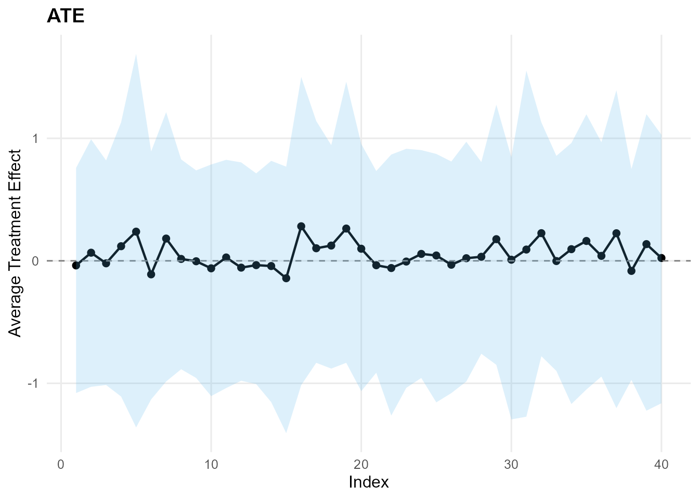
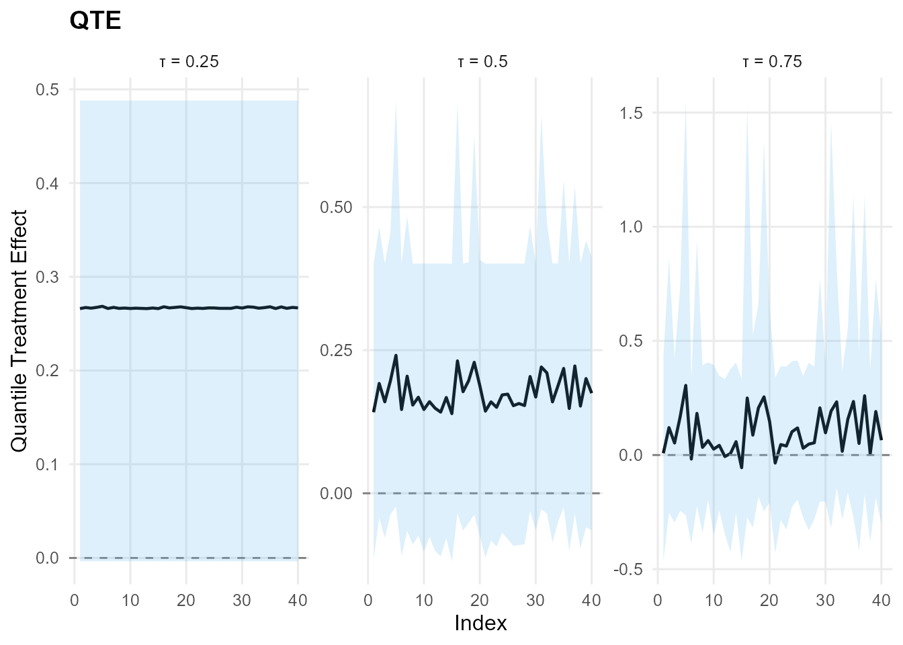

# 15. Causal Inference: X Without PS (CRP+SB) - InvGauss/Amoroso

> **Legacy vignette (for the website / historical notes).** These files
> may not match the current exported API one-to-one. Last verified:
> **2026-01-18**.
>
> For the up-to-date workflow, see the main package vignettes
> (Introduction, Model Spec, MCMC Workflow,
> Unconditional/Conditional/Causal, Backends, S3 Reference).

### Theory (brief)

With covariates but no propensity score adjustment, the model conditions
outcome distributions on $`X`$ within each treatment arm. Causal effects
are derived from differences in the arm-specific conditional
distributions.

## Causal Inference: X Without PS (CRP+SB)

This vignette uses **covariates X** but disables PS estimation. Outcome
models are conditional on X only.

- Model A: CRP with GPD tail (InvGauss)
- Model B: SB bulk-only (Amoroso)

------------------------------------------------------------------------

### Data Setup

``` r
data("causal_alt_real500_p4_k2")
y <- abs(causal_alt_real500_p4_k2$y) + 0.01
T <- causal_alt_real500_p4_k2$T
X <- as.matrix(causal_alt_real500_p4_k2$X)

summary_tbl <- tibble(
  statistic = c("N", "Mean", "SD", "Min", "Max"),
  value = c(length(y), mean(y), sd(y), min(y), max(y))
)

summary_tbl %>%
  mutate(value = signif(value, 4)) %>%
  print()
```

    
[38;5;246m# A tibble: 5 × 2
[39m
      statistic    value
      
[3m
[38;5;246m<chr>
[39m
[23m        
[3m
[38;5;246m<dbl>
[39m
[23m
    
[38;5;250m1
[39m N         500     
    
[38;5;250m2
[39m Mean        1.43  
    
[38;5;250m3
[39m SD          1.08  
    
[38;5;250m4
[39m Min         0.012
[4m6
[24m
    
[38;5;250m5
[39m Max         8.10  

``` r
x_eval <- X[1:40, , drop = FALSE]
y_eval <- y[1:40]
u_threshold <- as.numeric(stats::quantile(y, 0.8, names = FALSE))
```

------------------------------------------------------------------------

### Model A: CRP with GPD Tail (InvGauss)

``` r
param_specs_gpd <- list(
  gpd = list(
    threshold = list(
      mode = "dist",
      dist = "lognormal",
      args = list(meanlog = log(max(u_threshold, .Machine$double.eps)), sdlog = 0.25)
    )
  )
)

bundle_crp_gpd <- build_causal_bundle(
  y = y,
  T = T,
  X = X,
  kernel = "invgauss",
  backend = "crp",
  PS = FALSE,
  GPD = TRUE,
  components = 6,
  param_specs = param_specs_gpd,
  mcmc_outcome = list(niter = 300, nburnin = 80, nchains = 1, thin = 1, seed = 3)
)

bundle_crp_gpd
```

    DPmixGPD causal bundle
    PS model: disabled 
    Outcome (treated): backend = crp | kernel = invgauss 
    Outcome (control): backend = crp | kernel = invgauss 
    GPD tail (treated/control): TRUE / TRUE 
    components (treated/control): 6 / 6 
    Outcome PS included: FALSE 
    epsilon (treated/control): 0.025 / 0.025 
    n (control) = 232 | n (treated) = 268 

``` r
fit_crp_gpd <- quiet_mcmc(run_mcmc_causal(bundle_crp_gpd))
summary(fit_crp_gpd)
```

    -- Outcome fits --
    [control]
    MixGPD fit | backend: Chinese Restaurant Process | kernel: Inverse Gaussian Distribution | GPD tail: TRUE
    n = 232 | components = 6 | epsilon = 0.025
    MCMC: niter=300, nburnin=80, thin=1, nchains=1 
    Fit
    Use summary() for posterior summaries; plot() for diagnostics; predict() for predictions.

    [treated]
    MixGPD fit | backend: Chinese Restaurant Process | kernel: Inverse Gaussian Distribution | GPD tail: TRUE
    n = 268 | components = 6 | epsilon = 0.025
    MCMC: niter=300, nburnin=80, thin=1, nchains=1 
    Fit
    Use summary() for posterior summaries; plot() for diagnostics; predict() for predictions.

``` r
pred_mean_gpd <- predict(fit_crp_gpd, x = x_eval, type = "mean", interval = "credible", nsim_mean = 150)
head(pred_mean_gpd)
```

         ps     estimate       lower       upper
    [1,] NA  0.002777083 -0.06799971 -0.04246160
    [2,] NA  0.048581383 -0.08301273 -0.19387301
    [3,] NA -0.102766452 -0.14249420 -0.68784500
    [4,] NA  0.130920200 -0.11018958  0.01283190
    [5,] NA  0.303058271  0.03184660  0.59510974
    [6,] NA -0.052700892 -0.11592904 -0.00093102

``` r
plot(pred_mean_gpd)
```


``` r
pred_q_gpd <- predict(fit_crp_gpd, x = x_eval, type = "quantile", p = 0.5, interval = "credible")
head(pred_q_gpd)
```

         ps  estimate     lower     upper
    [1,] NA 0.1415883 0.1429785 0.2410518
    [2,] NA 0.1918722 0.1644138 0.2436224
    [3,] NA 0.1597184 0.1644138 0.2400800
    [4,] NA 0.1961816 0.1644138 0.2646248
    [5,] NA 0.2410058 0.1644138 0.5857743
    [6,] NA 0.1463351 0.1441141 0.2326869

``` r
plot(pred_q_gpd)
```


``` r
pred_d_gpd <- predict(fit_crp_gpd, x = x_eval, y = y_eval, type = "density", interval = "credible")
head(pred_d_gpd)
```

              y ps trt_estimate  trt_lower trt_upper con_estimate  con_lower
    1 0.9001906 NA            1 0.45414289 1.2224081            1 0.34516726
    2 1.3517565 NA            1 0.32677112 0.5409423            1 0.25005667
    3 1.1475287 NA            1 0.41215984 0.6482381            1 0.29495110
    4 1.9323578 NA            1 0.21512339 0.3127500            1 0.16298825
    5 3.3439817 NA            1 0.02926121 0.1088152            1 0.01794506
    6 0.9493979 NA            1 0.45218719 1.0333833            1 0.34153837
       con_upper
    1 0.50012007
    2 0.46630084
    3 0.49571937
    4 0.30559105
    5 0.08905627
    6 0.48991626

``` r
plot(pred_d_gpd)
```


``` r
pred_surv_gpd <- predict(fit_crp_gpd, x = x_eval, y = y_eval, type = "survival", interval = "credible")
head(pred_surv_gpd)
```

              y ps trt_estimate trt_lower trt_upper con_estimate   con_lower
    1 0.9001906 NA            1 0.5996091 0.8108406            1 0.520519089
    2 1.3517565 NA            1 0.3994258 0.5818680            1 0.356663915
    3 1.1475287 NA            1 0.4849992 0.6840934            1 0.424682693
    4 1.9323578 NA            1 0.2188104 0.3951802            1 0.202464525
    5 3.3439817 NA            1 0.0400109 0.2775648            1 0.004625428
    6 0.9493979 NA            1 0.5732221 0.7863113            1 0.498721214
      con_upper
    1 0.6597658
    2 0.4817641
    3 0.5518869
    4 0.2967769
    5 0.1065252
    6 0.6374484

``` r
plot(pred_surv_gpd)
```


``` r
ate_gpd <- ate(fit_crp_gpd, newdata = x_eval, interval = "credible", nsim_mean = 150)
print(ate_gpd)
```

    ATE (Average Treatment Effect)
      Prediction points: 40
      Conditional (covariates): YES
      Propensity score used: NO
      Posterior mean draws: 150
      Credible interval: credible (95%)

    ATE estimates (treated - control):
     id estimate  lower upper
      1   -0.038 -1.079 0.759
      2    0.066 -1.028 0.992
      3   -0.020 -1.014 0.820
      4    0.119 -1.108 1.131
      5    0.238 -1.360 1.691
      6   -0.110 -1.132 0.893
    ... (34 more rows)

``` r
summary(ate_gpd)
```

    ATE Summary
    ================================================== 
    Prediction points: 40
    Conditional: YES | PS used: NO
    Posterior mean draws: 150
    Interval: credible (95%)

    Model specification:
      Backend (trt/con): crp / crp
      Kernel (trt/con): invgauss / invgauss
      GPD tail (trt/con): YES / YES

    ATE statistics:
      Mean: 0.053 | Median: 0.03
      Range: [-0.142, 0.282]
      SD: 0.106

    Credible interval width:
      Mean: 2.041 | Median: 1.972
      Range: [1.565, 3.05]

``` r
ate_plots_gpd <- plot(ate_gpd)
ate_plots_gpd$treatment_effect
```



``` r
qte_gpd <- qte(fit_crp_gpd, probs = c(0.25, 0.5, 0.75), newdata = x_eval, interval = "credible")
print(qte_gpd)
```

    QTE (Quantile Treatment Effect)
      Prediction points: 40
      Quantile grid: 0.25, 0.5, 0.75
      Conditional (covariates): YES
      Propensity score used: NO
      Credible interval: credible (95%)

    QTE estimates (treated - control):
     index id estimate  lower upper
      0.25  1    0.266 -0.004 0.488
      0.25  2    0.267 -0.004 0.488
      0.25  3    0.267 -0.004 0.488
      0.25  4    0.267 -0.004 0.488
      0.25  5    0.269 -0.004 0.488
      0.25  6    0.266 -0.004 0.488
    ... (114 more rows)

``` r
summary(qte_gpd)
```

    QTE Summary
    ================================================== 
    Prediction points: 40 | Quantiles: 3
    Quantile grid: 0.25, 0.5, 0.75
    Conditional: YES | PS used: NO
    Interval: credible (95%)

    Model specification:
      Backend (trt/con): crp / crp
      Kernel (trt/con): invgauss / invgauss
      GPD tail (trt/con): YES / YES

    QTE by quantile:
     quantile mean_qte median_qte min_qte max_qte sd_qte
         0.25    0.267      0.267   0.266   0.269  0.001
         0.50    0.176      0.168   0.139   0.241  0.029
         0.75    0.101      0.064  -0.055   0.305  0.094

    Credible interval width:
      Mean: 0.638 | Median: 0.496
      Range: [0.452, 1.815]

``` r
qte_plots_gpd <- plot(qte_gpd)
qte_plots_gpd$treatment_effect
```



------------------------------------------------------------------------

### Model B: SB Bulk-only (Amoroso)

``` r
bundle_sb_bulk <- build_causal_bundle(
  y = y,
  T = T,
  X = X,
  kernel = "amoroso",
  backend = "sb",
  PS = FALSE,
  GPD = FALSE,
  components = 6,
  mcmc_outcome = list(niter = 300, nburnin = 80, nchains = 1, thin = 1, seed = 4)
)

bundle_sb_bulk
```

    DPmixGPD causal bundle
    PS model: disabled 
    Outcome (treated): backend = sb | kernel = amoroso 
    Outcome (control): backend = sb | kernel = amoroso 
    GPD tail (treated/control): FALSE / FALSE 
    components (treated/control): 6 / 6 
    Outcome PS included: FALSE 
    epsilon (treated/control): 0.025 / 0.025 
    n (control) = 232 | n (treated) = 268 

``` r
fit_sb_bulk <- quiet_mcmc(run_mcmc_causal(bundle_sb_bulk))
summary(fit_sb_bulk)
```

    -- Outcome fits --
    [control]
    MixGPD fit | backend: Stick-Breaking Process | kernel: Amoroso Distribution | GPD tail: FALSE
    n = 232 | components = 6 | epsilon = 0.025
    MCMC: niter=300, nburnin=80, thin=1, nchains=1 
    Fit
    Use summary() for posterior summaries; plot() for diagnostics; predict() for predictions.

    [treated]
    MixGPD fit | backend: Stick-Breaking Process | kernel: Amoroso Distribution | GPD tail: FALSE
    n = 268 | components = 6 | epsilon = 0.025
    MCMC: niter=300, nburnin=80, thin=1, nchains=1 
    Fit
    Use summary() for posterior summaries; plot() for diagnostics; predict() for predictions.

``` r
pred_mean_bulk <- predict(fit_sb_bulk, x = x_eval, type = "mean", interval = "credible", nsim_mean = 150)
head(pred_mean_bulk)
```

         ps    estimate     lower      upper
    [1,] NA  0.09368687 0.3238134 -0.9468879
    [2,] NA -0.64441298 0.3391561 -2.0512322
    [3,] NA -0.05332679 0.4308999 -0.5702519
    [4,] NA  0.20844987 0.5246804  0.1507183
    [5,] NA  1.04761499 0.7351570  2.3011739
    [6,] NA -0.09922505 0.4984297 -0.6473372

``` r
plot(pred_mean_bulk)
```


``` r
pred_q_bulk <- predict(fit_sb_bulk, x = x_eval, type = "quantile", p = 0.5, interval = "credible")
head(pred_q_bulk)
```

         ps    estimate       lower      upper
    [1,] NA  0.23107851  0.49409451 -0.3303878
    [2,] NA -0.59630736  0.18738818 -2.1338257
    [3,] NA -0.01885780  0.35342292 -0.4930663
    [4,] NA -0.13625628  0.19106699 -0.6771890
    [5,] NA -0.24404201 -0.04225649 -0.1885474
    [6,] NA -0.03706179  0.35935946 -0.4767725

``` r
plot(pred_q_bulk)
```


``` r
pred_d_bulk <- predict(fit_sb_bulk, x = x_eval, y = y_eval, type = "density", interval = "credible")
head(pred_d_bulk)
```

              y ps trt_estimate  trt_lower trt_upper con_estimate    con_lower
    1 0.9001906 NA            1 0.35558092 0.7481876            1 2.432157e-01
    2 1.3517565 NA            1 0.30101145 0.4783538            1 6.086478e-02
    3 1.1475287 NA            1 0.38705157 0.5809042            1 1.960378e-01
    4 1.9323578 NA            1 0.11439130 0.2818421            1 3.131463e-02
    5 3.3439817 NA            1 0.05091262 0.1237739            1 8.783928e-06
    6 0.9493979 NA            1 0.42967160 0.6407988            1 2.283443e-01
      con_upper
    1 0.6975874
    2 0.4461087
    3 0.5057945
    4 0.3253958
    5 0.1641147
    6 0.7061009

``` r
plot(pred_d_bulk)
```


``` r
pred_surv_bulk <- predict(fit_sb_bulk, x = x_eval, y = y_eval, type = "survival", interval = "credible")
head(pred_surv_bulk)
```

              y ps trt_estimate trt_lower trt_upper con_estimate    con_lower
    1 0.9001906 NA            1 0.4629634 0.7350239            1 1.696111e-01
    2 1.3517565 NA            1 0.3917017 0.5771332            1 2.614247e-01
    3 1.1475287 NA            1 0.3881518 0.5870768            1 9.666093e-02
    4 1.9323578 NA            1 0.1934483 0.4011735            1 6.186305e-03
    5 3.3439817 NA            1 0.1187534 0.4371517            1 1.167570e-06
    6 0.9493979 NA            1 0.5182004 0.7113655            1 2.557750e-01
      con_upper
    1 0.7336970
    2 0.6757667
    3 0.6259730
    4 0.5295118
    5 0.4101933
    6 0.7119993

``` r
plot(pred_surv_bulk)
```


``` r
ate_bulk <- ate(fit_sb_bulk, newdata = x_eval, interval = "credible", nsim_mean = 150)
print(ate_bulk)
```

    ATE (Average Treatment Effect)
      Prediction points: 40
      Conditional (covariates): YES
      Propensity score used: NO
      Posterior mean draws: 150
      Credible interval: credible (95%)

    ATE estimates (treated - control):
     id estimate  lower upper
      1    0.128 -1.351 1.010
      2   -0.658 -2.478 0.767
      3   -0.057 -1.018 0.719
      4    0.251 -0.642 1.066
      5    1.051 -0.840 3.155
      6   -0.107 -1.077 0.741
    ... (34 more rows)

``` r
summary(ate_bulk)
```

    ATE Summary
    ================================================== 
    Prediction points: 40
    Conditional: YES | PS used: NO
    Posterior mean draws: 150
    Interval: credible (95%)

    Model specification:
      Backend (trt/con): sb / sb
      Kernel (trt/con): amoroso / amoroso
      GPD tail (trt/con): NO / NO

    ATE statistics:
      Mean: 0.064 | Median: 0.085
      Range: [-0.784, 1.051]
      SD: 0.424

    Credible interval width:
      Mean: 2.698 | Median: 2.405
      Range: [0.857, 6.454]

``` r
ate_plots_bulk <- plot(ate_bulk)
ate_plots_bulk$treatment_effect
```


``` r
qte_bulk <- qte(fit_sb_bulk, probs = c(0.25, 0.5, 0.75), newdata = x_eval, interval = "credible")
print(qte_bulk)
```

    QTE (Quantile Treatment Effect)
      Prediction points: 40
      Quantile grid: 0.25, 0.5, 0.75
      Conditional (covariates): YES
      Propensity score used: NO
      Credible interval: credible (95%)

    QTE estimates (treated - control):
     index id estimate  lower upper
      0.25  1    0.200 -0.196 0.666
      0.25  2    0.156 -0.162 0.619
      0.25  3    0.101 -0.129 0.357
      0.25  4    0.168 -0.148 0.528
      0.25  5    0.177 -0.338 0.680
      0.25  6    0.168 -0.092 0.421
    ... (114 more rows)

``` r
summary(qte_bulk)
```

    QTE Summary
    ================================================== 
    Prediction points: 40 | Quantiles: 3
    Quantile grid: 0.25, 0.5, 0.75
    Conditional: YES | PS used: NO
    Interval: credible (95%)

    Model specification:
      Backend (trt/con): sb / sb
      Kernel (trt/con): amoroso / amoroso
      GPD tail (trt/con): NO / NO

    QTE by quantile:
     quantile mean_qte median_qte min_qte max_qte sd_qte
         0.25    0.154      0.161  -0.006   0.292  0.053
         0.50   -0.092     -0.061  -1.088   0.354  0.293
         0.75   -0.166     -0.081  -1.562   1.250  0.699

    Credible interval width:
      Mean: 2.369 | Median: 1.599
      Range: [0.407, 11.741]

``` r
qte_plots_bulk <- plot(qte_bulk)
qte_plots_bulk$treatment_effect
```


