# 16. Causal Inference: Mixed Backends (CRP+SB) - Cauchy/Laplace

> **Legacy vignette (for the website / historical notes).** These files
> may not match the current exported API one-to-one. Last verified:
> **2026-01-18**.
>
> For the up-to-date workflow, see the main package vignettes
> (Introduction, Model Spec, MCMC Workflow,
> Unconditional/Conditional/Causal, Backends, S3 Reference).

### Theory (brief)

The causal workflow fits treated and control arms with covariate
adjustment, optionally including propensity scores. Backend choices
control how mixtures are represented but target the same posterior
quantities.

## Causal Inference: Mixed Backends (CRP+SB)

This vignette fits two causal models using different backends and
kernels:

- Model A: CRP bulk-only (Cauchy)
- Model B: SB with GPD tail (Laplace)

Each model demonstrates the full causal S3 workflow: bundle, fit,
predict, plot, ATE, and QTE.

------------------------------------------------------------------------

### Data Setup

``` r
data("causal_alt_real500_p4_k2")
y <- causal_alt_real500_p4_k2$y
T <- causal_alt_real500_p4_k2$T
X <- as.matrix(causal_alt_real500_p4_k2$X)

summary_tbl <- tibble(
  statistic = c("N", "Mean", "SD", "Min", "Max"),
  value = c(length(y), mean(y), sd(y), min(y), max(y))
)

summary_tbl %>%
  mutate(value = signif(value, 4)) %>%
  kable(caption = "Causal Dataset Summary", align = "c") %>%
  kable_styling(bootstrap_options = c("striped", "hover"), full_width = FALSE, position = "center")
```

| statistic |  value   |
|:---------:|:--------:|
|     N     | 500.0000 |
|   Mean    |  0.2737  |
|    SD     |  1.7640  |
|    Min    | -8.0890  |
|    Max    |  5.2750  |

Causal Dataset Summary

``` r
x_eval <- X[1:40, , drop = FALSE]
y_eval <- y[1:40]
u_threshold <- as.numeric(stats::quantile(y, 0.8, names = FALSE))
```

``` r
df_causal <- data.frame(y = y, T = as.factor(T), x1 = X[, 1], x2 = X[, 2])

p_scatter <- ggplot(df_causal, aes(x = x1, y = y, color = T)) +
  geom_point(alpha = 0.5) +
  labs(title = "Outcome vs X1 by Treatment", x = "X1", y = "y", color = "Treatment") +
  theme_minimal()

p_scatter
```

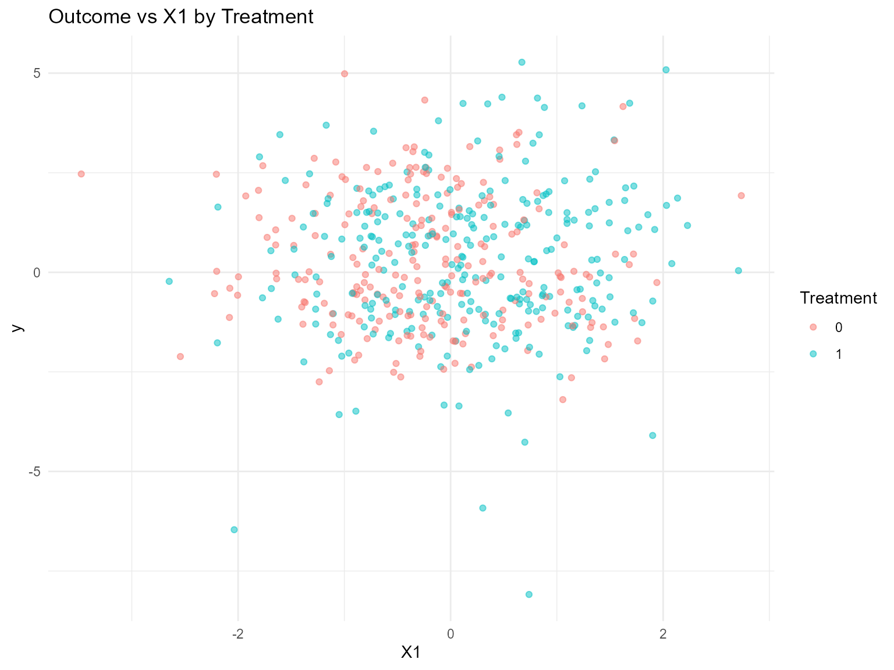

------------------------------------------------------------------------

### Model A: CRP Bulk-only (Cauchy)

``` r
bundle_crp_bulk <- build_causal_bundle(
  y = y,
  T = T,
  X = X,
  kernel = "cauchy",
  backend = "crp",
  PS = "logit",
  GPD = FALSE,
  components = 5,
  mcmc_outcome = list(niter = 2500, nburnin = 500, nchains = 1, thin = 1, seed = 1),
  mcmc_ps = list(niter = 2500, nburnin = 500, nchains = 1, thin = 1, seed = 1)
)

bundle_crp_bulk
```

    DPmixGPD causal bundle
    PS model: disabled 
    Outcome (treated): backend = crp | kernel = cauchy 
    Outcome (control): backend = crp | kernel = cauchy 
    GPD tail (treated/control): FALSE / FALSE 
    components (treated/control): 5 / 5 
    Outcome PS included: FALSE 
    epsilon (treated/control): 0.025 / 0.025 
    n (control) = 232 | n (treated) = 268 

``` r
summary(bundle_crp_bulk)
```

    DPmixGPD causal bundle summary
    DPmixGPD causal bundle
    PS model: disabled 
    Outcome (treated): backend = crp | kernel = cauchy 
    Outcome (control): backend = crp | kernel = cauchy 
    GPD tail (treated/control): FALSE / FALSE 
    components (treated/control): 5 / 5 
    Outcome PS included: FALSE 
    epsilon (treated/control): 0.025 / 0.025 
    n (control) = 232 | n (treated) = 268 

``` r
fit_crp_bulk <- quiet_mcmc(run_mcmc_causal(bundle_crp_bulk))
summary(fit_crp_bulk)
```

    -- Outcome fits --
    [control]
    MixGPD fit | backend: Chinese Restaurant Process | kernel: Cauchy Distribution | GPD tail: FALSE
    n = 232 | components = 5 | epsilon = 0.025
    MCMC: niter=2500, nburnin=500, thin=1, nchains=1 
    Fit
    Use summary() for posterior summaries; plot() for diagnostics; predict() for predictions.

    [treated]
    MixGPD fit | backend: Chinese Restaurant Process | kernel: Cauchy Distribution | GPD tail: FALSE
    n = 268 | components = 5 | epsilon = 0.025
    MCMC: niter=2500, nburnin=500, thin=1, nchains=1 
    Fit
    Use summary() for posterior summaries; plot() for diagnostics; predict() for predictions.

``` r
params(fit_crp_bulk)
```

    Posterior mean parameters (causal)

    [treated]
    Posterior mean parameters

    $alpha
    [1] 0.4147

    $w
    [1] 0.5353 0.4480

    $location
    [1]  0.7653 -0.2718

    $scale
    [1] 0.6436 0.5301

    [control]
    Posterior mean parameters

    $alpha
    [1] 0.6324

    $w
    [1] 0.4170 0.3015 0.2190

    $location
    [1] -0.04636  0.66170 -0.17040

    $scale
    [1] 0.5236 0.5235 0.4180

``` r
plot(fit_crp_bulk, params = "location", family = "traceplot")
```

    === treated ===

    === traceplot ===

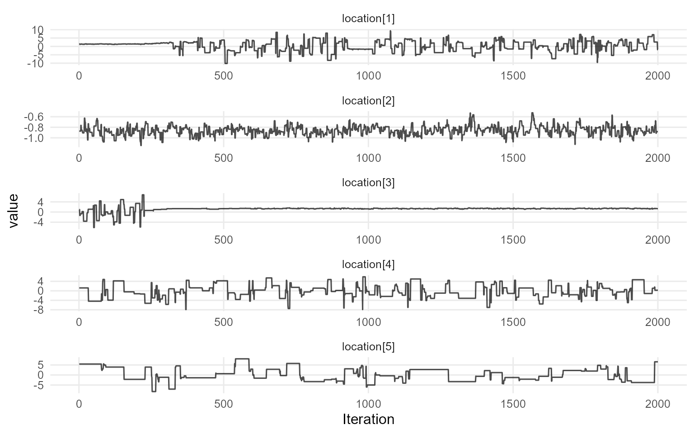

    === control ===

    === traceplot ===

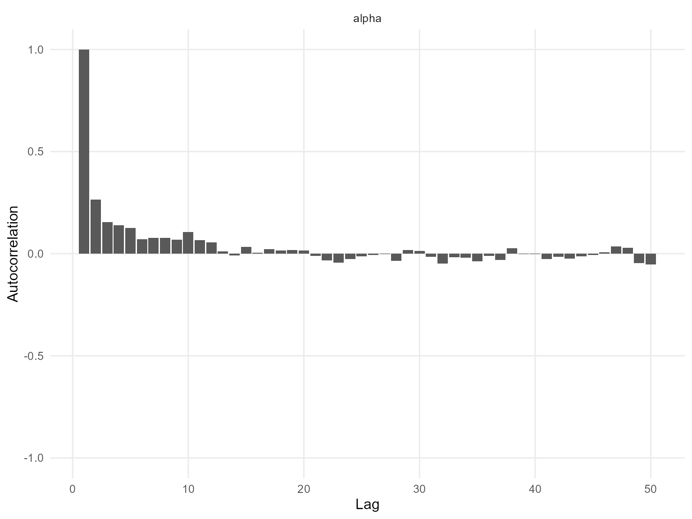

``` r
plot(fit_crp_bulk, params = "scale", family = "caterpillar")
```

    === treated ===

    === caterpillar ===

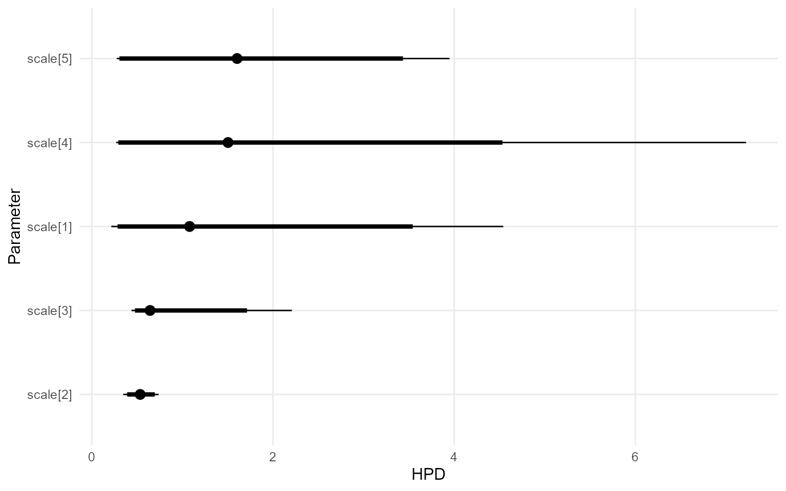

    === control ===

    === caterpillar ===

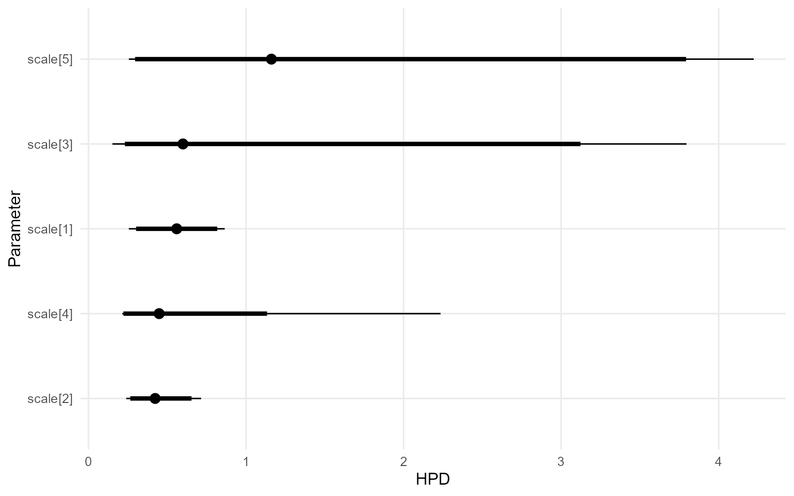

``` r
pred_mean_bulk <- predict(fit_crp_bulk, x = x_eval, type = "mean",
                          interval = "hpd", nsim_mean = 100)
head(pred_mean_bulk)
```

         ps     estimate       lower     upper
    [1,] NA  -0.01940363 -2.92571642  1.324541
    [2,] NA   0.10356830  0.29432641 -0.672976
    [3,] NA  -0.90649989 -0.05523386  2.587926
    [4,] NA -12.78233785 -0.38792342  2.614381
    [5,] NA   2.50111010 -1.48579646  1.941359
    [6,] NA   0.93120656 -0.54594934  3.225777

``` r
plot(pred_mean_bulk)
```

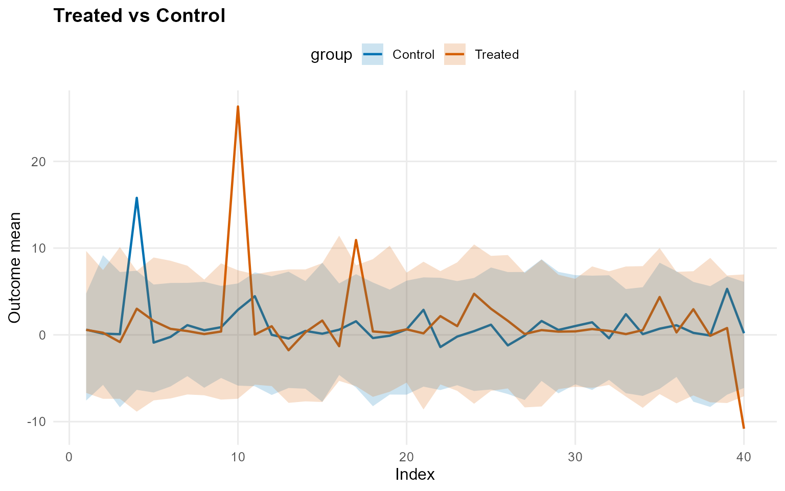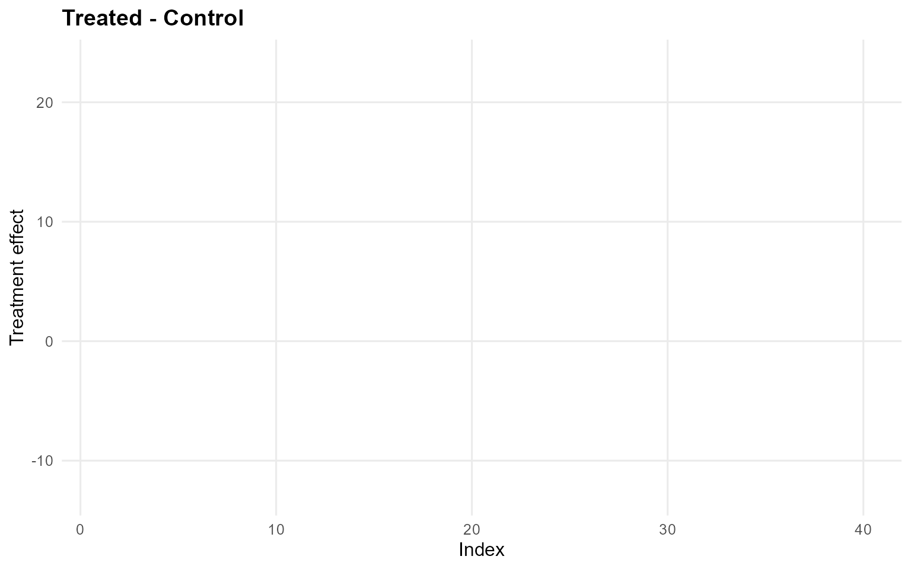

``` r
pred_q_bulk <- predict(fit_crp_bulk, x = x_eval, type = "quantile",
                       p = 0.5, interval = "hpd")
head(pred_q_bulk)
```

         ps  estimate     lower     upper
    [1,] NA 0.4438617 0.3411361 0.5600964
    [2,] NA 0.4438617 0.3411361 0.5600964
    [3,] NA 0.4438617 0.3411361 0.5600964
    [4,] NA 0.4438617 0.3411361 0.5600964
    [5,] NA 0.4438617 0.3411361 0.5600964
    [6,] NA 0.4438617 0.3411361 0.5600964

``` r
plot(pred_q_bulk)
```

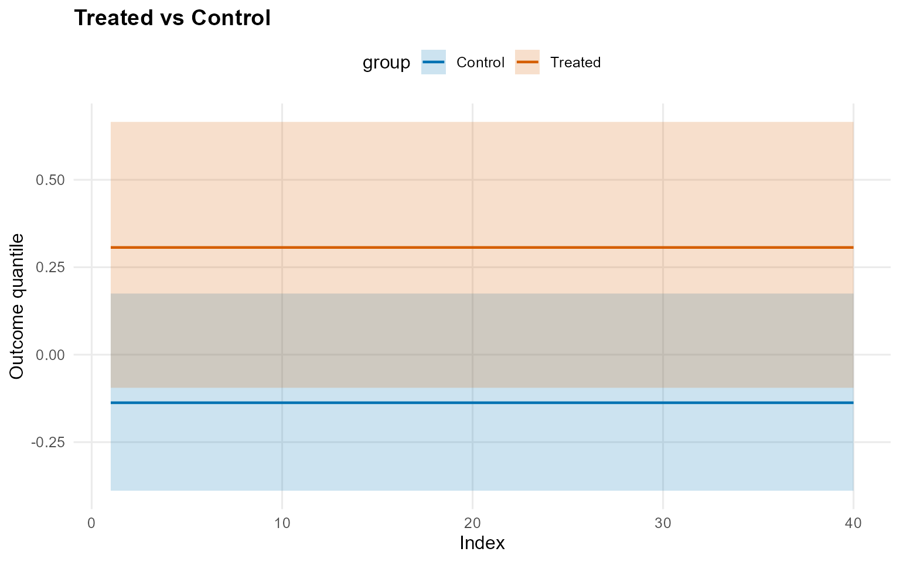

``` r
pred_d_bulk <- predict(fit_crp_bulk, x = x_eval, y = y_eval,
                       type = "density", interval = "hpd")
head(pred_d_bulk)
```

               y ps trt_estimate  trt_lower  trt_upper con_estimate  con_lower
    1  0.8901906 NA            1 0.13716390 0.26063307            1 0.05548951
    2 -1.3417565 NA            1 0.11735561 0.22414852            1 0.13371072
    3  1.1375287 NA            1 0.18934999 0.32040885            1 0.05023242
    4 -1.9223578 NA            1 0.04519344 0.08674553            1 0.05371945
    5 -3.3339817 NA            1 0.01282508 0.02236467            1 0.01235231
    6  0.9393979 NA            1 0.14877755 0.27666249            1 0.05722861
       con_upper
    1 0.14977593
    2 0.38335823
    3 0.17711555
    4 0.12487562
    5 0.02225183
    6 0.15842710

``` r
plot(pred_d_bulk)
```

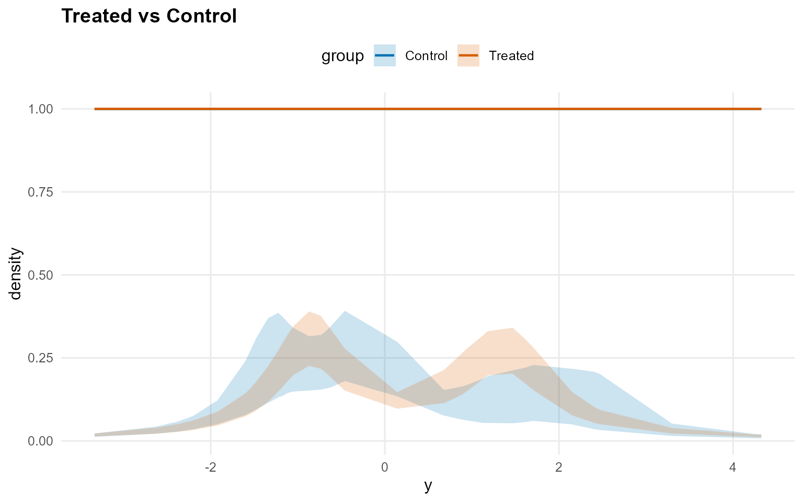

``` r
pred_surv_bulk <- predict(fit_crp_bulk, x = x_eval, y = y_eval,
                          type = "survival", interval = "hpd")
head(pred_surv_bulk)
```

               y ps trt_estimate trt_lower trt_upper con_estimate con_lower
    1  0.8901906 NA            1 0.3603131 0.4621708            1 0.2256874
    2 -1.3417565 NA            1 0.7940112 0.8744248            1 0.7522890
    3  1.1375287 NA            1 0.3055599 0.4155494            1 0.1838014
    4 -1.9223578 NA            1 0.8716498 0.9222455            1 0.8699246
    5 -3.3339817 NA            1 0.9326899 0.9561688            1 0.9374529
    6  0.9393979 NA            1 0.3503516 0.4535438            1 0.2192481
      con_upper
    1 0.3979709
    2 0.8545207
    3 0.3641461
    4 0.9242750
    5 0.9620971
    6 0.3938460

``` r
plot(pred_surv_bulk)
```

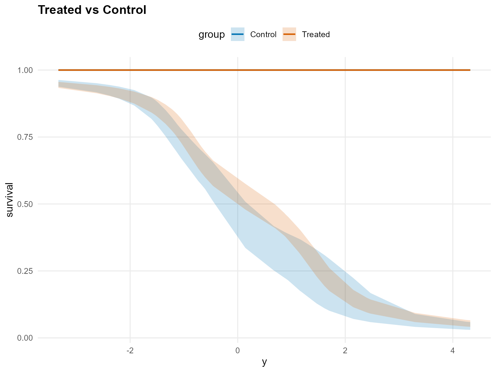

``` r
ate_bulk <- ate(fit_crp_bulk, newdata = x_eval,
                interval = "hpd", nsim_mean = 100)
print(ate_bulk)
```

    ATE (Average Treatment Effect)
      Prediction points: 40
      Conditional (covariates): YES
      Propensity score used: NO
      Posterior mean draws: 100
      Credible interval: hpd

    ATE estimates (treated - control):
     id estimate   lower  upper
      1   -0.451 -14.326 13.809
      2   -2.438 -12.744 11.198
      3    1.408 -15.421 14.129
      4   -0.517 -13.878 11.673
      5    0.395 -12.374 19.236
      6   -3.339 -13.126 15.035
    ... (34 more rows)

``` r
summary(ate_bulk)
```

    ATE Summary
    ================================================== 
    Prediction points: 40
    Conditional: YES | PS used: NO
    Posterior mean draws: 100
    Interval: hpd

    Model specification:
      Backend (trt/con): crp / crp
      Kernel (trt/con): cauchy / cauchy
      GPD tail (trt/con): NO / NO

    ATE statistics:
      Mean: 0.531 | Median: -0.017
      Range: [-5.599, 12.005]
      SD: 3.197

    Credible interval width:
      Mean: 27.207 | Median: 27.405
      Range: [21.872, 33.46]

``` r
ate_plots_bulk <- plot(ate_bulk)
ate_plots_bulk$treatment_effect
```


``` r
qte_bulk <- qte(fit_crp_bulk, probs = c(0.25, 0.5, 0.75),
                newdata = x_eval, interval = "hpd")
print(qte_bulk)
```

    QTE (Quantile Treatment Effect)
      Prediction points: 40
      Quantile grid: 0.25, 0.5, 0.75
      Conditional (covariates): YES
      Propensity score used: NO
      Credible interval: hpd

    QTE estimates (treated - control):
     index id estimate  lower upper
      0.25  1    0.127 -0.203 0.421
      0.25  2    0.127 -0.203 0.421
      0.25  3    0.127 -0.203 0.421
      0.25  4    0.127 -0.203 0.421
      0.25  5    0.127 -0.203 0.421
      0.25  6    0.127 -0.203 0.421
    ... (114 more rows)

``` r
summary(qte_bulk)
```

    QTE Summary
    ================================================== 
    Prediction points: 40 | Quantiles: 3
    Quantile grid: 0.25, 0.5, 0.75
    Conditional: YES | PS used: NO
    Interval: hpd

    Model specification:
      Backend (trt/con): crp / crp
      Kernel (trt/con): cauchy / cauchy
      GPD tail (trt/con): NO / NO

    QTE by quantile:
     quantile mean_qte median_qte min_qte max_qte sd_qte
         0.25    0.127      0.127   0.127   0.127      0
         0.50    0.444      0.444   0.444   0.444      0
         0.75    0.015      0.015   0.015   0.015      0

    Credible interval width:
      Mean: 0.993 | Median: 0.984
      Range: [0.624, 1.373]

``` r
qte_plots_bulk <- plot(qte_bulk)
qte_plots_bulk$treatment_effect
```

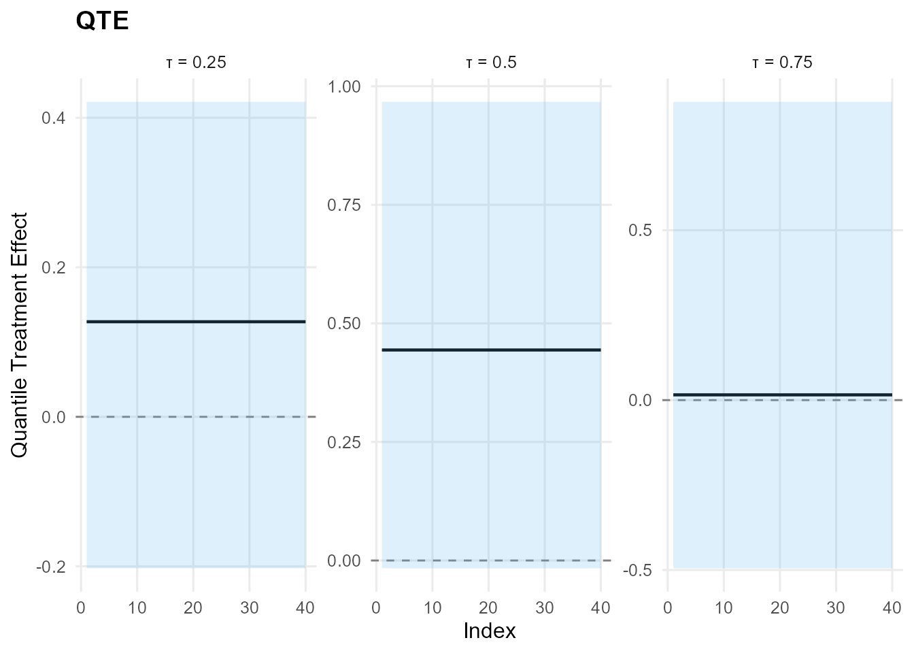

------------------------------------------------------------------------

### Model B: SB with GPD Tail (Laplace)

``` r
param_specs_gpd <- list(
  gpd = list(
    threshold = list(
      mode = "dist",
      dist = "lognormal",
      args = list(meanlog = log(max(u_threshold, .Machine$double.eps)), sdlog = 0.25)
    )
  )
)

bundle_sb_gpd <- build_causal_bundle(
  y = y,
  T = T,
  X = X,
  kernel = "laplace",
  backend = "sb",
  PS = "logit",
  GPD = TRUE,
  components = 5,
  param_specs = param_specs_gpd,
  mcmc_outcome = list(niter = 2500, nburnin = 500, nchains = 1, thin = 1, seed = 2),
  mcmc_ps = list(niter = 2500, nburnin = 500, nchains = 1, thin = 1, seed = 2)
)

bundle_sb_gpd
```

    DPmixGPD causal bundle
    PS model: disabled 
    Outcome (treated): backend = sb | kernel = laplace 
    Outcome (control): backend = sb | kernel = laplace 
    GPD tail (treated/control): TRUE / TRUE 
    components (treated/control): 5 / 5 
    Outcome PS included: FALSE 
    epsilon (treated/control): 0.025 / 0.025 
    n (control) = 232 | n (treated) = 268 

``` r
summary(bundle_sb_gpd)
```

    DPmixGPD causal bundle summary
    DPmixGPD causal bundle
    PS model: disabled 
    Outcome (treated): backend = sb | kernel = laplace 
    Outcome (control): backend = sb | kernel = laplace 
    GPD tail (treated/control): TRUE / TRUE 
    components (treated/control): 5 / 5 
    Outcome PS included: FALSE 
    epsilon (treated/control): 0.025 / 0.025 
    n (control) = 232 | n (treated) = 268 

``` r
fit_sb_gpd <- quiet_mcmc(run_mcmc_causal(bundle_sb_gpd))
summary(fit_sb_gpd)
```

    -- Outcome fits --
    [control]
    MixGPD fit | backend: Stick-Breaking Process | kernel: Laplace Distribution | GPD tail: TRUE
    n = 232 | components = 5 | epsilon = 0.025
    MCMC: niter=2500, nburnin=500, thin=1, nchains=1 
    Fit
    Use summary() for posterior summaries; plot() for diagnostics; predict() for predictions.

    [treated]
    MixGPD fit | backend: Stick-Breaking Process | kernel: Laplace Distribution | GPD tail: TRUE
    n = 268 | components = 5 | epsilon = 0.025
    MCMC: niter=2500, nburnin=500, thin=1, nchains=1 
    Fit
    Use summary() for posterior summaries; plot() for diagnostics; predict() for predictions.

``` r
params(fit_sb_gpd)
```

    Posterior mean parameters (causal)

    [treated]
    Posterior mean parameters

    $alpha
    [1] 0.9681

    $w
    [1] 0.5494 0.3806

    $beta_location
               x1      x2      x3      x4
    comp1  0.5041  0.2750  0.3910  1.5314
    comp2 -0.1887  0.0981 -0.1243  0.1281
    comp3  0.3630 -0.0724 -0.1960  0.2206
    comp4  0.3429 -0.1728  0.1564  0.0977
    comp5  0.1979  0.1359 -0.1627 -0.1496

    $scale
    [1] 1.393 1.219

    $beta_tail_scale
    [1]  0.11510 -0.13350  0.09928 -0.10050

    $tail_shape
    [1] -0.007076

    [control]
    Posterior mean parameters

    $alpha
    [1] 1.219

    $w
    [1] 0.4360 0.2929

    $beta_location
               x1      x2      x3      x4
    comp1 -0.2179 -0.0189  0.1127  0.1284
    comp2  0.0540 -0.0544 -0.1660 -0.6654
    comp3  0.0225  0.7603 -0.4469  2.1354
    comp4 -0.3664 -0.6174 -0.2670  0.9868
    comp5 -0.4992 -0.2809 -0.1118  0.9938

    $scale
    [1] 1.066 1.019

    $beta_tail_scale
    [1]  0.27490  0.19720  0.15610 -0.05639

    $tail_shape
    [1] -0.04316

``` r
plot(fit_sb_gpd, family = "traceplot")
```

    === treated ===

    === traceplot ===

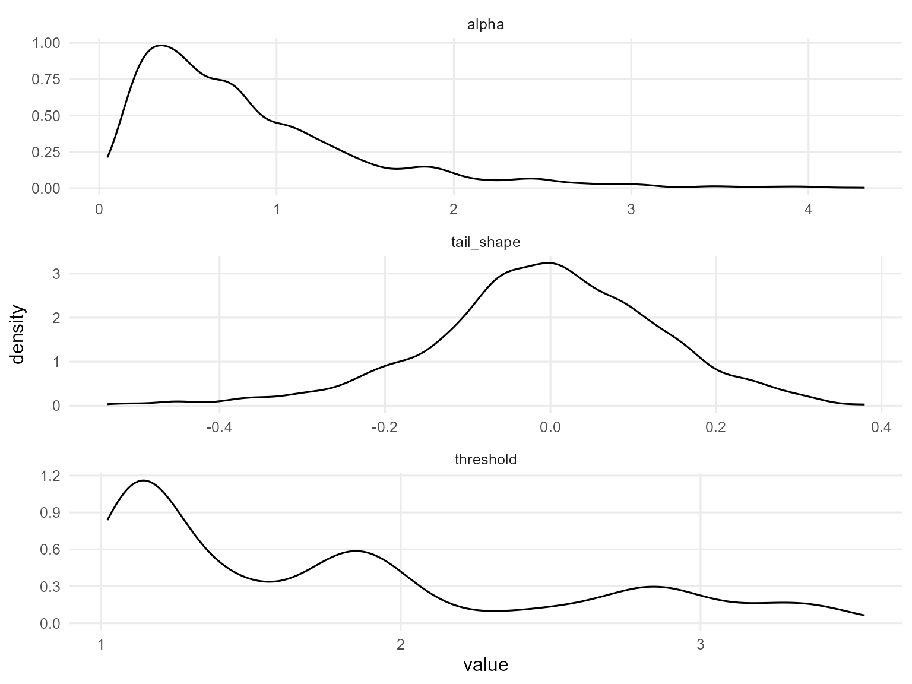

    === control ===

    === traceplot ===

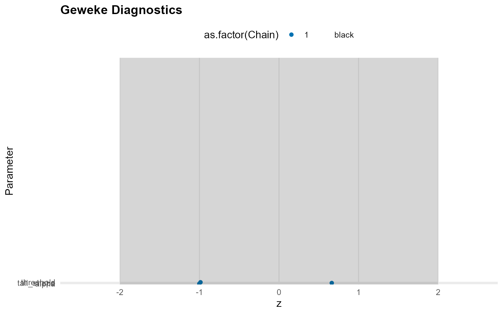

``` r
pred_mean_gpd <- predict(fit_sb_gpd, x = x_eval, type = "mean",
                         interval = "credible", nsim_mean = 100)
head(pred_mean_gpd)
```

         ps   estimate    lower       upper
    [1,] NA -0.1706931 1.820624 -0.64902066
    [2,] NA  1.4982929 2.393857 -0.02901396
    [3,] NA  0.6041249 1.369974 -0.41344384
    [4,] NA  0.9570054 1.578306 -0.47153499
    [5,] NA  1.0384999 2.064866 -1.00079534
    [6,] NA  0.6067087 2.949375 -0.41573146

``` r
plot(pred_mean_gpd)
```

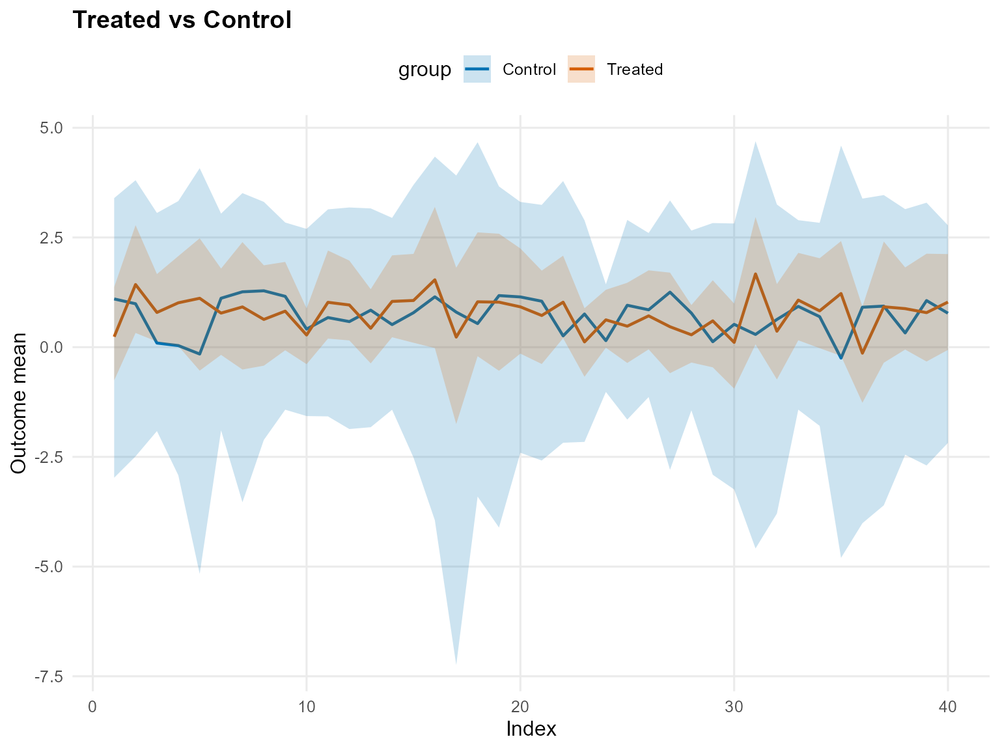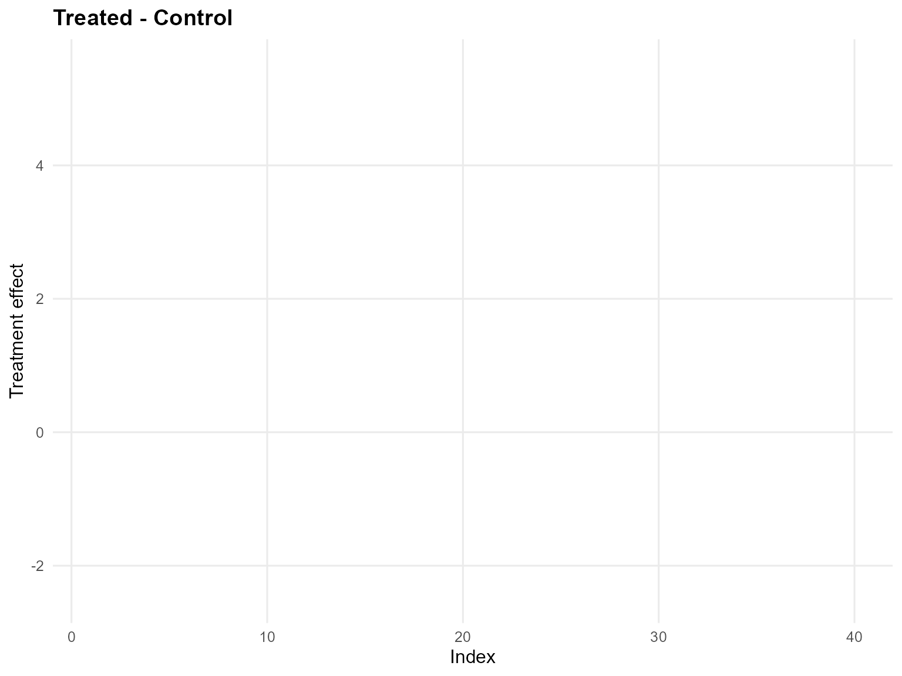

``` r
pred_q_gpd <- predict(fit_sb_gpd, x = x_eval, type = "quantile",
                      p = 0.5, interval = "credible")
head(pred_q_gpd)
```

         ps   estimate    lower      upper
    [1,] NA -0.2529639 2.969394 -0.7717765
    [2,] NA  1.1398428 2.361047 -0.1623365
    [3,] NA  0.4503637 1.288422 -0.3440663
    [4,] NA  0.7450547 1.467210 -0.5383293
    [5,] NA  0.9209180 1.523127 -0.4352551
    [6,] NA  0.4252924 3.212733 -0.6837744

``` r
plot(pred_q_gpd)
```

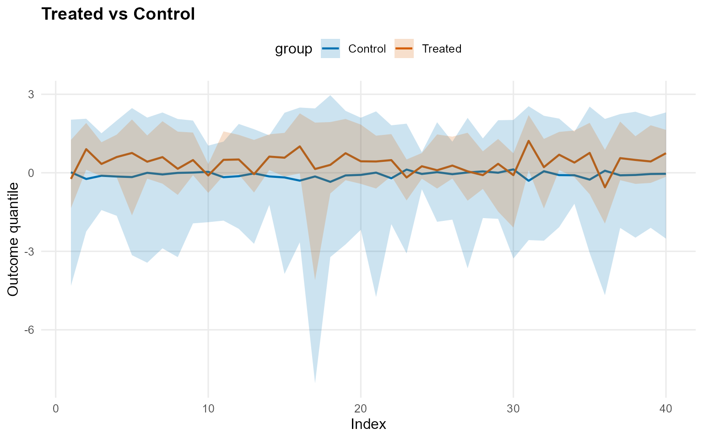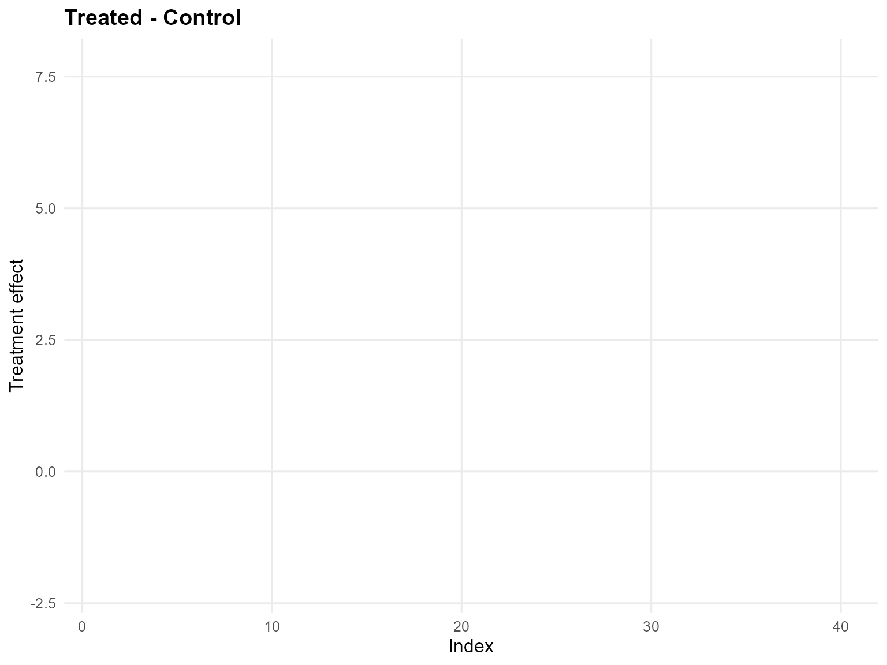

``` r
pred_d_gpd <- predict(fit_sb_gpd, x = x_eval, y = y_eval,
                      type = "density", interval = "credible")
head(pred_d_gpd)
```

               y ps trt_estimate   trt_lower trt_upper con_estimate   con_lower
    1  0.8901906 NA            1 0.069453790 0.3106053            1 0.033237539
    2 -1.3417565 NA            1 0.006603664 0.2403405            1 0.051402001
    3  1.1375287 NA            1 0.152258064 0.5006803            1 0.063804433
    4 -1.9223578 NA            1 0.027729156 0.1354321            1 0.028811574
    5 -3.3339817 NA            1 0.006573729 0.1108560            1 0.003745643
    6  0.9393979 NA            1 0.108601314 0.3585661            1 0.039934565
      con_upper
    1 0.3651008
    2 0.3990710
    3 0.3356433
    4 0.3255437
    5 0.2689732
    6 0.3676929

``` r
plot(pred_d_gpd)
```

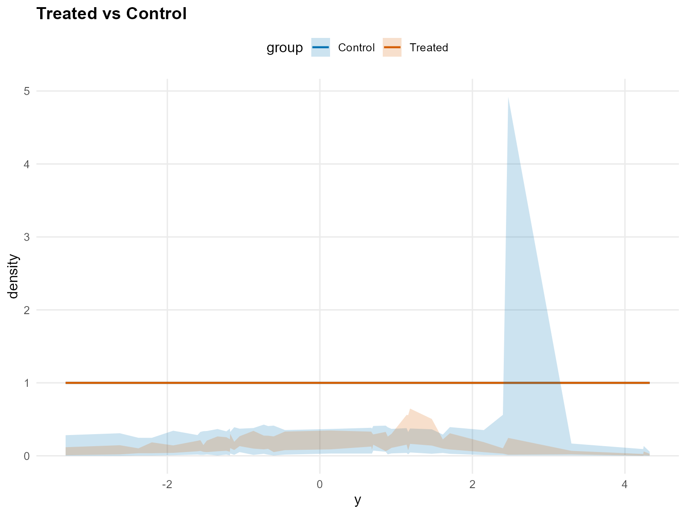

``` r
pred_surv_gpd <- predict(fit_sb_gpd, x = x_eval, y = y_eval,
                         type = "survival", interval = "credible")
head(pred_surv_gpd)
```

               y ps trt_estimate trt_lower trt_upper con_estimate  con_lower
    1  0.8901906 NA            1 0.1291726 0.6187557            1 0.05086820
    2 -1.3417565 NA            1 0.7038191 0.9922585            1 0.33226039
    3  1.1375287 NA            1 0.1869323 0.5126531            1 0.06213219
    4 -1.9223578 NA            1 0.8281281 0.9656690            1 0.55606204
    5 -3.3339817 NA            1 0.7608101 0.9919887            1 0.53224206
    6  0.9393979 NA            1 0.2249816 0.7436031            1 0.03771910
      con_upper
    1 0.7199425
    2 0.9453167
    3 0.5670988
    4 0.9735332
    5 0.9966782
    6 0.7089382

``` r
plot(pred_surv_gpd)
```

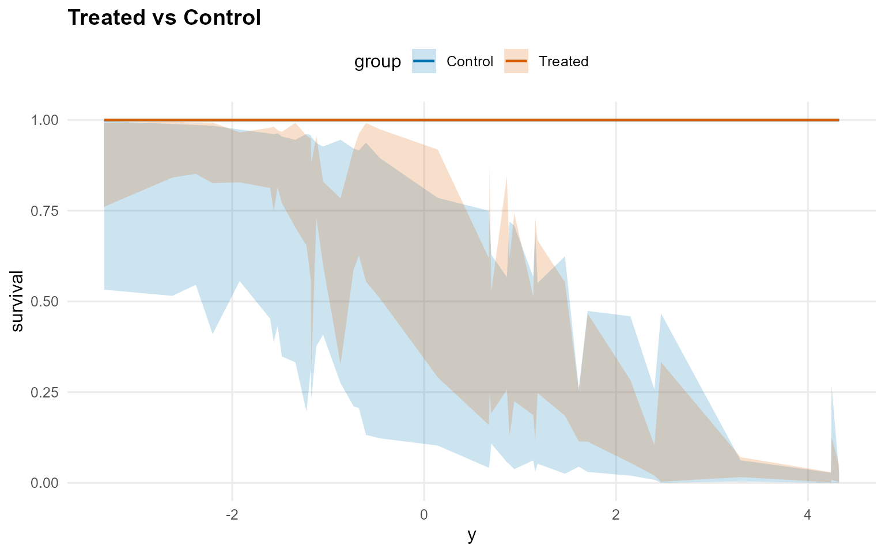

``` r
ate_gpd <- ate(fit_sb_gpd, newdata = x_eval,
               interval = "credible", nsim_mean = 100)
print(ate_gpd)
```

    ATE (Average Treatment Effect)
      Prediction points: 40
      Conditional (covariates): YES
      Propensity score used: NO
      Posterior mean draws: 100
      Credible interval: credible (95%)

    ATE estimates (treated - control):
     id estimate  lower upper
      1   -0.190 -2.331 2.968
      2    1.499 -1.339 3.757
      3    0.605 -1.308 2.153
      4    0.962 -1.603 2.720
      5    1.025 -2.862 4.004
      6    0.588 -1.727 3.517
    ... (34 more rows)

``` r
summary(ate_gpd)
```

    ATE Summary
    ================================================== 
    Prediction points: 40
    Conditional: YES | PS used: NO
    Posterior mean draws: 100
    Interval: credible (95%)

    Model specification:
      Backend (trt/con): sb / sb
      Kernel (trt/con): laplace / laplace
      GPD tail (trt/con): YES / YES

    ATE statistics:
      Mean: 0.642 | Median: 0.726
      Range: [-0.547, 1.745]
      SD: 0.507

    Credible interval width:
      Mean: 5.209 | Median: 5.067
      Range: [1.933, 13.29]

``` r
ate_plots_gpd <- plot(ate_gpd)
ate_plots_gpd$treatment_effect
```


``` r
qte_gpd <- qte(fit_sb_gpd, probs = c(0.25, 0.5, 0.75),
               newdata = x_eval, interval = "credible")
print(qte_gpd)
```

    QTE (Quantile Treatment Effect)
      Prediction points: 40
      Quantile grid: 0.25, 0.5, 0.75
      Conditional (covariates): YES
      Propensity score used: NO
      Credible interval: credible (95%)

    QTE estimates (treated - control):
     index id estimate  lower upper
      0.25  1   -0.116 -2.163 5.130
      0.25  2    0.708 -1.487 2.767
      0.25  3    0.346 -0.721 2.293
      0.25  4    0.555 -0.656 2.162
      0.25  5    0.916 -1.929 4.064
      0.25  6    0.577 -1.297 4.693
    ... (114 more rows)

``` r
summary(qte_gpd)
```

    QTE Summary
    ================================================== 
    Prediction points: 40 | Quantiles: 3
    Quantile grid: 0.25, 0.5, 0.75
    Conditional: YES | PS used: NO
    Interval: credible (95%)

    Model specification:
      Backend (trt/con): sb / sb
      Kernel (trt/con): laplace / laplace
      GPD tail (trt/con): YES / YES

    QTE by quantile:
     quantile mean_qte median_qte min_qte max_qte sd_qte
         0.25    0.425      0.499  -0.615   1.077  0.383
         0.50    0.459      0.481  -0.633   1.525  0.454
         0.75    0.512      0.551  -0.455   1.508  0.457

    Credible interval width:
      Mean: 4.605 | Median: 4.252
      Range: [1.415, 13.635]

``` r
qte_plots_gpd <- plot(qte_gpd)
qte_plots_gpd$treatment_effect
```


