# 17. Causal Inference: Same Backend (SB) - Laplace Kernel

> **Legacy vignette (for the website / historical notes).** These files
> may not match the current exported API one-to-one. Last verified:
> **2026-01-18**.
>
> For the up-to-date workflow, see the main package vignettes
> (Introduction, Model Spec, MCMC Workflow,
> Unconditional/Conditional/Causal, Backends, S3 Reference).

## Causal Inference: Same Backend (SB) - Laplace Kernel

This vignette fits two SB-based causal models using the same kernel
(Laplace):

- Model A: bulk-only outcome models (GPD = FALSE)
- Model B: GPD-augmented outcome models (GPD = TRUE)

------------------------------------------------------------------------

### Data Setup

``` r
data("causal_alt_real500_p4_k2")
y <- causal_alt_real500_p4_k2$y
T <- causal_alt_real500_p4_k2$T
X <- as.matrix(causal_alt_real500_p4_k2$X)

summary_tbl <- tibble(
  statistic = c("N", "Mean", "SD", "Min", "Max"),
  value = c(length(y), mean(y), sd(y), min(y), max(y))
)

summary_tbl %>%
  mutate(value = signif(value, 4)) %>%
  kable(caption = "Causal Dataset Summary", align = "c") %>%
  kable_styling(bootstrap_options = c("striped", "hover"), full_width = FALSE, position = "center")
```

| statistic |  value   |
|:---------:|:--------:|
|     N     | 500.0000 |
|   Mean    |  0.2737  |
|    SD     |  1.7640  |
|    Min    | -8.0890  |
|    Max    |  5.2750  |

Causal Dataset Summary

``` r
x_eval <- X[1:40, , drop = FALSE]
y_eval <- y[1:40]
u_threshold <- as.numeric(stats::quantile(y, 0.8, names = FALSE))
```

``` r
df_causal <- data.frame(y = y, T = as.factor(T), x1 = X[, 1], x2 = X[, 2])

p_scatter <- ggplot(df_causal, aes(x = x1, y = y, color = T)) +
  geom_point(alpha = 0.5) +
  labs(title = "Outcome vs X1 by Treatment", x = "X1", y = "y", color = "Treatment") +
  theme_minimal()

p_scatter
```


------------------------------------------------------------------------

### Model A: SB Bulk-only (Laplace)

``` r
bundle_sb_bulk <- build_causal_bundle(
  y = y,
  T = T,
  X = X,
  kernel = "laplace",
  backend = "sb",
  PS = "logit",
  GPD = FALSE,
  components = 5,
  mcmc_outcome = list(niter = 2500, nburnin = 500, nchains = 1, thin = 1, seed = 1),
  mcmc_ps = list(niter = 2500, nburnin = 500, nchains = 1, thin = 1, seed = 1)
)

bundle_sb_bulk
```

    DPmixGPD causal bundle
    PS model: disabled 
    Outcome (treated): backend = sb | kernel = laplace 
    Outcome (control): backend = sb | kernel = laplace 
    GPD tail (treated/control): FALSE / FALSE 
    components (treated/control): 5 / 5 
    Outcome PS included: FALSE 
    epsilon (treated/control): 0.025 / 0.025 
    n (control) = 232 | n (treated) = 268 

``` r
summary(bundle_sb_bulk)
```

    DPmixGPD causal bundle summary
    DPmixGPD causal bundle
    PS model: disabled 
    Outcome (treated): backend = sb | kernel = laplace 
    Outcome (control): backend = sb | kernel = laplace 
    GPD tail (treated/control): FALSE / FALSE 
    components (treated/control): 5 / 5 
    Outcome PS included: FALSE 
    epsilon (treated/control): 0.025 / 0.025 
    n (control) = 232 | n (treated) = 268 

``` r
fit_sb_bulk <- run_mcmc_causal(bundle_sb_bulk)
```

    [MCMC] Creating NIMBLE model...

    [MCMC] NIMBLE model created successfully.
    [MCMC] Configuring MCMC...
    ===== Monitors =====
    thin = 1: alpha, beta_location, scale, w, z
    ===== Samplers =====
    RW sampler (25)
      - alpha
      - beta_location[]  (20 elements)
      - v[]  (4 elements)
    conjugate sampler (5)
      - scale[]  (5 elements)
    categorical sampler (232)
      - z[]  (232 elements)
    [MCMC] MCMC configured.
    [MCMC] Building MCMC object...
    [MCMC] MCMC object built.
    [MCMC] Attempting NIMBLE compilation (this may take a minute)...
    [MCMC] Compiling model...

    [MCMC] Compiling MCMC sampler...

    [MCMC] Compilation successful.

    |-------------|-------------|-------------|-------------|
    |-------------------------------------------------------|
    [MCMC] MCMC execution complete. Processing results...

    [MCMC] Creating NIMBLE model...

    [MCMC] NIMBLE model created successfully.
    [MCMC] Configuring MCMC...
    ===== Monitors =====
    thin = 1: alpha, beta_location, scale, w, z
    ===== Samplers =====
    RW sampler (25)
      - alpha
      - beta_location[]  (20 elements)
      - v[]  (4 elements)
    conjugate sampler (5)
      - scale[]  (5 elements)
    categorical sampler (268)
      - z[]  (268 elements)
    [MCMC] MCMC configured.
    [MCMC] Building MCMC object...
    [MCMC] MCMC object built.
    [MCMC] Attempting NIMBLE compilation (this may take a minute)...
    [MCMC] Compiling model...

    [MCMC] Compiling MCMC sampler...

    [MCMC] Compilation successful.

    |-------------|-------------|-------------|-------------|
    |-------------------------------------------------------|
    [MCMC] MCMC execution complete. Processing results...

``` r
summary(fit_sb_bulk)
```

    -- Outcome fits --
    [control]
    MixGPD fit | backend: Stick-Breaking Process | kernel: Laplace Distribution | GPD tail: FALSE
    n = 232 | components = 5 | epsilon = 0.025
    MCMC: niter=2500, nburnin=500, thin=1, nchains=1 
    Fit
    Use summary() for posterior summaries; plot() for diagnostics; predict() for predictions.

    [treated]
    MixGPD fit | backend: Stick-Breaking Process | kernel: Laplace Distribution | GPD tail: FALSE
    n = 268 | components = 5 | epsilon = 0.025
    MCMC: niter=2500, nburnin=500, thin=1, nchains=1 
    Fit
    Use summary() for posterior summaries; plot() for diagnostics; predict() for predictions.

``` r
params(fit_sb_bulk)
```

    Posterior mean parameters (causal)

    [treated]
    Posterior mean parameters

    $alpha
    [1] 0.9957

    $w
    [1] 0.5112 0.3356

    $beta_location
               x1      x2      x3      x4
    comp1 -0.4241 -0.0700 -0.3222 -0.1271
    comp2  0.3536  0.6984  0.4716  0.9774
    comp3  1.0670 -0.7585 -0.0099  0.2928
    comp4 -0.7444  0.6190 -0.1744 -0.0585
    comp5  0.4316 -0.5892  0.1652 -0.0216

    $scale
    [1] 0.8337 1.0120

    [control]
    Posterior mean parameters

    $alpha
    [1] 1.581

    $w
    [1] 0.4121 0.2654 0.1793

    $beta_location
               x1      x2      x3     x4
    comp1 -0.4892 -0.1565 -0.4205 1.2465
    comp2  0.1031  0.3156 -0.2564 0.4064
    comp3 -0.0582 -0.1292 -0.1849 0.1551
    comp4  0.4969  0.6655 -0.0979 0.0633
    comp5 -0.8253 -0.3299  0.0108 0.3473

    $scale
    [1] 1.044 1.192 1.563

``` r
plot(fit_sb_bulk, family = c("traceplot", "autocorrelation", "running"))
```

    === treated ===

    === traceplot ===

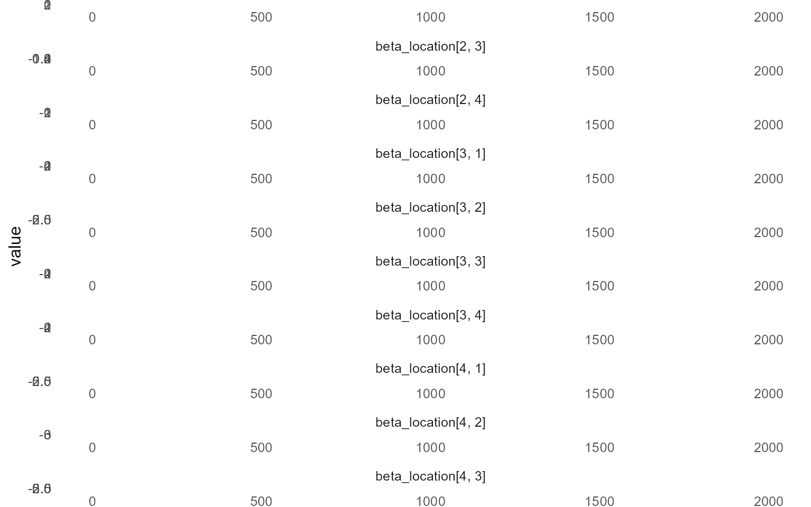

    === autocorrelation ===

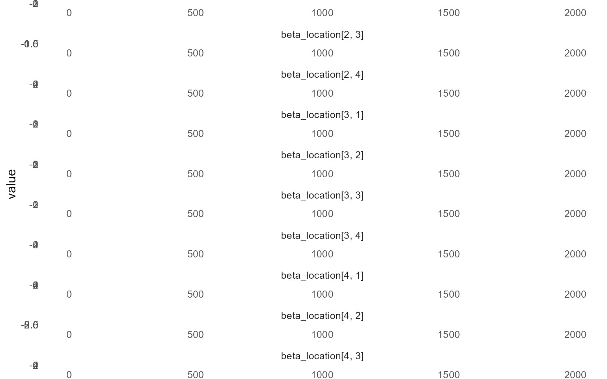

    === running ===

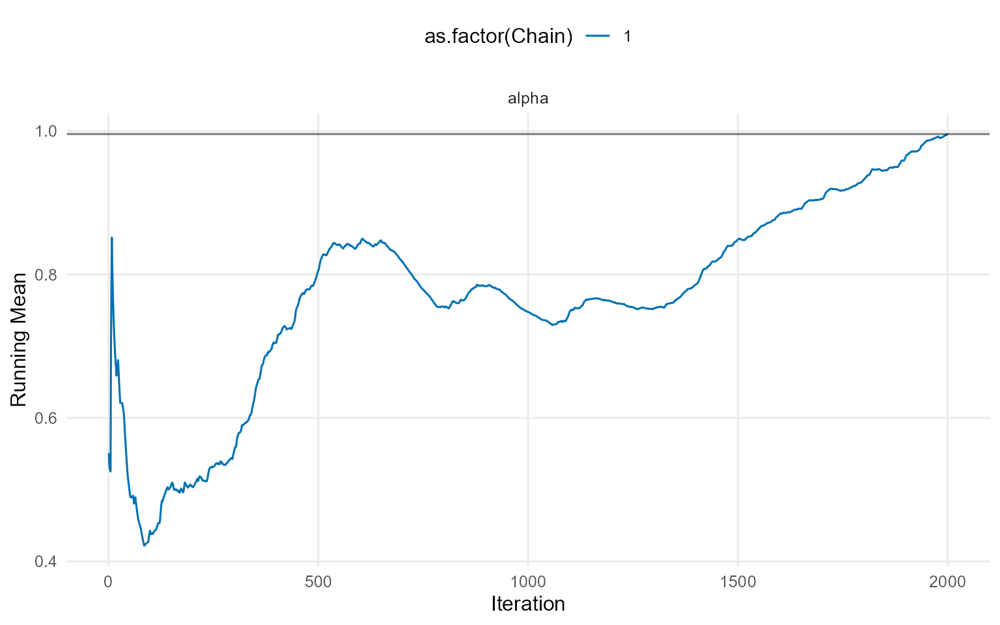

    === control ===

    === traceplot ===

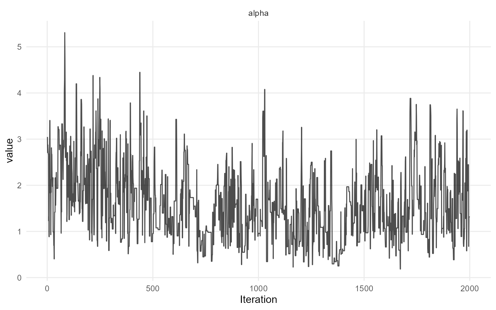

    === autocorrelation ===

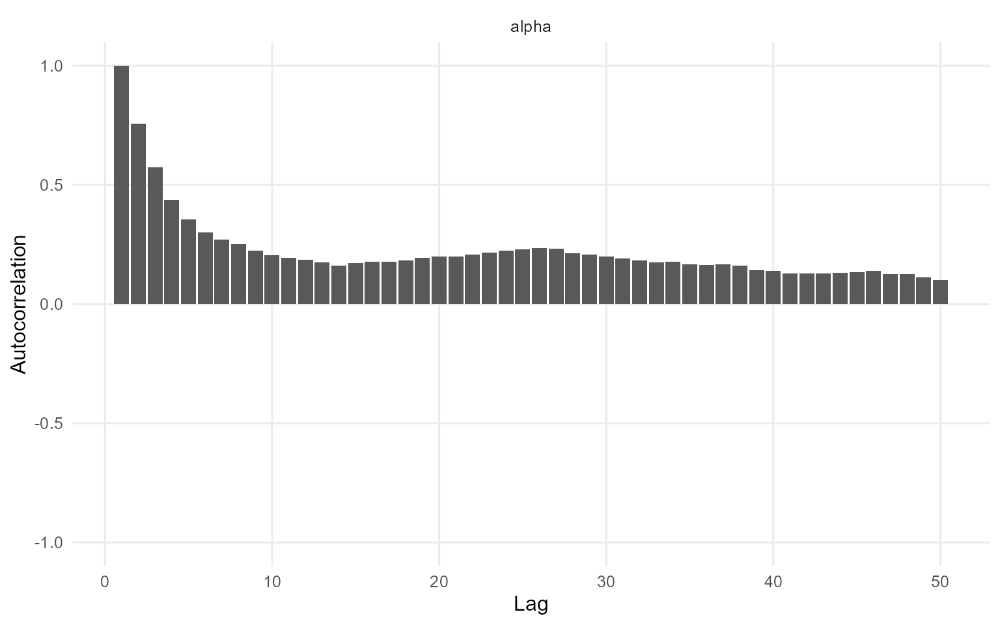

    === running ===

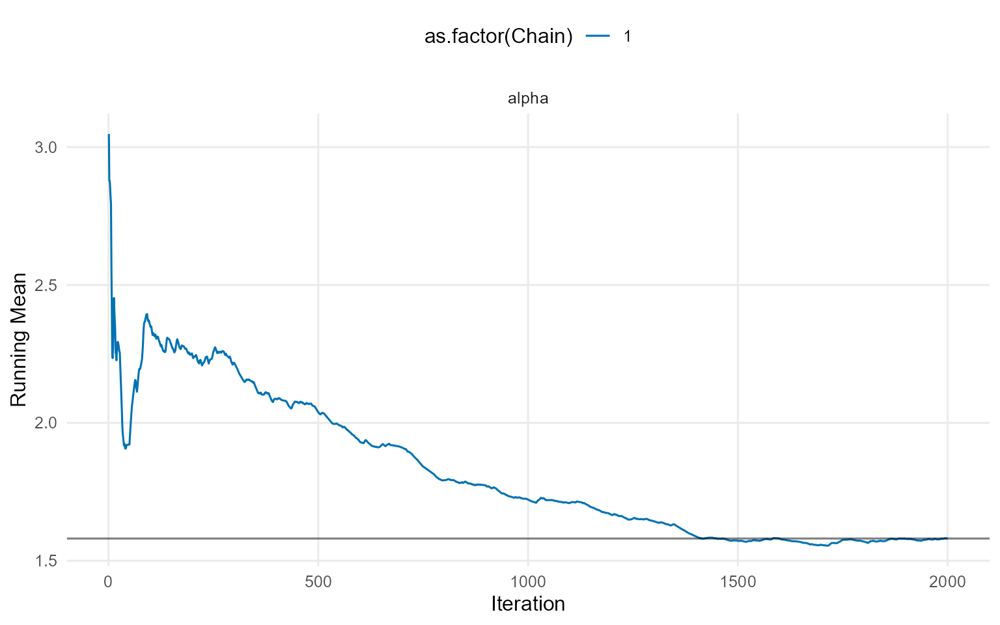

``` r
pred_mean_bulk <- predict(fit_sb_bulk, x = x_eval, type = "mean",
                          interval = "hpd", nsim_mean = 100)
plot(pred_mean_bulk)
```

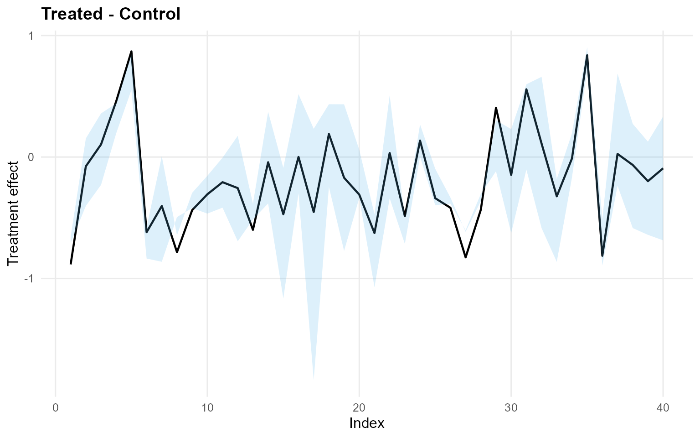

``` r
pred_q_bulk <- predict(fit_sb_bulk, x = x_eval, type = "quantile",
                       p = 0.5, interval = "hpd")
plot(pred_q_bulk)
```

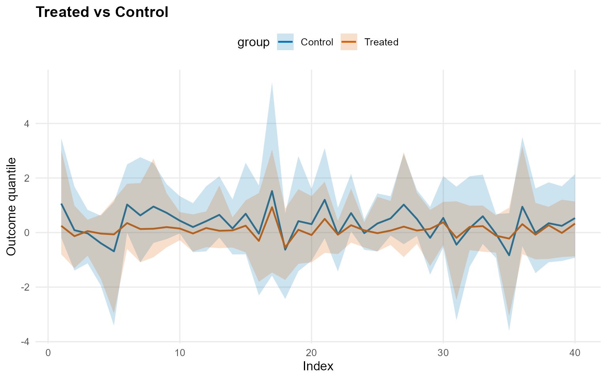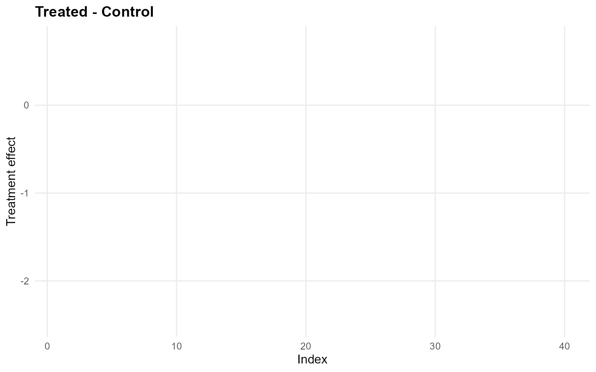

``` r
pred_d_bulk <- predict(fit_sb_bulk, x = x_eval, y = y_eval,
                       type = "density", interval = "hpd")
plot(pred_d_bulk)
```

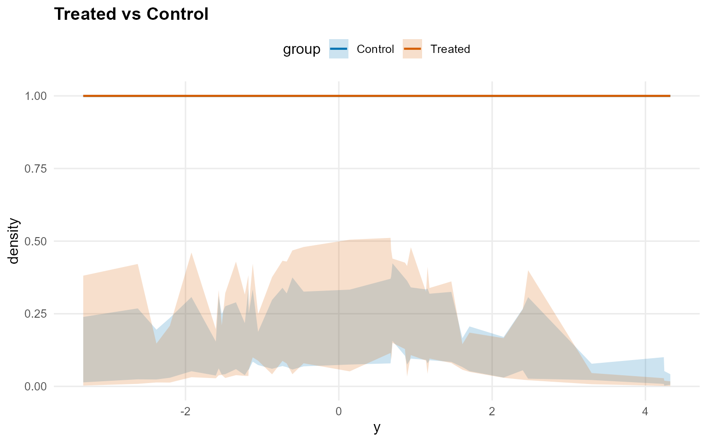

``` r
pred_surv_bulk <- predict(fit_sb_bulk, x = x_eval, y = y_eval,
                          type = "survival", interval = "hpd")
plot(pred_surv_bulk)
```

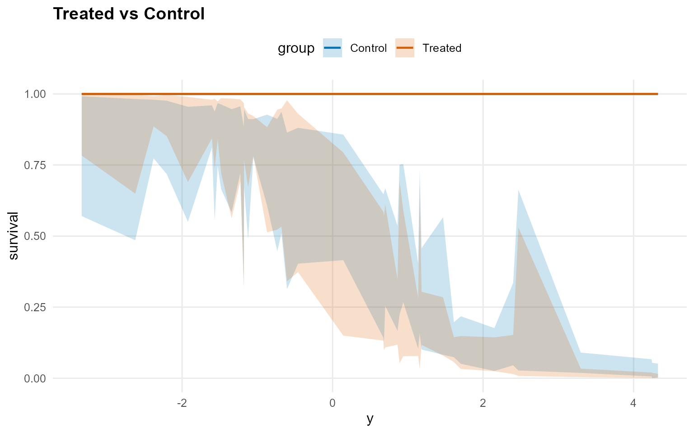

``` r
ate_bulk <- ate(fit_sb_bulk, newdata = x_eval,
                interval = "hpd", nsim_mean = 100)
print(ate_bulk)
```

    ATE (Average Treatment Effect)
      Prediction points: 40
      Conditional (covariates): YES
      Propensity score used: NO
      Posterior mean draws: 100
      Credible interval: hpd

    ATE estimates (treated - control):
     id estimate  lower upper
      1   -0.896 -2.848 0.986
      2   -0.077 -1.539 1.296
      3    0.111 -0.951 1.088
      4    0.466 -0.747 1.698
      5    0.854 -1.471 2.905
      6   -0.621 -2.019 0.790
    ... (34 more rows)

``` r
summary(ate_bulk)
```

    ATE Summary
    ================================================== 
    Prediction points: 40
    Conditional: YES | PS used: NO
    Posterior mean draws: 100
    Interval: hpd

    Model specification:
      Backend (trt/con): sb / sb
      Kernel (trt/con): laplace / laplace
      GPD tail (trt/con): NO / NO

    ATE statistics:
      Mean: -0.176 | Median: -0.206
      Range: [-0.896, 0.854]
      SD: 0.419

    Credible interval width:
      Mean: 3 | Median: 2.816
      Range: [1.413, 5.789]

``` r
ate_plots_bulk <- plot(ate_bulk)
ate_plots_bulk$treatment_effect
```


``` r
qte_bulk <- qte(fit_sb_bulk, probs = c(0.25, 0.5, 0.75),
                newdata = x_eval, interval = "hpd")
print(qte_bulk)
```

    QTE (Quantile Treatment Effect)
      Prediction points: 40
      Quantile grid: 0.25, 0.5, 0.75
      Conditional (covariates): YES
      Propensity score used: NO
      Credible interval: hpd

    QTE estimates (treated - control):
     index id estimate  lower upper
      0.25  1   -0.716 -2.436 0.907
      0.25  2    0.035 -1.657 1.800
      0.25  3    0.375 -0.703 1.500
      0.25  4    0.531 -0.992 2.135
      0.25  5    0.931 -2.407 4.030
      0.25  6   -0.172 -1.660 1.071
    ... (114 more rows)

``` r
summary(qte_bulk)
```

    QTE Summary
    ================================================== 
    Prediction points: 40 | Quantiles: 3
    Quantile grid: 0.25, 0.5, 0.75
    Conditional: YES | PS used: NO
    Interval: hpd

    Model specification:
      Backend (trt/con): sb / sb
      Kernel (trt/con): laplace / laplace
      GPD tail (trt/con): NO / NO

    QTE by quantile:
     quantile mean_qte median_qte min_qte max_qte sd_qte
         0.25    0.099      0.108  -0.716   0.931  0.369
         0.50   -0.238     -0.261  -0.816   0.622  0.363
         0.75   -0.452     -0.547  -1.205   0.887  0.534

    Credible interval width:
      Mean: 3.38 | Median: 3.199
      Range: [1.188, 7.465]

``` r
qte_plots_bulk <- plot(qte_bulk)
qte_plots_bulk$treatment_effect
```

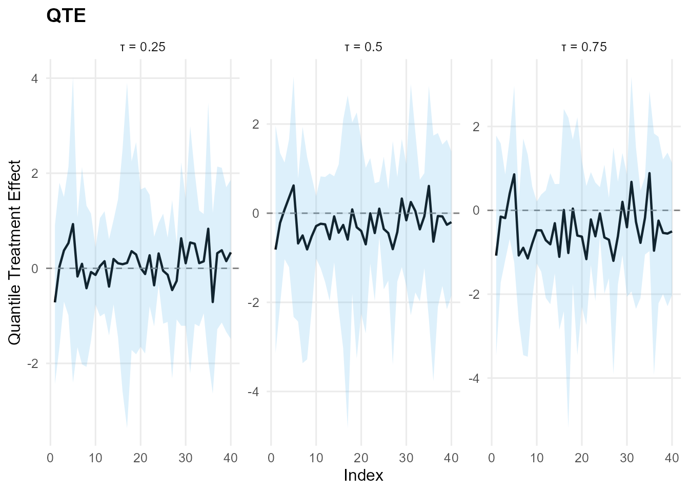

------------------------------------------------------------------------

### Model B: SB with GPD Tail (Laplace)

``` r
param_specs_gpd <- list(
  gpd = list(
    threshold = list(
      mode = "dist",
      dist = "lognormal",
      args = list(meanlog = log(max(u_threshold, .Machine$double.eps)), sdlog = 0.25)
    )
  )
)

bundle_sb_gpd <- build_causal_bundle(
  y = y,
  T = T,
  X = X,
  kernel = "laplace",
  backend = "sb",
  PS = "logit",
  GPD = TRUE,
  components = 5,
  param_specs = param_specs_gpd,
  mcmc_outcome = list(niter = 2500, nburnin = 500, nchains = 1, thin = 1, seed = 2),
  mcmc_ps = list(niter = 2500, nburnin = 500, nchains = 1, thin = 1, seed = 2)
)

bundle_sb_gpd
```

    DPmixGPD causal bundle
    PS model: disabled 
    Outcome (treated): backend = sb | kernel = laplace 
    Outcome (control): backend = sb | kernel = laplace 
    GPD tail (treated/control): TRUE / TRUE 
    components (treated/control): 5 / 5 
    Outcome PS included: FALSE 
    epsilon (treated/control): 0.025 / 0.025 
    n (control) = 232 | n (treated) = 268 

``` r
summary(bundle_sb_gpd)
```

    DPmixGPD causal bundle summary
    DPmixGPD causal bundle
    PS model: disabled 
    Outcome (treated): backend = sb | kernel = laplace 
    Outcome (control): backend = sb | kernel = laplace 
    GPD tail (treated/control): TRUE / TRUE 
    components (treated/control): 5 / 5 
    Outcome PS included: FALSE 
    epsilon (treated/control): 0.025 / 0.025 
    n (control) = 232 | n (treated) = 268 

``` r
fit_sb_gpd <- run_mcmc_causal(bundle_sb_gpd)
```

    [MCMC] Creating NIMBLE model...

    [MCMC] NIMBLE model created successfully.
    [MCMC] Configuring MCMC...
    ===== Monitors =====
    thin = 1: alpha, beta_location, beta_tail_scale, scale, tail_shape, threshold, w, z
    ===== Samplers =====
    RW sampler (36)
      - alpha
      - scale[]  (5 elements)
      - beta_location[]  (20 elements)
      - threshold
      - beta_tail_scale[]  (4 elements)
      - tail_shape
      - v[]  (4 elements)
    categorical sampler (232)
      - z[]  (232 elements)
    [MCMC] MCMC configured.
    [MCMC] Building MCMC object...
    [MCMC] MCMC object built.
    [MCMC] Attempting NIMBLE compilation (this may take a minute)...
    [MCMC] Compiling model...

    [MCMC] Compiling MCMC sampler...

    [MCMC] Compilation successful.

    |-------------|-------------|-------------|-------------|
    |-------------------------------------------------------|
    [MCMC] MCMC execution complete. Processing results...

    [MCMC] Creating NIMBLE model...

    [MCMC] NIMBLE model created successfully.
    [MCMC] Configuring MCMC...
    ===== Monitors =====
    thin = 1: alpha, beta_location, beta_tail_scale, scale, tail_shape, threshold, w, z
    ===== Samplers =====
    RW sampler (36)
      - alpha
      - scale[]  (5 elements)
      - beta_location[]  (20 elements)
      - threshold
      - beta_tail_scale[]  (4 elements)
      - tail_shape
      - v[]  (4 elements)
    categorical sampler (268)
      - z[]  (268 elements)
    [MCMC] MCMC configured.
    [MCMC] Building MCMC object...
    [MCMC] MCMC object built.
    [MCMC] Attempting NIMBLE compilation (this may take a minute)...
    [MCMC] Compiling model...

    [MCMC] Compiling MCMC sampler...

    [MCMC] Compilation successful.

    |-------------|-------------|-------------|-------------|
    |-------------------------------------------------------|
    [MCMC] MCMC execution complete. Processing results...

``` r
summary(fit_sb_gpd)
```

    -- Outcome fits --
    [control]
    MixGPD fit | backend: Stick-Breaking Process | kernel: Laplace Distribution | GPD tail: TRUE
    n = 232 | components = 5 | epsilon = 0.025
    MCMC: niter=2500, nburnin=500, thin=1, nchains=1 
    Fit
    Use summary() for posterior summaries; plot() for diagnostics; predict() for predictions.

    [treated]
    MixGPD fit | backend: Stick-Breaking Process | kernel: Laplace Distribution | GPD tail: TRUE
    n = 268 | components = 5 | epsilon = 0.025
    MCMC: niter=2500, nburnin=500, thin=1, nchains=1 
    Fit
    Use summary() for posterior summaries; plot() for diagnostics; predict() for predictions.

``` r
params(fit_sb_gpd)
```

    Posterior mean parameters (causal)

    [treated]
    Posterior mean parameters

    $alpha
    [1] 0.9689

    $w
    [1] 0.4714 0.3288

    $beta_location
               x1      x2      x3      x4
    comp1  0.4346  0.0013  0.2081  2.1095
    comp2 -0.0724  0.2228 -0.0108 -0.6329
    comp3  0.4754 -0.2446 -0.1233  1.6418
    comp4  0.2515  0.0743 -0.0936  0.5092
    comp5 -0.0210  0.3476  0.0460 -0.1425

    $scale
    [1] 1.360 1.295

    $beta_tail_scale
    [1]  0.04091 -0.14400  0.14890 -0.05571

    $tail_shape
    [1] 0.02592

    [control]
    Posterior mean parameters

    $alpha
    [1] 2.28

    $w
    [1] 0.4733 0.2759

    $beta_location
               x1      x2      x3      x4
    comp1 -0.0713 -0.0237 -0.4485  0.7825
    comp2 -0.2625 -0.3087 -0.1748  1.3815
    comp3 -0.4959 -0.5694 -0.3024  0.8717
    comp4 -0.1684  0.3183 -0.4367  0.7995
    comp5 -0.1202  0.0548 -0.0091 -0.1802

    $scale
    [1] 1.048 1.087

    $beta_tail_scale
    [1]  0.41150  0.17230  0.03701 -0.20250

    $tail_shape
    [1] 0.003756

``` r
plot(fit_sb_gpd, family = c("density", "geweke", "caterpillar"))
```

    === treated ===

    === density ===


    === geweke ===


    === caterpillar ===

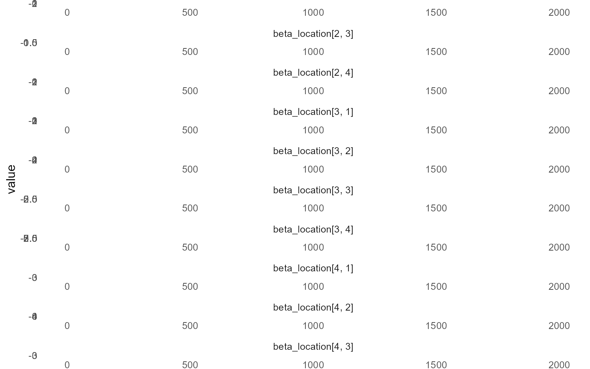

    === control ===

    === density ===

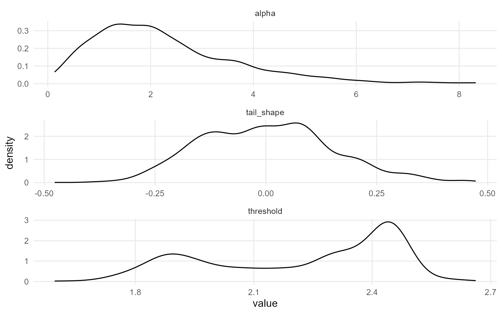

    === geweke ===

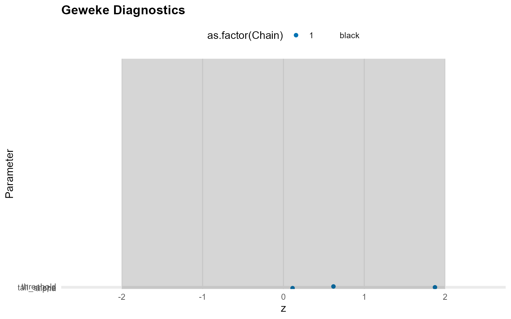

    === caterpillar ===

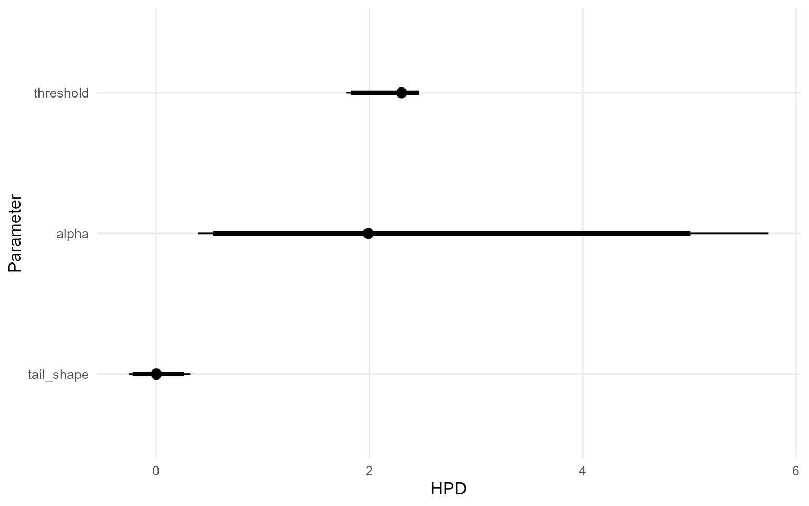

``` r
pred_mean_gpd <- predict(fit_sb_gpd, x = x_eval, type = "mean",
                         interval = "credible", nsim_mean = 100)
plot(pred_mean_gpd)
```

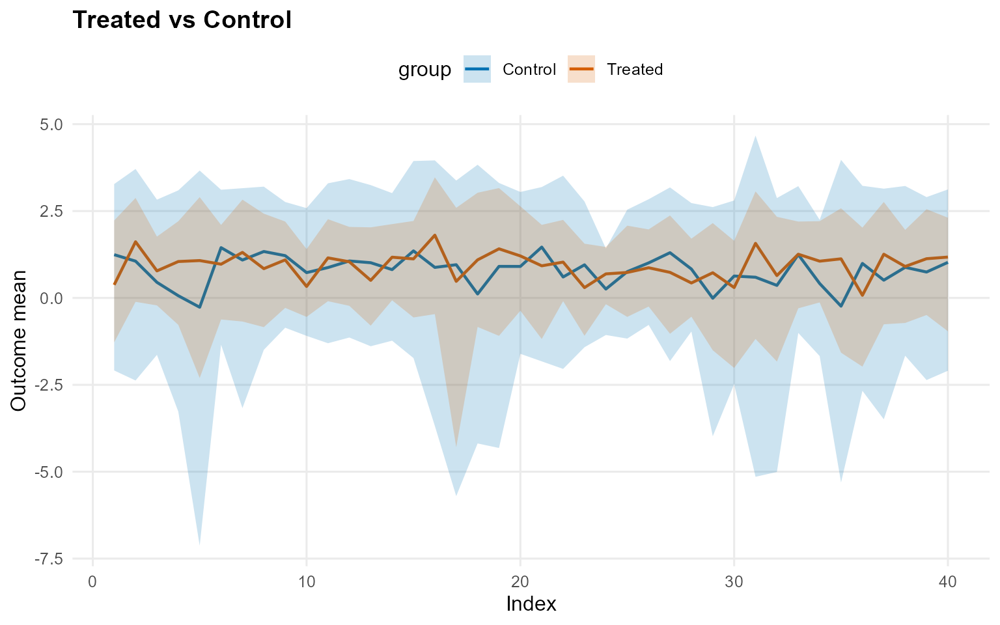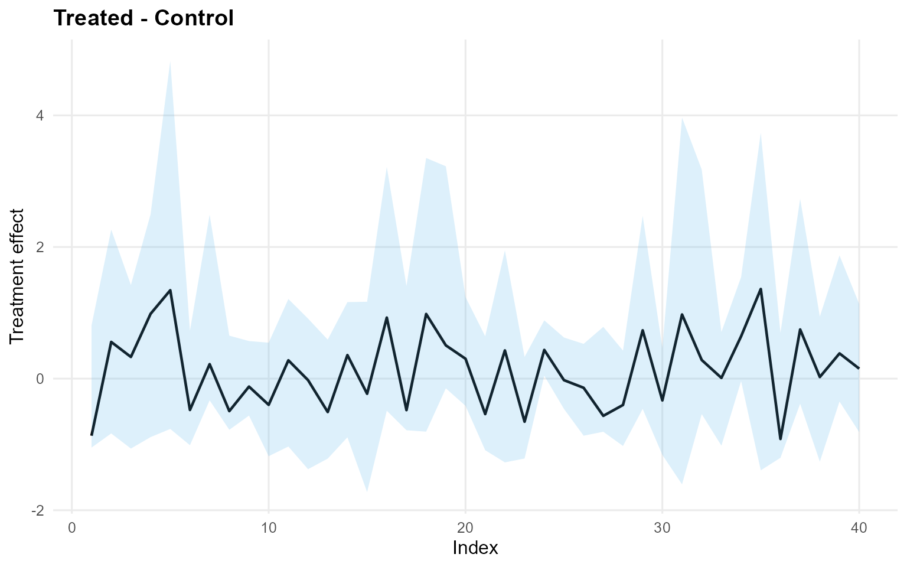

``` r
pred_q_gpd <- predict(fit_sb_gpd, x = x_eval, type = "quantile",
                      p = 0.5, interval = "credible")
plot(pred_q_gpd)
```


``` r
pred_d_gpd <- predict(fit_sb_gpd, x = x_eval, y = y_eval,
                      type = "density", interval = "credible")
plot(pred_d_gpd)
```


``` r
pred_surv_gpd <- predict(fit_sb_gpd, x = x_eval, y = y_eval,
                         type = "survival", interval = "credible")
plot(pred_surv_gpd)
```


``` r
ate_gpd <- ate(fit_sb_gpd, newdata = x_eval,
               interval = "credible", nsim_mean = 100)
print(ate_gpd)
```

    ATE (Average Treatment Effect)
      Prediction points: 40
      Conditional (covariates): YES
      Propensity score used: NO
      Posterior mean draws: 100
      Credible interval: credible (95%)

    ATE estimates (treated - control):
     id estimate  lower upper
      1   -0.853 -3.932 3.271
      2    0.561 -2.375 4.373
      3    0.330 -2.280 2.628
      4    0.968 -2.336 4.525
      5    1.342 -3.902 8.184
      6   -0.475 -3.194 2.956
    ... (34 more rows)

``` r
summary(ate_gpd)
```

    ATE Summary
    ================================================== 
    Prediction points: 40
    Conditional: YES | PS used: NO
    Posterior mean draws: 100
    Interval: credible (95%)

    Model specification:
      Backend (trt/con): sb / sb
      Kernel (trt/con): laplace / laplace
      GPD tail (trt/con): YES / YES

    ATE statistics:
      Mean: 0.146 | Median: 0.182
      Range: [-0.924, 1.363]
      SD: 0.593

    Credible interval width:
      Mean: 6.703 | Median: 6.304
      Range: [2.864, 12.086]

``` r
ate_plots_gpd <- plot(ate_gpd)
ate_plots_gpd$treatment_effect
```

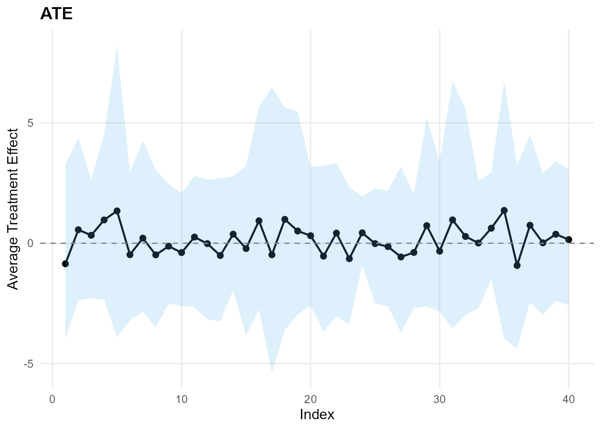

``` r
qte_gpd <- qte(fit_sb_gpd, probs = c(0.25, 0.5, 0.75),
               newdata = x_eval, interval = "credible")
print(qte_gpd)
```

    QTE (Quantile Treatment Effect)
      Prediction points: 40
      Quantile grid: 0.25, 0.5, 0.75
      Conditional (covariates): YES
      Propensity score used: NO
      Credible interval: credible (95%)

    QTE estimates (treated - control):
     index id estimate  lower upper
      0.25  1   -1.013 -4.260 3.340
      0.25  2    0.076 -2.767 3.773
      0.25  3    0.297 -1.827 2.246
      0.25  4    0.838 -1.879 4.438
      0.25  5    1.519 -3.473 8.968
      0.25  6   -0.748 -3.294 2.185
    ... (114 more rows)

``` r
summary(qte_gpd)
```

    QTE Summary
    ================================================== 
    Prediction points: 40 | Quantiles: 3
    Quantile grid: 0.25, 0.5, 0.75
    Conditional: YES | PS used: NO
    Interval: credible (95%)

    Model specification:
      Backend (trt/con): sb / sb
      Kernel (trt/con): laplace / laplace
      GPD tail (trt/con): YES / YES

    QTE by quantile:
     quantile mean_qte median_qte min_qte max_qte sd_qte
         0.25   -0.044     -0.058  -1.013   1.521  0.641
         0.50    0.079      0.154  -0.874   1.213  0.556
         0.75   -0.119     -0.146  -0.902   0.804  0.436

    Credible interval width:
      Mean: 6.235 | Median: 5.524
      Range: [2.491, 15.654]

``` r
qte_plots_gpd <- plot(qte_gpd)
qte_plots_gpd$treatment_effect
```

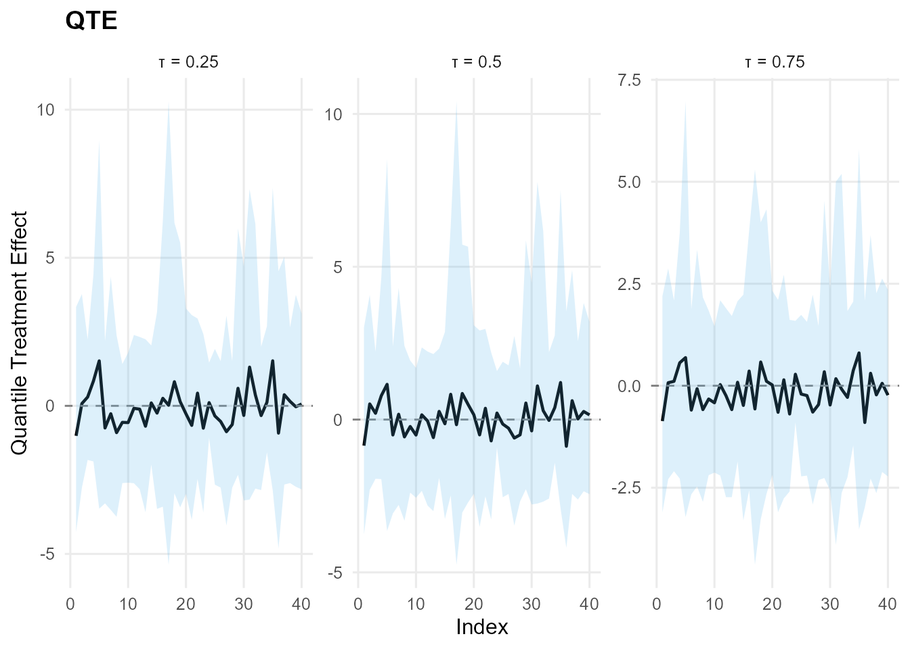
