# 18. Causal Inference: Mixed Backends (Bulk-only) - Cauchy Kernel

> **Legacy vignette (for the website / historical notes).** These files
> may not match the current exported API one-to-one. Last verified:
> **2026-01-18**.
>
> For the up-to-date workflow, see the main package vignettes
> (Introduction, Model Spec, MCMC Workflow,
> Unconditional/Conditional/Causal, Backends, S3 Reference).

### Theory (brief)

Mixed-backend causal models allow each treatment arm to use a different
DP mixture representation. This can improve fit when treated and control
groups exhibit distinct distributional complexity.

## Causal Inference: Mixed Backends (Bulk-only) - Cauchy Kernel

This vignette fits two mixed-backend causal models with a shared Cauchy
kernel:

- Model A: Treated = SB, Control = CRP
- Model B: Treated = CRP, Control = SB

------------------------------------------------------------------------

### Data Setup

``` r
data("causal_alt_real500_p4_k2")
y <- causal_alt_real500_p4_k2$y
T <- causal_alt_real500_p4_k2$T
X <- as.matrix(causal_alt_real500_p4_k2$X)

summary_tbl <- tibble(
  statistic = c("N", "Mean", "SD", "Min", "Max"),
  value = c(length(y), mean(y), sd(y), min(y), max(y))
)

summary_tbl %>%
  mutate(value = signif(value, 4)) %>%
  kable(caption = "Outcome Summary (Cauchy)", align = "c") %>%
  kable_styling(bootstrap_options = c("striped", "hover"), full_width = FALSE, position = "center")
```

| statistic |  value   |
|:---------:|:--------:|
|     N     | 500.0000 |
|   Mean    |  0.2737  |
|    SD     |  1.7640  |
|    Min    | -8.0890  |
|    Max    |  5.2750  |

Outcome Summary (Cauchy)

``` r
x_eval <- X[1:40, , drop = FALSE]
y_eval <- y[1:40]
```

``` r
df_causal <- data.frame(y = y, T = as.factor(T), x1 = X[, 1])

p_scatter <- ggplot(df_causal, aes(x = x1, y = y, color = T)) +
  geom_point(alpha = 0.5) +
  labs(title = "Outcome vs X1", x = "X1", y = "y", color = "Treatment") +
  theme_minimal()

p_scatter
```

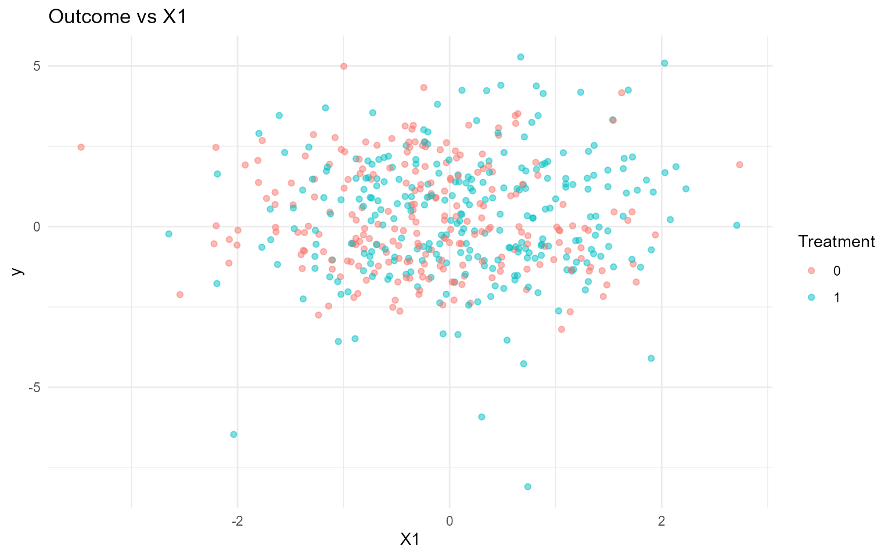

------------------------------------------------------------------------

### Model A: Treated SB, Control CRP (Cauchy)

``` r
bundle_sb_crp <- build_causal_bundle(
  y = y,
  T = T,
  X = X,
  kernel = c("cauchy", "cauchy"),
  backend = c("sb", "crp"),
  PS = "logit",
  GPD = c(FALSE, FALSE),
  components = c(5, 5),
  mcmc_outcome = list(niter = 2500, nburnin = 500, nchains = 1, thin = 1, seed = 1),
  mcmc_ps = list(niter = 2500, nburnin = 500, nchains = 1, thin = 1, seed = 1)
)

bundle_sb_crp
```

    DPmixGPD causal bundle
    PS model: disabled 
    Outcome (treated): backend = sb | kernel = cauchy 
    Outcome (control): backend = crp | kernel = cauchy 
    GPD tail (treated/control): FALSE / FALSE 
    components (treated/control): 5 / 5 
    Outcome PS included: FALSE 
    epsilon (treated/control): 0.025 / 0.025 
    n (control) = 232 | n (treated) = 268 

``` r
summary(bundle_sb_crp)
```

    DPmixGPD causal bundle summary
    DPmixGPD causal bundle
    PS model: disabled 
    Outcome (treated): backend = sb | kernel = cauchy 
    Outcome (control): backend = crp | kernel = cauchy 
    GPD tail (treated/control): FALSE / FALSE 
    components (treated/control): 5 / 5 
    Outcome PS included: FALSE 
    epsilon (treated/control): 0.025 / 0.025 
    n (control) = 232 | n (treated) = 268 

``` r
fit_sb_crp <- run_mcmc_causal(bundle_sb_crp)
```

    ===== Monitors =====
    thin = 1: alpha, location, scale, z
    ===== Samplers =====
    CRP_concentration sampler (1)
      - alpha
    CRP_cluster_wrapper sampler (10)
      - location[]  (5 elements)
      - scale[]  (5 elements)
    CRP sampler (1)
      - z[1:232] 

      [Warning] CRP_sampler: This MCMC is not for a proper model. The MCMC attempted to use more components than the number of cluster parameters. Please increase the number of cluster parameters.

    ===== Monitors =====
    thin = 1: alpha, beta_location, scale, w, z
    ===== Samplers =====
    RW sampler (30)
      - alpha
      - scale[]  (5 elements)
      - beta_location[]  (20 elements)
      - v[]  (4 elements)
    categorical sampler (268)
      - z[]  (268 elements)

``` r
summary(fit_sb_crp)
```

    -- Outcome fits --
    [control]
    MixGPD fit | backend: Chinese Restaurant Process | kernel: Cauchy Distribution | GPD tail: FALSE
    n = 232 | components = 5 | epsilon = 0.025
    MCMC: niter=2500, nburnin=500, thin=1, nchains=1 
    Fit
    Use summary() for posterior summaries; plot() for diagnostics; predict() for predictions.

    [treated]
    MixGPD fit | backend: Stick-Breaking Process | kernel: Cauchy Distribution | GPD tail: FALSE
    n = 268 | components = 5 | epsilon = 0.025
    MCMC: niter=2500, nburnin=500, thin=1, nchains=1 
    Fit
    Use summary() for posterior summaries; plot() for diagnostics; predict() for predictions.

``` r
params(fit_sb_crp)
```

    Posterior mean parameters (causal)

    [treated]
    Posterior mean parameters

    $alpha
    [1] 1.842

    $w
    [1] 0.3642 0.2690 0.1856

    $beta_location
               x1      x2      x3      x4
    comp1  0.1561  0.9044  0.2751  0.4910
    comp2  0.5350 -1.2568 -0.5554  0.3711
    comp3 -0.2288  0.7405 -0.1809 -0.0433
    comp4 -0.2499 -0.2137 -0.4999  0.0471
    comp5  0.1978 -1.6964  1.0204  1.2210

    $scale
    [1] 0.6466 0.5748 0.5353

    [control]
    Posterior mean parameters

    $alpha
    [1] 0.6324

    $w
    [1] 0.4170 0.3015 0.2190

    $location
    [1] -0.04636  0.66170 -0.17040

    $scale
    [1] 0.5236 0.5235 0.4180

``` r
plot(fit_sb_crp, params = "location", family = "traceplot")
```

    === treated ===

    === traceplot ===

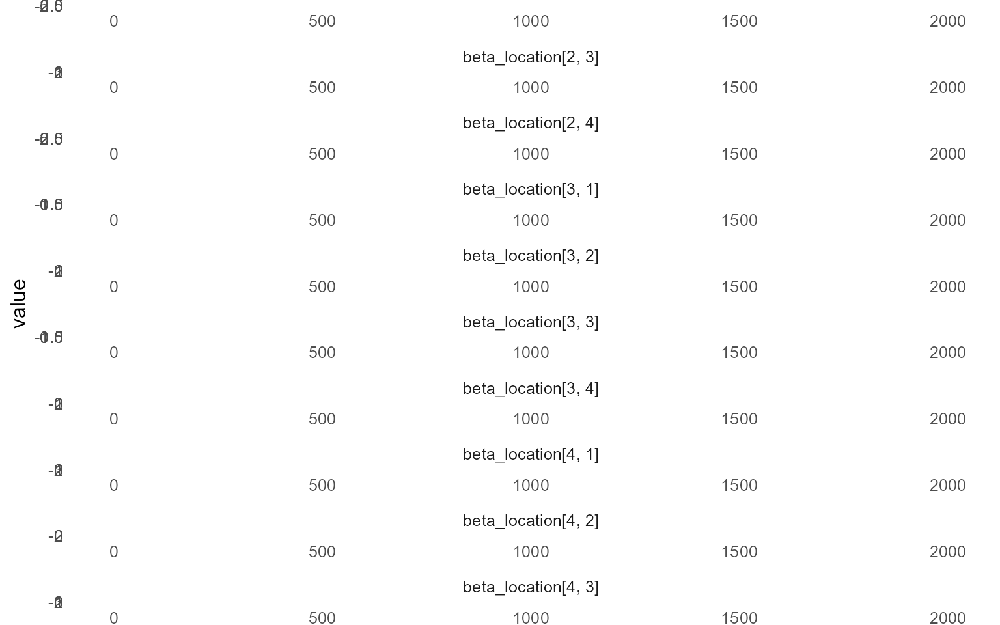

    === control ===

    === traceplot ===

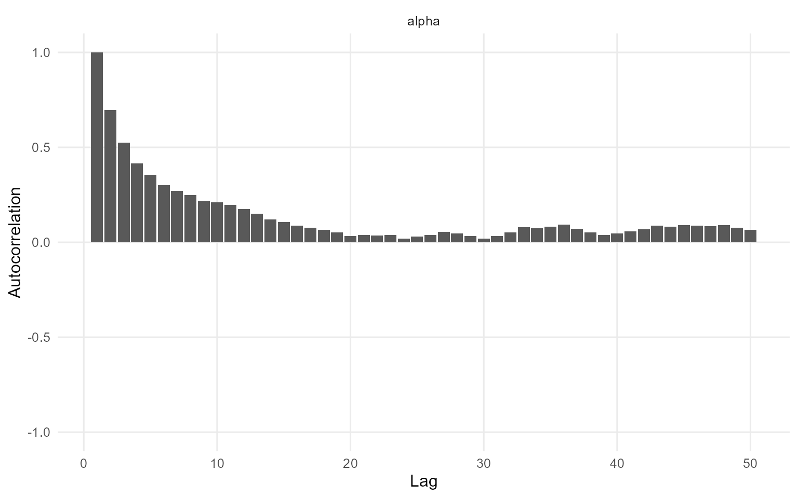

``` r
plot(fit_sb_crp, params = "scale", family = "caterpillar")
```

    === treated ===

    === caterpillar ===

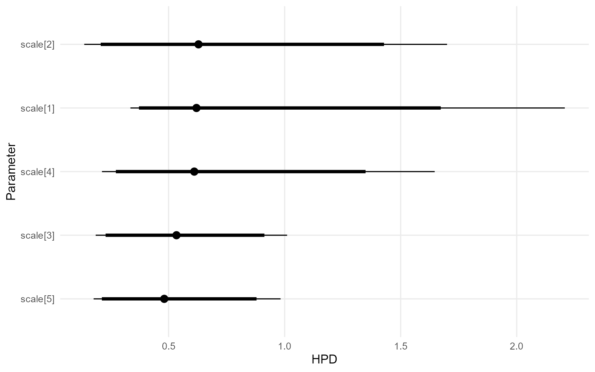

    === control ===

    === caterpillar ===


``` r
pred_mean_sb_crp <- predict(fit_sb_crp, x = x_eval, type = "mean",
                            interval = "credible", nsim_mean = 100)
plot(pred_mean_sb_crp)
```

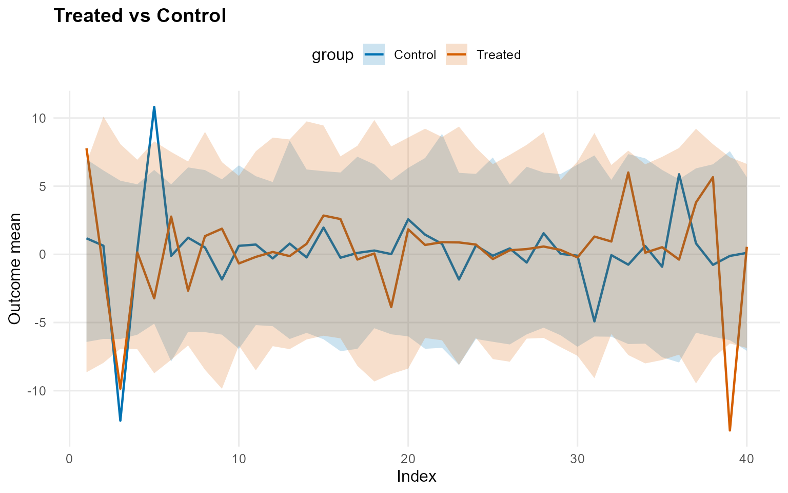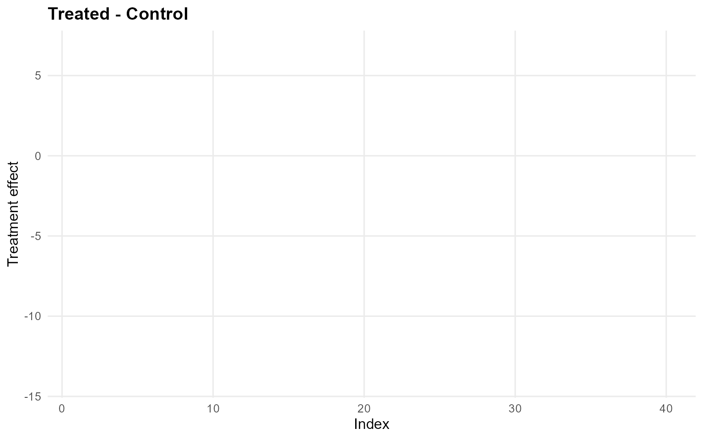

``` r
pred_q_sb_crp <- predict(fit_sb_crp, x = x_eval, type = "quantile",
                         p = 0.5, interval = "credible")
plot(pred_q_sb_crp)
```

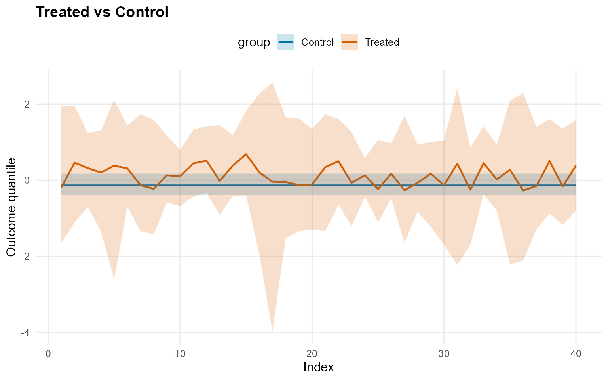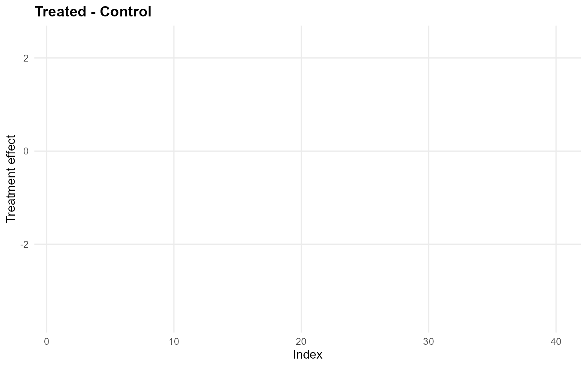

``` r
pred_d_sb_crp <- predict(fit_sb_crp, x = x_eval, y = y_eval,
                         type = "density", interval = "credible")
plot(pred_d_sb_crp)
```

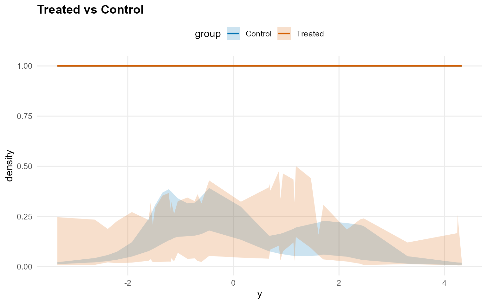

``` r
pred_surv_sb_crp <- predict(fit_sb_crp, x = x_eval, y = y_eval,
                            type = "survival", interval = "credible")
plot(pred_surv_sb_crp)
```

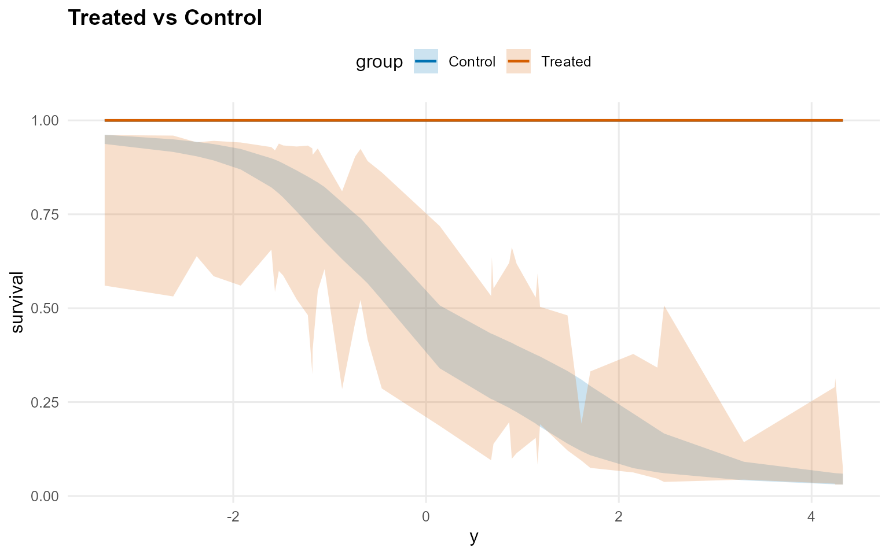

``` r
ate_sb_crp <- ate(fit_sb_crp, newdata = x_eval,
                  interval = "credible", nsim_mean = 100)
print(ate_sb_crp)
```

    ATE (Average Treatment Effect)
      Prediction points: 40
      Conditional (covariates): YES
      Propensity score used: NO
      Posterior mean draws: 100
      Credible interval: credible (95%)

    ATE estimates (treated - control):
     id estimate   lower  upper
      1   -1.210 -13.810 11.837
      2    1.540 -13.971 13.643
      3  -24.599 -12.300 16.204
      4    1.358 -13.718 17.049
      5    0.040 -13.646 14.767
      6   -2.540 -14.096 15.756
    ... (34 more rows)

``` r
summary(ate_sb_crp)
```

    ATE Summary
    ================================================== 
    Prediction points: 40
    Conditional: YES | PS used: NO
    Posterior mean draws: 100
    Interval: credible (95%)

    Model specification:
      Backend (trt/con): sb / crp
      Kernel (trt/con): cauchy / cauchy
      GPD tail (trt/con): NO / NO

    ATE statistics:
      Mean: 2.138 | Median: 0.165
      Range: [-24.599, 136.289]
      SD: 22.795

    Credible interval width:
      Mean: 28.959 | Median: 28.458
      Range: [22.307, 36.637]

``` r
ate_plots_sb_crp <- plot(ate_sb_crp)
ate_plots_sb_crp$treatment_effect
```

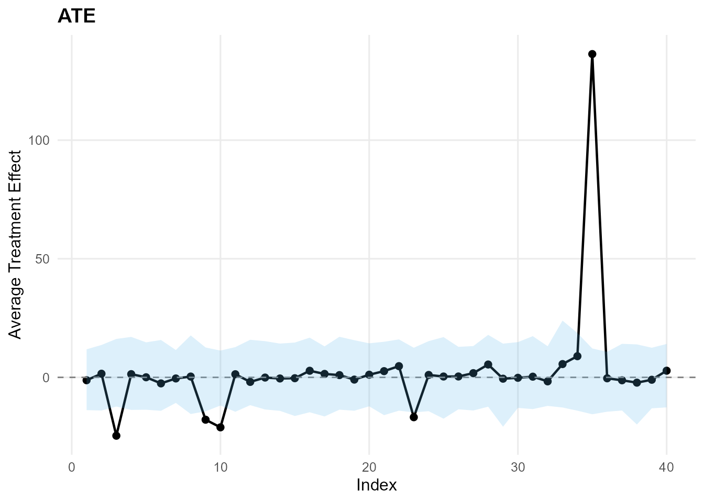

``` r
qte_sb_crp <- qte(fit_sb_crp, probs = c(0.25, 0.5, 0.75),
                  newdata = x_eval, interval = "credible")
print(qte_sb_crp)
```

    QTE (Quantile Treatment Effect)
      Prediction points: 40
      Quantile grid: 0.25, 0.5, 0.75
      Conditional (covariates): YES
      Propensity score used: NO
      Credible interval: credible (95%)

    QTE estimates (treated - control):
     index id estimate  lower upper
      0.25  1   -0.466 -2.604 1.003
      0.25  2   -0.040 -2.678 1.856
      0.25  3    0.436 -1.264 1.354
      0.25  4   -0.150 -3.310 1.168
      0.25  5   -1.409 -7.716 1.471
      0.25  6    0.426 -1.851 1.639
    ... (114 more rows)

``` r
summary(qte_sb_crp)
```

    QTE Summary
    ================================================== 
    Prediction points: 40 | Quantiles: 3
    Quantile grid: 0.25, 0.5, 0.75
    Conditional: YES | PS used: NO
    Interval: credible (95%)

    Model specification:
      Backend (trt/con): sb / crp
      Kernel (trt/con): cauchy / cauchy
      GPD tail (trt/con): NO / NO

    QTE by quantile:
     quantile mean_qte median_qte min_qte max_qte sd_qte
         0.25   -0.121     -0.053  -1.865   0.549  0.535
         0.50    0.263      0.268  -0.134   0.822  0.273
         0.75   -0.084     -0.104  -0.636   1.102  0.405

    Credible interval width:
      Mean: 3.46 | Median: 3.171
      Range: [1.217, 9.187]

``` r
qte_plots_sb_crp <- plot(qte_sb_crp)
qte_plots_sb_crp$treatment_effect
```

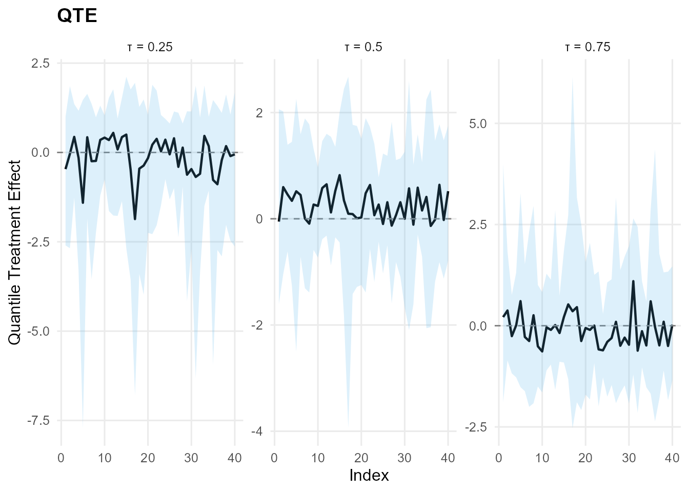

------------------------------------------------------------------------

### Model B: Treated CRP, Control SB (Cauchy)

``` r
bundle_crp_sb <- build_causal_bundle(
  y = y,
  T = T,
  X = X,
  kernel = c("cauchy", "cauchy"),
  backend = c("crp", "sb"),
  PS = "logit",
  GPD = c(FALSE, FALSE),
  components = c(5, 5),
  mcmc_outcome = list(niter = 2500, nburnin = 500, nchains = 1, thin = 1, seed = 2),
  mcmc_ps = list(niter = 2500, nburnin = 500, nchains = 1, thin = 1, seed = 2)
)

bundle_crp_sb
```

    DPmixGPD causal bundle
    PS model: disabled 
    Outcome (treated): backend = crp | kernel = cauchy 
    Outcome (control): backend = sb | kernel = cauchy 
    GPD tail (treated/control): FALSE / FALSE 
    components (treated/control): 5 / 5 
    Outcome PS included: FALSE 
    epsilon (treated/control): 0.025 / 0.025 
    n (control) = 232 | n (treated) = 268 

``` r
summary(bundle_crp_sb)
```

    DPmixGPD causal bundle summary
    DPmixGPD causal bundle
    PS model: disabled 
    Outcome (treated): backend = crp | kernel = cauchy 
    Outcome (control): backend = sb | kernel = cauchy 
    GPD tail (treated/control): FALSE / FALSE 
    components (treated/control): 5 / 5 
    Outcome PS included: FALSE 
    epsilon (treated/control): 0.025 / 0.025 
    n (control) = 232 | n (treated) = 268 

``` r
fit_crp_sb <- run_mcmc_causal(bundle_crp_sb)
```

    ===== Monitors =====
    thin = 1: alpha, beta_location, scale, w, z
    ===== Samplers =====
    RW sampler (30)
      - alpha
      - scale[]  (5 elements)
      - beta_location[]  (20 elements)
      - v[]  (4 elements)
    categorical sampler (232)
      - z[]  (232 elements)

    ===== Monitors =====
    thin = 1: alpha, location, scale, z
    ===== Samplers =====
    CRP_concentration sampler (1)
      - alpha
    CRP_cluster_wrapper sampler (10)
      - location[]  (5 elements)
      - scale[]  (5 elements)
    CRP sampler (1)
      - z[1:268] 

      [Warning] CRP_sampler: This MCMC is not for a proper model. The MCMC attempted to use more components than the number of cluster parameters. Please increase the number of cluster parameters.

``` r
summary(fit_crp_sb)
```

    -- Outcome fits --
    [control]
    MixGPD fit | backend: Stick-Breaking Process | kernel: Cauchy Distribution | GPD tail: FALSE
    n = 232 | components = 5 | epsilon = 0.025
    MCMC: niter=2500, nburnin=500, thin=1, nchains=1 
    Fit
    Use summary() for posterior summaries; plot() for diagnostics; predict() for predictions.

    [treated]
    MixGPD fit | backend: Chinese Restaurant Process | kernel: Cauchy Distribution | GPD tail: FALSE
    n = 268 | components = 5 | epsilon = 0.025
    MCMC: niter=2500, nburnin=500, thin=1, nchains=1 
    Fit
    Use summary() for posterior summaries; plot() for diagnostics; predict() for predictions.

``` r
params(fit_crp_sb)
```

    Posterior mean parameters (causal)

    [treated]
    Posterior mean parameters

    $alpha
    [1] 0.4149

    $w
    [1] 0.5306 0.4452

    $location
    [1]  0.7087 -0.1926

    $scale
    [1] 0.6337 0.5286

    [control]
    Posterior mean parameters

    $alpha
    [1] 1.937

    $w
    [1] 0.3371 0.2508 0.1889

    $beta_location
               x1      x2      x3      x4
    comp1 -0.1033  0.1383 -0.0918 -1.0608
    comp2 -0.1120 -0.2083 -0.2446 -0.1722
    comp3 -0.1308 -0.3945 -0.3063  1.5690
    comp4 -0.3138 -0.1543 -0.1642  0.9584
    comp5 -0.1600 -0.3008  0.0725  0.5797

    $scale
    [1] 0.6275 0.5393 0.4912

``` r
plot(fit_crp_sb, family = "traceplot")
```

    === treated ===

    === traceplot ===

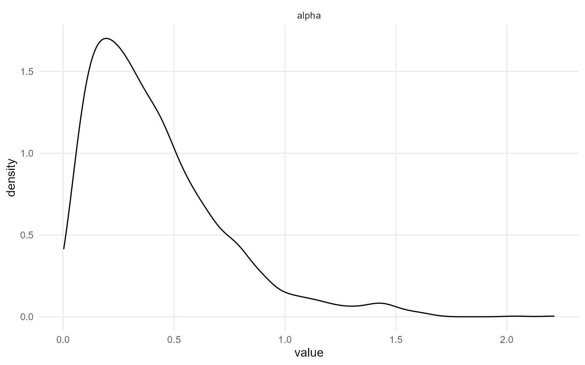

    === control ===

    === traceplot ===

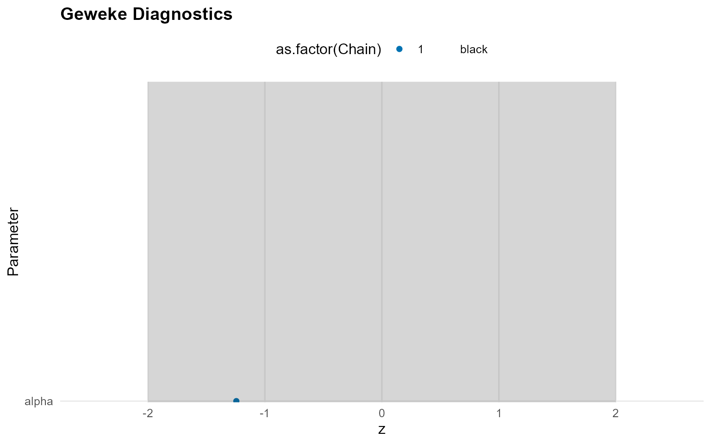

``` r
pred_mean_crp_sb <- predict(fit_crp_sb, x = x_eval, type = "mean",
                            interval = "credible", nsim_mean = 100)
plot(pred_mean_crp_sb)
```

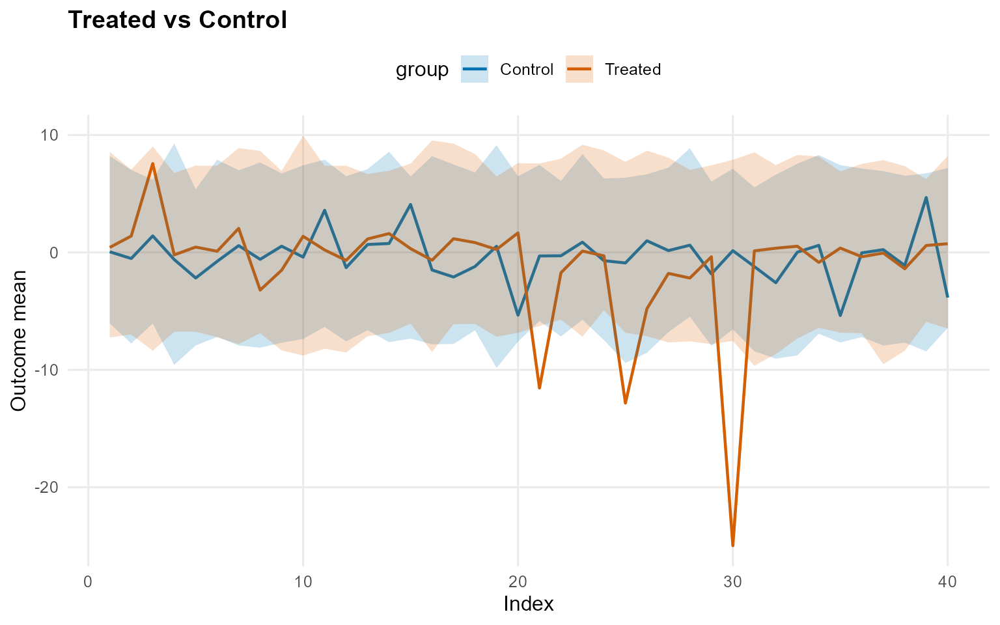

``` r
pred_q_crp_sb <- predict(fit_crp_sb, x = x_eval, type = "quantile",
                         p = 0.5, interval = "credible")
plot(pred_q_crp_sb)
```

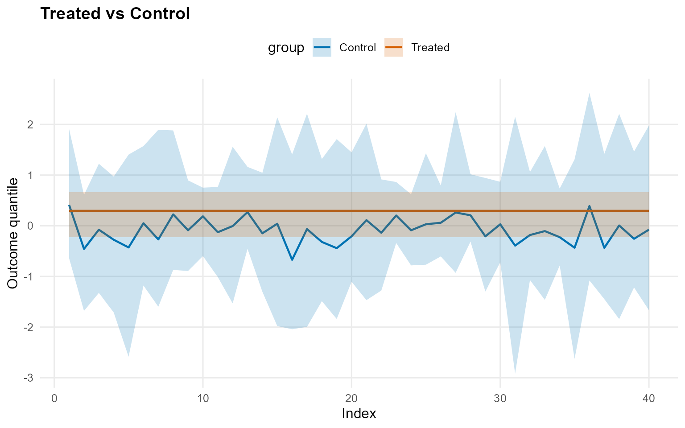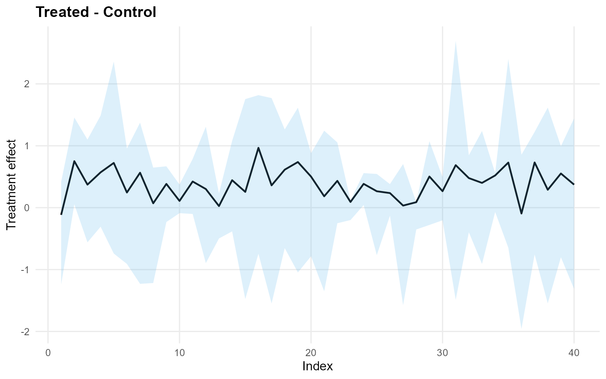

``` r
pred_d_crp_sb <- predict(fit_crp_sb, x = x_eval, y = y_eval,
                         type = "density", interval = "credible")
plot(pred_d_crp_sb)
```

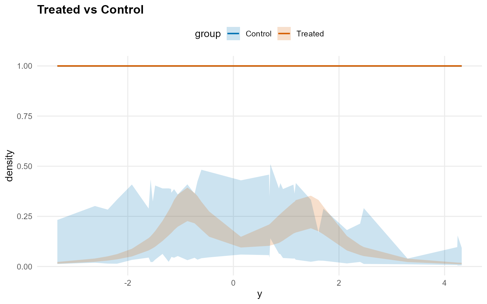

``` r
pred_surv_crp_sb <- predict(fit_crp_sb, x = x_eval, y = y_eval,
                            type = "survival", interval = "credible")
plot(pred_surv_crp_sb)
```

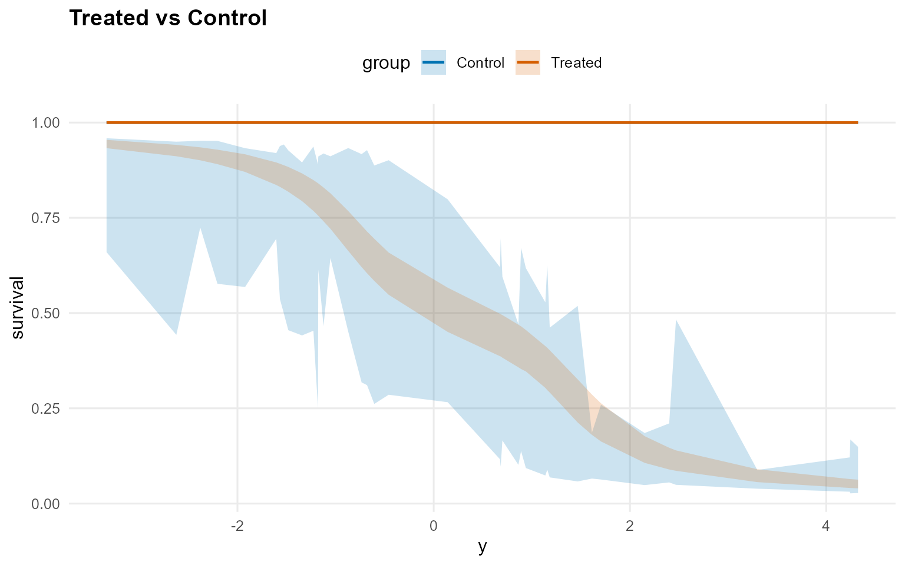

``` r
ate_crp_sb <- ate(fit_crp_sb, newdata = x_eval,
                  interval = "credible", nsim_mean = 100)
print(ate_crp_sb)
```

    ATE (Average Treatment Effect)
      Prediction points: 40
      Conditional (covariates): YES
      Propensity score used: NO
      Posterior mean draws: 100
      Credible interval: credible (95%)

    ATE estimates (treated - control):
     id estimate   lower  upper
      1    1.940 -13.504 15.804
      2    0.953 -15.077 18.431
      3    0.392 -12.060 16.755
      4   14.966 -13.577 17.189
      5    1.631 -12.740 14.193
      6   -0.791 -11.782 13.140
    ... (34 more rows)

``` r
summary(ate_crp_sb)
```

    ATE Summary
    ================================================== 
    Prediction points: 40
    Conditional: YES | PS used: NO
    Posterior mean draws: 100
    Interval: credible (95%)

    Model specification:
      Backend (trt/con): crp / sb
      Kernel (trt/con): cauchy / cauchy
      GPD tail (trt/con): NO / NO

    ATE statistics:
      Mean: -9.516 | Median: 0.592
      Range: [-429.329, 20.809]
      SD: 68.236

    Credible interval width:
      Mean: 28.25 | Median: 28.19
      Range: [21.733, 33.711]

``` r
ate_plots_crp_sb <- plot(ate_crp_sb)
ate_plots_crp_sb$treatment_effect
```

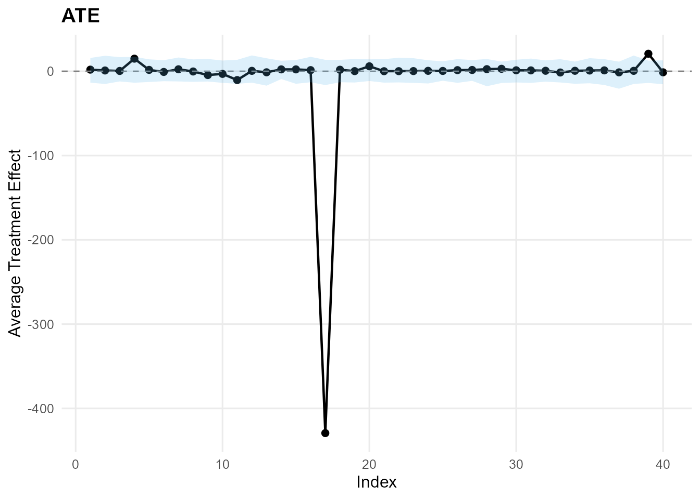

``` r
qte_crp_sb <- qte(fit_crp_sb, probs = c(0.25, 0.5, 0.75),
                  newdata = x_eval, interval = "credible")
print(qte_crp_sb)
```

    QTE (Quantile Treatment Effect)
      Prediction points: 40
      Quantile grid: 0.25, 0.5, 0.75
      Conditional (covariates): YES
      Propensity score used: NO
      Credible interval: credible (95%)

    QTE estimates (treated - control):
     index id estimate  lower upper
      0.25  1   -0.076 -1.476 0.901
      0.25  2    0.472 -0.592 3.011
      0.25  3    0.107 -1.175 1.840
      0.25  4    0.440 -0.619 2.790
      0.25  5    1.135 -0.433 5.031
      0.25  6    0.066 -1.457 1.183
    ... (114 more rows)

``` r
summary(qte_crp_sb)
```

    QTE Summary
    ================================================== 
    Prediction points: 40 | Quantiles: 3
    Quantile grid: 0.25, 0.5, 0.75
    Conditional: YES | PS used: NO
    Interval: credible (95%)

    Model specification:
      Backend (trt/con): crp / sb
      Kernel (trt/con): cauchy / cauchy
      GPD tail (trt/con): NO / NO

    QTE by quantile:
     quantile mean_qte median_qte min_qte max_qte sd_qte
         0.25    0.272      0.184  -0.408   1.368  0.412
         0.50    0.386      0.384  -0.116   0.967  0.252
         0.75    0.388      0.391  -0.733   0.930  0.346

    Credible interval width:
      Mean: 3.021 | Median: 2.886
      Range: [1.171, 5.551]

``` r
qte_plots_crp_sb <- plot(qte_crp_sb)
qte_plots_crp_sb$treatment_effect
```

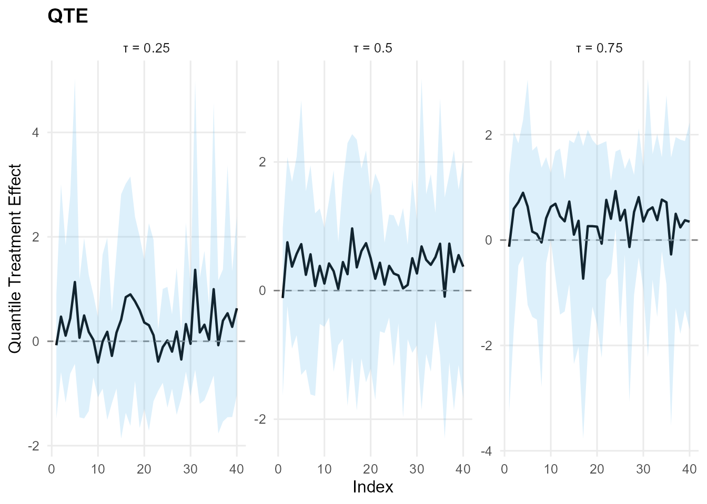
