# 19. Causal Inference: Mixed Backends with GPD - Amoroso Kernel

> **Legacy vignette (for the website / historical notes).** These files
> may not match the current exported API one-to-one. Last verified:
> **2026-01-18**.
>
> For the up-to-date workflow, see the main package vignettes
> (Introduction, Model Spec, MCMC Workflow,
> Unconditional/Conditional/Causal, Backends, S3 Reference).

## Causal Inference: Mixed Backends with GPD - Amoroso Kernel

This vignette fits two mixed-backend causal models with GPD tails and an
Amoroso kernel:

- Model A: Treated = SB, Control = CRP
- Model B: Treated = CRP, Control = SB

We shift y to keep outcomes in a stable positive range.

------------------------------------------------------------------------

### Data Setup

``` r
data("causal_alt_real500_p4_k2")
y_raw <- causal_alt_real500_p4_k2$y
T <- causal_alt_real500_p4_k2$T
X <- as.matrix(causal_alt_real500_p4_k2$X)

shift <- abs(min(y_raw)) + 0.1
y <- y_raw + shift

summary_tbl <- tibble(
  statistic = c("N", "Mean", "SD", "Min", "Max"),
  value = c(length(y), mean(y), sd(y), min(y), max(y))
)

summary_tbl %>%
  mutate(value = signif(value, 4)) %>%
  kable(caption = "Shifted Outcome Summary (Amoroso)", align = "c") %>%
  kable_styling(bootstrap_options = c("striped", "hover"), full_width = FALSE, position = "center")
```

| statistic |  value  |
|:---------:|:-------:|
|     N     | 500.000 |
|   Mean    |  8.463  |
|    SD     |  1.764  |
|    Min    |  0.100  |
|    Max    | 13.460  |

Shifted Outcome Summary (Amoroso)

``` r
x_eval <- X[1:40, , drop = FALSE]
y_eval <- y[1:40]
u_threshold <- as.numeric(stats::quantile(y, 0.8, names = FALSE))
```

``` r
df_causal <- data.frame(y = y, T = as.factor(T), x1 = X[, 1])

p_scatter <- ggplot(df_causal, aes(x = x1, y = y, color = T)) +
  geom_point(alpha = 0.5) +
  labs(title = "Shifted Outcome vs X1", x = "X1", y = "y (shifted)", color = "Treatment") +
  theme_minimal()

p_scatter
```

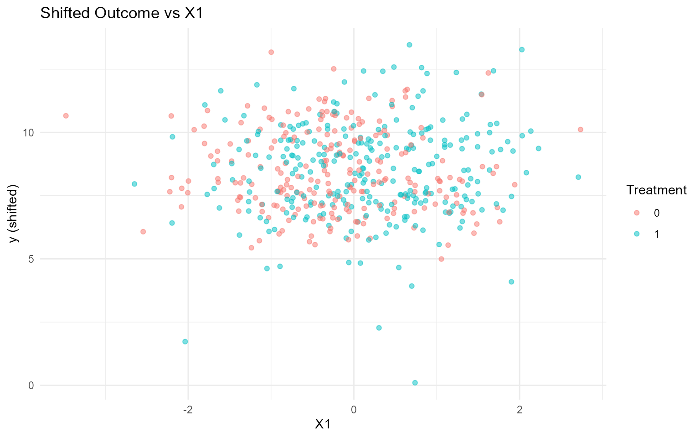

------------------------------------------------------------------------

### Model A: Treated SB, Control CRP (Amoroso + GPD)

``` r
param_specs_gpd <- list(
  gpd = list(
    threshold = list(
      mode = "dist",
      dist = "lognormal",
      args = list(meanlog = log(max(u_threshold, .Machine$double.eps)), sdlog = 0.25)
    )
  )
)

bundle_sb_crp <- build_causal_bundle(
  y = y,
  T = T,
  X = X,
  kernel = c("amoroso", "amoroso"),
  backend = c("sb", "crp"),
  PS = "logit",
  GPD = c(TRUE, TRUE),
  components = c(5, 5),
  param_specs = param_specs_gpd,
  mcmc_outcome = list(niter = 2500, nburnin = 500, nchains = 1, thin = 1, seed = 1),
  mcmc_ps = list(niter = 2500, nburnin = 500, nchains = 1, thin = 1, seed = 1)
)

bundle_sb_crp
```

    DPmixGPD causal bundle
    PS model: disabled 
    Outcome (treated): backend = sb | kernel = amoroso 
    Outcome (control): backend = crp | kernel = amoroso 
    GPD tail (treated/control): TRUE / TRUE 
    components (treated/control): 5 / 5 
    Outcome PS included: FALSE 
    epsilon (treated/control): 0.025 / 0.025 
    n (control) = 232 | n (treated) = 268 

``` r
summary(bundle_sb_crp)
```

    DPmixGPD causal bundle summary
    DPmixGPD causal bundle
    PS model: disabled 
    Outcome (treated): backend = sb | kernel = amoroso 
    Outcome (control): backend = crp | kernel = amoroso 
    GPD tail (treated/control): TRUE / TRUE 
    components (treated/control): 5 / 5 
    Outcome PS included: FALSE 
    epsilon (treated/control): 0.025 / 0.025 
    n (control) = 232 | n (treated) = 268 

``` r
fit_sb_crp <- run_mcmc_causal(bundle_sb_crp)
```

    [MCMC] Creating NIMBLE model...

    [MCMC] NIMBLE model created successfully.
    [MCMC] Configuring MCMC...
    ===== Monitors =====
    thin = 1: alpha, beta_tail_scale, loc, scale, shape1, shape2, tail_shape, threshold, z
    ===== Samplers =====
    RW sampler (6)
      - threshold
      - beta_tail_scale[]  (4 elements)
      - tail_shape
    CRP_concentration sampler (1)
      - alpha
    CRP_cluster_wrapper sampler (20)
      - loc[]  (5 elements)
      - scale[]  (5 elements)
      - shape1[]  (5 elements)
      - shape2[]  (5 elements)
    CRP sampler (1)
      - z[1:232] 
    [MCMC] MCMC configured.
    [MCMC] Building MCMC object...

    [MCMC] MCMC object built.
    [MCMC] Attempting NIMBLE compilation (this may take a minute)...
    [MCMC] Compiling model...

    [MCMC] Compiling MCMC sampler...

    [MCMC] Compilation successful.

    |-------------|-------------|-------------|-------------|
    |  [Warning] CRP_sampler: This MCMC is not for a proper model. The MCMC attempted to use more components than the number of cluster parameters. Please increase the number of cluster parameters.
    -------------------------------------------------------|
    [MCMC] MCMC execution complete. Processing results...

    [MCMC] Creating NIMBLE model...

    [MCMC] NIMBLE model created successfully.
    [MCMC] Configuring MCMC...
    ===== Monitors =====
    thin = 1: alpha, beta_loc, beta_scale, beta_tail_scale, shape1, shape2, tail_shape, threshold, w, z
    ===== Samplers =====
    RW sampler (61)
      - alpha
      - shape1[]  (5 elements)
      - shape2[]  (5 elements)
      - beta_loc[]  (20 elements)
      - beta_scale[]  (20 elements)
      - threshold
      - beta_tail_scale[]  (4 elements)
      - tail_shape
      - v[]  (4 elements)
    categorical sampler (268)
      - z[]  (268 elements)
    [MCMC] MCMC configured.
    [MCMC] Building MCMC object...
    [MCMC] MCMC object built.
    [MCMC] Attempting NIMBLE compilation (this may take a minute)...
    [MCMC] Compiling model...

    [MCMC] Compiling MCMC sampler...

    [MCMC] Compilation successful.

    |-------------|-------------|-------------|-------------|
    |-------------------------------------------------------|
    [MCMC] MCMC execution complete. Processing results...

``` r
summary(fit_sb_crp)
```

    -- Outcome fits --
    [control]
    MixGPD fit | backend: Chinese Restaurant Process | kernel: Amoroso Distribution | GPD tail: TRUE
    n = 232 | components = 5 | epsilon = 0.025
    MCMC: niter=2500, nburnin=500, thin=1, nchains=1 
    Fit
    Use summary() for posterior summaries; plot() for diagnostics; predict() for predictions.

    [treated]
    MixGPD fit | backend: Stick-Breaking Process | kernel: Amoroso Distribution | GPD tail: TRUE
    n = 268 | components = 5 | epsilon = 0.025
    MCMC: niter=2500, nburnin=500, thin=1, nchains=1 
    Fit
    Use summary() for posterior summaries; plot() for diagnostics; predict() for predictions.

``` r
params(fit_sb_crp)
```

    Posterior mean parameters (causal)

    [treated]
    Posterior mean parameters

    $alpha
    [1] 0.6522

    $w
    [1] 0.8047

    $beta_loc
              x1      x2      x3      x4
    comp1 0.1815  0.5934  0.0932  0.6064
    comp2 0.7532 -0.6500 -0.3995  2.7063
    comp3 0.0649  0.6424 -0.1371  0.5915
    comp4 0.4177 -0.0813  0.3858 -0.0447
    comp5 0.1086  0.0129 -0.2786  0.4027

    $beta_scale
               x1      x2      x3      x4
    comp1 -0.5327 -0.1020 -0.7913  0.6659
    comp2 -0.1070  0.0591  0.0979 -0.8481
    comp3 -0.2930 -0.0124 -0.1288 -0.0472
    comp4 -0.3084  0.2436 -0.3645  0.2645
    comp5 -0.4055  0.1748  0.3110 -0.0215

    $shape1
    [1] 8.524

    $shape2
    [1] 0.8242

    $beta_tail_scale
    [1] 0.04707 0.02875 0.05825 1.10900

    $tail_shape
    [1] 0.04245

    [control]
    Posterior mean parameters

    $alpha
    [1] 0.2132

    $w
    [1] 0.9583

    $loc
    [1] 4.355

    $scale
    [1] 1.714

    $shape1
    [1] 3.467

    $shape2
    [1] 1.418

    $beta_tail_scale
    [1]  0.28210  0.14660  0.01011 -0.21720

    $tail_shape
    [1] 0.02556

``` r
plot(fit_sb_crp, family = c("traceplot", "autocorrelation", "running"))
```

    === treated ===

    === traceplot ===

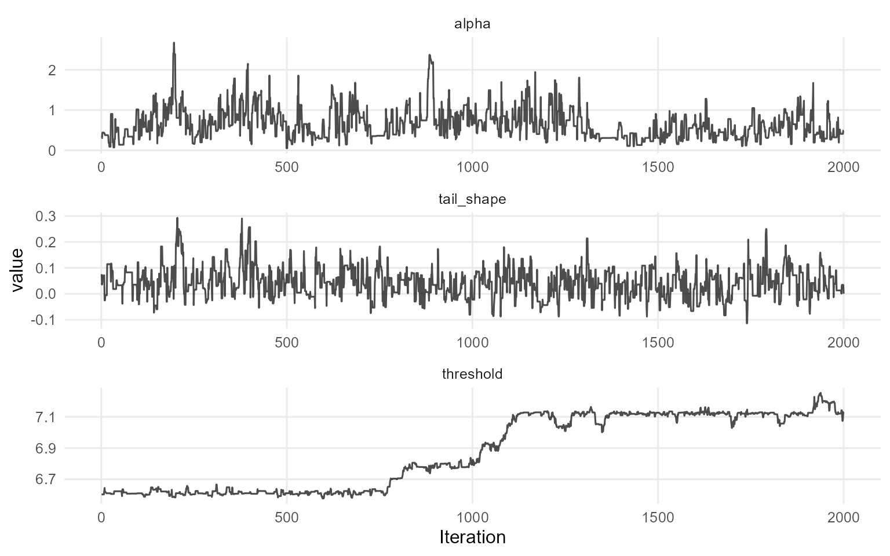

    === autocorrelation ===

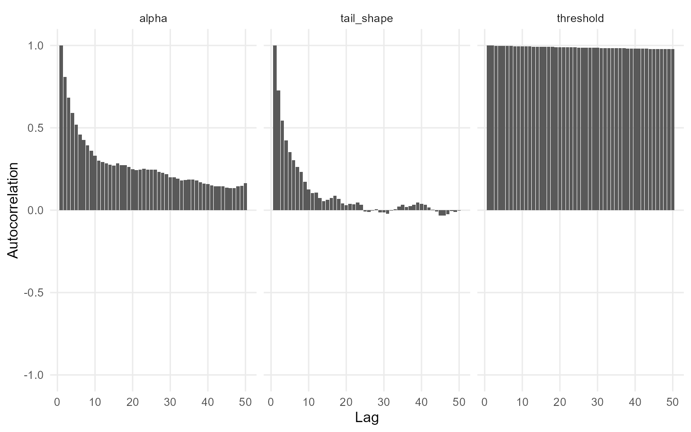

    === running ===

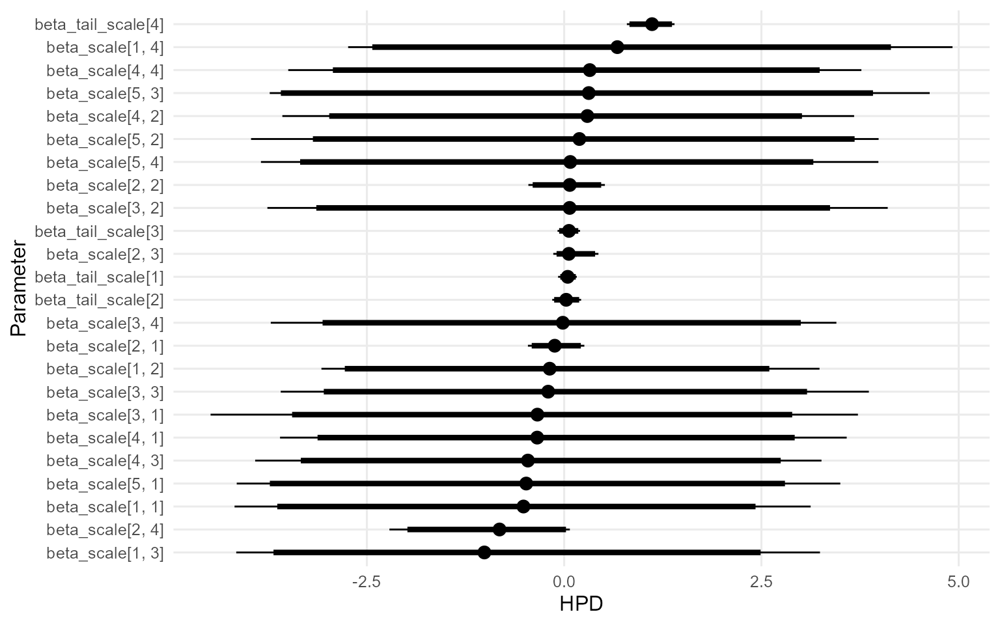

    === control ===

    === traceplot ===

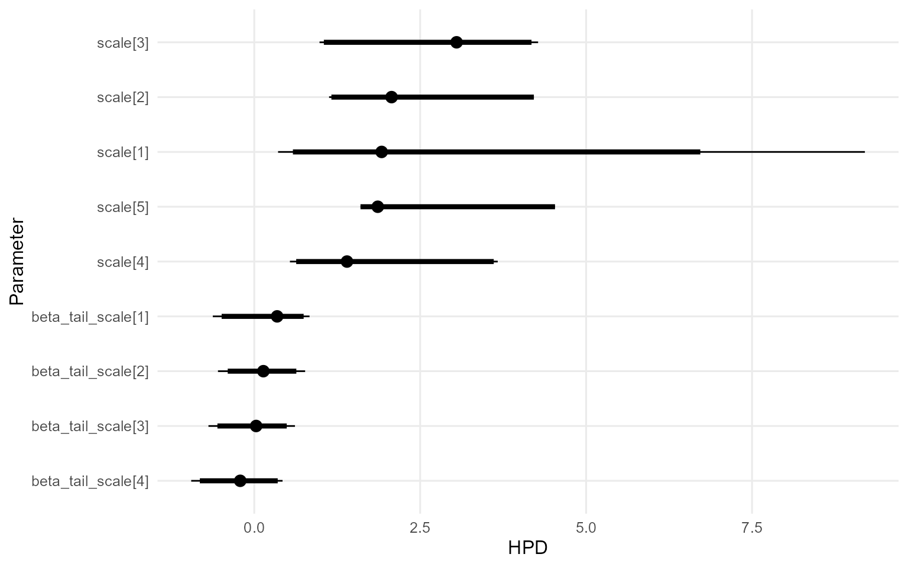

    === autocorrelation ===

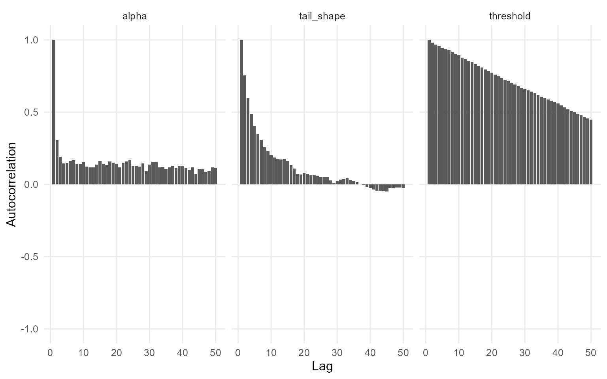

    === running ===

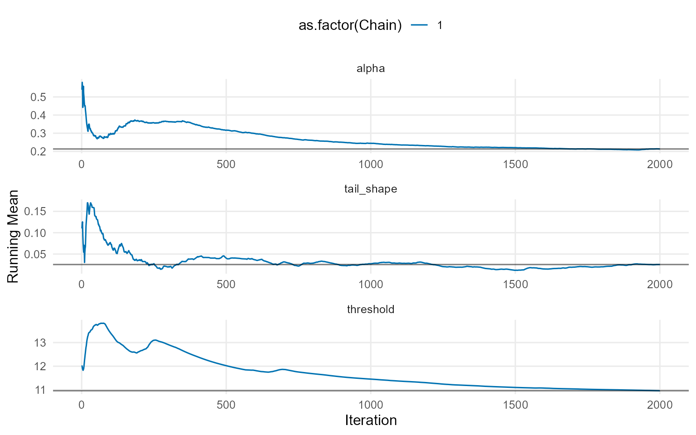

``` r
pred_mean_sb_crp <- predict(fit_sb_crp, x = x_eval, type = "mean",
                            interval = "credible", nsim_mean = 100)
plot(pred_mean_sb_crp)
```

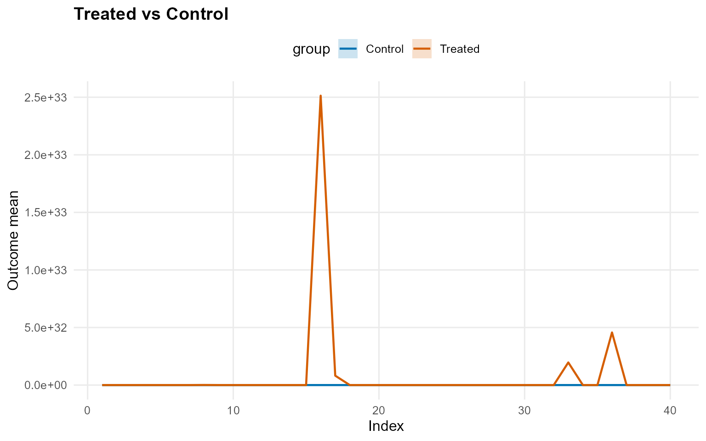

``` r
pred_q_sb_crp <- predict(fit_sb_crp, x = x_eval, type = "quantile",
                         p = 0.5, interval = "credible")
plot(pred_q_sb_crp)
```

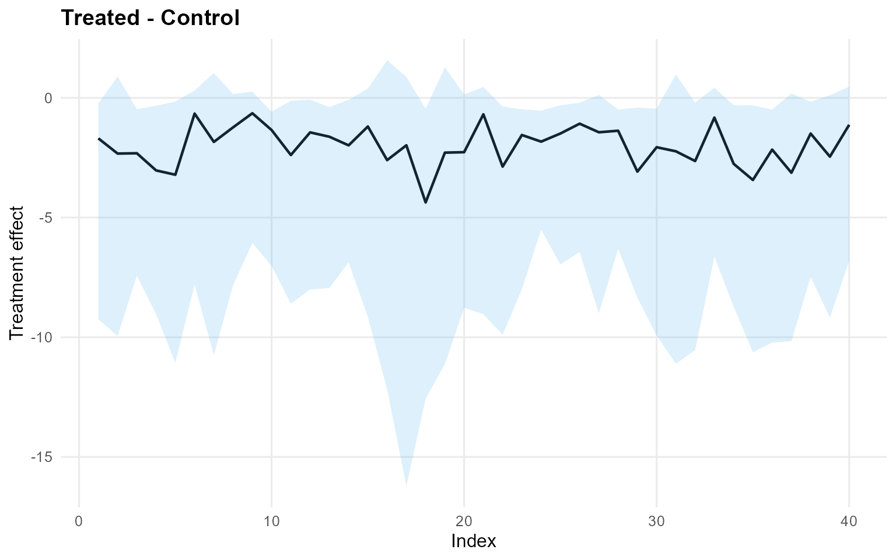

``` r
pred_d_sb_crp <- predict(fit_sb_crp, x = x_eval, y = y_eval,
                         type = "density", interval = "credible")
plot(pred_d_sb_crp)
```

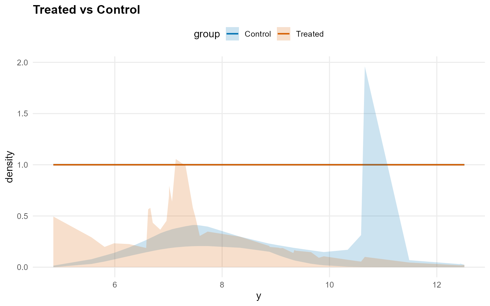

``` r
pred_surv_sb_crp <- predict(fit_sb_crp, x = x_eval, y = y_eval,
                            type = "survival", interval = "credible")
plot(pred_surv_sb_crp)
```

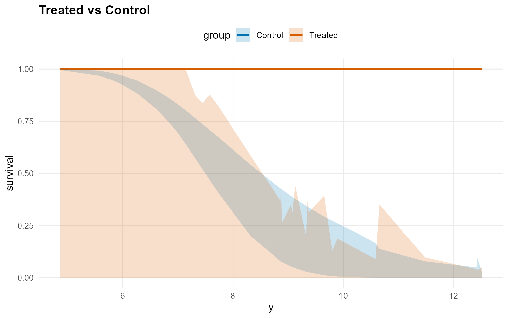

``` r
ate_sb_crp <- ate(fit_sb_crp, newdata = x_eval,
                  interval = "credible", nsim_mean = 100)
print(ate_sb_crp)
```

    ATE (Average Treatment Effect)
      Prediction points: 40
      Conditional (covariates): YES
      Propensity score used: NO
      Posterior mean draws: 100
      Credible interval: credible (95%)

    ATE estimates (treated - control):
     id     estimate   lower upper
      1 2.581014e+07 -10.058 1.968
      2 4.689608e+18 -11.367 3.807
      3 6.748636e+27  -8.916 1.752
      4 5.608703e+12 -10.455 2.148
      5 7.337398e+18 -12.359 2.499
      6 1.863384e+09  -8.680 2.809
    ... (34 more rows)

``` r
summary(ate_sb_crp)
```

    ATE Summary
    ================================================== 
    Prediction points: 40
    Conditional: YES | PS used: NO
    Posterior mean draws: 100
    Interval: credible (95%)

    Model specification:
      Backend (trt/con): sb / crp
      Kernel (trt/con): amoroso / amoroso
      GPD tail (trt/con): YES / YES

    ATE statistics:
      Mean: 7.46634083157349e+31 | Median: 1.11937649685337e+22
      Range: [25810139.203, 2.97090867303624e+33]
      SD: 4.69683170335436e+32

    Credible interval width:
      Mean: 13.236 | Median: 12.569
      Range: [9.751, 20.666]

``` r
ate_plots_sb_crp <- plot(ate_sb_crp)
ate_plots_sb_crp$treatment_effect
```

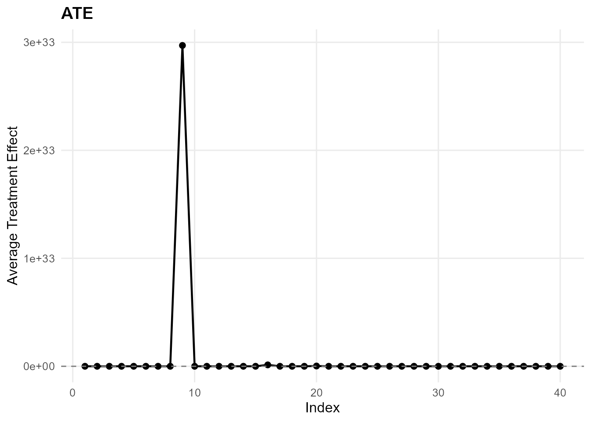

``` r
qte_sb_crp <- qte(fit_sb_crp, probs = c(0.25, 0.5, 0.75),
                  newdata = x_eval, interval = "credible")
print(qte_sb_crp)
```

    QTE (Quantile Treatment Effect)
      Prediction points: 40
      Quantile grid: 0.25, 0.5, 0.75
      Conditional (covariates): YES
      Propensity score used: NO
      Credible interval: credible (95%)

    QTE estimates (treated - control):
     index id estimate   lower upper
      0.25  1   -1.237  -9.456 0.507
      0.25  2   -2.178  -9.763 0.913
      0.25  3   -1.848  -7.410 0.407
      0.25  4   -2.499  -8.852 0.469
      0.25  5   -2.607 -10.749 0.536
      0.25  6   -0.522  -7.722 0.707
    ... (114 more rows)

``` r
summary(qte_sb_crp)
```

    QTE Summary
    ================================================== 
    Prediction points: 40 | Quantiles: 3
    Quantile grid: 0.25, 0.5, 0.75
    Conditional: YES | PS used: NO
    Interval: credible (95%)

    Model specification:
      Backend (trt/con): sb / crp
      Kernel (trt/con): amoroso / amoroso
      GPD tail (trt/con): YES / YES

    QTE by quantile:
     quantile mean_qte median_qte min_qte max_qte sd_qte
         0.25   -1.673     -1.634  -3.787  -0.522  0.757
         0.50   -2.004     -1.983  -4.369  -0.644  0.841
         0.75   -2.155     -2.074  -4.982  -0.360  1.051

    Credible interval width:
      Mean: 10.506 | Median: 10.119
      Range: [5.913, 21.099]

``` r
qte_plots_sb_crp <- plot(qte_sb_crp)
qte_plots_sb_crp$treatment_effect
```

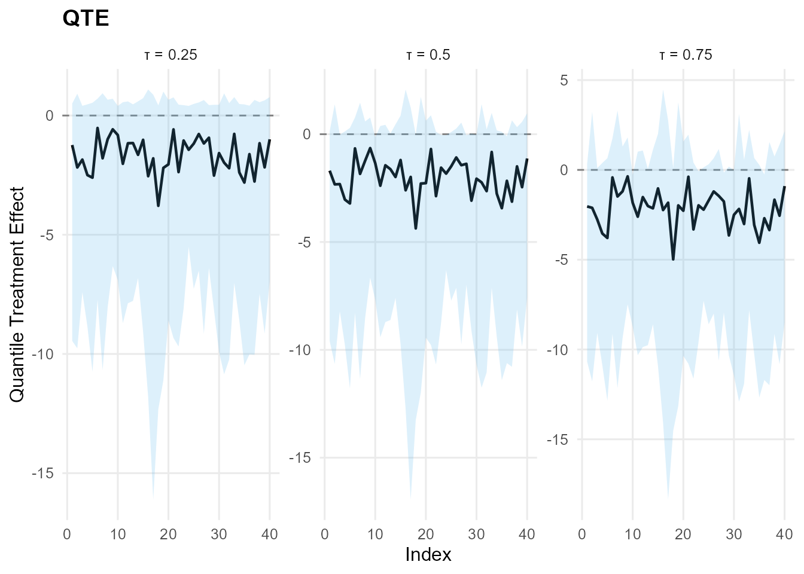

------------------------------------------------------------------------

### Model B: Treated CRP, Control SB (Amoroso + GPD)

``` r
bundle_crp_sb <- build_causal_bundle(
  y = y,
  T = T,
  X = X,
  kernel = c("amoroso", "amoroso"),
  backend = c("crp", "sb"),
  PS = "logit",
  GPD = c(TRUE, TRUE),
  components = c(5, 5),
  param_specs = param_specs_gpd,
  mcmc_outcome = list(niter = 2500, nburnin = 500, nchains = 1, thin = 1, seed = 2),
  mcmc_ps = list(niter = 2500, nburnin = 500, nchains = 1, thin = 1, seed = 2)
)

bundle_crp_sb
```

    DPmixGPD causal bundle
    PS model: disabled 
    Outcome (treated): backend = crp | kernel = amoroso 
    Outcome (control): backend = sb | kernel = amoroso 
    GPD tail (treated/control): TRUE / TRUE 
    components (treated/control): 5 / 5 
    Outcome PS included: FALSE 
    epsilon (treated/control): 0.025 / 0.025 
    n (control) = 232 | n (treated) = 268 

``` r
summary(bundle_crp_sb)
```

    DPmixGPD causal bundle summary
    DPmixGPD causal bundle
    PS model: disabled 
    Outcome (treated): backend = crp | kernel = amoroso 
    Outcome (control): backend = sb | kernel = amoroso 
    GPD tail (treated/control): TRUE / TRUE 
    components (treated/control): 5 / 5 
    Outcome PS included: FALSE 
    epsilon (treated/control): 0.025 / 0.025 
    n (control) = 232 | n (treated) = 268 

``` r
fit_crp_sb <- run_mcmc_causal(bundle_crp_sb)
```

    [MCMC] Creating NIMBLE model...

    [MCMC] NIMBLE model created successfully.
    [MCMC] Configuring MCMC...
    ===== Monitors =====
    thin = 1: alpha, beta_loc, beta_scale, beta_tail_scale, shape1, shape2, tail_shape, threshold, w, z
    ===== Samplers =====
    RW sampler (61)
      - alpha
      - shape1[]  (5 elements)
      - shape2[]  (5 elements)
      - beta_loc[]  (20 elements)
      - beta_scale[]  (20 elements)
      - threshold
      - beta_tail_scale[]  (4 elements)
      - tail_shape
      - v[]  (4 elements)
    categorical sampler (232)
      - z[]  (232 elements)
    [MCMC] MCMC configured.
    [MCMC] Building MCMC object...
    [MCMC] MCMC object built.
    [MCMC] Attempting NIMBLE compilation (this may take a minute)...
    [MCMC] Compiling model...

    [MCMC] Compiling MCMC sampler...

    [MCMC] Compilation successful.

    |-------------|-------------|-------------|-------------|
    |-------------------------------------------------------|
    [MCMC] MCMC execution complete. Processing results...

    [MCMC] Creating NIMBLE model...

    [MCMC] NIMBLE model created successfully.
    [MCMC] Configuring MCMC...
    ===== Monitors =====
    thin = 1: alpha, beta_tail_scale, loc, scale, shape1, shape2, tail_shape, threshold, z
    ===== Samplers =====
    RW sampler (6)
      - threshold
      - beta_tail_scale[]  (4 elements)
      - tail_shape
    CRP_concentration sampler (1)
      - alpha
    CRP_cluster_wrapper sampler (20)
      - loc[]  (5 elements)
      - scale[]  (5 elements)
      - shape1[]  (5 elements)
      - shape2[]  (5 elements)
    CRP sampler (1)
      - z[1:268] 
    [MCMC] MCMC configured.
    [MCMC] Building MCMC object...

    [MCMC] MCMC object built.
    [MCMC] Attempting NIMBLE compilation (this may take a minute)...
    [MCMC] Compiling model...

    [MCMC] Compiling MCMC sampler...

    [MCMC] Compilation successful.

    |-------------|-------------|-------------|-------------|
    |  [Warning] CRP_sampler: This MCMC is not for a proper model. The MCMC attempted to use more components than the number of cluster parameters. Please increase the number of cluster parameters.
    -------------------------------------------------------|
    [MCMC] MCMC execution complete. Processing results...

``` r
summary(fit_crp_sb)
```

    -- Outcome fits --
    [control]
    MixGPD fit | backend: Stick-Breaking Process | kernel: Amoroso Distribution | GPD tail: TRUE
    n = 232 | components = 5 | epsilon = 0.025
    MCMC: niter=2500, nburnin=500, thin=1, nchains=1 
    Fit
    Use summary() for posterior summaries; plot() for diagnostics; predict() for predictions.

    [treated]
    MixGPD fit | backend: Chinese Restaurant Process | kernel: Amoroso Distribution | GPD tail: TRUE
    n = 268 | components = 5 | epsilon = 0.025
    MCMC: niter=2500, nburnin=500, thin=1, nchains=1 
    Fit
    Use summary() for posterior summaries; plot() for diagnostics; predict() for predictions.

``` r
params(fit_crp_sb)
```

    Posterior mean parameters (causal)

    [treated]
    Posterior mean parameters

    $alpha
    [1] 0.6378

    $w
    [1] 0.662

    $loc
    [1] 5.617

    $scale
    [1] 2.078

    $shape1
    [1] 2.084

    $shape2
    [1] 1.789

    $beta_tail_scale
    [1]  0.06430 -0.09033  0.12000 -0.09931

    $tail_shape
    [1] -0.00839

    [control]
    Posterior mean parameters

    $alpha
    [1] 0.3475

    $w
    [1] 0.9614

    $beta_loc
               x1      x2      x3      x4
    comp1 -0.1198 -0.0434  1.8418  1.3384
    comp2 -0.2500  0.0317  0.2836  0.1584
    comp3 -0.0343 -0.0763  0.2136 -0.0024
    comp4 -0.0930 -0.2598 -0.0409  0.0537
    comp5 -0.0935 -0.0966  0.0186  0.0171

    $beta_scale
               x1      x2      x3      x4
    comp1  0.0051 -0.0655 -0.6749 -0.2475
    comp2 -0.0604  0.0294  0.0090  0.1069
    comp3 -0.0726 -0.0421 -0.0786  0.2108
    comp4  0.0625 -0.1077 -0.1326  0.1364
    comp5  0.0409  0.0977 -0.1192 -0.0357

    $shape1
    [1] 8.296

    $shape2
    [1] 0.7804

    $beta_tail_scale
    [1] -0.10700 -0.02478 -0.02101  1.22300

    $tail_shape
    [1] 0.004585

``` r
plot(fit_crp_sb, family = c("density", "geweke", "caterpillar"))
```

    === treated ===

    === density ===

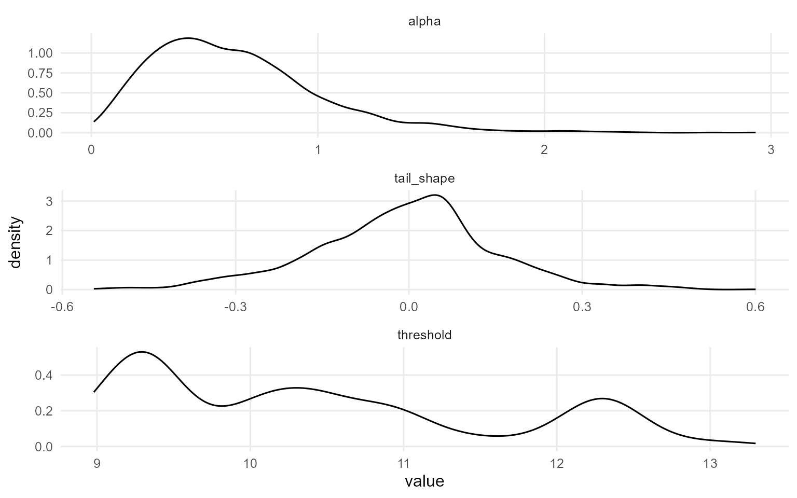

    === geweke ===

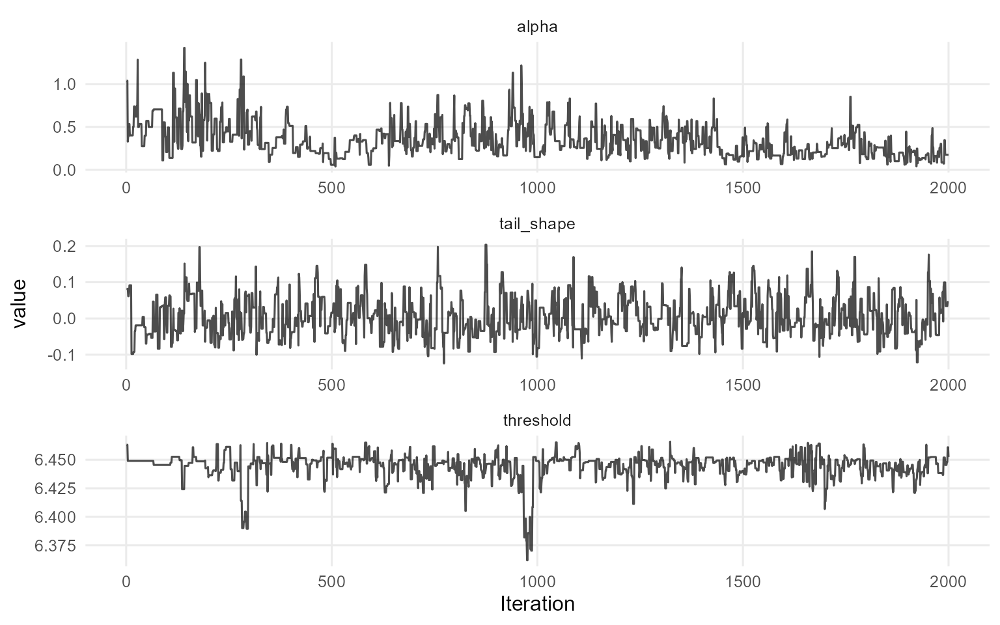

    === caterpillar ===

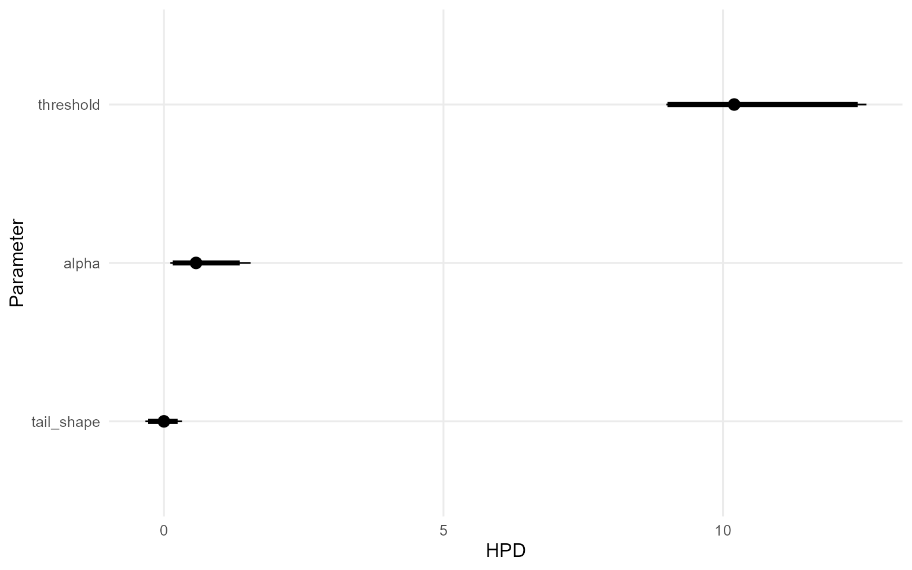

    === control ===

    === density ===

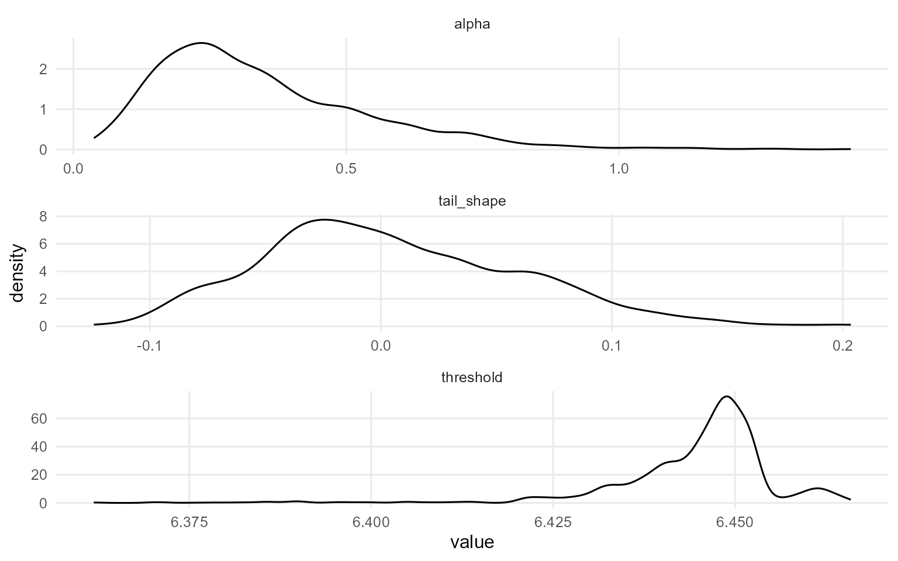

    === geweke ===

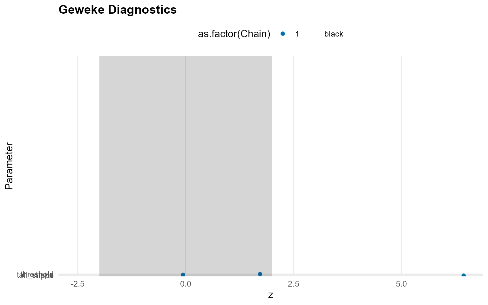

    === caterpillar ===

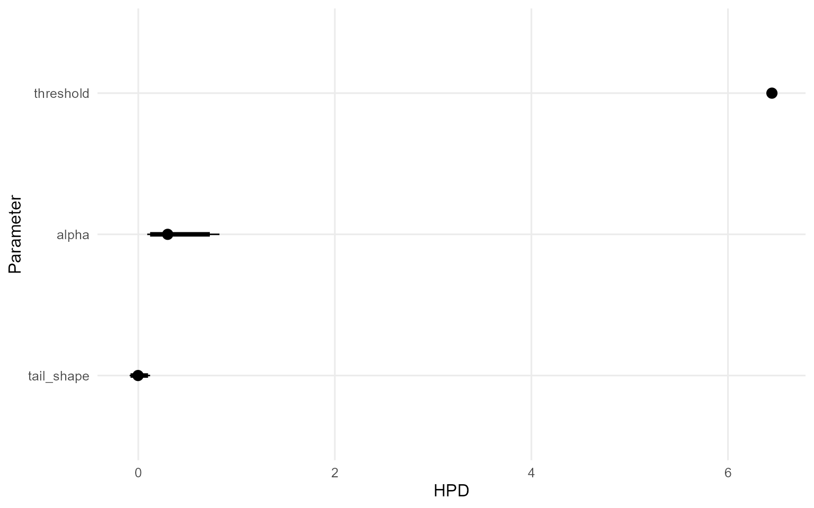

``` r
pred_mean_crp_sb <- predict(fit_crp_sb, x = x_eval, type = "mean",
                            interval = "credible", nsim_mean = 100)
plot(pred_mean_crp_sb)
```

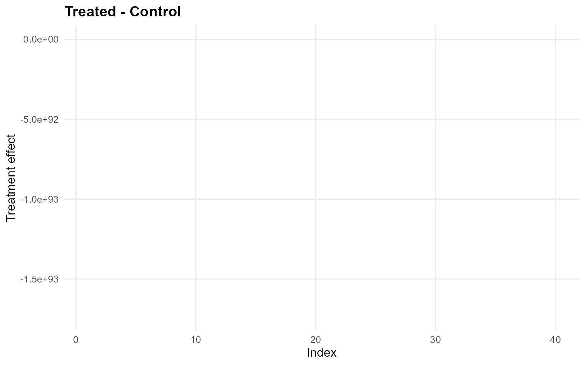

``` r
pred_q_crp_sb <- predict(fit_crp_sb, x = x_eval, type = "quantile",
                         p = 0.5, interval = "credible")
plot(pred_q_crp_sb)
```

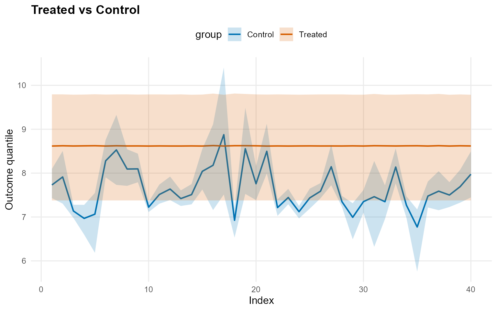

``` r
pred_d_crp_sb <- predict(fit_crp_sb, x = x_eval, y = y_eval,
                         type = "density", interval = "credible")
plot(pred_d_crp_sb)
```


``` r
pred_surv_crp_sb <- predict(fit_crp_sb, x = x_eval, y = y_eval,
                            type = "survival", interval = "credible")
plot(pred_surv_crp_sb)
```

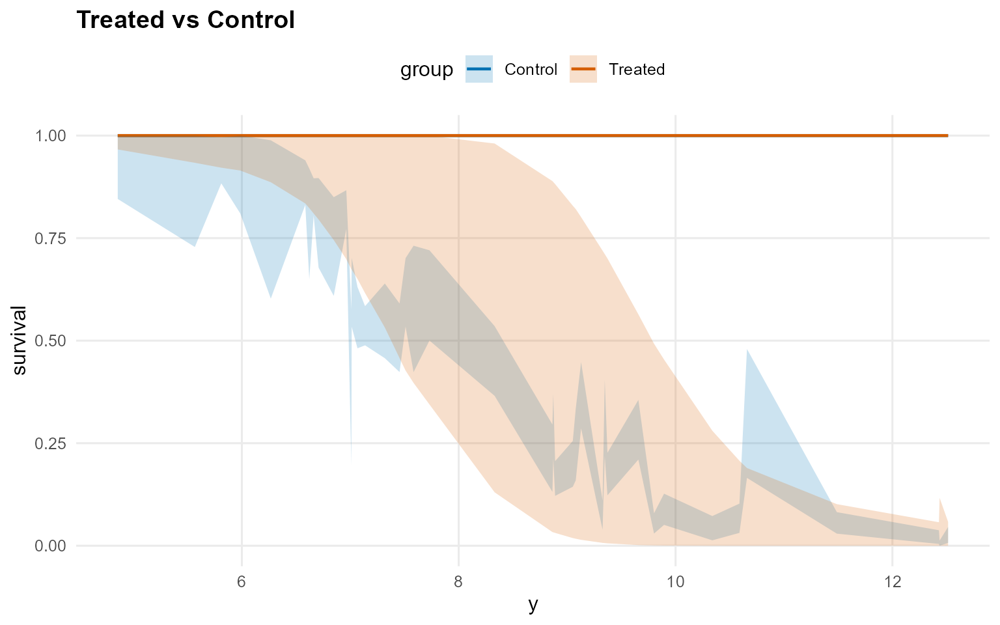

``` r
ate_crp_sb <- ate(fit_crp_sb, newdata = x_eval,
                  interval = "credible", nsim_mean = 100)
print(ate_crp_sb)
```

    ATE (Average Treatment Effect)
      Prediction points: 40
      Conditional (covariates): YES
      Propensity score used: NO
      Posterior mean draws: 100
      Credible interval: credible (95%)

    ATE estimates (treated - control):
     id      estimate  lower upper
      1 -3.399077e+76 -1.235 2.177
      2 -6.082183e+03 -2.059 1.672
      3 -2.053348e+70 -0.801 2.558
      4 -4.897980e+66 -0.806 2.869
      5 -1.524862e+56 -0.803 3.410
      6 -9.169515e+91 -2.334 1.327
    ... (34 more rows)

``` r
summary(ate_crp_sb)
```

    ATE Summary
    ================================================== 
    Prediction points: 40
    Conditional: YES | PS used: NO
    Posterior mean draws: 100
    Interval: credible (95%)

    Model specification:
      Backend (trt/con): crp / sb
      Kernel (trt/con): amoroso / amoroso
      GPD tail (trt/con): YES / YES

    ATE statistics:
      Mean: -6.04065080680751e+96 | Median: -7363264.563
      Range: [-2.41625940577152e+98, 0.702]
      SD: 3.8204415328467e+97

    Credible interval width:
      Mean: 3.718 | Median: 3.653
      Range: [3.281, 5.508]

``` r
ate_plots_crp_sb <- plot(ate_crp_sb)
ate_plots_crp_sb$treatment_effect
```


``` r
qte_crp_sb <- qte(fit_crp_sb, probs = c(0.25, 0.5, 0.75),
                  newdata = x_eval, interval = "credible")
print(qte_crp_sb)
```

    QTE (Quantile Treatment Effect)
      Prediction points: 40
      Quantile grid: 0.25, 0.5, 0.75
      Conditional (covariates): YES
      Propensity score used: NO
      Credible interval: credible (95%)

    QTE estimates (treated - control):
     index id estimate  lower upper
      0.25  1    0.784 -0.143 2.313
      0.25  2    0.904 -0.181 2.601
      0.25  3    1.066  0.131 2.572
      0.25  4    1.352  0.263 3.099
      0.25  5    1.242  0.112 2.937
      0.25  6    0.577 -0.378 2.134
    ... (114 more rows)

``` r
summary(qte_crp_sb)
```

    QTE Summary
    ================================================== 
    Prediction points: 40 | Quantiles: 3
    Quantile grid: 0.25, 0.5, 0.75
    Conditional: YES | PS used: NO
    Interval: credible (95%)

    Model specification:
      Backend (trt/con): crp / sb
      Kernel (trt/con): amoroso / amoroso
      GPD tail (trt/con): YES / YES

    QTE by quantile:
     quantile mean_qte median_qte min_qte max_qte sd_qte
         0.25    0.920      0.912   0.490   1.527  0.235
         0.50    0.975      1.108  -0.258   1.851  0.503
         0.75    0.538      0.791  -2.206   2.117  1.032

    Credible interval width:
      Mean: 2.797 | Median: 2.641
      Range: [2.419, 5.927]

``` r
qte_plots_crp_sb <- plot(qte_crp_sb)
qte_plots_crp_sb$treatment_effect
```


