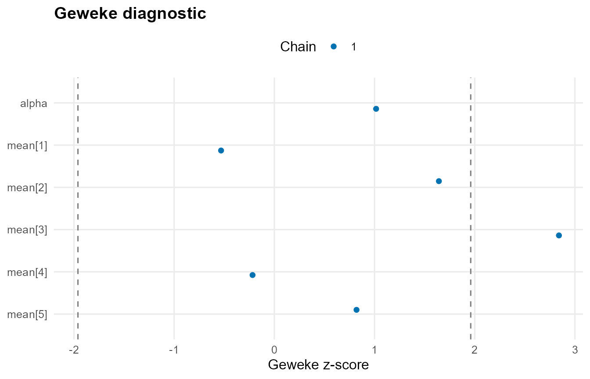

# MCMC Workflow

## Overview

This vignette demonstrates the MCMC workflow: build, run, inspect, and
extract.

## Theory (brief)

The posterior is explored with Markov chain Monte Carlo. Diagnostics
summarize mixing and convergence behavior, such as traceplots, effective
sample size, and Geweke statistics comparing early vs late chain
segments. These checks help ensure that posterior summaries are
reliable.

## Model Building and Sampling

``` r
library(DPmixGPD)

data("faithful", package = "datasets")
y <- faithful$eruptions
bundle <- build_nimble_bundle(
  y = y,
  backend = "sb",
  kernel = "normal",
  GPD = TRUE,
  components = 6,
  mcmc = mcmc
)

fit <- run_mcmc_bundle_manual(bundle, show_progress = FALSE)
```

## Model Summary

``` r
print(fit)
#> MixGPD fit | backend: Stick-Breaking Process | kernel: Normal Distribution | GPD tail: TRUE
#> n = 272 | components = 6 | epsilon = 0.025
#> MCMC: niter=400, nburnin=100, thin=2, nchains=1 
#> Fit
#> Use summary() for posterior summaries; plot() for diagnostics; predict() for predictions.
summary(fit)
#> MixGPD summary | backend: Stick-Breaking Process | kernel: Normal Distribution | GPD tail: TRUE | epsilon: 0.025
#> n = 272 | components = 6
#> Summary
#> Initial components: 6 | Components after truncation: 3
#> 
#> WAIC: 733.039
#> lppd: -359.414 | pWAIC: 7.106
#> 
#> Summary table
#>   parameter   mean    sd q0.025 q0.500 q0.975    ess
#>  weights[1]  0.433 0.081  0.323  0.417  0.597  3.046
#>  weights[2]  0.276 0.056  0.162  0.285  0.371  7.301
#>  weights[3]  0.192 0.051  0.107  0.197  0.282  4.688
#>       alpha  1.281 0.659   0.38  1.273   2.92 16.212
#>  tail_scale   2.57 0.086  2.423  2.561  2.689  5.752
#>  tail_shape -0.729 0.038 -0.769 -0.749 -0.618   2.31
#>   threshold  1.687 0.027  1.664  1.664  1.728  2.389
#>     mean[1]  7.592 3.263  3.042  7.262 14.606 23.106
#>     mean[2]  7.402 2.658  3.605  7.203 12.746 63.863
#>     mean[3]   6.89 2.362  3.702  6.396 12.253 25.889
#>       sd[1]  1.782 1.234  0.134  1.418  4.977  5.532
#>       sd[2]  1.378 0.783  0.353   1.17  3.432 28.357
#>       sd[3]  1.379 0.842  0.199  1.251  3.217 26.071
```

## Diagnostic Plots

``` r
if (requireNamespace("ggmcmc", quietly = TRUE) && requireNamespace("coda", quietly = TRUE)) {
  smp <- fit$mcmc$samples
  params <- if (!is.null(smp)) {
    cn <- colnames(as.matrix(smp))
    cn[1:min(6, length(cn))]
  } else {
    NULL
  }
  plot(fit, family = "geweke", params = params)
} else {
  message("Plotting requires 'ggmcmc' and 'coda' packages.")
}
#> 
#> === geweke ===
```



## Posterior Sample Extraction

``` r
if (!is.null(fit$mcmc$samples)) {
  s <- fit$mcmc$samples
  if (requireNamespace("coda", quietly = TRUE)) {
    mat <- as.matrix(s)
    dim(mat)
    colnames(mat)[1:min(20, ncol(mat))]
  } else {
    message("Sample extraction requires 'coda' package.")
  }
}
#>  [1] "alpha"      "mean[1]"    "mean[2]"    "mean[3]"    "mean[4]"   
#>  [6] "mean[5]"    "mean[6]"    "sd[1]"      "sd[2]"      "sd[3]"     
#> [11] "sd[4]"      "sd[5]"      "sd[6]"      "tail_scale" "tail_shape"
#> [16] "threshold"  "w[1]"       "w[2]"       "w[3]"       "w[4]"
```

## Re-running with Different Settings

``` r
# Rebuild with modified MCMC settings
# bundle2 <- update_mcmc(bundle, niter = 8000, nburnin = 2000)
# fit2 <- run_mcmc_bundle_manual(bundle2)
```
