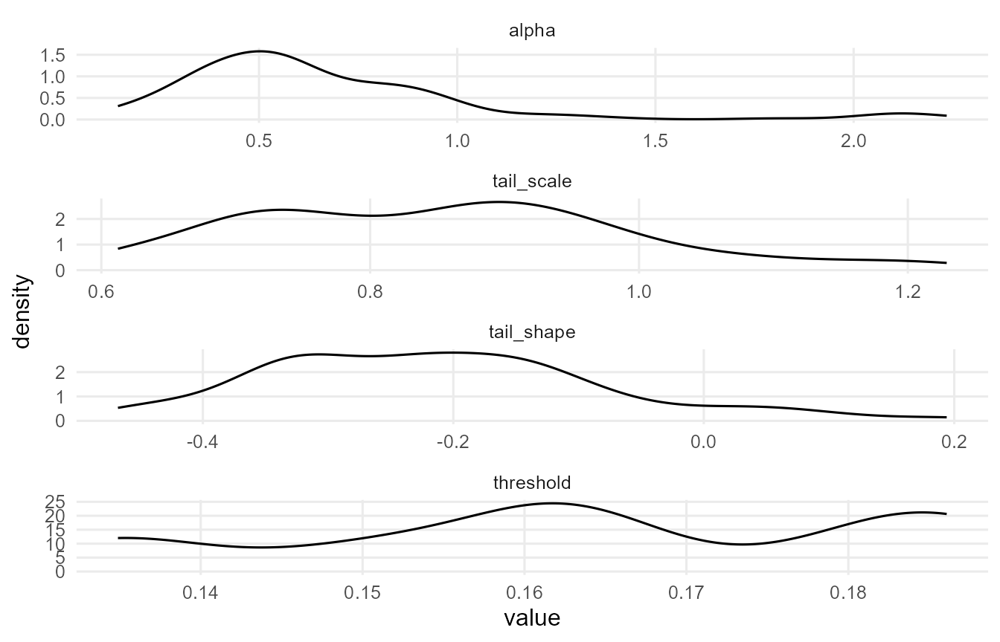
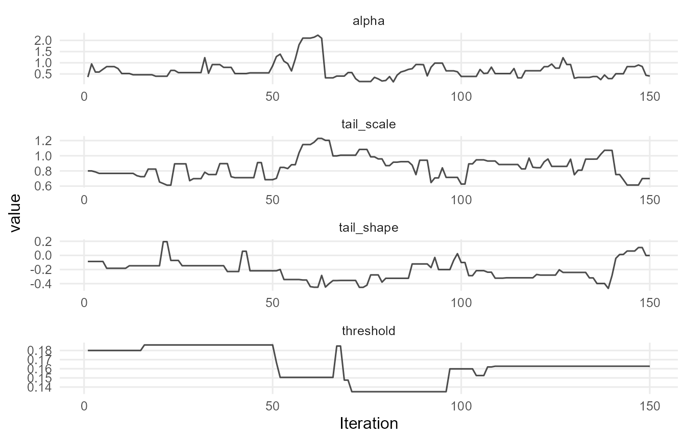
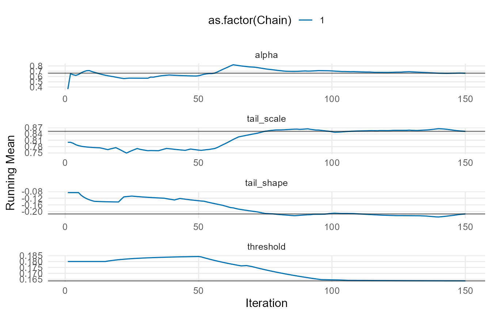
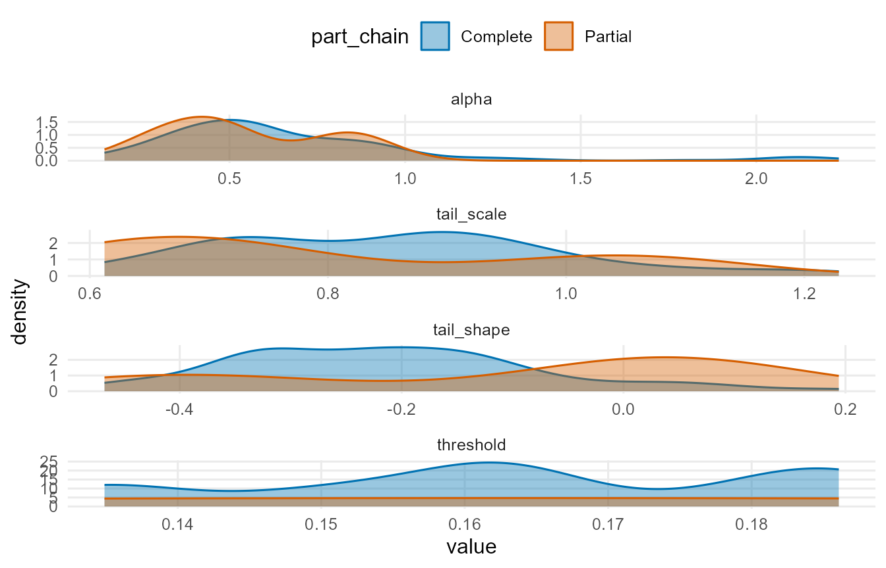
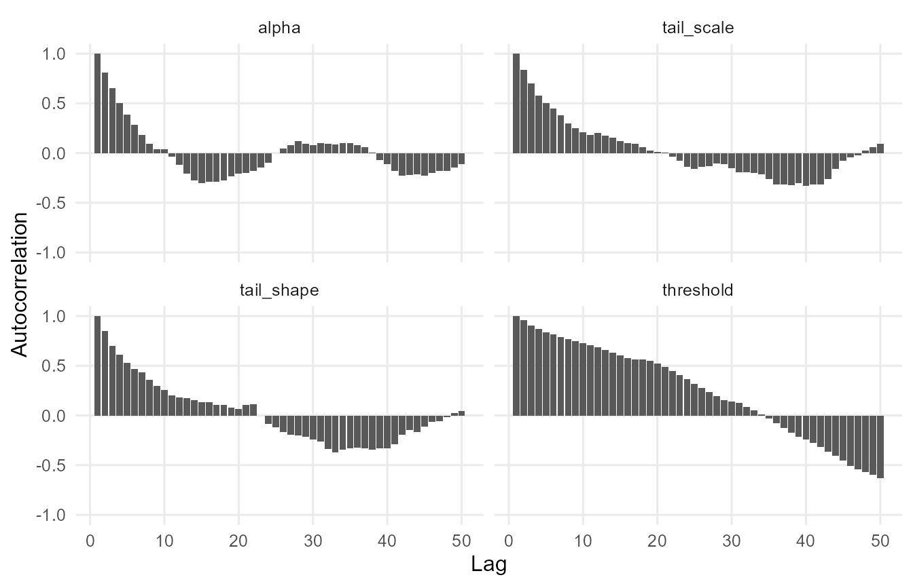
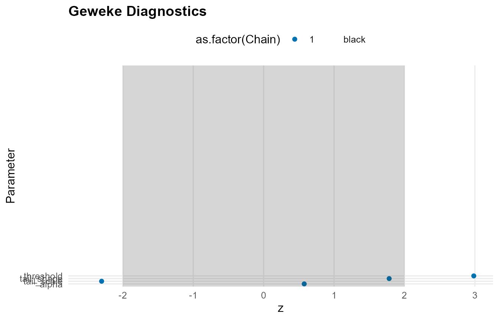
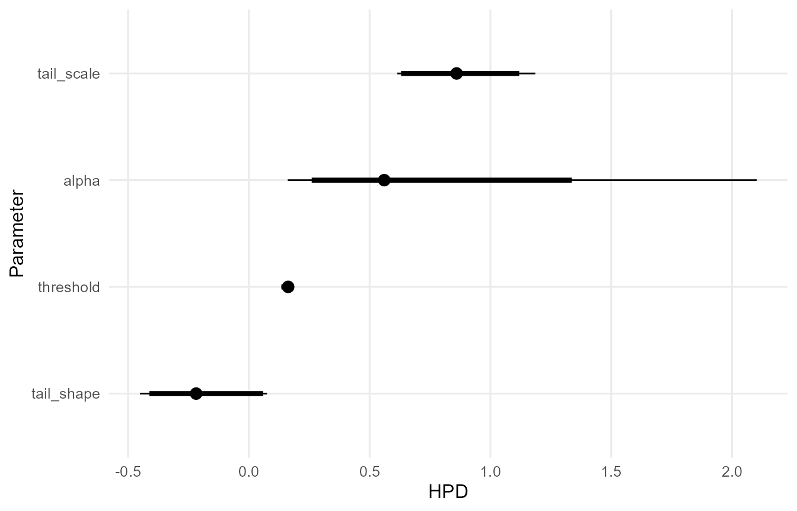
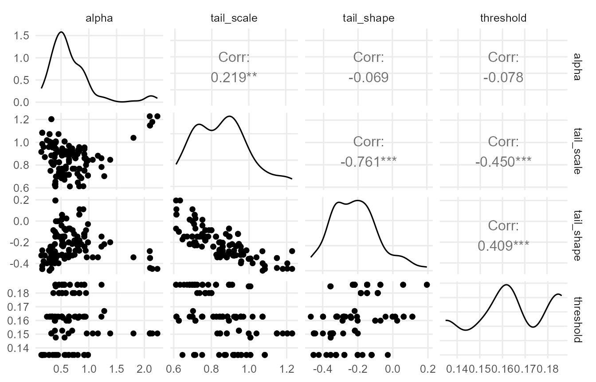

# MCMC Workflow

## Overview

This vignette demonstrates the MCMC workflow: build, run, inspect, and
extract.

## Model Building and Sampling

``` r
library(DPmixGPD)

y <- abs(rnorm(60)) + 0.15
bundle <- build_nimble_bundle(
  y = y,
  backend = "sb",
  kernel = "normal",
  GPD = TRUE,
  components = 6,
  mcmc = mcmc
)

fit <- run_mcmc_bundle_manual(bundle, show_progress = FALSE)
#> [MCMC] Creating NIMBLE model...
#> [MCMC] NIMBLE model created successfully.
#> [MCMC] Configuring MCMC...
#> ===== Monitors =====
#> thin = 1: alpha, mean, sd, tail_scale, tail_shape, threshold, w, z
#> ===== Samplers =====
#> RW sampler (21)
#>   - alpha
#>   - mean[]  (6 elements)
#>   - sd[]  (6 elements)
#>   - threshold
#>   - tail_scale
#>   - tail_shape
#>   - v[]  (5 elements)
#> categorical sampler (60)
#>   - z[]  (60 elements)
#> [MCMC] MCMC configured.
#> [MCMC] Building MCMC object...
#> [MCMC] MCMC object built.
#> [MCMC] Attempting NIMBLE compilation (this may take a minute)...
#> [MCMC] Compiling model...
#> [MCMC] Compiling MCMC sampler...
#> [MCMC] Compilation successful.
#> [MCMC] MCMC execution complete. Processing results...
fit
#> MixGPD fit | backend: Stick-Breaking Process | kernel: Normal Distribution | GPD tail: TRUE
#> n = 60 | components = 6 | epsilon = 0.025
#> MCMC: niter=400, nburnin=100, thin=2, nchains=1 
#> Fit
#> Use summary() for posterior summaries; plot() for diagnostics; predict() for predictions.
```

## Model Summary

``` r
print(fit)
#> MixGPD fit | backend: Stick-Breaking Process | kernel: Normal Distribution | GPD tail: TRUE
#> n = 60 | components = 6 | epsilon = 0.025
#> MCMC: niter=400, nburnin=100, thin=2, nchains=1 
#> Fit
#> Use summary() for posterior summaries; plot() for diagnostics; predict() for predictions.
summary(fit)
#> MixGPD summary | backend: Stick-Breaking Process | kernel: Normal Distribution | GPD tail: TRUE | epsilon: 0.025
#> n = 60 | components = 6
#> Summary
#> Initial components: 6 | Components after truncation: 1
#> 
#> WAIC: 80.392
#> lppd: -35.213 | pWAIC: 4.983
#> 
#> Summary table
#>   parameter   mean    sd q0.025 q0.500 q0.975    ess
#>  weights[1]  0.973 0.036  0.895  1.000  1.000 15.251
#>       alpha  0.662 0.399  0.161  0.560  2.102 16.098
#>  tail_scale  0.852 0.143  0.614  0.860  1.186 13.322
#>  tail_shape -0.214 0.135 -0.451 -0.218  0.075 13.205
#>   threshold  0.164 0.018  0.135  0.163  0.186  3.059
#>     mean[1]  4.791 1.791  1.937  4.735  9.800 13.590
#>       sd[1]  1.304 0.650  0.234  1.250  2.523 28.040
```

## Diagnostic Plots

``` r
if (requireNamespace("ggmcmc", quietly = TRUE) && requireNamespace("coda", quietly = TRUE)) {
  plot(fit)
} else {
  message("Plotting requires 'ggmcmc' and 'coda' packages.")
}
#> 
#> === histogram ===
```


    #> 
    #> === density ===



    #> 
    #> === traceplot ===



    #> 
    #> === running ===



    #> 
    #> === compare_partial ===



    #> 
    #> === autocorrelation ===



    #> 
    #> === geweke ===



    #> 
    #> === caterpillar ===



    #> 
    #> === pairs ===



## Posterior Sample Extraction

``` r
if (!is.null(fit$mcmc$samples)) {
  s <- fit$mcmc$samples
  if (requireNamespace("coda", quietly = TRUE)) {
    mat <- as.matrix(s)
    dim(mat)
    colnames(mat)[1:min(20, ncol(mat))]
  } else {
    message("Sample extraction requires 'coda' package.")
  }
}
#>  [1] "alpha"      "mean[1]"    "mean[2]"    "mean[3]"    "mean[4]"   
#>  [6] "mean[5]"    "mean[6]"    "sd[1]"      "sd[2]"      "sd[3]"     
#> [11] "sd[4]"      "sd[5]"      "sd[6]"      "tail_scale" "tail_shape"
#> [16] "threshold"  "w[1]"       "w[2]"       "w[3]"       "w[4]"
```

## Re-running with Different Settings

``` r
# Rebuild with modified MCMC settings
# bundle2 <- update_mcmc(bundle, niter = 8000, nburnin = 2000)
# fit2 <- run_mcmc_bundle_manual(bundle2)
```
