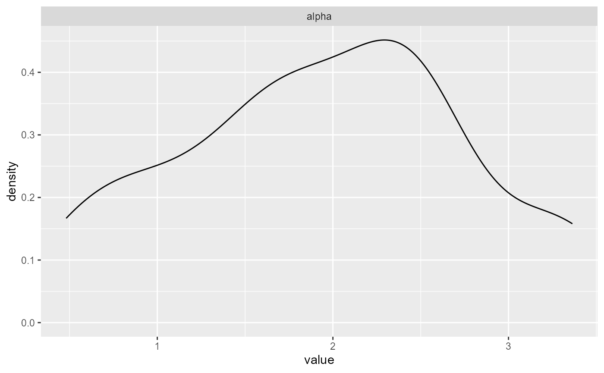

# Quickstart

## Overview

This vignette shows the core workflow end-to-end:

1.  Build a bundle
2.  Run MCMC
3.  Summarize and plot
4.  Predict density, survival, and quantiles

We show both SB and CRP backends, then show what changes when
`GPD = TRUE`.

## Data

``` r
library(DPmixGPD)
library(nimble)
use_cached_fit <- TRUE
.fit_path <- function(name) {
  path <- system.file("extdata", name, package = "DPmixGPD")
  if (path == "") path <- file.path("inst", "extdata", name)
  path
}
fit_small <- readRDS(.fit_path("fit_small.rds"))
fit_small_crp <- readRDS(.fit_path("fit_small_crp.rds"))
set.seed(1)
N <- 60
y <- abs(rnorm(N)) + 0.1
```

## Stick-breaking (SB) backend

``` r
bundle_sb <- build_nimble_bundle(
  y = y,
  backend = "sb",
  kernel = "normal",
  GPD = FALSE,
  J = 8,
  mcmc = list(niter = 200, nburnin = 50, thin = 1, nchains = 1, seed = 1)
)

if (use_cached_fit) {
  fit_sb <- fit_small
} else {
  fit_sb <- run_mcmc_bundle_manual(bundle_sb, show_progress = FALSE)
}
summary(fit_sb)
#> MixGPD summary | backend: Stick-Breaking Process | kernel: Normal Distribution | GPD tail: FALSE | epsilon: 0.025
#> n = 80 | components = 3
#> Summary
#> Initial components: 3 | Components after truncation: 3
#> 
#> Summary table
#>   parameter  mean    sd q0.025 q0.500 q0.975    ess
#>  weights[1] 0.638 0.081  0.524  0.625  0.775  3.535
#>  weights[2] 0.211 0.033  0.150  0.212  0.251  8.389
#>  weights[3] 0.154 0.055  0.049  0.162  0.225  3.421
#>       alpha 1.945 0.818  0.575  1.904  3.341 13.115
#>     mean[1] 1.150 0.154  0.876  1.144  1.404  9.376
#>     mean[2] 5.956 3.400  2.343  6.970 11.420 15.873
#>     mean[3] 6.067 3.332  2.530  3.815 11.671 13.235
#>       sd[1] 3.027 1.226  1.385  2.780  5.462  8.118
#>       sd[2] 1.110 1.316  0.023  0.059  3.947  3.470
#>       sd[3] 1.356 1.652  0.029  0.587  5.270 15.139
```

A quick diagnostic plot (one panel):

``` r
plots <- plot(fit_sb, family = "density", params = "alpha")
```


``` r
plots[[1]]
```



## Prediction (SB)

``` r
y_grid <- seq(min(y), max(y), length.out = 50)

pr_den <- predict(fit_sb, type = "density", y = y_grid)
pr_surv <- predict(fit_sb, type = "survival", y = y_grid)
pr_q <- predict(fit_sb, type = "quantile", p = c(0.5, 0.9))

head(pr_den$fit)
#>           [,1]      [,2]      [,3]      [,4]      [,5]      [,6]      [,7]
#> [1,] 0.1004133 0.1016668 0.1029019 0.1041171 0.1053108 0.1064815 0.1076276
#>           [,8]      [,9]     [,10]     [,11]     [,12]     [,13]     [,14]
#> [1,] 0.1087476 0.1098401 0.1109036 0.1119365 0.1129377 0.1139056 0.1148391
#>          [,15]     [,16]     [,17]     [,18]     [,19]     [,20]     [,21]
#> [1,] 0.1157368 0.1165975 0.1174201 0.1182035 0.1189466 0.1196486 0.1203085
#>          [,22]     [,23]     [,24]     [,25]     [,26]     [,27]     [,28]
#> [1,] 0.1209254 0.1214988 0.1220278 0.1225119 0.1229506 0.1233434 0.1236901
#>          [,29]     [,30]     [,31]     [,32]     [,33]     [,34]     [,35]
#> [1,] 0.1239903 0.1242438 0.1244505 0.1246105 0.1247237 0.1247903 0.1248104
#>          [,36]     [,37]     [,38]     [,39]     [,40]     [,41]    [,42]
#> [1,] 0.1247842 0.1247122 0.1245945 0.1244316 0.1242239 0.1239719 0.123676
#>          [,43]     [,44]     [,45]     [,46]     [,47]    [,48]     [,49]
#> [1,] 0.1233367 0.1229544 0.1225297 0.1220629 0.1215546 0.121005 0.1204147
#>         [,50]
#> [1,] 0.119784
pr_q$fit
#>          [,1]     [,2]
#> [1,] 2.444721 9.102755
```

## CRP backend

``` r
bundle_crp <- build_nimble_bundle(
  y = y,
  backend = "crp",
  kernel = "normal",
  GPD = FALSE,
  J = 8,
  mcmc = list(niter = 200, nburnin = 50, thin = 1, nchains = 1, seed = 1)
)

if (use_cached_fit) {
  fit_crp <- fit_small_crp
} else {
  fit_crp <- run_mcmc_bundle_manual(bundle_crp, show_progress = FALSE)
}
summary(fit_crp)
#> MixGPD summary | backend: Chinese Restaurant Process | kernel: Normal Distribution | GPD tail: FALSE | epsilon: 0.025
#> n = 80 | components = 3
#> Summary
#> Initial components: 3 | Components after truncation: 3
#> 
#> Summary table
#>   parameter  mean    sd q0.025 q0.500 q0.975    ess
#>  weights[1] 0.542 0.055  0.462  0.537  0.663  7.671
#>  weights[2] 0.344 0.068  0.262  0.325  0.475  3.588
#>  weights[3] 0.175 0.033  0.102  0.175  0.217 13.487
#>       alpha 0.540 0.285  0.138  0.491  1.167 40.000
#>     mean[1] 1.092 0.153  0.852  1.094  1.325  5.262
#>     mean[2] 6.729 1.203  4.726  6.919  8.907 18.225
#>     mean[3] 2.983 0.288  2.596  2.953  3.557 10.855
#>       sd[1] 2.585 0.810  1.137  2.579  4.132 22.478
#>       sd[2] 0.053 0.015  0.028  0.049  0.080 40.000
#>       sd[3] 1.692 0.441  0.998  1.611  2.517 12.295
```

Compare SB vs CRP median predictions:

``` r
q_sb <- predict(fit_sb, type = "quantile", p = 0.5)$fit[1, 1]
q_crp <- predict(fit_crp, type = "quantile", p = 0.5)$fit[1, 1]

data.frame(backend = c("sb", "crp"), q50 = c(q_sb, q_crp))
#>   backend      q50
#> 1      sb 2.444721
#> 2     crp 3.316207
```

## Turning on the GPD tail

``` r
bundle_gpd <- build_nimble_bundle(
  y = y,
  backend = "sb",
  kernel = "normal",
  GPD = TRUE,
  J = 8,
  mcmc = list(niter = 200, nburnin = 50, thin = 1, nchains = 1, seed = 2)
)

if (use_cached_fit) {
  fit_gpd <- fit_small
} else {
  fit_gpd <- run_mcmc_bundle_manual(bundle_gpd, show_progress = FALSE)
}
q_off <- predict(fit_sb, type = "quantile", p = 0.99)$fit[1, 1]
q_on <- predict(fit_gpd, type = "quantile", p = 0.99)$fit[1, 1]

data.frame(model = c("GPD=FALSE", "GPD=TRUE"), q99 = c(q_off, q_on))
#>       model     q99
#> 1 GPD=FALSE 10.1547
#> 2  GPD=TRUE 10.1547
```

With `GPD = TRUE`, high quantiles typically increase because the tail is
modeled explicitly rather than extrapolated from the bulk mixture.
