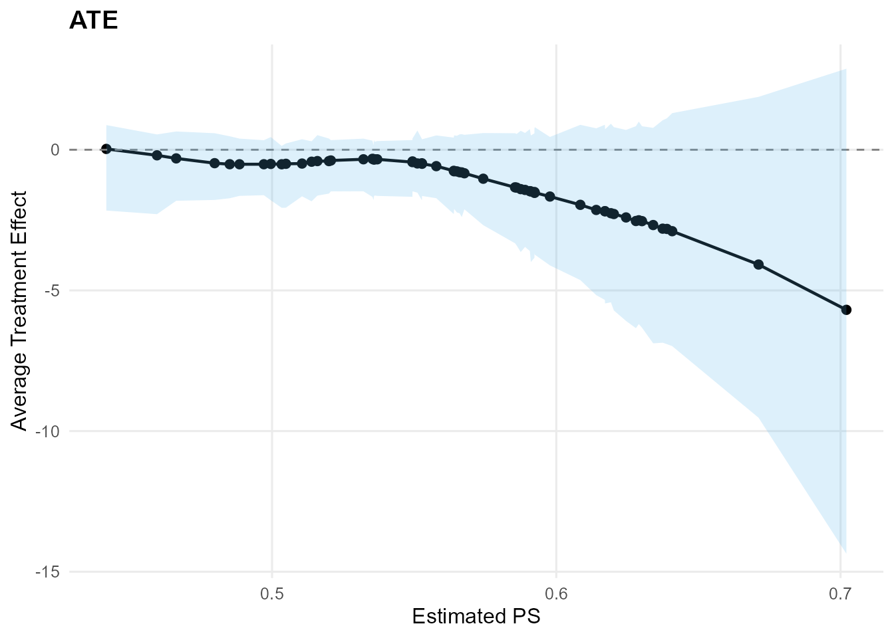
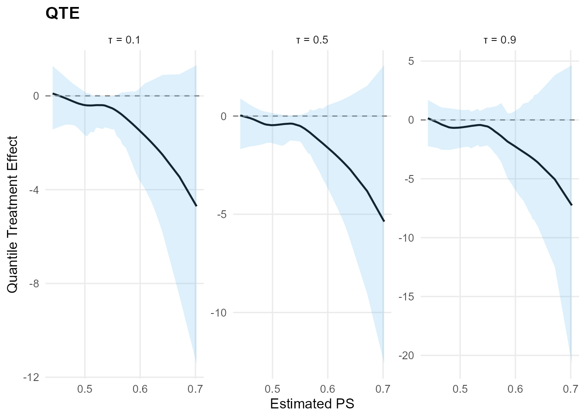

# Reference: S3 methods

## Goal

This vignette is a quick reference for common S3 methods on a
`mixgpd_fit` object.

## Fit a small model

``` r
library(DPmixGPD)

y <- abs(rnorm(50)) + 0.1
bundle <- build_nimble_bundle(
  y = y,
  backend = "sb",
  kernel = "normal",
  GPD = TRUE,
  components = 6,
  mcmc = mcmc
)
fit <- run_mcmc_bundle_manual(bundle, show_progress = FALSE)
#> [MCMC] Creating NIMBLE model...
#> [MCMC] NIMBLE model created successfully.
#> [MCMC] Configuring MCMC...
#> ===== Monitors =====
#> thin = 1: alpha, mean, sd, tail_scale, tail_shape, threshold, w, z
#> ===== Samplers =====
#> RW sampler (21)
#>   - alpha
#>   - mean[]  (6 elements)
#>   - sd[]  (6 elements)
#>   - threshold
#>   - tail_scale
#>   - tail_shape
#>   - v[]  (5 elements)
#> categorical sampler (50)
#>   - z[]  (50 elements)
#> [MCMC] MCMC configured.
#> [MCMC] Building MCMC object...
#> [MCMC] MCMC object built.
#> [MCMC] Attempting NIMBLE compilation (this may take a minute)...
#> [MCMC] Compiling model...
#> [MCMC] Compiling MCMC sampler...
#> [MCMC] Compilation successful.
#> [MCMC] MCMC execution complete. Processing results...
```

## `print()`

``` r
print(fit)
#> MixGPD fit | backend: Stick-Breaking Process | kernel: Normal Distribution | GPD tail: TRUE
#> n = 50 | components = 6 | epsilon = 0.025
#> MCMC: niter=300, nburnin=80, thin=2, nchains=1 
#> Fit
#> Use summary() for posterior summaries; plot() for diagnostics; predict() for predictions.
```

## `summary()`

``` r
summary(fit)
#> MixGPD summary | backend: Stick-Breaking Process | kernel: Normal Distribution | GPD tail: TRUE | epsilon: 0.025
#> n = 50 | components = 6
#> Summary
#> Initial components: 6 | Components after truncation: 2
#> 
#> WAIC: 40.911
#> lppd: -8.105 | pWAIC: 12.350
#> 
#> Summary table
#>   parameter   mean    sd q0.025 q0.500 q0.975    ess
#>  weights[1]  0.585 0.085  0.420  0.590  0.720  7.800
#>  weights[2]  0.345 0.059  0.280  0.340  0.480 11.623
#>       alpha  0.952 0.507  0.309  0.890  2.216 23.233
#>  tail_scale  0.600 0.085  0.444  0.596  0.764  9.470
#>  tail_shape -0.114 0.127 -0.299 -0.132  0.108 19.796
#>   threshold  0.456 0.006  0.451  0.452  0.465  1.758
#>     mean[1]  6.963 6.076  0.389  6.554 17.465  1.574
#>     mean[2]  1.520 1.960  0.199  0.330  6.405  6.231
#>       sd[1]  0.883 0.862  0.195  0.546  2.932 22.622
#>       sd[2]  0.459 0.498  0.095  0.195  1.634  3.771
```

## `plot()`

``` r
try(plot(fit, family = "trace"), silent = TRUE)
```

## `predict()`

``` r
# Mean / median with equal-tailed credible intervals
predict(fit, type = "mean", cred.level = 0.90, interval = "credible")$fit
#>   estimate    lower    upper
#> 1 2.271623 1.036961 4.245987
predict(fit, type = "median", cred.level = 0.90, interval = "credible")$fit
#>    estimate index     lower     upper
#> 1 0.6574151   0.5 0.5767237 0.7107128

# Quantile with HPD (Highest Posterior Density) intervals
predict(fit, type = "quantile", index = 0.90, cred.level = 0.90, interval = "hpd")$fit
#>   estimate index    lower    upper
#> 1  1.50624   0.9 1.269403 1.678693

# No intervals (point estimates only)
predict(fit, type = "quantile", index = 0.90, interval = NULL)$fit
#>   estimate index lower upper
#> 1  1.50624   0.9    NA    NA
```

## `fitted()`

``` r
# Returns a data.frame with fit, interval, residuals
f <- fitted(fit, type = "mean", level = 0.90)
head(f)
#>        fit    lower    upper  residuals
#> 1 2.233923 1.035704 4.016735 -1.5074693
#> 2 2.233923 1.035704 4.016735 -1.9502798
#> 3 2.233923 1.035704 4.016735 -1.2982945
#> 4 2.233923 1.035704 4.016735 -0.5386423
#> 5 2.233923 1.035704 4.016735 -1.8044154
#> 6 2.233923 1.035704 4.016735 -1.3134548
```

## Object structure

``` r
str(fit, max.level = 2)
#> List of 14
#>  $ call      : language run_mcmc_bundle_manual(bundle = bundle, show_progress = FALSE)
#>  $ spec      :List of 4
#>   ..$ meta       :List of 9
#>   ..$ kernel_info:List of 9
#>   ..$ signatures :List of 2
#>   ..$ plan       :List of 11
#>   ..- attr(*, "class")= chr [1:2] "dpmixgpd_spec" "list"
#>  $ data      :List of 1
#>   ..$ y: num [1:50] 0.726 0.284 0.936 1.695 0.43 ...
#>  $ model     :Reference class 'Ccode_MID_1' [package ".GlobalEnv"] with 67 fields
#>   ..and 88 methods, of which 74 are  possibly relevant:
#>   ..  calculate, calculateDiff, check, checkBasics, checkConjugacy,
#>   ..  copyFromModel, expandNodeNames, expandNodeNamesFromGraphIDs, finalize,
#>   ..  finalizeInternal, getBound, getBuildDerivs, getCode,
#>   ..  getConditionallyIndependentSets, getConstants, getDeclID, getDeclInfo,
#>   ..  getDependencies, getDependenciesList, getDependencyPathCountOneNode,
#>   ..  getDependencyPaths, getDimension, getDistribution, getDownstream,
#>   ..  getGraph, getLogProb, getMacroInits, getMacroParameters, getMaps,
#>   ..  getModelDef, getNodeFunctions, getNodeNames, getNodeType, getParam,
#>   ..  getParamExpr, getParents, getParentsList, getPredictiveNodeIDs,
#>   ..  getPredictiveRootNodeIDs, getSymbolTable, getUnrolledIndicesList,
#>   ..  getValueExpr, getVarInfo, getVarNames, init_isDataEnv, initialize,
#>   ..  initializeInfo, isBinary, isData, isDataFromGraphID, isDeterm,
#>   ..  isDiscrete, isEndNode, isMultivariate, isStoch, isTruncated,
#>   ..  isUnivariate, newModel, plot, plotGraph, resetData,
#>   ..  safeUpdateValidValues, setData, setGraph, setInits, setModel,
#>   ..  setModelDef, setPredictiveNodeIDs, setupNodes, show#CmodelBaseClass,
#>   ..  show#envRefClass, simulate, testDataFlags, topologicallySortNodes
#>  $ mcmc_conf :Reference class 'MCMCconf' [package "nimble"] with 16 fields
#>   ..and 59 methods, of which 45 are  possibly relevant:
#>   ..  addConjugateSampler, addDefaultSampler, addDerivedQuantity, addMonitors,
#>   ..  addMonitors2, addOneDerivedQuantity, addOneSampler, addSampler,
#>   ..  filterOutDataNodes, findSamplersOnNodes, getDerivedQuantities,
#>   ..  getDerivedQuantityDefinition, getMonitors, getMonitors2,
#>   ..  getMvSamplesConf, getSamplerDefinition, getSamplerExecutionOrder,
#>   ..  getSamplers, getUnsampledNodes, initialize, isMvSamplesReady,
#>   ..  makeMvSamplesConf, printComments, printDerivedQuantities,
#>   ..  printDerivedQuantitiesByType, printMonitors, printSamplers,
#>   ..  printSamplersByType, removeDerivedQuantities, removeDerivedQuantity,
#>   ..  removeSampler, removeSamplers, replaceSampler, replaceSamplers,
#>   ..  resetMonitors, setMonitors, setMonitors2, setSampler,
#>   ..  setSamplerExecutionOrder, setSamplers, setThin, setThin2,
#>   ..  setUnsampledNodes, show#envRefClass, warnUnsampledNodes
#>  $ mcmc      :List of 8
#>   ..$ engine : chr "compiled"
#>   ..$ niter  : int 300
#>   ..$ nburnin: int 80
#>   ..$ thin   : int 2
#>   ..$ nchains: int 1
#>   ..$ seed   : int 1
#>   ..$ samples: 'mcmc' num [1:110, 1:72] 1.932 2.182 0.309 0.309 1.232 ...
#>   .. ..- attr(*, "dimnames")=List of 2
#>   .. ..- attr(*, "mcpar")= num [1:3] 1 110 1
#>   ..$ waic   :Reference class 'waicNimbleList' [package "nimble"] with 7 fields
#>   .. ..and 17 methods, of which 3 are  possibly relevant
#>  $ code      : language {     alpha ~ dgamma(1, 1) ...
#>  $ constants :List of 3
#>   ..$ N         : int 50
#>   ..$ P         : int 0
#>   ..$ components: int 6
#>  $ dimensions:List of 5
#>   ..$ v   : int 5
#>   ..$ w   : int 6
#>   ..$ z   : int 50
#>   ..$ mean: int 6
#>   ..$ sd  : int 6
#>  $ monitors  : chr [1:8] "alpha" "w[1:6]" "z[1:50]" "mean[1:6]" ...
#>  $ cache     : list()
#>  $ epsilon   : num 0.025
#>  $ samples   : 'mcmc' num [1:110, 1:72] 1.932 2.182 0.309 0.309 1.232 ...
#>   ..- attr(*, "dimnames")=List of 2
#>   ..- attr(*, "mcpar")= num [1:3] 1 110 1
#>  $ waic      :Reference class 'waicNimbleList' [package "nimble"] with 7 fields
#>   ..and 17 methods, of which 3 are  possibly relevant:
#>   ..  initialize, initialize#nimbleListBase, show#envRefClass
#>  - attr(*, "class")= chr [1:2] "mixgpd_fit" "list"
```

## Causal S3 Methods

For causal inference workflows,
[`ate()`](https://arnabaich96.github.io/DPmixGPD/reference/ate.md) and
[`qte()`](https://arnabaich96.github.io/DPmixGPD/reference/qte.md)
return objects with their own S3 methods.

### Fit a causal model

``` r
# Simulate causal data
n <- 60
X <- data.frame(x = rnorm(n))
T_ind <- rbinom(n, 1, plogis(0.2 + 0.5 * X$x))
y0 <- 0.5 + 0.7 * X$x + abs(rnorm(n)) + 0.1
te <- 0.4 + 0.6 * (X$x > 0)
y1 <- y0 + te
y <- ifelse(T_ind == 1, y1, y0)

# Build and fit causal bundle
causal_bundle <- build_causal_bundle(
  y = y,
  X = X,
  T = T_ind,
  backend = "sb",
  kernel = "normal",
  GPD = TRUE,
  components = 6,
  PS = "logit",
  design = "observational",
  mcmc_outcome = mcmc,
  mcmc_ps = mcmc
)
causal_fit <- run_mcmc_causal(causal_bundle, show_progress = FALSE)
#> ===== Monitors =====
#> thin = 1: beta
#> ===== Samplers =====
#> RW sampler (2)
#>   - beta[]  (2 elements)
#> [MCMC] Creating NIMBLE model...
#> [MCMC] NIMBLE model created successfully.
#> [MCMC] Configuring MCMC...
#> ===== Monitors =====
#> thin = 1: alpha, beta_mean, beta_ps_mean, beta_tail_scale, beta_threshold, sd, sdlog_u, tail_shape, threshold, w, z
#> ===== Samplers =====
#> RW sampler (53)
#>   - alpha
#>   - sd[]  (6 elements)
#>   - beta_mean[]  (6 elements)
#>   - beta_ps_mean[]  (6 elements)
#>   - sdlog_u
#>   - beta_tail_scale[]  (1 element)
#>   - tail_shape
#>   - v[]  (5 elements)
#>   - threshold[]  (26 elements)
#> conjugate sampler (1)
#>   - beta_threshold[]  (1 element)
#> categorical sampler (26)
#>   - z[]  (26 elements)
#> [MCMC] MCMC configured.
#> [MCMC] Building MCMC object...
#> [MCMC] MCMC object built.
#> [MCMC] Attempting NIMBLE compilation (this may take a minute)...
#> [MCMC] Compiling model...
#> [MCMC] Compiling MCMC sampler...
#> [MCMC] Compilation successful.
#> [MCMC] MCMC execution complete. Processing results...
#> [MCMC] Creating NIMBLE model...
#> [MCMC] NIMBLE model created successfully.
#> [MCMC] Configuring MCMC...
#> ===== Monitors =====
#> thin = 1: alpha, beta_mean, beta_ps_mean, beta_tail_scale, beta_threshold, sd, sdlog_u, tail_shape, threshold, w, z
#> ===== Samplers =====
#> RW sampler (61)
#>   - alpha
#>   - sd[]  (6 elements)
#>   - beta_mean[]  (6 elements)
#>   - beta_ps_mean[]  (6 elements)
#>   - sdlog_u
#>   - beta_tail_scale[]  (1 element)
#>   - tail_shape
#>   - v[]  (5 elements)
#>   - threshold[]  (34 elements)
#> conjugate sampler (1)
#>   - beta_threshold[]  (1 element)
#> categorical sampler (34)
#>   - z[]  (34 elements)
#> [MCMC] MCMC configured.
#> [MCMC] Building MCMC object...
#> [MCMC] MCMC object built.
#> [MCMC] Attempting NIMBLE compilation (this may take a minute)...
#> [MCMC] Compiling model...
#> [MCMC] Compiling MCMC sampler...
#> [MCMC] Compilation successful.
#> [MCMC] MCMC execution complete. Processing results...
```

### ATE S3 Methods

``` r
# Compute ATE with HPD intervals
ate_result <- ate(causal_fit, interval = "hpd", nsim_mean = 50)

# print() method
print(ate_result)
#> ATE (Average Treatment Effect)
#>   Prediction points: 60
#>   Conditional (covariates): YES
#>   Propensity score used: YES
#>   PS scale: logit
#>   Posterior mean draws: 50
#>   Credible interval: hpd
#> 
#> ATE estimates (treated - control):
#>  id estimate  lower upper
#>   1   -2.184 -5.337 0.888
#>   2   -0.198 -2.290 0.545
#>   3   -1.481 -3.992 0.508
#>   4   -0.403 -1.631 0.519
#>   5   -2.256 -5.423 0.925
#>   6   -2.284 -5.712 0.803
#> ... (54 more rows)
```

``` r
# summary() method
summary(ate_result)
#> ATE Summary
#> ================================================== 
#> Prediction points: 60
#> Conditional: YES | PS used: YES
#> Posterior mean draws: 50
#> Interval: hpd
#> 
#> Model specification:
#>   Backend (trt/con): sb / sb
#>   Kernel (trt/con): normal / normal
#>   GPD tail (trt/con): YES / YES
#> 
#> ATE statistics:
#>   Mean: -1.257 | Median: -0.784
#>   Range: [-5.691, 0.029]
#>   SD: 1.09
#> 
#> Credible interval width:
#>   Mean: 4.105 | Median: 2.821
#>   Range: [1.82, 17.242]
```

``` r
# plot() method - default returns list with both plots
ate_plots <- plot(ate_result)
ate_plots$treatment_effect
```



``` r
# Plot with type parameter
plot(ate_result, type = "effect")
```


### QTE S3 Methods

``` r
# Compute QTE with HPD intervals
qte_result <- qte(causal_fit, probs = c(0.1, 0.5, 0.9), interval = "hpd")

# print() method
print(qte_result)
#> QTE (Quantile Treatment Effect)
#>   Prediction points: 60
#>   Quantile grid: 0.1, 0.5, 0.9
#>   Conditional (covariates): YES
#>   Propensity score used: YES
#>   PS scale: logit
#>   Credible interval: hpd
#> 
#> QTE estimates (treated - control):
#>  index id estimate  lower  upper
#>    0.1  1   -1.903 -4.361  0.621
#>    0.1  2   -0.050 -1.272  0.912
#>    0.1  3   -1.302 -3.219  0.193
#>    0.1  4   -0.404 -1.558 -0.027
#>    0.1  5   -1.955 -4.462  0.645
#>    0.1  6   -1.980 -4.512  0.656
#> ... (174 more rows)
```

``` r
# summary() method
summary(qte_result)
#> QTE Summary
#> ================================================== 
#> Prediction points: 60 | Quantiles: 3
#> Quantile grid: 0.1, 0.5, 0.9
#> Conditional: YES | PS used: YES
#> Interval: hpd
#> 
#> Model specification:
#>   Backend (trt/con): sb / sb
#>   Kernel (trt/con): normal / normal
#>   GPD tail (trt/con): YES / YES
#> 
#> QTE by quantile:
#>  quantile mean_qte median_qte min_qte max_qte sd_qte
#>       0.1   -1.113     -0.776  -4.708   0.102  0.917
#>       0.5   -1.197     -0.795  -5.372   0.033  1.016
#>       0.9   -1.620     -1.065  -7.258   0.140  1.378
#> 
#> Credible interval width:
#>   Mean: 4.168 | Median: 3.296
#>   Range: [1.267, 25.363]
```

``` r
# plot() method - default returns list with both plots
qte_plots <- plot(qte_result)
qte_plots$treatment_effect
```



``` r
# Plot with type parameter
plot(qte_result, type = "effect")
```


