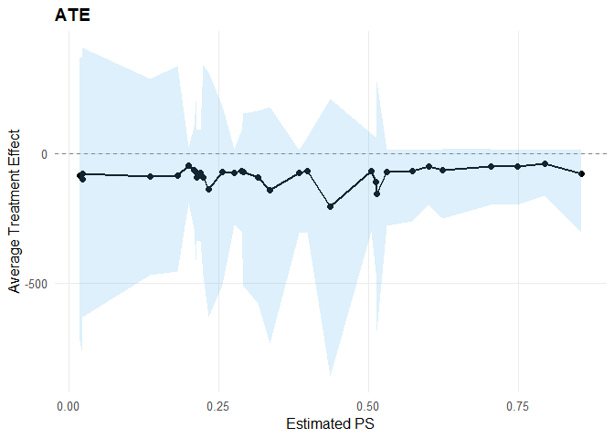
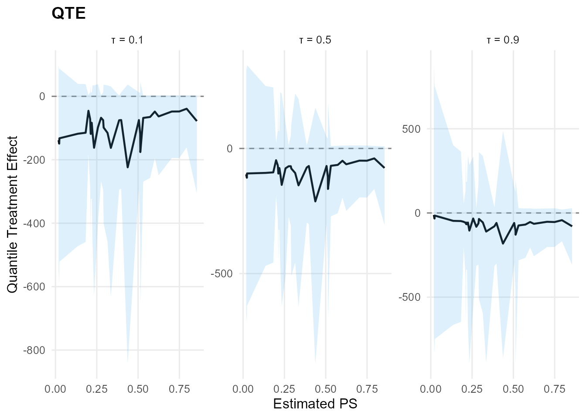

# Reference: S3 Methods

## Overview

This vignette provides a reference for S3 methods on `mixgpd_fit`
objects.

## Theory (brief)

S3 methods provide a consistent interface for posterior summaries and
diagnostics on fitted objects. They expose predictions, fitted values,
and standard MCMC visualizations while keeping the underlying model
specification unchanged.

## Model Fitting

``` r
library(DPmixGPD)

data("faithful", package = "datasets")
y <- faithful$eruptions
bundle <- build_nimble_bundle(
  y = y,
  backend = "sb",
  kernel = "normal",
  GPD = TRUE,
  components = 6,
  mcmc = mcmc
)
fit <- run_mcmc_bundle_manual(bundle, show_progress = FALSE)
```

## print()

``` r
print(fit)
#> MixGPD fit | backend: Stick-Breaking Process | kernel: Normal Distribution | GPD tail: TRUE
#> n = 272 | components = 6 | epsilon = 0.025
#> MCMC: niter=300, nburnin=80, thin=2, nchains=1 
#> Fit
#> Use summary() for posterior summaries; plot() for diagnostics; predict() for predictions.
```

## summary()

``` r
summary(fit)
#> MixGPD summary | backend: Stick-Breaking Process | kernel: Normal Distribution | GPD tail: TRUE | epsilon: 0.025
#> n = 272 | components = 6
#> Summary
#> Initial components: 6 | Components after truncation: 4
#> 
#> WAIC: 739.412
#> lppd: -363.693 | pWAIC: 6.013
#> 
#> Summary table
#>   parameter   mean    sd q0.025 q0.500 q0.975     ess
#>  weights[1]  0.421 0.095  0.304  0.379  0.619   2.803
#>  weights[2]  0.259 0.052  0.162  0.265  0.342   5.189
#>  weights[3]  0.188 0.048  0.106  0.202  0.263   2.730
#>  weights[4]  0.099 0.030  0.044  0.099  0.154   8.607
#>       alpha  1.285 0.676  0.343  1.278  2.920  15.874
#>  tail_scale  2.526 0.095  2.348  2.496  2.683   2.870
#>  tail_shape -0.705 0.045 -0.750 -0.714 -0.618   1.776
#>   threshold  1.678 0.024  1.664  1.664  1.727   3.888
#>     mean[1]  7.173 3.027  3.260  6.552 12.930  21.739
#>     mean[2]  7.146 2.643  3.605  6.608 12.352 112.350
#>     mean[3]  5.792 2.105  2.497  5.571 10.365  19.338
#>     mean[4]  8.599 3.396  2.655  8.457 15.258  12.648
#>       sd[1]  1.551 1.002  0.200  1.314  3.765  15.609
#>       sd[2]  1.411 0.819  0.362  1.229  3.558  19.133
#>       sd[3]  1.257 0.736  0.217  1.172  3.168  23.754
#>       sd[4]  1.354 0.789  0.251  1.248  3.111  39.807
```

## plot()

``` r
try(plot(fit, family = "trace"), silent = TRUE)
```

## predict()

``` r
predict(fit, type = "mean", cred.level = 0.90, interval = "credible")$fit
#>   estimate    lower    upper
#> 1 3.169253 3.036097 3.303661
predict(fit, type = "median", cred.level = 0.90, interval = "credible")$fit
#>   estimate index   lower    upper
#> 1 3.053317   0.5 2.99162 3.128485
predict(fit, type = "quantile", index = 0.90, cred.level = 0.90, interval = "hpd")$fit
#>   estimate index    lower   upper
#> 1 4.550743   0.9 4.437714 4.64848
predict(fit, type = "quantile", index = 0.90, interval = NULL)$fit
#>   estimate index lower upper
#> 1 4.550743   0.9    NA    NA
```

## fitted()

``` r
f <- fitted(fit, type = "mean", level = 0.90)
head(f)
#>        fit    lower   upper  residuals
#> 1 3.184033 3.051544 3.33153  0.4159673
#> 2 3.184033 3.051544 3.33153 -1.3840327
#> 3 3.184033 3.051544 3.33153  0.1489673
#> 4 3.184033 3.051544 3.33153 -0.9010327
#> 5 3.184033 3.051544 3.33153  1.3489673
#> 6 3.184033 3.051544 3.33153 -0.3010327
```

## Object Structure

``` r
str(fit, max.level = 2)
#> List of 14
#>  $ call      : language run_mcmc_bundle_manual(bundle = bundle, show_progress = FALSE)
#>  $ spec      :List of 4
#>   ..$ meta       :List of 9
#>   ..$ kernel_info:List of 9
#>   ..$ signatures :List of 2
#>   ..$ plan       :List of 11
#>   ..- attr(*, "class")= chr [1:2] "dpmixgpd_spec" "list"
#>  $ data      :List of 1
#>   ..$ y: num [1:272] 3.6 1.8 3.33 2.28 4.53 ...
#>  $ model     :Reference class 'Ccode_MID_1' [package ".GlobalEnv"] with 67 fields
#>   ..and 88 methods, of which 74 are  possibly relevant:
#>   ..  calculate, calculateDiff, check, checkBasics, checkConjugacy,
#>   ..  copyFromModel, expandNodeNames, expandNodeNamesFromGraphIDs, finalize,
#>   ..  finalizeInternal, getBound, getBuildDerivs, getCode,
#>   ..  getConditionallyIndependentSets, getConstants, getDeclID, getDeclInfo,
#>   ..  getDependencies, getDependenciesList, getDependencyPathCountOneNode,
#>   ..  getDependencyPaths, getDimension, getDistribution, getDownstream,
#>   ..  getGraph, getLogProb, getMacroInits, getMacroParameters, getMaps,
#>   ..  getModelDef, getNodeFunctions, getNodeNames, getNodeType, getParam,
#>   ..  getParamExpr, getParents, getParentsList, getPredictiveNodeIDs,
#>   ..  getPredictiveRootNodeIDs, getSymbolTable, getUnrolledIndicesList,
#>   ..  getValueExpr, getVarInfo, getVarNames, init_isDataEnv, initialize,
#>   ..  initializeInfo, isBinary, isData, isDataFromGraphID, isDeterm,
#>   ..  isDiscrete, isEndNode, isMultivariate, isStoch, isTruncated,
#>   ..  isUnivariate, newModel, plot, plotGraph, resetData,
#>   ..  safeUpdateValidValues, setData, setGraph, setInits, setModel,
#>   ..  setModelDef, setPredictiveNodeIDs, setupNodes, show#CmodelBaseClass,
#>   ..  show#envRefClass, simulate, testDataFlags, topologicallySortNodes
#>  $ mcmc_conf :Reference class 'MCMCconf' [package "nimble"] with 16 fields
#>   ..and 59 methods, of which 45 are  possibly relevant:
#>   ..  addConjugateSampler, addDefaultSampler, addDerivedQuantity, addMonitors,
#>   ..  addMonitors2, addOneDerivedQuantity, addOneSampler, addSampler,
#>   ..  filterOutDataNodes, findSamplersOnNodes, getDerivedQuantities,
#>   ..  getDerivedQuantityDefinition, getMonitors, getMonitors2,
#>   ..  getMvSamplesConf, getSamplerDefinition, getSamplerExecutionOrder,
#>   ..  getSamplers, getUnsampledNodes, initialize, isMvSamplesReady,
#>   ..  makeMvSamplesConf, printComments, printDerivedQuantities,
#>   ..  printDerivedQuantitiesByType, printMonitors, printSamplers,
#>   ..  printSamplersByType, removeDerivedQuantities, removeDerivedQuantity,
#>   ..  removeSampler, removeSamplers, replaceSampler, replaceSamplers,
#>   ..  resetMonitors, setMonitors, setMonitors2, setSampler,
#>   ..  setSamplerExecutionOrder, setSamplers, setThin, setThin2,
#>   ..  setUnsampledNodes, show#envRefClass, warnUnsampledNodes
#>  $ mcmc      :List of 8
#>   ..$ engine : chr "compiled"
#>   ..$ niter  : int 300
#>   ..$ nburnin: int 80
#>   ..$ thin   : int 2
#>   ..$ nchains: int 1
#>   ..$ seed   : int 1
#>   ..$ samples: 'mcmc' num [1:110, 1:294] 1.21 1.15 1.44 1.52 1.52 ...
#>   .. ..- attr(*, "dimnames")=List of 2
#>   .. ..- attr(*, "mcpar")= num [1:3] 1 110 1
#>   ..$ waic   :Reference class 'waicNimbleList' [package "nimble"] with 7 fields
#>   .. ..and 17 methods, of which 3 are  possibly relevant
#>  $ code      : language {     alpha ~ dgamma(1, 1) ...
#>  $ constants :List of 3
#>   ..$ N         : int 272
#>   ..$ P         : int 0
#>   ..$ components: int 6
#>  $ dimensions:List of 5
#>   ..$ v   : int 5
#>   ..$ w   : int 6
#>   ..$ z   : int 272
#>   ..$ mean: int 6
#>   ..$ sd  : int 6
#>  $ monitors  : chr [1:8] "alpha" "w[1:6]" "z[1:272]" "mean[1:6]" ...
#>  $ cache     : list()
#>  $ epsilon   : num 0.025
#>  $ samples   : 'mcmc' num [1:110, 1:294] 1.21 1.15 1.44 1.52 1.52 ...
#>   ..- attr(*, "dimnames")=List of 2
#>   ..- attr(*, "mcpar")= num [1:3] 1 110 1
#>  $ waic      :Reference class 'waicNimbleList' [package "nimble"] with 7 fields
#>   ..and 17 methods, of which 3 are  possibly relevant:
#>   ..  initialize, initialize#nimbleListBase, show#envRefClass
#>  - attr(*, "class")= chr [1:2] "mixgpd_fit" "list"
```

## Causal S3 Methods

The [`ate()`](https://arnabaich96.github.io/DPmixGPD/reference/ate.md)
and [`qte()`](https://arnabaich96.github.io/DPmixGPD/reference/qte.md)
functions return objects with their own S3 methods.

### Causal Model Fitting

``` r
data("mtcars", package = "datasets")
df <- mtcars
X <- df[, c("wt", "hp", "qsec", "cyl")]
X <- as.data.frame(X)
T_ind <- df$am
y <- df$mpg

causal_bundle <- build_causal_bundle(
  y = y,
  X = X,
  T = T_ind,
  backend = "sb",
  kernel = "normal",
  GPD = TRUE,
  components = 6,
  PS = "logit",
  design = "observational",
  mcmc_outcome = mcmc,
  mcmc_ps = mcmc
)
```

``` r
causal_fit <- run_mcmc_causal(causal_bundle, show_progress = FALSE)
```

### ATE S3 Methods

``` r
ate_result <- ate(causal_fit, interval = "hpd", nsim_mean = 50)
print(ate_result)
#> ATE (Average Treatment Effect)
#>   Prediction points: 32
#>   Conditional (covariates): YES
#>   Propensity score used: YES
#>   PS scale: logit
#>   Posterior mean draws: 50
#>   Credible interval: hpd
#> 
#> ATE estimates (treated - control):
#>  id estimate    lower   upper
#>   1  -68.244 -300.799  75.211
#>   2  -68.875 -302.388  60.352
#>   3  -66.586 -260.851  14.145
#>   4  -69.374 -299.253  85.439
#>   5  -92.065 -579.136 165.576
#>   6  -66.117 -289.570 102.075
#> ... (26 more rows)
```

``` r
summary(ate_result)
#> ATE Summary
#> ================================================== 
#> Prediction points: 32
#> Conditional: YES | PS used: YES
#> Posterior mean draws: 50
#> Interval: hpd
#> 
#> Model specification:
#>   Backend (trt/con): sb / sb
#>   Kernel (trt/con): normal / normal
#>   GPD tail (trt/con): YES / YES
#> 
#> ATE statistics:
#>   Mean: -84.519 | Median: -76.146
#>   Range: [-206.516, -40.642]
#>   SD: 34.424
#> 
#> Credible interval width:
#>   Mean: 563.362 | Median: 427.586
#>   Range: [177.145, 1145.375]
```

``` r
ate_plots <- plot(ate_result)
ate_plots$treatment_effect
```


``` r
plot(ate_result, type = "effect")
```



### QTE S3 Methods

``` r
qte_result <- qte(causal_fit, probs = c(0.1, 0.5, 0.9), interval = "hpd")
print(qte_result)
#> QTE (Quantile Treatment Effect)
#>   Prediction points: 32
#>   Quantile grid: 0.1, 0.5, 0.9
#>   Conditional (covariates): YES
#>   Propensity score used: YES
#>   PS scale: logit
#>   Credible interval: hpd
#> 
#> QTE estimates (treated - control):
#>  index id estimate    lower  upper
#>    0.1  1  -74.819 -292.180 12.888
#>    0.1  2  -74.829 -291.320 12.892
#>    0.1  3  -65.117 -257.106  2.552
#>    0.1  4  -75.260 -295.072 12.660
#>    0.1  5 -115.349 -458.356 34.528
#>    0.1  6  -72.053 -283.789 12.802
#> ... (90 more rows)
```

``` r
summary(qte_result)
#> QTE Summary
#> ================================================== 
#> Prediction points: 32 | Quantiles: 3
#> Quantile grid: 0.1, 0.5, 0.9
#> Conditional: YES | PS used: YES
#> Interval: hpd
#> 
#> Model specification:
#>   Backend (trt/con): sb / sb
#>   Kernel (trt/con): normal / normal
#>   GPD tail (trt/con): YES / YES
#> 
#> QTE by quantile:
#>  quantile mean_qte median_qte  min_qte max_qte sd_qte
#>       0.1  -98.577    -83.433 -223.833 -39.188 43.712
#>       0.5  -88.933    -78.316 -211.551 -39.763 36.917
#>       0.9  -65.601    -58.742 -181.964 -12.153 33.054
#> 
#> Credible interval width:
#>   Mean: 548.261 | Median: 451.115
#>   Range: [164.373, 1604.476]
```

``` r
qte_plots <- plot(qte_result)
qte_plots$treatment_effect
```


``` r
plot(qte_result, type = "effect")
```


