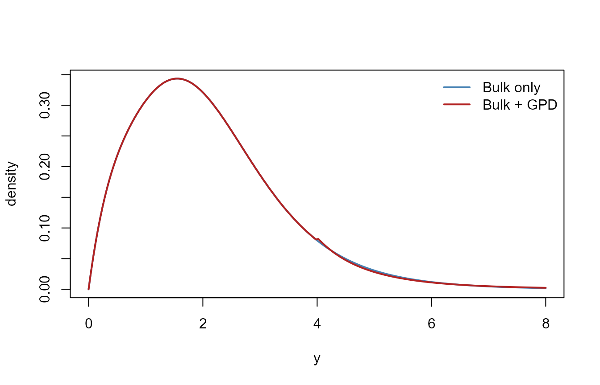

# Unconditional Modeling

## Goal

Unconditional modeling fits a flexible mixture to the **bulk**
distribution, with an optional **GPD tail** for extremes. This is the
base case for DPmixGPD.

## Example data

``` r
data("nc_pos200_k3")
y <- nc_pos200_k3$y
```

## Bulk‑only mixture

``` r
bundle_bulk <- build_nimble_bundle(
  y = y,
  kernel = "gamma",
  backend = "crp",
  GPD = FALSE,
  J = 4,
  mcmc = list(niter = 200, nburnin = 50, nchains = 1)
)
fit_bulk <- run_mcmc_bundle_manual(bundle_bulk, show_progress = FALSE)
```

## Bulk + GPD tail

``` r
bundle_tail <- build_nimble_bundle(
  y = y,
  kernel = "gamma",
  backend = "crp",
  GPD = TRUE,
  J = 4,
  mcmc = list(niter = 200, nburnin = 50, nchains = 1)
)
fit_tail <- run_mcmc_bundle_manual(bundle_tail, show_progress = FALSE)
```

## Distributional interpretation

- The **bulk** mixture captures multi‑modality or skewness.
- The **GPD tail** isolates extreme exceedances and stabilizes tail risk
  estimates.

## One “money” plot (bulk vs tail)

The plot below compares a **bulk‑only** kernel to a **bulk+GPD** splice
using fixed parameters (no MCMC required for the illustration).

``` r
grid <- seq(0, 8, length.out = 200)
bulk <- dGammaMix(grid, w = c(0.7, 0.3), shape = c(2, 6), scale = c(1, 0.4))
tail <- vapply(
  grid,
  function(x) dGammaMixGpd(
    x,
    w = c(0.7, 0.3),
    shape = c(2, 6),
    scale = c(1, 0.4),
    threshold = 4,
    tail_scale = 1.0,
    tail_shape = 0.2
  ),
  numeric(1)
)
plot(grid, bulk, type = "l", lwd = 2, col = "steelblue", ylab = "density", xlab = "y")
lines(grid, tail, lwd = 2, col = "firebrick")
legend("topright", legend = c("Bulk only", "Bulk + GPD"), col = c("steelblue", "firebrick"), lwd = 2, bty = "n")
```



## Why the GPD tail exists

Mixture kernels are excellent for the **center** of the distribution but
can be unstable in the far tail. The GPD tail gives a principled
extreme‑value model while keeping the bulk flexible.

## Next steps

- For covariates, see
  [conditional](https://arnabaich96.github.io/DPmixGPD/articles/conditional.Rmd).
- For careful inference, see
  [mcmc-workflow](https://arnabaich96.github.io/DPmixGPD/articles/mcmc-workflow.Rmd).
