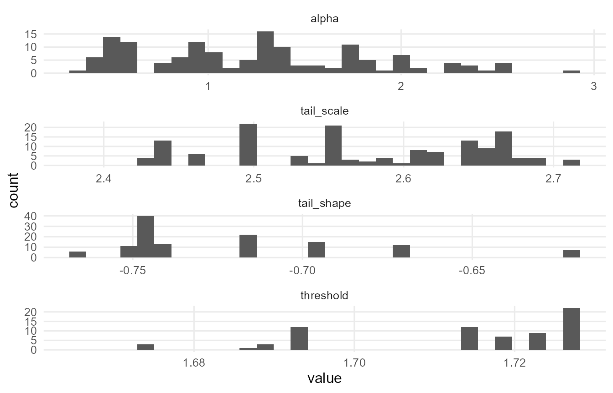
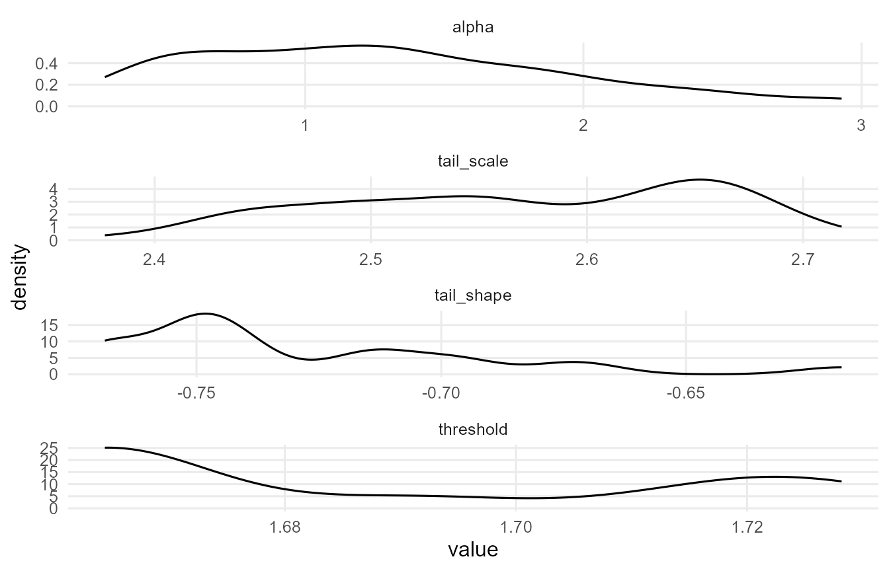
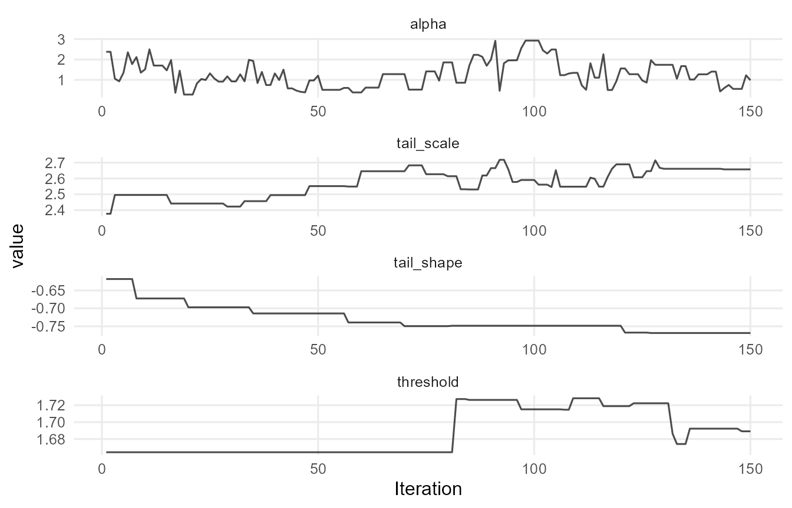
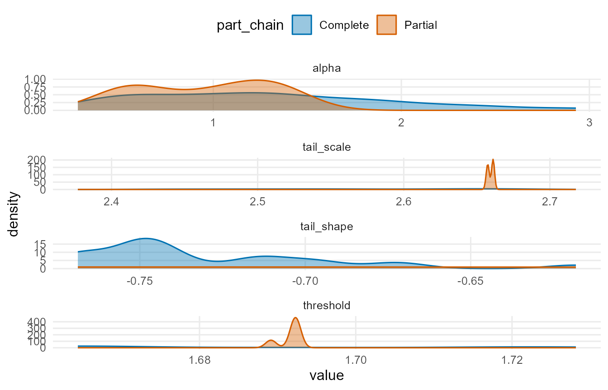
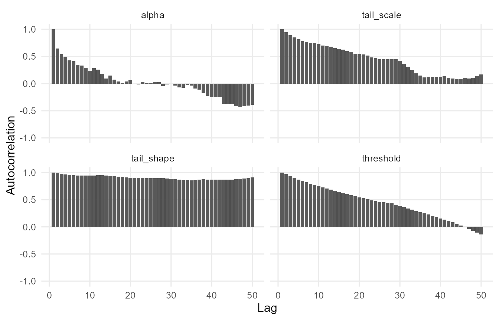
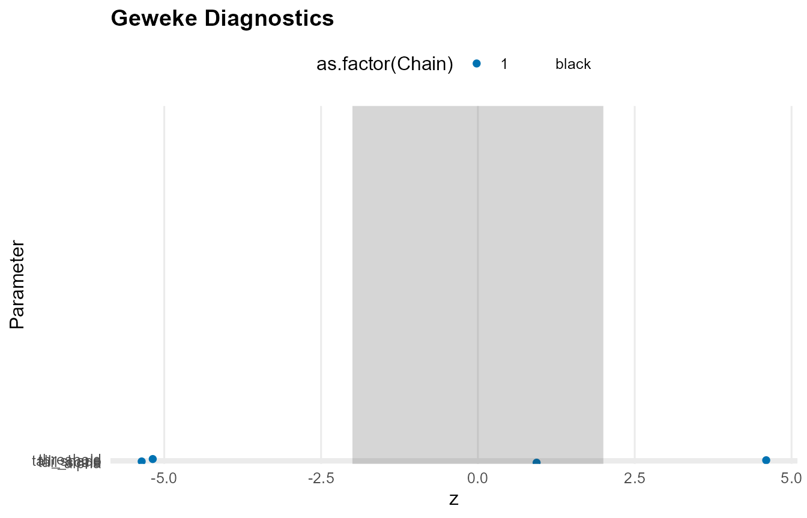
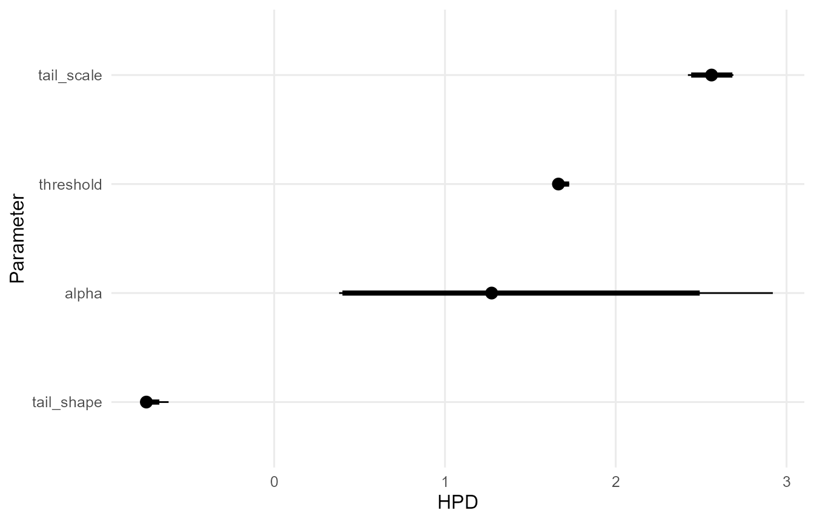

# Unconditional Models

## Overview

This vignette demonstrates fitting an unconditional DP mixture model
with optional GPD tail augmentation.

## Theory (brief)

Unconditional models treat observations as exchangeable draws from a
mixture distribution. The DP prior on the mixing measure $`G`$ yields
flexible density estimation: \$\$ y_i \\mid G \\sim \\int K(y_i;
\\theta)\\, dG(\\theta), \\quad G \\sim \\mathrm{DP}(\\alpha, G_0). \$\$
When \$\\mathrm{GPD} = \\mathrm{TRUE}\$, a GPD tail replaces the bulk
kernel beyond a threshold $`u`$ to stabilize tail behavior.

## Model Fitting

``` r
library(DPmixGPD)

data("faithful", package = "datasets")
y <- faithful$eruptions

bundle <- build_nimble_bundle(
  y = y,
  backend = "sb",
  kernel = "normal",
  GPD = TRUE,
  components = 6,
  mcmc = mcmc
)

fit <- run_mcmc_bundle_manual(bundle, show_progress = FALSE)
```

## Fitted Summaries

``` r
f_mean <- fitted(fit, type = "mean", level = 0.90)
head(f_mean)
#>        fit   lower    upper  residuals
#> 1 3.200441 3.06478 3.358841  0.3995592
#> 2 3.200441 3.06478 3.358841 -1.4004408
#> 3 3.200441 3.06478 3.358841  0.1325592
#> 4 3.200441 3.06478 3.358841 -0.9174408
#> 5 3.200441 3.06478 3.358841  1.3325592
#> 6 3.200441 3.06478 3.358841 -0.3174408

f_med <- fitted(fit, type = "median", level = 0.90)
head(f_med)
#>        fit    lower    upper  residuals
#> 1 3.076048 2.999175 3.155785  0.5239522
#> 2 3.076048 2.999175 3.155785 -1.2760478
#> 3 3.076048 2.999175 3.155785  0.2569522
#> 4 3.076048 2.999175 3.155785 -0.7930478
#> 5 3.076048 2.999175 3.155785  1.4569522
#> 6 3.076048 2.999175 3.155785 -0.1930478
```

## Posterior Predictive Summaries

``` r
pred_mean <- predict(fit, type = "mean", cred.level = 0.90, interval = "credible")
pred_q95  <- predict(fit, type = "quantile", index = 0.95, cred.level = 0.90, interval = "credible")

pred_mean$fit
#>   estimate    lower    upper
#> 1 3.194483 3.049934 3.317868
pred_q95$fit
#>   estimate index    lower    upper
#> 1 4.812598  0.95 4.718165 4.929821
```

## Residual Analysis

``` r
res <- f_mean$residuals
summary(res)
#>    Min. 1st Qu.  Median    Mean 3rd Qu.    Max. 
#> -1.6004 -1.0377  0.7996  0.2873  1.2538  1.8996
```

## Diagnostic Plots

``` r
if (requireNamespace("ggmcmc", quietly = TRUE) && requireNamespace("coda", quietly = TRUE)) {
  plot(fit)
} else {
  message("Plotting requires 'ggmcmc' and 'coda' packages.")
}
#> 
#> === histogram ===
```



    #> 
    #> === density ===



    #> 
    #> === traceplot ===



    #> 
    #> === running ===


    #> 
    #> === compare_partial ===



    #> 
    #> === autocorrelation ===



    #> 
    #> === geweke ===



    #> 
    #> === caterpillar ===



    #> 
    #> === pairs ===


