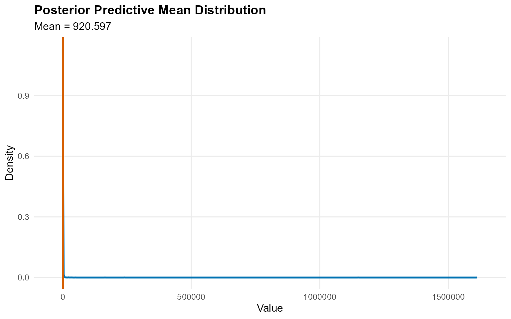
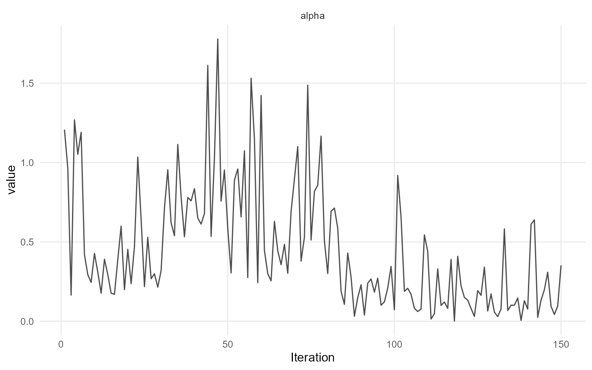
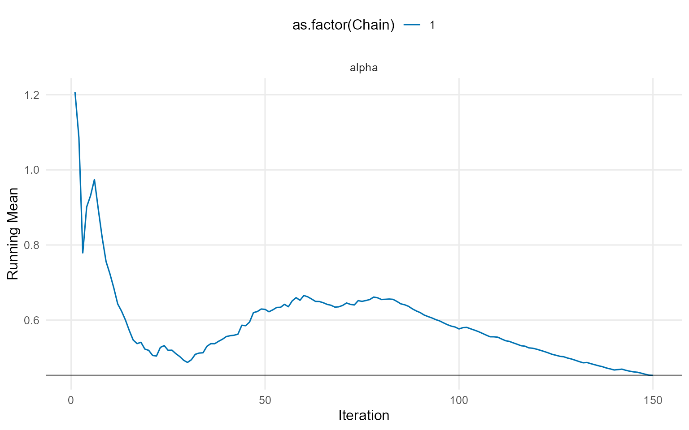

# 0. Start Here


This vignette gives a minimal, fully working workflow for an
**unconditional** model and a **conditional** model. Everything uses
short MCMC runs so the vignette renders quickly.

------------------------------------------------------------------------

### Unconditional Model (CRP, bulk-only)

``` r
data("nc_pos200_k3")
y <- nc_pos200_k3$y
```

``` r
bundle_uncond <- build_nimble_bundle(
  y = y,
  backend = "crp",
  kernel = "gamma",
  GPD = FALSE,
  components = 5,
  mcmc = list(niter = 200, nburnin = 50, thin = 1, nchains = 1, seed = 1)
)
```

``` r
fit_uncond <- quiet_mcmc(run_mcmc_bundle_manual(bundle_uncond, show_progress = FALSE))
summary(fit_uncond)
```

    MixGPD summary | backend: Chinese Restaurant Process | kernel: Gamma Distribution | GPD tail: FALSE | epsilon: 0.025
    n = 200 | components = 5
    Summary
    Initial components: 5 | Components after truncation: 1

    WAIC: 959.740
    lppd: -443.324 | pWAIC: 36.546

    Summary table
      parameter  mean    sd q0.025 q0.500 q0.975    ess
     weights[1] 0.767 0.238  0.356  0.792  1.000  0.900
          alpha 0.453 0.381  0.028  0.324  1.440 17.102
       shape[1] 1.162 0.400  0.892  1.101  3.029 49.302
       scale[1] 0.300 0.053  0.220  0.288  0.429  7.406

``` r
pred_q <- predict(fit_uncond, type = "quantile", index = c(0.5, 0.9), interval = "credible")
head(pred_q$fit)
```

       estimate index     lower    upper
    1 0.2611341   0.5 0.1311752 1.005642
    2 0.7756552   0.9 0.4704576 1.995032

``` r
plot(pred_q)
```


------------------------------------------------------------------------

### Conditional Model (SB, bulk-only)

``` r
data("nc_posX100_p3_k2")
yc <- nc_posX100_p3_k2$y
X <- as.matrix(nc_posX100_p3_k2$X)
```

``` r
bundle_cond <- build_nimble_bundle(
  y = yc,
  X = X,
  backend = "sb",
  kernel = "lognormal",
  GPD = FALSE,
  components = 5,
  mcmc = list(niter = 250, nburnin = 50, thin = 1, nchains = 1, seed = 2)
)
```

``` r
fit_cond <- quiet_mcmc(run_mcmc_bundle_manual(bundle_cond, show_progress = FALSE))
summary(fit_cond)
```

    MixGPD summary | backend: Stick-Breaking Process | kernel: Lognormal Distribution | GPD tail: FALSE | epsilon: 0.025
    n = 100 | components = 5
    Summary
    Initial components: 5 | Components after truncation: 2

    WAIC: 521.641
    lppd: -242.085 | pWAIC: 18.736

    Summary table
              parameter   mean    sd q0.025 q0.500 q0.975     ess
             weights[1]  0.828 0.053  0.739  0.830  0.930  12.172
             weights[2]  0.109 0.038  0.050  0.100  0.190  22.720
                  alpha  0.855 0.442  0.240  0.684  2.177  29.244
     beta_meanlog[1, 1]  0.152 0.169 -0.181  0.100  0.696  15.806
     beta_meanlog[2, 1] -0.271 1.345 -3.367 -0.187  1.525   8.917
     beta_meanlog[3, 1] -0.320 1.684 -3.627 -0.238  2.323  15.701
     beta_meanlog[4, 1]  0.292 1.045 -1.579  0.121  2.523  14.330
     beta_meanlog[5, 1]  0.304 1.935 -3.805  0.032  3.703  15.017
     beta_meanlog[1, 2] -0.272 0.251 -0.813 -0.266  0.370   7.531
     beta_meanlog[2, 2]  0.999 0.946 -0.910  1.156  2.302  13.323
     beta_meanlog[3, 2]  0.513 1.899 -2.889  0.349  4.011   9.540
     beta_meanlog[4, 2] -0.089 1.235 -2.357 -0.222  2.362  19.507
     beta_meanlog[5, 2]  0.212 2.350 -4.017  0.655  3.975   7.818
     beta_meanlog[1, 3]  0.058 0.169 -0.214  0.040  0.363  19.102
     beta_meanlog[2, 3] -0.036 1.275 -3.054  0.439  1.544   4.432
     beta_meanlog[3, 3]  0.558 1.440 -1.379  0.052  3.973  21.168
     beta_meanlog[4, 3]  0.118 1.732 -2.727 -0.372  4.063   6.610
     beta_meanlog[5, 3] -0.292 1.302 -2.312 -0.298  2.124  29.647
               sdlog[1]  0.702 0.115  0.498  0.696  0.946 125.465
               sdlog[2]  2.019 1.181  0.479  1.775  4.856  74.255

``` r
x_new <- X[1:20, , drop = FALSE]
pred_mean <- predict(fit_cond, x = x_new, type = "mean", interval = "credible", nsim_mean = 200)
head(pred_mean$fit)
```

       estimate     lower     upper
    1  35.11909 0.9063155 264.63309
    2 295.69775 0.8120162 688.18616
    3 130.77507 0.6894209 680.07152
    4 179.93781 0.8671459 309.30449
    5  40.36869 0.9266639  72.43701
    6 112.47209 0.8304477 319.06719

``` r
plot(pred_mean)
```



------------------------------------------------------------------------

### Useful S3 Methods

``` r
params(fit_uncond)
```

    Posterior mean parameters

    $alpha
    [1] 0.4527

    $w
    [1] 0.7669

    $shape
    [1] 1.162

    $scale
    [1] 0.2997

``` r
plot(fit_uncond, family = c("traceplot", "running"))
```

    === traceplot ===



    === running ===



------------------------------------------------------------------------

### Next Steps

- `vignette 1`: package overview and terminology
- `vignette 5`: full three-phase workflow (spec ? bundle ? MCMC)
- `vignette 6-13`: unconditional/conditional models with and without GPD
- `vignette 14-19`: causal workflows
